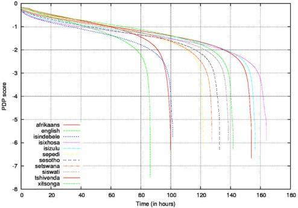

<!-- Source PDF: barnard-2014-nchlt-corpus.pdf -->

# The NCHLT Speech Corpus of the South African languages

*Etienne Barnard*$^{1}$, *Marelie H. Davel*$^{1}$, *Charl van Heerden*$^{1}$, *Febe de Wet*$^{2}$ and *Jaco Badenhorst*$^{2}$

$^{1}$Multilingual Speech Technologies, North-West University, Vanderbijlpark, South Africa  
$^{2}$Human Language Technologies Research Group, Meraka Institute, CSIR, Pretoria, South Africa  
{etienne.barnard, marelie.davel, cvheerden}@gmail.com, {fdwet, jbadenhorst}@csir.co.za

## Abstract

The NCHLT speech corpus contains wide-band speech from approximately 200 speakers per language, in each of the eleven official languages of South Africa. We describe the design and development processes that were undertaken in order to develop the corpus, and report on associated materials such as orthographic transcriptions and pronunciation dictionaries that were released as part of the corpus. In order to benchmark speech-recognition performance on the corpus, we have also developed both phone-recognition and word-recognition systems for all eleven languages; we find that high accuracies can be achieved for these speaker-independent but vocabulary-dependent recognition tasks in all languages.

## 1. Introduction

The creation of speech technology is strongly tied to resource collection: the statistical models that have come to dominate modern Automatic Speech Recognition (ASR) and Text-to-speech (TTS) systems rely on the availability of appropriate resources for the estimation of their parameters. However, in most non-OECD countries there are not sufficient economic drivers for the creation of such resources through normal private-sector mechanisms, and the development of speech technology in the languages or dialects of those countries depends on public or philanthropic support for resource creation. In South Africa, such support was provided by the national Department of Arts and Culture (DAC), which identified speech technology as an important tool in the development of the eleven official languages of the country.

The initial efforts to develop resources and speech-technology building blocks for the South African languages were aimed at telephone-based information access. It was foreseen that small recognition vocabularies (10-100 words) would be employed for ASR [1]. To support this capability in all eleven official languages, relatively small orthographically transcribed corpora were created in the eleven official languages - approximately 5 to 10 hours of speech from approximately 200 different speakers in each language. It was shown that these 'Lwazi' corpora are indeed sufficient for small-vocabulary ASR [2], leading to substantially higher recognition accuracies than, for example, cross-language transfer by phone mapping [3].

Since the development of the Lwazi corpora, it has become clear that many useful applications of ASR, such as voice search of the internet [4], would require substantially larger recognition vocabularies. Also, the Lwazi corpora and their predecessors [5] were all telephone-based, and the DAC concluded that broad-band corpora would be valuable speech resources. Hence, it was decided that the so-called 'NCHLT' (National

Centre for Human Language Technology) corpus would be developed; this would consist of approximately 50 hours of orthographically transcribed speech in each of the official languages. In addition, pronunciation dictionaries would be extended to 15 000 words per dictionary (compared to the 5 000 words found in the Lwazi dictionaries).

Since a limited budget was available for the project, and many languages (eleven) had to be processed, a number of cost-limiting measures had to be developed for data collection, annotation and verification. It is likely that several of these measures will be useful for other efforts in under-resourced languages; one of the main aims of the current contribution is therefore to describe the steps taken and lessons learned in some detail. The corpus and many of the tools have been released into the public domain, and our other aim is to provide reference material so as to encourage others to use the data and tools for other purposes.

In Section 2 below, we provide background information on the South African social and linguistic environment, and also summarize related corpus-development efforts. Section 3 describes the process to design, develop and evaluate the NCHLT corpus, and the characteristics of the resulting corpus are summarized in Sections 4 and 5.

## 2. Background

South Africa has eleven official languages, of which nine belong to the Southern Bantu (SB) family, the other two being Germanic languages (see Table 1). Many of these languages are also spoken in other Southern African countries, or are closely related to such languages. For example, siSwati, Setswana and Sesotho are the largest languages in Swaziland, Botswana and Lesotho, respectively, and Xitsonga is spoken by a large population in Mozambique, and related to other significant languages of that country. As is often the case in the developing world, a local variant of a colonial language (in this case, English) tends to be the primary language for commerce and government. Although many members of the population have little or no mastery of English, it often influences speech in the other languages, either through loan words or through code switching.

As mentioned in Section 1, there have been two large publicly-funded efforts to develop speech technology for these languages, namely the African Speech Technologies project [5] and the Lwazi project [7]; during these efforts, basic resources such as phone sets, 'default' pronunciation rules and small-scale text and (telephone-bandwidth) speech corpora were collated. The NCHLT project was intended to expand on these efforts in order to support the development of practically useful large-vocabulary speech recognition systems.

In particular, the primary intention of the NCHLT corpus was to support large-vocabulary applications such as voice

Table 1: The official languages of South Africa, their ISO 639-3:2007 language codes, estimated number of home language speakers in South Africa [6] and language family (SB indicates Southern Bantu).

|  Language | code | # million speakers | language family  |
| --- | --- | --- | --- |
|  isiZulu | Zul | 11.6 | SB:Nguni  |
|  isiXhosa | Xho | 8.2 | SB:Nguni  |
|  Afrikaans | Afr | 6.9 | Germanic  |
|  English | Eng | 4.9 | Germanic  |
|  Sepedi | Nso | 4.6 | SB:Sotho-Tswana  |
|  Setswana | Tsn | 4.0 | SB:Sotho-Tswana  |
|  Sesotho | Sot | 3.8 | SB:Sotho-Tswana  |
|  Xitsonga | Tso | 2.3 | SB:Tswa-Ronga  |
|  siSwati | Ssw | 1.3 | SB:Nguni  |
|  Tshivenda | Ven | 1.2 | SB:Venda  |
|  isiNdebele | Nbl | 1.1 | SB:Nguni  |

search of the Internet or the indexing of broadcast content. Thus, the corpus was designed to contain somewhat carefully enunciated speech such as that which occurs in the Wall Street Journal [8], GlobalPhone [9] or Google [10] corpora, rather than the natural, conversational speech which is found in, for example, the Fisher corpus [11].

Until recently, there were very few sizeable speech corpora for under-resourced languages. The pioneering development in this field was the abovementioned GlobalPhone corpus, which includes some well-resourced languages such as German and Japanese, but also covers an increasing number of under-resourced languages (including the West-African language Hausa). Although GlobalPhone contains somewhat less speech than was planned for NCHLT (approximately 20 hours of speech and 100 speakers per language), it has several other characteristics in common with NCHLT: wide-band recordings (using a close-talking microphone) of read speech are included, along with lexicons and significant text corpora, which are suitable for statistical language modeling.

More recently, speech recognition for under-resourced languages received a large infusion of interest and support with the launch of the Babel program  \( [12] \) . This program supports the development of ASR and keyword-spotting systems in 26 under-resourced languages in a five-year period, and in each of these languages an orthographically transcribed corpus containing more than 100 hours of speech is being developed. In contrast to the corpora above, these recordings were made over the telephone network and are primarily aimed at conversational speech (although a relatively small amount of scripted speech is included for each language).

## 3. Corpus Development

### 3.1. Corpus Design

The goal of the NCHLT speech project was to collect a broadband corpus of around 50 hours of orthographically transcribed speech for the eleven official languages of South Africa. This goal had to be achieved in an under-resourced environment and within a limited budget.

Results from previous studies seemed to indicate that, for acoustic modelling purposes, it would be beneficial to target a limited number of speakers but to obtain a substantial amount of data per speaker (in the order of 500 prompts per speaker) [7].

The data collection sites were chosen to ensure a balance between rural and urban varieties of languages, male and female respondents as well as a reasonable age distribution. Respondents were screened to assess their language ability and fluency. The screening was performed by a qualified language practitioner whose first language corresponded to the target language of each recording session.

### 3.2. Prompt Design

A vast amount of text in electronic format is required for proper prompt design. Alternatively, text data from the domain of application can be used if such a domain is known. When prompts had to be compiled for the NCHLT project, such resources did not exist for the majority of the target languages and, with the exception of English and Afrikaans, none of the languages had a strong presence on the Internet. English data was therefore collected first and Wikipedia was used as a source of text to generate prompts.

For some of the languages a crowdsourcing approach was used to create prompts. Participants were provided with a number of topics for which they had to suggest probable search terms. Although the approach did provide useable prompts for three languages (isiNdebele, siSwati, Xitsonga), it was not sustainable, mainly due to the cost associated with crowdsourcing and the verification of prompt quality.

A project to collect text corpora for South Africa's official languages was initiated at about the same time as the speech data collection project. The text data that was collected during this project was used to generate prompts for the remaining languages. A substantial portion of the text was obtained from the South African government's website\(^{1}\) because it has content in all the official languages. As a result, some prompts contain words and phrases that are not representative of normal language use or typical search terms.

A greedy algorithm was used to select prompts from these medium sized text corpora (approximately 800k to 1.5m words per language) [13]. The corpora were text normalized by lower-casing all text, removing some punctuation and discarding sentences with foreign graphemes. Prompts were then created by selecting trigrams or five-grams from the normalized remaining text. Trigrams were used for the two Germanic and the conjunctively-written languages (Nguni languages) while five-grams were used for the disjunctively-written languages (Sotho-Tswana languages and Tshivenda).

An n-gram was selected to be a prompt if:

- The n-gram has not yet been used.
- None of the words in the n-gram have been seen more than X times (X initialized to 1). If the target number of prompts cannot be met this way, X may be incremented.
- The number of observations of this n-gram is larger than Y (with Y language specific.)
- For disjunctive languages, a minimum character count \( Z = 2 \) can be specified; this means that any words shorter than or equal in length to \( Z \) are ignored when enforcing the above mentioned constraints.

The algorithm was thus greedy in the sense that it tried to optimize the vocabulary coverage, starting with the most frequent n-grams.

\( ^{1} \) http://www.gov.za/

A representative sample of the prompts generated by the algorithm for two languages was validated by language practitioners. The linguists were asked to indicate spelling errors as well as invalid prompts. Fewer than 5% of the utterances were flagged$^2$ and it was decided to use the same algorithm to generate prompts for the remaining languages.

### 3.3. Data Collection

Many of the well-established techniques for collecting speech data cannot be used in under-resourced environments. Moreover, every attempt at speech data collection seems to come with its own set of challenges and surprises. In under-resourced conditions, one cannot rely on power or internet connectivity being available at recording sites. In addition, target speakers of many under-resourced languages live in remote rural areas, requiring data collection equipment to be portable.

One approach to data collection that addresses some of these restrictions is to use smartphones as recording devices [10, 14]. Smartphones offer the opportunity to collect broadband quality speech data as well as metadata with a mobile device. A powerful component of the smartphone data collection approach is the ability to dynamically select a prompt set for each recording session from previously compiled prompt lists.

*Woefzela*$^3$ is an open-source tool, developed for the Android Operating System, that was inspired by the emerging trend of smartphone-based speech data collection and designed to be used in typical under-resourced environments. *Woefzela* is portable and independent of internet connectivity, enables multiple recording sessions to be made in parallel and provides support for field workers during data collection [15, 16]. In addition, it performs a limited number of basic quality checks on the data while recording. If a recorded prompt does not meet one or more of the specified criteria, an additional prompt is added to the recording session. While the aim of this feature was to ensure that a target number of good recordings are obtained during each session, it did sometimes result in extremely long sessions that exceeded the respondents' reading endurance.

Data collection occurred in two phases. During the first phase, data from a number of languages was recorded in parallel. Data from this phase was used almost immediately to start developing ASR systems. During development it became apparent that, due to a software error, the recorded prompts only represented a very limited vocabulary as the same prompts were used for a number of recording sessions instead of a unique set of prompts being generated for each session. To rectify the situation a second phase of data collection took place. A number of speakers participated in both phases of data collection. In total, almost 800 hours of speech data was recorded during the course of the NCHLT project.

### 3.4. Transcription

During data collection, speakers do not produce perfect recordings. Various errors – reading errors, hesitations, poor recording conditions – all result in a mismatch between the original prompt and the recorded audio. When creating a high-reliability corpus, it is therefore not possible to use the prompts directly

$^2$During transcription validation it became evident that this was not a reliable indication, and that the project would have benefited from cross-validating results between different groups of language practitioners. The orthography of many of South Africa's languages have not been standardized to the extent that it is possible to obtain consistent orthography by using a spell checker.

$^3$https://code.google.com/p/woefzela/

as transcriptions: usable utterances must first be identified and transcriptions modified, if required.

Our goal was to define an efficient transcription process that converts the known prompts and raw audio into a subset of recordings with trusted transcriptions in as automated a way as possible. We used two main techniques:

- Eliminating any recordings that do not contain clear renditions of the prompted text.
- Adding noise markers to the transcriptions of recordings that contain additional sounds beyond the prompted text. This allows utterances with small errors (typically hesitations and repetitions) to be included in the corpus.

A confidence scoring technique, referred to as phone-based dynamic programming (PDP) [17] was used for the first task, and a specialized garbage model for the second. In essence, PDP uses dynamic programming to match a phone string obtained from the reference transcription (the original prompt) against a phone string obtained through unconstrained phone recognition of the matching audio. Typical recognition errors are compensated for by adjusting the dynamic programming cost matrix to fit the specific data set and recognizer, as described in [17].

The garbage model consists of a background model (estimated on all speech) extended with a silence model, as introduced in [18]. This model allows free transitions from entrance to exit state as well as low-cost transitions from and between the background (global) model and the silence model. The model is inserted between any two words during alignment, potentially absorbing large spoken sections and/or silence, but where appropriate, the model can be skipped completely. For the NCHLT corpus, garbage modelling is applied first and only the remaining sections of an utterance are scored using PDP. (In effect, any insertions or hesitations are marked as spoken noise and ignored further.) The transcription process is described in more detail in [19].

### 3.5. Dictionary development

For each of the languages, a pronunciation dictionary was required: initially for transcription purposes, later for corpus selection and quality verification and finally, for system development and public release. Starting from an initial set of existing resources ([20, 21, 22]), dictionaries were refined during the course of the NCHLT project on an ongoing basis [23].

Two sets of dictionaries were created during this project:

- the NCHLT-inlang dictionaries: a set of dictionaries only containing generic within-language words. Pronunciations were carefully checked for accuracy.
- the NCHLT-corpus dictionaries: a set of dictionaries matching all words in the corpus. Spelled words, English words and spelling errors were semi-automatically identified and pronunciations for these problematic categories were semi-automatically created. While more complete than the NCHLT-inlang dictionaries, these are also less accurate.

For nine of the *NCHLT-inlang* dictionaries, the biggest challenge lay in obtaining reliable word lists. These were developed through a combination of text corpus frequency counts and by disqualifying known words from other languages. For the Southern Bantu languages, a grapheme-to-phoneme (G2P)

analysis was used to flag and correct problematic words. Neither English nor Afrikaans has a regular enough spelling system to rely on G2P analysis, and new dictionaries were created.

The NCHLT-corpus was developed based on the NCHLT-inlang dictionaries. Unknown words were predicted with G2P rules trained on the NCHLT-inlang dictionaries. For each English word, both an in-language and English pronunciation was generated, and English phones mapped to in-language phones through a simple scheme. Possible spelled words were identified using syllable structure (allowed sequences of consonants and vowels), and treated separately. Detail with regard to the dictionary development process and various outputs are provided in [23].

### 3.6. Corpus selection

Speech corpora may have different quality requirements depending on their application: when used as an ASR corpus, for example, small errors are well tolerated as soon as a corpus is of reasonable size  \( [24, 18] \) . On the other hand, detailed linguistic studies tend to benefit significantly from reliable transcriptions, and when evaluating an ASR or similar system, it is useful to have a set of transcriptions that can serve as “ground truth”, again requiring increased reliability. With this in mind, we aimed to create different versions of the corpora, aimed at corpus users with different needs.

Three corpora were packaged for public release:

## 1. NCHLT-baseline

A first set of corpora was constructed to contain an approximately similar number of unique speakers and utterances per speaker. Where any duplicate speakers were recorded in both the first and second phase of data collection (see Section 3.3), only audio from the second (more diverse) set of prompts were retained. This resulted in a baseline corpus with a set of speakers as listed in Table 2

## 2. NCHLT-clean:

Since the transcription process (described in section 3.4) produces a PDP score for each utterance in the data set, this provides a convenient mechanism for selecting subsets from the corpus. The number of hours (per language) that achieved a specific PDP score is shown in Fig. 1. (Higher scores are better: a 0 score indicates a perfect match.) Based on PDP scores, an approximately 56-hour corpus was selected per language, containing the highest scoring hours per language.

## 3. NCHLT-raw:

The total set of usable data collected, including repeated speakers and utterances. Only empty and otherwise unusable recordings were discarded.

In addition, PDP scores are included in the transcription metadata, allowing corpus users to select their own subsets, as needed. In earlier work  \( [17] \)  it was found that the “trained” (or ASR-adjusted matrix - see Section 3.4) version of the PDP cost matrix produced better detection error trade-off (DET) curves than a flat matrix; and that the “lenient” and “harvest” strategies produced very similar results. Similar trends were observed when verifying the final NCHLT corpus  \( [19] \)  and the trained scores were therefore used for final selection (and inclusion in the corpus metadata).

### 3.7. Quality verification

With different corpora selected, the question remained: how accurately did the selection process identify reliable recordings?

Table 2: Summary of baseline corpora (“NCHLT-baseline”); corpus durations are in hours.

|  Language | Speakers | Males | Females | Duration  |
| --- | --- | --- | --- | --- |
|  Afrikaans | 210 | 107 | 103 | 100.6  |
|  English | 210 | 100 | 110 | 87.0  |
|  isiNdebele | 148 | 78 | 70 | 101.8  |
|  isiXhosa | 210 | 107 | 103 | 165.0  |
|  isiZulu | 210 | 98 | 112 | 157.2  |
|  Sepedi | 210 | 100 | 110 | 122.6  |
|  Sesotho | 210 | 113 | 97 | 133.5  |
|  Setswana | 210 | 109 | 101 | 128.3  |
|  Siswati | 198 | 96 | 102 | 139.3  |
|  Tshivenda | 210 | 84 | 126 | 154.8  |
|  Xitsonga | 200 | 95 | 105 | 142.6  |

We therefore selected random subsets of data, hand labeled each recording/transcription pair, and evaluated the automatic labels against the manual labels.

Given the different possible applications of the corpora we again did not define a single measure of quality, but rather, utilized different scoring strategies. Specifically, we used the strategies as initially proposed in  \( [18] \)  and considered both word-level effects (whether each transcribed word is correctly matched in the audio) and utterance-level effects. At word level, the scoring techniques differentiate between a word that is absolutely correct, more or less correct (“close match”), incorrect, or missing. Words that are correctly rendered but in some way non-standard, such as out-of-language words, are identified as a separate category (“strange words”).

In Table 3 we summarize how the different types of errors are viewed during scoring: the “strict” scoring strategy only accepts perfectly matched transcriptions; the “lenient” scoring strategy is impartial with regard to words that are not as clearly correct or incorrect; and the “harvest” strategy is the typical one required when building a corpus for ASR purposes: both exact and close matches are acceptable; only poor quality audio and badly pronounced or deleted words should be rejected.

Table 3: Different scoring strategies used during evaluation, from [18].

|  strategy | accept | reject | ignore  |
| --- | --- | --- | --- |
|  strict | exact match strange word | bad audio wrong word deleted word close match |   |
|  lenient | exact match | bad audio wrong word deleted word | close match strange word  |
|  harvest | exact match close match strange word | bad audio wrong word deleted word |   |

While per-language DET curves differed somewhat, the baseline corpus is sufficiently large that – at the thresholds used when selecting the NCHLT-clean corpus – very high accuracies are observed. When using the manual labels to score utterances included in the final clean corpus, an accuracy of approximately 97.3% – 98.5% is obtained when using strict scoring and 99.4% – 99.7% when using harvest scoring. Additional detail with regard to the evaluation process is provided in [19].

Figure 1: The duration of the utterances in each language that exceed a given PDP score, as a function of that PDP score, from [19].

## 4. Corpus Description

To date, only the NCHLT-clean subset of the corpus has been released. The data is available as a collection of audio files with associated XML files, for each of the eleven South African languages. Each language has a training set, as well as eight speakers (four males and four females) who have been assigned to a test set.

The audio files are distributed as 16-bit Signed Integer PCM encoded, single channel wav files, with a sample rate of 16kHz. The corresponding transcription of each audio file, as well as metadata, is captured in either the training or test set XML file. The metadata includes the speaker age and gender \( ^{4} \) , wav file md5sum, audio file duration and the PDP score that was used during corpus selection, as described in Section 3.6.

Table 4 gives an overview of the data statistics for the NCHLT-clean subset of the data.

## 5. Corpus Analysis

Fairly standard Kaldi [25] and HTK [26] ASR systems were employed to measure both word and phone accuracy for each language in the NCHLT-clean corpus. The phone recognition systems are trained using HTK; the acoustic models are standard 3-state left-to-right HMMs with GMMs and semi-tied transforms. Cepstral mean (CMN) and variance (CVN) normalization are applied per speaker. A noise model is also trained to account for the parts of speech that contain spoken or other noise ([s]). Phone recognition is then performed using an ergodic phone loop. The phone recognition accuracies, shown

Table 4: Summary of “clean” corpora (NCHLT-clean); corpus durations are in shown as hh:mm. Stats are shown for all of the speakers in the clean set, including those used for training, development and testing. The development and test sets used in the experiments comprise eight speakers each, with an equal split between males and females.

|  Lang | Speakers | Words |   | Duration  |
| --- | --- | --- | --- | --- |
|   |   |  Types | Tokens  |   |
|  Afr | 210 | 8640 | 191023 | 56:22  |
|  Eng | 210 | 8351 | 222884 | 56:25  |
|  Nbl | 148 | 15283 | 151276 | 56:14  |
|  Xho | 209 | 29130 | 136904 | 56:15  |
|  Zul | 210 | 25650 | 130866 | 56:14  |
|  Nso | 210 | 11196 | 294081 | 56:19  |
|  Sot | 210 | 10600 | 273834 | 56:19  |
|  Tsn | 210 | 5610 | 280853 | 56:19  |
|  Ssw | 197 | 12246 | 132225 | 56:14  |
|  Ven | 208 | 7728 | 245510 | 56.16  |
|  Tso | 198 | 6118 | 236062 | 56.16  |

in Table 5, are very high. This is due to the high amount of word and prompt repetition, both across speakers, but also in some cases for a particular speaker (similar to the Timit SA sentences).

The Kaldi word recognition systems are trained using a recipe similar to the Kaldi Babel & WSJ recipes; our best results (optimized on a held out development set of similar size to the test set) are achieved with MMI-based discriminatively trained Subspace Gaussian Mixture Models (SGMMs), using fMLLR speaker-specific transforms. The features employed are

\( ^{4} \) Age and gender information was entered by voice donors and has been found to be erroneous in some instances.

standard MFCCs with CMN per speaker. Frames are spliced together, and LDA is used to reduce the dimensionality of the features to 40. Results are reported using two types of language models, both of which are estimated on the training transcriptions: a 3-gram or 4-gram language model using modified KN discounting and an ergodic word loop. (Both 3-gram and 4-gram LMs are trained, with the LM with the lowest development set perplexity selected.) In both instances, the vocabulary comprises all words in the training transcriptions. WER's for all eleven languages are shown in Table 6. The high accuracy of the recognizers, even when using an ergodic word loop, is again not surprising, given the high prompt and word repetitions (this is further quantified by the low language model perplexities and out of vocabulary rates).

Table 5: Flat phone recognition results using HTK. Log word insertion probabilities (Ins. Pen.) were tuned on the development set.

|  Lang | #Phns | Ins. Pen. | Phn. Acc  |   |
| --- | --- | --- | --- | --- |
|   |   |   |  Dev | Tst  |
|  Afr | 37 | -27.5 | 88.21 | 87.01  |
|  Eng | 44 | -20.0 | 81.15 | 82.29  |
|  Nbl | 49 | -24.0 | 78.18 | 76.13  |
|  Nso | 44 | -25.0 | 85.81 | 82.69  |
|  Sot | 39 | -29.5 | 80.81 | 80.62  |
|  Ssw | 39 | -35.0 | 84.20 | 84.22  |
|  Tsn | 34 | -22.0 | 86.45 | 87.77  |
|  Tso | 55 | -23.0 | 87.61 | 87.17  |
|  Ven | 39 | -34.0 | 83.72 | 82.00  |
|  Xho | 53 | -28.5 | 78.48 | 79.45  |
|  Zul | 46 | -27.5 | 81.48 | 79.57  |

Table 6: Word recognition results (Kaldi) using (a) a 3- or 4-gram language model with modified KN smoothing, and (b) an ergodic word loop. The best 3- or 4-gram modified KN LM perplexity (excluding \(\langle /s\rangle\)) is reported on the test set; the LM order and optimal LM weight was optimized on the development set.

|  Lang | Vocab | OOV % | PPL | WERa |   | WERb  |   |
| --- | --- | --- | --- | --- | --- | --- | --- |
|   |   |   |   |  Dev | Tst | Dev | Tst  |
|  Afr | 8572 | 0.54 | 30.83 | 3.3 | 3.5 | 10.1 | 11.8  |
|  Eng | 8220 | 0.97 | 32.43 | 4.4 | 3.1 | 13.2 | 12.0  |
|  Nbl | 14684 | 6.50 | 63.13 | 12.4 | 15.9 | 26.9 | 28.9  |
|  Nso | 11060 | 1.46 | 15.09 | 3.8 | 6.7 | 54.8 | 58.3  |
|  Sot | 10429 | 1.42 | 10.31 | 5.9 | 6.0 | 55.5 | 57.8  |
|  Ssw | 11930 | 2.15 | 34.40 | 8.9 | 6.4 | 16.2 | 14.8  |
|  Tsn | 5500 | 0.80 | 10.66 | 3.2 | 4.7 | 30.0 | 32.4  |
|  Tso | 5939 | 1.04 | 13.91 | 5.4 | 6.2 | 34.2 | 33.5  |
|  Ven | 7584 | 1.36 | 20.54 | 7.0 | 7.8 | 43.6 | 44.8  |
|  Xho | 27861 | 11.56 | 49.51 | 15.3 | 20.3 | 32.4 | 34.2  |
|  Zul | 23917 | 12.25 | 38.17 | 26.8 | 24.1 | 34.2 | 33.6  |

## 6. Corpus availability

The NCHLT-clean corpus is available online at the South African Resource Management Agency \( ^{5} \) (RMA), and has been released under a Creative Commons Attribution 3.0 Unported license. The NCHLT-baseline and NCHLT-raw corpora will be

\( ^{5} \) http://rma.nwu.ac.za/

released at a later stage. \( ^{6} \)

## 7. Conclusion

This paper describes the development of the NCHLT Speech corpus - a collection of more than 50 hours of elicited, broadband speech in each of the eleven official languages of South Africa. Aspects of corpus development that are addressed include corpus and prompt design, data collection, transcription, dictionary development, corpus selection as well as quality verification. The paper also provides a description of the NCHLT-clean sub-corpus and phone recognition results obtained for the predefined train and test sets. The frequent repetition of some “search term-like” words and prompts in the corpus results in very high phone accuracies for all the languages. Further evaluation on similar but unrelated speech corpora will be undertaken in the near future.

## 8. Acknowledgements

This work was supported by the Department of Arts and Culture.

## 9. References

[1] E. Barnard, M. Plauché, and M. Davel, "The Utility of Spoken dialog systems," in Proc. IEEE Workshop on SLT. Goa, India: IEEE, December 2008, pp. 13–16.

[2] C. van Heerden, E. Barnard, and M. Davel, "Basic speech recognition for spoken dialogues," in Proc. Interspeech, Brighton, UK, September 2009, pp. 3003–3006.

[3] J. Sherwani, S. Palijo, S. Mirza, T. Ahmed, N. Ali, and R. Rosenfeld, "Speech vs. Touch-tone: Telephony Interfaces for Information Access by Low Literate Users," in Proc. IEEE Int. Conf. on ICTD, Doha, Qatar, April 2009, pp. 447–457.

[4] E. Barnard, J. Schalkwyk, C. van Heerden, and P. Moreno, "Voice Search for Development," in Proc. Interspeech, Makuhari, Japan, September 2010, pp. 282–285.

[5] J. C. Roux, P. H. Louw, and T. Niesler, "The African Speech Technology project: An assessment." in Proc. LREC, Lisbon, Portugal, 2004, pp. 93–96.

[6] Statistics South Africa, “Census 2011: Census in brief,” De Bruyn Park Building, 170 Thabo Sehume Street, Pretoria, 0002, Tech. Rep. 03-01-41, 2012. [Online]. Available: www.statssa.gov.za

[7] E. Barnard, M. Davel, and C. van Heerden, "ASR corpus design for resource-scarce languages," in Proc. Interspeech, Brighton, UK, Sept. 2009, pp. 2847–2850.

[8] D. B. Paul and J. M. Baker, "The design for the Wall Street Journal-based CSR corpus," in Proc. Speech and Natural Language Workshop. Harriman, NY, USA: Association for Computational Linguistics, 1992, pp. 357–362.

[9] T. Schultz, "Globalphone: a multilingual speech and text database developed at Karlsruhe University." in Proc. Interspeech, Denver, CO, USA, 2002, pp. 345–348.

[10] T. Hughes, K. Nakajima, L. Ha, P. Moreno, and M. LeBeau, "Building transcribed speech corpora quickly and cheaply for many languages," in Proc. Interspeech, Makuhari, Japan, September 2010, pp. 1914–1917.

[11] C. Cieri, D. Miller, and K. Walker, "The Fisher Corpus: a resource for the next generations of speech-to-text." in Proc. LREC, vol. 4, Lisbon, Portugal, 2004, pp. 69–71.

\( ^{6} \) For information on the NCHLT-baseline and NCHLT-raw corpora, as well as free access to all the pronunciation dictionaries and lists, as used in the experiments reported in Section 5, see https://sites.google.com/site/nchltspeechcorpus/.

[12] T. N. Sainath, B. Kingsbury, F. Metze, N. Morgan, and S. Tsakalidis, “An overview of the base period of the babel program,” http://www.signalprocessingsociety.org/technical-committees/list/sl-tc/spl-nl/2013-11/BabelBaseOverview/, 2013, [Online; accessed 8-Feb-2014].
[13] E. Eiselen and M. Puttkammer, “Developing text resources for ten South African languages,” in Proc. LREC, Reykjavik, Iceland, 2014.
[14] I. Lane, A. Waibel, M. Eck, and K. Rottmann, “Tools for collecting speech corpora via Mechanical-Turk,” in Proc. NAACL HLT, Los Angeles, CA, USA, 2010, pp. 184–187.
[15] N. J. De Vries, J. Badenhorst, M. H. Davel, E. Barnard, and A. De Waal, “Woefzela - an open-source platform for ASR data collection in the developing world,” in Proc. Interspeech, Florence, Italy, 2011, pp. 3177–3180.
[16] N. J. De Vries, M. H. Davel, J. Badenhorst, W. D. Basson, F. De Wet, E. Barnard, and A. De Waal, “A smartphone-based ASR data collection tool for under-resourced languages,” Speech Communication, vol. 56, pp. 119–131, 2014.
[17] M. H. Davel, C. van Heerden, and E. Barnard, “Validating Smartphone-Collected Speech Corpora,” in Proc. SLTU, Cape Town, South Africa, May 2012, pp. 68–75.
[18] M. H. Davel, C. van Heerden, N. Kleynhans, and E. Barnard, “Efficient harvesting of Internet audio for resource-scarce ASR,” in Proc. Interspeech, Florence, Italy, August 2011, pp. 3153–3156.
[19] C. van Heerden, M. H. Davel, and E. Barnard, “The semi-automated creation of stratified speech corpora,” in Proc. PRASA, Johannesburg, South Africa, December 2013, pp. 115–119.
[20] M. Davel and O. Martirosian, “Pronunciation dictionary development in resource-scarce environments,” in Proc. Interspeech, Brighton, UK, 2009, pp. 2851–2854.
[21] M. H. Davel and F. de Wet, “Verifying pronunciation dictionaries using conflict analysis,” in Proc. Interspeech, Tokyo, Japan, 2010, pp. 1898–1901.
[22] L. Loots, M. Davel, E. Barnard, and T. Niesler, “Comparing manually-developed and data-driven rules for P2P learning,” in Proc. PRASA, Stellenbosch, South Africa, Nov. 2009, pp. 35–40.
[23] M. H. Davel, W. D. Basson, C. van Heerden, and E. Barnard, “NCHLT Dictionaries: Project Report,” North-West University, Tech. Rep., May 2013. [Online]. Available: https://sites.google.com/site/nchltspeechcorpus/home
[24] L. Lamel, J. Gauvain, and G. Adda, “Lightly supervised and unsupervised acoustic model training,” Computer Speech and Language, vol. 16, pp. 115–129, 2002.
[25] D. Povey, A. Ghoshal, G. Boulianne, L. Burget, O. Glembek, N. Goel, M. Hannemann, P. Motlicek, Y. Qian, P. Schwarz, J. Silovsky, G. Stemmer, and K. Vesely, “The Kaldi Speech Recognition Toolkit,” in Proc. ASRU, Big Island, Hawaii, USA, December 2011.
[26] S. Young, G. Evermann, M. Gaels, T. Hain, D. Kershaw, X. Liu, G. Moore, J. Odell, D. Ollason, D. Povey, V. Valtchev, and P. Woodland, “The HTK book (for HTK version 3.4),” March 2009.