<!-- Source PDF: beukelman-2020-aac.pdf -->

David R. Beukelman
Janice C. Light

# Augmentative &amp; Alternative Communication

Supporting Children and Adults with Complex Communication Needs

FIFTH EDITION

# Augmentative &amp; Alternative Communication

Supporting Children and
Adults with Complex Communication Needs

Fifth Edition

by

David R. Beukelman, Ph.D.
Institute for Rehabilitation Science and
Engineering, Madonna Rehabilitation Hospital
Lincoln, Nebraska

and

Janice C. Light, Ph.D.
The Pennsylvania State University
University Park, Pennsylvania

with invited contributors

PAUL H.
BROKES
PUBLISHING CO
Baltimore • London • Sydney

PAUL H. BROOKES PUBLISHING CO

Paul H. Brookes Publishing Co.
Post Office Box 10624
Baltimore, Maryland 21285-0624
USA

www.brookespublishing.com

Copyright © 2020 by Paul H. Brookes Publishing Co., Inc.
All rights reserved.
Previous edition copyright © 2013

"Paul H. Brookes Publishing Co." is a registered trademark of Paul H. Brookes Publishing Co., Inc.

Typeset by Progressive Publishing Services, York, Pennsylvania.
Manufactured in the United States of America by Sheridan Books, Inc., Chelsea, Michigan.

The individuals described in this book are composites or real people whose situations are masked and are based on the authors' experiences. In all instances, names and identifying details have been changed to protect confidentiality.

Purchasers of Augmentative &amp; Alternative Communication: Supporting Children and Adults with Complex Communication Needs are granted permission to download, print, and photocopy the forms in the text for educational purposes. These forms may not be reproduced to generate revenue for any program or individual. Photocopies may only be made from an original book. Unauthorized use beyond this privilege may be prosecutable under federal law. You will see the copyright protection notice at the bottom of each photocopiable page.

Figures and tables, as listed, copyright © K. L. Garrett, J. P. Lasker, and J. King Fischer: Figures 15.1, 15.2, 15.3, 15.4, 15.5, 15.6, 15.7, 15.8, 15.9, 15.10, 15.11, 15.12, 15.13, 15.14, 15.15, 15.16, 15.17, and 15.18 and Tables 15.1, 15.2, 15.3, 15.4, and 15.5.

Line in Chapter 10 from BUT NOT THE HIPPOPOTAMUS by Sandra Boynton. Copyright © 1982, 1995 by Sandra Boynton. Reprinted with the permission of Little Simon, an imprint of Simon &amp; Schuster Children's Publishing Division. All rights reserved.

Online appendices, as listed, copyright © 2017 David R. Beukelman: Appendices 18.1 and 18.2.

# Library of Congress Cataloging-in-Publication Data

Names: Beukelman, David R., 1943– author. | Light, Janice C. (Janice Catherine) author.
Title: Augmentative &amp; alternative communication: supporting children and adults with complex communication needs / by David R. Beukelman, Ph.D., Institute for Rehabilitation Science and Engineering, Madonna Rehabilitation Hospital, Lincoln, Nebraska and Janice C. Light, Ph.D., The Pennsylvania State University, University Park, Pennsylvania with invited contributors.
Description: Fifth edition. | Baltimore: Paul H. Brookes Publishing Co., Inc., [2020] | Includes bibliographical references and index.
Identifiers: LCCN 2019044684 (print) | LCCN 2019044685 (ebook) | ISBN 9781681253039 (hardcover) | ISBN 9781681253046 (epub) | ISBN 9781681253053 (pdf)
Subjects: LCSH: Communicative disorders—Patients—Rehabilitation. | Communication devices for people with disabilities. | Nervous system—Diseases—Complications.
Classification: LCC RC429 .B48 2020 (print) | LCC RC429 (ebook) | DDC 616.85/503—dc23
LC record available at https://lccn.loc.gov/2019044684
LC ebook record available at https://lccn.loc.gov/2019044685

British Library Cataloguing in Publication data are available from the British Library

Version 1.0

Contents

About the Authors... v
About the Contributors... vii
Preface... xi
About the Online Companion Materials... xiv
Acknowledgments... xv

Section I People Who Require Augmentative and Alternative Communication... 1
Chapter 1 Augmentative and Alternative Communication Processes for Children and Adults with Complex Communication Needs... 3
Chapter 2 AAC Assessment... 19
Chapter 3 Overview of AAC Intervention... 91
Chapter 4 Collaborating with Family Members and Other Communication Partners... 125

Section II Augmentative and Alternative Communication Systems... 157
Chapter 5 Vocabulary Selection and Message Management... 159
Chapter 6 Representation, Organization, and Layout of AAC Systems... 185
Chapter 7 Access Techniques and Output... 243
Chapter 8 Selection and Personalization of AAC Systems... 269

iii

Contents

## Section III Augmentative and Alternative Communication Interventions for Individuals with Developmental Disabilities 289

Chapter 9 Key Considerations in Augmentative and Alternative Communication Intervention for People with Developmental Disabilities 291

Chapter 10 Intervention to Support Communication and Participation of Beginning Communicators 321

Chapter 11 Intervention to Build Communicative Competence 375

Chapter 12 Literacy Intervention for Individuals with Complex Communication Needs 427
Janice C. Light and David B. McNaughton

Chapter 13 Intervention to Enhance Participation in Education, Employment, and Community Settings 483
David B. McNaughton

## Section IV Augmentative and Alternative Communication Interventions for Individuals with Acquired Disabilities 517

Chapter 14 Individuals with Acquired Physical Conditions 519
Laura J. Ball, Amy S. Nordness, and David R. Beukelman

Chapter 15 AAC Supports for Adults with Severe Aphasia and/or Apraxia of Speech 553
Kathryn L. Garrett, Joanne P. Lasker, and Julia King Fischer

Chapter 16 Adults with Degenerative Cognitive and Linguistic Conditions 605
Elizabeth K. Hanson and David R. Beukelman

Chapter 17 Individuals with Traumatic Brain Injury 627
Susan Koch Fager and David R. Beukelman

Chapter 18 Patient-Provider Communication in Medical Settings 647

Chapter 19 The Importance of Advocacy 667

Index 669

# About the Authors

David R. Beukelman, Ph.D. senior researcher, Institute for Rehabilitation Science and Engineering, Madonna Rehabilitation Hospital, 5401 South Street, Lincoln, NE 68506

Dr. Beukelman is currently a senior researcher in the Institute for Rehabilitation Science and Engineering at Madonna Rehabilitation Hospital and a research investigator in the Rehabilitation Engineering Research Center for Augmentative and Alternative Communication. Previously, he was Professor of Communication Disorders at the University of Nebraska, Lincoln; Director of Research and Education at the Munroe-Meyer Institute for Genetics and Rehabilitation at the University of Nebraska Medical Center; Director of the Communication Disorders and Augmentative and Alternative Communication Program, University of Washington Hospital; and Associate Professor in the Department of Rehabilitation Medicine of the University of Washington-Seattle. Dr. Beukelman specializes in the areas of augmentative and alternative communication and motor speech disorders of children and adults.

Janice C. Light, Ph.D. The Hintz Family Endowed Chair in Children's Communicative Competence, Department of Communication Sciences and Disorders, 308 Ford Building, Pennsylvania State University, University Park, PA 16802

Dr. Light holds the Hintz Family Endowed Chair in Children's Communicative Competence in the Department of Communication Sciences and Disorders at Pennsylvania State University. She is actively involved in research, personnel preparation, service delivery, and outreach to enhance communication and improve outcomes for children with complex communication needs (e.g., children with autism spectrum disorder, cerebral palsy, Down syndrome, traumatic brain injury, and other disabilities). Her research focuses on the development and implementation of augmentative and alternative communication (AAC) to support the communicative competence, language development, and literacy skills of children with complex communication needs. Dr. Light has been the principal investigator on more than 20 federally funded research grants to improve outcomes for individuals who rely on AAC. She is

vi

About the Authors

currently the Principal Investigator of the Rehabilitation Engineering Research Center on Augmentative and Alternative Communication (The RERC on AAC), a virtual research consortium funded by the National Institute for Disability, Independent Living, and Rehabilitation Research. She is also the project director on two federally funded grants to support the training of graduate students as the next generation of clinicians, researchers, university faculty, and leaders in AAC. Dr. Light is the author of more than 125 peer-reviewed papers, book chapters, and books. She is a Fellow of the International Society for Augmentative and Alternative Communication (ISAAC) and has received numerous awards in recognition of her research and teaching contributions to the field, including the President’s Award from ISAAC, Distinguished Lecturer award from ISAAC, the Dorothy Jones Barnes Outstanding Teaching Award, the Helen G. and Evan G. Patishall Outstanding Research Achievement Award, the Pauline Schmitt Russell Distinguished Research Career Award, and the Faculty Scholar Medal for Outstanding Achievement in the Social and Behavioral Sciences.

# About the Contributors

Laura J. Ball, Professor, Department of Pediatrics, George Washington University, and Director, Hearing and Speech Research, Children's National Medical Center, 111 Michigan Avenue, NW, CTR, 6 Main, Washington, DC 20010

Dr. Ball is Director of Hearing and Speech Research at Children's National Health System and Professor at The George Washington University School of Medicine and Health Sciences in Washington, DC. She completed her doctorate at the University of Nebraska–Lincoln with specialization in motor speech disorders and augmentative and alternative communication. She has more than 35 years' experience as a clinical speech-language pathologist. Her research addresses AAC and neuromotor speech disorders across the life span. Particular interests are in functional communication and participation, AAC assessment and implementation, and interventions for speech-language impairments resulting from neurologic (i.e., neuromuscular, neurogenetic, neuroimmune, white matter) diseases.

Susan Koch Fager, Director, Communication Center of Excellence, Madonna Rehabilitation Hospital, 5401 South Street, Lincoln, NE 68506

Dr. Fager is the Director of the Communication Center in the Institute for Rehabilitation Science and Engineering. Dr. Fager specializes in assistive technology/augmentative communication for adults with acquired and degenerative neurologic conditions such as traumatic brain injury, spinal cord injury, stroke, amyotrophic lateral sclerosis (ALS), multiple sclerosis, and Parkinson's disease. Her research has focused on the evaluation of new and emerging assistive technologies for individuals with severe physical impairments.

viii

About the Contributors

Kathryn L. Garrett, Ph.D., CCC-SLP, Speech-Language Pathologist, AAC/Neuro Senior Clinical Specialist, The Children's Institute, 1405 Shady Avenue, Pittsburgh, PA 15217

Dr. Garrett is currently a full-time clinician and director of an Augmentative Communication pediatric evaluation center at The Children's Institute in Pittsburgh, PA, where she works with children and young adults who have complex communication needs. She previously had full-time academic appointments at Duquesne University and the University of Nebraska, where she conducted clinical, research, and teaching activities in the areas of aphasia, brain injury, and AAC.

Elizabeth K. Hanson, Ph.D., CCC-SLP, Associate Professor, University of South Dakota–Communication Sciences &amp; Disorders, 414 E Clark Street, Vermillion, SD 57069

Dr. Hanson earned her doctorate at the University of Nebraska–Lincoln and her MS at the University of Wisconsin–Madison. Her research is in augmentative and alternative communication and motor speech disorders at the University of South Dakota. Her clinical practice, supervision, and service focus on providing AAC services for people with complex communication needs across the life span.

Julia King Fischer, Ph.D., Professor, University of Wisconsin–Stevens Point, School of Communication Sciences and Disorders, 1901 Fourth Avenue, Stevens Point, WI 54481

Dr. Fischer is a Professor in the School of Communication Sciences and Disorders at the University of Wisconsin–Stevens Point. She has authored publications about supporting communication and AAC intervention for adults with chronic aphasia and adults with primary progressive aphasia. Her research and clinical interests focus on supporting communication for adults with complex communication needs.

Joanne P. Lasker, Ph.D., CCC-SLP, Associate Professor, Emerson College, Communication Sciences and Disorders, 120 Boylston Street, Boston, MA 02116

Dr. Lasker has published numerous papers and chapters related to assessment and treatment of adults living with acquired neurogenic disorders who may benefit from AAC. Her research has explored issues pertaining to AAC assessment protocols, context-based intervention, partner training, and the acceptance of AAC approaches by adults with severe communication disorders and their communication partners. She has presented nationally and internationally on these topics.

About the Contributors

David B. McNaughton, Ph.D., Professor of Education, Educational Psychology, Counseling, and Special Education, Pennsylvania State University, 227 CEDAR Building, University Park, PA 16802

Dr. McNaughton teaches coursework in augmentative communication, assistive technology, and collaboration skills for working with parents and educational team members. He is especially interested in the development and evaluation of online educational materials to build capacity in AAC service delivery. Dr. McNaughton's research interests include literacy instruction for individuals who rely on AAC, and employment supports for individuals with severe disabilities.

Amy S. Nordness, Ph.D., CCC-SLP, Director of Speech-Language Pathology, Scottish Rite Assistant Professor, Munroe-Meyer Institute, University of Nebraska Medical Center, Omaha, NE 68198

Dr. Nordness is the Director of the Speech-Language Pathology Department at Munroe-Meyer Institute at the University of Nebraska Medical Center. Dr. Nordness earned her doctorate in communication disorders from the University of Nebraska–Lincoln. Her research and clinical interests involve motor speech disorders and AAC across the life span. She leads the speech-language pathology services for individuals with amyotrophic lateral sclerosis.

.

Preface

As was the case for previous editions, the fifth edition of *Augmentative &amp; Alternative Communication: Supporting Children and Adults with Complex Communication Needs* is an introductory text written for practicing professionals, preprofessional students, and others who are interested in learning more about communication options for people who are unable to meet their daily communication needs effectively through natural speech and rely on augmentative and alternative communication (AAC). Because severe communication disorders can result from a variety of conditions, diseases, and syndromes that affect people of all ages, many individuals may be interested in these approaches. Several characteristics of the AAC field have shaped the format, content, and organization of this book.

First and foremost are the individuals with complex communication needs and their families that are the focus of this book. As we revised this book, we remained keenly aware of our dependence on those who have documented their experiences with AAC. To tell the AAC story, we expected to cite traditional academic sources—professional research papers, scholarly books, and manuals. What we found is that we also made extensive use of the perspectives of people who rely on AAC. We believe firmly in the tenet, "Nothing about us without us," and we hope that we have managed to incorporate the experiences and perspectives of individuals who rely on AAC and their families into this book.

Second, AAC is a multidisciplinary field in which individuals with complex communication needs and their families, along with computer programmers, educators, engineers, linguists, occupational therapists, physical therapists, psychologists, speech-language pathologists, and many other professionals have contributed to the knowledge and practice base. We have attempted to be sensitive to these multiple perspectives and contributions by directly citing pertinent information from a wide variety of sources and by guiding the reader to appropriate additional resources when necessary. We are grateful to the researchers and expert clinicians in the field who have advanced our knowledge and improved evidence-based practice in AAC. We also wish to thank those publishers, editors, associations, manufacturers, and institutions who supported the newsletters, bulletins, books, videos, magazines, web sites, and journals that now contain the historical record of the AAC field. Without these resources, we simply would have been unable to write this book.

xii

Preface

Third, the AAC field has developed in many countries over the past decades to meet the needs of the more than 97 million individuals with complex communication needs worldwide. In 2019, members of the International Society for Augmentative and Alternative Communication represented 42 different countries. Although Drs. Beukelman and Light are both from North America, we have made an effort to include information about the contributions of researchers, clinicians, and people who rely on AAC from around the world. Unfortunately, within the constraints of an introductory textbook, only a limited number of these contributions can be cited specifically. Thus, we acknowledge that our primary sources of material have come from North America and hope that our AAC colleagues in other countries will tolerate our inability to represent multinational efforts more comprehensively. The key principles described in this book are relevant internationally.

Fourth, AAC interventions involve a vast array of electronic (i.e., digital) and nonelectronic systems. AAC technology changes very rapidly—products are being upgraded continually, and new products are always being introduced. Such product information presented in book form would be outdated very quickly. We have therefore decided not to include references to specific AAC products; rather we have focused on the principles that guide effective evidence-based AAC systems and interventions. We refer our readers to the numerous web sites and other resources referenced in the textbook and listed on the Brookes web site where readers can find current information.

Developing expertise in AAC requires careful consideration of five key domains: 1) first and most importantly, the people who rely on AAC to communicate, their communication partners who interact with them, and the professionals who provide AAC services; 2) unaided and aided AAC systems that provide the tools for communication; 3) interventions to enhance communication and participation for children and adults with developmental disabilities who require AAC; 4) interventions for people with complex communication needs due to medical conditions that are acquired later in life; and 5) continuing advocacy to meet the communication needs of an expanding population of people internationally with complex communication needs. In an effort to cover these areas, we have divided the book into five sections—each corresponding to one of these domains.

Specifically, the four chapters in Section I are organized to introduce readers to people with complex communication needs and AAC services. Chapter 1 introduces the reader to AAC in general and to people with complex communication needs in particular. Often using these individuals' own words, we attempt to convey what it means to communicate using AAC. Chapter 2 introduces the Participation Model that provides a framework for AAC assessment and intervention and discusses AAC assessment to determine participation patterns and unmet communication needs; environmental supports and opportunity barriers; and individual skills and capabilities. Chapter 3 introduces the reader to AAC intervention, including planning, implementation, evaluation, and follow up to enhance the communication and participation of individuals with complex communication needs. Chapter 4 discusses strategies and techniques for collaborating with family members and other communication partners, including intervention to reduce barriers and support the participation of individuals who rely on AAC.

Section II contains four chapters that describe the components of AAC systems. Chapter 5 reviews vocabulary selection and message management in AAC systems

Preface

xiii

for people who rely on AAC. Chapter 6 is a detailed presentation of the most common approaches to unaided and aided vocabulary and message representation, organization, and layout of AAC systems. Chapter 7 discusses a range of access techniques that are designed to accommodate a variety of motor, language, and cognitive impairments. Chapter 8 focuses on the processes involved in the selection and personalization of AAC systems to meet the communication needs of children and adults with complex communication needs.

Section III contains five chapters that review AAC interventions for children and adults with developmental disabilities. Specifically, Chapter 9 introduces key considerations that are unique to people with cerebral palsy, Down syndrome, intellectual developmental disabilities, autism spectrum disorder, and childhood apraxia of speech. Chapter 10 introduces AAC interventions to enhance the communication and participation of beginning communicators, including those who are preintentional, those who are presymbolic, those who are learning to use and combine symbols, and those with challenging behaviors. Chapter 11 summarizes what we know about building more advanced linguistic, operational, social, and strategic skills to enhance communicative competence. Chapter 12, written by Janice C. Light and David B. McNaughton, focuses on the factors that affect literacy learning for people with complex communication needs, strategies for fostering emergent literacy, and the key components of interventions for teaching conventional and advanced literacy skills. Finally, Chapter 13, written by David B. McNaughton, provides guidelines for thinking about and planning interventions to enhance participation in education, employment and volunteer activities, assisted and independent living, health care, and community activities.

Section IV, composed of five chapters, focuses on individuals with acquired communication disorders. Chapter 14, written by Laura J. Ball, Amy Nordness, and David R. Beukelman, reviews AAC interventions for adults with acquired physical disabilities, including amyotrophic lateral sclerosis, multiple sclerosis, Parkinson's disease, and brainstem stroke. Chapter 15, written by Kathryn L. Garrett, Joanne P. Lasker, and Julia King Fischer describes a functional classification scheme for people with severe aphasia and contains related intervention strategies and techniques. Chapter 16, written by Elizabeth K. Hanson and David R. Beukelman, introduces AAC strategies for people with degenerative language and cognitive disorders, including primary progressive aphasia and dementia. Chapter 17, written by Susan Koch Fager and David R. Beukelman, addresses AAC assessment and intervention techniques that are organized according to the cognitive levels of people with traumatic brain injury. Finally, Chapter 18 reviews a wide range of AAC interventions to support patient-provider communication for patients in medical settings. Particular attention is focused on the development and maintenance of patient-provider communication programs to support people who are communication vulnerable.

We end with Chapter 19 that focuses on advocacy. Many individuals who require AAC face substantial policy, practice, attitude, knowledge, skill, and service delivery barriers that preclude their access to communication. Concerted advocacy is required to overcome these barriers to ensure access to AAC and meaningful opportunities for communication.

It is our belief that all people who rely on AAC have the fundamental right to an effective "voice" to communicate. We hope that this book will serve to advance knowledge and practice so that individuals with complex communication needs receive the evidence-based AAC services that they require for their voices to be heard.

# About the Online Companion Materials

Augmentative &amp; Alternative Communication offers online companion materials to supplement and expand the knowledge and strategies provided in this text. All purchasers of the book may access, download, and print the list of online resources about augmentative and alternative communication that may be used in conjunction with the text, as well as the online checklists related to patient-provider communication services discussed in Chapter 18—Appendices 18.1 and 18.2. Faculty can also access, download, and print the sample course syllabus and sample responses to the Study Questions included in the text. To access the materials that come with this book

1. Go to the Brookes Publishing Download Hub: http://downloads.brookespublishing.com
2. Register to create an account or log in with an existing account.
3. Filter or search for the book title Augmentative &amp; Alternative Communication.

xiv

# Acknowledgments

First and foremost, we gratefully acknowledge Pat Miranda’s significant role in co-authoring the first four editions of this textbook. Although she was not an author for the fifth edition, she graciously allowed the use of her previous writing to be integrated into this edition. Special appreciation is also due to a number of individuals with whom we have been fortunate to work before and during the production of this book. These include the staff and administrators of public school districts and other community agencies in Nebraska and Pennsylvania; the Research Institute for Rehabilitation Science and Engineering at Madonna Rehabilitation Hospital; Quality Living, Inc.; Services for Students with Disabilities at the University of Nebraska–Lincoln, and the Munroe-Meyer Institute at the University of Nebraska Medical Center. These individuals have collaborated with us extensively over the years and have thus greatly contributed to our AAC experiences and knowledge. As university faculty, we are well aware of the tremendous contributions made by our students to the AAC knowledge and practice base during their involvement in our graduate programs and as alumni of our universities. Finally, and most importantly, we thank the many people who rely on AAC with whom we have collaborated, and their families—they have taught us about the AAC field and have allowed us to share their stories. May their voices grow ever stronger.

We also want to acknowledge the role of the Barkley Trust in supporting AAC efforts at the University of Nebraska–Lincoln through the years, as well as the Hintz Family Endowed Chair that supports the AAC program at The Pennsylvania State University. While we were preparing the fifth edition, Janice C. Light was the Principal Investigator and David R. Beukelman served as researcher for the Rehabilitation Engineering Research Center on Augmentative and Alternative Communication (The RERC on AAC), funded through the National Institute on Disability, Independent Living, and Rehabilitation Research (NIDILRR) of the United States Department of Health and Human Services (Grant #90RE5017). We appreciate the funding support provided by NIDILRR to advance knowledge, improve technology solutions, and build capacity in the AAC field. In addition, we appreciate the support, encouragement, and assistance that we have received from Liz Gildea, Tess Hoffman, MaryBeth Winkler, Astrid Zuckerman, and the rest of the team of the Paul H. Brookes Publishing Co.

xv

I wish to thank my wife, Helen, and our extended family, who have been generous with their understanding and support over the years and five editions of this textbook.

—David R. Beukelman

I am grateful to my family—my husband, David B. McNaughton, and my children, Christopher, Kathryn, and Matthew. They believed in me, inspired me, encouraged me, and provided their unconditional love throughout my work. They remind me always of what is truly important in life.

—Janice C. Light

We dedicate the book to children and adults who rely on AAC and their families.

—David R. Beukelman and Janice C. Light

People Who
Require Augmentative
and Alternative Communication

.

1

# Augmentative and Alternative Communication Processes for Children and Adults with Complex Communication Needs

The silence of speechlessness is never golden. We all need to communicate and connect with each other—not just in one way, but also in as many ways possible. It is a basic human need, a basic human right. And much more than this, it is a basic human power. (Williams, 2000, p. 248)

Bob Williams has relied on augmentative and alternative communication (AAC) throughout his life. He is the former Deputy Commissioner of the Administration on Disabilities and former Director of the Independent Living Administration of the United States Department of Health and Human Services.

For most of you who read this book, daily communication is so effortless and efficient that you hardly think about it when you interact with others face to face, over the phone, through e-mail, by texting, or through other digital communication media. You probably do not remember the effort that you initially expended as an infant and toddler to learn to speak because now these processes are largely automatic. Usually, you just talk, formulating your messages and executing speech movements as you express yourself. However, effortless communication is not an option for all people (Beukelman &amp; Ray, 2010) because some are unable to meet their daily communication needs through oral speech. Yet, effective communication is essential for self-determination, learning and development, education, personal care, social engagement, and employment. It is also essential for medical care, as noted in a statement from the Joint Commission titled *Advancing Effective Communication, Cultural Competence, and Patient- and Family-Centered Care: A Roadmap for Hospitals*:

No longer considered to be simply a patient's right, effective communication is now accepted as an essential component of quality care and patient safety . . . Effective

3

People Who Require AAC

communication [is] the successful joint establishment of meaning wherein patients and health care providers exchange information, enabling patients to participate actively in their care from admission through discharge, and ensuring that the responsibilities of both patients and providers are understood. (2010, p. 1)

The purpose of this book is to introduce you to people with complex communication needs who rely on AAC, to those who assist them, and to the AAC supports and technologies that they use to communicate effectively. The American Speech-Language-Hearing Association (ASHA) defines *augmentative and alternative communication* (AAC) as an area of clinical practice that addresses the needs of individuals with significant and complex communication disabilities characterized by impairments in speech-language production and/or comprehension, including spoken and written modes of communication.

Without understandable speech, people with complex communication needs face severe restrictions in their communication, participation, and inclusion and in all aspects of life—education, medical care, employment, family, and community involvement—unless they are provided with other communication supports. The development of AAC offers great potential to enhance the communication effectiveness of people with complex communication needs. However, for many, this potential has not been fully realized. There is an urgent need for people to assist those who rely on AAC. In addition to supporting those who rely on AAC and their families and caregivers, there is a continuing need to develop a range of competent AAC stakeholders, such as educators, speech-language pathologists, physical therapists, occupational therapists, those who design new technologies, rehabilitation engineers and technicians who provide AAC intervention services, people who shape public policy and funding, and researchers who document AAC use and acceptance patterns as well as investigate communication processes when AAC is used.

## WHAT IS AUGMENTATIVE AND ALTERNATIVE COMMUNICATION?

The American Speech-Language-Hearing Association Special Interest Division 12: Augmentative and Alternative Communication (AAC) defined AAC as follows:

Augmentative and alternative communication (AAC) refers to an area of research, as well as clinical and educational practice. AAC involves attempts to study and when necessary compensate for temporary or permanent impairments, activity limitations, and participation restrictions of individuals with severe disorders of speech-language production and/or comprehension, including spoken and written modes of communication. (2005, p. 1)

AAC intervention services and technologies are part of habilitation and rehabilitation services. *Rehabilitation* refers to intervention strategies and technologies that help people with acquired disabilities to regain competence, whereas *habilitation* refers to intervention strategies and technologies that assist people with developmental disabilities to develop competence for the first time.

There are a wide range of AAC systems designed to meet the needs of individuals with complex communication needs. These systems include both unaided and aided options. Unaided AAC does not require any external equipment or technology, whereas aided AAC does require some form of equipment or technology. Examples of unaided AAC include vocalizations and speech approximations, gestures, signs, and eye blink codes (e.g., raising eyes to indicate “yes” or closing eyes to indicate “no”). Aided AAC includes low-technology options, such as communication boards or picture exchange systems, and high-technology options, such as computer-based speech-generating

AAC Processes for Children and Adults with Complex Communication Needs

technologies, including mobile technologies (tablets and phones) with a wide range of AAC applications and digital communication media. These aided AAC options may utilize various representations for vocabulary concepts (e.g., photographs, picture symbols, written words, letters of the alphabet). These representations may be organized and displayed in many different ways. They may be accessed via a wide range of techniques including, for example, directly selecting items with a finger, toe, or eyes, or selecting items that are scanned or offered individually or in groups. Chapter 5 provides more details about the selection of vocabulary for AAC systems to meet the needs of individuals with complex communication needs; Chapter 6 provides more discussion of the representations, layouts, and organizations of AAC systems; and Chapter 7 provides more details about access to aided AAC as well as feedback and output.

# WHO RELIES ON AUGMENTATIVE AND ALTERNATIVE COMMUNICATION?

There is no typical person who relies on AAC. They come from all age groups and socioeconomic, ethnic, and racial backgrounds. They have a wide range of communication needs and capabilities. Their only unifying characteristic is the fact that they require adaptive supports to communicate effectively because their spoken, and/or written, communication is temporarily or permanently inadequate to meet all of their communication needs. Some of these individuals may be able to produce a limited amount of speech, but it is inadequate to meet their communication needs with communication partners who are not familiar with them or in communication situations that are challenging for them, such as speaking in groups, in noisy environments, and about content that is unfamiliar to their communication partners.

A variety of developmental or acquired conditions can result in significant difficulties speaking or writing without adaptive supports. Common developmental causes of such severe communication disorders include severe intellectual developmental disability, cerebral palsy, Down syndrome, autism spectrum disorder (ASD), and developmental apraxia of speech. Acquired medical conditions that result in the need for AAC supports include amyotrophic lateral sclerosis (ALS), multiple sclerosis, traumatic brain injury, stroke, high-level spinal cord injury, and a range of degenerative cognitive and linguistic disorders. (See Sections III and IV of this book for further discussion of AAC interventions related to each of these groups of people.)

It is difficult to determine precisely the prevalence of individuals with complex communication needs who would benefit from AAC. Although reports provide some sense of the prevalence of individuals with severe speech and/or writing limitations, it is important to note that most of these studies are more than 15 years old. Since that time, the demographics of the population have changed significantly (Light &amp; McNaughton, 2012). There are increased incidences of some disability groups that experience severe communication disabilities (e.g., individuals with ASD). People are living longer than in past generations and are experiencing communication disabilities that come with longevity (e.g., Alzheimer's disease). Medical advances have resulted in increased survival rates and longevity for children born with developmental disabilities and individuals with acquired conditions. There is a growing body of research evidence documenting the many positive benefits of AAC—to enhance communication, support language development, increase participation, support comprehension, and decrease frustration and problem behaviors. Furthermore, there is convincing evidence that AAC intervention does not inhibit speech development or recovery.

People Who Require AAC

As a result, it is now understood that AAC interventions benefit a much larger group. This group includes not just those with severe speech and writing impairments, but also infants and toddlers who are at risk for speech development, individuals who use natural speech but require AAC to supplement or clarify their speech, individuals who require AAC to support comprehension (e.g., those with degenerative cognitive and linguistic disorders such as Alzheimer's disease), and those with temporary conditions resulting, for example, from intubation following surgery. Light and McNaughton (2012) concluded:

There are increased numbers of individuals with complex communication needs: They represent a wide range of ages, both younger and older, than ever before; they experience a wide array of disabilities (both developmental and acquired), resulting in an extensive range of motor, sensory perceptual, cognitive, and language skills; they come from diverse cultural and linguistic backgrounds; they participate in a wide range of environments (home, school, work, and community); and they require services over a longer life span, as their needs and skills change over time. (p. 199)

Given these changes, recent estimates have suggested that approximately 5 million Americans and 97 million persons worldwide may benefit from AAC to enhance their communication and increase their participation in their communities.

## WHAT IS IT LIKE TO RELY ON AUGMENTATIVE AND ALTERNATIVE COMMUNICATION?

Perhaps more relevant (certainly, more interesting) than demographic figures are the stories and experiences of people who rely on AAC. In the following section, we provide first-person accounts in the writings and presentations of people who rely on AAC. From these and other accounts, we can glean some small sense of what it is like to be unable to communicate through traditional speech or writing and to rely on AAC. Rick Creech, a young man with cerebral palsy, provided a stark description of being unable to speak:

If you want to know what it is like to be unable to speak, there is a way. Go to a party and don't talk. Play mute. Use your hands if you wish but don't use paper and pencil. Paper and pencil are not always handy for a mute person. Here is what you will find: people talking; talking behind, beside, around, over, under, through, and even for you. But never with you. You are ignored until finally you feel like a piece of furniture. (Musselwhite &amp; St. Louis, 1988, p. 104)

Jim Prentice, who has relied on AAC for years, wrote:

Augmentative and alternative communication can provide a person with the ability to have and develop strong and rewarding relationships with others. Deny a person the ability to articulate intelligibly and that person is sentenced to live in social, intellectual and emotional isolation. (Prentice, 2000, p. 213)

Tracy Rackenspurger recently shared the following insights:

I happen to be a person with cerebral palsy . . . I am a public service faculty member at the University of Georgia . . . In addition to my natural speech, I use an augmentative and alternative communication device . . . I use augmentative communication to communicate with people who have difficulty understanding my own natural speech. People who have known me for a while can understand my natural speech almost all of the time. Strangers usually have no clue what I am saying unless I use augmentative communication. (Rackensperger, 2018; see a webcast of the presentation at the AAC Learning Center).

AAC Processes for Children and Adults with Complex Communication Needs

In an early account of AAC, Christy Brown, who first communicated by writing with chalk held in his left foot, recounted the day when he printed his first letter:

I drew it—the letter “A.” There it was on the floor before me. . . . I looked up. I saw my mother’s face for a moment, tears on her cheeks. . . . I had done it! It had started—the thing that was to give my mind its chance of expressing itself . . . That one letter, scrawled on the floor with a broken bit of yellow chalk gripped between my toes, was my road to a new world, my key to mental freedom. (Brown, 1954, p. 17)

Communication allows participation in activities that are valued and inclusion in groups within society. Gus Estrella and Janice Staehely provided insight into how their ability to rely on AAC affected their family relationships.

So how important is augmentative communication technology to a person who has a severe speech disability? And when does the importance of augmentative communication technology become more evident to the person and to their family and friends? This may vary from person to person, and it could occur during different stages in a person’s life. In my personal life, the importance became more evident at different points in my life. One was definitely when my father and I started talking and sharing things that we couldn’t before. We would talk about baseball, the Los Angeles Dodgers in particular. And who can forget basketball and the Arizona Wildcats? We were finally having father and son conversations, just like the other fathers and sons were having since the beginning of time. (Estrella, 2000, p. 40)

With my new voice, my world began to open up. Cautiously at first, I went to work learning the [AAC device]. . . . Soon even my family’s skepticism toward [my AAC device] vanished as they saw my communication with people increase. I will never forget the time when my sister was so pleased that she could keep a conversation with me going while tending her garden. (Staehely, 2000, p. 3)

AAC technology also allows people to develop social, employment, and care networks beyond their immediate families and those who are in face-to-face relationships with them. Two individuals described how they used AAC to expand their social networks and social roles.

When I got my new computer, I also got hooked up to the Internet and to e-mail. My world changed overnight! At the time, I was very much involved with the local Disability Services Advisory Council. With my speech problem, they had a very hard time understanding me. When I got e-mail, I had no problems. When there were questions that the council wanted my input on, all they had to do was send an e-mail, and they would get an answer right back from me. (Price, 2000, p. 114)

Currently, I use my [AAC device] to communicate at work, in meetings, and on the phone. At home, I usually communicate by facial expressions, letter signing, and typing notes on my computer. Usually when people get to know me and my communication methods, they have no trouble understanding me. Of course, some people learn faster than others. Also, e-mail plays a heavy role in my communication methods. There are many people to whom I only e-mail instead of picking up the phone and calling them. I feel e-mail is the most effective way for me to communicate. (Cardona, 2000, p. 244)

Family members have also talked about the impact of AAC on their loved ones. Wendy recalled the difference AAC made for her husband Leon (who was unable to speak because of ALS) when they had visitors. “It is very hard for some people to go visit a person who can’t talk to them . . . but Leon communicated until the very end (of his life) by using his device. His friends came regularly because he could communicate with them.” (McKelvey, Evans, Kawai, & Beukelman, 2012)

Although employment has been an elusive goal for many with complex communication needs, AAC supports efforts to enter or to maintain involvement in the employment arena. Godfrey Nazareth requires AAC technology because of an acquired disability (ALS), as did the late Stephen Hawking; both provided some insights. . . . I am using my (smart) phone as my speech generating device . . . For over a decade now I have been battling painful symptoms of ALS including the loss of my own natural voice. I am an entrepreneur and a research scientist . . . I use my portable digital voice to communicate in all professional settings. I also make extensive use of my voice in social settings, whether it is hanging out with friends, giving talks at church, or just using it to lecture my daughter. My story today is living, standing proof, and powerful testimony on the impact and amazing possibilities that portable speech generative technology can open up for individuals who have no voice. (Nazareth, 2018; see a webcast of the presentation at the AAC Learning Center web site)

Without my computer, I cannot communicate . . . [It] has provided me with the means to continue working and researching . . . [It] also allows me to keep in touch with my family and friends; I can e-mail and make phone calls at any time using the mobile technology. . . . It is vital for my security and safety that I can make calls for myself should the need arise. (Hawking, 2003)

AAC was initially considered essential to support social interactions among people; however, DeRuyter, McNaughton, Caves, Bryen, and Williams (2007) described the future as they wrote:

> Full access to e-mail, cell phones, digital music stores, e-commerce, digital photo albums, and e-books are all activities that require digital independence. These are fundamental communication activities in the twenty-first century and are necessary for full participation in schools, the workplace, and the community-at-large. We must ensure that AAC technology . . . support[s] greater participation in today’s Information Society. (p. 268)

Olinda Olson, a woman with ALS who used mechanical ventilation for respiratory support, illustrated the multiple uses of eye-tracking AAC technology (AAC technologies that are operated by tracking an individual’s eye gaze to locations on the display). She used it to communicate face-to-face with her family and residence staff, access the Internet, and send and receive e-mail, which she used to manage her personal and medical care and to communicate with her children who live at a distance. In a webcast, she said:

> This is an eye gaze computer [AAC technology]. I use it to communicate with family and friends. . . . I also use it to read books and my Bible. [She then demonstrated using the AAC system to turn on her nurse call light.] . . . I love the eye gaze [to access my AAC technology]. It allows me to keep in contact with my children. (Fager & Beukelman, 2009; AAC Learning Center—https://aac-learning-center.psu.edu)

AAC Processes for Children and Adults with Complex Communication Needs

At one point, she sent her AAC team an e-mail explaining that her daughter-in-law was pregnant. Her son and daughter-in-law lived a thousand miles from her and she had recently made her first use of Skype, a video-calling application integrated into her AAC technology, so that she would be ready to meet her first grandchild within a few hours of the child's birth (S. Fager, personal communication, October 2010).

# PURPOSES OF AUGMENTATIVE AND ALTERNATIVE COMMUNICATION

The ultimate goal of AAC intervention is not to find a technological solution to communication problems but to enable individuals to efficiently and effectively engage in a variety of interactions and participate in activities of their choice. Light (1988) identified four purposes that communicate interactions fulfill: 1) communication of needs/wants, 2) information transfer, 3) social closeness, and 4) social etiquette (see Table 1.1). To Light's original list, we would add a fifth purpose—to communicate with oneself or conduct an internal dialogue.

Table 1.1. Characteristics of interactions intended to meet various social purposes

|  Characteristics | Social purpose of the interaction  |   |   |   |
| --- | --- | --- | --- | --- |
|   |  Expression of needs/wants | Information transfer | Social closeness | Social etiquette  |
|  Goal of the interaction | To regulate the behavior of another as a means to fulfill needs/wants | To share information | To establish, maintain, and/or develop personal relationships | To conform to social conventions of politeness  |
|  Focus of interaction | Desired object or action | Information | Interpersonal relationship | Social convention  |
|  Duration of the interaction | Limited—emphasis is on initiating interaction | May be lengthy—emphasis is on developing interaction | May be lengthy—emphasis is on maintaining interaction | Limited—emphasis is on fulfilling designated turns  |
|  Content of communication | Important | Important | Not important | Not important  |
|  Predictability of communication | Highly predictable | Not predictable | May be somewhat predictable | Highly predictable  |
|  Scope of communication | Limited scope | Wide scope | Wide scope | Very limited scope  |
|  Rate of communication | Important | Important | May not be important | Important  |
|  Tolerance for communication breakdown | Little tolerance | Little tolerance | Some tolerance | Little tolerance  |
|  Number of participants | Usually dyadic | Dyadic, small or large group | Usually dyadic or small group | Dyadic, small or large group  |

(continued)

People Who Require AAC

Table 1.1. (continued)

|  Characteristics | Social purpose of the interaction  |   |   |   |
| --- | --- | --- | --- | --- |
|   |  Expression of needs/wants | Information transfer | Social closeness | Social etiquette  |
|  Independence of the communicator | Important | Important | Not important | Important  |
|  Partner | Familiar or unfamiliar | Familiar or unfamiliar | Usually familiar | Familiar or unfamiliar  |

From Light, J. (1988). Interaction involving individuals using augmentative and alternative communication systems: State of the art and future directions. Augmentative and Alternative Communication, 4, 76; copyright © 1988 International Society for Augmentative and Alternative Communication; reprinted by permission of Taylor &amp; Francis Ltd., http://www .tandfonline.com on behalf of International Society for Augmentative and Alternative Communication.

# Communication of Needs and Wants

As shown in Table 1.1, the goal of expressing one's needs and wants is to regulate the behavior of one's communication partner toward an action-oriented response. Examples include asking for help, requesting a favorite activity, or ordering food in a restaurant. Here, the content of the message is important, the vocabulary is relatively predictable, and the accuracy and rate of message production are critical. The high degree of predictability and concreteness inherent in these messages likely explains why needs/wants vocabulary often predominates in many communication systems. In fact, it is not unusual to see AAC systems that consist almost entirely of such vocabulary, regardless of how motivating or relevant the person using the AAC system finds the messages. However, this limited focus on the expression of needs and wants is very problematic. People who use AAC need to be able to communicate for a wide range of communication purposes—not just expressing needs and wants, but also exchanging information and developing social closeness.

# Information Transfer

The second area of interaction, information transfer, involves messages that are more complex and difficult to convey because the goal is to share information rather than to regulate behavior. Information transfer is critical in education, employment, and health care. Examples of people engaging in this kind of interaction include a child telling her teacher what she did over the weekend, an adolescent talking with friends about the upcoming senior prom, an adult answering questions during a job interview, and a person with a medical condition communicating face to face or over the Internet with health care providers. As is the case with needs and wants, the content of the message is important. Information transfer messages, however, are likely to be composed of novel (rather than predictable) words and sentences that communicate a wide variety of topics. Accuracy of message production again remains paramount; however, the importance of communication rate varies depending on the person relying on AAC and on the communication situation.

# Social Closeness

Communication related to social closeness greatly differs from the expression of needs and wants or the transfer of information. The goal of this type of interaction is establishing, maintaining, or developing social engagement to build friendships and

AAC Processes for Children and Adults with Complex Communication Needs

other interpersonal relationships. Thus, the content of the message is often less important than the interaction itself. Examples of people interacting in this way include a child greeting classmates, a group of teenagers cheering for their team at a basketball game, and an adult expressing feelings of sympathy to a friend whose mother recently died. In such interactions, the rate, accuracy, and content of the message, as well as the independence of the person communicating, are secondary to the feelings of connectedness, closeness, and intimacy achieved through the interaction.

## Social Etiquette

The goal of the fourth type of interaction, social etiquette, is to conform to social conventions of politeness through interactions that are often brief and contain predictable vocabulary. Examples of people practicing social etiquette include a child saying "please" and "thank you" to his or her grandmother, an adult expressing appreciation to a caregiver, or an adult telling the cashier at the grocery store to "Have a good day." These messages resemble those that express needs and wants because accuracy and communicative independence are important factors for success.

## Internal Dialogue

The fifth type of interaction is to communicate with oneself or to conduct an internal dialogue. To remain organized on a day-to-day basis, individuals often make lists, enter information into calendars, and prepare daily activity schedules. Diaries, journals of personal insights, lists of future plans, and records of personal reflections also fit into this category.

## AUGMENTATIVE AND ALTERNATIVE COMMUNICATION IS ONLY PART OF THE ANSWER

The personal accounts of the lived experiences of people who rely on AAC are encouraging. These individuals rely on a range of different AAC supports to communicate effectively with a variety of different people in different situations to meet a wide range of goals (i.e., expression of needs and wants, information exchange, social closeness, social etiquette, and internal dialogue).

Certainly, assistive communication technology can change people's lives. However, AAC technology is not magic. A piano alone doesn't make a pianist, nor does a basketball make an athlete. Likewise, AAC alone doesn't make one a competent, proficient communicator (Beukelman, 1991). Those who rely on AAC begin as AAC novices and evolve in competence to become AAC experts with appropriate support, instruction, practice, and encouragement. Therefore, AAC options must be provided to them in a timely manner so that they can become competent and proficient communicators.

From the perspective of the individual who relies on AAC, communicative competence involves the ability to efficiently and effectively transmit messages in all of the interaction categories based on individual interests, circumstances, and abilities. Communicative competence depends on knowledge, judgment, and skills in four interrelated domains: linguistic, operational, social, and strategic (Light, 1989; Light &amp; McNaughton, 2014). The linguistic domain refers to receptive and expressive skills in the native language(s) of the family and broader community as well as skills in the language code of the AAC system (e.g., signs, aided symbols). The operational domain

People Who Require AAC

refers to the technical skills needed to operate aided AAC systems or to produce unaided modes. Social competence refers to both sociolinguistic (i.e., pragmatic) skills as well as sociorelational skills. Strategic competence refers to compensatory strategies that may be used to overcome environmental barriers or limitations in linguistic, operational, and/or social skills.

AAC teams should be aware of the fact that different types of communication partners might perceive the importance of various strategies related to communicative competence differently. Clearly, part of every AAC intervention should involve 1) identification of critical skills for communicative competence from the perspective of relevant communication partners and 2) instruction to support the highest level of communicative competence possible. Intervention to support communicative competence is described in more detail in Chapter 3.

In Chapters 2 and 3, we describe assessment and intervention to develop the competencies necessary to become effective communicators. In the following section of this chapter, we introduce readers to the roles of the personnel needed to provide and support effective AAC services. As you read this section, we encourage you to consider the roles that might be of interest to you.

## WHO SUPPORTS THOSE WHO RELY ON AUGMENTATIVE AND ALTERNATIVE COMMUNICATION?

Of course, individuals with complex communication needs are essential participants in the development and maintenance of communication effectiveness using AAC. Person-centered AAC services allow individuals with complex communication needs to participate in ways that meet their unique needs and goals. Depending upon the situation, a team of people provide support and assistance to the individual who relies on AAC. Teams might include any of the following: AAC intervention specialists, daily AAC facilitators, communication partners, AAC finders, and AAC experts. Their individual roles are summarized below.

## AAC Intervention Specialists

AAC intervention specialists lead and coordinate intervention efforts for children and/or adults with complex communication needs. Those specialists that work in educational settings tend to focus primarily on meeting the communication needs of children and youth with developmental disabilities. Those employed in medical or rehabilitation settings focus on the age levels their center serves—primarily children, primarily adults with medical conditions, or both. Finally, some AAC intervention specialists have private practices in which AAC services are provided across the age span.

AAC specialists implement a range of low-technology and high-technology AAC options, obtain the necessary materials and technologies, coordinate the team of professionals involved in AAC services, instruct and train those who rely on AAC and their important communication partners, monitor the effectiveness of AAC interventions, and recommend intervention changes, as needed.

Patty, an AAC intervention specialist, became interested in children with complex communication needs during her master's degree program. After completing the AAC course, she requested a clinical internship involving AAC and eventually completed

AAC Processes for Children and Adults with Complex Communication Needs

externship experiences with children and adults who relied on AAC. Her directed research project focused on AAC for children. Ten years after working as a speech-language pathologist (SLP) in a large urban school district, she is now one of three AAC specialists employed by the district.

## Daily AAC Facilitators

Daily AAC facilitators provide ongoing daily support for the person who relies on AAC. This support includes maintaining (charging and cleaning) AAC technology, programming new messages or words in low-technology or high-technology systems, instructing unfamiliar communication partners, and serving as a liaison with other AAC personnel and AAC companies. Family members and friends often serve as AAC facilitators for people who rely on AAC who live in their homes or near their families. For those who live at a distance or in long-term care facilities, a staff member usually serves as a daily communication facilitator.

Beth is employed as a certified nursing assistant in a long-term residential care (nursing home) setting, a role that involves serving as a daily communication facilitator. Early in her career, Beth was assigned to care for an elderly woman with aphasia. Together, Beth and the woman's daughter realized that, with appropriate communication support, including written choices and photographs, this elderly woman could interact well enough to communicate her wants and needs and to interact socially. After this rewarding experience, Beth became a regular AAC facilitator for residents with complex communication needs.

## Communication Partners

Communication partners are those listeners who interact with people who rely on AAC. They are referred to as partners because effective communication often requires the co-construction of messages; those who rely on AAC and their partners collaborate for the successful joint establishment (co-construction) of meaning. Some communication partners are very familiar with the individual who relies on AAC and their communication supports; others may not be.

## AAC Finders

AAC finders are those professionals, including school and medical personnel, who identify persons with complex communication needs, are aware of AAC services and resources and where they can be located, and can make referrals for individuals and their families to appropriate AAC service providers. When appropriate, physicians may also certify AAC prescription for the funding of AAC technologies and AAC intervention services.

Dr. Gary Pattee is a neurologist who serves a relatively large number of patients with ALS. Through the years, he has become very knowledgeable about AAC options and services in the region he serves. He effectively communicates this information to his patients and their families to prepare them for the time when he will refer them for an AAC assessment with sufficient time to schedule and complete the assessment, complete the trial with AAC options, obtain the technology and learn how to effectively communicate with it. We have collaborated with Dr. Pattee for many years, clinically and on research projects. He is an ultimate AAC finder.

People Who Require AAC

Unfortunately, not all medical and educational personnel are well informed about AAC. Dana Nieder, the mother of a 10-year-old girl who relies on AAC, presented at the 2018 State of the Science in AAC Conference and said

Another goal for the AAC field would be to increase AAC awareness of pediatric medical and therapy providers, particularly those who practice subspecialties that serve children with disabilities . . . From age one to two and a half, we saw at least 12 doctors, 7 therapists (4 of whom were SLPs), had 4 outpatient hospital surgeries and procedures (with associated doctors and nurses, one of which was a swallow study and also involved an SLP), and had a multidisciplinary meeting to evaluate Maya's service plan (with associated officials, case manager, etc.). The doctors included two pediatricians, two geneticists, two neurologists, one developmental pediatrician, two audiologists, an otolaryngologist [ENT], an allergist, a cardiologist, and a dermatologist. At six of those offices we also met with nurses prior to seeing the doctors at each appointment, and at the geneticists' offices we also met with genetic counselors (two). None of these doctors, therapists, or other professionals ever mentioned AAC—and Maya, who had a visible genetic syndrome, severe oral-motor difficulties, and no discernible speech, should have been a very clear potential candidate for AAC. (Nieder, 2018; see a webcast of the presentation at the AAC Learning Center)

This is a huge gap in provider awareness. Parents of children with complex medical needs or who have developmental delays are often overwhelmed, and often see a huge number of professionals. It is a reasonable assumption that one of these professionals would introduce AAC. Pediatric medical professionals are an essential category of potential "finders."

## AAC Experts

Finally, AAC experts include those who prepare preprofessional students, provide continuing education to AAC finders and intervention specialists, prepare AAC-related policies, execute AAC research, and provide expert testimony for legal and policy proceedings. We began our AAC journeys in clinical intervention settings as AAC beginners: Janice Light in a children's rehabilitation center in Toronto, Canada, and David Beukelman in an adult acute care/rehabilitation hospital in Seattle, Washington. In time, our roles increased to AAC intervention specialists and eventually to AAC experts.

## PREPARING FOR THE FUTURE

Several years ago, I attended an AAC research planning meeting in which Michael Williams also was a participant. Michael relies on AAC because he has cerebral palsy and his speech is very difficult to understand. One morning, I observed Michael and his wife at breakfast in the hotel where we were staying. Michael was seated at a table located close to the area where guests lined up for the breakfast buffet. On that weekend morning, we shared the hotel with a crowd of middle-school-age youth (and their families) who were participating in dance, swimming, and soccer competitions in the area. I watched Michael visit with them as they waited in line for breakfast. From a distance, I could see that Michael and the young people were having a great time—there was a lot of talking and laughing. For nearly an hour he interacted with different young people until it was their turn to move on and order breakfast. I also observed these young people as they sat down to eat with their families and friends. The prominent topic of conversation that morning was this guy who

AAC Processes for Children and Adults with Complex Communication Needs

had talked to them using his "computer." Only later did I realize that a few months earlier, Michael had written the following to others who rely on AAC: "Every time you step out of your home, cruise down the street, catch the eye of a stranger, make a purchase, attend a ball game, or say 'hello' to a child, you are making a significant change in the expectations the world has of augmented communicators" (Williams, Krezman, &amp; McNaughton, 2008, p. 203). To learn more about Michael and his communication supports, access his webcast, How Far We've Come, How Far We've Got to Go: Tales from the Trenches (Williams, 2006; see a webcast of his presentation at the AAC Learning Center).

In addition to the efforts of people who rely on AAC themselves, the future success of the AAC effort depends on the preparation and development of competent AAC stakeholders (McNaughton et al., 2019). Beukelman, Ball, and Fager (2008) provided a personnel framework that clarifies various stakeholders' roles. In 2012, Binger and colleagues adapted this framework to focus AAC assessment processes. The capability of universities to prepare graduates with competence in AAC is expanding. However, some universities still prepare professionals to assist people with disabilities but provide little or no systematic preparation or clinical experience in AAC. This book is written in the hope that university programs that educate speech-language pathologists, special educators, physical therapists, occupational therapists, and rehabilitation engineers will provide training in assistive technology and AAC to their students.

There is also an urgent need to provide continuing education to other AAC stakeholders so that they remain competent technology developers, researchers, interventionists, and public policy advocates. Because people who rely on AAC are not limited to an age category, etiology, location, or situation, and because they need ongoing support at least at some level, the need for competent AAC personnel remains urgent. This text initiates the reader on a path toward competence and expertise in AAC to serve individuals with complex communication needs.

## OVERVIEW OF CHAPTERS

The organization of this book reflects our experiences while teaching AAC classes. We realize that individuals from a wide range of disciplines will be introduced to AAC through this text; therefore, the chapters in Section I provide an overview of AAC assessment and intervention, and those in Section II provide specific information about the AAC supports and techniques that are unique to the field. In Section III, we shift our focus to the AAC needs of people with developmental disabilities by emphasizing interventions for beginning communicators, language learning, literacy, and participation in education, employment, and community activities. In Section IV, we deal with individuals who were at one time able to speak and write but now require AAC systems because of an acquired injury, disease, or condition. Section V reviews major concepts addressed throughout the book and examines future directions in the field of AAC.

## QUESTIONS

1.1. What types of individuals should be considered for AAC support?
1.2. How do the roles of an AAC specialist and an AAC daily facilitator differ?

People Who Require AAC

1.3. What is the role of an AAC finder, and who might fill this role?
1.4. Why are those who interact with people who rely on AAC referred to as "communication partners" rather than "listeners"?
1.5. How does the communication of needs and wants differ from information transfer?
1.6. How does social closeness communication differ from social etiquette communication?
1.7. What content from the quotes of people who rely on AAC impressed you the most?

# REFERENCES

American Speech-Language-Hearing Association (ASHA). (2005). Roles and responsibilities of speech-language pathologists with respect to augmentative and alternative communication: Position statement. doi:10.1044/policy.PS2005-00113
Beukelman, D. (1991). Magic and cost of communicative competence. *Augmentative and Alternative Communication*, 7, 2-10. doi: 10.1080/07434619112331275633
Beukelman, D. R., Ball, L. J., &amp; Fager, S. (2008). A personnel framework for adults with acquired complex communication needs. *Augmentative and Alternative Communication*, 24, 255-267. doi:10.1080/07434610802388477
Beukelman, D., &amp; Ray, P. (2010). Communication supports in pediatric rehabilitation. *Journal of Pediatric Rehabilitation Medicine*, 3, 279-288. doi:10.3233/PRM-2010-0139
Binger, K., Ball, L., Dietz, A., Kent-Walsh, J., Lasker, J., Lund, S., &amp; McKelvey, M. (2012). Personnel roles in the AAC assessment process. *Augmentative and Alternative Communication*, 28, 278-288. doi.org/10.3109/07434618.2012.716079
Brown, C. (1954). *My left foot*. London, England: Secker &amp; Warburg.
Cardona, G. W. (2000). Spaghetti talk. In M. Fried-Oken &amp; H. A. Bersani (Eds.), *Speaking up and spelling it out: Personal essays on augmentative and alternative communication* (pp. 237-244). Baltimore, MD: Paul H. Brookes Publishing Co.
DeRuyter, F., McNaughton, D., Caves, K., Nelson Bryen, D., &amp; Williams, M. B. (2007). Enhancing AAC connections to the world. *Augmentative and Alternative Communication*, 23, 258-270. doi:10.1080/07434610701553387
Estrella, G. (2000). Confessions of a blabber finger. In M. Fried-Oken &amp; H. A. Bersani (Eds.), *Speaking up and spelling it out: Personal essays on augmentative and alternative communication* (pp. 31-45). Baltimore, MD: Paul H. Brookes Publishing Co.
Fager, S., &amp; Beukelman, D. (2009). Supporting communication of individuals with minimal movement [Webcast]. Retrieved from http://aac-rerc.psu.edu/index.php/webcasts/show/id/14
Hawking, S. (2003). Intel Worldwide Employee Communication [Interview].
Joint Commission. (2010). *Advancing effective communication, cultural competence, and patient- and family-centered care: A roadmap for hospitals*. Oakbrook Terrace, IL: Joint Commission. Retrieved from http://www.jointcommission.org/assets/1/6/ARoadmapforHospitalsfinalversion727.pdf
Light, J. (1988). Interaction involving individuals using augmentative and alternative communication systems: State of the art and future directions. *Augmentative and Alternative Communication*, 4, 66-82. doi:10.1080/07434618812331274657
Light, J. (1989). Toward a definition of communicative competence for individuals using augmentative and alternative communication systems. *Augmentative and Alternative Communication*, 5, 137-144. doi:10.1080/07434618912331275126
Light, J., &amp; McNaughton, D. (2014). Communicative competence for individuals who require augmentative and alternative communication: A new definition for a new era of communication? *Augmentative and Alternative Communication*, 30, 1-18. doi:10.3109/07434618.2014.885080
Light, J., &amp; McNaughton, D. (2012). The changing face of augmentative and alternative communication. *Augmentative and Alternative Communication*, 28, 197-204. doi:10.3109/07434618.2012.737024
McKelvey, M., Evans, D. L., Kawai, N., &amp; Beukelman, D. (2012). Communication styles

AAC Processes for Children and Adults with Complex Communication Needs

of persons with ALS as recounted by surviving partners. Augmentative and Alternative Communication, 28, 232-242. doi:10.3109/07434618.2012.737023
McNaughton, D., Light, J., Beukelman, D. R., Klein, C., Nieder, D., &amp; Nazareth, G. (2019). Building capacity in AAC: A person-centered approach to supporting participation by people with complex communication needs. *Augmentative and Alternative Communication*, 35, 56-68. doi:10.1080/07434618.2018.1556731
Musselwhite, C., &amp; St. Louis, K. (1988). Communication programming for persons with severe handicaps (2nd ed.). Austin, TX: PRO-ED.
Nazareth, G. (2018, July 13). "Barely getting warmed up": My use of AAC to pursue big bold dreams. Retrieved from https://aac-learning-center.psu.edu/2018/10/14/barely-getting-warmed-up-my-use-of-aac-to-achieve-big-bold-dreams
Nieder, D. (2018, July 13). The impact of early access to AAC. Retrieved from https://aac-learning-center.psu.edu/2018/07/19/the-impact-of-early-access-to-aac-dana-nieder/
Prentice, J. (2000). With communication anything is possible. In M. Fried-Oken &amp; H. A. Bersani (Eds.), Speaking up and spelling it out: Personal essays on augmentative and alternative communication (pp. 208-214). Baltimore, MD: Paul H. Brookes Publishing Co.
Price, S. P. (2000). My early life and education. In M. Fried-Oken &amp; H. A. Bersani (Eds.),

Speaking up and spelling it out: Personal essays on augmentative and alternative communication (pp. 105-114). Baltimore, MD: Paul H. Brookes Publishing Co.
Rackensperger, T. (2018, July 13). "I go everywhere independently": AAC supports for a VERY active life. Retrieved from https://aac-learning-center.psu.edu/2018/10/14/i-go-everywhere-independently-aac-supports-for-a-very-active-life/
Staehely, J. (2000). Prologue: The communication dance. In M. Fried-Oken &amp; H. A. Bersani (Eds.), Speaking up and spelling it out: Personal essays on augmentative and alternative communication (pp. 1-12). Baltimore, MD: Paul H. Brookes Publishing Co.
Williams, B. (2000). More than an exception to the rule. In M. Fried-Oken &amp; H. A. Bersani (Eds.), Speaking up and spelling it out: Personal essays on augmentative and alternative communication (pp. 245-254). Baltimore, MD: Paul H. Brookes Publishing Co.
Williams, M. B. (2006). How far we've come, how far we've got to go: Tales from the trenches [Webcast]. Retrieved from http://aac-rerc.psu.edu/index.php/webcasts/show/id/2
Williams, M. B., Krezman, C., &amp; McNaughton, D. (2008). "Reach for the stars": Five principles for the next 25 years of AAC. Augmentative and Alternative Communication, 24, 194-206. doi:10.1080/08990220802387851

.

2

# AAC Assessment

In the broadest sense, the goals of augmentative and alternative communication (AAC) interventions are to support individuals with complex communication needs in 1) developing, maintaining, or regaining their communication effectiveness and 2) enhancing their participation in daily life.

## CHILDREN AND ADULTS WHO REQUIRE AAC ASSESSMENT AND INTERVENTION

It seems obvious that any child or adult who is unable to meet all communication needs via natural speech should receive AAC services to enhance communication and participation. Research has clearly established that AAC intervention provides significant positive benefits in enhancing the communication of individuals with complex communication needs (e.g., Beukelman, Hux, Dietz, McKelvey, &amp; Weissling, 2015; Ganz et al., 2011; Ganz &amp; Simpson, 2019; Romski et al., 2010; Romski, Sevcik, Barton-Husley, &amp; Whitmore, 2015; Simmons-Mackie, King, &amp; Beukelman, 2013; Snell et al., 2010). These benefits extend to individuals across the life span, from infants to school-aged children to adults to elderly individuals. Positive benefits have been documented across a wide range of disability groups, including those with developmental disabilities such as autism spectrum disorder (ASD), cerebral palsy, Down syndrome, and intellectual developmental disabilities (IDD), as well as those with acquired conditions resulting from stroke, traumatic brain injury, spinal cord injury, or degenerative conditions such as amyotrophic lateral sclerosis (ALS) and primary progressive aphasia. (See Chapters 9–13 for further discussion of AAC intervention with individuals with developmental disabilities and Chapters 14–18 for intervention with adults with acquired conditions.) Furthermore, the research demonstrates that the positive effects on communication, language, and literacy come at no risk to speech development in the case of children with developmental disabilities or speech recovery in the case of individuals with acquired conditions. In fact, the research clearly shows that AAC intervention does not impede speech development; rather, AAC intervention results in gains in speech production for the vast majority of participants with developmental disabilities (e.g., Kasari et al., 2014; Millar, Light, &amp; Schlosser, 2006; Romski et al., 2010; Schlosser &amp; Wendt, 2008). Research and case studies also provide evidence that AAC intervention does not impede speech recovery for those with acquired conditions (e.g., Dongilli, Hakel, &amp; Beukelman, 1992; Ladtkow &amp; Culp, 1992; Light, Beesley, &amp; Collier, 1988).

Unfortunately, it is not always the case that AAC services are readily available to children and adults with complex communication needs. Some professionals lack

People Who Require AAC

knowledge and skills in AAC intervention. Others are aware of AAC, but lack understanding of the wide range of children and adults who benefit from AAC intervention. These professionals may consider some individuals with complex communication needs to be too young, too old, too cognitively impaired, or too motorically impaired to benefit from AAC. Or they may exclude individuals who have degenerative conditions (e.g., individuals with dementia, Huntington's disease) due to their progressive loss of capabilities. Some individuals may also be excluded from AAC services because they have some natural speech or are expected to develop speech in the future. For example, AAC supports may be withheld from infants and toddlers with Down syndrome, ASD, or cerebral palsy, from children with childhood apraxia of speech, or from adults who have had a stroke or a traumatic brain injury if

The National Joint Committee for the Communication Needs of Persons with Severe Disabilities (NJC) issued a position statement cautioning that individuals should never be excluded from communication services based on criteria such as chronological age, diagnosis, intellectual impairment, lack of prerequisite skills, history, or lack of trained personnel. The statement emphasizes that: "Categorical denial of communication services and supports without consideration of a person's unique communication needs may violate federal statute, and may also violate state law, regulation, and policy" (NJC, 2003; see the NJC web site for the complete position statement).

they demonstrate some speech, even if it is insufficient to meet all of their needs. Some professionals and families may erroneously believe that, if they introduce AAC, these children and adults will not develop or recover their natural speech. Consequently, these individuals are deprived of access to AAC to support language and communication, often during critical periods of development and/or recovery.

Sometimes, professionals erroneously believe that there are specific prerequisites that must be attained before people with complex communication needs are ready to use AAC (e.g., eye contact, object permanence). Working on these types of skills in isolation does not improve communication effectiveness, and a number of researchers have detailed strong arguments refuting the erroneous focus on prerequisites (Kangas &amp; Lloyd, 1988; Reichle &amp; Karlan, 1985; Romski &amp; Sevcik, 1988). Instead, the team should focus on AAC intervention to enhance communication. Sometimes individuals with complex communication needs are excluded from AAC services because of limited service provision mandates, restrictive interpretations of insurance regulations, or lack of adequate funds or other resources.

Every child or adult who has complex communication needs has the right to receive the high-quality, evidence-based AAC services required to enhance communication and support participation in all aspects of life—education, employment, family life, health care, and community living. No child or adult should be excluded from AAC services on the basis of being too something—too young, too old, too cognitively (or motorically or linguistically) impaired. Perhaps Mirenda (1993) summed it up best when she concluded that breathing is the only prerequisite necessary for communication.

# THE AAC TEAM

AAC assessment and intervention require a team approach. Typically, AAC teams include the individual with complex communication needs, family members and/or caregivers, and professionals from a range of disciplines. Individuals who rely on

AAC Assessment

AAC and their families play critical roles in all aspects of AAC assessment and intervention. They are the people who are most affected by the decisions made and they must have a voice in all decision making. Unfortunately, research suggests that sometimes they are not involved or consulted sufficiently during AAC assessment and intervention (McNaughton, Rackensperger, Benedek-Wood, Krezman, Williams, &amp; Light, 2008). Sometimes the priorities of the individual who relies on AAC take a back seat to the goals identified as important by the professionals on the team. However, Michael Williams, who is an expert communicator via AAC, poignantly reminds us, "Whose outcome is it anyways?" (1995, p. 1). If AAC assessment and intervention are to be effective, they must reflect the adage: Nothing about us without us. Individuals with complex communication needs and their families must be actively involved in all aspects of assessment and intervention.

AAC assessment and intervention does not just affect the individual with complex communication needs and family; it also impacts communication partners in the environment who spend a significant amount of time with the individual. These partners often play a key role in the success or failure of AAC intervention, and their involvement in AAC assessment and intervention planning is essential. The specific communication partners or facilitators will vary depending on the individual who uses AAC. For example, in the case of children who use AAC, important communication partners may include paraprofessionals, special education teachers, and general education teachers. In the case of adults with developmental disabilities who are employed and live in the community, important communication partners may include personal care attendants, job coaches, employers, and co-workers. In the case of adults with acquired conditions who live in long-term care facilities, facilitators may include caregivers and nursing personnel.

Beyond the key roles played by individuals who rely on AAC, their families, and communication partners or facilitators, the AAC team also typically includes professionals from a range of disciplines. These professionals participate as needed and bring their expertise to address unique challenges related to the individual's motor, sensory-perceptual, cognitive, language, and psychosocial functioning, as well as environmental adaptations and technology supports. The specific composition of the team varies depending on the age, needs, and capabilities of the individual who requires AAC. The team may include, for example, a speech-language pathologist, occupational and/or physical therapist, psychologist, counselor, audiologist, vision specialist, social worker, medical personnel (e.g., doctor, nurse), educational personnel (e.g., special education teacher, reading specialist), or vocational personnel (e.g., job coach). It is essential to include the key people who manage the natural environments where the individual spends time; these people will be affected by team decisions and may bear responsibility for implementing AAC interventions.

Clearly teams offer significant advantages: Together the members of the team have a breadth of expertise that exceeds that of any single individual. However, teams are only effective if they establish positive collaboration.

The mother of a young man with cerebral palsy summed up her experiences with AAC teams and discussed the importance of collaboration:

In the early years, we had about 40 people involved with [my son] from physicians to school personnel and they wouldn't talk to each other. . . . There are

People Who Require AAC

lots of good skills around the table and lots of good problem solving skills, but because of professional ideology and people not knowing how to work together, the whole process is diminished. (Lund &amp; Light, 2007, p. 328)

Robinson and Solomon-Rice (2009) identified a number of factors that contribute to effective collaboration in AAC: 1) allocating time and resources for teamwork, 2) establishing effective communication methods to support teamwork, 3) committing to collaboration, and 4) working consistently on team development and evaluation. Certainly, AAC teams are most effective if members are versed in effective listening skills. McNaughton and colleagues developed and evaluated a strategy for effective listening skills, summarized by the acronym LAFF:

1. Listen and communicate respect.
2. Ask open-ended questions to learn more.
3. Focus on the issues.
4. Find a first step (McNaughton &amp; Vostal, 2010; Thistle &amp; McNaughton, 2015).

Their research demonstrated that preservice professionals from a range of disciplines (e.g., speech-language pathologists, teachers) learned to use the LAFF strategy in a short amount of time via either face-to-face or online instruction; furthermore, they were perceived more positively by parents when they used the strategy (Mandak, 2018; McNaughton &amp; Vostal, 2010; Thistle &amp; McNaughton, 2015).

Collaborative problem solving by the team is also essential to effective AAC service delivery (Björck-Åkesson, Granlund, &amp; Olsson, 1996). Robinson and Solomon-Rice (2009) described a collaborative problem-solving strategy that included the following steps:

1. Identify the issue or problem.
2. Generate possible solutions.
3. Screen solutions for feasibility.
4. Choose solutions to implement.
5. Implement the solutions and evaluate outcomes.

Ultimately, the AAC team draws on the collective expertise of the team to 1) conduct a reliable and valid assessment, 2) utilize assessment results to guide the AAC intervention decision-making process, 3) implement AAC interventions, 4) evaluate the effectiveness of the intervention, and 5) modify interventions as required to improve outcomes or support changing needs and capabilities.

## PHASES OF AAC ASSESSMENT AND INTERVENTION

AAC assessment and intervention should start by addressing the individual's immediate needs based on existing capabilities. Individuals with complex communication needs must have access to tools and supports to communicate immediately. It is unacceptable to put off AAC intervention while waiting for potential development of new skills, recovery of prior capabilities, or funding of AAC technologies. However, AAC assessment and intervention must also respond to change. Inevitably individuals with complex communication needs will experience changes in their needs, capabilities, and environments over time. Children with developmental disabilities may learn new skills and become active in a wider range of environments as

they grow. Adults with acquired conditions with a sudden onset (e.g., those resulting from stroke or traumatic brain injury) may recover some capabilities and learn new compensatory strategies, and individuals with degenerative conditions may experience a loss of capabilities over time. Some people who require AAC experience an expanding world with increased opportunities for participation over time, whereas others may have fewer opportunities to participate as they age or as their impairments become more severe. Thus, AAC assessment and intervention should be a dynamic, cyclical process. As needs, capabilities, opportunities, and environments change, it is important to revisit AAC assessment, revise AAC interventions as required based on the new assessment results, and evaluate the outcomes of the revised interventions.

Thus, AAC assessment and intervention usually involves multiple phases: 1) initial referral for AAC assessment, 2) AAC assessment and intervention planning for today, 3) detailed assessment and intervention planning for the future, and 4) follow-up assessment. For individuals whose lifestyles and capabilities are relatively stable, follow-up assessment may occur only as needed; for others, follow-up assessments are likely to be a major part of intervention planning. Regular follow up may be required for children with developmental disabilities who are learning new skills as well as those with degenerative conditions who are experiencing a loss of capabilities.

A parent of a child who relies on AAC emphasized the importance of considering both immediate and future needs to ensure the effectiveness of intervention:

> [We all need to be] looking at what she needs now and how she’s likely to progress and what she’s likely to need in the future so that you can see where things are going and you can plan accordingly and school can do the same so that everyone’s working down the same path. (Goldbart & Marshall, 2004, p. 202)

## Necessary conditions for AAC assessment

Assessment is the process of gathering information to plan AAC intervention. The assessment must be valid, that is, it must measure what it intends to measure, and it must also be reliable, that is, the assessment must produce stable and consistent results. There are several conditions that should be in place to ensure that the assessment is valid and reliable:

1. The team conducting the assessment must be skilled and knowledgeable in AAC.
2. The individual with complex communication needs must be able to participate in the assessment.
3. The AAC team must ensure that the assessment is meaningful based on the individual’s life experiences.
4. The assessment must be appropriate given the individual’s cultural and linguistic background.
5. The sample of behavior must be sufficient to determine the individual’s strengths and challenges.
6. The AAC team must adhere to the principle that “The present is observable; the future is unknown.”

These conditions are discussed in detail in the paragraphs that follow.

People Who Require AAC

First, the team conducting the assessment must be skilled and knowledgeable in AAC. It seems as if this condition should be easily met, but unfortunately not all service providers have competencies in AAC. Some preservice programs (e.g., speech language pathology, occupational/physical therapy, special education) offer minimal, if any, required coursework in AAC, and many students graduate without the competencies required to provide high-quality, evidence-based AAC services (e.g., Costigan &amp; Light, 2010a; Ratcliff, Koul, &amp; Lloyd, 2008). AAC is a rapidly developing area of clinical practice, and professionals must also commit to continuing education to remain knowledgeable and skilled in evidence-based AAC interventions and systems. Service providers who are new to AAC can seek in-service training and reach out to experts in the field for guidance when providing services to individuals with complex communication needs.

The second condition for a valid and reliable assessment is that the individual with complex communication needs must be able to participate in the assessment. This statement seems obvious. However, many traditional approaches to assessment require participants to interact with visual materials, listen to oral instructions, produce spoken responses, point to items, or perform motor acts that may be difficult for some individuals with complex communication needs due to vision, hearing, motor, or speech impairments. When conducting AAC assessments, the team must provide appropriate accommodations to ensure that individuals with complex communication needs can participate fully. Potential accommodations are discussed later in the chapter.

Ruth Sienkiewicz-Mercer's story illustrates why it is crucial to ensure an individual can participate fully in the assessment process. She was 11 years old when she was placed in a state institution, Belchertown State School in Massachusetts; she had cerebral palsy. In her late 20s, she was finally able to move out of Belchertown to live in the community. She wrote her autobiography with assistance from Steven Kaplan. In it, she describes the dire consequences when assessments of individuals with complex communication needs are conducted without appropriate accommodations by professionals who lack the required competencies in AAC:

I was taken into an office and examined by the man who had been waiting for us, whom I will call Dr. Soong . . . With the nurse's assistance, he placed me on a table, undressed me, removed my leg and back braces, slapped me into diapers and a hospital johnny, weighed me, measured my height, and moved my arms and legs around . . . Many years later I learned that the brief examination I have just described also included a 'psychological evaluation.' In that evaluation, Dr. Soong concluded that I was an imbecile. His method of evaluating me consisted of looking me over during the physical exam and deciding that since I didn't talk and apparently couldn't understand what he was saying, I must be an imbecile. Although Mother and Father told Dr. Soong how I communicated before they left, I doubt whether he was aware of my facial signals . . . My intake evaluation labeled me an imbecile, and thus determined how the nurses and attendants were to treat me for the next few years. Since everyone assumed that I couldn't understand what was going on around me, they ignored any and all evidence that I could present to the contrary. I cannot view this label as an understandable mistake, because it took nearly ten years before it was officially changed. (Sienkiewicz-Mercer &amp; Kaplan, 1989, pp. 38-39)

To ensure that assessment results are valid and reliable, the AAC team must also ensure that the assessment is meaningful based on the individual's life experiences. Some individuals with complex communication needs, like Ruth, have had very different life experiences than individuals with typical development as a result of medical issues, living arrangements, architectural barriers that limit community access,

AAC Assessment

and attitudinal barriers that may limit opportunities for participation. As a result, they may lack the world knowledge that forms the basis of many assessments, rendering the results invalid.

Colin was 3½ years old and had spent all of his life in a medical setting due to complications that had left him ventilator dependent and medically fragile. He was to be discharged home. In preparation for his discharge, the speech-language pathologist conducted an assessment of his comprehension using the Peabody Picture Vocabulary Test (PPVT-4 Form B; Dunn &amp; Dunn, 2007) and, based on his performance on this test, concluded that he had a severe language delay. His parents objected to the label as they believed that he understood what they said to him. It was true that Colin had not understood many of the words presented on the PPVT-4, which targeted words such as cat, apple, and balloon. He had no experience with any of these concepts since he had lived his entire life in a hospital, on a ventilator, fed by a G-tube. However, further assessment revealed that he understood a wide range of spoken words that were used regularly within his daily hospital environment, including some that were quite complex (e.g., words like inner canula, suction, ventilator, and injection). His difficulties with the PPVT were not indicative of a severe language and cognitive deficit; they simply reflected the significant differences in his life experiences compared to children with typical development.

An individual's life experiences are impacted greatly by his or her cultural and linguistic background. Hence the fourth condition for a valid and reliable assessment is that the assessment must be appropriate given the individual's cultural and linguistic background. The six million children served through the Individuals with Disabilities Education Act (IDEA) in the United States represent a wide range of cultural and linguistic backgrounds (National Center for Education Statistics, 2018). Approximately 10% of these children are English language learners (National Council on Disability, 2018). There is similar cultural and linguistic diversity among adults with complex communication needs as well. Meeting the needs of individuals who are from different cultural and linguistic backgrounds and are English language learners may be challenging owing to differences in cultural values, beliefs, and communication styles; differences between the languages of the home and the broader community (e.g., school, work); lack of culturally appropriate assessment and intervention approaches; lack of culturally appropriate AAC (e.g., symbols, speech output); and lack of preprofessional training to build competencies in the delivery of culturally competent services (e.g., Bridges, 2004; Huer &amp; Saenz, 2002; Parette, Huer, &amp; Hourcade, 2003; Soto &amp; Yu, 2014).

Chad's family was French-Canadian. They were bilingual, but they primarily spoke French at home and Chad attended French school. However, his AAC team only spoke English. His mother felt that the AAC team did not fully understand Chad's needs as a bilingual child. She expressed frustration with the lack of culturally competent services:

[Services] were geared towards English-speaking people a lot more. . . . I don't know if it's the fact that we were French, but to me that's how I projected it. . . . They kept telling us that they could give us an English one [speech-generating device], but it wasn't what [Chad] needed . . . When you go to French school here, you're not even supposed to speak English except for English classes. . . . It's the same as if you were going to an English school. It wouldn't be proper to speak French when most people speak English, right? Well, it's the same with French. (Lund &amp; Light, 2007; p. 327)

People Who Require AAC

As this mother's account illustrates, AAC teams must demonstrate cultural competence if they are to provide effective AAC services to individuals and families from different cultural and linguistic backgrounds (Harris, 2015). They must be strong advocates to support families in obtaining the AAC services, systems, and funding that they need (Harris, 2015). Figure 2.1 provides a checklist (American Speech

AMERICAN SPEECH-LANGUAGE HEARING ASSOCIATION
Figure 2.1. Cultural Competence Checklist: Personal Reflection. (From American Speech-Language-Hearing Association. [2010]. Cultural Competence Checklist: Personal reflection. Available from http://www.asha.org /uploadedFiles/Cultural-Competence-Checklist-Personal-Reflection.pdf; reprinted by permission.)

# Cultural Competence Checklist: Personal Reflection

Ratings:

1 Strongly Agree
2 Agree
3 Neutral
4 Disagree
5 Strongly Disagree

This tool was developed to heighten your awareness of how you view clients/patients from culturally and linguistically diverse (CLD) populations.

*There is no answer key; however, you should review responses that you rated 5, 4, and even 3.

I treat all of my clients with respect for their culture.
I do not impose my beliefs and value systems on my clients, their family members, or their friends.
I believe that it is acceptable to use a language other than English in the U.S.
I accept my clients' decisions as to the degree to which they choose to acculturate into the dominant culture.
I provide services to clients who are GLBTQ (Gay, Lesbian, Bisexual, Transgender, or Questioning).
I am driven to respond to others' insensitive comments or behaviors.
I do not participate in insensitive comments or behaviors.
I am aware that the roles of family members may differ within or across culture or families.
I recognize family members and other designees as decision makers for services and support.
I respect non-traditional family structures (e.g., divorced parents, same gender parents, grandparents as caretakers).
I understand the difference between a communication disability and a communication difference.
I understand that views of the aging process may influence the clients'/families' decision to seek intervention.
I understand that there are several American English dialects. I recognize that all English speakers use a dialect of English.

I understand that the use of a foreign accent or limited English skill is not a reflection of:

Reduced intellectual capacity
The ability to communicate clearly and effectively in a native language

I understand how culture can affect child-rearing practices such as:

Discipline
Dressing
Toileting
Feeding
Self-help skills
Expectations for the future
Communication

I understand the impact of culture on life activities, such as:

Education
Family roles
Religion/faith-based practices
Gender roles
Alternative medicine
Customs or superstitions
Employment
Perception of time
Views of wellness
Views of disabilities
The value of Western medical treatment

I understand my clients' cultural norms may influence communication in many ways, including:

Eye contact
Interpersonal space
Use of gestures
Comfort with silence
Turn-taking
Topics of conversation
Asking and responding to questions
Greetings
Interruptions
Use of humor
Decision-making roles

*While several sources were consulted in the development of this checklist, the following document inspired its design: Goode, T. D. (1989, revised 2002). Promoting cultural and linguistic competence self-assessment checklist for personnel. Providing services and supports in early intervention and childhood settings.

Reference this material as: American Speech-Language-Hearing Association. (2010). Cultural Competence Checklist: Personal reflection. Available from http://www.asha.org/uploadedFiles/Cultural-Competence-Checklist-Personal-Reflection.pdf.

Copyright 2010 American Speech-Language-Hearing Association. All rights reserved.

AAC Assessment

Language Hearing Association, 2010) to remind service providers of the principles that underlie cultural competence. For those practitioners providing AAC services, it is important to add the following to the checklist (Pickl, 2011; Soto &amp; Yu, 2014):

- I understand the individual and family may have different communication needs and participation patterns in different settings, and I consider the role of AAC across all these settings.
- I strive to provide AAC supports that are responsive to the cultural and linguistic background of the individual and family as well as the broader community (e.g., modes of communication, vocabulary, representations, organization, output).

If an assessment is to be valid and reliable, the sample of behavior must be sufficient to determine the individual's strengths and challenges. The performance of individuals with complex communication needs often shows variation as a result of medical issues, medications, seating and positioning, fatigue, and attention, as well as environmental factors such as ambient noise, familiarity of the setting, task demands, and partner. Ideally, AAC assessment should span several different days, times, settings, and/or sources of information to ensure that the results are truly representative of the individual's capabilities.

Finally, we present the following caution: The present is observable; the future is unknown. The AAC team should focus on conducting a reliable, valid, and culturally competent assessment of the current needs and capabilities of the individual and should use these assessment data to set goals and plan intervention to enhance the individual's communicative effectiveness and increase participation. The AAC team should refrain from making sweeping prognostic statements or labeling individuals in ways that impact the future.

I (Janice Light) learned the importance of exercising caution in predicting future outcomes a number of years ago when I worked in a pediatric rehabilitation center with a 13-year-old girl, Ann, who had been hit by a drunk driver. She experienced a severe traumatic brain injury that left her with significant motor and speech impairments; she was unable to walk or talk. In her early days of recovery, she demonstrated substantial vision, attention, and memory impairments, severe oral motor involvement, and a wide range of persistent reflex patterns. She had substantial difficulties with any new learning and was frequently disoriented due to medications. Given the severity of these issues, it seemed as if her prognosis for the recovery of speech was very poor. Throughout her time in the rehabilitation center, Ann relied on AAC to communicate—initially at a basic level to express needs and wants as well as social closeness, and later to engage in information exchange to support educational activities as she returned home and went back to school. Her mother actively supported Ann's use of AAC but she continued to believe that Ann would recover her speech. During her recovery, Ann transitioned through a range of AAC supports as her needs and skills changed over time with her recovery. Three years after her accident, she recovered functional speech, using this as her primary mode of communication and relying on AAC to clarify her speech as required, primarily with unfamiliar communication partners. No one on the team had predicted her recovery of natural speech in the early days of her rehab. Throughout her recovery, Ann's mom never gave up hope. She understood that rehabilitation teams should not encourage false hope, but she also cautioned that teams should protect against delivering false despair to individuals with complex communication needs and their families. (Light, Beesley, &amp; Collier, 1988)

People Who Require AAC

# THE PARTICIPATION MODEL

AAC assessment and intervention is typically guided by the Participation Model as recommended by the American Speech-Language-Hearing Association (2004). The model was originally proposed by Rosenberg and Beukelman (1987) and later underwent a number of revisions to better capture the AAC assessment and intervention process (e.g., Beukelman &amp; Mirenda, 2013). The revised Participation Model, shown in Figure 2.2, provides a systematic process for conducting AAC assessments and

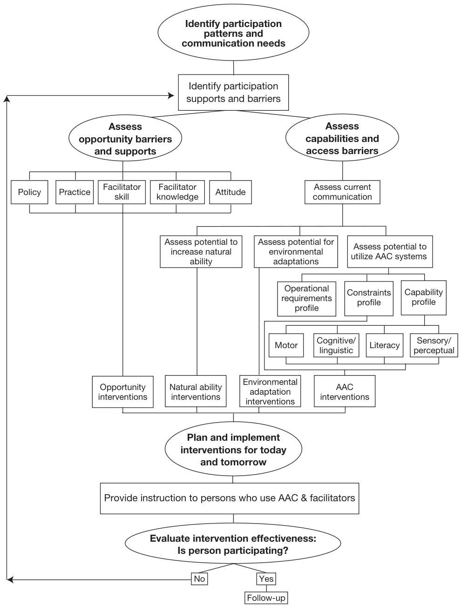

Figure 2.2. The Participation Model for augmentative and alternative communication (AAC).

AAC Assessment

designing interventions based on the functional requirements for participation in life activities. It consists of two major processes: assessment and intervention. These two processes are integrally linked, with AAC assessment serving as the information-gathering process required to plan effective AAC intervention. Typically, AAC assessment is completed first, followed sequentially by planning and implementation of the AAC intervention. However, sometimes, it is necessary to start by providing some preliminary AAC intervention to establish sufficient communication to conduct a valid and reliable assessment. Once channels of basic communication are established, then the team can cycle back and conduct a more comprehensive assessment to guide longer-term AAC intervention.

Ahmad was a college student when he was hit by a drunk driver, resulting in a severe traumatic brain injury. He was an inpatient in a rehabilitation center. He had significant speech and motor impairments and had no way to communicate. The team was struggling to conduct an AAC assessment. Ahmed had some movement in his thumb so we used that movement to establish a YES/NO signal (thumb up/thumb down). We asked if he could hear—THUMBS UP. We asked if he could see—THUMBS DOWN. We asked if he had double vision—THUMBS UP. We patched one eye to help with his vision. We asked if he could read—THUMBS UP. We quickly mocked up an alphabet board with paper and markers. We included some messages that he might need to use frequently. We also showed his parents and the rehab staff how to provide written choices for him to support his communication and participation in his medical care and recovery. We showed them how to write out their questions or comments and how to provide a list of written options that he could select to respond. In this case, we had to intervene first to provide Ahmad with some preliminary AAC supports so that he had a means to participate. Then we circled back and conducted a more thorough AAC assessment to better determine his needs and skills. The initial AAC supports were then refined and improved in subsequent weeks through a cyclical process of assessment and intervention.

## COMPONENTS OF AAC ASSESSMENT

As illustrated in Figure 2.2, the Participation Model includes the following components of AAC assessment and intervention: 1) assessment of the individual's participation patterns and communication needs, 2) assessment of environmental supports and opportunity barriers, 3) assessment of the individual's capabilities and access barriers, 4) planning and implementation of intervention with the individual who requires AAC and the communication partners, and 5) evaluation of the effectiveness of the intervention and follow-up as required. This chapter discusses the first three components—those related to AAC assessment. Chapters 3 and 4 discuss AAC intervention, first as it relates to the individual who requires AAC (Chapter 3) and then as it relates to family and other communication partners (Chapter 4).

AAC assessments can be complex as they require information gathering across multiple domains. Whereas AAC experts take a holistic approach to AAC assessment and recognize the need to investigate multiple domains, general practice speech-language pathologists tend to view AAC assessment as a linear, two-step process that focuses only on language and symbol assessment; they neglect many other key domains (Dietz, Quach, Lund, &amp; McKelvey, 2012). Birmingham Karnezos and Light (2016) developed an AAC assessment checklist to guide teams systematically through

People Who Require AAC

the AAC assessment process (see Figure 2.3). Checklists are used regularly in medicine to reduce error, improve teamwork, increase adherence to clinical guidelines, and ensure that all necessary processes are completed (Hales, Terblanche, Fowler, &amp; Sibbald, 2008; Lingard et al., 2008). In a series of studies, Birmingham Karnezos

# Augmentative and Alternative Communication (AAC) Assessment Checklist

Each assessment check is included based on evidence that it will improve assessments for individuals with complex communication needs (CCN). Review and confirm each check.

|  What are the student's communication needs? | What are the student's skills? | What are the partner and environmental supports and limitations?  |
| --- | --- | --- |
|  □ What are the student's communication needs? | □ What are the student's vision skills? | □ What are partner supports to communication?  |
|  What does the student need to understand? | Visual field | Opportunities for communication  |
|  With whom does the student need to communicate? | Visual acuity | Knowledge of AAC services, systems, and/or instructional strategies  |
|  Why does the student need to communicate? | □ What are the student's hearing skills? | □ What are partner limitations to communication?  |
|  About what does the student need to communicate? | □ What are the student's motor skills? | Limited opportunities for communication  |
|  When and where does the student need to communicate? | Gestures and signs | Limited knowledge of AAC services, systems, and/or instructional strategies  |
|  How does the student need to communicate? | Access to systems (direct selection and/or switch) | □ What are environmental supports to communication?  |
|  □ Which of the student's communication needs are unmet? | Seating and positioning | Educational placement  |
|  □ Which of the student's communication needs are priorities for the student? | What are the student's receptive language skills? | Environmental access  |
|  Family? School? | Understanding words, morphology, and sentence structure | □ What are environmental limitations to communication?  |
|   | What are the student's expressive communication skills? | Educational placement  |
|   | Turntaking | Limited environmental access  |
|   | Natural speech and intelligibility | Limited use (Student is unable to use the AAC system across environments)  |
|   | About what and how does the student communicate? |   |
|   | What are the student's literacy skills? |   |
|   | Letter-sound correspondences |   |
|   | Decoding |   |
|   | Sight-word recognition |   |
|   | Reading comprehension |   |
|   | Spelling |   |
|   | Writing |   |
|   | □ What are the student's symbol representation skills? | Who is involved in the assessment?  |
|   | Types of symbols (Objects, gestures, signs, photographs, line drawings, print) | □ Student  |
|   | □ What are the student's cognitive organization skills? | □ Family  |
|   | Display (Grids, visual scenes) | Professionals  |
|   | Symbol organization (Context, category, syntax, alphabet, other) | Instructional assistant  |
|   |  | Regular education teacher  |
|   |  | Special education teacher  |
|   |  | Assistive technology specialist  |
|   |  | Occupational therapist  |
|   |  | Physical therapist  |
|   |  | Speech-language pathologist  |
|   |  | Others  |

Figure 2.3. Augmentative and Alternative Communication (AAC) Assessment Checklist. (From Birmingham Karnezos, J. &amp; Light, J. [2016, August]). The Effect of a Checklist on School-Based Speech-Language Pathologists' Plans for Augmentative and Alternative Communication Assessment. Paper presented at the Biennial Conference of the International Society for Augmentative and Alternative Communication, Toronto, ON; reprinted by permission.

AAC Assessment
31

and Light (2016) and Karnezos (2017) evaluated the effects of the AAC Assessment Checklist on assessments planned by speech-language pathologists alone and by multidisciplinary teams for case studies of children with complex communication needs. The speech-language pathologists and teams who received the AAC Assessment Checklist planned more complete AAC assessments that included more of the essential components than those in the control group who did not receive the checklist. Moreover, the AAC teams generalized use of the AAC Assessment Checklist to actual assessment planning for children with complex communication needs. The AAC teams and families all expressed high levels of satisfaction with the checklist, reporting that it helped guide the discussion, improve team communication, organize assessment planning, and ensure that all assessment components and needs were addressed. Although the checklist supports teams in considering key assessment domains, it does not necessarily ensure that teams complete assessment procedures in a skilled manner. Teams who are new to AAC assessment may need to seek out consultation, instruction, and supervision from skilled AAC service providers to ensure that the assessment is conducted effectively.

## ASSESSMENT OF PARTICIPATION PATTERNS AND UNMET COMMUNICATION NEEDS

As illustrated in the Participation Model (see Figure 2.2), the first step in AAC assessment is to determine the participation patterns and unmet communication needs of the individual who requires AAC. This information defines the contexts that are priorities for intervention and determines the requirements for AAC systems. There are a number of techniques that can be used to assess participation patterns and communication needs, including

1. Conducting interviews with the individual and the family
2. Investigating social networks
3. Completing more specific communication needs surveys
4. Completing participation inventories.

The AAC team may use some or all of these techniques, as described below, depending on the individual with complex communication needs and the family.

## Conduct Interviews with the Individual and Family

With every new referral, the AAC team starts by getting to know the individual, family members, and other key communication partners. Person-centered planning (O'Brien &amp; Lyle O'Brien, 2002) is a process that can be used in this regard. There are several different formats for person-centered planning, including the MAP process (Making Action Plans; Forest, Pearpoint, &amp; O'Brien, 1996) and the PATH process (Planning Alternative Tomorrows with Hope; Pearpoint, O'Brien, &amp; Forest, 2008). Both of these approaches start by interviewing the individual, family, and key communication partners to determine 1) the individual's life experiences, 2) dreams or goals, 3) greatest fears, 4) strengths and unique gifts, and 5) current unmet needs. The goal is to develop a collective vision of the future that emphasizes the person's capabilities, strengths, and gifts, rather than just limitations and problems (O'Brien &amp; Pearpoint, 2007). Based on this plan, the person with complex communication needs and the other members of the team develop short- and long-term goals that are priorities.

People Who Require AAC

During intervention planning, the team determines the types and levels of support and AAC intervention required for the individual and the communication partners to attain these goals over time.

# Investigate Social Networks

As part of this personalized planning process, the AAC team may also investigate the individual's social networks; in other words, the communication partners with whom the individual is likely to communicate. Blackstone and Hunt Berg (2003) developed an assessment tool that is helpful to document five circles of communication partners who might constitute an individual's social network, starting with the inner circle of family members and life partners, then friends, then acquaintances, paid professionals, and finally unfamiliar people. (See Figure 2.4 for an illustration of the Social Network Inventory.) Often this assessment uncovers a very limited social network; many individuals with complex communication needs only have opportunities to interact with family members and with adults who are in paid positions (e.g., speech-language pathologist, teacher, job coach, aide). These are perfectly acceptable communication partners, but they should not be the only communication partners. The Social Network Inventory can be particularly helpful in determining the need for the individual to develop a greater range of social relationships.

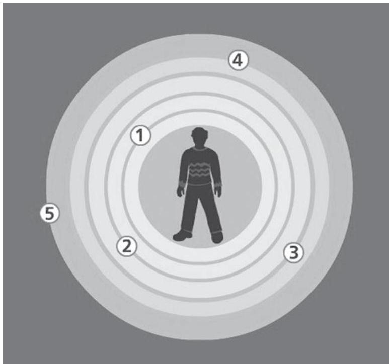

Figure 2.4. Circles of communication partners: 1) life partners, 2) close friends and relatives, 3) acquaintances, 4) paid workers, and 5) unfamiliar communication partners. (From Blackstone, S., &amp; Hunt Berg, M. [2003]. Social networks: A communication inventory for individuals with complex communication needs and their communication partners-Inventory booklet [p. 21]. Monterey, CA: Augmentative Communication, Inc.; reprinted by permission.)

AAC Assessment
33

# Conduct a Communication Needs Survey

In addition to investigating social networks, it is also sometimes helpful to probe unmet needs more specifically by conducting a communication needs survey, either as a written questionnaire or a face-to-face interview. Several communication needs surveys have been developed for use with specific groups of individuals with complex communication needs in particular settings. For example, Beukelman, Yorkston, and Dowden (1985) developed a communication needs survey for adults with acquired conditions in medical settings (see Figure 2.5). The survey probes the specific positioning requirements, communication partners, locations, messages needs/purposes, and modalities required for communication and also asks the individual and/or family to set priorities with respect to these needs (i.e., mandatory, desirable, unimportant, may be mandatory in the future).

Alternatively, the AAC team may develop a personalized communication needs survey for a specific individual as follows: 1) generate a list of the individual's daily (weekly or monthly) activities; 2) for each activity, determine with whom, when, where, why, how (via what modalities), and about what the individual needs to communicate; and 3) consider which of these needs are met and which are unmet. The unmet needs are then potentially targets for intervention if the individual and family consider them to be priorities.

# Conduct a Participation Inventory

A key technique for assessing participation patterns and unmet needs is to conduct a Participation Inventory by observing key activities in which the individual participates at home, at school, at work, in the community, or in other settings (see Figure 2.6). The Participation Inventory provides valuable information on the individual's current performance in these activities, including strengths and limitations; this information can be used to plan intervention to enhance participation. It is seldom possible to observe all of the individual's activities because of time demands; rather the AAC team should focus on those activities identified as priorities by the individual and family.

In conducting a Participation Inventory for a specific activity, the AAC team records the context and activity, the specific steps within the activity, the requirements for each step, and the individual's performance (i.e., successful, unsuccessful). Sometimes it is also helpful to consider how peers participate in the activity and to record the level of independence expected within each step: 1) independent, 2) with assistance in set up, 3) with spoken instructions, or 4) with physical assistance. It is important to recognize that there may be variation in performance within any given situation across participants. For example, some students are active participants in class and regularly volunteer to answer questions, whereas others may be more reticent and may participate less frequently. All of these variations in performance may be considered appropriate. The AAC team considers the range of acceptable performance so that the expectations for the individual who uses AAC are neither too high nor too low. Within any given activity, the individual may be able to participate successfully in some steps; however, for other steps, there may be discrepancies between expectations and the performance of the individual. These discrepancies require intervention to enhance participation if they are priorities.

People Who Require AAC

Communication Needs Assessment

|  Please indicate whether the needs listed are:  |   |
| --- | --- |
|  M – Mandatory | U – Unimportant  |
|  D – Desirable | F – May be mandatory in the future  |
|  Positioning | Locations  |
|  In bed | Only in a single room  |
|  While supine | In multiple rooms within the same building  |
|  While lying prone | In dimly lit rooms  |
|  While lying on side | In bright rooms  |
|  While in Clinitron bed | In noisy rooms  |
|  While in Roto bed | Outdoors  |
|  While sitting in bed | While traveling in a car, van, and so forth  |
|  While in arm restraints | While moving from place to place within a building  |
|  In a variety of positions | At a desk or computer terminal  |
|   | In more than two locations a day  |
|  Related to mobility | Other needs related to locations  |
|  Carry the system while walking | Message Needs  |
|  Independently position the system | Call attention  |
|  In a manually controlled wheelchair | Signal emergencies  |
|  In an electric wheelchair | Answer yes-no questions  |
|  With a lapboard | Provide unique information  |
|  While the chair is reclined | Make requests  |
|  Arm troughs | Carry on a conversation  |
|   | Express emotions  |
|  Other equipment | Give opinions  |
|  With hand mitts | Convey basic medical needs  |
|  With arterial lines | Greet people  |
|  Orally intubated | Prepare messages in advance  |
|  While trached | Edit texts  |
|  With oxygen mask | Edit texts written by others  |
|  With electric wheelchair controls | Make changes in diagrams  |
|  Environmental control units | Compile lists  |
|   | Perform calculations  |
|  Other needs related to positioning | Take notes  |
|  Communication Partners | Other needs related to messages  |
|  Someone who cannot read | Modality of Communication  |
|  Someone with no familiarity with the system | Prepare printed messages  |
|  Someone who has poor vision | Prepare spoken messages  |
|  Someone who has limited time or patience | Talk on the phone  |
|  Someone who is across the room or in another room | Communicate with other equipment (e.g., computers or environmental controls)  |
|  Someone who is not independently mobile | Communicate privately with some partners  |
|  Several people at a time | Switch from one modality to another during communication  |
|  Someone who is hearing impaired | Via several modalities at a time (e.g., taking notes while talking on the phone)  |
|  Other needs related to partners | Communicate via an intercom  |
|   | Via formal letters or reports  |
|   | On pre-prepared worksheets  |
|   | Other needs related to modality of communication  |

Figure 2.5. Communication Needs Assessment for Adults in Medical Settings. (From Beukelman, D. R., Yorkston, K. M., &amp; Dowden, P. A. [1985]. Communication augmentation: A casebook of clinical management. San Diego, CA: College-Hill Press; reprinted by permission.)

Person's name:
Date:
Completed by:
Setting and activity:
Goal of activity:

|   | Level of independence (P: peer; CCN: person with CCN) |   |   |   | Opportunity barriers |   |   |   | Access barriers  |   |   |   |
| --- | --- | --- | --- | --- | --- | --- | --- | --- | --- | --- | --- | --- |
|  Critical steps to meeting the activity goal | Independent | Independent with setup | Requires verbal assistance | Requires physical assistance | Policy | Practice | Knowledge | Skill | Physical/ motor | Cognitive | Literacy | Visual/ auditory  |
|  1. |  |  |  |  |  |  |  |  |  |  |  |   |
|  2. |  |  |  |  |  |  |  |  |  |  |  |   |
|  3. |  |  |  |  |  |  |  |  |  |  |  |   |
|  4. |  |  |  |  |  |  |  |  |  |  |  |   |
|  5. |  |  |  |  |  |  |  |  |  |  |  |   |
|  6. |  |  |  |  |  |  |  |  |  |  |  |   |
|  7. etc. |  |  |  |  |  |  |  |  |  |  |  |   |

Figure 2.6. Participation inventory. (Source: Blackstien-Adler, 2003.) Key: CCN, complex communication needs.

People Who Require AAC

# Techniques to Determine Priorities

Given the complex needs experienced by individuals who require AAC, it is not surprising that most AAC assessments identify numerous participation limitations and unmet communication needs. The AAC team works with the individual and family members to determine priorities within this list. These priorities define the starting points for AAC intervention; additional participation limitations and unmet needs can be addressed in future intervention. AAC intervention will only be effective if it addresses the individual's priorities.

We received a referral for an assessment for a young woman in her mid-20s, Shawn. She was married and had a 2-year-old son. Just a few days after she graduated from college and started her dream job, she was diagnosed with a brain tumor. She had surgery and hemorrhaged badly, resulting in significant neurological damage. She was unable to walk or speak. We met her a year after her surgery. Reports indicated that she and her family had rejected AAC. We visited Shawn at her home with her parents, husband, and son. She showed us the AAC system that had been developed for her:

... A small notebook with line drawings of the following items: soap, shampoo, wash, shower, favorite foods, a way to ask for assistance, and a few other items along these lines. Think about it. Here was a young woman, someone's mom, someone's wife, someone's daughter, many people's friend, and the best that [service providers] did was to provide her with a way to ask to wash her hair. At this time, the only thing that Shawn cared about was to try to re-establish the connections in her life ... The previous AAC interventions failed not because Shawn was unmotivated to communicate or because she was noncompliant, but rather the AAC interventions failed because they did not provide her with a means to attain her most important communication goal: social closeness. She could live without clean hair, but she could not live without a way to play with her son and delight in him, a way to re-establish a loving relationship with her husband who felt that he had lost the Shawn he had known and needed a way to get to know this 'new' Shawn. (Light, 1997, p. 64)

There are several techniques that can be used to determine priorities with individuals with complex communication needs and their families, including rating scales, Talking Mats, and forced choices.

## Rating Scales

For those individuals with complex communication needs who have strong comprehension skills, it may be possible to simply review the list of unmet needs and ask the individual to indicate a rating for each one (e.g., 1 = very important, 2 = important, 3 = not important).

## Talking Mats

Some individuals with complex communication needs may find it difficult to understand and complete these relatively abstract ratings; they may benefit from a more concrete approach to indicate priorities. Murphy and colleagues developed an approach known as Talking Mats that may be helpful in discussing goals or priorities with individuals with complex communication needs (Murphy &amp; Cameron, 2008). An example of the implementation of Talking Mats is presented in Figure 2.7. Essentially, the Talking Mats include three columns—positive/happy, negative/unhappy, and neutral. The individual is then provided with photos (or symbols) representing various activities in his or her life and has the opportunity to sort them into the different sections on the Talking Mats to indicate which ones are priorities and which ones are not. Talking Mats provide visual supports that simplify the process of discussing priorities. They have been used successfully with a range

AAC Assessment

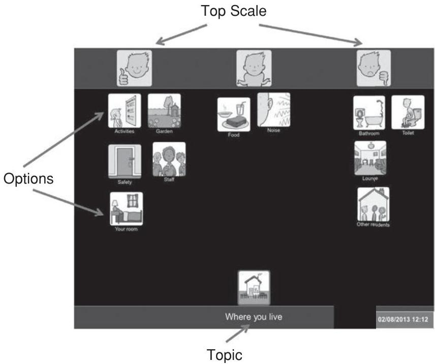

Figure 2.7. Talking Mats to determine priorities for intervention. (From Talking Mats, LTD. (2013). [webpage]. Retrieved from https://www.talkingmats.com/wpcontent/uploads/2017/02/matexample.png; reprinted by permission.)

of individuals who experience cognitive and/or language limitations, including individuals with intellectual developmental disabilities (IDD; Murphy &amp; Cameron, 2008), dementia (Murphy, Gray, van Achterberg, Wyke, &amp; Cox, 2010), and Huntington's (Ferm, Sahlin, Sundin, &amp; Hartelius, 2010). (See the web site on Talking Mats for further information.)

Choices Between Activities Even though Talking Mats are more concrete than rating scales, young children and individuals with severe cognitive and linguistic limitations may still find it difficult to understand and use Talking Mats. In these cases, it may be preferable to simply offer a choice between two photographs or between two objects representing activities to determine the individual's preference or priority. (See Chapter 10 for discussion of teaching the communication of choices.)

Observation of the Individual's Affect For beginning communicators who have not yet learned to communicate choices reliably, the AAC team may need to observe the individual's affect to determine those situations in which the individual is motivated to participate but experiences difficulty doing so, as well as those situations that are very frustrating. These contexts may serve as initial priorities for intervention.

In summary, the first step of the AAC assessment is to investigate the individual's current participation patterns and to determine participation challenges and unmet communication needs that are priorities. These priorities will drive the AAC

People Who Require AAC

intervention. To plan effective intervention, the AAC team must also assess the supports and barriers within the environment that affect the individual's communication, either positively or negatively.

## ASSESSMENT OF ENVIRONMENTAL SUPPORTS AND OPPORTUNITY BARRIERS

Communication is a two-way process; the success of the interaction depends not just on the individual who relies on AAC, but also on the communication partner and the environment. AAC intervention will only be effective if the individual has the opportunity and supports required to communicate and participate. Thus, AAC assessment must extend beyond the individual with complex communication needs and also consider his or her communication partners and environment, including the positive supports available as well as any barriers that limit opportunities for communication. There are five types of environmental supports and barriers that should be considered in AAC assessment: policy, practice, attitude, knowledge, and skill.

## Policy Supports and Barriers

Policy supports are the result of legislative or regulatory decisions that support the communication and participation of individuals with complex communication needs. Internationally, the United Nations has affirmed the right of people with disabilities to freedom of expression, including the freedom to receive and express information through all forms of communication (e.g., sign languages, braille, AAC). In many countries such as the United States, there are a number of laws and policies that support participation in society and access to communication for people with disabilities. For example, the Individuals with Disabilities Education Act (IDEA) mandates that children with disabilities have the right to a free and appropriate public education within the least restrictive environment; the Americans with Disabilities Act prohibits discrimination against people with disabilities in all areas of public life, including jobs, schools, transportation, the built environment, and all public and private places that are open to the general public. It is important that AAC teams are aware of the laws and policies that support the rights of individuals with complex communication needs.

Unfortunately, sometimes there are also policies that act as barriers to the participation of individuals with complex communication needs. For example, to prevent interference with medical equipment, some hospitals have stringent policies regarding the types of electronic equipment that patients can bring with them, potentially restricting access to AAC technologies. Restrictive interpretations of funding policies may also limit access to AAC for some individuals. The AAC team may need to investigate the policies, laws, and regulations that impact the individual who relies on AAC and advocate as required to reduce policy barriers.

## Practice Supports and Barriers

Whereas policies are legislated or regulated procedures, practice supports and barriers refer to procedures or conventions that are common practice, but are not actual policies. Sometimes these practices support the communication and participation of individuals with complex communication needs. For example, some school districts support the inclusion of students with disabilities in general education classrooms, providing opportunities for learning and social interaction with peers. In other

AAC Assessment
39

cases, practices may create barriers that limit the participation of individuals with complex communication needs. For example, as a matter of practice, some school districts restrict the use of district-funded AAC equipment outside of school, preventing students from taking their AAC devices home with them, even though, in fact, no such policy exists. AAC teams may need to intervene to address practice barriers to ensure that individuals with complex communication needs have access to the tools and opportunities that they need to participate. Because practice barriers are not actually based on written policies or legislation, they are usually more amenable to change with advocacy by the AAC team.

## Attitude Supports and Barriers

The attitudes and beliefs held by an individual or group of individuals can also present supports, or alternatively barriers, to participation. Sometimes, people at school, at work, and in the community recognize the strengths of individuals with complex communication needs and support their right to participate in society. Unfortunately, not all people hold positive attitudes about individuals with disabilities. Sometimes, parents, relatives, co-workers, supervisors, professionals, peers, or the general public may hold negative attitudes that limit opportunities for participation. At times, attitude barriers are quite blatant, but more often they are subtle.

Some time ago, we were involved in a situation in which a university professor did not want to permit a student who relied on AAC to enroll in his course. The policy of the university was clear: People with disabilities who had been admitted to the university were entitled to enroll in all courses. It was also the practice of the university to comply with this policy, even if this meant moving classes to more accessible locations. Nevertheless, an individual professor, because of his negative attitude about students with disabilities, attempted to set up a barrier. Of course, he was not permitted to maintain this barrier in the face of the policies and practices of the institution, and the student was granted access to, and support within, his course.

The AAC team should be aware of attitude barriers and consider intervention to promote more positive attitudes. The research suggests that the following techniques may be effective ways to change attitudes: 1) contact with people with disabilities, specifically contact that involves equal status, reciprocal, cooperative interactions; 2) persuasive messages that highlight the similarities between people with and without disabilities; and 3) vicarious experiences that involve role plays or simulations to experience what it may be like to have a disability (McCarthy &amp; Light, 2005).

Even though people who rely on AAC are receiving increasingly better elementary, secondary, and postsecondary educational opportunities, opportunities for employment remain severely restricted. For example, the Americans with Disabilities Act was passed in the United States in 1990, yet people who use AAC are still routinely screened out at the initial interview stage when they seek employment. A man with cerebral palsy who relies on AAC noted: "The REAL barrier . . . [is] people's stagnant and outdated attitudes toward . . . people with speech disabilities" (McNaughton, Light, &amp; Arnold, 2002, p. 66). Another man who uses AAC explained, "When people see me, they do not see me. They just see a person in a wheelchair" (McNaughton et al., 2002, p. 66).

Knowledge Supports and Barriers

Simply having a positive attitude is not enough to support the participation of individuals with complex communication needs; partners also require knowledge of AAC options. Some families, communication partners, and professionals are aware of AAC options and they ensure that individuals with complex communication needs have access to effective AAC services. However, often families, professionals, and other communication partners have limited knowledge and experience with AAC. Knowledge barriers refer to a lack of information about AAC intervention options, technologies, and instructional strategies.

Several years ago, I (Janice Light) received a call from a nursing home in a rural area. One of the residents had ALS and was unable to rely on speech to communicate. His family and the nursing home had no idea that there were other communication options available, so he had lived for more than a year without an effective means of communication. One of the nursing home staff just happened to see an interview on a local TV show, discussing AAC. She told her supervisor and the next day they called to see what options might be available for this man. Until this call, his communication and participation had been severely limited not by policy, practice, or attitude barriers, but rather by lack of knowledge of AAC (J. Light, personal communication, June 2019).

Sometimes knowledge barriers are more subtle. For example, some young children with developmental disabilities may benefit from manual signs as one means to augment their communication. However, their use of manual signs may be restricted, not because of limits in their own capabilities, but rather because their speech-language pathologists, teachers, paraprofessionals, and parents do not know signs or only know a few signs.

Rosie, mother of a 17-year-old man with cerebral palsy, describes how her son's use of manual signs was constrained by others' lack of knowledge:

> Unfortunately, no one helped [my son] learn signs but me, and he had little support in this until about sixth grade when they hired a classroom aide that knew sign language. To have AAC not be integrated into a child's life until middle school is sad and [makes it] very difficult for them to adjust. (quoted in McNaughton et al. 2008, p. 49)

Knowledge barriers are likely to exist at some point during nearly every AAC intervention. Initially AAC supports will be new to families and communication partners so they will require instruction in the operation and implementation of AAC. One purpose of assessment is to identify potential knowledge barriers in advance so that information on AAC can be provided to families and communication partners as it is required. New training will be required each time there are changes to the individual's AAC supports or communication partners. Over time, family members or other facilitators may develop substantial expertise in the individual's AAC supports and they may serve as resources and provide instruction to others.

Skill Supports and Barriers

Effective communication depends not only on the knowledge of communication partners, but also on their skills interacting with the individual who has complex communication needs. Sometimes communication partners develop effective interaction strategies through their years of experience communicating with the individual who uses AAC. In fact, the AAC team may learn effective supports from these partners. However, many communication partners may find it challenging to interact effectively. Even when they have knowledge of AAC, some communication partners may still have difficulty during daily interactions. Special interaction skills may be necessary to support someone with complex communication needs to participate successfully. The AAC team should assess the interaction skills of communication partners to identify strengths as well as areas that require improvement.

Jean Dominique Bauby (1997) emphasized the importance of the partner's interaction skills in determining the success (or failure) of his communication attempts using AAC following a brainstem stroke:

> It is a simple enough (AAC) system. You read off the alphabet . . . until, with a blink of my eye, I stop you at the letter to be noted. . . . That, at least, is the theory. In reality, all does not go well for some visitors. Because of nervousness, impatience, and obtuseness, performances vary in the handling of the code. . . . Nervous visitors come most quickly to grief. They reel off the alphabet tonelessly, at top speed, jotting down letters almost at random; and then seeing the meaningless result, exclaim, “I'm an idiot!” . . . Reticent people are much more difficult. If I ask them, “How are you?” they answer, “Fine,” immediately putting the ball back in my court. . . . Meticulous people never go wrong: they scrupulously note down each letter and never seek to unravel the mystery of a sentence before it is complete. . . . Such scrupulousness makes for laborious progress, but at least you avoid the misunderstandings in which impulsive visitors bog down when they neglect to verify their intuitions. (pp. 20--22)

In many cases, such as this one, the AAC team needs to design intervention to teach communication partners effective interaction strategies to reduce barriers to the individual's communication. The needs and skills of individuals who use AAC may change over time; therefore, communication partners may need to adjust their interaction strategies over time. In the case of children with developmental disabilities who are learning new skills, partners may need to gradually reduce the support they provide so the children develop greater independence and competence in their communication. In contrast, individuals with degenerative conditions may need partners to provide increased supports over time as their capabilities decline.

### Techniques to Assess Environmental Supports and Opportunity Barriers

Inevitably individuals who require AAC will encounter at least some policy, practice, attitude, knowledge, and/or skill barriers in their daily lives as well as some important supports in these areas. The AAC team assesses opportunity barriers so that these

People Who Require AAC

issues can be addressed in intervention. There are several techniques that can be used for this assessment:

- Interviews with the individual, family, and communication partners to determine current opportunity barriers and supports
- Interviews with administrators to determine current policies and practices
- Observations of the individual in the natural environment to determine environmental barriers and supports

When conducting these observations, the AAC team focuses on the communication partners and the environment, and their impact on the individual with complex communication needs. Positive supports (whether policy, practice, attitude, knowledge, or skill) provide important resources that the AAC team can leverage to maximize the individual's communication. Barriers in any of these areas should be addressed through intervention to ensure that the individual has the opportunity and the support required for effective communication and participation (see Chapter 4 for further discussion).

## ASSESSMENT OF THE INDIVIDUAL'S CAPABILITIES

Successful communication depends not just on the opportunities and supports available within the environment, but also on the skills and capabilities of the individual with complex communication needs. The AAC team conducts a thorough assessment to gather information in a variety of domains. In this section, we present principles and procedures for constructing a capability profile to plan intervention. First, we discuss some of the approaches that can be used for capability assessment in general. There are three main approaches that can be used to assess a person's capabilities: norm-referenced, criterion-referenced, and dynamic assessment.

## Norm-Referenced Standardized Assessment

In general terms, norm-referenced standardized assessment compares the individual's performance to that of peers without disabilities to determine whether there is some level of impairment or deficit. Norm-referenced assessments do not provide comprehensive assessment of the individual's performance in a domain; rather, they sample skills to determine how the individual's performance compares to that of same-aged peers without disabilities. For this reason, norm-referenced assessments are most useful in determining whether there is a problem; they seldom provide sufficient information to guide intervention planning. Often it is abundantly apparent that individuals with complex communication needs are facing significant challenges within a specific domain. In this case, norm-referenced assessments are not particularly helpful.

If the AAC team is uncertain whether the individual is experiencing difficulties in a specific domain (e.g., comprehension), then norm-referenced assessments may be useful in some cases. However, norm-referenced assessments should only be used with significant caution. If the norms are to be applied, then procedures must be followed precisely. Given the motor, sensory perceptual, and speech impairments of individuals with complex communication needs, they may be unable to participate fully in norm-referenced assessments unless the AAC team modifies the assessment. With these modifications, some norm-referenced tests may be useful for obtaining general information related to the person's capabilities. However, adaptations to

AAC Assessment
43

standardized assessments may modify the task demands of the assessment (making it easier or harder than its standard format); therefore, such modifications limit the validity and reliability of the norm-referenced assessment. If norm-referenced tests are modified in any way, it is inappropriate to use them to compare individuals with complex communication needs to peers without disabilities (Snell et al., 2003).

## Criterion-Referenced Assessment

In contrast with norm-referenced assessment, criterion-referenced assessment is used to describe the individual's performance with respect to specific domains to determine strengths and to plan intervention to enhance skills. For example, a criterion-referenced assessment might assess the individual's comprehension of wh- questions or understanding and use of different types of AAC symbols. Most AAC teams rely on criterion-referenced assessment to develop a capability profile that can then be used with feature matching to select appropriate AAC supports and to identify goals for intervention to enhance communication (Costello &amp; Shane, 1994; Glennen, 1997; Yorkston &amp; Karlan, 1986). In this approach, the team first administers a number of carefully selected, criterion-referenced tasks that are designed to answer relevant assessment questions. For example, to investigate the individual's comprehension skills, the team might probe responses to a range of wh- questions, at various levels of complexity, within a conversational format. Or the team might probe the individual's ability to use direct selection by pointing to targets of various sizes in various locations with a finger or hand. If the individual is not able to use direct selection, then the team might probe performance with alternative access techniques. A similar iterative process can also be used to answer specific questions about the individual's capabilities in a range of domains.

## Dynamic Assessment

In traditional approaches to assessment (whether norm-referenced or criterion-referenced), individuals are tested on their skills at one point in time with no assistance or support from the examiner (Binger, Kent-Walsh, &amp; King, 2017). These traditional assessments are sometimes referred to as static assessments. In contrast, dynamic assessment uses a teach-test format. Individuals are first taught skills, using various prompts to facilitate their performance, and then tested. Dynamic assessment yields valuable information, not just on the individual's capabilities, but also on the rate of learning and retention as well as the level of support required for success (Binger et al., 2017). Such information can be used to guide intervention planning. Dynamic assessment is especially useful in the AAC field where individuals may have had no prior experience with AAC symbols or access techniques, rendering static assessment approaches relatively useless. There are several examples of the use of dynamic assessment to guide intervention with individuals who rely on AAC, including ones focused on phonological awareness skills (Barker, Bridges, &amp; Saunders, 2014) and expressive syntax (Binger et al., 2017; King, Binger, &amp; Kent-Walsh, 2015).

## ADAPTATIONS TO ASSESSMENTS

As noted earlier, the AAC team must ensure that the individual is able to participate in the assessment, whether norm-referenced or criterion-referenced, whether static or dynamic. Otherwise the results will not be a valid representation of the

People Who Require AAC

individual's capabilities. Individuals with complex communication needs often present with vision, hearing, motor, and/or cognitive impairments that may limit their participation in typical assessment procedures. For example, the AAC team cannot use an assessment that requires oral responses if the individual is unable to speak. An assessment of receptive language that requires object manipulation is inappropriate for an individual with significant motor impairments that restrict the use of hands. Tests that limit the time to respond are also not appropriate for those with significant motor impairments. Tests that introduce new task formats may not be appropriate for individuals with ASD who may experience difficulties with changes in routines. Furthermore, some individuals may be unwilling to participate when presented with testing situations and may demonstrate withdrawal and/or challenging behaviors.

Table 2.1 provides examples of adaptations that the AAC team can make to assessments to support the participation of individuals with complex communication needs who have associated vision, hearing, motor, cognitive, and/or behavior

Table 2.1. Examples of adaptations to assessments to accommodate various impairments

|  Impairment | Examples of potential adaptations  |
| --- | --- |
|  Vision impairment | ·Enlarge stimuli (e.g., pictures, text) ·Space stimuli to reduce visual clutter ·Position stimuli at appropriate distance from individual ·Position stimuli within visual field ·Ensure adequate lighting; reduce glare  |
|  Hearing impairment | ·Reduce background noise ·Provide appropriate amplification ·Augment oral instructions with gestures, signs, pictures, video models, or written text ·Provide third-party model to demonstrate task requirements  |
|  Motor impairment | ·Ensure proper seating and positioning to maximize function and comfort ·Provide sufficient time for the individual to respond ·Use adapted materials that are easy to manipulate or avoid assessments that require object manipulation ·Modify response array (e.g., size, number, spacing of response options) to accommodate motor skills ·Cut up response pages into separate pictures and arrange them to support selection ·Provide alternative access techniques (e.g., eye pointing, partner-assisted scanning; see Chapter 7 for further details) ·Provide multiple choice options where appropriate; present yes/no choices  |
|  Cognitive impairment | ·Reduce environmental distractions ·Use familiar tasks/approaches (e.g., giving picture rather than pointing to it) ·Provide third-party model to demonstrate task ·Use dynamic assessment; teach and then test  |
|  Behavior challenges | ·Conduct assessment in familiar environment ·Use familiar tasks and response formats where possible ·Use motivating materials ·Work with familiar adults to complete assessment ·Provide transition supports as required ·Use a visual schedule or countdown board to clarify expectations ·Provide frequent breaks  |

AAC Assessment
45

challenges. For example, the team may need to present response options in a multiple-choice format instead of as open-ended questions for some individuals. Or the team may need to adapt assessments that use picture stimuli by cutting the pictures apart and presenting them so that the individual can use eye gaze to select responses reliably. When adaptations such as these are made to assessments, it is important for the AAC team to consider whether the adaptations change the demands or the difficulty of the assessment tasks. Sometimes the adaptations are minimal and do not affect task demands significantly (Bristow &amp; Fristoe, 1987). Sometimes the adaptations that are required are more extensive and they may actually change the task demands substantially. For example, the AAC team might adapt an assessment that requires open-ended, spoken responses so that a series of response options is presented to the individual orally and the individual is required to indicate the correct response using a yes or no signal. This adaptation changes the task from one where the individual is required to recall information to one where the individual simply needs to recognize the correct response, a much easier task. The adaptation bypasses the need for the individual to produce a spoken response, but it substantially increases the demands on working memory as the individual must hold the initial question in memory as well as each of the response options. The AAC team must be aware of the impact of the adaptations made to assessment procedures and must consider the implications of the modifications on performance.

## CAPABILITY ASSESSMENT DOMAINS

An AAC assessment considers the individual's performance in a number of different domains, including natural speech, language (both receptive and expressive), symbol representation, literacy, cognition, motor, and sensory/perceptual capabilities (see the AAC Assessment Checklist in Figure 2.3). In the following sections, we consider assessment in each of these domains, including the goals of the assessment, materials, and procedures. Assessments of hearing and vision should be conducted at the outset so that the AAC team is aware of any impairment and can provide necessary accommodations to ensure a valid and reliable assessment of capabilities in all domains. For those individuals with motor impairments, it is also important to ensure that appropriate seating and positioning are in place for the assessment and that reliable motor responses are identified that the individual can use to participate in the assessment.

## Assessment of Natural Speech Capabilities

By definition, individuals with complex communication needs are unable to meet all of their communication needs through natural speech and they require AAC to enhance their communication and participation. However, there is substantial variation in the extent to which they are able to use speech functionally. The AAC team assesses the individual's natural speech capabilities to determine the nature and extent to which he or she can rely on speech in daily interactions. It is beyond the scope of this book to discuss in detail the assessment of speech production in children and adults with developmental or acquired conditions; more specific information can be obtained on the American Speech-Language-Hearing Association's web site.

The team considers the intelligibility and effectiveness of the individual's natural speech across different environmental contexts, partners, and messages to identify

People Who Require AAC

situations in which the individual requires AAC to enhance communication. Intelligibility refers to the adequacy of the acoustic signal to convey information. It is affected by many intrinsic factors such as articulation, respiration, phonation, rate of speech, positioning, utterance length, and so forth (Kent, Miolo, &amp; Bloedel, 1994; Yorkston, Strand, &amp; Kennedy, 1996). Research demonstrates that intelligibility can be increased with AAC supplementation (i.e., provision of contextual information, such as the topic, first letters of words, and/or gestures, in conjunction with speech). Hanson and colleagues discussed practice guidelines for the use of supplemented speech techniques with individuals with dysarthric speech (e.g., Hanson, Beukelman, &amp; Yorkston, 2014; Hanson, Yorkston, &amp; Beukelman, 2004). During the assessment, the AAC team may consider assessing supplemented intelligibility, in addition to standard measures of speech intelligibility. Supplemented intelligibility is the extent to which a communication partner can understand an individual's speech when provided with contextual support through supplementation. The Index of Augmented Speech Comprehensibility in Children (I-ASCC; Dowden, 1997) is an example of a tool that measures the intelligibility of children's speech to familiar and unfamiliar communication partners first without, and then with, supporting contextual information that provides the topic. Tools such as the I-ASCC can be useful for understanding the extent to which speech is comprehensible under different conditions rather than the degree to which speech is simply intelligible when presented out of context.

## Assessment of Expressive Communication

Beyond natural speech capabilities, it is also important for the AAC team to consider the individual's broader expressive communication capabilities. Specifically, the team considers the range of modalities the individual currently uses for communication (e.g., gestures, manual signs, photographs, alphabet board, AAC technology) and the frequency of their use. The team also considers whether these modes are

- Effective—Do they convey the message successfully to the partner?
- Efficient—Do they convey the message within a reasonable time frame?
- Socially appropriate—Do they convey the message in a manner that is acceptable to the partner and broader social community?

Whether a mode is effective, efficient, and socially appropriate will depend on the individual, the context, and the partner. Some modalities may be effective in some situations or with some partners, but not in other situations or with other partners. Ultimately the team needs to determine in which contexts the individual requires more effective, efficient, or socially appropriate methods of communication to meet the individual's needs.

In addition to investigating the individual's current modes of communication, the AAC team also considers how these modes are used to fulfill communication goals in daily interactions. Specifically, the team considers

- Turn taking—How frequently does the individual take communication turns? Under what conditions?
- Topic initiation, maintenance, and expansion—Does the individual initiate topics successfully? Is the individual able to maintain a topic over a series of turns? Can he or she expand the topic and add new information?

AAC Assessment
47

- Communicative functions—What range of communicative functions does the individual express (e.g., does he or she ask questions, provide information, request attention, express feelings, request objects or activities, protest, request clarification, provide clarification)? How frequently does he or she express these functions?
- Content of communication—About what topics does the individual communicate? What types of vocabulary does he or she use?
- Form of communication—Does the individual demonstrate appropriate syntax and morphology?

Typically, assessment of the individual's current expressive communication involves observation of the individual within daily interactions. The AAC team may collect a sample of the individual's communication in daily interactions with typical communication partners (e.g., family, peers, school/vocational personnel) to investigate the individual's pragmatic skills as well as expressive vocabulary (semantics) and morphosyntactic capabilities. This type of communication sampling may require transcription and/or coding of turns to be useful; as a result, it may be more time intensive than other assessment approaches. However, it is also likely to yield richer and more comprehensive data (Sutton, Soto, &amp; Blockberger, 2002). The observations result in a summary of strengths as well as areas that may require intervention to improve communication effectiveness.

## Assessment of Receptive Language

In addition to expressive skills, individuals with complex communication needs must also demonstrate receptive language skills. Some individuals who rely on AAC have intact comprehension and experience difficulties only with expression; others may experience significant challenges understanding spoken language. The AAC team assesses the receptive language capabilities of the individual who requires AAC to determine what types of spoken language input are understood and where challenges occur. Specifically, assessment includes an evaluation of the individual's comprehension of single-word vocabulary as well as common language structures (i.e., morphemes, syntactic structures; Roth &amp; Cassatt-James, 1989). Techniques for assessment of receptive language include 1) reports of families and other communication partners, 2) norm-referenced assessments of receptive language, 3) observations of the individual in the natural environment, and 4) criterion-referenced assessments of functional performance.

## Reports of Families and Communication Partners

Often family members or other communication partners can be valuable sources of information about the receptive language skills of individuals with complex communication needs. They may be able to share important information about the types of vocabulary, questions, and directions that are understood and the conditions under which this input is understood. Therefore, AAC teams often start by interviewing family members or communication partners to determine an appropriate starting point for the assessment. In conducting this interview, it is important to ask for specific examples of what families or communication partners say or do and what leads them to conclude that the individual does (or does not) understand.

People Who Require AAC

When Sarah's AAC team interviewed her family and teacher, they probed for specific examples to get a clear picture of her communication abilities. Sarah had multiple disabilities that affected her motor, cognitive, and language skills. Her teacher reported that she had significant difficulty understanding instructions at school. In contrast, her parents reported that she understood "everything that they said." On the surface, it appeared as if there was substantial disagreement between these two sources of information. However, when her AAC team probed for specific examples of oral instructions that Sarah did (and did not) understand, there was actually agreement between the specific examples provided by her teacher and those provided by her parents. Sarah understood everything that her parents said to her because they had simplified the input that they provided and frequently used gestures or pantomime to augment their spoken input and support her understanding.

The AAC team can also obtain information on comprehension skills by asking family members, caregivers, and other communication partners to keep a diary of the words and messages that the individual appears to understand. There are several parent-report tools that can be used to probe the comprehension of individuals with complex communication needs. For example, the MacArthur-Bates Communicative Development Inventories (Fenson et al., 2007) can be used to estimate the single-word vocabulary comprehension of young children according to parent report (Romski &amp; Sevcik, 1999).

## Norm-Referenced Assessment of Receptive Language

Commercially available language assessment instruments are sometimes useful to determine the individual's understanding of vocabulary and sentence structures in comparison to peers without disabilities. There are a range of language tests that might be used (e.g., Peabody Picture Vocabulary Test–Fifth Edition, PPVT-5, Dunn, 2018; Test for Auditory Comprehension of Language–Fourth Edition TACL-4, Carrow-Woolfolk, 2014); it is beyond the scope of this text to review all of the available tools. As noted earlier, it is important to remember that norm-referenced tests do not necessarily provide sufficient information to plan intervention and therefore may not be the most appropriate assessment approach if there are comprehension difficulties. In addition, many individuals with complex communication needs may not be motivated to participate in standardized assessments.

The speech-language pathologist at a local rehabilitation center reached out to us for assistance assessing the receptive language capabilities of a young man who had sustained a traumatic brain injury in a motorcycle accident. He was very depressed. He was a single parent and was very worried about his young son. His speech-language pathologist had tried to assess his comprehension using a norm-referenced test, but he did not respond. She was unsure if he did not understand or simply would not participate. His discharge was fast approaching, and his speech-language pathologist was uncertain how to proceed. We quickly mocked up a rudimentary communication board for him to use, including the letters of the alphabet and a few key phrases (e.g., YES, NO, I DON'T KNOW, I DON'T CARE). We then proceeded to talk through his concerns about his current situation and problem-solve potential solutions. This informal conversation was meaningful to him and provided a rich source of information about his comprehension abilities and his expressive communication during functional communication. With this foundation, his rehab team was able to work

with him to plan effective AAC intervention and to problem solve to ensure his successful transition from the rehab center into the community and family life.

### Observations in the Natural Environment

As this example suggests, often the most informative approach to assessment of comprehension skills is observation of the individual's performance in meaningful interactions within the natural environment. This approach provides information about the comprehension demands of the environment and the individual's ability to meet these demands. For example, a young adult who uses AAC and is attending college must understand a wide range of specialized academic vocabulary and complex sentence structures as well as extended discourse (e.g. lectures, seminar discussions). An adult with an acquired brain injury living in a long-term care facility may need to understand specialized terminology related to medical care in order to participate fully in decision making. The AAC team may find it useful to conduct observations of the individual within the natural environment to determine the comprehension requirements and the individual's capabilities. In conducting these observations, it is important to record what the communication partner says and does as well as the individual's response (or lack thereof) and whether there is evidence of comprehension (or not).

### Criterion-Referenced Assessment of Receptive Language

Although observations in the natural environment may be helpful to determine specific comprehension requirements, they may not yield sufficient data to plan intervention. In the context observed, the individual may not have been required to understand specific types of vocabulary or sentence structures. For example, a school-aged child in a general education classroom needs to understand the full range of wh- questions; however, in a particular observation, the child may not have been asked any “why” or “how” questions so it would not be possible to determine comprehension of these question forms. Therefore, the AAC team may also conduct informal criterion-referenced assessments to determine the individual's performance in specific domains.

Criterion-referenced assessments were helpful for determining the receptive language capabilities of a young man named Keith, who was a college student when he had a stroke. He had to take a leave of absence from college after the stroke and moved home to live with his parents. He was isolated from his friends and was very depressed. He had significant problems expressing himself; he relied on a few spoken words, gestures, pantomime, and sometimes writing to communicate. A year after his stroke, he was referred for an assessment to investigate AAC supports to enhance his communication. His expressive language difficulties were obvious, but his AAC team needed to assess his comprehension in order to plan relevant intervention to enhance his communication and increase his participation. The team doubted that he would be motivated to participate in a standardized assessment, and they knew that the results would probably not provide sufficient information to help them plan intervention. The team planned a criterion-referenced assessment of his receptive language capabilities. They started by targeting his comprehension of questions and focused on Keith's personal interests and needs, specifically his interest in sports. They started by targeting simple wh- questions, and then gradually probed more complex questions. They made sure that they provided multiple trials to probe each type of question at each level of syntactic difficulty. For example, the questions started with simple forms such as the following: What's your favorite sport? Who is your favorite player?

People Who Require AAC

Where does [favorite player] play? Why do you like [favorite player]? For each question, the team recorded his response and whether he demonstrated understanding or not. When Keith demonstrated comprehension of simple wh- questions, the team then probed more complex forms (e.g., When it's not [favorite sport] season, what do you watch?).

There are a number of criterion-referenced assessments that are appropriate for use with individuals with complex communication needs. For example, Miller and Paul (1995) developed a series of informal, nonstandardized procedures that can be used to assess language comprehension with beginning communicators at the early stages of language development (The Clinical Assessment of Language Comprehension). These procedures can be personalized to meet the needs and interests of the individual to ensure that they are meaningful and relevant. A number of other informal assessment techniques have also been developed for language assessment with individuals who rely on AAC. For example, Blockberger and Johnston (2003) developed assessment tasks using a range of picture stimuli to examine children's understanding of morphemes (e.g., past tense -ed, plural -s, third-person regular -s as in he drinks). Grammaticality judgment tasks can also be used for assessment of morphosyntax (e.g., Blockberger &amp; Johnston, 2003; Lund &amp; Light, 2003; Redmond &amp; Johnston, 2001).

Assessment of Augmented Input In situations where the individual experiences difficulties understanding spoken language, the team also considers the impact of augmented input (i.e., spoken language input paired with AAC) on comprehension. Some individuals with complex communication needs may demonstrate better comprehension when their partners pair their spoken input with unaided modes such as signs, conventional gestures, or pantomime. Others may benefit when spoken input is paired with aided AAC, such as photos, videos, line drawings, or written/typed words. To assess the impact of augmented input on the individual's comprehension, the team may repeat aspects of the original receptive language assessment, this time providing AAC in conjunction with spoken language input.

A number of years ago we received a referral from a school district for a student, Josh, who had ASD. Josh was included in a general education kindergarten class. He had the academic skills to participate in the class, but he was having difficulty understanding oral instructions and frequently demonstrated challenging behaviors that were very disruptive. The school team was uncertain how to address the problem. We assessed Josh's receptive language skills using criterion-referenced tasks and found that he was able to follow simple one-step oral instructions (e.g., Get your library book), but he did not understand longer or more complicated oral instructions. We then probed Josh's performance with augmented input. Josh was able to read and so we used spoken language input augmented with written text. When instructions were presented orally and accompanied by written text, Josh was able to successfully respond to two- and three-step instructions. We encouraged Josh's teacher to augment her spoken instructions to the class by also writing on a large dry-erase board or flip chart or by typing on a smartboard. Providing augmented input served to decrease Josh's challenging behaviors significantly as he understood what was expected of him (see Light, Roberts, Dimarco, &amp; Greiner, 1998).

AAC Assessment
51

Knowing the receptive language capabilities of the individual with complex communication needs is important not just for planning intervention, but also for conducting a reliable and valid assessment. If the individual has strong receptive language capabilities, it is reasonable to provide oral instructions throughout the assessment, knowing that the individual will understand the expectations and requirements of the assessment tasks. However, if the individual demonstrates significant comprehension difficulties, the AAC team should augment any spoken instructions during the assessment and also provide models or demonstrations of the assessment tasks. Many individuals who have difficulty understanding spoken language benefit from having someone show them what they are expected to do; family members, peers, and other professionals can serve as third-party models.

## Results of Receptive Language Assessment

The overall purpose of the language assessment is not to assign a score or developmental age to the individual, but rather to gather information that is needed for intervention planning. The receptive language assessment yields a summary of 1) what type of vocabulary and sentence structures the individual understands, 2) what type of input the individual does not understand, and 3) when and if the individual benefits from augmented input. This information can then be used to determine what type of input communication partners should use in their interactions and what, if any, receptive language skills should be targeted for intervention.

## Assessment of Individuals from Diverse Linguistic Backgrounds

Given the increased globalization of society, many individuals with complex communication needs may experience a different spoken language or dialect at home than at school, at work, or in the broader social community (Harris, 2015; Soto &amp; Yu, 2014). These languages or dialects will each have different vocabulary, syntax, morphology, and pragmatics, and the environments will impose different communication demands. In these cases, the AAC team must consider the receptive and expressive language capabilities of the individual across these different languages and environments. If the AAC team is not bilingual, the team may need to rely on a professional interpreter or family member to assist with the assessment, depending on the preferences of the individual and the family. In this situation, the team provides guidance and instruction for the facilitator, who then implements the assessment tasks in the native language. Since there may not be valid and reliable assessment tools in the native language spoken by the individual's family, the team may need to rely on interviewing the family and other facilitators, observing interactions in the natural environment, and/or conducting criterion-referenced assessment to determine performance in the native language.

Leo was four years old when he was referred to the rehab center for an AAC assessment. His family had emigrated from Portugal two years earlier. They spoke Portuguese at home; Leo attended a preschool program in English. The AAC team conducted an assessment of his language capabilities in English at school. At the request of his parents, they worked with his older sister to assess his language skills in Portuguese at home and in the community. Since there were no culturally and linguistically valid assessment instruments, they collected several language samples of his interactions in naturally occurring situations

People Who Require AAC

and worked with his sister to analyze his strengths and the challenges that he faced in the Portuguese language. They needed this information to plan effective AAC intervention to meet his needs at home and at school.

## Assessment of Symbol Representation

Individuals with complex communication needs cannot rely on their natural speech to meet all of their communication needs; they must therefore rely on some form of AAC symbols to express themselves. AAC may be unaided (e.g., manual signs, gestures, eye blink codes) or aided (e.g., objects, photos, line drawings, written words, letters of the alphabet). (See Chapter 6 for a full discussion of the range of AAC representations.) Typically, people who rely on AAC employ a variety of representations to meet their communication needs. For example, an adult with cerebral palsy may use letter by letter spelling with low-tech and high-tech AAC, head shake and nod, pointing to objects, and photos and videos of meaningful events in his life to exchange information with others face-to-face and via digital communication media. Thus, the goal of symbol assessment is not to identify a single symbol set to represent all messages. Instead, the goal of assessment is to determine the types of symbols that the individual can understand and use to support communication. This section describes the materials and procedures for assessment of unaided and aided AAC symbols; the subsequent section focuses specifically on the assessment of literacy skills (i.e., letters, written words) that may be used as AAC supports.

In most cases, individuals with complex communication needs will have had limited, if any, exposure to AAC symbols prior to the assessment. Therefore, the AAC team typically utilizes a dynamic assessment approach. As explained earlier, in a dynamic assessment, the team first teaches the individual the AAC symbols, and then tests comprehension and use. Dynamic assessment yields valuable information as it provides data on the individual's rate of learning. Assessment of an individual's understanding and use of AAC symbols usually involves the following steps.

1. The team identifies a range of language concepts (i.e., vocabulary) that the individual understands. These concepts should be ones that are meaningful to the individual, motivating, and functional (i.e., potentially useful in daily interactions).
2. The team includes a range of different concepts (people, actions, objects, locations, questions, social words, etc.) as the individual will require a range of vocabulary concepts to meet daily needs. It is important to assess performance with a range of concepts as some types of concepts may be easier to represent than others. For example, it may be relatively straightforward to represent the concept "mom" but more challenging to represent the concepts "what's that?" or "more," even though these are all language concepts that emerge relatively early.
3. Once target concepts are identified, the team determines which AAC symbols to assess (e.g., gestures, manual signs, photographs, line drawings, written words). There is a vast array of potential AAC symbols (see Chapter 6) and it is not feasible to assess all possible options. Instead, based on background information gathered from the individual, family, and other communication partners, the team needs to decide which symbols may present the most viable options, specifically which symbols will best meet the individual's needs given his or her capabilities. The team can then adjust as required based on initial assessment results.

AAC Assessment
53

4. In addition to determining which types of symbols are most appropriate to assess, the team also considers the specific representations used. For instance, some line drawings may serve as better representations of specific concepts than others based on the individual's experiences. The team chooses representations that are meaningful to the individual to support understanding. (See Chapter 6 for further discussion of issues of representation.)

5. In addition to considering the ways in which meaning is represented, in the case of aided AAC symbols (e.g., photographs, line drawings, written words), the AAC team considers the size of the symbols (e.g., small, medium, large) based on the individual's motor and visual capabilities and his or her age.

6. The team also considers various array sizes (e.g., an array of two, four, or nine representations). In addition, the team considers various layouts (e.g., a vertical column of symbols, a horizontal line of symbols, a grid of rows and columns, representations embedded in a photo of a meaningful event, known as a visual scene display or VSD). (See Chapter 6 for further discussion of the organization and layout of AAC displays.)

7. The team carefully chooses the symbols provided as response options. Depending on the foils (the wrong answers) provided, the task may be easier or harder. If foils are visually or conceptually similar to the target response, the task will be more difficult than if they are visually or conceptually different. For example, it is more difficult to select the written word, cat, from an array that includes the words cap, eat, and cut than from an array that includes the words banana, daddy, and go. Similarly, it is more difficult to select the line drawing for ambulance from an array that includes line drawings for police car, van, and fire truck than from an array that includes line drawings for dog, cookie, and run.

8. Following the principles of dynamic assessment, the team teaches the symbols so that the individual understands their meanings. For those individuals who are beginning communicators, it is important to teach the symbols in the contexts in which they are used as this is the way that beginning communicators learn the meanings of new symbols.

9. Once the symbols have been taught, then the team assesses the individual's understanding and use of the symbols using one (or several) of the following formats: receptive labeling, yes/no, visual matching, functional requesting, and question/answer.

**Receptive Labeling Format** This format is the most straightforward and efficient way for the AAC team to establish whether an individual can recognize a symbol as representing its referent. The person conducting the assessment presents the individual with two or more symbols (e.g., objects, photos, line drawings, written words) and asks the individual to give, point to, touch, or look at one of the items from the array of options (e.g., Touch mom.). In this format, it is important to vary the location of the correct response randomly in the array. To participate successfully in this assessment format, the individual must understand the spoken labels presented, have sufficient visual skills to see the symbol options presented, and have sufficient motor skills to indicate a selection reliably. The individual also has to be willing to comply with this type of testing.

**Yes/No Format** Because of motor and/or visual impairments, some individuals with complex communication needs may find the receptive labeling format difficult.

People Who Require AAC

Alternatively, the AAC team can use a yes/no format in which the assessor holds up one symbol at a time and asks, Is this a ________? The team should arrange the trials so that questions with yes or no answers are randomly distributed. Although this yes/no format is less complex in terms of the motor and visual demands of the task, it may be more challenging in terms of the cognitive/linguistic demands. This testing format is appropriate only if the individual has a clear way to answer yes/no questions and understands the concept of yes/no as a means to agree with or deny the truth of a statement. Results of this assessment should be interpreted with caution as the individual has a 50% probability of being correct by guessing.

**Visual Matching Format** In some cases, the AAC team cannot use the receptive labeling or yes/no formats because the individual does not understand either the task expectations or the spoken labels presented. In these cases, the team may elect to use a visual matching format (Franklin, Mirenda, &amp; Phillips, 1996). In a matching assessment, the team provides the individual with a single object and places two or more symbols, one of which matches the object, on the table. The team then asks the individual to match the object to the corresponding symbol using eye gaze, pointing, or another selection option. Alternatively, the team may give a single symbol to the individual, who is expected to match the symbol to the correct object from an array of objects. The visual matching format is a straightforward way to assess understanding and use of symbols for objects; however, it is difficult to use this format to assess understanding and use of symbols to represent descriptors, relational terms (e.g., more, all gone), questions, and social words.

All of the formats discussed so far—receptive labeling, yes/no, and visual matching—are essentially "tests" that assess the individual's understanding of AAC symbols outside of actual communicative contexts. None of these assessment formats actually assesses the use of AAC symbols to communicate. Some individuals may not be motivated or willing to participate in these tests. Therefore, the team may need to extend the symbol assessment beyond these tests to determine whether the individual can use symbols functionally to communicate. Some individuals may find it easier or may be more motivated to demonstrate symbol understanding and use during the following assessment tasks that more closely replicate communication interactions: functional requesting or question-answer formats.

**Functional Requesting Format** The AAC team usually conducts this assessment in an appropriate natural context, such as snack time, play, leisure activities, dressing, food preparation, or any other context that is of interest to the individual. Prior to starting the assessment, the team should confirm that items and activities that the person prefers are available. Then, the AAC team provides symbols representing two or more of the available options, providing the individual with the opportunity to make a functional request. As soon as the individual indicates a choice by selecting one of the items, the team responds immediately by providing the item corresponding to the symbol selected. The team then observes carefully to ensure that this is indeed the item that the individual wanted. If the individual does not spontaneously make a request using the symbols, the team can prompt the individual to do so by saying "What do you want?" and re-presenting the symbol options.

**Functional Question-Answer Format** Individuals use AAC not just to request objects and activities, but also to participate in conversations and other interactions

AAC Assessment
55

(e.g., play, leisure activities). Therefore, the AAC team should also assess the individual's functional use of symbols during these types of exchanges. To complete this functional question-answer assessment, the team first identifies contexts that are meaningful and motivating to the individual. The team then identifies concepts related to the context that are known to the individual; this information should be available from the receptive language assessment or from interviews with familiar communication partners. The team then sets up a situation that provides the opportunity for communication by asking a meaningful question, presenting two or more symbols, and then waiting for the individual to respond. The team should avoid "test" questions (e.g., Where is the dog?) and instead ask meaningful questions (e.g., What is your favorite sport? Who is your favorite player?). This format can also be set up in the context of a story from a book, magazine, or movie: The team first reads the story to the individual and then asks questions based on the story, while providing an array of two or more symbol options for responses. To complete this task successfully, the individual must understand the task expectations, the questions, and the symbol options presented, and he or she must be motivated and willing to participate. If the individual performs poorly in the assessment, it is important for the team to try to determine why the difficulty occurred.

Barbara had experienced a severe brain injury in a car accident 6 months after her wedding. She had severe speech and motor impairments and experienced difficulties with expressive communication. She was referred for an AAC assessment. The team wanted to investigate Barbara's capabilities with a range of AAC symbols to support her expressive communication, including VSDs (i.e., photographs of meaningful events) and written words. They set up a functional question-answer assessment in the context of a conversation about her wedding. They asked her a range of questions about her wedding and provided her with VSDs and written words to respond. They collected data on the accuracy of her use of the symbols in this conversational context.

Regardless of the assessment format used to investigate the individual's understanding and potential use of AAC symbols, the team provides multiple trials for each type of representation before drawing conclusions about the viability of the representation type. Typically symbol assessment tasks are new to individuals with complex communication needs and some individuals may have difficulty understanding what is expected. Difficulties understanding task requirements may mask their demonstration of symbol understanding. In these situations, the AAC team tries to follow familiar task procedures as much as possible. For example, children with ASD who have been trained in picture exchange may find it easier to hand the assessor a symbol, rather than point to one, since exchanging a symbol is a familiar response. The AAC team should think carefully about the oral instructions provided to make sure that they are not overly complex, exceeding the individual's comprehension capabilities. When appropriate, the team uses a third-party model (e.g., parent, peer, teacher, personal care attendant) to demonstrate task requirements.

Regardless of the assessment format used, the team collects data for each trial for each type of representation, including 1) the target symbol for the trial, 2) the options provided, 3) the location of each option, 4) the individual's response, and 5) the response accuracy (correct or incorrect—see Table 2.2 for an example of a data collection form). Once all trials are complete, the team calculates the overall accuracy and conducts an error analysis to determine any patterns. For example, does the

People Who Require AAC

Table 2.2. Example of a data collection form for symbol representation assessment of line drawings as potential AAC symbols for a young child with complex communication needs (using a receptive labeling format)

|  Target symbol | Position of line drawing |   |   |   | Accuracy  |
| --- | --- | --- | --- | --- | --- |
|   |  Upper left | Upper right | Lower left | Lower right  |   |
|  dog | dog* | cat | dad | mom | +  |
|  yucky | baby | eat | yucky | banana | +  |
|  who | baby | what | who | help | -  |
|  go | home | go | boy | shoes | -  |
|  cat | car | cat | dog | mouse | +  |
|  play | boy | bubbles | play | car | +  |
|  run | draw | sun | hug | run | +  |
|  more | mom | more | eat | all done | -  |
|  bus | bus | train | drink | go | +  |
|  iPad | play | book | potty | iPad | +  |
|   |  |  |  |  | 7/10 (70%)  |

*Underlined symbols indicate the child's response.
Comments: Child performs well with symbols representing concrete concepts. Demonstrates some difficulty with more abstract concepts; requires additional instruction. Seems to select lower-right symbol when uncertain.

individual always select the symbol in the bottom-right corner? Or does the individual confuse symbols that are visually or conceptually similar (e.g., the line drawings for cat and dog; or the written words cat and car).

The outcome of the assessment is a list of unaided and aided AAC symbols that the individual understands and shows the potential to learn. Because these representations will be new to many individuals with complex communication needs, it is not expected that they will demonstrate  $100\%$  accuracy at this point; it is understood that they may require instruction to learn the meanings and use of these symbols. Through the assessment, the team is seeking to identify representations that are viable options to introduce during AAC intervention, knowing that some instruction may be required. The AAC team utilizes data on the individual's performance in the assessment tasks to predict the type(s) of representations with which he or she is most likely to be successful, at least initially. The initial symbols selected should enable accurate and efficient communication so that the individual can begin communicating immediately. Over time, the individual can be taught other symbols (e.g., written words, alphabet) that provide access to more powerful and generative communication as appropriate.

# Assessment of Literacy Skills

Literacy encompasses a multitude of skills that cumulatively result in a person's ability to read, spell, and produce written text. Assessment of literacy skills is particularly important for people who rely on AAC because these skills may be leveraged to support communication. At the most basic level, some individuals may use AAC displays and can recognize some sight words but have limited spelling skills; they may rely on AAC displays that utilize written words in conjunction with photographs, line

AAC Assessment
57

drawings, or visual scene displays. They may also benefit from a written choice technique where the partner writes out potential response options during interactions, providing an array of written choices from which the individual can choose (e.g., the partner asks, What would you like to do? and then provides the following written choices: movie, shopping, visit friends, something else). This written choice technique has been used effectively with individuals with aphasia who have retained their ability to recognize words but have difficulty with spelling (see Chapter 15). Other individuals may make use of AAC displays with a significant number of written words as well as an alphabet board or keyboard where they may attempt to spell words as needed. Those who recognize sight words and also know the first letters of words may benefit from AAC technology that supports word prediction; they enter the first letter and the technology attempts to predict the word; they review the list of options provided and select the one that they want. Individuals with well-developed literacy skills may rely primarily on letter-by-letter spelling to communicate using an alphabet board or keyboard supplemented by word prediction as appropriate. Assessment of literacy skills is also important because literacy supports participation in education, employment, social networks, health care, and community living.

Assessment of literacy may consider a range of skills depending on the individual and his or her needs. These skills may include letter-sound correspondences, phonological awareness skills (e.g., sound blending, phoneme segmentation), single word reading (i.e., decoding and sight word recognition), reading comprehension, spelling, and producing written text. In the case of adults with acquired conditions who have a history of literacy, assessment typically focuses on investigating residual skills in reading, spelling, and written communication. In the case of individuals with developmental disabilities, especially children who are literacy learners, assessment may target the full range of literacy skills as appropriate. This section briefly discusses approaches to literacy assessment; Chapter 12 provides more detailed discussion of assessment and intervention to teach literacy skills to individuals with developmental disabilities.

**Assessment of Letter-Sound Correspondences** The letter-sound relationship (i.e., knowing which letters represent which sounds and vice versa) is important because it is used for reading and spelling. The AAC team can assess letter-sound knowledge quite easily by saying a sound and asking the individual to point to, look at, or type the letter that represents that sound from an array of letter cards, an alphabet board, or a keyboard. The assessment results in a list of letter-sounds that the individual knows and can use to read and spell as well as a list of letter-sounds not yet acquired that may be targeted for instruction.

**Assessment of Phonological Awareness Skills** To learn to read and spell, individuals need phonological awareness skills as well as letter-sound knowledge (e.g., Adams, 1990; Wagner &amp; Torgeson, 1987). Phonological awareness refers to an individual's awareness of the phonological structure or sound structure of words (Wagner &amp; Torgeson, 1987). Individuals with severe speech and motor impairments face challenges developing phonological awareness (e.g., Dahlgren Sandberg, 2001; Foley &amp; Pollatsek, 1999; Iacono &amp; Cupples, 2004); however, with appropriate instruction, they can successfully learn these skills. Two types of phonological awareness skills are especially important to literacy: sound blending and phoneme or sound segmentation.

People Who Require AAC

Assessment of Sound-Blending Skills Sound blending (i.e., combining sounds to form a word) is critical to reading. To assess sound blending, the AAC team can present the individual with four (or more) photos or other AAC symbols, label each of the pictures to ensure that the representations are understood, say the word slowly, extending each of the sounds 1–2 seconds (e.g., mmmmoooommmm), and then instruct the individual to blend the sounds together to determine the word (e.g., mom) and select the picture of the word (Iacono &amp; Cupples, 2004; Light &amp; McNaughton, 2009).

The Assessment of Phonological Awareness and Reading (APAR; Iacono &amp; Cupples, 2004) can be used to assess a wide range of beginning literacy skills. It was designed for adults with complex communication needs but can be used with people of all ages. The APAR can be administered online or using printed stimuli to assess sound blending, reading single words, sentence comprehension, and other skills.

Assessment of Phoneme Segmentation Skills Phoneme segmentation (i.e., breaking a word into its component sounds) is another important phonological awareness skill. Whereas sound blending is highly correlated with reading, phoneme segmentation skills are correlated with spelling or encoding skills. To assess phoneme segmentation skills, the AAC team can present and label orally four (or more) photos or other AAC symbols, each beginning with a different sound, then say a sound and instruct the individual to select the picture of the word that starts with the sound (Light &amp; McNaughton, 2009). The individual is expected to look at each of the pictures, segment the first sound from the word, and then point to or look at the picture of the word that starts with the sound presented. Assessment usually starts with segmentation of initial sounds as these are the easiest, followed by final sounds, and then medial sounds (Vandervelden &amp; Siegel, 1995).

Assessment of Single-Word Reading As part of the literacy assessment, the AAC team may also investigate single-word reading to determine if individuals are able to decode words (i.e., read new words by sounding them out) or recognize words by sight. Assessment of decoding skills may follow several different approaches (Mandak, Light, &amp; Boyle, 2018):

- The team provides a written word (e.g., bed) and four pictures or AAC symbols as response options (e.g., RED, BED, BAD, BED) to the individual, who must select the picture that represents the written word from the array, use a manual sign, or use aided AAC technology to respond (e.g., Fallon, Light, McNaughton, Drager, &amp; Hammer, 2004; Light &amp; McNaughton, 2009). (See Figure 2.8 for an example.)
- The team provides an array of four (or more) written words and then presents a picture to the individual who must match the picture to the correct written word from the options provided (e.g., Hetzroni &amp; Shalem, 2005).
- The team provides an array of four (or more) written words and then says a word orally to the individual, who must indicate the correct written word from the options provided (e.g., Ahlgrim-Delzell, Browder, &amp; Wood, 2014; Heller, Fredrick, Tumlin, &amp; Brineman, 2002; Swinehart-Jones &amp; Heller, 2009).
- The team presents the individual with the target written word and then says a series of words orally at an even pace, and the individual must indicate when

AAC Assessment

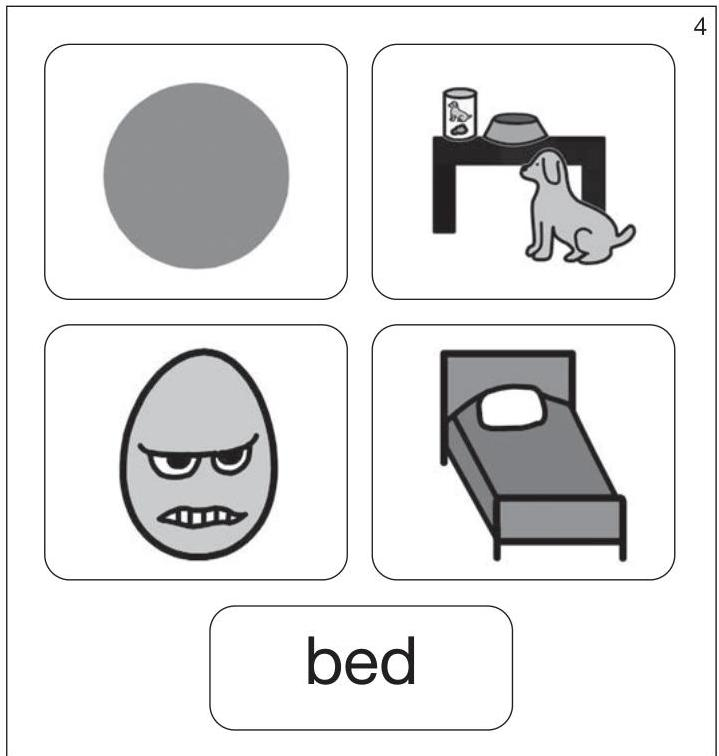

Figure 2.8. Response plate for assessment of word decoding, with symbols for RED (colored), BEG, BAD, and BED. (From Light, J., &amp; McNaughton, D. [2009]. Accessible literacy learning: Evidence-based reading instruction for individuals with autism, cerebral palsy, Down syndrome, and other disabilities [p. 53]. Pittsburgh, PA: Tobii Dynavox; reprinted by permission. PCS is a trademark of Tobii Dynavox LLC. All rights reserved.)

the assessor says the spoken word that corresponds to the target written word (e.g., Coleman-Martin, Heller, Cihak, &amp; Irvine, 2005; Crowley, McLaughlin, &amp; Kahn, 2013).

Each of these assessment tasks imposes different demands. For example, some present a greater load on auditory processing and working memory, others require skills in phonological recoding (i.e., recoding the written word into its spoken form). The AAC team should consider the demands carefully and use tasks that best fit the individual's needs as well as the literacy requirements in the environment. If the individual does not perform well in one of these assessment formats, the team may try an alternative format. Some individuals, such as those with severe chronic aphasia, may have difficulty reading single words in isolation, but may perform more accurately when the written words are presented in the context of a related VSD (Dietz, Hux, McKelvey, Beukelman, &amp; Weissling, 2009; Dietz, Knollman-Porter, Hux, Toth, &amp; Brown, 2014; Wallace, Hux, Brown, &amp; Knollman-Porter, 2014). (See Chapter 6 for further discussion of VSDs with associated text.)

Assessment of Reading Comprehension If the individual is able to decode and/or recognize words by sight, the AAC team also assesses reading comprehension of sentences and longer texts. Assessment of reading comprehension typically

People Who Require AAC

involves asking an individual to read a sentence or a longer passage of text and then answer questions about the content of the text. There are several commonly used reading comprehension assessments that utilize multiple choice or yes/no responses (e.g., Gates-MacGinitie Reading Tests; Peabody Individual Achievement Test-Revised; Woodcock-Johnson IV reading subtests). These can be adapted to accommodate the needs of individuals who rely on AAC by providing the multiple-choice options on separate cards that can be easily selected through eye gaze, pointing, exchanging, or partner-assisted scanning through the options. Or the AAC team may develop its own tools to assess functional reading comprehension using materials that are relevant and meaningful to the individual's daily life (e.g., comprehension of instructions at work, recipes, public transportation schedules, web site content).

## Assessment of Spelling Skills

Assessment of spelling skills is also important to determine if the individual can rely on letter-by-letter spelling to augment expressive communication. Sometimes, the AAC team may use a standardized measure of spelling performance (e.g., Peabody Individual Achievement Test, PIAT; Wide Range Achievement Test; Woodcock-Johnson spelling subtest). Or the team may use a spelling test based on the classroom curriculum for those individuals who are in school. However, these instruments often do not provide information on the individual's spelling of words that might be used for functional communication across daily environments. Therefore, AAC teams may develop criterion-referenced assessments of spelling skills by asking the individual to spell, letter by letter, a range of words relevant to their communication needs. Because various AAC techniques require different types of spelling skills, the team may use several different measures of the individual's performance:

- Spelling accuracy following traditional rules (i.e., words spelled with all of the correct letter sequences for the word)
- Functional spelling accuracy (i.e., words that are understood even if they are not accurately spelled; often words spelled phonetically)
- First letter spelling accuracy (i.e., accurate identification of the initial letter[s] in words)

With accurate or functional spelling skills, individuals may be able to rely on letter-by-letter spelling to augment their communication. Even if individuals are unable to spell words correctly or phonetically, they may still be able to use AAC technologies with word prediction if they are able to consistently identify the first letter(s) of words and are able to then recognize written words by sight. In word prediction techniques, the individual selects the first letter(s) of the word, and the technology attempts to predict the word. (See Chapter 6 for further discussion of prediction techniques.)

## Results of Literacy Assessment

Results of the literacy assessment provide the AAC team with information on the role that literacy can play within the individual's AAC systems, to support either comprehension or expression. It is not at all unusual for individuals with complex communication needs to have limited or uneven profiles of literacy skills. Individuals with developmental disabilities do not always receive appropriate instruction in literacy skills and individuals with acquired disabilities may be vulnerable to disruptions in their literacy capabilities. As with assessments in other domains, it is important that the AAC team understands the individual's literacy

AAC Assessment
61

capabilities, is aware of the available AAC options and their operational requirements, and ensures a good match between the AAC supports and the individual. The results of the literacy assessment can also be used to design effective instruction to enhance literacy capabilities. (See Chapter 12.)

## Assessment of Cognitive Processes

In addition to language, symbol representation, and literacy, the AAC team also needs to understand the individual's cognitive processes. This information can be used to guide feature matching to ensure an appropriate fit between the AAC supports selected and the needs and capabilities of the individual. Cognition is a complex area of function that encompasses multiple processes, including, but not limited to, attention, perception, memory, problem solving, and decision making (Smith &amp; Kosslyn, 2007). Also important is the individual's cognitive/linguistic organization strategy.

## Assessment of Cognitive/Linguistic Organization

When individuals use aided AAC, it is important that their AAC supports reflect the ways that they organize linguistic information and think about the world. Therefore, it is essential that the AAC team assess the individual's cognitive/linguistic organizational strategy. There are six different types of cognitive/linguistic organizations that are utilized in aided AAC systems: schematic or event based, taxonomic or categorically based, semantic-syntactic (i.e., organized by word classes), alphabetic, chronological, and idiosyncratic (i.e., unique to the individual). (See Chapter 6 for further discussion.)

Individuals with complex communication needs may utilize different types of linguistic/cognitive organizations depending on their age, disabilities, educational history, and other factors. Younger children typically organize concepts based on the event schema in which they occur; this is how children first learn language concepts—within meaningful events (Fallon, Light, &amp; Achenbach, 2003). Adults with severe aphasia who experience difficulties accessing language through their semantic memory systems may also perform better with this type of episodic or schematic organization; some may organize events chronologically (Griffith, Dietz, &amp; Weissling, 2014). As children progress through school and enter adulthood, they learn to use taxonomic, hierarchical categorization systems (e.g., grouping together people, food, vehicles, clothing) as ways to organize information. Alphabetic organizations may be used by those with strong literacy skills. Some individuals with complex communication needs demonstrate unique organizational systems (e.g., grouping concepts by favorite songs or by important holidays).

Sometimes individuals who use AAC are introduced to specific organizations for instructional purposes to enhance language development or improve communication efficiency. For example, a semantic-syntactic approach (sometimes referred to as the Fitzgerald Key) organizes concepts by word classes, with the AAC display set up with agents on the left side, then actions, then descriptors, then objects and so forth, to promote syntactic development. Or a frequency-of-use organization might group frequently used concepts together in easily accessible locations to maximize communication efficiency. One of these organizations is not better than the others. The most appropriate organization will vary across individuals and should be selected based on the needs and capabilities of the individual with complex communication needs. The goal is that the individual is able to locate concepts quickly and easily, with minimal cognitive effort.

People Who Require AAC

The AAC team assesses the individual's typical pattern of cognitive/linguistic organization so that the aided AAC system can be designed to reflect this organization. It is important to note that this is not an assessment to determine whether the individual can use a specific organization, but rather to determine which organization fits best with the way in which the individual thinks. To assess the individual's cognitive/linguistic organization, the AAC team

1. Determines a list of potential vocabulary items that the individual requires for communication
2. Includes a range of concepts (e.g., people, actions, objects, places, questions, social words) as appropriate to meet communication needs
3. Selects appropriate representations for these concepts (e.g., photographs, line drawings, written words) based on the results of the symbol representation assessment
4. Reviews the representations with the individual to ensure that they are understood, relating each one to the individual's experience
5. Asks the individual to sort or organize the representations on a series of displays
6. Analyzes the overall pattern to see if items are organized according to event schema (e.g., circle time at school, playing outside, story time), taxonomic categories (e.g., people, food, places, actions), alphabetic order, or some other organizational strategy (Fallon et al., 2003). It is unlikely that every item will reflect the same organization strategy; however, usually one strategy predominates.

This task is the preferred way to assess cognitive/linguistic organization as it is open-ended and therefore provides the most information. However, this task is also challenging as it requires the individual to think about the relationships among numerous concepts/representations and to attend to the task until all of the representations are organized. The task can be challenging for young children, individuals with attention deficits, or older individuals with cognitive limitations. In these cases, the AAC team can provide the individual with a target concept or representation (e.g., baby) and then offer three (or more) additional representations—one that is in keeping with a schematic organization (e.g., diaper), one that is in keeping with a taxonomic organization (e.g., boy), and one that represents other options (e.g., TV). The team then asks the individual which one of the three (e.g., diaper, boy, TV) goes with the target representation (i.e., baby). The team repeats a number of different trials using relevant vocabulary and analyzes the individual's response patterns across the trials to determine the predominant organization strategy. In some cases, the team may want to mock up aided AAC supports using two different organizational strategies and provide the individual with trial use of each one, collecting data on accuracy and efficiency of use as well as preference. The results of this assessment of cognitive/linguistic organization provide the team with information on the individual's organizational strategy to guide the design of aided AAC supports.

Assessment of Attention, Memory, World Knowledge, and Metacognitive Skills Many other aspects of cognition will also impact AAC intervention, but the following components may be especially important for the team to consider: attention, memory, world knowledge, and metacognition (Light &amp; Lindsay, 1991; Rowland &amp; Schweigert, 2003; Thistle &amp; Wilkinson, 2013).

Attention refers to the ability to focus and concentrate on relevant stimuli and to inhibit distractions. All communication activities impose attentional demands,

AAC Assessment

but the demands are increased when individuals rely on aided AAC (Wilkinson &amp; Hennig, 2009). The individual must attend to his or her own behaviors, the partner's acts, the shared activity, and the aided AAC display, thus amplifying the attentional load (Light, McNaughton, &amp; Caron, 2019). Furthermore, the AAC display in and of itself imposes significant attentional demands. The individual must initiate and sustain attention to the display in order to visually scan the display, process available representations, locate the target concept, and then select it, all while inhibiting the distraction of irrelevant stimuli (Thistle &amp; Wilkinson, 2009).

Memory involves a complex set of processes that have profound implications for a person's ability to learn, organize, retrieve, select, and sequence concepts that are represented through both unaided and aided representations (Light &amp; Lindsay, 1991; Mirenda, 2003; Oxley &amp; Norris, 2000). One of the key components of the memory system is working memory, which is defined as the cognitive means by which the individual maintains and manipulates information while completing a task (Thistle &amp; Wilkinson, 2013). Working memory is constrained in capacity and duration (Benjafield, 2007) and may be limited in individuals with developmental or acquired conditions. Aided AAC imposes significant working memory demands as the individual must keep the full message in mind, maintain awareness of the concepts communicated to date (e.g., letters, symbols), and retain the concepts still to be communicated, all while visually searching the display for the target concept, locating it, selecting it, and monitoring the partner (Thistle &amp; Wilkinson, 2013).

World knowledge refers to understanding of people, objects, and processes gained from education and experience in the world. World knowledge positively impacts new learning—the more we understand about the world, the easier it is to acquire and integrate new learning. World knowledge influences understanding and learning of AAC representations. Many individuals with disabilities confront extrinsic barriers that limit their education and community experiences, negatively impacting their world knowledge.

Metacognitive skills allow people to reflect on their own cognitive experiences with regard to language use and learning (metalinguistics), memory strategies (metamemory), and self-regulation (executive functions). Metacognitive skills are more advanced cognitive skills; typically, they develop during the school years. They are essential for monitoring interactions, identifying problems, brainstorming solutions, and implementing effective strategies to bypass limitations and attain communicative competence (Light &amp; Lindsay, 1991; Oxley &amp; Norris, 2000).

Cognitive processes such as attention, memory, world knowledge, cognitive/linguistic organization, and metacognitive skills all impact AAC intervention. As with other domains, the AAC team should understand the individual's capabilities and ensure that AAC interventions are an appropriate match for the individual's cognitive skills. Unfortunately, no empirically validated assessment tools are available to assess the capabilities of individuals with complex communication needs across all of these cognitive domains. There are some general norm-referenced, nonverbal measures that may be used with individuals with complex communication needs (see DeThorne &amp; Schaefer, 2004, for a summary of the psychometric properties and motor requirements of some of these tools). However, these measures seldom yield information that is useful in planning AAC intervention. There are also some instruments available to assess basic cognitive and communication skills such as contingency awareness, communicative intentionality, and symbolic representation, using either observational, interview, and/or direct assessment methods (e.g., Communication and Symbolic Behavior

People Who Require AAC

Scales, Wetherby &amp; Prizant, 1993; Communication Matrix, Rowland, 2004). A number of authors have emphasized that formal measures are not appropriate for many individuals with complex communication needs; it may be much more appropriate to use a dynamic assessment process that is designed to accommodate individual needs in terms of tasks, materials, and procedures (Iacono &amp; Caithness, 2009; Snell, 2002). With this approach, the AAC team first teaches new skills and then tests them. As noted earlier, dynamic assessments provide information about the individual's skills, as well as the type and amount of instruction that will be needed to teach new skills.

Various AAC techniques require different types and levels of cognitive skills. The key is to ensure an appropriate match between the demands of the AAC support and the capabilities of the individual. Fried-Oken, Mooney, and Kinsella (2019) developed an online resource summarizing the research on cognition and AAC. The resource draws on the existing research base to support service providers in considering the attention, memory, and executive function demands that different AAC technology features impose on individuals with complex communication needs.

## Assessment of Motor Capabilities

People with complex communication needs rely on a variety of motor acts to express themselves. These range from the hand shapes and movements to produce various gestures or manual signs; to the oculomotor acts to produce various eye blink codes; to the motor acts required to operate aided AAC technologies (e.g., direct selection with hands, eyes, or head; scanning). Some individuals with complex communication needs have severe motor impairments (e.g., cerebral palsy, spinal cord injury, ALS); others may have more subtle motor impairments that affect their concentration, range of movement, and ability to use AAC functionally in a variety of positions. The level and type of motor impairment will affect the range of movements available to the individual as well as the accuracy and efficiency of these movements.

To provide appropriate intervention, the AAC team requires an understanding of the motor capabilities of the individual and the impact on function. Some individuals have increased or decreased muscle tone; too much tone makes voluntary movement difficult, whereas too little tone creates problems with maintaining posture, balance, and strength. Some individuals may have limited muscle strength and may experience substantial weakness, limiting their movement and resulting in fatigue. Some individuals, such as those with cerebral palsy, may experience movement disorders such as athetosis, which is characterized by slow, involuntary, writhing movements such that they may not have sufficient control of their upper extremities to type or point to symbols on a display and may need to use alternative access to control AAC technology. Given the prevalence of motor impairments among individuals with complex communication needs, the AAC team should draw on the expertise of occupational and physical therapists to 1) identify persistent reflex patterns, 2) assess motor performance for unaided AAC, 2) assess seating and positioning requirements, and 3) assess motor performance to control aided AAC (both low-tech and high-tech).

## Assessment of Reflex Patterns

Some individuals with motor impairments experience persistent reflex patterns, that is, involuntary muscle responses that may interfere with intentional motor control. The AAC team needs to ensure (as much as possible) that these reflex patterns are not triggered unduly, do not interfere with AAC use, and are not misinterpreted as intentional communicative acts. Some of the

AAC Assessment
65

most frequent reflex patterns observed in individuals with disabilities include the rooting reflex, asymmetrical tonic neck reflex (ATNR), and symmetrical tonic neck reflex (STNR). The rooting reflex occurs when individuals' cheeks are stroked and they turn their heads to that side and open their mouths. This reflex occurs in newborns, but if it persists in children with cerebral palsy, it can interfere with voluntary head control (Orelove &amp; Sobsey, 1996). Care must be taken not to position an access switch so that it touches the cheek frequently and triggers this reflex.

The asymmetrical tonic neck reflex (ATNR) is activated when the individual's head is turned to the side, causing the individual to extend the arm and leg on the same side and prompting flexion of the arm and leg on the opposite side (see Figure 2.9). Once the reflex has been activated, many individuals become stuck in this atypical motor pattern and have difficulty resuming a midline position. AAC systems for individuals who exhibit this reflex should be designed to prevent the need for head rotation, because once the individuals turn their heads, they will be unable to use their arm on that side for direct selection.

The symmetrical tonic neck reflex (STNR) is another common reflex pattern, which occurs in response to either extension or flexion of the neck. When the individual's neck flexes (i.e., bends forward), this reflex prompts flexion of the arms at the elbows and extension of the hips (see Figure 2.10a). The opposite occurs when the individual's neck extends (i.e., moves backward): The individual's arms extend outward and the hips flex (see Figure 2.10b). The individual may become stuck in this position and have difficulty functioning. Because this reflex interferes with functional use of arms and hands, its presence affects motor performance and AAC access. The reflex may be triggered when AAC displays or switches are placed down on a flat surface in front of the individual requiring neck flexion (see Figure 2.10c) or when partners stand over the individual requiring neck extension (see Figure 2.10e). AAC displays or switches might be better positioned vertically or on a tilt in front of the individual (see Figure 2.10d); communication partners should position themselves at the individual's eye level (see Figure 2.10f).

In addition to these common reflex patterns, some individuals have skeletal deformities that affect various aspects of positioning and function. A common example is scoliosis (lateral curvature of the spine), which can affect upright posture as well as comfort. Prevention of such conditions is of primary importance, but if they have already developed and are fixed, then adaptations may be required to maximize comfort and function.

## Assessment of Motor Skills for Unaided AAC

Most individuals with complex communication needs rely on at least some unaided AAC (e.g., gestures, manual signs, eye blink codes) to communicate. Some individuals with severe motor impairments may use only a limited range of signals; others who have better motor control may make greater use of unaided AAC, including gestures or manual signs. Each of these gestures or manual signs requires 1) a specific hand shape (e.g., an open palm, a closed fist, an extended index finger); 2) a position relative to the body (e.g., at the mouth, on top of the head, in front of the chest); 3) orientation (e.g., facing toward the individual, facing away, facing down); and 4) movement (e.g., two-handed repeated tapping at the midline, two-handed reciprocal motions on either side of the midline). Some of these hand shapes, positions, orientations, and movements are more difficult to produce than others. Perhaps surprisingly, no widely accepted assessment

People Who Require AAC

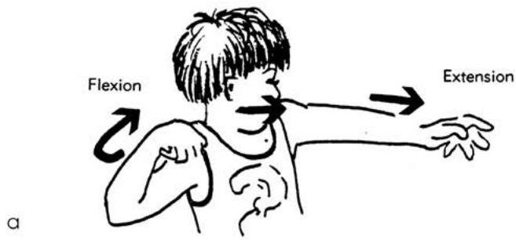

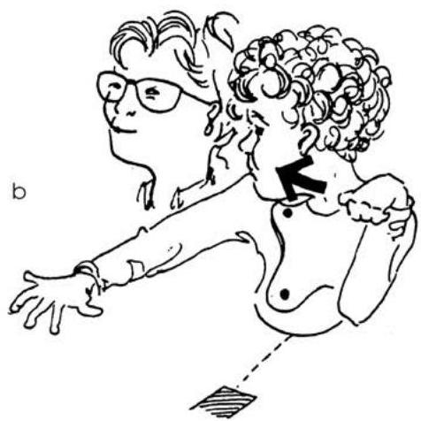

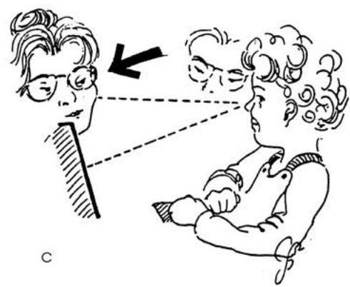

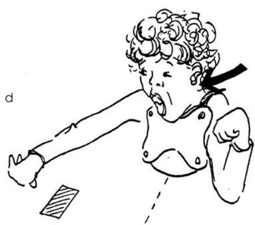

Figure 2.9. a) Asymmetrical tonic neck reflex (ATNR); b) facilitator and/or augmentative and alternative communication (AAC) display should not be placed to the side; c) midline placement of facilitator and/or AAC display is preferred; d) switches should not be placed to the side; e) midline placement of switches is preferred. (From Goossens', C., &amp; Crain, S. [1992]. Utilizing switch interfaces with children who are severely physically challenged [p. 40]. Austin, TX: PRO-ED; copyright © Carol Goossens'; reprinted by permission.)

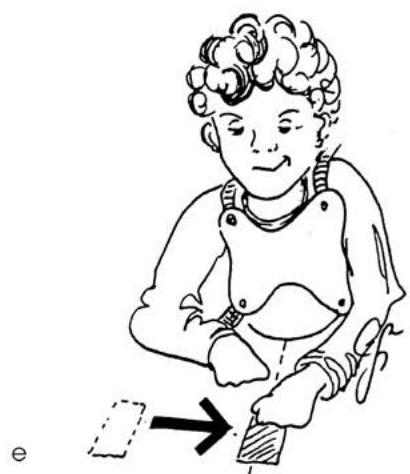

AAC Assessment

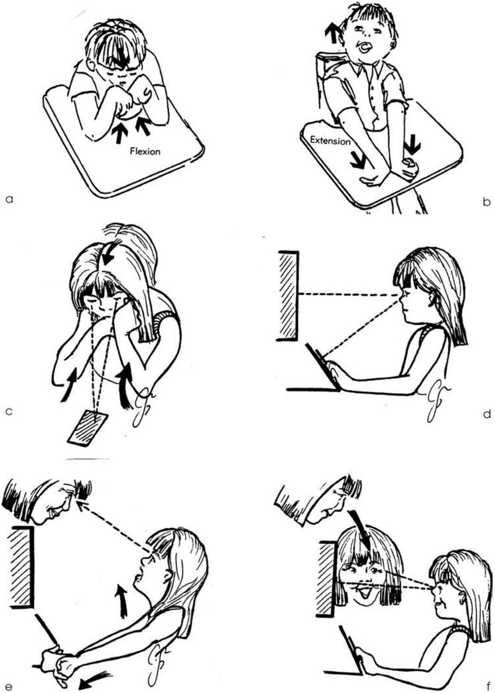

Figure 2.10. a) Symmetrical tonic neck reflex (STNR) in response to neck flexion; b) STNR in response to neck extension; c) horizontal placement of augmentative and alternative communication (AAC) display and/or switches may activate STNR; d) AAC display should be placed at eye level and switches should be aligned vertically; e) approaching from above may activate STNR; f) facilitator should approach at eye level. (From Goossens', C., &amp; Crain, S. [1992]. Utilizing switch interfaces with children who are severely physically challenged [p. 43]. Austin, TX: PRO-ED; copyright © Carol Goossens'; reprinted by permission.)

People Who Require AAC

measures are available to determine the appropriateness of gestures and manual signing for individuals with complex communication needs. The AAC team (with expert input from an occupational or physical therapist) considers 1) the range of hand shapes and movements that are within the individual's motor repertoire already and therefore might be used for expression immediately as appropriate, 2) which ones might be acquired with instruction and practice, and 3) which ones may be outside the functional repertoire of the individual. This assessment might include 1) observation of the individual's motor performance in a variety of natural contexts, noting hand shapes, positions, orientations, and movements; 2) imitation tasks in which the individual is instructed to produce specific movements; or 3) requests to perform functional tasks that require specific hand shapes or movements (e.g., picking up an object, throwing it away). Some individuals also use pantomime or eye blink codes to express themselves. In these cases, the assessment of motor skills can be extended to include these types of motor acts as well. This is another domain where dynamic assessment is very useful. The AAC team first teaches the individual a few manual signs or gestures that are highly motivating and functional and then probes the individual's use of these signs.

## Assessment of Seating/Positioning

People who rely on AAC who have severe motor impairments (e.g., cerebral palsy, spinal cord injury, ALS) may require specialized seating and positioning throughout the day. Others may have more subtle motor impairments, but may require appropriate positioning to ensure their concentration, range or precision of movement, and functional use of unaided and/or aided AAC. As required, the individual's seating and positioning should be assessed with input from skilled occupational or physical therapists. The goals of seating and positioning are to

1. Maximize comfort and allow rest
2. Provide security and ensure safety
3. Maximize function
4. Inhibit reflex patterns that may interfere with intentional motor acts
5. Minimize the development of fixed deformities that may result from limited movement (Costigan &amp; Light, 2011)

Functional seating has a wide range of positive effects, including improved postural control (Reid, 1996); improved head and trunk control (Myhr, von Wendt, Norrlin, &amp; Radell, 1995); improved arm and hand function (Myhr et al., 1995); improved accuracy of target selection on an AAC device (Costigan &amp; Light, 2010b); and increased happiness (Ryan et al., 2009). An individual's capabilities may be significantly underestimated if he or she is not properly positioned and therefore cannot concentrate and participate effectively. The AAC team must ensure that the individual is properly positioned throughout the assessment to ensure accurate assessment of language, literacy, cognitive, and motor capabilities. Over time, individuals may require reassessment of their seating and positioning needs as they grow or as their needs and capabilities change. Although the actual seating and positioning assessment should only be conducted with input from skilled occupational or physical therapists, all members of the AAC team should be attuned to the individual's seating

See the webcast entitled Seating and Positioning for Individuals Who Use Assistive Technology by Aileen Costigan, an occupational therapist, at the online AAC Learning Center.

AAC Assessment

and positioning and should recognize when adjustments are required (Costigan &amp; Light, 2011). Figure 2.11 provides several examples of poor positioning as well as adaptations to improve seating position to enhance function.

Most individuals with complex communication needs are likely to require access to AAC in a wide range of contexts. Therefore, the AAC team should consider appropriate positioning and seating across all contexts of daily living (e.g., at home during meals, at school or work, during play outside with peers, on the bus or in the car, in bed at night). Typically, the first step in an assessment of seating and positioning is to observe the individual and his or her functioning in various positions across these key

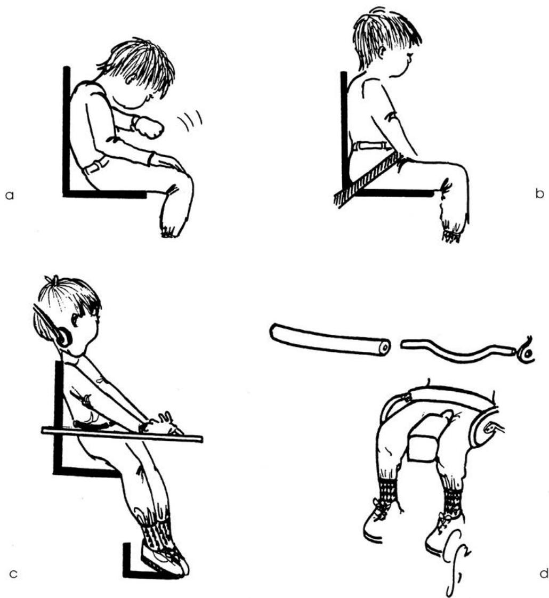

Figure 2.11. a) Poor positioning in a chair; b) good positioning with the pelvis back in the chair and stabilized with a seat belt at a  $45^{\circ}$  angle across the hips; c) extensor thrust with hips extended and buttocks raised across the seat; d) subasis bar (rigid pelvic restraint used to stabilize the pelvis and prevent extensor thrust) in place, with two variations shown. (From Goossens', C., &amp; Crain, S. [1992]. Utilizing switch interfaces with children who are severely physically challenged [p. 26]. Austin, TX: PRO-ED; copyright © Carol Goossens'; reprinted by permission.)

People Who Require AAC

contexts. Then for each context, the team considers the adaptations required, implements the adaptations, and then evaluates their effects on comfort, safety, and function. A variety of supports may be needed to ensure that the individual has the efficiency and accuracy of movement needed for communication, including commercially available supports (e.g., adaptive seats, floor sitters, bath chairs) or personalized adaptations to stabilize and align the pelvis, trunk, hips, thighs, legs, shoulders, and/or head.

A number of principles should guide the assessment and design of supports for functional positioning and seating:

1. Ensure equipment promotes functional weight bearing. Functional seating and positioning require equipment that accommodates the individual's weight, provides a stable base of support, avoids triggering reflexes, and allows functional movement (Cook &amp; Polgar, 2015; Costigan &amp; Light, 2011).
2. Position the pelvis for stability and mobility. The position of the pelvis is the foundation for functional seating (Costigan &amp; Light, 2010b; McEwen &amp; Lloyd, 1990). The pelvis should be stabilized and positioned with a neutral or slight anterior tilt to facilitate trunk and upper extremity mobility (Stavness, 2006) and with a neutral lateral tilt and rotation to minimize anatomical deformities and promote weight bearing, comfort, safety, and stability (Cook &amp; Polgar, 2015).
3. Pursue proper body alignment. The ideal seated position is one that is symmetrical and stable. The individual's head, neck, and trunk should lie within the same planes with minimal curvature or inclination; this alignment will distribute body weight evenly, minimize deformities, maximize respiratory function, and place the body in a position to initiate and engage in functional activities with the upper extremities (Cook &amp; Polgar, 2015).

Table 2.3 provides a summary of the principles and guidelines for functional seating.

As a general rule, the team provides the least amount of seating and positioning support needed to achieve the greatest level of function. It is important to ensure that people can rest with appropriate physical support. For example, individuals with weakness due to a degenerative condition such as ALS need to be able to rest when they are not actively communicating. Once the individual's seating and positioning

Table 2.3. Guidelines for functional seating and positioning

|  Guideline | Specific principles  |
| --- | --- |
|  1. Ensure equipment promotes functional weight bearing | • Appropriate base of support
• Horizontal or forward sloped seat
• Vertical seat back
• 1- to 2-inch clearance between seat and back of knees
• Consistent contact between seat back and lower back
• Consistent foot support  |
|  2. Position the pelvis for stability and mobility | • Neutral/slight anterior tilt
• Neutral lateral tilt and rotation  |
|  3. Pursue proper body alignment | • Align the trunk, head, and neck
• Position lower extremities to support upper body
• Provide external supports to upper body as needed  |

Adapted from Costigan, F. A., &amp; Light, J. (2011). Functional seating for school-age children with cerebral palsy: An evidence-based tutorial. Language, Speech, and Hearing Services in Schools, 42, 223-236; reprinted by permission.

AAC Assessment
71

are appropriate (either temporarily or permanently), the AAC team can proceed to assess motor capabilities for access to aided AAC (low- or high-tech).

## Assessment of Access

The goal of assessing motor capabilities for access is to determine what motor acts the individual can use to respond consistently and access aided AAC for communication. The AAC team identifies motor acts that the individual can use immediately (without significant instruction) to meet current communication needs and participate within the assessment; the team may also identify additional potential access techniques that may require instruction to meet needs more effectively or efficiently or to provide greater independence in the future. The involvement of a skilled physical and/or occupational therapist is critical.

Lee and Thomas (1990) proposed the following protocol to assess and implement access techniques for aided AAC:

1. Interview the individual and family and gather background information about the individual's access needs, capabilities, and environments.
2. Observe the individual engaged in practical, functional activities to glean a preliminary sense of motor capabilities to determine a starting point for the assessment.
3. Investigate the individual's capabilities and determine the features required in the access technique (e.g., size of display, number, size, and spacing of targets).
4. Trial potential access techniques and compare performance across techniques.
5. Select the best access approach(es) and personalize them (e.g., mounting, positioning, integration with other technologies).
6. Teach operational use.
7. Implement in the individual's daily environment(s).
8. Evaluate progress and monitor use.

This assessment approach does not involve formal, norm-referenced measures; rather it is a dynamic, criterion-referenced approach, focusing on determining the individual's capabilities to utilize specific access techniques.

There are two primary approaches to selecting items from an aided AAC display: direct selection and scanning. As the name suggests, with direct selection, the individual directly indicates the target (i.e., picture, written word, alphabet) using a body part (e.g., finger, thumb, hand, eyes, toes) or some type of adaptive pointer (e.g., light pointer, safe laser, head/chin pointer) controlled by movement of the head or other body part. In contrast, in scanning, the partner or AAC technology offers target items to the individual one at a time or in a group; and the individual signals (in some way) when the target item is presented. (See Chapter 7 for a more detailed discussion of access techniques for individuals who require AAC.) Because direct selection can be more efficient for individuals with sufficient motor control, is easier to learn, and is generally considered more socially acceptable than scanning, motor assessment usually focuses first on direct selection (Dowden &amp; Cook, 2002). If direct selection techniques prove to be inaccurate, very slow, or fatiguing for the individual, the team then initiates a scanning assessment. Sometimes an individual can communicate using direct selection most of the day but needs to change to scanning when tired or lying down. In such cases, assessment will need to examine both direct selection and scanning abilities.

People Who Require AAC

## Direct Selection

The assessment of direct selection capabilities generally occurs in the following sequence: 1) hand and arm control, 2) eye gaze control, 3) head and orofacial control, and 4) foot and leg control. The individual's upper limbs are assessed first because the hands potentially provide the most discrete control and have the greatest social acceptance as an access technique (Dowden &amp; Cook, 2002); this assessment may include consideration of selection via right or left index fingers, thumbs, open hands, or fists. In some cases, the individual may be able to reach toward the target but may have difficulty pointing. In these cases, the team may explore a variety of assistive supports or devices to facilitate pointing, including, for example, splints or pointers. If hands are not functional, the team assesses direct selection via eye pointing (i.e., looking at the target) to control low- and/or high-tech systems. There have been significant advances in eye tracking technology, making this a viable option for many individuals who cannot use their hands for direct selection. The AAC team may also assess head and neck movements to control an optical pointer, laser or light pointer, head- or chin-mounted stick, head tracker, or other adaptive selection device to access aided AAC. Usually the team assesses the individual's foot and leg control last because most people with motor impairments do not have the fine motor control of their lower extremities needed for direct selection. However, in some cases, an individual may have better control in the lower extremities and may be able to use direct selection with a toe.

In completing an assessment of direct selection, the team conducts a series of trials with each relevant body site to investigate the individual's ability to select targets of various sizes in a range of locations with various spacing. The team does not necessarily evaluate all possible body sites for direct selection; sites are explored only as required to identify an accurate and efficient means of access to meet the individual's needs. Figure 2.12 provides an example of a form designed to collect and summarize the data collected from a direct selection assessment. For each trial, for each body site (e.g., fist, eyes), the team records the accuracy of selection and the latency (i.e., time to select the target). The team also records the position and orientation of the individual and the AAC technology. If the individual shows some success with specific motor acts, the AAC team may provide additional assessment to determine the extent to which adaptations such as keyboards, display angles, head supports, and trunk supports improve the individual's accuracy, efficiency, and range of motion. The team should also collect information on the individual's preference as well as any negative impacts of the selection technique. Sometimes direct selection techniques can lead to unwanted consequences for a specific individual, such as persistent atypical reflexes, excessive muscle tone, atypical postures, or excessive fatigue. The team uses the data collected to determine whether direct selection is a viable option and if so, which control site (e.g., hands, eyes, head, feet) offers the best range, accuracy, and efficiency of movement for the individual and with which positioning and adaptations.

Chris Klein has limited use of his hands, but he is an expert communicator via AAC, using his toe for direct selection. Visit the online AAC Learning Center to view several webcasts of Chris talking about his experiences living an active, engaged, and independent life in the community using AAC.

For the access assessment results to be valid, the individual must be motivated to participate and must understand the task requirements. Therefore, the team should use familiar and

AAC Assessment
73

Direct Selection Survey

|  Site | Direct selection device | Adaptations used (e.g., splint, keyboard) | Target (size, number, spacing, orientation to body) | Times hit/ missed | Negative impact (e.g., increased muscle tone, reflex activation, posture, fatigue) | Comments  |
| --- | --- | --- | --- | --- | --- | --- |
|  Right hand/arm |  |  |  |  |  |   |
|  Left hand/arm |  |  |  |  |  |   |
|  Head | Head mouse |  |  |  |  |   |
|  Head | Safe-laser |  |  |  |  |   |
|  Head (other) |  |  |  |  |  |   |
|  Eyes | Gaze/point |  |  |  |  |   |
|  Eyes | Tracking |  |  |  |  |   |
|  Other |  |  |  |  |  |   |

Figure 2.12. Direct selection survey.

People Who Require AAC

motivating materials and should make every effort to minimize the cognitive, linguistic, and technical aspects of the assessment so that motor control can be isolated and investigated. For example, when conducting an assessment of direct selection options for a 2-year-old girl with a rare, genetic, degenerative condition, we used still images from some of her favorite movies and music videos as targets. When she selected the target image successfully, she was able to play a short clip of the movie or video. To simplify the task demands, there was only one target on the screen for each trial. She was highly motivated to participate in the assessment and the team was able to explore her performance across a number of trials with targets of various sizes in various locations to determine the best access approach.

Because people with complex communication needs may have had little (if any) experience with the access options used in the assessment, an individual may not initially demonstrate high levels of accuracy and efficiency. It is important to provide regular opportunities for the individual to practice these new techniques and then assess performance after this practice to observe improvements.

Switch Assessment for Scanning Many individuals with complex communication needs are able to control aided AAC through direct selection using hands, eye tracking, or head tracking. If the individual is unable to directly select items from a display with sufficient accuracy, efficiency, and consistency, then the AAC team considers scanning as an alternative access technique. Scanning is much slower than direct selection and is more difficult to learn and use (McCarthy et al., 2006; Reichle, York, &amp; Sigafoos, 1991). Nonetheless, scanning can provide reliable access for those with very complex motor impairments. Assessment for scanning focuses on switch access and involves identification of one or more body sites that the individual can use to activate one or more switches, as well as assessment of the individual's ability to use various scanning strategies and arrangements (see Chapter 7 for further details on scanning).

Screening for a switch activation site on the body is the first step of a scanning assessment. To reduce demands, it may be helpful to ask the individual to control a simple computer game (rather than attempting to control AAC technologies during the initial assessment). The team considers various motor control sites (e.g., fingers, hands, head, feet, knee, cheek, eyebrow) as well as various types of switches that respond to different properties.

Within the scanning assessment, the team considers several different cursor control techniques: automatic, directed, or step scanning. As the name suggests, automatic scanning automatically presents an item (or group of items) and the individual activates a switch when the target item is presented. In directed scanning, the individual activates a switch, series of switches, or joystick and drives the cursor toward the target in a predetermined pattern; this approach is used in many video games. In step scanning, the individual

Koester Performance Technologies offers a range of free software on their web site for access assessment for individuals with motor impairments. These applications support AAC teams in assessing and matching access techniques to individuals and making adjustments to maximize performance. Research shows that even when access solutions are provided by experienced practitioners, a systematic, data-driven revision can improve individual performance and productivity significantly (Koester &amp; Simpson, 2014, 2019).

AAC Assessment
75

activates a switch and the cursor moves through the predetermined pattern one step at a time for each activation. (See Chapter 7 for further explanation of these scanning techniques.) Each of these scanning techniques imposes different motor demands on the individual; the AAC team should select the technique that best fits the individual's motor capabilities. Essentially, there are four different components of switch control: waiting for the right moment to activate the switch, activating the switch, holding the switch in an activated position, and releasing the switch accurately and efficiently. Some individuals who are able to activate the switch accurately and promptly are not able to hold or maintain switch closure. Some may have difficulty releasing the switch once they have activated it.

Figure 2.13 provides a form to record the results of the assessment of motor (switch) control for scanning. The team collects data on the individual's performance using various body sites and various types of switches and considers each of the component processes required for scanning—waiting, switch activation, holding, and releasing the switch—as well as overall accuracy, efficiency, and performance. The team uses the data from the switch assessment to make decisions regarding the best body site for switch control, the best type of switches, and the best cursor control technique for scanning (e.g., automatic, directed, or step scanning). Each cursor control technique imposes different demands for waiting, switch activation, holding, and releasing, as illustrated in Table 2.4.

The following case examples illustrate the different motor capabilities of individuals who require AAC and the process of matching scanning cursor control techniques to each individual's needs and skills. Francesca is a child with athetoid cerebral palsy. As is the case for many individuals with athetosis, accurate waiting for switch activation was difficult for her. Because of involuntary motor movements associated with her athetosis, she often inadvertently activated the switch during the waiting phase. Similarly, accurate and efficient switch activation was also difficult because Francesca's overflow movements were accentuated in times of stress or anticipation. Therefore, she was unable to activate the switch quickly on command. However, she was able to maintain contact with the switch and hold it once she managed to activate it. In contrast with the difficulties associated with switch activation, the release phase was relatively easy for her. As indicated in Table 2.4, this pattern of motor performance suggested that directed scanning might be the best alternative access mode for Francesca.

Jin, a woman with amyotrophic lateral sclerosis that causes severe weakness throughout her body, could operate a very sensitive switch affixed just above her eyebrow by raising her forehead slightly. Jin found waiting quite easy and was able to activate the switch with moderate ease when asked. However, she experienced difficulty holding the switch closed because of her weakness. As can be seen in Table 2.4, the best scanning technique for Jin appears to be automatic scanning because this option places minimal demands on holding and causes the least fatigue, a major concern for someone such as Jin who has little motor stamina.

Many individuals who require AAC will have limited or no prior experience using an AAC access technique (whether direct selection or scanning). It is critical that the AAC team provides many opportunities for practice and instruction to improve the individual's performance. Ultimately the goal is that the individual attains a level

People Who Require AAC

Voluntary motor control (single switch)

|   | Is able to wait |   | Is able to activate |   | Is able to hold |   | Is able to release |   | Is able to wait |   | Is able to reactivate |   | Accuracy*  |
| --- | --- | --- | --- | --- | --- | --- | --- | --- | --- | --- | --- | --- | --- |
|   |  Yes | No | Yes | No | Yes | No | Yes | No | Yes | No | Yes | No  |   |
|  Fingers on left hand |  |  |  |  |  |  |  |  |  |  |  |  |   |
|  Fingers on right hand |  |  |  |  |  |  |  |  |  |  |  |  |   |
|  Left hand (palm? back?) |  |  |  |  |  |  |  |  |  |  |  |  |   |
|  Right hand (palm? back?) |  |  |  |  |  |  |  |  |  |  |  |  |   |
|  Left shoulder |  |  |  |  |  |  |  |  |  |  |  |  |   |
|  Right shoulder |  |  |  |  |  |  |  |  |  |  |  |  |   |
|  Head rotation (R? L?) |  |  |  |  |  |  |  |  |  |  |  |  |   |
|  Head flexion |  |  |  |  |  |  |  |  |  |  |  |  |   |
|  Head-side flexion (R? L?) |  |  |  |  |  |  |  |  |  |  |  |  |   |
|  Head extension |  |  |  |  |  |  |  |  |  |  |  |  |   |
|  Vertical eye motions |  |  |  |  |  |  |  |  |  |  |  |  |   |
|  Horizontal eye motions |  |  |  |  |  |  |  |  |  |  |  |  |   |
|  Tongue or chin |  |  |  |  |  |  |  |  |  |  |  |  |   |
|  Left outer leg/knee |  |  |  |  |  |  |  |  |  |  |  |  |   |
|  Right outer leg/knee |  |  |  |  |  |  |  |  |  |  |  |  |   |
|  Left Inner leg/knee |  |  |  |  |  |  |  |  |  |  |  |  |   |
|  Right inner leg/knee |  |  |  |  |  |  |  |  |  |  |  |  |   |
|  Left foot (up? down?) |  |  |  |  |  |  |  |  |  |  |  |  |   |
|  Right foot (up? down?) |  |  |  |  |  |  |  |  |  |  |  |  |   |

*Accuracy = rate of overall accuracy on a 0-4 scale in which 0 = never and 4 = always.
Augmentative and Alternative Communication: Supporting Children and Adults with Complex Communication Needs, Third Edition, by David R. Beukelman and Pat Miranda. Copyright © 2005 Paul H. Brookes Publishing Co., Inc. All rights reserved.
Figure 2.13. Assessment of motor control for scanning (switch use).

AAC Assessment

Table 2.4. Skill-accuracy requirements of cursor control techniques for scanning

|  Motor component | Cursor control technique  |   |   |
| --- | --- | --- | --- |
|   |  Automatic scanning | Directed scanning | Step scanning  |
|  Wait | High | Medium | Low  |
|  Activate | High | Low | Medium  |
|  Hold | Low | High | Low  |
|  Release | Low | High | Low  |
|  Wait | High | Medium | Medium  |
|  Reactivate | High | Medium | Medium  |
|  Fatigue value | Low | Medium | High  |

of access performance that is as accurate, efficient, nonfatiguing, and automatic (i.e., not requiring conscious processing or thought) as possible. This level of performance only comes with repeated practice.

# Assessment of Sensory/Perceptual Skills

In addition to motor skills, vision and hearing are also essential to AAC. Individuals with developmental and acquired disabilities are at risk for vision and/or hearing impairments that may make it more difficult for them to receive input. It is therefore essential that assessments of vision and hearing are conducted early on so that the team is cognizant of any impairments and implements appropriate accommodations. This section discusses hearing and vision assessment and considers the implications of results for AAC assessment and intervention.

Hearing Assessment Assessment of hearing capabilities is important to determine if individuals with complex communication needs are receiving input in their environment that is presented orally (e.g., spoken instructions, questions, or responses; feedback from digitized or synthesized speech output on AAC technologies). Individuals with developmental and acquired disabilities are often at risk for hearing impairments. Furthermore, some individuals with developmental disabilities, such as those with Down syndrome, experience ear infections (i.e., otitis media) that may result in intermittent hearing loss making it difficult to learn language. Hearing assessment is typically conducted by an audiologist with input from an ear, nose, and throat (ENT) doctor as required. Some individuals with complex communication needs (e.g., individuals with ASD) may have difficulties with new environments and task demands; in this case, the team may need to work with the individuals prior to the assessment to prepare them for the new environment and to introduce the new task demands to ensure a valid assessment.

If individuals demonstrate hearing impairments, it is important that they receive appropriate amplification as required and that they are followed regularly by an audiologist. The AAC team may need to augment spoken input with gestures, manual signs, photos, videos, and/or written text, and may need to demonstrate task requirements to support learning (see Table 2.1 for examples of accommodations for hearing impairment). Some individuals receive auditory signals but have difficulty processing them. These individuals may also benefit from the use of visual supports to augment spoken input.

Vision Assessment

Vision assessment is also critical because most AAC, whether unaided or aided, places significant demands on the visual channel. The AAC team needs to understand basic principles of visual cognitive processing and apply these principles to the design of aided AAC so that the displays facilitate the visual attention, search, location, and selection of target representations (e.g. AAC symbols, written words, alphabet), while at the same time inhibiting distractions from other visual input. (See Chapter 6 and Light, Wilkinson, Thiessen, Beukelman, & Fager, 2019 for further discussion of variables to consider when designing aided AAC displays.)

Individuals with developmental and acquired conditions are at increased risk for vision impairments, including difficulties with visual acuity, visual fields, oculomotor functioning, light sensitivity, color sensitivity, and cortical visual impairment (CVI). Assessment of the individual's vision is required to determine the overall functionality of AAC approaches that rely on the visual modality (or the need for AAC approaches that present options via auditory or tactile channels instead). If aided AAC is used, the results of the vision assessment will also impact the personalized design of the AAC display, including decisions about the type, size, placement, spacing, and colors of representations as well as illumination and positioning of the display, partner, and other materials, for example. See Table 2.5 for a summary of the components of functional vision, potential impairments, and considerations for AAC design.

Vision assessments are typically completed by ophthalmologists, optometrists, or vision specialists. Ideally these professionals have experience adapting assessment procedures to accommodate the needs of people with disabilities. If not, it is important for the AAC team to work closely with the vision specialists to explain the needs of the individual and to describe necessary accommodations. Sometimes standard vision assessments can be used with adaptations to the response options to support the participation of individuals who cannot speak (e.g. the examiner indicates various letters on the standard eye chart; the individual selects the letter indicated from an alphabet board). Indirect tests, forced-choice preferential looking procedures, and visual evoked potential tests can all be used to examine visual acuity in individuals with whom standard or adapted eye chart exams cannot be used (Orel-Bixler, 1999).

Visual acuities should always be measured close up and at a distance because communication via AAC requires perception and processing of information at varying distances (e.g. an AAC display positioned proximally and a partner who is farther away). The individual's visual performance may differ depending on the task, as well as the individual's overall abilities and the visual condition causing the impairment. Sometimes individuals with complex communication needs learn to accommodate visual acuity deficits or field losses to some extent by adjusting their point of visual fixation, head position, and/or placement of materials. However, such adjustments may be difficult for individuals with visual impairments who rely on AAC if they also experience motor impairments that interfere with their ability to move, maintain head control, or precisely direct their eye gaze. Some individuals have eye conditions that are stable and relatively unchanging over time. Others have conditions that fluctuate, sometimes daily, depending on the individual's physical status or on environmental factors. In addition, some conditions deteriorate over time, with variability in both the rate of deterioration and the final visual outcome. The team should consider AAC techniques for both current and future use even at the point of initial assessment.

AAC Assessment

Table 2.5. Components of functional vision, possible impairment, and implications for the design of AAC

|  Vision component | Definition | Typical function | Impairment | Considerations for AAC design  |
| --- | --- | --- | --- | --- |
|  Visual acuity | Clarity of vision up close and at a distance | 20/20 (distance from stimulus required to see compared to person with normal vision) | Individuals may have visual acuity difficulties due to unclear lens system, refractive errors, ocular-motor problems, damage to retina or optic nerves, or impaired ability to interpret visual information. | • Appropriate size of representations • Appropriate type of representations • Use of color or contrast for key features • Optimal distance of AAC display from individual • Appropriate illumination  |
|  Visual fields | Areas in which stimuli are visible without a shift in gaze | 150 degree area from right to left; 120 degrees up and down; high acuity in central field; sufficient acuity in peripheral field to detect motion | Some may experience blind spots within visual field; some may have difficulty seeing at midline (central field loss); some may have difficulty detecting/locating stimuli on the side or below; visual field deficits may occur in one or both eyes. | • Appropriate arrangement of symbols; use of blank space to accommodate blind spots as required; • Positioning of AAC display, materials, and partner to accommodate field deficit as required • Adjustment of head position and point of fixation as needed; instruction of individual to shift position as needed  |
|  Oculomotor functioning | Movement of the eyes; muscular control of unified focus | Operation of the eye muscles that enable the eyes to move together smoothly in all directions; establish and maintain visual focus; allow visual scanning, location, fixation, and tracking of stimuli | Some may experience strabismus—focus is compromised because direction of eyes is not coordinated. Some may experience nystagmus—involuntary movement of eye resulting in reduced acuity. Some may experience double vision. | • Avoidance of cluttered AAC displays • Use of highlighting or other cues to draw attention to stimuli • Use of appropriate layouts (e.g., vertical column) • Adjustments to head and body position as required; appropriate location of AAC display • Use of patching of one eye in specific situations to facilitate visual focus  |

(continued)

People Who Require AAC

Table 2.5. (continued)

|  Vision component | Definition | Typical function | Impairment | Considerations for AAC design  |
| --- | --- | --- | --- | --- |
|  Lighting needs and sensitivity | Amount of ambient light required to see | Daylight or medium artificial illumination is adequate | Those with nearsightedness or presbyopia may require increased illumination; those with retinal problems may require low light conditions. | • Appropriate lighting for AAC use; adjustments to lighting as required
• Positioning of AAC to avoid glare; adjustment of display angle
• Use of nonreflective surfaces to decrease glare; sunglasses to reduce glare as required
• Provision of shade or use of low-tech backups in sunlight  |
|  Color perception | Awareness and interpretation of color | Full spectrum of color based on structures within the eye being stimulated at specific wavelengths | Some disorders depress the reception of certain colors; total color blindness is rare; red and green are the colors most often confused. | • Use of colors easily perceived by the individual
• Use of appropriate color to create contrast and draw attention
• Grouping of symbols by color as appropriate to facilitate search  |
|  Cortical visual impairment | Ability to interpret visual information | Intact visual pathways up to and including cortex; able to perceive, interpret, and create inner images | Individuals demonstrate visual inattentiveness caused by central nervous system damage; inconsistencies/ fluctuations in functional vision and perception; often associated with severe cognitive/motor impairments. | • Encouragement of vision use throughout the day; provision of motivating experiences to attach meaning to visual images; repetition to build familiarity
• Stable positioning to facilitate vision use
• Appropriate positioning of stimuli
• Avoidance of clutter in visual materials; elimination of extraneous information
• Use of saturated color (e.g., red, yellow) to draw attention
• Potential use of slow movement to attract visual attention to stimuli
• Use of backlit aided AAC displays
• Waiting to allow processing time  |

From Blackstone, S. (1994). The ABCs of vision in AAC. Augmentative Communication News, 7(5), 1-3; adapted by permission. Additional sources: Roman-Lantzy, 2017; 2018; Roman-Lantzy &amp; Blackstone, n.d.

Cortical visual impairment is one of the most common causes of visual impairment in children. It is a form of visual impairment that is caused by damage to the pathways from the eyes to the brain and the parts of the brain that process visual information, rather than a problem with the eye itself (Boston Children's Hospital, 2019). This leads to difficulty interpreting visual information. A wide range of potential causes of cortical visual impairment includes asphyxia, hypoxia, hydrocephalus, traumatic brain injury, seizures, abnormalities in brain formation, and infections of the central nervous system such as encephalitis or meningitis (Boston Children's Hospital, 2019). The severity may vary from mild to severe impairment. Individuals with cortical visual impairment often demonstrate visual inattentiveness, especially to more complex stimuli. Their visual capabilities fluctuate significantly minute by minute, hour by hour, or day to day (Roman-Lantzy, 2017). Performance is especially affected by fatigue and changes in the environment. Vision may improve over time, especially in children who receive effective intervention to help them learn to integrate information from the visual signals that they are receiving (Roman-Lantzy, 2018).

The International Society for Aug-mentative and Alternative Communication (ISAAC) web site includes a webcast by Dr. Christine Roman-Lantzy (2017) on strategies for assessing and planning intervention for children with cortical visual impairment. The Perkins School for the Blind eLearning web site hosts a wide range of webcasts on cortical visual impairment including one by Dr. Roman-Lantzy and Dr. Sarah Blackstone (n.d.) on approaches to AAC for children with CVI. These webcasts emphasize the importance of early identification and diagnosis; professional collaboration to plan effective assessment and intervention; and intervention to enhance vision, language development, and functional communication via AAC. Table 2.5 includes a summary of guidelines for AAC design and intervention for children with CVI based on recommendations from Roman-Lantzy & Blackstone (n.d.).

## Conclusions

Overall, the goal of AAC assessment is to gather the information necessary to plan effective AAC intervention to enhance the communication and participation of individuals with complex communication needs. AAC assessment can only be accomplished as a team effort with input from the person with complex communication needs, family members, key communication partners or facilitators, and professionals from multiple disciplines. In some cases, as in outpatient clinics, AAC assessments may be completed in a single session on a single day; in others, they may take place over repeated shorter sessions scheduled over multiple days, as might be the case with young children in early intervention or individuals in an inpatient rehabilitation setting. Overall, AAC assessment is a multicomponent process that includes Assessment of the individual's participation patterns and unmet communication needsInvestigation of environmental supports that enhance the individual's communication, as well as policy, practice, attitude, knowledge, and skill barriers that may limit communication opportunities

People Who Require AAC

3. Assessment of the individual's capabilities across a range of domains, including natural speech, expressive communication, receptive language, symbol representation, literacy, cognitive/linguistic organization, seating and positioning, motor skills for access to unaided or aided AAC, hearing, and vision

AAC assessment is not intended to document exhaustively all levels of body structures and impairments. Rather, AAC assessment is intended to gather the key information required to guide effective AAC intervention to meet the individual's current and future communication needs, including selection and personalization of AAC supports, determination of skills and strategies that require instruction to enhance communication effectiveness, and identification of environmental or partner supports required to increase the individual's successful participation.

# QUESTIONS

2.1. Who should be involved in AAC assessment? Why is it important to include the individual who relies on AAC and his or her family?

2.2. What are some of the key considerations for ensuring that an AAC assessment is reliable and valid? What are some of the key considerations when assessing individuals from different cultural and linguistic backgrounds?

2.3. What are the key components of the Participation Model? What is the goal of each of these components? Why are they important?

2.4. Why is it important to assess the participation patterns and unmet communication needs of the individual? How can this be accomplished?

2.5. What are the five types of opportunity barriers? How might they impact the individual's communication? What are the implications for intervention?

2.6. What are norm-referenced assessment and criterion-referenced assessment? Why is criterion-referenced assessment usually preferable to norm-referenced assessment for making AAC decisions?

2.7. Why is assessment of receptive language skills important? What procedures can be used to assess receptive language? What are the advantages or disadvantages of these different approaches?

2.8. Describe five different formats that can be used to assess symbol representation skills. What are the advantages or disadvantages of these different approaches?

2.9. Why are literacy skills important? What specific literacy skills should be considered for assessment? Describe at least one approach to assess each skill.

2.10. What are the goals of seating and positioning? What are the key principles that should guide appropriate seating and positioning?

2.11. How does the AAC team assess the individual's motor capabilities to determine potential access to unaided and aided AAC?

2.12. Describe visual difficulties that might be experienced by individuals who rely on AAC. Describe the potential impact on designing AAC supports.

AAC Assessment
83

# REFERENCES

Adams, M. J. (1990). Beginning to read: Thinking and learning about print. Cambridge, MA: MIT Press.

Ahlgrim-Delzell, L., Browder, D., &amp; Wood, L. (2014). Effects of systematic instruction and an augmentative communication device on phonics skills acquisition for students with moderate intellectual disability who are nonverbal. *Education and Training in Autism and Developmental Disabilities*, 49, 517–532.

American Speech-Language-Hearing Association (2004). Roles and responsibilities of speech language pathologists with respect to augmentative and alternative communication. Technical report. *ASHA Supplement*, 24, 1–17.

American Speech-Language-Hearing Association (2010). Cultural Competence Checklist: Personal reflection. Available from http://www.asha.org/uploadedFiles/Cultural-Competence-Checklist-Personal-Reflection.pdf.

Barker, R. M., Bridges, M. S., &amp; Saunders, K. J. (2014). Validity of a non-speech dynamic assessment of phonemic awareness via the alphabetic principle. *Augmentative and Alternative Communication*, 30, 71–82. doi:10.3109/07434618.2014.880190

Bauby, J.-D. (1997). The diving bell and the butterfly. Rockland, MA: Wheeler Publishing.

Benjafield, J. G. (2007). Cognition (3rd ed.). New York, NY: Oxford University Press.

Beukelman, D. R., Hux, K., Dietz, A., McKelvey, M., &amp; Weissling, K. (2015). Using visual scene displays as communication support options for people with chronic, severe aphasia: A summary of AAC research and future research directions. *Augmentative and Alternative Communication*, 31, 234–245. doi:10.3109/07434618.2015.1052152

Beukelman, D., &amp; Mirenda, P. (2013). *Augmentative and alternative communication: Supporting children and adults with complex communication needs* (4th ed.). Baltimore, MD: Paul H. Brookes Publishing Co.

Beukelman, D. R., Yorkston, K. M., &amp; Dowden, P. A. (1985). Communication augmentation: A casebook of clinical management. San Diego, CA: College-Hill Press.

Binger, C., Kent-Walsh, J., &amp; King, M. (2017). Dynamic assessment for 3- and 4-year-old children who use augmentative and alternative communication: Evaluating expressive syntax. *Journal of Speech, Language, and Hearing Research*, 60, 1946–1958. doi:10.1044/2017.jslhr-l-15-0269

Birmingham Karnezos, J., &amp; Light, J. (2016, November). A checklist for school-based augmentative and alternative communication assessment. Paper presented at the Annual Conference of the American Speech-Language-Hearing Association, Philadelphia, PA.

Björck-Åkesson, E., Granlund, M., &amp; Olsson, C. (1996). Collaborative problem-solving in communication intervention. In S. von Tetzchner &amp; M. H. Jensen (Eds.), *Augmentative and alternative communication: European perspectives* (pp. 324–341). London: Whurr Publishers.

Blackstien-Adler, S. (2003). Training school teams to use the Participation Model: Evaluation of a train-the-trainer model (Unpublished master's thesis). Ontario Institute for the Study of Education, University of Toronto.

Blackstone, S. (1994). The ABC's of vision in AAC. *Augmentative Communication News*, 7(5), 1–3.

Blackstone, S., &amp; Hunt Berg, M. (2003). Social networks: A communication inventory for individuals with severe communication challenges and their communication partners. Monterey, CA: Augmentative Communication, Inc.

Blockberger, S., &amp; Johnston, J. R. (2003). Grammatical morphology acquisition by children with complex communication needs. *Augmentative and Alternative Communication*, 19, 207–221. doi:10.1080/07434610310001598233

Boston Children's Hospital (2019). Cortical visual impairment. Retrieved from http://www.childrenshospital.org/conditions-and-treatments/conditions/c/cortical-visual-impairment

Bridges, S. J. (2004). Multicultural issues in augmentative and alternative communication and language. *Topics in Language Disorders*, 24, 62–75. doi:10.1097/00011363-200401000-00007

Bristow, D., &amp; Fristoe, M. (1987, November). Effects of test adaptations on test performance. Paper presented at the Annual Convention of the American Speech-Language-Hearing Association, New Orleans, LA.

Carrow-Woolfolk, E. (2014). Test for auditory comprehension of language (4th ed.). Austin, TX: Pro-Ed.

People Who Require AAC

Coleman-Martin, M. B., Heller, K. W., Cihak, D. F., &amp; Irvine, K. L. (2005). Using computer-assisted instruction and the nonverbal reading approach to teach word identification. *Focus on Autism and Other Developmental Disabilities*, 20, 80–90. doi:10.1177/10883576050200020401

Cook, A. M., &amp; Polgar, J. M. (2015). *Assistive technologies: Principles and practice* (4th ed.). St Louis, MO: Elsevier Mosby.

Costello, J., &amp; Shane, H. (1994, November). *Augmentative communication assessment and the feature matching process*. Paper presented at the Annual Convention of American Speech-Language-Hearing Association, New Orleans, LA.

Costigan, F. A., &amp; Light, J. (2010a). A review of preservice training in augmentative and alternative communication for speech-language pathologists, special education teachers, and occupational therapists. *Assistive Technology*, 22, 200–212. doi:10.1080/10400435.2010.492774

Costigan, F. A., &amp; Light, J. (2010b). Effect of seated position on upper-extremity access to augmentative communication for children with cerebral palsy: Preliminary investigation. *American Journal of Occupational Therapy*, 64, 596–604. doi:10.5014/ajot.2010.09013

Costigan, F. A., &amp; Light, J. (2011). Functional seating for school-age children with cerebral palsy: An evidence-based tutorial. *Language, Speech, and Hearing Services in Schools*, 42, 223–236. doi:10.1044/0161-1461(2010/10-0001)

Crowley, K., McLaughlin, T., &amp; Kahn, R. (2013). Using direct instruction flashcards and reading racetracks to improve sight word recognition of two elementary students with autism. *Journal of Developmental and Physical Disabilities*, 25, 297–311. doi:10.1007/s10882-012-9307-z

Dahlgren Sandberg, A. (2001). Reading and spelling, phonological awareness, and working memory in children with severe speech impairments: A longitudinal study. *Augmentative and Alternative Communication*, 17, 11–26. doi:10.1080/aac.17.1.11.26

DeThorne, L. S., &amp; Schaefer, B. A. (2004). A guide to child nonverbal IQ measures. *American Journal of Speech-Language Pathology*, 13, 275–290. doi:10.1044/1058-0360(2004/029)

Dietz, A., Hux, K., McKelvey, M. L., Beukelman, D., &amp; Weissling, K. (2009). Reading comprehension by people with chronic aphasia: A comparison of three levels of visuographic contextual support. *Aphasiology*, 23, 1053–1064. doi:10.1080/02687030802635832

Dietz, A., Knollman-Porter, K., Hux, K., Toth, K., &amp; Brown, B. (2014). Supported reading comprehension for people with aphasia: Visual and linguistic supports. *Journal of Medical Speech-Language Pathology*, 21, 319–331.

Dietz, A., Quach, W., Lund, S. K., &amp; McKelvey, M. (2012). AAC assessment and clinical-decision making: The impact of experience. *Augmentative and Alternative Communication*, 28, 148–159. doi:10.3109/07434618.2012.704521

Dongilli, P. A., Hakel, M. E., &amp; Beukelman, D. R. (1992). Recovery of functional speech following traumatic brain injury. *Journal of Head Trauma Rehabilitation*, 7, 91–101. doi:10.1097/00001199-199206000-00012

Dowden, P. (1997). Augmentative and alternative communication decision making for children with severely unintelligible speech. *Augmentative and Alternative Communication*, 13, 48–59. doi:10.1080/07434619712331277838

Dowden, P., &amp; Cook, A. M. (2002). Choosing effective selection techniques for beginning communicators. In J. Reichle, D. R. Beukelman, &amp; J. C. Light (Eds.), *Exemplary practices for beginning communicators* (pp. 395–429). Baltimore, MD: Paul H. Brookes Publishing Co.

Dunn, D. M. (2018). *Peabody Picture Vocabulary Test—Fifth Edition*. Bloomington, MN: Pearson Assessments.

Dunn, L. M., &amp; Dunn, D. M. (2007). *Peabody Picture Vocabulary Test—Fourth Edition*. Bloomington, MN: Pearson Assessments.

Fallon, K., Light, J., &amp; Achenbach, A. (2003). The semantic organization patterns of young children: Implications for augmentative and alternative communication. *Augmentative and Alternative Communication*, 19, 74–85. doi:10.1080/0743461031000112061

Fallon, K. A., Light, J., McNaughton, D., Drager, K., &amp; Hammer, C. (2004). The effects of direct instruction on the single-word reading skills of children who require augmentative and alternative communication. *Journal of Speech, Language, and Hearing Research*, 47, 1424–1439. doi:10.1044/1092-4388(2004/106)

Fenson, L., Marchman, V. A., Thal, D. J., Dale, P. S., Reznick, J. S., &amp; Bates, E. (2007). *Mac Arthur-Bates Communicative Development Inventories: Users guide and technical manual* (2nd ed.). Baltimore, MD: Paul H. Brookes Publishing Co.

Ferm, U., Sahlin, A., Sundin, L., &amp; Hartelius, L. (2010). Using Talking Mats to support

AAC Assessment

communication in persons with Huntington's disease. International Journal of Language and Communication Disorders, 45, 523-536. doi:10.3109/13682820903222809
Foley, B., &amp; Pollatsek, A. (1999). Phonological processing and reading abilities in adolescents and adults with severe congenital speech impairments. *Augmentative and Alternative Communication*, 15, 156-173. doi: 10.1080/07434619912331278695
Forest, M., Pearpoint, J., &amp; O'Brien, J. (1996). 'MAPS': Educators, parents, young people, and their friends planning together. Educational Psychology in Practice, 11, 35-40. doi:10.1080/0266736960110407
Franklin, K., Mirenda, P., &amp; Phillips, G. (1996). Comparisons of five symbol assessment protocols with nondisabled preschoolers and learners with severe intellectual disabilities. *Augmentative and Alternative Communication*, 12, 63-77. doi:10.1080/07434619612331277518
Fried-Oken, M., Mooney, A., &amp; Kinsella, M. (2019, February). Cognitive Demands Checklist for Augmentative and Alternative Communication (CDC4AAC). Presentation at the Assistive Technology Industry Association (ATIA) Annual Conference, Orlando, FL.
Ganz, J. B., Earles-Vollrath, T. L., Mason, R. A., Rispoli, M. J., Heath, A. K., &amp; Parker, R. I. (2011). An aggregate study of single-case research involving aided AAC: Participant characteristics of individuals with autism spectrum disorders. Research in Autism Spectrum Disorders, 5, 1500-1509. doi:10.1016/j.rasd.2011.02.011
Ganz, J., &amp; Simpson, R. (2019). Interventions for individuals with autism spectrum disorder and complex communication needs. Baltimore, MD: Paul H. Brookes Publishing Co.
Glennen, S. (1997). Augmentative and alternative communication assessment strategies. In S. L. Glennen &amp; D. C. DeCoste (Eds.), Handbook of augmentative and alternative communication (pp. 149-192). San Diego, CA: Singular.
Goldbart, J., &amp; Marshall, J. (2004). "Pushes and pulls" on the parents of children who use AAC. Augmentative and Alternative Communication, 20, 194-208. doi:10.1080/07434610400010960
Goossens', C., &amp; Crain, S. (1992). Utilizing switch interfaces with children who are severely physically challenged. Austin, TX: PRO-ED.
Griffith, J., Dietz, A., &amp; Weissling, K. (2014). Supporting narrative retells for people with aphasia using augmentative and alternative communication: Photographs or line drawings? Text or no text? American Journal of Speech Language Pathology, 23, 213-224. doi:10.1044/2014_AJSLP-13-0089
Hales, B., Terblanche, M., Fowler, R., &amp; Sibbald, W. (2008). Development of medical checklists for improved quality of patient care. International Journal for Quality in Health Care, 20, 22-30. doi:10.1093/inhtqhc/mxm062
Hanson, E. K., Beukelman, D. R., &amp; Yorkston, K. M. (2014). Communication support through multimodal supplementation: A scoping review. *Augmentative and Alternative Communication*, 29, 310-321. doi: 10.3109/07434618.2013.848934
Hanson, E. K., Yorkston, K. M., &amp; Beukelman, D. R. (2004). Speech supplementation techniques for dysarthria: A systematic review. Journal of Medical Speech-Language Pathology, 12, ix-xxix.
Harris, O. (2015). A cultural basis to develop strong advocates for client and family involvement in the speech-generated device evaluation and funding process. Perspectives on Augmentative and Alternative Communication, 24, 142-146. doi:10.1044/aac24.4.142
Heller, K. W., Fredrick, L. D., Tumlin, J., &amp; Brineman, D. G. (2002). Teaching decoding for generalization using the nonverbal reading approach. Journal of Developmental and Physical Disabilities, 14, 19-35. doi:10.1023/A:1013559612238
Hetzroni, O. E., &amp; Shalem, U. (2005). From logos to orthographic symbols: A multilevel fading computer program for teaching nonverbal children with autism. *Focus on Autism and Other Developmental Disabilities*, 20, 201-212. doi:10.1177/10883576050200040201
Huer, M. B., &amp; Saenz, T. I. (2002). Thinking about conducting culturally sensitive research in augmentative and alternative communication. *Augmentative and Alternative Communication*, 18, 267-273. doi:10.1080/07434610212331281351
Iacono, T., &amp; Caithness, T. (2009). Assessment issues. In P. Mirenda &amp; T. Iacono (Eds.), Autism and augmentative and alternative communication (pp. 23-48). Baltimore, MD: Paul H. Brookes Publishing Co.
Iacono, T., &amp; Cupples, L. (2004). Assessment of phonemic awareness and word reading skills of people with complex communication needs. Journal of Speech, Language, and Hearing Research, 47, 437-449. doi:10.1044/1092-4388(2004/035)

People Who Require AAC

Kangas, K., &amp; Lloyd, L. (1988). Early cognitive skills as prerequisites to augmentative and alternative communication use: What are we waiting for? *Augmentative and Alternative Communication*, 4, 211–221. doi:10.1080/07434618812331274817

Karnezos, J. L. B. (2017). *The effect of a checklist on school teams’ plans for augmentative and alternative communication assessment* (Unpublished doctoral dissertation). Pennsylvania State University, University Park, PA.

Kasari, C., Kaiser, A., Goods, K., Nietfeld, J., Mathy, P., Landa, R., . . . Almirall, D. (2014). Communication interventions for minimally verbal children with autism: A sequential multiple assignment randomized trial. *Journal of the American Academy of Child &amp; Adolescent Psychiatry*, 53, 635–646. doi:10.1016/j.jaac.2014.01.019

Kent, R. D., Miolo, G., &amp; Bloedel, S. (1994). The intelligibility of children’s speech: A review of evaluation procedures. *American Journal of Speech-Language Pathology*, 3, 81–93. doi:10.1044/1058-0360.0302.81

King, M. R., Binger, C., &amp; Kent-Walsh, J. (2015). Using dynamic assessment to evaluate the expressive syntax of children who use augmentative and alternative communication. *Augmentative and Alternative Communication*, 31, 1–14. doi:10.3109/07434618.2014.995779

Koester, H. H., &amp; Simpson, R. C. (2014). Method for enhancing text entry rate with single-switch scanning. *Journal of Rehabilitation Research and Development*, 51, 995–1012. doi:10.1682/JRRD.2013.09.0201

Koester, H. H., &amp; Simpson, R. C. (2019). Effectiveness and usability of Scanning Wizard software: A tool for enhancing switch scanning. *Disability and Rehabilitation: Assistive Technology*, 14, 161–171. doi:10.1080/17483107.2017.1406998

Ladtkow, M., &amp; Culp, D. (1992). Augmentative communication with traumatic brain injury. In K. Yorkston (Ed.), *Augmentative communication in the medical setting* (pp. 139–244). Tucson, AZ: Communication Skill Builders.

Lee, K., &amp; Thomas, D. (1990). *Control of computer-based technology for people with physical disabilities*. Toronto, Canada: University of Toronto Press.

Light, J. (1997). “Communication is the essence of human life”: Reflections on communicative competence. *Augmentative and Alternative Communication*, 13, 61–70. doi:10.1080/07434619712331277848

Light, J., Beesley, M., &amp; Collier, B. (1988). Transition through multiple augmentative and alternative communication systems: A three-year case study of a head injured adolescent. *Augmentative and Alternative Communication*, 4, 2–14. doi:10.1080/07434618812331274557

Light, J., &amp; Lindsay, P. (1991). Cognitive science and augmentative and alternative communication. *Augmentative and Alternative Communication*, 7, 186–203. doi:10.1080/07434619112331275893

Light, J., &amp; McNaughton, D. (2009). *Accessible literacy learning: Evidence-based reading instruction for learners with autism, cerebral palsy, Down syndrome, and other disabilities*. Solana Beach, CA: Mayer-Johnson.

Light, J., McNaughton, D., &amp; Caron, J. (2019). New and emerging AAC technology supports for children with complex communication needs and their communication partners: State of the science and future research directions. *Augmentative and Alternative Communication*, 35, 26–41. doi:10.1080/07434618.2018.1557251

Light, J., Roberts, B., DiMarco, R., &amp; Greiner, N. (1998). Augmentative and alternative communication to support receptive and expressive communication for people with autism. *Journal of Communication Disorders*, 31, 153–180. doi:10.1016/S0021-9924(97)00087-7

Light, J., Wilkinson, K. M., Thiessen, A., Beukelman, D. R., &amp; Fager, S. K. (2019). Designing effective AAC displays for individuals with developmental or acquired disabilities: State of the science and future research directions. *Augmentative and Alternative Communication*, 35, 42–55. doi:10.1080/07434618.2018.1558283

Lingard, L., Regehr, G., Orser, B., Reznick, R., Baker, G. R., Doran, D., . . . Whyte, S. (2008). Evaluation of a preoperative checklist and team briefing among surgeons, nurses, and anesthesiologists to reduce failures in communication. *Archives of Surgery*, 143, 12–17. doi:10.1001/archsurg.2007.21

Lund, S. K., &amp; Light, J. (2003). The effectiveness of grammar instruction for individuals who use augmentative and alternative communication systems. *Journal of Speech, Language, and Hearing Research*, 46, 1110–1123. doi:10.1044/1092-4388(2003/087)

Lund, S. K., &amp; Light, J. (2007). Long-term outcomes for individuals who use augmentative and alternative communication: Part III. Contributing factors. *Augmentative and

AAC Assessment

Alternative Communication, 23, 323–335. doi:10.1080/02656730701189123
Mandak, K. (2018). The effects of an online training on pre-service speech-language pathologists’ use of family-centered skills (Unpublished doctoral dissertation). Pennsylvania State University, University Park, PA.
Mandak, K., Light, J., &amp; Boyle, S. (2018). The effects of literacy interventions on single-word reading for individuals who use aided AAC: A systematic review. *Augmentative and Alternative Communication*, 34, 206–218. doi:10.1080/07434618.2018.1470668
McCarthy, J., &amp; Light, J. (2005). Attitudes toward individuals who use augmentative and alternative communication: Research review. *Augmentative and Alternative Communication*, 21, 41–55. doi:10.1080/07434610410001699753
McCarthy, J., Light, J., Drager, K., McNaughton, D., Grodzicki, L., Jones, J., . . . Parkin, E. (2006). Re-designing scanning to reduce learning demands: The performance of typically developing 2-year-olds. *Augmentative and Alternative Communication*, 22, 269–283. doi:10.1080/00498250600718621
McEwen, I., &amp; Lloyd, L. (1990). Positioning school-aged children with cerebral palsy to use augmentative and alternative communication. *Language, Speech, and Hearing Services in Schools*, 21, 15–21. doi:10.1044/0161-1461.2101.15
McNaughton, D., Light, J., &amp; Arnold, K. (2002). “Getting your wheel in the door”: Successful full-time employment experiences of individuals with cerebral palsy who use augmentative and alternative communication. *Augmentative and Alternative Communication*, 18, 59–76. doi:10.1080/07434610212331281171
McNaughton, D., Rackensperger, T., Benedek-Wood, E., Krezman, C., Williams, M. B., &amp; Light, J. (2008). “A child needs to be given a chance to succeed”: Parents of individuals who use AAC describe the benefits and challenges of learning AAC technologies. *Augmentative and Alternative Communication*, 24, 43–55. doi:10.1080/07434610701421007
McNaughton, D., &amp; Vostal, B. R. (2010). Using active listening to improve collaboration with parents. *Intervention in School and Clinic*, 45, 251–256. doi:10.1177/1053451209353443
Millar, D. C., Light, J. C., &amp; Schlosser, R. W. (2006). The impact of augmentative and alternative communication intervention on the speech production of individuals with developmental disabilities: A research review. *Journal of Speech, Language, and Hearing Research*, 49, 248–264. doi:10.1044/1092-4388(2006/021)
Miller, J., &amp; Paul, R. (1995). *The clinical assessment of language comprehension*. Baltimore, MD: Paul H. Brookes Publishing Co.
Mirenda, P. (1993). AAC: Bonding the uncertain mosaic. *Augmentative and Alternative Communication*, 9, 3–9. doi:10.1080/07434619312331276361
Mirenda, P. (2003). Toward functional augmentative and alternative communication for students with autism. *Language, Speech, and Hearing Services in Schools*, 34, 203–216. doi:10.1044/0161-1461(2003/017)
Murphy, J., &amp; Cameron, L. (2008). The effectiveness of Talking Mats® with people with intellectual disability. *British Journal of Learning Disabilities*, 36, 232–241. doi:10.1111/j.1468-3156.2008.00490.x
Murphy, J., Gray, C. M., van Achterberg, T., Wyke, S., &amp; Cox, S. (2010). The effectiveness of the Talking Mats framework in helping people with dementia to express their views on well-being. *Dementia*, 9, 454–472. doi:10.1177/1471301210381776
Myhr, U., von Wendt, L., Norrlin, S., &amp; Radell, U. (1995). Five-year follow-up of FSP in children with cerebral palsy. *Developmental Medicine &amp; Child Neurology*, 37, 587–596. doi:10.1111/j.1469-8749.1995.tb12047.x
National Center for Education Statistics. (2018). *Digest of Education Statistics: 2018 (Table 204.50: Children 3 to 21 years old served under Individuals with Disabilities Education Act (IDEA), Part B, by age group and sex, race/ethnicity, and type of disability: 2017-18)*. Retrieved from https://nces.ed.gov/programs/digest/d18/tables/dt18_204.50.asp
National Council on Disability. (2018). *IDEA series: English learners and students from low-income families*. Retrieved from https://www.ncd.gov/sites/default/files/NCD_English-LanguageLearners_508.pdf
National Joint Committee for the Communication Needs of Persons with Severe Disabilities. (2003). Position statement on access to communication services and supports: Concerns regarding the application of restrictive “eligibility” policies. *ASHA Supplement*, 23, 19–20.
O'Brien, J., &amp; Lyle O'Brien, C. (Eds.). (2002). *Implementing person-centered planning: Voices of experience*. Toronto, Canada: Inclusion Press.
O'Brien, J., &amp; Pearpoint, J. (2007). *Person-centered planning using MAPS &amp; PATH: A*

People Who Require AAC

workbook for facilitators. Toronto, Canada: Inclusion Press.

Orel-Bixler, D. (1999). Clinical vision assessment for infants. In D. Chen (Ed.), Essential elements in early intervention (pp. 107-156). New York: AFB Press.

Orelove, F.P., &amp; Sobsey, D. (1996). Educating children with multiple disabilities: A transdisciplinary approach (3rd ed.). Baltimore: Paul H. Brookes Publishing Co.

Oxley, J., &amp; Norris, J. (2000). Children's use of memory strategies: Relevance to voice output communication aid use. *Augmentative and Alternative Communication*, 16, 79-94. doi: 10.1080/07434610012331278924

Parette, H. P., Huer, M. B., &amp; Hourcade, J. J. (2003). Using assistive technology focus groups with families across cultures. *Education and Training in Developmental Disabilities*, 38, 429-440.

Pearpoint, J., O'Brien, J., &amp; Forest, M. (2008). PATH: A workbook for planning positive possible futures for schools, organizations, businesses, and families. Toronto, Canada: Inclusion Press.

Pickl, G. (2011). Communication intervention in children with severe disabilities and multilingual backgrounds: Perceptions of pedagogues and parents. *Augmentative and Alternative Communication*, 27, 229-244. doi: 10.3109/07434618.2011.630021

Ratcliff, A., Koul, R., &amp; Lloyd, L. L. (2008). Preparation in augmentative and alternative communication: An update for speech-language pathology training. *American Journal of Speech-Language Pathology*, 17, 48-59. doi:10.1044/1058-0360(2008/005)

Redmond, S. M., &amp; Johnston, S. S. (2001). Evaluating the morphological competence of children with severe speech and physical impairments. *Journal of Speech, Language, and Hearing Research*, 44, 1362-1375. doi:10.1044/1092-4388(2001/106)

Reichle, J., &amp; Karlan, G. (1985). The selection of an augmentative system in communication intervention: A critique of decision rules. *Journal of the Association for Persons with Severe Handicaps*, 10, 146-156. doi:10.1177/154079698501000304

Reichle, J., York, J., &amp; Sigafoos, J. (Eds.). (1991). Implementing augmentative and alternative communication: Strategies for learners with severe disabilities. Baltimore, MD: Paul H. Brookes Publishing Co.

Reid, D. T. (1996). The effects of the saddle seat on seated postural control and upper-extremity movement in children with cerebral palsy. *Developmental Medicine &amp; Child Neurology*, 38, 805-815. doi:10.1111/j.1469-8749.1996.tb15115.x

Robinson, N. B., &amp; Solomon-Rice, P. (2009). Supporting collaborative teams and families in AAC. In G. Soto &amp; C. Zangari (Eds.), *Practically speaking: Language, literacy, and academic development for students with AAC needs* (pp. 289-309). Baltimore, MD: Paul H. Brookes Publishing Co.

Roman-Lantzy, C. (2017). Cortical visual impairment: The everyday impact on people who use AAC. Webcast retrieved from https://www.youtube.com/watch?v=GE23MGY87PQ

Roman-Lantzy, C. (2018). Cortical visual impairment: An approach to assessment and intervention (2nd ed.). Louisville, KY: American Printing House for the Blind.

Roman-Lantzy, C., &amp; Blackstone, S. (n.d.). Vision language learning communication: An approach to AAC for students with CVI. Webcast retrieved from https://www.perkinse learning.org/videos/webinar/vision-language-learning-communication-approach-aac-students-cvi

Romski, M. A., &amp; Sevcik, R. (1988). Augmentative and alternative communication systems: Considerations for individuals with severe intellectual disabilities. *Augmentative and Alternative Communication*, 4, 83-93. doi:10.1080/07434618812331274667

Romski, M. A., &amp; Sevcik, R. A. (1999). Speech comprehension and early augmented language intervention: Concepts, measurement, and clinical considerations. *Perspectives on Augmentative and Alternative Communication*, 8, 7-10. doi:10.1044/aac8.2.7

Romski, M. A., Sevcik, R. A., Adamson, L. B., Cheslock, M., Smith, A., Barker, R. M., &amp; Bakeman, R. (2010). Randomized comparison of augmented and nonaugmented language interventions for toddlers with developmental delays and their parents. *Journal of Speech, Language, and Hearing Research*, 53, 350-364. doi:10.1044/1092-4388(2009/08-0156)

Romski, M., Sevcik, R. A., Barton-Hulsey, A., &amp; Whitmore, A. S. (2015). Early intervention and AAC: What a difference 30 years makes. *Augmentative and Alternative Communication*, 31, 181-202. doi:10.3109/07434618.2015.1064163

Rosenberg, S., &amp; Beukelman, D. (1987). The Participation Model. In C. A. Coston (Ed.), *Proceedings of the National Planners Conference on Assistive Device Service Delivery*.

AAC Assessment

Washington, DC: RESNA, The Association for the Advancement of Rehabilitation Technology.

Roth, F., &amp; Cassatt-James, E. L. (1989). The language assessment process: Clinical implications for individuals with severe speech impairments. *Augmentative and Alternative Communication*, 5, 165–172. doi:10.1080/07434618912331275166

Rowland, C. (2004). *Communication matrix*. Portland, OR: Oregon Health &amp; Science University, Design to Learn Projects.

Rowland, C., &amp; Schweigert, P. (2003). Cognitive skills and AAC. In J. Light, D. Beukelman, &amp; J. Reichle (Eds.), *Communicative competence for individuals who use AAC* (pp. 241–275). Baltimore, MD: Paul H. Brookes Publishing Co.

Ryan, S. E., Campbell, K. A., Rigby, P. J., Fishbein-Germon, B., Hubley, D., &amp; Chan, B. (2009). The impact of adaptive seating devices on the lives of young children with cerebral palsy and their families. *Archives of Physical Medicine and Rehabilitation*, 90, 27–33. doi:10.1016/j.apmr.2008.07.011

Schlosser, R., &amp; Wendt, O. (2008). Effects of augmentative and alternative communication intervention on speech production in children with autism: A systematic review. *American Journal of Speech-Language Pathology*, 17, 212–230. doi:10.1044/1058-0360(2008/021)

Sienkiewicz-Mercer, R., &amp; Kaplan, S. B. (1989). *I raise my eyes to say yes: A memoir*. Boston, MA: Houghton-Mifflin.

Simmons-Mackie, N., King, J. M., &amp; Beukelman, D. R. (2013). *Supporting communication for adults with acute and chronic aphasia*. Baltimore, MD: Health Professions Press.

Smith, E. E., &amp; Kosslyn, S. M. (2007). *Cognitive psychology: Mind and brain*. Upper Saddle River, NJ: Pearson.

Snell, M. (2002). Using dynamic assessment with learners who communicate nonsymbolically. *Augmentative and Alternative Communication*, 18, 163–176. doi:10.1080/07434610212331281251

Snell, M. E., Brady, N., McLean, L., Ogletree, B. T., Siegel, E., Sylvester, L., . . . Sevcik, R. (2010). Twenty years of communication intervention research with individuals who have severe intellectual and developmental disabilities. *American Journal on Intellectual and Developmental Disabilities*, 115, 364–380. doi:10.1352/1944-7558-115-5.364

Snell, M. E., Caves, K., McLean, L., Mollica, B. M., Miranda, P., Paul-Brown, D., . . . Yoder, D. (2003). Concerns regarding the application of restrictive “eligibility” policies to individuals who need communication services and supports: A response by the National Joint Committee for the Communication Needs of Persons with Severe Disabilities. *Research and Practice for Persons with Severe Disabilities*, 28, 70–78. doi:10.2511/rpsd.28.2.70

Soto, G., &amp; Yu, B. (2014). Considerations for the provision of services to bilingual children who use augmentative and alternative communication. *Augmentative and Alternative Communication*, 30, 83–92. doi:10.3109/07434618.2013.878751

Sutton, A., Soto, G., &amp; Blockberger, S. (2002). Grammatical issues in graphic symbol communication. *Augmentative and Alternative Communication*, 18, 192–204. doi:10.1080/07434610212331281271

Stavness, C. (2006). The effect of positioning for children with cerebral palsy on upper-extremity function. *Physical &amp; Occupational Therapy in Pediatrics*, 26, 39–53. doi:10.1300/j006v26n03_04

Swinehart-Jones, D., &amp; Heller, K. W. (2009). Teaching students with severe speech and physical impairments a decoding strategy using internal speech and motoric indicators. *Journal of Special Education*, 43, 131–144. doi:10.1177/0022466908314945

Thistle, J. J., &amp; McNaughton, D. (2015). Teaching active listening skills to pre-service speech-language pathologists: A first step in supporting collaboration with parents of young children who require AAC. *Language, Speech, and Hearing Services in Schools*, 46, 44–55. doi:10.1044/2014_lshss-14-0001

Thistle, J., &amp; Wilkinson, K. M. (2009). The effects of color cues on typically developing preschoolers’ speed of locating a target line drawing: Implications for AAC display design. *American Journal of Speech-Language Pathology*, 18, 231–240. doi:10.1044/1058-0360(2009/08-0029)

Thistle, J. J., &amp; Wilkinson, K. M. (2013). Working memory demands of aided augmentative and alternative communication for individuals with developmental disabilities. *Augmentative and Alternative Communication*, 29, 235–245. doi:10.3109/07434618.2013.815800

Vandervelden, M. C., &amp; Siegel, L. S. (1995). Phonological recoding and phoneme awareness in early literacy: A developmental approach. *Reading Research Quarterly*, 30, 854–875. doi:10.2307/748201

People Who Require AAC

Wagner, R. K., &amp; Torgesen, J. K. (1987). The nature of phonological processing and its causal role in the acquisition of reading skills. *Psychological Bulletin*, 101, 192–212. doi:10.1037/0033-2909.101.2.192

Wallace, S., Hux, K., Brown, J., &amp; Knollman-Porter, K. (2014). High-context images: Comprehension of main, background, and inferential information by people with aphasia. *Aphasiology*, 28, 713–730. doi:10.1080/02687038.2014.891095

Wetherby, A., &amp; Prizant, B. (1993). *Communication and Symbolic Behavior Scales—Normed Edition*. Chicago, IL: Applied Symbolix.

Wilkinson, K. M. &amp; Hennig, S. C. (2009). Consideration of cognitive, attentional, and motivational demands in the construction and use of AAC systems. In G. Soto &amp; C. Zangari (Eds.), *Practically speaking: Language, literacy, and academic development for students with AAC needs* (pp. 313–334). Baltimore, MD: Paul H. Brookes Publishing Co.

Williams, M. (1995). Whose outcome is it anyways? *Alternatively Speaking*, 2, 1–6.

Yorkston, K., &amp; Karlan, G. (1986). Assessment procedures. In S. W. Blackstone (Ed.), *Augmentative communication: An introduction* (pp. 163–195). Rockville, MD: ASHA.

Yorkston, K. M., Strand, E. A., &amp; Kennedy, M. R. T. (1996). Comprehensibility of dysarthric speech. *American Journal of Speech-Language Pathology*, 5, 55–66. doi:10.1044/1058-0360.0501.55

3

Overview of AAC Intervention

Once AAC assessment is complete, the team summarizes the information gathered and uses it to plan AAC intervention. The assessment results include information on

1. The individual's unmet communication and participation needs that are priorities now and anticipated to be priorities in the future
2. The supports that are available in the environment and the environmental barriers (policy, practice, attitude, knowledge, or skill) that negatively impact the individual's opportunities for communication
3. The individual's capabilities across a wide range of domains, including natural speech, receptive and expressive communication, symbol representation, literacy, cognitive/linguistic organization, motor, and sensory-perceptual abilities

The individual's unmet communication and participation needs—specifically the ones deemed to be priorities—drive the AAC intervention. Ultimately, the goal of intervention is to enhance the communication effectiveness and increase the participation of the individual with complex communication needs, especially in those contexts identified as priorities. Often individuals with complex communication needs experience significant challenges in attaining, rebuilding, or sustaining communicative effectiveness in the face of developmental, acquired, or degenerative conditions. They may require supports from family members and frequent communication partners to communicate effectively (Kent-Walsh, Murza, Malani, &amp; Binger, 2015). The summary of environmental supports and barriers provides important information for the team in working with families and communication partners to ensure that the individual has meaningful opportunities to communicate and the support required to do so. Finally, the individual's capability profile is used by the team to identify individual strengths that can be leveraged, as well as challenges that must be addressed and/or bypassed through intervention to enhance communication and increase participation. These individual strengths and challenges are used to determine appropriate AAC systems and to identify specific strategies and skills that might need to be taught to improve communication effectiveness. Thus, AAC intervention involves three essential components:

1. Selection and personalization of AAC to provide effective means of communication
2. Instruction in the necessary strategies and skills that the individual requires to communicate effectively via AAC
3. Instruction of family members and other important communication partners to ensure meaningful opportunities for communication and the necessary supports to interact effectively

91

People Who Require AAC

This chapter provides an overview of the principles of AAC intervention, discusses the types of strategies and skills that may be required by individuals who rely on AAC to enhance their communicative effectiveness, and considers general intervention principles and instructional techniques to teach these strategies and skills. Chapter 4 discusses how to work with families and other communication partners to support individuals who rely on AAC. Chapters 5–7 provide an overview of unaided and aided AAC that might be used as communication tools, and then Chapter 8 discusses the selection and personalization of AAC to meet the individual's needs and capabilities.

# PRINCIPLES OF AAC INTERVENTION

In Chapter 2, we highlighted the importance of using a team approach for AAC assessment and intervention planning. During intervention, the person who relies on AAC, family members, and practitioners from multiple disciplines must continue to work together, as required, to review assessment data and share information about preferences and strategies. The AAC team collaborates to make decisions about AAC interventions that best match the individual's profile of capabilities and constraints, as well as environmental supports and barriers. Such decisions should be made using the principles of evidence-based practice. Evidence-based practice has been defined as "the integration of best and current research evidence with clinical/educational expertise and relevant stakeholder perspectives to facilitate decisions for assessment and intervention that are deemed effective and efficient for a given stakeholder" (Schlosser &amp; Raghavendra, 2003, p. 263). Evidence-based practice does not mean that either clinical reasoning or the perspectives of people with complex communication needs and their families are discounted when making decisions about optimal AAC techniques and strategies. It does mean that, in addition to these important components, a third component—current research evidence—is added to the mix. Thus, AAC teams must be familiar with and consider the results of research when making clinical decisions. Individuals who rely on AAC and their families face numerous challenges in their lives. It is critical that intervention is as effective and efficient as possible to improve outcomes. Perhaps Penny Parnes (1995, p. 21) said it best when she reminded us: "Providers must not only do the right thing, they must do the right thing right."

Inevitably, the needs and capabilities of individuals with developmental, acquired, or degenerative conditions change over time; the supports and demands in their environments also change. Children with developmental disabilities grow into adolescents and adults; they acquire new skills and participate in a much greater range of activities, interacting with a larger number of partners. Adults with degenerative conditions experience a loss of function over time and may find themselves participating in fewer activities in a more limited range of settings, perhaps relying more on digital communication platforms. Adults with acquired conditions with sudden onset may recover some capabilities and may learn new strategies to bypass functional limitations. The AAC team must plan for these types of changes.

In general, two sets of AAC-related decisions should be made from the outset: Those aimed at today and those aimed at tomorrow (Beukelman, Yorkston, &amp; Dowden, 1985). The relationship between decisions for the present and decisions for the future is depicted in Figure 3.1. The today decisions are intended to meet the person's immediate communication needs and match the existing capabilities and constraints identified during the assessment process. The tomorrow decisions are

Overview of AAC Intervention

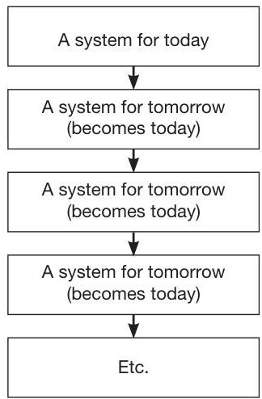

Figure 3.1. The longitudinal nature of augmentative and alternative communication (AAC) interventions for today and tomorrow.

based on projections of future opportunities, needs, and constraints, as well as capabilities. For example, in AAC intervention with adults with some acquired conditions (e.g., amyotrophic lateral sclerosis [ALS]), the team typically employs some version of a three-phase intervention model, including an early phase of monitoring, preparing, and supporting current communication capabilities; a middle phase of assessing, recommending, and implementing AAC; and a late phase of adapting and accommodating changes in capabilities and environments (e.g., Ball, Beukelman, &amp; Bardach, 2007). As this model suggests, decisions for today and those for tomorrow are critical to the long-term success of an AAC intervention plan. This intervention plan may involve three components: 1) interventions that utilize environmental adaptations, 2) interventions designed to increase natural capabilities, and 3) interventions that incorporate AAC strategies and techniques (see Figure 2.2, the Participation Model).

# Environmental Adaptation Interventions

Sometimes participation can be facilitated, at least in part, through environmental adaptations (e.g., Egilson &amp; Traustadottir, 2009). These adaptations can be divided into two main categories: space and location adaptations and physical structure adaptations.

Space and location issues are specific to each intervention and should be readily solvable by the AAC team in most cases, assuming that the team has achieved consensus on the intervention plan. Adaptations may be necessary to remove physical barriers that interfere with use of AAC. For example, a woman who has experienced a brainstem stroke and lives in a residential care home may be unable to bring her AAC technology into the cafeteria because the tables and chairs are too close together for the device to pass between them when mounted on her power wheelchair. Or a college student with a spinal cord injury may not be able to install his speech recognition computer system in his dormitory room because there is not enough space. In the first case, the necessary adaptations are simple: Move the chairs and tables farther

People Who Require AAC

apart; in the second case, more complex space accommodations may be necessary. In addition to space, adaptations may also be required to modify the location of the individual. For example, a student who uses a low-tech communication book and is seated in the back of the classroom cannot interact effectively with her teacher or peers. This problem can be resolved by moving the student toward the front of the room so that the teacher can readily access the communication book.

Physical structure adaptations go beyond space and location adjustments and may also be necessary for accommodating the AAC system or facilitating its use. Obvious examples include adapting a bed with an adjustable swing arm in order to mount AAC technology for an individual who must communicate from his or her bed, and widening doorways to allow passage of wheelchair-mounted equipment. Physical structure adaptations related to making public places accessible are required in the United States by the Americans with Disabilities Act (ADA). Environmental adaptations such as these can have a significant impact on participation (e.g., Egilson &amp; Traustadottir, 2009). Moreover, these adaptations pose limited demands for individuals who rely on AAC; they do not need to learn any new strategies or skills. However, given the nature of developmental, acquired, or degenerative conditions, typically individuals with complex communication needs do require instruction to learn new strategies and skills, or to enhance existing ones.

## Natural-Ability Interventions

As noted in Chapter 2, individuals with complex communication needs present with a wide range of natural speech capabilities. Some are unable to produce any speech at all; others produce a few spoken word approximations; and still others rely on natural speech as a primary means of communication but require AAC to clarify with some communication partners or in some communication situations. As a result, intervention plans may focus both on increasing natural abilities as well as enhancing communication through AAC adaptations. It is a mistake to believe that it is an either/or decision; rather, intervention typically integrates both in some way, depending on the needs and capabilities of the individual (e.g., Hanson, Beukelman, &amp; Yorkston, 2013; Oommen &amp; McCarthy, 2015). Sometimes the focus is primarily on maximizing the natural abilities of the individual, using AAC to augment these natural abilities as required. Sometimes the focus is primarily on strategies and skills for adaptive AAC use. Often the focus is on some combination of these two. The AAC team needs to determine the relative emphasis to be placed on natural-ability interventions and adaptive AAC approaches. Of course, this decision depends on the origin, stage, and course of an individual's communication disability. For example, an individual with end-stage ALS will not benefit from intervention designed to increase natural speech, whereas a preschool child with Down syndrome may benefit from intervention that focuses on enhancing speech production as well as augmenting speech via AAC to increase communication effectiveness and support language development.

A common issue for families of people with complex communication needs is the concern that AAC interventions may inhibit the individual's development or recovery of natural speech (e.g., Romski &amp; Sevcik, 2005). For example, the family of a young adult with traumatic brain injury whose limited speech cannot be understood by unfamiliar people may perceive a team's recommendation to provide an AAC system as an indicator that the team will no longer focus on therapy to improve the

Overview of AAC Intervention

individual's speech. Or the family of a child with severe cerebral palsy may perceive the team's recommendation of AAC technology as an indication that the team will discontinue current therapy to improve the child's upper-extremity motor function for writing.

Often the way that AAC is introduced impacts the acceptance by families and other communication partners. AAC is not a last resort; rather, it is an evidence-based intervention that enhances communication effectiveness and increases participation for children and adults with complex communication needs. Furthermore, the research clearly demonstrates that AAC does not inhibit speech production or recovery; rather, AAC intervention positively impacts natural speech capabilities (e.g., Dongilli, Hakel, &amp; Beukelman, 1992; Kasari et al., 2014; Ladtkow &amp; Culp, 1992; Light, Beesley, &amp; Collier, 1988; Millar, Light, &amp; Schlosser, 2006; Romski et al., 2010; Schlosser &amp; Wendt, 2008). The first step in resolving concerns is to listen to the family's perspective, share concrete research-based evidence of the effects of AAC on natural speech, and provide reassurances that natural-ability interventions to enhance natural speech and/or writing will not be discontinued. Compromise is a reasonable solution in most cases, considering a combination of both natural-ability and AAC approaches. For example, the team might decide to invest 50% of available intervention time in therapies to increase natural speech (and/or writing skills) and 50% of its time in AAC system development and implementation, or 10% to natural-ability interventions and 90% to AAC, or whatever balance is most appropriate given the needs, capabilities, and preferences of the individual and family. As with all interventions, the team needs to evaluate the effects of the intervention and meet regularly to share progress (or lack thereof) so that adjustments can be made in the balance of intervention accordingly. In Chapters 9-18, we discuss the coordination of natural-ability and AAC interventions in more detail as they pertain to specific disabilities across the life span.

## AAC Interventions

Given that their natural speech is inadequate to meet all their communication goals, individuals with complex communication needs require AAC intervention, the third intervention component in the Participation Model (see Figure 2.2). It is important to first consider AAC technique(s) that meet the person's immediate needs within the available opportunities for communication. "AAC for today" should require a minimum amount of instruction and practice for the individual to be able to communicate to meet important and immediate goals. Of course, some initial instruction or training will need to occur in most situations, but both the length and complexity of training should be minimized to ensure that the individual is able to communicate.

Decision making for "AAC for tomorrow" should be concurrent with decision making for today, under most circumstances. That is, as the AAC team implements intervention that matches the individual's current capabilities and immediate needs, it also develops plans for broadening the individual's skill base in preparation for AAC for tomorrow. For example, intervention plans for individuals with developmental disabilities who are preliterate might involve instruction to improve literacy skills to enhance future communication. For individuals with degenerative conditions such as ALS or Parkinson's disease, intervention plans need to anticipate the future loss of motor, communication, and other capabilities and prepare accordingly.

People Who Require AAC

Whatever the focus of planning for AAC for tomorrow, the goal should be to maximize the individual's communication effectiveness and participation in valued activities. Thus, a longitudinal AAC plan should always be two-pronged by including plans for both today and tomorrow. The time between successive tomorrows is likely to lengthen as the AAC system comes closer and closer to meeting all of the person's communication needs.

People who rely on AAC and their communication partners are all likely to require at least some instruction to develop the strategies and skills required for effective communication. In the following sections, we discuss AAC intervention to teach new strategies and skills to individuals with complex communication needs. We start by discussing the overall purpose of AAC intervention and defining communicative competence or effectiveness; we then discuss how to plan and implement AAC intervention, including how to determine goals and how to choose effective instructional procedures. Finally, we discuss evaluation of AAC intervention to maximize effectiveness. It is important to note that this chapter presents general principles related to AAC interventions. These principles may be realized in very different ways, depending on the needs, capabilities, and preferences of the individual with complex communication needs; the knowledge, skills, and priorities of family and other communication partners; and the demands in relevant educational, vocational, health care, and/or community environments (Beukelman, 2016). The specifics of intervention typically play out quite differently for children with developmental disabilities compared to adults with acquired conditions. Chapters 9-13 provide more specific discussion of interventions with individuals with developmental disabilities; Chapters 14-18 provide further discussion of interventions to enhance communication for adults with a range of acquired conditions.

## PURPOSE OF AAC INTERVENTION

The overall purpose of AAC intervention is to enhance the communication effectiveness of individuals with complex communication needs so that they can participate as fully as possible in education, employment, health care, family life, and community living (Light &amp; McNaughton, 2015). In other words, the goal is to enhance their communicative competence. Children with developmental disabilities will need to learn new skills and build communicative competence from the beginning. In contrast, adults with acquired conditions will have had experience as competent communicators prior to the onset of their condition. Those with conditions with sudden onset, such as aphasia (from a stroke) or traumatic brain injury, may be trying to rebuild their communicative effectiveness following the loss of capabilities. In contrast, individuals with degenerative conditions (e.g., ALS, Alzheimer's disease) will experience the ongoing loss of motor, sensory-perceptual, cognitive, and/or linguistic capabilities; the goal is to support their communication effectiveness to as great an extent as possible in the face of these losses. Whether individuals experience developmental, acquired, degenerative, or temporary conditions, they will need to communicate in new ways using AAC and will need to develop new strategies and skills to do so effectively. Communicative competence is not innate; it is learned (Light &amp; Binger, 1998). It takes time, effort, and instruction to acquire, maintain, or rebuild the strategies and skills required for effective communication, especially in the face of significant motor, sensory-perceptual, cognitive, and/or linguistic impairments.

Overview of AAC Intervention

# WHAT IS COMMUNICATIVE COMPETENCE?

Communicative competence has been defined as “... a relative and dynamic, interpersonal construct based on functionality of communication, adequacy of communication, and sufficiency of knowledge, judgment, and skills in four interrelated domains: linguistic competence, operational competence, social competence, and strategic competence” (Light, 1989, p. 137). There are three key components to this definition: 1) functionality of communication in real world contexts; 2) adequacy of communication to meet demands in daily interactions; and 3) sufficiency of knowledge, judgment, and skills in linguistic, operational, social, and strategic domains. Later, the definition was expanded to also acknowledge the importance of psychosocial factors such as motivation, attitude, confidence, and resilience (Light, 2003).

# Functionality of Communication in the Real World

Communication is not an end goal in and of itself; rather, it is an essential tool by which individuals achieve their educational, vocational, health, community, social, and personal goals. Therefore, AAC interventions should focus on actual communication performance within real-life contexts (Light &amp; McNaughton, 2015; Williams, Krezman, &amp; McNaughton, 2008). The World Health Organization's International Classification of Functioning, Disability, and Health recognizes the need for intervention to focus on functional communication and participation within society (Enderby, 2013; Pless &amp; Granlund, 2012; Simeonsson, Björck-Åkesson, &amp; Lollar, 2012). To maximize real world outcomes, the AAC team focuses on strategies and skills that have important consequences valued by individuals with complex communication needs and their communication partners in daily life. AAC interventions must ensure that individuals with complex communication needs are able to meet their communication goals in their daily lives, including the ability to express needs and wants, exchange information, develop social closeness, and participate in social etiquette routines as required (Light, 1988).

Isaac's experiences illustrate the importance of setting intervention goals that have important and valued consequences. Isaac was in his late 60s when he had a stroke resulting in aphasia. Subsequently, he was unable to rely on his natural speech to meet his communication needs. He spent a short time in a rehab facility after his stroke. The speech-language pathologist there provided him with a low-tech AAC system; it consisted largely of pages of food items (many of which he did not like) as well as items for personal care (e.g., toothbrush, comb), represented by line drawings. This initial low-tech system did not meet his communication needs. He saw no reason to use it—it did not allow him to achieve the outcomes that were important to him. He was very withdrawn and very depressed. More than anything else, he wanted to find ways to participate more actively in his community and to contribute in meaningful ways. His family reached out to a university clinic for AAC services. The team met with him and his family members and they brainstormed potential volunteer activities at a local nursing home and discussed strategies to support Isaac in getting involved in his church again as he had been very involved prior to his stroke. He also wanted to find a way to play with his granddaughter as she visited every weekend and he valued his time with her. His wife wanted ways to communicate with Isaac effectively about financial issues and other decision making in their lives. She worried that he was home

People Who Require AAC

alone all day while she was at work and wanted him to have a way to communicate in an emergency. He came from a large, closely knit family and wanted ways to keep in touch with his brothers who lived at a distance. He had a reputation as a prankster and wanted the opportunity to tease them and tell jokes again. Isaac required AAC that would support him in achieving these real-world outcomes that were valued by him and his family. These were the goals that should drive his AAC intervention.

Much, if not all, of the focus of AAC intervention should take place in natural contexts such as classrooms, homes, community environments, and workplaces (e.g., Calculator &amp; Black, 2009). Instructional plans that emphasize intervention in natural contexts are more likely to result in generalization of strategies and skills to a range of people, environments, and situations than instructional plans that focus on isolated skill training in artificial settings (Schlosser &amp; Lee, 2000). Many current models of service delivery pose challenges to AAC intervention within the natural environments of individuals with complex communication needs; individuals who require AAC may be seen within clinic rooms, hospitals, or rehabilitation centers, away from their natural daily environments and without many of their key communication partners. Service providers often assume that strategies and skills targeted within these venues will automatically translate to real-world use. Yet this is not always the case (Schlosser &amp; Lee, 2000). It is important that intervention is designed to ensure that 1) targeted strategies and skills are valued by the individual, family, and community (Schlosser, 1999); 2) targeted strategies and skills are, in fact, generalized to real-world use (Schlosser &amp; Lee, 2000); and 3) they make a positive difference in real-world functioning (Light &amp; McNaughton, 2015).

## Adequacy of Communication to Meet Demands

Communicative competence depends on developing, maintaining, or rebuilding an adequate level of communication to meet environmental demands and attain valued outcomes; it does not require mastery (Light, 1989). An individual's communicative competence may vary across contexts depending on the partners, environments, and communication goals. For example, some individuals who rely on AAC may have developed adequate skills to meet the demands of interactions with familiar partners in routine contexts, but they may struggle to communicate effectively with less familiar partners in more complex situations where the communication demands are greater. Some individuals may be able to express their needs and wants effectively but may struggle to build social closeness or share information with others. AAC interventions must consider the breadth of communication needs throughout the lives of individuals with complex communication needs.

Martin Pistorius, an adult with a neurodegenerative condition who relies on AAC, highlighted the critical importance of considering communication needs throughout the day:

We need to look at every aspect of our lives, from the time we wake up in the morning, until we get up the following morning. We need to be able to communicate 24/7 like so-called "normal" speaking people do. (Pistorius, 2004, p. 3)

Overview of AAC Intervention

As noted earlier, AAC interventions must be driven by the goals and priorities of individuals who rely on AAC and their families. Individuals who rely on AAC may have different priorities and may desire different outcomes than professionals; therefore, they may define the success of intervention differently than professionals do. These views should be respected.

Wertz (1998) provided this account of the intervention that he planned for Doug, who had aphasia following a stroke:

Treatment ended before I thought it would. The progress Doug made in our two months together prompted me to urge continued treatment. I was more excited about Doug's progress than he was, and he was more satisfied with his progress than I was. About halfway through our second month, Doug indicated he was ready to go home. He had passed a driving test, qualified for disability income, and achieved sufficient communicative ability for his purposes. His plan was to become a person rather than a patient. That was his right, and he exercised it. (p. 31)

As described in this account, Doug determined that he had attained an adequate level of communication to meet his goals in his daily life; he had attained sufficient communicative competence for the outcomes that mattered most to him. His priority was to return to living his life, rather than participating in further intervention.

## Sufficient Knowledge, Judgment, and Skills

Simply providing access to AAC systems does not ensure communicative competence. Individuals must develop knowledge, judgment, strategies, and skills to use AAC effectively to meet their goals. Think of the analogy of a musician: Simply providing people with musical instruments does not ensure that they become accomplished musicians. Rather, they must learn to use the instruments effectively to make music. The same is true for communication via AAC. Communicative competence depends on knowledge, judgment, strategies, and skills in four interrelated domains: linguistic, operational, social, and strategic (Light, 1989; Light &amp; McNaughton, 2014). The linguistic and operational domains provide the tools for communication; the social and strategic domains are related to the actual use of these tools in interactions.

**Linguistic Domain** In order to attain communicative competence, individuals who rely on AAC must develop skills in the native language(s) spoken by their families and broader communities (Romski &amp; Sevcik, 2003). With the increasing diversity of society, many individuals who require AAC may need skills in more than one language, including, for example, a native language(s) spoken by their families as well as the language of the broader society (e.g., the language of the educational system, place of employment, community services; Soto &amp; Yu, 2014). These languages may differ significantly in terms of their semantics, syntax, and morphology. Individuals who require AAC need skills in all relevant languages and also need to know when and how to code switch as required (when, where, and with whom to use each language).

Individuals who rely on AAC must be effective as listeners and as communicators (Romski &amp; Sevcik, 2003). Therefore, they require both receptive and expressive skills. Some individuals who rely on AAC require significant intervention to

People Who Require AAC

build the language skills required to support effective communication. For example, children with developmental disabilities are language learners; they must acquire the necessary semantic, syntactic, and morphological skills to express themselves (Smith, 2015; von Tetzchner, 2018). Adults with acquired conditions have a history of linguistic competence. In some cases, they may demonstrate strong language capabilities and may not require intervention in this domain (e.g., individuals with ALS or brainstem stroke). Other individuals, such as those who have severe chronic aphasia, may experience significant impairments in interpreting and formulating language and may require intervention to circumvent or remediate these difficulties (e.g., Simmons-Mackie, King, &amp; Beukelman, 2013).

By definition, individuals with complex communication needs are unable to meet all of their communication needs via natural speech; they rely on AAC to express themselves. Therefore, they also need to develop skills in the language code of the AAC system, including skills in the content, form, and use of AAC symbols. In some cases, individuals rely on traditional orthography (e.g., letters, words, text) to express themselves; they use the written form of the language of their family and/or community. In other cases, individuals who rely on AAC are not literate, and they may rely on photos, line drawings, or other graphic symbols to express themselves. It is important to note that these picture sets are not actually language systems (Smith, 2015). They do not have their own syntax or morphology. They function as symbols to express semantic concepts; they rely on the individual's spoken language for syntax and morphology.

Overall, individuals who rely on AAC require capabilities in 1) the native language(s) spoken in their families and broader social community, and 2) the language code of their AAC system. Some may require concerted intervention to learn these skills; others may have strengths in this domain. Table 3.1 provides examples of potential language goals that might be targeted in intervention.

Operational Domain The operational domain includes strategies and skills in the technical operation and/or production of AAC. These skills include, for example, skills in the production of gestures or signs, skills in using specific access techniques

Table 3.1. Examples of language goals that might be targeted in intervention

|  Individual who requires AAC | Example of a potential goal  |
| --- | --- |
|  Jin-yung, a 4-year-old with Down syndrome | Understand and respond appropriately (using her AAC system) to simple why questions asked by her teachers in English at school and by her parents in Korean at home  |
|  Juan, a 17-year-old with cerebral palsy | Include articles and appropriate tense markers (i.e., past and present progressive) in written assignments and narratives to share information accurately with teachers and peers at school  |
|  Niesha, a 76-year-old with severe chronic aphasia | Understand simple questions presented by the communication partner orally and in writing; respond by pointing to a written word from a list of choices provided by the communication partner (e.g., communication partner says and writes, “What should I take to the school bake sale?” and then provides four written choices, e.g., ANGEL FOOD CAKE, BROWNIES, CHOCOLATE CHIP COOKIES, SOMETHING ELSE)  |
|  Sal, a 62-year-old with primary progressive aphasia | Recognize photos of meaningful events within his life and associated text messages from his low-tech communication book or AAC technology and select them to share stories with his family and friends  |

Overview of AAC Intervention

Table 3.2. Examples of operational goals that might be targeted in intervention

|  Individual who requires AAC | Example of a potential goal  |
| --- | --- |
|  Gaby, a 13-month-old who has Down syndrome | Produce the hand shapes, positions, and movements for the signs for her favorite animals (e.g., DOG, HORSE, CAT, DUCK, FROG, BEAR) to comment during shared book reading activities with her parents and older sisters  |
|  Linh, a 9-year-old who had a near drowning resulting in significant visual, cognitive, speech, and motor impairments | Touch a preferred object to communicate a choice between two objects offered by her teacher, aide, parents, or sister  |
|  Mateo, a 14-year-old who experienced a severe traumatic brain injury in a dirt bike accident | Use alphabet supplementation to increase the intelligibility of his speech when interacting with teachers at school (i.e., select the first letter of each word as he speaks, from an alphabet board)  |
|  Nadine, a 55-year-old woman with amyotrophic lateral sclerosis | Use eye-tracking AAC technology to select letters of the alphabet and prestored messages to communicate (i.e., look at and dwell on the target to select) with family and friends  |
|  Isaac, a 60-year-old man who had a stroke resulting in severe aphasia | Use the navigation bar on his AAC app to locate appropriate displays to share a favorite story with his granddaughter  |

(e.g., scanning, eye-tracking technology), skills in navigating within AAC apps to locate specific vocabulary, and so on. Table 3.2 provides some examples of operational skills that might be targeted with children or adults who rely on AAC.

Most individuals with developmental or acquired disabilities require instruction in operational skills to use AAC effectively and efficiently. Ultimately the goal is that individuals with complex communication needs use AAC in an accurate, efficient, and socially appropriate manner that requires as little effort and fatigue as possible. All AAC systems impose some cognitive, linguistic, motor, and visual perceptual demands. AAC systems should be personalized to minimize these demands as much as possible so that less time needs to be spent learning operational skills (Light, Wilkinson, Thiessen, Beukelman, &amp; Fager, 2019).

Cy Berlowitz, describing his daughter who has severe cerebral palsy, notes:

When we first got the [AAC device], Ana had very poor head control. Getting the light to hit the right squares became a daily battle. But she carried on with a determination I found extraordinary. She must have known that this device was eventually going to liberate her, at least from the confines of speechlessness. I have never been so proud of my daughter as I was during those times. (1991, p. 16)

Ultimately, the goal of intervention is to support the individual in developing fluency in the use of AAC (Treviranus &amp; Roberts, 2003). Fluency or automaticity occurs when the individual is able to operate or produce AAC without conscious effort. Readers may remember their early efforts to learn keyboarding or texting skills when the process was effortful and slow, requiring conscious thought to locate keys and spell words. With repeated practice, these operational skills became automatic and required minimal, if any, conscious attention. The development of automaticity frees up cognitive resources for other, more important communication processes. Too often, intervention with individuals who require AAC ends at the point where

People Who Require AAC

they are able to operate or produce AAC rather than the point where they can do so automatically or fluently (Treviranus &amp; Roberts, 2003). It is important that individuals who require AAC have sufficient practice in operational skills to develop fluency or automaticity.

As Michael Williams, a man with cerebral palsy who is an expert communicator via AAC, points out:

Learning to use a communication device should not be a challenge. Leading an active interesting life, while using the device to communicate with others, should be the challenge. (quoted in Rackensperger, Krezman, McNaughton, Williams, &amp; D'Silva, 2005, p. 183)

Social Domain As noted earlier, linguistic and operational skills provide individuals who use AAC with the tools to communicate effectively. However, to attain communicative competence, individuals with complex communication needs must be able to use these tools effectively to interact with others. Social skills focus on the functional use of these tools in daily interactions. There are two types of social skills: sociolinguistic skills and sociorelational skills (Light &amp; McNaughton, 2014). Sociolinguistic skills (also referred to as pragmatic skills) include skills such as turn taking, initiating topics, maintaining topics, and expressing a range of communicative functions (e.g., requests for information, comments, requests for clarification). Also of significant importance are sociorelational skills (Light &amp; McNaughton, 2014). Sociorelational skills refer to the interpersonal skills that make a person a valued communication partner. Sociorelational skills include expressing other orientation (i.e., demonstrating an interest in others), putting partners at ease in the interaction, demonstrating engagement in the interaction, and participating actively. Traditionally communication intervention has tended to focus on sociolinguistic skills to the neglect of sociorelational skills. Ultimately individuals who require AAC need well-developed sociolinguistic and sociorelational skills to participate effectively and build positive social relationships at school, at work, at home, and in the community. Table 3.3 provides some examples of sociolinguistic and sociorelational strategies and skills that might be set as goals for intervention.

Table 3.3. Examples of sociolinguistic or sociorelational goals that might be targeted for intervention

|  Individual who relies on AAC | Potential sociolinguistic or sociorelational goal  |
| --- | --- |
|  George, a 28-month-old boy with severe cerebral palsy | Request information from his parents and grandparents and build his vocabulary by asking WHAT'S THAT? using his AAC technology  |
|  Maria, a 10-year-old with autism spectrum disorder | Initiate interaction by approaching a peer, selecting a prestored message from her AAC technology, HEY, WANT TO WATCH VIDEOS? and then offering the peer a choice of videos  |
|  Chuck, a 26-year-old with an intellectual disability | Ask partner-focused questions of his co-workers at the grocery store and the staff and residents at his group home to demonstrate an interest in them  |
|  Caleb, an adult with a severe traumatic brain injury | Call the nurse for assistance by using a call light and communicate the problem by selecting the appropriate photo from his communication board  |

Overview of AAC Intervention

Table 3.4. Examples of strategic goals that might be targeted in intervention

|  Individual who relies on AAC | Potential strategic goal  |
| --- | --- |
|  Greg, a 5-year-old with cerebral palsy | Select the symbol for SOMETHING ELSE when he is communicating a novel message to his parents, teacher, or aide and he does not have the required vocabulary to do so  |
|  Valentina, an adult with amyotrophic lateral sclerosis | Ask partners to predict words as she spells on her alphabet board to accelerate her rate of communication and minimize fatigue  |
|  James, an adult with autism spectrum disorder | Use his AAC technology to provide an introduction strategy (i.e., a message explaining how he communicates and what communication partners should do) when talking with new customers at the store where he works (on the phone or face to face)  |

Strategic Domain Despite intervention, individuals who require AAC may still confront significant limitations in their linguistic, operational, and social skills due to the nature of their developmental or acquired disability or due to environmental barriers or constraints (Light &amp; McNaughton, 2014). They may require strategic competence to overcome these limitations. The limitations that they encounter may be permanent ones that they are not able to overcome. For example, Colin had a brainstem stroke and has limited movement. He can blink to say YES. He relies on an alphabet board to communicate. His partner scans through potential letters, and Colin blinks to indicate the target letter. This system of communication is effective, but it is very slow. Colin needs some strategies to bypass this operational limitation. He asks his partners to predict if they think they know what he is trying to say and then to confirm with him that they are correct.

Sometimes the limitations that individuals encounter are temporary ones until the individual develops more advanced skills. For example, Greg is 5 years old and has severe cerebral palsy; he is not yet literate, and he relies on photos and line drawings to communicate. Sometimes he lacks the vocabulary that he needs to communicate a message, and he requires a strategy to overcome this temporary limitation in his linguistic skills. Once he acquires literacy skills, he will be able to communicate a greater breadth of messages so this strategy may just be a temporary one. Depending on their capabilities, individuals with complex communication needs may require strategic competence to overcome linguistic, operational, and social limitations. Table 3.4 provides some examples of strategies used to overcome linguistic, operational, and social limitations by individuals who use AAC.

Integration of Linguistic, Operational, Social, and Strategic Skills To attain communicative competence, individuals who rely on AAC must learn to integrate strategies and skills across linguistic, operational, social, and strategic domains within daily interactions with different partners in different environments (Light, 1989). Learning to integrate strategies and skills under these dynamic conditions requires concerted instruction and practice. It is critical that individuals who rely on AAC have meaningful opportunities to interact with others in real-world contexts.

# PLANNING AND IMPLEMENTING AAC INTERVENTION

To support individuals in learning necessary strategies and skills, the AAC team first determines appropriate goals and then chooses effective instructional techniques to teach these strategies and skills.

People Who Require AAC

# Determining Goals for AAC Intervention

Based on the results of the assessment, the AAC team identifies strategies and skills that are priorities to target in intervention. The goal-setting process involves five steps:

1. Review the contexts identified as priorities by the individual and family members.
2. Analyze the strategies and skills required to participate effectively within these contexts.
3. Review the individual's current capabilities in comparison to those required.
4. Identify gaps in the individual's strategies and skills.
5. Set goals as priorities to be targeted in intervention.

Depending on their prior experience, current capabilities, and priorities, some individuals who rely on AAC may need to learn just a few key strategies and skills to enhance their communicative effectiveness; others may require instruction in numerous linguistic, operational, social, and strategic skills over time. For those individuals who require instruction in numerous strategies and skills, it is important to set priorities and target just a few goals at a time so that intervention is not overwhelming. Factors to consider in setting goals as priorities include the following:

- Strategies and skills that are most important to the individual who relies on AAC
- Those that are valued by family, friends, and community
- Those that will have the greatest impact on functioning in real-life situations
- Those that can be used regularly in the real world
- Those that are most likely to be learned successfully (Light &amp; Binger, 1998)

# Defining Goals Operationally

In some cases, the AAC team may need to define the goals operationally. Doing so allows the team to evaluate the effects of intervention, note progress (or lack of progress), and make necessary adjustments to improve intervention as required. Each goal statement includes the targeted strategy or skill, the means of communication, the partner(s) and environment(s), and the targeted criterion for performance.

Mike was 24 years old and had severe athetoid cerebral palsy. He relied on AAC technology to communicate. He typically spent his days at home with his mother, but he was very interested in music; he volunteered at the local radio station. He had few friends and was very hesitant in social situations. Through discussion with Mike, his mother, and his counselor from the Office of Vocational Rehabilitation, asking partner-focused questions (i.e., questions about his communication partner's interests and experiences) was identified as a priority to enhance his social skills, increase his communication effectiveness, improve his relationships with his co-workers, and help him to establish a social network of friends. The AAC team operationalized the goal as follows: Mike will spontaneously ask appropriate partner-focused questions using his AAC technology in at least 80% of the opportunities in social interactions with his mother, neighbors, people at the radio station, and others in the community.

Each goal usually includes a criterion or expectation for performance. This criterion may be stated in numerous ways, including 1) the frequency with which the

strategy or skill occurs within a set amount of time (e.g. asks peers at least three partner-focused questions during his shift at the radio station); 2) the percentage of opportunities provided in which the strategy or skill is observed (e.g. asks a partner-focused question in at least 80% of the opportunities provided during his shift at the radio station); or 3) the percentage of accuracy (e.g. responds to basic wh- questions with at least 80% accuracy). The AAC team may consider a range of factors when setting the criterion (or expected performance level) for a goal, including theLevel of performance required to function effectively in the real worldLevel required for the individual to benefit from the strategy or skillLevel required to learn the next skill (if skills build on each other)Level required to ensure long-term maintenanceLevel at which others perform the same strategy or skill in the real world (Light & Binger, 1998)

In setting goals, it is important to think about the period of intervention and ensure that the goals are challenging and of an appropriate scope—not too challenging for a short period of instruction, but also not too small in scale for a lengthy period of instruction. For example, it may be too challenging to expect a 4-year-old who uses AAC who has not yet been introduced to literacy skills to learn all of the letters and sounds during a 10-week period, but it is inappropriate to expect the same child to have acquired only three or four letters and sounds after a year of instruction at school.

Tracy Rackensperger, a young woman who relies on AAC, who has successfully completed a doctoral program, secured employment in a university setting, and lives independently, emphasized the importance of appropriately high expectations:

> Being able to be independent and having the freedom to control my own destiny are the most important things to me. I am a very ambitious individual with lots of goals for my life. . . . I, and others who use augmentative communication, want good jobs, good places to live, and individuals who care about us and love us. It is important for the individuals who work with people who use augmentative communication to believe they can succeed at high levels. (Rackensperger, 2006)

## Choosing Instructional Procedures

Once the AAC team has determined strategies and skills (linguistic, operational, social, and/or strategic) that should be targeted as goals for intervention, the next step is to determine how to teach these strategies and skills. A wide range of instructional approaches have been used successfully in the field of AAC. Most of these approaches were initially developed and used in other fields; they have been adapted and applied to AAC interventions. These instructional techniques range from those that provide highly structured, explicit instruction based on principles of applied behavior analysis (ABA) to responsive, social pragmatic approaches that focus on modeling within natural contexts, as well as approaches that combine aspects of these techniques. The instructional techniques also include approaches that rely more heavily on explanations and demonstrations of target strategies or skills such as strategy instruction and coaching. Some of these instructional approaches are used more frequently than others. Some are used with specific population groups, but not with others.

People Who Require AAC

It is important that the AAC team is skilled in all of these instructional techniques and can apply them as needed. There is no single best instructional approach. Choosing effective instructional procedures depends on a range of factors, including 1) the individual's age, needs, and capabilities; 2) the target strategy or skill; 3) the supports and demands within the environment; and 4) the evidence that supports the effectiveness of the approach. It is beyond the scope of this book to discuss all of the instructional approaches that are used in AAC. Instead we have highlighted a few of the more frequently used approaches: responsive intervention, AAC modeling, explicit instruction, milieu/incidental teaching, strategy instruction, and coaching. (See Chapters 9–13 for further discussion of these instructional approaches.)

**Responsive Social Pragmatic Intervention** Intervention to build communication skills with young children with developmental disabilities often involves approaches in which parents and other communication partners are taught to respond to children's communicative attempts by fulfilling their communicative intent and modeling targeted skills (e.g., Girolametto, 1988; Girolametto, Verbey, &amp; Tannock, 1994). This approach is informed by social pragmatic theories of communication development. Intervention typically occurs within naturally occurring interactions in response to the child's interests. As a result, intervention is flexibly structured. There are numerous examples of implementation of responsive AAC interventions to teach early communication skills to beginning communicators (e.g., Binger, Kent-Walsh, Berens, Del Campo, &amp; Rivera, 2008; Binger &amp; Light, 2007; Kent-Walsh, Binger, &amp; Hasham, 2010; Soto &amp; Clarke, 2017). When responsive interventions are used in AAC, typically they involve AAC modeling.

**AAC Modeling** In interventions that utilize AAC modeling, the communication partner uses unaided and/or aided AAC in conjunction with spoken input. Although often associated with responsive social pragmatic interventions, AAC modeling is by no means limited to this intervention approach and is used across other instructional approaches to demonstrate the use of AAC for communication. AAC modeling can be used with unaided or aided AAC. For example, total communication uses manual signs in conjunction with spoken input, and key word signing provides selected models of manual signs in conjunction with speech (Remington &amp; Clarke, 1983; Tan, Trembath, Bloomberg, Iacono, &amp; Caithness, 2014; Wright, Kaiser, Reikowsky, &amp; Roberts, 2013). Other approaches pair aided AAC symbols with spoken input, including augmented input or the system for augmenting input (Romski &amp; Sevcik, 1996; Romski et al., 2010); aided language stimulation (Goossens', 1989; Goossens', Crain, &amp; Elder, 1992); aided language modeling (Drager et al., 2006); aided AAC modeling (e.g., Binger &amp; Light, 2007); and natural aided language (e.g., Cafiero, 2001). Although these approaches have significant overlap, they vary on a continuum from more structured interventions to stimulation that is infused within daily activities. Some focus more on promoting comprehension, and others focus on models to promote expression. Several meta-analyses have shown that aided AAC input has positive benefits for both comprehension and expression with individuals with developmental disabilities (Allen, Schlosser, Brock, &amp; Shane, 2017; Biggs, Carter, &amp; Gilson, 2018; O'Neill, Light, &amp; Pope, 2018).

**Explicit Instruction** Although some individuals with complex communication needs benefit from responsive interventions that use AAC modeling, others require

Overview of AAC Intervention

more structured instruction. The AAC team may utilize explicit instruction when natural cues are not sufficient to support skill acquisition. Explicit instruction is founded on principles of applied behavior analysis (e.g., Ganz &amp; Simpson, 2019; Johnston, Reichle, Feeley, &amp; Jones, 2012; Reichle &amp; Drager, 2010). It is typically highly structured and is characterized by numerous instructional trials to provide repeated opportunities for practice, tightly defined target behaviors or skills (often taught incrementally), identification of discriminative stimuli associated with the opportunity to use the skill, and provision of feedback for correct and incorrect responses (Reichle, Hidecker, Brady, &amp; Terry, 2003). Teaching is conducted in small teaching units (often referred to as trials) that consist of 1) a stimulus (e.g., the instructor holds up a cookie and asks What's this?); 2) a prompt (e.g., from an array of two photographs, one of a cookie and one of a shoe, the facilitator points toward the cookie symbol); 3) a correct response by the learner (e.g., he or she points to the cookie photo); and 4) a reinforcer (e.g., the facilitator says Yes, that's a cookie; good for you! and gives the learner a piece of cookie). Corrective feedback is provided if the individual produces an error. Trials are repeated and prompts are faded gradually until the learner can produce the correct response independently.

Often explicit instruction occurs in situations and environments other than those that occur naturally in order to provide additional practice in skills. These approaches may be most successful in teaching cognitive/academic skills, rather than social communication skills (Sterrett &amp; Kasari, 2019). To ensure the effectiveness of this type of instruction, the AAC team needs to specifically plan to avoid prompt dependency, ensure generalization of communication skills to the natural environment, and promote long-term maintenance of these skills under natural conditions (Schlosser &amp; Lee, 2000). Behavioral approaches to skill instruction are often used with children with autism spectrum disorder who require AAC (e.g., Ganz &amp; Simpson, 2019). Behavioral approaches are also often used to teach individuals with challenging behaviors to use AAC as a more appropriate communication replacement (e.g., McComas, Schieltz, Simacek, Berg, &amp; Wacker, 2019).

## Milieu or Incidental Teaching

Explicit instruction is often combined with milieu or incidental teaching to promote generalization of skills to the natural environment (Cowan &amp; Allen, 2007; Hart &amp; Risley, 1982). Incidental teaching is a set of procedures that incorporate principles of explicit instruction into the natural environment (Sterrett &amp; Kasari, 2019). Milieu or incidental teaching procedures have several elements in common: 1) manipulating the arrangement of the natural environment, 2) targeting specific communication goals within these naturally occurring contexts, 3) utilizing prompting techniques to elicit the target skill, and 4) responding to the individual's communicative attempts (Kaiser &amp; Wright, 2013). First, a communication partner arranges the environment to create communication opportunities that will be motivating to the individual. Next, the communication partner provides instruction by using gestures, modeling, spoken cues (sometimes referred to as mands), and physical prompts to elicit the target skill. For example, prior to breakfast, a communication partner might use a mand-model procedure (Rogers-Warren &amp; Warren, 1980) by asking "What do you want?" If the individual fails to respond, the partner might provide a spoken prompt, "Show me what you want." If this still fails to elicit a correct response, the partner might then assist the individual in producing the signs WANT toast while saying "Want toast." The communication partner responds to the target skill in a manner that is functionally related. For example, if the individual asks for

People Who Require AAC

a desired item or activity (e.g., WANT TOAST), the communication partner provides it (e.g., "Okay, let's make toast"); but if the individual labels an item or activity or makes a comment (e.g., signs IN while putting the toast in the toaster), the facilitator confirms or expands on the utterance (e.g., "You're putting the toast in the toaster"). Table 3.5 summarizes some incidental teaching procedures that may be used in AAC intervention to teach a range of communicative skills (Harris, Doyle, &amp; Haaf, 1996; Iacono, Mirenda, &amp; Beukelman, 1993; Nigam, Schlosser, &amp; Lloyd, 2006; Romski &amp; Ruder, 1984; Wright et al., 2013).

A number of naturalistic developmental behavioral interventions (NDBI; Schreibman et al., 2015) have also been developed that combine aspects of ABA-based intervention with naturalistic teaching techniques. Specifically, these approaches use ABA principles of operant conditioning, but they infuse these into activities that are developmentally appropriate and preferred by the individual, within natural contexts (e.g., everyday routines in home or community); they also incorporate more natural teaching techniques such as naturally occurring reinforcers (Sterrett &amp; Kasari, 2019). These naturalistic developmental interventions were developed for use with children

Table 3.5. Incidental teaching procedures

|  Procedure | Description  |
| --- | --- |
|  Mand model | When a person with complex communication needs approaches or is engaged with a preferred item or activity, the communication partner asks a question (e.g., “What do you want?”; “What’s that?”). If the individual does not respond with the target skill, the partner models the desired response (Rogers-Warren & Warren, 1980). For example, a parent points to a doll while a child is playing with it and asks, “What’s that?”; if the child does not respond or responds incorrectly, the parent models the sign DOLL.  |
|  Expectant time delay | A communication partner asks a question, models a symbol, or places a desired item in view and then provides an extended wait (i.e., pause), accompanied by an expectant facial expression and eye contact (Halle, Baer, & Spradlin, 1981; Kozleski, 1991). For example, a parent points to a picture in a storybook, asks, “Who’s that?”, and then waits expectantly to provide an opportunity for the child to sign or point to a symbol to respond.  |
|  Missing/out-of-reach item | An item needed for an activity is missing. For example, during dinner preparation, a parent lays out salad ingredients but “forgets” to provide a bowl, so the individual needs to ask for it (Cipani, 1988).  |
|  Incomplete presentation | An initial request is followed by incomplete presentation of the requested item. For example, after asking for toast with jam, an adult who relies on AAC is provided with bread but no jam or butter, and needs to request these items separately (Duker, Kraaykamp, & Visser, 1994).  |
|  Interrupted behavior chain | An ongoing activity is interrupted to create a need for requesting. For example, an adult who relies on AAC who is proceeding through a cafeteria line must ask the attendant for certain items before proceeding to the next station (Carter & Grunsell, 2001; Goetz, Gee, & Sailor, 1983).  |
|  Wrong-item format | The individual is provided with a wrong item following a request. For example, after asking for a cup of tea, an adult is provided with a cup of coffee instead, creating the need to use a repair strategy to clarify the original request (Sigafoos & Roberts-Pennell, 1999).  |

Source: Sigafoos &amp; Mirenda (2002).

Overview of AAC Intervention

with autism spectrum disorder and some have been adapted for use with children who have limited speech and require AAC. Examples include the Early Start Denver Model (Dawson et al., 2010) and JASPER (Joint Attention, Symbolic Play, Engagement, and Regulation; Kasari et al., 2014).

**Strategy Instruction** The instructional approaches described so far—responsive interventions, explicit instruction, and incidental teaching techniques—are most frequently used to teach early emerging skills to beginning communicators with developmental disabilities. In contrast, strategy instruction and coaching are more apt to be used with individuals with developmental or acquired conditions who are learning more advanced communication strategies and skills. These approaches incorporate models and demonstrations of target strategies or skills, coaching or prompting support, and feedback on the individual's performance, but they also incorporate explanations and discussion of target strategies and skills, their benefits, and situations that require their use. These instructional techniques are most effective with individuals who have sufficient linguistic capabilities to understand and benefit from explanations and discussions of goals and those who have the metacognitive skills to analyze and talk about their communication performance.

The strategy instruction model was originally developed through the Center for Research on Learning at the University of Kansas to teach adolescents with learning disabilities (e.g., Ellis, Deshler, Lenz, Schumaker, &amp; Clark, 1991). It has been adapted for use in AAC intervention to teach strategies and skills to individuals who rely on AAC (e.g., Light &amp; Binger, 1998). Strategy instruction typically includes the following steps:

1. Identify the target strategy or skill to be taught.
2. Explain the strategy to the individual and discuss why it is important.
3. Demonstrate how to use the target strategy.
4. Discuss situations in which the individual should (or should not) use the strategy.
5. Provide multiple opportunities for the individual to use the strategy during naturally occurring interactions (and role plays to provide additional practice if appropriate).
6. Provide guided practice, prompting the individual to use the target strategy or skill successfully, and provide feedback on performance.
7. Evaluate progress and adjust intervention as required to improve effectiveness.
8. Check for generalization and long-term maintenance (Light &amp; Binger, 1998).

Strategy instruction has been used successfully to teach individuals with developmental or acquired disabilities a variety of strategies and skills (e.g., use of an introduction strategy, partner-focused questions, nonobligatory turns, appropriate grammatical structures, social problem solving, active listening skills; Binger, Maguire-Marshall, &amp; Kent-Walsh, 2011; Light &amp; Binger, 1998; Light et al., 2007; Lund &amp; Light, 2003; McCarthy, Light, &amp; McNaughton, 2007). Strategy instruction has also been adapted to teach communication partners to support communication (Kent-Walsh &amp; McNaughton, 2005).

**Coaching** Like strategy instruction, coaching approaches rely on explanations of the target strategies and skills, typically accompanied by demonstrations as well

People Who Require AAC

as opportunities to practice the strategies and skills with feedback on performance. Usually the AAC team meets with the individual and discusses the target strategy or skill, benefits of its use, and situations in which it should (and should not) be used. The team then provides opportunities for the individual to practice use of the strategy or skill, coaches strategy and skill use during these interactions, and gives feedback on the individual's performance. Coaching approaches are frequently used with adults with acquired disabilities; they may also be effective with school-aged children or adolescents who have the cognitive and metalinguistic capabilities to understand the explanations provided and are motivated to practice the target strategy or skill. Some coaching approaches use a preestablished prompting hierarchy to coach strategy or skill use (e.g., Dattilo &amp; Camarata, 1991; Hunt, Alwell, &amp; Goetz, 1991; O'Keefe &amp; Dattilo, 1992). Other coaching approaches are much more informal in nature as might be used in teaching an adult with ALS to operate new AAC technology.

Summary of Instructional Procedures As noted earlier, there is no single instructional approach that is universally best for all individuals in all contexts (Gevarter et al., 2013). Ultimately, the AAC team selects instructional approaches based on the needs and capabilities of the individual who relies on AAC and the communication partners, the skills or strategies to be targeted, and the context in which the strategies or skills are required.

## Using Prompting Techniques

Typically prompts are used within instruction to help the individual learn the strategy or skill successfully. There are numerous prompts that might be used; Table 3.6 includes some examples. Often prompts are provided in a sequence or hierarchy during instruction: a least-to-most prompting hierarchy or a most-to-least prompting hierarchy. As the name suggests, a least-to-most prompting hierarchy (also known as the system of least prompts; Doyle, Wolery, Ault, &amp; Gast, 1988) starts with the prompt that is the least intrusive and only provides more prompting support if required (i.e., if the individual does not perform the strategy or skill successfully). An example of a least-to-most prompting hierarchy might follow this sequence: expectant delay, point or gesture, model. In contrast, a most-to-least prompting hierarchy starts with prompts that provide maximal support and gradually fades that support to less intrusive prompts as the individual starts to acquire the strategy or skill. For example,

Table 3.6. Examples of instructional prompts

|  Type of prompt | Description  |
| --- | --- |
|  Time delay | Provide extended wait time to ensure time to use the skill  |
|  Expectant time delay | Provide extended wait time along with expectant facial expression and eye contact to designate the opportunity and ensure time to use the skill  |
|  Point or gestural prompt | Point or gesture toward the individual and/or the AAC system to mark the opportunity to use the strategy or skill  |
|  Spoken prompt | Provide oral instruction to use the strategy or skill  |
|  Model | Demonstrate the target strategy or skill  |
|  Physical guidance | Use hand over hand to assist the individual in completing the target strategy or skill  |

Overview of AAC Intervention

a most-to-least prompting hierarchy might follow this sequence: modeling, pointing, and using time delay or expectant delay.

Each of these prompting hierarchies has advantages and disadvantages. Which prompting hierarchy is most appropriate depends on the individual, the targeted strategy or skill, and the environment. For example, if the individual is passive and seldom participates, it may be more appropriate to use a least-to-most prompting hierarchy to avoid prompt dependency. On the other hand, if the individual is highly impulsive or the skill is especially challenging (e.g., learning to read words), it may be more appropriate to use a most-to-least prompting hierarchy so that the individual does not spend a lot of time making errors during instruction. If the individual is learning to use AAC as a communication replacement for challenging behaviors, it is most appropriate to use a most-to-least prompting hierarchy so that the individual does not learn to chain the challenging behavior with the AAC communication replacement (e.g., so that the individual does not learn to scream and bite first and then select the AAC symbol to request a break). Rather it is important to intervene immediately at the first sign of distress to model use of the appropriate communication replacement to break the cycle of challenging behaviors. The prompting support can then be faded as the individual learns the power of AAC as a communication replacement (see Chapter 10 for further discussion of intervention to address challenging behaviors).

As is apparent, each instructional and prompting approach has its own strengths and limitations. The AAC team personalizes the instructional procedures and prompts to meet the individual's needs and capabilities. This approach is known as precision AAC (Beukelman, 2016). In contrast with a one-size-fits-all approach, precision AAC involves decisions, interventions, technologies, and practices that are personalized to the individual and environment (Beukelman, 2016). To practice precision AAC, it is essential that AAC teams develop competence with a full array of instructional approaches.

## EVALUATING INTERVENTION

Every AAC intervention should include an evaluation plan. According to Schlosser (2003), evaluation is essential to answer the question: Is the AAC intervention really making a difference? Evaluation outcomes may be positive (i.e., changes in the targeted direction) or they may be negative (i.e., changes in the opposite direction); outcomes may be expected (i.e., planned) or unexpected (i.e., not planned). Evaluation data are used to improve intervention as required to maximize outcomes and to plan future intervention.

It is important that the evaluation focuses on parameters that are valued by the key stakeholders—the person who relies on AAC and family members. Evaluation may also consider additional perspectives, including those of other key communication partners as well as members of the extended community (e.g., potential employers, store keepers) and funding agencies. The World Health Organization (WHO) International Classification of Functioning, Disability, and Health (ICF; WHO, 2001) is the international standard that is used to describe and measure health and disability. The model argues that measurement should occur at multiple levels, including body functions (i.e., physiological and psychological functions), activities (i.e., execution of a task such as communication), and participation (i.e., involvement in life situations—Lund &amp; Light, 2006). Thus, evaluation of AAC intervention should measure

People Who Require AAC

1. The acquisition, generalization, and maintenance of the strategies and skills targeted as goals for intervention
2. The effect of intervention on the individual's communication function or effectiveness
3. The effect of intervention on the individual's participation in valued roles in key environments
4. The satisfaction of the individual who relies on AAC, family, and/or other communication partners with the outcomes of the intervention

## Acquisition, Generalization, and Maintenance of Strategies and Skills

At a most basic level, the AAC team evaluates whether the individual has acquired, generalized, and maintained the strategies or skills targeted as goals (e.g., linguistic, operational, social, strategic). To evaluate acquisition, the team collects data on the performance of the strategies and skills on a regular basis before, during, and after intervention. Performance data can be summarized across sessions over time in either a table or a graph so that it is easy to see overall progress in learning the strategy or skill (or lack of progress) by comparing performance at baseline (prior to intervention) to performance during and after intervention. It is to be expected that there may be some variability across sessions because of factors intrinsic to the individual who relies on AAC (e.g., fatigue, illness, medication) and/or extrinsic environmental factors (e.g., noise, change of schedule, different communication partner). However, in general terms, over time in intervention, data should demonstrate gains in the use of the target strategy or skill. Once the target strategy or skill has been acquired through intervention, it is important to check to make sure that the individual generalizes use to new situations and/or communication partners within the natural environment. It is also important to check to make sure that the individual maintains use over the long term after instruction has ended.

Sometimes intervention does not go as expected. If problems are encountered, it is critical to troubleshoot the problem and modify instruction for more successful skill acquisition. Sometimes the cause of the problem is obvious, and it is relatively straightforward to make the necessary adjustment to intervention to improve outcomes. Other times the root of the difficulty is not immediately apparent. It may be helpful to meet with other members of the AAC team, the individual who relies on AAC, and the family to gather their input and identify ways to enhance intervention to improve effectiveness. Once possible causes have been identified, the AAC team makes adjustments to the intervention. These modifications may include, for example, changes to the target goal, instructional procedures, instructional context, and/or intensity of instruction. Once modifications are made, the AAC team collects performance data again to determine the effectiveness of the revised intervention. Remember that there is no single intervention that is optimal for all individuals with complex communication needs. Rather, precision AAC is required to match intervention to the needs and capabilities of each individual with complex communication needs and careful evaluation is required to ensure the goodness of fit.

## Functional Communication and Participation

As outlined in the Participation Model (see Figure 2.2), the intent behind AAC intervention and the resulting strategy and skill acquisition is to enhance the individual's

Overview of AAC Intervention

overall communication effectiveness and increase participation in valued activities. Therefore, the AAC team also considers the effect of the intervention on the individual's functional communication and participation (Heaton, Beliveau, &amp; Blois, 1995). The team focuses on answering questions such as the following (Blackstone &amp; Hunt Berg, 2003; Calculator, 1999; Schlosser, 2003):

- Does the individual successfully attain communication goals that are priorities (e.g., express needs and wants, develop social closeness, exchange information, participate in social etiquette routines)?
- Does the individual participate successfully in activities and contexts that are meaningful to him or her?
- Has the individual's social network expanded in meaningful ways as a result of the AAC intervention?

Measurements of the impact of AAC interventions at this level seek to evaluate improvements in functional communication and participation. A number of measures can be considered, such as goal attainment scaling, functional communication measures, and participation inventories.

## Goal Attainment Scaling

Goal attainment scaling involves the following steps (Kiresuk &amp; Sherman, 1968):

1. Specify goals for the individual.
2. Assign a weight to each goal according to its priority.
3. Determine current or initial levels of performance.
4. Specify a continuum of possible outcomes for each goal (i.e., -2 worst outcome; -1 less than expected outcome; 0 expected outcome; +1 better than expected outcome; +2 best outcome).
5. Implement intervention.
6. Determine performance attained on each goal.
7. Evaluate the extent of goal attainment across goals.

Table 3.7 provides two examples of goal attainment scaling for AAC intervention, one for an elementary school student with multiple disabilities and the other for an adult with multiple sclerosis. In these cases, the AAC team met with the individuals and family members to set communication goals that required intervention and determined the weight that the goals should be given based on their priority. The team observed current performance and then worked with the individuals and their family members to determine possible goal attainment levels as shown in Table 3.7. After instruction in these goals for a period of time (e.g., 3 months), the team evaluated changes in performance to determine the actual level of goal attainment and to thereby ascertain the effectiveness of intervention.

Goal attainment scaling offers a number of advantages for evaluation of AAC intervention. It is a versatile tool that can be used to measure outcomes at any level of the ICF model—body function/impairment, activity, or participation (Schlosser, 2003). It can be used easily to measure an individual's progress toward specific, functional communication goals (see Granlund &amp; Blackstone, 1999; Hanson, 2007; Schlosser, 2004). It is easily understood and easily personalized to meet the needs of any child or adult with complex communication needs. It is driven by the goals of the intervention and is therefore sensitive to changes in these goals. Furthermore, it can be

People Who Require AAC

Table 3.7. Examples of goals and related goal attainment levels

|  Goal attainment levels | Individual who relies on AAC  |   |
| --- | --- | --- |
|   |  Goal  |   |
|   | John, an elementary school student with multiple disabilities
Goal: To take turns in shared book reading with peers using AAC technology with speech output | Margie, an adult with multiple sclerosis
Goal: To use alphabet supplementation to increase speech intelligibility with family, friends, and health care providers  |
|  +2 Best expected outcome | Spontaneously takes 10 or more turns in 10-min shared book reading interactions with peers | Spontaneously points to first letter for >90% of words as she speaks  |
|  +1 More than expected outcome | Spontaneously takes 6–9 turns in shared book reading with peers | Spontaneously points to first letter for 81%–90% of words as she speaks  |
|  0 Expected outcome | Spontaneously takes 5 turns in shared book reading with peers | Spontaneously points to first letter for 70%–80% of words as she speaks  |
|  -1 Less than expected outcome | Spontaneously takes 2–4 turns in shared book reading with peers | Spontaneously points to first letter for 50%–69% of words as she speaks  |
|  -2 Worst expected outcome | Spontaneously takes 1 or less turns in shared book reading with peers | Spontaneously points to first letter for <50% of words as she speaks  |

Source: Schlosser, 2003.

used to evaluate performance across a number of different goals and interventions, thus providing a broad measure of overall effectiveness. Despite these advantages, there are some limitations to this measure. Specifically, goal attainment scaling relies heavily on the team's skills in setting appropriate goals and making accurate and reliable predictions (Schlosser, 2003). However, these problems may be addressed with adequate team training (Bailey &amp; Simeonsson, 1988) and involvement of others in the evaluation process (Ottenbacher &amp; Cusick, 1993).

**Functional Communication Measures** In addition to personalized approaches to evaluation such as goal attainment scaling, there are also a range of functional communication measures that might be used to evaluate AAC intervention outcomes. Probably the best known of these are the Functional Communication Measures developed by the American Speech-Language-Hearing Association (ASHA). The ASHA Functional Communication Measures include a series of 7-point rating scales that are disorder-specific and are designed to describe changes in an adult's functional communication ability over time. These measures are part of ASHA's National Outcomes Measurement System (NOMS). (Visit the ASHA web site for further information.)

**Participation Inventory** The AAC team may also use some form of participation inventory (see Figure 2.6 for an example) to evaluate changes in the individual's participation in a range of educational, vocational, health care, and community activities that are deemed to be priorities (see Schlosser, 2003, for further discussion). The participation inventory can be used specifically after intervention to document changes

Overview of AAC Intervention

in the frequency and success of the individual's actual participation within valued activities compared to baseline participation; the inventory may also serve to identify any barriers that continue to limit participation and require additional intervention (Schlosser et al., 2000).

Social Networks, developed by Blackstone and Hunt Berg (2003), is another tool that can be used to evaluate the impact of AAC intervention (see Figure 2.4). The AAC team may use this tool to evaluate changes in the individual's social network and communication effectiveness within this network over time, determine strengths of the intervention, and revise intervention as required to strengthen outcomes (e.g., Blackstone, 2005).

## Consumer Satisfaction

In addition to evaluating skill acquisition, functional communication, and participation, it is also important to evaluate the satisfaction of the individual who relies on AAC, family members, and other important communication partners with the AAC intervention. In recent years, there has been an increased focus on person-centered outcomes in rehabilitation; AAC is no exception to this push. Person-centered outcomes evaluate the extent to which intervention meets the values and preferences of the individual. Measurement of consumer satisfaction with AAC services and interventions is regarded as a key means of obtaining person-centered outcome data (Cook, Polgar, &amp; Hussey, 2008; Jutai &amp; Day, 2002; Weiss-Lambrou, 2002). In this context, satisfaction refers to a person's opinion of the impact of a service, specific AAC technique, or overall AAC intervention.

Consumer satisfaction surveys may include rating scales, open-ended questionnaires, or interviews. Often, they are conducted individually with stakeholders, but sometimes they may include focus groups if multiple stakeholders have participated in a similar AAC intervention program (e.g., summer camp, support group for adults, in-service training for communication partners). Usually the questions target at least four issues: 1) what difference the intervention made (if any), 2) whether the individual was satisfied with the intervention and outcomes overall, 3) what aspects of the intervention the individual liked or did not like, and 4) what ways the intervention might be improved to enhance outcomes. If the individual who relies on AAC and the family have been integrally involved from the outset in planning AAC intervention and the intervention reflects their needs and priorities, then person-centered outcomes should be positively aligned with performance measures.

Often consumer satisfaction questionnaires include some measure of perceived communication satisfaction, that is, the level of satisfaction with communication and participation in daily life. This measurement can be obtained by interviewing people who rely on AAC and their communication partners (e.g., parents, teachers) about how well the individual is able to communicate as a result of intervention (e.g., Bruno &amp; Dribbon, 1998; Culp &amp; Ladtkow, 1992). For example, Slesaransky-Poe (1997) asked adults who rely on AAC to rate their level of satisfaction regarding communication, independence, productivity, and community inclusion. Hamm and Mirenda (2006) measured both the degree of importance of and a person's satisfaction with various communication contexts, partners, and functions.

People Who Require AAC

In summary, evaluation of AAC interventions is critical to ensure effectiveness and efficiency. Evaluation should involve all key stakeholders—individuals who rely on AAC, family members, and other important communication partners. It is an ongoing process that addresses the impact of intervention at various levels, including the acquisition, maintenance, and generalization of strategies and skills targeted as goals; functional communication and participation; and consumer satisfaction. Evaluation data are used on an ongoing basis to determine the strengths of intervention, revise intervention as required to improve outcomes, and determine next steps.

As noted in the consensus statement from Alliance '95, an international conference on AAC outcome evaluation:

Outcomes measurement should be consumer driven, flexible, and enduring. The result of AAC interventions should be an improved quality of life for people who use AAC. (Blackstone &amp; Pressman, 1995)

## FOLLOW-UP

According to the principle of interventions for today and tomorrow, most AAC interventions never end. That is, once an individual has mastered AAC for today, instruction and practice begin to prepare for communication that is even more effective, efficient, and nonfatiguing for tomorrow. Once these new strategies and skills are acquired, today becomes yesterday, tomorrow becomes today, and planning begins for a new tomorrow.

If the person using AAC is a child, this cycle is likely to require repetition at each transition—from preschool to kindergarten, from elementary school to junior high, from junior high to secondary school, and from secondary school to either employment or postsecondary schooling. Adults with either congenital disabilities (e.g., cerebral palsy) or acquired, nondegenerative disabilities (e.g., stroke) are likely to need system alterations less frequently, unless their employment, residence, or family status changes markedly. Children or adults with degenerative disorders (e.g., ALS, multiple sclerosis), however, may require frequent system changes as their capabilities deteriorate and living situations change. Finally, most individuals who rely on AAC require additional modifications to their systems as they approach retirement age, begin to shift priorities, and experience changes in ability that occur as a result of aging.

Michael Williams, who relies on AAC, poses these questions about AAC interventions and outcomes:

Whose outcome is it anyway? Is it the outcome of the people that control the money, the persons who want the quickest intervention at the lowest price? Is it the outcome of the program administrator who is always looking to put up good numbers in order to make his program look effective? Or might it be the outcome of the potential user of AAC? Will he receive and be trained in an AAC system he can use effectively so he can go forth and do battle . . . ? Isn't this the outcome we all could be working towards? (Williams, 1995, p. 6)

Overview of AAC Intervention

# CONCLUSIONS

Ultimately, the goal of AAC intervention is to enhance the communication effectiveness and increase the participation of individuals with complex communication needs. AAC interventions must ensure that individuals with complex communication needs are able to meet their communication goals in their daily lives, including the ability to express needs and wants, exchange information, develop social closeness, and participate in social etiquette routines as required. Whether individuals experience developmental, acquired, degenerative, or temporary conditions, they will need to communicate in new ways using AAC and will need to develop new strategies and skills to do so effectively. AAC teams must work closely with individuals with complex communication needs and their families to determine strategies and skills (linguistic, operational, social, or strategic) that are priorities to target as goals for intervention; to choose effective instructional procedures to teach these strategies or skills; to evaluate the effectiveness of the intervention; and to provide follow-up as required to maximize outcomes.

# QUESTIONS

3.1. What is meant by the principle of planning AAC intervention for today and tomorrow?

3.2. What is evidence-based practice? Why is it important in AAC intervention? What are the three main components that are used to make evidence-based practice decisions?

3.3. What is an environmental adaptation intervention? Describe an example.

3.4. Parents may be concerned that using AAC will negatively impact their child's speech development. How would you respond to their concerns? How would you plan intervention?

3.5. There are three key components to communicate competence: 1) functionality of communication in real-world contexts; 2) adequacy of communication to meet demands in daily interactions; and 3) sufficiency of knowledge, judgment, and skills. Describe why each of these is important and consider each component's implications for planning AAC intervention.

3.6. Communicative competence rests on knowledge, judgment, and skills in four interrelated domains. What are these four domains? Describe why each domain is important.

3.7. What are some of the factors to consider in setting goals as priorities for individuals who rely on AAC?

3.8. Describe at least two different instructional approaches that are used with beginning communicators who have developmental disabilities to teach early communication skills. Describe at least two different instructional approaches that are used with school-aged children, adolescents, and adults with developmental and acquired conditions to teach more advanced communication strategies and skills.

3.9. How would you evaluate AAC intervention? What types of measures would you use? How would you use evaluation data?

People Who Require AAC

# REFERENCES

Allen, A. A., Schlosser, R. W., Brock, K. L., &amp; Shane, H. C. (2017). The effectiveness of aided augmented input techniques for persons with developmental disabilities: A systematic review. *Augmentative and Alternative Communication*, 33, 149–159. doi: 10.1080/07434618.2017.1338752
Bailey, D. B., &amp; Simeonsson, R. J. (1988). Assessing needs of families with handicapped infants. *The Journal of Special Education*, 22, 117–127. doi:10.1177/002246698802200113
Ball, L., Beukelman, D. R., &amp; Bardach, L. (2007). Amyotrophic lateral sclerosis. In D. R. Beukelman, K. L. Garrett, &amp; K. M. Yorkston (Eds.), *Augmentative communication strategies for adults with acute or chronic medical conditions* (pp. 287–316). Baltimore, MD: Paul H. Brookes Publishing Co.
Berlowitz, C. (1991, January 13). Ana begins to speak. *This World*, 16.
Beukelman, D. R. (2016). Precision intervention research for adults with complex communication needs resulting from acquired medical conditions. *Augmentative and Alternative Communication*, 32, 233–235. doi:10.1080/07434618.2016.1252947
Beukelman, D. R., Yorkston, K. M., &amp; Dowden, P. A. (1985). *Augmentative communication: A casebook of clinical management*. San Diego, CA: College Hill Press.
Biggs, E. E., Carter, E. W., &amp; Gilson, C. B. (2018). Systematic review of interventions involving aided AAC modeling for children with complex communication needs. *American Journal on Intellectual and Developmental Disabilities*, 123, 443–473. doi:10.1352/1944-7558-123.5.443
Binger, C., Kent-Walsh, J., Berens, J., Del Campo, S., &amp; Rivera, D. (2008). Teaching Latino parents to support the multi-symbol message productions of their children who require AAC. *Augmentative and Alternative Communication*, 24, 323–338. doi:10.1080/07434610802130978
Binger, C., &amp; Light, J. (2007). The effect of aided AAC modeling on the expression of multi-symbol messages by preschoolers who use AAC. *Augmentative and Alternative Communication*, 23, 30–43. doi:10.1080/07434610600807470
Binger, C., Maguire-Marshall, M., &amp; Kent-Walsh, J. (2011). Using aided AAC models, recasts, and contrastive targets to teach grammatical morphemes to children who use AAC. *Journal of Speech, Language, and Hearing Research*, 54, 160–176. doi:10.1044/1092-4388(2010/09-0163)

Blackstone, S. (2005). The coming of age transition. *Augmentative Communication News*, 17, 1–4.
Blackstone, S., &amp; Hunt Berg, M. (2003). *Social networks: A communication inventory for individuals with complex communication needs and their communication partners*. Monterey, CA: Augmentative Communication, Inc.
Blackstone, S., &amp; Pressman, H. (1995). *Outcomes in AAC conference report: Alliance '95*. Monterey, CA: Augmentative Communication, Inc.
Bruno, J., &amp; Dribbon, M. (1998). Outcomes in AAC: Evaluating the effectiveness of a parent training program. *Augmentative and Alternative Communication*, 14, 59–70. doi: 10.1080/07434619812331278216
Cafiero, J. M. (2001). The effect of an augmentative communication intervention on the communication, behavior, and academic program of an adolescent with autism. *Focus on Autism and Other Developmental Disabilities*, 16, 179–189. doi:10.1177/108835760101600306
Calculator, S. (1999). AAC outcomes for children and youths with severe disabilities: When seeing is believing. *Augmentative and Alternative Communication*, 15, 4–12. doi: 10.1080/07434619912331278525
Calculator, S. N., &amp; Black, T. (2009). Validation of a questionnaire of best practices in the provision of AAC services to students with severe disabilities in general education classrooms. *American Journal of Speech-Language Pathology*, 18, 329–343. doi:10.1044/1058-0360(2009/08-0065)
Carter, M. &amp; Grunsell, J. (2001). The behavior chain interruption strategy: A review of research and discussion of future research directions. *Journal of the Association for Persons with Severe Handicaps*, 26, 37–49. doi:10.2511/rpsd.26.1.37
Cipani, E. (1988). The missing item format. *Teaching Exceptional Children*, 21, 25–27.
Cook, A. M., Polgar, J. M., &amp; Hussey, S. M. (2008). *Cook &amp; Hussey's assistive technologies: Principles and practice* (3rd ed.). St. Louis, MO: Mosby Elsevier.
Cowan, R. J., &amp; Allen, K. D. (2007). Using naturalistic procedures to enhance learning in individuals with autism: A focus on generalized teaching within the school setting. *Psychology in the Schools*, 44, 701–715. doi:10.1002/pits.20259
Culp, D., &amp; Ladtkow, M. (1992). Locked-in syndrome and augmentative communication. In K. Yorkston (Ed.), *Augmentative

Overview of AAC Intervention

communication in the medical setting (pp. 59-138). San Antonio, TX: Pro-ed.
Dattilo, J., &amp; Camarata, S. (1991). Facilitating conversation through self-initiated augmentative communication treatment. Journal of Applied Behavior Analysis, 24, 369-378. doi:10.1901/jaba.1991.24-369
Dawson, G., Rogers, S., Munson, J., Smith, M., Winter, J., Greenson, J., . . . Varley, J. (2010). Randomized, controlled trial of an intervention for toddlers with autism: The Early Start Denver Model. Pediatrics, 125, e17-e23. doi:10.1542/peds.2009-0958
Dongilli, P. A., Hakel, M. E., &amp; Beukelman, D. R. (1992). Recovery of functional speech following traumatic brain injury. Journal of Head Trauma Rehabilitation, 7, 91-101. doi:10.1097/00001199-199206000-00012
Doyle, P. M., Wolery, M., Ault, M. J., &amp; Gast, D. L. (1988). System of least prompts: A literature review of procedural parameters. Journal of the Association for Persons with Severe Handicaps, 13, 28-40. doi:10.1177/154079698801300104
Drager, K. D. R., Postal, V. J., Carrolus, L., Castellano, M., Gagliano, C., &amp; Glynn, J. (2006). The effect of aided language modeling on symbol comprehension and production in two preschoolers with autism. American Journal of Speech Language Pathology, 15, 112-125. doi: 10.1044/1058-0360(2006/012)
Duker, P., Kraaykamp, M., &amp; Visser, E. (1994). A stimulus control procedure to increase requesting with individuals who are severely/profoundly intellectually disabled. Journal of Intellectual Disability Research, 38, 177-186. doi:10.1111/j.1365-2788.1994.tb00372.x
Egilson, S. T., &amp; Traustadottir, R. (2009). Participation of students with physical disabilities in the school environment. American Journal of Occupational Therapy, 63, 274-272. doi:10.5014/ajot.63.3.264
Ellis, E. S., Deshler, D. D., Lenz, B. K., Schumaker, J. B., &amp; Clark, F. L. (1991). An instructional model for teaching learning strategies. *Focus on Exceptional Children*, 23, 1-24. doi:10.17161/fec.v23i6.7530
Enderby, P. (2013). Introducing the therapy outcome measure for AAC services in the context of a review of other measures. *Disability and Rehabilitation: Assistive Technology*, 9, 33-40. doi:10.3109/17483107.2013.823576
Ganz, J. B., &amp; Simpson, R. L. (Eds.). (2019). Interventions for individuals with autism spectrum disorder and complex communication needs. Baltimore, MD: Paul H. Brookes Publishing Co.

Gevarter, C., O'Reilly, M. F., Rojeski, L., Sammarco, N., Lang, R., Lancioni, G. E., &amp; Sigafoos, J. (2013). Comparing communication systems for individuals with developmental disabilities: A review of single-case research studies. Research in Developmental Disabilities, 34, 4415-4432. doi:10.1016/j.ridd.2013.09.017
Girolametto, L. E. (1988). Improving the social-conversational skills of developmentally delayed children. Journal of Speech and Hearing Disorders, 53, 156-167. doi:10.1044/jshd.5302.156
Girolametto, L., Verbey, M., &amp; Tannock, R. (1994). Improving joint engagement in parent-child interaction. Journal of Early Intervention, 18, 155-167. doi:10.1177/105381519401800204
Goetz, L., Gee, K., &amp; Sailor, W. (1983). Crossmodal transfer of stimulus control: Preparing students with severe multiple disabilities for audiological assessment. Journal of the Association for Persons with Severe Handicaps, 8, 3-13. doi:10.1177/154079698300800401
Goossens, C. (1989). Aided communication intervention before assessment: A case study of a child with cerebral palsy. *Augmentative and Alternative Communication*, 5, 14-26. doi:10.1080/07434618912331274926
Goossens, C., Crain, S., &amp; Elder, P. (1992). Engineering the preschool environment for interactive, symbolic communication. Birmingham, AL: Southeast Augmentative Communication Conference Publications.
Granlund, M., &amp; Blackstone, S. (1999). Outcomes measurement in AAC. In F. T. Loncke, J. Clibens, H. H. Arvidson, &amp; L. L. Lloyd (Eds.), Augmentative and alternative communication: New directions in research and practice (pp. 207-227). London: Whurr Publishers.
Halle, J., Baer, D., &amp; Spradlin, J. (1981). Teacher's generalized use of delay as a stimulus control procedure to increase language use in handicapped children. Journal of Applied Behavioral Analysis, 14, 389-409. doi:10.1901/jaba.1981.14-389
Hamm, B., &amp; Mirenda, P. (2006). Post-school quality of life for individuals with developmental disabilities who use AAC. *Augmentative and Alternative Communication*, 22, 134-147. doi:10.1080/07434610500395493
Hanson, E. K. (2007). Documentation in AAC using goal attainment scaling. Perspectives on Augmentative and Alternative Communication, 16, 6-9. doi:10.1044/aac16.4.6
Hanson, E. K., Beukelman, D. R., &amp; Yorkston, K. M. (2013). Communication support through multimodal supplementation: A scoping review. *Augmentative and Alternative*

People Who Require AAC

Communication, 29, 310–321. doi:10.3109/07434618.2013.848934

Harris, L., Doyle, E. S., &amp; Haaf, R. (1996). Language treatment approach for users of AAC: Experimental single-subject investigation. *Augmentative and Alternative Communication*, 12, 230–243. doi:10.1080/07434619612331277698

Hart, B., &amp; Risley, T. R. (1982). *How to use incidental teaching for elaborating language*. Lawrence, KS: H&amp;H Enterprises, Inc.

Heaton, E. M., Beliveau, C., &amp; Blois, T. I. H. (1995). Outcomes in assistive technology. *Journal of Speech-Language Pathology*, 19, 233–240.

Hunt, P., Alwell, M., &amp; Goetz, L. (1991). Interacting with peers through conversation turntaking with a communication book adaptation. *Augmentative and Alternative Communication*, 7, 117–126. doi:10.1080/07434619112331275783

Iacono, T., Mirenda, P., &amp; Beukelman, D. (1993). Comparison of unimodal and multimodal AAC techniques for children with intellectual disabilities. *Augmentative and Alternative Communication*, 9, 83–94. doi:10.1080/07434619312331276471

Johnston, S. S., Reichle, J., Feeley, K. M., &amp; Jones, E. A. (2012). *AAC strategies for individuals with moderate to severe disabilities*. Baltimore, MD: Paul H. Brookes Publishing Co.

Jutai, J., &amp; Day, H. (2002). Psychosocial Impact of Assistive Devices Scale (PIADS). *Technology and Disability*, 14, 107–111. doi:10.3233/tad-2002-14305

Kaiser, A., &amp; Wright, C. (2013). Enhanced milieu teaching: Incorporating AAC into naturalistic teaching with young children and their partners. *Perspectives on Augmentative and Alternative Communication*, 22, 37–50. doi:10.1044/aac22.1.37

Kasari, C., Kaiser, A., Goods, K., Nietfeld, J., Mathy, P., Landa, R., . . . Almirall, D. (2014). Communication interventions for minimally verbal children with autism: A sequential multiple assignment randomized trial. *Journal of the American Academy of Child &amp; Adolescent Psychiatry*, 53, 635–646. doi:10.1016/j.jaac.2014.01.019

Kent-Walsh, J., Binger, C., &amp; Hasham, Z. (2010). Effects of parent instruction on the symbolic communication of children using augmentative and alternative communication during storybook reading. *American Journal of Speech-Language Pathology*, 19, 97–107. doi:10.1044/1058-0360(2010/09-0014)

Kent-Walsh, J., &amp; McNaughton, D. (2005). Communication partner instruction in AAC: Present practices and future directions. *Augmentative and Alternative Communication*, 21, 195–204. doi:10.1080/07434610400006646

Kent-Walsh, J., Murza, K., Malani, M., &amp; Binger, C. (2015). Effects of communication partner instruction on the communication of individuals using AAC: A meta-analysis. *Augmentative and Alternative Communication*, 31, 271–284. doi:10.3109/07434618.2015.1052153

Kiresuk, T. J., &amp; Sherman, R. E. (1968). Goal attainment scaling: A general method for evaluating comprehensive community mental health programs. *Community Mental Health Journal*, 4, 443–453. doi:10.1007/bf01530764

Kozleski, E. (1991). Expectant delay procedure for teaching requests. *Augmentative and Alternative Communication*, 7, 11–19. doi:10.1080/07434619112331275643

Ladtkow, M., &amp; Culp, D. (1992). Augmentative communication with traumatic brain injury. In K. Yorkston (Ed.), *Augmentative communication in the medical setting* (pp. 139–244). Tucson, AZ: Communication Skill Builders.

Light, J. (1988). Interaction involving individuals using augmentative and alternative communication systems: State of the art and future directions. *Augmentative and Alternative Communication*, 4, 66–82. doi:10.1080/07434618812331274657

Light, J. (1989). Toward a definition of communicative competence for individuals using augmentative and alternative communication systems. *Augmentative and Alternative Communication*, 5, 137–144. doi:10.1080/07434618912331275126

Light, J. (2003). Shattering the silence: Development of communicative competence by individuals who use AAC. In J. C. Light, D. R. Beukelman, &amp; J. Reichle (Eds.), *Communicative competence for individuals who use AAC: From research to effective practice* (pp. 3–38). Baltimore, MD: Paul H. Brookes Publishing Co.

Light, J., Beesley, M., &amp; Collier, B. (1988). Transition through multiple augmentative and alternative communication systems: A three-year case study of a head injured adolescent. *Augmentative and Alternative Communication*, 4, 2–14. doi:10.1080/07434618812331274557

Light, J., &amp; Binger, C. (1998). Building communicative competence with individuals who use augmentative and alternative communication. Baltimore, MD: Paul H. Brookes Publishing Co.

Overview of AAC Intervention

Light, J., &amp; McNaughton, D. (2014). Communicative competence for individuals who require augmentative and alternative communication: A new definition for a new era of communication. *Augmentative and Alternative Communication*, 30, 1–18. doi:10.3109/07434618.2014.885080

Light, J., &amp; McNaughton, D. (2015). Designing AAC research and intervention to improve outcomes for individuals with complex communication needs. *Augmentative and Alternative Communication*, 31, 85–96. doi:10.3109/07434618.2015.1036458

Light, J., McNaughton, D., Krezman, C., Williams, M., Gulens, M., Galskoy, A., &amp; Umpleby, M. (2007). The AAC Mentor Project: Web-based instruction in sociorelational skills and collaborative problem solving for adults who use augmentative and alternative communication. *Augmentative and Alternative Communication*, 23, 56–75. doi:10.1080/07434610600924499

Light, J., Wilkinson, K. M., Thiessen, A., Beukelman, D. R., &amp; Fager, S. K. (2019). Designing effective AAC displays for individuals with developmental or acquired disabilities: State of the science and future research directions. *Augmentative and Alternative Communication*, 35, 42–55. doi:10.1080/07434618.2018.1558283

Lund, S. K., &amp; Light, J. (2003). The effectiveness of grammar instruction for individuals who use augmentative and alternative communication systems. *Journal of Speech, Language, and Hearing Research*, 46, 1110–1123. doi:10.1044/1092-4388(2003/087)

Lund, S. K., &amp; Light, J. (2006). Long-term outcomes for individuals who use augmentative and alternative communication: Part I – what is a “good” outcome? *Augmentative and Alternative Communication*, 22, 284–299. doi:10.1080/07434610600718693

McCarthy, J., Light, J., &amp; McNaughton, D. (2007). The effects of internet-based instruction on the social problem solving of young adults who use augmentative and alternative communication. *Augmentative and Alternative Communication*, 23, 100–112. doi:10.1080/07434610600720426

McComas, J. J., Schieltz, K. M., Simacek, J., Berg, W. K., &amp; Wacker, D. P. (2019). Functional communication training for durable behavior change. In J. B. Ganz &amp; R. L. Simpson (Eds.), *Interventions for individuals with autism spectrum disorder and complex communication needs* (pp. 129–167). Baltimore, MD: Paul H. Brookes Publishing Co.

Millar, D. C., Light, J. C., &amp; Schlosser, R. W. (2006). The impact of augmentative and alternative communication intervention on the speech production of individuals with developmental disabilities: A research review. *Journal of Speech, Language, and Hearing Research*, 49, 248–264. doi:10.1044/1092-4388(2006/021)

Nigam, R., Schlosser, R. W., &amp; Lloyd, L. L. (2006). Concomitant use of the matrix strategy and the mand-model procedure in teaching graphic symbol combinations. *Augmentative and Alternative Communication*, 22, 160–177. doi:10.1080/07434610600650052

O'Keefe, B., &amp; Dattilo, J. (1992). Teaching the response-recode form to adults with mental retardation using AAC systems. *Augmentative and Alternative Communication*, 8, 224–233. doi:10.1080/07434619212331276213

O'Neill, T., Light, J., &amp; Pope, L. (2018). Effects of interventions that include aided augmentative and alternative communication input on the communication of individuals with complex communication needs: A meta-analysis. *Journal of Speech, Language, and Hearing Research*, 61, 1743–1765. doi:10.1044/2018_jslhr-l-17-0132

Oommen, E. R., &amp; McCarthy, J. W. (2015). Simultaneous natural speech and AAC interventions for children with childhood apraxia of speech: Lessons from a speech-language pathologist focus group. *Augmentative and Alternative Communication*, 31, 63–76. doi:10.3109/07434618.2014.1001520

Ottenbacher, K. J., &amp; Cusick, A. (1993). Discriminative versus evaluative assessment: Some observations on goal attainment scaling. *American Journal of Occupational Therapy*, 47, 349–354. doi:10.5014/ajot.47.4.349

Parnes, P. (1995). "Oh, wow days are gone forever," Canadian administrator reports. In S. Blackstone &amp; H. Pressman (Eds.), *Outcomes in AAC conference report: Alliance '95* (pp. 21–22). Monterey, CA: Augmentative Communication.

Pistorius, M. (2004). Total communication. *Alternatively Speaking*, 7, 3–4.

Pless, M., &amp; Granlund, M. (2012). Implementation of the International Classification of Functioning, Disability, and Health (ICF) and the ICF Children and Youth Version (ICF-CY) within the context of augmentative and alternative communication. *Augmentative and Alternative Communication*, 28, 11–20. doi:10.3109/07434618.2011.654263

Rackensperger, T. (2006). *Life as a series of transitions*. The Tenth Annual Edwin and Esther AAC Distinguished Lecture presented at

People Who Require AAC

the annual convention of the American Speech Language Hearing Association, Miami, FL. Retrieved from https://min-speak.com/documents/prentkelecture/177-Rackensperger%202006.pdf

Rackensperger, T., Krezman, C., McNaughton, D., Williams, M. B., &amp; D'Silva, K. (2005). "When I first got it, I wanted to throw it off a cliff": The challenges and benefits of learning AAC technologies as described by adults who use AAC. *Augmentative and Alternative Communication*, 21, 165–186. doi:10.1080/07434610500140360

Reichle, J., &amp; Drager, K. (2010). Examining issues of aided communication display and navigational strategies for young children with developmental disabilities. *Journal of Developmental and Physical Disabilities*, 22, 289–311. doi:10.1007/s10882-010-9191-3

Reichle, J., Hidecker, M. J. C., Brady, N. C., &amp; Terry, N. (2003). Intervention strategies for communication: Using aided augmentative communication systems. In J. Light, D. Beukelman, &amp; J. Reichle (Eds.), *Communicative competence for individuals who use AAC: From research to effective practice* (pp. 441–477). Baltimore, MD: Paul H. Brookes Publishing Co.

Remington, B., &amp; Clarke, S. (1983). Acquisition of expressive signing by autistic children: An evaluation of the relative effects of simultaneous communication and sign-alone training. *Journal of Applied Behavior Analysis*, 16, 315–327. doi:10.1901/jaba.1983.16-315

Rogers-Warren, A., &amp; Warren, S. F. (1980). Mands for verbalization. *Behavior Modification*, 4, 361–382. doi:10.1177/014544558043006

Romski, M. A., &amp; Ruder, K. F. (1984). Effects of speech and speech and sign instruction on oral language learning and generalization of action + object combinations by Down’s syndrome children. *Journal of Speech and Hearing Disorders*, 49, 293–302. doi:10.1044/jshd.4903.293

Romski, M. A., &amp; Sevcik, R. (1996). *Breaking the speech barrier: Language development through augmented means*. Baltimore, MD: Paul H. Brookes Publishing Co.

Romski, M. A., &amp; Sevcik, R. A. (2003). Augmented input. In J. Light, D. Beukelman, &amp; J. Reichle (Eds.), *Communicative competence for individuals who use AAC* (pp. 147–162). Baltimore, MD: Paul H. Brookes Publishing Co.

Romski, M. A., &amp; Sevcik, R. A. (2005). Augmentative communication and early intervention: Myths and realities. *Infants &amp; Young Children*, 18, 174–185. doi:10.1097/00001163-200507000-00002

Romski, M. A., Sevcik, R. A., Adamson, L. B., Cheslock, M., Smith, A., Barker, R. M., &amp; Bakeman, R. (2010). Randomized comparison of augmented and nonaugmented language interventions for toddlers with developmental delays and their parents. *Journal of Speech, Language, and Hearing Research*, 53, 350–364. doi:10.1044/1092-4388(2009/08-0156)

Schlosser, R. (1999). Comparative efficacy of interventions in augmentative and alternative communication. *Augmentative and Alternative Communication*, 15, 56–68. doi:10.1080/07434619912331278575

Schlosser, R. (2003). Outcomes measurement in AAC. In J. Light, D. Beukelman, &amp; J. Reichle (Eds.), *Communicative competence for individuals who use AAC: From research to effective practice* (pp. 479–513). Baltimore, MD: Paul H. Brookes Publishing Co.

Schlosser, R. (2004). Goal attainment scaling as a clinical measurement technique in communication disorders: A critical review. *Journal of Communication Disorders*, 37, 217–239. doi:10.1016/j.jcomdis.2003.09.003

Schlosser, R., &amp; Lee, D. (2000). Promoting generalization and maintenance in augmentative and alternative communication: A meta-analysis of 20 years of effectiveness research. *Augmentative and Alternative Communication*, 16, 208–226. doi:10.1080/07434610012331279074

Schlosser, R., McGhie-Richmond, D., Blackstien-Adler, S., Mirenda, P., Antonius, K., &amp; Janzen, P. (2000). Training a school team to integrate technology meaningfully into the curriculum: Effects on student participation. *Journal of Special Education Technology*, 15, 31–44. doi:10.1177/016264340001500103

Schlosser, R., &amp; Raghavendra, P. (2003). Toward evidence-based practice in AAC. In R. Schlosser (Ed.), *The efficacy of augmentative and alternative communication: Toward evidence based practice* (pp. 259–297). San Diego, CA: Academic Press.

Schlosser, R., &amp; Wendt, O. (2008). Effects of augmentative and alternative communication intervention on speech production in children with autism: A systematic review. *American Journal of Speech-Language Pathology*, 17, 212–230. doi:10.1044/1058-0360(2008/021)

Schreibman, L., Dawson, G., Stahmer, A. C., Landa, R., Rogers, S. J., McGee, G. G., . . . Halladay, A. (2015). Naturalistic developmental behavioral interventions: Empirically validated treatments for autism spectrum disorder. *Journal of Autism and

Overview of AAC Intervention

Developmental Disorders, 45, 2411-2428. doi: 10.1007/s10803-015-2407-8
Sigafoos, J., &amp; Mirenda, P. (2002). Strengthening communicative behaviors for gaining access to desired items and activities. In J. Reichle, D. R. Beukelman, &amp; J. C. Light (Eds.), Exemplary practices for beginning communicators: Implications for AAC (pp. 123-156). Baltimore, MD: Paul H. Brookes Publishing Co.
Sigafoos, J., &amp; Roberts-Pennell, D. (1999). Wrong-item format: A promising intervention for teaching socially appropriate forms of rejecting to children with developmental disabilities. *Augmentative and Alternative Communication*, 15, 135-140. doi:10.1080/07434619912331278635
Simeonsson, R. J., Björck-Åkesson, E., &amp; Lollar, D. J. (2012). Communication, disability, and the ICF-CY. *Augmentative and Alternative Communication*, 28, 3-10. doi:10.3109/07434618.2011.653829
Simmons-Mackie, N., King, J. M., &amp; Beukelman, D. R. (2013). Supporting communication for adults with acute and chronic aphasia. Baltimore, MD: Health Professions Press.
Slesaransky-Poe, G. (1997). Does the use of voice output communication devices make a difference in the communication effectiveness and quality of life of people with significant speech disabilities? Dissertation Abstracts International, 58(03), 647 (AAT no. 9724281).
Smith, M. M. (2015). Language development of individuals who require aided communication: Reflections on state of the science and future research directions. *Augmentative and Alternative Communication*, 31, 215-233. doi:10.3109/07434618.2015.1062553
Soto, G., &amp; Clarke, M.T. (2017). Effects of a conversation-based intervention on the linguistic skills of children with motor speech disorders who use augmentative and alternative communication. Journal of Speech, Language, and Hearing Research, 60, 1980-1998. doi:10.1044/2016_JSLHR-L-15-0246
Soto, G., &amp; Yu, B. (2014). Considerations for the provision of services to bilingual children who use augmentative and alternative communication. *Augmentative and Alternative Communication*, 30, 83-92. doi:10.3109/07434618.2013.878751.

Sterrett, K., &amp; Kasari, C. (2019). Naturalistic developmental behavioral interventions for young children with autism spectrum disorder and complex communication needs. In J. B. Ganz &amp; R. L. Simpson (Eds.), *Interventions for individuals with autism spectrum disorder and complex communication needs*. Baltimore, MD: Paul H. Brookes Publishing Co.
Tan, X. Y., Trembath, D., Bloomberg, K., Iacono, T., &amp; Caithness, T. (2014). Acquisition and generalization of key word signing by three children with autism. Developmental Neurorehabilitation, 17, 125-136. doi:10.310 9/17518423.2013.863236
Treviranus, J., &amp; Roberts, V. (2003). Supporting competent motor control of AAC systems. In J. Light, D. Beukelman, &amp; J. Reichle (Eds.), *Communicative competence for individuals who use AAC* (pp. 107-145). Baltimore, MD: Paul H. Brookes Publishing Co.
von Tetzchner, S. (2018). Introduction to the special issue on aided language processes, development, and use: An international perspective. *Augmentative and Alternative Communication*, 34, 1-15. doi:10.1080/07434618.2017.1422020
Weiss-Lambrou, R. (2002). Satisfaction and comfort. In M. J. Scherer (Ed.), *Assistive technology: Matching device and consumer for successful rehabilitation* (pp. 77-94). Washington, DC: American Psychological Association.
Wertz, R. T. (1998). A case of aphasia, apraxia of speech, and apraxia of phonation. In A. L. Holland &amp; N. Helm-Estabrooks (Eds.), *Approaches to the treatment of aphasia* (pp. 11-38). San Diego, CA: Singular.
Williams, M. (1995). Whose outcome is it anyways? *Alternatively Speaking*, 2, 1-6.
Williams, M., Krezman, C., &amp; McNaughton, D. (2008). "Reach for the stars": Five principles for the next 25 years of AAC. *Augmentative and Alternative Communication*, 24, 194-206. doi:10.1080/08990220802387851
World Health Organization. (2001). International classification of functioning, disability and health. Geneva: World Health Organization.
Wright, C., Kaiser, A., Reikowsky, D., &amp; Roberts, M. (2013). Effects of a naturalistic sign intervention on expressive language of toddlers with Down syndrome. Journal of Speech, Language, and Hearing Research, 56, 994-1008. doi:10.1044/1092-4388(2012/12-0060

.

4

# Collaborating with Family Members and Other Communication Partners

To paraphrase a well-known adage, no person is an island. When a child or adult experiences a developmental, acquired, degenerative, or temporary condition that results in complex communication needs, it impacts not only the individual, but also family members and other people in the individual's life. The impact extends across various circles of communication partners, including immediate family/life partners, extended family, close friends, acquaintances, service providers, and members of the community (Blackstone &amp; Hunt Berg, 2003). The effects are bidirectional: The individual who relies on AAC impacts these communication partners and, in turn, is impacted by them. Beyond these communication partners, individuals with complex communication needs also impact and are impacted by the broader social system and its values, legislation, policies, practices, and attitudes. To be effective, AAC intervention must consider not only the individual with complex communication needs, but also relevant family members, friends, service providers, other communication partners in the community, and social systems. AAC intervention must plan for today and tomorrow, preparing for changes that occur in family constellations and communication partners over time.

In this chapter, we discuss strategies and techniques for AAC teams to collaborate effectively with family members and other communication partners to ensure that children and adults with complex communication needs have the opportunities and accommodations required to communicate effectively. We start by discussing the roles and responsibilities assumed by various communication partners and then examine special considerations related to families, friends, service providers, and members of the broader community. We then discuss intervention to address policy, practice, attitude, knowledge, and skill barriers, including the goals of these interventions and techniques to effect positive change.

## ROLES AND RESPONSIBILITIES OF COMMUNICATION PARTNERS

Just as a dance couldn't possibly be a dance unless people moved to it, so language doesn't become communication until people grow to understand and express it back. It has to be a two-way exchange. This is why communicating is an action word. (Staehely, 2000, p. 3)

People Who Require AAC

In this quote, Jan Staehely, who is an expert communicator via AAC, emphasizes that the success of any interaction depends on the participants. Messages are often co-constructed by individuals who rely on AAC and communication partners (e.g., Ball &amp; Lasker, 2013; Clarke, Soto, &amp; Nelson, 2017; Smith, 2015; Thiessen &amp; Beukelman, 2013). The participants influence each other in the course of the exchange. According to communication accommodation theory, developed by Giles and colleagues (e.g., Giles, 2016; Giles, Coupland, &amp; Coupland, 1991), 1) people change their behavior to attune their communication to their partner, and 2) people react to how well their communication partner attunes to them. The ways in which people change their behaviors to accommodate their communication partners depend on a variety of factors, including their goals, roles, culture, and identity (Giles, 2016). Communication accommodation theory has been applied to interactions among participants of different ages (generations) and races and with language and culture differences. It might also be applied to interactions across different modalities and capability profiles, as in the case of interactions between individuals who rely on AAC and those who do not (e.g., Simmons-Mackie, 2018). Given the significant challenges faced by many children and adults who rely on AAC, communication partners are often called upon to modify their behavior to support successful interaction. Individuals who rely on AAC also make accommodations to their communication partners. Ultimately the accommodations (or the lack of accommodations) made by communication partners depend on their attitudes, knowledge, and skills as well as their role with the individual who relies on AAC.

In the course of their lives, individuals who rely on AAC interact directly with a wide range of communication partners, including family members, friends, educational and vocational personnel, health care providers, and members of the community. With access to digital communication platforms (e.g., e-mail, Facebook, Twitter, Instagram), some individuals who require AAC may interact with an even greater range of communication partners. In this chapter, we use the term communication partners generically to refer to anyone who interacts with someone who relies on AAC.

Communication partners may vary substantially in terms of their age, culture, familiarity, roles, and responsibilities vis-à-vis the person who uses AAC. Each communication partner plays a different role in the life of the individual who relies on AAC, and each comes to the interaction with a unique constellation of experiences, prior training, needs, and skills. Each type of communication partner has different goals for the interaction—some, such as personal care attendants, may be focused primarily on fulfilling needs and wants and ensuring physical well-being; others, such as friends, may be focused on developing social closeness; and still others, such as teachers or co-workers, may be involved in teaching or exchanging information with the individual who relies on AAC. Some communication partners, such as family members, may be highly familiar; others, such as employees at stores or restaurants, may be unfamiliar. Individuals who use AAC may encounter communication partners across a wide range of environments, each with its own set of constraints, including educational, vocational, health care, family, and community environments.

Some communication partners may be involved in lifelong relationships, as family members are; others may be involved for several months or years, as teachers, paraprofessionals, friends, personal care attendants, AAC facilitators, or co-workers might be; still others may experience just a single brief interaction or occasional interactions, as a health care provider, public transit worker, restaurant worker, or store cashier might, but this single interaction may still have a significant impact on the life of the individual who relies on AAC.

Dave Chapple, a proficient communicator via AAC, described his experiences with health care providers in the emergency room at his local hospital:“I wasn't very surprised that none of the nurses and doctors had ever seen an AAC system. They had a lot of questions. Sometimes I felt like they were more interested in my [AAC technology] rather than my health. . . . It was a little overwhelming because I was in a lot of pain and I didn't feel like giving a lecture about how to use the [AAC technology]. I know that seems sarcastic since the nurses needed to know everything, but that was my mind at the time. Once I had a little rest and been given something for the pain, I realized I needed to make people understand me so they could give me the best care. (McNaughton, Bryen, Blackstone, Williams, & Kennedy, 2012, p. 49)”

Depending on the roles of the communication partners, they may have different responsibilities in the lives of children and adults who rely on AAC. Communication partners may require different types of knowledge and skills to fulfill these responsibilities: those in long-term, valued relationships require more in-depth knowledge and proficient skills, whereas those who are engaged in one-time interactions require just enough knowledge and skills to ensure the success of that specific interaction. Table 4.1 provides an overview of some of the potential roles and responsibilities that various communication partners may have, as well as the knowledge and skills that they may require to fulfill these responsibilities. Intervention with communication partners will vary depending on their roles and responsibilities and the knowledge and skills that they require. In the following sections, we address some of the special considerations for families, friends, professionals, and members of the broader social community.

### Collaborating with Families

Families often play a highly significant role in the lives of many individuals who rely on AAC. Unlike other communication partners who may come and go, families are typically involved with the individual who relies on AAC over the long term. Contemporary families come in many different forms in terms of race, ethnicity, culture, sexual orientation, income, religion, and education (Hanson & Lynch, 2013). Family constellations vary depending on the age of the individual who relies on AAC. In the case of children with developmental disabilities, the family constellation may include a parent or parents, siblings, grandparents, and/or other extended family who play key roles, whereas in the case of adults with acquired conditions, family may be defined by a spouse, an adult child or children, and perhaps extended family such as brothers or sisters. Moreover, the roles and responsibilities of various family members change over time. For example, individuals with developmental disabilities may grow up, leave their parents' homes, marry, and have their own children. Individuals with degenerative conditions may need to move from their homes to extended care facilities as their capabilities decline if caregiving requirements become too much for family. Because of their long-term involvement, family members must be prepared to participate in current and future life decisions related to AAC interventions, such as day care, health care, education, residential living, and even end of life. In some cases, families may be unavailable, unable, or unwilling to participate actively in the lives of individuals with complex communication needs. Instead, as described in Chapter 1, AAC facilitators may be identified to provide the ongoing daily communication support that families often provide (e.g. maintaining AAC technology, updating vocabulary

People Who Require AAC

Table 4.1. Potential communication partners and the knowledge and skills that they may require

|  Communication partner and role | Examples of knowledge and skills that may be required  |
| --- | --- |
|  AAC team | Have expertise in the breadth of AAC supports available; critically analyze learning demands; evaluate advantages and limitations  |
|   |  Have expertise in AAC assessment  |
|   |  Have expertise in AAC intervention, including the selection and personalization of AAC systems, instruction of individuals who rely on AAC to enhance communicative competence, and instruction of communication partners  |
|   |  Provide support in securing funding for AAC systems and services as required  |
|   |  Provide technical support and troubleshooting as required  |
|   |  Demonstrate appropriate relational practices and skills to work effectively with others (e.g., families, professionals, community)  |
|   |  Advocate and intervene to address policy, practice, attitude, knowledge, and skill barriers to ensure meaningful opportunities for communication  |
|  Family members or AAC facilitators | Maintain and develop AAC supports for specific individual; troubleshoot as required  |
|   |  Ensure proper positioning to support access  |
|   |  Use appropriate interaction strategies to accommodate individual who relies on AAC and support successful communication  |
|   |  Train others in AAC as required  |
|   |  Advocate to reduce policy, practice, and attitude barriers as required  |
|  Educational/vocational personnel | Maintain and develop AAC supports  |
|   |  Ensure proper positioning to support access to AAC  |
|   |  Use appropriate interaction strategies to accommodate individual who relies on AAC and support successful communication  |
|   |  Adapt materials as required to support participation of individual who relies on AAC  |
|   |  Utilize effective, evidence-based instruction to teach new skills to individuals who rely on AAC; adapt instruction as required to maximize participation  |
|  Friends | Use appropriate strategies to have successful, sustained interactions with individual who relies on AAC  |
|  Community members | Use appropriate strategies to have brief, successful interactions with individual who relies on AAC to meet specific goal (e.g., make purchase, take public transit, order food)  |
|   |  Demonstrate awareness of communication accessibility issues  |
|  Health care professionals | Use appropriate interaction strategies to understand medical needs of individual who relies on AAC, to successfully communicate medical care options, and to effectively coordinate patient-provider communication services  |

Sources: Beukelman, Ball, &amp; Fager, 2008; Binger et al., 2012; McNaughton et al., 2019.

and messages, teaching new communication partners). The remarkable diversity in family constellations and roles has led many to conclude that family must be defined to encompass not just those related by birth or marriage but also those who have made a commitment to share their lives and support each other (Hanson &amp; Lynch, 2003).

**Family Systems** Regardless of the specific family constellation, each family is an interconnected system. Mandak, O'Neill, Light, and Fosco (2017) integrated family systems into a broader social systems model (Bronfenbrenner, 1979) and applied

Collaborating with Family Members and Other Communication Partners

the model to AAC intervention for children with complex communication needs (see Figure 4.1). Although this model specifically illustrates family systems for children with developmental disabilities, the concept of family systems can also be applied to AAC intervention with many adults with acquired conditions, with changes to the specific members of the family constellation (e.g., replacing parents for children with developmental disabilities with spouses, children, or daily AAC facilitators for adults with acquired conditions). As this figure illustrates, all family members are integrally linked; they are interdependent. Changes in any part of the family will affect all members of the family. For example, the birth of a child with a developmental disability or an adult's newly acquired disability impacts all family members; the individual with a disability is in turn impacted by the other family members as well. Given the family's interdependence, it is critical that AAC intervention considers the family as a whole, not just its individual members. Of course, families do not exist in isolation. Rather, families function and interact within many other contexts or systems, such as schools, places of employment, communities, and society generally (Bronfenbrenner, 1979). As illustrated in Figure 4.1, this family systems framework assumes that the family system also affects and is affected by the broader social environment. Some families face significant challenges in their lives due to poverty, racial or ethnic disparities, immigration status, mental health issues, violence, maltreatment, and so on. These factors place substantial stress on the family unit and negatively impact the physical health, development, and socioemotional well-being of family members. AAC teams need to be cognizant of these factors and their potential impact on the family and the individual

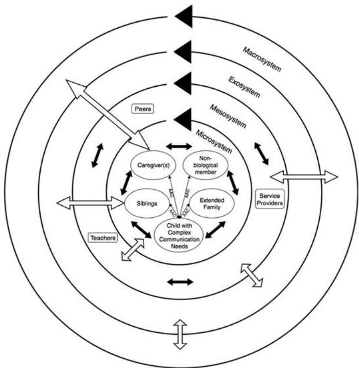

Figure 4.1. Model of the family and ecological systems that impact children who rely on AAC. (Source for systems model: Bronfenbrenner, 1979; From Mandak, K., O'Neill, T., Light, J., &amp; Fosco, G. [2017].)

People Who Require AAC

with complex communication needs. Teams should work with other service providers in the social system to prevent and address these factors for families who are at risk.

In general, families strive for a sense of balance in their lives (known as homeostasis—Mandak et al., 2017). When significant changes occur, as in the introduction of AAC, the family must adjust accordingly (a response known as adaptation). One family member may take the lead in supporting the individual who relies on AAC, but AAC intervention still impacts the entire family. The success (or failure) of the intervention will depend on the fit with the entire family system, not just the individual who requires AAC (Granlund, Björck-Åkesson, Wilder, &amp; Ylvén, 2008; Simmons-Mackie, King, &amp; Beukelman, 2013). The only way to ensure this contextual fit is to listen to families in order to understand their priorities and concerns.

## Family-Centered Services

The importance of families in the lives of individuals with disabilities has given rise to the concept of family-centered services. Family-centered services have been applied most consistently in the realm of early intervention, but the concept has relevance for families that include individuals with complex communication needs across the life span. The basis of family-centered services is the development of a partnership where families and professionals work collaboratively to solve problems and make decisions (Arango, 2011; Mandak &amp; Light, 2018a; Smith, Barton-Hulsey, &amp; Nwosu, 2016). It is essential that the partnership also includes the individual who relies on AAC. Even young children should have input to AAC decision making, and older children, adolescents, and adults should play key roles in all decision making to support their self-determination (Williams, Krezman, &amp; McNaughton, 2008). The partnership with the individual with complex communication needs and the family should be characterized by trust, respect, and open communication. Family-centered and consumer-driven services 1) are individualized, flexible, and responsive to individual and family situations; 2) include information sharing to allow individuals who rely on AAC and families to make informed decisions; 3) involve individuals and families in decision making regarding intervention; and 4) provide resources and supports for individuals and families to maximize outcomes (e.g., Dunst, 2002). Research provides evidence of the positive effects of family-centered services on parent, family, and child outcomes within early intervention. In general, family-centered services result in greater family satisfaction with services, stronger self-efficacy beliefs within the family, increased family involvement, greater family empowerment, improved family ratings of the helpfulness of supports and resources, improved child behavior and functioning, and increased family and individual well-being (Dunst, Trivette, &amp; Hamby, 2007). Given the sound principles that underlie family-centered and consumer-driven services, it seems reasonable to assume that these same types of benefits might be realized for families with older children, adolescents, or adults with developmental or acquired disabilities; however, future research is required to investigate the effects.

The research shows that families of children and adults who rely on AAC want to work with professionals and be involved in intervention (e.g., Ball &amp; Lasker, 2013; Fried-Oken, Mooney, &amp; Peters, 2015; Goldbart &amp; Marshall, 2004; McNaughton et al., 2008; Simmons-Mackie et al., 2013). Many speech-language pathologists and other professionals want to deliver family-centered services, and they may believe that they do so (Mandak &amp; Light, 2018a, 2018b). Unfortunately, families do not always agree with this conclusion. Mandak and Light (2018a) surveyed parents of children with autism spectrum disorder and complex communication needs and also surveyed

Collaborating with Family Members and Other Communication Partners

speech-language pathologists who delivered services to children with ASD and limited speech. Although the speech-language pathologists believed that they provided family-centered services, the parents expressed the need for improvements in enabling families, sharing general and specific information to support families in decision making, communicating respect, and providing a supportive environment. Improved preservice and in-service training may be required to ensure that AAC teams realize the benefits of family-centered services and demonstrate the knowledge and skills to implement family-centered services effectively.

Two types of practices are integral to the delivery of family-centered services: relational practices and participatory practices (Dunst &amp; Trivette, 1996; Dunst et al., 2007). Relational practices include active listening; demonstrating compassion, empathy, and respect; maintaining effective communication; and holding positive beliefs and attitudes about family strengths and capabilities. Participatory practices include those that actively involve family members in decision making, utilize existing family strengths, and develop family capabilities to be actively involved. As discussed in Chapter 2, McNaughton and colleagues conducted a series of studies to teach preservice professionals active listening skills (i.e., LAFF strategy) to support collaborations with families (McNaughton &amp; Vostal, 2010; Thistle &amp; McNaughton, 2015). The studies demonstrated that preservice teachers and speech-language pathologists learned to use active listening skills in a short amount of time and were perceived more positively by parents as a result (Mandak, 2018; McNaughton &amp; Vostal, 2010; Thistle &amp; McNaughton, 2015). Although relational skills such as active listening are emphasized in family-centered services, in fact these skills facilitate collaborations with any type of communication partner, whether family members, professionals, friends, or members of the broader social community.

## Collaborating with Professionals

Beyond family members, many others also play important roles in the lives of children and adults who rely on AAC. For example, children with complex communication needs may interact regularly with a wide array of educational personnel (e.g., general education teachers, special education teachers, paraprofessionals) as well as other service providers (e.g., speech-language pathologists, occupational and physical therapists). Adolescents and adults may interact regularly with job coaches, vocational rehabilitation staff, bosses, and co-workers in jobs or internship experiences (McNaughton &amp; Chapple, 2013). Adults with acquired conditions who live in long-term care facilities may interact regularly with a wide range of caregivers and health care providers. These professionals play important roles in the lives of children and adults who rely on AAC. As with all communication partners, they require the strategies and skills to interact effectively with the individual who relies on AAC to support communication. However, they also have responsibility for important activities in the life of the individual—education and learning, job training, information exchange on the job, medical treatment, and decision making. Therefore, these professionals need more in-depth knowledge and skills to ensure the individual's successful participation in his or her own education, employment, and health care. Specifically, they require knowledge and skills to maintain and develop AAC supports (e.g., daily care, vocabulary selection and message management, technical troubleshooting); ensure proper positioning of the individual to support reliable access to AAC; adapt materials and activities as required to support the participation of the individual who relies

People Who Require AAC

on AAC; utilize effective, evidence-based instruction to teach new skills to the individual who relies on AAC or to support information exchange and shared decision making; and adapt instruction and decision making as required to maximize participation (see Table 4.1).

## Interacting with Friends

Although interactions with caregivers and service providers are essential in the lives of individuals who rely on AAC, interactions with friends are also of significance. Friendships are critical to overall quality of life. Unfortunately, individuals who rely on AAC often report a lack of friends; feelings of loneliness are prevalent (e.g., Balandin, Berg, &amp; Waller, 2006; Ballin &amp; Balandin, 2007; Cooper, Balandin, &amp; Trembath, 2009; Stancliffe et al., 2010). A lack of friends can negatively impact health, lead to depression, and limit functioning. Although individuals with developmental disabilities and those with acquired conditions may all experience loneliness, the specific issues, and therefore the interventions required, differ.

Children with developmental disabilities often have limited opportunities to interact with peers to develop friendships. For example, Andzik, Chung, and Kranak (2016) observed 23 students who used AAC within their school programs for a total of 117 hours. Overall, they found that the students had few opportunities to interact; only 3% of their interactions were with peers, and 35% of the students who used AAC never interacted with peers during the observations. Obviously, it is difficult to develop friendships if there are only infrequent opportunities to interact. As a result, individuals with developmental disabilities generally have fewer friends than those without disabilities, and the friendships that they have may lack depth (Batorowicz, Campbell, von Tetzchner, King, &amp; Missiuna, 2014; Østvik, Ytterhus, &amp; Balandin, 2018).

Children who rely on AAC and their peers may require support to interact successfully to develop meaningful friendships. Usually intervention to promote peer interactions focuses on 1) arranging the environment to support peer interactions, 2) teaching social skills to children who use AAC, and 3) teaching peers to support interactions with children who require AAC (Therrien, Light, &amp; Pope, 2016). Arranging the environment might include setting up mutually enjoyable, meaningful opportunities for interaction and collaboration, and ensuring access to AAC and other supports for communication. Interventions with children who rely on AAC might initially target basic social skills (e.g., turn taking, responding to peers) and then later target more advanced sociorelational skills to support positive interpersonal relationships. Teaching peers to use appropriate interaction strategies (e.g., taking turns, waiting) is also effective in promoting successful peer interactions (e.g., Chung, Carter, &amp; Sisco, 2013; Thiemann-Bourque, 2012). Unfortunately, training peers may disrupt the balance of the friendship if peers are taught to assume the role of an instructor in the interaction. Therrien and Light (2016, 2018) emphasized that it is important to preserve the mutuality of the peer relationship. The key is to ensure that the children have something meaningful and motivating to do together, reciprocal roles to fulfill, and a means to communicate successfully with each other (Carter, Swedeen, &amp; Moss, 2012).

In contrast to children with developmental disabilities, adults with acquired conditions usually have a history of friendships prior to the onset of their condition. In some cases, they may preserve these friendships. However, individuals with acquired conditions also discuss the loss of friends that they may experience as a result of their disability and limited communication.

Collaborating with Family Members and Other Communication Partners
133

An adult with amyotrophic lateral sclerosis explained how he perceived the potential impact of his expected communication disability on his interpersonal relationships when he was diagnosed:

When I realized that I would be unable to speak someday, I viewed it as losing my life. Communication was my life. Now I realize that was a little overly dramatic, but not much. Speechlessness is not a loss of life, but a loss of access to life. I find it difficult to access my friends. They used to stop by to chat, and I wished sometimes that they would leave me alone. Now, if they stop by at all, they stay just a few minutes. They have difficulty tolerating my reduced ability to communicate. I have lost access to them. Because of that, I do not have the opportunities to discuss, joke, and most of all argue. (Beukelman &amp; Garrett, 1988, p. 104)

Intervention may be required to support adults with acquired disabilities in sustaining meaningful friendships and forging new ones. For example, Beukelman (2005) described how he assisted a close friend with amyotrophic lateral sclerosis to maintain a supportive social network. Each Monday evening, Tom and his wife invited friends to drop by a local restaurant for "Time with Tom." They preprogrammed messages into his AAC technology, including personal news, jokes, thoughts for the week, and comments on the news and sports, as well as personal comments for specific individuals. (See Chapter 5 for further discussion of vocabulary selection and message management.) Many adults with acquired disabilities also look to digital communication platforms (e.g., Facebook, Instagram) as means to maintain prior friendships and build new social relationships free from the constraints of face-to-face interactions. In these interactions, there are fewer demands on partners to scaffold the interaction and therefore less need for partner instruction.

An adult with amyotrophic lateral sclerosis (ALS) explained the ways that digital communication supported her social interactions:

One of the first abilities I began to lose with ALS was speech. Social events became more uncomfortable the worse my speech became. For me, in many ways my world became more closed in and isolated as my ability to communicate deteriorated. Even with the help of speech assistance [AAC technology with speech output], group interaction is difficult. Facebook is a better communication tool for me rather than phone or in person. I'm able to easily interact with groups of friends and family. On Facebook we all are on the same level of communication ability. . . . I am able to reconnect with people socially and my world has expanded even though I'm stuck at home most of the time. (Caron &amp; Light, 2015, p. 687)

Many adolescents and adults with developmental disabilities also turn to digital communication platforms as means to develop positive social relationships with others. Given the important role of digital communication in the lives of many individuals who rely on AAC, it is important for AAC teams to address this need when planning AAC intervention. Whether in face-to-face interaction or via digital communication, friends may require instruction to ensure successful interactions with individuals who rely on AAC. However, it is important to remember that they are friends first and foremost (not instructors or professionals).

Preparing Members of the Community

Individuals of all ages who use AAC and their families have increased expectations for participation in a wide range of environments—educational (e.g. Kent-Walsh & Light, 2003), vocational (e.g. McNaughton, Light & Arnold, 2002; McNaughton, Light, & Groszyk, 2001), health care (Blackstone, Beukelman, & Yorkston, 2015), and community (Dattilo et al. 2008; Hajjar, McCarthy, Benigno, & Chabot, 2016). These increased expectations have dramatically increased the breadth of communication partners who must be considered in AAC intervention (McNaughton et al. 2019). In the course of their day, adults who rely on AAC may interact with a wide range of partners in restaurants and stores, on public transit, in medical settings, on their jobs, in volunteer roles, or in public advocacy positions. Children with developmental disabilities may interact with coaches, summer program staff, bus drivers, and other members of the community. These interactions may be short; the partner may only be encountered once or on several occasions. However, these interactions are still tremendously important to ensure the successful participation of individuals who use AAC in society.

The AAC team has a responsibility to increase public awareness of individuals who rely on AAC. In some cases, the team may provide instruction for members of the community. For example, in 2016, Communication Disabilities Across Canada organized educational and informational sessions in advance of the biennial conference of the International Society for Augmentative and Alternative Communication (ISAAC) held in Toronto, Canada. These sessions were intended to prepare community businesses to meet the architectural and communication accessibility needs of individuals who relied on AAC. Solarsh and Johnson (2017) mounted a similar effort in Victoria, Australia. Individuals who relied on AAC, speech-language pathologists, and members of the community worked together to establish communication access standards; businesses and organizations are regularly audited for their implementation of these standards. As of 2017, more than 160 businesses and organizations met the standards of communication accessibility in Victoria. Polovoy (2012) described efforts to foster aphasia-friendly businesses in Baltimore, Maryland, by educating employees about aphasia and teaching them strategies to support the communication of people with aphasia. Community education efforts such as these make it more likely that individuals with developmental and acquired disabilities who rely on AAC will be able to participate successfully in a wide range of environments.

## INTERVENTION TO REDUCE BARRIERS AND SUPPORT PARTICIPATION

In the course of their daily interactions, individuals who rely on AAC will encounter many supports that facilitate their communication and participation. However, inevitably they will also encounter barriers—policy, practice, attitude, knowledge, or skill—that limit their opportunities for communication and participation. In Chapter 2, we discussed strategies and techniques for assessing the supports and opportunity barriers in the environment. The reason for assessing opportunity barriers is to plan appropriate interventions to ensure that the individual who relies on AAC has meaningful opportunities to participate and the accommodations required to do so successfully. In the following sections, we discuss opportunity barriers related to policies, practices, attitudes, knowledge, and/or skills and the interventions that may be required to mitigate these limitations.

Collaborating with Family Members and Other Communication Partners
135

# Policy Barriers

In many countries, there are a range of laws and regulations that support the rights of individuals who rely on AAC. In the United States, these include, for example, the Individuals with Disabilities Education Act (IDEA), the Assistive Technology Act (The Tech Act), and the Americans with Disabilities Act (ADA). It is important that AAC teams are aware of these policy supports and ensure that they are upheld. Unfortunately, sometimes individuals with complex communication needs and their families encounter policy barriers in the form of official written laws, standards, or regulations that limit participation. In these cases, the barriers must be resolved through advocacy efforts or legal action aimed at changing the restrictive legislation or regulations. (See Chapter 19 for further discussion of advocacy activities.)

# Practice Barriers

Many schools, places of employment, and communities have practices in place that support the participation of individuals with disabilities and their families. These practices are procedures or conventions that have become common in a family, school, or workplace but are not official policies. For example, some school districts demonstrate a commitment to supporting inclusion of students who rely on AAC in general education programs with their peers without disabilities. Some agencies and companies have histories of including individuals with disabilities in job training programs to support their successful employment. The AAC team can capitalize on these supports to enhance intervention.

However, sometimes children or adults who rely on AAC encounter practice barriers that restrict their communication and participation. Sometimes these practice barriers result because people are not aware of the laws and policies that protect the rights of individuals with disabilities. Sometimes they result because people have not thought about the restrictions that their practices may impose on others. Sometimes practices that appear to be inconsequential to professionals have substantial negative effects on the lives of individuals who rely on AAC.

John Draper, founder of Together We Rock!, a socially responsible organization committed to fostering inclusive and accessible communities and an expert communicator via AAC, described some of the practices at his high school that created barriers in his interactions with his peers:

Of utmost importance to me was having a sense of belonging in my school community. By virtue of my physical and communication challenges, I didn't really fit into the social circles of high school. This reality, combined with the lack of knowledge on the part of many school personnel on how to promote disability awareness or foster peer relationships, resulted in missed opportunities. One example in high school was how lockers of students who had a disability were grouped in a separate location rather than integrated into the alphabetical order of the rest of the student population. Another example was the practice of having students who had a disability work with paraprofessionals in a segregated resource room during free periods rather than allowing us to interact with our peers in the school library. These practices limited my chances of connecting with my peers. (Carter &amp; Draper, 2010, p. 82)

People Who Require AAC

Advocacy efforts are often needed to address practice barriers, but these efforts should always be combined with educational efforts as well. Typically practice barriers can be eliminated with effective education and advocacy, especially if policies are already in place to support the need for change. Often educational efforts need to be extended to address barriers in the justice system itself, the very system that is intended to protect human rights. Many law enforcement officers, lawyers, judges, and courts have minimal, if any, training or experience with individuals who rely on AAC; they require concerted education and training to ensure successful access to the justice system for individuals who rely on AAC who are victims of abuse, maltreatment, or other crimes (White, Bornman, &amp; Johnson, 2018).

## Attitude Barriers

Some opportunity barriers are related to attitudes that restrict or prevent communication participation. Attitude barriers occur when people hold feelings that predispose them to act in ways that minimize the communication opportunities of individuals who rely on AAC (Hodge, 2007; McCarthy &amp; Light, 2005). Sometimes, the beliefs held by an individual are problematic; at other times, the culture of a service delivery agency, community organization, or school system acts as a barrier. Often, attitude barriers persist even when policy and practice barriers do not.

Children and adults with disabilities are at increased risk for bullying in society; a number of factors may increase their risk, including physical vulnerability, challenges with social skills, and intolerant environments (U.S. Department of Health and Human Services, 2019). Individuals who rely on AAC may be especially vulnerable due to their communication difficulties; furthermore, they may lack the communication means and skills to report bullying to family, professionals, administrators, or other authorities, placing them even further at risk. Bullying not only threatens the physical and emotional well-being of individuals who rely on AAC, but also fosters a climate of fear and disrespect that negatively impacts participation (Yudin, 2013). The AAC team has a responsibility to help in fostering a safe environment and preventing bullying. The following are some strategies and techniques that have been found to be effective in preventing bullying within the school system:

- Engaging students in developing high-interest activities in which everyone has a meaningful role to play in designing, executing, or participating in the activity
- Providing general up-front information to peers about the kinds of support students who rely on AAC require to participate
- Creating a buddy system for students who rely on AAC
- Involving students in adaptive strategies in the classroom so that they participate in assisting and understanding the needs of others
- Conducting team-based learning activities and rotating student groupings
- Rewarding positive, helpful, inclusive behavior (U.S. Department of Health and Human Services, 2019).

When it comes to prevention or intervention to address bullying, everyone can make a positive difference—including bystanders. Bystanders are anyone who witnesses bullying either in person or in digital media. When bystanders intervene, in the majority of cases, bullying stops (Polanin, Espelage, &amp; Pigott, 2012).

Collaborating with Family Members and Other Communication Partners
137

Sometimes attitude barriers are more subtle in nature and actually derive from misguided attempts to help individuals who rely on AAC. They may result when people feel sorry for individuals with disabilities and try to protect them, rather than treating them with the respect that they deserve.

Ariana experienced attitude barriers that limited her participation in an online forum when she was attending university and studying fine arts. She had severe cerebral palsy and relied on AAC. She painted by holding a paintbrush in her teeth. She was very lonely as she had made few friends since she graduated from high school and started university. In an attempt to expand her social network, she joined an online community of people interested in the fine arts; they shared and critiqued each other's work. She was so excited about the group and the people that she had met. She valued and appreciated their critiques of her work. She began to develop some friendships in the group, and she started to chat regularly with one of the members online. She shared with him that she had a disability. The next day she noticed that the tone of the online community had changed substantially. Everyone was overly nice to her; no one provided honest critique of her work. She found out later that word had spread that she had a disability. In their misguided efforts to be supportive, the community failed to treat Ariana with the respect that she deserved as an artist, a member of the community, and a human being. Ariana signed off the online group. Several months later, she rejoined but used a new alias. This time she waited patiently until people really had a chance to get to know her as a person before she shared her disability status with the group. When she did so, she described the similarities between her experiences and theirs and emphasized her wish to be treated with equal status.

Given the potential impact of attitude barriers at all levels of the social system, the AAC team has a responsibility to identify these barriers and consider intervention to promote more positive attitudes and to act in a proactive manner to prevent negative attitudes. Often education and advocacy efforts are effective ways to resolve attitude barriers. Perhaps the most powerful means to effect change is to foster meaningful opportunities for people who rely on AAC to interact regularly with individuals in their communities, specifically in activities that involve equal-status, reciprocal, cooperative interactions. Michael Williams, a disability advocate and expert communicator via AAC, emphasized that individuals who rely on AAC have the opportunity to change society's expectations every time they interact with others on the street, in stores, in restaurants, or at sporting events: "Interacting with people as you live your life is a major contribution to society" (Williams et al., 2008, p. 203).

## Knowledge Barriers

Knowledge barriers stem from a lack of information on the part of family members or other communication partners that minimizes opportunities for communication by the person with complex communication needs. Most family members will have had limited, if any, training or experience with AAC prior to their interactions with the child or adult with complex communication needs in their family. Many other communication partners who play significant roles—peers, teachers, employers, coworkers, personal care attendants, caregivers—may have also had limited, if any, AAC training or experience. As a result, they may not realize the importance of AAC and may not ensure access to AAC. For example, Andzik and colleagues (2016) found

that children were provided with very few opportunities to communicate in their school programs and, in almost half of these opportunities, they did not have access to AAC and therefore had no effective means to communicate. A parent of a child who relies on AAC explained the impact of these types of knowledge barriers on her son's education:

> When my son went to school so many opportunities were missed ... The teachers knew nothing of the AAC, and wanted to know nothing. There is no acceptable reason that he was not expected, encouraged, or allowed to use the device in school. So many missed opportunities. (McNaughton et al. 2008, p. 49)

To effectively support the individual who relies on AAC, family members, daily AAC facilitators, and other significant communication partners may require knowledge on a wide range of topics related to AAC, including, for example, knowledge of AAC symbols or representations (e.g. manual signs, eye blink codes, line drawing symbols), access techniques, positioning requirements (for the individual, the partner, and the AAC technology, as required), vocabulary and message selection, operation and programming of AAC technologies, construction of low-tech communication boards or books, daily care and maintenance of AAC (e.g. charging, cleaning), troubleshooting and technical support, and implementation of AAC to enhance communication in daily interactions (McNaughton et al. 2019). The specific knowledge required will vary depending on the individual's needs and capabilities, the AAC supports utilized, and the partner's role. Sometimes the demands on family members and other communication partners are substantial, as when individuals rely on manual signs to communicate and partners need to develop their knowledge and use of these signs. Some alternative access techniques used by individuals with severe motor impairments require precise setup for reliable use; they may be unable to communicate unless their caregivers are knowledgeable of positioning and set-up requirements (Fager, Fried-Oken, Jakobs, & Beukelman, 2019).

Knowledge barriers among communication partners who work in medicine or health care compromise the quality of care available to people who rely on AAC. For example, Juan is a patient in a rehabilitation unit; he is recovering from a near drowning that left him with severe speech and motor impairments. He relies on AAC technology to communicate; however, the technology must be positioned correctly, and his partners must provide him with time to communicate. He encounters more than 30 different health care providers in a week, many of whom are not trained in AAC. As a result, he is not given the chance to provide input to his medical care; he is at substantial risk for adverse medical events.

Many AAC technologies are complex to operate and program; they place significant demands on families in terms of time and effort to add vocabulary to meet daily needs (Moorcroft, Scarinci, & Meyer, 2019). In recent years, the field has started to consider ways to reduce the learning demands on families and other communication partners through the development of AAC technologies that are quick and easy to program such as those that support just-in-time (JIT) programming (e.g. Drager et al. 2019; Holyfield, Caron, Drager, & Light, 2019; Light, McNaughton, & Caron, 2019). In fact, parents report that ease of use is the most influential factor when they choose AAC technologies for their children (Meder & Wegner, 2015). Continued efforts to develop easy-to-use AAC technologies and access techniques are of paramount importance to minimize the knowledge demands on families and other

Collaborating with Family Members and Other Communication Partners
139

communication partners. Even with improved AAC technologies, communication partners will still require some knowledge of AAC to support communication and participation.

Teachers and other school staff working with students who rely on AAC must have knowledge of AAC to provide these students with an education—as Arun's story illustrates. Arun was included in a general education Grade 4 classroom. He had a severe motor impairment and relied on AAC technology for communication. Every day during the first weeks of the new school year, he was very agitated when he came home. His mother noticed that his AAC technology was fully charged and turned off. She called his new teacher to say that Arun seemed upset and to ask how things were going. She asked about his AAC technology. The teacher said that they were not using it in class yet. She did not know how the technology worked and didn't want to break it. She was hoping to attend a training next month and she thought that she would learn more then. Arun's mother was flabbergasted. How would her son communicate in the meantime? How would he participate in the educational program? It was simply not acceptable that he lose 8 weeks of learning due to the school staff's lack of knowledge. She spoke with the principal and organized a time to come in and meet with his teacher, paraprofessional, and other school staff to teach them how to operate and program Arun's AAC technology. They required AAC knowledge so that Arun could get an education.

Knowledge barriers are best remediated through education. Education can take on various formats, such as in-service training, workshops, online instruction, directed readings, and so forth. Many AAC manufacturers offer an array of educational supports for learning their technology products, ranging from workshops to online tutorials to video training. In a survey of parents of children who use AAC technologies, the majority of the parents reported that they needed and wanted additional education and assistance with the AAC technology; these parents indicated a preference for several short (1-hour) training sessions with a professional rather than longer trainings (Meder &amp; Wegner, 2015). The instructional technique used should fit the needs of families and communication partners.

Beukelman and colleagues investigated AAC technology learning by different types of communication partners, including AAC intervention specialists (Burke, Beukelman, Ball, &amp; Horn, 2002), preservice students (Beukelman, Burke, Ball, &amp; Horn, 2002), and regular AAC team members (Beukelman, Hanson, Hiatt, Fager, &amp; Bilyeu, 2005). They identified several different learning mode preferences: 1) independent learning where adults learn on their own, using appropriate resources; 2) small group learning where adults learn and interact with others to share ideas; 3) case study learning where adults focus on a specific individual or situation; and 4) step-by-step learning where adults receive detailed instruction from an instructor (Thiessen &amp; Beukelman, 2013). Regardless of the instructional approach taken, technology learning should always involve hands-on activities. Learning to operate and program AAC technologies requires procedural learning, in other words, learning how to do. Procedural learning is best achieved through active practice (Light &amp; Lindsay, 1991).

Ideally, intervention to address knowledge barriers is proactive. If AAC teams plan ahead, they can ensure that families, AAC facilitators, and other communication partners are equipped with the knowledge that they require before they need it. Inevitably, education in AAC techniques must be ongoing. As the individual's needs

People Who Require AAC

and capabilities change and as environmental demands change, the individual's AAC supports will also change, requiring communication partners to acquire new knowledge in these latest AAC techniques. It is important to empower communication partners with this type of knowledge so that they can support individuals with complex communication needs in the operation, maintenance, ongoing development, and daily use of AAC. If partners lack this critical knowledge, they may not be able to understand the AAC systems used (e.g., understand the signs or graphic symbols), ensure that AAC technologies are available and functioning, update vocabulary and messages to meet changing needs, and so on. Communication partners are critical to the success of AAC intervention not just in terms of their knowledge of AAC, but also in terms of their skills.

## Skill Barriers

Skill barriers occur when communication partners have difficulty with actual communicative interactions with individuals who rely on AAC; they can occur even when family members and other communication partners have knowledge of AAC. Just as it can be challenging for individuals with complex communication needs to communicate effectively with others, so too can it be challenging for communication partners to interact successfully with individuals who rely on AAC. Parents of children with developmental disabilities typically have limited or no prior experience interacting with people who use AAC prior to the birth of their child. Similarly, families, friends, and colleagues of adults with acquired conditions often have had limited or no experience or training in AAC prior to the onset of the disability. As a result, these communication partners may have difficulty knowing how to adapt their behaviors to accommodate individuals with complex communication needs (e.g., provide appropriate language input, provide meaningful opportunities for communication, structure the environment to support communication, use AAC to interact effectively).

A parent of a child with disabilities described the demands as follows:

It took a lot of effort and concentration and determination. And particularly when you know that there's not a lot of support, it's really up to me . . . and just to take it on board and take on all that hard work is sort of daunting. (Anderson, Balandin, &amp; Stancliffe, 2014, p. 78)

The research suggests that when communication partners interact with individuals who use AAC, the partners typically have difficulty accommodating to the individual who relies on AAC (Thiessen &amp; Beukelman, 2013). Partners tend to dominate the interactions, providing few opportunities for individuals who use AAC to communicate in meaningful ways. Partners tend to take more turns and initiate most of the topics; they may fail to recognize and respond to the communicative attempts of individuals with complex communication needs (Ball &amp; Lasker, 2013; Holyfield, Light, Drager, McNaughton, &amp; Gormley, 2018; Light, Collier, &amp; Parnes, 1985; Simmons-Mackie, 2018). These patterns of interaction may occur because the communication partners are trying to minimize communication breakdowns and ensure that the interaction is successful. Unfortunately, these patterns may not allow people who require AAC to have a voice and express themselves successfully. In fact, lack of partner support has been cited as a major factor that contributes to communication difficulties for people with complex communication needs (e.g., Ball &amp; Lasker, 2013; Johnson, Inglebret,

Collaborating with Family Members and Other Communication Partners
141

Jones, &amp; Ray, 2006). Communication partners require instruction to help them develop the strategies and skills to support individuals with complex communication needs. To be optimally effective, AAC interventions must be two-pronged, involving not just instruction with the individual who relies on AAC (as discussed in Chapter 3), but also instruction with family members and other significant communication partners (Cumley &amp; Beukelman, 1992; Kent-Walsh &amp; McNaughton, 2005). The following section focuses specifically on instruction to teach communication partners the strategies and skills to support communicative interaction with individuals who rely on AAC.

## INSTRUCTION OF COMMUNICATION PARTNERS

Some communication partners may have already discovered effective strategies to accommodate the needs of the individual who relies on AAC, and these can be incorporated into daily interactions (e.g., Ball &amp; Lasker, 2013). However, most communication partners require instruction to learn new strategies and skills to effectively support communication (e.g., Ball &amp; Lasker, 2013; Kent-Walsh, Murza, Malani, &amp; Binger, 2015). Meta-analyses of the effects of communication partner instruction on the communication of individuals who use aided AAC (Kent-Walsh et al., 2015) and adults with aphasia (Simmons-Mackie, Raymer, Armstrong, Holland, &amp; Cherney, 2010; Simmons-Mackie, Raymer, &amp; Cherney, 2016) have established that

1. Instruction is effective in teaching communication partners to modify their interaction strategies.
2. Communication partners' use of targeted interaction strategies, in turn, results in improved communication outcomes for individuals with complex communication needs across a wide range of ages and disabilities.

These positive effects have been found for instruction with a wide range of communication partners, including family (e.g., Binger, Kent-Walsh, Berens, Del Campo, &amp; Rivera, 2008; Kent-Walsh, Binger, &amp; Hasham, 2010), professionals and paraprofessionals (e.g., Binger, Kent-Walsh, Ewing, &amp; Taylor, 2010; Bingham, Spooner, &amp; Browder, 2007), and peers (e.g., Chung &amp; Carter, 2013; Therrien et al., 2016; Trottier, Kamp, &amp; Mirenda, 2011). In fact, this research suggests that intervention for individuals who rely on AAC should always start with the instruction of communication partners to ensure meaningful opportunities to participate and the necessary accommodations to do so (Ball &amp; Lasker, 2013). In designing effective instruction for communication partners, it is important to consider 1) what to teach, 2) how to teach, 3) what instructional format to use, and 4) who conducts the instruction.

## Interaction Strategies Targeted for Instruction

A range of different strategies and skills may be targeted for instruction with communication partners (e.g., Ball &amp; Lasker, 2013; Kent-Walsh et al., 2015; Therrien et al., 2016). Table 4.2 provides examples of some partner interaction strategies and their purposes. Often strategies and skills are identified as instructional goals on an individual basis for communication partners, based on the needs and capabilities of the child or adult who relies on AAC, as well as the strengths and needs of the communication partner (Binger &amp; Kent-Walsh, 2012). Several researchers have also developed programs for teaching communication partners a specific set of strategies or skills. Probably the best known of these is the ImPAACT (Improving Partner Applications of Augmentative Communication Techniques) program that targets the following skills

People Who Require AAC

Table 4.2. Examples of strategies and skills targeted in instruction with communication partners to accommodate individuals who rely on AAC

|  Target strategy or skill for the communication partner | Purpose in supporting interaction with the individual who relies on AAC  |
| --- | --- |
|  Set up the environment to foster communication | To ensure that the individual who relies on AAC has someone with whom to interact  |
|  Ensure communication partners are accessible | To ensure that he or she has the means to communicate  |
|  Ensure AAC is available |   |
|  Ensure appropriate positioning of the individual, partner, and AAC | To accommodate the individual's vision and hearing impairments as required  |
|   |  To maximize motor function and support access to AAC  |
|   |  To minimize effort and fatigue as much as possible  |
|  Provide appropriate language input | To ensure comprehension by the individual who relies on AAC  |
|  Provide augmented input (either unaided or aided) as required | To provide visual supports to enhance comprehension of the individual  |
|   |  To slow the rate of spoken input  |
|  Use a written-choice conversation strategy (i.e., write out a list of potential responses from which the individual can choose a response) | To provide a response pool for the individual to participate in conversation and express choices and opinions  |
|  Provide contextual supports for communication/create a shared communication space (e.g., photos or videos of important events, mementos) | To enhance comprehension by the individual  |
|   |  To facilitate information transfer and conversation  |
|  Used tagged yes/no questions (i.e., ask the question and then ask “yes?” while nodding head and then ask “or no?” while shaking head) | To model yes/no responses (i.e., head nod and shake) for the individual  |
|   |  To provide a narrow set of response options for the individual (i.e., YES or NO)  |
|  Wait or provide expectant delay after each comment or question | To clearly mark the opportunity to communicate  |
|   |  To allow the individual time to communicate  |
|  Provide meaningful opportunities for communication | To increase the individual's motivation to communicate  |
|   |  To increase functional communication  |
|  Avoid “test” questions | To facilitate generalization to naturally occurring interactions  |
|  Introduce motivating topics |   |
|  Offer appropriate choices | To support long-term maintenance  |
|  Provide sincere comments |   |
|  Ask open-ended questions |   |
|  Prompt as required to ensure the individual's successful communication (e.g., modeling, guided practice) | To facilitate acquisition and generalization of new strategies and skills by the individual who relies on AAC to increase communication effectiveness  |
|  Respond contingently to communication attempts by fulfilling communicative intent | To demonstrate the power of communication  |
|   |  To build motivation to communicate  |
|   |  To encourage a wide range of communication purposes (e.g., to express needs and wants, build social closeness, share information)  |
|  Confirm understanding of the message | To ensure accurate interpretation of the individual's messages  |
|   |  To provide honest feedback regarding intelligibility of the individual's communication  |

Collaborating with Family Members and Other Communication Partners
143

for communication partners (e.g., parents, teachers, paraprofessionals) of children who rely on AAC: aided AAC modeling, expectant delay, wh- question asking, oral prompting, and contingent responding (Kent-Walsh &amp; Binger, 2013). There is evidence that communication partners can learn to use these types of interaction strategies with appropriate instruction in a relatively short amount of time. In fact, research suggests that changes in communication partner interaction strategies can be effected with less than 5 hours of instruction (e.g., Kent-Walsh &amp; Binger, 2013; Kent-Walsh, Binger, &amp; Malani, 2010) and even very short trainings, lasting only 15–20 minutes, can make significant differences (e.g. Gormley, 2019; Holyfield et al., 2018).

Which strategies and skills are targeted with which communication partners depends on the type and level of support required by the individual who relies on AAC as well as the role of the communication partner and the partner's current knowledge and skills. For example, communication partners who interact regularly with individuals who require AAC, such as family members, daily AAC facilitators in long-term care facilities, or educational/vocational personnel, may require more in-depth instruction to learn to consistently implement a greater range of interaction strategies than communication partners who interact infrequently in a limited range of situations. Furthermore, some individuals with complex communication needs require substantial support from communication partners to participate successfully, whereas others are highly competent communicators and require minimal, if any, partner support.

Adriana, Robert, and Don each rely on AAC, but need varying degrees and types of support from their communication partners.

Adriana is 16 years old. She has a rare chromosomal disorder and global developmental delays; she is ventilator-dependent. She uses five manual signs, gestures (e.g., reaching for or pushing away objects; putting an adult's hand on an activity to request assistance), and a few photographs (e.g., a photograph of suctioning) to communicate. She requires significant support from her communication partners to express her needs and wants and establish social closeness. Specifically, she needs her communication partners to 1) set up meaningful opportunities for her to communicate choices, make requests, and take turns in social interactions; 2) provide augmented input (i.e., speech plus AAC) to support her understanding; 3) wait expectantly for her to communicate; 4) model the use of AAC; and 5) respond immediately to her communicative attempts.

Robert is 61 years old. He had a sudden-onset thrombotic left cerebrovascular accident (CVA) in the region of the middle cerebral artery just after he retired. He recognizes photographs, labels, and signs in context. His communication is partner dependent; he relies on his communication partners to support his participation in communicative interactions. Specifically, he needs his communication partners to 1) provide augmented input by writing, drawing, pointing, or gesturing to supplement their speech; 2) use a written-choice conversational strategy (i.e., generate meaningful conversational questions and write out possible answers as written word choices, scales, or maps); 3) utilize tag yes/no questions (e.g., "Do you want to visit your son today, yes [nods head up and down] or no [shakes head side to side]?"); and 4) respond to all of his communicative attempts regardless of the mode he uses.

People Who Require AAC

Don is 32 years old. He has cerebral palsy and relies on AAC. He has a college degree and is employed as a policy analyst with a nonprofit organization. He lives independently and is an active participant in a wide range of community activities. In his daily life, he interacts with a wide range of communication partners—both familiar and unfamiliar. He is a highly competent communicator and requires only minimal accommodations from his communication partners. He simply requires them to wait while he composes his message, to confirm that they have understood correctly, and to treat him with respect. He instructs his communication partners in these skills as required.

## Instructional Techniques to Teach Communication Partners

Often communication partners are adults—parents, spouses, teachers, paraprofessionals, job coaches, co-workers, or members of the community. Therefore, Thiessen and Beukelman (2013) recommend that AAC teams draw on principles of adult learning when planning and implementing instruction. These principles include the following: 1) adult learners want to learn information and skills that are relevant and useful to them; 2) they come to new learning with prior experiences, and instruction should build on this prior knowledge; and 3) their readiness to learn is impacted by a range of factors, and instruction should be personalized to respond to these needs (Thiessen &amp; Beukelman, 2013).

Often communication partners are taught interaction strategies or skills using a strategy instruction model. The strategy instruction model has also been used to teach strategies and skills directly to individuals who rely on AAC to enhance their communication effectiveness (see Chapter 3). It was adapted for instruction of communication partners by Kent-Walsh and McNaughton (2005). Strategy instruction for communication partners includes the following steps:

1. Description of the target strategy, including the rationale for the strategy and its expected benefits for the individual who relies on AAC
2. Modeling of the target strategy by the instructor to demonstrate its use
3. Oral rehearsal of the target strategy to ensure it is recalled by the communication partner
4. Controlled practice for the communication partner to use the target strategy in minimally demanding situations (e.g., role plays with the instructor) with prompting support as required and feedback on strategy use
5. Advanced practice of strategy use by the communication partner in the natural environment with gradual fading of support and feedback from the instructor
6. Planning for generalization and maintenance of strategy use by communication partners in a wide range of real-world situations (Kent-Walsh &amp; McNaughton, 2005)

Ball and Lasker (2013) proposed a similar model (drawn from Woods, Wilcox, Friedman, &amp; Murch, 2011) for teaching strategies to communication partners of adults with acquired communication disabilities. The latter model includes the following major steps:

1. Preparation to teach the target strategies, including observations of the interactions between the adult with complex communication needs and the communication partner, consideration of partner strategies that may be useful, discussion of these potential strategies, and consensus on target goals

Collaborating with Family Members and Other Communication Partners
145

2. Application of the strategies and feedback, including demonstration of the target strategies in joint interactions with the dyad, guided practice to support the communication partner in implementing the strategies, feedback on the partner's strategy use, and independent practice by the communication partner

3. Mastery of the strategies, including reflection on implementation of the strategies, evaluation of their effects, and problem solving as required.

This instructional approach emphasizes teaching strategy use in the context of daily activities, as does the strategy instruction model. A meta-analysis of the effects of communication partner training found that strategy instruction approaches to training were highly effective with a very large effect size. Less structured skill-based training of communication partners was also found to be effective, but the overall effect size was not as strong.

## Instructional Formats

Instruction of communication partners may use various media and follow a variety of formats depending on the partners' needs and preferences (Thiessen &amp; Beukelman, 2013). In planning what format to use, it is important to consider not only short-term needs for partner instruction, but also long-term needs. Many individuals who rely on AAC experience significant turnover in their communication partners over time as paraprofessionals, personal care aides, and other professionals come and go. It is important that there are plans for ongoing instruction to address these changes in communication partners over time. Three main approaches have been used to deliver instruction to communication partners: face-to-face instruction, online instruction, and just-in-time instruction.

## Face-to-Face Instruction

The most frequently used approach is instruction in face-to-face interactions, conducted either one on one (e.g., Binger et al., 2008; Kent-Walsh et al., 2010) or in small groups (e.g., McNaughton &amp; Light, 1989). This type of face-to-face instruction has been found to be effective in teaching communication partners to use target strategies and skills (Kent-Walsh et al., 2015; Simmons-Mackie et al., 2010, 2016). It offers a number of advantages: 1) it is personalized to the needs of the communication partner and the individual who relies on AAC, 2) it is paced according to the needs of the partner, and 3) it provides immediate and specific feedback. Unfortunately, communication partner training is not always a key component of typical AAC practice due to service delivery and funding constraints; service providers may struggle to reach all of the communication partners who require training. Furthermore, training may not be available to partners any time that they need it; rather, training is dependent on the availability of a professional who is knowledgeable and skilled in AAC and partner instruction. As a result, many parents and other partners may not have access to the training they need when they need it (McNaughton et al., 2019).

## Online Instruction

Another approach is to provide instruction online. For example, Douglas and colleagues developed online instruction for paraprofessionals working with young children with complex communication needs (Douglas, McNaughton, &amp; Light, 2013). The online instruction utilized strategy instruction to teach these communication partners to use the PoWR strategy: Provide opportunities for communication, Wait for the child's communication, and Respond to the child's

communication. The online instruction was found to be effective. After participating in the training, the paraprofessionals provided a greater number of appropriate communication opportunities to the children with complex communication needs during play interactions, the children demonstrated increases in the number of communicative acts that they expressed, and the paraprofessionals increased the frequency of their responses to the children's communication acts. Quinn, Beukelman, and Thiessen (2011) explored the effectiveness of remote access technology (screen-sharing software) in teaching a new AAC software application and found that participants preferred the remote access learning over traditional side-by-side instruction; both approaches were equally effective in teaching operational skills.

Providing access to instruction online offers several distinct advantages: 1) it is available at any time and thus accommodates the schedule of the communication partner, 2) it is self-paced, and 3) it endures long term so it can be used numerous times as required as communication partners change. However, since online instruction is intended to meet the needs of a variety of communication partners who interact with a range of individuals with complex communication needs, the instruction and the feedback are not as personalized as one-on-one instruction. Furthermore, communication partners may potentially skip through key parts of instruction, negatively impacting their understanding and use of the target strategies or skills.

### Just-in-Time Instruction

Although both face-to-face and online instruction have been shown to be effective approaches to teach interaction strategies to communication partners, they may not always be readily available to communication partners in the moment as required. Furthermore, it may take time to complete these trainings and, in the meantime, communication partners may not have the skills required to interact effectively with the individual who relies on AAC. An alternative approach is to provide short, just-in-time (JIT) instruction for communication partners. The concept of just-in-time training has been investigated in medicine for health care professionals and for emergency responders, especially to teach specialized procedures that may only be required in low-frequency situations (e.g. emergency events; Motola et al. 2015). With this approach, video models of the required procedure (typically housed on mobile technology) are provided and are reviewed by the health care provider or emergency responder in the moment, as required, to teach or refresh the required procedures. Most current JIT trainings involve passive video viewing of the target procedure. However, research suggests that it is more effective to provide step-by-step, interactive, video prompting where each step in the procedure is demonstrated one at a time with opportunities to practice or implement after each step and to review steps as many times as required (e.g. Bellini & Akullian, 2007; Domire & Wolfe, 2014).

Two preliminary studies have investigated the effectiveness of this approach to teach communication partners of individuals who rely on AAC. The first study used a mobile technology app that integrated video models and visual scene displays to teach middle school students to recognize and respond appropriately to the communication attempts of their classmates who had severe multiple disabilities and were presymbolic (Holyfield et al. 2018). After a very short, 15-minute video training, the middle school students were much more accurate recognizing and interpreting the presymbolic communicative behaviors of the students with multiple disabilities than their peers who did not complete the training. In a subsequent study, Gormley (2019) investigated the effects of JIT video training as a means to teach health care providers

Collaborating with Family Members and Other Communication Partners
147

in a fast-paced inpatient rehabilitation setting to support children with complex communication needs in communicating choices. After the video training, the providers in the experimental group provided the children with opportunities to communicate choices in more than 70% of their interactions. In contrast, the health care providers in the control group (who did not receive training) provided the children with opportunities in only 7% of their interactions. These studies suggest that JIT instruction using video prompting may be a potentially powerful approach to partner training. JIT partner training using video prompting offers a number of potential advantages compared to traditional face-to-face partner training: 1) the content is readily available to a wide range of partners at any time for practice or review, 2) the training requires minimal time, 3) it can be accessed just in time as the need arises to interact with the individual with complex communication needs, 4) the training can be delivered in the moment in short bursts to facilitate learning, 5) it supports step-by-step learning of the targeted strategies, 6) it allows quick and easy review of specific steps, and 7) the video models can be easily personalized to the individual who relies on AAC using onboard cameras within mobile technologies.

## Instructors

Traditionally the AAC team has assumed responsibility for ensuring that communication partners are taught to use effective interaction strategies. Often, in the early stages of AAC intervention (when children are young or adults are recovering from an acquired condition), family members and other communication partners are new to AAC; the AAC team works with them to teach required interaction strategies and to build their knowledge of AAC. The goal is to empower family members, daily AAC facilitators, and other significant communication partners with the knowledge and skills to accommodate the individual with complex communication needs. Over time, families or other AAC facilitators may assume responsibility for sharing their knowledge and skills with other communication partners.

When AAC intervention first began with Grant, he was 2 years old. He had severe cerebral palsy and had a tracheotomy; he required AAC to meet his communication needs. His parents were new to AAC; Grant's AAC team worked with his mother to teach her how to support his communication and program his AAC technology. As his mother developed her competencies, she in turn taught her husband and her parents. By the time her son entered preschool, Grant's mom was highly skilled interacting with her son, and she taught his new preschool teacher and paraprofessional what strategies to use to support his communication. His teacher and paraprofessional, in turn, taught the other children in Grant's preschool program as well as the other staff. Through this cascading model of instruction, more than 25 communication partners developed strategies to interact with Grant, including both adults and peers.

When appropriate, the ultimate goal is to empower individuals who rely on AAC to themselves teach their communication partners. Some individuals who use AAC may utilize an introduction strategy to provide their communication partners with information on how they communicate and what strategies partners should use to facilitate the interaction (Light &amp; Binger, 1998). This introduction strategy might be written on a card, included in a low-tech communication board or book, or pre-stored

People Who Require AAC

in AAC technology and then spoken out as required. Many individuals who rely on AAC may find it more effective to use photos or videos for their introduction strategy (rather than written explanations) as the images can actually show the target interaction strategies. (See Chapters 11 and 15 for further information about use of introduction strategies by individuals with developmental and acquired disabilities.) Introduction strategies should always be developed with input from the individual who relies on AAC. It is important to remember that ultimately the decision as to how to instruct communication partners rests with the individual who uses AAC. Some people who rely on AAC believe strongly that everyone needs to learn how to adapt and communicate effectively with a wide range of people with different capabilities (as communication accommodation theory suggests). They do not provide specific instruction for communication partners, but rather encourage people to enter into interactions with them with an open mind and to discover effective interaction strategies with their guidance and feedback.

Some individuals who rely on AAC not only take active roles in ensuring their own right to communication, but they also assume advocacy roles and may work to remove opportunity barriers for others with complex communication needs.

Steve Gleason, a former NFL player who has ALS and is a strong advocate for the rights of people with disabilities, related the problems that he encountered when flying with his powered wheelchair and AAC technology. He explains the problem in the following series of Tweets directed to the airline and advocates to effect positive change for himself and others with disabilities:

1/3 We regularly fly commercial and yesterday was our first trip with [airline]. Can we chat about your customers flying with power wheelchairs and specialty equipment? Our family flight to Phoenix today almost didn't happen bc [because] a few employees' unwillingness to accommodate.

2/3 Some of your ground crew acted rigidly as if I shouldn't fly. We regularly fly on other airlines, who have been quite understanding &amp; accommodating. A big shout out to your employee [employee's name] in Phoenix though who was fantastically understanding.

3/3 I am fortunate to have an incredible care staff, who get me anywhere anytime, despite adversity like yesterday. But I'm also wanting to have a conversation with [airline] because it's my goal to help others who are choosing to live with ALS travel commercially. Thanks. (Gleason, 2019a)

Four days later, Steve Gleason tweeted the following update on the results of his advocacy efforts:

Update on our experience with [airline] – After a few days of discussion, we returned to New Orleans yesterday &amp; had a flawless trip because staff was well-informed, involved, and extremely helpful. (Gleason, 2019b)

## CONCLUSIONS

As this chapter illustrates, individuals who rely on AAC impact and are impacted by many people—family members, AAC facilitators, educational/vocational professionals, health care providers, friends, members of the community, and the broader social system that defines cultural values, policies, and accepted practices. All of these

Collaborating with Family Members and Other Communication Partners
149

people play a role in ensuring that individuals with complex communication needs have the opportunity to live in a safe and healthy environment and that they have the accommodations required to communicate effectively and participate in valued roles as they wish. It is important for the AAC team to work collaboratively with these communication partners to address barriers in the environment (policy, practice, attitude, knowledge, skill), to ensure meaningful opportunities for participation, and to teach communication partners the knowledge and skills they require to accommodate the individual who relies on AAC and ensure successful communication.

## QUESTIONS

4.1. Why is it important to consider communication partners when implementing AAC intervention?
4.2. Name five different types of communication partners who interact with individuals who rely on AAC and describe their roles and responsibilities. What knowledge, strategies, and skills do they require to fulfill these roles and responsibilities?
4.3. What is communication accommodation theory? How is it relevant for individuals who rely on AAC and their communication partners?
4.4. What are family-centered services? Why are they important?
4.5. What are policy and practice barriers? Provide an example. How would you plan intervention to address these barriers?
4.6. What are attitude barriers? Provide an example. Describe how you would implement intervention to address attitude barriers.
4.7. What are knowledge barriers? What AAC knowledge might communication partners require?
4.8. Describe at least five interaction strategies that might be used by communication partners to support the communication of individuals who rely on AAC. What is the purpose of these strategies?
4.9. What is strategy instruction? Describe the steps in strategy instruction.
4.10. Who might provide instruction for communication partners?

## REFERENCES

Anderson, K., Balandin, S., &amp; Stancliffe, R. (2014). Australian parents' experiences of speech generating device (SGD) service delivery. Developmental Neurorehabilitation, 17, 75-83. doi:10.3109/17518423.2013.857735
Andzik, N. R., Chung, Y., &amp; Kranak, M. P. (2016). Communication opportunities for elementary school students who use augmentative and alternative communication. Augmentative and Alternative Communication, 32, 272-281. doi:10.1080/07434618.2016.1241299
Arango, P. (2011). Family-centered care. Academic Pediatrics, 11, 97-99.
Balandin, S., Berg, N., &amp; Waller, A. (2006). Assessing the loneliness of older people with cerebral palsy. *Disability and Rehabilitation*, 28, 469-479. doi:10.1080/09638280500211759
Ball, L. J., &amp; Lasker, J. (2013). Teaching partners to support communication for adults with acquired communication impairment. Perspectives on Augmentative and Alternative Communication, 22, 4-15. doi:10.1044/aac22.1.4
Ballin, L., &amp; Balandin, S. (2007). An exploration of loneliness: Communication and the social networks of older people with cerebral palsy. Journal of Intellectual &amp; Developmental Disability, 32, 315-326. doi:10.1080/13668250701689256
Batorowicz, B., Campbell, F., von Tetzchner, S., King, G., &amp; Missiuna, C. (2014). Social participation of school-aged children who

People Who Require AAC

use communication aids: The views of children and parents. Augmentative and Alternative Communication, 30, 237-251. doi:10.3109/07434618.2014.940464
Bellini, S., &amp; Akullian, J. (2007). A meta-analysis of video modeling and self-modeling interventions for children and adolescents with autism spectrum disorders. *Exceptional Children*, 73, 264-287. doi:10.1177/001440290707300301
Beukelman, D. R. (2005). Tom's AAC system. Augmentative Communication News, 17(2), 5-6.
Beukelman, D. R., Ball, L. J., &amp; Fager, S. (2008). An AAC personnel framework: Adults with acquired complex communication needs. Augmentative and Alternative Communication, 24, 255-267. doi:10.1080/07434610802388477
Beukelman, D. R., Burke, R., Ball, L., &amp; Horn, C. (2002). Augmentative and alternative communication technology learning. Part 2: Preprofessional students. *Augmentative and Alternative Communication*, 18, 250-254. doi:10.1080/07434610212331281331
Beukelman, D. R., &amp; Garrett, K. (1988). Augmentative and alternative communication for adults with acquired severe communication disorders. *Augmentative and Alternative Communication*, 4, 104-121. doi:10.1080/07434618812331274687
Beukelman, D. R., Hanson, E., Hiatt, E., Fager, S., &amp; Bilyeu, D. (2005). AAC technology learning. Part 3: Regular AAC team members. Augmentative and Alternative Communication, 21, 187-194. doi:10.1080/07434610400006638
Binger, C., Ball, L., Dietz, A., Kent-Walsh, J., Lasker, J., Lund, S., . . . Quach, W. (2012). Personnel roles in the AAC assessment process. Augmentative and Alternative Communication, 28, 278-288. doi:10.3109/07434618.2012.716079
Binger, C., &amp; Kent-Walsh, J. (2012). Selecting skills to teach communication partners: Where do I start? Perspectives on Augmentative and Alternative Communication, 21, 127-135. doi:10.1044/aac21.4.127
Binger, C., Kent-Walsh, J., Berens, J., Del Campo, S., &amp; Rivera, D. (2008). Teaching Latino parents to support the multisymbol message productions of their children who require AAC. Augmentative and Alternative Communication, 24, 323-338. doi:10.1080/07434610802130978
Binger, C., Kent-Walsh, J., Ewing, C., &amp; Taylor, S. (2010). Teaching educational assistants to facilitate the multisymbol message productions of young students who require augmentative and alternative communication. American Journal of Speech-Language Pathology, 19, 108-120. doi:10.1044/1058-0360(2009/09-0015).
Bingham, M. A., Spooner, F., &amp; Browder, D. (2007). Training paraeducators to promote the use of augmentative and alternative communication by students with significant disabilities. Education and Training in Developmental Disabilities, 42, 339.
Blackstone, S., Beukelman, D. R., &amp; Yorkston, K. M. (2015). Patient-provider communication: Roles for speech-language pathologists and other health care professionals. San Diego, CA: Plural Publishing, Inc.
Blackstone, S. W., &amp; Hunt Berg, M. (2003). Social networks: A communication inventory for individuals with complex communication needs and their communication partners. Manual. Monterey, CA: Augmentative Communication, Inc.
Bronfenbrenner, U. (1979). The ecology of human development. Cambridge, MA: Harvard University Press.
Burke, R., Beukelman, D. R., Ball, L., &amp; Horn, C. (2002). Augmentative and alternative communication technology learning. Part 1: Augmentative and alternative communication intervention specialists. *Augmentative and Alternative Communication*, 18, 242-249. doi:10.1080/07434610212331281321
Caron, J., &amp; Light, J. (2015). "My world has expanded even though I'm stuck at home": Experiences of individuals with amyotrophic lateral sclerosis who use augmentative and alternative communication and social media. American Journal of Speech-Language Pathology, 24, 680-695. doi:10.1044/2015_AJSLP-15-0010
Carter, E. W., &amp; Draper, J. (2010). Making school matter: Supporting meaningful secondary experiences for adolescents who use AAC. In D. McNaughton &amp; D. R. Beukelman (Eds.), Transition strategies for adolescents and young adults who use augmentative and alternative communication (pp. 69-90). Baltimore, MD: Paul H. Brookes Publishing Co.
Carter, E. W., Swedeen, B., &amp; Moss, C. K. (2012). Engaging youth with and without significant disabilities in inclusive service learning. Teaching Exceptional Children, 44, 46-54. doi:10.1177/004005991204400505
Chung, Y., &amp; Carter, E. W. (2013). Promoting peer interactions in inclusive classrooms for students who use speech-generating devices. Research and Practice for Persons with Severe Disabilities, 38, 94-109. doi:10.2511/027494813807714492

Collaborating with Family Members and Other Communication Partners

Chung, Y., Carter, E. W., &amp; Sisco, L. G. (2013). A systematic review of interventions to increase peer interactions for students with complex communication challenges. Research and Practice for Persons with Severe Disabilities, 37, 271-287. doi:10.2511/027494813805327304
Clarke, M. T., Soto, G., &amp; Nelson, K. (2017). Language learning, recasts, and interaction involving AAC: Background and potential for intervention. *Augmentative and Alternative Communication*, 33, 42-50. doi:10.1080/07434618.2016.1278130.
Communication Disabilities Across Canada. (2016). Retrieved from https://www.cda canada.com/
Cooper, L., Balandin, S., &amp; Trembath, D. (2009). The loneliness experiences of young adults with cerebral palsy who use alternative and augmentative communication. *Augmentative and Alternative Communication*, 25, 154-164. doi:10.1080/07434610903036785.
Cumley, G. D., &amp; Beukelman, D. R. (1992). Roles and responsibilities of facilitators in augmentative and alternative communication. *Seminars in Speech and Language*, 13, 111-119. doi:10.1055/s-2008-1064190
Dattilo, J., Estrella, G., Estrella, L. J., Light, J., McNaughton, D., &amp; Seabury, M. (2008). "I have chosen to live life abundantly": Perceptions of leisure by adults who use augmentative and alternative communication. *Augmentative and Alternative Communication*, 24, 16-28. doi:10.1080/07434610701390558
Domire, S. C., &amp; Wolfe, P. (2014). Effects of video prompting techniques on teaching daily living skills to children with autism spectrum disorders: A review. *Research and Practice for Persons with Severe Disabilities*, 39, 211-226. doi:10.1177/1540796914555578
Douglas, S. N., McNaughton, D., &amp; Light, J. (2013). Online training for paraeducators to support the communication of young children. *Journal of Early Intervention*, 35, 223-242. doi:10.1177/1053815114526782
Drager, K. D. R., Light, J., Currall, J., Muttiah, N., Smith, V., Kreis, D., . . . Wiscount, J. (2019). AAC technologies with visual scene displays and "just in time" programming and symbolic communication turns expressed by students with severe disabilities. *Journal of Intellectual and Developmental Disability*, 44, 321-336. doi:10.3109/13668250.2017.1326585
Dunst, C. J. (2002). Family-centered practices: Birth through high school. *Journal of Special Education*, 36, 141-149. doi:10.1177/00224669020360030401

Dunst, C. J., &amp; Trivette, C. M. (1996). Empowerment, effective helpgiving practices and family-centered care. *Pediatric Nursing*, 22, 334-338.
Dunst, C. J., Trivette, C. M., &amp; Hamby, D. W. (2007). Meta-analysis of family-centered helpgiving practices research. *Mental Retardation and Developmental Disabilities Research Reviews*, 13, 370-378. doi:10.1002/mrdd.20176
Fager, K., Fried-Oken, M., Jakobs, T., &amp; Beukelman, D. R. (2019). New and emerging access technologies for adults with complex communication needs and severe motor impairments: State of the science. *Augmentative and Alternative Communication*, 35, 13-25. doi:10.1080/07434618.2018.1556730
Fried-Oken, M., Mooney, A., &amp; Peters, B. (2015). Supporting communication for patients with neurodegenerative disease. *NeuroRehabilitation*, 37, 69-87. doi:10.3233/NRE-151241
Giles, H. (2016). Communication accommodation theory: Negotiating personal relationships and social identities across contexts. Cambridge, UK: Cambridge University Press
Giles, H., Coupland, J., &amp; Coupland, N. (1991). Accommodation theory: Communication, context, and consequence. In H. Giles, J. Coupland, &amp; N. Coupland (Eds.), *Studies in emotion and social interaction. Contexts of accommodation: Developments in applied sociolinguistics* (pp. 1-68). Cambridge, UK: Cambridge University Press.
Gleason, S. [SteveGleason]. (2019a, March 6). We regularly fly commercial and yesterday was our first trip with [airline]. Can we chat about your customers flying with power wheelchairs and specialty equipment? Our family flight to Phoenix today almost didn't happen bc [because] a few employees' unwillingness to accommodate. [Tweet]. Retrieved from https://twitter.com/SteveGleason
Gleason, S. [SteveGleason]. (2019b, March 10). Update on our experience with [airline] - After a few days of discussion, we returned to New Orleans yesterday &amp; had a flawless trip because staff was well-informed, involved, and extremely helpful. [Tweet]. Retrieved from https://twitter.com/SteveGleason
Goldbart, J., &amp; Marshall, J. (2004). "Pushes and pulls" on the parents of children who use AAC. *Augmentative and Alternative Communication*, 20, 194-208. doi:10.1080/07434610400010960
Gormley, J. (2019). Supporting children with complex communication needs to communicate

People Who Require AAC

choices during an inpatient stay: Effect of an AAC partner training on health care professionals (Unpublished doctoral dissertation). Pennsylvania State University, University Park, PA.

Granlund, M., Björck- Åkesson, E., Wilder, J., &amp; Ylvén, R. (2008). AAC interventions for children in a family environment: Implementing evidence in practice. *Augmentative and Alternative Communication*, 24, 207–219. doi:10.1080/08990220802387935

Hajjar, D. J., McCarthy, J. W., Benigno, J. P., &amp; Chabot, J. (2016). "You get more than you give": Experiences of community partners in facilitating active recreation with individuals who have complex communication needs. *Augmentative and Alternative Communication*, 32, 131–142. doi:10.3109/07434618.2015.1136686

Hanson, M., &amp; Lynch, E. (2003). *Understanding families: Approaches to diversity, disability, and risk*. Baltimore, MD: Paul H. Brookes Publishing Co.

Hanson, M., &amp; Lynch, E. (2013). *Understanding families: Supportive approaches to diversity, disability, and risk* (2nd ed.). Baltimore, MD: Paul H. Brookes Publishing Co.

Hodge, S. (2007). Why is the potential of augmentative and alternative communication not being realized? Exploring the experiences of people who use communication aids. *Disability &amp; Society*, 22, 457–471. doi:10.1080/09687590701427552

Holyfield, C., Caron, J. G., Drager, K., &amp; Light, J. (2019). Effect of mobile technology featuring visual scene displays and just-in-time programming on communication turns by preadolescent and adolescent beginning communicators. *International Journal of Speech-Language Pathology*, 21, 201–211. doi:10.1080/17549507.2018.1441440

Holyfield, C., Light, J., Drager, K., McNaughton, D., &amp; Gormley, J. (2018). Effect of AAC partner training using video on peers' interpretation of the behavior of presymbolic middle-schoolers with multiple disabilities. *Augmentative and Alternative Communication*, 34, 301–310. doi:10.1080/07434618.2018.1508306

Johnson, E. M., Inglebret, E., Jones, C., &amp; Ray, J. (2006). Perspectives of speech language pathologists regarding success versus abandonment of AAC. *Augmentative and Alternative Communication*, 22, 85–89. doi:10.1080/07434610500483588

Kent-Walsh, J., &amp; Binger, C. (2013). Fundamentals of the ImPAACT program. *Perspectives on Augmentative and Alternative Communication*, 22, 51–58. doi:10.1044/aac22.1.51

Kent-Walsh, J., Binger, C., &amp; Hasham, Z. (2010). Effects of parent instruction on the symbolic communication of children using augmentative and alternative communication during storybook reading. *American Journal of Speech-Language Pathology*, 19, 97–107. doi:10.1044/1058-0360(2010/09-0014)

Kent-Walsh, J., Binger, C., &amp; Malani, M. (2010). Teaching partners to support the communication skills of young children who use AAC: Lessons from the ImPAACT program. *Early Childhood Services*, 4, 155–170.

Kent-Walsh, J., &amp; Light, J. (2003). General education teachers' experiences with inclusion of students who use augmentative and alternative communication. *Augmentative and Alternative Communication*, 19, 104–124. doi:10.1080/0743461031000112043

Kent-Walsh, J., &amp; McNaughton, D. (2005). Communication partner instruction in AAC: Present practices and future directions. *Augmentative and Alternative Communication*, 21, 195–204. doi:10.1080/07434610400006646

Kent-Walsh, J., Murza, K. A., Malani, M., &amp; Binger, C. (2015). Effects of communication partner instruction on the communication of individuals using AAC: A meta-analysis. *Augmentative and Alternative Communication*, 31, 271–284. doi:10.3109/07434618.2015.1052153

Light, J. C., &amp; Binger, C. (1998). *Building communicative competence with individuals who use augmentative and alternative communication*. Baltimore, MD: Paul H. Brookes Publishing Co.

Light, J., Collier, B., &amp; Parnes, P. (1985). Communication interaction between young nonspeaking physically disabled children and their primary caregivers. Part I: Discourse patterns. *Augmentative and Alternative Communication*, 1, 74–83. doi:10.1080/07434618512331273561

Light, J., &amp; Lindsay, P. (1991). Cognitive science and augmentative and alternative communication. *Augmentative and Alternative Communication*, 7, 186–203. doi:10.1080/07434619112331275893

Light, J., McNaughton, D., &amp; Caron, J. (2019). New and emerging AAC technology supports for children with complex communication needs and their communication partners: State of the science and future research directions. *Augmentative and Alternative Communication*, 35, 26–41. doi:10.1080/07434618.2018.1557251

Mandak, K. (2018). *The effects of an online training on pre-service speech-language pathologists'*

Collaborating with Family Members and Other Communication Partners

use of family-centered skills (Unpublished doctoral dissertation). Pennsylvania State University, University Park, PA.
Mandak, K., &amp; Light, J. (2018a). Family-centered services for children with ASD and limited speech: The experiences of parents and speech-language pathologists. Journal of Autism and Developmental Disorders, 48, 1311-1324. doi:10.1007/s10803-017-3241-y
Mandak, K., &amp; Light, J. (2018b). Family-centered services for children with complex communication needs: The practices and beliefs of school-based speech-language pathologists. *Augmentative and Alternative Communication*, 34, 130-142. doi:10.1080/07434618.2018.1438513
Mandak, K., O'Neill, T., Light, J., &amp; Fosco, G. (2017). Bridging the gap from values to actions: A family systems framework for family-centered AAC services. *Augmentative and Alternative Communication*, 33, 32-41. doi:10.1080/07434618.2016.1271453
McCarthy, J., &amp; Light, J. (2005). Attitudes towards individuals who use augmentative and alternative communication: Research review. *Augmentative and Alternative Communication*, 21, 41-55. doi:10.1080/074346104.10001699753
McNaughton, D., Bryen, D., Blackstone, S., Williams, M., &amp; Kennedy, P. (2012). Young adults with complex communication needs: Research and development in AAC for a "diverse" population. *Assistive Technology*, 24, 45-53. doi:10.1080/10400435.2011.648715
McNaughton, D., &amp; Chapple, D. (2013). AAC and communication in the workplace. *Perspectives on Augmentative and Alternative Communication*, 22, 30-36. doi:10.1044/aac22.1.30
McNaughton, D., &amp; Light, J. (1989). Teaching facilitators to support the communication skills of an adult with severe cognitive disabilities: A case study. *Augmentative and Alternative Communication*, 5, 35-41. doi:10.1080/07434618912331274946
McNaughton, D., Light, J., &amp; Arnold, K. (2002). "Getting your wheel in the door": Successful full-time employment experiences of individuals with cerebral palsy who use augmentative and alternative communication. *Augmentative and Alternative Communication*, 18, 59-76. doi:10.1080/07434610212331281171
McNaughton, D., Light, J., Beukelman, D. R., Klein, C., Nieder, D., &amp; Nazareth, G. (2019). Building capacity in AAC: A person-centered approach to supporting participation by people with complex

communication needs. *Augmentative and Alternative Communication*, 35, 56-68. doi:10.1080/07434618.2018.1556731
McNaughton, D., Light, J., &amp; Groszyk, L. (2001). "Don't give up": Employment experiences of individuals with amyotrophic lateral sclerosis who use augmentative and alternative communication. *Augmentative and Alternative Communication*, 17, 179-195. doi:10.1080/aac.17.3.179.195
McNaughton, D., Rackensperger, T., Benedek-Wood, E., Krezman, C., Williams, M., &amp; Light, J. (2008). "A child needs to be given a chance to succeed": Parents of individuals who use AAC describe the benefits and challenges of learning AAC technologies. *Augmentative and Alternative Communication*, 24, 43-55. doi:10.1080/07434610701421007
McNaughton, D., &amp; Vostal, B. R. (2010). Using active listening to improve collaboration with parents: The LAFF Don't CRY strategy. *Intervention in School and Clinic*, 45, 251-256. doi:10.1177/1053451209353443
Meder, A. M., &amp; Wegner, J. R. (2015). iPads, mobile technologies, and communication applications: A survey of family wants, needs, and preferences. *Augmentative and Alternative Communication*, 31, 27-36. doi:10.3109/07434618.2014.995223
Moorcroft, A., Scarinci, N., &amp; Meyer, C. (2019). Speech pathologist perspectives on the acceptance versus rejection or abandonment of AAC systems for children with complex communication needs. *Augmentative and Alternative Communication*, 35, 193-204. doi:10.1080/07434618.2019.1609577
Motola, I., Burns, W. A., Brotons, A. A., Withum, K. F., Rodriguez, R. D., Hernandez, S., . . . Schulman, S. I. (2015). Just-in-time learning is effective in helping first responders manage weapons of mass destruction events. *Journal of Trauma and Acute Care Surgery*, 79(4 Suppl. 2): S152-156. doi:10.1097/TA.0000000000000570
Østvik, J., Ytterhus, B., &amp; Balandin, S. (2018). 'So, how does one define a friendship?': Identifying friendship among students using AAC in inclusive education settings. *European Journal of Special Needs Education*, 33, 334-348. doi:10.1080/08856257.2017.1312799
Polanin, J. R., Espelage, D. L., &amp; Pigott, T. D. (2012). A meta-analysis of school-based bullying prevention programs' effects on bystander intervention behavior. *School Psychology Review*, 41, 47-65.
Polovoy, C. (2012). Baltimore's "aphasia-friendly" businesses. *The ASHA Leader*, 17, 24-25. doi:10.1044/leader.FTR3.17022012.24

People Who Require AAC

Quinn, E., Beukelman, D., &amp; Thiessen, A. (2011). Remote instruction of potential AAC support personnel. *Perspectives on Augmentative and Alternative Communication*, 20, 97–101. doi:10.1044/aac20.3.97

Simmons-Mackie, N. (2018). Communication partner training in aphasia: Reflections on communication accommodation theory, *Aphasiology*, 32, 1215–1224. doi:10.1080/02687038.2018.1428282

Simmons-Mackie, N., King, J.M., &amp; Beukelman, D. (2013). Supporting communication for adults with acute and chronic aphasia. Baltimore, MD: Paul H. Brookes Publishing Co.

Simmons-Mackie, N., Raymer, A., Armstrong, E., Holland, A., &amp; Cherney, L. R. (2010). Communication partner training in aphasia: A systematic review. *Archives of Physical Medicine and Rehabilitation*, 91, 1814–1837. doi:10.1016/j.apmr.2010.08.026

Simmons-Mackie, N., Raymer, A., &amp; Cherney, L. R. (2016). Communication partner training in aphasia: An updated systematic review. *Archives of Physical Medicine and Rehabilitation*, 97, 2202–2221. doi:10.1016/j.apmr.2016.03.023

Smith, A. L., Barton-Hulsey, A., &amp; Nwosu, N. (2016). AAC and families: Dispelling myths and empowering parents. *Perspectives of the ASHA Special Interest Groups*, 1, 10–20. doi:10.1044/persp1.SIG12.10

Smith, M. M. (2015). Language development of individuals who require aided communication: Reflections on state of the science and future research directions. *Augmentative and Alternative Communication*, 31, 215–233. doi:10.3109/07434618.2015.1062553

Solarsh, B., &amp; Johnson, H. (2017). Developing communication access standards to maximize community inclusion for people with communication support needs. *Topics in Language Disorders*, 37, 52–66. doi:10.1097/TLD.0000000000000108

Staehely, J. (2000). Prologue: The communication dance. In M. Fried-Oken &amp; H. A. Bersani, Jr. (Eds.), *Speaking up and spelling it out: Personal essays on augmentative and alternative communication* (pp. 1–12). Baltimore, MD: Paul H. Brookes Publishing Co.

Stancliffe, R. J., Larson, S., Auerbach, K., Engler, J., Taub, S., &amp; Lakin, K. C., (2010). Individuals with intellectual disabilities and augmentative and alternative communication: Analysis of survey data on uptake of aided AAC, and loneliness experiences. *Augmentative and Alternative Communication*, 26, 87–96. doi:10.3109/07434618.2010.481564

Therrien, M. C., &amp; Light, J. (2016). Using the iPad to facilitate interaction between preschool children who use AAC and their peers. *Augmentative and Alternative Communication*, 32, 163–174. doi:10.1080/07434618.2016.1205133

Therrien, M. C., &amp; Light, J. (2018). Promoting peer interaction for preschool children with complex communication needs and autism spectrum disorder. *American Journal of Speech-Language Pathology*, 27, 207–221. doi:10.1044/2017_AJSLP-17-0104

Therrien, M. C., Light, J., &amp; Pope, L. (2016). Systematic review of the effects of interventions to promote peer interactions for children who use aided AAC. *Augmentative and Alternative Communication*, 32, 81–93. doi:10.3109/07434618.2016.1146331

Thiemann-Bourque, K. (2012). Peer-mediated AAC instruction for young children with autism and other developmental disabilities. *Perspectives in Augmentative and Alternative Communication*, 21, 159–166. doi:10.1044/aac21.4.159

Thiessen, A., &amp; Beukelman, D. (2013). Training communication partners of adults who rely on AAC: Construction of meaning. *Perspectives in Augmentative and Alternative Communication*, 22, 16–20. doi:10.1044/aac22.1.16

Thistle, J. J., &amp; McNaughton, D. (2015). Teaching active listening skills to pre-service speech-language pathologists: A first step in supporting collaboration with parents of young children who require AAC. *Language, Speech and Hearing Services in Schools*, 46, 44–55. doi:10.1044/2014_LSHSS-14-0001

Trottier, N., Kamp, L., &amp; Mirenda, P. (2011). Effects of peer-mediated instruction to teach use of speech-generating devices to students with autism in social game routines. *Augmentative and Alternative Communication*, 27, 26–39. doi:10.3109/07434618.2010.546810.

U.S. Department of Health and Human Services (2019). *Bullying and youth with disabilities and special health needs*. Retrieved from https://www.stopbullying.gov/at-risk/groups/special-needs/index.html

White, R., Bornman, J., &amp; Johnson, E. (2018). From silence to justice: Implications for persons with little or no functional speech accessing the criminal justice system. *Acta Criminologica: Southern African Journal of Criminology*, 31, 19–34.

Williams, M., Krezman, C., &amp; McNaughton, D. (2008). "Reach for the stars": Five principles for the next 25 years of AAC.

Collaborating with Family Members and Other Communication Partners

Augmentative and Alternative Communication, 24, 194–206. doi:10.1080/08990220802387851
Woods, J. J., Wilcox, M. J., Friedman, M., &amp; Murch, T. (2011). Collaborative consultation in natural environments: Strategies to enhance family-centered supports and services. Language, Speech and Hearing Services

in Schools, 42, 379–392. doi:10.1044/0161-1461(2011/10-0016)
Yudin, M. (2013). Keeping students with disabilities safe from bullying. Retrieved from https://www.stopbullying.gov/blog/2013/08/23/keeping-students-disabilities-safe-bullying.html

.

II

Augmentative and
Alternative Communication Systems

.

5

# Vocabulary Selection and Message Management

Unlike people who use speech to communicate, many individuals who rely on augmentative and alternative communication (AAC) depend on others to provide them with access to the vocabulary and messages that they need to communicate. The vocabulary and messages available to individuals with complex communication needs impact profoundly their communication opportunities and effectiveness. When individuals have access to vocabulary and messages that meet their needs, reflect their interests, and respond to environmental demands, they are well positioned to interact successfully in their daily lives. However, when individuals do not have access to appropriate vocabulary and messages, they may be externally constrained in what and how they can communicate with others. Those who use unaided AAC may depend on others to show them manual signs, gestures, or eye blink codes to express themselves. People who rely on aided AAC may have a wide range of language capabilities and message formulation preferences and needs. Some are able to formulate their messages using a letter-by-letter spelling strategy to compose any message that they choose. These individuals often augment their letter-by-letter spelling strategy by selecting individual words or phrases that are predicted by or stored in their AAC technologies or applications. Others communicate by selecting symbols that represent words or messages because they have not yet learned to spell or have lost that ability due to an acquired medical condition. These individuals must rely on others to provide them with access to the vocabulary and messages that they require to communicate.

As these examples suggest, the AAC team may need to consider the selection of individual vocabulary concepts (words) and/or longer messages (e.g., phrases, sentences, longer texts) to meet the needs of individuals who rely on AAC. Longer, more complete messages speed up the communication process and may be more easily understood by communication partners. They may be advantageous for emergency situations where it is critical that partners understand quickly, for situations where timing is important (e.g., commenting on an ongoing event), for frequently used messages that are communicated on a regular basis, and for communication with unfamiliar partners who have no experience with AAC. On the other hand, longer message units limit significantly the generative possibilities; the individual is tied to communicating using preset messages. The length of the message unit (e.g., letter, single word, short phrase, sentence, paragraph) is decided on an individual basis according to the capabilities of the individual, the needs of the communication partners, and

159

Augmentative and Alternative Communication Systems

the communication demands within the environment. Hence, in this discussion, we refer to both vocabulary selection and message management.

In this chapter, we review the knowledge base related to vocabulary selection and message management in AAC. Specifically, we discuss factors that influence vocabulary/message selection, the types of vocabulary and messages that should be considered, implications for individuals from diverse cultural and linguistic backgrounds, tools and resources to assist the team with the selection process, and the informants involved in the process. Because vocabulary selection and message management are influenced by such a wide range of factors, this chapter provides an overview and is supplemented by information in Chapters 9–18 that covers specific interventions for people with developmental and acquired conditions.

AAC is about helping people who cannot speak well enough to meet their daily communication needs to interact with others and support their learning and development. Therefore, the central goals of AAC are to provide individuals with the opportunity and capability

1. To learn their native language
2. To meet their personal needs
3. To participate and be included in communication settings such as at home, in school, at work, and during recreational activities
4. To establish and maintain their social roles (e.g., family member, friend, student, spouse, mentor, employee)
5. To communicate accurately to guide their personal and medical care

It is important for those who rely on AAC and those who assist them to be actively involved in vocabulary selection and message management and to carefully review the language content included within AAC supports to determine if it meets the cultural, social, caregiving, educational/vocational, and medical needs of the particular individual across communication settings.

# FACTORS THAT INFLUENCE AAC
## VOCABULARY AND MESSAGE SELECTION

Because word selection and message formulation are such efficient processes for most typical speakers and writers, most of us usually enter communication situations without giving much consideration beforehand to the words, phrases, and stories we will use. Of course, there are times when we plan our messages and even rehearse them in advance, such as when we make marriage proposals, participate in employment interviews, testify in court, give speeches, or write a contractual agreement. However, message selection during natural speech interactions and written or digital communication is usually so automatic that even most AAC specialists have little experience selecting vocabulary items in advance of the acts of speaking, writing, texting, or posting on social media. Even service providers who have regular contact with individuals who experience communication conditions such as stuttering, voice problems, articulation problems, and cleft palate rarely need to assist these individuals to preselect messages to support their conversational, written, or digital communication.

I (David Beukelman) assisted a close friend to communicate effectively in a range of situations. He had amyotrophic lateral sclerosis and used AAC technology. Each Monday evening, Tom and his wife invited members of their social and professional networks to

Vocabulary Selection and Message Management

drop by a local restaurant for "Time with Tom." They did not know who would attend or if they would visit with the usual 25 to 30 guests. Of course, we had the usual small talk messages entered into his AAC technology. Each week Tom and I prepared for this event by predicting some of the messages Tom might use and then preprogramming them into his AAC device. The messages included pages of personal news, jokes, thoughts for the week, and comments on events in the local and national news and sports, as well as personal comments for specific individuals with special health, family, or personal issues who might attend. Tom also personally formulated novel messages during conversations using letter-by-letter spelling and word prediction as well, but with the changing crowd of guests, he did not have much time to prepare complex, novel messages. (Beukelman, 2005; Rutz, 2005)

A variety of factors influence the types of vocabulary and messages used by different communicators. Differences in age, capabilities, social roles, cultural background, personality, and medical conditions exert powerful influences on both natural speakers and those who rely on AAC. Children use different messages than adults. Older adults speak about different topics and use different small-talk phrases than younger adults. People with extensive medical and personal care needs communicate about different topics than those with less extensive needs. When those who rely on AAC and their service providers represent different age and social cohorts, message selection becomes even more complicated. It is critically important for the AAC team to remember that the vocabulary and messages selected should reflect the needs, capabilities, personality, and identity of the individual with complex communication needs—not the members of the AAC team!

In addition to generic differences in message use, individuals vary with regard to message needs and preferences. The environments in which they live and participate influence the ways in which they wish to communicate. Communication at home is different from that in nursing homes, community living facilities, schools, and hospitals. The type of disability or medical condition influences people's interactions with caregivers, medical staff, education personnel, and family. The messages included in AAC systems must reflect individual differences related to their needs and interests, and related to their lives (e.g., names of family members, streets, stores, pets). Finally, differing life experiences leave individuals with different stories to tell.

For a person who experiences a disabling event or condition, the transition from being an individual without disabilities to one with a chronic disability is an evolutionary journey. As one passes through the stages of awareness, loss, accommodation, and reframing of self, the specific vocabulary to express emotions related to these stages is necessary but is often inadequately represented in AAC systems. In time, individuals with chronic disabilities often go on to mentor others and teach others about their journeys. They require vocabulary and messages to support them on their journeys.

Fortunately, the futures of people with disabilities hold much more freedom and promise than they once did (McNaughton &amp; Beukelman, 2010). At one time, people with lifelong disabilities lived segregated lives at home or in institutions; thus, their communication needs were quite restricted and predictable. However, during the past decades, societal inclusion of people with disabilities has increased dramatically (Mirenda, 2014). As people with disabilities participate more successfully in the educational, social, religious, recreational, volunteer, and vocational realms of our communities, their communication needs and vocabulary/message requirements expand dramatically (e.g., Dattilo et al., 2008; McNaughton, Light, &amp; Arnold, 2002).

Unfortunately, as people who rely on AAC become more involved in a variety of contexts and situations, they also face an increased risk of experiencing crime and abuse. Bryen, Carey, and Frantz (2003) reported that nearly half of the individuals (ages 18--39 years) who rely on AAC and participated in their survey experienced some type of crime during their lifetime. These results support the need for vocabulary that is necessary to report crimes for legal and counseling purposes. Collier, McGhie-Richmond, Odette, and Pyne (2006) concluded that the majority of the people who relied on AAC in their 3-year study had experienced a range of abuses, including sexual abuse, and they lacked information about abuse and supports that would help them to cope with the relationship difficulties associated with abuse and to access the services of the justice system. Bryen (2008) requested that people who rely on AAC and AAC professionals nominate the vocabulary needed to support communication related to six adult social contexts: college life, sexuality, crime reporting, management of personal assistants, health care, and transportation. She reported that an average of only 55% of the vocabulary nominated by the participants in the study was included in AAC symbol/message sets available at the time of the study.

The need for communication support to self-advocate is an important issue for children as well as adults with complex communication needs. Dana Nieder, the mother of a 10-year-old daughter who relies on AAC to communicate, reported the following:

> On a particularly frightening day when I arrived at the school, she (her daughter) had bruises on her arms. We went straight to the principal's office, and she was able to use her device to report what happened and whom she was with at the time. Words are power and non-speaking children can be powerless. Every single person who works with Maya knows that she has the words and ability to tell others about their interactions with her and that shapes the way that people interact with her. (Nieder, 2018) (Visit the Penn State AAC Learning Center for a short webcast by Dana Nieder.)

Changes in technology have also had an extensive impact on the communication patterns of individuals with severe communication disorders. Early in the development of the AAC field, the memory and display capabilities of AAC technologies were so limited that these devices could store only relatively small vocabulary/message sets. With new electronic technology and inexpensive computer memory, storage and computing capacity has expanded dramatically; many AAC technologies now support a nearly limitless capacity for message storage in the form of printed words and messages, photographs of meaningful activities (visual scene displays or VSDs), and video VSDs (Light, Wilkinson, Thiessen, Beukelman, & Fager, 2019). Thus, AAC technologies can now include an almost unrestricted number of messages, including those related to small talk, scripts, and narratives/stories. In addition, with the advent of dynamic display devices (computer screens that the individual can change as though turning the pages of a book and that use lights to signal available message options), AAC facilitators and manufacturers can represent and organize huge vocabularies and message pools using strategies that do not rely solely on the memory capabilities of those who rely on AAC (see Chapter 6 for further discussion). Finally, the voice output options available

Vocabulary Selection and Message Management

in modern AAC devices are intelligible and natural enough to allow AAC use in a wide range of social, medical, and professional contexts. Together, these technological advances permit the use of vocabulary and message sets to support communication with strangers as well as with friends and in large or small groups as well as on a one-to-one basis. They support face-to-face interactions, written communication, and digital communication. Fortunately, most high-tech AAC devices now support a variety of different vocabulary and message management strategies so that individuals who rely on AAC can choose the strategy they prefer for specific communication situations.

## MESSAGES THAT SUPPORT INTERACTIONS

Individuals who rely on AAC communicate for a wide range of purposes: to express needs and wants, develop social relationships, share information, and fulfill social etiquette expectations (Light, 1988). Each of these types of interactions has different characteristics, as discussed in Chapter 1, and they require different types of vocabulary and messages. Face-to-face conversations play an important role in the lives of most individuals. These conversations tend to have a rather predictable structure. Usually, we initiate a conversation with greetings followed by a segment of small talk. Some conversations then progress to an information-sharing segment, whereas others do not. The shared information can take a variety of forms, including stories (i.e., narratives), procedural descriptions, or content-specific conversations. Most conversations close with some wrap-up remarks and a final farewell. To provide the vocabulary and messages needed to support conversation, it may be useful to select and organize them with this conversational contour in mind. At the onset of conversations, those who rely on AAC often benefit from messages to instruct their unfamiliar communication partners how to interact effectively with them as they use AAC; these messages are known as introduction strategies.

## Greetings

Greetings are essential to initiating social interactions. Depending upon the culture, greetings can be rather generic, in that they do not usually convey specific information. Rather, they signal awareness of someone's presence, communicate one's intention to be friendly or interactive, and often include a bid to start a conversation. Despite the apparent simplicity of greetings, however, AAC teams must have some awareness of the culture, social status, and ages of the individuals involved when selecting appropriate greetings. This awareness is generally communicated by the degree of formality used. In most cultures, a younger person does not greet an older person or a person of higher status with an excessively informal or familiar message. However, at least in middle-class North American culture, it is permissible to use informal messages that may contain personal references (e.g., "Hey, big guy!") or even mild profanity (e.g., "How ya doing, you old *&amp;#?") with close friends or peers. Although specific greeting conventions may change from culture to culture, there is always a need for variety in this type of message. Thus, greeting messages should include a range of culturally sensitive message options so that individuals are able to signal their awareness of social conventions. In addition, the availability of a range of different messages discourages the overuse of the same greetings.

Augmentative and Alternative Communication Systems

# Small Talk

Small talk is a type of conversational exchange used for initiating and maintaining conversational interactions. Small-talk scripts provide for the incremental sequence of social engagement and disengagement messages that seem necessary when people attempt to interact in a social setting. Small talk can play an important role in developing and maintaining social closeness with others. It is a means to demonstrate interest in others and their experiences and to share personal experiences. Some con

This week pay attention to how you greet others. Notice that you use a variety of different greetings. Analyze the social rules that you use. Pay careful attention to those around you, and note the age and familiarity of individuals who say things such as "Well, hello dear," "Hi there," "Goodness gracious, it's been a long time," "Good morning, nice to see you," and "What's up?"

versations, such as those that occur at parties or social gatherings, may never progress past the small-talk stage. Often, however, small talk is used as a transition between the greeting and the information-sharing stage of the interaction, especially when the communication partners do not know each other well or do not possess much shared information.

Adults who rely on AAC frequently report that social situations are very difficult for them. The following are remarks we have collected through the years:

"Dinner parties with my spouse kill me. Eating, talking, smiling, and small talk—it is too much to handle."

"My fiancée told me that she wouldn't go to a party with me again until I learned something about small talk!"

"I didn't get serious about learning small talk until I was 45 years old. I thought it was a total waste of time. Why should I work so hard to say nothing of content? But I was wrong."

One type of small talk in particular can be quite effective for AAC use. Called generic small talk, it is small talk that people can use with a variety of different conversational partners because it does not refer to specific shared information. Table 5.1 contains some examples of generic and specific small talk.

In an effort to determine the relative frequency and types of generic small talk used by speakers of various ages without disabilities, several groups of researchers at the University of Nebraska-Lincoln recorded everyday conversations using portable, voice-activated voice recorders. Nearly half of the utterances of preschool children (3-5 years of age) in both home and school settings were classified as generic small

Table 5.1. Examples of generic and specific small talk

|  Generic | Specific  |
| --- | --- |
|  How is your family? | How is your wife?  |
|  What's happening? | What are you doing?  |
|  Isn't that beautiful! | That is a beautiful flower!  |
|  Good story! | Good story about your vacation!  |
|  She is great. | She is a great teacher.  |

Vocabulary Selection and Message Management

talk. These utterances were not intended to communicate a specific informational message, but rather to focus on the social interaction. For young adults (20–30 years of age), 39% of all utterances were generic small talk (Ball, Marvin, Beukelman, Lasker, &amp; Rupp, 1999; King, Spoeneman, Stuart, &amp; Beukelman, 1995; Lasker, Ball, Bringewatt, Stuart, &amp; Marvin, 1996). Older men and women used somewhat less small talk than the young adults; 31% of the utterances of 65- to 74-year-olds and 26% of the utterances of 75- to 85-year-olds were small talk. These results confirm the extensive role of small talk in everyday communicative interactions for individuals across the age range. To interact in integrated social contexts, access to small talk and the ability to use it are essential.

While we were writing this book, I (David Beukelman) attended a national conference, unrelated to communication disorders or AAC, involving about 250 people. One of the attendees was a woman about 40 years of age with cerebral palsy. I met her at lunch on the second day of the conference, as she was having difficulty exiting the elevator because the crowded hallway leading to the lunch room did not allow room for her to back her wheelchair out of the elevator. I stepped in and requested the other attendees make room for her. She smiled to thank me for my assistance. Later that day, I saw her sitting alone during a coffee break, so I approached her, and she said HELLO with her AAC device by typing each letter. As I talked with her, I soon realized that she had few, if any, stored small-talk messages in her device. So, it was difficult for me to determine if she wished to continue our conversation or not. It must have been quite difficult for her to initiate interactions with other strangers at the conference.

## Information Sharing

Information sharing during an interaction can take the form of telling a story, describing a procedure, or engaging in a content-specific conversation. These different types of information sharing are described in the sections that follow.

## Narratives, Storytelling, and Public Speaking

For adults, storytelling is a common communication form of information sharing. Older adults in particular use stories to entertain, teach, and establish social closeness with their peers. Storytelling remains an important communication form even for adults who are unable to speak. Storytelling is particularly important as older adults begin to focus more and more of their social time on acquaintances and friends rather than on families. As these individuals lose their spouses and move to retirement or care facilities, the need to socially connect with individuals their own age becomes important, and storytelling provides a vehicle for this.

In his book *Tell Me a Story: A New Look at Real and Artificial Memory*, Schank (1990) discussed story formulation, refinement, and storage in detail. He pointed out that we use stories from a variety of sources. First-person stories relate events that have happened to the speaker personally. Second-person stories are those that a speaker has learned from others through listening or reading. It is permissible to tell a second-person story as long as we give credit to the source. Official stories are those used to teach a lesson or explain a phenomenon and are frequently used by families, schools, and religious groups. Finally, fantasy stories are those that are made up. Marvin and colleagues studied the communication patterns of typically developing preschool

children and found that, on average, 9% of what they talked about at home and 11% of their conversations at school involved some type of fantasy (Marvin, Beukelman, & Bilyeu, 1994).

Sharing stories and narratives via AAC has become much more practical as the memory capacity of AAC technology has increased, the intelligibility of speech synthesis has improved, and the capture, storage, and retrieval of photographs and videos has become more efficient. Photos and videos can be used to support storytelling. For example, recent technical developments involve the use of video VSDs that allow people to capture videos of their lives and program single words as well as complete messages that can be retrieved by pausing the video and activating a hot spot to tell the story (e.g. Caron, Holyfield, Light, & McNaughton, 2018; Light, McNaughton, & Caron, 2019). Many people who rely on AAC formulate and enter their own information into AAC technology. For others, AAC facilitators play an important role in storytelling by assisting people who rely on AAC to capture narratives for this type of communication. First, the facilitator must understand the information content that the individual wishes to include in the AAC system. Understanding the content is critical because storytelling must be individualized to reflect personal experiences (e.g. through first-person stories), interests (e.g. through second-person stories), and affiliations (e.g. through official stories). Next, the facilitator can help to program the AAC technology by dividing the story into segments (usually of sentence length) that the individual who uses AAC can release sequentially with synthetic speech to tell the story a sentence or two at a time. Finally, opportunities to practice telling the story should be provided. Some individuals with complex communication needs, especially children with developmental disabilities, may require instruction to learn the narrative structures to tell stories (e.g. Soto, Yu, & Kelso, 2008).

As the number of stories included in an AAC system increases, AAC facilitators also need to assist by indexing them according to the main topics, key participants, or major life events so that stories can be retrieved efficiently. Of course, facilitators can also use nonelectronic AAC supports to store and retrieve stories. For example, a man with aphasia due to stroke used to tell the story of how he got his unusual name, Roderick, by guiding his communication partner through his communication book one segment at a time, indicating the line of the story that the partner should read aloud (see Chapter 6 for a discussion of communication books). Other individuals may tell stories using line drawings arranged in sequential order with the written story underneath each symbol.

### Procedural Descriptions

Procedural descriptions provide detailed information about processes or procedures. Usually, they 1) are rich in detail, 2) contain information that must be related sequentially, and 3) require communication that is both timely and efficient. Examples include giving someone directions to drive to your house for the first time or telling someone your recipe for a favorite cake. In addition to the kinds of procedures that most speakers may need to describe, many individuals with

disabilities need to instruct family members and attendants about the procedures required for their personal or medical needs. Typically, these descriptions are unique to the individual. Such descriptions are particularly important for people with complex medical or care needs because they have to instruct medical and care staff how they prefer to be treated or cared for. Given the capability of current computer technology to capture, store, and retrieve photographs and videos, this descriptive communication can be managed with spoken and/or visual instructions. For example, patient-provider communication in medical settings is often augmented by photographs to show how a specific patient should be transferred or fed (see Chapter 18). Collier and Self (2010) provide excellent information about barriers and accommodations related to communication effectiveness between those who rely on AAC and their personal assistants. It is important to remember that communication with personal assistants goes well beyond specific medical or care-based procedural communication. Individuals who rely on AAC must also maintain social relationships and share information with these caregivers as well as manage personal care.

### Content-Specific Conversations

Content-specific conversations contain informational give and take. These conversations may take place in school, work, medical, or community environments as well as other social contexts. In these conversations, the focus is on the actual information exchanged (as discussed in Chapter 1). Typically, these conversations are not scripted, and the vocabulary in them varies widely depending on many different factors, including the communication partners themselves, the topic, the context, and so forth. To participate successfully in such conversations, individuals usually need to be able to formulate unique and novel messages. Most individuals do so by constructing messages on a letter-by-letter or word-by-word basis. Also, these interactions can now be supplemented with visual content contained in pictures and videos managed by the technology that supports the AAC features and functions.

## Wrap-Up Remarks and Farewell Statements

Most of us use wrap-up remarks to signal our desire or intent to end an interaction. Then we terminate conversations with farewell statements. Phrases such as “Nice to talk with you,” “We need to talk again some time,” “I have to go now,” “I have work to do,” “The kids need me,” and “The phone is ringing” are typical wrap-up remarks in conversations. Phrases such as “See ya,” “Good-bye,” “So long,” and “See you later” are typically used as farewell statements, at least in North America. Obviously, these remarks and statements are culturally influenced. For an individual who relies on AAC who participates in different cultural settings, these statements should be selected with care to meet needs across these settings.

Augmentative and Alternative Communication Systems

# VOCABULARY NEEDS FOR DIFFERENT COMMUNICATION MODES AND CONTEXTS

The words with which people communicate are greatly influenced by different communication contexts and modalities. For example, individuals speak more colloquially and casually when conversing with friends and family than when presenting a formal report to a class, business meeting, or professional group. When adults speak to young children, they use different words and grammatical structures than when they speak to other adults. Furthermore, written communication is different from spoken communication. Conversational conventions utilized in social media vary considerably from those in face-to-face or traditional written communication. It is important for the AAC team to have a general knowledge of these different communication patterns when selecting vocabulary or messages for AAC supports.

# Spoken, Written, and Digital Communication

Although speaking and writing may seem to be different but equivalent ways of communicating, there are inherent differences between these two modes of communication that may not be immediately apparent (Barritt &amp; Kroll, 1978). In general, spoken communication involves the use of more personal references and more first- and second-person pronouns (e.g., I, we, you) than written communication does. Less lexical (i.e., vocabulary) diversity is present in speech than in writing because speakers tend to repeat words more often. Speech also tends to contain shorter thought units, more monosyllabic and familiar words, and more subordinate ideas than writing.

In a study that compared spoken and written language in the classroom, McGinnis (1991) collected 1,000-word spoken and written samples from 34 third-grade students in a general education setting. She found that the students' written vocabulary was considerably more diverse than their spoken vocabulary. For example, the type-to-token ratio (TTR; the number of different words divided by the total number of words in a sample) was lower for spoken (TTR = 0.30) than for written language samples (TTR = 0.46). This result indicates that the children repeated more spoken words than written words; therefore, fewer spoken words represented a greater proportion of the total spoken language sample than a similar sample of written words did.

The availability of digital communication media, such as e-mail, texting, tweeting, and social media, now provides individuals who rely on AAC with a wide range of communication options in addition to face-to-face interactions. Digital communication supports interactions with friends, family members, care providers, medical providers, and colleagues at a distance or in the immediate environment. Digital media such as Skype or Zoom allows those who rely on AAC to communicate face to face at a distance. With the increasing use of mobile technology to support communication, undoubtedly these options will continue to increase considerably for those who rely on AAC during the next few years (Shane, Blackstone, Vanderheiden, Williams, &amp; DeRuyter, 2012). Many individuals with developmental and acquired disabilities emphasize the importance of digital communication media in their lives as a means to support social networks, education, employment, e-commerce, personal care, leisure activities, medical care, and activities of daily living (e.g., Caron &amp; Light, 2015; Hynan, Murray, &amp; Goldbart, 2014).

Communication over digital media has changed message type and word usage. Abbreviations and codes are commonly used. Also, message length is reduced, especially while texting. Often messages relate to photograph or video images (e.g., posts

Vocabulary Selection and Message Management

on Facebook). These messages are usually very brief, may not be complete grammatical sentences, and often contain words that are represented by a single letter or number rather than being completely spelled out (e.g., U instead of you, 4 instead of for or four). These changes have implications for vocabulary and message selection.

## School Talk and Home Talk

Vocabulary use in spoken communication also varies depending on the communication context. For example, school talk can be quite different from home talk. Children do not use language in school for the same purposes, such as to meet immediate needs and achieve social closeness with familiar partners, as they do at home. Instead, children talk primarily with relatively unfamiliar adults in school in order to build a theory of reality, share their understanding of actions and situations, and acquire knowledge (Westby, 1985). In doing so, they must "shift away from the expectation of shared assumptions (implicit meaning) to interpreting overtly lexicalized intentions (explicit meaning)" (p. 187).

Differences across specific school environments might also be expected to have dramatic effects on the words that children use in classrooms. The content of elementary and secondary school curricula in various subject areas requires students to have access to vocabulary items that may change daily or weekly. For example, as the topics in a student's science unit shift from plants to planets to prehistoric animals to rocks, the extent to which the student can communicate successfully in the classroom will depend largely on the availability of appropriate vocabulary. The vocabulary set designed to support a student's social interactions (which are relatively stable and predictable) is unlikely to be useful in meeting the frequently changing curricular communication needs. (For more discussion of communication in school settings, see Chapter 13.)

## Age Variables

Research reports suggest that age differences may affect the topics and vocabulary words that an individual uses during interactions as well. For example, young children are language learners who are acquiring vocabulary concepts for the first time. The vocabularies required by young children who are beginning communicators at the early stages of language learning are quite different from those required by older children at later stages of language development and from those used by adults.

Researchers have investigated the communication patterns of older adults from at least two different perspectives. One perspective has been to study and document the language differences between older adults and younger people to describe the language impairments that people experience as they grow older. Studies from this perspective have suggested that people produce fewer proper nouns, more general nouns, and more ambiguous references as they age. In addition, the lexical variety of their nominal and syntactic structures decreases (Kemper, 1988; Ulatowska, Cannito, Hayashi, &amp; Fleming, 1985). Goodglass (1980) reported that the size of individuals' active expressive vocabularies decreases quite markedly during their 70s.

A second perspective has been to view aging in terms of a model of human cognitive development, in which the performance of older adults is seen as a legitimate, adaptive stage of development (Mergler &amp; Goldstein, 1983). Viewed from this perspective, older adults appear to tailor their communicative interactions to the unique task of telling, that is, information sharing. In their role as tellers, older adults relate

Augmentative and Alternative Communication Systems

to the past as a resource for assigning meaning to the present (Boden &amp; Bielby, 1983). For example, Stuart, Vanderhoof, and Beukelman (1993) examined the topical references that women ranging in age from 63 to 79 years made during conversational exchanges. The younger women made more present-oriented comments and referred much more frequently to topics related to family life than the older women did. In contrast, the older women referred to their social networks outside the family much more often than their younger counterparts did.

## Cultural and Linguistic Variables

Vocabulary and message use are also impacted by language and culture. With the increased globalization of society, a greater number of individuals who rely on AAC participate in a range of different cultural and linguistic environments. Their families may speak a different language or dialect than the broader community (e.g., school, work, government services). Clearly these individuals need access to AAC with relevant vocabulary and messages to allow them to participate effectively in all of their communication environments. AAC services are often provided in the language or dialect of the broader social community. In the past, service providers did not always consider the communication needs in the family context where a different language or dialect was spoken; they simply provided AAC to address communication needs within mainstream society (e.g., school, work). This approach typically left individuals with complex communication needs isolated from their families and immediate cultural community, negatively impacting their sense of identity and belonging. Sometimes, service providers took the AAC supports that were designed for participation at school or work and translated them directly into the native language of the family. This approach seldom met the communication needs in this context since the vocabulary and messages, representations, organizations, layouts, and output were not appropriate. It is now recognized that AAC teams must provide culturally competent AAC services that consider the needs of the individual across all daily environments and select and personalize AAC supports to meet these needs, across languages, dialects, and cultural contexts (e.g., Soto &amp; Yu, 2014).

In his autobiographical account, *Confessions of a Blabber Finger*, Gus Estrella, an expert communicator via AAC, talks about his experiences growing up (Estrella, 2000):

... my day would start by talking to my parents in Spanish, then in school everyone would talk to me in English, and of course when I got home it was back to speaking Spanish again. (p. 34)

He goes on to talk about the challenges of the AAC system provided by his educational team—an alphabet board that he used to spell words in English. The system did not meet his communication needs at home with his family, and Gus had to rely solely on his natural speech. Gus explained,

Because my father and I had a difficult time communicating with each other at the beginning, talking to him using my own voice was always an adventure. I can remember trying to say a certain phrase or word that was related to our conversation, but what he thought I had said was usually off in left field or somewhere out there. (p. 36)

It wasn't until Gus was in his sixth year of university that he got AAC technology with speech output that allowed him to communicate more effectively with his father. Gus explained,

My father was the one person that I had always wanted to have a conversation with, but there was always a barrier. Finally that barrier was broken! Now we were able to carry on a real conversation without needing someone to translate my grunts into real words! (p. 37)

Vocabulary Selection and Message Management

# TYPES OF VOCABULARY

The vocabulary we use to communicate, and that people who rely on AAC therefore need access to, comprises several different types of words: content words, function words, personalized vocabulary, and core vocabulary. The nature and purpose of each are explained in the sections that follow.

# Content and Function Words

The vocabularies that we use every day are composed of content words that carry the main meaning (e.g., words for people, actions, objects, places, questions) and function words that provide structure to our sentences (e.g., articles, conjunctions, prepositions). Our vocabulary of content words is personalized to our individual needs, skills/capabilities, interests, and experiences; it reflects the demands and opportunities in our environments. Some content words are used frequently by many people across a range of contexts (e.g., go, want, mom, dad); others are less common and are more specialized to the unique circumstances of the specific individual (e.g., specific family names, favorite activities). In contrast, function words do not convey the main meaning; they are important to structure more complex grammatical messages with greater precision (e.g., words such as it, that, the, a, is, and can).

Function words occur frequently in the communication of adults without disabilities across contexts. Many individuals who rely on AAC also require access to both content and structural words to attain communicative competence and participate fully across home, school, work, medical, and community environments.

However, in the early stages of language development, children's vocabularies are primarily composed of content words; it is not until later in development that they begin to acquire function words as they develop syntax. Thus, the vocabularies of beginning communicators with complex communication needs should be composed primarily of content words, usually salient people, animals, and objects of interest in the immediate environment—often ones that move, make noise, or can be acted upon (Bloom, 2000). Children also acquire social words (e.g., bye bye, uh oh) and some action concepts (e.g., go, up) early in lexical development (Fenson et al., 1994). Most function words (e.g., auxiliary verbs, articles) do not emerge until later.

It is important that individuals who rely on AAC have access to necessary function words to support syntactic development when it is developmentally appropriate. Some adults with acquired conditions resulting in significant language limitations may also struggle with function words and may benefit from access to content words and longer phrases and messages. Ultimately decisions about vocabulary and message selection must be individualized; there is no single universal approach that works for all individuals who rely on AAC.

# Personalized Vocabulary

Personalized vocabulary refers to vocabulary words and messages that are specific or unique to the individual. For example, these might include names of specific people, locations, and activities as well as preferred expressions. No two people have identical vocabularies since each person has unique experiences. Personalized words serve to individualize the vocabulary included in AAC systems and allow expression of ideas and messages that do not appear in generic vocabulary lists. Every individual

Augmentative and Alternative Communication Systems

needs access to personalized vocabulary to meet communication needs and establish identity. These words are often highly motivating. By their very nature, personalized vocabulary items must be recommended by those who rely on AAC and/or informants who know them or their communicative situations quite well. Individuals who rely on AAC themselves are the most important potential informants. Their ability to serve as informants about their own vocabulary and message needs depends on numerous factors, including age, cognitive and language abilities, and the level of support provided.

One type of personalized vocabulary relates to special interests of the person who relies on AAC. Through face-to-face and digital interactions, they have increasing opportunities to develop and maintain their interests and to communicate with others about them. Interests—such as people, toys, pets, art, gardening, sports, politics, religion, advocacy, music, technology, and investments—are associated with specialized vocabulary. Often these interests are highly motivating. To effectively support communication about these topics, specialized vocabulary must be available through AAC.

## Core Vocabulary

In recent years, many service providers have focused on providing individuals who rely on AAC with core vocabulary. Core vocabulary refers to words that are relatively common and relatively frequently used by a variety of individuals in different situations. As might be expected, core vocabulary lists tend to include a large number of function words (e.g., it, that, is, a, the, to, can) as well as a small number of content words that occur relatively frequently (e.g., go, want, more). Early research on core vocabulary was completed to provide information to the AAC field about vocabulary that might be included in AAC supports; many AAC manufacturers have drawn on these lists to provide pre-stored vocabulary in AAC technologies. Most of the studies examined the vocabulary use patterns of speakers and writers without disabilities to derive these lists (e.g., Banajee, Dicarlo, &amp; Strickland, 2003; Beukelman, Jones, &amp; Rowan, 1989; Boenisch &amp; Soto, 2015; Marvin, Beukelman, Brockhaus, &amp; Kast, 1994); other studies considered the vocabulary use patterns of adults with acquired conditions who used spelling to communicate (e.g., Beukelman, Yorkston, Poblete, &amp; Naranjo, 1984; Yorkston, Smith, &amp; Beukelman, 1990). These core vocabulary lists provide potential sources for key words that might be considered by AAC teams for individuals who rely on AAC, depending on their needs and capabilities. Yorkston and colleagues (1990) cautioned that these standard lists should not be taught without careful consideration; rather, vocabulary and message selection should be individualized. Core vocabulary should never be the sole focus of AAC intervention; individuals with complex communication needs require access to a rich and varied set of vocabulary and messages to meet their needs across environments and partners.

## VOCABULARY NEEDS OF PEOPLE WITH DIFFERENT COMMUNICATION CAPABILITIES

The overall communication capabilities or skills of individuals who use AAC are very important factors that AAC teams should consider as they select vocabulary and messages. This section briefly reviews considerations for three types of individuals: 1) those

Vocabulary Selection and Message Management

who are preliterate, such as young children who have not yet learned to read and write; 2) those who are nonliterate, such as individuals who have significant cognitive and linguistic limitations and are not able to learn to read or write and people who have lost these abilities because of their acquired impairments; and 3) those who are literate. The first two groups rely heavily on the AAC team and their communication partners for vocabulary/message selection; the third group also benefits from vocabulary/message selection but is able to communicate concepts as needed using spelling. (For more detailed information, see the discussions of AAC interventions with individuals with developmental disabilities and acquired conditions in Chapters 9–13 and Chapters 14–18, respectively.)

Often AAC teams report that vocabulary selection is overwhelming and complex. Given how important personalized vocabulary selection is for those who are preliterate or nonliterate, we suggest a procedure (i.e., a list of steps) to support AAC teams in the vocabulary/message selection process:

1. Decide on the most appropriate overall approach given the individual's needs and skills (e.g., a developmental approach that draws on principles of typical language development, a functional approach that focuses on the individual's essential vocabulary/message needs within specific environments, or some combination of these two approaches).
2. Choose appropriate vocabulary/message selection tools (see the section on Vocabulary Selection Tools and Resources).
3. Identify informants to assist with vocabulary/message selection.
4. Select initial vocabulary and determine priorities.
5. Validate vocabulary/messages with the individual, family, and other communication partners, as is appropriate.
6. Teach new vocabulary in meaningful contexts as required.
7. Continually update vocabulary; introduce new concepts as required.

## Vocabulary Selection for Preliterate Individuals

Individuals who are preliterate have not yet developed reading and writing skills. These individuals usually have developmental disabilities, and are often younger children, but they may also be older individuals or even adults who never received the instruction needed to acquire literacy skills. They may rely on unaided AAC and aided AAC systems that use manual signs, photographs, line drawings, or videos to represent vocabulary concepts (see Chapter 6 for further discussion of representations). Generally, the vocabulary requirements of preliterate individuals can be divided into two categories: vocabulary that is needed to communicate essential messages and vocabulary that is needed to develop language skills.

**Vocabulary to Communicate Essential Messages** Vanderheiden and Kelso (1987) referred to vocabulary that is needed to communicate essential messages as coverage vocabulary because it contains words and messages that are necessary to cover an individual's essential communication needs. Because preliterate individuals are unable to spell out messages on a letter-by-letter basis, AAC teams must take care to include vocabulary items to allow them to express needs and wants and interact socially, regardless of how frequently they will use the messages.

Augmentative and Alternative Communication Systems

Wants and needs vocabulary is obviously highly dependent on the specific individual, especially his or her medical and personal care needs. Given the disabilities experienced by individuals with developmental disabilities, this vocabulary often differs from that required by children with typical development. For example, children with motor impairments may require vocabulary to request positioning changes; those with respiratory difficulties may require vocabulary to request suctioning or indicate respiratory distress; those with feeding difficulties may require vocabulary to manage mealtimes. Children with autism spectrum disorder (ASD) or significant intellectual developmental disabilities may require vocabulary to support daily routines, assist with transitions, and minimize problem behaviors. As noted previously, these essential needs are likely to vary depending on the individual's age and the communicative context. For example, the vocabulary needed at a birthday party would be very different from that required during a physical therapy session. These vocabularies to meet essential needs for preliterate individuals are selected through careful analyses of their participation across environments. (The details of these processes are discussed later in this chapter.)

Developmental Vocabulary Children with developmental disabilities need to learn language just as all children do. It is therefore critical that they have access to vocabulary to support their language development. AAC teams can use what is known about typical vocabulary development in children to guide their decision making (e.g., Paul, 1997; Smith, 2015); the research suggests that most children with Down syndrome and ASD seem to demonstrate similar patterns of vocabulary development albeit at different rates (Davidoff, 2018; Tager-Flusberg et al., 1990). Of course, given the unique needs of children with complex communication needs, it may be necessary to tamper with the sequence of typical vocabulary development at times (e.g., Gerber &amp; Kraat, 1992).

AAC vocabulary for preliterate individuals should include words that these individuals do not yet know and that are targeted for learning during meaningful daily experiences. Language growth is an ongoing process so at least some developmental vocabulary words should be provided to people across the age range (Romski &amp; Sevcik, 1996). For example, if a preliterate child is about to experience something for the first time, such as a circus, then the child's AAC team may include vocabulary items associated with the new context on the communication display even though the child has never used them before. During the circus, the child's parent or friend may point to various vocabulary items on the display that are associated with the circus events, such as clown, lion, fall down, roar, funny, and scary. This gives the child opportunities to develop language and learn new vocabulary items through exposure, just as children who speak learn new words by hearing people say them in a related context. For an adolescent who has learned how to ask basic questions (e.g., what, who, where), the AAC team may provide vocabulary for new question forms such as why, how, when. This vocabulary can then be modeled in context as the opportunity arises at school, at home, or on a work placement. It has become quicker and easier to program vocabulary into many AAC technologies; some of these technologies now support just-in-time (JIT) programming so that vocabulary can be added by communication partners on the fly during interactions in response to the individual's needs and interests (e.g., Schlosser et al., 2012). (See Chapter 6 for further discussion.)

Lahey and Bloom (1977) suggested that developmental vocabulary for young children should include words such as the following: substantive content words

(i.e. people, places, things), relational words (e.g. big, little), generic verbs (e.g. give, get, make), specific verbs (e.g. eat, drink, sleep), emotional state words (e.g. happy, scared), affirmation/negation words (e.g. no, not), recurrence/discontinuation words (e.g. more, all gone), proper names for people and later personal pronouns, and descriptors (e.g. hot, dirty). This developmental vocabulary should include words that encourage the use of various language concepts and structures in generative ways. For example, beginning communicators who rely on AAC should have access to words such as more to indicate recurrence, no to indicate negation, and all done to indicate cessation. AAC teams might include a variety of nouns, action words, and descriptors to support the individual's use of word combinations (e.g. more car, mommy go, no eat). To combine words to express more complex meanings, children require access to a robust vocabulary of content words (e.g. people, actions, objects, locations [Fenson et al. 1994]). As the individual's language skills expand, AAC team members should select vocabulary to encourage the use of longer combinations and eventually the inclusion of function words and morphosyntactic elements.

### Vocabulary Selection for Nonliterate Individuals

Nonliterate individuals are unable to spell well enough to formulate their messages on a letter-by-letter basis and are not expected to develop or regain these spontaneous spelling skills. This group typically includes those individuals with substantial language and cognitive limitations due to developmental or acquired disabilities. Most of these individuals are also unable to read, except perhaps for sight words that they have memorized. The vocabulary selection process for nonliterate individuals primarily aims to meet their daily, ongoing, functional communication needs in a variety of environments. The messages selected for these individuals may differ in a number of ways from those selected for preliterate individuals.

Messages selected for nonliterate individuals are nearly always chosen from a functional rather than a developmental perspective. Single words and often whole messages are selected to meet individual communication needs. These messages may be represented in various ways, including photos, line drawings, visual scene displays (i.e. photos of meaningful activities) and/or video VSDs (as discussed in Chapter 6). It is very important that the vocabulary selected for nonliterate individuals be age- and context-appropriate. Many of these individuals, especially those with intellectual developmental disabilities, may be adolescents or adults; special care must be taken not to select words and messages for them that are appropriate only for infants or young children. For example, a symbol of a happy face may be used for a young child to represent happy, whereas for an adolescent this same symbol might be translated to

Augmentative and Alternative Communication Systems

mean awesome. Even better, a thumbs-up symbol or a photograph of a high five might be used to represent awesome or way to go on an adolescent's display.

It is also appropriate to include at least some developmental vocabulary in the AAC systems of nonliterate individuals. For example, new vocabulary should be added whenever new environments or participation opportunities are encountered in the individual's life. However, typically the emphasis is on building functional communication rather than increasing the individual's use of complex syntactic forms. Some of these individuals demonstrate challenging behaviors so it is of paramount importance to establish functional communication across a variety of meaningful, age-appropriate contexts.

## Vocabulary Selection for Literate Individuals

Individuals who are able to read and spell have access to a greater variety of message preparation options. Literate individuals are able to formulate messages on a letter-by-letter and word-by-word basis and to retrieve complete messages, with appropriate AAC supports, once they have been stored. Literate individuals can communicate any vocabulary concept that they want through spelling; however, they may benefit from access to some messages. Depending on the communication needs of the individual, AAC teams may prepare three different types of messages for quick retrieval: those related to timing enhancement, those related to message acceleration, and those related to fatigue reduction.

**Timing Enhancement** Some messages require careful timing to be appropriate. Although a literate person may have the ability to spell time-sensitive messages, their meanings may be ineffective if the messages are not communicated quickly. For example, if the message please pick up my feet before you roll my wheelchair forward is not delivered in a timely manner, it loses its relevance when the wheelchair is moved while the person is formulating the message. Thus, messages that have important timing requirements are usually stored and retrieved in their entirety. Messages for emergency situations are especially important to consider (e.g., I CAN'T BREATHE, I'M CHOKING). Additional examples of messages to enhance timing include wait just a minute, I'M NOT FINISHED YET; BEFORE YOU GO, WOULD YOU HELP ME WITH THIS?; WHEN WILL WE MEET AGAIN?; DON'T LEAVE YET; MY IV IS LEAKING; and THAT REALLY HURTS, PLEASE STOP. Those who rely on AAC and their facilitators are the best sources for identifying unique messages related to timing enhancement.

**Message Acceleration** In addition to timing enhancement, AAC teams often select vocabulary items or messages to accelerate overall communication rate. Vanderheiden and Kelso (1987) introduced the term acceleration vocabulary to refer to words or messages that occur so frequently and are so lengthy that it is most appropriate to program the full message and then retrieve it using some type of code or encoding strategy, resulting in substantial keystroke savings. (See Chapter 6 for a more complete discussion of message encoding and communication rate enhancement.) Thus, the AAC team chooses words or messages for an acceleration vocabulary set to speed up the rate at which the individual can communicate frequently used messages.

**Fatigue Reduction** The third type of vocabulary set that AAC teams typically select for people who are literate is one that will result in reduced fatigue. In many cases, words and phrases that compose the acceleration vocabulary set are the same

Vocabulary Selection and Message Management

as those that are encoded to reduce fatigue. In certain situations, however, selecting vocabulary to reduce fatigue requires a slightly different approach than that used when selecting other kinds of vocabulary. For example, fatigue is a cumulative problem for some individuals. Early in the morning, they may be able to use their AAC technology with more efficiency than later in the day or the evening. In such cases, AAC teams should select fatigue reduction vocabulary items to cover these individuals' communication needs during the portion of the day when their fatigue levels are highest (e.g., the evening). In this way, the individuals can avoid having to spell out words when they are tired. Analyses of communication patterns during periods of high fatigue can guide the selection of words and messages that will be most helpful to reduce fatigue.

# VOCABULARY SELECTION RESOURCES AND TOOLS

Rarely does one individual have enough knowledge and experience to select all the vocabulary/messages needed for individuals with complex communication needs across their daily environments. Rather, it is necessary to obtain this vocabulary information from a variety of sources. This section summarizes some of the informants, resources, and tools that AAC teams commonly use during vocabulary/message selection and includes indications of the situations in which particular sources are most useful.

# Informants

When selecting vocabulary/messages, AAC teams should consult multiple informants to obtain the best possible list of potential words. The most obvious informants are spouses, parents, siblings, and other family members or caregivers. Informants such as teachers, employers, co-workers, peers, and friends often offer valuable vocabulary suggestions as well. Sometimes AAC teams may draw on experts in a particular content area to suggest vocabulary related to that topic. Of course, whenever possible, those who rely on AAC should identify potential informants as well as be actively involved in selecting words and messages to be included or retained in the vocabulary.

Little research has examined the performance or role of informants in vocabulary selection. Morrow, Beukelman, Mirenda, and Yorkston (1993) studied three types of informants—parents, speech-language pathologists, and teachers—who often select vocabulary for children. Their results indicated that each of the informants contributed an important number of words to the composite vocabularies for the child participants and that none of the informants could be eliminated from the vocabulary selection process. Specifically, for three of the six children involved in the study, their mothers contributed the most words. For the other three children, their speech-language pathologists offered the most words. Personalized words contributed by teachers, although fewer in number, were particularly crucial to classroom participation. As this research illustrates, multiple informants are required to develop the best possible list of potential vocabulary and messages.

A number of years ago, we provided AAC services to a young man with cerebral palsy (Binh) who was attending university and majoring in horticulture with a specific focus on the propagation of orchids. Since we knew nothing about orchids, we met with a university faculty member who was able to provide information on the specialized vocabulary

Augmentative and Alternative Communication Systems

related to this topic. We also reviewed the indices of some of his textbooks to gather key concepts. We then reviewed this list with Binh so that he had the final say on which words to include in the vocabulary within his AAC technology.

## Vocabulary Selection Tools and Resources

There are a range of tools and resources available that AAC teams can use to assist in the vocabulary selection process, including a blank sheet approach or categorical framework, autobiographical materials, environmental or ecological inventories, communication diaries, and vocabulary checklists. AAC teams can choose the most appropriate tools for each individual and situation.

**Blank Sheet or Categorical Framework** As the name suggests, in a blank sheet approach, informants are simply asked to record potential vocabulary items for the individual (Morrow et al., 1993). This approach is probably most likely to yield highly salient vocabulary concepts (e.g., the individual's most important interests). However, this task is notoriously difficult. As a result, most informants prefer other approaches that provide more structure or support (Morrow et al., 1993). One approach that provides more structure without constraining the process of vocabulary selection is the use of a categorical framework (Fallon, Light, &amp; Paige, 2001). This approach simply provides headings or prompts to remind informants to consider certain types of words (e.g., people's names, animals/pets, locations, clothing, action words).

**Autobiographical Materials** It is difficult to think about the words and messages that we use every day. Each of us has favorite expressions and words that we use—ones that convey our personality and identity. Sometimes, the AAC team can use digital media (e.g., Facebook, Twitter) or other autobiographical materials (e.g., journals, blogs) to glean direct insight into these preferred words and messages.

We received a referral for a college student who was hit by a drunk driver when he was crossing the street, resulting in a traumatic brain injury. He had severe speech and motor impairments and required AAC to communicate. As we worked with him to personalize his AAC technology, he shared his Facebook and Twitter accounts with us. We were able to review his posts and find the types of messages and vocabulary that he had used prior to the accident. We reviewed these with him to see which ones he wanted (and did not want) to include in his AAC technology. We understood that he was a different person because of his accident, but he made it clear that he wanted to preserve some aspects of his identity through this vocabulary.

**Environmental or Ecological Inventories** In an effort to personalize vocabulary, several authors presented environmental or ecological inventory processes that AAC teams can use to document how the individual participates in and observes various activities (Carlson, 1981; Mirenda, 1985; Reichle, York, &amp; Sigafoos, 1991). Carlson stated, "By discriminating between observation and participation events, it is possible to gain a better picture of the [individual's] actual experiences within the area rather than the [facilitator's] perception of the experience" (1981, p. 142). During an environmental inventory, the AAC team observes and documents the vocabulary words used by peers both with and without disabilities during frequently occurring activities.

Vocabulary Selection and Message Management

The team then reduces this pool of vocabulary items to a list of the most critical words that the individual who uses AAC can manage. This approach is especially helpful when selecting essential functional vocabulary to meet needs within high priority situations.

## Communication Diaries

Vocabulary diaries are records of the words or phrases needed in a variety of contexts. Usually, communication diaries are kept by informants who simply record the needed vocabulary on a blank piece of paper throughout the day (e.g., Yorkston, Honsinger, Dowden, &amp; Marriner, 1988). These may be kept by parents for their children with developmental disabilities who are just learning language. Or they may be kept by the communication partners of individuals with acquired conditions who record when and why a communication breakdown occurred and how they attempted to resolve it. The AAC team regularly reviews the communication diary and then works with the individual to add new vocabulary or messages as required.

## Vocabulary Checklists

Carefully constructed vocabulary checklists can also be useful as a shortcut to vocabulary selection because they provide informants with ideas about potential vocabulary words from which to choose. Morrow and colleagues (1993) studied informants' reactions to the blank sheet/communication diary, environmental inventory (after Carlson, 1981), and vocabulary checklist processes. Parents, teachers, and speech-language pathologists all rated the blank sheet/communication diary and environmental inventory methods as being moderately easy to use and rated the vocabulary checklist as slightly more satisfactory. There are a wide range of vocabulary checklists available. Most of these are based on the words used by children or adults without disabilities. For example, the MacArthur-Bates Communicative Development Inventories (Fenson et al., 2007) provides a database of words and gestures typically used by young children between 8 and 30 months of age. Other lists provide relatively frequently occurring and common words (referred to as core vocabulary) used by preschoolers (e.g., Marvin et al., 1994), older school-age children (e.g., Boenisch &amp; Soto, 2015), or adults (e.g., Balandin &amp; Iacono, 1999; Stuart, Beukelman, &amp; King, 1997). Fallon and colleagues (2001) developed and field-tested a vocabulary selection questionnaire for preschoolers that combined a blank sheet approach, categorical framework, and vocabulary checklist. When using any of these vocabulary checklists, it is important that the one selected is appropriate to the age, developmental needs, experiences, and environments of the individual who relies on AAC. For example, core vocabulary lists based on the speech of adults or school-aged children without disabilities should not be used to select initial vocabularies for beginning communicators with complex communication needs. When using checklists, informants tend to select a large percentage of the words on the lists. Yorkston and colleagues (1990) caution that the AAC team needs to eliminate unnecessary words that do not have a clear benefit; these words impose unnecessary cost in terms of learning.

## Language Models in AAC Technology

AAC technology increasingly contains vocabulary preprogrammed by the manufacturer. Differing language models have been developed based on the age and language ability of the people who are expected to use the device. Language models may be used to predict the words or messages that the individual is attempting to communicate. As the individual selects letters or words,

Augmentative and Alternative Communication Systems

the model suggests potential vocabulary based on the letters selected as well as the context (e.g., frequency of use, recency, grammar). (See Chapter 6 for further discussion.)

**Setting Priorities** These vocabulary selection tools and resources can support the AAC team in selecting potential vocabulary to include within an individual's AAC system. The team then needs to work with the individual and/or the family to set priorities. Initial vocabulary items should be of high interest to the individual, have potential for frequent use, express a range of semantic concepts and pragmatic functions, be easy to learn, provide a foundation for more complex communication, and provide ease of production and interpretation (Musselwhite &amp; St. Louis, 1988).

**VOCABULARY MAINTENANCE**

Of course, selecting the initial vocabulary is just the start. Vocabulary and message selection is a dynamic process that also involves the need for ongoing vocabulary maintenance. Individuals employ some words and phrases so commonly that it is easy for them and their AAC facilitators to decide to retain these words and phrases in the system. Other words and phrases may be used less frequently, either because they were poorly chosen in the first place or because they have outlived their usefulness. The latter applies particularly to vocabulary items that AAC teams selected for specific contexts, such as a particular unit of study in the classroom, or for special events, such as Thanksgiving or other holidays. Items for use in special contexts should be eliminated from the available lexicon once they are not needed, to make space for other, more important words and to reduce the cognitive load for the individuals, who must navigate through many items prior to selection. However, it is important to remember that we often tell stories or talk about the past and therefore may still require access to vocabulary even though the actual event is long past.

It is also important that AAC teams and communication partners regularly add new vocabulary and messages to ensure that essential communication functions are met as environmental demands and individual needs and skills change over time. It is especially important for AAC teams and communication partners to regularly introduce new vocabulary concepts to individuals who rely on AAC (e.g., providing new signs or aided symbols) as required to promote language learning.

**CONCLUSIONS**

The people who rely on AAC are very diverse, and they need to access a range of different vocabulary and messages that meet their unique needs, support their learning, reflect their interests, support societal participation, and respond to their environmental demands. The availability of these words and messages supports the timing of the interactions with their communication partners and the speed of communication, and often reduces fatigue by eliminating the need to spell each word on a letter-by-letter basis. In this chapter, we reviewed the knowledge base related to vocabulary selection and message management for people who rely on AAC as well as those who speak orally to communicate. Specifically, we described the factors that influence vocabulary/message selection, the types of vocabulary and messages that should be considered, and implications for individuals from diverse cultural and linguistic backgrounds, as well as some tools and resources. The selection of vocabulary and messages should be determined by several informants, including the individual who relies on AAC, family member(s), and professional staff.

Vocabulary Selection and Message Management

# QUESTIONS

5.1. What is the central goal of AAC intervention?
5.2. People who rely on AAC manage their message preparation in several different ways. How does word-by-word message preparation differ from letter-by-letter spelling?
5.3. Many people who rely on AAC experience crime or abuse during their lives. How can AAC systems be designed to deal with crime and abuse at the moment and later during legal and counseling activities?
5.4. How do the greeting, small talk, information-sharing, and wrap-up stages in a conversation differ from each other?
5.5. How does AAC vocabulary and message selection differ for preliterate, nonliterate, and literate individuals who rely on AAC?
5.6. Why might individuals who are literate require access to phrases and longer messages?
5.7. Why is it important to personalize vocabulary/messages for individuals who rely on AAC?
5.8. What are some of the tools that AAC teams might use to help select vocabulary and messages? What are the advantages and disadvantages of these different tools?
5.9. What are the differences between core vocabulary and personalized vocabulary in an AAC system?
5.10. Why would a person who can formulate messages through letter-by-letter spelling choose to store and retrieve whole messages with his or her AAC device?
5.11. What is the role of an informant in the message selection process for an individual who relies on AAC?
5.12. What informants should be recruited to suggest personalized vocabulary for a preliterate child, a nonliterate teenager, a male adult with amyotrophic lateral sclerosis, or a woman with chronic, severe aphasia? What roles might these informants play?

# REFERENCES

Balandin, S., &amp; Iacono, T. (1999). Crews, wusses, and whoppas: Core and fringe vocabularies of Australian meal-break conversations in the workplace. *Augmentative and Alternative Communication*, 15, 95–105. doi:10.1080/07434619912331278605
Ball, L., Marvin, C., Beukelman, D., Lasker, J., &amp; Rupp, D. (1999). "Generic small talk" use by preschool children. *Augmentative and Alternative Communication*, 15, 145–155. doi:10.1080/07434619912331278685
Banajee, M., Dicarlo, C., &amp; Stricklin, S. (2003). Core vocabulary determination for toddlers. *Augmentative and Alternative Communication*, 19, 67–73. doi:10.1080/0743461031000112034

Barritt, L., &amp; Kroll, B. (1978). Some implications of cognitive developmental psychology for research in composing. In C. Cooper &amp; L. Odell (Eds.), *Research on composing: Points of departure* (pp. 49–57). Urbana, IL: National Council of Teachers of English.
Beukelman, D. (2005). Tom's AAC system. *Augmentative Communication News*, 5–6.
Beukelman, D. R., Jones, R., &amp; Rowan, M. (1989). Frequency of word usage by nondisabled peers in integrated preschool classrooms. *Augmentative and Alternative Communication*, 5, 243–248. doi:10.1080/07434618912331275296
Beukelman, D. R., Yorkston, K., Poblete, M., &amp; Naranjo, C. (1984). Frequency of word

Augmentative and Alternative Communication Systems

occurrence in communication samples produced by adult communication aid users. Journal of Speech and Hearing Disorders, 49, 360–367. doi:10.1044/jshd.4904.360
Blackstone, S., Beukelman, D., &amp; Yorkston, K. (2015). Patient-provider communication: Roles for speech-language pathologists and other health care professionals. San Diego, CA: Plural Publishing.
Bloom, P. (2000). How children learn the meanings of words. Cambridge, MA: MIT Press.
Boden, D., &amp; Bielby, D. (1983). The way it was: Topical organization in elderly conversation. Language and Communication, 6, 73–79.
Boenisch, J., &amp; Soto, G. (2015). The oral core vocabulary of typically developing English-speaking school-aged children: Implications for AAC practice. *Augmentative and Alternative Communication*, 31, 77–84. doi:10.3109/07434618.2014.1001521
Bryen, D. (2008). Vocabulary to support socially-valued adult roles. *Augmentative and Alternative Communication*, 24, 294–301. doi:10.1080/07434610802467354
Bryen, D., Carey, A., &amp; Frantz, B. (2003). Ending the silence: Adults who use augmentative communication and their experiences as victims of crimes. *Augmentative and Alternative Communication*, 19, 125–134. doi:10.1080/0743461031000080265
Caron, J., Holyfield, C., Light, J., &amp; McNaughton, D. (2018). "What have you been doing?": Supporting displaced talk through AAC video VSD technology. *Perspectives on Augmentative and Alternative Communication*, 3, 123–135. doi:10.1044/persp3.SIG12.123
Caron, J. G., &amp; Light, J. (2015). "My world has expanded even though I'm stuck at home": Experiences of individuals with amyotrophic lateral sclerosis who use augmentative and alternative communication and social media. *American Journal of Speech Language Pathology*, 24, 680–695. doi:10.1044/2015_AJSLP-15-0010
Carlson, F. (1981). A format for selecting vocabulary for the nonspeaking child. *Language, Speech, and Hearing Services in Schools*, 12, 140–145. doi:10.1044/0161-1461.1204.240
Collier, B., McGhie-Richmond, D., Odette, F., &amp; Pyne, J. (2006). Reducing the risk of people who use augmentative and alternative communication. *Augmentative and Alternative Communication*, 22, 62–75. doi:10.1080/07434610500387490
Collier, B., &amp; Self, H. (2010). Preparing youth who use AAC to communicate with their personal assistants. In D. McNaughton &amp; D. Beukelman (Eds.), *Transition strategies for adolescents and young adults who use AAC* (pp. 163–180). Baltimore, MD: Paul H. Brookes Publishing Co.
Dattilo, J., Estrella, G., Estrella, L., Light, J., McNaughton, D., &amp; Seabury, M. (2008). "I have chosen to live life abundantly": Perceptions of leisure by adults who use augmentative and alternative communication. *Augmentative and Alternative Communication*, 24, 16–28. doi:10.1080/07434610701390558
Davidoff, B. (2018). Characteristics of the spoken language interactions of young beginning communicators with autism spectrum disorder and their mothers: A preliminary investigation (Unpublished doctoral dissertation). Pennsylvania State University, University Park, PA.
Estrella, G. (2000). Confessions of a blabber finger. In M. Fried-Oken &amp; H. A. Bersani, Jr. (Eds.), *Speaking up and spelling it out: Personal essays on augmentative and alternative communication* (pp. 31–45). Baltimore, MD: Paul H. Brookes Publishing Co.
Fallon, K., Light, J., &amp; Paige, T. (2001). Enhancing vocabulary selection for preschoolers who require augmentative and alternative communication (AAC). *American Journal of Speech-Language Pathology*, 10, 81–94. doi:10.1044/1058-0360(2001/010)
Fenson, L., Dale, P. S., Reznick, J. S., Bates, E., Thal, D., &amp; Pethick, S. (1994). Variability in early communicative development. *Monographs of the Society for Research in Child Development*, 59, 1–173.
Fenson, L., Marchman, V. A., Thal, D. J., Dale, P. S., Reznick, J. S., &amp; Bates, E. (2007). *MacArthur-Bates communicative development inventories* (2nd ed.). Baltimore, MD: Paul H. Brookes Publishing Co.
Gerber, S., &amp; Kraat, A. (1992). Use of a developmental model of language acquisition: Applications to children using AAC systems. *Augmentative and Alternative Communication*, 8, 19–32. doi:10.1080/07434619212331276013
Goodglass, H. (1980). Naming disorders and aging. In L. Obler &amp; M. Alberts (Eds.). *Language and communication* (pp. 35–47). Lexington, MA: Lexington Books.
Hynan, A., Murray, J., &amp; Goldbart, J. (2014). "Happy and excited": Perceptions of using digital technology and social media by young people who use augmentative and alternative communication. *Child Language Learning and Therapy*, 30, 175–186. doi:10.1177/0265659013519258
Kemper, S. (1988). Geriatric psycholinguistics: Syntactic limitations of oral and written language. In L. Light &amp; D. Burke (Eds.),

Vocabulary Selection and Message Management

Language, memory, and aging (pp. 58–76). New York, NY: Cambridge University Press.

King, J., Spoeneman, T., Stuart, S., &amp; Beukelman, D. (1995). Small talk in adult conversations. *Augmentative and Alternative Communication*, 11, 260–264. doi:10.1080/07434619512331277399

Lahey, M., &amp; Bloom, L. (1977). Planning a first lexicon: Which words to teach first. *Journal of Speech and Hearing Disorders*, 42, 340–349. doi:10.1044/jshd.4203.340

Lasker, J., Ball, L., Bringewatt, J., Stuart, S., &amp; Marvin, M. (1996, November). *Small talk across the lifespan: AAC vocabulary selection*. Paper presented at the annual convention of the American Speech-Language-Hearing Association, Seattle.

Light, J. (1988). Interaction involving individuals using augmentative and alternate communication systems: State of the art and future directions. *Augmentative and Alternative Communication*, 4, 66–82. doi:10.1080/07434618812331274657

Light, J., McNaughton, D., &amp; Caron, J. (2019). New and emerging AAC technology supports for children with complex communication needs and their communication partners: State of the science and future research directions. *Augmentative and Alternative Communication*, 35, 26–41. doi:10.1080/07434618.2018.1557251

Light, J., Wilkinson, K., Thiessen, A., Beukelman, D., &amp; Fager, S. (2019). Designing effective AAC displays for individuals with developmental or acquired disabilities: State of the science and future research directions. *Augmentative and Alternative Communication*, 35, 42–55. doi:10.1080/07434618.2018.1558283

Marvin, C. A., Beukelman, D., &amp; Bilyeu, D. (1994). Vocabulary-use patterns in preschool children: Effects of context and time sampling. *Augmentative and Alternative Communication*, 10, 224–236. doi:10.1080/07434619412331276930

Marvin, C., Beukelman, D., Brockhaus, J., &amp; Kast, L. (1994). "What are you talking about?": Semantic analysis of preschool children's conversational topics in home and preschool settings. *Augmentative and Alternative Communication*, 10, 75–86. doi:10.1080/07434619412331276780

McGinnis, J. (1991). *Development of two source lists for vocabulary selection in augmentative communication: Documentation of the spoken and written vocabulary of third grade students* (Unpublished doctoral dissertation). University of Nebraska–Lincoln.

McNaughton, D., &amp; Beukelman, D. (Eds.). (2010). *Transition strategies for adolescents and young adults who use AAC*. Baltimore, MD: Paul H. Brookes Publishing Co.

McNaughton, D., Light, J., &amp; Arnold, K. (2002). "Getting your wheel in the door": Successful full-time employment experiences of individuals with cerebral palsy who use augmentative and alternative communication. *Augmentative and Alternative Communication*, 18, 59–76. doi:10.1080/07434610212331281171

Mergler, N., &amp; Goldstein, M. (1983). Why are there old people? *Human Development*, 26, 130–143. doi:10.1159/000272872

Merriam-Webster Online Dictionary (2019). Retrieved from https://www.merriam-webster.com/dictionary/dictionary

Mirenda, P. (1985). Designing pictorial communication systems for physically able-bodied students with severe handicaps. *Augmentative and Alternative Communication*, 1, 58–64. doi:10.1080/07434618512331273541

Mirenda, P. (2014). Revisiting the mosaic of supports required for including people with severe intellectual or developmental disabilities in their communities. *Augmentative and Alternative Communication*, 30, 19–27. doi:10.3109/07434618.2013.875590

Morrow, D., Beukelman, D. R., Mirenda, P., &amp; Yorkston, K. (1993). Vocabulary selection for augmentative communication systems: A comparison of three techniques. *American Journal of Speech-Language Pathology*, 2, 19–30. doi:10.1044/1058-0360.0202.19

Musselwhite, C., &amp; St. Louis, K. (1988). *Communication programming for persons with severe handicaps* (2nd ed.). Austin, TX: PRO-ED.

Nieder, D. (2018, July 13). *The impact of early access to AAC*. Retrieved from https://aac-learning-center.psu.edu/2018/07/19/the-impact-of-early-access-to-aac-dana-nieder/

Paul, R. (1997). Facilitating transitions in language development for children using AAC. *Augmentative and Alternative Communication*, 13, 141–148. doi:10.1080/07434619712331277958

Reichle, J., York, J., &amp; Sigafoos, J. (1991). *Implementing augmentative and alternative communication: Strategies for learners with severe disabilities*. Baltimore, MD: Paul H. Brookes Publishing Co.

Romski, M., &amp; Sevcik, R. (1996). *Breaking the speech barrier: Language development through augmented means*. Baltimore, MD: Paul H. Brookes Publishing Co.

Rutz, L. (2005). Living with ALS. *Augmentative Communication News*, 17, 1–4.

Augmentative and Alternative Communication Systems

Schank, R. (1990). Tell me a story: A new look at real and artificial memory. New York, NY: Charles Scribner's Sons.

Schlosser, R., Shane, H., Allen, A., Abramson, J., Laubscher, E., &amp; Dimery, K. (2012). Justin-time supports in augmentative and alternative communication. Journal of Developmental and Physical Disabilities, 28, 177–193. doi:10.1007/s10882-015-9452-2

Shane, H., Blackstone, S., Vanderheiden, G., Williams, M., &amp; DeRuyter, D. (2012). Using AAC technology to access the world. *Assistive Technology*, 24, 3–13. doi:10.1080/10400435.2011.648716

Smith, M. M. (2015). Language development of individuals who require aided communication: State of the science and future research directions. *Augmentative and Alternative Communication*, 31, 215–233. doi:10.3109/07434618.2015.1062553

Soto, G., &amp; Yu, B. (2014). Considerations for the provision of services to bilingual children who use augmentative and alternative communication. *Augmentative and Alternative Communication*, 30, 83–92. doi:10.3109/07434618.2013.878751

Soto, G., Yu, B., &amp; Kelso, J. (2008). Effectiveness of multifaceted narrative intervention on the stories told by a 12-year-old girl who uses AAC. *Augmentative and Alternative Communication*, 24, 76–87. doi:10.1080/07434610701740612

Stuart, S., Beukelman, D., &amp; King, J. (1997). Vocabulary use during extended conversations by two cohorts of older adults. *Augmentative and Alternative Communication*, 13, 40–47. doi:10.1080/07434619712331277828

Stuart, S., Vanderhoof, D., &amp; Beukelman, D. (1993). Topic and vocabulary use patterns of elderly women. *Augmentative and Alternative Communication*, 9, 95–110. doi:10.1080/07434619312331276481

Tager-Flusberg, H., Calkins, S., Nolin, T., Baumberger, T., Anderson, M., &amp; Chadwuck-Dias, A. (1990). A longitudinal study of language acquisition in autistic and Down syndrome children. *Journal of Autism and Developmental Disorders*, 20, 1–21.

Ulatowska, H., Cannito, M., Hayashi, M., &amp; Fleming, S. (1985). *The aging brain: Communication in the elderly*. San Diego, CA: College-Hill Press.

Vanderheiden, G., &amp; Kelso, D. (1987). Comparative analysis of fixed-vocabulary communication acceleration techniques. *Augmentative and Alternative Communication*, 3, 196–206. doi:10.1080/07434618712331274519

Westby, C. (1985). Learning to talk—talking to learn: Oral-literate language differences. In C. Simon (Ed.), *Communication skills and classroom success: Therapy methodologies for language-learning disabled students* (pp. 181–213). San Diego, CA: College-Hill Press.

Yorkston, K., Smith, K., &amp; Beukelman, D. R. (1990). Extended communication samples of augmented communicators. I: A comparison of individualized versus standard vocabularies. *Journal of Speech and Hearing Disorders*, 55, 217–224. doi:10.1044/jshd.5502.217

Yorkston, K., Honsinger, M., Dowden, P., &amp; Marriner, N. (1988). Vocabulary selection: A case report. *Augmentative and Alternative Communication*, 5, 101–108. doi:10.1080/07434619012331275564.

6

# Representation, Organization, and Layout of AAC Systems

Once vocabulary is selected for individuals who rely on AAC, the next step is to decide how to represent, organize, and present these vocabulary concepts to best support communication. In general, there are two types of AAC to consider: unaided and aided. Unaided AAC is produced by individuals using only their bodies; it does not involve any external equipment or device. Examples of unaided modes include vocalizations or speech, gestures, manual signs, or eye blink codes. In contrast, aided AAC requires some type of external aid or device, either low-tech or high-tech. Examples of low-tech aided AAC include communication boards or books of photographs, picture symbols, or written words; alphabet boards; and picture exchange systems. Examples of high-tech aided AAC involve a wide array of technologies with AAC applications (apps) that produce speech, text, or electronic output.

## MULTIMODAL COMMUNICATION

One of the most robust research findings in the field is that communication is a multimodal process for individuals with complex communication needs (e.g., Garrett, Beukelman, &amp; Low-Morrow, 1989; Light, Collier, &amp; Parnes, 1985). Typically, they rely on a number of different modes to communicate in their daily lives, including unaided and aided ones. Sometimes individuals integrate the use of multiple modes to communicate a single message. For example, an adult with ALS whose speech is becoming difficult to understand may produce a head shake while saying the spoken word "no." A child with Down syndrome may sign more and then point to a photo of swimming when his mother announces it is time to go home from the pool. Sometimes individuals with complex communication needs switch between different modes depending on the partner, the context, and the purpose of the communication. For example, a man with dysarthric speech due to cerebral palsy preferred to speak to communicate; however, when he realized that the bus driver did not understand his messages accurately, he used his AAC technology to establish the topic and resolve the communication breakdown. A child with a rare genetic disorder uses signs to communicate with her parents, but relies primarily on AAC technology to interact with her teacher and peers at school. This reliance on multiple modalities to support communication is best summarized by the principle: "One is never enough" (Williams, Krezman, &amp; McNaughton, 2008, p. 195).

185

Multimodal communication is not only important for expression but may also be important for comprehension. Individuals who require AAC typically receive most of their input via the spoken language of their communication partners. However, some individuals may have difficulty understanding spoken language and may benefit from augmented (or supplemented) input, that is, the partner's use of AAC in conjunction with speech, to support their understanding (e.g. Romski & Sevcik, 2003; Wood, Lasker, Siegel-Causey, Beukelman, & Ball, 1998). As with AAC used for expression, both unaided and aided AAC can be used in conjunction with speech to support comprehension. For example, a mother might shake her head as she says, “No,” using a gesture to augment the spoken instruction. Or a paraprofessional might point to a photo of the next school activity in a visual schedule to prepare a student with autism spectrum disorder (ASD) for an upcoming transition. Or a spouse might ask his wife with aphasia what kind of flowers she wants to plant while writing out the question and some possible choices of flowers, thus augmenting his speech with written text. When speech and signs are combined as input, it is sometimes referred to as total communication (i.e. the simultaneous use of signs plus speech). Research suggests that simultaneous use of manual signs with speech improves comprehension (Wendt, 2009). When speech is combined with aided AAC, it is known by various terms, including aided AAC input or modeling. Research suggests that aided AAC input enhances the comprehension of individuals, especially at the single word level (Allen, Schlosser, Brock, & Shane, 2017; O'Neill, Light, & Pope, 2018).

Given the importance of multimodal communication, it is not a question of choosing a single modality and representation for individuals with complex communication needs; rather, it is necessary for the AAC team to consider a range of modalities and representations to maximize communication. Careful thought should be given to determine how best to integrate multiple modalities to support communication, which representations to use within these modalities, and, in the case of aided AAC, which organizations and layouts of these representations are most appropriate. The AAC team should consider the full range of options to ensure a good fit. Which AAC approaches are most appropriate to support comprehension and/or expression will depend on the individual's needs and capabilities as well as the skills of the communication partners, the concepts or messages to be communicated, and the demands of the context.

Ruth Sienkiewicz-Mercer relies on multiple modalities to communicate. Steve Kaplan, who coauthored her autobiography (I Raise My Eyes to Say Yes) with her, described Ruth's integration of multiple modes to communicate:

> Ruth talks through her eyes, facial expressions, grunts and sighs and other sounds, and selects two or three words/messages/fragments/clues from her word board to germinate the conversation. . . . Ruth's communication is, in the most fundamental sense, pure poetry. (Sienkiewicz-Mercer & Kaplan, 1989, pp. xii--xiii)

This chapter provides an overview of the range of AAC supports that are available: First, we discuss unaided supports for communication and then aided supports (including aided representations, organizations, layout, navigation, encoding techniques, and prediction techniques). In Chapter 7, we discuss access techniques and output. Chapter 8 discusses how to select and then personalize AAC supports for individuals with complex communication needs.

Representation, Organization, and Layout of AAC Systems

# REPRESENTATION OF VOCABULARY CONCEPTS

Once vocabulary is selected, it is important to determine the most appropriate representations for this vocabulary, whether unaided and/or aided symbols. A symbol is defined as something that represents something else by association, resemblance, or convention (Merriam-Webster, 2019). The something else is termed the referent and might include vocabulary concepts such as people, actions, objects, places, descriptors, questions, social words, and so on. Sometimes the referent is a single word or concept; other times it may include a full message. Vocabulary concepts might be represented by a range of symbols, including, for example, spoken words, gestures, signs, objects, photographs, videos, line drawings, or traditional orthography (letters, words, or phrases). The following sections discuss the range of possible representations or symbols used in unaided approaches to AAC as well as aided AAC (both low-tech and high-tech). Each of these different representations imposes a range of motor, cognitive, linguistic, and sensory perceptual demands on the individual; some are easy to learn and use while others are much more difficult. These representations vary in terms of the communicative power that they offer; some allow the expression of only a small set of messages, and others support the full generative capacity of language. They also vary in terms of the demands that they place on the communication partner; some are easily understood by a wide range of partners, both familiar and unfamiliar, whereas others require communication partners who are trained in the technique.

# UNAIDED REPRESENTATIONS

Unaided modes of communication play an important role in the communication of most individuals with complex communication needs. Unaided AAC includes the use of vocalizations and natural speech, gestures (both conventional and idiosyncratic), and manual sign systems.

# Vocalizations and Natural Speech

By definition, individuals with complex communication needs are unable to rely on their natural speech to meet all of their communication needs; however, how much they use natural speech to communicate varies significantly across individuals. Although some people who require AAC are unable to vocalize at all, most produce at least some vocalizations, speech approximations, or intelligible speech. Some people who require AAC rely primarily on their natural speech to communicate and utilize AAC to increase the intelligibility of their speech (e.g., by pointing to the first letter as they say a word, a technique known as alphabet supplementation; Hustad &amp; Beukelman, 2001), to clarify when their speech is not understood, or to communicate with specific communication partners in specific situations (e.g., to communicate with unfamiliar partners or to present to a large group). Others may only rely on speech to express themselves with a small group of highly familiar partners (who understand their speech) or to communicate specific messages (e.g., "yeah," "hi," "bye"); they use AAC to communicate more complex messages with a broader audience. It is not just speech that can be used to communicate. People who have difficulty with speech often produce vocalizations that can be used communicatively for a limited range of purposes (e.g., to get attention, to communicate affect, to communicate their intent).

Some people with complex communication needs may rely on their communication partners to present communication options to them via speech. For example,

Augmentative and Alternative Communication Systems

many families of children or adults with complex communication needs may rely on the process of 20 questions, in which the communication partner asks questions and the person responds with "yes," "no," or "I don't know" gestures or vocalizations to indicate a choice. This approach can be highly efficient and effective for specific needs, especially when it is undesirable or impractical to set up other means of communication. However, it is seldom appropriate to rely on 20 questions as the sole means of communication since the individual is completely dependent on the partner to provide opportunities to communicate. When communication partners present options in a systematized manner, this approach is known as partner-assisted auditory scanning. This approach can be unaided if partners have memorized the sequence of options to be provided. Sometimes partners are new to auditory scanning or are unable to memorize all of the options. In these cases, the communication partners will require written instructions, making it an aided AAC technique. Auditory scanning is also available within AAC technologies. (See Chapter 7 for further discussion of auditory scanning.)

The following example illustrates how partner-assisted scanning can be used effectively in a hospital setting. Jin-sun was 8 years old when he had a brainstem stroke that left him ventilator dependent and unable to talk, walk, or use his arms or hands. When he was in the intensive care unit, we worked with Jin-sun and his family to establish clear signals for YES and NO that were quick and easy to use and were always accessible to him regardless of his position or level of fatigue. He still had control of his eyes so he raised his eyes and looked up to communicate YES; he closed his eyes slowly and deliberately to communicate NO. We took photos of Jin-sun producing these signals and posted them above his bed in his room as well as in his medical records so that all his health care providers would recognize these signals. We also introduced partner-assisted scanning of the alphabet to allow him to communicate a wider range of messages. The letters were organized in groups, each starting with one of the vowels (e.g., the first group of letters was A, B, C, D; the second E, F, G, H; the third I, J, K, L, M, N). His partners first asked if he wanted the A group, E group, I group, O group, or U group. When Jin-sun indicated the group by looking up, the partner then offered the individual letters in the group, one at a time (e.g., E? F? G?) until Jin-sun indicated his choice. His parents and regular nurses easily memorized this auditory scanning system since it was based on alphabetical order.

## Gestures

In addition to vocalizations and natural speech, gestures (e.g., thumbs up, head shake, shoulder shrug, raised hand) can also be used to communicate a range of messages. Gestures are motor behaviors produced with the intent to communicate (Crais, Watson, &amp; Baranek, 2009). They typically include fine and gross motor movements of the fingers, hands, and arms, although they may also include facial features or expressions (e.g., smiling broadly to communicate agreement, smacking lips to communicate KISS), body movements or postures (e.g., miming a swimming motion to communicate swim, turning one's head away to communicate refusal), or eye movements (e.g., rolling one's eyes to communicate disdain, looking up to communicate YES).

Facial expressions are often a critical component of AAC, as illustrated in this example. Jessica is 3 years old and recently emigrated from South Korea. She has severe cerebral

palsy and has no functional use of her hands or arms. However, she has good control over her facial expressions, and she has learned to use a broad smile to communicate yes, an exaggerated frown to communicate no, and furrowed eyebrows to indicate i don't know. She uses these unaided signals to communicate with her parents at home as well as her teacher, paraprofessional, and peers at her preschool program.

### Types of Gestures

Some gestures can only be interpreted in context. Examples include reaching for a favorite person to request attention, pushing away a nonpreferred toy to reject it, or pointing to a dog to draw attention to it. These gestures can be used with a variety of objects and events. They rely on the referents (e.g. actual objects, activities) for their meaning; they are very concrete. Sometimes these gestures involve actual contact with the referent (i.e. showing off, reaching for, or pushing away the person, object, or activity); these are the gestures that are the earliest to emerge in development (Crais et al. 2009). Sometimes these gestures do not require actual contact with the referent, but they are still tied to the context for their meaning. Examples include pointing to the television to ask for it to be turned on, reaching up to be picked up, or pointing to spilled coffee to draw attention to the accident. These gestures typically emerge early in the development of children, after those that involve actual contact; however, they may also be used throughout adulthood as effective, efficient, and relatively effortless means to communicate in situations where the referents are readily available and the communicative message is straightforward.

Individuals with complex communication needs who have significant motor impairments, such that they are not able to point with their hands, may instead use eye pointing as an efficient means to communicate in situations where the referent is readily available, the message is straightforward, and the partner is attuned to watching for eye pointing signals.

Jessica (who was introduced earlier) makes very effective use of eye pointing to communicate at home and school. For example, she loves to play with her doll house. Her sisters and parents have learned to offer her choices between objects, and Jessica indicates her choice by first looking at her partner, then at the desired object, and then back at her partner. This three-point eye gaze is very effective in communicating within this play situation. She uses the same technique to communicate specific locations as well. For example, she might look at her partner, then look at the doll followed by the kitchen, and then look at her partner again, to communicate that she wants the doll in the kitchen.

Many children and adults with complex communication needs also use representational gestures to communicate. For example, an adult with aphasia may put a cupped hand to his mouth to represent drink or a child with Down syndrome may pretend to throw a ball to represent ball. In typical development, representational gestures usually emerge around 12 months of age as the child develops symbolic communication (Crais et al. 2009). Typically these gestures are first learned in the context of familiar games and routines (e.g. waving bye-bye). Use of object-related gestures grows out of experience with these objects and activities. Many of these object-related representational gestures are transparent as they mimic the action or object in ways that are commonly understood by others. However, not all object-related representational gestures are transparent to others, especially if the communication partner is unfamiliar with the underlying history or experience.

Augmentative and Alternative Communication Systems

Sarah has Down syndrome. She uses speech to communicate, but her partners often have difficulty understanding her speech. She uses gestures to clarify when she is not understood. When I first met Sarah, I asked her about her family. When I asked about her dad, she tried to tell me where he worked but I had trouble understanding her speech. She then held the fingers of her right hand together, made a wiggling motion with her hand and arm, and then mimed putting her hand down the front of her shirt. I didn't understand this gesture, but her mom immediately jumped in and explained that her husband studied snakes. Sarah had developed this gesture for SNAKE because one day, when she was little, a snake got loose and wiggled down her t-shirt. This representational gesture was highly effective within Sarah's family who knew the story of its origin, but it was not necessarily transparent for less familiar partners who lacked the shared experience.

Some gestures are arbitrary in nature, but there is a high level of agreement about their meaning among members of the same culture so that they are easily understood, even by unfamiliar partners within that culture. These gestures are culturally defined and are known as conventional gestures. For example, in North America, a head shake is generally understood as no, whereas a head nod is yes. Or holding a finger to one's lips is generally understood to mean quiet.

## Advantages and Disadvantages of Gestures

Gestures offer a number of distinct advantages for individuals with developmental and acquired conditions. They do not require equipment—just the individual's body—so they are always accessible. They are relatively quick and easy to produce; for the most part, they do not require fine motor skills or a complicated sequence of motor acts. Therefore, they may be used even by individuals with some degree of motor impairment, unless the level of impairment is significant. Furthermore, since their use is typically widespread within a culture, they are socially accepted and are usually understood by a wide range of partners without additional training. As a result, many individuals with complex communication needs incorporate gestures into their communication repertoires, especially for frequently used messages.

Individuals with acquired conditions have had a history of effective use of gestures prior to the onset of their disability and often continue to use gestures to enhance their communication if they have sufficient motor skills to do so. For example, gestural communication strategies are commonly used by people with primary progressive aphasia (e.g., Cress &amp; King, 1999; Fried-Oken, 2008), motor speech disorders (e.g., Beukelman, Yorkston, &amp; Dowden, 1985), and aphasia from stroke (e.g., Beukelman, Garrett, &amp; Yorkston, 2007).

Children with developmental disabilities need to learn how to use gestures; their ability to do so will depend on their motor, cognitive, linguistic, and visual skills, as well as their experiences. For example, research indicates that children with Down syndrome and ASD typically acquire gestures, but may use them less frequently than their peers with typical development (Osterling, Dawson, &amp; Munson, 2002; Watson, Baranek, &amp; Crais, 2005). Children with Angelman syndrome, a genetic disorder resulting in severe motor, cognitive, and communication impairments, frequently rely on gestures to communicate (Calculator, 2013). To simplify learning demands, Calculator (2016) taught families to encourage their children with Angelman syndrome to use gestures that were already in their repertoires but not used communicatively. He referred to these as enhanced natural gestures.

Representation, Organization, and Layout of AAC Systems

Despite the relative advantages of gestures as a communication modality for children with developmental disabilities and adults with acquired conditions, there is one major limitation—there are only a limited range of messages that can be expressed via gestures. As a result, use of gestures is seldom sufficient to meet all communication needs.

## Baby Signs

In recent years, there has been significant interest in baby sign language by parents of children without disabilities. Baby signs are enhanced gestures or simplified signs used by parents with their children who hear; they are always paired with the spoken words. Baby signs express a relatively small number of concepts relevant to infants and toddlers—mILK, PACIFIER, SLEEPY, HUNGRY, MORE, PLAY, BATH, and so on. They are often introduced to infants as young as 6 months of age with the goal to enhance communication and reduce frustration at early stages of development before speech emerges. Preliminary research on the use of baby signs with children with typical development suggests that young children who learn these signs perform better on receptive and expressive language tests than children who are not exposed to these signs (Goodwyn, Acredolo, &amp; Brown, 2000); however, the advantages do not appear to extend beyond the age of 2 years (Johnston, Durieux-Smith, &amp; Bloom, 2005). The general interest in baby signs has spilled over to parents of young children with developmental disabilities as well.

Jabari's mother is an example of a parent who heard about baby signs and thought that they might be helpful for her 15-month-old son who had been diagnosed with Down syndrome. Jabari was not yet talking; he only had a limited range of sounds and had no functional speech approximations. He was often frustrated. However, his mother started using baby signs when talking to him during their daily activities. Jabari learned the baby signs quickly and used them to express needs and wants and comment on activities and events throughout the day. His mom reported that the signs had reduced his frustration significantly. Furthermore, his rapid acquisition of baby signs made her realize that he was definitely capable of learning with appropriate supports!

## Manual Sign Systems

Manual sign systems provide access to a much greater range of vocabulary concepts than gestures or baby signs. In most countries, national sign languages, such as American Sign Language (ASL), have been used by the Deaf community for many years. These national sign languages are true language systems, in that they have their own pragmatics, semantics, syntax, and morphology. They do not follow or replicate the word order of spoken language; they are languages unto themselves. Since most individuals with complex communication needs are able to hear spoken language and since most communication partners are not fluent in ASL, in practice, ASL is seldom used in AAC intervention.

A number of manual sign systems have also been developed that use manual signs to represent concepts, but use spoken word order, syntax, and grammar. Some of these systems (e.g., Signing Exact English) not only utilize English word order, but also mark English morphology (e.g., -ed, -ing). These systems tend to be linguistically and motorically complex for individuals with complex communication needs;

Augmentative and Alternative Communication Systems

furthermore, few service providers or communication partners are fluent in these manual sign systems.

When manual signs are used with individuals with complex communication needs, it is typically through the use of key word signing (Grove &amp; Walker, 1990; Windsor &amp; Fristoe, 1989). With key word signing, spoken English is used with manual signs provided simultaneously for the critical words in a sentence, such as important nouns, verbs, adjectives, and adverbs. For example, a paraprofessional might say to a child with Down syndrome, "It's time for snack. Come and sit," and simultaneously sign the key words SNACK, and then COME and then SIT while each word is spoken. In practice, most communication partners are not fluent in a manual sign system; they have typically learned only a relatively small corpus of signs. Therefore, when manual signs are used with individuals with complex communication needs, they are most apt to be used in key word signing.

A number of research studies have found that intervention that combines manual signs with speech (known as simultaneous or total communication) is effective in establishing production and/or comprehension skills (e.g., Barrera, Lobato-Barrera, &amp; Sulzer-Azaroff, 1980; Wendt, 2009). Manual signs are usually not introduced to adults with acquired conditions since they would need to learn an entirely new method of communication that is both linguistically and motorically demanding, and so would their communication partners. However, key word signing is sometimes used with children with developmental disabilities, especially in early intervention programs. Although manual signs potentially offer access to a wide range of vocabulary concepts, it is important to note that key word signing does not provide access to a robust language system since only a limited number of key words are signed, and these are often signs that have already been acquired by the child so there are few opportunities to learn new language concepts.

Some signs are easier to learn than others. The signs generally acquired first by young children of deaf parents are those that 1) involve contact between the hands (i.e., touch signs; Bonvillian &amp; Siedlecki, 1998); 2) are produced in the neutral space at midline in front of the signer's body or against the chin, mouth, forehead, or trunk (Bonvillian &amp; Siedlecki, 1996); 3) utilize single, simple hand shapes, such as an open flat hand, a fist, or an open spread hand (Bonvillian &amp; Siedlecki, 1998); and 4) involve bidirectional symmetrical movements (e.g., to and fro, up and down; Bonvillian &amp; Siedlecki, 1998). Just as young children learning speech initially produce approximations that reflect their phonological development, so too do young children who are learning signs initially produce approximations that reflect their motor development. For example, many children adapt the sign for FINISH/ALL DONE (a nontouch sign) into a touch sign where the hands come together at midline. When introducing signs to individuals with complex communication needs, the AAC team should consider the individual's motor capabilities and the motoric demands of the signs. Finally, and most important, manual signs selected for instruction should be motivating and functional.

Fingerspelling uses manual signs to represent single letters of the alphabet that can be combined to spell words. In theory, fingerspelling allows unlimited communication, but it depends on well-developed motor skills to produce the required hand shapes and well-developed literacy skills to spell each word. It also requires communication partners who are fluent in understanding this mode of communication.

## Tactile Signing

Tactile signing is a type of manual sign system that is used to support comprehension by individuals with deafblindness, often with those who acquire

Representation, Organization, and Layout of AAC Systems
193

their knowledge of sign language before becoming blind (Reed, Delhorne, Durlach, &amp; Fischer, 1990). In this method, the deafblind person places one or two hands on the dominant hand of the signer and passively follows the motion of the signing hand. The various properties of signs are received tactually by the person who is deafblind, who then communicates expressively using conventional sign language. Tactile fingerspelling is commonly used as an input technique by people with dual sensory impairments who are literate. For these individuals, information is transmitted in fingerspelling by placing their hand over the hand of the communication partner who formulates the letters (Jensema, 1982; Mathy-Laikko, Ratcliff, Villarruel, &amp; Yoder, 1987).

**Advantages and Disadvantages of Manual Sign Systems** Manual sign systems have been shown to be useful for some people with complex communication needs to augment expression and/or comprehension. Wendt (2009) noted that, for individuals with ASD, "The available body of research on manual signs and gestures . . . reveals strong intervention effectiveness scores for symbol acquisition and production, as well as for related outcomes such as speech comprehension and production" (p. 93). In theory, manual sign systems permit the coding of an infinite number of messages. Lloyd and Karlan (1984) suggested a number of reasons manual sign approaches might be appropriate for some individuals with complex communication needs. First, production of manual signs is less physically demanding than speech production, and practitioners can prompt sign production using physical guidance and gradual approximations, as required, thereby facilitating acquisition. Manual signs do not require external equipment so they are always accessible to the individual. This may be a distinct advantage with young children who are very mobile. Furthermore, it may be easier to attain and maintain the individual's attention when introducing signs since they are more easily integrated into any interaction than aided symbols that require attention to additional external technology (either low-tech or high-tech).

Despite these advantages, there are some distinct disadvantages for manual sign systems as well. Most communication partners do not know manual sign languages, and the meaning of most manual signs cannot be easily guessed. Because of the challenges for communication partners, most individuals with complex communication needs who use manual signs are also introduced to other AAC supports, especially for use with unfamiliar partners.

Caleb had a severe intellectual developmental disability. He used approximations of a number of manual signs and gestures to communicate. When he moved into a group home, the staff had difficulty understanding his sign approximations. Caleb's family worked with his speech language pathologist to develop a gesture dictionary. This gesture dictionary included photos of Caleb producing each of his signs or gestures along with the meaning. Since the staff did not know what the signs meant, his dictionary was organized by the location of the sign (e.g., at his head, in front of his chest, on his leg) so that staff could quickly look up any sign that he produced to find the meaning. He was also introduced to AAC technology to allow him to supplement his manual signs and communicate more effectively with group home staff.

**Makaton Vocabulary** Makaton vocabulary is a combined symbol system that incorporates both manual signs and aided symbols (i.e., line drawings) with speech following spoken word

Augmentative and Alternative Communication Systems

order (Walker &amp; Armfield, 1981). It offers a structured, multimodal approach to teach communication, language, and literacy skills (Grove &amp; Walker, 1990). Devised for children and adults with a variety of communication and learning disabilities, Makaton was originally developed in the United Kingdom; it has been adapted for use in many other countries as well.

# AIDED AAC

Although many individuals with complex communication needs make use of at least some unaided AAC techniques to communicate, most individuals also require access to aided AAC to ensure that they are able to communicate effectively to express a wide range of messages to a variety of communication partners in diverse environments. Unlike unaided AAC, aided AAC requires some form of external equipment. This equipment may be nonelectronic (low-tech) or electronic (high-tech). Because external equipment is involved, in general terms, aided AAC may not be as portable and universally available as unaided AAC is. However, in general terms, aided AAC is often more easily understood by partners since the external equipment can provide supports not just for the individual with complex communication needs but also for communication partners. For example, AAC technologies typically provide speech, print, and/or digital output that can be easily understood by the partner.

The use of aided AAC (both low-tech and high-tech) requires decisions about 1) representations or symbols to be used, 2) organization and layout of these representations or symbols, 3) any encoding or linguistic prediction techniques to be used, 4) navigation to locate specific concepts, 5) selection or access techniques, and 5) output provided. The AAC team must be knowledgeable of the wide variety of options that are available in order to select those that are the best fit with the needs and capabilities of the individual with complex communication needs and the communication partners. To this end, the next sections provide an overview of aided AAC representations, organizations and layouts, navigation techniques, and encoding or linguistic prediction techniques. Chapter 7 considers access techniques to control aided AAC (both low-tech and high-tech), as well as the output provided (speech output, print, and/or digital).

# AIDED AAC SYMBOLS AND OTHER REPRESENTATIONS

Numerous potential aided AAC symbols can be used to represent vocabulary concepts and messages. They vary substantially in terms of their learning demands, the range of concepts that can be represented, and the communication power that they offer. There is no single representation that is a universal best fit for all individuals with complex communication needs. The best fit will depend on the individual's needs and capabilities. Many individuals make use of a range of different representations to meet their communication needs, just as we all do.

An adult who is an expert communicator via AAC described her use of multiple representations to communicate with others, including written text and videos:

When asked what I had been up to, I responded "problogging and ghost writing," and I was able to show what I had written. I also shared the video of me ziplining across Robson Square in downtown Vancouver during the Winter Olympics. (Hyatt, 2011, p. 25)

Representation, Organization, and Layout of AAC Systems
195

The range of aided AAC representations include real objects, partial or associated objects, photographs, videos, line drawing symbols, and traditional orthography (i.e., letters of the alphabet, written words, or longer texts).

## Real Objects

Real objects are very concrete and are therefore easy to understand. Typically objects are the first aided AAC approach used with infants and older beginning communicators who have developmental disabilities. For example, a communication partner might offer an object (e.g., preferred food item, toy) to a beginning communicator who may then accept it or reject it. Or a communication partner might offer a choice between two different objects or activities so that the beginning communicator can express a preference. Individuals with complex communication needs may also point to objects in the environment to communicate (e.g., pointing to the television to ask to watch a show; pointing to headphones to ask to listen to music). (See Chapter 10 for further discussion on using objects to establish early communication skills with beginning communicators.) Typically, individuals with complex communication needs and their communication partners use the real objects that are available in the environment, as in these examples. However, sometimes objects that are similar, but not identical, to the actual objects are used to represent them. For example, staff in a group home might use a generic toothbrush (possibly a different color) to let a resident know it is time to brush his teeth. The research shows that many people with intellectual developmental disabilities are able to match identical and nonidentical (i.e., similar) objects (Mirenda &amp; Locke, 1989), suggesting that objects may be a good starting point for beginning communicators. Moreover, Rowland and Schweigert (1989, 1990, 2000b) have reported numerous examples of successful use of real objects to communicate by individuals who have visual and dual sensory impairments and use touch to identify the objects, rather than relying on vision.

Adamson and Dunbar (1991) described how Amy, a young child with a tracheostomy, used objects to communicate:

At 20 months, Amy conveyed the message "You [one of several adults present in the room] give me that [a glass of water]" by orienting toward her potential partner, staring intently at her and then, once the communicative channel was open, pointing with one hand to the agent, the other to the object. (p. 279)

Despite the advantages of using real objects, there are several important limitations. First, the beginning communicator can communicate only a very restricted range of messages. Second, real objects can be inconvenient, bulky, and awkward to use sometimes.

## Partial or Associated Objects

Sometimes it is not possible to use the actual object, and it may be necessary to use an associated object instead. For example, it is difficult to hold up the family dog, a Labrador Retriever, to offer a choice to walk the dog; instead dad might hold up the dog's leash, an associated object. Other examples of associated symbols include a sponge that represents cleaning the kitchen counter or a headband, worn regularly in gym class, to represent gym. Associated objects may also include remnants of activities—items such

Augmentative and Alternative Communication Systems

as a ticket stub from the movies or a hamburger wrapper from a fast-food restaurant. These might be used to establish the topic of conversation and let the communication partner know about a significant past event.

Sometimes it may be appropriate to use a partial object, instead of the real object. Partial objects are ones that share features with the referent, but are not identical (Rowland &amp; Schweigert, 1989). As the name suggests, typically they are part of the actual object, but not the whole object. For example, part of the front of a box of cereal might be used to represent the cereal, rather than the entire box. Or the top

People with visual impairments see with their fingers and hands, so the symbols they use should be tactually similar to or associated with their referents. For example, Catherine, a woman with dual sensory impairments, wears a pair of leather gloves whenever she goes horseback riding. She uses the same gloves as tangible symbols for horseback riding because they remind her of (and smell like!) this activity.

of a spray bottle of window cleaner may be used to represent washing the windows at a vocational site. Both associated and partial objects require the individual to make the association with the object or activity that they represent. However, because they are regularly part of the actual object or activity that they represent, they are typically quite easy to learn and use.

Sometimes it may be necessary to use artificially associated objects by selecting specific shapes or textures and linking them consistently with their referents. For example, the AAC team might attach a wooden apple to the door of the school cafeteria and use a similar apple to signify lunchtime for a child with multiple disabilities (Rowland &amp; Schweigert, 1989, 2000a). Textured symbols, another type of artificial symbols, may be logically associated with their referents. For example, a piece of spandex material would be a logically associated textured symbol to represent a bathing suit because many suits are made of this material. Sometimes tangible symbols are selected arbitrarily to represent referents, but this should be done with care and only when absolutely necessary so as not to increase learning demands or confuse the learner. Several experimental or case studies have documented the successful use of textured symbols with individuals with one or more sensory impairments in addition to ASD (Lund &amp; Troha, 2008) or severe cognitive disabilities (Locke &amp; Mirenda, 1988; Mathy-Laikko et al., 1989; Murray-Branch, Udvari-Solner, &amp; Bailey, 1991; Turnell &amp; Carter, 1994).

Rowland and Schweigert (1989, 2000a) coined the term tangible symbol to refer to two- or three-dimensional aided symbols that are permanent, manipulatable with a simple motor behavior, tactually discriminable, and highly iconic. Tangible symbols, as used in this book, include real objects, partial objects, and artificially associated and textured symbols that can be touched or manipulated. They are relatively easy to learn to use because they are concrete, but the association between the symbol and the referent still needs to be taught as it may not be apparent to the individual. Tangible symbols are often used with young children, individuals with severe intellectual impairments, and those with visual and dual sensory impairments. A systematic review of the research by Roche and colleagues (2014) concluded that tangible symbols are a promising approach for individuals with severe developmental disabilities to request preferred objects and activities (as well as communicate choices and protest). Despite the obvious advantages of tangible symbols for beginning communicators at the very early stages of communication development, these symbols are very limited in terms of the range of concepts that they represent. They can also be bulky, inconvenient to use, and difficult to transport.

Representation, Organization, and Layout of AAC Systems
197

# Photographs

High-quality photographs are more portable and can be used to represent a greater range of concepts than real, partial, or associated objects (e.g., objects, actions, people, places, activities, events within daily life). Photographs can be obtained from the vast array of digital images on the Internet as well as from catalogs, magazines, coupons, product labels, or advertisements. With the increased use of mobile technologies, onboard cameras are readily available on smart phones and tablets to support easy access to personalized digital images. Photos can be used for communication purposes in a wide range of ways. They can be exchanged with a partner to communicate a request, as in the Picture Exchange Communication System (PECS; Bondy &amp; Frost, 2001); they can be held out by a communication partner to offer a choice; they can be organized in a grid display in rows and columns in a low-tech communication board or book; or they can be organized in a linear manner (vertically or horizontally) to provide a visual schedule of the day's activities. They can also be used as the representations within a wide range of AAC technologies or apps with speech output.

Research suggests that people with intellectual disabilities are more accurate matching photographs than line drawings to their referents (Mirenda &amp; Locke, 1989; Sevcik &amp; Romski, 1986), suggesting that they may be easier to learn and use. Some photos may represent objects, people, or actions in isolation (e.g., a photograph of a cell phone, a dog against a blank background). Photos may also be taken of meaningful events in the lives of people with complex communication needs—much like photos that might be posted on social media (e.g., a photograph of a child kissing the family dog; or of a grandparent carving a pumpkin with a grandchild). These photos are referred to as visual scene displays (VSDs). In VSDs, the representations of people, actions, objects, and so on are embedded in the contexts in which they occur; individuals simply select these representations to communicate. Photo VSDs provide still images of meaningful events, but many events are dynamic. Video VSDs can be used to capture these dynamic events; the video can then be paused at key junctures and vocabulary concepts can be represented as hotspots in the still image within the video to support communication (Light, McNaughton, &amp; Caron, 2019). VSDs and video VSDs are discussed in more detail later in this chapter in the section on the Organization and Layout of Aided AAC.

# Line Drawings

In addition to photographs that are realistic representations, another option for aided AAC symbols is the use of line drawings. Over the years, many sets of line drawings have been developed in North America and around the world as aided AAC symbols to support the communication, language, and literacy development of individuals with complex communication needs. These sets include, for example, Imagine Symbols, Pictograms, Pictographic Communication Resources, Picture Communication Symbols (PCS), Pics for PECS, SymbolStix, and Widgit Symbols (see Figure 6.1 for examples). Of these, PCS and SymbolStix are probably the most widely used sets of line drawings in North America. All of these sets use some type of line drawings to represent a range of vocabulary concepts (e.g., people, actions, descriptors, objects, locations). The sets vary significantly with respect to the target population, the number of symbols available, the nature of the concepts represented, the languages available, the type of line drawings used (e.g., stick figures or more realistic line drawings), the use of color, and so on. For example, the Pictographic Communication Resources

Augmentative and Alternative Communication Systems

|  Referent | Picture Communication Symbols | SymbolStix | Pics for PECS | Widgit Symbols  |
| --- | --- | --- | --- | --- |
|  give |  |  |  |   |
|  eat |  |  |  |   |
|  think |  |  |  |   |
|  where |  |  |  |   |
|  friend |  |  |  |   |
|  television |  |  |  |   |
|  yesterday |  |  |  |   |
|  sad |  |  |  |   |

Figure 6.1. Examples of Picture Communication Symbols, SymbolStix, Pics for PECS, and Widgit Symbols. Reprinted from Miranda, P. (2019). Overview of AAC for individuals with autism spectrum disorder and complex communication needs. In J. B. Ganz and R. L. Simpson (Eds.), Interventions for individuals with autism spectrum disorder and complex communication needs (p. 71). Baltimore, MD: Paul H. Brookes Publishing Co. PCS is a trademark of Tobii Dynavox LLC. All rights reserved. Used with permission. PCS and Boardmaker are trademarks of Tobii Dynavox LLC. All rights reserved. Used with permission. Copyright SymbolStix, LLC. 2016. All rights reserved. Used with permission. Pics for PECS® images used with permission from Pyramid Educational Consultants (www.pecs.com). All rights reserved. Widgit Symbols © Widgit Software 2002-2019 www.widgit.com.

(PCRs) were developed specifically to assist health care professionals and other conversation partners (e.g., family members) to communicate with adults who have aphasia and other acquired communication impairments, whereas SymbolStix and PCS are used by both children and adults. PCS include more than 30,000 representations, translated into more than 40 languages, whereas Pics for PECS include a more limited set of concepts primarily intended for beginning communicators using the Picture Exchange Communication System (PECS). SymbolStix and Widget Symbols also offer large libraries of line drawings—more than 30,000. PCS and SymbolStix utilize stylized stick figures whereas Imagine Symbols and PCRs utilize more realistic line

Representation, Organization, and Layout of AAC Systems
199

drawings. Imagine Symbols include line drawings of people that represent a range of racial and ethnic backgrounds. PCS include color images on a white, color-coded, or black (high contrast) background, whereas Pictograms are white symbols on black background. Some line drawings such as PCS offer the option of animation for representations of verbs (i.e., action concepts).

In addition to these sets of line drawings, Blissymbolics, a semantically based graphic language, is also used internationally with some individuals with complex communication needs (Kates &amp; McNaughton, 1975). The symbols are stylized line drawings, each of which represents a key semantic concept. The symbols can be combined in different ways to communicate new concepts; therefore Blissymbolics have been considered a generative system (Silverman, 1995).

There is abundant evidence that children and adults with complex communication needs can learn to use different types of line drawings to express needs and wants, share information, and interact socially (e.g., Beukelman, Fager, &amp; Nordness, 2011; Fried-Oken, Mooney, &amp; Peters, 2015; Ganz et al., 2011; Kasari et al., 2014; Romski et al., 2010; Romski, Sevcik, Barton-Husley, &amp; Whitmore, 2015; Simmons-Mackie, King, &amp; Beukelman, 2013; Snell et al., 2010). However, there are only limited comparative data on the ease of learning these different symbol sets or on the long-term effects on language learning or communication. There is no inherent value in any of these sets of line drawings on their own; their value comes from the individual's ability to use them to enhance communication. Ultimately, the AAC team seeks to provide aided AAC symbols that impose minimal learning demands on the individual while simultaneously offering significant power of communication immediately (and in the future). Each of these picture sets offers its own unique advantages and disadvantages. AAC teams should ensure that they have knowledge of the breadth of options that are available and that they have critically analyzed the advantages and disadvantages of these sets with reference to the needs, capabilities, and preferences of the individual with complex communication needs and the communication partners in order to determine the best fit.

## Considerations in Selecting Line-Drawing Symbols

There are a wide range of considerations in assessing learning demands and selecting an appropriate set of line drawings, including those related to the concepts represented and those related to the actual line drawings used as representations. The impact of many of these factors depends on the fit with the intrinsic characteristics of the individual who relies on AAC.

## Factors Related to the Vocabulary Concepts Represented

The individual's learning of AAC symbols will be affected by the nature of the vocabulary represented, including its motivational value, familiarity, concreteness, and part of speech. Motivation has a significant impact on all aspects of learning. Individuals who rely on AAC may learn the symbols for concepts that are highly motivating more quickly than those that are not. Not surprisingly, it also seems that it is easier to learn AAC symbols for concepts that are familiar than those that are not (Romski &amp; Sevcik, 2005). Furthermore, research suggests that symbols for concrete concepts (e.g., cookie, book) are learned more readily than those for abstract concepts (e.g., like, what; e.g., Hochstein, McDaniel, Nettleton, &amp; Neufeld, 2003; Light &amp; Lindsay, 1992). In general, symbols for nouns (e.g., people, objects, places) seem to be learned more easily than those for other parts of speech, including verbs (e.g., come, go, want), descriptors (e.g., big, more, all gone), and

Augmentative and Alternative Communication Systems

wh- questions (e.g., who, what; Bloomberg, Karlan, &amp; Lloyd, 1990; Lund, Millar, Herman, Hinds, &amp; Light, 1998; Mizuko, 1987). Visser, Alant, and Harty (2008) found that approximately one quarter of typically developing 4-year-olds (who had well-developed language skills by this age) struggled to recognize line-drawing symbols for the emotions sad, angry, and scared/afraid. These differences may occur at least in part because some linguistic concepts are more readily represented in line drawings than others.

Verbs and descriptors are especially complicated to represent in line drawings because these concepts cannot be represented in isolation (Smith, 2015). For example, to represent the action concept, THROW, it is necessary to include an agent (e.g., a boy) and an object (e.g., a ball) in the line drawing as well as the action (i.e., throw). In many cases, the agents and objects included may be unrelated to the content of the message that the individual actually wants to communicate. For instance, if a child with complex communication needs wants to say that his baby sister threw her food on the floor, he has to select a representation of his baby sister and then one of a boy throwing a ball and then one of food. Obviously the line drawing of the boy throwing a ball, although intended to represent the concept, THROW, includes extraneous content unrelated to the message, complicating the communication process significantly. Similar difficulties apply to the representation of descriptors (adjectives such as BIG, MORE) using line drawings. It is important to remember that many concepts that are not nouns emerge early in communication development (e.g., MORE, ALL DONE, GO, WANT, WHAT'S THAT), and beginning communicators require access to these concepts to develop language and realize the power of communication.

Factors Related to the Line Drawings The ease of learning may also be affected by a number of factors related to the line drawings themselves. Sets of line drawings can be described in terms of many characteristics, including their iconicity, complexity, use of color, animation, environmental sounds, and so on. Depending on these characteristics, individuals with complex communication needs may find them easier (or harder) to learn and also more (or less) acceptable. Of all of these characteristics, iconicity (i.e., the association that the individual forms between the symbol and its referent; Schlosser, 2003) has received the most attention. Iconicity is a continuum that varies from those symbols that are transparent (i.e., symbols that depict their referents in such a way that the meanings are readily guessed even when the referents are not present) to those that are opaque (i.e., symbols depicted in such a way that no symbol-referent relationship is apparent). For example, a colored photograph of someone's shoe is transparent, whereas the written word shoe is opaque as it bears no resemblance to the shoe. In between symbols that are transparent and those that are opaque are those symbols that are translucent (i.e., the relationship between the symbol and referent is recognized once the meaning is known). Research suggests that some sets of line-drawing symbols may be more transparent than others. For example, PCS have been found to be more transparent and more easily learned than Blissymbols for individuals both with and without disabilities for whom English is the primary language (e.g., Bloomberg et al., 1990; Huer, 2000; Mirenda &amp; Locke, 1989; Mizuko &amp; Reichle, 1989) and also for those whose first language is Chinese or Mexican Spanish (Huer, 2000). However, Blissymbols have been found to be easier to learn than completely arbitrary Lexigrams (i.e., composed of arbitrary lines/patterns) (Sevcik, Barton-Hulsey, Romski, &amp; Fonseca, 2018). Preliminary research suggests that the iconicity of a symbol may have a greater impact on learning when the concept represented by the symbol is known compared to when the underlying concept is unknown prior to instruction (Sevcik et al., 2018).

Representation, Organization, and Layout of AAC Systems

The ability to identify and understand the meanings of symbols may be affected by additional factors beyond iconicity. For example, symbols that use bright colors to highlight contrasts and details may be more easily discriminated as well as more interesting to children (Stephenson, 2007; Wilkinson, Carlin, &amp; Jagaroo, 2006; Wilkinson &amp; Jagaroo, 2004). Symbols that emphasize relevant characteristics via size and the position of characters or objects may be more easily recognized than those that use arrows or other markers to draw attention to relevant details (Blockberger &amp; Sutton, 2003). Animation may assist individuals with complex communication needs in learning the symbols for action concepts (Fujisawa, Inoue, Yamana, &amp; Hayashi, 2011; Mineo, Peischl, &amp; Pennington, 2008; Schlosser et al., 2012). Symbol learning may be further enhanced when environmental sounds are also associated with animated symbols that represent verbs (Harmon et al., 2014).

Factors Related to the Individual with Complex Communication Needs In determining appropriate AAC symbols, the team needs to consider the factors related to the concepts represented and the symbols themselves in relation to the intrinsic characteristics of the individual. Intrinsic factors that should be considered include age, developmental status, neurological status, language and literacy skills, sensory capabilities, culture, and world experience (Mineo Mollica, 2003). Typically these sets of line drawings have been designed by adults without disabilities, often from European American backgrounds. As a result, the representations may or may not reflect the ways in which individuals of different ages, with different disabilities, and with different racial, ethnic, and cultural backgrounds, gender identities, and geographic locations think about language concepts. For example, many sets of line drawings do not include images of people of African American, Hispanic, or Asian descent; they primarily represent concepts from a Western or European lifestyle (e.g., food items, utensils, furniture; Nigam, 2003). Two South African studies reported a low to very low rate of accurate identification of PCS by typically developing 6-year-old Afrikaans-speaking children and 10-year-old Zulu-speaking children (Basson &amp; Alant, 2005; Haupt &amp; Alant, 2002). This is a reminder that AAC teams need to carefully consider the cultural-linguistic background of people with complex communication needs and their families when considering any type of symbol.

In addition to culture, race, and ethnicity, the factors of age, development, and neurological status may also influence understanding of pictorial representations. The development of pictorial competence—the ability to perceive, interpret, understand, and use pictures communicatively—develops gradually over the first few years of life (DeLoache, Pierroutsakos, &amp; Uttal, 2003, p. 114). Until the end of their second year, typically developing children respond to pictures as they would objects, by trying to grasp them (i.e., they perceive pictures to be the same as their referents; DeLoache, Pierroutsakos, &amp; Troseth, 1997; Rochat &amp; Callaghan, 2005). It is not until around age 3 that children begin to understand that 1) pictures are two-dimensional objects in their own right (i.e., dual representation); 2) pictures can stand for objects or concepts (i.e., they are symbols); and 3) referents can be depicted symbolically in multiple ways (e.g., a color photograph, a black-and-white line drawing).

This example illustrates how young children interact with pictures at a young age. Katie has Down syndrome and was introduced to manual signs and AAC technology to enhance her communication and support her language development when she was 9 months old. One of her favorite activities was using her AAC technology to play peek-a-boo, selecting

Augmentative and Alternative Communication Systems

photographs of her family members covering their eyes. She loved to select the hotspot of them revealing their eyes to retrieve the speech output, "Peek-a-boo." She definitely recognized the photos of her family but she was still learning that the photos were representations of her family. She would often kiss the images of her mother and father on the screen, just as she did in real life.

Young children think about the world and have different understandings of language concepts than adults do. Several researchers have investigated whether young children with typical development (4-7 years old) understand the PCS intended to represent a range of early-emerging language concepts (e.g., all gone, big, come, eat, more, open, up, want, what, who); they also asked the children to draw pictures of the concepts (e.g., "Draw who") (Light et al., 2008; Lund et al., 1998). The children had difficulty identifying the PCS. Their drawings were very different from those used in commercially available sets of line drawings (see Figure 6.2). For example, the children's drawings for the word who typically included themselves with a familiar adult (e.g., a parent), with a third person depicted some distance away. When asked to explain their drawings, the children said that they were the small person, standing with their parent or another familiar adult (the large person), asking, "Who's that?" when viewing someone they didn't know. This contrasts dramatically with the PCS for who, which consists of an outline of a person's head with a question mark in the middle. The latter symbol requires young children to understand that who is a question, specifically a question about a person; that the question mark represents a question; and that the outline of the head represents a person. Metalinguistic skills (i.e., the skills to analyze language) and literacy skills (e.g., knowledge of punctuation markers) are required to understand the PCS for who. Once children develop these metalinguistic and literacy skills, they can rely on traditional orthography to communicate and no longer require line drawings. Although the PCS for who may be understood by adults who have these skills (especially if they read the written label above the symbol), the representation may not be easily understood by young children and other beginning communicators with complex communication needs. Perhaps DeLoache and colleagues summed it up best when they wrote, "One can never assume that young

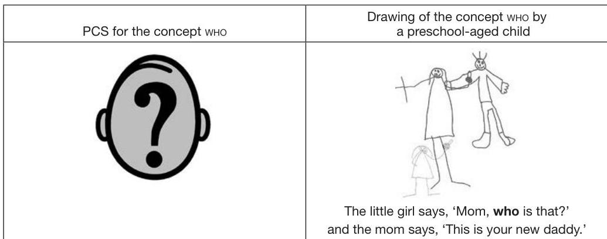

Figure 6.2. PCS and child's drawing for the concept WHO. (Source for drawing: Light et al., 2008.) PCS is a trademark of Tobii Dynavox LLC. All rights reserved. Used with permission. PCS and Boardmaker are trademarks of Tobii Dynavox LLC. All rights reserved. Used with permission.

Representation, Organization, and Layout of AAC Systems
203

children will detect a given symbol-referent relation, no matter how transparent the relation seems to adults or older children" (1997; p. 312).

In general, when children were asked to draw pictures of early emerging language concepts, their drawings included familiar people and events; they embedded the concepts within the contexts in which they occurred, similar to the visual scene displays described earlier. With the exception of people's faces, the children typically included the entire person or object within their drawings rather than just using parts of people (e.g., arms alone) or objects that would require inference of the complete person and intent. Furthermore, the children did not ever include emblems or arbitrary symbols (e.g., punctuation markers, arrows, movement lines, speech, thought bubbles) within their drawings. Finally, the children sometimes depicted different meanings of a word in their drawings than the one typically represented in traditional line-drawing sets. For example, most sets of line drawings represent the concept big as a relative size concept, whereas many children represented this concept as one to denote power and competence; many sets represent the concept more as a comparison of quantities, but the children represented this concept as one of recurrence. McCarthy and colleagues replicated these studies with 15 children with ASD and 19 children without disabilities (McCarthy, Benigno, Broach, Boster, &amp; Wright, 2018). As with the prior research, the children, both those with ASD and those with typical development, struggled to identify the PCS correctly. They drew entire scenes and embedded the concepts within the contexts in which they naturally occurred. In subsequent research, Worah and colleagues (2015) found that typically developing 2- to 3-year-olds who were taught to use more developmentally appropriate symbols performed more accurately with these symbols than children who were taught traditional PCS. They concluded that initial symbol learning can be enhanced by using representations "that are congruent to children's conceptualizations and [that are] developed considering issues that are important to children's understanding" (p. 47).

## Traditional Orthography

Some individuals with complex communication needs are able to rely on traditional orthography to represent their messages. Traditional orthography refers to the written characters used to transcribe a particular linguistic system. It is used in AAC supports in the form of single letters, words, syllables (e.g., prefixes, suffixes), sequences of commonly combined letters (e.g., ck, th), phrases, sentences, or longer texts. Of all of the possible aided AAC symbols, it is traditional orthography that offers individuals the greatest communicative power; a person can communicate any message with access to the letters of the alphabet. However, traditional orthography depends on strong literacy skills and may not be an option for everyone with complex communication needs. Whereas traditional orthography entails visual symbols, braille is a tactile orthographic system (formed by patterns of embossed dots) that may be used by people with severe visual impairments or dual sensory impairments. Braille requires strong literacy skills as well as the cognitive and motor capabilities to learn the tactile letter representations.

## Interventions That Combine Unaided and Aided AAC

As this discussion illustrates, there is a wide range of unaided and aided AAC options. Often interventions specifically combine unaided and aided AAC. For example, a series of studies by Iacono and colleagues demonstrated that instruction with manual signs

Augmentative and Alternative Communication Systems

plus AAC technology (with line drawings as symbols) appeared to have advantages over sign-alone instruction in teaching the use of two-word utterances to children with intellectual disabilities (e.g., Iacono &amp; Duncum, 1995; Iacono &amp; Waring, 1996). Light and Drager (2012a) reported on the language and communication development of a small group of children with Down syndrome who were introduced as infants and toddlers to multimodal AAC intervention utilizing speech, manual signs, and aided AAC technologies with VSDs. Results showed that the children initially relied heavily on the AAC technology with VSDs to participate in interactions; this modality was the easiest to learn and use in terms of motor and cognitive demands. They simply had to touch the screen to retrieve relevant vocabulary. As the children developed, they began to incorporate more signs and gestures into their daily communication allowing greater spontaneity and access to more vocabulary. Speech was the last modality to develop as it imposes significant motor-speech and cognitive demands. However, as the children acquired spoken words and speech approximations, they relied more and more on their speech to communicate, providing additional evidence that AAC supports communication and language development and does not inhibit speech production in any way. For children with childhood apraxia of speech, a multimodal AAC system might well be the system of choice (Cumley &amp; Swanson, 1999; Oommen &amp; McCarthy, 2015). Many adults with acquired conditions also draw on multiple modalities to communicate, including residual speech, gestures, pantomime, and aided AAC supports (Garrett et al., 1989).

With the increased focus on personalized AAC (see Beukelman, 2016), there has been growing recognition that no one AAC approach fits all. Rather, some individuals with complex communication needs may demonstrate better performance with and greater preference for some approaches than others (van der Meer, Sigafoos, O'Reilly, &amp; Lancioni, 2011). Thus, it is critical for AAC teams to consider not only the individuals' needs and capabilities but also their preferences as well as those of their communication partners.

## ORGANIZATION AND LAYOUT OF AIDED AAC SYSTEMS

As soon as the individual who uses aided AAC acquires more than a single concept, the representations or symbols need to be organized or grouped and then arranged within the aided AAC system, whether low-tech or high-tech. Decisions about the organization and layout of the aided AAC display should be driven by a comprehensive understanding of the individual's needs and capabilities (as well as those of communication partners). When aided AAC systems are well designed, they will support the individual's communication performance. However, when aided AAC systems are not well designed, they may impose additional demands on the individual, resulting in barriers to communication and negatively impacting participation (Light, Wilkinson, Thiessen, Beukelman, &amp; Fager, 2019).

There are two main approaches to AAC displays: grid displays and visual scene displays. These approaches have very different strengths and limitations. They are processed very differently and therefore are appropriate for individuals with different needs and capabilities.

## Grid Displays

In a grid display, each language concept is represented by a graphic symbol of some sort (e.g., photograph, line drawing, written word); these symbols are then organized

Representation, Organization, and Layout of AAC Systems

in rows and columns in a grid pattern. Grid displays may include just a few symbols or very large arrays of symbols. Grid displays are advantageous in that they can accommodate a diverse range of vocabulary concepts. Research suggests that grid displays can be effective in supporting a wide range of communication outcomes for individuals with complex communication needs, including enhancing expression (e.g., initiating requests, commenting, expressing other communicative functions), supporting comprehension, promoting engagement, and reducing challenging behavior (e.g., Ganz, Davis, Lund, Goodwyn, &amp; Simpson, 2012; Logan, Iacono, &amp; Trembath, 2016; O'Neill et al., 2018; Walker &amp; Snell, 2013; Wendt, 2009).

In some cases, the AAC team creates a personalized AAC display with a set of vocabulary concepts and representations (low-tech or high-tech), specifically for the individual, based on communication needs and capabilities. For example, Figure 6.3 provides an example of a personalized grid display used by a child for playing space explorers with friends. Some AAC manufacturers offer low-tech or high-tech AAC displays that have preset vocabularies, usually represented by a set of line drawings (e.g., PCS, SymbolStix) laid out in grid displays; these are then taught to individuals with complex communication needs as generic vocabulary sets. Sometimes these grid displays are designed for use in specific contexts, such as commercially available low-tech AAC displays that are designed to support patient-provider communication in medical settings (see Chapter 18 for further discussion). Some AAC manufacturers offer preprogrammed generic vocabulary (core vocabulary) organized in grid displays within AAC technologies (see Figure 6.4). Although these preprogrammed

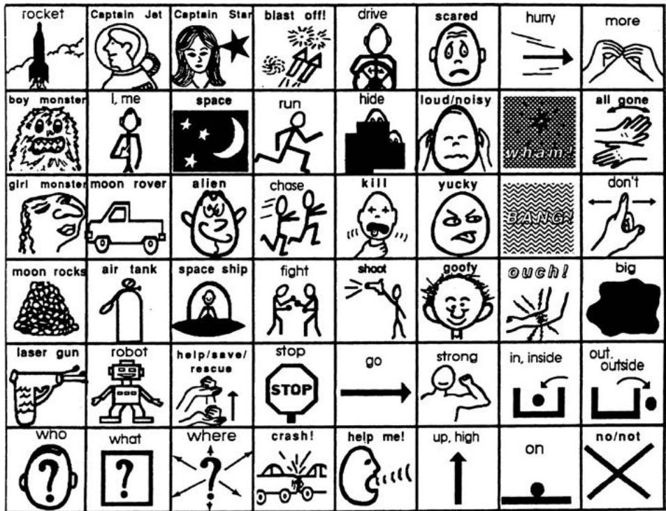

Figure 6.3. An activity display for playing space explorers. (PCS is a trademark of Tobii Dynavox LLC. All rights reserved. Used with permission. PCS and Boardmaker are trademarks of Tobii Dynavox LLC. All rights reserved. Used with permission.)

Augmentative and Alternative Communication Systems

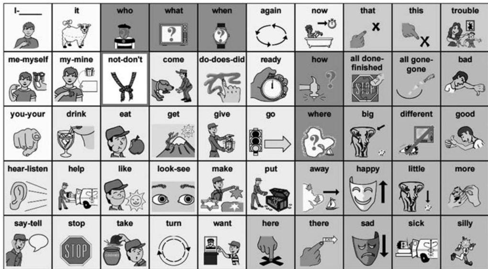

Figure 6.4. Example of an AAC display to support core vocabulary learning. (From Zangari, C. [2013]. Teaching core vocabulary. Retrieved from PrAACtical AAC, https://praacticalaac.org/strategy/teaching-core-vocabulary/; reprinted by permission.)

vocabularies may provide useful vocabulary for some individuals with complex communication needs, the AAC team should always evaluate them carefully to make sure that the vocabulary, representations, layout, and organization are appropriate to the needs and capabilities of the individual and communication partners. It is critical that the design of the AAC display fits the individual; the individual should not be forced to fit the AAC display. Even if the AAC team draws on preset vocabulary sets, the team should always ensure that individuals with complex communication needs have access to the personalized vocabulary required to establish their unique identities and meet their environmental needs.

Despite their strengths and their widespread availability, grid displays may not be appropriate for everyone who requires AAC. Grid displays present language concepts outside of the contexts in which they are learned and used; this decontextualization may be challenging for some individuals with complex communication needs, especially those at the early stages of language development or those with acquired conditions resulting in significant language limitations (e.g., adults with severe chronic aphasia, primary progressive aphasia). Grid displays do not capture the functional relationships between people, actions, and objects as they are experienced in the real world. The research demonstrates that young children have difficulty understanding and using grid displays. For example, Trudeau and colleagues investigated developmental changes in the construction and understanding of messages using graphic AAC symbols and found that children with typical development (ages 3-6 years) had difficulty attributing meaning to sequences of symbols even when the children knew the meaning of the individual symbols (Trudeau, Sutton, &amp; Morford, 2014). Furthermore, the 3- and 4-year-old children had difficulty expressing even simple sentences as sequences of AAC symbols, even though they had significantly more advanced language skills; and even the 5-year-old children had difficulty expressing action concepts through the AAC symbols. Research also demonstrates that adults with aphasia

Representation, Organization, and Layout of AAC Systems

have difficulty using grid displays, especially ones with a relatively large number of symbols and with multiple levels that require multistep navigation to access symbols (e.g., Brock, Koul, Corwin, &amp; Schlosser, 2017; Petroi, Koul, &amp; Corwin, 2014). Visual scene displays may be more effective for some individuals with complex communication needs (see the section on visual scene displays for further discussion).

# Organization of Symbols on Grid Displays

For those individuals who benefit from grid displays, the AAC symbols on the display must be organized in some way to facilitate the search and selection of symbols as desired. There are a number of different approaches to organizing representations on grid displays, including schematic or activity organizations, taxonomic ones, semantic-syntactic organizations, pragmatic organization dynamic displays (PODD), alphabetic organizations, chronological ones, and idiosyncratic ones that are unique to the individual that uses AAC.

Schematic or Activity Grid Displays One popular approach to organizing grid displays is one in which the symbols are organized according to event schema within the individual's day (e.g., routines, activities); these displays are referred to as activity displays or schematic grid layouts (e.g., Drager, Light, Speltz, Fallon, &amp; Jeffries, 2003; Light et al., 2004). Each display contains vocabulary items (e.g., people, actions, objects, places, descriptors) that are relevant to the activity (e.g., birthday party) or to certain subroutines within the activity (e.g., going to the party, singing the birthday song, eating cake, opening presents, and playing games; Drager et al., 2003). Typically, vocabulary items are organized on activity displays in semantic-syntactic categories (see the section below on semantic-syntactic displays for further discussion). Figure 6.5 provides an example of an activity display that a child might use at school to engage in a

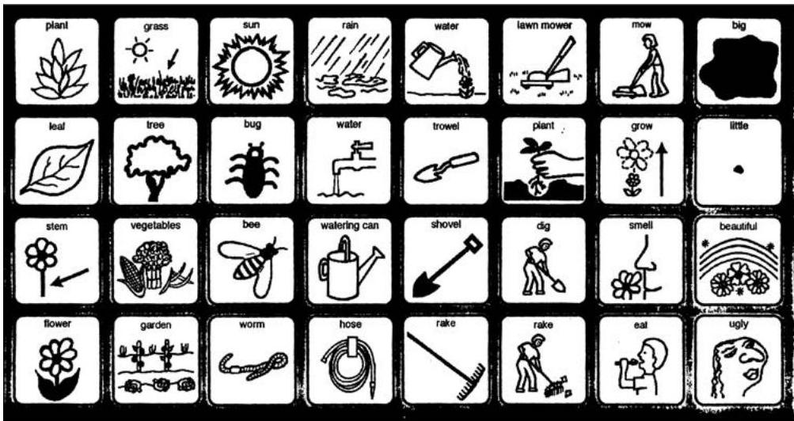

Figure 6.5. Activity display for a fifth-grade unit on plants. (As previously published in Downing, J. [2005]. Teaching communication skills to students with severe disabilities [2nd ed., p. 103]. Baltimore, MD: Paul H. Brookes Publishing Co.)

PCS is a trademark of Tobii Dynavox LLC. All rights reserved. Used with permission. PCS and Boardmaker are trademarks of Tobii Dynavox LLC. All rights reserved. Used with permission.

Augmentative and Alternative Communication Systems

plant lesson during science class; Figure 6.3 (presented earlier) provides an example of a display to play space explorers with friends at recess. The research suggests that young children typically organize concepts schematically. Fallon, Light, and Achenbach (2003) asked preschoolers to organize picture symbols on grid displays; they tended to use very small groupings (i.e., groupings of two or three concepts) rather than large groupings of symbols; and they tended to group symbols schematically according to the activities or events in which they occurred.

There are several advantages to a schematic organization. It is easy to understand and learn the groupings of symbols, because they are based on familiar events. These organizations may also support symbol learning; research suggests that it may be easier to learn AAC symbols when they are presented in a display with related symbols (Dada, Huguet, &amp; Bornman, 2013; Reichle, York, &amp; Sigafoos, 1991). In addition, communication partners can develop new displays as needed for new activities without having to reorganize or change existing displays. This organization also reduces the need for the individual to navigate to other AAC displays to locate needed vocabulary during message construction, because all of the relevant vocabulary for the activity is grouped together on one display. Thus this approach may support individuals in learning to combine vocabulary concepts to communicate more complex messages. Low-tech activity displays can be made readily available in specific locations, such as on the wall in each room of a home (at the child's height), on an aquatic flotation device at the swimming pool, or on the backseat of a car. In general, schematic or activity-based grid displays provide substantial flexibility for individuals that use AAC and their partners.

Despite these advantages, there are some disadvantages to schematic organizations. The individual will require numerous displays, one for each relevant activity. As the number of displays increases, it becomes more challenging to navigate between them. Some individuals (e.g., young children, older beginning communicators with severe disabilities) may require assistance from communication partners in locating the appropriate display for each activity. Another disadvantage is that the AAC symbols for vocabulary that is used frequently must be repeated on numerous displays and these symbols may sometimes appear in different locations, making it more difficult for individuals to develop automaticity in using the system because they must locate the target symbol on each display. To address this problem, activity-specific displays can be used in combination with a generic communication board or supplemental border display containing core vocabulary words that are likely to apply across activities.

Taxonomic Grid Displays A second type of organization for grid displays involves grouping symbols according to superordinate categories. For example, an individual might have a page or display with all of the people vocabulary, another with vocabulary related to places, another with clothing, one with descriptive words, and so. Taxonomic categorization is learned at school; typically developing children do not use this type of organization until they are 6 or 7 years old (Fallon et al., 2003). Thus, this strategy may not be appropriate for individuals with complex communication needs who are at earlier stages of development. One disadvantage of this approach is that it typically requires a lot of navigation to switch displays to communicate more complex messages (e.g., navigating to the people page, then to the action or verb page, then to the places page, and finally to the time page to communicate the message, i went home yesterday). As a result, taxonomic displays may be more

Representation, Organization, and Layout of AAC Systems

effective for individuals who use AAC to clarify specific words or messages or to establish the topic of conversation, rather than those who rely on aided AAC for the majority of their communication.

# Semantic-Syntactic Grid Displays

Grid displays can also be organized according to the parts of speech and their relationships within a semantic-syntactic framework (Brandenberg &amp; Vanderheiden, 1988). By mapping the symbols according to spoken word order and/or usage, this strategy is intended to facilitate language learning. A commonly used semantic-syntactic display strategy is the Fitzgerald key or some modification thereof (McDonald &amp; Schultz, 1973). The original form of the Fitzgerald key organized symbols from left to right into groupings such as who (i.e., agents), doing (i.e., actions), modifiers (i.e., adjectives), what (i.e., objects), where, when, and so forth. Figure 6.6 provides an example of a semantic-syntactic grid display.

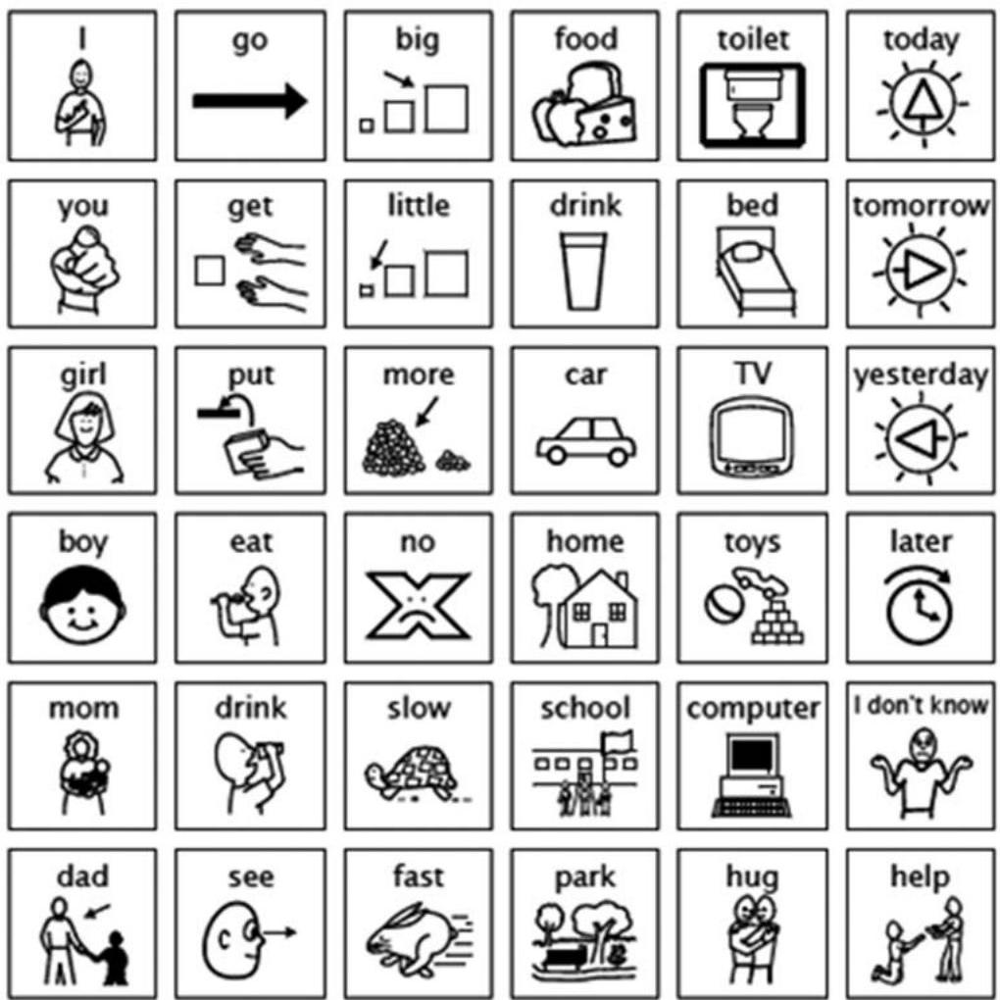

Figure 6.6. Generic semantic-syntactic grid display using a Fitzgerald key.

PCS is a trademark of Tobii Dynavox LLC. All rights reserved. Used with permission. PCS and Boardmaker are trademarks of Tobii Dynavox LLC. All rights reserved. Used with permission.

Augmentative and Alternative Communication Systems

As noted earlier, a low-tech or high-tech aided AAC system may be organized schematically according to activities or events; then each of the activity displays may be set up in a semantic-syntactic organization.

Pragmatic Organization Dynamic Displays The Pragmatic Organization Dynamic Display (PODD; Porter, 2007) is another type of grid display system that combines a number of vocabulary organization strategies to support communication for different functions. Activity displays are used for predictable activities, whereas taxonomic category displays are used for less predictable messages. For example, the first pages of a PODD book generally include words and phrases that can be used to express messages that are contingent on an ongoing activity, need to be interpreted in relation to the partner's previous utterance, or need to be said quickly. In addition, PODDs incorporate a number of navigational strategies (e.g., symbols that direct a communication partner to take an action, such as TURN THE PAGE or GO TO [CATEGORY]), pragmatic starters (e.g., I WANT SOMETHING or I'M ASKING A QUESTION), and symbols for conversational repair (e.g., THAT'S NOT WHAT I'M SAYING or I DON'T UNDERSTAND). PODD page sets include predictably associated vocabulary in all sections of a communication book to increase the efficiency of communication with word combinations. Thus, vocabulary words may be repeated in multiple locations throughout a PODD book in order to reduce the number of page turns required to produce a sentence. Figure 6.7 shows a page from a low-tech PODD book that illustrates the taxonomic organization scheme and some of the navigational features. Research is required to investigate the effects of PODD on language learning and communication development.

Figure 6.7. Taxonomic organization and navigation strategies in a Pragmatic Organization Dynamic Display (PODD) communication book. (Reprinted with permission from Pragmatic Organization Dynamic Display [PODD] communication books: A promising practice for individuals with autism spectrum disorders, by G. Porter &amp; J. M Cafiero. Perspectives on Augmentative and Alternative Communication, 18, 121-129. Copyright 2009 by American Speech-Language-Hearing Association. All rights reserved.)
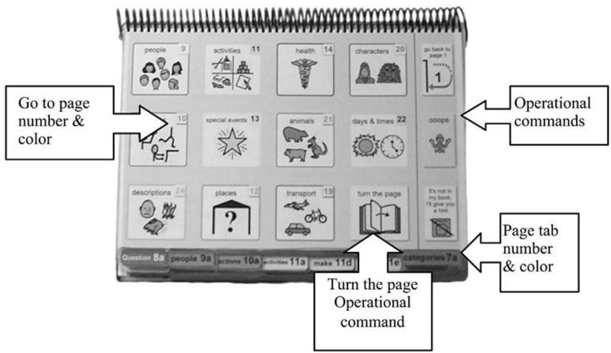

PCS is a trademark of Tobii Dynavox LLC. All rights reserved. Used with permission. PCS and Boardmaker are trademarks of Tobii Dynavox LLC. All rights reserved. Used with permission.

### Alphabetical Grid Displays

For individuals with complex communication needs who are literate, grid displays can also be organized alphabetically with all of the words organized in sequence, much like a personal dictionary (e.g. a page of the words that start with a, one with the words that start with b, etc.). Obviously displays that are organized alphabetically require well-developed literacy skills. Like taxonomic displays, they require significant navigation to compose a full message and may be most useful for individuals who use AAC to clarify specific words/messages or to establish the topic of conversation, rather than those who rely on aided AAC for the majority of their communication. Burke, Beukelman, and Hux (2004) investigated the performance of adults with traumatic brain injury (TBI) using various organizational strategies (e.g. topic, geographic place, alphabetic); they found that participants performed more accurately and efficiently using an alphabetic organization than topic or place organizations, but the participants reported that they preferred the topic organization.

### Chronological Grid Displays

Some displays are organized according to the chronological sequence of events. Often these include a single column or row (rather than a grid) to represent the sequence or chronology of activities. A common example of this type of display is a visual schedule. Visual schedules (also known as calendar systems, schedule systems, or activity schedules) represent the main activities in the individual's day with symbols, typically organized in sequence in a row or column. They provide information about what happens next and may serve to facilitate transitions especially for those who have difficulty with changes (Bopp, Brown, & Mirenda, 2004). Depending on the needs and capabilities of the individual, visual schedules can incorporate real objects, tangible symbols, photographs, line drawings, or written words. (See Chapter 10 for further discussion of the implementation of visual schedules with beginning communicators.)

Some individuals with acquired conditions also benefit from aided AAC systems that are organized chronologically, in this case representing major events in their lives in chronological order.

The following examples illustrate the use of aided AAC organized chronologically by two adults with acquired conditions.

Judy is an elderly woman with severe aphasia following a stroke. She relies on low-tech and high-tech AAC to interact with others. When she transitioned into an assisted living residential facility, she began to interact with staff and other residents who were not familiar with her. To support her communication, her AAC system was organized chronologically with information about 1) her stroke, 2) her time in acute care, 3) her inpatient and outpatient rehabilitation, 4) her attempt to live in her home, and 5) her transfer into assisted living. She also had a display that focused chronologically on her education and employment throughout her career prior to her stroke.

Seth also benefited from aided AAC supports organized chronologically. He experienced an extensive brain injury following a blast injury while serving in the military. His dysarthria was so severe that he could not communicate effectively with care and medical staff in the long-term residential facility where he lived. Low- and high-technology AAC supports were implemented to support his communication. Due to his cognitive limitations, his AAC displays were organized chronologically according to the events in each day: 1) morning messages related to getting up, getting dressed, and having

breakfast; 2) lunch and afternoon messages related to eating, recreational activities, and therapy activities; and 3) evening messages related to dinner, watching television, watching movies, and bedtime.

### Idiosyncratic Grid Displays

Although most individuals with complex communication needs who use grid displays utilize displays that are organized according to one of the approaches described, some individuals demonstrate unique approaches to organizing language concepts (e.g. organizing by memorable songs, major holidays, colors, etc.).

Jim, a 28-year-old man with ASD, thought about the world and organized language concepts in a unique manner. He was very interested in holiday celebrations such as Valentine's Day, St. Patrick's Day, Memorial Day, the 4th of July, Halloween, Thanksgiving, Christmas, and New Year's Eve. When asked to group symbols together for an aided communication system, he organized concepts by these major holidays; for example, he grouped all of the people with birthdays in July in the 4th of July grouping along with things that were colored red, white, and blue. We worked with Jim to organize his aided system according to the holidays so that it reflected his cognitive organization. He preferred this organization and was most efficient using it.

Ideally, aided AAC systems are organized in ways that reflect the internal language organization of the individuals who use them so that the organization is intuitive. Since it is not possible to see the internal language organization directly, it is important to assess the cognitive and linguistic organization of individuals with complex communication needs to determine the best approach to system organization (see Chapter 2 for further description of this assessment).

### Other Considerations in Designing Grid Displays

In practice, there is substantial variability in how AAC teams design grid displays for children and adults with complex communication needs (Thistle & Wilkinson, 2015). The cognitive/linguistic organization of the AAC symbols is just one consideration. The AAC team should also consider the importance of vocabulary items (e.g. ones that might be needed in an emergency) as well as the frequency of use. These items should be located in positions that are easy for the individual to access (see Chapter 7 for further discussion).

Principles of visual cognitive processing suggest that other variables will also impact how people interact with AAC grid displays, including symbol color, spatial arrangement of symbols, and use of motion (Wilkinson & Jagaroo, 2004; Jagaroo & Wilkinson, 2008). For example, research suggests that individuals with developmental disabilities are faster and most accurate searching for and selecting symbols when they are grouped by color (e.g. all the red symbols together, all the blue ones together) than when they are distributed in the array (Wilkinson & McIlvane, 2013; Wilkinson, O'Neill, & McIlvane, 2014; Wilkinson, O'Neill, Nauss, Thistle, & McIlvane, 2012). Although grouping symbols by their internal color is effective, unfortunately it is not always practical or possible to arrange symbols based on their internal color (e.g. not all animals are the same color, nor is all clothing the same color). For this reason, many AAC teams and manufacturers have proposed using colored background to group symbols (Thistle & Wilkinson, 2015), specifically to mark the word class (e.g. people

Representation, Organization, and Layout of AAC Systems

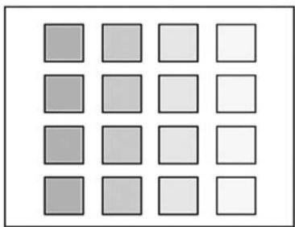

Figure 6.8. Examples of grid displays showing a traditional row column arrangement (left) and an arrangement with spatial cuing (right). (From Light, J., Wilkinson, K., Thiessen, A., Beukelman, D., &amp; Fager, S. (2019). Designing effective AAC displays for individuals with developmental or acquired disabilities: State of the science and future research directions. Augmentative and Alternative Communication, 35, 42-55. doi:10.1080/07434618.2018.1558 283; Copyright © 2019 International Society for Augmentative and Alternative Communication, reprinted by permission of Taylor &amp; Francis Ltd., http://www.tandfonline.com on behalf of International Society for Augmentative and Alternative Communication.)

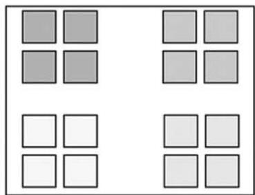

on a yellow background, verbs on a green background, etc.). However, preliminary research suggests that background color cues do not facilitate search for symbols by children with typical development (Thistle &amp; Wilkinson, 2009, 2017; Wilkinson &amp; Coombs, 2010; Wilkinson &amp; Snell, 2011); future research is required to explore the effects of background color with individuals with complex communication needs.

Spatial arrangement of the symbols in a grid display may also impact performance. Traditionally, grid displays have been organized in rows and columns, with symbols evenly distributed and placed close together to maximize the number of symbols on the display. However, this approach results in visual clutter that may impede performance. Preliminary research suggests that individuals with Down syndrome may perform better with displays with small spatial groupings (see Figure 6.8) compared to traditional row column displays (Wilkinson et al., 2017). It may be advisable to start an individual on a display that uses small spatial groupings and then later fill in the blank space with additional symbols as the individual learns the display (Light, Wilkinson et al., 2019).

# Grid Displays to Support the Transition to Literacy

Most grid displays with graphic representations include photographs or line drawings with static text labels above the symbols (see Figures 6.3-6.6). Although these text labels may assist communication partners in understanding the AAC symbols in the grid, the mere presence of these static text labels does not necessarily support individuals with complex communication needs in learning to read these words (e.g., Erickson, Hatch, &amp; Clendon, 2010). Given the importance of literacy skills, it may be helpful to consider other display designs to enhance literacy learning. The research on visual cognitive processing demonstrates that motion is a powerful attractor of visual attention (Jagaroo &amp; Wilkinson, 2008); it may be harnessed to attract visual attention to specific features (such as the written text) within AAC grid displays. For example, Light, McNaughton, Jakobs, and Hershberger (2014) proposed a transition to literacy (T2L) feature to enhance single word reading:

1. Upon selection of a graphic symbol from the grid display, the written text appears using dynamic, smooth animation to draw visual attention to the text and support processing of the written word.

Augmentative and Alternative Communication Systems

2. The text originates from the graphic symbol to support the association of the symbol and the text.
3. The written text gradually increases in size and ultimately replaces the grid display for 3 seconds to make the orthography salient.
4. When the written word appears on the screen, it is paired with speech output to support phonological processing of the text.

The exposure to text is infused into the individual's AAC system, thus ensuring that literacy learning is driven by the individual's interests and needs. See Figure 6.9 for an example of the T2L feature for the word red on a grid display. Research suggests that this T2L feature is effective in increasing the reading skills of individuals with complex communication who use grid displays, including students with ASD and students with Down syndrome and intellectual and developmental disabilities (Caron, Light, Holyfield, &amp; McNaughton, 2018; Caron, Light, &amp; McNaughton, 2019). Of course, the T2L feature is not intended to replace literacy instruction; individuals with complex communication needs benefit from effective instruction to enhance their literacy learning (see Chapter 12).

In summary, even relatively simple changes in the design of grid displays can substantially affect the performance of individuals with complex communication needs. It is critical that the AAC team adheres to evidence-based guidelines in the design of grid displays to minimize the visual cognitive processing demands and maximize their effectiveness (Light et al., 2019). Most of the research to date has involved individuals

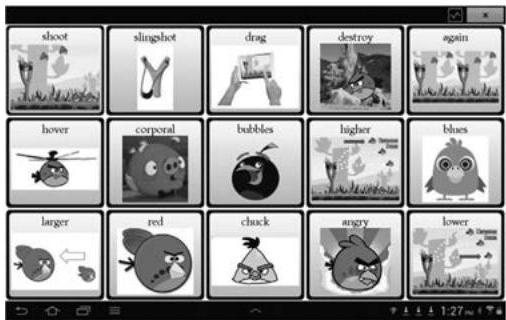

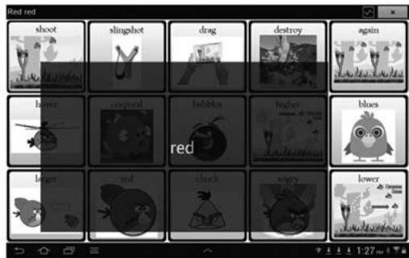

Figure 6.9. An example of the dynamic text (T2L; transition to literacy) feature on a grid display. Upon selection of the graphic symbol with a static text label (left), the text alone zooms out from the graphic symbol (right); the text then fills the screen for 3 seconds and the word is spoken (bottom) before the text fades back into the graphic symbol. See https://tinyurl.com/rec-on-aac-T2L for videos demonstrating the T2L feature with VSD and grid displays. (From Caron, J., Light, J., Holyfield, C., &amp; McNaughton, D. (2018). Effects of dynamic text and speech output in an AAC app with graphic symbols on single-word reading for individuals with autism spectrum disorder and complex communication needs. Augmentative and Alternative Communication, 34, 143-154. doi:10.1080/07434618.2018.1457715; Copyright © 2018 International Society for Augmentative and Alternative Communication, reprinted by permission of Taylor &amp; Francis Ltd., http://www.tandfonline.com on behalf of International Society for Augmentative and Alternative Communication.)

Representation, Organization, and Layout of AAC Systems

with developmental disabilities or typical development; there is a need for research on the effects of these design features on adults with acquired conditions.

## Keyboards

Keyboards are a specific form of grid display; they are used widely by individuals with complex communication needs who are literate. Some individuals may rely primarily on letter-by-letter spelling to communicate using an electronic or nonelectronic keyboard with the letters of the alphabet; others may rely on other AAC symbols to communicate frequently used concepts and may use spelling on a keyboard to communicate unique words that are otherwise not available. Just as with other grid displays, careful thought should be given to the design of keyboards, including 1) layout (e.g., staggered rows of letters as in a standard keyboard, symmetrical rows and columns as in a grid display, or other layouts such as diagonally oriented successive quartering keyboards as described by Treviranus &amp; Roberts, 2003); 2) organization of the letters within the layout (e.g., QWERTY, alphabetical, frequency of use); 3) color cues to support visual search; and 4) spatial arrangement of the letters (e.g., evenly spaced row-column grid or smaller spatial groupings as illustrated earlier in Figure 6.8). The keyboard design selected should reflect the capabilities and experiences of the individual who uses it. For example, in a preliminary study, Fager, Gormley, and Beukelman (2016) examined the personal preference and visual-cognitive processing differences of an alphabetic versus QWERTY keyboard layout with 10 adults with TBI and 10 adults without neurologic injury, all of whom had prior experience with QWERTY onscreen keyboard layouts. Both groups strongly preferred using the QWERTY keyboard; they reported greater frustration and demonstrated less efficient visual search using the alphabetic layout. As with other grid displays, keyboards should be designed to minimize visual cognitive load, maximize accuracy and efficiency, and enhance performance.

## Visual Scene Displays

Although some individuals with complex communication needs utilize keyboards or grid displays of AAC symbols to support their communication, others benefit from VSDs. VSDs are integrated scenes, typically photographs, of meaningful and motivating events within the individual's life (Blackstone, 2004). By definition, VSDs organize vocabulary concepts according to the activities, routines, and events within which these concepts are learned and used. VSDs depict both the environmental and interactional context of an event that is personally relevant to the person with complex communication needs (Dietz, McKelvey, &amp; Beukelman, 2006). Research suggests that VSDs can be used to effectively support the communication of beginning communicators with developmental disabilities, as well as adults who have significant language and cognitive limitations due to acquired conditions (e.g., severe chronic aphasia, primary progressive aphasia, TBI).

## Visual Scene Displays for Beginning Communicators with Developmental Disabilities

VSDs have been used with beginning communicators with a wide range of developmental disabilities, including young children with ASD (e.g., Drager, Light, &amp; Finke, 2009; Light &amp; Drager, 2012b), Down syndrome (Light &amp; Drager, 2012a; 2019), and cerebral palsy (Light &amp; Drager, 2012b), as well as older beginning communicators (e.g., Drager et al., 2019; Holyfield, Caron, Drager, &amp; Light, 2019). For example, a

Augmentative and Alternative Communication Systems

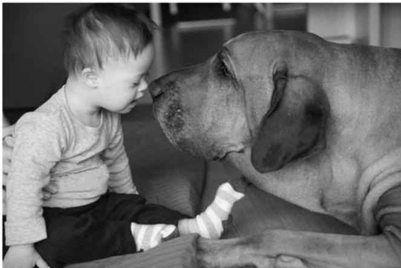

Figure 6.10. An example of a visual scene display for a young child to communicate about getting kisses from the family dog. He might select hotspots of 1) his own face to say ME (or his name); 2) his dog's head to say DOGGIE (or the dog's name) with the sound effect of a dog barking; or 3) their noses to say KISSING with the sound effect of kissing. (From Light, J., McNaughton, D., &amp; Caron, J.G. [2019]. New and emerging AAC technology supports for children with complex communication needs and their partners: State of the science and future research. Augmentative and Alternative Communication, 35, 26-41. doi:10.1080/07434618.2018.1557251; Copyright © 2019 International Society for Augmentative and Alternative Communication, reprinted by permission of Taylor &amp; Francis Ltd., http://www.tandfonline.com on behalf of International Society for Augmentative and Alternative Communication.)

parent or other communication partner simply captures a photograph of a meaningful event (e.g., a toddler getting kisses from the family dog, Blue; see Figure 6.10). The child selects the relevant representations within the scene to communicate: For example, he might select his own face to retrieve the speech output ME; he might select the hotspot of the dog to communicate BLUE (his dog's name) or DOGGIE with the sound of the dog barking; and he might select a hotspot of their noses touching to retrieve the speech output KISSING accompanied by a kissing sound. Research suggests that VSDs are easier for young, typically developing children to learn and use than schematic or taxonomic grid displays (Drager et al., 2003; Drager et al., 2004). Beginning communicators with complex communication needs (infants, toddlers, and preschoolers, as well as older individuals with severe disabilities) increase significantly the frequency of their communication turns as well as the number of concepts that they express when they are introduced to AAC technologies that use VSDs (e.g., Drager et al., 2009; Drager et al., 2019; Holyfield et al., 2019; Light &amp; Drager, 2012b; Muttiah, Drager, Beale, Bongo, &amp; Riley, 2019). VSDs can be used not only to increase expression, but also to increase comprehension; for example, Schlosser and colleagues (2013) found that children with ASD demonstrated improved understanding of directives when spoken input was paired with the use of visual scenes compared to spoken input alone. Although preliminary research evidence supports the positive benefits of VSDs for beginning communicators, research on the long-term impact of VSDs on language development and social interaction is still needed.

VSDs offer a number of potential advantages for beginning communicators who are at the early stages of symbolic development. They capture the actual social interactions that are the contexts in which language is learned and used; they present language concepts within these familiar events (Light &amp; McNaughton, 2012). They preserve the visual and functional relationships between people and objects

Representation, Organization, and Layout of AAC Systems

as experienced in the real world (Light et al., 2004). Moreover, VSDs also exploit the human capacity for rapid visual processing of naturalistic scenes; viewers capture both the overall context and the main constituent elements in scenes rapidly, in less than 200 milliseconds (Oliva &amp; Torralba, 2007).

Despite these advantages, VSDs have some limitations. Like all AAC supports that rely on photos or line drawings, they are primarily semantic systems. They are most effective communicating a range of semantic concepts and relations to express various communicative intents. Although they support children in expressing first words and early semantic relations, they do not support more advanced morphosyntactic development. Individuals with complex communication needs require access to traditional orthography to support full syntactic development.

Visual Scene Displays with the Transition to Literacy Feature Many VSDs that are used with very young children or older beginning communicators only provide speech output; however, as beginning communicators build their language and communication skills, they may start to transition to the use of traditional orthography (Light et al., 2019). VSDs have therefore been developed to present text dynamically upon selection of a hotspot to support the individual's learning of literacy skills. The T2L feature with VSDs operates in a similar manner to grid displays: Upon selection of a representation, in this case a hotspot (e.g., bowling) from the VSD, the written text appears using dynamic smooth animation to draw attention to the text (see Figure 6.11); and, when the written word appears on the screen, it is paired with speech output (Light, McNaughton, Jakobs, &amp; Hershberger, 2014). Research demonstrates the positive effect of the T2L feature within VSD technology on the acquisition of single-word reading skills by young children with ASD (Mandak, Light, &amp; McNaughton, 2018), adults with severe intellectual and developmental disabilities or ASD (Holyfield, Light et al., 2019), young children with speech and language impairments and their typical peers in small groups (Boyle, McCoy, McNaughton, &amp; Light, 2017),

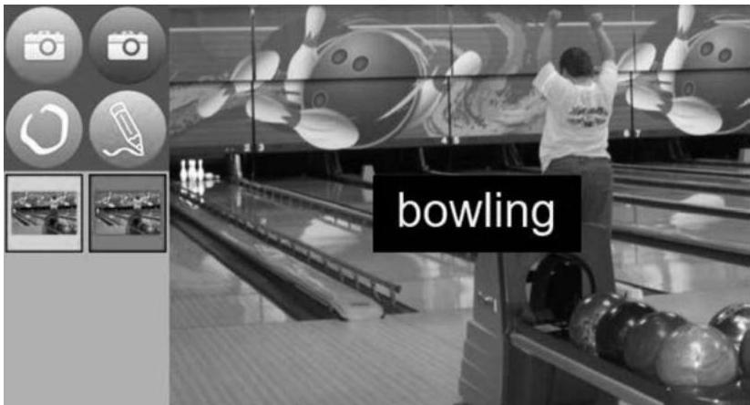

Figure 6.11. Example of a visual scene display with the transition to literacy (T2L) feature.

Reprinted from Holyfield, C., Light, J. L., McNaughton, D., Caron, J., Drager, K., &amp; Pope, L. (2019). Effect of AAC technology with dynamic text on the single-word recognition of adults with intellectual and developmental disabilities. International Journal of Speech-Language Pathology. Copyright © 2019 International Society for Augmentative and Alternative Communication, reprinted by permission of Taylor &amp; Francis Ltd, http://www .tandfonline.com on behalf of International Society for Augmentative and Alternative Communication.

Augmentative and Alternative Communication Systems

and preschoolers with developmental disabilities and their peers from Head Start programs in shared reading activities (Boyle, 2018).

Visual Scene Displays for Adults with Acquired Conditions VSDs also offer effective supports for adults with acquired conditions that result in significant language limitations, such as aphasia, TBI, and primary progressive aphasia. When designed for adults with acquired conditions, VSDs typically do not include hotspots with speech output. Many individuals with acquired disabilities seem to prefer to use VSDs to establish the context for communication and then rely on associated text boxes located adjacent to the VSD. These text boxes may include written words, phrases, and sentences associated with the VSD. Figure 6.12 depicts a VSD used by a man with aphasia to communicate about Halloween activities with his granddaughter. He might select a specific word or message from the associated text boxes, or he might express himself by indicating a specific part of the photo VSD (e.g., the mouth on the pumpkin). Individuals with acquired conditions, who are unable to read many written words in isolation, may be able to recognize these words when they are paired with VSDs that provide a context. VSDs with text boxes are frequently used by individuals with

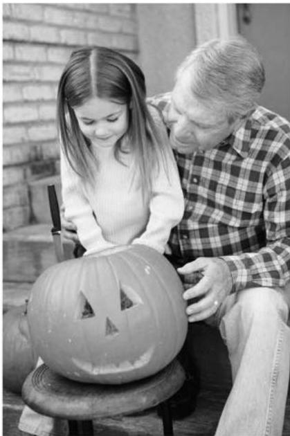

Sierra
My grand daughter
5 years old
Denver
Carving pumpkin
Halloween
Figure 6.12. Visual scene display of a child carving a pumpkin with her grandfather, with associated text messages to communicate about the event. (From Beukelman, D., Hux, K., Dietz, A., McKelvey, M., &amp; Weissling, K. (2015). Using visual scene displays as communication support options for people with chronic, severe aphasia: A summary of AAC research and future research directions. Augmentative and Alternative Communication, 31, 234-245. doi:10.3109/07 434618.2015.1052152; Copyright © 2015 International Society for Augmentative and Alternative Communication, reprinted by permission of Taylor &amp; Francis Ltd., http://www.tandfonline.com on behalf of International Society for Augmentative and Alternative Communication.)

acquired conditions such as aphasia, TBI, and primary progressive aphasia, either to supplement (or cue) their residual speech or to serve as a primary means of communication. The incorporation of text boxes and buttons to speak out the text appear to be beneficial when designing VSDs for adults with acquired conditions (Dietz et al. 2006; Dietz, Weissling, Griffith, McKelvey, & Macke, 2014; Griffith, Dietz, & Weissling, 2014).

Jane Farrall, an AAC specialist, wrote the following blog post, discussing her development of AAC technology with VSDs of significant past events to support the communication of her mother (who had Alzheimer's disease) with her caregivers. My mother has Alzheimer's. She has had it for several years but this year she has deteriorated rapidly. She has developed complex communication needs as this has happened. She struggles to find words and often can't finish a sentence as she forgets where her sentence is going. She can no longer tell all the funny stories that she used to enjoy sharing. She still has fabulous social skills—but most communication exchanges with her now are very brief and general. . . . When she moved to the nursing home, my speech pathologist side made sure I ticked off the preparations for her communication. Pulling on my AAC background and all the information I had heard about Alzheimer's and AAC—and my experiences working in care settings—I put together a . . . chat book. My intention was that her carers could learn about my Mum, her interests and family. That they could come to know her as the full person she is and not just the person they see today. . . . I imported each of the photos [of important events within her life] . . . I then added hot spots to turn them into visual scene displays. . . . I took the iPad [with the AAC visual scene app] down to trial with my Mum. . . . [S]he loved it. . . . [S]he actually used it to chat with people. She had conversations of three and four turns with people, including myself. She reminisced and chatted even if briefly. (Farrall, 2016, July; reprinted by permission)

The research suggests that VSDs have positive effects on the communication of adults with a range of acquired conditions. For example, VSDs have been shown to support appropriate communication between adults with moderate to severe aphasia and their communication partners (McKelvey, Dietz, Hux, Weissling, & Beukelman, 2007; Seale, Garrett, & Figley, 2007). In fact, VSDs are more effective in supporting language expression (e.g. production of lengthier, more complex utterances, increased turn taking, reduced frustration, fewer navigational errors) than grid displays for adults with Broca's aphasia (Brock et al. 2017). Shared VSDs also result in the richest communication experience for both the adult with aphasia and the communication partner compared to situations without VSDs or ones in which only the individual with aphasia has access to the VSD (not the partner); the VSDs form a shared communication space that supports interaction (Hux, Buechter, Wallace, & Weissling, 2010).

Beyond the research with individuals with severe chronic aphasia, researchers have also begun to investigate the potential benefits of VSDs for adults with TBI (e.g. Thiessen, Brown, Beukelman, & Hux, 2017; Thiessen, Brown, Beukelman, Hux, & Myers, 2017; Wallace, Hux, & Beukelman, 2010). VSDs may be effective with this population because they minimize working memory and mental flexibility demands that are likely required when communicating with grid displays (Thiessen & Brown, 2017). Although recent evidence supports the use of VSDs with adults with TBI, continued work is necessary to fully understand their benefits and uses with this population.

Recent research has also explored the use of VSDs as conversational supports for adults with primary progressive aphasia. Fried-Oken, Rowland, Daniels, Mooney,

Augmentative and Alternative Communication Systems

and Noethe (2013) found that photo VSDs were easier for adults with primary progressive aphasia to use than grid displays as they provided a shared reference that facilitated conversation, but word finding was more difficult without text. Mooney, Bedrick, Noethe, Spaulding, and Fried-Oken (2018) found that participants with primary progressive aphasia spoke a larger number of target words with an app that provided VSDs and relevant text compared to no technology or VSDs without text boxes. In sum, this growing body of research highlights the potential benefits of VSDs for individuals with a range of acquired conditions and their partners.

## Considerations in Designing Visual Scene Displays

Given the wide range of possible design choices for VSDs, it is important that the AAC team implements evidence-based guidelines to ensure that VSDs are effective. Review of the research reveals a number of key factors to consider when designing VSDs for individuals with developmental disabilities and those with acquired neurological conditions (Light, Wilkinson et al., 2019). VSDs should use personalized photographs of the meaningful and motivating events experienced by those who use them, including the relevant people and shared activities. Onboard cameras in mobile technologies have increased the ease of capturing personalized photographs of events as VSDs; in fact, individuals with complex communication needs can be actively involved in this process (e.g., Holyfield, Drager, Light, &amp; Caron, 2017).

The people and activities captured in personalized photos used as VSDs represent the key meaning of the event and are thus critically important from a linguistic and communicative perspective. Human figures in scenes are also powerful attractors of the visual attention of children with and without developmental disabilities and of adults with and without neurological conditions (Thiessen, Beukelman, Hux, &amp; Longenecker, 2016; Thiessen, Beukelman, Ullman, &amp; Longenecker, 2014; Wilkinson &amp; Light, 2011, 2014). The people within scenes directly represent important actions, which would otherwise be difficult to convey (Light, Wilkinson et al., 2019). People in VSDs not only garner high levels of visual attention, but they also direct attention to other important content in the scene, specifically the shared activity (O'Neill, Wilkinson, &amp; Light, 2019; Thiessen et al., 2014; Thiessen, Brown, Beukelman, Hux, &amp; Myers, 2017). Some practitioners have expressed concerns about the visual complexity of VSDs, arguing that background elements will detract from attention to the key elements in the scene. However, research has demonstrated that individuals with and without disabilities spend the vast majority of their time attending to the meaningful elements in VSDs (i.e., the people and shared activity); the background does not function as a distraction (O'Neill et al., 2019; Wilkinson &amp; Light, 2014).

## Video Visual Scene Displays

Photo VSDs do an excellent job capturing the visual context in which communication occurs. However, photo VSDs are static and life events are dynamic in nature. Video VSDs have been developed to capture the temporal or interactional cues that are present within dynamic events (Light, McNaughton, &amp; Jakobs, 2014). Essentially video VSD technologies support 1) capturing video of activities or downloading preferred videos; 2) pausing the video at key junctures, automatically creating VSDs; and 3) adding hotspots to these VSDs with relevant vocabulary (with speech and/or dynamic text output) to support communication about the event in response to the individual's

interests. Of course, there are many technologies that support video viewing; however, typically, this is passive viewing that does not support communicative interaction. Video VSDs integrate AAC supports into the videos to facilitate communication. The use of videos with embedded VSDs appears promising for several reasons (Light et al. 2019). First, the videos capitalize on preferred interests or important daily activities; these videos may serve as a shared communication space or they may serve as video models to support participation in educational, vocational, health care, and community activities. Second, video VSDs reduce joint attention demands as the video and the AAC supports are integrated seamlessly into one app so there is no need to shift attention between the video and a separate AAC system or app. Third, video VSDs preserve dynamic relationships and capture both the spatial and temporal cues found in the real world. Fourth, the motion within the video may serve as a powerful attractor of visual attention (see Jagaroo & Wilkinson, 2008). Finally, automatic pausing of the video at key points explicitly marks the appropriate opportunity for communication and provides the necessary vocabulary within the VSD.

Research demonstrates the positive impact of video VSDs on a variety of communication and participation outcomes for individuals with complex communication needs, including increases in engagement, turn taking, and social interaction during preferred videos for young children and older students with ASD (Caron, Laubscher, Light, & McNaughton, 2018; Chapin, McNaughton, Light, McCoy, & Caron, 2018); increases in successful displaced talk (e.g. telling stories about past experiences) by students with ASD (Caron, Holyfield, Light, & McNaughton, 2018); and increases in successful independent participation in a wide range of vocational and community activities (e.g. taking public transportation, working at the print shop, working at the school library, completing meaningful volunteer activities for the food bank) by adolescents and young adults with intellectual disabilities or ASD (Babb, Gormley, McNaughton, & Light, 2019; Babb, McNaughton, Light, Wydner, & Pierce, 2019; O'Neill, Light, & McNaughton, 2017). Video VSDs also support comprehension; for example, Schlosser and colleagues (2013) found that children with ASD demonstrated improved understanding of directives when spoken input was paired with dynamic (video) VSDs compared to spoken input alone.

### Hybrid Displays

Sometimes, components of VSDs and grid displays are combined to form hybrid displays. For example, Figure 6.12 (discussed earlier) shows an AAC display with a main VSD of a man with severe chronic aphasia carving a pumpkin with his granddaughter; alongside the main VSD, there are written text messages in a grid layout. This AAC display is a hybrid display. Sometimes, hybrid displays include a main VSD with additional picture symbols in a grid display alongside the VSD or with additional symbols available in a pop-up grid display; the symbols in the grid display serve to augment the vocabulary available in the VSD. As is the case with VSDs, research is required to examine the impact of hybrid displays on communication and to determine empirically based clinical guidelines for these displays.

### AAC Technologies with Just-in-Time Programming

Schlosser and colleagues (2016) discussed the concept of AAC supports that are provided just-in-time (JIT) in the moment as they are required, including supports to

Augmentative and Alternative Communication Systems

enhance expressive communication and those to aid comprehension. Traditionally, it has been difficult and time-consuming for families and professionals to program AAC technologies with the vocabulary and messages that individuals with complex communication needs require; partners may have neither the time nor the skill to do so. As a result, parents and professionals often do not add vocabulary as frequently as needed, restricting communication options (Caron, Light, &amp; Drager, 2016). In fact, failure to update vocabulary has been found to be one of the main reasons for device abandonment (Johnson, Inglebret, Jones, &amp; Ray, 2006). To address this problem, some AAC apps have been developed that support quick and easy programming of vocabulary so that communication partners can add new vocabulary for individuals with complex communication needs on the fly during daily interactions, just in time as the need and interest arise (Light et al., 2019; Schlosser et al., 2016). Research shows that parents and professionals are able to quickly learn to program apps that support JIT programming (Caron, Light, Davidoff, &amp; Drager, 2017). Speech-language pathologists are able to quickly learn to use JIT programming during interactions with young children to add new vocabulary in response to their needs and interests (Caron et al., 2016). Furthermore, research shows that children with complex communication needs take significantly more communicative turns with technologies that support JIT programming compared to those that do not, probably because they have easy access to the vocabulary that they require in whatever situation arises (Light &amp; Drager, 2012b).

JIT programming potentially allows individuals with complex communication needs to be more actively engaged in programming vocabulary (Holyfield et al., 2017). Traditionally vocabulary for AAC technologies has been selected and programmed by others, sometimes with little input from the individual. In contrast, "typically developing children are able to choose, store, and retrieve new words while they are actively responding to and manipulating their environments" (Sturm &amp; Clendon, 2004, p. 78). JIT programming of vocabulary in the moment allows individuals to be more actively involved in selecting and programming vocabulary/messages, thus empowering them in their vocabulary acquisition.

In addition to using JIT programming to support vocabulary acquisition and expressive communication, Schlosser and colleagues (2016) also noted that JIT supports can be used to assist with comprehension. For example, O'Brien et al. (2016) described the successful use of mobile technology to deliver JIT scene cues (i.e., photo VSDs or video VSDs) to support five children with ASD in following instructions that they were unable to complete when presented via speech alone.

# NAVIGATION

As soon as an individual has more than one AAC display, there must be some way to navigate between displays. Traditionally AAC systems have provided navigation through a separate menu page with symbols to represent each of the possible displays, organized in a grid layout. With this approach, the individual starts at the main menu page and selects one of the symbols to navigate to a display for communication. Often there are also forward or back buttons to allow navigation to displays that immediately precede or follow and a home button to go to the main menu page. This approach works effectively for some individuals with complex communication needs. However, many beginning communicators struggle to learn to navigate independently with this type of menu because 1) the display options are hidden from view and 2) it may not

Representation, Organization, and Layout of AAC Systems

be clear that the symbols on the menu page represent navigation to a new display (rather than represent a language concept). Research by Drager and colleagues (2004) demonstrated that 3-year-olds with typical development were more accurate navigating using thumbnails of target AAC displays (in this case, VSDs) rather than isolated symbols on a separate menu page. Wallace and Hux (2014) found that adults with TBI performed more accurately using navigation bars (with thumbnail VSDs, sometimes referred to as signature photos) that were adjacent to the main communication display compared to using a separate menu page for navigation. In this way, the navigation options are always visible and accessible. Preliminary research shows that individuals with disabilities demonstrate awareness of the bar for navigation purposes, but it does not function as a significant distraction from the main communication display (O'Neill et al., 2019). Figure 6.13 provides an example of an AAC display used by a woman with severe chronic aphasia with a main VSD of her playing with her grandson, a series of text messages (with speak buttons) to allow her to communicate about the main VSD, and navigation bars (above, to the right, and below the main VSD) to allow navigation to other VSDs as desired.

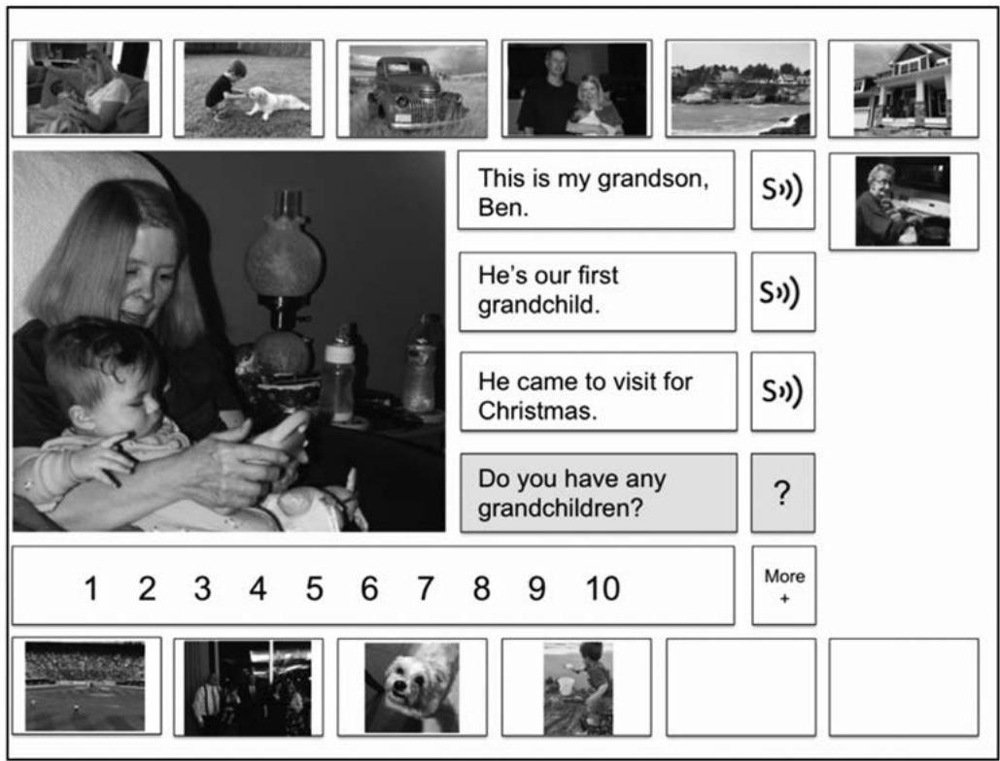

Figure 6.13. Example of a visual scene display (VSD) for an adult with aphasia including a visual scene (of her playing with her grandson) paired with corresponding text messages about the VSD (with speak buttons to speak the text message); the main VSD is surrounded by navigation bars (above, to the right, and below) composed of thumbnails to navigate to other VSDs. (From Light, J., Wilkinson, K., Thiessen, A., Beukelman, D., &amp; Fager, S. (2019). Designing effective AAC displays for individuals with developmental or acquired disabilities: State of the science and future research directions. Augmentative and Alternative Communication, 35, 42-55. doi: 10.1080/07434618.2018.1558283; Copyright © 2019 International Society for Augmentative and Alternative Communication, reprinted by permission of Taylor &amp; Francis Ltd., http://www.tandfonline.com on behalf of International Society for Augmentative and Alternative Communication.

Augmentative and Alternative Communication Systems

# ENCODING AND PREDICTION TECHNIQUES

When individuals with complex communication needs require a large vocabulary of symbols, they may need to navigate through a large number of displays to communicate. It requires conscious awareness and processing to navigate to new AAC displays and may increase learning demands and limit the development of automaticity. In addition, some individuals who rely on aided AAC face significant challenges because of their slow rate of communication. Whereas the conversational speaking rates of individuals who do not have disabilities vary from 150 to 250 words per minute, communication rates for individuals who rely on AAC are 15–25 times slower. Such drastic reductions in communication rates interfere significantly with interactions in educational, vocational, health care, and community environments (e.g., McNaughton &amp; Bryen, 2007). Encoding techniques and linguistic prediction techniques have been developed as potential solutions to these problems.

# Encoding Techniques

A strategy that is often used to increase access to vocabulary and to improve communication rate is to store complete words, phrases, or sentences in AAC technology and to assign a code of some type to the stored message to retrieve the entire word or message (Vanderheiden &amp; Lloyd, 1986). This technique is known as encoding. Encoding can increase the rate of communication by reducing the number of selections required to communicate a word or message. It can also provide access to a greater number of vocabulary items using a relatively small number of representations (e.g., letters, line drawings) as these representations can be used in various combinations as codes to retrieve single words or messages. Some in the AAC field use the term abbreviation-expansion to refer to some encoding techniques. Obviously encoding sentences has a greater impact on the rate of communication than encoding words, but sentences limit the individual's ability to communicate novel messages. Word encoding provides greater generative capacity but increases the cognitive and motor demands as a greater number of codes must be learned and produced to communicate a given message.

Some codes are memory based and some are display based. Memory-based codes require the person to memorize the codes (e.g., Morse code), whereas display-based codes are presented on a visual display that lists the codes (e.g., a cheat sheet). Sometimes low-tech displays are used with eye pointing (or some other access technique) for encoding; the individual indicates the code (e.g., looks at the code LU sequentially) and then the communication partner looks up the word or message on the chart (e.g., LU = PLEASE LIFT ME UP). More frequently, encoding techniques are used within AAC technologies, and the computer does the work of retrieving the word or message represented by the code selected. How codes are represented is an individual decision that should be matched to the individual's capabilities and preferences.

In the past, numeric and color codes were sometimes used, but they are no longer recommended frequently as they are completely arbitrary and therefore very difficult to learn and recall (Beukelman &amp; Yorkston, 1984). Morse code has also been used with some individuals with spinal cord injuries or other severe motor impairments (e.g., Beukelman et al., 1985; Yang, Huang, Chuang, &amp; Yang, 2008), but Morse code has substantial learning demands and is not used frequently. The most frequently used encoding techniques are alphabet and iconic encoding.

Representation, Organization, and Layout of AAC Systems

Alphabet (Letter) Codes Two types of letter codes are typically used to encode single words: truncation codes that abbreviate words according to the first few letters only (e.g., HAMB = HAMBURGER, COMM = COMMUNICATION), and contraction codes that include only the most salient letters (e.g., HMBGR = HAMBURGER, COMMNCTN = COMMUNICATION). When encoding sentences or phrases (rather than words), there are two main approaches: salient letter codes and letter category codes. In salient letter codes, the initial letters of the most salient content words are used to create the code (e.g., OD = PLEASE OPEN THE DOOR FOR ME because the primary words are OPEN DOOR). In letter category codes, the first letter in the code refers to a category and the second letter refers to the specific message (e.g., GH = HI HOW ARE YOU? since this is in the greeting category (G) and it is a message about hello (H). Research suggests that most adults with developmental disabilities perform more accurately using salient letter codes than letter category codes (Light &amp; Lindsay, 1992). In terms of letter encoding techniques for words, an early study found that adults without disabilities performed most accurately and retrieved codes most quickly when using encoding approaches, especially letter codes, that grouped words according to a logical pattern; they were least effective using arbitrary numeric codes (Beukelman &amp; Yorkston, 1984). In subsequent research, Angelo (1987) investigated learning of three word-encoding techniques (truncation codes, contraction codes, arbitrary letter codes) by individuals without disabilities and found that the participants recalled truncation codes most accurately, followed by contraction and arbitrary letter codes, in that order.

Iconic Encoding/Unity/LAMP Unity is a popular encoding technique that utilizes iconic codes, specifically combinations of symbols (line drawings). This iconic encoding technique was developed originally by Baker (1982, 1986) and was referred to as Minspeak or semantic compaction. Initially iconic encoding was used to code phrases and sentences, but subsequent versions were developed to code single words and grammatical markers to provide greater generative capacity. Some AAC technologies/apps come with pre-stored iconic codes that are then learned by the individual with complex communication needs to retrieve words (or messages). Figure 6.14 presents an AAC display with the Unity icons. The picture icons used in Unity are intentionally selected for their rich semantic associations. Unlike most AAC symbols that are intended to represent a single meaning (e.g., the representation of an apple is intended to represent APPLE), the iconic codes in Unity are intended to represent multiple meanings. Using iconic encoding, an apple icon might be associated with APPLE, FOOD, FRUIT, EAT, BITE, HUNGRY, and RED. The sun icon might be associated with SUN, SUMMER, YELLOW, LAUGH, and AFTERNOON, for example. Sequences of icons are combined to store words (or phrases or sentences) based on these multiple meanings. Often icons are paired with grammatical markers to designate their meaning; for example, combining the icon BED with the action (verb) icon would retrieve the word SLEEP, whereas combining the icon BED with the descriptor (adjective) icon would retrieve the word TIRED.

One of the potential advantages of Unity is that it relies on a fixed display of icons that does not change. As individuals learn the selections to communicate frequently used words and messages, they may develop automaticity. In contrast, using a dynamic display system to access additional displays or pages of vocabulary requires the individual to attend to the navigational demands, potentially limiting the fluency or automaticity of communication. Some proponents of iconic encoding emphasize an instructional approach known as LAMP (Language Acquisition through Motor

Augmentative and Alternative Communication Systems

|  PUNCTUA... | GREETING | ME | DEVICE | CALENDAR | SCHOOL | HAVE FUN |  |  |  |  | PAGES  |
| --- | --- | --- | --- | --- | --- | --- | --- | --- | --- | --- | --- |
|  GIVE | NAMES | TALK | HELPING... | SOCIAL | DETERMIN... | CONJUNC... | PREPOSITI... | QUESTIONS?word | a | +s | AGAIN  |
|  I | WE | are | is | were | was | on | to | KEYBOARD | an | the | FIND  |
|  YOU | THEY | KNOW | PLAY | LIKE | WORK | HAVE | FEEL | READ | MORE | FAST | STOP  |
|  IT | HE | WANT | FAMILY | COME | TIME | DO | THINK | BIG | GET | COLOR | WASH  |
|  SHE | LOOK | SLOW | COMPUTER | SAY | GOOD | HEAR | LIVE | GO | RIDE | LOVE | HELP  |
|  CLEAR | DON'T | CHANGE | EAT | MAKE | NEED | BAD | WATCH | DRINK | TURN | PUT | SLEEP  |

Figure 6.14. An example of an AAC display that uses Unity (an iconic encoding technique). Copyright © 2019 PRC-Saltillo. All Rights Reserved.

Representation, Organization, and Layout of AAC Systems
227

Planning; PRC-Saltillo, 2019). This approach proposes that words on the AAC technology are learned by repeating a consistent motor movement. Preliminary descriptive research suggested that children with ASD were able to acquire a small corpus of words (i.e., 9–35 words) and showed increases in symbolic communication following 8 weeks of LAMP instruction (Bedwani, Bruck, &amp; Costley, 2015). Controlled research studies are required to investigate the effect of LAMP on the language development of children with complex communication needs. There are certainly examples of adults with developmental disabilities who are very fluent communicators using iconic encoding; these adults first developed robust language systems and acquired literacy skills and then learned to use iconic encoding to maximize their access to vocabulary and increase their efficiency (e.g., Klein, 2015).

As with all encoding techniques, there is definitely a learning cost associated with use of Unity. The individual with complex communication needs must learn the codes, in this case the icon combinations to retrieve each word. The difficulty of learning the codes will depend on the extrinsic factors, such as the concepts and icon sequences targeted, as well as intrinsic factors, such as the individual's age, development, prior learning, and cultural-linguistic background, among other factors (van der Merwe &amp; Alant, 2004). Research suggests that preschool children with typical language development have difficulty understanding and learning iconic codes (Light et al., 2004). Studies have found that it is more difficult for adults with complex communication needs to learn iconic codes than alphabetic codes (both salient letter and letter category codes), even with repeated training sessions (Light &amp; Lindsay, 1992; Light, Lindsay, Siegel, &amp; Parnes, 1990). Icon prediction is available to reduce the demands for those who are learning codes by limiting the number of options that are available for possible selection (Beck, Thompson, &amp; Clay, 2000; Drager &amp; Light, 2010).

In general, AAC teams should weigh the learning costs against the potential benefits when deciding whether to use encoding techniques and, if so, which specific technique to use (e.g., alphabetic, iconic). Learning demands will vary significantly based on the specific encoding technique. Learning demands will also be affected by the types of words and messages to be encoded and the types of codes used (e.g., length, personalization). Concrete messages (e.g., ones that are easily imageable) are easier to learn and recall than abstract ones (e.g., messages that are not easily imageable—e.g., Beck &amp; Fritz, 1998; Light et al., 2004; Light &amp; Lindsay, 1992). Generally, shorter codes seem to be easier to learn than longer ones, at least for some individuals (Beck &amp; Fritz, 1998). Interestingly, research suggests that there may not be an apparent learning advantage for personalized codes—those selected by the person with complex communication needs—compared to nonpersonalized ones, preselected by someone else (Light &amp; Lindsay, 1992). It is challenging to set up a personalized coding system, and it may be that personalized codes are less consistent and rule-based than nonpersonalized ones, negating the advantage that theoretically should come from personalized coding.

## Prediction Techniques

In addition to encoding, prediction techniques can also be used. Unlike encoding techniques, prediction does not require memorization of codes. Prediction involves a dynamic retrieval process in which options are offered to an individual with complex communication needs according to the portion of a word or message that has already been formulated. Skilled communication partners often do an excellent job predicting words or messages based on the letters or words selected by individuals who use

Augmentative and Alternative Communication Systems

low-tech systems (e.g., alphabet boards). Partners may rely on their shared knowledge of the individual's experiences and their familiarity with the individual's typical communication patterns, as well as the linguistic elements (e.g., letters, words) communicated, in making their predictions (Roark, Fowler, Sprout, Gibbons, &amp; Fried-Oken, 2011). Some individuals who rely on AAC prefer that their communication partners predict messages, provided their partners confirm that their predictions are accurate. Other individuals prefer to complete their messages independently and do not appreciate partners guessing their intent. AAC teams should always confirm the preferences of the individual; it may be helpful to include these preferences in an introduction strategy used to inform communication partners how to interact effectively.

Many AAC technologies also offer prediction—just as many texting programs on smartphones do. The predictions depend on the language model in the AAC app (i.e., the software algorithm that computes the probability of occurrence of a word, phrase, or letter). Language models may use a variety of factors to make predictions, including frequency of use, recency of use, grammatical rules, etc. (Fager, Fried-Oken, Jakobs, &amp; Beukelman, 2019). Language models may vary in terms of the accuracy of their predictions depending on their sophistication. Many language models learn the individual's communication patterns over time and adjust their predictions accordingly. In essence, they become more and more personalized to the individual over time. With current developments in artificial intelligence generally and machine learning specifically, we anticipate that these models will continue to improve.

Most prediction occurs at the level of the word. In its simplest form, the AAC technology offers a set of likely words (e.g., words weighted for frequency of use) in response to the keystrokes entered. As an example, a basic word prediction system with a dynamic menu display is illustrated in Figure 6.15. Words are displayed in a menu or window at the upper right of the screen. The letters selected by the typist determine the specific words that the computer program presents in the menu. For example, imagine that a person wants to type the word LETTER. When the letter L is typed, the six most frequently used words that begin with L appear on the menu. If the word of choice is not included in the listing, the person then types the next letter (E), and six frequently used words that begin with L-E are presented in the menu. This process continues until the desired word is displayed in the menu. When the desired word appears in the menu, the person simply types its associated number code (in this case, the number 3) to insert the word in the text. In this example, the person has saved three keystrokes by using the prediction feature.

In addition to using frequency to make predictions, many AAC technologies predict words based on the patterns of word combinations or grammatical rules. For example, the probability is high that in the English language, an article such as  $a$ ,  $an$ , or the will follow a preposition in a prepositional phrase (e.g., on the bed, under a tree). The probability is very high that a noun will follow an article ( $a$ ,  $an$ , the). Linguistic prediction algorithms contain extensive information about the syntactic organization of the language to improve the accuracy of predictions. The algorithms consider the grammatical rules of the language. For example, if an individual selects a third-person singular noun as the subject of a sentence (e.g., CATHY, MOM), only verbs that agree in subject and number will be presented as options (e.g., IS, LIKES, IS GOING). Not only does this type of prediction enhance communication rate, but it may also enhance the grammatical performance of some people who have language or learning disabilities. Some prediction algorithms also incorporate information on the individual's

Representation, Organization, and Layout of AAC Systems

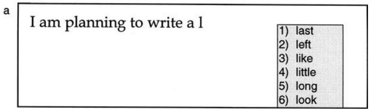

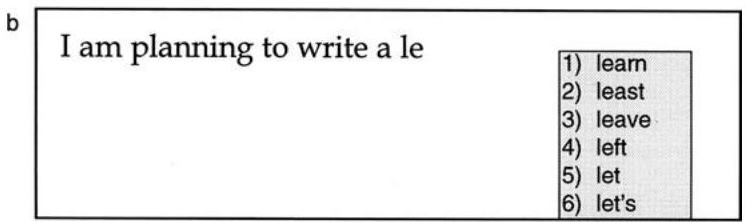

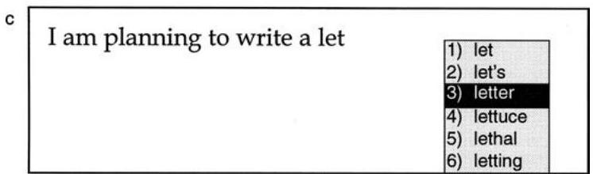

Figure 6.15. Dynamic menu display with word prediction. a) The screen displays the six most likely words that begin with L when that letter is typed; b) the screen changes to the six most likely words that begin with L-E when the letter E is added; c) the screen changes to the six most likely words that begin with L-E-T when the letter T is added. The number 3 is typed to select the word LETTER.

geographic location (using GPS) to make predictions so that different words would be predicted for someone at a local store compared to the train station.

Sometimes AAC technologies incorporate algorithms for predicting language units longer than single words (File &amp; Todman, 2002; Todman &amp; Alm, 2003); these may be used to assist individuals who rely on AAC in social conversations. Sometimes computer programs also predict at the letter level. In virtually all languages that can be represented orthographically (i.e., with letter symbols), individual letters of the alphabet do not occur with equal probability. Some letters occur more frequently than others; for example, in English, the letters  $e$ ,  $t$ ,  $a$ ,  $o$ ,  $i$ ,  $n$ ,  $s$ ,  $r$ , and  $h$  occur most frequently, and  $z$ ,  $q$ ,  $u$ ,  $x$ ,  $k$ , and  $j$  occur least frequently. Furthermore, orthographic languages are organized so that the probability of the occurrence of a letter in a word is influenced by the previous letter. In English, the most obvious example of this is that the letter  $q$  is almost always followed by the letter  $u$ . Some letter combinations occur with more frequency than others. For example,  $ch-$ , -ed,  $tr-$ ,  $str-$ , -ing, and -tion are frequent letter combinations in English, whereas combinations such as  $sz$ ,  $jq$ , and  $wv$  occur rarely, if at all. Letter prediction systems use the probability of individual letters and letter combinations so that when a letter is selected, the most probable next letter is offered or a menu of the letters that are most likely to follow are offered on a dynamic display visible at the top or bottom of the display.

Another letter prediction technique involves the use of disambiguating keyboards such as those used on some telephone keypads, in which each key is associated with

Augmentative and Alternative Communication Systems

several letters (e.g., 2 = abc, 3 = def). One of several available disambiguation algorithms is used so that a computer can predict which of the possible characters on each key was actually intended by the individual given the other keys selected (Judge &amp; Landeryou, 2007). Disambiguating keyboards provide a potential option for literate individuals who have minimal range of motion or precision of selection and can only reliably select nine targets, but require access to the full alphabet for communication. If the keyboard arrangement is optimized across a nine-key layout, the individual can generate messages with keystroke efficiency of approximately 91% (Lesher, Moulton, &amp; Higginbotham, 1998).

Prediction techniques offer a number of potential benefits to individuals with complex communication needs: 1) they can reduce the number of selections required to communicate a message and thereby decrease effort for those individuals where fatigue is problematic (e.g., individuals with ALS, brainstem stroke); 2) they can provide spelling support for those who are able to recognize words but have difficulty spelling accurately (e.g., some individuals with chronic aphasia, TBI, or cerebral palsy); 3) they can provide grammatical support for those who have difficulties with morphosyntax by predicting some of these message components; and 4) they may increase the rate of communication and reduce the waiting time for individuals who rely on scanning as an access technique and have very slow rates of communication. However, the use of prediction also requires ongoing attention, visual monitoring, and cognitive processing of prediction options. For example, in a study that involved six men with cervical spinal cord injuries, Koester and Levine (1996) found that the benefits of keystroke savings for word prediction were generally offset by the cost (i.e., the time and effort) of reviewing options and selecting a predicted item.

Ultimately the AAC team needs to consider a wide range of human and system factors in deciding whether to use prediction techniques. These factors include the nature and goal of the communication task itself (Higginbotham, Bisantz, Sunm, Adams, &amp; Yik, 2009); the accuracy and precision of the predictions; the cognitive processing time needed to decide which selections or motor acts are necessary (Light &amp; Lindsay, 1992); the search time (i.e., the amount of time it takes to locate a letter, word, or phrase from a prediction menu; Koester &amp; Levine, 1998); the switch activation time (i.e., the amount of time it takes to activate a key or switch; Koester &amp; Levine, 1998; Venkatagiri, 1999); the motor act index (i.e., the number of keystrokes necessary to produce a message; Rosen &amp; Goodenough-Trepagnier, 1981; Venkatagiri, 1993); and the time or duration of message production (i.e., how long it takes to produce a message; Rosen &amp; Goodenough-Trepagnier, 1981; Venkatagiri, 1993). As might be expected, prediction techniques seem to be most useful for those individuals who experience significant fatigue, those who require spelling or grammar supports, or those who communicate at very slow rates.

## CONCLUSIONS

As is apparent from this chapter, there are a wide range of unaided and aided AAC supports available for individuals with complex communication needs; moreover, the aided AAC options support a vast array of representations, organizations, layouts, navigational approaches, encoding techniques, and prediction techniques. There is no single AAC option that is unilaterally the best; rather, people who use AAC, their families, and the AAC team must utilize the available evidence base and weigh the relative benefits and learning costs of available options to choose those that are the

Representation, Organization, and Layout of AAC Systems

most appropriate fit given the needs, capabilities, and preferences of each individual. Unaided and aided AAC supports should be selected and personalized to meet current needs and capabilities with future needs kept in mind (see Chapter 8 for further discussion). Inevitably, the needs and capabilities of individuals with complex communication needs will change over time: Children with developmental disabilities will learn new skills and will participate in new environments as they grow; adults with acquired conditions such as TBI or stroke may experience the recovery of some capabilities and may have changing needs as they age; and adults with degenerative neurological conditions may experience a loss of function over time as well as changing living situations and supports. Careful planning is required to ensure that AAC systems are appropriate fits and that they accommodate changes over time as seamlessly as possible.

## QUESTIONS

6.1. Define unaided AAC and provide at least four examples. What are the advantages and disadvantages of these unaided AAC options?

6.2. Define aided AAC. What is meant by low-tech aided AAC and high-tech aided AAC? What are the advantages and disadvantages of each?

6.3. Provide five examples of aided AAC symbols or representations. What are the advantages and disadvantages of each one?

6.4. What is the difference between grid displays and visual scene displays? What are the advantages and disadvantages of these different layouts?

6.5. Describe six to seven different ways that AAC grid displays can be organized. When might each organization be used?

6.6. What is meant by just-in-time (JIT) AAC supports? How might they be used? What are the potential benefits?

6.7. Describe how individuals navigate between different AAC displays.

6.8. What is an encoding technique? Why are encoding techniques used? Provide at least three examples of encoding techniques.

6.9. What is prediction, and how is it used?

6.10. What is meant by multimodal communication?

## REFERENCES

Adamson, L., &amp; Dunbar, B. (1991). Communication development of young children with tracheostomies. *Augmentative and Alternative Communication*, 7, 275–283. doi:10.1080/07434619112331276013

Allen, A. A., Schlosser, R. W., Brock, K. L., &amp; Shane, C. (2017). The effectiveness of aided augmented input techniques for persons with developmental disabilities: A systematic review. *Augmentative and Alternative Communication*, 33, 149–159. doi:10.1080/07434618.2017.1338752

Angelo, J. (1987). *A comparison of three coding methods for abbreviation expansion in acceleration vocabularies* (Unpublished doctoral dissertation). University of Wisconsin–Madison.

Babb, S., Gormley, J., McNaughton, D., &amp; Light, J. (2019). Enhancing independent participation within vocational activities for an adolescent with ASD using AAC video visual scene displays. *Journal of Special Education Technology*, 34, 120–132. doi:10.1177/0162643418795842

Babb, S., McNaughton, D., Light, J., Wydner, K., &amp; Pierce, L. (2019, February). *Increasing independence with AAC video visual scene displays*. Presentation at the Assistive Technology Industry Association (ATIA) Annual Conference, Orlando, FL.

Augmentative and Alternative Communication Systems

Baker, B. (1982, September). Minspeak: A semantic compaction system that makes self-expression easier for communicatively disabled individuals. *Byte*, 7, 186–202.

Baker, B. (1986). Using images to generate speech. *Byte*, 11, 160–168.

Barrera, R. D., Lobato-Barrera, D., &amp; Sulzer-Azaroff, B. (1980). A simultaneous treatment comparison of three expressive language training programs with a mute autistic child. *Journal of Autism and Developmental Disorders*, 10, 21–37. doi:10.1007/BF02408430

Basson, M., &amp; Alant, E. (2005). The iconicity and ease of learning of picture communication symbols: A study with Afrikaans-speaking children. *South African Journal of Communication Disorders*, 52, 4–12.

Beck, A., &amp; Fritz, H. (1998). Can people with aphasia learn iconic codes? *Augmentative and Alternative Communication*, 14, 184–195. doi:10.1080/07434619812331278356

Beck, A., Thompson, J., &amp; Clay, S. (2000). The effect of icon prediction on college students’ recall of icon codes. *Journal of Special Education Technology*, 15, 17–23. doi:10.1177/016264340001500302

Bedwani, M. N., Bruck, S., &amp; Costley, D. (2015). Augmentative and alternative communication for children with autism spectrum disorder: An evidence-based evaluation of the Language Acquisition through Motor Planning (LAMP) programme. *Cogent Education*, 2(1), 1045807. doi:10.1080/2331186X.2015.1045807

Beukelman, D. (2016). Precision intervention research for adults with complex communication needs. *Augmentative and Alternative Communication*, 32, 233–235. doi:10.1080/07434618.2016.1252947

Beukelman, D., Fager, S., &amp; Nordness, A. (2011). Communication support for people with ALS. *Neurology Research International*, 2011. doi:10.1155/2011/714693

Beukelman, D. R., Garrett, K. L., &amp; Yorkston, K. M. (2007). *Augmentative communication strategies for adults with acute or chronic medical conditions*. Baltimore, MD: Paul H. Brookes Publishing Co.

Beukelman, D. R., &amp; Yorkston, K. (1984). Computer enhancement of message formulation and presentation for communication augmentation system users. *Seminars in Speech and Language*, 5, 1–10.

Beukelman, D. R., Yorkston, K., &amp; Dowden, P. (1985). *Communication augmentation: A casebook of clinical management*. Austin, TX: PRO-ED.

Blackstone, S. (2004). Clinical news: Visual scene displays. *Augmentative Communication News*, 16(2), 1–8.

Blockberger, S., &amp; Sutton, A. (2003). Toward linguistic competence: Language experiences and knowledge of children with extremely limited speech. In J. C. Light, D. R. Beukelman, &amp; J. Reichle (Eds.), *Communicative competence for individuals who use AAC: From research to effective practice* (pp. 63–106). Baltimore, MD: Paul H. Brookes Publishing Co.

Bloomberg, K., Karlan, G., &amp; Lloyd, L. (1990). The comparative translucency of initial lexical items represented by five graphic symbol systems and sets. *Journal of Speech and Hearing Research*, 33, 717–725.

Bondy, A., &amp; Frost, L. (2001). *A picture’s worth: PECS and other visual communication strategies in autism*. Bethesda, MD: Woodbine.

Bonvillian, J., &amp; Siedlecki, T., Jr. (1996). Young children’s acquisition of the location aspect of American Sign Language: Parental report findings. *Journal of Communication Disorders*, 29, 13–35. doi:10.1016/0021-9924(94)00015-8

Bonvillian, J., &amp; Siedlecki, T., Jr. (1998). Young children’s acquisition of the movement aspect of American Sign Language: Parental report findings. *Journal of Speech, Language, and Hearing Research*, 41, 588–602. doi:10.1044/jslhr.4103.588

Bopp, K., Brown, K., &amp; Mirenda, P. (2004). Speech-language pathologists’ roles in the delivery of positive behavior support for individuals with developmental disabilities. *American Journal of Speech-Language Pathology*, 13, 5–19. doi:10.1044/1058-0360(2004/003)

Boyle, A. S. (2018). *The effects of digital texts with transition to literacy features on the sight word recognition skills of young children with disabilities* (Unpublished doctoral dissertation). Pennsylvania State University, PA.

Boyle, S., McCoy, A., McNaughton, D., &amp; Light, J. (2017). Using digital texts in interactive reading activities for children with language delays and disorders: A review of the research literature and pilot study. *Seminars in Speech and Language*, 38, 263–275. doi:10.1055/s-0037-1604274

Brandenberg, S., &amp; Vanderheiden, G. (1988). Communication board design and vocabulary selection. In L. Bernstein (Ed.), *The vocally impaired: Clinical practice and research* (3rd ed., pp. 84–135). Needham Heights, MA: Allyn &amp; Bacon.

Brock, K., Koul, R., Corwin, M., &amp; Schlosser, R. (2017). A comparison of visual scene and

Representation, Organization, and Layout of AAC Systems

grid displays for people with chronic aphasia: A pilot study to improve communication using AAC. *Aphasiology*, 31, 1282–1306. doi:10.1080/02687038.2016.1274874
Burke, R., Beukelman, D. R., &amp; Hux, K. (2004). Accuracy, efficiency and preferences of survivors of traumatic brain injury when using three organization strategies to retrieve words. *Brain Injury*, 18, 497–507. doi:10.1080/02699050310001645784
Calculator, S. N. (2013). Use and acceptance of AAC systems by children with Angelman syndrome. *Journal of Applied Research in Intellectual Disabilities*, 26, 557–567. doi:10.1111/jar.12048
Calculator, S. (2016). Description and evaluation of a home-based, parent-administered program for teaching enhanced natural gestures to individuals with Angelman syndrome. *American Journal of Speech-Language Pathology*, 25, 1–13. doi:10.1044/2015_AJSLP-15-0017
Caron, J., Holyfield, C., Light, J., &amp; McNaughton, D. (2018). "What have you been doing?": Supporting displaced talk through AAC video VSD technology. *Perspectives on Augmentative and Alternative Communication*, 3, 123–135. doi:10.1044/persp3.SIG12.123
Caron, J., Laubscher, E., Light, J., &amp; McNaughton, D. (2019). *Effect of video VSDs on communicative turns of individuals with autism spectrum disorder and complex communication needs*. Manuscript submitted for publication.
Caron, J., Light, J., Davidoff, B. E., &amp; Drager, K. D. (2017). Comparison of the effects of mobile technology AAC apps on programming visual scene displays. *Augmentative and Alternative Communication*, 33, 239–248. doi:10.1080/07434618.2017.1388836
Caron, J., Light, J., &amp; Drager, K. (2016). Operational demands of AAC mobile technology applications on programming vocabulary and engagement during professional and child interactions. *Augmentative and Alternative Communication*, 32, 12–24. doi:10.3109/07434618.2015.1126636
Caron, J., Light, J., Holyfield, C., &amp; McNaughton, D. (2018). Effects of dynamic text in an AAC app on sight word reading for individuals with autism spectrum disorder. *Augmentative and Alternative Communication*, 34, 143–154. doi:10.1080/07434618.2018.1457715
Caron, J., Light, J., &amp; McNaughton, D. (2019). Effects of dynamic text and speech output in an AAC app on single word reading of individuals with intellectual developmental disabilities and

complex communication needs. Manuscript submitted for publication.
Chapin, S. E., McNaughton, D., Light, J., McCoy, A., &amp; Caron, J. (2018, July). Effects of video visual scene display technology on the symbolic communicative turns taken by preschoolers with ASD during a shared activity. Paper presented at the Annual Conference of the Rehabilitation Engineering and Assistive Technology Society of North America, Arlington, VA.
Crais, E. R., Watson, L. R., &amp; Baranek, G. T. (2009). Use of gesture development in profiling children's prelinguistic communication skills. *American Journal of Speech-Language Pathology*, 18, 95–108. doi:10.1044/1058-0360(2008/07-0041)
Cress, C., &amp; King, J. (1999). AAC strategies for people with primary progressive aphasia without dementia: Two case studies. *Augmentative and Alternative Communication*, 15, 248–259. doi:10.1080/07434619912331278785
Cumley, G., &amp; Swanson, S. (1999). Augmentative and alternative communication options for children with developmental apraxia of speech: Three case studies. *Augmentative and Alternative Communication*, 15, 110–125. doi:10.1080/07434619912331278615
Dada, S., Huguet, A., &amp; Bornman, J. (2013). The iconicity of picture communication symbols for children with English additional language and mild intellectual disability. *Augmentative and Alternative Communication*, 29, 360–373. doi:10.3109/07434618.2013.849753
DeLoache, J., Miller, K., &amp; Rosengren, K. (1997). The credible shrinking room: Very young children's performance with symbolic and nonsymbolic relations. *Psychological Science*, 12, 114–118. doi: 10.1111/j.1467-9280.1997.tb00443.x
DeLoache, J., Pierroutsakos, S., &amp; Troseth, G. (1997). The three 'R's' of pictorial competence. In R. Vasta (Ed.), *Annals of child development: A research annual* (Vol. 12, pp. 1–48). Philadelphia, PA: Jessica Kingsley.
DeLoache, J., Pierroutsakos, S., &amp; Uttal, D. (2003). The origins of pictorial competence. *Current Directions in Psychological Science*, 12, 114–118. doi:10.1111/1467-8721.01244
Dietz, A., McKelvey, M., &amp; Beukelman, D. R. (2006). Visual scene displays (VSD): New AAC interfaces for persons with aphasia. *Perspectives on Augmentative and Alternative Communication*, 15, 13–17. doi:10.1044/aac15.1.13
Dietz, A., Weissling, K., Griffith, J., McKelvey, M., &amp; Macke, D. (2014). The impact of interface design during an initial

Augmentative and Alternative Communication Systems

high-technology AAC experience: A collective case study of people with aphasia. *Augmentative and Alternative Communication*, 30, 314–328. doi:10.3109/07434618.2014.966207
Drager, K. D. R., &amp; Light, J. (2010). A comparison of the performance of 5-year-old children with typical development using iconic encoding in AAC systems with and without icon prediction on a fixed display. *Augmentative and Alternative Communication*, 26, 12–20. doi:10.3109/07434610903561464
Drager, K. D. R., Light, J. C., Carlson, R., D'Silva, K., Larsson, B., Pitkin, L., &amp; Stopper, G. (2004). Learning of dynamic display AAC technologies by typically developing 3-year-olds: Effect of different layouts and menu approaches. *Journal of Speech, Language, and Hearing Research*, 47, 1133–1148. doi:10.1044/1092-4388(2004/084)
Drager, K. D. R., Light, J., Currall, J., Muttiah, N., Smith, V., Kreis, D., ... Wiscount, J. (2019). AAC technologies with visual scene displays and “just in time” programming and symbolic communication turns expressed by students with severe disabilities. *Journal of Intellectual and Developmental Disability*, 44, 321–336. doi:10.3109/13668250.2017.1326585
Drager, K., Light, J., &amp; Finke, E. (2009). Using AAC technologies to build social interaction with young children with autism spectrum disorders. In P. Mirenda &amp; T. Iacono (Eds.), *Autism spectrum disorders and AAC* (pp. 247–278). Baltimore, MD: Paul H. Brookes Publishing Co.
Drager, K., Light, J., Speltz, J., Fallon, K., &amp; Jeffries, L. (2003). The performance of typically developing 2 1/2-year-olds on dynamic display AAC technologies with different system layouts and language organizations. *Journal of Speech, Language, and Hearing Research*, 46, 298–312. doi:10.1044/1092-4388(2003/024)
Erickson, K., Hatch, P., &amp; Clendon, S. (2010). Literacy, assistive technology, and students with significant disabilities. *Focus on Exceptional Children*, 42, 1–16. doi:10.17161/foec.v42i5.6904
Fager, K., Fried-Oken, M., Jakobs, T., &amp; Beukelman, D. R. (2019). New and emerging access technologies for adults with complex communication needs and severe motor impairments: State of the science. *Augmentative and Alternative Communication*, 35, 13–25. doi:10.1080/07434618.2018.1556730
Fager, S. K., Gormley, J., &amp; Beukelman, D. (2016, November). *Visual cognitive processing demands of keyboard layouts for individuals with and without TBI*. Poster presented at the State of the Science Conference of the Rehabilitation Engineering Research Center on Augmentative and Alternative Communication (RERC on AAC), Arlington, VA.
Fallon, K., Light, J., &amp; Achenbach, A. (2003). The semantic organization patterns of young children: Implications for augmentative and alternative communication. *Augmentative and Alternative Communication*, 19, 74–85. doi:10.1080/0743461031000112061
Farrall, J. (2016, July). *AAC and my mum*. Retrieved from www.janefarrall.com/aac-and-my-mum/
File, P., &amp; Todman, J. (2002). Evaluation of the coherence of computer-aided conversations. *Augmentative and Alternative Communication*, 18, 228–241. doi:10.1080/07434610212331281311
Fried-Oken, M. (2008). Augmentative and alternative communication treatment for persons with primary progressive aphasia. *Perspectives on Augmentative and Alternative Communication*, 17, 99–104. doi:10.1044/aac17.3.99
Fried-Oken, M., Mooney, A., &amp; Peters, B. (2015). Supporting communication for patients with neurodegenerative disease. *NeuroRehabilitation*, 37, 69–87. doi:10.3233/NRE-151241
Fried-Oken, M., Rowland, C., Daniels, D., Mooney, A., &amp; Noethe, G. (2013). *Mobile technology as communication supports for adults with primary progressive aphasia*. Paper presented at the Assistive Technology Industry Association (ATIA) conference, Orlando, FL.
Fujisawa, K., Inoue, T., Yamana, Y., &amp; Hayashi, H. (2011). The effect of animation on learning action symbols by individuals with intellectual disabilities. *Augmentative and Alternative Communication*, 27, 53–60. doi:10.3109/07434618.2011.553245
Ganz, J. B., Davis, J. L., Lund, E. M., Goodwyn, F. D., &amp; Simpson, R. L. (2012). Meta-analysis of PECS with individuals with ASD: Investigation of targeted versus non-targeted outcomes, participant characteristics, and implementation phase. *Research in Developmental Disabilities*, 33, 406–418. doi:10.1016/j.ridd.2011.09.023.
Ganz, J. B., Earles-Vollrath, T. L., Mason, R. A., Rispoli, M. J., Heath, A. K., &amp; Parker, R. I. (2011). An aggregate study of single-case research involving aided AAC: Participant characteristics of individuals with autism spectrum disorders. *Research in Autism Spectrum Disorders*, 5, 1500–1509. doi:10.1016/j.rasd.2011.02.011
Garrett, K., Beukelman, D. R., &amp; Low-Morrow, D. (1989). A comprehensive augmentative

Representation, Organization, and Layout of AAC Systems

communication system for an adult with Broca's aphasia. Augmentative and Alternative Communication, 5, 55-61. doi:10.1080/07434618912331274976
Goodwyn, S. W., Acredolo, L. P., &amp; Brown, C. A. (2000). Impact of symbolic gesturing on early language development. Journal of Nonverbal Behavior, 24, 81-103.
Griffith, J., Dietz, A., &amp; Weissling, K. (2014). Supporting narrative retells for people with aphasia using augmentative and alternative communication: Photographs or line drawings? Text or no text? American Journal of Speech-Language Pathology, 23, S213-S224. doi:10.1044/2014_AJSLP-13-0089
Grove, N., &amp; Walker, M. (1990). The Makaton Vocabulary: Using manual signs and graphic symbols to develop interpersonal communication. Augmentative and Alternative Communication, 6, 15-28. doi:10.1080/07434619012331275284
Harmon, A., Schlosser, R., Gygi, B., Shane, H., Kong, Y., Book, L., Macduff, K., &amp; Hearn, E. (2014). Effects of environmental sounds on the guessability of animated graphic symbols. Augmentative and Alternative Communication, 30, 298-313. doi:10.3109/07434618.2014.966206
Haupt, L., &amp; Alant, E. (2002). The iconicity of picture communication symbols for rural Zulu children. South African Journal of Communication Disorders, 49, 40-49.
Higginbotham, D. J., Bisantz, A., Sunm, M., Adams, K., &amp; Yik, F. (2009). The effect of context priming and task type on augmentative communication performance. Augmentative and Alternative Communication, 25, 19-31. doi:10.1080/07434610802131869
Hochstein, D. D., McDaniel, M. A., Nettleton, S., &amp; Neufeld, K. H. (2003). The fruitfulness of a nomothetic approach to investigating AAC. American Journal of Speech-Language Pathology, 12, 110-120. doi:10.1044/1058-0360(2003/057)
Holyfield, C., Caron, J. G., Drager, K., &amp; Light, J. (2019). Effect of mobile technology featuring visual scene displays and just-in-time programming on communication turns by preadolescent and adolescent beginning communicators. International Journal of Speech-Language Pathology, 21, 201-211. doi:10.1080/17549507.2018.1441440
Holyfield, C., Drager, K., Light, J., &amp; Caron, J. G. (2017). Typical toddlers' participation in "just-in-time" programming of vocabulary for visual scene display augmentative and alternative communication apps on mobile technology: A descriptive study. American

Journal of Speech-Language Pathology, 26, 737-749. doi:10.1044/2017_AJSLP-15-0197
Holyfield, C., Light, J., McNaughton, D., Caron, J., Drager, K., &amp; Pope, L. (2019, advance online). Effect of AAC technology with dynamic text on the single word recognition of adults with intellectual and developmental disabilities. International Journal of Speech Language Pathology. doi: 10.1080/17549507.2019.1619836
Huer, M. B. (2000). Examining perceptions of graphic symbols across cultures: Preliminary study of the impact of culture/ethnicity. Augmentative and Alternative Communication, 16, 180-185. doi:10.1080/07434610.012331279034
Hustad, K. C., &amp; Beukelman, D. (2001). Effects of linguistic cues and stimulus cohesion on intelligibility of severely dysarthric speech. Journal of Speech, Language, and Hearing Research, 44, 497-510. doi:10.1044/1092-4388(2001/039)
Hux, K., Buechter, M., Wallace, S., &amp; Weissling, K. (2010). Using visual scene displays to create a shared communication space for a person with aphasia. *Aphasiology*, 24, 643-660. doi:10.1080/02687030902869299
Hyatt, G. W. (2011). The iPad: A cool communicator on the go. Perspectives on Augmentative and Alternative Communication, 20, 24-27. doi:10.1044/aac20.1.24
Iacono, T., &amp; Duncum, J. (1995). Comparisons of sign alone and in combination with an electronic communication device in early language intervention: A case study. *Augmentative and Alternative Communication*, 11, 249-259. doi:10.1080/07434619512331277389
Iacono, T., &amp; Waring, R. (1996, August). A case study of a parent-implemented AAC language intervention comparing signs versus sign+aid. Paper presented at the seventh biennial conference of the International Society for Augmentative and Alternative Communication, Vancouver, British Columbia, Canada.
Jagaroo, V., &amp; Wilkinson, K. (2008). Further considerations of visual cognitive neuroscience in aided AAC: The potential role of motion perception systems in maximizing design display. Augmentative and Alternative Communication, 24, 29-42. doi:10.1080/07434610701390673
Jensema, C. (1982). Communication methods and devices for deaf-blind persons. *Directions*, 3, 60-69.
Johnson, E. M., Inglebret, E., Jones, C., &amp; Ray, J. (2006). Perspectives of speech language pathologists regarding success versus abandonment of AAC. Augmentative

Augmentative and Alternative Communication Systems

and Alternative Communication, 22, 85-89. doi:10.1080/07434610500483588
Johnston, J. C., Durieux-Smith, A., &amp; Bloom, K. (2005). Teaching gestural signs to infants to advance child development: A review of the evidence. First Language, 25, 235-251.
Judge, S., &amp; Landeryou, M. (2007). Disambiguation (predictive texting) for AAC. Communication Matters, 22(2), 37-41.
Kasari, C., Kaiser, A., Goods, K., Nietfeld, J., Mathy, P., Landa, R., . . . Almirall, D. (2014). Communication interventions for minimally verbal children with autism: A sequential multiple assignment randomized trial. Journal of the American Academy of Child and Adolescent Psychiatry, 53(6), 635-646. doi:10.1016/j.jaac.2014.01.019
Kates, B., &amp; McNaughton, S. (1975). The first application of Blissymbolics as a communication medium for nonspeaking children: History and development, 1971-1974. Don Mills, Ontario, Canada: Easter Seals Communication Institute.
Klein, C. (2015). Advice on getting started with a Minspeak system. Retrieved from https://www.youtube.com/watch?v=bVdVrKivkMM
Koester, H., &amp; Levine, S. (1996). Effect of a word prediction feature on user performance. Augmentative and Alternative Communication, 12, 155-168. doi:10.1080/07434619612331277608
Koester, H., &amp; Levine, S. (1998). Model simulations of user performance with word prediction. Augmentative and Alternative Communication, 14, 25-35. doi:10.1080/07434619812331278176
Lesher, G., Moulton, B., &amp; Higginbotham, D. J. (1998). Optimal character arrangements for ambiguous keyboards. IEEE Transactions on Rehabilitation Engineering, 6, 415-423.
Light, J., Collier, B., &amp; Parnes, P. (1985). Communication interaction between young nonspeaking physically disabled children and their primary caregivers. Part III: Modes of communication. Augmentative and Alternative Communication, 1, 125-133. doi:10.1080/07434618512331273621
Light, J., &amp; Drager, K. (2012a, August). Effects of early AAC intervention on the communication skills of children with Down syndrome. Seminar presented at the biennial conference of the International Society for Augmentative and Alternative Communication, Pittsburgh, PA.
Light, J., &amp; Drager, K. (2012b, November). The effects of AAC technologies with "just in time" programming. Paper presented at the annual convention of the American Speech Language Hearing Association, Atlanta, GA.
Light, J., &amp; Drager, K. (2019). Early intervention for young children with autism, cerebral palsy, Down syndrome, and other disabilities. Retrieved from aackids.psu.edu
Light, J., Drager, K., McCarthy, J., Mellott, S., Millar, D., Parrish, C., . . . Welliver, M. (2004). Performance of typically developing four- and five-year-old children with AAC systems using different language organization techniques. Augmentative and Alternative Communication, 20, 63-88. doi: 10.1080/07434610410001655553
Light, J., &amp; Lindsay, P. (1992). Message-encoding techniques for augmentative communication systems: The recall performances of adults with severe speech impairments. Journal of Speech and Hearing Research, 35, 853-864. doi:10.1044/jshr.3504.853
Light, J., Lindsay, P., Siegel, L., &amp; Parnes, P. (1990). The effects of message and coding techniques on recall by literate adults using AAC systems. *Augmentative and Alternative Communication*, 6, 184-201. doi:10.1080/07434619012331275454
Light, J., &amp; McNaughton, D. (2012). Supporting the communication, language, and literacy development of children with complex communication needs: State of the science and future research priorities. *Assistive Technology*, 24, 34-44. doi:10.1080/10400435.2011.648717
Light, J., McNaughton, D., &amp; Caron, J. (2019). New and emerging AAC technology supports for children with complex communication needs and their communication partners: State of the science and future research directions. *Augmentative and Alternative Communication*, 35, 26-41. doi:10.1080/07434618.2018.1557251
Light, J., McNaughton, D., &amp; Jakobs, T. (2014). Investigating AAC technology to support interactive video visual scene displays. RERC on AAC: Rehabilitation Engineering Research Center on Augmentative and Alternative Communication. Retrieved from https://rerc-aac.psu.edu/development/d2-developing-aac-technology-to-support-interactive-video-visual-scene-displays/
Light, J., McNaughton, D., Jakobs, T., &amp; Hershberger, D. (2014). Investigating AAC technologies to support the transition from graphic symbols to literacy. RERC on AAC: Rehabilitation Engineering Research Center on Augmentative and Alternative Communication. Retrieved from https://rerc-aac.psu.edu/research/r2-investigating

Representation, Organization, and Layout of AAC Systems

-aac-technologies-to-support-the-transition -from-graphic-symbols-to-literacy/
Light, J., Worah, S., Drager, K., Bowker, A., Burki, B., D'Silva, K., ... Hammer, C. (2008, November). Children's representations of early language concepts: Implications for AAC symbols. Technical paper presented at the annual convention of the American Speech-Language-Hearing Association, Chicago, IL.
Light, J., Wilkinson, K., Thiessen, A., Beukelman, D., &amp; Fager, S. K. (2019). Designing effective AAC displays for individuals with developmental or acquired disabilities: State of the science and future research directions. *Augmentative and Alternative Communication*, 35, 42-55. doi:10.1080/07434618.2018.1558283
Lloyd, L., &amp; Karlan, G. (1984). Nonspeech communication symbols and systems: Where have we been and where are we going? Journal of Mental Deficiency Research, 38, 3-20.
Locke, P., &amp; Mirenda, P. (1988). A computer-supported communication approach for a nonspeaking child with severe visual and cognitive impairments: A case study. *Augmentative and Alternative Communication*, 4, 15-22. doi:10.1080/07434618812331274567
Logan, K., Iacono, T., &amp; Trembath, D. (2016). A systematic review of research into aided AAC to increase social-communication functions in children with autism spectrum disorder. *Augmentative and Alternative Communication*, 33, 51-64. doi:10.1080/07434618.2016.1267795
Lund, S., Millar, D., Herman, M., Hinds, A., &amp; Light, J. (1998, November). Children's pictorial representations of early emerging concepts: Implications for AAC. Paper presented at the annual convention of the American Speech-Language-Hearing Association, San Antonio, TX.
Lund, S., &amp; Troha, J. (2008). Teaching young people who are blind and have autism to make requests using a variation of the Picture Exchange Communication System with tactile symbols: A preliminary investigation. Journal of Autism and Developmental Disorders, 38, 719-730. doi:10.1007/s10803-007-0439-4
Mandak, K., Light, J., &amp; McNaughton, D. (2018). Digital books with dynamic text and speech output: Effects on sight word reading for preschoolers with autism spectrum disorder. Journal of Autism and Developmental Disorders, 49, 1193-1204. doi:10.1007/s10803-018-3817-1

Mathy-Laikko, P., Iacono, T., Ratcliff, A., Villarruel, F., Yoder, D., &amp; Vanderheiden, G. (1989). Teaching a child with multiple disabilities to use a tactile augmentative communication device. *Augmentative and Alternative Communication*, 5, 249-256. doi: 10.1080/07434618912331275306
Mathy-Laikko, P., Ratcliff, A. E., Villarruel, F., &amp; Yoder, D. E. (1987). Augmentative communication systems. In M. Bullis (Ed.), Communication development in young children with deaf-blindness. III. Literature review (pp. 205-241). Monmouth: Communication Skills Center for Young Children with Deaf-Blindness, Teaching Research Division, Oregon State System of Higher Education.
McCarthy, J. W., Benigno, J. P., Broach, J., Boster, J. B., &amp; Wright, B. M. (2018). Identification and drawing of early concepts in children with autism spectrum disorder and children without disability. *Augmentative and Alternative Communication*, 34, 155-165. doi:10.1080/07434618.2018.1457716.
McDonald, E., &amp; Schultz, A. (1973). Communication boards for cerebral palsied children. Journal of Speech and Hearing Disorders, 38, 73-88. doi:10.1044/jshd.3801.73
McKelvey, M., Dietz, A., Hux, K., Weissling, K., &amp; Beukelman, D. R. (2007). Performance of a person with chronic aphasia using personal and contextual pictures in a visual scene display prototype. Journal of Medical Speech-Language Pathology, 15, 305-317.
McNaughton, D., &amp; Bryen, D. (2007). AAC technologies to enhance participation and access to meaningful societal roles for adolescents and adults with developmental disabilities who require AAC. *Augmentative and Alternative Communication*, 23, 217-229. doi:10.1080/07434610701573856
Mineo, B., Peischl, D., &amp; Pennington, C. (2008). Moving targets: The effect of animation on identification of action word representations. *Augmentative and Alternative Communication*, 24, 162-173. doi:10.1080/07434610802109915
Mineo Mollica, B. (2003). Representational competence. In J. C. Light, D. R. Beukelman, &amp; J. Reichle (Eds.), Communicative competence for individuals who use AAC: From research to effective practice (pp. 107-145). Baltimore, MD: Paul H. Brookes Publishing Co.
Mirenda, P., &amp; Locke, P. (1989). A comparison of symbol transparency in nonspeaking persons with intellectual disabilities. Journal of Speech and Hearing Disorders, 54, 131-140. doi:10.1044/jshd.5402.131

Augmentative and Alternative Communication Systems

Mizuko, M. (1987). Transparency and ease of learning of symbols represented by Blissymbols, PCS, and Picsyms. *Augmentative and Alternative Communication*, 3, 129–136. doi:10.1080/07434618712331274409
Mizuko, M., &amp; Reichle, J. (1989). Transparency and recall of symbols among intellectually handicapped adults. *Journal of Speech and Hearing Disorders*, 54, 627–633. doi:10.1044/jshd.5404.627
Mooney, A., Bedrick, S., Noethe, G., Spaulding, S., &amp; Fried-Oken, M. (2018). Mobile technology to support lexical retrieval during activity retell in primary progressive aphasia. *Aphasiology*, 32, 666–692. doi:10.1080/02687038.2018.1447640
Murray-Branch, J., Udvari-Solner, A., &amp; Bailey, B. (1991). Textured communication systems for individuals with severe intellectual and dual sensory impairments. *Language, Speech, and Hearing Services in Schools*, 22, 260–268. doi:10.1044/0161-1461.2201.260
Muttiah, N., Drager, K., Beale, B., Bongo, H., &amp; Riley, L. (2019). The effects of an intervention using low-tech visual scene displays and aided modeling with young children with complex communication needs. *Topics in Early Childhood Special Education*. Advance online publication. doi:10.1177/0271121419844825
Nigam, R. (2003). Do individuals from diverse cultural and ethnic backgrounds perceive graphic symbols differently? *Augmentative and Alternative Communication*, 19, 135–136. doi:10.1080/0143461031000073074
O'Brien, A., Schlosser, R. W., Shane, H. C., Abramson, J., Allen, A. A., Flynn, S., . . . Dimery, K. (2016). Brief report: Just-in-time visual supports to children with autism via the Apple Watch®: A pilot feasibility study. *Journal of Autism and Developmental Disorders*, 46, 3818–3823. doi:10.1007/s10803-016-2891-5
Oliva, A., &amp; Torralba, A. (2007). The role of context in object recognition. *Trends in Cognitive Sciences*, 11, 520–527. doi:10.1016/j.tics.2007.09.009
O'Neill, T., Light, J., &amp; McNaughton, D. (2017). Videos with integrated AAC visual scene displays to enhance participation in community and vocational activities: Pilot case study of an adolescent with autism spectrum disorder. *Perspectives on Augmentative and Alternative Communication*, 2, 55–69. doi:10.1044/persp2.sig12.55
O'Neill, T., Light, J., &amp; Pope, L. (2018). Effects of interventions that include aided augmentative and alternative communication input on the communication of individuals with complex communication needs: A meta-analysis. *Journal of Speech, Language, and Hearing Research*, 61, 1743–1765. doi:10.1044/2018_JSLHR-L-17-0132.
O'Neill, T., Wilkinson, K., &amp; Light, J. (2019). Preliminary investigation of visual attention to complex AAC visual scene displays in individuals with and without developmental disabilities. *Augmentative and Alternative Communication*, 35, 240–250. doi:10.1080/07434618.2019.1635643
Oommen, E. R., &amp; McCarthy, J. W. (2015). Simultaneous natural speech and AAC interventions for childhood apraxia of speech: Lessons from a speech-language pathologist focus group. *Augmentative and Alternative Communication*, 31, 63–76. doi:10.3109/07434618.2014.1001520.
Osterling, J. A., Dawson, G., &amp; Munson, J. A. (2002). Early recognition of 1-year-old infants with autism spectrum disorder versus mental retardation. *Development and Psychopathology*, 14, 239–251. doi:10.1017/S0954579402002031
Petroi, D., Koul, R. K., &amp; Corwin, M. (2014). Effect of number of graphic symbols, levels, and listening conditions on symbol identification and latency in persons with aphasia, *Augmentative and Alternative Communication*, 30, 40–54. doi:10.3109/07434618.2014.882984
Porter, G. (2007). *Pragmatic Organization Dynamic Display communication books: Direct access templates*. Melbourne, Australia: Cerebral Palsy Education Centre.
Reed, C., Delhorne, L., Durlach, N., &amp; Fischer, S. (1990). A study of the tactual and visual reception of fingerspelling. *Journal of Speech and Hearing Research*, 33, 786–797. doi:10.1044/jshr.3304.786
Reichle, J., York, J., &amp; Sigafoos, J. (1991). Implementing augmentative and alternative communication: Strategies for learners with severe disabilities. Baltimore, MD: Paul H. Brookes Publishing Co.
Roark, B., Fowler, A., Sproat, R., Gibbons, C., &amp; Fried-Oken, M. (2011). Towards technology-assisted co-construction with communication partners. *Proceedings of the 2nd Workshop on Speech and Language Processing for Assistive Technologies (SLPAT)*. Retrieved from https://dl.acm.org/citation.cfm?id=2140503
Rochat, P., &amp; Callaghan, T. (2005). What drives symbolic development? The case of pictorial comprehension and production. In L. Namy (Ed.), *Symbol use and symbolic representation: Developmental and comparative perspectives* (pp. 25–46). Mahwah, NJ: Lawrence Erlbaum.

Representation, Organization, and Layout of AAC Systems

Roche, L., Sigafoos, J., Lancioni, G. E., O'Reilly, M. F., Green, V. A., Sutherland, D., . . . Edrisinha, C. D. (2014). Tangible symbols as an AAC option for individuals with developmental disabilities: A systematic review of intervention studies. *Augmentative and Alternative Communication*, 30, 28–39. doi: 10.3109/07434618.2013.878958

Romski, M. A., &amp; Sevcik, R. A. (2003). Augmented input: Enhancing communication development. In J. C. Light, D. R. Beukelman, &amp; J. Reichle (Eds.), *Communicative competence for individuals who use AAC: From research to effective practice* (pp. 147–162). Baltimore, MD: Paul H. Brookes Publishing Co.

Romski, M. A., &amp; Sevcik, R. (2005). Augmentative communication and early intervention: Myths and realities. *Infants &amp; Young Children*, 18, 174–185.

Romski, M. A., Sevcik, R., Adamson, L., Cheslock, M., Smith, A., Barker, R. M., &amp; Bakeman, R. (2010). Randomized comparison of augmented and nonaugmented language interventions for toddlers with developmental delays and their parents. *Journal of Speech, Language, and Hearing Research*, 53, 350–364. doi:10.1044/1092-4388(2009/08-0156)

Romski, M. A., Sevcik, R. A., Barton-Hulsey, A., &amp; Whitmore, A. S. (2015). Early intervention and AAC: What a difference 30 years makes. *Augmentative and Alternative Communication*, 31, 181–202. doi:10.3109/07434618.2015.1064163

Rosen, M., &amp; Goodenough-Trepagnier, C. (1981). Factors affecting communication rate in non-vocal communication systems. *Proceedings of the Fourth Annual Conference on Rehabilitation Engineering* (pp. 194–195). Washington, DC: RESNA Press.

Rowland, C., &amp; Schweigert, P. (1989). Tangible symbols: Symbolic communication for individuals with multisensory impairments. *Augmentative and Alternative Communication*, 5, 226–234. doi:10.1080/07434618912331275276

Rowland, C., &amp; Schweigert, P. (1990). *Tangible symbol systems: Symbolic communication for individuals with multisensory impairments*. Tucson, AZ: Communication Skill Builders.

Rowland, C., &amp; Schweigert, P. (2000a). Tangible symbols, tangible outcomes. *Augmentative and Alternative Communication*, 16, 61–78, 205. doi:10.1080/07434610012331278914

Rowland, C., &amp; Schweigert, P. (2000b). *Tangible symbol systems* (2nd ed.). Portland: Oregon Health and Science University.

Schlosser, R. (2003). Selecting graphic symbols for an initial request lexicon. In R. Schlosser (Ed.), *The efficacy of augmentative and alternative communication: Toward evidence-based practice* (pp. 347–402). New York, NY: Elsevier.

Schlosser, R., Laubscher, E., Sorce, J., Koul, R., Flynn, S., Hotz, L., . . . Shane, H. (2013). Implementing directives that involve prepositions with children with autism: A comparison of spoken cues with two types of augmented input. *Augmentative and Alternative Communication*, 29, 132–145. doi:10.3109/07434618.2013.784928

Schlosser, R. W., Shane, H. C., Allen, A. A., Abramson, J., Laubscher, E., &amp; Dimery, K. (2016). Just-in-time supports in augmentative and alternative communication. *Journal of Developmental and Physical Disabilities*, 28, 177–193. doi:10.1007/s10882-015-9452-2

Schlosser, R. W., Shane, H., Sorce, J., Koul, R., Bloomfield, E., Debrowski, L., . . . Neff, A. (2012). Animation of graphic symbols representing verbs and prepositions: Effects on transparency, name agreement, and identification. *Journal of Speech, Language, and Hearing Research*, 55, 342–358. doi:10.1044/1092-4388(2011/10-0164)

Seale, J. M., Garrett, K. L., &amp; Figley, L. (2007, September). *Quantitative differences in aphasia interactions with visual scene AAC displays*. Poster presented at the 2007 Clinical AAC Research Conference, Lexington, KY.

Sevcik, R. A., Barton-Hulsey, A., Romski, M. A., &amp; Fonseca, A. H. (2018). Visual-graphic symbol acquisition in school age children with developmental and language delays. *Augmentative and Alternative Communication*, 34, 265–275. doi:10.1080/07434618.2018.1522547

Sevcik, R., &amp; Romski, M. A. (1986). Representational matching skills of persons with severe retardation. *Augmentative and Alternative Communication*, 2, 160–164. doi:10.1080/07434618612331273980

Sienkiewicz-Mercer, R., &amp; Kaplan, S. (1989). *I raise my eyes to say yes*. Boston, MA: Houghton Mifflin.

Silverman, H. (1995). *Communication for the speechless* (3rd ed.). Needham Heights, MA: Allyn &amp; Bacon.

Simmons-Mackie, N., King, J. M., &amp; Beukelman, D. (2013). *Supporting communication for adults with acute and chronic aphasia*. Baltimore, MD: Paul H. Brookes Publishing Co.

Smith, M. M. (2015). Language development of individuals who require aided communication: Reflections on state of the science and future research directions. *Augmentative and Alternative Communication*, 31, 215–233. doi:10.3109/07434618.2015.1062553

Augmentative and Alternative Communication Systems

Snell, M., Brady, N., McLean, L., Ogletree, B., Siegel, E., Sylvester, L., . . . Romski, M. A. (2010). Twenty years of communication intervention research with individuals who have severe intellectual and developmental disabilities. American Journal of Intellectual and Developmental Disabilities, 115, 364–380. doi:10.1352/1944-7558-115-5.364.

Stephenson, J. (2007). The effect of color on the recognition and use of line drawings by children with severe intellectual disabilities. *Augmentative and Alternative Communication*, 23, 44–55. doi:10.1080/07434610600924457

Sturm, J. M., &amp; Clendon, S. A. (2004). AAC, language, and literacy: Fostering the relationship. *Topics in Language Disorders*, 24(1), 76–91.

Thiessen, A., Beukelman, D., Hux, K., &amp; Longenecker, M. (2016). A comparison of the visual attention patterns of people with aphasia and adults without neurological conditions for camera-engaged and task-engaged visual scenes. *Journal of Speech, Language, and Hearing Research*, 59, 290–301. doi:10.1044/2015_JSLHR-L-14-0115.

Thiessen, A., Beukelman, D., Ullman, C., &amp; Longenecker, M. (2014). Measurement of the visual attention patterns of people with aphasia: A preliminary investigation of two types of human engagement in photographic images. *Augmentative and Alternative Communication*, 30, 120–129. doi:10.3109/07434618.2014.905798

Thiessen, A., &amp; Brown, J. (2017, March). *The effect of augmentative and alternative communication display type on the theme identification abilities of adults with TBI*. Paper presented at the International Brain Injury Association Conference, New Orleans, LA.

Thiessen, A., Brown, J., Beukelman, D., &amp; Hux, K. (2017). The effect of human engagement depicted in contextual photographs on the visual attention patterns of adults with traumatic brain injury. *Journal of Communication Disorders*, 69, 58–71. doi:10.1016/j.jcomdis.2017.07.001

Thiessen, A., Brown, J., Beukelman, D., Hux, K., &amp; Myers, A. (2017). Effect of message type on the visual attention of adults with traumatic brain injury. *American Journal of Speech-Language Pathology*, 26, 428–442. doi:10.1044/2016_AJSLP-16-0024

Thistle, J., &amp; Wilkinson, K. (2009). The effects of color cues on typically developing preschoolers’ speed of locating a target line drawing: Implications for augmentative and alternative communication display design. *American Journal of Speech-Language Pathology*, 18, 231–240. doi:10.1044/1058-0360(2009/08-0029)

Thistle, J. J., &amp; Wilkinson, K. (2015). Building evidence-based practice in AAC display design for young children: Current practices and future directions. *Augmentative and Alternative Communication*, 31, 124–136. doi:10.3109/07434618.2015.1035798

Thistle, J. J., &amp; Wilkinson, K. (2017). Effects of background color and symbol arrangement cues on construction of multi-symbol messages by young children without disabilities: Implications for aided AAC design. *Augmentative and Alternative Communication*, 33, 160–169. doi:10.1080/07434618.2017.1336571

Todman, J., &amp; Alm, N. (2003). Modelling conversational pragmatics in communication aids. *Journal of Pragmatics*, 35, 523–538. doi:10.1016/S0378-2166(02)00130-3

Treviranus, J., &amp; Roberts, V. (2003). Supporting competent motor control of AAC systems. In J. C. Light, D. R. Beukelman, &amp; J. Reichle (Eds.), *Communicative competence for individuals who use AAC: From research to effective practice* (pp. 199–240). Baltimore, MD: Paul H. Brookes Publishing Co.

Trudeau, N., Sutton, A., &amp; Morford, J. P. (2014). An investigation of developmental changes in interpretation and construction of graphic AAC symbol sequences through systematic combination of input and output modalities. *Augmentative and Alternative Communication*, 30, 187–199. doi:10.3109/07434618.2014.940465

Turnell, R., &amp; Carter, M. (1994). Establishing a repertoire of requesting for a student with severe and multiple disabilities using tangible symbols and naturalistic time delay. *Australia and New Zealand Journal of Developmental Disabilities*, 19, 193–207.

Vanderheiden, G. C., &amp; Lloyd, L. (1986). Communication systems and their components. In S. Blackstone (Ed.), *Augmentative communication: An introduction* (pp. 49–162). Rockville, MD: American Speech-Language-Hearing Association.

van der Meer, L., Sigafoos, J., O’Reilly, M. F., &amp; Lancioni, G. E. (2011). Assessing preferences for AAC options in communication interventions for individuals with developmental disabilities: A review of the literature. *Research in Developmental Disabilities*, 32, 1422–1431. doi:10.1016/j.ridd.2011.02.003

van der Merwe, E., &amp; Alant, E. (2004). Associations with MinSpeak icons. *Journal of Communication Disorders*, 37, 255–274. doi:10.1016/j.jcomdis.2003.10.002

Representation, Organization, and Layout of AAC Systems

Venkatagiri, H. (1993). Efficiency of lexical prediction as a communication acceleration technique. *Augmentative and Alternative Communication*, 12, 161–167. doi:10.1080/07434619312331276561
Venkatagiri, H. (1999). Efficient keyboard layouts for sequential access in augmentative and alternative communication. *Augmentative and Alternative Communication*, 15, 126–134. doi:10.1080/07434619912331278625
Visser, N., Alant, E., &amp; Harty, M. (2008). Which graphic symbols do 4-year-old children choose to represent each of the four basic emotions? *Augmentative and Alternative Communication*, 24, 302–312. doi:10.1080/07434610802467339
Walker, M., &amp; Armfield, A. (1981). What is the Makaton vocabulary? *Special Education: Forward Trends*, 8, 19–20.
Walker, V. L., &amp; Snell, M. E. (2013). Effects of augmentative and alternative communication on challenging behavior: A meta-analysis. *Augmentative and Alternative Communication*, 29, 117–131. doi:10.3109/07434618.2013.785020.
Wallace, S. E., &amp; Hux, K. (2014). Effect of two layouts on high technology AAC navigation and content location by people with aphasia. *Disability and Rehabilitation: Assistive Technology*, 9, 173–182. doi:10.3109/17483107.2013.799237
Wallace, S. E., Hux, K., &amp; Beukelman, D. (2010). Navigation of a dynamic screen AAC interface by survivors of severe traumatic brain injury. *Augmentative and Alternative Communication*, 26, 242–254. doi:10.3109/07434618.2010.521895
Watson, L., Baranek, G., &amp; Crais, E. (2005, March). *Gesture development in infants with autism spectrum disorders*. Paper presented at Gatlinburg Conference on Theory and Research in Intellectual and Developmental Disabilities, Annapolis, MD.
Wendt, O. (2009). Research on the use of graphic symbols and manual signs. In P. Mirenda &amp; T. Iacono (Eds.), *Autism spectrum disorders and AAC* (pp. 83–137). Baltimore, MD: Paul H. Brookes Publishing Co.
Wilkinson, K. M., Carlin, M., &amp; Jagaroo, V. (2006). Preschoolers' speed of locating a target symbol under different color conditions. *Augmentative and Alternative Communication*, 22, 123–133. doi:10.1080/07434610500483620
Wilkinson, K. M., &amp; Coombs, B. (2010). Preliminary exploration of the effect of background color on the speed and accuracy of search for an aided symbol target by typically developing preschoolers. *Early Childhood Services (San Diego, California)*, 4, 171–183.
Wilkinson, K., &amp; Jagaroo, V. (2004). Contributions of cognitive science to AAC display design. *Augmentative and Alternative Communication*, 20, 123–136. doi:10.1080/07434610410001699717
Wilkinson, K. M., &amp; Light, J. (2011). Preliminary investigation of visual attention to human figures in photographs: Potential considerations for the design of aided AAC visual scene displays. *Journal of Speech, Language, and Hearing Research*, 54, 1644–1657. doi:10.1044/1092-4388(2011/10-0098)
Wilkinson, K. M., &amp; Light, J. (2014). Preliminary study of gaze toward humans in photographs by individuals with autism, Down syndrome, or other intellectual disabilities: Implications for design of visual scene displays. *Augmentative and Alternative Communication*, 30, 130–146. doi:10.3109/07434618.2014.904434
Wilkinson, K. M., &amp; McIlvane, W. J. (2013). Perceptual factors influence visual search for meaningful symbols in individuals with intellectual disabilities and Down syndrome or autism spectrum disorders. *American Journal on Intellectual and Developmental Disabilities*, 118, 353–364. doi:10.1352/1944-7558-118.5.353
Wilkinson, K. M., O'Neill, T., &amp; McIlvane, W. J. (2014). Eye-tracking measures reveal how changes in the design of aided AAC displays influence the efficiency of locating symbols by school-age children without disabilities. *Journal of Speech, Language, and Hearing Research*, 57, 455–466. doi:10.1044/2013_JSLHR-L-12-0159
Wilkinson, K. M., O'Neill, T., Nauss, J., Thistle, J., &amp; McIlvane, W. J. (November 2012). Responses to visual communication displays by individuals with intellectual disabilities. Seminar presented at the annual conference of the American Speech-Language-Hearing Association, Atlanta, GA.
Wilkinson, K., O'Neill, T., Thiessen, A., Light, J., Weiss, A., Liang, J., . . . Spencer, J. (2017, November). Optimizing AAC display design for individuals with developmental or acquired disabilities: Contributions of eye-tracking research. Presentation at the Annual Conference of the American Speech-Language Hearing Association, Los Angeles, CA.
Wilkinson, K. M., &amp; Snell, J. (2011). Facilitating children's ability to distinguish symbols for emotions: The effects of background color cues and spatial arrangement of symbols on accuracy

Augmentative and Alternative Communication Systems

and speed of search. American Journal of Speech-Language Pathology, 20, 288–301. doi:10.1044/1058-0360(2011/10-0065)

Williams, M., Krezman, C., &amp; McNaughton, D. (2008). "Reach for the stars": Five principles for the next 25 years of AAC. *Augmentative and Alternative Communication*, 24, 194–206. doi:10.1080/08990220802387851

Windsor, J., &amp; Fristoe, M. (1989). Key word signing: Listeners’ classification of signed and spoken narratives. *Journal of Speech and Hearing Disorders*, 54, 374–382. doi:10.1044/jshd.5403.374

Wood, L. A., Lasker, J., Siegel-Causey, E., Beukelman, D. R., &amp; Ball, L. (1998). Input framework for augmentative and alternative communication. *Augmentative and Alternative Communication*, 14, 261–267. doi:10.1080/07434619812331278436

Worah, S., McNaughton, D., Light, J., &amp; Benedek-Wood, E. (2015). A comparison of two approaches for representing AAC vocabulary for young children. *International Journal of Speech-Language Pathology*, 17, 460–469. doi:10.3109/17549507.2014.987817

Yang, C. H., Huang, H. C., Chuang, L.-Y., &amp; Yang, C. H. (2008). A mobile communication aid system for persons with physical disabilities. *Mathematical and Computer Modelling*, 47, 318–327. doi:10.1016/j.mcm.2007.01.012

## 7 Access Techniques and Output

Kris, a middle-school student with severe athetoid cerebral palsy, was interacting with her mother at the end of a school day. As I observed from across the room, they faced each other. Her mother stared intently at Kris's face and talked quietly throughout the interaction. Kris did not speak at all; however, after watching for a while, it was clear to me that she was communicating a great deal. At the time, I was impressed with the magic of the interaction. Her mother was reading Kris's face as they discussed her homework assignments. I was observing an authentic interaction in which both individuals were contributing, adding their opinions, and even arguing a bit.

My curiosity led me to move behind Kris's mother, where I observed a series of very rapid eye movements that were somehow being translated into letters, words, and eventually messages. As I came to know Kris and her mother better, they let me know the nature of their code. When Kris directed her eyes at her mother's feet, she was communicating the letter F. When she directed her eyes toward her mother's elbow, she signaled an L. When she looked at her mother's nose, she signaled the letter N. After they explained these codes to me, most seemed quite logical. Then they told me that when Kris raised her eyes and looked slightly to the left, she was signaling the letter Y, referring to the "yellow curtains in the living room," the location where Kris and her father had developed this eye code. Although Kris spelled some words completely, she and her mother were actually co-constructing messages. Kris would begin to spell, and her mother would predict the word or phrase that Kris had started. Kris would accept the prediction with a slight head nod or negate the prediction by shaking her head slightly from side to side. In time, her mother would predict subsequent words in the message before Kris even spelled the first letter. Of course, Kris would confirm or negate her mother's predictions. In addition to eye pointing and word prediction, messages were enhanced with facial expressions and at times vocalizations to add emphasis. We often think of communication as involving a sender (speaker) and a receiver (listener), and while interactions supported by augmentative and alternative communication (AAC) may resemble this type of interaction, with familiar communication partners, interaction is more of a duet, with both people co-constructing the message.

At one point, I attempted to communicate with Kris using her system and quickly found that, although the system was technically inexpensive, it required extensive learning and ability on the part of a communication partner. I didn't have the training and practice to be an effective communication partner for Kris, so her mother and her speech-language pathologist patiently interpreted for me. Kris and I knew the same language, English. She

243

Augmentative and Alternative Communication Systems

communicated through spelling letter-by-letter, which was the same strategy that I used every day. I knew the words that she spelled, but I was not proficient with the form of alternative access (eye pointing) that she used so efficiently, and I did not know her and her world well enough to contribute much to the co-construction of messages using this strategy. Over the years, Kris learned to use other forms of alternative access so that she could efficiently access AAC and computer technology to support her participation in her education, employment, and medical care, as well as community living and engagement.

People who speak learn spoken communication skills at an early age. These skills and processes become so automatic that the individual usually has little awareness or understanding of them. Only when beginning to translate spoken language into written form do people realize that messages are coded by combining and recombining a relatively small set of elements. In the English language, people who are literate are able to write nearly anything they wish by combining and recombining a set of 26 letters. A child's task in learning to write is to select the appropriate letters from the set of 26 and to formulate them in a way that meets certain standards of accuracy, intelligibility, and aesthetics. Similarly, people who speak are able to say every word in spoken English by combining approximately 45 sounds. Only those who have difficulty learning to speak need to know that words are made up of sounds and that certain sounds require special attention to be spoken correctly.

Communication is based on the selection of one or more types of symbols or images used alone or in combination to express messages. In natural speech, a person produces messages by combining specific sounds. In writing, a person forms orthographic symbols (i.e., letters) and places them in a systematic order. People who are unable to speak or write through traditional means need augmentative or alternative strategies in order to communicate. Those who use unaided AAC communicate by producing required body movements (e.g., head, face, or hand shape, position, orientation, and movement). Those who use aided AAC have to access (select) target representations. Understanding access techniques is easier when the organization of natural language is first considered. For a person with complex communication needs, learning access techniques involves the selection of representations of words, messages, or codes from a relatively small set of possibilities. The person then uses these elements alone or combines them in ways that allow for the communication of a variety of messages. Obviously, the person must present the message to the communication partner in a way that the partner can understand.

In the past, many people with complex communication needs operated standard communication technology, such as typewriters or computers, by using their fingers, headsticks (i.e., a pointer attached to the head), and special keyboards. If individuals were unable to use these standard technologies, there were few other options available, and interventionists considered the individuals to be inappropriate candidates for electronic communication options. However, access options for people who are unable to use standard technologies have expanded dramatically over the past few decades. To adequately cover the influx of new technology without making this book outdated before it is published, we offer readers selected examples of communication technologies that represent specific access techniques or features. This is in no way meant to imply that the technologies mentioned in this chapter are the only examples or even the best examples. It is simply not possible to offer a comprehensive overview of all of the

available AAC technology; rather, we provide illustrations of a range of potential approaches.

In thinking about access to aided AAC, there are a range of considerations, including the selection set, the type of AAC display (fixed or dynamic), the physical characteristics of the display (e.g. number and size of targets), the access techniques, activation feedback, and message feedback. It is also important to consider the output (e.g. speech, text, digital output). It is critical to involve a multidisciplinary team, including an AAC specialist and skilled occupational and/or physical therapists, in decision making so that appropriate seating and positioning information is included in AAC access decisions. (See Chapter 2 for further discussion of multidisciplinary AAC intervention.)

## The Selection Set

The selection set of an AAC system includes the visual, auditory, or tactile presentation of all messages, symbols, photographs, and codes that are available at one time to a person who relies on AAC. Most AAC techniques utilize AAC displays where representations in the selection set are presented visually. For example, electronic AAC technology is often used by people who have difficulty writing by hand. The displays of such technologies contain a finite set of symbols that make up the selection set. On standard computer keyboards, for example, these symbols include individual letters of the alphabet, punctuation characters, numbers, and control commands for the technology, such as Enter, Control, Tab, and Return. Other individuals use displays that consist of photographs (visual scene displays), line-drawing symbols, or codes presented visually (as described in Chapter 6). When visual displays are inappropriate because of an individual's visual impairments, the selection set may be presented auditorily or tactually. Auditory displays usually involve presentation of the selection set through spoken words or messages. Tactile displays are composed of tactile representations in the selection set through the use of real or partial objects, textures, shapes, or raised dots (braille).

Beukelman, Yorkston, and Dowden (1985) described use of AAC presented auditorily for a young adult with a traumatic brain injury (TBI). David was 19 years old when he was referred to the rehabilitation center for AAC assessment. He had sustained a TBI in an automobile accident two years prior. He was unable to speak and was cortically blind. At the time he was referred, he communicated with his parents by having them recite numbers orally that corresponded to chunks of the alphabet, for example, 1 = abcdef and 2 = ghijkl. When his partner gave the number of the chunk he desired, he indicated his choice by squeezing his partner's arm with his left thumb. His partner then began to recite individual letters in the chunk until he signaled that the letter he desired had been announced. This process continued until he spelled out the entire message. To provide greater independence, he was also introduced to AAC technology that provided auditory scanning using a thumb switch to indicate his choices.

Augmentative and Alternative Communication Systems

The representations in a selection set are determined in a number of ways. In the case of standard computer keyboards, the manufacturer assigns the symbols (numbers, letters, punctuation symbols, and commands) to specific locations. It is the task of the individual who relies on this technology to learn what the various symbols mean and how to use them. For many people who use AAC, however, symbols and codes may be preprogrammed by the technology or application developer or may be selected on an individual basis by the AAC team, after the technology has been delivered, so that relevant messages can be represented in a way that enables them to be understood and used efficiently. Chapter 6 provides a more detailed discussion of the range of representations that are used in AAC systems.

We provided communication support to Tom, a man with amyotrophic lateral sclerosis (ALS), who relied on AAC technology. The upcoming Olympic Games were of particular interest to him because he was a sports enthusiast and, more importantly, because he and his wife had a very close relationship with Nancy, who was one of the participants on the women's national volleyball team. Months earlier, Nancy had requested permission from the Olympic Committee to change the number on her jersey from 18 to 12 in honor of Tom, who had worn the number 12 throughout years of athletic performance.

During the Olympics, Tom and his wife invited friends to come to their home and join them to watch the coverage on television. In preparation for these evenings, he programmed his AAC technology to support his communication. He selected specific messages for a number of different reasons. He needed to communicate some messages immediately if they were to have meaning. For example, the message WHAT A GREAT PLAY! would be meaningful only if he could produce it at exactly the right moment during a fast-moving volleyball game. If he had to spell the message letter by letter, he would not meet this timing requirement, and the message—completed long after the play that elicited the comment—would lose its meaning. He chose to include other phrases (such as greetings, comments, and questions) because he anticipated that they would be used frequently and because he needed to be able to retrieve them in a timely manner that also allowed him to conserve energy. Examples of some of these messages included HI, THANKS FOR COMING, WHAT DID YOU THINK OF THAT?, I THINK THAT THEY WILL PLAY AGAIN ON ______, WOULD YOU LIKE SOMETHING TO EAT (OR DRINK)?, and SEE YOU LATER. He also prepared several pages of jokes, news, and specific thoughts that he wanted to communicate to his friends. In addition, he programmed names of family members, friends, and athletes to enhance communication speed. Finally, alphabet and word prediction functions were available to him so that he could prepare unique messages on a letter-by-letter and word-by-word basis. Obviously, choosing messages to be included in this selection set required cooperative effort by this individual and his communication facilitator(s). As is always the case, the representation and coding of the messages on his display depended on his unique linguistic and learning abilities as well as on his personal preferences. He accessed the representations using head tracking technology (Beukelman, 2005).

## Types of Selection Set Displays

Three different AAC display layouts were introduced in Chapter 6. These included grid displays, visual scene displays (VSDs), and hybrid VSD and grid displays. These different displays can be 1) fixed presentations that do not change, 2) dynamic

presentations where the entire display changes, or 3) hybrid presentations where part of the display is fixed, and part is dynamic.

### Fixed Displays

The term fixed display refers to any AAC display in which the symbols and representations are fixed in a particular location. Fixed displays (also known as static displays; Hochstein, McDaniel, Nettleton, & Neufeld, 2003) are typically used in low-tech communication boards as well as in some AAC technologies. The number of symbols included in a fixed display depends on a person's visual, tactile, cognitive, linguistic, and motor capabilities, as well as personal communication needs. Some individuals who rely on AAC can only accurately access representations from a display of two or four options, while others can accurately access from a fixed display of 50--75 representations.

Chris, a man with cerebral palsy, has relied for many years on a fixed AAC display that included the letters of the alphabet and frequently used words. He was able to access this display very rapidly. Overtime, his motor planning and control improved such that he accessed the letters and words on his display almost faster than his communication partners could process his selections. He compared his access efficiency to that of an experienced piano player or dictation typist.

Often, individuals who rely on AAC require a number of different fixed displays to accommodate all of their needed vocabulary representations. For example, if a person wishes to change the topic of discussion from the Olympic Games to plans for an upcoming holiday, he or she might need to change from the display with sports-related images to one with travel and family vocabulary representations. Or if a child is attending preschool, he or she might have a series of fixed displays for the different activity centers—playing at the water table, sand play, painting, and so on.

Because of the obvious limitations imposed by the use of multiple fixed displays (e.g. difficulty with portability, inefficiency), interventionists have made extensive efforts to compensate for the limited symbols or images that a fixed display can contain. One compensatory technique is to organize displays into levels. For example, a communication book in which symbols are arranged topically on pages is an example of a fixed display with several levels (in this case, each page is a different level). Other AAC technology contains visual or auditory selection sets that incorporate levels in their design and operation. As described in Chapter 6, another compensatory technique involves various encoding techniques by which an individual can construct multiple messages by combining one, two, three, or more symbols (e.g. alphabet, number, iconic codes) on a fixed display. Obviously, by coding messages this way, the number of messages a person can communicate can greatly exceed the number of representations on the display. Most commercial AAC companies sell some technology with fixed displays.

### Dynamic Displays

The term dynamic display refers to computer screen displays that can be changed to a new set of symbols. As discussed in Chapter 6, AAC technologies with multiple dynamic displays require some way to navigate between the different displays—either a separate menu page or a navigation bar. For example, if an individual has access to a dynamic display, he or she might first see a screen (menu page or home page) displaying symbols related to a number of different conversational topics, such as volleyball, jokes, personal care, health, news, or family. By

Augmentative and Alternative Communication Systems

touching the volleyball symbol, he or she can activate the screen to display messages related to volleyball. When a break occurs during the volleyball game, he or she can return to the initial screen by touching an appropriate home screen symbol, select a new topic (e.g., jokes, personal care), and have access to a new screen with related vocabulary messages. Alternatively, individuals can navigate to new displays within a dynamic display system using a navigation bar that remains on the display at all times while the main AAC display changes. A wide variety of commercial AAC products offer dynamic displays.

**Hybrid Fixed and Dynamic Displays** The term *hybrid display* refers to electronic fixed displays with a dynamic component. For example, some AAC technologies include indicator lighting changes (font/symbol brightness) that inform the individual which representations in the selection set are available for activation. With icon prediction, once the individual activates the first icon in a sequence, the lighting changes to indicate the icons that could come next. AAC specialists designed this technique as a memory aid, particularly for individuals who use numerous icon sequences to communicate. In a study that examined this issue, college students without disabilities recalled significantly more codes when icon predictor lighting was used compared with when it was not (Beck, Thompson, &amp; Clay, 2000). However, Drager and Light (2010) found that 5-year-olds did not benefit from iconic prediction, suggesting that these iconic prediction techniques impose some learning and meta-cognitive demands.

Displays containing the letters of the alphabet plus word prediction features can also be viewed as hybrid displays. Typically, the display of the letters of the alphabet is fixed, in that the letters do not change locations. However, the content in the word prediction buttons changes with each keystroke as the language model in the AAC technology attempts to predict the words needed to formulate a message (usually four to eight predictions). (See Chapter 6 for further discussion of prediction techniques.)

Finally, some visual scene display technologies contain displays with a fixed photographic display but dynamically changing, pop-up grids containing words or messages, icons, or photographs of objects or people; these would also be considered hybrid displays.

**Physical Characteristics of AAC Displays**

Regardless of the type of display employed (whether a visual scene display, a grid display, or a combination; whether a fixed display, a dynamic display, or a combination), several physical characteristics of the selection set display must be considered after the messages have been chosen and the representation or encoding strategies for the various representations have been identified. These characteristics include the number of representations included in the display; their size, spacing, and arrangement; and the orientation of the display as a whole. Intervention decisions should be based on a match among the cognitive, language, sensory, and motor capabilities of the individual who relies on AAC and the characteristics of the AAC technique to maximize access.

**Number of Representations** Whether a display is presented visually, auditorily, or tactually, the actual number of representations in the selection set is a compromise involving many factors. The most important factor is the number of messages, symbols, codes, and commands that the individual requires. Unless letters or codes are used exclusively, the size of the selection set increases with the number of messages

(e.g. words, phrases, sentences) required because there is a one-to-one correspondence between messages and symbols. Thus, 500 symbols are typically required for 500 messages. When VSDs are used, more than one message may be integrated into a single photograph, video, or picture, but multiple VSDs will still be needed to represent various situations or topics. In contrast, the number of representations in the selection set may be greatly reduced when encoding techniques are used, depending on the number of codes used. Thus, if a large number of codes is used, the display may contain fewer representations than if a small number of codes is used. This is because each representation can be used in multiple ways to make up numerous codes; for example, hundreds of two-letter codes can be constructed by combining each of the 26 letters in the alphabet with the other 25. However, as discussed in Chapter 6, the greater the number of codes used, the greater the learning demands.

### Size of Representations and Display

AAC teams should consider two issues related to size when making selection set decisions: individual representation size and overall display size. For displays that are presented visually, the actual size of the representations or symbols on the display is determined by an individual's visual capabilities, the motor access technique employed, the type of representation, and the number of representations to be displayed. For many individuals, visual capabilities determine individual representation symbols. For others, motor control is the critical variable because representations need to be sufficiently large to allow accurate and efficient selection.

The overall size of the visual AAC display also involves compromises among the number of representations that must be displayed, the size of individual representations, the spacing of the representations, mounting and portability factors, and the motor capabilities of the person using AAC. For example, if the technology is to be carried around by the individual, its shape and weight must be manageable and non-fatiguing, and its exact dimensions will depend on the person's motor capabilities. If the individual uses a wheelchair, the AAC display must not be so large that it obscures vision for guiding the chair. If the individual selects representations using finger pointing, head tracking, or eye tracking, the overall size of the display must accommodate the individual's range of movement, or some representations will be inaccessible.

The physical size of AAC technology varies considerably. During the past few years, more and more AAC options have been developed for mobile technology originally designed to support communication, games, calendars, music, and even global positioning applications—for example, tablets, smart phones, and watches. These technologies have been attractive to a range of people with AAC needs because the technology is small, lightweight, and typical in that it is used by most people without disabilities. For some with AAC needs, such technology is functional, but for others, the size makes it inadequate because the relatively small displays require symbols (photograph, words, or line drawings) that are too small for them to accurately access.

Rob Rummel-Hudson is the parent of a child who relies on AAC, and he wrote:

> . . . the [iPad] provides a rather elegant solution to the social integration problem. Kids with even the most advanced dedicated speech device are still carrying around something that tells the world “I have a disability.” Kids using an iPad have a device that says, “I'm cool.” And being cool, being like anyone else, means more to them than it does to any of us. (Rummel-Hudson, 2011, p. 22)

Augmentative and Alternative Communication Systems

For auditory displays, used primarily by people with visual impairments, the size of the display is determined by the individual's memory and ability to retain the organizational scheme of the display. When large auditory displays are employed, individuals need to remember that a particular representation will eventually be displayed (i.e., announced) if they wait long enough. When multilevel displays are used in electronic technologies with auditory scanning, the person must be able to remember the organization scheme. For example, if messages are organized by main topic (e.g., food, drinks, places, people), the person must remember that COKE is a message under DRINK, whereas SHOPPING MALL is stored under PLACES. If the display contains more than two levels, this organizational scheme can become even more complex, and COKE might be a message under SODA POP, which is a subcategory of DRINKS.

For tactile displays, the size of the selection set depends on the individual's range of motion and tactile recognition capabilities. Some individuals, such as those who use braille, require very little information to recognize options presented tactually, whereas others with less cognitive or tactile ability may require larger tactile symbols, actual objects, or portions of actual objects.

**Spacing and Arrangement of Representations** Spacing and arrangement of representations on a visual or tactile display is determined largely by the visual, cognitive, and motor control capabilities of the individual. For example, some individuals are better able to discriminate among representations on the display if the representations are widely separated and surrounded by a large empty area. In fact, recent research demonstrates that traditional grid displays (with symbols placed closely together in symmetrical rows and columns) may result in visual clutter that may impede performance. In contrast, grouping similar symbols in small spatial groups with white space between these small groupings may serve to facilitate visual search and selection (Light, Wilkinson, Thiessen, Beukelman, &amp; Fager, 2019). For other individuals, performance may be improved if the space surrounding the representations is designed to contrast representations with the rest of the communication board. Still other individuals may have field cuts (loss of vision on one side caused by brain injury) or blind spots that require irregular spacing arrangements to match their visual capabilities. AAC teams need to make determinations such as these on an individual basis (see Chapters 6, 15, and 17).

The motor control profile of each person also influences the spacing arrangement. Many people with motor disabilities who use AAC systems have better control of one hand than the other. The representations on the display should be positioned accordingly to enhance access. For example, a communication board might be organized so that frequently used representations are displayed to be most accessible to the individual's right hand, which has better motor control than the left hand. In addition, the size of the representations in the area in which this person has the best motor control (i.e., the right side of the board) may be smaller than in areas of reduced motor control (i.e., the left side of the board). (See Figure 7.1 for an example of this arrangement.)

**Orientation of the Display** Orientation refers to the position of the display relative to the floor. The orientation of a visual or tactile display is dependent on a person's postural, visual, and motor control capabilities. Visual and motor capabilities are the most critical in a direct selection display, in which the individual needs to be able to point in some way (e.g., with a finger, fist, toe, or eyes) to representations on the display. If a scanning approach is used (i.e., if the individual waits while representations

Access Techniques and Output

Figure 7.1. Communication board layout designed such that frequently used representations can be displayed to be most accessible to the individual's dominant (right) hand.

are offered and then provides a signal or activates a switch when the target representation is offered), visual and postural factors will probably determine the orientation because these are critical skills for monitoring the representations offered and activating the switch as required by this technique. These issues are detailed later in this chapter.

A visual or tactile display mounted on a table or wheelchair tray that is horizontal to the floor provides considerable arm and hand support, as well as stabilization, which can be helpful if weakness, tremor, or extraneous movements are present. This display orientation requires that the person maintain upright posture (either independently or with adaptive equipment) while viewing and using the display. Alternatively, a display positioned at a  $30^{\circ}$  to  $45^{\circ}$  angle to the floor provides a compromise for many people with motor disabilities. This orientation allows an individual to see the display clearly but avoids the neck flexion required by the horizontal display, while still providing some degree of hand and arm support and stability. Many people with very limited motor control due to weakness or extraneous movements may experience difficulty using a display that is oriented in this way since they need to work against gravity to make a selection. For these individuals, mobile arm supports may be used to elevate their arms and hands so that they can access a slanted display. Finally, displays that are used in combination with light or optical pointers are usually oriented at a  $45^{\circ}$  to  $90^{\circ}$  angle to the floor, again depending on the individual's vision, motor control, and posture. When a display is positioned at a  $45^{\circ}$  to  $90^{\circ}$  angle, care must be taken not to obstruct the person's vision of other people or for other activities, such as operating a wheelchair or viewing instructional materials. For those who rely on head- or eye-tracking strategies, the display is usually positioned at nearly a  $90^{\circ}$  angle.

# ACCESS TECHNIQUES

The term access technique refers to the way an individual who relies on an AAC system selects or identifies representations from the selection set. The term selection technique

Augmentative and Alternative Communication Systems

is used as well by some in the AAC field. People who use AAC technology may choose from two principal approaches to selecting representations: direct selection and scanning.

## Direct Selection

With direct selection techniques, the person who relies on AAC indicates the desired representations directly from the selection set. Most people have experienced several types of direct selection. When typing, individuals are able to directly choose or activate any representation on the typewriter or computer keyboard by depressing a key. Even those who are single-finger typists have the option to select any key that they wish. Many of us use our thumbs to directly select letters, icons, or words on our smart phone screens.

Direct selection via finger pointing or touching is the most common selection method, but direct selection can also be achieved using other body parts. Sometimes people use their bodies to make direct contact to make the selection; other times they may use some type of equipment or extender controlled by their body (e.g., hand, head). Some individuals employ an optical pointer, light (laser) pointer, head tracker, or eye tracker to select representations; point their gaze to indicate choices (see Kris's story at the beginning of this chapter); or even use speech recognition (Fager, Beukelman, Jakobs, &amp; Hossum, 2010). Options for direct selection are reviewed briefly in the following sections.

### Physical Contact

With many nonelectronic and touchscreen AAC options, individuals select representations with physical contact rather than pressure or depression. For example, when a person uses a communication board (or book), representations are identified from the selection set by touching or pointing to them. Because electronic activation is not involved, pressure is not required. Mobile technology (smart phones) and tablet computers are activated by touch as well (and do not require pressure for activation).

### Physical Pressure or Depression

Individuals may activate AAC technology by depressing a key or a pressure-sensitive surface. A standard keyboard requires this activation mode, as does the touch pad (i.e., membrane switch) on many microwave ovens and AAC technology. If a technology requires pressure for activation, an individual usually generates the pressure with a body part, such as a finger or a toe, or with some technology that is attached to the body, such as a headstick or a splint mounted on the hand or arm. The movement of the body part or body-part extension (e.g., a headstick) must be sufficiently controllable so that only a single item is activated with each depression. Facilitators can usually help individuals set pressure-sensitive keys and touch pads to a variety of pressure thresholds that enhance accurate activation.

### Pointing (No Contact)

A person does not always need to make actual physical contact when selecting an item from the selection set. For example, with eye pointing or tracking one looks at an item long enough for the communication partner to identify the direction of the gaze and confirm the selected item. Many people who are unable to speak as a result of motor impairments employ eye pointing because these individuals often retain relatively accurate eye movements (see Figure 7.2). In addition, eye pointing is often employed by young children who have not yet learned other communication techniques, as well as by those with poor positioning, chronic

Access Techniques and Output

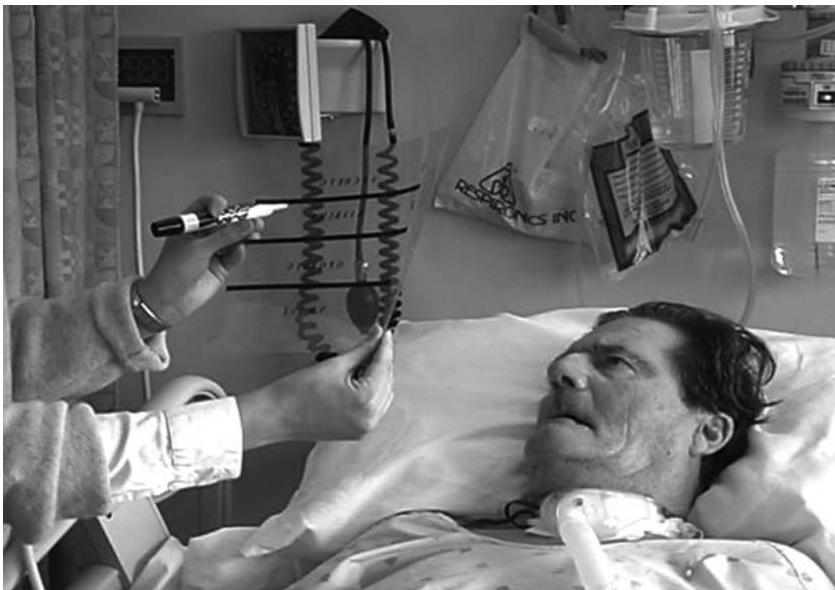

Figure 7.2. Eye-linking display.

fatigue, or ongoing medical conditions that prevent them from utilizing more physically demanding options. Some nonelectronic eye-gaze communication techniques are quite advanced and incorporate complex encoding strategies (Goossens' &amp; Crain, 1987). Many individuals with severe motor impairments but preserved visual function make use of eye-tracking technologies to communicate. There is a wide range of different eye-tracking technologies that are commercially available. Eye-tracking technology for AAC makes it possible for a computer or other electronic device to sense where an individual is looking on a display screen and provides individuals

who cannot access the technology with a keyboard or mouse to access specific letters, words, messages, or commands represented on the display screen.

Those who use AAC supports can also use pointing without contact with an optical or light-generating (or laser-generating) technology that is mounted on the head in some

The AAC Learning Center hosts the video, Supporting Communication for People with Minimal Movement, which demonstrates the use of eyetracking AAC technology.

way (e.g., on a headband, attached to eyeglasses or a cap; or held in the hand). This technique can be used with both high- and low-tech AAC options. For example, an individual who uses a communication board can indicate a choice by directing a light or laser beam toward the desired item. Individuals can also activate electronic AAC technology with optical or light pointing. Technology that incorporates this direct selection technique electronically monitors the position of the light beam or optical sensor and selects an item if the beam or sensor remains (i.e., dwells) in a specific location for a period of time. The two primary motor requirements for use of this technique are the ability to direct the light beam to a desired item and the ability to maintain the direction for a prescribed period of time. Because light pointers and optical sensors are usually mounted on the head, individuals must have head control without excessive tremor or extraneous movements for accurate and efficient use of these options.

Augmentative and Alternative Communication Systems

Individuals can also make selections with sonar or infrared technology instead of direct physical contact. A receiving unit positioned near a computer screen displays infrared signals that are imperceptible to human senses. The person using AAC wears a sensor (usually referred to as a head tracker) that is mounted on the forehead or eyeglasses and is directed to symbols on the screen through fine head movements. These movements control the cursor on the computer screen to indicate representations from the selection set. The motor control requirements for infrared technology are similar to those for light pointing and optical technology.

**Speech Recognition** In the past, individuals who had typical speech but were unable to write or control a conventional computer keyboard (e.g., because of spinal cord injury) opted primarily for speech recognition strategies to control technologies. AAC researchers and developers continue to focus on developing new technologies to support speech recognition as an alternative access selection mode for people who can produce consistent speech patterns even though their speech is mildly or moderately distorted. The use of speech recognition strategies by people with moderate to severe speech impairments has received considerable research attention but is not yet functional as an alternative access technique for those who rely on AAC technology (Fager et al., 2010); therefore, we do not provide detailed discussion of speech recognition strategies in this edition of this textbook.

**Direct Selection Activation Strategies**

When an individual uses direct selection to choose an item from an electronic display, he or she must then activate the item so that the AAC technology recognizes and translates it into usable output. Because many people who rely on AAC have limited motor control capabilities, they must employ alternative activation strategies. For example, some individuals may be unable to isolate a pressure key on a selection display without dragging their fingers across the display, inadvertently activating other representations. Several electronic options can compensate for these difficulties, including timed activation, release activation, and filtered or average activation.

**Timed Activation** Most electronic technology that allows for direct selection offers the option of timed (dwell) activation. This access strategy requires one to identify an item on the display in some way (e.g., through physical contact, by shining a light or a laser beam, by directing one's eye gaze) and then sustain the contact (or dwell on the location) for a predetermined period of time in order for the selection to be recognized by the technology. Timed activation allows individuals to move their fingers, headsticks, light beams, or cursors across the display surface without activating each item that they encounter. The duration of the dwell time can be adjusted to accommodate individual abilities and situations. The clear advantage of this strategy is that it reduces both inadvertent activations and motor control demands.

**Release Activation** Release activation is another activation strategy available in some electronic AAC technology. The individual can use release activation only with displays controlled by direct physical contact, either with a body part or with an extension of some type. The strategy requires the person to contact the display, for example, with a finger, and then retain contact until the desired item is located. The individual can move his or her finger anywhere on the display without making

Access Techniques and Output

a selection as long as direct contact with the display is maintained. To select an item, the person releases contact from the representation (symbol) on the display. Again, the contact time can be adjusted to accommodate individual abilities and needs. The advantages of this strategy are that it allows an individual to use the display for hand stability and that it minimizes errors for those who move too slowly or inefficiently to benefit from timed activation.

As I was writing this chapter, I received a text message on my smart phone. As I responded to the message, I realized that my phone uses a release activation strategy. In other words, when I touch the screen, the letter that I contact is enlarged, but only appears in the message line upon release. Some people with motor control conditions involving small involuntary movements of their fingers or hands prefer release activation because it allows them to touch and maintain contact with the screen to stabilize their involuntary movement patterns as they move to the item of their choice. Activation only occurs when they release, that is, lift their finger from the screen.

Filtered or Averaged Activation Some people who rely on AAC are able to select a general area on the display but have difficulty maintaining adequately steady contact with a specific item for selection. In other words, it is impossible to set a sufficiently low activation time to accommodate their selection ability. Often, these individuals are able to use head-mounted light or optical pointers but do not have the precise and controlled head movements needed for accurate selection. Technology with filtered or averaged activation forgives (i.e., ignores) brief movements away from a specific item by sensing the amount of time the pointer spends on each item in the general area of an item. The technology averages this accumulated information over a short period of time and activates the item to which the light or optical technology was pointed the longest. To personalize the system, facilitators can set the amount of time that elapses prior to activation.

When selecting an access technique for a person who requires AAC, care must be taken to match the access features with the capability of the individual depending upon the environment, time of day, and physical position(s) in which the technology will be used. Once the required access features are determined, then the AAC team can determine potential AAC technologies that offer these access options. A single access technique may not meet the needs of an individual. Rather the individual may switch between different access techniques depending on the time of day, level of fatigue, and amount of support available for set up and positioning (Fager, Fried-Oken, Jakobs, &amp; Beukelman, 2019). Some AAC applications for mobile technology support the access options discussed above, whereas others do not.

# Scanning

Some individuals who require AAC technology are unable to choose representations directly from the selection set. Although this inability can occur for many reasons, the most common reason is lack of motor control. In such situations, the representations in the selection set are displayed either by a facilitator (i.e., a trained communication partner) or by electronic AAC technology in a predetermined configuration. The individual must wait while the facilitator or electronic technology scans through undesired representations before reaching the item of choice. At this point, the person who

Augmentative and Alternative Communication Systems

relies on AAC indicates in some way that the desired item has been presented. This type of item selection is called scanning.

Scanning is still an important access technique for some individuals who rely on AAC; however, in 2010, Ball and colleagues noted the impression that people who rely on AAC are choosing scanning access much less frequently than they did previously and are choosing head- and eye-tracking access strategies more frequently instead. The cognitive load associated with scanning of AAC displays is considerable, the learning requirements are extensive, and rate of communication is slow. Nevertheless, we discuss various aspects of scanning selection in the following sections as it remains an important option for some individuals who have difficulty with calibration of eye-tracking technologies due to various vision problems. In addition, some individuals can rely on eye-tracking access in ideal situations when seated appropriately in their wheelchair or at a desk or table but are unable to effectively use eye-tracking access in other situations.

Jeffrey is one individual who uses different techniques to access AAC in different situations. Jeffrey has not recovered speech and only has minimal limb movement following Guillain-Barré syndrome (see Chapter 14 for further information on Guillain-Barré syndrome). His initial AAC intervention involved partner-dependent eye gaze during which partners presented message (letter, word, or sentence) options and Jeffrey would focus his eyes on his preferred choice. Eventually he began to use alphabet/word scanning with switch access activated by minimal limb movement; however, the scanning was very fatiguing, requiring him to interrupt communication interactions to rest. In time, he demonstrated accurate eye-tracking access of AAC technology provided that the technology was positioned precisely. He was unable to use eye-tracking access in bed or when care staff did not set up his technology appropriately. So, he currently uses eye tracking when sitting in his wheelchair to access AAC technology for most medical, social, and information-sharing communication during face-to-face or online digital communication. When he is in bed or when eye-tracking access is not accurate, he uses scanning with his AAC technology or eye gaze for quick communication about care needs or personal preferences.

## Scanning Patterns

The configuration in which representations in the selection set are presented is one important feature of scanning. It is important that representations in the selection set be identified systematically and predictably so that the intention of the individual who uses AAC and the actions of the facilitator or technology are coordinated. Three primary selection set patterns are circular, linear, and group-item scanning techniques.

## Circular Scanning

Circular scanning is the least complicated pattern that electronic technologies use to present representations in the selection set. The technology displays individual representations in a circle and scans them electronically, one at a time, until the individual stops the scanner and selects an item. The scanner is usually a sweeping hand like the big hand on a clock or takes the form of individual lights near each item in the selection set (see Figure 7.3). Circular scanning requires the individual to track the motion of the hand or pointer and monitor its location relative to the target item but it is relatively easy to master cognitively and for this reason may be the first type of scanning introduced to children or beginning AAC communicators.

Access Techniques and Output

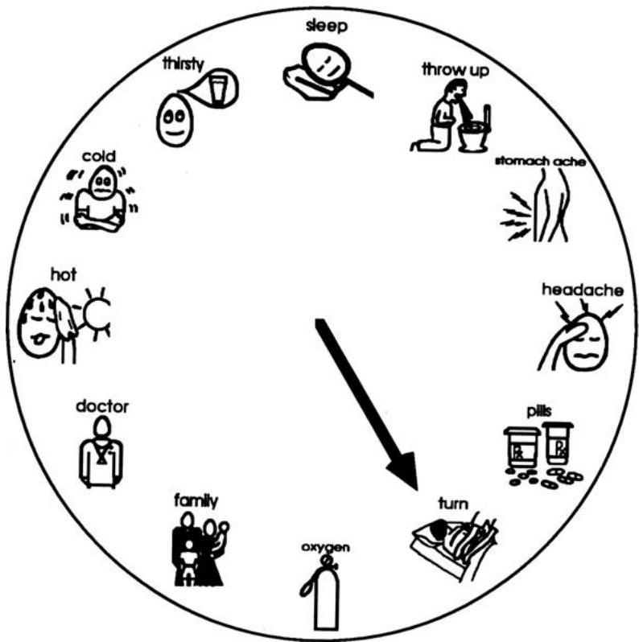

Figure 7.3. A circular scanning display for an individual in an intensive care unit. (PCS is a trademark of Tobii Dynavox LLC. All rights reserved. Used with permission. PCS and Boardmaker are trademarks of Tobii Dynavox LLC. All rights reserved. Used with permission.)

Linear Scanning In visual linear scanning, a cursor light or an arrow moves across each item in the first row, each item in the second row, and each item in the subsequent row, until an item is selected (see Figure 7.4). In auditory linear scanning, a synthetic voice or a human facilitator announces representations one at a time until a section is made. For example, the facilitator might ask, "Which shirt do you want to wear today? the red one? the blue one? the striped one? the purple and green one?" until the individual indicates that the desired choice has been named. Linear scanning, although more demanding than circular scanning, is still relatively easy to learn. Nevertheless, because representations are presented one at a time in a particular order, it may be inefficient if the selection set contains many representations.

Group-Item Scanning AAC technology designers have developed a number of group-item scanning approaches in an effort to enhance scanning efficiency. Basically, group-item scanning involves identifying a group of representations and then eliminating options gradually until a final selection is made. For example, in auditory group-item scanning, the technology or facilitator might ask, "Do you want food representations? drink representations? personal care representations?" and continue until the individual identifies the group or topic. Then, the technology or facilitator recites a predetermined list of options within that group. For example, if

Augmentative and Alternative Communication Systems

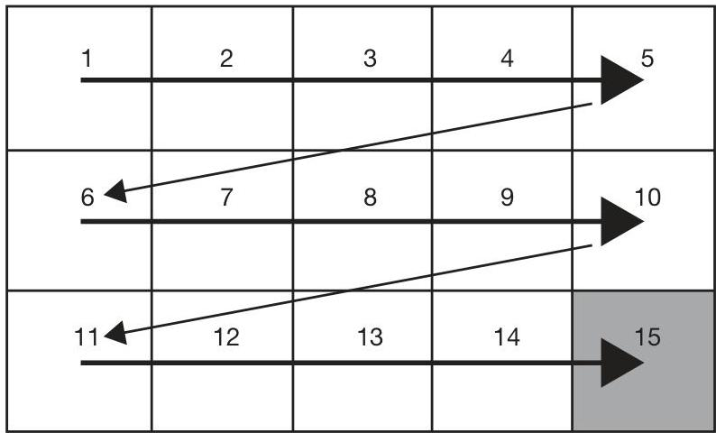

Figure 7.4. A linear scanning display with three rows of symbols.

the individual selects DRINK REPRESENTATIONS, the facilitator might ask, "Water? Pop? Tea? Beer?" until a choice is made. Clearly, this would be more efficient than if the facilitator first went through a list of food and then repeated the process for drink representations before the selection could be made.

One of the most common visual group-item strategies is row-column scanning (see Figure 7.5). Each row on the visual display is a group. The rows are each electronically highlighted in presentation until the target item is selected. Then individual representations in that row are highlighted one at a time until the scanning is stopped at the specific representation desired.

There are also a number of variations of row-column scanning. To increase efficiency, sophisticated AAC technologies that contain many representations in the selection set often employ group-row-column scanning, a common variation of row-column scanning. Group-row-column scanning requires the individual to make

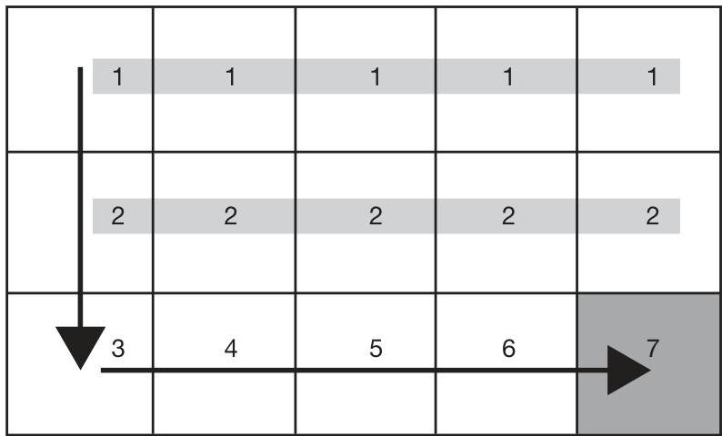

Figure 7.5. A row-column scanning display.

three selections. First, the entire display is highlighted in two or three groups. When the person identifies a group—for example, the group at the top of the screen—each row in that group is scanned. When the individual selects a specific row, the scanning pattern changes to highlight each item in that row. Finally, the person identifies the desired item within a row.

At the time this chapter is being written, several of my colleagues are developing a multimodal access option that involves eye gaze and single switch scanning. This technology is being developed for people who cannot accurately access letters or words with sufficient precision using eye gaze alone. With the multimodal approach, they can select a section of the display (containing approximately six letters) using eye gaze and then scan these letters individually to select the letter of choice by activating a switch. The technique is faster than scanning alone. A video demonstrating this multimodal strategy is available at the AAC Learning Center web site (Fager et al. 2019).

### Scanning Timing and Speed

In addition to customizing the scanning pattern, the speed and timing of scanning must be personalized according to each individual's motor, visual, and cognitive capabilities. When nonelectronic scanning is used, a facilitator can announce the representations audibly or point to them on a communication display (e.g. an alphabet or communication board) as quickly or as slowly as the individual requires. The facilitator can usually observe the individual's response patterns and adjust the speed of scanning accordingly. When electronic equipment is used, however, the scanning speed must be individualized for or by the person because the technology provides the scanning presentation. Most electronic AAC technology has sufficient scanning speed options to meet individual needs.

### Selection Control Techniques

People who use auditory scanning or electronic visual scanning must be able to select a representation while the technology systematically scans representations in the display. Generally, three selection control techniques are used: directed (inverse) scanning, automatic (regular or interrupted) scanning, and step scanning.

### Directed (Inverse) Scanning

In directed scanning, the indicator or cursor begins to move when the person activates (e.g. holds down) a switch of some type. As long as the switch is activated, the indicator moves through the preset scanning pattern (e.g. circular, linear, row--column). The selection is made when the switch is released by the individual. Directed scanning is particularly useful for people who have difficulty activating switches but who can sustain activation once it occurs and can release the switch accurately. Those who rely on joystick access to control the cursor on the display screen also use a directed scanning access strategy.

### Automatic (Regular or Interrupted) Scanning

In this type of scanning, the movement of the indicator or cursor is automatic and continuous, according to a preset pattern (e.g. circular, linear, row--column). To make a selection, the person activates a switch to stop the indicator at the group or item of choice. This type of scanning is particularly useful for people who are able to activate a switch accurately but who have difficulty sustaining activation or releasing the switch. This type of scanning is also employed when the display presentation is auditory. In this case, a facilitator might recite names of movies, for example, until the individual stops (or interrupts) the presentation at the one he or she wishes to see.

Augmentative and Alternative Communication Systems

Step Scanning In step scanning, the indicator or cursor moves through a preset selection pattern, one step (i.e., one group or item) at a time for each activation of the switch. In other words, there is a one-to-one correspondence between cursor movement and switch activation. Once the individual moves the cursor to the desired item, to select the specific item the individual simply stops activating the switch for an extended period of time or activates a second switch that indicates that the displayed item is the desired selection. Step scanning is often used by individuals who have severe motor control or cognitive restrictions or who are just beginning to learn to operate electronic scanning. Because step scanning requires repeated, frequent switch activations, it is often fatiguing.

Switches When individuals use scanning to access AAC technology, no matter what scanning pattern or selection control technique they use, they need to be able to reliably control a microswitch to signal their selections. There is a vast array of switches available, including ones that are activated through touch, pressure, muscle movement (e.g., eyebrow raise), tilt, and sound, as well as camera-based switches that are activated by movement. These switches include ones that may be controlled by the individual's finger, hand, foot, knee, head, facial movements, eye blink, vocalizations, and so on. To maximize access, it is important to involve a multidisciplinary AAC team (including a skilled occupational and/or physical therapist) to make key decisions regarding seating and positioning, as well as the specific switch placement and mounting required.

# FEEDBACK

As individuals access AAC technology, they receive feedback on their selections. The two primary purposes of feedback from AAC technology are 1) to let the individual using AAC know that an item has been selected from the selection display (activation feedback) and 2) to provide the individual with information about the message that has been formulated or selected (message feedback). Some AAC technologies provide neither type of feedback, some provide one but not the other, and some provide both. Feedback can be visual, auditory, tactile, or proprioceptive.

# Activation Feedback

Lee and Thomas defined activation feedback as "the information sent back to the person, upon activation of the input device" (1990, p. 255). Activation feedback differs from message feedback in that it informs the individual that activation has occurred, but usually does not provide information about which specific symbol or message has been selected. It differs from output in that it provides information that is useful to the person operating the technology but not, generally, to the communication partner.

Activation feedback must occur in a sensory modality that is within the person's capabilities. Auditory activation feedback may be a beep, click, or other generic sound produced by the AAC technology upon selection. Nonelectronic displays do not provide auditory activation feedback. Visual activation feedback on AAC technology may be provided via a light flash after a switch has been activated or via an area or symbol flash on a backlit display. Visual activation feedback on a nonelectronic display may consist of seeing one's body part contact the item. Contact with the textured surface of symbols on either electronic or nonelectronic AAC technologies provides

Access Techniques and Output

tactile activation feedback. Finally, proprioceptive activation feedback is obtained when the individual applies pressure against a resistant surface (a switch or key) that moves when the pressure threshold is exceeded. Persons who produce manual signs and gestures also get proprioceptive and kinesthetic feedback from the position and movement of their hands in space.

## Message Feedback

Message feedback provides information about the symbol selected or the message itself after it has been formulated. Unlike activation feedback, message feedback may be useful to the communication partner as well, although this is of secondary importance. For example, when an individual interacts with a keyboard that speaks each letter as it is typed via synthetic speech, the spoken letter (or word) provides message feedback. This feedback allows the individual to monitor the message for accuracy as it is composed. The spoken letter may also serve as output for the communication partner, if he or she can hear the letter and chooses to listen, but this output is not its primary purpose. Similarly, most dynamic display AAC technologies provide the person using the technology with message feedback in the form of a screen display of symbols as they are activated in a sequence.

Message feedback, like activation feedback, is available through auditory, visual, tactile, or proprioceptive modalities. Auditory message feedback may be provided on electronic AAC technology as either a key echo (e.g., a speech synthesizer announces each alphabet letter as it is activated when using orthographic symbols) or a word/phrase echo (e.g., a speech synthesizer says individual words or phrases in a message as they are produced). With nonelectronic AAC displays or unaided AAC, the communication partner often provides auditory message feedback (sometimes referred to as partner reauditorization; Bedrosian, Hoag, Calculator, &amp; Molineux, 1992) by echoing each letter, word, or phrase as it is produced or selected.

Visual message feedback may be provided on AAC technology as computer screen displays of letters, words, or phrases as they are selected. Sometimes this feedback appears dynamically on the screen adjacent to the AAC symbol selected, as in AAC technologies with a transition to literacy (T2L) feature (see Chapter 6). Many AAC technologies and software products provide message feedback in screen displays of symbol sequences as each symbol is selected. Visual message feedback from aided and unaided nonelectronic technologies is generally identical to activation feedback—the individual sees the symbol he or she produces. AAC applications do not provide tactile and proprioceptive message feedback, with the exception of writing aids used by people with visual impairments.

## MESSAGE OUTPUT AND INPUT

Those who rely on AAC, like all people who communicate, are both the senders and the receivers of messages during communicative interactions. In this section, the term message output refers to the information that they send to their communication partners. Examples of message output modes include synthetic speech, digitized speech, photographs, video clips, print, gestures, manual signs, and nonelectronic aided symbols. Conversely, the term message input refers to the information that people who rely on AAC receive from others. Message input usually takes the form of natural speech and gestures (assuming that most partners do not have disabilities), although input

Augmentative and Alternative Communication Systems

may also take the form of written or printed materials (e.g., letters, notes, e-mails, text messages, digital media posts), as well as unaided or aided AAC input specifically provided by partners (e.g., the partner signs or selects aided AAC symbols as he or she speaks).

It is important to distinguish message input and output from feedback, which is primarily provided during rather than at the end of message construction and was discussed in the previous section. Feedback lets the individual know that an item has been selected and, in some cases, also provides him or her with information about the selected item.

For some individuals, the input mode through which they receive messages may be as much of an intervention concern as the output mode by which they send messages. For example, Beukelman and Garrett noted that "the incidence of auditory reception problems among the adult population with aphasia is large" (1988, p. 119), and these individuals may need augmented input in the form of gestures, pictures, or writing in addition to natural speech. People with impairments that affect cognitive, sensory, and linguistic processing (e.g., intellectual and developmental disability, autism spectrum disorder [ASD], TBI) may also require and benefit from augmented input techniques. The following sections review the major types of message output and input used in AAC applications in terms of general characteristics and the learning and performance abilities that they require.

## Synthesized Speech

Synthetic speech technology continues to improve. People who once had no choice but to use technologies that produced robotic, barely intelligible voices are now able to choose from an array of natural-sounding male, female, and childlike voices in dozens of languages! At this time, minimal public information about the intelligibility or acceptability of these new voices is available. Readers are encouraged to follow research reports to learn about the characteristics of these new voices. Commercial companies provide web access to samples of their synthesized speech products. The main types of synthesized speech are described in the following sections.

Speech technology research can be found in journals such as Augmentative and Alternative Communication, Assistive Technology, and the International Journal of Speech Technology.

## Types of Synthesized Speech and Speech Communication

AAC technologies can be used in different ways to generate electronic speech. For example, synthetic speech can be generated based on text that is entered into, or retrieved from, an AAC technology, or speech can be generated from an individual's natural speech that has been recorded and stored.

**Text to Speech** A common method used to generate synthetic speech in AAC technologies is text-to-speech synthesis. The approach generally involves three steps. First, text (words or sentences) that has been entered into an AAC technology or retrieved from its memory as codes is transformed into phonemes and allophones. Second, the technology uses the stored speech data to generate digital speech signals that correspond to phonetic representations of the text. Finally, the technology

converts the digital signals to analog speech waveforms that communication partners can interpret and understand.

There is growing interest in personalizing text-to-speech voices by recording the speech of an individual while he or she can still speak and then building a speech synthesis model using that speech sample. In this way, the speech produced by the synthesizer would sound somewhat like the voice of the individual.

### Digitized Speech

Digitized speech, also called waveform coding, is another type of electronic speech used in AAC technology. This method consists primarily of natural speech that has been recorded, stored, and reproduced. When reproduced, the speech is a close replica of the original speech entry. Digitized speech is stored in word or message form and must be retrieved as a word or message. Therefore, it cannot be used to convert text into speech. Digitized speech strategies are used for voice banking during which individuals who will eventually lose their ability to speak, such as persons with ALS, record a bank of messages using their own voice (see Chapter 14). Later these messages are stored as digitized speech, so special messages such as i love you, have a great day, or go huskers can be spoken with a voice familiar to friends and family (Costello, Santiago, & Blackstone, 2015). Digitized speech may be used with very young children since it captures the intonational features of child-directed speech that are so important for engagement of infants and toddlers.

## Advantages and Disadvantages of Synthesized Speech

The major advantages of intelligible synthesized speech are that it 1) may significantly reduce the communication partner's burden in the interaction because interpretation of the output requires only the ability to understand spoken language, 2) provides information in a mode that is relatively familiar and nonthreatening to communication partners, 3) allows communication even with communication partners who are not literate (as long as they understand spoken language) and with those who have visual impairments, 4) allows the person using AAC to send messages without first obtaining his or her partner's attention through some other mode, and 5) allows communication to occur at a distance using telecommunications application software products such as Skype, Zoom, Facetime, and Google Hangout that support video/audio communication.

To illustrate the advantages of high-quality synthetic speech output, consider Ahmad, a boy with severe disabilities who is included in a general kindergarten classroom of 30 children, has limited receptive language skills, and does not speak. If he uses an unaided AAC technique such as manual signing or a low-tech aided system such as a communication board, his teacher and his classmates must also learn to use and understand the symbols in that system. In fact, if Ahmad uses a communication board, his communication partners must be near him when he communicates so that they can see the symbols on the display. Now, imagine Ahmad using an AAC technology that produces high-quality synthetic speech output when he touches a symbol on the display. His teacher and classmates now face fewer learning demands regarding reception and comprehension of the output, and Ahmad can communicate from anywhere in the classroom, assuming that he can adjust the volume on the technology sufficiently.

Augmentative and Alternative Communication Systems

# Visual Output

As the quality of synthetic speech has improved over the years, visual output has changed from being a primary output method in AAC to being a supportive one. Generally speaking, visual output, such as photographs and videos, is used in face-to-face communication as well as digital communication to support individuals with complex communication needs in visually illustrating message detail, establishing and maintaining topics during conversations, and resolving communication breakdowns. In face-to-face interactions, visual output is particularly important for communication partners who have hearing impairments, who are unfamiliar with the person relying on AAC, or who communicate in noisy environments in which synthetic speech may not be intelligible. Visual output in the form of photos and videos also plays an important role for many individuals with complex communication needs on digital communication media (e.g., Facebook, Instagram) to augment written messages and share experiences. In addition to employing visual output to supplement synthetic speech output, many individuals who use AAC utilize printed output, often in similar ways as individuals without disabilities do—to text, send e-mails, write letters, complete assignments, leave notes, make lists, and keep personal journals.

Unaided Symbols Individuals may also make use of unaided forms of output, such as gestures or manual signs. These impose memory requirements on both of the participants in the communicative exchange. Because no permanent display is available, all of the gestures or manual signs must be produced from memory by the sender and processed in memory by the receiver. These tasks may be very difficult for people who have memory impairments (e.g., people with TBI) or who have difficulty processing transitory information (e.g., people with autism; see Mirenda, 2003). Many researchers and clinicians have encouraged the use of aided technology with permanent displays as a solution for people with memory impairments.

Another major concern regarding some unaided AAC output, such as manual signs, is that relatively few people without disabilities are likely to understand it. For example, it appears that only 10% to 30% of American Sign Language (ASL) signs are guessable by typical adults (Daniloff, Lloyd, &amp; Fristoe, 1983; Doherty, Daniloff, &amp; Lloyd, 1985). Thus, if an individual produces idiosyncratic gestures or manual signs as the sole output to unfamiliar partners, he or she will almost always require an interpreter. Again, multimodal systems that incorporate both aided and unaided AAC often serve to resolve this dilemma: Unaided modes are used with familiar partners who understand this output and aided modes are used with unfamiliar partners who do not.

Aided Symbol Display In low-tech AAC supports, communication partners interact directly with the AAC symbol set itself. As the person who uses AAC identifies the symbols of choice, the partner formulates the message, often speaking it aloud as feedback. Whenever unfamiliar (i.e., translucent or opaque) symbols are used to form messages in communication systems, constraints may be placed on the range of communication partners who will comprehend the message. Potentially problematic AAC symbols include textured symbols with arbitrarily assigned meanings, selected symbols from all of the line-drawing sets discussed in Chapter 6, orthographic symbols, abstract lexigrams, and other symbols such as braille and Morse code. To maximize

Access Techniques and Output

aided output intelligibility in such situations, AAC teams often choose systems that provide simultaneous written translations of aided messages (e.g., provide written labels above symbols or written text on the computer display) for literate communication partners. To facilitate interactions with nonliterate partners, AAC teams may opt for a multimodal AAC system with at least one component that provides synthetic speech output for the communication partner(s).

Another difficulty with the output provided by low-tech AAC options has to do with partner attention to the display. When people communicate with communication books, boards, or other low-tech displays, they must first get their partner's attention. Then, the partner must be able to turn or move toward the individual using AAC to see the board, book, or technology that displays the message symbols. Finally, the communication partner must possess sufficient visual acuity to see the output. There are many situations in which one or more of these requirements is difficult or impossible to fulfill. Such situations include communicative interactions in which a partner has a visual impairment and interactions in busy, crowded, or dimly lit environments or places that allow limited mobility (e.g., classrooms, factories, movie theaters, football games). The best solution in these situations may be for AAC teams to introduce one or more forms of speech or print output as part of a multimodal, personalized communication system.

## AAC Input

The availability of visual input (either unaided or aided) in conjunction with spoken input appears to facilitate comprehension for some people with complex communication needs who have difficulty accurately understanding spoken messages on their own. In Chapter 15, we discuss in detail the comprehension limitations of people with severe chronic aphasia and the role that gestures, visual scene displays, and communication books play in supporting accurate comprehension. In Chapters 10 and 11, we discuss the role that AAC input can serve in supporting comprehension and expression with individuals with developmental disabilities. In the following section, we briefly introduce unaided and aided AAC input.

### Unaided AAC Input

Gestures and signs are convenient types of input because they require no additional paraphernalia (e.g., books, boards, computers) and are always available for use because they do not have to be switched on as electronic technologies do. Teachers and family members of people with developmental disabilities often use manually signed input within a total (or simultaneous) communication paradigm, in which the communication partner accompanies spoken words with their corresponding signs (Carr, 1982). Some evidence suggests that communication partners who use total communication slow their rates of both speaking and signing and insert more pauses than when they use speech alone (Wilbur &amp; Peterson, 1998; Windsor &amp; Fristoe, 1989, 1991). This may account, at least in part, for the expressive and receptive language gains that some people with ASD and other developmental disabilities display when using this approach (Kiernan, 1983). The type and amount of input that partners should provide to the individual are, however, major considerations. Should manually signed input accompany all or most spoken words, or should communication partners opt for a telegraphic or key-word approach instead? Should the individual employ a total communication approach throughout the day or only during designated instructional periods? Unfortunately, existing research does not

Augmentative and Alternative Communication Systems

supply the answers to these important questions, so clinicians must use their best judgment to make individualized decisions in these areas.

**Aided AAC Input** Communication partners can also provide input to people who rely on AAC by using aided AAC of many types in conjunction with spoken input. For example, a facilitator may draw simple pictures or write letters and words while speaking to a person with receptive aphasia to help him or her to comprehend messages (see Chapter 15). Or a parent may point to key AAC symbols while speaking to a child in a technique referred to by various names, including aided language stimulation (Elder &amp; Goossens', 1994; Goossens', Crain, &amp; Elder, 1992) or the System for Augmenting Language (Romski &amp; Sevcik, 1996). To accomplish this, facilitators must have the necessary symbols available. Unfortunately, the logistical demands of aided symbol input often prevent facilitators from using the technique extensively, despite research evidence that it can have positive effects on both receptive and expressive language development (e.g., Allen, Schlosser, Brock, &amp; Shane, 2017; Biggs, Carter, &amp; Gilson, 2018; O'Neill, Light, &amp; Pope, 2018; see Chapter 10 for additional information about these techniques).

**CONCLUSIONS**

In summary, as is evident from the discussion in this chapter and Chapter 6, there is a vast array of options available to support the receptive and expressive communication of children and adults with complex communication needs. AAC teams need to be knowledgeable of these options and carefully consider the most appropriate approaches for each individual, including unaided and aided AAC. Careful consideration is required to select appropriate representations, organizations and layouts, navigational approaches, encoding or prediction techniques, access techniques, feedback approaches, and message output and input strategies. Chapter 8 discusses how to select and personalize AAC to effectively support individuals with complex communication needs.

**QUESTIONS**

7.1. How do fixed and dynamic displays differ?
7.2. What is meant by the terms direct selection and scanning? How do these differ?
7.3. In direct selection access, what is meant by the word dwell, and what capabilities does the successful use of dwelling require of an individual who relies on AAC?
7.4. What type of individual might wish to use activation on release?
7.5. What are the differences between synthesized and digitized speech?
7.6. How do feedback and output differ?
7.7. The parent of a child with severe motor limitations who cannot use direct selection wishes to know the difference between directed scanning and automatic scanning. What would you tell this parent?
7.8. What is the difference between the sender-receiver and the co-construction models of communication?
7.9. What are the similarities and differences between aided and unaided AAC input used in conjunction with speech?

Access Techniques and Output

# REFERENCES

Allen, A., Schlosser, R., Brock, K., &amp; Shane, H. (2017). The effectiveness of aided augmented input techniques for persons with developmental disabilities: A systematic review. *Augmentative and Alternative Communication*, 33, 149–159. doi:10.1080/07434618.2017.1338752
Ball, L., Fager, S., Nordness, A., Kersch, K., Mohr, B., Pattee, G., &amp; Beukelman, D. (2010). Eye-gaze access of AAC technology for persons with amyotrophic lateral sclerosis. *Journal of Medical Speech Language Pathology*, 18, 11–23.
Beck, A., Thompson, J., &amp; Clay, S. (2000). The effect of icon prediction on college students' recall of icon codes. *Journal of Special Education Technology*, 15, 17–23. doi:10.1177/016264340001500302
Bedrosian, J., Hoag, L., Calculator, S., &amp; Molineux, B. (1992). Variables influencing perceptions of the communicative competence of an adult augmentative and alternative communication system user. *Journal of Speech and Hearing Research*, 35, 1105–1113. doi:10.1044/jshr.3505.1105
Beukelman, D. (2005). Tom's AAC system. *Augmentative Communication News*, 17(2), 5–6.
Beukelman, D., &amp; Garrett, K. (1988). Augmentative and alternative communication for adults with acquired severe communication disorders. *Augmentative and Alternative Communication*, 4, 104–121. doi:10.1080/07434610701553668
Beukelman, D., Yorkston, K., &amp; Dowden, P. (1985). *Communication augmentation: A casebook of clinical management*. Austin, TX: PRO-ED.
Biggs, E. Carter, E., &amp; Gilson, C. (2018). Systematic review of interventions involving aided AAC modeling for children with complex communication needs. *American Journal on Intellectual and Developmental Disabilities*, 122, 443–473. doi:10.1352/1944-7558-123.5.443
Carr, E. (1982). Sign language. In R. Koegel, A. Rincover, &amp; A. Egel (Eds.), *Educating and understanding autistic children* (pp. 142–157). San Diego, CA: College-Hill Press.
Costello, J., Santiago, R., &amp; Blackstone, S. (2015). Pediatric acute and intensive care in hospitals. In S. Blackstone, D. Beukelman, &amp; K. Yorkston (Eds.), *Patient provider communication* (pp. 187–224). San Diego, CA: Plural.
Daniloff, J., Lloyd, L., &amp; Fristoe, M. (1983). Amer-Ind transparency. *Journal of Speech and Hearing Disorders*, 48, 103–110. doi:10.1044/jshd.4801.103

Doherty, J., Daniloff, J., &amp; Lloyd, L. (1985). The effect of categorical presentation on Amer-Ind transparency. *Augmentative and Alternative Communication*, 1, 10–16. doi:10.1080/07434618512331273481
Drager, K., &amp; Light, J. (2010). A comparison of the performance of 5-year-old children with typical development using iconic encoding in AAC systems with and without icon prediction on a fixed display. *Augmentative and Alternative Communication*, 26, 12–20. doi:10.3109/07434610903561464
Elder, P., &amp; Goossens', C. (1994). *Engineering training environments for interactive augmentative communication: Strategies for adolescents and adults who are moderately/severely developmentally delayed*. Birmingham, AL: Southeast Augmentative Communication Conference Publications.
Fager, S., Beukelman, D., Jakobs, T., &amp; Hossum, J. P. (2010). Evaluation of a speech recognition prototype for speakers with moderate and severe dysarthria: A preliminary report. *Augmentative and Alternative Communication*, 26, 267–277. doi:10.3109/07434618.2010.532508
Fager, S., Fried-Oken, M., Jakobs, T., and Beukelman, D. (2019). New and emerging access technologies for adults with complex communication needs and severe motor impairments: State of the science. *Augmentative and Alternative Communication*, 35(1), 13–25. doi:10.1080/07434618.2018.1556730
Goossens', C., &amp; Crain, S. (1987). Overview of nonelectronic eye-gaze communication devices. *Augmentative and Alternative Communication*, 3, 77–89. doi:10.1080/0743461871.2331274309
Goossens', C., Crain, S., &amp; Elder, P. (1992). *Engineering the preschool environment for interactive symbolic communication*. Birmingham, AL: Southeast Augmentative Communication Conference Publications.
Hochstein, D., McDaniel, M., Nettleton, S., &amp; Neufeld, K. (2003). The fruitfulness of a nomothetic approach to investigating AAC: Comparing two speech encoding schemes across cerebral palsied and nondisabled children. *American Journal of Speech-Language Pathology*, 12, 110–122. doi:10.1044/1058-0360(2003/057)
Kiernan, C. (1983). The use of nonvocal communication techniques with autistic individuals. *Journal of Child Psychology and Psychiatry*, 24, 339–375. doi:10.1111/j.1469-7610.1983.tb00115.x

Augmentative and Alternative Communication Systems

Lee, K., &amp; Thomas, D. (1990). Control of computer-based technology for people with physical disabilities: An assessment manual. Toronto, Canada: University of Toronto Press.

Light, J., Wilkinson, K., Thiessen, A., Beukelman, D., &amp; Fager, S. (2019). Designing effective research-based AAC interface displays for children and adults with developmental and acquired disabilities. *Augmentative and Alternative Communication*, 35, 42–55. doi: 10.1080/07434618.2018.1558283

Mirenda, P. (2003). Toward functional augmentative and alternative communication for students with autism: Manual signs, graphic symbols, and voice output communication aids. *Language, Speech, and Hearing Services in Schools*, 34, 202–215. doi:10.1044/0161-1461(2003/017)

O’Neill, T., Light, J., &amp; Pope, L. (2018). Effects of interventions that include aided augmentative and alternative communication input on the communication of individuals with complex communication needs: A meta-analysis. *Journal of Speech, Language, and Hearing Research*, 61, 1743–1765. doi:10.1044/2018_JSLHR-L-17-0132

Romski, M., &amp; Sevcik, R. (1996). *Breaking the speech barrier: Language development through augmented means*. Baltimore, MD: Paul H. Brookes Publishing Co.

Rummel-Hudson, R. (2011). A revolution at their fingertips. *Perspectives on Augmentative and Alternative Communication*, 20(1), 19–23. doi:10.1044/aac20.1.19

Wilbur, R., &amp; Peterson, L. (1998). Modality interactions of speech and signing in simultaneous communication. *Journal of Speech, Language, and Hearing Research*, 41, 200–212. doi:10.1044/jslhr.4101.200.

Windsor, J., &amp; Fristoe, M. (1989). Key word signing: Listeners’ classification of signed and spoken narratives. *Journal of Speech and Hearing Disorders*, 54, 374–382. doi:10.1044/jshd.5403.374

Windsor, J., &amp; Fristoe, M. (1991). Key word signing: Perceived and acoustic differences between signed and spoken narratives. *Journal of Speech and Hearing Research*, 34, 260–268. doi:10.1044/jshr.3402.260

8

# Selection and Personalization of AAC Systems

Just as no two people are alike in terms of their needs, capabilities, experiences, and interests, so too should no two AAC systems for individuals with complex communication needs be identical. Rather, AAC systems should be selected and personalized to meet the unique needs, capabilities, experiences, interests, and identity of each individual with complex communication needs. As is apparent from the previous chapters, there is a vast array of unaided AAC options to support the communication and participation of children and adults with complex communication needs, ranging from vocalizations and speech approximations to gestures and manual signs to facial expressions and eye-blink codes. Furthermore, there is a wide range of aided AAC supports available, including both low-tech and high-tech options that support many different representations, organizations, layouts, navigational approaches, encoding or prediction techniques, access techniques, and outputs. This chapter considers the process of selecting and personalizing AAC for individuals with complex communication needs.

The challenge is to select AAC supports that are an appropriate fit for the individuals who use them. When AAC systems are compatible with the needs, capabilities, and preferences of individuals with complex communication needs, they will effectively support communication and participation; however, when AAC systems are poor fits, they may impose additional learning demands, negatively impacting communication (Light, Wilkinson, Thiessen, Beukelman, &amp; Fager, 2019). AAC systems are at times selected by service providers with limited input from the individual with complex communication needs and the family. A parent of a child with complex communication needs explained the problem of being left out of AAC decision making:

I knew communication was important because I just felt it was. Nobody ever taught me, nobody ever sat down with me and really explained, even when it was introduced nobody sat down and said this is why we use AAC and this is what it is going to mean in the future. (Goldbart &amp; Marshall, 2004)

AAC systems are at times selected based on clinician familiarity rather than the needs and capabilities of the individual with complex communication needs and the communication partners. Although this approach reduces demands on service providers, it may result in a poor fit for the individual and communication partners. In fact, lack of fit of the AAC system and lack of support from family and facilitators have been identified as two major problems that impact uptake of AAC (Johnson, Inglebret,

Augmentative and Alternative Communication Systems

Jones, &amp; Ray, 2006). If AAC systems are not appropriate fits, individuals with complex communication needs and their communication partners will find them difficult to use. The best decisions are made when individuals who rely on AAC, their families, and the professionals on the AAC team work collaboratively to select and personalize appropriate AAC systems.

## PROCESS OF SELECTING AND PERSONALIZING AAC

Choosing appropriate AAC systems is a complex process that involves the following steps:

1. Summarizing AAC assessment results
2. Determining AAC system requirements
3. Feature matching to determine potential AAC systems
4. Trialing potential AAC systems
5. Selecting AAC systems
6. Personalizing AAC

Throughout this process, it is critical to put the individual who requires AAC first; it is the individual's needs and skills that should drive decision making, not the technology (Light &amp; McNaughton, 2013).

Several years ago, we witnessed an interaction between a young university student and Michael Williams, a leader in the field and himself an expert communicator via AAC. The student enthusiastically posted on a listserv that she just loved AAC because of all the exciting technologies. In his wisdom, Michael gently chided her by reminding her that if she wanted to make a difference, she had better focus on the people, not the technology. Michael's words have stayed with us since his post. (Light &amp; McNaughton, 2013, p. 299)

In the following sections, we describe each of the steps in the process of AAC system selection and personalization; at each step, we illustrate the process for a preschool-aged child with cerebral palsy. At the end of the chapter, we provide an additional example to illustrate AAC system selection and personalization with an adult with an acquired condition.

## Summarizing AAC Assessment Results

The first step in the process of system selection is to summarize the results of the assessment (see Chapter 2 for a discussion of AAC assessment). The assessment summary should include an overview of 1) the unmet communication needs and priorities of the individual with complex communication needs, 2) the individual's capabilities, and 3) environmental/partner supports and constraints. All of these will impact the selection of effective AAC supports.

## Unmet Communication Needs and Priorities

The individual's unmet needs and priorities drive the selection of AAC systems. These include consideration of the following: with whom, where, when, why, about what, and how the individual needs to communicate to meet daily goals. These priorities will define features that are required within AAC supports. For example, interactions to express needs and

Selection and Personalization of AAC Systems
271

wants require the individual to get someone's attention, clearly indicate the target object or action, and thank the partner; vocabulary requirements are limited, but the interaction needs to occur as quickly as possible (Light, 1988). In contrast, interactions where the primary focus is to share information (e.g., at school or work) typically evolve over a longer interaction; the vocabulary needs are much more extensive and may include a range of specialized vocabulary depending on the topic (Light, 1988). (See Chapter 1 for further discussion of the different types of interactions and their requirements.)

Interactions with unfamiliar partners require the use of AAC supports that do not require extensive shared knowledge or training from the partner; the output needs to be easily understood and interpreted. In contrast, familiar partners may be able to use shared knowledge and experience to interpret a greater range of modalities, some of which may be idiosyncratic. Some interactions occur one on one and can be accomplished through a range of modalities (e.g., speech approximations, gestures, low-tech communication boards or books, AAC technologies); others involve groups and require access to speech output. Some interactions occur at a distance and require access to digital communication media (e.g., e-mail, texting, social media). Some, such as school assignments or work reports, require written output. As these examples indicate, the individual's priorities (i.e., with whom, where, when, why, about what, and how the individual needs to communicate to meet daily goals) define numerous requirements for AAC supports.

## Capabilities of the Individual

The assessment summary should also include an overview of the capabilities of the individual: motor, sensory perceptual, receptive language, expressive communication, symbol representation, literacy, and cognitive organization.

## Motor Capabilities

Individuals with complex communication needs present with a wide range of motor capabilities: Some have functional fine and gross motor capabilities, whereas others may have substantial motor impairments such that they only have minimal movement. The individual's motor capabilities will determine potential AAC supports for consideration. For example, manual signs require precise hand shapes, orientation, location, and movement (produced in the correct sequence), whereas some gestures may require only gross motor control (e.g., reaching for or pointing with an open hand or closed fist to request an object or activity). Aided AAC requires some type of motor act for access; however, the motor demands vary substantially depending on the access technique used, whether direct selection or scanning (see Chapter 7 for further discussion of access techniques).

## Sensory Perceptual Capabilities

The visual, auditory, and tactile capabilities of individuals with complex communication needs (and their communication partners) also vary along a continuum from those with intact sensory perceptual capabilities to those who experience significant impairments in one or several sensory perceptual channels. Spoken communication occurs via auditory-oral channels, placing significant burden on auditory perception and processing. Individuals who have hearing impairments may need visual input and output. In contrast to spoken communication, AAC typically places an increased burden on the visual channel since unaided and aided input is presented visually and aided output usually requires visual search to locate and select symbols to communicate messages. Individuals with complex

Augmentative and Alternative Communication Systems

communication needs may experience a wide range of visual impairments that may influence the size, spacing, layout, color, and location of the representations that they use. Some individuals with complex communication needs may experience both vision and hearing impairments and may require tactile input and output to communicate. It is essential to determine the sensory perceptual function of the individual (and the communication partners) to ensure that the AAC system is a good fit, especially because individuals with developmental and acquired disabilities are at risk for concomitant sensory perceptual impairments.

Cognitive, Linguistic, and Literacy Capabilities Individuals with complex communication needs present with a range of cognitive, language, and literacy capabilities as well. Their cognitive and linguistic profiles will depend on their neurological status, age, development, history, instruction, experiences, and so forth. Their capabilities in these domains will determine which types of representations (e.g., gestures, manual signs, actual objects, photographs, line drawings, photo or video visual scene displays [VSDs], traditional orthography) are most appropriate, as well as which types of layouts (e.g., VSDs, grid displays) and organizations (e.g., schematic, taxonomic, semantic-syntactic, alphabetical, chronological) work best. Their cognitive skills (e.g., attention, memory, learning, executive function) will also influence decisions regarding encoding/prediction techniques, navigation, and access techniques (Fried-Oken, Kinsella, &amp; Mooney, 2019). Clearly, different types of unaided and aided AAC impose different cognitive, linguistic, literacy, and learning demands, and decisions should reflect the individual's capabilities.

Ultimately the AAC team seeks to optimize the individual's power of communication while at the same time limiting the cost of learning. The value of AAC comes in its power to support communication and participation. Ideally, individuals with complex communication needs would need to spend minimal time learning AAC so that they can focus on their end goals in education, employment, health care, social, and community activities. However, the cost of learning must always be balanced with the power of communication afforded. Sometimes the time required to learn a specific approach to AAC is justified relative to the increased power of communication. For example, it takes time and effort for individuals to develop literacy skills, but ultimately literacy provides maximal communication power; with literacy skills, individuals can communicate any message they want. When weighing the power of communication offered by AAC options, the team should not only consider immediate needs, but also plan ahead to meet future ones. For example, a young child may be able to meet current communication demands using a combination of gestures, signs, and photos or line drawings. However, in the future, as this child enters school and participates with a greater range of partners in a wider variety of contexts, this child will require access to generative communication and may need to utilize traditional orthography to meet this breadth of needs.

Environmental Supports and Constraints The assessment summary should also provide an overview of environmental and partner supports and constraints that may impact system selection. This summary should consider any policy, practice, attitude, knowledge, or skill supports that can be leveraged to enhance communication, as well as policy, practice, attitude, knowledge, and skill barriers that may place constraints on the selection of AAC supports. For example, some families may be very

Selection and Personalization of AAC Systems
273

tech-savvy and have substantial experience with a range of applications; others may not have much computer experience and may be hesitant to implement AAC technologies. Some school districts may have skilled technology consultants on staff to support classroom personnel with implementation of AAC technology; others may not. Some individuals who rely on AAC may have support from a consistent, knowledgeable group of facilitators to maintain their access to AAC. Others may live in situations where they face constant staff turnover and staff have limited knowledge and skill with AAC; they may require simple solutions that have minimal set-up and maintenance demands (Fager, Hux, Karantounis, &amp; Beukelman, 2003). Some families may live in poverty; they may have limited access to services and few financial resources. These environmental and partner supports and constraints will influence decisions about AAC systems and will impact their successful implementation. The case study below, which we will return to throughout this chapter, illustrates the process of selecting and personalizing AAC systems, starting with the first step: summarizing results.

## Case Study: Jason

### Step 1: Summarizing Assessment Results for Jason, a Child with Cerebral Palsy

Jason, a preschooler with cerebral palsy, was unable to meet his communication needs via his natural speech. He was referred to a children's rehabilitation center for an AAC assessment. The assessment followed the procedures described in Chapter 2 and involved visits to his home and preschool program. Results of the assessment are summarized in Table 8.1. As is apparent from this summary, Jason, his family, and AAC team identified a number of priorities that needed to be addressed immediately to enhance his communication effectiveness. Specifically, they determined that Jason needed to 1) share information and experiences at home and preschool, 2) participate in early literacy and preschool activities at home and preschool to learn, 3) interact socially with his younger brother and his peers at preschool, 4) communicate with his instructor at the swimming pool, 5) call his parents from bed at night, and 6) talk with his grandparents who lived at a distance. The AAC team also summarized what they had learned about Jason's sensory perceptual, motor, natural speech, receptive language, expressive communication, symbol representation/ literacy, and cognitive organization skills. Finally, the team noted environmental/partner supports and constraints that might impact AAC intervention, including policy, practice, attitude, knowledge and skill supports and constraints. (See Table 8.1 for the assessment summary.)

## Determining AAC System Requirements

Once the results of the AAC assessment are summarized, the team then uses these results to determine the AAC system features that are requirements in the contexts deemed to be priorities. Each of the contexts poses a unique set of demands and communication requirements. Furthermore, the individual may demonstrate different capabilities in the different contexts depending on factors such as positioning and lighting, for example. As a result, the AAC features required may vary across different contexts. It is important to remember that individuals with complex communication needs typically require a range of AAC options to meet their needs. As discussed in Chapter 6, "one is never enough" (Williams, Krezman, &amp; McNaughton, 2008, p. 195). Individuals require multiple modalities to meet their needs across partners, situations, and environments.

Augmentative and Alternative Communication Systems

Table 8.1. Summary of AAC assessment results for Jason, a child with cerebral palsy

|  Assessment domain | Assessment results  |
| --- | --- |
|  Communication Needs  |   |
|  Unmet needs and priorities | Share information and experiences at home and preschoolParticipate in early literacy and preschool activities at home and preschool, including messy activitiesInteract socially with his younger brother and his peers at preschoolCommunicate with his instructor at the swimming poolCall his parents from bed at nightTalk with his grandparents who live at a distance  |
|  Capabilities/skills  |   |
|  Vision and hearing | Has vision and hearing skills within normal limits; no specific constraints○ Is at risk for visual issues; need to monitor as visual demands increase with literacy instruction  |
|  Motor | Requires adaptive seating and positioning; uses manual wheelchair for mobilityIs typically positioned in wheelchair at school, but also seated in adaptive preschool chair or seated on floor with support of paraprofessional○ When seated in wheelchair or adaptive preschool chair with appropriate pelvic support, able to select targets 1.5 inches × 1.5 inches using left or right thumb with >80% accuracy; has difficulty crossing midline○ Able to directly select on capacitive touch screen on tablet, but more efficient and accurate with low-tech communication board; cannot turn pages of a book independently○ Also able to point with open hand or thumb toward people, objects, or activities within the environment; does not demonstrate an isolated point with index finger○ Able to shake head; has difficulty nodding headDoes not have functional use of hands or legs when lying in bed or on the floor○ Able to vocalize and shake head in this position  |
|  Natural speech | Has a very limited repertoire of speech sounds; speech is not functional to meet his communication needsAble to vocalize to attract attention but demonstrates very restricted range of speech soundsProduces one consistent speech approximation (i.e., “yeah”)Uses appropriate intonation to communicate affect (e.g., happy, sad, angry) and intent (e.g., asking a question, asserting a statement)  |
|  Receptive language skills | Comprehension skills at age levelUnderstands hundreds of words including a wide range of semantic roles (e.g., people, actions, descriptors, objects, questions, relational terms, social words)Understands 2- to 3-step instructionsUnderstands range of wh- questions (e.g., who, what, where, why)Does not require augmented input for comprehension but may benefit from models of aided AAC use to support his expressive communication  |

Selection and Personalization of AAC Systems

|  Assessment domain | Assessment results  |
| --- | --- |
|  Capabilities/skills  |   |
|  Expressive communication | · Demonstrates a substantial gap between his comprehension and current expression · Takes turns in interactions with familiar adults ○ Typically takes obligatory turns; often forfeits optional turns · Responds contingently to partner questions if he has the means to do so · Has difficulty initiating topics, telling stories, or expanding topics · Has an extremely limited expressive vocabulary ○ Expresses approximately 40 concepts by pointing to photos and line drawings (e.g., people, objects, locations) · Communicates in telegraphic one-word messages ○ Can combine concepts to communicate two-word messages when given time to do so  |
|  Symbol representation/ literacy | · Understands photos and line drawings as representations of people, objects, places, and events · Recognizes several sight words (i.e., his name, name of his favorite TV show, name of his favorite book) · Knows <5 letter-sound correspondences · Does not yet decode/sound out words to read · Does not yet encode or attempt to spell out words  |
|  Cognitive/linguistic organization | · Uses a schematic organization ○ Groups concepts by activities (e.g., all the people, actions, objects, and descriptors for Star Wars go together; all the people, actions, objects, and descriptors for playing outside go together)  |
|  Environmental/partner supports and constraints  |   |
|  Policy, practice, and attitude supports and barriers | · Participates in an inclusive preschool program · Preschool staff demonstrate positive supportive attitude · Parents are strong advocates; knowledgeable of rights and responsibilities of educational system  |
|  Knowledge and skill supports and barriers | · Preschool staff have no prior experience with AAC · Parents are interested in learning about AAC; are resourceful and have developed informal communication supports to use at home  |

# Case Study: Jason, continued

# Step 2: Determining AAC System Requirements for Jason

Table 8.2 summarizes the priorities identified by Jason, his family, and the AAC team, as well as the key AAC features required in each of these contexts. As is apparent from this summary, the AAC features required varied across contexts. For example, Jason required access to a wide range of vocabulary to exchange information with his parents at home and the teachers and paraprofessionals at preschool. He needed access to new vocabulary each day and week as the class explored new units within the curriculum (e.g., dinosaurs, outer space), as he had new experiences with his family (e.g., a trip to Disney World), and as he learned new language concepts. However, in bed at night, his vocabulary needs were much more limited as there were only a few reasons that his parents considered legitimate to awaken them at night (e.g., feeling sick, needing to go to the bathroom, having a terrible nightmare). Furthermore, in each of these contexts,

Augmentative and Alternative Communication Systems

Table 8.2. Communication priorities, key features required, and AAC supports for a child with cerebral palsy

|  Communication priority | Key features required | AAC  |
| --- | --- | --- |
|  • Share information, ask questions, and participate actively in literacy instruction and curriculum at preschool in 1-to-1 interactions with staff | • Access to large vocabulary ○ Wide range of concepts including different parts of speech ○ Academic vocabulary ○ New vocabulary on the fly as needed; acquisition of new words every day ○ Question words to control learning • Accurate communication to assess learning (>80% accuracy) • Low effort for AAC use; focus on academic content | • Low-tech communication board/book with grid displays of photos, line drawings, words, and alphabet ○ Alphabet and frequently used vocabulary in center of display ○ Additional vocabulary organized schematically by activity on multiple pages to the left and right of central area ○ 1.5 × 1.5-inch symbols • Memento pocket to collect remnants of experiences to establish topic of interaction  |
|  • Share information about experiences and participate actively with family at home and in the community |  |   |
|  • Initiate and maintain interaction with brother and peers | • Highly intelligible output understood by children ○ Sufficiently loud to be heard in group • Appealing to young children ○ Photos and videos of familiar events ○ Sound effects/music ○ Books, videos, games, and art activities • Access to wide range of child-appropriate vocabulary • Access to early literacy and preschool activities (e.g., story reading, drawing, writing activities) | • Tablet with AAC app with speech output ○ Visual scene displays (VSDs) and video VSDs of favorite activities ○ Access to books and videos with embedded VSDs for peer interaction ○ Just-in-time (JIT) programming to add vocabulary as required ○ Transition to literacy (T2L) feature (i.e., dynamic text and speech output) for literacy learning ○ Alphabet board with sounds of letters produced when selected ○ Access to drawing and game apps for peer interaction  |
|  • Participate in group activities at school (e.g., circle time, book time) |  |   |
|  • Request objects and activities or comment during messy activities with peers and adults | • Durable • Easily cleaned • Access to vocabulary related to the activity • Easily understood by peers | • Mini-communication boards with photos and line drawings for specific environments (e.g., sand play, water play)  |
|  • Communicate with instructor during swimming lessons | • Floats • Waterproof • Limited range of swimming-related vocabulary • Intelligible to familiar adult | • Low-tech communication board of photos and line drawings attached to kickboard • Vocalizations to indicate “yeah”  |
|  • Call parents from bed at night and express needs | • Highly efficient • Highly accurate • Functional without turning on lights • Limited range of vocabulary (e.g., illness, bathroom, nightmare) • Auditory output to gain attention from sleeping parents • No functional use of hands or legs when lying down | • Baby monitor plus vocalizations to attract attention • Partner-assisted scanning of potential needs presented consistently in the same sequence starting with the most serious; vocalization to indicate “yeah”  |

Selection and Personalization of AAC Systems

|  Communication priority | Key features required | AAC  |
| --- | --- | --- |
|  • Communicate with his grandparents who live at a distance | • Quick greetings • Vocabulary to share experiences • Vocabulary for familiar routines/ games | • Mobile technology with AAC app; speech output • Video chat technology  |
|  • Request attention and express affect or intent across all situations | • Highly efficient • Minimal effort • Noticeable by partners in a range of contexts | • Vocalizations with varied intonation  |
|  • Indicate “yes” to express acceptance or confirmation across all situations | • Highly efficient • Minimal effort • Consistently accessible • Intelligible to familiar and unfamiliar partners • Minimal content (i.e., “yes”) | • Speech approximation for “yeah”  |
|  • Indicate “no” to express protest, rejection, or denial across all situations | • Highly efficient • Minimal effort • Consistently accessible • Intelligible to familiar and unfamiliar partners • Minimal range of content (i.e., “no”) | • Conventional gesture (i.e., head shake)  |
|  • Request objects or activities within the environment across all situations where objects are readily available | • Efficient • Minimal effort • Consistently accessible • Intelligible to familiar partners, both adults and peers • Limited range of content (i.e., preferred objects and activities) | • Point with open hand to the item in the environment  |

Jason demonstrated a unique constellation of skills. For example, in school, he was typically positioned in his wheelchair with a personalized insert to ensure proper positioning, and he was able to use both of his thumbs to select targets that were approximately 1.5 inches by 1.5 inches. In contrast, in his bed at night, he had minimal control of his extremities and was unable to use direct selection.

# Feature Matching to Meet the Individual's Needs and Capabilities

Once the required AAC features are determined, these features are matched to select AAC options. Feature matching is a collaborative process that involves the application of AAC expertise to match AAC options that offer the required features to the needs, capabilities, and preferences of the individual who requires AAC. Effective feature matching requires the team to have knowledge of the full range of AAC options available and the features of these options. In some cases, novice service providers may need to reach out to AAC experts for guidance in this process.

There are numerous resources available to assist with feature matching to guide system selection. It is beyond the scope of this textbook to review all of the available options. Some examples include Feature Matching Communication Applications Chart (Gosnell, 2011) from Boston Children's Hospital; the Oklahoma Assistive Technology

Augmentative and Alternative Communication Systems

Center (2013) Feature Matching Comparison Chart; and a series of feature matching charts for various populations and assistive technologies by the CALL Center in Scotland, including Android Apps for Complex Communication Support Needs (2018a), iPad Apps for Complex Communication Support Needs (2018c), and iPad Apps for Additional Communication Support Needs (2018b). These resources vary significantly in terms of their focus, the level of detail provided, the skills considered, and the features included (Fried-Oken et al., 2019). It is important to realize that these checklists are simply intended as organizational tools for AAC teams as they consider options; they remind teams of the features that should be considered. Research is required to establish the effectiveness of these tools. Often these tools focus primarily on the features of high-tech AAC, but teams should not neglect consideration of unaided AAC and low-tech options. These may be the best solutions for some individuals to communicate specific messages to some partners in certain contexts.

## Case Study: Jason, continued

### Step 3: Feature Matching for Jason

Table 8.2 shows how the AAC team used the features of AAC that were required to meet Jason's needs and capabilities to determine AAC solutions. As is apparent from this table, Jason required a range of AAC options to meet his communication needs—vocalizations and a few speech approximations; a few conventional gestures; low-tech communication boards with photos, line drawings, written words, numbers, and the letters of the alphabet; and mobile technology with an AAC app.

## Trialing Potential AAC Systems

The feature matching process typically results in several AAC options (e.g., several AAC apps or low-tech boards with different organizations) that might meet the individual's needs and capabilities. The next step is to conduct trials of these AAC options, one at a time, to determine which ones are the best fits. These trials are especially important when AAC technology is recommended since the data may be required by the funding agency to establish the benefit. In order to trial AAC options, the team:

1. Identifies priority context(s) for the trial
2. Sets up the AAC support for the individual's use within this context (i.e., appropriate vocabulary, representation, organization, layout, access technique, and output)
3. Introduces the AAC system to the individual and communication partners (e.g., family, educational staff, personal care attendant)
4. Provides instruction in the operational skills to use the system
5. Provides instruction in functional implementation for communication
6. Provides opportunities for practice and use over a period of time
7. Collects data to determine the impact of the system

Once the trial with the first AAC system is completed, additional trials may be conducted as required to compare AAC systems and determine the best fit.

During the trials of potential AAC systems, the AAC team collects data on the individual's communication performance, as well as the preferences and overall satisfaction of the individual, family, and communication partners. Performance

measures might include data on the frequency of use, accuracy of use, effectiveness of communication (i.e. partner response), efficiency of communication, level of participation, and fatigue or workload during communicative interactions (e.g. American Speech-Language-Hearing Association Ad Hoc Committee on Patient-Reported Outcomes, 2015; Boa, Murphy, & Enderby, 2014; Eadie et al. 2006; Ryan et al. 2015). Depending on the situation, some of these measures may be more important and relevant than others. For example, efficiency may be more important in a vocational setting with co-workers than it is at home or with friends. In addition to these types of performance measures, it is also essential to consider the preferences of the individual with complex communication needs (e.g. Eadie et al. 2006; van der Meer et al. 2013), as well as the preferences and satisfaction of the family and other key communication partners. Research suggests that individuals with complex communication needs often demonstrate a preference across different AAC options (van der Meer, Sigafoos, O'Reilly, & Lancioni, 2011). Considering these preferences in system selection may help to accelerate learning, bolster greater proficiency, support more consistent long-term use, and also promote self-determination for individuals who rely on AAC (Achmadi et al. 2014; van der Meer et al. 2011). Furthermore, if individuals, their families, and facilitators are not satisfied with the AAC supports selected, they may not expend the time and effort to implement them in their lives. There is no universally preferred AAC; rather, preferences are decided by each individual, so it is critical that the team solicits the input of the individual, family, and other key communication partners during the decision-making process.

In conducting trials of AAC, it is essential to recognize that it will take time to learn to use the AAC system. Just as a child without disabilities requires significant time and practice to learn to talk, or a preschooler requires significant time and practice to learn to write legibly, or an adult requires time and practice to learn a foreign language, or a grandparent requires time and practice to learn to utilize mobile technology, so too will it require time and practice for individuals with complex communication needs to demonstrate proficiency in AAC system operation and functional use. It is not appropriate to expect independence or proficiency after a short trial with new AAC technology. Rather, the AAC team should collect performance data to establish the potential benefit of the system, knowing that the individual will not demonstrate proficiency immediately but will build competence with instruction and repeated practice over time. It is essential that the child or adult has access to AAC technology to develop this competence. A child cannot learn to write without access to a pencil; an individual with complex communication needs cannot develop communicative competence without access to the required AAC supports.

Case Study: Jason, continued

### Step 4: Trialing Potential AAC Systems with Jason

Jason's AAC team conducted a series of trials with him to assess the effects of two different AAC mobile technology apps on his communication and participation at home and school, specifically in play interactions with his peers and in group learning activities at school. The trials each lasted several weeks. The team first taught Jason, his parents, his teacher, and his paraprofessional how to operate the first app and how to implement it in these contexts. Then they allowed Jason lots of opportunities to practice its use over 10--14 days with the support of his family and preschool staff. The team then collected data over several days on his frequency of participation (i.e. turns), his accuracy, and his effectiveness (i.e. his success communicating messages to his partners—both peers and adults). They repeated this process with the second app. They compared the performance data across the two apps to determine which one resulted in greater improvements in his participation, accuracy of communication, and effectiveness. The team solicited input from Jason's family on their experiences with each of the AAC apps, including the advantages and disadvantages as well as their preferences and overall satisfaction. The team also met with Jason and provided him with a concrete choice between the two apps, using screenshots to represent the apps to assess his preference.

### Selecting AAC Systems

Once the AAC team has conducted the necessary trials to determine the potential benefit of the different AAC options, then the team works collaboratively with the individual, family, and other key communication partners to review the trial results and select the best fit for the individual. When selecting appropriate AAC systems for individuals who require AAC, it is important to consider potential frequency of use, accuracy, effectiveness, relative efficiency, and fatigue, as well as preference and acceptance. Furthermore, it is important to consider potential benefits to meet immediate needs and capabilities as well as future ones. Since it is the individual with complex communication needs who will be using the AAC system on a daily basis, it is critical that he or she is involved in the decision-making process. Furthermore, since it is the family and facilitators (key communication partners) who will be supporting the individual in implementation and daily use of the AAC system, it is essential that they are involved in the decision making as well.

### Case Study: Jason, continued

### Step 5: Selecting AAC Systems for Jason

In Jason's case, the AAC team synthesized all of the data from the trials and discussed it with Jason, his family, and his preschool staff to reach consensus on the AAC app that best met his needs. The discussion considered the strengths and limitations of the AAC approaches as well as overall satisfaction, preference, and effectiveness. The team brainstormed to resolve any outstanding problems or concerns prior to finalizing AAC system selection.

### Personalizing AAC Systems

Once the AAC system has been selected, then the AAC team must personalize it to meet the needs and capabilities of the individual with complex communication needs and the communication partners. Specifically, the team needs to

Selection and Personalization of AAC Systems
281

1. Select appropriate vocabulary to meet the individual's communication needs
2. Determine appropriate representations of this vocabulary (for both unaided and aided modalities, as appropriate)
3. Choose appropriate organizations and layouts for aided AAC
4. Determine approaches to navigation
5. Consider encoding or prediction techniques as required
6. Decide on access techniques
7. Finalize output

(See Chapter 5 for further discussion of vocabulary selection and message management; Chapter 6 for further discussion of representations, organization, and layout; and Chapter 7 for more information on access techniques and output.)

## Case Study: Jason, continued

## Step 6: Personalizing AAC Systems for Jason

In Jason's case, his team integrated various unaided and aided AAC to meet his communication needs across a wide range of contexts at home, at school, and in the community. Table 8.2 summarizes the various unaided and aided AAC approaches that he used.

**Low-Tech Communication Book** In one-to-one interactions with familiar adults who were skilled in AAC (i.e., his parents and the trained preschool staff), Jason elected to use a low-tech communication book. He was accurate and more efficient communicating with this approach, and its use was not overly effortful for him. Therefore, he used the low-tech system during instructional activities when he needed to concentrate on learning new content and also at home at the end of the day when he was tired. The team determined that he needed access immediately to a large vocabulary reflecting a wide range of semantic roles (e.g., people, actions, objects, places, descriptors, questions, relational concepts) to close the gap between his comprehension and expression. He also required access to the structural words to communicate more complex messages as he developed more advanced language skills in the future. He required access to a wide range of academic vocabulary to participate in his preschool program. His low-tech book was reorganized to enhance efficiency and support the use of more complex messages. The center area (which was most easily accessed) included the alphabet as well as other important and frequently used vocabulary. The book included additional pages with more vocabulary on both sides of the central display; these pages could be easily updated with new academic vocabulary as the units of study changed. Jason's team also included a memento pocket in his communication book so that he could keep remnants or souvenirs of various activities (e.g., a ticket stub or party hat) and use them to initiate a topic of conversation.

**Literacy Supports** Jason's AAC team determined that literacy instruction was a high priority. They knew that literacy skills would be of critical importance for Jason in the future educationally, and literacy would also give him access to the true generative power of language. With literacy skills, he would be able to communicate any message he desired. The team ensured that Jason had easy access to an alphabet board in his communication book; they implemented literacy instruction with Jason daily; and they encouraged him to attempt to spell words as required (see Chapter 12 for further information on literacy instruction).

Augmentative and Alternative Communication Systems

Activity Displays In addition to his low-tech communication book, Jason also had a number of separate activity displays, especially designed for use in messy activities such as painting, sand play, and water play. These activity displays were designed to be highly durable and easily cleaned; they were posted at these activity centers so that they were always readily available. He also had a separate communication display for swimming. In this case, it was housed on a kick board so that it would float, was waterproof, and was always readily available.

Mobile Technology with AAC App Although the low-tech communication book played an important role in Jason's daily communication, it was not effective in his interactions with his peers or in group activities. His AAC team worked closely with his occupational and physical therapists to secure a powered wheelchair so that he could keep up with his peers on the playground and at school. Jason also learned to use mobile technology with an AAC app in interactions with his younger brother and in group situations with his teacher and his classmates at school. The team personalized his AAC app to include meaningful VSDs and video VSDs that were easily understood by his peers and met his immediate needs. The VSDs and video VSDs of favorite activities and events were bright and colorful and highly appealing to the other children. The team added favorite books and videos so that Jason had a way to engage his peers and sustain interactions with them. The team added hotspots to the VSDs to support his communication. They programmed a range of child-friendly vocabulary as well as sound effects and music for play activities (e.g., Star Wars sound effects, car and truck sounds). The app provided just-in-time (JIT) programming to allow the quick and easy addition of new VSDs and new vocabulary as required to meet his changing needs and interests and those of his peers. The team selected an AAC app that included the transition to literacy (T2L) feature (i.e., smooth animation of text and speech output upon selection of a hotspot from a VSD; see Chapter 6 for discussion of the T2L feature). The T2L feature supported literacy learning by Jason and also benefited his peers. The team also provided access to an alphabet board within the app that provided output of letter sounds, upon selection of each letter, to promote his knowledge of the letter-sound correspondences required for reading and writing. In addition to peer interactions and group situations at school, Jason also used his AAC technology with speech output to communicate with his grandparents using video chat.

Partner-Assisted Auditory Scanning In bed at night, Jason was not sufficiently well-positioned to access either his low-tech communication book or his AAC mobile technology app, and his parents had no interest in turning on the lights and getting him out of bed in the middle of the night unless absolutely essential. The team arrived at a simple, but effective solution. They hooked up a baby monitor in Jason's room and he used vocalizations to call his parents at night. There were a limited number of options that were acceptable reasons to wake his parents at night, so when they came into the room, they simply used partner-assisted auditory scanning to present the options consistently in the same sequence starting with the most serious. For example, his parent asked, "Are you sick?" and paused briefly; then if Jason did not respond, the parent asked, "Do you need to go to the bathroom?" and paused; then if Jason still did not respond, the parent asked, "Are you scared?" Jason used his speech approximation for "yeah" to indicate the correct option.

Gestures and Vocalizations Jason also relied on unaided modes to communicate a limited number of messages, albeit important ones. Specifically, he used vocalizations to get attention, and he used various intonations to express affect (e.g., anger, joy) as well as

Selection and Personalization of AAC Systems
283

to communicate his intent (e.g., rising intonation to ask a question). He had one speech approximation, "yeah," that he used across contexts to communicate acceptance or agreement since it was intelligible to familiar and unfamiliar partners. He was able to shake his head to communicate NO; this conventional gesture was understood by a wide range of partners. He also pointed to objects and activities in his environment (with an open hand or with his thumb) since this was a highly efficient way to make requests provided the items were available.

This example illustrates how an AAC team integrated a range of unaided and aided AAC to meet the communication needs of a preschool-aged child with cerebral palsy. His multimodal AAC system included vocalizations and speech approximations, gestures, a low-tech communication book with an alphabet board and a wide range of vocabulary, a memento pocket, a range of separate activity displays for specific activities, mobile technology with an AAC app, video chat, a baby monitor, and partner-assisted auditory scanning. Each of these components played a critical role in supporting his communication and participation at home, at school, and in the community. (See Chapters 9–13 for further discussion of AAC intervention to maximize outcomes for individuals with developmental disabilities like Jason.)

This example is just one illustration of how an AAC team worked through the process of selecting and personalizing a multimodal AAC system to meet the needs and capabilities of an individual, in this case of a child with cerebral palsy. The process included six steps: 1) summarizing AAC assessment results, 2) determining AAC system requirements, 3) feature matching, 4) trialing potential AAC systems, 5) selecting AAC, and 6) personalizing AAC. This process can be applied to select and personalize AAC systems for a wide range of individuals with complex communication needs, including children and adults with developmental, acquired, degenerative, or temporary conditions. Although the process involves the same steps, the outcomes will be very different depending on the needs, capabilities, interests, experiences, and identity of the individual. The following section describes the process of system selection and personalization for adults with acquired conditions with reference to the process for an adult with ALS.

# SELECTION AND PERSONALIZATION OF AAC FOR ADULTS WITH ACQUIRED CONDITIONS

The selection and personalization of AAC supports for adults with acquired medical conditions are similar, but also differ in some important ways from the process for children, youth, or adults with developmental disabilities. For example, some adults have acquired physical conditions such as ALS, multiple sclerosis, or Parkinson's disease (see Chapter 14). Depending on the individual, the effectiveness of spoken and written communication may deteriorate rapidly or slowly. Other individuals have acquired conditions such as stroke (cerebrovascular accident; see Chapter 15) or TBI (see Chapter 17). They may experience sudden onset of speech and/or language limitations, and they may or may not recover their speech and writing skills through spontaneous recovery or as a result of intervention. Finally, some adults, such as those with brainstem strokes (see Chapter 14), experience sudden loss of functional speech and require AAC support for the rest of their lives.

Augmentative and Alternative Communication Systems

As discussed in Chapter 14 of this book, AAC interventions for adults with ALS are often divided into three phases. In the early phase, 1) communication performance is monitored, 2) efforts are made to preserve natural speech and language effectiveness, and 3) individuals and their families are educated about AAC options and the timing of AAC interventions. In the middle phase, the AAC team 1) assesses communication needs and capabilities of the individual, 2) determines AAC system requirements, 3) matches features to meet the individual's current and projected future needs and capabilities, 4) provides the opportunity for AAC trials, 5) finalizes the selection of the AAC system, and 6) personalizes AAC to optimize system use. In the late phase, the AAC team supports the individual to adapt to 1) changing communication needs related to a variety of factors, including the medical condition, personal care needs, and residential setting (e.g., transfer from home to residential care); 2) changing capabilities of the individual who relies on AAC; and 3) changing AAC support from family members or caregivers. The following case report illustrates the selection and personalization of AAC supports for an adult with ALS.

## Case Study: Nadine

### Selection and Personalization of AAC for Nadine, an Adult with ALS

Nadine was diagnosed with ALS when she was 55 years old, after sensing changes in her arm and hand strength. Her neurologist discussed the potential impact of this disease with her and her family in terms of her communication, mobility, nutrition, and respiration. After giving Nadine, her husband, and her daughter about a month to learn more about ALS and to begin to accept the implications for her life, the neurologist referred Nadine and family members of her choice to meet with a speech-language pathologist, who was an AAC specialist, to learn about communication options; he also referred them to meet with other professionals to learn about nutritional, respiration, and care options.

**Early Phase of Intervention** During this early phase, Nadine's speaking rate and intelligibility were monitored during each visit to the ALS clinic. The team used this information to help to predict when AAC assessment and intervention should begin (see Chapter 14 for further information). Nadine and her daughter were introduced to AAC options and educated about the ways that people with ALS used AAC systems to communicate face to face, interact over the Internet using digital communication media, and manage environmental control systems. The neurologist, respiratory therapist, and speech language pathologist described the use of mechanical ventilation for people with ALS and discussed how this strategy would likely extend Nadine's life expectancy, but also increase the length of time she would live with very limited movement, impacting her ability to care for herself and access communication options.

**Middle Phase of Intervention** In time, Nadine's speaking rate began to decrease from her habitual rate of approximately 180 or 190 words per minute to about 130 words per minute. Her speech was still intelligible although articulation imprecision was perceived by her communication partners. At that point, she entered into the middle phase of AAC intervention. Based on her communication needs and capabilities assessment, the team concluded that she would eventually rely on AAC supports for all of her communication. She and her family decided that they wanted her to have mechanical respiratory support, which would increase the length of time that she would live with limited or no functional movement of her limbs. She wished to maintain communication options with family who lived at a distance as well as friends and care providers. She loved to read and wanted

her AAC technology to support reading, and she wanted to be able to write, communicate electronically, and document her remaining life journey. The team determined her AAC system requirements based on these communication goals and her current (and future) capabilities. They determined that she would require access, initially by limited hand movement, but eventually through eye-tracking access. She trialed several AAC technology options. After these trials, with her team, she selected her preferred system. To optimize its use, the device was personalized in terms of letter-by-letter spelling, word prediction, and retrieval of pre-stored words and messages, as well as the access technique, use of environmental controls, and Internet access for digital communication media, electronic books, and other reading materials. In addition to her AAC technology, Nadine relied on multiple modes of communication depending on the situation. When her communication partners asked her questions, she communicated yes by looking up, no by looking low, and neither yes nor no or i don't know by moving her eyes from side to side. Her caregivers also used a number of different low-technology communication boards to support her communication when she was lying down or positioned such that her eye-tracking AAC technology was not available to her. With these low-tech boards, Nadine looked at the representation of choice and her communication partners confirmed that they had understood her communicative intent.

### Late Phase of Intervention

During the late phase, Nadine's AAC system was adapted to accommodate her communication and environmental control needs as her physical strength decreased, as caregivers provided increased services in her home, and finally after she transferred from home to a long-term residential care unit (nursing home). These accommodations included changes in environmental control access, increased accessibility to reading materials, and increased use of digital communication media to interact with friends and family at a distance. Her daughter assumed the communication coordinator role in the nursing home setting and provided training for the care staff, while a staff member at the nursing home assumed the role of providing daily communication support for Nadine. As she interacted with more and more care providers, her use of low-technology AAC options increased to reduce set-up demands of her eye-tracking technology and to support her accurate communication related to care and personal preferences. However, she continued to use her eye-tracking AAC technology until the last month of her life.

This example illustrates the selection and personalization of AAC supports for an individual with a degenerative medical condition. The personalization of AAC for adults with other types of acquired conditions follows this same general process, but is unique to each individual depending upon the multiple individual and environmental factors that must be considered. (See Chapters 14--18 for further discussion of AAC interventions for adults with acquired conditions.)

## CONCLUSIONS

As the two case studies illustrate, no two AAC systems for individuals with complex communication needs are identical. Rather each individual requires a unique constellation of unaided and aided AAC, selected and personalized to meet his or her unique needs, capabilities, experiences, interests, culture, and identity. Selecting and personalizing AAC systems is a complex process that involves the following steps: 1) summarizing AAC assessment results, 2) identifying AAC system requirements based on needs and capabilities, 3) matching features, 4) trialing potential AAC systems, 5) selecting AAC, and 6) personalizing AAC. As the needs and capabilities of

Augmentative and Alternative Communication Systems

the individual change over time, the AAC team needs to make adjustments to the AAC supports as required. Throughout this process, there is no doubt that the best decisions are made when the individual who relies on AAC, family, and the AAC team work collaboratively to select, personalize, and implement AAC systems.

## QUESTIONS

8.1. Why is it important to involve the individual who relies on AAC, family, and other important communication partners in the selection and personalization of AAC supports?

8.2. What steps are involved in selecting and personalizing AAC systems for individuals with complex communication needs?

8.3. What results should be summarized from the AAC assessment? How are these results used by the AAC team?

8.4. What is feature matching? Why is it important?

8.5. Describe how the AAC team conducts trials of potential AAC systems. Why is it important to conduct trials?

8.6. What types of data might be collected during trials of AAC systems? Why is it important to collect data on the preferences of the individual with complex communication needs, family members, and other important communication partners?

8.7. What specific AAC components should be personalized? Why is personalization important?

8.8. When discussing AAC systems for individuals with complex communication needs, Williams et al. (2008) emphasized that "One is never enough." What did they mean by this statement? Provide an example.

## REFERENCES

Ackmadi, D., Sigafoos, J., van der Meer, L., Sutherland, D., Lancioni, G. E., O'Reilly, M. F., . . . Marschik, P. B. (2014). Acquisition, preference, and follow-up data on the use of three AAC options by four boys with developmental disability/delay. Journal of Developmental and Physical Disabilities, 26, 565-583. doi:10.1007/s10882-014-9379-z
American Speech-Language-Hearing Association Ad Hoc Committee on Patient-Reported Outcomes. (2015). Committee Report: Patient-reported outcomes. Rockville, MD.
Boa, S., Murphy, J., &amp; Enderby, P. (2014). Testing the validity and inter-rater reliability of the Therapy Outcome Measure for AAC. Communication Matters, 28, 34-35.
CALL Center (2018a). Android Apps for Complex Communication Support Needs. Retrieved from https://www.callscotland.org.uk/downloads/posters-and-leaflets/
CALL Center (2018b). iPad Apps for Additional Communication Support Needs. Retrieved from https://www.callscotland.org.uk/downloads/posters-and-leaflets/
CALL Center (2018c). iPad Apps for Complex Communication Support Needs. Retrieved from https://www.callscotland.org.uk/downloads/posters-and-leaflets/
Eadie, T., Yorkston, K., Klasner, E., Dudgeon, B., Deitz, J., Baylor, C., &amp; Amtmann, D. (2006). Measuring communicative participation: A review of self-report instruments in speech-language pathology. American Journal of Speech-Language Pathology, 15, 307-320. doi:10.1044/1058-0360(2006/030)
Fager, S., Hux, K., Karantounis, R., &amp; Beukelman, D. (2003). Traumatic brain injury and AAC: Survey results. Speak Up, 18, 4-5.
Fried-Oken, M., Kinsella, M., &amp; Mooney, A. (2019, January). Cognitive demands checklist for augmentative and alternative communication (CDC4AAC). Paper presented at the annual convention of the Assistive Technology Industry Association, Orlando, FL.

Selection and Personalization of AAC Systems

Goldbart, J., &amp; Marshall, J. (2004). "Pushes and pulls" on the parents of children who use AAC. *Augmentative and Alternative Communication*, 20, 194–208. doi:10.1080/07434610400010960
Gosnell, J. (2011). *Feature matching communication applications chart*. Children's Hospital, Boston, MA. Retrieved from http://www.childrenshospital.org/centers-and-services/programs/a--e/augmentative-communication-program/downloads
Johnson, J. M., Inglebret, E., Jones, C., &amp; Ray, J. (2006). Perspectives of speech language pathologists regarding success versus abandonment of AAC. *Augmentative and Alternative Communication*, 22, 85–99. doi:10.1080/07434610500483588
Light, J. (1988). Interaction involving individuals using augmentative and alternative communication systems: State of the art and future directions. *Augmentative and Alternative Communication*, 4, 66–82. doi:10.1080/07434618812331274657
Light, J., &amp; McNaughton, D. (2013). Putting people first: Re-thinking the role of technology in augmentative and alternative communication intervention. *Augmentative and Alternative Communication*, 29, 299–309. doi:10.3109/07434618.2013.848935
Light, J., Wilkinson, K. M., Thiessen, A., Beukelman, D. R., &amp; Fager, S. K. (2019). Designing effective AAC displays for individuals with developmental or acquired disabilities: State of the science and future research directions. *Augmentative and Alternative Communication*, 35, 42–55. doi:10.1080/07434618.2018.1558283
Oklahoma Assistive Technology Center. (2013). *Feature match comparison chart*. Retrieved from https://coe.uoregon.edu/cds/files/2016/09/FeatureMatchComparisonChart.pdf
Ryan, S., Shepherd, T., Renzoni, A., Anderson, C., Barber, M., Kingsnorth, S., &amp; Ward, K. (2015). Towards advancing knowledge translation of AAC outcomes research for children and youth with complex communication needs. *Augmentative and Alternative Communication*, 31, 137–147. doi:10.3109/07434618.2015.1030038
van der Meer, L., Kagohara, D., Roche, L., Sutherland, D., Balandin, S., Green, V. A., . . . Sigafoos, J. (2013). Teaching multi-step requesting and social communication to two children with autism spectrum disorders with three AAC options. *Augmentative and Alternative Communication*, 29, 222–234. doi:10.3109/07434618.2013.815801
van der Meer, L., Sigafoos, J., O'Reilly, M. F., &amp; Lancioni, G. E. (2011). Assessing preferences for AAC options in communication interventions for individuals with developmental disabilities: A review of the literature. *Research in Developmental Disabilities*, 32, 1422–1431. doi:10.1016/j.ridd.2011.02.003
Williams, M. B., Krezman, C., &amp; McNaughton, D. (2008). "Reach for the Stars": Five principles for the next 25 years of AAC. *Augmentative and Alternative Communication*, 24, 194–206. doi:10.1080/08990220802387851

.

# III

Augmentative and Alternative Communication Interventions for Individuals with Developmental Disabilities

.

9

# Key Considerations in Augmentative and Alternative Communication Intervention for People with Developmental Disabilities

This section of the book (Part III) focuses specifically on AAC interventions to enhance the communication of individuals who have developmental disabilities, such as cerebral palsy, Down syndrome, intellectual and developmental disability, autism spectrum disorder (ASD), and childhood apraxia of speech. These individuals have disabilities that were either present since birth or acquired early in life and that significantly affect one or more aspects of development (e.g., communication/language, motor, sensory, social, cognitive). AAC interventions are used routinely with people who experience developmental disabilities to enhance communication, promote language development, increase participation, and reduce challenging behaviors. In this chapter, some of the most common developmental disabilities are described, as well as key issues related to AAC intervention. The remaining chapters in this part of the book consider AAC interventions for individuals with developmental disabilities in more detail, including those for beginning communicators who are just learning language and communication skills (Chapter 10), AAC interventions to build more advanced skills to support communicative competence (Chapter 11), interventions to teach literacy skills (Chapter 12), and interventions to maximize participation in society (Chapter 13).

# CEREBRAL PALSY

Cerebral palsy refers to a group of neurological disorders that affect muscle movement, coordination, and posture (National Institute of Neurological Disorders and Stroke, NINDS, 2013). These motor impairments appear in infancy or early childhood and are caused by damage or abnormalities in the developing brain. Cerebral palsy specifically affects the motor cortex of the brain and disrupts the ability to control movement, causing activity limitations (Rosenbaum, Paneth, Leviton, Goldstein, &amp; Bax, 2007). The damage is permanent and the disabilities that result from cerebral palsy are lifelong.

A healthy mind holds no boundaries or limitations. We, as non-speaking people, are likely to be more expressive or vocal than people who can speak. If we write out who we are as individuals and keep writing about our own identities, then others will see who we really are. (Tony Diamanti, a man with cerebral palsy, in Diamanti, 2000, p. 98)

Cerebral palsy is the most common motor disability experienced by children (Centers for Disease Control and Prevention [CDC], 2019b). In the United States, the prevalence is estimated to be approximately 1 in every 300 children (Autism and Developmental Disabilities Monitoring [ADDM] CP Network, 2013; March of Dimes, 2014). Cerebral palsy is more common among boys than girls and among Black children than White or Hispanic children (ADDM CP Network, 2013). There is a wide range of potential causes, including genetic abnormalities, congenital brain malformations, lack of oxygen, maternal infection, or fetal injury. A small number of children acquire cerebral palsy after birth from brain damage that occurs within the first months of their lives (e.g. from traumatic brain injury, meningitis, encephalitis, or cerebral hemorrhage). In many cases, the specific cause of cerebral palsy remains unknown (CDC, 2019b).

### Characteristics of Individuals with Cerebral Palsy

The defining characteristic of cerebral palsy is difficulty with motor control; however, the specific difficulties may vary substantially among individuals in terms of severity, number of limbs involved, and type of motor difficulty. Some individuals experience only mild difficulties with motor control and balance and are typically able to walk and rely on their natural speech to communicate. Other individuals experience more severe challenges with motor control that may limit many aspects of daily functioning, including mobility, natural speech, and writing. These individuals require AAC intervention to enhance their communication and increase their participation. Some individuals with cerebral palsy experience motor control difficulties that extend to all four limbs (i.e. quadri-); others may experience difficulties with only two limbs (i.e. hemi-). Some individuals with cerebral palsy experience weakness (i.e. paresis); others may have paralysis (i.e. plegia-; NINDS, 2013). Thus, the term hemiplegia indicates that the individual has weakness in half the body; the term quadriplegia indicates that the individual has paralysis in all four limbs. More than half (58%) of children with cerebral palsy are able to walk; 11% use handheld mobility aids (e.g. cane, walker); and 30% require the use of a wheelchair (ADDM CP Network, 2013).

Depending on the location and extent of the brain lesion, individuals with cerebral palsy experience different types of motor control difficulties (NINDS, 2013). The most common condition, spastic cerebral palsy, involves hypertonia (increased muscle tone) that results in muscle stiffness and tightness; approximately 77% of individuals with cerebral palsy have spastic cerebral palsy (CDC, 2019b). A second condition, dyskinetic cerebral palsy (including athetoid, choreoathetoid, and dystonic cerebral palsy) is characterized by slow involuntary writhing movements as well as changing patterns of muscle tone throughout the day (CDC, 2019b). Finally, ataxic cerebral palsy, which can be associated with either increased or decreased muscle tone, causes problems with balance, coordination, and positioning the trunk and limbs in space (CDC, 2019b). Some individuals have mixed cerebral palsy, which includes more than one type of motor pattern (e.g. spastic-athetoid cerebral palsy).

Communication impairments are common sequelae to cerebral palsy. Articulation disorders and impaired speech intelligibility may occur due to poor respiratory control, laryngeal and velopharyngeal dysfunction, and oral articulation difficulties that result from restricted movement in the oral-facial muscles. Language delays or disorders are also common and may be compounded by limited access to language-learning opportunities. In a longitudinal study, Hustad, Groton, and Lee (2010) found that, at age 4, approximately 32% of children with cerebral palsy were unable to speak, 18% demonstrated both motor-speech and language impairments, 26% demonstrated motor-speech disorders but no language impairment, and 24% demonstrated typical motor speech and language skills.

Individuals with cerebral palsy, especially those with severe motor impairments, often experience associated problems, including intellectual disability, hearing and/or vision impairments, and seizures (ADDM CP Network, 2013; CDC, 2019b). Approximately 30% to 50% of children with cerebral palsy experience intellectual disabilities; these are more likely to occur in individuals with spastic quadriplegia than other types of cerebral palsy (NINDS, 2013). In addition, it is not uncommon for individuals with cerebral palsy to have visual problems that may include eye muscle imbalances (e.g. strabismus), visual field cuts, visual-perceptual problems, loss of visual acuity (especially farsightedness), and/or cortical visual impairment, any of which can significantly affect learning and communication. Almost half of children with cerebral palsy have seizure activity, with the incidence highest among those children with the most severe motor impairments (ADDM CP Network, 2013). Feeding problems, growth difficulties, emotional/behavioral disorders, and learning disabilities may be present as well.

In addition to coping with challenges like these, people with cerebral palsy may struggle with a lack of social acceptance, as described by Magdalena Rackowska, a woman from Poland with cerebral palsy:

> I do not like when people pity me. Like those ladies in the shops or people on the streets. They stare at me as if I were a weirdo. I really hate that look. I want people to accept me as I am. Sometimes, I just want to stick my tongue out at them. But I never do. I think to myself, it's not worth it. Often, I ask myself the question, “Why don't people want to understand me, isn't it so simple?” (Rackowska, 2000, p. 88)

## Key Considerations for AAC Intervention

Many individuals with cerebral palsy benefit from AAC intervention. Depending on their needs and skills, some individuals may rely completely on AAC to express themselves; others may use speech to interact with familiar communication partners around known topics but may require AAC to communicate with unfamiliar partners or to communicate about novel and complex topics; still others may rely primarily on their speech to communicate and may draw on AAC to provide clarification as required. Three issues require special attention from AAC teams that plan and implement AAC interventions for people with cerebral palsy: using a team approach, ensuring access, and planning intervention across the life span.

### Using a Team Approach

Individuals with cerebral palsy who have complex communication needs experience significant motor impairments and may face a wide

AAC Interventions for Individuals with Developmental Disabilities

range of associated challenges. As a result, AAC interventions require the expertise of a team of professionals from a number of disciplines, perhaps more so than with any other developmental disability. During assessment and intervention, the wide variety of motor impairments in this population necessitates the involvement of professionals such as occupational and physical therapists, orthotics specialists, and rehabilitation engineers. Given potential speech and language difficulties, intellectual disabilities, vision and hearing impairments, seizure disorder, and/or social challenges, the team also requires expert input from medical professionals (e.g., neurology, orthopedics), speech-language pathologists, vision experts, audiologists, educators, psychologists, and so on. Vision, hearing, and motor skills are of fundamental importance when interacting with the world; the team should therefore address these issues early in the assessment process to establish viable channels of input (accommodating vision and hearing difficulties as required) as well as to determine reliable motor responses.

Individuals with cerebral palsy present with needs in a wide range of domains, necessitating multiple different interventions. AAC intervention must be balanced with the range of interventions targeting other needs (Beukelman, 1987). For example, it is not unusual for a school-aged child with cerebral palsy to be involved in mobility training to learn to drive a powered wheelchair, physiotherapy to maintain motor function, instruction in a new access technique (e.g., eye gaze) to improve control of AAC and other assistive technologies, speech therapy, feeding intervention, instruction in literacy and other academic subjects, as well as AAC intervention. All of these interventions must be balanced within the individual's life while also preserving time for enjoyable leisure activities and downtime to relax. Ultimately the time and effort devoted to each of these interventions must be determined by the needs and skills of the individual and the priorities identified by the individual and family.

**Ensuring Access** Because of impairment to muscle movement, coordination, and posture, individuals with cerebral palsy may have limited access to learning experiences and social interactions. They may have difficulty manipulating toys and other objects; they may have limited access to community activities due to architectural and/or transportation barriers; they may face attitudinal barriers that restrict their opportunities for social interaction. Therefore, one of the key challenges for the AAC team is to ensure that individuals with cerebral palsy have access to the world. As an important first step, the team must address positioning and seating adaptations on an individual basis to ensure safety, maximize stability, and optimize function. Investigating motor acts that are accurate, efficient, and minimally fatiguing is key to identify response modalities for assessment and to provide access to AAC and other activities (see Chapter 2).

Efforts to increase access should start at an early age by providing access to adaptive play activities to promote learning, communication, friendships, and fun (Brodin, 1991). For play activities to foster learning and communication, parents and educators must select toys and play materials that are interactive, appealing, and accessible. From a very early age, numerous play adaptations can be implemented at home or at school, including, for example, techniques to stabilize toys, keep them within reach, and enhance their manipulation and functional use. Figure 9.1 illustrates some of the many possible play adaptations for individuals with cerebral palsy and other motor impairments. Often AAC teams provide children with cerebral palsy with access to single-switch technology to enhance their control of the environment and support

Key Considerations in AAC Intervention for People with Developmental Disabilities

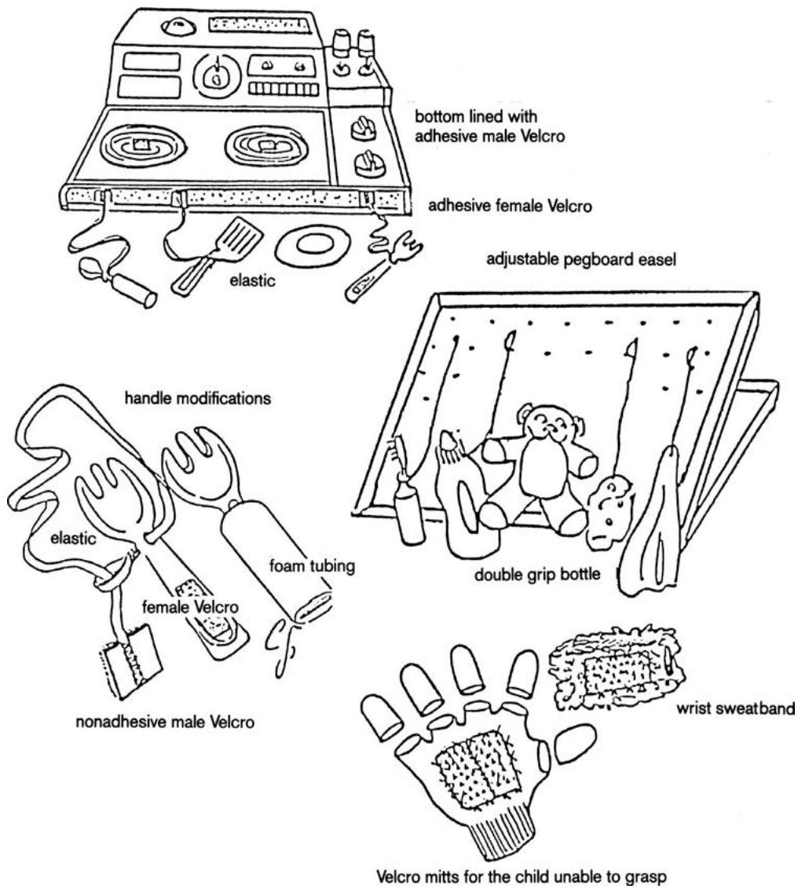

Figure 9.1. Examples of toy adaptations that can be made at home or at school. (From Goossens', C. [1989]. Aided augmentative communication intervention before assessment: A case study of a child with cerebral palsy. Augmentative and Alternative Communication, 5, 17; Copyright © 1989 International Society for Augmentative and Alternative Communication, reprinted by permission of Taylor &amp; Francis Ltd., http://www.tandfonline.com on behalf of International Society for Augmentative and Alternative Communication.)

their participation (Roche, Sigafoos, Lancioni, O'Reilly, &amp; Green, 2015). It is important to integrate the single-switch technology into meaningful activities so that children with cerebral palsy are not left sitting in the corner of a classroom to activate a switch to operate a repetitive, battery-operated toy while the other children are having fun playing house, garage, or dress-up. Table 9.1 summarizes some suggestions for using switches to enhance participation in home and school. Robots may also offer potential for children with cerebral palsy to engage in fun play activities (e.g., Cook, Encarnação, &amp; Adams, 2010; Ferm, Claesson, Ottesjö, &amp; Ericsson, 2015).

AAC Interventions for Individuals with Developmental Disabilities

Table 9.1. Suggestions for using switch technology to enhance participation of preschoolers with complex communication needs

|  Environment | Activity | Participation via switch technology  |
| --- | --- | --- |
|  School | Music | Child activates a switch to sing lines of a song at music time or to sing the cleanup song when it is time to clean up  |
|   |  Snack time | Child uses a switch to operate a toy car or truck that “delivers” the snack of the day to peers at the snack table  |
|   |  Free play time | Child uses a switch to operate a simple computer game with a peer  |
|   |   |  Child controls battery-operated toys to participate in various play centers (e.g., operating the car to knock down the block tower, activating the spinner for a board game)  |
|  Home/school | Playtime | Child activates a switch to operate a toy that provides stimulating and enjoyable feedback (e.g., a light display, music, a mobile)  |
|   |  Pretend play time | Child uses a switch to activate a battery-operated toy blender or toy mixer during pretend play with a kitchen set with siblings or friends  |
|   |   |  Child activates a switch to provide appropriate sound effects for imaginative play activities (e.g., car engine, crashing sound, animal sounds)  |
|   |  Art time | Child uses a switch to operate a Paint ‘N’ Swirl device to make pictures  |
|   |  Story time | Child uses a switch to activate sound effects or a recording of the repeated story line in a book as an adult reads the rest of the story out loud  |
|   |  Cooking | Child activates a switch to operate a blender to make a milkshake, a mixer to make cake batter, or a food processor to make salad  |

Sherazad's story illustrates how use of a switch can help children participate in day-to-day routines and play. Sherazad is a 4-year-old Indo-Canadian girl who lives with her mother, father, and brother. She requires a ventilator as a result of a high spinal cord injury from a fall when she was 2 years old. She cannot speak, and others must provide assistance for all personal care needs. She is learning to use a sip-and-puff switch in the context of daily activities at home and in her preschool. For example, with her switch, she can turn the lights on and off in the classroom; turn music on and off during music time; help to make blender drinks daily during snack time; and play adapted versions of Candy Land, Chutes and Ladders, and other children's games using a battery-operated spinner attached to her switch. Paper templates with colored or numbered sections are fitted under the spinner dial. When she sips on her switch, the spinner spins around, and when she puffs, it stops. Her game partner then moves her token to the color or the number of spaces selected (Canfield &amp; Locke, 1997). She can also play computer games with her friends, operate a battery-operated toy mixer or blender when playing house with peers, contribute a repeated line of a book during story time by activating AAC technology, and operate electric scissors and a hot glue gun to make art projects with a helper during art time. Once Sherazad enters kindergarten, she will use the switch to type letters and words with AAC technology at the same time that her classmates learn to write letters with pencil and paper.

AAC technologies can also serve as a platform to integrate a variety of motivating games and activities. For example, popular children's books can be integrated as visual scene displays (VSDs) into AAC technologies to provide fun interactive activities (Therrien &amp; Light, 2016, 2018); videos or favorite TV shows can be integrated with

AAC supports using video VSDs to support social interaction (e.g. Caron, Laubscher, Light, & McNaughton, 2019; Chapin, McNaughton, Light, McCoy, & Caron, 2018).

It is not just young children who require access to the world. Older individuals also require access to a range of meaningful leisure, social, educational, vocational, and community activities. Providing such access requires careful assessment of the individual's motor capabilities as well as the creativity and ingenuity of the team to adapt activities as required to support participation. In making these adaptations, the team should always focus on the goal of the activity, rather than the specific mechanics of the task. For example, teenagers with cerebral palsy who cannot physically complete lab activities for biology or chemistry class may be able to participate in similar learning experiences using virtual reality technology controlled via alternative access. Or they may be able to use their AAC technologies to provide spoken and video instructions to direct classmates to complete the labs.

For individuals with cerebral palsy who have complex communication needs, providing effective AAC is essential to ensure access to the world. Because of the diverse profiles of needs and skills demonstrated by individuals with cerebral palsy, AAC supports for this population are highly personalized. In fact, a number of research studies have documented the importance of such personalization in AAC intervention (e.g. Balandin & Morgan, 2001; Hetzroni, 2002; Lafontaine & DeRuyter, 1987). One of the most robust research findings is that individuals with cerebral palsy with complex communication needs use multiple modes to communicate (e.g. Light, Collier, & Parnes, 1985). Perhaps Williams, Krezman, and McNaughton (2008) summed it up best when they wrote, “One is never enough” (p. 195). Different messages, contexts, partners, and intents may necessitate different modes of communication. Although speech, gestures, and facial expressions may be severely affected as a result of motor impairment, this does not mean that people with cerebral palsy should be discouraged from using these natural modes for communication (Hustad & Shapley, 2003). Rather, a balanced approach calls for efforts to encourage and support the use of such multimodal systems, including instruction for individuals with cerebral palsy and their communication partners concerning the most effective techniques to use in various situations.

> Nola Millin, a young woman with cerebral palsy, describes how this use of multiple modes has helped her develop a “voice.”
>
> For an AAC user, the development of one's voice poses [a] . . . challenge because AAC devices can be limiting. A symbol or word might not appear on a board. A voice synthesizer might not have the right intonation. All of this can limit or change what is trying to be said. . . . Because I rely on AAC, it has taken me many years to learn how to communicate effectively. I now use a combination of “agencies,” including speech, written words, telecommunications, a word board, and a voice output device. All of these devices allow my “voice” to be heard. (Millin, 1995, p. 3)

### Planning Intervention Across the Life Span

Cerebral palsy is a lifelong disability, and most individuals with cerebral palsy live well into adulthood. Although early intervention and intervention in the school years are important to establish the foundations for participation, it is critical that the AAC team plans ahead and considers intervention across the life span to ensure a high-quality, fulfilling, and meaningful life.

Anthony Arnold, a man with cerebral palsy who relies on AAC, corroborates this based on his personal experience.

> I like to believe my transition to adulthood, independent living and employment started to happen on the day my parents learned of my diagnosis of cerebral palsy—they started taking me to therapies, and a preschool program, and to expand their expectations over time. . . . The longer you put off educational and rehabilitation activities, the less likely it is that you will witness the things that you want. (Arnold, 2007, p. 94)

The point is that long-term planning for adulthood is not an optional activity; although it is essential for most people who use AAC, it is especially so for individuals with cerebral palsy and limited speech. The need for long-term planning for these individuals is compounded by their need to rely on AAC devices and techniques that can accommodate a wide range of interpersonal, academic, and employment demands that are communicative in nature. For example, individuals who attend postsecondary educational institutions need to be able to interact with both instructors and classmates, request accommodations and/or alternative assignments as necessary, direct the activities of personal care attendants, complete assignments, search library resources, send and receive e-mail, and participate in a wide variety of both in-class and after-class instructional activities (Horn & May, 2010). In both paid employment and in many volunteer settings, people must be able to access both work-related and social vocabulary, multitask (i.e. take notes while communicating via voice output, or communicate while driving a power wheelchair), and produce messages both spontaneously and rapidly (McNaughton, Arnold, Sennott, & Serpentine, 2010; McNaughton, Light, & Arnold, 2002). Without advance planning and preparation, AAC systems are not likely to meet all of these demands, and even if they do, people with cerebral palsy are not likely to have the skills required to utilize them. It is essential that AAC teams (including family members) begin to plan for postschool transitions during the school years, starting as early as possible. (See Chapter 13 for more in-depth discussion of transitions.)

One mother describes how an early start to this planning can lay the foundation for a smoother transition into adulthood later on.

> I think that right from the time that a young person is about 12 . . . we need to start thinking about where they're going to be. . . . You need to start having those discussions earlier rather than later because the actual transition is stressful enough but if it's done with some certainty and some natural expectations it's a much easier step to take. (The mother of a young man with cerebral palsy who relies on AAC, in Lund & Light, 2007, pp. 328--329)

## DOWN SYNDROME

Down syndrome is a genetic disorder that results when an individual has a full or partial extra copy of chromosome 21 (National Down Syndrome Society, NDSS, 2019). It is this additional genetic material that causes the characteristics commonly associated with Down syndrome and that alters the developmental process. Down syndrome is the most commonly occurring chromosomal condition, with an incidence of 1 in every 700 babies born in the United States, a total of approximately 6,000 new births each year (CDC, 2018). Down syndrome occurs across all races, ethnicities,

nationalities, and socioeconomic levels (NDSS, 2019). There are three types of Down syndrome:Trisomy 21, which results when there are three rather than two of the number 21 chromosomesTranslocation, which results from rearranged chromosome materialMosaicism, which occurs when the individual has a mixture of cells, some with the typical two 21 chromosomes and some with an extra copy

Trisomy 21 is by far the most frequently occurring type of Down syndrome and accounts for 95% of cases; translocation accounts for approximately 4% of cases; and mosaicism occurs only rarely (1% of cases). The occurrence of Down syndrome increases with the age of the mother. However, because fertility rates are much higher in younger women, the majority (80%) of children with Down syndrome are born to women who are under 35 years of age (NDSS, 2019).

## Characteristics of Individuals with Down Syndrome

Individuals with Down syndrome have a number of common physical characteristics: low muscle tone, an upward slant to their eyes, and a single deep crease across the center of their palm. People who have Down syndrome experience cognitive delays, but these delays are typically mild to moderate. They have numerous strengths and talents and demonstrate the capability to learn a wide range of skills with appropriate instructional supports. Many people with Down syndrome lead positive and productive lives: They attend school, hold down jobs, participate in social activities, volunteer in their communities, vote, participate in decisions that impact their lives, and develop meaningful relationships with others. Ultimately each individual with Down syndrome is unique and may demonstrate a range of needs and skills.

Down syndrome is a lifelong condition; individuals with Down syndrome require services across the life span. They are at increased risk for certain medical conditions, including congenital heart defects, respiratory problems, childhood leukemia, and thyroid conditions (CDC, 2018). Most of these conditions are treatable with appropriate and timely medical care. Life expectancy has increased dramatically so that now people with Down syndrome are expected to live to an average age of 60 (NDSS, 2019). As individuals with Down syndrome reach older age, they are at increased risk for Alzheimer's disease (NDSS, 2019).

Most individuals with Down syndrome face challenges with communication across the life span. The vast majority learn to talk, but they are typically late to do so. Many children with Down syndrome are older before they say their first words; they understand and are motivated to communicate well before they are able to talk (NDSS, 2019). Often speech development is delayed, in part, due to anatomical differences. Even when speech develops, it may be difficult to understand, especially for unfamiliar communication partners (Wild, Vorperian, Kent, Austin, & Reinicke, 2015). In general, speech intelligibility improves with age, but there is significant variability across individuals.

Most children with Down syndrome also experience frequent ear infections due to anatomical differences in their ears (narrow and short canals; NDSS, 2019). Fluid accumulates behind the ear drum as a result, a condition known as otitis media (NDSS, 2019). The fluid makes it more difficult for the children to hear. This fluctuating conductive hearing loss negatively impacts speech and language development.

Individuals with Down syndrome typically understand more than they are able to express. They tend to demonstrate relative strengths in vocabulary (semantics) and pragmatics (the social aspects of language), with greater difficulty in syntax and morphology (NDSS, 2019). As a general rule, individuals with Down syndrome tend to use shorter sentences to communicate.

For more information on individuals with Down syndrome and AAC intervention across the life span, readers are referred to an excellent book edited by Krista Wilkinson and Lizbeth Finestack (in press), that is part of the AAC Series published by Brookes Publishing Co.

## Key Considerations for AAC Intervention

There are several specific issues to consider when working with individuals with Down syndrome: providing early intervention, setting appropriate expectations, and providing AAC supports across the life span to meet changing needs.

### Providing Early Intervention

Because individuals with Down syndrome present with unique physical characteristics, they are typically diagnosed early in infancy, often at birth (or even before birth with prenatal testing). Furthermore, diagnosis can be confirmed through genetic testing. This early identification and diagnosis present an excellent opportunity for early intervention. Because the processes of communication and language development begin at birth, it is important to intervene with infants with Down syndrome and their families as early as possible. Doing so will maximize opportunities for communication and language development and circumvent the problems that occur when infants with Down syndrome have few opportunities for communication. Families play a highly significant role in the lives of children with Down syndrome. It is important that early intervention involves family-centered services whereby practitioners develop a partnership with families and work collaboratively to solve problems and make decisions (Mandak, O'Neill, Light, & Fosco, 2017; see Chapter 4).

As noted earlier, often children with Down syndrome do not produce their first spoken words until they are older than their peers. Given their lack of spoken words, it is easy for communication partners to underestimate their capabilities. Partners may have limited expectations for infants and toddlers with Down syndrome to communicate, and, as a result, they may provide few opportunities for them to do so, unintentionally limiting their language learning. However, when provided with appropriate AAC supports, infants and toddlers with Down syndrome are able to be active participants in communicative interactions; they are able to acquire a wide range of language concepts and use them appropriately in interactions.

Genevieve's story illustrates the benefits of introducing AAC supports early. Genevieve was 10 months old when she was introduced to signs and AAC technology with VSDs of meaningful activities within her life. The VSDs were programmed with hotspots that she could select to retrieve speech output of concepts of interest to her (e.g. familiar people and activities in her life, animal concepts, social words, and so on). At 10 months, she communicated her first word spontaneously with AAC—duck. She learned to touch the hotspot of the duck's head to retrieve the speech output, duck, along with the sound effect of the duck quacking. And she also produced an approximation of the sign for duck. At 10 months of age, she acquired her first word, well before many infants with typical development—because of the support of unaided and aided AAC! (See the Penn

State web site on Early Intervention for Young Children with Autism, Cerebral Palsy, Down Syndrome, and Other Disabilities, for a video of Genevieve and her family as she learns her first word.)

Longitudinal research suggests that initially infants with Down syndrome (who have access to AAC) rely on AAC technology to express themselves, no doubt because the motor and cognitive demands are less than for other modalities (e.g. signs, speech; Light & Drager, 2012). Visual scene displays (VSDs) of meaningful daily activities in AAC technologies provide substantial contextual and visual supports for learning new concepts/words; the children only need to touch the hotspot in the VSD with their hand to activate the speech output. Later, as the children mature and develop greater motor control, they are able to use an isolated finger or thumb to select a greater number of hotspots with greater precision; they also begin to rely on signs/sign approximations as well as aided AAC to express themselves. It is not until later that they develop sufficient oral motor control to produce spoken words. Once speech becomes a viable means of communication, young children with Down syndrome rely more and more on this mode, using signs or AAC technology to clarify when they are not understood (Light & Drager, 2012). Thus, AAC bolsters language and communication development for infants and toddlers with Down syndrome and poses no risk to their speech development.

### Setting Appropriate Expectations

Too often, individuals with Down syndrome experience low expectations in society. Because of misinformation and/or negative attitudes, many people (e.g. teachers, employers, co-workers, businesses) may not recognize the significant potential of individuals with Down syndrome. The low expectations of others may limit their opportunities for learning, thus compounding the effect of their disability. It is important to eliminate these opportunity barriers by setting appropriately high expectations for individuals with Down syndrome and ensuring that they have the supports required (including AAC) to learn.

Doing so can have a powerful impact, as was the case for Jackson during the period leading up to his entrance into kindergarten. Jackson was 4 years old when he started adapted literacy instruction. By the time he was 5 years old and ready to start kindergarten, he was able to read simple books independently. As he prepared for the transition to school, we encouraged the school team to assess his reading skills prior to determining his class placement. The school team responded, “But he has Down syndrome.” We responded, “We know he does. But he can read.” Jackson entered kindergarten with literacy skills that surpassed many of his typical peers. He challenged society's preconceived ideas and low expectations for individuals with Down syndrome. (Visit the Penn State web site on Literacy Instruction for Individuals with Autism, Cerebral Palsy, Down Syndrome, and Other Disabilities for more information.)

### Providing AAC Supports to Meet Changing Needs

Too often, service providers erroneously believe that individuals with Down syndrome do not need AAC because they will eventually learn to talk. However, given the communication challenges faced by these individuals, they actually benefit from AAC across their life span. The role of AAC will change in their lives as their needs and skills change over time. As noted earlier, infants and toddlers require access to AAC to jump-start their communication and

language learning; early on they rely heavily on AAC for expression. Once they start to talk, they increasingly rely on speech and continue to do so through their school years into adolescence and adulthood. Often their familiar partners (e.g. family members) understand much of what they say. However, as individuals with Down syndrome grow up, participate in education, secure jobs, volunteer in their communities, manage their own health care, and complete activities of daily living (e.g. grocery shopping), they encounter a greater range of communication partners, many of whom are unfamiliar and may have difficulty understanding their speech. To participate successfully in interactions with unfamiliar partners, they require AAC. In some cases, where their communication must be precise or the message is complex (e.g. at the doctor's office, at a job interview), they may rely on AAC as a primary means of communication to carry the main message and use their speech to convey shorter, less-complex messages (e.g. greetings). In other cases, they may rely on speech as a primary means of communication but use AAC to establish the context or the topic to support their partner's understanding or to clarify specific words/vocabulary. If individuals with Down syndrome are literate, they may be able to text key words or phrases to communication partners when they are not understood. They may also benefit from topic supplementation techniques where they alert their communication partner to the topic prior to talking, thereby increasing the intelligibility of their speech by providing a context to support understanding (Hanson, Beukelman, & Yorkston, 2013).

Joe was able to use AAC in this way to communicate more easily with his peers at college. When we first met Joe, he was in his early 20s. He had Down syndrome and was attending a program for students with disabilities at the university. He attended classes regularly and also worked on campus in food service. He was very social and enjoyed interacting with the other college students. He was a big fan of the Philadelphia Eagles and liked to talk about their NFL games. However, the other students found it very difficult to understand his speech. He was introduced to AAC technology with a video VSD application that allowed him to record his experiences or download his favorite videos (e.g. Eagles highlights). He could pause the video at any point and a partner could help him to create hotspots and record messages to support his communication. Joe quickly learned to use the AAC technology to interact with the other college students. The videos provided a shared context for the interaction. Joe used his natural speech as well as the words and phrases programmed into the AAC app to support his communication. His partners found it much easier to understand his speech and his interactions lasted much longer as a result.

Beyond providing ways to clarify natural speech, AAC technologies that provide video modeling and support communication may also help individuals with Down syndrome to learn to participate and fulfill their communication opportunities within a wide range of vocational and community activities (Babb, McNaughton, Light, Wydner, & Pierce, 2018; Light, McNaughton, & Caron, 2019). These AAC technologies may be especially important to support the transition of individuals with Down syndrome to adult life (see Chapter 13 for further discussion).

As individuals with Down syndrome age, they are at risk for Alzheimer's disease. In this case, they may benefit from AAC (e.g. memory books, VSDs) to support their comprehension and their expression (see Chapter 16 for further discussion of AAC for individuals with degenerative cognitive and linguistic disorders, including Alzheimer's).

Key Considerations in AAC Intervention for People with Developmental Disabilities 303

# INTELLECTUAL AND DEVELOPMENTAL DISABILITY

Besides individuals with Down syndrome, there are many others who experience intellectual and developmental disabilities (IDDs) who also require AAC. According to the American Association on Intellectual and Developmental Disabilities (AAIDD), intellectual disability is characterized by “significant limitations in both intellectual functioning and in adaptive behavior which covers many everyday social and practical skills” (AAIDD, 2019). Intellectual functioning refers to learning, reasoning, and problem-solving skills. Adaptive behavior is a collection of skills that people learn and perform in their daily lives: conceptual (e.g., literacy skills, money concepts), social (e.g., interpersonal skills, social responsibility), and practical skills (e.g., activities of daily living, health care, transportation—AAIDD, 2019). IDD originates during the developmental period, prior to the age of 18. With appropriate supports, individuals with IDD can live, work, learn, and actively participate in community environments typical of their same-age peers. Their functioning is significantly impacted by the environmental supports that are available and may be negatively affected by environmental barriers that limit opportunities and learning. The degree of support needed, and the specific types of support needed, vary; resources such as the Supports Intensity Scale can be used to assess needs and plan intervention.

Precise determination of the incidence and prevalence of IDD is complicated due to differences in operational definitions. However, several meta-analyses have concluded that the prevalence across the life span ranges from 0.22% to 1.83% worldwide (Maulik, Mascarenhas, Mathers, Dua, &amp; Saxena, 2011; McKenzie, Milton, Smith, &amp; Ouellette-Kuntz, 2016), with higher rates in low-resource countries because of the higher incidence of early childhood brain infections, injuries, and anoxia at birth. Additional causes of IDD include genetic conditions (e.g., Down syndrome, fragile X syndrome); problems during pregnancy (e.g., fetal alcohol syndrome); health problems such as whooping cough, measles, or meningitis; and exposure to environmental toxins such as lead or mercury. In the majority of cases, the cause of the IDD is unknown. Given the diversity of causes, the group of individuals with IDD is a heterogeneous one.

The Supports Intensity Scale–Adult Version (SIS-A; Thompson et al., 2015) is used to evaluate an individual’s support needs across seven life domains (home living, community living, lifelong learning, employment, health and safety, social, and protection and advocacy) as well as to identify exceptional medical and behavioral support needs. The results can be used to plan and implement individualized supports in relevant areas. (Visit the American Association on Intellectual and Developmental Disabilities web site for further information on the Supports Intensity Scale.)

# Characteristics of Individuals with Intellectual and Developmental Disability

Individuals with IDD may also have associated motor, vision, or hearing impairments, resulting in multiple disabilities and adding greater complexity to their needs. Some individuals may have multiple diagnoses (e.g., Down syndrome and ASD), which can further complicate their intervention needs. Typically, individuals with IDD face significant communication challenges due to speech and/or language difficulties. Communication is critical to quality of life and to successful participation in education, employment, family life, health care, and community activities. AAC intervention for individuals with IDD is crucial. The United Nations Convention on Persons with

AAC Interventions for Individuals with Developmental Disabilities

Disabilities (2006) has affirmed that people with disabilities, including IDD, have “the right to freedom of expression and opinion, including the freedom to seek, receive and impart information and ideas on an equal basis with others and through all forms of communication of their choice.” AAC teams can and should deliver communication services to individuals with IDD regardless of the degree of impairment, age, race/ethnicity, or environmental factors (National Joint Committee for the Communication Needs of Persons with Severe Disabilities, 2003a, 2003b).

Many individuals who use AAC have intellectual disabilities, either as a primary diagnosis or in association with another developmental disability such as cerebral palsy or ASD. For example, surveys of speech-language pathologists have found that approximately 34% to 38% of children who require AAC are reported to have intellectual disabilities (Binger &amp; Light, 2006; Kent-Walsh, Stark, &amp; Binger, 2008). Demographic surveys in countries as diverse as New Zealand (Sutherland, Gillon, &amp; Yoder, 2005) and Israel (Weiss, Seligman-Wine, Lebel, Arzi, &amp; Yalon-Chamovitz, 2005) also suggest that children with intellectual disabilities constitute a large proportion of school-age individuals who require AAC supports.

## Key Considerations for AAC Intervention

Across the range of AAC interventions for individuals with IDDs, there are three key considerations: personalizing intervention to meet needs and skills, eliminating opportunity barriers, and addressing challenging behaviors.

**Personalizing Intervention to Meet Needs and Skills** As noted previously, the term intellectual and developmental disability is really an umbrella term that encompasses a large range of syndromes and conditions that result in, among other things, cognitive impairment. Individuals with some of the conditions that fall under this umbrella (e.g., Angelman syndrome, Down syndrome) commonly experience significant problems with spoken communication in addition to cognitive impairments, whereas individuals with other conditions (e.g., Williams syndrome) do not (Dykens, Hodapp, &amp; Finucane, 2000). Given the diversity, the nature of communication interventions will vary considerably among people with intellectual disabilities, depending on the specific disability involved (Wilkinson &amp; Hennig, 2007). The AAC team should be alert to the importance of understanding the overall developmental patterns, strengths, and language, communication, and social-relational characteristics that are typical for individuals with specific intellectual disabilities so that intervention can be staged and implemented with these characteristics in mind (Ogletree, Bruce, Finch, Fahey, &amp; McLean, 2011). Even when individuals with similar intellectual and developmental disabilities demonstrate difficulty with communication, they are not necessarily alike. Each individual presents with a unique constellation of communication needs, skills (e.g., motor, sensory perceptual, cognitive, linguistic), psychosocial factors (e.g., motivation, attitude, confidence, resilience), and environmental supports and barriers. As described in Chapter 2, the AAC team must conduct a careful assessment to design appropriate AAC intervention.

**Eliminating Opportunity Barriers** The greatest challenges confronting individuals with intellectual disabilities are often low expectations and negative social attitudes. Historically, individuals with intellectual disabilities have frequently been excluded from services and isolated from participation in society (National Joint Committee for the Communication Needs of Persons with Severe Disabilities, 2003a, 2003b). Opportunities for meaningful communication only exist when individuals

Key Considerations in AAC Intervention for People with Developmental Disabilities 305

with intellectual disabilities have the chance to interact within home, school, work, and community environments (Mirenda, 2014). The National Joint Committee (NJC) for the Communication Needs of Persons with Severe Disabilities developed the Communication Bill of Rights (Brady et al., 2016). This bill of rights asserts that, each person, regardless of the extent or severity of disability, has fundamental communication rights such as the right to interact socially and develop relationships; to communicate preferences and choices; to express feelings; to participate in interactions with others as full communication partners; to have access to AAC supports and services at all times; and to be treated with dignity and respect (Brady et al., 2016).

Ultimately, as Carter and Draper (2010) suggest, the goal is to eliminate policy, practice, attitude, knowledge, and skill barriers and ensure that there are sufficient supports for participation and meaningful inclusion of individuals who require AAC in all aspects of society. Mirenda (1993) summed up this goal best when she wrote:

I am talking about community living situations that help people become members of, not just residents in, communities. I am talking about programs in which a lot of emphasis is placed on helping people get to know and connect with their neighbors and their local shopkeepers. . . . (M)embership is different than joining or living next door to or affiliating with—you can do all those things on your own. But you have not achieved membership in a group until the group says you have; it is mutual, it is consensual. That is what we want—membership in communities. (p. 6)

Even when individuals with intellectual disabilities receive AAC intervention, the notion persists in many places that intervention should be conducted in highly structured settings to provide repeated drill and practice. Unfortunately, this approach is usually ineffective since it does not build generalization of communication skills to real-world interactions (Schlosser &amp; Lee, 2000). Calculator and Bedrosian noted that, "there is little justification for conducting communication intervention as an isolated activity because communication is neither any more nor less than a tool that facilitates individuals' abilities to function in the various activities of daily living" (1988, p. 104). Ensuring inclusive, natural opportunities for communication must be considered an integral part of any AAC intervention. The availability of such opportunities will also affect the extent to which AAC is used to support truly functional communication that is both motivating and life enhancing for the individual using it. The AAC team should play an active role in advocacy and training to reduce opportunity barriers for individuals with intellectual disabilities and support their active participation in society.

Addressing Challenging Behavior Most people with intellectual disabilities demonstrate socially appropriate behaviors. However, behavior problems do occur in some individuals with IDDs, for reasons that should be quite obvious—a lack of preferred and functional places to go, people to be with, things to do, and ways to communicate. For decades, the primary strategies that were used to manage problem behaviors included institutionalization, medication, and punishment. However the research shows that people with IDDs often use challenging behaviors to communicate in the absence of other effective means to do so (Reichle &amp; Wacker, 2017; Walker &amp; Snell, 2013). As a result, intervention should focus on the proactive use of positive behavior supports to prevent challenging behaviors (e.g., visual schedules to support transitions), as well as strategies for teaching socially appropriate, functional communication skills as alternatives. The research demonstrates the effectiveness of these approaches in reducing challenging behaviors (e.g., McComas, Schieltz, Simacek, Berg, &amp; Wacker, 2019; Reichle &amp; Wacker, 2017; Walker &amp; Snell, 2013). AAC teams that

provide services to individuals with IDDs should have competencies in these interventions to support effective communication and increase positive participation (see Chapter 10). It is also important for AAC teams to respect the autonomy of these individuals and to be thoughtful about the reasons why someone might engage in challenging or problem behaviors.

A Credo for Support emphasizes the importance of self-determination.

Do not try to control me. I have a right to my power as a person. What you call non-compliance or manipulation may actually be the only way I can exert some control over my life. (from Kunc & Van der Klift, 1995)

## AUTISM SPECTRUM DISORDER

According to the American Psychiatric Association's (2013) Diagnostic and Statistical Manual of Mental Disorders, Fifth Edition (DSM-5), ASD is a developmental disability characterized by two key components: 1) deficits in social communication and social interaction; and 2) restricted, repetitive patterns of behavior, interests, or activities. These characteristics are manifested during the developmental period, prior to age 3. ASD encompasses a range of conditions previously diagnosed as autistic disorder, pervasive developmental disorder not otherwise specified (PDD-NOS), and Asperger syndrome (CDC, 2019a). ASD is known as a spectrum disorder because there is significant variation in the type and severity of symptoms that people with ASD experience (National Institute of Mental Health [NIMH], 2018). The DSM-5 introduced a severity scale to determine the extent of supports required by individuals with ASD: Level 1, individuals who require support; Level 2, individuals who require substantial support; and Level 3, individuals who require very substantial support. AAC interventions are required by those individuals with ASD who present with complex communication needs, that is, those who have minimal or limited speech such that it is inadequate to meet their communication needs.

The prevalence of ASD is increasing, with estimates of 1 in 59 children at the time of writing this book (ADDM, 2018). ASD occurs in all racial, ethnic, and socioeconomic groups. Males are four times more likely to be diagnosed with ASD than females. More and more individuals, families, schools, and communities are experiencing the challenges of ASD (Simpson, 2019). The exact causes of ASD are unknown, but research suggests that genes may act together with a range of environmental factors to impact development in ways that lead to ASD (NIMH, 2018). Considerable research is being focused on identifying genetic, neurological, and environmental factors that may cause the syndrome. There is no cure for ASD, but it is well established that focused educational and related interventions from an early age can make a real difference with regard to outcomes (National Research Council Committee on Educational Interventions for Children with Autism, 2001).

### Characteristics of Individuals with Autism Spectrum Disorder

By definition, individuals with ASD experience difficulties with social interaction. A number of social impairments may be apparent early in life. These include a lack of smiles or other positive expressions by 6 months or thereafter; limited back-and-forth sharing of sounds, smiles, or other facial expressions by 9 months or thereafter; no

babbling by 12 months; limited back‐and‐forth gestures, such as pointing, showing, reaching, or waving by 12 months; no spoken words by 16 months; and no meaningful, spontaneous, two‐word phrases by 24 months (Wiseman, 2006).

Author Temple Grandin described her experience as a child with autism as follows.

> As a child, the “people world” was often too stimulating to my senses. Ordinary days with a change in schedule or unexpected events threw me into a frenzy, but Thanksgiving or Christmas was even worse. At those times our home bulged with relatives. The clamor of many voices, the different smells—perfume, cigars, damp wool caps or gloves—people moving around at different speeds, going in different directions, the constant noise and confusion, the constant touching, were overwhelming. . . . This is not unusual for autistic children because they are over‐responsive to some stimuli and under‐sensitive to other stimuli. (Grandin & Scariano, 1986, pp. 24--25)

Many people with ASD have receptive and/or expressive language impairments. Although the expressive deficits are typically more obvious, in fact many people with ASD demonstrate significant challenges understanding spoken language. Their receptive and expressive difficulties often extend across a wide range of domains, including Vocal and speech developmentGestures and other nonverbal forms of communicationVocabulary, syntax, and morphologyPragmaticsSymbolic playLiteracy learningExecutive function (e.g. problem solving, planning)

It is estimated that at least 30% of children with ASD have limited or no speech (Tager‐Flusberg & Kasari, 2013). Even when individuals with ASD develop speech, they may primarily use scripted, repetitive speech (ASHA Practice Portal, Autism, n.d.). Functional language and communication skills are key determinants of educational, vocational, community living, independence, and quality of life outcomes (Tager‐Flusberg, Paul, & Lord, 2005). Without functional communication, individuals with ASD are severely restricted in their participation in society and are at risk for diminished outcomes (Simpson, 2019). AAC intervention is essential to enhance communication and improve outcomes for individuals with ASD and complex communication needs.

Referring to her daughter with autism, Clara Claiborne Park describes the primacy of communication skills for children with ASD.

> As she grew, the problem of her speech took precedence over all the others. It was through speech that she must join the human race. (Park, 1982, p. 198)

Although the diagnosis of ASD is focused on social and communication deficits, people with ASD may also experience difficulties in other domains. More than 30% of individuals with ASD demonstrate intellectual impairments (ADDM, 2018). People

with certain genetic conditions such as Down syndrome, fragile X syndrome, and Rett syndrome are more likely to have ASD than those without these conditions (CDC, 2018). Hearing impairment is more prevalent in individuals with ASD than the general population; it can compound difficulties with language learning (Demopoulis & Lewine, 2016). Individuals with ASD may also be at risk for a range of difficulties with vision and visual processing. Patterns of unusual sensory processing have also been associated with ASD (Simmons et al. 2009). Motor impairment is not considered to be a core component of ASD, but individuals with ASD, especially those with more severe disorders, often demonstrate fine and gross motor difficulties (e.g. Bremer & Cairney, 2018). Many individuals with ASD also have sleep disorders that can disrupt their daily functioning and negatively impact family life (Cohen, Conduit, Lockley, Rajaratnam, & Cornish, 2014). They may have difficulty with emotional and behavior regulation that may be compounded even further by communication deficits (ASHA Practice Portal, Autism, n.d.).

Given the complexity of ASD, it is clear that effective intervention requires the expertise and input of a multidisciplinary team. A number of disciplines have rich traditions of research and practice to enhance outcomes for those with ASD—speech-language pathology, applied behavioral analysis, psychology, psychiatry, occupational therapy, and so on. Unfortunately, these disciplines sometimes operate in isolation in planning intervention to address speech, language, communication, social interaction, behavior, and cognitive issues. Collaboration can be challenging as these disciplines often use different terminology, espouse different theories, and set different priorities. AAC interventionists may need to work with other professionals whose views are quite divergent from their own; this will require considerable skill at negotiation, compromise, and collaboration in the best interest of the individual and family. Each of these disciplines has important expertise to contribute and the most effective interventions will no doubt grow out of multidisciplinary collaborations.

## Key Considerations for AAC Intervention

Overall, it is clear that ASD is a complex and varied disorder. Many individuals with ASD have complex communication needs and require AAC. Three issues deserve specific mention in planning AAC intervention for individuals with ASD: promoting social interaction, providing intervention across the life span, and utilizing effective intervention techniques.

### Promoting Social Communication

As noted earlier, ASD is defined by “deficits in social communication and social interaction” (DSM-5; American Psychiatric Association, 2013). Because ASD profoundly affects the very nature of communication as a social mediator, it is critically important that AAC interventions emphasize skills to build social interactions, not just the expression of needs and wants. Unfortunately, many AAC interventions designed for beginning communicators with ASD

Key Considerations in AAC Intervention for People with Developmental Disabilities
309

focus primarily on teaching requests for preferred objects or activities (also known as mands), to the neglect of goals to promote social interaction and information exchange (e.g., commenting, asking questions). Interventions focused primarily on requesting fail to address the core deficit of ASD, that of social communication and social interaction (Drager, Light, &amp; Finke, 2008). Intervention with individuals with ASD should focus on learning to engage in sustained social interactions. Chapter 10 provides more information on how to build social interaction with beginning communicators with developmental disabilities, and Chapter 11 provides information on how to address more advanced social skills.

If the focus of intervention is building social interaction, it is also important that AAC intervention addresses the pragmatic aspects of communication rather than just aspects related to vocabulary, syntax, and morphology (Duchan, 1987). To quote Rees (1982, p. 310), "morphology plus syntax plus semantics does not equal communication." To learn the pragmatic aspects of communication, intervention should focus on communication skills in the context of naturally occurring routines related to meaningful activities in daily life. Sometimes intervention with individuals with ASD involves repeated trials to provide mass practice. Although individuals may demonstrate the target skills in these isolated instructional contexts, the learning is not functional unless it is generalized to use in meaningful interactions in naturally occurring contexts. The focus of AAC intervention should always be the acquisition of skills to promote social interactions with varied partners in the real world.

## Providing Intervention Across the Life Span

As with other developmental disabilities, research has shown that it is critical to start intervention programs for children with ASD as early as possible to optimize outcomes. Unlike some developmental disabilities such as Down syndrome, children with ASD are not typically diagnosed at birth or even within their first year; in fact, sometimes formal diagnosis is not made until children with ASD are preschoolers (Bolton, Golding, Edmond, &amp; Steer, 2012). However, typically parents express concerns even before the formal diagnosis of ASD is confirmed, often within the first year. In their seminal report, the National Research Council's Committee on Educational Interventions for Children with Autism (2001) strongly recommended that entry into intervention programs should begin as soon as a diagnosis is seriously considered (not necessarily confirmed). Because there is substantial evidence of the positive benefits of AAC in enhancing communication and language development, and there is also evidence that AAC supports speech development (Kasari et al., 2014), AAC intervention should be considered for all infants and toddlers who are at risk for ASD or other developmental disability. Providing AAC intervention early serves to jump-start the development of communication and language skills for these children.

Although early intervention is tremendously important to improve outcomes for individuals with ASD, it is also critical to recognize that ASD is a lifelong disability. The number of adolescents and adults with ASD is growing (Holyfield, Drager, Kremkow, &amp; Light, 2017). Unfortunately, there is currently a significant lack of services for adolescents and adults with ASD, especially those that require AAC. A recent systematic review of research on AAC interventions for adolescents and adults with ASD yielded only 14 published papers involving a total of 19 participants with ASD, including only four participants who were adults (i.e., age 18 or older; Holyfield et al., 2017). Overall these AAC interventions with adolescents and adults with ASD were

AAC Interventions for Individuals with Developmental Disabilities

found to be effective (Holyfield et al., 2017), lending support to the principle that it is never too late to learn. However, almost all of these studies targeted requesting; future research is urgently required to investigate intervention to build social interaction skills with adolescents and adults with ASD as well.

Utilizing Effective Intervention Techniques Given the complexity of challenges faced by individuals with ASD across the life span, it is important that the team utilizes effective intervention techniques to maximize results. The field of ASD is rife with fad interventions that have no evidence to support their effectiveness. Time and effort

There is no single, agreed-upon list of evidence-based practices for individuals with ASD who have complex communication needs (Ganz &amp; Simpson, 2019). However, there are several professional organizations that have conducted systematic reviews of the research to identify interventions supported by research evidence. These organizations include the National Autism Center, the National Professional Development Center on Autism Spectrum Disorder, and the What Works Clearinghouse.

cannot be wasted on such interventions that yield no effects (or negative effects). It is critical that teams provide evidence-based interventions and that they systematically monitor these interventions to ensure their effectiveness with individuals with ASD. There is no single AAC intervention designed to meet the needs and skills of all individuals with ASD. Rather the AAC team should have comprehensive knowledge of the continuum of evidence-based interventions and should select appropriate approaches based on the needs and skills of the individual with ASD, environmental supports and barriers, and targeted outcomes. Generally, intervention approaches for individuals with ASD range on a continuum from highly structured behavioral approaches, such as discrete trial teaching (e.g., Smith, 2001), to incidental teaching, such as enhanced milieu teaching (e.g., Hancock &amp; Kaiser, 2002), to naturalistic developmental behavioral interventions such as JASPER (Joint Attention, Symbolic Play, Engagement, and Regulation; Kasari et al., 2014) and the Early Start Denver Model (Rogers &amp; Dawson, 2010), and so forth (Ganz &amp; Simpson, 2019). Most of these approaches have been adapted to incorporate AAC supports for individuals with ASD and complex communication needs. Ultimately, the National Research Council (2001) stressed the importance of goal-directed, evidence-based, individualized programs that meet the needs of individuals with ASD and their families. (Readers are referred to Ganz and Simpson, 2019, for descriptions of many of these interventions and the supporting evidence.)

# CHILDHOOD APRAXIA OF SPEECH

Childhood apraxia of speech (CAS) is a congenital, neurological speech sound disorder "in which the precision and consistency of movements underlying speech are impaired in the absence of neuromuscular deficits (e.g., abnormal reflexes, abnormal tone)" (American Speech-Language-Hearing Association [ASHA], 2007, pp. 3-4). Childhood apraxia of speech can occur as the result of either a known or an unidentified neurological impairment. In contrast to speech delay, the characteristics of childhood apraxia of speech are likely to persist beyond the developmental period. The prevalence is estimated at 1-2 children per 1,000 (Shriberg, Aram, &amp; Kwiatowski, 1997), although no sound epidemiological data are available (ASHA, 2007). It occurs more frequently in boys than girls. Individuals with suspected childhood apraxia of

Key Considerations in AAC Intervention for People with Developmental Disabilities 311

speech often come from families with a history of speech and/or language problems (Lewis, Freebairn, Hansen, Iyengar, &amp; Taylor, 2004), and there appears to be a genetic basis for the disorder, at least in some cases (Shriberg et al., 2006).

## Characteristics of Individuals with Childhood Apraxia of Speech

Currently there are no validated diagnostic features that differentiate childhood apraxia of speech from other speech sound disorders in children (ASHA Practice Portal, Childhood Apraxia of Speech, n.d.). However, there is generally consensus regarding the following characteristics: 1) inconsistent errors on consonants and vowels in repeated productions of syllables or words; 2) lengthened and disrupted coarticulatory transitions between sounds and syllables; and 3) inappropriate prosody, especially in the realization of lexical or phrasal stress (ASHA, 2007). However, it is important to note that the frequency of these characteristics may vary depending on the child (e.g., age), the severity of the disorder, and the complexity of the task (Lewis et al., 2004). In general, children diagnosed with childhood apraxia of speech demonstrate difficulties with the planning and programming movement required for speech (see Iuzzini-Seigel &amp; Murray, 2017, and Strand, 2017, for discussion of characteristics that distinguish childhood apraxia of speech from other speech sound disorders). Childhood apraxia of speech results in reduced intelligibility (i.e., the degree to which the listener understands the individual's speech) and reduced comprehensibility (i.e., the degree to which the listener understands the individual's speech within a communicative context; Yorkston, Strand, &amp; Kennedy, 1996). Children with suspected childhood apraxia of speech may also demonstrate co-occurring difficulties in any or all of the following: expressive language, literacy learning, gross and fine motor behaviors, and feeding.

A series of brief letters to parents of children with suspected childhood apraxia of speech was published in the April 2000 issue of Language, Speech, and Hearing Services in Schools. In plain language, the letters explain the speech characteristics, nature, and causes, as well as associated problems and intervention approaches (Hall, 2000a, 2000b, 2000c, 2000d).

## Key Considerations for AAC Intervention

The key issue related to AAC intervention for children with childhood apraxia of speech relates to determining when and how to integrate AAC into intervention. Because childhood apraxia of speech is primarily a motor speech disorder, AAC is typically used as a secondary intervention in conjunction with intervention that focuses on improving natural speech production (ASHA, 2007). Intensive and individualized intervention is typically recommended to address the speech production difficulties by providing repetitive practice in planning, programming, and production (e.g., Maas, Gildersleeve-Neumann, Jakielski, &amp; Stoeckel, 2014; Namasivayam et al., 2015). Some of these interventions focus primarily on motor planning, whereas others focus on childhood apraxia of speech as a language learning disorder and teach children how to make speech sounds within the language system. (See the ASHA Practice Portal, Childhood Apraxia of Speech, n.d., for further discussion of intervention approaches and the research evidence to support these approaches). When speech is inadequate to meet communication needs, AAC should be provided

to support functional communication and language development while at the same time enhancing speech production (Bornman, Alant, & Meiring, 2001; Cumley & Swanson, 1999; Yorkston, Beukelman, Strand, & Hakel, 2010).

One of the major concerns voiced by parents of children with suspected childhood apraxia of speech is whether the provision of AAC will inhibit speech development. A number of case studies of children with suspected childhood apraxia of speech offer evidence to alleviate this concern. Introduction of AAC does not inhibit speech development with children with other developmental disabilities (e.g. Kasari et al. 2014; Millar, Light, & Schlosser, 2006; Romski et al. 2010) and this seems to hold true for children with childhood apraxia of speech as well (e.g. Blischak, 1999; Cumley, 1997; Cumley & Swanson, 1999; Waller et al. 2001).

AAC intervention may be especially important to stimulate language development because children with childhood apraxia of speech may not be able to practice language skills orally (Cumley & Swanson, 1999; Murray, McCabe, & Ballard, 2014). Several studies and case reports have shown that children with suspected childhood apraxia of speech increase the complexity of their messages when using AAC compared to speech alone (e.g. Binger, Kent-Walsh, Berens, del Campo, & Rivera, 2008; Cumley & Swanson, 1999; Lüke, 2016). Oommen and McCarthy (2015) conducted a focus group with speech-language pathologists who described a number of important benefits derived from the integration of AAC and natural speech interventions, including improvements in communication as AAC strategies complement natural speech skills, access to language and prevention of further language delays, improved technology use, and reduction of stress and negative behaviors. Given the potentially long road before children with childhood apraxia of speech achieve effective use of speech for functional communication, AAC should be considered early (King, Hengst, & DeThorne, 2013), especially for children with severe impairment (Hall, 2000a, 2000b, 2000c, 2000d).

One mother describes how early introduction to AAC benefited her son.

> I am eternally grateful that M could get the [AAC technology] one year before entering grade one, although I wish it was one year earlier. I would like to recommend that children start with [AAC technology] from at least the age of three years. The earlier they experience themselves as speakers, the better. (the mother of M, a 6.5-year-old Afrikaans-speaking boy with suspected childhood apraxia of speech, in Bornman et al. 2001, p. 631)

Speech language pathologists report that they make intervention decisions about the relative balance between natural speech and AAC based on a number of factors, including ones related to: 1) the child (e.g. age, severity, motivation); 2) input from the team (e.g. preferences, involvement of parents); 3) prognosis (e.g. observed progress); and 4) mode preferences (Oommen & McCarthy, 2015). Ball and Stading (2006) proposed a number of applications of AAC with children with childhood apraxia of speech including

1. AAC intervention where unaided and/or aided AAC is provided to support communication and language learning for those with severe speech impairments
2. AAC for speech supplementation where, for example, individuals use alphabet supplementation (i.e. point to the first letter of each word on an alphabet display as they speak) or topic supplementation (i.e. point to a photo or picture to establish the topic before speaking)

Key Considerations in AAC Intervention for People with Developmental Disabilities 313

3. AAC to repair communication breakdowns where individuals rely primarily on natural speech to communicate but use AAC (e.g., gestures, manual signs, pantomime, environmental cues, AAC technologies) when their speech is not understood by communication partners

4. AAC to support literacy learning where individuals use AAC to support acquisition of the letter–sound correspondences, phonological awareness skills, decoding skills, and encoding (writing) skills that form the foundation for literacy (see Chapter 12)

5. AAC to practice speech production, where individuals use AAC technologies with speech output (e.g., digital images or videos with recorded speech output as models of target words or phrases) to practice their natural speech without requiring direct parent or therapist involvement (Ball, 2008; Nordness &amp; Beukelman, 2010).

Trina, mother of a son with childhood apraxia, describes the difference that intervention made.

I just wanted to let everyone know that my son Samuel, 10 years old, just gave his first ever oral report in school. It was on the planet Mercury, and he had a wonderful model and used cards for guidance, but didn't read word-for-word off the cards. I wish I had been there! I can tell he was very proud of himself and was waiting for people to come by at the planet fair and ask him questions. . . . By contrast, last year in third grade his oral biography project was taped sentence-by-sentence at home, and then he played the tape to the class, and gave the oral report just to the speech therapist. What a difference in a year! . . . With more time and confidence, I now feel that he may not automatically present as someone with a speech disorder the rest of his life. (Trina, Samuel's mother, in the Apraxia-Kids Monthly newsletter [“Trina,” 2004, p. 5])

## CONCLUSIONS

It is simply not possible to provide an overview of all possible developmental disabilities; we have focused on some of the developmental disabilities that occur frequently and are also likely to involve significant communication difficulties that require AAC: cerebral palsy, Down syndrome, IDD, ASD, and childhood apraxia of speech. This chapter has highlighted the characteristics of these developmental disabilities and also some general issues related to AAC assessment and intervention. The issues raised are intended as reminders. It is important to remember that there is significant variation within each of these population groups. No two individuals are identical. Therefore, AAC assessment and intervention must be conducted on an individual basis to determine the needs and skills of each person and family to maximize effectiveness.

Of course there are also individuals with developmental disabilities other than the ones discussed in this chapter who benefit from AAC, such as individuals with Angelman syndrome (e.g., Calculator, 2014, 2016), Rett syndrome (e.g., Byiers, Dimian, &amp; Symmons, 2014; Vessoyan et al., 2018), deafblindness (Sigafoos et al., 2008), fragile X syndrome (e.g., Brady, Skinner, Roberts, &amp; Hennon, 2006), and various other genetic disorders (Braddock et al., 2012). The AAC interventions described in the rest of this

AAC Interventions for Individuals with Developmental Disabilities

section (Chapters 10–13) are applicable to individuals with a wide range of developmental disabilities, not just those described in this chapter. AAC intervention should be considered for any individual whose speech and writing/typing are inadequate to meet communication needs. Research has clearly established that AAC intervention enhances communication and language development, and that it reduces frustration and challenging behaviors. Furthermore, it is well established that these benefits are realized at no risk to speech development. In fact, AAC interventions support increased use of natural speech. Therefore, AAC intervention should also be considered for any infant or toddler who is at risk for delayed speech development as well as school-aged children, adolescents, and adults diagnosed with developmental disabilities and complex communication needs (Light &amp; McNaughton, 2012).

## QUESTIONS

9.1. Describe the communication challenges faced by individuals with cerebral palsy.
9.2. Describe three key considerations in delivering AAC services to people with cerebral palsy.
9.3. How might AAC interventions vary across the life span to benefit individuals with Down syndrome?
9.4. How is intellectual and developmental disability currently defined and evaluated?
9.5. Describe three key considerations in delivering AAC services to people with intellectual and developmental disabilities.
9.6. What are the key characteristics of autism spectrum disorder? How do these affect the provision of AAC services and supports?
9.7. How is suspected childhood apraxia of speech defined?
9.8. How might AAC be integrated with natural speech in interventions for children with childhood apraxia of speech? What factors impact the relative balance between AAC and natural speech intervention?

## REFERENCES

American Association on Intellectual and Developmental Disabilities. (2019). *Definition of intellectual disability*. Retrieved from https://aaidd.org/intellectual-disability/definition
American Psychiatric Association. (2013). *Diagnostic and statistical manual of mental disorders* (DSM-V; 5th ed.). Washington, DC: Author.
American Speech-Language-Hearing Association. (2007). *Childhood apraxia of speech* [Technical report]. Retrieved from http://www.asha.org/policy
American Speech-Language-Hearing Association (ASHA) Practice Portal, Autism. (n.d.). Retrieved from https://www.asha.org/Practice-Portal/Clinical-Topics/Autism

American Speech-Language-Hearing Association (ASHA) Practice Portal, Childhood Apraxia of Speech. (n.d.). Retrieved from https://www.asha.org/Practice-Portal/Clinical-Topics/Childhood-Apraxia-of-Speech
Arnold, A. (2007). Living at home and my thoughts for the future. In R. V. Conti &amp; T. J. McGrath (Eds.), *Proceedings of the Eleventh Biennial Pittsburgh Employment Conference for Augmented Communicators* (pp. 94–96). Pittsburgh, PA: Shout Press.
Autism and Developmental Disabilities Monitoring Network (ADDM). (2018). Retrieved from https://www.cdc.gov/ncbddd/autism/materials/addm-factsheet.html
Autism and Developmental Disabilities Monitoring (ADDM) CP Network (2013).

Key Considerations in AAC Intervention for People with Developmental Disabilities
315

Community report. Washington, D.C.: Centers for Disease Control and Prevention. Retrieved from https://www.cdc.gov/ncbddd/cp/documents/CP-ASD_Community-Report_v10.pdf

Babb, S., McNaughton, D., Light, J., Wydner, K., &amp; Pierce, L. (2018, November). Enriching communication within vocational tasks for adolescents with CCN using AAC video visual scene displays. Poster at the American Speech-Language-Hearing Association (ASHA) Conference, Boston, MA.

Balandin, S., &amp; Morgan, J. (2001). Preparing for the future: Aging and augmentative and alternative communication. *Augmentative and Alternative Communication*, 17, 99–108. doi:10.1080/aac.17.2.99.108

Ball, L. (2008). Childhood apraxia of speech: Augmentative and alternative communication strategies. In J. Wambaugh, N. Alarcon, L. Shuster, &amp; L. Ball. Traditional and AAC approaches for apraxia of speech in adults and children. Miniseminar presented at the American Speech-Language-Hearing Association annual conference, Chicago, IL.

Ball, L. J., &amp; Stading, K. L. (2006, November). Functional communication strategies for children with apraxia of speech. Seminar presentation at the annual convention of the American Speech-Language-Hearing Association, Miami, FL.

Beukelman, D. R. (1987). When you have a hammer, everything looks like a nail. *Augmentative and Alternative Communication*, 3, 94–95.

Binger, C., &amp; Light, J. (2006). Demographics of preschoolers who require AAC. *Language, Speech, and Hearing Services in Schools*, 37, 200–208. doi:10.1044/0161-1461(2006/022)

Binger, C., Kent-Walsh, J., Berens, J., del Campo, S., &amp; Rivera, D. (2008). Teaching Latino parents to support the multi-symbol message productions of their children who require AAC. *Augmentative and Alternative Communication*, 24, 323–338. doi:10.1080/07434610802130978

Blischak, D. M. (1999). Increases in natural speech production following experience with synthetic speech. *Journal of Special Education Technology*, 14, 44–53.

Bolton, P. F., Golding, J., Edmond, A., &amp; Steer, C. D. (2012). Autism spectrum disorder and autistic traits in the Avon Longitudinal Study of Parents and Children: Precursors and early signs. *Journal of the American Academy of Child and Adolescent Psychiatry*, 51, 249–260.

Bornman, J., Alant, E., &amp; Meiring, E. (2001). The use of a digital voice output device to facilitate language development in a child with developmental apraxia of speech: A case study. *Disability and Rehabilitation*, 23, 623–634. doi:10.1080/09638280110036517

Braddock, B., McDaniel, J., Spragge, S., Loncke, F., Braddock, S., &amp; Carey, J. (2012). Communication ability in persons with trisomy 18 and trisomy 13. *Augmentative and Alternative Communication*, 28, 266–277. doi: 10.3109/07434618.2012.706637

Brady, N. C., Bruce, S., Goldman, A., Erickson, K., Mineo, B., Ogletree, B. T., . . . Wilkinson, K. (2016). Communication services and supports for individuals with severe disabilities: Guidance for assessment and intervention. *American Journal on Intellectual and Developmental Disabilities*, 121, 121–138. doi:10.1352/1944-7558-121.2.121

Brady, N., Skinner, D., Roberts, J., &amp; Hennon, E. (2006). Communication in young children with fragile X syndrome: A qualitative study of mothers' perspectives. *American Journal of Speech Language Pathology*, 15, 353–364. doi:10.1044/1058-0360(2006/033)

Bremer, E., &amp; Cairney, J. (2018). The interrelationship between motor coordination and adaptive behavior in children with autism spectrum disorder. *Frontiers in Psychology*, 9, 2350

Brodin, J. (1991). Att tolka barns signaler. Gravt utvecklingsstörda flerhandikappade barns lek och kommunikation [To interpret children's signals: Play and communication in profoundly mentally retarded and multiply handicapped children] (Doctoral dissertation). Stockholm University, Department of Education.

Byiers, B., Dimian, J., &amp; Symons, F. (2014). Functional communication training in Rett syndrome: A preliminary study. *American Journal on Intellectual and Developmental Disabilities*, 119, 340–350. doi:10.1352/1944-7558-119.4.340

Calculator, S. (2014). Parents' perceptions of communication patterns and effectiveness of use of augmentative and alternative communication systems by their children with Angelman syndrome. *American Journal of Speech-Language Pathology*, 23, 562–573. doi: 10.1044/2014_AJSLP-13-0140

Calculator, S. (2016). Description and evaluation of a home-based, parent-administered program for teaching enhanced natural gestures to individuals with Angelman syndrome. *American Journal of Speech-Language Pathology*, 25, 1–13. doi:10.1044/2015_AJSLP-15-0017

Calculator, S., &amp; Bedrosian, J. (1988). Communication assessment and intervention for adults with mental retardation. San Diego, CA: College-Hill Press.

AAC Interventions for Individuals with Developmental Disabilities

Canfield, H., &amp; Locke, P. (1997). A book of possibilities: Activities using simple technology. Minneapolis, MN: AbleNet.

Caron, J., Laubscher, E., Light, J., &amp; McNaughton, D. (2019). Effect of video VSDs on communicative turns of individuals with autism spectrum disorder and complex communication needs. Manuscript submitted for publication.

Carter, E. W., &amp; Draper, J. (2010). Making school matter: Supporting meaningful secondary experiences for adolescents who use AAC. In D. McNaughton, &amp; D. R. Beukelman (Eds.), Transition strategies for adolescents and young adults who use augmentative and alternative communication (pp. 69–90). Baltimore, MD: Paul H. Brookes Publishing Co.

Centers for Disease Control and Prevention (CDC). (2018). Facts about Down syndrome. Retrieved from https://www.cdc.gov/ncbddd/birthdefects/DownSyndrome.html

Centers for Disease Control and Prevention (CDC). (2019a). Autism spectrum disorder. Retrieved from https://www.cdc.gov/ncbddd/autism/index.html

Centers for Disease Control and Prevention (CDC). (2019b). Cerebral palsy. Retrieved from https://www.cdc.gov/ncbddd/cp

Chapin, S. E., McNaughton, D., Light, J., McCoy, A., &amp; Caron, J. (2018, July). Effects of video visual scene display technology on the symbolic communicative turns taken by preschoolers with ASD during a shared activity. Paper presented at the Annual Conference of the Rehabilitation Engineering and Assistive Technology Society of North America, Arlington, VA. Retrieved from https://www.resna.org/sites/default/files/conference/2018/Chapin%20et%20al%20%282018%29%20vVSD%20-%20RESNA.pdf

Cohen, S., Conduit, R., Lockley, S. W., Rajaratnam, S. M., &amp; Cornish, K. M. (2014). The relationship between sleep and behavior in autism spectrum disorder (ASD): A review. Journal of Neurodevelopmental Disorders, 6, 44. doi:10.1186/1866-1955-6-44

Cook, A., Encarnação, P., &amp; Adams, K. (2010). Robots: Assistive technologies for play, learning, and cognitive development. Technology and Disability, 22, 127–145. doi:10.3233/TAD-2010-0297

Cumley, G. (1997). Introduction of augmentative and alternative modality: Effects on the quality and quantity of communication interactions of children with severe phonological disorders (Unpublished doctoral dissertation). University of Nebraska–Lincoln.

Cumley, G., &amp; Swanson, S. (1999). Augmentative and alternative communication options for children with developmental apraxia of speech: Three case studies. *Augmentative and Alternative Communication*, 15, 110–125. doi:10.1080/07434619912331278615

Demopoulos, C., &amp; Lewine, J. D. (2016). Audiometric profiles in autism spectrum disorders: Does subclinical hearing loss impact communication? *Autism Research*, 9, 107–120. doi:10.1002/aur.1495

Diamanti, T. (2000). Get to know me. In M. Williams &amp; C. Krezman (Eds.), *Beneath the surface: Creative expressions of augmented communicators* (pp. 98–99). Toronto, Canada: ISAAC Press.

Drager, K., Light, J., &amp; Finke, E. (2008). Using AAC technologies to build social interaction with young children with autism spectrum disorders. In P. Mirenda &amp; T. Iacono (Eds.), *Autism spectrum disorders and AAC* (pp. 247–278). Baltimore, MD: Paul H. Brookes Publishing Co.

Duchan, J. (1987). Perspectives for understanding children with communicative disorders. In P. Knoblock (Ed.), *Understanding exceptional children and youth* (pp. 163–199). Boston, MA: Little, Brown.

Dykens, E. M., Hodapp, R. M., &amp; Finucane, B. M. (2000). Genetics and mental retardation syndromes: A new look at behavior and interventions. Baltimore, MD: Paul H. Brookes Publishing Co.

Ferm, U. M., Claesson, B. K., Ottesjö, C., &amp; Ericsson, S. (2015). Participation and enjoyment in play with a robot between children with cerebral palsy who use AAC and their peers. *Augmentative and Alternative Communication*, 31, 108–123. doi:10.3109/07434618.2015.1029141

Ganz, J. B., &amp; Simpson, R. L. (Eds.). (2019). Interventions for individuals with autism spectrum disorder and complex communication needs. Baltimore, MD: Paul H. Brooks Publishing Co.

Goossens, C. (1989). Aided augmentative communication intervention before assessment: A case study of a child with cerebral palsy. *Augmentative and Alternative Communication*, 5, 14–26.

Grandin, T., &amp; Scariano, M. (1986). Emergence: Labeled autistic. Novato, CA: Arena Press.

Hall, P. (2000a). A letter to the parent(s) of a child with developmental apraxia of speech. Part 1: Speech characteristics of the disorder. *Language, Speech, and Hearing Services in Schools*, 31, 169–172.

Hall, P. (2000b). A letter to the parent(s) of a child with developmental apraxia of

Key Considerations in AAC Intervention for People with Developmental Disabilities 317

speech. Part 2: The nature and causes of DAS. Language, Speech, and Hearing Services in Schools, 31, 173–175.

Hall, P. (2000c). A letter to the parent(s) of a child with developmental apraxia of speech. Part 3: Other problems often associated with DAS. Language, Speech, and Hearing Services in Schools, 31, 176–178.

Hall, P. (2000d). A letter to the parent(s) of a child with developmental apraxia of speech. Part 4: Treatment of DAS. Language, Speech, and Hearing Services in Schools, 31, 179–181.

Hancock, T. B., &amp; Kaiser, A. P. (2002). The effects of trainer-implemented enhanced milieu teaching on the social communication of children with autism. Topics in Early Childhood Special Education, 22, 39–54. doi:10.1177/027112140202200104

Hanson, E. K., Beukelman, D. R., &amp; Yorkston, K. M. (2013). Communication support through multimodal supplementation: A scoping review. *Augmentative and Alternative Communication*, 29, 310–321. doi:10.3109/07434618.2013.848934

Hetzroni, O. (2002). Augmentative and alternative communication in Israel: Results from a family survey. *Augmentative and Alternative Communication*, 18, 255–266. doi:10.1080/07434610212331281341

Holyfield, C., Drager, K., Kremkow, J. M. D., &amp; Light, J. (2017). Systematic review of AAC intervention research for adolescents and adults with autism spectrum disorder. *Augmentative and Alternative Communication*, 33, 201–212. doi:10.1080/07434618.2017.1370495

Horn, C., &amp; May, R. J. (2010). Post-high school transition supports and programs in post-secondary education for young adults who use AAC. In D. B. McNaughton &amp; D. R. Beukelman (Eds.), *Transition strategies for adolescents and young adults who use AAC* (pp. 93–110). Baltimore, MD: Paul H. Brookes Publishing Co.

Hustad, K. C., Groton, K., &amp; Lee, J. (2010). Classification of speech and language profiles in 4-year-old children with cerebral palsy: A prospective preliminary study. *Journal of Speech, Language, and Hearing Research*, 53, 1496–1513.

Hustad, K. C., &amp; Shapley, K. L. (2003). AAC and natural speech in individuals with developmental disabilities. In J. C. Light, D. R., Beukelman, &amp; J. Reichle (Eds.), *Communicative competence for individuals who use AAC: From research to effective practice.* (pp. 41–62). Baltimore, MD: Paul. H. Brookes Publishing Co.

Iuzzini-Seigel, J., &amp; Murray, E. (2017). Speech assessment in children with childhood apraxia of speech. *Perspectives of the ASHA Special Interest Groups*, 2, 47–60. doi:10.1044/persp2.SIG2.47

Kasari, C., Kaiser, A., Goods, K., Nietfeld, J., Mathy, P., Landa, R., . . . Almirall, D. (2014). Communication interventions for minimally verbal children with autism: A sequential multiple assignment randomized trial. *Journal of the American Academy of Child and Adolescent Psychiatry*, 53(6), 635–646. doi:10.1016/j.jaac.2014.01.019

Kent-Walsh, J., Stark, C., &amp; Binger, C. (2008). Tales from school trenches: AAC service-delivery and professional expertise. *Seminars in Speech Language*, 29, 146–154. doi:10.1055/s-2008-1079128

King, A.M., Hengst, J.A., &amp; DeThorne, L.S. (2013). Severe speech sound disorders: An integrated multimodal intervention. *Language, Speech, and Hearing Services in Schools*, 44, 195–210. doi:10.1044/0161-1461(2012/12-0023)

Kunc, N., &amp; Van der Klift, E. (1995). *A credo for support* [poster]. Nanaimo, BC: Axis Consulting.

Lafontaine, L., &amp; DeRuyter, F. (1987). The nonspeaking cerebral palsied: A clinical and demographic database report. *Augmentative and Alternative Communication*, 3, 153–162. doi:10.1080/07434618712331274209

Lewis, B., Freebairn, L., Hansen, A., Iyengar, S., &amp; Taylor, H. G. (2004). School-age follow-up of children with childhood apraxia of speech. *Language, Speech, and Hearing Services in Schools*, 35, 122–140. doi:10.1044/0161-1461(2004/014)

Light, J., Collier, B., &amp; Parnes, P. (1985). Communication interaction between young nonspeaking physically disabled children and their primary caregivers. Part III: Modes of communication. *Augmentative and Alternative Communication*, 1, 125–133.

Light, J., &amp; Drager, K. (2012, August). Effects of early AAC intervention for children with Down syndrome. Seminar presented at the biennial conference of the International Society for Augmentative and Alternative Communication, Pittsburgh, PA.

Light, J., &amp; McNaughton, D. (2012). The changing face of augmentative and alternative communication: Past, present, and future challenges. *Augmentative and Alternative Communication*, 28, 197–204. doi:10.3109/07434618.2012.737024

Light, J., McNaughton, D., &amp; Caron, J. (2019). New and emerging AAC technology supports for children with complex communication needs and their communication partners: State of the science and future

AAC Interventions for Individuals with Developmental Disabilities

research directions. Augmentative and Alternative Communication, 35, 26-41. doi:10.1080/07434618.2018.1557251
Lüke, C. (2016). Impact of speech generating devices on the language development of a child with childhood apraxia of speech: A case study. Disability and Rehabilitation: Assistive Technology, 11, 80-88. doi:10.3109/17483107.2014.913715
Lund, S. K., &amp; Light, J. C. (2007). Long-term outcomes for individuals who use augmentative and alternative communication. Part III: Contributing factors. Augmentative and Alternative Communication, 23, 323-335. doi:10.1080/02656730701189123
Maas, E., Gildersleeve-Neumann, C., Jakielski, K. J., &amp; Stoeckel, R. (2014). Motor-based intervention protocols in the treatment of childhood apraxia of speech (CAS). Current Developmental Disorders Reports, 1, 197-206. doi:10.1007/s40474-014-0016-4
Mandak, K., O'Neill, T., Light, J., &amp; Fosco, G. (2017). Bridging the gap from values to actions: A family systems framework for family-centered AAC services. *Augmentative and Alternative Communication*, 33, 32-41. doi:10.1080/07434618.2016.1271453
March of Dimes. (2014). Cerebral palsy. Retrieved from https://www.marchofdimes.org/cerebral-palsy.aspx
Maulik, P. K., Mascarenhas, M. N., Mathers, C. D., Dua, T., &amp; Saxena, S. (2011). Prevalence of intellectual disability: A meta-analysis of population-based studies. Research in Developmental Disabilities, 32, 419-436. doi:10.1016/j.ridd.2010.12.018
McComas, J. J., Schieltz, K. M., Simacek, J., Berg, W. K., &amp; Wacker, D. P. (2019). Functional communication training for durable behavior change. In J. B. Ganz &amp; R. L. Simpson (Eds.), Interventions for individuals with autism spectrum disorder and complex communication needs (pp. 129-170). Baltimore, MD: Paul H. Brookes Publishing Co.
McKenzie, K., Milton, M., Smith, G., &amp; Ouellette-Kuntz, H. (2016). Systematic review of the prevalence and incidence of intellectual disabilities: Current trends and issues. Current Developmental Disorders Reports, 3, 104-115. doi:10.1007/s40474-016-0085-7
McNaughton, D., Arnold, A., Sennott, S., &amp; Serpentine, E. (2010). Developing skills, "making a match," and obtaining needed supports. In D. McNaughton &amp; D. Beukelman (Eds.), Transition strategies for adolescents and young adults who use AAC (pp. 111-130). Baltimore, MD: Paul H. Brookes Publishing Co.

McNaughton, D., Light, J., &amp; Arnold, K. (2002). "Getting your wheel in the door": Successful full-time employment experiences of individuals with cerebral palsy who use augmentative and alternative communication. *Augmentative and Alternative Communication*, 18, 59-76. doi:10.1080/07434610212331281171
Millar, D. C., Light, J. C., &amp; Schlosser, R. W. (2006). The impact of augmentative and alternative communication intervention on the speech production of individuals with developmental disabilities: A research review. Journal of Speech, Language, and Hearing Research, 49, 248-264. doi:10.1044/1092-4388(2006/021)
Millin, N. (1995). Developing our own voices. Communicating Together, 12(1), 2-4.
Mirenda, P. (1993). AAC: Bonding the uncertain mosaic. *Augmentative and Alternative Communication*, 9, 3-9. doi:10.1080/07434619.312331276361
Mirenda, P. (2014). Revisiting the mosaic of supports required for including people with severe intellectual or developmental disabilities in their communities. *Augmentative and Alternative Communication*, 30, 19-27. doi:10.3109/07434618.2013.875590
Mirenda, P., &amp; Iacono, T. (2008). Autism spectrum disorders and AAC. Baltimore, MD: Paul H. Brookes Publishing Co.
Murray, E., McCabe, P., &amp; Ballard, K. J. (2014). A systematic review of treatment outcomes for children with childhood apraxia of speech. American Journal of Speech-Language Pathology, 23, 486-504. doi:10.1044/2014_AJSLP-13-0035
Namasivayam, A. K., Pukonen, M., Goshulak, D., Hard, J., Rudzicz, F., Rietveld, T., . . . van Lieshout, P. (2015). Treatment intensity and childhood apraxia of speech. International Journal of Language &amp; Communication Disorders, 50, 529-546. doi:10.1111/1460-6984.12154
National Down Syndrome Society (NDSS). (2019). Retrieved from https://www.ndss.org
National Institute of Mental Health (NIMH). (2018). Autism spectrum disorder. Retrieved from https://www.nimh.nih.gov/health/topics/autism-spectrum-disorders-asd
National Institute of Neurological Disorders and Stroke (NINDS). (2013). Cerebral palsy: Hope through research. Washington, DC: Author.
National Joint Committee for the Communication Needs of Persons with Severe Disabilities. (2003a). Position statement on access to communication services and supports: Concerns regarding the application

Key Considerations in AAC Intervention for People with Developmental Disabilities 319

of restrictive eligibility policies. ASHA Supplement, 23, 19–20.

National Joint Committee for the Communication Needs of Persons with Severe Disabilities. (2003b). Supporting documentation for the position statement on access to communication services and supports: Concerns regarding the application of restrictive eligibility policies. ASHA Supplement, 23, 73–81.

National Research Council Committee on Educational Interventions for Children with Autism, Division of Behavioral and Social Sciences and Education. (2001). *Educating children with autism*. Washington, DC: National Academy Press.

Nordness, A., &amp; Beukelman, D. R. (2010). Speech practice patterns of children with speech sound disorders: The impact of parental record keeping and computer-led practice. Journal of Medical Speech-Language Pathology, 18, 104–108.

Ogletree, B., Bruce, S., Finch, A., Fahey, R., &amp; McLean, L. (2011). Recommended communication-based interventions for individuals with severe intellectual disabilities. Communication Disorders Quarterly, 32, 164–175. doi:10.1177/1525740109348791

Oommen, E. R., &amp; McCarthy, J. W. (2015). Simultaneous natural speech and AAC interventions for childhood apraxia of speech: Lessons from a speech-language pathologist focus group. *Augmentative and Alternative Communication*, 31, 63–76. doi:10.3109/07434618.2014.1001520

Park, C. C. (1982). *The siege*. Boston, MA: Little, Brown.

Rackowska, M. (2000). The different one in society. In M. Williams &amp; C. Krezman (Eds.), *Beneath the surface: Creative expressions of augmented communicators* (p. 88). Toronto, Canada: ISAAC Press.

Rees, N. (1982). Language intervention with children. In J. Miller, D. Yoder, &amp; R. Schiefelbusch (Eds.), *Contemporary issues in language intervention* (American Speech-Language-Hearing Association Report No. 12, pp. 309–316). Rockville, MD: American Speech-Language-Hearing Association.

Reichle, J., &amp; Wacker, D. P. (2017). Functional communication training for problem behavior. New York, NY: The Guildford Press.

Roche, L., Sigafoos, J., Lancioni, G. E., O'Reilly, M. F., &amp; Green, V. A. (2015). Microswitch technology for enabling self-determined responding in children with profound and multiple disabilities: A systematic review. *Augmentative and Alternative Communication*, 31, 246–258. doi:10.3109/07434618.2015.1024888

Rogers, S., &amp; Dawson, G. (2010). Early Start Denver model for young children with autism: Promoting language, learning, and engagement. New York, NY: The Guilford Press.

Romski, M. A., Sevcik, R., Adamson, L., Cheslock, M., Smith, A., Barker, R. M., &amp; Bakeman, R. (2010). Randomized comparison of augmented and nonaugmented language interventions for toddlers with developmental delays and their parents. *Journal of Speech, Language, and Hearing Research*, 53, 350–364. doi:10.1044/1092-4388(2009/08-0156)

Rosenbaum, P. L., Paneth, N., Leviton, A., Goldstein, M., &amp; Bax, M. (2007). A report: The definition and classification of cerebral palsy April 2006. *Developmental Medicine &amp; Child Neurology*, 49, 8–14.

Schlosser, R., &amp; Lee, D. (2000). Promoting generalization and maintenance in augmentative and alternative communication: A meta-analysis of 20 years of effectiveness research. *Augmentative and Alternative Communication*, 16, 208–226. doi:10.1080/07434610012331279074

Shriberg, L. D., Aram, D. M., &amp; Kwiatowski, J. (1997). Developmental apraxia of speech. *Journal of Speech Language Hearing Research*, 40, 273–285. doi:10.1044/jslhr.4002.273

Shriberg, L. D., Ballard, K., Tomblin, B., Duffy, J., Odell, K., &amp; Williams, C. (2006). Speech, prosody, and voice characteristics of a mother and daughter with a 7;13 translocation affecting FOXP2. *Journal of Speech Language Hearing Research*, 49, 500–525. doi:10.1044/1092-4388%282006/038%29

Sigafoos, J., Didden, R., Schlosser, R., Green, V., O'Reilly, M., &amp; Lancioni, G. (2008). A review of intervention studies on teaching AAC to individuals who are deaf and blind. *Journal of Developmental and Physical Disabilities*, 20, 71–99. doi:10.1007/s10882-007-9081-5

Simmons, D. R., Robertson, A. E., McKay, L. S., Toal, E., McAleer, P., &amp; Pollick, F. E. (2009). Vision in autism spectrum disorders. *Vision Research*, 22, 2705–2739. doi:10.1016/j.visres.2009.08.005

Simpson, R. (2019). Characteristics of individuals with autism spectrum disorder who have complex communication needs. In J. B. Ganz &amp; R. L. Simpson (Eds.), *Interventions for individuals with autism spectrum disorder and complex communication needs* (pp. 3–20). Baltimore, MD: Paul H. Brookes Publishing Co.

Smith, T. (2001). Discrete trial training in the treatment of autism. *Focus on Autism and*

AAC Interventions for Individuals with Developmental Disabilities

Other Developmental Disabilities, 16, 86–92. doi:10.1177/108835760101600204
Strand, E. (2017). Appraising apraxia. The ASHA Leader, 22(3), 50–58. doi:10.1044/leader.FTR2.22032017.50
Sutherland, D. E., Gillon, G., &amp; Yoder, D. (2005). AAC use and service provision: A survey of New Zealand speech-language therapists. *Augmentative and Alternative Communication*, 21, 295–307. doi:10.1080/07434610500103483
Tager-Flusberg, H., &amp; Kasari, C. (2013). Minimally verbal school-aged children with autism spectrum disorder: The neglected end of the spectrum. *Autism Research*, 6, 468–478. doi:10.1002/aur.1329
Tager-Flusberg, H., Paul, R., &amp; Lord, C. (2005). Language and communication in autism. In F. R. Volkmar, R. Paul, A. Klin, &amp; D. Cohen (Eds.), *Handbook of autism and pervasive developmental disorders: Diagnosis, development, neurobiology, and behavior* (pp. 335–364). Hoboken, NJ: John Wiley &amp; Sons.
Therrien, M. C., &amp; Light, J. (2016). Using the iPad to facilitate interaction between preschool children who use AAC and their peers. *Augmentative and Alternative Communication*, 32, 163–174. doi:10.1080/07434618.2016.1205133
Therrien, M. C., &amp; Light, J. (2018). Promoting peer interaction for preschool children with complex communication needs and autism spectrum disorder. *American Journal of Speech-Language Pathology*, 27, 207–221. doi:10.1044/2017_AJSLP-17-0104
Thompson, J. R., Bryant, B. R., Schalock, R. L., Shogren, K. A., Tassé, M. J., Wehmeyer, M., . . . Rotholz, D. A. (2015). *Supports Intensity Scale – Adult Version™*. Silver Spring, MD: American Association on Intellectual and Developmental Disabilities.
“Trina.” (2004, March). Success comes in all sizes. *Apraxia-Kids Monthly*, 5(3), 5–6.
United Nations. (2006). *Convention on the Rights of Persons with Disabilities*. Retrieved from https://www.un.org/development/desa/disabilities/convention-on-the-rights-of-persons-with-disabilities.html
Vessoyan, K., Steckle, G., Easton, B., Nichols, M., Mok Siu, V., &amp; McDougall, J. (2018). Using eye-tracking technology for communication in Rett syndrome: Perceptions of impact. *Augmentative and Alternative Communication*, 34, 230–241. doi:10.1080/07434618.2018.1462848

Walker, V. L., &amp; Snell, M. E. (2013). Effects of augmentative and alternative communication on challenging behavior: A meta-analysis. *Augmentative and Alternative Communication*, 29, 117–131. doi:10.3109/07434618.2013.785020
Waller, A., O’Mara, D. A., Tait, L., Booth, L., Brophy-Arnott, B., &amp; Hood, H. E. (2001). Using written stories to support the use of narrative in conversational interactions: Case study. *Augmentative and Alternative Communication*, 17, 221–232. doi:10.1080/aac.17.4.221.232
Weiss, P. L., Seligman-Wine, J., Lebel, T., Arzi, N., &amp; Yalon-Chamovitz, S. (2005). A demographic survey of children and adolescents with complex communication needs in Israel. *Augmentative and Alternative Communication*, 21, 56–66. doi:10.1080/07434610412331272910
Wild, A., Vorperian, H. K., Kent, R. D., Austin, D., &amp; Reinicke, E. (2015, November). *Speech intelligibility in Down syndrome: A developmental perspective* (poster). Presented at the American Speech-Language-Hearing Association (ASHA) Conference, Denver, CO.
Wilkinson, K., &amp; Finestack, L. (in press). *Multimodal AAC for individuals with Down syndrome across the life span*. Baltimore, MD: Paul H. Brookes Publishing Co.
Wilkinson, K. M., &amp; Hennig, S. (2007). The state of research and practice in augmentative and alternative communication for children with developmental/intellectual disabilities. *Mental Retardation and Developmental Disabilities Research Reviews*, 13, 58–69. doi:10.1002/mrdd.20133
Williams, M., Krezman, C., &amp; McNaughton, D. (2008). “Reach for the stars”: Five principles for the next 25 years of AAC. *Augmentative and Alternative Communication*, 24, 194–206. doi:10.1080/08990220802387851
Wiseman, N. D. (2006). *Could it be autism? A parent’s guide to the first signs and next steps*. New York, NY: Broadway Books.
Yorkston, K., Beukelman, D., Strand, E., &amp; Hakel, M. (2010). *Clinical management of speakers with motor speech disorders* (3rd ed.). Austin, TX: PRO-ED.
Yorkston, K., Strand, E., &amp; Kennedy, M. (1996). Comprehensibility of dysarthric speech: Implications for assessment and treatment planning. *American Journal of Speech-Language Pathology*, 5, 55–66. doi:10.1044/1058-0360.0501.55

10

# Intervention to Support Communication and Participation of Beginning Communicators

Many individuals with developmental disabilities are beginning communicators who are at the early stages of communication development and are learning the skills required to participate in daily life. This group includes infants, toddlers, and preschoolers who have a range of developmental disabilities such as autism spectrum disorder (ASD), cerebral palsy, Down syndrome, and intellectual disabilities. The group also includes older children and adults with severe developmental disabilities who are learning early communication skills. In this chapter, we use the term beginning communicator to refer to all individuals who are at the early stages of communication development, regardless of chronological age. This chapter discusses

- General principles to guide AAC intervention with beginning communicators
- Specific intervention approaches at different stages of communication development
- Intervention to reduce the challenging behaviors that are sometimes demonstrated by beginning communicators who have not yet developed effective means of communication

The general goals set for intervention and the instructional procedures used will be similar across beginning communicators of different ages; however, the specific contexts, materials, and partners will vary significantly depending on the chronological age of the individuals.

# PRINCIPLES TO GUIDE AAC INTERVENTION FOR BEGINNING COMMUNICATORS

Nine general principles are important to remember when working with beginning communicators, regardless of their chronological age or specific needs and skills:

1. Ensure all individuals have the right to communicate.
2. Start intervention as early as possible.
3. Provide intervention for older beginning communicators.
4. Involve family and other communication partners.
5. Focus on meaningful opportunities for communication.
6. Ensure opportunities for communication are age-appropriate.

321

Provide appropriate accommodations to support participation.Provide numerous opportunities for communication.Choose effective evidence-based intervention techniques.

## Ensure All Individuals Have the Right to Communicate

The most important principle is the recognition that everyone has the right to communicate (Brady et al. 2016). In the past, many service providers believed erroneously that there were prerequisites for AAC intervention. As a result, many individuals with complex communication needs were denied services because they did not demonstrate these so-called “prerequisite skills.” The false belief in prerequisites for AAC intervention has now been debunked (e.g. Kangas & Lloyd, 1988; Romski & Sevcik, 1988). It is well understood that the foundations for effective communication start to develop from the moment of birth. The research demonstrates convincingly that infants and toddlers as well as older beginning communicators benefit substantially from AAC intervention even at the earliest stages of communication development (e.g. Holyfield, Drager, Kremkow, & Light, 2017; Romski, Sevcik, Barton-Husley, & Whitmore, 2015).

Pat Mirenda summed it up perfectly when she wrote:

Breathing is the only prerequisite that is relevant to communication. Breathing equals life, and life equals communication. It is that simple. (Mirenda, 1993)

## Start Intervention as Early as Possible

Communication development begins at birth. Infants with typical development learn the foundations of communication well before they say their first words. Therefore, it is important to initiate communication intervention with infants with developmental disabilities and their families as early as possible, ideally from birth. Early AAC intervention is especially critical because children with developmental disabilities may require more time and practice to develop communication skills than their typical peers. Unfortunately, most children with complex communication needs are introduced to AAC at a much later age than children without disabilities begin to communicate (e.g. von Tetzchner et al. 2018). Early intervention teams should be skilled in AAC intervention (Light & McNaughton, 2012).

There is abundant evidence that AAC intervention enhances communication and language development, but sometimes parents and/or practitioners hesitate to introduce AAC to young children for fear that it will inhibit speech development. However, the research clearly demonstrates that AAC does not negatively impact the development of natural speech (e.g. Kasari et al. 2014; Millar, Light, & Schlosser, 2006; Romski et al. 2010; Schlosser & Wendt, 2008). In fact, the research suggests that introduction of AAC actually enhances natural speech production. Therefore AAC intervention should be introduced to children with complex communication needs as soon as possible, ideally within their first year.

## Provide Intervention for Older Beginning Communicators

Sometimes older individuals with developmental disabilities—school-aged children, adolescents, or adults—are still at the early stages of communicative development

Intervention to Support Beginning Communicators
323

and are considered to be beginning communicators. Often these older beginning communicators do not receive regular services as professionals may have low expectations and may not believe that they will benefit from intervention. However, the research clearly demonstrates that older beginning communicators can benefit significantly from AAC intervention (e.g., Drager et al., 2019; Holyfield, Caron, Drager, &amp; Light, 2019; Holyfield, Drager, Kremkow et al., 2017). It is never too late to provide AAC intervention to beginning communicators to enhance their communication and participation.

Silvestro was well into adulthood before he was introduced to AAC but nevertheless learned to use AAC effectively to communicate. He had a rare genetic disorder associated with intellectual disability. He had lived most of his life in an institution with little expectation that he would learn how to communicate. He was able to vocalize to express his emotion (e.g., anger, happiness, frustration), but he had no functional speech. He had never had the opportunity to attend school. At the age of 29, he moved from the institution into a group home in the community. For the first time, he was introduced to AAC to provide him with a means to express himself and to reduce his challenging behaviors. With just a few models, he quickly learned to sign CRACKER to request his favorite food. At age 29, he learned his first word! And this was only the beginning. Within a few weeks, Silvestro was using a range of signs and photos to make requests, comment about his experiences, and participate actively in social interactions.

## Involve Family and Other Communication Partners

The success of communication depends not only on the individual who requires AAC, but also on the communication partners (e.g., family, educational personnel, personal care attendants, job coaches). This is especially true for beginning communicators who are just learning the skills to interact effectively with others; their environment shapes their communication skills (Simeonsson, Björck-Åkesson, &amp; Lollar, 2012). At the early stages of communication, beginning communicators rely on others to ensure that they have meaningful opportunities to communicate, effective means to do so, and the supports that they require to successfully convey their intent to others. Therefore, it is essential to include communication partners in intervention to maximize outcomes and ensure that results generalize to real-world interactions. There is abundant evidence to demonstrate that parents and other communication partners can learn the skills to support effective interactions with beginning communicators (e.g., Kent-Walsh, Murza, Malani, &amp; Binger, 2015). Moreover, parents report more positive perceptions of their children's communication when they are actively involved in intervention (Romski et al., 2011).

## Focus on Meaningful Opportunities for Communication

Beginning communicators focus on their immediate experiences; they are tied to what is happening in the "here and now." As a result, it is best to implement intervention in the individuals' natural environments with their typical communication partners in the context of relevant and motivating daily activities. Young children with developmental disabilities typically receive services through early intervention in their homes. Working with families within the context of their daily lives is a key component of early intervention. In contrast, older beginning communicators

AAC Interventions for Individuals with Developmental Disabilities

typically do not receive services regularly in their homes; instead, they may receive services within their educational or vocational programs or through outpatient clinics. No matter how services are delivered, the AAC team should work closely with typical partners across all of the beginning communicator's natural environments to ensure that intervention addresses meaningful opportunities for communication and that it extends throughout the day. Too often, interventions for beginning communicators consist of repeated testing. This repeated testing does not provide authentic opportunities for expression and may in fact eventually lead to decreased interest and engagement in communication. Instead, intervention should focus on genuine communication opportunities that allow the individual to express needs and wants, develop social closeness, and begin to share information about his or her experiences.

## Ensure Opportunities for Communication Are Age-Appropriate

Regardless of the age of beginning communicators (whether young or old), they should always have the opportunity to participate in meaningful, motivating, and chronological age–appropriate activities. For example, in the case of a toddler who has complex communication needs, parents may focus on providing her with opportunities and AAC supports to communicate choices between favorite toys, books, songs, and other activities. In the case of a young adult who is a beginning communicator, staff from his group home and his job coach may focus on providing him with opportunities to communicate choices between cooking responsibilities for weekly meals, television shows or video games, clothes, weekend activities in the community, and beverages during break time at work. Peers can also play a critical role in ensuring that opportunities for communication are age–appropriate through peer support arrangements, peer networks, peer partner programs, and peer-mediated instruction (see Carter &amp; Biggs, 2019; Mason &amp; Gerow, 2019, for more details on these approaches).

## Provide Appropriate Accommodations to Support Participation

Often beginning communicators have multiple disabilities that impact their functioning, including motor, vision, hearing, and/or cognitive impairments. When setting up opportunities for communication, it is essential that these individuals are well positioned to accommodate their motor, vision, and hearing needs. The AAC team should be sure that all communication partners are aware of adaptive seating and positioning to maximize motor function (Costigan &amp; Light, 2011) and that they know where and how to present visual and/or auditory stimuli to accommodate impairments. It is also important to remember that beginning communicators are just starting to learn to understand and use language. Too often, AAC teams focus only on expressive communication and neglect consideration of comprehension (Sevcik &amp; Romski, 2002). In the early stages, beginning communicators may not yet understand spoken language input, especially when it includes unfamiliar vocabulary and complex sentence structures. Therefore, they benefit from models or demonstrations of skills, and they may also benefit from augmented input—the use of AAC in conjunction with spoken input (e.g., Allen, Schlosser, Brock, &amp; Shane, 2017; Biggs, Carter, &amp; Gilson, 2018; O'Neill, Light, &amp; Pope, 2018). For example, partners might use gestures or pantomime, point to objects or tangible symbols, or use photographs as they talk to enhance understanding and model expressive communication.

Provide Numerous Opportunities for Communication

Beginning communicators, especially those with severe cognitive impairments, may require numerous opportunities throughout the day to learn new communication skills. This is an additional reason to involve typical communication partners in AAC intervention (Schwartz, Gauvreau, & Bateman, 2019). Doing so extends intervention throughout the day and maximizes the number of opportunities that the individual will have to learn and practice early communication skills.

### Choose Effective Evidence-Based Intervention Techniques

Unfortunately, research suggests that often the interventions implemented with beginning communicators are not ones that are supported by research (Goldbart, Chadwich, & Buell, 2014). When planning AAC interventions, it is important that the team implements evidence-based practices known to benefit individuals with complex communication needs. It is especially important to do so with beginning communicators because they may require more time to learn new skills. Instructional procedures used to teach new skills vary along a continuum from more structured approaches grounded in principles of applied behavioral analysis to social pragmatic approaches focused on naturally occurring interactions, and they include blended approaches that combine aspects of both (i.e. naturalistic developmental behavioral interventions; see Reichle, Simacek, & Parker-McGowan, 2019, and Sterrett & Kasari, 2019). It is important that the AAC team has knowledge and skills in a full range of instructional approaches. There is no universal “best” approach for all people with developmental disabilities (Gevarter et al. 2013). The key is to determine which approaches work best for specific goals with each individual in different contexts. The AAC team should collect data regularly to evaluate progress and modify intervention as required to maximize effectiveness.

## ENSURE COMMUNICATION OPPORTUNITIES IN THE ENVIRONMENT

If beginning communicators are to develop their communication skills, they require meaningful opportunities to communicate throughout their daily lives and effective AAC supports to allow them to participate. Unfortunately, individuals who are beginning communicators, especially those who are older, often face substantial barriers that limit their opportunities for communication, including policy, practice, attitude, knowledge, and skill barriers. In addition, AAC teams may have difficulty identifying motivating, age-appropriate opportunities for communication; they may have difficulty adapting materials and situations to meet the needs and skills of beginning communicators. Therefore, a critical component of AAC intervention is to work with families and other communication partners to 1) identify opportunities for the beginning communicator to participate throughout the day and 2) teach these partners to provide the supports required for successful participation within these opportunities (Kent-Walsh et al. 2015). Table 10.1 provides an example of a participation analysis and intervention plan completed with group home staff for an adult with a severe intellectual disability and complex communication needs.

## STAGES OF COMMUNICATION DEVELOPMENT

With these general principles in mind, this chapter considers AAC intervention to enhance the communication and participation of beginning communicators of all ages at each of the stages of early communication development, including

AAC Interventions for Individuals with Developmental Disabilities

Table 10.1. Participation analysis and intervention plan for an adult with a severe intellectual disability during a food preparation activity

|  Task | Current participation | Intervention plan  |
| --- | --- | --- |
|  1. Decide what to bake. | Staff make decision; residents are not involved. | Offer choice between two possible items using photos, partial objects (i.e., front of the boxes), or real objects. Wait expectantly; prompt only if required. Respond immediately when resident indicates a choice.  |
|  2. Assemble ingredients and equipment. | Staff get ingredients and equipment; residents are not involved. | Use photos of ingredients to support understanding. Show photo and ask resident to get item; wait expectantly. Prompt resident to get target ingredient as required.  |
|  3. Complete steps in the directions. | Staff do each step or provide hand-over-hand assistance to residents to complete task. | Offer choices of tasks to residents using photos or videos. Use photos or videos of each step to demonstrate required actions; wait expectantly for resident to initiate. Prompt resident to complete step only as required; fade prompts. When resident completes task, offer choices of photos of peers to select next participant in activity.  |
|  4. Comment on activity. | Staff talk among themselves; residents have no means to participate (AAC systems are put away to keep them clean). | Ensure that AAC is available at all times; use AAC that can be cleaned easily. Throughout activity, model appropriate comments using speech and AAC (e.g., YUMMY, MESSY, CAKE, STIR). Pause and wait expectantly for resident to comment using AAC; prompt as required. Respond immediately by expanding on the resident's message using speech and AAC.  |

- Beginning communicators who are preintentional
- Those who are intentional but presymbolic
- Those who are at the early stages of symbolic development and are learning their "first words"
- Those who have acquired a corpus of symbols (e.g., spoken words, signs, aided AAC symbols) and are beginning to combine them to communicate more complex messages

These stages of communication development are based on the stages of typical language development; in most cases, they are also applicable to the sequence of communication development for beginning communicators with a wide range of developmental disabilities and complex communication needs (Brady et al., 2018). However, in some cases, it may be necessary to modify this sequence or to set other priorities to accommodate the needs and skills of specific individuals. The sequence is intended to provide general guidelines for goal setting and intervention, not to be applied rigidly. Table 10.2 provides a summary of key goals for beginning communicators at each of the stages of communication development. These goals are discussed in further detail in the rest of this chapter along with intervention procedures.

Intervention to Support Beginning Communicators

Table 10.2. Key goals for beginning communicators at each of the stages of communication development

|  Stage of communication | Key goals for intervention  |
| --- | --- |
|  Beginning communicators who are preintentional | ·Develop intentional communication. ·Identify appropriate signals to indicate acceptance and rejection.  |
|  Beginning communicators who are intentional but presymbolic | ·Use consistent signals to express acceptance and rejection. ·Communicate choices. ·Take turns consistently in social interactions. ·Demonstrate joint attention (shift between the partner and shared activity).  |
|  Beginning communicators who are developing early symbolic communication (i.e., first words) | ·Develop a robust, diverse vocabulary to express a wide range of concepts. ·Initiate requests for objects and activities. ·Make comments/answer simple questions about ongoing activities. ·Ask simple questions.  |
|  Beginning communicators who are learning to combine symbols | ·Continue to develop a robust, diverse vocabulary to express a wide range of early semantic relations. ·Express a greater range of communicative functions. ·Combine symbols to communicate ○More complex comments about ongoing activities ○More detailed responses to questions ○More specific requests for objects or activities ○More explicit protest or rejection ○More complex questions, etc.  |
|  Beginning communicators with challenging behaviors | ·Use socially appropriate alternatives (AAC) to replace the challenging behaviors to ○Request attention ○Request preferred objects and activities ○Reject nonpreferred objects and activities ○Protest or escape from nonpreferred activities ·Use visual schedules to facilitate transitions and increase participation.  |

# INTERVENTION WITH INDIVIDUALS WHO ARE PREINTENTIONAL

At birth, infants with and without disabilities are preintentional; they do not yet understand that they can impact others by communicating. They do not yet understand cause-and-effect relationships; rather, their behaviors are reflexive. For example, they cry reflexively when they are hungry, frightened, or uncomfortable. Infants do not recognize the social consequences of their behaviors, but their caregivers respond to their reflexive behaviors as if they are communicative, and, over time, infants learn the cause-and-effect relationship (e.g., I cry, then Mommy or Daddy feeds me). Once infants recognize the relationship between their behaviors and the effects on caregivers, they begin to use behaviors intentionally to communicate. This transition from preintentional to intentional communication occurs in typical development at approximately 9 months of age.

Not all individuals develop intentionality at this early age; some do not develop intentionality until they are much older. There are numerous factors that may impede the development of intentional communication in individuals with developmental disabilities. Some of these factors may be intrinsic to the beginning communicator;

others may be related to the environment and communication partners. For example, some individuals may have severe cognitive impairments such that they require much longer to make the connection between their behaviors and their caregivers' responses. Some individuals may have motor and sensory impairments that limit the range of behaviors that they can use; their behaviors may be difficult for others to recognize and interpret. As a result, they may not receive consistent responses to their behaviors from their caregivers, making it more difficult for them to learn the causal connection.

The challenges of developing intentionality may be even greater for older beginning communicators. Whereas infants and toddlers with developmental disabilities may have a relatively small group of caregivers, older beginning communicators may interact with many communication partners during the course of a day or week, including family and other caregivers, educational or vocational staff, and many other service providers. Regular staff turnover may increase the number of communication partners even further. Given the large number of communication partners and the difficulty recognizing the behaviors of beginning communicators, there may be significant inconsistencies in how these behaviors are interpreted (Carter & Iacono, 2002). Furthermore, this lack of consistency may persist for many years, creating confusion for the beginning communicator and negatively impacting the acquisition of intentionality.

### Development of Intentionality

Intentionality is defined as purposeful, goal-directed behavior. It is evidenced by 1) persistence of the behavior until the goal is achieved, 2) cessation of the behavior once the goal is achieved, 3) substitution of another behavior or act if the first means is not successful, and 4) a change in the quality of the act if the first attempts are not successful (e.g. increasing the intensity of the behavior—Wetherby & Prizant, 1989). Intentional communication is directed toward the partner and is often marked by eye gaze or body orientation to the partner. Many beginning communicators who require AAC experience significant motor and sensory impairments that may impact the ways in which they are able to demonstrate intentionality (Iacono, Carter, & Hook, 1998; Ogletree, Bartholomew, Wagaman, Genz, & Reisinger, 2012). Table 10.3 provides a summary of potential indicators of intentional communication behaviors that might be demonstrated by individuals with complex communication needs (Iacono et al. 1998; Ogletree et al. 2012). The AAC team should be especially attuned to changes in the magnitude and rate of these behaviors as these are often signs of intentionality (Iacono et al. 1998). If behaviors are intentional, they should occur more frequently within social interactions than in other situations (e.g. Sigafoos et al. 2000).

There may be variation across beginning communicators in the ways that they indicate intentionality (Iacono et al. 1998; Ogletree et al. 2012). Parents and other caregivers are often attuned to their children's signals because they have a long history of interaction together. For this reason, it is important to involve family members and other frequent communication partners in intervention for beginning communicators:

> Parents rely heavily on their own intuition and ability to interpret their child. . . . [This] involves a great degree of guesswork. . . . Parents are often regarded with suspicion about the validity of their interpretations. They often hear from other people that they over-interpret the child and that their comprehension is only an expression of wishful thinking. . . . [However], parents have a unique competence in knowing their children and understanding their children's communication. (Brodin, 1991, p. 237)

Intervention to Support Beginning Communicators

Table 10.3. Potential indicators of intentional communication in individuals with complex communication needs

|  Indicator of intentional communication | Operational definition  |
| --- | --- |
|  Eye gaze | Looking at the partner or object, often accompanied by facial expression or vocalization  |
|  Facial or head orienting | Positioning one's face or head toward (or away from) a partner or object, with or without vocalization  |
|  Vocalization | Producing sound (e.g., grunts, babbling, laughter, crying) directed toward a partner or object  |
|  Facial expressions | Using facial muscles to produce a countenance (e.g., smiling, frowning) directed toward a partner or object  |
|  Physical actions | Producing movements of the upper or lower extremities (e.g., reaching for, pushing away) directed toward a partner or object  |
|  Body posturing | Positioning one's body toward (or away from) a partner or object  |

It is also important to involve an occupational/physical therapist in the assessment to help to distinguish between reflexive behaviors and those that are under volitional control.

The first step in planning intervention for individuals who are preintentional is to conduct an assessment to determine 1) behaviors that are within the individual's repertoire (e.g., turning toward a partner, reaching for an item); 2) antecedents to these behaviors (i.e., situations that precede the behaviors); 3) consequences for these behaviors (i.e., responses of partners to these behaviors); and 4) evidence of intentionality. Individuals at this stage of development are highly context dependent; therefore, this assessment should involve observations of the beginning communicator across a range of typical activities and partners in the natural environment (Ogletree et al., 2012). If geography or service delivery models preclude such observations, then it may be possible for the AAC team to collect valuable information by asking family members or other caregivers to collect videos of the beginning communicator's typical daily activities.

# Intervention to Build Intentionality

The goal of intervention with individuals who are preintentional is to establish intentional communication. Typically intervention includes the following steps:

1. Establish routines focused on motivating activities.
2. Initiate the interaction.
3. Pause and wait expectantly.
4. Watch carefully for a signal.
5. Respond immediately to the signal as if it were intentional.
6. Repeat this sequence.

The example of Linda illustrates what these steps might look like in practice. Linda is an adult with severe speech and motor impairments who lives in a group home with other adults with intellectual and developmental disabilities. The staff in her group home have been working with her to develop intentional communication. She enjoys being fed at

AAC Interventions for Individuals with Developmental Disabilities

mealtimes so this activity was selected as a starting point. The staff start to feed her at mealtime, but after several bites, they stop, focus attention on Linda, and wait for her to signal that she wants to eat. If she turns to them and opens her mouth, they immediately respond by feeding her another bite. She is gradually learning the cause-and-effect relationship between this behavior and the consequence of being fed.

Of course, not all activities are preferred ones. Sometimes individuals reject or protest nonpreferred activities. In this case, communication partners should recognize the intent and respond appropriately to the behavior as a signal of rejection.

The staff in Linda's group home are careful to respond in this way to her intent. When Linda doesn't like a food item, she puts her head down to avoid being fed. The staff are working to develop this behavior into a clear signal of rejection. Each time she puts her head down, the staff respond as if the act is intentional and remove the nonpreferred food. Initially, staff responded to even a slight downward movement of her head, but gradually over time, they have increased the expectations for a clearer signal of rejection through a process of successive approximations.

**Establish Routines Focused on Motivating Activities** Daily routines provide many opportunities for communication, including play and leisure activities as well as activities of daily living (e.g., dressing, bathing, eating). Communication partners should start with simple interactive routines that have a clear structure where the same cues and actions are repeated in a cyclical manner (Light, Parsons, &amp; Drager, 2002). For young children, these activities might include games like tickle games, peek-a-boo, action songs (e.g., "Row, Row, Row Your Boat"), and bye-bye routines that have a regular structure that is repeated each time. For older individuals, these activities might include high-five routines or dancing routines.

Eliza's case illustrates how a communication partner might use routines in this way with a baby to help develop intentionality. Eliza is 7 months old and has Down syndrome. She loves music, especially action songs. Her mom has set up an interactive routine for singing "Row, Row, Row Your Boat" to start to establish the foundations for communication. She sits on the floor facing Eliza and holds her hands. Then she starts to sing the song, rocking back and forth with Eliza. Once the routine has been established and Eliza is enjoying it, her mom stops singing and rocking after every 1–2 lines in the song and waits expectantly for any indication that Eliza wants to continue the game. Eliza is learning that if she starts to rock forward and vocalizes, her mom immediately restarts the action song. Eliza is developing intentionality. Her mom can apply this basic format—action, expectant delay to elicit a communicative signal, respond immediately to the signal—to other interactive games and songs, as well as activities of daily living such as feeding or dressing.

As much as possible, communication partners should perform the steps of these routines in the same sequence and manner each time so that the beginning communicator can begin to anticipate what happens next. Communication partners need to work together to establish consistency in these routines, especially when there are numerous potential partners involved in the same activity.

Intervention to Support Beginning Communicators
331

Once beginning communicators consistently signal within a range of simple repetitive routines, they may be introduced to more complex routines that involve a series of steps, each of which may necessitate a different type of signal response. When learning to participate within these more complex routines, beginning communicators may require more structured opportunities with systematic prompts (e.g., Keen, Sigafoos, &amp; Woodyatt, 2001; Siegel &amp; Wetherby, 2000).

Adam, a young man who is deafblind and has severe physical disabilities, is learning to participate during a changing routine at the swimming pool. His personal care attendant uses short, simple sentences to describe each step and pauses expectantly at each step to mark the opportunity for Adam to participate. Because Adam has severe sensory impairments, his aide provides touch cues to support him in understanding and anticipating the next step. For example, while rubbing Adam's swimsuit against his wrist, the aide says, "Put on your swimsuit." After each step, the aide pauses for at least 10 seconds and observes Adam for a signal. If Adam responds with a signal that can be interpreted as acceptance (e.g., lifts his leg to step into his swimsuit), the aide continues the routine. If Adam responds in a way that signals rejection (e.g., cries, moves away), the aide stops the routine. In a few minutes, the aide initiates the step again, explores an alternative way of proceeding, or terminates the routine altogether. If Adam does not produce any type of signal after the expectant delay, the aide repeats the touch and spoken cue and waits at least 10 seconds for a signal. If Adam still gives no signal, the aide acknowledges this and continues the routine.

**Pause and Wait Expectantly** A key element of the routine is the expectant delay that signals the opportunity for the beginning communicator to signal acceptance or rejection. The length of the pause depends on the individual's level of responsiveness and the extent of motor involvement. Individuals with severe motor and/or cognitive impairments require much longer pauses to have time to plan and produce signals. Those who are learning new routines will require longer pause times than those who are participating in more familiar, established routines. If beginning communicators have significant motor impairments, facilitators may have to assist them in completing all or part of the routine. The goal is to facilitate the individual's development of communicative signaling and foster self-determination within the context of a familiar activity.

**Identify Potential Signals** Building the foundations for communication within these routines depends on identifying potential signals that the individual can use to participate. In typical development, the signals that emerge early on are usually tied directly to the activity. For example, an infant will open his or her mouth to signal the desire for another spoonful at mealtime, start to wiggle to resume playing a tickle game, hold hands up to be picked up, reach for a preferred toy, or push away a nonpreferred item. An infant would not typically open his or her mouth to signal a request for a tickle game since this act is not closely tied to the actual activity. At this early stage of communication development, where possible, the AAC team should focus on encouraging beginning communicators to develop these types of presymbolic signals that are tied closely to the actual activity or event. However, some beginning communicators may have significant motor impairments that limit their repertoire of potential motor acts. They may

need to rely heavily on eye gaze, facial expression, or other subtle behaviors as signals. It is important to work closely with family to determine any signals that have already been established and to build on these routines. It is also important to work closely with an occupational or physical therapist to identify motor acts that are under the individual's volitional control that might be used to establish intentional communication, as well as those that are reflexive unintentional behaviors.

Brian's example illustrates the distinction between these two types of motor acts. Brian had severe cerebral palsy and demonstrated numerous persistent reflexes. His occupational therapist reviewed these reflexes with the other members of the AAC team as well as his family and cautioned that these reflexive behaviors were not under Brian's volitional control. She emphasized that he was not necessarily intending to communicate rejection when he turned his head away; sometimes this behavior was part of an asymmetrical tonic neck reflex (ATNR), in which his head turned away to the side, and the arm and leg on the same side extended and the arm and leg on the opposite side bent. She urged his communication partners to carefully observe his legs and arms when he turned his head away to determine if the behavior was reflexive or intentional.

### Recognize and Respond to Signals

To support beginning communicators in learning the cause-and-effect relationship between their behaviors and the social consequences, it is essential that communication partners recognize their signals and respond to them as if intentional. When a beginning communicator signals, the partner should 1) label the behavior, 2) model the signal, 3) state the meaning, and 4) fulfill the intent.

The group home staff working with Linda, described earlier in this chapter, uses this method to help her learn to signal her desire to eat. An adult with severe multiple disabilities, Linda is learning to signal that she wants something to eat by looking at the group home staff and opening her mouth. The staff have been taught to recognize and respond consistently to her signals to help her develop intentionality. As soon as Linda opens her mouth, the staff member says, “You opened your mouth,” and models opening his mouth. He then says, “You want to eat,” and immediately feeds Linda.

When there are multiple communication partners as in Linda's case, it is important that all partners are “on the same page” and that they consistently 1) distinguish between intentional and unintentional behaviors, 2) interpret the intentional behaviors in the same way, and 3) respond to these behaviors in the same way. Unfortunately, many partners may find it difficult to distinguish intentional from unintentional behaviors of beginning communicators with complex communication needs (Carter & Iacono, 2002; Iacono et al. 1998; Ogletree et al. 2012). They may also find it difficult to determine the specific intent of a behavior (e.g. a signal for acceptance or a signal for rejection). As a result, they often ignore or misinterpret many of the idiosyncratic behaviors exhibited by children and adults with complex communication needs who are beginning communicators (Rowland, 1990). However, these distinctions are important.

The example of Alyse and Frankie illustrates the challenge that occurs when communication partners misinterpret or ignore idiosyncratic behaviors. Alyse and Frankie are middle-school students who have multiple severe disabilities. They have developed a few idiosyncratic signals that they use to express themselves. For example, when Alyse thinks something is funny, she smiles and moves her hand and arm up and down. When Frankie doesn't want something, he extends his hand with his palm facing out and makes a motion to push the object or person away. Both Alyse and Frankie enjoy spending time with the other students at their school, but their peers have significant difficulty recognizing their signals and interpreting them consistently (Holyfield et al. 2018). As a result, they often misinterpret Alyse's and Frankie's intents.

### Develop Signal Dictionaries

To assist communication partners in recognizing and responding consistently to the behaviors of beginning communicators, the AAC team should develop signal dictionaries. Signal dictionaries include three elements: 1) a description of the signal, 2) the meaning of the signal, and 3) the response required of the communication partner. It is often difficult to describe signals precisely so it may be helpful to accompany any explanation with a visual depiction (e.g. photo or video of the individual producing the signal). These dictionaries can then be posted in the rooms (e.g. hospital room, classroom) frequented by the beginning communicator so that they are readily available as references for caregivers and staff. Video dictionaries can also be used to help an individual's peers understand and respond to communication behaviors more successfully.

## INTERVENTION WITH INDIVIDUALS WHO ARE INTENTIONAL BUT PRESYMBOLIC

As beginning communicators develop intentionality, they consistently use signals to communicate, but these signals are not yet symbolic. At this stage, beginning communicators are therefore considered to be presymbolic. In typical development, the presymbolic stage occurs between approximately 8 and 9 months when intentionality develops and 12 months when first words (i.e. first symbols) emerge. During this stage, infants initially learn to communicate for two primary reasons:

1. To express needs and wants and regulate the behavior of others
2. To interact socially and develop social closeness

In the case of behavior regulation for needs and wants, the focus is on the desired object or activity (Light, 1988). In the case of social interaction, the focus is on the communication partner (Light, 1988). Over time, infants gradually learn to coordinate their attention to Holyfield and colleagues (2018) developed a video dictionary that provided multiple examples of the idiosyncratic signals of three middle-school students with severe multiple disabilities. They then used the videos to teach the students' peers to recognize and interpret the signals consistently. Prior to the instruction, the typical peers only recognized and interpreted 33% of the signals of the beginning communicators correctly. After instruction with the video dictionary, the peers in the experimental group recognized and interpreted correctly 86% of the signals. In contrast, the peers in the control group, who did not receive the video training, did not demonstrate any improvement; they recognized and interpreted only 28% of the signals produced by the students with severe multiple disabilities.

AAC Interventions for Individuals with Developmental Disabilities

the shared object/activity and to the partner. They first begin to check their partner's attentional focus between 9 and 12 months, then begin to respond to their partner's pointing between 11 and 14 months, and begin to direct their partner's attention themselves between 13 and 15 months (Carpenter, Nagell, &amp; Tomasello, 1998). This coordination between the shared activity and the partner is known as joint attention. Joint attention is critical to the development of symbolic language because it allows the child to make the association between words and their referents in the environment. During this stage of communication development, infants anticipate routines and participate accordingly. They begin to understand the spoken words for familiar people and objects, but their comprehension is context bound. In other words, they understand the word, mommy, in context, when Mommy is beside them.

Even though beginning communicators at this stage are not yet using words or other symbols, they still communicate a lot. Initially, infants use just a few signals to communicate, but over time, they develop a significant repertoire of signals that they use to communicate their intent. Initially, these presymbolic behaviors are tied to the immediate context. Often they involve contact gestures such as reaching for preferred items and pushing away nonpreferred ones. Gradually, infants learn to point to a preferred item. Unlike contact gestures (e.g., reaching for and pushing away), pointing does not require direct contact with the object or activity. Over time, beginning communicators also learn to use representational gestures such as holding up their arms to be picked up or miming drinking from a cup. These developments mark the transition from presymbolic to symbolic communication.

In general terms, interventions for beginning communicators who are intentional, but presymbolic, focus on the following goals (see Table 10.2):

1. Develop clear signals to express needs and wants and regulate the behavior of others (e.g., signals to express acceptance and rejection, communicate choices, and request objects or activities).
2. Take turns consistently in social interactions and develop social closeness.
3. Demonstrate joint attention (i.e., shift attention between the partner and the shared activity).

## Establish Clear Signals for Acceptance and Rejection

Some of the first signals that beginning communicators learn are ones to express acceptance of preferred items or activities and rejection of nonpreferred items or activities. They learn to use these signals communicatively through consistent interpretation and contingent responsiveness (Sigafoos &amp; Mirenda, 2002; Sigafoos, O'Reilly, Drasgow, &amp; Reichle, 2002). Initially, these signals may be quite subtle; they may be recognized only by familiar partners who are attuned to the beginning communicator. Over time, communication partners should shape these signals into more explicit forms that will be understood by a wider range of partners. This shaping occurs through a process of successive approximations whereby partners initially respond to a subtle signal, but gradually "up the ante" and expect the beginning communicator to produce more explicit signals.

Communication partners can facilitate the use of signals to express acceptance and rejection by providing clear offers of objects or activities throughout the day (e.g., by holding out an iPod with headphones and asking the beginning communicator "Do you want music?" and then waiting for a signal of acceptance or rejection). There

Intervention to Support Beginning Communicators
335

are numerous opportunities throughout the day for partners to offer objects or activities for acceptance or rejection: for example, offering a specific food during a meal, a specific drink for snack, a toy during play, a video during break, or a clothing item during dressing. Each of these represents an opportunity for the beginning communicator to learn to use clear signals for acceptance and rejection. Initially, partners should only offer options one at a time to simplify the communication demands. If the beginning communicator rejects an option, the rejection should be acknowledged and the communication partner should offer an alternative option.

Depending on their capabilities, beginning communicators may use a variety of signals to communicate acceptance (e.g., reaching for, smiling, pointing at) or rejection (e.g., pushing away, turning away, frowning). Communication partners should respond to these signals by labeling the meaning, fulfilling the intent, and then modeling a more conventional AAC symbol. For example, when the beginning communicator pushes away food to signal rejection, the partner might say, "No. No food." and model a head shake (a conventional gesture).

Sometimes practitioners may report that the goal for the beginning communicator is to communicate yes/no responses. However, it is very important to remember that yes and no are linguistic forms that can be used to communicate different intents, some of which emerge early in development and some of which are much more difficult to acquire. For example, young children learn to express these concepts to communicate rejection/protest and acceptance early in communication development (e.g., they learn to respond to questions such as "Do you want ___?"). However, they do not learn to communicate yes to confirm the truth of a statement or no to deny the truth of a statement until later in their communication development (e.g., to answer questions such as "Is this a dog?" or "Is your name ___?"). These are much more difficult communicative functions. When setting goals, AAC teams should be precise and indicate the communicative function (e.g., Sam will use a head shake to communicate no to reject nonpreferred items or protest).

Maxwell's father is helping him learn to use the conventional gestures no and yes to communicate rejection and acceptance. Maxwell's dad tries to help him put on his red t-shirt, but Maxwell turns his head away and starts to whine. His dad recognizes this signal of rejection, says, "No, not the red shirt," shakes his head to model the conventional signal for no, and puts the red shirt away. He then goes to get Maxwell's favorite shirt—one from the Vancouver Canucks, his dad's favorite hockey team. His dad offers this shirt to Maxwell and says, "Do you want your Canucks shirt?" Maxwell smiles and lifts up his arms for his dad to pull it over his head. His dad recognizes this signal of acceptance, models a head nod yes, responds, "Yes, you want your Canucks shirt," and immediately helps Maxwell to put it on.

## Teach How to Communicate Choices

Once beginning communicators are consistently expressing rejection or acceptance when a single object or activity is offered, then they can begin to learn to communicate choices. In designing interventions to support the communication of choices, the AAC team must:

1. Identify opportunities to communicate choices.
2. Determine how to represent the choices.

3. Determine how to present the choices (choice arrays).

4. Select instructional techniques.

### Identify Opportunities to Communicate Choices

The first step in teaching beginning communicators how to communicate choices is to identify when, where, and by whom choices can be offered to the individual throughout the day. Some occasions to communicate choices are obvious: deciding what food to eat or drink, which activity to pursue during free time, which book to read, what music to play, which television show to watch, and which clothes to wear. Other instances may be less obvious, such as choosing a partner for an activity or choosing how to complete an activity. Allowing the individual to choose the order in which to complete a series of tasks may increase compliance when the tasks are ones that are nonpreferred but necessary. For example, an adult who is in the hospital might choose which vital signs to have taken first (e.g. temperature or blood pressure); a child in preschool might choose which toys to clean up first. In this way, beginning communicators are able to exert some level of control in the activity. Learning to communicate choices not only supports the development of communication skills, but also provides important experiences that start to form the foundation for self-determination. Many opportunities to communicate choices can be embedded in high-interest activities.

For example, Zeke is a 15-month-old with Down syndrome who always keeps a number of stuffed animals with him. While Zeke is eating breakfast, his mother asks, “Who is going to eat breakfast with you?” She holds out his teddy bear on her right side and says, “Your bear?” and then holds out his lion on her left side and says, “Or your lion?” She then looks at Zeke and waits. He vocalizes and reaches for the bear. His mom immediately responds by labeling his choice and responding to his request. She says, “Oh you want Teddy to eat breakfast,” and she sits the bear in the chair beside Zeke. She then holds out two different boxes of cereal and asks, “Does Teddy want Cheerios?” as she holds out the box of Cheerios on her right side, and then asks, “Or does he want Rice Krispies?” as she holds out the box of Rice Krispies on her left side. Zeke reaches for the Rice Krispies so his mother acknowledges his choice and gets a bowl and pours a few Rice Krispies into the bowl. She then proceeds to offer Zeke a choice of cereal for his breakfast.

Sometimes, communication partners report that beginning communicators do not seem to have many preferences or interests. In this case, communication partners should gradually introduce some new activities, environments, foods, and people so that the beginning communicator can begin to develop preferences. Sometimes older beginning communicators persist with the interests that they developed when they were younger; they may have limited exposure to age-appropriate activities (e.g. music, magazines, video games). When presented with such unfamiliar options, they may express no interest. However, with sufficient exposure and encouragement, most adolescents and adults with disabilities develop interests in a variety of age-appropriate options.

Chrissy's story illustrates how this can be done. When Chrissy was referred, she was 10 years old. She had a rare genetic disorder that resulted in vision, hearing, and motor

impairments. She was a beginning communicator and was learning to communicate choices. She was primarily interested in Sesame Street, Blue's Clues, and other television programs for young children. So we capitalized on those interests and introduced numerous opportunities for her to communicate choices about these shows and related play activities. However, we also started to introduce her to more age-appropriate options. Within a year, she had developed a strong interest in High School Musical (and a crush on Zac Efron) like many of her peers at school. We modified her communication opportunities and supports to incorporate these new interests and continued to introduce a range of additional age-appropriate activities to expand her interests.

Determine How to Represent Choices At this stage of communication development, beginning communicators are intentional but not yet symbolic, so choices should be presented in a concrete manner using real, meaningful, familiar items (e.g. drinks, foods, toys) rather than abstract symbols of those items. For example, during a dressing routine, a caregiver might offer a woman with complex communication needs the choice between a blue shirt and a red one by holding out the actual shirts. It is not always possible to use the actual object for the choice, however. For example, when providing a child with a choice between going to the gym or listening to music, it is not possible to hold up the gym as a choice. In this case, the partner may need to use an associated object, that is, an object regularly associated with the gym, such as a head band or wrist band that is regularly worn by the child at gym (see Chapter 6 for further discussion of associated objects or tangible symbols). Later, once beginning communicators are transitioning to symbolic communication, the actual objects can be paired (and eventually replaced) with photos, visual scene displays (VSDs), or line drawings.

Beginning communicators can express their choices using a variety of means. Initially, many beginning communicators will simply reach for the item that they want. Over time, as they begin to understand the relationship between their selection and the provision of the item, they may learn to point (either with an isolated finger or an open hand or fist, depending on their motor capabilities). Partners may facilitate the transition from reaching (and grabbing) to pointing by holding the items farther away, just outside the individual's reach. Some beginning communicators have severe motor impairments and are not able to use their hands to reach or point; they may need to use eye pointing to indicate the item they want. Initially, they may simply look at the item that they want, and communication partners should respond to this look as their indication of selection. Over time, partners should encourage the beginning communicator to use three-point eye gaze to make the selection, looking first at the partner, second at the item, and then third at the partner again. This three-point eye gaze communicates the choice more explicitly.

Determine How to Present Choices When providing opportunities, partners must determine how choices will be presented to the individual. Initially, they should offer choices between only two options. Later, the number of items presented may be gradually increased to include three, four, or more items, as the individual learns to visually scan and select from more options. Large choice arrays for individuals with motor impairments may require aids such as an eye-gaze board, scanning device, or another system that displays the options so that they can be selected (see Chapter 7 on alternative access).

When teaching individuals to communicate choices, partners should make the offer as explicit as possible: Sit directly in front of the beginning communicator at eye level.Present the first item and label it (often on the right side).Present the second item and label it (often on the left side).Present both items together (typically shoulder width apart) and ask what the individual wants.Pause and use expectant delay (i.e. make eye contact, use an expectant body posture and facial expression, and wait).

Beginning communicators with visual impairments may need their communication partners to position choices to accommodate field cuts or other difficulties. When individuals have significant visual impairments or are functionally blind, options may need to be presented tactually instead of visually.

Hunter's case illustrates how a paraprofessional might use tactile presentation with a child with visual impairments. Hunter experienced a traumatic brain injury in a motor vehicle accident 3 years ago when he was a toddler. He has significant motor, cognitive, and visual impairments as a result. He attends kindergarten at his local school. His paraprofessional has learned to offer him opportunities to communicate choices throughout the day so that he can participate in class activities. She places the two choices on the tray on his wheelchair, one on the right side (e.g. an iPod with headphones) and the other on the left (e.g. a preferred book). She then puts his right hand at midline in the center of the tray. She helps him to move his right hand across the tray to feel the item on the right; she labels it as a choice while he feels it, asking, “Do you want to listen to music?”; and then she returns his hand back to midline. Next she helps him to move the same hand across the tray to feel the item on the left, and she labels it as a choice while he feels it, asking, “Or do you want me to read a book?” She then helps him move his hand back to midline. She releases Hunter's hand and waits to allow him time to touch the item that he wants. As soon as he touches one of the choices, she responds immediately by labeling his choice and providing the selected item.

### Use Effective Instructional Techniques

Because beginning communicators who are presymbolic are just learning to understand spoken language, it is often very helpful to start by providing beginning communicators with models (or demonstrations) to show them what is expected. In this case, a third party (e.g. a paraprofessional, peer, sibling, or parent) sits beside the beginning communicator, and the instructor provides a choice to the third party. The third party should respond to the choice using the same modality as the beginning communicator (e.g. reaching for the item, pointing with an index finger, eye pointing). As soon as the third party makes the selection, the instructor should label the choice and provide the selected item. These third party models demonstrate how to communicate choices and the effect of doing so.

In addition to third-party models, most beginning communicators will require prompts to help them learn how to communicate choices successfully. These prompts may include time delay or expectant delay, gestures, spoken cues, and/or physical assistance (see Chapter 3 for more discussion of prompts that might be used in instruction). The prompts may be presented in a least-to-most prompting sequence,

Intervention to Support Beginning Communicators
339

starting with those prompts that provide the least support (e.g., time delay or expectant delay) and gradually increasing support only as required until the beginning communicator successfully indicates a choice. Or, the instructor may use a most-to-least prompting hierarchy by providing maximum support initially to ensure success and then gradually fading this support as the beginning communicator learns how to communicate choices.

## Respond with Natural Consequences

When beginning communicators communicate a choice, partners should always respond immediately by labeling the choice and providing the selected item to the individual. Beginning communicators need to experience this natural consequence to learn the link between their behavior (i.e., selection) and the consequence (i.e., the item provided). It is therefore important that communication partners respond immediately by providing the item selected, even if they think that the beginning communicator made a mistake and indicated a nonpreferred item. The communication partner should immediately provide the selected item and let the natural consequence of the selection occur. If the beginning communicator then rejects the item, the communication partner can follow up and offer a new opportunity to communicate a choice. It is important to remember that beginning communicators will require numerous opportunities to make selections with natural consequences before they learn the association between their selection and the provision of the selected item.

Nan lives in a group home. She is learning to communicate choices. Tom, one of the group home staff, offers her a choice of juice or milk at lunch. Nan is not attending; she reaches out and touches the milk.

Tom: You reached for the milk. You want milk. [gives Nan the milk that she chose]

Nan: [pushes the milk away and begins to whine and cry]

Tom: Oh, you don't want milk? Okay, we'll try again in a minute. [removes the milk, pauses for a minute, and presents a new opportunity to choose between milk and juice]

## Teach How to Request Objects and Activities

Once the skills for communicating choices are in place, instruction in the initiation of requests can commence. Often these interventions involve the introduction of AAC symbols (e.g., photos, VSDs, line drawings, switches with spoken output); therefore, they are most appropriate for beginning communicators who are transitioning from presymbolic to symbolic communication. These interventions are discussed in more detail in the next section on beginning communicators who are at the early stages of symbolic development. However, it should be noted that the foundations for these symbolic requests can be established when beginning communicators are presymbolic and still rely on actual objects to communicate their choices. To support self-initiated requests by beginning communicators who are presymbolic, partners need to ensure that the actual objects or items of interest to the beginning communicator are available within the environment, that they carefully observe the beginning communicator for self-initiated requests (e.g., pointing or eye pointing to the item in the environment), and that they then respond immediately by providing the indicated item.

Diane, an adult living in a group home, progressed in this way from communicating choices to making requests. Diane is a 26-year-old woman who has cerebral palsy. She lived most of her life in an institution. When she moved into a group home in her community, the staff learned to provide Diane with choices between objects and activities and Diane rapidly learned to communicate choices by pointing to the desired item. Once she understood the relationship between her pointing and the natural consequences of receiving the item, she started to initiate requests by pointing to preferred objects and activities in the environment. For example, when she wanted to listen to music, she pointed to the radio and vocalized to get the attention of the staff. These opportunities to communicate choices and initiate requests were important steps toward increased communication effectiveness and greater self-determination for Diane.

## Teach How to Take Turns in Social Interactions

Often intervention with beginning communicators focuses primarily on the expression of needs and wants through the communication of choices, requests for preferred objects and activities, and the expression of rejection or protests. To develop communicative competence, beginning communicators must also learn to take turns in more extended social interactions. Many beginning communicators, such as those with ASD, face greater challenges with social interaction than with the expression of needs and wants. Therefore, it is critical that they receive intervention not only to learn to make requests, but also to learn to interact socially. Learning to take turns in social interactions is the foundation for building social closeness and friendships; these relationships are critical to quality of life.

In the words of one parent:

> “There's more to life than cookies.” These words were spoken by the mother of Brian, an 8-year-old child with multiple disabilities as she urged the school team to focus not just on teaching requests, but also on teaching the skills to support social interactions. They illustrate her realization that her son needed to learn how to establish and develop social relationships with others. (Light et al. 2002, p. 187)

In these interactions, the focus is on the communication partner; participants take turns back and forth, extending the interaction.

In the section on developing intentionality, we discussed intervention to establish initial turn taking within social songs and games that have predictable and highly repetitive routines—playing peek-a-boo, participating in bye-bye routines, singing “Row, Row, Row Your Boat,” giving high fives or fist bumps. Over time, as beginning communicators establish basic turn-taking routines, intervention should focus on teaching a wider range of signals to participate in a greater variety of interactive routines. For example, young children with developmental disabilities may learn to participate in songs or shared books that include a range of actions (e.g. “The Wheels on the Bus,” “The Itsy Bitsy Spider,” “I'm a Little Teapot”). Communication partners should initiate the activity and then pause at key junctures in the interaction, marking the opportunity for the child to take a turn by producing the required action. Although there are numerous turn-taking songs and books for young children, there are not as many that are appropriate for older beginning communicators.

Intervention to Support Beginning Communicators
341

However, communication partners can easily create their own action routines with older beginning communicators to foster turn taking.

Hassan was 25 years old when he was referred for services. He had a severe intellectual disability from a near drowning when he was a child. He loved basketball, as did his personal care attendant. To encourage Hassan to take turns in social interactions, his attendant read him an adapted storybook about his favorite basketball player—LeBron James. The attendant gradually established a routine to encourage Hassan's turn taking through repeated readings of the book. Each time, the attendant paused at key places in the story and waited expectantly for Hassan to make the required action (e.g., pretending to dribble the basketball, pass it, or dunk it). Initially, the attendant modeled the required action for Hassan and prompted him to complete the action as well. Over time, the attendant faded the prompts until Hassan was consistently taking turns in the story using a range of representational gestures.

## Develop Joint Attention

Once beginning communicators have learned how to make requests and how to take turns to build social interactions, they need to develop joint attention. Whereas the focus in requesting is typically on the preferred object or activity and the focus in social interaction is on the partner, in developing joint attention, beginning communicators need to coordinate attention between the partner and the shared object or activity. Joint attention is critical to language development, especially vocabulary acquisition. When beginning communicators share the same focus of attention as their partner, they are better able to make the link between a new word (e.g., spoken word, sign, or graphic symbol) and its referent (e.g., the object, action, person to which it refers). Some children with developmental disabilities, such as children with ASD, experience challenges learning joint attention. Therefore, they may require concerted intervention to build these skills. Kasari and colleagues demonstrated that young children with ASD and complex communication needs increase their joint attention significantly when provided with intervention (founded on a combination of developmental and behavioral principles) that provides modeling and direct teaching (e.g., Kasari, Freeman, &amp; Paparella, 2006).

Interventions to build joint attention typically involve familiar partners and activities that are of interest to the beginning communicator. Initially, the communication partner may keep the activity in close proximity to his or her face, thus minimizing the joint attention demands. Over time, as the beginning communicator learns to shift attention from the partner to the shared activity and back, the communication partner may gradually move the activity farther away, increasing the joint attention demands. The partner may use speech, pointing, and other movements to capture the attention of the beginning communicator first to the partner and then to the shared activity. Movement may be particularly effective as a cue since the research on visual processing shows that movement has a strong effect on capturing visual attention (Jagaroo &amp; Wilkinson, 2008). These prompts can then be faded gradually over time.

Marcus's mother used these techniques to begin developing his joint attention. Marcus is 3 years old and has a diagnosis of ASD. His speech-language pathologist and parents are

AAC Interventions for Individuals with Developmental Disabilities

working with him to build joint attention to support language learning. He loves to watch animals on his iPad. His mom holds the iPad close to her face and calls Marcus's name using a surprised look to capture his attention. Once Marcus looks at her, she looks at the iPad, points to the screen, and activates the animal video to attract Marcus's visual attention to their shared activity. As soon as the short animal video stops, Marcus's mom points to the animal and says and signs its name. She then repeats the cycle with a new animal video.

# INTERVENTION WITH INDIVIDUALS WHO ARE DEVELOPING EARLY SYMBOLIC COMMUNICATION

The transition from presymbolic to symbolic communication is highly significant. Symbols allow the expression of a greater range of concepts and ideas, and they support communication about referents that are not immediately present in the environment. In typical development, infants usually make this transition at approximately 12 months of age (range from 10 to 14 months) when they begin to produce their first spoken words (Bloom, 2000). Young children's early interactions are built around objects, people, and events in their immediate environments that are of interest, and these are the words that emerge first in typical development. The first words learned are highly personalized. There is not a common set of core words that emerge among all young children; rather, early vocabularies vary significantly among children depending on their interests, experiences, partners, and environments. Children's first 50 words include multiple parts of speech; however, the majority of children's first words are nouns (60%–65%), followed by action words (14%–19%), and then modifiers (e.g., no, dirty) and person-social words (e.g., please, bye—Fenson et al., 2007; MacWhinney, 2015; Owens, 2005). Often children's first words refer to people and objects that move and/or make noise, thus attracting their attention. The overwhelming majority of early vocabularies are content words; only a very small percentage (0%–4%) are function words (Owens, 2005).

The following account illustrates how variation in first words is apparent even in twins with very similar early experiences and exposure to language.

My twins were never apart as infants so they had virtually identical experiences within their environments and they received virtually identical language input. Yet, their first words were by no means identical. Although there was some overlap, the majority of their first words were unique, no doubt reflecting the intersection of their distinctive interests and personalities with their environment. Their first words were not easily predicted without careful consideration of the objects, people, activities, and social events that were key components of their lives and were highly salient and motivating to each of them individually. Who would have predicted that one of my son's first words would be "lawnmower"? And who would have predicted that one of my daughter's first words would have been the holophrase "sit-down" (a phrase that we used with her frequently when she tried to escape from her highchair)? Watching my twins learn their first words made me realize how personalized early vocabulary selection needs to be for individuals with complex communication needs at the first words stage and how much their early learning of words is tied to their immediate lived experiences. (Janice Light, personal communication, September 2018)

Intervention to Support Beginning Communicators
343

The transition to symbolic communication is a gradual one. Children continue to rely on nonsymbolic modes of communication (e.g., pointing, pushing away), but they gradually learn to use more and more symbols to express themselves. For the most part, children acquire single words first although sometimes they use holophrases (i.e., 2- to 3-word phrases that children use as a single unit such as: all-done, what's-that?, and sit-down). Although these holophrases are actually composed of multiple words, young children use them as a single unit, representing a single specific meaning. They do not yet understand how to break these holophrases down into their component parts and how to recombine the parts to communicate novel messages. Initially, the process of learning new symbols is relatively slow. Gradually, the rate of acquisition increases. By age 5, children with typical development tend to have an expressive vocabulary of more than 2,000 words. From age 6 to 8, the average child acquires 6–7 new words per day and from age 8 to 10, approximately 12 new words per day (Bloom &amp; Markson, 1998)!

Interventions for beginning communicators who are developing early symbolic communication skills should support both semantic and pragmatic development. Specifically, these interventions should target goals to

1. Develop a robust and diverse vocabulary
2. Develop greater competence expressing needs and wants (e.g., initiate requests)
3. Increase turn taking and joint attention in interactions and foster expression of a range of communicative functions, including commenting, answering questions, and asking questions (See Table 10.2.)

## Develop a Robust Vocabulary

Individuals with complex communication needs face a rather formidable challenge learning language. Like their peers who can speak, they must learn the meanings of the spoken words they hear—but then, unlike their peers, they must also learn to express these concepts via unaided and/or aided AAC in order to communicate. They experience an asymmetry between the input they receive (spoken language) and their output (AAC involving multiple modalities) (Light, 1997; Smith &amp; Grove, 2003). Given these challenges, beginning communicators typically require concerted intervention to build their early semantic skills. This intervention involves first choosing which vocabulary concepts to teach, selecting appropriate representations for these concepts, and then teaching the vocabulary in meaningful contexts.

## Choose Vocabulary Concepts

The first step to AAC intervention to teach vocabulary is to determine which concepts to target. In recent years, a "core" vocabulary approach has gained popularity in AAC intervention (e.g., Geist, Erickson, &amp; Hatch, 2015; Van Tatenhove, 2009). However, as Laubscher and Light (2018) point out, this approach is not appropriate for beginning communicators at the early stages of language learning for a number of reasons. Most of the proposed core vocabulary lists are based on the spoken language of older individuals, and they do not reflect the language of beginning communicators at the early stages of semantic development. Although the words on these core lists are intended to represent the most common words that are used the most frequently, in fact, many of the words on core vocabulary lists may not actually occur very frequently (i.e., frequency of 1 in 2,000 words) and they may not be very common across speakers (e.g., used at least once

AAC Interventions for Individuals with Developmental Disabilities

by only 50% or 66% of speakers; Laubscher &amp; Light, 2018). Furthermore, there is not a lot of agreement across lists in determining which words are core words. Finally, and most importantly, the majority of words on these core lists are function words that help to structure phrases and sentences (e.g., a, the, here, to, do, can, that; Yorkston, Dowden, Honsinger, Marriner, &amp; Smith, 1988). These structural words become important in later stages of language development when individuals are learning syntax and should be targeted at that point, but they are not appropriate at the early stages of symbolic development. There is very little correspondence between the words that are included in most core vocabulary lists and the words that are typically acquired early in language development (Laubscher &amp; Light, 2018).

It is important to personalize vocabulary for beginning communicators (Beukelman, McGinnis, &amp; Morrow, 1991; Fallon, Light, &amp; Paige, 2001; Marvin, Beukelman, &amp; Bilyeu, 1994). Initial vocabulary should be selected in response to the needs, interests, experiences, partners, and environments of the individual. Beginning communicators should be actively involved in this process (Holyfield, Drager, Light, &amp; Caron, 2017). This early vocabulary should reflect the people, objects, actions, descriptors, and social words used in the immediate environments (see the MacArthur-Bates Communicative Development Inventories, Fenson et al., 2007, for the types of words that emerge early in young children's communication development).

**Select Appropriate Representations** Once the AAC team determines the underlying vocabulary concepts to target in intervention, the team must determine how to represent these concepts. As described in Chapter 6, there are a wide range of AAC symbols that can be used to represent vocabulary concepts, including unaided ones (e.g., manual signs, conventional gestures) and aided ones (e.g., partial objects or tangible symbols, photos, VSDs of meaningful events with embedded hotspots for vocabulary concepts, video VSDs, line-drawing symbols such as Picture Communication Symbols or SymbolStix). Representations should be selected based on the needs and skills of the beginning communicators. The AAC team should carefully consider the learning demands of the AAC symbols as well as their communication power. Beginning communicators at the early stages of semantic development may be more accurate with symbols that are more transparent, such as photos (e.g., Mirenda &amp; Locke, 1989), and ones that provide contextual support for learning, such as photo VSDs (e.g., Drager, Light, Curran Speltz, Fallon, &amp; Jeffries, 2003; Light, McNaughton, &amp; Caron, 2019).

**Teach Vocabulary in Meaningful Contexts** A variety of instructional techniques can be used to teach vocabulary, ranging from social pragmatic approaches using modeling of AAC and speech within naturally occurring interactions to more structured explicit or direct instruction. In typical development, most children learn underlying concepts and the spoken words that represent these concepts in the context of naturally occurring interactions. They demonstrate interest in people, objects, activities, and other relations; communication partners respond and provide models of relevant words; children choose words of interest to them from the spoken input provided and then try them out immediately in context; and their partners provide feedback, allowing the children to fine-tune their understanding and use of these new vocabulary concepts (Light et al., 2019).

Traditionally, it has been challenging to support this type of language learning in naturally occurring interactions with individuals with complex communication

Intervention to Support Beginning Communicators

needs. It is often time consuming to add new vocabulary to aided AAC systems (both low-tech and high-tech). Although parents and professionals may try to anticipate needs and interests, inevitably beginning communicators encounter situations where they do not have access to the AAC symbols that they need to express themselves in the moment. As a result, it is difficult for parents and other partners to respond spontaneously to the interests of beginning communicators by introducing relevant vocabulary concepts (see Warren &amp; Brady, 2007); yet this responsivity by communication partners is critical to language learning.

Taj's example illustrates the frustration that results when beginning communicators do not have access to the vocabulary that they need. Taj was 22 years old when his mom referred him for services. He had multiple disabilities and relied on AAC to express himself. He had acquired about 30 concepts that reflected people, objects, activities, questions, relational concepts, and social words experienced in his daily life. One day when Taj and his mom were at the rehabilitation center for an appointment, the elevator broke down. Taj was very excited about all of the commotion that ensued as the fire department worked to rescue those that were trapped. No one had anticipated the elevator's breakdown or the arrival of the fire department so Taj had no way to communicate about the experience in the moment. He was very frustrated by the lack of vocabulary. His mom was frustrated that they had missed out on a motivating and meaningful opportunity to support Taj's expressive vocabulary development.

The recent development of AAC technologies that support Just-in-Time (JIT) programming (described in Chapter 6) provides a means to address this challenge. This technology allows communication partners to add vocabulary spontaneously during interactions in response to interests and needs and also allows beginning communicators to be actively involved in the process (Holyfield, Drager, Light et al., 2017). The vocabulary is immediately available to the individual to use, providing opportunities to develop understanding and use within naturally occurring interactions.

Just-in-Time programming was used effectively with Irene in early childhood to support her language learning. Irene has a dual diagnosis of Down syndrome and ASD. Her parents referred her for services when she was 17 months old. She was presymbolic and communicated requests by reaching for the object she wanted or taking her mother to the object. We introduced Irene and her mother to AAC technology that supported Just-in-Time programming and showed them how to snap photos of meaningful events (automatically adding them as VSDs) and how to create hotspots within the VSDs to program speech output to provide Irene with the vocabulary she needed to communicate. Irene had just started therapeutic horseback riding and loved it. Her mom snapped a photo of Irene riding, and they quickly added a hotspot for the horse and programmed the speech output "horse" along with the sound of the horse neighing, all in less than 1 minute. Irene immediately selected the hotspot, listened to the speech output, and then pointed to her horse and tried to make the sound of neighing. A few weeks later, Irene had the chance to help groom her horse by brushing the horse's tail. She selected the VSD for horseback riding, showed it to her mom, and repeatedly touched the tail. Her mom quickly added a hotspot with the vocabulary concept "tail," responding to Irene's interests in the moment and enriching her language learning.

AAC Interventions for Individuals with Developmental Disabilities

The research demonstrates that young children with developmental disabilities and older beginning communicators at the first words stage benefit when communication partners use Just-in-Time programming to provide vocabulary on the fly during interactions in response to their needs and interests; beginning communicators take more communicative turns and communicate a greater range of concepts when they are introduced to AAC technologies that support Just-in-Time programming (e.g., Drager et al., 2019; Holyfield et al., 2019; Light &amp; Drager, 2012; Light et al., 2019).

## Provide Input via Speech and AAC

Young children with typical development learn language by listening to others using spoken language within their daily lives. In a similar way, beginning communicators who rely on AAC benefit when their communication partners provide input using speech and AAC. Such input provides beginning communicators with the opportunity to learn the spoken language(s) of their family and broader community as well as the language code of AAC (i.e., the meaning of the AAC representations). It is important to remember that beginning communicators may need numerous exposures to symbols before they understand their meaning or use them expressively. Too often beginning communicators get only limited exposure to AAC, restricting their rate of language acquisition. Consider that infants hear more than 600 spoken words during each waking hour (Hart &amp; Risley, 1995). They will have heard more than a million spoken words before they say their first word! Yet too often we expect beginning communicators with complex communication needs to understand how to use AAC without ever seeing others use AAC to communicate.

Partners can provide AAC input in the form of unaided AAC and/or aided AAC. When unaided AAC, specifically signs, are used in conjunction with speech, this approach has been labeled "total communication." There are also a number of different interventions that rely on partners providing aided AAC input, including aided language stimulation (Goossens', 1989), augmented input (Romski &amp; Sevcik, 1996), natural aided language (Cafeiro, 2001), aided language modeling (Drager et al., 2006), and aided AAC modeling (Binger &amp; Light, 2007). These interventions vary somewhat in terms of specific characteristics (e.g., number of symbols modeled, timing of aided AAC input in relation to spoken input, and so on). All of the interventions involve, at a minimum, a partner who 1) provides appropriate spoken language input to the beginning communicator, in the context of a motivating, interactive activity; 2) points to aided AAC symbols while speaking; and 3) provides opportunities for the beginning communicator to use AAC during the activity. All of these interventions are based on the premise that, by observing communication partners using aided AAC during motivating and meaningful activities, beginning communicators "can begin to establish a mental template of how symbols can be combined and recombined generatively to mediate communication during the activity" (Goossens', Crain, &amp; Elder, 1992, p. 101).

Owen is 4 years old and has severe developmental apraxia. He is playing with the blocks with a friend, Tyus, and his speech-language pathologist (SLP) in his preschool program. His SLP points to symbols on his AAC display (shown here in small capitals) while she speaks.

SLP: "What [WHAT] do you want to build [BUILD]?"

Owen's friend (Tyus): "We could build a tower [TOWER]. Or a bridge [BRIDGE]."

Intervention to Support Beginning Communicators
347

Owen: TOWER

SLP: "OK. We'll build [BUILD] a tower [TOWER]. Should we make [MAKE] it big [BIG] or little [LITTLE]?"

Owen: BIG BIG

Tyus: "Gigantic [BIG BIG]!"

SLP: "Alright. Let's build [BUILD] a gigantic tower [TOWER]. A big [BIG] big [BIG] tower [TOWER]."

Often AAC input is used in conjunction with other instructional techniques that facilitate language learning:

1. Asking open-ended questions to provide opportunities for communication
2. Providing expectant delay or time delay to allow beginning communicators the opportunity to process the input and take a turn
3. Responding contingently to the turns taken by beginning communicators
4. Expanding on their communication turns
5. Prompting beginning communicators to take turns in the interaction

A number of research studies have investigated the effects of interventions that incorporate aided AAC input (see the meta-analyses by Allen et al., 2017; Biggs et al., 2018; O'Neill et al., 2018, for further details). The research consistently demonstrates that interventions that include aided AAC input/modeling are effective with individuals across a range of ages (from toddlers to adults) and across a range of disabilities (e.g., ASD, cerebral palsy, Down syndrome, intellectual and developmental disability). Moreover, the interventions are effective when implemented by a range of partners (e.g., parents, peers, paraprofessionals, speech-language pathologists) using a range of aided AAC, both low tech and high tech. Interventions with aided AAC input from partners support a range of positive outcomes for beginning communicators. They have large effects on comprehension and very large effects on expressive communication. They positively impact pragmatic skills (e.g., taking turns in interactions), semantic skills (e.g., vocabulary acquisition), and morphosyntactic skills (e.g., acquisition of targeted sentence structures).

**Prompt If Required** Prompting beginning communicators to use targeted language skills also seems to be important to vocabulary acquisition. For example, Romski and colleagues (2010) found that toddlers were more apt to acquire new vocabulary when they were prompted to use the AAC symbols in interactions (the AAC output condition) than when they simply observed others using the symbols (the AAC input condition). As discussed in Chapter 3, prompts may follow a least-to-most or a most-to-least sequence depending on the individual's needs and skills.

**Provide Explicit Instruction as Required** Not all beginning communicators easily learn vocabulary concepts from speech and AAC models within naturally occurring interactions. Some may require more explicit instruction to learn the spoken words and/or the AAC symbols that represent these concepts. An explicit or direct instruction approach is based on the premise that symbol-referent learning is fundamentally a match-to-sample task (Wilkinson &amp; McIlvane, 2002). To teach symbols to beginning communicators, the AAC team arranges structured teaching trials that require a learner to match symbols to their referents. Typically, during initial

AAC Interventions for Individuals with Developmental Disabilities

instruction, the referents are objects. For example, a facilitator might place photographs of a cup and an apple on a table, give the learner a cup, and prompt the learner to place the cup with the photo of the cup (Franklin, Mirenda, &amp; Phillips, 1996). Additional explicit instructional techniques (e.g., stimulus fading and stimulus shaping; Reichle &amp; Drager, 2010) can be combined with this basic approach to teach symbol comprehension and production in a structured format (see Wilkinson, 2005; Wilkinson &amp; Albert, 2001). As beginning communicators learn AAC symbols in structured trials, it is important that they also have numerous opportunities to use these symbols in meaningful activities within their lives to ensure generalized use.

The AAC team should select the instructional approach that fits best with the beginning communicator's needs and skills as well as the target vocabulary and environment. The team should collect data to determine the effectiveness and efficiency of the intervention, and make adjustments as required, knowing that there are other instructional options available as required.

## Teach How to Initiate Requests for Objects and Activities

In addition to supporting semantic development, intervention at the early symbolic stage of communication development should also focus on increasing skills to express a range of communicative functions. As beginning communicators acquire AAC symbols (e.g., signs, photos, VSDs, line drawings), these symbols can be mapped onto existing routines to communicate choices throughout the day. For example, rather than providing a choice using objects, the communication partner can instead offer the choice using photos or other AAC symbols. These interventions follow similar procedures to those described in the prior section for beginning communicators who are presymbolic, but they gradually introduce AAC symbols to replace actual objects.

In addition to communicating choices when provided with the opportunity to do so, it is also important for beginning communicators to learn to initiate requests. The ability to initiate requests supports the development of communication skills and self-determination, and enhances quality of life. Learning to initiate socially appropriate requests for preferred objects and activities (as well as to reject nonpreferred items) also reduces challenging behavior (see the last section of this chapter for further discussion of interventions to reduce challenging behaviors). In this section, we summarize some of the most common techniques used to teach beginning communicators to initiate requests. These methods include the generalized requesting approach (Reichle, York, &amp; Sigafoos, 1991) and the Picture Exchange Communication System (PECS; Bondy &amp; Frost, 2001; Frost &amp; Bondy, 2002), as well as a general case approach that can be combined with both of these. Regardless of the instructional approach used, it is important to remember that the issues related to opportunity, age appropriateness, and other factors discussed earlier are also relevant when teaching requesting.

## Teach Generalized Requesting

One of the most well-established instructional approaches for teaching generalized requesting employs a combination of explicit instruction and incidental teaching (Reichle et al., 1991; Sigafoos &amp; Reichle, 1992). Generalized requesting is accomplished when the individual uses a single symbol (e.g., WANT or PLEASE) to initiate requesting and then makes choices among two or more offered options. Use of a generalized request symbol requires no symbol discrimination skills because only one symbol is used to initiate the request. To initiate generalized requests, individuals are taught to 1) get their partners' attention using

Intervention to Support Beginning Communicators
349

an appropriate signal (e.g., tapping a partner's arm, raising a hand, or activating a recorded message); and 2) indicate the generalized request symbol (e.g., WANT, PLEASE). Generalized requesting should be taught across a variety of activities to promote generalization (e.g., with food items at breakfast, with books at the library, with games during leisure time). This approach has been demonstrated to be effective with individuals with a range of developmental disabilities, including those who face significant communication challenges (e.g., individuals with Rett syndrome; Sigafoos, Laurie, &amp; Pennell, 1995, 1996).

## Teach the Picture Exchange Communication System

The Picture Exchange Communication System (PECS; Frost &amp; Bondy, 2002) was designed to encourage spontaneous requests. In this intervention, learners are initially taught to exchange symbols for desired items rather than point to them on a communication display; the communication partner then provides the requested item or activity. This exchange marks explicitly the give and take of the communication process. PECS instructional techniques are similar to (and partially derived from) both verbal prompt-free instructional strategies (Mirenda &amp; Datillo, 1987; Mirenda &amp; Santogrossi, 1985; Mirenda &amp; Schuler, 1988) and expectant delay strategies (Kozleski, 1991).

Instruction in PECS begins with an assessment of preferred objects and activities for the beginning communicator. In phase I of PECS instruction, the individual learns to pick up a single symbol (e.g., photograph, line drawing) and hand it to a partner, who gives the person the associated item (e.g., food, drink, toy). At this early stage, only one symbol is available so the beginning communicator does not need to discriminate between symbols. Initially, a "prompter" sits behind the individual and provides physical and gestural cues to prompt the individual to initiate the exchange; the prompter does not provide spoken cues, such as "What do you want?" or "Give me the picture." Over time, the prompter gradually fades the prompts until the symbol-item exchange is made by the beginning communicator without assistance. In phase II of instruction, the partner gradually moves away so that the person learns to find the symbol, take it to the partner to initiate the request, and then exchange it for the desired item. In phase III, the number of symbols available is increased and the individual is taught to discriminate between the symbols, using a comprehension check procedure. Phase IV targets teaching the individual to use a sentence to express the request by first selecting the symbol I WANT followed by the symbol for the target item or activity (e.g., MUSIC). In phase V, the individual is taught to answer questions, such as "What do you want?" In phase VI, the individual is taught to respond to other types of questions (e.g., "What do you see?" "What do you hear?") using simple sentences (e.g., I SEE . . . , I HEAR . . . ; see Frost &amp; Bondy, 2002, and Bondy &amp; Frost, 2009, for additional information).

PECS has been shown to be effective in teaching beginning communicators across the age range to make requests, including individuals with ASD (Bondy &amp; Frost, 2009), global developmental disabilities (Bock, Stoner, Beck, Hanley, &amp; Prochnow, 2005; Rehfeldt &amp; Root, 2005; Stoner et al., 2006), cerebral palsy (Almeida, Piza, &amp; LaMonica, 2005), and blindness (Lund &amp; Troha, 2008). Meta-analyses of single-case research have shown that PECS has moderate to strong effects on increasing requesting and moderate effects on reducing challenging behaviors (e.g., Ganz, Davis, Lund, Goodwyn, &amp; Simpson, 2012). PECS may be most appropriate to teach basic requests; there is far less evidence of its effectiveness in teaching commenting or other important communicative functions. Beginning communicators may require other interventions to increase these important skills.

AAC Interventions for Individuals with Developmental Disabilities

## Teach Conditional Requesting Using General Case Instruction

General case instruction can be used in conjunction with either generalized requesting or PECS to teach what some authors have referred to as “conditional requesting” (see Reichle &amp; Johnston, 1999; Sigafoos, 1998; Sigafoos &amp; Mirenda, 2002). This approach involves analyzing the relevant stimulus and responses associated with particular tasks or situations and teaching individuals both when to respond and when not to respond under a variety of conditions (Simacek, Pennington, Reichle, &amp; Parker-McGowan, 2018).

Conditional requesting was used effectively with Cay, a young woman with cerebral palsy who uses a wheelchair for mobility and has difficulty with fine motor skills. To teach Cay to request assistance by pointing to a generic HELP, PLEASE symbol on her lap tray, her AAC team first identified a number of diverse situations across relevant environments in which she would be likely to require assistance (e.g., opening tightly closed containers, opening heavy doors, fastening buttons and snaps on her clothes). The team also identified specific situations in which she would not require assistance (e.g., opening loosely closed containers, entering automatic doors, using Velcro fasteners). Next, her team conducted a task analysis to identify the steps involved in the task (e.g., recognizing the need for help or the lack of need, gaining a listener’s attention if help is required, asking for help, waiting while assistance is provided, and saying thank you). Several different members of Cay’s team provided instruction to increase frequency and enhance generalization. All provided spoken prompts and models that they faded quickly to teach Cay to use her HELP, PLEASE symbol in the situations when needed and to refrain from doing so when she did not require assistance.

Although the general case technique to teach conditional requesting requires more time and instructional planning than teaching requests in only one or two restricted contexts, research suggests that it is also more likely to result in spontaneous use and generalization of newly acquired communication skills (Reichle &amp; Johnston, 1999; Sigafoos, 1998; Sigafoos &amp; Mirenda, 2002).

## Teach How to Comment on Activities

As beginning communicators build their symbolic communication, it is important that they learn to express a range of communicative functions to participate in interactions—not just to initiate requests, but also to comment on experiences, express feelings, ask questions, and so on. Communication partners often respond to the communicative attempts of beginning communicators as if they are requests. Beginning communicators need to have opportunities to express a range of communicative functions in their daily interactions, and they need access to the vocabulary to do so. At this stage of communication development, they require contextual support to communicate effectively, so they do best when opportunities to comment are infused into ongoing activities. They have difficulty communicating about past or future events (i.e., participating in displaced talk); these skills develop later. Opportunities to make comments, answer questions, and express feelings can be incorporated into a wide range of daily activities, including shared book reading, watching videos together, participating in play or leisure activities, completing work tasks, or participating in activities of daily living.

#### Reduce Joint Attention Demands

When beginning communicators are learning to make comments about ongoing activities, they must coordinate their attention across the partner, the shared activity, and the AAC system, all while also attending to their own behavior (e.g. monitoring spoken and AAC input, generating an appropriate comment or question, considering how to express it using AAC, and then locating and selecting the required symbols; Smith, McCarthy, & Benigno, 2009). Communication partners can reduce these joint attention demands in two ways. First, they can hold the aided AAC system close to their face so that the attentional shifts are minimized, or they can sign or gesture within the beginning communicator's focus of attention. The research shows that infants demonstrate more frequent and longer coordinated joint attention when the AAC system is aligned with the partner's face than when it is located on a surface (e.g. floor, table) away from the partner's face (Smith et al. 2009). Similarly, research shows that mothers of infants and toddlers who are learning manual signs usually sign within their child's line of regard, rather than off to one side or from another position (Clibbens, Powell, & Atkinson, 2002).

Communication partners can also reduce joint attention demands by incorporating shared activities into AAC technologies (Light & Drager, 2007). For example, books can be programmed into AAC technologies by snapping photos of the pages and incorporating relevant vocabulary to comment about the story. Or favorite videos can be downloaded to AAC technologies with video VSDs; these videos can be paused at favorite points to add relevant vocabulary to support commenting. In these examples, the shared activity (e.g. book, video) is integrated with the AAC supports so that the beginning communicator does not need to shift attention between these two.

#### Provide Instruction to Teach Commenting

Typically intervention to teach commenting follows these steps (Light & Drager, 2019). The communication partner

1. Encourages the beginning communicator to choose a motivating shared activity
2. Sets up an opportunity for the beginning communicator to comment within the activity (e.g. by performing an action, making a comment, asking a question, or simply waiting)
3. Provides models of AAC along with speech
4. Pauses and focuses attention on the beginning communicator, marking the opportunity for the beginning communicator to comment and providing time to do so
5. Responds immediately to the beginning communicator's turns by recognizing the intent and expanding on the message

Prompts can be provided as required using either a least-to-most or most-to-least hierarchy.

Book reading can be used to begin to teach commenting, as in the case of Gavin. Gavin was referred for services when he was 25 months old. He had severe cerebral palsy and had only limited use of his hands. He had a tracheotomy and was not able to use speech to communicate. He loved to read books with his mom. One of his favorite books was But Not the Hippopotamus by Sandra Boynton. We used this book as a way to introduce Gavin to commenting. We programmed the book into Gavin's AAC technology and added a hotspot for the hippopotamus on each page. His mom read the book and paused each

time she came to the line, “But not the hippopotamus.” She waited for Gavin to select the hotspot to speak out the line.

Book reading has been used successfully to promote commenting in one-on-one shared reading interactions or in small groups in school or library programs with children with cerebral palsy (e.g. Trudeau, Cleave, & Woelk, 2003), ASD (e.g. Bedrosian, 1999), Rett syndrome (e.g. Skotko, Koppenhaver, & Erickson, 2004), and multiple disabilities (e.g. Bellon-Harn & Harn, 2008). Shared book reading has also been used successfully to support commenting and social interaction between preschoolers with complex communication needs and their peers (e.g. Therrien & Light, 2016, 2018). Older beginning communicators can also learn to comment using motivating, adapted books and magazines that reflect topics that are age-appropriate (e.g. sports, cooking, popular culture). As beginning communicators learn to make simple comments, communication partners can introduce more complex activities and more varied opportunities for commenting using a range of vocabulary concepts.

Remember the example of Hassan, the 25-year-old man with severe intellectual disability who loved basketball. He initially learned how to make simple comments when his personal care attendant read him an adapted storybook about his favorite basketball player—LeBron James. As Hassan developed competence, his attendant gradually introduced AAC symbols (e.g. lebron, dribble, shoot, pass, dunk, posterize, basketball, chest bump, hooray) to allow Hassan to comment on the book while reading. The attendant paused at the end of each page in the story and waited expectantly for Hassan to comment. The attendant responded to Hassan's comments by expanding on them and talking about the story. Over time, Hassan learned a range of new vocabulary and used it appropriately to comment on the story.

Books are not the only shared activities that can be used to teach commenting. Many beginning communicators enjoy watching videos or television shows, and these can also be used as a context to increase commenting and social engagement (Caron, Laubscher, Light, & McNaughton, 2019).

Hassan's personal care attendant capitalized on his interest in LeBron James and used videos to build commenting. Hassan loved to watch highlights of LeBron's games. His personal care attendant downloaded these videos to the video VSD app on Hassan's tablet. Each time Hassan showed interest in a segment of the video, they paused the video and the app automatically created a VSD to support Hassan's communication. Hassan then indicated where he wanted to add a hotspot (e.g. on the basketball as LeBron made a dunk), and he helped his personal care attendant draw the hotspot. The aide checked with Hassan to determine what vocabulary to add and then recorded the speech output (e.g. “Dunk!”). Each time they played the video, it automatically paused at the VSD, providing Hassan with the opportunity to comment on the video and also the opportunity to add more vocabulary (e.g. a hotspot on the opponent that was dunked on with the speech output “Posterize!”).

Communication partners should build opportunities for beginning communicators to comment into a wide range of daily activities. Depending on their interests,

Intervention to Support Beginning Communicators
353

age, and environments, beginning communicators can participate in situations such as the following:

- During circle time at school, a child selects photos of his or her classmates to greet them.
- During music class, the child selects the appropriate symbols on an AAC app to sing each line in the song.
- When playing cars with a peer, the child selects appropriate sound effects on an AAC app (e.g., vroom, crash).
- At a sports event, the adolescent cheers for a favorite team by selecting the symbol of the team's logo to chant with the crowd.
- When baking, the adult comments on the food by selecting appropriate symbols (e.g., YUM).

These are just a few examples of situations that might be used to promote commenting by beginning communicators. The opportunities for beginning communicators to participate are endless, limited only by the imagination of their communication partners. The opportunities and vocabulary should always reflect the needs and skills of the individual. It is important that the contexts and vocabulary selected are motivating and are understood by the beginning communicator.

## Teach How to Ask Questions

In addition to learning to comment, beginning communicators also need to learn how to ask questions. Too often, learning to ask questions is neglected as a goal for beginning communicators. In typical development, children learn to ask basic questions early in development; it is important that individuals with complex communication needs also have this opportunity. Questions are powerful tools that allow beginning communicators to control their learning, increase their language development, and sustain social interactions. Asking questions allows children to fill in gaps in their knowledge and further their cognitive and language development (Chouinard, 2007). For example, children ask, "What's that?" to learn the names of a wide range of objects, places, and people. They ask "Why?" to understand more complex cause-and-effect relationships. Despite the importance of questions to cognitive and language development, often beginning communicators who rely on AAC do not have access to the vocabulary required to ask questions. It is important to provide beginning communicators with access to the tools to ask early emerging questions and to teach them how to do so.

Early in AAC intervention, when Gavin was 2 years old, we taught him how to ask, "What's that?" He was so curious about the world, and we knew that teaching him to ask this question would allow him a way to build his vocabulary and foster his cognitive development. We wanted to choose a representation that would make sense to Gavin. We knew from the research (Light et al., 2008) that young children typically drew a child pointing at something as a way to represent "What's that?" so we used a photograph of a young child pointing with a quizzical expression as the representation. Gavin was very interested in trucks so we chose a large book of construction vehicles and introduced it to Gavin and his mom. Gavin's mom acted as a third-party model: First she pointed to a picture in the book, and then she selected the representation WHAT'S THAT? from Gavin's

AAC Interventions for Individuals with Developmental Disabilities

AAC technology, producing the speech output "What's that?" with appropriate intonation. I immediately responded by labeling the truck she had indicated and talking about its use. Then we waited expectantly, focusing attention on Gavin. He immediately indicated one of the photos in the book (i.e., a wheeled excavator) and then asked, "What's that?" I labeled the truck and explained its use. Gavin then insisted that we add the new vocabulary to his AAC technology. From then on, he regularly used his AAC technology to ask, "What's that?" His vocabulary exploded as his parents were able to follow his lead and provide access to the concepts that he desired.

# INTERVENTION WITH INDIVIDUALS WHO ARE LEARNING TO COMBINE SYMBOLS

In typical development, by the time toddlers are 18-24 months of age, they have usually acquired approximately 50 words (Owens, 2005) to express a wide range of concepts, including people, actions, objects, places, questions, relational terms, and social words. This breadth of vocabulary is important, because it ensures that children have the tools to communicate about a range of experiences and to begin to express more complex messages. This broad vocabulary also influences cognitive development in positive ways. As children learn new concepts, they are able to think about their world in new ways.

Once children have acquired approximately 50 words, they start to combine these words to communicate more complex messages to express a range of intents (e.g., requesting objects or activities, rejecting, greeting, commenting, asking questions, expressing emotions). They need access to a sufficiently large and diverse vocabulary to develop early two-word combinations. Over time, they learn to express a wide range of semantic relations using two-word combinations such as agent-action (e.g., Mommy go), action-object (throw ball), action-locative (e.g., go pool), recurrence-action (e.g., more tickle), and descriptor-entity (e.g., big cookie). As children develop competence with early semantic relations, they begin to attempt more complex utterances (e.g., agent-action-object, such as "Mommy read book"; agent-action-locative, such as "Daddy go home"). At this early stage of symbolic development, young children do not typically include structural words in sentences (e.g., the, a, and, to).

To support beginning communicators who rely on AAC in expressing more complex messages, it is important that they have the opportunity to continue to develop a robust and diverse vocabulary that represents a wide range of semantic concepts (e.g., agents, actions, objects, locatives, descriptors). Once beginning communicators have acquired a sufficiently large vocabulary and are consistently using single symbols (e.g., spoken words, signs, line drawings, hotspots within VSDs) to make requests, comment, answer questions, and ask questions, then the AAC team may begin to target symbol combinations. Usually intervention first targets use of symbol combinations to express the communicative functions that the individual already expresses using single symbols. For example, beginning communicators may learn to use multisymbol combinations to

- Make more complex comments (e.g., Daddy work; Max fall down)
- Ask more complex questions (e.g., Where Daddy? Who crying?)
- Make more specific requests (e.g., more book, big cookie)
- Provide more explicit rejection or protest (e.g., all done work, no bath)

Intervention to Support Beginning Communicators
355

Later the individual may learn to utilize symbol combinations to express new communicative functions as well. See Table 10.2 for a summary of potential goals for intervention.

As with other skills, interventions to teach the expression of early semantic relations may vary from those that utilize explicit instruction in more structured contexts to those that use more naturalistic strategies in daily interactions. Typically, these interventions involve the following strategies:

1. Setting up motivating opportunities for beginning communicators to use symbol combinations to express a range of functions
2. Modeling the use of two-word messages by using speech and AAC
3. Waiting expectantly for the beginning communicator to express a longer message (specifically continuing to wait when the beginning communicator produces or selects a single symbol)
4. Responding immediately to these messages by fulfilling the intent (e.g., providing the requested item, responding to the question)
5. Expanding on the message and modeling the use of more complex messages via speech and AAC

Depending on the needs and skills of the individual, the AAC team may use either a least-to-most or a most-to-least prompting hierarchy to support learning. Research suggests that interventions in which communication partners (e.g., parent, paraprofessional) provide aided AAC models in conjunction with speech are effective in increasing the frequency of multisymbol messages expressed by children who use AAC, including those with ASD, cerebral palsy, and intellectual and developmental disability (e.g., Binger, Kent-Walsh, Berens, Del Campo, &amp; Rivera, 2008; Binger, Kent-Walsh, Ewing, &amp; Taylor, 2010; Binger &amp; Light, 2007; Tönsing, 2016).

Many beginning communicators who use AAC tend to rely primarily on single-symbol messages to communicate (e.g., Light, Collier, &amp; Parnes, 1985). When they produce or select a single symbol, their communication partners often jump in immediately before they have the opportunity to extend the message, thus preempting opportunities for them to learn to combine symbols. It is important for the AAC team to work with communication partners to teach them to continue to wait expectantly when the beginning communicator produces or selects a single symbol to mark the expectation and provide the time for the individual to express a more complex message. It is also important to recognize that not all situations require multiword messages. We all rely on single-word messages (known as elliptical responses) in some situations (e.g., If someone asks me, "What's your name?", I respond, "Janice," not "My name is Janice."). Intervention to teach beginning communicators to use symbol combinations should target those situations where more complex messages are required to enhance communication effectiveness.

## SUMMARY OF AAC

## INTERVENTIONS FOR BEGINNING COMMUNICATORS

With appropriate AAC intervention, beginning communicators can

- Develop intentional communication
- Learn to express needs and wants and participate in social interactions

Develop joint attentionDevelop symbolic communication using speech, unaided, and/or aided AACAcquire a robust and diverse vocabularyExpress a range of early semantic relationsCommunicate to express a range of communicative functions (e.g. requests for objects or activities, comments, asking questions)

Unfortunately, some beginning communicators do not receive the AAC intervention required to build these skills. They may have limited means to communicate. As a result, they may become frustrated and may develop challenging behaviors as an attempt to impact their environment.

## INTERVENTION WITH INDIVIDUALS WITH CHALLENGING BEHAVIORS

When beginning communicators do not have effective means to communicate and influence their environment, it is not unusual for them to exhibit challenging behaviors, including tantrums, hitting, screaming, pushing, biting, and various forms of self-injurious behavior. In fact, challenging behaviors have been reported in more than 90% of individuals with ASD (Jang, Dixon, Tarbox, & Granpeesheh, 2011). Often these challenging behaviors occur when individuals with complex communication needs are attempting to influence their partners or control their environment but have limited means to do so. In the absence of other means of communication, some beginning communicators may use challenging behaviors to protest, reject, request preferred activities, request attention, or escape nonpreferred situations. Challenging behaviors are almost always communicative in nature and should be treated as such (e.g. Carr et al. 1994; Durand, 1990; Mirenda, 1997; Wacker, Berg, & Harding, 2002; Walker & Snell, 2013).

When challenging behaviors occur, intervention is required to reduce the challenging behavior and replace it with alternative, more appropriate means of communication. This intervention should be guided by three important principles. First is the principle of functional equivalence. According to this principle, intervention should focus on teaching the individual an alternative behavior that serves the same function as the challenging behavior (Carr, 1988). In determining potential communicative replacements, the AAC team should consider the second principle, the principle of efficiency and response effectiveness. This principle states that people communicate in the most efficient and effective manner available to them at any given point in time. Therefore the communication alternative must be at least as easy for the individual to produce as the challenging behavior and it must also be as effective in obtaining the desired outcome (Horner & Day, 1991). If the new communication behavior is more difficult or less effective, the challenging behavior will persist.

Finally, the third principle is the principle of goodness of fit, which states that sometimes the most appropriate response to challenging behaviors is to adapt the environment to create a better fit with the beginning communicator's needs and skills, thus circumventing the challenging behavior. Sometimes only simple adaptations are required to reduce challenging behavior. For example, a paraprofessional might use a timer to let a student with ASD know that the current activity is ending in 5 minutes and a new activity is starting; or a parent might provide a child with cerebral palsy with a preferred stuffed animal to hold while taking seizure medications. However, sometimes

more comprehensive multifaceted changes to the environment are required when the current arrangements are not appropriate given the needs and skills of the individual.

Many beginning communicators live in isolated environments with few opportunities for positive social interactions; are expected to engage in repetitive, nonpreferred tasks; are unable to choose their communication partners and aides; and have limited opportunities to exercise control or choice on a daily basis (Brown, 1991). As Carr, Robinson, and Palumbo (1990) noted, the appropriate response in such situations is to focus on changing the environment or the sequence of events, not the person. As we learn more and more about the relationship between challenging behavior and communication, it has become apparent that it is critical to provide beginning communicators with frequent opportunities for communication and self-determination in the context of meaningful, interactive activities to circumvent the development of challenging behaviors. These opportunities are also their right.

Individuals with intellectual and/or developmental disabilities have the same right to and responsibilities that accompany self-determination as everyone else. They are entitled to opportunities, respectful support, and the authority to exert control in their lives, to direct their services, and to act on their own behalf. (Position statement on self-determination, The Arc, an organization for Individuals with Intellectual/Developmental Disabilities, n.d.)

## Functional Communication Training

Although in some cases environmental adaptations on their own may be sufficient to address challenging behaviors, typically intervention is also required with the beginning communicator to provide more appropriate communication alternatives. Functional communication training (Carr & Durand, 1985) is an intervention that has been used widely to address challenging behaviors. It involves a set of procedures designed to reduce challenging behaviors by teaching functionally equivalent, socially appropriate communication skills. It starts with a thorough assessment to identify the specific behaviors that are occurring, the frequency of their occurrence, the antecedents of the behaviors (i.e. the events that precede them), and the consequences of the behaviors (i.e. the events that immediately follow the behaviors). Three procedures might be used to collect this information to determine the antecedents, the behaviors, and the consequences (A-B-C assessment; Wacker et al. 2002): interviews of parents or other communication partners, daily behavior logs in which communication partners keep track of the occurrence of the behaviors, and observations of the individual during daily activities (especially those that are likely to trigger the challenging behaviors). The assessment will lead to hypotheses about the function(s) of the challenging behavior (e.g. to escape a nonpreferred activity or person; to gain attention).

The team then conducts a functional analysis to test these hypotheses and determine the function(s) of the behavior(s) of concern so that they can design and teach appropriate alternatives (see Crone & Horner, 2003; Dunlap et al. 2010; Sigafoos, Arthur-Kelly, & Butterfield, 2006, for examples of functional behavioral assessment procedures). Once the team identifies the function of the challenging behavior, they must then select an alternative means of communication that will result in this same end goal and is as easy as (or easier than) the challenging behavior, applying the principles of functional equivalence and efficiency and response effectiveness. Essentially,

AAC Interventions for Individuals with Developmental Disabilities

Table 10.4. Key components of functional communication training

|   | Component | Purpose  |
| --- | --- | --- |
|  1 | Assess the communicative function of the challenging behavior. | Identify events that precede the challenging behavior as well as consequences that reinforce the behavior.  |
|  2 | Consider whether environmental adaptations (e.g., visual schedules, augmented input) are necessary. | Evaluate the goodness of fit between the individual's needs and skills and environmental demands.  |
|  3 | Provide a socially acceptable communicative replacement (AAC) for the challenging behavior and teach its use. | Replace the challenging behavior with a functionally equivalent communication alternative (AAC).  |
|  4 | Respond to the use of the communication alternative (AAC) by fulfilling the individual's intent. | Ensure that the communication alternative (AAC) is as effective and efficient as the challenging behavior.  |
|  5 | Reduce or eliminate reinforcement of the challenging behavior. | Remove the motivation for the individual to engage in challenging behavior.  |
|  6 | Work with family and communication partners to respond to AAC (rather than challenging behaviors). | Ensure generalization across a range of situations, environments, and partners.  |
|  7 | Reinforce associated positive communication. | Increase the range of AAC (socially acceptable communication) used across a variety of situations with different partners.  |

Source: Wacker et al., 2002.

the individual is taught to produce a socially acceptable communicative act (using AAC) to replace the challenging behavior (Sigafoos, Arthur, &amp; O'Reilly, 2003). Caregivers are taught to respond to the socially acceptable AAC with more reinforcement (e.g., more often, greater amounts, more immediate, longer duration, higher quality reinforcement) than they provide for the challenging behavior. Thus AAC competes with the challenging behavior, eventually replacing it.

A number of meta-analyses have determined the positive impact of functional communication training on the acquisition of communication replacements and the reduction of challenging behavior across disability categories, age ranges, and types of challenging behaviors (e.g., Chezan, Wolfe, &amp; Drasgow, 2017; Gerow, Davis, Radhakrishnan, Gregori, &amp; Rivera, 2018; McComas, Schieltz, Simacek, Berg, &amp; Wacker, 2019; Tiger, Hanley, &amp; Bruzek, 2008). Table 10.4 summarizes the key steps required to plan and implement this training (see Bopp, Brown, &amp; Mirenda, 2004; McComas et al., 2019; Reichle &amp; Wacker, 2017, for further discussion).

Identify the Communicative Function and Provide a Communication Replacement Challenging behaviors may serve various communicative functions. The AAC team needs to identify the communicative function of the challenging behavior and then provide a socially acceptable communication replacement that is functionally equivalent and is as effective and efficient as the challenging behavior. For example, sometimes the communicative function of the challenging behavior is a request for attention (Bopp et al., 2004; Mirenda, 1997); in this case intervention focuses on teaching alternative, socially acceptable attention-getting behaviors. This has been accomplished by teaching AAC, including use of gestures such as tapping or waving a hand or arm (Kennedy, Meyer, Knowles, &amp; Shukla, 2000; Sigafoos &amp; Meikle, 1996), activating a switch with the recorded message PLEASE COME HERE (Northup et al., 1994;

Intervention to Support Beginning Communicators
359

Peck et al., 1996), or activating AAC technology with an attention-getting message such as I WANT TO BE WITH THE GROUP (Durand, 1993).

Often beginning communicators use challenging behaviors to request desired objects or activities. In fact, Mirenda and colleagues found that between one third and one half of published interventions in which AAC was used to reduce challenging behaviors were related to inappropriate requesting behaviors (Bopp et al., 2004; Mirenda, 1997). In these interventions, participants were taught to make generic (e.g., WANT, MORE, PLEASE) and/or specific requests for desired items or activities using a range of AAC supports, including gestures (Wacker et al., 1990), manual signs (e.g., Kennedy et al., 2000), tangible symbols (e.g., Gerra, Dorfman, Plaue, Schlackman, &amp; Workman, 1995), photographs or pictographic symbols (e.g., Frea, Arnold, &amp; Vittemberga, 2001; Peck Peterson, Derby, Harding, Weddle, &amp; Barretto, 2002), single switches with taped messages (Steege et al., 1990; Wacker et al., 1990), and a range of AAC technology (e.g., Durand, 1993).

Some individuals utilize stereotypic behaviors (e.g., spinning, rocking back and forth) and aggressive behaviors (e.g., tantrums, self-injurious behaviors) to signal rejection of nonpreferred to protest nonpreferred activities, or to escape from nonpreferred activities (e.g., Durand &amp; Carr, 1987, 1991; Kennedy et al., 2000). Functional communication training can be used to teach socially acceptable ways to communicate these intents instead, including, for example, learning a head shake to communicate no, producing the sign ALL DONE, or selecting the message NO THANKS from AAC technology. It is critical that the communication replacement is 1) socially acceptable, 2) functionally equivalent to the challenging behavior, and 3) as effective and efficient.

## Work with Communication Partners to Reduce Challenging Behaviors

Typically, challenging behaviors continue in the absence of intervention because they are highly effective and efficient at getting the desired response.

Sal's challenging behaviors functioned in this way. Sal had a genetic disorder and had lived all his life in an institution for individuals with intellectual and developmental disabilities. He was deinstitutionalized when he was in his 20s and moved back into the community to live in a group home with several other men with developmental disabilities. He did not speak and had not been introduced to AAC during his life in the institution. Like many people, Sal had specific food likes and dislikes. When he first moved into his group home, staff reported significant problems at mealtimes. Sal had learned to use challenging behaviors to exert some control over his environment and had a history of screaming, biting, hitting, and throwing furniture. Each time staff offered him a food item that he did not like, Sal began to scream, and his behavior escalated until a staff member removed the item. Unknowingly, the staff were actually reinforcing Sal's use of challenging behaviors. He learned that if he screamed or hit, the staff would remove the nonpreferred item. Moreover, he learned that the more intense his challenging behavior was, the more quickly staff acted to remove the disliked food items.

It is critical to break the cycle and replace challenging behavior with more socially acceptable means of communication. To accomplish this, it is important to work with communication partners (e.g., family, educational or vocational personnel, personal care attendants, group home staff) to teach them to ignore challenging behaviors (to ensure that they are not reinforced) and instead to respond quickly by fulfilling the intent of the message when the individual uses AAC as a communication

AAC Interventions for Individuals with Developmental Disabilities

replacement. For example, Sal learned to press a switch to activate the speech output "no thanks" when presented with a nonpreferred food item. Group home staff were taught to respond immediately when he touched the switch by removing the food but to ignore challenging behaviors should they occur.

**Teach Use of AAC as a Communication Replacement** Beginning communicators, like Sal, will require instruction to learn to use AAC as a communication replacement, especially if they have used challenging behaviors successfully for many years to control their environment. Typically, interventions to reduce challenging behaviors utilize most-to-least prompting hierarchies to interrupt the cycle of challenging behaviors before it starts. In the case of functional communication training, the beginning communicator is closely monitored in situations that typically result in challenging behaviors. In these situations, the interventionist jumps in immediately (before the individual initiates the challenging behavior) and helps the beginning communicator to use AAC as an appropriate communicative replacement. The communication partner then immediately responds to the beginning communicator's socially appropriate message. As the beginning communicator begins to learn to use AAC as a communication replacement, the interventionist gradually fades the instructional prompts until the beginning communicator is spontaneously using AAC rather than challenging behaviors.

Sometimes there are situations in which it is not possible to honor the individual's rejection or request for escape. For example, individuals have to take required medications even if they do not want to. In these situations, it may be possible to reduce the challenging behavior by providing the individuals with some level of control in the situation. For example, they might be able to choose the food or drink with which to take the medications, or choose the sequence in which the medications will be taken, or choose a comfort object (e.g., worry beads, favorite toy) to hold or use while taking the medication. Providing beginning communicators with some level of self-determination or control within the situation typically serves to reduce the challenging behavior.

**Visual Schedules**

Sometimes challenging behaviors result when beginning communicators do not understand expectations and events. Because of difficulties understanding spoken language input, they may not understand what is happening and may have difficulty with transitions to the next activity. Or they may have difficulty understanding how to complete a task and knowing how long it will last. In these cases, it may be beneficial to introduce a visual schedule to support understanding and prevent challenging behaviors.

A visual schedule represents the main activities in a person's day with some form of AAC symbols (e.g., written words, picture symbols, VSDs). A visual schedule may also present the specific steps within a single, multistep activity (e.g., getting dressed, buying groceries). Visual schedules provide an overview of the sequence of activities during a day (or of the steps within a specific activity). They can be used to let beginning communicators know what will happen next and to facilitate transitions from one activity to the next, especially for individuals who have a high need for predictability (Flannery &amp; Horner, 1994). Visual schedules are examples of AAC used to support understanding. They serve to increase participation and independence (van Dijk &amp; Gage, 2019). They have been found to be effective in home, school, and community settings for beginning communicators across a wide range of ages and disabilities (e.g., Bopp et al., 2004; Knight, Sartini, &amp; Spriggs, 2015; Rowland &amp; Schweigert, 1996).

Intervention to Support Beginning Communicators

As with all AAC supports, the team should carefully determine the representation, organization, and layout of the visual schedule based on the needs and skills of the individual. Visual schedules include both low-tech and high-tech options; they can incorporate real objects, tangible symbols, photographs, line drawings, videos, or written words. By definition, visual schedules are intended to represent a sequence of events, tasks, or steps; usually the chronology of events is represented linearly by sequencing representations in a horizontal row or in a vertical column. Some visual schedules are very simple, focusing on a sequence of just two activities (e.g., a "first-then" format); others may include an entire day's or week's activities. Low-tech visual schedules may be displayed separately in a variety of formats, including age-appropriate daily appointment books or wall displays posted in the classroom or work site, or they may be included within communication books used for expressive communication (see Cafiero &amp; Jones-Wohleber, 2019, for examples). Often low-tech visual schedules are designed so that the representations for individual activities or steps are attached by Velcro and can be removed when they are complete, providing beginning communicators with a visual support to understand what tasks have been completed and what remains to be done. Figure 10.1 shows a low-tech visual schedule that uses objects to represent daily activities. Figure 10.2 shows a more complicated low-tech visual schedule that uses picture symbols to represent the sequence of activities at various times during the school day, each day of the week.

Electronic visual schedules can also be created using a range of computer applications, including ones that utilize photos, line drawings, written words, photo VSDs, or video VSDs to represent activities or steps within an activity. Shane (2006) suggested that VSDs may be more appropriate as representations in visual schedules as they provide a more complete representation of the upcoming event (e.g., the people, objects, and actions involved). Video VSDs provide even more explicit demonstrations of upcoming events, tasks, or steps within a task (Spriggs, Knight, &amp; Sherrow, 2015). Research shows the positive effects of video VSDs as a means to teach the appropriate sequence of steps within activities (e.g., Babb, Gormley, McNaughton, &amp; Light, 2019; O'Neill, Light, &amp; McNaughton, 2017). For example, Figure 10.3 is a screen shot of a video VSD used to depict the sequence of steps required for an adolescent with ASD to take the bus to her work placement.

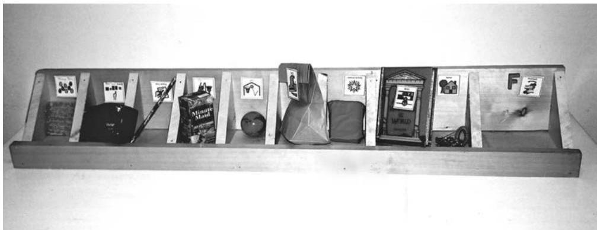

Figure 10.1. Object schedule used at home and in the community by a preschooler. (PCS is a trademark of Tobii Dynavox LLC. All rights reserved. Used with permission. PCS and Boardmaker are trademarks of Tobii Dynavox LLC. All rights reserved. Used with permission.)

AAC Interventions for Individuals with Developmental Disabilities

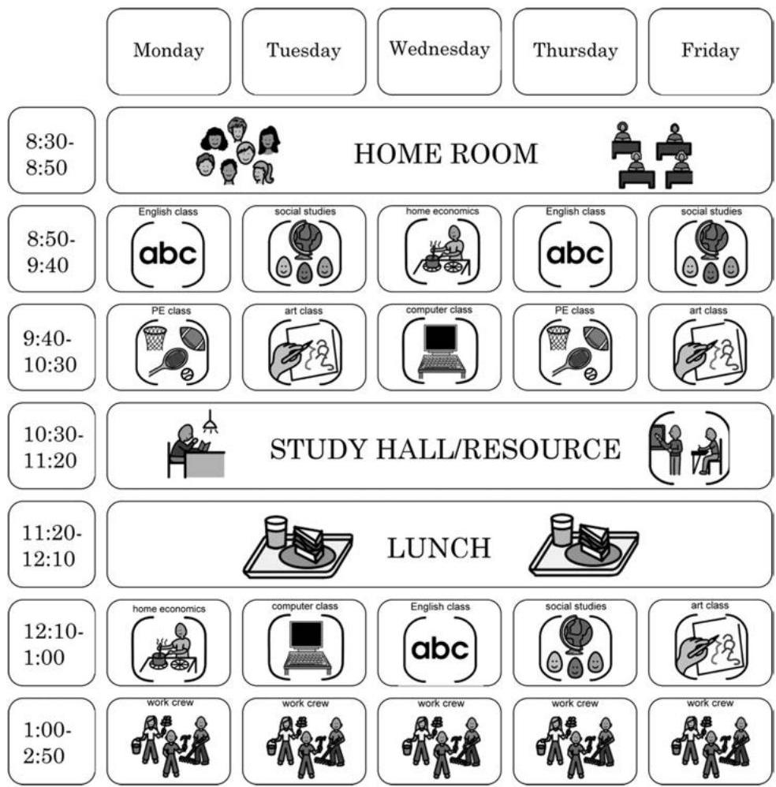

Figure 10.2. Visual schedule for school used by an adolescent with autism. PCS is a trademark of Tobii Dynavox LLC. All rights reserved. Used with permission. PCS and Boardmaker are trademarks of Tobii Dynavox LLC. All rights reserved. Used with permission.

James uses a video VSD to support him in his library job. James is 21 years old and has severe ASD. He has no functional speech and communicates primarily through yes/no responses to partner questions. He participates in a vocational training program and works in the school library. His responsibilities include checking books in and out, reshelving them, and making die-cuts. Despite instruction, he remains very dependent on his job coach to assist him in completing his work tasks, and he rarely communicates. He has difficulty remembering the sequence of tasks that he needs to complete, and he gets distressed when he is uncertain what to do. He was introduced to video VSDs as a visual schedule to remind him of the sequence of steps and task requirements for each job. He watches the video of each step in his work and then completes the step. He is very proud of the independence that he has achieved working in the library (see Babb et al., 2019).

Instruction in the use of a visual schedule is generally conducted during daily routines in naturalistic contexts, with a hierarchy of prompts that are gradually faded.

Intervention to Support Beginning Communicators

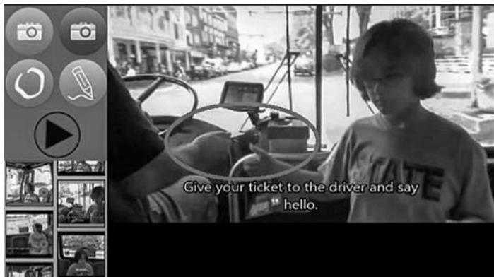

Figure 10.3. Video visual scene display app used by an adolescent with autism spectrum disorder to learn the sequence of steps required to take the bus to work. (From O'Neill, T., Light, J., &amp; McNaughton, D. (2017). Videos with integrated AAC visual scene displays to enhance participation in community and vocational activities: Pilot case study of an adolescent with autism spectrum disorder. Perspectives on Augmentative and Alternative Communication, 2(12), 55-69. doi:10.1044/persp2.sig12.55; reprinted by permission.)

Initially the individual is prompted to check the visual schedule and select the next symbol in the sequence. When the activity is completed, the individual is then prompted to check the schedule again for the next activity. Over time, these prompts are faded until the individual is using the schedule independently. Table 10.5 describes procedures to create and teach the use of visual schedules with beginning communicators.

Table 10.5. Designing and teaching the use of a visual schedule

|  Design the visual schedule to meet the individual's needs and skills  |
| --- |
|  1. Determine situations where the individual would benefit from a visual schedule that displays the sequence of activities or steps in a multistep activity. ○ Consider visual schedules to (a) promote learning of the daily schedule or the sequence of steps in an activity; and (b) facilitate transitions between activities or steps in an activity thereby reducing uncertainty.  |
|  2. List, in chronological order, the individual's schedule across relevant home, school, and community environments. ○ Include the activities done every day or during a relevant portion of the day; or list all of the steps required in the multistep activity. ○ Decide how many activities (or steps) to display at one time depending on the skills of the individual.  |
|  3. Determine how to represent each of the activities (or steps in a multistep activity). ○ Choose real objects, partial objects, photographs, line drawings, visual scene displays (VSDs), or video VSDs depending on the needs and skills of the individual.  |
|  4. Decide how to organize and display the symbols to fit the individual's needs and skills. ○ Determine if the visual schedule will be low-tech or high-tech. ○ Determine if the sequence of activities (or steps) should be organized horizontally or vertically.  |
|  5. Devise a method for marking finished activities. ○ For real object symbols, use a “finished box” into which the individual can deposit each object after finishing the activity. ○ For low-tech schedules with photographs, VSDs, or other graphic symbols, turn the symbol over or remove it from the visual schedule at the end of each activity. ○ For visual schedules programmed into AAC technologies, scroll through the navigation bar to hide the finished activity and reveal the next one.  |

(continued)

AAC Interventions for Individuals with Developmental Disabilities

Table 10.5. (continued)

|  Teach the individual to use the visual schedule  |
| --- |
|  1. Introduce the individual to the visual schedule during the day's activities or while completing the steps in a target task.  |
|  2. For each activity or step, model use of the visual schedule for the individual. ○ Introduce the representation for each activity (or step) in the context of that activity to ensure that the individual understands the representation.  |
|  3. Before each activity, prompt the individual to review the visual schedule and select the next symbol in the sequence. ○ Prompt the individual to take the symbol to the related activity and complete the activity (or step). ○ Follow a least-to-most or most-to-least prompting sequence depending on the individual's needs and skills.  |
|  4. When the activity is completed, prompt the individual to indicate the completed activity in the manner determined (see Step 5 above). ○ Make sure discarded symbols are readily accessible to the individual at all times to provide the option of using them to ask to do that activity again.  |
|  5. Look for signs that indicate that the individual understands and is making the connection between the visual schedule and the sequence of activities or steps that it represents. ○ Observe whether the individual selects a symbol and then goes to the place where the activity typically occurs, starts to get required materials, and initiates the activity.  |
|  6. Gradually fade the prompts until the individual is able to successfully follow the visual schedule independently.  |

# CONCLUSIONS

In this chapter, we considered AAC interventions to enhance the communication and participation of beginning communicators of all ages at each of the stages of early communication development, including

Beginning communicators who are preintentional
- Those who are intentional but presymbolic
- Those who are at the early stages of symbolic development and are learning their "first words"
- Those who have acquired a corpus of symbols (e.g., spoken words, signs, aided AAC symbols) and are beginning to combine them to communicate more complex messages
- Those who demonstrate challenging behaviors

The chapter described interventions to support individuals with complex communication needs in reducing challenging behaviors and successfully acquiring basic communication skills to express needs and wants, interact socially, comment on shared activities, and ask questions. The next chapter (Chapter 11) considers AAC interventions for individuals who have acquired basic communication skills and are developing more advanced skills to attain communicative competence.

# QUESTIONS

10.1. What is meant by the term beginning communicator? To whom does this description refer?
10.2. Why is it important to work closely with family and other communication partners when planning intervention for beginning communicators?

Intervention to Support Beginning Communicators
365

10.3. What is the goal of intervention for beginning communicators who are preintentional?
10.4. What are some indicators of intentionality used by beginning communicators?
10.5. What are potential goals for intervention with beginning communicators who are intentional but not yet symbolic?
10.6. Why is it important to focus not only on the expression of needs and wants but also on social interaction?
10.7. What is joint attention? Why is joint attention important?
10.8. What is a signal dictionary? Why is it important?
10.9. What are potential goals for intervention with beginning communicators who are at the early stages of symbolic development (i.e., learning their first words)?
10.10. How might you teach beginning communicators to request preferred objects or activities? Comment on shared activities? Ask questions?
10.11. How might you teach beginning communicators to combine symbols to communicate more complex requests, comments, or questions?
10.12. What is functional communication training? Why is it important?
10.13. What is meant by the following principles that underlie functional communication training: 1) functional equivalence, 2) efficiency and response effectiveness, and 3) goodness of fit between the individual and his or her environment?
10.14. What are visual schedules and how can they be used?

## REFERENCES

Allen, A. A., Schlosser, R. W., Brock, K. L., &amp; Shane, H. C. (2017). The effectiveness of aided augmented input techniques for persons with developmental disabilities: A systematic review. *Augmentative and Alternative Communication*, 33, 149–159. doi:10.1080/07434618.2017.1338752
Almeida, M., Piza, M., &amp; LaMonica, D. (2005). Adaptações do sistema de comunicação por troca de figuras no contexto escolar [Adaptation of the Picture Exchange Communication System in a school context]. *Pró-Fono Revista de Atualização Científica*, 17, 233–240. doi:10.1590/s0104-56872005000200012
Babb, S., Gormley, J., McNaughton, D., &amp; Light, J. (2019). Enhancing independent participation within vocational activities for an adolescent with ASD using AAC video visual scene displays. *Journal of Special Education Technology*, 34, 120–132. doi:10.1177/0162643418795842
Bedrosian, J. (1999). AAC efficacy research: Challenges for the new century. *Augmentative and Alternative Communication*, 15, 2–3. doi:10.1080/07434619912331278515
Bellon-Harn, M., &amp; Harn, W. (2008). Scaffolding strategies during repeated storybook reading: An extension using a voice output communication aid. *Focus on Autism and Other Developmental Disabilities*, 23, 112–124. doi:10.1177/1088357608316606
Beukelman, D., McGinnis, J., &amp; Morrow, D. (1991). Vocabulary selection in augmentative and alternative communication. *Augmentative and Alternative Communication*, 7, 171–185. doi:10.1080/07434619112331275883
Biggs, E. E., Carter, E. W., &amp; Gilson, C. B. (2018). Systematic review of interventions involving aided AAC modeling for children with complex communication needs. *American Journal on Intellectual and Developmental Disabilities*, 123, 443–473. doi:10.1352/1944-7558-123.5.443
Binger, C., Kent-Walsh, J., Berens, J., Del Campo, S., &amp; Rivera, D. (2008). Teaching Latino parents to support the multi-symbol message productions of their children who require AAC. *Augmentative and Alternative Communication*, 24, 323–338. doi:10.1080/07434610802130978
Binger, C., Kent-Walsh, J., Ewing, C., &amp; Taylor, S. (2010). Teaching educational assistants to facilitate the multisymbol message productions of young students who require augmentative and alternative communication. *American Journal of*

AAC Interventions for Individuals with Developmental Disabilities

Speech-Language Pathology, 19, 108–120. doi:10.1044/1058-0360(2009/09-0015)
Binger, C., &amp; Light, J. (2007). The effect of aided AAC modeling on the expression of multi-symbol messages by preschoolers who use AAC. *Augmentative and Alternative Communication*, 23, 30–43. doi:10.1080/07434610600807470
Bloom, P. (2000). *How children learn the meanings of words*. Cambridge, MA: MIT Press.
Bloom, P., &amp; Markson, L. (1998). Capacities underlying word learning. *Trends in Cognitive Sciences*, 2, 67–73. doi:10.1016/s1364-6613(98)01121-8
Bock, S. J., Stoner, J. B., Beck, A. R., Hanley, L., &amp; Prochnow, J. (2005). Increasing functional communication in non-speaking preschool children: Comparison of PECS and VOCA. *Education and Training in Developmental Disabilities*, 40, 264–278.
Bondy, A., &amp; Frost, L. (2001). *A picture’s worth: PECS and other visual communication strategies in autism*. Bethesda, MD: Woodbine.
Bondy, A., &amp; Frost, L. (2009). The Picture Exchange Communication System: Clinical and research applications. In P. Mirenda &amp; T. Iacono (Eds.), *Autism spectrum disorders and AAC* (pp. 279–302). Baltimore, MD: Paul H. Brookes Publishing Co.
Bopp, K., Brown, K., &amp; Mirenda, P. (2004). Speech-language pathologists’ roles in the delivery of positive behavior support for individuals with developmental disabilities. *American Journal of Speech-Language Pathology*, 13, 5–19. doi:10.1044/1058-0360(2004/003)
Brady, N. C., Bruce, S., Goldman, A., Erickson, K., Mineo, B., Ogletree, B. T., . . . Wilkinson, K. (2016). Communication services and supports for individuals with severe disabilities: Guidance for assessment and intervention. *American Journal on Intellectual and Developmental Disabilities*, 121, 121–138. doi:10.1352/1944-7558-121.2.121
Brady, N. C., Fleming, K., Romine, R. S., Holbrook, A., Muller, K., &amp; Kasari, C. (2018). Concurrent validity and reliability for the Communication Complexity Scale. *American Journal of Speech-Language Pathology*, 27, 237–246. doi:10.1044/2017_ajslp-17-0106
Brodin, J. (1991). *Att tolka barns signaler. Gravt utvecklingsstörda flerhandikappade barns lek och kommunikation* [To interpret children’s signals: Play and communication in profoundly mentally retarded and multiply handicapped children] (Doctoral dissertation). Stockholm University, Department of Education.

Brown, F. (1991). Creative daily scheduling: A nonintrusive approach to challenging behaviors in community residences. *Journal of the Association for Persons with Severe Handicaps*, 16, 75–84. doi:10.1177/154079699101600201
Cafiero, J. (2001). The effect of an augmentative communication intervention on the communication, behavior, and academic program of an adolescent with autism. *Focus on Autism and Other Developmental Disabilities*, 16, 179–193. doi:10.1044/1058-0360(2008/07-0018)
Cafiero, J., &amp; Jones-Wohleber, T. (2019). Visual and environmental supports for learners with autism spectrum disorder and complex communication needs. In J. B. Ganz &amp; R. L. Simpson (Eds.), *Interventions for individuals with autism spectrum disorder and complex communication needs*. Baltimore, MD: Paul H. Brookes Publishing Co.
Caron, J., Laubscher, E., Light, J., &amp; McNaughton, D. (2019). *Effect of video VSDs on communicative turns of individuals with autism spectrum disorder and complex communication needs*. Manuscript submitted for publication.
Carpenter, M., Nagell, K., &amp; Tomasello, M. (1998). Social cognition, joint attention, and communicative competence from 9 to 15 months of age. *Monographs of the Society for Research in Child Development*, 63(4, Serial No. 255). doi:10.2307/1166214
Carr, E. G. (1988). Functional equivalence as a mechanism of response generalization. In R. H. Horner, G. Dunlap, &amp; R. L. Koegel (Eds.), *Generalization and maintenance: Life-style changes in applied settings* (pp. 221–241). Baltimore, MD: Paul H. Brookes Publishing Co.
Carr, E. G., &amp; Durand, V. M. (1985). The social-communicative basis of severe behavior problems in children. In S. Reiss &amp; R. Bootzin (Eds.), *Theoretical issues in behavior therapy* (pp. 219–254). New York, NY: Academic Press.
Carr, E. G., Levin, L., McConnellachie, G., Carlson, J. I., Kemp, D. C., &amp; Smith, C. E. (1994). *Communication-based intervention for problem behavior: A user’s guide for producing positive change*. Baltimore, MD: Paul H. Brookes Publishing Co.
Carr, E., Robinson, S., &amp; Palumbo, L. (1990). The wrong issue: Aversive versus nonaversive treatment. The right issue: Functional versus nonfunctional treatment. In A. Repp &amp; N. Singh (Eds.), *Perspectives on the use of nonaversive and aversive interventions*

Intervention to Support Beginning Communicators
367

for persons with developmental disabilities (pp. 361–380). Sycamore, IL: Sycamore.

Carter, E. W., &amp; Biggs, E. E. (2019). Evidence-based practices for adolescents and adults with autism spectrum disorder and complex communication needs. In J. B. Ganz &amp; R. L. Simpson (Eds.), *Interventions for individuals with autism spectrum disorder and complex communication needs*. Baltimore, MD: Paul H. Brookes Publishing Co.

Carter, M., &amp; Iacono, T. (2002). Professional judgments of the intentionality of communicative acts. *Augmentative and Alternative Communication*, 18, 177–191. doi:10.1080/07434610212331281261

Chezan, L. C., Wolfe, K., &amp; Drasgow, E. (2017). A meta-analysis of functional communication training effects on problem behavior and alternative communicative responses. *Focus on Autism and Other Developmental Disabilities*, 33, 195–205. doi:10.1177/1088357617741294

Chouinard, M. M. (2007). Children’s questions: A mechanism for cognitive development. *Monographs of the Society for Research in Child Development*, 72, 1–126. doi:10.1111/j.1540-5834.2007.00412.x

Clibbens, J., Powell, G., &amp; Atkinson, E. (2002). Strategies for achieving joint attention when signing to children with Down’s syndrome. *International Journal of Language and Communication Disorders*, 37, 309–323. doi:10.1080/13682820210136287

Costigan, F. A., &amp; Light, J. (2011). Functional seating for school-age children with cerebral palsy: An evidence-based tutorial. *Language, Speech, and Hearing Services in Schools*, 42, 223–236. doi:10.1044/0161-1461(2010/10-0001)

Crone, D., &amp; Horner, R. J. (2003). *Building positive behavior support systems in schools*. New York, NY: The Guilford Press.

Drager, K., Light, J., Currall, J., Muttiah, N., Smith, V., Kreis, D., . . . Wiscount, J. (2019). AAC technologies with visual scene displays and “just in time” programming and symbolic communication turns expressed by students with severe disability. *Journal of Intellectual &amp; Developmental Disability*, 44, 321–336. doi:10.3109/13668250.2017.1326585

Drager, K., Light, J., Curan Speltz, J., Fallon, K., &amp; Jeffries, L. (2003). The performance of typically developing 2 1/2-year-olds on dynamic display AAC technologies with different system layouts and language organizations. *Journal of Speech, Language, and Hearing Research*, 46, 298–312. doi:10.1044/1092-4388(2003/024)

Drager, K., Postal, V., Carrolus, L., Castellano, M., Gagliano, C., &amp; Glynn, J. (2006). The effect of aided language modeling on symbol comprehension and production in 2 preschoolers with autism. *American Journal of Speech-Language Pathology*, 15, 112–125. doi:10.1044/1058-0360(2006/012)

Dunlap, G., Iovannone, R., Kincaid, D., Wilson, K., Christiansen, K., Strain, P., &amp; English, C. (2010). *Prevent-Teach-Reinforce: The school-based model of individualized positive behavior support*. Baltimore, MD: Paul H. Brookes Publishing Co.

Durand, V. M. (1990). *Severe behavior problems*. New York, NY: The Guilford Press.

Durand, V. M. (1993). Functional communication training using assistive devices: Effects on challenging behavior. *Augmentative and Alternative Communication*, 9, 168–176. doi:10.1080/07434619312331276571

Durand, V. M., &amp; Carr, E. G. (1987). Social influences on self-stimulatory behavior: Analysis and treatment application. *Journal of Applied Behavior Analysis*, 20, 119–132. doi:10.1901/jaba.1987.20-119

Durand, V. M., &amp; Carr, E. (1991). Functional communication training to reduce challenging behavior: Maintenance and application in new settings. *Journal of Applied Behavior Analysis*, 24, 251–264. doi:10.1901/jaba.1991.24-251

Fallon, K., Light, J., &amp; Paige, T. (2001). Enhancing vocabulary selection for preschoolers who require augmentative and alternative communication (AAC). *American Journal of Speech-Language Pathology*, 10, 81–94. doi:10.1044/1058-0360(2001/010)

Fenson, L., Marchman, V. A., Thal, D. J., Dale, P. S., Reznick, J. S., &amp; Bates, E. (2007). *MacArthur-Bates Communicative Development Inventories* (2nd ed.). Baltimore, MD: Paul H. Brookes Publishing Co.

Flannery, B., &amp; Horner, R. (1994). The relationship between predictability and problem behavior for students with severe disabilities. *Journal of Behavioral Education*, 4, 157–176. doi:10.1007/bf01544110

Franklin, N. K., Mirenda, P., &amp; Phillips, G. (1996). Comparisons of five symbol assessment protocols with nondisabled preschoolers and learners with severe intellectual disabilities. *Augmentative and Alternative Communication*, 12, 63–77. doi:10.1080/07434619612331277518

Frea, W. D., Arnold, C. L., &amp; Vittemberga, G. L. (2001). A demonstration of the effects of augmentative communication on extreme aggressive behavior of a child with autism

AAC Interventions for Individuals with Developmental Disabilities

within an integrated preschool setting. Journal of Positive Behavior Interventions, 3, 194–198. doi:10.1177/109830070100300401
Frost, L., &amp; Bondy, A. (2002). Picture Exchange Communication System training manual (2nd ed.). New Castle, DE: Pyramid Educational Consultants.
Ganz, J. B., Davis, J. L., Lund, E. M., Goodwyn, F. D., &amp; Simpson, R. L. (2012). Meta-analysis of PECS with individuals with ASD: Investigation of targeted versus non-targeted outcomes, participant characteristics, and implementation phase. Research in Developmental Disabilities, 33, 406–418. doi:10.1016/j.ridd.2011.09.023
Geist, L., Erickson, K., &amp; Hatch, P. (2015, November). Core vocabulary for students with significant cognitive disabilities: Essential tools, teaching strategies, and assessment components. Paper presented at the annual convention of the American Speech Language Hearing Association, Denver, CO. Retrieved from https://www.med.unc.edu/ahs/clds/files/2018/09/asha-2015-core.pdf
Gerow, S., Davis, T., Radhakrishnan, S., Gregori, E., &amp; Rivera, G. (2018). Functional communication training: The strength of evidence across disabilities. Exceptional Children, 85, 86–103. doi:10.1177/0014402918793399
Gerra, L., Dorfman, S., Plaue, E., Schlackman, S., &amp; Workman, D. (1995). Functional communication as a means of decreasing self-injurious behavior: A case study. Journal of Visual Impairment and Blindness, 89, 343–347.
Gevarter, C., O'Reilly, M. F., Rojeski, L., Sammarco, N., Lang, R., Lancioni, G. E., &amp; Sigafoos, J. (2013). Comparing communication systems for individuals with developmental disabilities: A review of single-case research studies. Research in Developmental Disabilities, 34, 4415–4432. doi:10.1016/j.ridd.2013.09.017
Goldbart, J., Chadwick, D., &amp; Buell, S. (2014). Speech and language therapists’ approaches to communication intervention with children and adults with profound and multiple learning disability. International Journal of Language &amp; Communication Disorders, 49, 687–701. doi:10.1111/1460-6984.12098
Goossens', C. (1989). Aided communication intervention before assessment: A case study of a child with cerebral palsy. *Augmentative and Alternative Communication*, 5, 14–26. doi:10.1080/07434618912331274926
Goossens', C., Crain, S., &amp; Elder, P. (1992). Engineering the preschool environment for interactive symbolic communication. Birmingham, AL: Southeast Augmentative Communication Conference Publications.

Hart, B., &amp; Risley, T. R. (1995). Meaningful differences in the everyday experience of young American children. Baltimore, MD: Paul H. Brookes Publishing Co.
Holyfield, C., Caron, J. G., Drager, K., &amp; Light, J. (2019). Effect of mobile technology featuring visual scene displays and just-in-time programming on communication turns by preadolescent and adolescent beginning communicators. International Journal of Speech-Language Pathology, 21, 201–211. doi:10.1080/17549507.2018.1441440
Holyfield, C., Drager, K. D. R., Kremkow, J. M. D., &amp; Light, J. (2017). Systematic review of AAC intervention research for adolescents and adults with autism spectrum disorder. *Augmentative and Alternative Communication*, 33, 201–212. doi:10.1080/07434618.2017.1370495
Holyfield, C., Drager, K., Light, J., &amp; Caron, J. G. (2017). Typical toddlers’ participation in “just-in-time” programming of vocabulary for visual scene display augmentative and alternative communication apps on mobile technology: A descriptive study. American Journal of Speech-Language Pathology, 26, 737–749. doi:10.1044/2017_AJSLP-15-0197
Holyfield, C., Light, J., McNaughton, D., Caron, J., Drager, K., &amp; Pope, L. (2019, advance online). Effect of AAC technology with dynamic text on the single word recognition of adults with intellectual and developmental disabilities. International Journal of Speech Language Pathology. doi: 10.1080/17549507.2019.1619836
Horner, R. H., &amp; Day, H. M. (1991). The effects of response efficiency on functionally equivalent competing behaviors. Journal of Applied Behavior Analysis, 24, 719–732. doi:10.1901/jaba.1991.24-719
Iacono, T., Carter, M., &amp; Hook, J. (1998). Identification of intentional communication in students with severe and multiple disabilities. *Augmentative and Alternative Communication*, 14, 102–114. doi:10.1080/07434619812331278246
Jagaroo, V., &amp; Wilkinson, K. (2008). Further considerations of visual cognitive neuroscience in aided AAC: The potential role of motion perception systems in maximizing design display. *Augmentative and Alternative Communication*, 24, 29–42. doi:10.1080/07434610701390673
Jang, J., Dixon, D. R., Tarbox, J., &amp; Granpeesheh, D. (2011). Symptom severity and challenging behavior in children with ASD.

Intervention to Support Beginning Communicators

Research in Autism Spectrum Disorders, 5, 1028–1032. doi:10.1016/j.rasd.2010.11.008
Kangas, K., &amp; Lloyd, L. (1988). Early cognitive skills as prerequisites to augmentative and alternative communication use: What are we waiting for? *Augmentative and Alternative Communication*, 4, 211–221. doi:10.1080/07434618812331274817
Kasari, C., Freeman, S., &amp; Paparella, T. (2006). Joint attention and symbolic play in young children with autism: A randomized controlled intervention study. *Journal of Child Psychology and Psychiatry*, 47, 611–620. doi:10.1111/j.1469-7610.2005.01567.x
Kasari, C., Kaiser, A., Goods, K., Nietfeld, J., Mathy, P., Landa, R., . . . Almirall, D. (2014). Communication interventions for minimally verbal children with autism: A sequential multiple assignment randomized trial. *Journal of the American Academy of Child and Adolescent Psychiatry*, 53, 635–646. doi:10.1016/j.jaac.2014.01.019
Keen, D., Sigafoos, J., &amp; Woodyatt, G. (2001). Replacing prelinguistic behaviors with functional communication. *Journal of Autism and Developmental Disorders*, 31, 385–398. doi:10.1023/A:101061261896
Kennedy, C. H., Meyer, K. A., Knowles, T., &amp; Shukla, S. (2000). Analyzing the multiple functions of stereotypical behavior for students with autism: Implications for assessment and treatment. *Journal of Applied Behavior Analysis*, 33, 559–571. doi:10.1901/jaba.2000.33-559
Kent-Walsh, J., Murza, K. A., Malani, M. D., &amp; Binger, C. (2015). Effects of communication partner instruction on the communication of individuals using AAC: A meta-analysis. *Augmentative and Alternative Communication*, 31, 271–284. doi:10.3109/07434618.2015.1052153
Knight, V., Sartini, E., &amp; Spriggs, A. D. (2015). Evaluating visual activity schedules as evidence-based practice for individuals with autism spectrum disorders. *Journal of Autism and Developmental Disorders*, 45, 157–178. doi:10.1007/s10803-014-2201-z
Kozleski, E. (1991). Expectant delay procedure for teaching requests. *Augmentative and Alternative Communication*, 7, 11–19. doi:10.1080/07434619112331275643
Laubscher, E., &amp; Light, J. (2018, November). Re-examining core vocabulary for children that require AAC: A developmental perspective. Poster at the American Speech-Language-Hearing Association (ASHA) Conference, Boston, MA.
Light, J. (1988). Interaction involving individuals using augmentative and alternative communication systems: State of the art and future directions. *Augmentative and Alternative Communication*, 4, 66–82. doi:10.1080/07434618812331274657
Light, J. (1997). Communication is the essence of human life: Reflections on communication competence. *Augmentative and Alternative Communication*, 13, 61–70. doi:10.1080/07434619712331277848
Light, J., Collier, B., &amp; Parnes, P. (1985). Communication interaction between young nonspeaking physically disabled children and their primary caregivers. Part III: Modes of communication. *Augmentative and Alternative Communication*, 1, 125–133. doi:10.1080/07434618512331273561
Light, J., &amp; Drager, K. (2007). AAC technologies for young children with complex communication needs: State of the science and future research directions. *Augmentative and Alternative Communication*, 23, 204–216. doi:10.1080/0743461070155363
Light, J., &amp; Drager, K. (2012, November). The effects of AAC technologies with "just in time" programming. Paper presented at the annual convention of the American Speech Language Hearing Association, Atlanta, GA.
Light, J., &amp; Drager, K. D. R. (2019). Early intervention for young children with autism, cerebral palsy, Down syndrome, and other disabilities. Retrieved from https://aackids.psu.edu
Light, J., &amp; McNaughton, D. (2012). The changing face of augmentative and alternative communication: Past, present, and future challenges. *Augmentative and Alternative Communication*, 28, 197–204. doi:10.3109/07434618.2012.737024
Light, J., McNaughton, D., &amp; Caron, J. (2019). New and emerging AAC technology supports for children with complex communication needs and their communication partners: State of the science and future research directions. *Augmentative and Alternative Communication*, 35, 26–41. doi:10.1080/07434618.2018.1557251
Light, J. C., Parsons, A. R., &amp; Drager, K. (2002). "There's more to life than cookies": Developing interactions for social closeness with beginning communicators who use AAC. In J. Reichle, D. R. Beukelman, &amp; J. C. Light (Eds.), *Exemplary practices for beginning communicators: Implications for AAC* (pp. 187–218). Baltimore, MD: Paul H. Brookes Publishing Co.
Light, J., Worah, S., Bowker, A., Burki, B., Drager, K., &amp; D'Silva, K. (2008, November). Children's representations of early language concepts: Implications for AAC symbols. Paper

AAC Interventions for Individuals with Developmental Disabilities

presented at the annual conference of the American Speech-Language-Hearing Association, Chicago, IL.

Lund, S., &amp; Troha, J. (2008). Teaching young people who are blind and have autism to make requests using a variation of the Picture Exchange Communication System with tactile symbols: A preliminary investigation. Journal of Autism and Developmental Disorders, 38, 719-730. doi:10.1007/s10803-007-0439-4

MacWhinney, B. (2015). Introduction: Language emergence. In B. MacWhinney &amp; W. O'Grady (Eds.), Handbook of language emergence (pp. 1-32). New York: Wiley.

Marvin, C. A., Beukelman, D. R., &amp; Bilyeu, D. (1994). Vocabulary-use patterns in preschool children: Effects of context and time sampling. *Augmentative and Alternative Communication*, 10, 224-236. doi:10.1080/07434619412331276930

Mason, R. A., &amp; Gerow, S. (2019). Parent- and peer-mediated interventions for children with autism spectrum disorder and complex communication needs. In J. B. Ganz &amp; R. L. Simpson (Eds.), Interventions for individuals with autism spectrum disorder and complex communication needs. Baltimore, MD: Paul H. Brookes Publishing Co.

McComas, J. J., Schieltz, K. M., Simacek, J., Berg, W. K., &amp; Wacker, D. P. (2019). Functional communication training for durable behavior change. In J. B. Ganz &amp; R. L. Simpson (Eds.), Interventions for individuals with autism spectrum disorder and complex communication needs. Baltimore, MD: Paul H. Brookes Publishing Co.

Millar, D. C., Light, J. C., &amp; Schlosser, R. W. (2006). The impact of augmentative and alternative communication intervention on the speech production of individuals with developmental disabilities: A research review. Journal of Speech, Language, and Hearing Research, 49, 248-264. doi:10.1044/1092-4388(2006/021)

Mirenda, P. (1993). AAC: Bonding the uncertain mosaic. *Augmentative and Alternative Communication*, 9, 3-9. doi:10.1080/07434619312331276361

Mirenda, P. (1997). Supporting individuals with challenging behaviour through functional communication training and AAC: A research review. *Augmentative and Alternative Communication*, 13, 207-225. doi:10.1080/07434619712331278048

Mirenda, P., &amp; Dattilo, J. (1987). Instructional techniques in alternative communication for learners with severe intellectual disabilities.

Augmentative and Alternative Communication, 3, 143-152. doi:10.1080/07434618712331274429

Mirenda, P., &amp; Locke, P. (1989). A comparison of symbol transparency in nonspeaking persons with intellectual disabilities. Journal of Speech and Hearing Disorders, 54, 131-140. doi:10.1044/jshd.5402.131

Mirenda, P., &amp; Santogrossi, J. (1985). A prompt-free strategy to teach pictorial communication system use. *Augmentative and Alternative Communication*, 1, 143-150. doi:10.1080/07434618512331273641

Mirenda, P., &amp; Schuler, A. L. (1988). Augmenting communication for persons with autism. Topics in Language Disorders, 9, 24-43. doi:10.1097/00011363-198812000-00004

Northup, J., Wacker, D., Berg, W., Kelly, L., Sasso, G., &amp; DeRaad, A. (1994). The treatment of severe behavior problems in school settings using a technical assistance model. Journal of Applied Behavior Analysis, 27, 33-48. doi:10.1901/jaba.1994.27-33

Ogletree, B. T., Bartholomew, P., Wagaman, J. C., Genz, S., &amp; Reisinger, K. (2012). Emergent potential communicative behaviors in adults with the most severe intellectual disabilities. Communication Disorders Quarterly, 34, 56-58. doi:10.1177/1525740112456201

O'Neill, T., Light, J., &amp; McNaughton, D. (2017). Videos with integrated AAC visual scene displays to enhance participation in community and vocational activities: Pilot case study with an adolescent with autism spectrum disorder. Perspectives of the ASHA Special Interest Groups, 2, 55-69. doi:10.1044/persp2.sig12.55

O'Neill, T., Light, J., &amp; Pope, L. (2018). Effects of interventions that include aided augmentative and alternative communication input on the communication of individuals with complex communication needs: A meta-analysis. Journal of Speech, Language, and Hearing Research, 61, 1743-1765. doi:10.1044/2018.jslhr-l-17-0132

Owens, R. E. (2005). Language development: An introduction (6th ed.). Boston, MA: Pearson Education.

Peck, S., Wacker, D., Berg, W., Cooper, L., Brown, K., Richman, D., . . . Millard, T. (1996). Choice-making treatment of young children's severe behavior problems. Journal of Applied Behavior Analysis, 29, 263-290. doi:10.1901/jaba.1996.29-263

Peck Peterson, S. M., Derby, K. M., Harding, J. W., Weddle, T., &amp; Barretto, A. (2002). Behavioral support for school-age children with developmental disabilities and problem behavior. In J. M. Lucyshyn, G. Dunlap,

Intervention to Support Beginning Communicators
371

&amp; R. W. Albin (Eds.), Families and positive behavior support: Addressing problem behavior in family contexts (pp. 287–304). Baltimore, MD: Paul H. Brookes Publishing Co.

Rehfeldt, R., &amp; Root, S. (2005). Establishing derived requesting skills in adults with severe developmental disabilities. Journal of Applied Behavior Analysis, 38, 101–105. doi:10.1901/jaba.2005.106-03

Reichle, J., &amp; Drager, K. (2010). Examining issues of aided communication display and navigational strategies for young children with developmental disabilities. Journal of Developmental and Physical Disabilities, 22, 289–311. doi:10.1007/s10882-010-9191-3

Reichle, J., &amp; Johnston, S. (1999). Teaching the conditional use of communicative requests to two school-age children with severe developmental disabilities. Language, Speech, and Hearing Services in Schools, 30, 324–334. doi:10.1044/0161-1461.3004.324

Reichle, J., Simacek, J., &amp; Parker-McGowan, Q. E. (2019). Considerations in implementing aided low-tech AAC systems for individuals with autism spectrum disorder and complex communication needs. In J. B. Ganz &amp; R. L. Simpson (Eds.), Interventions for individuals with autism spectrum disorder and complex communication needs. Baltimore, MD: Paul H. Brookes Publishing Co.

Reichle, J., &amp; Wacker, D. P. (Eds.). (2017). Functional communication training for problem behavior. New York, NY: The Guilford Press.

Reichle, J., York, J., &amp; Sigafoos, J. (1991). Implementing augmentative and alternative communication: Strategies for learners with severe disabilities. Baltimore, MD: Paul H. Brookes Publishing Co.

Romski, M., &amp; Sevcik, R. (1988). Augmentative and alternative communication systems: Considerations for individuals with severe intellectual disabilities. *Augmentative and Alternative Communication*, 4, 83–93. doi:10.1080/07434618812331274667

Romski, M. A., &amp; Sevcik, R. A. (1996). Breaking the speech barrier: Language development through augmented means. Baltimore, MD: Paul H. Brookes Publishing Co.

Romski, M. A., Sevcik, R., Adamson, L., Cheslock, M., Smith, A., Barker, R. M., &amp; Bakeman, R. (2010). Randomized comparison of augmented and nonaugmented language interventions for toddlers with developmental delays and their parents. Journal of Speech, Language, and Hearing Research, 53, 350–364. doi:10.1044/1092-4388(2009/08-0156)

Romski, M., Sevcik, R. A., Adamson, L. B., Smith, A., Cheslock, M., &amp; Bakeman, R. (2011).

Parent perceptions of the language development of toddlers with developmental delays before and after participation in parent-coached language interventions. American Journal of Speech-Language Pathology, 20, 111–118. doi:10.1044/1058-0360(2011/09-0087)

Romski, M., Sevcik, R. A., Barton-Hulsey, A., &amp; Whitmore, A. S. (2015). Early intervention and AAC: What a difference 30 years makes. Augmentative and Alternative Communication, 31, 181–202. doi:10.3109/07434618.2015.1064163

Rowland, C. (1990). Communication in the classroom for children with dual sensory impairments: Studies of teacher and child behavior. *Augmentative and Alternative Communication*, 6, 262–274. doi:10.1080/07434619012331275554

Rowland, C., &amp; Schweigert, P. (1996). Tangible symbol systems (Rev. ed.) [Videotape]. San Antonio, TX: Harcourt Assessment.

Schlosser, R., &amp; Wendt, O. (2008). Effects of augmentative and alternative communication intervention on speech production in children with autism: A systematic review. American Journal of Speech-Language Pathology, 17, 212–230. doi:10.1044/1058-0360(2008/021)

Schwartz, I. S., Gauvreau, A. N., &amp; Bateman, K. (2019). Effective strategies for working with young children with autism spectrum disorder and complex communication needs. In J. B. Ganz &amp; R. L. Simpson (Eds.), Interventions for individuals with autism spectrum disorder and complex communication needs. Baltimore, MD: Paul H. Brookes Publishing Co.

Sevcik, R. A., &amp; Romski, M. A. (2002). The role of language comprehension in establishing early augmented conversations. In J. Reichle, D. R. Beukelman, &amp; J. C. Light (Eds.), Exemplary practices for beginning communicators: Implications for AAC. Baltimore, MD: Paul H. Brookes Publishing Co.

Shane, H. C. (2006). Using visual scene displays to improve communication and communication instruction in persons with autism spectrum disorders. Perspectives on Augmentative and Alternative Communication, 15, 8–13. doi:10.1044/aac15.1.8

Siegel, E., &amp; Wetherby, A. (2000). Nonsymbolic communication. In M. Snell (Ed.), Instruction of students with severe disabilities (5th ed., pp. 409–451). Columbus, OH: Merrill.

Sigafoos, J. (1998). Assessing conditional use of graphic mode requesting in a young boy with autism. Journal of Developmental and Physical Disabilities, 10, 133–151. doi:10.1023/A:1022813315683

AAC Interventions for Individuals with Developmental Disabilities

Sigafoos, J., Arthur, M., &amp; O'Reilly, M. (2003). Challenging behavior and developmental disability. Baltimore, MD: Paul H. Brookes Publishing Co.

Sigafoos, J., Arthur-Kelly, M., &amp; Butterfield, N. (2006). Enhancing everyday communication for children with disabilities. Baltimore, MD: Paul H. Brookes Publishing Co.

Sigafoos, J., Laurie, S., &amp; Pennell, D. (1995). Preliminary assessment of choice making among children with Rett syndrome. Journal of the Association for Persons with Severe Handicaps, 20, 175–184. doi:10.1177/154079699502000302

Sigafoos, J., Laurie, S., &amp; Pennell, D. (1996). Teaching children with Rett syndrome to request preferred objects using aided communication: Two preliminary studies. *Augmentative and Alternative Communication*, 12, 88–96. doi:10.1080/07434619612331277538

Sigafoos, J., &amp; Meikle, B. (1996). Functional communication training for the treatment of multiply determined challenging behavior in two boys with autism. Behavior Modification, 20, 60–84. doi:10.1177/01454455960201003

Sigafoos, J., &amp; Mirenda, P. (2002). Strengthening communicative behaviors for gaining access to desired items and activities. In J. Reichle, D. R. Beukelman, &amp; J. C. Light (Eds.), Exemplary practices for beginning communicators: Implications for AAC (pp. 123–156). Baltimore, MD: Paul H. Brookes Publishing Co.

Sigafoos, J., O'Reilly, M. F., Drasgow, E., &amp; Reichle, J. (2002). Strategies to achieve socially acceptable escape and avoidance. In J. Reichle, D. R. Beukelman, &amp; J. C. Light (Eds.), Exemplary practices for beginning communicators: Implications for AAC (pp. 157–186). Baltimore, MD: Paul H. Brookes Publishing Co.

Sigafoos, J., &amp; Reichle, J. (1992). Comparing explicit to generalized requesting in an augmentative communication mode. Journal of Developmental and Physical Disabilities, 4, 167–188. doi:10.1007/bf01046398

Sigafoos, J., Woodyatt, G., Keen, D., Tait, K., Tucker, M., Roberts-Pennell, D., &amp; Pittendreigh, N. (2000). Identifying potential communicative acts in children with developmental and physical disabilities. Communication Disorders Quarterly, 21, 77–86. doi:10.1177/152574010002100202

Simacek, J., Pennington, B., Reichle, J., &amp; Parker-McGowan, Q. (2018). Aided AAC for people with severe to profound and multiple disabilities: A systematic review of interventions and treatment intensity. Advances in Neurodevelopmental Disorders, 2, 100–115. doi:10.1007/s41252-017-0050-4

Simeonsson, R. J., Björck-Åkesson, E., &amp; Lollar, D. J. (2012). Communication, disability, and the ICF-CY. *Augmentative and Alternative Communication*, 28, 3–10. doi:10.3109/07434618.2011.653829

Skotko, B. G., Koppenhaver, D. A., &amp; Erickson, K. A. (2004). Parent reading behaviors and communication outcomes in girls with Rett syndrome. *Exceptional Children*, 70, 145–166. doi:10.1177/001440290407000202

Smith, J., McCarthy, J., &amp; Benigno, J. (2009). The effect of high-tech AAC system position on the joint attention of infants without disabilities. *Augmentative and Alternative Communication*, 25, 165–175. doi:10.1080/07434610902972410

Smith, M. M., &amp; Grove, N. C. (2003). Asymmetry in input and output for individuals who use AAC. In J. C. Light, D. R. Beukelman, &amp; J. Reichle (Eds.), *Communicative competence for individuals who use AAC: From research to effective practice* (pp. 163–195). Baltimore, MD: Paul H. Brookes Publishing Co.

Spriggs, A. D., Knight, V., &amp; Sherrow, L. (2015). Talking picture schedules: Embedding video models into visual activity schedules to increase independence for students with ASD. Journal of Autism and Developmental Disorders, 45, 3846–3861. doi:10.1007/s10803-014-2315-3

Steege, M., Wacker, D., Cigrand, K., Berg, W., Novak, C., Reimers, T., . . . DeRaad, A. (1990). Use of negative reinforcement in the treatment of self-injurious behavior. Journal of Applied Behavior Analysis, 23, 459–468. doi:10.1901/jaba.1990.23-459

Sterrett, K., &amp; Kasari, C. (2019). Naturalistic developmental behavioral interventions for young children with autism spectrum disorder and complex communication needs. In J. B. Ganz &amp; R. L. Simpson (Eds.), *Interventions for individuals with autism spectrum disorder and complex communication needs*. Baltimore, MD: Paul H. Brookes Publishing Co.

Stoner, J., Beck, A., Bock, S., Hickey, K., Kosuwan, K., &amp; Thompson, J. (2006). The effectiveness of the Picture Exchange Communication System with nonspeaking adults. *Remedial and Special Education*, 27, 154–165. doi:10.1177/07419325060270030401

The Arc for People with Intellectual and Developmental Disabilities. (n.d.). *Position statement on self-determination*. Retrieved from https://www.thearc.org

Intervention to Support Beginning Communicators
373

/who-we-are/position-statements/rights/self-determination

Therrien, M. C. S., &amp; Light, J. (2016). Using the iPad to facilitate interaction between preschool children who use AAC and their peers. *Augmentative and Alternative Communication*, 32, 163–174. doi:10.1080/07434618.2016.1205133

Therrien, M. C. S., &amp; Light, J. C. (2018). Promoting peer interaction for preschool children with complex communication needs and autism spectrum disorder. *American Journal of Speech-Language Pathology*, 27, 207–221. doi:10.1044/2017_ajslp-17-0104

Tiger, J. H., Hanley, G. P., &amp; Bruzek, J. (2008). Functional communication training: A review and practical guide. *Behavior Analysis in Practice*, 1, 16–23. doi:10.1007/bf03391716

Tönsing, K. (2016). Supporting the production of graphic symbol combinations by children with limited speech: A comparison of two AAC systems. *Journal of Developmental and Physical Disabilities*, 28, 5–29. doi:10.1007/s10882-015-9425-5

Trudeau, N., Cleave, P., &amp; Woelk, E. (2003). Using augmentative and alternative communication approaches to promote participation of preschoolers during book reading: A pilot study. *Child Language Teaching and Therapy*, 19, 181–210. doi:10.1191/0265659003ct250oa

van Dijk, W., &amp; Gage, N. A. (2019). The effectiveness of visual activity schedules for individuals with intellectual disabilities: A meta-analysis. *Journal of Intellectual &amp; Developmental Disability*, 44, 384–395. doi:10.3109/13668250.2018.1431761

Van Tatenhove, G. (2009). Building language competence with students using AAC devices: Six challenges. *Perspectives on Augmentative and Alternative Communication*, 18, 38–47. doi:10.1044/aac18.2.38

von Tetzchner, S., Launonen, K., Batorowicz, B., Nunes, L. R. D. P., Walter, C. C. D. F., Oxley, J., . . . Deliberato, D. (2018). Communication aid provision and use among children and adolescents developing aided communication: An international survey. *Augmentative and Alternative Communication*, 34, 79–91. doi:10.1080/07434618.2017.1422019

Wacker, D. P., Berg, W. K., &amp; Harding, J. W. (2002). Replacing socially unacceptable behavior with acceptable communication responses. In J. Reichle, D. R. Beukelman, &amp; J. C. Light (Eds.), *Exemplary practices for beginning communicators: Implications for AAC* (pp. 97–122). Baltimore, MD: Paul H. Brookes Publishing Co.

Wacker, D., Steege, M., Northup, J., Sasso, G., Berg, W., Reimers, T., . . . Donn, L. A. (1990). A component analysis of functional communication training across three topographies of severe behavior problems. *Journal of Applied Behavior Analysis*, 23, 417–429. doi:10.1901/jaba.1990.23-417

Walker, V. L., &amp; Snell, M. E. (2013). Effects of augmentative and alternative communication on challenging behavior: A meta-analysis. *Augmentative and Alternative Communication*, 29, 117–131. doi:10.3109/07434618.2013.785020

Warren, S. F., &amp; Brady, N. C. (2007). The role of maternal responsivity in the development of children with intellectual disabilities. *Mental Retardation and Developmental Disabilities Research Reviews*, 13, 330–338. doi:10.1002/mrdd.20177

Wetherby, A., &amp; Prizant, B. (1989). The expression of communicative intent: Assessment guidelines. *Seminars in Speech and Language*, 10, 77–91. doi:10.1055/s-0028-1082491

Wilkinson, K. (2005). Disambiguation and mapping of new word meanings by individuals with intellectual/developmental disabilities. *American Journal on Mental Retardation*, 110, 71–86. doi:10.1352/0895-8017(2005)110&lt;71:damonw&gt;2.0.co;2

Wilkinson, K., &amp; Albert, A. (2001). Adaptations of fast mapping for vocabulary intervention with augmented language users. *Augmentative and Alternative Communication*, 17, 120–132. doi:10.1080/aac.17.2.120.132

Wilkinson, K., &amp; McIlvane, W. (2002). Considerations in teaching graphic symbols to beginning communicators. In J. Reichle, D. R. Beukelman, &amp; J. Light (Eds.), *Exemplary practices for beginning communicators: Implications for AAC* (pp. 273–321). Baltimore, MD: Paul H. Brookes Publishing Co.

Yorkston, K., Dowden, P., Honsinger, M., Marriner, N., &amp; Smith, K. (1988). A comparison of standard and user vocabulary lists. *Augmentative and Alternative Communication*, 4, 189–210. doi:10.1080/07434618812331274807

.

11

# Intervention to Build Communicative Competence

To participate successfully in a wide range of environments (educational, vocational, health care, and community living), individuals who rely on AAC must develop more advanced skills to build their communicative competence. Communicative competence is not innate; rather it is learned over time (Light &amp; Binger, 1998). Developing beginning communication skills (as described in Chapter 10) is a critical first step in this process, but it is only the first step. Individuals with developmental disabilities who use AAC require effective, evidence-based intervention to extend their skills and maximize their communication. Communicative competence relies on the integration of knowledge, judgment, and skills across four interrelated domains: linguistic, operational, social, and strategic (Light, 1989; Light &amp; McNaughton, 2014). In addition, communicative competence is impacted by psychosocial factors, including motivation, attitude, confidence, and resilience (Light, 2003; Light &amp; McNaughton, 2014). This chapter discusses intervention approaches to build communicative competence with individuals who rely on AAC, including interventions to teach skills in the linguistic, operational, social, and strategic domains and considerations to build motivation, positive attitudes, confidence, and resilience.

This chapter focuses on intervention for individuals who have already acquired basic symbolic communication skills as described in the previous chapter (Chapter 10). This group may include individuals with a range of developmental disabilities, including autism spectrum disorder (ASD), cerebral palsy, Down syndrome, and intellectual disabilities; the group may also represent a range of ages (from young children to adults). Intervention goals should be determined on an individual basis and should build on the individual's strengths. Different skills or psychosocial factors may be targeted as priorities depending on the communication needs, environmental demands, and skill profile of the individual.

There are a range of intervention techniques that can be used to teach linguistic, operational, social, and strategic skills to individuals who use AAC, including explicit instruction, incidental teaching, modeling of AAC use in naturalistic interactions, conversational coaching, and strategy instruction. These approaches are discussed in more detail in Chapter 3. Once basic communication skills are established and interventions target more advanced strategies and skills, often AAC teams make increased use of approaches such as strategy instruction. Strategy

375

instruction includes the following steps (Kent-Walsh & McNaughton, 2005; Light & Binger, 1998):

1. Identify the target strategy or skill to be taught.
2. Explain the strategy to the individual and discuss why it is important.
3. Demonstrate how to use the target strategy.
4. Discuss situations in which the individual should (or should not) use the strategy.
5. Provide numerous opportunities for the individual to use the strategy during naturally occurring interactions (and role plays if appropriate).
6. Provide guided instruction as required (i.e. prompting the individual to use the strategy successfully) and provide feedback on performance.
7. Evaluate progress and adjust intervention as required to improve effectiveness.
8. Check for generalization and long-term maintenance.

It is important to remember that there is no single instructional approach that is universally best for all individuals in all contexts (Gevarter et al. 2013). Ultimately, the AAC team should select instructional approaches based on the needs and skills of the individual who uses AAC and the communication partners, the skills or strategies to be targeted, and the contexts in which they are required.

Of course it is not sufficient to just provide intervention with the individual to build new skills; it is also critical to address environmental barriers and provide instruction for communication partners, as required, to ensure that the individual has meaningful opportunities for communication and the AAC supports required to interact successfully. (See Chapter 4 for further information on working with families and other communication partners to ensure meaningful opportunities for communication, and Chapters 5--8 for discussion of AAC supports.)

## Language Skills

One of the most critical domains in the development of communicative competence for individuals with developmental disabilities is language. Without well-developed language skills, individuals with complex communication needs remain severely restricted in their understanding and expression. The development of language skills is a complex process for individuals who use AAC: They must develop skills in the spoken language of their families and broader social communities; and they must develop skills in the “language code” of their AAC system (Light, 1989; Light & McNaughton, 2014).

Gus Estrella, an expert communicator via AAC, emphasized the importance of language skills as the foundation for communicative competence: “Dig in, get the support of both the school and the social services agencies, get the devices funded, and [then] make us work our little tails off until we master enough language to become competent communicators.” (Estrella, 2000, p. 33)

### Skills in the Spoken Language of the Family and Community

To develop communicative competence, individuals need to learn skills in the spoken language of the family and community, including both comprehension and expressive skills. Some individuals need to develop the skills to participate in bilingual environments.

Intervention to Build Communicative Competence

# Comprehension of Spoken Language

From birth, children with complex communication needs regularly receive spoken input provided by their parents and other caregivers. It is the first language to which they are exposed and forms an important foundation for language learning. Sevcik and Romski (2002) argued that comprehension skills are critical to communication: The individual must be able to fulfill the roles of both listener and communicator in interactions. Smith (2015) noted that comprehension has been described as a "driver of language development" (p. 218). Unfortunately, AAC interventions often focus solely on building expressive communication to the neglect of comprehension:

... a primary focus on production may actually make learning to communicate via AAC systems extremely difficult. In these cases, the individual is asked to produce communications with the assumption that he or she has an adequate foundation of understanding on which to build these AAC productions. (Sevcik &amp; Romski, 2002, p. 453)

Individuals with developmental disabilities are language learners; as such, they will benefit from intervention to enhance their comprehension skills. Goals might include 1) increasing understanding of single-word vocabulary that represents a wide range of concepts, both concrete and abstract; 2) improving comprehension of a range of sentence structures (e.g., understanding wh- questions, responding appropriately to one-, two-, or three-step instructions); and 3) increasing comprehension of morphosyntactic structures (e.g., plural, past tense). Generally, AAC teams may draw on what is known about typical language development to guide their goal setting (Gerber &amp; Kraat, 1992; Savaldi-Harussi, Lustigan, &amp; Soto, 2019; Smith, 2015). For example, the team may start by targeting early emerging wh-questions first (e.g., what, who, where) and target more difficult questions later (e.g., when, how). However, sometimes the team may tamper with the typical developmental sequence to support the individual in meeting specific environmental demands that are priorities (Gerber &amp; Kraat, 1992).

Some individuals with developmental disabilities struggle significantly with comprehension of spoken language due to concomitant hearing impairments, auditory processing difficulties, and/or significant language impairments. They may benefit from the use of augmented input, that is, the use of AAC in conjunction with spoken input to support comprehension (e.g., Romski &amp; Sevcik, 2003). Augmented input provides supplemental input via the visual channel; in the case of aided augmented input, it also provides more permanent input, allowing greater processing time. Research shows that provision of aided AAC input supports comprehension (e.g., Allen, Schlosser, Brock, &amp; Shane, 2017; O'Neill, Light, &amp; Pope, 2018). Unfortunately, educators and peers typically do not provide augmented input to children who rely on AAC (Barker, Akaba, Brady, &amp; Thiemann-Bourque, 2013). If individuals benefit from augmented input, then it is important to provide training in its use for family and other communication partners.

This type of training was provided to Josh's communication partners. Josh was six years old when his parents referred him for services. He had a diagnosis of ASD and was included in a general education kindergarten class with support from a paraprofessional. Although he had the academic skills to be successful in the class, he was struggling and frequently exhibited challenging behaviors that disrupted the class. Observations of the classroom revealed that these behaviors occurred whenever his teacher provided oral instructions to the class. Often these oral instructions were very

complex (e.g. “As soon as you complete your teacher-assigned center, you can either have a snack or you can choose a student-selected center.”). Josh experienced significant challenges with auditory processing and he did not understand multistep instructions presented orally. He was unsure what was expected of him and struggled with the rapid change of activities. He used his challenging behavior to escape the situation. Josh was able to read sentences and was able to follow multistep instructions in writing. We worked with Josh's teacher and taught her how to provide a written daily schedule for Josh and how to augment her oral instructions to the class by writing or typing out the instructions as she spoke them. She naturally simplified the complexity of her instructions when she had to write or type them out, making the directions easier to understand. Josh benefited from the augmented input; he had the time he needed to process the written instructions. His challenging behaviors immediately decreased with this simple adaptation to the environment to create a better fit with his needs and skills. And the entire kindergarten class benefited as they were regularly immersed in meaningful literacy experiences throughout the day. (Light, Roberts, Dimarco, & Greiner, 1998)

### Expressive Skills in the Language of the Family and Community

Beyond the development of comprehension skills, individuals with complex communication needs also need to develop expressive skills. By definition, they are unable to rely on natural speech to meet all of their communication needs, so they will need to develop skills in the language code of their AAC system, but they may also be able to make use of some natural speech to express themselves. Although some individuals with complex communication needs do not produce any speech at all, others use a small repertoire of speech approximations that may be understood by familiar partners; and still others may be able to rely on speech as a primary means of communication with familiar partners, but may require AAC to augment, supplement, or clarify their speech, especially with unfamiliar partners. Thus, most individuals with complex communication needs also need to develop as many expressive communication skills in the spoken languages of their family and community as possible since speech may be one modality that they can draw on as part of their comprehensive communication system. Too often, service providers believe erroneously that they must make an either-or decision: either work on speech production or provide AAC intervention. Rather, many individuals with complex communication needs benefit from interventions that combine a focus on expression using natural speech with a focus on AAC to enhance communication effectiveness (Oommen & McCarthy, 2015).

### Skills to Participate in Bilingual Environments

Given the increasing diversity and globalization of society, many individuals with developmental disabilities are exposed to more than one spoken language in their daily lives. Their families may speak a different language or dialect from that of the broader community. These languages each have different vocabulary, syntax, morphology, and pragmatics, as well as different written forms. Individuals who live in bilingual communities must learn skills in the different spoken (and written) languages in order to develop the communicative competence required to participate in their families and broader communities. They must develop the conditional knowledge to know when to use which language and with whom.

Gus Estrella, introduced earlier in this chapter, grew up in a Hispanic family. He poignantly described the challenges that he faced learning to communicate effectively at home and school:

> Prior to starting preschool, my family and friends all spoke to me in Spanish. That was all I knew. So you can imagine my reaction when I started going to preschool. I was entering uncharted territories. I was about to be left with total strangers, foreigners! It was doubtful that anyone would know any Spanish, so what was the likelihood of somebody understanding my little signs for when I needed something, like lunch! What if I need to go to the little boys' room and they think I'm having a seizure! These were the concerns that a little boy had to deal with and figure out how to cope with his new surroundings. . . . I felt isolated since I couldn't tell anybody what I was thinking or feeling. (Estrella, 2000, p. 33)

In the past, families from different cultural and linguistic backgrounds were often advised to only speak English to their children with developmental disabilities. However, the research demonstrates that there is no disadvantage when children with developmental disabilities are exposed to two spoken languages—the language of their family and that of the broader social community (e.g. Ohashi et al. 2012). In the case of individuals who live in diverse communities, the AAC team should work closely with both the family and the school or broader community to deliver culturally competent services and support the individual in developing competencies in both languages (e.g. Harris, 2015; Soto & Yu, 2014).

### Skills in the Language Code of AAC

Because individuals with complex communication needs are unable to rely on their natural speech to meet all of their communication needs, they must also develop skills in the “language code” of the AAC systems that they utilize, including the representational aspects of AAC symbols (Mineo Mollica, 2003) as well as the semantic, syntactic, and morphological aspects required to express meaning (Blockberger & Sutton, 2003). Acquisition of these skills is complicated by the fact that many AAC systems are not actually true language systems (Light, 1997). They are essentially semantic systems that include sets of graphic symbols to convey concepts, but have no inherent syntax or morphology. Developing competence with the language code of the AAC systems is further complicated because there is an asymmetry (Smith & Grove, 2003) between the language code through which individuals who require AAC receive most of their input (i.e. the spoken language of their families and broader social community) and the language code through which they express themselves (i.e. typically multimodal expression that may include use of speech or speech approximations, gestures or signs, and/or aided AAC). Furthermore, individuals with complex communication needs typically have limited access to models of effective communication via AAC (Ballin, Balandin, Stancliffe, & Togher, 2011). Even when families and professionals are trained to provide aided AAC input, they typically do so for less than 10% of their spoken input (Romski & Sevcik, 2003). This AAC input is often sporadic and focused only on key words; it does not provide a model of competent language expression via AAC. Often adult partners show limited variation in their aided AAC models; they

AAC Interventions for Individuals with Developmental Disabilities

may lack knowledge of the content of AAC displays and may lack fluency in locating vocabulary (von Tetzchner, 2018).

AAC systems that utilize traditional orthography map most closely on to the semantics, syntax, and morphology of spoken language, but these systems still require the individual to learn how to code spoken language into written form (i.e., the development of literacy skills). Literacy skills provide much greater generative capacity than AAC systems that utilize graphic symbols; they may bring greater symmetry to interactions because input and output are provided through the same language system, albeit via spoken and written modalities. These are just some of the reasons why it is critical to teach literacy skills to individuals who use AAC as early as possible to maximize their communication options and their language learning. (See Chapter 12 for discussion of literacy intervention.)

Given the challenges described, individuals who rely on AAC require intervention to develop their comprehension and expression. Building communicative competence requires skills in all aspects of language: semantics, syntax, morphology, and pragmatics. Issues related to the development of semantic, syntactic, and morphological skills are presented in the following sections; those related to pragmatic development are discussed later in this chapter in the section on social competence. Table 11.1 provides examples of language skills that might be targeted in intervention.

# Semantic Skills

The term semantics refers to the meaning of vocabulary concepts (words). Vocabulary knowledge is very important; it is a strong predictor of language and literacy outcomes (McKeown, Beck, &amp; Sandora, 2012). Individuals with robust vocabulary

Table 11.1. Examples of language skills to build communicative competence

|  Domain | Examples of knowledge, judgment, and skills required  |
| --- | --- |
|  Develop skills in the native language(s) spoken and written in the home and broader social community | ·Understand spoken single-word vocabulary that represents a wide range of concepts ·Understand a wide range of simple and complex sentence structures (e.g., wh- questions, directions) ·Understand morphology (e.g., plural, past tense) ·Develop as many expressive skills (content, form, and use) in the spoken language(s) of the home and broader social community as appropriate ·Code switch between different language(s) and cultural norms as required ·Develop literacy skills to understand and use the written language(s) of the home and broader social community; code switch between these written language(s) as required  |
|  Develop skills in the language code of the AAC systems for home and the broader social community | ·Develop knowledge of a rich and varied vocabulary; know the AAC symbols used to express these concepts, including both content and structural words ·Develop morphosyntactic skills to express more complex meanings via AAC ·Choose appropriate AAC modalities to meet the needs in different cultural/linguistic environments ·Demonstrate appropriate linguistic conventions (content and form) for different communication media, including face-to-face, written, and digital communication media  |

Intervention to Build Communicative Competence

knowledge can use their existing knowledge to support further word learning (Ambridge &amp; Lieven, 2011); in contrast, those with poorly developed vocabulary knowledge lack the foundation to facilitate ongoing lexical development. Individuals who demonstrate limitations in their vocabulary development are at substantial risk for poor educational and vocational outcomes (Armstrong et al., 2017).

**Challenges Developing Semantic Skills** Language input plays an important role in semantic development. Children develop larger vocabularies when they receive richer language input from adults, especially in the context of mutual, social activities where parents are responsive to children's interests (e.g., Hart &amp; Risley, 1995, 1999). Thus, it is important that individuals who use AAC are exposed to a rich and varied vocabulary that reflects their interests and experiences and is appropriate to their development. To communicate successfully via AAC, they must learn not only spoken words and their meanings, but also the corresponding AAC representations (e.g., signs, written words, graphic symbols, hotspots in visual scene displays). Romski and Sevcik (1996) found that AAC symbol learning was facilitated significantly when individuals with complex communication needs demonstrated understanding of the spoken words that were the symbols' referents. However, they also demonstrated that individuals with severe intellectual disabilities were able to learn the meaning of AAC symbols (i.e., learn the direct association between the symbols and their referents) without necessarily understanding the spoken words.

Developing vocabulary knowledge is complicated because individuals with complex communication needs often do not have the opportunity to select the lexicon for their AAC displays. Whereas children with typical development have the opportunity to hear words in their daily interactions and then try them out expressively, individuals who rely on AAC must rely on communication partners to provide vocabulary for them (e.g., demonstrate a manual sign, add a graphic symbol to their aided display).

Adam's mother describes the challenge in this description of her son, a 9-year-old boy who relies on a wide range of AAC techniques:

Over the years, . . . [Adam] has added some of the structure, rules, and intricacies of language. He added these in the same way he adds to his vocabulary: when he wants and needs them to communicate, when he's given the words with which to do them, and when it isn't too much trouble to use them! Come to think of it, that's just about the way my daughter developed her language, and she doesn't use AAC. The only difference between the kids was that my daughter didn't have to wait for someone to give her a way to express those words. (Gregory &amp; McNaughton, 1993, p. 22)

Because many individuals who require AAC do not have control over the vocabulary in their AAC systems, their external lexicons (i.e., the words on their AAC displays) may not reflect their internal lexicons (i.e., the words that they know; Blockberger &amp; Sutton, 2003; Smith, 2015; Smith &amp; Grove, 2003). Nelson (1992) described the problem as follows:

How can [we] assess what words and structures a young child knows if the only words and structures available [to] the child . . . have been provided by someone else? How can [we] know whether a preliterate child might actually have a variety of words in mind to express a concept or communicate a feeling, but cannot because the words are inaccessible for expression? (p. 4)

AAC Interventions for Individuals with Developmental Disabilities

Learning literacy skills circumvents the problem of vocabulary access as individuals who are literate can express any concept through spelling. For those individuals who are not yet literate, AAC technologies that support just-in-time (JIT) programming may be another way to ensure access to vocabulary in the moment as it is required. These technologies provide quick and easy programming such that vocabulary can be added on the fly by communication partners during daily interactions in response to interests and environmental needs (Schlosser et al., 2016). Individuals who rely on AAC have the opportunity to participate actively in vocabulary selection and programming (Holyfield, Drager, Light, &amp; Caron, 2017). As discussed in Chapter 10, JIT programming may be especially important for early vocabulary development as it directly links new vocabulary concepts to the contexts within which they are learned and used. However, it may also offer a significant advantage in educational environments where students require access to a diverse, rapidly changing academic vocabulary. In this way, individuals who use AAC can try out new concepts immediately and receive feedback from communication partners, allowing them to fine-tune their understanding of both spoken words and the associated AAC symbols. Often individuals who use AAC do not receive feedback from their communication partners on their vocabulary use, particularly if they overextend words. For example, if a child with complex communication needs uses the symbol cow to refer to a horse, a partner might tell her the correct spoken word (No, that's not a cow, that's a horse) but not show her the correct symbol on her communication display, even if it is there (Smith &amp; Grove, 2003; von Tetzchner &amp; Martinsen, 1992). Providing appropriate feedback is important to foster vocabulary development.

The semantic development of individuals who use AAC may be further compromised if they are provided with access to only a limited range of concepts. Most individuals who use AAC have access to fewer than a thousand concepts (unless they are able to spell), and many have access to fewer than a hundred concepts. These limited vocabularies are in stark contrast to the vocabularies of typically developing children which demonstrate rapid growth from 18 months on. Some AAC interventions focus on teaching core vocabulary words (i.e., a small number of words that are used relatively frequently across individuals). These words have value in that they are often useful across a range of contexts. Furthermore, these core vocabulary lists include some of the structural aspects of language that are often neglected in intervention with individuals who use AAC (e.g., parts of speech other than nouns that can be used to construct phrases and sentences such as  $a$ , the, to, did; Geist &amp; Erickson, 2016). However, it is very important to complement this core vocabulary by teaching a large, rich, and varied vocabulary to support language learning, cognitive development, and long-term educational and vocational outcomes (Laubscher &amp; Light, 2018).

## Interventions to Build Semantic Skills

Given the challenges in semantic development for individuals with complex communication needs, it is not surprising to find that many individuals who use AAC demonstrate less robust vocabulary knowledge than their typical peers (e.g., Lund &amp; Light, 2006). As a result, most require intervention to build their vocabulary knowledge. This chapter focuses on intervention to teach vocabulary; see Chapter 5 for discussion of selecting vocabulary and Chapter 6 for discussion of AAC representations of vocabulary concepts. Chapter 10 discussed interventions to teach first words (AAC symbols) to beginning communicators. This chapter focuses on intervention to continue to build a rich and varied vocabulary that

Intervention to Build Communicative Competence

includes a wide range of content words (both concrete and abstract), as well as structural words to support morphosyntactic development and specialized vocabulary to support communication in specific contexts (e.g., vocabulary for academic and work environments, management of activities of daily living, reporting abuse). These interventions range from ones that support fast mapping in naturalistic contexts to ones that provide structured explicit instruction.

## Fast Mapping

Fast mapping refers to the ability to learn a new word or concept with only minimal exposure to it (Carey &amp; Bartlett, 1978). It is the process that accounts for the rapid vocabulary acquisition of children without disabilities. In typical development, fast mapping occurs during daily interactions when children hear new words. Through a process of deduction, using their prior word knowledge as well as the context, they determine the meaning of these new words. For example, a young child might see his older brother kick a soccer ball into the net and yell "goal." Because the child already knows his brother's name and the concepts "ball" and "run," he might deduce that the new word "goal" does not refer to any of these but rather is specifically associated with the main event—the ball going into the net. The initial or fast mapping may not be completely accurate. For example, the child may not understand exactly what does and does not constitute a goal or how a goal relates to the score. However, the initial mapping provides a starting point, and the mapping is then gradually refined through ongoing exposure, use, and feedback in a process of extended mapping.

Can individuals with complex communication needs fast map? Several experimental and intervention studies suggest that the answer is yes (e.g., Drager et al., 2006; Romski et al., 2010; Romski, Sevcik, Robinson, Mervis, &amp; Bertrand, 1996; Wilkinson &amp; Albert, 2001). For at least some individuals with complex communication needs, fast mapping can be used to teach new vocabulary and AAC symbols, and build semantic knowledge.

## Shared Book Reading

Fast mapping may occur across a wide range of naturally occurring daily activities. However, as children grow, books become an increasingly important context for acquiring new vocabulary concepts. There is strong evidence that reading books to children advances vocabulary learning and has the added benefit of also advancing literacy skills (Duursma, Augustyn, &amp; Zuckerman, 2008). Reading to children with complex communication needs provides a rich source of new vocabulary concepts that may not be encountered in daily life (e.g., giraffe, sorcerer, volcano); this new vocabulary helps to build world knowledge and enhance cognitive development. Using book reading as a means to introduce new concepts may be especially important for children with disabilities who may have more limited access to a rich array of world experiences due to health issues, accessibility barriers, attitudinal barriers, financial challenges, and/or behavioral issues. Books provide textual and pictorial supports for introducing new concepts and relating them to the children's prior knowledge and experiences (see Chapter 12 for further discussion of shared book reading). Although shared book reading is most often discussed as an early childhood activity, in fact, the benefits persist throughout life. Reading books is an effective mechanism to introduce older individuals to increasingly advanced vocabulary, sentence structures, and genres to build their linguistic competence. Families and other communication partners should continue to read books to ensure access to this rich language learning opportunity.

Michael Williams has a graduate degree in Library Science and has served as a leader, mentor, and advocate in the field of AAC. He talks about the important role that his family played during his childhood by consistently reading to him. He asserts that it was through listening to books that he developed a rich and diverse vocabulary, strong language skills, and a lifelong love of writing.

### Focused Stimulation

One of the hallmarks of fast mapping is that it occurs with relatively few exposures to the new word. However, some individuals with complex communication needs may benefit from increased exposure. Focused stimulation is an intervention technique whereby parents and other communication partners provide frequent, highly concentrated models of target vocabulary within activities that follow the individual's lead or interest (Weismer, Venker, & Robertson, 2017). Focused stimulation using aided AAC input has been used to build receptive vocabulary of individuals with complex communication needs (e.g. Drager et al. 2006). AAC interventions that focus on teaching core vocabulary often provide focused stimulation. Instructors target a single concept or a small set of preselected target vocabulary each week, providing frequent models (via speech and AAC) of the target concepts (Van Tatenhove, 2009). Despite the importance of AAC models, research by Romski and colleagues found that toddlers with complex communication needs demonstrated greater gains in their expressive vocabularies in interventions when they were prompted to use target vocabulary expressively rather than simply exposed to models of vocabulary use (Romski et al. 2010). Thus the most effective interventions may be ones in which individuals who require AAC receive numerous models of target concepts (via speech and AAC) and are also expected to use these concepts in meaningful activities with feedback on their use.

### Explicit Vocabulary Instruction

Although many individuals benefit from less structured interventions that rely on focused stimulation and fast mapping, some may require more explicit instruction to acquire new vocabulary concepts. They may need repeated opportunities to learn these new concepts, with prompting support to do so. Fast mapping is most effective if individuals are exposed to just a few new concepts at a time so that they can develop hypotheses as to their meanings. Explicit instruction may be advisable when there are numerous new concepts introduced at one time, as when starting a new academic unit at school (e.g. a unit on landforms, or a unit on endangered animals).

Interventions that utilize explicit instruction provide systematic, organized, and direct instruction using a most‐to‐least prompting hierarchy (Archer & Hughes, 2011). This prompting support may include repeated modeling of the target vocabulary (using speech in conjunction with AAC), numerous opportunities for guided (prompted) practice to encourage the individual's successful use of the new vocabulary in meaningful contexts, and multiple opportunities for independent practice using the vocabulary with corrective feedback as required to promote understanding and appropriate use. For example, Yorke, Light, Caron, McNaughton, and Drager (2018) evaluated the effects of explicit instruction infused within book reading to teach academic vocabulary (i.e. the names of endangered animals) to preschoolers with complex communication needs.

### Summary of Interventions to Build Semantic Skills

In summary, it is important that individuals who use AAC acquire a rich and varied vocabulary composed not just of core vocabulary, but also a wide array of content words to support participation

Intervention to Build Communicative Competence

in education, employment, health care, and community activities. Intervention to build semantic skills might include 1) exposure to rich and varied language input within daily activities (including book reading) with opportunities for fast mapping of new vocabulary, 2) focused stimulation for key vocabulary concepts to provide increased exposure via spoken and AAC models, and 3) explicit instruction. When selecting an appropriate intervention approach, the AAC team considers the needs and skills of the individual who uses AAC as well as the number and nature of the words targeted. Regardless of the intervention used, it is critical that individuals who use AAC are exposed to rich and varied language input (using speech and AAC) that builds on their current semantic knowledge and regularly introduces new concepts. Furthermore, it is important that they have numerous opportunities to use these new concepts expressively across a range of meaningful contexts.

Some individuals with developmental disabilities who rely on AAC have mastered the intricacies of language and are able to communicate eloquently as evidenced in their writings. We encourage readers to see the following compilations of writings of individuals who use AAC: Beneath the Surface, edited by Michael Williams and Carole Krezman (2000), and Speaking Up and Spelling It Out compiled by Melanie Fried-Oken and Hank Bersani (2000).

## Syntactic and Morphological Skills

Just knowing word meanings (semantic knowledge) is not sufficient to ensure communicative competence. If individuals who use AAC are to participate actively in society, they need to be able to communicate a wide range of messages to express a wide range of intents. They need to be able to combine concepts to communicate more complex meanings; they need to develop syntactic and morphological skills. Syntax refers to the rules that govern the structure of sentences, including word order. Morphology refers to the structure of words, specifically at the level of morphemes, the smallest units of language that carry meaning (e.g., plural -s, present progressive -ing). Fey (2008) summed up the importance of morphosyntax: "Put very simply . . . syntax is the key to determining who did what to whom" (p. 44).

## Challenges Learning Syntax and Morphology

Some children with developmental disabilities demonstrate rapid learning of a range of semantic-syntactic structures with minimal instruction (Binger, Kent-Walsh, King, Webb, &amp; Buenviaje, 2017), and some adults demonstrate the necessary morphosyntactic skills to successfully communicate complex messages (Lund &amp; Light, 2007). However, in general, many individuals who use AAC demonstrate marked difficulties with both receptive and expressive morphology and syntax (e.g., Blockberger &amp; Sutton, 2003; Smith, 2015). Overall, the research suggests the following patterns of morphosyntactic use in individuals who rely on AAC. Many individuals rely primarily on short one- or two-word messages to express themselves, both in spontaneous and elicited conditions (e.g., Light, Collier, &amp; Parnes, 1985c; Soto, 1999; Sutton &amp; Morford, 1998). When they do use full clauses to communicate, they tend to use simple clauses (e.g., I like cake), with limited use of complex structures such as questions, commands, negatives, and auxiliary verbs (Soto &amp; Toro-Zambrana, 1995; van Balkom &amp; Welle Donker-Gimbrère, 1996). Often messages consist primarily of content words with morphological markers omitted, even when these markers are available on the AAC display (Blockberger &amp; Johnston, 2003; Soto &amp; Toro-Zambrana, 1995; van Balkom &amp; Welle Donker-Gimbrère, 1996).

AAC Interventions for Individuals with Developmental Disabilities

Several researchers have noted that individuals who use AAC may demonstrate constituent word orders that differ from the individual's spoken language, regardless of the AAC modality used (e.g., Smith &amp; Grove, 2003; Trudeau, Morford, &amp; Sutton, 2010). For example, for the sentence The dog eats the bone, a person using graphic symbols might produce a sentence in subject-object-verb order (e.g., DOG BONE EAT) or verb-subject-object order (EAT DOG BONE). Even individuals with more advanced language skills often have difficulty with word order in compound sentences (Smith &amp; Grove, 2003). There are a number of hypotheses that may account for these difficulties with morphosyntax, including ones related to intrinsic factors, extrinsic factors, or some combination.

Syntax and morphology are complex aspects of language; in fact, these are the aspects of language that are especially vulnerable to impairment (Feldman &amp; Messick, 2009). Individuals who use AAC may be even more vulnerable to difficulties with syntax and morphology, as most AAC systems are primarily semantic systems that support the expression of meaning, but may not provide support for the development of syntax and morphology. Some individuals who use AAC primarily have access to nouns within their AAC systems, making it difficult to combine concepts to communicate more complex meanings. This overemphasis on nouns may impede syntactic and morphological development (von Tetzchner &amp; Martinsen, 2000). Some individuals may not have access to morphological markers within their AAC systems (Blockberger &amp; Johnston, 2003). Those who do may only be able to access morphology through a complicated process that requires well-developed metalinguistic skills, whereby they must first analyze the message to identify the type of morphology required and then locate and select the relevant morphological marker on their display (e.g., present progressive, past tense). In addition, learning syntax and morphology may be even more complicated for individuals with complex communication needs. They typically rely heavily on multimodal communication that uses combinations of modes to communicate messages (e.g., gesture + graphic symbol, speech approximation + symbol), none of which share a syntax or morphology (Light, 1997). Furthermore, they seldom see models of competent communicators using appropriate syntax and morphology via AAC (Ballin, Balandin, Togher, &amp; Stancliffe, 2009; Smith, 2015).

Learning syntax and morphology may be particularly complex when individuals use line drawings to represent vocabulary concepts. Smith (1996) provided an example by referring to the Picture Communication Symbol (PCS) for sit, which is a line drawing of a person sitting on a chair. When asked to use AAC symbols to express the sentence The girl is sitting on the chair, one of the participants simply pointed to the symbol for sit, rather than combining the symbols for girl, sit, on, and chair. In fact, this participant was correct—the symbol for sit conveyed the full message and precluded the need to use multiple symbols to construct the message.

The size of the message units made available to individuals who use AAC is another factor that may affect syntactic and morphological (as well as semantic) development. Message units can vary significantly in length: Selection of one symbol may equal one paragraph of output (e.g., selection of a HAMBURGER symbol to retrieve the spoken message, Hi. I'd like a hamburger with tomato and lettuce, no mustard, no ketchup, and extra onions. To go. Thanks), or selection of one symbol may equal one morphological marker (e.g., an arrow pointing to the left that indicates past tense). In between these two extremes are symbols that represent sentences (e.g., a single symbol that

Intervention to Build Communicative Competence

means leave me alone), phrases (e.g., a single symbol that means I want or I don't want), and individual words (e.g., happy, sleep).

Longer, more complete message units speed up the communication process, which is often both slow and cumbersome, especially for individuals who access their AAC systems through alternative access techniques (Blockberger &amp; Sutton, 2003; Paul, 1997). In addition, longer message units may be more easily understood by communication partners. Therefore, longer message units may be advantageous for these circumstances:

- Emergency situations where it is critical that partners understand quickly (e.g., I can't breathe)
- Situations where timing is important (e.g., while watching a sporting event or telling a joke)
- Frequently used messages that are communicated on a regular basis
- Communication with unfamiliar partners who have no experience with AAC (e.g., buying groceries at the store)

On the other hand, longer message units may impede communication accuracy and flexibility and may negatively impact the development of syntax and morphology.

Tim vocalized to get his mother's attention, then looked at his mom, looked at his dinner, looked back at his mom, frowned, then selected the line drawing of the dog from his computer-based AAC system (thus retrieving the preprogrammed message "My dog's name is Skippy"). After numerous attempts, Tim's mother eventually determined that Tim intended to communicate the message "dog," not the extrinsic message produced by the speech synthesizer, and that he was trying to tell her to give his dinner to his dog because he didn't like it. (Light, 1997, p. 65)

For Tim, having only a sentence-level message associated with the symbol dog actually slowed down his communication and created confusion. His mother had to first figure out that the extrinsic message (i.e., My dog's name is Skippy) was not the message Tim intended to communicate, and then she had to play "20 questions" to understand what he really meant. Clearly, the ability to communicate more flexibly is one of the important advantages of shorter message units such as words and morpheme markers. Having opportunities to manipulate word- and morpheme-length units is also important for syntactic and morphological development. Paul (1997) recommended that children with complex communication needs have access to the means to build up and break down sentences within their AAC systems. When vocabulary is provided as single words, the individual has direct control over message components and has the opportunity to combine and recombine concepts to extend generative capacity (Blockberger &amp; Sutton, 2003). These productive experiences putting sentences together to communicate more complex meaning also provide individuals who use AAC with opportunities for feedback to enhance their skills. Correct language structures can be reinforced and expanded (e.g., a child selects the symbols WANT BALL; the father replies, "Oh, you want the red ball" and points to symbols for WANT RED BALL, thus expanding the child's message). Incorrect structures can be corrected through modeling (e.g., a child puts on a hat in the dress-up center and selects the symbols HAT FUNNY; the teacher responds by laughing and modeling the correct sequence of

the message, saying, “That's a funny hat!” while selecting the symbols funny hat). Ultimately, decisions regarding the appropriate length of message units should be made on an individual basis, depending on the needs and skills of the individual, the needs and skills of the communication partners, the environmental demands, and the specific target messages.

The acquisition of syntax and morphology may be further complicated because individuals who use AAC seldom receive instruction in this area (Blockberger & Johnston, 2003); AAC interventions often focus on basic semantic and pragmatic skills. In addition, individuals who rely on AAC may have only limited (if any) opportunities to express complex messages in their daily interactions. As soon as they communicate a single concept (or several concepts), communication partners may jump in and help to co-construct the message, preempting the opportunity for the individual to communicate a more complex message. Sometimes individuals who use AAC (especially those with significant motor impairments) omit morphemes because they choose efficiency over accuracy as a strategy for enhancing the speed and reducing the effort of communication (Blockberger & Sutton, 2003; Light, 1997; Mirenda & Bopp, 2003). They may demonstrate greater morphosyntactic complexity when they believe that their partners lack background information than when they believe their partners share background knowledge (Solomon-Rice, Soto, & Heidenreich, 2017).

### Intervention to Teach Morphosyntactic Skills

Given the challenges of learning syntax and morphology, many individuals who require AAC benefit from intervention to teach these skills. Binger and colleagues emphasize that AAC teams should target semantic growth, but they argue that AAC intervention should also focus on morphosyntactic development for both are fundamental to linguistic competence (Binger et al. 2017). Fey (2008) proposed five general principles to guide grammar interventions (see Table 11.2). A number of specific interventions have been proposed to remediate morphosyntactic difficulties, including ones that rely on focused stimulation with aided AAC modeling and ones that incorporate explicit strategy instruction (see Binger & Light, 2008, for an overview of potential intervention approaches).

### Focused Stimulation and Aided AAC Modeling

Several studies have explored the effects of various AAC modeling techniques, such as the System for Augmenting Language (SAL; Romski & Sevcik, 1996), aided language stimulation (Goossens', Crain, & Elder, 1992), and aided AAC modeling (Binger & Light, 2007), to support the expression of multisymbol messages by individuals with a range of developmental disabilities. In many of these studies, AAC modeling was used in conjunction with focused stimulation that provided repeated exposure to target structures (see Binger & Light, 2007, 2008). Results of these studies demonstrate consistently the benefits of aided AAC modeling (using both low- and high-tech AAC) to increase the length of messages, especially from one-symbol to two- or three-symbol messages. AAC modeling can also be combined with incidental teaching techniques, such as mand-model (Iacono, Mirenda, & Beukelman, 1993; Nigam, Schlosser, & Lloyd, 2006) and time delay procedures (Binger, Kent-Walsh, Berens, del Campo, & Rivera, 2008; Binger, Kent-Walsh, Ewing, & Taylor, 2010).

Intervention to Build Communicative Competence

Table 11.2. Five principles for syntax/grammar interventions with people who rely on augmentative and alternative communication

|  Principle | Example/implication  |
| --- | --- |
|  1. The basic goal of all grammar interventions should be to help people with complex communication needs improve in the use of grammar so they become better communicators in conversation, narration, exposition, and other textual genres in written and oral modalities. | The functionality of grammatical targets is paramount. Consider questions such as “What kinds of meanings does the person produce with single graphic symbols?” and “What kinds of symbol combinations would make the person's messages more complete and more readily interpretable?”  |
|  2. The specific goals of grammatical intervention should be based on the person's functional readiness and need for the targeted forms. | Observe the person's performance in communicative contexts and select target goals to teach syntactic constructs that are sometimes used correctly or for which the person demonstrates a need but consistently does not use or does not use correctly.  |
|  3. The social, physical, and linguistic contexts of intervention should be manipulated to provide frequent opportunities for both facilitator modeling of specific grammatical targets and use (or misuse) of these grammatical targets by the person with complex communication needs. | Arrange the environment (objects, activities) and the linguistic context (i.e., partners' communicative behaviors) to create a real need for the target grammatical constructs. Provide numerous language models of the target construct (via speech + AAC) and wait for the person to respond.  |
|  4. Immature AAC utterances should be systematically contrasted with more grammatically complete forms, using sentence recasts. | Recasts are responses to the productions by a person with complex communication needs that maintain the meaning of the person's attempts but add grammatical detail and/or information to complete the meaning. Incorrect productions by the person with complex communication needs should be followed with recasts that model the target grammatical construct.  |
|  5. Telegraphic models should be avoided and replaced by grammatical models in well-formed phrases and sentences. | Spoken models and recasts should be grammatically correct and complete (e.g., The doll is crying rather than Doll cry), even when simultaneous AAC models cannot correspond one-to-one with the target grammar (e.g., in this example, because symbols for the, is, and/or -ing are not available on the communication display).  |

From Fey, M. (2008). Thoughts on grammar intervention in AAC. Perspectives on Augmentative and Alternative Communication, 17, 43-49; adapted by permission. Copyright 2008 by American Speech Language Hearing Association. All rights reserved.

A few studies have examined the use of AAC modeling to teach production of basic morphosyntactic structures (e.g., present progressive -ing, possession -'s, regular past tense -ed, third-person singular -s), as well as more complex ones (e.g., auxiliary verb + main verb + ing, inverted yes/no questions; e.g., Binger, Maguire-Marshall, &amp; Kent-Walsh, 2011; Bruno &amp; Trembath, 2006; Kent-Walsh, Binger, &amp; Buchanan, 2015). During the interventions, the instructor typically modeled the target structure repeatedly using aided AAC. If the child produced an incorrect or incomplete structure, the instructor provided a recast by modeling the correct utterance using AAC followed by a complete spoken sentence. Binger and colleagues emphasized the importance of providing contrastive models (i.e., models of other structures) in addition to the target ones to ensure that learners recognize when each marker is required (or not required) (see Binger et al., 2011, for additional discussion of this issue).

AAC Interventions for Individuals with Developmental Disabilities

Conversation-Based Intervention Soto and Clarke (2017, 2018) evaluated the effects of conversation-based intervention on the grammatical skills of children with severe motor speech disorders who used AAC. The intervention focused on supporting the children in their use of a range of morphosyntactic structures (e.g., pronouns, verbs, bound morphemes) in the context of personally relevant scaffolded conversations with trained clinicians. Clarke, Soto, and Nelson (2017) specifically highlighted the pivotal role that recasts (i.e., adult reformulations of children's messages) may play in language learning for individuals who use AAC as recasts respond to, expand on, and provide corrective feedback (Clarke et al., 2017). Although some individuals may benefit from interventions that emphasize AAC modeling, others may require more explicit instruction to learn morphosyntactic structures.

Explicit Instruction Lund and Light (2003) described an intervention program that used explicit strategy instruction to teach adults who used AAC various morphosyntactic structures (e.g., adjective phrases, auxiliary inversion in wh- questions, infinitive constructions). The instruction consisted of three main components:

1. An explanation of the target grammatical rules and the benefits
2. Practice identifying correct and incorrect forms of the constructs in spoken and written forms (e.g., He wore his new shoes versus He wore his shoes new)
3. Practice correcting errors using their AAC technologies, with think-aloud statements provided by the instructor to explain the processes required to correct errors

The instructor provided prompting and corrective feedback as required to support successful use of the target forms. It is important to note that this intervention relied heavily on metalinguistic skills (i.e., the ability to reflect on and talk about language). It was appropriate for the adults who participated, but would not be an appropriate approach for individuals who have not yet developed metalinguistic skills.

## Summary of Interventions to Build Language Skills

Some individuals with developmental disabilities who rely on AAC have well-developed semantic and morphosyntactic skills. However, many individuals with complex communication needs face both receptive and expressive language difficulties that stem, at least in part, from the fact that their language-learning experiences are very different from those of individuals who can speak. It is critical that the individuals who rely on AAC receive effective, evidence-based intervention to maximize their semantic, syntactic, and morphological skills in order to further their communicative competence.

## OPERATIONAL SKILLS

Although language skills are essential to the development of communicative competence, they are not sufficient on their own. Individuals with complex communication needs must also learn the operational skills to access and use AAC (Light, 1989; Light &amp; McNaughton, 2014).

Intervention to Build Communicative Competence

1. They may need to develop the skills to produce unaided AAC (e.g., produce the hand shape, orientation, position, and movement for a range of manual signs or gestures).
2. They may need to learn the skills required to technically operate low-tech or high-tech aided AAC (e.g., locate and select symbols, navigate to additional AAC displays).

# Learning Demands for Using Aided and Unaided AAC

Use of unaided and aided AAC imposes a range of learning demands—motor, sensory perceptual, cognitive, and linguistic. It is important that the designs of AAC supports are driven by the needs and skills of individuals with complex communication needs to minimize these demands (Light &amp; McNaughton, 2013). Key changes to system design can substantially reduce learning demands. For example, McCarthy and colleagues demonstrated how the use of dynamic presentation (animation) to designate the offer of items from a scanning array significantly reduced the learning demands of scanning for young children (McCarthy et al., 2006; McCarthy &amp; Boster, 2018).

To minimize learning demands, the AAC team should select and personalize AAC supports (unaided and aided) so that they are appropriate for the individual's needs and skills (see Chapter 8). Even when AAC supports are selected and personalized based on the individual's needs and skills, there will still be some operational skills that must be learned. Table 11.3 provides some examples of operational skills that might be targeted in intervention. Intervention by a multidisciplinary AAC team is essential.

Table 11.3. Examples of operational skills to build communicative competence

|  Domain | Examples of knowledge, judgment, and skills required  |
| --- | --- |
|  Produce unaided symbols as appropriate | ·Plan and produce the required hand shape, position, orientation, and movement to form manual signs or conventional gestures ·Plan and produce the required body movements to act out messages via pantomime ·Plan and produce the required body movements to produce other unaided codes (e.g., eye-blink codes, looking up to say yes)  |
|  Operate low-tech and high-tech aided AAC accurately and efficiently | ·Open communication book, turn pages, and select target AAC symbol ·Locate target symbol, pick it up, and hand it to partner when using PECS ·Use paper and pencil to draw concept ·Use access technique to select required AAC symbols (e.g., direct selection with finger, fist, toe, or eyes; row-column scanning with a single switch; directed scanning with a joystick) ·Navigate to other AAC displays within aided AAC technology ·Adjust volume of speech output as required  |
|  Operate digital communication apps and other mainstream communication tools | ·Access digital communication tools (e.g., e-mail, Facebook, Twitter, Instagram, SnapChat) ·Capture and upload photos and video to support communication via digital communication media ·Navigate between apps/tools to meet needs  |

Key: PECS, Picture Exchange Communication System.

Intervention to Teach Operational Skills

Before starting intervention, it is important to ensure appropriate seating/positioning and appropriate accommodations for vision and hearing impairments as these all impact operational skills significantly (see Chapters 2 and 3 for further discussion). The overriding goal of instruction in operational skills is to promote accuracy and efficiency, and reduce effort and fatigue as much as possible. Ultimately the goal is to develop sufficient automaticity or fluency with operational skills that the individual does not have to devote conscious cognitive resources to technical operation and can instead devote full attention to the communicative interaction (Light & Lindsay, 1991). It is well recognized that automaticity is built through repeated practice. Treviranus and Roberts (2003) argued that too often intervention to build access skills focuses only on learning the skill; they emphasize the importance of extending intervention long enough to build automaticity of performance.

This is borne out by the experience of Randy Horton. He described the significant demands he encountered learning the operational skills for his AAC technology, requiring approximately 96 hours of learning and practice in his case. He highlighted the lack of intervention provided to support the development of operational skills:

> People without disabilities receive 12 years of writing and language teaching during school. I had next to none. . . . Usually the consumer is given 2 to 6 hours of teaching how to use the [AAC] device. Extensive, intensive teaching during implementation is the key to success. (Horton, Horton, & Meyers, 2001, p. 49)

Typically, interventions to teach operational skills involve demonstration of the skills, opportunities for repeated practice of these skills in structured contexts, prompting to ensure successful use, and feedback on performance. Intervention should also include opportunities to apply the operational skills in meaningful contexts to support communication. Approaches to intervention range from those that utilize explicit instruction in structured trials to those that adopt a cognitive developmental approach to support conceptual understanding of the underlying processes involved in access. For example, automatic linear scanning can be taught via a highly structured approach, using most-to-least prompting to teach the individual to 1) identify the target symbol from an array with the location randomized across opportunities; and 2) activate the switch, but only when the cursor touches the target symbol (Reichle, York, & Sigafoos, 1991). The conditional response is taught using positive teaching examples (i.e. when the cursor touches the target symbol) and negative teaching examples (i.e. when the cursor touches a distractor symbol other than the target).

Alternatively, intervention can utilize a cognitive developmental approach to build the individual's conceptual understanding of the underlying operation. For example, in the case of scanning, the individual needs to understand and coordinate 1) the relationship between the cursor and the target symbol on the display, and 2) the one between the switch and selection. In this case, intervention with a young child might use the analogy of a game of tag (wherein the cursor is “it” and the switch is used to tag the target concept) to teach the coordination of these two important relationships to enhance performance, using an experience that is familiar to the child (Light, 1993). More recently, attention has focused on methods to teach eye gaze as an access method (e.g. Chen & O'Leary, 2018); it is more difficult to demonstrate and prompt this access method.

Intervention to Build Communicative Competence

Regardless of the instructional approach utilized, it is important that decision making in selecting, personalizing, and teaching access techniques is data driven. Koester and Simpson (2014, 2017) demonstrated that data-driven decision making and adjustments resulted in significant improvements in rate of communication for individuals with motor impairments. Ultimately successful acquisition of the operational skills required to utilize AAC depends on four factors (Mumford &amp; Chau, 2016):

1. Personalized design of the access technique based on the individual's needs and skills
2. Instruction in operational skills for the individual
3. Instruction for family and communication partners
4. Integration into meaningful, functional activities

Careful consideration of these factors was necessary to support Li Na in acquiring the operational skills needed to use eye-gaze as an access technique. Li Na was 30 months old when her parents referred her for services. She had severe cerebral palsy and required adaptive seating. She had no functional use of her legs and arms. She was already using eye gaze to indicate objects or activities of interest in her environment. We introduced her to a low-tech eye-gaze system and taught her parents how to read her gaze to allow her to select AAC symbols to request activities, ask questions, and comment on events. This low-tech approach allowed her to communicate immediately, with a partner's support. We also introduced her to AAC technology controlled through eye gaze to enhance her independence. Her occupational therapist started to work with her to teach her the operational skills required to use the technology accurately and efficiently. Once Li Na was comfortable with the new technology, it was integrated into her daily communication. However, she continued to make use of her low-tech system as well, especially when she was tired or when she was in bed or lying on the floor.

As this case illustrates, a single access technique may not meet the needs of many individuals with complex communication needs; rather they may need to learn several access techniques to accommodate changes in positioning, fatigue, or environments (Fager, Fried-Oken, Jakobs, &amp; Beukelman, 2019). AAC intervention should always target immediate needs, but also include plans for the future.

## SOCIAL SKILLS

The development of linguistic and operational skills ensures that individuals who use AAC have the tools that they require to attain communicative competence. However, simply having these tools is not sufficient; they also need to develop the social skills to use these tools effectively in daily interactions. Social competence requires both sociolinguistic and sociorelational skills (Light, 1989; Light &amp; McNaughton, 2014). Sociolinguistic skills refer to the pragmatic aspects of communication, in other words, discourse skills (e.g., taking turns, initiating and terminating interactions, maintaining and developing topics) and skills to express a wide range of communicative functions (e.g., requesting attention, requesting information, providing information, confirming). Sociorelational skills refer to the interpersonal aspects of communication that form the foundation for developing positive relationships, and include skills

AAC Interventions for Individuals with Developmental Disabilities

such as participating actively in interactions, demonstrating interest in partners, and projecting a positive self-image (Light, Arnold, &amp; Clarke, 2003).

Individuals who use AAC face numerous challenges in the development of social skills. Some, such as individuals with ASD, may have disabilities that are associated with specific impairments in social interactions; they may have difficulty developing the other orientation skills to focus on their communication partners. People require numerous opportunities to interact with a wide range of partners to develop their social competence; they need to experience successful interactions, and also to learn from unsuccessful, failed interactions. Unfortunately, many people who use AAC have an extremely limited social circle; they may interact primarily with family or with paid professionals (Blackstone &amp; Hunt Berg, 2012). Due to attitudinal barriers in society, they may have few meaningful opportunities to interact with a diverse range of partners, including adults and peers, to develop their social skills.

This was the case for Mike, who was 23 years old. He had severe cerebral palsy and used AAC technology to support his communication. He had graduated from high school and was involved in AAC intervention to build his social skills. Despite several weeks of intervention, he had made limited progress. Upon reflection, we recognized the problem. In the course of his week, he only had the opportunity to interact with three people—his mother, the next-door neighbor who stopped by every few days, and his speech-language pathologist who saw him once a week for services at an outpatient clinic. How was he supposed to develop social skills if he had so few opportunities to interact with others? We revised the focus of his intervention significantly to ensure that he was involved in his community and had meaningful opportunities to interact with others. He loved music and was very knowledgeable, so we encouraged him to volunteer at the local radio station putting together playlists. In this context, he had the motivation, the need, and the opportunity to develop his social competence.

Given the challenges in developing social skills, individuals who use AAC often require intervention to build competence in the social domain, including sociolinguistic and sociorelational skills. Table 11.4 provides examples of sociolinguistic and sociorelational skills that might be targeted.

## Intervention to Build Sociolinguistic Skills

It is challenging to learn the sociolinguistic skills to participate effectively in communicative interactions, especially when using AAC. When individuals who use AAC interact with partners who use natural speech to communicate, these partners typically dominate and control the interactions; individuals who use AAC have difficulty getting into the conversation, staying in the conversation, or participating in meaningful ways. Numerous studies have indicated that individuals with complex communication needs tend to express a limited range of functions, primarily responses to questions and simple requests for objects or activities (e.g., Carter, 2003a, 2003b; Iacono, 2003; Light et al., 1985b; von Tetzchner &amp; Martinsen, 1992). Many people who rely on AAC tend to occupy a respondent role in interactions; they seldom initiate conversations and respond primarily when obligated to do so (e.g., Calculator &amp; Dollaghan, 1982; Light et al., 1985a; von Tetzchner &amp;

Intervention to Build Communicative Competence

Table 11.4. Examples of sociolinguistic and sociorelational skills to build communicative competence

|  Domain | Examples of knowledge, judgment, and skills required  |
| --- | --- |
|  Develop appropriate sociolinguistic skills for various partners and contexts | ·Express a wide range of communicative functions (e.g., request information, provide information, provide clarification, confirm/deny, request attention) ·Communicate complex needs and wants ○Provide detailed instructions to manage personal care ○Communicate needs effectively and efficiently in interactions with health care professionals ○Develop a plan for emergencies ·Initiate and sustain social interactions ○Use appropriate initiation and topic-setting strategies ○Maintain and develop topics of conversation with adults and peers ○Fulfill obligatory and nonobligatory turns in interaction ○Participate in displaced talk about past or future experiences ○Tell stories ·Exchange more complex information ○Explain concepts; describe procedures ○Prepare conference or class presentations ○Self-advocate; report crime, abuse, or neglect ·Choose appropriate AAC and/or digital communication tools to meet needs as required ·Use appropriate form, content, and conventions as required for the audience and media  |
|  Develop appropriate sociorelational skills | ·Participate actively in interactions (e.g., take nonobligatory turns; make meaningful contributions) ·Be responsive to partners; provide appropriate feedback as a listener ·Demonstrate active listening skills; demonstrate respect; express empathy as appropriate ·Demonstrate interest in partners (e.g., use the partner's name, ask partner-focused questions) ·Put partners at ease ·Project a positive self-image ·Maintain a positive rapport with partners; communicate respect ·Give feedback and handle conflict effectively as required  |

Martinsen, 1992). In contrast, partners who use natural speech tend to control conversational topics, ask many questions (often ones that only require yes/no or single-word responses), and spend a significant amount of time repairing and/or averting breakdowns during interactions with people who use AAC (Basil, 1992; Iacono, 2003; Light et al., 1985b). Given these interaction patterns, many individuals who use AAC benefit from intervention to teach sociolinguistic skills, including the skills to initiate, maintain, and develop topics, and to express a range of communicative functions. In Chapter 10, we discussed intervention for beginning communicators to teach basic pragmatic skills such as simple requests, taking turns in social interactions, and basic commenting during shared activities. This chapter focuses on intervention that targets more advanced sociolinguistic skills in order to communicate more complex needs and wants, develop social interactions, and exchange more complex information.

#### Teach How to Communicate More Complex Needs and Wants

Usually people who require AAC learn effective ways to express their basic needs and wants when they are beginning communicators. They learn to communicate choices, initiate requests for preferred objects and activities, and reject nonpreferred items in socially appropriate ways (see Chapter 10). However, as they grow older and develop more advanced communication skills, they may require intervention to learn how to make more nuanced and detailed requests (e.g. asking a parent permission to go out with friends). These types of requests require diverse vocabulary and more sophisticated sociolinguistic skills. The individual needs to understand the perspective of the communication partner and must compose a convincing argument based on this perspective.

Some individuals with severe motor impairments may require assistance from others for activities of daily living and may need to develop communication skills to provide precise and detailed requests to manage their personal care (Collier & Self, 2010). In addition, individuals who use AAC also need to develop the skills to manage medical care and to deal with emergency situations (e.g. floods, tornados, fire). All these situations require communication of needs and wants in a clear, comprehensive, and organized manner that reflects understanding of the perspective and prior knowledge of the communication partner. (See Chapter 13 for further discussion of these skills.)

One adult who relies on AAC explained the importance of learning to direct his care:

> It's not enough to tell him (my attendant) to lift me from my bed to my wheelchair. I need to tell him how I want to be lifted and positioned. Getting services done in the way I want is all about communicating the details involved in that activity. (A. Shelbourne, personal communication, November 13, 2007; as cited in Collier & Self, 2010, p. 167)

Learning the sociolinguistic skills to communicate complex needs and wants in situations such as these is essential to ensure the health and well-being of individuals who rely on AAC. However, these skills alone are not sufficient to ensure a high quality of life. Individuals who use AAC also need to learn the sociolinguistic skills to initiate and sustain interactions to build social closeness.

#### Teach How to Initiate and Sustain Social Interactions

It is through social interactions that we develop and maintain social closeness with others; these interactions are fundamental to attaining a high quality of life. Once individuals who use AAC have learned basic turn taking and commenting skills (as described in Chapter 10), they have the foundation skills to learn to engage in more extended social interactions.

#### Initiation and Topic-Setting Strategies

People who rely on AAC need ways to start interactions and establish topics of conversation. Initially, they may require visual supports to help them initiate interactions. These supports might include, for example, shared activities, remnants, or collections. These supports provide a concrete way to alert the communication partner to the topic and they also provide something for the dyad to do together or talk about. For example, Therrien and Light (2016, 2018) described an intervention that utilized shared book-reading activities as a concrete

means for children with complex communication needs to initiate and sustain interactions with their typical peers. Laubscher, Light, and McNaughton (2018) described an intervention that taught children with ASD and their typical peers to interact during play activities that served to establish the focus of the interaction.

Collections can also be used to initiate interactions between individuals who rely on AAC and communication partners, especially peers. Many individuals of all ages enjoy collecting various types of favorite objects—stickers, stuffed animals, sports cards, baseball caps—the possibilities are endless! For example, a teenager might wear a different baseball cap to school every day, or a child might bring a toy robot for show and tell at school. The collection provides concrete support for initiating and sustaining interaction.

Trevor was in elementary school when he was referred for AAC intervention. He had cerebral palsy and used a manual wheelchair for mobility. He really wanted to make friends with the other children in his class, but he needed strategies to get them to come over to him to play. His mother had an ingenious idea to help him initiate interactions with his peers. She added the following phrase to his AAC technology: Hey, look what I have. Wanna play? Then she helped him to choose a small toy, a different one each day, to take into school. The message allowed him to initiate interaction with his peers and the toy gave them something to do together.

Remnants saved from activities can also provide a way for individuals who use AAC to initiate topics about motivating events. Remnants include anything associated with the event (e.g. ticket stubs, brochures, maps, party hats). Like collections, remnants provide a concrete way to initiate an interaction, but they support greater diversity of topics. Typically the remnants are paired with appropriate vocabulary about the topic to support communication. Remnants also provide support for communication partners who may find it easier to understand the individual and sustain the interaction when they have contextual support (Light, McNaughton, & Caron, 2019). See Figure 11.1 for an example of a conversation book used to initiate social interaction.

### Conversational Coaching

Although it is important to initiate interactions, individuals who rely on AAC must also learn to sustain these interactions. Hunt and colleagues developed an intervention that used coaching to teach individuals with developmental disabilities to participate in social interactions with their peers (Hunt, Alwell, & Goetz, 1988, 1991a, 1991b). In this intervention, the person who used AAC was coached to initiate a conversation by pointing to a photo, remnant, symbols, or words in a communication book either to ask a question (e.g. do you like basketball?) or make a comment (e.g. i love the warriors). Next, the conversational partner was coached (as required) to respond to the question or comment, make an additional comment about the topic, then ask a question, and wait to allow the individual time to respond. The coach then prompted the person who used AAC (as required) to answer the question, comment as desired, and ask another question. This cycle (depicted in Figure 11.2) was repeated until the conversation reached its natural end point. Similar strategies have also been used to teach adults with developmental disabilities who use AAC to participate in conversational exchanges (Dattilo & Camarata, 1991; O'Keefe & Dattilo, 1992; Spiegel, Benjamin, & Spiegel, 1993).

AAC Interventions for Individuals with Developmental Disabilities

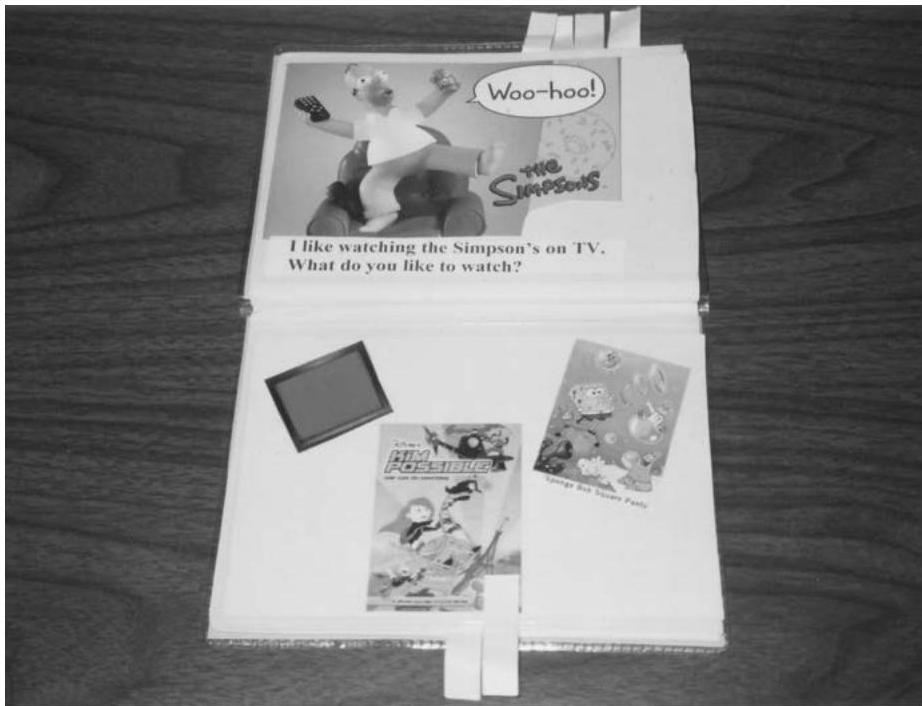

Figure 11.1. Conversation book with images that support interactions about favorite television programs. Photo by Lavada Minor. (From Downing, J. [2005]. Teaching communication skills to students with severe disabilities [2nd ed., p. 103]. Baltimore, MD: Paul H. Brookes Publishing Co.)

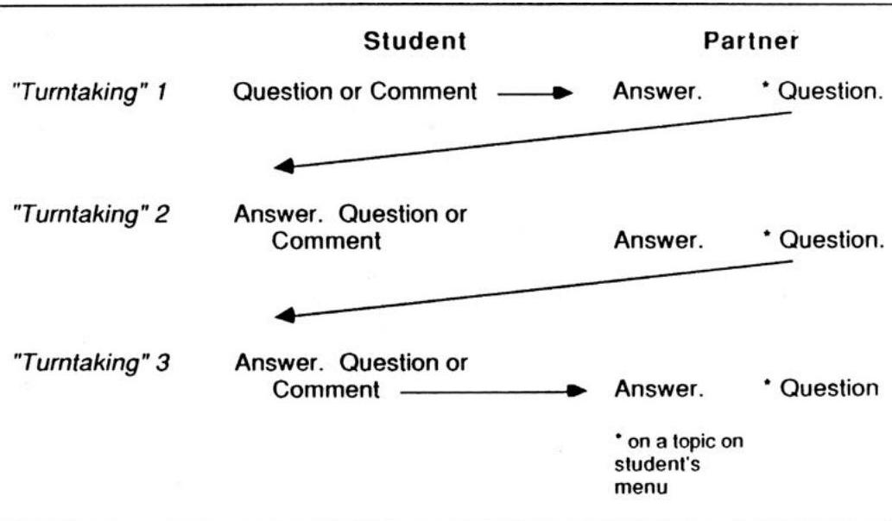

Figure 11.2. Turn-taking cycle for conversational coaching. (From Hunt, P., Alwell, M., &amp; Goetz, L. [1991b]. Interacting with peers through conversation turn taking with a communication book adaptation. Augmentative and Alternative Communication, 7, 120; Copyright © 1991 International Society for Augmentative and Alternative Communication, reprinted by permission of Taylor &amp; Francis Ltd., http://www.tandfonline.com on behalf of International Society for Augmentative and Alternative Communication.)

Intervention to Build Communicative Competence

Coaching strategies can also be taught to family members or peers, with the goal of teaching them to support the communication of individuals who use AAC during natural social routines. For example, Trottier, Kamp, and Mirenda (2011) taught six typically developing classmates to provide coaching to two boys with ASD during social game routines at school. Similar results were also reported for three preschoolers with ASD who were coached by their peers to use AAC during play routines (Trembath, Balandin, Togher, &amp; Stancliffe, 2009). Interventions using coaching have also been implemented successfully by families; for example, Cheslock and colleagues reported positive effects for a 30-year-old woman with moderate intellectual disability who was coached by her mother to use AAC during social exchanges (Cheslock, Barton-Hulsey, Romksi, &amp; Sevcik, 2008). Thus, it appears that service providers, family, and peers can be taught to provide coaching to successfully support both children and adults who rely on AAC in learning the skills to engage in extended social interactions.

Displaced Talk Not all social interactions revolve around ongoing shared activities; many involve displaced talk. Displaced talk is a term used to describe communication about past or future events (as opposed to communication about an ongoing activity). Many individuals with complex communication needs have difficulty participating in displaced talk as these conversations provide less contextual support and rely heavily on language skills alone. Caron and colleagues described an interesting intervention to support individuals who use AAC in learning to participate in displaced talk (Caron, Holyfield, Light, &amp; McNaughton, 2018). They utilized AAC video VSD technology with an 8-year-old boy with severe ASD to capture videos of meaningful events within his day (e.g., feeding the ducks at the local park, crashing his bike); they then added relevant vocabulary to allow him to communicate about the events. The videos provided contextual support to help him learn to engage in displaced talk about past events (see Figure 11.3 for a screen shot of a video VSD used to talk about past experiences).

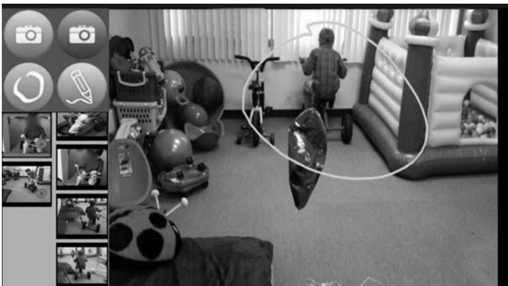

Figure 11.3. An example of a video visual scene display (VSD) used by a young boy with autism spectrum disorder to communicate about playing on his bike at school. The large right area is the location where videos with VSDs are displayed. The left menu includes options for navigating to different videos, pausing/playing videos, and adding vocabulary to communicate about the video. (From Caron, J., Holyfield, C., Light, J., &amp; McNaughton, D. (2018). "What have you been doing?": Supporting displaced talk through augmentative and alternative communication video visual scene display technology. Perspectives of the ASHA Special Interest Groups, 3, 123-135. doi:10.1044/persp3.SIG12.123; reprinted by permission.)

AAC Interventions for Individuals with Developmental Disabilities

## Story Telling

Often social conversations revolve around sharing stories of past experiences or events. Therefore, it is important that individuals who use AAC also develop narrative skills that extend beyond the sentence level to the discourse level of communication. Narratives are critical to identity development, social connections, and belonging (Soto, Solomon-Rice, &amp; Caputo, 2009). Because communication partners often control interactions, individuals who use AAC may have limited experience engaging in extended discourse. They may have never had the opportunity to serve as a narrator and tell a story (Waller, 2006). Given this lack of experience, it is not surprising to find that the narratives of children who use AAC are typically shorter, less complete, and less cohesive than those of their peers without disabilities (Smith et al., 2018). Individuals with complex communication needs typically require intervention to teach narrative skills to support social interactions. Waller and colleagues described intervention with a school-aged child that combined the use of AAC technology and instruction to support the development and retrieval of personal narratives (Waller et al., 2001). Soto and colleagues evaluated the effects of intervention to build narrative skills with school-aged children who use AAC (Soto et al., 2009). The intervention utilized photos of personal experiences, a story map, and language elicitation strategies (e.g., open-ended questions, fill-in-the-blank sentences, binary choices), as well as modeling of vocabulary and morphosyntactic structures. In addition to teaching narrative skills in face-to-face interactions, these skills are often targeted in literacy instruction as well (see Chapter 12).

As individuals who use AAC are called upon to participate increasingly in longer social conversations that require displaced talk about past and future events and story telling, they will need to rely more heavily on their language skills, emphasizing the importance of language intervention as described earlier. These skills will not only support extended interactions to build social closeness, but also interactions to exchange more complex information.

## Teach How to Exchange More Complex Information

When individuals who rely on AAC participate in educational placements, work environments, and community activities, they face demands to exchange complex information. For example, they may need to explain concepts to demonstrate their understanding of academic content at school; they may need to describe procedures to others at work; they may need to prepare presentations for classes, conferences, or other speaking engagements. Unlike the narrative skills used in social conversations and displaced talk, these interactions require skills in describing, explaining, and persuading. In this type of information exchange, the individual must be able to clearly establish the main idea and then provide more details to support the main argument. The information must typically be communicated with precision; the focus is on the actual content of the message rather than the social interaction (Light, 1988). The descriptive, explanatory, and persuasive communication skills required for these types of interactions are often learned through reading and may also be targeted expressively in writing instruction (see Chapter 12). Given the linguistic and operational demands of these types of interactions, individuals who use AAC may choose to prepare content in advance to communicate via preprogrammed messages stored in AAC technologies. Sometimes it may be preferable to use other media for this type of information exchange, including written reports, e-mails, or other digital communication media.

Intervention to Build Communicative Competence

As individuals who require AAC participate in a greater range of educational, vocational, and community activities, they inevitably encounter numerous barriers (policy, practice, attitude, knowledge, or skill barriers) that necessitate advocacy. Intervention to develop self-advocacy skills should start early on. Children with complex communication needs can start to learn strategies to stand up for themselves and ensure their rights from a young age. For example, initially, this may be as simple as providing feedback to an educational assistant as to an appropriate pace of feeding (e.g., smiling when the pace is appropriate; vocalizing and turning away when the pace is too fast; McNaughton, Rackensperger, Wehmeyer, &amp; Wright, 2010). Over time, individuals who use AAC may need to develop skills to exchange more complex information to advocate in situations that may involve a range of partners, both familiar and unfamiliar.

Sometimes the negative situations confronted by individuals with complex communication needs are very serious ones. Children and adults with disabilities are highly vulnerable to abuse and neglect. Those who rely on others for personal care are particularly vulnerable, and individuals with complex communication needs are even more likely to be victims due to their severe communication difficulties (Bryen, Carey, &amp; Frantz, 2003). When such maltreatment occurs, it severely compromises personal health, safety, and well-being, as well as overall quality of life. Given the increased risk for maltreatment of children and adults with disabilities, it is essential that AAC teams are cognizant of this risk, comply with mandated reporting responsibilities, and plan AAC intervention so that individuals with complex communication needs have the tools and the skills required to access required services and communicate effectively about maltreatment (e.g., Bornman, Bryen, Kershaw, &amp; Ledwaba, 2011; Collier, McGhie-Richmond, Odette, &amp; Pyne, 2006; White, Bornman, &amp; Johnson, 2018). (See Chapter 13 for further discussion of these important issues.)

In summary, individuals who use AAC require intervention to learn the sociolinguistic skills to 1) express more complex needs and wants, including interactions to manage personal care, patient-provider care, and emergency situations; 2) initiate and sustain social interactions, including ones built around shared activities, displaced talk, and storytelling; and 3) exchange more complex information, including descriptions and explanations at school or work, self-advocacy, and reporting of maltreatment.

## Intervention to Build Sociorelational Skills

Social interactions are tremendously important in developing social closeness with others and these social relationships are in turn critical to quality of life. Many individuals with developmental disabilities who rely on AAC report that they are lonely; a lack of meaningful communication with others contributes significantly to this loneliness (Balandin, Berg, &amp; Waller, 2009; Cooper, Balandin, &amp; Trembath, 2009; Østvik, Ytterhus, &amp; Balandin, 2018).

There are many examples of adults who use AAC who have developed communicative competence and have assumed leadership roles in the field, sharing their experiences and advocating for their rights. Please visit the online AAC Learning Center for a wide range of videos of individuals who use AAC communicating about their use of AAC to support their participation in society.

A parent of a school-aged child who uses AAC described the problem:

> No-one comes. We've invited them but nobody comes. For her birthday this year it did work, two kids actually came. But we asked last year at the end of the school year if any of her classmates would mind just popping over in the summer time, spending an hour with her, or going to the movies with her, and no-one volunteered, so . . . [long pause] . . . now she . . . she likes to be by herself and work on her computer and look up information. (Batorowicz, Campbell, von Tetzchner, King, & Missiuna, 2014, p. 245)

There are numerous factors that contribute to the lack of meaningful social interactions, including policy and practice barriers that result in isolation of individuals who use AAC, as well as attitudinal, knowledge, and skill barriers related to peers. (See Chapter 4 for further discussion of interventions to reduce these barriers.) In addition to these opportunity barriers, often individuals who use AAC demonstrate limitations in their sociorelational skills (Light et al. 2003) that may negatively impact their development of positive social relationships:

1. They may lack access to the vocabulary to support positive reciprocal social interactions.
2. They may lack the social experiences required to develop these skills.
3. They may experience specific deficits in social development that impact the use of sociorelational skills.
4. They may not receive appropriate intervention to support their learning of these skills.

Ironically, AAC intervention may unwittingly teach individuals who use AAC to interact in ways that do not promote social competence. For example, in an effort to provide individuals who use AAC with opportunities to practice their linguistic skills, AAC teams may frequently ask them questions and encourage them to talk about themselves believing that these experiences will be motivating and meaningful. Unintentionally, individuals who use AAC may learn that social interactions are all about them; they may not learn the skills to effectively reach out and demonstrate an interest in others, skills that are critical to social competence.

After high school graduation, Rosa (a young woman with cerebal palsy who relies on AAC) secured a job doing data entry. After her first two weeks, her job coach checked in. Rosa was able to meet the task requirements of the job, but overall things were not going well. Her co-workers were avoiding her at breaks and in the lunch room. They did not like spending time with her. They reported that she was self-focused and self-absorbed. All she did was talk about herself. Throughout high school, Rosa had had lots of opportunities to talk about her experiences with her teacher, her aide, and her speech-language pathologist to build her language skills, but she had never learned how to ask partners about their experiences and show an interest in their lives. She lacked the social skills that she required to be a valued co-worker. With intervention, she quickly learned to ask partner-focused questions and demonstrate an interest in others; doing so allowed her to build more positive, reciprocal relationships with her co-workers.

As this example illustrates, sociorelational skills are not just important in interactions for social closeness, but in any interaction with other people in school, work,

Intervention to Build Communicative Competence

home, or the community. Interactions to express needs and wants, exchange information, and build social closeness are much more successful when individuals who use AAC demonstrate positive sociorelational skills. Sociorelational skills bear special importance for individuals with complex communication needs as they may face significant barriers in forming interpersonal relationships (Anderson, Balandin, &amp; Clendon, 2011; Light et al., 2003).

What sociorelational skills should be targeted in intervention? Take a minute and reflect on the people with whom you enjoy interacting, as well as those with whom you do not. What is the difference between these two sets of people?

The classic book, How to Win Friends and Influence People (Carnegie, 2009), delineates the following key skills to build positive social relationships:

1. Show genuine interest in other people.
2. Smile; be positive.
3. Remember and use the person's name.
4. Be a good listener.
5. Talk in terms of the other person's interests.
6. Make the other person feel important—and do it sincerely.

All of these sociorelational skills depend on individuals demonstrating other-orientation skills. They must understand that different people have different experiences, perspectives, and beliefs (referred to as theory of mind; Baron-Cohen, Leslie, &amp; Frith, 1985). Once they develop this understanding, they are able to consider the social consequences of what they say and do. Tager-Flusberg (1997) explained the importance of these skills: "Much of our everyday use of language involves understanding intentions and related mental states in other people" (p. 155). Some individuals who require AAC may experience deficits in the development of theory of mind, impacting their sociorelational skills. They may have limited access via AAC to the state verbs (e.g., believe, think, know, feel) that are important to the development of theory of mind (Light et al., 2003). Given the challenges that individuals who use AAC face in the development of sociorelational skills, many will require concerted intervention to build knowledge, judgment, and skills in the sociorelational domain. Table 11.4 highlights some key sociorelational skills that may support individuals who use AAC in developing positive social relationships. Several interventions have been proposed to teach sociorelational skills, including ones that target the use of nonobligatory turns/listener feedback, active listening, partner-focused questions, and conflict resolution.

Jim Prentice, an expert communicator via AAC who worked as a statistical record keeper at a large company, poignantly illustrated the importance of developing social competence:

When I started to work, I'm sure that all the employees surrounding my workstation probably thought that I was someone from Mars. I rode in on my motorized wheelchair and had some sort of device attached to my chair. I rode past them and they really didn't know whether I was able to talk. If they did talk to me, they weren't sure I was able to answer them. . . . I stopped them in their tracks, before they were frozen on the spot, and said, "Good morning, my name is Jim. How are all of you doing today?" Big smiles came on their faces, and they seemed to answer in unison, "We are fine, and it's nice to have you working with us." That sure broke the ice. I felt like one of the team then. I made sure I programmed a few jokes into my communicator so that it would make my conversations more friendly and comfortable for them. It worked! (Prentice, 2000, p. 209)

AAC Interventions for Individuals with Developmental Disabilities

## Teach Use of Nonobligatory Turns/Listener Feedback

Communication partners value interactions with people who demonstrate active engagement in the interaction and listen to what is said. Often individuals who use AAC fulfill their obligatory turns (i.e., answer questions) in interactions, but forfeit their nonobligatory turns (i.e., fail to take turns following partners' comments; e.g., Light et al., 1985a). Communication partners dominate and carry the burden of the interaction. Research suggests that people perceive individuals who use AAC to be more competent communicators when they participate actively in the interaction and take nonobligatory turns compared to when they do not (Light, Binger, Bailey, &amp; Millar, 1997). Several interventions have taught individuals to use short nonobligatory turns following a partner's comment or statement to demonstrate their engagement and interest; these nonobligatory turns might include head nods, smiles, simple gestures (e.g., thumbs up), or short interjections communicated via AAC technologies (e.g., awesome, no way, yeah, uh-huh). These brief social interjections place few linguistic demands on the person who relies on AAC, but still provide important social feedback to let a communication partner know that the person who uses AAC is engaged and interested in the interaction. Buzolich, King, and Baroody (1991) reported the successful use of explicit instruction that utilized graduated prompting plus time delay to teach the use of these types of social comments (e.g., this is fun, sounds good, yuck) to three students who relied on AAC technologies. In a related study, Light and colleagues used strategy instruction successfully to teach individuals with a range of developmental disabilities to use nonobligatory turns in their interactions (Light et al., 1997). Following intervention, partners reported greater satisfaction with the interactions and perceived the individuals who used AAC to be more competent communicators. Teaching the use of simple nonobligatory turns to provide partner feedback and demonstrate engagement is an important first step in building sociorelational skills. Once individuals who use AAC develop these skills, they may benefit from intervention to teach more advanced active listening skills.

## Teach Active Listening Skills

McNaughton and Vostal (2010) developed an active listening strategy (known as the LAF, Don't CRY strategy) to support the development of positive social relationships. The LAF strategy targets the following positive sociorelational skills: 1) Listen and communicate respect; 2) Ask appropriate questions to demonstrate interest and find out more; and 3) Focus on what partners are saying and provide positive encouragement (e.g., Light et al., 2007). The strategy also cautions participants, "Don't CRY": 1) Don't criticize communication partners; 2) Don't react hastily without considering the consequences; and 3) Don't "yakkity yak" (i.e., talk excessively) about yourself. The LAF, Don't CRY strategy was taught to adults who used AAC using the strategy instruction model, implemented online. All of the participants successfully acquired the active listening skills and later applied the skills successfully to build positive relationships with adolescents who also used AAC within an online mentoring program. All of the adolescents indicated that they were very satisfied with their mentors and their interactions (Light et al., 2007).

## Teach Use of Partner-Focused Questions

One of the most powerful sociorelational skills is the use of partner-focused questions, that is, asking people about themselves and their interests. Unfortunately, AAC instruction often focuses primarily on teaching people to make requests for objects and activities, answer questions, and

Intervention to Build Communicative Competence

make comments, but not on teaching them to ask questions about their conversational partners' thoughts, feelings, and experiences (Blackstone &amp; Wilkins, 2009; Light et al., 2003). Partner-focused questions demonstrate an interest in the communication partner, encouraging interaction.

Randy Kitch, a disability rights activist who relies on AAC, highlighted the importance of partner-focused questions in this e-mail to an adolescent who also relied on AAC and was having difficulty making friends at school:

So you think you don't have any friends at school? Do you ask other students questions about themselves, about the homework assignments, and school activities? Sometimes you need to focus on them first before they will focus on you. (Light et al., 2003, p. 376)

There are a wide range of potential partner-focused questions, including How was your weekend?, What do you think?, What's up?, What do you have planned for tonight?, and How was your vacation? Light, Binger, Agate, and Ramsay (1999) used strategy instruction successfully to teach the generalized use of partner-focused questions to individuals who relied on AAC who ranged in age from 10 to 44 years. The participants and their communication partners all reported that their interactions were more enjoyable and lasted longer after intervention. Teaching the use of partner-focused questions may be particularly effective with individuals who use AAC who are still developing linguistic competencies. By asking partner-focused questions, they are able to engage actively in social interactions with minimal linguistic demands because they control the topic of the conversation; it is the partners who need to generate responses to questions.

Use of partner-focused questions improved social life for a young man named Chuck once these questions were programmed into his AAC technology. Chuck was 26 years old and had an intellectual disability. He lived in a group home and worked at the local grocery store bagging groceries. He had very limited speech. He was very excited to receive AAC technology with speech output and learned to use it effectively at work to greet customers and ask if they wanted "paper or plastic bags?" His speech-language pathologist programmed vocabulary into his AAC technology so that he could request preferred objects and activities, but she did not include any partner-focused questions. When Chuck came home from work, the group home staff typically put his AAC device away. They saw no need for him to use it as he was able to independently fulfill his needs and wants. Chuck was lonely; he had limited social interactions with others. We worked with Chuck's speech-language pathologist to add a range of partner-focused questions to his technology and taught him how to use them. When he got home from work, Chuck used his AAC technology to ask the group home staff and other residents about their interests and experiences. Everyone enjoyed interacting with Chuck when he asked partner-focused questions; no one put his AAC technology away.

A specific form of a partner-focused question that can be used to extend conversations is the response-recode strategy (Farrier, Yorkston, Marriner, &amp; Beukelman, 1985). When people respond to questions and then ask related questions in return (e.g., I'm going away for spring break. What are you doing?), they are using response-recodes. O'Keefe and Dattilo (1992) used explicit instruction to teach the response-recode

strategy successfully to three adults with developmental disabilities in conversations. Family members and caregivers reported lasting changes in the participants' social interactions and agreed that the skill was “fundamental to true conversational involvement” (O'Keefe & Dattilo, 1992, p. 231).

### Teach How to Give Feedback and Handle Conflict

Unfortunately, not all social relationships are positive all of the time. Sometimes things do not go as expected, and individuals who use AAC need to be able to provide feedback and handle conflict. Failure to handle problem situations effectively may have significant negative impacts, including personal feelings of frustration and anger, as well as poor care, health, and well-being.

Jon Feucht described the frustrations he experienced working with his personal care attendants and the process of learning to provide feedback and resolve conflicts:

> “I had a lot of problems when I first started working with attendants. The biggest problem was communication. I just didn't know how to get my point across without getting mad. Over time, I tried different techniques of getting my point across. I kept ideas that worked and abandoned those that failed.” (Feucht, 2001, p. 30)

Although some individuals learn how to provide feedback through trial and error, many would benefit from intervention to expedite their learning. Collier and Self (2010) suggest the following strategy to support individuals who use AAC in learning how to provide feedback and resolve conflict:

State what happened.Explain the impact using “I statements.”Wait and listen.Describe a concrete step(s) to resolve the problem.

Ariel used this strategy effectively to address an ongoing problem with a personal care attendant that affected her daily life and ability to work. Ariel is an artist; she sells her paintings at a local farmers' market and on Etsy. She has severe cerebral palsy and uses a powered wheelchair for mobility. She lives independently. She has only limited use of her hands and requires support from personal care attendants for all activities of daily living. One of her attendants had repeatedly shown up for work late, leaving Ariel stranded in bed. When her attendant finally showed up, Ariel implemented the strategy that she had learned to provide constructive feedback. First, she used her AAC technology to state what had happened and explain the impact: “You were more than an hour late for work today. When you are late, I feel angry and frustrated. I cannot get out of bed, eat, drink, or go to the bathroom. I cannot paint. If I do not paint, I cannot sell my paintings to earn a living.” She then waited and listened to her attendant's response. Then she presented some concrete steps to solve the problem: “Please make sure that you leave for work at least 20 minutes earlier in the morning. I know that the traffic is bad. That will give you more time for your commute. If something happens and you are going to be late, please phone to let me know right away. If you will be more than one hour late, please phone your agency to arrange a replacement.”

Learning strategies to provide feedback to others may not only improve interpersonal relationships and overall quality of life, but may also empower individuals

Intervention to Build Communicative Competence

who use AAC. These are not just important skills in daily living, but also in employment contexts.

As these interventions suggest, in many ways the development of sociorelational skills is more complex than learning linguistic or operational skills. In the case of sociorelational skills, individuals need to learn to use the target skills themselves while all the time monitoring their communication partners and adjusting skills accordingly based on their partners' responses. As a result, they may require extended practice with a wide range of partners in a variety of situations to develop competence in the sociorelational domain.

# STRATEGIC SKILLS

Despite intervention that targets skills in the linguistic, operational, and social domains, many individuals with complex communication needs still confront limitations in their communicative competence because of motor, sensory, cognitive, and/or linguistic impairments, substantial environmental barriers confronted in society, and the nature of communication via AAC. In these cases, they must develop coping strategies to bypass these limitations and allow them to make the best of what they do know and can do (Light, 1989; Light &amp; McNaughton, 2014). These compensatory strategies may be temporary, used for a time while the individual learns new linguistic, operational, and/or social skills; or the compensatory strategies may be required long term in situations where limitations in the linguistic, operational, and/or social domains cannot be remediated (Light, 1989). Often the most effective strategies grow out of the ingenuity and resourcefulness of individuals who rely on AAC. Mirenda and Bopp (2003) drew on the research and personal experiences of individuals who use AAC and developed a comprehensive review of strategies that might be used to overcome limitations in linguistic, operational, or social competence. Table 11.5

Table 11.5. Examples of strategies to overcome language, operational, and social challenges

|  Domain | Examples of knowledge, judgment, and skills required  |
| --- | --- |
|  Use compensatory strategies to bypass limitations in the linguistic domain | ·Ask partner to write/type or point to symbols to augment spoken input and bypass comprehension difficulties ·Use mementos to bypass vocabulary limitations and establish the topic ·Ask communication partner to provide choices to overcome vocabulary limitations ·Alert the partner that necessary vocabulary is not available ·Ask the partner to guess and provide clues to bypass vocabulary limitations  |
|  Use compensatory strategies to bypass limitations in the operational domain | ·Use telegraphic messages to enhance rate of communication ·Ask partner to predict as message is spelled to reduce fatigue and enhance rate of communication ·Have partner assist in locating appropriate page to help with navigational demands ·Prepare messages in advance to reduce partner waiting time  |
|  Use compensatory strategies to bypass limitations in the social domain | ·Use an introduction strategy to teach the partner what to do ·Use humor to maintain a positive rapport and put the partner at ease ·Use regulatory phrases to manage the interaction ·Use effective repair strategies as required to resolve communication breakdowns ·Utilize digital communication media to bypass demands of face-to-face interactions and increase social network  |

AAC Interventions for Individuals with Developmental Disabilities

provides examples of strategies used by individuals who require AAC to overcome linguistic, operational, and social limitations.

## Intervention to Build Strategic Competence

The research to date has investigated the effects of interventions that target strategic skills, such as introduction strategies, humor, regulatory phrases, and clarification strategies to repair communication breakdowns.

**Teach Introduction Strategies** Most people without disabilities have had no prior experience or training in how to interact with individuals who use AAC. They may be uncertain what to do. It may be important for individuals who rely on AAC to learn to use an introduction strategy when they meet someone new (Light &amp; Binger, 1998). An introduction strategy includes two key components: 1) information about the person's means of communication and 2) information about what the communication partner can do to facilitate the interaction (Light &amp; Binger, 1998). In some situations, the individual may want to also add some information about his or her disability, but this is not always necessary or appropriate. The key is to let the new communication partner know what to expect and how to interact.

Maureen is a 44-year-old woman with cerebral palsy who leads a very active life. She uses AAC technology to communicate and frequently encounters new communication partners in the community (e.g., stores, restaurants, sporting events) as well as at her job. She developed the following introduction strategy that she uses to let these new partners know what to expect and what to do when they interact with her.

HI. I UNDERSTAND WHAT IS SAID TO ME. I USE THIS COMPUTER TO COMMUNICATE; I JUST TYPE IN MY MESSAGE AND THE COMPUTER SPEAKS IT OUT. YOU CAN READ THE SCREEN IF YOU DO NOT UNDERSTAND. PLEASE WAIT PATIENTLY WHILE I AM TYPING ON THE COMPUTER. WHEN I SEND YOU A MESSAGE, CHECK WITH ME TO MAKE SURE YOU UNDERSTOOD CORRECTLY. I NOD MY HEAD TO SAY "YES" AND SHAKE MY HEAD TO SAY "NO." IF YOU DO NOT UNDERSTAND, PLEASE LET ME KNOW. THANKS! (Light &amp; Binger, 1998, p. 104)

Light and Binger (1998) utilized strategy instruction to teach individuals (ages 12–44 years) with a range of disabilities to use an introduction strategy successfully when encountering someone new. People perceived these individuals to be more competent communicators when they used an introduction strategy than when they did not. There may be some specific messages that are especially helpful as introduction strategies. For example, several studies have demonstrated the importance of a brief introductory message, called a *floorholder*, to warn communication partners that message construction may take longer than usual, in both face-to-face and telephone interactions (Bedrosian, Hoag, &amp; McCoy, 2003; Hanson &amp; Sundheimer, 2009).

Collier and Diamanti (2007) recommended that individuals who use AAC develop a personal communication passport or communication access card to explain how they communicate and what their communication partners should do. They provided the following advice for developing communication access cards: 1) Keep the instructions short and simple; 2) Focus on telling people what you want them to do when communicating with you; 3) Keep it real (e.g., a waiter in a restaurant needs to

know how to communicate to take your order; he or she does not need to know how to communicate with you on the phone or in other situations); 4) Have different access cards for different types of situations.

### Teach Use of Humor

Many communication partners feel uncomfortable when first interacting with someone who uses AAC. Some individuals who use AAC have a keen sense of humor, and they may use humor effectively to initiate interactions with others and put them at ease. Laughter decreases stress and also triggers the release of endorphins that make people feel good. Using humor to initiate an interaction may be as simple as sharing a joke card (with the riddle on one side and the answer on the other), or it may involve more complex storytelling using AAC technology with speech output. In planning these interventions, the AAC team should consider the linguistic and operational demands of the humor. Sometimes humor relies on exaggerated physical actions—what we call slapstick humor. In other cases, humor relies on inference and plays on words. Often humor relies on subtle timing that may be difficult for some individuals with disabilities. It is important that individuals who rely on AAC are actively involved in the selection of approaches that utilize humor and that humor is introduced in a way that is developmentally appropriate so that it is understood by the participants. It is also important that humor is introduced in a way that is respectful and is likely to be understood and interpreted positively by communication partners. Finally, it is important to remember that some people are funny and others are more serious. Not every person who uses AAC may want to use humor to initiate interactions. The intervention will be most effective if it is a good fit with the personality of the individual and if it is expected to be well received within the target environment.

Binh, who was attending college as a full-time student, often used humor to put others at ease. Binh was studying horticulture, with a focus on the propagation of orchids. He had cerebral palsy and relied on speech to communicate with familiar partners, but his speech was difficult for unfamiliar people to understand. He was having problems communicating in his classes with his professors and peers. He referred himself to the university clinic for an AAC assessment. The graduate students who were scheduled to conduct the assessment were very nervous as it was their first AAC assessment. Binh had excellent strategic competence. He recognized that they were nervous with him and used humor to put them at ease. He turned to them and said, “Would you like to see my high-tech system?” The graduate students indicated “yes,” eager to see the latest AAC technology. Binh then pulled out a battered old alphabet board and motioned to it: “Ta da!” The graduate students dissolved into laughter, immediately put at ease by Binh's keen sense of humor.

### Teach Use of Regulatory Phrases

Introduction strategies are intended to be used when first meeting unfamiliar partners; however, individuals who require AAC may also need to learn to use regulatory phrases to manage and control aspects of communication with familiar and unfamiliar partners during interactions. Often these regulatory phrases are related to the operation of AAC systems. Such phrases might provide directions to the communication partner with regard to positioning (e.g. can you please come over here where i can see you?); effective use of the AAC system (e.g. please say each letter as i point to it); obtaining and securing

AAC Interventions for Individuals with Developmental Disabilities

conversational turns (e.g., I HAVE SOMETHING TO SAY); or signaling the need to repair a communication breakdown (e.g., WAIT, THAT'S NOT WHAT I MEANT). Buzolich and Lunger (1995) reported on a case study in which an adolescent who relied on AAC was taught to use a variety of regulatory phrases when interacting with her classmates. After the instruction that utilized role playing and conversational coaching with peers, she was able to initiate more topics and use a wider variety of conversational strategies.

## Teach Use of Conversational Repairs

Even when introduction strategies and regulatory phrases are used, individuals may still encounter communication breakdowns. A key element of strategic competence is the use of repair strategies to resolve these breakdowns. Communication breakdowns may occur because of difficulties related to message intelligibility, conversational timing, partners' unfamiliarity with AAC, and numerous other factors (Brady &amp; Halle, 2002; Snell, Chen, Allaire, &amp; Park, 2008). The need for a repair strategy may be signaled explicitly when the communication partner requests clarification (e.g., What?, Pardon me?), or it may be indicated implicitly when the communication partner shows uncertainty, responds in a vague, noncommittal manner (e.g., by changing the topic, feigning understanding), or does not respond at all (Bedrosian et al., 2003; Brady &amp; Halle, 2002).

There are two basic types of repair strategies: repetitions and modifications (Halle, Brady, &amp; Drasgow, 2004). Repetition involves the individual communicating the same message again, using the same modality. Sometimes repetition is effective if the partner truly did not hear or see the initial communication. However, if the partner heard and/or saw the message and did not understand, simply repeating the message is usually not an effective repair strategy. In these cases, it is important for the individual to modify the communication in some way through an addition, reduction, or substitution. Additions involve adding a new element to the original message (e.g., signing JUICE again while also pointing to a glass), whereas reductions involve deleting an element (e.g., pointing emphatically to a single symbol for HELP rather than to the symbols I + WANT + HELP). Substitutions involve using a completely different message than the original one (e.g., activating AAC technology to say LEAVE ME ALONE rather than using speech approximations to say, "Can I please have some time to myself?").

Given the risk for communication breakdowns, many individuals who use AAC benefit from intervention that targets clarification or repair strategies. It can be challenging to teach repair strategies during actual communication breakdowns in naturally occurring interactions because it is difficult for clinicians to prompt appropriate repair strategies if they do not know what the individual is trying to communicate (Light &amp; Binger, 1998). It is not advisable to feign breakdowns in interactions where the communication partner has actually understood the message, as this provides the individual who uses AAC with false feedback about the effectiveness of the communication. Instead intervention may be most effective if it follows procedures such as these:

1. The clinician and the individual who uses AAC share knowledge of the topic (e.g., a movie or TV show they have both seen, a book they have read together, a magazine they have shared).
2. The individual who uses AAC then interacts with a communication partner who does not have the same shared experience.

3. The partner provides honest feedback when he or she does or does not understand the individual who uses AAC.
4. When communication breakdowns occur, the clinician uses coaching or prompting to support the individual who uses AAC in repairing the communication successfully using either repetition or modifications.

Teaching at least two forms of repair strategies is important so that if the first is unsuccessful, the person has another alternative option (Halle et al. 2004). All of the repair strategies targeted should be both socially appropriate and sufficiently transparent to communication partners to communicate the intended message.

Use of introduction strategies, conversational repair strategies, and regulatory phrases are just a few examples of some of the skills in the strategic domain that individuals who use AAC may need to learn to overcome intrinsic limitations in linguistic, operational, or social skills or extrinsic limitations from policy, practice, attitude, knowledge, or skill barriers from communication partners.

## Competence in Digital Communication

So far in this chapter we have focused on the development of communicative competence in face-to-face interactions. These interactions obviously play a critical role in daily life in families, at school, at work, in medical settings, and in the community. However, in today's society, communication extends well beyond face-to-face interactions to written communication and digital communication (e.g. texting, e-mail, social media; McNaughton & Light, 2013; Shane, Blackstone, Vanderheiden, Williams, & DeRuyter, 2012). Chapter 12 discusses intervention to teach literacy skills to individuals with complex communication needs so that they develop communicative competence in written communication. In this section, we briefly consider the need to build communicative competence in digital communication (e.g. e-mail, Facebook, Twitter, SnapChat, Instagram).

Digital communication has taken on an increasingly important role in recent years as media to enrich social interaction, but also for information exchange, education, medical care, employment, e-commerce, and activities of daily living, to name just a few purposes. Digital communication may take on even greater importance for individuals who use AAC given the challenges that they often encounter in face-to-face interactions; these media may increase opportunities for self-determination and self-representation while also enhancing friendships (e.g. Hynan, Goldbart, & Murray, 2015; Hynan, Murray, & Goldbart, 2014).

An adult with cerebral palsy who relies on AAC described the benefits of digital communication media as follows: “Face-to-face conversation is difficult using AAC because we get ignored or walked passed. Social media can help overcome this.” (Caron & Light, 2016, p. 30)

To use digital communication effectively, individuals with complex communication skills need to learn a range of new linguistic, operational, social, and strategic skills. They must have functional literacy skills to send and receive messages on many digital communication platforms. They may need to learn a new set of vocabulary (e.g. acronyms such as LOL -- laughing out loud; YOLO -- you only live once) and new syntactic rules (e.g. the average Tweet is around 25--35 characters with an upper limit

AAC Interventions for Individuals with Developmental Disabilities

of 280 characters), as well as a new set of sociolinguistic norms (e.g., knowing with whom to communicate, about what, when, where, in what form, and for what purposes to use digital communication; Light &amp; McNaughton, 2014). Furthermore, these social norms vary across digital platforms. Because digital communication is often asynchronous, individuals who use AAC must learn the rules for using each of these media without the benefit of immediate, visible, partner feedback.

With increased use of digital communication platforms, individuals with complex communication needs also face increased operational demands (Grace, Rhagavendra, Newman, Wood, &amp; Connell, 2014). Each of the digital communication tools is designed with different representations, organizations, and layouts of information as well as different access techniques; and each of these different designs imposes different learning demands (Light &amp; McNaughton, 2014). Typically these tools are not well integrated, so individuals who use AAC must also learn to navigate between apps or tools as required (Caron &amp; Light, 2016). Interestingly, many digital communication platforms (e.g., FaceBook, SnapChat, Instagram) also support extensive use of visual images (e.g., photos, videos) for expression. The use of visual images to supplement communication is definitely of benefit to many individuals who use AAC because these images can augment communication and reduce the burden on language and literacy skills. However, the use of digital images also increases operational demands, as individuals may need to learn to capture and post photos and videos as well as post comments or captions. Given the importance of digital communication and the constellation of skills required to use these media effectively, it is not surprising that adults with cerebral palsy have recommended that AAC teams prepare individuals who use AAC for effective digital communication (Caron &amp; Light, 2016). Ultimately, AAC teams should provide intervention to maximize the communicative competence of individuals who use AAC across a broad array of media—face-to-face interactions, digital communication, and written communication.

## PSYCHOSOCIAL FACTORS THAT SUPPORT COMMUNICATIVE COMPETENCE

The attainment of communicative competence, in face-to-face, digital, and written communication media, by individuals who rely on AAC is impacted not just by linguistic, operational, social, and strategic competence, but also by a range of psychosocial factors, including motivation, attitude, confidence, and resilience (Light, 2003). Individuals with complex communication needs often face substantial barriers in developing communicative competence. It is these psychosocial factors that determine whether they are motivated to learn the necessary skills, have the positive attitude required to do so, demonstrate the confidence to try (knowing that they may fail sometimes), and apply the resilience to bounce back and try again in the face of challenges (Light &amp; McNaughton, 2014).

## Motivation

Motivation is critical to the development of communicative competence, for it impacts the individual's desire or drive to communicate with others in daily situations (Light, 2003). Communication via AAC is challenging. When individuals are motivated, they are more likely to tackle the demands of communication via AAC; when motivation is low, they may be overwhelmed by these demands and may forfeit communication opportunities (Clarke, McConachie, Price, &amp; Wood, 2001).

Intervention to Build Communicative Competence

Jan Staehely, who uses AAC to support her communication, described the challenge of maintaining motivation when she did not have effective means to communicate:

I had become so used to not being able to say something in depth to a person that I started to believe that I was a person who didn't have much to tell people. . . . I fooled myself into thinking that I didn't have anything to say. (Staehely, 2000, p. 9)

People are most apt to be motivated when they believe that something is worth doing and that it is achievable. To build motivation, AAC intervention should 1) focus on meaningful communication opportunities that are truly valued by the individual and family, and 2) provide effective supports to ensure that the individual experiences success in attaining these goals.

## Attitude

In addition to motivation, communicative competence will also be determined, at least in part, by the attitudes of individuals with complex communication needs (and those of their families). Individuals are more apt to use AAC when they have positive attitudes toward these communication supports. Attitudes may be impacted by the individual's age, personality, skills, needs, prior experiences, and expectations, as well as the prior experiences and expectations of family and communication partners and the demands within the communication environment (Lasker &amp; Bedrosian, 2000). Attitudes are also impacted by factors related to AAC (e.g., learning demands, appearance, functionality). When individuals and their families reject AAC, the first step should always be to examine the relevance and functionality of the AAC system. AAC supports should always reflect the needs and priorities of the individual with complex communication needs and the family.

Rob Rummel-Hudson has a daughter, Schuyler, who requires AAC. He described the effect of different AAC systems on his daughter's attitude toward AAC and, as a result, her willingness or unwillingness to utilize AAC to support her communication:

Her enthusiasm [with her new AAC technology] was perhaps the most significant development, perhaps more important than whether or not she intuitively "got it." She did, but even better, she was fascinated by the device. She used it for everything. . . . We knew that if a speech prosthesis was going to work for her, it was going to be because she took the initiative to make it happen, the same way she came to embrace sign language and, conversely, the way she completely rejected the picture identification system that every one of her schools had tried to get her to use . . . My pity went out to the person who tried to make Schuyler do something she didn't want to do, or who tried to keep her from doing something she liked. (Rummel-Hudson, 2008, p. 223).

The way that the team introduces AAC may impact strongly the attitudes of individuals with complex communication needs and their families. Sometimes, AAC is introduced as a last resort, a method of communication to be used because the individual has "failed" to develop speech. It is more appropriate and effective to introduce AAC as what it is—a means to enhance communication effectiveness and support participation.

## Confidence

Motivation impacts the individual's drive to communicate. Attitudes toward AAC impact willingness to use AAC to communicate. However, it is confidence that actually determines the individual's propensity to use AAC in any given situation

(Light & McNaughton, 2014). Using AAC to meet communication needs requires individuals to try techniques that are new and unfamiliar to them, their communication partners, and society generally. Often they must make this leap without having experienced models of others who successfully communicate using AAC (Ballin et al. 2009). Seeing or interacting with others who use AAC who have attained communicative competence may serve as a critical support in building communicative confidence (Ballin, Balandin, & Stancliffe, 2012).

Rick Creech (1995), who was a pioneer in his use of AAC in both postsecondary settings and the workplace, explained:

> Until we have seen a fluent interactive, augmented speaker who shares our physical circumstances, there may have been little in our personal experience to indicate that we, ourselves, would someday actually ‘talk'. (p. 12)

## Resilience

Confidence may determine the individual's propensity to attempt to communicate, but it is resilience that influences whether or not the individual perseveres despite the many challenges and potential failures that may be encountered. Resilience refers to the individual's capacity to “prevent, minimize, or overcome the damaging effects of adversity” (Grotberg, 1995, p. 7). It is inevitable that individuals with complex communication needs will confront failure at times in their attempts to communicate successfully. Communication failures provide important opportunities for learning and may ultimately fuel subsequent success, but only if the individual is resilient enough to move on and try again. Resilience may be bolstered by protective factors, including both individual resources (e.g. problem-solving skills, self-esteem, optimism, faith) and environmental factors (e.g. encouragement and support from family, mentors, peers, or others; Luthar, Cicchetti, & Becker, 2000; Masten, 2001). Individuals with more protective factors are more likely to demonstrate resilience in the face of communication failures and are more apt to continue to work toward building communicative competence in the face of adversity (Dickerson, Stone, Panchura, & Usiak, 2002; Smith & Murray, 2011).

The following e-mail was sent by an adolescent with cerebral palsy who used AAC who was having trouble making friends at school: “The other kids at school are rude. . . . I mean I don't have any friends in school. They just freak out about my chair. . . . I'm too tired with everyone's reactions. . . . I gave up with my peers.”

An adult mentor who also had cerebral palsy and used AAC responded as follows, encouraging resilience: “You can't give up on your peers because you need to educate them. Get real . . . you're only 16 and they are too . . . They are human. Humans need someone else to teach them that people with disabilities are just like anyone else. I went through the same thing you are going through. . . . Giving up is the easy way out. Of course, it's your decision.” (Light, McNaughton, Krezman, & Williams, 2002)

## Intervention to Build Positive Psychosocial Factors

Given the impact of motivation, attitude, confidence, and resilience on the development of communicative competence, AAC teams should consider interventions to

Intervention to Build Communicative Competence

address these factors. One important intervention goal to target is problem-solving skills. Several studies have evaluated the effects of online instruction utilizing principles of strategy instruction to teach a problem-solving strategy, specifically the DO IT! strategy. The DO IT! strategy includes the following steps to support effective problem solving: 1) Describe the problem, 2) Outline potential ways to solve the problem, 3) Identify the best solution, 4) Take action, and 5) Celebrate success! The adults and adolescents with complex communication needs who participated in the online instruction acquired the problem-solving strategy, generalized use to actual interactions, and reported satisfaction applying the strategy in their daily lives (Light et al., 2007; McCarthy, Light, &amp; McNaughton, 2007).

Not all interventions to address psychosocial factors follow traditional models of service delivery by professionals. Mentor programs may be a powerful way to build motivation, positive attitudes, confidence, and resilience. It has been said that a mentor provides a brain to pick, a shoulder to cry on, and a kick in the pants. There are a number of examples of successful mentoring programs for individuals who rely on AAC (e.g., Ballin et al., 2012; Cohen &amp; Light, 2000; Grace, Rhagavendra, McMillan, &amp; Gunson, 2019; Light et al., 2007). These programs have linked adolescents or younger individuals who rely on AAC with adult mentors who also use AAC, often via digital communication media (e.g., e-mail, FaceBook, Skype). Results suggest that mentoring by adults who are successful using AAC may be effective in easing transitions, solving problems, and building confidence and resilience for younger individuals who require AAC.

Michael Williams (1996), who is himself an expert communicator via AAC, described the importance of mentoring:

Falling in love, starting a new school, starting a new job, changing communities or homes, mastering a skill, learning a new piece of assistive technology—all are easier and more fun if the experience can be shared with and guided by someone who has 'been there'. (p. 1)

Light and colleagues (2007) found that mentors and protégés discussed a wide range of challenges within the mentoring program, including attitude barriers in society, limitations of AAC technologies, funding delays, technology breakdowns, gaps in the service delivery system, lack of knowledgeable service providers, low expectations, lack of meaningful roles, stereotypes, lack of preparation for independence, difficulty finding appropriate personal care attendants or educational assistants, family stresses and supports, challenges making friends and building close relationships, social isolation, and frustrations about their disabilities. Mentoring programs seem to benefit not only the protégés, but also their mentors (Light et al., 2007).

Michael Williams (1996) highlighted the benefits of mentoring, not just for protégés who receive support and encouragement, but also for mentors who have the opportunity to make a positive contribution:

As we master an area of our lives, it is important to go back and find someone else who would like to master the same thing. When you teach someone what you know, there are now two of you blazing the trail rather than you by yourself. (p. 4)

AAC Interventions for Individuals with Developmental Disabilities

# CONCLUSIONS

The development of communicative competence is critically important for individuals who use AAC to ensure their effective participation in all aspects of society, including family life, education, employment, health care, and community activities. The development of communicative competence is a complex process that rests on knowledge, judgment, and skills in four interrelated domains—linguistic, operational, social, and strategic. Furthermore, the development of communicative competence is affected by a range of psychosocial factors, including motivation, attitude, confidence, and resilience.

Individuals with complex communication needs face significant challenges in developing communicative competence due to intrinsic factors (e.g., motor, sensory, cognitive, linguistic skills) as well as environmental barriers (e.g., policy, practice, attitude, knowledge, skill barriers) and AAC system constraints. Despite these challenges, there are numerous examples of individuals with developmental disabilities who use AAC who have developed communicative competence, are self-determined, and are highly successful participants in a wide range of educational, vocational, and community activities (see the videos of individuals who use AAC talking about their experiences at the online AAC Learning Center). Research clearly demonstrates that, with effective intervention, individuals who use AAC are able to build a wide array of linguistic, operational, social, and strategic skills as well as motivation, positive attitude, confidence, and resilience. It is incumbent upon AAC teams to work with individuals who use AAC and their families to set appropriate goals to further communicative competence, design evidence-based intervention to teach these skills, and collect data (both performance data and consumer satisfaction data) on a regular basis to ensure the effectiveness of the intervention. It is also critical for these teams to advocate with individuals who use AAC and their families to reduce policy, practice, attitude, knowledge, and skill barriers to ensure that they have meaningful opportunities to participate fully in society.

# QUESTIONS

11.1. What is communicative competence? Individuals who require AAC need to develop knowledge, judgment, and skills in four interrelated domains to build communicative competence. What are these domains?

11.2. What language skills do individuals who require AAC need to develop? What challenges do they face in developing these skills? What interventions might be used to build semantic skills? What interventions might be used to teach morphosyntactic skills?

11.3. What operational skills do individuals who require AAC need to develop? What challenges do they face in developing these skills?

11.4. What are sociolinguistic skills? Why are they important for individuals who require AAC? What challenges do they face in developing sociolinguistic skills? What interventions might be used to build sociolinguistic skills?

11.5. What are sociorelational skills? Why are they important for individuals who require AAC? What challenges do they face in developing sociorelational skills? What interventions might be used to build sociorelational skills?

Intervention to Build Communicative Competence

11.6. What is meant by strategic competence? Provide some examples of strategies that might be used to overcome limitations in linguistic, operational, and social skills.

11.7. What psychosocial factors affect communicative competence? Why are these factors important? What interventions have been used to build motivation, positive attitudes, confidence, and resilience?

# REFERENCES

Allen, A. A., Schlosser, R. W., Brock, K. L., &amp; Shane, C. (2017). The effectiveness of aided augmented input techniques for persons with developmental disabilities: A systematic review. *Augmentative and Alternative Communication*, 33, 149–159. doi:10.1080/07434618.2017.1338752

Ambridge, B., &amp; Lieven, E. V. M. (2011). *Child language acquisition: Contrasting theoretical approaches*. New York, NY: Cambridge University Press.

Anderson, K., Balandin, S., &amp; Clendon, S. (2011). "He cares about me and I care about him." Children's experiences of friendship with peers who use AAC. *Augmentative and Alternative Communication*, 27, 77–90. doi:10.3109/07434618.2011.577449

Archer, A. L., &amp; Hughes, C. A. (2011). *Explicit instruction: Effective and efficient teaching*. New York, NY: The Guildford Press.

Armstrong, R., Arnott, W., Copland, D. A., McMahon, K., Khan, A., Najman, J. M., &amp; Scott, J. G. (2017). Change in receptive language vocabulary from childhood to adulthood: Associated mental health, education and employment outcomes. *International Journal of Language and Communication Disorders*, 52, 561–572. doi:10.1111/1460-6984.12301

Balandin, S., Berg, N., &amp; Waller, A. (2009). Assessing the loneliness of older people with cerebral palsy. *Disability and Rehabilitation*, 28, 469–479. doi:10.1080/09638280500211759

Ballin, L., Balandin, S., &amp; Stancliffe, R. J. (2012). The speech-generating device (SGD) mentoring program: Training adults who use an SGD to mentor. *Augmentative and Alternative Communication*, 28, 254–265. doi:10.3109/07434618.2012.708880

Ballin, L., Balandin, S., Stancliffe, R. J., &amp; Togher, L. (2011). Speech-language pathologists' views on mentoring by people who use speech generating devices. *International Journal of Speech-Language Pathology*, 13, 446–457. doi:10.3109/17549507.2011.522254

Ballin, L., Balandin, S., Togher, L., &amp; Stancliffe, R. J. (2009). Learning to use augmentative and alternative communication (AAC): Is there a mentoring role for adults experienced in using AAC? *Journal of Intellectual and Developmental Disability*, 34, 89–91. doi:10.1080/13668250802676038.

Barker, R. M., Akaba, S., Brady, N. C., &amp; Thiemann-Bourque, K. (2013). Support for AAC use in preschool, and growth in language skills, for young children with developmental disabilities. *Augmentative and Alternative Communication*, 29, 334–346. doi:10.3109/07434618.2013.848933

Baron-Cohen, S., Leslie, A. M., &amp; Frith, U. (1985). Does the autistic child have a "theory of mind"? *Cognition*, 21, 37–46. doi:10.1016/0010-0277(85)90022-8

Basil, C. (1992). Social interaction and learned helplessness in severely disabled children. *Augmentative and Alternative Communication*, 8, 188–199. doi:10.1080/07434619212331276183

Batorowicz, B., Campbell, F., von Tetzchner, S., King, G., &amp; Missiuna, C. (2014). Social participation of school-aged children who use communication aids: The views of children and parents. *Augmentative and Alternative Communication*, 30, 237–251. doi:10.3109/07434618.2014.940464

Bedrosian, J. L., Hoag, L. A., &amp; McCoy, K. F. (2003). Relevance and speed of message delivery trade-offs in augmentative and alternative communication. *Journal of Speech, Language, and Hearing Research*, 46, 800–817. doi:10.1044/1092-4388(2003/063)

Binger, C., Kent-Walsh, J., Berens, J., del Campo, S., &amp; Rivera, D. (2008). Teaching Latino parents to support the multi-symbol message productions of their children who require AAC. *Augmentative and Alternative Communication*, 24, 323–338. doi:10.1080/07434610802130978

Binger, C., Kent-Walsh, J., Ewing, C., &amp; Taylor, S. (2010). Teaching educational assistants to facilitate the multisymbol message productions of young students who require augmentative and alternative communication. *American Journal of Speech-Language Pathology*, 19, 108–120. doi:10.1044/1058-0360(2009/09-0015)

AAC Interventions for Individuals with Developmental Disabilities

Binger, C., Kent-Walsh, J., King, M., Webb, E., &amp; Buenviaje, E. (2017). Early sentence productions of 5-year-old children who use augmentative and alternative communication. Communication Disorders Quarterly, 38, 131-142. https://doi.org/10.1177/1525740116655804

Binger, C., &amp; Light, J. (2007). The effect of aided AAC modeling on the expression of multi-symbol messages by preschoolers who use AAC. Augmentative and Alternative Communication, 23, 30-43. doi:10.1080/07434610600807470

Binger, C., &amp; Light, J. (2008). The morphology and syntax of individuals who use AAC: Research review and implications for effective practice. *Augmentative and Alternative Communication*, 24, 123-138. doi:10.1080/07434610701830587.

Binger, C., Maguire-Marshall, M., &amp; Kent-Walsh, J. (2011). Using aided AAC models, recasts, and contrastive targets to teach grammatical morphemes to children who use AAC. Journal of Speech, Language, and Hearing Research, 54, 160-176. doi:10.1044/1092-4388(2010/09-0163)

Blackstone, S., &amp; Hunt Berg, M. (2012). Social networks: A communication inventory for individuals with complex communication needs and their communication partners. Verona, WI: Attainment Co.

Blackstone, S., &amp; Wilkins, D. (2009). Exploring the importance of emotional competence in children with complex communication needs. Perspectives on Augmentative and Alternative Communication, 18, 78-87. doi:10.1044/aac18.3.78

Blockberger, S., &amp; Johnston, J. (2003). Grammatical morphology acquisition by children with complex communication needs. Augmentative and Alternative Communication, 19, 207-221. doi:10.1080/07434610310001598233

Blockberger, S., &amp; Sutton, A. (2003). Toward linguistic competence: Language experiences and knowledge of children with extremely limited speech. In J. C. Light, D. R. Beukelman, &amp; J. Reichle (Eds.), Communicative competence for individuals who use AAC: From research to effective practice (pp. 63-106). Baltimore, MD: Paul H. Brookes Publishing Co.

Bornman, J., Bryen, N., Kershaw, P., &amp; Ledwaba, G. (2011). Reducing the risk of being a victim of crime in South Africa: You can tell and be heard! Augmentative and Alternative Communication, 27, 117-130. doi:10.3109/07434618.2011.566696.

Brady, N. C., &amp; Halle, J. W. (2002). Breakdowns and repairs in conversations between beginning AAC users and their partners. In J. Reichle, D. R. Beukelman, &amp; J. C. Light (Eds.), Exemplary practices for beginning communicators: Implications for AAC (pp. 323-351). Baltimore, MD: Paul H. Brookes Publishing Co.

Bruno, J., &amp; Trembath, D. (2006). Use of aided language stimulation to improve syntactic performance during a weeklong intervention program. *Augmentative and Alternative Communication*, 22, 300-313. doi:10.1080/07434610600768318

Bryen, D., Carey, A., &amp; Frantz, B. (2003). Ending the silence: Adults who use augmentative communication and their experiences as victims of crimes. *Augmentative and Alternative Communication*, 19, 125-134. doi:10.1080/0743461031000080265

Buzolich, M., &amp; Lunger, J. (1995). Empowering system users in peer training. *Augmentative and Alternative Communication*, 11, 37-48. doi: 10.1080/07434619512331277129

Buzolich, M., King, J., &amp; Baroody, S. (1991). Acquisition of the commenting function among system users. *Augmentative and Alternative Communication*, 7, 88-99. doi:10.1080/07434619112331275753

Calculator, S., &amp; Dollaghan, C. (1982). The use of communication boards in a residential setting. Journal of Speech and Hearing Disorders, 14, 281-287. doi:10.1044/jshd.4703.281

Carey, S., &amp; Bartlett, E. (1978). Acquiring a single new word. Papers and Reports on Child Language Development, 15, 17-29.

Carnegie, D. (2009). How to win friends and influence people. New York, NY: Pocket Books.

Caron, J., Holyfield, C., Light, J., &amp; McNaughton, D. (2018). "What have you been doing?": Supporting displaced talk through augmentative and alternative communication video visual scene display technology. Perspectives of the ASHA Special Interest Groups, 3, 123-135. doi:10.1044/persp3.SIG12.123

Caron, J., &amp; Light, J. (2016). "Social media has opened a world of 'open communication'": Experiences of adults with cerebral palsy who use augmentative and alternative communication and social media. *Augmentative and Alternative Communication*, 32, 25-40. doi:10.3109/07434618.2015.1052887

Carter, M. (2003a). Communicative spontaneity of children with high support needs who use augmentative and alternative communication systems. Part I: Classroom spontaneity, mode, and function. Augmentative

Intervention to Build Communicative Competence

and Alternative Communication, 19, 141-154. doi:10.1080/0743461031000112052
Carter, M. (2003b). Communicative spontaneity of children with high support needs who use augmentative and alternative communication systems. Part II: Antecedents and effectiveness of communication. *Augmentative and Alternative Communication*, 19, 155-169. doi:10.1080/0743461031000112025
Chen, S.-H. K., &amp; O'Leary, M. (2018). Eye gaze 101: What speech-language pathologists should know about selecting eye gaze augmentative and alternative communication systems. Perspectives of the ASHA Special Interest Groups, 3, 24-32. https://doi.org/10.1044/persp3.SIG12.24
Cheslock, M., Barton-Hulsey, A., Romski, M. A., &amp; Sevcik, R. (2008). Using a speech-generating device to enhance communicative abilities for an adult with moderate intellectual disability. *Intellectual and Developmental Disabilities*, 46, 376-386. doi:10.1352/2008.46:376-386.
Clarke, H., McConachie, K., Price, P., &amp; Wood, M. (2001). Views of young people using augmentative and alternative communication systems. International Journal of Language and Communication Disorders, 36, 107-115. doi:10.1080/13682820119446
Clarke, M. T., Soto, G., &amp; Nelson, K. (2017). Language learning, recasts, and interaction involving AAC: Background and potential for intervention. *Augmentative and Alternative Communication*, 33, 42-50. doi:10.1080/07434618.2016.1278130.
Cohen, C., &amp; Light, J. (2000). Use of electronic communication to develop mentor-protege relationships between adolescent and adult users: Pilot study. *Augmentative and Alternative Communication*, 16, 227-238. doi:10.1080/07434610012331279084
Collier, B., &amp; Diamanti, T. (2007, March). What we know for sure: Fostering self-advocacy in youth who use AAC. Keynote address at the annual conference of the United States Society for Augmentative and Alternative Communication, Los Angeles, CA.
Collier, B., McGhie-Richmond, D., Odette, F., &amp; Pyne, J. (2006). Reducing the risk of people who use augmentative and alternative communication. *Augmentative and Alternative Communication*, 22, 62-75. doi:10.1080/07434610500387490
Collier, B., &amp; Self, H. (2010). Preparing youth who use AAC to communicate with their personal assistants. In D. B. McNaughton &amp; D. R. Beukelman (Eds.), *Transition strategies for adolescents and young adults who use AAC* (pp. 163-180). Baltimore, MD: Paul H. Brookes Publishing Co.
Cooper, L., Balandin, S., &amp; Trembath, D. (2009). The loneliness experiences of young adults with cerebral palsy who use alternative and augmentative communication. *Augmentative and Alternative Communication*, 25, 154-164. doi:10.1080/07434610903036785.
Creech, R. D. (1995). Reflections from a unicorn. RC Publishing.
Dattilo, J., &amp; Camarata, S. (1991). Facilitating conversation through self-initiated augmentative communication treatment. Journal of Applied Behavior Analysis, 24, 369-378. doi:10.1901/jaba.1991.24-369
Dickerson, S. S., Stone, V. I., Panchura, C., &amp; Usiak, D. J. (2002). The meaning of communication: Experiences with augmentative communication devices. *Rehabilitation Nursing*, 27, 215-220. doi:10.1002/j.2048-7940.2002.tb02016.x
Downing, J. (2005). Teaching communication skills to students with severe disabilities (2nd ed.). Baltimore, MD: Paul H. Brookes Publishing Co.
Drager, K., Postal, V., Carrolus, L., Castellano, M., Gagliano, C., &amp; Glynn, J. (2006). The effect of aided language modeling on symbol comprehension and production in 2 preschoolers with autism. American Journal of Speech-Language Pathology, 15, 112-125. doi:10.1044/1058-0360(2006/012)
Duursma, E., Augustyn, M., &amp; Zuckerman, B. (2008). Reading aloud to children: The evidence. Archives of Disease in Childhood, 93, 554-557. doi:10.1136/adc.2006.106336
Estrella, G. (2000). Confessions of a blabber finger. In M. Fried-Oken &amp; H. A. Bersani, Jr. (Eds.), Speaking up and spelling it out: Personal essays on augmentative and alternative communication (pp. 31-45). Baltimore, MD: Paul H. Brookes Publishing Co.
Fager, S. K., Fried-Oken, M., Jakobs, T., &amp; Beukelman, D. R. (2019). New and emerging access technologies for adults with complex communication needs and severe motor impairments: State of the science. *Augmentative and Alternative Communication*, 35, 13-25. doi:10.1080/07434618.2018.1556730
Farrier, L., Yorkston, K., Marriner, N., &amp; Beukelman, D. R. (1985). Conversational control in nonimpaired speakers using an augmentative communication system. *Augmentative and Alternative Communication*, 1, 65-73. doi:10.1080/07434618512331273551
Feldman, H. M., &amp; Messick, C. (2009). Language and speech disorders. In W. B. Carey, A. C. Crocker, E. R. Elias,

AAC Interventions for Individuals with Developmental Disabilities

H. M. Feldman, &amp; W. L. Coleman (Eds.), Developmental-behavioural pediatrics (4th ed., pp. 717–729). Philadelphia, PA: Saunders Elsevier.

Feucht, J. (2001). Authentic voices of America. In R. V. Conti &amp; C. Jenkins-Odorisio (Eds.), Proceedings of the Pittsburgh Employment Conference for Augmented Communicators (pp. 30–42). Pittsburgh, PA: Shout Press.

Fey, M. (2008). Thoughts on grammar intervention in AAC. Perspectives on Augmentative and Alternative Communication, 17, 43–49. doi:10.1044/aac17.2.43

Fried-Oken, M., &amp; Bersani, H.A., Jr. (Eds.). (2000). Speaking up and spelling it out: Personal essays on augmentative and alternative communication. Baltimore: Paul H. Brookes Publishing Co.

Geist, L., &amp; Erickson, K. (2016). Core vocabulary AAC instruction for students with significant cognitive disabilities. Presentation at the Annual Conference of the Assistive Technology Industry Association (ATIA), Orlando, FL.

Gerber, S., &amp; Kraat, A. (1992). Use of a developmental model of language acquisition: Applications to children using AAC systems. Augmentative and Alternative Communication, 8, 19–32. doi:10.1080/07434619212331276013

Gevarter, C., O'Reilly, M. F., Rojeski, L., Sammarco, N., Lang, R., Lancioni, G. E., &amp; Sigafoos, J. (2013). Comparing communication systems for individuals with developmental disabilities: A review of single-case research studies. Research in Developmental Disabilities, 32, 4415–4432. doi:10.1016/j.ridd.2013.09.017

Goossens, C., Crain, S., &amp; Elder, P. (1992). Engineering the preschool environment for interactive symbolic communication. Birmingham, AL: Southeast Augmentative Communication Conference Publications.

Grace, E., Rhagavendra, P., McMillan, J. M., &amp; Gunson, J. S. (2019). Exploring participation experiences of youth who use AAC in social media settings: Impact of an e-mentoring intervention. Augmentative and Alternative Communication, 35, 132–141. doi:10.1080/07434618.2018.1557250

Grace, E., Rhagavendra, P., Newman, L., Wood, D., &amp; Connell, T. (2014). Learning to use the internet and online social media: What is the effectiveness of home-based intervention for youth with complex communication needs? Child Language Teaching and Therapy, 30, 141–157. doi:1177%2F0265659013518565

Gregory, C., &amp; McNaughton, S. (1993, September). Language! Welcoming a parent’s perspective. Communicating Together, 11(3), 21–23.

Grotberg, E. H. (1995). A guide to promoting resilience in children: Strengthening the human spirit. Early Childhood Development: Practice and Reflections, Number 8. The Hague, The Netherlands: Bernard Van Leer Foundation. Retrieved from https://bibalex.org/baifa/Attachment/Documents/115519.pdf

Halle, J., Brady, N., &amp; Drasgow, E. (2004). Enhancing socially adaptive communicative repairs of beginning communicators with disabilities. American Journal of Speech-Language Pathology, 13, 43–54. doi:10.1044/1058-0360(2004/006)

Hanson, E. K., &amp; Sundheimer, C. (2009). Telephone talk: Effects of timing and use of a floorholder message on telephone conversations using synthesized speech. *Augmentative and Alternative Communication*, 25, 90–98. doi:10.1080/07434618.2016.1205132

Harris, O. (2015). A cultural basis to develop strong advocates for client and family involvement in the speech-generated device evaluation and funding process. Perspectives on Augmentative and Alternative Communication, 24, 142–146. doi:10.1044/aac24.4.142

Hart, B., &amp; Risley, T. R. (1995). Meaningful differences in the everyday experience of young American children. Baltimore, MD: Paul H. Brookes Publishing Co.

Hart, B., &amp; Risley, T. R. (1999). The social world of children learning to talk. Baltimore, MD: Paul H. Brookes Publishing Co.

Holyfield, C., Drager, K., Light, J., &amp; Caron, J.G. (2017). Typical toddlers’ participation in “just-in-time” programming of vocabulary for visual scene display augmentative and alternative communication apps on mobile technology: A descriptive study. American Journal of Speech-Language Pathology, 26, 737–749. doi:10.1044/2017_AJSLP-15-0197

Horton, R., Horton, K., &amp; Meyers, L. (2001, August). Getting the literacy and language skills needed for employment: Teaching is the solution. In Proceedings of the Eighth Pittsburgh Employment Conference for Augmented Communicators (pp. 46–51). Pittsburgh, PA: Shout Press.

Hunt, P., Alwell, M., &amp; Goetz, L. (1988). Acquisition of conversation skills and the reduction of inappropriate social interaction behaviors. Journal of the Association for Persons with Severe Handicaps, 13, 20–27. doi:10.1177/154079698801300103

Intervention to Build Communicative Competence

Hunt, P., Alwell, M., &amp; Goetz, L. (1991a). Establishing conversational exchanges with family and friends: Moving from training to meaningful communication. Journal of Special Education, 25, 305-319. doi:10.1177/002246699102500304
Hunt, P., Alwell, M., &amp; Goetz, L. (1991b). Interacting with peers through conversation turn taking with a communication book adaptation. *Augmentative and Alternative Communication*, 7, 117-126. doi:10.1080/07434619112331275783
Hynan, A., Goldbart, J., &amp; Murray, J. (2015). A grounded theory of internet and social media use by young people who use augmentative and alternative communication (AAC). Disability and Rehabilitation, 37, 1559-1575. doi:10.3109/09638288.2015.1056387
Hynan, A., Murray, J., &amp; Goldbart, J. (2014). 'Happy and excited': Perceptions of using digital technology and social media by young people who use augmentative and alternative communication. *Child Language Teaching and Therapy*, 30, 175-186. https://doi.org/10.1177/0265659013519258
Iacono, T. A. (2003). Pragmatic development in individuals with developmental disabilities who use AAC. In J. C. Light, D. R. Beukelman, &amp; J. Reichle (Eds.), *Communicative competence for individuals who use AAC: From research to effective practice* (pp. 323-360). Baltimore, MD: Paul H. Brookes Publishing Co.
Iacono, T., Mirenda, P., &amp; Beukelman, D.R. (1993). Comparison of unimodal and multimodal AAC techniques for children with intellectual disabilities. *Augmentative and Alternative Communication*, 9, 83-94. doi:10.1080/07434619312331276471
Kent-Walsh, J., Binger, C., &amp; Buchanan, C. (2015). Teaching children who use augmentative and alternative communication to ask inverted yes/no questions using aided modelling. *American Journal of Speech-Language Pathology*, 24, 222-236. doi:10.1044/2015_AJSLP-14-0066.
Kent-Walsh, J., &amp; McNaughton, D. (2005). Communication partner instruction in AAC: Present practices and future directions. *Augmentative and Alternative Communication*, 21, 195-204. doi:10.1080/07434610400006646
Koester, H. H., &amp; Simpson, R. C. (2014). Method for enhancing text entry rate with single-switch scanning. *Journal of Rehabilitation Research and Development*, 51, 995-1012. doi:10.1682/JRRD.2013.09.0201.
Koester, H. H., &amp; Simpson, R. C. (2017). Use of scanning wizard can enhance text entry rate: Preliminary results. *Studies in Health Technology and Informatics*, 242, 947-954. doi:10.3233/978-1-61499-798-6-947
Lasker, J. P., &amp; Bedrosian, J. L. (2000). Acceptance of AAC by adults with acquired disorders. In D. R. Beukelman, K. M. Yorkston, &amp; J. Reichle, (Eds.), *Augmentative and alternative communication for adults with acquired neurologic disorders* (pp. 107-136). Baltimore, MD: Paul H. Brookes Publishing Co.
Laubscher, E., &amp; Light, J. (2018, November). Re-examining core vocabulary for children that require AAC: A developmental perspective. Poster at the American Speech-Language-Hearing Association (ASHA) Convention, Boston, MA.
Laubscher, E., Light, J., &amp; McNaughton, D. (2018, November). Effects of video AAC technology on communication &amp; play in autism: A pilot study. Poster at the American Speech-Language-Hearing Association (ASHA) Conference, Boston, MA.
Light, J. (1988). Interaction involving individuals using augmentative and alternative communication systems: State of the art and future directions. *Augmentative and Alternative Communication*, 4, 66-82. doi:10.1080/07434618812331274657
Light, J. (1989). Toward a definition of communicative competence for individuals using augmentative and alternative communication systems. *Augmentative and Alternative Communication*, 5, 137-144. doi:10.1080/07434618912331275126
Light, J. (1993). Teaching automatic linear scanning for computer access: A case study of a preschooler with severe physical and communication disabilities. *Journal of Special Education Technology*, 12, 125-134.
Light, J. (1997). Communication is the essence of human life: Reflections on communicative competence. *Augmentative and Alternative Communication*, 13, 61-70. doi:10.1080/07434619712331277848
Light, J. (2003). Shattering the silence: Development of communicative competence by individuals who use AAC. In J. C. Light, D. R. Beukelman, &amp; J. Reichle (Eds.), *Communicative competence for individuals who use AAC: From research to effective practice* (pp. 3-38). Baltimore, MD: Paul H. Brookes Publishing Co.
Light, J. C., Arnold, K. B., &amp; Clark, E. A. (2003). Finding a place in the "social circle of life." In J. C. Light, D. R. Beukelman, &amp; J. Reichle (Eds.), *Communicative competence for individuals who use AAC: From research to effective practice* (pp. 361-397). Baltimore, MD: Paul H. Brookes Publishing Co.

AAC Interventions for Individuals with Developmental Disabilities

Light, J. C., &amp; Binger, C. (1998). Building communicative competence with individuals who use augmentative and alternative communication. Baltimore, MD: Paul H. Brookes Publishing Co.

Light, J., Binger, C., Agate, T., &amp; Ramsay, K. (1999). Teaching partner-focused questions to enhance the communicative competence of individuals who use AAC. Journal of Speech, Language, and Hearing Research, 42, 241-255. doi:10.1044/jslhr.4201.241

Light, J., Binger, C., Bailey, M., &amp; Millar, D. (1997). Teaching the use of nonobligatory turns to enhance the communicative competence of individuals who use AAC. Unpublished manuscript, Pennsylvania State University.

Light, J., Collier, B., &amp; Parnes, P. (1985a). Communication interaction between young nonspeaking physically disabled children and their primary caregivers. Part I: Discourse patterns. Augmentative and Alternative Communication, 1, 74-83. doi:10.1080/07434618512331273561

Light, J., Collier, B., &amp; Parnes, P. (1985b). Communication interaction between young nonspeaking physically disabled children and their primary caregivers. Part II: Communicative functions. Augmentative and Alternative Communication, 1, 98-107. doi:10.1080/07434618512331273591

Light, J., Collier, B., &amp; Parnes, P. (1985c). Communication interaction between young nonspeaking physically disabled children and their primary caregivers. Part III: Modes of communication. Augmentative and Alternative Communication, 1, 125-133. doi:10.1080/07434618512331273621

Light, J., &amp; Lindsay, P. (1991). Cognitive science and augmentative and alternative communication. Augmentative and Alternative Communication, 7, 186-203. doi:10.1080/07434619112331275893

Light, J., &amp; McNaughton, D. (2013). Putting people first: Re-thinking the role of technology in AAC intervention. *Augmentative and Alternative Communication*, 29, 299-309. doi: 10.3109/07434618.2013.848935

Light, J., &amp; McNaughton, D. (2014). Communicative competence for individuals who require augmentative and alternative communication: A new definition for a new era of communication? *Augmentative and Alternative Communication*, 30, 1-18. doi:10.3109/07434618.2014.885080

Light, J., McNaughton, D., &amp; Caron, J. (2019). New and emerging AAC technology supports for children with complex communication needs and their communication partners: State of the science and future research directions. *Augmentative and Alternative Communication*, 35, 26-41. doi:10.1080/07434618.2018.1557251

Light, J., McNaughton, D., Krezman, C., &amp; Williams, M. (2002, November). The AAC Mentor Project: Sharing the expertise of AAC users. Miniseminar presented at the annual convention of the American Speech-Language-Hearing Association, Atlanta, GA.

Light, J., McNaughton, D., Krezman, C., Williams, M., Gulens, M., Galskoy, A., &amp; Umpleby, M. (2007). The AAC mentor project: Web-based instruction in sociorelational skills and collaborative problem solving for adults who use augmentative and alternative communication. *Augmentative and Alternative Communication*, 23, 56-75. doi:10.1080/07434610600924499

Light, J., Roberts, B., DiMarco, R., &amp; Greiner, N. (1998). Augmentative and alternative communication to support receptive and expressive communication for people with autism. *Journal of Communication Disorders*, 31, 153-180. doi:10.1016/S0021-9924(97)00087-7

Lund, S. K., &amp; Light, J. (2003). The effectiveness of grammar instruction for individuals who use augmentative and alternative communication systems: A preliminary study. *Journal of Speech, Language, and Hearing Research*, 46, 1110-1123. doi:10.1044/1092-4388(2003/087)

Lund, S. K., &amp; Light, J. (2006). Long-term outcomes for individuals who use augmentative and alternative communication. Part I: What is a "good" outcome? *Augmentative and Alternative Communication*, 22, 284-299. doi:10.1080/07434610600718693

Lund, S. K., &amp; Light, J. C. (2007). Long-term outcomes for individuals who use augmentative and alternative communication. Part III: Contributing factors. *Augmentative and Alternative Communication*, 23, 323-335. doi:10.1080/02656730701189123

Luthar, S. S., Cicchetti, D., &amp; Becker, B. (2000). The construct of resilience: A critical evaluation and guidelines for future work. *Child Development*, 71, 543-562. doi:10.1111/1467-8624.00164

Masten, A. S. (2001). Ordinary magic: Resilience processes in development. *American Psychologist*, 56, 227-238. doi:10.1037/0003-066X.56.3.227

McCarthy, J. W., &amp; Boster, J. B. (2018). A comparison of the performance of 2.5 to 3.5-year-old children without disabilities

Intervention to Build Communicative Competence

using animated and cursor-based scanning in a contextual scene. Assistive Technology, 30, 183-190. doi:10.1080/10400435.2017.1307883
McCarthy, J., Light, J., Drager, K., McNaughton, D., Grodzicki, L., Jones, J., . . . Parkin, E. (2006). Re-designing scanning to reduce learning demands: The performance of typically developing 2-year-olds. Augmentative and Alternative Communication, 22, 269-283. doi:10.1080/00498250600718621
McCarthy, J., Light, J., &amp; McNaughton, D. (2007). The effects of internet-based instruction on the social problem solving of young adults who use augmentative and alternative communication. Augmentative and Alternative Communication, 23, 100-112. doi:10.1080/07434610600720426
McKeown, M. G., Beck, I. L., &amp; Sandora, C. (2012). Direct and rich vocabulary instruction needs to start early. In E. J. Kame'enui &amp; J. F. Baumann (Eds.), Vocabulary instruction: Research to practice (2nd ed., pp. 17-33). New York, NY: The Guilford Press.
McNaughton, D., &amp; Light, J. (2013). The iPad and mobile technology revolution: Benefits and challenges for individuals who require augmentative and alternative communication. Augmentative and Alternative Communication, 29, 107-116. doi:10.3109/07434618.2013.784930
McNaughton, D., Rackensperger, T., Wehmeyer, M., &amp; Wright, S. (2010). Self-determination and young adults who use AAC. In D. B. McNaughton &amp; D. R. Beukelman (Eds.), Transition strategies for adolescents and young adults who use augmentative and alternative communication (pp. 17-34). Baltimore, MD: Paul H. Brookes Publishing Co.
McNaughton, D., &amp; Vostal, B. R. (2010). Using active listening to improve collaboration with parents: The LAFF Don't CRY strategy. Intervention in School and Clinic, 45, 251-256. doi:10.1177/1053451209353443
Mineo Mollica, B. (2003). Representational competence. In J. C. Light, D. R. Beukelman, &amp; J. Reichle (Eds.), Communicative competence for individuals who use AAC: From research to effective practice (pp. 107-146). Baltimore, MD: Paul H. Brookes Publishing Co.
Mirenda, P., &amp; Bopp, K. D. (2003). "Playing the game": Strategic competence in AAC. In J. C. Light, D. R. Beukelman, &amp; J. Reichle (Eds.), Communicative competence for individuals who use AAC: From research to effective practice (pp. 401-437). Baltimore, MD: Paul H. Brookes Publishing Co.
Mumford, L., &amp; Chau, T. (2016). Application of an access technology delivery protocol to

two children with cerebral palsy. Disability and Rehabilitation: Assistive Technology, 11, 165-175. doi:10.3109/17483107.2015.1063017
Nelson, N. (1992). Performance is the prize: Language competence and performance among AAC users. Augmentative and Alternative Communication, 8, 3-18. doi:10.1080/07434619212331276003
Nigam, R., Schlosser, R., &amp; Lloyd, L. L. (2006). Concomitant use of the matrix strategy and the mand-model procedure in teaching graphic symbol combinations. Augmentative and Alternative Communication, 22, 160-177. doi:10.1080/07434610600650052
O'Keefe, B., &amp; Dattilo, J. (1992). Teaching the response-recode form to adults with mental retardation using AAC systems. Augmentative and Alternative Communication, 8, 224-233. doi:10.1080/07434619212331276213
O'Neill, T., Light, J., &amp; Pope, L. (2018). Effects of interventions that include aided augmentative and alternative communication input on the communication of individuals with complex communication needs: A meta-analysis. Journal of Speech, Language, and Hearing Research, 61, 1743-1765. doi:10.1044/2018_JSLHR-L-17-0132.
Ohashi, J. K., Mirenda, P., Marinova-Todd, S., Hambly, C., Fombonne, E., Szatmari, P., . . . Thompson, A. (2012). Comparing early language development in monolingual- and bilingual-exposed young children with autism spectrum disorders. Research in Autism Spectrum Disorders, 6, 890-897. doi:10.1016/j.rasd.2011.12.002
Oommen, E. R., &amp; McCarthy, J. W. (2015). Simultaneous natural speech and AAC interventions for children with childhood apraxia of speech: Lessons from a speech-language pathologist focus group. *Augmentative and Alternative Communication*, 31, 63-76. doi:10.3109/07434618.2014.1001520
Østvik, J., Ytterhus, B., &amp; Balandin, S. (2018). 'So, how does one define a friendship?': Identifying friendship among students using AAC in inclusive education settings. European Journal of Special Needs Education, 33, 334-348. doi:10.1080/08856257.2017.1312799
Paul, R. (1997). Facilitating transitions in language development for children using AAC. Augmentative and Alternative Communication, 13, 141-148. doi:10.1080/07434619712331277958
Prentice, J. (2000). With communication anything is possible. In M. Fried-Oken &amp; H. Bersani, Jr. (Eds.), Speaking up and spelling it out: Personal essays on augmentative and

AAC Interventions for Individuals with Developmental Disabilities

alternative communication (pp. 208–214). Baltimore, MD: Paul H. Brookes Publishing Co.
Reichle, J., York, J., &amp; Sigafoos, J. (1991). Implementing augmentative and alternative communication: Strategies for learners with severe disabilities. Baltimore, MD: Paul H. Brookes Publishing Co.
Romski, M. A., &amp; Sevcik, R. A. (1996). Breaking the speech barrier: Language development through augmented means. Baltimore, MD: Paul H. Brookes Publishing Co.
Romski, M. A., &amp; Sevcik, R. A. (2003). Augmented input: Enhancing communication development. In J. C. Light, D. R. Beukelman, &amp; J. Reichle (Eds.), Communicative competence for individuals who use AAC: From research to effective practice (pp. 147–162). Baltimore, MD: Paul H. Brookes Publishing Co.
Romski, M. A., Sevcik, R., Adamson, L., Cheslock, M., Smith, A., Barker, R. M., &amp; Bakeman, R. (2010). Randomized comparison of augmented and nonaugmented language interventions for toddlers with developmental delays and their parents. Journal of Speech, Language, and Hearing Research, 53, 350–364. doi:10.1044/1092-4388(2009/08-0156)
Romski, M. A., Sevcik, R., Robinson, B., Mervis, C., &amp; Bertrand, J. (1996). Mapping the meanings of novel visual symbols by youth with moderate or severe mental retardation. American Journal on Mental Retardation, 100, 391–402.
Rummel-Hudson, R. (2008). Schuyler’s monster: A father’s journey with his wordless daughter. New York, NY: St Martin’s Griffin.
Savaldi-Harussi, G., Lustigan, L., &amp; Soto, G. (2019). The emergence of clause construction in children who use speech generating devices. Augmentative and Alternative Communication, 35, 109–119. doi:10.1080/07434618.2019.1584642.
Schlosser, R. W., Shane, H. C., Allen, A. A., Abramson, J., Laubscher, E., &amp; Dimery, K. (2016). Just-in-time supports in augmentative and alternative communication. Journal of Developmental and Physical Disabilities, 28, 177–193. doi:10.1007/s10882-015-9452-2
Sevcik, R. A., &amp; Romski, M. A. (2002). The role of language comprehension in establishing early augmented conversations. In J. Reichle, D. R. Beukelman, &amp; J. C. Light (Eds.), Exemplary practices for beginning communicators: Implications for AAC (pp. 453–474). Baltimore, MD: Paul H. Brookes Publishing Co.
Shane, H. C., Blackstone, S., Vanderheiden, G., Williams, M., &amp; DeRuyter, F. (2012). Using AAC technology to access the world. Assistive Technology, 24, 3–13. doi:10.1080/10400435.2011.648716

Smith, M. M. (1996). The medium or the message: A study of speaking children using communication boards. In S. von Tetzchner &amp; M. H. Jensen (Eds.), Augmentative and alternative communication: European perspectives (pp. 119–136). London, England: Whurr.
Smith, M. M. (2015). Language development of individuals who require aided communication: Reflections on state of the science and future research directions. Augmentative and Alternative Communication, 31, 215–233. doi:10.3109/07434618.2015.1062553
Smith, M. M., Batorowicz, B., Sandberg, A. D., Murray, J., Stadskleiv, K., van Balkom, H., . . . von Tetzchner, S. (2018). Constructing narratives to describe video events using aided communication. Augmentative and Alternative Communication, 34, 40–53. doi:10.1080/07434618.2017.1422018
Smith, M. M., &amp; Grove, N. C. (2003). Asymmetry in input and output for individuals who use AAC. In J. C. Light, D. R. Beukelman, &amp; J. Reichle (Eds.), Communicative competence for individuals who use AAC: From research to effective practice (pp. 163–195). Baltimore, MD: Paul H. Brookes Publishing Co.
Smith, M. M., &amp; Murray, J. (2011). Parachute without a ripcord: The skydive of communication interaction. Augmentative and Alternative Communication, 27, 292–303. doi: 10.3109/07434618.2011.630022
Snell, M. E., Chen, L., Allaire, J., &amp; Park, E. (2008). Communication breakdown at home and at school in young children with cerebral palsy and severe disabilities. Research and Practice for Persons with Severe Disabilities, 33, 25–36. doi:10.2511/rpsd.33.1-2.25
Solomon-Rice, P. L., Soto, G., &amp; Heidenreich, W. (2017). The impact of presupposition on the syntax and morphology of a child who uses AAC. Perspectives of the ASHA Special Interest Groups, 2, 13–22. doi:10.1044/persp2.SIG12.13
Soto, G. (1999). Understanding the impact of graphic sign use on the message structure. In F. T. Loncke, J. Clibbens, H. Arvidson, &amp; L. L. Lloyd (Eds.), Augmentative and alternative communication: New directions in research and practice (pp. 40–48). London, England: Whurr.
Soto, G., &amp; Clarke, M. T. (2017). Effects of a conversation-based intervention on the linguistic skills of children with motor speech disorders who use augmentative and alternative communication. Journal of Speech, Language, and Hearing Research, 60, 1980–1998. doi:10.1044/2016_JSLHR-L-15-0246

Intervention to Build Communicative Competence

Soto, G., &amp; Clarke, M. T. (2018). Conversation-based intervention for adolescents using augmentative and alternative communication. *Augmentative and Alternative Communication*, 34, 180–193. doi:10.1080/07434618.2018.1490926.

Soto, G., Solomon-Rice, P., &amp; Caputo, M. (2009). Enhancing the personal narrative skills of elementary school-aged students who use AAC: The effectiveness of personal narrative intervention. *Journal of Communication Disorders*, 42, 43–57. doi:10.1016/j.jcomdis.2008.08.001

Soto, G., &amp; Toro-Zambrana, W. (1995). Investigation of Blissymbol use from a language research paradigm. *Augmentative and Alternative Communication*, 11, 118–130. doi:10.1080/07434619512331277219

Soto, G., &amp; Yu, B. (2014). Considerations for the provision of services to bilingual children who use augmentative and alternative communication. *Augmentative and Alternative Communication*, 30, 83–92. doi:10.3109/07434618.2013.878751.

Spiegel, B., Benjamin, B., &amp; Spiegel, S. (1993). One method to increase spontaneous use of an assistive communication device: A case study. *Augmentative and Alternative Communication*, 9, 111–118. doi:10.1080/07434619312331276491

Staehely, J. (2000). Prologue: The communication dance. In M. Fried-Oken &amp; H. A. Bersani, Jr. (Eds.), *Speaking up and spelling it out: Personal essays on augmentative and alternative communication* (pp. 1–12). Baltimore, MD: Paul H. Brookes Publishing Co.

Sutton, A., &amp; Morford, J. (1998). Constituent order in picture pointing sequences produced by speaking children using AAC. *Applied Psycholinguistics*, 19, 526–536.

Tager-Flusberg, H. (1997). Language acquisition and theory of mind: Contributions from the study of autism. In L. B. Adamson &amp; M. A. Romski (Eds.), *Communication and language acquisition: Discoveries from atypical development* (pp. 135–160). Baltimore, MD: Paul H. Brookes Publishing Co.

Therrien, M. C., &amp; Light, J. (2016). Using the iPad to facilitate interaction between preschool children who use AAC and their peers. *Augmentative and Alternative Communication*, 32, 163–174. doi:10.1080/07434618.2016.1205133

Therrien, M. C., &amp; Light, J. (2018). Promoting peer interaction for preschool children with complex communication needs and autism spectrum disorder. *American Journal of Speech-Language Pathology*, 27, 207–221. doi:10.1044/2017_AJSLP-17-0104

Trembath, D., Balandin, S., Togher, L., &amp; Stancliffe, R. J. (2009). Peer-mediated teaching and augmentative and alternative communication for preschool-aged children with autism. *Journal of Intellectual &amp; Developmental Disability*, 34, 173–186. doi:10.1080/13668250902845210

Treviranus, J., &amp; Roberts, V. (2003). Supporting competent motor control of AAC systems. In J. C. Light, D. R. Beukelman, &amp; J. Reichle (Eds.), *Communicative competence for individuals who use AAC: From research to effective practice* (pp. 199–240). Baltimore, MD: Paul H. Brookes Publishing Co.

Trottier, N., Kamp, L., &amp; Mirenda, P. (2011). Effects of peer-mediated instruction to teach use of speech-generating devices to students with autism in social game routines. *Augmentative and Alternative Communication*, 27, 26–39. doi:10.3109/07434618.2010.546810.

Trudeau, N., Morford, J., &amp; Sutton, A. (2010). The role of word order in the interpretation of canonical and non-canonical graphic symbol utterances: A developmental study. *Augmentative and Alternative Communication*, 26, 108–121. doi:10.3109/07434618.2010.526421

van Balkom, H., &amp; Welle Donker-Gimbrère, M. (1996). A psycholinguistic approach to graphic language use. In S. von Tetzchner &amp; M. H. Jensen (Eds.), *Augmentative and alternative communication: European perspectives* (pp. 153–170). London, England: Whurr.

Van Tatenhove, G. (2009). Building language competence with students using AAC devices: Six challenges. *Perspectives on Augmentative and Alternative Communication*, 18, 38–47. doi:10.1044/aac18.2.38

von Tetzchner, S. (2018). Introduction to the special issue on aided language processes, development, and use: An international perspective. *Augmentative and Alternative Communication*, 34, 1–15. doi:10.1080/07434618.2017.1422020

von Tetzchner, S., &amp; Martinsen, H. (1992). *Introduction to symbolic and augmentative communication*. London, England: Whurr.

von Tetzchner, S., &amp; Martinsen, H. (2000). *Introduction to augmentative and alternative communication*. London, England: Whurr.

Waller, A. (2006). Communication access to conversational narrative. *Topics in Language Disorders*, 26, 221–239.

Waller, A., O'Mara, D. A., Tait, L., Booth, L., Brophy-Arnott, B., &amp; Hood, H. E. (2001). Using written stories to support the use of narrative in conversational interactions:

AAC Interventions for Individuals with Developmental Disabilities

Case study. Augmentative and Alternative Communication, 17, 221-232. doi:10.1080/aac.17.4.221.232

Weismer, S. E., Venker, C., &amp; Robertson, S. (2017). Focused stimulation approach to language intervention. In R. McCauley, M. Fey, &amp; R. Gillam (Eds.), Treatment of language disorders in children (2nd ed., pp. 121-154). Baltimore, MD: Paul H. Brookes Publishing Co.

White, R., Bornman, J., &amp; Johnson, E. (2018). From silence to justice: Implications for persons with little or no functional speech accessing the criminal justice system. Acta Criminologica: Southern African Journal of Criminology, 31, 19-34.

Wilkinson, K., &amp; Albert, A. (2001). Adaptations of fast mapping for vocabulary intervention with augmented language users. *Augmentative and Alternative Communication*, 17, 120-132. doi:10.1080/aac.17.2.120.132

Williams, M. (1996). Mentoring. *Alternatively Speaking*, 2, 1-7.

Williams, M., &amp; Krezman, C. (Eds.). (2000). Beneath the surface: Creative expressions of augmented communicators. Toronto, Canada: International Society for Augmentative and Alternative Communication.

Yorke, A. M., Light, J. C., Caron, J. G., McNaughton, D. B., &amp; Drager, K. D. R. (2018). The effects of explicit instruction in academic vocabulary during shared book reading on the receptive vocabulary of children with complex communication needs. *Augmentative and Alternative Communication*, 34, 288-300. doi:10.1080/07434618

12

# Literacy Intervention for Individuals with Complex Communication Needs

Janice C. Light and David B. McNaughton

"Teaching literacy skills is the single most empowering thing that we can do for individuals who require [AAC]." (Lindsay, 1989)

It is difficult to overestimate the importance of the ability to read and write in today's society. The acquisition of these key literacy skills fosters cognitive development and enhances learning, allows fuller participation in education, increases access to employment opportunities, facilitates the use of a wide range of technologies, supports the development of social relationships (e.g., through texting and social networking web sites), fosters personal expression, and allows access to enjoyable leisure pursuits (Machalicek et al., 2010).

Although literacy skills are essential in the lives of all citizens, they carry even greater importance in the lives of individuals with complex communication needs who rely on AAC. The acquisition of literacy skills significantly expands the communication options available to individuals with complex communication needs. Without literacy skills, these individuals must rely on others to provide graphic or other symbols to represent the language concepts that they wish to express. With the acquisition of literacy skills, these individuals are able to use text-based AAC systems and independently generate any message that they desire. Literacy skills provide individuals who rely on AAC with "the opportunity to initiate topics, to develop ideas, to provide clarification, to communicate independently, to interact with a diverse audience, and to express ideas, thoughts, and feelings" (Light &amp; Kelford Smith, 1993, p. 10). In addition, because literacy skills are highly valued in today's society, the acquisition of these skills also serves to significantly enhance others' perceptions of the competence of individuals with complex communication needs as well as to increase their own self-esteem. Acquisition of literacy skills can reduce the opportunity barriers

427

imposed by others and facilitate the inclusion of individuals with complex communication needs in school, at work, and in the community.

Acquiring literacy skills early in life helped ensure high expectations were set for Brent (a 5-year-old with cerebral palsy). Brent learned to read and type as a preschooler. At his transition meeting for kindergarten, the occupational therapist on his school team remarked, “If Brent does not go on to college, it will be our fault. He has already proved that he can learn. Now it is up to us to make sure that he has the opportunity to learn.” (Light & McNaughton, 2005)

Given the importance of literacy skills, it is encouraging to find clear evidence that individuals with complex communication needs can indeed learn to read and write despite their limited ability to speak (e.g. Light & McNaughton, 2009a, 2009b; Machalicek et al. 2010; Mandak, Light, & Boyle, 2018). This evidence of positive literacy outcomes extends across individuals with a wide range of disabilities (e.g. autism spectrum disorder [ASD], cerebral palsy, childhood apraxia of speech, Down syndrome, multiple disabilities), across a wide range of ages (e.g. preschoolers, school-age children, adolescents, adults), and among those who rely on a wide range of AAC systems (e.g. manual signs, low-tech communication boards, and AAC technology; Ahlgrim-Delzell et al. 2016; Caron, Light, Holyfield, & McNaughton, 2018; Holyfield et al. 2019; Light & McNaughton, 2009a, 2019). Unfortunately, despite this evidence of the potential for positive literacy outcomes, the typical outcomes for individuals with complex communication needs are far from encouraging. The research suggests that many individuals are nonliterate and many others demonstrate significant difficulties with reading and writing skills compared with their typically developing peers (Erickson & Geist, 2016; Lund & Light, 2006; Orlando & Ruppar, 2016). In fact, it has been estimated that up to 90% of individuals who rely on AAC enter adulthood without acquiring functional literacy skills, severely restricting their communication, their educational and vocational outcomes, and their overall quality of life (Foley & Wolter, 2010). What accounts for these poor literacy outcomes?

## FACTORS THAT AFFECT LITERACY LEARNING

Learning to read and write requires the integration of knowledge and skills across a variety of domains, including 1) orthographic processing (i.e. processing and identification of letters and letter patterns); 2) phonological processing (i.e. detection and manipulation of the sound structure of speech and mapping of letters to sounds and sounds to letters); 3) context processing (i.e. use of vocabulary knowledge, syntactic/grammatical knowledge, and world knowledge to derive meaning from text or encode meaning into text); and 4) meaning processing (i.e. integration of orthographic, phonological, and contextual processing to build a coherent understanding of the meaning of the text or to encode meaning into coherent text—see Adams, 1994). Proficient readers are able to recognize letters and letter sequences automatically; they are able to recognize sound patterns, manipulate sounds easily, and map sounds to letters (and vice versa) rapidly; they are able to access word meanings quickly and use context and world knowledge to help with unfamiliar words; and they are able to integrate these skills with ease to derive meaning from the text or to encode meaning into text (Adams, 1994; National Reading Panel [NRP], 2000; Torgesen et al. 2017).

Literacy Intervention for Individuals with Complex Communication Needs
429

In contrast, poor readers may have weak knowledge of letter patterns and may struggle to recognize letters and letter sequences; they may have difficulty with auditory discrimination and phonological awareness activities; they are more likely to have limited vocabulary knowledge; and they must devote more attention and resources to basic word recognition and decoding/encoding activities, leaving fewer resources to construct the meaning of the text and monitor their comprehension. A wide range of factors may contribute to literacy outcomes (both positive and negative), including both intrinsic and extrinsic factors.

## Intrinsic Factors

Intrinsic factors are factors directly related to the needs and skills of the individual who is learning literacy skills (referred to in this chapter as the learner). Literacy learning is more challenging for individuals with complex communication needs because of intrinsic factors that may include one or more of the following:

- Visual impairments that limit their perception of printed text and their ability to recognize and discriminate between letters
- Hearing impairments that limit their perception of the sounds of spoken language and thereby affect the translation of spoken language into written code (and vice versa)
- Motor impairments that limit or complicate physical access to reading materials and writing implements (e.g., pencils, pens, computer keyboards, or other technologies)
- Cognitive impairments that impact working memory and other processing skills that are required to learn to read and write
- Language impairments that limit the semantic, syntactic, and morphological knowledge (i.e., knowledge of vocabulary, grammar, and sentence structures) required to understand and produce written texts
- Speech impairments that impact the accurate and consistent translation of spoken language into written language (and vice versa)
- Lack of experiences and world knowledge that restricts understanding of texts as well as limits the production of cohesive written texts on a range of topics
- A history of limited participation and lack of success in literacy activities that result in a lack of motivation

The challenges in literacy learning are further compounded when individuals with complex communication needs face significant medical problems that may jeopardize their health, the consistency of their performance, and the time and attention given to literacy instruction. It is essential to realize that these intrinsic challenges are not reasons to neglect literacy instruction; rather, they are reasons to ensure that individuals with complex communication needs are provided with systematic, effective, evidence-based instruction to support literacy learning. Although some intrinsic factors may not be amenable to change, the multidisciplinary AAC team should focus on maximizing sensory/perceptual, motor, cognitive, language, world knowledge, and speech function to as great an extent as possible to support literacy learning. Comprehensive assessment of an individual's needs and skills by a knowledgeable multidisciplinary team is required prior to literacy intervention to determine strengths and areas of difficulty (see Chapter 2 for discussion of assessment).

Krista was 8 years old when we first met her. She faced numerous challenges, including significant speech, motor, vision, and hearing impairments. However, these challenges were not an excuse to deny her the opportunity to participate in literacy instruction; rather, the challenges were the impetus for us to ensure that we provided Krista with consistent, systematic, evidence-based literacy instruction, adapted to meet her needs and skills. This literacy instruction resulted in her successful acquisition of basic reading and writing skills, which in turn resulted in increased educational and social opportunities for her. (Light, McNaughton, Weyer, & Karg, 2008)

## Extrinsic Factors

In addition to intrinsic factors, literacy learning is also affected by a wide range of extrinsic factors related to the environment. Literacy learning does not occur in isolation; rather, it is deeply embedded within a series of interrelated contexts, including the physical context (i.e. the amount and the nature of literacy materials in the individual's environment), the functional context (i.e. the time and organization of literacy activities within the day), the social context (i.e. the quality of interaction with literate partners during literacy experiences), the language context (i.e. the language available/used during literacy activities), and the cultural context (i.e. the value, expectations, and priority accorded to literacy learning by the family, school, and broader community—Light & Kelford Smith, 1993; Ruppar, Gaffney, & Dymond, 2015). Equally important is the instructional content (what literacy skills are taught) and the instructional activities (how literacy skills are taught) provided for individuals with complex communication needs (Machalicek et al. 2010; Mandak et al. 2018; Orlando & Ruppar, 2016).

### The Physical and Functional Contexts

Research suggests that the homes of children who rely on AAC have an array of reading and writing materials and models of others reading and writing, similar to the homes of children without disabilities (Light & Kelford Smith, 1993). What differs, however, is the children's access to these literacy materials: Children with complex communication needs are reported to have less frequent access to reading materials and significantly less access to writing materials than their peers without disabilities (Koppenhaver & Yoder, 1993; Light & Kelford Smith, 1993). Parents of children with complex communication needs report that they spend significantly more time completing activities of daily living with their children (e.g. feeding, toileting, dressing) than parents of children without disabilities do, leaving much less time for literacy-related activities at home. These differences extend beyond the home to the classroom as well. Koppenhaver (1991, cited in Koppenhaver & Yoder, 1993) reported that teachers typically allocated less than 60 minutes per day for literacy instruction and that students spent approximately 40% of that time waiting for instruction, out of the room, or otherwise off task. This resulted in approximately 35 minutes of reading and writing instruction per day for students with complex communication needs—significantly less than their peers without disabilities. Furthermore, many students with complex communication needs are assigned to self-contained special education classrooms, resulting in decreased academic expectations and even fewer opportunities for literacy learning at school (Kleinert et al. 2015; Ruppar, 2015).

### The Social Context

Not only do literacy learners who rely on AAC have fewer literacy experiences than their peers without disabilities, but the quality of these experiences also differs. Typically developing children usually participate actively in literacy

Literacy Intervention for Individuals with Complex Communication Needs

experiences with their parents and teachers by commenting, asking questions, and answering questions. In contrast, research suggests that individuals who rely on AAC have few opportunities to participate in meaningful ways in literacy activities; the interactions tend to be dominated by parents or teachers (e.g., Ruppar, 2015; Shire &amp; Jones, 2015). Individuals with complex communication needs often have limited or no access to AAC during literacy activities; as a result, given their limited speech capabilities, they have few, if any, means to communicate during literacy activities (e.g., ask questions about the text, comment on the text, relate it to their own experiences). The social context is influenced by the language context, including the language available to the individual who relies on AAC and the language used by partners during literacy activities.

## The Language Context

By definition, written language is an encoding of speech. The printed letters on a page have no meaning in and of themselves; rather, their meaning is derived from their representation of the sounds (phonemes) of speech and the blending of these sounds to represent words. In typical development, acquisition of literacy skills is thus founded on the oral/spoken language skills that develop early in life. In contrast, individuals with complex communication needs have limited or no speech themselves and typically rely on multiple modes to communicate, including both unaided and aided AAC symbols (e.g., gestures, manual signs, and graphic symbols displayed on communication boards and/or AAC technology). Unlike traditional orthography (written language) that maps spoken language at a phonemic level (i.e., the level of speech sounds), most unaided and aided AAC symbols map spoken language at the semantic level (i.e., the level of word meaning). Furthermore, most AAC symbols are not true language systems (Light, 1997a). To date, we do not have a full understanding of the impact of graphic (or other) AAC symbols on literacy acquisition (Erickson, Hatch, &amp; Clendon, 2010; Fossett &amp; Mirenda, 2006). It is critical to ensure that individuals with complex communication needs have access to AAC systems that support communication, language development, and the transition to traditional orthography.

## The Cultural Context

One potential explanation for the reduced emphasis on literacy experiences and instruction for individuals with complex communication needs may be found in parental and teacher expectations. In several studies, parents of children who rely on AAC rated their children's acquisition of reading and writing skills as less important than a range of other skills, such as face-to-face communication and making friends (Light &amp; Kelford Smith, 1993; Marvin &amp; Mirenda, 1993; Trenholm &amp; Mirenda, 2006). Indeed, parents and teachers of learners with complex communication needs often have few expectations that these individuals will acquire literacy skills (Light &amp; McNaughton, 2009a; Ruppar, 2017). Low expectations instigate a vicious cycle of literacy failure: Parents and teachers have low expectations and therefore devote limited time and effort to literacy activities; in turn, individuals with complex communication needs have few opportunities to learn literacy skills; and as a result, parents and teachers observe limited progress, which confirms their low expectations for successful literacy outcomes (Erickson &amp; Geist, 2016; Ruppar, 2017; Ruppar, Fisher, Olson, &amp; Orlando, 2018). Concerted intervention is required to break the cycle of low expectations and poor literacy outcomes for individuals who rely on AAC. As Hudson and Test (2011, p. 34) commented,

the only way to know if a student can learn to read is to try to teach them (Kliewer, 2009), and if a student fails to learn, the instruction's effectiveness is to be questioned rather than the student's ability to learn (Jorgensen, 2005).

AAC Interventions for Individuals with Developmental Disabilities

Sandra's story illustrates the impact that expectations can have upon literacy outcomes. Sandra has severe cerebral palsy. She was 13 years old when we first met her. She did not know how to read or write and had never had the opportunity to participate in literacy instruction. After 8 weeks of appropriate instruction, Sandra had learned to decode regular words and was able to apply these decoding skills during shared book-reading activities. With appropriate support and instruction, she was well on her way to becoming a competent reader and writer. She told us about the low expectations that she had experienced: "They said I'd never read." Clearly, Sandra proved those expectations wrong. For more information about Sandra, visit the Student Success Stories section of the web site, Literacy Instruction for Individuals with Autism, Cerebral Palsy, Down Syndrome and Other Disabilities. (Light &amp; McNaughton, 2019)

## Instructional Factors

Literacy skills are not innate. Most individuals require concerted, appropriate, and effective instruction to learn to read and write. In fact, the first 3 to 4 years of formal schooling are largely devoted to learning to read and write. One of the main factors contributing to poor literacy outcomes for individuals with complex communication needs has been the lack of effective evidence-based literacy interventions adapted to meet the needs of individuals who have limited or no speech (Orlando &amp; Ruppar, 2016; Ruppar, Dymond, &amp; Gaffney, 2011).

Most literacy curricula are designed for individuals without disabilities or for individuals who are at risk in the area of literacy development but can use speech to participate in the instructional activities. Fortunately, over the past decade there has been increased attention to the development of literacy interventions for individuals with complex communication needs (e.g., Ahlgrim-Delzell et al., 2016; Ainsworth, Evmenova, Behrmann, &amp; Jerome, 2016; Browder, Ahlgrim-Delzell, Courtade, Gibbs, &amp; Flowers, 2008; Erickson, 2017; Light &amp; McNaughton, 2009b; Spooner, Kemp-Inman, Ahlgrim-Delzell, Wood, &amp; Ley Davis, 2015). Learning to read and write is a complex process that 1) begins well before formal schooling with the development of emergent literacy skills; 2) transitions to the acquisition of basic conventional reading and writing skills, typically through the first 3 to 4 years of formal schooling (i.e., learning to read and write); and 3) culminates in the realization of advanced literacy skills and the application of those skills to facilitate learning and participation in society (i.e., reading and writing to learn).

## FOSTERING EMERGENT LITERACY SKILLS

The process of developing literacy skills begins very early in life, typically within the first year as children begin to learn language and are first exposed to print materials (e.g., simple books). These early years of literacy development, prior to the learning of conventional literacy skills, are referred to as the stage of emergent literacy. During this stage, children acquire the knowledge and skills that form the underpinnings for the development of later reading and writing skills. Specifically, they build language skills (i.e., they learn the semantic, syntactic, morphological, and narrative skills that they will require later to understand and produce written texts); they begin to make connections between spoken and written language (i.e., they learn that print carries meaning and that it represents spoken language); and they learn the basic conventions of print (e.g., how to hold a book, where to start reading, how to move from left to right in the text).

Literacy Intervention for Individuals with Complex Communication Needs

Storybook reading is a particularly important aspect of emergent literacy. During storybook reading activities, a literate partner (e.g., parent, teacher, older child) reads text to a child and talks about the story, relating it to the child's experiences while the child listens to the story, comments on events, asks questions, and/or retells parts of the story. These early story-reading experiences play an important role in a child's development of language skills. During storybook reading, children are exposed to a wide variety of vocabulary and sentence structures, as well as to story grammar. Furthermore, storybook reading introduces young children to the type of displaced talk that forms the foundation of formal education. Unlike daily life, in which young children communicate about events that are actually occurring, displaced talk requires children to talk about people, things, and events outside of the here and now. Storybook reading provides a supportive milieu for first introducing displaced talk because the illustrations in the book provide visual and contextual support to enhance children's understanding, and parents and teachers typically provide further scaffolding support by helping children talk about the story and relate it to their own experiences. Research on children who are typically developing and those who may be at risk in the area of literacy development suggests that storybook reading is highly correlated to later literacy outcomes (e.g., Dickinson &amp; Porche, 2011; Piasta, Justice, McGinty, &amp; Kaderavek, 2012).

## Challenges in Emergent Literacy Development for Individuals Who Rely on AAC

Like their peers without disabilities, learners who rely on AAC are regularly read to by their parents and teachers (Dahlgren Sandberg, 1998; Light &amp; Kelford Smith, 1993). For many, storybook reading is a regular part of their daily or weekly routine. However, the nature of the storybook-reading interactions of children with complex communication needs differs significantly from that of the interactions experienced by their peers without disabilities. For example, Light and Kelford Smith (1993) found that, whereas children without disabilities usually choose books themselves and often choose the same book repeatedly, the parents of children who rely on AAC are the ones who usually choose the books to be read and tend to choose different books each time. As a result, storybook-reading sessions may not be as responsive to the needs and interests of these learners. Furthermore, without repeated readings of the same storybook, learners with complex communication needs have limited opportunities to participate in story-reading activities and build their competence. Repeated readings seem to play a critical role in helping learners to develop their comprehension skills, learn inference skills, practice retelling or narrating stories, anticipate events or story lines, and participate in pretend reading.

The research also suggests that, when parents, teachers, or paraprofessionals read to individuals who rely on AAC, they overwhelmingly dominate the interaction, providing few opportunities for the learners to participate (e.g., Kent-Walsh, Binger, &amp; Hasham, 2010). Partners tend to focus only on reading the story; they provide few pauses to allow the learner to initiate communication, and they seldom ask questions. When they do encourage the learner to participate, they tend to focus on the mechanics of the book (e.g., encouraging the individual to turn pages or point to pictures) rather than discussing the story to promote comprehension and develop language and communication skills. Very often, learners with complex communication

AAC Interventions for Individuals with Developmental Disabilities

needs do not have access to AAC during story-reading interactions, severely limiting their communication options and their ability to learn emergent literacy skills (Boyle, McNaughton, &amp; Chapin, 2019).

## Intervention to Promote the Development of Emergent Literacy Skills

There is a growing body of research that demonstrates the effectiveness of interventions to enhance the emergent literacy skills of individuals with complex communication needs. Most of these interventions have focused on increasing the frequency of turn taking (i.e., participation), receptive and/or expressive vocabulary knowledge, and/or the length of messages expressed by individuals with complex communication needs during story-reading interactions. To achieve these goals, interventions have focused on two areas: 1) providing the individual with access to AAC that includes appropriate vocabulary concepts during story reading; and 2) teaching partners (e.g., parents, paraprofessionals) to use interaction strategies that promote effective communication by individuals who rely on AAC.

## Providing Access to Appropriate AAC for Emergent Literacy Activities

A crucial first step in fostering the emergent literacy skills of individuals with complex communication needs is ensuring that they have access to appropriate and effective AAC to support their communication. Access to a wide range of vocabulary is needed to participate in interactions about the text—to comment, make predictions, and ask questions. Young speaking children learn to make use of new words at a rapid pace, 2,000 or more words per year (Nagy &amp; Scott, 2000), and the opportunity to learn and use new vocabulary plays a critical role in cognitive and linguistic development (Hoff, 2006; Rowe, 2012). Access to needed vocabulary using AAC can be provided in various ways, including 1) incorporating manual signs and gestures into story-reading activities (Ruppar, Afacan, &amp; Pickett, 2017); 2) using objects to communicate choices during story reading (Browder, Mims, Spooner, Ahlgrim-Delzell, &amp; Lee, 2008); 3) providing simple switches programmed with repeated story lines (Koppenhaver et al., 2001; Koppenhaver, Erickson, &amp; Skotko, 2001); 4) providing low-tech communication boards with appropriate vocabulary from the story to ask questions and comment (e.g., Na &amp; Wilkinson, 2017; Ruppar et al., 2017); and 5) providing AAC technology programmed with appropriate vocabulary (e.g., Binger, Kent-Walsh, Berens, Del Campo, &amp; Rivera, 2008; Rosa-Lugo &amp; Kent-Walsh, 2008; Spooner, Ahlgrim-Delzell, Kemp-Inman, &amp; Wood, 2014; Spooner et al., 2015).

The creation of separate displays for specific activities and environments can help to provide access to the specific words needed for storybook interactions (Clendon, Erickson, van Rensburg, &amp; Amm, 2014; Johnston, O'Keefe, &amp; Stokes, 2018; Light &amp; McNaughton, 2009a). Several investigators have explored different ways to organize and display vocabulary in aided AAC supports to facilitate participation during story-reading interactions. These include 1) traditional grid displays of AAC graphic symbols that are presented separately from the actual storybook (Binger et al., 2008; Na &amp; Wilkinson, 2017; Rosa-Lugo &amp; Kent-Walsh, 2008; see Figure 12.1); 2) relevant AAC symbols in a circular layout around the perimeter of the actual pages of the storybook, scanned into the AAC device (Wilkinson, Foderaro, Maurer, Weinreb, &amp; O'Neill, 2011); and 3) VSDs of the pages of the book with key vocabulary programmed as hotspots within the VSDs (e.g., Mandak, Light, &amp; McNaughton, 2019; Therrien &amp; Light, 2016, 2018; Wood Jackson, Wahlquist, &amp; Marquis, 2011; see Figure 12.2).

Literacy Intervention for Individuals with Complex Communication Needs

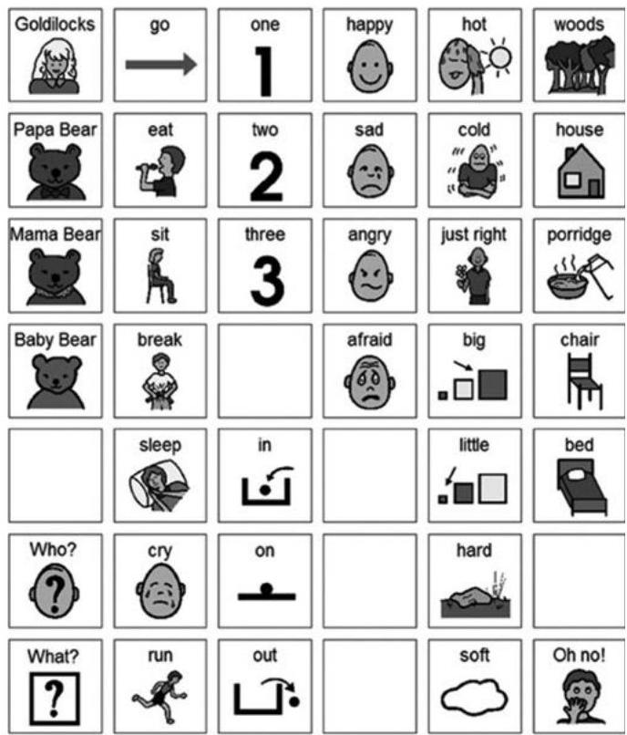

Figure 12.1. An example of a grid-based communication display for a preschooler with complex communication needs for emergent literacy activities using the story of Goldilocks and the Three Bears. Symbols on the actual display should be in color. (PCS is a trademark of Tobii Dynavox LLC. All rights reserved. Used with permission. PCS and Boardmaker are trademarks of Tobii Dynavox LLC. All rights reserved. Used with permission.)

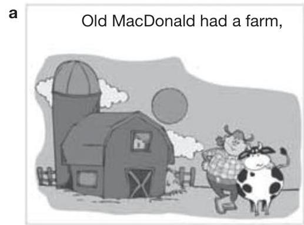

Figure 12.2. An example of a visual scene display (VSD) for a toddler with complex communication needs for emergent literacy activities with the book Old MacDonald Had a Farm. a) Screenshot illustrating the visual scene display of the page of the book as the child would see it on the screen of the AAC device; b) screenshot illustrating the hotspots embedded in the VSD. Touching each hotspot produces speech output and/or sound effects (e.g., touching the farmer produces the speech output "Old MacDonald"; touching the barn produces "farm" or a reading of the text; and touching the cow produces "cow" and then "moo"). The child does not see the hotspots highlighted in this way. Hotspots are highlighted only when they are selected. Pictures on the actual VSD should be in color.

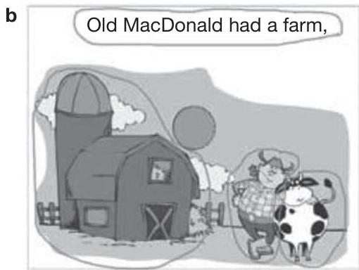

Although a variety of approaches are now available, what is clear from all of these studies is that provision of AAC can result in increased turn taking and improved participation during story-reading interactions by individuals with complex communication needs (Browder, Mims, et al. 2008; Mims, Browder, Baker, Lee, & Spooner, 2009), as well as expansion of the range of concepts expressed (e.g. Clendon et al. 2014; Yorke, Light, Caron, McNaughton, & Drager, 2018) and the length of messages communicated (Binger et al. 2008).

Use of AAC technology with VSDs can support literacy learning very early in childhood, as in the case of Genevieve, a girl with Down syndrome. Genevieve was introduced to manual signs and AAC technology with VSDs to enhance her language and communication development when she was 8 months old. Genevieve quickly learned to use the VSDs to participate actively within shared story-reading activities with her parents and older sisters. Visit the Success Stories section of the web site, Early Intervention for Young Children with Autism, Cerebral Palsy, Down Syndrome, and Other Disabilities (Light & Drager, 2019), to view a video of Genevieve participating in shared reading with her parents and older sisters with the book Brown Bear, Brown Bear, What Do You See? by Bill Martin Jr. In the video, she uses her AAC device and manual signs to participate actively in the interaction, by selecting the duck from the VSD to retrieve the speech output “duck” along with a quacking sound, and by producing a sign approximation for duck. Even at this young age, Genevieve is already establishing important emergent literacy skills through this shared storybook-reading activity that lay the foundation for later literacy learning.

### Teaching Interaction Strategies to Literate Partners

Simply providing access to AAC is necessary but not sufficient to ensure that individuals with complex communication needs are able to participate successfully within emergent literacy activities. Emergent literacy activities should be scaffolded by a partner to ensure that the learner has the opportunity to participate and receives the supports required to do so effectively. Table 12.1 summarizes a range of partner interaction strategies that positively impact the communication of individuals with complex communication needs during story-reading activities. Research suggests that a wide variety of adult partners (e.g. parents and educational staff from various cultural/ethnic backgrounds) can successfully learn to use a combination of these strategies in a short amount of time, and that such use results in increases in turn taking, use of novel semantic concepts, and production of multisymbol messages by learners who rely on AAC during storybook-reading interactions (e.g. Binger et al. 2008; Binger, Kent-Walsh, Ewing, & Taylor, 2010; Na & Wilkinson, 2017; Rosa-Lugo & Kent-Walsh, 2008). Classroom peers can also provide valuable supports to emergent literacy activities. Therrien and Light (2016, 2018) describe the use of shared book activities to increase early literacy opportunities and social interaction for preschoolers with complex communication needs and their peers.

Although we most often think of storybook reading in the context of young children, older individuals who are not yet literate also benefit from emergent literacy experiences to build their language skills, make connections between spoken and written language, and learn the conventions of print (Ruppar et al. 2017). In these situations, adapted grade-level texts (Apitz, Ruppar, Roessler, & Pickett, 2017), or

Literacy Intervention for Individuals with Complex Communication Needs

Table 12.1. Partner interaction strategies that support the participation of individuals with complex communication needs in story-reading activities

|  Strategy | Description  |
| --- | --- |
|  Select appropriate books | Allow the individual to choose books of interest
Ensure books are at an appropriate language level to support the individual's comprehension  |
|  Introduce the topic of the book | Encourage the individual to think about the topic of the book
Discuss related experiences
Discuss the purpose of reading (e.g., enjoying the story, learning new information, answering questions)  |
|  Introduce new vocabulary as required | Explain new concepts to the individual (e.g., illustrate with examples, relate to prior experience)
Teach appropriate AAC symbols to represent new concepts  |
|  Read the text of the book | Read each page of the book out loud, tracking word by word with a finger under the text as it is read aloud
Regularly pause and provide the opportunity for the individual to ask a question or make a comment  |
|  Use time delay (wait expectantly) | Focus attention on the individual with an expectant look
Wait at least 5–10 seconds  |
|  Ask appropriate questions | Ask questions to encourage the individual to think about the story
Encourage the individual to make predictions
Relate the text to the individual's prior experiences  |
|  Model use of AAC and speech | While reading or talking about the story, sign or select the appropriate aided AAC symbols from the individual's AAC device or low-tech communication board  |
|  Respond to communicative attempts | If the individual asks a question or makes a comment, respond by answering the question or expanding on the individual's comment by adding more information  |
|  Encourage the individual to tell the story | With repeated readings of the book, pause and encourage the individual to retell parts of the story  |

Source: Light &amp; McNaughton (2009a).

sports, fashion, and cooking magazines, might replace more traditional children's storybooks. Although storybook reading is most often discussed in the context of emergent literacy activities, it is essential for partners to continue to read and discuss texts with individuals well beyond the emergent literacy stage as they develop conventional literacy skills themselves (Foley &amp; Wolter, 2010). Reading to literacy learners and discussing texts serves a number of purposes:

1. It builds world knowledge as individuals read about events that they may not experience firsthand.
2. It scaffolds cognitive development as individuals are exposed to more advanced texts than they can read independently.
3. It introduces more advanced language concepts, sentence structures, and written genres (e.g., narrative, persuasive argument, expository essay), thus fostering language development.
4. It promotes more advanced comprehension and inference skills.
5. It illustrates the pleasure of reading, thereby increasing motivation for reading instruction.

Providing Independent Access to Reading Materials

In addition to scaffolded reading activities with literate partners, it is also important to ensure that individuals with complex communication needs have independent access to motivating and interesting reading materials, as well as numerous opportunities to engage with print. Access to appropriate reading materials might be facilitated by a variety of strategies: placing books in easily accessible locations, offering book choices during free time, providing the means to request favorite books, adapting books to allow easy page turning, incorporating text into daily routines at home or school (e.g. labels on activity centers, recipes, instructions), introducing e‐books and audiobooks, and/or scanning books into aided AAC systems (Koppenhaver et al. 2001; Orlando & Ruppar, 2016; Spooner et al. 2014, 2015; Therrien & Light, 2016, 2018).

### Building Narrative Skills

Story reading provides a rich context to introduce new vocabulary and sentence structures. Often, AAC intervention tends to focus on basic communication, and AAC systems tend to include only functional vocabulary. The vocabulary and sentence structures required for literacy activities differ from those used for basic face‐to‐face communication and may best be acquired through book‐reading activities. In addition to the development of semantic and syntactic knowledge to support literacy development, book‐reading interactions also serve to foster narrative skills (and skills in other genres). Unlike their peers without disabilities, individuals who rely on AAC often have minimal opportunities for the extended types of communicative interactions required to build narrative skills. Given these limited experiences, individuals with complex communication needs may require concerted intervention to build narrative skills. For example, Soto and colleagues described the positive effects of intervention targeting understanding and use of story structures on the linguistic and narrative complexity of stories told by individuals who relied on AAC (e.g. Solomon‐Rice & Soto, 2011; Soto, Solomon‐Rice, & Caputo, 2009). Such intervention serves to prepare learners with the narrative‐ and discourse‐level language skills required to read and write extended texts successfully.

## Building Emergent Writing Skills

During the stage of emergent literacy development, individuals with complex communication needs require opportunities not only to engage in story reading and other emergent reading activities, but also to engage in early writing activities. These emergent writing activities help individuals learn that they can use text to encode or express meaning. Unfortunately, many individuals who rely on AAC do not have regular access to early writing activities (Light & Kelford Smith, 1993). The lack of participation in early writing activities seems to reflect a lack of access, rather than a lack of interest in these writing activities. Many individuals with complex communication needs experience motor impairments, ranging from mild to severe, that may complicate or prohibit use of conventional writing implements (e.g. crayons, markers, pencils, paintbrushes). Occupational and/or physical therapists may be able to recommend appropriate seating and positioning, as well as adaptations to writing and drawing tools to facilitate reliable access and control by individuals with complex communication needs. Computer technologies (with alternative access as required) may also facilitate access to early writing activities through drawing programs and through keyboard access.

A note on computer technologies: Individuals with complex communication needs are often denied access to these technologies until they can demonstrate that

Literacy Intervention for Individuals with Complex Communication Needs

they can use them. Such denial deprives these individuals of the opportunity to learn, placing them at risk to fall further and further behind their peers. Pencils are not withheld from individuals without disabilities until they prove that they can write; rather, they have access to pencils, crayons, markers, and other writing implements early on, before they know how to write, to support their learning of writing skills. Similarly, early in their development, individuals with complex communication needs require access to technologies and/or software to serve as "electronic pencils" along with other supports for writing and drawing.

With writing tools (both electronic and conventional) in place, individuals with complex communication needs require numerous opportunities to engage in emergent writing experiences, scaffolded by parents, teachers, or other literate adults or peers. These activities might include "writing" secret messages, taking photos (or drawing pictures) and writing stories, making signs for a pretend store, creating birthday cards, writing letters or e-mail messages, labeling photo albums of school or family experiences, and so forth. The goal here is not that the individual produces written text that is free of spelling, vocabulary, and grammatical errors, but rather that the literacy learner develops the understanding that he or she can encode meaning through "writing." Initially, the individual may simply produce scribbles or strings of unrelated letters, and the literate partner may help by modeling written text. Later, as the individual develops some phonological awareness skills and some knowledge of letter sounds, he or she may begin to use sound spellings to encode meaning.

Tim, a 4-year-old with cerebral palsy, was provided with access to an adapted keyboard on his AAC device early in life, before he had learned conventional writing skills. He liked to play with the letters on the keyboard to create written messages. He was especially delighted one day when he produced the written message "PU" using sound spelling to tease his older sister. (Light &amp; McNaughton, 2005)

## Introducing Phonological Awareness and Letter-Sound Correspondences

Beyond the emergent literacy activities discussed, young learners are also typically introduced to phonological awareness skills and letter-sound correspondences during this early phase of literacy development (Erickson &amp; Clendon, 2009). For example, through preschool and child care programs, educational software, and television shows, many young children are introduced to letters and their sounds, as well as to activities such as rhyming and sound blending, well before they start elementary school. Introducing these skills early, during meaningful and fun activities, may be especially beneficial for individuals with complex communication needs, giving them a head start on the learning of conventional literacy skills. (See the section "Interventions to Teach Basic Reading Skills" for further information on these skills.)

Lili, a toddler with Down syndrome who relies on speech approximations, manual signs, and AAC technology to communicate, was introduced to letter-sound correspondences and phonological awareness activities at an early age during play activities with her parents and therapists. By the age of 23 months, she had already learned many letters and sounds and associated these letters and sounds with familiar words. Visit the

AAC Interventions for Individuals with Developmental Disabilities

Success Stories section of the web site, Early Intervention for Young Children with Autism, Cerebral Palsy, Down Syndrome, and Other Disabilities (Light &amp; Drager, 2019), to see a video of Lili demonstrating her knowledge of the "daddy letter," d.

## TEACHING CONVENTIONAL LITERACY SKILLS: KEY COMPONENTS OF INTERVENTION

Through emergent literacy activities, individuals with complex communication needs build language skills, begin to make connections between spoken and written language, and learn the basic conventions of print. Although these skills are essential, they are not sufficient to support acquisition of functional reading and writing skills. Organized, regular instruction is also required to teach conventional literacy skills. To maximize effectiveness, intervention must (Light &amp; McNaughton, 2009b)

1. Allocate sufficient time for instruction.
2. Use appropriate and effective instructional techniques to teach skills that are known to support the successful acquisition of conventional reading and writing.
3. Provide appropriate adaptations to ensure the active participation of individuals with speech, motor, and/or sensory/perceptual impairments.
4. Build positive rapport and ensure learner motivation.

Furthermore, the AAC team must monitor the literacy learner's progress and make any adjustments required to maximize outcomes.

## Allocating Sufficient Time for Literacy Instruction

Recommended practices suggest that all students in grades 1–3 should receive at least 90 minutes of literacy instruction per day and that students who are at risk for literacy development problems should receive a total of 130–150 minutes of literacy instruction per day (Vaughn, Wanzek, Woodruff, &amp; Linan-Thompson, 2007). Individuals who rely on AAC may require even more instructional time because they often have slow rates of communication and may require more time to participate in instructional activities. In a nutshell, the more time devoted to literacy instruction, the greater the gains that will be observed in a given time period. Unfortunately, in many cases, even the recommended minimum standards for instructional time are not met for individuals with complex communication needs; rather, research suggests that many of these individuals receive only a small amount of literacy instruction per day, typically 30 minutes or less (Koppenhaver &amp; Yoder, 1993; Koppenhaver, 1991; Mike, 1995). As noted previously, this lack of literacy instructional time may reflect, at least in part, low expectations on the part of parents and educators (Light &amp; McNaughton, 1993; Ruppar et al., 2011), a lack of knowledge and skill in adapted literacy instruction for individuals who rely on AAC (Light &amp; McNaughton, 2009a; Ruppar, 2017), and/or competing demands in the home and school environments (e.g., scheduling of numerous therapies, additional time required for activities of daily living such as dressing and feeding; Light &amp; Kelford Smith, 1993).

Every effort should be made to maximize the time allocated for literacy instruction. To do so, collaboration may be required between families and educational personnel, including general and special education teachers, speech-language pathologists, paraprofessionals, and/or classroom volunteers. One way to increase literacy

Literacy Intervention for Individuals with Complex Communication Needs

instruction is to utilize small group instruction, which has been demonstrated to be of benefit to individuals with complex communication needs (Ainsworth et al., 2016).

Another way to provide additional time for literacy learning is to start instruction at an early age with individuals with complex communication needs. Research has demonstrated that preschoolers (ages 3–5 years) with complex communication needs (including those with ASD, cerebral palsy, and Down syndrome) can learn to read and write when they are provided with appropriate instructional supports (Benedek-Wood, McNaughton, &amp; Light, 2016; Mandak et al., 2019). On the other hand, although numerous benefits may result from early literacy instruction, research also demonstrates that it is never too late to learn conventional literacy skills. A growing number of studies provide evidence of the successful acquisition of literacy skills by adolescents and adults with complex communication needs (including those with ASD, cerebral palsy, and multiple disabilities) who did not start instruction until later in their lives (Ahlgrim-Delzell et al., 2016; Holyfield et al., 2019; Ruppar et al., 2017).

# Implementing Effective Instructional Techniques to Teach Key Skills

The NRP (2000) concluded that the most effective literacy intervention combines both direct instruction in key skills and numerous opportunities to apply these skills in the context of meaningful and motivating literacy experiences. Table 12.2 provides definitions of these key literacy skills. Ultimately, learners must apply these skills fluently to read, understand, and write meaningful texts in a variety of genres.

Table 12.2. Knowledge and skills required to support the acquisition of basic reading and writing skills

|  Knowledge or skill | Definition  |
| --- | --- |
|  Language skills | Knowledge and skills in vocabulary, syntax, morphology, narratives, and other genres (e.g., expository, persuasive)  |
|  Phonological awareness skills | Ability to notice, think about, and manipulate the phonemes (sounds) of words, including sound blending (e.g., blending sounds to form words) and phoneme segmentation (e.g., breaking words into component sounds)  |
|  Letter–sound correspondences | Knowledge of the sounds represented by each of the letters and of the letters used to represent different speech sounds  |
|  Single-word decoding skills | Ability to apply knowledge of letter–sound correspondences and sound blending to sound out words with regular spellings (e.g., cat, pig, dad)  |
|  Sight word recognition skills | Ability to read/recognize words without sounding them out, especially irregular words (e.g., light, their, are)  |
|  Application of decoding and sight word recognition skills in shared book reading | Using knowledge of letter–sound correspondences, sound-blending skills, and sight word recognition skills as required to read target words during shared book reading with a literate partner  |
|  Reading and understanding of text (reading comprehension skills) | Ability to decode or recognize by sight each word in the text, access the meanings of the words, process the words together to derive the full meaning of the text, and relate this meaning to prior knowledge and experience  |
|  Single-word encoding skills | Ability to apply phoneme segmentation skills and knowledge of letter–sound correspondences to break down regular words and spell them (e.g., mom, run)  |
|  Sight word spelling skills | Ability to recall and select the correct letters in sequence to spell words with irregular spellings (e.g., said, know)  |

(continued)

AAC Interventions for Individuals with Developmental Disabilities

Table 12.2. (continued)

|  Knowledge or skill | Definition  |
| --- | --- |
|  Handwriting skills and/or keyboard knowledge | Knowledge of the correct shapes for letters and the fine motor skills to produce these shapes legibly and/or knowledge of the location of the letters on the keyboard and operational skills to select them efficiently as required using appropriate access techniques  |
|  Application of encoding and language skills in simple writing activities | Using knowledge of letter–sound correspondences, phoneme segmentation skills, and sight word spelling skills to encode appropriate words in simple sentences to communicate meaning to others  |
|  Writing meaningful texts in a range of genres | Ability to generate coherent narrative (or other genres) using appropriate vocabulary, syntax, morphology, and narrative structure; skills to spell each word in each sentence correctly in sequence (applying either encoding or sight word spelling skills); handwriting or keyboard knowledge to produce or select each letter required  |

Source: Light &amp; McNaughton (2009a).

Typically, direct instruction aimed at teaching these key literacy skills involves a most-to-least prompting hierarchy to ensure success for the literacy learner. First, the instructor models a target skill for the individual; next, the instructor provides guided practice in the form of scaffolding support or prompts to help the learner perform the skill successfully; and, finally, the instructor gradually fades support until the individual is able to perform the skill successfully and independently (Archer &amp; Hughes, 2011; Light &amp; McNaughton, 2009a). Throughout the process, the instructor provides corrective feedback as required. Table 12.3 provides an example of these instructional procedures.

Table 12.3. Direct instruction procedures for teaching basic literacy skills

|  Step | Participant involvement | Instructional procedures  |
| --- | --- | --- |
|  Model | The instructor does the skill; the learner observes. | The instructor demonstrates the skill for the learner.  |
|  Guided practice | The instructor and the learner do the skill together. | The instructor provides scaffolding support/prompting to help the learner perform the skill successfully.  |
|   |   |  The instructor gradually fades support as the learner develops competence.  |
|  Independent practice | The learner does the skill independently while the instructor observes and provides feedback. | The learner performs the skill independently. The instructor monitors performance and provides feedback.  |
|  Feedback | The instructor provides feedback to the learner. | If the learner performs the skill accurately, the instructor provides appropriate positive feedback. If the learner is incorrect, the instructor directs the learner's attention to the error, models the correct response, provides guided practice for the learner to complete the skill successfully, and then provides additional opportunities for independent practice.  |

From Light, J., &amp; McNaughton, D. (2009a). Accessible Literacy Learning (ALL): Evidence-based reading instruction for learners with autism, cerebral palsy, Down syndrome, and other disabilities. Pittsburgh: Tobii Dynavox; adapted by permission.

Literacy Intervention for Individuals with Complex Communication Needs

There is widespread and consistent evidence that individuals with complex communication needs can benefit from appropriately adapted direct instruction in key literacy skills from an early age (Machalicek et al., 2010; Mandak et al., 2018; Orlando &amp; Ruppar, 2016). There is no evidence to support withholding organized instruction until individuals demonstrate selected skills (e.g., identifying letters, communicating about texts). In fact, these are the skills that are most likely to benefit from organized instruction (Machalicek et al., 2010; Orlando &amp; Ruppar, 2016).

In addition to direct instruction, individuals also require numerous opportunities to apply key skills within authentic reading and writing experiences (Afacan, Wilkerson, &amp; Ruppar, 2018). For example, if an individual is learning to decode single words, the instructor might encourage him or her to apply decoding skills during shared reading activities in which the instructor reads part of a sentence and the learner is responsible for decoding specific target words within the text. Providing opportunities to apply newly acquired key skills during authentic literacy experiences has several benefits: 1) it provides additional opportunities to practice new skills, thus promoting acquisition and increasing fluency; 2) it promotes generalization of skills to new materials and contexts; and 3) it increases motivation by demonstrating that reading and writing are meaningful and fun.

## Providing Adaptations for Individuals with Complex Communication Needs

Individuals with complex communication needs may have motor and/or sensory/ perceptual impairments in addition to significant speech impairments. Therefore, literacy instruction must be adapted to accommodate specific needs.

**Adaptations to Accommodate Speech Impairments** As noted previously, most literacy curricula require learners to use spoken responses to participate in instruction (e.g., saying letter sounds, blending or segmenting words orally, decoding words orally, reading out loud). Instructors use the learners' oral responses to gauge their learning and to determine any areas of difficulty that require remediation. Clearly, curricular adaptations are required for individuals with significant speech impairments to 1) provide alternative response modes, 2) provide insight into areas of strength and difficulty and thus support instructional decision making, and 3) compensate for a lack of speech production and oral rehearsal.

**Alternative Response Modes** Literacy activities can easily be adapted to support alternative response modes (e.g., manual signs, speech approximations, aided AAC symbols, letters, words) rather than spoken responses (Johnston et al., 2018). For example, Light, McNaughton, and Fallon (2009a) described adapted instruction in decoding in which learners are presented with a written word to decode; however, instead of reading the word orally, they can either sign the word, or they can choose an AAC symbol that represents the word from their AAC technology or aided communication display, or choose an appropriate image from a group of symbols or pictures provided specifically for the instructional activity (i.e., Text-Picture Choices approach). In addition to this approach, instructors may also make use of a Text-Spoken Choices task; in this approach, the instructor shows the individual a written word, and the learner chooses the correct spoken word from a group of choices spoken aloud by the instructor. Instructors may also use Picture-Text Choices; in this approach, the instructor shows the learner a picture, and the individual chooses the written word from a

AAC Interventions for Individuals with Developmental Disabilities

field of written words. Finally, a Spoken Word-Text Choices task can be used in situations in which it is difficult to find appropriate images for the target vocabulary (e.g., "is", "and"). In this approach, the instructor says a word, and the learner chooses the written word from a field of written words.

It should be noted that these different approaches impose different demands; for example, some require the individual to recode from text to speech, while others do not. It is important to choose tasks that most closely match the requirements of reading and writing and are a good fit for the needs and skills of the individual (Mandak et al., 2018). These approaches can be used for assessment of the learner's skills provided the AAC team does not provide instructional support or feedback during the assessment. Or, they can be used to teach literacy skills when they are paired with instructional supports (e.g., modeling, guided practice, independent practice) and feedback.

Instructional Decision Making If the incorrect choices that are provided as options are selected carefully, systematic data collection and error analyses can be used to provide the instructor with insight into the individual's areas of strength and difficulty. For example, Figure 12.3 presents adapted materials that might be used for instruction in decoding. The target word is cat, and the learner is expected to decode

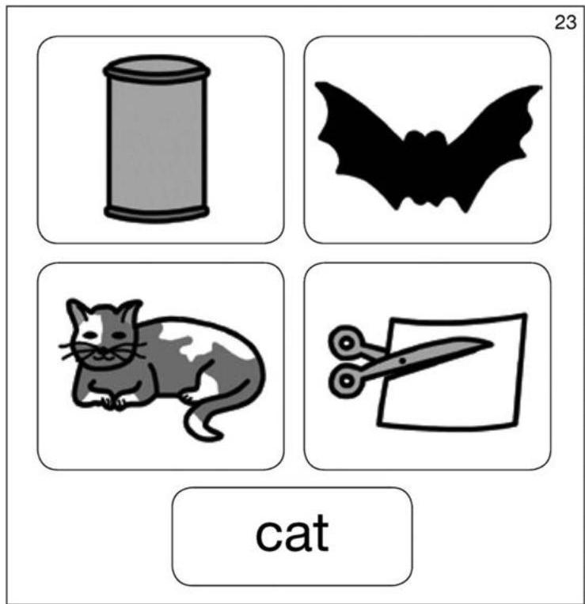

Figure 12.3. An example of adapted instruction in single-word decoding. The target word is cat; the response options are CAN, BAT, CAT, and CUT. (From Light, J., &amp; McNaughton, D. (2009a). Accessible Literacy Learning [ALL]: Evidence-based reading instruction for learners with autism, cerebral palsy, Down syndrome, and other disabilities. Pittsburgh: Mayer-Johnson; adapted by permission.)

PCS is a trademark of Tobii Dynavox LLC. All rights reserved. Used with permission. PCS and Board-maker are trademarks of Tobii Dynavox LLC. All rights reserved. Used with permission.

Literacy Intervention for Individuals with Complex Communication Needs
445

the word and then select the correct AAC symbol from the field of four options provided. Each of the AAC symbols provided as a response option is carefully selected to assist in the analysis of learner performance, with one option representing the target word (i.e., cat) and the other three options each representing a change to one of the letter sounds in the target word (i.e., change to the initial letter sound, bat; the final letter sound, can; or the medial vowel, cut). Careful data collection and the analysis of an individual's responses over numerous trials can allow the instructor to determine areas of strength (e.g., the learner performs well on initial and final letter sounds) as well as areas of difficulty (e.g., the learner demonstrates some difficulty with medial vowels). Areas of difficulty can then be targeted specifically for additional instruction.

## External Scaffolding

In addition to adapted response modes to support participation and instructional decision making, adaptations may also be required to instructional procedures to support the individual in establishing the links between oral and written language. As children without disabilities learn to read and write, they regularly utilize oral rehearsal to support them in translating written language into oral language or oral language into written language. For example, they may slowly sound out the letters in a word orally and then blend them out loud to decode a new word. Or they may say a word slowly to try to segment out the individual sounds to support early writing. Individuals with complex communication needs do not have the speech production skills required to perform these tasks themselves orally and thus face increased working memory demands in learning early conventional literacy skills. They may benefit from external scaffolding support, especially during the early stages of instruction, to compensate for their difficulty with oral rehearsal, and to help them build subvocal rehearsal (i.e., inner voice). For example, Light and McNaughton (2009a) proposed that instructors provide guided practice during the early stages of instruction by demonstrating oral rehearsal for individuals and encouraging them to develop subvocal rehearsal skills (i.e., "say it in your head"). This external scaffolding support can be gradually faded as the individual acquires the skills.

## Adaptations to Accommodate Motor Impairments

Some individuals with complex communication needs may have motor impairments that range from mild to severe. Often, these impairments limit their access to literacy materials and thus restrict their participation in literacy instruction. Input from occupational and/or physical therapists is critical to determine appropriate seating and positioning to maximize motor performance (see Chapter 2). Some individuals who have more severe motor impairments may also require alternative access to support their full participation in instructional activities as well (e.g., eye pointing, scanning, partner-assisted scanning; see Chapter 7). It is important for the AAC team to determine the most effective and efficient access techniques for the individual. Moreover, because literacy instruction itself is cognitively demanding, it is important that the access technique selected does not impose additional cognitive demands. For example, if an individual is just learning to use eye gaze to control AAC technology and is not yet fluent with this technique but is able to use partner-assisted scanning easily and reliably, then initial literacy instruction should utilize partner-assisted scanning as a means of access. Eye pointing with AAC technology can be introduced later on, once the individual has developed greater competence with this method.

Adaptations to Accommodate Sensory-Perceptual Impairments

Some individuals with complex communication needs have visual and/or hearing impairments. Compared with functional communication and activities of daily living, learning to read and write places an increased burden on an individual's visual and auditory skills. For example, learners are required to make fine discriminations between letters and sounds that may be similar in appearance and sound. As described in Chapter 2, it is important to ensure that comprehensive visual and auditory assessments by qualified professionals are completed and that accommodations are in place. Instructional accommodations for speech, motor, hearing, and/or visual impairments ensure that individuals with complex communication needs have both the opportunity and the necessary supports to learn to read and write.

Krista's story illustrates how a variety of adaptations might be made to support literacy learning. Krista was 8 years old when we first started literacy instruction with her. She had motor, vision, and hearing impairments as well as a tracheostomy, and she required numerous adaptations to support her participation in literacy instruction. To accommodate her visual impairment, we provided the following adaptations: 1) use of corrective eyeglasses; 2) use of large, clear print (i.e. 80 point Arial font); 3) use of black text on a yellow background to maximize contrast and visual attention; 4) addition of key labels (large lowercase black letters on a yellow background) on her computer keyboard; 5) positioning of reading and writing materials within 12--18 inches of her eyes; 6) adjustment of fluorescent lighting and use of materials with a matte finish to reduce glare; and 7) use of technologies with text highlighting to assist her to visually track connected text from left to right with wraparound to the next line. To accommodate her hearing impairment, we provided the following accommodations: 1) use of appropriate assistive hearing devices (FM system and bilateral hearing aids); 2) adjustment of initial instruction to focus on letter sounds and words that she could easily perceive and discriminate; 3) use of augmented input and other visual supports (i.e. manual sign plus speech, writing plus speech) to support learning; and 4) appropriate positioning of the instructor to maximize visual cues. To accommodate her motor impairment, we ensured that books had firm pages so that Krista could turn them independently and provided a keyguard to assist her in the accurate selection of letters on the computer. Finally, literacy instruction was adapted to bypass the need for spoken responses and to allow Krista to respond by using manual signs, pointing to AAC symbols from an array, or selecting AAC symbols from her AAC device. These adaptations allowed Krista to participate in instruction and to successfully learn to read and write. To learn more about Krista's success, see Light et al. (2008) and visit the Student Success Stories section at the web site, Literacy Instruction for Individuals with Autism, Cerebral Palsy, Down Syndrome and Other Disabilities (Light & McNaughton, 2019).

## Building Positive Rapport and Ensuring Learner Motivation

In addition to the use of appropriate instructional content, methods, and adaptations, it is also critical to build positive rapport with the learner and ensure motivation for learning. According to retrospective reports of literate adults with complex communication needs, the support and encouragement of adults who believed in their ability to learn was fundamental to their successful acquisition of reading and writing skills

Literacy Intervention for Individuals with Complex Communication Needs
447

(Koppenhaver, Evans, &amp; Yoder, 1991). Successful interventionists provide instruction in ways that reflect the belief that all individuals can learn, regardless of their disability; use materials and activities that incorporate learners' interests; and communicate a personal interest in the individual who is receiving instruction (Erickson, 2017; Light &amp; McNaughton, 2012; Orlando &amp; Ruppar, 2016). By doing so, they build a positive relationship with the individual, a relationship that encourages learner participation and provides increased motivation to succeed. Because of a lack of appropriate instruction, many individuals with disabilities, especially those who are older, come to literacy instruction with a history of failure and low expectations for success (Brophy, 2010). For these individuals, it is especially important for the AAC team to communicate the belief that the learner will be successful (Gallagher &amp; Mayer, 2008), provide instructional activities that support success from the very beginning (Light &amp; McNaughton, 2009a, 2009b; Spooner et al., 2015), and incorporate the individual's interests into instructional activities (Holyfield et al., 2019; Therrien &amp; Light, 2018). This approach ensures that individuals will believe that it is worthwhile to learn literacy skills and that these skills are attainable, thus building intrinsic motivation for learning to read.

Because of her multiple disabilities, many people assumed that Krista, described earlier, had limited potential for learning. She was in a self-contained special education class at school and had not had the opportunity to participate in literacy instruction. Krista's parents advocated for her to have the opportunity to learn to read and type in order to develop to her full potential. We started with the fundamental belief that Krista could learn, regardless of the challenges she faced. We provided appropriate accommodations to address her speech, motor, visual, and hearing impairments and to ensure her access to literacy instruction and materials. We incorporated materials and activities into instruction that were meaningful to Krista and that reflected her interests, and we provided instructional supports (modeling, guided practice, and independent practice) to ensure her success from the onset of instruction (Light et al., 2008). With these instructional supports, Krista successfully learned to read and type. To read more about Krista's success and to see videos of her literacy instruction, visit the Student Success Stories section of the web site, Literacy Instruction for Individuals with Autism, Cerebral Palsy, Down Syndrome and Other Disabilities (Light &amp; McNaughton, 2019).

## Monitoring the Effectiveness of Intervention

Once accommodations are in place and motivating, evidence-based literacy instruction is ongoing, instructors should provide regular assessment and evaluation of the learner's response to intervention to ensure that the instruction is as effective and efficient as possible. Although there may be some daily fluctuations in performance, individuals should demonstrate progress in learning skills over time. As individuals acquire new skills, instructors need to celebrate these accomplishments and move on to target new, more challenging skills. If individuals do not demonstrate progress as expected over time, it is critical for the AAC team to examine ongoing instructional data and brainstorm to determine the potential difficulty in order to adjust instruction to address the problem area. Table 12.4 summarizes factors that might contribute to a lack of progress and provides potential solutions.

AAC Interventions for Individuals with Developmental Disabilities

Table 12.4. Potential causes of and solutions for instructional difficulties during literacy instruction

|  Possible causes of instructional difficulties | Potential solutions  |
| --- | --- |
|  Insufficient time spent on instruction | Schedule additional instructional time. Train others to provide instruction or skill review. Identify additional practice activities and opportunities. Set instructional priorities; focus on 1–2 skills at a time.  |
|  Instructional procedures implemented incorrectly | Use scripts to guide instruction. Monitor implementation to ensure consistency if multiple instructors are involved.  |
|  Learner confusion with respect to task expectations | Adapt instruction to use familiar response formats (e.g., if individual uses the Picture Exchange Communication System [PECS], adapt the task so that the individual hands the instructor the correct symbol rather than pointing to it). Provide additional models, demonstrating for the individual how to complete the task. Provide guided practice to support the individual to complete the task successfully.  |
|  Vision or hearing difficulties | Ensure reliable and valid assessments of hearing and vision. Ensure access to necessary aids and assistive technologies (e.g., hearing aids, eyeglasses, vision aids). Adapt instructional materials and procedures to optimize performance.  |
|  Lack of learner motivation | Incorporate materials and activities that reflect the individual's interests and preferences. Establish positive rapport with the individual. Celebrate achievements with the individual and others.  |
|  Too many distractions during instruction | Initially, implement instruction of new skills in a distraction-free setting. Gradually provide instruction in a more typical environment as the individual develops competence with target skills.  |
|  Lack of generalization of new skills | Provide additional instruction with a wider range of materials and tasks. Develop a variety of practice activities.  |

Source: Light &amp; McNaughton (2009a).

# TEACHING BASIC CONVENTIONAL LITERACY SKILLS: LEARNING TO READ AND WRITE

Reading and writing are synergistic processes; thus, literacy instruction for individuals with complex communication needs should focus on both reading and writing instruction. The following sections discuss interventions to teach basic reading and writing skills.

# Intervention to Teach Basic Reading Skills

According to the NRP (2000), reading and writing require the integration of knowledge and skills across a variety of domains. Typically, literacy instruction to teach basic reading skills targets the following skills (see Table 12.2):

1. First, phonological awareness skills (e.g., sound blending, phoneme segmentation skills) and letter-sound correspondences

Literacy Intervention for Individuals with Complex Communication Needs
449

2. Then decoding skills and sight word recognition skills, as well as the application of these skills in the context of shared reading activities
3. Finally, independent reading of simple texts and reading comprehension skills

The following sections discuss each of these skills, with emphasis on evidence-based interventions for individuals with complex communication needs. Although these sections present the skills in a linear manner, discussing them one at a time, it is important to remember that learners are typically involved in instruction in several skills at any one point in time (see Table 12.5 for a sample instructional session for a student with complex communication needs who has acquired phonological awareness skills and some letter-sound correspondences and is learning additional letter-sound correspondences and decoding skills). Furthermore, the sequence may vary based on the needs and skills of the individual. For example, instruction for some learners may start with high-interest sight words to provide an immediate sense of accomplishment and build motivation for learning to read (Caron et al., 2018; Mandak et al., 2018).

**Teaching Phonological Awareness Skills** Phonological awareness refers to an individual's understanding and awareness of the sound structure of language. Specifically, phonological awareness is the ability to notice, think about, and manipulate the phonemes or sounds in words (Torgesen, Wagner, &amp; Rashotte, 1994). There are numerous phonological awareness tasks that include rhyming; segmenting words into component sounds; blending sounds to form words; determining beginning, middle, or final sounds in words; and so forth. Sound-blending (or phoneme-blending) skills are a key component required to decode new words. To decode, the individual must look at the letters in the target word, determine the sounds of these letters in sequence, and then blend these sounds together to determine the target word. Conversely, phoneme segmentation (or sound segmentation) skills are a key component of encoding or spelling. To spell a word, the individual must listen to the target word, break it into its component sounds in sequence, determine the letters that represent each of these component sounds, and then select or produce the target letters in sequence. Phonological awareness skills, especially sound blending and phoneme segmentation, are strongly correlated with later literacy outcomes such as decoding and spelling (Ehri et al., 2001).

What do we know about the phonological awareness skills of individuals with complex communication needs? Research results support the following conclusions: 1) individuals with complex communication needs can acquire phonological

Table 12.5. Sample literacy instruction session for a student with complex communication needs

|  Skill targeted for instruction | Time allocated for instruction  |
| --- | --- |
|  Reading to student and talking about books | 10–15 minutes  |
|  Learning new letter–sound correspondences and reviewing those previously acquired | 10–15 minutes  |
|  Learning decoding skills | 10–15 minutes  |
|  Applying decoding skills during shared reading | 10–15 minutes  |
|  Reviewing phonological awareness skills | 5–10 minutes  |

AAC Interventions for Individuals with Developmental Disabilities

awareness skills, despite their severe speech impairments; however, 2) most individuals with severe speech impairments demonstrate deficits in phonological awareness compared with their peers without disabilities (Dahlgren Sandberg, 2006; McCarthy, Hogan, Beukelman, &amp; Schwarz, 2015; Vandervelden &amp; Siegel, 1999). These findings suggest the need for concerted interventions to teach phonological awareness skills to individuals with complex communication needs as a foundation for later literacy development.

Typically, phonological awareness interventions require beginning readers and writers to produce oral responses. Thus, adaptations are required to bypass the need for oral responses and support the participation of individuals with complex communication needs. In the case of sound blending, adapted instruction might follow the procedures employed by Light, McNaughton, and Fallon (2009b). First, the instructor says a word slowly, extending each phoneme for 1–2 seconds (e.g., “mmmmoooommmm”). Next, the learner blends the sounds in his or her head (i.e., via subvocal rehearsal), determines the target word (e.g., mom), and responds by signing the target word, by making a speech approximation of the target word (if it can be understood by the instructor in context), or by selecting an AAC symbol for the target word from an array of symbols. A growing body of research has demonstrated the effectiveness of direct instruction using these types of adaptations to teach sound-blending skills to individuals with complex communication needs, including individuals ranging in age from 3 to 14 years with a range of disabilities (e.g., ASD, cerebral palsy, Down syndrome, childhood apraxia of speech; Fallon, Light, McNaughton, Drager, &amp; Hammer, 2004; Light &amp; McNaughton, 2009a, 2019).

Like sound blending, instruction in phoneme segmentation typically requires an individual to produce oral responses (e.g., to segment the first sound in a word and say it aloud). It is somewhat more challenging to design adapted instruction in phoneme segmentation to bypass the need for oral responses. If an individual has already acquired letter–sound correspondences, the instructor can say the word out loud as the individual listens to it. The individual can then segment out the target sound (e.g., the initial sound) and then select a letter that represents that sound from a keyboard or an array of letters presented by the instructor (Browder, Ahlgrim-Delzell, et al., 2008; Millar, Light, &amp; McNaughton, 2004). It should be noted, however, that this form of adapted instruction requires both phoneme segmentation skills and letter–sound correspondences, thus placing added demands on the individual. Many individuals with complex communication needs have not yet acquired letter–sound correspondences when they are introduced to instruction in phonological awareness skills, so alternative instructional approaches that focus solely on phoneme segmentation skills may be required. Such instruction might follow these procedures (Fallon et al., 2004; Light, McNaughton, Fallon, &amp; Millar, 2009):

1. The instructor presents an array of AAC symbols, all starting with different sounds, and then says the initial sound of one of the symbols.
2. The learner segments the initial sound of each of the symbols subvocally.
3. The learner then selects the symbol whose initial sound matches the target sound presented by the instructor (or says or signs the word).

Truxler and O'Keefe (2007) used a similar approach, but rather than presenting the response options through an array of graphic AAC symbols, they presented the options orally (e.g., “Which word has /t/ at the end: fat, mean, horse?”). Usually,

instruction first targets segmentation of initial phonemes in single-syllable words because these tend to be stressed and are therefore easier to segment; later instruction may target segmentation of final phonemes and medial vowels (Millar et al. 2004; Vandervelden & Siegel, 1995).

Learning phonological awareness skills imposes significant demands on an individual's auditory processing and working memory. For example, in sound blending, individuals must process the sounds in sequence, discriminate each sound accurately, and then hold these sounds in working memory in sequence long enough to blend them together to determine the target word. Some individuals with complex communication needs may have particular difficulties with auditory processing and working memory (Larsson & Dahlgren Sandberg, 2008). Furthermore, they have limited use of the oral rehearsal skills that individuals typically use to shore up their working memory (e.g. oral repetition of the sounds in sequence). As a result, some individuals with complex communication needs may benefit from the use of printed letters as visual supports during instruction in phonological awareness. For example, in a sound-blending activity, the instructor might point to each letter in sequence and say its sound slowly, extending each phoneme for 1--2 seconds; the learner then blends the sounds and indicates the target word. In this task, the learner is not required to know the letter--sound correspondences or produce them; the letters simply serve as a visual support as the instructor says the sounds. Using letters when teaching phonological awareness skills offers three potential advantages: 1) the letters provide concrete symbols for sounds that are transient and therefore difficult to grasp, 2) instruction reinforces knowledge of letter--sound correspondences as they are acquired, and 3) phonological awareness skills may transfer more effectively to reading and spelling tasks that ultimately require the integration of phonological awareness skills and knowledge of letter--sound correspondences (Ehri et al. 2001).

View the webcast, Improving Literacy Outcomes for Individuals with Autism Spectrum Disorders and Limited Speech, at the AAC Learning Center (Light & McNaughton, 2017a) to see examples of adaptations to phonological awareness activities.

### Teaching Letter--Sound Correspondences

In addition to phonological awareness skills, individuals who rely on AAC also need knowledge of letter--sound correspondences to learn to read and write. Specifically, letter--sound correspondences form the code that allows the translation of written language to spoken language and vice versa. Letter--sound correspondences include knowledge of the letters that represent the sounds of speech as well as knowledge of the sounds represented by letters. As noted by Adams (1994), knowledge of letter--sound correspondences relies on both phonological processing (i.e. detection and manipulation of the sound structures of speech) and orthographic processing (i.e. processing and identification of letters and letter patterns).

Adaptations to instruction in letter--sound correspondences to accommodate the needs and skills of individuals with complex communication needs are relatively straightforward: 1) the instructor says a phoneme or sound and 2) the learner selects the letter corresponding to this sound from an array of letters provided for the instructional task or from a keyboard. A number of researchers have investigated the effects of instruction on the acquisition of letter--sound correspondences by individuals with complex communication needs (Ainsworth et al. 2016; Benedek-Wood

AAC Interventions for Individuals with Developmental Disabilities

et al., 2016; Caron, 2016; Fallon et al., 2004; Johnston, Buchanan, &amp; Davenport, 2009; Light et al., 2008; Millar et al., 2004). Results of these studies suggest the following conclusions: 1) individuals of various ages who have a wide range of disabilities and rely on various types of AAC can successfully acquire letter–sound correspondences using these adapted procedures; 2) individuals with a wide range of literacy skills, including learners who demonstrated no other literacy skills prior to intervention, can benefit from instruction in letter–sound correspondences; and 3) the length of time required to acquire letter sounds varies, depending on a range of intrinsic and extrinsic factors.

Literacy learners are most likely to benefit from instruction in which letters and sounds are introduced incrementally, one at a time; as learners master one letter sound, a new letter sound is introduced, with regular review of the letter sounds previously acquired (Benedek-Wood et al., 2016; Browder, Ahlgrim-Delzell, et al., 2008; Light &amp; McNaughton, 2009a, 2009b). It is also suggested, however, that two letters (e.g., a, m) be introduced during the first instructional session, as this helps the learner to recognize that different letters make different sounds (i.e., to contrast and discriminate among letters) from the beginning of instruction.

Light and McNaughton (2009a) proposed teaching letters and sounds according to the following sequence: a, m, t, p, o, n, c, d, u, s, g, h, i, f, b, l, e, r, w, k, x, v, y, z, j, q. This sequence, adapted from Carnine, Silbert, Kame'enui, and Tarver (1997) is designed to meet the following criteria:

1. Lowercase letters are taught first because these letters occur more frequently in written texts; uppercase letters are taught later.
2. Letters and sounds that occur more frequently in children's books are taught first so that learners are able to read more words earlier in instruction.
3. Letters and sounds that are similar visually and/or aurally are separated in the instructional sequence to minimize confusion.
4. Short vowels are taught before long vowels because words with short vowels (e.g., cat, bus) are more apt to follow simple decoding rules than are words with long vowels (e.g., ride, eat), which require application of more complex decoding rules.
5. Single letter–sound correspondences are taught before consonant clusters.

Of course, this instructional sequence for letter–sound correspondences may be easily adapted to accommodate the needs, skills, interests, or preferences of individual learners.

Although letter names are frequently emphasized during early reading instruction, it may be beneficial to emphasize the acquisition of letter sounds, rather than letter names, for beginning readers. For some individuals, knowledge of letter names may actually interfere with the decoding process, rather than facilitate it. If a learner looks at a word and recalls its letter name (rather than its sound), he or she will have difficulty decoding the word. For this reason, it is suggested that early literacy instruction ought to focus on letter sounds. Letter names can be used as sounds are taught, but instruction should emphasize the sound of a letter rather than its name.

Teaching Decoding Skills Once individuals have acquired sound-blending skills and know at least some letter–sound correspondences, they have the necessary skills to learn to decode written words. Single-word decoding skills are essential to the reading process because these skills allow individuals to read words that they

Literacy Intervention for Individuals with Complex Communication Needs
453

may not have previously encountered or learned. Traditionally, literacy instruction for individuals with complex communication needs has focused almost exclusively on sight word instruction (Browder, Wakeman, Spooner, Ahlgrim-Delzell, &amp; Algozzine, 2006). Although this type of instruction may result in the successful acquisition of a small corpus of reading words, it does not adequately prepare individuals with complex communication needs to develop true reading competence because they have few word-attack skills to learn to read new words and few skills to support the generation of written texts. Mandak et al. (2018) completed a meta-analysis which found that individuals with complex communication needs can learn to read words using a decoding approach and concluded that beginning readers should receive both sight word and decoding instruction.

To decode, an individual looks at the letters in a word in sequence, recalls the sound of each of the letters, blends the sounds together in sequence, and determines the target word. In most literacy curricula, learners say the letter sounds aloud when decoding and then blend the sounds and say the target word orally. Instruction in decoding for individuals with complex communication needs requires adaptations to bypass the need for oral responses. For example, a learner may 1) look at the letters of the word in sequence; 2) recall the sounds of the letters and use subvocal rehearsal to blend the sounds together to determine the target word; and then 3) indicate the target word by signing it, using a speech approximation (if it can be understood by the instructor in context) or by selecting an AAC symbol (e.g., photograph, line drawing, or other aided symbol) from a group provided for the instructional task or from an aided AAC system (Light, McNaughton, &amp; Fallon, 2009a). Figure 12.3 provides an example of a symbol array that can be used for decoding instruction. Please note that this text-picture choices approach is just one example of a support for alternative response modes (see the earlier discussion in the section "Adaptations to Accommodate Speech Impairments"). In addition to decoding instruction that focuses on converting the individual letters in words into their corresponding sounds, individuals with complex communication needs may also be introduced to frequently occurring letter combinations or word families (e.g., -at, -in, -up families of words; Hanser &amp; Erickson, 2007).

A number of studies have investigated the effects of direct instruction on single-word decoding and have yielded the following results: 1) individuals with complex communication needs can successfully learn to decode words, despite their severe speech impairments; 2) many are able to generalize decoding skills to novel words that were not previously targeted in instruction; and 3) many are able to successfully apply decoding skills in the context of book-reading activities (Ahlgrim-Delzell et al., 2016; Coleman-Martin, Heller, Cihak, &amp; Irvine, 2005; Fallon et al., 2004; Mandak et al., 2018; Swinehart-Jones &amp; Heller, 2009). These positive results extended to both instructor-mediated and computer-mediated instruction and have been demonstrated across word corpuses of various sizes (10 words to more than 100 words) and across participants of a wide range of ages (ages 3–22 years) with various disabilities (e.g., ASD, cerebral palsy, Down syndrome, childhood apraxia of speech).

## Teaching Sight Word Recognition Skills

To become competent readers, individuals with complex communication needs must be able to read both regular words (i.e., words that are made up of letters that can be decoded using knowledge of letter sounds and sound blending, such as cat) and irregular words (i.e., words that cannot easily be decoded using knowledge of letter sounds and sound blending, such as

light). Thus, individuals need to develop sight word recognition skills to read words with irregular or complex spellings. Literacy intervention is most effective if instruction in sight word recognition is paired with instruction in phonological awareness and decoding skills (Ahlgrim-Delzell et al. 2016; Browder, Ahlgrim-Delzell, et al. 2008)—in fact, knowledge of sight words may assist in learning more abstract literacy skills (e.g. letter-sound correspondences).

In addition to learning sight word recognition skills to read frequently occurring irregular words (e.g. the, are), individuals with complex communication needs can also benefit from instruction in sight word recognition of high-interest words that are governed by more complex rules that they have not yet learned how to decode (e.g. Darth Vader, dinosaur, friend). Sight word reading is important for individuals with complex communication needs for at least two additional reasons: 1) it enables individuals to perform functional tasks (e.g. reading items on a menu, environmental signs), and 2) it gives individuals a sense of accomplishment related to literacy, building increased motivation for learning (Caron et al. 2018; Mandak et al. 2018).

High-interest words were used with Bren as part of instruction in sight word recognition. Bren has a diagnosis of ASD. He was 12 years old when he first started literacy instruction. He was very interested in YouTube. To build his motivation early in instruction, we introduced him to youtube as a sight word. He quickly learned to read the word youtube in personalized storybooks and learned to type youtube to access this site on the Internet. We also adapted the sequence for teaching letter--sound correspondences and taught him first the letter sound of y at the start of a word because it was a preferred and highly motivating letter sound. To learn more about Bren as he learned to read and type, view the webcast, Improving Literacy Outcomes for Individuals with Autism Spectrum Disorders and Limited Speech at the AAC Learning Center. (Light & McNaughton, 2017a)

Numerous research studies have demonstrated that individuals with complex communication needs and those with moderate and severe cognitive impairments can learn to recognize sight words with appropriate instruction (e.g. Browder & Xin, 1998; Hanser & Erickson, 2007; Mandak et al. 2018). In general, the strongest evidence supports direct instruction in sight word recognition skills (incorporating systematic prompting and prompt fading) along with repeated opportunities to practice these skills (Browder et al. 2006). Instruction in sight word recognition skills typically relies on some form of paired associate learning whereby the individual learns to match the target written word to a spoken word, picture, photograph, or other AAC symbol representing the word (Light & McNaughton, 2009a). Software support for this approach is available in the transition to literacy (T2L) feature, available in some AAC technologies, which provides dynamic presentation of text, paired with speech output, when a symbol or hotspot is activated on an AAC display (Light, McNaughton, Jakobs, & Hershberger, 2014; see the section on “Assistive Technologies to Support Literacy” in this chapter for further discussion). Of course, some sight words are not easily imaged (e.g. the, there), and these words may be best taught in direct association with the spoken word (Johnston et al. 2018). As with other skills, instruction in sight word recognition should continue until individuals are fluent and reading responses are automatic.

### Application of Decoding and Sight Word Recognition Skills During Shared Reading

As recommended by the NRP (2000), to maximize literacy outcomes,

direct instruction in basic literacy skills (e.g. phonological awareness skills, letter--sound correspondences, decoding, sight word recognition) should be combined with numerous opportunities to apply these skills in the context of meaningful, authentic literacy activities. As soon as individuals with complex communication needs learn to read (i.e. decode or recognize by sight) a few words in isolation, they should have the opportunity to apply these skills during shared book-reading activities. In shared book reading, a partner reads a story, pausing at key words that are targeted for the learner to decode or recognize by sight. For example, Figure 12.4 presents a page from a book about Halloween that was developed for shared reading. In this example, the partner reads the text, “I am a lady ...,” tracking the words with a finger, and then pauses at the target word, “bug,” for the learner to decode it and then sign it, say it with a speech approximation (if it can be understood in context), or select an AAC symbol for the word from an array of options.

Shared reading activities are powerful teaching tools during the early stages of literacy instruction before the individual has acquired sufficient skills to read a book independently, or when reading an entire sentence is a highly effortful process. In shared reading activities, as the name suggests, the task of reading the text is shared between the partner and the learner, thus ensuring that the individual has numerous opportunities to practice reading skills in meaningful contexts without being overwhelmed. Shared reading offers numerous benefits:It allows individuals to actively participate in reading activities early in instruction, well before they are able to read full sentences or stories independently.It provides opportunities for individuals to apply basic literacy skills in meaningful and motivating reading activities, thus increasing motivation for learning.It provides opportunities for additional practice in basic skills, thus building fluency.It promotes generalization of basic literacy skills across different reading materials and activities.

A variety of materials can be used for shared reading activities. For example, an instructor or parent can review simple books or magazines and highlight the words in the text that the individual is able to decode (or recognize by sight) using a highlighter pen. Commercially available books (e.g. the I Spy series) or magazines can be adapted so that the text includes words that can be decoded or recognized by sight by the individual. For example, the text of an I Spy book might be adapted to read, “I spy a bus,” with the learner expected to decode the highlighted word, bus, and then select the picture of the bus from the book. Simple books can also be easily created for individual learners, using photos of family events or motivating activities or using images of favorite books or TV characters from the Internet. The web site, Literacy Instruction for Individuals with Autism, Cerebral Palsy, Down Syndrome and Other Disabilities (Light & McNaughton, 2019), has a section on Shared Reading with examples of books and videos of learners participating in shared reading activities. The Tar Heel Reader collection provides free, easy-to-read, accessible books that can be downloaded in a variety of formats. The books can be speech-enabled and accessed using multiple interfaces. Parents and professionals can write new books using their own pictures, and they can upload the books to the site to share with others.

AAC Interventions for Individuals with Developmental Disabilities

Figure 12.4. A page from a Halloween book for shared reading. The instructor reads the text, "I am a lady," and pauses. The student decodes the target word, bug, and selects the appropriate AAC symbol from the communication display. Photo and symbols on the actual display should be in color. (Source: Light &amp; McNaughton, 2009a; https://aacliteracy.psu.edu/)
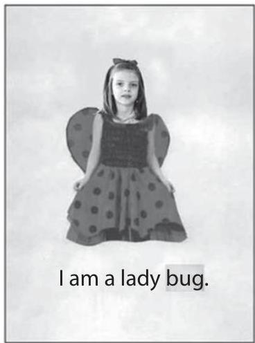

PCS is a trademark of Tobii Dynavox LLC. All rights reserved. Used with permission. PCS and Board-maker are trademarks of Tobii Dynavox LLC. All rights reserved. Used with permission.

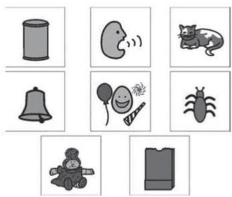

Several researchers have investigated the generalization of decoding and/or sight word recognition skills to shared reading activities. Fallon et al. (2004) found that four of five participants were able to generalize single-word decoding skills that were learned in isolation and apply them successfully during shared reading activities. Light and McNaughton (2009a, 2019) investigated the effects of direct instruction in single-word decoding and sight word recognition skills paired with opportunities to apply these skills during shared reading and found that all of the participants successfully generalized these skills to a wide range of shared reading materials. As the individuals in this study demonstrated greater competence and fluency, the instructor targeted more words per page, gradually increasing the learning demands on the participants.

Supporting Reading and Understanding Simple Sentences and Stories Once literacy learners are able to reliably and fluently decode and/or recognize by sight a range of words, they are ready to accept more responsibility for reading sentences and stories independently. Learning to read connected text is more complicated than simply decoding single words or recognizing single words by sight (Orlando &amp; Ruppar, 2016). To read sentences and simple stories successfully, individuals must 1) track through the words in the text in sequence from left to right, 2) decode or recognize by sight each word in the sentence, 3) recall the meaning of each word, and 4) process the words together to derive the meaning of the full text. Ultimately, individuals must also be able to relate the text to their prior knowledge and experience to derive a full understanding. Learning to read connected text imposes greater demands on the individual's language skills than single-word decoding or sight word recognition skills. Specifically, the individual must have the vocabulary knowledge required to access the meaning of the words and the syntactic and morphological knowledge required to derive the meaning of the sentence (Adams, 1994).

Literacy Intervention for Individuals with Complex Communication Needs

Whereas individuals without disabilities usually enter literacy instruction with a strong foundation in their receptive and expressive language skills, many individuals with complex communication needs are at risk for deficits in their semantic, syntactic, and morphological skills due to limited expressive experiences and/or limited language input (Binger &amp; Light, 2008; Light, 1997b). They may therefore require focused instruction to successfully read and understand sentences and simple stories. Initially, such intervention should focus on ensuring basic literal comprehension skills; later, more complex inference skills can be targeted. Light and McNaughton (2017b) described a set of intervention procedures that are aimed at teaching an individual to read and comprehend simple sentences. First, the instructor presents three or more photographs, pictures, or illustrations from a story; the pictures include one that illustrates the meaning of a written sentence as well as several foils (i.e., incorrect responses) that are carefully selected to ensure that learners are reading the entire sentence accurately. The learner's task is to read the sentence independently and then select the picture that represents its complete meaning. Initial research suggests the efficacy of these adapted procedures in building basic comprehension skills.

As individuals develop accuracy and fluency at reading and understanding sentences, they can begin to read simple books independently. Reading simple stories requires learners not only to use basic literacy skills and semantic, syntactic, and morphological language skills, but also to draw on narrative skills to understand the relationships across sentences in order to build the meaning of the entire story (i.e., the situation, problem or complication, resolution, and denouement). Initially, instruction should focus on ensuring comprehension of each stage of the story before moving on to the next stage. As individuals face increased demands on reading comprehension, they benefit from instruction in reading comprehension strategies (NRP, 2000). We discuss strategies for teaching more advanced reading comprehension strategies in a later section of this chapter, "Monitoring Comprehension and Utilizing Reading Comprehension Strategies."

Anna's story illustrates what the instructional progression for reading simple sentences and stories might look like in literacy intervention. Anna was 3 years old when she started literacy intervention. She had a diagnosis of ASD and had limited speech. She was using the Picture Exchange Communication System (PECS) to make simple requests but was limited in her expressive vocabulary and typically communicated in telegraphic single-word messages. Once Anna learned to decode or recognize by sight a wide range of words, we started to work on reading and understanding sentences. We focused on very simple sentences first (e.g., 2- to 3-word sentences), and we used familiar experiences to limit the cognitive and linguistic demands. We provided Anna with a range of photos of her family engaged in different activities (e.g., photos representing mom naps, mom runs, dad naps). We then presented Anna with a written sentence (e.g., mom naps). Anna had to read the sentence independently and then choose the photo that represented the meaning of the sentence. The response options provided were carefully selected so that Anna could not simply rely on reading and understanding a single word; rather, she had to read each word in the sentence and then derive the meaning of the full sentence. To learn more about Anna's success and to see videos of her literacy instruction, visit the web site Teaching Reading and Writing to a Learner with Autism Spectrum Disorder and Complex Communication Needs at the AAC Learning Center. (Light &amp; McNaughton, 2017b)

Interventions to Teach Basic Writing Skills

Literacy skills encompass not only reading but also written communication. Written communication skills have assumed greater importance with society's increased reliance on electronic and wireless communication for education, employment, and social interaction. Once individuals with complex communication needs develop competence in written communication, they significantly expand the range and power of their communication. Unfortunately, writing instruction is frequently neglected for these individuals (Erickson & Geist, 2016; Ruppar et al. 2011).

Learning written communication skills depends on the integration of knowledge and skills across a variety of domains (Light & McNaughton, 2009a):

1. World knowledge and experience in order to have something to write about
2. Narrative skills to develop a cohesive story with a clear situation, problem, and resolution (or skills in another writing genre)
3. Language skills (semantic, morphological, and syntactic knowledge) to express each part of the story clearly
4. Phoneme segmentation skills to break down the words in the sentences into their component sounds
5. Knowledge of letter--sound correspondences to know which letters represent these component sounds
6. Knowledge of the spellings of irregular frequently occurring words learned as sight words
7. Skills in handwriting, keyboarding, or other access techniques to produce or locate and select the required letters and/or words

This process is more challenging than learning to read because it requires individuals to hold a significant amount of information in working memory (e.g. the story, the specific sentence within the story, the target word within that sentence, the letters to spell the target word) and at the same time encode text dynamically by selecting from a keyboard (or producing via handwriting) the required sequence of letters to form the words in each sentence of the story. The working memory demands are further increased for individuals who have motor impairments because the process of encoding (i.e. selecting letters from the keyboard or producing letters) may be slow and effortful for them (Millar et al. 2004). Obviously, concerted intervention is required to build written communication skills. This intervention has two essential components: 1) access to appropriate writing tools and 2) appropriate and effective instruction in writing skills.

As individuals with complex communication needs develop their literacy skills, written language can be used as a means not only to build further literacy skills but also to teach specific language skills, especially morphological/syntactic structures. Prior to literacy instruction, Jackson, a 4-year-old with Down syndrome, communicated telegraphically using speech and signs. As he learned to read simple sentences that included articles (e.g. the, a), he began to generalize use of these articles to his expressive communication as well. Similarly, Anna, mentioned earlier, learned at age 4 to use the third-person singular present-tense verb ending (i.e. adding -s to the verb, as in dad hugs) through literacy activities. It was easier to teach Anna such abstract language structures through

writing because the structure was presented not just orally but also visually. The written presentation of morphology/syntax was permanent, allowing Anna increased time to discern the relevant pattern, which facilitated learning. Visit the web site, Literacy Instruction for Young Children with Autism, Cerebral Palsy, Down Syndrome and Other Disabilities (Light & McNaughton, 2019), to view a video of Jackson. Watch the webcast, Improving Literacy Outcomes for Individuals with Autism Spectrum Disorder and Limited Speech (Light & McNaughton, 2017a), at the AAC Learning Center to view videos of Anna learning language through writing.

Ensuring Access to Writing Tools As discussed previously in this chapter, individuals with complex communication needs require access to a range of writing tools early on during the emergent stage of literacy development (e.g. writing implements such as pencils and markers, with adaptations to assist with grip as required, as well as keyboard access with letter sounds as output). As individuals with complex communication needs transition to learning conventional literacy skills, they will benefit from consistent access to an appropriate keyboard(s) that meets their needs and skills, as well as to letter cards and a word wall or word banks of high-interest words that are difficult to spell (e.g. Power Ranger, Tyrannosaurus rex) and frequently occurring irregular words (e.g. walk, friend, their; Erickson, 2017). Input from occupational or physical therapists and other members of the AAC team will be required to determine the most appropriate layout and configuration for the keyboard as well as the most appropriate access method (see Chapters 6 and 7). In addition to designing keyboards to facilitate access and accommodate visual and/or motor impairments, keyboards may also be adapted to facilitate early literacy learning. Care should be taken to ensure that keyboard access is not overly taxing or it will detract from the learning of writing skills.

Use of an adapted keyboard facilitated literacy learning for Bren, a 12-year-old with ASD. Bren started instruction in writing skills as soon as he had acquired some phoneme segmentation skills and knew 6- to 7-letter sound correspondences. The webcast Improving Literacy Outcomes for Individuals with Autism Spectrum Disorders and Limited Speech at the AAC Learning Center (Light & McNaughton, 2017a) includes a video of Bren learning to type his name with guided practice. In the video, Bren uses an adapted keyboard. As he acquires each new letter sound, it is highlighted on the adapted keyboard so that he can type more words and build his keyboard knowledge incrementally. As he learns uppercase letters, he will transition to a standard keyboard.

Providing Instruction and Opportunities to Use Basic Writing Skills Simply providing access to appropriate writing tools does not ensure the acquisition of effective written communication skills; rather, focused instruction is required to build these skills. As with reading, instruction in writing should integrate two components: 1) direct instruction in basic writing skills (i.e. phoneme segmentation, letter--sound correspondences, single-word encoding/spelling skills), and 2) numerous opportunities to apply these skills in the context of meaningful authentic writing experiences (Millar et al. 2004; NRP, 2000; Sturm, 2012).

The development of writing skills rests on phonological awareness skills (specifically phoneme segmentation skills) and knowledge of letter--sound correspondences, as discussed previously in this chapter. Once literacy learners have acquired

AAC Interventions for Individuals with Developmental Disabilities

phoneme segmentation skills and know some letter–sound correspondences, they are ready to learn to integrate these skills to encode or spell simple regular words. Typically, instruction in single-word encoding/spelling combines practice in phonological awareness skills and letter–sound correspondences with instruction in the integration of these skills to encode words (Blischak, Shah, Lombardino, &amp; Chiarella, 2004; Johnston, Davenport, Kanarowski, Rhodehouse, &amp; McDonnell, 2009). Light and McNaughton (2009a) described adapted procedures for direct instruction in single-word encoding/spelling as follows:

1. First, the instructor models single-word encoding skills by slowly saying a word out loud, extending each sound in the word, and selecting the corresponding letter for each sound as it is said.

2. Then the instructor provides guided practice in encoding, saying the word slowly, and holding each of the sounds in the word while the learner selects the corresponding letter from a keyboard (or from an array of letters).

3. Over time, the instructor gradually fades the oral scaffolding support (e.g., says the word in a quieter voice) as the individual learns the skill.

4. As the individual develops competence, he or she is given opportunities to practice encoding skills independently, without scaffolding support.

5. The instructor provides feedback to the learner as appropriate.

Research supports the conclusion that, with appropriate instruction, individuals with complex communication needs can demonstrate increases in the number of correct letter sequences and the number of words they spell correctly (Blischak et al., 2004; Johnston, Davenport, et al., 2009; Light &amp; McNaughton, 2009a; Millar et al., 2004). Often, instruction in encoding is organized around word families that end in the same letter combinations (e.g., the -an family includes words such as can, man, and ran) to promote generalization of spelling skills to new words that were not previously taught (Hanser &amp; Erickson, 2007).

Individuals with complex communication needs require numerous opportunities to apply basic encoding skills in the context of meaningful writing activities (Erickson, 2017; Light &amp; McNaughton, 2009a, 2009b; Sturm, 2012). Light et al. (2008) cautioned that individuals with complex communication needs can be easily overwhelmed by the multitude of demands during early writing activities, including demands on narrative skills; semantic, syntactic, and morphological skills; encoding/spelling skills; and/or keyboarding skills. They recommended exploring techniques such as the following to reduce demands in some of these areas as individuals acquire new skills:

1. Reading books with repeated lines or story structures (e.g., *Brown Bear, Brown Bear, What Do You See?*; Martin &amp; Carle, 1983) and having learners use the repeated lines to structure and write their own stories, filling in their own content words (e.g., *Red pig, red pig, what do you see? I see a pink bug looking at me*)

2. Using photos of highly motivating personal experiences as a basis for writing, thus providing familiar content and a familiar narrative structure as well as visual supports for generating content (i.e., photos of a motivating familiar experience with a beginning, middle, and end)

3. Providing learners with easily accessible models of high-frequency and high-interest words for use in their writing through a word wall or word bank (see Hanser &amp; Erickson, 2007)

Literacy Intervention for Individuals with Complex Communication Needs

4. Using shared writing, wherein the instructor and the individual co-construct a story, with the learner assuming responsibility for generating text and encoding regular words and the instructor providing scaffolding support to assist with encoding more complex and irregular words.

As discussed earlier, individuals may benefit from modeling, guided practice (with scaffolding support from the instructor), and then independent practice in writing as they develop greater competence. The texts written by learners can be printed as books and/or scanned into AAC technologies; the books can then be used for repeated readings with teachers, families, and peers.

The emphasis at this stage of development is the individual's communication of meaning through written texts. The instructor recognizes the communicative intent of sound spellings and provides models of conventional spellings as appropriate (Foley &amp; Wolter, 2010). Ultimately, individuals with complex communication needs also require instruction in the conventional spellings of frequently occurring irregular words; these words may be introduced following the same sequence as the school curriculum. We discuss spelling instruction in a later section of this chapter.

Michael, a 4-year-old with a diagnosis of ASD, had been involved in literacy instruction for approximately 1 year. He had learned letter-sound correspondences, phoneme segmentation skills, decoding skills, and sight word recognition skills during this time. After reading a book about a robot dog, Michael wrote the following story using his newly acquired language and literacy skills:

robot dog will fetch my gren power ranger [Robot Dog will fetch my green Power Ranger.]

robob dog is gowg to plae [Robot Dog is going to play.]

robot dog haz tim ot becuz he duzut lisin [Robot Dog has time out because he doesn't listen.]

Visit the Student Success Stories section of the web site, Literacy Instruction for Individuals with Autism, Cerebral Palsy, Down Syndrome and Other Disabilities (Light &amp; McNaughton, 2019), to learn more about Michael's literacy journey.

## TEACHING ADVANCED LITERACY SKILLS

Whereas the focus of the first three years of school is on learning to read and write, the focus of subsequent years of education is typically on reading and writing to learn (Graham &amp; Perin, 2007; NRP, 2000). Literacy skills are the principal means by which individuals acquire new information and through which their learning is assessed (Foley &amp; Wolter, 2010). This section of the chapter focuses on intervention to build more advanced literacy skills with individuals with complex communication needs, with a specific focus on the development of reading comprehension and writing strategies. There has been limited published research investigating interventions to teach advanced literacy skills to individuals with complex communication needs. Therefore, this section of the chapter draws heavily on the research on interventions for individuals who are at risk in the area of literacy development but who are able to use speech to communicate (e.g., Graham &amp; Perin, 2007; NRP, 2000). Adaptations to these interventions are proposed to facilitate the participation of individuals with complex

communication needs and are based—at least in part—on anecdotal reports and case descriptions (Bedrosian, Lasker, Speidel, & Politsch, 2003; Blischak, 1995).

## Intervention to Build More Advanced Reading Skills

Ultimately, the goal of literacy instruction is for individuals to be able to understand and learn from a wide range of texts. The process of building reading comprehension skills should start early, during the stage of emergent literacy development, as parents or teachers read with the learner with complex communication needs and discuss books to build the individual's comprehension skills. As literacy learners develop greater competence in basic reading skills (i.e. decoding and sight word recognition), the focus can shift to ensuring that they are able to construct meaningful representations of the texts as they read, relate the texts to their own experiences and prior knowledge, and use the information they have read for a wide range of purposes (Kendeou, van den Broek, Helder, & Karlsson, 2014; NRP, 2000). Building reading comprehension skills is a complex process that integrates competencies in four domains (Copeland, Head, & DiLuzio, 2018): 1) the ability to apply decoding and sight word recognition skills fluently; 2) the ability to understand the vocabulary, sentence structures, and text structures (e.g. narrative, expository, persuasive) that are read; 3) the ability to activate and apply world knowledge and domain-specific knowledge related to the text; and 4) the metacognitive skills to monitor comprehension and utilize appropriate comprehension strategies to ensure understanding.

### Building Fluency in Basic Reading Skills

At this stage of development, most individuals have learned to decode and recognize by sight a large corpus of words. They continue to build their decoding skills (e.g. learning to tackle more complex multisyllabic words), and they continue to expand the scope of their sight word recognition skills. With ongoing practice reading texts, individuals build fluency in decoding and sight word recognition skills, one of the key components of literacy instruction (NRP, 2000). Fluency and text comprehension are highly correlated (Fuchs, Fuchs, Hosp, & Jenkins, 2001). Students who are able to decode and recognize words by sight quickly and accurately are better able to devote their cognitive resources to understanding the text and relating it to their own experiences. Students who are not fluent in these tasks must devote significant effort to decoding and sight word recognition, leaving few cognitive resources available for reading comprehension.

A variety of techniques can be used to build fluency in decoding and sight word recognition skills, including 1) repeated readings of texts that are at the individual's independent reading level, 2) reading along with audio recordings or multimedia presentations of texts, and 3) paired readings wherein fluent readers read aloud with less fluent readers (Foley & Wolter, 2010). Many individuals with complex communication needs do not have sufficiently intelligible and fluent speech to participate in these oral/choral reading activities. Erickson and Koppenhaver (2007) recommended that individuals with complex communication needs be encouraged to read silently during these activities, using subvocal speech (inner voice) as the group, partner, or tape reads the text aloud. These techniques all focus on providing repeated practice in basic skills in the context of meaningful reading activities and thus aid in the development of fluency. For individuals who have significant difficulty reading independently, assistive technologies or other supports (e.g. screen

Literacy Intervention for Individuals with Complex Communication Needs

readers, digital texts, audiobooks) may be required to bypass reading demands and provide access to instructional content (see the section on assistive technologies for further discussion).

## Building More Advanced Language Skills

Simply recognizing or decoding words fluently is not sufficient to ensure reading comprehension; in addition, individuals must also be able to understand the meanings of these words, the sentence structures, and the entire narrative or other written genre. Unfortunately, many individuals who rely on AAC may have limited language skills due to their restricted expressive language experiences and the reduced language input they may receive (Light, 1997b). Concerted language intervention is required from an early age to build the semantic, syntactic, morphological, and narrative skills required to support reading comprehension (see Chapters 10 and 11 for further discussion). The language of written communication differs from that of conversation, using a wider range of vocabulary and more complex sentence structures. The development of advanced language skills is enhanced through reading: The more individuals read, the more advanced their language skills become (Foley &amp; Wolter, 2010). Reading books to individuals with complex communication needs and discussing the texts provides an excellent opportunity to introduce new vocabulary and sentence structures. This broad-based intervention should be supplemented by focused instruction to teach specific vocabulary, sentence structures, or genres as required (Ruppar et al., 2017; Sturm &amp; Clendon, 2004).

## Developing World Knowledge and Domain-Specific Knowledge

In addition to language skills, individuals with complex communication needs also require a well-developed base of world knowledge to bolster their comprehension of written texts. Relevant experiential and world knowledge allows individuals to use context to derive the meaning of unknown words, anticipate events and consequences, and quickly build understanding of texts. Unfortunately, many individuals with complex communication needs have limited world knowledge due to architectural barriers, attitudinal barriers, health constraints, manipulation and mobility impairments, and limited communication opportunities. Without access to relevant prior knowledge, it is much more difficult and effortful to build understanding of written texts. Ironically, as with language skills, world knowledge and domain-specific knowledge are best built by reading a wide range of texts. To provide access to a greater range of books, individuals with complex communication needs might benefit from access to audiobooks, multimedia presentations of texts, and screen readers, as well as having teachers, parents, peers, and peer tutors read to them. It is important to note that simply listening to texts is not sufficient to build world knowledge; rather, individuals need to process text actively by discussing the content with others and relating the new information to prior experiences. Again, it is critical that learners have access to AAC supports that provide the specific vocabulary that is needed to communicate about the text (Boruta &amp; Bidstrup, 2012; Clendon et al., 2014; Hudson &amp; Test, 2011; Yorke et al., 2018). To support participation in grade-level content, the use of adapted texts (i.e., the creation of books that convey the key concepts for a content area, but with reduced literacy demands) may be appropriate (Ruppar et al., 2017; Spooner et al., 2015). All of these activities will serve not only to expand language skills but also to build world knowledge and domain-specific knowledge.

Monitoring Comprehension and Utilizing Reading Comprehension Strategies

As individuals progress in their education, they encounter even greater reading demands: a greater number of books covering a wide range of topics, longer books that use more complex vocabulary and sentences, and books from a wide range of genres (e.g. expository, narrative, persuasive). These increased reading demands place greater demands on reading comprehension skills, especially for those individuals who may not have well-developed fluency, language skills, and/or world knowledge. The strain on reading comprehension skills may be further aggravated because many textbooks are poorly organized, contain extraneous content that detracts from key concepts, and assume wide-ranging prior knowledge (Boone & Higgins, 2007).

Students at all grade levels benefit from instruction in reading comprehension strategies (NRP, 2000). Strategy instruction is especially important for those who are at risk in the area of reading comprehension, including individuals with complex communication needs. Reading comprehension strategies are “specific cognitive procedures that guide learners to become aware of how well they are comprehending as they attempt to read (and write)” (NRP, 2000, p. 40). Research suggests that individuals who use these strategies demonstrate significant gains in comprehension as a result (Gersten, Fuchs, Williams, & Baker, 2001). Table 12.6 provides a list of evidence-based reading comprehension strategies that may benefit individuals who rely on AAC, along with adaptations to meet the specific needs of these learners: comprehension monitoring, summarization, graphic and semantic organizers, question answering, question generation, and recognition of text structures (Armbruster, Lehr, & Osborn, 2001; NRP, 2000). Individuals with complex communication needs benefit from learning multiple reading comprehension strategies because different strategies may be needed for different types of texts and different task requirements or assignments.

Learning to use reading comprehension strategies requires individuals to integrate knowledge and skills in a multistep process to actively process information as they read, thus promoting comprehension and retention (Gersten et al. 2001). The University of Kansas Center for Research on Learning has developed a comprehensive, scientifically based model that can be used to teach reading comprehension strategies. It includes the following components (Schumaker & Deshler, 2006):

1. Conduct a pretest to determine the individual's use of the strategy prior to initiating instruction.
2. Obtain the learner's commitment to learning the strategy.
3. Describe the strategy and discuss its benefits.
4. Model or demonstrate use of the strategy, providing think-aloud explanations of the steps as they are performed.
5. Practice naming the steps of the strategy.
6. Provide the learner with guided practice in the use of the strategy, with scaffolding support provided by the instructor as required to ensure the learner's success.
7. Fade support as the individual learns the strategy.
8. Provide numerous opportunities for the individual to practice the strategy independently, with corrective feedback as required.

Literacy Intervention for Individuals with Complex Communication Needs

9. Provide practice in strategy use under increasingly more complex conditions (e.g., with more complex texts, in classroom conditions with various distractions).
10. Plan explicitly with the individual to build generalization and maintenance of the strategy.

Table 12.6. Strategies to support reading comprehension and adaptations for students with complex communication needs

|  Reading comprehension strategy | Adaptations for individuals with complex communication needs (CCN)  |
| --- | --- |
|  Comprehension monitoring
• Stop at regular intervals while reading
• Check understanding of text | Use written words or augmentative and alternative communication (AAC) symbols as visual prompts to stop reading and check understanding  |
|  Summarization
• Identify key ideas from text (e.g., who? did what?)
• Eliminate irrelevant details | Use written words or AAC symbols as prompts to summarize the main idea
Select the best summary from three or more summaries provided
Put sentence strips in the correct sequence to summarize the story  |
|  Graphic and semantic organizers
• Use organizational aids to map out the content of the text
• Illustrate the structure of the text visually using a story map | Use software-based concept maps to illustrate story structure (provide assistance with navigation/formatting as required)
Complete graphic organizer in collaboration with peer recorder  |
|  Question answering
• Answer questions (both literal and inference) about the text
• Receive immediate feedback on responses | Use AAC systems to generate responses to open-ended questions
Use multiple-choice questions to increase efficiency and reduce fatigue
Use question-and-answer matching  |
|  Question generation
• Think about the topic prior to reading or while reading
• Think of relevant questions about the text
• Respond to questions while reading | Use AAC systems to generate questions
Allow student to select questions of interest from an array of choices provided  |
|  Recognition of text structures
• Determine the genre of the text (e.g., narrative, expository)
• Determine the elements of the genre (e.g., setting, characters, problem, resolution) | Provide choices of written genres; program relevant vocabulary into AAC systems
Preprogram question prompts for story elements into AAC systems (e.g., Where does the story take place? What happens first?)
Use storyboards listing story elements  |

Sources: Bedrosian et al. (2003); Erickson (2003); Light &amp; McNaughton (2009a, 2009b).

The following account illustrates how a learner might be introduced to a reading comprehension strategy and then given opportunities to practice applying it. Gareth, a 5-year-old boy with severe cerebral palsy, learned to read before he started kindergarten. He was introduced to basic reading comprehension strategies early in his literacy instruction. As he read each page or section of a story independently, he stopped to answer questions to ensure comprehension before he went on to read the next section. We used multiple-choice questions (with carefully selected response options) so that Gareth could

quickly and easily indicate his answer. For example, when reading a book about Clifford the dog, Gareth first read the text independently. Then he answered multiple-choice questions such as the following:

Why will Clifford win?

The dogs will raceClifford is big and fastClifford is redClifford will win

This technique provided a quick check of Gareth's comprehension without making undue demands that would result in fatigue. This question-answering strategy also mirrored the demands that Gareth would face later on in many standardized tests. Questions that required both basic factual comprehension and inference skills could be quickly developed by Gareth's teacher or aide during the reading activity, thus minimizing demands for material preparation. Read more about Gareth and see videos of his use of this strategy in the Reading Comprehension section of the web site, Literacy Instruction for Individuals with Autism, Cerebral Palsy, Down Syndrome and Other Disabilities. (Light & McNaughton, 2019)

### Intervention to Build More Advanced Writing Skills

As individuals progress through school and consider future employment, they face increased writing demands. In third grade and thereafter, writing is the most common method used to communicate information and assess an individual's knowledge and learning. Writing not only allows individuals to convey information to others (e.g. tell stories, explain events, express opinions, persuade others) but also provides a mechanism to support an individual's learning and understanding. As individuals write about a topic, they extend and deepen their knowledge (Graham & Perin, 2007). As the educational and vocational writing demands increase, individuals with complex communication needs must be able to generate increasingly longer texts for a variety of purposes, using more complex vocabulary and sentence structures (Foley & Wolter, 2010). Meeting these writing demands requires well-developed knowledge and skills in 1) the conventions of writing, including spelling, punctuation, capitalization, and text production/keyboarding; and 2) the use of writing strategies to plan, write, and edit texts effectively across genres (e.g. narrative, expository, persuasive; Light & McNaughton, 2009b).

Although there are examples of individuals with complex communication needs who have well-developed writing skills (e.g. Koppenhaver et al. 1991), many individuals who rely on AAC demonstrate difficulties with written communication. For example, Kelford Smith, Thurston, Light, Parnes, and O'Keefe (1989) investigated the written communication skills of six individuals (ages 13--22 years) who had cerebral palsy and relied on AAC. They reported that 1) the participants produced a limited amount of written communication in a one-week period; 2) the participants required significant amounts of time to plan, generate, and revise written texts; 3) the participants demonstrated difficulties with morphology; and 4) all but one participant demonstrated difficulties with sentence structures. Focused intervention is required to build advanced writing skills with individuals with complex communication needs.

Literacy Intervention for Individuals with Complex Communication Needs

This intervention should focus on instruction in the conventions of writing as well as instruction in the use of writing strategies.

## Building Knowledge and Skills in Writing Conventions

To produce competent, intelligible written texts, individuals who rely on AAC need to develop skills in spelling (both regular and irregular words) as well as knowledge of the conventions of writing, such as capitalization, punctuation, and paragraphing. Instruction in these skills should be ongoing, starting in the early stages of learning conventional literacy skills. As individuals acquire basic skills, the focus of instruction turns to the development of more complex spelling skills (e.g., long vowel patterns, multisyllabic words with prefixes and suffixes, homonyms) and word study skills (e.g., derivations of words, word meanings), as well as the acquisition of more advanced writing conventions (e.g., use of punctuation, paragraphs). As noted earlier, spelling skills rely heavily on phonological awareness skills and knowledge of letter-sound correspondences. Some individuals with severe speech impairments have difficulty applying their phonological awareness skills to spell words (Hart, Scherz, Apel, &amp; Hodson, 2007); however, there is evidence that individuals who rely on AAC benefit from explicit instruction in spelling (McNaughton &amp; Tawney, 1993; Schlosser, Blischak, Belfiore, Bartley, &amp; Barnett, 1998). In addition, speech output (auditory feedback) has been found to have a positive effect on the spelling performance of both individuals with autism spectrum disorder (Blischak &amp; Schlosser, 2003) and individuals with cerebral palsy (McCarthy et al., 2015), leading the researchers to conclude that speech output should be considered as a support for writing instruction.

Along with the acquisition of more advanced skills in spelling and writing conventions, instruction should also focus on the development of fluency with writing conventions (e.g., spelling skills, punctuation, handwriting, keyboarding, other operational skills). If these skills remain effortful for individuals with complex communication needs, they will have few cognitive resources available to support the actual writing process (i.e., the planning, drafting, and revising of written texts); instead, all of their attention and cognitive resources will be consumed by the conventions of spelling and selecting/producing letters to create written text. As noted earlier, fluency is built through practice. As these skills become more automatic, individuals who rely on AAC will be able to devote their attention and cognitive resources to the content of the writing process rather than the mechanics. Although all individuals benefit from numerous opportunities to produce written texts, it should be noted that for many individuals with complex communication needs—especially those with significant motor, sensory/perceptual, and/or cognitive impairments—the process of producing written text can be especially challenging. As noted by Foley and Wolter (2010), these writers may fatigue easily and may have difficulty sustaining their attention to the writing task. For individuals who have significant difficulty producing text, assistive technologies may be required to provide scaffolding supports, enhance rate, and/or provide spelling and writing aids (see the section on assistive technologies for further discussion).

## Learning to Use Writing Strategies

Skilled writing extends well beyond the simple mechanics of producing written text. To successfully produce longer, more complex texts, individuals must engage in an iterative writing process that includes reflection, production, and interpretation (Hayes, 2000). First, individuals plan and organize the text by reflecting on their ideas and experiences, as well as their goal or

AAC Interventions for Individuals with Developmental Disabilities

purpose; then they translate their thoughts into written language and produce the text (by handwriting or keyboarding); and, finally, they review what they have written, reflect on their goal, and then revise accordingly. As writing demands increase, learning to make use of writing strategies can result in positive gains in writing skills for middle- and high school students with and without disabilities (Graham &amp; Perin, 2007). Typically, writing strategies provide multistep procedures to support each stage of the writing process—planning, writing the text, and editing (see Table 12.7 for examples of writing strategies at each of the stages). Like reading comprehension strategies, these types of writing strategies can be taught using a cognitive strategy instruction model (Deshler &amp; Schumaker, 2006; Santangelo, Harris, &amp; Graham, 2016).

In addition to writing strategies, research suggests that collaborative writing also benefits individuals both with and without disabilities (Graham &amp; Perin, 2007). Collaborative writing involves the development of "instructional arrangements whereby students work together to plan, draft," and revise their writing (Graham &amp; Perin, 2007, p. 42). Conferencing with peers can serve to encourage individuals to assume greater responsibility for learning, increase learning of cognitive strategies (specifically writing strategies), provide feedback and supports during the writing process, and increase motivation through social interactions with peers (NRP, 2000). Bedrosian et al. (2003) described a writing intervention for an adolescent with ASD who relied on AAC that involved instruction in writing strategies as well as collaborative writing with a speaking peer who had a mild cognitive impairment. Specifically, the intervention included the following components: 1) the provision of assistive technologies to support writing (i.e., an AAC device, story grammar map, storyboards with relevant vocabulary and story starters, and story writing software); 2) explicit instruction in writing strategies; 3) modeling of writing by the instructor and the peer; 4) prompting; and 5) written support provided by peer scaffolding. Results suggested that the intervention had a positive impact on the writing of the adolescent

Table 12.7. Examples of writing strategies to support each stage of writing

|  Stage of the writing process | Writing strategy | Description  |
| --- | --- | --- |
|  Planning stage | PLAN strategy (De La Paz, Owen, Harris, & Graham, 2000) | Pay attention to the writing prompt List the main ideas Add supporting ideas Number your ideas  |
|  Writing/drafting stage | WRITE strategy (De La Paz et al., 2000) | Work from your plan to develop your thesis statement Remember your goals Include transition words for each paragraph Try to use different kinds of sentences Exciting, interesting $10,000 words  |
|  Editing/revising stage | EDIT strategy (Hughes, Schumaker, McNaughton, Deshler, & Nolan, 2010) | Enter your first draft Do a spell check Interrogate yourself about capitalization, overall appearance, punctuation, and substance Type in corrections and run the spell checker again  |

Literacy Intervention for Individuals with Complex Communication Needs
469

with complex communication needs; his postintervention story was longer and demonstrated more complete story grammar than his preintervention story. These improvements were noted not only in the writing completed collaboratively but also in writing completed independently. Future research is required to further investigate the effects of intervention with individuals who rely on AAC across a wide range of written genres.

## Building Writing Skills for Social Purposes

It is important to note that, as individuals grow, writing not only assumes increased importance educationally and vocationally but also assumes increased importance socially. For example, people in the United States send and receive five times more texts per day compared to phone calls, and a typical teen sends and receives 30 texts per day (Lenhart, 2015). Using electronic communication media (e.g., texting, social networking sites such as Facebook, Snapchat) to build social relationships offers some unique advantages for individuals with complex communication needs because these media allow them to communicate at their own rate and may free them from the negative social attitudes that often limit face-to-face interactions. Written communication via these social media, although often shorter and less formal than writing for educational and vocational purposes, imposes its own set of demands (e.g., use of an appropriate voice for the audience, use of Internet slang such as LOL [laugh out loud], JK [just kidding], and IDK [I don't know]). If individuals with complex communication needs are to develop and negotiate successful social relationships, they will need to develop the written communication skills as well as the operational skills (e.g., skills to access and create web sites and blogs, skills to upload and download video and images) that allow them to participate effectively via these media as well (Caron &amp; Light, 2016, 2017; Grace, Raghavendra, Newman, Wood, &amp; Connell, 2014).

## ASSISTIVE TECHNOLOGIES TO SUPPORT LITERACY

In addition to requiring empirically based literacy instruction to develop reading and writing skills, individuals with complex communication needs may also require access to a wide range of assistive technologies to support literacy development, including assistive technologies that provide 1) access to communication, 2) access to literacy instruction, and 3) supports to compensate for reading and writing difficulties. Decisions about assistive technologies should be made by the AAC team in conjunction with the individual and family. Assistive technologies should be customized according to the needs and skills of the individual as well as the communication and literacy demands (see Chapter 8).

## Assistive Technologies for Communication

Individuals with complex communication needs require access to unaided and/or aided AAC to allow them to communicate and participate fully within literacy activities and instruction, from the early stage of emergent literacy development through the development of more advanced literacy skills. These AAC systems include those that support written communication (both conventional writing and early emergent writing activities) and telecommunication (e.g., texting, email), as well as systems that support face-to-face communication during literacy activities and instruction (e.g., choosing topics, talking about books, answering

comprehension questions, summarizing or retelling stories, asking questions about books, expressing opinions). AAC systems must include appropriate vocabulary to support communication during literacy activities and instruction. The communication demands of literacy activities and instruction differ from the functional communication demands in daily life. Individuals with complex communication needs require access to AAC systems that incorporate the more formal semantics, syntax, and morphology of written language, as well as the story grammar to structure narratives and build the language foundation that underpins literacy development (e.g. Bedrosian et al. 2003).

In addition to providing a means to support participation and discussion during literacy activities, AAC can also be used as an alternative mode to provide responses during literacy instruction. For example, Johnston et al. (2018) described adaptations that allowed individuals with complex communication needs to use signs or graphic AAC symbols to respond effectively and efficiently during instruction in sound blending, phoneme segmentation, decoding, and/or sight word recognition.

Recent software developments, including the transition to literacy (T2L) feature that is available on a range of AAC technologies, also support the acquisition of new skills—in this case, the transition from the use of graphic symbols to text (Light et al. 2014). The T2L feature can be used with either grid displays or VSDs. When an individual touches a symbol or hotspot programmed with the T2L feature, the associated written word appears dynamically on the screen, pauses for 3 seconds, and then fades away (see Figure 12.5). The T2L approach has been demonstrated to be effective in teaching sight word recognition with literacy learners with a wide range of ages (ages 3--46 years), and with various disabilities, including ASD, cerebral palsy, and Down syndrome (see Light, McNaughton, & Caron, 2019 for a summary of recent research and a list of AAC apps with the T2L feature).

## Assistive Technologies for Instruction

In addition to communication, technologies can also be used to further literacy instruction, either through the provision of instructional supports for literacy learning or in the delivery of computer-assisted instruction. For example, Spooner et al. (2015) investigated the use of an adapted text (Charlotte's Web), presented on a tablet computer, with five children with severe disabilities. The text was programmed to be read aloud using the text-to-speech function of the device, and communication supports (e.g. four pictures) for responding to partner questions were also available to the child. All five children demonstrated gains in their ability to respond to comprehension questions, and all five children reported that they enjoyed the reading activity.

Furthermore, there are numerous software applications for computer and mobile technologies (e.g. iPad) that provide instructional activities or games to supplement instruction in letter--sound correspondences, decoding, and encoding activities. Before implementing these applications, it is critical to ensure that they address appropriate instructional goals, use appropriate instructional methods and materials, and are accessible for individuals with complex communication needs who may have motor and/or sensory/perceptual impairments.

There are now a number of evidence-supported, computer-based instructional programs that include adaptations for people with complex communication needs. See the AAC Learning Center web site (McNaughton & Light, 2019) for more information.

Literacy Intervention for Individuals with Complex Communication Needs

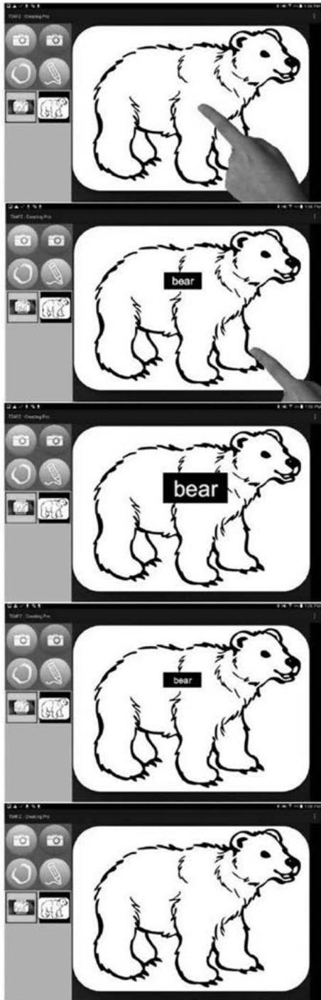

Figure 12.5. An example of the transition to literacy (T2L) feature with a visual scene display. (Reprinted by permission from the Licensor: Springer Nature: Journal of Autism and Developmental Disorders. Mandak, K., Light, J., &amp; McNaughton, D. (2019). Digital books with dynamic text and speech output: Effects on sight word reading for preschoolers with autism spectrum disorder. Journal of Autism and Developmental Disorders, 49, 1193–1204.

AAC Interventions for Individuals with Developmental Disabilities

# Assistive Technologies to Provide Support for Reading and Writing Difficulties

Finally, there are a wide range of technologies that provide the means for individuals with complex communication needs to bypass specific literacy demands or compensate for specific skill deficits. For example, spell checkers can be used to compensate for spelling difficulties, on-screen dictionaries can be used to compensate for vocabulary limitations, linguistic prediction can be used to enhance rate or compensate for spelling limitations, screen readers can be used to compensate for reading difficulties, and software applications with graphic organizers and concept maps can provide visual supports for the planning and organization stage of the writing process. E-books and digital texts also offer a number of advantages for individuals with complex communication needs: 1) text can be easily modified to accommodate visual impairments (e.g., larger font size, spacing, color contrast); 2) text can be read aloud as a support to reading skills; 3) definitions and explanations can be provided for new concepts to support vocabulary development; 4) links can be provided to additional support materials to build world knowledge; and 5) electronic coaching that prompts individuals to use reading comprehension strategies can be built into the software (Anderson-Inman &amp; Horney, 2007).

It is important to remember that simply providing assistive technology does not ensure successful literacy opportunities for individuals with complex communication needs. By reducing demands in one skill area, assistive technologies may actually increase demands in another. For example, access to texts through screen readers or other electronic media with speech output does not necessarily ensure successful comprehension of texts (Boone &amp; Higgins, 2007). The provision of these assistive technologies simply shifts the comprehension demands from the visual graphic modality of written text to the auditory modality of spoken text. The challenges of vocabulary knowledge, world knowledge, and comprehension monitoring remain, regardless of the modality of presentation. Depending on the individual, this shift in modality may or may not facilitate comprehension and learning. Thus, it is important to ensure that assistive technologies and electronic texts are designed and implemented in ways that minimize the processing demands and maximize motivation and learning for the individual (Anderson-Inman &amp; Horney, 2007). As with other assistive technologies, applications of reading and writing technologies are most effective if they are implemented along with effective evidence-based instruction to support their successful use by individuals with complex communication needs.

The CAST (formerly Center for Applied Special Technology) Universal Design for Learning (UDL) Book Builder provides free online tools to develop e-books with many features that are appropriate for individuals with complex communication needs.

# CONCLUSIONS

The acquisition of literacy skills is fundamental to participation in today's society. Literacy skills support cognitive development, facilitate participation in education, increase employment opportunities, promote social relationships, enhance access to a wide range of technologies, and provide opportunities to engage in motivating leisure pursuits. Literacy skills provide even greater benefits for individuals with complex communication needs who have limited speech abilities: For these individuals, the

acquisition of literacy skills expands communication options significantly, provides visual supports for language learning, enhances perceptions of competence, elevates expectations, and increases self-esteem.

Research has demonstrated that it is indeed possible to provide effective intervention to maximize literacy outcomes for individuals with complex communication needs, starting by first developing emergent literacy skills, then transitioning to learning early conventional literacy skills, and ultimately building advanced literacy skills to support participation in educational, vocational, health care, and community settings. Light and McNaughton (2009b) argued that there are five key components to effective literacy intervention:Providing sufficient time for literacy instructionTargeting appropriate skills known to improve literacy outcomesUsing proven, effective instructional techniquesProviding appropriate instructional adaptations and supports to accommodate the needs and skills of individuals with complex communication needsBuilding positive rapport and ensuring motivation for learning

The research discussed in this chapter provides the knowledge base that is essential to improve literacy outcomes for individuals with complex communication needs: implementation of evidence-based practices, ongoing data collection, and performance monitoring to ensure the effectiveness of these practices for each individual. However, this science, although essential, is not sufficient on its own to ensure successful outcomes. Tied to this knowledge must be the fundamental belief and commitment to the right of all individuals to have the opportunity to learn and to seek their full potential. Every individual can benefit from participation in literacy activities. Our society has vastly underestimated the learning potential of many individuals with complex communication needs. There is a growing body of research-based evidence demonstrating that individuals who rely on AAC can learn to read and write if they are provided with appropriate instruction. When individuals with complex communication needs can read and write, they have access to a whole new range of educational, vocational, and social opportunities. The acquisition of literacy skills empowers individuals with complex communication needs to meet their life goals.

Bob Williams describes the profound impact that acquiring literacy skills had upon his life: “I am thankful for one ... gift I received early on in life which most people can take for granted: the gift of literacy—of reading and writing, of making sense of the world and having the reciprocal ability of letting the world make sense out of you and come to respect you for all that you have to offer and contribute. This to me is the true gift and power of literacy in each of our lives. (Bob Williams, 2000, p. 247)”

## QUESTIONS

What are the key intrinsic factors that can impact literacy learning, and which of these factors may be of special concern for individuals with complex communication needs? If an individual has a limitation or impairment related to one of these intrinsic factors, what are the implications for literacy instruction?

AAC Interventions for Individuals with Developmental Disabilities

12.2. What are the key extrinsic factors that can impact literacy learning, and which of these factors may be of special concern for individuals with complex communication needs? If the environment presents a challenge related to one of these extrinsic factors, what are the implications for literacy instruction?

12.3. Describe the knowledge and skills that individuals typically acquire during the emergent literacy stage of development. What are some of the challenges in providing emergent literacy experiences for individuals with complex communication needs? Describe some interventions that have been demonstrated to have a positive impact in supporting the participation of individuals with complex communication needs in emergent literacy activities.

12.4. What are the five key components of effective literacy instruction for individuals with complex communication needs? For one of these components, describe a challenge commonly experienced by individuals with complex communication needs, and suggest adaptations that would help to address the challenge.

12.5. What are the benefits of direct instruction for teaching basic literacy skills? What are the benefits of applying basic literacy skills in meaningful authentic literacy activities? What are the benefits of combining both approaches?

12.6. Identify the domains of knowledge and skills that are necessary for learning to write. What are the implications of an impairment or limitation in one of these domains, and how might intervention address this challenge?

12.7. Identify the domains of competency that are necessary for building reading comprehension skills. What are the implications of an impairment or limitation in one of these domains, and how might intervention address this challenge?

# REFERENCES

Adams, M. J. (1994). Beginning to read: Thinking and learning about print. Cambridge, MA: MIT Press.

Afacan, K., Wilkerson, K. L., &amp; Ruppar, A. L. (2018). Multicomponent reading interventions for students with intellectual disability. *Remedial and Special Education*, 39, 229–242. doi:10.1177/0741932517702444

Ahlgrim-Delzell, L., Browder, D. M., Wood, L., Stanger, C., Preston, A. I., &amp; Kemp-Inman, A. (2016). Systematic instruction of phonics skills using an iPad for students with developmental disabilities who are AAC users. *Journal of Special Education*, 50, 86–97. doi:10.1177/0022466915622140

Ainsworth, M. K., Evmenova, A. S., Behrmann, M., &amp; Jerome, M. (2016). Teaching phonics to groups of middle school students with autism, intellectual disabilities and complex communication needs. *Research in Developmental Disabilities*, 56, 165–176. doi:10.1016/j.ridd.2016.06.001

Anderson-Inman, L., &amp; Horney, M. A. (2007). Supported etext: Assistive technology through text transformations. *Reading Research Quarterly*, 42, 153–160. doi:10.1598/RRQ.42.1.8

Apitz, M., Ruppar, A., Roessler, K., &amp; Pickett, K. J. (2017). Planning lessons for students with significant disabilities in high school English classes. *TEACHING Exceptional Children*, 49, 168–174. doi:10.1177/0040059916654900

Archer, A. L., &amp; Hughes, C. A. (2011). *Explicit instruction: Effective and efficient teaching*. New York, NY: The Guilford Press.

Armbruster, B. B., Lehr, F., &amp; Osborn, J. (2001). *Put reading first: The research building blocks for teaching children to read*. Washington, DC: National Institute for Literacy.

Bedrosian, J., Lasker, J., Speidel, K., &amp; Politsch, A. (2003). Enhancing the written narrative skills of an AAC student with autism:

Note: Letters and words shown in italics in this chapter were actually presented to the learner in regular type.

Literacy Intervention for Individuals with Complex Communication Needs

Evidence-based research issues. Topics in Language Disorders, 23, 305–324.

Benedek-Wood, E., McNaughton, D., &amp; Light, J. (2016). Instruction in letter-sound correspondences for children with autism and limited speech. Topics in Early Childhood Special Education, 36, 43–54. doi:10.1177/0271121415593497

Binger, C., Kent-Walsh, J., Berens, J., Del Campo, S., &amp; Rivera, D. (2008). Teaching Latino parents to support the multi-symbol message productions of their children who require AAC. Augmentative and Alternative Communication, 24, 323–338. doi:10.1080/07434610802130978

Binger, C., Kent-Walsh, J., Ewing, C., &amp; Taylor, S. (2010). Teaching educational assistants to facilitate the multisymbol message productions of young students who require augmentative and alternative communication. American Journal of Speech-Language Pathology, 19, 108–120. doi:10.1044/1058-0360(282009/09-0015)

Binger, C., &amp; Light, J. (2008). The morphology and syntax of individuals who use AAC: Research review and implications for effective practice. *Augmentative and Alternative Communication*, 24, 123–138. doi:10.1080/07434610701830587

Blischak, D. M. (1995). Thomas the writer: Case study of a child with severe physical, speech, and visual impairments. Language, Speech, and Hearing Services in Schools, 26, 11–20. doi:10.1044/0161-1461.2601.11

Blischak, D. M., &amp; Schlosser, R. W. (2003). Use of technology to support independent spelling by students with autism. Topics in Language Disorders, 23, 293–304.

Blischak, D. M., Shah, S. D., Lombardino, L. J., &amp; Chiarella, K. (2004). Effects of phonemic awareness instruction on the encoding skills of children with severe speech impairment. Disability &amp; Rehabilitation, 26, 1295–1304. doi:10.1080/09638280412331280325

Boone, R., &amp; Higgins, K. (2007). The role of instructional design in assistive technology research and development. Reading Research Quarterly, 42, 135–140. doi:10.1598/RRQ.42.1.5

Boruta, M. C., &amp; Bidstrup, K. (2012). Making it a reality: Using standards-based general education science and math curriculum to teach vocabulary and language structures to students who use AAC. Perspectives on Augmentative and Alternative Communication, 21(3), 99–104. doi:10.1044/aac21.3.99

Boyle, S. A., McNaughton, D., &amp; Chapin, S. E. (2019). Effects of shared reading on the

early language and literacy skills of children with autism spectrum disorders: A systematic review. *Focus on Autism and Other Developmental Disabilities*. 34, 205–214. doi:10.1177/1088357619838276

Brophy, J. E. (2010). Motivating students to learn (3rd ed.). New York, NY: Routledge.

Browder, D. M., Ahlgrim-Delzell, L., Courtade, G., Gibbs, S. L., &amp; Flowers, C. (2008). Evaluation of the effectiveness of an early literacy program for students with significant developmental disabilities. Exceptional Children, 75, 33–52. doi:10.1177/001440290807500102

Browder, D. M., Mims, P. J., Spooner, F., Ahlgrim-Delzell, L., &amp; Lee, A. (2008). Teaching elementary students with multiple disabilities to participate in shared stories. Research and Practice for Persons with Severe Disabilities, 33, 3–12. doi:10.2511/rpsd.33.1-2.3

Browder, D. M., Wakeman, S., Spooner, F., Ahlgrim-Delzell, L., &amp; Algozzine, B. (2006). Research on reading for students with significant cognitive disabilities. Exceptional Children, 72, 392–408. doi:10.1177/001440290607200401

Browder, D. M., &amp; Xin, Y. P. (1998). A meta-analysis and review of sight word research and its implications for teaching functional reading to individuals with moderate and severe disabilities. Journal of Special Education, 32, 130–153. doi:10.1177/002246699803200301

Carnine, D., Silbert, J., Kame'enui, E., &amp; Tarver, S. (1997). Direct instruction reading. Upper Saddle River, NJ: Pearson.

Caron, J. (2016). Effects of adapted instruction on the acquisition of letter-correspondences and sight words by pre-adolescent/adolescent learners with complex communication needs and autism spectrum disorders (Doctoral dissertation). Pennsylvania State University, Philadelphia.

Caron, J., &amp; Light, J. (2016). "Social media has opened a world of 'open communication'": Experiences of adults with cerebral palsy who use augmentative and alternative communication and social media. *Augmentative and Alternative Communication*, 32, 25–40. doi:10.3109/07434618.2015.1052887

Caron, J. G., &amp; Light, J. (2017). Social media experiences of adolescents and young adults with cerebral palsy who use augmentative and alternative communication. International Journal of Speech-Language Pathology, 19, 30–42. doi:10.3109/17549507.2016.1143970

Caron, J., Light, J., Holyfield, C., &amp; McNaughton, D. (2018). Effects of dynamic text in an AAC app on sight word reading for individuals

AAC Interventions for Individuals with Developmental Disabilities

with autism spectrum disorder. Augmentative and Alternative Communication, 34, 143-154. doi:10.1080/07434618.2018.1457715
Clendon, S., Erickson, K., van Rensburg, R. J., &amp; Amm, J. (2014). Shared storybook reading: An authentic context for developing literacy, language, and communication skills. SIG 12 Perspectives on Augmentative and Alternative Communication, 23(4), 182-191. doi:10.1044/aac23.4.182
Coleman-Martin, M. B., Heller, K. W., Cihak, D. F., &amp; Irvine, K. L. (2005). Using computer-assisted instruction and the nonverbal reading approach to teach word identification. *Focus on Autism and Other Developmental Disabilities*, 20, 80-90. doi:10.1177/10883576050200020401
Copeland, S. R., Head, S. L., and DiLuzio, H. (2018). Getting the point: Comprehension instruction. In S. R. Copeland &amp; E. B. Keefe (Eds.), Effective literacy instruction for students with complex support needs (pp. 123-150). Baltimore, MD: Paul H. Brookes Publishing Co.
Dahlgren Sandberg, A. (1998). Reading and spelling among nonvocal children with cerebral palsy: Influence of home and school literacy environment. Reading and Writing, 10, 23-50. doi:10.1023/A:1007958630788
Dahlgren Sandberg, A. (2006). Reading and spelling abilities in children with severe speech impairments and cerebral palsy at 6, 9, and 12 years of age in relation to cognitive development: A longitudinal study. Developmental Medicine &amp; Child Neurology, 48, 629-634. doi:10.1111/j.1469-8749.2006.tb01331.x
De La Paz, S., Owen, B., Harris, K. R., &amp; Graham, S. (2000). Riding Elvis's motorcycle: Using self-regulated strategy development to PLAN and WRITE for a state writing exam. Learning Disabilities Research &amp; Practice, 15, 101-109. doi:10.1207/SLDRP1502_6
Deshler, D. D., &amp; Schumaker, J. B. (2006). Teaching adolescents with disabilities: Accessing the general education curriculum. Thousand Oaks, CA: Corwin Press.
Dickinson, D. K., &amp; Porche, M. V. (2011). Relation between language experiences in preschool classrooms and children's kindergarten and fourth-grade language and reading abilities. Child Development, 82, 870-886. doi:10.1111/j.1467-8624.2011.01576.x
Ehri, L., Nunes, S., Willows, D., Schuster, B., Yaghoub-Zadeh, Z., &amp; Shanahan, T. (2001). Phonemic awareness instruction helps children learn to read: Evidence from the National Reading Panel's meta-analysis. Reading Research Quarterly, 36, 250-287. doi:10.1598/RRQ.36.3.2

Erickson, K. (2003). Reading comprehension in AAC. The ASHA Leader, 8(12), 6-9.
Erickson, K. A. (2017). Comprehensive literacy instruction, interprofessional collaborative practice, and students with severe disabilities. American Journal of Speech-Language Pathology, 26, 193-205. doi:10.1044/2017_AJSLP-15-0067
Erickson, K. A., &amp; Clendon, S. A. (2009). Addressing the literacy demands of the curriculum for beginning readers and writers. In G. Soto &amp; C. Zangari (Eds.), Practically speaking: Language, literacy, and academic development for students with AAC needs (pp. 195-215). Baltimore, MD: Paul H. Brookes Publishing Co.
Erickson, K. A., &amp; Geist, L. A. (2016). The profiles of students with significant cognitive disabilities and complex communication needs. *Augmentative and Alternative Communication*, 32, 187-197. doi:10.1080/07434618.2016.1213312
Erickson, K. A., Hatch, P., &amp; Clendon, S. (2010). Literacy, assistive technology, and students with significant disabilities. *Focus on Exceptional Children*, 42(5), 1-16.
Erickson, K. A., &amp; Koppenhaver, D. (2007). Children with disabilities: Reading and writing the Four-Blocks way. Greensboro, NC: Carson-Dellosa Publishing Co.
Fallon, K. A., Light, J., McNaughton, D., Drager, K., &amp; Hammer, C. (2004). The effects of direct instruction on the single-word reading skills of children who require augmentative and alternative communication. Journal of Speech, Language, and Hearing Research, 47, 1424-1439. doi:10.1044/1092-4388(282004/106)
Foley, B. E., &amp; Wolter, J. (2010). Literacy intervention for transition-aged youth: What is and what could be. In D. McNaughton &amp; D. Beukelman (Eds.), Transition strategies for adolescents and young adults who use AAC (pp. 35-68). Baltimore, MD: Paul H. Brookes Publishing Co.
Fossett, B., &amp; Mirenda, P. (2006). Sight word reading in children with developmental disabilities: A comparison of paired associate and picture-to-text matching instruction. Research in Developmental Disabilities, 27, 411-429. doi:10.1016/j.ridd.2005.05.006
Fuchs, L. S., Fuchs, D., Hosp, M., &amp; Jenkins, J. (2001). Oral reading fluency as an indicator of reading competence: A theoretical, empirical, and historical analysis. Scientific Studies of Reading, 5, 239-256.
Gallagher, K. C., &amp; Mayer, K. (2008). Enhancing development and learning through

Literacy Intervention for Individuals with Complex Communication Needs

teacher-child relationships. Young Children, 63(6), 80-87.

Gersten, R., Fuchs, L. S., Williams, J. P., &amp; Baker, S. (2001). Teaching reading comprehension strategies to students with learning disabilities: A review of research. Review of Educational Research, 71, 279-320. doi:10.3102/00346543071002279

Grace, E., Raghavendra, P., Newman, L., Wood, D., &amp; Connell, T. (2014). Learning to use the Internet and online social media: What is the effectiveness of home-based intervention for youth with complex communication needs? Child Language Teaching and Therapy, 30, 141-157. doi:10.1177/0265659013518565

Graham, S., &amp; Perin, D. (2007). Writing next: Effective strategies to improve writing of adolescents in middle and high school: A report to Carnegie Corporation of New York. Washington, DC: Alliance for Excellent Education.

Hanser, G. A., &amp; Erickson, K. A. (2007). Integrated word identification and communication: Instruction for students with complex communication needs. *Focus on Autism and Other Developmental Disabilities*, 22, 268-278. doi:10.1177/10883576070220040901

Hart, P., Scherz, J., Apel, K., &amp; Hodson, B. (2007). Analysis of spelling error patterns of individuals with complex communication needs and physical impairments. *Augmentative and Alternative Communication*, 23, 16-29. doi:10.1080/07434610600802737

Hayes, J. R. (2000). A new framework for understanding cognition and affect in writing. In R. Indrisanio &amp; J. Squire (Eds.), *Perspectives on writing: Research, theory, and practice* (pp. 6-44). Newark, DE: International Reading Association.

Hoff, E. (2006). How social contexts support and shape language development. *Developmental Review*, 26, 55-88. doi:10.1016/j.dr.2005.11.002

Holyfield, C., Light, J., McNaughton, D., Caron, J., Drager, K., &amp; Pope, L. (2019). Effect of AAC technology with dynamic text on the single-word reading of adults with intellectual and developmental disabilities. *International Journal of Speech-Language Pathology*. Early online. doi:10.1080/17549507.2019.1619836

Hudson, M. E., &amp; Test, D. W. (2011). Evaluating the evidence base of shared story reading to promote literacy for students with extensive support needs. *Research and Practice for Persons with Severe Disabilities*, 36, 34-45. doi:10.2511/rpsd.36.1-2.34

Hughes, C. A., Schumaker, J. B., McNaughton, D. B., Deshler, D. D., &amp; Nolan, S. M. (2010).

The EDIT strategy. Lawrence, KS: The University of Kansas.

Johnston, S. S., Buchanan, S., &amp; Davenport, L. (2009). Comparison of fixed and gradual array when teaching sound-letter correspondence to two children with autism who use AAC. *Augmentative and Alternative Communication*, 25, 136-144. doi:10.1080/07434610902921516

Johnston, S. S., Davenport, L., Kanarowski, B., Rhodehouse, S., &amp; McDonnell, A. P. (2009). Teaching sound letter correspondence and consonant-vowel-consonant combinations to young children who use augmentative and alternative communication. *Augmentative and Alternative Communication*, 25, 123-135. doi:10.1080/07434610902921409

Johnston, S. S., O'Keeffe, B. V., &amp; Stokes, K. (2018). Early literacy support for students with physical disabilities and complex communication needs. *TEACHING Exceptional Children*, 51, 91-99. doi:10.1177/0040059918802808

Jorgensen, C. (2005). The least dangerous assumption. *Disability Solutions*, 6(3), 1-9.

Kelford Smith, A., Thurston, S., Light, J., Parnes, P., &amp; O'Keefe, B. (1989). The form and use of written communication produced by physically disabled individuals using microcomputers. *Augmentative and Alternative Communication*, 5, 115-124. doi:10.1080/07434618912331275096

Kendeou, P., van den Broek, P., Helder, A., &amp; Karlsson, J. (2014). A cognitive view of reading comprehension: Implications for reading difficulties. *Learning Disabilities Research &amp; Practice*, 29, 10-16. doi:10.1111/ldrp.12025

Kent-Walsh, J., Binger, C., &amp; Hasham, Z. (2010). Effects of parent instruction on the symbolic communication of children using augmentative and alternative communication during storybook reading. *American Journal of Speech-Language Pathology*, 19, 97-107. doi:10.1044/1058-0360(282010/09-0014)

Kleinert, H., Towles-Reeves, E., Quenemoen, R., Thurlow, M., Fluegge, L., Weseman, L., &amp; Kerbel, A. (2015). Where students with the most significant cognitive disabilities are taught: Implications for general curriculum access. *Exceptional Children*, 81, 312-328. doi:10.1177/0014402914563697

Kliewer, C. (2009). Joining the literacy flow: Fostering symbol and written language learning in young children with significant developmental disabilities through the four currents of literacy. *Research and Practice for Persons with Severe Disabilities*, 33, 103-121. doi:10.2511/rpsd.33.3.103

AAC Interventions for Individuals with Developmental Disabilities

Koppenhaver, D. A. (1991). A descriptive analysis of classroom literacy instruction provided to children with severe speech and physical impairments (Unpublished doctoral dissertation). University of North Carolina at Chapel Hill.

Koppenhaver, D. A., Erickson, K., Harris, B., McLellan, J., Skotko, B., &amp; Newton, R. (2001). Storybook-based communication intervention for girls with Rett syndrome and their mothers. *Disability and Rehabilitation*, 23, 149–159.

Koppenhaver, D. A., Erickson, K. A., &amp; Skotko, B. G. (2001). Supporting communication of girls with Rett syndrome and their mothers in storybook reading. *International Journal of Disability, Development and Education*, 48, 395–410.

Koppenhaver, D., Evans, D., &amp; Yoder, D. (1991). Childhood reading and writing experiences of literate adults with severe speech and motor impairments. *Augmentative and Alternative Communication*, 7, 20–33. doi:10.1080/07434619112331275653

Koppenhaver, D. A., &amp; Yoder, D. E. (1993). Classroom literacy instruction for children with severe speech and physical impairments (SSPI): What is and what might be. *Topics in Language Disorders*, 13(2), 1–15.

Larsson, M., &amp; Dahlgren Sandberg, A. (2008). Memory ability of children with complex communication needs. *Augmentative and Alternative Communication*, 24, 139–148. doi:10.1080/07434610801897239

Lenhart, A. (2015). *Teens, social media &amp; technology overview 2015*. Retrieved from Pew Research Center website: http://www.pewinternet.org/2015/04/09/teens-social-media-technology-2015/

Light, J. (1997a). "Communication is the essence of human life": Reflections on communicative competence. *Augmentative and Alternative Communication*, 13, 61–70. doi:10.1080/07434619712331277848

Light, J. (1997b). "Let's go star fishing": Reflections on the contexts of language learning for children who use aided AAC. *Augmentative and Alternative Communication*, 13, 158–171. doi:10.1080/07434619712331277978

Light, J. C., &amp; Drager, K. D. R. (2019). Early intervention for young children with autism, cerebral palsy, Down syndrome, and other disabilities. Retrieved May 28, 2019, from http://aackids.psu.edu/index.php/page/show/id/1/

Light, J., &amp; Kelford Smith, A. (1993). Home literacy experiences of preschoolers who use AAC systems and of their nondisabled peers. *Augmentative and Alternative Communication*, 9, 10–25. doi:10.1080/07434619312331276371

Light, J., &amp; McNaughton, D. (1993). Literacy and augmentative and alternative communication (AAC): The expectations and priorities of parents and teachers. *Topics in Language Disorders*, 13, 33–46. doi:10.1097/00011363-199302000-00005

Light, J., &amp; McNaughton, D. (2005, November). *Augmentative and alternative communication (AAC): Maximizing the literacy skills of individuals who require AAC*. Presented at the American Speech Language Hearing Association, San Diego, CA.

Light, J., &amp; McNaughton, D. (Eds.). (2009a). *Accessible Literacy Learning (ALL): Evidence-based reading instruction for learners with autism, cerebral palsy, Down syndrome, and other disabilities*. Pittsburgh, PA: Mayer-Johnson.

Light, J., &amp; McNaughton, D. (2009b). Addressing the literacy demands of the curriculum for conventional and more advanced readers and writers who require AAC. In G. Soto &amp; C. Zangari (Eds.), *Practically speaking: Language, literacy, and academic development for students with AAC needs* (pp. 217–245). Baltimore, MD: Paul H. Brookes Publishing Co.

Light, J., &amp; McNaughton, D. (2012). Supporting the communication, language, and literacy development of children with complex communication needs: State of the science and future research priorities. *Assistive Technology*, 24, 34–44. doi:10.1080/10400435.2011.648717

Light, J., &amp; McNaughton, D. (2017a). *Improving literacy outcomes for individuals with autism spectrum disorders and limited speech*. Retrieved May 29, 2019, from AAC Learning Center website: https://aac-learning-center.psu.edu/2017/09/30/improving-literacy-outcomes-for-individuals-with-asd/

Light, J., &amp; McNaughton, D. (2017b). *Teaching reading and writing to a learner with autism spectrum disorders and complex communication needs*. Retrieved May 29, 2019, from AAC Learning Center web site: https://aac-learning-center.psu.edu/literacy-for-learner-with-asd-parent/teaching-reading-and-writing-to-a-learner-with-autism-spectrum-disorders-and-complex-communication-needs/

Light, J. C., &amp; McNaughton, D. (2019). *Literacy instruction for individuals with autism, cerebral palsy, Down syndrome, and other disabilities*. Retrieved May 28, 2019, from http://aacliteracy.psu.edu/

Literacy Intervention for Individuals with Complex Communication Needs

Light, J., McNaughton, D., &amp; Caron, J. (2019). New and emerging AAC technology supports for children with complex communication needs and their communication partners: State of the science and future research directions. *Augmentative and Alternative Communication*, 35, 26–41. doi:10.1080/07434618.2018.1557251

Light, J., McNaughton, D., &amp; Fallon, K. A. (2009a). Single word decoding. In J. Light &amp; D. McNaughton (Eds.), *Accessible Literacy Learning (ALL): Evidence-based reading instruction for learners with autism, cerebral palsy, Down syndrome, and other disabilities* (pp. 105–118). Pittsburgh, PA: Mayer-Johnson.

Light, J., McNaughton, D., &amp; Fallon, K. A. (2009b). Sound blending. In J. Light &amp; D. McNaughton (Eds.), *Accessible Literacy Learning (ALL): Evidence-based reading instruction for learners with autism, cerebral palsy, Down syndrome, and other disabilities* (pp. 65–74). Pittsburgh, PA: Mayer-Johnson.

Light, J., McNaughton, D., Fallon, K. A., &amp; Millar, D. (2009). Phoneme segmentation. In J. Light &amp; D. McNaughton (Eds.), *Accessible Literacy Learning (ALL): Evidence-based reading instruction for learners with autism, cerebral palsy, Down syndrome, and other disabilities* (pp. 75–85). Pittsburgh, PA: Mayer-Johnson.

Light, J., McNaughton, D., Jakobs, T., &amp; Hershberger, D. (2014). R2: Investigating AAC technologies to support the transition from graphic symbols to literacy. Retrieved March 6, 2019, from RERC on AAC: Rehabilitation Engineering Research Center on Augmentative and Alternative Communication website: https://tinyurl.com/rerc-on-aac-T2L

Light, J., McNaughton, D., Weyer, M., &amp; Karg, L. (2008). Evidence-based literacy instruction for individuals who require augmentative and alternative communication: A case study of a student with multiple disabilities. *Seminars in Speech and Language*, 29, 120–132. doi:10.1055/s-2008-1079126

Lindsay, P. (1989, April). *Literacy and the disabled: An unfulfilled promise or the impossible dream?* Presented at the Pacific Conference on Technology in Education and Rehabilitation, Vancouver, British Columbia.

Lund, S. K., &amp; Light, J. (2006). Long-term outcomes for individuals who use augmentative and alternative communication. Part I: What is a “good” outcome? *Augmentative and Alternative Communication*, 22, 284–299. doi:10.1080/07434610600718693

Machalicek, W., Sanford, A., Lang, R., Rispoli, M., Molfenter, N., &amp; Mbeseha, M. K. (2010). Literacy interventions for students with physical and developmental disabilities who use aided AAC devices: A systematic review. *Journal of Developmental and Physical Disabilities*, 22, 219–240. doi:10.1007/s10882-009-9175-3

Mandak, K., Light, J., &amp; Boyle, S. (2018). The effects of literacy interventions on single-word reading for individuals who use aided AAC: A systematic review. *Augmentative and Alternative Communication*, 34, 206–218. doi:10.1080/07434618.2018.1470668

Mandak, K., Light, J., &amp; McNaughton, D. (2019). Digital books with dynamic text and speech output: Effects on sight word reading for preschoolers with autism spectrum disorder. *Journal of Autism and Developmental Disorders*, 49, 1193–1204. doi:10.1007/s10803-018-3817-1

Martin, B., &amp; Carle, E. (1983). *Brown bear, brown bear*. NY: Holt, Rinehart, &amp; Winston

Marvin, C., &amp; Mirenda, P. (1993). Home literacy experiences of preschoolers enrolled in Head Start and special education programs. *Journal of Early Intervention*, 17, 351–367. doi:10.1177/105381519301700402

McCarthy, J. H., Hogan, T. P., Beukelman, D. R., &amp; Schwarz, I. E. (2015). Influence of computerized sounding out on spelling performance for children who do and do not rely on AAC. *Disability and Rehabilitation: Assistive Technology*, 10, 221–230. doi:10.3109/17483107.2014.883650

McNaughton, D., &amp; Light, J. (2019). AAC Learning Center. Retrieved June 1, 2019, from AAC Learning Center web site: https://aac-learning-center.psu.edu/

McNaughton, D., &amp; Tawney, J. (1993). Comparison of two spelling instruction techniques for adults who use augmentative and alternative communication. *Augmentative and Alternative Communication*, 9, 72–82. doi:10.1080/07434619312331276461

Mike, D. G. (1995). Literacy and cerebral palsy: Factors influencing literacy learning in a self-contained setting. *Journal of Literacy Research*, 27, 627–642. doi:10.1080/10862969509547902

Millar, D., Light, J., &amp; McNaughton, D. (2004). The effect of direct instruction and writer’s workshop on the early writing skills of children who use augmentative and alternative communication. *Augmentative and Alternative Communication*, 20, 164–178. doi:10.1080/07434610410001699690

AAC Interventions for Individuals with Developmental Disabilities

Mims, P. J., Browder, D. M., Baker, J. N., Lee, A., &amp; Spooner, F. (2009). Increasing comprehension of students with significant intellectual disabilities and visual impairments during shared stories. *Education and Training in Developmental Disabilities*, 44, 409–420.

Na, J. Y., &amp; Wilkinson, K. M. (2017). Communication about emotions during storybook reading: Effects of an instruction programme for children with Down syndrome. *International Journal of Speech-Language Pathology*, 20, 745–755. doi:10.1080/17549507.2017.1356376

Nagy, W. E., &amp; Scott, J. A. (2000). Vocabulary processes. In M. Kamil, P. B. Mosenthal, P. D. Pearson, &amp; R. Barr (Eds.), *Handbook of reading research* (vol. 3, pp. 269–284). Mahwah, NJ: Lawrence Erlbaum.

National Reading Panel (NRP). (2000). *Report of the National Reading Panel. Teaching children to read: An evidence-based assessment of the scientific research literature on reading and its implications for reading instruction: Reports of the subgroups (NIH Publication No. 00-4754)*. Washington, DC: U.S. Government Printing Office.

Orlando, A., &amp; Ruppar, A. (2016). Literacy instruction for students with multiple and severe disabilities who use augmentative/alternative communication (Document No. IC-16). Retrieved from University of Florida, Collaboration for Effective Educator, Development, Accountability, and Reform Center web site: http://ceedar.education.ufl.edu/wp-content/uploads/2016/10/IC-Literacy-multiple-severe-disabilities.pdf

Piasta, S. B., Justice, L. M., McGinty, A. S., &amp; Kaderavek, J. N. (2012). Increasing young children's contact with print during shared reading: Longitudinal effects on literacy achievement. *Child Development*, 83, 810–820. doi:10.1111/j.1467-8624.2012.01754.x

Rosa-Lugo, L. I., &amp; Kent-Walsh, J. (2008). Effects of parent instruction on communicative turns of Latino children using AAC during storybook reading. *Communication Disorders Quarterly*, 30, 49–61. doi:10.1177/1525740108320353

Rowe, M. L. (2012). A longitudinal investigation of the role of quantity and quality of child-directed speech in vocabulary development. *Child Development*, 83, 1762–1774. doi:10.1111/j.1467-8624.2012.01805.x

Ruppar, A. (2015). A preliminary study of the literacy experiences of adolescents with severe disabilities. *Remedial and Special Education*, 36, 235–245. doi:10.1177/0741932514558095

Ruppar, A. L. (2017). "Without being able to read, what's literacy mean to them?": Situated beliefs about literacy for students with significant disabilities. *Teaching and Teacher Education*, 67, 114–124. doi:10.1016/j.tate.2017.06.003

Ruppar, A. L., Afacan, K., &amp; Pickett, K. J. (2017). Embedded shared reading to increase literacy in an inclusive English/language arts class: Preliminary efficacy and ecological validity. *Education and Training in Autism and Developmental Disabilities*, 52, 51–63.

Ruppar, A. L., Dymond, S. K., &amp; Gaffney, J. S. (2011). Teachers' perspectives on literacy instruction for students with severe disabilities who use augmentative and alternative communication. *Research and Practice for Persons with Severe Disabilities*, 36, 100–111. doi:10.2511/027494811800824435

Ruppar, A., Fisher, K. W., Olson, A. J., &amp; Orlando, A. M. (2018). Exposure to literacy for students eligible for the alternate assessment. *Education and Training in Autism and Developmental Disabilities*, 53, 192–208.

Ruppar, A. L., Gaffney, J. S., &amp; Dymond, S. K. (2015). Influences on teachers' decisions about literacy for secondary students with severe disabilities. *Exceptional Children*, 81, 209–226. doi:10.1177/0014402914551739

Santangelo, T., Harris, K., &amp; Graham, S. (2016). Self-regulation and writing. In C. A. MacArthur, S. Graham, &amp; J. Fitzgerald (Eds.), *Handbook of writing research* (pp. 174–193). New York, NY: The Guilford Press.

Schlosser, R. W., Blischak, D. M., Belfiore, P. J., Bartley, C., &amp; Barnett, N. (1998). Effects of synthetic speech output and orthographic feedback on spelling in a student with autism: A preliminary study. *Journal of Autism and Developmental Disorders*, 28, 309–319. doi:10.1023/A:1026060619378

Schumaker, J. B., &amp; Deshler, D. D. (2006). Teaching adolescents to be strategic learners. In D. D. Deshler &amp; J. B. Schumaker (Eds.), *Teaching adolescents with disabilities: Accessing the general education curriculum* (pp. 121–156). Thousand Oaks, CA: Corwin Press.

Shire, S. Y., &amp; Jones, N. (2015). Communication partners supporting children with complex communication needs who use AAC: A systematic review. *Communication Disorders Quarterly*, 37, 3–15. doi:10.1177/1525740114558254

Solomon-Rice, P., &amp; Soto, G. (2011). Co-construction as a facilitative factor in supporting the personal narratives of children who use augmentative and alternative communication. *Communication Disorders Quarterly*, 32, 70–82. doi:10.1177/1525740109354776

Literacy Intervention for Individuals with Complex Communication Needs

Soto, G., Solomon-Rice, P., &amp; Caputo, M. (2009). Enhancing the personal narrative skills of elementary school-aged students who use AAC: The effectiveness of personal narrative intervention. Journal of Communication Disorders, 42, 43–57. doi:10.1016/j.jcomdis.2008.08.001

Spooner, F., Ahlgrim-Delzell, L., Kemp-Inman, A., &amp; Wood, L. A. (2014). Using an iPad2® with systematic instruction to teach shared stories for elementary-aged students with autism. Research and Practice for Persons with Severe Disabilities, 39, 30–46. doi:10.1177/1540796914534631

Spooner, F., Kemp-Inman, A., Ahlgrim-Delzell, L., Wood, L., &amp; Ley Davis, L. (2015). Generalization of literacy skills through portable technology for students with severe disabilities. Research and Practice for Persons with Severe Disabilities, 40, 52–70. doi:10.1177/1540796915586190

Sturm, J. M. (2012). An enriched writers’ workshop for beginning writers with developmental disabilities. Topics in Language Disorders, 32, 335–360. doi:10.1097/TLD.0b013e318272609b

Sturm, J. M., &amp; Clendon, S. A. (2004). Augmentative and alternative communication, language, and literacy: Fostering the relationship. Topics in Language Disorders, 24, 76–91.

Swinehart-Jones, D., &amp; Heller, K. W. (2009). Teaching students with severe speech and physical impairments a decoding strategy using internal speech and motoric indicators. Journal of Special Education, 43, 131–144. doi:10.1177/0022466908314945

Therrien, M. C., &amp; Light, J. (2016). Using the iPad to facilitate interaction between preschool children who use AAC and their peers. *Augmentative and Alternative Communication*, 32, 163–174. doi:10.1080/07434618.2016.1205133

Therrien, M. C., &amp; Light, J. C. (2018). Promoting peer interaction for preschool children with complex communication needs and autism spectrum disorder. American Journal of Speech-Language Pathology, 27, 207–221. doi:10.1044/2017_AJSLP-17-0104

Torgesen, J. K., Houston, D. D., Rissman, L. M., Decker, S. M., Roberts, G., Vaughn, S., . . . Lesaux, N. (2017). Academic literacy instruction for adolescents: A guidance document from the Center on Instruction. Portsmouth, NH: RMC Research Corporation, Center on Instruction.

Torgesen, J. K., Wagner, R. K., &amp; Rashotte, C. A. (1994). Longitudinal studies of phonological processing and reading. Journal of Learning Disabilities, 27, 276–286. doi:10.1177/002221949402700503

Trenholm, B., &amp; Mirenda, P. (2006). Home and community literacy experiences of individuals with Down syndrome. *Down Syndrome Research and Practice*, 10, 30–40.

Truxler, J. E., &amp; O’Keefe, B. M. (2007). The effects of phonological awareness instruction on beginning word recognition and spelling. *Augmentative and Alternative Communication*, 23, 164–176. doi:10.1080/07434610601151803

Vandervelden, M. C., &amp; Siegel, L. S. (1995). Phonological recoding and phoneme awareness in early literacy: A developmental approach. *Reading Research Quarterly*, 30, 854–875. doi:10.2307/748201

Vandervelden, M., &amp; Siegel, L. (1999). Phonological processing and literacy in AAC users and students with motor speech impairments. *Augmentative and Alternative Communication*, 15, 191–211. doi:10.1080/07434619912331278725

Vaughn, S., Wanzek, J., Woodruff, A. L., &amp; Linan-Thompson, S. (2007). Prevention and early identification of students with reading disabilities. In D. Haager, J. Klingner, &amp; S. Vaughn (Eds.), *Evidence-based reading practices for response to intervention* (pp. 11–27). Baltimore, MD: Paul H. Brookes Publishing Co.

Wilkinson, K., Foderaro, L., Maurer, J., Weinreb, C., &amp; O’Neill, T. (2011, November). Constructing fun and educational children’s books using desktop computer applications. Presented at the American Speech-Language-Hearing Association, San Diego, CA.

Williams, B. (2000). More than an exception to the rule. In M. Fried-Oken &amp; H. A. Bersani, Jr. (Eds.), *Speaking up and spelling it out: Personal essays on augmentative and alternative communication* (pp. 246–254). Baltimore, MD: Paul H. Brookes Publishing Co.

Wood Jackson, C., Wahlquist, J., &amp; Marquis, C. (2011). Visual supports for shared reading with young children: The effect of static overlay design. *Augmentative and Alternative Communication*, 27, 91–102. doi:10.3109/07434618.2011.576700

Yorke, A. M., Light, J. C., Gosnell Caron, J., McNaughton, D. B., &amp; Drager, K. D. R. (2018). The effects of explicit instruction in academic vocabulary during shared book reading on the receptive vocabulary of children with complex communication needs. *Augmentative and Alternative Communication*, 34, 288–300. doi:10.1080/07434618.2018.1506823

.

13

# Intervention to Enhance Participation in Education, Employment, and Community Settings

David B. McNaughton

AAC intervention must address not only an individual's current needs, but also prepare him or her for future environments. For individuals with developmental disabilities, there will be five key domains of participation in their lives: education, employment and volunteer activities, assisted and independent living, heath care, and community participation. Each of these environments creates a need for both environment-specific vocabulary and communication strategies to support successful interaction.

In each of the five domains, there are examples of how access to AAC can support active participation and inclusion for people with complex communication needs. This is not to say that all educational programs, businesses, and service providers are currently fully prepared to provide needed communication supports, or that the transition to providing communication access to needed services for all will be easy. It is clear, however, that people with severe disabilities have an ethical right, and in many cases a legal right, to participate in society in the same manner as persons without disabilities (Americans with Disabilities Act, 1990; Individuals with Disabilities Education Improvement Act, 2004; Mirenda, 2014; United Nations, 2006). There is also a growing body of evidence that we have the knowledge and skills to achieve positive outcomes in education (e.g., Spooner &amp; Browder, 2015); employment and volunteer activities (e.g., McNaughton, Bryen, Blackstone, Williams, &amp; Kennedy, 2012; Trembath, Balandin, Stancliffe, &amp; Togher, 2010); assisted and independent living (e.g., Collier &amp; Self, 2010); health care (e.g., Thunberg, Buchholz, &amp; Nilsson, 2016); and community participation (e.g., Collier, Blackstone, &amp; Taylor, 2012; Solarsh &amp; Johnson, 2017). To achieve these positive outcomes, society must address the critical element that too often is absent—a shared belief that active and meaningful participation for all is both necessary and possible (Mirenda, 2014; McNaughton et al., 2019).

Although each of the five domains presents unique challenges, there are also evidence-based strategies that are common to successful intervention in any setting.

483

This chapter therefore provides both an examination of successful AAC interventions in the five domains (i.e. education, employment and volunteer activities, assisted and independent living, health care, and community participation) and a review of three key supports to successful intervention at any age, and in any environment: promoting self-determination, preparing for transitions, and setting high expectations for valued outcomes.

## EDUCATION

A child's educational program should provide both academic and social preparation for adult life. The right to a free and appropriate public education is affirmed in the law in many countries. In the United States, the Individuals with Disabilities Education Improvement Act of 2004 (PL 108-446) mandates publicly funded education for children and youth with disabilities beginning at age 3. If assistive technology is needed, including AAC, the school must ensure that the technology (and services to learn how to make use of the technology) is provided.

Federal law in many countries also stipulates that decisions regarding the educational needs of a child, and the services to be provided by the educational system, should be made on an individualized basis and documented in an individualized education program (IEP) for each child with disabilities. For example, in the United States, children with disabilities are expected to participate in the general education curriculum, and to receive educational services in the least restrictive environment (i.e. to be educated in the same classroom as their peers without disabilities to the maximum extent appropriate). Children with disabilities are also expected to participate in state accountability measures, although children with the most severe disabilities may participate in alternative assessment activities (Towles-Reeves, Kearns, Kleinert, & Kleinert, 2009). The list shown in the text-box summarizes the steps for developing an appropriate IEP for children with complex communication needs.

### Develop an Appropriate Individualized Education Program

It is important for the AAC team to determine priority goals for each student so that meaningful educational programs can be designed, implemented, and evaluated. Jorgensen (2018) provides a 15-step process for writing standards-based IEPs for individuals with severe disabilities:Involve the parents.Describe the student's and parent's vision for desired outcomes, based on a person-centered planning process.Write a student profile.Report results of the most recent assessments.Describe student's present levels of performance in academic and functional areas.Write inclusive annual goals and short-term objectives.

7. Determine how progress on goals will be measured and how often it will be reported.

8. Describe the supplementary aids and services that will enable the student to achieve the annual goals and short‐term objectives.

9. Describe the supports for school personnel on behalf of the student (e.g. additional training).

10. Detail type, personnel responsible, amount, location, and duration of special education and related services that support the student's inclusion.

11. Indicate the student's placement, percentage of time the student will be in general education, and rationale for time that student will not participate with students without disabilities.

12. Describe student's participation in district and state assessments.

13. Write inclusive transition goals and services.

14. Consider special factors, such as communication needs, limited English proficiency needs, and so on.

15. Write the section of the IEP for inclusive extended school year services.

Careful review of historical outcomes for children who receive special education services has resulted in calls for new approaches to educational programs. Although children with disabilities have had a right to a free and appropriate public education in the United States since 1973, in the past too many children with severe disabilities had educational programs with inappropriate educational goals, inadequate instruction, and limited or no contact with their same‐age peers without disabilities (Jorgensen, 2018). There is a growing recognition of the benefits of an inclusive education—high‐quality educational opportunities, with appropriate supports, in the general education classroom (Jorgensen, 2018; Mirenda, 2014). Indeed, many states require written justification in the IEP of how a child's educational program addresses state standards for learning, and why a child is receiving educational services in any setting (e.g. a self‐contained classroom, an isolated clinic room) other than the general education classroom.

As support for the legal mandate for participation in the general education curriculum, there is growing evidence that an inclusive education can support the acquisition of valued academic and social skills. With appropriate instructional support, children with complex communication needs can make meaningful academic progress in literacy (Ahlgrim‐Delzell et al. 2016; Mandak, Light, & Boyle, 2018), math (Spooner, Root, Saunders, & Browder, 2018), and science and other academic skills (Spooner & Browder, 2015). Equally important to the academic benefits is the opportunity to interact with same‐aged peers—to develop friendships and social skills that will be important not only during the school years but beyond. Again, recent systematic reviews provide evidence that appropriate interventions can increase peer interactions for children with complex communication needs across the school‐aged

years, from preschool to adolescence (Chapin, McNaughton, Boyle, & Babb, 2018; Chung & Carter, 2013; Therrien, Light, & Pope, 2016).

Providing an inclusive education is not just an issue of where a child receives instruction, but how the student is supported in learning and participating. There are five key elements in providing a high-quality inclusive learning experience: collaborative teaming, comprehensive and individualized planning, high-quality instruction, fostering of membership and relationships, and individual communication supports (Carter & Draper, 2010; Hunt et al. 2009; Soto, 2009).

John Draper is an adult with cerebral palsy who uses AAC, and who received an inclusive education during his middle- and high school program. After graduation from college, he established a business (Together We Rock!) to provide educational programs to promote accessible and inclusive communities (Carter & Draper, 2010; Draper, 2018). Additional information is available at the Together We Rock web site.

## Collaborative Teaming

For students with complex communication needs, the development and implementation of successful academic programming requires collaboration by the members of the AAC team.

John Draper described his school experiences in the following way:

> As a student with a physical disability and as an augmentative communication user, I experienced both successes and challenges in my academic pursuits. My successes were aided by the presence in my life of visionary parents, open-minded educators, dedicated paraprofessionals, and an exemplary team of education professionals who were committed to working together to explore possibilities and find solutions . . . My success in meeting the rigors of the school curriculum depended in part on the extent to which my educational team worked collaboratively. It was not uncommon for more than 30 professionals to be involved in my life at any one time. It was a constant struggle to get everyone to work together effectively and not to become distracted by their individual mandates, policies, and turfs. It took time for everyone to realize that true collaboration could only be achieved when the team understood everyone's individual roles, clarified expectations in writing, and established communication guidelines. (Carter & Draper, 2010, p. 73)

The development and delivery of effective inclusive educational programs requires collaboration between education professionals, the parents, and the student (Hunt, Soto, Maier, Müller, & Goetz, 2002). For AAC team members working in schools, collaborative teamwork is especially important (Binger et al. 2012). The speech-language pathologist will typically be the member of the educational team with the greatest knowledge and experience in AAC and language development. However, the parent will have critical information on the child's current skills and needs (and future goals); the general education teacher will have the best understanding of the grade-level curriculum; the special education teacher will bring expertise on curriculum modification; the occupational therapist will be knowledgeable of adaptations to tasks to lessen physical demands and enhance performance; and additional team members will also have important knowledge to contribute. It is critical that there is consensus among team members as to the goals that will be addressed, and the strategies that will be used to support communication and educational participation in a range of environments (e.g. the classroom, home, the community). Working as a team allows

Participation in Education, Employment, and Community Settings
487

appropriate education and communication opportunities to be provided throughout the day to support the achievement of both immediate and long-term goals; for example, the parent can help the special education teacher understand the future living environments anticipated for the child, and what community participation skills will be needed; the general education teacher can help the speech-language pathologist learn what vocabulary will be needed in upcoming educational activities; the special education teacher can model and implement specialized instructional techniques to promote learning.

## Comprehensive and Individualized Planning

Planning for educational programs should reflect the knowledge gained from the experiences of others, but also be driven by the interests and ambitions of the individual student.

John describes how his educational planning process was individualized to address his interests and goals:

As I entered high school, I began a dialogue with family, friends and professionals regarding my future. Basically, I wanted an immediate answer to the question "What am I going to do with the rest of my life?" But I was only really able to answer that question after participating in various learning opportunities that helped me begin to understand my strengths, limitations, and interests. For example, I took optional subjects, such as entrepreneurial studies—and an independent class project that focused on creating a business—that provided valuable information relevant to my future as an entrepreneur. There was also a work-based learning opportunity at a local community newspaper that proved to be a win-win situation for both my employer and me. My assignments enable me to improve my writing skills, and my employer learned firsthand about the need and requirement to have a workplace that is accessible and inclusive of people who have a disability. (Carter &amp; Draper, 2010, p. 78)

Careful planning is needed to ensure that educational goals reflect the strengths, challenges, and interests of the individual. To support communication and a focus on desired outcomes, it is important to develop an annual strengths-based student profile that can be used to guide decision making and goal setting. This profile can be developed through informal interviews with family members and others who know the student well, as well as through person-centered planning processes such as the Making Action Plans (MAPS) process (Forest, Pearpoint, &amp; O'Brien, 1996). Whatever process is used, the following key questions should be addressed (Jorgensen, 2018):

- What is the student's history?
- What are the family's and student's dreams?
- What is the nightmare? What are the fears?
- Who is this student? What are his or her interests, talents, strengths, and personality?
- What does the student need in this school year to put him or her on the path to achieving the dream?
- What steps need to be taken, and who will put the plan into action? What is the time frame for completing the action steps? How will the team know that the action plan has been successful?

AAC Interventions for Individuals with Developmental Disabilities

The creation of a comprehensive outcomes-focused plan based on the skills, needs, and interests of the student is the first step in identifying the instructional goals that may be addressed within a general education curriculum (e.g., literacy). Additionally, educational planning for the student with complex communication needs may include the identification of goals (and the development of instructional activities) related to functional skills needed for participation in school (e.g., participating in group discussions) and the community (e.g., arranging public transportation, managing personal care attendant services).

## Designing High-Quality Instruction

Once goals have been identified for a student, the educational team should design instruction to maximize learning and participation (Browder, Wood, Thompson, &amp; Ribuffo, 2014). There are four key instructional strategies and supports: universal design for learning, curriculum accommodations, systematic instruction, and assistive technology.

**Universal Design for Learning** Given the heterogeneity of today's classroom, educational materials and instructional activities should be designed from the beginning to address the needs of a wide variety of learners, with additional modifications for the student with complex communication needs as required. A universal design for learning approach suggests the consideration of three principles, as follows:

1. Use multiple, flexible methods of presentation in delivering instruction to students.
2. Support multiple, flexible methods of expression for student responses.
3. Provide multiple, flexible options for engagement by students.

When teachers use the three universal design for learning principles to set goals and design instruction, all students—including but not limited to those with complex communication needs—are likely to benefit (Rose &amp; Meyer, 2006). For example, Bedrosian, Lasker, Speidel, and Politsch (2003) described how the use of story grammar maps (a commonly used instructional tool) can benefit not only typically developing children, but also an adolescent with complex communication needs (in this case, a 14-year-old student with autism spectrum disorder [ASD]). Following the implementation of a multicomponent intervention that included story grammar maps and working with a peer, the student with ASD wrote stories that contained more words and demonstrated a better understanding of the elements of an effective story. Additionally, both the student with ASD and the peer communicated that they enjoyed the writing activity, and that they would like to interact with the other student in social contexts outside the writing project.

**Curriculum Accommodations** Even when teachers have given careful consideration to supports for comprehension and participation using the principles of universal design for learning, there may still be a need for individualized accommodations (Soto, 2009). The Participation Model (see Chapter 2) can serve as a guide. The educational team should 1) review expectations for students without disabilities in the classroom, 2) determine the individual's current level of performance, and 3) identify instructional accommodations that will support understanding and participation for the individual with complex communication needs. In some cases, it may be necessary to select an alternative objective or substantially modify the class objective (Soto, 2009). Ruppar, Afacan, and Pickett (2017) described how evidence-based practices such as

Participation in Education, Employment, and Community Settings
489

curriculum accommodations and systematic instruction were used to support literacy instruction for Caitlyn, a student with complex communication needs in a ninth-grade general education English/language arts class. The educational team developed an adapted version of the class text (The Odyssey), and then made use of a shared reading activity during 23 intervention sessions, all of which occurred in the general education classroom. As a result of the intervention, Caitlyn learned to make appropriate use of new vocabulary items (e.g., trip, brave, hero), and to answer questions about the text (e.g., "Who went on a trip?"). Caitlyn demonstrated learning for all of the targeted skills, and the educational team (including special education teachers, the general education teacher, parents, administrators, and paraprofessionals with whom the student worked) agreed that the intervention had improved Caitlyn's knowledge and skills in key areas of the curriculum. They also reported that they would support the use of similar activities in the future. Table 13.1 describes six commonly used curriculum adaptations (which can be used singly or in combination), as well as examples of their use with students with complex communication needs.

Table 13.1. Educational accommodations

|  Type | Definition | Example  |
| --- | --- | --- |
|  Size | Adjust the number of items a student is expected to learn or complete | Seamus types using eye tracking and an onscreen keyboard to write. To accommodate his slow rate of text entry, his math test consists of 5 problems rather than 10.  |
|  Time | Adjust the amount of time allotted for learning, task completion, or testing | Stacy writes quite slowly when she uses her head mouse to compose text via her AAC device. To provide sufficient time for text composition, her social studies teacher asks her a question at the end of every class period. Stacy then prepares the answer at home in the evening and stores it in her AAC device. The next day when her teacher asks her the question, Stacy is able to quickly provide the answer in class.  |
|  Level of support | Adjust the amount of personal assistance provided by peers or adults | During the Romeo and Juliet unit, a paraprofessional programs the lines spoken by the apothecary into Mitchell's AAC device and helps him practice activating them on cue.  |
|  Input | Adjust how instruction is delivered | Mr. Hashman uses an interactive whiteboard to write key words and draw simple pictures during a whole-class discussion of Tom Sawyer.  |
|  Output | Adjust how the student is expected to demonstrate learning | In Foods class, Terry cuts out magazine pictures of the four food groups and places them in a concept map to show what he has learned.  |
|  Difficulty | Adjust the skill level, problem type, or rules about how the learner approaches the activity | Mitchell reads a computer-based version of To Kill a Mockingbird that allows him to both read and listen to selected words spoken aloud, as needed.  |

Key: AAC, augmentative and alternative communication.
Source: Cole et al., (2000).

Systematic Instruction

The use of systematic instruction has been demonstrated to provide successful outcomes for a wide variety of academic skills (Browder et al. 2014) for people with severe disabilities. In a systematic instruction approach, the teacher first breaks a target skill into smaller pieces, and then teaches components of the skill through the use of techniques such as modeling, prompting, feedback, and reinforcement. Data are collected on student performance and used to make decisions about instruction. Spooner, Ahlgrim-Delzell, Kemp-Inman, and Wood (2014) provide a description of how systematic instruction was used to teach four elementary school--aged students with ASD and complex communication needs to participate in a shared reading activity on an iPad. Following intervention, all students demonstrated increased participation in storybook-reading activities (e.g. turning the pages in the digital book, touching the repeated story line on the iPad).

Assistive Technology Many students with complex communication needs require assistive technology such as AAC to support expression; however, assistive technology can also play an important role in helping them learn new skills. For example, in a video modeling approach, a video is made of the target behavior (e.g. playing appropriately with peers, completing a math worksheet); the student then watches the video and imitates the observed behavior. Video modeling has been demonstrated to be a valuable learning tool for a wide range of academic and social skills (Wong et al. 2015). Also, digital books (i.e. books presented on tablet computers), as described in Spooner et al. (2014), have also provided increased accessibility and supported engagement for students with severe disabilities (Mandak, Light, & McNaughton, 2019; Therrien & Light, 2016, 2018).

## Fostering Membership and Relationships

An educational program should address not only academic goals, but social goals as well. Interaction with peers makes school a more positive experience and provides opportunities to learn valuable social skills. Without intervention, most children with complex communication needs typically interact with teachers and other support personnel, and not with their same-age peers (Chung, Carter, & Sisco, 2012a). With appropriate supports, children with complex communication needs can enjoy the academic, social, and emotional benefits of peer interaction (Chung, Carter, & Sisco, 2012b; Therrien et al. 2016).

Intervention to foster inclusive membership and relationships should change according to the age and needs of the child (Hunt et al. 2009). In a review of the effects of peer support interventions on the communication of preschoolers with ASD, Chapin et al. (2018) described the use of friendship training/ability awareness groups, the selection of play materials based on the interests of the child with ASD, and the provision of AAC as key components to supporting interaction in inclusive early childhood classrooms. At the grade school level, Chung and Carter (2013) described the positive impact of a multicomponent intervention package for children with complex communication needs (including paraprofessional support, peer initiation, and access to the child's AAC device). Both use of AAC and peer interactions increased for the children who participated in the intervention.

## Providing Individual Communication Support

One goal of education for students with complex communication needs is meaningful academic and social engagement in all aspects of the school day. To accomplish

Participation in Education, Employment, and Community Settings
491

this, students must have access to appropriate AAC systems that not only support quick access to frequently used vocabulary, but also enable participation in a range of communication activities. It is especially important that students learn the meaning of words, and develop access to a wide range of expressive vocabulary, to support participation in educational and social settings (Bryen, 2008; Lee, Kim, &amp; Park, 2005). Indeed, language performance appears to be one of the strongest predictors of academic performance (Pace, Alper, Burchinal, Golinkoff, &amp; Hirsh-Pasek, 2019), and it has been suggested that language acts as a cognitive tool kit to help children reason about and discuss the world that surrounds them (Gentner, 2016).

Too often, however, students who use AAC are provided with communication systems that have a severely restricted vocabulary that is primarily designed to address needs and wants, or they are expected to use a small number of words to fulfill a wide range of communication functions (Binger &amp; Light, 2008; Johnson, Bornman, &amp; Tönsing, 2017; Light, Parsons, &amp; Drager, 2002). If this happens, students who require AAC are often forced to be passive learners: They cannot ask or answer specific questions in class, provide specific information describing their understanding of a topic, or participate in the vocabulary-rich interactions that support language growth and the development of critical thinking skills (Light &amp; McNaughton, 2014). As adults, they are unprepared to participate in the workplace or volunteer activities (Creech, 1993; McNaughton, Light, &amp; Arnold, 2002), or to communicate in ways that support personal safety and health care (Bryen, 2008; Lever, 2003).

It is often challenging to keep vocabulary in a student's AAC system current because the content needed to participate in general education classrooms changes rapidly. This is one of the reasons that literacy skills are especially critical for individuals with complex communication needs—it is only once individuals are able to spell that they have real access to the wide range of vocabulary needed for successful participation in the general education curriculum (see Chapter 12).

The Participation Model (see Figure 2.2) provides a useful framework for vocabulary planning for students who rely on AAC in general education classrooms. The model begins with identification of participation patterns and communication needs, which, in this case, requires an assessment of the needed vocabulary and the general education teacher's expectations with regard to student engagement in the classroom. It also requires examination of the strategies teachers use to support student understanding and responding (e.g., small group discussions, working with peers, class presentations) so that any barriers to participation (including the lack of needed vocabulary) can be identified and remediated.

There is growing evidence of the positive impact of high-quality inclusive learning experiences that incorporate collaborative teaming, comprehensive and individualized planning, high-quality instruction, fostering of membership and relationships, and individual communication supports (Browder et al., 2014; Hunt et al., 2002). Furthermore, it is clear that educational programs can play a key role in preparing individuals with complex communication needs for active and meaningful participation in adult society, including employment and volunteer activities (Carter, Austin, &amp; Trainor, 2012; Rossetti, Lehr, Pelerin, Huang, &amp; Lederer, 2016).

## EMPLOYMENT AND VOLUNTEER ACTIVITIES

Some individuals who use AAC are active in a wide variety of employment and volunteer activities, including as educators, technology consultants, policy analysts, customer service providers, writers, artists, and cleaning service providers

AAC Interventions for Individuals with Developmental Disabilities

(McNaughton et al., 2012; Rossetti et al., 2016). These successful outcomes in work and volunteer settings are reported for people with a wide range of disabilities, including cerebral palsy (McNaughton et al., 2002; McNaughton, Symons, Light, &amp; Parsons, 2006), ASD (Richardson, McCoy, &amp; McNaughton, 2019), and multiple disabilities (Heller et al., 1996; Light, Stoltz, &amp; McNaughton, 1996). However, despite these success stories, numerous barriers to employment and volunteer participation remain for adults with complex communication needs, including attitudinal barriers, inadequate educational preparation, and a lack of appropriate community supports.

The greater an individual's cognitive and physical challenges, the greater the need for the AAC team to identify a variety of employment and volunteer opportunities, to work with employers and organizations to modify job activities, and to ensure the ongoing provision of needed supports. Three key elements should be considered in preparing for successful employment and volunteer activities (McNaughton, Arnold, Sennott, &amp; Serpentine, 2010):

1. Developing knowledge and skills that are valued in the community
2. Identifying jobs and volunteer activities that are a good match for the skills and interests of the individual who uses AAC
3. Ensuring that needed supports are available to maintain success

## Developing Knowledge and Skills That Are Valued in the Community

Careful planning and preparation during the school years increase the probability of positive employment and volunteer outcomes as adolescents and adults. Key areas of preparation include the development of personal areas of expertise and communication skills.

## Personal Areas of Expertise

Successful participation requires the ability to perform the work or volunteer activity, as well as key communication and social interaction skills (Bryen, Potts, &amp; Carey, 2007). It is not necessary that the individual can perform a job before beginning work or volunteer activities—many aspects of a job are best learned on the site. A wide variety of approaches have been demonstrated to be effective in supporting workplace instruction, including systematic instruction, self-monitoring, and video modeling (Cannella-Malone &amp; Schaefer, 2017). The use of video visual scene displays (VSDs) is an important enhancement of video modeling and provides integrated supports not only for learning new skills, but also for communication (Light, McNaughton, &amp; Jakobs, 2015). As described in Chapter 6, specialized software supports the creation of videos (to support learning a new skill) that contain VSDs (to support communication). The VSDs, which contain hotspots to support communication, are programmed to appear at key moments in the video; these pauses at key junctures mark the appropriate opportunity for participation and communication, and the VSD provides the necessary vocabulary for the learner with complex communication needs to fulfill the communication demands at that point in time. Babb, Gormley, McNaughton, and Light (2019) provide evidence that the use of AAC technology with video VSDs supported both the learning of new skills and increased communication for a young man with ASD and complex communication needs in a vocational setting (i.e., working in a library).

Although many skills are best learned in the workplace setting, it is helpful if an individual has acquired job-related knowledge and skills that are common to many

work settings (e.g. following a work schedule, requesting assistance as needed). Part-time jobs or employment-related volunteer activities while in middle- and high school help to prepare individuals for adult work activities (Carter et al. 2012).

Anthony Arnold is an adult with complex communication needs who teleworks from his home and provides both product testing and customer support for the Prentke-Romich Company, a manufacturer of AAC technology. As an individual who uses AAC to communicate, Anthony has specialized expertise and a special interest in helping others to use the technology effectively. Some customers who require technical support make a special effort to contact Anthony for assistance because of the respect they have for his skills with AAC technology. Anthony credits his expert use of AAC technology and his high school work experiences for his employment success today. He explained as follows:

> I have a brother who is 4 years younger, and John attained a newspaper route at the age of 11. He was earning a paycheck to buy extra things his allowance wouldn't, and I think that is when I first began wanting a job so I could buy stuff I couldn't afford on just my allowance. So that following summer I asked my parents to drop me off at Job Services. My parents let me do my own speaking to express what I wanted, and I was then placed in youth job training for a month. They then placed me at a computer store where I did data entry during my junior and senior years of high school. I credit working at this computer store for my current success working in technical service at the Prentke-Romich Company because I learned a great deal about software, hardware, and operating systems during those 2 years. These are the same skills I have to use today when I troubleshoot a person's device.

You can read more about Anthony's story at the AAC Learning Center web site, including his presentation on 30 years of AAC: Stories from the past, and ideas for the future (Arnold, 2018).

### Communication Skills

Workplace skills are not the only ones needed for employment success. Both individuals who use AAC and their employers have emphasized the importance of being able to communicate effectively in the workplace (Bryen et al. 2007). This should not be interpreted as meaning that individuals with limited communication skills cannot be employed—there is increasing evidence that individuals with a wide variety of skills can obtain and maintain employment (Richardson et al. 2019). Although there is no threshold set of communication skills required for employment, individuals with limited communication skills are more dependent on the availability of skilled communication partners and are more limited in their job options (Light et al. 1996).

Some vocabulary and communication demands can be anticipated (and addressed in school programs), but some are job specific. As Rick Creech (an individual who relies on AAC and who worked for the Pennsylvania Department of Education) noted, “The workplace requires an expanded vocabulary because in the workplace employees use words they do not use anywhere else” (Creech, 1993, p. 105). It is important not only that people who use AAC have access to a broad vocabulary, but also that they have additional strategies to ensure that their views are heard in fast-moving conversations. Strategies such as preprogramming of frequently used words and phrases, and increased use of written communication (including e-mail) can help to address the challenges of face-to-face communication (McNaughton & Chapple, 2013).

Communication in the workplace is about more than discussing work activities; individuals who use AAC also need to participate in the social interactions

AAC Interventions for Individuals with Developmental Disabilities

that maintain a positive work environment. Storey and Provost (1996) reported the positive impact of the introduction of communication skills instruction and communication books featuring social vocabulary (e.g., sports, hobbies) on the social interactions of three workers with complex communication needs. Based on a study of workplace conversations, Balandin and Iacono (1999) highlighted the importance of considering the specific work environment and typical conversation topics of employees when identifying needed vocabulary. Although some core vocabulary items are common to many workplaces, some unique vocabulary will be specific to a particular type of interaction. For example, Balandin and Iacono reported that expletives were an important part of social mealtime discussions for some of the conversations they observed, but clearly this vocabulary is not appropriate to all workplaces and settings!

Literacy skills are closely related to communication skills. Once individuals are able to spell, they have access to any desired vocabulary item. Certainly there is evidence that people who use AAC can obtain employment with limited literacy skills; Light et al. (1996) reported that 48% of the employed individuals who used AAC were considered to have limited reading and writing skills (e.g., were unable to read a newspaper). However, those individuals who had stronger literacy skills typically reported higher levels of satisfaction with their jobs, received better pay, and had greater opportunities for advancement (Light et al., 1996).

## Identifying Activities That Are a Good Match for the Person Who Uses AAC

The development of a good match between employee skills and interests and employer needs is key to a positive work or volunteer experience. For individuals with strong literacy skills, there are often a number of options for work or volunteer activities (see Anthony's story related earlier in the chapter). For those individuals whose educational programs emphasized the acquisition of life skills, creative and individualized employment solutions may be needed. It is important to identify an activity that is a good match for the skills and interests of the individual.

Paul is an example of someone who found work that suits his interests and skills. Paul is an adult with ASD who communicates using a small portable AAC device. During the school years, he prepared for employment by working in the cafeteria at his school. During that experience, the AAC team learned that Paul did best in activities that were predictable but not repetitive. For example, Paul learned routines for cleaning and tidying the cafeteria and classrooms, which included a series of activities (wiping tables, stacking chairs, sweeping the floor) that were completed in a consistent order, but could be performed in different parts of the cafeteria and school. Upon graduation, with the support of his speech-language pathologist, his family, and a parent advocacy group, Paul obtained a job at a local supermarket bagging groceries. At first, Paul's employer was reluctant to hire an individual with ASD. During a trial employment period, however, Paul was able to demonstrate that bagging groceries was a good match for his preference for activities that were predictable but not repetitive. Paul not only completed the essential work requirements for the activity (i.e., bagging groceries, thanking customers for shopping at the store by using his AAC device), but he also had the best work attendance record of any of the check-out clerks!

Obtaining Needed Supports

Like all individuals, people with complex communication needs require supports in order to be successful in the workplace. Some individuals with physical disabilities may require specialized transportation and ongoing personal care assistance at the job site, while others may require the development of a workplace support network to assist with day-to-day challenges. Job carving provides one useful approach to supporting workplace participation. In this approach, the employment team first determines an individual's skills and interests, and then identifies a portion of duties in an existing job that is a good match for those capabilities.

Larry is an adult diagnosed with ASD who has benefited from a job carving approach to workplace participation. He can read and write short sentences, and also communicates using sign language. While in school, Larry participated in job placements in government offices, where he used his literacy skills to assist with mail delivery and to file documents. As Larry approached graduation, his family and teachers made use of their social networks to identify possible job opportunities. Larry's teacher contacted her brother-in-law, who worked for a television cable company; the two of them then worked with the company to job carve a unique employment position for Larry. The employment team identified a number of activities that were good matches for Larry's existing skills or involved skills that could be acquired at the workplace. Larry learned to deliver office mail at the company and to fulfill photocopying work requests. He also began to learn basic typing skills in anticipation of taking on new office responsibilities. Once Larry began work, the office supervisor took a special interest in ensuring that Larry had a positive work experience. It is interesting to note that as an individual who speaks English as a second language, the office manager was very aware of the challenges of communication in the workplace, and she played a special role in supporting Larry's successful workplace participation.

## Preparing for Employment and Vocational Activities

In today's economy, employment activities change quickly, and it is unrealistic to think that a person will perform the same task throughout his or her work life. It is ineffective, therefore, for an individual to invest an inordinate amount of time in prevocational training for a specific task. Although there are many important skills that should be addressed within school programs (e.g. communication skills, literacy skills), the best place to learn many specific job skills is in the workplace, where the individual learns to deal with the wide range of work activities (and make use of needed supports) that exist in the real world. Indeed, it is ideal if job and volunteer placements begin while the individual is still in school (Carter et al. 2012). In this way, the educational team can address key skills for employment and volunteer success, including developing knowledge and skills that are valued in the community, identifying jobs and volunteer activities that are a good match for the skills and interests of the individual who uses AAC, and ensuring that needed supports are available to maintain success (Bumble, Carter, McMillan, Manikas, & Bethune, 2018; McNaughton, Rackensperger, Wehmeyer, & Wright, 2010).

Additional information on the employment and volunteer experiences of people who use AAC is available at the AAC Learning Center web site.

AAC Interventions for Individuals with Developmental Disabilities

# ASSISTED AND INDEPENDENT LIVING

It was the best of highs. It was the worst of terrors. I was elated. I was depressed. I smiled with joy. I cried with sorrow. I knew everything. I knew nothing. What caused these swings of emotion? Moving out on my own. (Williams, 2001, p. 3)

This passage is how Michael Williams, an adult with cerebral palsy and complex communication needs, describes his experiences in living independently in the community for the first time (you can read more about Michael's story at the AAC Learning Center web site, including his presentation of How far we've come, how far we've got to go: Tales from the trenches [Williams, 2017]).

During the past 40 years there have been dramatic changes in where people with severe disabilities live. Although some people with severe disabilities live at home with family members, many receive residential services from a local or state organization. As recently as 1977, more than 85% of individuals with intellectual and developmental disabilities who received residential services in the United States lived in nursing homes or state institutions (Lakin &amp; Stancliffe, 2007). In 2017, more than 70% of individuals with intellectual and developmental disabilities who received residential services in the United States lived in community group homes (National Association of State Directors of Developmental Disabilities Services and Human Services Research Institute, 2017). In all living situations, however, there are three key areas of concern for individuals with severe disabilities: directing personal care services, supporting personal safety, and preparing for emergency situations.

## Directing Personal Care Services

No matter where individuals with severe disabilities live, quality of life will be strongly affected by the ability to direct one's care and enjoy a positive relationship with personal care attendants. As Anne Abbott (a woman with cerebral palsy who lives in her own apartment) describes:

A good personal assistant or attendant can be my arms and legs for certain daily activities. That frees me up to get on with my work and my life without having to worry about how I'll get to the bathroom or have a cup of coffee. When an assistant is good, life is so much easier. When an assistant is bad, it can be devastating. (Collier &amp; Self, 2010, p. 163)

For persons with complex communication needs to receive appropriate personal care services, they must be able to describe desired procedures (e.g., how they prefer to be assisted in eating, drinking, and bathing), and to give feedback on the provision of services. This can often pose significant challenges. People with severe disabilities may be used to receiving services from people who are very familiar with their preferences (e.g., parents), and have little familiarity with effectively and efficiently describing their needs. People providing personal care services, such as group home workers, often have limited experience working with people with complex communication needs and receive limited training.

Successful communication with personal care assistants requires skills on both sides. Collier and Self (2010) describe a multistep process for developing service plans (see the textbox "Developing and Using Service Plans").

By documenting and then practicing the use of preferred routines, people with severe disabilities can take steps toward improving their care. In the first step, the AAC team works with the individual with complex communication needs to identify

contexts (e.g. drinking, bathing, toileting) for which individualized routines are important to the individual. Next, the individual and AAC team review performance of the current communication routine; for example, when observed, it may be seen that the attendant provided a glass of water when the individual used the phrase “I am thirsty,” but he did not cover the individual's shirt, and the shirt got wet. By observing the impact of current communication strategies, and discussing with the individual what should have happened, the AAC team has the information needed to develop AAC supports for desired care routines. The needed words and phrases can then be made available as appropriate—for example, vocabulary related to meal preparation preferences can be programmed into AAC technologies, bathing routines can be written on communication boards and posted next to the bathtub, computer access setup can be illustrated with photographs placed next to the computer workstation. Collier and Self (2010) further suggest that the individual with complex communication needs practice the use of the service plan routine in role-play scenarios with familiar partners. This provides both an opportunity to make additional modifications to the service plans as needed, and to practice strategies when breakdowns occur: What can the individual do if the attendant skips a step? How can the individual provide positive feedback if the steps have been carried out correctly?

Developing and Using Service Plans

Identify important contextsReview performance of current communication routine for important contexts What happens? What would be ideal?Develop detailed service plansProgram service plans in AAC device, and/or place service plans in needed locationsUse service plan routines in role-plays, modify as neededUse service plan routines in daily interactions with attendants, modify as needed

From Collier, B. & Self, H. (2010). Preparing youth who use AAC to communicate with their personal assistants. In D. McNaughton & D. Beukelman (Eds.), Transition strategies for adolescents and young adults who use AAC (pp. 163--180). Baltimore, MD: Paul H. Brookes Publishing Co.

Developing detailed service plans may take a considerable period of time; however, the results can be impactful. As one young man with severe disabilities wrote:

> I spent a year writing up my service plans for different situations. I put them in a binder. I have instructions on how I want people to talk to me; how I can communicate with them; what I want done every morning; how to assist me when I am eating; how to lift me out of my wheelchair, etc. This is one of the best things I have ever done ... I wish I had done it when I was younger. (Collier & Self, 2010, p. 172)

### Supporting Personal Safety

In addition to managing personal care services, people who use AAC must have strategies to ensure their personal safety, no matter where they live. For example, people with disabilities are five times more likely to be victims of sexual violence than people without disabilities (Nixon, Thomas, Daffern, & Ogloff, 2017). Bryen, Carey, and

AAC Interventions for Individuals with Developmental Disabilities

Frantz (2003) surveyed 40 adults who used AAC, and reported that 45% had experienced crime or abuse, but only 28% had reported their experiences to the police. The living situation of many people with complex communication needs—reliance upon support services, limited financial resources, and social isolation—places them at high risk for abuse, and at special risk for continued victimization (Collier &amp; Self, 2010).

Individual advocacy and societal change are required to ensure a comprehensive solution to this problem; however, the AAC team can assist by providing needed information and communication supports. Collier and Self (2010) describe the use of a series of educational sessions to teach 18 adults with complex communication needs strategies for handling conflicts with personal care attendants, safeguarding their privacy, and reporting abuse.

## Preparing for Emergency Situations

During times of emergency (weather, power outages) people with complex communication needs are especially vulnerable. They may be separated from communication partners who are familiar with their AAC system, their AAC technology may not be charged, they may not have access to their wheelchair or other positioning systems needed to access their AAC supports. The AAC community (including the United States Society for Augmentative and Alternative Communication [USSAAC]) has worked to develop resources for emergency communication situations, including materials for people with complex communication needs, emergency response personnel, and AAC advocates. Especially important for people with complex communication needs is a Go Bag—a prepared bag containing contact information for an individual's communication support team, laminated communication displays, medication, and other essential items needed during evacuation to a shelter. Additional information on emergency preparation and disaster relief is available at the USSAAC website (USSAAC, 2018).

## HEALTH CARE

Although people who use AAC may live in a wide variety of housing situations, and may face a wide variety of living challenges, one constant for all individuals is the need for access to high-quality health care (Blackstone, Beukelman, &amp; Yorkston, 2015; Blackstone &amp; Pressman, 2016). Chapter 18 contains a detailed discussion of strategies to support patient-provider communication in medical settings, especially as related to adults with acquired conditions. People with developmental disabilities (e.g., cerebral palsy, Down syndrome, ASD) may experience many of the same challenges in accessing health care services, and they may benefit from some of the same intervention strategies described in Chapter 18. However, many individuals with developmental disabilities also present with unique needs and skills and require individualized supports for communicating in medical settings. Adults with developmental disabilities are living longer and are more likely to be living independently (or in small community-based facilities) than in the past (Balandin &amp; Morgan, 2001; Lakin &amp; Stancliffe, 2007). They also are more likely to have chronic health conditions that will require regular medical attention, and to make use of government-supported health care services (Phillips, Houtenville, &amp; Reichard, 2019).

For people with complex communication needs, the transition from child to adult services may cause special challenges. During childhood, for example, people with

Participation in Education, Employment, and Community Settings
499

developmental disabilities typically depend on three kinds of supports (McNaughton, Balandin, Kennedy, &amp; Sandmel, 2010). Table 13.2 contrasts these supports with the ways adults typically access services.

The ability to establish effective patient-provider communication is essential to successful outcomes. The successful exchange of information helps to equalize the patient-provider relationship, increases patient satisfaction, and improves health outcomes (Blackstone et al., 2015). The patient who is actively involved in identifying problems and setting priorities for treatment is far more likely to follow through on health care recommendations, adhere to medication regimens, and participate in follow-up appointments (Gilmartin, 2004). Too often, health care personnel receive only limited preparation in strategies and supports for interacting with people with complex communication needs, which can slow the rate of communication and result in misunderstandings and communication breakdowns, even exclusion from medical decisions. Without access to effective communication, individuals with complex communication needs are three times more likely to experience preventable adverse medical events, such as medication errors (Hurtig, Alper, &amp; Berkowitz, 2018).

There are three key communication skills that individuals with complex communication needs can use to support more successful patient-provider communication (McNaughton et al., 2010). These include 1) introducing oneself and one's communication system; 2) making use of appropriate communication strategies, including the use of pre-prepared messages; 3) making use of appropriate vocabulary and language to communicate concerns and needs, so as to ensure that previous health care and current health concerns are understood by the health professional.

## Using an Introduction Strategy

Individuals with developmental disabilities will frequently encounter health care professionals who have limited training and experience in working with people with complex communication needs. To prepare for these encounters, people who use AAC need to learn how to introduce themselves and their communication system.

An effective introduction statement should 1) describe how the individual uses his or her communication system and 2) provide instructions on how the new partner

Table 13.2. Access to services

|  Children | Adults  |
| --- | --- |
|  Parents/familiar caregivers help manage and organize medical care for the person with complex communication needs. | Adults with complex communication needs are responsible for managing their own health care, including identifying service providers and advocating for needed services.  |
|  Children's rehabilitation or treatment centers or medical facilities often provide one-stop coordinated services. | Adults with complex communication needs may need to interact with and coordinate information among general practitioners, health care specialists (e.g., dentists, vision specialists), and habilitation/rehabilitation specialists (e.g., speech-language pathologists, seating specialists).  |
|  Government provides guarantees of health and pediatric rehabilitation services. | Adults with complex communication needs (and their support teams) need to advocate for adult services, especially habilitation/rehabilitation services (e.g., supports for AAC).  |

Adapted from McNaughton, D., Balandin, S., Kennedy, P., &amp; Sandmel, T. (2010). Health transitions for youth with complex communication needs: The importance of health literacy and communication strategies. Journal of Pediatric Rehabilitation Medicine, 3, J311-J318. Copyright 2010, with permission from IOS Press.

AAC Interventions for Individuals with Developmental Disabilities

can most effectively communicate with the individual with complex communication needs (Light &amp; Binger, 1998). For example, there may be a message on the individual's wheelchair tray that reads "I point to words in a communication book with my right index finger. Please read them aloud as I point. I will shake my head for 'no' if you have not said the correct word." The statement may also include information about the individual's communication skills and preferences. For example, "I understand everything you say. Please SPEAK TO ME, not to my attendant/family member."

Children with complex communication needs in hospital settings are especially vulnerable to communication problems. Communication challenges often result in their having limited opportunities to communicate, playing a passive role in medical interactions, and experiencing frequent communication breakdowns (Gormley &amp; Light, 2019; Hemsley, Kuek, Bastock, Scarinci, &amp; Davidson, 2013). AAC intervention in these settings should address both the staff's recognition of a patient's individual AAC system and the staff's provision of general communication supports (e.g., offering choices) with children regardless of age or disability level (Gormley &amp; Light, 2019).

Some people who use AAC may take a friend, family member, or support worker with them when dealing with health care professionals. This person can act as a communication assistant and support the interaction with service providers (see Chapter 18). For example, the assistant may read aloud the words that the individual points to on an AAC display (and interpret speech approximations) or take primary responsibility for providing background on the reason for the visit. If individuals who use AAC decide to take a communication assistant with them, they should set clear guidelines both with their support person and health care professionals about how they wish the appointment to proceed (Collier, McGhie-Richmond, &amp; Self, 2010). Regardless of whether individuals plan to speak for themselves or make use of a communication assistant, it is important that people who use AAC are encouraged to prepare well in advance for doctor's appointments and health consultations.

## Making Use of Appropriate Communication Strategies

Interactions with health care professionals can be challenging for anyone. Most medical encounters are time limited, involve people who don't know each other very well (or at all), and take place under stressful conditions (Blackstone, 2016). Typically, the patient makes a brief opening statement, and then the health care professional asks questions. Patients are expected to be able to describe their own health status and current medications, present an organized description of their symptoms, and demonstrate personal attitudes of ownership and honesty about their medical condition (Bryen, 2008).

The use of AAC requires that both the individual who relies on AAC and the health care professional adjust their communication behaviors to achieve a common understanding. For example, individuals who rely on AAC may need to recognize that their gestures and speech approximations will not be understood by health care professionals and prepare their messages in advance. They need to use easily understood communication systems like alphabet and word boards and speech-generating technologies when communicating with health care professionals. The health care professionals may need to allow for a slower pace of interaction and accept the individual's use of preferred communication modes. In these situations, Blackstone and Pressman (2016) recommend the development and use of a health passport, an individualized document that contains relevant medical history (e.g., age, current medications, past

medical procedures). The information in the health passport can be used to respond to common intake questions, and thereby ensure that the health care history is communicated accurately and that the interview time can focus on current health concerns.

In addition, individuals who rely on AAC may want to prepare a message that presents an organized list of their concerns so that the appointment time can focus on asking (and answering) questions and achieving desired outcomes (Burns, Baylor, & Yorkston, 2016).

Laura used the strategy of preparing a message clearly detailing her concerns to ensure a medical appointment would be focused and productive. Laura was an active teenager who had severe cerebral palsy and used a powered wheelchair with a customized insert for mobility. She had grown over the past year and was experiencing significant discomfort in her wheelchair. She had an upcoming seating appointment at the rehabilitation center, but she was worried that she would not get the opportunity to communicate her concerns at the appointment. So, she prepared an e-mail and sent it to the team prior to the appointment along with photos of her current positioning. Her e-mail read:

Please fix my wheelchair.

The headrest is too far over to the right.

My right hip is red.

My left hip hurts when I'm in the chair.

The belt cuts into my chest at the front.

The laptray is resting on my legs.

My right hip falls asleep.

My left hip falls asleep too.

The lower parts of my legs hurt because of the way they hang.

My bum feels OK.

My left shoulder hurts because it is being pushed forward.

My neck gets stiff.

Thanks for fixing my chair.

From Laura

## Making Use of Appropriate Vocabulary and Language

To successfully communicate health concerns, people who use AAC will need access to appropriate vocabulary and the sociolinguistic skills to advocate for their needs (see Chapter 11). Research by Bryen (2008) demonstrated that few words related to health care, body parts, and sexuality are typically available in the preprogrammed vocabulary of AAC devices. A lack of access to needed vocabulary has serious implications, as Sarah Lever, a woman with cerebral palsy who relies on AAC, described:

> Sometimes even when we want to speak out, we don't have the right words to do so. Most communication aids don't come with vocabulary necessary to end the silence about crime and abuse. Many of us don't have easy access to the right vocabulary in our communication devices. Not having adequate vocabulary raises the risk of people who rely on AAC being victimized because we are identified as unable to tell anyone when crime or abuse occurs. It allows those who would commit crimes against us to continue undeterred.

We need adequate vocabulary to talk about crime and abuse, and we need to know how to use that vocabulary. (Lever, 2003, p. 4)”

Caregivers and family members need to work with individuals who use AAC to prepare questions and other information in advance of appointments, and to support them in describing their health status, medications, and so on. This should include careful review of the availability of needed vocabulary, and the addition of words and phrases to support active and meaningful participation in interactions with health care professionals as required (Beukelman, Schrunk, Thiessen, Fager, & Ullman, 2012; Bryen, 2008).

As a result of new standards of practice for hospital accreditation (The Joint Commission, 2010), an increasing number of health care facilities offer their patients picture and alphabet boards to support their communication in emergency situations or during hospitalization. The standards make clear the expectation that “the hospital effectively communicate with patients when providing care, treatment, and services” (Standard PC.02.01.OX) and that appropriate supports, including interpreters and communication boards, be made available and used appropriately.

David Chapple, an adult with cerebral palsy who relies on AAC technology, described his reflections on a visit to the emergency room at a local hospital:

> I wasn't very surprised that none of the nurses and doctors had ever seen an AAC system. They had a lot of questions. Sometimes I felt like they were more interested in my ECO (a communication device) rather than my health . . . It was a little overwhelming because I was in a lot of pain and I didn't feel like giving a lecture about how to use the ECO. I know that seems sarcastic since the nurses needed to know everything, but that was my mind at the time. Once I had a little rest and been given something for the pain, I realized I needed to make people understand me so they could give me the best care. (Chapple, in McNaughton et al. 2012, p. 49)

Interacting with health care professionals is just one example of a situation in which people who use AAC need to interact with people who have limited experience with AAC. Increased expectations for community participation will result in more frequent interactions with people who are unfamiliar with AAC technologies.

## COMMUNITY PARTICIPATION

Community participation can take many forms for people who use AAC. Collier et al. (2012) describe the results of a survey of 61 adults with complex communication needs, including their experiences and expectations for accessing stores, professional services, and restaurants. Dattilo et al. (2008) and Hajjar, McCarthy, Benigno, and Chabot (2016) describe the community recreation experiences of adults who use AAC, and their participation in a wide range of activities, such as attending sporting events, going to movies, skiing, and horseback riding. In these settings, people who use AAC often interact with unfamiliar individuals (e.g. store employees, café workers) who may have had limited (if any) interactions with people who make use of AAC, and who may experience difficulty with the interaction (Collier et al. 2012). To support

successful communication at these times, it is important to consider preparation both for individuals who use AAC and their communication partners.

## Supporting the Skills of the Person Who Uses AAC

People who use AAC may need instruction to learn new strategies (e.g. introduction strategies; Light & Binger, 1998) for use in the community, so as to supplement communication strategies that may only be effective with familiar partners. People who use AAC also describe the importance of selecting modes of communication appropriate to the needs of the partner when interacting in the community. Michael Williams, who makes use of many different AAC techniques, describes himself as a “multi-modal man”: ready to make use of preprogrammed vocabulary on AAC technology with unfamiliar partners, while also able to rapidly construct messages on an alphabet board with more familiar partners (Williams, 2004).

For some individuals, consideration of community communication partners leads to the identification of new needs for AAC intervention. Mechling and Cronin (2006) describe how AAC technology was introduced to three young adults with complex communication needs to support community participation (e.g. ordering desired items in a fast-food restaurant). Prior to the intervention, the students typically pointed to items in the restaurant or waited to be asked yes/no questions to obtain desired items, strategies that were not always successful. After learning to use the AAC technology, all three students demonstrated the ability to request preferred items, and these requests were responded to appropriately by the restaurant staff at high levels (more than 97%).

In addition to participation in local stores, restaurants, and recreational activities, consideration must also be given to participation in the virtual community. Individuals who use AAC have described the important role that digital communication platforms such as Facebook play in connecting with others to maintain social closeness, enjoy greater participation in social interactions, and overcome some of the challenges experienced in face-to-face communication (Caron & Light, 2016; Raghavendra, Newman, Grace, & Wood, 2013).

As an adult with cerebral palsy who uses AAC noted in Caron and Light (2016), Social media gives me a chance to share things that I might not have had the opportunity to otherwise . . . Often in group conversations I am just a listener because I don't want to stop the conversation to make everyone figure out what I am saying [when using speech] or wait for me to type it out [when using AAC] . . . As an AAC user it provides me a good way to communicate and be included . . . without feeling like I am holding up everyone else. (p. 30)

## Supporting Community Partners

There is increasing recognition that there are many individuals who would benefit from communication supports to enhance community participation, including not only people who use AAC, but also people with limited literacy skills, people who are deaf/hard of hearing, and people with cultural and linguistically diverse needs. The creation of communication-accessible environments can lead to improved interactions for many people who experience communication challenges in the community.

Many communities around the world are examining how to create more inclusive environments for people with disabilities (Bumble et al. 2018; Collier et al. 2012). Solarsh and Johnson (2017) describe how people with complex communication needs, AAC communication teams, and community members in Victoria, Australia, have worked to develop standards for communication-accessible environments, as well as procedures for teaching and monitoring the use of standards by customer service providers in business and government organizations. Standards for communication access include, for example, clear signage that multiple methods of communication will be accepted and supported, and training for staff in accepting an individual's chosen method of communication. As of 2017, more than 160 businesses and organizations in Victoria, Australia, had met the standards and earned the right to describe themselves as communication accessible.

Collier et al. (2010) described an innovative approach to the challenge of community participation: Communication assistants were taught to assist in communication exchanges between people with complex communication needs and the staff at community businesses (e.g. shopkeepers, waitresses), who had limited experience with people with severe disabilities. Nine people with complex communication needs participated in the project and made use of the service in a wide variety of settings, including stores, restaurants, banks, and government offices. All nine persons with complex communication needs reported a high degree of satisfaction with the project, and the service providers (e.g. shopkeepers, bank clerks) provided very positive feedback as well.

People who use AAC have new expectations for participation in society (McNaughton & Kennedy, 2010). Providing appropriate supports for both people who use AAC and their communication partners will support active participation in a wide variety of community activities (Arnold, 2018; Dattilo et al. 2008; Hajjar et al. 2016; Rackensperger, 2018).

## SKILLS AND SUPPORTS FOR PARTICIPATION ACROSS THE FIVE DOMAINS

Each of the five domains described here poses unique communication challenges. At the same time, there are three key areas of support that are important across all five domains, and across the life span: the promotion of self-determination, preparation for transitions, and the pursuit of ambitious goals.

### Self-Determination

The term self-determination is used to describe a wide range of behaviors that enable a person to act as the primary causal agent in his or her own life, and to act in ways that maintain or improve that person's quality of life (McNaughton et al. 2010). Self-determination should not be regarded as a set of isolated skills. Although there are specific behaviors that assist an individual in acting in a self-determined manner, it is

Participation in Education, Employment, and Community Settings
505

the integrated and functional use of these component behaviors in acting as primary causal agent in one's own life that is important (Wehmeyer, 1996).

Randy Horton is a young adult who uses speech-generating technology as part of his AAC system. As one form of self-determination, Randy has learned to advocate for his personal safety while riding on public transportation:

I tell the driver politely, at first, what needs to be done. If the driver does not heed my directions, I say "Company rules say that it is your responsibility." Then, if there is still no compliance, I say, "You need to call your supervisor," followed by, "All right I will call them myself." And, "Please send a supervisor," if the driver refused to tie my chair down. (Horton, Horton, &amp; Meyers, 2005, p. 85)

To act in a self-determined manner, people who use AAC must enjoy a strong sense of personal identity. However, it can be difficult for individuals with severe disabilities to establish and maintain a clear sense of their strengths and needs when faced with the labels and low expectations imposed by society.

Jamila, a 17-year-old young woman with cerebral palsy and multiple, complex medical conditions, described the challenge of low expectations faced by many people with severe disabilities:

Most people assume that just because my muscles and lungs and stomach do not work the way theirs do, that my brain and heart and soul are disabled too . . . I am a real and whole human being . . . I want them to know that it is not OK to treat me like I am invisible, or talk about me like I do not exist . . . I am not the puppet of my [speech-generating device]. I am the puppeteer. (Teachman, McDonough, MacArthur, &amp; Gibson, 2018, p. 40)

The acquisition of personal identity and self-confidence is best supported by the opportunity to participate in a wide range of activities, with a wide range of communication partners. In addition, opportunities for making decisions should be a regular part of the daily experience of people with complex communication needs. Children and adults with severe disabilities have demonstrated the ability to exercise control over their environment when provided with structured choice-making opportunities by caregivers (King et al., 2014; McNaughton &amp; Light, 1989). Beyond making choices, people with complex communication needs benefit from opportunities to learn and make use of decision-making strategies (Cohen &amp; Light, 2000; Light et al., 2007). McCarthy, Light, and McNaughton (2007) described the benefit of organized instruction in a collaborative problem-solving strategy (DOIT!) for five young adults who used AAC. Following an average of 8 hours of instruction, all five participants demonstrated the ability to make use of the collaborative problem-solving strategy, and they reported that they would recommend similar instruction to other adolescents who used AAC.

Although self-determination is strongly associated with a high quality of life for people who use AAC (Lund &amp; Light, 2006), and is of high importance to individuals who use AAC (Rackensperger, 2018), it is typically viewed as a low priority by education personnel (Wehmeyer, 2005). This may reflect a misconception that self-determination means independent control over large decisions, which may be viewed as an inappropriate and unachievable goal. As Wehmeyer (2005) noted, however, the goal of education is "not to teach students to control their lives. It is to enable students with severe disabilities to become more self-determined, even if it is just a little more" (p. 119). Individuals with complex communication needs can be

AAC Interventions for Individuals with Developmental Disabilities

assisted in exercising self-determination in a wide variety of situations. For example, for some individuals, at some times of their lives, support for self-determination may include developing AAC displays with special vocabulary to discuss transition options (Cameron &amp; Murphy, 2002). For other individuals, at other times in their lives, it may mean ensuring that the individual has regular opportunities to make choices among preferred meal items and to have those decisions respected (Hingsburger, 2010).

Like communication, self-determination is not one more skill to be learned in isolation, but a critical part of every activity. Too often, young adults who use AAC have come to accept society's reduced view of their skills and interests, and they will need regular meaningful opportunities to exercise self-determination to develop a sense of self and a belief in their own abilities. However, although every life involves unique decisions and choices, the need to exercise control over one's life, to act in a self-determined manner, is common to all. As Light and Gulens (2000) described,

Communicative competence and self-determination are at the core of our existence as human beings. Together, they allow us to define who we are, what dreams we have, how these dreams are realized (or not), and what connections and relationships we build with others. (p. 38)

## Preparation for Transitions

Across the life span, people with complex communication needs will experience many transitions in their lives. For example, as children they will face changes across school grades, and as adults they will experience different employment and volunteer settings, and new living arrangements. The AAC team members can prepare for future environments by sampling the next environment—for example, visiting a future classroom or living situation and considering the communication demands of this new environment, and considering the implications for intervention. At these times, it is valuable to identify key professionals in this future environment and, if possible, arrange for them to visit the individual with complex communication needs in the person's current environment, so they can see current supports and communication performance. It may also be valuable to create videos of current accessing techniques and positioning so that effective approaches can be replicated in future settings. By anticipating future needs (and preparing and practicing needed communication strategies in advance), the AAC team can avoid making big changes in settings and communication systems at the same time. Some changes are always needed in new settings, but ideally the individual with complex communication needs is not dealing with both changes in the environment and large changes in the AAC system at the same time (Beukelman &amp; Mirenda, 2013).

Insight into future environments can also be gained by speaking with individuals who have already negotiated the transition and are successfully participating in the new setting. A series of both face-to-face (Ballin, Balandin, &amp; Stancliffe, 2012) and e-mail-supported (Cohen &amp; Light, 2000; Light et al., 2007) mentor projects, in which older individuals who use AAC share experiences and strategies for addressing challenges with

Additional information on the life experiences of people who use AAC and their family members (i.e., consumer perspectives) is available at the AAC Learning Center web site.

younger individuals who use AAC, have demonstrated the benefits of shared life lessons across the generations. There is also a growing literature of print publications, video presentations, and online blogs by people who use AAC (and their family members) that can be of benefit in planning for life changes.

## Pursuit of Ambitious Goals

Providing effective supports is not just a question of knowledge and skills, but also of attitude—a belief that the individual with complex communication needs has the right to pursue ambitious goals.

In this passage, Tracy Rackensperger (an adult with cerebral palsy who uses AAC) describes the importance of high expectations for team members. Since Tracy wrote these words, she has successfully earned her doctorate, obtained employment in a university setting, and organized the supports needed to live independently.

> Being able to be independent and having the freedom to control my own destiny are the most important things to me. I am a very ambitious individual with lots of goals for my life . . . I, and others who use augmentative communication, want good jobs, good places to live, and individuals who care about us and love us. It is important for the individuals who work with people who use augmentative communication to believe they can succeed at high levels. (Rackensperger, 2006)

You can read more about Tracy at the AAC Learning Center web site, including her presentation on “I go everywhere independently”: AAC supports for a VERY active life (Rackensperger, 2018).

As Tracy's story makes clear, AAC intervention must be a collaborative effort guided by the needs, skills, and interests of the individual with complex communication needs and the individual's family. The use of a person‐ and family‐centered approach is essential for achieving meaningful outcomes (see Chapter 4). Successful intervention also requires that team members not only have knowledge and skills in their areas of expertise, but also possess and demonstrate high expectations for positive outcomes for people with disabilities.

## CONCLUSIONS

The field of AAC has witnessed dramatic changes in recent years. As a result of individual and group advocacy, legislation, and research, there have been dramatic changes in societal participation for children and adults with developmental disabilities who require AAC (Light & McNaughton, 2012). Now, many individuals who use AAC expect to be active and meaningful participants in a wide range of environments—family, school, work, and community. Children with ASD, cerebral palsy, Down syndrome, and other developmental disabilities are using AAC to participate in general education classrooms, to learn literacy skills, to prepare for active and meaningful participation in adult society, and to interact with friends and family members (e.g. Babb et al. 2019; Brock, Biggs, Carter, Cattey, & Raley, 2016; Chung & Carter, 2013; O'Neill, Light, & McNaughton, 2017; Therrien et al. 2016). Adults with severe disabilities are living in the community and using AAC to participate in employment, to volunteer, and to take part in recreational activities (e.g. Caron & Light, 2016; Richardson et al. 2019; Solarsh & Johnson, 2017; Trembath et al. 2010).

Chris Klein is an individual with severe cerebral palsy. As a child, Chris had limited access to AAC supports and was frequently frustrated by breakdowns in communication at school and at home. He is now an expert user of AAC technologies and, with the use of his AAC devices, teaches in college classes and interacts with preservice communication and education professionals across the United States. He wrote the following to describe the impact of AAC in his life:

> AAC is my bridge to the world, and a window for the world to see the real me. It supported me in moving from frustration to communication, and from isolation to relationships with others. AAC has given me the tools to live independently, to participate in society, and to contribute to the lives of others as a husband, teacher, and friend. (McNaughton et al. 2019, p. 56)

Continued progress will require a willingness for all to reconsider past assumptions, and to embrace ambitious new goals (Bumble et al. 2018). There is clear evidence of the positive outcomes that are possible when appropriate supports and interventions are provided—the challenge for the future is to make the possible the probable for all (Light & McNaughton, 2012).

## QUESTIONS

What are five key participation domains for all individuals, including people with complex communication needs? For one of these domains, describe a challenge that is commonly experienced by people with complex communication needs, and suggest adaptations and interventions that would help to address the challenge.Identify at least three key supports that are important to successful intervention in all of the key participation domains. Describe how the three key supports could be provided in an intervention to address one of the key participation domains.Describe key elements in providing a high-quality inclusive educational experience. For one of the key elements, explain the implications of failing to adequately address the element, and how intervention might address this challenge.What key elements should be considered in preparing for successful employment and volunteer activities? Describe an intervention that has been demonstrated to have a positive effect in promoting successful employment and volunteer outcomes for people with complex communication needs.Describe key areas of concern for individuals with severe disabilities with respect to assisted and independent living. What are the implications of inadequate preparation in one of these areas? How might intervention address this challenge?Describe at least three ways in which health care services change for many children with developmental disabilities as they transition from childhood to adulthood.What key communication skills are important to successful patient-provider communication for people with developmental disabilities? How can intervention support the use of these skills?

Participation in Education, Employment, and Community Settings
509

13.8. What are commonly encountered barriers to community participation for people with complex communication needs? How can intervention provide support to community partners who may interact with people with complex communication needs?

# REFERENCES

Ahlgrim-Delzell, L., Browder, D. M., Wood, L., Stanger, C., Preston, A. I., &amp; Kemp-Inman, A. (2016). Systematic instruction of phonics skills using an iPad for students with developmental disabilities who are AAC users. The Journal of Special Education, 50, 86–97. doi:10.1177/0022466915622140
Americans with Disabilities Act, Pub. L. No. 101–336, § 12101 et seq, 42 (1990).
Arnold, A. (2018, July 13). Thirty years of AAC: Stories from the past and ideas for the future! Retrieved from https://aac-learning-center.psu.edu/2018/10/10/30-years-of-aac-stories-from-the-past-and-ideas-for-the-future/
Babb, S., Gormley, J., McNaughton, D., &amp; Light, J. (2019). Enhancing independent participation within vocational activities for an adolescent with ASD using AAC video visual scene displays. Journal of Special Education Technology, 34, 120–132. doi:10.1177/0162643418795842
Balandin, S., &amp; Iacono, T. (1999). Crews, wusses, and whoppas: Core and fringe vocabularies of Australian meal-break conversations in the workplace. *Augmentative and Alternative Communication*, 15, 95–109. doi:10.1080/07434619912331278605
Balandin, S., &amp; Morgan, J. (2001). Preparing for the future: Aging and alternative and augmentative communication. *Augmentative and Alternative Communication*, 17, 99–108. doi:10.1080/aac.17.2.99.108
Ballin, L., Balandin, S., &amp; Stancliffe, R. J. (2012). The speech generating device (SGD) mentoring program: Supporting the development of people learning to use an SGD. Journal of Developmental and Physical Disabilities, 25, 437–459. doi:10.1007/s10882-012-9322-0
Bedrosian, J., Lasker, J., Speidel, K., &amp; Politsch, A. (2003). Enhancing the written narrative skills of an AAC student with autism: Evidence-based research issues. Topics in Language Disorders, 23, 305–324.
Beukelman, D., &amp; Mirenda, P. (2013). Augmentative and alternative communication: Supporting children and adults with complex communication needs. Baltimore, MD: Paul H. Brookes Publishing Co.

Beukelman, D., Schunk, A., Thiessen, A., Fager, S., &amp; Ullman, C. (2012). Vocabulary associated with medical procedures. Perspectives on Neurophysiology and Neurogenic Speech and Language Disorders, 22, 119–123. doi:10.1044/nnsld22.3.119
Binger, C., Ball, L., Dietz, A., Kent-Walsh, J., Lasker, J., Lund, S., . . . Quach, W. (2012). Personnel roles in the AAC assessment process. *Augmentative and Alternative Communication*, 28, 278–288. doi:10.3109/07434618.2012.716079
Binger, C., &amp; Light, J. (2008). The morphology and syntax of individuals who use AAC: Research review and implications for effective practice. *Augmentative and Alternative Communication*, 24, 123–138. doi:10.1080/07434610701830587
Blackstone, S. W. (2016). What does the patient want? The ASHA Leader, 21(3), 38–44. doi:10.1044/leader.FTR1.21032016.38
Blackstone, S. W., Beukelman, D. R., &amp; Yorkston, K. M. (2015). Patient-provider communication: Roles for speech-language pathologists and other health care professionals. San Diego, CA: Plural Publishing.
Blackstone, S. W., &amp; Pressman, H. (2016). Patient communication in health care settings: New opportunities for augmentative and alternative communication. *Augmentative and Alternative Communication*, 32, 69–79. doi:10.3109/07434618.2015.1125947
Brock, M. E., Biggs, E. E., Carter, E. W., Cattey, G. N., &amp; Raley, K. S. (2016). Implementation and generalization of peer support arrangements for students with severe disabilities in inclusive classrooms. Journal of Special Education, 49, 221–232. doi:10.1177/0022466915594368
Browder, D. M., Wood, L., Thompson, J., &amp; Ribuffo, C. (2014). Evidence-based practices for students with severe disabilities. CEEDAR Document NO. IC-3. CEEDAR Center. Retrieved on August 31, 2015 from http://ceedar.education.ufl.edu/wp-content/uploads/2014/09/IC-3_FINAL_03-03-15.pdf
Bryen, D. N. (2008). Vocabulary to support socially-valued adult roles. *Augmentative and Alternative Communication*, 24, 294–301. doi:10.1080/07434610802467354

AAC Interventions for Individuals with Developmental Disabilities

Bryen, D. N., Carey, A. C., &amp; Frantz, B. (2003). Ending the silence: Adults who use augmentative communication and their experiences as victims of crimes. *Augmentative and Alternative Communication*, 19, 125–134. doi:10.1080/0743461031000080265

Bryen, D. N., Potts, B. B., &amp; Carey, A. C. (2007). So you want to work? What employers say about job skills, recruitment and hiring employees who rely on AAC. *Augmentative and Alternative Communication*, 23, 126–139. doi:10.1080/07434610600991175

Bumble, J. L., Carter, E. W., McMillan, E., Manikas, A. S., &amp; Bethune, L. K. (2018). Community conversations on integrated employment: Examining individualization, influential factors, and impact. *Journal of Disability Policy Studies*, 28, 229–243. doi:10.1177/1044207317739401

Burns, M. I., Baylor, C. R., &amp; Yorkston, K. M. (2016, March). Words of preparation for patients. *The ASHA Leader*, 21(3), 52–56. doi:10.1044/leader.FTR3.21032016.52

Cameron, L., &amp; Murphy, J. (2002). Enabling young people with a learning disability to make choices at a time of transition. *British Journal of Learning Disabilities*, 30, 105–112. doi:10.1046/j.1468-3156.2002.00165.x

Cannella-Malone, H. I., &amp; Schaefer, J. M. (2017). A review of research on teaching people with significant disabilities vocational skills. *Career Development and Transition for Exceptional Individuals*, 40, 67–78. doi:10.1177/2165143415583498

Caron, J., &amp; Light, J. (2016). "Social media has opened a world of 'open communication'": Experiences of adults with cerebral palsy who use augmentative and alternative communication and social media. *Augmentative and Alternative Communication*, 32, 25–40. doi:10.3109/07434618.2015.1052887

Carter, E. W., Austin, D., &amp; Trainor, A. A. (2012). Predictors of postschool employment outcomes for young adults with severe disabilities. *Journal of Disability Policy Studies*, 23, 50–63. doi:10.1177/1044207311414680

Carter, E., &amp; Draper, J. (2010). Making school matter: Supporting meaningful secondary experiences for adolescents who use AAC. In D. McNaughton &amp; D. Beukelman (Eds.), *Transition strategies for adolescents and young adults who use AAC* (pp. 69–90). Baltimore, MD: Paul H. Brookes Publishing Co.

Chapin, S., McNaughton, D., Boyle, S., &amp; Babb, S. (2018). Effects of peer support interventions on the communication of preschoolers with autism spectrum disorder: A systematic review. *Seminars in Speech and Language*, 39, 443–457. doi:10.1055/s-0038-1670670

Chung, Y.-C., &amp; Carter, E. W. (2013). Promoting peer interactions in inclusive classrooms for students who use speech-generating devices. *Research and Practice for Persons with Severe Disabilities*, 38, 94–109. doi:10.2511/027494813807714492

Chung, Y.-C., Carter, E. W., &amp; Sisco, L. G. (2012a). Social interactions of students with disabilities who use augmentative and alternative communication in inclusive classrooms. *American Journal on Intellectual and Developmental Disabilities*, 117, 349–367. doi:10.1352/1944-7558-117.5.349

Chung, Y.-C., Carter, E. W., &amp; Sisco, L. G. (2012b). A systematic review of interventions to increase peer interactions for students with complex communication challenges. *Research and Practice for Persons with Severe Disabilities*, 37, 271–287. doi:10.2511/027494813805327304

Cohen, K. J., &amp; Light, J. C. (2000). Use of electronic communication to develop mentor-protégé relationships between adolescent and adult AAC users: Pilot study. *Augmentative and Alternative Communication*, 16, 227–238. doi:10.1080/07434610012331279084

Cole, S., Horvath, B., Chapman, C., Deschenes, C., Ebeling, D., &amp; Sprague, J. (2000). *Adpating curriculum and instruction in inclusive classrooms* (2nd ed.). Port Chester, NY: National Professional Resources.

Collier, B. (2018, June). Communication Disabilities Access Canada | CDAC promotes accessibility and community inclusion for people who have communication disabilities. Retrieved September 18, 2018, from https://www.cdacanada.com/resources/communication-assistance-database/about/people-who-assist-with-communication/

Collier, B., Blackstone, S. W., &amp; Taylor, A. (2012). Communication access to businesses and organizations for people with complex communication needs. *Augmentative and Alternative Communication*, 28, 205–218. doi:10.3109/07434618.2012.732611

Collier, B., McGhie-Richmond, D., &amp; Self, H. (2010). Exploring communication assistants as an option for increasing communication access to communities for people who use augmentative communication. *Augmentative and Alternative Communication*, 26, 48–59. doi:10.3109/07434610903561498

Collier, B., &amp; Self, H. (2010). Preparing youth who use AAC to communicate with their personal assistants. In D. McNaughton &amp; D. Beukelman (Eds.), *Transition strategies for adolescents and young adults who use*

Participation in Education, Employment, and Community Settings
511

AAC (pp. 163–180). Baltimore, MD: Paul H. Brookes Publishing Co.

Creech, R. (1993). Productive employment for augmented communicators. In R. V. Conti &amp; C. Jenkins-Odorisio (Eds.), *Proceedings of the First Annual Pittsburgh Employment Conference for Augmented Communicators* (pp. 105–108). Pittsburgh, PA: SHOUT Press.

Dattilo, J., Estrella, G., Estrella, L. J., Light, J., McNaughton, D., &amp; Seabury, M. (2008). “I have chosen to live life abundantly”: Perceptions of leisure by adults who use augmentative and alternative communication. *Augmentative and Alternative Communication*, 24, 16–28. doi:10.1080/07434610701390558

Draper, J. (2018, September). *Together We Rock!* Retrieved September 18, 2018, from https://www.togetherwerock.com/

Forest, M., Pearpoint, J., &amp; O'Brien, J. (1996). “MAPS”: Educators, parents, young people and their friends planning together. *Educational Psychology in Practice*, 11, 35–40. doi:10.1080/0266736960110407

Gentner, D. (2016). Language as cognitive tool kit: How language supports relational thought. *American Psychologist*, 71, 650–657. doi:10.1037/amp0000082

Gilmartin, J. (2004). Day surgery: Patients’ perceptions of a nurse-led preadmission clinic. *Journal of Clinical Nursing*, 13, 243–250. doi:10.1046/j.1365-2702.2003.00836.x

Gormley, J., &amp; Light, J. (2019). Providing services to individuals with complex communication needs in the inpatient rehabilitation setting: The experiences and perspectives of speech-language pathologists. *American Journal of Speech-Language Pathology*, 28, 456–468. doi:10.1044/2018_AJSLP-18-0076

Hajjar, D. J., McCarthy, J. W., Benigno, J. P., &amp; Chabot, J. (2016). “You get more than you give”: Experiences of community partners in facilitating active recreation with individuals who have complex communication needs. *Augmentative and Alternative Communication*, 32, 131–142. doi:10.3109/07434618.2015.1136686

Heller, K. W., Allgood, M., Davis, B., Arnold, S., Castelle, M., &amp; Taber, T. (1996). Promoting nontask-related communication at vocational sites. *Augmentative and Alternative Communication*, 12, 169–180. doi:10.1080/07434619612331277618

Hemsley, B., Kuek, M., Bastock, K., Scarinci, N., &amp; Davidson, B. (2013). Parents and children with cerebral palsy discuss communication needs in hospital. *Developmental Neurorehabilitation*, 16, 363–374. doi:10.3109/17518423.2012.758187

Hingsburger, D. (2010). The language of love: Relationships, sexuality, and those who use augmentative and alternative communication. In D. McNaughton &amp; D. Beukelman (Eds.), *Transition strategies for adolescents and young adults who use AAC* (pp. 145–160). Baltimore, MD: Paul H. Brookes Publishing Co.

Horton, R., Horton, K., &amp; Meyers, L. (2005). Communicating in public places (pp. 85–86). In R. V. Conti, P. Meneskie, &amp; C. Micher (Eds.), *Proceedings of the Eighth Pittsburgh Employment Conference for Augmented Communicators*, Pittsburgh, PA: SHOUT Press.

Hunt, P., Doering, K., Maier, J., Mintz, E., Soto, G., &amp; Zangari, C. (2009). Strategies to support the development of positive social relationships and friendships for students who use AAC. In G. Soto &amp; C. Zangari (Eds.), *Practically speaking: Language, literacy, and academic development for students with AAC needs* (pp. 247–264). Baltimore, MD: Paul H. Brookes Publishing Co.

Hunt, P., Soto, G., Maier, J., Müller, E., &amp; Goetz, L. (2002). Collaborative teaming to support students with augmentative and alternative communication needs in general education classrooms. *Augmentative and Alternative Communication*, 18, 20–35. doi:10.1080/aac.18.1.20.35

Hurtig, R., Alper, R., &amp; Berkowitz, B. (2018). The cost of not addressing the communication barriers faced by hospitalized patients. *Perspectives of the ASHA Special Interest Groups*, 3(12), 99–112. doi:10.1044/persp3.SIG12.99

Individuals with Disabilities Education Improvement Act, Pub. L. No. 108–446, §1400 et seq (2004).

Johnson, E., Bornman, J., &amp; Tönsing, K. (2017). Model for vocabulary selection of sensitive topics: An example from pain-related vocabulary. *Seminars in Speech and Language*, 38, 276–285. doi:10.1055/s-0037-1604275

Jorgensen, C. M. (2018). *It’s more than “just being in”: Creating authentic inclusion for students with complex support needs*. Baltimore, MD: Paul H. Brookes Publishing Co.

King, G., Gibson, B. E., Mistry, B., Pinto, M., Goh, F., Teachman, G., &amp; Thompson, L. (2014). An integrated methods study of the experiences of youth with severe disabilities in leisure activity settings: The importance of belonging, fun, and control and choice. *Disability and Rehabilitation*, 36, 1626–1635. doi:10.3109/09638288.2013.863389

Klein, C. (2018, June 14). *Chris Klein: Building relationships through the tools of communication*. Retrieved from https://aac-learning-center

AAC Interventions for Individuals with Developmental Disabilities

.psu.edu/2018/06/14/chris-klein-building-relationships-through-the-tools-of-communication/

Lakin, K. C., &amp; Stancliffe, R. J. (2007). Residential supports for persons with intellectual and developmental disabilities. *Mental Retardation and Developmental Disabilities Research Reviews*, 13, 151–159. doi:10.1002/mrdd.20148

Lee, Y. M., Kim, Y. T., &amp; Park, E. H. (2005). A preliminary study for the core and fringe AAC vocabulary used by elementary school students. *Communication Sciences &amp; Disorders*, 10, 134–152.

Lever, S. E. (2003). Speaking out: Access to vocabulary. *Alternatively Speaking*, 6(3), 4–5.

Light, J. C., &amp; Binger, C. (1998). Building communicative competence with individuals who use augmentative and alternative communication. Baltimore, MD: Paul H. Brookes Publishing Co.

Light, J., &amp; Gulens, M. (2000). Rebuilding communicative competence and self-determination. In D. Beukleman, K. Yorkston, &amp; J. Reichle (Eds.), *Augmentative and alternative communication for adults with acquired neurologic disorders* (pp. 137–179). Baltimore, MD: Paul H. Brookes Publishing Co.

Light, J., &amp; McNaughton, D. (2012). The changing face of augmentative and alternative communication: Past, present and future challenges. *Augmentative and Alternative Communication*, 28, 197–204. doi:10.3109/07434618.2012.737024

Light, J., &amp; McNaughton, D. (2014). Communicative competence for individuals who require augmentative and alternative communication: A new definition for a new era of communication? *Augmentative and Alternative Communication*, 30, 1–18. doi:10.3109/07434618.2014.885080

Light, J., McNaughton, D., &amp; Jakobs, T. (2015, February 9). Developing AAC technology to support interactive video visual scene displays. Retrieved September 18, 2018, from https://rerc-aac.psu.edu/development/d2-developing-aac-technology-to-support-interactive-video-visual-scene-displays/

Light, J., McNaughton, D., Krezman, C., Williams, M. B., Gulens, M., Galskoy, A., &amp; Umpleby, M. (2007). The AAC Mentor Project: Web-based instruction in sociorelational skills and collaborative problem solving for adults who use augmentative and alternative communication. *Augmentative and Alternative Communication*, 23, 56–75. doi:10.1080/07434610600924499

Light, J. C., Parsons, A. R., &amp; Drager, K. (2002). "There's more to life than cookies":

Developing interactions for social closeness with beginning communicators who use AAC. In J. Reichle, D. Beukelman, &amp; J. Light (Eds.), *Exemplary practices for beginning communicators: Implications for AAC* (pp. 187–218). Baltimore, MD: Paul H. Brookes Publishing Co.

Light, J., Stoltz, B., &amp; McNaughton, D. (1996). Community-based employment: Experiences of adults who use AAC. *Augmentative and Alternative Communication*, 12, 215–229. doi:10.1080/07434619612331277688

Lund, S. K., &amp; Light, J. (2006). Long-term outcomes for individuals who use augmentative and alternative communication. Part I: What is a "good" outcome? *Augmentative and Alternative Communication*, 22, 284–299. doi:10.1080/07434610600718693

Mandak, K., Light, J., &amp; Boyle, S. (2018). The effects of literacy interventions on single-word reading for individuals who use aided AAC: A systematic review. *Augmentative and Alternative Communication*, 34, 206–218. doi:10.1080/07434618.2018.1470668

Mandak, K., Light, J., &amp; McNaughton, D. (2019). Digital books with dynamic text and speech output: Effects on sight word reading for preschoolers with autism spectrum disorder. *Journal of Autism and Developmental Disorders*, 49, 1193–2014. doi:10.1007/s10803-018-3817-1

McCarthy, J., Light, J., &amp; McNaughton, D. (2007). The effects of internet-based instruction on the social problem solving of young adults who use augmentative and alternative communication. *Augmentative and Alternative Communication*, 23, 100–112. doi:10.1080/07434610600720426

McNaughton, D. B., Arnold, A., Sennott, S., &amp; Serpentine, E. (2010). Developing skills, "making a match," and obtaining needed supports: Successful employment for individuals who use AAC. In D. McNaughton &amp; D. R. Beukelman (Eds.), *Transition strategies for adolescents and young adults who use AAC* (pp. 111–127). Baltimore, MD: Paul H. Brookes Publishing Co.

McNaughton, D., Balandin, S., Kennedy, P., &amp; Sandmel, T. (2010). Health transitions for youth with complex communication needs: The importance of health literacy and communication strategies. *Journal of Pediatric Rehabilitation Medicine*, 3, 311–318. doi:10.3233/PRM-2010-0143

McNaughton, D., Bryen, D., Blackstone, S., Williams, M., &amp; Kennedy, P. (2012). Young adults with complex communication needs: Research and development in AAC for a

Participation in Education, Employment, and Community Settings
513

"diverse" population. Assistive Technology, 24, 45–53. doi:10.1080/10400435.2011.648715
McNaughton, D., &amp; Chapple, D. (2013). AAC and communication in the workplace. Perspectives on Augmentative and Alternative Communication, 22(1), 30–36. doi:10.1044/aac22.1.30
McNaughton, D., &amp; Kennedy, P. (2010). Supporting successful transition to adult life for individuals who use AAC. In D. B. McNaughton &amp; D. R. Beukelman (Eds.), Transition strategies for adolescents and young adults who use AAC (pp. 3–15). Baltimore, MD: Paul H. Brookes Publishing Co.
McNaughton, D., &amp; Light, J. (1989). Teaching facilitators to support the communication skills of an adult with severe cognitive disabilities: A case study. *Augmentative and Alternative Communication*, 5, 35–41. doi:10.1080/07434618912331274946
McNaughton, D., Light, J., &amp; Arnold, K. (2002). "Getting your wheel in the door": Successful full-time employment experiences of individuals with cerebral palsy who use augmentative and alternative communication. *Augmentative and Alternative Communication*, 18, 59–76. doi:10.1080/07434610212331281171
McNaughton, D., Light, J., Beukelman, D. R., Klein, C., Nieder, D., &amp; Nazareth, G. (2019). Building capacity in AAC: A person-centered approach to supporting participation by people with complex communication needs. *Augmentative and Alternative Communication*, 35, 56–68. doi:10.1080/07434618.2018.1556731
McNaughton, D., Rackensperger, T., Wehmeyer, M., &amp; Wright, S. (2010). Self-determination and young adults who use AAC. In D. B. McNaughton &amp; D. R. Beukelman (Eds.), Transition strategies for adolescents and young adults who use AAC (pp. 17–34). Baltimore, MD: Paul H. Brookes Publishing Co.
McNaughton, D., Symons, G., Light, J., &amp; Parsons, A. (2006). "My dream was to pay taxes": The self-employment experiences of individuals who use augmentative and alternative communication. *Journal of Vocational Rehabilitation*, 25, 181–196.
Mechling, L. C., &amp; Cronin, B. (2006). Computer-based video instruction to teach the use of augmentative and alternative communication devices for ordering at fast-food restaurants. *Journal of Special Education*, 39, 234–245. doi:10.1177/00224669060390040401
Mirenda, P. (2014). Revisiting the mosaic of supports required for including people

with severe intellectual or developmental disabilities in their communities. *Augmentative and Alternative Communication*, 30, 19–27. doi:10.3109/07434618.2013.875590
National Association of State Directors of Developmental Disabilities Services and Human Services Research Institute. (2017). *Adult Consumer Survey 2016–17 final report*. Retrieved September 19, 2018, from https://www.nationalcoreindicators.org/upload/core-indicators/NCI_2016-17_ACS_NATIONAL_REPORT_PART_I_%286_29%29.pdf
Nixon, M., Thomas, S. D. M., Daffern, M., &amp; Ogloff, J. R. P. (2017). Estimating the risk of crime and victimisation in people with intellectual disability: A data-linkage study. *Social Psychiatry and Psychiatric Epidemiology*, 52, 617–626. doi:10.1007/s00127-017-1371-3
O'Neill, T., Light, J., &amp; McNaughton, D. (2017). Videos with integrated AAC visual scene displays to enhance participation in community and vocational activities: Pilot case study with an adolescent with autism spectrum disorder. *Perspectives of the ASHA Special Interest Groups*, 2(12), 55–69. doi:10.1044/persp2.SIG12.55
Pace, A., Alper, R., Burchinal, M. R., Golinkoff, R. M., &amp; Hirsh-Pasek, K. (2019). Measuring success: Within and cross-domain predictors of academic and social trajectories in elementary school. *Early Childhood Research Quarterly*, 46, 112–125. doi:10.1016/j.ecresq.2018.04.001
Phillips, K.G., Houtenville, A.J., &amp; Reichard, A. (2019). Using all-payer claims data for health surveillance of people with intellectual and developmental disabilities. *Journal of Intellectual Disability Research*, 63, 327–337. doi:10.1111/jir.12578
Rackensperger, T. (2006, November). *Life as a series of transitions: The Tenth Annual Edwin and Esther Prentke AAC Distinguished Lecture*. Presented at the American-Speech-Language-Hearing Association, Miami, FL. Retrieved from http://www.minspeak.com/documents/prentkelecture/177-Rackensperger%202006.pdf
Rackensperger, T. (2018, July 13). "I go everywhere independently": AAC supports for a VERY active life. Retrieved from https://aac-learning-center.psu.edu/2018/10/14/i-go-everywhere-independently-aac-supports-for-a-very-active-life/
Raghavendra, P., Newman, L., Grace, E., &amp; Wood, D. (2013). "I could never do that before": Effectiveness of a tailored Internet support intervention to increase the social participation of youth with disabilities.

AAC Interventions for Individuals with Developmental Disabilities

Child: Care, Health and Development, 39, 552–561. doi:10.1111/cch.12048
Richardson, L., McCoy, A., &amp; McNaughton, D. (2019). "He's worth the extra work": The employment experiences of adults with ASD who use AAC as reported by adults with ASD, family members, and employers. Work: A Journal of Prevention, Assessment and Rehabilitation, 62, 205–219. doi:10.3233/WOR-192856
Rose, D. H., &amp; Meyer, A. (2006). A practical reader in universal design for learning. Cambridge, MA: Harvard Education Press.
Rossetti, Z., Lehr, D., Pelerin, D., Huang, S., &amp; Lederer, L. (2016). Parent involvement in meaningful post-school experiences for young adults with IDD and pervasive support needs. *Intellectual and Developmental Disabilities*, 54, 260–272. doi:10.1352/1934-9556-54.4.260
Ruppar, A. L., Afacan, K., &amp; Pickett, K. J. (2017). Embedded shared reading to increase literacy in an inclusive English/language arts class: Preliminary efficacy and ecological validity. *Education and Training in Autism and Developmental Disabilities*, 52, 51–63.
Solarsh, B., &amp; Johnson, H. (2017). Developing communication access standards to maximize community inclusion for people with communication support needs. *Topics in Language Disorders*, 37, 52–66. doi:10.1097/TLD.0000000000000108
Soto, G. (2009). Academic adaptations for students with AAC needs. In G. Soto &amp; C. Zangari (Eds.), *Practically speaking: Language, literacy and academic development for students with AAC needs* (pp. 131–142). Baltimore, MD: Paul H. Brookes Publishing Co.
Spooner, F., Ahlgrim-Delzell, L., Kemp-Inman, A., &amp; Wood, L. A. (2014). Using an iPad® with systematic instruction to teach shared stories for elementary-aged students with autism. *Research and Practice for Persons with Severe Disabilities*, 39, 30–46. doi:10.1177/1540796914534631
Spooner, F., &amp; Browder, D. M. (2015). Raising the bar: Significant advances and future needs for promoting learning for students with severe disabilities. *Remedial and Special Education*, 36, 28–32. doi:10.1177/0741932514555022
Spooner, F., Root, J. R., Saunders, A. F., &amp; Browder, D. M. (2018). An updated evidence-based practice review on teaching mathematics to students with moderate and severe developmental disabilities. *Remedial and Special Education*, 40, 150–165. doi:10.1177/0741932517751055

Storey, K., &amp; Provost, N. (1996). The use of clique analysis to assess integration changes in a supported employment setting. *Exceptionality*, 6, 111–123. doi:10.1207/s15327035ex0602_4
Teachman, G., McDonough, P., MacArthur, C., &amp; Gibson, B. E. (2018). A critical dialogical methodology for conducting research with disabled youth who use augmentative and alternative communication. *Qualitative Inquiry*, 24, 35–44. doi:10.1177/1077800417727763
The Joint Commission. (2010). *Advancing effective communication, cultural competence, and patient and family centered care: A roadmap for hospitals*. Oakbrook Terrace, IL: The Joint Commission. Retrieved from http://www.jointcommission.org/assets/1/6/ARoadmapforHospitalsfinalversion727.pdf
Therrien, M. C., &amp; Light, J. (2016). Using the iPad to facilitate interaction between preschool children who use AAC and their peers. *Augmentative and Alternative Communication*, 32, 163–174. doi:10.1080/07434618.2016.1205133
Therrien, M. C., &amp; Light, J. C. (2018). Promoting peer interaction for preschool children with complex communication needs and autism spectrum disorder. *American Journal of Speech-Language Pathology*, 27, 207–221. doi:10.1044/2017_AJSLP-17-0104
Therrien, M. C., Light, J., &amp; Pope, L. (2016). Systematic review of the effects of interventions to promote peer interactions for children who use aided AAC. *Augmentative and Alternative Communication*, 32, 81–93. doi:10.3109/07434618.2016.1146331
Thunberg, G., Buchholz, M., &amp; Nilsson, S. (2016). Strategies that assist children with communicative disability during hospital stay: Parents' perceptions and ideas. *Journal of Child Health Care*, 20, 224–233. doi:10.1177/1367493514568298
Towles-Reeves, E., Kearns, J., Kleinert, H., &amp; Kleinert, J. (2009). An analysis of the learning characteristics of students taking alternate assessments based on alternate achievement standards. *Journal of Special Education*, 42, 241–254. doi:10.1177/0022466907313451
Trembath, D., Balandin, S., Stancliffe, R. J., &amp; Togher, L. (2010). "Communication is everything": The experiences of volunteers who use AAC. *Augmentative and Alternative Communication*, 26, 75–86. doi:10.3109/07434618.2010.481561
United Nations. (2006). Convention on the Rights of Persons with Disabilities (Pub. L. No. 3, 2515 Treaty Series). New York, NY: Author.

Participation in Education, Employment, and Community Settings
515

United States Society for Augmentative and Alternative Communication (USSAAC). (2018). Disaster relief. Retrieved from https://ussaac.org/our-impact/disaster-relief/

Wehmeyer, M. L. (1996). Self-determination as an educational outcome: Why is it important to children, youth and adults with disabilities? In D. J. Sands &amp; M. L. Wehmeyer (Eds.), Self-determination across the life span: Independence and choice for people with disabilities (pp. 17–36). Baltimore, MD: Paul H. Brookes Publishing Co.

Wehmeyer, M. L. (2005). Self-determination and individuals with severe disabilities: Reexamining meanings and misinterpretations. Research and Practice for Persons with Severe Disabilities, 30, 113–120. doi:10.2511/rpsd.30.3.113

Williams, M. B. (2001). Give me shelter. Alternatively Speaking, 5(3), 1–3.

Williams, M. B. (2004). Confessions of a multimodal man. Alternatively Speaking, 7(1), 6.

Williams, M. B. (2017, September 30). How far we’ve come, how far we’ve got to go: Tales from the trenches! Retrieved from https://aac-learning-center.psu.edu/2017/09/30/how-far-weve-come-how-far-weve-got-to-go-tales-from-the-trenches/

Wong, C., Odom, S. L., Hume, K. A., Cox, A. W., Fettig, A., Kucharczyk, S., . . . Schultz, T. R. (2015). Evidence-based practices for children, youth, and young adults with autism spectrum disorder: A comprehensive review. Journal of Autism and Developmental Disorders, 45, 1951–1966. doi:10.1007/s10803-014-2351-z

.

IV

Augmentative and Alternative Communication Interventions for Individuals with Acquired Disabilities

.

14

# Individuals with Acquired Physical Conditions

Laura J. Ball, Amy S. Nordness, and David R. Beukelman

Sam had amyotrophic lateral sclerosis (ALS) for 6 years. For 4 of those years, he used mechanical, invasive ventilation and nutritional support. He was diagnosed with ALS after he noticed weakness in his arms and decided to see a neurologist. After about a year, his speaking rate began to slow. Even though his speech was still completely intelligible, a speech-language pathologist from the ALS clinic monitored his speech performance for change. This strategy provided time and opportunity to complete voice/message banking (audio recording of messages to eventually be stored in his augmentative and alternative communication [AAC] technology) and choose, obtain funding for, acquire, and learn to operate AAC technology before his speech intelligibility deteriorated. When Sam's assessment indicated slowed rate (i.e., approached 125 words per minute compared with 190 words per minute of typical adult speakers, or approximately 70% of the typical rate) on the Speech Intelligibility Test–Sentence Version (Yorkston, Beukelman, Hakel, &amp; Dorsey, 2007), he completed an AAC assessment and began to bank a few preferred messages. Within a couple of months after completing the AAC assessment, Sam began to notice that communication partners were straining to understand him in some situations. Soon thereafter, his speech deteriorated very rapidly, and he was no longer understandable (even by family members) within 3 more months. Because an AAC assessment had been completed in a timely manner, his AAC technology arrived prior to the rapid deterioration, and he had time to learn how to operate and communicate effectively with it before he became completely unable to speak intelligibly. He used the system with gradually more frequency, particularly in situations where his communication broke down. Because of weakness and paralysis, he controlled tablet computer-based AAC technology using eye tracking to produce messages through spelling, word prediction, and message retrieval. He maintained an active social life by e-mailing and texting colleagues, friends, and family members. He used the telephone to communicate by pairing his AAC technology voice with a speakerphone. He also used his technology to access the Internet and read online newspapers and electronic books. In addition to his high-tech AAC system, Sam used eye-linking, low-tech techniques (see Chapter 7) when his eye-tracking technology was not available or convenient. He accessed his AAC system with eye-tracking technology until a couple of weeks before his death. At that point he used low-tech eye linking to communicate with those around him.

519

This chapter summarizes assessment and intervention approaches to a number of acquired physical impairments that result from neurological conditions and cause motor speech disorders, including ALS, multiple sclerosis, Guillain-Barré syndrome, Parkinson's disease, brainstem stroke, and others. Subsequent chapters discuss information related to the acquired disabilities of traumatic brain injury, aphasia, and dementia secondary to stroke.

## AMYOTROPHIC LATERAL SCLEROSIS

ALS is a progressive, degenerative disease of unknown etiology involving the motor neurons of the brain and spinal cord (Mitchell & Borasio, 2007). It attacks nerve cells controlling voluntary muscles but does not affect sensation. There are two types of ALS, sporadic and familial, with 90% to 95% of individuals exhibiting the sporadic form and 5% to 10% the familial form (ALS Association, 2018). Prevalence data on ALS from 2013 reported 5.0 cases per 100,000 people in the United States. Additionally, males had a higher overall prevalence (6.4) compared to females (3.7; Mehta et al. 2016). Yorkston, Miller, Strand, and Britton (2012) report the mean age of onset for ALS as 56 years of age. The most common early symptom is weakness (Wijesekera & Leigh, 2009), with approximately one third of those affected reporting initial upper-extremity (arm and hand) weakness, one third reporting leg weakness, one quarter presenting with bulbar (brainstem) weakness manifested by dysarthria and dysphagia, and 5% presenting with initial respiratory weakness. Extraocular muscles that control eye movements are usually unaffected, as is sphincter control. As the disease progresses, motor weakness may become pervasive, such that the individual requires assistance for personal care, mobility, and feeding, as well as respiratory support. Research in Japan identified neck weakness as the primary prognostic factor of loss of speech, loss of swallowing function, and end of life (Nakamura et al. 2013). The median survival rates are 32 months from onset of symptoms and 19 months from diagnosis (Yorkston et al. 2012). Because respiratory failure is typically the cause of death, forced vital capacity is closely monitored throughout the entire disease process. However, life expectancy can be significantly extended if those with ALS, supported by their families, choose a tracheostomy and mechanical ventilation for respiratory support. Because approximately 80% (Saunders, Walsh, & Smith, 1981) to 95% (Ball, Beukelman, & Pattee, 2003) of people with ALS are unable to speak by the time of their deaths, they commonly require AAC support to meet their communication needs.

## Communication Symptoms

Dysarthria, a motor speech disorder, results from the weakness and spasticity inherent in ALS. Dysarthria of the mixed flaccid-spastic type is almost universally present at some point (Duffy, 2004; Yorkston, Beukelman, Strand, & Hakel, 2010). People with predominantly bulbar (brainstem) involvement experience this speech disorder early in the disease process, and their speech and swallowing functions may deteriorate rapidly. Makkonen, Ruottinen, Puhto, Helminen, For further discussion of AAC for people with ALS, see the webcast AAC: A User's Perspective by Colin Portnuff. For a personal discussion of his AAC use after years with ALS, see the webcast by Godfrey Nazareth, The sky is only the beginning: Living life without limits. Both webcasts are available at https://aac-learning-center.psu.edu.

Individuals with Acquired Physical Conditions

and Palmio (2018) reported 60% of individuals with ALS had lost their speech by 18 months after the onset of their first bulbar symptom. Such individuals may be able to walk and even drive; yet they are unable to speak. Individuals with predominantly spinal involvement, however, may retain normal or mildly dysarthric speech of the same mixed flaccid-spastic type for a considerable period of time even as they experience extensive motor impairments in their extremities.

Although the progression of speech symptoms differs from individual to individual, nearly all people with ALS experience a severe communication disorder during the latter portion of their lives. Laura Ball, Amy Nordness, David Beukelman, and Gary Pattee collaborated to develop and maintain the Nebraska ALS Database, in which they recorded data from participants in ALS clinics sponsored by the Muscular Dystrophy Association and the ALS Association. Of the 300 people with ALS in that group, only 7% communicated by using natural speech at the time of their deaths, and 93% relied on AAC.

In addition to speech, AAC interventionists must also be aware that cognitive and behavioral changes do occur among some people with ALS. Research indicates that although only 6.5% of people with ALS exhibit a frontotemporal dementia, 4% exhibit a mild cognitive impairment. Additionally, 16.5% exhibit a severe and 14% exhibit a mild behavioral impairment (Murphy et al., 2016). The greatest behavioral impairment associated with ALS is apathy, with other characteristics noted to be irritability, inflexibility, poor frustration tolerance, and emotional indifference (Murphy et al., 2016). Although mild impairments rarely prevent successful implementation of AAC systems, it is important to screen for both cognitive and behavioral impairments, as these issues may impact individuals' acceptance of and ability to learn to use AAC systems.

Finally, aphasia may occasionally be associated with ALS (Bak &amp; Hodges, 2001; Mitsuyama, Kogoh, &amp; Ata, 1985; Tsuchiya et al., 2000). In a few rare cases, primary progressive aphasia appears to evolve into ALS. For example, Caselli et al. (1993) reported on seven individuals in whom articulatory and language impairment proceeded to rapidly progressive ALS. Duffy, Peach, and Strand (2007) described a series of cases in which progressive apraxia of speech was ultimately diagnosed as ALS. Researchers have also described a frontotemporal lobar dementia syndrome that has three categories: frontotemporal dementia (primarily involving personality changes), semantic dementia (e.g., fluent aphasia, which is characterized by fluent but often meaningless speech, often with limited understanding of spoken or written words), and primary progressive aphasia (e.g., nonfluent aphasia with loss of spoken or written word meaning; Lomen-Hoerth, 2004; Lomen-Hoerth et al., 2003). Frontotemporal lobar dementia syndrome has been reported to be more common among people with ALS who have bulbar symptoms, are somewhat older (M = 65 years), and have decreased functional vital capacity (M = 66% of predicted respiratory capacity).

## A Model for AAC Intervention

AAC interventionists typically employ some version of the three-phase intervention model described by Ball, Beukelman, and Bardach (2007). The Early Phase (Monitor, Prepare, and Support) occurs during the period from initial diagnosis through referral for an AAC assessment. Speech-language pathologists monitor speech for changes, screen for cognitive and behavioral changes, support voice banking/message banking, and educate the people with ALS, as well as other decision makers, about possible

AAC Interventions for Individuals with Acquired Disabilities

changes in speech performance, as well as other factors, such as respiratory intervention options, that will potentially influence future decisions about communication supports. The Middle Phase (Assess, Recommend, and Implement) refers to the time from the referral for AAC assessment until AAC supports are selected and purchased and initial instruction is completed. The Late Phase (Adapt and Accommodate) involves the time after initial AAC intervention until the individual's death, as modifications in AAC supports are needed to deal with changing communication needs and physical capabilities.

**Early Phase: Monitor, Prepare, and Support** The Early Phase begins at the time of the diagnosis, when the person with ALS often has natural speech that is functional to meet daily communication needs. If the person has spinal-onset ALS, changes in speech performance may not yet have begun. If the person has bulbar-onset ALS, mild changes in speaking rate may have begun, in which case this phase may be quite brief.

**Monitor Speech Performance** An important activity in the Early Phase is to monitor speech performance on a systematic schedule to detect changes that signal the need for a timely referral for an AAC assessment. In the past, reduction in speech intelligibility (understandability) was used as the standard for determining when an AAC assessment should occur. However, once reductions in speech intelligibility are observed, such precipitous drops in intelligibility commonly occur that there is usually insufficient time to initiate and execute AAC assessment and intervention before the individual is unable to meet his or her communication needs through natural speech alone. Research has demonstrated that a progressive reduction in speaking rate precedes reduction in speech intelligibility (Ball, Beukelman, &amp; Pattee, 2002; Yorkston, Klasner, et al., 2003).

Appropriate timing of AAC intervention requires systematic monitoring of speaking rate and intelligibility. Objective, rather than subjective, measures are essential because subjective estimates of intelligibility are often inaccurate. The authors use the Speech Intelligibility Test-Sentence Version (Yorkston et al., 2007) because it provides an objective measure of speaking rate and intelligibility. The speaking rate can be measured when the test is administered in the clinical setting so that the clinician can immediately provide rate information to the medical staff, the individual with ALS, and those who accompany the individual. This test produces a set of 11 sentences that are read aloud by the person with ALS. Speaking rate is calculated immediately, and the utterances are later transcribed to obtain measures of speech intelligibility and efficiency.

Additional measures in all speech subsystems (i.e., respiratory, phonatory, articulatory, and resonatory) are being studied to identify even earlier predictors of bulbar decline. Rong, Yunusova, Wang, and Green (2015) reported that articulatory and phonatory predictors may be a sensitive indicator of early decline. Although some measures, such as alternating motion rates (e.g., "puhpuhpuh") and sequential motion rates (e.g., "puhtuhkuh"), can be obtained in a multidisciplinary clinic setting, many other measures require extensive equipment to capture voice and kinematic measures that may not be available in many clinics, and therefore these measures are difficult to complete except in a specialized clinical setting.

Ball et al. (2002) reported that people with ALS gradually reduce their speaking rate as ALS progresses. The relationship between speaking rate and speech

Individuals with Acquired Physical Conditions
523

intelligibility is illustrated in Figure 14.1. These authors recommend that an AAC assessment be recommended when the speaking rate approaches 125 words per minute. When speaking rate reaches approximately 125 words per minute, a rather dramatic decrease in speech intelligibility is expected (i.e., within the next 2 months for some individuals and within 4 to 6 months for others). For a limited number of individuals, dysarthria of such severity that it reduces speech intelligibility occurs prior to significant rate reduction; in such cases, an AAC assessment is recommended when sentence intelligibility drops below 90%, regardless of speaking rate (Ball et al., 2007). Speaking rate can be accurately monitored via conventional analog or digital telephone technology if an individual with ALS is unable to travel to a clinic due to distance, weather, health, or transportation difficulties. Measures of speaking rate are essentially identical for face-to-face and telephone monitoring (Ball, Beukelman, Ullman, Maassen, &amp; Pattee, 2005). Of course, speech intelligibility scores are affected by telephone transmission and should not be evaluated at a distance over a telephone.

Screen Cognition and Behavioral Function A second activity in the Early Phase is to screen cognition and behavioral function. Because cognitive and behavioral impairments can affect communication, decision making, and use of AAC systems, it is important to identify individuals with cognitive and behavioral impairments early in the course of the disease. The Amyotrophic Lateral Sclerosis Cognitive Behavioral Scale (ALS-CBS) is an effective screening tool that can assess both cognition and behavior (Woolley et al., 2010). If individuals score below a cut-off for frontotemporal dementia, clinicians can consider referring for a more comprehensive neuropsychological assessment and trial compensatory supports (Merrilees, Klapper, Murphy, Lomen-Hoerth, &amp; Miller, 2010), or begin a simplified communication system early to allow for time for the individual to habituate to the technique.

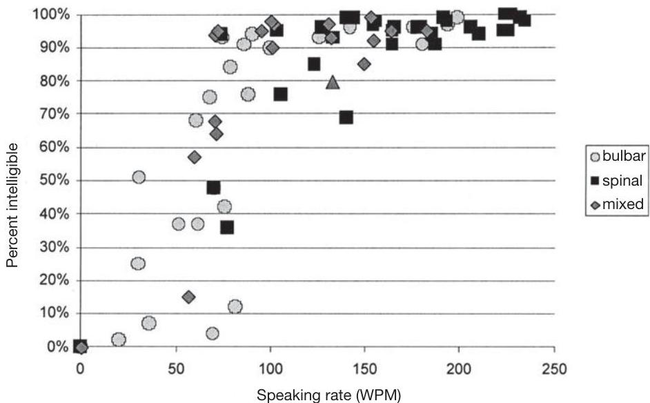

Figure 14.1. Speaking rate and intelligibility decline for people with amyotrophic lateral sclerosis (ALS). (Key: WPM, words per minute.)

Support AAC Options

A third activity in the Early Phase is to support people with ALS if they choose voice banking and/or message banking as AAC options. It is important to inform people with ALS and their families about the option to voice bank and/or message bank early, as the best time to record their voice is before speech changes occur. Voice banking refers to the process of recording the individual's speech to create a synthetic voice that approximates their natural voice. This allows a speech synthesizer to use the voice of a person with ALS to generate novel messages and to generate messages via spelling words. The process can take 4--6 hours of recording time, and individuals with ALS frequently need to break this up into smaller increments due to fatigue. There are currently several commercial companies that use a range of different methods to support voice banking.

Message banking refers to recording some personally chosen messages in your own voice and inflection as a .wav file that can be uploaded to an AAC technology and played at a later date when you want to say one of those messages. Some individuals with ALS opt for message banking, while others choose none and rely solely on the synthetic voices available in their AAC technology.

### Refer to an AAC Team

A fourth activity in the Early Phase is to make a timely referral to an AAC team, so that there is sufficient time to complete the assessment, select AAC options, purchase the AAC technology, and instruct the person who will rely on AAC and his or her facilitators.

### Assist in Implementation of AAC Supports

A fifth activity in the Early Phase is to assist the speaker with ALS to implement AAC supports that will preserve communication effectiveness of their natural speech for as long as possible. By reducing speech effort and fatigue but amplifying residual speech, and by allocating speaking time for important social or informational exchanges during the day, the individual can conserve energy to communicate effectively, even though dysarthria might be apparent to communication partners. Some individuals benefit from utilizing a voice amplification system to support their communication and reduce the overall effort required to speak. For a limited number of individuals with specific velopharyngeal weakness that interferes with speech or oral breathing and without hyperactive reflexes or spasticity, a palatal lift may be recommended (E. Hanson, Yorkston, & Britton, 2011; Yorkston et al. 2010). Some individuals with bulbar ALS who experience loss of effective communication or considerable fatigue while speaking may choose to use an AAC application on a mobile tablet or smart phone to support effective communication in situations where communication is particularly difficult, or to reduce fatigue. It is also important to educate persons with ALS and their caregivers about arranging their environment for successful communication (e.g. turn off background television/music when talking, light on speaker's face, and so on), as well as maximizing the hearing of communication partners.

Toward the end of the Early Phase, some people with ALS use their remaining natural speech to prepare video or audio recordings for their loved ones. As Tom neared the time when he needed AAC to communicate, he arranged to prepare video-recorded messages for his wife, each of his children, and his children's spouses. He talked to each of them individually as he recalled important memories and shared experiences. He told them how

much he appreciated and loved them. He talked about his disease and how much their care and respect meant to him. After completing the recordings, he selected pictures and had them incorporated into the video.

### Educate People About AAC-Related Decisions

A sixth activity in the Early Phase is to educate the person with ALS and decision makers about AAC-related decisions. This education includes information about natural speech deterioration, timing of AAC assessment, low- and high-tech AAC options, and technology purchases, as well as funding. The goal of this education is to prepare them to efficiently make AAC-related decisions at the appropriate time. We have observed that some people are very interested in this information and actually seek out additional information, whereas others express little or no interest and indicate that they will rely extensively on professionals to guide their decision making. Some choose early adoption of a mobile tablet (e.g. iPad, Android tablet) with a communication application. It may be helpful to consider the targeted AAC system if/when arm and hand function no longer allows the individual to access a touchscreen; transition will be easier if the timing of implementing the new system is identified and the communication app remains generally consistent across the technologies.

A 55-year-old male developed bulbar symptoms while he was actively engaged in his career and family. He desired to continue working as long as possible, even though his work relied heavily on his speech to conduct trainings in-person and via video connection from a distance. He banked his voice early to prepare for future changes. He worked closely with his employer for support to continue giving his trainings by scheduling them to allow for vocal rest between presentations. He integrated more visual materials throughout his presentations to support comprehension and supplement his speech in the context of changes. He utilized handwriting to resolve quick communication breakdowns in person, but this was not effective for group presentations or speaking over the phone. He downloaded an AAC application to his smart phone and tablet to support communication breakdown in large group settings, over the phone, and throughout work presentations. This application supported a way to upload his banked voice messages. He also found these tools to be extremely helpful to manage his medical care at the ALS multidisciplinary clinic, as the hospital system wanted him to utilize digital communication media to access his medical records, make appointments, and communicate with his care team through the patient portal of his electronical medical record. This proved to be an efficient way to take charge of his medical care as his speech declined. It also allowed him to utilize other digital communication media outlets, such as e-mail and texting, to prepare his clients in advance of presentations, resolve unanswered questions, and make a personal connection with his clients. When his speaking rate reached 125 words per minute, he participated in an AAC evaluation to explore a system that could meet a greater number of communication needs. He was starting to lose function in his hands and was struggling to access his smart phone and tablet. With AAC technology, he was able to regain effective access to a high-technology device and was able to connect to the communication media outlets that he already had been using to stay in control of his medical care and work. Although he was still able to use one hand to access his techology via direct selection, he selected technology that could also support eye gaze access as needed in the future.

Overall, he effectively accessed multiple communication supports, low-tech and high-tech tools, and various communication media outlets as his muscle function changed over time. In addition, he was confidently prepared to make decisions that would support his lifelong communication.

### Middle Phase: Assess, Recommend, Implement

During the middle phase, the person with ALS participates in an AAC evaluation, in which four activities are stressed: 1) identifying participation patterns and associated communication needs; 2) assessing current and anticipated capabilities—motor (physical), cognitive, speech and language, visual, and hearing; 3) assessing potential constraints affecting AAC decisions, as well as social and personal care supports; and 4) selecting low- and high-tech AAC options to meet current and future needs.

### Identify Participation Patterns and Communication Needs

Individuals who experience acquired physical disabilities that affect their ability to communicate often also experience other dramatic changes in their lives. Depending on the progression of the specific condition or disease, these changes may occur gradually (as with a degenerative disease such as ALS) or more abruptly (as with an acute impairment such as trauma or stroke). Individuals' physical disabilities, along with personal lifestyle preferences, determine their communication needs and their participation roles and contexts. For example, some people with severe degenerative disabilities such as ALS prefer to center their lives within their home environment. Sam, described at the start of this chapter, was such an individual. These individuals find that it is more efficient and less demanding on their families to establish their homes as their primary work, social, and care setting rather than to continue to participate extensively in the larger community. Thus, they may work at home if they are active vocationally. Friends and family visit them at home, and they travel only for special events. Some use the Internet to maintain contact with their social and support networks. Eventually, they may go through numerous transitions involving their living situation (e.g. private home, assisted living, nursing home, hospice), which will have an impact on the available funding for AAC as well as necessitate changes to their AAC systems.

Continued employment plays an important role in the lives of some individuals with ALS (McNaughton, Light, & Groszyk, 2001). Jamie wished to continue working after she was diagnosed with bulbar ALS. She continued to work in her position as a data-entry specialist, using multimodal technologies for her daily communication supports. She used her computer with the keyboard to enter data, access the Internet, and send e-mail. She used her cell phone to send text messages to family and friends. Although she identified a more complex AAC technology to fully meet her communication needs, she purchased mobile technology with an AAC application for communicating with people in meetings, socially, and on the telephone. She selected this as a temporary measure, knowing that she would require AAC technology with additional options in the future. Although she was experiencing hand weakness and atrophy, she made the decision because she retained the ability to access touchscreen technology with her hands. Interventions for people with ALS who wish to continue to work should include computer literacy and Internet training to provide options for continuing employment by accessing a range of supports. Expanded electronic communication options such as e-mail, the Internet, electronic conferencing, and

cellular technology have resulted in expanded opportunities for employment, volunteering, distance learning, financial transactions, and commercial activity. Participation in virtual activity is of little interest to some people who use AAC technology; however, others participate regularly, both socially and vocationally, using the Internet.

Other individuals adopt a different participation strategy and attempt to stay active in the community as long as they possibly can. These individuals may continue to work outside the home, travel, and attend recreational activities, religious services, and social events with friends and family. The following case study provides an example of this strategy.

Tom and his family maintained a very externally focused lifestyle even after he was diagnosed with ALS. During the first 18 months following his diagnosis, Tom and his wife traveled extensively, at times with their children, at times with Tom's siblings, and often with friends. When he began to use a wheelchair and eventually rely on AAC technology, they scheduled “Time with Tom” at a local restaurant every Monday during the dinner hour. Friends, former colleagues, church members, neighbors, and relatives stopped by to participate at their convenience. Tom continued to attend athletic events and concerts. He telephoned family and friends to celebrate birthdays and anniversaries. Needless to say, Tom received considerable support and developed comprehensive AAC skills in order to participate in these extensive social interactions (Rutz, 2005).

Decisions about patterns of participation substantially affect an individual's communication needs and corresponding AAC supports. For example, an individual who communicates primarily at home or in a long-term acute care hospital may need AAC technology that can easily be moved to various rooms on a cart or on a computer stand with wheels, rather than an AAC technology that attaches directly to a wheelchair. Individuals who participate actively in the community need communication systems that are self-contained, compact, and fully portable. Many prefer efficient Internet access via their AAC technology. Most require a means to use the telephone and e-mail. All individuals with ALS require a way to access a call system to reach out for support and to call 911 in case of an emergency. During assessment and intervention, it is important to consider the individual opinions and preferences of adults with acquired disabilities regarding their participation and lifestyle patterns.

A clinician who provides AAC services in a regional ALS clinic reported the following: Of those with ALS who access their AAC technology using eye gaze during the past year, all used this technology to support face-to-face communication, and more than 90% also used this technology for text entry to communicate using e-mail or texting with the medical providers, caregivers, or family members. About 80% accessed the Internet to obtain information about their medical condition, AAC options, or other information of interest to them. Sixty percent accessed their environmental control technology using their eye-gaze AAC technology. Three quarters of these individuals and their communication partners used partner-dependent eye gaze to communicate urgent or immediate needs to interact when the eye-gaze AAC technology was not available to them while they were in bed, in the restroom, or traveling in a vehicle. (K. Rodgers, personal communication, 2018)

Yorkston, Baylor, and Mach (2017) found that the more communicatively active persons with ALS remain, the more positively they rate their communicative participation. In general, Yorkston and colleagues reported speech severity, swallowing severity, and speech usage accounted for 55% of the variance associated with communicative participation. Caron and Light (2015) reported that individuals with ALS reported continued strong communication participation after speech declined, using multiple communication media options.

Developing consensus among the person who uses AAC and the individuals who support him or her is essential to creating a profile of the individual's communication needs and participation. One way to build consensus is to identify potential communication needs and assign each a level of importance. Fried-Oken et al. (2006) reported the importance of expressing certain communication purposes for a group of persons with ALS, and identified calling for help, getting needs met, clarifying needs with caregivers, giving instructions, discussing important issues or concerns, conversing about health care, staying connected, chatting, and expressing feelings as mandatory. Others found being polite, flirting or being romantic, being funny, having casual conversations, chatting, telling stories, talking about religion, conversing about work, and comforting others to be mandatory communication purposes. A review of the information provided previously about Jamie and Tom reveals that many of their communication needs were similar; however, their lifestyle choices dictated different communication solutions.

A detailed needs assessment has advantages for both the person with the disability and the members of his or her family and support networks. For example, it is not uncommon for adults with acquired communication disorders to insist that their AAC systems provide (or maintain) all of the functions of natural speech. This insistence is natural because many people struggle to accept their disabilities and are often frustrated by their inability to communicate in the same way that was possible with natural speech. In the process of completing a communication needs inventory, these individuals are forced to go beyond the generic expectation of “being able to do everything that I could do before this happened” to identify specific communication needs and assign them priorities. In a study examining the purposes of AAC technology use for people with ALS as reported by their caregivers, Rau et al. (2004) found that the two most frequent and highly valued purposes involved regulating the behavior of others (for basic wants and needs) and staying connected (social closeness).

### Assess Current and Anticipated Future Capabilities

As discussed in Chapter 2, AAC teams usually conduct assessments of cognitive, motor, speech and language, and sensory capabilities with people who have acquired physical disabilities. One particularly important aspect of the assessment process for individuals with ALS involves predicting the natural course of abilities. People with degenerative diseases will gradually lose some capabilities while other capabilities remain stable. Subsequent sections of this chapter discuss these issues in more detail with regard to specific disabilities.

Individual patterns of motor control greatly affect the selection of AAC systems for individuals with ALS. It is therefore essential to assess motor capabilities and to consider the impact of fatigue throughout each day. Motor capabilities generally differ markedly, depending on whether the person first experiences bulbar or spinal

symptoms. Typically, a physical and/or occupational therapist will be involved in the motor assessment.

People with predominantly bulbar (brainstem, speech) symptoms are initially able to control AAC technology that they can carry and operate via direct selection using their hands or fingers. However, in time, they are often unable to access their AAC technology with their hands or fingers and must shift to a head- or eye-tracking, direct-selection access technique. Of course, this is essentially always the case if they choose to use invasive ventilation for respiratory support, as this usually will extend their life expectancy and increase the time that they will need to access their AAC technology with head- or eye-tracking strategies. It is imperative that they select a device that can transition with them as their motor capabilities change.

People with ALS who exhibit predominantly spinal symptoms usually experience extensive trunk- and limb-related motor impairments before they become unable to meet their communication needs through speech. For individuals with spinal ALS, the need for an augmented writing system often precedes the need for an augmented conversational system. Individuals with severe impairments related to limb control usually require a mounted system with either head- or eye tracking for direct-selection access, because the time will come when they cannot access their AAC technology with arm or hand movements.

### Assess Constraints and Select High- and Low-Tech AAC Options

A variety of external constraints may affect AAC decisions in general, and some of these constraints are especially common for people with acquired communication disorders. As noted previously, the attitudes of family members and friends about the communication disorder in general and the acceptance of AAC technology in particular may influence decisions. Typically, families of people with ALS accept AAC options because they realize that ALS is a degenerative disease.

Another constraint involves the availability of communication facilitators to learn about the operation and use of AAC technology in order to assist the person who relies on AAC to learn and maintain it. In some locations, facilitators may not have access to adequate support for certain types of communication options. Another important external constraint involves the availability of funding for equipment and instruction. Funding patterns for AAC systems vary dramatically in different parts of the world. Some countries, provinces, or states fund AAC systems for children who participate in educational It is impossible to outline such funding constraints in detail in this book because funding policies change frequently. A web site on AAC funding maintained by the Assistive Technology Law Center, Duke University Medical Center Division of Speech Pathology and Audiology, and AACRERC (Rehabilitation Engineering Research Center on Communication Enhancement) is available at http://aacfundinghelp.com; it provides AAC funding information for the United States. Successful AAC interventions require that the AAC team assess constraints and focus on the remediation of these limitations as vigorously as they focus on the individual's communication needs and capabilities.

programs but provide little financial support for adults. In the United States, Medicare, Medicaid, Tricare, and many insurance plans now fund AAC technology and instruction to support face-to-face communication was well as typed messages.

In addition, it is not uncommon for family members and friends to have differences of opinion regarding the person's communication needs as well as the use of assistive technologies. There is no way to predict what these differences will be, but it is important to try to achieve some degree of consensus among these people about the individual's communication needs or, if that is impossible, to at least clarify their differences of opinion and facilitate decision making. We discuss this issue with regard to specific disorders in subsequent sections of this chapter.

### Understand Acceptance and Use of AAC by People with Amyotrophic Lateral Sclerosis and Their Families

Usually, individuals with ALS demonstrate relatively high acceptance of AAC technology. As AAC technology improves and is more common in society, acceptance rates continue to increase. Mathy, Yorkston, and Gutmann (2000) reviewed AAC use by people with ALS from numerous sources. They referred to data by Gutmann and Gryfe (1996), who evaluated trends in the use of AAC systems for 126 people seen at an assistive technology clinic in Toronto. Among these participants, 27% elected not to pursue AAC interventions. Gutmann, analyzing the same data, reported that “women preferred voice output systems twice as often as men (49% for women, 26% for men)” (1999, p. 211). In addition, “almost an equivalent number of men (27.8%) and women (26%) did not wish any AAC intervention” (Gutmann, 1999, p. 211).

### Help Develop Operational Competence

People with ALS, like most people who rely on AAC, require time and instruction to gain communicative competence with their AAC systems. Linse, Aust, Joos, and Herman (2018) report that families should receive at least five hours of training, in addition to ongoing support, troubleshooting, and customizing over time. Because ALS is predictably degenerative, these individuals are in the unique position of being able to select their AAC systems and learn to operate them while they can still use natural speech to meet at least their most basic communication needs. In fact, if an AAC system is selected and implemented after an individual is no longer able to speak, the AAC experience often becomes extremely frustrating.

Although rapid decline of speech function in ALS is certainly not inevitable, it occurs frequently enough that sound clinical management dictates early preparedness. In our experience, exploration of AAC options should begin when speech has slowed to about 125 words per minute and/or intelligibility is inconsistent in adverse listening situations.

### Provide Facilitator Support

People with ALS require ongoing support from AAC facilitators to use their AAC systems. This support may include instruction in technical or other skills that enable individuals to operate the technology efficiently and accurately. They may also need facilitator support to select and modify messages stored in their systems. In addition, as an individual's capabilities change with ALS progression, facilitators may need to change motor control options and the system position. Facilitators may also have to provide instruction in the social use of the AAC system. Ball, Schardt, and Beukelman (2005) surveyed 68 individuals with ALS who relied on AAC technology, and all reported the presence of a primary AAC facilitator.

Nearly all facilitators (96%) were family members, most of them had nontechnical backgrounds, and 4% were professionals.

### Late Phase: Adapt and Accommodate

The Late Phase begins after the implementation of AAC recommended in the Middle Phase and continues until the individual's death. The objective of this phase is to provide effective communication options in response to changing communication needs, capabilities, and living situations. This enables them to maintain proficiency with the technology while making slight changes to messages and access techniques as their communication needs and capabilities change.

In 2004, Ball, Beukelman, and Pattee reported on the AAC acceptance patterns of 50 individuals who were referred to an ALS clinic. Of the individuals with ALS in this study, 96% accepted AAC technology either immediately (90%) or after some delay (6%). Only 4% (i.e. two individuals) rejected AAC technology completely. In 2007, Ball, Anderson et al. documented the duration of AAC use by people with ALS and reported average durations of 23.1 months for those with bulbar (brainstem) onset and 25.9 months for those with spinal onset. It should be noted that this sample included individuals with ALS who did and did not choose invasive mechanical ventilation support. Acceptance of mechanical ventilation (respirator or ventilator) extends the length of the individual's life and the duration of AAC use. Of course, invasive ventilation also extends the length of time that people with ALS must access their AAC options with minimal movement. None of the people with ALS in this study discontinued use of their AAC technology more than 2 months before their deaths. Families often report that within the last few weeks of life, people with ALS depend more and more on low-tech options, such as eye linking, eye gaze, or partner-assisted scanning (see Chapter 7 for descriptions of these access techniques) to support the co-construction of messages with people who are very familiar with them. Roman, Quach, Coggiola, and Moore (2010) reported that people with ALS find eye linking to be faster and more preferred than an eye-pointing (e-tran) board or partner-assisted scanning. However, some individuals with ALS continue to have the strength and desire to use AAC technology during the last days of their lives.

In 2015, Ball, Pattee, and Beukelman reported on the AAC technology use of 64 people with ALS who were unable to speak. Approximately half of the participants were prescribed eye gaze to access their AAC technologies. Ninety-one percent of these participants used multiple communication supports, including their AAC technology accessed by eye gaze and partner-dependent eye gaze, for urgent or immediate needs or to interact when the AAC was not available because of their location or physical position, such as riding in a vehicle.

It is vital to ensure individuals with ALS are able to continue to make decisions and communicate independently throughout the Late Phase to ensure quality of life and the continued ability to make important end-of-life decisions. Research has shown that quality of life measures are not always aligned between individuals with ALS and their caregivers; as a result, individuals with ALS may need to self-advocate if their wishes change (Linse et al. 2018; Linse et al. 2017).

It is also important to consider positioning adaptations and multiple communication options in the final stage, as individuals with ALS may spend more time lying down versus upright in a wheelchair (Makkonen et al. 2018). Positioning of AAC technology will need to be adjusted to ensure continued access regardless of location

around the home. A continued focus on meeting changing communication needs and preparing families in advance of each step will help individuals with ALS to stay in charge of their care and to be independent communicators throughout the course of the disease.

## Evaluate Intervention Outcomes

There are three primary reasons for measuring the outcomes of interventions with adults who have acquired physical disabilities. The first is to identify the communication needs that have and have not been met. When an intervention approach succeeds in meeting certain communication needs, the AAC team should document the success for the individual and his or her family. If an initial intervention does not meet certain communication needs, the team should refine the approach and intervene accordingly. The second reason for measuring intervention outcomes is to document the effectiveness of the AAC agency providing the service. Agencies that provide funding for AAC interventions with adults usually demand this documentation for continued funding. The third reason for measuring intervention effectiveness is to document the overall AAC efforts of a particular center or agency, which may result in increased administrative support for AAC efforts over time.

## MULTIPLE SCLEROSIS

Multiple sclerosis is the most common neurological condition of young and middle-aged adults. Although rare, pediatric (under age 18) multiple sclerosis occurs with an estimated incidence of 0.2--0.6 per 100,000 individuals (Langer-Gould et al. 2011). The cause of multiple sclerosis is unknown. It is an acquired, inflammatory, demyelinating disease of the central nervous system (Yorkston et al. 2012). Lesions are scattered in the central nervous system, and locations vary from person to person; therefore, symptom patterns also vary and must be considered when making AAC intervention decisions.

In the northern United States, the prevalence of multiple sclerosis is about 1 in 1,000; and in the southern states, the prevalence is about one third to one half of this figure. Approximately 95% of all cases begin between the ages of 10 and 50 years, with a median onset age of 27 years. Although multiple sclerosis is considered to be a disease of young people, it is not uncommon for an initial diagnosis to occur between 50 and 60 years of age. The female-to-male ratio of occurrence is 3:2 (Yorkston et al. 2012). People with multiple sclerosis are more likely to be White than African American and more likely to be African American than Asian.

The natural course of multiple sclerosis differs greatly from person to person. However, the typical relapsing-remitting pattern begins initially, and the progressive form of the disease occurs later. The relapse rate in pediatric-onset multiple sclerosis is higher than in adult-onset, occurring with significantly greater frequency (Gorman, Healy, Polgar-Turcsanyi, & Chitnis, 2009). The average life expectancy of young males with multiple sclerosis is about 35 years following the onset of the disease. The prognosis is worse 1) in males than in females; 2) if the age at onset is greater than 35 years; or 3) if a chronic, progressive pattern appears at onset (Yorkston et al. 2012). Symptoms experienced by people with multiple sclerosis vary considerably; however, visual, motor, and cognitive impairments may occur as the disease progresses.

Individuals with Acquired Physical Conditions
533

# Communication Symptoms

Dysarthria is the most common communication problem associated with multiple sclerosis, but the study of large groups of individuals with multiple sclerosis has shown that dysarthria is not a universal characteristic of this disease. Darley, Brown, and Goldstein (1972) reported that 41% of their sample of individuals with multiple sclerosis demonstrated overall speech performance that was not essentially typical in terms of its impact on communication partners. Nevertheless, when researchers utilized a self-reporting technique, only 23% of these individuals reported a speech and/or communication disorder; thus, a large percentage of this sample appeared to be unaware of the severity of their speech problems. Studies in which speech-language pathologists rated the adequacy of speech or performed a physical examination of the speech mechanism report a higher incidence of speech problems than studies using self-reports. Hartelius, Runmarker, and Andersen (2000) reported a rate of 51% in a cohort study in which individuals with multiple sclerosis diagnosed between 1950 and 1964 were followed for a mean of 37.5 years. Measures of intelligibility become more useful as severity of speech problems increases; such measures demonstrate functional impacts of dysarthria on communication (Duffy, 2013; Yorkston et al., 2007). These same measures yield less information for fully capturing functional effects of mild dysarthria when intelligibility remains high. Importantly, even mild communication problems can result in severe impacts to leisure, social relationships, and employment during a time of major career and educational development (Benedict et al., 2005; Rao, Leo, Bernardin, &amp; Unverzagt, 1991; Walshe, 2011).

Diverse communication problems are associated with multiple sclerosis, including cognitive (i.e., memory, attention, information processing speed, executive function) and linguistic impairments (e.g., word-finding difficulties, verbal fluency; Feenaughty, Tjaden, Weinstock-Guttman, &amp; Benedict, 2018). Impacts of multiple sclerosis on communication participation (i.e., exchange of knowledge, information, ideas, feelings) may be captured with the Communication Participation Item Bank (CPIB; Baylor et al., 2013). Greater communication participation restrictions are associated with CPIB self-report of cognitive, speech severity, and cognitive communication difficulties (Yorkston, Baylor, &amp; Amtmann, 2014).

# AAC Intervention for Multiple Sclerosis

A relatively small number of individuals with multiple sclerosis demonstrate such severe speech impairments that they require AAC systems. Beukelman, Kraft, and Freal (1985) reported that 4% of 656 survey respondents with multiple sclerosis indicated that their communication was so severely impaired that strangers were unable to understand them. AAC clinicians typically employ some version of the three-phase intervention model described by Ball and colleagues (2007) when providing AAC services to people with multiple sclerosis.

## Early Phase: Use Assistive Technologies

Early-Phase intervention typically involves assistive technologies other than traditional speech-generating AAC devices. Because the onset of multiple sclerosis occurs relatively early in life, individuals with multiple sclerosis are typically in educational programs or employed when they first experience symptoms. The intermittent and gradual (cumulative) onset of symptoms often means that people with multiple sclerosis do not need to modify their lifestyles

immediately, although some people with visual problems, which are quite common in multiple sclerosis, may require technological assistance to read computer screens or detailed printed materials. In time, however, impairments that are unrelated to spoken communication often prevent these individuals from attending school or working. For example, Kraft (1981) reported that arm and leg spasticity is an important reason many people with multiple sclerosis drop out of employment. Loss of balance, loss of normal bladder control, and fatigue also interfere (Ford, Trigwell, & Johnson, 1998). In addition, a combination of weakness, spasticity, ataxia, and tremor may interfere with walking and necessitate the use of a wheelchair for mobility.

Specifically, vision problems require supports including font enlargement or speech output of printed messages. Keyboard control becomes difficult for some, so arm and hand supports as well as keyboard assists may be necessary to reduce non-productive movement patterns (Yorkston & Beukelman, 2007). In particular, accessibility features included in computer operating systems can be helpful to those with vision and physical access limitations. Some people with multiple sclerosis also use memory and organizational supports found on many mobile electronic technologies (Blake & Bodine, 2002) to compensate for cognitive impairment.

Denise Karuth, a woman who is blind as a result of multiple sclerosis, describes the lists she keeps as memory aids:

[Here] is my list of lists: Long-term projects and obligations ... daily tasks, projects, and obligations; spring cleaning tasks; items to be taken on overnight outings and trips, ... personal care schedule; phone numbers; books on loan from the National Library Service for the Blind and Physically Handicapped and from Recordings for the Blind, Inc.; two lists of physical therapy exercises; names and phone numbers of friends and former clients; names and addresses of out-often friends and family; calendar; medical and surgical supplies that must be stocked; and fears and questions I have concerning life with a progressive disease. Some of my lists are on large sheets of braille paper, others are in a loose-leaf binder. All are on cassette tapes. (Karuth, 1985, p. 27)

### Middle Phase: Introduce Compensatory Support of Natural Speech

During the Middle Phase, compensatory support of natural speech is beneficial for those with speech intelligibility limitations. Alphabet supplementation involves identification of the first letter of each word by the speaker, by pointing on an alphabet board as the word is spoken. Typically, intelligibility of connected speech is improved by about 25% and intelligibility of single words by about 10% with alphabet supplementation (E. Hanson, Beukelman, & Yorkston, 2013). Photographic support to establish and maintain communication topics and to provide detailed information that is difficult to describe can also be beneficial to support effective communication in the Middle Phase of intervention. Writing or letter-by-letter spelling is frequently used to resolve communication breakdowns that occur during the Middle Phase.

### Late Phase: Implement Communication Supports

For people with severe or profound dysarthria due to multiple sclerosis, in the Late Phase natural speech is no longer functional to meet all communication needs, and thus communication supports are required. Use of AAC supports can be difficult because vision problems, spasticity, ataxia, or intention tremor interfere with AAC access for these people.

Therefore, AAC interventions tend to be very personalized, depending upon the communication needs and capability profile of each person. Determining appropriate interventions for the individual with multiple sclerosis involves identifying participation patterns and communication needs; assessing specific capabilities, including cognitive, language, sensory/perceptual, and motor capabilities; and assessing constraints that could affect AAC intervention.

### Identify Participation Patterns and Communication Needs

Most people with multiple sclerosis whose speech is so impaired that they require AAC systems are no longer able to attend school or work due to associated limitations in vision, fatigue, balance, and so forth (Yorkston et al. 2012); therefore, they rarely have communication needs related to these contexts. Some individuals with severe speech impairments require personal care assistance beyond what their families can offer, and they may live in residential or nursing centers (see Chapter 18), which may limit their communication needs even further. Thus, the primary communication needs of many people with multiple sclerosis are conversational and care related, although some individuals may also require assistance with written messages, especially to access digital communication media.

### Assess Specific Capabilities

This section describes the primary cognitive, language, sensory/perceptual, and motor capabilities that require assessment prior to AAC intervention.

### Cognitive Capabilities

The cognitive limitations of individuals with multiple sclerosis have been poorly documented, but more than half of these individuals seem to display definite evidence of cognitive impairment (Rao, 1995; Yorkston et al. 2012). There is general consensus that cognitive changes are specific rather than global and can be described as a subcortical dementia with 1) the absence of aphasia; 2) memory retrieval impairment in the presence of relatively intact encoding and storage capability; 3) impaired conceptual reasoning in the context of near-typical intellect; 4) slowed information-processing time; and 5) personality disturbances, including apathy, depression, or euphoria.

### Language Capabilities

Although dysarthria is the most common communication problem associated with multiple sclerosis, aphasia has occasionally been reported. Several large studies of individuals with multiple sclerosis have noted no occurrence of aphasia (Olmos-Lau, Ginsberg, & Geller, 1977). However, Beukelman et al. (1985) noted that other researchers reported the incidence of aphasia as ranging from 1% to 3% of people with multiple sclerosis. Yorkston, Klasner, and Swanson (2001) indicated that people with multiple sclerosis commonly report difficulty with word finding and changes in spoken or written organization. Murdoch and Lethlean (2000) evaluated 60 people with multiple sclerosis and reported four potential subgroups: 1) those with pervasive language impairment (2%), 2) those with moderate to severe language impairment (13%), 3) those with mild to moderate language impairment (32%), and 4) those with essentially typical language abilities (53%).

### Sensory/Perceptual Capabilities

Vision limitations are common in multiple sclerosis; 35% of people with multiple sclerosis experience optic neuritis, the acute or subacute loss of central vision in one eye, with peripheral vision spared, as their first

AAC Interventions for Individuals with Acquired Disabilities

symptom (Wickstrom, Poser, &amp; Ritter, 1980). Optic neuritis is often manifested initially by an inability to see text on a computer screen or to read small print in general. The visual limitations of multiple sclerosis cause particular problems in the context of AAC interventions because many AAC techniques require extensive visual capabilities. Many individuals with multiple sclerosis cannot use visual scanning arrays; instead, they may require auditory scanning systems, such as the one described in the section of this chapter about individuals with Guillain-Barré syndrome. Large-print text is a common requirement of people with multiple sclerosis, as is synthetic speech feedback that echoes the letters and words selected in typing or from a communication display. For example, an AAC system designed for a 30-year-old woman with multiple sclerosis consisted of an expanded keyboard with 1-inch square keys and speech feedback (Honsinger, 1989).

**Motor Capabilities** The motor control capabilities of individuals with multiple sclerosis vary considerably; therefore, careful motor assessment is an important aspect of all AAC interventions. According to Feys and colleagues (2001), intention tremor in the upper limb, which occurs during or is exaggerated by voluntary movement, is encountered in approximately one third of individuals with multiple sclerosis. The tremor often disrupts individuals' attempts to access assistive technology interfaces, such as keyboards, computer mice, or switches. AAC teams can sometimes identify a way to stabilize the body part involved in access sufficiently so that the individual can make voluntary movements without excessive tremor. At other times, AAC teams may need to attach a switch to an individual's limb or hand so that the switch can move with the body part during tremor but still remain in position to be activated by a finger. Finally, specialized applications that provide motion-filtering software and support multiple interfaces have also been developed (Feys et al., 2001).

Often, the motor control problems and visual impairments of multiple sclerosis combine to limit AAC options severely. For example, Porter (1989) described an AAC intervention that was used near the end of a person's life. The individual's visual and motor control limitations were extensive, but he learned to control a simple call buzzer and auditory scanning system (see Chapter 7) using a pressure switch that attached to a pillow beside his head.

**Assess Constraints** Several characteristics of multiple sclerosis complicate many AAC interventions. First, symptom patterns vary considerably among individuals. Although the clinical course of multiple sclerosis follows four general patterns of progression, individual manifestations can be complex and vary over time. Obviously, changes in an AAC system may be needed to accommodate this variability. Second, as noted previously, visual impairments are common in multiple sclerosis and can make AAC interventions particularly challenging. Third, AAC interventions usually occur in conjunction with other efforts to compensate for the multiple impairments experienced by people with multiple sclerosis (e.g., interventions to compensate for vision impairments). Therefore, AAC teams must coordinate their interventions with other interventions in the context of changing symptom patterns.

**GUILLAIN-BARRÉ SYNDROME**

Guillain-Barré syndrome results from progressive destruction and subsequent regeneration of the myelin sheath of peripheral nerve axons. Paralysis progresses from the lower extremities upward, and maximal paralysis usually occurs within 1–3 weeks of

onset. As the myelin sheath slowly regenerates, nerve function and associated muscle strength gradually return. Typically, motor recovery begins with the structures of the head and face and progresses inferiorly. About 70% of people with Guillain-Barré syndrome recover completely with no residual impairments (National Institute of Neurological Disorders and Stroke, 2019). Guillain-Barré syndrome affects 1 to 2 per 100,000 people in the United States and is equally common in men and women. Medical management includes ventilatory support, nutritional support, and immunotherapy.

### Communication Symptoms and Intervention Phases

The weakness associated with Guillain-Barré syndrome causes flaccid dysarthria and, in many cases, anarthria (complete loss of speech). In addition, severe weakness often requires ventilator support through oral intubation or tracheostomy. Language and cognition are usually unaffected.

The phases of progression of Guillain-Barré syndrome require different types of AAC support, as described in the following sections.

### Early Phase: Deterioration, Loss of Speech

As noted previously, people with Guillain-Barré syndrome experience maximal paralysis within 1--3 weeks of onset. Because weakness progresses upward from the lower extremities, the diagnosis usually is made before speech becomes impaired. Little time usually passes, however, between diagnosis and onset of severe speech impairment. Typically, individuals with Guillain-Barré syndrome are hospitalized following their diagnosis so that medical personnel can monitor their symptom progression and provide appropriate supports and intervention. As part of this effort, medical teams should monitor these individuals' communication impairments so that AAC intervention can be provided at an appropriate time.

After a few weeks, the progression of symptoms stabilizes. Those people who require AAC intervention are usually unable to speak by this stage and receive respiratory support from a ventilator. Initially, AAC intervention consists of low-technology options, with emphasis on the establishment of a reliable yes/no/maybe/I don't know system, followed by the development of an eye-pointing or eye-linking technique (see Chapter 7). AAC teams should develop communication boards that will support the individual's needs through partner-assisted visual and auditory scanning, yes/no responses, and eye linking or eye pointing. Communication boards typically include social messages, health-related messages, and letters and numbers for construction of unique messages.

### Middle Phase: Prolonged Speechlessness, Spontaneous Recovery of Speech

The time frame during which people with Guillain-Barré syndrome are unable to speak varies from individual to individual. Some people experience weeks or months of using AAC systems to communicate with family, friends, and health care staff. Typically, these individuals continue to use low-tech supports; however, electronic options may also be appropriate to provide greater independence and less reliance on knowledgeable, well-trained communication partners. Usually, the extensive motor impairments of these individuals require them to use scanning AAC systems, often with a switch controlled by eyelid or head movement. Given the temporary nature of these individuals' AAC use, most learn to communicate with letter-by-letter spelling and retrieval of a limited number of messages.

Late in this phase, the individual with Guillain-Barré syndrome makes the transition from speechlessness back to functional speech. Often, this transition takes several weeks or months. As muscle strength returns to the speech mechanism, the individual may still use a ventilator and a tracheostomy tube for breathing. Some speakers find an oral-type electrolarynx very helpful at this point. Garrett, Happ, Costello, and Fried-Oken (2007) provide an excellent chapter focusing on AAC for people in intensive and acute care units. This content is very informative for those who support the communication of people with Guillain-Barré syndrome in the Middle Phase.

By controlling the sound sources of the electrolarynx with a head switch, the sound can be turned on when the person wishes to speak and turned off when he or she wishes to listen or rest. Other individuals may benefit from a speaking valve placed in-line with their ventilator to allow them to vocalize. While the muscles of the oral cavity remain weak, the individual may have imprecise articulation and reduced speech intelligibility. Some individuals find it helpful to first establish the communicative topic or context with their AAC system, then use their residual speech, and finally resolve communication breakdowns with their AAC system as necessary. As recovery progresses, medical personnel will remove ventilator support and the individual will again be able to speak independently. Usually, the individual requires no ongoing natural speech interventions.

### Late Phase: Long-Term Residual Motor Speech Disorder

As mentioned previously, 85% of people with Guillain-Barré syndrome experience complete recovery of motor control; the remaining 15% experience residual weakness. Of this residual group, a limited number experience long-term motor speech disorders (i.e. dysarthria). For them, interventions to maximize the effectiveness of their natural speech are appropriate. Through the years, we have encountered a few individuals with Guillain-Barré syndrome who required long-term AAC support because their speech intelligibility was not sufficient to fully support effective face-to-face communication to support their medical, vocational, or social interactions.

## PARKINSON'S DISEASE

Parkinson's disease is a syndrome composed of a cluster of motor symptoms that include tremor at rest, rigidity, paucity (i.e. reduction in movement), and impaired postural reflexes. Parkinson's disease results from a loss of dopaminergic neurons in the basal ganglia (especially the substantia nigra) and the brainstem. The onset is typically insidious; in retrospect, many individuals recall stiffness and muscle aches that they first attributed to typical aging. The symptom that often initiates the first visit to a physician is tremor in a resting position (Yorkston et al. 2012; National Institute of Neurological Diseases and Stroke, 2019). The average annual incidence of parkinsonism (excluding drug-induced cases) is 18.2 cases per 100,000 people. The prevalence is estimated to be between 66 and 187 cases per 100,000 people, with no significant difference in incidence between males and females. The incidence increases sharply above the age of 64, and peak incidence is between 75 and 84 years of age. There is a trend toward increased age at the time of diagnosis (Yorkston et al. 2010).

Medical treatment since the 1970s has greatly altered the natural course of Parkinson's disease. Prior to the availability of existing medications, about one fourth of

all individuals with Parkinson's disease died within the first 5 years following diagnosis, and 80% died after 10--14 years (Yorkston et al. 2010). Although the changes in mortality rate due to levodopamine (l-dopa) and other medications are not yet clear, these treatments have certainly altered the lifestyles of people with Parkinson's disease dramatically. Individuals with Parkinson's disease are able to move more freely and manage their lives much more independently with medication than without it. Surgical treatments have returned to favor for selected people with Parkinson's disease, as has deep brain stimulation.

For a more detailed discussion of medical and surgical interventions, see Yorkston et al. (2012). The pharmacologic management of Parkinson's disease continues to change. Readers are also referred to the web site of the Mayo Clinic for general information about drug and surgical management and the web site of the National Institute of Neurological Disorders and Stroke for information about clinical trials.

It should be noted that at the time this chapter was written, the understanding of pharmacological, surgical, and deep brain stimulation interventions on the speech performance of individuals with Parkinson's disease was still inconsistent and somewhat limited. During late stages of the disorder, responsiveness to medication decreases; thus, during the period when AAC intervention is needed, symptoms may be difficult to manage pharmacologically.

Although pharmacological treatment dramatically improves the performance of many people with Parkinson's disease, some side effects of the medication can interfere with the use of AAC approaches. There may be individual fluctuations in motor responses (also known as an on-off response), probably due to differences in medication absorption and dopamine receptor responsiveness. With long-term pharmacological therapy, some people also experience involuntary movements that interfere with functional activities. These involuntary movements may cause emotional distress as well.

## Communication Symptoms and Intervention Phases

Dysarthria is common in Parkinson's disease. Hartelius and Svensson (1994) surveyed 230 people with Parkinson's disease and noted that 70% of these individuals reported that their speech and voice were worse than prior to the onset of the disease. Yorkston et al. (2012) and Duffy (2004) described the speech symptoms of people with Parkinson's disease in detail. Typically, symptoms include reduced pitch variability, reduced overall loudness, and decreased use of all vocal parameters for achieving stress and emphasis. Articulation is imprecise and is produced at variable rates. Voice quality is often harsh and sometimes breathy.

Nevertheless, speech disorders among people with Parkinson's disease are not uniform. Some speakers are difficult to understand, primarily because they speak excessively fast. Their speaking rates may exceed those of typical speakers or exceed those that are optimal for people with motor control disorders. Other speakers are difficult to understand because they speak with reduced intensity or loudness. Still others speak with such limited movement of their articulators that they have difficulty producing precise speech sounds. As Parkinson's disease progresses, many speakers demonstrate combinations of these speech patterns.

Clinical observations reveal a gradual process, with speech becoming increasingly difficult to understand. Most people with Parkinson's disease communicate with natural speech to a greater or lesser extent. Therefore, when they use AAC techniques, the techniques make up part of a multimodal communication system that includes natural speech.

Actor and activist Michael J. Fox describes his Parkinson's disease symptoms:

> My ability to form thoughts and ideas into words and sentences is not impaired; the problem is translating those words and sentences into articulate speech. My lips, tongue, and jaw muscles simply won't cooperate. What words I do smuggle through the blockade can be heard, though not always comprehended. Try as I might, I can't inflect my speech to reflect my state of mind. And it's not like I can liven up my halting monotone with a raised eyebrow; my face, utterly expressionless, simply won't respond. Like Emmett Kelly, but without the greasepaint, I often appear sad on the outside while actually smiling, or at least smirking, on the inside. (Michael J. Fox in Lucky Man; Fox, 2002)

The benefits of behavioral intervention to improve speech in people with Parkinson's disease are well documented in several literature review articles (Spencer, Yorkston, & Duffy, 2003; Yorkston, Spencer, & Duffy, 2003). The following sections highlight AAC intervention options during the early, middle, and late phases of speech progression. For a more complete description of management of dysarthria in Parkinson's disease, see Yorkston et al. (2012).

### Early Phase: Provide Assistance and Training

Usually, AAC supports are not necessary to support communication during the Early Phase. However, assistance in computer control for employment, Internet use, and recreation may be necessary for some individuals with Parkinson's disease. A program of Internet training for people with Parkinson's disease is available (Stewart, Worrall, Egan, & Oxenham, 2004). Near the end of the Early Phase, people with Parkinson's disease often complete instruction in the Lee Silverman Voice Treatment to teach them how to maintain their speech performance as their Parkinson's disease progresses. Practice guidelines in the motor speech disorders field (Yorkston et al. 2003) have documented the effectiveness of this behavioral intervention.

### Middle Phase: Supplement Natural Speech

During the Middle Phase, assistive technology and AAC supports may be necessary to supplement natural speech. Delayed auditory feedback is used by some speakers with Parkinson's disease who need to control their speaking rate. This portable technology delays speech for a fraction of a second, thus slowing the person's speaking rate. A number of reports document successful use of this technology in hypokinetic dysarthria (Adams, 1994; Downie, Low, & Lindsay, 1981; W. Hanson & Metter, 1983). About 8% of people with Parkinson's disease benefit from delayed auditory feedback; however, there is little information about how to predict who will be successful, so trial intervention is needed to determine if this intervention will be effective.

Some individuals with quiet voices due to Parkinson's disease automatically speak more loudly when a device or computer application plays background noise into their ears while they are talking, but automatically turns off when they stop talking. Some individuals are accepting of this assistive technology to support the

production of louder speech, whereas others reject it for different reasons. Therefore, a trial intervention is necessary.

Finally, in this phase, some with Parkinson's disease benefit from portable speech amplifiers. Those individuals with consistent voicing but reduced speech loudness levels are the best candidates. Amplification does not benefit those who cannot initiate phonation.

### Late Phase: Implement AAC Technology as Needed

For those people with Parkinson's disease who become unable to meet their communication needs through residual natural speech, some choose to rely on AAC to resolve communication breakdowns, communicate in adverse situations, or, in some cases, communicate most of their messages. Typically, they choose technology with speech synthesis output that can be accessed through letter‐by‐letter spelling; mobile technology with AAC applications with speech synthesis output are widely available. However, little information has been published about the use of this technology by people with Parkinson's disease.

### Identify Participation Patterns and Communication Needs

The communication needs of people with Parkinson's disease depend on three primary factors. Many people with Parkinson's disease are older adults, and most are retired. Therefore, their communication needs reflect, first of all, the social environments of their retirement, such as living at home alone or with family, or living in assisted living or long‐term residential care settings. Second, the range of physical impairments in Parkinson's disease varies greatly from person to person. Some people have such severe physical limitations that they require extensive physical assistance from attendants or family members. Third, the effectiveness of spoken communication often deteriorates over the course of Parkinson's disease and the impact of speech intervention varies for specific individuals. The level of assistance needed greatly influences each individual's communication needs.

### Assess Specific Capabilities

In this section, we describe the primary cognitive/linguistic, sensory/perceptual, and motor capabilities that require assessment prior to AAC intervention for individuals with Parkinson's disease.

### Cognitive/Linguistic Capabilities

People with Parkinson's disease acquire their disability late in life, so they usually have developed typical language abilities. Therefore, they can spell and read at levels necessary to support most AAC interventions. Controversy exists as to whether dementia is a feature of Parkinson's disease (Bayles et al. 1996). During tests, examiners have found that some individuals have specific memory impairments, and some individuals complain of slowness in problem solving. The AAC team must consider whether such cognitive limitations are likely to interfere with AAC interventions. The team may provide additional instruction and practice to help the person compensate for learning or memory difficulties.

### Sensory/Perceptual Capabilities

Disturbances in sensory function usually do not interfere with AAC interventions for people with Parkinson's disease.

### Motor Capabilities

Clinical reports describe people with Parkinson's disease who have successfully used direct selection AAC techniques such as alphabet boards, as discussed previously. Because there are only a few reports of AAC interventions with individuals with Parkinson's disease, the motor control problems that may influence such AAC interventions are not well documented. Thus, AAC teams may need to consider several potential motor control problems. Many individuals have reduced range and speed of movement due to the rigidity associated with Parkinson's disease. The AAC team may need to reduce the size of the selection display (e.g. on an alphabet board) for these individuals. Other individuals experience extensive tremors that are usually worse when they are at rest. Many can dampen the tremors if they can stabilize their hands on the surface of a communication board or AAC technology. A keyguard is often helpful with technology that has a keyboard. Some people experience hyperkinesia (excessive movement) as a side effect of the medication that controls their parkinsonian symptoms. These excessive movements may interfere with the fine motor control required for some AAC options.

Michael J. Fox describes fine motor control symptoms he experiences because of Parkinson's disease:

Micrographia is precisely what it sounds—tiny writing. . . . Without drugs, my own penmanship becomes . . . microscopic. Combined with the stubborn refusal of my “off” arm to move in a smooth, lateral, left-to-right direction, the result is a fractured column of miniature scribbles. (Michael J. Fox in Lucky Man; Fox, 2002)

### Assess Constraints

Two types of constraints are usually associated with AAC interventions for people with Parkinson's disease. First, because most people with Parkinson's disease are able to speak to some extent, they may display some resistance toward the need for an AAC intervention. Some may blame their communication partners for their communication failures, even if this is not the case. Communication partners need to actively encourage these individuals to use AAC techniques. Second, many people with Parkinson's disease are older adults and have spouses and friends in the same age group. Therefore, the hearing limitations of their communication partners may act as a significant barrier to effective communication.

## BRAINSTEM STROKE

Strokes (i.e. cerebrovascular accidents) that disrupt the circulation serving the lower brainstem often cause severe dysarthria or anarthria (i.e. an inability to produce speech). Because the brainstem contains the nuclei of all the cranial nerves that activate the muscles of the face, mouth, and larynx, damage to this area of the brain may result in an inability or a reduced ability to control these muscles voluntarily or reflexively. The nerve tracts that activate the trunk and limbs via the spinal nerves also pass through the brainstem. Therefore, severe damage to the brainstem may impair motor control of the limbs, as well as motor control of the face and mouth.

Individuals with Acquired Physical Conditions
543

# Communication Symptoms

Communication symptoms associated with brainstem stroke vary considerably with the level and extent of damage to the brainstem. Some people are dysarthric but can communicate partial or complete messages through speech. These individuals usually experience dysarthria of the predominantly flaccid type due to damage to the nerve nuclei of the cranial nerves. Other individuals may display a marked spastic component in addition to flaccidity. Many people with brainstem stroke are unable to speak because of the severity of their impairments. Nearly all of them require AAC support initially. Only about 25% regain some functional speech, and the rest require AAC support throughout the rest of their lives (Culp, Beukelman, &amp; Fager, 2007).

# Participation Patterns and Communication Needs

Medical and lifestyle issues influence the communication needs of people who experience brainstem stroke, as does the extent of their communication disorders. Following brainstem stroke, an individual may require extensive personal and medical care, depending on the severity of the stroke and subsequent health conditions. People who survive a brainstem stroke are usually unable to work. Some can be cared for at home, whereas others may live in settings that range from independent living to nursing care centers. Individuals who experience brainstem stroke are usually aware of the world around them and are able to exchange information and achieve social closeness through their message formulations. Thus, they may have extensive communication needs.

# Intervention Phases

Typically, intervention to meet the communication needs of individuals who experience brainstem stroke is managed in three phases (Culp et al., 2007).

## Early Phase: Develop Basic Functional Responses

The Early Phase of intervention begins as soon as the referral is received when the individual enters acute care, a rehabilitation hospital, or long-term care facility. The goal of this phase is to develop a functional yes/no response and the ability to access a call system. Early in this phase, the individual often has medical, attention, and fatigue issues that must be considered. Once reliable yes/no responses have been identified, communication partners must be aware that the accuracy of these responses can be influenced by fatigue (see Forms 3.5 and 3.6 in Beukelman, Garrett, &amp; Yorkston, 2007). It is essential that all communication partners be aware of the yes/no response technique, such as directing the eyes up for YES and directing the eyes down for NO, so that the individual partners do not attempt different techniques. This requires effective instruction of the care and therapy personnel as well as the family by posting specific communication supports in the individual's room, on the wheelchair, and so forth. Once the yes/no response has been implemented, it is common practice to post common care need questions in a yes/no form so that communication partners remember to use this form rather than other question forms, such as fill-in-the-blank, what, or why question forms. These questions vary depending on the care needs of the individual and are usually identified in consultation with the individual, family members, and care providers.

AAC Interventions for Individuals with Acquired Disabilities

Later in the Early Phase, the individual with brainstem impairment requires access to a low-tech communication technique or techniques for functional communication (Culp et al., 2007). Depending on the individual's capability and preference, eye-linking, eye-gaze, or partner-assisted scanning techniques (see Chapter 7) are considered. The selection of AAC supports is dependent upon the accuracy with which the individual can communicate using the support and the willingness and capability of communication partners to implement it. Typically, in this phase the individual develops the capability to select specific messages, words, or letters (for letter-by-letter spelling) that are offered to him or her by a communication partner.

Middle Phase: Select AAC Technology The Middle Phase begins with acceptance on the part of the individual with brainstem stroke and his or her important decision makers that a long-term AAC option will be needed because the individual's natural speech will not be restored sufficiently to meet his or her communication needs. Some resist this step because they feel that accepting AAC technology implies that they are giving up on the return of natural speech. They must be assured that all involved would be delighted if natural speech was restored, but until then, communication needs must be met.

During this phase, the individual with brainstem stroke undergoes more comprehensive AAC assessments to document his or her communication needs and residual capabilities so that a feature match can be completed to identify potential AAC options. The individual with AAC needs is then introduced to these options, and use trials are completed before AAC technology is selected and purchased.

The capability assessment considers cognitive, language, sensory/perceptual, and motor aspects. No accompanying cognitive limitations are expected if the stroke involves only the brainstem. If the stroke extends higher into the brain or is associated with a more extensive medical episode that interfered with the supply of oxygen to the brain, a wide variety of cognitive impairments may exist. These need to be assessed on an individual basis.

If brainstem stroke does not affect the cortical or subcortical structures associated with language functioning, language capabilities should not be impaired. Thus, the capabilities of people with brainstem stroke usually reflect their prestroke linguistic performances.

A high brainstem stroke may affect the cranial nerve nuclei that control muscles for eye and eyelid movement, whereas a middle or low brainstem stroke probably will not impair these muscles. Thus, visual functioning may or may not be impaired. In either case, brainstem stroke generally leaves hearing unimpaired but often impairs tactile and position senses.

People with severe dysarthria or anarthria following a brainstem stroke usually experience problems with motor control of their limbs as well as of their speech mechanisms. AAC specialists have reported interventions that employ eye or head pointing as an alternative access mode for individuals who experience motor control problems. For example, Beukelman et al. (1985) reported case studies of two people with brainstem stroke who successfully used electronic AAC systems via optical pointers mounted on their eyeglasses. Both individuals were required to spend much time in bed for medical reasons and learned to operate their AAC systems while in their wheelchairs and also while lying supine. AAC teams designed special mounting systems to support their AAC in bed.

### Late Phase: Implement AAC Technology into Daily Life

Once AAC technology is obtained for an individual with brainstem stroke, it is optimized for the individual in terms of mounting and access, message preparation, and message output. This step is followed by a period of intense instruction and practice to develop operational competence with the technology. Of course, AAC facilitators need to be instructed so that they can provide appropriate support. Finally, the person who relies on AAC needs to develop social and strategic competence with the technology to communicate effectively in different settings and with a range of communication partners. Although these individuals were probably socially competent before their brainstem stroke, communication using AAC strategies is different, and the individual may need to learn new strategies to ensure communication effectiveness.

### Intervention Stages to Restore Natural Speech

As outlined in the previous section, some people with brainstem stroke require AAC to meet their communication needs immediately following the stroke and for the long term. Others recover natural speech over time to meet some or all of their communication needs. The following intervention stages are implemented for individuals who attempt to recover natural speech.

### Stage 1: Rely on AAC if the Individual Has No Useful Speech

As discussed earlier, many people with brainstem stroke must rely on AAC for a period of time during the acute and early rehabilitation phases of their recovery. In an attempt to recover speech, these individuals typically focus on individual speech subsystems.

### Stage 2: Reestablish Subsystem Control for Speech

During this stage, people unable to speak because of brainstem stroke work systematically to develop voluntary control of their respiratory, phonatory (vocal), velopharyngeal, and articulatory subsystems while they continue to use their AAC systems for communication interactions. Because weakness is a predominant symptom of brainstem stroke, intervention at this stage involves strengthening the muscles of the subsystem and coordinating actions of the subsystems during speech-like and speech behaviors. Early in this stage, the AAC system will be used to support the majority of communication interactions; however, late in this stage individuals may convey an increasing percentage of messages through natural speech. (For a complete description of these intervention strategies, see Yorkston et al. 2010.)

### Stage 3: Develop Independent Use of Natural Speech

During this stage, speech intervention focuses on speech intelligibility, with the goal of meeting all communication needs through natural speech. We have worked with several speakers who used alphabet supplementation (identification of the first letter of a word just before speaking the word) early in this stage. In time, they relied on AAC only to resolve communication breakdowns and, finally, AAC became unnecessary for communication interactions, although handwriting was still difficult and required the use of AAC to prepare text messages.

### Stage 4: Maximize Speech Naturalness and Efficiency

By this stage, the person with brainstem stroke will no longer need to use an AAC system. The goal is for the individual to speak as naturally as possible by learning to use appropriate breath groups and stress patterns.

### Stage 5: No Detectable Speech Disorder

Few individuals who have sustained a brainstem stroke achieve typical speech patterns. As a result, ongoing management is typically necessary. If an individual reaches the stage of no discernable impairment, no additional monitoring is indicated.

## LOCKED-IN SYNDROME

Closely related to brainstem stroke is locked-in syndrome, also known as ventral pontine syndrome), which results in a conscious quadriplegic state in which the individual's only voluntary movement consists of vertical eye movements and perhaps eye blinks. The usual cause is a basilar artery stroke (occlusion or hemorrhage), a tumor, or trauma that results in damage to the upper pons or occasionally the midbrain. In a follow-up study of 29 people with locked-in syndrome, Katz, Haig, Clark, and DiPaola (1992) reported an 85% survival rate for 5 years, with survival ranging from 2 to 18 years. None of these individuals regained the ability to speak in full sentences, although one was able to utter single words consistently and four could produce single words occasionally. Low- and high-tech AAC supports were used.

In another follow-up study, Culp and Ladtkow (1992) followed 16 people with locked-in syndrome for at least 1 year. Fifteen of these individuals experienced locked-in syndrome following stroke, and one experienced locked-in syndrome following trauma to the occipital region. All remained nonambulatory, and nearly half experienced sufficient visual difficulties to interfere with their AAC interventions. Eight eventually developed adequate vision and motor capabilities for direct-selection AAC access, and nine relied on scanning access. Thirteen of the 16 individuals chose high-tech AAC systems.

Finally, Söderholm, Meinander, and Alaranta (2001) followed the AAC use of 17 people with locked-in syndrome. On average, these individuals were involved in rehabilitation for 3--4 months, during which they received computer-based AAC systems. Switch access sites included the head, mouth, fingers, and hands. AAC technology was used for communication, Internet access, e-mail, writing, telephone, games, and vocational duties. Through the years, AAC intervention evolved as these individuals' capabilities, living situations, and personal roles changed. Eventually, 2 of the 17 individuals regained speech as their primary communication method.

At the time of writing this book, brain-computer interface (BCI) access techniques for individuals with locked-in syndrome due to brainstem stroke, ALS, or other diseases, were receiving considerable attention in the AAC research field (Fager, Fried-Oken, Jakobs, & Beukelman, 2019). This interface strategy uses brain signals to access letter, word, and message choices presented by computer technology. In a recent tutorial about BCI, Brumberg, Pitt, Mantie-Kozlowski, and Burnison (2018) concluded that current BCI techniques are designed to be access methods for AAC rather than a replacement for current AAC technology. Although BCI is currently receiving extensive research attention, BCI interventions are rarely recommended to support daily communication for individuals with locked-in syndrome or minimal movement conditions.

In 1997, Jean-Dominique Bauby, a French man with locked-in syndrome, completed a book entitled Le Scaphandre et le Papillon [The Diving Bell and the Butterfly]. After a stroke

in 1995, Bauby required ventilator assistance to breathe and was fed via a gastric tube; he was unable to move except for blinking his eyes. He wrote the book with the help of an assistant, who repeatedly recited the alphabet arranged according to the frequency of letter use in the French language. Bauby used eye blinks to indicate to his assistant which letters to use to spell out words. At the end of the book, Bauby asked, “Is there a key out in the cosmos that can unlock my bubble? A currency valuable enough to buy my freedom? I have to look elsewhere. I'm going there” (Bauby, 1997, pp. 131--132). Bauby died less than 72 hours later.

## Conclusions

Numerous factors influence AAC interventions for people with severe communication disabilities due to acquired physical impairments. First, the diseases, conditions, and syndromes associated with the physical impairments usually require close medical monitoring. Therefore, frequent, detailed, and accurate communication with medical personnel is necessary (see Chapter 18 for further discussion of patient-provider communication).

Second, the medical and physical status of individuals with acquired physical impairments can affect their capability levels. Because fatigue is common for these individuals, interventionists should take care to provide them with AAC systems that they can control even when tired. In addition, these individuals' responses to medication can vary. For example, people with Parkinson's disease may experience a range of physical motor abilities, depending on their medication regimens. In addition, those with physical impairments may be susceptible to health problems such as infections and respiratory disorders, both of which limit physical endurance.

Third, people with severe communication disabilities due to acquired physical impairments often experience additional disabilities in areas such as mobility, object manipulation, eating, and swallowing. Their communication needs are usually influenced by the nature and severity of these associated disabilities. To obtain appropriate services, they must request assistance, instruct caregivers and attendants, and interact with professional personnel regarding the range of their disabilities. Thus, AAC teams must plan their interventions to accommodate other assistive technologies, such as powered wheelchairs, electronically controlled beds, and respiratory support equipment.

Digital communication options, such as e-mail, electronic chat rooms, closed electronic mailing lists, and web sites, provide people who use high-tech AAC systems important additional communication options. Several characteristics make these digital communication options quite comfortable for people who communicate using AAC. For example, offline preparation of messages allows people with slow message preparation rates to take as much time during the process as they need. Also, individuals can access digital communication options according to their personal schedules (Ball et al. 2015). People with acquired physical conditions make extensive use of AAC technologies that allow them access to multiple communication and information-seeking options. AAC allows these individuals to participate extensively in family, community, employment, care, and health-related activities.

AAC Interventions for Individuals with Acquired Disabilities

# QUESTIONS

14.1. A man has recently been diagnosed with ALS. What is the probability that he will maintain functional speech throughout the remainder of his life? What are the implications for intervention?

14.2. A woman has been diagnosed with spinal rather than bulbar (brainstem) ALS. How is that diagnosis likely to impact her walking, eating, and speaking? What are the implications for intervention?

14.3. What speech characteristic in an individual with ALS best predicts the need for an AAC assessment to take place in a timely manner? Does a diagnosis of spinal versus bulbar ALS affect the usefulness of that predictor?

14.4. What is an AAC facilitator? Do most individuals with ALS who rely on AAC need AAC facilitators? Who typically fills the facilitator role for people with ALS?

14.5. How do the goals of Early Phase, Middle Phase, and Late Phase AAC intervention for ALS differ?

14.6. Your neighbor has been diagnosed with Parkinson's disease. He asks if he will need "one of those talking machines." What do you tell him?

14.7. What percentage of people who experience brainstem stroke require long-term AAC supports?

14.8. What is the goal of Early Phase AAC intervention for someone with brainstem stroke?

14.9. What is meant by the term locked-in syndrome? What is the impact of this syndrome on communication options?

14.10. Is brain-computer interface currently an AAC option that is often recommended for individuals with locked-in syndrome?

14.11. A young man has been diagnosed with multiple sclerosis. Do you expect that he will require AAC at some point in his life?

# REFERENCES

Adams, S. G. (1994). Accelerating speech in a case of hypokinetic dysarthria: Descriptions and treatment. In J. A. Till, K. M. Yorkston, &amp; D. R. Beukelman (Eds.), Motor speech disorders: Advances in assessment and treatment (pp. 213-228). Baltimore, MD: Paul H. Brookes Publishing Co.

ALS Association. (2018). http://www.alsa.org/als-care/resources/publications-videos/factsheets/genetic-testing-for-als.html?gclid=EAIaIQobChMI0a6x8cr-3AIVCuJ3Ch3JzAO1EAAYAiAAEgIvVfD_BwE...

Bak, T. H., &amp; Hodges, J. R. (2001). Motor neuron disease, dementia and aphasia: Coincidence, co-occurrence or continuum? Journal of Neurology, 248, 260-270.

Ball, L., Anderson, E., Bilyeau, D., Pattee, G., Beukelman, D., &amp; Robertson, J. (2007).

Duration of AAC technology use by persons with ALS. Journal of Medical Speech-Language Pathology, 15, 371-381.

Ball, L., Beukelman, D., &amp; Bardach, L. (2007). Amyotrophic lateral sclerosis. In D. R. Beukelman, K. L. Garrett, &amp; K. M. Yorkston (Eds.), Augmentative communication strategies for adults with acute or chronic medical conditions (pp. 287-316). Baltimore, MD: Paul H. Brookes Publishing Co.

Ball, L., Beukelman, D., &amp; Pattee, G. (2002). AAC clinical decision making for persons with ALS. Perspectives on Augmentative and Alternative Communication, 11(1), 7-13. doi:10.1044/aac11.1.7

Ball, L., Beukelman, D., &amp; Pattee, G. (2003, November 14). AAC transitions for adults I: Maximizing communication and participation

Individuals with Acquired Physical Conditions
549

(AAC transitions for persons with ALS). Presentation at the annual convention of the American Speech-Language-Hearing Association, Chicago, IL.

Ball, L., Beukelman, D., &amp; Pattee, G. (2004). Communication effectiveness of individuals with amyotrophic lateral sclerosis. Journal of Communication Disorders, 37, 197-215. doi:10.1016/j.jcomdis.2003.09.002

Ball, L., Beukelman, D., Ullman, C., Maassen, M., &amp; Pattee, G. (2005). Monitoring speaking rate by telephone with amyotrophic lateral sclerosis. Journal of Medical Speech Language Pathology, 13, 233-240.

Ball, L., Pattee, G., &amp; Beukelman, D. (2015). Speech generating device funding and patterns of acquisition for persons with amyotrophic lateral sclerosis, AAC Perspectives, 24(4), 155. doi:10.1044/aac24.4.155

Ball, L., Schardt, K., &amp; Beukelman, D. R. (2005). Primary communication facilitators. Augmentative Communication News, 17(2), 6-7.

Bauby, J. (1997). The diving bell and the butterfly (Jeremy Leggatt, Trans.). New York, NY: Alfred A. Knopf.

Bayles, K., Tomoeda, C., Wood, J., Montgomery, E., Jr., Cruz, R., Azuma, T., &amp; McGeagh, A. (1996). Changes in cognitive function in idiopathic Parkinson disease. Archives of Neurology, 53, 1140-1146. doi:10.1001/archneur.1996.00550110080015

Baylor, C., Yorkston, K., Eadie, T., Kim, J., Chung, H., &amp; Amtmann, D. (2013). The Communication Participation Item Bank (CPIB): Item bank calibration and development of a disorder-generic short form. Journal of Speech Language and Hearing Research, 56, 1190-1208. doi:10.1044/1092-4388(2012/12-0140)

Benedict, R., Wahlig, E., Bakshi R., Fishman, I., Munschauer, F., Zivadinov, R., &amp; Weinstock-Guttman, B. (2005). Predicting quality of life in multiple sclerosis: Accounting for physical disability, fatigue, cognition, mood disorder, personality, and behavior change. Journal of the Neurological Sciences, 231, 29-34. doi:10.1016/j.jns.2004.12.009

Beukelman, D., Garrett, K., &amp; Yorkston, K. (Eds.). (2007). Augmentative communication strategies for adults with acute or chronic medical conditions. Baltimore, MD: Paul H. Brookes Publishing Co.

Beukelman, D. R., Kraft, G. H., &amp; Freal, J. (1985). Expressive communication disorders in persons with multiple sclerosis: A survey. Archives of Physical Medicine and Rehabilitation, 66, 675-677.

Blake, D., &amp; Bodine, C. (2002). An overview of assistive technology for persons with multiple sclerosis. Journal of Rehabilitation Research and Development, 39, 299-312.

Brumberg, J., Pitt, K., Mantie-Kozlowski, A., &amp; Burnison, J. (2018). Brain-computer interfaces for augmentative and alternative communication: A tutorial. American Journal of Speech-Language Pathology, 27, 1-12. doi:10.1044/2017_AJSLP-16-0244

Caron, J., &amp; Light, J. (2015). "My world has expanded even though I'm stuck at home": Experiences of individuals with amyotrophic lateral sclerosis who use augmentative and alternative communication and social media. American Journal of Speech-Language Pathology, 24, 680-695. doi:10.1044/2015_AJSLP-15-0010

Caselli, R., Windebank, A., Petersen, R. C., Komori, T., Parisi, J., Okazaki, H., ... Stein, S. D. (1993). Rapidly progressive aphasic dementia and motor neuron disease. Annals of Neurology, 33, 200-207. doi:10.1002/ana.410330210

Culp, D., Beukelman, D., &amp; Fager, S. (2007). Brainstem impairment. In D. R. Beukelman, K. L. Garrett, &amp; K. M. Yorkston (Eds.), Augmentative communication strategies for adults with acute or chronic medical conditions (pp. 59-90). Baltimore, MD: Paul H. Brookes Publishing Co.

Culp, D., &amp; Ladtkow, M. (1992). Locked-in syndrome and augmentative communication. In K. M. Yorkston (Ed.), Augmentative communication in the medical setting (pp. 59-138). Tucson, AZ: Communication Skills Builders.

Darley, F., Brown, J., &amp; Goldstein, N. (1972). Dysarthria in multiple sclerosis. Journal of Speech and Hearing Research, 15, 229-245. doi:10.1044/jshr.1502.229

Downie, A., Low, J., &amp; Lindsay, D. (1981). Speech disorders in parkinsonism: Usefulness of delayed auditory feedback in selected cases. British Journal of Disorders of Communication, 16, 135-139. PMID: 7326211

Duffy, J. (2004). Primary progressive aphasia and primary progressive apraxia of speech: An update. ASHA Leader, 9, 120.

Duffy, J. (2013). Motor speech disorders: Substrates, differential diagnosis, and management. St. Louis, MO: Elsevier.

Duffy, J., Peach, R., &amp; Strand, E. (2007). Progressive apraxia of speech as a sign of motor neuron disease. American Journal of Speech-Language Pathology, 16, 198-208. doi:10.1044/1058-0360(2007/025)

AAC Interventions for Individuals with Acquired Disabilities

Fager, S., Fried-Oken, M., Jakobs, T., &amp; Beukelman, D. (2019). New and emerging access technologies for adults with complex communication needs and severe motor impairments: State of the science. *Augmentative and Alternative Communication*. https://doi.org/10.1080/07434618.2018.1556730

Feenaughty, L., Tjaden, K., Weinstock-Guttman, B., &amp; Benedict, R. H. (2018). Separate and combined influence of cognitive impairment and dysarthria on functional communication in multiple sclerosis. *American Journal of Speech-Language Pathology*, 27, 1051–1065. doi:10.1044/2018_AJSLP-17-0174

Feys, P., Romberg, A., Ruutiainen, J., Davies-Smith, A., Jones, R., Avizzano, C., &amp; Ketelaer, P. (2001). Assistive technology to improve PC interaction for people with intention tremor. *Journal of Rehabilitation Research and Development*, 38, 235–243.

Ford, H., Trigwell, P., &amp; Johnson, M. (1998). The nature of fatigue in multiple sclerosis. *Journal of Psychosomatic Research*, 45, 33–38.

Fox, M. (2002). *Lucky man: A memoir*. New York, NY: Random House.

Fried-Oken, M., Fox, L., Rau, M. T., Tullman, J., Baker, G., Hindal, M., &amp; Lou, J.-S. (2006). Purposes of AAC device use for persons with ALS as reported by caregivers. *Augmentative and Alternative Communication*, 22, 209–221. doi:10.1080/07434610600650276

Garrett, K., Happ, M., Costello, J., &amp; Fried-Oken, M. (2007). AAC in the intensive care unit. In D. Beukelman, K. Garrett, &amp; K. Yorkston (Eds.), *Augmentative communication strategies for adults with acute or chronic medical conditions* (pp. 17–57). Baltimore, MD: Paul H. Brookes Publishing Co.

Gorman, M., Healy, B., Polgar-Turcsanyi, M., &amp; Chitnis, T. (2009). Increased relapse rate in pediatric-onset compared with adult-onset multiple sclerosis. *Archives of Neurology*, 66, 54–59. doi:10.1001/archneurol.2008.505

Gutmann, M. (1999, November). *The communication continuum in ALS: Client preferences and communication competence*. Paper presented at the annual convention of the American Speech-Language-Hearing Association, San Francisco, CA.

Gutmann, M., &amp; Gryfe, P. (1996, August). *The communication continuum in ALS: Critical paths and client preferences*. Proceedings of the seventh biennial conference of the International Society of Augmentative and Alternative Communication (ISAAC), Vancouver, Canada.

Hanson, E., Beukelman, D., &amp; Yorkston, K. (2013). Communication support through multimodal supplementation: A scoping review. *Augmentative and Alternative Communication*, 29, 310–321. doi:10.3109/07434618.2013.848934

Hanson, E., Yorkston, K., &amp; Britton, D. (2011). Dysarthria in amyotrophic lateral sclerosis: A systematic review of characteristics, speech treatment, and augmentative and alternative communication options. *Journal of Medical Speech-Language Pathology*, 19, 12–30.

Hanson, W., &amp; Metter, E. (1983). DAF speech rate modification in Parkinson’s disease: A report of two cases. In W. Berry (Ed.), *Clinical dysarthria* (pp. 231–254). Austin, TX: PRO-ED.

Hartelius, L., Runmarker, B., &amp; Andersen, O. (2000). Prevalence and characteristics of dysarthria in a multiple-sclerosis incidence cohort: Relation to neurological data. *Folia Phoniatrica et Logopaedica*, 52, 160–177. doi:10.1159/000021531

Hartelius, L., &amp; Svensson, P. (1994). Speech and swallowing symptoms associated with Parkinson’s disease and multiple sclerosis: A survey. *Folia Phoniatrica et Logopaedica*, 46, 9–17. doi:10.1159/000266286

Honsinger, M. (1989). Midcourse intervention in multiple sclerosis: An inpatient model. *Augmentative and Alternative Communication*, 5, 71–73.

Karuth, D. (1985). If I were a car, I’d be a lemon. In A. Brightman (Ed.), *Ordinary moments: The disabled experience* (pp. 9–31). Syracuse, NY: Human Policy Press.

Katz, R., Haig, A., Clark, B., &amp; DiPaola, R. (1992). Long-term survival, prognosis, and life-care planning for 29 patients with chronic locked-in syndrome. *Archives of Physical Medical Rehabilitation*, 73, 403–408.

Kraft, G. (1981). Multiple sclerosis. In W. Stolov &amp; M. Clowers (Eds.), *Handbook of severe disability: A text for rehabilitation counselors, other vocational practitioners, and allied health professionals* (pp. 111–118). Washington, DC: U.S. Department of Education, Rehabilitation Services Administration.

Langer-Gould, A., Zhang, J., Chung, J., Yeung, Y., Waubant, E., &amp; Yao, J. (2011). Incidence of acquired CNS demyelinating syndromes in a multiethnic cohort of children. *Neurology*, 77, 1143–1148. doi:10.1212/WNL.0b013e31822facdd

Linse, K., Aust, E., Joos, M., &amp; Hermann, A. (2018). Communication matters: Pitfalls

Individuals with Acquired Physical Conditions

and promise of high-tech communication devices in palliative care of severely physically disabled patients with amyotrophic lateral sclerosis. Frontiers in Neurology, 9(603), 1-18. doi:10.3389/fneur.2018.00603
Linse, K., Rüger, W., Joos, M., Schmitz-Peiffer, H., Storch, A., &amp; Hermann, A. (2017). Eye-tracking-based assessments suggests preserved well-being in locked-in patients. Annals of Neurology, 81, 310-315. doi:10.1002/ana.24871
Lomen-Hoerth, C. (2004). Characterization of amyotrophic lateral sclerosis and frontotemporal dementia. Dementia and Geriatric Cognitive Disorders, 17(4), 337-341. doi:10.1159/000077167/
Lomen-Hoerth, C., Murphy, J., Langmore, S., Kramer, J. H., Olney, R. K., &amp; Miller, B. (2003). Are amyotrophic lateral sclerosis patients cognitively normal? Neurology, 60, 1094-1097. doi:10.1212/01.WNL.0000055861.95202.8D
Makkonen, T., Ruottinen, H., Puhto, R., Helminen, M., &amp; Palmio, J. (2018). Speech deterioration in amyotrophic lateral sclerosis (ALS) after manifestation of bulbar symptoms. International Journal of Language &amp; Communication Disorders, 53, 385-392. doi:10.1111/1460-6984.12357
Mathy, P., Yorkston, K., &amp; Gutmann, M. (2000). AAC for individuals with amyotrophic lateral sclerosis. In D. Beukelman, K. Yorkston, &amp; J. Reichle (Eds.), Augmentative and alternative communication for adults with acquired neurologic disorders (pp. 183-231). Baltimore, MD: Paul H. Brookes Publishing Co.
McNaughton, D., Light, J., &amp; Groszyk, L. (2001). "Don't give up": Employment experiences of individuals with amyotrophic lateral sclerosis who use augmentative and alternative communication. *Augmentative and Alternative Communication*, 17, 179-195. doi:10.1080/aac.17.3.179.195
Mehta, P., Kaye, W., Bryan, L., Larson, T., Copeland, T., Wu, J., &amp; Horton, K. (2016). Prevalence of amyotrophic lateral sclerosis—United States, 2012-2013. Morbidity and Mortality Weekly Report, Surveillance Summaries, 65, 1-12. doi:10.15585/mmwr.ss6508a1
Merrilees, J., Klapper, J., Murphy, J., Lomen-Hoerth, C., &amp; Miller, B. L. (2010). Cognitive and behavioral challenges in caring for patients with frontotemporal dementia and amyotrophic lateral sclerosis. Amyotrophic Lateral Sclerosis, 11, 298-302. doi:10.3109/17482961003605788

Mitchell, J., &amp; Borasio, G. D. (2007). Amyotrophic lateral sclerosis. The Lancet, 369, 2031-2041.
Mitsuyama, Y., Kogoh, H., &amp; Ata, K. (1985). Progressive dementia with motor neuron disease: An additional case report and neuropathological review of 20 cases in Japan. European Archives of Psychiatry and Clinical Neuroscience, 235, 1-8.
Murdoch, B., &amp; Lethlean, J. (2000). Language disorder in multiple sclerosis. In B. Murdoch &amp; D. Theodoros (Eds.), Speech and language disorders in multiple sclerosis (pp. 109-130). London, England: Whurr.
Murphy, J., Factor-Litvak, P., Goetz, R., Lomen-Hoerth, C., Nagy, P., Hupf, J., &amp; ALS Cosmos (2016). Cognitive-behavioral screening reveals prevalent impairment in a large multicenter ALS cohort. *Neurology*, 86, 813-820. doi:10.1212/WNL.0000000000002305
Nakamura, R., Atsuta, N., Watanabe, H., Hirakawa, A., Watanabe, H., Ito, M., . . . Sobue, G. (2013). Neck weakness is a potent prognostic factor in sporadic amyotrophic lateral sclerosis patients. Journal of Neurology, Neurosurgery, and Psychiatry, 84, 1365-1371. doi:10.1136/jnnp-2013-306020
National Institute of Neurological Disorders and Stroke. (2019). Guillain-Barré syndrome fact sheet. Retrieved from http://www.ninds.nih.gov/disorders/gbs/detail_gbs.htm
Olmos-Lau, N., Ginsberg, M., &amp; Geller, J. B. (1977). Aphasia in multiple sclerosis. *Neurology*, 27, 623-626. doi:10.1212/WNL.27.7.623
Porter, P. (1989). Intervention in end stage of multiple sclerosis: A case study. *Augmentative and Alternative Communication*, 5, 125-127. doi:10.1080/07434618912331275106
Rao, S. (1995). Neuropsychology of multiple sclerosis. Current Opinion in Neurology, 8, 216-220.
Rao, S., Leo, G., Bernardin, L., &amp; Unverzagt, F. (1991). Cognitive dysfunction in multiple sclerosis. Part I: Frequency, patterns, and prediction. *Neurology*, 41, 685-691.
Rau, M., Fried-Oken, M., Fox, L., Hindal, M., Baker, G., &amp; Wile, N. (2004, November). ALS, AAC technology and caregivers: Attitudes, skills, and role strain. Poster presented at the American Speech-Language-Hearing Association annual convention, Philadelphia, PA.
Roman, A., Quach, W., Coggiola, J., &amp; Moore, D. (2010, December). A study comparing three low-tech communication methods for people with only eye movement. Presentation at the

AAC Interventions for Individuals with Acquired Disabilities

International Symposium on ALS/MND, Orlando, FL.

Rong, P., Yunusova, Y., Wang, J., &amp; Green J. (2015). Predicting early bulbar decline in amyotrophic lateral sclerosis: A speech subsystem approach. Behavioural Neurology, 2015. Article ID 183027. doi:10.1155/2015/183027

Rutz, L. (2005). Interview: Living with ALS. Augmentative Communication News, 17(2), 1-4.

Saunders, C., Walsh, T., &amp; Smith, M. (1981). Hospice care in the motor neuron diseases. In C. Saunders &amp; J. Teller (Eds.), Hospice: The living idea (pp. 126-147). London, England: Edward Arnold.

Söderholm, S., Meinander, M., &amp; Alaranta, H. (2001). Augmentative and alternative communication methods in locked-in syndrome. Journal of Rehabilitation Medicine, 33, 235-239. doi:10.1080/165019701750419644

Spencer, K., Yorkston, K., &amp; Duffy, J. (2003). Behavioral management of respiratory/phonatory dysfunction from dysarthria: A flowchart for guidance in clinical decision making. Journal of Medical Speech-Language Pathology, 11, 39-61.

Stewart, F., Worrall, L., Egan, J., &amp; Oxenham, D. (2004). Addressing Internet training issues for people with Parkinson's disease. Advances in Speech Language Pathology, 6, 209-220. doi:10.1080/14417040400010165

Tsuchiya, K., Ozawa, E., Fukushima, J., Yasui, H., Kondo, H., Nakano, I., &amp; Ikeda, K. (2000). Rapidly progressive aphasia and motor neuron disease: A clinical, radiological, and pathological study of an autopsy case with circumscribed lobar atrophy. Acta Neuropathologica (Berlin), 99, 81-87.

Walshe, M. (2011). Psychosocial impact of acquired motor speech disorders. In A. Lowit &amp; R. Kent (Eds.), Assessment of motor speech disorders (pp. 97-122). San Diego, CA: Plural.

Wijesekera, L. C., &amp; Leigh, P. N. (2009). Amyotrophic lateral sclerosis. *Orphanet Journal of Rare Disorders*, 4(3), 1-22. doi:10.1186/1750-1172-4-3

Wikstrom, J., Poser, S., &amp; Ritter, G. (1980). Optic neuritis as an initial symptom in multiple sclerosis. Acta Neurologica Scandinavica, 61, 178-185. doi:10.1111/j.1600-0404.1980.tb01480.x

Woolley, S., York, M., Moore, D., Strutt, A., Murphy, J., Schulz, P., &amp; Katz, J. (2010). Detecting frontotemporal dysfunction in ALS: Utility of the ALS Cognitive Behavioral Screen (ALS-CBS™). Amyotrophic Lateral Sclerosis, 11, 303-311. doi:10.3109/17482961003727954

Yorkston, K., Baylor, C., &amp; Amtmann, D. (2014). Communicative participation restrictions in multiple sclerosis: Associated variables and correlation with social functioning. Journal of Communication Disorders, 52, 196-206. doi:10.1177/0003489414525020

Yorkston, K., Baylor, C., &amp; Mach, H. (2017). Factors associated with communicative participation in amyotrophic lateral sclerosis. Journal of Speech, Language, and Hearing Research, 60, 1791-1797. doi:10.1044/2017_JSLHR-S-16-0206

Yorkston, K., &amp; Beukelman, D. (2007). AAC intervention for progressive conditions: Multiple sclerosis, Parkinson's disease and Huntington's disease. In D. R. Beukelman, K. L. Garrett, &amp; K. M. Yorkston (Eds.), Augmentative communication strategies for adults with acute or chronic medical conditions (pp. 317-345). Baltimore, MD: Paul H. Brookes Publishing Co.

Yorkston, K., Beukelman, D., Hakel, M., &amp; Dorsey, M. (2007). Speech Intelligibility Test. Lincoln, NE: Madonna Rehabilitation Hospital.

Yorkston, K., Beukelman, D., Strand, E., &amp; Hakel, M. (2010). Management of motor speech disorders in children and adults (3rd ed.). Austin, TX: Pro-ed.

Yorkston, K., Klasner, E., Bowen, J., Ehde, D., Gibbons, L., Johnson, K., &amp; Kraft, G. (2003). Characteristics of multiple sclerosis as a function of the severity of speech disorders. Journal of Medical Speech-Language Pathology, 11, 73-84.

Yorkston, K., Klasner, E., &amp; Swanson, K. (2001). Communication in context: A qualitative study of the experiences of individuals with multiple sclerosis. American Journal of Speech-Language Pathology, 10, 126-137. doi:10.1044/1058-0360(2001/013)

Yorkston, K., Miller, R., Strand, E., &amp; Britton, D. (2012). Management of speech and swallowing disorders in degenerative diseases (3rd ed.). Austin, TX: Pro-Ed.

Yorkston, K., Spencer, K., &amp; Duffy, J. (2003). Behavioral management of respiratory/phonatory dysfunction from dysarthria: A systematic review of the evidence. Journal of Medical Speech-Language Pathology, 11(2), 13-38.

15

# AAC Supports for Adults with Severe Aphasia and/or Apraxia of Speech

Kathryn L. Garrett, Joanne P. Lasker, and Julia King Fischer

Aphasia is an impairment of the ability to interpret and formulate language resulting from brain injury. Approximately 2,500,000 people are currently living with aphasia in the United States (Simmons-Mackie, 2018). Although this is roughly equivalent to 1 in 130 Americans, the condition is relatively unfamiliar to the general public. In a recent U.S. survey by the National Aphasia Association, only 8.8% of respondents had heard of the term aphasia and correctly identified it as a language disorder (National Aphasia Association, 2016). With regard to etiology, most of the approximately 100,000 individuals who are discharged from U.S. hospitals with an aphasia diagnosis each year (Ellis, Dismuke, &amp; Edwards, 2010) have had a cerebrovascular accident (or stroke) in the left cerebral hemisphere. The median proportion of stroke patients described as having aphasia is 34%, meaning that about one-third of stroke patients have aphasia (Flowers et al., 2016). Other etiologies of aphasia include brain injuries from accidents, tumors, or illnesses such as meningitis or epilepsy. Most people who have aphasia acquire it after the age of 60 years and a lifetime of communicating without difficulty. However, a substantial number of younger adults can also develop aphasia while in the prime of their school-aged or working years.

In aphasia, the sequence of neurological steps required to communicate may be interrupted at any point—when comprehending what others say, creating ideas, or retrieving words and sentence structures. Processing and manipulating symbols (e.g., words, letters, sounds, numbers, pictures) is inaccurate or slow, which in turn impacts many activities that are ubiquitous for people in industrialized cultures: reading, writing, using technology (smart phones, tablets, computers), listening in crowded or noisy venues, placing an order for tangible goods, asking and answering questions in face-to-face situations as well as by telephone, and more. Some people with aphasia demonstrate relatively intact intellectual ability; others demonstrate reductions in processing speed, attention, memory, executive functions, and/or problem solving that cannot be completely explained by language impairments alone (Christensen &amp; Wright, 2010; Lee &amp; Sohlberg, 2013; Marinelli, Spaccavento, Craca, Marangolo, &amp; Angelelli, 2017; Nicholas, Sinotte, &amp; Helm-Estabrooks, 2011).

553

A companion disorder, apraxia of speech, interferes with the ability to relay sensorimotor commands to the speech mechanism, thereby disrupting the sequential timing and coordination of articulatory movements (Duffy, 2013). Apraxia of speech frequently results in impaired intelligibility because sound sequences are simplified, distorted, or omitted. Prosody can also be disrupted. In severe apraxia of speech, people can even lose the ability to initiate speech and phonation. Apraxia of speech typically co-occurs with anterior aphasia syndromes (e.g. Broca's aphasia, global aphasia, transcortical motor aphasia) due to the close proximity of neurologic control centers in the left hemisphere (McNeil, Robin, & Schmidt, 2009), and untangling the relative contribution of both disorders is a clinical challenge. Apraxia of speech is seldom the primary expressive communication disorder following left hemisphere stroke (Duffy, 2013). People with primary apraxia of speech demonstrate relatively strong language and cognitive capabilities and may be able to write or spell to convey their thoughts with good specificity and accuracy, although grammar and word selection may be affected.

Some people with aphasia and/or apraxia of speech improve their communication, cognition, and language capabilities for months and years following onset (Holland, Fromm, Forbes, & MacWhinney, 2017; Jungblut, Suchanek, & Gerhard, 2009; Rijntjes, 2006). However, many never communicate as efficiently or effectively as before they acquired aphasia and/or apraxia. Language and speech that once were swift, automatic, subconscious, and attuned to the dynamic challenges of communicating with others often remain awkward and effortful, even for those who regain natural speech. Up to 40% of all people with aphasia will experience chronic, severe language impairments across modalities (Collins, 1986; Helm-Estabrooks, 1984; Kurland et al. 2004; Martin et al. 2009).

Aphasia is a complex disorder that defies a straightforward, unitary intervention approach. Restorative approaches to the treatment of aphasia and apraxia of speech emphasize the recovery of speech, language expression, comprehension, reading, and writing (King & Simmons-Mackie, 2017). An augmentative and alternative communication (AAC) intervention approach includes communication methods used to supplement or replace speech or language for anyone who cannot convey their intent through unaided communication modalities. In the early stages of recovery, speech-language pathologists should help those with aphasia and apraxia of speech reestablish meaningful communication as rapidly as possible. AAC (particularly partner-supported AAC strategies—see the section “Partner-Supported Strategies and Independent AAC: A Comparison” in this chapter) can be extremely beneficial during this period, particularly if speech is slow to emerge and/or comprehension is severely impaired. During rehabilitation, interventionists begin to determine whether individuals are likely to regain their speech and functional comprehension. Restorative therapy approaches are often emphasized in this phase. However, as individuals transition to home health, outpatient, or long-term care phases of intervention, AAC supports may ensure that each person with aphasia has a means of communicating his or her needs and wishes and can participate in important life activities (Simmons-Mackie et al. 2017). In a classic example, Beukelman, Yorkston, and Dowden (1985) described a man with Broca's aphasia who used a series of AAC approaches as he progressed through various phases of recovery. Initially, he communicated with a simple communication book that contained photographs of familiar people, places, and activities; his family provided

additional picture albums identifying family members, interests, and experiences. This man later learned to expand his conversations by showing portfolios of his work as an interior designer. The portfolios helped him to establish a topic and provided pictorial support for specific words and ideas. Eventually, a multimodal AAC system was developed for him that included AAC technology with speech output, limited natural speech, gestures, a communication book, portfolios, books and posted blueprints in the design studio in his home, and a design assistant who also served as a facilitator.

## CONTINUUM OF AAC SUPPORT FOR INDIVIDUALS WITH APHASIA AND/OR APRAXIA OF SPEECH

People with severe aphasia and/or severe apraxia of speech may need informational supports that are “outside of their heads”—that is, not part of the automatized network of memories, associations, and language that allowed them to communicate with minimal effort before the onset of aphasia. AAC is a broad collection of high- and low-technology supports that can serve many functions for people with aphasia, depending on their needs and capabilities. These functions include

1. Enhancing the comprehension of individuals with auditory comprehension deficits
2. Providing a means of expressing preferences, needs, or basic personal information
3. Serving as a word or phrase bank for more elaborate topics
4. Serving as a comprehensive communication tool to generate both spoken and written language
5. Offering a specific technique to enable some individuals to participate, with more independence, in important life activities

AAC approaches for aphasia and/or apraxia of speech typically involve multimodal communication supports. Individuals with aphasia are encouraged to use unaided communication modalities, such as residual speech, gestures, and writing, as well as externally represented messages in aided AAC systems. In addition, a comprehensive view of AAC for aphasia incorporates communication partners as key contributors to many supported communication interactions (Hinckley, Douglas, Goff, & Nakano, 2013; King & Simmons-Mackie, 2017; Simmons-Mackie, Raymer, & Cherney, 2016).

To aid in planning communication interventions for individuals with severe aphasia, a classification system was initially developed by Garrett and Beukelman (1992, 1998) and was revised in 2005 by Garrett and Lasker. This system differentiates between individuals who can learn to communicate independently with AAC supports and those who function best when AAC is used in partner-supported contexts. In this chapter, we conceptualize a continuum of AAC support, from minimal to maximal (see Figure 15.1), depending on individuals' participation levels, communication needs, or specific cognitive-linguistic competencies. The AAC-Aphasia Categories of Communicators Checklist is an assessment tool that delineates the characteristics of each communicator category (available at http://word.emerson.edu/jlasker/past-research/).

The following six categories of individuals with aphasia and/or apraxia of speech constitute an ascending hierarchy of cognitive and linguistic competence and independence:

AAC Interventions for Individuals with Acquired Disabilities

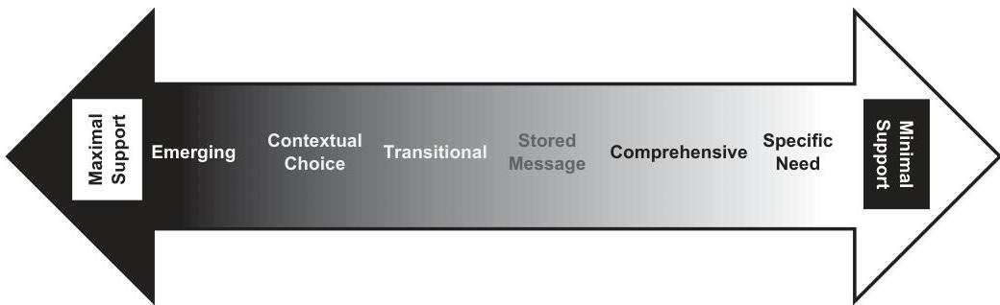

Figure 15.1. Continuum of AAC support. (Copyright © 2019 K. L. Garrett, J. P. Lasker, &amp; J. Fischer.)

1. Emerging AAC communicators
2. Contextual choice AAC communicators
3. Transitional AAC communicators
4. Stored-message AAC communicators
5. Generative AAC communicators
6. Specific-need AAC communicators

Each category is functional and not defined by level of impairment alone. Instead, communicators (people with aphasia who benefit from AAC supports) are identified based on their current communication abilities and their potential to use specific AAC supports and techniques. AAC clinicians can use this hierarchy as a guide to determine which strategies present the most appropriate starting points in intervention. However, it should be noted that supports from each category may be useful for all communicators at various times because the intermittency of aphasia and the dynamic nature of communication demand flexibility from both clinicians and individuals with complex communication needs. The sections below describe the characteristics, needs, intervention strategies, and partner support roles for each communicator type followed by a specific case example.

# EMERGING AAC COMMUNICATORS

The emerging AAC communicator has a profound cognitive-linguistic disorder across modalities as a result of extensive brain injury from a single large cerebral vascular accident (stroke), multiple strokes, trauma, or encephalopathy. The condition is often labeled with the term global aphasia or may be misidentified as dementia. Often, because of diminished arousal and comprehension capabilities, the person with profound aphasia does not respond accurately to initial orientation screening questions in the acute medical setting (e.g., What is your name?). Many of these individuals are subsequently discharged to long-term care facilities after minimal or no rehabilitation. Some of these individuals are capable of responding successfully if partners engage their attention and provide support for communication. Others may experience increased attentional capacities months later, at which time additional intervention may be considered. A small proportion may eventually transition to more advanced levels of communication and even develop some speech, functional gestures, or ability to use aided AAC.

Emerging AAC communicators may have both severe aphasia and apraxia of speech. They have extreme difficulties speaking, using symbols, and responding to

AAC Supports for Adults with Severe Aphasia and/or Apraxia of Speech

conversational input. Apraxia may be profound and occur at all levels of the motor planning system—oral motor, laryngeal, speech, gestural, even respiratory. Individuals with this condition seldom communicate purposefully; even fundamental nonverbal signals, such as pointing or nodding, are infrequent. They do not easily associate photos or line drawings of common objects with their referents, so providing prefabricated picture-symbol books to help them request wants and needs may be ineffective. They may not immediately be able to participate in restorative aphasia intervention protocols. For example, when answering a series of unrelated yes/no questions in a restorative therapy session, these individuals often do not respond or will answer with vague, imprecise head nods.

# Intervention Strategies

Intervention for emerging AAC communicators focuses on developing the following foundational communication capabilities: turn taking, communicating choices with tangible objects or photographs, referential skills, and clear signals for acceptance and rejection. In addition, partners can benefit from instruction in how to provide emerging AAC communicators with opportunities to make choices throughout daily routines and reinforce the communicators' responses (Simmons-Mackie et al., 2016). Table 15.1 lists appropriate intervention objectives for both emerging AAC communicators and their communication partners.

Table 15.1. Emerging communicator: Intervention goals and strategies

|  Communicator strategies | Partner strategies  |
| --- | --- |
|  Choose items to meet needs during daily routines by pointing or reaching. | Develop contextual routines, life activities, and opportunities in which the individual can utilize choice-making, turn-taking, referential, acceptance, and rejection skills (e.g., choosing nail polish to match outfit, selecting gifts for spouse from a catalog).  |
|  Reference familiar photographs in photo album by pointing or by demonstrating appropriate facial expression when participating in a dyadic reminiscing activity. | Create a simple scrapbook or photo album (one or two pictures of important life events per page with key word labels).  |
|  Choose preferred items within the context of a functional activity (e.g., ordering garden seeds from a catalog; selecting coffee, tea, or hot chocolate). | Facilitate participation in simple, age-appropriate games (e.g., Tic-Tac-Toe, War) and activities (e.g., approving or rejecting antiques listed for sale on Craigslist).  |
|  Participate in turn taking within the context of familiar visual games (e.g., Tic-Tac-Toe, War). | Provide contingent feedback for communicator's referential, joint attention, affirmation, and rejection signals (e.g., “Oh, you’re looking at the pink nail polish . . . so that’s what you want!”).  |
|  Consistently signal affirmation/agreement (head nod) for preferred items during choice-making activities. | Utilize augmented input strategies: Supplement the emerging communicator's comprehension of auditory information by pointing to referents, gesturing, or drawing key conversational points.  |
|  Consistently signal rejection (pushing away, head shake) for nonpreferred items during choice-making activities. | Include a humorous, nonpreferred choice in choice-making routines; tag yes/no questions with the phrase “Yes . . . or no?” using exaggerated intonation and corresponding head nod and head shake.  |
|  Demonstrate joint visual attention during interactions involving referential items (e.g., pictures, objects of interest). | Point to key elements within pictures or within personal space and engage the individual's visual attention simultaneously.  |

Copyright © 2019 K. L. Garrett, J. P. Lasker, &amp; J. Fischer.

### Referential Pointing

People with aphasia who have very limited communication may initially benefit from participating in contextual activities that elicit basic referential skills, such as pointing to request an item or looking in the direction of a mutually important item (e.g. out the window during a snowstorm). We have successfully taught this foundational skill by having people with aphasia point to gifts for loved ones in a simplified catalog, to choices of ice cream on a pretend counter, or to a spouse to answer the question, “Are you married?” Often the clinician initially must help communicators move their arm and hand to point, and sometimes even turn their heads in the direction of the referenced item, until they can do so without physical assistance.

### Communicating Choices with Objects and Photos

Emerging AAC communicators can learn to make basic communication choices, represented by real objects, within the context of familiar routines such as dressing. To illustrate, the clinician or caregiver could point to the calendar, discuss the season or weather, and then indicate several items of clothing. After ensuring that the emerging AAC communicator has visually attended to the clothing items, the partner orally presents the choices at a slow pace, encouraging the individual to choose or show preference by nodding, vocalizing, reaching, or showing changes in facial expression.

To encourage participation in familiar social activities, such as selecting gift items for a family member, the clinician, caregiver, or family member could first show pictures of the individual for whom the gift is desired and discuss the occasion using props (e.g. for a birthday, present a calendar and a birthday card). Then, prior to asking choice questions, the partner could encourage the person with severe aphasia to look at pictures of gift choices presented in a simplified catalog (i.e. pictures cut apart, pasted on blank paper, and taped inside a real catalog) and to turn pages, if appropriate. After the person with aphasia chooses or shows preference for a gift, he or she can make other decisions regarding cost or color of the item if appropriate.

### Confirmation Signal

Communicators can also be encouraged to confirm that a choice is desired (by nodding, vocalizing, reaching) as a preliminary step toward developing linguistic responses such as “yes,” “no,” and “I don't know.” Although we occasionally present graphic symbol cards representing “yes” and “no” to emerging communicators, we find that this often requires too much linguistic processing in the early phases of AAC-supported communication, and shaping a confirmation or rejection signal can be a more appropriate precursor to “yes” and “no” responses.

## Case Example and Outcomes

The following case study provides an example of AAC intervention and illustrates possible outcomes for emerging AAC communicators.

James, an individual with an aphasia quotient of 6 of 100 on the Western Aphasia Battery--Revised (Kertesz, 2006), fit the profile of an emerging AAC communicator. James unexpectedly sustained a large hemorrhagic left hemisphere stroke when he was 51 years of age. He had experienced a lengthy hospitalization in an acute care facility, followed by several inpatient stays in rehabilitation facilities. With an attentive

spouse and a generally positive outlook on life, James experienced many bouts of pneumonia and other secondary illnesses in the 10-year period prior to his evaluation at a university outpatient clinic. At that time, James's spoken expression consisted of a single stereotypy, “wah-wah-wah-wah,” produced with a variety of intonation patterns and facial expressions. He did not typically point to items that he wanted. Profound limb apraxia interfered with any ability to produce symbolic gestures. James had tremendous difficulty attending to communication partners and did not recognize or use line drawings as an alternate means of communication.

In the early phases of therapy, James was encouraged to listen to the clinician inhibit his perseverative jargon and pay attention to her referential communication (pointing) to other clients in the therapy group or to elements within photos associated with universally familiar news events. He also learned to visually attend to choices (initially objects, followed by photographs) that were presented within the context of a functional activity such as identifying favorite foods. Next, he was encouraged to select a choice by reaching or pointing during an interrupted routine. For example, when making coffee, the clinician completed one step of the activity (carrying the pot of coffee to the table), then stopped and offered James a choice of a mug or a fork. When James reached for an object, showed a preference for an item, or rejected an item, she provided contingent verbal feedback to increase his understanding that his communication effort conveyed meaning. James eventually learned to choose his favorite activities (e.g. listening to Frank Sinatra, playing cards or bingo, watching old movies) by pointing to photographs or line drawings, after which he participated in the actual activity for a few minutes. When symbols representing nonpreferred activities (e.g. flossing teeth, smoking) were added to the set of choices, James quickly learned to scrutinize his choices before pointing to the desired symbol. He then learned to shift his attention from objects and symbols to other communicators in group therapy and ask them a question by pointing to them and turning his palm upward accompanied by a rising vocal intonation.

James ultimately developed a consistent ability to establish joint visual reference in individual and group activities, and to gain the attention of others and then point to props or drawings to indicate his focus of attention. He learned to purposefully inhibit his spoken jargon. He was approximately 80% accurate when making choices from a set of four photographs within a contextual activity, and he even began to proudly show his choices to other group members. His wife was elated when James took her by the arm, led her to the bathroom, and pointed to an overhead light bulb that needed to be replaced. On one notable occasion, he pointed to a newspaper ad for a seafood restaurant during a “Take your wife on a date” therapy activity. James eventually transitioned to the next category, contextual choice AAC communicator, after approximately 10 months of weekly individual and group therapy sessions.

## Contextual Choice AAC Communicators

Contextual choice AAC communicators have more capabilities than emerging communicators but are unlikely to communicate successfully unless they have substantial AAC and partner support. (Intervention goals and strategies for these communicators are described in Table 15.2.) They indicate basic needs by spontaneously pointing to objects and items. They easily recognize visual symbols such as photographs, labels, written names, and signs. They are aware of daily routines and schedules.

AAC Interventions for Individuals with Acquired Disabilities

Table 15.2. Contextual choice communicator intervention goals and strategies

|  Communicator strategies | Partner strategies  |
| --- | --- |
|  Person with aphasia will point to one of the following to answer conversational wh- questions: • Written word choices • Points on a scale • Locations on a map | Implement written choice conversation strategy: • Identify interesting conversational topics • Learn to generate consecutive, meaningful, conversational questions • Learn to generate potential/possible answers in the form of written word choices, scales, or locations on a map.  |
|  Answer partner's tagged “yes/no” questions with reliable gestures, head nods, or verbal responses. | Utilize tagged yes/no question format. Example: “Do you like Grace Kelly, the actress . . . yes [nod head up-and-down] or no [shake head side-to-side]?”  |
|  When cued, learn to ask questions by pointing, gesturing, and/or using rising intonation (“uh . . . [point]?”). | Utilize augmented comprehension strategies when person with aphasia does not appear to understand incoming auditory messages: • Write/draw key words, new topics, maps, family trees • Gesture (e.g., hand over back to indicate past) • Point to (e.g., reference) item being discussed  |
|  Visually attend to partner's presentation of augmented input; confirm whether message was understood via head nods, yes/no responses, or vocalizations. | Respond to all modes of communication and interpret the person with aphasia's communication attempts  |

Copyright © 2019 K. L. Garrett, J. P. Lasker, &amp; J. Fischer.

During conversations, they may demonstrate partial awareness of some of the more predictable topics, questions, and comments. However, contextual choice AAC communicators do not have the linguistic competence to initiate or add to a conversation on their own. Thus, these individuals may be quite isolated socially. With assistance, however, they can participate in topical conversations when communication partners provide written or pictorial choices on a turn-by-turn basis. Contextual supports serve to enhance both expression and comprehension for these communicators. Many individuals with aphasia syndromes such as global, severe Broca's, severe transcortical motor, or severe Wernicke's aphasia may function as contextual choice AAC communicators for the short or long term.

# Intervention Strategies

AAC interventions for contextual choice AAC communicators are typically embedded within conversations about familiar topics. The primary expressive language goals involve teaching communicators with aphasia to consistently reference (point to) what they are talking about, understand the meaningfulness of graphic representations, make choices to answer conversational questions, and begin to ask questions by pointing or using exaggerated intonation. Because these individuals participate more extensively in conversational exchanges, partners should also help them understand specific messages and ideas that are being presented by using augmented input techniques, such as photographs or gestures, to accompany the spoken word or message (Garrett &amp; Beukelman, 1998; Wood, Lasker, Siegel-Causey, Beukelman, &amp; Ball, 1998). Strategies to support both expression and comprehension are listed in Table 15.2.

AAC Supports for Adults with Severe Aphasia and/or Apraxia of Speech

Contextual Choice Conversation Strategies A primary communication technique used with contextual choice AAC communicators is written choice conversation (Garrett &amp; Beukelman, 1992, 1995). This technique requires the facilitator to generate written key-word choices in addition to spoken messages that are pertinent to a conversational topic (Figure 15.2). The communication partner says each of the written choices aloud while writing them within view of the person with aphasia. The person with severe aphasia participates by pointing to the choices, thereby making his or her opinions and preferences known. Responses can be quite general, particularly when partners ask basic social questions (e.g., "Who visited this weekend?"). They also can be highly specific, particularly if the questions pertain to personal memories, beloved hobbies, or detailed knowledge associated with a past career. When partners present a sequence of related questions, interactions lengthen, and communicators can discuss topics with relative depth.

In our clinical practices, many individuals with severe aphasia have demonstrated an ability to participate in interesting conversations when partners implement the written choice conversation support—despite very limited reading comprehension test scores (Smith, 2005). Some have questioned whether people with low reading abilities on tests can truly understand the choices that partners write out for them. Several research studies have investigated this issue. People with aphasia with minimal reading ability on formal tests were more than 90% accurate when responding to conversational questions by pointing to written choices, as long as the choices were presented within the context of a conversation and spoken aloud by the partner while he or she wrote them (Garrett, 1995). Family members verified whether the conversational choices selected by the communicator with aphasia were correct, or in the case of opinions, representative of the individual's typical opinions. Lasker, Hux, Garrett, Moncrief, and Eischeid (1997) determined that some individuals can comprehend written choices that are not supplemented with the partner's spoken output. In fact, communication partners can be flexible with the modalities used to present choices; partners can present response options by writing and speaking simultaneously, by writing without speaking aloud, and sometimes with choices represented by partners holding up one hand to represent Choice A and a second hand to represent Choice B. Studies suggest that some people with very severe aphasia can read well enough to

Friend: Can you give me advice on what to make for the school bake sale tomorrow?

Person with aphasia (PWA): [nods yes]

Friend: Should I take an angel food cake, brownies, or cookies? [writes choices vertically in notebook]

- ANGEL FOOD CAKE
- BROWNIES
COOKIES

PWA: [points to brownies]

Friend: Yes, those always sell fast [circles BROWNIES]. Should I make them from scratch or get a box mix? [writes choices]

- SCRATCH
- BOX MIX

PWA: [laughs and points to BOX MIX]

Friend: [laughs and circles BOX MIX] Yeah, it's hard to make them as good as Betty Crocker!

Figure 15.2. Sample written-choice conversation. (Copyright © 2019 K. L. Garrett, J. P. Lasker, &amp; J. Fischer.)

AAC Interventions for Individuals with Acquired Disabilities

Friend: [Pause] what do you think about the kids' elementary school? Do you think they're getting a good education or a so-so one? [writes a rating scale on the page]

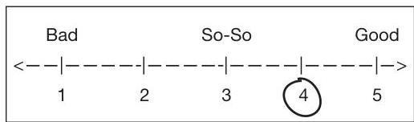

Figure 15.3. Sample written-choice conversation illustrating a communicator's response on a rating scale. (Copyright © 2019 K. L. Garrett, J. P. Lasker, &amp; J. Fischer.)

PWA: [hesitates, points to "4"]

Friend: [circles "4"] Yeah, we're pretty happy with the school district. Too bad the classes are so big, though!

PWA: [nods yes]

recognize, comprehend, and consciously select vocabulary to represent personal facts and opinions during meaningful partner-supported communication interactions.

Variations on the written choice conversation approach include presenting choices in the form of points on a rating scale or locations on a map. These graphic options are particularly useful when communicators want to answer opinion questions (e.g., "How do you think the election's going . . . good . . . so-so . . . or bad?), quantitative questions (e.g., "How much should we spend on your birthday present . . . a lot . . . some . . . or a little?"), or questions about locations (e.g., "Where did your sister move . . . to New York . . . Texas . . . or Florida?"). (See Figures 15.3 and 15.4, respectively, for examples of a rating scale and a map.) A study by Wallace, Hux, Brown, and Knollman-Porter (2014) revealed that, compared to a spoken message alone, people with aphasia demonstrated improved comprehension when spoken messages were supplemented with high-context visual images, specifically "images depicting people or objects in relation to one another, the natural environment, and the central action of a scene" (p. 714). The common finding in their research is that the presentation of a pool of choices seems to be the critical requirement for contextual choice

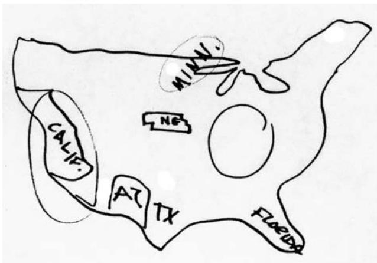

Figure 15.4. Map choices to answer the question, "Where do you go on vacation?" (Copyright © 2019 K. L. Garrett, J. P. Lasker, &amp; J. Fischer.)

AAC Supports for Adults with Severe Aphasia and/or Apraxia of Speech

AAC communicators to communicate, but the optimal method of responding may be unique to each person depending upon the context, content, and capability of the person with aphasia.

The clinician's role is to introduce communicators to the written choice conversation support strategy. Communicators can be encouraged to attend to the partner's questions, scan and comprehend the choices, and then respond thoughtfully by pointing. The clinician should also teach identified communication partners to use the strategy and then assist them to prepare simple notebooks to use in the supported interactions. An instruction card (Figure 15.5) can be placed on the cover of the notebook to explain the procedure to unfamiliar communication partners.

Yes/No Responses to Partner's Tagged Questions Communicators with severe aphasia often have difficulty answering yes/no questions in a clear and unambiguous manner. Because of apraxia, they may have trouble coordinating their head movements to signify "yes" and "no." Or, they may not know how to answer the question because the grammatical structure of questions does not explicitly tell them to answer with "yes" or "no" versus a more specific word or phrase. Other times, communicators simply do not understand the question. The simple strategy of "tagging" the question can bypass the first two problems. Partners add the phrase "yes . . . or . . . no?" to the ends of their yes/no questions. They simultaneously model the head movements. This effectively provides the communicator with a narrow pool of choices for how to respond within the context of a conversation. See Figures 15.6 and 15.7 for examples of interactions in which the partner and communicator effectively organize their responses using the tagged yes/no strategy.

I HAVE HAD A STROKE. I WOULD LIKE TO TALK TO YOU, BUT I CANNOT SPEAK.

WE CAN CONVERSE IF YOU ASK ME A QUESTION AND OFFER ME WRITTEN CHOICES TO POINT TO. HERE'S HOW:

1. THINK OF A QUESTION YOU WOULD HAVE ASKED ME BEFORE MY STROKE. TRY TO FIND OUT MY OPINION, GET MY ADVICE, OR FIND OUT MY PREFERENCE.

Example:

"What crops have you gotten out of your garden so far?"

"Who's going to win the football game Saturday?"

"What do you think of the new tax law?"

2. ONCE YOU'VE ASKED THE QUESTION, THINK OF POSSIBLE ANSWERS OR CHOICES. WRITE THEM IN THIS NOTEBOOK. USE A DARK PEN OR MARKER. USE LARGE CAPITAL LETTERS. PUT A DOT IN FRONT OF EACH CHOICE. USE A SCALE FOR "HOW MUCH" QUESTIONS.

Example:

TOMATOES
CUCUMBERS
BEANS

NEBRASKA
PENN STATE

unfair

fair

&lt;--|--|--|--|--|--|--

1 2 3 4 5

3. ENCOURAGE ME TO POINT. CIRCLE MY ANSWER. ASK PLENTY OF FOLLOW-UP QUESTIONS—I ENJOY CONVERSING!

Figure 15.5. Written-choice communication notebook cover card. (Copyright © 2019 K. L. Garrett, J. P. Lasker, &amp; J. Fischer.)

AAC Interventions for Individuals with Acquired Disabilities

Partner: Robert, do you like omelettes . . . yes . . . or no? (nods head up and down while saying yes and shakes head side to side while saying no)

Robert: (tries to gesture thumbs up, then points down, then nods head yes after pausing to work out the movement sequence)

Partner: Yes?

Robert: (confirms yes by nodding his head up and down)

Figure 15.6. Sample interaction with tagged yes/no question strategy. (Copyright © 2019 K. L. Garrett, J. P. Lasker, &amp; J. Fischer.)

Augmented Input Techniques to Support Comprehension Often contextual choice AAC communicators have accompanying auditory processing difficulties that interfere with their ability to understand spoken language, especially language that is complex or that shifts the conversational topic. These individuals will nod their heads to indicate that they understand, but in fact may be holding their place in the conversation instead of signaling true comprehension. Thus, they often experience significant confusion and communication breakdowns as a conversation progresses. At other times, these people withdraw completely from complex discussions. People with traditional diagnoses of Wernicke's aphasia, transcortical sensory aphasia, and global aphasia often fit this description, as do individuals in the acute stage of recovery from acquired brain injuries or stroke. Other individuals with aphasia who demonstrate intermittent auditory processing problems may also benefit from this technique.

To avoid communication breakdowns, communication partners can augment their spoken language by gesturing, writing key words, or drawing. This set of strategies, called augmented input supports (Garrett &amp; Beukelman, 1992, 1998; Sevcik, Romski, &amp; Wilkinson, 1991; Wood et al., 1998), can be implemented whenever the communicator with aphasia is having difficulty comprehending conversational

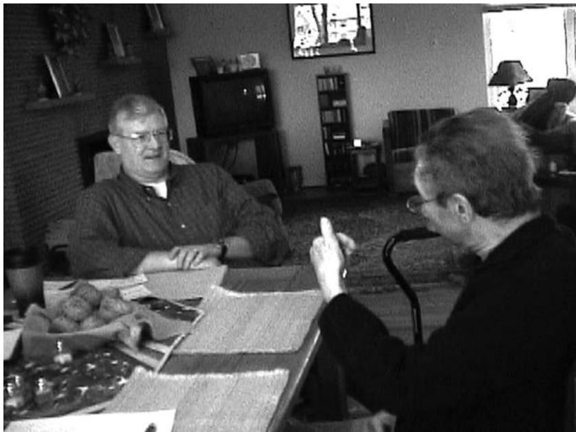

Figure 15.7. Robert answering his brother-in-law's tagged yes/no question with a thumbs up signal. (Copyright © 2019 K. L. Garrett, J. P. Lasker, &amp; J. Fischer.)

AAC Supports for Adults with Severe Aphasia and/or Apraxia of Speech

Partner: And so we went to the arboretum to see which trees grow best around here, and then we went to the nursery to pick out some varieties . . .

Charles: [raises hand to stop interaction, shakes head no]

Partner: Oh, I'm sorry—I was going too fast again. Here [writes arboretum, draws a picture of a tree]. We went to the arboretum [points to word and pauses to check for comprehension]. . . then we went to the nursery to get some plants [writes nursery and draws arrow from previous message] and then we took them home. Did I make sense?

Charles: [nods YES]

Figure 15.8. Sample conversation using supported conversation techniques. (Copyright © 2019 K. L. Garrett, J. P. Lasker, &amp; J. Fischer.)

questions, comments, or instructions. To provide augmented input, the communication partner first identifies that the communicator has misunderstood after carefully observing the person's blank facial expression, ambiguous head nods, or incorrect responses. The partner then reiterates the message while simultaneously pointing to the item being discussed; gesturing symbolically (e.g., throwing hand over shoulder to indicate "away from here"); pantomiming an event; showing photographs, drawings, or other diagrams; or writing key words and topics. Individuals with receptive aphasia can then use these visual representations to help them understand the spoken information (see Figure 15.8). Recent research suggests that provision of multimodal input significantly enhances the auditory comprehension of people with severe aphasia (Brown, Wallace, Knollman-Porter, &amp; Hux, 2019) and reading comprehension of people with varying degrees of aphasia severity (Dietz, Hux, McKelvey, Beukelman, &amp; Weissling, 2009; Dietz, Knollman-Porter, Hux, Toth, &amp; Brown, 2014; Wallace, Hux, et al., 2014), providing support for augmented input as a functional clinical technique.

The wife of one man with profound aphasia had difficulty explaining to him where they needed to go. This resulted in confusion and combativeness. His wife printed photos of destinations using Internet images, collected them in a transportable envelope, and showed him the photos before going to each place. She reported that this technique successfully managed the confusion and resistance that he showed prior to transitioning from his house to the car and from place to place.

Augmented input is often used in conjunction with the written choice conversation technique described above. The technique of augmented input is similar in that it is completely partner supported, which means that communication partners must learn to resolve communication breakdowns by initiating the technique. The clinician can assist with this process by demonstrating the technique, providing a notebook with instructions on the cover to partners (Figure 15.9), and teaching the person with aphasia to signal when he or she is experiencing comprehension difficulties.

## Case Example and Outcomes

In the following case study, Robert is an example of a contextual choice AAC communicator.

Robert was a 61-year-old college-educated logistics engineer who sustained a sudden-onset, thrombotic left hemisphere stroke in the region of the middle cerebral artery

AAC Interventions for Individuals with Acquired Disabilities

Hello. I have had a stroke. Sometimes I'm not able to understand you. Can you . . .

Watch my face—if I look confused, I probably didn't understand you.

Signal topic changes like this . . .

"Now, I'd like to talk about something else ... like baseball. Ready? Did you watch the Pirates baseball game on TV this weekend?"

For key words or concepts, it helps if you also:

- Gesture [e.g., swing bat for baseball]
Write the important words in large print PIRATES???
- Draw maps, items, and so forth.

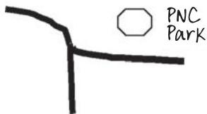

Figure 15.9. Sample augmented input instruction card. (Copyright © 2019 K. L. Garrett, J. P. Lasker, &amp; J. Fischer.)

shortly after retiring. He participated in 1 month of inpatient rehabilitation, after which he returned to the home he shared with his wife. He attended five outpatient therapy sessions 2 months after onset. At that time, he was not able to produce speech because of profound apraxia of speech and severe aphasia. A high-technology AAC system was introduced, but Robert was unable to use it. Eight months after his stroke, he was reevaluated at a university outpatient clinic. He achieved an aphasia quotient of 9.2 of 100 possible on the Western Aphasia Battery-Revised (Kertesz, 2006), which corresponded with an impairment profile of global aphasia. However, his awareness of routines and response to the clinician's humorous comments indicated some communication competencies. He learned, within two intervention sessions, to point to written choices to answer conversational questions about his teapot collection, his political preferences, his children's travel adventures, and his feeble attempts to learn to play the bass guitar. He also gradually learned to answer conversational yes/no questions by nodding his head or using a thumbs up or thumbs down signal. He was much more accurate when the partner used the tagged yes/no question format; because of apraxia, however, he also required tactile cues and a model for approximately 2 months until he could produce consistent responses. Because of intermittent auditory comprehension breakdowns, the clinician frequently supplemented her spoken questions by writing or drawing key concepts. Robert then began participating in group therapy in addition to individual intervention sessions. Although he initially required physical assistance to look at other participants and point at them to ask questions, he ultimately learned to initiate simple requests with only occasional cues. Interestingly, he also began to show other people his written choice responses in lieu of being able to announce them aloud and used this strategy frequently to participate in group interactions.

Robert's wife confirmed that his written choices and yes/no responses were mostly accurate after 1 month of biweekly therapy sessions. Over the next year, Robert became

more attentive, initiated more requests by gesturing symbolically and pointing, and learned to tease others. His reading comprehension increased. He also participated in traditional stimulation and motor speech therapy and developed an imitative spoken repertoire of more than 200 words. However, he never learned to use these spoken words consistently in real-life conversations. Therefore, his sons, brother-in-law, and wife learned to use partner-supported strategies, including written choice conversation, tagged yes/no question presentation, and augmented input.

## TRANSITIONAL AAC COMMUNICATORS

Transitional AAC communicators demonstrate an ability to use AAC symbols and supports to help them communicate. They may have fluent or nonfluent aphasia. Some gesture, draw, or speak to start an interaction with the communication partner. They may begin to search through their notebooks for written choices from prior conversations to find relevant information for the present discussion. They increasingly know the answers to questions before the partner presents the choices, demonstrating improved comprehension compared to emerging or contextual choice communicators. Transitional AAC communicators may, by this time, have communication notebooks or speech-generating AAC technology containing message sets for common situations, such as telling about themselves or making requests. Some individuals may be able to retrieve portions of written words through fragmented spelling, such as selecting “S” and “D” to represent “South Dakota” or “v” and “b” to represent “volleyball.” In therapy, they may easily locate these messages and use them communicatively in structured interactions.

However, the hallmark characteristic of this category of communicators is that they typically need cues from the partner to assist them in using an AAC strategy to supplement their spoken communication. We have seen people with nonfluent aphasia who obviously have an idea and desire to convey it, and who are quite aware of their limitations in spoken language ability, but who can't think of how to communicate the answer in spontaneous communication contexts without cues. Other individuals, often those with comprehension deficits associated with fluent aphasia, may not perceive the need to supplement their unintelligible speech. These individuals may speak copiously but do not realize the inadequacy of their messages until a partner says, “I don't understand what you said.” Thus, the “transitional AAC communicator” category represents a step along the continuum between those communicators who need partner support to compose messages (i.e. emerging and contextual choice AAC communicators) and those who locate or generate messages on their own in everyday contexts (i.e. stored-message and comprehensive AAC communicators). Although some transitional communicators will progress to more independent communication, others will continue to require cues to participate. We often find that individuals with global aphasia diagnoses or frontal lobe involvement have the most difficulty transitioning to self-initiated communication.

### Intervention Strategies

Intervention goals (Table 15.3) focus on teaching transitional AAC communicators to initiate AAC-supported conversations with as little cueing as possible. AAC supports provide the communicator with a means of conveying significant content without taxing cognition and expressive language.

AAC Interventions for Individuals with Acquired Disabilities

Table 15.3. Transitional communicator intervention goals and strategies

|  Communicator strategies | Partner strategies  |
| --- | --- |
|  Call for assistance/signal a communication partner that he or she wishes to converse | Provide suggestions, hints, or direct instructions to encourage the person with aphasia to use strategies in appropriate contextual situations  |
|  Introduce self with low- or high-tech AAC strategy (card, wallet, AAC device) | Pause and expect communication  |
|  Search for previous written choice responses to answer similar conversational questions | Provide opportunities for communication of specific information within contextual, familiar conversations and routines. Example: “Tell me about your vacation.”  |
|  Search for biographical info in a simple reminiscing book/scrapbook to answer similar conversational questions | Assist the person with aphasia to develop a scrapbook or communication wallet  |
|  Answer predictable questions (e.g., autobiographical, topical) by searching for, selecting, and pointing to prestored messages on a simple AAC device | Assist the person with aphasia to store autobiographical or topical messages on an AAC device prior to conversing  |
|  Hand a potential communication partner a tangible topic setter or remnant to initiate a conversation | Assist the person with aphasia to identify, collect, and present tangible topic setters or remnants (e.g., travel brochures) to potential communication partners  |
|  Tell simple stories on an AAC device by activating sequential messages | Assist the person with aphasia to identify favorite stories, then select and program the messages on an AAC device  |

Copyright © 2019 K. L. Garrett, J. P. Lasker, &amp; J. Fischer.

Introductions and Topic Setters Transitional AAC communicators can introduce themselves using a prepared card or a message on AAC technology (e.g., I HAVE APHASIA FOLLOWING A STROKE. THEREFORE, I HAVE DIFFICULTY THINKING OF WORDS AND SAYING THEM. I COMMUNICATE BY . .). Scripted interactions and role playing may be helpful in teaching transitional AAC communicators what to do. They can learn to initiate a conversation by presenting a remnant, a tangible representation of an event considered noteworthy by the communicator (e.g., movie ticket stub, newspaper headline; Garrett &amp; Huth, 2002; Ho, Weiss, Garrett, &amp; Lloyd, 2005). If clinicians have not yet organized vocabulary within familiar topics (e.g., autobiographical information), it is appropriate to begin embedding these messages in notebooks or AAC technology to support these extended topical interactions (McKelvey, Hux, Dietz, &amp; Beukelman, 2010).

The National Aphasia Association offers a free online tool to create a personalized Aphasia ID card at https://www.aphasia.org/aphasia-id-card/.

Asking Questions Transitional AAC communicators can become skilled conversational respondents when choices are provided and presented in a contextual format. However, they may need additional intervention to initiate communication. One of the first strategies that can be implemented with transitional AAC communicators is to encourage them to point or gesture toward conversational partners to ask questions. In intervention, individuals may initially benefit from physical assistance to point; later, a model cue may suffice. To prompt generalized use of this gestural strategy in conversations, it may be beneficial to remind the communicator that a question

AAC Supports for Adults with Severe Aphasia and/or Apraxia of Speech

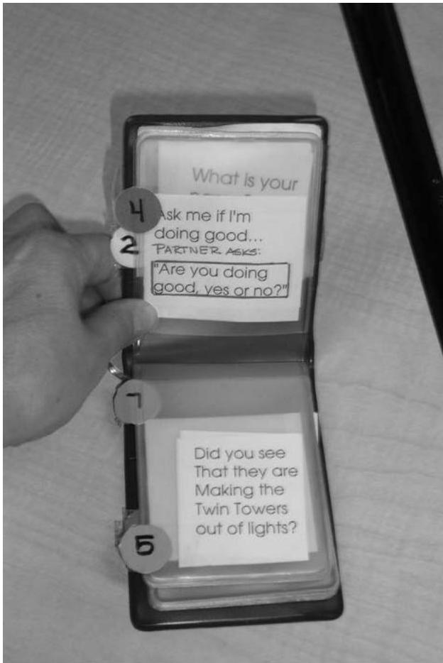

Figure 15.10. Sequentially organized communication wallet with introductions, topic setters, and questions for conversational partners. (Copyright © 2019 K. L. Garrett, J. P. Lasker, &amp; J. Fischer.)

would be appropriate (e.g., "So . . . don't you want to know about my weekend?"). At other times, the clinician may introduce single-message AAC technologies or simple flip books (see Figure 15.10) to teach people with aphasia to initiate question asking within a conversational context.

Storytelling Storytelling is another content-rich communication activity that matches the cognitive abilities of the transitional AAC communicator. When consecutive segments of the story are pre-stored in a communication book or AAC technology (typically in a left-to-right sequence if English is the primary language), the communicator simply has to point to the message square in the correct sequence to tell the story.

Visual Scenes Visual scene displays (VSDs; see Figure 15.11) are another means of organizing both narrative information and potential comments and questions to

AAC Interventions for Individuals with Acquired Disabilities

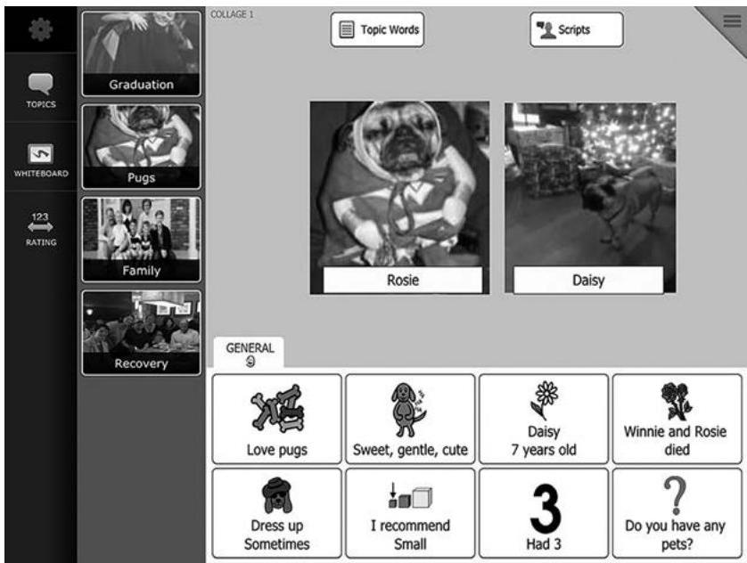

Figure 15.11. Sample visual scene display storytelling page about the communicator's pet pugs. (Copyright © 2019 K. L. Garrett, J. P. Lasker, &amp; J. Fischer.)

extend an interaction about the topic. Action photographs of emotionally rich (personally relevant) events from the communicator's life are selected, and words or phrases that elicit conversation from partners (e.g., This is our vacation in Hawaii; We tried boogie boarding; What do you think of Hawaii?) are printed adjacent to the photograph. Communicators are encouraged to point to the phrases at appropriate moments in a conversation. A numeric scale may accompany the photo to provide a means for communicators to convey opinions. VSDs can be constructed from printed photos, photo and phrase page templates, or stored in AAC technology or a tablet computer. Some technologies allow specific locations (hot spots) within a digitally stored picture to be programmed with relevant messages. Researchers have found that low-tech and high-tech VSDs help communicators relate personal stories and engage in reciprocal interactions by providing semantic and organizational support (Beukelman, Hux, Dietz, McKelvey &amp; Weissling, 2015; Brock, Koul, Corwin &amp; Schlosser, 2017; Dietz, Weissling, Griffith, McKelvey, &amp; Macke, 2014; Griffith, Dietz, &amp; Weissling, 2014). VSD-based intervention even resulted in improvements in language performance and brain function during verb production tasks for some people with aphasia (Dietz et al., 2018). Although communication partners may still need to prompt the start of a conversation through the use of a VSD, VSDs can provide transitional AAC communicators with the semantic content and shared visual context that they need to continue and extend a conversational interaction. Brock et al. (2017) compared grid displays with visual scene layouts in two single case studies asking participants with aphasia to converse about an I Love Lucy episode. One of the cases included prior training with the layouts and one did not. In both cases, people with aphasia demonstrated more conversation turns with fewer errors in the scene display condition.

Role Playing Because of their history of needing instructions and cues, transitional AAC communicators benefit from practicing their strategies in structured role

AAC Supports for Adults with Severe Aphasia and/or Apraxia of Speech

playing (e.g., introducing oneself to a bank teller, telling one's life story to a student). Fading cues become an important instructional technique. Clinicians can set up an expectation for communication by repeating the role play and then pausing for the communicator to introduce him- or herself or answer a question using the target AAC support. With transitional AAC communicators, therapists and conversational partners must wait to cue the individual until it is clear that he or she cannot figure out how to communicate without further instruction. Sometimes it is helpful to embed the target strategies into a written script that the communicator can refer to during the role play. Role plays using scripts should be taught with varied cues and partners to promote generalization to situations outside the clinical setting. Cherney, Kaye, and van Vuuren (2014) found that people with aphasia acquired and maintained conversational scripts via a computer-based software program (i.e., AphasiaScripts) when presented in an error-reducing learning environment. Although some transitional communicators will progress to more independent communication, others will continue to require cues to participate. We often find that individuals with global aphasia diagnoses or frontal lobe involvement have difficulty transitioning to self-initiated communication.

## Case Example and Outcomes

The following example illustrates the use of AAC by a transitional AAC communicator.

Beatrice was a 70-year-old woman who had sustained a thrombotic stroke while on vacation. She initially experienced very severe fluent aphasia (Wernicke's syndrome), with significant comprehension impairments and almost completely unintelligible jargon. She was discharged quickly to her home from a comprehensive rehabilitation facility because she was ambulatory, functional with regard to self-care and home activities (e.g., laundry, cooking), and continuously upset during all therapies. Home health therapy provided four visits, after which her husband enrolled her in specialized outpatient therapy for individuals with severe aphasia. Her initial therapy approaches were consistent with those of a contextual choice AAC communicator. These included augmented input to assist in managing comprehension deficits and providing feedback about her spoken output; Beatrice's daughter and husband were then taught this technique. She also worked on developing a consistent yes/no response in conjunction with augmented presentation of questions and the partner's use of a tagged yes/no question format. After 6 months of therapy, Beatrice showed competencies associated with a transitional AAC communicator. She had decreased her jargon, increased the number of intelligible (though automatic) phrases, demonstrated the ability to repeat speech given printed augmented input supports, and pantomimed to convey information about events and actions. She occasionally wrote single words with some spelling errors. Traditional restorative therapy also focused on decreasing her perseveration, improving her semantic comprehension capabilities, and increasing her ability to discriminate and produce words that contrasted phonologically. However, she still was unable to produce specific names or speak intelligibly enough to relate a narrative. Beatrice could not use a complex AAC system. Instead, she and her husband described upcoming social situations that she was expected to participate in, for example, a high school reunion. She actively assisted in selecting phrases that would be helpful in these situations; messages were then represented with photos, line-drawing symbols, and text and were stored in a small flip notebook. Beatrice practiced using the phrases in role-playing scenarios and became adept at referencing them, particularly when the clinician suggested their use. However, after each of five events for which low-tech AAC systems had

been constructed, she indicated that she had not used the systems. When asked why, she indicated that she didn't think to pull them out of her purse, despite having practiced doing this in therapy. She continued to require cues to use her stored information systems in group interactions and community situations for the remainder of her time in therapy. However, she became adept at using pantomime, some speech, and retrieval of actual items to communicate her clearly held opinions and wishes with no assistance from others to initiate communication.

## PARTNER-SUPPORTED STRATEGIES AND INDEPENDENT AAC: A COMPARISON

Many people with diagnoses of global aphasia or severe aphasia will require the assistance of a communication partner to maximally participate in conversations and important life activities for the long term. Communication partner training is an important component of AAC intervention for individuals with aphasia (Hinckley et al. 2013; King & Simmons-Mackie, 2017). Simmons-Mackie et al. (2016) found that partner training resulted in increased use of strategies that facilitated improved communication exchanges for individuals with aphasia.

In contrast, a number of people with severe aphasia demonstrate the cognitive and linguistic competence to converse independently using a combination of speech, gestures, and AAC supports. These individuals comprehend most of what is said to them even when little contextual support is available. They can intentionally share their own ideas using a variety of strategies and modalities that they select themselves; they are independent AAC communicators because they require minimal or no support to communicate after learning to use AAC. They can shift between multiple communication modalities in a strategic manner, which Purdy and Koch (2006) correlated with higher levels of cognitive flexibility. Independent AAC communicators often have traditional taxonomy labels of anomic aphasia, transcortical motor aphasia, conduction aphasia, or apraxia of speech.

However, without focused clinical intervention and implementation of AAC supports, independent AAC communicators may experience frequent communication breakdowns. The connecting threads of conversation can dissolve when they try to communicate specific words (nouns, verbs, and/or function words) to clarify locations, details, names, cause-and-effect relationships, or event chronologies. Fortunately, independent AAC communicators can learn to utilize both unaided communication strategies (e.g. speech, residual writing or drawing) and augmented strategies (e.g. pointing to elements of a picture to elaborate on a topic, finding messages stored in a multilevel AAC technology, spelling the first letter on an alphabet card) to communicate effectively in multiple environments with a variety of communication partners. The sections that follow describe strategies and technologies for people with aphasia who can learn to use AAC to communicate independently.

## STORED-MESSAGE AAC COMMUNICATORS

Stored-message AAC communicators can learn to independently locate messages that have been stored in advance within their low- or high-tech AAC systems, even if they cannot generate these messages independently via spelling, combining symbols, writing, or speaking. They have enough executive function and initiation ability to learn to consistently access entire phrase or sentence messages in specific contexts. They may, for example, spontaneously activate AAC technology with digitized speech output to offer a toast at a celebration or to order a double-thick strawberry milkshake at the ice cream

store. Or, if they have extensive life and communication needs, they may utilize AAC with synthesized speech output to greet, exchange small talk, and make predictions about the coming football season. In contrast with transitional AAC communicators who require partner cueing to access supports, stored-message AAC communicators can learn to initiate and use their systems to supplement or substitute for speech without prompting within familiar situations. One author worked with a person who regularly accessed multiple stored messages on his iPad page entitled “haircut” to chat with his barber every month. This group of individuals may also consciously intersperse some unaided communication strategies (e.g. partially intelligible speech, symbolic gestures) after practice. However, they seldom generate enough novel information to participate in a discussion about an unusual topic because their spelling, speech, and AAC capabilities are not sufficient to participate independently in free-form conversations.

### Intervention Strategies

Clinicians should work with stored-message AAC communicators, family members, and caregivers to create an inventory of messages and topics that communicators will need in specific situations in which they must communicate specifically and efficiently.

### Message Storage

Communication partners and AAC facilitators can assist in storing these messages in low-tech communication notebooks or wallets or can help select locations and symbols for programming the messages into dynamic display AAC technology or tablet computers. Lastly, stored-message communicators need to practice using their systems in role-playing or actual communication situations. Potential strategies for this group of communicators are listed in the box “Stored-Message Communicator Intervention Goals and Strategies.”

#### Stored-Message Communicator Intervention Goals and Strategies

Communicator strategies

Participate in identification of specific situations, stories, or communication routines (e.g. restaurant, vacation, family stories, bank, returning an item to a store, asking spouse out on a date)Participate in selection and storage of specific vocabulary for each situationPractice accessing vocabulary during structured, scripted role-playing situations (in therapy)Practice communicating in real-life situations and evaluating:Effectiveness—did I get my message across?Efficiency—was the partner fidgeting or uncomfortable? How many communication breakdowns did I have?Changes needed—was there anything I could have done to make this interaction go better?Evaluate pros and cons of AAC devices versus low-tech communication options, make an informed decision, and develop the final system with the clinicianGradually use the system in more demanding situations, such as returning an item to a store serviced by a clerk with no knowledge of aphasia.

(Copyright © 2019 K. L. Garrett, J. P. Lasker, & J. Fischer.)

AAC Interventions for Individuals with Acquired Disabilities

Clerk: Who's next?

PWA: (points to self)

Clerk: What do you need, sir?

PWA: (using Post Office display on SGD) I WANT TO PICK UP MY PACKAGE.

Clerk: What is that thing?

PWA: (navigates to Home display on SGD) I HAD A STROKE. IT IS HARD FOR ME TO SPEAK.

I USE THIS MACHINE TO COMMUNICATE.

Clerk: OK, now what was that?

PWA: Pat-ju (returns to Post Office level on SGD; reactivates original message)

I WANT TO PICK UP MY PACKAGE.

Clerk: Your name?

PWA: Chim...no...no... (navigates to Home display on SGD) MY NAME IS JAMES GREEN.

Clerk: Jim Green...OK sir, I'll check. Just a minute.

Figure 15.12. Sample script for post office scenario. (Copyright © 2019 K. L. Garrett, J. P. Lasker, &amp; J. Fischer.)

Role Play and Practice Clinicians may wish to conduct some intervention sessions with these individuals outside of the therapy room. For example, if an individual targets the post office as an environment for better communication, initial sessions could consist of identifying messages, storing them, and then practicing how to use both spoken and AAC messages with a script (Figure 15.12). Later sessions may take place with a novel communication partner, such as another clinician or secretary, in a simulated post office scenario. If it is possible to conduct community outings, it would be beneficial to observe the communicator utilizing the communication supports in the real situation. Finally, the clinician and communicator should evaluate the effectiveness of the interaction and make changes in message content, sequence of delivery, or use of unaided communication strategies, if needed.

## Case Example and Outcomes

The case of Marco, a 44-year-old man with moderate to severe receptive and expressive aphasia and apraxia of speech (Lasker &amp; Bedrosian, 2001), is summarized here to illustrate how a stored-message AAC communicator learned to use AAC.

Marco acquired aphasia as a result of a left hemisphere stroke sustained 8 months before his evaluation. Prior to his stroke, he was employed as a mechanical press operator and was active in the community softball league and church. He had completed 2 years of college and earned an associate degree. After his stroke, Marco was unable to work due to his residual physical disabilities and communication limitations. He lived at home with his wife, teenage son, and 3-year-old granddaughter. However, he continued to drive and conduct errands in the community. He also had some parenting responsibilities at home while his wife was at work.

Marco's motor speech and language problems interfered with his ability to participate in daily communication activities. His spoken output was limited to "yes," "no," and automatic speech sequences, although he often attempted to repeat spoken models. After 7 months of traditional restoration speech-language therapy with little improvement in spoken expression, Marco acquired dynamic display AAC technology. He was unable to formulate novel messages using words or letters; however, he used it extensively as a model for speech practice. In collaboration with Marco and his family, the clinician collected and stored messages for several communication contexts on several levels of Marco's AAC technology. However, despite this individualized programming, Marco was unwilling

to utilize his AAC technology in public. Marco did not require cues to access the messages on the system (as a transitional AAC communicator might). Rather, Marco communicated that he believed the technology was “for the clinic” and “for practicing speech” but was not for “talking with friends . . . [or] strangers.” When probed, Marco admitted that he was ashamed of using the machine in public and was afraid that people in the community would think he wasn't “normal.”

To address the issue of AAC system acceptance, Marco's subsequent intervention program focused on selecting or spelling appropriate messages, practicing with written scripts, rehearsing via role plays with the clinician, and finally utilizing the system in community locations. Luckily, when Marco used his technology for the first time in the post office, he received a favorable and interested response from the clerk. After his second experience communicating in public, Marco offered suggestions for his next community communication experience and also assisted in developing the practice script. In addition, he requested that the clinician maintain greater physical distance from him during his interaction with the clerk so that he could “do it himself.” During his staged intervention program, Marco learned to access his stored-message system in a variety of locations. His ability to participate independently in public encounters increased with each experience, and he ultimately demonstrated acceptance and successful use of his system.

## GENERATIVE AAC COMMUNICATORS

Occasionally clinicians will encounter generative AAC communicators—speakers and/or writers with aphasia who can convey some novel information on their own. Generative AAC communicators differentiate themselves from other AAC communicators on the continuum because they are able to formulate messages using symbols or text and can use a combination of aided and unaided supports. However, their generative communication skills are often too fragmented or inconsistent for effective communication to occur without some degree of conversational or AAC intervention. Breakdowns may occur in spoken communication and/or when writing. Generative AAC communicators often have Broca's aphasia, anomic aphasia, or mild conduction aphasia. Apraxia of speech often obscures these individuals' linguistic competence when speaking because of sound substitutions or halting, effortful speech. Agrammatism (the inability to produce grammatically correct utterances, while retaining the ability to say single words), spelling, and word retrieval errors may interfere with functional speaking and writing.

Clinicians may encounter generative AAC communicators toward the end of inpatient rehabilitation stays or in outpatient and home health settings. Generative AAC communicators seek to maintain an independent lifestyle and wish to participate in conversations and transactional exchanges in many environments. Their semantic networks are usually more complete than those of stored-message AAC communicators, and they can generate some grammatically and semantically complex utterances. One of the authors worked with an individual with conduction aphasia and limited semantic specificity who was an outstanding generative AAC communicator. She was able to manage the social aspects of communication quite well using spoken communication (i.e. she could greet conversation partners and engage in small talk) but used aided AAC when she had to communicate specific information to her friends, her lawyer, her doctor, and the bus driver. Some generative AAC communicators benefit from supports to enhance written language as a mode of communication. Researchers have found that people with aphasia benefit

AAC Interventions for Individuals with Acquired Disabilities

from AAC technology with word prediction and text to speech to facilitate improved written language (Behrns, Hartelius, &amp; Wengelin, 2009; Marshall et al., 2018). General intervention strategies for generative speakers and writers are listed in Table 15.4.

Table 15.4. Generative communicator intervention goals and strategies

|  Communicator strategies  |
| --- |
|  Generative communicators  |
|  • Initiate introduction of self and communication strategies  |
|  • Communicate specific semantic info about a variety of topics via AAC strategies and natural communication modalities (e.g., presidential elections, stories from childhood, events from past weekend, hobbies)  |
|  • Establish topics prior to communicating complex conversational information using tangible topic setters, topic cards (e.g., “I want to talk about . . . sports . . . family,” and so on), and verbal skills  |
|  • Communicate in a variety of situations with familiar and unfamiliar communication partners (e.g., with family members and in public places such as stores, banks, government offices, bars and social clubs, lectures)  |
|  • Locate stored messages relevant to the topic on low-tech pages in a communication book or navigate to hidden levels in an AAC device  |
|  • Shift between accessing stored messages and creating novel messages to convey a complete idea  |
|  • Increase complexity of discourse by communicating relational semantic information via gestures, timelines, and some speech. Examples: ○ Temporal—past and present (motion backward for “ago”) ○ Spatial/locational—point to map to indicate “down the road” ○ Preferential—saying “the best” while gesturing “thumbs up” ○ Additive—finding a message about baseball, saying “and,” then finding a message about enjoying “Steelers . . . football” ○ Actions—Pantomiming doing the laundry, then saying “dryer”  |
|  • Combine symbols to convey novel meanings. Examples: ○ Speech—“Big one . . .” and “Washington” to mean “the president of the United States” ○ AAC messages—access [Pittsburgh] on list or graphic display of a map in an AAC device, then find “baseball” on hobbies page to communicate “Pirates baseball team” ○ Combine writing and speech—Write “2” then say “boys” to indicate size of family  |
|  • Ask questions of others by combining key words, enhanced intonation, and gesturing ([e.g., “Vacation . . . you? [point]). Point to symbolized question forms in communication notebook or AAC device  |
|  • Utilize specific, metacommunicative strategies to resolve communication breakdowns in conversation. Examples: ○ Determine rule for number of times it is acceptable to repeat message (e.g., no more than twice, then you have to try something else) ○ Provide additional information or shift to new strategy during communication breakdowns ○ Signal partner that he or she has understood/not understood ○ Manage conversational dynamics and make decisions about whether to continue or quit  |
|  • Work with clinician to assemble components of a multimodal system and learn the operational requirements of the AAC device  |
|  Generative writers  |
|  • Spell/write partial or complete words/phrases to generate novel messages using a low-tech system (e.g., pocket-sized notepad)  |
|  • Learn to use word prediction on an AAC device with spelling capabilities  |
|  • Learn to use organizational templates (low-tech or computer-based) to generate written products such as letters, journal entries, summaries, and so forth  |

Copyright © 2019 K. L. Garrett, J. P. Lasker, &amp; J. Fischer.

Intervention Strategies for Generative Speakers

AAC-based interventions for generative communicators include a wide variety of high-tech and low-tech AAC.

### Low-Tech AAC Systems

Some generative AAC communicators use primarily low-tech supports without speech output. They may carry a small notebook with well-identified topic categories, (e.g. family, sports), as well as associated word lists. During conversation, they navigate independently to a particular notebook section and point out words or pictures to their partner. They use objects or remnants to communicate new ideas in conversation (e.g. pulling out their community boating membership card to introduce the topic of sailing). Griffith et al. (2014) found that people with aphasia benefited from the use of personally relevant photographs and line drawings when retelling narratives. Often these communicators also carry a pad of paper or small white board to draw and spell whole or partial words, as an accompaniment to their speech. Partners participate in these conversations by referring to these written supports, offering semantic prompts, and clarifying choices. One man with chronic conduction aphasia used a low-tech system to engage in spontaneous conversation with multiple unfamiliar partners on topics ranging from his family to recent sports events and pop culture references. He was unable to read his own spelled productions or the words in his notebook aloud, but clearly understood how to use this semantic information to communicate.

### High-Tech AAC Technology

Despite the advances that have been achieved in graphic and physical interfaces, intelligibility of synthesized speech, and predictive capabilities of software, there are only a few published reports of truly independent, generative AAC communicators with aphasia successfully using high-tech AAC systems (Hough & Johnson, 2009; Jackson-Waite, Robson, & Pring, 2003; Johnson, Strauss Hough, King, Vox, & Jeffs, 2008). The authors are acquainted with one woman who has profound apraxia of speech and moderate aphasia resulting from encephalitis. She and her husband independently identified an AAC app that allowed her to spell, use prediction, combine words, and store whole messages for some situations. She taught herself to use the app as a primary means of communication, but also learned to adeptly interweave gestures, vocalizations, and references to printed or photographic materials to communicate independently with friends, art teachers, and community personnel without uttering a single intelligible spoken word.

Other existing technologies show promise for select generative AAC communicators who have the capability and the desire to use AAC. Dynamic displays can be programmed with messages that represent a sequence of speech acts needed to communicate in a given situation (i.e. from greetings to questions to responses). Visual scenes from episodic memory (e.g. photos of significant events), photos of self and family, nodes on a flow chart (e.g. family tree), locations in a schematic layout, or points on a timeline are increasingly possible with everyday technology (Griffith et al. 2014; Hough & Johnson, 2009; Johnson et al. 2008; Ulmer, Hux, Brown, Nelms, & Reeder, 2017; van de Sandt-Koenderman, Wiegers, Wielaert, Duivenvoorden, & Ribbers, 2007). Some promising technological approaches combine opportunities for speech practice with visual and linguistic supports (Beukelman et al. 2015; Brandenburg, Worrall, Copland, & Rodriguez, 2017; Cherney et al. 2011; Cherney et al. 2014; Fried-Oken, Beukelman, & Hux, 2012; King, 2013; Lasker, Stierwalt, Hageman, & LaPointe, 2008;

AAC Interventions for Individuals with Acquired Disabilities

Linebarger, Romania, Fink, Bartlett, &amp; Schwartz, 2008; McCall, Virata, Linebarger, &amp; Berndt, 2009; Nicholas et al., 2011; Russo et al., 2017; True, Bartlett, Fink, Linebarger, &amp; Schwartz, 2010).

Teaching Multimodal Strategies An often overlooked but critical aspect of AAC interventions with generative AAC communicators is their need for substantial instruction and guided practice to teach them when to use the various AAC techniques provided (Purdy &amp; Wallace, 2016; Rautakoski, 2011; Wallace, Purdy, &amp; Skidmore, 2014). Creating a modality instruction card can assist generative AAC communicators in learning this (Figure 15.13). Garrett, Beukelman, and Low-Morrow (1989) described this process with a generative AAC communicator, as summarized in the following case.

Marvin used a low-tech AAC system that contained many different components, including stored messages for specific environments, lists of family names and sports teams, biographical history, maps, rating scales, a pocket for remnants, and blank paper for writing and drawing. In addition, Marvin produced some partially intelligible key words and automatic phrases, and he could gesture symbolically part of the time to convey specific ideas. Over the course of 3-4 months, the clinician taught Marvin how to decide on a specific AAC technique and then implement it in conversations. The clinician then developed an instructional sequence which Marvin referred to when learning to choose the most effective communication support during intervention sessions. For example, Marvin would first attempt to say a message using his speech. If he experienced a communication breakdown, he would then attempt to gesture, write, or repeat the spoken message. If he was still unsuccessful, he would use his word notebook, display an alphabet card, or select a remnant to increase context for the communication partner. Finally, he would direct his listener to the clues or control phrases to manage the conversation from a metacognitive

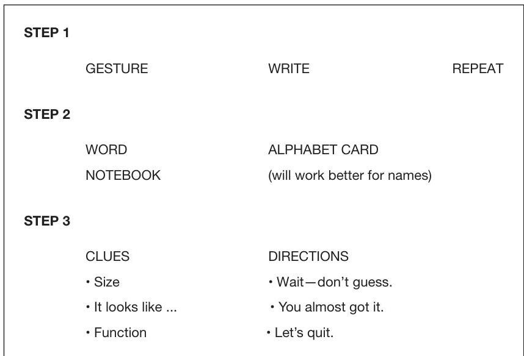

Figure 15.13. Modality instruction card for a generative AAC communicator. (Copyright © 2019 K. L. Garrett, J. P. Lasker, &amp; J. Fischer.)

perspective if his initial communication attempts were unsuccessful. Following training, Marvin greatly reduced the amount of effort he spent on resolving communication breakdowns because he became a conscious and strategic multimodal communicator.

### Challenges to Multimodal AAC Use

Although many generative AAC communicators accept AAC options to support effective communication, some do not use their AAC systems effectively, for the following reasons: 1) the vocabulary and content of the AAC materials provided do not match specific opportunities in real-life communication situations; 2) important communication partners are not willing to accept AAC; 3) AAC technology may be too large and unwieldy, or too small to be appropriate for the vision capabilities of the individual; 4) the individual's social networks may have become so limited that the individual has few opportunities to communicate (Blackstone & Hunt Berg, 2003); and 5) teaching and training in naturalistic situations did not occur, even though research suggests that people with aphasia benefit from specific training on how to use multiple modalities for communication (Purdy & Van Dyke, 2014; Wallace, Purdy, et al. 2014).

However, as indicated earlier, the great challenge for many communicators may not be technologic; rather, it is thinking to use AAC to support residual communication abilities in dynamic communication contexts (Garrett & Kimelman, 2000; Kraat, 1990; Nicholas et al. 2011). The following case illustrates a progression from skill-based instruction to integrated, multimodal use of high- and low-tech AAC in real life situations.

Norman was a retired airport manager with moderate expressive aphasia, apraxia of speech, and good comprehension, who learned to use portable dynamic display AAC technology in combination with residual speech, partial word writing, and gestural communication (Fried-Oken et al. 2002). Norman lived independently, drove a truck, and maintained his own home. He was seen at a university clinic for an AAC evaluation 7 years after experiencing a stroke. At that time, he was already using a multimodal communication system consisting of residual speech, a small communication book, a notepad for word and letter writing, and various remnants. However, he required speech output dynamic display technology to participate more fully in all aspects of his life. Norman participated in several months of therapy to program his AAC technology with appropriate messages so that he could socialize and conduct business in the community. Many messages were stored as an entire phrase or sentence on multiple levels, but Norman also demonstrated the ability to spell out single words for messages using the keyboard level. He often typed in the first letter of words to augment his speech attempt, to help the communication partner guess the word, or to access a number of pictured word-prediction choices. (For example, he began to type the word “manager” by selecting the letter “M” and then “A.” Across the top row of the display, several symbols and pictures appeared for words beginning with M-A, including a picture symbol of manager with accompanying text.) He also learned to integrate unaided communication modalities with AAC access. During role plays that gradually increased in difficulty, he learned to repair communication breakdowns by rephrasing, locating additional messages on his technology, writing, or using conversational control messages such as “You're way off.” At last report, he was using his system independently in the community on a daily basis whenever he believed it would enhance his communication effectiveness.

Intervention Strategies for Generative AAC Writers

Although writing may not be the first communication function that people with aphasia wish to target following a stroke, it can become an important focus for those individuals who previously wrote extensively to communicate with others or to convey specific information at work. Some individuals with mild aphasia write for the first time to tell of their recovery from a devastating illness. Because many of the symptoms of aphasia are manifested in the written modality as well as in speaking and understanding, writers with aphasia are frequently frustrated by difficulties with word retrieval, spelling, and syntactic formulation. We have assisted individuals with aphasia to use prediction software that was built into their high-tech AAC systems or word-processing applications to generate written notes. Sohlberg, Fickas, Ehlhardt, and Todis (2005) have incorporated prediction, choices, and prefabricated sentences into a simplified e-mail program for generative AAC writers who cannot manage the processing demands of a regular e-mail interface (see description in the section on specific-need AAC communicators that follows). Jackson-Waite et al. (2003) incorporated text-to-speech AAC technology into intervention as a practice tool to improve written spelling by a client with jargon aphasia.

People with very severe aphasia, however, cannot write independently. Their linguistic impairments prevent them from meeting the composition, semantic, syntactic, and spelling demands of independent writing. To address the specific need of writing personal letters, some individuals with severe aphasia and agraphia have used a low-tech approach that is addressed in the next section.

## SPECIFIC-NEED AAC COMMUNICATORS

Some communicators may not wish, and do not need, to use aided AAC as a primary communication method to meet their specific communication needs. For them, speech and gestures may be adequate, and indeed optimal, for most social situations. However, some communication situations require high degrees of specificity, clarity, or efficiency. For example, an individual with aphasia might want to communicate on the telephone, place bets at the racetrack, pick up a prescription, write a personal letter, organize ideas to manage a meeting, or give a toast at a wedding. People with almost any type of aphasia (e.g. Broca's, transcortical motor, transcortical sensory, anomic) can have well-defined, specific communication needs related to either speaking or writing. Individuals who live in settings that require some independence generally need this type of AAC technique on an intermittent basis. Clinicians can ask the fundamental question, “Is there anything in your life that you would like to participate in more fully?” to identify these individuals and their desired participation contexts.

### Intervention Strategies

AAC interventions for specific-need AAC communicators are usually limited in scope because these individuals can often manage much of their communication through gestures or speech. When planning an intervention, it is first necessary to analyze the requirements of the specific communication task and the person's capabilities for managing that task. For example, an individual may need help setting up a system to allow spoken communication over the telephone. This might be managed by placing digitized AAC technology by the telephone, preprogrammed

AAC Supports for Adults with Severe Aphasia and/or Apraxia of Speech

Date

We need to buy:

# FOOD

# Basic Foods

Bread

Cheese

Margarine

Ketchup

Mustard

Mayonnaise

Salt

Pepper

Lettuce

Potatoes

Rice

Macaroni

Spaghetti

Sauce

Noodles

Mushrooms

# Meats

Hamburger

Chicken breast

Bacon

Tuna

Rib eye

Delmonico steak

# DRINKS

Milk

Coffee

Tea

Juice

Orange

Grapefruit

Pop

- Pepsi

Coke

7Up

# CLEANING SUPPLIES

Bath soap

Soft soap

Toilet paper

Ajax

Bleach

Scouring pads

Paper towels

# COSMETICS

Shampoo

Deodorant

Band-Aids

Shaving cream

Razors

Figure 15.14. Sample grocery list. (Copyright © 2019 K. L. Garrett, J. P. Lasker, &amp; J. Fischer.)

with a message such as HI—THIS IS SERENA. PLEASE ASK ME QUESTIONS THAT CAN BE ANSWERED YES OR NO. SPEAK SLOWLY AND CLEARLY. Another common need is to communicate specific messages in places such as a noisy cafeteria or bank. Often, a small communication card can be prepared with a restricted set of the messages that are needed in the situation. Another example of a specific need was expressed by one woman with mild expressive aphasia but severe agraphia. She was frustrated by her inability to recall the items she needed to purchase after arriving at the grocery store. Because she could not easily write items she needed on a list before shopping, she had to rely on her memory and frequently forgot important items. A grocery list (Figure 15.14) was created for her so she could simply circle items instead of writing them. Another individual used speech in most situations but was unable to order items by telephone because of frequent semantic and phonemic paraphasias that interfered with saying the names of numbers. A list of numbers, 0 through 100, was printed for him. The number words (e.g., forty) were written next to the number, which successfully cued him to state a transportation pickup time or his address correctly over the telephone.

Letter-Writing Formats People with severe agraphia who wish to write letters may benefit from a scaffolded letter-writing format. In this augmented writing approach, individuals who have difficulty writing a letter without assistance can choose phrases from a list and copy them into the partially completed sentences on a letter format (Figures 15.15 and 15.16). One woman known to the authors wrote

AAC Interventions for Individuals with Acquired Disabilities

1. 201

Dear 2.

3. 1 How 4.

I am 5. . This month we

6. . We really

7.

So, tell me about 8.

I hope you are 9.

Please 10.

11.

Figure 15.15. Blank letter format. (Copyright © 2019 K. L. Garrett, J. P. Lasker, &amp; J. Fischer.)

50 letters in a 2-week period after initial instruction with the letter format. Other individuals have progressed from this partner-supported approach to independent letter generation with additional intervention. The use of scaffolded formats has also been useful in helping people with aphasia write e-mail messages and participate on social media platforms. For example, CogLink (available at http://www.coglink.com/),

|  1. | Jan | Feb | March | April | May | June | July | Aug | Sept | Oct | Nov | Dec  |
| --- | --- | --- | --- | --- | --- | --- | --- | --- | --- | --- | --- | --- |
|   | 1 | 2 | 3 | 4 | 5 | 6 | 7 | 8 | 9 | 10 | 11 | 12  |
|   | 17 | 18 | 19 | 20 | 21 | 22 | 23 | 24 | 25 | 26 | 27 | 28  |

2. (write in names of possible letter recipients here)
3. Hello! Hi! Howdy! Greetings!
4. ... are you? ... is it going? ... is your family?
5. fine OK pretty good terrific a little tired
6. stayed at home visited the family worked around the yard vacationed in had the grandkids for a week
7. had a great time enjoyed ourselves were glad for Fall
8. your vacation your family school your job your friends
9. fine keeping busy taking it easy enjoying your grandkids
10. write soon call me sometime come visit take care
11. Sincerely, Fondly, With best wishes, Love,

Figure 15.16. Multiple choice letter format. (Copyright © 2019 K. L. Garrett, J. P. Lasker, &amp; J. Fischer.)

is an e-mail program designed specifically for people with cognitive and language impairments. It provides support in the form of letter templates, picture association to select e-mail recipients, a spell checker, word choices, and a simplified visual format (Sohlberg et al. 2005). The program can be used independently, or an assistant can input letter templates and vocabulary banks in advance. Marshall et al. (2018) and Behrns et al. (2009) describe other technical interventions for writers with aphasia. Other illustrations of how AAC can increase the participation of individuals with aphasia in important life activities include successfully completing and mailing of a letter, generating a life story, or sending an e-mail message to a friend or family member.

The specific-need AAC communicator may also benefit from situational communication instruction similar to that described for other types of AAC communicators. If, for example, the person with aphasia needs to use a simple speech-output technology for telephone communication, he or she may benefit from multiple opportunities to role play the situation. If the specific-need AAC communicator is using a letter-writing format, it may be important to draft a few letters in a therapy session so that the clinician can provide some initial cues before the individual completes the activity independently. The textbox provides a few examples of possible goals for specific-need AAC communicators; specific strategies are limited only by the needs of the communicators and the creativity of the AAC team.

Specific-Need Communicator Intervention Goals and Strategies

Communicator strategies (examples)Utilize single-message (digitized speech) AAC devices to communicate information by telephone or in community situations (e.g. “I have aphasia—give me time to communicate”) or to participate in rituals (e.g. prayers).Present phrase cards to communicate specific needs in specific situations (e.g. to place bets at the race track, explain an upcoming bus stop, place bridge bets, ask grandchildren about school and sports, request a specific hairstyle at the salon).

(Copyright © 2019 K. L. Garrett, J. P. Lasker, & J. Fischer.)

Partners of specific-need AAC communicators can contribute significantly by identifying situations at home or in the community that require highly precise communication on the part of the person with aphasia. Their continued participation in the message inventory process and role-playing activities is also very beneficial (see below).

Communication Partner Roles for Stored-Message, Generative, and Specific-Need Communicators

Partner strategiesSelect and confirm topics to be stored in notebooks and AAC devices.Create specific messages and assist with programming messages into books and AAC devices.Practice communication with individuals with aphasia who access stored messages.

AAC Interventions for Individuals with Acquired Disabilities

- Co-construct messages with individuals with aphasia who access letters, words, or symbols in partial messages.
- Confirm what they understand and ask for clarification on what is unclear.
- Support people with aphasia to communicate in meaningful communication contexts by providing opportunities in conversations with multiple people.
- Assist in learning, maintaining, and updating AAC devices and everyday technology tools.

(Copyright © 2019 K. L. Garrett, J. P. Lasker, &amp; J. Fischer.)

# Case Examples and Outcomes

The following case studies illustrate the use of AAC with specific-need AAC communicators.

Elizabeth, a 55-year-old woman with moderate-to-severe Broca's aphasia and apraxia of speech, participated independently in most activities 10 years after experiencing a stroke. Her use of telegraphic speech, gestures, and partially spelled words helped her manage most interactions. Elizabeth also relied on a caregiver to speak for her at times. She had seen her social network dwindle in the 10 years since her stroke, but she indicated she had always been a bit of a loner. However, she was frustrated by her inability to contact the local transportation system for people with disabilities when her caregiver was not available, particularly on weekends. Her complex AAC technology was mounted on her power wheelchair. She worked with the speech-language pathologist to devise a display that allowed her to convey her desired pickup times, destinations, and return times to the transportation operator by speakerphone (see Figure 15.17). These transactions were predictable in terms of their message sequence, so Elizabeth could efficiently access messages when they were arranged in a corresponding visual sequence on her display.

|  THIS IS KATHY GARRETT. | I NEED A PICKUP AT: | I'D LIKE TO SCHEDULE THE PICKUP FOR: | I WANT TO SCHEDULE A RETURN TRIP FOR: | I AM GOING BACK TO MY APARTMENT.  |
| --- | --- | --- | --- | --- |
|  MY ACCESS CODE IS 5 - 1 - 2 - 5 | MY APARTMENT AT 111 HAM AVENUE | 9:00 A.M. | 1:00 P.M. | I AM GOING SOMEWHERE ELSE. ASK ME TO TELL YOU WHERE.  |
|  I AM USING THIS MACHINE TO TALK. | DR. MCHENRY'S OFFICE, 444 BROCA'S PLACE. | 10:00 A.M. | 2:00 P.M. | DO YOU HAVE ANOTHER TIME SLOT AVAILABLE?  |
|  PLEASE ASK ME TO REPEAT IF YOU DON'T UNDERSTAND ME. | GIANT BIRD GROCERY STORE AT SQUIRREL ST. | 11:00 A.M. | 3:00 P.M. | THAT'S NOT CORRECT. LET'S TRY AGAIN.  |
|  EXCUSE ME, CAN YOU CHECK? MY RIDE HASN'T SHOWN UP YET. | SPEECH THERAPY AT 1401 FORBES AVENUE. | NOON | 4:00 P.M. | THANK YOU FOR YOUR ASSISTANCE.  |

Figure 15.17. Stored message display for a specific-need AAC communicator to schedule transportation. (Copyright © 2019 K. L. Garrett, J. P. Lasker, &amp; J. Fischer.)

AAC Supports for Adults with Severe Aphasia and/or Apraxia of Speech

She eventually developed the confidence and capability to schedule a ride without assistance.

Susan, a 53-year-old geography professor with aphasia, had been employed by a university for more than 20 years prior to onset of a left hemisphere stroke. One year after the stroke, an evaluation revealed an aphasia quotient of 79.1 on the Western Aphasia Battery-Revised (Kertesz, 2006), which was most consistent with a diagnosis of anomic aphasia. She scored 80 of 100 on the reading subtest and 75 of 100 on the writing subtest. Susan was determined to return to work as a college professor. She communicated in most daily situations using her speech but required AAC support to lecture on specific topics in her classes. Susan obtained speech-output AAC technology through a combination of vocational rehabilitation and university resources. She used her AAC speech-output technology to deliver class lectures that she had typed in advance using software that allowed her to spell whole words or select predicted programs. The software then allowed her to "speak" her lecture sentence by sentence through a speech synthesizer; she also learned to augment these pre-stored messages with her telegraphic speech. Her teaching evaluations have been excellent since she began to utilize this teaching approach to compensate for acquired aphasia. (Lasker, LaPointe, &amp; Kodras, 2005)

# AAC TECHNOLOGIES FOR INDEPENDENT AAC COMMUNICATORS

There are no prescriptive formulas for selecting optimal AAC technology for independent AAC communicators. Some available technologies are specifically designed for people with aphasia. Some technologies are intended to be used as both speech practice systems and as tools to augment communication. A number of AAC technologies and software apps offer features that are potentially useful for people with aphasia, including VSDs, annotated photos, keyboards, and prediction tools. Many individuals with aphasia make good use of off-the-shelf technology, such as smart phones and tablets. Each person with aphasia has a unique profile of capabilities, needs, and preferences, so without conducting an extensive trial of the system it is impossible to determine whether someone can or will use AAC technology.

Decision making regarding AAC for independent AAC communicators is quite different than for partner-supported AAC communicators. Most of the low-tech supports recommended for partner-supported AAC communicators can and should be implemented immediately. The competencies of independent AAC communicators, however, typically evolve over periods ranging from several months to many years. For that reason, we do not generally recommend procurement of complex, high-tech AAC for independent AAC communicators until they have settled into a reasonably consistent living situation or until a support network has been identified. Communicators can learn many skills by borrowing technologies and using them for designated time periods; clinicians can also support these individuals in the relative structure of the clinical environment. It is only when the right combination of ability, support, and opportunity converge that an appropriate system match can be identified. We recommend that the AAC team provide many tangible opportunities for practice and home use of AAC before finalizing a high-tech AAC decision for independent AAC communicators. The following assessment protocol is also highly recommended as an aid in AAC decision making for people with aphasia.

AAC Interventions for Individuals with Acquired Disabilities

# ASSESSMENT

The AAC team needs a clear understanding of the cognitive and linguistic competencies possessed by the communicator with aphasia and required by a specific AAC intervention to achieve optimal improvement in communication (Garrett &amp; Kimelman, 2000). Sensory, motor, representational, and communicative competencies must also be evaluated. In addition, the AAC team also needs systematic methods for evaluating communication needs and participation contexts prior to selecting AAC interventions.

# Identifying Communicator Profiles

Throughout the assessment process, the AAC team seeks to answer the questions in Table 15.5 as part of a complete AAC capabilities assessment for a communicator with aphasia. To provide answers to these questions, clinicians may employ multiple assessment tasks. The individual's performance on these assessment activities can help the AAC team identify which category of communicator best describes the individual with aphasia.

The following AAC aphasia assessment tools, discussed here in logical order of administration, can facilitate AAC decisions by providing opportunities for the AAC team to answer the five basic assessment questions presented in Table 15.5. This process may aid the team to make overall decisions about the nature of the primary AAC intervention based on the category in which the individual best fits at the time of the

Table 15.5. AAC assessment tools and questions for persons with aphasia

|  Tool | Questions  |
| --- | --- |
|  Unaided modalities | Does the person with aphasia use unaided strategies (e.g., residual natural speech, writing, gestures, drawing) to augment or substitute for ineffective spoken messages? If not, can the person be taught to do so?  |
|  Partner-supported techniques | To reestablish a communication exchange, does the person with aphasia benefit from partner-supported communication strategies, such as augmented input and the written-choice conversation strategy? Can the person with aphasia learn to use tangible supports, such as pictures or objects, in predictable conversational routines? If the person with aphasia does not currently use these strategies, can the person be taught to do so?  |
|  External stored information | Does the person with aphasia demonstrate the ability to respond to questions by accessing messages represented by symbols, such as pictures in a communication book, on a simple speech-generating device, or on a letter board? Does the person need cues to do so?  |
|  Stored messages via prepared speech output | Does the person with aphasia utilize pre-stored whole messages, such as those created ahead of time by a facilitator on a speech-output AAC device, to communicate? If not, can the person be taught to do so?  |
|  Generative messages through speech output | Does the person with aphasia generate novel communicative messages bit by bit using letters, photographs, pictures, or symbols in low-tech and high-tech AAC devices? If not, can the person be taught to do so?  |

Copyright © 2019 K. L. Garrett, J. P. Lasker, &amp; J. Fischer.

AAC Supports for Adults with Severe Aphasia and/or Apraxia of Speech

initial assessment, as well as the individual's demonstrated potential to learn additional strategies with teaching and cues.

Garrett and Beukelman's (1992) AAC-Aphasia Categories of Communicators Checklist, revised by Garrett and Lasker in 2005 (available at http://word.emerson.edu/jlasker/past-research), provides clinicians with a checklist of present or emerging communication competencies. This observational checklist is designed to help clinicians match AAC support options with a person's capabilities. The AAC team can document competencies and challenges observed within conversational contexts, during unsupported interactions, and during AAC trials with trained conversational partners. When the majority of communication behaviors appear within a single category (e.g., contextual-choice AAC communicator), it is likely that the person is functioning primarily within that category. It is also important to determine if capabilities in the next category seem to be emerging; therapeutic goals can then be developed to move the individual along the continuum from partner-supported to independent AAC communicator.

## Baseline Modality Assessment

A modified PACE (Promoting Aphasics' Communicative Effectiveness) procedure (Davis &amp; Wilcox, 1985) can be used to elicit a communication exchange between a message sender with aphasia and a receiving communication partner; the AAC team can explore the tendencies of the person with aphasia to use different modalities or whether it appears that the person can be taught to use them. The clinician selects an action picture from a commercially available set of picture cards or any other informal source such as magazines or photographs. Pictures can depict a person completing a simple action (e.g., a woman cutting a cake) or represent a story or scene. Using a barrier task format, the person with aphasia is asked to communicate ideas about the picture to a partner who cannot see the picture. The clinician documents the overall success of the communication (i.e., does the partner eventually understand what is happening in the picture?) and also the methods used by the person with aphasia to communicate. Does the person with aphasia attempt to communicate primarily with speech? When speech is not effective at communicating the message to the partner, does the person with aphasia attempt to use other unaided communication strategies, such as gesture, drawing, or writing? If not, when the clinician cues or models the use of these strategies, can the person with aphasia implement them successfully to convey the information to the partner?

This semistructured exercise allows the clinician to document how the person with aphasia utilizes residual speech abilities, how natural it is for him or her to use strategies other than speech, how well gesture or pantomime is used, and how he or she makes use of retained writing abilities (i.e., using air writing, initial letters, word fragments, alphabet boards).

## Conversational Strategy Trials

The AAC team should also assess expressive and receptive linguistic capabilities in a conversational context, both with and without AAC or contextual supports. This may include a general "getting to know you" conversation. In this portion of evaluation, the clinician selects a personally relevant conversational topic (e.g., past work, hometown memories, a hobby or pastime, family, growing up, courting, getting into trouble in school) and introduces it to the person with aphasia while simultaneously modeling

AAC Interventions for Individuals with Acquired Disabilities

partner-supported communication strategies. In particular, the clinician may wish to explore the following partner-supported conversation strategies: written-choice conversation, augmented input, cued question asking, photo or visual scene referencing, and tagged yes/no responses. These techniques are described in greater detail in previous sections of this chapter. As part of the assessment process, the clinician should record data on the accuracy of the responses. For example, when using written-choice conversation or tagged yes/no responses, the AAC team should confirm accuracy with family members or significant others. In addition, the clinician should document how much prompting (e.g., none, minimal, moderate, maximal) was necessary to teach the strategy to the person with aphasia. Finally, it is important to tally whether a topic or message was communicated successfully to the partner.

## Multimodal Communication Screening Task for Persons with Aphasia

Multimodal Communication Screening Task for Persons with Aphasia (MCST-A; Garrett &amp; Lasker, 2005; Lasker &amp; Garrett, 2006) is an informal assessment tool that reveals how a communicator answers situational questions (i.e., "How would you tell me you went to California in July?") by gesturing, spelling, pointing to locations on a map, or locating pictorial symbols throughout the eight-page booklet used in the screening. It also provides information on the person's ability to categorize and to point referentially when telling a story. The MCST-A stimulus book contains the following pages:

1. Concrete concepts represented with pictures, photos, and words (e.g., eat, lamp)
2. Three categories represented with an incomplete series of visual symbols—the person with aphasia chooses from a row of six additional symbols to complete the categories
3. Graphic symbols representing descriptors (e.g., open, cold)
4. Slightly more abstract concepts that can be combined with other items to represent complex meanings (e.g., grandchildren, money, monthly calendar)
5. Two sets of written words and phrases, one for communicating in a pharmacy and another for conversing with grandchildren
6. A set of photographs representing a story sequence for a storytelling/retelling task
7. An outline map of the United States to represent locations of children's homes or favorite vacations
8. An alphabet board to communicate highly specific names (e.g., towns, restaurants) by spelling or pointing to the first letter

The scoring form documents the accuracy of message transmission via use of the symbols in the stimulus book, as well as the types of cues that the clinician uses to help the communicator achieve communication success.

Research suggests that the MCST-A effectively distinguishes between communicators who require partner support to indicate choices and stored-message AAC communicators who can independently search through the booklet to locate symbols (Lasker &amp; Garrett, 2006). Data on the amount and type of cuing can help determine whether the communicator falls into the category of partner-supported (i.e., consistently requires cues to locate symbols to communicate a message) or independent (i.e., needs no cues or minimal cues to locate symbols to convey a message). It is also relatively easy to identify generative AAC communicators. Clinicians can ask the person with aphasia to communicate a complex message (e.g., "How would you communicate that your grandchildren

AAC Supports for Adults with Severe Aphasia and/or Apraxia of Speech

are going to Disney World next month if they have enough money?”) and then observe if the person can successfully communicate this idea by pointing to a logical sequence of pictures, words, letters, or locations on the map. In addition, observing this diagnostic activity may assist some family members to better understand why a clinician may suggest low-tech instead of high-tech options for an individual with aphasia.

## AAC Trials: Transactional Role Play

To evaluate how effectively a communicator can access stored messages on a speech-output system in an actual communication situation, the AAC team can develop scripted scenarios representing a community transaction and program the communicator's AAC technology with relevant messages. AAC technology with digitized speech for stored messages or synthesized speech output systems (for those people with aphasia who have potential spelling capability) may be used. VSDs may also be used to conduct these scenarios. When selecting a sample conversational scenario, the AAC team should consider such factors as time constraints (how quickly the information must be delivered), information specificity, length and complexity of response, predictability (whether messages can be stored in advance and retrieved), communication functions expressed (social closeness versus basic needs), familiarity (with the conversation content and with the partner), and personal relevance (how important the information is to the individual). For example, a consumer-based transaction in which the communicator orders a cup of coffee from a vendor may be considered an easier conversation than one in which the communicator discusses the nature of his or her disability with a medical practitioner.

After a situation has been scripted, the clinician prepares representative types of speech output AAC technologies. Basing the choices on preliminary estimates, the clinician selects technologies with the most appropriate size and arrangement of messages and number of messages per page. In general, a sequence of four to eight pre-stored messages on AAC technology may be used. Then, the clinician should program necessary vocabulary. For example, a coffee-ordering scenario might be scripted to combine speech, gesture (shown in brackets), and technology use as follows:

|  Clinician (in the role of a coffee vendor): | Hi, how are you today?  |
| --- | --- |
|  Person with aphasia: | Fine/good/okay.  |
|  Clinician: | What can I get you?  |
|  Person with aphasia: | I'D LIKE A CUP OF COFFEE.  |
|  Clinician: Okay. | For here or to go?  |
|  Person with aphasia: | [To go].  |
|  Clinician: | What size?  |
|  Person with aphasia: | MEDIUM.  |
|  Clinician: | How do you take it?  |
|  Person with aphasia: | CREAM AND SUGAR.  |
|  Clinician: | Here you go. That will be $1.25.  |
|  Person with aphasia: | Okay. [hands over money]  |
|  Clinician: | Have a good day.  |
|  Person with aphasia: | [Bye].  |

Each communication attempt during the role play is scored based on response adequacy, mode of response (gesture, speech, AAC), timing, and amount of clinician cuing. Clinicians can use a cuing hierarchy described by Light and Binger (1998) for teaching AAC technology. The clinician first waits and creates an expectation that a message will be generated, points to the individual or the AAC tool, and then models the communication behavior.

## Advanced Systems Trials: Combining Stored and Generative Messages

People with aphasia and limited spoken language may benefit from a generative AAC system if they spontaneously use combinations of two or three symbols on the MCST-A, score highly on reading and writing subtests on standardized tests, or write to convey information during PACE picture description tasks. In this situation, a more demanding role play that requires the communicator to use a combination of generative and stored-message strategies can be implemented. Prior research has demonstrated that people with aphasia identify symbols within an AAC device most readily when fewer symbols per screen are displayed and when minimal navigation is required (Petroi, Koul, & Corwin, 2014). To determine whether a person with aphasia can use multiple displays to accomplish a task, we recommend conducting a trial that requires him or her to navigate displays. In a process similar to the basic trials, the clinician creates a scenario that requires the person with aphasia to demonstrate both message retrieval and message formulation. In addition, the clinician notes whether the person with aphasia can repair communication breakdowns with unaided modalities (gestures, speech, spelling/writing), can combine unaided strategies with aided AAC, and can initiate messages.

For dynamic-display AAC, the clinician may choose to program a situation related to planning a trip, buying a car, or having a “getting to know you” conversation on at least two to three displays of the technology. A trip-planning scenario could be introduced as follows: You are going to plan a vacation trip with a travel agent who will book all of the arrangements. You will use anything you can to communicate with the travel agent. You will need to arrange all of the details—where you are going, how you will get there, where you will stay. For this scenario, the clinician can create a main page with some phrase or sentence messages and links to a second page that contains days of the week, money topics, and preferred vacation activities. After the clinician briefly introduces the AAC technology and available messages, the trials proceed at first without extensive instruction regarding AAC approaches. After the initial trial is completed, the communication behaviors are scored, and then instruction and modeling occurs. Following instruction, the role play is then repeated and scored again. The clinician also should note the degree of cueing required for the person with aphasia to perform various operational functions of the technology, such as attending to several screens of information, locating messages successfully, navigating among pages, changing various output features of the technology, turning the technology on and off, utilizing rate enhancement strategies such as word prediction, and storing new messages.

It is also important to consider the nature of the message retrieval formulation techniques employed by different AAC technologies. Some AAC technologies may offer a combination of spelling, picture symbol message access, and word prediction. Others require communicators to locate and string together symbols or icons

AAC Supports for Adults with Severe Aphasia and/or Apraxia of Speech

to create messages. Symbols and images may be contained in folders, on grids, on hidden levels, or on paper pages. Still other AAC technologies enable people with aphasia to access elements of visual scenes to communicate specific messages (Beukelman et al., 2015; Dietz, McKelvey, &amp; Beukelman, 2006). These choices should be considered in light of the communicator's preferences and ability to retrieve messages in these formats.

## Assessing Other Capabilities

Traditional assessment procedures for aphasia typically identify the cognitive, linguistic, and perceptual abilities of an individual with aphasia.

**Residual Language Capabilities** Often, language testing has been conducted prior to AAC assessment, and selected information from these tools can contribute to the selection of AAC supports. First, a standard aphasia battery such as the Western Aphasia Battery-Revised (Kertesz, 2006), the short form of the Boston Diagnostic Aphasia Exam-Revised (Goodglass, Kaplan, &amp; Barresi, 2000), or the Boston Assessment of Severe Aphasia (Helm-Estabrooks, Ramsberger, Morgan, &amp; Nicholas, 1989) will measure the extent of the receptive and expressive language impairment when no external AAC or partner support is available. Communicators with nonfluent aphasia typically exhibit difficulties with syntactic encoding. Therefore, AAC supports that require using symbol combinations to communicate a single message may frustrate these individuals. Even spelling is a type of encoding that requires sequential selection and sequencing of arbitrary symbols to represent sounds and meanings. Because successful spelling requires many repetitions of this procedure, it is often extremely difficult for people with aphasia. Therefore, providing people with aphasia with a typewriter or computer keyboard may be frustrating. People with aphasia may benefit when clinicians consider how the language demands imposed by particular AAC approaches mesh with the capabilities of communicators (Garrett &amp; Kimelman, 2000; Lasker, 2008).

**Cognition** There are numerous factors (both intrinsic and extrinsic), including the individual's cognition, that should be used to determine which AAC supports will work best for which individuals and in which situations. Some researchers in the field of aphasia have offered ideas of how to analyze cognitive capabilities of people with aphasia who use AAC. The Cognitive Linguistic Quick Test Plus (Helm-Estabrooks, 2017) contains several subtests that assess attention, memory, and reasoning without taxing linguistic ability. Helm-Estabrooks (2002) suggested that several nonverbal reasoning tasks (e.g., trail making) may be useful in identifying individuals with cognitive ability to use high-tech, symbol-based AAC. Other research has explored how attention, cognitive flexibility, and executive function may play a role in the use of high-tech devices by people with aphasia (Helm-Estabrooks, 2002; Nicholas &amp; Connor, 2017; Nicholas, Sinotte, &amp; Helm-Estabrooks, 2005; Purdy &amp; Koch, 2006). Ultimately, more research is needed to correlate specific cognitive abilities with the ability of individuals who rely on AAC.

Arranging messages in AAC systems with multiple displays (in low-tech and high-tech devices) may impose significant processing challenges for many people with aphasia who demonstrate problems recalling the location of stored messages and symbols. They must demonstrate sufficient working memory to complete the

AAC Interventions for Individuals with Acquired Disabilities

steps involved in accessing the messages before forgetting their intent or losing their partner's interest. Some people are more independent with low-technology AAC if they have difficulty navigating through the hidden pages of high-technology AAC because messages stored within a simple paper binder or on a single display may be more readily visible and accessible. Wallace and Hux (2013) explored the effect of two different high-tech layouts for navigation—one with multiple displays and static home page and back buttons compared with a navigation ring layout, which included a central photo surrounded by smaller thumbnail photos that could be used to navigate to other displays. The researcher asked people with aphasia to access target sentences on each AAC device. Although participants learned to use both interfaces to navigate the devices, they demonstrated improved efficiency of access and accuracy of learning when provided with a navigation ring.

Individuals with aphasia should also be observed to determine their awareness of their own communicative ability. Are they able to explain their novel communication strategies to unfamiliar partners? Do they know when their language is not adequate for a particular situation? Can they use their strategies in a dynamic manner, for example, using speech and writing when able to do so and then shifting to an AAC support when they experience communication breakdowns? In addition, the clinician should informally observe the individual's initiative and tenacity to convey a message to a partner despite frequent communication breakdowns. Marvin, described earlier in this chapter, initially spent almost half of his communication efforts on resolving breakdowns. However, after he was instructed to shift to a different strategy (e.g., rewording, locating information in his communication notebook) instead of simply repeating the words over and over, the percentage of communication turns used to resolve communication breakdowns decreased from 46% to 11% (Garrett et al., 1989).

Representational Capabilities People with aphasia often understand many of the visual images that are used to represent the world. For example, they recognize various icons of geography, such as maps, and icons of events, such as logos and signs. They also usually retain the ability to identify photographs and drawings that relate to people and places. Many people with aphasia retain knowledge about the relative relationships of size, shape, goodness, and importance among objects and experiences. For example, an individual with aphasia may refer to another adult by gesturing to indicate his or her taller height as compared with a child. However, these abilities should be probed. Asking an individual to tell about his or her family or childhood during a reminiscing conversation in which a scrapbook is used will allow the clinician to informally observe these abilities.

Motor Capabilities Individuals with aphasia following a stroke usually retain the ability to control their limbs on at least one side of the body (usually the left). Therefore, they can typically gesture, turn pages, or point to communication choices in a direct selection mode. However, they may experience difficulties when asked to complete a complex sequence of motor movements (e.g., locating words on multiple pages of a book or multiple levels of an electronic communication technology) because of limb apraxia or cognitive deficits. They may also experience some difficulty physically carrying or manipulating heavy AAC technology, walking (often with a cane or other assistance) and standing while also communicating or using the on/off buttons of those technologies. Consultation with an occupational or physical therapist may be appropriate when deciding on portable AAC technology.

Hearing and Vision

Standard hearing and vision screening procedures can be used to identify sensory impairments (either the communicator's or the partner's) that may interfere with successful communication. Given the average age of people with aphasia and some of their family members, hearing and vision impairments are a risk to effective communication.

### Operational Skills

If they use AAC to augment their communication, communicators may have to learn new operational skills such as turning the technology on and off, comprehending synthesized or digitized speech, locating messages stored on invisible levels, using flowchart operational menus, keyboarding, and charging the equipment.

### Life Experiences and Vocabulary

The experiences and life history of an individual are particularly relevant as clinicians co-construct AAC interventions with them. Most individuals with aphasia have lived for a considerable period of time and have experienced relatively typical, routine lifestyles, so their knowledge about the world is extensive. To gather fuel for upcoming AAC interactions, it may be helpful to informally assess interests, topics, and autobiographical information through interviews with family members prior to beginning an AAC intervention.

### Partner Skills

Because communication partners are so important in communication interactions with people who have severe aphasia, it is useful to assess their capabilities as well. Hinckley et al. (2013) describe steps and measures used to select people for communication partner training. This assessment about the communication skills of partners is obtained from conducting a semistructured interview and observing their interactions with the individual with aphasia. It is also important to determine if the partner is able to learn or is interested in learning new ways of communicating with the person with severe aphasia. The clinician can also evaluate the potential communication partner's speaking style and understandability, handwriting legibility, reading skills, hearing, and vision. Simmons-Mackie et al. (2016) conducted a systematic review of communication partner training related to people who interact with individuals with aphasia. They found that positive changes in skill levels resulted from partner training, which improved the level of participation in communication activities as well as the quality of communicative interactions for people with aphasia. Examples of skills that may be included in communication partner training include the use of techniques described earlier in this chapter (e.g. augmented input, written-choice conversation strategy). See Hinckley et al. (2013) and Figure 15.8 for specific suggestions for how to incorporate communication partner training into an intervention plan in various health care settings and with a variety of communication partners.

## Assessing Communication Needs and Participation in Real-Life Contexts

Guidelines for developing the content of AAC systems generally start with a discussion of the individual's needs, by which we mean the environments and activities in which the person wishes to participate, as well as the specific messages required to communicate in those contexts. Families and friends of people with severe aphasia often play a vital role in identifying these communication needs. For clinicians who are conducting an assessment with an individual who has severe aphasia, the following procedures may be helpful.

Needs Assessment Interview

First, during an initial interview to assess an individual's needs, the clinician can simply ask the communicator, the communicator's family, and significant others to list communication situations that are particularly challenging or difficult for the individual with aphasia. Next, the clinician should ask the interviewees to imagine situations in which they foresee opportunities for meaningful communication. Initially, families may often list situations in which physical needs are communicated (e.g. seeing the doctor, getting dressed). Additional urging to think of situations in which the individual had an important life role prior to stroke may be necessary; providing the family with examples such as betting at the racetrack, saying the dinner prayer at Thanksgiving, attending sports events of grandchildren, and having coffee with a friend also may be helpful. The Aphasia Needs Assessment (Garrett & Lasker, 2004; available at http://word.emerson.edu/jlasker/past-research) may also assist clinicians to obtain some of this information in a systematic manner. For communicators who cannot use their speech to answer these questions without supports, the written-choice conversation strategy described previously may be useful. Providing the communicator with written word choices (representing situations) and scales for rating the relative importance of the activity can provide a window onto the communicator's perceptions of important communication needs.

Fox, Ginley, and Poulsen (2004) described how real-life communication needs were elicited from a group of people with aphasia and their significant others who attended a weeklong communication camp experience. She asked these individuals to describe communication situations that had specifically challenged them and to share strategies that had been particularly effective in those situations. For example, one man told about the difficulties he encountered when trying to order menu items in a fast-food restaurant. He developed an ingenious strategy—shining a red light from a laser pointer on the menu items posted behind the counter—to communicate his food order. Fox and colleagues encouraged participants to develop and incorporate strategies such as the laser pointing technique in their own communication strategy toolkit. This “toolkit” suggestion is an excellent example of how clinicians can assist communicators with aphasia to identify potential solutions to important communication needs in a variety of life situations.

### Topic Sorting

Fox, Sohlberg, and Fried-Oken (2001) encouraged research participants with aphasia to sort topics into preferred and nonpreferred categories prior to engaging in conversational training. They learned that one individual, of the three that participated in their study, communicated much more extensively about topics that he had selected than those that had been chosen for him. This topic-sorting task may be a useful means of identifying important topics and situations, particularly for individuals who cannot express them with their speech (Murphy & Boa, 2012).

### Social Networks

In addition to communication topics and situations, it can be helpful to identify specific communication partners with whom the individual wishes to communicate. With one client, we used the assessment tool known as Social Networks: A Communication Inventory for Individuals with Complex Communication Needs and Their Communication Partners (Blackstone & Hunt Berg, 2003). This tool diagrams the social network of the communicator by using a series of concentric circles to denote level of involvement. For example, the individual communicator is at the center of the circles, those who are identified as life partners are included in the

AAC Supports for Adults with Severe Aphasia and/or Apraxia of Speech

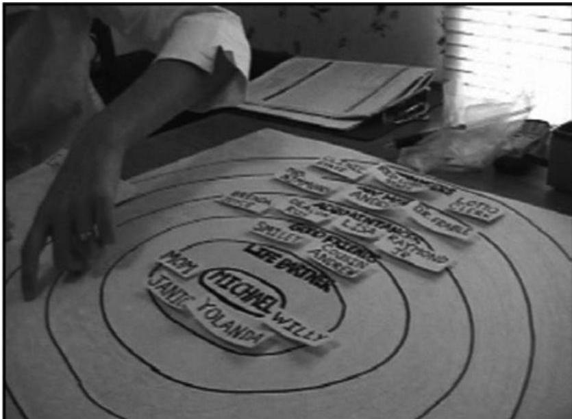

Figure 15.18. Chart showing circles of communication partners as part of the Social Networks Inventory (Blackstone &amp; Hunt Berg, 2003) to assess a client with aphasia. (Copyright © 2019 K. L. Garrett, J. P. Lasker, &amp; J. Fischer.)

first circle, those identified as close friends are in the second circle, and so forth. The authors of this chapter have modified the tool by creating a large visual diagram to interview communicators about their social networks before and after onset of aphasia (see Figure 15.18). We also use partner-supported communication strategies and photos to facilitate the individual's participation in the interview. Communication partners and social networks from before the onset of aphasia were compared with currently available partners. Intervention goals were then designed to improve interactions with the partners who were currently most important to the communicator.

Peer Participation Patterns If it is not possible to conduct a face-to-face interview to identify social networks and communication needs, clinicians can indirectly estimate communication needs by assessing peer participation patterns. Peers can be individuals of the same age or culture as the person with aphasia or can be individuals who have similar interests. For example, if a person with aphasia used to socialize at a veterans' club in town, the clinician could observe or ask others about the types of messages or communication needs that would arise in that situation. It may be helpful to ask the communicator to envision the sequence of communication events within each of these situations so that a comprehensive message inventory also can be created.

# INTERVENTION ISSUES

People with aphasia need varying levels of communication support during their recovery to meet their communication needs and participate in desired life activities. This chapter described types of AAC and partner supports that may be helpful across a continuum of communicators with severe aphasia and apraxia of speech. Even when clinicians successfully match strategies to a person's cognitive-linguistic

capabilities and needs, there are a number of additional issues that may need to be considered.

To promote acceptance of AAC support, clinicians may find it helpful to acknowledge communicators' and partners' hesitations about communicating using these somewhat unusual alternative modalities. Many of the spouses of communicators in the authors' clinics have gradually accepted some level of AAC after several months of simultaneously working on recovery of speech and gradually incorporating AAC into intervention. Group therapy is another positive means of illustrating how AAC and unaided communication modalities can blend. Watching other, more experienced participants converse about old movies or introduce themselves in a simulated social club may be more convincing than academic explanations about the benefits of AAC.

It is also essential that the content of an AAC system and the types of AAC support that are available remain dynamic during the chronic stage and throughout the course of the person's recovery, and that he or she receives training when necessary. As changes occur in the situations and contexts of an individual's life, the AAC system must reflect these changes; otherwise, motivation and interest in using the system will quickly diminish. Continual modification of the content of an AAC system requires that one or more communication partners, usually family members or caregivers, be trained to monitor and adjust the AAC system. Communication partners must also be able to train new people who enter the life of the person with aphasia (e.g. a new son- or daughter-in-law or a new neighbor) so that they, too, can become effective communication partners. Failure to identify and adequately prepare communication partners is a common reason for unsuccessful AAC intervention among people with severe aphasia.

Incorporating AAC use into everyday life can be challenging for individuals with aphasia and their communication partners. As one family member comments, “The most difficult thing for us is actually thinking of when to use the [AAC system]—including it in our daily routines.” (wife of a communicator with aphasia, personal communication, October 25, 2004)

Other issues may impact the success of AAC intervention for individuals with aphasia. They include factors related to the person with aphasia (i.e. capabilities, attitudes), features of the environment in which the person communicates (i.e. partner's attitudes and skills, limited communication opportunities, lack of real life practice), and aspects of AAC technology itself (i.e. inappropriate matches of system features to capabilities; Garrett & Kimelman, 2000; Purdy & Dietz, 2010; Scherer, Sax, Vanbiervliet, Cushman, & Scherer, 2005; Taylor, Wallace, & Wallace, 2019).

The following interaction with the spouse of a contextual-choice AAC communicator reflects some of the barriers that family members may initially project when implementing AAC options at home.

Clinician:So how has it been going at home? Spouse:Oh, it's much easier to communicate with Ken now. He really seems to know what's going on. Clinician:Are you and your sons comfortable with talking more slowly, making sure he understands? Can he clearly tell you “yes” and “no”? Spouse:Yes, although sometimes he laughs if we go too slowly . . . he'll even make fun of us. But we're doing well there. He really thinks about how

he's nodding his head. And he points to what he wants now . . . that really helps.Clinician:Have you been able to talk about more complicated topics? Like what to get the kids for the holidays . . . or opinions on what's happening in the news?Spouse:No, not really . . . mostly we just talk about what he needs and wants.Clinician:Have you tried to use the written-choice technique we practiced?Spouse:No, not much. We need to work harder on that.

Clearly, the success of an AAC intervention depends on flexibility and continuity of service delivery as the individual with aphasia transitions from setting to setting. Professionals, family members, and people with aphasia may wish to work as a team to create better solutions for management of long-term aphasia. Options could include increasing the emphasis on training partners to use immediate communication supports early in the individual's recovery, with more intensive involvement of the speech-language pathologist later in the rehabilitation process. It may be useful to schedule clients with aphasia for routine follow-up visits each year. Some people with aphasia may benefit from weekly group therapy sessions rather than individual intervention sessions only. Still others may benefit from home visits by the speech-language pathologist as well as other health care professionals because some communication challenges may be visible only in the individual's home environment. With careful planning and extended clinical support, AAC interventions can enrich the communication options for individuals and their communication partners at all stages of adjustment to life with aphasia. Therefore, it is important to provide ongoing monitoring of their communication effectiveness to accommodate change in their communication needs and capabilities.

## CONCLUSIONS

Aphasia is an impairment of the ability to interpret and formulate language that can cause communication breakdowns. These breakdowns can affect how a person with aphasia participates in desired life activities. Individuals with apraxia of speech may also experience limitations when communicating with other people. An AAC intervention approach includes supports that ensure each person with aphasia and/or apraxia has a means of communicating at all stages of recovery and in all environments. AAC supports include multiple modalities as well as strategies that may be described as high-, low- or no-technology. AAC strategies serve many functions. They can be used to enhance auditory comprehension and reading comprehension, augment the expression of spoken and written language, and function as additional modalities and sources of context during communication exchanges. An AAC intervention approach also includes communication partner training. This training facilitates effective and efficient communication exchanges between the person with aphasia and his or her partners. While some people with severe aphasia are dependent on communication partners for some aspects of communication interactions, others learn to augment natural modes of communication with AAC supports to become independent communicators. Recommendations for partner-supported AAC strategies can be implemented immediately. A multimodal AAC system will take time to develop based on the individual's communication needs. People with aphasia benefit from an AAC intervention approach that includes communication support during all

phases of their recovery. This chapter described types of AAC and partner supports that may be helpful across a continuum of communicators with severe aphasia and/or apraxia of speech.

## QUESTIONS

15.1. List five general functions of AAC (low-tech and high-tech) for people with aphasia or apraxia of speech.

15.2. Describe at least two characteristics of each of the six AAC-Aphasia Communicator Categories and state where they fall on the “continuum of support.”

15.3. What fundamental communication capabilities would you work on with an emerging AAC communicator? List two communication contexts, or interactive scenarios, that you would develop to support teaching these strategies.

15.4. Describe two strategies to use augmented input to enhance comprehension for people with severe aphasia.

15.5. How would you design an intervention program to teach communication partners how to alter their communication style to converse with a person who is a contextual-choice AAC communicator?

15.6. What is the primary communication capability that transitional AAC communicators would benefit from learning? Describe one teaching activity in which you might facilitate its development.

15.7. How do stored-message and generative AAC communicators differ? How would this difference influence your selection of a low-tech or high-tech communication strategy?

15.8. How would you select messages and vocabulary for an independent AAC communicator's AAC system?

15.9. Describe one teaching activity in which you would facilitate an independent AAC communicator's competent use of both AAC and natural speech communication in a real life context.

15.10. Describe one low-tech activity you could use to support functional writing for an independent AAC communicator with significant language formulation difficulties.

15.11. Describe some high-tech approaches that can be used for scaffolding the generative writing of a person with aphasia who has moderate difficulty with spelling errors, word selection, use of pronouns, omission of verbs of being, and morphologic errors.

15.12. List some examples of specific-need AAC communicators' AAC supports.

15.13. Describe how you would assess the capabilities of an individual with aphasia who cannot meet all of his or her communication needs through spoken communication.

15.14. Describe at least two types of interviewing activities that you might use to identify the communication needs and changes in participation patterns of an individual with severe aphasia.

15.15. Consider the “Intervention Issues” section of this chapter. Identify an intervention strategy or approach to address one potential barrier encountered by communicators with aphasia who may benefit from AAC.

AAC Supports for Adults with Severe Aphasia and/or Apraxia of Speech

# REFERENCES

Behrns, I., Hartelius, L., &amp; Wengelin, A. (2009). Aphasia and computerized writing aid supported treatment. *Aphasiology*, 23, 1276–1294. doi:10.1080/02687030802436892
Beukelman, D., Hux, K., Dietz, A., McKelvey, M., &amp; Weissling, K. (2015). Using visual scene displays as communication support options for people with chronic, severe aphasia: A summary of AAC research and future research directions. *Augmentative and Alternative Communication*, 31, 234–245. doi:10.3109/07434618.2015.1052152
Beukelman, D., Yorkston, K., &amp; Dowden, P. (1985). *Communication augmentation: A casebook of clinical management*. Austin, TX: Pro-Ed.
Blackstone, S., &amp; Hunt Berg, M. (2003). *Social networks: A communication inventory for individuals with complex communication needs and their communication partners*. Monterey, CA: Augmentative Communication.
Brandenburg, C., Worrall, L., Copland, D., &amp; Rodriguez, A. D. (2017). Barriers and facilitators to using the CommFit™ smart phone app to measure talk time for people with aphasia. *Aphasiology*, 31, 901–927. doi:10.1080/02687038.2016.1219016
Brock, K., Koul, R., Corwin, M., &amp; Schlosser, R. (2017). A comparison of visual scene and grid displays for people with chronic aphasia: A pilot study to improve communication using AAC. *Aphasiology*, 31, 1282–1306. doi:10.1080/02687038.2016.1274874
Brown, J. A., Wallace, S., Knollman-Porter, K., &amp; Hux, K. (2019). Comprehension of single versus combined modality information by people with aphasia. *American Journal of Speech-Language Pathology*, 28, 278–292. doi:10.1044/2018_AJSLP-17-0132
Cherney, L., Babbitt, E., Kim, K.-Y., Hurwitz, R., Ngampatipatgong, N., &amp; van Vuuren, S. (2011). *Aphasia treatment over the internet: A randomized placebo-controlled clinical trial*. Presented at the Clinical Aphasiology Conference, Fort Lauderdale, FL.
Cherney, L., Kaye, R., &amp; van Vuuren, S. (2014). Acquisition and maintenance of scripts in aphasia: A comparison of two cuing conditions. *American Journal of Speech-Language Pathology*, 23, S343–S360. doi:10.1044/2014_AJSLP-13-0097
Christensen, S., &amp; Wright, H. (2010). Verbal and non-verbal working memory in aphasia: What three $n$-back tasks reveal. *Aphasiology*, 24, 752–762. doi:10.1080/02687030903437690
CogLink. (2005). *Life technologies*. Available at www.coglink.com.

Collins, M. (1986). *Diagnosis and treatment of global aphasia*. San Diego, CA: College-Hill Press.
Davis, G., &amp; Wilcox, M. (1985). *Adult aphasia rehabilitation: Applied pragmatics*. San Diego, CA: Singular.
Dietz, A., Hux, K., McKelvey, M. L., Beukelman, D., &amp; Weissling, K. (2009). Reading comprehension by people with chronic aphasia: A comparison of three levels of visuographic contextual support. *Aphasiology*, 23, 1053–1064. doi:10.1080/02687030802635832
Dietz, A., Knollman-Porter, K., Hux, K., Toth, K., &amp; Brown, B. (2014). Supported reading comprehension for people with aphasia: Visual and linguistic supports. *Journal of Medical Speech-Language Pathology*, 21, 319–331.
Dietz, A., McKelvey, M., &amp; Beukelman, D. (2006). Visual scene displays (VSD): New AAC interfaces for persons with aphasia. *Perspectives on Augmentative and Alternative Communication*, 15, 13–17. doi:10.1044/aac15.1.13
Dietz, A., Vannest, J., Maloney, T., Altaye, M., Holland, S., &amp; Szaflarski, J. (2018). The feasibility of improving discourse in people with aphasia through AAC: Clinical and functional MRI correlates. *Aphasiology*, 32, 693–719. doi:10.1080/02687038.2018.1447641
Dietz, A., Weissling, K., Griffith, J., McKelvey, M., &amp; Macke, D. (2014). The impact of interface design during an initial high-technology AAC experience: A collective case study of people with aphasia. *Augmentative and Alternative Communication*, 30, 314–328. doi:10.3109/07434618.2014.966207
Duffy, J. (2013). *Motor speech disorders: Substrates, differential diagnosis, and management* (3rd ed.). St. Louis, MO: Elsevier Mosby.
Ellis, C., Dismuke, C., &amp; Edwards, K. (2010). Longitudinal trends in aphasia in the United States. *Neurorehabilitation*, 27, 327–333. doi:10.3233/NRE-2010-0616
Flowers, H., Skoretz, S., Silver, F., Rochon, E., Fang, J., Flamand-Roze, C., &amp; Martino, R. (2016). Poststroke aphasia frequency, recovery and outcomes: A systematic review and meta-analysis. *Archives of Physical Medicine and Rehabilitation*, 97, 2188–2201.
Fox, L., Ginley, S., &amp; Poulsen, S. (2004). A residential approach to conversational intervention. *Perspectives on Neurophysiology and Neurogenic Speech and Language Disorders*, 14, 4–10. doi:10.1044/nnsld14.4.4

AAC Interventions for Individuals with Acquired Disabilities

Fox, L., Sohlberg, M., &amp; Fried-Oken, M. (2001). Effects of conversational topic choice on outcomes of an augmentative communication intervention for adults with aphasia. *Aphasiology*, 15, 171–200. doi:10.1080/02687040042000133
Fried-Oken, M., Beukelman, D., &amp; Hux, K. (2012). Current and future AAC research considerations for adults with acquired cognitive and communication impairments. *Assistive Technology*, 24, 56–66. doi:10.1080/10400435.2011.648713
Fried-Oken, M., Ball, L., Golinker, L., Lasker, J., Mathy, P., &amp; Ourand, P. (2002). AAC challenges in adults with acquired neurological impairment. Session presented at the American Speech-Language-Hearing Association Convention, Atlanta, GA.
Garrett, K. (1995). Changes in the interaction patterns of individuals with severe aphasia given three types of partner support. *Clinical Aphasiology*, 23, 237–251.
Garrett, K., &amp; Beukelman, D. (1992). Augmentative communication approaches for persons with severe aphasia. In K. Yorkston (Ed.), *Augmentative communication in the medical setting* (pp. 245–342). Tucson, AZ: Communication Skill Builders.
Garrett, K., &amp; Beukelman, D. (1995). Changes in the interaction patterns of an individual with severe aphasia given three types of partner support. *Clinical Aphasiology*, 23, 237–251.
Garrett, K., &amp; Beukelman, D. (1998). Adults with severe aphasia. In D. Beukelman &amp; P. Mirenda (Eds.), *Augmentative and alternative communication: Management of severe communication disorders in children and adults* (pp. 465–499). Baltimore, MD: Paul H. Brookes Publishing Co.
Garrett, K., Beukelman, D., &amp; Low-Morrow, D. (1989). A comprehensive augmentative communication system for an adult with Broca’s aphasia. *Augmentative and Alternative Communication*, 5, 55–61. doi:10.1080/07434618912331274976
Garrett, K., &amp; Huth, C. (2002). The impact of graphic contextual information and instruction on the conversational behaviors of an individual with severe aphasia. *Aphasiology*, 16, 523–536. doi:10.1080/02687030244000149
Garrett, K., &amp; Kimelman, M. (2000). AAC and aphasia: Cognitive-linguistic considerations. In D. R. Beukelman, K. M. Yorkston, &amp; J. Reichle (Eds.), *Augmentative and alternative communication for adults with acquired neurologic disorders* (pp. 339–374). Baltimore, MD: Paul H. Brookes Publishing Co.

Garrett, K., &amp; Lasker, J. (2004). *Aphasia assessment materials*. Retrieved from http://word.emerson.edu/jlasker/past-research/
Garrett, K., &amp; Lasker, J. (2005). *The Multimodal Communication Screening Task for Persons with Aphasia* (MCST-A). Retrieved from https://cehs.unl.edu/documents/secd/aac/assessment/picture.pdf
Goodglass, H., Kaplan, E., &amp; Barresi, B. (2000). *The Boston Diagnostic Aphasia Examination* (3rd ed.). Philadelphia, PA: Lippincott, Williams &amp; Wilkins.
Griffith, J., Dietz, A., &amp; Weissling, K. (2014). Supporting narrative retells for people with aphasia using augmentative and alternative communication: Photographs or line drawings? Text or no text? *American Journal of Speech Language Pathology*, 23, S213–S224. doi:10.1044/2014_AJSLP-13-0089
Helm-Estabrooks, N. (1984). Severe aphasia. In A. Holland (Ed.), *Language disorders in adults* (pp. 159–176). San Diego, CA: College Hill Press.
Helm-Estabrooks, N. (2002). Cognition and aphasia: A discussion and a study. *Journal of Communication Disorders*, 35, 171–186. doi:10.1016/S0021-9924(02)00063-1
Helm-Estabrooks, N. (2017). *The Cognitive-Linguistic Quick Test Plus (CLQT+)*. Toronto, Canada: Pearson.
Helm-Estabrooks, N., Ramsberger, G., Morgan, A. R., &amp; Nicholas, M. (1989). *Boston Assessment of Severe Aphasia (BASA)*. Austin, TX: Pro-Ed.
Hinckley, J., Douglas, N., Goff, R., &amp; Nakano, E. (2013). Supporting communication with partner training. In N. Simmons-Mackie, J. M. King, &amp; D. R. Beukelman (Eds.), *Supporting communication for adults with acute and chronic aphasia* (pp. 245–273). Baltimore, MD: Paul H. Brookes Publishing Co.
Ho, K., Weiss, S., Garrett, K., &amp; Lloyd, L. (2005). The effect of remnant and pictographic books on the communicative interaction of individuals with global aphasia. *Augmentative and Alternative Communication*, 21, 218–232. doi:10.1080/07434610400016694
Holland, A., Fromm, D., Forbes, M., &amp; MacWhinney, B. (2017). Long-term recovery in stroke accompanied by aphasia: A reconsideration. *Aphasiology*, 31, 152–165. doi:10.1080/02687038.2016.1184221
Hough, M., &amp; Johnson, R. (2009). Use of AAC to enhance linguistic communication skills in an adult with chronic severe aphasia. *Aphasiology*, 23, 965–976. doi:10.1080/02687030802698145
Jackson-Waite, K., Robson, J., &amp; Pring, T. (2003). Written communication using a

AAC Supports for Adults with Severe Aphasia and/or Apraxia of Speech

Lightwriter in undifferentiated jargon aphasia: A single case study. Aphasiology, 17, 767-780. doi:10.1080/02687030344000012a
Johnson, R., Strauss Hough, M., King, K., Vos, P., &amp; Jeffs, T. (2008). Functional communication in individuals with chronic severe aphasia using augmentative communication. Augmentative and Alternative Communication, 24, 269-280. doi:10.1080/07434610802463957
Jungblut, M., Suchanek, M., &amp; Gerhard, H. (2009). Long-term recovery from chronic global aphasia: A case report. *Music and Medicine*, 1, 61.
Kertesz, A. (2006). Western Aphasia Battery-Revised. San Antonio, TX: Pearson.
King, J. (2013). Supporting communication with technology. In N. Simmons-Mackie, J. M. King, &amp; D. R. Beukelman (Eds.), Supporting communication for adults with acute and chronic aphasia (pp. 73-97). Baltimore, MD: Paul H. Brookes Publishing Co.
King, J., &amp; Simmons-Mackie, N. (2017). Communication supports and best practices: Ensuring people with aphasia have an effective means of expressing needs and wishes. Topics in Language Disorders, 37, 348-360. doi:10.1097/TLD.0000000000000135
Kraat, A. (1990). Augmentative and alternative communication: Does it have a future in aphasia rehabilitation? Aphasiology, 4, 321-338. doi:10.1080/02687039008249086
Kurland, J., Naeser, M., Baker, E., Doron, K., Martin, I., Seekins, E., ... Yurgelun-Todd, D. (2004). Test-retest reliability of fMRI during nonverbal semantic decision in moderate-severe nonfluent aphasia patients. Behavioural Neurology, 15, 87-97. doi:10.1155/2004/974094
Lasker, J. (2008). AAC language assessment: Considerations for adults with aphasia. Perspectives on Augmentative and Alternative Communication, 17(3), 105-112. doi:10.1044/aac17.3.105
Lasker, J., &amp; Bedrosian, J. (2001). Promoting acceptance of augmentative and alternative communication by adults with acquired communication disorders. *Augmentative and Alternative Communication*, 17, 141-153. doi:10.1080/aac.17.3.141.153
Lasker, J., &amp; Garrett, K. (2006). Using the Multimodal Communication Screening Test for Persons with Aphasia (MCST-A) to guide the selection of alternative communication strategies for people with aphasia. *Aphasiology*, 20, 217-232. doi:10.1080/02687030500473411
Lasker, J., Hux, K., Garrett, K., Moncrief, E. M., &amp; Eischeid, T. J. (1997). Variations on the written choice communication strategy for

individuals with severe aphasia. Augmentative and Alternative Communication, 13, 108-116. doi:10.1080/07434619712331277908
Lasker, J., LaPointe, L., &amp; Kodras, J. (2005). Helping a professor with aphasia resume teaching through multimodal approaches. *Aphasiology*, 19, 399-410. doi:10.1080/02687030444000840
Lasker, J., Stierwalt, J., Hageman, C., &amp; LaPointe, L. (2008). Using motor learning guided theory and augmentative and alternative communication to improve speech production in profound apraxia: A case example. Journal of Medical Speech-Language Pathology, 16, 225-231.
Lee, J., &amp; Sohlberg, M. (2013). Evaluation of attention training and metacognitive facilitation to improve reading comprehension in aphasia. American Journal of Speech-Language Pathology, 22, S318-S333. doi:10.1044/1058-0360(2013/12-0099)
Light, J., &amp; Binger, C. (1998). Building communicative competence with individuals who use augmentative and alternative communication. Baltimore, MD: Paul H. Brookes Publishing Co.
Linebarger, M., Romania, J., Fink, R., Bartlett, M., &amp; Schwartz, M. (2008). Building on residual speech: A portable processing prosthesis for aphasia. Journal of Rehabilitation Research and Development, 45, 1401-1414. doi:10.1682/JRRD.2007.10.0171
Marinelli, C., Spaccavento, S., Craca, A., Marangolo, P., &amp; Angelelli, P. (2017). Different cognitive profiles of patients with severe aphasia. Behavioural Neurology, Article ID 3875954. doi:10.1155/2017/3875954
Marshall, J., Caute, A., Chadd, K., Cruice, M., Monnelly, K., Wilson, S., &amp; Woolf, C. (2018). Technology-enhanced writing therapy for people with aphasia: Results of a quasi-randomized waitlist controlled study. International Journal of Communication Disorders, 54, 203-220. doi:10.1111/1460-6984.12391
Martin, P., Naeser, M., Ho, M., Doron, K., Kurland, J., Kaplan, J., ... Pascual-Leone, A. (2009). Overt naming fMRI pre- and postTMS: Two nonfluent aphasia patients, with and without improved naming post-TMS. Brain &amp; Language, 111, 20-35. doi:10.1016/j.bandl.2009.07.007
McCall, D., Virata, T., Linebarger, M., &amp; Berndt, R. S. (2009). Integrating technology and targeted treatment to improve narrative production in aphasia: A case study. Aphasiology, 23(4), 438-461.
McKelvey, M., Hux, K., Dietz, A., &amp; Beukelman, D. (2010). Impact of personal relevance and contextualization on word-picture

AAC Interventions for Individuals with Acquired Disabilities

matching by people with aphasia. American Journal of Speech-Language Pathology, 19, 22-33. doi:10.1044/1058-0360(2009/08-0021)
McNeil, M., Robin, D., &amp; Schmidt, R. (2009). Apraxia of speech: Definition and differential diagnosis. In M. R. McNeil (Ed.), Clinical management of sensorimotor speech disorders (2nd ed., pp. 249-268). New York, NY: Thieme.
Murphy, J., &amp; Boa, S. (2012). Using the WHO-ICF with Talking Mats to enable adults with long-term communication difficulties to participate in goal setting. *Augmentative and Alternative Communication*, 28(1), 52-60.
National Aphasia Association. (2016). Aphasia awareness survey. Retrieved from http://www.aphasia.org/2016-aphasia-awareness-survey/
Nicholas, M., &amp; Connor, L. T. (2017). People with aphasia using AAC: Are executive functions important? *Aphasiology*, 31(7), 819-836. doi.org/10.1080/02687038.2016.1258539
Nicholas, M., Sinotte, M. P., &amp; Helm-Estabrooks, N. (2005). Using a computer to communicate: Effect of executive function impairments in people with severe aphasia. *Aphasiology*, 19, 1052-1065. doi:10.1080/02687030544000245
Nicholas, M., Sinotte, M., &amp; Helm-Estabrooks, N. (2011). C-Speak Aphasia alternative communication program for people with severe aphasia: Importance of executive functioning and semantic knowledge. Neuropsychological Rehabilitation, 21, 322-366. doi:10.1080/09602011.2011.559051
Petroi, D., Koul, R. M., &amp; Corwin, M. (2014). Effect of number of graphic symbols, levels, and listening conditions on symbol identification and latency in persons with aphasia. *Augmentative and Alternative Communication*, 30:1, 40-54. doi: 10.3109/07434618.2014.882984
Purdy, M., &amp; Dietz, A. (2010). Factors influencing AAC usage by individuals with aphasia. Perspectives on Augmentative and Alternative Communication, 19, 70-78. doi:10.1044/aac19.3.70
Purdy, M., &amp; Koch, A. (2006). Prediction of strategy usage by adults with aphasia. *Aphasiology*, 20, 337-348. doi:0.1080/02687030500475085
Purdy, M., &amp; Van Dyke, J. (2014). Multimodal communication training in aphasia: A pilot study. Journal of Medical Speech-Language Pathology, 19, 45-53.
Purdy, M., &amp; Wallace, S. (2016). Intensive multimodal communication treatment for people with chronic aphasia. *Aphasiology*, 30, 1071-1093. doi:10.1080/02687038.2015.1102855

Rautakoski, P. (2011). Training total communication. *Aphasiology*, 25, 344-365. doi:10.1080/02687038.2010.530671
Rijntjes, M. (2006). Mechanisms of recovery in stroke patients with hemiparesis or aphasia: New insights, old questions and the meaning of therapies. *Current Opinion in Neurology*, 19, 76-83. doi:10.1097/01.wco.0000203886.28068.38
Russo, M., Prodan, V., Meda, N., Carcavallo, L., Muracioli, A., Sabe, L., . . . Olmos, L. (2017). High-technology augmentative communication for adults with post-stroke aphasia: A systematic review. *Expert Review of Medical Devices*, 14, 355–370. doi:10.1080/17434440.2017.1324291
Scherer, M., Sax, C., Vanbiervliet, A., Cushman, L., &amp; Scherer, J. (2005). Predictors of assistive technology use: The importance of personal and psychosocial factors. *Disability and Rehabilitation*, 27, 1321-1331. doi:10.1080/09638280500164800
Sevcik, R., Romski, M. A., &amp; Wilkinson, K. (1991). Roles of graphic symbols in the language acquisition process for persons with severe cognitive disabilities. *Augmentative and Alternative Communication*, 7, 161-170. doi:10.1080/07434619112331275873
Simmons-Mackie, N. (2018). Aphasia in North America. Retrieved from https://www.aphasiaaccess.org/white-paper
Simmons-Mackie, N., Raymer, A., &amp; Cherney, L. (2016). Communication partner training in aphasia: An updated systematic review. *Archives of Physical Medicine and Rehabilitation*, 97, 2202-2221. doi:10.1016/j.apmr.2016.03.023
Simmons-Mackie, N., Worrall, L., Murray, L., Enderby, P., Rose, M., Paek, E., &amp; Klippi, A. (2017). The top ten: Best practices recommendations for aphasia. *Aphasiology*, 31, 131-151. doi:10.1080/02687038.2016.1180662
Smith, C. (2005). A comparison of decontextualized and contextualized reading skills in persons with severe aphasia (Master's thesis). Duquesne University, Pittsburgh, PA. Retrieved from https://dsc.duq.edu/etd/1213
Sohlberg, M., Fickas, S., Ehlhardt, L., &amp; Todis, B. (2005). The longitudinal effects of accessible email for individuals with severe cognitive impairments. *Aphasiology*, 19, 651-681. doi:10.1080/02687030544000100
Taylor, S., Wallace, S. J., &amp; Wallace, S. E. (2019). High-technology augmentative and alternative communication in poststroke aphasia: A review of the factors that

AAC Supports for Adults with Severe Aphasia and/or Apraxia of Speech

contribute to successful augmentative and alternative communication use. Perspectives of the ASHA Special Interest Groups, SIG 2, 4, 464-473. doi: https://doi.org/10.1044/2019_PERS-SIG2-2018-0016
True, G., Bartlett, M. R., Fink, R. B., Linebarger, M. C., &amp; Schwartz, M. (2010). Perspectives of persons with aphasia towards Sentence-Shaper To Go: A qualitative study. *Aphasiology*, 24(9), 1032-1050.
Ulmer, E., Hux, K., Brown, J., Nelms, T., &amp; Reeder, C. (2017). Using self-captured photographs to support the expressive communication of people with aphasia. *Aphasiology*, 31, 1183-1204. doi:10.1080/02687038.2016.1274872
van de Sandt-Koenderman, M., Wiegers, J., Wielaert, S., Duivenvoorden, H., &amp; Ribbers, G. (2007). High-tech AAC and severe aphasia: Candidacy for TouchSpeak (TS). *Aphasiology*, 21, 459-474. doi:10.1080/02687030601146023

Wallace, S. E., &amp; Hux, K. (2013). Effects of two layouts on high technology AAC navigation and content location by people with aphasia. *Disability and Rehabilitation: Assistive Technology*, 9(2), 173-182.
Wallace, S., Hux, K., Brown, J., &amp; Knollman-Porter, K. (2014). High-context images: Comprehension of main, background, and inferential information by people with aphasia. *Aphasiology*, 28, 713-730. doi:10.1080/02687038.2014.891095
Wallace, S., Purdy, M., &amp; Skidmore, E. (2014). A multimodal communication program for aphasia during inpatient rehabilitation: A case study. *Neurorehabilitation*, 35, 615-625. doi:10.3233/NRE-141136
Wood, L., Lasker, J., Siegel-Causey, E., Beukelman, D., &amp; Ball, L. (1998). Input framework for augmentative and alternative communication. *Augmentative and Alternative Communication*, 14, 261-267. doi:10.1080/07434619812331278436

.

16

# Adults with Degenerative Cognitive and Linguistic Conditions

Elizabeth K. Hanson and David R. Beukelman

Doc lived with his wife in their farm home for 12 years after being diagnosed with Alzheimer's disease. Despite providers were hired to spend time with him at home while his wife went to work. It was sometimes comforting to be able to talk to his wife on the phone when he became anxious, and so her picture with the label "Call Ruth" was placed next to it. During periods of anxiety, his caregivers would take him to the phone, point to the picture, and say something like "Let's call Ruth." Then they would dial her number, tell her that Doc wanted to talk to her when she answered, and handed him the phone. This helped him calm down and alleviated his distress. If the caregiver had simply walked away from him to make the call, he might have misinterpreted it as ignoring him and his distress.

The insidious onset and gradual deterioration of communication effectiveness is a commonly reported symptom of various types of degenerative, cognitive-linguistic conditions. The exact pattern of communication deterioration varies in that some people experience cognitive symptoms such as memory loss with accompanying impaired judgment, reduced problem solving, or impaired visuospatial orientation before changes in their language are observed. Others demonstrate a gradual deterioration of language as an early symptom. Despite the heterogeneity of many symptoms, people with dementia usually retain emotions, such as fear, frustration, anger, happiness, and contentment. The evidence base of effective augmentative and alternative communication (AAC) interventions for degenerative cognitive-linguistic disorders is steadily growing as new technologies evolve in the mainstream and are integrated into supports and strategies for people with these conditions. Specifically, intervention research shows promising impacts for persons with primary progressive aphasia (Mooney, Bedrick, Noethe, Spaulding, &amp; Fried-Oken, 2018), dementia (Hickey &amp; Bourgeois, 2017; Lanzi, Burshnic, &amp; Bourgeois, 2017), Huntington's disease (Yorkston &amp; Beukelman, 2007), and Alzheimer's disease (Jamieson, Cullen, McGee-Lennon, Brewster, &amp; Evans, 2014).

605

AAC Interventions for Individuals with Acquired Disabilities

# DEGENERATIVE CONDITIONS THAT AFFECT COGNITION AND LANGUAGE

The sections that follow discuss several degenerative conditions that may affect cognition and language: Alzheimer's disease, frontotemporal dementia, Lewy body dementia, primary progressive aphasia, and Huntington's disease.

# Alzheimer's Disease

Probably the most commonly recognized dementia, Alzheimer's disease begins with short-term memory loss, becoming confused about time or locations, social withdrawal, mood changes, and difficulty with executive function capabilities such as following directions, managing simple finances, or completing familiar tasks, among others (Alzheimer's Association, n.d.). The etiology of late-onset Alzheimer's disease, the most common form, is elusive. However, the National Institute on Aging (a division of the National Institutes of Health in the United States) suggests a combination of genetic, lifestyle, and environmental components that trigger the condition. Diagnosis of Alzheimer's disease is a process of elimination to rule out other conditions such as anemia, thyroid disease, or vitamin  $\mathrm{B}_{12}$  deficiency (Gazes, Soldan, &amp; Stern, 2012).

The National Institute on Aging estimates that one third of people 85 years or older may have Alzheimer's disease, with the first indications occurring during the sixth decade of life. Early-onset Alzheimer's disease is much less common and has a genetic component that is better understood. It may manifest as early as the third decade of life. Alzheimer's disease begins in the brain's hippocampus (which is where memory consolidation from short term to long term occurs) and entorhinal cortex (which is in the medial temporal lobe and serves as an axis for neural networks dealing with memory).

# Frontotemporal Dementia

As its name suggests, frontotemporal dementia begins in frontal and temporal lobes of the brain. Depending on the origin of the lesion, a frontotemporal dementia will manifest in different ways. For example, executive functions related to planning, prioritizing, or multitasking may be impaired initially, or deficits in language or emotion may appear first (National Institute on Aging, n.d.), "What causes Alzheimer's disease?"). The term frontotemporal dementia is actually a catch-all category for several conditions (National Institute of Neurological Disorders and Stroke, n.d.) such as 1) Pick's disease, for which inappropriate behavior is an early sign followed by memory and language difficulties similar to Alzheimer's disease; 2) frontotemporal dementia with motor neuron disease, which may be concomitant with the progressive loss of motor function in amyotrophic lateral sclerosis; and, 3) progressive supranuclear palsy, which impacts control of eye movements and other motor actions in addition to cognitive function and language, in ways that sometimes make it look like Parkinson's disease. The National Institute of Neurological Disorders and Stroke (n.d.) provides a comprehensive list of different dementia types, etiologies, neuropathologies, signs, symptoms, and treatments.

# Lewy Body Dementia

Lewy body dementia shares with Alzheimer's disease the distinction of being one of the most common causes of dementia (National Institute on Aging, "Diagnoses of

Adults with Degenerative Cognitive and Linguistic Conditions

Lewy body dementia", n.d.). Early on, it manifests in one of three ways: 1) with memory impairment, which may lead to a misdiagnosis of Alzheimer's disease; 2) with motor impairment, which may lead to a misdiagnosis of Parkinson's disease; or 3) with hallucinations and behavioral issues, which may lead to a misdiagnosis of schizophrenia (Lewy Body Dementia Association, n.d.). The diagnosis is actually two related subcategories: dementia with Lewy bodies or Parkinson's disease dementia (National Institute on Aging, "Diagnoses of Lewy Body dementia, n.d."). They share underlying physiologic changes in the brain (i.e., the growing collection of Lewy bodies) and are differentiated by the timing of which impairment occurs first; earlier cognitive symptoms within 12 months of motoric impairment associated with parkinsonism and cognitive symptoms that occur 12 months or more after motoric impairment.

## Primary Progressive Aphasia

Primary progressive aphasia is identified as a form of frontotemporal dementia that primarily impacts language and causes difficulty in daily living activities (Gorno-Tempini et al., 2011; Mesulam, 2013). Primary progressive aphasia was originally identified as a single, unique condition. However, now three variants have been identified and may be diagnosed through clinical observation, imaging studies, or histopathologic evidence. The three variants are 1) non-fluent/agrammatic, characterized by difficulty in production or comprehension of grammatically correct utterances as well as motor speech impairment; 2) semantic, characterized by impaired naming, difficulty understanding single words, and possibly by dyslexia or dysgraphia; and 3) logopenic, characterized by difficulty with single-word retrieval and recognition of sentences and phrases, and possibly by phonologic errors in speech but spared motor speech capability (see Gorono-Tempini et al., 2011, for helpful lists of characteristics that are impaired or spared for each type).

## Huntington's Disease

Dementia related to Huntington's disease is often diagnosed using criteria for Alzheimer's disease (Peavy et al., 2010). The communication limitations associated with Huntington's disease are challenging because they reflect a complex interaction of impaired motor function resulting in slurred speech (dysarthria) and difficulty swallowing, chorea (involuntary, irregular spasmodic movements of the limbs or facial muscles), emotional disturbance, hyperkinetic dysarthria, and disruptive change in cognitive-linguistic capabilities (Klasner &amp; Yorkston, 2000). Early cognitive changes include impaired attention, memory, and cognitive functions, with full dementia developing in some patients in later stages (Murray, 2000). The communication impairments associated with Huntington's disease vary considerably from person to person. Language comprehension deficits associated with Huntington's disease include high-level processing difficulties with metaphoric or ambiguous sentences or sentences containing implied information or complex grammar. Expressive language deficits include use of shorter, less complex, and less grammatical utterances (Murray, 2000). For some, abnormal movements may be restricted primarily to the lower extremities without obvious speech disorder. For others, speech is so impaired that AAC strategies are required (Klasner &amp; Yorkston, 2000).

Huntington's disease is an inherited autosomal dominant degenerative disease, which means that people who have one parent with the disease have a 50% chance

AAC Interventions for Individuals with Acquired Disabilities

of inheriting it. The symptoms of Huntington's disease typically appear in the fourth decade of life, with death occurring 15–17 years after onset. A systematic review of the literature (Pringsheim et al., 2012) calculated the worldwide incidence of Huntington's disease as 0.38 per 100,000 per year. The worldwide prevalence is estimated as 5.70 per 100,000. Asian countries have a significantly lower prevalence of the disease compared to North America, Europe, and Australia. People with Huntington's disease are often unable to speak functionally by the end stages of the disease (Folstein, 1990).

## MEMORY STRENGTHS AND DEFICITS

Dementia involves the impairment of the ability to transfer information from working or short-term memory to long-term memory, which interferes with learning and communication. The impairment progresses and becomes more severe over time. Deficits in dementia affect various memory domains in different ways.

## Memory Domains

Following is a brief review of memory domains.

### Episodic Memory

Episodic memory refers to memory about autobiographical events, that is, the recollection of prior experiences and their contexts (Radvansky &amp; Tamplin, 2012). Although episodic memory encompasses events from throughout a person's life, it is the episodic memory of recent events that is often impaired quite early in dementia (Gazes et al., 2012). Thus, memory loss in the early stages of dementia includes an inability to recall recent information, such as who has visited, where items were left, what was eaten for breakfast, and so forth. Bourgeois and Hickey (2009) suggest that recent episodic memory limitations reflect a reduced ability to transfer information from short-term (working) to long-term memory.

### Semantic Memory

Semantic memory is not autobiographical. It involves factual information and general, organized knowledge and includes the capacity to recall words, concepts, and numbers (Radvansky &amp; Tamplin, 2012). Deficits may be evidenced by an inability to remember facts, such as the name of the leader of one's country, that bananas are yellow, or that both cats and dogs are animals, as well as difficulties recalling words or concepts. Semantic memory impairments are typically observed later in the course of dementia than deficits in episodic memories.

### Procedural Memory

Often the best preserved of the memory domains is procedural memory. This type of memory is used to complete common routines, such as shaving, dressing, driving, and so forth.

## Memory and Communication

Memory plays an important role in human communication. It helps to maintain the thread of a conversation, it ensures that topics are fully discussed, and it allows new topics to be introduced at appropriate times. Impaired transfer from working or short-term to long-term memory can therefore have a severe impact on a person's conversations, resulting in topics being repeatedly introduced, and giving the appearance that the person is not listening. This can be disturbing and frustrating for the conversation partner and can, in turn, have a negative effect on the person as

Adults with Degenerative Cognitive and Linguistic Conditions
609

he or she becomes aware of a partner's negative emotions but does not understand how they have come about.

# INTERVENTION FOCUS: COMMUNICATION STRENGTHS

Nancy and her husband Jim arrived at her outpatient appointment with the speech-language pathologist feeling anxious and confused. Nancy had recently received a diagnosis of primary progressive aphasia from her neurologist and the couple had done some online research that was not entirely helpful or comforting. While Nancy was completing some paperwork, Jim met with the speech-language pathologist in another room. There, he shared his fear of the unknown future. He asked if Nancy would not be able to talk at some point, and how he was supposed to take care of her if that happened. The couple needed better information about the course of the condition and, even more urgently, a plan to prepare for Nancy's expected communication decline. Their story illustrates the need for person-centered assessment and intervention that builds upon the communication strengths the person still has.

Person-centered assessment and intervention for people with dementia focuses on the person, not just the disease, and involves people with dementia and their caregivers (Lanzi et al., 2017). What a person with dementia talks about is not as important as the fact that the person has a conversation with someone (Hydén, 2011). Kitwood (1997) maintains that a specific set of psychological needs must be addressed in the person to sustain mental health. These include needs for comfort, identity, inclusion, occupation, and attachment.

Although strength and deficit profiles differ widely among people with dementia, there are overall patterns of strengths and deficits that occur with each stage of the condition. Person-centered intervention enhances residual strengths at each stage rather than attempting to remediate their communication deficits. Communication strengths and deficits by stage are summarized in Table 16.1. Building on communication strengths and addressing psychological needs is the foundation of interventions for people with dementia throughout the course of the disease;

Table 16.1. Communication strengths and deficits of people with dementia by stage

|  Stage | Strengths | Impairments  |
| --- | --- | --- |
|  Early stage | Language comprehension | Diminished reading comprehension  |
|   |  Grammar | Difficulty with written expression  |
|   |  Syntax | Difficulty with word finding  |
|   |  Ability to express needs independently | Reduced use of speech  |
|   |  Ability to hold conversations | Pragmatic deficits  |
|   |  Ability to answer multiple choice and yes/no questions | Distractibility  |
|   |   |  Difficulty concentrating  |
|   |   |  Confusion  |
|   |   |  Disorientation  |
|   |   |  Problems managing activities of daily living  |

(continued)

AAC Interventions for Individuals with Acquired Disabilities

Table 16.1. (continued)

|  Stage | Strengths | Impairments  |
| --- | --- | --- |
|  Middle stage | Grammar | Difficulty with pragmatics: topic changes, discourse cohesion and coherence  |
|   |  Syntax  |   |
|   |  Reading comprehension for single words | Significantly diminished reading and writing skills  |
|   |  Ability to express needs with help | Reduced use of speech  |
|   |  Ability to follow two-step commands  |   |
|   |  Gestural input helps  |   |
|   |  Recognition memory  |   |
|  Late stage | Some meaningful words | Need for significant partner support  |
|   |  Possible ability to read single words | No relevant language  |
|   |  Social communication (greetings)  |   |
|   |  Ability to attend to pleasant stimuli  |   |

therefore, materials and training should target frequent communication partners and caregivers so that they can support the person and build on communicative strengths to compensate for a particular pattern of deficits. For example, if a person with dementia experiences deficits in recent episodic memory (i.e., remembering what happened yesterday), communication partners or caregivers could be taught to provide the person with a concrete reminder, such as a memento of a recent event in the form of a remnant or a photograph, rather than admonishing the person.

# INTERVENTION FOCUS: STAGING

Some cognitive-linguistic interventions for some of the conditions described above have a growing evidence base (see Swan et al., 2018, for a systematic review), while other conditions have yet to be addressed in intervention studies. Because all of these conditions have a progressive and devastating impact on cognitive-linguistic capabilities, in the absence of intervention research for a specific condition, clinicians may choose to incorporate AAC interventions shown to be effective for a different type of dementia. In such a case, it is important to monitor the person's response carefully to ensure the intervention is effective.

Considering the stage or phase of the progressive condition may assist clinicians in planning intervention for immediate communication intervention while also planning for future needs as the degenerative cognitive-linguistic condition progresses. King, Alarcon, and Rogers (2007) recommend a proactive intervention plan, given the degenerative neuropathology of most dementias. In anticipation of future declines in language function, these experts recommend intervention that focuses on early incorporation of AAC strategies into everyday communication.

# Early-Stage AAC Intervention

In the early stage of dementia, caregivers and communication partners need to learn how to support communication interaction by reducing the challenge for individuals to remember specific words or events by redirecting conversation as needed and

Adults with Degenerative Cognitive and Linguistic Conditions

providing compensatory strategies for information that needs to be remembered. During this stage, individuals with dementia are aware of memory limitations, and the focus of this stage is to maintain their dignity and self-respect. This stage is also an opportunity for proactive involvement of the person with dementia in designing memory tools that they will use later on. There is an assumption that early involvement in the process will increase the likelihood that people will accept technology supports (Lehoux &amp; Blume, 2000). For example, during the early stages of primary progressive aphasia, affected individuals continue to use speech to interact with others. However, to maintain independence in communication, they need assistance to manage communication breakdowns and to develop strategies that they may need in the future, such as help in word finding (i.e., recall of specific words) with drawing, writing, print, and picture support for commonly used but difficult words. This ability level is consistent with specific-need communicators described in Chapter 15 (severe aphasia). These individuals may benefit from booklets or cards with specific information, prepared questions for difficult situations, and gestures (yes, no, left, right, past, and future) to resolve communication breakdowns. The techniques should be introduced gradually and early so that people with primary progressive aphasia and their communication partners can become familiar with them and accept this type of communication support.

The use of external supports has shown some potential to assist those with Huntington's disease to maintain communication by participating in conversations in early stages (Klasner &amp; Yorkston, 2000). Index cards may be used to rehearse these scripts with the topic and utterance on one side and the key word on the other side. Some with Huntington's disease can generate the utterance simply by looking at the key word (Klasner &amp; Yorkston, 2000). Those with moderate dysarthria need support to resolve communication breakdowns. These strategies must be developed on an individual basis depending on the residual capability of the individual and the willingness of regular communication partners to provide this support. Lanzi et al. (2017) also describe providing scripted information for interactions that are predictable and repeated, such as phone conversations or scheduling appointments.

## Middle-Stage AAC Intervention

By the middle phase of intervention, cognitive problems typically prevent full participation in the activities and interactions that make up a person's life. The person has difficulty remembering to initiate an activity and completing all the steps in it. Klasner and Yorkston (2000), in their case study of a person with Huntington's disease, describe "cognitive supplementation" (p. 158) options to break tasks into manageable steps needed to complete a task such as feeding the cat. For example, this may be done with a sequence of photos with brief descriptive text to show each step of the task printed on paper that may be laminated. The sequence could also be displayed on a tablet device or smart phone or assembled as a short video showing each step of the task.

In the middle stages, people with dementia lose awareness of their cognitive and communication problems. Communication partners need to support interaction that maintains social closeness. To do this, caregivers and other communication partners will need to take more control or leadership of interactions to provide comfort and familiarity in later stages (Bourgeois &amp; Hickey, 2007). Technology such as multimedia memory biographies may become important tools to provide comfort and a sense

AAC Interventions for Individuals with Acquired Disabilities

of personhood through the guided reminiscences that they offer. Multimedia biographies consist of short videos or photo-movies depicting scenes and information—sometimes including music or other audio—that are personally relevant to the individual. These are described later in this chapter.

People with primary progressive aphasia in the middle stage are considered to be generative message or transitional communicators (see Chapter 15) in that they need AAC support in most communication contexts. In addition to communication notebooks and cards, these individuals often benefit from visual scene displays (VSDs) that are familiar (Fried-Oken, Rowland, &amp; Gibbons, 2010). Some may also benefit from drawing pictures to communicate or clarify messages in the same way as people with acute aphasia (Sacchett, 2002). For others, spatial representations such as maps, calendars, family trees, and floor plans are helpful to communicate specific content (Cress &amp; King, 1999). Individuals in this stage often need augmented input strategies to enhance their comprehension of spoken information as well. Such strategies may include the communication partners' use of key words (printed), photos, gestures, drawings, or line drawings in conjunction with spoken input.

## Late-Stage AAC Intervention

By the late stage, individuals with more advanced dementia need much more support to communicate; the communication partner must assume a greater and greater role in interactions. For example, the communication limitations associated with late-stage forms of primary progressive aphasia are often quite similar to the needs of contextual-choice communicators described in Chapter 15. These individuals need help both to communicate and to comprehend information about basic needs and routines. As they enter the late stage, they may continue to use the materials developed in the early and middle stages. However, as they progress further into the late stage, they need to be presented with very limited choices—in the form of key words written on paper or a dry-erase board or objects—to communicate about their needs, preferences, and routines. In this stage, they need increasing support from their communication partners; therefore, partner education is essential to ensure that the person receives effective communication support (King et al., 2007). In the case of individuals who are completely non-speaking and not obviously responsive to speech or visual communication supports, touch and proximity may provide social closeness and comfort where words fail.

## IMPLEMENTING AAC INTERVENTIONS

AAC interventions were helpful for Jerry, a 55-year-old man with Down syndrome who lives independently in his own apartment with support from a community service provider. His direct service providers noticed that he started forgetting his weekly work schedule and so would not be dressed appropriately on days he was scheduled to work his long-standing job at a local fast-food restaurant. His developing forgetfulness was consistent with the early stages of Alzheimer's disease. People with Down syndrome have an extra copy of chromosome 21—referred to as trisomy 21. That means they carry the gene that creates the amyloid precursor protein (APP gene), known to cause the beta-amyloid plaques that clump in the brain along with tau tangles that can lead to Alzheimer's disease. Not all individuals with beta-amyloid plaques and tau tangles develop Alzheimer's. The National Institute on Aging (National Institute on Aging, "Alzheimer's disease in people with Down

Adults with Degenerative Cognitive and Linguistic Conditions
613

syndrome," n.d.) reports that about 50% of people with Down syndrome will develop Alzheimer's disease because of their trisomy 21.

In Jerry's case, a speech-language pathologist recommended a large visual schedule on the wall of his bedroom to help him keep track of his work schedule. Spaced-retrieval therapy helped him learn the procedure to check the schedule during his morning routine, and his morning direct service providers learned to refer to the schedule to remind him about work days if he was not dressed for work when they arrived in the morning.

Many communication interventions are effective for persons with degenerative cognitive-linguistic conditions (Swan et al., 2018). Sometimes a combination of restorative therapy with compensatory strategies is successful (Beukelman, Fager, Ball, &amp; Dietz, 2007). Although a return to premorbid function is not the prognosis for those with degenerative conditions, some learning techniques show positive outcomes that can buy time, so to speak, by building on residual strengths of those experiencing irreversible deterioration.

## Using Spaced Retrieval

Bourgeois et al. (2003) examined the effectiveness of two training approaches, spaced retrieval and a modified cueing hierarchy, to teach strategies to 25 individuals with dementia to remember to use external aids such as memory books and memory wallets. Spaced retrieval involves learning to remember information by recalling it over increasingly longer durations of time. For example, a goal of looking in the memory book to remind oneself when lunch is scheduled would be addressed by talking about the need to remember and cueing the person to look in the book. After the person does so, the clinician would engage in small talk or some other distracting activity for 30 seconds, and then ask the person how to know what time lunch is served. If the person responds by looking in or showing the memory book, the distracting activity would continue, this time for 60 seconds, doubling each time the person correctly remembers the procedure. At the point when the person forgets, the clinician shows the person what to do, and reduces the retrieval time to the last successful duration. A modified cueing hierarchy decreases the strength of a cue to elicit a response based on performance with the previous cue strength. Bourgeois and colleagues (2003) demonstrated that teaching the participants with dementia to check their memory books using a spaced-retrieval teaching strategy resulted in new learning that generally lasted for 4 months after the intervention, and yielded better performance than the modified cueing hierarchy approach, overall. This research demonstrates that, contrary to the view that those with dementia cannot learn, new learning that targets procedural and recognition memory is possible for some, when appropriate intervention is provided.

## Representing and Organizing Language

With regard to AAC strategies and options, Fried-Oken, Rau, and Oken (2000) direct clinicians to address both language representation and organization. Messages communicated to and by a person with dementia can be represented visually using several approaches to symbolization, depending on the person's capabilities. Simple print can be read by many individuals with mild, moderate, and (occasionally) severe dementia. Printed words can be used to label the locations of items, provide memory support, clarify spoken messages, and act as reminders of tasks to be completed. As dementia

AAC Interventions for Individuals with Acquired Disabilities

progresses, printed words can be accompanied by photographs and pictures. If printed words become ineffective, line drawings or photographs may be used to represent language concepts. For some, objects eventually become the most effective way to represent information. Once the language symbolization capabilities of a person with dementia are determined, the range of language content to be represented needs to be identified. Usually, this is a team effort by the person with dementia, caregivers, family members, and others. The content will depend on the person's lifestyle, the settings in which he or she participates, and the supports that are available.

The incorporation of AAC supports into the lives of people with dementia and the members of their social networks (e.g., caregivers, family, friends, members of the public) can be managed using a number of organizational strategies. For example, written choice techniques, originally developed for people with aphasia (Chapter 15), can be used with print or pictures to provide communication choices that represent the preferences and needs of people with dementia. The person with aphasia or dementia can point to the text or picture to communicate a choice. Communication notebooks or small wallets or cards may include information represented using digital photography techniques that allow editing, enhancement, sizing, and manipulation of images to support communication.

Figure 16.1 shows a single communication card from a set developed for a man with Alzheimer's disease. Even after moving to a long-term care facility, he and his wife celebrated their wedding anniversaries with a party at the facility. This was a positive conversation topic for him and was depicted with a digital photo and autobiographical information on a small, laminated card attached to his wheelchair. Caregivers could use it to start a communication topic by showing it to him and commenting about the personal information. This served as a catalyst for meaningful

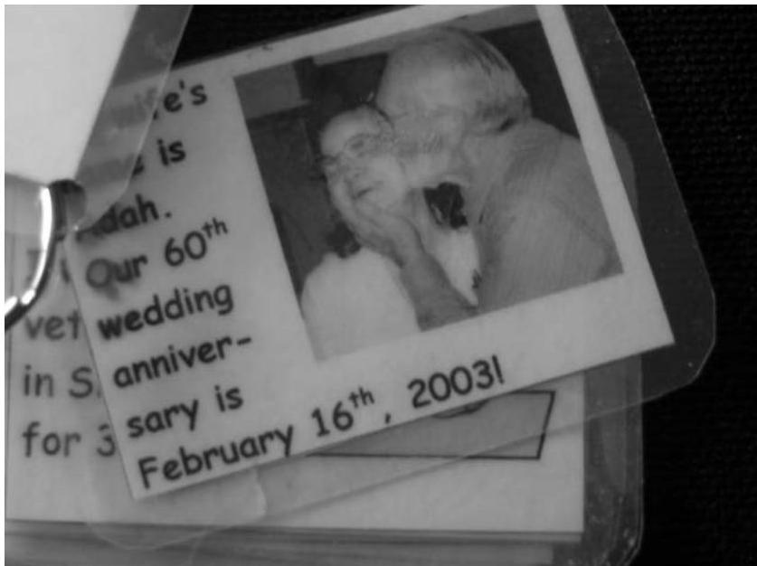

Figure 16.1. Communication card depicting autobiographic information for caregivers/ communication partners to use in setting a topic of conversation for a man with Alzheimer's disease living in long-term care.

Adults with Degenerative Cognitive and Linguistic Conditions

social communication. This type of information can emphasize the personhood (Kitwood, 1997) of individuals who have to leave so much behind to maintain their health and safety in the care of others when they can no longer live at home.

Communication cards and labels throughout a home may support the person in identifying various rooms of the house, the contents behind closed cupboard doors, or the steps to take to complete an activity such as flushing the toilet after use, hand washing, or taking medicine.

As noted previously, memory books have probably been the most investigated AAC intervention for people with dementia (Lanzi et al., 2017). Bourgeois and colleagues (Bourgeois, 1990, 1992, 1993; Bourgeois, Dikjstra, Burgio, &amp; Allen-Burge, 2001) reported that the quality of conversational interactions for people with mild and moderate dementia improved significantly when they used personalized memory wallets or books. Improvements included increases in the overall number of utterances as well as the number of positive statements and informative utterances from the person with dementia in conversations. In addition, the nursing aides in the study used more supportive comments when talking to the residents.

An external memory aid that builds on the autobiographical focus of memory books while taking advantage of the burgeoning affordability and availability of digital images and audio can provide multimedia biographies (mentioned earlier in this chapter) in the form of digitally edited picture-videos complete with music and narration (Alm et al., 2004; Cohen, 2000; Smith, Crete-Nishihata, Damianakis, Baecker, &amp; Marziali, 2009; Yasuda, Kuwabara, Kuwahara, Abe, &amp; Tetsutani, 2009). Cohen (2000) developed such a tool using digitized photos with slow movement and transitions between pictures, music from the appropriate era, and well-told story narratives to support photos in the biography. Old home movies and videos may also be digitally converted and incorporated. Cohen found such multimedia presentations increased positive engagement and decreased agitation in the persons with dementia for whom the displays were developed and also provided caregivers and visitors with a focus for interactions. Yasuda and colleagues (2009) measured the attention of participants to personalized reminiscence photo videos compared to a popular TV variety show and a news program. Eighty percent of the participants showed greater attention to their personalized photo videos. Alm and colleagues (2004) measured increased attention in participants with dementia and increased enjoyment of the interactions in their communicative partners when using a multimedia reminiscence presentation.

The technologies to produce such multimedia biographies evolve too rapidly to realistically try to provide a list of software or hardware here. However, most computers and tablets now come with easy-to-use photo and video-editing programs, and newer digitized photo picture frames found in the rooms of many nursing home residents now support audio as well as remote uploads of photos via Internet connections.

## Focusing on Functional Tasks

Bourgeois, Brush, Douglas, Khayum, and Rogalski (2016) emphasized the important role of speech-language pathologists in caring for the growing number of persons with degenerative cognitive-linguistic deficits. They compiled a comprehensive list of evidence-based visual AAC supports that have a place across a range of functional tasks in virtually all aspects of life for persons with dementia. The speech-language pathologist is responsible for developing and implementing those interventions with both the person and their communication partners. Table 16.2 shows their list of one

616
AAC Interventions for Individuals with Acquired Disabilities

Table 16.2. Functional tasks and visual supports for speech-language pathologists to implement in intervention for clients with mild cognitive impairment

|  Functional task | Evidence-based approach  |
| --- | --- |
|  Schedule management | • Creation of a memory station, containing visual and graphic cueing systems to facilitate recall (e.g., calendar, planner, dry erase board for daily schedule and important reminders, large display clock with date)
• Use of electronic memory aids on smart phone or tablet, such as reminders/alerts for activities
• Spaced-retrieval training to increase automatic reference to “memory station” to manage schedule  |
|  Medication management | • Electronic memory aids, such as an automated pill dispenser or electronic reminders
• Graphic cueing systems to help use medication bubble packs or medication organizers  |
|  Cooking | • Electronic memory aids such as timers
• Visual and graphic cueing systems
• Creation of personalized visual aids, by hand or through use of technology, such as Pic Collage app
• Grocery list visual aid
• Meal planner aid
• Recipe visual aid
• Environmental modifications to increase setup and organization of ingredients  |
|  Recall of functional information for daily interactions/activities of daily living: | • Creation of visual and graphic cueing systems, such as a personalized memory book/wallet
• Use of spaced-retrieval training and errorless learning to increase automatic reference to aids  |
|  • Daily conversations |   |
|  • Recent and past events |   |
|  • People/names |   |
|  • Personal information |   |
|  • Safety precautions |   |
|  • Decreasing repetitive questions |   |
|  Use of technological devices (TV remote, phone, tablet, computer, microwave) | • Visual and graphic cueing systems
• Create visual aids for memory and sequencing
• Environmental modifications to increase contrast/brightness
• Electronic memory aids, such as a simple large-button TV remote or memory phone
• Fading cues to increase use of aids  |
|  Organization/locating functional items | • Environmental modifications
• Visual memory aids to establish consistent locations for objects
• Vanishing cues to increase use of designated locations/organizational systems  |
|  Participation in meaningful activities/activities of daily living | • Visual and graphic cueing systems
• Memory book/wallet
• Personalized activity aids
• Environmental modifications
• Fading cues  |

From Bourgeois, M., Brush, J., Douglas, N., Khayum, R., &amp; Rogalski, E. (2016). Will you still need me when I’m 64, or 84, or 104? The importance of speech-language pathologists in promoting the quality of life of aging adults in the United States into the future. Seminars in Speech and Language, 37(3), 185–200; reprinted by permission.

Adults with Degenerative Cognitive and Linguistic Conditions

or more evidence-based interventions to support functional tasks such as managing one's schedule or medications, finding things, and using technology for people with mild cognitive impairment.

## IMPLEMENTING AAC SUPPORTS

A variety of AAC supports are currently used to enhance the communication of individuals with degenerative cognitive-linguistic conditions. Some of these are low-technology materials, while some high-technology options are being developed for these individuals as well.

## Communication Notebooks

Communication notebooks are usually small, easy-to-carry binders that contain information that supports the communication efforts of people with complex communication needs. The content and form of the notebooks is personalized. For example, these notebooks may contain photographs or line drawings for an individual who is unable to read or may contain considerable printed information if the individual can read but has difficulty remembering the names of people, places, and activities. The person who will use the notebook or display should be involved early on to participate in selecting content and in organizing the notebook. King et al. (2007) present an excellent discussion of the preparation and maintenance of communication notebooks for people with primary progressive aphasia. Their guidelines enhance the long-term usefulness of such books and are applicable to communication notebook preparation for a person with any form of dementia. Guidelines are as follows:

1. The communication notebook must reflect the person; it must be personalized.
2. The person who will use it must take a lead role in determining its content early in the course of the disease.
3. The communication notebook and opportunities to use it must be available consistently throughout the course of the condition.
4. The communication notebook is never finished; it must be dynamic so that it reflects the changing needs and experiences of the person who uses it and his or her social network.

The person with dementia may initiate use of a communication notebook to repair communication breakdowns in early stages, but caregivers and other communication partners need to assume the responsibility for communicating with it as a form of augmented input or to offer visual responses during communication in later stages.

## Visual Scene Displays

Weissling and Beukelman (2006) offered a low-tech version of VSDs that can be contained in a communication binder for people with aphasia (Chapter 15). These may also be useful for people with primary progressive aphasia or other dementias. VSDs use contextually rich, personally relevant photographs of activities and events to inspire conversational exchanges between the person with a communication impairment and a communication partner. The photos are rich in context, showing people involved in activities, interactions, and events, rather than portrait-type

AAC Interventions for Individuals with Acquired Disabilities

pictures or landscapes. Personally relevant photos are helpful in that they depict people and activities that are related to the person's life and are recognizable. Rather than programmed links for navigation or buttons to provide speech output found on high-tech devices (Beukelman, Hux, Dietz, McKelvey, &amp; Weissling, 2015), a low-tech VSD features a brief section of appropriate instructions for questions related to each photo and a section of text-based information that the person with dementia could use for comments. Figure 16.2 shows how a page of a low-tech VSD could be organized.

# Memory Books

Memory books are another form of visually represented information to support communication for people with dementia and have been studied for years with persons with Alzheimer's disease (Fried-Oken, Mooney, &amp; Peters, 2015; Hopper et al., 2013; Murphy &amp; Boa, 2012). The thinking is that memory books that incorporate photos,

Figure 16.2. Example of a low-tech visual scene display created using a template and instructions. (From https://cehs.unl.edu/aac/visual-scene-resources/; reprinted by permission.)

My grandchildren: Ronnie, age 5,

Lisa, age 6, Olivia, age 7

Goats: Pasture pets

Spike Nigerian Dwarf breed

Boomer Nigerian Dwarf breed

Hunny-Bunny Nubian breed

Ask:

Who wants to be a vet?

How often do they visit the farm?

Do the goats get into trouble?

What do the goats eat?

Adults with Degenerative Cognitive and Linguistic Conditions

line drawings, and text reduce demands on recall memory processing. Bourgeois et al. (2001) described a memory book with pages that each contained one sentence or item, such as an illustration, to provide graphic information. Memory books typically include autobiographical information, daily schedules, and problem resolution information, such as instructions about daily tasks or events. For example, while he was still living at home and was confused about his wife's whereabouts, Doc, described earlier in this chapter, could turn to the page with his wife's picture in his memory book. The text with the picture stated the time when she would come home from work. His caregiver during the day could direct him to look in his "book" if he became agitated when he couldn't find his wife. Sometimes he would page through the book on his own and, find that page, read it aloud to himself, and say "okay," suggesting that he understood her absence. Providing information in the form of memory books builds on recognition memory, which takes less effort than recall tasks (Bayles &amp; Kim, 2003).

# Talking Mats

Talking Mats is a low-tech communication system developed by researchers in Europe (Murphy, Gray, van Achterberg, Wyke, &amp; Cox, 2010; Murphy, Tester, Hubbard, Downs, &amp; MacDonald, 2005) to help nursing home residents communicate about their likes and dislikes, and it is effective for people with dementia (Murphy, Alexander, &amp; McLinton, 2016; Stewart, Bradshaw, &amp; Beadle-Brown, 2018). Figure 16.3 shows how an elderly woman placing picture symbols representing activities and events on a visual scale (i.e., under like and dislike) to communicate general feelings and preferences about activities and topics. A digital photo of the display serves as documentation in the

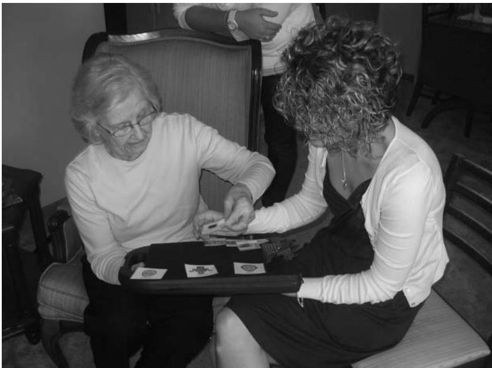

Figure 16.3. A person with dementia places communication symbols (i.e., line drawings) representing activities and events under symbols for LIKE and DON'T LIKE to express preferences.

person's chart. Over time, consistency of responses may validate the communicative intent of the symbol choices. Since it was first introduced (Murphy et al. 2005), Talking Mats has been used with many different populations, including people with Huntington disease (Ferm, Sahlin, Sundin, & Hartelius, 2010), people with intellectual/developmental disabilities (Bunning, Alder, Proudman, & Wyborn, 2016), and those receiving palliative care (Boa, Duncan, Haraldsdottir, & Wyke, 2014).

### VoiceMyChoice

Bourgeois, Camp, Antenucci, and Fox (2016) developed a similar visual system, VoiceMyChoice, to help people with dementia communicate preferences. The visual categories are depicted with the words sometimes, always, and never on cards placed at the top of a mat on a table; the caregiver/communication partner hands the person with dementia labeled picture cards showing activities, personal care activities, and food under those labels. He or she is asked to sort the cards by placing each under one of the three categories. This results in a measure of the person's preference for each of the activities or food shown on the cards. The researchers reported consistent, reliable results based on their Preference Assessment Questionnaire used with 37 residents in a long‐term care facility and 33 caregivers (i.e. communication partners) who worked at the facility. Of note in this study is that nearly half the caregivers did not speak the same language (i.e. English) as the residents they worked with; yet the results demonstrated that participants were effective in communicating preferences.

### Mobile Technology Visual Scene Display App

Mooney et al. (2018) harnessed the power of digital social communication media to develop an experimental app to allow their participants with primary progressive aphasia to take digital photos using an iPad and allowed friends in a controlled social network to submit appropriate words for the participants to select from to describe the photo. The photo appears in a visual scene‐type display (described in Chapters 6 and 15) surrounded by textboxes that populate with messages selected by a natural language processing engine (i.e. a specialized code in an app that predicts appropriate words or phrases to populate text windows on a display). The messages were used by the person with primary progressive aphasia during a retell task. Five of the six participants produced more target words in the condition using the experimental app as compared to control conditions.

### Cognitive Prosthetic Technology

Jamieson and colleagues (2014) reviewed and compared 43 studies focused on what they termed cognitive prosthetic technology to support prospective memory, that is, remembering tasks or procedures, for persons with degenerative or static memory impairment. They describe this technology as portable electronic or digitized versions of memory books or lists. Such devices may offer prospective support in the form of step‐by‐step instructions to complete tasks with audio and visual support. They may also provide reminders to cue new tasks or help an individual transition among tasks. Overall, the authors found consistent evidence that such technology can provide meaningful support for those with memory loss.

Adults with Degenerative Cognitive and Linguistic Conditions

# IMPLEMENTING AAC STRATEGIES AND PARTNER TRAINING

AAC strategies are identified in different ways by different practitioners and researchers. Here, the word strategies identifies behaviors or practices that caregivers and other communication partners can learn to use to support effective communication with a person with dementia, such as paraphrasing information, asking simple yes/no questions, or providing augmented input. As described earlier, AAC supports describes the physical, external, high-tech and low-tech systems or tools used to support effective communication, such as displays, books, and devices.

Intervention should target both the person and his or her communication partners (Andrews-Salvia, Roy, &amp; Cameron, 2003; Bourgeois et al., 2001; Hopper, 2003). As cognitive-linguistic capabilities decline, the responsibility usually shared between two communication partners will increasingly fall to the partner without impairment (Swan et al., 2018). Caregivers, family members, professionals, and friends make up the social networks of most people with dementia, and most of these individuals are used to communicating primarily through speech. Therefore, ongoing training must teach them new and more effective ways to communicate with the individual with dementia by shifting their communication patterns to include accommodating communication strategies and AAC systems such as memory aids (Swan et al., 2018). Table 16.3 lists evidence-based communication strategies identified in the research described in this chapter.

Table 16.3. Evidence-based communication strategies recommended for caregivers and other communication partners of people with dementia discussed in this chapter

|  Authors | Strategy  |
| --- | --- |
|  Lanzi, Burshnic, & Bourgeois (2017) | ·Written cueing strategy to offer key words in text as well as speech (i.e., augmented input) ·Intermittent prompting ·Completion marks (i.e., crossing off items on a calendar or list) ·Wait time for processing and expression ·Give instructions one at a time ·Use cueing phrases such as “Tell me more about that” (e.g., with primary progressive aphasia) ·Augmented input with gestures, writing, and drawing to accompany speech ·Take the lead role in conversations ·Touch and facial expressions without speech ·Modify the environment to reduce visual and auditory distractions  |
|  Savundranayagam & Orange (2014) | ·Repeat information ·Offer choices ·Redirect person to a new topic to address anxiety ·Use gestures with speech (i.e., augmented input)  |
|  Small, Gutman, Makela, & Hillhouse (2003) | ·Eliminate distractions ·Use simple yes/no questions rather than open-ended questions ·Use short, simple sentences  |
|  Wilson, Rochon, Mihailidis, & Leonard (2012) | ·When giving directions, provide one step at a time ·Ask closed-ended questions ·Paraphrase repetitions  |

Lanzi et al. (2017) summarize evidence-based communication strategy use and partner training from a person-centered care approach that focuses on meaningful interactons and involving the person with dementia as much as possible in developing strategies. The authors describe the evidence that supports external strategies (i.e. outside the person) that build upon residual strengths such as processing visual information and reducing cognitive demands. Many of the strategies described are in the form of AAC supports described earlier, such as written information and other graphical representations in various types of books, binders, or wallets, as well as calendars or planners.

Savundranayagam and Orange (2014) investigated effective and ineffective communication strategies used by 15 family members and their loved ones with dementia during meal times. Effective strategies were first identified by reviewing previous research that documented practices found to help people with Alzheimer's disease to communicate and participate in interactions. The researchers video-recorded the 15 couples to capture their conversations during meals and then reviewed the recordings to identify communication breakdowns and repair attempts. They also asked the family members to rate how effective each communication strategy was. They found that family members used effective strategies such as repeating, rephrasing, asking questions, simplifying, giving choices, redirecting, and using gestures and the family members also identified those strategies as being effective. However, other evidence-based strategies, such as writing information down or asking for more information, were not supported by family members, which suggested a need for more caregiver education as the person's communication capabilities and memory degenerated.

Small et al. (2003) studied communication strategies used by 18 married couples that included one spouse with Alzheimer's disease, as the dyads communicated about various activities of daily living. The researchers observed the couples and documented the effectiveness or ineffectiveness of 10 strategies that are commonly recommended to increase communicative success for people with dementia. The researchers also asked the spouses, who did not have impairment, to rate how much they used the strategies and the effectiveness of the resulting interactions. Some of the results were quite surprising. Of the 10 strategies documented, only 3 were found to decrease communication breakdowns: eliminating distractions, speaking in simple sentences, and using yes/no questions. One strategy, using slower speech, appeared to be related to increased communication breakdowns; however, the investigators found that some spouses were not slowing their speaking rate even when they thought they were. In other cases where the rate was slower but still not effective, the researchers postulated that the longer duration of the message increased the burden on the already limited working memory capacities of the spouses with Alzheimer's disease, consistent with previous research (Bayles & Kim, 2003; Tomoeda, Bayles, Boone, Kaszniak, & Slauson, 1990). Overall, the spouses reported a higher level of communicative effectiveness than was supported by the objective data on communication breakdowns. This study emphasizes the critical need for interventions that target the communication partners of people with dementia.

Another study (Wilson et al. 2012), investigated communication among caregivers and residents with Alzheimer's disease living in a long-term care setting. They anticipated the most beneficial strategies would be offering a direction or idea, asking closed-ended questions, and repeating utternaces, based on their literature review. The researchers video-recorded 15 dyads during a hand-washing task and transcribed

Adults with Degenerative Cognitive and Linguistic Conditions

and coded the communication strategies that occurred. The strategies that resulted in the most successful completion of the hand-washing activities were consistent with their hypotheses: giving one direction or idea at a time, asking closed-ended questions, and paraphrased repetition. The investigators pointed out that many commonly recommended strategies, such as slowed speaking rate or simplified syntax are not evidence-based and in some cases are not helpful.

Together, the evidence demonstrates the importance of communication partner training to support communication for people with dementia and the need for speech-language pathologists to provide that instruction as part of the intervention plan. The importance of treating the communication dyad by providing training for communication partners is crucial to the success of interventions for people with degenerative conditions such as dementia.

# CONCLUSIONS

In summary, dementia is a degenerative cognitive-linguistic condition characterized by progressive memory impairment that affects memory, communication, and other cognitive domains. Distinct communicative strengths, as well as weaknesses, exist at each stage of decline. Speech-language pathologists offer a range of evidence-based AAC strategies that support and enhance communication strengths. Such interventions provide meaningful, person-centered AAC supports that are grounded in research, enhance the person's agency in his or her own care, and improve quality of life. In addition, speech-language pathologists are vigilant about sensory deficits, such as hearing and vision impairment that influence communication effectiveness, and can identify and refer to appropriate disciplines. Speech-language pathologists are pivotal to dementia care given the number and variety of degenerative cognitive-linguistic conditions that lead to memory and communication deficits and the growing base of evidence supporting AAC interventions for those conditions.

# QUESTIONS

16.1. In what ways should intervention for primary progressive aphasia reflect interventions for nonprogressive aphasia? Explain why you think so.

16.2. In what ways should intervention for primary progressive aphasia and nonprogressive aphasia be different? Explain why.

16.3. What is the rationale for starting intervention early for a person with dementia? Why not wait until the communication impairment is more apparent?

16.4. What are the benefits of beginning dementia intervention, such as developing a memory book, in the early stages of the condition?

16.5. How would you develop a multimedia biography, similar to those described in this chapter? Can you identify video-audio editing apps that you could use to construct such a biography?

16.6. Describe two strategies to use augmented input to enhance comprehension for persons with dementia.

16.7. How would you design an intervention program to teach communication partners how to alter their communication style to meet the needs of a person with dementia? What strategies would you teach? Why?

AAC Interventions for Individuals with Acquired Disabilities

# REFERENCES

Alm, N., Astell, A., Ellis, M., Dye, R., Gowans, G., &amp; Campbell, J. (2004). A cognitive prosthesis and communication support for people with dementia. Neuropsychological Rehabilitation, 14, 117-134. doi.org/10.1080/09602010343000147
Alzheimer's Association (n.d.). Retrieved from https://www.alz.org.
Andrews-Salvia, M., Roy, N., &amp; Cameron, R. (2003). Evaluating the effects of memory books for individuals with severe dementia. Journal of Medical Speech-Language Pathology, 11, 51-59.
Bayles, K., &amp; Kim, E. (2003). Improving the functioning of individuals with Alzheimer's disease: Emergence of behavioral interventions. Journal of Communication Disorders, 36, 327-343. doi:10.1016/S0021-9924(03)00047-9
Beukelman, D. R., Fager, S., Ball, L., &amp; Dietz, A. (2007). AAC for adults with acquired neurological conditions: A review. *Augmentative and Alternative Communication*, 23, 230-242. doi:10.1080/07434610701553668
Beukelman, D., Hux, K., Dietz, A., McKelvey, M., &amp; Weissling, K. (2015). Using visual scene displays as communication support options for people with chronic, severe aphasia: A summary of AAC research and future research directions. *Augmentative and Alternative Communication*, 31, 234-245. doi:10.3109/07434618.2015.1052152
Boa, S., Duncan, E. A. S., Haraldsdottir, E., &amp; Wyke, S. (2014). Goal setting in palliative care: A structured review. Progress in Palliative Care, 22(6), 326-333. doi:10.1179/1743291X14Y.0000000097
Bourgeois, M. (1990). Caregiver training, generalization, and maintenance of communicative behaviors in patients with Alzheimer's disease: Treatment efficacy research in communication disorders. Asha, 32, 65.
Bourgeois, M. (1992). Evaluating memory wallets in conversation with persons with dementia. Journal of Speech and Hearing Research, 35(6), 1344-1357. doi:10.1044/jshr.3506.1344
Bourgeois, M. (1993). Effects of memory aids on the dyadic conversation of individuals with dementia. Journal of Applied Behavior Analysis, 26, 77-87. doi:10.1901/jaba.1993.26-77
Bourgeois, M., Brush, J., Douglas, N., Khayum, R., &amp; Rogalski, E. (2016). Will you still need me when I'm 64, or 84, or 104? The importance of speech-language pathologists in promoting the quality of life of

aging adults in the United States into the future. Seminars in Speech and Language, 37(3), 185-200.
Bourgeois, M. S., Camp, C. J., Antenucci, V., &amp; Fox, K. (2016). VoiceMyChoice™: Facilitating understanding of preferences of residents with dementia. Advances in Aging Research, 5, 131-141. doi:10.4236/aar.2016.56013
Bourgeois, M., Camp, C., Rose, M., White, B., Malone, M., Carr, J., &amp; Rovine, M. (2003). A comparison of training strategies to enhance use of external aids by persons with dementia. Journal of Communication Disorders, 36, 361-378. doi:10.1016/S0021-9924(03)00051-0
Bourgeois, M., Dijkstra, K., Burgio, L., &amp; Allen-Burge, R. (2001). Memory aids as an augmentative and alternative communication strategy for nursing home residents with dementia. *Augmentative and Alternative Communication*, 17, 196-209. doi:10.1080/aac.17.3.196.210
Bourgeois, M., &amp; Hickey, E. (2007). Dementia. In D. R. Beukelman, K.L. Garrett, &amp; K. M. Yorkston (Eds.), *Augmentative communication strategies for adults with acute or chronic medical conditions* (pp. 243-286). Baltimore, MD: Paul H. Brookes Publishing Co.
Bourgeois, M., &amp; Hickey, E. (2009). Dementia: From diagnosis to management—a functional approach. Mahwah, NJ: Lawrence Erlbaum.
Bunning, K., Alder, R., Proudman, L., &amp; Wyborn, H. (2016). Co-production and pilot of structured interview using Talking Mats® to survey the television viewing habits and preferences of adults and young people with learning disabilities. *British Journal of Learning Disabilities*, 45, 1-11. doi:10.1111/bld.12167
Cohen, G. (2000). Two new intergenerational interventions for Alzheimer's disease patients and families. American Journal of Alzheimer's Disease, 15(3), 137-142. doi:10.1177/153331750001500304
Cress, C., &amp; King, J. (1999). AAC strategies for people with primary progressive aphasia without dementia: Two case studies. *Augmentative and Alternative Communication*, 15, 248-259. doi:10.1080/07434619912331278785
Ferm, U., Sahlin, A., Sundin, L., &amp; Hartelius, L. (2010). Using Talking Mats to support communication in persons with Huntington's disease. International Journal of Language and Communication Disorders, 45, 523-536.
Folstein, S. E. (1990). Huntington disease: A disorder of families. Baltimore, MD: Johns Hopkins University Press.

Adults with Degenerative Cognitive and Linguistic Conditions

Fried-Oken, M., Mooney, A., &amp; Peters, B. (2015). Supporting communication for patients with neurodegenerative disease. NeuroRehabilitation, 37, 69–87. doi:10.3233/NRE-151241.

Fried-Oken, M., Rau, M., &amp; Oken, B. (2000). AAC and dementia. In D. R. Beukelman, K. M. Yorkston, &amp; J. Reichle (Eds.), *Augmentative and alternative communication for adults with acquired neurologic disorders* (pp. 375–405). Baltimore, MD: Paul H. Brookes Publishing Co.

Fried-Oken, M., Rowland, C., &amp; Gibbons, C. (2010). Providing augmentative and alternative communication treatment to persons with progressive nonfluent aphasia. *Perspectives on Neurophysiology and Neurogenic Speech and Language Disorders*, 20, 21–25.

Gazes, Y., Soldan, A., &amp; Stern, Y. (2012). Alzheimer’s disease. *Encyclopedia of human behavior*. New York, NY: Elsevier, 108–115. doi:10.1016/B978-0-375000-6.00020.3

Gorno-Tempini, M. L., Hillis, A. E., Weintraub, S., Kertesz, A., Mendez, M., Cappa, S. F., . . . Grossman, M. (2011). Classification of primary progressive aphasia and its variants. *Neurology*, 76, 1004–1014.

Hickey, E., &amp; Bourgeois, M. (2017). *Dementia: Person-centered assessment and intervention*. Abingdon, UK: Routledge Taylor &amp; Francis.

Hopper, T. (2003). “They’re just going to get worse anyway”: Perspectives on rehabilitation for nursing home residents with dementia. *Journal of Communication Disorders*, 36, 345–359. doi:10.1016/S0021-9924(03)00050-9

Hopper, T., Bourgeois, M., Pimentel, J., Qualls, C. D., Hickey, E., Frymark, T., &amp; Schooling, T. (2013). An evidence-based systematic review on cognitive interventions for individuals with dementia. *American Journal of Speech-Language Pathology*, 22, 126–145.

Hydén, L. C. (2011). Narrative collaboration and scaffolding in dementia. *Journal of Aging Studies*, 25, 339–347.

Jamieson, M., Cullen, B., McGee-Lennon, M., Brewster, S., &amp; Evans, J. J. (2014). The efficacy of cognitive prosthetic technology for people with memory impairments: A systematic review and meta-analysis. *Neuropsychological Rehabilitation*, 24(3–4), 419–444. doi:10.1080/09602011.2013.825632

King, J., Alarcon, N., &amp; Rogers, M. (2007). Primary progressive aphasia. In D. R. Beukelman, K. L. Garrett, &amp; K. M. Yorkston (Eds.), *Augmentative communication strategies for adults with acute or chronic medical conditions* (pp. 207–242). Baltimore, MD: Paul H. Brookes Publishing Co.

Kitwood, T. (1997). *Dementia reconsidered: The person comes first*. Philadelphia, PA: Open University Press.

Klasner, E., &amp; Yorkston, K. (2000). AAC for Huntington disease and Parkinson’s disease: Planning for change. In D. R. Beukelman, K. M. Yorkston, &amp; J. Reichle (Eds.), *Augmentative and alternative communication for adults with acquired neurologic disorders* (pp. 233–270). Baltimore, MD: Paul H. Brookes Publishing Co.

Lanzi, A., Burshnic, V., &amp; Bourgeois, M. (2017). Person-centered memory and communication strategies for adults with dementia. *Topics in Language Disorders*, 37(4), 361–374. doi:10.1097/TLD.0000000000000136

Lehoux, P., &amp; Blume, S. (2000). Technology assessment and the sociopolitics of health technologies. *Journal of Health Politics, Policy and Law*, 25, 1083–1120. doi:10.1215/03616878-25-6-1083

Lewey Body Dementia Association. (n.d.). *Is it LBD or something else?* Retrieved from http://www.lbda.org

Mesulam, M. (2013). Primary progressive aphasia and the language network: The 2013 H. Houston Merritt Lecture. *Neurology*, 81, 456–462.

Mooney, A., Bedrick, S., Noethe, G., Spaulding, S., &amp; Fried-Oken, M. (2018). Mobile technology to support lexical retrieval during activity retell in primary progressive aphasia. *Aphasiology*, 32(6), 666–692. doi:10.1080/02687038.2018.1447640

Murphy, J., Alexander, J., &amp; McLinton, A. (2016). Talking Mats: A model of communication training. *Journal of Dementia Care*, 24(5), 22–25.

Murphy, J., &amp; Boa, S. (2012). Using the WHO_ICF with Talking Mats to enable adults with long-term communication difficulties to participate in goal setting. *Augmentative and Alternative Communication*, 28(1), 52–60. doi:10.3109/07434618.2011.653828.

Murphy, J., Gray, C. M., van Achterberg, T., Wyke, S., Cox, S. (2010). The effectiveness of the Talking Mats framework with people with dementia. *Dementia: International Journal of Social Research and Practice*, 9(4), 454–472. doi:10.1177/1471301210381776

Murphy, J., Tester, S., Hubbard, G., Downs, M., &amp; McDonald, C. (2005). Enabling frail older people with a communication difficulty to express their views: The use of Talking Mats as an interview tool. *Health and Social Care in the Community*, 13, 95–107. doi:10.1111/j.1365-2524.2005.00528.x

Murray, L. (2000). Spoken language production in Huntington’s and Parkinson’s

AAC Interventions for Individuals with Acquired Disabilities

diseases. Journal of Speech, Language, and Hearing Research, 43, 1350-1366. doi:10.1044/jslhr.4306.1350
National Institute on Aging. Diagnoses of Lewy body dementia. Retrieved from https://www.nia.nih.gov/health/diagnoses-lewy-body-dementia.
National Institute on Aging. (n.d.) What causes Alzheimer's disease? Retrieved from https://www.nia.nih.gov/health/what-causes-alzheimers-disease.
National Institute on Aging. (n.d.) Alzheimer's disease in people with Down syndrome. Retrieved from https://www.nia.nih.gov/health/alzheimers-disease-people-down-syndrome
National Institute of Neurological Disorders and Stroke. (n.d.) The dementias: Hope through research. Retrieved from https://www.ninds.nih.gov/Disorders/Patient-Care giver-Education/Hope-Through Research /Dementia-Hope-Through-Research
Peavy, G. M., Jacobson, M. W., Goldstein, J. L., Hamilton, J. M., Kane, A., Gamst, A. C., ... Corey-Bloom, J. (2010). Cognitive and functional decline in Huntington's disease: Dementia criteria revisited. *Movement Disorders* 25(9), 1163-1169. doi:10.1002/mds.22953
Pringsheim, T., Wiltshire, K., Day, L., Dykeman, J., Steeves, T., &amp; Jette, N. (2012). The incidence and prevalence of Huntington's disease: A systematic review and meta-analysis. *Movement Disorders* 27(9), 1083-1091. doi:10.1002/mds.25075. Epub 2012 Jun 12.
Radvansky, G. A., &amp; Tamplin, A. K. (2012). Memory. In Encyclopedia of human behavior. Retrieved from https://ebookcentral-proquest.com.ezproxy.USD.edu
Sacchett, C. (2002). Drawing in aphasia: Moving towards the interactive. International Journal of Human-Computer Studies, 57(4), 263-277. doi:10.1006/ijhc.2002.1018
Savundranayagam, M. Y., &amp; Orange, J. B. (2014). Matched and mismatched appraisals of the effectiveness of communication strategies by family caregivers of persons with Alzheimer's disease. International Journal of Language and Communication Disorders, 49(1), 49-59.
Small, J., Gutman, G., Makela, S., &amp; Hillhouse, B. (2003). Effectiveness of communication strategies used by caregivers of persons

with Alzheimer's disease during activities of daily living. Journal of Speech, Language, and Hearing Research, 46, 353-367. doi:10.1044/1092-4388(2003/028)
Smith, K., Crete-Nishihata, M., Damianakis, T., Baecker, R., &amp; Marziali, E. (2009). Multimedia biographies: A reminiscence and social stimulus tool for persons with cognitive impairment. Journal of Technology in Human Services, 27, 287-306. doi:10.1080/15228830903329831
Stewart, K., Bradshaw, J., &amp; Beadle-Brown, J. (2018). Evaluating service users' experiences using Talking Mats®. Tizard Learning Disability Review, 23(2), 78-86. doi:10.1108/TLDR-05-2017-0023
Swan, K., Hopper, M., Wenke, R., Jackson, C., Till, T., &amp; Conway, E. (2018). Speech-language pathology interventions for communication in moderate-severe dementia: A systematic review. American Journal of Speech-Language Pathology, 27, 836-852.
Tomoeda, C., Bayles, K., Boone, D., Kaszniak, A., &amp; Slauson, T. (1990). Speech rate and syntactic complexity effects on the auditory comprehension of Alzheimer patients. Journal of Communication Disorders, 23, 151-161.
Weissling, K., &amp; Beukelman, D. (2006). Visual scene displays: Low-tech options. Perspectives on Augmentative and Alternative Communication, 15, 15-17.
Wilson, R., Rochon, E., Mihailidis, A., &amp; Leonard, C. (2012). Examining success of communication strategies used by formal caregivers assisting individuals with Alzheimer's disease during an activity of daily living. Journal of Speech, Language, and Hearing Research, 55, 328-341.
Yasuda, K., Kuwabara, K., Kuwahara, N., Abe, S., &amp; Tetsutani, N. (2009). Effectiveness of personalized reminiscence photo videos for individuals with dementia. Neuropsychological Rehabilitation, 19, 603-619. doi:10.1080/09602010802586216
Yorkston, K., &amp; Beukelman, D. (2007). AAC intervention for progressive conditions: Multiple sclerosis, Parkinson's disease and Huntington's disease. In D. R. Beukelman, K. L. Garrett, &amp; K. M. Yorkston (Eds.), Augmentative communication strategies for adults with acute or chronic medical conditions (pp. 317-345). Baltimore, MD: Paul H. Brookes Publishing Co.

17

# Individuals with Traumatic Brain Injury

Susan Koch Fager and David R. Beukelman

Augmentative and alternative communication (AAC) interventions for people who have experienced traumatic brain injury (TBI) have changed dramatically through the years. Until the mid-1990s, AAC interventions occurred primarily with individuals who experienced severe, persistent anarchia or dysarthria following TBI. It was not uncommon for teams to delay AAC interventions until the individual's associated communication disorders stabilized; consequently, many people with TBI were unable to communicate functionally for months or even years after their accidents, putting them at significant risk for negative consequences (e.g., medical errors, frustration, stress, anxiety, lack of information, ineffective patient-provider communication). In the past, AAC teams erroneously thought that cognitive limitations during early stages of recovery would make it difficult for many people with TBI to use AAC; that it would be difficult to select appropriate AAC because the cognitive and motor performance of a person with TBI changes over time; and that some individuals with TBI would recover functional speech and therefore would not require AAC support. With this view, AAC teams often felt that the most conservative approach was the safest when recommending an intervention, but this conservative approach left many individuals without access to a means to communicate and participate in their medical care.

The goal of the AAC team is to provide patient-provider communication assistance as soon as possible (see Chapter 18) so that people with TBI can participate effectively in their medical care and rehabilitation program and are able to communicate their ongoing needs. Thus, the focus of intervention has shifted from providing a single AAC technology for long-term use to providing a series of AAC supports designed to meet short-term communication needs while continuing efforts to reestablish natural speech. For example, intervention might begin with understandable yes/no responses, provide a communication board for immediate wants and needs, develop a way to call for attention, develop communication supports to share information, support written communication, focus on the development of natural speech, and provide instruction in the use of multimodal communication that integrates residual natural speech and AAC supports (Light, Beesley, &amp; Collier, 1988).

This chapter outlines the general approaches to AAC intervention for individuals with TBI. However, because individuals with brain injuries recover over an extended period of time, it is beyond the scope of this book to detail the extensive

627

AAC intervention concepts, techniques, and strategies developed for these individuals. Readers are referred to several papers by Fager and colleagues for more in-depth information (Fager, Doyle, & Karantounis, 2011).

## PREVALENCE AND ETIOLOGY

Injuries to the head that result in temporary or permanent brain damage are quite common. It is difficult to estimate the number of these injuries that occur each year because many go unreported. Individuals who do not lose consciousness or do so only briefly are rarely admitted to the hospital and may not even go to an emergency room. For those with severe injury, immediate medical treatment has changed considerably during the past couple of decades. Advances in medical management at the scene of the accident (e.g. pre-hospital intubation, management of hypotension/hypertension), as well as surgical procedures to lessen the further damage to the brain due to swelling via decompressive craniotomies, have increased the survival rates and improved outcomes for individuals with TBIs (Chowdhury, Kowalski, Arabi, & Dash, 2014; Sahuquillo, 2006).

According to the Centers for Disease Control and Prevention (2019), approximately 2.5 million emergency room visits due to TBI occurred in the United States. Nearly 56,000 died and 288,000 were hospitalized. Between 2006 and 2014, the Centers for Disease Control and Prevention reported an increase of TBI-related emergency room visits of 53%, whereas hospitalizations decreased by 8% and death rates decreased by 6%. Individuals with TBI do not represent a random sample of the total population: more than twice as many males as females are injured. Male children between the ages of 0 and 4 years have the highest rates of emergency room visits, hospitalizations, and deaths related to TBI (Centers for Disease Control and Prevention, 2019).

The causes of TBI are varied. The Centers for Disease Control and Prevention (2019) reported that of all TBI-related emergency room visits, hospitalizations, and deaths, 47.9% occurred as a result of falls (primarily in the younger and older age groups), 17% were from being struck by or against objects (with 1 in 5 cases occurring in children under the age of 15 years), and 13.2% were attributed to motor vehicle accidents.

Other causes of TBI can be attributed to blast injuries during combat. Blast injuries can result in primary trauma due to overpressurization that can impact the brain, as well as secondary injuries due to flying objects and debris propelled by the blast. The United States Department of Veterans Affairs reported a database study of 1,388 soldiers hospitalized for TBI due to blast injury that found that 55% were graded as Type 1 or most severe, 39% were Type 2, and 6% were Type 3 (least severe—Greer, Sayer, Kramer, Koeller, & Velasquez 2016).

As people with TBI recover, they usually progress through a continuum of care that begins in a trauma unit and may include time in a variety of different living situations. Fager (2003) described the experience of a 36-year-old man who relied on AAC technology to communicate all messages except a few greetings. In the 15 years since his TBI, he had lived in 11 different settings, including an acute care hospital, a rehabilitation center, an assisted living center, his parents' home, and an independent living situation with attendant care. He has successfully used AAC in each of these settings. However, not all individuals with TBI have adequate support to use AAC technologies consistently. Fager, Hux, Beukelman, and Karantounis (2004) documented long-term AAC use patterns by 25 people with TBI and reported that 2 of these individuals discontinued use of their AAC because they did not receive adequate support and/or

Individuals with Traumatic Brain Injury

did not have AAC facilitators to support effective communication in their living situations. The facilitator support received by people with TBI who successfully use AAC is often extensive. Thus, intervention efforts must focus on facilitator preparation as individuals with TBI transition through the multiple living situations that they are likely to experience.

# Cognitive-Linguistic and Communication Disorders

Several categorical scales have been developed in an effort to describe people with severe TBI. The Rancho Levels of Cognitive Functioning Scale (Hagen, 1984), which describes cognitive and associated language behaviors that occur during recovery, is presented in Table 17.1. AAC teams use scales such as this to guide the design of AAC and other interventions appropriate to each stage.

In general, the communication disorders associated with TBI are the result of impairments in three areas. First, some of the language characteristics of people with TBI are a consequence of cognitive impairments, as summarized in Table 17.1. The level of linguistic performance can vary depending on the individual's cognitive level. Second, language disorders may occur because of damage to specific language processing areas of the brain. Sarno, Buonaguro, and Levita (1986) evaluated 125 individuals with TBI by using the Battery of Language Test and reported that 29% of these individuals exhibited classic symptoms associated with acquired aphasia. An additional 36% exhibited subclinical aphasia, which the researchers defined as "linguistic processing deficits on testing in the absence of clinical manifestations of linguistic impairment" (p. 404).

Third, some communication disorders in TBI are caused by damage to the motor control networks and pathways of the brain that occurred at the time of injury. Dysarthria has often been reported as one of the long-term sequelae of TBI. Olver, Ponsford, and Curran (1996) reported that motor speech disorders were present in 34% of their sample 5 years after injury. Yorkston, Honsinger, Mitsuda, and Hammen (1989) surveyed 151 people following TBI and found that prevalence changed as a function of time after onset. Of those in acute rehabilitation, 45% were reported as having mild to moderate dysarthria and 20% were reported as having severe dysarthria. In outpatient settings, 12% demonstrated mild to moderate dysarthria and 10% demonstrated severe dysarthria. Ylvisaker (1986) reported that 10% of children and 8% of adolescents continued to produce unintelligible speech during follow-up studies. Several different types of dysarthria have been observed following TBI, including ataxic, flaccid, spastic, and combinations (Yorkston, Beukelman, Strand, &amp; Bell, 1999).

One mother recounts the first few days in the hospital after her daughter's severe TBI:

[Judy] tried to talk several times during the day. Much of it sounded unintelligible, but occasionally we heard "Where am I?" or other words we could understand. We could not tell if she knew us or understood anything we said. Then a few days later . . . Judy started trying to answer. . . . We spent the rest of the day hanging over her bed admiring her, as you might hang over the crib of a newborn baby. . . . The next day she responded less. This turned out to be a pattern. Nearly every day on which she showed definite improvement was followed by one of passivity or even apparent regression. It kept us on an emotional roller coaster. (D. Thatch, in Weiss, Thatch, &amp; Thatch, 1987, p. 17)

Recovery From Severe Communication Disorders

Communication disorders of individuals with TBI can change dramatically over the course of their recovery. Research has primarily focused on the long-term recovery of individuals with mild TBI. There is limited longitudinal research that describes the patterns of communication changes of individuals with severe TBI who rely on AAC; however, some authors have provided some insight about the course of recovery.

Ladtkow and Culp (1992) followed 138 people with TBI over an 18-month period. They reported that 29 of these individuals (21%) were judged unable to speak at some point in their recovery. Of these 29, 16 individuals (55%) regained functional speech during the middle stage of recovery (i.e. Rancho Levels of Cognitive Functioning IV and V in Table 17.1). Thirteen individuals (45%) did not regain functional speech; unfortunately, the description of the cognitive recovery of those who did not regain functional speech is incomplete. The authors merely indicated that only three people (10%) reached the late stage of recovery, corresponding to Levels VI, VII, and VIII of the Rancho scale.

In a similar study, Dongilli, Hakel, and Beukelman (1992) investigated the recovery of 27 people who were unable to speak on admission to inpatient rehabilitation following TBI. Of these, 16 individuals (59%) became functional natural speakers during inpatient rehabilitation, whereas the other 11 (41%) did not. All individuals who became functional speakers did so at Rancho Level of Cognitive Functioning V or VI (see Table 17.1). Of the 11 individuals who left inpatient rehabilitation unable to speak, one achieved functional natural speech almost 24 months postinjury, and another was making substantial progress toward becoming a functional speaker 48 months postinjury.

As the Dongilli et al. (1992) study shows, people with TBI may experience severe communication disorders for cognitive as well as motor-related reasons. Jordan and Murdoch (1990) described a 7-year-old girl who was mute for 10 months subsequent to coma. Following her mutism, the girl demonstrated rapid and unexpected recovery of functional communication skills, although she continued to experience higher-level language impairments. In a 4-year follow-up report, her speech intelligibility was within normal limits, and she exhibited improvements in her cognitive-linguistic abilities (Jordan & Murdoch, 1994).

Adding to this limited information base regarding recovery from communication disorders are two interesting case studies. In one, Workinger and Netsell (1988) described a man who recovered intelligible speech 13 years after injury and used various AAC technologies during the intervening years. In addition, Light et al. (1988) described the transitions of an adolescent girl with TBI through approximately 3 years of multiple AAC supports before she became a functional natural speaker. Enderby and Crow (1990), who followed four people with severe bulbar dysfunction due to TBI, reported similar outcomes. They reported that although the individuals made few gains within the first 18 months after injury, they made substantial improvements as much as 48 months postinjury.

During the past decade the medical treatment for TBI has changed considerably. Swelling of the brain and pressure on the brain from being enclosed in the skull have been reduced through medications and opening of the skull to relieve pressure. For example, removing sections of the skull (decompressive craniectomy or bone flap surgery) soon after TBI allows the brain to swell outside of the confines of the skull.

Individuals with Traumatic Brain Injury

Once swelling has subsided and the individual is medically stable, the bone flap is typically replaced. In our experience, it seems that there are fewer and fewer individuals with TBI who, while retaining or regaining considerable cognitive function, experience severe speech limitations because of damage to the brainstem due to the interruption of blood flow in the brainstem. Rather, many TBI patients with sustained inability to communicate using their natural speech often also experience considerable cognitive limitations. The multiple capability limitations of these individuals must be considered when selecting AAC options for them.

# NATURAL-ABILITY INTERVENTIONS RELATED TO SPEECH

As noted in the previous discussion, some individuals with TBI recover natural speech following injury, whereas others do not. Predicting the path of natural speech recovery for individuals with TBI is difficult. Therefore, individuals who experience TBI, their families, and their rehabilitation teams must address natural speech recovery on an individual basis.

Some individuals may be able to produce a number of intelligible words, although they may not recover completely functional speech in all situations. Family members, friends, and team members should encourage the use and improvement of these spoken words if they allow the individuals to manage certain aspects of communication interactions. Others with dysarthria following TBI can say many words, but their words are unintelligible because of impaired motor control. They may use AAC techniques to augment the intelligibility of their natural speech. In fact, most individuals with TBI use multiple modes of communication at every stage of recovery. Rehabilitation that emphasizes reestablishing natural speech only or using AAC only may not meet all the communication needs of a person with TBI.

# Topic Supplementation

If a person's speech is marginally intelligible, his or her message can often be understood if the communication partner is aware of the semantic context or topic. This semantic context can be displayed in communication boards containing lists of frequently occurring topics or through photographic images. Hanson and colleagues (2004, 2013) reviewed the literature on topic supplementation for speakers with various types of dysarthria. They reported that topic supplementation increased word intelligibility by an average of 28% and sentence intelligibility by 10.7%. Use of topic supplementation should be considered when dynamic assessment with the technique documents that 1) the individual with TBI can learn to implement it in conversational interactions and 2) the technique has a positive impact on speech intelligibility. In a study involving only individuals with TBI, Beukelman, Fager, Ullman, Hanson, and Logemann (2002) reported intelligibility gains of more than 50% for some speakers and as low as 2.4% for others. With the ubiquity of mobile technologies, the use of photographic images has become a prevalent form of information transfer (Van Dijck, 2008) in the general population. Given the fact that many computerized communication technologies now incorporate on-board cameras and easy transfer of photographic content into AAC software to support communication, the use of photographic topic supplementation may be an effective and desirable method for individuals who have used this method of communication support via digital communication media prior to their injury.

AAC Interventions for Individuals with Acquired Disabilities

# Alphabet Supplementation

Beukelman and Yorkston (1977) reported that a supplemented speech strategy substantially improved the speech intelligibility of speakers with dysarthria. In alphabet supplementation, the speaker identifies the first letter of each word on an alphabet board or other type of AAC display while saying the word. This procedure provides communication partners with information that allows them to restrict their word retrieval to words that begin with the letter indicated. Alphabet supplementation also causes most speakers to pause briefly between spoken words, thereby segmenting individual spoken words. In the same study, Beukelman and Yorkston described the impact of alphabet supplementation on the speech of a young man who had sustained TBI. His habitual sentence intelligibility was 33%, compared with 66% when he used alphabet supplementation. Hanson et al. (2004) reported that, across speakers with various types of dysarthria, alphabet supplementation increased sentence intelligibility by 25.5% and single-word intelligibility by 10%. Use of alphabet supplementation should be considered if an assessment confirms that 1) the individual with TBI can learn to implement it in conversational interactions and 2) the technique has a positive impact on speech intelligibility. In a study involving only people with TBI, Beukelman et al. (2002) reported intelligibility gains of up to 69% for some speakers with severe dysarthria and lesser intelligibility gains for those with less severe dysarthria (see Figure 17.1).

# Portable Voice Amplification

Some people with dysarthria following TBI speak so quietly that their speech is difficult to hear, especially in groups of people or in noisy environments. These individuals may find it useful to increase the loudness of their speech with a portable speech amplifier, provided that their speech is sufficiently intelligible to communicate effectively (see Chapter 14 for a more extensive discussion of this approach).

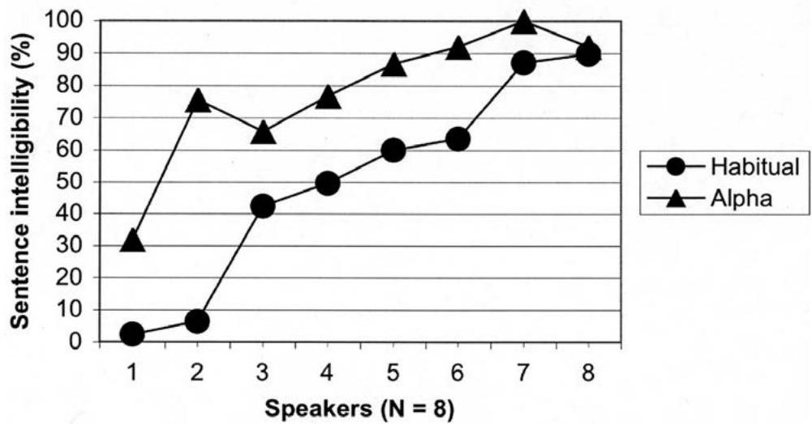

Figure 17.1. Habitual and alphabet-supplemented speech intelligibility for eight speakers with dysarthria due to traumatic brain injury. (Source: Beukelman and Fager et al., 2002.)

Individuals with Traumatic Brain Injury

# AAC ACCEPTANCE AND USE PATTERNS

Outcome studies have described AAC recommendations for individuals with TBI. Fager et al. (2004) described the AAC acceptance and use patterns of 25 individuals with TBI. Following AAC assessment, 17 high-tech and 8 low-tech AAC supports were recommended. Fifteen of the 17 individuals for whom high-tech AAC was recommended received AAC technology. One individual rejected the recommendation, and one did not receive AAC technology due to funding constraints. Thirteen of the 15 individuals who received high-tech AAC continued to use their technology for an extended period of time, for an overall acceptance rate of 87%. Two individuals discontinued use of their high-tech AAC due to loss of ongoing communication facilitator support as they transferred from setting to setting or as staff members changed. All individuals for whom low-tech AAC was recommended accepted the recommendation. Three of these individuals discontinued use of their AAC due to recovery of natural speech. These individuals formulated their messages primarily through letter-by-letter spelling, unless they experienced a preexisting language disorder.

# ASSESSMENT AND INTERVENTION

In general, AAC teams should guide their intervention approaches with people who have TBI on individual levels of cognitive recovery (DeRuyter &amp; Kennedy, 1991; Fager et al., 2007; Fager &amp; Karantounis, 2011; Ladtkow &amp; Culp, 1992). AAC approaches have been described for three general stages of recovery: 1) the early stage, which involves Rancho Levels of Cognitive Functioning I, II, and III (see Table 17.1); 2) the middle stage, which includes Levels IV and V; and 3) the late stage, which includes Levels VI, VII, and VIII.

# Early Stage (Rancho Levels of Cognitive Functioning I, II, and III)

For people who have TBI and are in the early stage of cognitive recovery, assessment is extremely difficult, as explained below; AAC techniques used in intervention will vary.

Table 17.1. Levels of cognitive functioning and associated language behaviors of persons with traumatic brain injury

|  General behaviors | Language behaviors  |
| --- | --- |
|  I. No response |   |
|  Patient appears to be in a deep sleep and is completely unresponsive to any stimuli. | Receptive and expressive: No evidence of processing or verbal or gestural expression.  |
|  II. Generalized response |   |
|  Patient reacts inconsistently and nonpurposefully to stimuli in a nonspecific manner. Responses are limited and often the same, regardless of stimulus presented. Responses may be physiologic changes, gross body movements, or vocalization. | Receptive and expressive: No evidence of processing or verbal or gestural expression.  |

(continued)

AAC Interventions for Individuals with Acquired Disabilities

Table 17.1. (continued)

|  General behaviors | Language behaviors  |
| --- | --- |
|  III. Localized response  |   |
|  Patient reacts specifically, but inconsistently, to stimuli. Responses are directly related to the type of stimulus presented. May follow simple commands such as “Close your eyes” or “Squeeze my hand” in an inconsistent, delayed manner. | Language begins to emerge. Receptively: Patient progresses from localizing to processing and following simple commands that elicit automatic responses in a delayed and inconsistent manner. Limited reading emerges.Expressively: Automatic verbal and gestural responses emerge in response to direct elicitation. Negative head nods emerge before positive head nods. Utterances are single words serving as holophrastic responses.  |
|  IV. Confused-agitated  |   |
|  Behavior is bizarre and nonpurposeful relative to immediate environment. Does not discriminate among persons or objects; is unable to cooperate directly with treatment efforts; verbalizations are frequently incoherent or inappropriate to the environment; confabulation may be present. Gross attention to environment is very short, and selective attention is often nonexistent. Patient lacks short-term recall. | Severe disruption of frontal temporal lobes, with the resultant confusion apparent.Receptively: Marked disruption in auditory and visual processing, including inability to order phonemic events, monitor rate, and attend to, retain, categorize, and associate stimuli. Disinhibition interferes with comprehension and ability to inhibit responses to self-generated mental activity.Expressively: Marked disruption of phonologic, semantic, syntactic, and suprasegmental features. Output is bizarre, unrelated to environment, and incoherent. Literal, verbal, and neologistic paraphasias appear with disturbance of logicosequential features and incompleteness of thought. Monitoring of pitch, rate, intensity, and suprasegmentals is severely impaired.  |
|  V. Confused, inappropriate, nonagitated  |   |
|  Patient is able to respond to simple commands fairly consistently. However, with increased complexity of commands or lack of any external structure, responses are nonpurposeful, random, or fragmented. Has gross attention to the environment but is highly distractible and lacks ability to focus attention on a specific task; with structure, may be able to converse on a social-automatic level for short periods; verbalization is often inappropriate and confabulatory; memory is severely impaired; often shows inappropriate use of subjects; individual may perform previously learned tasks with structure but is unable to learn new information. | Linguistic fluctuations are in accordance with the degree of external structure and familiarity and/or predictability of linguistic events.Receptively: Processing has improved, with increased ability to retain temporal order of phonemic events, but semantic and syntactic confusions persist. Only phrases or short sentences are retained. Rate, accuracy, and quality remain significantly reduced.Expressively: Persistence of phonologic, semantic, syntactic, and prosodic processes. Disturbances in logicosequential features result in irrelevances, incompleteness, tangents, circumlocutions, and confabulations. Literal paraphasias subside, while neologisms and verbal paraphasias continue. Utterances may be expansive or telegraphic, depending on inhibition-disinhibition factors. Responses are stimulus bound.Word-retrieval deficits are characterized by delays, generalizations, descriptions, semantic associations, or circumlocutions. Disruptions in syntactic features are present beyond concrete levels of expression or with increased length of output. Written output is severely limited. Gestures are incomplete.  |

Individuals with Traumatic Brain Injury
635

|  General behaviors | Language behaviors  |
| --- | --- |
|  **VI. Confused-appropriate**

Patient shows goal-directed behavior but depends on external input for direction; follows simple directions consistently and shows carryover for relearned tasks with little or no carryover for new tasks; responses may be incorrect due to memory problems but appropriate to the situation; past memories show more depth and detail than recent memory. | Receptively: Processing remains delayed, with difficulty in retaining, analyzing, and synthesizing. Auditory processing is present for compound sentences, while reading comprehension is present for simple sentences. Self-monitoring capacity emerges.

Expressively: Internal confusion and disorganization is reflected in expression, but appropriateness is maintained. Language is confused relative to impaired new learning and displaced temporal and situational contexts, but confabulation is no longer present. Social-automatic conversation is intact but remains stimulus bound. Tangential and irrelevant responses are present only in open-ended situations requiring referential language. Neologisms are extinguished, with literal paraphasias present only in conjunction with an apraxia. Word-retrieval errors occur in conversation but seldom in confrontation naming. Length of utterance reflects inhibitory initiation mechanisms. Written and gestural expression increases. Prosodic features reflect the voice of confusion, characterized by monopitch, monostress, and monoloudness.  |
|  **VII. Automatic-appropriate**

Patient appears appropriate and oriented within hospital and home settings, goes through daily routine automatically, but is frequently robotlike with minimal to absent confusion; has shallow recall of activities; shows carryover for new learning but at a decreased rate; with structure, is able to initiate social or recreational activities; judgment remains impaired. | Linguistic behaviors appear normal within familiar, predictable, structured settings, but deficits emerge in open-ended communication and less structured settings.

Receptively: Reductions persist in auditory processing and reading comprehension relative to length, complexity, and presence of competing stimuli. Retention has improved to short paragraphs but without the abilities to identify salient features, organize, integrate input, order, and retain detail.

Expressively: Automatic level of language is apparent in referential communication. Reasoning is concrete and self-oriented. Expression becomes tangential and irrelevant when abstract linguistic concepts are attempted. Word-retrieval errors are minimal. Length of utterance and gestures are approximately normal. Writing is disorganized and simple at a paragraph level. Prosodic features may remain aberrant. Pragmatic features of ritualizing and referencing are present, while other components remain disrupted.  |

(continued)

AAC Interventions for Individuals with Acquired Disabilities

Table 17.1. (continued)

|  General behaviors | Language behaviors  |
| --- | --- |
|  VIII. Purposeful and appropriate  |   |
|  Patient is able to recall and integrate past and recent events and is aware of and responsive to the environment, shows carryover for new learning and needs no supervision once activities are learned; may continue to show a decreased ability relative to premorbid abilities in language, abstract reasoning, tolerance for stress, and judgment in emergencies or unusual circumstances. | Language capacities may fall within normal limits. Otherwise, problems persist in competitive situations and in response to fatigue, stress, and emotionality, characterized in reduced effectiveness, efficiency, and quality of performance.
Receptively: Rate of processing remains reduced but unremarkable on testing. Retention span remains limited at paragraph level but improved with use of retrieval-organization strategies. Analysis, organization, and integration are reduced in rate and quality.
Expressively: Syntactic and semantic features fall within normal limits, while verbal reasoning and abstraction remain reduced. Written expression may fall below premorbid level. Prosodic features are essentially normal. Pragmatic features of referencing, presuppositions, topic maintenance, turn taking, and use of paralinguistic features in context remain impaired.  |

From Hagen, C. (1984). Language disorders in head trauma. In A. Holland (Ed.), Language disorders in adults (pp. 257-258). Austin, TX: PRO-ED. Copyright © 1984 by PRO-ED, Inc. Reprinted with permission.

**Early Stage Assessment** It is almost impossible in the early stage of recovery to assess cognitive, language, or motor control capabilities because the individual may be unable to stay awake or pay attention for any significant amount of time. Thus, at this stage, AAC teams attempt very little formal assessment. Instead, team members document systematic observations to identify changes in the individual's response patterns and to identify functional movements that the individual may use in a subsequent AAC program. Family members, friends, and other communication partners can also observe and chart such information if they spend a large amount of time with the individual. Also, they begin to provide autobiographic information in preparation for vocabulary selection and message management. Because they know the person well, they are in a good position to document changes and responses. Form 5.1 in Beukelman, Garrett, and Yorkston (2007) provides a strategy to document response modes and consistency (Fager et al., 2007).

As individuals with TBI become more alert, they gradually become able to differentiate between two or more people or objects, giving them the opportunity to communicate choices. This is a positive sign because it is often a precursor to the development of a yes/no response. The response mode for differentiation varies from person to person and may include eye pointing, moving a body part, or activating a beeper. The stimuli to which people recovering from TBI are able to respond must be presented in a careful and controlled manner. Family members and communication partners can usually be trained in this approach. They can also provide information about the interests and preinjury activities of the individual with TBI so that medical and rehabilitation personnel can provide the person with interesting and meaningful stimulation.

**Early Stage AAC Intervention** During the early stages of recovery, people with TBI are unable to speak functionally because of cognitive impairments. Some people

may have language or motor control impairments that further contribute to their communication disorder. Fager et al. (2007) suggest that the goals of AAC in the early stages of recovery are to increase the consistency of responses and to shape these responses into meaningful communication.

AAC techniques used at this point vary considerably depending on the individual's overall neurologic involvement. For example, consider the individual who is functioning in the range of Rancho Levels of Cognitive Functioning I to III and who also has considerable motor control impairment. This individual might be unable to respond to stimuli consistently not only because of cognitive problems but also because of motor weakness, spasticity, or lack of coordination. An AAC intervention for such a person might provide an alternative access mode, such as a single switch (Garrett, Schutz-Muehling, & Morrow, 1990). Then, as the individual begins to respond to various stimuli by making purposeful movements, communication facilitators, who support communication effectiveness, can encourage contingency awareness or cause and effect (Lancioni et al. 2014; Lancioni et al. 2011). For example, facilitators might encourage the individual to operate a CD/DVD player or an mp3 player with a single switch to play favorite music, listen to recorded messages from family members or friends, or play short video clips of personal relevance. In addition, a single switch with a control unit can be used to activate electrical appliances such as fans, radios, and lamps. As individuals become more purposeful, they may activate single-message communication technology containing basic greetings and other social phrases with a single switch (see Chapter 5 for additional suggestions). Then, if motor control permits, facilitators can connect two or more switches to different audio devices so that the individual can choose among different musical selections, messages, or videos. During the early stage of recovery, a limited number of symbols (e.g. one to four) might represent choices. Symbols should be brightly colored or exaggerated (Fried-Oken & Doyle, 1992). AAC teams should take care to understand the visual capabilities of individuals following TBI because impairments can range from double vision to cortical blindness. Stimuli (e.g. music, voices, video, pictures) should be motivating and personally relevant. Family members and friends can provide guidance in the development of these stimulus options.

Keenan and Barnhart (1993) documented the return of yes/no responses in 82 individuals with severe TBI: 49% signaled yes/no with head nods, 26% with motor responses of upper and lower extremities, 15% with eye gaze, and 9% with speech. Individuals with primarily cognitive or hemiplegic impairments developed yes/no responses earlier than those with high or low muscle tone. Twenty-nine percent of the individuals regained yes/no responses within 3 months of onset; 66%, within 6 months; and 84%, within 9 months.

### Middle Stage (Rancho Levels of Cognitive Functioning IV and V)

In the middle stage of recovery, the individual may respond consistently to stimuli while still showing evidence of considerable performance and communication impairments due to attention and memory impairments. Individuals who do not have specific language impairments or severe motor control impairments usually begin to speak functionally during these stages, although they may produce somewhat confused messages (Dongilli et al. 1992; Ladtkow & Culp, 1992). AAC materials or strategies to establish communication topics, to represent episodic experiences, or to

identify specific names for people, locations, or events are often useful to support the communication of these individuals. In addition, people with TBI generally begin to indicate their basic needs at this point. These may include comfort messages related to being hot, cold, hurt, or hungry. Individuals may also be able to communicate messages related to their location, the time of day, and other personal information. Family members and friends can assist with the selection of topics that are particularly important to people in the middle stage of recovery.

Early in the middle stage of recovery, people with TBI often experience agitation and poor awareness of their communication deficits. Therefore, they may initially have difficulty accepting AAC interventions. This may be reflected in limited willingness to participate in some aspects of AAC assessment.

### Middle Stage Assessment

The aim of assessment in the middle stage is to identify residual capabilities that the individual with TBI can utilize to achieve the specific communication goals mentioned previously. Examples are provided by Fager et al. (2007); see Form 5.6 in Beukelman et al. (2007). Most of the procedures for this assessment are criterion referenced. The initial assessment often focuses on seating and postural issues, which team members should coordinate with AAC concerns. Proper seating and positioning help to minimize reflex activity, excessive tone, and other movements that may interfere with speech or AAC usage (DeRuyter & Kennedy, 1991). Specifically, “the overall seating and positioning goals during [this] stage should be to provide for a structurally appropriate and functional position in which minimal or no pain is encountered” (DeRuyter & Kennedy, 1991, p. 342).

The RERC on AAC (Rehabilitation Engineering Research Center on Augmentative and Alternative Communication) webcast “Seating and Positioning for Individuals Who Use AT” by Aileen Costigan discusses seating and positioning for individuals who use AAC. Visit the AAC Learning Center to see the webcast.

Assessment of motor control capability is important to determine the individual's direct selection or scanning options. As discussed in Chapter 7, service providers should consider various access sites in terms of accuracy, efficiency, reliability, and endurance. This assessment may be difficult in some cases because people with TBI may require orthopedic surgical procedures that interfere, either temporarily or permanently, with their ability to use specific motor access sites (DeRuyter & Kennedy, 1991). Thus, it is important for AAC specialists to coordinate communication interventions with medical procedures by working closely with the medical team responsible for the individual's overall care. Assessment should also focus on the memory and attention capabilities of people with TBI. Complex scanning patterns (row--column or group--item) may be too demanding, so AAC teams should limit the individual's early scanning experiences to circular or linear scanning.

People with TBI often experience visual-perceptual and visual acuity disturbances, and these should also be considered in AAC assessment (Ciuffreda et al. 2007). At lower cognitive levels, service providers can usually determine visual functioning by observing the individual's ocular response to threat, gross focus movements of the eyes, and ability to follow a bright object or familiar face (DeRuyter & Kennedy, 1991). At higher cognitive levels, many visual disturbances can be noted during trials with AAC displays and input (when available) from other team members who

have training and expertise in vision assessment and treatment (e.g. occupational therapists). Because TBI often results in diffuse axonal injury, the visual impairments demonstrated can vary. Some may demonstrate cortical blindness where they are unable to process any visual information. For these individuals, auditory and tactile feedback are often needed for them to be able to use AAC.

Fager and Spellman (2010) described AAC intervention for an adolescent with cortical blindness and TBI. Using auditory scanning, during which communication options were presented auditorily, she was able to communicate yes/no early in recovery. As her memory and attention improved, she was able to communicate using pre-stored messages. However, because of the added visual challenges, she required cuing and support from her communication partners to locate content on her AAC technology. Communication partners would navigate to the appropriate communication page on her technology and she could select messages during contextualized tasks (e.g. telling a joke to a friend, choosing activities during therapy). Over time, her ability to find and retrieve messages on her technology using auditory scanning improved and she eventually began constructing short, novel messages via spelling.

For others, vision impairments may consist of field cuts (the inability to see content in a particular field of vision), visual neglect, or diplopia (double vision) to name a few. Combinations of these visual impairments can be present as well.

Jim sustained a severe right field cut and double vision after his injury. To maximize Jim's ability to communicate, messages on his communication technology were arranged on the left-hand side of the screen. At first, Jim could only see and access two columns of messages. Because of his double vision, the message buttons were limited to four per column and he managed large print text more accurately than icons or pictures. As Jim progressed, a blank column of red buttons was added to give Jim a visual cue to look to the right. Using this visual guide, Jim was able to progress to five columns of buttons. Jim learned that once he found the visual anchor (blank column of red buttons) he had scanned far enough to search for the appropriate communication content.

The type and severity of visual impairment can be detected through examination from a neuro-optometrist. A member of the AAC team should accompany the individual to such assessments to assist the communication process during the assessment and encourage the examiner to consider AAC-related issues, such as the optimal size for symbols and the array and the optimal distance between the individual and the display. Note that as social support for health care and rehabilitation decreases in some countries, people with TBI are spending less and less time in intensive rehabilitation programs in which AAC services may be available. It is important that people with TBI and their families educate themselves early in the recovery process about available AAC services and how to gain access to such services when they are needed.

### Middle Stage AAC Intervention

Depending on the nature of the brain injury, AAC teams should choose one or two major communication goals for the middle stage of recovery. The goal may be to help the person compensate for attention and memory impairments. This is particularly relevant for individuals with TBI who

AAC Interventions for Individuals with Acquired Disabilities

begin to speak during this stage because they often need communication techniques to help them remember, for example, the names of important people and their schedule of activities. A second goal of intervention in the middle stage applies specifically to individuals who have sustained damage to language or motor control areas of the brain. These individuals probably will not develop natural speech at this point in their recovery. Thus, AAC interventions should seek to provide these individuals with techniques that support conversational interaction. In Levels IV and V, messages that relate to wants, needs, and information sharing are more important to most individuals than messages that support social closeness and social etiquette (DeRuyter &amp; Kennedy, 1991; Fager et al., 2007; Fager &amp; Karantounis, 2011).

Most AAC interventions during the middle stage of recovery are either with nonelectronic means (i.e., alphabet boards, pictures, word boards, yes/no techniques, and partner-assisted scanning) or with a single or limited number of simple displays using AAC technology that generates speech. In an effort to reduce the complexity of communication, AAC teams may elect to use context-specific activity displays at this stage. For example, specific boards might facilitate participation in cognitive rehabilitation activities, recreational events, or daily living routines. Depending on the linguistic capabilities of the individual, photographs, line drawings, or printed words and phrases may be used to represent the messages on the activity displays. For some, icon-only displays (line drawings) versus text-only and text plus icon displays may lead to more efficient navigation of content in AAC technology (Brown, Thiessen, Beukelman, &amp; Hux, 2015). Research has also demonstrated that some individuals with TBI selected decontextualized photographic images more frequently than icons and contextualized photographic images (Thiessen, Brown, Beukelman, Hux, &amp; Myers, 2017). Interventionists should remember that people in this stage of recovery may experience difficulty visually discriminating among similar symbols or symbols with several elements. Individuals might use alphabetic displays, but encoding is almost always too difficult at this stage of recovery (Fried-Oken &amp; Doyle, 1992).

To control the complexity of the AAC supports, teams may choose small activity displays with specific content, rather than large, complex communication boards containing multiple areas of content. The organization of content in communication displays needs to be assessed because some with severe injury can display inconsistent patterns of organization (Brown, Hux, Kenny, &amp; Funk, 2014). For individuals with extensive attention and memory limitations, interventionists might consider written-choice strategies (see Chapter 15). During the middle stage, the individual might also use single switches to activate call buzzers or appliances or to run CD/DVD or mp3 players. Depending on the motor capabilities of the individual, such switch control activities may serve as training for the operation of a long-term environmental control technology.

Communication partners play an important role in structuring communication interactions during the middle stage. For example, partners may need to introduce topics for conversation, suggest the augmentative mode that can be used most productively at a particular time, assist with resolving communication breakdowns, and create motivating communication opportunities. Communication partners should actively help to structure interactions, but they should also be very patient and allow ample time for people with TBI to prepare, clarify, and repair their messages. Perhaps one of the most common partner errors is to rush or offer excessive encouragement during this stage by making multiple suggestions of how to formulate or complete a

message. This can be very distracting and frustrating to the individual with TBI, who must concentrate very hard to think, plan, compose, and finally produce a communicative utterance. At times, partners will also need to learn to provide systematic cuing to enable the person in the middle stage to use his or her communication supports effectively. In time, individuals with TBI should attempt to phase out partner cuing.

DeRuyter and Donoghue (1989) described in detail the AAC interventions over a 28-week period for a man who was unable to speak functionally due to TBI. During the first weeks of intervention (8 months postinjury), he established a reliable yes/no response by nodding his head, and he began to learn the visual-perceptual and upper-extremity skills necessary for eventual use of a communication board. In addition, his AAC team-initiated interventions to encourage the development of natural speech during this time. By the 10th week of intervention, he was able to use a simple alphabet board with approximately 2-inch letters. Initially, he exhibited “extreme frustration” (p. 52) with the board because of his motor planning deficits. By the 26th week of intervention, however, this man exhibited “no hesitation in using his alphabet board when he was unable to communicate effectively verbally or gesturally” (p. 53). His team introduced electronic AAC technology with speech output. With very little training on the technology, he was able to communicate at a rate of up to eight words per minute. At the time of his discharge from the inpatient rehabilitation facility, he communicated via limited speech, sophisticated gesturing, an alphabet board, and AAC technology with an expanded keyboard.

### Late Stage (Rancho Levels of Cognitive Functioning VI, VII, and VIII)

By the late stage of recovery, most individuals have regained the cognitive capability to become natural speakers, and those who remain unable to speak usually experience severe specific language or motor control disorders. Mobile technologies (e.g. smart phones, tablets) might be integrated as communication support if individuals have the ability to access these kinds of technologies. Because these technologies are commonly used by peers and colleagues, the appearance of them may be more acceptable to some (Brunner, Hemsley, Togher, & Palmer, 2017; Paterson & Carpenter, 2015).

Using a smart phone for communication support was a desirable option for Jeremy. Jeremy sustained a severe TBI when he was 12 years old. Following extensive inpatient and outpatient rehabilitation, he recovered his ability to walk. However, his speech remained severely dysarthric, he was unable to use his right hand, and he had limited control over his left (nondominant) hand. Because Jeremy was returning to school, he used text-to-speech communication technology with a large keyboard to accommodate the limited access capabilities he had with his left hand. As Jeremy's ability to use his left hand improved, he transitioned to a large smart phone using a text-to-speech app and a stylus. Jeremy was excited about this transition to the smart phone as it looked much like the phones his peers used.

Additionally, mobile devices may also assist in supporting some of the cognitive challenges that might remain for these individuals as they go about their daily lives (e.g. use reminder apps with tactile or auditory cuing; Lee et al. 2015).

AAC Interventions for Individuals with Acquired Disabilities

Late Stage Assessment AAC teams can use the Participation Model (see Figure 2.2) to guide effective assessment and intervention planning in the late stage of recovery. Analysis of the participation patterns of individuals with TBI and their families forms a particularly important part of this process. When people with TBI move from acute rehabilitation to outpatient rehabilitation, to independent living, and to employment, their patterns and expectations for participation change dramatically. These expectations greatly affect the nature and extent of their communication needs. It is also important to assess opportunity barriers, in much the same manner as is discussed in Chapter 2. For people with TBI in late stage recovery, AAC teams often identify communication needs, assess specific capabilities and constraints, and use these to personalize AAC interventions for the individual who relies on AAC (DeRuyter &amp; Kennedy, 1991; Fager et al., 2007; Ladtkow &amp; Culp, 1992).

Late Stage AAC Intervention In the late stage of recovery, individuals with TBI are generally oriented and able to demonstrate goal-directed, socially appropriate behavior. However, they may still have difficulties learning new information due to residual cognitive impairments. Some individuals may become natural speakers during Level VI. By Levels VII and VIII, most individuals who are likely to become natural speakers without extensive intervention have already done so (Dongilli et al., 1992). Thus, by the late stage of recovery, many people with TBI can interact and converse with their families and friends through natural speech. Nevertheless, even those individuals who regain speech may require AAC for writing support for an extended period. In addition, people with residual language and motor control impairments will continue to require long-term communication support to meet their specific interaction needs. Individuals have many interaction needs at this point, including those related to communicating wants and needs, sharing information, achieving social closeness, and participating in social etiquette routines (DeRuyter &amp; Kennedy, 1991).

During the late stage of cognitive recovery, traditional AAC techniques that resemble those used with other individuals who experience motor and cognitive impairments are often appropriate. Although people with TBI who cannot speak usually experience a high incidence of motor problems, one study found that approximately 78% were able to successfully utilize direct-selection AAC techniques (DeRuyter &amp; Lafontaine, 1987). Almost 75% of the individuals who used direct selection in DeRuyter and Lafontaine's database operated their technology with their fingers or hands, whereas the remainder used eye pointing, headlight pointing, or chin pointing; 16% utilized partner-assisted and unassisted scanning, and the remainder used other or no AAC techniques.

It might be assumed that because of the cognitive impairments associated with TBI, individuals will require AAC that contains pictorial or other nonorthographic symbols. However, this is often not the case. It is important to remember that even late in the recovery process, cognitive impairments may mask considerable residual capabilities. One of the most important capabilities that many people with TBI retain is the ability to read and spell. Thus, many individuals with TBI can utilize AAC supports that employ orthography, including letters, words, and sentences (Fager et al., 2004; Fried-Oken, Beukelman, &amp; Hux, 2011; Fried-Oken &amp; Doyle, 1992). In fact, in one review, Doyle, Kennedy, Jausalaitis, and Phillips (2000) reported that the majority of adults with TBI eventually were candidates for spelling-based access strategies. If

Individuals with Traumatic Brain Injury

coding strategies are used, they need to be relatively concrete rather than abstract (Doyle et al., 2000). These authors provided a summary of the impact of cognitive limitations on AAC interventions with TBI survivors.

Those who assist people with TBI during the recovery process may be well aware that new learning can be difficult and require considerable time and practice. This is an important consideration for individuals who require long-term communication support because some AAC approaches require extensive training for operation. Examples of such methods are those that are technically complex to operate or that require the individual to learn a large number of messages using sequences of alphabetic or iconic codes. The AAC team should exercise caution when introducing such techniques and should be careful not to make frequent changes in a system once the individual has learned it.

# CONCLUSIONS

AAC interventions for people with TBI have changed considerably during the past decade. Rather than waiting until it is determined whether or not an individual with TBI would eventually regain functional speech, the current approach is to provide patient-provider communication assistance so those with TBI can communicate as accurately as possible in their medical care and their rehabilitation programs, and to provide AAC support throughout the various transitions that they and their families face related to personal care, medical care, residential living, and community participation depending on their cognitive and physical capabilities and their life choices.

# QUESTIONS

17.1. What communication problems are often associated with a severe TBI?
17.2. If an individual is unable to speak following a severe TBI, how likely is it that the individual will recover functional natural speech?
17.3. What is alphabet supplementation and how does it affect speech intelligibility of a dysarthric speaker?
17.4. What strategies might you use to support topic supplementation for a dysarthric speaker?
17.5. What are the goals of the early stage of intervention following TBI?
17.6. How do the goals of the early stage differ from the middle and late stages of intervention for individuals with TBI?
17.7. How might the cognitive and learning problems experienced by some individuals with TBI interfere with AAC use?

# REFERENCES

Beukelman, D., Fager, S., Ullman, C., Hanson, E., &amp; Logemann, J. (2002). The impact of speech supplementation and clear speech on the intelligibility and speaking rate of people with traumatic brain injury. Journal of Medical Speech-Language Pathology, 10, 237-242.

Beukelman, D., Garrett, K., &amp; Yorkston, K. (2007). Augmentative communication strategies for adults with acute or chronic medical conditions. Baltimore, MD: Paul H. Brookes Publishing Co.

Beukelman, D., &amp; Yorkston, K. (1977). A communication system for the severely

AAC Interventions for Individuals with Acquired Disabilities

dysarthric speaker with an intact language system. Journal of Speech and Hearing Disorders, 42, 265-270. doi:10.1044/jshd.4202.265
Brown, J., Hux, K., Kenny, C., &amp; Funk, T. (2014). Consistency and idiosyncrasy of semantic categorization by individuals with traumatic brain injuries. *Disability and Rehabilitation: Assistive Technology*, 10, 378-384. doi:10.3109/17483107.2014.921250
Brown, J., Thiessen, A., Beukelman, D., &amp; Hux, K. (2015). Noun representation in AAC grid displays: Visual attention patterns of people with traumatic brain injury. *Augmentative and Alternative Communication*, 31, 15-26. doi:10.3109/07434618.2014.995224
Brunner, M., Hemsley, B., Togher, L., &amp; Palmer, S. (2017). Technology and its role in rehabilitation for people with cognitive-communication disability following a traumatic brain injury (TBI). *Brain Injury*, 31, 1028-1043. doi:10.1080/02699052.2017.1292429
Centers for Disease Control and Prevention. (2019). Surveillance report of traumatic brain injury-related emergency department visits, hospitalizations, and deaths—United States, 2014. Centers for Disease Control and Prevention, U.S. Department of Health and Human Services.
Chowdhury, T., Kowalski, S., Arabi, Y., &amp; Dash, H. (2014). Pre-hospital and initial management of head injury patients: An update. Saudi Journal of Anaesthesia, 8, 114-120. doi:10.4103/1658-354X.125971
Ciuffreda, K., Kapoor, N., Rutner, D., Suchoff, I., Han, M., &amp; Craig, S. (2007). Occurrence of oculomotor dysfunctions in acquired brain injury: A retrospective analysis. Optometry, 78, 155-161. doi:10.1016/j.optm.2006.11.011
DeRuyter, F., &amp; Donoghue, K. (1989). Communication and traumatic brain injury: A case study. *Augmentative and Alternative Communication*, 5, 49-54. doi:10.1080/07434618912331274966
DeRuyter, F., &amp; Kennedy, M. (1991). Augmentative communication following traumatic brain injury. In D. R. Beukelman &amp; K. M. Yorkston (Eds.), Communication disorders following traumatic brain injury: Management of cognitive, language and motor impairments (pp. 317-365). Austin, TX: PRO-ED.
DeRuyter, F., &amp; Lafontaine, L. (1987). The nonspeaking brain-injured: A clinical and demographic database report. *Augmentative and Alternative Communication*, 3, 18-25. doi:10.1080/07434618712331274209
Dongilli, P., Hakel, M., &amp; Beukelman, D. (1992). Recovery of functional speech following traumatic brain injury. Journal of Head Trauma Rehabilitation, 7(2), 91-101.
Doyle, M., Kennedy, M., Jausalaitis, G., &amp; Phillips, B. (2000). AAC and traumatic brain injury. In D. R. Beukelman, K. M. Yorkston, &amp; J. Reichle (Eds.), *Augmentative and alternative communication for adults with acquired neurologic disorders* (pp. 271-304). Baltimore, MD: Paul H. Brookes Publishing Co.
Enderby, P., &amp; Crow, E. (1990). Long-term recovery patterns of severe dysarthria following head injury. *British Journal of Disorders of Communication*, 25, 341-354. doi:10.3109/13682829009011982
Fager, S. (2003). AAC use across multiple settings. Presentation at the annual convention of the American Speech-Language-Hearing Association, Philadelphia, PA.
Fager, S., Doyle, M., &amp; Karantounis, R. (2007). Traumatic brain injury. In D. R. Beukelman, K. L. Garrett, &amp; K. M. Yorkston (Eds.), *Augmentative communication strategies for adults with acute or chronic medical conditions* (pp. 131-162). Baltimore, MD: Paul H. Brookes Publishing Co.
Fager, S., Hux, K., Beukelman, D., &amp; Karantounis, R. (2004). Augmentative and alternative communication use and acceptance by adults with traumatic brain injury. *Augmentative and Alternative Communication*, 22, 37-47. doi:10.1080/07434610500243990
Fager, S., &amp; Karantounis, R. (2011). AAC assessment and intervention in TBI. In K. Hux (Ed.), *Assisting survivors of traumatic brain injury: The role of speech-language pathologists* (2nd ed.). Austin, TX: PRO-ED.
Fager, S., &amp; Spellman, C. (2010). Augmentative and alternative communication intervention in children with traumatic brain injury and spinal cord injury. Journal of Pediatric Rehabilitation Medicine, 3, 269-277. doi:10.3233/PRM-2010-0142
Fried-Oken, M., Beukelman, D., &amp; Hux, K. (2011). Current and future AAC research considerations for adults with acquired cognitive and communication impairments. *Assistive Technology: The Official Journal of RESNA*, 24, 56-66. Retrieved from https://www.ncbi.nlm.nih.gov/pmc/articles/PMC3760684
Fried-Oken, M., &amp; Doyle, M. (1992). Language representation for the augmentative and alternative communication of adults with traumatic brain injury. Journal of Head Trauma Rehabilitation, 7(3), 59-69.
Garrett, K., Schutz-Muehling, L., &amp; Morrow, D. (1990). Low level head injury: A novel AAC approach. *Augmentative and Alternative Communication*, 6, 124.

Individuals with Traumatic Brain Injury

Greer, N., Sayer, N., Kramer, M., Koeller, E., &amp; Velasquez, T. (2016). Prevalence and epidemiology of combat blast injuries from the military cohort 2001-2014. Washington, DC: Department of Veterans Affairs.

Hagen, C. (1984). Language disorders in head trauma. In A. Holland (Ed.), Language disorders in adults (pp. 245-281). Austin, TX: PRO-ED.

Hanson, E., Beukelman, D., &amp; Yorkston, K. (2013). Communication support through multimodal supplementation: A scoping review. *Augmentative and Alternative Communication*, 29, 310-321. doi:10.3109/07434618.2013.848934

Hanson, E., Yorkston, K., &amp; Beukelman, D. (2004). Speech supplementation techniques for dysarthria: A systematic review. Journal of Medical Speech-Language Pathology, 12, 9-29.

Jordan, F., &amp; Murdoch, B. (1990). Unexpected recovery of functional communication following a prolonged period of mutism post-head injury. *Brain Injury*, 4, 101-108. doi:10.3109/02699059009026154

Jordan, F., &amp; Murdoch, B. (1994). Severe closed-head injury in childhood: Linguistic outcomes into adulthood. *Brain Injury*, 8, 501-508. doi:10.3109/02699059409151002

Keenan, J., &amp; Barnhart, K. (1993). Development of yes/no systems in individuals with severe traumatic brain injuries. *Augmentative and Alternative Communication*, 9, 184-190. doi:10.1080/07434619312331276591

Ladtkow, M., &amp; Culp, D. (1992). Augmentative communication with the traumatically brain injured population. In K. Yorkston (Ed.), *Augmentative communication in the medical setting* (pp. 139-243). Tucson, AZ: Communication Skill Builders.

Lancioni, G., Bosco, A., Olivetti Belardinelli, M., Singh, N. N., O'Reilly, M., Sigafoos, J., &amp; Oliva, D. (2014). Technology-based intervention programs to promote stimulation control and communication in post-coma persons with different levels of disability. *Frontiers in Human Neuroscience*, 8, 1-13. doi:10.3389/fnhum.2014.00048

Lancioni, G., Singh, N. N., O'Reilly, M., Sigafoos, J., Buonocunto, F., Sacco, V., &amp; Megna, M. (2011). Enabling persons with acquired brain injury and multiple disabilities to choose among environmental stimuli and request their repetition via a technology-assisted program. *Journal of Developmental and Physical Disabilities*, 23, 173-182. doi:10.1007/s10882-010-9212-2

Lee, H., Sullivan, S., Schneiders, A., Ahmed, O., Balasundaram, A., Williams, D., &amp; McCrory, P. (2015). Smartphone and tablet apps for concussion road warriors (team clinicians): A systematic review for practical users. *British Journal of Sports Medicine*, 49, 499-505. doi:10.1136/bjsports-2013-092930

Light, J., Beesley, M., &amp; Collier, B. (1988). Transition through multiple augmentative and alternative communication systems: A three-year case study of a head injured adolescent. *Augmentative and Alternative Communication*, 4, 2-14. doi:10.1080/07434618812331274557

Olver, J., Ponsford, J., &amp; Curran, C. (1996). Outcomes following traumatic brain injury: A comparison between 2 and 5 years after injury. *Brain Injury*, 10, 841-848. doi:10.1080/026990596123945

Paterson, H., &amp; Carpenter, C. (2015). Using different methods to communicate: How adults with severe acquired communication difficulties make decisions about the communication methods they use and how they experience them. *Disability and Rehabilitation*, 37, 1522-1530. doi:10.3109/09638288.2015.1052575

Sahuquillo, J. (2006). Decompressive craniectomy for the treatment of refractory high intracranial pressure in traumatic brain injury. Cochrane Database of Systematic Reviews, 1 [CD003983]. Retrieved from https://www.cochranelibrary.com/central/doi/10.1002/central/CN-00863357/full

Sarno, M., Buonaguro, A., &amp; Levita, E. (1986). Characteristics of verbal impairment in closed head injured patients. *Archives of Physical Medicine and Rehabilitation*, 67, 400-405.

Thiessen, A., Brown, J., Beukelman, D., Hux, K., &amp; Myers, A. (2017). Effect of message type on the visual attention of adults with traumatic brain injury. *American Journal of Speech-Language Pathology*, 26, 428-442. doi:10.1044/2016_AJSLP-16-0024

Van Dijck, J. (2008). Digital photography: Communication, identity, memory. *Visual Communication*, 7, 57-76. doi:10.1177/1470357207084865

Weiss, L., Thatch, D., &amp; Thatch, J. (1987). *I wasn't finished with life*. Dallas, TX: E-Heart Press.

Workinger, M., &amp; Netsell, R. (1988). Restoration of intelligible speech 13 years post-head injury. Unpublished manuscript. Boys Town National Communication Institute, Omaha, NE.

AAC Interventions for Individuals with Acquired Disabilities

Ylvisaker, M. (1986). Language and communication disorders following pediatric head injury. Journal of Head Trauma Rehabilitation, 1, 48–56. doi:10.1097/00001199-198612000-00010
Yorkston, K., Beukelman, D., Strand, E., &amp; Bell, K. (1999). Management of motor speech disorders in children and adults. Austin, TX: PRO-ED.

Yorkston, K., Honsinger, M., Mitsuda, P., &amp; Hammen, V. (1989). The relationship between speech and swallowing disorders in head-injured patients. Journal of Head Trauma Rehabilitation, 4(4), 1–16. doi:10.1097/00001199-198912000-00005

18

# Patient-Provider Communication in Medical Settings

In 2010, in the United States, the Joint Commission published *Advancing Effective Communication, Cultural Competence, and Patient- and Family-Centered Care: A Roadmap for Hospitals*, which states the following:

No longer considered to be simply a patient’s right, effective communication is now accepted as an essential component of quality care and patient safety. . . . Effective communication is the successful joint establishment of meaning wherein patients and health care providers exchange information, enabling patients to participate actively in their care from admission through discharge, and ensuring that the responsibilities of both patients and providers are understood. To be truly effective, communication requires a two-way process (expressive and receptive) in which messages are negotiated until the information is correctly understood by both parties. Successful communication takes place only when providers understand and integrate the information gleaned from patients, and when patients comprehend accurate, timely, complete, and unambiguous messages from providers in a way that enables them to participate responsibly in their care. (2010, p. 1)

Accurate, effective communication for patients in medical settings and situations is essential to appropriate, quality care. Medical errors are now the third leading cause of death in the United States (Makary &amp; Daniel, 2016). Such errors may be precipitated by communication failures between patients and providers during medical care (Blackstone, Beukelman, &amp; Yorkston, 2015). Communication breakdowns can occur during any medical care activity, but they are obviously more prevalent with patients who are communication vulnerable, such as those with complex communication needs.

For many of us, knowledge of medical experiences is based on our own medical appointments, on visits with friends or family in hospital or residential care settings, such as nursing homes, or on television documentaries. As a result, we realize that medical communication is often fast paced, involving a range of different medical providers and caregivers. We often think that communication in these settings focuses primarily on health and personal care and that patients are quite passive, having things done to and for them. This perception logically leads to the belief that, because acutely ill patients are so ill and so passive, they do not need to communicate beyond indicating “yes” or “no.” This is not at all the case. Most people in medical and care settings need to communicate regularly with hospital staff, including nurses, assistants, doctors, respiratory therapists, and so forth, to

647

participate in their own medical and personal care. Patients also report an urgent need to communicate with family members at these uncertain and frightening times in their lives. Depending on the length of stay, it may also be necessary for patients to communicate about finances, the operation of a family business, the care of dependent children, and other personal or legal matters.

Hurtig and Downey (2006) surveyed 135 nurses, and 100% of them reported that they were serving patients for whom communication was difficult. They further reported that 95% of the nurses were currently serving patients who would benefit from AAC support, and 99% of them reported that they had used AAC supports with their patients. When one considers the range of different patients served in medical units, the need for AAC support for a wide range of communication needs becomes apparent. This chapter is an introduction to communication supports for these patients.

Professionals who provide regular communication support in these medical environments are referred to 1) Blackstone et al. (2015), Patient-Provider Communication: Roles for Speech-Language Pathologists and Other Health Care Professionals and 2) Hurtig and Downey (2009), Augmentative and Alternative Communication in Acute and Critical Care Settings. Hurtig and Downey provide CD-ROMs containing electronic files of low-tech AAC supports designed for use in acute medical settings. Examples of these communication support materials are provided in Figures 18.1 to 18.5. Sarah Blackstone maintains a web site (http://www.patientprovidercommunication.org/communication_tools.htm) from which a range of patient-provider communication tools and materials can be downloaded.

## Causes of Communication Vulnerability in Medical Settings

Because the individuals whom we describe in this chapter are under direct medical care, we will refer to them as patients, rather than individuals, students, learners, clients, or residents. Patients who are communication vulnerable require communication support in a variety of medical settings, such as

1. During medical visits in an outpatient medical office
2. In acute care medical units in hospitals where patients receive medical care while they recover from illness or surgery
3. In intensive care units (ICUs) where patients who are critically ill receive continuous monitoring by critical care staff while a range of life-sustaining treatments are delivered
4. In long-term acute care hospitals for patients with persistent medical challenges, such as intubation for respiratory support
5. In long-term residential facilities (assisted living and nursing homes)
6. In hospice situations supporting individuals for whom death is ultimately expected

Patient-provider communication strategies are utilized with a wide range of individuals who are unable to communicate accurately and effectively using natural speech or hearing either temporarily or permanently. In these medical settings, communication vulnerability may occur for several different conditions (Blackstone et al. 2015).

Patient-Provider Communication in Medical Settings

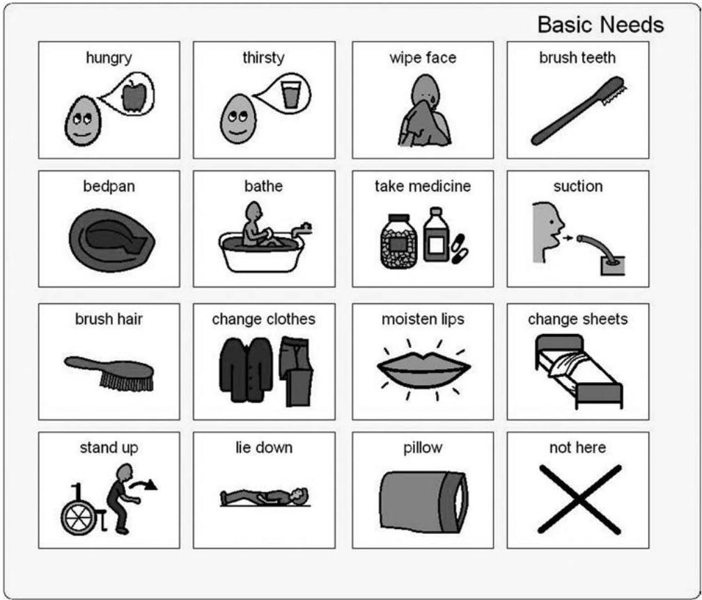

Figure 18.1. Communication board, basic needs. (From Hurtig, R., &amp; Downey, D. [2009]. Augmentative and alternative communication in acute and critical care settings. San Diego: Plural; reprinted by permission.) PCS is a trademark of Tobii Dynavox LLC. All rights reserved. Used with permission. PCS and Boardmaker are trademarks of Tobii Dynavox LLC. All rights reserved. Used with permission.

# Recent-Onset Medical Conditions

Some patients experience recent-onset communication conditions associated with their current hospitalization or care placement. Recent-onset communication conditions may result from a variety of different medical conditions, including

1. Motor speech, language, or cognitive disorders resulting from traumatic brain injuries (TBIs) (see Chapter 17)
2. Motor speech impairment resulting from myasthenia gravis
3. Language disorders (aphasia) resulting from cerebral vascular conditions (strokes) (see Chapter 15)
4. Loss of respiratory support for speech due to high-level spinal cord injury

Patients with these recent-onset conditions experience admission to intensive care, acute care, or a long-term acute care hospital with severe communication limitations for which they have not received previous AAC interventions. They, and their families, often are unaware of the patient-provider communication options available

AAC Interventions for Individuals with Acquired Disabilities

Figure 18.2. Communication board, feelings. (From Hurtig, R., &amp; Downey, D. [2009]. Augmentative and alternative communication in acute and critical care settings. San Diego: Plural; reprinted by permission.)
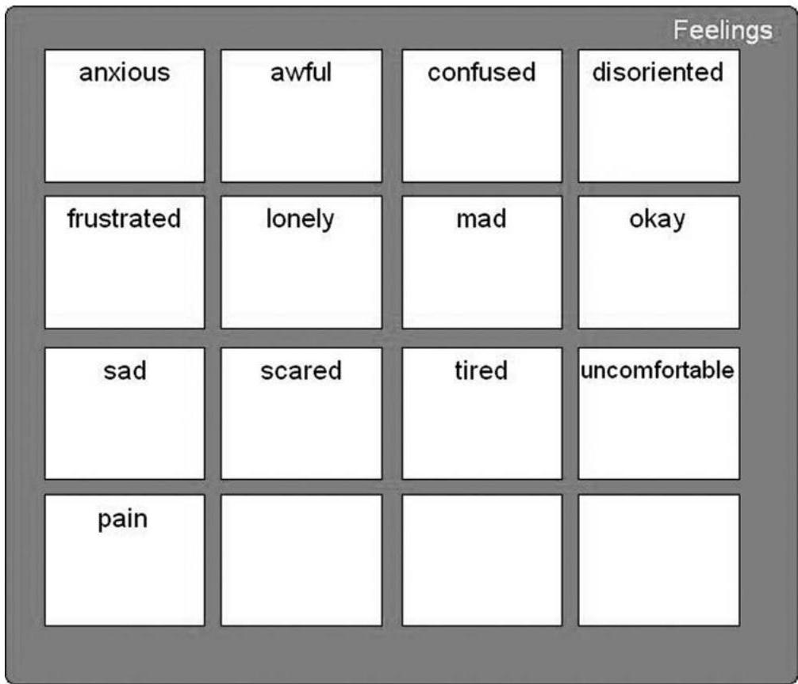

PCS is a trademark of Tobii Dynavox LLC. All rights reserved. Used with permission. PCS and Boardmaker are trademarks of Tobii Dynavox LLC. All rights reserved. Used with permission.

for them, so they may face very difficult medical situations often without effective communication experience or options.

# Side Effects of Medical Interventions

Some patients experience communication conditions that result from medical interventions such as

1. Surgery to treat laryngeal, oral, or respiratory cancer
2. Surgery to remove cancerous tumors in areas of the brain that control cognitive, language, or motor function
3. Intubation or tracheostomy to support respiratory function following traumatic injury to the spinal cord or speech structures that interferes with voicing (phonation) for speech

These patients experience complex communication needs due to medical procedures; they may or may not have received communication preparation prior to these medical procedures, depending on the patient-provider communication policies and

Patient-Provider Communication in Medical Settings

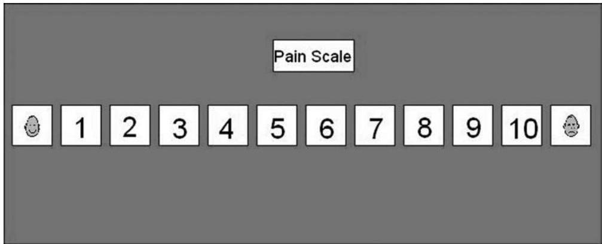

Figure 18.3. Communication board, pain scale. (From Hurtig, R., &amp; Downey, D. [2009]. Augmentative and alternative communication in acute and critical care settings. San Diego: Plural; reprinted by permission.) PCS is a trademark of Tobii Dynavox LLC. All rights reserved. Used with permission. PCS and Boardmaker are trademarks of Tobii Dynavox LLC. All rights reserved. Used with permission.

practices of the medical unit. Some medical units have standing orders for patients who are scheduled for medical interventions that will likely result in complex communication needs; unfortunately, others do not have such orders. Instead, they only issue specific orders for patient-provider communication after communication breakdowns occur.

Mike S., a 46-year-old man who had Guillain-Barré syndrome, describes what a patient might experience when he or she is unable to communicate with the people providing medical care:

When they put the tubes in, you get to the point of being helpless and you feel a need to communicate and talk to someone. You can't move. And you can't talk. And you want to say things. And you think, "Now I'd like to ask some more questions. You explained to me what's going on. But no, I want to know more now. What's going to happen?" And all you can really do is just lay there. That's when you really, really get spooked the most. (in Fried-Oken, Howard, &amp; Stewart, 1991, p. 43)

# Preexisting Communication Conditions

Some patients enter medical situations with preexisting communication conditions, such as those with speech or language disorders resulting from any of the following:

1. Developmental conditions such as cerebral palsy, autism spectrum disorder, Down syndrome, and Rett syndrome (see Chapter 13)
2. Acquired medical conditions such as amyotrophic lateral sclerosis (ALS), Parkinson's disease, multiple sclerosis, a previous stroke resulting in aphasia, or dysarthria from a previous traumatic brain injury (see Chapters 14-17)
3. Associated congenital or progressive hearing loss resulting in communication vulnerability in medical situations and settings when patients are attempting to interact with medical and care staff who are unfamiliar with them

Finally, some patients have difficulty communicating effectively in medical settings because of their native language, the complexity of their medical situation, or

AAC Interventions for Individuals with Acquired Disabilities

Figure 18.4. Communication board, room items. (From Hurtig, R., &amp; Downey, D. [2009]. Augmentative and alternative communication in acute and critical care settings. San Diego: Plural; reprinted by permission.)
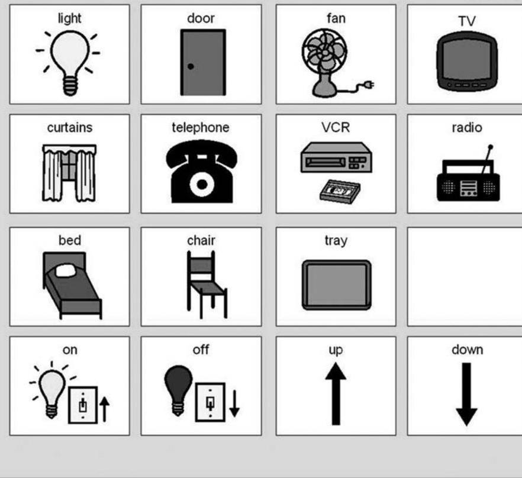

PCS is a trademark of Tobii Dynavox LLC. All rights reserved. Used with permission. PCS and Boardmaker are trademarks of Tobii Dynavox LLC. All rights reserved. Used with permission.

unfamiliarity with medical and legal vocabulary in addition to their complex communication needs. These patients and their families include

1. Those who have a primary language that is different than that of the medical providers (e.g., tourists and immigrants with complex communication needs and their family members who experience language barriers when they are attempting to communicate about complex medical and care issues)
2. Those who are unfamiliar with medical information related to a medical emergency or recent medical conditions, and therefore are unfamiliar with the vocabulary and terminology used by medical staff to communicate about their medical condition and related interventions
3. Those who need to communicate about legal issues, such as a will, end-of-life document(s), or testimony to law enforcement about an accident or an assault related to their medical condition

For patients with complex medical and/or legal issues, communication can be difficult. The patient-provider communication program for the medical facility or unit should have individuals who serve as communication and legal intermediaries

Patient-Provider Communication in Medical Settings

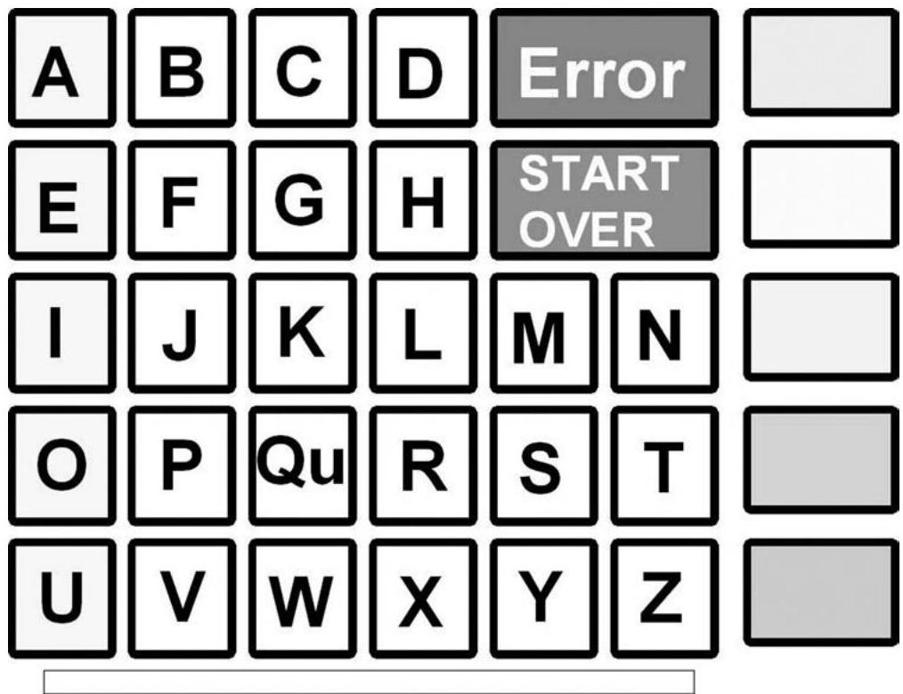

Figure 18.5. Communication board, letters game. (From Hurtig, R., &amp; Downey, D. [2009], Augmentative and alternative communication in acute and critical care settings. San Diego: Plural; reprinted by permission.)

to ensure that the patient accurately understands messages from medical and legal personnel, and that the message communicated by the patients is accurately understood by medical and/or legal personnel.

# PATIENT-PROVIDER PERSONNEL ROLES

When people with complex communication needs are in medical settings, they interact with a range of different medical and care providers. During an outpatient medical visit, they may communicate with a receptionist, nurse, and physician (or physician's assistant). However, in inpatient hospital settings, it is not unusual for them to communicate with a physician, numerous different nurses, a physical therapist, an occupational therapist, a speech-language pathologist, medical technicians, dietary staff, social workers, pastoral care providers, housekeeping staff, and volunteers, many of whom are unfamiliar with the patient (Hurtig, Nilen, Happ, &amp; Blackstone, 2015). Gormley and Light (2018) reported on the experiences of children with complex communication needs in inpatient rehabilitation settings and found that a child typically interacted with more than 26 different health care providers in a 2-day period.

Family members of children and adults with complex communication needs may be actively involved in communication support roles in medical situations. They may

be involved during outpatient medical visits, the early days of hospitalization, team planning meetings, discharge planning meetings, as well as financial, legal, and end-of-life decision-making discussions. During long-term hospitalization or residence in long-term care units, family members typically cannot be available on a daily basis. During these medically related encounters, medical staff typically interact with patients and their family members.

## Medical Staff

Physicians or physician assistants are responsible for evaluating patients and issuing appropriate medical orders for all areas of care. Therefore, it is essential that these medical personnel be aware of the patient-provider communication resources and services that are available in the medical settings that they serve. A hospitalist is a physician who works exclusively in a hospital and specializes in the care of hospitalized patients. Hospitalists are usually involved in the range of care orders that support patient-provider communication interventions. Other hospitals have specialty wards or units for neurology, otolaryngology, and rehabilitation that are served by physicians or medical residents who specialize in these specific medical areas. Finally, in small hospitals and long-term care facilities, the patient's personal physician is usually responsible for ordering services, including patient-provider communication.

Because nursing personnel are generally responsible for supervising or carrying out many day-to-day activities in the medical care plan, they have extensive contact with both individuals with complex communication needs and their family members. Thus, nurses are in an excellent position to assist the AAC team by monitoring an individual's status, coordinating AAC interventions with the medical care plan, documenting the individual's communication needs, and keeping family members informed of changes in the communication plan. The nursing coordinator often assumes the role of patient advocate during communication intervention and actively encourages physicians to request AAC services.

Respiratory therapists deal with a high proportion of the people in acute care units. These therapists are generally responsible for day-to-day management of individuals' respiratory status, including that of people with endotracheal or tracheostomy tubes. The patient-provider communication team must cooperate closely with respiratory therapists for successful intervention. Ongoing staff education is important, especially in training hospitals in which the staff consists of interns and residents as well as senior medical personnel. The AAC team members may be invited to present their plan directly to the medical team. Instruction about specific patient-provider communication services, however, usually occurs in the context of ongoing service delivery.

## Patient-Provider Communication Team Roles

The patient-provider communication effort for a medical agency, facility, or unit usually involves several participants who fulfill specific roles and assignments (Beukelman & Nordness, 2017). Patient-provider communication coordinators have overall responsibility for the patient-provider communication effort in a unit or facility, as they oversee the program, acquire communication materials and tools, and train medical providers in patient-provider communication strategies. Daily communication facilitators support the communication of specific patients on a daily basis by ensuring that appropriate messages are represented in communication materials; that AAC

Patient-Provider Communication in Medical Settings
655

materials and technology are cleaned, charged, and maintained; and that unfamiliar communication partners are appropriately instructed, when necessary. A legal communication intermediary is an individual who supports accurate communication between a communication-vulnerable patient and legal personnel. When the legal communication involves the medical or care provider, the intermediary is an individual who is not an employee of the medical or care facility or the legal firm involved in the investigation of legal proceedings.

In acute care and rehabilitation settings, paid staff usually assume these communication support roles. However, in long-term residential settings, a range of different staff, volunteers, and family members support communication depending on the policies and practices of the facility as well as the unique communication needs of individual patients.

# MEDICAL ORDERS (REFERRALS) FOR PATIENT-PROVIDER COMMUNICATION SERVICES

Several different types of medical orders can be used to initiate patient-provider communication intervention for patients in medical settings (Beukelman &amp; Nordness, 2017). In many medical settings, physicians or physician assistants only initiate patient-provider communication services with specific referrals. However, some medical agencies have established patient-provider communication policies and strategies that utilize several different medical order types, which are briefly described in the following section.

# Specific Order (Referral)

Specific orders (referrals) specify the transfer of care for a patient from one professional to another. Specific orders may also be requests for a second opinion, to evaluate or manage a particular problem, or to authorize care by a specialist or agency. Typically, a specific referral is ordered by a physician to address the need of specific patients at specific times in their treatment. For example, such a referral would order the assessment of patients for communication disorders and perhaps also initiate an intervention program. Often, a patient-provider communication intervention is not ordered until communication breakdowns occur.

Consider the following case described by Beukelman and Nordness (2017) where a specific order did not result in appropriate management. A 54-year-old woman was diagnosed with Guillain-Barré syndrome. She had lost the ability to use her arms and legs, to breathe, to swallow, and to talk and was intubated. In time, a tracheostomy was inserted, and she remained on the ventilator support. Because the facility did not routinely order speaking valves when patients are on ventilators, a specific order was not entered in the electronic medical record system for a speaking valve evaluation until after she was weaned from the ventilator. Then, a speech-language pathologist evaluated her for a speaking valve, but her anatomy was too small to tolerate it. Orders for patient-provider communication services were requested, but it took nearly a week to obtain another specific order for the patient-provider communication evaluation to be done. Eventually, she was provided with a low-tech laser pointer mounted on her glasses, so she could point to messages on a wall-mounted communication board.

For patients with preexisting severe dysarthria, the need for patient-provider communication in care and medical settings is common. However, specific orders are often not made until there are communication breakdowns. For patients with recent-onset conditions, assessment and diagnostic procedures are ordered with specific referrals by the medical staff. For patients facing treatments or procedures that might further impact communication effectiveness, specific referrals for patient-provider communication support depend on a physician, nurse, or speech-language pathology advocate. In our clinical experience, specific orders are usually not issued until there is a communication breakdown, unless a specific policy is in place.

### Medical Order for Scope of Treatment

A medical referral for scope of treatment can be used to order patient-provider communication support for a patient that will be activated when the communication-vulnerable individual is admitted for medical care or admitted into a medical facility. These orders are issued by a physician following consultation with a patient who has independent legal standing, or family member if the patient does not have independent legal standing. The order usually identifies the type(s) of patient-provider communication support needed, such as AAC or hearing devices. These orders must be reviewed annually by the physician for people with preexisting medical conditions so that the order can be provided to medical providers in unexpected or unpredicted medical situations. Scope of treatment orders are increasingly used for specific people who rely on AAC and live away from their families on a college campus, in an independent living situation, or in an assisted-living facility. A scope of treatment order is issued so that if the individual needs emergency or acute medical care by the campus health center or a local hospital, patient-provider communication support would be ordered upon the admission of the patient into the medical center.

### Standing Order

A standing order prescribes the action(s) and support to be implemented for a patient with a specific medical condition. For example, appropriate patient-provider communication interventions can be specified in a standing order for patients who will be intubated during a surgical procedure or will undergo a laryngectomy for laryngeal cancer or oral surgery for oral cancer. Rehabilitation facilities often issue standing orders for individuals who are admitted following a stroke (CVA), so a specific communication assessment will be completed to determine if patient-provider communication support or further communication intervention is needed, whether or not these services had been provided in the acute medical setting from which the patient was transferred.

### Care Map

A care map or clinical pathway contains a series of orders that designate the patient journey for a special medical condition in a particular medical setting. Care maps are often used by rehabilitation hospitals to treat patients with spinal cord injury, stroke, or traumatic brain injury. These maps order patient-provider communication interventions if needed to support communication effectiveness during medical care or rehabilitation.

AAC Service Delivery in Medical Settings

Melanie Fried‐Oken (2001), writing about her husband's use of AAC in an ICU following a severe bicycling accident, describes it as follows: “[His] messages were short but effective. . . . I remember some of them clearly: Where am I, When, What happened, Move me up/down, Bedpan, More pillow, Get Nurse. . . . It was clear that the perceptions of others were influenced by his communication performance. . . . The portable typewriter [Lightwriter] with voice output was essential in changing the way people talked to Barry and asked him questions. (p. 139)”

Because medical settings are so organizationally complex, onsite professionals, rather than external consultants, usually provide the most effective ongoing AAC services. It is much more difficult for a consultant to come intermittently to a hospital to provide AAC services because the individual who requires the services may be unavailable, too ill, resting, or receiving other medical treatments that take priority at the time of the consultant's visit.

The delivery of AAC services in acute medical settings is structured differently from delivery of AAC services in typical rehabilitation or educational settings. In acute care settings, patients with complex communication needs are typically interacting with providers who are unfamiliar with them personally and unfamiliar with their communication support options. Also, at times, their communication capabilities have recently changed due to the current medical condition. For those with complex communication needs in rehabilitation hospital settings, a speech‐language pathologist and other therapy team members are assigned to a specific patient, so they become familiar with the patient's communication needs and supports. However, the nursing staff may be quite diverse as they serve the patient 24 hours a day, 7 days a week. It is not uncommon for 20 different nursing staff members to interact with the patient during a given week. Of course, AAC services in an educational setting involve much more consistent staffing than in medical settings. Usually, one speech‐language pathologist is assigned to provide AAC support for a student during elementary school, along with one or two teachers and perhaps an aide. In middle and high school, additional teachers will interact with the student depending on the student's educational placement; however, these individuals are consistent throughout the school year. A successful AAC program in any given setting must accommodate factors specific to the setting in order to be accepted and used by patients and medical personnel.

### Establishing a Patient‐Provider Communication Program

It is beyond the scope of this chapter to provide an extensive discussion regarding how to develop an AAC program in an intensive or acute care medical setting (see Costello, 2000; Garrett, Happ, Costello, & Fried‐Oken, 2007; Hurtig & Downey, 2009, for detailed descriptions of this process). Garrett et al. (2007) noted that AAC teams should pay careful attention to individuals' equipment needs in acute care settings, as well as to administrative, organizational, and personnel training issues. They suggested that the following equipment and materials form the basis for many AAC interventions in acute medical settings: 1) a lightweight neck‐type electrolarynx (i.e. one that is positioned against the neck and vibrates the air column within the vocal tract);

AAC Interventions for Individuals with Acquired Disabilities

2) an oral-type electrolarynx (i.e., one that delivers sound into the oral cavity through a tube); 3) materials to construct alphabet boards, word boards, and picture boards; 4) several whiteboards or magic slates (these are generally sold as toys and consist of a sheet of plastic over a piece of coated board that can be written on; when the plastic is lifted, written messages disappear); 5) at times, AAC technology with speech output (tablet or smart phone) for some individuals in long-term acute care units; and 6) a portable mounting system on wheels to hold cardboard message boards or eye-pointing displays. These minimal equipment needs reflect the previously stated philosophy of simplifying AAC interventions in this area and are echoed by Dowden, Beukelman, and Lossing, 1986:

Clinicians with very few AAC systems can nonetheless serve ICU patients quite well . . . The majority of our patients were served with electrolarynges or . . . modified natural speech approaches. With additional access to the least expensive communication systems (Plexiglas boards for eye-gaze, . . . paper and pencil, and a few small text-to-speech typing systems), we were able to serve all but a few of our patients. This means that even the smallest clinical program should consider serving patients in intensive care units. (p. 43)

It is quite common for the AAC team to prepare a set of AAC materials for the intensive care unit or acute care unit in the hospital so that the staff has access to these materials as needed. More extensive AAC technology may be necessary for people who remain in long-term acute care or residential settings. Typically, this technology is purchased or rented by the patient depending on financial support options, life expectancy, and anticipated course of the medical condition.

## PATIENT-PROVIDER COMMUNICATION OPTIONS FOR PATIENTS WITH COMPLEX COMMUNICATION NEEDS DUE TO SPEECH AND LANGUAGE LIMITATIONS

The sections that follow describe options for patients with complex communication needs due to speech and language limitations. Topics addressed include understanding patient issues related to their medical needs and care; use of the Participation Model to identify their communication participation patterns and communication needs; and the assessment of opportunity barriers and supports, access barriers and patient capabilities, specific capabilities and competencies, and constraints affecting communication options.

## Understand Patient Issues

Individuals in medical settings have serious medical needs that are critical to their survival. The delivery of AAC services simply cannot interfere with the delivery of medical care. Communication support services must be integrated into the overall care plan for the individual.

The intensity of medical care affects the AAC program in a variety of ways. Medical staff are responsible for establishing and delivering an overall medical plan in which communication intervention plays an integral role. Thus, the AAC staff cannot provide services without a request or referral from the medical team. The AAC team members must clearly communicate the types of services they can deliver. They must consult with the medical team before and during AAC interventions to ensure that efforts coordinate well with and support the overall medical plan. If communication specialists do not follow these guidelines, they may fail to meet individuals' AAC needs.

Patient-Provider Communication in Medical Settings
659

Because patients in medical settings receive such extensive medical support, it is common for many different professionals as well as visiting family members and friends to have contact with each person during a 24-hour period. Thus, a variety of individuals must be able to understand AAC interventions. Signs on the walls, written messages, or oral instructions must provide instructions for all these people. AAC interventions must be minimally complex and require minimal training and learning to be successful.

## Identify Communication

### Participation Patterns and Communication Needs

The Participation Model (see Figure 2.2) supports the overall delivery of AAC services to people in care and medical environments. Interventionists can expect restricted participation patterns because individuals in acute care, intensive care, and inpatient rehabilitation are essentially in one communication environment, have limited face-to-face contact with people in their social networks, and are not working; however, for some patients, communication over a telephone and over digital networks remains an option. Internet communication is supported in an increasing number of long-term acute care and long-term residential care units (including electronic face-to-face communication at a distance).

Olinda uses a ventilator to breathe as a result of ALS (Fager, Beukelman, &amp; Jakobs, 2009). She communicates, reads, and controls her environment with eye-tracking AAC technology. She e-mailed the AAC clinic and asked for help in learning how to use her technology to communicate using Skype (a face-to-face video-calling application) so that she could communicate in a new way with her son and daughter-in-law who live across the country from her. Her daughter-in-law was pregnant, and Olinda wanted to be ready to see and interact with her first grandchild (S. Fager, personal communication, 2010).

John experienced chronic Guillain-Barré syndrome. Because of his respiratory needs, we assisted him while he was in the long-term acute care hospital unit. His communication was limited in several ways. Using head-tracking AAC technology, John was able to interact with staff and family. To communicate at a distance, he used his AAC technology to speak on the telephone, but most distance communication with his family, friends, and a long-term, personal physician was by e-mail. He also used his head-tracking skills to access information from the Internet and to access electronic games (S. Fager, personal communication, 2012).

### Assess Opportunity Barriers and Supports

Individuals in medical settings deserve to have access to patient-provider communication services to meet their communication needs, and the lack of availability of such services can be considered to be an opportunity barrier. Few hospitals appear to have actual policies against AAC and patient-provider communication services; even so, AAC teams must deal with a number of practice or knowledge barriers to ensure effective patient-provider communication. These barriers may include 1) medical teams that do not refer individuals for AAC services; 2) personnel who prefer not to be burdened with additional work in an already busy (and, perhaps, understaffed) workplace; 3) speech-language pathologists and other professionals

who are not familiar with conducting AAC interventions in these settings; or 4) staffing patterns that result in the speech-language pathologists working in acute and intensive care settings having little or no AAC experience while AAC specialists serve the inpatient and outpatient rehabilitation programs.

### Assess Access Barriers and Patient Capabilities

As with other AAC assessments, those that occur in care settings require considerations of specific access barriers and capabilities.

### Assess Specific Capabilities/Competences: Preliminary Screening

Many individuals in medical settings are unable to participate in extensive assessment procedures. The AAC team should conduct a preliminary screening as the first step of an assessment to determine what capabilities are available to support communication. Garrett et al. (2007) identified a series of communicative tasks that might be considered.

Natural communication signals should be identified and evaluated to determine if the medical staff can accurately interpret them. These signals might include licking the lips to signal the need for lip moisturizer, wrinkling the face to signal pain or itchiness, protruding the tongue to signal the need for a urinal, or closing the eyes to signal the desire to be left alone. Yes/no signals are essential to early communication in ICU settings. Affirmation or negation can be signaled with hand squeezes, eye movement (up for yes and down for no), or thumb movement (up for yes and down or sideways for no). Of course, these codes should be noted on a sign (or whiteboard) posted on a wall in the room, recorded in the medical chart, and shared at team meetings. The AAC team should accommodate the individual's hearing and vision by making sure that the need for glasses and hearing aids is identified and that these aids are routinely provided.

Comprehension and attention strategies that are effective for each patient should be identified. After all, medical and care environments are unfamiliar environments for most individuals. It is typically noisy, with a range of technology and alarm systems in operation, and it is busy, with many different staff coming and going. At times, two or more staff members may be in the room at once, with multiple people attempting to communicate with the patient. Therefore, it is important to identify strategies that effectively get the attention of the patient before questions are asked or instructions are given. Also, Garrett et al. recommended a strategy in which staff “establish and maintain eye gaze with the patient when trying to communicate with [him or her]” (2007, p. 32). Comprehension of information is often assisted by providing visual information in the form of print, drawings, or pictures in addition to the spoken message, a technique known as augmented input. Finally, communication is typically improved if the patient is given a description, involving photographs or videos, of more complex procedures before the procedure is begun, rather than not describing the procedure at all or trying to describe it as the procedure is being implemented.

### Individuals with Insufficient Motor Control for Speech

Some people have insufficient motor control for speech. If this is the case, individuals may require communication systems that use writing, direct selection, and/or scanning, as discussed in the following sections.

Writing Options

Handwriting can serve as an effective communication mode because many people are comfortable and familiar with this mode of communication. Some individuals prefer to use a pencil and tablet so that, as they write and save messages, they can begin to construct their own communication book. Then, rather than writing the same message again and again, they can simply refer to a question or a comment they communicated previously. Others prefer to use a magic slate or Boogie Board, which display messages written with a stylus that can be erased to maintain privacy.

Alec K. a 35-year-old man who had Guillain-Barré syndrome, describes his use of a magic slate:

> I think that board [a magic slate] was my preference over everything. You could communicate quickly and say what you wanted to say. You can write your letters and separate your words, like in normal writing. And it was much quicker and easier to understand by other people. I think they probably like it the best, too. So, the magic board was the best one, once I could start using my hands again. When I was unable to use my hands, of course the alphabet board [for partner-assisted scanning] was the best, assuming that the other person understood how to use it, which many didn't. (in Fried-Oken et al. 1991, p. 47)

### Options for People Who Cannot Write

Some individuals are unable to write by hand, but they can point accurately with their hands, eyes, or head. AAC teams generally encourage these individuals to use direct selection to access AAC. The direct-selection system can be as simple as an alphabet board with some words or phrases on it. Other individuals may prefer a small typing system. Usually, individuals in acute medical settings do not have the time or motivation to learn to use an encoding strategy. Therefore, some prefer to type their messages with word prediction options if available on the technology.

If available, voice output may be preferred by some individuals. Costello, Santiago, and Blackstone (2015) described the use of voice banking for children scheduled in advance for major surgical procedures such as facial reconstruction. Prior to their surgeries, the children recorded messages that were later transferred to simple AAC technologies that they used in the ICU. Thus, the children were able to use their own voices to “talk” during this difficult and stressful time. Small, portable, digitized devices that contain 30--60 easily accessible messages are convenient for this purpose. If individuals have insufficient hand or arm control to use these options, they may use a headlight pointer to indicate words or letters on a wall- or ceiling-mounted chart or on a communication board placed on a mounting stand.

George was unable to communicate, except to move his head slightly side to side to signal “No” and to point with his eyes. With a diagnosis of severe myasthenia gravis (characterized by weakness and rapid fatigue of muscles), he faced an extended hospital stay. An observant nurse informed us that he could move his right foot a bit, so we mounted a laser pointer on his big toe and a communication device at the foot of his bed. With his head propped up slightly so that he could see the device, George spelled his messages by moving his foot. Six weeks later, he recovered sufficiently to return home, speaking once again.

AAC Interventions for Individuals with Acquired Disabilities

Some individuals may be limited to eye pointing in one of two forms. The first form is conventional eye pointing, in which the individual selects and gazes at a message on a display that is mounted on a transparent plastic board. The communication partner then interprets the direction of the individual's eye gaze and reads the related message. The second form, a technique known as eye linking (see Chapter 7), may also be used. In eye linking, the individual looks at the desired message, and the partner (who is positioned opposite the individual on the other side of the transparent communication board) moves the board until his or her eyes are linked directly across from the individual's. At that point, the message that the individual wants to convey lies between the two people. Many individuals find this strategy to be easier than eye pointing.

**Options for People Who Cannot Use Direct Selection** Some individuals do not have the motor capability to engage in direct selection communication. If they have other reliable, consistent motor responses, these individuals may be able to successfully use a scanning communication option. Many families can learn to use partner-assisted scanning, in which an array of letters or messages is displayed on a communication board, and the communication partner points to or speaks aloud various message options. Alternatively, the communication partner speaks the message options, such as reciting rows of the alphabet orally (divided by the vowels, e.g., *a* row, *e* row, *i* row, *o* row, *u* row) and then offering individual letters in the row selected (e.g., *o p q r s t*). During these visual or auditory options, the individual signals when a desired message is reached by making a gesture, blinking the eyes, or activating a beeper with a switch.

## Assess Constraints

A common constraint that affects AAC interventions is related to instruction of communication partners. The short-term acute medical environment imposes extensive learning constraints. First, individuals are very ill and under a considerable amount of stress. Many individuals in these settings demonstrate little ability or tolerance for learning new technologies. Second, many professionals and others interact with these individuals over the course of their stay. Thus, the most effective AAC interventions are those that require minimal communication partner training. As noted previously, individuals and their medical teams tend not to use complicated AAC systems in short-term acute medical environments, unless they have a preexisting communication condition and have been using AAC prior to their current medical admission.

## MEDICAL CULTURES ARE GUIDED BY POLICIES

In many medical and care facilities, patient-provider communication services are initiated, guided, and directed by professionals who are strong advocates for these services; unfortunately, many of these facilities do not have formalized patient-provider communication policies (Beukelman &amp; Nordness, 2017; Blackstone et al., 2015). Often this personal advocacy strategy is only effective for a facility or situation as long as the advocate is employed in that role.

Fortunately, many facilities are beginning to develop patient-provider communication policies and programs that are summarized for outpatient medical clinic visits

Patient-Provider Communication in Medical Settings
663

(Burns, Baylor, Dudgeon, Starks, &amp; Yorkston, 2017), adult intensive and acute care (Hurtig et al., 2015), pediatric acute and intensive care (Costello et al., 2015), rehabilitation settings (Beukelman &amp; Nordness, 2015), residential long-term care (Beukelman, 2015), and hospice care (Bardach, 2015). (See the book by Blackstone et al., 2015, for more detailed discussion of these issues.)

Beukelman and Nordness (2017) provide two checklists (accessible with the Online Companion Materials for this book) related to patient-provider communication services that can be used by care managers and speech-language pathologists to evaluate practices in their medical settings. The Patient-Provider Communication Checklist for Medical/Care Identification of Medical Setting (Appendix 18.1) documents patient-provider communication personnel, medical orders, communication procedures, communication tools/materials, and personnel training. The Evaluation of Patient-Provider Communication Support for Communication-Vulnerable Patients/Residents (Appendix 18.2) documents the patient-provider communication experiences of communication-vulnerable patients in specific medical/care settings.

## FUTURE DIRECTIONS

At the time this textbook was written, advances in patient-provider communication support across medical settings was receiving considerable attention with the publication of research articles and books. However, on a daily basis, these services are still provided very inconsistently. Accurate and efficient communication between patients and their medical and care providers in medical settings requires the ongoing consideration of the AAC and medical fields. This effort will require ongoing research, development of appropriate communication support technologies and materials, preparation of AAC and medical provider staff, and the implementation of patient-provider care policies and practice across medical settings.

## QUESTIONS

18.1. What are the differences between intensive care units and long-term acute care hospital units?

18.2. How frequently do nursing staff in acute care medical settings interact with patients who have AAC needs? What are the implications?

18.3. What are the roles of a daily communication facilitator for an individual who relies on AAC in a long-term residential care facility?

18.4. Why is it useful to identify the communication needs of patients in a medical unit as part of an AAC intervention?

18.5. If you were responsible for the selection of yes/no eye signals to be used in a medical setting, what signals would you propose, and why? Would you insist that all staff use the same yes/no eye signals or allow each staff member to select the signal that he or she prefers? Why?

18.6. In what situations would a scope of practice order be useful for an individual who relies on high-technology AAC equipment to support her communication?

18.7. A patient who cannot speak or write can only communicate using her eyes. However, her spouse has difficulty interpreting her eye pointing, so you decide to teach him eye linking. How would you introduce this strategy to him?

AAC Interventions for Individuals with Acquired Disabilities

18.8. What are the limitations and benefits of specific orders and standing orders for patients who require patient-provider support following oral or laryngeal surgery?

18.9. What are the roles of a patient-provider communication coordinator in an acute medical setting?

# REFERENCES

Bardach, L. (2015). Enhancing communication in hospice settings. In S. Blackstone, D. Beukelman, &amp; K. Yorkston. (Eds.), Patient provider communication: Roles for speech-language pathologists and other health care professionals (pp. 271-302). San Diego, CA: Plural.

Beukelman, D. (2015). Residential long-term care. In S. Blackstone, D. Beukelman, &amp; K. Yorkston (Eds.), Patient provider communication: Roles for speech-language pathologists and other health care professionals (pp. 247-270). San Diego, CA: Plural.

Beukelman, D., &amp; Nordness, A. (2015). Inpatient and outpatient rehabilitation. In S. Blackstone, D. Beukelman, &amp; K. Yorkston (Eds.), Patient provider communication: Roles for speech-language pathologists and other health care professionals (pp. 225-256). San Diego, CA: Plural.

Beukelman, D., &amp; Nordness, A. (2017). Patient-provider communication for people with severe dysarthria: Referral policies that lead to systems change. Seminars in Speech and Language, 38, 239-250. doi:10.1055/s-0037-1602843

Blackstone, S., Beukelman, D., &amp; Yorkston, K. (Eds.). (2015). Patient provider communication: Roles for speech-language pathologists and other health care professionals. San Diego, CA: Plural.

Burns, M., Baylor, C., Dudgeon, B., Starks, H., &amp; Yorkston, K. (2017). Health care provider accommodations for patients with communication disorders. Topics in Language Disorders, 37, 311-333. doi:10.1097/TLD.0000000000000134

Costello, J. (2000). Intervention in the intensive care unit: The Children's Hospital Boston model. *Augmentative and Alternative Communication*, 16, 137-153. doi:10.1080/07434610012331279004

Costello, J., Santiago, R., &amp; Blackstone, S. (2015). Pediatric acute and intensive care in hospitals. In S. Blackstone, D. Beukelman, &amp; K. Yorkston (Eds.), Patient provider communication: Roles for speech-language pathologists and other health care professionals (pp. 187-224). San Diego, CA: Plural.

Dowden, P., Beukelman, D., &amp; Lossing, C. (1986). Serving non-speaking patients in acute care settings: Intervention outcomes. *Augmentative and Alternative Communication*, 2, 38-44. doi:10.1080/07434618612331273840

Fager, S., Beukelman, D., &amp; Jakobs, T. (2009). Supporting communication of individuals with minimal movement [Webcast]. Retrieved from http://aac-rerc.psu.edu/index.php/webcasts/show/id/14

Fried-Oken, M. (2001). Been there, done that: A very personal introduction to the special issue on augmentative and alternative communication and acquired disorders. *Augmentative and Alternative Communication*, 17, 138-140. doi:10.1080/aac.17.3.138.140

Fried-Oken, M., Howard, J., &amp; Stewart, S. (1991). Feedback on AAC intervention from adults who are temporarily unable to speak. *Augmentative and Alternative Communication*, 7, 43-50. doi:10.1080/07434619112331275673

Garrett, K., Happ, B., Costello, J., &amp; Fried-Oken, M. (2007). AAC in the intensive care unit. In D. Beukelman, K. Garrett, &amp; K. Yorkston (Eds.), *Augmentative communication strategies for adults with acute or chronic medical conditions* (pp. 17-57). Baltimore, MD: Paul H. Brookes Publishing Co.

Gormley, J., &amp; Light, J. (2018). Child-parent-provider interactions during medical encounters on an inpatient rehabilitation unit: A preliminary investigation. Poster presented at the Rehabilitation Engineering Research Center State of the Science Conference, Washington, DC.

Hurtig, R., &amp; Downey, D. (2006). The use of augmentative and alternative communication in acute care settings. Presentation at the Iowa Speech Language and Hearing Association Conference, Iowa City, IA.

Hurtig, R., &amp; Downey, D. (2009). Augmentative and alternative communication in acute and critical care settings. San Diego, CA: Plural.

Hurtig, R., Nilen, M., Happ, M., &amp; Blackstone, S. (2015). Adult acute and intensive care in hospitals. In S. Blackstone, D. Beukelman, &amp; K. Yorkston (Eds.), Patient provider communication: Roles for speech-language

Patient-Provider Communication in Medical Settings

pathologists and other health care professionals (pp. 139–186). San Diego, CA: Plural.
Joint Commission. (2014). Advancing effective communication, cultural competence, and patient- and family-centered care: A roadmap for

hospitals. Retrieved from https://www.jointcommission.org/roadmap_for_hospitals/
Makary, M., &amp; Daniel, M. (2016). Medical error: The third leading cause of death in the US. BMJ, 353, i2139. doi:10.1136/bmj.i2139

.

19

# The Importance of Advocacy

In 2006, the United Nations ratified an international convention to uphold the dignity and rights of persons with disabilities. A key component of this international convention is the recognition of the fundamental right of communication for all individuals. Many people who have easy access to speech, writing, and typing take this essential human right for granted. Yet for an estimated 5 million Americans and more than 97 million people worldwide, this basic human right is by no means a given. These individuals have complex communication needs and have limited or no access to conventional channels of communication—speech, writing, and typing. The group of individuals with complex communication needs has no boundaries in terms of age, race, ethnicity, gender, sexual orientation, religion, socioeconomic status, or nationality. It includes children and adults across the life span; it encompasses those with developmental disabilities, acquired conditions, degenerative disorders, and temporary conditions. It is a group to which any of us may one day belong. Without access to speech, writing, and typing, individuals with complex communication needs are severely limited in their ability to express needs and wants, exchange information, develop social relationships, and establish their identities. They are severely restricted in their participation in education, employment, health care, family, and community. But it does not need to be that way.

We hope that this book has shown how AAC intervention can fundamentally change the equation, by providing individuals with complex communication needs with the tools and supports to communicate successfully and to participate within society as they choose. Providing effective, evidence-based AAC intervention requires significant knowledge and skills on the part of the AAC team, including the individual with complex communication needs, family, and professionals from a wide range of disciplines. This book has described the knowledge base underlying AAC intervention. This knowledge base is essential to improve the lives of individuals who rely on AAC.

However, knowledge alone is by no means sufficient. Also required is a deep commitment on the part of professionals and society to the right of communication for all—including those with the most complex needs. The research has clearly demonstrated the positive impact of AAC on outcomes for children and adults across age and disability groups. This research has demonstrated what is possible. Unfortunately, what is possible is still not what is available for many children and adults with complex communication needs in the United States and worldwide. Many fail to receive the high-quality AAC services they require to realize the basic human right of communication. Bob Williams, former Deputy Commissioner of the Administration

667

AAC Interventions for Individuals with Acquired Disabilities

on Disabilities and former Director of the Independent Living Administration of the United States Department of Health and Human Services, and an expert communicator via AAC, summed up the problem as follows:

Why are so many people consigned to lead lives of needless dependence and silence? Not because we lack the funds, nor because we lack the federal policy mandates needed to gain access to those funds. Rather, many people lead lives of silence because many others still find it difficult to believe that people with speech disabilities like my own have anything to say or contributions to make. (p. 250)

Many individuals who require AAC face substantial policy, practice, attitude, knowledge, skill, and service delivery barriers that preclude their access to communication. Concerted advocacy is required to overcome these barriers to ensure access to AAC and meaningful opportunities for communication for all, including those with the most complex needs. There are numerous examples of effective advocacy efforts in the field to improve outcomes for individuals who require AAC, including 1) efforts to enhance early intervention, literacy instruction, community participation, and patient-provider communication; 2) efforts to effect systemic change to continue to improve funding of AAC supports and continue to improve preservice preparation; and 3) the hard work of specific AAC teams to provide opportunities for individual children and adults and their families. Each of us can play a role in these advocacy efforts. We urge each of you to pause as you finish this book, reflect on at least one way in which you can make a positive difference in the lives of individuals with complex communication needs and their families, and commit to that effort. As single individuals, we may not be able to change the world, but as an AAC community we can effect significant positive change.

Perhaps Schuyler Hudson, a young woman who uses AAC, and her father, Rob Rummel-Hudson, said it best when they wrote:

My point . . . for every educator and every employer and policy maker and citizen, is that the only way the world will work for people with disabilities like Schuyler is if it becomes a place defined by opportunity. Inclusion can't be a policy or a goal; the time for that is long behind us now. Meaningful inclusion has to reside in our DNA as a society. . . . We need to create a just and inclusive society with opportunities and authentic relationships and real equity. (Rummel-Hudson &amp; Hudson, 2018)

Bob Williams concluded,

Access to assistive technology and other effective means of expression is vital. Having the power to speak one's heart and mind changes the disability equation dramatically. In fact, it is the only thing I know that can take a sledgehammer to the age-old walls of myths and stereotypes and begin to shatter the silence that looms so large in many people's lives. (Williams, 2000, p. 249)

# REFERENCES

Rummel-Hudson, R., &amp; Hudson, S. (2018, July 13). The folly of fortune telling. Webcast presented at the 2018 State of the Science in AAC Conference, Arlington, VA. Retrieved from https://aac-learning-center.psu.edu/2018/10/14/the-folly-of-fortune-telling/
United Nations. (2006). Convention on the Rights of Persons with Disabilities. Retrieved from

https://www.un.org/development/desa/disabilities/convention-on-the-rights-of-persons-with-disabilities.html
Williams, B. (2000). More than an exception to the rule. In Fried-Oken, M. &amp; Bersani, H. (Eds.), Speaking up and spelling it out: Personal Essays on Augmentative and Alternative Communication (pp. 245-254). Baltimore, MD: Paul H. Brookes Publishing Co.

Index

Tables and figures indicated by $t$ and $f$, respectively.

AAC, see Augmentative and alternative communication

AAIDD, see American Association on Intellectual and Developmental Disabilities

ABA, see Applied behavior analysis

Abbreviation-expansion, 224

Acceleration vocabulary, 176

Acceptance signals, 334–335, 558

Access, 243–245, 251–252

assessing patient-provider communication, 660

assessment of, 70–76, 73f, 75f, 76t

cerebral palsy and, 294–297, 295f, 296t

direct selection, 252–254

direct selection activation strategies, 254–255

feedback, 260–261

message output and input, 261–266

physical characteristics of displays, 248–251, 251f

scanning, 255–260

selection set, 245–251

Acquired conditions

aphasia and/or apraxia of speech in, 556–559, 557t, 586–595, 586t, 595f

communication strengths interventions for, 609–610, 609t

comparison of partner-supported strategies and independent AAC for, 572

contextual choice AAC communicators, 559–567, 560t, 561–566f

generative AAC communicators, 575–580, 576t, 578f

intervention by stage of dementia in, 610–612

memory strengths and deficits in, 608–609

need for AAC with, 19–20

selection and personalization of AAC for, 283–285

specific-need AAC communicators, 580–585, 581–582f, 584f

stored-message AAC communicators, 572–575, 574f

transitional AAC communicators, 567–572, 568t, 569–570f

visual scene displays (VSDs) for, 218–220, 218f

see also Degenerative cognitive and linguistic conditions; Physical conditions, acquired; Traumatic brain injury (TBI)

Acquisition, generalization, and maintenance of strategies and skills, 112

Activation strategies

direct selection, 254–255

feedback, 260–261

Active listening skills, 404

Activity grid displays, 207–208, 207f

ADA, see Americans with Disabilities Act

Adaptations

assessment, 43–44, 44t

literacy instruction, 443–446, 444f

motor impairment, 43–44, 44t, 445

speech impairment, 443–445, 444f

Advanced reading skills intervention, 462–466, 465t

Advanced writing skills intervention, 466–469, 468t

Advancing Effective Communication, Cultural Competence, and Patient- and

669

Index

Family-Centered Care: A Roadmap for Hospitals, 3, 647

Advocacy, 673–674

Age variables and vocabulary, 169–170

Age-appropriate communication opportunities, 324

Agraphia, 581–583, 582f

letter-writing format for, 581–583, 582f

Aided AAC, 194, 230–231

defined, 185

early symbolic communication with, 346–347

encoding and prediction techniques, 224–230

focused stimulation and, 388–389

input or modeling, 186, 266

interventions that combine unaided and, 203–204

line drawings, 197–203

navigation of, 222–223

operational skills and, 391, 391t

organization and layout, 204–221

partial or associated objects, 195–196

photographs, 197

real objects, 195

symbols and other representations, 194–204

technologies with just-in-time programming, 221–222

traditional orthography, 203

see also Grid displays; Visual scene displays (VSDs)

Aided symbol display, 264–265

Alphabet (letter) codes, 225

Alphabet supplementation, 632, 632f

Alphabetical grid displays, 211

ALS, see Amyotrophic lateral sclerosis

Alternative response modes, 443–444

Alzheimer’s disease, 606

see also Degenerative cognitive and linguistic conditions

American Association on Intellectual and Developmental Disabilities (AAIDD), 303

American Sign Language (ASL), 191

American Speech-Language-Hearing Association (ASHA), 45

augmentative and alternative communication (AAC) definition, 4

Functional Communication Measures, 114

National Outcomes Measurement System (NOMS), 114

Participation Model, 28

Americans with Disabilities Act (ADA), 39, 94

Amyotrophic lateral sclerosis (ALS) communication symptoms in, 520–521

defined, 520

model for AAC intervention for, 521–532

Android Apps for Complex Communication Support Needs, 278

Angelman syndrome, 190

APAR, see Assessment of Phonological Awareness and Reading

Aphasia and/or apraxia of speech, 597–598

assessing communication needs and participation in real-life contexts, 593–595, 595f

assessment of, 586–595, 586t, 595f

baseline modality assessment, 587

case example and outcomes, 558–559

cognition assessment with, 591–592

combining stored and generative messages, 590–591

continuum of AAC support for, 555–556, 556f

conversational strategy trials, 587–588

defined, 553–555

in emerging AAC communicators, 556–559, 557t

hearing and vision screening, 593

identifying communicator profiles in, 586–587, 586t

intervention issues, 595–597

intervention strategies, 557–558, 557t

life experiences and vocabulary with, 593

motor capabilities with, 592

needs assessment interview in, 594

operational skills with, 593

peer participation patterns and, 595

representational capabilities with, 592

residual language capabilities, 591

social networks with, 594–595, 595f

topic sorting with, 594

transactional role play, 589–590

See also Natural speech

Applied behavior analysis (ABA), 105, 108

Apraxia, see Aphasia and/or apraxia of speech

Artificially associated objects, 196

ASD, see Autism spectrum disorder

ASHA, see American Speech-Language-Hearing Association

ASL, see American Sign Language

Asperger syndrome, 306

Index

# Assessment

accommodations for individuals participating in, 24

adaptations to, 43–44, 44t

aphasia, 586–595, 586t, 595f

baseline modality assessment, 587

checklist, 30, 30f

children and adults requiring, 19–20

cognitive processes, 60–63

combining stored and generative messages, 590–591

communication needs and participation in real-life contexts with aphasia, 593–595, 595f

components, 29–30, 30f

conversational strategy trials, 587–588

Cultural Competence Checklist for, 26–27, 26f

dynamic, 43, 52

environmental supports and opportunity barriers, 37–41

expressive communication, 46

hearing, 76–77, 593

identifying communicator profiles, 586–587, 586t

individual capabilities in, 41–43

individual life experiences and, 24–25

individuals from diverse linguistic backgrounds, 51

literacy skills, 56–60

motor capabilities, 63–76

as multicomponent process, 81

Multimodal Communication Screening Task for Persons with Aphasia (MCST-A), 588–589

in multiple sclerosis, 535–536

natural speech, 45

necessary conditions, 23–27

observable present, unknown future in, 27

opportunity barriers and supports in patient-provider communication, 659–660

Participation Model and, 28–29, 28f

participation patterns and unmet communication needs, 31–37, 32f, 33f, 35f, 37f

patient-provider communication, 660–662

peer participation patterns, 595

phases, 22–23

receptive language, 47–50

representational capabilities, 592

residual language capabilities, 591

sufficient sample of behavior for, 27

summarizing results of, 270–273, 274–275t

symbol representation, 51–56

teams, 20–22, 24

transactional role play, 589–590

traumatic brain injury, 633–636t, 633–643

vision, 77–80, 593

Assessment of Phonological Awareness and Reading (APAR), 57

Assistive technologies

communication, 469–470

instructional, 470, 471f

for multiple sclerosis, 533–534

providing support for reading and writing difficulties, 472

Assistive Technology Act of 2004, 279

Assistive Technology Industry Association (ATIA), 245

Associated objects in aided AAC, 195–196

Asymmetrical tonic neck reflex (ATNR), 64, 65f

Ataxic cerebral palsy, 292

ATIA, see Assistive Technology Industry Association

Attention, assessment of, 62

Attitude supports and barriers, 38–39

communicative competence, 413

interventions for, 136–137

Augmentative and alternative communication (AAC)

advocacy for individuals needing, 673–674

as communication replacement, 360

defined, 4–5

demographics of, 5–6

emergent literacy and, 433–434

first-person accounts of, 6–9

future of, 14–15

language code of, 379–380

as partial answer, 11–12

Participation Model for, 28–29, 28f

planning for, 95–96

purposes of, 9–10t, 9–11

service delivery in medical settings, 657–658

support teams in, 12–14

value of, 3–4

see also Access; Acquired conditions; Aided AAC; Aphasia and/or apraxia of speech; Assessment; Intervention;

Index

Augmentative and alternative—continued
Literacy learning; Organization and layout of aided AAC systems; Patient-provider communication; Physical conditions, acquired; Selection and personalization, AAC systems; Traumatic brain injury (TBI); Unaided AAC; Vocabulary and message selection

Augmentative and Alternative Communication in Acute and Critical Care Settings, 648

Augmented input
- assessment of, 49–50
- for beginning communicators, 324
- for contextual choice AAC communicators, 564–565, 566f
- defined, 186

Autism spectrum disorder (ASD)
- characteristics of individuals with, 306–308
- defined, 306
- grid displays to support transition to literacy in, 214
- intervention considerations, 308–310

Picture Communication Symbols (PCS) for, 203
- promoting social communication with, 308–309
- providing intervention across the life span with, 309–310
- use of gestures with, 190
- utilizing effective intervention techniques for, 310
- vocabulary support for, 174

Autobiographical materials, 178

Automatic (regular or interrupted) scanning, 259

Averaged activation, 255

Baby sign language, 191

Baseline modality assessment, 587

Beginning communicators
- age-appropriate communication opportunities for, 324
- appropriate accommodations to support participation by, 324
- defined, 321
- early symbolic, 342–354
- environmental communication opportunities for, 325
- evidence-based intervention techniques for, 325

individuals learning to combine symbols as, 354–355

individuals with challenging behaviors as, 356–363

involving family and other communication partners with, 323

key goals for, 327t

meaningful communication opportunities for, 323–324

older, 322–323

preintentional, 327–333

presymbolic, 333–342

principles to guide AAC intervention for, 321–325

providing numerous communication opportunities for, 325

right to communicate and, 322

stages of communication development in, 325–326, 326t, 327t

starting intervention as early as possible for, 322

summary of interventions for, 355–356

Behavior challenges adaptations, 43–44, 44t

Bilingual environments, 378–379

Blank sheet approach, 178

Blissymbolics, 199

Boston Assessment of Severe Aphasia, 591

Boston Diagnostic Aphasia Exam-Revised, 591

Brain-computer interface (BCI) access technology, 546–547

Brainstem stroke, 542
- communication symptoms with, 543
- identifying participation patterns and communication needs with, 543
- intervention phases, 543–545
- intervention stages to restore natural speech, 545–546

Breakdowns, conversational, 410–411

Capability domains, 45
- assessment summary, 271–272
- cognitive processes, 60–63
- expressive communication, 46
- individuals from diverse linguistic backgrounds, 51
- literacy skills, 56–60
- motor capabilities, 63–76
- in multiple sclerosis, 535–536
- natural speech, 45
- in Parkinson’s disease, 541–542

Index

patient-provider communication and, 660-662

receptive language, 47-50

symbol representation, 51-56

Care map, 656

CAS, see Childhood apraxia of speech

Categorical framework, 178

Cerebral palsy

characteristics of individuals with, 292-293

defined, 291

ensuring access with, 294-297, 295f, 296t

intervention considerations, 293-298, 295f, 296t

planning intervention across the life span with, 297-298

prevalence, 292

team approach to, 293-294

Cerebrovascular accident, see Brainstem stroke

Challenging behaviors

with intellectual and developmental disability, 305-306

intervention with individuals with, 356-363

Childhood apraxia of speech (CAS)

characteristics of individuals with, 311

defined, 310-311

intervention considerations, 311-313

Choices, communicating, 335-339

Chronological grid displays, 211-212

Circular scanning, 256-257, 257f

Closing the Gap, 245

Coaching, 109-110

conversational, 397, 398f, 399

Cognitive impairment adaptations, 43-44, 44t

Cognitive Linguistic Quick Test Plus, 591

Cognitive processes assessment, 60-63

Cognitive prosthetic technology, 620

Cognitive/linguistic capabilities

in aphasia and/or apraxia of speech, 556-559, 557t

aphasia assessment, 591-592

in multiple sclerosis, 535

organization assessment, 60-62, 272

in Parkinson's disease, 541

Collaboration

with families, 127-128

problem-solving strategy, 22

with professionals, 131-132

Commenting on activities in early symbolic communication, 350-353

Communication

age-appropriate, 324

with amyotrophic lateral sclerosis, 520-521

assistive technologies for, 469-470

with brainstem stroke, 543

with Guillain-Barré syndrome, 537-538

meaningful opportunities for, 323-324

memory and, 608-609

as multimodal process, 185-186

with multiple sclerosis, 533

with Parkinson's disease, 539-541

providing numerous opportunities for, 325

right to, 322

stages of development of, 325-326, 326t, 327t

sufficient knowledge, judgment, and skills in, 99-103, 100-103t

total, 186

unaided representations in, 187-194

see also Beginning communicators; Early symbolic communication; Patient-provider communication

Communication access card, 408-409

Communication access standards, 134

Communication accommodation theory, 126

Communication needs survey, 32-34, 33f

Communication notebooks, 617

Communication partners, see Families and communication partners

Communication strengths in people with dementia, 609-610, 609t

Communicative competence, 11-12, 416

adequacy of communication to meet demands, 98-99

attitude and, 413

confidence and, 413-414

defined, 97, 375

digital communication, 411-412

instructional strategies for, 375-376

language skills, 376-379, 380t

motivation and, 412-413

operational skills, 390-393, 391t

patient-provider communication and, 660-662

psychosocial factors supporting, 412-415

real world, 97-98

resilience and, 414

semantic skills, 380-385

social skills, 393-407, 395t, 398f, 399f

strategic skills, 407-411

syntactic and morphological skills, 385-390, 389t

vocabulary needs and, 172-177

Index

Communicators, AAC
contextual choice, 556–559, 557t, 561–566f
emerging, aphasia and/or apraxia of speech in, 556–559, 557t
generative, 575–580, 576t, 578f, 583–584
identifying profiles of, 586–587, 586t
independent, 572, 585
specific-need, 580–585, 581–582f, 583–584, 584f
stored-message, 572–575, 574f, 583–584
transitional, 567–572, 568t, 569–570f

Comprehension
advanced language skills, 463
augmented input techniques to support, 564–565
monitoring, 464–466, 465t
spoken language, 377–378
see also Reading skills

Conditional requesting, 350

Confidence and communicative competence, 413–414

Confirmation signals, 334–335, 558

Conflict, teaching how to handle, 406

Constraints
in multiple sclerosis, 536
in Parkinson’s disease, 542
in patient-provider communication, 662

Consumer satisfaction, 115–116

Content and function words, 171

Content-specific conversations, 167

Contextual choice AAC communicators
augmented input techniques to support comprehension, 564–565, 566f
case example and outcomes, 565–567
conversation strategies, 561–563, 561–563f
defined, 559–560
intervention strategies, 560–567, 560t, 561–566f
yes/no responses to partner’s tagged questions, 563–564, 564f, 565f

Conventional gestures, 190

Conversations
coaching on, 397, 398f, 399
content-specific, 167
in contextual choice AAC communicators, 561–563, 561–563f
intervention to morphosyntactic skills, 390
repair strategies for, 410–411
strategy trials, 587–588

Core vocabulary, 172, 382
Cortical visual impairment, 80
Criterion-referenced assessment, 42–43, 48–49
Cultural and linguistic variables in vocabulary and message selection, 170
Cultural Competence Checklist, 26–27, 26f

Daily AAC facilitators, 13
Daily communication facilitators, 654–655
Daily routines and intentionality, 330–331
Decoding skills, 452–453
shared reading and, 454–456, 456f
Degenerative cognitive and linguistic conditions, 605
AAC intervention by stage of, 610–612
Alzheimer’s disease, 606
cognitive prosthetic technology for, 620
communication notebooks for, 617
communication strengths with, 609–610, 609t
focus on functional tasks with, 615–617, 616t
frontotemporal dementia, 606
Huntington’s disease, 607–608
implementing AAC interventions for, 612–617, 614f, 616t
implementing AAC strategies and partner training for, 621–623, 621t
implementing AAC supports for, 617–620, 618f, 619f
Lewy body dementia, 606–607
memory books for, 618–619
memory strengths and deficits and, 608–609
mobile technology visual scene display app for, 620
with multiple sclerosis, 535
primary progressive aphasia, 607
Talking Mats for, 619–620, 619f
with traumatic brain injury, 629
visual scene displays for, 617–618, 618f
VoiceMyChoice for, 620

Dementia, see Degenerative cognitive and linguistic conditions

Developmental disabilities, 313–314
autism spectrum disorder (ASD), 174, 190, 203, 214, 306–310
cerebral palsy, 291–298
childhood apraxia of speech (CAS), 310–313

Index

Down syndrome, 192, 214, 298–302, 308
intellectual and developmental disability (IDD), 303–306
see also Beginning communicators
Diagnostic and Statistical Manual of Mental Disorders, Fifth Edition (DSM-5), 306
Diaries, communication, 179
Dictionaries, signal, 333
Digital communication, 168–169
competence, 411–412
Digitized speech, 263
Direct selection, 252–254
activation strategies, 254–255
capabilities, 71–72
Directed (inverse) scanning, 259
Disambiguating keyboards, 229–230
Displaced talk, 399, 399f
Display-based codes, 224
Displays
dynamic, 247–248
fixed, 247–248
grid, 204–215
hybrid, 221, 248
physical characteristics of, 248–251, 251f
selection set, 246–248
visual scene (See Visual scene displays (VSDs))
Diverse linguistic backgrounds, assessment with, 51
Domain-specific knowledge, 463
Down syndrome
AAC supports to meet changing needs in, 301–302
appropriate expectations, 301
autism spectrum disorder with, 308
characteristics of individuals with, 299–300
defined, 298
dementia with, 612–613
early intervention in, 300–301
grid displays to support transition to literacy in, 214
intervention considerations, 300–302
manual sign systems with, 192
prevalence, 298–299
representational gestures in, 189–190
types, 299
Drawings, see Line drawings
Dynamic assessment, 43, 52
Dynamic displays, 247–248
Dyskinetic cerebral palsy, 292

Early Start Denver Model, 109
Early symbolic communication, 342–343
commenting on activities in, 350–353
developing robust vocabulary in, 343–348
initiating requests for objects and activities in, 348–350
teaching how to ask questions in, 353–354
Efficiency and response effectiveness, 356
Emergent literacy, 432–433
AAC and, 433–434
intervention to promote, 434–438, 435f, 437t
phonological awareness and letter-sound correspondences, 439–440
writing skills, 438–439
Emerging AAC communicators, aphasia and/or apraxia of speech in, 556–559, 557t
Encoding techniques, 224–227, 226f
Environmental adaptation interventions, 93–94
AAC interventions, 95–96
for beginning communicators, 325
natural-ability interventions, 94–95
Environmental or ecological inventories, 178–179
Environmental supports and opportunity barriers, 37
assessment summary, 272–273
attitude, 38–39
for beginning communicators, 325
knowledge, 39–40
policy, 38
practice, 38
skill, 40–41
techniques to assess, 41
Episodic memory, 608
Evidence-based intervention techniques, 325
Exchanges of complex information, 400–401
Expectant time delay, 108t
Experts, AAC, 14
Explicit instruction, 106–107
early symbolic communication with, 347–348
to teach morphosyntactic skills, 390
in vocabulary, 384
Expressive communication assessment, 46
skills in the language of family and community, 378

Index

External scaffolding, 445

Extrinsic factors in literacy learning, 430–432

Eye pointing, 252–253, 253f

Facetime, 263

Face-to-face instruction, 145

Facial expressions, 189–190

Families and communication partners, 13, 125, 148–149

acceptance of AAC by, 95

assessment, 593

collaborating with, 127–128

collaborating with professionals, 131–132

comparison of independent AAC and support strategies using, 572

emergent literacy interaction strategies for, 436–437, 437t

expressive skills in language of, 378

instruction of, 141–148

interacting with friends, 132–133

intervention to reduce barriers and support participation by, 134–141

interventions for beginning communicators and, 323

of persons with degenerative cognitive and linguistic conditions, 621–623, 621t

preparing members of the community, 134

reducing challenging behaviors by working with, 359–360

reports of, in assessment of receptive language, 47

roles and responsibilities of, 125–134, 128t

roles with stored-message, generative, and specific-need communicators, 583–584

Social Network Inventory with, 31–32, 32f

spoken language of, 376–379

Family systems model, 128–130, 129f

Family-centered services, 130–131

Fantasy stories, 165–166

Farewell statements, 167

Fast mapping, 383

Fatigue reduction, 176–177

Feature matching, AAC system, 277–278

Feature Matching Communication Applications Chart, 277

Feature Matching Comparison Chart, 278

Feedback

access, 260–261

listener, 404

teaching how to give, 406

Filtered activation, 255

Finders, AAC, 13–14

Fingerspelling, 192

First-person stories, 165

Fitzgerald key, 209–210, 209f

Fixed displays, 247, 248

Floorholders, 408

Fluency, building reading, 462–463

Focused stimulation, 384, 388–389

Fragile X syndrome, 308

Frontotemporal dementia, 606

Function and content words, 171

Functional communication and participation, 112–115, 114t

training in, 357–360, 358t

Functional equivalence, 356

Functional question-answer format, 54–56, 55t

Functional requesting format, 54

Functional seating and positioning, 67–70, 69f, 70t

Functional tasks with degenerative cognitive-linguistic deficits, 615–617, 616t

Future of AAC, 14–15

General case instruction, 350

Generalized requesting, 348–349

Generative AAC communicators

communication partner roles for, 583–584

defined, 575–576

high-tech AAC technology for, 577–578

intervention strategies, 576f, 577–580, 578f

low-tech AAC systems, 577

multimodal strategies, 578–579, 578f

Generative AAC writers, 580

Generic small talk, 164–165, 164t

Gestures

advantages and disadvantages of, 190–191

conventional, 190

representational, 189–190

types of, 189–190

in unaided communication, 188–191

Index

Goal attainment scaling, 113–114, 114t
Goodness of fit, 356
Greetings, 163
Grid displays, 204–207, 205–206f
alphabetical, 211
chronological, 211–212
hybrid visual scene and, 221
idiosyncratic, 212
keyboards as, 215
organization of symbols on, 207–212, 207f, 209f, 210f
other considerations in designing, 212–213, 213f
pragmatic organization dynamic, 210, 210f
schematic or activity, 207–208, 207f
semantic-syntactic, 209–210, 209f
to support transition to literacy, 213–215, 214f
taxonomic, 208–209
Group-item scanning, 257–259, 258f
Guillain-Barré syndrome, 536–538

Habilitation, 4
Hearing assessment, 76–77, 593
Hearing impairment adaptations, 43–44, 44t
Hemiplegia, 292
High-tech aided AAC, 185
for generative AAC communicators, 577–578
Home talk, 169
Hospitalists, 654
Humor, 409
Huntington’s disease, 607–608
Hybrid displays, 221, 248

I-ASCC, see Index of Augmented Speech Comprehensibility in Children
Iconic encoding, 225–227, 226f
IDD, see Intellectual and developmental disability
IDEA, see Individuals with Disabilities Education Act
Idiosyncratic grid displays, 212
Imagine Symbols, 197
ImPAACT (Improving Partner Applications of Augmentative Communication Techniques) program, 141, 144

Improving Literacy Outcomes for Individuals with Autism Spectrum Disorders and Limited Speech, 459
Incidental teaching, 107–108, 108t
Incomplete presentation, 108t
Independent AAC communicators, 572, 585
Index of Augmented Speech Comprehensibility in Children (I-ASCC), 45
Individual capabilities assessment, 41–43
Individuals with Disabilities Education Act (IDEA), 25, 38
Informants, 177–178
Information sharing, 165–167
Information transfer, 9–10t, 10
Initiation strategies, social interaction, 396–397, 398f
Input, augmented, 266
assessment of, 49–50
for beginning communicators, 324
for contextual choice AAC communicators, 564–565, 566f
defined, 186
Instruction, literacy, see Literacy learning
Instruction of communication partners comparison of independent AAC and, 572
as constraint in patient-provider communication, 662
instructional formats, 145–147
instructional techniques, 144–145
instructors, 147–148
interaction strategies, 141–144, 142t
of people with degenerative cognitive and linguistic conditions, 621–623, 621t
Instructional decision making in literacy instruction, 444–445, 444f
Intellectual and developmental disability (IDD), 356–357
addressing challenging behavior, 305–306
characteristics of individuals with, 303–304
defined, 303
eliminating opportunity barriers with, 304–305
functional communication training and, 357–360, 358t
intervention considerations, 304–306
personalizing intervention to meet needs and skills with, 304

Index

Intentionality
development of, 328–329, 329t
intervention to build, 329–333

Internal dialogue, 9–10t, 11

International Society for Augmentative and Alternative Communication (ISAAC), 80, 134

Interrupted behavior chain, 108t

Intervention, 91–92, 95–96, 117
acquisition, generalization, and maintenance of strategies and skills, 112
amyotrophic lateral sclerosis (ALS), 521–532
aphasia and/or apraxia of speech, 557–558, 557t, 595–597
autism spectrum disorder (ASD), 308–310
brainstem stroke, 543–546
to build intentionality, 329–333
to build positive psychosocial factors, 414–415
to build sociolinguistic skills, 394–401
to build sociorelational skills, 401–407
to build strategic competence, 408–411
cerebral palsy, 293–298, 295f, 296t
childhood apraxia of speech, 311–313
choosing instructional procedures for, 105–110, 108t
combined aided and unaided AAC, 203–204
communication conditions as side effects of, 650–651
communicative competence and, 97–103, 100–103t
consumer satisfaction with, 115–116
contextual choice AAC communicators, 560–567, 560t, 561–566f
conventional literacy skills, 440–447, 441–442t, 444f, 448t
degenerative cognitive and linguistic conditions, 612–617, 614f, 616t
Down syndrome, 300–302
with early symbolic communicators, 342–354
environmental adaptation, 93–94
evaluating, 111–116, 114t
evidence-based, 325
follow-up, 116
functional communication and participation, 112–115, 114t

generative AAC communicators, 576f, 577–580, 578f
goals for, 104–105
with individuals learning to combine symbols, 354–355
with individuals with challenging behaviors, 356–363
intellectual and developmental disability, 304–306
morphosyntactic skills, 388–390, 389t
for multiple sclerosis, 533–536
natural-ability, 94–95
operational skills, 392–393
Parkinson’s disease, 539–541
planning and implementing, 103–111, 108t, 110t
with presymbolic individuals, 333–342
principles, 92–96, 93f
to promote emergent literacy skills, 434–438, 435f, 437t
purpose of, 96
reading skills, 448–457, 462–466, 465t
to reduce barriers and support participation, 134–141
specialists in, 12–13
specific-need AAC communicators, 580–584, 581f, 582f
by stage of dementia, 610–612
started as early as possible, 322
stored-message AAC communicators, 573–574, 574f
transitional AAC communicators, 567–572, 568t, 569–570f
traumatic brain injury, 633–636t, 633–643
writing skills, 458–461
see also Beginning communicators; Literacy learning
Intervention specialists, 12–13
Intrinsic factors in literacy learning, 429–430
Introduction strategies, 408–409
transitional AAC communicators, 568, 569f
IPad Apps for Additional Communication Support Needs, 278
IPad Apps for Complex Communication Support Needs, 278
ISACC, see International Society for Augmentative and Alternative Communication

Index

JASPER (Joint Attention, Symbolic Play, Engagement, and Regulation), 109

Joint attention
- defined, 334
- development of, 341–342
- in early symbolic communication, 351

Just-in-time (JIT) programming
- AAC technologies with, 221–222
- early symbolic communication, 345
- instruction, 146–147, 174

Keyboards, 215, 459
- disambiguating, 229–230

Knowledge supports and barriers, 39–40
- domain-specific, 463
- interventions for, 137–140

LAF, Don’t Cry strategy, 404

LAFF (Listen, Ask, Focus, Find) strategy, 22

LAMP (Language Acquisition through Motor Planning), 225, 227

Language, Speech, and Hearing Services in Schools, 311

Language Acquisition through Motor Planning (LAMP), 225, 227

Language skills, 376, 380t
- in bilingual environments, 378–379
- expressive skills, 378
- language code of AAC, 379–380
- in multiple sclerosis, 535
- spoken language comprehension, 377–378
- in spoken language of family and community, 376–379

Legal communication intermediary, 655

Letter category codes, 225

Letter-sound correspondences
- assessment, 57
- introducing, 439–440
- teaching, 451–452

Letter-writing formats for specific-need
- AAC communicators, 581–583, 582f

Lewy body dementia, 606–607

Life experiences and vocabulary in aphasia, 593

Line drawings, 197–199
- considerations in selecting, 199–203, 202f

Linguistic communicative competence, 11, 99–100, 272

Listen, Ask, Focus, Find (LAFF) strategy, 22

Listener feedback, 404

Listening, active, 404

Literacy Instruction for Individuals with Autism, Cerebral Palsy, Down Syndrome and Other Disabilities, 432, 446, 455

Literacy learning, 427–428, 472–473
- adaptations for individuals with complex communication needs, 443–446, 444f
- allocating sufficient time for, 440–441
- assistive technologies to support, 469–472, 471f
- building positive rapport and ensuring learner motivation in, 446–447
- conventional skills intervention, 440–447, 441–442t, 444f, 448t
- effective instructional techniques to teach key skills in, 441–442t, 441–443
- emergent, 432–440, 435f, 437t
- extrinsic factors, 430–432
- factors affecting, 428–432
- instructional factors, 432
- intrinsic factors, 429–430
- monitoring effectiveness of intervention for, 447, 448t
- reading skills in, 448–457, 449t, 456f
- teaching advanced skills in, 461–469, 465t, 468t
- writing skills in, 458–461, 466–469, 468t

Literacy skills assessment, 56–60, 58f, 272

Literate individuals, vocabulary selection for, 176–177

Locked-in syndrome, 546–547

Low-tech aided AAC, 185, 577

MacArthur-Bates Communicative Development Inventories (MB-CDIs), 175, 179

Makaton vocabulary, 193–194

Mand model, 108t

Manual sign systems, 191–193

MAP (Making Action Plans) process, 31

MB-CDIs, see MacArthur-Bates Communicative Development Inventories

MCST-A, see Multimodal Communication Screening Task for Persons with Aphasia

Medical staff, 654

Index

Memory
- assessment of, 62
- communication and, 608–609
- domains of, 608

Memory books, 618–619
Memory-based codes, 224
Message feedback, 261
Message output and input, 261–262
- AAC input, 265–266
- combining stored and generative messages, 590–591
- stored-message AAC communicators, 573–574, 574f
- synthesized speech, 262–263
- visual output, 264–265
Metacognitive skills, assessment of, 63
Milieu or incidental teaching, 107–108
Missing/out-of-reach item, 108t
Mixed cerebral palsy, 292
Mobile technology visual scene display app, 620
Modeling, AAC, 106, 388–389
Morphological skills, see Syntactic and morphological skills
Morse code, 224

Motivation
- communicative competence, 412–413
- intentionality, 330–331
- positive rapport and, 446–447

Motor capabilities
- access, 70–76, 73f, 75f, 76t
- aphasia assessment, 592
- assessment, 63–64, 271
- motor skills for unaided AAC, 67
- in multiple sclerosis, 536
- in Parkinson’s disease, 542
- reflex patterns, 64–67, 65–66f
- seating/positioning, 67–70, 69f, 70t
- sensory/perceptual skills, 76–80, 78–79t

Motor impairment adaptations, 43–44, 44t, 445
Multimodal communication, 185–186
generative AAC communicators, 578–579, 578f
Screening Task for Persons with Aphasia, 588–589
Multimodal Communication Screening Task for Persons with Aphasia (MCST-A), 588–589
Multiple sclerosis, 532
- AAC intervention for, 533–536
- communication symptoms in, 533

Narratives, 165–166, 438
National Aphasia Association, 568
National Autism Center, 310
National Institute of Neurological Disorders and Stroke, 606
National Joint Committee for the Communication Needs of Persons with Severe Disabilities (NJC), 20, 305
National Outcomes Measurement System (NOMS), 114
National Professional Development Center on Autism Spectrum Disorder, 310
Natural consequences, 339
Natural speech
- in brainstem stroke, 545–546
- capabilities assessment, 45
- in multiple sclerosis, 534
- in Parkinson’s disease, 540–541
- vocalizations and, in unaided representations, 187–188
- see also Aphasia and/or apraxia of speech
Natural-ability interventions, 94–95
- related to speech in TBI, 631–632, 632f
Naturalistic developmental behavioral interventions (NDBI), 108
Navigation of AAC displays, 222–223, 223f
NDBI, see Naturalistic developmental behavioral interventions
Needs/wants
- assessment interview, 594
- expression of, 9–10t, 10
- sociolinguistic skills in communicating more complex, 396
NJC, see National Joint Committee for the Communication Needs of Persons with Severe Disabilities
NOMS, see National Outcomes Measurement System
Nonliterate individuals, vocabulary selection for, 175–176
Nonobligatory turns/listener feedback, 404
Norm-referenced standardized assessment, 42, 48
Notebooks, communication, 617
Nursing personnel, 654

Objects and photos, communicating choices with, 558
Official stories, 165
Older beginning communicators, intervention for, 322–323

Index

Online instruction, 145–146
Operational communicative competence, 11–12, 100–102, 390–391
intervention to teach, 392–393
learning demands for using aided and unaided AAC for, 391, 391t
Operational skills assessment, 593
Organization and layout of aided AAC systems
encoding and prediction techniques, 224–230
grid displays, 204–215
navigation in, 222–223, 223f
visual scene displays, 197, 217–221
Orthography, traditional, 203

PACE (Promoting Aphasics’ Communicative Effectiveness) procedure, 587
Parkinson’s disease, 538–539
assessing specific capabilities in, 541–542
communication symptoms and intervention phases, 539–541
identifying participation patterns and communication needs in, 541
Partial objects in aided AAC, 195–196
Participation inventory, 34, 35f, 114–115
Participation Model, 28–29, 28f, 95
communication needs survey in, 32–34, 33f
conducting interviews with individual and family in, 31
investigating social networks in, 31–32, 32f
Participation Inventory in, 34, 35f
techniques to determine priorities in, 34–37, 37f
Participatory practices, 131
Partner-focused questions, 404–406
PATH (Planning, Alternative Tomorrows with Hope) process, 31
Patient-provider communication, 647–648
assessing opportunity barriers and supports in, 659–660
assessing specific capabilities/competences in, 660–662
causes of vulnerability in, 648–653, 649–653f
constraints in, 662
coordinators in, 654
establishing programs for, 657–658
future directions, 663

identifying communication participation patterns and communication needs in, 659
medical cultures guided by policies and, 662–663
options for patients with complex communication needs, 658–662
personnel roles in, 653–655
preexisting communication conditions and, 651–653
recent-onset medical conditions and, 649–650
referrals for, 655–656
side effects of medical interventions and, 650–651
team roles in, 654–655
understanding patient issues in, 658–659
Patient-Provider Communication: Roles for Speech-Language Pathologists and Other Health Care Professionals, 648
Pausing and intentionality, 331
PCR, see Pictographic Communication Resources
PCS, see Picture Communication Symbols
PECS, see Picture Exchange Communication System
PDD-NOS, see Pervasive developmental disorder not otherwise specified
Peer participation patterns in aphasia, 595
Personalized vocabulary, 171–172
Personnel roles in medical settings, 653–655
Pervasive developmental disorder not otherwise specified (PDD-NOS), 306
Phoneme segmentation skills assessment, 57–58
Phonological awareness
introducing, 439–440
skills assessment, 57–58
teaching, 449–451
Photographs, 197
Physical conditions, acquired, 519–520, 547
amyotrophic lateral sclerosis (ALS), 520–532
brainstem stroke, 542–546
Guillain-Barré syndrome, 536–538
locked-in syndrome, 546–547
multiple sclerosis, 532–536
Parkinson’s disease, 538–542
Physical contact access technique, 252
Physical pressure or depression access technique, 252
Physical structure adaptations, 94

Index

Physician assistants, 654

Physicians, 654

Pics for PECS, 197-198, 198f

Pictograms, 197

Pictographic Communication Resources (PCRs), 197-198

Pictorial competence, 201-202

Picture Communication Symbols (PCS), 197-203, 198f

Picture Exchange Communication System (PECS), 197, 349

Planning, Alternative Tomorrows with Hope (PATH) process, 31

Pointing (no contact) access technique, 252-253, 558

Policy supports and barriers, 38, 135

Portable voice amplification, 632

Positive rapport, 446-447

Potential signals of intentionality, identifying, 331-332

Practice supports and barriers, 38, 135-136, 574

Pragmatic organization dynamic displays (PODD), 210, 210f

Precision AAC, 111

Prediction techniques, 227-230, 229f

Preexisting communication conditions and patient-provider communication, 651-653

Preintentional communicators, 327-328 defined, 327

development of intentionality in, 328-329, 329t

intervention to build intentionality in, 329-333

Preliterate individuals, vocabulary selection for, 173-175

Presymbolic communicators, 333-334 defined, 333

developing joint attention, 341-342

establishing clear signals for acceptance and rejection with, 334-335

learning how to request objects and activities, 339-340

learning to communicate choices, 335-339

learning to take turns in social interactions, 340-341

Primary progressive aphasia, 607

Procedural descriptions, 166-167

Procedural memory, 608

Profiles, communicator, 586-587, 586t

Prompting techniques, 110-111, 110t, 347

Psychosocial factors supporting communicative competence attitude, 413

confidence, 413-414

intervention to build, 414-415

motivation, 412-413

resilience, 414

Public speaking, 165-166

Quadriplegia, 292

Questions

teaching how to ask, 353-354

transitional AAC communicators, 568-569

QWERTY keyboards, 215

Rapport, positive, 446-447

Reading skills

comprehension assessment, 59

decoding, 452-453

independent access to materials for, 438

intervention to teach advanced, 462-466, 465t

intervention to teach basic, 448-457

letter-sound correspondences, 57, 439-440, 451-452

monitoring comprehension and, 464-466, 465t

phonological awareness, 57-58, 439-440, 449-451

shared, 383-384, 454-456, 456f

sight word recognition, 453-454

for understanding simple sentences and stories, 456-457

world knowledge and domain-specific knowledge, 463

Real objects in aided AAC, 195

Real world communication functioning, 97-98

Receptive labeling format, 53

Receptive language assessment, 47-50

Referential pointing, 558

Referrals for patient-provider communication services, 655-656

Reflex patterns assessment, 64-67, 65-66f

Regulatory phrases, 409-410

Rehabilitation, 4

Rejection signals, 334-335, 558

Relational practices, 131

Release activation, 254-255

Remnants of activities, 195-196

Index

Representational capabilities, 592

Representational gestures, 189–190

Requests for objects and activities

in early symbolic communication, 348–350

functional communication training

for, 359

by presymbolic communicators, 339–340

Residual language capabilities, 591

Resilience and communicative

competence, 414

Respiratory therapists, 654

Responsive social pragmatic

intervention, 106

Rett syndrome, 308

Right to communicate, 322

Role play

stored-message AAC communicators, 574

transactional, 589–590

transitional AAC communicators, 570–571

Rooting reflex, 64

Routines and intentionality, 330–331

Salient letter codes, 225

Scaffolding, external, 445

Scanning, 255–256

circular, 256–257, 257f

group-item, 257–259, 258f

patterns, 256–259, 257–258f

selection control techniques, 259–260

switches, 260

timing and speed, 259

Schedules, visual, see Visual schedules

Schematic grid displays, 207–208

School talk, 169

Scope of treatment, medical order for, 656

Seating/positioning motor capabilities

assessment, 67–70, 69f, 70t

Second-person stories, 165

Selection and personalization, AAC

systems, 269–270, 285–286

for adults with acquired conditions, 283–285

determining AAC system requirements

in, 273–277, 276–277t6

feature matching to meet individual

needs and capabilities in, 277–278

final, 280–283

for individuals with intellectual and

developmental disabilities, 304

process of, 270–283

summarizing AAC assessment results

in, 270–273, 274–275t

trialing potential AAC systems in, 278–280

Selection set, 245–246

display layouts, 246–248

Selection technique, 251–252

Semantic memory, 608

Semantic skills, 380–381

challenges developing, 381–382

interventions to build, 382–385

Semantic-syntactic grid displays,

209–210, 209f

Sensory/perceptual capabilities

adaptations, 446

assessment, 76–80, 78–79t, 271–272

in multiple sclerosis, 535–536

in Parkinson’s disease, 541

Service delivery in medical settings,

657–658

Shared book reading, 383–384

decoding and sight word recognition

skills during, 454–456, 456f

Sight word recognition skills, 453–454

shared reading and, 454–456, 456f

Signal dictionaries, 333

Signals, acceptance and rejection,

334–335, 558

Signals, intentionality

developing signal dictionaries for, 333

identifying potential, 331–332

recognizing and responding to, 332–333

Signature photos, 223

Single-word reading assessment, 58–59, 58f

SIS-A, see Supports Intensity Scale-Adult

Version

Skill supports and barriers, 40–41, 140–141

Skype, 263

Small talk, 164–165, 164t

Social closeness, 9–10t, 10–11

Social communicative competence, 12,

102–103, 393–394

in autism spectrum disorder, 308–309

intervention to build sociolinguistic

skills for, 394–401

intervention to build sociorelational

skills for, 401–407

Social etiquette, 9–10t, 11

Social interactions

messages that support, 163–167, 164t

sociolinguistic skills in initiating and

sustaining, 396–400, 398f, 399f

strategies targeted for instruction,

141–144, 142t

teaching presymbolic communicators to

take turns in, 340–341

Index

Social Network Inventory, 31–32, 32f, 115
aphasia assessment, 594–595, 595f

Sociolinguistic skills, 394–395, 395t
in communicating more complex needs and wants, 396
in initiating and sustaining social interactions, 396–400, 398f, 399f

Sociorelational skills, 401–403
active listening skills, 404
how to give feedback and handle conflict, 406
nonobligatory turns/listener feedback, 404
partner-focused questions, 404–406

Something else, 187

Sound-blending skills assessment, 57

Spaced retrieval, 613

Spastic cerebral palsy, 292

Specific order (referral), 655–656

Specific-need AAC communicators
case examples and outcomes, 584–585, 585f
communication partner roles for, 583–584
defined, 580
intervention strategies, 580–584, 581f, 582f

Speech impairments
adaptations, 443–445, 444f
in Guillain-Barré syndrome, 537–538

Speech recognition access technique, 254

Spelling skills assessment, 59–60

Spoken communication, 168–169, 376–379

Staging of condition and intervention focus, 610–612

Standing order, 656

Step scanning, 260

STNR, see Symmetrical tonic neck reflex

Stored-message AAC communicators
case example and outcomes, 574–575
communication partner roles for, 583–584
defined, 572–573
intervention strategies, 573–574, 574f
role play and practice, 574

Storytelling
information sharing via, 165–166
in social communicative competence, 400
transitional AAC communicators, 569

Strategic communicative competence, 12, 103

Strategic skills, 407–408, 407t
conversational repairs, 410–411
humor, 409
intervention to build, 408–411
introduction strategies, 408–409
regulatory phrases, 409–410

Strategy instruction model, 109

Stroke, see Brainstem stroke

Successive approximations, 334

Supplemented intelligibility, 45

Supports Intensity Scale-Adult Version (SIS-A), 303

Switch assessment for scanning, 72–76

Switches, scanning, 260

Symbols
aided AAC, 194–204, 264–265
assessment of, 51–56, 55t
defined, 187
intervention with individuals learning to combine, 354–355
tangible, 196
unaided, 264

SymbolStix, 197–198, 198f

Symmetrical tonic neck reflex (STNR), 64, 66f, 67

Syntactic and morphological skills
challenges in learning, 385–388
intervention to teach, 388–390, 389t

Synthesized speech technology, 262–263

Tactile signing, 192–193

Talking Mats, 619–620, 619f

Tangible symbols, 196

Tar Heel Reader, 455

Taxonomic grid displays, 208–209

TBI, see Traumatic brain injury

Teams, AAC, 12
AAC experts in, 14
AAC finders in, 13–14
AAC intervention specialists in, 12–13
assessment and intervention, 20–22, 24
cerebral palsy intervention, 293–294
communication partners in, 13
daily AAC facilitators in, 13
patient-provider communication, 654–655

Technologies, AAC
brain-computer interface, 546–547
for brainstem stroke, 544–545
cognitive prosthetic, 620
combining stored and generative messages, 590–591
emergent writing skills and, 438–439

Index

for generative AAC communicators, 577–578
high-tech, 185, 577–578
for independent AAC communicators, 585
with just-in-time programming, 221–222
language models in, 179–180
literacy learning and assistive, 469–472, 471f
low-tech, 185, 577
mobile technology visual scene display app, 620
multimodal communication and, 185–186
for multiple sclerosis, 533–534
for Parkinson’s disease, 541
prediction with, 228–229, 229f
synthesized speech, 262–263
transactional role trials, 589
see also Access; Displays; Visual scene displays (VSDs)
Tell Me a Story: A New Look at Real and Artificial Memory, 165
Text to speech, 262–263
Textured symbols, 196
Theory of mind, 403
Timed activation, 254
Timing and speed
enhancement for messages, 176
literacy instruction, 440–441
scanning, 259
Tonic supplementation, 631
Topic sorting, 594
Topic-setting strategies, 396–397, 398f
transitional AAC communicators, 568, 569f
Total communication, 186
Touchscreens, 252
Traditional orthography, 203
Transactional role play, 589–590
Transition to literacy (T2L)
grid displays to support, 213–215, 214f
visual scene displays featuring, 217–218, 217f
Transitional AAC communicators
asking questions, 568–569
case example and outcomes, 571–572
defined, 567
intervention strategies, 567–572, 568t, 569–570f
introductions and topic setters, 568
role playing, 570–571
storytelling, 569
visual scene displays, 569–570, 570f

Traumatic brain injury (TBI), 627–628, 643
AAC acceptance and use patterns with, 633
assessment and intervention for, 633–636t, 633–643
cognitive-linguistic and communication disorders with, 629
natural-ability interventions related to speech with, 631–632, 632f
prevalence and etiology, 628–631
recovery from severe communication disorders with, 630–631
Trialing potential AAC systems, 278–280
Turn-taking, 340–341

Unaided AAC, 230–231
baby signs, 191
defined, 185
early symbolic communication with, 346–347
gestures, 188–191
input, 265–266
interventions that combine aided and, 203–204
manual sign systems, 191–193
motor skills for, 67
operational skills and, 391, 391t
vocalizations and natural speech, 187–188
Unaided symbols, 264
United Nations Convention on Persons with Disabilities, 303–304
Unity encoding technique, 225–227, 226f
Universal Design for Learning, 488 (UDL) Book Builder, 472
Unmet communication needs and priorities, 270–271

Ventral pontine syndrome, 546–547
Video VSDs, 197, 220–221
Vision assessment, 77–80, 78–79t, 593
Vision impairment adaptations, 43–44, 44t
partial or associated objects, 196
Visual matching format, 53–54
Visual output, 264–265
Visual scene displays (VSDs), 197
for adults with acquired conditions, 218–220, 218f
for beginning communicators with developmental disabilities, 215–218, 216f, 217f

Index

Visual scene displays (VSDs)—continued
- considerations in designing, 220
- for degenerative cognitive and linguistic conditions, 617–618, 618f
- electronic, 361
- hybrid grid and, 221
- mobile technology visual scene display app, 620
- with transition to literacy feature, 217–218, 217f
- for transitional AAC communicators, 569–570, 570f
- video, 197, 220–221
- see also Displays

Visual schedules, 211, 361–363f
- defined, 360
- instruction in use of, 362–363, 363–364t
- low-tech, 361

Vocabulary
- acceleration, 176
- aphasia assessment, 593
- autobiographical materials, 178
- blank sheet or categorical framework, 178
- checklists, 179
- content and function words, 171
- core, 172, 382
- diaries, 179
- in early symbolic communication, 343–348
- encoding techniques, 224–227, 226f
- environmental or ecological inventories, 178–179
- explicit instruction in, 384
- line-drawing symbols, 199–200
- maintenance of, 180
- Makaton, 193–194
- for nonliterate individuals, 175–176
- personalized, 171–172
- for preliterate individuals, 173–175
- representation of concepts in, 187

Vocabulary and message selection, 159–160, 180
- age variables, 169–170
- cultural and linguistic variables, 170
- for different communication modes and contexts, 168–170
- factors influencing, 160–163
- greetings, 163
- information sharing, 165–167
- for literate individuals, 176–177
- for people with different communication capabilities, 172–177
- resources and tools, 177–180
- school talk and home talk, 169
- small talk, 164–165, 164t

spoken, written, and digital communication, 168–169
to support interactions, 163–167, 164t
wrap-up remarks and farewell statements, 167

Vocalizations and natural speech in unaided communication, 187–188

VoiceMyChoice, 620

VSD, see Visual scene displays

Western Aphasia Battery-Revised, 591

What Works Clearinghouse, 310

Widgit Symbols, 197–198, 198f

World Health Organization (WHO) International Classification of Functioning, Disability, and Handicap (ICF), 111

World knowledge
- assessment of, 63
- developing, 463

Wrap-up remarks, 167

Writing skills
- access to writing tools and, 459
- emergent, 438–439
- intervention strategies for generative AAC writers, 580
- intervention to teach advanced, 466–469, 468t
- intervention to teach basic, 458–461
- providing instruction and opportunities to use, 459–461
- specific-need AAC communicators, 581–583, 582f
- writing strategies and, 467–469, 468f

Written communication, 168–169, 463

Wrong-item format, 108t

Yes/no format, 29, 53, 389, 395, 503
- beginning communicators, 335
- brainstem stroke, 543
- contextual choice AAC communicators, 559–560t

Guillain-Barré syndrome, 537
- partner training, 621–622
- reading comprehension assessment, 59
- responses to partner’s tagged questions, 563, 563–564f, 566–567
- traumatic brain injury, 627, 636, 637, 639–641

Zoom, 263