<!-- Source PDF: bornman-2025-saslha-medical.pdf -->

# Vroeidignavox Kommunikasiebord: Mediese Noodgevalle

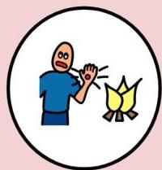

Gebrand

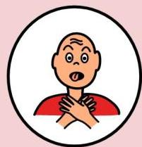

Asemhalingsprobleme

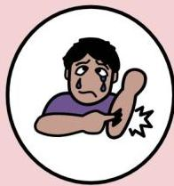

Pyn

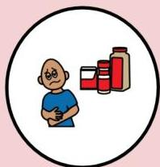

Allergieë

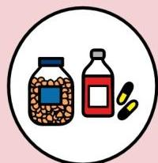

Medikasie

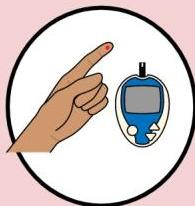

Diabetes

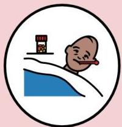

Koors

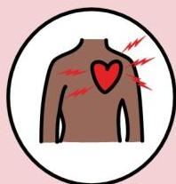

Hartprobleme

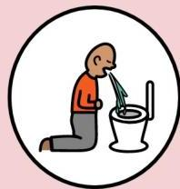

Braak

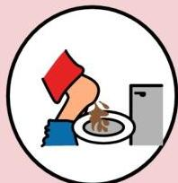

Diarree

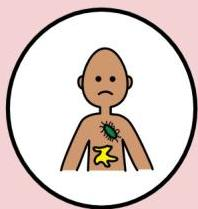

Infeksie

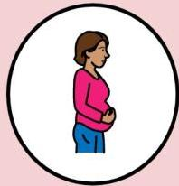

Swanger

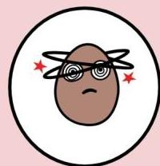

Duiselig

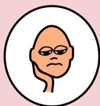

Geestesgesondheid

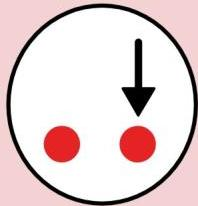

Ander

# Antwoorde

Ja

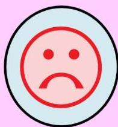

Nee

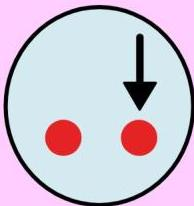

Ander

# Instruksies

Laat ek kyk

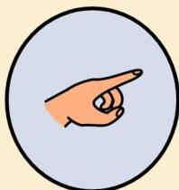

Wys my

Skryf

# Vrae

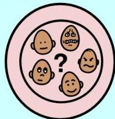

Hoe voel jy nou?

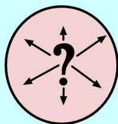

Waar?

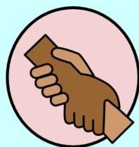

Hulp nodig?

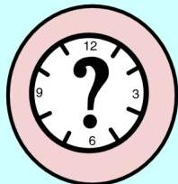

Hoe lank?

Verstaan jy?

# Tipe pyn

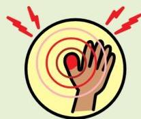

Kloppend

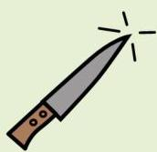

Steek

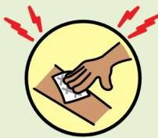

Drukkend

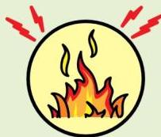

Brand

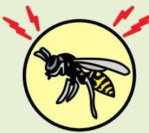

Prikkelrig

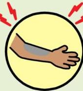

Voel dood/ Slaap

# Pynskaal

1

2

3

4

5

6

# Frekwensie

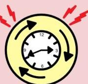

Kom en gaan

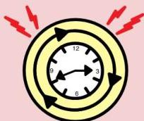

Die hele tyd

tobiidynavox

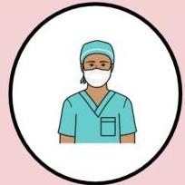

Mediese persoon

Tolk

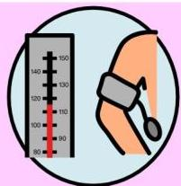

Bloeddruk

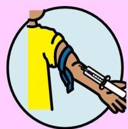

Bloedtoets

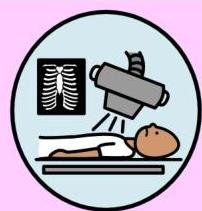

X-strale

Geloofspersoon

Vriende/Familie

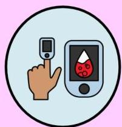

Suurstofmeter

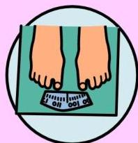

Gewig

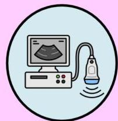

Sonar

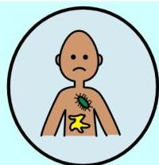

Infeksie

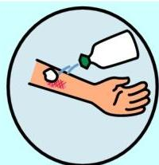

Wond

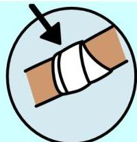

Verband

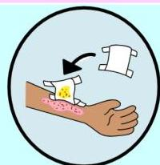

Wondversorging

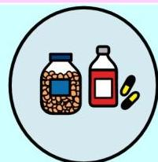

Medisyne

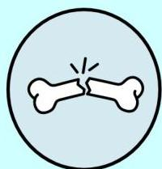

Gebreek

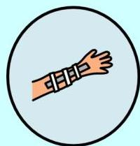

Spalk

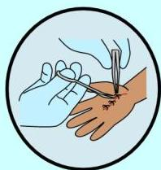

Steke

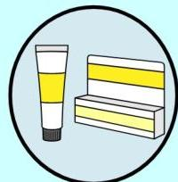

Salf

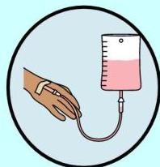

Drip

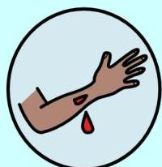

Gesny

Draagverband

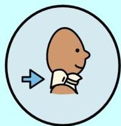

Nekstut

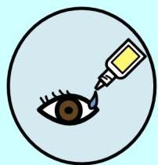

Oogdruppels

Inspuiting

Moet nie resussiteer nie

Operasie

Suurstofmasker

Kateter

Amputasie