<!-- Source PDF: bornman-2025-saslha-preschool.pdf -->

tobii dynavox

Kommunikasiebord: Kleuterskool

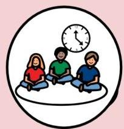

Aktiwiteite
Oggendkring

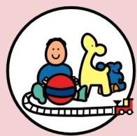

Speel

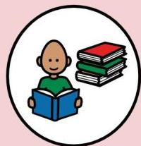

Lees

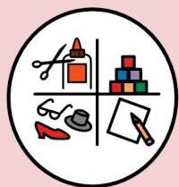

Takies

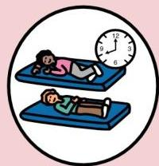

Slaaptyd

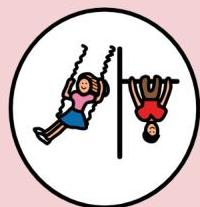

Buite speel

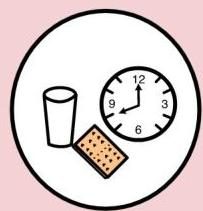

Broodjietyd

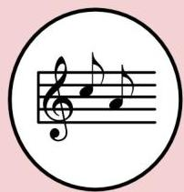

Musiek

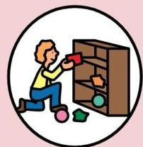

Opruim

# Antwoorde

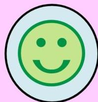

Ja

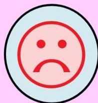

Nee

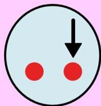

Ander

# Instruksies

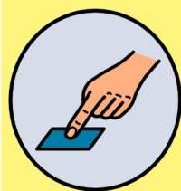

Laat ek kyk

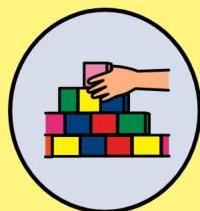

Bou

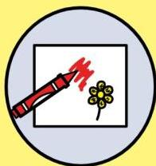

Teken

# Items

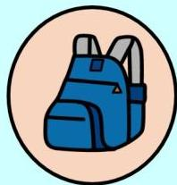

Rugsak

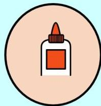

Gom

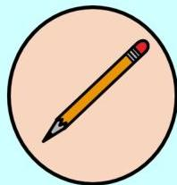

Potlood

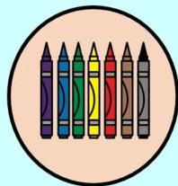

Kryte

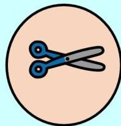

Skêr

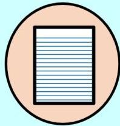

Papier

# Plekke

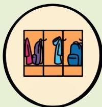

Klerehokkie

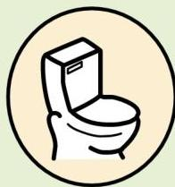

Badkamer

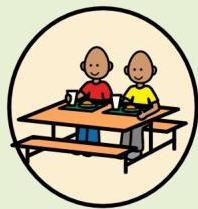

Etenstafel

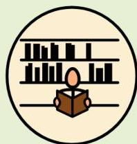

Biblioteek

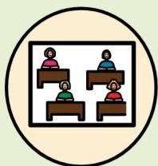

Klaskamer

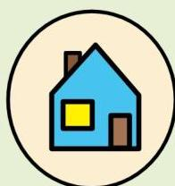

Huis

# Mense

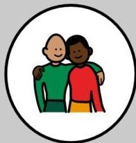

Maatjie

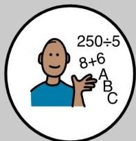

Onderwyser

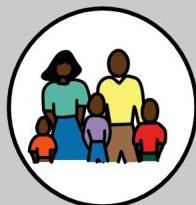

Gesin

# Emosies/Behoeftes

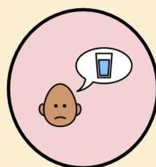

Dors

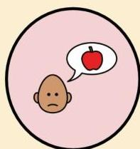

Honger

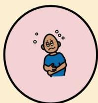

Siek

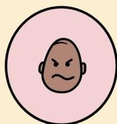

Kwaad

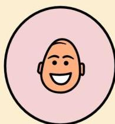

Bly

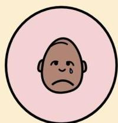

Hartseer