<!-- Source PDF: bornman-2025-saslha-school.pdf -->

# VOX

# KOMMUNIKASIEBORD: Skool

## Onderwerp

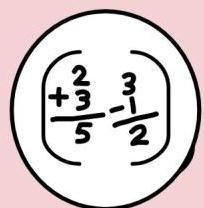

Wiskunde

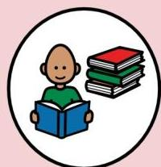

Lees

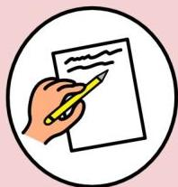

Skryf

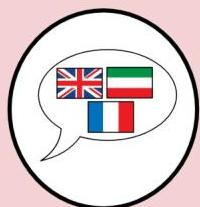

Taal

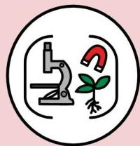

Natuurwetenskap

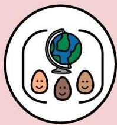

Sosiale Wetenskappe

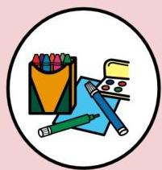

Kuns

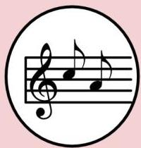

Musiek

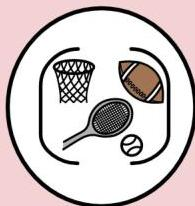

Liggaamlike opvoeding

## Antwoorde

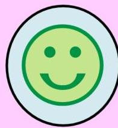

Ja

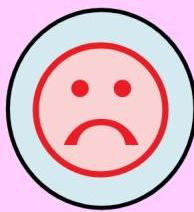

Nee

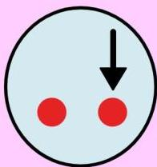

Ander

## Instruksies

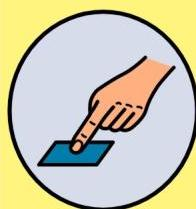

Laat ek kyk

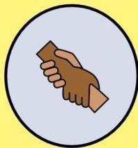

Help

Skryf

## Items

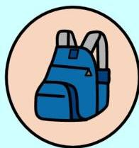

Rugsak

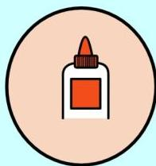

Gom

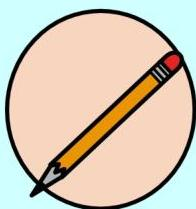

Potlood

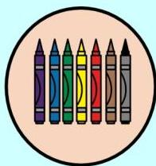

Kryte

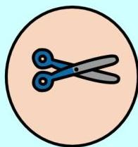

Skêr

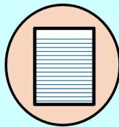

Papier

## Plekke

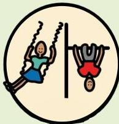

Speelgrond

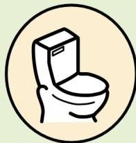

Badkamer

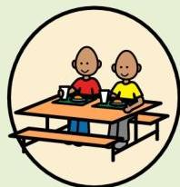

Etenstafel

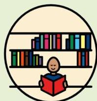

Biblioteek

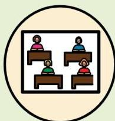

Klaskamer

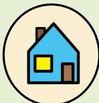

Huis

## Mense

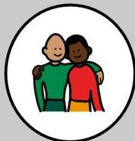

Vriend

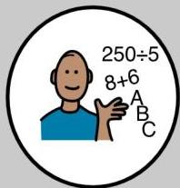

Onderwyser

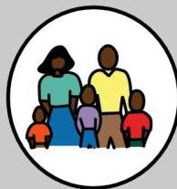

Gesin

## Emosies/ Behoeftes

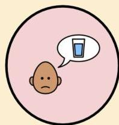

Dors

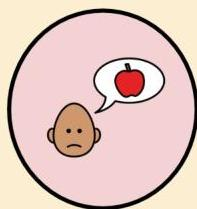

Honger

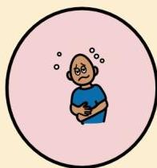

Siek

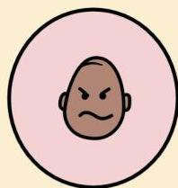

Kwaad

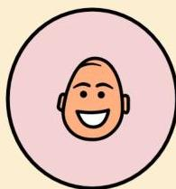

Bly

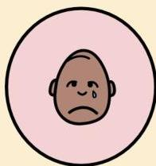

Hartseer