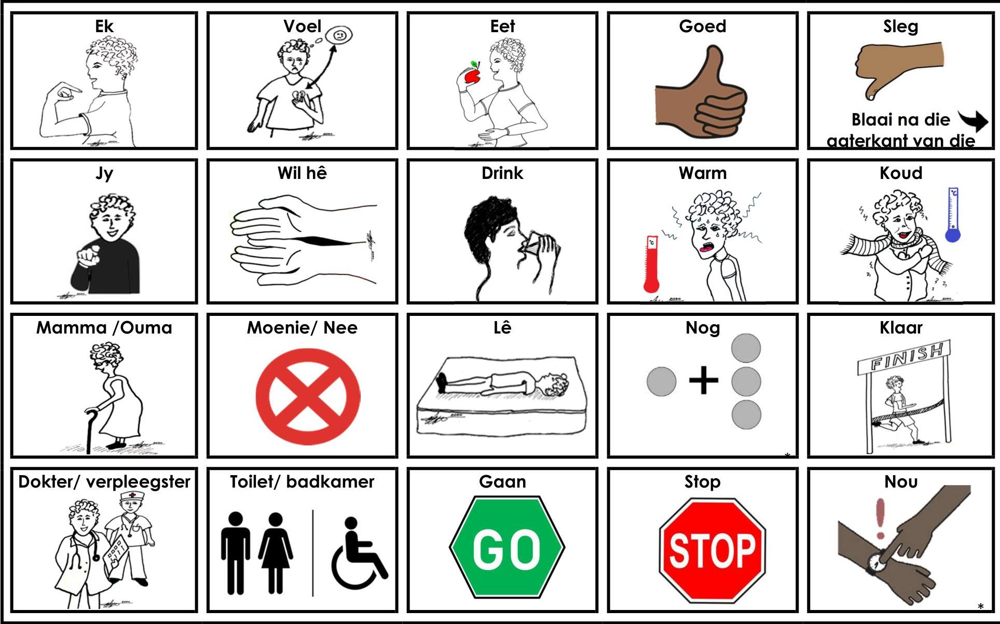
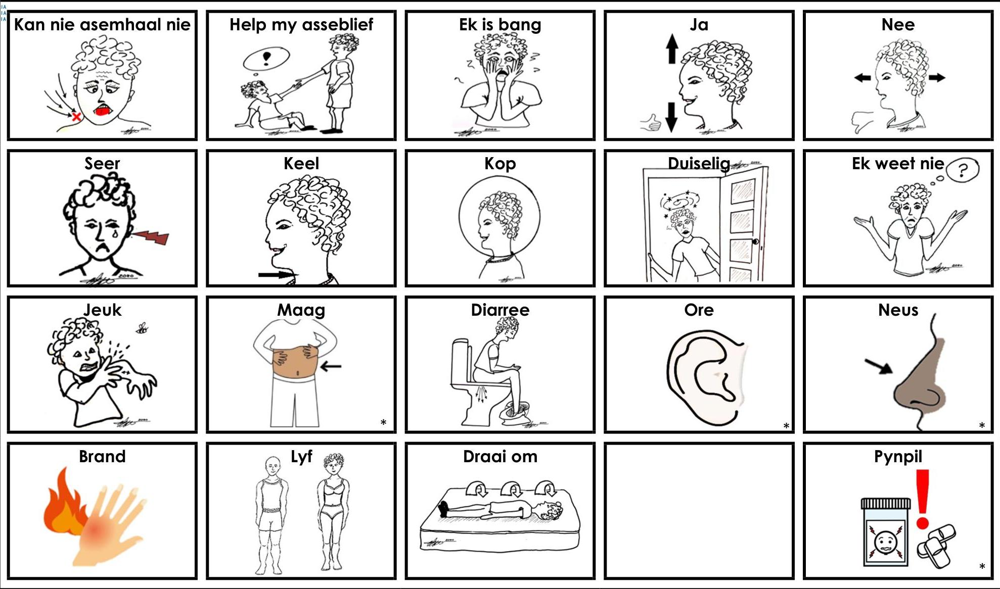

<!-- Source PDF: caac-2025-healthcare-board.pdf -->

KOMMUNIKASIEBORD VIR GESONDHEIDSORG - AFRIKAANS

unicef
for every child
FUTURE AFRICA

Voorstelle vir die gebruik van 'n kommunikasiebord

'n Kommunikasiebord kan mense help om te' praat 'en om te verstaan. As u met iemand kommunikeer wat moeilik is om mee te praat, 'n ander taal praat of probleme ondervind met die verstaan van gesproke taal, moet u na die prente van die woorde wys terwyl u dit praat en sorg dat die persoon die bord kan sien. As dit die persoon se beurt is om te praat of vrae te beantwoord, maak seker dat hulle die bord kan sien en bereik en sê: "As dit u help, wys my die foto's vir wat u wil sê". As die persoon met kommunikasieprobleme nie kan wys nie, of nie kan sien nie, vra hulle om vir u te wys hoe hulle "ja" sê. Lees nou die simbole een vir een deur totdat hulle "ja" sê om aan te dui dat dit die boodskap is wat hulle wil hê.

© CAAC 2020
*symbols from www.bildstod.se

KOMMUNIKASIEBORD VIR GESONDHEIDSORG - AFRIKAANS

unicef
for every child
FUTURE AFRICA

Voorstelle vir die gebruik van 'n kommunikasiebord

'n Kommunikasiebord kan mense help om te' praat 'en om te verstaan. As u met iemand kommunikeer wat moeilik is om mee te praat, 'n ander taal praat of probleme ondervind met die verstaan van gesproke taal, moet u na die prente van die woorde wys terwyl u dit praat en sorg dat die persoon die bord kan sien. As dit die persoon se beurt is om te praat of vrae te beantwoord, maak seker dat hulle die bord kan sien en bereik en sê: "As dit u help, wys my die foto's vir wat u wil sê". As die persoon met kommunikasieprobleme nie kan wys nie, of nie kan sien nie, vra hulle om vir u te wys hoe hulle "ja" sê. Lees nou die simbole een vir een deur totdat hulle "ja" sê om aan te dui dat dit die boodskap is wat hulle wil hê.

© CAAC 2020
*symbols from www.bildstod.se