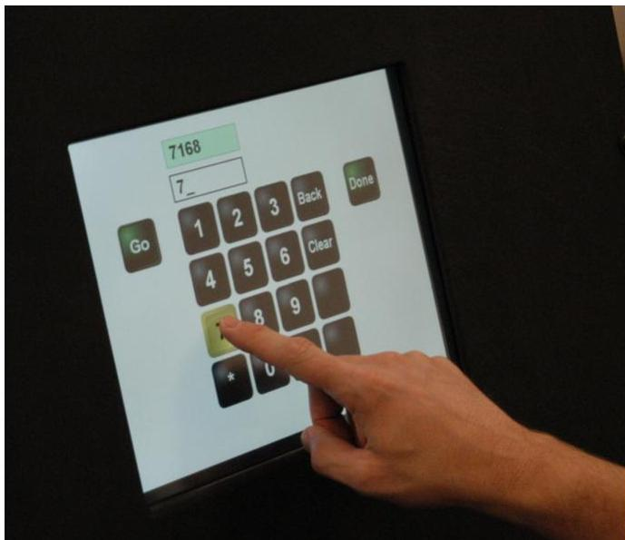
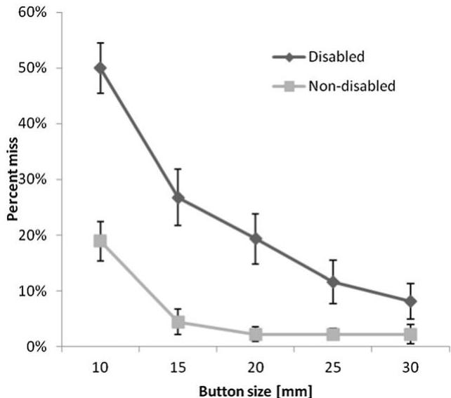
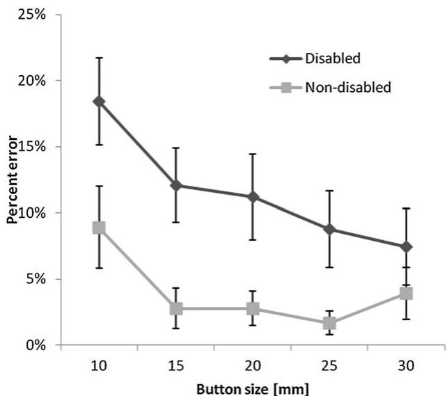
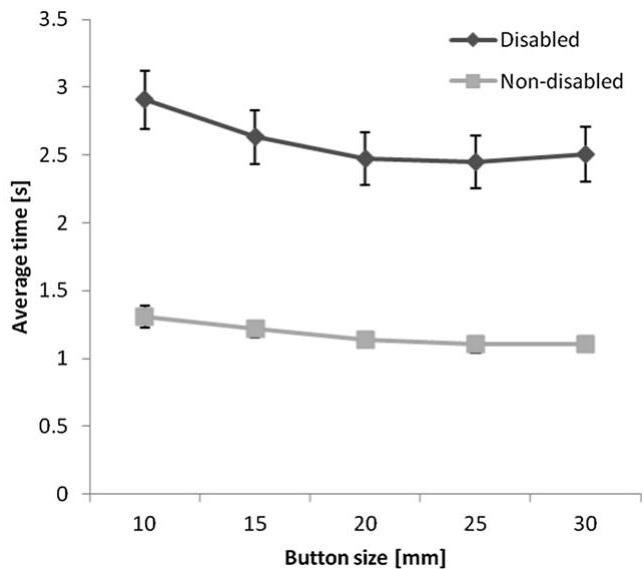

<!-- Source PDF: chen-2013-touch-targets.pdf -->

Applied Ergonomics 44 (2013) 297–302

ELSEVIER

Contents lists available at SciVerse ScienceDirect

Applied Ergonomics

journal homepage: www.elsevier.com/locate/apergo

APPLIED ERGONOMICS

# Touch screen performance by individuals with and without motor control disabilities

Karen B. Chen $^{a}$, Anne B. Savage $^{b}$, Amrish O. Chourasia $^{a}$, Douglas A. Wiegmann $^{a,c}$, Mary E. Sesto $^{a,b,c,*}$

$^{a}$ Trace Research and Development Center, University of Wisconsin–Madison, 2107 Engineering Centers Building, 1550 Engineering Drive, Madison, WI 53706, USA
$^{b}$ Department of Orthopedics and Rehabilitation, University of Wisconsin–Madison, 5173 Medical Sciences Center, 1300 University Avenue, Madison, WI 53706, USA
$^{c}$ Department of Industrial and Systems Engineering, University of Wisconsin–Madison, 3270 Mechanical Engineering, 1513 University Avenue, Madison, WI 53706, USA

## ARTICLE INFO

Article history:
Received 13 January 2012
Accepted 17 August 2012

Keywords:
Touch screen
Performance
Disability

## ABSTRACT

Touch technology is becoming more prevalent as functionality improves and cost decreases. Therefore, it is important that this technology is accessible to users with diverse abilities. The objective of this study was to investigate the effects of button and gap size on performance by individuals with varied motor abilities. Participants with (n = 38) and without (n = 15) a motor control disability completed a digit entry task. Button size ranged from 10 to 30 mm and gap size was either 1 or 3 mm. Results indicated that as button size increased, there was a decrease in misses, errors, and time to complete tasks. Performance for the non-disabled group plateaued at button size 20 mm, with minimal, if any gains observed with larger button sizes. In comparison, the disabled group's performance continued to improve as button size increased. Gap size did not affect user performance. These results may help to improve accessibility of touch technology.

© 2012 Elsevier Ltd and The Ergonomics Society. All rights reserved.

## 1. Introduction

Touch technology is rapidly becoming essential for participation in social, personal, and occupational activities. Due to the convenience and flexibility in design, including easy manipulation of the touch interface (Sears, 1991), this technology is frequently found in public settings. Touch technology is commonly used in transaction kiosks in grocery stores, airports, and automated teller machines (ATM). In addition, many personal devices (e.g., cell phones, computers, tablets, global positioning systems) use this technology. Moreover, the use of touch screens has increased in work settings, including service and health care fields (Astell et al., 2010; Boudioni, 2003; Shervin et al., 2011). Importantly, the number of touch screen devices is expected to increase from 665 million in 2011 to 1350 million by 2014 (Lee, 2011).

Given the widespread use, an increasing numbers of individuals with varying capabilities may be required to use a touch screen. Thus, understanding factors that affect performance of users with a wide range of abilities is necessary for accessible and usable touch screen design. User performance is often evaluated using accuracy

and timing measures. Accuracy may be assessed by measuring how often the intended touch screen buttons are missed or other buttons erroneously touched. Timing is assessed by measuring the time to complete a task. Studies evaluating touch screen performance have found that direct finger input is a natural input method and that inexperienced users could easily operate this technology (Forlines et al., 2007; Holzinger, 2003); however, the majority of research has not included individuals with motor control disabilities.

Research to date has evaluated the effect of touch screen interface design, including button size and gap (the spacing between buttons), on user performance in populations ranging from younger (Colle and Hiszem, 2004; O'Brien et al., 2008; Schedlbauer, 2007; Scott and Conzola, 1997) to older (Jin et al., 2007; Murata and Iwase, 2005). For younger participants, 20 mm square buttons resulted in optimal user performance while gap (1 vs. 3 mm) had no measurable effects (Colle and Hiszem, 2004). For older participants (age &gt;53 years), Jin et al. (2007) found that reaction time decreased as button size and gap increased. Based on these results, a button size of 19.05 mm was recommended. Comparing user performance between healthy older and younger adults, older adults had approximately 4 times the error rate of younger adults (Chung et al., 2010). While these results provide information on user performance, they are based on user testing of healthy individuals.

A number of standards have been developed for touch screen interface design (American National Standards Institute (ANSI)/ Human Factors and Ergonomics Society (HFES), 2007; International

0003-6870/$ – see front matter © 2012 Elsevier Ltd and The Ergonomics Society. All rights reserved.
http://dx.doi.org/10.1016/j.apergo.2012.08.004

K.B. Chen et al. / Applied Ergonomics 44 (2013) 297-302

Organization for Standardization (ISO) 9241-9, 2000; Monterey Technologies, 1996). However, there is a lack of consensus on touch screen button size. For instance, ANSI/HFES 100-2007 recommends a button size of at least 9.5 mm with a 3.2 mm gap, ISO 9241-9 recommends a button size equal to the breadth of the distal finger joint of a 95th percentile male (approximately 22–23 mm (Greiner, 1991)), while others recommend a button size of 19.05 mm with a 6 mm gap (Monterey Technologies, 1996). In addition, the ANSI/HFES 100-2007 standard states that there is no improvement with using a button sizes larger than 22 mm. While there is a growing body of research on user performance during touch screen use and related standards, information on how button size and gap affects performance by individuals with motor control disabilities is lacking.

Including participants with motor control disabilities is important because performance differences have been demonstrated during tapping tasks using a keyboard (Aparicio et al., 2005; van Roon et al., 2000) and touch screen (Irwin and Sesto, 2012). During a reciprocal tapping task, timing and accuracy were affected by motor control disabilities, with non-disabled participants performing better than those with motor control disabilities. Moreover, touch screen usage accuracy and timing was affected by motor control disabilities, and the non-disabled participants performed better than the individuals with motor control disabilities (Irwin and Sesto, 2012). These findings indicate that individuals with disabilities perform differently than healthy individuals.

The purpose of this study was to investigate the effect of button and gap size on performance by individuals with varied motor abilities. Results from this study will improve our understanding of performance by individuals with a range of abilities and may help guide design of current and future technology to be usable by diverse user populations.

## 2. Methods

### 2.1. Participants

A total of 53 people participated in this study, 38 with a motor control disability and 15 non-disabled control participants selected to have similar age and gender distribution (Table 1). Participants in the motor control disability group were recruited from disability support groups and organizations, disability resource centers, and adaptive fitness organizations. Diagnoses included: cerebral palsy (CP), Huntington's disease (HD), multiple sclerosis (MS), Parkinson's disease (PD), or tremor (benign, essential, or intention). Participants without disabilities were recruited from community centers and public postings around campus.

Inclusion criteria for the disabled participants included a self-reported diagnosis of a movement control disability that affected upper extremity function and self-reported difficulty with button use. For non-disabled participants, exclusion criteria included pain, presence of an upper extremity or cervical injury, or diagnosis that may affect upper extremity performance. Exclusion criteria for both groups included sensory or cognitive impairments that may affect the participant's ability to complete the study. Potential participants were also excluded if they were unable to travel to our facility for testing. Informed consent was obtained in accordance with the University of Wisconsin guidelines for the protection of human subjects.

### 2.2. Procedure

Participants completed two questionnaires. A demographic questionnaire was completed prior to completing the experimental tasks. Demographic information included the individual's age, diagnosis, length of time since diagnosed (if applicable), living

Table 1 Participant demographics and characteristics.

|  Group | Disabled (n = 38) | Non-disabled (n = 15)  |
| --- | --- | --- |
|  Gender (n) |  |   |
|  Male | 18 | 7  |
|  Female | 20 | 8  |
|  Age (years) |  |   |
|  Mean (SD) | 49.2 (12.4) | 46.1 (12.3)  |
|  Finger width (cm) |  |   |
|  Mean (SD) | 1.79^{a} (0.22) | 1.78 (0.21)  |
|  MCD type (n) |  |   |
|  CP | 14 | 0  |
|  Benign tremor | 1 | 0  |
|  Essential tremor | 4 | 0  |
|  Intention tremor | 1 | 0  |
|  HD | 1 | 0  |
|  MS | 11 | 0  |
|  PD | 6 | 0  |
|  None | 0 | 15  |
|  Years since diagnosis |  |   |
|  Mean (SD) | 22.73 (18.13) | 0 (0)  |
|  Living arrangement (n) |  |   |
|  Alone, no help | 10 | 4  |
|  With significant others | 17 | 11  |
|  Alone, occasional assistance | 6 | 0  |
|  Alone, frequent assistance | 5 | 0  |
|  Education (n) |  |   |
|  High school | 9 | 0  |
|  Beyond high school | 29 | 15  |
|  Computer use (n) |  |   |
|  No experience | 0 | 0  |
|  Rarely | 1 | 0  |
|  Occasionally | 1 | 0  |
|  Frequent | 5 | 1  |
|  Daily | 31 | 14  |
|  Touch screen use (n) |  |   |
|  No experience | 10 | 1  |
|  Rarely | 9 | 2  |
|  Occasionally | 7 | 6  |
|  Frequent | 9 | 6  |
|  Daily | 3 | 0  |
|  SF-36^{b} |  |   |
|  Mean (SD) | 54.28 (20.17) | 87.03 (6.36)  |

a One participant used thumb thus measurement not included.
b SF-36 (Short Form 36) Health Survey – Range = 0–100. Lower scores indicate lower levels of functional health and well-being.

arrangement, and questions about the individual's use of technology. The Medical Outcomes Study Short Form-36 Health Survey (SF-36) was completed during a break in testing. The SF-36 questionnaire consists of eight subscales (Physical Function, Role-Physical, Bodily Pain, General Health, Vitality, Social Functioning, Role-Emotional, and Mental Health) and was used to assess functional health and well-being (Ware and Gandek, 1998; Berk et al., 2002; McHorney et al., 1994; Bergfeldt et al., 2009). The score ranges from 0 to 100 with lower scores indicating poorer functional health and well-being.

### 2.3. Instrumentation

The data acquisition system included a touch screen mounted and positioned at a 70° angle to a horizontally oriented force plate in an extruded aluminum frame. A force plate (Bertec Corporation Model NG4060-10 by Bertec Corporation, Columbus OH, USA) was used to collect force characteristics with these results reported

K.B. Chen et al. / Applied Ergonomics 44 (2013) 297-302

elsewhere (Sesto et al., 2012). Performance measures were collected with the resistive touch screen (Elo TouchSystems model 1537L 38.1 cm (15 in) liquid crystal display (LCD) Kiosk Touchmonitor by Tyco Systems, Inc. Menlo Park, CA, USA). The minimum force required to activate the touch screen was 0.98 N. The display had a resolution of 1024 × 768 pixels, a brightness of 205 cd/m², and 15,500 points/cm² touch density and a standard deviation of error of less than 0.20 cm. Buttons were activated with a "land-on" strategy, which results in activation of the touch screen at the first point of finger contact. Data were sampled at 1000 Hz.

The lower part of the touch screen frame was 84 cm above the floor to provide a knee clearance of at least 69 cm (as specified by the American with Disabilities Act Accessibility Standards for Accessible Design, 1990; amended 2010) with the top of the touch screen 122 cm off the floor.

### 2.4. Experimental task

The keypad on the touch screen had buttons arranged similarly to an ATM touch screen (Fig. 1). Additional buttons included: "Go", "Back", "Clear" and "Done". The participants initiated the number entry task by pressing the "Go" button. Following activation of the "Go" button, a random four-digit number appeared in the box above the keypad. Participants then entered the four-digit number followed by the "Done" button. Visual feedback was provided as the activated button changed color and the number appeared in the white box region (Fig. 1). No audible or tactile feedback was provided. Participants could correct undesired button pushes with "Clear" and "Back" buttons. The "Clear" button removed all numbers entered and the "Back" button deleted the last number entered.

Participants completed a total of 60 trials of varying button/gap combinations. Ten possible combinations of five different button sizes (10 mm, 15 mm, 20 mm, 25 mm, and 30 mm square) and two different gap sizes (1 mm or 3 mm) were presented to each participant. The button size/spacing combinations were randomized in a full factorial design. Six replications were performed (in succession) for each button/gap size combination. A minimum of six practice trials were completed prior to the start of the testing session.

Participants were seated facing the front of the screen. They were encouraged to press the buttons with their index finger pad if

Fig. 1. Touch screen button layout representative of a four-digit entry task.

possible. Participants were provided rest breaks every twelve replications. A visual analog scale (range 0–10, 0 = no fatigue and 10 = very fatigued) was used to assess fatigue during each rest break and if fatigue was reported, additional breaks were provided.

### 2.5. Variables

Independent variables were button size (five levels) and gap, or spacing, between the buttons (two levels). Dependent variables included the percent of trials with a miss or error, and time to complete the trial. Neither "Go" nor "Done" button pushes were included in the calculation of these variables. In addition, participants were asked to select their preferred button/gap combination.

#### 2.5.1. Miss

A miss was defined as a touch that landed outside of the intended button area and did not result in button activation. A trial with at least one miss was considered a trial with a miss. The percentage of trials with a miss was calculated for each button/gap combination.

#### 2.5.2. Error

An error was defined as a touch that activated the wrong button. A trial with at least one error was considered a trial with an error. The percentage of trials with an error was calculated for each button/gap combination.

#### 2.5.3. Time to complete task

The amount of time a participant used to enter the four-digit number in each trial was collected. A trial began when the numbers were presented to the participant after he or she hit the "Go" button and ended when the participant hit the "Done" button. Timing data were collected only for trials with no missed or erroneous touches and measured only for the digit buttons.

### 2.6. Data analysis

User performance data of misses and errors were transformed using a square root transformation due to data not being normally distributed. A mixed design repeated measures analysis was performed to determine the significance of button and gap size on the three outcome measures (percent of trials with misses or errors, and time to complete task). Motor control group was analyzed as a between-groups factor. Polynomial contrasts were used to examine trends across button sizes. The significance level was set at p &lt; 0.05 for all statistical tests. Statistical analyses were performed using Statistical Package for the Social Sciences v. 20 (IBM Corporation, Armonk, New York, USA).

## 3. Results

### 3.1. Miss

Misses were significantly affected by disability (F(1,51) = 10.23, p = 0.002) and button size (F(4,48) = 37.46, p &lt; 0.001) (Fig. 2, collapsed across gap). In general, participants in the disabled group averaged 3.9 times more misses than the non-disabled group. For button size, trials with misses decreased by 84% as button size increased from the smallest (10 mm) to the largest (30 mm). In addition, gap size was marginally significant for miss (F(1,51) = 3.50, p = 0.067) with 22% more misses occurring at gap size 3 mm than 1 mm. A significant interaction between button size and disability (F(4,48) = 3.87, p = 0.008) was also observed. Misses for the non-disabled group plateaued at 20 mm button size (no change in misses from 20 to 25 mm); yet, the disabled group

K.B. Chen et al. / Applied Ergonomics 44 (2013) 297-302

Fig. 2. Average miss by button size and disability collapsed across gap (±1 Standard error).

continued to demonstrate improvement (40% decrease in misses between 20 and 25 mm; 30% decrease between 25 and 30 mm). A significant quadratic trend for button size was observed (F = 27.13, p &lt; 0.001) (Fig. 2).

### 3.2. Error

Errors were significantly affected by disability (F(1,51) = 4.21, p = 0.045) and button size (F(4,48) = 4.98, p = 0.002) (Fig. 3, collapsed across gap). On average, the disabled group had 2.9 times more errors than the non-disabled group. Overall, errors decreased by 59% as button size increased from the smallest to the largest. A significant quadratic trend for button size (F = 9.32, p = 0.004) was observed (Fig. 3). The non-disabled group plateaued at 15 mm button size (no change in percent errors from 15 to 20 mm). In comparison, the disabled group demonstrated continued improvement with a 22% decrease in errors between 20 and 25 mm, and 15% decrease between 25 and 30 mm.

Fig. 3. Average error by button size and disability collapsed across gap (±1 Standard error).

### 3.3. Time to complete task

Sample size for the timing variable analysis was smaller (n = 29 for the disabled group, n = 15 for the non-disabled group) since the criterion for this variable was that the trials must be free of misses or errors. Time to complete task was significantly affected by disability (F(1,42) = 25.82, p &lt; 0.001) and button size (F(4,39) = 18.54, p &lt; 0.001) (Fig. 4, collapsed across gap). On average, the disabled group took 2.2 times longer to accurately enter a four-digit number than the non-disabled group. For button size, the average time decreased by 14% as the button size increased from the smallest to the largest. A significant quadratic trend was observed for button size (F = 17.24, p &lt; 0.001). The time for the disabled group decreased from 2.91 s to 2.63 s (9.6%) as button size increased from 10 to 15 mm, and task time plateaued at 20 mm button size with only 0.02 s improvement in timing between 20 and 25 mm. The average time for the non-disabled group decreased from 1.31 s to 1.22 s (6.9%) between 10 mm and 15 mm button size, and plateaued at 20 mm (0.036 s improvement between 20 and 25 mm).

### 3.4. Key preferences

Participant preference data for button and gap sizes were also collected (Table 2). Eight of the non-disabled participants (53%) preferred the 15 mm button size, and 20 of the disabled participants (53%) preferred the 20 mm button size. The majority of the non-disabled and the disabled participants (73% and 89%, respectively) preferred the 3 mm gap size.

## 4. Discussion

The present study examined the effects of button size, gap, and the presence of disability on user performance (miss, error, and timing) during a 4-digit entry task. User performance was impacted by button size and presence of disability. On average, user performance improved as button size increased. Overall, the disabled group had more misses and errors than the non-disabled group. In addition, the disabled participants took 2.2 times longer, on average, than the non-disabled participants to complete a four-digit entry task. In general, performance for the non-disabled group plateaued

Fig. 4. Average time to complete task by button size and disability collapsed across gap (±1 Standard error). Note — the standard error bar is too small to be viewed for the non-disabled group.

K.B. Chen et al. / Applied Ergonomics 44 (2013) 297-302

Table 2 Participant button and gap size preference data.

|  Group | Disabled (n = 38) | Non-disabled (n = 15)  |
| --- | --- | --- |
|  Button size (n) |  |   |
|  10 mm | 1 | 1  |
|  15 mm | 5 | 8  |
|  20 mm | 20 | 5  |
|  25 mm | 5 | 0  |
|  30 mm | 7 | 1  |
|  Gap size (n) |  |   |
|  1 mm | 4 | 4  |
|  3 mm | 34 | 11  |

at button size 20 mm, with minimal, if any, gains observed with larger button sizes. In comparison, the disabled group demonstrated improvement in misses and errors until the 30 mm button size; improvement in timing plateaued at the 25 mm button size.

Several existing standards provide guidelines for touch screen interfaces. The ANSI/HFES (2007) standard recommends that the touch areas should be at least 9.5 mm square and the gap between touch areas be at least 3.2 mm. This standard also notes that button size greater than 22 mm square does not result in an improvement in performance (ANSI/HFES, 2007). However, ISO9241-9 suggests that the size of a touch sensitive area should be at least equal to the breadth of the index finger of the 95th percentile male, which is 2.28 cm (Greiner, 1991; ISO 9241-9, 2000). Monterey Technologies (1996) recommends the button size to be at least 19.05 mm with 6 mm button gap between the touch areas. In comparison, the results of the current study found that user performance for the non-disabled group improved for both errors and misses up to 20 mm; with a slight reduction in errors occurring at 25 mm. While the difference in the percent of trials with errors at 15 mm, 20 mm and 25 mm are small (2.8% at both 15 mm and 20 mm, and 1.7% at 25 mm), depending on the type of task and application, relatively small improvements in error may be important. For the disabled group, an improvement in errors occurred up until button size 30 mm. However, improvements between 25 and 30 mm were small (8.8% at 25 mm and 7.5% at 30 mm).

In addition, other researchers have explored touch interfaces designs. Previous studies examined the effect of button size on errors, and found that 25 mm button size yielded the least number of errors in young, adult users; however percent error was not statistically significant between 20 and 25 mm, and 20 mm button size was sufficient to achieve optimal performance (Colle and Hiszem, 2004). Also, a larger key size (2.27 cm) on a touch screen keyboard had significantly fewer corrected errors than a smaller key size (0.57 cm) for college-aged students (Sears et al., 1993). In healthy older users, a 19.05 mm button size yielded the least number of errors (Jin et al., 2007). Compared to the results of the current study, non-disabled users demonstrated an improvement in errors until the 25 mm button size, with only minimal improvement noted between 20 mm and 25 mm. However, for the disabled group, errors decreased from 11% to 8.7%, and then to 7.5% as the button size increased from 20, to 25, and then 30 mm, respectively. When accounting for performance of users with varying abilities, the suggested button sizes from prior studies were smaller than the 30 mm button size indicated in the present study.

It is important to note that some of the differences in results between our study and other studies may be due to the different experimental postures (seated or standing). Participants in the Colle and Hiszem (2004) study completed their tasks in standing; whereas, in the current study and the study by Jin et al. (2007), participants were in a seated position. Importantly, posture has been reported to affect user performance with errors increased during standing for a target acquisition task (Schedlbauer et al., 2006).

In addition to errors, percent trials with misses were also evaluated in the present study. As button size increased, the percent trials with misses decreased. Misses for the non-disabled group plateaued at the 20 mm button size, but the disabled group demonstrated a decrease in misses from 19% at 20 mm, 12% at 25 mm, and 8% at 30 mm. Gap size was marginally significant (p = 0.067) with the 1 mm gap resulting in fewer misses than the 3 mm gap. Although missed button touches may not result in conditions as serious as button activation error, a missed touch can still impact performance by slowing task completion time.

Increasing button size also affected task completion time. When collapsed across gap and disability type, the time to complete the digit entry task decreased from 2.36 s to 2.03 s for 10 and 30 mm button sizes, respectively. While this difference was statistically significant, it may not have practical significance.

The findings of this study demonstrated that users with varying operating capabilities perform differently at different button size levels. Touch interface and button designs may be dependent on the touch screen sizes and the type of task that the user performs. From a safety critical standpoint and to accommodate users with varying abilities, touch interfaces for tasks with low error tolerances should have button sizes with at least 30 mm to minimize errors. On the other hand, it may not be feasible to implement 30 mm size buttons with limited screen real estate. The tradeoff between performance and button size is an important issue for designers and engineers to consider.

In addition to the objective measures of user performance, user preferences of button sizes were also studied. The subjective data of the participants indicated that the majority (84%) of disabled participants preferred button size greater or equal to 20 mm, yet, 60% of the non-disabled participants preferred button size smaller or equal to 15 mm. Users appeared to favor button sizes that were smaller than the button sizes that yielded optimal user performances in the present study. User preferences were previously examined in healthy college-aged students in a touch screen typing study, and the participants preferred typing with the 2.27 cm square buttons (Sears et al., 1993). Another touch interface kiosk study indicated that young, healthy users preferred 20 mm square buttons to the smaller sizes (Colle and Hsizem, 2004).

Although we did not evaluate user discomfort, recent research found that users reported greater levels of subjective discomfort with touch screen use than with keyboard use (Shin and Zhu, 2011). Collectively, information on subjective discomfort, as well as user preference and performance should be used to help guide touch screen design to improve performance of users with varying abilities while minimizing the risk of user discomfort.

### 4.1. Limitations

A limitation of this study is that participants only performed the digit entry task in a seated posture. It is unknown whether user performance would be affected by performing the task in a standing posture. Moreover, the users performed a simple four-digit entry experimental task. The use of more cognitively challenging tasks may affect our results. Another limitation is that a greater percentage of the non-disabled users self-reported more frequent touch screen usage than the disabled users. While practice trials were provided, this difference in experience may affect the results of this study.

### 4.2. Conclusion

Button size and the presence of disability significantly affect trials with miss, error, and the time to complete tasks on a touch interface. The disabled group had more trials with miss and error,

K.B. Chen et al. / Applied Ergonomics 44 (2013) 297-302

and also spent more time to complete digit entry tasks. While the user performance of the non-disabled group plateaued at a button size of 20 mm, the disabled group demonstrated continued improvement as button size increased. Understanding how people (including those with disabilities) interact with touch screens may allow designers and engineers to ultimately improve usability of touch screen technology.

## Acknowledgments

The contents of this paper were developed with funding from the National Institute on Disability and Rehabilitation Research, U.S. Department of Education, grant number H133E080022 (RERC on Universal Interface &amp; Information Technology Access). However, those contents do not necessarily represent the policy of the Department of Education, and you should not assume endorsement by the Federal Government. The authors would also like to thank Ms. Jennifer Skye for her assistance with data collection.

## References

Aparicio, P., Diedrichsen, J., Ivry, R.B., 2005. Effects of focal basal ganglia lesions on timing and force control. Brain Cogn. 58, 62-74.
Astell, A.J., Ellis, M.P., Bernardi, L., Alm, N., Dye, R., Gowans, G., Campbell, J., 2010. Using a touch screen computer to support relationships between people with dementia and caregivers. Interact Comput. 22, 267-275.
American With Disabilities Act Standards for Accessible Design, 28 C.F.R. pt 36 C.F.R., 1990. U.S. Department of Justice publication (last amended, 2010), http://www.ada.gov/adastd94.pdf.
Bergfeldt, U., Skold, C., Julin, P., 2009. Short Form 36 assessed health-related quality of life after focal spasticity therapy. J. Rehabil. Med. 41, 279-281.
Berk, C., Carr, J., Sinden, M., Martzke, J., Honey, C.R., 2002. Thalamic deep brain stimulation for the treatment of tremor due to multiple sclerosis: a prospective study of tremor and quality of life. J. Neurosurg. 97, 815-820.
Boudioni, M., 2003. Availability and use of information touch-screen kiosks (to facilitate social inclusion). Aslib Proc. 55, 320-333.
Chung, M.K., Kim, D., Na, S., Lee, D., 2010. Usability evaluation of numeric entry tasks on keypad type and age. Int. J. Ind. Ergon. 40, 97-105.
Colle, H.A., Hiszem, K.J., 2004. Standing at a kiosk: effects of key size and spacing on touch screen numeric keypad performance and user preference. Ergonomics 47, 1406-1423.
Forlines, C., Wigdor, D., Shen, C., Balakrishnan, R., 2007. Direct-touch vs. mouse input for tabletop displays. In: Proceedings of the SIGCHI Conference on Human Factors in Computing Systems, San Jose, California, USA, pp. 647-656.
Greiner, T., 1991. Hand Anthropometry of U.S. Army Personnel. U.S. Army Report NATICK/TR-92/011. U.S. Army Natick, Research, Development and Engineering Center, Natick, Massachusetts.
Holzinger, A., 2003. Finger instead of mouse: touch screens as a means of enhancing universal access. In: Proceedings of the User Interfaces for All 7th International Conference on Universal Access: Theoretical Perspectives, Practice, and Experience, Paris, France, pp. 387-397.
Human Factors and Ergonomics Society, 2007. American National Standard for Human Factors Engineering of Computer Workstations (ANSI/HFES Standard No. 100-2007), Human Factors &amp; Ergonomics Society, Santa Monica, California.
Irwin, C., Sesto, M., 2012. Performance and touch characteristics of disabled and non-disabled participants during a reciprocal tapping task using touch screen technology. Appl. Ergon. 43, 1038-1043.
ISO 9241-9, 2000. Ergonomic Requirements for Office Work with Visual Display Terminals (VDTs) - Part 9: Requirements for Non-keyboard Input Devices.
Jin, Z., Plocher, T., Kiff, L., 2007. Touch screen user interfaces for older adults: button size and spacing. In: Stephanidis, C. (Ed.), Universal Acess in Human Computer Interaction. Coping with Diversity. Springer, Berlin/Heidelberg, pp. 933-941.
Lee, D., 2011. The state of the touch-screen panel market in 2011. Inf. Disp. 27, 12-16.
McHorney, C.A., Ware, J.E.J., Rachel Lu, J.F., Sherbourne, C.D., 1994. The MOS 36-item short-form health survey (SF-36): III. Tests of data quality, scaling assumptions, and reliability across diverse patient groups. Med. Care 32, 40-66.
Monterey Technologies, 1996. Resource guide for Accessibility: Design of Consumer Electronics. Draft submitted to: EIA-EIF Committee on Product Accessibility, A Joint Venture of the Electronic Industries Association and the Electronic Industries Foundation, DC 20006.
Murata, A., Iwase, H., 2005. Usability of touch-panel interfaces for older adults. Hum. Factor. 47, 767-776.
O'Brien, M.A., Rogers, W., Fisk, A.D., Richman, M., 2008. Assessing design features of virtual keyboards for text entry. Hum. Factor. 50, 680-698.
Schedlbauer, M.J., Pastel, R.L., Heines, J.M., 2006. Effect of posture on target acquisition with a trackball and touch screen. In: 28th International Conference on Information Technology Interfaces, pp. 257-262.
Schedlbauer, M., 2007. Effects of key size and spacing on the completion time and accuracy of input tasks on soft keypads using trackball and touch input. Proc. Hum. Fact Ergon. Soc. Annu. Meet. 51, 429-433.
Scott, B., Conzola, V., 1997. Designing touch screen numeric keypads: effects of finger size, key size, and key spacing. In: Proceedings of the Human Factors and Ergonomics Society 41th Annual Meeting, Santa Monica, California, pp. 429-433.
Sears, A., 1991. Improving touchscreen keyboards: design issues and a comparison with other devices. Interact Comput. 3, 253-269.
Sears, A., Revis, D., Swatski, J., Crittenden, R., Shneiderman, B., 1993. Investigating touchscreen typing: the effect of keyboard size on typing speed. Behav. Inf. Technol. 12, 17-22.
Sesto, M.E., Irwin, C.B., Chen, K.B., Chourasia, A.O., Wiegmann, D.A., 2012. Effect of touch screen button size and spacing on disabled and non-disabled user touch characteristics. Hum. Factor. 54, 425-436.
Shervin, N., Dorrwachter, J., Bragdon, C.R., Shervin, D., Zurakowski, D., Malchau, H., 2011. Comparison of paper and computer-based questionnaire modes for measuring health outcomes in patients undergoing total hip arthroplasty. J. Bone Jt. Surg. 93-A, 285-293.
Shin, G., Zhu, X., 2011. User discomfort, work posture and muscle activity while using a touchscreen in a desktop PC setting. Ergonomics 54, 733-744.
van Roon, D., Steenbergen, B., Hulstijn, W., 2000. Reciprocal tapping in spastic hemiparesis. Clin. Rehabil. 14, 592-600.
Ware Jr., J.E., Gandek, B., 1998. Overview of the SF-36 health survey and the international quality of life assessment (IQOLA) project. J. Clin. Epidemiol. 51, 903-912.