<!-- Source PDF: dalbis-2009-predictive-speller-bci.pdf -->

POLITECNICO DI MILANO
Facoltà di Ingegneria dell'Informazione
Polo regionale di Como

Master of Science in Computer Engineering

# A PREDICTIVE SPELLER FOR A
BRAIN-COMPUTER INTERFACE
BASED ON MOTOR IMAGERY

AI & R Lab
Artificial Intelligence and Robotics
laboratory of Politecnico di Milano

Advisor : Ing. Matteo Matteucci
Prof. Licia Sbattella
Assistant advisor: Ing. Rossella Blatt
Ing. Roberto Tedesco

Master Graduation Thesis by: Tiziano D'Albis
Student Id. number: 707766

Academic Year 2008/09

POLITECNICO DI MILANO
Facoltà di Ingegneria dell'Informazione
Polo regionale di Como

Corso di Laurea Specialistica in Ingegneria Informatica

# A PREDICTIVE SPELLER FOR A
BRAIN-COMPUTER INTERFACE
BASED ON MOTOR IMAGERY

AI & R Lab
Laboratorio di Intelligenza Artificiale
e Robotica del Politecnico di Milano

Relatore : Ing. Matteo Matteucci
Prof. Licia Sbattella
Correlatore: Ing. Rossella Blatt
Ing. Roberto Tedesco

Tesi di laurea di: Tiziano D'Albis
Matr. 707766

Anno Accademico 2008/09

*Ai miei genitori e ai miei nonni...*

# Acknowledgments

This thesis is the result of long but exciting work started in May 2008 and concluded in June 2009. During all this time many people have been involved in different ways in the development of this thesis. I hope to be able to remember everyone, since my memory is not so good.

First I have to acknowledge the team of four persons who guided me over all the development of this thesis giving me lots of precious suggestions: Matteo Matteucci, Licia Sbattella, Rossella Blatt and Roberto Tedesco. Special thanks to Rossella for all the encouragements and all the time dedicated in this long period.

Many thanks to Fabio B., Francesco, Fabio Z. and Paolo who shared with me many long days in the AirLab and mounted hundreds of times the same electrodes' cap, struggling with my long hair and the always too high impedances. I will be always extremely devoted to Paolo for joining our group, since with his great EEG signals saved the results of my thesis (and not only mine).

My acknowledgments are also for Matteo Vescovi, who developed the framework I've used for text prediction and gave me a lot of hints during the development of this thesis. Thanks also to all the developers of BCI2000 and especially to G. Shalk, who answered very kindly to all the questions I posted on the BCI2000 forum.

Of course I can't forget to acknowledge all my friends, who supported and motivated me during all the duration of this work and helped me to stay far from a monitor for a decent amount of time. Therefore many thanks to (in random order): Melania, Cinzia, Laura, Tostao, Martino, Diego, Bosco, Auro, Sarino, Smilzo, Mariano, Carlo, Tati, Chiara, Betty, Giulia e Bore. Thanks to all the members of the youth association I belong (Tricheco) who forgave me for being sometimes absent mounting and dismantling stages, big tops and whatsoever. Thanks also to Federico who encouraged me in choosing this thesis topic and to Cela and Maddy, remembering all the time spent together on the train. Thanks also to my employer for giving me all

4

the time I needed for this thesis and to all my colleagues for supporting me in this work, special thanks to Claudio for his encouragements.

Finally I want to acknowledge my parents and my sister for being always very kind and helpful with me (even when I returned tired and nervous from the lab) and for supporting me in all the decisions I took so far.

# Abstract

Communication is at the basis of human development and represents a fundamental aspect in the life of every individual. Persons suffering of motor disorders have limited possibilities to communicate and normally require assistive technologies to fulfill this primary need. A promising means to give back basic communication abilities to subjects affected by severe motor impairments are brain-computer interfaces (BCIs). A brain-computer interface is a system that bypasses any muscle or nerve mediation and translates signals acquired from the brain into commands for an external device. BCI systems are normally characterized by poor accuracies and low rates of information transfer, while communication is a complex process which requires a large set of language symbols to convey messages.

The objective of this thesis is to develop a BCI spelling application for people with severe motor impairments, adopting Natural Language Processing (NLP) techniques to enhance the overall communication rate of the system. The BCI paradigm adopted is motor imagery. When the subject imagines to move a certain part of the body produces modifications to specific brain rhythms over the sensory-motor cortex which are detected in real-time from the electroencephalogram (EEG) and translated into commands for the spelling application. The approach chosen for maximizing the overall communication rate is two-fold: on one side there is an effort in gaining information transfer rate from the control signal, on the other side there is an effort in optimizing the way this information is employed for the purpose of verbal communication. Therefore this thesis focused both on the definition of novel features for classifying EEG signals and on the design of an original spelling application provided with language prediction capabilities.

The results obtained vary significantly from subject to subject. With one subject we obtained high classification accuracies and the BCI spelling application reached an overall communication rate of about three characters per minute. With other two subjects we obtained lower accuracies and

I

the communication rate achieved was less than two characters per minute. However a trend of improvement has been observed in our BCI experiments and we believe that with more experimental sessions a better BCI control could be achieved for these subjects too.

# Sommario

La comunicazione è alla base dello sviluppo umano e rappresenta un aspetto fondamentale nella vita di ciascun individuo. Persone che soffrono di disabilità motorie hanno limitate capacità di comunicare e normalmente necessitano di tecnologie assistive per soddisfare questo bisogno primario. Una possibilità promettente per restituire capacità comunicative di base a persone affette da gravi disabilità motorie è rappresentata dalle interfacce cervello-computer (BCI). Una interfaccia cervello-computer è un sistema che, non necessitando di alcuna mediazione muscolare o nervosa, permette di tradurre segnali acquisiti dal cervello in comandi per dispositivi esterni. Sistemi BCI sono normalmente caratterizzati da una scarsa accuratezza e da una bassa velocità nel trasferimento delle informazioni, mentre la comunicazione è un processo complesso che richiede un insieme ampio di simboli linguistici per la trasmissione dei messaggi.

L'obiettivo di questa tesi è quello di sviluppare una applicazione di spelling BCI per persone con gravi disabilità motorie, adottando tecniche di processamento del linguaggio naturale (NLP) per aumentare la velocità di comunicazione del sistema. Il paradigma BCI adottato è quello dell'immaginazione del movimento. Quando un soggetto immagina di muovere una determinata parte del corpo induce delle alterazioni a specifici ritmi cerebrali caratteristici della corteccia sensomotoria che vengono riconosciuti in tempo reale dall'elettroencefalogramma (EEG) e tradotti in comandi per l'applicazione di spelling. L'approccio scelto per massimizzare la velocità di comunicazione è duplice: da una parte si cerca di estrarre la maggior quantità di informazione dal segnale di controllo, dall'altra si cerca di ottimizzare il modo con cui questa informazione viene utilizzata per la comunicazione verbale. Questa tesi si concentra quindi sia sulla definizione di nuove feature per la classificazione del segnale EEG, sia sulla progettazione di una applicazione di spelling originale dotata di funzionalità per la predizione del linguaggio.

I risultati ottenuti variano significativamente da soggetto a soggetto.

III

Con un soggetto abbiamo ottenuto accuratezze di classificazione elevate e l'applicazione di spelling BCI ha raggiunto una velocità di comunicazione di tre caratteri al minuto. Con altri due soggetti abbiamo ottenuto accuratezze di classificazione inferiori e la velocità di comunicazione raggiunta è risultata inferiore ai due caratteri al minuto. Tuttavia gli ultimi esperimenti BCI realizzati hanno rivelato un miglioramento nelle accuratezze e pensiamo che con un maggior numero di sessioni sperimentali si possa ottenere un controllo BCI migliore anche per questi due soggetti.

# Contents

|  **Acknowledgments** | **4**  |
| --- | --- |
|  **Abstract** | **I**  |
|  **Sommario** | **III**  |
|  **1 Introduction** | **1**  |
|  1.1 Objectives of the thesis and original contributions | 2  |
|  1.2 Structure of the thesis | 4  |
|  **2 Assistive communication and text prediction** | **6**  |
|  2.1 Locked-in syndrome | 6  |
|  2.2 Augmentative and Alternative Communication | 8  |
|  2.2.1 Generalized aided AAC system | 8  |
|  2.2.2 Acquiring the control signal | 9  |
|  2.2.3 From the control signal to human communication | 11  |
|  2.2.4 Improving the communication rate | 14  |
|  2.3 Statistical language modeling for text prediction | 15  |
|  2.3.1 Markov chains and N-grams | 15  |
|  2.3.2 Smoothing techniques for N-gram models | 18  |
|  **3 Brain Computer Interfacing** | **23**  |
|  3.1 Generalized BCI system | 23  |
|  3.2 Signal acquisition | 24  |
|  3.2.1 Nature of the EEG signal | 26  |
|  3.2.2 The 10-20 international system | 27  |
|  3.3 Neurophysiological phenomena for EEG-based BCI | 28  |
|  3.3.1 Event Related Potentials | 28  |
|  3.3.2 Slow Cortical Potentials | 29  |
|  3.3.3 Sensory-Motor Rythms and Motor Imagery | 30  |
|  3.4 EEG signal processing | 32  |

VI

|  3.4.1 | Handling artifacts | 32  |
| --- | --- | --- |
|  3.4.2 | Spatial filtering | 33  |
|  3.5 | Feature extraction | 35  |
|  3.5.1 | Features for motor-imagery | 36  |
|  3.6 | Translation | 37  |
|  3.7 | Feedback and adaptation | 38  |
|  3.8 | Control paradigms | 39  |
|  **4** | **System model** | **42**  |
|  4.1 | Overview | 42  |
|  4.2 | Application protocol and timings | 43  |
|  **5** | **The BCI module** | **47**  |
|  5.1 | Overview | 47  |
|  5.2 | Spatial filtering | 48  |
|  5.3 | Spectral estimation | 50  |
|  5.4 | Feature computation | 53  |
|  5.4.1 | Average features | 55  |
|  5.4.2 | Evolution features | 58  |
|  5.5 | Feature selection | 62  |
|  5.5.1 | Generic Algorithm | 63  |
|  5.6 | Feature extraction | 66  |
|  5.7 | Classification | 67  |
|  5.7.1 | Linear Discriminant Analysis | 69  |
|  **6** | **The speller interface and the prediction module** | **71**  |
|  6.1 | Design of the speller interface | 71  |
|  6.1.1 | Symbols and functions | 72  |
|  6.1.2 | Symbol selection strategy | 73  |
|  6.1.3 | Handling errors | 75  |
|  6.1.4 | Modeling the user interface | 78  |
|  6.1.5 | Three versions of the user interface | 80  |
|  6.1.6 | User interface model with four targets | 81  |
|  6.2 | Design of the prediction module | 83  |
|  6.2.1 | The training corpus | 84  |
|  6.2.2 | The statistical language model | 85  |
|  6.2.3 | Computing word predictions and letters' probabilities | 88  |

VII

|  **7 Experiments, tests and results** | **90**  |
| --- | --- |
|  7.1 Experiments and tests with the BCI | 90  |
|  7.1.1 Instrumentation | 90  |
|  7.1.2 Subjects | 91  |
|  7.1.3 Initial sessions and offline analyses | 92  |
|  7.1.4 BCI performance evaluation measures | 101  |
|  7.1.5 Offline classification | 103  |
|  7.1.6 Online classification and feedback | 108  |
|  7.2 Testing the speller interface | 109  |
|  7.2.1 Interface simulator | 110  |
|  7.2.2 Impact of classification accuracy on performances | 113  |
|  7.2.3 Impact of language predictions on performances | 114  |
|  7.2.4 Interface simulations targeted on subjects | 115  |
|  7.3 Testing the whole system | 116  |
|  **8 Conclusions and future work** | **120**  |
|  **Bibliography** | **123**  |

VIII

# List of Figures

|  2.1 | Brain stem | 7  |
| --- | --- | --- |
|  2.2 | Generalized AAC system | 9  |
|  2.3 | Devices for AAC | 10  |
|  2.4 | Scanning methods for AAC | 12  |
|  2.5 | Smoothing | 19  |
|  3.1 | Generalized BCI system | 24  |
|  3.2 | Transmission of nervous signals | 26  |
|  3.3 | The 10-20 international system | 28  |
|  3.4 | Sensory-motor areas | 30  |
|  3.5 | EEG spectra during motor imagery | 31  |
|  3.6 | Topography of the $r^2$ index for different motor-imagery tasks | 31  |
|  3.7 | The effects of artifacts on EEG signals | 34  |
|  3.8 | Feedback and adaptation in BCI | 39  |
|  3.9 | Different BCI control paradigms. | 41  |
|  4.1 | System overview | 43  |
|  4.2 | Application protocol | 45  |
|  4.3 | GUI displayed with single-step selection in different phases | 46  |
|  5.1 | BCI processing pipeline | 48  |
|  5.2 | Small and Large Laplacian filters | 49  |
|  5.3 | EEG spectra with different spatial filters | 50  |
|  5.4 | Feature points on different EEG spectra | 57  |
|  5.5 | Single-channel features for different EEG spectra | 58  |
|  5.6 | Evolution of the mu-peak over time for different tasks | 61  |
|  5.7 | Two approaches for feature selection | 62  |
|  5.8 | Fisher Discriminant Analysis | 67  |
|  5.9 | Feature clusters obtained in BCI classification | 68  |
|  6.1 | Dynamic and static symbol arrangements | 76  |
|  6.2 | Symbol grouping strategies | 77  |

IX

6.3 User interface model with four targets . . . . . . . . . . . . . . . . . . . . . . . . . . . . . . . . . . . . . . . . . . . . . . . . . . . . . . . . . . . . . . . . . . . . . . . . . . . . . . . . . . . . . . . . . . . . . . . . . . . 82
6.4 Prediction module . . . . . . . . . . . . . . . . . . . . . . . . . . . . . . . . . . . . . . . . . . . . . . . . . . . . . . . . . . . . . . . . . . . . . . . . . . . . . . . . . . . . . . . . . . . . . . . . . . . 84
6.5 Algorithm to compute language predictions . . . . . . . . . . . . . . . . . . . . . . . . . . . . . . . . . . . . . . . . . . . . . . . . . . . . . . . . . . . . . . . . . . . . . . . . . . . . . . . . . . . . . . . . . . . . . . . . . . . 89
7.1 Instrumentation employed for BCI experiments . . . . . . . . . . . . . . . . . . . . . . . . . . . . . . . . . . . . . . . . . . . . . . . . . . . . . . . . . . . . . . . . . . . . . . . . . . . . . . . . . . . . . . . . . . . . . . . . . . . 92
7.2 Protocol for initial sessions . . . . . . . . . . . . . . . . . . . . . . . . . . . . . . . . . . . . . . . . . . . . . . . . . . . . . . . . . . . . . . . . . . . . . . . . . . . . . . . . . . . . . . . . . . . . . . . . . . . 93
7.3 $r^2$ distribution on frequencies and channels for subject P . . . . . . . . . . . . . . . . . . . . . . . . . . . . . . . . . . . . . . . . . . . . . . . . . . . . . . . . . . . . . . . . . . . . . . . . . . . . . . . . . . . . . . . . . . . . . . . . . . . 96
7.4 EEG spectra for subject P (left/right hand versus rest) . . . . . . . . . . . . . . . . . . . . . . . . . . . . . . . . . . . . . . . . . . . . . . . . . . . . . . . . . . . . . . . . . . . . . . . . . . . . . . . . . . . . . . . . . . . . . . . . . . . 97
7.5 EEG spectra for subject P (both hands and feet versus rest) . . . . . . . . . . . . . . . . . . . . . . . . . . . . . . . . . . . . . . . . . . . . . . . . . . . . . . . . . . . . . . . . . . . . . . . . . . . . . . . . . . . . . . . . . . . . . . . . . . . 98
7.6 EEG spectra for subject T (both hands and feet versus rest) . . . . . . . . . . . . . . . . . . . . . . . . . . . . . . . . . . . . . . . . . . . . . . . . . . . . . . . . . . . . . . . . . . . . . . . . . . . . . . . . . . . . . . . . . . . . . . . . . . . 99
7.7 $r^2$ topography maps for subject P . . . . . . . . . . . . . . . . . . . . . . . . . . . . . . . . . . . . . . . . . . . . . . . . . . . . . . . . . . . . . . . . . . . . . . . . . . . . . . . . . . . . . . . . . . . . . . . . . . . 100
7.8 Information transfer rate for different number of classes . . . . . . . . . . . . . . . . . . . . . . . . . . . . . . . . . . . . . . . . . . . . . . . . . . . . . . . . . . . . . . . . . . . . . . . . . . . . . . . . . . . . . . . . . . . . . . . . . . . 103
7.9 Subject performing an online BCI session with feedback . . . . . . . . . . . . . . . . . . . . . . . . . . . . . . . . . . . . . . . . . . . . . . . . . . . . . . . . . . . . . . . . . . . . . . . . . . . . . . . . . . . . . . . . . . . . . . . . . . . 108
7.10 Algorithm for interface simulations (overall) . . . . . . . . . . . . . . . . . . . . . . . . . . . . . . . . . . . . . . . . . . . . . . . . . . . . . . . . . . . . . . . . . . . . . . . . . . . . . . . . . . . . . . . . . . . . . . . . . . . 111
7.11 Algorithm for interface simulations (planning) . . . . . . . . . . . . . . . . . . . . . . . . . . . . . . . . . . . . . . . . . . . . . . . . . . . . . . . . . . . . . . . . . . . . . . . . . . . . . . . . . . . . . . . . . . . . . . . . . . . 112
7.12 Impact of classification accuracy on performances . . . . . . . . . . . . . . . . . . . . . . . . . . . . . . . . . . . . . . . . . . . . . . . . . . . . . . . . . . . . . . . . . . . . . . . . . . . . . . . . . . . . . . . . . . . . . . . . . . . 114

X

# List of Tables

|  3.1 | Comparison of techniques for measuring brain activity | 25  |
| --- | --- | --- |
|  5.1 | Definition of the feature points | 56  |
|  5.2 | Single-channel average features | 56  |
|  5.3 | Features computed combining single-channel features | 59  |
|  5.4 | Evolution features | 60  |
|  6.1 | Auxiliary for the speller interface | 73  |
|  6.2 | Categories considered by the BNC for spoken text | 86  |
|  6.3 | ARPA format for a backoff language model | 87  |
|  7.1 | Offline classification performances for subject P (4 classes) | 105  |
|  7.2 | Offline confusion matrix for subject P (4 classes) | 105  |
|  7.3 | Offline classification performances for subject P (3 classes) | 105  |
|  7.4 | Offline confusion matrix for subject P (3 classes) | 105  |
|  7.5 | Offline classification performances for subject T (4 classes) | 106  |
|  7.6 | Offline confusion matrix for subject T (4 classes) | 106  |
|  7.7 | Offline classification performances for subject T (3 classes) | 106  |
|  7.8 | Offline confusion matrix for subject T (3 classes) | 106  |
|  7.9 | Offline classification performances for subject F (4 classes) | 107  |
|  7.10 | Offline confusion matrix for subject F (4 classes) | 107  |
|  7.11 | Offline classification performances for subject F (3 classes) | 107  |
|  7.12 | Offline confusion matrix for subject F (3 classes) | 107  |
|  7.13 | Online classification performances for subject P (4 classes) | 109  |
|  7.14 | Online classification performances for subject T (3 classes) | 109  |
|  7.15 | Online classification performances for subject F (3 classes) | 110  |
|  7.16 | Impact of language predictions on performances | 115  |
|  7.17 | Simulated speller's performances for subject P | 117  |
|  7.18 | Simulated speller's performances for subject T | 117  |
|  7.19 | Simulated speller's performances for subject F | 117  |
|  7.20 | Simulated speller's performances with online data | 117  |

XI

7.21 Online speller's performances for subject P . . . . . . . . . 118
7.22 Online speller's performances for subject T . . . . . . . . . 119

# Chapter 1

## Introduction

*“Our knowledge can only be finite, while our ignorance must necessarily be infinite.”*

Karl Popper

The ability to communicate with other persons is one of the main factors making the life of any human being enjoyable. Communication is at the basis of human development and makes it possible to express ideas, desires and feelings. Individuals suffering of motor disorders have limited possibilities to communicate and normally require assistive technologies to fulfill this primary need. Some people may have lost completely the control over voluntary muscles, while being fully conscious and aware of what is happening in their environment. This is the case of patients affected by the so called locked-in syndrome which is normally caused by lesions to the brain-stem or by neuro-degenerative diseases. Clearly, the quality of life of persons affected by the locked-in syndrome is strongly diminished by the lack of possibilities to communicate and by the complete loss of autonomy.

A promising means to give back basic communication abilities to these persons are brain-computer interfaces (BCIs). A brain-computer interface is a system that bypasses any muscle or nerve mediation and translates signals acquired from the brain into commands for an external device. There are different ways to measure brain activity and several neurophysiological phenomena may be exploited to extract information from it. The most common approach is electroencephalography (EEG), in which the electrical activity induced by brain neurons is sensed through electrodes placed on the scalp. Different internal and external events may cause different patterns in the EEG signals that have been studied for the purpose of BCI control. Employing signal processing and machine learning techniques, indeed, these

1.1. Objectives of the thesis and original contributions

2

patterns can be detected in real time and translated into control signals. BCI systems are normally characterized by low rates of information transfer and their accuracy can vary significantly from subject to subject and across different acquisition sessions. Therefore applications controlled with these interfaces should be designed in order to minimize the number of input commands required and to be robust to errors.

Finally communication is a complex process which normally requires a large set of language symbols to convey messages. Mapping this large set of symbols into a limited number of input commands is one of the major challenges that assistive communication devices need to face. On the other side natural language encodes messages in a redundant way and verbal communication is characterized by recurrent structures imposed by grammatical and syntactical rules. Therefore Natural Language Processing (NLP) techniques could be employed to exploit language redundancies and improve the performances of these communication devices.

### 1.1 Objectives of the thesis and original contributions

The objective of this thesis is to implement a BCI spelling application based on motor imagery for people with severe motor impairments, adopting Natural Language Processing techniques to improve the overall communication rate of the system. The target users of this application are subjects affected by severe motor disorders and particularly patients affected by the locked-in syndrome. Communication is performed detecting different mental states from the subject's EEG and translating these states into input commands for a spelling application.

The BCI paradigm adopted is motor imagery. When the subject imagines to move a certain part of the body (such as a hand or a foot) produces modifications on specific brain rhythms characteristic of the motor-cortex. These modifications are detected in real-time from the EEG signal and mapped into different choices in the spelling application. This kind of communication is typically very slow and prone to errors. The EEG signal recorded from the scalp has indeed a low signal-to-noise ratio, can be affected by a number of artifacts and presents significant variability with different acquisition settings. Moreover the neurophysiological phenomena related to motor imagery manifest differently with different subjects and may also be influenced by the particular psychophysical conditions met during the task.

All these factors affect the performances of the brain-computer interface.

1.1. Objectives of the thesis and original contributions

3

The control signal received by the spelling application is indeed characterized by low information transfer rates and low accuracy levels. This is the major problem that this thesis had to face, being the final objective of this work to obtain a BCI system suitable for effective verbal communication. The approach chosen in order to maximize the overall communication rate is two-fold: on one side there is an effort in gaining information transfer rate from the control signal, on the other side there is an effort in optimizing the way this information is employed for the purpose of verbal communication.

Dealing with the first problem, this thesis focused on the design of novel features extracted from the EEG signal in the frequency domain and on the adoption of different machine learning techniques for feature selection and classification. Dealing with the second problem, instead, we designed an original speller interface in which redundancies in natural language are used to speedup the selection of symbols and word suggestions are provided to the user during the composition.

The spelling application developed is thus composed of three main modules: the brain-computer interface, the speller interface and the language prediction module. Each module has been designed, implemented and tested specifically for the objectives of this thesis and the results have been evaluated at different levels. First we assessed the performances of the BCI module alone, both offline (with pre-recorded signals) and online (with signals acquired and classified in real-time). Then we evaluated the performances of the spelling interface with a simulator program (implemented for the purpose) and we assessed the impact of classification accuracy and language predictions on the overall system performances. Finally we tested the whole BCI spelling application online considering different subjects and different acquisition sessions.

The results obtained vary significantly from subject to subject. With one subject we obtained high classification accuracies both offline and online and the subject was able to use the spelling application to compose simple phrases reaching an overall communication rate of about three characters per minute. The results obtained with this subject are comparable to other similar works reported in literature [8]. With the other two subjects, instead, we obtained lower classification accuracies and the usage of the BCI speller resulted rather difficult. However a trend of improvement has been observed in our tests and we believe that with more feedback sessions a better BCI control could be achieved for these subjects too.

Further improvements may be achieved considering also EEG features in the spatial domain (for example with the method of Common Spatial Patterns) and testing other classification algorithms. Moreover alternative

1.2. Structure of the thesis

4

symbol arrangements may be investigated in order to speedup the selection process and the accuracy of language predictions could be improved by means of customized language models.

### 1.2 Structure of the thesis

In the following paragraphs we present the outline for the remaining chapters of this thesis. The thesis is structured ad follows:

- Chapter 2 summarizes the state of the art in the fields of assistive communication and statistical language modeling. The chapter starts with a brief description of the locked-in syndrome and the first part presents the research field of Augmentative and Alternative Communication, with particular emphasis on communication devices for people with severe motor impairments. The second part is about Natural Language Processing and reviews the main techniques employed to compute language predictions by means of statistical models.
- Chapter 3 deals with the state of the art in the field of brain-computer interfacing. A generalized BCI system is first presented along with the main components involved. Then, an overview of the main signal acquisition techniques is reported and the neurophysiological phenomena normally employed for BCI control are described. The subsequent sections explain in more details all the phases involved in EEG signal processing, while the last part deals with the role of feedback and the main control paradigms adopted in brain-computer interaction.
- Chapter 4 presents the overall model of the BCI spelling application developed for this thesis. The main system modules are described along with their interactions and dependencies. In the last part the application protocol chosen is explained.
- Chapter 5 describes the BCI module that translates EEG signals into commands for the spelling application. All the algorithms involved in this translation are described in details: spatial filtering, spectral estimation, feature computation, feature selection, feature extraction and classification.
- Chapter 6 presents both the speller interface module and the prediction module. Dealing with the interface, the set of symbols chosen, the symbol selection strategy and the problem of handling errors are first discussed. Then, a general model to define user interfaces for the

1.2. Structure of the thesis

5

speller is proposed and three different interface versions are presented. Dealing with the prediction module, we describe the training corpus, the statistical language model and the algorithms used to provide language predictions to the spelling application.

- Chapter 7 describes all the experiments and the tests performed for this thesis along with a discussion on the results obtained.
- Chapter 8 summarize the whole thesis work reporting some final considerations and future developments.

# Chapter 2

## Assistive communication and text prediction

*'Neither did I die, nor did I remain alive;  
Imagine yourself, if your spirit is fine,  
what I came to be, deprived of both.'*

Alighieri Dante, Divina Comedia, Inferno XXXIV, 25-27

This chapter summarizes the state of the art in the fields of assistive communication technologies and statistical language modeling for text prediction. The chapter starts with a brief description of the locked-in syndrome (Section 2.1), being this a neurological disorder that causes a complete loss of motor control and motivates the use of brain-computer interfaces as a communication channel. In Section 2.2 we introduce the research area of Augmentative and Alternative Communication and we discuss the main assistive technologies available for subjects affected by motor impairments. Finally, Section 2.3 deals with statistical language modeling techniques for text prediction. These techniques been employed to improve the communication rate of our BCI spelling application.

### 2.1 Locked-in syndrome

The target users of the spelling application developed for this thesis are subjects affected by severe motor disorders and particularly patients affected by the locked-in syndrome.

The locked-in syndrome (LIS) is a rare neurological disorder characterized by a complete paralysis of voluntary muscles. Individuals with locked-in

6

2.1. Locked-in syndrome

7

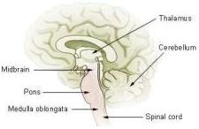

Figure 2.1: *Brain stem*

syndrome are conscious and can think and reason, but are unable to speak or move.

Locked-in syndrome should not be confused with persistent vegetative state. A patient in a persistent vegetative state has suffered damage to the upper portions of the brain that affect cognitive processes and self-awareness. It is possible for such a person to move, but not to think, experience emotions, or intelligently respond to external stimuli. In contrast, the locked-in syndrome is caused by damage to the lower portions of the brain. While damage to these brain sections affects muscle control, it does not affect patients’ ability to think and reason.

“classic” locked-in syndrome, vertical eye movements as well as eyeblinks remain intact, whereas in the “total” locked-in syndrome, patients lose all ability to move and communicate [1].

There are many different causes that may lead to a complete locked-in state [42]. The main ones are related to tumors, encephalitis and lesions of the brain stem, particularly if the pons or parts of the ventral midbrain are damaged (Figure 2.1).

A total motor paralysis can be caused also by degenerative neuro-muscular diseases, the most frequent being Amyotrophic Lateral Sclerosis (ALS). Amyotrophic lateral sclerosis involves a steadily progressive degeneration of central and peripheral motoneurons. Usually it begins with the paralysis of the lower extremities and then moves onto hands and arms, finally paralyzing breathing and swallowing as well as facial muscles. Most often, people affected by ALS, can still control eye muscles and few facial muscles till the late stages of the disease, however there are also cases [26] in which absolutely no remaining muscular activity is retained.

Quality of life in ALS patients is surprisingly high and within the range

2.2. Augmentative and Alternative Communication

8

of patients with non-fatal diseases [36]. However an important component of individual quality of life repeatedly mentioned by patients, specifically if the disease progresses, is the ability to communicate.

The possibility to communicate emotions, thoughts and needs is thus a primary requirement for locked-in patients and many efforts have been made in the last years to open a communication path between them and the external world.

### 2.2 Augmentative and Alternative Communication

Augmentative and Alternative Communication (AAC) is an area of clinical practice that attempts to compensate either temporarily or permanently for the impairment and disability patterns of individuals with severe communication disorders. The term *augmentative* refers to the process of augmenting existing speech abilities, while the term *alternative* refers to the process of providing a substitute for speech [23].

Augmentative and alternative communication strategies are categorized in *unaided* and *aided*. Unaided methods are those that do not require any external device for their use. They consist of nonverbal means of natural communication such as gestures, signed languages and vibrotactile codes. Aided communication methods require, instead, the use of tools or equipments in addition to the user's body. Aided communication methods can range from using paper and pencil to the adoption of sophisticated bioengineering technologies.

Augmentative and alternative communication embraces a broad area of disciplines, from rehabilitation engineering, education science and linguistics to biomedical and computer engineering. Moreover a huge variety of communication disorders exist, ranging from cognitive problems or limited motor problems to severe motor disabilities and total paralysis.

This Section presents the main paradigms and technologies for aided AAC systems employed in cases of motor disorders, with particular attention to subjects in a locked-in state.

#### 2.2.1 Generalized aided AAC system

The ultimate goal of AAC is to enable impaired subjects to communicate with the external world. This problem can be divided in two different tasks:

- establishing an efficient and reliable information channel from the patient to the outer world;

2.2. Augmentative and Alternative Communication

9

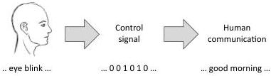

Figure 2.2: Generalized AAC system

- finding the best way to exploit this channel (that is normally noisy, inefficient and unreliable) to enable human communication.

The first task basically consists in finding technological solutions to exploit the residual capacities of the patient with the goal of transferring information. This involves studying suitable physiological phenomena and implementing devices to extract a control signal from these phenomena.

The second task, instead, involves choosing a set of communication symbols, mapping these symbols with the control signal, and eventually exploit redundancies in communication to increase the efficiency of the whole system.

Even if the two tasks are well distinguished, there are some dependencies between them. It is indeed quite difficult to solve the second part of the problem if no information about the input channel is available. The most important piece of information required is obviously the type of control signal (continuous or discrete), but also the transmission rate and the overall reliability of the channel are very useful data. Finally, even during the design of the first part of the problem, there should be an idea on how the produced control signal will be used by the final application.

#### 2.2.2 Acquiring the control signal

Many different technologies have been developed to acquire control signals from motor-impaired subjects. The characteristics of the output signals and the complexity of the systems are very different depending on the actual residual capabilities of the patient.

For patients retaining the capability of partially moving the hands or at least one finger, special keyboards are available on the market [28]. These keyboards can have larger or smaller keys, provide alternative key configurations, or be equipped with removable overlays adapting the device to the specific needs of the subject.

2.2. Augmentative and Alternative Communication

10

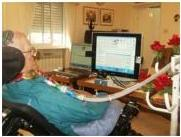

(a) ALS Patient using an eye-tracking device

(b) Patient using a sip-and-puff device

Figure 2.3: Devices for AAC

If hands' movement is completely compromised, but other muscles can be sufficiently controlled, it is possible to use tracking systems to map the position of a chosen portion of the body (i.e. head, nose, chin, finger or toe) into a continuous control signal in one or two dimensions [45] [2].

The same principle is also the basis for eye tracking devices [10] [16] [33]. An eye tracking device measure either the point of gaze or the motion of an eye relative to the head. These systems can be used also by "common" locked-in patients that usually retain only the control of ocular muscles. There are basically three types of eye tracking devices:

- devices using an attachment to the eye, such as a special contact lens with an embedded mirror or magnetic field sensor measuring the eye movement;
- video based eye trackers, that typically use the corneal reflection and the center of the pupil as features to track over time;
- devices based on the acquisition of the electro-oculogram (EOG), using contact electrodes placed near to the eyes and measuring the variations of the electrical potential field between the cornea and the retina.

Other input devices for AAC are based on a single switch being controlled for example by an intentional muscle contraction or eye blink detection [24].

For people who retain control of voluntary breath, sip-and-puff devices are also available [49]. With these devices it is possible to measure small variations of air pressure produced by "sipping" and "puffing" into a plastic tube. These pressure variations can be either transduced into a continuous control signal or used to activate a binary switch.

All these technologies are however precluded to subjects affected by "total" locked-in syndrome, because they require voluntary movement of at

2.2. Augmentative and Alternative Communication

11

least one single muscle. For people that are completely paralyzed, instead, the only way to interact with the external word is to intentionally induce modifications of some physiological parameters (independent from muscular activity) that can be measured and translated into control signals.

Several studies [17] showed that autonomic functions (i.e. hearth rate, skin temperature) can be used to provide control signals to external devices. Indeed, people with severe disabilities can learn, in some extent, to achieve a voluntary control of these functions. However the very slow rate of responsiveness and the high metabolic noise of some autonomic responses, make these strategies useless for precise and reliable communication [58].

Other biofeedback techniques, instead, have been proved to be successful for such cases, these techniques fall in the area of Brain-Computer Interfacing (BCI) [4]. A brain-computer interface is a system whose ultimate goal is to establish a direct communication path between the brain and an external computing device. These systems record brain activity and, exploiting different neuro-physiological phenomena (either event-related or self-induced), can generate a control signal suitable for instrumental control. The output signal can be either continuous, based on voluntary modulation of specific brain waves, or discrete, when a classification algorithm is employed. For a more detailed description of BCI techniques and paradigms refer to Chapter 3.

#### 2.2.3 From the control signal to human communication

Once a control signal is available as the output of any AAC device, this reduced amount of information needs to be properly encoded for communication. Human communication is indeed a complex process and requires the sender to properly encode its message in such a way that could be easily decoded and understood by the receiver.

In verbal communication information is encoded in characters and words, while non-verbal communication may use iconic symbols, gestures or facial expressions to convey messages.

Common techniques in AAC often involve the use of iconic symbols to enable communication. This is usually the case when communication disorders are linguistic or cognitive. For patients with motor impairments, instead, verbal communication is mostly used. Such users, indeed, would normally prefer using their original language rather than learn an alternative symbol system.

Whatever is the set of symbols adopted, the main strategies used to access these symbols can be grouped into three broad categories: direct

2.2. Augmentative and Alternative Communication

12

selection, scanning and encoding.

## Direct selection

Direct selection allows the user access to all possible symbol choices at all times. This could be achieved basically in two ways: either having an input signal with as many states as the size of the output alphabet, or having a reliable continuous control signal.

In the first case there is a simple one-to-one mapping between the control signal and the output symbols. This is the fastest and most efficient strategy to employ, but also the most difficult to apply with AAC devices. Indeed, the number of different states distinguishable by these systems is normally much lower than the number of symbols in the output alphabet.

With a continuous control signal, instead, symbols are graphically displayed on a screen and selections are performed controlling the movement of a cursor. This strategy requires the user to control the cursor's movement with a sufficient precision and to keep the cursor idle for a while to confirm the selection. Alternatively the final selection could be performed activating a second binary switch controlled on a different channel.

## Scanning

In scanning systems language elements, or groups of language elements, are presented sequentially for selection by the communicator. What the user is required to do is only to confirm or reject the proposed selection. These systems are normally used when the control signal is generated by a binary switch and only two different states can be distinguished.

There are different ways to present choices to the user for selection. The simplest scanning methods are linear and circular scanning. Linear scanning involves presenting symbol choices one at a time in a line by line pattern, while circular scanning presents symbols following a circular pattern (Figure 2.4).

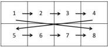

(a) Linear scanning

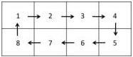

(b) Circular scanning

Figure 2.4: Scanning methods for AAC

2.2. Augmentative and Alternative Communication

13

Linear and circular scanning are cognitively easy to learn since they only require a one-step selection process. However, because all choices need to be scanned one at a time, these methods are extremely slow and are suitable only with a limited number of symbols.

In order to speed up the selection process, multiple symbol choices can be simultaneously presented to the user. In row-column scanning rows of symbols are first scanned sequentially until a selection is performed. The user must then take a second switch activation when the desired symbol in that row is presented.

Group-item scanning is a variation of row-column scanning that can take different forms. Basically large groups of symbols are presented at once for selection. When a group is chosen, the selected group is scanned again recursively, until a single symbol is selected. It is also possible to combine different techniques: for example using group-item scanning at the first level and then row-column scanning for successive group expansions. Group-item scanning normally involves at least three or four selection steps and the resulting selection process is more difficult to master.

## Encoding

Another technique to map control signals into language symbols is encoding. This is actually a variation of direct selection employed when more symbols than input commands are available. Encoding strategies could be used with either discrete or continuous control signals.

With discrete signals each element in the output alphabet is simply coded in a sequence of input commands. Having for example a binary input and an alphanumeric alphabet, the well known Morse code may be employed.

Even with continuous control signals encoding schemes can be very useful. In many systems, indeed, the acquired signal is converted into cursor movements, but this control is not precise enough to allow a direct selection. In these cases control points, movement directions or gestures may be used to encode movement patterns into characters, words or any other kind of symbol. Some examples of these coding techniques are the EdgeWrite (based on control points) [60], and the Minimal Device Independent Text Input Method (based on compass directions) [29].

Finally, grouping may be considered as an encoding strategy too. In this case all available symbols are collected into a small number of groups that are recursively expanded until a single element is selected. Indeed each symbol results to be encoded in the sequence of groups that must be expanded during the selection process. An encoding scheme is thus present

2.2. Augmentative and Alternative Communication

14

but, being the user guided step by step in each proposed choice, the actual code is not explicit to him. A group selection may be performed either with a discrete control signal or hitting a specific target with a cursor. In the spelling application developed for this thesis we adopted and encoding technique based on grouping. Further details about the symbol selection strategy are reported in Section 6.1.2.

#### 2.2.4 Improving the communication rate

Augmentative and alternative communication is generally much slower than speech. With most commonly used AAC systems (such as adaptive keyboards, joysticks, touchpad and trackballs) communication rate is often less than 10 words per minute [39] [31], compared to about 150-200 words per minute for unimpaired speech. If we consider more sophisticated AAC devices, such as systems based on brain-computer interfaces, the communication rate lowers down to less than 5 characters per minute [7] [47] [56].

Different strategies have been proposed to increase the user's rate of output, and as a result enhance the efficiency of communication.

Some techniques simply consist in encoding words, phrases or sentences as abbreviations, which are automatically expanded as they are entered in text. Abbreviation expansion may be useful for very frequent words or phrases, but applies rarely in context-free communication.

Other systems exploit information about characters' frequencies in natural language to rearrange or encode symbols in a convenient way. For example AAC devices employing scanning paradigms may rearrange symbols in such a way that most frequent symbols are scanned first, thus reducing the overall selection time [37].

More complex AAC systems employ Natural Language Processing (NLP) techniques based on language modeling and language prediction in order to improve the communication rate [15]. These techniques are used either to predict the next probable character or to suggest the most likely word following the current text.

Predictions are computed combining statistical data extracted from a collection of texts (the training corpus) with information on the current composition context. They are typically based on frequency tables, syntactic structure, semantic information or a combination of these.

Techniques based on word prediction are the most commonly employed in AAC systems. In these systems a list of likely words is normally presented for selection. The prediction list may vary in length and may be presented in-line (appearing within the text being entered) or somewhere separately

2.3. Statistical language modeling for text prediction

15

on the user interface screen.

Obviously, adding predictive features in an AAC system can increase the communication rate, but may also introduce issues in user interfacing and user interaction. Finally, in order to assess the actual benefit of language predictions, many factors need to be taken into account, from the actual number of selections saved to considerations about timings and cognitive effort [53] [22].

In this work language prediction techniques based on statistical models have been applied in order to enhance the performances of the spelling application. Section 2.3 describes the models and the algorithms being considered for this purpose.

### 2.3 Statistical language modeling for text prediction

In order to predict the behavior of a system first we need to build a model of it. Statistical Language Modeling (SLM) employs concepts from statistics and information theory to build probabilistic models of natural language.

There are two commonly used approaches in statistical language modeling. The first one, mostly used in the field of speech recognition, models natural language as a *markovian stochastic process* in which each character, word or text token is considered as a random variable with a certain probability distribution. The second approach, commonly used in the field of coding and compression, relies on information theory and models natural language as a source of information emitting a sequence of symbols (words) from a finite alphabet (the dictionary).

Many different language models have been employed for the purpose of text prediction, most of them adopting Markov models and the Bayes theorem in order to estimate the probability of a new word given the text previously entered. As mentioned in 2.2.4, different levels of information can be employed to estimate these probabilities, starting from frequency statistics to syntax information, phrase structure and semantics.

This section focuses on markovian language models based on frequencies, since these are the most commonly used models in the field of AAC communication, and the models that have been employed in this thesis.

#### 2.3.1 Markov chains and N-grams

A Markov chain is a discrete stochastic process in which, given the present state, future states are independent from past states (Markov assumption).

2.3. Statistical language modeling for text prediction

16

In other words in a Markov chain the present state fully captures all the information that could influence the future evolution of the process.

Formally a Markov chain is a sequence of random variables $X_1, X_2, \ldots, X_n$ such that:

$$P(X_{t+1} = i_{t+1} | X_t = i_t, X_{t-1} = i_{t-1}, \ldots, X_0 = i_0) = P(X_{t+1} = i_{t+1} | X_t = i_t) \tag{2.1}$$

Whenever states' probabilities are independent from time, the Markov chain is said to be *stationary*, formally:

$$P(X_{t+1} = j | X_t = i) = p_{ij} \quad \forall t \tag{2.2}$$

More generally, a Markov chain of order $m$ (or a Markov chain with memory $m$) is a discrete stochastic process in which future states depends only on the current state and on the last $m - 1$ past states. Formally:

$$P(X_{t+1} = i_{t+1} | X_t = i_t, X_{t-1} = i_{t-1}, \ldots, X_0 = i_0) = \tag{2.3}$$

$$P(X_{t+1} = i_{t+1} | X_t = i_t, X_{t-1} = i_{t-1}, \ldots, X_{t-m+1} = i_{t-m+1}) \tag{2.4}$$

As before, in a *stationary* $m$-order Markov chain:

$$P(X_{t+1} = j | X_t = i_0, X_{t-1} = i_1, \ldots, X_{t-m+1} = i_{m+1}) = p_{j, i_0, \ldots, i_{m+1}} \quad \forall t \tag{2.5}$$

In statistical language modeling for text prediction, Markov chains are usually applied to sequences of words and take the name of N-grams. An N-gram model is indeed a stationary Markov chain of order $N - 1$ in which $X_{t+1}$ is the next word to be predicted, and $X_t, X_{t-1}, \ldots, X_{t-N+2}$ are the last $N - 1$ words entered.

The Markov assumption can be thus rewritten in a notation that is more common for N-grams models:

$$P(w_k | w_1, \ldots, w_{k-1}) = P(w_k | w_{k-N+1}, \ldots, w_{k-1}) \tag{2.6}$$

Meaning that the probability of word $w_k$, given all the previous words, is equal to the probability of $w_k$ given the last $N - 1$ words.

Most commonly used N-gram models are those with $N$ equal to 2 or 3, called respectively *bigrams* and *trigrams*. *Unigrams* are instead degenerate cases in which the probability of each word is assumed to be completely independent from the past history. With a bigram model, for example, the probability

$$P(\text{the} | \text{my}, \text{room}, \text{is}, \text{so}, \text{small}, \text{that}) \tag{2.7}$$

is approximated with $P(\text{the} | \text{that})$. With a trigram model, instead, the same probability is approximated with $P(\text{the} | \text{small}, \text{that})$.

2.3. Statistical language modeling for text prediction

17

Once the model is defined, we need a method to estimate these N-gram probabilities. The simplest and most intuitive way to estimate probabilities is called *maximum likelihood estimation* or MLE.

The idea behind maximum likelihood parameter estimation is to determine the parameters that maximize the probability (likelihood) of sample data. An MLE estimate for the N-gram model's parameters can be thus obtained normalizing counts from a training *corpus*¹. For example it's possible to estimate the bigram probability of a word $w_k$, given a previous word $w_{k-1}$, counting the occurrences of the bigrams $C(w_k, w_{k-1})$ and normalizing by the sum of all bigrams that share the first word $w_k$:

$$P(w_k|w_{k-1}) = \frac{C(w_k, w_{k-1})}{\sum_w C(w_k, w)} \tag{2.8}$$

Since all bigram counts starting with the word $w_k$ must be equal to the unigram count for that word $w_k$, the above formula simplifies in:

$$P(w_k|w_{k-1}) = \frac{C(w_k, w_{k-1})}{C(w_k)} \tag{2.9}$$

For the general case of an N-gram model, the formula for MLE parameter estimation is:

$$P(w_k|w_{k-N+1}, \dots, w_{k-1}) = \frac{C(w_{k-N+1}, \dots, w_{k-1}, w_k)}{C(w_{k-N+1}, \dots, w_{k-1})} \tag{2.10}$$

N-gram models have been largely used for word prediction because they are effective and simple to use. Moreover the frequency statistics used to train the ML estimators are easily available on the Internet or can be computed directly from texts without much effort. However these models suffer also of some limitations.

A first problem with N-gram models is that they are completely blind outside the limited text window they consider. If the significative information for prediction is just one step behind the model order, N-grams can't see that information, resulting in poor predictions. A model with an $N$ tending to infinite would be in theory a very good model, but this is actually impractical because of the zero-frequency problem that is described later.

Moreover N-gram models behave in a completely different way if the words' ordering changes. This could be either a benefit or a drawback depending on the language considered. Some languages have restrictive word orders, often relying on the order of constituents to convey important grammatical information. For such languages this particular property of N-grams

¹A corpus is a collection of written texts or transcribed speech selected to be statistically representative for language modeling

2.3. Statistical language modeling for text prediction

18

is thus a significant benefit. In contrast, with other languages in which word ordering is more flexible, the same property may lead to negative effects on the prediction accuracy.

Finally, one of the most critical issues with N-gram models in the so-called zero-frequency problem. The problem arises because N-grams' probability matrices are very sparse and their sparsity rapidly grows as the model order increases. In fact MLE assigns zero probability to any sequence of words that is not observed in the corpus. Being any corpus limited, some perfectly acceptable word sequences are likely to be missing from it. This missing data means that the N-gram matrix of any corpus may have a large amount of zeros that should be actually filled with some non-zero probability value.

In order to overcome this problem many smoothing techniques have been proposed. The goal of all these methods is to perform some modifications in the probability matrices in order to overcome the sparsity issue and improve the overall accuracy of the language model.

#### 2.3.2 Smoothing techniques for N-gram models

The term smoothing refer to such modifications in the MLE estimates of N-gram probabilities that are addressed to move some probability mass from higher counts to zero-counts, making the overall distribution less jagged (Figure 2.5).

#### Laplace smoothing

The simplest way to do smoothing is to take the matrix of N-gram counts, before normalization, and add one to all the counts. This algorithm is called Laplace smoothing or add-one smoothing [38]. The basic idea of this method is to add one to each count, and then apply a normalization factor to account for the extra $V$ observations introduced:

$$c_{i}^{*} = (c_{i} + 1) \frac{N}{N + V} \tag{2.11}$$

Where $c_{i}$ is the original count, $N$ is the original normalization factor$^2$ and $V$ is the number of unique words in the vocabulary. Applying this smoothing factor to N-gram counts, the formula for N-gram probability estimation in Equation 2.10 modifies as follows:

$$P_{lap}(w_{k}|w_{k-N+1}, \dots, w_{k-1}) = \frac{C(w_{k-N+1}, \dots, w_{k-1}, w_{k}) + 1}{C(w_{k-N+1}, \dots, w_{k-1}) + V} \tag{2.12}$$

$^2$corresponding to the total number of tokens in the training data

2.3. Statistical language modeling for text prediction

19

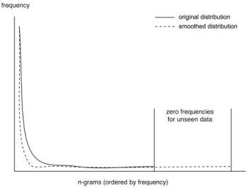

Figure 2.5: Smoothing

Laplace smoothing is very simple, but performs rather poorly. The problem is that too much probability mass is shifted towards unseen N-grams, so that probability of frequent N-grams is often underestimated, while probability of rare or unseen N-grams is overestimated. Even adding a factor smaller than one ($\delta$ smoothing) the problem is not solved in principle [20]. To overcome this issue a number of alternative smoothing techniques have been presented.

### Good-Turing smoothing

The intuition of many smoothing algorithms (i.e. Good Turing [21], Witten-Bell discounting [59], Kneser-Ney smoothing [35]) is to re-estimate the counts of N-grams occurring $c$ times with the counts of N-grams occurring $c + 1$ times in the training corpus.

The Good-Turing estimate, that is central for many other smoothing techniques, states that for any N-gram that occurs $c$ times, should be pretended that it occurs $c^*$ times where:

$$c^* = (c + 1) \frac{n_{c+1}}{n_c} \tag{2.13}$$

being $n_c$ is the number of N-grams that occur exactly $c$ times in the training data. Thus the Good Turing smoothed N-gram probability can be estimated

2.3. Statistical language modeling for text prediction

20

as:

$$P_{gt}(w_k|w_{k-N+1}, \dots, w_{k-1}) = \frac{C^*(w_{k-N+1}, \dots, w_{k-1}, w_k)}{C(w_{k-N+1}, \dots, w_{k-1})} \tag{2.14}$$

where $C^*(w_{k-N+1}, \dots, w_{k-1}, w_k)$ is estimated as in 2.13. Good-Turing estimation assumes that the distribution of each N-gram is binomial, and assumes known the number $n_0$ of the unseen N-grams. This number can be indeed easily computed as $V^N - M$, where $V$ is the size of the vocabulary and $M$ is the total number of N-grams found in data.

In practice, the Good-Turing estimate is not used by itself for N-gram smoothing, because it does not include the combination of higher-order models with lower-order models that is necessary for obtaining good performances.

### Interpolation

The smoothing methods discussed so far can be useful for solving the problem of zero frequency N-grams, but there is an additional source of information that remained unused.

In fact, if there are no counts to compute the trigram probability $P(w_k|w_{k-2}, w_{k-1})$, it is still possible to perform this estimation using the bigram probability $P(w_k|w_{k-1})$. Similarly, if there are no counts to compute $P(w_k|w_{k-1})$, the unigram probability $P(w_k)$ could be considered.

There are basically two ways to rely on this N-gram “hierarchy”, backoff and interpolation. In backoff, when N-gram counts are not available a lower order N-gram is employed. If there are non-zero counts, instead, the model with the highest order is considered. By contrast, in interpolation, probability estimates from all the N-gram estimators (with descending orders) are mixed.

In linear interpolation, N-gram models with different orders are simply interpolated in a linear way:

$$P_{int}(w_k|w_{k-N+1}, \dots, w_{k-1}) = \lambda_0 P(w_k) + \sum_{j=1}^{N-1} \lambda_j P(w_k|w_{k-j}, \dots, w_{k-1}) \tag{2.15}$$

with all weights summing up to one: $\sum_{j=0}^{N-1} \lambda_j = 1$.

In order to compute the weights $\lambda_j$ an held-out corpus³ may be used. The basic idea is again to choose the values of $\lambda_j$ which maximize the likelihood of

³An held-out corpus is an additional training corpus that is not used to set the N-gram counts, but reserved to estimate model parameters

2.3. Statistical language modeling for text prediction

21

the held-out corpus. That is, fixed the N-gram probabilities, we search for the weighting values that, plugged into 2.15, give the highest probability of the held-out set. There are various ways to find this optimal set of wights. For example, one way is to use the Expectation Maximization (EM) algorithm⁴.

### Backoff

While interpolation is simple both to understand and to implement, there are a number of other smoothing algorithms that have been proved to perform better [12]. One of these is backoff N-gram modeling, and in particular the *Katz backoff* algorithm [32]. In a Katz backoff model the probability of an N-gram with zero-counts is approximated with the probability of an $N - 1$-gram. This backoff procedure is performed recursively till either non-zero counts are available or the order $N = 1$ is reached:

$$
P_{kats}(w_k | w_{k-N+1}, \dots, w_{k-1}) =
$$

$$
\left\{
\begin{array}{ll}
P^*(w_k | w_{k-N+1}, \dots, w_{k-1}) & \text{if } C(w_{k-N+1}, \dots, w_{k-1}) > 0 \\
\alpha(w_{k-N+1}, \dots, w_{k-1}) P_{kats}(w_k | w_{k-N+2}, \dots, w_{k-1}) & \text{otherwise}
\end{array}
\right.
\tag{2.16}
$$

Where $P^*$ is a smoothed probability, computed for example using the Good-Turing estimate (2.14). The $\alpha$ coefficients are there to ensure that the final probability value is a true probability, namely ensuring that, fixed the right part of the conditional probability:

$$
\sum_w P_{kats}(w | w_1, \dots, w_{N-1}) = 1
\tag{2.17}
$$

$P^*$ is thus used to discount the MLE probabilities to save some probability mass for the lower order N-grams, while $\alpha$ is used to ensure that the probability mass from all the lower order N-grams sums up to exactly the amount saved by discounting the higher-order.

Since the discounted probability $P^*$ for an N-gram is estimated as:

$$
P^*(w_k | w_{k-N+1}, \dots, w_{k-1}) = \frac{C^*(w_{k-N+1}, \dots, w_{k-1}, w_k)}{C(w_{k-N+1}, \dots, w_{k-1})}
\tag{2.18}
$$

⁴EM is an iterative method alternating an expectation step (E), which computes an expectation of the likelihood with respect to the current estimate of the parameters, and a maximization step (M), which computes the parameters maximizing the expected likelihood found on the E step

2.3. Statistical language modeling for text prediction

22

the total amount of probability mass $\beta$ that is saved for the model of order $N - 1$ is:

$$\beta(w_{k-N+1}, \dots, w_{k-1}) = 1 - \sum_{w_k: C(w_{k-N+1}, \dots, w_{k-1}, w_k) > 0} \frac{C^*(w_{k-N+1}, \dots, w_{k-1}, w_k)}{C(w_{k-N+1}, \dots, w_{k-1})} \tag{2.19}$$

Each individual $N - 1$-gram will receive just a fraction of this probability mass, thus $\beta$ needs to be normalized by the total probability of all $N - 1$-grams for which an N-gram was not found. Therefore the final equation for computing the $\alpha$ coefficient is:

$$\alpha(w_{k-N+1}, \dots, w_{k-1}) = \frac{\beta(w_{k-N+1}, \dots, w_{k-1})}{\sum_{w_k: C(w_{k-N+1}, \dots, w_{k-1}, w_k) = 0} P(w_k | w_{k-N+1}, \dots, w_{k-1})} \tag{2.20}$$

In this work the Katz backoff model has been used in order to provide predictions to the spelling application. Section 6.2 explains how this method has been applied to our specific problem and describes the language corpus employed in training the statistical model.

# Chapter 3

## Brain Computer Interfacing

*“The human brain, then, is the most complicated organization of matter that we know”*

Isaac Asimov

This chapter summarizes the state of the art in the field of brain-computer interfacing, with particular emphasis on motor imagery which is the BCI paradigm adopted in this work. Section 3.1 describes a generalized BCI system, presenting the main components involved along with their dependences and interconnections. Section 3.2 deals with the main techniques available to acquire brain signals, while Section 3.3 deals with the neurophysiological phenomena normally employed in BCI control. The following sections are about EEG signal processing (Section 3.4), feature extraction (Section 3.5) and translation (Section 3.6). Finally we discuss the role of feedback (Section 3.7) and we present the main control paradigms adopted in brain-computer interaction (Section 3.8).

### 3.1 Generalized BCI system

A Brain-Computer Interface (BCI), also called Brain-Machine Interface (BMI), is a communication system that allows to control an external device using signals measured from the brain. Brain-Computer interfaces bypass any muscle or nerve mediation and establish a direct communication pathway from the human brain to the outer world.

A BCI system consists on three main components (see Figure 3.1):

**Signal acquisition** In the first stage a signal related to neuronal activity is recorded from the brain of the subject. This signal may be acquired

3.2. Signal acquisition

24

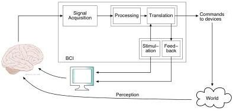

Figure 3.1: Generalized BCI system

with several techniques having different spatial and temporal resolutions, different levels of invasiveness and different characteristics of the recording equipments.

**Processing and translation** Signal processing and translation is the most important component of any BCI system. Its goal is to convert signals recorded from the brain into a control signal suitable for an external device. In the processing part the signal is filtered and relevant features are extracted in order to discriminate relevant brain activities. In the translation part these features are used to generate a continuous or discrete control signal.

**Feedback and/or stimulation** Depending on the approach adopted a BCI system may also have a feedback and/or a stimulation module. When self-induced modulations of brain activity are involved, feedback is often provided to support the user in his task, obtaining in this way a closed loop BCI control. When the considered neurophysiological phenomena are instead event-related, a stimulation module is required. In some BCI systems it is even possible to have both feedback and stimulation modules.

### 3.2 Signal acquisition

There are several ways to acquire signals from the brain, all falling into two main categories: *invasive* and *non-invasive* techniques. Invasive BCIs use activity recorded by brain implanted micro-electrodes, whereas non-invasive

3.2. Signal acquisition

25

|  Method | Measured quantity | Invasive | Spatial resolution | Temporal resolution | Equipment portable  |
| --- | --- | --- | --- | --- | --- |
|  EEG | Electric pot. | No | - | ++ | Yes  |
|  ECoG | Electric pot. | Yes | + | ++ | Yes  |
|  Micro-electrodes | Electric pot. | Yes | ++ | ++ | Yes  |
|  MEG | Magnetic fields | No | + | ++ | No  |
|  fMRI | BOLD | No | ++ | - | No  |
|  NIRS | BOLD | No | + | + | Yes  |

Table 3.1: Comparison of techniques for measuring brain activity

BCIs use brain signals recorded from outside the body boundaries.

Invasive recording methods either measure the neural activity of the brain on the cortical surface (electrocorticography, ECoG) or from within the cortex. While having strong advantages in terms of signal quality, these methods require very delicate and risky surgeries with all the problems related to stability of implants and protection from infections.

Dealing with non-invasive techniques, two main approaches exist: measuring dependent blood oxygenation levels (BOLD) and measuring electrical activity generated by neurons.

Methods adopting the first approach are based on the observation that local concentration of deoxygenation hemoglobin in brain tissue is correlated to neural activity. These concentration levels can be measured with functional magnetic resonance imaging (fMRI) or with near-infrared spectroscopy (NIRS). Magnetic resonance measures changes in the magnetic field due to different oxygenation levels in brain tissues. It provides signals with high 3D spatial resolutions but is limited by low temporal resolutions and very high costs for the recording equipment. Near-infrared spectroscopy, instead, performs BOLD estimations measuring the reflection of infrared light by the brain cortex through the skull. NIRS provides a spatial resolution comparable with MRI (but limited to the cortex's surface) combined with high temporal resolutions and a recording device that is portable and relatively cheap. This is a recent technique and it has been proved to be suitable for real-time BCI control [50].

Non-invasive methods based on electrical brain activity are mainly two: magnetoencephalography (MEG) and electroencephalography (EEG). MEG is sensitive to the magnetic fields induced by the electric currents in the brain. It provides a precise spatial resolution (about 5 millimeters) and a good temporal resolution, but the recording equipment is bulky and ex

3.2. Signal acquisition

26

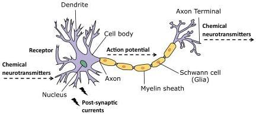

Figure 3.2: Transmission of nervous signals

pensive. To date, this method is used only in laboratory settings and is consequently not suitable for a BCI control in the patient's home environment.

Electroencephalography, instead, makes use of electrodes on the scalp to sense the electrical fields generated by the firing neurons. EEG recordings provide a very good temporal resolution (in the order of milliseconds) but suffer of a poor spatial resolution (in the order of centimeters). These limits in signal localization are mainly due to the diffusive effects caused by all intermediate tissues between the scalp and the brain cortex. However EEG is still the preferred choice for non-invasive BCI communication, because of its fine temporal resolution, ease of use, portability and low set-up cost.

Electroencephalography is acquisition technique adopted in this work. The remaining part of this section gives further details about the nature of the EEG signal and describes the standard recording settings employed.

#### 3.2.1 Nature of the EEG signal

The EEG signal is a measurement of currents that flow during synaptic excitations of the dendrites of pyramidal neurons in the cerebral cortex. Within neurons signals are transmitted by means of action potentials, which are discrete electrical signals that propagate down axons and cause the release of chemical neurotransmitters at the synapse, i.e. the contact area between two neurons (see Figure 3.2). When these neurotransmitters comes in contact with the neuron on the other side of the synapse (the post-synaptic neuron), they typically cause electrical currents within its dendrites. The

3.2. Signal acquisition

27

activity measured by EEG are electrical potentials induced by the post-synaptic currents, rather than by action potentials. Therefore, the scalp electrical potentials producing the EEG are due to the extracellular ionic currents.

The human head consists of different layers including the scalp, the skull, the brain, and many other layers in between. The skull attenuates the signals approximately one hundred times more than the soft tissue. On the other hand, most of the noise is generated either within the brain (internal noise) or over the scalp (external noise). Therefore, only large populations of active neurons can generate enough potential to be recordable using scalp electrodes. For this reason the spatial resolution of the EEG signal is rather poor compared to invasive recordings.

#### 3.2.2 The 10-20 international system

The 10-20 international system is the standard naming and positioning scheme for EEG recordings. It is based on an iterative subdivision of arcs on the scalp starting from four craniometric reference points: *nasion* (Ns), *inion* (In) and left (PAL) and right (PAR) *pre-auricular points*. The nasion is the point between the forehead and the nose, while the inion is the lowest point of the skull from the back of the head and is normally indicated by a prominent bump. Left and right pre-auricular points are instead the bony indentations behind left and right hears. The intersection of the longitudinal nasion-inion (Ns-In) with the arch connecting the two pre-auricular points (PAL-PAR) is named the *vertex* (see Figure 3.3).

In the 10-20 international system 19 electrodes are placed at fixed distances from these landmark points and the name '10-20' refer to the fact that the actual distances between adjacent electrodes are either 10% or 20% of the total Ns-In or PAL-PAR distances.

Each electrode has a letter to identify the lobe and a number to identify the hemisphere location. The letters F, T, C, P and O stand for Frontal, Temporal, Central, Parietal and Occipital respectively. A 'z' (zero) refers to an electrode placed on the midline. Even numbers (2,4,6,8) refer to electrode positions on the right hemisphere, whereas odd numbers (1,3,5,7) refer to those on the left hemisphere. For example, electrodes C3 and C4 are placed on the central part of the cortex (C) respectively on the left (3) and right (4) hemispheres. These two electrodes are particularly important in the scope of this thesis since they are positioned over the primary motor cortex, which plays a fundamental role in the BCI paradigm adopted.

3.3. Neurophysiological phenomena for EEG-based BCI

28

A

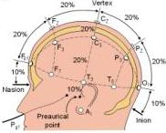

B

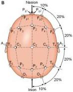

Figure 3.3: The 10-20 international system

### 3.3 Neurophysiological phenomena for EEG-based BCI

Different neurophysiological phenomena may be exploited to extract information from scalp-recorded EEG signals. In some cases such phenomena are generated consciously by the user (*endogenous* system), in other cases there is an unconscious mechanism in response to an external stimulation (*exogenous* system). Exogenous BCIs are based on Event Related Potentials (ERP), while the main endogenous BCIs are based on Slow Cortical Potentials (SCP) and Sensory-Motor Rhythms (SMR). In the following paragraphs these three classes of neurophysiological phenomena are briefly exposed. Particular attention is placed on sensory-motor rhythms, being most relevant in the scope of this thesis.

#### 3.3.1 Event Related Potentials

Event-related potentials (ERPs) are electrocortical potentials that can be measured in the EEG before, during, or after a certain event. They have a fixed time delay to the stimulus and their amplitude is usually much smaller than the ongoing spontaneous EEG activity. ERPs can be detected by averaging many recordings time-locked to the event. This averaging cancels out the background activity, which is not synchronized with the stimulus, and leaves only the ERP. There are different kinds of ERPs, the most commonly used being P300 and Steady State Visual Evoked Potentials (SSVEP).

3.3. Neurophysiological phenomena for EEG-based BCI

29

### P300

P300 is a positive deflection in the EEG, appearing approximately 300 ms after the presentation of rare or surprising task-relevant stimuli. To evoke a P300, subjects are asked to observe a random sequence of two types of stimuli. One stimulus type (the oddball stimulus) appears only rarely in the sequence, while the other stimulus type (the normal stimulus) appears more often. Whenever the target stimulus appears, a P300 can be observed in the EEG. Subjects must be attentive to stimuli for a P300 to be elicited, and the more the attention, the bigger the P300. The first BCI based on P300 was proposed in 1988 by Farwell and Donchin [19]. It was a speller in which a matrix containing symbols from the alphabet is displayed on a screen. Rows and columns of the matrix flashed in random order, and flashes of the row or column containing the desired symbol constitute the oddball stimulus, while all other flashes constitute normal stimuli.

### SSVEP

SSVEPs are oscillations observable at occipital electrodes, induced by repetitive visual stimulation. Stimulation at a certain frequency leads to oscillations at the same frequency and at harmonics and subharmonics of the stimulation frequency [27]. Users can select one stimulus by focusing on it, which leads to an increased amplitude in the frequency bands corresponding to the flickering frequency of the stimulus. The main problem with this approach is that requires intact gaze, which makes it unsuitable for patients with restricted eye movement control.

#### 3.3.2 Slow Cortical Potentials

Slow cortical potentials (SCPs) are slow voltage shifts in the EEG occurring in the frequency range 1-2 Hz. Negative SCPs correspond to a general decrease in cortical excitability. Positive SCPs correspond to a general increase in cortical excitability. It has been proved [3] that subjects can learn to voluntarily control their SCPs when they are provided with visual or auditory feedback of their brain potential. The voluntary production of negative and positive SCPs has been exploited in one of the earliest BCI systems for disabled subjects, the “Thought Translation Device” [5] developed by the group of Birbaumer at Tübidgen University (Germany).

3.3. Neurophysiological phenomena for EEG-based BCI

30

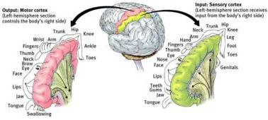

Figure 3.4: Sensory-motor areas. On the left side, the motor cortex is displayed along with the 'motor homunculus' which shows the brain regions controlling the respective limb and facial muscles. Similarly, on the right side, sensory areas are illustrated by a 'sensory homunculus' indicating which regions are allocated to process sensory information from the respective parts of the body.

#### 3.3.3 Sensory-Motor Rythms and Motor Imagery

Oscillatory brain activity occurs in many regions of the brain and changes according to the state of subjects, for example between wake and sleep or between concentrated work and idling. This activity in the EEG is classified into different frequency bands or rhythms. Typical rhythms are inside the *delta* (1 - 4 Hz), *theta* (4 -8 Hz), *mu* (8 - 13 Hz), *beta* (13 - 25 Hz), and *gamma* (25 - 40 Hz) frequency bands.

Sensory-Motor Rhythms (SMR) are oscillatory activities observable in correspondence of specific sensory-motor areas of the cortex, concentrated in the frequency bands *mu* and *beta*. As illustrated in Figure 3.4, different parts of the human body are mapped into specific regions of the sensory-motor cortex. Moreover organs or limbs requiring a very fine motor control or detailed sensory information, such as hands or tongue, are mapped into larger regions on the sensory-motor cortex.

It has been proved that, after a training period, people can learn to voluntary modulate sensory-motor rhythms, particularly the ones from the hands and feet areas of the motor-cortex.

Indeed movement, or preparation for movement, is accompanied by a decrease of SMR activity, particularly contralateral to the movement. This decrease has been labeled 'event-related desynchronization' or ERD [43]. While its opposite, that is rhythm increase, or 'event-related synchronization' (ERS) occurs in the post-movement period and with relaxation. Furthermore, and most relevant for BCI applications, ERD and ERS do not

3.3. Neurophysiological phenomena for EEG-based BCI

31

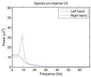

(a) Spectra on channel C3

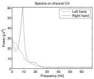

(b) Spectra on channel C4

Figure 3.5: Spectra on channels C3 and C4 during left-hand and right-hand motor imagery

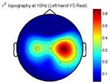

(a) Left hand VS rest

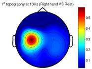

(b) Right hand VS rest

Figure 3.6: Topography of the $r^2$ index for different motor-imagery tasks

require actual movement but occur even when just the imagination of movement is performed (motor imagery).

Figure 3.5 show EEG spectra computed on channels C3 (left hemisphere) and C4 (right hemisphere) during left-hand and right-hand motor imagery. Left hand motor-imagery is characterized by a clear peak in the mu-band on channel C3 and a power attenuation on channel C4 at the same frequencies, while exactly the opposite happens with right hand motor-imagery. Figure 3.6 show the scalp locations where the EEG power in the mu-band discriminates most between the motor imagery of one hand and the resting condition. The level of discrimination is estimated with the $r^2$ coefficient which is computed as reported in Section 7.1.3. These topographies clearly show that the discriminative information is on the electrodes over the motor cortex contralaterally to the part of the body interested by motor imagery.

3.4. EEG signal processing

32

BCI systems employing imagined movements of hands, feet, or tongue have been developed by different research groups around the world, the most important ones being the Wolpaw's group at the Wadsworth Center (Albany, NY) and the group around Gert Pfurtscheller in Graz (Austria).

Research in this field started in the early 1990s when Wolpaw and his colleagues developed the first motor-imagery BCI for an EEG-based cursor control [62]. In 2004 the same group proposed an improved version of their original system in which two-dimensional control of a cursor movement was achieved after a relatively short training period [61].

The group led by Gert Pfurtscheller at Technische Universität Graz developed a system to discriminate between three imagined movements (left hand, right hand, and feet) using spectral features for classification. The same group developed also the "Virtual Keyboard" [40], a spelling application in which binary selections are performed through the movements of a cursor controlled by motor-imagery.

Finally the Berlin BCI group developed various BCIs based on motor-imagery, having the main goal of reducing the training effort normally required to the users [6]. Their BCI has been used also to control an original spelling application "Hex-o-Spell" [7]. In this application letters are displayed in hexagons and selections are performed rotating and scaling an arrow by means of two different motor-imagery tasks.

### 3.4 EEG signal processing

Once it has been acquired from the scalp, the EEG signal is amplified, sampled and digitalized. Then, before proceeding with feature extraction and translation, this digital signal is normally pre-processed in order to eliminate artifacts and to enhance the spatial resolution.

#### 3.4.1 Handling artifacts

Artifacts are undesirable potentials that contaminate brian signals and that may compromise the identification of the neurophysiological phenomena exploited by the BCI. Artifacts may originate both from non-physiological and physiological sources.

Artifacts of the first type originate from outside the human body and may occur due to noise introduced by the recording equipment (e.g. the 50Hz power-line noise) or due to changes in electrode impedances (see Figure 3.7(b)).

3.4. EEG signal processing

33

Physiological artifacts, instead, may be caused by a number of activities inside the human body. The two main artifacts of this type affecting the EEG signal are ocular (EOG) and muscular (EMG) artifacts. EOG artifacts are caused by blinking of eyes or pupil movements, while EMG activity is generated with the movement of any part of the body, including facial muscles, jaw and tongue. EOG is most prominent over the anterior head regions and is normally characterized by high-amplitude patterns at low frequencies, normally around 4-5Hz (see Figure 3.7(c)). EMG has instead a wide frequency range and is mostly visible at high frequencies (see Figure 3.7(d)).

There are two main approaches in handling artifacts: *artifact avoidance* and *artifact removal*. In the first case corrupted EEG segments are simply identified and rejected. The easiest way of doing this is to record EOG or EMG activity directly (with appropriate sensors) and discard the EEG signal in the time window in which artifacts occurred. Artifact avoidance is mainly applied for offline analyses, but is not suitable for online BCIs.

Artifact removal, instead, involves processing the EEG signal in order to filter out artifacts, while keeping the interesting neurological phenomena intact. Many different strategies have been applied for artifact removal, the main ones being linear filtering, regression and blind source separation (BSS).

In this thesis no specific algorithm have been developed for handling artifacts during online processing. However EOG activity has been recorded with two electrodes placed around the left eye of the subject and trials affected by ocular artifacts have been identified and excluded from offline analyses.

#### 3.4.2 Spatial filtering

As discussed in Section 3.2 EEG scalp potentials are known to be associated with a large spatial scale owing to volume conduction. Indeed, it has been shown that only half of the contribution to one scalp electrode comes from sources within a 3cm radius. This is a particular problem if the signal of interest is weak (like sensory-mothor rhythms) and affected by noise. A way of enhancing signal localization is spatial filtering.

There are a number of spatial filters available in literature, most of them apply a linear transformation to the EEG signal re-estimating the contribution brought by each single channel. Some spatial filters, like Common Average Reference (CAR) or Laplacian filters, preserve the original number of channels and produce output signals that are still related to the sites of

3.4. EEG signal processing

34

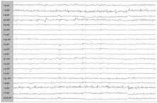

(a) EEG free of artifacts

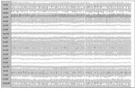

(b) EEG affected by 50Hz power-line artifacts

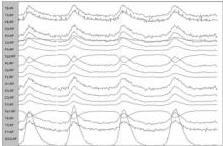

(c) EEG affected by ocular artifacts

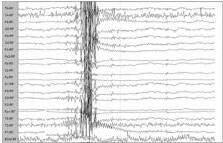

(d) EEG affected by muscular artifacts

Figure 3.7: The effects of artifacts on EEG signals

3.5. Feature extraction

35

the scalp where they were originally recorded.

Other filters, instead, perform transformations in which the output channels loose any direct reference with the original sources. Examples of these are Principal Component Analysis (PCA), Independent Component Analysis (ICA) and Common Spatial Patterns (CSP). This second class of filters is typically used when the output channels are thought to be employed as discriminative features and some of them apply supervised techniques to compute transformations.

In our BCI system Large Laplacian filters have been employed to enhance signal localization. Section 5.2 provides further details about Laplacian filters and explains how they have been applied in this work.

### 3.5 Feature extraction

The main goal of a BCI is to discriminate the user's intentions by means of brain activity alone. For this purpose relevant features need to be extracted from the EEG so that neurophysiological phenomena underlying the recorded brain activity can be identified and successively translated into control signals.

In order to design proper feature extraction algorithms for BCIs, a priori knowledge about the characteristics of the neurophysiological phenomena is normally employed. Depending on the BCI paradigm adopted (i.e. ERP, SCP or SMR) and on the translation strategy employed, these features may be extracted in the time, frequency or spatial domain.

**Time domain features** Features extracted in the time domain relate how the amplitude of the EEG signal vary time-locked to the presentation of stimuli or time-locked to specific tasks performed by the user. Time domain features are normally employed when the underlying neurophysiological phenomena are based on event-related potentials (such as P300), since they typically occur within precise time windows after the presentation of a stimulus. In order to separate relevant information from background activity, band-pass filtering, windowing and down-sampling techniques are normally adopted for this kind of features.

**Frequency domain features** Frequency domain features are related to changes in the oscillatory activity of the EEG signal. Such changes may be generated by an external stimulus or self-induced by the user concentrating on a specific mental task. For example in BCI systems

3.5. Feature extraction

36

based on SSVEP the band-power in the harmonics of the visual stimulation frequency is used as a feature. Frequency domain features are mostly employed with BCI systems based motor-imagery since they are particularly suitable to identify how sensory-mothor rhythms modify according to specific tasks. Since motor-imagery is the paradigm adopted in this thesis a more detailed explanation of these features is reported in Section 3.5.1.

**Spatial domain features** The main goal of spatial domain features is to combine information coming from different EEG channels in order to identify patterns in brain activity related to different neurophysiological phenomena. As anticipated in Section 3.4.2 several spatial filtering techniques have been employed for this purpose, the most common being PCA, ICA and CSP. Like frequency features, spatial features have been widely adopted for motor-imagery. Indeed neuronal activity over the motor cortex is recorded from multiple electrodes and spatial variations of EEG potentials have been proven to be source of discriminative information.

#### 3.5.1 Features for motor-imagery

A number of techniques have been employed in order to extract EEG features discriminating different motor-imagery tasks. As discussed before, most of them are defined in the frequency domain and in the spatial domain.

Dealing with frequency domain features we can further distinguish between features based on spectral power and features based on phase synchrony.

Features based on spectral power have been the firsts to be used for motor-imagery. In [61] Wolpaw and its colleagues translated the spectral powers in the frequency bands *mu* and *beta* into continuous movements of a cursor on a screen. In a successive work [18] the same group proposed to estimate spectral powers in a wider range of frequencies, for different channels and in different time windows computing feature vectors as linear combinations of these values.

When discrete trial classification is involved ERD/ERS patterns have been used as features too. The ERD/ERS is defined as the percentage of power decrease (ERD) or power increase (ERS) in relation to a one-second reference interval before the verification of an event. In this case the event considered is the start of the trial in which the subject is instructed to perform a precise motor-imagery task.

3.6. Translation

37

Features based on phase synchrony have been investigated first by the group of Pfurtscheller in Graz [51] and are based on the computation of the phase-locking value (PLV). The PLV measures the degree of synchrony between couples of channels at different time windows. PLV revealed to be discriminative for motor-imagery, but the accuracies obtained with these features alone were inferior compared to band-power features. However combining phase and amplitude information improved accuracies may be obtained.

Features computed in the spatial domain proved to be particularly suitable for motor-imagery too. The most successful method employed is Common Spatial Patterns (CSP) [44]. The CSP technique allows to determine spatial filters that maximize the variance of signals of one class and at the same time minimize the variance of signals of another class. The variances of the signals filtered with CSP are directly used as features for classification. Extensions of the CSP to multi-class problems have been developed too [25].

For the BCI system developed in this thesis new features have been designed to discriminate different motor-imagery tasks. These features are based on band-powers and are computed in the frequency domain. For further details refer to Section 5.4.

### 3.6 Translation

In order to translate brain activity into control signals two main approaches could be used: regression and classification.

With regression specific features of the EEG signal are evaluated in real-time and used to generate a continuous control signal. This approach is normally applied to BCI systems based on slow cortical potentials and motor-imagery. Indeed regression requires a self-modulation of some neurophysiological activity and does not depend on external stimuli. Normally the output signal is produced combining different features and is normalized within a predefined range. We already mentioned the works of Wolpaw and McFarland in which sensory-motor rhythms were translated into 1D and 2D cursor movements using regression techniques [62] [25].

Regression has the main advantages that the number of choices proposed to the user is not fixed and the BCI control paradigm can be completely asynchronous (see Section 3.8). The drawbacks are related to the precision of the control signal and to the robustness to the non-stationarities occurring in the EEG.

3.7. Feedback and adaptation

38

Classification is instead a more popular approach in BCI research. Classification algorithms are used to identify patterns of brain activity adopting techniques commonly used for pattern recognition and machine learning.

A large number of classification algorithms have been employed in BCI systems. These can be broadly categorized in memory-based methods, discriminant functions and dynamical models.

An example of a memory-based method is K-Nearest Neighbors (KNN) in which a new sample is simply classified based on the labels of the closest $K$ samples in the training data.

Discriminant functions are instead further categorized in linear, quadratic and non-linear models. Linear models include Linear Discriminant Analysis (LDA) and Support Vector Machines (SVM) and assume classes to be linearly separable. Quadratic class boundaries are instead employed by Quadratic Discriminant Analysis (QDA), while non-linear boundaries characterize Artificial Neural Networks (ANN) and Kernel Methods (KMs).

Finally, dynamical models assume that the system being considered evolve in time and that its behavior can be modeled through a set of states. Examples of these are Hidden Markov Models (HMM) and Kalman Filters.

Linear methods are the most popular in the field of BCI research. This is mainly due to their low complexity and their good generalization capabilities. In some works [41] [52] dynamical models have been applied with success too, while quadratic and non-linear methods are less common in the BCI field.

In the BCI system developed for this thesis translation is performed through classification by means of Linear Discriminant Analysis (LDA). Section 5.7 describes in details the model applied and provides motivations for adopting this classifier.

### 3.7 Feedback and adaptation

In any BCI system adaptation is a crucial concept that needs to be considered. Two different kinds of adaptation exist: the adaptation of the user to the machine and the adaptation of the machine to the user.

In the first case the subject learns to regulate specific brain activities by means of a feedback signal that is provided online by the BCI system. The feedback gives continuous information about the alteration of brain activities thus enabling a conscious or unconscious training process on the subject side.

A somewhat opposite approach is the machine learning approach to BCI, where the training is relocated from the subject to the learning al-

3.8. Control paradigms

39

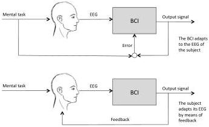

Figure 3.8: Schematic display of the two adaptive systems involved in brain computer interactions

gorithm. Algorithms for feature extraction and translation, indeed, must be parametrized for specific subjects and may implement also adaptation schemes to handle inter-session or even inter-trial variability.

These two approaches reflect opposite positions (see Figure 3.9). However, common BCI systems neither rely solely on feedback learning nor only on machine learning. Thus a coadaptation of the user and the algorithm occurs inevitably, but remains unclear how to bring these interacting learning systems to work optimally.

It may happen indeed that wrong feedback signals could frustrate or irritate the subject who may start changing his mental strategy, while it was correct instead. On the other side machine learning algorithms may try to continuously adapt themselves trying to cope with brain activities completely unrelated to the expected neurophysiological phenomena. How to handle correctly this complex co-adaptation problem is still an open issue in the field of BCI research.

### 3.8 Control paradigms

BCI control paradigms define how users can interact with BCI systems. There basically three different ways to perform this interaction (see Figure 3.9):

**Asynchronous control** When asynchronous control is provided the user drives the interaction with the BCI system which is continuously avail-

3.8. Control paradigms

40

able. Therefore periods of intentional control alternate with periods of no control (idle state) with timings imposed by the subject (self-paced). During the idle state the system is expected to remain neural or unchanged waiting for the user to trigger the start of a new intentional control. BCI system adopting asynchronous control typically employ regression to perform signal translation and generate continuous control signals.

**Synchronized control** In contrast to asynchronous control there are BCI systems working only in synchronized control environments. After a synchronized system is turned on the user is regularly prompted for input and he is able to control the device only during specific time windows explicitly defined by the system. This is a system-driven interaction and is normally employed in BCI systems involving classification algorithms. Synchronized control is probably the most common paradigm employed, being also the easiest method to implement. However synchronized control can cause significant frustration and fatigue, since it requires continuous attention to the user and strict time windows may not fit well with other activities possibly performed during BCI control.

**System-paced control** System-paced control is similar to synchronized control but supports also periods of no intentional control while the system is available. In a synchronized control system, if the user does not pay attention to the BCI during the period of expected control this would result in an unattended action (probably caused by a random classification). In a system-paced system, instead, the user can decide when to start and stop intentional control within the time windows in which the system is available. System-paced control can be regarded also as an asynchronous control in which the system becomes completely unavailable in specific time windows. This approach is clearly better compared to synchronized control but requires the BCI system to identify the transitions from intentional control to idle state and vice versa.

In this thesis a synchronized control paradigm has been adopted, since a classification algorithm is involved and idle states are not detected. Further details about the specific application protocol adopted are reported in Section 4.2.

3.8. Control paradigms

41

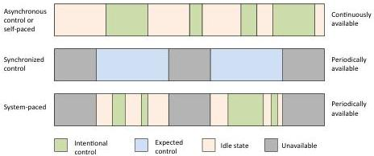

Figure 3.9: Different BCI control paradigms.

# Chapter 4

## System model

*“Science may be described as the art of systematic over-simplification.”*

Karl Popper

This chapter presents the overall model of the BCI spelling application developed for this thesis. In Section 4.1 we describe the main modules composing the system along with their interactions and dependencies, while Section 4.2 deals with the application protocol chosen.

### 4.1 Overview

The BCI spelling application developed for this thesis is a system composed of three main modules (see Figure 4.1):

**BCI module** The BCI module processes the raw EEG signal acquired from the amplifier and classifies different motor-imagery tasks. This operation is performed within a processing pipeline composed of five stages: spatial filtering, spectral estimation, feature computation, feature extraction and classification. Along with the classification results this module provides also a feedback signal to be displayed to the user. The BCI module receives from the spelling interface the exact timing instants in which the EEG signal should be buffered and classified. Finally, if more than one classifier is involved, the spelling application informs the BCI module about which is the correct classifier to employ.

**Spelling interface** The spelling interface presents choices to the user and translates the control signal received in targets’ selections. A target may contain a set of letters to be expanded, a word suggestion, or

4.2. Application protocol and timings

43

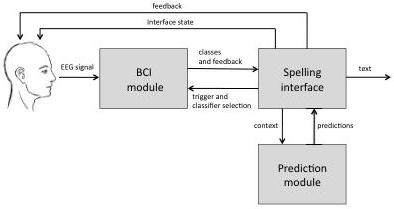

Figure 4.1: System overview

an auxiliary function to be activated. The output of this module is thus text in natural language. Moreover the graphical user interface provided by this module displays the BCI feedback to the user and keeps him informed about the current state of the spelling application. The spelling interface receives information about symbols' and words' probabilities from the prediction module and ensures that this module is always synchronized with the current composition context.

**Prediction module** The prediction module computes word suggestions and symbols' probabilities querying a statistical language model. The prediction context is kept updated with messages received from the spelling interface.

### 4.2 Application protocol and timings

Since the performances obtained with the BCI have been found to vary significantly with different subjects, three different version of the spelling application have been proposed:

1. an application controlled by a 4-class control signal with four targets in the speller interface;
2. an application controlled by a 3-class control signal with three targets in the speller interface;

4.2. Application protocol and timings

44

3. an application controlled by a 3-class control signal with four targets in the speller interface;

In the first two versions the number of classes is equal to the number of targets and therefore each target is mapped to a specific class. In the third version, instead, there are fewer classes than targets, thus the selection of a target needs to be performed in multiple steps. In this case a two-step selection strategy has been adopted:

**First step** In the first step a binary classification is performed: the first class is mapped to three targets, while the second class is mapped to the fourth target.

**Second step** If in the first step the class with three targets has been chosen a second selection step is required. In this case a ternary classification is performed to decide which of the three targets needs to be selected.

Section 6.1.5 provides the motivations for this selection strategy and explains how the user interface model fits with it.

When single-step selection is employed the application protocol consists on three phases (see Figure 4.2):

**Preparation** At the beginning of the preparation phase the graphical user interface is displayed on the screen and a text message warns the user that the acquisition session is going two start in few seconds (see Figure 4.3(a)). This phase lasts 3 seconds.

**Thinking** In the thinking phase the user can see all the options provided by the current interface state and decide which target to select. Near to each target a small icon indicating the corresponding motor-imagery task is drawn (see Figure 4.3(b)). During this phase the EEG signal acquired is completely discarded and no feedback is displayed. This phase lasts 3 seconds.

**Recording** In the recording phase the EEG signal is buffered for later classification. During this phase a brain depicted at the screen's center is colored in green and, when feedback is enabled, two green bars are displayed too (see Figure 4.3(c)). The height of each bar is proportional to the strength of the mu rhythm computed in real-time from the EEG signal on electrodes C3 (left bar) and C4 (right bar). This phase lasts 6 seconds.

**Selection** As soon as the recording phase terminates the signal is classified and the selected class is immediately available to the application.

4.2. Application protocol and timings

45

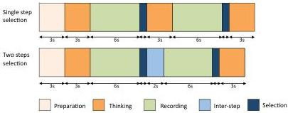

Figure 4.2: Application protocol

During this phase the selected target is colored in green (see Figure 4.3(d)). This way the user has always clear the result of classification and is prepared for a change of the interface state. This phase lasts 500 milliseconds. After the selection phase the application returns in the thinking phase for a new a target selection.

When a two-step selection is employed, instead, the selection strategy requires two recording phases and two selection phases. Moreover an *inter-step* phase have been inserted between the first selection phase and the second recording phase. A detailed timing diagram for this protocol is reported in Figure 4.2.

4.2. Application protocol and timings

46

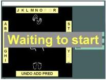

(a) GUI displayed with single-step selection during preparation phase

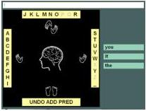

(b) GUI displayed with single-step selection during thinking phase

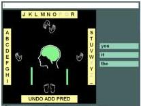

(c) GUI displayed with single-step selection during recording phase

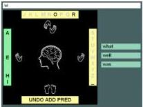

(d) GUI displayed with single-step selection during selection phase

Figure 4.3: GUI displayed with single-step selection in different phases

# Chapter 5

## The BCI module

*'If the human brain were so simple that we could understand it, we would be so simple that we couldn't.'*

Emerson M. Pugh

This chapter presents the BCI module that translates EEG signals into commands for the spelling application. All the algorithms involved in this translation are described in details: spatial filtering (Section 5.2), spectral estimation (Section 5.3), feature computation (Section 5.4), feature selection (Section 5.5), feature extraction (Section 5.6) and classification (Section 5.7).

### 5.1 Overview

The goal of this module is to translate the EEG signal acquired from the subject's scalp into a discrete control signal that is used for controlling the spelling application. This translation is performed in five processing stages (see Figure 5.1):

**Spatial filtering** The raw EEG signal acquired from the amplifier is spatially filtered. This spatial filter is used to enhance signal localization averaging out all background activity that is not relevant for classification.

**Spectral estimation** The EEG signal undergoes spectral estimation. Spectral estimation is fundamental for all further processing since all features are defined in the frequency domain.

**Feature computation** A number of features are computed from the EEG spectra. These features have been designed in order to discriminate

5.2. Spatial filtering

48

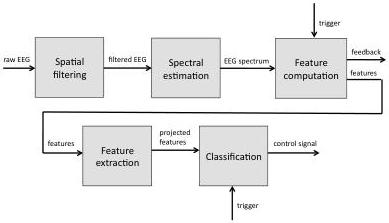

Figure 5.1: BCI processing pipeline

among different motor-imagery tasks and correspond to best subset of features obtained with a feature selection algorithm.

Feature extraction The feature vector is projected in a lower-dimensional space. The output of this stage is a feature vector having c-1 elements, where c is the number of classes considered.

Classification This is the last stage of the pipeline, in which the projected features are finally classified.

### 5.2 Spatial filtering

As discussed in Section 3.4.2 EEG scalp potentials are associated with low spatial resolutions and spatial filters are commonly used in order to enhance signal localization. The spatial filter employed in this processing pipeline are Large Laplacians. This choice is motivated by the fact that both the physiological meaning of the channels and the original number of channels need to be preserved. The most commonly used spatial transformations preserving these properties are Common Average Reference (CAR) and Laplacian filters.

CAR references all channels to their common average. The mean of all EEG channels is thus subtracted from each individual channel:

$$V_{i}^{CAR} = V_{i} - \frac{1}{N} \sum_{j=1}^{N} V_{j} \tag{5.1}$$

5.2. Spatial filtering

49

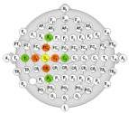

(a) Small and Large Laplacian references for electrode C3

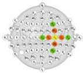

(b) Small and Large Laplacian references for electrode C4

Figure 5.2: Small and Large Laplacian references for electrodes C3 and C4. Electrodes C3 and C4 are colored in yellow, Small Laplacian reference are colored in orange and Large Laplacian references are colored in green.

where $N$ is the number of electrodes in the montage and $V_i$ is the potential between the electrode $i$ and the reference. While the influence of far field sources is reduced, CAR may introduce some undesired spatial smoothing, since the artifacts of one channel may be spread in all other channels.

Laplacian filters, instead, are computed subtracting from each electrode $i$ the average of its surrounding electrodes:

$$
V_i^{LAP} = V_i - \frac{1}{|S_i|} \sum_{j \in S_i} V_j
$$

where $S_i$ corresponds to a neighborhood of electrode $i$. The choice of the neighborhood $S_i$ determines the characteristics of the spatial filter. Mostly used are Small Laplacians and Large Laplacians. Considering a montage with 64 electrodes, $S_i$ is the set of nearest-neighbor electrodes for Small Laplacians, while is the set of next-nearest-neighbor electrodes for Large Laplacians (see Figure 5.2). Since in our experiments we used a montage with 19 electrodes (according to the 10-20 international system) only Large Laplacian filters could be applied.

During offline analyses both CAR and Large Laplacian filters have been tested. Figure 5.3 show examples of EEG spectra computed with the two spatial filters. All plots are derived from the same dataset averaging the spectra of channels C3 and C4 over 56 trials associated to the same motor imagery task (left hand). Plots' scales are obviously different since both CAR and Large Laplacians do not preserve the absolute values of signals, but this is not a problem since only relative measures are always considered. As it's clear from these plots, spatial filters enhance signal localization removing common underground activity. When no spatial filter is applied a strong

5.3. Spectral estimation

50

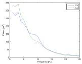

(a) No spatial filter

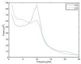

(b) CAR spatial filter

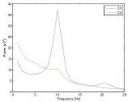

(c) Large Laplacian spatial filter

Figure 5.3: Average spectra for trials of task left-hand computed on electrodes C3 (blue) and C4 (green) applying different spatial filters.

activity is visible at low frequencies and the mu rhythm around 10Hz on C3 is almost completely hidden by noise (see Figure 5.3(a)). The CAR filter removes some of this low-frequency power and reveals a clear peak around 10Hz on channel C3. The Large Laplacian further enhances the sharpness of this mu rhythm and all underground activity is almost completely removed (see Figure 5.3(c)).

According to these analyses we chose to apply three Large Laplacian filters centered respectively on channels C3, Cz and C4. These channels, indeed, are known to be associated with the brain areas where sensory-motor rhythms are mostly visible.

### 5.3 Spectral estimation

The goal of this second stage of the pipeline is to estimate the spectral power of the EEG signal in real-time from a limited number of voltage samples. This estimation is required because sensory-motor rhythms are mostly detectable in the frequency domain and signal classification is performed employing band-power features. Moreover, in order to provide the user with

5.3. Spectral estimation

51

a feedback in real time, the EEG spectrum needs to be re-estimated at any single data block acquired. This module, indeed, receives a data block of 16 voltage samples acquired from 19 channels every 62.5 ms and updates the spectral estimations as soon as a new block is processed.

Since the EEG signal is characterized by a low signal-to-noise ratio and can be affected by abrupt time variations, computing the spectrum at any single data-block using deterministic techniques (like Discrete Fourier Transform or Short Time Discrete Fourier Transform) usually produces very poor results that may be difficult to interpret. To overcome this problem statistical spectral estimation techniques are normally employed.

In statistical signal processing signals are considered as discrete random processes and the goal of statistical spectral analysis is to estimate the Power Spectral Density (PSD) of these processes.

The PSD of a stochastic process is defined as the Discrete Time Fourier Transform (DTFT) of its autocorrelation sequence and describes how the power of the process is distributed with frequency.

Formally if $\{y(t); t = 0, \pm 1, \pm 2, \ldots\}$ denotes a second-order stationary random process with autocorrelation sequence $\rho(k) = E[y(t)y^*(t - k)]$, its PSD $\phi(\omega)$ is defined as:

$$
\sum_{k=-\infty}^{+\infty} \rho(k)e^{-j\omega k} \tag{5.2}
$$

An alternative definition of the PSD is the following:

$$
\lim_{N \to \infty} E \left[ \frac{1}{N} \left| \sum_{t=1}^{N} y(t)e^{-j\omega t} \right|^2 \right] \tag{5.3}
$$

which is:

$$
\lim_{N \to \infty} E \left[ \frac{1}{N} |Y(\omega)|^2 \right]
$$

being $Y(N)$ is the DTFT of $y(t)$.

The spectral estimation problem can be stated formally as follows: from a finite-length record $\{y(1), y(2), \ldots, y(N)\}$ of a second-order stationary random process, determine an estimate $\hat{\phi}(\omega)$ of its power spectral density $\phi(\omega)$, for $\omega \in [-\pi, +\pi]$.

There are basically two main approaches to this estimation problem: non-parametric methods and parametric methods. Non-parametric methods don't make any assumption on the nature of the stochastic process, while parametric methods assume and underlying model and try to estimate its parameters from data.

5.3. Spectral estimation

52

Two wide spread non-parametric methods are *periodograms* and *correlograms*. Periodograms are based on the definition of the PSD reported in 5.3 and perform this simple estimation:

$$
\hat{\phi}(\omega) = \frac{1}{N} \left| \sum_{t=1}^{N} y(t) e^{-j\omega t} \right|^2 \tag{5.4}
$$

where $N$ is the number of samples available. Correlograms, instead, rely on definition 5.2 and estimate the PSD as follows:

$$
\hat{\phi}(\omega) = \sum_{k=-(N-1)}^{+(N-1)} \hat{\rho}(k) e^{-j\omega k} \tag{5.5}
$$

where $\hat{\rho}(k)$ is the estimate of the autocorrelation $\rho(k)$ computed with the $N$ samples available. There are also a number of variations and enhancements of these methods but, dealing with EEG spectral analysis, parametric methods have been proven perform better compared to non-parametric ones.

Parametric approaches work on the assumption that the underlying process can be described as the output of a linear system driven by white noise. Considering a linear system with transfer function:

$$
H(z) = \frac{B(z)}{A(z)}
$$

the stochastic process can be modeled as:

$$
y(t) = \frac{B(z)}{A(z)} e(t) \quad e(t) \sim \mathrm{WN}(0, \sigma^2)
$$

where $e(t)$ is a white noise with zero-mean and variance $\sigma^2$. Given this model the PSD is easily computed as:

$$
\phi(\omega) = \left| \frac{B(e^{j\omega})}{A(e^{j\omega})} \right|^2 \sigma^2
$$

Being $A(z)$ and $B(z)$ polynomials in the form:

$$
A(z) = 1 + a_1 z^{-1} + a_2 z^{-2} + \cdots + a_n z^{-n}
$$

$$
B(z) = 1 + b_1 z^{-1} + b_2 z^{-2} + \cdots + b_m z^{-m}
$$

depending on the values assumed by $m$ and $n$, the following cases can be distinguished:

- if $m = 0$ and $n \neq 0$, autoregressive model (AR)

5.4. Feature computation

53

- if $m \neq 0$ and $n = 0$, moving average model (MA)
- if $m \neq 0$ and $n \neq 0$, moving average model (ARMA)

Since AR model coefficients can be estimated through a linear set of equations, autoregressive models are the most commonly used for practical applications.

Several algorithms are available in literature to estimate the coefficients of an AR model for the purpose of spectral analysis. In this work the Maximum Entropy Method (MEM), called also Burg's algorithm, was chosen, since it has been proved to provide good results when applied to EEG signals.

The main point of this algorithm is that, given a limited number of values in the autocorrelation sequence, there exist an infinite number of spectra $\phi(\omega)$ matching with the observed data. Maximum entropy spectral analysis chooses the spectrum corresponding to the most random and unpredictable time series whose autocorrelation sequence coincides with the observed set of values.

According to the definition of PSD given in 5.2 the autocorrelation sequence can be computed taking the inverse DTFT of $\phi(\omega)$:

$$\rho(k) = \frac{1}{2\pi} \int_{-\infty}^{\infty} \phi(\omega) e^{j\omega k} d\omega \tag{5.6}$$

Moreover, maximizing the entropy of a random process is equivalent of maximizing this quantity:

$$\int_{-\pi}^{\pi} log(\phi(\omega)) d\omega \tag{5.7}$$

Therefore the required PSD estimation $\hat{\phi}(\omega)$ is the one that maximizes 5.7 and for which 5.6 holds for the observed autocorrelation values. The Burg's algorithm shows how the coefficients of an AR model whose PSD has maximum entropy can be computed. For further details about Burg's algorithm and the Maximum Entropy Method refer to [54].

Once the AR coefficients have been estimated the associated spectrum is obtained integrating the PSD in bins of 1Hz and considering the frequency band 0Hz - 25Hz. The spectra computed at this stage are used both to compute EEG features and to provide a feedback to the user.

### 5.4 Feature computation

At this stage of the processing pipeline a number of features are extracted from the EEG spectra and a feedback signal is generated for the user.

5.4. Feature computation

54

The feedback is proportional to the EEG power estimated on channels C3 and C4 in the frequency bin associated to the mu-rhythm. This bin has been chosen according to a visual inspection of the spectra performed during offline analyses. The feedback signal is updated at each data block acquired and a forgetting factor is applied to avoid flickering. Finally this signal is normalized in the interval [0, 1] to be displayed by the speller interface.

The main goal of this module is to compute EEG features. These features have been specifically designed to discriminate among four motor-imagery tasks:

1. motor-imagery of left hand;
2. motor-imagery of right hand;
3. motor-imagery of both hands;
4. motor-imagery of both feet,

As discussed in Section 3.3.3 motor imagery is mainly associated to a desynchronization of mu and beta rhythms in the areas of the motor cortex that are counter-lateral to the movement. Moreover stronger rhythmic activities may be also observed in the areas of the cortex that are ipsi-lateral to the movement.

Therefore, during left hand motor imagery an attenuation of the signal power in the mu/beta frequency bands is expected on channel C4, while the same frequency bands should show sharp power peaks on channel C3. Similarly, right hand motor imagery should be characterized by attenuated mu/beta peaks on C3 and sharp peaks on C4.

The motor imagery of both hands, instead, is associated with desynchronizations of sensory-motor rhythms on both hemispheres and a reduction of the signal power on both channels C3 and C4 is expected. Finally, both feet motor imagery is usually characterized by an attenuation of the signal power on channel Cz and by a strong increase of the rhythmic activities over the hands' areas (corresponding to channels C3 and C4).

Feature computation requires all the spectra received during the recording phase to be buffered. When the application triggers the completion of the recording phase, average spectra are estimated from buffered data and a number features are computed based on these average spectra. Two types of features have been considered:

**Average features** These features are computed on the EEG spectra averaged over the whole duration of the recording phase (which lasts

5.4. Feature computation

55

6s). They consider only one average spectrum per channel and they capture the main signal's characteristics related to the task performed.

**Evolution features** These features are computed on the EEG spectra obtained averaging over time windows of 1s. They consider six spectra per channel and they are designed to figure out how the signal evolve during the task.

In the following paragraphs a detailed description of these features is reported. A large set of features have been considered in order to extract as much information as possible and to be able to generalize for different subjects. However only a subset of these features is actually used during online classification. The subset of features that is computed online is obtained applying a feature selection algorithm as described in Section 5.5.

#### 5.4.1 Average features

The goal of these features is to capture the main characteristics of the average spectra estimated for the whole duration of the recording phase. These features are designed to highlight spectral differences and similarities among different motor-imagery tasks.

Six channels have been considered in the computation of these features: C3, C4,Cz, P3, P4, Pz. Channels C3, C4 and Cz have been included because they are expected to carry most of the information that is relevant for classification. The choice of including P3, P4 and Pz is motivated by the fact that these electrodes are in the neighborhood of C3, C4 and Cz and they can be used to relate the activity of the primary motor cortex with the surrounding brain areas. Moreover, initial offline analyses revealed on these channels some relevant task-dependent correlations. Electrodes F3, F4 and Fz were not included instead, since they have been found to be significantly affected by ocular artifacts. All other electrodes are too far from the motor cortex to be source of relevant information for our purposes.

For each of the six channels considered 13 features are computed. Such features are defined on the basis of five *feature points*, chosen to be representative of the overall shape of a spectrum. In order to define these *feature points* we recall that spectra are integrated in 25 bins of 1Hz, being the first bin centered at 0Hz and the last centered at 24Hz.

The five *feature points* considered are defined in Table 5.1 and shown in Figure 5.4.

where $P(x)$ denotes the signal power at bin $x$ and the boundary bins $mu_{start}$, $mu_{stop}$, $beta_{start}$, $beta_{stop}$ have been determined during offline anal-

5.4. Feature computation

56

|  Feature point | Definition  |
| --- | --- |
|  A = (a ; P(a)) | P(a) = min P(x) with x ∈ [0, mu_start)  |
|  B = (b ; P(b)) | P(b) = max P(x) with x ∈ [mu_start, mu_stop]  |
|  C = (c ; P(c)) | P(c) = min P(x) with x ∈ [mu_start, mu_stop]  |
|  D = (d ; P(d)) | P(d) = max P(x) with x ∈ [beta_start, beta_stop]  |
|  E = (e ; P(e)) | P(e) = min P(x) with x ∈ (beta_stop, 24]  |

Table 5.1: Definition of the feature points

yses. The 13 features defined on the basis of these feature points are listed in Table 5.2.

|  Feature name | Definition  |
| --- | --- |
|  mu_peak | P(b)  |
|  be_peak | P(d)  |
|  mu_sharp | (P(b) - P(a)) + (P(b) - P(c))  |
|  be_sharp | (P(d) - P(c)) + (P(d) - P(e))  |
|  mu_area | (c - a)(P(b) - min[P(c), P(a)])  |
|  be_area | (e - c)(P(d) - min[P(e), P(c)])  |
|  mb_ratio | (P(b) - P(d))(P(b) + P(d))  |
|  mu_bin | b  |
|  be_bin | d  |
|  mu_sum | ∑_{x∈mu_band} P(x)  |
|  be_sum | ∑_{x∈beta_band} P(x)  |
|  mu_std | σ_{mu_band}  |
|  be_std | σ_{beta_band}  |

Table 5.2: Features computed on the average trial spectrum for each single channel

Figures 5.4(a) and 5.4(b) show two examples of typical shapes possibly assumed by spectra. The first spectrum is characterized by evident peaks in the mu and beta frequency bands, while the second reveals a clear power attenuation in the same bands. The bar chart in Figure 5.5 shows that most of the features considered assume different values as the shape of the spectrum changes. Therefore these features are likely to discriminate well among different motor-imagery tasks.

The six feature vectors obtained (one for each channel) are in turn employed to compute new features in which more than one channel is considered at a time. These new features are computed taking the sum or the

5.4. Feature computation

57

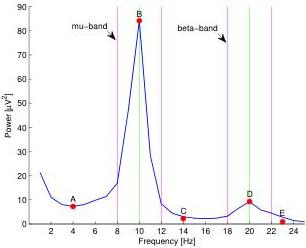

(a) Feature points computed on the spectrum of channel C3 during left-hand motor imagery

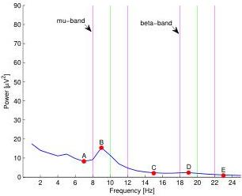

(b) Feature points computed on the spectrum of channel C4 during left-hand motor imagery

Figure 5.4: Feature points computed on channels C3 and C4 during left-hand motor imagery

5.4. Feature computation

58

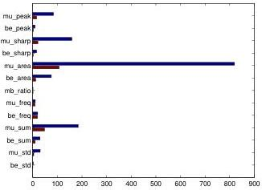

Figure 5.5: Single-channel features for the spectra in Figure 5.4. Blue bars refer to the spectrum with synchronized rhythms (Figure 5.4(a)), while red bars to the spectrum with de-synchronized rhythms (Figure 5.4(b))

relative difference between pairs of feature vectors associated to different EEG channels.

For example a new feature vector is computed taking $f_{C3} + f_{C4}$, where $f_{C3}$ and $f_{C4}$ are the feature vectors of $C3$ and $C4$ computed as explained in Table 5.2. A complete list of these features is given in Table 5.3.

#### 5.4.2 Evolution features

Evolution features are designed to consider how EEG spectra vary in time within the same recording trial. Indeed, synchronizations and de-synchronizations happen according to a certain dynamics and the main temporal characteristics of these phenomena may be useful for the purpose of signal classification.

For example Figure 5.6 shows how the value of the mu peak vary over time for different motor-imagery tasks. A first observation is that de-synchronizations mostly happen within the first second of the trial, while in the following seconds the power of the mu peak remains stationary or slightly increases. Synchronizations, instead, last for the whole trial duration and signal power seems to increase in a linear fashion (particularly for left-hand and right-hand tasks). Moreover, the task *both hands*, seems to combine the evolution of channel C4 for task *left-hand* with the evolution

5.4. Feature computation

59

|  Feature name | Definition  |
| --- | --- |
|  diff_c3_c4 | $$(f_{C3} - f_{C4})/(f_{C3} + f_{C4})$$  |
|  diff_c3_cz | $$(f_{C3} - f_{Cz})/(f_{C3} + f_{Cz})$$  |
|  diff_c4_cz | $$(f_{C4} - f_{Cz})/(f_{C4} + f_{Cz})$$  |
|  diff_p3_p4 | $$(f_{P3} - f_{P4})/(f_{P3} + f_{P4})$$  |
|  diff_p3_pz | $$(f_{P3} - f_{Pz})/(f_{P3} + f_{Pz})$$  |
|  diff_p4_pz | $$(f_{P4} - f_{Pz})/(f_{P4} + f_{Pz})$$  |
|  diff_cz_pz | $$(f_{Cz} - f_{Pz})/(f_{Cz} + f_{Pz})$$  |
|  sum_c3_c4 | $$f_{C3} + f_{C4}$$  |
|  sum_p3_p4 | $$f_{P3} + f_{P4}$$  |
|  sum_cz_pz | $$f_{Cz} + f_{Pz}$$  |
|  sum_c3_p3 | $$f_{C3} + f_{P3}$$  |
|  sum_c4_p4 | $$f_{C4} + f_{P4}$$  |

Table 5.3: Features computed combining single-channel features

of channel C3 for task right-hand.

Based on these observations, 21 evolution features have been defined. As anticipated, the computation of these features relies on six spectra, one for each second in the recording phase. The channels considered in this case are only C3, C4 and Cz. A complete list of these features is reported in Table 5.4.

5.4. Feature computation

60

|  Feature name | Description  |
| --- | --- |
|  evo_c3_mu2 | mu-peak at second 2 (C3)  |
|  evo_c3_mu3 | mu-peak at second 3 (C3)  |
|  evo_c3_mu12k | mu-peak linear trend in seconds 1-2 (C3)  |
|  evo_c3_mu26k | mu-peak linear trend in seconds 2-6 (C3)  |
|  evo_c3_mu12k-mu26k | evo_c3_mu12k - evo_c3_mu26k  |
|  evo_c3_beta14k | beta-peak linear trend in seconds 1-4 (C3)  |
|  evo_c4_mu2 | mu-peak at second 2 (C4)  |
|  evo_c4_mu3 | mu-peak at second 3 (C4)  |
|  evo_c4_mu12k | mu-peak linear trend in seconds 1-2 (C4)  |
|  evo_c4_mu26k | mu-peak linear trend in seconds 2-6 (C4)  |
|  evo_c4_mu12k-mu26k | evo_c4_mu12k - evo_c3_mu26k  |
|  evo_c4_beta14k | beta-peak linear trend in seconds 1-4 (C4)  |
|  evo_cz_mu13k | mu-peak linear trend in seconds 1-3 (Cz)  |
|  evo_cz_lo12k | low-band-peak linear trend in seconds 1-2 (Cz)  |
|  evo_sumc3_mu12k | mu-band power linear trend in seconds 1-2 (C3)  |
|  evo_sumc4_mu12k | mu-band power linear trend in seconds 1-2 (C4)  |
|  evo_sumcz_beta12k | beta-band power linear trend in seconds 1-2 (Cz)  |
|  evo_diffc3c4_mu16k | mu-peak linear trend in seconds 1-6 (C3-C4)  |
|  evo_diffc3c4_mu36k | mu-peak linear trend in seconds 3-6 (C3-C4)  |
|  evo_diffc3cz_mu13k | mu-peak linear trend in seconds 1-3 (C3-Cz)  |
|  evo_diffc4cz_mu13k | mu-peak linear trend in seconds 1-6 (C4-Cz)  |

Table 5.4: Evolution features

5.4. Feature computation

61

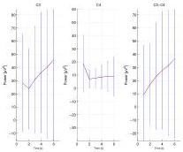

(a) Left hand

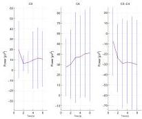

(b) Right hand

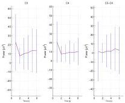

(c) Both hands

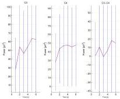

(d) Both feet

Figure 5.6: Evolution of the mu-peak over time for different tasks. For each task the mu-peak is depicted for channel C3 (left plot), C4 (middle plot) and for the difference C3-C4 (right plot). Values for each task are computed averaging on 784 trials in 7 different acquisition dates. Red lines show average values, while blue vertical bars show standard deviations.

5.5. Feature selection

62

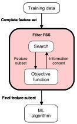

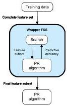

Figure 5.7: Two different approaches to feature selection: filters and wrappers

### 5.5 Feature selection

Considering both average and evolution features we obtain a total of 255 features per trial. A feature vector with these dimensions is normally too large to be handled properly by a classifier. Moreover not all features may be equally discriminative and different features' combinations may lead to significantly different classification results. Finally some features may be good for one user but perform poorly for another one. To overcome these problems a feature selection algorithm has been applied.

Feature selection involves choosing the subset of features that is supposed to discriminate better among different classes. Feature selection is an operation performed exclusively offline: once an optimal feature subset has been chosen, the selected features are just kept to be used online, while all the others are discarded.

Feature selection requires the definition of:

- a search method: an algorithm to find the best candidate subset;
- an objective function: a measure of goodness of the considered feature subset.

According to the type of the objective function considered, two different feature selection approaches exist: filters and wrappers. Filters employ unsupervised methods and their objective function is based on intrinsic properties of data, typically inter-class distance, statistical dependence or information-theoretic measures. Wrappers, instead, take as objective function the es-

5.5. Feature selection

63

timated classification performances obtained with the same classification algorithm chosen for the problem.

The advantage of filters is that they usually involve a non-iterative computation on the dataset, which can execute much faster than a classifier training session. Moreover, measuring intrinsic properties of the data, they give more general results that are non dependent on any specific classification algorithm. The problem of filters is that they normally consider a monotonic objective function and tend to select the full feature set as optimal solution.

Wrappers, instead, while suffering of slow execution times and dependencies on specific classifiers, typically perform better than filters and many generalization techniques may be employed to avoid overfitting. In this work a wrapper approach for the computation of the objective function has been chosen.

Dealing with the search method, instead, three main categories of search algorithms may be distinguished:

**Exponential algorithms** These algorithms are computationally intensive, since their complexity is exponential with the size of the dataset. Examples of these algorithms are exhaustive search and Branch and Bound.

**Sequential algorithms** These algorithms add or remove features sequentially, they are very simple to implement but are strongly affected by local minima. These methods may be a good choice only if the size of the feature set is reduced.

**Randomized algorithms** These algorithms include some sort of randomness during the search in order to escape from local minima. Examples are Simulated Annealing and Genetic Algorithm (GA).

Given the number of features considered, both exponential and sequential algorithms have been found to be unusable for our problem. Genetic algorithms, instead, have been already applied in BCI research [11] and proved to perform well when search spaces with high dimensions are considered. For these reasons the search method we have chosen for feature selection is based on a genetic algorithm.

#### 5.5.1 Generic Algorithm

A GA starts its search from a pool of hypotheses, called *initial population*. Each individual in the population is a *chromosome* representing a possible

5.5. Feature selection

64

solution to the search problem. The genetic algorithm performs an iterative search starting from the initial population. On each iteration, all members of the population are evaluated according to a *fitness function* (the objective function of the search problem) and a new population is generated probabilistically from the current one. Some individuals, having high fitness values, are carried forward into the next generation population intact. Others are used as the basis for creating new offspring individuals by applying *genetic operations* such as *crossover* and *mutation*. The iteration stops when the optimal solution is found or when one of the defined *stopping criteria* is met.

In our approach, the GA is used to select the best features to be fed to the classifier. The chromosome of each individual it's a bit vector which contains 255 elements (genes) corresponding to the full set of features available. Each chromosome encodes a feature selection in this simple way: if a bit is set to 1 the corresponding feature is selected, otherwise it is discarded.

As discussed before the fitness function employed follows a wrapper approach. The fitness is indeed a measure of the average performances obtained with offline signal classification. Classification performances are measured according to a k-fold cross-validation scheme, which is described in Section 7.1.5. Two different versions of the fitness function have been considered. The first one is the following:

$$
f_1 = -\frac{1}{K} \sum_{k=1}^{K} \mu(k) \tag{5.8}
$$

where $k$ indicates a validation set and $\mu(k)$ is the overall classification accuracy obtained for on validation set $k$. Thus, in this case, the fitness is computed as the average classification accuracy over all validation sets. This quantity is taken with a minus sign, since the fitness function is minimized by the genetic algorithm. This fitness is in some sense 'greedy', since it selects the subset of features yielding to the best average accuracy, regardless on how this accuracy was obtained. The weakness of this approach is that variances in the classification performances are not taken into account. This may lead to a solution in which the accuracy average is high, but significant variations exist when different validation sets and different classes are considered. Since our goal is to obtain a classification that is robust over all validation sets and no class should be preferred, a second version of the fitness function has been defined as follows:

5.5. Feature selection

65

$$
f _ { 2 } = - f _ { 1 } + w _ { 1 } t _ { 1 } + w _ { 2 } t _ { 2 } \tag { 5 . 9 }
$$

$$
t _ { 1 } = \frac { 1 } { K - 1 } \sqrt { \sum _ { k = 1 } ^ { K } \left( \mu ( k ) - \overline { { \mu ( k ) } } \right) ^ { 2 } } \tag { 5 . 1 0 }
$$

$$
t _ { 2 } = \frac { 1 } { K } \sum _ { k = 1 } ^ { K } \sigma ( k ) \tag { 5 . 1 1 }
$$

where $\sigma ( k )$ is the standard deviation of the class-specific accuracies obtained on validation set $k$.

This second fitness function is obtained adding to $f _ { 1 }$ (computed as in 5.8) the terms $t _ { 1 }$ and $t _ { 2 }$, whose goal is to penalize the solutions with high accuracy variances. In particular $t _ { 1 }$ accounts for the accuracy variance across validation sets, while the second term $t _ { 2 }$ accounts for the inter-class accuracy variance. The weights $w _ { 1 }$ and $w _ { 2 }$ are used to tune the influence of these terms on the final fitness value. In our algorithm $w _ { 1 }$ and $w _ { 2 }$ have been taken both equal to 10.

Both fitness functions have been tested performing offline classification with the features selected by the two algorithms. As expected, features selected by fitness $f _ { 1 }$ yielded to improved accuracy means but high accuracy variances, while features selected by $f _ { 2 }$ kept variances low resulting in a more robust classification. This was particularly true for subjects with high variability across sessions and unbalanced class accuracies. For this reason the GA with fitness $f _ { 2 }$ has been finally chosen for feature selection.

The genetic operators employed are instead the following:

**Crossover** A new chromosome is generated from its parents based on a randomly generated binary vector. The genes of the new chromosome are taken from the first parent if there is a 1 in the binary vector, and from the second parent if there is a 0 in the binary vector.

**Mutation** Each gene in the chromosome has a very small probability to be mutated. When a gene it's chosen for mutation, the corresponding bit in the chromosome is inverted.

Finally, a stopping criterion has been defined based on the number of *stall generations* reached. In a stall generation the fitness of the best chromosome is not improved with respect to the parent generation. It was imposed a limit of 100 stall generation before stopping the GA's iterations.

5.6. Feature extraction

66

### 5.6 Feature extraction

Before proceeding with classification all the selected features are projected into a lower-dimensional feature space. This operation is performed applying the Fisher Discriminant Analysis (FDA). Fisher Discriminant Analysis is a supervised method whose objective is to perform dimensionality reduction while preserving as much of the class discriminatory information as possible. The main idea of FDA is to maximize the difference between the projected class means whereas the variance of the projected data is minimized. Formally we're looking for the projection matrix $\hat{W}$ that maximizes this ratio:

$$J(W) = \frac{|W^T S_B W|}{|W^T S_W W|} \tag{5.12}$$

Where $S_W$ and $S_B$ are respectively the within-scatter matrix and the between-scatter matrix. The within-scatter matrix measures the variance within classes and is defined as follows:

$$S_W = \sum_{i=1}^{C} S_i \tag{5.13}$$

Where $i$ iterates over all the $C$ classes available and:

$$S_i = \sum_{x \in \omega_i} (x - \mu_i)(x - \mu_i)^T \quad being \quad \mu_i = \frac{1}{N_i} \sum_{x \in \omega_i} x$$

and being $N_i$ the number of elements in class $\omega_i$. The between-scatter matrix, instead, measures the distance between the means of each class and is defined as follows:

$$S_B = \sum_{i=1}^{C} (\mu_i - \mu)(\mu_i - \mu)^T \quad being \quad \mu = \frac{1}{N} \sum_{\forall x} x \tag{5.14}$$

It can be shown that the optimal projection matrix $\hat{W}$ is the one whose columns are the eigenvectors corresponding to the largest eigenvalues of the following generalized eigenvalue problem:

$$(S_B - \lambda_i S_W)\hat{w}_i = 0 \tag{5.15}$$

Fisher's linear projection has been proven to be optimal for binary classification problems and if the input data is assumed to be normally distributed. Though only few of the features considered have been found to be strictly gaussian (the Jarque-Bera statistical test [30] was applied for the purpose),

5.7. Classification

67

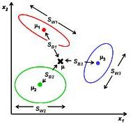

Figure 5.8: Fisher Discriminant Analysis

when applied to our data, the projection produced well shaped feature clusters that are suitable for linear classification (see Figure 5.9).

Features are projected in $C - 1$ dimensions where $C$ is the number of classes. Indeed this the maximum number of dimensions that can be obtained with FDA and also the best choice for linear classification. The Fisher's projection matrix $W$ has been estimated offline with training data, while during online processing only a matrix multiplication is required at this stage.

### 5.7 Classification

As discussed in Section 3.6 many different techniques have been used for the purpose of signal classification. In the BCI field linear classifiers are probably the most popular algorithms employed. This is because they can cope very well with the main characteristics of BCI features, in particular:

**Presence of noise and outliers** BCI features are very likely to be noisy or affected by outliers because of their poor signal-to-noise ratio;

**High dimensionality** The number of features employed for EEG signals is normally high, since several channels in different time segments need to be considered;

**Small training sets** Training sets are relatively small, since the training process is time consuming and demanding for the subjects.

Indeed, because of their low complexity, linear classifiers are generally considered to be stable and they can be trained even with a limited amount of

5.7. Classification

68

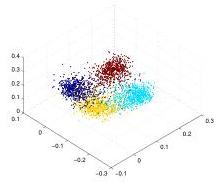

(a)

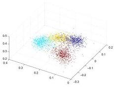

(b)

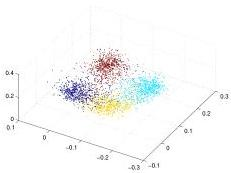

(c)

Figure 5.9: Clusters obtained with different training sets for a 4-class classification problem: left hand (red), right hand (yellow), both hands (cyan), feet (blue)

5.7. Classification

69

data.

Two kinds of linear classifiers have been mainly employed in the BCI field: Linear Discriminant Analysis (LDA) and Support Vector Machines (SVM). Both methods use hyperplanes to partition the feature space in regions, each corresponding to a different classification label. Support Vector Machines differentiate from LDA in the way hyperplanes are chosen: among all possible separating hyperplanes SVM choose the ones that maximize inter-class margins, i.e. the distance from the nearest training points of different classes. When binary problems are considered, Support Vector Machines usually perform better than LDA, since they provide better generalization capabilities. Anyway, when both SVM and LDA where tested on our multi-class classification problem, LDA resulted with better performances. For these reasons, linear discriminant analysis has been chosen in this work.

#### 5.7.1 Linear Discriminant Analysis

The classification criterion considered by LDA is the total error of classification (TEC), which requires to make the proportion of misclassified objects as small as possible. In other words we want to minimize the probability of misclassification assigning an object to the class with the highest conditional probability.

Formally, if $Y$ is a discrete random variable with values $c_1, c_2, \ldots, c_n$ representing the classes to be predicted and $X$ is random vector representing the input features, given an observed feature vector $x$, we are looking the class $\hat{c}$ such that:

$$\hat{c} = \arg \max_{c_i} P(Y = c_i | X = x) \tag{5.16}$$

This approach is called Maximum A Posteriori (MAP) because it requires to maximize the posterior probability of the class, given the feature vector observed. Since $P(Y = c_i | X = x)$ is not easy to be estimated, the Bayes theorem can be applied to rewrite this probability in the form:

$$P(Y = c_i | X = x) = \frac{P(X = x | Y = c_i) P(Y = c_i)}{\sum_{c_j} P(X = x | Y = c_j) P(Y = c_j)} \tag{5.17}$$

Since the denominator remains equal for each $c_i$ considered, we just need to maximize the nominator:

$$\hat{c} = \arg \max_{c_i} P(X = x | Y = c_i) P(Y = c_i) \tag{5.18}$$

where $P(Y = c_i)$ is the prior probability of class $c_i$ and $P(X = x | Y = c_i)$ is the likelihood that feature $x$ belongs to class $c_i$. Since all classes are

5.7. Classification

70

considered to be equiprobable, $P(Y = c_i)$ is simply computed as $1/n$ (where $n$ is the number of classes).

To compute $P(X = x|Y = c_i)$, instead, LDA assumes that each class has a multivariate normal distribution with mean $\mu_{c_i}$ and that all classes have the same covariance matrix $C$. With this assumptions, it can be shown that equation 5.18 can be rewritten in this form:

$$\hat{c} = \arg \max_i f_i(x) \tag{5.19}$$

where:

$$f_i(x) = \mu_i C^{-1} x^T - \frac{1}{2} \mu_i C^{-1} \mu_i^T + log(P(Y = c_i)) \tag{5.20}$$

For a complete derivation of the LDA formula refer to [34]. As anticipated, matrix $C$ is the pooled estimate of covariance and it is computed in the same way as the within-scatter matrix $S_W$ in Equation 5.13. Function $f_i(\cdot)$ is the *discriminant function* of class $c_i$ and corresponds to a linear projection of the feature vector $x$. In its general form the linear discriminant function for class $c_i$ can be defined as:

$$g_i(x) = W_i^T x + b_i \tag{5.21}$$

and the hyper-plane denoted by the equation:

$$W_i^T x + b_i = 0 \tag{5.22}$$

separates the region of class $c_i$ from the remaining part of the feature space.

In the BCI processing pipeline implemented in this work, classification is performed with the LDA method as soon as the application triggers the completion of the recording phase. The parameters $\mu_i$ and $C$ are estimated offline on training data.

# Chapter 6

## The speller interface and the prediction module

*'Good communication is as stimulating as black coffee and just as hard to sleep after.'*

Anne Morrow Lindbergh, *Gift From the Sea*

This chapter is composed of two main parts: the first part describes the user interface adopted for the spelling application, while the second is about the prediction module. Dealing with the first part, the set of symbols chosen (Section 6.1.1), the symbol selection strategy (Section 6.1.2) and the problem of handling errors (Section 6.1.3) are first discussed. Then a general model to define user interfaces for the speller is proposed (Section 6.1.4) and three different interface versions are presented (Section 6.1.5), providing the details for one of them (Section 6.1.6). Dealing with the prediction module, we describe the training corpus (Section 6.2.1), the statistical language model (Section 6.2.2) and the algorithms used to provide language predictions to the spelling application (Section 6.2.3).

### 6.1 Design of the speller interface

The model of the speller interface plays a very important role in the design of the whole spelling application. Indeed the way choices are presented to the user influences significantly both the efficiency and usability of the final system. The main functional requirements that have been considered while modeling the user interface of the speller are summarized here. The interface shall:

6.1. Design of the speller interface

72

- enable the composition of plain text in english language by means of a discrete control signal with three or four different states;
- provide a number of auxiliary functions that may be activated during the composition i.e, speech synthesis, word deletion, quit;
- deal with errors introduced by incorrect BCI classifications or by wrong selections performed by the user.

Moreover some important non-functional requirements have been also taken into account:

**Usability** The interface shall be intuitive and predictable. Solutions that may disorient or confuse the user shall be avoided, while repetitive schemes and patterns that may be easily recognized and assimilated shall be preferred.

**Formalization** The interface structure and behavior shall rely on a formal model. Having such a model is required in order to plug different versions of the user interface in the same application and to implement automatic simulators assessing the user interface's performances.

**Predictive capabilities** The interface shall exploit redundancies in natural language in order to speedup the composition process.

#### 6.1.1 Symbols and functions

Before starting the actual design of the user interface we need to specify which is the set of language symbols considered and which are the auxiliary functions to be provided by the application.

In this work verbal communication symbols have been employed and the english language has been chosen to convey messages. As discussed in Section 2.2.3 natural language is indeed most commonly preferred to iconic alphabets for applications in which the target users are cognitively sane. This is because verbal communication can be much more expressive compared to icons and people with motor disorders would normally prefer to use their original language rather than learn new communication paradigms.

Therefore, the set of symbols considered is composed by the standard 26 letters of the english alphabet plus the spacing character. In order to keep the application as simple as possible no other punctuation character have been considered. Moreover no distinction has been made between uppercase and lowercase letters and, by convention, all letters were taken lowercase.

6.1. Design of the speller interface

73

In addition, the possibility of writing numbers has been considered too. Anyway numbers are kept separate from letters in the user interface, since they are less frequent in natural language and we don't want to penalize the selection of letters enlarging the set of symbols considered during normal text composition.

The set of auxiliary functions regarded in designing of the speller interface are reported in Table 6.1.

|  Function | Description  |
| --- | --- |
|  Undo | Recovers the previous state of the interface after an erroneous selection  |
|  Exit menu | Exits from a menu  |
|  Predictions | Allows the selection of an entire word from a set of predictions  |
|  Delete char | Deletes the latest character inserted  |
|  Delete word | Deletes the latest word inserted  |
|  Speak | Activates the vocal synthesizer to reproduce the currently composed text  |
|  Add to dictionary | Enables all symbols that may have been disabled as a result of letter prediction  |
|  Numbers | Switches the symbol set from letters to numbers  |
|  Letters | Switches the symbol set from numbers to letters  |
|  Quit | Terminates the application  |

**Table 6.1:** *Set of auxiliary functions considered in the design of the speller interface*

#### 6.1.2 Symbol selection strategy

The main problem of any AAC application is that a large set of language symbols needs to be mapped into a very limited set of control states. Considering just lowercase letters and the spacing character there are indeed 27 symbols that need to be selected with a maximum of four discrete control states. Therefore direct selection is obviously impossible, while both scanning and encoding techniques may be applied as symbols' selection strategies.

Scanning methods are usually preferred when only a binary control state is available and when the control signal can be produced in a limited amount of time. Indeed a scanning process requires to either accept or reject a single choice and all possibilities are repeatedly scanned till one of them is accepted

6.1. Design of the speller interface

74

by the user. Since scanning is a time consuming process itself, combining this strategy with a control signal that is produced in a relatively long time may result in very poor communication rates. Moreover, within a scanning paradigm, it is not possible to take advantage from a control signal having more than two states.

Being the output rate of the Brain-Computer interface quite slow (classification is performed over a signal window of 6s) and being at least three control states available, an encoding strategy has been preferred over scanning. In this application encoding is obtained grouping symbols in a hierarchical tree of targets and the selection of one symbol is performed through recursive targets' expansions. As discussed in Section 2.2.3 this can be regarded an encoding technique, since each symbol is encoded in the sequence of targets that need to be expanded for its selection.

Considering 27 symbols grouped in three targets this strategy requires three selections for each symbol. In order to speedup the selection process exploiting redundancies in natural language two different solutions have been considered: dynamic symbol arrangement and static symbol arrangement

## Dynamic symbol arrangement

The main idea of this approach is to consider groups of letters with different sizes and to assign more probable letters to groups having lower cardinalities (see Figure 6.1(a)). Indeed smaller groups are expanded through less selections steps and therefore their symbols are selected in a fewer amount of time.

This idea was inspired by the studies of Claude E. Shannon about the entropy of english language that was estimated to be around 2.14 bits per letter [48] when all preceding letters within the word boundaries are known. This value is significantly lower compared to the entropy computed when no information about preceding letters is available, which is $\log_2(27) = 4.75$. Considering an $N$-ary selection the number $K$ of selections required for each symbol can be computed as:

$$K = 2^{\frac{H}{N}} \tag{6.1}$$

where $H$ is the entropy of the language computed in bits. This means that, adopting an optimal encoding scheme based on the composition context, an average of 1.64 selections per symbol is required.

The problem with this approach is that, in order to take advantage from letter prediction, it is required to change the way letters are encoded whenever a new letter is inserted in text. Therefore each time the composition context changes all symbols must be rearranged in their correct groups.

6.1. Design of the speller interface

75

This results in a dynamic user interface that is updated frequently, and that requires the user to continuously go through all groups searching for the desired symbol. It's clear that an interface of this type would be quite hard to manage from a cognitively point of view.

### Static symbol arrangement

With static symbol arrangement, instead, all symbols are kept fixed in the same groups and they are enabled or disabled according to their probability in the current composition context (see Figure 6.1(b)). This way, a group having just one symbol enabled does not require further expansions and all successive selection steps are spared. With this method it possible to combine the requirement of improving the communication rate through letter prediction, while keeping the user interface simple and cognitively easy to manage. For these reasons static symbol arrangement has been adopted in the scope of this thesis. Further details about how letters are enabled or disabled are given in Section 6.2.3.

#### 6.1.3 Handling errors

An important requirement in the design the user interface is the capability of handling errors in an efficient way. There are basically three types of errors that may occur while using the spelling application:

**BCI errors** These errors are caused by a wrong classification of the EEG signal and are certainly the most likely to happen. The BCI module, indeed, provides classification accuracies that are often quite far from 100%. This is mainly because the EEG signal is characterized by a poor signal-to-noise ratio and it's strongly influenced by the presence of artifacts. Moreover a decreasing level of concentration during the usage of the application or feelings like frustration and edginess may influence significantly the performances of the brain-computer interface.

**Errors caused by the user interface** These errors occur when the user fails to interpret the current interface state of the speller. Errors of this type are less common than BCI errors but still present, especially if the user has not much experience with the spelling application. For example, in some experimental sessions it happened that the user believed to have successfully entered a symbol while a final selection was still missing. Other typical errors of this kind are to forget entering the

6.1. Design of the speller interface

76

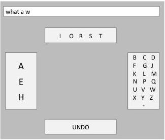

(a) Dynamic symbol arrangement

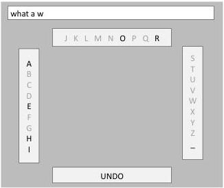

(b) Static symbol arrangement

Figure 6.1: Examples of two possible interfaces adopting dynamic and static symbol arrangements. It the case considered the user wants to write the phrase “what a wonderful day” and has already entered the string “what a w”. The same letter prediction algorithm is supposed for both cases. The letters associated with non-zero probabilities for the context considered are (in order of probability): “a”, “e”, “h”, “i”, “o”, “r”. The dynamic interface groups the 27 symbols as shown in Figure 6.2(a) assigning to smaller groups symbols with higher probabilities. The static interface, instead, employs balanced groups (see Figure 6.2(b)) and disables symbols with zero probability. In both cases selecting the letter “o” requires two groups expansions.

6.1. Design of the speller interface

77

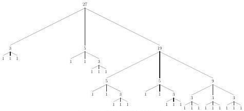

(a) Dynamic symbol arrangement

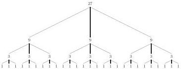

(b) Static symbol arrangement

Figure 6.2: Possible grouping strategies of 27 symbols in three groups for interfaces with dynamic and static symbol arrangement. Each node in the tree denotes a group and is labelled with the number of symbols contained.

spacing character at the end of a word, or to be unsure about which interface state will follow an undo operation.

**User errors** These errors are due to a change of mind of the user about the text that was intended to write. These errors are less common than the others because the user usually thinks carefully about what to write before starting the actual acquisition session. The timings imposed by the BCI are indeed quite strict and formulating or changing a phrase during composition it's quite an hard task.

Errors belonging to the first two categories can be regarded as similar since they are immediately recognized by the user as soon as they occur.

6.1. Design of the speller interface

78

This is because the user is expecting to select a certain choice or to reach a specific interface state but the application responds differently from what expected. In order to correct these errors efficiently there should be always a fast way of reverting the last selection performed, restoring the interface state that was immediately before the error.

Errors due to a change of mind of the user are instead quite different. In this case it is normally required to restore an interface state that is far away from the current one. Indeed, since the selection of one letter requires on average two or three selections, changing an entire word means reverting an interface state that could be a lot of steps behind. Obviously it's not worth to go through all intermediate states step-by-step and a better way of handling these errors would be to activate auxiliary functions to delete a character or an entire word.

Since the number of choices available at each selection step is very limited, it is impossible to deal with all kinds of errors at any time during the composition. Therefore, while modeling the user interface, it has been considered that errors belonging to the first two classes are more probable than others. As a consequence, the "undo" function (restoring the latest interface state) have been proposed more frequently during composition compared to the functions "delete char" or "delete word".

#### 6.1.4 Modeling the user interface

The formalism chosen in order to model the user interface structure and behavior is Pushdown Automaton (PDA). Pushdown automata are an extension of Finite State Machines (FSM) in which along with input symbols, states and transitions, it's provided also a stack of symbols that can be used in defining the machine behavior. Therefore in a PDA:

- the transition to take is determined by the current state, the input symbol, and the symbol on top of the stack;
- in performing a transition a stack manipulation may be performed.

In the interface models designed for this thesis, a state correspond to a set of choices proposed to the user, while the stack is used in order to keep in memory the history of past states. Using a stack is indeed easy to model the undo operations that are required to deal with erroneous selections.

A state is identified by a set of targets each displaying a different choice to be selected. One target may be associated to a set of symbols to be expanded or to a function to be activated. Considering four available choices, each state has thus four targets and four transitions departing from it. Each

6.1. Design of the speller interface

79

transition determines which is the next state to display when the corresponding target is selected.

Moreover, in order to ensure the consistency of the interface models, some constraints have been defined on states and transitions. These constraints specify which states are admissible following a specific type of transition. Transitions may be indeed organized in four main categories:

**Action** Transitions of type *action* are all transitions that, if taken, will result in a modification of the internal state of the application. These are the most common transitions and they are associated for example to the expansion of a set of symbols, the selection of a suggested word, the deletion of a word, etc. When a transition of type *action* is taken the source state is pushed on the top of the stack.

**Undo** Transitions of type *undo* are transitions whose goal is to recover the interface state that was immediately before the last *action*-transition. Therefore when a transition of this type is taken the next state is popped from the top of the stack.

**Menu** Transitions of type *menu* are associated exclusively to menu expansions and do not modify the internal state of the application. A transition of type *menu* is associated for example to the target “predictions”, which brings to an interface state displaying a set of suggested words. Transitions of this type do not read nor modify the content of the stack.

**Exit menu** Transitions of type *exit-menu* are used to restore the interface state from where the last *menu*-transition was taken. These transitions define explicitly their end-point and do not read nor modify the content of the stack.

The consistency constraints characterizing a valid user interface model are the following:

1. *action*-transitions shall bring to states in which an *undo*-transition is directly available or is available in a directly reachable state;
2. *menu*-transitions shall bring to states in which a transition of type *exit-menu* is directly available;
3. transitions of type *exit-menu* are admissible only in states that are reachable by *menu*-transitions.

6.1. Design of the speller interface

80

These constraints basically ensure that, when a transition is taken by mistake, it is possible to recover the error with one or at most two further selections. As discussed in Section 6.1.3 this decision is motivated by the fact that the control signal produced by the BCI is not reliable and the most likely errors are due to wrong classifications of the EEG signal.

#### 6.1.5 Three versions of the user interface

As anticipated in Section 4.2 three different versions of the user interface have been designed and implemented:

1. an interface with 4 targets per state controlled by a 4-class control signal;
2. an interface with 3 targets per state controlled by a 3-class control signal;
3. an interface with 4 targets per state controlled by a 3-class control signal;

The interface with four targets and four classes is the first being considered and the one from which the other two are derived. A detailed description of this interface is reported in Section 6.1.6.

The interface with three targets and three classes is actually a variation of the first version having just symbols and functions rearranged in order to fit in three targets rather than four. Anyway the functionalities provided and the main interface patterns are the same as in the first version.

The interface with four targets and three classes is instead structurally identical to the first one, but employing a two-step selection process. Considering the model described in 6.1.4 the two-step selection can be interpreted as follows:

1. In the first step a binary classification is performed deciding whether to perform an error correction (following an *undo* or an *exit-menu* transition) or to continue with the other three available transitions.
2. In the second step a 3-class classification is performed selecting one of the three remaining transitions. Obviously the second phase is not required if, during the first step, an error correction has been performed.

The main idea supporting this choice is that, since there is always one transition whose semantics is “go back” and three transitions whose semantics is “go on”, this seems to be the best point for splitting the selection

6.1. Design of the speller interface

81

process. Moreover, the interface was designed in such a way that an error correction is always associated with a target positioned in the bottom part of the screen, while the other three targets (in position left, top and right) are normally$^{1}$ associated with *action* or *menu* transitions.

#### 6.1.6 User interface model with four targets

Being the user interface model with four targets the most general one, a detailed description of this interface is reported here. The model is illustrated in Figure 6.3. Each state is labelled with the contents of its targets, that are located at the four corners of the screen: left (L), top (T), right (R) and bottom (B). *Action*-transitions are depicted in black, *undo*-transitions in red, *menu*-transitions in blue and transitions of type *exit-menu* in green.

As stated in Section 6.1.4 *action*-transitions are followed by a push of their source state on the stack, while *undo*-transitions recover the last state saved on top of the stack.

In the left part of the diagram there are all interface states by means of which letters are selectable through recursive targets' expansions. The left, top and right targets in the starting state contain nine letters each, becoming three letters at the second level and just one letter at the third level.

While at levels two and three the bottom target is simply associated to an *undo*-transition, in the top-level state the same target is associated to a *menu*-transition. The reason for this is that we want to provide a set of auxiliary functions once the selection of one letter is completed, but we want to keep the function 'undo' as near as possible during groups' expansions.

The functionalities provided after the completion of each letter are 'add to dictionary' and 'predictions'. The first activates all symbols that may have been disabled because of letter prediction, while the second is actually a *menu*-transition pointing to another state in which three predicted words are selectable.

The function 'add to dictionary' is useless during groups' expansion, since disabled letters are already visible at the top-level state and they are not changed till letter selection is completed. The function 'prediction', instead, may be useful also at lower levels, since predictions are kept updated during groups' expansion. However we preferred to have an undo operation directly accessible and to delay the availability of predictions after letter

$^{1}$There are some states in which there is both an *exit-menu* and an *undo* transition. In these cases the *exit-menu* is associated to the bottom target and the *undo* to the left target, since here the last selection to be corrected is actually the menu expansion

6.1. Design of the speller interface

82

Figure 6.3: User interface model with four targets. Each state is labelled with the contents of its targets located at position left (L), top (T), right (R) and bottom (B). Action-transitions are depicted in black, undo-transitions in red, menu-transitions in blue and transitions of type exit-menu in green.

6.2. Design of the prediction module

83

completion.

Once one symbol has been selected, it is appended in text and an *action*-transition is taken. This transition brings always to the starting state except for the case in which a spacing character is selected. In this case, indeed, an entire word has been completed and more functionalities are made available by the user interface.

As is shown on the diagram, the transition departing from the spacing character reaches a state in which the targets in position left, right and top still contain the top-level groups of letters, while the bottom transition points to a different menu.

This menu, and its nested sub-menus, along “add to dictionary” and “predictions” provide also the following functions: “delete world”, “numeric”, “speak” and “quit”. Since it is not very probable that we want to use one of these functions while we are in the middle of a word, they are provided only after word completion.

The function “numeric” brings to a set of states in which numbers are selectable. During the composition of numbers predictions are obviously not available. Finally, the menu accessible through the top-level state in the numeric environment provides the following functions: “undo”, “delete character” and “letters”. Selecting the target “letters” a spacing character is added in text and the state containing the top-level groups of letters is restored.

### 6.2 Design of the prediction module

The goal of the prediction module is to provide language predictions to the spelling application. This module is informed by the speller interface about the current composition context and queries a statistical language model to estimate words’ and letters’ probabilities. The language model is trained computing statistics on a corpus of texts that have been chosen to be representative for the communication domain considered.

The first part of this section presents the language corpus and explains how training texts have been selected. The second part describes in details the statistical language model applied, while the last part shows how words’ and letters’ predictions are computed evaluating the statistical language model.

6.2. Design of the prediction module

84

Figure 6.4: Prediction module

#### 6.2.1 The training corpus

The selection of the training corpus plays an important role in the design of any text prediction system. Indeed statistical language models need to be trained with a large selection of texts in order to produce reliable probability estimates. Moreover, the more the training corpus is similar to the kind of communication being considered, the more these probability estimates will be accurate.

In the scope of this thesis the kind of communication to be modeled is very particular. Indeed the target users of our application are subjects with severe motor impairments that want to express their thoughts, needs or feelings by means of a brain-computer interface. Since no specific corpora are available for this particular communication environment other communication domains with similar characteristics had to be considered.

A promising solution would have been to employ a collection of texts written by impaired subjects by means of other AAC devices. However no such corpus have been found to be available for the purpose of statistical language modeling. For these reasons we decided to adopt a generic language corpus for the english language and to extract from it a partition of texts considered to be representative for the kind of communication of our interest.

The language corpus adopted is the British National Corpus (BNC). The British National Corpus is a collection of more than 100 million words sampled from a large range of sources. The BNC has been designed to be representative of a wide cross-section of british english both spoken and written. The written part of the BNC includes, for example, extracts from

6.2. Design of the prediction module

85

newspapers, specialist periodicals, journals, books, letters and school essays. The spoken part, instead, consists of orthographic transcriptions of informal conversations and spoken language collected in different contexts, ranging from formal business to radio shows and telephonic conversations.

All texts in the BNC are categorized with a number of attributes and all text tokens are tagged with their corresponding part-of-speech$^{2}$ (PoS). Since the language model adopted is based only on word frequencies the syntactic information provided was not considered. Texts' categories, instead, have been useful in order to extract form the corpus a partition of texts suitable for our purposes.

The corpus partition chosen includes only spoken text, since speech has been considered closer to the type of communication we're dealing with. Indeed speech is normally simpler than written text and informal conversations have been considered the best choice to model what a typical user of the spelling application my need to communicate. The attributes considered by the BNC for spoken texts are listed in Table 6.2.1 along with their possible values.

The partition chosen considered only texts with respondent age ranging from 15 to 44 years and with a spoken context that is either educational-informative or leisure. No other distinction has been made by social class, sex, interaction type or region. Applying this partition 107 training texts have been extracted from the initial corpus, with a total number of 3.315.187 word occurrences.

All texts extracted were post-processed in order to convert all letters to lowercase and to eliminate punctuation characters. This way only the set of symbols provided by the speller interface have been considered in training the statistical language model.

#### 6.2.2 The statistical language model

The statistical language model chosen for this work is the Katz backoff model. As discussed in Section 2.3.2 the main idea of Katz backoff is to consider N-grams with lower orders when counts for the higher orders are not available in training data. In particular a trigram model has been employed for the highest order and backoff is performed recursively on bigrams and unigrams. The general formula for N-gram backoff given in 2.16, when applied to the trigram case, can be rewritten as follows:

$^{2}$Traditional grammar classifies words based on eight parts of speech: the verb, the noun, the pronoun, the adjective, the adverb, the preposition, the conjunction, and the interjection.

6.2. Design of the prediction module

86

|  Attribute | Values  |
| --- | --- |
|  Respondent age group | 0-14  |
|   |  15-24  |
|   |  25-34  |
|   |  35-44  |
|   |  45-59  |
|   |  60+  |
|  Respondent social class | Higher management  |
|   |  Lower management  |
|   |  Skilled manual  |
|   |  Semi-skilled or unskilled  |
|  Respondent sex | Male  |
|   |  Female  |
|  Spoken context | Educational-informative  |
|   |  Business  |
|   |  Public-institutional  |
|   |  Leisure  |
|  Interaction type | Monologue  |
|   |  Dialogue  |
|  Region where captured | South  |
|   |  Midlands  |
|   |  North  |

**Table 6.2:** *List of categories considered by the British National Corpus for spoken text*

6.2. Design of the prediction module

87

$$P_{katz}(w_k|w_{k-2}, w_{k-1}) = \begin{cases} P^*(w_k|w_{k-2}, w_{k-1}) & \text{if } C(w_{k-2}, w_{k-1}, w_k) > 0 \\ \alpha(w_{k-2}, w_{k-1})P_{katz}(w_k|w_{k-1}) & \text{if } C(w_{k-2}, w_{k-1}) > 0 \\ P_{katz}(w_k|w_{k-1}) & \text{otherwise} \end{cases} \tag{6.2}$$

where:

$$P_{katz}(w_k|w_{k-1}) = \begin{cases} P^*(w_k|w_{k-1}) & \text{if } C(w_{k-1}, w_k) > 0 \\ \alpha(w_{k-1})P^*(w_k) & \text{otherwise} \end{cases} \tag{6.3}$$

Being $P^*$ the discounted probability computed with the Good-Turing estimate (see 2.14) and $\alpha$ the backoff coefficients computed as shown in 2.20.

The language model have been generated in the ARPA format using the Cambridge-CMU toolkit [13]. In the ARPA format each N-gram entry is stored with its discounted log probability $P^*$ and its backoff weight $\alpha$. Thus for a trigram grammar, the format of each N-gram is the following:

|  N-gram | Format  |   |   |
| --- | --- | --- | --- |
|  unigram | $\log P^*(w_k)$ | $w_k$ | $\log \alpha(w_k)$  |
|  bigram | $\log P^*(w_k|w_{k-1})$ | $w_{k-1} w_k$ | $\log \alpha(w_{k-1}, w_k)$  |
|  trigram | $\log P^*(w_k|w_{k-2}, w_{k-1})$ | $w_{k-2} w_{k-1} w_k$ |   |

Table 6.3: ARPA format for a backoff language model

The model was built considering a vocabulary of 20.000 words, being these the most frequent words extracted from the training corpus. A vocabulary based on frequencies is indeed often employed in language modeling since it keeps the model compact discarding all tokens that occur very rarely in training data. Moreover an "open vocabulary" approach has been adopted, meaning that all out-of-vocabulary words have been mapped to the same symbol in the language model.

Finally, Good-Turing smoothing has been applied only if the corresponding N-gram counts were below a given threshold $K$. Thus N-gram counts greater than $K$ have been considered to be reliable, while counts below this threshold have been re-estimated with the Good-Turing smoothing technique. The value of $K$ was taken equal to 7 for bigrams and trigrams and equal to 1 for unigrams.

The final language model generated in this way contains a total of 20.001 unigrams, 517.537 bigrams and 1.648.226 trigrams.

6.2. Design of the prediction module

88

#### 6.2.3 Computing word predictions and letters' probabilities

Word prediction and letters' probabilities are computed evaluating the language model for the current composition context. The composition context is constantly kept updated with messages received form the speller interface and provides information about:

1. the words entered before the current word being composed;
2. the prefix of the current word;
3. the set of letters that are selectable from the current state of the interface.

Both word predictions and letters' probabilities are computed starting from a list of candidate words extracted from the vocabulary. This list contains all words that match with the current prefix and such that the first letter after the prefix is selectable from the speller interface. For example if the current prefix is "w" and only the letters "a", "e", "h", "i" are selectable from the interface, the word "well" is a possible candidate, but the word "wonderful" not.

For each candidate word the corresponding probability is estimated querying the statistical language model. For this purpose Equation 6.2 is applied considering the two preceding word tokens in the composition context. Once the probabilities of all candidates have been estimated, predicted words are the $N$ words with the highest probabilities, being $N = 3$ or $N = 2$ depending on the interface considered.

The computation of letters' probabilities relies on these words' probabilities too. Indeed, being $l_0, l_1, \ldots, l_{n-1}$ the prefix entered for the current word and being $w_{k-2}, w_{k-1}$ the two preceding word tokens, the probability of the next letter to be $l_n$ is computed as:

$$P(l_n | l_0, l_1, \ldots, l_{n-1}, w_{k-2}, w_{k-1}) = \frac{\sum_{w_k \in W^n} P(w_k | w_{k-2}, w_{k-1})}{\sum_{w_k \in W^{n-1}} P(w_k | w_{k-2}, w_{k-1})} \tag{6.4}$$

where $W^n$ is the set of words with prefix $l_0, l_1, \ldots, l_{n-1}, l_n$. Therefore we sum up all the probabilities of the words having $l_n$ after the entered prefix and we normalize by the total probability of all candidate words. For example, if the entered text is "the old ca", the probability of "t" might be computed as:

$$P(t | c, a, the, old) =$$

$$\frac{P(cat | the, old) + P(category | the, old)}{P(cat | the, old) + P(category | the, old) + P(car | the, old) + P(camp | the, old)} \tag{6.5}$$

6.2. Design of the prediction module

89

Figure 6.5: Algorithm to compute language predictions

Letters' probabilities are used in order to enable or disable letters in the speller interface. Indeed, only letters with probabilities over a given threshold will result to be enabled. In our experiments we enabled all letters with non-zero probabilities, but other threshold values may be easily configured too.

# Chapter 7

## Experiments, tests and results

*'Good tests kill flawed theories; we remain alive to guess again.'*

Karl Popper

This chapter describes all the experiments and the tests performed for this thesis along with a discussion on the results obtained. Section 7.1 deals with the performances of the BCI module, while Section 7.2 deals with the performances of the speller interface. Finally Section 7.3 reports the tests performed on the overall system.

### 7.1 Experiments and tests with the BCI

BCI experiments have been performed at the *AirLab*, the Artificial Intelligence & Robotics laboratory at Politecnico di Milano from September 2008 to June 2009. This section describes the instrumentation adopted, the subjects involved, the protocols chosen and all the different BCI experiments performed.

#### 7.1.1 Instrumentation

In order to acquire, digitalize and amplify the EEG signals we used the BE Light amplifier (EBNeuro Spa, Florence, Italy), which is shown in Figure 7.1(a). The amplifier has 28 channels: 21 monopolar, 4 bipolar, and 3 monopolar with a separate reference (polygraphic). The unit is connected to a laptop through an optical fiber cable that electrically isolates the computer from the amplifier and the subject. The laptop has been always kept

7.1. Experiments and tests with the BCI

91

disconnected from the power line and ran with its internal batteries for all the duration of the experiments.

The EEG has been recorded using a pre-wired electrode cap (see Figure 7.1(c)) equipped with 19 electrodes positioned in the standard locations defined by the 10-20 international system (see Section 3.2.2), plus an electrode used as ground (between Cz and Fz) and an electrode used as reference (between Fz and Fp1-Fp2). Moreover EOG signals have been recorded by means of two additional electrodes (see Figure 7.1(b)) positioned near to the left eye of the subject. Before starting any acquisition session we ensured that all electrodes had impedance values below 5KΩ, being this threshold normally considered good for high-quality EEG recordings.

The BE Light amplifier applies a high-pass filtering at 0.1Hz to all EEG and EOG channels, so that DC components and slow drifts are removed. Frequencies above 1 kHz are also removed by an anti-aliasing filter and a digital low-pass filter is applied before the signal is downsampled to the desired frequency. A sampling frequency of 512Hz has been used for all the experiments, hence the resulting useful band according to the specifications is 0.1-230Hz. This band is much wider compared to the interesting frequency band for motor imagery which is typically bounded between 1Hz and 30Hz.

Signal acquisition is handled by the software provided with the amplifier (Galileo), which sends the recorded data to our BCI application. This communication is performed through a software pipe in batches of 62.5 ms, with a delay that is low enough for real-time processing.

#### 7.1.2 Subjects

Three healthy subjects participated to the BCI experiments performed for this thesis. We considered only healthy people since the BCI system is still in a prototypical phase and we didn't want to involve people with disabilities before assessing the actual performances on sane subjects. However several studies showed that performances of motor-imagery BCIs are comparable with sane and impaired subjects and in some cases [61] people with severe motor disorders achieved better results compared to healthy subjects.

The participants are all students from Politecnico di Milano aged from 24 to 26. They are all male and right handed and none of them had previous experiences with BCI systems before the starting of this thesis. A left-handed subject have been excluded from experiments since left-handed are normally unable to achieve BCI control, and our firsts offline experiments confirmed that hypothesis. We refer to subjects with the first letter of their names, being P, T and F.

7.1. Experiments and tests with the BCI

92

(a) EEG amplifier EBNeuro

(b) Electrodes for EOG recordings

(c) Electrodes' cap

Figure 7.1: Instrumentation employed for BCI experiments

#### 7.1.3 Initial sessions and offline analyses

The goal of initial sessions is to collect EEG data related to different motor-imagery tasks in order to perform offline analyses and train the supervised algorithms employed in the BCI system.

#### Protocol

Initial sessions have been performed with the three subjects on five different dates. On each date two different acquisition sessions have been performed with a five minutes break in between. Each session is composed of seven runs separated by a one minute break. Each run is in turn composed by two sequences of 20 trials associated to different tasks. Hence a total of 560 trials per date has been considered, being 2800 the total number of trials considered for each subject.

During a trial the subject is asked to perform a specific motor-imagery task or to remain relaxed based on a visual stimulus displayed on the screen. The stimuli considered and their corresponding tasks are the following:

7.1. Experiments and tests with the BCI

93

Figure 7.2: Protocol for initial sessions

1. left arrow: motor-imagery of left hand;
2. right arrow: motor-imagery of right hand;
3. up arrow: motor-imagery of both hands;
4. down arrow: motor-imagery of both feet;
5. R letter: resting condition;

Each stimulus is displayed continuously for 6s and when this time is over the screen remains blank for 1.5s before the next stimulus appears. Between the two sequences there is a break of 4s in which the screen is blank and the subject may stretch or blink. Stimuli are randomized in order to avoid adaption, but each stimulus is displayed exactly eight times per run. Subjects were instructed to remain completely still and to avoid blinking, jawing or producing other artifacts during the duration of a trial. Figure 7.2 shows a timing diagram of the BCI protocol employed for initial sessions.

### Offline analyses

All data acquired during initial sessions have been used to perform offline analyses. The goal of these analyses was to assess how EEG activity is correlated with the different tasks and to identify the most discriminative channels and the frequency bands for each subject. Offline analyses are based on the visual inspection of the EEG spectra and on the computation of the $r^2$ coefficient.

The statistical index $r^2$, also known as coefficient of determination, assumes real values between 0 and 1 and quantifies how much of the signal's

7.1. Experiments and tests with the BCI

94

variance can be explained by the fact that the signal was originated by different sources (in our case corresponding to the different tasks). With a value of $r^2$ close to 1 there is a very good discrimination, while $r^2$ values close to 0 are associated to sources that can be hardly distinguished. The $r^2$ coefficient is indeed computed as follows:

$$
r^2 = \frac{\sum_{i=1}^{M} N_i (\mu_i - \mu)^2}{\sum_{i=1}^{M} \sum_{j=1}^{N_i} (y_{ij} - \mu)^2} \tag{7.1}
$$

where:

- \(M\) is the number of sources;
- \(N_{i}\) is the number of data associated to source \(i\);
- \(\mu_{i}\) is the expected value computed for all data belonging to source \(i\);
- \(\mu\) is the expected value computed globally for all data (independently from the sources);
- \( y_{ij} \) is the datum \( j \) associated to the source \( i \).

Hence the numerator is proportional to the distance between the expected values for the different sources and the denominator is proportional to the signal variance computed globally.

In these analyses the $r^2$ coefficient has been computed comparing the EEG spectra associated with each motor-imagery task with respect to the spectra recorded in the resting condition. This information has been used to design and parametrize the features employed in signal classification. Three categories of plots have been generated during offline analyses:

1. plots displaying \( r^2 \) values computed for different channels and different frequency bands (Figure 7.3);
2. plots displaying how signal power and \( r^2 \) values are distributed over frequencies (Figures 7.4, 7.5 and 7.6);
3. plots displaying the topographical distribution of \( r^2 \) at specific frequency values (Figure 7.7).

Offline analyses confirmed for all subjects the signals' behavior expected from the neurophysiological studies about motor imagery. Indeed, motor imagery tasks were found to be associated with de-synchronizations of the rhythms mu and beta over the sensory-mothor cortex contralaterally to the

7.1. Experiments and tests with the BCI

95

movement and in some cases with synchronizations of the same rhythms ipsilaterally to the movement. As expected the mu rhythm is much stronger compared to the beta rhythm and is associated with higher values of $r^2$. The motor-imagery of both hands produced desynchronizations on both sides of the motor cortex and revealed good discrimination levels for all subjects.

The motor-imagery of both feet, instead, produced different effects on subjects $P$ and $F$ with respect to subject $T$. Indeed for subject $T$ the spectra associated with this task revealed strong synchronizations of sensory-motor rhythms over the hands area (C3 and C4), while the same phenomenon has not been observed for the other subjects (see Figure 7.6). Moreover the signal on channel Cz (which is normally associated with the feet area) showed low values of $r^2$ for all subjects in the frequency bands mu and beta.

Even if similar discrimination patterns have been found for all subjects, the EEG spectra and their corresponding $r^2$ values change significantly from subject to subject. In particular the spectra computed for subject $P$ are less affected by noise and reveal high $r^2$ values (up to 0.6), while signals of subjects $T$ and $F$ appear more noisy and associated with low values of $r^2$ (typically less than 0.2).

The highest $r^2$ values have been found in the frequency bands 8-12Hz and 18-22Hz for all subjects, therefore these values have been taken as band limits for computing features. Moreover rhythms mu and beta were mostly localized at the centers of these bands, being respectively 10Hz for the mu peak and 20Hz for the beta peak.

7.1. Experiments and tests with the BCI

96

(a) Left hand VS Rest

(b) Right hand VS Rest

(c) Both hands VS Rest

(d) Both feet VS Rest

Figure 7.3: Values of $r^2$ computed for subject $P$ at different frequencies and on different channels, comparing each motor-imagery task with the resting condition.

7.1. Experiments and tests with the BCI

97

(a) Left hand VS Rest

(b) Right hand VS Rest

Figure 7.4: Spectra computed for subject $P$ for tasks left-hand and right-hand compared to the resting condition

7.1. Experiments and tests with the BCI

98

(a) Both hands VS Rest

(b) Both feet VS Rest

Figure 7.5: Spectra computed for subject $P$ for tasks both-hands and both-feet compared to the resting condition

7.1. Experiments and tests with the BCI

99

Figure 7.6: Spectra computed for subject $T$ for task both-feet compared to the resting condition

7.1. Experiments and tests with the BCI

100

(a) Left hand VS Rest

(b) Right hand VS Rest

(c) Both hands VS Rest

(d) Both feet VS Rest

Figure 7.7: Topography maps for the spatial distribution of $r^2$. Values are computed for subject $P$ at the frequencies of the mu rhythm (10Hz) and beta rhythm (20Hz), comparing each motor-imagery task with the resting condition

7.1. Experiments and tests with the BCI

101

#### 7.1.4 BCI performance evaluation measures

To analyze the performance of a BCI system some evaluation criteria must be applied. BCI performances can be evaluated in different ways according to the control paradigm adopted (asynchronous, synchronized of self-paced), the output control signal produced (continuous or discrete) and the target application considered. This section presents the evaluation criteria adopted in this work to assess the performances of the BCI system alone (the application is not considered), while performances with the spelling application are evaluated and discussed in Section 7.3. In our settings we have a synchronized BCI control an a discrete control signal produced by means of classification, hence the accuracy of the classification algorithm can be regarded as a performance measure for the BCI system.

### The confusion matrix and the overall classification accuracy

For a multi-class classification problem the results are best described by a *confusion matrix*. A confusion matrix is a square matrix in which rows contain counts for the true classes and columns for the predicted classes. Thus each element $n_{ij}$ in the matrix indicate how many samples of class $i$ have been predicted as class $j$. Accordingly the diagonal elements $n_{ii}$ represent the number of correctly classified samples, while the off-diagonal elements $n_{ij}$ represent how many samples of class $i$ have been incorrectly classified in class $j$.

Since it is not easy to compare confusion matrices directly more compact measures have been introduced to evaluate classification performances starting from the confusion matrix. The most widely used is the *overall classification accuracy* ($p_0$):

$$
p_0 = \frac{\sum_{i=1}^{M} n_{ii}}{N} \tag{7.2}
$$

where $M$ is the number of classes and $N$ is the total number of samples:

$$
N = \sum_{i=1}^{M} \sum_{j=1}^{M} n_{ij} \tag{7.3}
$$

The problem with overall accuracy is that the off-diagonal values of the confusion matrix are not considered. For example if true classes occur with different frequencies, less frequent classes would account with smaller weights in the final accuracy. Moreover this measure does not allow to directly compare classifiers with different number of classes since the chance accuracy level is $1/M$.

7.1. Experiments and tests with the BCI

102

## The Cohen's Kappa coefficient

Another evaluation measure commonly used in BCI research is the Cohen's Kappa coefficient ($k$) [14]. The value of $k$ is computed as follows:

$$
k = \frac{p_0 - p_e}{1 - p_e} \tag{7.4}
$$

where $p_0$ is called *overall agreement* and is computed as in 7.2, while $p_e$ is the *chance agreement* and is computed from the confusion matrix as follows:

$$
p_e = \frac{\sum_{i=1}^{M} \left( \sum_{j=1}^{M} n_{ji} \sum_{j=1}^{M} n_{ij} \right)}{N^2} \tag{7.5}
$$

where $\sum_{j=1}^{M} n_{ji}$ is the sum of the $i$th column and $\sum_{j=1}^{M} n_{ij}$ is the sum of the $i$th row of the confusion matrix.

The Kappa coefficient ranges from -1 to 1 and is equal to zero when the probability of correct prediction is equal to the chance probability. Therefore this coefficient can be used to measure performances of classifiers with different number of classes and, since frequencies are normalized for each class, class accuracies result to be correctly weighted. Finally, this is the evaluation criterion used to assess the classification performances in BCI competition III [9] and BCI competition IV.

Similarly, the specific accuracy for each class $i$ can be computed from the confusion matrix in this way:

$$
p_i = \frac{2n_{ii}}{\sum_{j=1}^{N} n_{ij} + \sum_{j=1}^{N} n_{ji}} \tag{7.6}
$$

## The information transfer rate

Since the final goal of every BCI system is to communicate the user's intents, as the number of possible choices increases measures of classification accuracy alone become insufficient. For communication systems the traditional unit of measure is the amount of information transferred for a unit of time. Therefore, in BCI systems, performances can be measured by the number of bits transferred per trial. The information transfer rate is computed as follows:

$$
B = \log_2 M + P \log_2 P + (1 - P) \log_2 \left( \frac{1-P}{M - 1} \right) \tag{7.7}
$$

where M is the number of possible choices per trial (classes) and P is the overall classification accuracy. Therefore the relationship between accuracy and rate of information transfer is not linear and possibly a classifier

7.1. Experiments and tests with the BCI

103

Figure 7.8: Information transfer rate for different number of classes

with fewer classes but higher accuracies is better compared to a classifier with more classes and lower accuracies. Figure 7.8 shows this relationship considering different number of classes and different values of accuracies.

In this work BCI classification performances have been evaluated computing the overall accuracy, the specific accuracy for each class, the Cohen's Kappa coefficient and the theoretical information transfer rate (in bits per trial). Moreover the confusion matrices have been reported too, in order to show how errors are distributed among classes.

#### 7.1.5 Offline classification

Data acquired during initial sessions have been used also to estimate classification performances offline, and then to train the classifier employed online. This section deals with offline classification and presents the results obtained applying all the algorithms described in Chapter 5.

In performing offline classification we adopted a 5-fold cross-validation scheme in which, at each iteration, all data acquired in one date are used for testing and all remaining data are used for training. This choice is motivated by the fact that we want to avoid training the model with data acquired in the same date that is used for testing. Indeed signals recorded in exactly

7.1. Experiments and tests with the BCI

104

the same settings are likely to be correlated and may introduce overfitting biases.

For all subjects offline classification performances have been evaluated considering both a four-class and a three-class classification problem, being these the two options available for the spelling application designed. Dealing with the four-class problem we considered one class for each motor-imagery task (i.e. left hand, right hand, both hands and both feet).

The resting condition was not considered as a class for several reasons. The main one is that EEG signals acquired in the resting condition revealed to be associated with the highest variances and, including this class, classification performances degraded significantly. Moreover using the resting condition as a class would preclude future developments in which this state might be detected in order to pass from a synchronized to a self-paced control paradigm. Finally, even from a cognitively point of view, it is more natural to associate each choice with a task performed actively by the user rather than having a default choice when no task is performed.

Dealing with the three-class problem, instead, the three classes yielding to the best classification performances have been selected. For all subjects the best three classes resulted to be: left hand, right hand and both feet motor imagery. According to the results obtained we evaluated the best number of classes to be considered for each subject.

As expected from offline analyses, subject P is the one for which the best classification performances have been reached. Considering four classes, we obtained for subject P an overall accuracy of $0.848 \pm 0.047$, a Kappa coefficient of $0.797 \pm 0.063$ and an information transfer rate of $1.158 \pm 0.193$ bits per trial. Table 7.1 shows the results obtained across the five validation sets and provides the specific accuracies obtained for each of the four classes. Looking at at these values we can notice that class “both hands” is the one with the lowest accuracy, while class “both feet” is the one which is best discriminated from the others. Indeed the confusion matrix (see Table 7.2) shows that both classes “left hand” and “right hand” are mainly confused with class “both hands”. As a consequence, considering just three classes and excluding the class “both hands”, classification performances improve, reaching in this case an overall accuracy of $0.946 \pm 0.032$ (see Table 7.3). However the information transfer rate does not increase significantly, since the number of classes is lower. Therefore, looking at the BCI performances alone, these two configurations can be regarded as equivalent for subject P.

Dealing with subjects T and F, instead, classification performances are much lower compared to subject P. Indeed, with four classes, we obtained an overall classification accuracy equal to $0.580 \pm 0.17$ for subject T and equal

7.1. Experiments and tests with the BCI

105

|  Test date | Bit-rate | K | Overall | Left hand | Right hand | Both hands | Both feet  |
| --- | --- | --- | --- | --- | --- | --- | --- |
|  20081217 | 0.942 | 0.726 | 0.795 | 0.750 | 0.840 | 0.711 | 0.899  |
|  20090225 | 1.210 | 0.818 | 0.864 | 0.800 | 0.927 | 0.776 | 0.959  |
|  20090304 | 0.926 | 0.720 | 0.790 | 0.774 | 0.820 | 0.698 | 0.865  |
|  20090311 | 1.308 | 0.848 | 0.886 | 0.832 | 0.943 | 0.785 | 0.982  |
|  20090318 | 1.403 | 0.875 | 0.906 | 0.893 | 0.922 | 0.831 | 0.978  |
|  Mean | 1.158 | 0.797 | 0.848 | 0.810 | 0.890 | 0.760 | 0.937  |
|  Std dev | 0.193 | 0.063 | 0.047 | 0.050 | 0.050 | 0.049 | 0.047  |

**Table 7.1:** *Offline classification performances with four classes for subject P*

|   | Left hand | Right hand | Both hands | Both feet | Total  |
| --- | --- | --- | --- | --- | --- |
|  Left hand | 457 | 5 | 90 | 8 | 560  |
|  Right hand | 3 | 496 | 50 | 11 | 560  |
|  Both hands | 86 | 36 | 432 | 6 | 560  |
|  Both feet | 23 | 16 | 6 | 515 | 560  |
|  Total | 569 | 553 | 578 | 540 | 2240  |

**Table 7.2:** *Offline confusion matrix with four classes for subject P*

|  Test date | Bit-rate | K | Overall | Left hand | Right hand | Both feet  |
| --- | --- | --- | --- | --- | --- | --- |
|  20081217 | 1.128 | 0.888 | 0.926 | 0.912 | 0.931 | 0.935  |
|  20090225 | 1.277 | 0.933 | 0.955 | 0.952 | 0.950 | 0.964  |
|  20090304 | 0.999 | 0.844 | 0.896 | 0.904 | 0.914 | 0.871  |
|  20090311 | 1.399 | 0.964 | 0.976 | 0.978 | 0.969 | 0.982  |
|  20090318 | 1.418 | 0.969 | 0.979 | 0.996 | 0.969 | 0.973  |
|  Mean | 1.244 | 0.920 | 0.946 | 0.948 | 0.947 | 0.945  |
|  Std dev | 0.161 | 0.048 | 0.032 | 0.036 | 0.022 | 0.040  |

**Table 7.3:** *Offline classification performances with the best three classes for subject P*

|   | Left hand | Right hand | Both feet | Total  |
| --- | --- | --- | --- | --- |
|  Left hand | 532 | 15 | 13 | 560  |
|  Right hand | 13 | 530 | 17 | 560  |
|  Both feet | 17 | 15 | 528 | 560  |
|  Total | 562 | 560 | 558 | 1680  |

**Table 7.4:** *Offline confusion matrix with three classes for subject P*

7.1. Experiments and tests with the BCI

106

|  Test date | Bit-rate | K | Overall | Left hand | Right hand | Both hands | Both feet  |
| --- | --- | --- | --- | --- | --- | --- | --- |
|  20081210 | 0.354 | 0.440 | 0.580 | 0.515 | 0.563 | 0.347 | 0.869  |
|  20081211 | 0.377 | 0.455 | 0.592 | 0.535 | 0.599 | 0.469 | 0.808  |
|  20081218 | 0.386 | 0.461 | 0.596 | 0.491 | 0.591 | 0.407 | 0.879  |
|  20090225 | 0.288 | 0.396 | 0.547 | 0.453 | 0.513 | 0.415 | 0.832  |
|  20090304 | 0.358 | 0.443 | 0.583 | 0.507 | 0.565 | 0.416 | 0.854  |
|  Mean | 0.353 | 0.439 | 0.580 | 0.500 | 0.566 | 0.411 | 0.848  |
|  Std dev | 0.034 | 0.023 | 0.017 | 0.028 | 0.030 | 0.039 | 0.026  |

Table 7.5: Offline classification performances with four classes for subject T

|   | Left hand | Right hand | Both hands | Both feet | Total  |
| --- | --- | --- | --- | --- | --- |
|  Left hand | 282 | 87 | 175 | 16 | 560  |
|  Right hand | 74 | 334 | 126 | 26 | 560  |
|  Both hands | 186 | 134 | 229 | 11 | 560  |
|  Both feet | 19 | 72 | 16 | 453 | 560  |
|  Total | 561 | 627 | 546 | 506 | 2240  |

Table 7.6: Offline confusion matrix with four classes for subject T

|  Test date | Bit-rate | K | Overall | Left hand | Right hand | Both feet  |
| --- | --- | --- | --- | --- | --- | --- |
|  20081210 | 0.457 | 0.585 | 0.723 | 0.660 | 0.672 | 0.833  |
|  20081211 | 0.531 | 0.629 | 0.753 | 0.780 | 0.657 | 0.820  |
|  20081218 | 0.479 | 0.598 | 0.732 | 0.682 | 0.658 | 0.847  |
|  20090225 | 0.464 | 0.589 | 0.726 | 0.704 | 0.659 | 0.833  |
|  20090304 | 0.493 | 0.607 | 0.738 | 0.714 | 0.667 | 0.839  |
|  Mean | 0.485 | 0.602 | 0.734 | 0.708 | 0.663 | 0.834  |
|  Std dev | 0.026 | 0.016 | 0.011 | 0.041 | 0.006 | 0.009  |

Table 7.7: Offline classification performances with three classes for subject T

|   | Left hand | Right hand | Both feet | Total  |
| --- | --- | --- | --- | --- |
|  Left hand | 398 | 131 | 31 | 560  |
|  Right hand | 136 | 383 | 41 | 560  |
|  Both hands | 25 | 82 | 453 | 560  |
|  Total | 559 | 596 | 525 | 1680  |

Table 7.8: Offline confusion matrix with three classes for subject T

7.1. Experiments and tests with the BCI

107

|  Test date | Bit-rate | K | Overall | Left hand | Right hand | Both hands | Both feet  |
| --- | --- | --- | --- | --- | --- | --- | --- |
|  20081216 | 0.229 | 0.351 | 0.513 | 0.418 | 0.513 | 0.284 | 0.742  |
|  20090225 | 0.318 | 0.417 | 0.563 | 0.518 | 0.514 | 0.382 | 0.830  |
|  20090304 | 0.112 | 0.241 | 0.431 | 0.373 | 0.355 | 0.369 | 0.644  |
|  20090305 | 0.161 | 0.292 | 0.469 | 0.430 | 0.385 | 0.338 | 0.720  |
|  20090318 | 0.155 | 0.286 | 0.464 | 0.319 | 0.483 | 0.336 | 0.745  |
|  Mean | 0.195 | 0.317 | 0.488 | 0.412 | 0.450 | 0.342 | 0.736  |
|  Std dev | 0.072 | 0.061 | 0.046 | 0.066 | 0.067 | 0.034 | 0.059  |

**Table 7.9:** *Offline classification performances with four classes for subject F*

|   | Left hand | Right hand | Both hands | Both feet | Total  |
| --- | --- | --- | --- | --- | --- |
|  Left hand | 232 | 122 | 147 | 59 | 560  |
|  Right hand | 112 | 259 | 149 | 40 | 560  |
|  Both hands | 168 | 155 | 188 | 49 | 560  |
|  Both feet | 55 | 46 | 45 | 414 | 560  |
|  Total | 567 | 582 | 529 | 562 | 2240  |

**Table 7.10:** *Offline confusion matrix with four classes for subject F*

|  Test date | Bit-rate | K | Overall | Left hand | Right hand | Both feet  |
| --- | --- | --- | --- | --- | --- | --- |
|  20081216 | 0.293 | 0.469 | 0.646 | 0.518 | 0.602 | 0.787  |
|  20090225 | 0.547 | 0.638 | 0.759 | 0.682 | 0.722 | 0.874  |
|  20090304 | 0.135 | 0.317 | 0.545 | 0.480 | 0.493 | 0.676  |
|  20090305 | 0.221 | 0.406 | 0.604 | 0.541 | 0.537 | 0.731  |
|  20090318 | 0.277 | 0.455 | 0.637 | 0.557 | 0.585 | 0.790  |
|  Mean | 0.295 | 0.457 | 0.638 | 0.556 | 0.588 | 0.772  |
|  Std dev | 0.138 | 0.105 | 0.070 | 0.068 | 0.077 | 0.066  |

**Table 7.11:** *Offline classification performances with three classes for subject F*

|   | Left hand | Right hand | Both feet | Total  |
| --- | --- | --- | --- | --- |
|  Left hand | 310 | 184 | 66 | 560  |
|  Right hand | 173 | 335 | 52 | 560  |
|  Both hands | 75 | 58 | 427 | 560  |
|  Total | 558 | 577 | 545 | 1680  |

**Table 7.12:** *Offline confusion matrix with three classes for subject F*

7.1. Experiments and tests with the BCI

108

(a) Feedback during the trial

(b) Classification result at the end of the trial

Figure 7.9: Subject performing an online BCI session with feedback

to 0.488 ± 0.46 for subject F (see Tables 7.5 and 7.9). These results reveal that BCI control based on motor-imagery is characterized by a strong inter-subject variability. This variability has been documented in many studies available in literature [55] and is one of the most critical issue in this area of BCI research.

However, looking at the confusion matrix of subject T reported in Table 7.6 we can notice that even in this case the class “both hands” is the most problematic. Excluding this class, performances improve significantly reaching for subject T an overall classification accuracy of 0.734 ± 0.011. Moreover, comparing bit-rate values and Kappa coefficients in the two settings there are no doubts that three classes are better than four for subject T (see Tables 7.5 and 7.7).

Similar considerations can be made also for subject F. However, even with three classes, the overall classification accuracy remains rather low (see Table 7.11). A two-class approach would be instead preferred for this subject, but this option has not been considered in the spelling application designed for this work.

#### 7.1.6 Online classification and feedback

This section reports the classification performances obtained testing the BCI system online with the three subjects. In these tests we adopted the same protocol used for initial sessions, but considering only the best subset of classes for each subject according to the performances obtained offline. The classifier has been trained with the data acquired during initial sessions and predicted classes were displayed to the user at the end of each trial (see Figure 7.9(b)). Moreover a feedback signal has been provided during the

7.2. Testing the speller interface

109

trials. As discussed in Section 5.4 the feedback consists in two green bars at the left and right side of the screen whose length is proportional to the power of the EEG signal at the frequency of the mu peak, estimated on channels C3 (left side) and C4 (right side) (see Figure 7.9(a)). Online tests have been performed with four classes for subject P and with three classes for subjects T and F. The results obtained are reported in Tables 7.13, 7.14 and 7.15.

We can observe that the first session of each subject is always associated with lower performances compared to the other sessions. This is probably because in that session subjects experienced the feedback signal for the first time and they needed to get used with it. For subjects P and T the average classification accuracy obtained online is slightly lower compared to the results obtained offline (mainly because of the first date), while for subject F the performances improved. From these tests it is not clear which is the actual effect of feedback on performances, anyhow it seems that at least subject F got benefits from it.

|  Test date | Bit-rate | K | Overall | Left hand | Right hand | Both hands | Both feet  |
| --- | --- | --- | --- | --- | --- | --- | --- |
|  20090423 | 0.785 | 0.664 | 0.748 | 0.717 | 0.787 | 0.658 | 0.826  |
|  20090427 | 1.100 | 0.783 | 0.837 | 0.796 | 0.850 | 0.750 | 0.945  |
|  20090519 | 1.040 | 0.762 | 0.821 | 0.750 | 0.860 | 0.756 | 0.919  |
|  Mean | 0.975 | 0.736 | 0.802 | 0.754 | 0.832 | 0.721 | 0.897  |
|  Std dev | 0.137 | 0.052 | 0.039 | 0.032 | 0.032 | 0.045 | 0.051  |

**Table 7.13:** *Online classification performances with four classes for subject P*

|  Test date | Bit-rate | K | Overall | Left hand | Right hand | Both feet  |
| --- | --- | --- | --- | --- | --- | --- |
|  20090423 | 0.376 | 0.531 | 0.688 | 0.673 | 0.607 | 0.791  |
|  20090427 | 0.547 | 0.638 | 0.759 | 0.628 | 0.722 | 0.892  |
|  20090603 | 0.464 | 0.589 | 0.726 | 0.688 | 0.599 | 0.896  |
|  Mean | 0.462 | 0.586 | 0.724 | 0.663 | 0.643 | 0.860  |
|  Std dev | 0.070 | 0.044 | 0.029 | 0.025 | 0.056 | 0.049  |

**Table 7.14:** *Online classification performances with three classes for subject T*

### 7.2 Testing the speller interface

In order to evaluate the expected performances of the BCI spelling application, a simulator program has been implemented. The main reason for performing simulations is that BCI experiments are very time consuming

7.2. Testing the speller interface

110

|  Test date | Bit-rate | K | Overall | Left hand | Right hand | Both feet  |
| --- | --- | --- | --- | --- | --- | --- |
|  20090423 | 0.261 | 0.442 | 0.628 | 0.574 | 0.706 | 0.603  |
|  20090428 | 0.464 | 0.589 | 0.726 | 0.667 | 0.721 | 0.791  |
|  20090505 | 0.364 | 0.522 | 0.682 | 0.667 | 0.704 | 0.673  |
|  Mean | 0.363 | 0.518 | 0.679 | 0.636 | 0.710 | 0.689  |
|  Std dev | 0.083 | 0.060 | 0.040 | 0.044 | 0.008 | 0.078  |

Table 7.15: Online classification performances with three classes for subject F

and wearing for the participants. Moreover since different versions of the speller interface have been designed we wanted to assess the best configuration for each subject before performing online experiments.

In the first part of this section the simulator program is first described details. Subsequently some general considerations about the main factors affecting the system performances are provided. Finally, the results for the simulations with the three subjects are provided and briefly discussed.

#### 7.2.1 Interface simulator

The interface simulator takes as inputs a text to be composed, a speller interface model and a confusion matrix. The program simulates the composition of the given text performing target selections on the specified interface model in a way that is similar to what a real user would do. Errors that may be introduced by the BCI are simulated too, and the confusion matrix is used compute the probability of selecting each target given the target that was planned by the simulator.

The program reproduces only a simplified version of the real user behavior. In particular these simplifications have been considered:

1. The simulator is "greedy": when no errors occur, it always plans to get the next symbol to be entered or the proposed word prediction if available;
2. The simulator always corrects errors as soon as they occur but no logic has been implemented for choosing the most convenient behavior according to a specific situation. For example if a series wrong symbols have been entered by mistake the most convenient behavior would be to activate the "delete word" function, but this opportunity is not seen by the predictor, which would plan a series of "undo" instead.

The functioning of the simulator is based on a stack. The stack con-

7.2. Testing the speller interface

111

Figure 7.10: Overall logic implemented by the interface simulator

7.2. Testing the speller interface

112

Figure 7.11: Logic implemented by the interface simulator for planning new transitions

7.2. Testing the speller interface

113

tains the interface transitions$^{1}$ planned by the simulator. When a planned transition is successfully taken it is popped from the stack. If the stack is empty new transitions are planned according to the current composition context and to the current interface state. The simulation terminates when the composition of the input text is completed$^{2}$. The main reason for having a stack is that more than one transition is planned at a time and, after an error correction, the planned flow of transitions needs to be recovered. Therefore the stack keeps in memory what the simulator was doing before being interrupted by an error.

The main logic implemented by the simulator is shown in the diagram in Figure 7.10, while Figure 7.11 shows how new transitions are planned according to the current composition context and to the current interface state. Finally, computing the path to a given transition requires the simulator to perform a recursive search starting from the current interface state. For this purpose a simple breadth-first search algorithm has been implemented.

#### 7.2.2 Impact of classification accuracy on performances

I order to assess how classification accuracy impacts on system's performances the composition of a simple phrase has been simulated with different accuracy levels. The phrase chosen for all simulations performed and used also for online tests is: 'what a wonderful day'.

For these simulations we considered normalized confusion matrices generated with increasing levels of overall accuracy. Balanced matrices have been considered, i.e. the off-diagonal elements of each row are computed distributing evenly the error probability over all classes. The interface model considered is the one having four targets and four classes and predictive capabilities have been enabled too. The speller's performances have been measured counting the total number of interface transitions required to complete the task.

Figure 7.12 show the results of these simulations. We can notice that the number of transitions required increases exponentially as the accuracy level decreases, being 25 the minimum number of transitions required with a 100% accuracy and about 80 the total transitions required with a 70% accuracy. This exponential trend is explained by the fact that each error needs to be corrected with new transitions that in turn may be sources of

$^{1}$Recall from Section 6.1.4 that a state is identified by a set of targets and each target is associated to a transition pointing to a new interface state.

$^{2}$In case the 'quit' function is activated by mistake, the program terminates before completing the task and the simulation is marked as unsuccessful.

7.2. Testing the speller interface

114

other errors.

Figure 7.12: Impact of classification accuracy on performances. Each sample value is the average number of transitions obtained simulating the task 10 times with different randomization seeds. The speller interface considered is the one having four targets and four classes available.

#### 7.2.3 Impact of language predictions on performances

In order to assess how language predictions impact on system's performances the composition of the same phrase was simulated enabling and disabling the predictive capabilities. For these simulations we used the interface model having four targets and four classes and the confusion matrix of subject P reported in Table 7.2. The prediction modes considered are the following:

- Word and letter: All predictive capabilities are available in the interface. Hence word suggestions are provided and letters are activated according to their probability in the composition context.
- Only word: Only word prediction is available.
- Only letter: Word predictions are not available while improbable letters are disabled in the interface.
- None: None of the predictive capabilities is available in the interface.

Table 7.16 show the results obtained with these simulations. For each case considered, the estimated time for the task, the total number of transitions, the number of errors and the total number of shortcuts taken are reported.

7.2. Testing the speller interface

115

|  Pred. mode | Est. time | Total | Errors | Shortcuts  |
| --- | --- | --- | --- | --- |
|  Word and letter | 6:09 | $$41.18 \pm 7.84$$ | $$7.18 \pm 3.32$$ | $$2.00 \pm 0$$  |
|  Only word | 6:27 | $$43.03 \pm 7.70$$ | $$7.52 \pm 3.55$$ | 0  |
|  Only letter | 10:38 | $$70.92 \pm 11.09$$ | $$13.06 \pm 4.84$$ | $$12.00 \pm 0$$  |
|  None | 12:56 | $$86.26 \pm 10.62$$ | $$15.70 \pm 5.84$$ | 0  |

**Table 7.16:** *Simulated performances of the spelling application with different prediction modes. All values are averaged over 50 runs performed with different randomization seeds.*

A shortcut is taken when one or more transitions are skipped because of the presence of disabled symbols in one target.

The results obtained reveal that word prediction impacts significantly on the overall performances, being the estimated time with this feature enabled about half of time required without word prediction. Indeed all the words in the phrase “what a wonderful day”, except for the article “a”, have been completed with a word suggestion after the composition of the firsts one or two letters. The impact of letter prediction on performances is instead related to the presence of word prediction. Indeed the probability of having a shortcut increases with the number of letters entered for a given word. Therefore if word prediction is disabled and all letters need to be entered one at a time the impact of letter prediction is more evident. Table 7.16 show that when word prediction is enabled only two shortcuts are taken for the considered task, while disabling word prediction 12 shortcuts are taken yielding to a significant performance improvement with respect to the base case.

#### 7.2.4 Interface simulations targeted on subjects

In order to assess if the BCI performances obtained with the three subjects were sufficient for an effective use of the spelling application, simulations targeted on subjects have been performed too. For this purpose the composition of the phrase “what a wonderful day” has been simulated using the confusion matrices computed offline for each subject and considering the three version of the speller interface. Tables 7.17, 7.18 and 7.19 show the result obtained (the column “completed” indicates how many simulations terminated successfully, in the other cases a wrong selection of the “quit” target occurred).

A first observation valid for all subjects is that when only three classes are considered the interface with four targets (using the two-step selection) yields always to worse performances compared the interface with three tar-

7.3. Testing the whole system

116

gets. This is because the interface with three targets requires less transitions to complete the given task and more shortcuts are taken compared to the interface with four targets.

Simulations on subject P revealed good results with both three and four classes considering respectively three and four targets in the user interface. Even if the three-class solution was associated to an higher bit-rate for this subject, simulations show that the option with four classes yields to slightly better results with the spelling application.

Dealing with subject T, instead, the solution with three classes and three targets is clearly the best one among the three. This is not surprising since the bit-rate achieved with three classes was significantly higher for this subject. In this configuration the estimated error rate is about 25% and the expected time to complete the task is around 13 minutes. Simulations on subject F reveal that this user might have some difficulties to use the spelling application effectively. Indeed in the best configuration, the expected time to complete the task is around 27 minutes. However the latest BCI sessions performed with feedback revealed a trend of performance improvement for this subject.

Finally we simulated the task using the best interface configuration for each subject and employing the confusion matrices obtained *online* in the latest BCI session performed (with feedback). The results of these simulations are reported in Table 7.20. Comparing these values with the results obtained before we note a slight performance degradation for subjects P and T, but a performance improvement for subject F.

### 7.3 Testing the whole system

Finally the BCI system has been tested online with the spelling application. As expected from the simulations subjects T and F faced some difficulties in using the spelling application and it was not possible for them to perform many test sessions. Nevertheless both subjects succeeded to write at least one time the given phrase using the interface with three targets and three classes. Subject T completed the task in around 13 minutes, while subject F took 16 minutes to compose the same phrase. Surprisingly the performances of subject F were significantly better compared to the simulations performed confirming a trend of improvement in BCI control for this subject. The overall communication rate of the system can be estimated as the number of chars composed per minute. This value is about 1.6 for subject T and 1.3 for subject F.

7.3. Testing the whole system

117

|  Interface version | Est. time | Total | Errors | Shortcuts | Completed  |
| --- | --- | --- | --- | --- | --- |
|  Four targets (four cls.) | 6:09 | 41.18 ± 7.84 | 7.18 ± 3.32 | 2.06 ± 0.2 | 50 / 50  |
|  Three targets | 6:21 | 42.36 ± 4.25 | 2.9 ± 1.95 | 5.01 ± 0.2 | 50 / 50  |
|  Four targets (three cls.) | 11:44 | 56.26 ± 6.46 | 3.0 ± 2.02 | 2.06 ± 0.2 | 50 / 50  |

**Table 7.17:** *Simulated performances of the spelling application for subject P with different versions of the interface. All values are averaged over the number of completed runs.*

|  Interface version | Est. time | Total | Errors | Shortcuts | Completed  |
| --- | --- | --- | --- | --- | --- |
|  Four targets (four cls.) | 22:03 | 147.15 ± 55.81 | 53.1 ± 23.1 | 2.45 ± 1.06 | 40 / 50  |
|  Three targets | 13:12 | 88.78 ± 17.78 | 22.56 ± 7.50 | 5.48 ± 0.76 | 50 / 50  |
|  Four targets (three cls.) | 21:12 | 105.54 ± 27.74 | 16.80 ± 7.53 | 2.44 ± 0.70 | 50 / 50  |

**Table 7.18:** *Simulated performances of the spelling application for subject T with different versions of the interface. All values are averaged over the number of completed runs.*

|  Interface version | Est. time | Total | Errors | Shortcuts | Completed  |
| --- | --- | --- | --- | --- | --- |
|  Four targets (four cls.) | 48:27 | 323.50 ± 139.8 | 131.50 ± 60.67 | 2.22 ± 0.43 | 18 / 50  |
|  Three targets | 27:20 | 182.58 ± 48.51 | 64.74 ± 21.11 | 5.96 ± 1.26 | 50 / 50  |
|  Four targets (three cls.) | 39:00 | 202.10 ± 65.16 | 48.47 ± 19.94 | 2.70 ± 1.13 | 38 / 50  |

**Table 7.19:** *Simulated performances of the spelling application for subject F with different versions of the interface. All values are averaged over the number of completed runs.*

|  Subject | Est. time | Total | Errors | Shortcuts | Completed  |
| --- | --- | --- | --- | --- | --- |
|  P | 6:36 | 43.94 ± 10.43 | 8.74 ± 4.35 | 2 ± 0.00 | 50 / 50  |
|  T | 15:00 | 100.22 ± 25.99 | 26.90 ± 10.82 | 6.18 ± 1.87 | 50 / 50  |
|  F | 24:00 | 159.68 ± 77.96 | 55.16 ± 34.82 | 5.60 ± 1.08 | 50 / 50  |

**Table 7.20:** *Simulated performances of the spelling application for the three subjects using their best interface configuration and the confusion matrices obtained in the last online session. All values are averaged over the number of completed runs.*

7.3. Testing the whole system

118

Subject P, instead, managed to perform the task quite easily and a more extensive testing was thus possible with him. Seven repetitions of the same task have been performed in three different acquisition sessions. The values registered for each run include: the total time required to complete the task, the total number of interface transitions performed and the number of errors occurred. The interface model employed is the one with four targets and four classes. The results of these tests are reported in Table 7.22.

These results show that the average number of transitions required is slightly higher compared to the simulations performed. This could be the effect of adopting a user interface that is substantially different with respect to the ones used during initial sessions and feedback. There is also a significant variance in the performances obtained across the three sessions revealing that BCI control is strongly related to the psychophysical conditions of the subject. In the best case subject P succeeded to complete the task in 5 minutes and 24 seconds, while in the worst case it took 9 minutes and 27 seconds. The average time required is 7 minutes and 13 seconds corresponding to an average communication rate of 3 chars per minute. This result is comparable with the latest works about BCI spellers based on motor imagery reported in literature [8].

|  Run | Session 1 |   |   | Session 2 |   |   | Session 3  |   |   |
| --- | --- | --- | --- | --- | --- | --- | --- | --- | --- |
|   |  Time | Total | Errors | Time | Total | Errors | Time | Total | Errors  |
|  1 | 5:33 | 37 | 7 | 7:12 | 48 | 11 | 8:06 | 54 | 13  |
|  2 | 8:33 | 57 | 14 | 7:03 | 47 | 10 | 6:45 | 45 | 7  |
|  3 | 6:27 | 43 | 7 | 5:51 | 39 | 8 | 8:33 | 57 | 14  |
|  4 | 8:06 | 54 | 13 | 7:48 | 52 | 12 | 8:06 | 54 | 12  |
|  5 | 7:12 | 48 | 11 | 6:45 | 45 | 7 | 9:27 | 63 | 15  |
|  6 | 9:09 | 61 | 16 | 6:18 | 42 | 7 | 6:36 | 44 | 7  |
|  7 | 6:27 | 43 | 7 | 6:18 | 42 | 6 | 5:24 | 36 | 6  |
|  Mean | 7:21 | 49 | 10.7 | 6:45 | 45 | 8.7 | 7:33 | 50.42 | 10.57  |
|  Std dev | 1:18 | 8.6 | 3.7 | 0:40 | 4.4 | 2.2 | 1:22 | 9.18 | 3.8  |

**Table 7.21:** *Online performances of the spelling application for subject P*

7.3. Testing the whole system

119

|  Run | Time | Total | Errors  |
| --- | --- | --- | --- |
|  1 | 11:33 | 77 | 16  |
|  2 | 09:45 | 65 | 13  |
|  3 | 13:24 | 96 | 26  |
|  4 | 09:36 | 64 | 13  |
|  5 | 12:27 | 83 | 18  |
|  6 | 08:42 | 58 | 9  |
|  7 | 10:12 | 68 | 14  |
|  Mean | 10:48 | 73.00 | 15.57  |
|  Std dev | 01:42 | 13.16 | 5.38  |

Table 7.22: *Online performances of the spelling application for subject T*

# Chapter 8

# Conclusions and future work

*“The best way to predict the future is to invent it.”*

Alan Key

The objective of this thesis was to implement a BCI spelling application based on motor-imagery for people with severe motor impairments, adopting Natural Language Processing techniques to improve the overall communication rate of the system. The work started with a deep literature review on both the research areas of Brain Computer Interfacing and Natural Language Processing, along with a study of all the problematics related to assistive communication devices.

In the first period we performed a number of BCI experiments in order to achieve a clear understanding about the effects of the neurophysiological phenomena associated to motor-imagery on EEG signals. These experiments lasted several months since we needed to collect a sufficient dataset of EEG signals and we had to become confident with the instrumentation and the software used for BCI experiments. Indeed this thesis was the first work about motor imagery to be developed at the *AirLab* of Politecnico di Milano.

When enough data became available we started to perform offline analyses and to design the BCI pipeline for processing EEG signals. In its final version the BCI module performs spatial filtering (with Large Laplacians), spectral estimation (with the Burg’s algorithm), feature extraction and classification. New features have been designed in the frequency domain and a genetic algorithm has been employed to select the best subset of features for each subject. Selected features are then projected in a lower dimensional space using Fisher’s discriminant analysis and classified by means of linear discriminant functions. BCI classification performances have been evaluated on three different subjects first offline and then online.

121

At the same time we started to design the speller interface, considering different strategies to exploit redundancies in natural language. We proposed two alternative approaches to arrange symbols in the interface (static and dynamic) and we finally opted for a static interface with the possibility of disabling improbable symbols to speedup the selection process. Moreover a formalized model to define speller's interfaces has been proposed and three different interface versions have been designed and implemented.

In order to provide the speller with predictive capabilities a statistical language model has been generated starting from a partition of the British National Corpus. The language model employed is a Katz backoff N-gram model that is evaluated online to compute words' and letters' probabilities.

Speller's performances have been evaluated with a simulator program designed to reproduce the composition of a text similarly to how a real user would do. The simulator has been used to assess the impact of classification accuracy and language prediction on the performances of spelling application. Moreover the best interface configuration has been selected for each subject employing the confusion matrices obtained during offline classification. Finally online tests with the BCI spelling application have been performed.

The results obtained are different for the three subjects considered. With subject P we obtained high classification accuracies both offline and online, considering both the four-class and the three-class problem. This subject was able to use the spelling application to compose simple phrases and the overall communication rate achieved is about 3 chars per minute. The results obtained with subject P are inline with the latest works about BCI spellers reported in literature [8].

With subject T and F, instead, we obtained lower classification accuracies and the usage of the BCI speller resulted rather difficult. The problem with inter-subject variability is one of the most challenging issues in BCI research, especially dealing with the paradigm of motor imagery. This is because the neurophysiological phenomena considered are self-induced and each subject has its own strategy to perform motor imagery. Even assuming the same strategy the response of sensory-motor rhythms vary significantly from subject to subject and it is strongly affected by the psychophysical conditions of the users. There is also a population of subjects (estimated to be about the 20% of the total) for which brain activation patterns are too weak to be used for BCI control [46]. However several studies proved that performing an adequate number of training sessions with feedback is essential to improve the performances of BCI systems based motor imagery. A certain trend of improvement was observed also in our tests (especially

122---

for subject F) and we believe that with more feedback sessions a better BCI control could be achieved.

Dealing with the BCI module there is certainly space for further improvements. Indeed a number of algorithms are available in literature to cope with inter-subject variability and the most promising approach is to use features in the spatial domain, specifically the method of Common Spatial Patterns (CSP). This technique has been adopted with success in several recent works [57] [44] and resulted to be one of the best performing technique for motor-imagery. Another option could be to enhance the generalization capabilities of the classifier. For this purpose regularized Support Vector Machines (C-SVM) may be employed.

Dealing with the speller interface alternative symbol arrangements may be investigated in order to speedup the selection process and improve the overall communication rate. For example, symbols may be re-arranged in order to maximize the number of shortcuts, while keeping the interface static and intuitive. Another possibility could be introduce a bias in the classifier based on the probabilities of the symbols contained in each target. Therefore, dealing with the speller interface, new ways for exploiting language predictions should be investigated, aiming to reduce the total number of selections required by the speller interface.

Finally, the prediction module might be improved too. In order to increase the accuracy of language predictions, customized language models may be generated starting from subject-specific training texts. A simplified language syntax could be considered too, for example discarding articles, prepositions or any other language token that is not essential to grasp the general meaning of the message to convey.

# Bibliography

[1] G. Bauer, F. Gerstenbrand, and E. Rumpl. Varieties of the locked-in syndrome. *Journal of Neurology*, 221(2):77–91, 1979.
[2] M. Betke, J. Gips, and P. Fleming. The camera mouse: Visual tracking of body features to provide computer access for people with severe disabilities. *IEEE Transactions on neural systems and Rehabilitation Engineering*, 10(1):1–10, 2002.
[3] N. Birbaumer. Slow cortical potentials: Plasticity, operant control, and behavioral effects. *The Neuroscientist*, 5(2):74, 1999.
[4] N. Birbaumer. Breaking the silence: Braincomputer interfaces (BCI) for communication and motor control. *Psychophysiology*, 43(6):517–532, 2006.
[5] N. Birbaumer, N. Ghanayim, T. Hinterberger, I. Iversen, B. Kotchoubey, A. Kübler, J. Perelmouter, E. Taub, and H. Flor. A spelling device for the paralysed. *Nature*, 398(6725):297–298, 1999.
[6] B. Blankertz, G. Dornhege, M. Krauledat, K.R. Müller, V. Kunzmann, F. Losch, and G. Curio. The Berlin Brain-Computer Interface: EEG-based communication without subject training. *hand*, 3:C4.
[7] B. Blankertz, G. Dornhege, M. Krauledat, M. Schröder, J. Williamson, R. Murray-Smith, and K.R. Müller. The berlin brain-computer interface presents the novel mental typewriter hex-o-spell. In *Proceedings of the 3rd International Brain-Computer Interface Workshop and Training Course*, pages 108–109, 2006.
[8] B. Blankertz, M. Krauledat, G. Dornhege, J. Williamson, R. Murray-Smith, and K. Müller. A note on brain actuated spelling with the Berlin Brain-Computer Interface. *Lecture Notes in Computer Science*, 4555:759, 2007.

123

BIBLIOGRAPHY

124

[9] B. Blankertz, K.R. Müller, D. Krusienski, G. Schalk, J.R. Wolpaw, A. Schlögl, G. Pfurtscheller, J.R. Millán, M. Schröder, and N. Birbaumer. BCI Competition III. *Fraunhofer FIRST. IDA*, http://ida.first.fraunhofer.de/projects/bci/competition_iii, 2005.

[10] M. Bohme, A. Meyer, T. Martinetz, and E. Barth. Remote eye tracking: State of the art and directions for future development. In *Proc. of the 2006 Conference on Communication by Gaze Interaction (COGAIN)*, pages 12–17, 2006.

[11] R. Boostani, B. Graimann, M.H. Moradi, and G. Pfurtscheller. A comparison approach toward finding the best feature and classifier in cue-based BCI. *Medical and Biological Engineering and Computing*, 45(4):403–412, 2007.

[12] S.F. Chen and J. Goodman. An empirical study of smoothing techniques for language modeling. *Computer Speech and Language*, 13(4):359–394, 1999.

[13] P. Clarkson and R. Rosenfeld. Statistical language modeling using the CMU-Cambridge toolkit. In *Fifth European Conference on Speech Communication and Technology*. ISCA, 1997.

[14] J. Cohen. A coefficient of agreement for nominal scales. *Educational and psychological measurement*, 20(1):37, 1960.

[15] A. Copestake. Augmented and alternative NLP techniques for augmentative and alternative communication. In *Proceedings of the ACL workshop on Natural Language Processing for Communication Aids*, pages 37–42. CSLI Publications, 1997.

[16] A.T. Duchowski. *Eye tracking methodology: Theory and practice*. Springer-Verlag New York Inc, 2007.

[17] R.R. Engel. Methodological and technological issues in biofeedback research. *Biofeedback and Behavior*, page 47, 1977.

[18] GE Fabiani, DJ McFarland, JR Wolpaw, and G. Pfurtscheller. Conversion of EEG activity into cursor movement by a brain-computer interface (BCI). *IEEE Transactions on Neural Systems and Rehabilitation Engineering*, 12(3):331–338, 2004.

[19] LA Farwell and E. Donchin. Talking off the top of your head: toward a mental prosthesis utilizing event-related brain potentials. *Electroencephalography and clinical Neurophysiology*, 70(6):510–523, 1988.

BIBLIOGRAPHY

125

- [20] W. Gale and K. Church. What is wrong with adding one? *Corpus-Based Research into Language: In honour of Jan Aarts*, page 189, 1994.
- [21] W.A. Gale. Good-Turing smoothing without tears. *Journal of Quantitative Linguistics*, 1995.
- [22] N. Garay-Vitoria and J. Abascal. Text prediction systems: a survey. *Universal Access in the Information Society*, 4(3):188–203, 2006.
- [23] S. Glennen and D.C. DeCoste. *The handbook of augmentative and alternative communication*. Singular Pub Group, 1997.
- [24] K. Grauman, M. Betke, J. Gips, and G.R. Bradski. Communication via eye blinks-detection and duration analysis in real time. In *IEEE Computer Society conference on computer vision and pattern recognition*, volume 1. IEEE Computer Society; 1999, 2001.
- [25] M. Grosse-Wentrup and M. Buss. Multiclass Common Spatial Patterns and Information Theoretic Feature Extraction. *IEEE Transactions on Biomedical Engineering*, 55(8):1991, 2008.
- [26] H. Hayashi and S. Kato. Total manifestations of amyotrophic lateral sclerosis. ALS in the totally locked-in state. *Journal of the neurological sciences*, 93(1):19, 1989.
- [27] C.S. Herrmann. Human EEG responses to 1–100 Hz flicker: resonance phenomena in visual cortex and their potential correlation to cognitive phenomena. *Experimental Brain Research*, 137(3):346–353, 2001.
- [28] G. Heys Jr. Keyboard switch assembly having interchangeable cover plate, indicating layer and actuator switch assembly in any operative combination, January 3 1978. US Patent 4,066,850.
- [29] P. Isokoski and R. Raisamo. Device independent text input: A rationale and an example. In *Proceedings of the working conference on Advanced visual interfaces*, pages 76–83. ACM New York, NY, USA, 2000.
- [30] C.M. Jarque and A.K. Bera. A test for normality of observations and regression residuals. *International Statistical Review/Revue Internationale de Statistique*, pages 163–172, 1987.
- [31] S. Jones. Augmentative and alternative communication: Management of severe communication disorders in children and adults. *Journal of Applied Research in Intellectual Disabilities*, 17(2):133–134, 2004.

BIBLIOGRAPHY

126

- [32] S. Katz. Estimation of probabilities from sparse data for the language model component of a speech recognizer. *IEEE Transactions on Acoustics, Speech and Signal Processing*, 35(3):400–401, 1987.
- [33] AE Kaufman, A. Bandopadhyay, and BD Shaviv. An eye tracking computer user interface. In *IEEE 1993 Symposium on Research Frontiers in Virtual Reality, 1993. Proceedings.*, pages 120–121, 1993.
- [34] W.R. Klecka. *Discriminant analysis*. Sage publications, 1980.
- [35] R. Kneser and H. Ney. Improved backing-off for m-gram language modeling. In *Acoustics, Speech, and Signal Processing, 1995. ICASSP-95., 1995 International Conference on*, volume 1, 1995.
- [36] A. Kubler, S. Winter, A.C. Ludolph, M. Hautzinger, and N. Birbaumer. Severity of depressive symptoms and quality of life in patients with amyotrophic lateral sclerosis. *Neurorehabilitation and Neural Repair*, 19(3):182, 2005.
- [37] G. Lesher, B. Moulton, and D.J. Higginbotham. Techniques for augmenting scanning communication. *Augmentative & # 38; Alternative Communication*, 14(2):81–101, 1998.
- [38] G.J. Lidstone. Note on the general case of the Bayes-Laplace formula for inductive or a posteriori probabilities. *Transactions of the Faculty of Actuaries*, 8:182–192, 1920.
- [39] A. Newell, S. Langer, and M. Hickey. The role of natural language processing in alternative and augmentative communication. *Natural Language Engineering*, 4(01):1–16, 1998.
- [40] B. Obermaier, GR Muller, and G. Pfurtscheller. “Virtual keyboard” controlled by spontaneous EEG activity. *IEEE Transactions on neural systems and rehabilitation engineering*, 11(4):422–426, 2003.
- [41] B. Obermaier, C. Neuper, C. Guger, and G. Pfurtscheller. Information transfer rate in a five-classes brain-computerinterface. *IEEE Transactions on Neural Systems and Rehabilitation Engineering*, 9(3):283–288, 2001.
- [42] JR Patterson and M. Grabois. Locked-in syndrome: a review of 139 cases. *Stroke*, 17(4):758–764, 1986.

BIBLIOGRAPHY

127

[43] G. Pfurtscheller and FH Lopes da Silva. Event-related EEG/MEG synchronization and desynchronization: basic principles. Clinical Neurophysiology, 110(11):1842–1857, 1999.

[44] H. Ramoser, J. Muller-Gerking, and G. Pfurtscheller. Optimal spatial filtering of single trial EEG during imagined handmovement. IEEE Transactions on Rehabilitation Engineering, 8(4):441–446, 2000.

[45] RB Reilly and MJ O’Malley. Adaptive noncontact gesture-based system for augmentative communication. IEEE Transactions on Rehabilitation Engineering, 7(2):174–182, 1999.

[46] C. Sannelli, M. Braun, M. Tangermann, and K.R. Muller. Estimating Noise and Dimensionality in BCI Data Sets: Towards Illiteracy Comprehension.

[47] R. Scherer, GR Muller, C. Neuper, B. Graimann, and G. Pfurtscheller. An asynchronously controlled EEG-based virtual keyboard: improvement of the spelling rate. IEEE Transactions on Biomedical Engineering, 51(6):979–984, 2004.

[48] CE Shannon. Prediction and Entropy of Printed English.

[49] T.H. Shorrock, D.J.C. MacKay, and C.J. Ball. Efficient communication by breathing. Lecture notes in computer science, 3635:88, 2005.

[50] R. Sitaram, H. Zhang, C. Guan, M. Thulasidas, Y. Hoshi, A. Ishikawa, K. Shimizu, and N. Birbaumer. Temporal classification of multichannel near-infrared spectroscopy signals of motor imagery for developing a brain–computer interface. NeuroImage, 34(4):1416–1427, 2007.

[51] A. Spiegler, B. Graimann, and G. Pfurtscheller. Phase coupling between different motor areas during tongue-movement imagery. Neuroscience letters, 369(1):50–54, 2004.

[52] P. Sykacek, SJ Roberts, and M. Stokes. Adaptive BCI based on variational Bayesian Kalman filtering: an empirical evaluation. IEEE Transactions on Biomedical Engineering, 51(5):719–727, 2004.

[53] K. Trnka, D. Yarrington, J. McCaw, K.F. McCoy, C. Pennington, and I. AgoraNet. The Effects of Word Prediction on Communication Rate for AAC. NAACL-HLT; Companion Volume: Short Papers, pages 173–176, 2007.

BIBLIOGRAPHY

128

[54] T.J. Ulrych and T.N. Bishop. Maximum entropy spectral analysis and autoregressive decomposition. Reviews of Geophysics, 13(1).

[55] R. und Softwaretechnik. Computational Challenges for Noninvasive Brain Computer Interfaces.

[56] C. Wang, C. Guan, and H. Zhang. P300 brain-computer interface design for communication and control applications. In Engineering in Medicine and Biology Society, 2005. IEEE-EMBS 2005. 27th Annual International Conference of the, pages 5400–5403, 2005.

[57] T. Wang, J. Deng, and B. He. Classifying EEG-based motor imagery tasks by means of time–frequency synthesized spatial patterns. Clinical Neurophysiology, 115(12):2744–2753, 2004.

[58] R.J. Williams and L.E. Roberts. Relation of learned heart rate control to self-report in different task environments. Psychophysiology, 25(3):354–365, 1988.

[59] I.H. Witten and T.C. Bell. The zero frequency problem: Estimating the probabilities of novel events in adaptive text compression. 1989.

[60] J.O. Wobbrock, B.A. Myers, H.H. Aung, and E.F. LoPresti. Text entry from power wheelchairs: EdgeWrite for joysticks and touchpads. In Proceedings of the 6th international ACM SIGACCESS conference on Computers and accessibility, pages 110–117. ACM New York, NY, USA, 2004.

[61] J.R. Wolpaw and D.J. McFarland. Control of a two-dimensional movement signal by a noninvasive brain-computer interface in humans. Proceedings of the National Academy of Sciences, 101(51):17849–17854, 2004.

[62] JR Wolpaw, DJ McFarland, GW Neat, and CA Forneris. An EEG-based brain-computer interface for cursor control. Electroencephalogr Clin Neurophysiol, 78(3):252–9, 1991.