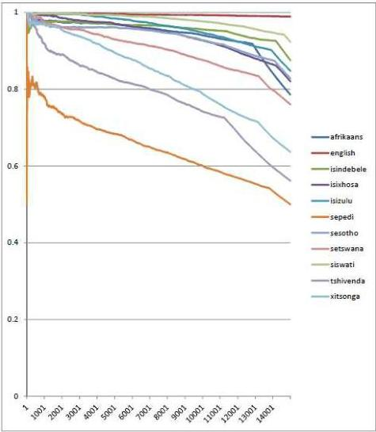
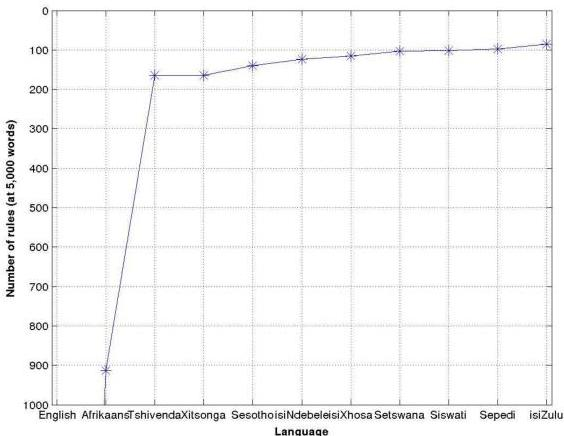

<!-- Source PDF: davel-2013-nchlt-dictionaries.pdf -->

# NCHLT Dictionaries: Project Report

Version: 1.1
Date: 30 May 2013
Authors: Marelie Davel, Willem Basson, Charl van Heerden, Etienne Barnard

## 1. Introduction

This report describes the third and final phase of the NCHLT dictionary development project. As this phase built upon the analysis performed during earlier phases, pertinent prior results are included in the Background section.

The report is structured as follows:

- Project background is included in Section 2.
- Section 3 describes the specific work performed during the March 2012 to March 2013 reporting period; it also includes a description of additional dictionary updates performed between March and May 2013.
- Section 4 lists the final deliverables accompanying this report.

Additional information is provided in the Appendices; these are described in the report itself.

## 2. Background

### 2.1 Project Overview

The NCHLT dictionary development project consisted of three 12-month phases. During each phase, the NCHLT dictionaries were improved both with regard to accuracy and to size:

- *Phase 1 (March 2011 release)*
  5,000-word dictionaries were developed. These are created using prior knowledge and improved during NCHLT ASR system development.
- *Phase 2 (March 2012 release)*
  10,000-word dictionaries were developed. In addition to the process followed during phase 1, the dictionaries were verified using actual audio data obtained from first-language speakers of the various languages.
- *Phase 3 (March 2013 release)*
  15,000-word dictionaries were developed. Building on the analysis performed during all three phases, the rule sets and dictionaries were manually improved and verified.

### 2.2 Phase 2 dictionary development process

For each language, the full set of ASR data collected during the NCHLT project was used to perform the dictionary analysis. Each word in the NCHLT vocabulary was checked in two ways:

- The spelling of the word was verified using tools made available by CTexT.
- The pronunciation of the word was associated with a confidence score obtained by comparing the predicted pronunciation of the word with the phone string produced by a language-specific ASR system.
- The pronunciation of the word was verified against other trusted sources (such as manually developed dictionaries).

Based on the above analysis, words were included in the dictionary based on the level of trust associated with each word. While words that are considered in-language and code-switched words are kept separate, both these categories are considered important, and a proportion of the final corpora included code-switched words. (For example, English words frequently embedded in one of the other 11 official languages.)

Prior resources incorporated in this work include the Lwazi version 1.2 dictionaries [1], the Resources for Closely-Related Languages Afrikaans Pronunciation Dictionary (RCRL-APD) version 1.4.1 [2], and a version of the Oxford Advanced Learner's dictionary, adapted to South African English using manually developed phoneme-to-phoneme rules [3]. Additional word lists were created from the NCHLT ASR prompts, supplemented by the Lwazi ASR prompts.

#### 2.2.1 Audio analysis

Audio analysis was performed using phone-based dynamic programming (PDP) scores [4], and the alignments generated during the PDP scoring process. For each language, an ASR system was developed on different partitions of the data, all audio is decoded by the ASR system, and the decoded phone string is compared with the predicted phone string (predicted according to the existing dictionaries and letter-to-sound rule sets). Word-based time alignments were obtained from the audio transcriptions, in order to obtain results at the word level. Any utterances that did not align or decode were discarded. After all audio had been processed, each word was analysed individually. Each observed phone string was considered a possible variant pronunciation, and the number of times each variant occurred, counted.

As an example, we list the first few lines of the variant analysis for the word 'excitation' as produced by English speakers. Each line consists of 8 items:

- Prediction status: 1 if this is the predicted pronunciation, 0 if not.
- Frequency status: 1 if this pronunciation occurs more frequently than any of the others, 0 if not.
- Occurrence factor: how often this variant was observed as a proportion of all the pronunciations observed for the same word.
- Variant count: the exact number of times this variant was observed.
- Word count: the exact number of times the word was observed.
- Confidence score: The PDP score of this variant in relation to the predicted pronunciation.
- Word: the orthography of the word being analysed.
- Pronunciation: The observed phone string.

1 1 0.484 31 64 -0.190 excitation E k s ai t @i S @ n
0 0 0.047 3 64 -0.791 excitation E k s i t @i S @ n
0 0 0.047 3 64 -0.825 excitation E k s @ t @i S @ n
0 0 0.031 2 64 -0.767 excitation E k s ai t @i S @
0 0 0.016 1 64 -0.430 excitation E k s ai @ t @i S @ n
0 0 0.016 1 64 -0.535 excitation i k s ai t @i S @ n
0 0 0.016 1 64 -0.597 excitation @ k s ai t @i S @ n
0 0 0.016 1 64 -0.659 excitation E k s { t @i S @ n
0 0 0.016 1 64 -0.692 excitation E k s ai d z @i S @ n
...

In the example provided, the first line indicates a pronunciation that occurs much more frequently than any of the others, and is identified as a trustworthy (validated) dictionary entry. While the remaining entries may actually have been produced by speakers, these are expected to include speaker mispronunciations, speaker errors or recogniser errors, and are not considered trustworthy. If a number of different variants occurred, but none occurred more than the others, the pronunciation of that specific word is considered unvalidated.

#### 2.2.2 Vocabulary analysis

For each language, all words observed in the NCHLT corpora were classified as one of 8 sets according to the status of the word itself (source language, whether correctly spelled) and the extent to which the pronunciation could be validated. The different sets are listed in Table 1: set 1 dictionary entries are most likely to be correct, and set 8 pronunciation entries least likely. This table only refers to the dictionary entries analysed (words with pronunciations); in addition, larger word lists were collected during analysis of the transcriptions.

Table 1: Different categories of dictionary entries after audio analysis

|  Pronunciation status | Correctly spelled word |   | Incorrectly spelled or unknown word  |
| --- | --- | --- | --- |
|   |  in target language | in English  |   |
|  Predicted pronunciation validated | set 1 | set 1 | set 6  |
|  Known pronunciation (verified during a prior process) | set 2 | set 2 | set 8  |
|  Predicted pronunciation observed, but not clearly validated | set 3 | - | -  |
|  Pronunciation differs from prediction, but seems valid | set 4 | set 5 | set 6  |
|  Pronunciation info inconclusive | set 7 | set 7 | set 8  |

Results of this analysis are provided in Table 2.

*Table 2: Number of dictionary entries per category, per language*

|   | 1 | 2 | 3 | 4 | 5 | 6 | 7 | 8 | total  |
| --- | --- | --- | --- | --- | --- | --- | --- | --- | --- |
|  Afrikaans | 4,241 | 20,751 | 521 | 281 | 157 | 705 | 846 | 587 | 28,089  |
|  English | 2,827 | 63,290 | 64 | 75 | 0 | 1,044 | 159 | 1,110 | 68,569  |
|  isiNdebele | 4,292 | 3,680 | 2,128 | 358 | 847 | 1,468 | 4,025 | 3,486 | 20,284  |
|  isiXhosa | 5,184 | 3,005 | 4,356 | 672 | 544 | 1,750 | 14,019 | 9,332 | 38,862  |
|  isiZulu | 4,765 | 3,769 | 4,162 | 969 | 500 | 1,348 | 11,728 | 6,547 | 33,788  |
|  Sepedi | 3,051 | 3,342 | 907 | 249 | 640 | 2,052 | 1,456 | 3,054 | 14,751  |
|  Sesotho | 2,755 | 3,449 | 1,163 | 469 | 735 | 854 | 2,770 | 1,720 | 13,915  |
|  Setswana | 1,939 | 3,754 | 371 | 131 | 577 | 872 | 1,155 | 1,421 | 10,220  |
|  Siswati | 5,149 | 3,281 | 1,658 | 345 | 825 | 1,572 | 2,712 | 2,311 | 17,853  |
|  Tshivenda | 2,838 | 4,217 | 551 | 216 | 930 | 1,543 | 1,179 | 1,157 | 12,631  |
|  Xitsonga | 2,348 | 3,564 | 378 | 164 | 665 | 1,502 | 1,434 | 1,574 | 11,629  |

#### 2.2.3 Phase 2 dictionary constitution

For 6 of the languages, dictionaries of 10,000 words each can be constituted using only entries from sets 1 to 3. For 5 of the languages, less than 10,000 entries are available that fall within these three sets; these were supplemented with the most trusted entries available: in-language, correctly spelled words, predicted according to the pronunciation rules of the trusted subsets. The 5 languages for which additional entries were required are listed in Table 3.

*Table 3: Dictionaries requiring selection beyond sets 1-3*

|   | Validated entries | Additional entries | Total  |
| --- | --- | --- | --- |
|  Tshivenda | 7,606 | 2,394 | 10,000  |
|  Sesotho | 7,367 | 2,633 | 10,000  |
|  Sepedi | 7,300 | 2,700 | 10,000  |
|  Xitsonga | 6,290 | 3,710 | 10,000  |
|  Setswana | 6,064 | 3,936 | 10,000  |

The associated pronunciation rules are in Default&Refine [5] format, similar to those produced during the previous dictionary development phase. This algorithm provides good generalisability while producing rules that are also humanly interpretable.

In the process of analysis, additional observations were made with regard to confusable phonemes, redundant phonemes, and other systematic phenomena; these continued to inform dictionary development and was investigated further during Phase 3 dictionary development, using language practitioners to confirm the accuracy of the final dictionaries. It was also found that additional work was required to improve the word lists themselves - a task that was not initially expected to form a significant part of the work.

## 3. Phase 3 dictionary development process

During Phase 3 dictionary development, manual correction and verification played a much larger role than during earlier phases. Dictionary development had two main goals:

1. Generating clean 15,000-word word lists.
2. Creating, verifying and improving individual dictionaries.

### 3.1 Generating 15,000-word word lists

It was apparent from earlier phases that clean word lists were difficult to obtain in many of the eleven languages studied. In order to obtain word lists for dictionary creation, the following process was followed, with each step described in more detail in the remainder of this section:

1. The NCHLT text corpus (consisting of running text) was processed, filtered (cleaned) and used to obtain word frequency counts.
2. An *n*-gram analysis was used to obtain the probability that a word is correct (that is, from the specific language being studied and not containing spelling errors).
3. An initial *n*-gram analysis of transcriptions from the NCHLT speech corpus flagged many words as possibly problematic. These were manually analysed by language practitioners.
4. The initial word lists (released March 2013) were created by combining the various outputs from the preceding steps.
5. After March 2013, more comprehensive word lists and meta-information were obtained from CTexT. (These were developed during a parallel NCHLT project focussing on text resources.) An automated spell-check analysis of the March 2013 lists were also obtained from CTexT¹. These new word lists were used to refine and extend the earlier selection.

#### 3.1.1 Obtaining word counts

Using a large text corpus for creating word lists is useful, since it is possible to sort words based on their observed frequency. The two main advantages of using high frequency as opposed to low frequency words are that (1) they are more likely to be correctly spelled and (2) they are more likely to be words that are often used in the language and hence suitable for inclusion in a pronunciation dictionary for that language.

The corpora used to generate the 15,000-word lists for ten of the eleven South African languages are the v1.6 text corpora as prepared for the South African Department of Arts and Culture by the Centre for Text Technology (CTexT, North-West University, South Africa). For the English corpus, the CTexT ENG.GOV.ZA corpus was used. Note that at the time of writing this report, official versions of these resources were not yet available, and pre-release versions were used.

1 In this regard, the assistance provided by Martin Puttkamer from CTexT is gratefully acknowledged.

All of the corpora were cleaned quite significantly to obtain usable word lists. The following steps were followed (in the indicated order):

- the file format was changed from DOS to UNIX
- all license headers were removed from the corpora
- html-like text was removed (for example <fn>)
- all capital letters were changed to lowercase
- the following punctuation was removed: ;:=+{},?-!"/^~<>~\_~@*\&#
- multiple spaces were changed to a single space

Lists of unique words, annotated by the number of times each word occurs, were then created from these cleaned corpora. A final filtering process was subsequently executed: a list of valid letters was created from the Lwazi word lists and any word in the cleaned word lists which had any character other than the valid letters described above, was discarded.

#### 3.1.2 Manual verification of possible problem words

Possible problem words flagged during the initial n-gram analysis of the transcriptions of the NCHLT speech corpus were analysed and sent to language practitioners for manual verification. The task description as provided to practitioners is included in Appendix A.

The verification results are summarised in Table 4. The total number of words categorised per language can be more than the number of unique words, as one word may belong to more than one category.

Table 4: Number of words categorized during manual verification

|   | abbreviation | acronym | spelled word | proper name | strange or foreign word | spelling error | partial / combined word | generic within language word | uncertain | total | uniq words  |
| --- | --- | --- | --- | --- | --- | --- | --- | --- | --- | --- | --- |
|  Afrikaans | 32 | 85 | 286 | 651 | 278 | 146 | 396 | 7709 | 148 | 9731 | 9378  |
|  English | 54 | 75 | 280 | 1596 | 266 | 53 | 74 | 630 | 12 | 3040 | 2729  |
|  isiNdebele | 13 | 18 | 34 | 301 | 472 | 376 | 322 | 621 | 14 | 2171 | 2155  |
|  isiXhosa | 19 | 17 | 117 | 392 | 525 | 818 | 237 | 2826 | 28 | 4979 | 4873  |
|  isiZulu | 5 | 19 | 23 | 296 | 657 | 375 | 1258 | 756 | 49 | 3438 | 3300  |
|  Sepedi | 25 | 3 | 17 | 27 | 684 | 100 | 0 | 984 | 13 | 1853 | 1767  |
|  Sesotho | 21 | 22 | 115 | 196 | 228 | 86 | 158 | 690 | 11 | 1527 | 1502  |
|  Setswana | 57 | 17 | 105 | 484 | 48 | 66 | 46 | 523 | 8 | 1354 | 1339  |
|  Siswati | 3 | 12 | 2 | 69 | 1135 | 154 | 26 | 1031 | 16 | 2448 | 2433  |
|  Tshivenda | 1 | 2 | 9 | 47 | 466 | 130 | 22 | 780 | 2 | 1459 | 1448  |
|  Xitsonga | 1 | 3 | 36 | 79 | 462 | 133 | 63 | 541 | 17 | 1335 | 1296  |

As can be seen from this analysis, the raw corpora still contained a significant number of spelling errors (including partial or combined words). While the focus of this exercise was to obtain useful within-language word lists, an additional output generated during this process is a list of spelling errors, and to the extent possible, suggested corrections. Note that these spelling errors are flagged in the transcriptions of the NCHLT speech corpus - known spelling errors are not included in the actual NCHLT dictionaries.

#### 3.1.3 N-gram analysis of filtered words

A widely-used approach to identify the language of written text is based on the statistics of letter sequences [8]: that is, the text up is segmented into short sequences of n letters each, and it is computed how likely each of those sequences is to occur in the given language. Such methods are referred to as n-gram methods.

In this work, we employed a powerful sequence-modelling toolkit, the Stanford Research Institute Language Modeling Toolkit (SRILM) [9], to perform n-gram modelling of each of the words in our corpus. In particular, we train an n-gram model of order 4, with Witten-Bell smoothing [10], on the words that occur in the Lwazi dictionaries of each language (approximately 5,000 words per language). These models are then used to assign likelihoods to each of the words in the NCHLT text corpus of the corresponding language. By ordering these by the per-letter likelihood of each word, we assign a ranking to how 'typical' each of these words is.

Figure 1: Comparing the generated word lists with the pre-release versions of the new NCHLT text corpora

In order to verify that this ordering is sensible, we compared this rank-ordered list with the preliminary word lists in each of the languages, being prepared as part of the NCHLT text corpus release. These lists are relatively small for our purposes (ranging from about 9,000 words to about 60,000 words), but have been verified to an extent. For each language, we compute the fraction of our top n words that occur in these word lists, as n ranges from 1 to 15,000. The resulting graphs are shown in Figure 1. We see that the rank ordering behaves as expected for most languages: for small n, almost all the selected words occur in the manually-verified lists, but as n increases, a growing number are not covered in the limited NCHLT lists. These trends give us confidence that our text selection is functioning as planned; the results also indicate that there is an issue with the Sepedi data, which was only addressed when the new word lists were made available. (See Section 3.1.5.)

#### 3.1.4 Selection of initial word lists

The selection of the initial 15,000-word lists (released March 2013) entailed the following steps:

- An initial word list for each language was created from the Lwazi word lists. Let NL denote the number of words in this list.
- This list was then increased to 15,000 words by:

1. considering the top 23,000 words from the sorted word list as described in Section 3.1.3 and then
2. from this word list, selecting the (15,000 - NL) most frequent words according to cleaned and filtered frequency lists as described in Section 3.1.1.
3. Words marked as possible errors by the language practitioners, were discarded; and the process repeated.

#### 3.1.4 Selection of May 2013 word lists

Initial dictionaries were developed based on the March 2013 lists, according to the process as described in Section 3.2. By incorporating the new word list information (obtained between March and May), the March 2013 lists were refined. The intention was to use as many entries from the earlier dictionaries as possible, and the dictionaries were therefore not recreated from source. Only two types of changes were made:

- Additional possible spelling errors were removed:

- These were obtained from the updated spell-checked word lists. This also resulted in many possibly correct words being discarded, as the existing spell checkers have different recall rates.
- Additional feedback obtained from language practitioners resulted in additional words being discarded, including any words that were marked as uncertain.

- The words lists were again increased based on the most trusted resources available: the newly verified word lists from CTexT, words from the newly developed detailed 50,000-token analysis, as well as words accepted by the language practitioners after manual review.

For all the languages apart from Tshivenda, 15,000 word lists could be generated this way. For Tshivenda, approximately 14,200 words could be generated according to the above process; an additional 800 words were then recovered from a combination of corpus frequency counts and n-gram analysis.

### 3.2 Creating individual dictionaries

Recent work comparing the role of different types of dictionaries on speech technology performance [6], again highlighted the importance of dictionary consistency. In order to improve the consistency of the final dictionaries, the rule sets generated during earlier phases were reviewed manually.

The regularity of a spelling system is determined by the consistency with which the orthography of the words in the language describes their pronunciation, and can be quantified using grapheme-to-phoneme consistency measures. In Figure 2 we compare the internal spelling consistency of the various languages by counting the number of rules required to describe generic 5,000-word vocabularies in each of the languages. (The fewer rules, the more regular the language.) English - which generates 3,876 rules - is by far the least regular.

*Figure 2: Number of Default-and-Refine rules generated by a generic 5,000-word dictionary, as a measure of G2P regularity per language. (English at 3,876 rules is not indicated on the graph.)*

For 9 of the 11 languages (all but English and Afrikaans), it was possible to analyse and improve rule sets directly, as these languages are considered to have fairly regular spelling systems, as can be seen from Figure 2. For two of the languages, it was not possible to review rule sets directly. (For irregular languages, the number of rules increase and rule interaction becomes too complex for manual review.)

In Table 5 we list the number of rules before manual correction as well as the percentage of rules changed during manual correction, for the 9 languages handled in this manner. Once completed, the manually improved rules were used to generate 15,000-word dictionaries from the clean word lists, and the resulting dictionaries evaluated for correctness. Two versions of the 15,000-word dictionaries were created: one set using the previous rule set and another the updated rule set. Differences between the two dictionaries were manually reviewed, and the new rule sets adjusted where necessary, until all differences were considered improvements.

The English dictionary was developed using earlier work [3], but the implementation of the British to South African English rule sets described in [3] was manually reviewed and the resulting dictionary edited accordingly. The Afrikaans dictionary was developed using [2] as rule source, but recreated for the new word lists; again the final dictionary was manually reviewed and pronunciations corrected by a language practitioner [7].

Table 5: Number of rules before manual correction and percentage change (counting rule modifications, deletions and additions).

|  Language | Number of rules prior to manual correction | Percentage of rules changed  |
| --- | --- | --- |
|  isiNdebele | 124 | 24.5%  |
|  isiXhosa | 115 | 42.6%  |
|  isiZulu | 85 | 24.1%  |
|  Sepedi | 98 | 27.0%  |
|  Sesotho | 140 | 46.7%  |
|  Setswana | 103 | 40.7%  |
|  Siswati | 102 | 37.2%  |
|  Tshivenda | 164 | 37.8%  |
|  Xitsonga | 164 | 34.7%  |

As it was found during word list analysis that each word list contains multiple spelled words, and as these are not typically correctly predicted by the standard G2P rules, these were handled separately. A process was developed to create pronunciations for spelled words in the different languages semi-manually: sample spelled word pronunciation lists are included in the project deliverables.

### 3.3 Dictionary evaluation

In order to evaluate the quality of the dictionaries, a random sample of words were extracted from each dictionary and submitted for manual review. This task was found to be surprisingly difficult for language practitioners. In order to obtain useful results, an audio-enabled process was therefore developed:

1. 400 samples were randomly selected from each dictionary.
2. An audio phone string was generated by concatenating sound samples. (This is not the same as creating text-to-speech versions of the words, but simplified 'sounded' versions, found to be useful in earlier work [11].)
3. Simplified phone set spreadsheets were created per language, listing only the phones occurring in that language, along with an audio sample and example word.

4. A spreadsheet was created of all words to be evaluated, linking the word itself to an audio version uploaded on a web server. This option was selected as the systems used by language practitioners vary considerably - by opting for a browser-based evaluation, many technical issues could be circumvented.
5. The protocol followed during evaluation is included in Appendix B; this task sheet was also distributed to language practitioners.

This process supported the following main measurements:

- Percentage of words (not pronunciations) that are considered valid words in the target language.
- Percentage of pronunciations (of valid words) that are considered valid in the target language. This is referred to as *word-based pronunciation accuracy*.
- While not as intuitive, phoneme-based pronunciation accuracy is often referred to in literature, and is therefore also reported on. This is a per-phoneme measurement obtained by first aligning the predicted and reference phoneme strings and then calculating

$$(H - I) / N$$

where H = correctly matched phonemes, I = inserted phonemes, and N = total number of phonemes in the aligned reference string.

Evaluation sheets were prepared for all languages, but only the first 5 returned are discussed here, as some of the evaluations were still outstanding at the time of finalising this report. However, from the evaluations reviewed, the following clear trends were observed:

- For 9 of the 11 languages (the only ones for which this was possible - see above) focussing on rule sets rather than individual words during dictionary improvement, resulted in the consistency of the resulting dictionaries being improved considerably. For the first time, some of the evaluations (Sepedi, Sesotho) obtained 100.00% word-based pronunciation accuracy for valid words within the selected sample. No language obtained less than 97.50% word-based pronunciation accuracy, which, for all languages, equates to a phone-based accuracy of higher than 99.00%.
- For the same languages as above, word lists still contained a surprisingly high number of non-target language words. The highest number of erroneous words (at 7.50%) was observed in the Sepedi dictionary. (That is, 92.50% of *words* were correct, 7.50% not.) This was found surprising, as all words in the Sepedi dictionary passed some form of spelling verification. Analysis of the problem words showed that the errors included (a) valid words from other languages, (b) valid Sepedi words with spelling inconsistencies, and (c) invalid words.
- As the process followed for Afrikaans and English were different to the other 9 languages, these were evaluated separately. The Afrikaans evaluation reported 99.50% valid words and a word-based accuracy of 99.00%. The English evaluation reported 99.75% valid words and a word-based accuracy of 97.25%.

In general, we expect that cleaner word lists will continue to become available as the NCHLT text project progresses. For 9 of the 11 languages, these word lists can then easily be converted into pronunciation dictionaries using the newly updated rule sets.

#### **4. Description of final deliverables**

The project deliverables consist of:

1. Eleven 15,000-word dictionaries, one per language.
2. A set of grapheme-to-phoneme prediction rules, which can be used to predict the pronunciation of unknown words (words that do not occur in the primary dictionaries).
3. A list of spelling errors found in the NCHLT prompted speech corpus, plus the corrected spellings where available.
4. An additional dictionary of frequently occurring 'spelled words' (such as MTN or TB) that occur in the NCHLT text corpora.
5. A pronunciation predictor per language, which - if given a word list - generates a pronunciation dictionary automatically.

All the above are provided together as a single set of deliverables: the various components are described in Table 6.

Table 6: Location, naming conventions and content of main deliverables.

|   | Location | Name | Content  |
| --- | --- | --- | --- |
|  **Primary dictionaries** | release/dictionaries | nchlt_<*language*>.dict | <*tab*>-separated word and pronunciation per line  |
|  **Primary rule sets** | release/rules/<*language*> | nchlt_<*language*>.rules nchlt_<*language*>.gnulls nchlt_<*language*>.map.graphs nchlt_<*language*>.map.phones | All the files necessary to predict *Default&Refine* pronunciations. The pronunciation of a list of unknown words can be created using: perl pron_predict.pl <*word_list*> <*language*> <*dictionary*> with <*language*> as listed below. This creates a new <*dictionary*> matching the words in <*word_list*>; where <*word_list*> is expected to be a list of (UTF8-encoded) words, one word per line.  |
|  **Spelled dictionaries** | extra/spelled_dictionaries | nchlt_<*language*>_spelled.dict | <*tab*>-separated word and pronunciation per line  |
|  **Spelling errors** | extra/spelling_errors | nchlt_<*language*>_errors.txt | each line consists of the word as found before and after spelling correction, separated by a <*tab*> character  |
|  **Note:** Naming conventions specify a <*language*> which is one of the following: afr (Afrikaans), eng (English), nbl (isiNdebele) , xho (isiXhosa ), zul (isiZulu) , nso (Sepedi ), tsn (Setswana ), sot (Sesotho ), ssw (Siswati ), ven (Tshivenda ) or tso (Xitsonga )  |   |   |   |

## 5. Conclusion

The current project set out to develop large pronunciation dictionaries in each of the official languages of South Africa; this goal was achieved through a combination of manual and algorithmic means, and relied on several other resources that were developed during the NCHLT project.

By focussing on rule set verification rather than individual word verification (possible for 9 of the 11 languages - all but English and Afrikaans) dictionaries with high internal consistency could be obtained. During dictionary evaluation, pronunciations were found to be accurate, but word lists for the same 9 languages as above were still not found to be error free, with word lists accuracies as low as 92.5% measured. (Accurate English and Afrikaans word lists of sufficient size were found to be more easy to obtain.) We expect that larger, cleaner word lists will continue to become available as the NCHLT text project progresses. For 9 of the 11 languages, these can then easily be converted into pronunciation dictionaries using the newly updated rule sets.

The primary outputs from this project produced eleven electronic pronunciation dictionaries, each containing 15,000 words. In addition, rule sets to predict pronunciations for unknown words and an 'unknown word predictor' were developed. Several other outputs resulted from this work (such as pronunciations for spelled words, enhanced word lists, etc.). Together, these should form a useful package for the development of language technology in these languages; in addition, the algorithmic developments that have contributed to this work should be useful both in further refinement of the current deliverables and for those who wish to develop similar resources in other languages.

## References

- [1] M. Davel and O. Martirosian, 'Pronunciation dictionary development in resource-scarce environments', in *Proc. Interspeech*, Brighton, United Kingdom, September 2009, pp. 2851-2854.
- [2] M.H. Davel and F. de Wet, 'Verifying pronunciation dictionaries using conflict analysis', In *Proc. Interspeech*, Makuhari, Japan, September 2010, pp. 1898-1901.
- [3] L. Loots, M. Davel, E. Barnard and T. Niesler, 'Comparing manually-developed and data-driven rules for P2P learning', In *Proc. Pattern Recognition Association of South Africa (PRASA)*, November 2009, Stellenbosch, South Africa, pp. 35-40.
- [4] M.H. Davel, C.J. van Heerden and E. Barnard, 'Validating smartphone-collected speech corpora', In *Proc. Spoken Language Technologies for Under-resourced Languages (SLTU)*, May 2012, Cape Town, South Africa.
- [5] M. Davel and E. Barnard, 'Pronunciation prediction with Default & Refine', *Computer Speech and Language*, vol. 22, pp. 374-393, October 2008.
- [6] W. Basson and M.H. Davel, 'Comparing grapheme-based and phoneme-based speech recognition for Afrikaans', In *Proc. Pattern Recognition Association of South Africa (PRASA)*, November 2012, Pretoria, South Africa.
- [7] W. Basson and M.H. Davel, 'Category-based P2G transliteration', in *Proc. Interspeech*, Lyon, France, August 2013 (accepted for publication).
- [8] G.R. Botha, and E Barnard, 'Factors that affect the accuracy of text-based language identification.' *Computer Speech & Language*, 26(5), 307-320, 2012
- [9] A. Stolcke et al., 'SRILM-an extensible language modeling toolkit,' in *Proc. Int. Conf. on Spoken Language Processing*, vol. 2, Denver, Colorado, USA, September 2002, pp. 901-904.
- [10] S. F. Chen and J. Goodman, 'An empirical study of smoothing techniques for language modeling,' in *Proc. of the 34$^{th}$ annual meeting of the Association for Computational Linguistics (ACL)*, Santa Cruz, California, USA, June 1996, pp. 310-318.
- [11] M. Davel and E. Barnard, 'The efficient generation of pronunciation dictionaries: human factors during bootstrapping', in *Proc. Interspeech*, Jeju, Korea, September 2004, pp. 2851-2854.

# APPENDIX A: CATEGORISATION TASK DESCRIPTION

# Background:

We would like to categorise words in order to be able to apply the correct rules when creating pronunciations for the words.

# Goal:

Given a word list, please identify which of the following categories apply to each word:

- spelled words, such as 'M T N', 'A N C'. (Also see notes below re 'mtn' and 'anc').
- acronyms, such as 'ABSA', 'CANSA'.
- abbreviations, such as 'etc', 'e.g'.
- proper names not falling into any of the above categories, such as 'Vanderbijlpark'
- clear spelling errors
- words that are clearly part of a word ('unnecessari') or two words combined ('thisone')
- otherwise strange or foreign words
- generic within language words (any other words within the target language)

# Notes:

- All words are provided in lower case: no capital letters are marked and no punctuation is added. Evaluate a name as if this is correct. (For example, hiv is considered to be the same word as HIV.)
- A word may be in more than one category, such as 'B E E' and 'bee' that are both a spelled word and a generic in-language word in English.
- When a spelling error is found, please provide the correct spelling in the comment field.
- If an abbreviation is found, please provide the non-abbreviated form in the comment field.
- Any other comments can be added to the comment field, but comments are not expected - please only add if required.
- If uncertain, please mark the 'uncertain' column but still make a best guess: please pick the other column(s) that possibly apply - please don't just pick 'uncertain'.
- Please ensure each word is marked as belonging to at least one category.

# Process:

When categorising the words, therefore consider:

1. Is this a word that someone will typically pronounce by 'spelling out' the letters? (Such as 'M T N' pronounced / eh m t iy eh n /) It's OK if a word is spelled in English (typical). Mark it as a 'spelled word'.
2. If not, is this an acronym? (That is, an abbreviated form that is pronounced as if it is a word -- not spelled -- such as 'CANSA' pronounced / k ae n s ah /). Mark it as an 'acronym'.
3. If not, is this an abbreviated form that can be pronounced as a full word? (Such as 'etc' that can be pronounced as 'etcetera', that is, / eh t s eh t @ r ah /) Then mark it as an 'abbreviation' and add the longer version in the comments field.
4. If not, is this a known proper name? (Especially a name of a person or place?) Then mark it as a 'proper name'.

5. If not, is this in any other way strange or foreign? (This could include non-existent words or words from another language such as Latin or English). Mark as 'strange or foreign'.
6. If not, does this seem to be an in-language with some mistake in it?
7. If yes to (6): is the mistake that this is only part of a word, or two or more words combined when they should be separate? Mark it as a partial or combined word. (If easy to do, please correct it in the comments field. If too ambiguous, just skip the comment.)
8. If yes to (6) but no to (7): mark it as a 'spelling error' and add the correct spelling in the comments field.
9. If nothing is wrong or strange about this word - then mark it as a 'generic' in-language word.
*(This is the most important category for us!)*

**Provided:**

List of words within spreadsheet.

# **Result required:**

|  Word | abbreviation | acronym | spelled word | proper name | strange or foreign word | spelling error | partial / combined | generic within language word | uncertain *please still pick other column(s) that apply* | Comment  |
| --- | --- | --- | --- | --- | --- | --- | --- | --- | --- | --- |
|  hiv |  |  | 1 |  |  |  |  |  |  |   |
|  like |  |  |  |  |  |  |  | 1 |  |   |
|  luckily |  |  |  |  |  | 1 |  |  |  | luckily  |
|  orange |  |  |  |  |  |  |  | 1 |  |   |
|  tb |  |  | 1 |  |  |  |  |  |  |   |
|  today |  |  |  |  |  |  |  | 1 |  |   |
|  tooka-tooka |  |  |  |  | 1 |  |  |  | 1 |   |
|  top |  |  |  |  |  |  |  | 1 |  |   |
|  absa |  | 1 |  |  |  |  |  |  |  |   |
|  bee |  |  | 1 |  |  |  |  | 1 |  |   |
|  foreve |  |  |  |  |  |  | 1 |  |  |   |
|  thisisatest |  |  |  |  |  |  | 1 |  |  |   |
|  etc | 1 |  |  |  |  |  |  |  |  | etcetera  |

## APPENDIX B: PRONUNCIATION DICTIONARY EVALUATION

### Background:

We are developing electronic pronunciation dictionaries that are used in speech technology systems (such as automatic speech recognition systems). We would like to verify that our pronunciations are correct. We are not interested in detailed phonetic issues, but whether broad ('phonemic') descriptions are accurate.

### Goal:

Determine whether a provided word and pronunciation pair is valid.

### Provided:

- Verification spreadsheet: List of word-pronunciation pairs to verify.
- Phone set description: More information on the phone sets used.

### Required:

- Browser with Internet access.
- Headphones

### Process:

1. Before getting started:
   (a) Please familiarise yourself with the phone set provided. Where two sounds are fairly similar, it is important to understand why different symbols are use. (For example, the consonants 'b' and 'b_h' differ in some languages because the first sound is not aspirated, and the second one is.)
   (b) Click on a few of the audio samples to make sure that they are clearly audible. It is best to listen to the samples with headphones.
2. Now consider each row one at a time:
   (a) Is this a valid word in the specific language?
      1. No: If not, check *invalid word* and ignore the rest of the row.
      2. Yes: If this is a valid word, listen to the audio sample and view the phone string.
   (b) Is this a valid pronunciation of the word?
      1. Yes: If this is a valid pronunciation (an acceptable way in which the word can be pronounced) select *valid pron*.
      2. No: If this is not a valid pronunciation (pronouncing it this way would be wrong), select *invalid pron*.
      3. Unsure: If you are not sure, mark *unsure*, but also please add a comment as to why you are unsure.
3. Once all rows done:
   For all words that are marked as *invalid pron.*, please either add the corrected pronunciation, or a comment explaining what sound is wrong.

### Notes:

- Ignore tone completely.
- See any language-specific notes in the phone set spreadsheets.