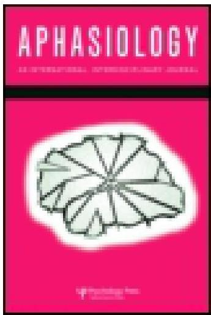

<!-- Source PDF: ferguson-1994-conversational-repair.pdf -->

This article was downloaded by: [University of Cambridge]

On: 08 October 2014, At: 00:38

Publisher: Routledge

Informa Ltd Registered in England and Wales Registered Number: 1072954

Registered office: Mortimer House, 37-41 Mortimer Street, London W1T 3JH, UK

# Aphasiology

Publication details, including instructions for authors and subscription information:

http://www.tandfonline.com/loi/paph20

# The influence of aphasia, familiarity and activity on conversational repair

Alison Ferguson a

a Bankstown Lidcombe Health Service, Lidcombe NSW, Australia

Published online: 29 May 2007.

To cite this article: Alison Ferguson (1994) The influence of aphasia, familiarity and activity on conversational repair, Aphasiology, 8:2, 143-157, DOI: 10.1080/02687039408248647

To link to this article: http://dx.doi.org/10.1080/02687039408248647

# PLEASE SCROLL DOWN FOR ARTICLE

Taylor &amp; Francis makes every effort to ensure the accuracy of all the information (the "Content") contained in the publications on our platform. However, Taylor &amp; Francis, our agents, and our licensors make no representations or warranties whatsoever as to the accuracy, completeness, or suitability for any purpose of the Content. Any opinions and views expressed in this publication are the opinions and views of the authors, and are not the views of or endorsed by Taylor &amp; Francis. The accuracy of the Content should not be relied upon and should be independently verified with primary sources of information. Taylor and Francis shall not be liable for any losses, actions, claims, proceedings, demands, costs, expenses, damages, and other liabilities whatsoever or howsoever caused arising directly or indirectly in connection with, in relation to or arising out of the use of the Content.

This article may be used for research, teaching, and private study purposes. Any substantial or systematic reproduction, redistribution, reselling, loan, sub-licensing, systematic supply, or distribution in any form to anyone is expressly forbidden. Terms &amp; Conditions of access and use can be found at http://www.tandfonline.com/page/terms-and-conditions

APHASIOLOGY, 1994, VOL. 8, NO. 2, 143-157

# The influence of aphasia, familiarity and activity on conversational repair

ALISON FERGUSON

Bankstown–Lidcombe Health Service, Lidcombe NSW, Australia

(Received 1 February 1993; revision received 2 April 1993; accepted 9 April 1993)

# Abstract

This study investigated the influence of aphasia, familiarity and activity on conversational repair in interactions between nine aphasic individuals and 18 normal subjects (nine of whom lived with the aphasic subjects, and nine of whom were visiting the aphasic subjects). Data were collected in the homes of the aphasic subjects, and comprised unstructured conversation, semi-structured interaction involving retelling the events witnessed in a mock car accident, and structured testing. Conversation Analysis investigated the frequency of interactive trouble-indicating behaviour (metalinguistic comment and hypothesis forming per minute), and the nature of repair pattern (proportional pattern of repair trajectories used). Normal subjects increased their frequency of interactive trouble-indicating behaviour, and used more interactive repair patterns when conversing with aphasic partners as compared with when conversing with normal partners. The difference in familiarity between subjects did not appear to affect the frequency of interactive trouble-indicating behaviour, but it was noted that ‘visiting’ subjects tended to make more use of ‘other repair’ patterns than did subjects living with aphasic individuals. Conversational repair was found to differ across activities. The theoretical and clinical implications are discussed.

# Introduction

The research presented in this paper investigated conversational repair of trouble in interactions involving aphasic and normal individuals. In particular, the influence of the presence of aphasia, familiarity with the aphasic individual, and the nature of the activity were examined, using methodology based on Conversation Analysis (see Atkinson and Heritage, 1984; Button &amp; Lee, 1987 for an overview of Conversation Analysis).

The analysis of conversation in the field of aphasia has long been suggested as an essential part of achieving a valid understanding of the effect of aphasia on the everyday functioning of the aphasic individual (Copeland 1989, Davis and Wilcox 1985, Holland 1982). As Lesser and Milroy (in press) discuss, however, both the theoretical approaches and available tools for the analysis of conversation have been influenced strongly by the psycholinguistic traditions in the field. This psycholinguistic influence has resulted in a preoccupation with the identification

Address correspondence to: Alison Ferguson, Speech Pathology Department, Lidcombe Hospital, Bankstown–Lidcombe Health Service, Joseph Street, Lidcombe NSW 2141, Australia.

0268-7038/94 $10.00 © 1994 Taylor &amp; Francis Ltd.

144
Alison Ferguson

and categorization of errors in conversation, as part of substantiating the deficit model of aphasic impairment (e.g. Garman 1989, Wagenaar et al. 1975). Even the more recent applications of discourse theory to the analysis of conversation have tended to focus upon the identification and description of deviation from an assumed normal or standard discourse structure (e.g. Armstrong 1991, Terrell and Ripich 1989, Ulatowska et al. 1990). Conversation Analysis, on the other hand, abandons the notion of error as being essentially irrelevant to the everyday conduct of conversation, and instead focuses upon the notion of ‘trouble’. Trouble in conversation can be described as difficulty in communication which is signalled by the interactants (Schegloff et al. 1977), i.e. while trouble may arise from the presence of error, detectable error is not essential for the presence of trouble; also, errors which do not cause trouble for the interactants are seen as unimportant for the interaction. This notion of trouble is pivotal to the methodology of Conversation Analysis, since the observer’s task changes to the identification of moments where either participant signalled trouble. Such signals are termed ‘trouble-indicating behaviour’ in this paper, and include comments about the talk, guesses, repetition and revision (Bremer et al. 1987, Roberts et al. 1988). This approach represents a considerable departure from previous analyses of aphasic conversation, and allows for an approach to analysis which has an inherent social validity, through its concentration upon only that which is manifestly significant to the participants in the interaction.

Conversational repair, i.e. the signalling of attempts to fix or remedy some trouble in conversation, is a closely linked concept to that of trouble (Schegloff 1987, Schegloff et al. 1977). Repair is always an indication of trouble, yet it should be noted that not all trouble is subjected to repair. The notion of repair is not exclusive to Conversation Analysis, and has been investigated in some depth in psycholinguistic research (e.g. Garnsey and Dell 1984, Laver 1973, Levelt 1983, Schlenck et al. 1987), but such research has tended to focus solely upon the aphasic individual and self correction, whereas research influenced by Conversation Analysis methodology has begun to consider the role of the partner, or ‘other repair’ (e.g. Gerber and Gurland 1989, Milroy and Perkins 1992). This is an important contribution of Conversation Analysis to our understanding of aphasic conversation, since it allows a view of the dynamic flow of communication from speaker to speaker, rather than the static or ‘snap shot’ views available from discourse analysis (Heritage 1989). In the present study, Van Lier’s (1988) description of repair trajectories has been applied to the analysis of conversations between aphasic and normal speakers, as this allows for the description of the contributions of both partners to the repairing process, and allows for the recognition of repair as jointly negotiated and produced between speakers.

Perhaps the most fundamental issue with regard to trouble and repair in aphasic conversation is the extent to which trouble and repair are associated with aphasic impairment. In previous research which has attempted to look at the role of partners in interaction with aphasic individuals it has been assumed that normal individuals will experience more trouble and repair when talking with an aphasic partner, but this assumption has not been empirically tested (Linebaugh et al 1985, Lubinski et al. 1980, Milroy and Perkins 1992, Newhoff et al. 1982). The present study empirically investigates the trouble and repair generated by normal individuals when talking with aphasic versus normal partners.

Aphasia, familiarity, activity and conversational repair

The way repair is used to negotiate messages between individuals means that repair is sensitive to the social factors which underlie the roles of each individual in the exchange (Coleman and Burton 1985, Goffman 1971, 1981, Schegloff 1987). One of the key social factors underlying the relationship of aphasic individuals and their partners is often considered to be that of the familiarity of the participants with the aphasic individual as well as with the aphasic impairment (e.g. Green 1982, Wirz et al. 1990). Previous research has suggested that conversational repair would be influenced by differences in familiarity (Florance 1981, Flowers and Peizer 1984, Gerber and Gurland 1989, Linebaugh et al. 1983), but although this has been investigated for differences involving professionals (e.g. Gravel and LaPointe 1982, 1983), it has not been investigated for differences in familiarity between non-professionals. In the present study the repair of normal individuals who are very familiar with the aphasic individual (living with the aphasic individual) is compared with the repair of normal individuals who are less familiar with the aphasic individual (visiting the aphasic individual). Also, the conversational repair of the aphasic individual with the more and less familiar normal subjects is examined.

As Levinson (1979) discusses, conversational activity will ultimately relate to the goals of the participants, and as such will vary widely over time and across situations. The observation of differences across activities raises important issues as to why such differences arise, i.e. what it is that enables or constrains what is considered an allowable contribution to the communication, either for the individual or arising from the social and cultural basis of the activity. From the previous research into the effects of different conversation activities on aphasic communication in general (e.g. Glosser et al. 1988, Wilcox and Davis 1977), it could be assumed that there might be significant differences in conversational repair across activities; however, this has not been researched previously. In the present study the conversational repair of normal individuals is compared across the two conditions of casual conversation (unstructured) and retelling events based on a mock car accident (semi-structured). The conversational repair of aphasic individuals is compared across these two conditions as well as the third (structured) condition of testing on the Porch Index of Communicative Ability (Porch 1981).

In summary then, the present study investigated the influence of the presence of aphasia, differences in familiarity, and the nature of the conversational activity on conversational repair occurring between aphasic and normal partners. The study integrated the methodology of Conversation Analysis into the investigation of the following questions.

1. Adjustment for aphasia. Do normal interactants adjust their frequency or nature of repair when talking with an aphasic partner?
2. Influence of familiarity. (a) Do more familiar interactants repair differently than less familiar interactants when talking with an aphasic partner? (b) Do aphasic interactants repair differently when talking with more and less familiar partners?
3. Influence of activity. Does the repair of normal and aphasic interactants change across activities?

146
Alison Ferguson

# Method

## Subjects

There were 27 volunteer subjects: nine aphasic subjects (A), nine normal subjects who were living with the aphasic subjects (L), and nine normal subjects who were visiting the aphasic subjects (V). All spoke English as their first language, lived in their own homes in the Sydney metropolitan region, and reported no difficulty hearing their conversational partner. The aphasic subjects had all had a single left cerebrovascular accident (confirmed by computerized tomography scan for subjects A3, A4, A5, A6, A8 and A9, and by neurological examination for subjects A1, A2, and A7), at least 5 months previously. The severity of aphasia ranged from mild to moderate-severe, with all aphasic subjects able to participate verbally in conversation. Detailed information about the subjects is presented in Table 1.

Table 1. Subjects’ information

|  Subject | Age | Sex | Years of education | PICA overall average† | CADL score‡ | Time post-onset (months) | Localization of lesion  |
| --- | --- | --- | --- | --- | --- | --- | --- |
|  Aphasic subjects  |   |   |   |   |   |   |   |
|  A1 | 66 | M | 10 | 11·69 | 125 | 48 | Left cerebral  |
|  A2 | 75 | M | 10 | 10·85 | 103 | 20 | Left cerebral  |
|  A3 | 60 | M | 8 | 13·07 | 128 | 54 | Left middle cerebral  |
|  A4 | 71 | M | 9 | 11·71 | 112 | 10 | Left posterior frontal  |
|  A5 | 60 | M | 13 | 13·31 | 126 | 48 | Left middle cerebral  |
|  A6 | 77 | F | 9 | 9·60 | 64 | 11 | Left posterior parietal  |
|  A7 | 71 | M | 17 | 9·98 | 99 | 264 | Left cerebral  |
|  A8 | 60 | M | 14 | 13·70 | 128 | 5 | Left posterior parietal  |
|  A9 | 60 | F | 8 | 13·01 | 126 | 10 | Left middle cerebral  |

Relationship to asphasic subject

|  Subjects living with aphasic subjects  |   |   |   |   |
| --- | --- | --- | --- | --- |
|  L1 | 68 | F | 9 | Wife  |
|  L2 | 72 | F | 9 | Wife  |
|  L3 | 56 | F | 11 | Wife  |
|  L4 | 66 | F | 9 | Wife  |
|  L5 | 54 | F | 10 | Wife  |
|  L6 | 69 | M | 12 | Brother  |
|  L7 | 70 | F | 13 | Wife  |
|  L8 | 61 | F | 11 | Wife  |
|  L9 | 61 | M | 8 | Husband  |
|  Subjects visiting aphasic subjects  |   |   |   |   |
|  V1 | 71 | M | 8 | Cousin-in-law  |
|  V2 | 51 | F | 9 | Neighbour  |
|  V3 | 33 | M | 17 | Son-in-law  |
|  V4 | 65 | F | 9 | Neighbour  |
|  V5 | 53 | F | 10 | Neighbour  |
|  V6 | 57 | F | 9 | Daughter  |
|  V7 | 83 | F | 15 | Neighbour  |
|  V8 | 26 | M | 12 | Neighbour  |
|  V9 | 37 | F | 10 | Daughter  |

† Porch Index of Communicative Ability (Porch 1981).
‡ Test of Communicative Abilities in Daily Living (Holland 1980).

Aphasia, familiarity, activity and conversational repair

## Data collection

All data were collected in the homes of the aphasic subjects. There were three activities which served as sources of data: unstructured conversation, a semi-structured task involving the retelling of a sequence of events portrayed in a mock car accident, and structured testing using the Porch Index of Communicative Ability (PICA, Porch, 1981—administered by the researcher who is PICA trained).

Twenty-seven conversations were audiotaped by the subjects in the researcher’s absence, and later transcribed for analysis. Each set of subjects was asked to tape three 10–15-minute conversations: between the following subject pairs—A/L, A/V, and L/V. Although subjects were given a list of suggested topics for use if needed, none appeared to make use of this list. Despite the lack of control over topic, it was felt that the conversation samples were comparable, as subjects talked about the health of themselves or their neighbours, recent events in the lives of relatives or neighbours, recent media reports, and their own recent activities.

Thirty-six retellings of events by the subjects were videotaped by the researcher, and later transcribed for analysis. Based on suggestions by Brown and Yule (1983) for obtaining naturalistic conversation samples, this semi-structured task involved each subject being shown (non-verbally) a mock car accident by the researcher using toy cars and a diagram of a traffic intersection. Each car accident scenario involved three different cars in failure to give way, resulting in a rear collision and a near-miss. Another subject who had not witnessed the events was asked to find out what had happened. The order of subject pairs (witness/listener: L/V, V/L, A/L, A/V) was randomly varied across sets of subjects. The order of presentation of car accident scenarios was also randomly varied across sets of subjects.

## Data analysis

### Frequency of interactive trouble-indicating behaviour

The categories used to describe trouble-indicating behaviour (TIB) were based on the work of Bremer et al. (1987), and Roberts et al. (1988). These behaviours were termed: Metalinguistic Comment, Hypothesis Forming, Reprise/Minimal Disfluency, and Lack of Uptake/Continuation. Metalinguistic Comment (MC) involves a comment about the talk, e.g. ‘What’s the word?’. Hypothesis Forming (HF) involves a guess at what was meant, e.g. ‘Judy?’. These two behaviours were considered as particularly important to an understanding of repair, given their interactive nature, i.e. both require the occurrence of a prior or next speaker turn. The other two categories of trouble-indicating behaviour did not necessarily require the other speaker. Reprise/Minimal Disfluency (R/MD) involved repetition and/or revision, e.g. ‘um’, ‘... had that, ah, dog’. Lack of Uptake/Continuation (LUC) involved failure to continue or follow on in the conversation, e.g. minimal feedback, topic switch (see example 1). In order to compare the frequency of interactive trouble indicating behaviour across conversations of varying length, the sum of Metalinguistic Comment and Hypothesis Forming per minute was calculated for each partner in each interaction.

148 Alison Ferguson

|   |  | TIB | RT  |
| --- | --- | --- | --- |
|  A5 | When the doctor we saw on um Friday | R/MD | 1  |
|  L5 | On Friday? Or Monday. | HF | 4  |
|  A5 | ... Which one did we see?
I can't remember |  | 6  |
|  L5 | Which one do you mean?
The one at Auburn? | MC |   |
|   |  Or the one at Campbelltown? | HF | 4  |
|  A5 | Auburn. Auburn. | R/MD |   |
|  L5 | Auburn, yes. Dr Brown. | R, HF | 5  |
|  A5 | Brown, yes.
He seemed quite good this time. | R |   |

## Example 1. Conversation—A5 and L5, Tape 535–546

Nature of repair pattern. Following the identification of trouble-indicating behaviours, the sequence of speaker turns involved in the repair of trouble was described in terms of the repair trajectory (RT), based on the work of Van Lier (1988), and summarized below.

**Repair trajectory 1–3**

Self repair, e.g. self correction

1. Same turn
2. Transition space
3. Third turn

**Repair trajectory 4**

Other initiation, self repair, e.g. prompt, cue

**Repair trajectory 5**

Other initiation, other repair, e.g. other correction

**Repair trajectory 6**

Self initiation, other repair, e.g. appeal for assistance

(Refer to example 1 for examples of these repair trajectories.) As well as providing basic information about the interactive management of repair, this analysis of repair trajectories allowed for the description of the nature of each subject’s style for repair (Tannen 1989), through determining the relative proportions with which the different types of repair trajectory were used by each partner in each conversation. For example, if a subject produced 10 repair trajectories in the conversation, and eight of these were RT6, and two were RT5, then the relative proportions for this subject in this conversation would be RT1–3 = 0, RT4 = 0, RT5 = 0·2, RT6 = 0·8, and this proportional pattern would be described as ‘Interactive with high self initiation other repair’ (2d — as described below). The previously given example 1, is representative of Subject L5’s overall style for repair, showing a relatively higher proportion of RT4 (other initiation self repair), i.e. repair pattern 2b.

**Repair pattern**

1. Non-interactive

(a) No repair
(b) Self repair only

Aphasia, familiarity, activity and conversational repair

## 2. Interactive

(a) With high self repair (RT1–3), and other RT
(b) With high other initiation self repair (RT4)
(c) With high other initiation other repair (RT5)
(d) With high self initiation other repair (RT6)

Further PICA analysis. Response scores drawn from the PICA test field were analysed in a similar way to that described by Marshall and Phillips (1983). The PICA codes which most closely related to the measures of repair were considered to be PICA 10 (self correction) and RT1–3 (self repair), and PICA 8 and 9 (repeat, prompt) and RT4 and RT6 (other initiated self repair, and self initiated other repair). For verbal subtests (I, IV, IX, XII) and auditory subtests (VI, X), the percentages of responses receiving these PICA scores were calculated. These percentages were compared with the percentages of RT1–3 and percentages of RT4 and RT6 of the total repair trajectories observed in each activity.

## Reliability

Agreement was examined for approximately 10% of the transcribed data. Point-by-point agreement was based on occurrences of behaviour, and agreement was considered to have been reached only when there was agreement as to both the presence and category type within the different methods of analysis.

Intra-observer agreement averaged 92% for the analysis of trouble-indicating behaviours, and 88% for the analysis of repair trajectories, with no level of agreement falling below the 80% criterion for acceptable agreement.

For inter-observer agreement for the analysis of trouble-indicating behaviours the number of agreements between the researcher and a trained observer was 203 and the number of disagreements was 45, resulting in point-by-point agreement of 81·9%. For the analysis of repair trajectories the number of agreements was 27, and the number of disagreements was five, resulting in point-by-point agreement of 84·4%.

## Results

### Adjustment for aphasia

It had been hypothesized that there would be no significant differences in either the frequency of repair (metalinguistic comment and hypothesis forming per minute—MC&amp;HF/minute), or the nature of repair (repair pattern—RP), in conversations between normal subjects with aphasic and with normal partners. The data are provided in Table 2.

Using the Wilcoxon matched-pairs signed ranks test (for small samples—Siegel 1956, p 75), the null hypothesis was rejected both for the normal (living with) subjects when in conversation with normal and aphasic partners, and for the normal (visiting) subjects when in conversation with normal and aphasic partners. (two-tailed, 0·01 level of significance: for the normal living with subjects, the observed value of T equalled the critical value of T(0), n = 8; and for normal visiting subjects, the observed value of T was 0, which was less than the critical value of T(2), n = 9.) The direction of the difference was towards an increase in interactive trouble-indicating behaviours with aphasic partners.

150
Alison Ferguson

All normal subjects (18/18) in conversation with aphasic subjects used interactive repair patterns (2abcd), compared with 10 of the 18 normal subjects with normal partners. More of the normal subjects made use of the ‘interactive with high other repair’ (2c) with aphasic partners (8) than with normal partners (3).

## Influence of familiarity

It was hypothesized that there would be no significant difference in the frequency or nature of repair with aphasic partners by the normal subjects who were living with the aphasic partners compared with that by the normal subjects who were

Table 2. Each partner’s repair in each conversation

|  Subject | Metalinguistic comment and hypothesis forming per minute | Repair pattern | Subject | Metalinguistic comment and hypothesis forming per minute | Repair pattern  |
| --- | --- | --- | --- | --- | --- |
|  Normal subjects (living with aphasic subjects) |   |   | WITH | Aphasic subjects  |   |
|  L1 | 2·6 | 2a | A1 | 0·2 | 1b  |
|  L2 | 0·5 | 2a | A2 | 4·2 | 2a  |
|  L3 | 0·9 | 2a | A3 | 2·4 | 2a  |
|  L4 | 0·4 | 2d | A4 | 0·7 | 2c  |
|  L5 | 0·5 | 2b | A5 | 0·3 | 2a  |
|  L6 | 0·2 | 2d | A6 | 0·2 | 2d  |
|  L7 | 0·6 | 2c | A7 | 0·1 | 1a  |
|  L8 | 0·9 | 2c | A8 | 0·8 | 1b  |
|  L9 | 1·3 | 2b | A9 | 0·1 | 2d  |
|  Normal subjects (visiting aphasic subjects) |   |   | WITH | Aphasic subjects  |   |
|  V1 | 1·4 | 2a | A1 | 0·3 | 2a  |
|  V2 | 1·5 | 2a | A2 | 1·8 | 2a  |
|  V3 | 1·8 | 2b | A3 | 0·8 | 2a  |
|  V4 | 0·1 | 2c | A4 | 0·1 | 2c  |
|  V5 | 1·0 | 2c | A5 | 0·1 | 2a  |
|  V6 | 0·6 | 2c | A6 | 0·6 | 2d  |
|  V7 | 0·6 | 2c | A7 | 0 | 1a  |
|  V8 | 0·8 | 2c | A8 | 0·5 | 1b  |
|  V9 | 0·7 | 2c | A9 | 0·5 | 2a  |
|  Normal subjects (living with aphasic subjects) |   |   | WITH | Normal subjects (visiting aphasic subjects)  |   |
|  L1 | 1·1 | 1b | V1 | 1·3 | 2d  |
|  L2 | 0·3 | 2a | V2 | 0·5 | 2a  |
|  L3 | 0·8 | 2a | V3 | 0·8 | 2a  |
|  L4 | 0·4 | 2d | V4 | 0 | 2c  |
|  L5 | 0 | 1b | V5 | 0·3 | 2c  |
|  L6 | 0 | 1a | V6 | 0 | 1a  |
|  L7 | 0 | 1a | V7 | 0·1 | 2c  |
|  L8 | 0·1 | 1a | V8 | 0·2 | 2b  |
|  L9 | 0 | 1a | V9 | 0 | 1a  |

Aphasia, familiarity, activity and conversational repair

visiting the aphasic partners. It was also hypothesized that there would be no significant difference in the frequency or nature of repair by the aphasic subject when talking with the normal subjects who were living with them, as compared with the normal subjects who were visiting. The data are presented in Table 2.

The Mann-Whitney  $U$ -test (for samples between 9 and 20—Siege 1956, p. 116) found no significant difference for the frequency of repair (MC&amp;HF/minute) between more and less familiar subjects when talking with aphasic partners. (The observed value of  $U$  was 31, which was greater than the critical value of  $U \leqslant 17$ , at the 0·05 level of significance). The Wilcoxon matched-pairs signed-ranks test found no significant difference for the frequency of repair by the aphasic subjects when talking with more versus less familiar partners. (The observed value of  $T$  was 17, which was greater than the critical value of  $T \leqslant 6$ ,  $n = 9$ , at the 0·05 level of significance.) Thus it appeared that the difference in familiarity between those living with the subject and those visiting the aphasic subject did not influence the rate of interactive trouble-indicating behaviour shown by normal or aphasic subjects.

More of the normal subjects who were visiting the aphasic subjects (6/9) than those living with the aphasic subjects (2/9) made use of the 'interactive with high other repair' pattern (2c). There was no marked difference observed in the aphasic subjects' use of repair patterns with more or less familiar partners.

# Influence of activity

It was hypothesized that there would be no significant difference between the two activities of conversation and retelling events for the normal subjects' frequency of repair (MC&amp;HF/minute). The data for this comparison are presented in Table 3.

Table 3. Influence of activity on repair in interactions between normal partners: Comparison of combined results for frequency of interactive trouble indicating behaviours by normal partners in conversation versus in retelling events

|  Subjects | Combined metalinguistic comment and hypothesis forming per minute  |   |
| --- | --- | --- |
|   |  Conversation | Retelling events  |
|  L1&V1 | 2·4 | 2·1  |
|  L2&V2 | 0·8 | 2·2  |
|  L3&V3 | 1·6 | 6·3  |
|  L4&V4 | 0·4 | 1·9  |
|  L5&V5 | 0·3 | 0  |
|  L6&V6 | 0 | 6·3  |
|  L7&V7 | 0·1 | 4·6  |
|  L8&V8 | 0·2 | 1·3  |
|  L9&V9 | 0 | 4·6  |

It was also hypothesized that there would be no significant difference between the three activities of testing, conversation, and retelling events for the aphasic subjects' nature of repair (percentage of self repair, and percentage of use of other's repair). The data for this comparison are presented in Table 4.

152
Alison Ferguson

For the normal subjects’ frequency of repair there was a significant difference between the activities of conversation and retelling events. (Wilcoxon matched-pairs signed-ranks test. Observed $T$ was 6, and equal to the critical value of $T$ for $n = 9$, two-tailed at the 0·5 level of significance).

For the aphasic subjects’ percentage of self repair and repair and percentage of use of other’s repair, there was a significant difference across the three activities of conversation, retelling events, and testing. (Friedman test, Siegel 1956, p 168: self repair, $\chi_r^2$ of 2·61 $\rho = 0·328$, which was greater than 0·05 level of significance; use of other’s repair, $\chi_r^2$ of 5·08, $\rho = 0·057$, which was equal to or greater than the 0·05 level of significance.)

Table 4. Influence of activity on repair by aphasic subjects in testing, conversation, and retelling events

|  Subject | Self repair |   |   | Use of other’s repair  |   |   |
| --- | --- | --- | --- | --- | --- | --- |
|   |  Test
%PICA
10 | Conversation
%RT1–3 | Retell | Test
%PICA
8&9 | Conversation
%RT4&6 | Retell  |
|  A1 | 3·3 | 4·4 | 16·1 | 5·0 | 0·3 | 12·9  |
|  A2 | 8·3 | 21·7 | 32·3 | 6·7 | 9·5 | 25·8  |
|  A3 | 5·0 | 14·8 | 3·1 | 10·0 | 4·1 | 15·4  |
|  A4 | 3·3 | 0 | 0 | 10·0 | 0 | 15·0  |
|  A5 | 0 | 15·7 | 16·7 | 3·3 | 4·5 | 58·3  |
|  A6 | 0 | 0 | 0 | 18·3 | 40·0 | 16·1  |
|  A7 | 0 | 0 | 7·7 | 3·3 | 6·7 | 7·7  |
|  A8 | 0 | 34·3 | 50·0 | 0 | 0 | 0  |
|  A9 | 1·7 | 20·9 | 7·5 | 1·7 | 4·0 | 7·5  |

Key:
PICA (Porch 1981): 10 = self correction by subject, 9 = repetition by examiner after request or delay, 8 = provision of cue by examiner.
RT—Repair Trajectories (Van Lier 1988): 1–3 = self repair by subject, 4 = other initiation, self repair, 6 = self initiation, other repair.

## Discussion

### Adjustment for aphasia

The present study found that normal subjects tended to increase their frequency of interactive trouble-indicating behaviour when conversing with aphasic partners as compared with when conversing with normal partners. This finding provides empirical evidence to support this adjustment for aphasia, which has been assumed but not directly investigated up until now (e.g. Linebaugh et al. 1985, Lubinski et al. 1980, Milroy and Perkins 1992). This adjustment for aphasia appeared to be qualitative as well as quantitative, as indicated by the greater number of subjects using interactive repair patterns with aphasic subjects, and making greater use of the ‘interactive with high other repair’ pattern.

It should be emphasized, however, that the present research found a considerable overlap between the ranges of frequency of interactive trouble-indicating behaviour for normal subjects with both aphasic and normal partners, and that normal

Aphasia, familiarity, activity and conversational repair

subjects used interactive repair patterns with both normal and aphasic partners. This finding supports the view proposed by Heritage and Watson (1979), that repair is very much a normal phenomenon which is integral to the conduct of conversation. Previously in the field of aphasia, there has been a tendency to view repair as disruptive and associated with, or indicative of, the presence of pathology (e.g. Prutting and Kirchner 1987). However, the present findings support the view of repair as a normally occurring resource in language which is potentially available for greater use when communication becomes more troublesome.

This finding, that normal individuals adjust their communication for aphasic partners, illustrates the joint and negotiated nature of communication, and highlights the role of repair in conducting such negotiation. This view of repair as a jointly available resource has considerable clinical implications, as it supports the need for family involvement in therapy, and the potential for using the normal partner as part of the compensatory repertoire of the aphasic individual (Green 1982, 1984).

## Influence of familiarity

The present research found no significant difference in the frequency of interactive trouble-indicating behaviours used in conversations in which the partners differed in degree of familiarity. This finding might suggest that familiarity is a less important factor in the frequency of trouble and repair than previously assumed (Florance 1981, Flowers and Peizer 1984, Gerber and Gurland 1989, Green 1982, Linebaugh et al. 1983, Wirz et al. 1990). More probably, this finding suggests that the degree of difference in familiarity in the present research design may not have been sufficient to affect the frequency of trouble-indicating behaviour. While the visiting subjects considered that they knew the aphasic subject less well than the subjects who were living with the aphasic subject, all visiting subjects had known the aphasic partners for many years.

However, the degree of difference in familiarity may have contributed to the finding that the nature of repair pattern tended to differ depending on familiarity. More of the visiting subjects were observed to make use of ‘interactive with high other repair’ patterns than did the subjects who were living with the aphasic subjects. In view of what would seem to be the higher degree of face-threat involved in high other repair (Coleman and Burton 1985, Schegloff 1987), it is at first puzzling to find that more visitors made use of this pattern. It is suggested, however, that other repair provides the visitor with a speedy remedy for trouble, enabling a quick return to the smooth flow of conversation. On the other hand, allowing or prompting the aphasic person to self repair runs a higher risk that trouble will continue, and thereby risks greater and more extended face-threat to both participants, and so these patterns of repairing may be more likely to be risked by the more familiar partners.

These issues, and the observation of individual styles for repair, raise the clinical implication that different individuals may have different potential for adjusting for aphasia in their communication. For example, some of the subjects in the present research used the same style whether with the aphasic or normal partner. For some of these their style for repair was highly facilitative, and so would not suggest the need for change. For others their style appeared to be non-facilitative for the aphasic partner, although not a problem for the normal partner. For these

154
Alison Ferguson

subjects the potential for therapeutic change may have been limited. It was also of interest to examine the different ways the two normal partners would repair similar troubles arising with the same aphasic partner. This sort of observation provides the potential for natural experimentation as to more and less facilitative styles for repair, and thus considerably extends the range of therapeutic options available.

## Influence of activity

The differences found in trouble and repair across activities for both normal and aphasic subjects were in line with those predicted from the findings of previous research into the effect of context on general communication behaviours (e.g. Glosser et al. 1988, Wilcox and Davis 1977). It is suggested that the differences found in repair across activities reflect the differing constraints on the use of repair associated with each activity, i.e. the allowable contributions will depend on the goals of the participants and the sociocultural norms involved in the activity (Levinson 1979). The semi-structured interaction of retelling events can be seen as involving a particular goal to make the listener understand the events, which renders the role of repair as being to clarify the message, which resulted in a greater degree of trouble. Also the nature of this interaction was such as to give explicit permission for the signalling of trouble between participants beyond that allowable by the nature of casual conversation. The unstructured conversation had the goal of maintaining the flow of conversation, which rendered the role of repair to keep the conversation going, which in turn may have promoted less trouble and repair. The highly structured test imposes the goal of responding as accurately and completely as possible, and renders the role of repair to correct inaccuracies and incomplete responses in a strictly controlled time frame (i.e. before the next stimulus).

This is not to suggest that much valuable information cannot be gained from the examination of trouble and repair in semi-structured and structured interactions, as well as from unstructured natural conversation (Milroy 1987). The finding of significant differences across activities, however, does suggest the need for caution in extrapolating interpretations of trouble and repair based on observations in one activity to another. Rather, we need to consider the nature of the activity in which trouble and repair are being observed, and to consider the extent to which the trouble and repair relate to the allowable contributions and the constraints on the indication of trouble and its repair inherent in that activity.

## Conclusion

The present research used Conversation Analysis to examine trouble and repair in normal and aphasic conversational interactions. Findings supported previous assumptions that normal individuals adjust their communication when talking with aphasic partners, that partner familiarity with the aphasic individual may influence the nature of repair, and that the type of conversational activity will play a substantial role in determining the extent of trouble and repair.

Of course, the extent to which the specific findings from the present research can be applied to the aphasic population in general is limited by both the small numbers of subjects involved, and by the non-inclusion of subjects with

Aphasia, familiarity, activity and conversational repair

severe-profound aphasic impairment. However, rather than attempting to seek normative data, this study illustrates the value of Conversation Analysis to the analysis of aphasic conversation. This value can be seen firstly in the alternative insights this methodology can shed on what might or might not be considered as normal trouble and repair, and on what might or might not be significant to the aphasic individuals and their families. Secondly, it is suggested that this observational methodology is well suited to assessment and treatment of aphasia, not only because of the relatively simple data collection and analytical techniques, but also because of its high face validity with regard to functional communication. It is suggested also that the view of communication as jointly negotiated through the action of repair has the potential to enhance the type and range of therapy for aphasic individuals and their conversational partners.

## Acknowledgements

The research presented in this paper forms part of the author's PhD thesis for the School of Linguistics, Macquarie University, Sydney, NSW. The author would like to thank Professor Christopher Candlin for his supervision and encouragement; Judy Evans, Elisabeth Harrison, Sally Jeffriess, Belinda Kenny, Bernadette Mannes, Miranda Moore, Kerry Plumer, and Leanne Togher, Speech Pathologists for their assistance; and the aphasic individuals and their families and friends for their participation in this study.

## References

ARMSTONG, E. M. (1991) The potential of cohension analysis in the analysis and treatment of aphasic discourse. *Clinical Linguistics and Phonetics*, 5(1), 39-51.
ATKINSON, J. M. and HERITAGE, J. (eds) (1984) *Structures of Social Action: Studies in Conversation Analysis* (Cambridge University Press, Cambridge).
BREMER, K., BROEDER, P., ROBERTS, C., SIMONOT, M. and VASSEUR, M. (1987) *Procedures Used to Achieve Understanding in a Second Language* (Final report to the Steering Committee of the European Science Foundation Additional Activity 'Second Language Acquisition by Adult Immigrants'). (European Science Foundation, London).
BROWN, G. and YULE, G. (1983) *Teaching the Spoken Language: An Approach based on the Analysis of Conversational English* (Cambridge University Press, Cambridge).
BUTTON, G., and LEE, J. R. E. (eds) (1987) *Talk and Social Organisation* (Multilingual Matters, Clevedon).
COLEMAN, H. and BURTON, J. (1985) Aspects of control in the dentist-patient relationship. *International Journal of the Sociology of Language*, 51,75-104.
COPELAND, M. (1989) An assessment of natural conversation with Broca's aphasics. *Aphasiology*, 3(4), 301-306.
DAVIS, G. A. and WILCOX, M. J. (1985) *Adult Aphasia Rehabilitation: Applied Pragmatics* (College-Hill, San Diego, CA).
FLORANCE, C. L. (1981) Methods of communication analysis used in family interaction therapy. In R. H. Brookshire (Ed.) *Clinical Aphasiology* (BRK Publishers, Minneapolis, MN), pp. 204-211.
FLOWERS, C. R. and PEIZER, E. R. (1984) Strategies for obtaining information from aphasic persons. In R. H. Brookshire (Ed.) *Clinical Aphasiology*, (BRK Publishers, Minneapolis, MN), pp. 106-113.
GARMAN, M. (1989) The role of linguistics in speech therapy: Assessment and interpretation. In P. Grunwell, and A. James (Eds) *The Functional Evaluation of Language Disorders* (Croom-Helm, London), pp. 29-57.
GARNSEY, S. M. and DELL, G. S. (1984) Some neurolinguistic implications of prearticulatory editing in production. *Brain and Language*, 23, 67-73.

156
Alison Ferguson

GERBER, S. and GURLAND, G. B. (1989) Applied pragmatics in the assessment of aphasia. *Seminars in Speech and Language*, 10 (4), 263–281.
GLOSSER, G., WIENER, M. and KAPLAN, E. (1988) Variations in aphasic language disorders. *Journal of Speech and Hearing Disorders*, 53, 115–124.
GOFFMAN, E. (1971) *Relations in Public* (Penguin, Harmondsworth).
GOFFMAN, E. (1981) *Forms of Talk* (Basil Blackwell, Oxford).
GRAVEL, J. S. and LAPOINTE, L. (1982) Rate of speech of health care providers during interactions with aphasic and nonaphasic individuals. In R. H. Brookshire (Ed.) *Clinical Aphasiology* (BRK Publishers, Minneapolis, MN), pp. 208–211.
GRAVEL, J. S. and LAPOINTE, L. (1983) Length and redundancy in health care providers’ speech during interactions with aphasic and nonaphasic individuals. In R. H. Brookshire (Ed.) *Clinical Aphasiology* (BRK Publishers, Minneapolis, MN), pp. 211–217.
GREEN, G. (1982) Assessment and treatment of the adult with severe aphasia: Aiming for functional generalisation. *Australian Journal of Human Communication Disorders*, 10, 11–23.
GREEN, G. (1984) Communication in aphasia therapy: Some of the procedures and issues involved. *British Journal of Disorders of Communication*, 19, 35–46.
HERITAGE, J. (1989) Current developments in conversation analysis. In D. Roger, and P. Bull (Eds) *Conversation: An Interdisciplinary Perspective* (Multilingual Matters, Clevedon), pp. 21–48.
HERITAGE, J. and WATSON, D. R. (1979) Formulations as conversational objects. In G. Psathas (Ed.) *Everyday Language* (Wiley, New York), pp. 123–162.
HOLLAND, A. (1980) *Communicative Abilities in Daily Living: A Test of Functional Communication for Adults* (University Park Press, Baltimore, MD).
HOLLAND, A. (1982) Observing functional communication of aphasic adults. *Journal of Speech and Hearing Disorders*, 47, 50–56.
LAVER, J. D. M. (1973) The detection and correction of slips of the tongue. In V. A. Fromkin (Ed.) *Speech Errors as Linguistic Evidence* (The Hague, Mouton), pp. 132–143.
LESSER, R. and MILROY, L. (in press) *Linguistic and Aphasia: Psycholinguistic and Pragmatic Aspects of Intervention* (Longman, London).
LEVELT, W. J. M. (1983) Monitoroing and self-repair in speech. *Cognition*, 14, 41–104.
LEVINSON, S. C. (1979) Activity types and language. *Linguistics*, 17, 365–399.
LINEBAUGH, C. W., MARGULIES, C. P. and MACKISACK, E. L. (1985) Contingent queries and revisions used by aphasic individuals and their most frequent communication partners. In R. H. Brookshire (Ed.) *Clinical Aphasiology* (BRK Publishers, Minneapolis, MN), pp. 229–236.
LINEBAUGH, C. W., PRYOR, A. P. and MARGULIES, C. P. (1983) A comparison of picture descriptions by family members of aphasic patients to aphasic and nonaphasic listeners. In R. H. Brookshire (Ed.) *Clinical Aphasiology* (BRK Publishers, Minneapolis, MN), pp. 218–226.
LUBINSKI, R. DUCHAN, J. and WEITZNER-LIN, B. (1980) Analysis of breakdowns and repairs in aphasic adult communication. In R. H. Brookshire (Ed.) *Clinical Aphasiology* (BRK Publishers, Minneapolis, MN), pp. 111–116.
MARSHALL, R. C. and PHILLIPS, D. S. (1983) Prognosis for improved verbal communication in aphasic stroke patients. *Archives of Physical Medicine and Rehabilitation*, 64, 597–600.
MILROY, L. (1987) *Observing and Analysing Natural Language: A Critical Account of Sociolinguistic Method* (Basil Blackwell, Oxford).
MILROY, L. and PERKINS, L. (1992) Repair strategies in aphasic discourse: toward a collaborative model. *Clinical Linguistics and Phonetics*, 6 (1&amp;2), 27–40.
NEWHOFF, M., TONKOVICH, J., SCHWARTZ, S. and BURGESS, E. (1982) Revision strategies in aphasia (abstract). In R. H. Brookshire (Ed.) *Clinical Aphasiology* (BRK Publishers, Minneapolis, MN), pp. 83–84.
PORCH, B. (1981) *The Porch Index of Communicative Ability*, 2nd edn (Consulting Psychologists Press, Palo Alto, CA).
PRUTTING, C. A. and KIRCHNER, D. M. (1987) A clinical appraisal of the pragmatic aspects of language. *Journal of Speech and Hearing Disorders*, 52, 105–119.
ROBERTS, C., SIMONOT, M., BREMER K. and VASSEUR, M. T. (1988) *Procedures to Achieve Understanding in a Second Language* (European Science Foundation, Strasbourg).
SCHEGLOFF, E. A. (1987) Recycled turn beginnings: A precise repair mechanism in conversation’s turn-taking organization. In G. Button and J. R. E. Lee (Eds) *Talk and Social Organization* (Multilingual Matters, Clevedon), pp. 70–85.
SCHEGLOFF, E. A., JEFFERSON, G. and SACKS, H. (1977) The preference for self-correction in the

157

organisation of repair in conversation. Language, 53, 361–382.

SCHLENCK, K., HUBER, W. and WILLMES, K. (1987) ‘Prepairs’ and repairs: different monitoring functions in aphasic language production. *Brain and Language*, 30, 226–244.

SIEGEL, S. (1956) *Nonparametric Statistics for the Behavioural Sciences*. (McGraw-Hill Kogakusha, Tokyo).

TANNEN, D. (1989) *Talking Voices: Repetition, Dialogue, and Imagery in Conversational Discourse* (Cambridge University Press, Cambridge).

TERRELL, B. Y. and RIPICH, D. N. (1989) Discourse competence as a variable in intervention. *Seminars in Speech and Language*, 10(4), 282–297.

ULATOWSKA, H. K., ALLARD, L. and BOND-CHAPMAN, S. (1990) Narrative and procedural discourse in aphasia. In Y. Joanette, and H. Brownell (Eds) *Discourse Ability and Brain Damage: Theoretical and Empirical Perspectives* (Springer-Verlag, New York), pp. 180–198.

VAN LIER, L. (1988) *The Classroom and the Language Learner: Ethnography and Second-Language Classroom Research* (Longman, London).

WAGENAAR, E., SNOW, C. and PRINS, R. (1975) Spontaneous speech of aphasic patients: a psycholinguistic analysis. *Brain and Language*, 2, 281–303.

WILCOX, M. J. and DAVIS, G. A. (1977) Speech act analysis of aphasic communication in individual and group settings. In R. H. Brookshire (Ed.) *Clinical Aphasiology* (BRK Publishers, Minneapolis, MN), pp. 166–174.

WIRZ, S. L., SKINNER, C. and DEAN, E. (1990) *Revised Edinburgh Functional Communication Profile* (Communication Skill Builders, Tucson, AZ).

## ¹Note

These references report on a study undertaken by the European Science Foundation, a summary of which is currently in preparation for Cambridge University Press, edited by Perdue and Klein, with the working title *Cross-linguistic Study*, Vols 1 and 2.