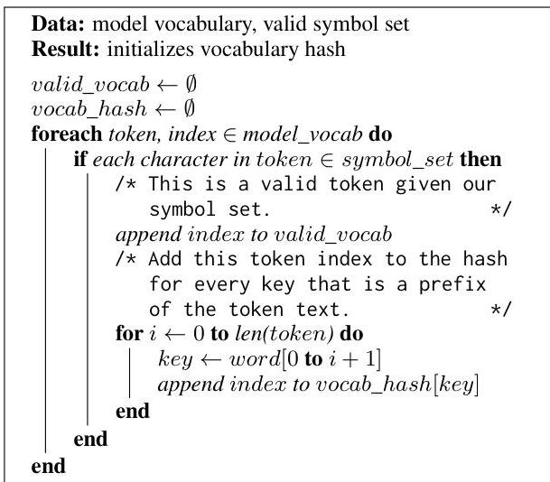
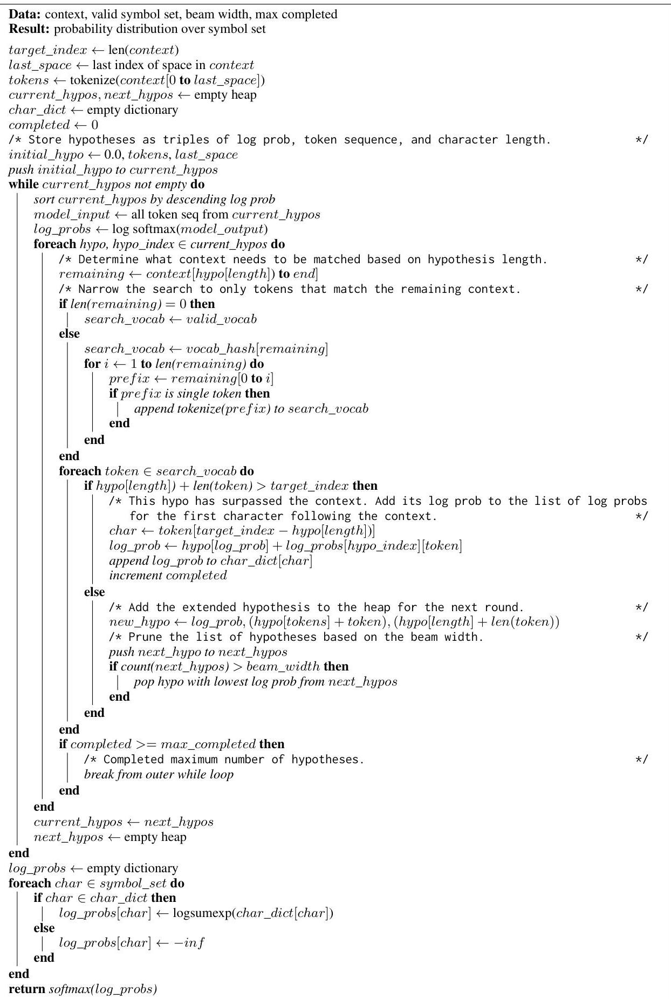

<!-- Source PDF: gaines-2025-llm-aac.pdf -->

# Adapting Large Language Models for Character-based Augmentative and Alternative Communication

Dylan Gaines^{1,2} and Keith Vertanen^{1}
^{1}Department of Computer Science, Michigan Technological University, Houghton, MI, USA
^{2}Department of Computer Science, Kennesaw State University, Marietta, GA, USA
dgaine20@kennesaw.edu, vertanen@mtu.edu

###### Abstract

Users of Augmentative and Alternative Communication (AAC) may write letter-by-letter via an interface that uses a character language model. However, most state-of-the-art large pretrained language models predict subword tokens of variable length. We investigate how to practically use such models to make accurate and efficient character predictions. Our algorithm for producing character predictions from a subword large language model (LLM) provides more accurate predictions than using a classification layer, a byte-level LLM, or an n-gram model. Additionally, we investigate a domain adaptation procedure based on a large dataset of sentences we curated based on scoring how useful each sentence might be for spoken or written AAC communication. We find our procedure further improves model performance on simple, conversational text.

## 1 Introduction

Augmentative and Alternative Communication (AAC) devices allow non-speaking individuals to communicate in face-to-face conversations and asynchronously via messaging systems such as email. Depending on their disability, AAC users may be unable to use a conventional computer keyboard and may instead rely on alternative input methods such as eye tracking or triggering a single switch (e.g. by twitching a muscle or puffing air). Unfortunately, such input methods can make writing slow and tiring. The writing speed of non-speaking AAC users varies, but is frequently less than 10 words per minute (WPM), with an average closer to 5 WPM *(Polacek et al., 2017)*.

While some AAC users may engage in long conversations, communications are often shorter and more isolated in nature due to the input rate limitation. AAC users with severe motor impairments may write letter-by-letter using an interface such as Dasher *(Ward and MacKay, 2002)*, the RSVP Keyboard *(Orhan et al., 2012)*, or Nomon *(Broderick and MacKay, 2009)*. These AAC interfaces all require the probability distribution over the next character based on a user’s previous text.

We wanted to know if recent advances in pretrained large language models (LLMs) really help with the “simple” case of predicting the next letter in a sentence with only that sentence as context. Numerous papers have shown that ever-larger models such as Llama 3 *(Grattafiori et al., 2024)*, Mistral 7B *(Jiang et al., 2023)*, and GPT-4 *(OpenAI et al., 2024)* provide gains on more “complex” natural language processing tasks such as question answering, sentiment analysis, and machine translation.

Many large transformer models do not operate on a character level. Rather, they use a fixed vocabulary of subword tokens when making their predictions. These subword tokens can range anywhere from a single character to a full word in length. These tokens are learned during the training process and stem from frequently seen sequences of characters. As we detail later, this subword tokenization makes it difficult to obtain single character predictions from many LLMs.

In this work we make four contributions: (1) an algorithm that produces a probability distribution over single characters from a subword token language model, (2) offline, novel test sets of AAC-like text that can be used to evaluate LLMs without fear of their inclusion in the models’ training data, (3) a classification of existing large (87 B words) training corpora based on their similarity to AAC-like text, and (4) an empirical evaluation and comparison of different methodologies for obtaining single-character predictions using LLMs.

We have released our algorithm’s source code, our classified data sets, our classification model, and our best language models as part of this work.

This paper is structured as follows: first, we motivate why character predictions are important for AAC text entry (Section 2) and describe our algorithm for making such predictions using a subword tokenized LLM (Section 3). Next, we find the best starting model, testing performance on a private collection of AAC-like text (Section 4). We then explore adapting the LLM using small in-domain sets and using text classified from much larger out-of-domain sets (Section 5). Next, we compare our search algorithm against other possible approaches (Section 6). Finally, we show our results on five test sets (Section 7) before wrapping up with discussion (Section 8) and conclusions (Section 9).

## 2 Related work

### 2.1 Language modeling for AAC

Language models have often been studied in AAC in hopes of improving communication speed. Work has focused on four main topics: word completions and predictions, sentence and phrase retrieval, abbreviation expansion, and domain adaptation.

Word completions attempt to predict a user’s intended current word before they finish typing it, while word predictions attempt to predict subsequent words based on the likelihood of each word in the context of the user’s sentence. Prior work by *Kristensson and Müllners (2021)* showed that word predictions can increase or decrease a user’s entry rate depending on how and when predictions are displayed and the user’s typing strategy. *Yusufali et al. (2023, 2024)* used LLMs to generate word predictions for AAC devices and showed entry rates up to 30.4 WPM.

Sentence and phrase retrieval. Retrieval techniques allow users to store sentences or phrases that they frequently use *Todman et al. (2008)*. These messages can then be retrieved by the user by entering specific keywords *Langer and Hickey (1998)* or matching context tags *Kristensson et al. (2020)*. The drawback to retrieval is utterances must be prestored by the user in their device, so they are not as adaptable to different conversational situations.

Abbreviation expansion. Recent advances in LLMs have allowed the development of more dynamic abbreviation expansion interfaces. *Cai et al. (2022, 2023)* developed a system where users abbreviate each word to its first letter. The system leverages the context of the utterance and an LLM to decode the intended text. KWickChat *Shen et al. (2022)* allows the user to enter a few keywords and uses an LLM to generate expanded utterances based on the provided keywords, some contextual details about the user, and the dialogue from their conversational partner. *Valencia et al. (2023)* also developed an abbreviation expansion system that expands single words into complete sentences using conversational context and background information about the user.

Domain adaptation. The type of text an AAC user may want to write can differ from typical sources of language model training data (e.g. text from web pages). *Vertanen and Kristensson (2011)* used a collection of crowdsourced fictional AAC messages to filter sentences from large social media datasets using cross-entropy difference *Moore and Lewis (2010)*. Their optimized n-gram language models improved perplexity and potential keystroke savings on AAC-like test sets. *Adhikary et al. (2021)* used the same crowdsourced collection to select sentences from text scraped from the web. They found using a BERT-based classifier to select sentences slightly outperformed selection via cross-entropy difference.

### 2.2 Applications for character predictions

While word and phrase-based language modeling approaches can help accelerate input with many AAC devices, some devices rely primarily on character-at-a-time input. In these systems, it may take several user interactions to input a single character due to a user’s noisy input signal. Character predictions from a language model can help accelerate input of individual characters in such systems.

Brain-computer interfaces. P300 spellers *Farwell and Donchin (1988)* present visual stimuli to users and measure their response using EEG electrodes. For example, the RSVP Keyboard *Orhan et al. (2012)* displays a rapid series of characters to users. Using RSVP, it can take several series worth of EEG responses to infer a user’s desired character. RSVP uses a character n-gram language model in combination with the EEG evidence to reduce the number of series needed. We hypothesize an LLM will provide more accurate probabilities and reduce the number of series needed.

Nomon. Nomon *Broderick and MacKay (2009); Bonaker et al. (2022b, a)* allows users to select words or characters by activating a switch when the rotating clock corresponding to their target reaches noon. It can take several clicks to make a single selection since the system needs to differentiate between similar clocks. Since Nomon provides

both word and character selection options, it needs a language model that can evaluate the likelihood of each possibility to help accelerate writing.

Dasher. Dasher *Ward and MacKay (2002)* inherently relies on character-level language model predictions. In Dasher, the letters of the alphabet are displayed vertically on the right side of the interface. To enter text, users move their cursor through the sequence of nested letter boxes corresponding to their desired text. Dasher can be controlled by various devices such an eye-tracker, mouse, or touchscreen. As users progress through their text, more likely letter options are displayed as larger targets, making it easier to select them.

Dasher uses the prediction by partial match (PPM) algorithm *Cleary and Witten (1984)*. PPM is similar to an n-gram model but has a data structure making it easy to continually adapt to a user’s writing. We hope to improve on this using LLMs. However, a key challenge is generating predictions quickly enough to support Dasher’s visualization of the many possible future character sequences.

## 3 Character prediction algorithm

As we discussed previously, many modern large transformer models use subword tokens instead of single characters or full words. The first step in using a subword token language model is to convert the context into a sequence of tokens via tokenization. Each model comes with its own tokenizer, which uses a greedy algorithm, such as byte pair encoding *Sennrich et al. (2016)*, to segment any given text into tokens in its model’s vocabulary.

This subword tokenization complicates the process of obtaining a distribution of character probabilities since adding another character to the end of a section of text could (1) begin a new token containing only the new character, (2) extend the existing most recent token with the new character, or (3) rearrange the optimal tokenization of the most recent word. For the last case, take for example writing the word “yesterday”. If the user has written “yeste” thus far, the most likely tokenization may be into “y-este” (where - denotes token boundaries). Adding an “r” could result in the most likely tokenization changing to “yes-ter”.

To properly consider each of these possibilities, we must remove one or more tokens from the end of the context to allow the model the option of extending it, as opposed to only adding a new token. Removing more tokens allows the model more flexibility to rearrange the optimal tokenization and in our experience leads to better predictions, but at the cost of a higher prediction time. In this work, we remove all tokens in the current in-progress word to allow maximal flexibility in tokenizing the partial word. Going further back would provide no benefit because, in all models we used, the space character only appears at the start of tokens and thus tokens cannot span word boundaries.

We then ask the model to estimate the likelihood of the next token and evaluate any token that matches our context. For efficiency, we only track a certain number of hypotheses at a time, known as the beam width. We continue expanding each hypothesis until it has regenerated the removed context tokens plus at least one character. We then store the likelihood for each final prediction in a list based on the character that directly follows the context. We continue this process until there are no more hypotheses to extend, or, for efficiency, the number of completed hypotheses exceeds a max completed parameter. Then we sum the likelihoods stored for each character in our symbol set and normalize to sum to one, arriving at a distribution over our symbol set. See Section C for our pseudocode search algorithm or our supplementary materials for a Python implementation.

To give a concrete example of the benefit of removing tokens from the end of the context, we further examine the “yeste” example. If we do not remove any context, and simply marginalize the probabilities over the first character in each token, the probability of the next letter being R is 0.0047. Using our search algorithm with context removal, this jumps to 0.9999. We suspect this is due to the training process of the model; during training it doesn’t frequently encounter fragmented words and is allowed to tokenize the full word in the most optimal way. By not removing any context, we force the model to infer text with suboptimal tokenizations, causing it to struggle.

## 4 Pretrained model performance

How do pretrained transformer language models perform on AAC-like text? In this section, we focus on LLMs using subword tokenization.

### 4.1 Private AAC-like test data

Unfortunately, actual text from AAC users is difficult to source due to practical, ethical, and privacy reasons. There are a number of datasets that have

been used to approximate AAC communications such as voice banking messages *Costello (2014)*, Switchboard *Godfrey et al. (1992)*, DailyDialog *Li et al. (2017)*, COMM2 *Vertanen (2013)*, and Turk dialogues *Vertanen (2017)*. However, these datasets are available online and may have been used in training the LLMs we want to evaluate.

As we wish to fairly compare performance between different LLMs, as well as between LLMs and an n-gram language model optimized for AAC-like text, we created two private tests sets, one for informal written communications (i.e. similar to mobile messaging), and one for person-to-person communications. We denoted the two distinct genres as written and spoken respectively. We sourced our text from compositions made by workers on Amazon Mechanical Turk in response to various prompts. For details of how we constructed our test sets, including example sentences, see Section A.

We split each genre in half, creating a written dev set (8.6 K words), a written test set (9.0 K words), a spoken dev set (11.3 K words), and a spoken test set (10.8 K words). We use the dev sets for most of our experiments, reserving the test sets for a final evaluation (Section 7). Our final evaluation also uses text written by an AAC user, messages written by people with ALS for voice banking *Costello (2014)*, and responses to common conversational situations *Vertanen (2013)*.

### 4.2 Perplexity experiments

We converted our private test sets to lowercase and removed anything not an English letter, apostrophe, or space. We calculated per-character perplexity (including spaces) on our dev sets without any sentence end token and using the sentence start token appropriate for the model under test.

We used 16-bit floating point inference for the LLMs. We used our search algorithm (Section 3) for LLM predictions. We found a search beam of 8 and a max completed stopping criteria of 32 K provided a perplexity close to the perplexity without pruning while significantly speeding inference.

We compared against a baseline of a 12-gram language model optimized for AAC-like text, denoted AAC n-gram. This model was trained using Witten-Bell smoothing on 21 B characters from Common Crawl, Reddit, movie subtitles, and Twitter. Training sentences were selected via cross-entropy difference selection *Moore and Lewis (2010)* using in-domain models trained on DailyDialog *Li et al. (2017)*, short emails, and AAC-like messages *Vertanen and Kristensson (2011)*.

As shown in Table 1, per-character perplexity decreased with increasing model size, though gains plateaued for the OPT model family *Zhang et al. (2022)* at around 1.3 B parameters. Thus, even given the “easy” nature of our task (i.e. predicting the next character within an isolated sentence), bigger models were often better. While the n-gram model optimized for AAC did better than DistilGPT with a similar number of parameters, larger LLMs eventually outperformed it despite the LLMs not being fine-tuned on AAC-like text.

The OPT models outperformed the GPT-2 models *Radford et al. (2018)* at similar model sizes. We also tested the recent Llama 3 model *Grattafiori et al. (2024)* that was trained on substantially more data than the other models (15 T tokens), but found it did no better than the OPT models.

Determining the cause of the perplexity differences between model families is difficult due to the many differences in the underlying LLM architectures, training data, and training procedures. But given that the performance of n-gram models on AAC-like text have been shown to depend on the training data *Vertanen and Kristensson (2011)*, we conjecture the difference may be due to the amount of well-matched English text versus other types of text (e.g. other natural or programming languages).

Our n-gram model inferences using KenLM *Heafield (2011)* were fast at 0.1 ms per prediction (using a CPU). Despite substantial performance optimization efforts as well as using an NVIDIA A100 GPU for inference, our search algorithm was much slower at 55–120 ms per prediction. In general, larger models took longer. We will investigate other methods for faster inference in Section 6.

## 5 Optimizing language models for AAC

The LLMs in the previous section were all trained on general text from the web. As with previous work on n-gram language models *Vertanen and Kristensson (2011); Adhikary et al. (2021)*, we may be able to improve predictions on AAC-like text by focusing the model on this style of text. We selected the opt-350m model for further refinement as it provided the majority of perplexity gains while being small enough to plausibly be used on an end-user’s device. For privacy and latency reasons,

|   | Params (M) | Perplexity | Time (ms)  |
| --- | --- | --- | --- |
|  AAC n-gram | 70 | 2.55 | 0.1  |
|  distilgpt2 | 82 | 2.71 | 55.0  |
|  gpt2 | 124 | 2.54 | 60.0  |
|  gpt2-medium | 355 | 2.45 | 70.1  |
|  gpt2-xl | 1558 | 2.38 | 91.7  |
|  opt-125m | 125 | 2.39 | 64.3  |
|  opt-350m | 331 | 2.31 | 78.6  |
|  opt-1.3b | 1316 | 2.22 | 77.9  |
|  opt-2.7b | 2652 | 2.21 | 86.8  |
|  opt-6.7b | 6658 | 2.20 | 89.5  |
|  opt-13b | 12853 | 2.23 | 108.8  |
|  Meta-Llama-3.1-8B | 8030 | 2.31 | 119.9  |
|  Meta-Llama-3.2-1B | 1236 | 2.37 | 97.0  |
|  Meta-Llama-3.2-3B | 3213 | 2.33 | 115.0  |

Table 1: Model parameters, per-character perplexity, and prediction time of pretrained LLMs on our dev sets (average of the written and spoken sets).

users may prefer to use a local model.

Our results in Table 1 were on lowercase versions of our test sentences. Our search algorithm sums over all matching following tokens ignoring case. However, we conditioned predictions on all lowercase context. This simulates an AAC interface where the user does not bother to denote case, or when casing is added later in some way. We found we could slightly improve perplexity on our dev sets using opt-350m from 2.31 to 2.30 by upper casing the first letter of the sentence and the words: I, I'm, I'll, I've, and I'd. We found this simple approach performed similar to using the human-supplied case. We use this automatic casing method for the remainder of our experiments.

### 5.1 In-domain datasets

To approximate written AAC, we used sentences from forum posts made by people using a mobile device (Vertanen and Kristensson, 2021). We denote this dataset as Forum. Our rationale for using this dataset was that it contains a rich set of topics while also having a bias towards concise writing.

To approximate spoken AAC, we used the DailyDialog corpus (Li et al., 2017) and the BOLT SMS/Chat corpus (Song et al., 2014). We denote these datasets as Daily and BOLT respectively. Our rationale for choosing these datasets was that while the text was actually written and not spoken, it focuses on person-to-person dialogues. Compared to other datasets based on spoken dialogues such as Switchboard (Godfrey et al., 1992), the text is relatively clean and does not contain spoken speech artifacts. Daily had  $46\mathrm{K}$  sentences  $(356\mathrm{K}$  words),

BOLT had  $271\mathrm{K}$  sentences (1.9 M words), and Forum had  $888\mathrm{K}$  sentences (10.1 M words).

### 5.2 Large datasets

We selected two large corpora to mine data from: the Colossal Clean Crawled Corpus (Raffel et al., 2020) (ODC-By License) and the OpenSubtitles2016 movie subtitle corpus (Lison and Tiedemann, 2016) (License unknown). We denote these datasets as  $C4$  and Subtitle respectively. This selection was guided by results $^{4}$  showing that out of 14 possible training sources, these two corpora performed the best on modeling AAC-like text. Further, we think C4 provides text that well-approximates a written style of communication while Subtitle represents a more spoken style.

We filtered C4 and Subtitle to sentences that started with a capital letter, had both uppercase and lowercase characters, and ended with sentence end punctuation. We dropped sentences where more than  $20\%$  of the words were out-of-vocabulary with respect to a list of  $860\mathrm{K}$  words obtained from human-edited dictionaries. Throughout this work, we trained and tested on isolated sentences. We removed repeated identical sentences in Subtitle. We reserved  $5\%$  of the data as a dev set and  $5\%$  as a test set. After filtering, our C4 training set had  $87.5\mathrm{B}$  words and Subtitle had  $528\mathrm{M}$  words.

### 5.3 Sentence classification

Similar to past work (Vertanen and Kristensson, 2011; Adhikary et al., 2021), we wanted to focus our models on sentences similar in style to the text AAC users may want to write. We did this by training a three-way classifier on top of DeBERTaV3 (He et al., 2021). For the out-of-domain class, we used a newswire corpus (Chelba et al., 2013) which we denote as News. For the written in-domain class, we used Forum. For the spoken in-domain class, we used a combination of Daily and BOLT.

Daily was the smallest with  $46\mathrm{K}$  sentences. We used NLPAug (Ma, 2019) to add  $232\mathrm{K}$  sentences, changing one or two words (selected at random) in the original sentences. Words were changed using a distilled version of RoBERTa (Liu et al., 2019). This brought Daily to the same size ( $279\mathrm{K}$  sentences) as BOLT. We took the first  $558\mathrm{K}$  sentences from Forum and News to create an equal amount of data for each of our three classes (in-domain written, in-domain spoken, and out-of-domain). Dur

ing classification, we lowercased sentences and removed characters aside from A-Z, apostrophe, and space. We optimized hyperparameters as described in Section B.1. We used early stopping during training. Our final model had a classification accuracy of  $85.7\%$  on unseen sentences.

### 5.4 Domain adaptation procedure

We scored each sentence in C4 and Subtitle using our classifier. To adapt the opt-350m LLM, we selected sentences with a written or spoken probability that met a threshold. To efficiently determine which threshold to use, we trained 12-gram models from scratch across a broad range of thresholds and found we obtained the majority of perplexity gains with a threshold of 0.90 for C4 and 0.75 for Subtitle. Using these thresholds, our adaptation datasets consisted of  $4.0\mathrm{B}$  words of C4 and  $130\mathrm{M}$  words of Subtitle. With these thresholds as a starting point, we then trained opt-350m models with a narrower range of thresholds centered on 0.90 for C4 and 0.75 for Subtitle. The results, detailed in Section B.3, confirmed the thresholds we chose.

We first tested fine-tuning all the model's parameters on a combined adaptation set consisting of C4 (threshold 0.90), Subtitle (threshold 0.75), BOLT, and Daily. As shown in Table 2, this reduced the perplexity on our dev sets from 2.30 to 2.19. Next, we explored a curriculum adaptation process consisting of a sequence of separate fine-tuning runs. Each run was on one of our five datasets: C4, Subtitle, Daily, BOLT, or Forum. Before each fine-tuning, we optimized hyperparameters using the model from the previous step.

Given the sizes of our five datasets, we opted to first always fine-tune on C4 followed by Subtitle. We tested all possible orders of further fine-tuning on Daily, BOLT, and Forum. Fine-tuning on Forum did not help in any order, and thus we excluded it from the curriculum. We found fine-tuning on C4, Subtitle, BOLT, and then Daily was the best order, improving perplexity to 2.10. Combining BOLT and Daily in a single final step did slightly better at 2.09. However, simply fine-tuning using the combined BOLT and Daily data did slightly better still at 2.07. While the classified C4 and Subtitle datasets did not prove useful for improving the subword LLM, they will be useful for creating or improving other models (see Section 6).

Additionally, we fine-tuned opt-350m using Low-Rank Adaptation (LoRA) (Hu et al., 2021), which drastically reduces the number of trainable

|  Adaptation data | Fine-tuning |   | Perplexity  |   |   |
| --- | --- | --- | --- | --- | --- |
|   |  type | steps | Written | Spoken | Avg  |
|  — | — | — | 2.41 | 2.19 | 2.30  |
|  C4+Sub+BOLT+Daily | full | 1 | 2.30 | 2.08 | 2.19  |
|  C4→Sub→BOLT→Daily | full | 4 | 2.16 | 2.03 | 2.10  |
|  C4→Sub→BOLT+Daily | full | 3 | 2.14 | 2.03 | 2.09  |
|  BOLT+Daily | full | 1 | 2.11 | 2.04 | 2.07  |
|  C4→Sub→BOLT+Daily | LoRA | 3 | 2.17 | 2.06 | 2.11  |
|  BOLT+Daily | LoRA | 1 | 2.13 | 2.05 | 2.09  |

Table 2: Perplexity on the two dev sets using various adaptation approaches on opt-350m. Subtitle (denoted Sub) used a 0.75 threshold and C4 used a 0.90 threshold.  $\rightarrow$  denotes separate fine-tuning steps.  $^+$  denotes datasets merged in a single fine-tuning step. Best result in bold.

parameters for downstream tasks. As shown in Table 2 (bottom), LoRA yields slightly higher perplexities compared to full parameter fine-tuning. As such, we continued to use full fine-tuning for the remainder of our experiments.

For additional results and hyperparameter values, see Section B.2. We also explored other ways to try and improve adaptation. For details of things that did not work, see Section B.3.

## 6 Other prediction approaches

With opt-350m, our search algorithm (Section 3) takes on average  $79\mathrm{ms}$  to predict the next character on an A100 GPU. While this may be fast enough for many purposes, interfaces such as Dasher (Ward and MacKay, 2002) or less capable devices may require more efficient prediction. We explored several other methods for obtaining faster predictions.

### 6.1 N-gram model

Inference with an n-gram model was very fast at  $0.1\mathrm{ms}$  (Table 1). To serve as a baseline, and to provide an open training data n-gram model, we created a character 12-gram n-gram mixture model from C4 (threshold 0.90) and Subtitle (threshold 0.75) using SRILM (Stolcke, 2002). We created separate C4 and Subtitle language models using Witten-Bell smoothing and no count cutoffs. We built a mixture model using linear interpolation with weights optimized to minimize perplexity on dev sentences from Forum, BOLT, and Daily. The mixture weights were 0.84 (C4) and 0.16 (Subtitle).

The unpruned mixture model (denoted  $C4 + Sub$  n-gram full) was large with 5 B parameters and a compressed size of 30 GB. We used entropy pruning (Stolcke, 1998) to reduce the model to 71 M

parameters and a compressed size of 488 MB (denoted C4+Sub n-gram). This was similar in size to the AAC n-gram we previously compared with (Table 1). On our dev sets, our full and pruned models had perplexities of 2.53 and 2.60 respectively. Our pruned model’s perplexity was somewhat higher than the 2.55 of the existing AAC n-gram model.

### 6.2 Byte model

The multilingual encoder-decoder ByT5 model *Xue et al. (2022)* eschewed the use of subword tokenization and instead used a token set based on individual characters. ByGPT5 *Belouadi and Eger (2023)* is a decoder-only version of ByT5 that can make character predictions directly.

The average perplexity on our dev sets of the base ByGPT5 model (289 M parameters) was 2.85. We compared our two best adaptation methods we previously found on opt-350m (Section 5.4) using ByGPT5. First, we used a three step curriculum approach: adapting on C4, then on Subtitle, and finally on BOLT combined with Daily. This model had a perplexity of 2.14.

Second, we fine-tuned the base model in a single-step on BOLT combined with Daily. This results in a higher perplexity of 2.27. We suspect due to the multilingual nature of the base model, first fine-tuning on C4 and Subtitle helped move the model towards English. For results and hyperparameter values at each phase of the fine-tuning, see Section B.4.

### 6.3 Classification

We also explored making character predictions by adding a classification layer to the LLM. Instead of using the model to generate the ensuing text from some context, we asked it to produce a distribution over labels – each label represented a character. We built the model on top of the best domain-adapted opt-350m model from Section 5.4. This retained the model’s domain knowledge and focused additional training on the classification task.

To create training examples, we selected a random location within each sentence. We truncated the sentence at that point and used the character that would come next as the label. If the next character was not in our symbol set (A–Z, a–z, space, and apostrophe), we chose another random location. We utilized the same three step curriculum approach as the byte model; we first trained on C4, then Subtitle, and finally on BOLT combined with Daily. For the smaller BOLT and Daily sets, we added a hyperparameter for the number training examples generated per sentence. During training, we updated the classification layer as well as all other model parameters.

The classifier model did not perform as well as we had hoped, achieving a perplexity of 2.47. By comparison, training with BOLT and then Daily in separate steps yielded a slightly higher perplexity of 2.54. Training on just BOLT and Daily performed worse at 2.60. See Section B.5 for additional results and hyperparameter values.

## 7 Final evaluation

At this point, we have extensively used our private dev sets to guide our process. We conducted a final evaluation with our unseen private test sets and three additional test sets. Firstly, we created a test set based on the text of an AAC user. This set consisted of 3.6 K sentences (65 K words) written by a user of Dasher *Ward and MacKay (2002)*. The text was from public and private presentations given by the user. We also added two public test sets: voice banked messages of people with ALS *Costello (2014)*, and the COMM2 set of responses to conversational situations *Vertanen (2013)*.

As shown in Table 3 (top), our C4+Sub n-gram model performed slightly worse with an average test set perplexity of 2.58 compared to the AAC n-gram model which averaged 2.54. Our unpruned full model did slightly better at 2.53. All n-gram models were outperformed by the LLMs, both with and without domain adaptation.

As shown in Table 3 (middle), using the search algorithm with opt-350m adapted in a single step on the combination of BOLT and Daily performed the best on two of the five test sets and the overall average. It tied with the four-step curriculum on the COMM2 set (2.01). The base opt-350m yielded the lowest perplexity on the test set from the AAC user (2.24), though the curriculum adapted opt-350m models were not far behind (2.28–2.30).

Averaging the perplexity across all models, there was a noticeable increase in perplexity between our written (2.35) and spoken (2.24) test sets and the presentations given by the AAC user (2.59). The public test sets also produced lower average perplexities (2.28 for ALS bank and 2.21 for COMM2). While we hoped our data selection approach using diverse text from mobile forum messages would allow our adapted models to perform well on both simple everyday communications and

|  Language model | Domain adaptation | Character prediction | Written (ppl) | Spoken (ppl) | AAC user (ppl) | ALS bank (ppl) | COMM2 (ppl) | Average (ppl) | Time (ms)  |
| --- | --- | --- | --- | --- | --- | --- | --- | --- | --- |
|  AAC n-gram | - | KenLM | 2.56 | 2.51 | 2.89 | 2.33 | 2.41 | 2.54 | 0.1  |
|  C4+Sub n-gram | - | KenLM | 2.62 | 2.54 | 2.86 | 2.43 | 2.45 | 2.58 | 0.1  |
|  C4+Sub n-gram full | - | KenLM | 2.57 | 2.47 | 2.82 | 2.38 | 2.40 | 2.53 | 0.1  |
|  opt-350m | - | search alg. | 2.40 | 2.15 | 2.24 | 2.39 | 2.20 | 2.28 | 79.1  |
|  opt-350m | C4+Sub+BOLT+Daily | search alg. | 2.14 | 2.00 | 2.29 | 2.14 | 2.01 | 2.12 | 78.9  |
|  opt-350m | C4+Sub+BOLT+Daily | search alg. | 2.12 | 2.00 | 2.30 | 2.14 | 2.02 | 2.12 | 78.2  |
|  opt-350m | BOLT+Daily | search alg. | 2.10 | 2.01 | 2.28 | 2.13 | 2.01 | 2.11 | 78.0  |
|  ByGPT5 | C4+Sub+BOLT+Daily | directly | 2.20 | 2.04 | 2.57 | 2.18 | 2.06 | 2.21 | 11.6  |
|  opt-350m | C4+Sub+BOLT+Daily | classifier | 2.42 | 2.42 | 3.03 | 2.38 | 2.36 | 2.52 | 14.6  |

Table 3: Final evaluation of our various language models and methods for predicting the next character.  $\rightarrow$  denotes separate fine-tuning steps.  $^+$  denotes datasets merged in a single fine-tuning step. Inference times are the average of per-character inferences over the test sets. The best result in each column is shown in bold.

|  Language model | Domain adaptation | Written | Spoken | AAC user | ALS bank | COMM2 | Average  |
| --- | --- | --- | --- | --- | --- | --- | --- |
|  AAC n-gram | - | 59.7% | 60.0% | 55.3% | 62.2% | 61.0% | 59.7%  |
|  C4+Sub n-gram | - | 59.2% | 59.9% | 56.4% | 61.1% | 61.2% | 59.6%  |
|  C4+Sub n-gram full | - | 60.1% | 61.4% | 57.4% | 61.8% | 62.0% | 60.5%  |
|  opt-350m | - | 61.7% | 65.1% | 63.1% | 61.9% | 64.2% | 63.2%  |
|  opt-350m | C4+Sub+BOLT+Daily | 64.6% | 67.1% | 62.5% | 64.5% | 66.4% | 65.0%  |
|  opt-350m | C4+Sub+BOLT+Daily | 64.9% | 67.0% | 62.3% | 64.4% | 66.3% | 65.0%  |
|  opt-350m | BOLT+Daily | 65.2% | 67.2% | 62.7% | 64.7% | 66.3% | 65.2%  |
|  ByGPT5 | C4+Sub+BOLT+Daily | 64.3% | 66.8% | 61.6% | 63.7% | 65.9% | 64.5%  |

Table 4: Keystroke savings for language models using an onscreen predictive keyboard with five word predictions. The best result in each column is shown in bold.

more complex planned written communications, at least for this one user, this did not work. As a measure of text complexity, we calculated the number of characters per sentence. The AAC user's sentences were on average 94.4 characters per sentence compared to the much shorter sentences in the written (31.4) and spoken (39.9) test sets.

Of the LLM approaches, the byte LLM provided the fastest predictions at around  $12\mathrm{ms}$ . This was 6.8 times faster than our search algorithm and 1.3 times faster than using a classification layer.

To demonstrate the potential impact in a real-world AAC interface, we simulated using each language model in a onscreen keyboard with five word predictions. We simulated the keystrokes a hypothetical perfect user would save compared to typing every character. Keystroke savings is calculated as:

$$
\frac {k _ {a} - k _ {p}}{k _ {a}} \times 100\% ,
$$

where  $k_{a}$  is the number of keystrokes required without word predictions and  $k_{p}$  is the number of keystrokes required with predictions. Higher keystroke savings is better.

The keyboard was allowed to make up to five word predictions. Predictions were made before

any characters were typed for the next target word as well as during each subsequent prefix of the target word. The simulated user made no typing errors. We did not filter the offered word predictions based on whether the user did not choose a given prediction for a shorter prefix for the current target. If the target word appeared in the predictions, we assumed one key press selected the target word and added any following space.

As shown in Table 4, keystroke savings improvements followed the perplexity gains (Table 3). Compared to the AAC n-gram, across the test sets our best LLM provided a  $5.5\%$  absolute increase in keystroke savings. To contextualize this, imagine someone is using an eye-tracker and an onscreen keyboard with a dwell time of one second. Assuming they make no errors and incur no other overheads, writing the average length sentence in our spoken test set would take about 40 seconds without word predictions. Making optimal use of predictions provided by the AAC n-gram would take about 16.0 seconds. Using our best model (opt-350m adapted on BOLT+Daily), the user would take about 13.1 seconds,  $18\%$  faster than using the n-gram model for predictions.

8 Discussion

Most of our trained models had higher perplexities on the AAC test set than on any of the other test sets. The only exception was the base opt-350m model, which performed worst on the written test set. We believe this stems from the nature of the test sets. The written and spoken sets were created by crowdsourced workers writing about topics such as the weather or travel. As described in Section A.4, workers were instructed to invent questions or statements they might include in a conversation with another person. The ALS bank and COMM2 sets contain text of a similar nature. This aligns closely with the in-domain conversational datasets we used in our adaptation process.

The AAC test set was derived from prepared presentations by an AAC user with ALS discussing their life experiences. It covers more complex topics and uses more advanced language. Presentations are also not conversational in nature, which is why we believe our curriculum adaptation process was not effective at improving the model’s performance on the AAC test set. We also note that AAC users are diverse in nature and our domain adaptation may be advantageous to other users or even to this user in other communication situations. It may also be advantageous to consider adapting the language model more directly to a particular user in lieu of, or in addition to, domain adaptation.

We obtained the lowest perplexities using a subword tokenized LLM and our search algorithm. While we investigated a multi-step curriculum to adapt the opt-350m model using sentences classified from large out-of-domain datasets, a simple fine-tuning using in-domain datasets worked better. The main drawback of the search algorithm is its inference time. If faster predictions are required for a particular interface or device, a byte or classification model may be preferred. However, currently subword LLMs are much more popular than byte LLMs. Further, the search approach can be used directly on an LLM without task-specific training.

Adding a classification layer to the domain-adapted opt-350m model performed worse than any of the other LLM-based approaches, including the base opt-350m model before domain adaptation. We have a few theories as to why this may have been the case. Our classification training examples chose a random location in each sentence, so many of the sentences included in these further training steps were likely fragmented, which may have affected earlier layers in the model. To investigate this theory, we could freeze the lower model layers during the classification training. This might help to preserve the domain adaptation and prior model while also tuning the new classification layer.

It is also possible that the subword nature of the model prevented it from fully learning the character classification task. As discussed in Section 3, adding a new character can rearrange a word’s optimal tokenization. Because the model was originally trained to predict the next token in a sequence, it may not have considered all the different possible tokenizations as our search algorithm does.

## 9 Conclusions

We investigated how to leverage large transformer language models to aid non-speaking individuals using Augmentative and Alternative Communication (AAC) devices. In particular, we focused on how to generate the character predictions needed by interfaces where users write one letter-at-a-time. We presented an algorithm for obtaining character probabilities from LLMs using subword tokenization, and compared our algorithm to using a byte-level LLM or adding a classification layer on top of a subword LLM. We detail how we classified sentences in large corpora of web and movies subtitles text based on how similar sentences were to written and spoken communications. We investigated a multi-step fine-tuning process using our scored sentences as well as our smaller in-domain corpora to adapt LLMs to our target domain.

We found that we were able to produce the lowest per-character perplexities using our search algorithm with the subword opt-350m model. We found that our domain adaptation curriculum was effective at improving the model performance for simple, conversational text, but did not improve performance for more complex prepared presentations from a single AAC user. Though it offered the best perplexity, our subword to character algorithm took almost seven times longer to produce character predictions than a native byte-level LLM.

To aid future research, we have made our unique datasets and models available. This includes the model for classifying sentences as written or spoken, scored C4 and Subtitle sentences, n-gram models trained on the classified sentences, fine-tuned opt-350m model, fine-tuned ByGPT5 model, and letter classification model.

Limitations

The ultimate goal of this work was to adapt large language models for use in AAC devices. With that goal in mind, it is a limitation that we did not have training data from actual AAC users. As we discussed in Section 4.1, such data is difficult to come by, so the datasets we created and used in this work aimed to approximate AAC-like text. While we think our models can provide an improved initial experience for AAC text entry interfaces, we think much more substantial improvements are likely possible if models are adapted using the actual text of a given user. Doing this in a practical and privacy-preserving way will need further research.

The experiments we conducted as part of this research consisted solely of the offline evaluation of our models with fixed datasets. While the perplexity values and keystroke savings we report are generally considered to be indicative of a model’s performance, they may not show the full extent of the impact on an actual user entering text. Text input is a complex task, especially when performed through an AAC device. Further research and user evaluation is required to fully understand the benefit or detriment of our tuned language models on the text entry performance of AAC users.

Some recent work has explored freezing model layers that have relatively low training loss in order to focus fine-tuning on improving underperforming layers *Yusufali et al. (2024)*. This was not a technique that we were able to explore in the scope of this work. However, we may have been able to improve the performance of the classification model by freezing the lower model layers that were already domain adapted and focusing the additional training on the classification layer specifically.

We only tested our search algorithm with a few model architectures. Of particular concern is our handling of token removal. Because the tokenizer used by the models in this work includes a space at the beginning of many of its tokens, our algorithm removes the end of the context up to and including the last space. Other models may have tokenizers that handle space differently. Our algorithm may need adjustment to work with such models.

The main advantage of our search algorithm compared to the byte model is that it works out of the box with the most common LLMs which use subword tokenization. However, the main disadvantage is obtaining the distribution over the next character takes substantially longer. The search itself in many cases needs to make several inferences on the GPU so we can expect it to take several times as long as a byte LLM or classification head-based approach which can make the character prediction in a single inference. During the development of our search algorithm, we conducted multiple rounds of performance optimization. We introduced various changes to the algorithm that, in the end, resulted in performance that was several orders of magnitude faster than our initial prototype. However, it is possible additional efforts could further improve performance.

Currently, our search algorithm is optimized for inference on a GPU and not a CPU. This could limit the AAC devices our algorithm can practically be deployed on. However, for many AAC interfaces, such as those based on switch or brain input, waiting a tenth of a second for a prediction is likely acceptable and would not unduly impact user experience.

We primarily focused on fine-tuning approaches to domain adaptation and the task of classifying the next character. In-context learning (ICL) has emerged in recent years as an alternative for fine-tuning *Dong et al. (2024)*. With in-context learning, a few examples of the task or domain are provided to the language model along with the query. The model takes the examples into account when producing its response, instead of requiring a separate training procedure. While ICL has shown promise, such emergent abilities may require large model sizes *Wei et al. (2022)*. For privacy reasons, our focus here was on modest sized models that could be plausibly used and fine-tuned on an end user’s device. We were not able to explore the feasibility of ICL using modest sized models in the scope of this paper, and leave this as future work.

## Ethical considerations

Our fine-tuning process presented in this work relied heavily upon the Forum *Vertanen and Kristensson (2021)*, BOLT *Song et al. (2014)*, and DailyDialog *Li et al. (2017)* datasets. While we did introduce the additional larger datasets C4 *Raffel et al. (2020)* and Subtitle *Lison and Tiedemann (2016)*, we filtered those sets to sentences that were similar to our in-domain sets. This achieved our intended result of improving the performance of our character prediction models. However, any biases present in Forum, BOLT, and Daily may also be reflected in the text selected from C4 and Subtitle.

This could lead to predictions made by text entry interfaces relying on our models to skew towards those biases.

When developing AAC interfaces that leverage language models to accelerate user input, it is crucial to support user autonomy, i.e. allowing users to express exactly what they want and not just what is probable under a language model. We developed our models to assist users in entering text based on the text that is most likely. However, there may be cases where users wish to enter text that is not likely, or that the model has not seen before. We encourage anyone who uses our models to design their interfaces such that users can control to what degree, if any, the language model contributes to the produced text.

## Acknowledgments

We thank the AAC user who provided their text for use in our final evaluation. We thank Soufia Bahmani for her work on the subword LLM word prediction algorithm used in Table 4. This work was funded by the National Institutes of Health / National Institute on Deafness and Other Communication Disorders (R01DC009834) and by the National Science Foundation (IIS-1750193 and IIS-2402876). Any opinions presented in this work are those of the authors and do not reflect the opinions of our funding agencies.

## References

- Adhikary et al. (2021) Jiban Adhikary, Jamie Berger, and Keith Vertanen. 2021. Accelerating Text Communication via Abbreviated Sentence Input. In *Proceedings of the Joint Conference of the 59th Annual Meeting of the Association for Computational Linguistics and the 11th International Joint Conference on Natural Language Processing*, pages 6574–6588.
- Akiba et al. (2019) Takuya Akiba, Shotaro Sano, Toshihiko Yanase, Takeru Ohta, and Masanori Koyama. 2019. Optuna: A next-generation hyperparameter optimization framework. In *Proceedings of the 25th ACM SIGKDD International Conference on Knowledge Discovery and Data Mining*.
- Belouadi and Eger (2023) Jonas Belouadi and Steffen Eger. 2023. Bygpt5: End-to-end style-conditioned poetry generation with token-free language models. In *Proceedings of the 61st Annual Meeting of the Association for Computational Linguistics (Volume 1: Long Papers)*, page 7364–7381. Association for Computational Linguistics.
- Bonaker et al. (2022a) Nicholas Bonaker, Emli-Mari Nel, Keith Vertanen, and Tamara Broderick. 2022a. Demonstrating nomon: A flexible interface for noisy single-switch users. In *Extended Abstracts of the 2022 CHI Conference on Human Factors in Computing Systems*, CHI EA ’22, page 1–4, New York, NY, USA. Association for Computing Machinery.
- Ryan Bonaker et al. (2022b) Nicholas Ryan Bonaker, Emli-Mari Nel, Keith Vertanen, and Tamara Broderick. 2022b. A performance evaluation of nomon: A flexible interface for noisy single-switch users. In *CHI Conference on Human Factors in Computing Systems*, CHI ’22, New York, NY, USA. Association for Computing Machinery.
- Broderick and MacKay (2009) Tamara Broderick and David J. C. MacKay. 2009. Fast and flexible selection with a single switch. *PLoS ONE*, 4(10):e7481.
- Cai et al. (2023) Shanqing Cai, Subhashini Venugopalan, Katie Seaver, Xiang Xiao, Katrin Tomanek, Sri Jalasutram, Meredith Ringel Morris, Shaun Kane, Ajit Narayanan, Robert L. MacDonald, Emily Kornman, Daniel Vance, Blair Casey, Steve M. Gleason, Philip Q. Nelson, and Michael P. Brenner. 2023. Using large language models to accelerate communication for users with severe motor impairments. *axXiv preprint arXiv:2312.01532*.
- Cai et al. (2013) Shanqing Cai, Subhashini Venugopalan, Katrin Tomanek, Ajit Narayanan, Meredith Morris, and Michael Brenner. 2022. Context-aware abbreviation expansion using large language models. In *Proceedings of the 2022 Conference of the North American Chapter of the Association for Computational Linguistics: Human Language Technologies*, page 1261–1275, Seattle, United States. Association for Computational Linguistics.
- Chelba et al. (2013) Ciprian Chelba, Tomáš Mikolov, Mike Schuster, Qi Ge, Thorsten Brants, Phillipp Koehn, and Tony Robinson. 2013. One billion word benchmark for measuring progress in statistical language modeling. *arXiv preprint arXiv:1312.3005*.
- Cleary and Witten (1984) J. Cleary and I. Witten. 1984. Data compression using adaptive coding and partial string matching. *IEEE Transactions on Communications*, 32(4):396–402.
- Costello (2014) John M Costello. 2014. Message banking, voice banking and legacy messages. *Boston Children’s Hospital, Boston, MA*.
- Dong et al. (2024) Qingxiu Dong, Lei Li, Damai Dai, Ce Zheng, Jingyuan Ma, Rui Li, Heming Xia, Jingjing Xu, Zhiyong Wu, Tianyu Liu, Baobao Chang, Xu Sun, Lei Li, and Zhifang Sui. 2024. A survey on in-context learning.
- Farwell and Donchin (1988) L.A. Farwell and E. Donchin. 1988. Talking off the top of your head: toward a mental prosthesis utilizing event-related brain potentials. *Electroencephalography and clinical neurophysiology*, 70(6):510–523.
- Godfrey et al. (1992) J.J. Godfrey, E.C. Holliman, and J. McDaniel. 1992. SWITCHBOARD: Telephone speech corpus for research and development. *Proceedings of the IEEE Conference on Acoustics, Speech, and Signal Processing*, pages 517–520.
-

Aaron Grattafiori, Abhimanyu Dubey, Abhinav Jauhri, and Abhinav Pandey et al. 2024. The Llama 3 herd of models.
- [Pengcheng He, Jianfeng Gao, and Weizhu Chen. 2021. Debertav3: Improving deberta using electra-style pre-training with gradient-disentangled embedding sharing.
- [Kenneth Heafield. 2011. KenLM: faster and smaller language model queries. In Proceedings of the EMNLP 2011 Sixth Workshop on Statistical Machine Translation, pages 187–197, Edinburgh, Scotland, United Kingdom.
- [Edward J. Hu, Yelong Shen, Phillip Wallis, Zeyuan Allen-Zhu, Yuanzhi Li, Shean Wang, Lu Wang, and Weizhu Chen. 2021. Lora: Low-rank adaptation of large language models. arXiv preprint arXiv:2106.09685. ArXiv:2106.09685 [cs].
- [Shengding Hu, Yuge Tu, Xu Han, Chaoqun He, Ganqu Cui, Xiang Long, Zhi Zheng, Yewei Fang, Yuxiang Huang, Weilin Zhao, et al. 2024. Minicpm: Unveiling the potential of small language models with scalable training strategies. arXiv preprint arXiv:2404.06395.
- [Albert Q. Jiang, Alexandre Sablayrolles, Arthur Mensch, Chris Bamford, Devendra Singh Chaplot, Diego de las Casas, Florian Bressand, Gianna Lengyel, Guillaume Lample, Lucile Saulnier, Lélio Renard Lavaud, Marie-Anne Lachaux, Pierre Stock, Teven Le Scao, Thibaut Lavril, Thomas Wang, Timothée Lacroix, and William El Sayed. 2023. Mistral 7b. arXiv preprint arXiv:2310.06825. ArXiv:2310.06825 [cs].
- [Per Ola Kristensson, James Lilley, Rolf Black, and Annalu Waller. 2020. A design engineering approach for quantitatively exploring context-aware sentence retrieval for nonspeaking individuals with motor disabilities. In Proceedings of the 2020 CHI Conference on Human Factors in Computing Systems, page 1–11, Honolulu HI USA. ACM.
- [Per Ola Kristensson and Thomas Müllners. 2021. Design and analysis of intelligent text entry systems with function structure models and envelope analysis. In Proceedings of the 2021 CHI Conference on Human Factors in Computing Systems, page 1–12, Yokohama Japan. ACM.
- [Stefan Langer and Marianne Hickey. 1998. Using semantic lexicons for full text message retrieval in a communication aid. Natural Language Engineering, 4(1):41–55.
- [Yanran Li, Hui Su, Xiaoyu Shen, Wenjie Li, Ziqiang Cao, and Shuzi Niu. 2017. DailyDialog: A manually labelled multi-turn dialogue dataset. In Proceedings of The 8th International Joint Conference on Natural Language Processing (IJCNLP 2017).
- [Pierre Lison and Jörg Tiedemann. 2016. OpenSubtitles2016: Extracting large parallel corpora from movie and TV subtitles. In Proceedings of the Tenth International Conference on Language Resources and Evaluation (LREC’16), pages 923–929, Portorož, Slovenia. European Language Resources Association (ELRA).
- [Yinhan Liu, Myle Ott, Naman Goyal, Jingfei Du, Mandar Joshi, Danqi Chen, Omer Levy, Mike Lewis, Luke Zettlemoyer, and Veselin Stoyanov. 2019. Roberta: A robustly optimized bert pretraining approach. arXiv preprint arXiv:1907.11692.
- [Edward Ma. 2019. NLP augmentation. https://github.com/makcedward/nlpaug.
- [Tomáš Mikolov, Armand Joulin, Sumit Chopra, Michael Mathieu, and Marc’Aurelio Ranzato. 2014. Learning longer memory in recurrent neural networks. arXiv preprint arXiv:1412.7753.
- [Robert C. Moore and William Lewis. 2010. Intelligent selection of language model training data. In Proceedings of the ACL 2010 Conference Short Papers, ACLShort ’10, pages 220–224, Stroudsburg, PA, USA. Association for Computational Linguistics.
- [OpenAI, Josh Achiam, Steven Adler, and Sandhini Agarwal et al. 2024. Gpt-4 technical report. arXiv preprint arXiv:2303.08774. ArXiv:2303.08774 [cs].
- [U. Orhan, K. E. Hild, D. Erdogmus, B. Roark, B. Oken, and M. Fried-Oken. 2012. RSVP keyboard: An EEG based typing interface. In 2012 IEEE International Conference on Acoustics, Speech and Signal Processing (ICASSP), pages 645–648.
- [Ondrej Polacek, Adam J. Sporka, and Pavel Slavik. 2017. Text input for motor-impaired people. Universal Access in the Information Society, 16(1):51–72.
- [Alec Radford, Jeffrey Wu, Rewon Child, David Luan, Dario Amodei, and Ilya Sutskever. 2018. Language models are unsupervised multitask learners. OpenAI blog, 1(8):9.
- [Colin Raffel, Noam Shazeer, Adam Roberts, Katherine Lee, Sharan Narang, Michael Matena, Yanqi Zhou, Wei Li, and Peter J. Liu. 2020. Exploring the limits of transfer learning with a unified text-to-text transformer. Journal of Machine Learning Research, 21(140):1–67.
- [Rico Sennrich, Barry Haddow, and Alexandra Birch. 2016. Neural machine translation of rare words with subword units. In Proceedings of the 54th Annual Meeting of the Association for Computational Linguistics (Volume 1: Long Papers), page 1715–1725, Berlin, Germany. Association for Computational Linguistics.
- [Junxiao Shen, Boyin Yang, John J Dudley, and Per Ola Kristensson. 2022. Kwickchat: A multi-turn dialogue system for aac using context-aware sentence generation by bag-of-keywords. In Proceedings of the 27th International Conference on Intelligent User Interfaces, IUI ’22, page 853–867, New York, NY, USA. Association for Computing Machinery.

Zhiyi Song, Stephanie Strassel, Haejoong Lee, Kevin Walker, Jonathan Wright, Jennifer Garland, Dana Fore, Brian Gainor, Preston Cabe, Thomas Thomas, Brendan Callahan, and Ann Sawyer. 2014. Collecting natural SMS and chat conversations in multiple languages: The BOLT phase 2 corpus. In Proceedings of the Ninth International Conference on Language Resources and Evaluation (LREC’14), pages 1699–1704, Reykjavik, Iceland. European Language Resources Association (ELRA).
- Stolcke (2002) A. Stolcke. 2002. SRILM – an extensible language modeling toolkit. In International Conference on Spoken Language Processing, pages 901–904, Denver, CO.
- Andreas Stolcke (1998) Andreas Stolcke. 1998. Entropy-based pruning of back-off language models. In Proceedings of DARPA Broadcast News Transcription and Understanding Workshop.
- John Todman, Norman Alm, Jeff Higginbotham, and Portia File. 2008. Whole utterance approaches in aac. AAC: Augmentative & Alternative Communication, 24(3):235–254.
- Stephanie Valencia, Richard Cave, Krystal Kallarackal, Katie Seaver, Michael Terry, and Shaun K. Kane. 2023. “the less i type, the better”: How ai language models can enhance or impede communication for aac users. In Proceedings of the 2023 CHI Conference on Human Factors in Computing Systems, CHI ’23, page 1–14, New York, NY, USA. Association for Computing Machinery.
- Horabail Venkatagiri (1999) Horabail Venkatagiri. 1999. Efficient keyboard layouts for sequential access in augmentative and alternative communication. Augmentative and Alternative Communication, 15(2):126–134.
- Keith Vertanen (2013) Keith Vertanen. 2013. A collection of conversational AAC-like communications. In ASSETS ’13: Proceedings of the ACM SIGACCESS Conference on Computers and Accessibility.
- Keith Vertanen (2017) Keith Vertanen. 2017. Towards improving predictive AAC using crowdsourced dialogues and partner context. In ASSETS ’17: Proceedings of the ACM SIGACCESS Conference on Computers and Accessibility (poster), pages 347–348.
- Keith Vertanen and Per Ola Kristensson (2011) Keith Vertanen and Per Ola Kristensson. 2011. The imagination of crowds: Conversational AAC language modeling using crowdsourcing and large data sources. In Proceedings of the Conference on Empirical Methods in Natural Language Processing, EMNLP’11, pages 700–711. ACL.
- Keith Vertanen and Per Ola Kristensson (2014) Keith Vertanen and Per Ola Kristensson. Complementing text entry evaluations with a composition task. ACM Transactions on Computer-Human Interaction, 21(2):8:1–8:33.
- Keith Vertanen and Per Ola Kristensson (2021) Keith Vertanen and Per Ola Kristensson. Mining, analyzing, and modeling text written on mobile devices. Natural Language Engineering, 27:1–33.
- David J Ward and David JC MacKay (2002) David J Ward and David JC MacKay. 2002. Fast hands-free writing by gaze direction. Nature, 418(6900):838–838.
- Jason Wei, Yi Tay, Rishi Bommasani, Colin Raffel, Barret Zoph, Sebastian Borgeaud, Dani Yogatama, Maarten Bosma, Denny Zhou, Donald Metzler, Ed H. Chi, Tatsunori Hashimoto, Oriol Vinyals, Percy Liang, Jeff Dean, and William Fedus. 2022. Emergent abilities of large language models. Transactions on Machine Learning Research. Survey Certification.
- Linting Xue, Aditya Barua, Noah Constant, Rami Al-Rfou, Sharan Narang, Mihir Kale, Adam Roberts, and Colin Raffel (2022) ByT5: Towards a token-free future with pre-trained byte-to-byte models. Transactions of the Association for Computational Linguistics, 10:291–306.
- Hussein Yusufali, Stefan Goetze, and Roger K. Moore (2023) Hussein Yusufali, Stefan Goetze, and Roger K. Moore. Bridging the Communication Rate Gap: Enhancing Text Input for Augmentative and Alternative Communication (AAC). In HCI International 2023 – Late Breaking Papers, pages 434–452, Cham. Springer Nature Switzerland.
- Hussein Yusufali, Roger K. Moore, and Stefan Goetze (2024) Hussein Yusufali, Stefan Goetze, and Stefan Goetze. Refining Text Input For Augmentative and Alternative Communication (AAC) Devices: Analysing Language Model Layers For Optimisation. In ICASSP 2024 - 2024 IEEE International Conference on Acoustics, Speech and Signal Processing (ICASSP), pages 12016–12020. ISSN: 2379-190X.
- Susan Zhang, Stephen Roller, Naman Goyal, Mikel Artetxe, Moya Chen, Shuohui Chen, Christopher Dewan, Mona Diab, Xian Li, Xi Victoria Lin, et al. 2022. OPT: Open pre-trained transformer language models. arXiv preprint arXiv:2205.01068.

## Appendix A Private test set details

### A.1 Written test set

We obtained compositions by crowdsourced workers collected by [Vertanen and Kristensson (2014)]. With the exception of a table of examples and the text from the AAC condition in Experiment 1, these novel compositions were never publicly available. Workers were asked to imagine they were writing on a mobile device and that they should invent a “fictitious but plausible message”. We used the data from condition Compose in Experiment 1, both conditions in Experiment 2, and the Compose condition in Experiment 3. See [Vertanen and Kristensson (2014)] for further details.

We reviewed workers’ text using a semi-automated process. We expanded abbreviations, corrected spelling and grammar errors, and split compositions into sentences. If we could not determine a worker’s intended text, we dropped the

|  Are you going to the party? Do you want to go out for dinner tonight? Wanna go to taco bell? I am stuck in a meeting but will call you when I get out. is it just texting that's outlawed while driving or talking too Be sure to watch the meteor shower tonight! I lost the book. sarah never called me back  |
| --- |

composition. Table 5 shows some examples from the test set. We subsequently removed these sentences as well as those appearing in tables in Vertanen and Kristensson (2014) from the test set. We also removed any sentences containing potentially identifiable information.

We took only the unique compositions from a given worker. We only used workers who rated their English ability as native. We assigned each unique worker an anonymous number. A total of 227 unique workers were in our dataset. We made a dev and test set from the even and odd numbered participants respectively. For the purposes of the experiments conducted here, we lowercased text and stripped end-of-sentence punctuation, dashes, and commas. We dropped sentences containing other characters (e.g. numbers). Our dev and test sets contained 1,348 lines (8,645 words) and 1,347 lines (9,044 words) respectively.

# A.2 Spoken test set

Similar to past work (Venkatagiri, 1999; Vertanen, 2013), we asked people to each write eight different questions or statements in response to an everyday communication situation (see Section A.4 for our exact task wording). We did this on Amazon Mechanical Turk. Each worker received one of the following situations:

- Opening - Starting a conversation with someone.
- Weather - Talking about the weather.
- Meals - Talking about eating and meals.
- Travel - Talking about trips and traveling.
- Closing - Ending a conversation with someone.

Our study was reviewed by our institutional review board (IRB) and judged to be exempt. Workers were paid $0.80 USD to complete the study. First, workers completed a consent form and then created eight unique sentences. While we asked workers to rate their English ability, we found this rating was often not accurate. We reviewed

Table 5: Examples of written style communications.

|  Opening: How old are you? Good morning Andrea. Sorry, Paul i have lots of work in my office.  |
| --- |
|  Weather: The roads will be hard to see because of the fog. How many people were killed during Katrina? Is it going to rain next weekend?  |
|  Meal: Do you prefer chicken or beef? What's your favorite kind of meat? Isn't this good?  |
|  Travel: What are you looking forward to seeing? What do you think the food scene is like in Europe? What is the best place for a vacation in your country?  |
|  Closing: I'm sorry, but I have to go. It was a pleasure catching up with you. I will see you around.  |

Table 6: Examples of spoken style communications in our five situations.

each worker's sentences and eliminated 54 workers who had poor English or misunderstood the task (e.g. talking about strategies for ending a conversation rather than what you might actually say). This left us with 246 unique workers who were each assigned an anonymous number.

Occasionally, we found workers wrote sentences that were conversational in nature, but did not match the target situation. We suspect this was due to worker inattention. We left these sentence in our test set since we felt they were representative of conversational messages an AAC user might want to write. We semi-automatically corrected obvious mistakes in spelling and grammar, and split compositions comprised of multiple sentences. We removed any sentences containing potentially identifiable information.

Table 6 shows examples of sentences written in each situation. In general, we found workers' compositions were creative and relevant to the target situation. After removing the sentences in Table 6, we made a dev and test set from the even and odd numbered participants respectively. For the purposes of the experiments conducted here, we lowercased text and stripped end-of-sentence punctuation, dashes, and commas. We dropped sentences containing other characters (e.g. numbers). Our dev and test sets contained 1,469 lines (11,261 words) and 1,360 lines (10,821 words) respectively.

# A.3 Genre comparison

We found sentences in the written set were shorter than in the spoken set (6.6 versus 7.8 words per sentence). We suspect this was due to the mobile input scenario workers were asked to imagine in Vertanen and Kristensson (2014). However, given the input rate limits faced by many AAC users, the concise nature of the written set may be well-matched to our target users.

For the spoken set, workers were free to choose between writing a statement or a question. We classify sentences as a question, statement, or exclamation based on their end-of-sentence punctuation (i.e. period, question mark, or exclamation point). In our spoken set,  $60\%$  were questions,  $36\%$  were statements, and  $4\%$  were exclamations. In the written set,  $25\%$  were questions,  $43\%$  were statements, and  $11\%$  were exclamations.

# A.4 Crowdsourced task

Figure 1 shows the web interface we used to collect AAC-like communications from workers on Amazon Mechanical Turk. We changed the text at the top based on the situation as follows:

- Opening - "Imagine you are starting a conversation with a friend, colleague, family member, or a new acquaintance. Please invent questions or statements you might use at the start of the conversation."
- Weather - "Imagine you are having a conversation about the weather with a friend, colleague, family member, or a new acquaintance. The conversation could be about past weather, current weather, or future weather. Please invent questions or statements you might use in such a weather-related conversation."
- Meals - "Imagine you are having a conversation about meals with a friend, colleague, family member, or a new acquaintance. The conversation could be about past meals, current meals, or future meals. Please invent questions or statements you might use in such a meal-related conversation."
- Travel - "Imagine you are having a conversation about traveling with a friend, colleague, family member, or a new acquaintance. The conversation could be about past travels, current travels, or future travels. Please invent questions or statements you might use in such a travel-related conversation."

Imagine you are having a conversation about the weather with a friend, colleague, family member, or a new acquaintance. The conversation could be about past weather, current weather, or future weather.

Please invent questions or statements you might use in such a weather-related conversation.

- All questions and statements should be different.
- Questions and statements do not need to be related to each other.
- Use good spelling, capitalization, and punctuation.
- Do NOT use acronyms or abbreviations (e.g. "lol" or "co").
- Do NOT enter anything you consider private (e.g. full names or email addresses).

Please rate your English language ability:

Beginner  $\bigcirc$ $\bigcirc$ $\bigcirc$ $\bigcirc$  Expert

Question or statement 1:

Figure 1: Worker instructions for our conversational text collection task (weather communication situation).

- Closing - "Imagine you are speaking with a friend, colleague, family member, or a new acquaintance. You have reached the point where you would like to end the conversation. Please invent questions or statements you might use to signal you would like to end the conversation."

# B Additional results and details

# B.1 Sentence classifier hyperparameters

We created a model to classify sentences from C4 and Subtitle on top of DeBERTaV3 (He et al., 2021). We used a linear learning rate scheduler. We optimized the model's hyperparameters via grid-search as in Table 10 of He et al. (2021).

We searched over batch sizes of [16, 32, 48, 64], learning rates of [1.5e-5, 2.0e-5, 2.5e-5, 3.0e-5], warmup steps of [50, 100, 500, 1000], and dropout of [0.0, 0.1, 0.15]. Weight decay was fixed at 0.01. Hyperparameter settings were evaluated based on held out sentences from the Forum, BOLT, Daily, and News datasets. Our optimal hyperparameters were: batch size 48, learning rate 2.5e-05, warmup steps 100, and dropout 0.0.

# B.2 Subword hyperparameter tuning

We arrived at our final subword opt-350m model by first fine-tuning on C4 (threshold 0.90), then Subtitle (threshold 0.75), then BOLT, and finally Daily. At each step, we tuned hyperparameters using Optuna (Akiba et al., 2019) for the equivalent of 2 GPU days on an A100 GPU.

We used a warmup stable decay (WSD) learning rate scheduler (Hu et al., 2024). We optimized with respect to loss on held out sentences in Daily, BOLT, and Forum. The held out sentences were

|  Adaptation data | Fine-tuning |   | Dropout | Warmup steps | Stable | Learning rate | Weight decay | Batch size | Epochs | Tuner trials | Avg (ppl)  |
| --- | --- | --- | --- | --- | --- | --- | --- | --- | --- | --- | --- |
|   |  type | steps  |   |   |   |   |   |   |   |   |   |
|  opt-350m base | — | — | — | — | — | — | — | — | — | — | 2.30  |
|  → C4+Sub+BOLT+Daily | full | 1 | .698 | 751 | .586 | 1.77e-06 | .468 | 1120 | 1 | 88 | 2.19  |
|  → C4 | full | 1 | .142 | 668 | .903 | 2.07e-06 | .830 | 2240 | 1 | 80 | 2.22  |
|  → Sub | full | 2 | .245 | 546 | .597 | 6.71e-08 | .025 | 7840 | 1 | 114 | 2.17  |
|  → BOLT | full | 3 | .178 | 590 | .830 | 2.99e-07 | .070 | 6720 | 10 | 849 | 2.11  |
|  → Daily | full | 4 | .435 | 900 | .175 | 3.53e-04 | .288 | 5600 | 1 | 4252 | 2.10  |
|  → BOLT+Daily | full | 3 | .650 | 49 | .638 | 1.61e-06 | .547 | 2240 | 1 | 379 | 2.09  |
|  → BOLT+Daily | full | 1 | .483 | 905 | .009 | 1.73e-05 | .323 | 6720 | 9 | 267 | 2.07  |
|  → C4 | LoRA | 1 | .111 | 6 | .988 | 1.59e-04 | .389 | 7840 | 1 | 75 | 2.21  |
|  → Sub | LoRA | 2 | .003 | 442 | .587 | 1.39e-06 | .368 | 6720 | 1 | 101 | 2.18  |
|  → BOLT+Daily | LoRA | 3 | .385 | 18 | .040 | 5.20e-05 | .535 | 7840 | 1 | 387 | 2.12  |
|  → BOLT+Daily | LoRA | 1 | .524 | 98 | .983 | 5.73e-04 | .898 | 7840 | 14 | 92 | 2.09  |

Table 7: Hyperparameters after the specified number of tuning trials during our adaptation process on the opt-350m LLM. Also shown is the average perplexity on the written and spoken dev sets. We used a sentence selection threshold of 0.90 for C4 and 0.75 for Subtitle.  $\rightarrow$  denotes separate fine-tuning steps.  $^+$  denotes datasets merged in a single fine-tuning step.

in a 1:1:2 proportion for Daily, BOLT, and Forum respectively to balance the influence of the written and spoken text genres. We used an 8-bit version of the AdamW optimizer.

Fine-tuning examples were single sentences in mixed case with punctuation and started with the model's default start token of  $\langle \sqrt{s} \rangle$ . For C4 and Subtitle, we tuned hyperparameters using four million sentences chosen at random from the C4 0.90 and Subtitle 0.75 datasets to allow a more thorough search of the parameter space in the allotted time. Once we selected hyperparameters, we trained the model using the entire dataset. For Daily and BOLT we used all the training data from the datasets for both hyperparameter tuning and training.

We tuned the following hyperparameters, allowing each to vary within the given ranges:

- Dropout — Dropout rate during fine-tuning, [0.0, 0.75].
- Warmup steps — Number of warmup steps in the WSD learning rate scheduler, [0, 1000].
- Stable — Proportion of the non-warmup steps in the WSD scheduler that were at a stable (fixed) learning rate, [0.0, 1.0].
- Learning rate — Learning rate for the stable phase of the WSD scheduler, [1e-9, 1e-3].
- Weight decay — Weight decay during training, [1e-4, 1.0].
- Batch size — Training batch size, 1120, 2240, 3360, 4480, 5600, 6720, 7840, or 8960. The batch

size was chosen to maximize the memory utilization of an A100 GPU with 40 GB of memory and assuming final model training was done using distributed data parallel (DDP) on four GPUs.

- Epochs — Training epochs over a dataset. We fixed the training epochs to 1 for C4 and Subtitle. We allowed the training epochs to be in [1, 20] for BOLT and Daily.

Table 7 shows the tuned hyperparameter values as well as the average dev set perplexity for each step of our adaptation of opt-350m. Each step of the fine-tuning curriculum lowered the perplexity on the dev sets. However, we found simply tuning in one-step on a combination of BOLT and Daily yielded the best results, reducing the perplexity of the original opt-350m model from 2.30 to 2.07 (a  $10\%$  relative improvement).

We compared the utility of each of our datasets in isolation in Table 8. We found BOLT performed the best, followed by Daily, Subtitle 0.75, C4 0.90, and finally Forum. To show that selecting sentences using our classification model helped, we fine-tuned on an equivalent random amount of C4 and Subtitle text. As shown in Table 8 (bottom), random data performed worse than using the threshold selected data. In the case of C4, random data degraded predictions compared to the base model.

# B.3 Potential subword improvements

During our experiments adapting the opt-350m subword LLM, we explored various things that did not improve the perplexity on our dev sets.

|   | Written (ppl) | Spoken (ppl) | Avg (ppl)  |
| --- | --- | --- | --- |
|  opt-350m base | 2.41 | 2.19 | 2.30  |
|  → Forum | 2.37 | 2.19 | 2.28  |
|  → C4 0.90 | 2.34 | 2.09 | 2.22  |
|  → Subtitle 0.75 | 2.25 | 2.13 | 2.19  |
|  → Daily | 2.25 | 2.07 | 2.16  |
|  → BOLT | 2.19 | 2.09 | 2.14  |
|  → C4 random | 2.47 | 2.17 | 2.32  |
|  → Subtitle random | 2.29 | 2.15 | 2.22  |

Table 8: Perplexity of opt-350m on the dev sets after single-step fine-tuning on different datasets.  $\rightarrow$  denotes separate fine-tuning steps.

|   | Written (ppl) | Spoken (ppl) | Avg (ppl)  |
| --- | --- | --- | --- |
|  opt-350m base | 2.41 | 2.19 | 2.30  |
|  → C4 0.95 | 2.36 | 2.12 | 2.24  |
|  → C4 0.90 | 2.34 | 2.09 | 2.22  |
|  → C4 0.85 | 2.36 | 2.11 | 2.23  |
|  → C4 0.90 → Subtitle 0.80 | 2.24 | 2.09 | 2.17  |
|  → C4 0.90 → Subtitle 0.75 | 2.24 | 2.09 | 2.17  |
|  → C4 0.90 → Subtitle 0.70 | 2.25 | 2.10 | 2.17  |

Table 9: Perplexity of opt-350m on the dev sets using different probability thresholds for selecting sentences from the C4 and Subtitle datasets.  $\rightarrow$  denotes separate fine-tuning steps.

Recall that we used n-gram models trained on data selected from C4 and Subtitle at different thresholds. We found a threshold of 0.90 for C4 and a threshold of 0.75 for Subtitle provided the majority of perplexity gains when training an 12-gram language model from scratch.

As shown in Table 9, increasing or decreasing the threshold by 0.05 on C4 increased perplexity. Subsequent adaptation of the C4 0.90 fine-tuned model on Subtitle performed best (or the same) with a threshold of 0.75 versus 0.70 or 0.80.

With recurrent neural network language models (RNNLMs), interpolating an RNNLM with an n-gram model can perform better than either model in isolation (Mikolov et al., 2014). We computed the per-character probabilities for our spoken and written dev sets using 1) the n-gram optimized for AAC-like text, 2) the original opt-350m LLM, and 3) our best fine-tuned opt-350m LLM. Using SRILM (Stolcke, 2002), we found the optimal mixture weights between the n-gram and each LLM (the unadapted and fine-tuned opt-350m models). We found the optimal mixture weights with respect to the spoken and written dev sets independently.

For the unadapted LLM, the optimal mixture had a perplexity of 2.28, slightly lower than the 2.30 obtained using only opt-350m. For the spoken and written dev sets, the n-gram model received a mixture weight of 0.12 and 0.29 respectively. However, the fine-tuned LLM and n-gram mixture model had the same perplexity of 2.10 as using only the fine-tuned LLM. For the spoken and written dev sets, the n-gram model received a mixture weight of 0.04 and 0.03 respectively. Thus it seems the gains offered by the n-gram model's in-domain training data could be obtained instead by fine-tuning a pretrained LLM on in-domain data.

We tried starting each adaptation example with a unique three-token sequence generated from the text "AAC|" rather than the model's default start token of "<s>". We hoped this would allow the model to associate this token sequence with the AAC-like text seen during fine-tuning. This might encourage the model to generate more AAC-like text when seeing this sequence again at inference time. We compared the opt-350m model fine-tuned in a single step on the combined BOLT and Daily data. We tuned separate model hyperparameters for each start token sequence. Using a starting context of "AAC|" resulted in an average perplexity on our dev sets of 2.21. Using the default starting context of "<s>" resulted in a slightly lower average perplexity of 2.18.

# B.4 Byte model adaptation

As an alternative to a subword LLM and our search algorithm, we tested using the ByGPT5 LLM (Belouadi and Eger, 2023). ByGPT5 uses byte instead of subword tokenization. We fine-tuned ByGPT5 similarly to the subword opt-350m model (see Section B.2). Since fine-tuning took around four times as long compared to opt-350m, we used only one million sentences when tuning on C4 and Subtitle. This allowed the tuner to explore a similar number of parameter settings as opt-350m. For the byte model, the batch size was chosen from 592, 1184, 1776, 2368, 2960, 3552, 4144, or 4736 to maximize memory use during model fine-tuning.

Table 10 shows the tuned hyperparameters and the resulting dev set perplexity at each step of the adaptation curriculum. Predictions improved markedly compared to the base model, likely due to the multilingual nature of the original model. We found that unlike the subword opt-350m model, the byte model benefited from first fine-tuning on C4 and then subsequently fine-tuning on Subtitle.</s></s>

|  Adaptation data | Fine-tuning steps | Dropout | Warmup steps | Stable | Learning rate | Weight decay | Batch size | Epochs | Tuner trials | Avg (ppl)  |
| --- | --- | --- | --- | --- | --- | --- | --- | --- | --- | --- |
|  ByGPT5 base | — | — | — | — | — | — | — | — | — | 2.85  |
|  → C4 0.90 | 1 | .458 | 760 | .096 | 2.77e-04 | .382 | 592 | 1 | 88 | 2.21  |
|  → Subtitle 0.75 | 2 | .433 | 55 | .948 | 6.10e-08 | .112 | 2368 | 1 | 156 | 2.22  |
|  → BOLT+Daily | 3 | .567 | 142 | .109 | 6.07e-06 | .109 | 6720 | 2 | 105 | 2.14  |
|  → BOLT+Daily | 1 | .701 | 423 | .421 | 4.83e-05 | .514 | 5600 | 10 | 77 | 2.27  |

Table 10: Hyperparameters after the specified number of tuning trials during our adaptation process of the ByGPT5 LLM. Also shown is the average perplexity on the dev sets.  $\rightarrow$  denotes separate fine-tuning steps.  $^+$  denotes datasets merged in a single fine-tuning step.

|  Training data | Training steps | Dropout | Warmup steps | Stable | Learning rate | Weight decay | Batch size | Examples per sentence | Tuner trials | Avg (ppl)  |
| --- | --- | --- | --- | --- | --- | --- | --- | --- | --- | --- |
|  → C4 0.90 | 1 | .583 | 238 | .453 | 1.08e-04 | .642 | 1120 | 1 | 115 | 2.64  |
|  → Subtitle 0.75 | 2 | .361 | 541 | .009 | 1.01e-06 | .438 | 6720 | 1 | 142 | 2.59  |
|  → BOLT | 3 | .322 | 955 | .807 | 2.15e-05 | .449 | 5600 | 5 | 164 | 2.55  |
|  → Daily | 4 | .725 | 340 | .569 | 3.42e-05 | .185 | 8960 | 4 | 1881 | 2.54  |
|  → BOLT+Daily | 3 | .201 | 13 | .535 | 2.80e-05 | .379 | 3360 | 20 | 76 | 2.47  |
|  → BOLT+Daily | 1 | .011 | 431 | .492 | 1.19e-04 | .687 | 6720 | 47 | 50 | 2.60  |

Table 11: Hyperparameters after the specified number of tuning trials during our adaptation process of the opt-350m model with a classification layer. Also shown is the average perplexity on the dev sets.  $\rightarrow$  denotes separate training steps.  $^+$  denotes datasets merged in a single training step.

# B.5 Classifier model adaptation

We experimented with adding a classification layer to our domain-adapted version of opt-350m (Zhang et al., 2022). Table 11 (rightmost column) shows the perplexity on the dev sets at each step in the curriculum. Because the base classification model had already received the domain adaptation, the primary aim of this curriculum was to teach the model the classification task. We did not observe large perplexity changes between stages as with the byte model. However, perplexity did decrease slightly from step-to-step. Similar to during domain adaptation of opt-350m, we found combining BOLT and Daily in the final step improved performance. We found it helped to first train the classification model on C4 and then Subtitle compared to training on just a combination of BOLT and Daily.

We fine-tuned the opt-350m (Zhang et al., 2022) classifier model in the same way as the subword model (Section B.2). Since the training examples chose a location within each sentence (Section 6.3), we tuned the number of examples created from each sentence in place of epochs. For the C4 and Subtitle sets, this was fixed at 1. For BOLT, Daily, and BOLT+Daily, this was chosen from between 1 and 50, inclusive. Table 11 shows the selected hyperparameters for each step in the curriculum.

# C Search algorithm pseudocode

This work relies heavily on our search algorithm (Section 3). To convey the algorithm's structure more clearly, we produced pseudocode in addition to the Python code in our supplementary materials. Algorithm 1 describes the vocab hash built at startup to make the search efficient. The hash maps each possible text sequence to valid matching tokens. Algorithm 2 describes the search algorithm used for each inference.

Algorithm 1: Initializes a hash of model tokens that begin with a given prefix.

Figure 2: Conducts a search using a subword model to produce a probability distribution for the next character.