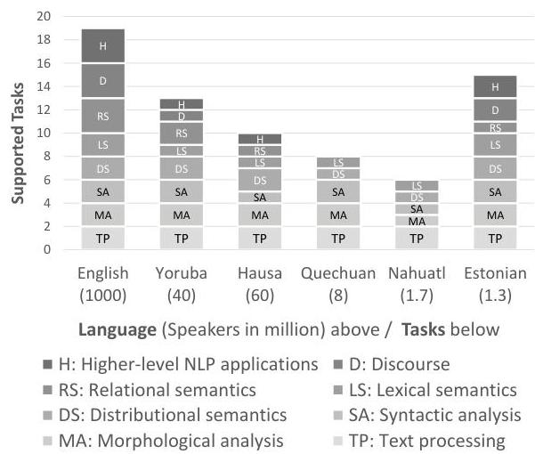
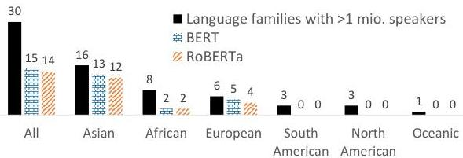

<!-- Source PDF: hedderich-2021-lowresource-nlp.pdf -->

# A Survey on Recent Approaches for Natural Language Processing in Low-Resource Scenarios

Michael A. Hedderich^{∗1}, Lukas Lange^{∗1,2}, Heike Adel^{2},
Jannik Strötgen^{2} & Dietrich Klakow^{1}
^{1}Saarland University, Saarland Informatics Campus, Germany
^{2}Bosch Center for Artificial Intelligence, Germany
{mhedderich,dietrich.klakow}@lsv.uni-saarland.de
{lukas.lange,heike.adel,jannik.stroetgen}@de.bosch.com

###### Abstract

Deep neural networks and huge language models are becoming omnipresent in natural language applications. As they are known for requiring large amounts of training data, there is a growing body of work to improve the performance in low-resource settings. Motivated by the recent fundamental changes towards neural models and the popular pre-train and fine-tune paradigm, we survey promising approaches for low-resource natural language processing. After a discussion about the different dimensions of data availability, we give a structured overview of methods that enable learning when training data is sparse. This includes mechanisms to create additional labeled data like data augmentation and distant supervision as well as transfer learning settings that reduce the need for target supervision. A goal of our survey is to explain how these methods differ in their requirements as understanding them is essential for choosing a technique suited for a specific low-resource setting. Further key aspects of this work are to highlight open issues and to outline promising directions for future research.

## 1 Introduction

Most of today’s research in natural language processing (NLP) is concerned with the processing of 10 to 20 high-resource languages with a special focus on English, and thus, ignores thousands of languages with billions of speakers *Bender (2019)*. The rise of data-hungry deep learning systems increased the performance of NLP for high resource-languages, but the shortage of large-scale data in less-resourced languages makes their processing a challenging problem. Therefore, *Ruder (2019)* named NLP for low-resource scenarios one of the four biggest open problems in NLP nowadays.

The umbrella term low-resource covers a spectrum of scenarios with varying resource conditions. It includes work on threatened languages, such as Yongning Na, a Sino-Tibetan language with 40k speakers and only 3k written, unlabeled sentences *Adams et al. (2017)*. Other languages are widely spoken but seldom addressed by NLP research. More than 310 languages exist with at least one million L1-speakers each *Eberhard et al. (2019)*. Similarly, Wikipedia exists for 300 languages. Supporting technological developments for low-resource languages can help to increase participation of the speakers’ communities in a digital world. Note, however, that tackling low-resource settings is even crucial when dealing with popular NLP languages as low-resource settings do not only concern languages but also non-standard domains and tasks, for which – even in English – only little training data is available. Thus, the term “language” in this paper also includes domain-specific language.

This importance of low-resource scenarios and the significant changes in NLP in the last years have led to active research on resource-lean settings and a wide variety of techniques have been proposed. They all share the motivation of overcoming the lack of labeled data by leveraging further sources. However, these works differ greatly on the sources they rely on, e.g., unlabeled data, manual heuristics or cross-lingual alignments. Understanding the requirements of these methods is essential for choosing a technique suited for a specific low-resource setting. Thus, one key goal of this survey is to highlight the underlying assumptions these techniques take regarding the low-resource setup.

In this work, we (1) give a broad and structured overview of current efforts on low-resource NLP, (2) analyse the different aspects of low-resource settings, (3) highlight the necessary resources and data assumptions as guidance for practitioners and (4) discuss open issues and promising future direc

|  Method | Requirements | Outcome | For low-resource  |   |
| --- | --- | --- | --- | --- |
|   |   |   |  languages | domains  |
|  Data Augmentation (§ 4.1) | labeled data, heuristics* | additional labeled data | ✓ | ✓  |
|  Distant Supervision (§ 4.2) | unlabeled data, heuristics* | additional labeled data | ✓ | ✓  |
|  Cross-lingual projections (§ 4.3) | unlabeled data, high-resource labeled data, cross-lingual alignment | additional labeled data | ✓ | ✗  |
|  Embeddings & Pre-trained LMs (§ 5.1) | unlabeled data | better language representation | ✓ | ✓  |
|  LM domain adaptation (§ 5.2) | existing LM, unlabeled domain data | domain-specific language representation | ✗ | ✓  |
|  Multilingual LMs (§ 5.3) | multilingual unlabeled data | multilingual feature representation | ✓ | ✗  |
|  Adversarial Discriminator (§ 6) | additional datasets | independent representations | ✓ | ✓  |
|  Meta-Learning (§ 6) | multiple auxiliary tasks | better target task performance | ✓ | ✓  |

Table 1: Overview of low-resource methods surveyed in this paper. * Heuristics are typically gathered manually.

tions. Table 1 gives an overview of the surveyed techniques along with their requirements a practitioner needs to take into consideration.

## 2 Related Surveys

Recent surveys cover low-resource machine translation (Liu et al., 2019) and unsupervised domain adaptation (Ramponi and Plank, 2020). Thus, we do not investigate these topics further in this paper, but focus instead on general methods for low-resource, supervised natural language processing including data augmentation, distant supervision and transfer learning. This is also in contrast to the task-specific survey by Magueresse et al. (2020) who review highly influential work for several extraction tasks, but only provide little overview of recent approaches. In Table 2 in the appendix, we list past surveys that discuss a specific method or low-resource language family for those readers who seek a more specialized follow-up.

## 3 Aspects of "Low-Resource"

To visualize the variety of resource-lean scenarios, Figure 1 shows exemplarily which NLP tasks were addressed in six different languages from basic to higher-level tasks. While it is possible to build English NLP systems for many higher-level applications, low-resource languages lack the data foundation for this. Additionally, even if it is possible to create basic systems for tasks, such as tokenization and named entity recognition, for all tested low-resource languages, the training data is typical of lower quality compared to the English datasets,

Figure 1: Supported NLP tasks in different languages. Note that the figure does not incorporate data quality or system performance. More details on the selection of tasks and languages are given in the appendix Section B.

or very limited in size. It also shows that the four American and African languages with between 1.5 and 60 million speakers have been addressed less than the Estonian language, with 1 million speakers. This indicates the unused potential to reach millions of speakers who currently have no access to higher-level NLP applications. Joshi et al. (2020) study further the availability of resources for languages around the world.

### 3.1 Dimensions of Resource Availability

Many techniques presented in the literature depend on certain assumptions about the low-resource sce

nario. These have to be adequately defined to evaluate their applicability for a specific setting and to avoid confusion when comparing different approaches. We propose to categorize low-resource settings along the following three dimensions:

(i) The availability of task-specific labels in the target language (or target domain) is the most prominent dimension in the context of supervised learning. Labels are usually created through manual annotation, which can be both time- and cost-intensive. Not having access to adequate experts to perform the annotation can also be an issue for some languages and domains.

(ii) The availability of unlabeled language- or domain-specific text is another factor, especially as most modern NLP approaches are based on some form of input embeddings trained on unlabeled texts.

(iii) Most of the ideas surveyed in the next sections assume the availability of auxiliary data which can have many forms. Transfer learning might leverage task-specific labels in a different language or domain. Distant supervision utilizes external sources of information, such as knowledge bases or gazetteers. Some approaches require other NLP tools in the target language like machine translation to generate training data. It is essential to consider this as results from one low-resource scenario might not be transferable to another one if the assumptions on the auxiliary data are broken.

### 3.2 How Low is Low-Resource?

On the dimension of task-specific labels, different thresholds are used to define low-resource. For part-of-speech (POS) tagging, *Garrette and Baldridge (2013)* limit the time of the annotators to 2 hours resulting in up to 1-2k tokens. *Kann et al. (2020)* study languages that have less than 10k labeled tokens in the Universal Dependency project *Nivre et al. (2020)* and *Loubser and Puttkammer (2020)* report that most available datasets for South African languages have 40-60k labeled tokens.

The threshold is also task-dependent and more complex tasks might also increase the resource requirements. For text generation, *Yang et al. (2019)* frame their work as low-resource with 350k labeled training instances. Similar to the task, the resource requirements can also depend on the language. *Plank et al. (2016)* find that task performance varies between language families given the same amount of limited training data.

Given the lack of a hard threshold for low-resource settings, we see it as a spectrum of resource availability. We, therefore, also argue that more work should evaluate low-resource techniques across different levels of data availability for better comparison between approaches. For instance, *Plank et al. (2016)* and *Melamud et al. (2019)* show that for very small datasets non-neural methods outperform more modern approaches while the latter obtain better performance in resource-lean scenarios once a few hundred labeled instances are available.

## 4 Generating Additional Labeled Data

Faced with the lack of task-specific labels, a variety of approaches have been developed to find alternative forms of labeled data as substitutes for gold-standard supervision. This is usually done through some form of expert insights in combination with automation. We group the ideas into two main categories: data augmentation which uses task-specific instances to create more of them (§ 4.1) and distant supervision which labels unlabeled data (§ 4.2) including cross-lingual projections (§ 4.3). Additional sections cover learning with noisy labels (§ 4.4) and involving non-experts (§ 4.5).

### 4.1 Data Augmentation

New instances can be obtained based on existing ones by modifying the features with transformations that do not change the label. In the computer vision community, this is a popular approach where, e.g., rotating an image is invariant to the classification of an image’s content. For text, on the token level, this can be done by replacing words with equivalents, such as synonyms *Wei and Zou (2019)*, entities of the same type *Raiman and Miller (2017); Dai and Adel (2020)* or words that share the same morphology *Gulordava et al. (2018); Vania et al. (2019)*. Such replacements can also be guided by a language model that takes context into consideration *Fadaee et al. (2017); Kobayashi (2018)*.

To go beyond the token level and add more diversity to the augmented sentences, data augmentation can also be performed on sentence parts. Operations that (depending on the task) do not change the label include manipulation of parts of the dependency tree *Şahin and Steedman (2018); Vania et al. (2019); Dehouck and Gómez-Rodríguez (2020)*, simplification of sentences by removal of sentence parts *Şahin and Steedman (2018)* and inversion

of the subject-object relation *Min et al. (2020)*. For whole sentences, paraphrasing through back-translation can be used. This is a popular approach in machine translation where target sentences are back-translated into source sentences *Bojar and Tamchyna (2011); Hoang et al. (2018)*. An important aspect here is that errors in the source side/features do not seem to have a large negative effect on the generated target text the model needs to predict. It is therefore also used in other text generation tasks like abstract summarization *Parida and Motlicek (2019)* and table-to-text generation *Ma et al. (2019)*. Back-translation has also been leveraged for text classification *Xie et al. (2020); Hegde and Patil (2020)*. This setting assumes, however, the availability of a translation system. Instead, a language model can also be used for augmenting text classification datasets *Kumar et al. (2020); Anaby-Tavor et al. (2020)*. It is trained conditioned on a label, i.e., on the subset of the task-specific data with this label. It then generates additional sentences that fit this label. *Ding et al. (2020)* extend this idea for token level tasks.

Adversarial methods are often used to find weaknesses in machine learning models *Jin et al. (2020); Garg and Ramakrishnan (2020)*. They can, however, also be utilized to augment NLP datasets *Yasunaga et al. (2018); Morris et al. (2020)*. Instead of manually crafted transformation rules, these methods learn how to apply small perturbations to the input data that do not change the meaning of the text (according to a specific score). This approach is often applied on the level of vector representations. For instance, *Grundkiewicz et al. (2019)* reverse the augmentation setting by applying transformations that flip the (binary) label. In their case, they introduce errors in correct sentences to obtain new training data for a grammar correction task.

Open Issues: While data augmentation is ubiquitous in the computer vision community and while most of the above-presented approaches are task-independent, it has not found such widespread use in natural language processing. A reason might be that several of the approaches require an in-depth understanding of the language. There is not yet a unified framework that allows applying data augmentation across tasks and languages. Recently, *Longpre et al. (2020)* hypothesised that data augmentation provides the same benefits as pre-training in transformer models. However, we argue that data augmentation might be better suited to leverage the insights of linguistic or domain experts in low-resource settings when unlabeled data or hardware resources are limited.

### 4.2 Distant & Weak Supervision

In contrast to data augmentation, distant or weak supervision uses unlabeled text and keeps it unmodified. The corresponding labels are obtained through a (semi-)automatic process from an external source of information. For named entity recognition (NER), a list of location names might be obtained from a dictionary and matches of tokens in the text with entities in the list are automatically labeled as locations. Distant supervision was introduced by *Mintz et al. (2009)* for relation extraction (RE) with extensions on multi-instance *Riedel et al. (2010)* and multi-label learning *Surdeanu et al. (2012)*. It is still a popular approach for information extraction tasks like NER and RE where the external information can be obtained from knowledge bases, gazetteers, dictionaries and other forms of structured knowledge sources *Luo et al. (2017); Hedderich and Klakow (2018); Deng and Sun (2019); Alt et al. (2019); Ye et al. (2019); Lange et al. (2019a); Nooralahzadeh et al. (2019); Le and Titov (2019); Cao et al. (2019); Lison et al. (2020); Hedderich et al. (2021a)*. The automatic annotation ranges from simple string matching *Yang et al. (2018)* to complex pipelines including classifiers and manual steps *Norman et al. (2019)*. This distant supervision using information from external knowledge sources can be seen as a subset of the more general approach of labeling rules. These encompass also other ideas like reg-ex rules or simple programming functions *Ratner et al. (2017); Zheng et al. (2019); Adelani et al. (2020); Hedderich et al. (2020); Lison et al. (2020); Ren et al. (2020); Karamanolakis et al. (2021)*.

While distant supervision is popular for information extraction tasks like NER and RE, it is less prevalent in other areas of NLP. Nevertheless, distant supervision has also been successfully employed for other tasks by proposing new ways for automatic annotation. *Li et al. (2012)* leverage a dictionary of POS tags for classifying unseen text with POS. For aspect classification, *Karamanolakis et al. (2019)* create a simple bag-of-words classifier on a list of seed words and train a deep neural network on its weak supervision. *Wang et al. (2019)* use context by transferring a document-level sentiment label to all its sentence-level in

tances. *Mekala et al. (2020)* leverage meta-data for text classification and *Huber and Carenini (2020)* build a discourse-structure dataset using guidance from sentiment annotations. For topic classification, heuristics can be used in combination with inputs from other classifiers like NER *(Bach et al., 2019)* or from entity lists *(Hedderich et al., 2020)*. For some classification tasks, the labels can be rephrased with simple rules into sentences. A pre-trained language model then judges the label sentence that most likely follows the unlabeled input *(Opitz, 2019; Schick and Schütze, 2020; Schick et al., 2020)*. An unlabeled review, for instance, might be continued with "It was great/bad" for obtaining binary sentiment labels.

Open Issues: The popularity of distant supervision for NER and RE might be due to these tasks being particularly suited. There, auxiliary data like entity lists is readily available and distant supervision often achieves reasonable results with simple surface form rules. It is an open question whether a task needs to have specific properties to be suitable for this approach. The existing work on other tasks and the popularity in other fields like image classification *(Xiao et al., 2015; Li et al., 2017; Lee et al., 2018; Mahajan et al., 2018; Li et al., 2020)* suggests, however, that distant supervision could be leveraged for more NLP tasks in the future.

Distant supervision methods heavily rely on auxiliary data. In a low-resource setting, it might be difficult to obtain not only labeled data but also such auxiliary data. *Kann et al. (2020)* find a large gap between the performance on high-resource and low-resource languages for POS tagging pointing to the lack of high-coverage and error-free dictionaries for the weak supervision in low-resource languages. This emphasizes the need for evaluating such methods in a realistic setting and avoiding to just simulate restricted access to labeled data in a high-resource language.

While distant supervision allows obtaining labeled data more quickly than manually annotating every instance of a dataset, it still requires human interaction to create automatic annotation techniques or to provide labeling rules. This time and effort could also be spent on annotating more gold label data, either naively or through an active learning scheme. Unfortunately, distant supervision papers rarely provide information on how long the creation took, making it difficult to compare these approaches. Taking the human expert into the focus connects this research direction with human-computer-interaction and human-in-the-loop setups *(Klie et al., 2018; Qian et al., 2020)*.

### 4.3 Cross-Lingual Annotation Projections

For cross-lingual projections, a task-specific classifier is trained in a high-resource language. Using parallel corpora, the unlabeled low-resource data is then aligned to its equivalent in the high-resource language where labels can be obtained using the aforementioned classifier. These labels (on the high-resource text) can then be projected back to the text in the low-resource language based on the alignment between tokens in the parallel texts *(Yarowsky et al., 2001)*. This approach can, therefore, be seen as a form of distant supervision specific for obtaining labeled data for low-resource languages. Cross-lingual projections have been applied in low-resource settings for tasks, such as POS tagging and parsing *(Täckström et al., 2013; Wisniewski et al., 2014; Plank and Agić, 2018; Eskander et al., 2020)*. Sources for parallel text can be the OPUS project *(Tiedemann, 2012)*, Bible corpora *(Mayer and Cysouw, 2014; Christodoulopoulos and Steedman, 2015)* or the recent JW300 corpus *(Agić and Vulić, 2019)*. Instead of using parallel corpora, existing high-resource labeled datasets can also be machine-translated into the low-resource language *(Khalil et al., 2019; Zhang et al., 2019a; Fei et al., 2020; Amjad et al., 2020)*. Cross-lingual projections have even been used with English as a target language for detecting linguistic phenomena like modal sense and telicity that are easier to identify in a different language *(Zhou et al., 2015; Marasović et al., 2016; Friedrich and Gateva, 2017)*.

Open issues: Cross-lingual projections set high requirements on the auxiliary data needing both labels in a high-resource language and means to project them into a low-resource language. Especially the latter can be an issue as machine translation by itself might be problematic for a specific low-resource language. A limitation of the parallel corpora is their domains like political proceedings or religious texts. *Mayhew et al. (2017)*, *Fang and Cohn (2017)* and *Karamanolakis et al. (2020)* propose systems with fewer requirements based on word translations, bilingual dictionaries and task-specific seed words, respectively.

4.4 Learning with Noisy Labels

The above-presented methods allow obtaining labeled data quicker and cheaper than manual annotations. These labels tend, however, to contain more errors. Even though more training data is available, training directly on this noisily-labeled data can actually hurt the performance. Therefore, many recent approaches for distant supervision use a noise handling method to diminish the negative effects of distant supervision. We categorize these into two ideas: noise filtering and noise modeling.

Noise filtering methods remove instances from the training data that have a high probability of being incorrectly labeled. This often includes training a classifier to make the filtering decision. The filtering can remove the instances completely from the training data, e.g., through a probability threshold *Jia et al. (2019)*, a binary classifier *Adel and Schütze (2015); Onoe and Durrett (2019); Huang and Du (2019)*, or the use of a reinforcement-based agent *Yang et al. (2018); Nooralahzadeh et al. (2019)*. Alternatively, a soft filtering might be applied that re-weights instances according to their probability of being correctly labeled *Le and Titov (2019)* or an attention measure *Hu et al. (2019)*.

The noise in the labels can also be modeled. A common model is a confusion matrix estimating the relationship between clean and noisy labels *Fang and Cohn (2016); Luo et al. (2017); Hedderich and Klakow (2018); Paul et al. (2019); Lange et al. (2019a, c); Chen et al. (2019); Wang et al. (2019); Hedderich et al. (2021b)*. The classifier is no longer trained directly on the noisily-labeled data. Instead, a noise model is appended which shifts the noisy to the (unseen) clean label distribution. This can be interpreted as the original classifier being trained on a “cleaned” version of the noisy labels. In *Ye et al. (2019)*, the prediction is shifted from the noisy to the clean distribution during testing. In *Chen et al. (2020a)*, a group of reinforcement agents relabels noisy instances. *Rehbein and Ruppenhofer (2017)*, *Lison et al. (2020)* and *Ren et al. (2020)* leverage several sources of distant supervision and learn how to combine them.

In NER, the noise in distantly supervised labels tends to be false negatives, i.e., mentions of entities that have been missed by the automatic method. Partial annotation learning *Yang et al. (2018); Nooralahzadeh et al. (2019); Cao et al. (2019)* takes this into account explicitly. Related approaches learn latent variables *Jie et al. (2019)*, use constrained binary learning *Mayhew et al. (2019)* or construct a loss assuming that only unlabeled positive instances exist *Peng et al. (2019)*.

### 4.5 Non-Expert Support

As an alternative to an automatic annotation process, annotations might also be provided by non-experts. Similar to distant supervision, this results in a trade-off between label quality and availability. For instance, *Garrette and Baldridge (2013)* obtain labeled data from non-native-speakers and without a quality control on the manual annotations. This can be taken even further by employing annotators who do not speak the low-resource language *Mayhew and Roth (2018); Mayhew et al. (2019); Tsygankova et al. (2020)*.

*Nekoto et al. (2020)* take the opposite direction, integrating speakers of low-resource languages without formal training into the model development process in an approach of participatory research. This is part of recent work on how to strengthen low-resource language communities and grassroot approaches *Alnajjar et al. (2020); Adelani et al. (2021)*.

## 5 Transfer Learning

While distant supervision and data augmentation generate and extend task-specific training data, transfer learning reduces the need for labeled target data by transferring learned representations and models. A strong focus in recent works on transfer learning in NLP lies in the use of pre-trained language representations that are trained on unlabeled data like BERT *Devlin et al. (2019)*. Thus, this section starts with an overview of these methods (§ 5.1) and then discusses how they can be utilized in low-resource scenarios, in particular, regarding the usage in domain-specific (§ 5.2) or multilingual low-resource settings (§ 5.3).

### 5.1 Pre-Trained Language Representations

Feature vectors are the core input component of many neural network-based models for NLP tasks. They are numerical representations of words or sentences, as neural architectures do not allow the processing of strings and characters as such. *Collobert et al. (2011)* showed that training these models for the task of language-modeling on a large-scale corpus results in high-quality word representations, which can be reused for other downstream tasks as well. Subword-based embeddings such as fastText

n-gram embeddings *Bojanowski et al. (2017)* and byte-pair-encoding embeddings *Heinzerling and Strube (2018)* addressed out-of-vocabulary issues by splitting words into multiple subwords, which in combination represent the original word. *Zhu et al. (2019)* showed that these embeddings leveraging subword information are beneficial for low-resource sequence labeling tasks, such as named entity recognition and typing, and outperform word-level embeddings. *Jungmaier et al. (2020)* added smoothing to word2vec models to correct its bias towards rare words and achieved improvements in particular for low-resource settings. In addition, pre-trained embeddings were published for more than 270 languages for both embedding methods. This enabled the processing of texts in many languages, including multiple low-resource languages found in Wikipedia. More recently, a trend emerged of pre-training large embedding models using a language model objective to create context-aware word representations by predicting the next word or sentence. This includes pre-trained transformer models *Vaswani et al. (2017)*, such as BERT *Devlin et al. (2019)* or RoBERTa *Liu et al. (2019b)*. These methods are particularly helpful for low-resource languages for which large amounts of unlabeled data are available, but task-specific labeled data is scarce *Cruz and Cheng (2019)*.

Open Issues: While pre-trained language models achieve significant performance increases compared to standard word embeddings, it is still questionable if these methods are suited for real-world low-resource scenarios. For example, all of these models require large hardware requirements, in particular, considering that the transformer model size keeps increasing to boost performance *Raffel et al. (2020)*. Therefore, these large-scale methods might not be suited for low-resource scenarios where hardware is also low-resource.
*Biljon et al. (2020)* showed that low- to medium-depth transformer sizes perform better than larger models for low-resource languages and *Schick and Schütze (2020)* managed to train models with three orders of magnitude fewer parameters that perform on-par with large-scale models like GPT-3 on few-shot task by reformulating the training task and using ensembling. *Melamud et al. (2019)* showed that simple bag-of-words approaches are better when there are only a few dozen training instances or less for text classification, while more complex transformer models require more training data. *Bhattacharjee et al. (2020)* found that cross-view training *Clark et al. (2018)* leverages large amounts of unlabeled data better for task-specific applications in contrast to the general representations learned by BERT. Moreover, data quality for low-resource, even for unlabeled data, might not be comparable to data from high-resource languages. *Alabi et al. (2020)* found that word embeddings trained on larger amounts of unlabeled data from low-resource languages are not competitive to embeddings trained on smaller, but curated data sources.

### 5.2 Domain-Specific Pre-Training

The language of a specialized domain can differ tremendously from what is considered the standard language, thus, many text domains are often less-resourced as well. For example, scientific articles can contain formulas and technical terms, which are not observed in news articles. However, the majority of recent language models are pre-trained on general-domain data, such as texts from the news or web-domain, which can lead to a so-called “domain-gap” when applied to a different domain.

One solution to overcome this gap is the adaptation to the target domain by finetuning the language model. *Gururangan et al. (2020)* showed that continuing the training of a model with additional domain-adaptive and task-adaptive pre-training with unlabeled data leads to performance gains for both high- and low-resource settings for numerous English domains and tasks. This is also displayed in the number of domain-adapted language models *Alsentzer et al. (2019); Huang et al. (2019); Adhikari et al. (2019); Lee and Hsiang (2020); Jain and Ganesamoorty (2020, (i.a.))*, most notably BioBERT *Lee et al. (2020)* that was pre-trained on biomedical PubMED articles and SciBERT *Beltagy et al. (2019)* for scientific texts. For example, *Friedrich et al. (2020)* showed that a general-domain BERT model performs well in the materials science domain, but the domain-adapted SciBERT performs best. *Xu et al. (2020)* used in- and out-of-domain data to pre-train a domain-specific model and adapt it to low-resource domains. *Aharoni and Goldberg (2020)* found domain-specific clusters in pre-trained language models and showed how these could be exploited for data selection in domain-sensitive training.

Powerful representations can be achieved by combining high-resource embeddings from the gen

eral domain with low-resource embeddings from the target domain (Akbik et al., 2018; Lange et al., 2019b). Kiela et al. (2018) showed that embeddings from different domains can be combined using attention-based meta-embeddings, which create a weighted sum of all embeddings. Lange et al. (2020b) further improved on this by aligning embeddings trained on diverse domains using an adversarial discriminator that distinguishes between the embedding spaces to generate domain-invariant representations.

### 5.3 Multilingual Language Models

Analogously to low-resource domains, low-resource languages can also benefit from labeled resources available in other high-resource languages. This usually requires the training of multilingual language representations by combining monolingual representations (Lange et al., 2020a) or training a single model for many languages, such as multilingual BERT (Devlin et al., 2019) or XLM-RoBERTa (Conneau et al., 2020). These models are trained using unlabeled, monolingual corpora from different languages and can be used in cross- and multilingual settings, due to many languages seen during pre-training.

In cross-lingual zero-shot learning, no task-specific labeled data is available in the low-resource target language. Instead, labeled data from a high-resource language is leveraged. A multilingual model can be trained on the target task in a high-resource language and afterwards, applied to the unseen target languages, such as for named entity recognition (Lin et al., 2019; Hvingelby et al., 2020), reading comprehension (Hsu et al., 2019), temporal expression extraction (Lange et al., 2020c), or POS tagging and dependency parsing (Müller et al., 2020). Hu et al. (2020) showed, however, that there is still a large gap between low and high-resource setting. Lauscher et al. (2020) and Hedderich et al. (2020) proposed adding a minimal amount of target-task and -language data (in the range of 10 to 100 labeled sentences) which resulted in a significant boost in performance for classification in low-resource languages.

The transfer between two languages can be improved by creating a common multilingual embedding space of multiple languages. This is useful for standard word embeddings (Ruder et al., 2019) as well as pre-trained language models. For example, by aligning the languages inside a single multilin

Figure 2: Language families with more than 1 million speakers covered by multilingual transformer models.

gual model, i.a., in cross-lingual (Schuster et al., 2019; Liu et al., 2019a) or multilingual settings (Cao et al., 2020).

This alignment is typically done by computing a mapping between two different embedding spaces, such that the words in both embeddings share similar feature vectors after the mapping (Mikolov et al., 2013; Joulin et al., 2018). This allows to use different embeddings inside the same model and helps when two languages do not share the same space inside a single model (Cao et al., 2020). For example, Zhang et al. (2019b) used bilingual representations by creating cross-lingual word embeddings using a small set of parallel sentences between the high-resource language English and three low-resource African languages, Swahili, Tagalog, and Somali, to improve document retrieval performance for the African languages.

Open Issues: While these multilingual models are a tremendous step towards enabling NLP in many languages, possible claims that these are universal language models do not hold. For example, mBERT covers 104 and XLM-R 100 languages, which is a third of all languages in Wikipedia as outlined earlier. Further, Wu and Dredze (2020) showed that, in particular, low-resource languages are not well-represented in mBERT. Figure 2 shows which language families with at least 1 million speakers are covered by mBERT and XLM-RoBERTa $^2$ . In particular, African and American languages are not well-represented within the transformer models, even though millions of people speak these languages. This can be problematic, as languages from more distant language families are less suited for transfer learning, as Lauscher et al. (2020) showed.

6 Ideas From Low-Resource Machine Learning in Non-NLP Communities

Training on a limited amount of data is not unique to natural language processing. Other areas, like general machine learning and computer vision, can be a useful source for insights and new ideas. We already presented data augmentation and pre-training. Another example is Meta-Learning *Finn et al. (2017)*, which is based on multi-task learning. Given a set of auxiliary high-resource tasks and a low-resource target task, meta-learning trains a model to decide how to use the auxiliary tasks in the most beneficial way for the target task. For NLP, this approach has been evaluated on tasks such as sentiment analysis *Yu et al. (2018)*, user intent classification *Yu et al. (2018); Chen et al. (2020b)*, natural language understanding *Dou et al. (2019)*, text classification *Bansal et al. (2020)* and dialogue generation *Huang et al. (2020)*. Instead of having a set of tasks, *Rahimi et al. (2019)* built an ensemble of language-specific NER models which are then weighted depending on the zero- or few-shot target language.

Differences in the features between the pre-training and the target domain can be an issue in transfer learning, especially in neural approaches where it can be difficult to control which information the model takes into account. Adversarial discriminators *Goodfellow et al. (2014)* can prevent the model from learning a feature-representation that is specific to a data source. *Gui et al. (2017)*, *Liu et al. (2017)*, *Kasai et al. (2019)*, *Grießhaber et al. (2020)* and *Zhou et al. (2019)* learned domain-independent representations using adversarial training. *Kim et al. (2017)*, *Chen et al. (2018)* and *Lange et al. (2020c)* worked with language-independent representations for cross-lingual transfer. These examples show the beneficial exchange of ideas between NLP and the machine learning community.

## 7 Discussion and Conclusion

In this survey, we gave a structured overview of recent work in the field of low-resource natural language processing. Beyond the method-specific open issues presented in the previous sections, we see the comparison between approaches as an important point of future work. Guidelines are necessary to support practitioners in choosing the right tool for their task. In this work, we highlighted that it is essential to analyze resource-lean scenarios across the different dimensions of data-availability. This can reveal which techniques are expected to be applicable in a specific low-resource setting. More theoretic and experimental work is necessary to understand how approaches compare to each other and on which factors their effectiveness depends. *Longpre et al. (2020)*, for instance, hypothesized that data augmentation and pre-trained language models yield similar kind of benefits. Often, however, new techniques are just compared to similar methods and not across the range of low-resource approaches. While a fair comparison is non-trivial given the different requirements on auxiliary data, we see this endeavour as essential to improve the field of low-resource learning in the future. This could also help to understand where the different approaches complement each other and how they can be combined effectively.

## Acknowledgments

The authors would like to thank Annemarie Friedrich for her valuable feedback and the anonymous reviewers for their helpful comments. This work has been partially funded by the Deutsche Forschungsgemeinschaft (DFG, German Research Foundation) – Project-ID 232722074 – SFB 1102 and the EU Horizon 2020 project ROXANNE under grant number 833635.

## References

- Adams et al. (2017) Oliver Adams, Adam Makarucha, Graham Neubig, Steven Bird, and Trevor Cohn. 2017. Cross-lingual word embeddings for low-resource language modeling. In *Proceedings of the 15th Conference of the European Chapter of the Association for Computational Linguistics: Volume 1, Long Papers*, pages 937–947, Valencia, Spain. Association for Computational Linguistics.
- Adel and Schütze (2015) Heike Adel and Hinrich Schütze. 2015. CIS at TAC cold start 2015: Neural networks and coreference resolution for slot filling. In *Proceedings of TAC KBP Workshop*.
- Adelani et al. (2019) David Ifeoluwa Adelani, Jade Abbott, Graham Neubig, Daniel D’souza, Julia Kreutzer, Constantine Lignos, Chester Palen-Michel, Happy Buzaaba, Shruti Rijhwani, Sebastian Ruder, Stephen Mayhew, Israel Abebe Azime, Shamsuddeen Muhammad, Chris Chinenye Emezue, Joyce Nakatumba-Nabende, Perez Ogayo, Anuoluwapo Aremu, Catherine Gitau, Derguene Mbaye, Jesujoba Alabi, Seid Muhie Yimam, Tajuddeen Gwadabe, Ignatius Ezeani, Rubungo Andre Niyongabo, Jonathan Mukiibi, Verrah Otiende, Iroro Orife, Davis David, Samba Ngom, Tosin Adewumi, Paul Rayson, Mofetoluwa Adeyemi, Gerald Muriuki,

Emmanuel Anebi, Chiamaka Chukwuneke, Nkiruka Odu, Eric Peter Wairagala, Samuel Oyerinde, Clemencia Siro, Tobius Saul Bateesa, Temilola Oloyede, Yvonne Wambui, Victor Akinode, Deborah Nabagereka, Maurice Katusiime, Ayodele Awokoya, Mouhamadane MBOUP, Dibora Gebreyohannes, Henok Tilaye, Kelechi Nwaike, Degaga Wolde, Abdoulaye Faye, Blessing Sibanda, Orevaoghene Ahia, Bonaventure F. P. Dossou, Kelechi Ogueji, Thierno Ibrahima DIOP, Abdoulaye Diallo, Adewale Akinfaderin, Tendai Marengereke, and Salomey Osei. 2021. Masakhaner: Named entity recognition for african languages. arXiv preprint arXiv:2103.11811.

David Ifeoluwa Adelani, Michael A Hedderich, Dawei Zhu, Esther van den Berg, and Dietrich Klakow. 2020. Distant supervision and noisy label learning for low resource named entity recognition: A study on hausa and yoruba. Workshop on Practical Machine Learning for Developing Countries at ICLR’20.

Ashutosh Adhikari, Achyudh Ram, Raphael Tang, and Jimmy Lin. 2019. Docbert: Bert for document classification. arXiv preprint arXiv:1904.08398.

Charu C Aggarwal, Xiangnan Kong, Quanquan Gu, Jiawei Han, and S Yu Philip. 2014. Active learning: A survey. In Data Classification: Algorithms and Applications, pages 571–605. CRC Press.

Željko Agić and Ivan Vulić. 2019. JW300: A wide-coverage parallel corpus for low-resource languages. In Proceedings of the 57th Annual Meeting of the Association for Computational Linguistics, pages 3204–3210, Florence, Italy. Association for Computational Linguistics.

Roee Aharoni and Yoav Goldberg. 2020. Unsupervised domain clusters in pretrained language models. In Proceedings of the 58th Annual Meeting of the Association for Computational Linguistics, pages 7747–7763, Online. Association for Computational Linguistics.

Alan Akbik, Duncan Blythe, and Roland Vollgraf. 2018. Contextual string embeddings for sequence labeling. In Proceedings of the 27th International Conference on Computational Linguistics, pages 1638–1649, Santa Fe, New Mexico, USA. Association for Computational Linguistics.

Mahmoud Al-Ayyoub, Aya Nuseir, Kholoud Alsmearat, Yaser Jararweh, and Brij Gupta. 2018. Deep learning for arabic nlp: A survey. Journal of computational science, 26:522–531.

Jesujoba Alabi, Kwabena Amponsah-Kaakyire, David Adelani, and Cristina España-Bonet. 2020. Massive vs. curated embeddings for low-resourced languages: the case of yorùbá and twi. In Proceedings of The 12th Language Resources and Evaluation Conference, pages 2754–2762, Marseille, France. European Language Resources Association.

Görkem Algan and Ilkay Ulusoy. 2021. Image classification with deep learning in the presence of noisy labels: A survey. Knowledge-Based Systems, 215:106771.

Khalid Alnajjar, Mika Hämäläinen, Jack Rueter, and Niko Partanen. 2020. Ve’rdd. narrowing the gap between paper dictionaries, low-resource NLP and community involvement. In Proceedings of the 28th International Conference on Computational Linguistics: System Demonstrations, pages 1–6, Barcelona, Spain (Online). International Committee on Computational Linguistics (ICCL).

Emily Alsentzer, John Murphy, William Boag, Wei-Hung Weng, Di Jindi, Tristan Naumann, and Matthew McDermott. 2019. Publicly available clinical BERT embeddings. In Proceedings of the 2nd Clinical Natural Language Processing Workshop, pages 72–78, Minneapolis, Minnesota, USA. Association for Computational Linguistics.

Christoph Alt, Marc Hübner, and Leonhard Hennig. 2019. Fine-tuning pre-trained transformer language models to distantly supervised relation extraction. In Proceedings of the 57th Annual Meeting of the Association for Computational Linguistics, pages 1388–1398, Florence, Italy. Association for Computational Linguistics.

Maaz Amjad, Grigori Sidorov, and Alisa Zhila. 2020. Data augmentation using machine translation for fake news detection in the Urdu language. In Proceedings of the 12th Language Resources and Evaluation Conference, pages 2537–2542, Marseille, France. European Language Resources Association.

Ateret Anaby-Tavor, Boaz Carmeli, Esther Goldbraich, Amir Kantor, George Kour, Segev Shlomov, Naama Tepper, and Naama Zwerdling. 2020. Do not have enough data? deep learning to the rescue! In The Thirty-Fourth AAAI Conference on Artificial Intelligence, AAAI 2020, The Thirty-Second Innovative Applications of Artificial Intelligence Conference, IAAI 2020, The Tenth AAAI Symposium on Educational Advances in Artificial Intelligence, EAAI 2020, New York, NY, USA, February 7-12, 2020, pages 7383–7390. AAAI Press.

Stephen H. Bach, Daniel Rodriguez, Yintao Liu, Chong Luo, Haidong Shao, Cassandra Xia, Souvik Sen, Alexander Ratner, Braden Hancock, Houman Alborzi, Rahul Kuchhal, Christopher Ré, and Rob Malkin. 2019. Snorkel drybell: A case study in deploying weak supervision at industrial scale. In Proceedings of the 2019 International Conference on Management of Data, SIGMOD Conference 2019, Amsterdam, The Netherlands, June 30 - July 5, 2019, pages 362–375. ACM.

N. Banik, M. H. Hafizur Rahman, S. Chakraborty, H. Seddiqui, and M. A. Azim. 2019. Survey on text-based sentiment analysis of bengali language. In 2019 1st International Conference on Advances in Science, Engineering and Robotics Technology (ICASERT), pages 1–6.

Trapit Bansal, Rishikesh Jha, Tsendsuren Munkhdalai, and Andrew McCallum. 2020. Self-supervised meta-learning for few-shot natural language classification tasks. In *Proceedings of the 2020 Conference on Empirical Methods in Natural Language Processing (EMNLP)*, pages 522–534, Online. Association for Computational Linguistics.
- [Muazzam Bashir et al.2017] Muazzam Bashir, Azilawati Rozaimee, and Wan Malini Wan Isa. 2017. Automatic hausa language text summarization based on feature extraction using naive bayes model. *World Applied Science Journal*, 35(9):2074–2080.
- [Iz Beltagy et al.2019] Iz Beltagy, Kyle Lo, and Arman Cohan. 2019. SciBERT: A pretrained language model for scientific text. In *Proceedings of the 2019 Conference on Empirical Methods in Natural Language Processing and the 9th International Joint Conference on Natural Language Processing (EMNLP-IJCNLP)*, pages 3615–3620, Hong Kong, China. Association for Computational Linguistics.
- [Emily Bender2019] Emily Bender. 2019. The benderrule: On naming the languages we study and why it matters. *The Gradient*.
- [Kasturi Bhattacharjee et al.2020] Kasturi Bhattacharjee, Miguel Ballesteros, Rishita Anubhai, Smaranda Muresan, Jie Ma, Faisal Ladhak, and Yaser Al-Onaizan. 2020. To BERT or not to BERT: Comparing task-specific and task-agnostic semi-supervised approaches for sequence tagging. In *Proceedings of the 2020 Conference on Empirical Methods in Natural Language Processing (EMNLP)*, pages 7927–7934, Online. Association for Computational Linguistics.
- [Elan Van Biljon et al.2020] Elan Van Biljon, Arnu Pretorius, and Julia Kreutzer. 2020. On optimal transformer depth for low-resource language translation. *CoRR*, abs/2004.04418.
- [Piotr Bojanowski et al.2017] Piotr Bojanowski, Edouard Grave, Armand Joulin, and Tomas Mikolov. 2017. Enriching word vectors with subword information. *Transactions of the Association for Computational Linguistics*, 5:135–146.
- [Ondřej Bojar and Aleš Tamchyna2011] Ondřej Bojar and Aleš Tamchyna. 2011. Improving translation model by monolingual data. In *Proceedings of the Sixth Workshop on Statistical Machine Translation*, pages 330–336, Edinburgh, Scotland. Association for Computational Linguistics.
- [Steven Cao et al.2020] Steven Cao, Nikita Kitaev, and Dan Klein. 2020. Multilingual alignment of contextual word representations. In *International Conference on Learning Representations*.
- [Yixin Cao et al.2019] Yixin Cao, Zikun Hu, Tat-seng Chua, Zhiyuan Liu, and Heng Ji. 2019. Low-resource name tagging learned with weakly labeled data. In *Proceedings of the 2019 Conference on Empirical Methods in Natural Language Processing and the 9th International Joint Conference on Natural Language Processing (EMNLP-IJCNLP)*, pages 261–270, Hong Kong, China. Association for Computational Linguistics.
- [Daoyuan Chen et al.2019] Daoyuan Chen, Yaliang Li, Kai Lei, and Ying Shen. 2020a. Relabel the noise: Joint extraction of entities and relations via cooperative multiagents. In *Proceedings of the 58th Annual Meeting of the Association for Computational Linguistics*, pages 5940–5950, Online. Association for Computational Linguistics.
- [Junfan Chen et al.2019] Junfan Chen, Richong Zhang, Yongyi Mao, Hongyu Guo, and Jie Xu. 2019. Uncover the ground-truth relations in distant supervision: A neural expectation-maximization framework. In *Proceedings of the 2019 Conference on Empirical Methods in Natural Language Processing and the 9th International Joint Conference on Natural Language Processing (EMNLP-IJCNLP)*, pages 326–336, Hong Kong, China. Association for Computational Linguistics.
- [Xilun Chen et al.2018] Xilun Chen, Asish Ghoshal, Yashar Mehdad, Luke Zettlemoyer, and Sonal Gupta. 2020b. Low-resource domain adaptation for compositional task-oriented semantic parsing. In *Proceedings of the 2020 Conference on Empirical Methods in Natural Language Processing (EMNLP)*, pages 5090–5100, Online. Association for Computational Linguistics.
- [Xilun Chen et al.2018] Xilun Chen, Yu Sun, Ben Athiwaratkun, Claire Cardie, and Kilian Weinberger. 2018. Adversarial deep averaging networks for cross-lingual sentiment classification. *Transactions of the Association for Computational Linguistics*, 6:557–570.
- [Christos Christodoulopoulos and Mark Steedman2015] Christos Christodoulopoulos and Mark Steedman. 2015. A massively parallel corpus: the bible in 100 languages. *Lang. Resour. Evaluation*, 49(2):375–395.
- [Christopher Cieri et al.2018] Christopher Cieri, Mike Maxwell, Stephanie Strassel, and Jennifer Tracey. 2016. Selection criteria for low resource language programs. In *Proceedings of the Tenth International Conference on Language Resources and Evaluation (LREC’16)*, pages 4543–4549, Portorož, Slovenia. European Language Resources Association (ELRA).
- [Kevin Clark et al.2018] Kevin Clark, Minh-Thang Luong, Christopher D. Manning, and Quoc Le. 2018. Semi-supervised sequence modeling with cross-view training. In *Proceedings of the 2018 Conference on Empirical Methods in Natural Language Processing*, pages 1914–1925, Brussels, Belgium. Association for Computational Linguistics.
- [Ronan Collobert et al.2011] Ronan Collobert, Jason Weston, Léon Bottou, Michael Karlen, Koray Kavukcuoglu, and Pavel Kuksa. 2011. Natural language processing (almost) from scratch. *Journal of machine learning research*, 12(ARTICLE):2493–2537.
- [Alexis Conneau et al.2019] Alexis Conneau, Kartikay Khandelwal, Naman Goyal, Vishrav Chaudhary, Guillaume Wenzek, Francisco Guzmán, Edouard Grave, Myle Ott, Luke Zettlemoyer, and Veselin Stoyanov. 2020. Unsupervised

cross-lingual representation learning at scale. In Proceedings of the 58th Annual Meeting of the Association for Computational Linguistics, pages 8440–8451, Online. Association for Computational Linguistics.
- Coterell et al. (2018) Ryan Cotterell, Christo Kirov, John Sylak-Glassman, Géraldine Walther, Ekaterina Vylomova, Arya D. McCarthy, Katharina Kann, Sabrina J. Mielke, Garrett Nicolai, Miikka Silfverberg, David Yarowsky, Jason Eisner, and Mans Hulden. 2018. The CoNLL–SIGMORPHON 2018 shared task: Universal morphological reinflection. In Proceedings of the CoNLL–SIGMORPHON 2018 Shared Task: Universal Morphological Reinflection, pages 1–27, Brussels. Association for Computational Linguistics.
- Christian Blaise Cruz and Charibeth Cheng. 2019. Evaluating language model finetuning techniques for low-resource languages. arXiv preprint arXiv:1907.00409.
- Di and Heike Adel. (2020) Xiang Dai and Heike Adel. 2020. An analysis of simple data augmentation for named entity recognition. In Proceedings of the 28th International Conference on Computational Linguistics, pages 3861–3867, Barcelona, Spain (Online). International Committee on Computational Linguistics.
- Daud et al. (2017) Ali Daud, Wahab Khan, and Dunren Che. 2017. Urdu language processing: a survey. Artificial Intelligence Review, 47(3):279–311.
- Pauw et al. (2011) Guy De Pauw, Gilles-Maurice De Schryver, Laurette Pretorius, and Lori Levin. 2011. Introduction to the special issue on african language technology. Language Resources and Evaluation, 45(3):263–269.
- Dehouck and Carlos Gómez-Rodríguez. (2020) Mathieu Dehouck and Carlos Gómez-Rodríguez. 2020. Data augmentation via subtree swapping for dependency parsing of low-resource languages. In Proceedings of the 28th International Conference on Computational Linguistics, pages 3818–3830, Barcelona, Spain (Online). International Committee on Computational Linguistics.
- Deng and Sun. (2019) Xiang Deng and Huan Sun. 2019. Leveraging 2-hop distant supervision from table entity pairs for relation extraction. In Proceedings of the 2019 Conference on Empirical Methods in Natural Language Processing and the 9th International Joint Conference on Natural Language Processing (EMNLP-IJCNLP), pages 410–420, Hong Kong, China. Association for Computational Linguistics.
- Devlin et al. (2019) Jacob Devlin, Ming-Wei Chang, Kenton Lee, and Kristina Toutanova. 2019. BERT: Pre-training of deep bidirectional transformers for language understanding. In Proceedings of the 2019 Conference of the North American Chapter of the Association for Computational Linguistics: Human Language Technologies, Volume 1 (Long and Short Papers), pages 4171–4186, Minneapolis, Minnesota. Association for Computational Linguistics.
- Ding et al. (2020) Bosheng Ding, Linlin Liu, Lidong Bing, Canasai Kruengkrai, Thien Hai Nguyen, Shafiq Joty, Luo Si, and Chunyan Miao. 2020. DAGA: Data augmentation with a generation approach for low-resource tagging tasks. In Proceedings of the 2020 Conference on Empirical Methods in Natural Language Processing (EMNLP), pages 6045–6057, Online. Association for Computational Linguistics.
- Dou et al. (2019) Zi-Yi Dou, Keyi Yu, and Antonios Anastasopoulos. 2019. Investigating meta-learning algorithms for low-resource natural language understanding tasks. In Proceedings of the 2019 Conference on Empirical Methods in Natural Language Processing and the 9th International Joint Conference on Natural Language Processing (EMNLP-IJCNLP), pages 1192–1197, Hong Kong, China. Association for Computational Linguistics.
- Eberhard et al. (2019) David M. Eberhard, Gary F. Simons, and Charles D. Fennig (eds.). 2019. Ethnologue: Languages of the world. twenty-second edition.
- Faino et al. (2020) Ramy Eskander, Smaranda Muresan, and Michael Collins. 2020. Unsupervised cross-lingual part-of-speech tagging for truly low-resource scenarios. In Proceedings of the 2020 Conference on Empirical Methods in Natural Language Processing (EMNLP), pages 4820–4831, Online. Association for Computational Linguistics.
- Abidemi Fabuni and Akeem Segun Salawu. (2005) Felix Abidemi Fabuni and Akeem Segun Salawu. 2005. Is yorùbá an endangered language? Nordic Journal of African Studies, 14(3):18–18.
- Fadaee et al. (2017) Marzieh Fadaee, Arianna Bisazza, and Christof Monz. 2017. Data augmentation for low-resource neural machine translation. In Proceedings of the 55th Annual Meeting of the Association for Computational Linguistics (Volume 2: Short Papers), pages 567–573, Vancouver, Canada. Association for Computational Linguistics.
- Fang and Cohn. (2016) Meng Fang and Trevor Cohn. 2016. Learning when to trust distant supervision: An application to low-resource POS tagging using cross-lingual projection. In Proceedings of The 20th SIGNLL Conference on Computational Natural Language Learning, pages 178–186, Berlin, Germany. Association for Computational Linguistics.
- Fang and Cohn. (2017) Meng Fang and Trevor Cohn. 2017. Model transfer for tagging low-resource languages using a bilingual dictionary. In Proceedings of the 55th Annual Meeting of the Association for Computational Linguistics (Volume 2: Short Papers), pages 587–593, Vancouver, Canada. Association for Computational Linguistics.
- Fei et al. (2020) Hao Fei, Meishan Zhang, and Donghong Ji. 2020. Cross-lingual semantic role labeling with high-quality translated training corpus. In Proceedings of the 58th Annual Meeting of the Association for Computational Linguistics, pages 7014–7026, Online. Association for Computational Linguistics.

Chelsea Finn, Pieter Abbeel, and Sergey Levine. 2017. Model-agnostic meta-learning for fast adaptation of deep networks. In Proceedings of the 34th International Conference on Machine Learning - Volume 70, ICML’17, page 1126–1135. JMLR.org.

Benoît Frénay and Michel Verleysen. 2013. Classification in the presence of label noise: a survey. IEEE transactions on neural networks and learning systems, 25(5):845–869.

Annemarie Friedrich, Heike Adel, Federico Tomazic, Johannes Hingerl, Renou Benteau, Anika Marusczyk, and Lukas Lange. 2020. The SOFC-exp corpus and neural approaches to information extraction in the materials science domain. In Proceedings of the 58th Annual Meeting of the Association for Computational Linguistics, pages 1255–1268, Online. Association for Computational Linguistics.

Annemarie Friedrich and Damyana Gateva. 2017. Classification of telicity using cross-linguistic annotation projection. In Proceedings of the 2017 Conference on Empirical Methods in Natural Language Processing, pages 2559–2565, Copenhagen, Denmark. Association for Computational Linguistics.

Siddhant Garg and Goutham Ramakrishnan. 2020. BAE: BERT-based adversarial examples for text classification. In Proceedings of the 2020 Conference on Empirical Methods in Natural Language Processing (EMNLP), pages 6174–6181, Online. Association for Computational Linguistics.

Dan Garrette and Jason Baldridge. 2013. Learning a part-of-speech tagger from two hours of annotation. In Proceedings of the 2013 Conference of the North American Chapter of the Association for Computational Linguistics: Human Language Technologies, pages 138–147, Atlanta, Georgia. Association for Computational Linguistics.

Ian Goodfellow, Jean Pouget-Abadie, Mehdi Mirza, Bing Xu, David Warde-Farley, Sherjil Ozair, Aaron Courville, and Yoshua Bengio. 2014. Generative adversarial nets. In Z. Ghahramani, M. Welling, C. Cortes, N. D. Lawrence, and K. Q. Weinberger, editors, Advances in Neural Information Processing Systems 27, pages 2672–2680. Curran Associates, Inc.

Daniel Grießhaber, Ngoc Thang Vu, and Johannes Maucher. 2020. Low-resource text classification using domain-adversarial learning. Computer Speech &amp; Language, 62:101056.

Aditi Sharma Grover, Karen Calteaux, Gerhard van Huyssteen, and Marthinus Pretorius. 2010. An overview of hlts for south african bantu languages. In Proceedings of the 2010 Annual Research Conference of the South African Institute of Computer Scientists and Information Technologists, pages 370–375.

Roman Grundkiewicz, Marcin Junczys-Dowmunt, and Kenneth Heafield. 2019. Neural grammatical error correction systems with unsupervised pre-training on synthetic data. In Proceedings of the Fourteenth Workshop on Innovative Use of NLP for Building Educational Applications, pages 252–263, Florence, Italy. Association for Computational Linguistics.

Imane Guellil, Faiçal Azouaou, and Alessandro Valitutti. 2019. English vs arabic sentiment analysis: A survey presenting 100 work studies, resources and tools. In 2019 IEEE/ACS 16th International Conference on Computer Systems and Applications (AICCSA), pages 1–8.

Tao Gui, Qi Zhang, Haoran Huang, Minlong Peng, and Xuanjing Huang. 2017. Part-of-speech tagging for twitter with adversarial neural networks. In Proceedings of the 2017 Conference on Empirical Methods in Natural Language Processing, pages 2411–2420, Copenhagen, Denmark. Association for Computational Linguistics.

Kristina Gulordava, Piotr Bojanowski, Edouard Grave, Tal Linzen, and Marco Baroni. 2018. Colorless green recurrent networks dream hierarchically. In Proceedings of the 2018 Conference of the North American Chapter of the Association for Computational Linguistics: Human Language Technologies, Volume 1 (Long Papers), pages 1195–1205, New Orleans, Louisiana. Association for Computational Linguistics.

Suchin Gururangan, Ana Marasović, Swabha Swayamdipta, Kyle Lo, Iz Beltagy, Doug Downey, and Noah A. Smith. 2020. Don’t stop pretraining: Adapt language models to domains and tasks. In Proceedings of the 58th Annual Meeting of the Association for Computational Linguistics, pages 8342–8360, Online. Association for Computational Linguistics.

DN Hakro, AZ TALIB, and GN Mojai. 2016. Multilingual text image database for ocr. Sindh University Research Journal-SURJ (Science Series), 47(1).

BS Harish and R Kasturi Rangan. 2020. A comprehensive survey on indian regional language processing. SN Applied Sciences, 2(7):1–16.

Michael A. Hedderich, David Adelani, Dawei Zhu, Jesujoba Alabi, Udia Markus, and Dietrich Klakow. 2020. Transfer learning and distant supervision for multilingual transformer models: A study on African languages. In Proceedings of the 2020 Conference on Empirical Methods in Natural Language Processing (EMNLP), pages 2580–2591, Online. Association for Computational Linguistics.

Michael A. Hedderich and Dietrich Klakow. 2018. Training a neural network in a low-resource setting on automatically annotated noisy data. In Proceedings of the Workshop on Deep Learning Approaches for Low-Resource NLP, pages 12–18, Melbourne. Association for Computational Linguistics.

Michael A. Hedderich, Lukas Lange, and Dietrich Klakow. 2021a. ANEA: distant supervision for low-resource named entity recognition. CoRR, abs/2102.13129.
- (21) Michael A. Hedderich, Dawei Zhu, and Dietrich Klakow. 2021b. Analysing the noise model error for realistic noisy label data. In Proceedings of AAAI.
- (22) Chaitra Hegde and Shrikumar Patil. 2020. Unsupervised paraphrase generation using pre-trained language models. CoRR, abs/2006.05477.
- (23) Benjamin Heinzerling and Michael Strube. 2018. BPEmb: Tokenization-free Pre-trained Subword Embeddings in 275 Languages. In Proceedings of the Eleventh International Conference on Language Resources and Evaluation (LREC 2018), Miyazaki, Japan. European Language Resources Association (ELRA).
- (24) Vu Cong Duy Hoang, Philipp Koehn, Gholamreza Haffari, and Trevor Cohn. 2018. Iterative back-translation for neural machine translation. In Proceedings of the 2nd Workshop on Neural Machine Translation and Generation, pages 18–24, Melbourne, Australia. Association for Computational Linguistics.
- (25) Timothy Hospedales, Antreas Antoniou, Paul Micaelli, and Amos Storkey. 2020. Meta-learning in neural networks: A survey. arXiv preprint arXiv:2004.05439.
- (26) Tsung-Yuan Hsu, Chi-Liang Liu, and Hung-yi Lee. 2019. Zero-shot reading comprehension by cross-lingual transfer learning with multi-lingual language representation model. In Proceedings of the 2019 Conference on Empirical Methods in Natural Language Processing and the 9th International Joint Conference on Natural Language Processing (EMNLP-IJCNLP), pages 5933–5940, Hong Kong, China. Association for Computational Linguistics.
- (27) Junjie Hu, Sebastian Ruder, Aditya Siddhant, Graham Neubig, Orhan Firat, and Melvin Johnson. 2020. Xtreme: A massively multilingual multi-task benchmark for evaluating cross-lingual generalisation. International Conference on Machine Learning, pages 4411–4421.
- (28) Linmei Hu, Luhao Zhang, Chuan Shi, Liqiang Nie, Weili Guan, and Cheng Yang. 2019. Improving distantly-supervised relation extraction with joint label embedding. In Proceedings of the 2019 Conference on Empirical Methods in Natural Language Processing and the 9th International Joint Conference on Natural Language Processing (EMNLP-IJCNLP), pages 3821–3829, Hong Kong, China. Association for Computational Linguistics.
- (29) Kexin Huang, Jaan Altosaar, and Rajesh Ranganath. 2019. Clinicalbert: Modeling clinical notes and predicting hospital readmission. arXiv preprint arXiv:1904.05342.
- (30) Yi Huang, Junlan Feng, Shuo Ma, Xiaoyu Du, and Xiaoting Wu. 2020. Towards low-resource semi-supervised dialogue generation with meta-learning. In Findings of the Association for Computational Linguistics: EMNLP 2020, pages 4123–4128, Online. Association for Computational Linguistics.
- (31) Yuyun Huang and Jinhua Du. 2019. Self-attention enhanced CNNs and collaborative curriculum learning for distantly supervised relation extraction. In Proceedings of the 2019 Conference on Empirical Methods in Natural Language Processing and the 9th International Joint Conference on Natural Language Processing (EMNLP-IJCNLP), pages 389–398, Hong Kong, China. Association for Computational Linguistics.
- (32) Patrick Huber and Giuseppe Carenini. 2020. MEGA RST discourse treebanks with structure and nuclearity from scalable distant sentiment supervision. In Proceedings of the 2020 Conference on Empirical Methods in Natural Language Processing (EMNLP), pages 7442–7457, Online. Association for Computational Linguistics.
- (33) Rasmus Hvingelby, Amalie Brogaard Pauli, Maria Barrett, Christina Rosted, Lasse Malm Lidegaard, and Anders Søgaard. 2020. DaNE: A named entity resource for Danish. In Proceedings of the 12th Language Resources and Evaluation Conference, pages 4597–4604, Marseille, France. European Language Resources Association.
- (34) Ayush Jain and Meenachi Ganesamoorty. 2020. Nukebert: A pre-trained language model for low resource nuclear domain. arXiv preprint arXiv:2003.13821.
- (35) Wei Jia, Dai Dai, Xinyan Xiao, and Hua Wu. 2019. ARNOR: Attention regularization based noise reduction for distant supervision relation classification. In Proceedings of the 57th Annual Meeting of the Association for Computational Linguistics, pages 1399–1408, Florence, Italy. Association for Computational Linguistics.
- (36) Zhanming Jie, Pengjun Xie, Wei Lu, Ruixue Ding, and Linlin Li. 2019. Better modeling of incomplete annotations for named entity recognition. In Proceedings of the 2019 Conference of the North American Chapter of the Association for Computational Linguistics: Human Language Technologies, Volume 1 (Long and Short Papers), pages 729–734, Minneapolis, Minnesota. Association for Computational Linguistics.
- (37) Di Jin, Zhijing Jin, Joey Tianyi Zhou, and Peter Szolovits. 2020. Is BERT really robust? A strong baseline for natural language attack on text classification and entailment. In The Thirty-Fourth AAAI Conference on Artificial Intelligence, AAAI 2020, The Thirty-Second Innovative Applications of Artificial Intelligence Conference, IAAI 2020, The Tenth AAAI Symposium on Educational Advances in Artificial Intelligence, EAAI 2020, New York, NY, USA, February 7-12, 2020, pages 8018–8025. AAAI Press.

Pratik Joshi, Sebastin Santy, Amar Budhiraja, Kalika Bali, and Monojit Choudhury. 2020. The state and fate of linguistic diversity and inclusion in the NLP world. In Proceedings of the 58th Annual Meeting of the Association for Computational Linguistics, pages 6282–6293, Online. Association for Computational Linguistics.

Armand Joulin, Piotr Bojanowski, Tomas Mikolov, Hervé Jégou, and Edouard Grave. 2018. Loss in translation: Learning bilingual word mapping with a retrieval criterion. In Proceedings of the 2018 Conference on Empirical Methods in Natural Language Processing.

Jakob Jungmaier, Nora Kassner, and Benjamin Roth. 2020. Dirichlet-smoothed word embeddings for low-resource settings. In Proceedings of The 12th Language Resources and Evaluation Conference, pages 3560–3565, Marseille, France. European Language Resources Association.

Katharina Kann, Ophélie Lacroix, and Anders Søgaard. 2020. Weakly supervised POS taggers perform poorly on Truly low-resource languages. In The Thirty-Fourth AAAI Conference on Artificial Intelligence, AAAI 2020, The Thirty-Second Innovative Applications of Artificial Intelligence Conference, IAAI 2020, The Tenth AAAI Symposium on Educational Advances in Artificial Intelligence, EAAI 2020, New York, NY, USA, February 7-12, 2020, pages 8066–8073. AAAI Press.

Giannis Karamanolakis, Daniel Hsu, and Luis Gravano. 2019. Leveraging just a few keywords for fine-grained aspect detection through weakly supervised co-training. In Proceedings of the 2019 Conference on Empirical Methods in Natural Language Processing and the 9th International Joint Conference on Natural Language Processing (EMNLP-IJCNLP), pages 4611–4621, Hong Kong, China. Association for Computational Linguistics.

Giannis Karamanolakis, Daniel Hsu, and Luis Gravano. 2020. Cross-lingual text classification with minimal resources by transferring a sparse teacher. In Findings of the Association for Computational Linguistics: EMNLP 2020, pages 3604–3622, Online. Association for Computational Linguistics.

Giannis Karamanolakis, Subhabrata (Subho) Mukherjee, Guoqing Zheng, and Ahmed H. Awadallah. 2021. Leaving no valuable knowledge behind: Weak supervision with self-training and domain-specific rules. In NAACL 2021. NAACL 2021.

Jungo Kasai, Kun Qian, Sairam Gurajada, Yunyao Li, and Lucian Popa. 2019. Low-resource deep entity resolution with transfer and active learning. In Proceedings of the 57th Annual Meeting of the Association for Computational Linguistics, pages 5851–5861, Florence, Italy. Association for Computational Linguistics.

Talaat Khalil, Kornel Kielczewski, Georgios Christos Chouliaras, Amina Keldibek, and Maarten Versteegh. 2019. Cross-lingual intent classification in a low resource industrial setting. In Proceedings of the 2019 Conference on Empirical Methods in Natural Language Processing and the 9th International Joint Conference on Natural Language Processing (EMNLP-IJCNLP), pages 6419–6424, Hong Kong, China. Association for Computational Linguistics.

Douwe Kiela, Changhan Wang, and Kyunghyun Cho. 2018. Dynamic meta-embeddings for improved sentence representations. In Proceedings of the 2018 Conference on Empirical Methods in Natural Language Processing, pages 1466–1477, Brussels, Belgium. Association for Computational Linguistics.

Joo-Kyung Kim, Young-Bum Kim, Ruhi Sarikaya, and Eric Fosler-Lussier. 2017. Cross-lingual transfer learning for POS tagging without cross-lingual resources. In Proceedings of the 2017 Conference on Empirical Methods in Natural Language Processing, pages 2832–2838, Copenhagen, Denmark. Association for Computational Linguistics.

Jan-Christoph Klie, Michael Bugert, Beto Boullosa, Richard Eckart de Castilho, and Iryna Gurevych. 2018. The inception platform: Machine-assisted and knowledge-oriented interactive annotation. In COLING 2018, The 27th International Conference on Computational Linguistics: System Demonstrations, Santa Fe, New Mexico, August 20-26, 2018, pages 5–9. Association for Computational Linguistics.

Sosuke Kobayashi. 2018. Contextual augmentation: Data augmentation by words with paradigmatic relations. In Proceedings of the 2018 Conference of the North American Chapter of the Association for Computational Linguistics: Human Language Technologies, Volume 2 (Short Papers), pages 452–457, New Orleans, Louisiana. Association for Computational Linguistics.

Sandra Kübler and Desislava Zhekova. 2016. Multilingual coreference resolution. Language and Linguistics Compass, 10(11):614–631.

Varun Kumar, Ashutosh Choudhary, and Eunah Cho. 2020. Data augmentation using pre-trained transformer models. In Proceedings of the 2nd Workshop on Life-long Learning for Spoken Language Systems, pages 18–26, Suzhou, China. Association for Computational Linguistics.

Lukas Lange, Heike Adel, and Jannik Strötgen. 2019a. NLNDE: Enhancing neural sequence taggers with attention and noisy channel for robust pharmacological entity detection. In Proceedings of The 5th Workshop on BioNLP Open Shared Tasks, pages 26–32, Hong Kong, China. Association for Computational Linguistics.

Lukas Lange, Heike Adel, and Jannik Strötgen. 2019b. Nlnde: The neither-language-nor-domain-experts’

way of spanish medical document de-identification. In IberLEF@ SEPLN, pages 671–678.
- [22] Lukas Lange, Heike Adel, and Jannik Strötgen. 2020a. On the choice of auxiliary languages for improved sequence tagging. In Proceedings of the 5th Workshop on Representation Learning for NLP, pages 95–102, Online. Association for Computational Linguistics.
- [23] Lukas Lange, Heike Adel, Jannik Strötgen, and Dietrich Klakow. 2020b. Adversarial learning of feature-based meta-embeddings. arXiv preprint arXiv:2010.12305.
- [24] Lukas Lange, Michael A. Hedderich, and Dietrich Klakow. 2019c. Feature-dependent confusion matrices for low-resource NER labeling with noisy labels. In Proceedings of the 2019 Conference on Empirical Methods in Natural Language Processing and the 9th International Joint Conference on Natural Language Processing (EMNLP-IJCNLP), pages 3554–3559, Hong Kong, China. Association for Computational Linguistics.
- [25] Lukas Lange, Anastasiia Iurshina, Heike Adel, and Jannik Strötgen. 2020c. Adversarial alignment of multilingual models for extracting temporal expressions from text. In Proceedings of the 5th Workshop on Representation Learning for NLP, pages 103–109, Online. Association for Computational Linguistics.
- [26] Anne Lauscher, Vinit Ravishankar, Ivan Vulić, and Goran Glavaš. 2020. From zero to hero: On the limitations of zero-shot language transfer with multilingual Transformers. Proceedings of the 2020 Conference on Empirical Methods in Natural Language Processing (EMNLP), pages 4483–4499.
- [27] Phong Le and Ivan Titov. 2019. Distant learning for entity linking with automatic noise detection. In Proceedings of the 57th Annual Meeting of the Association for Computational Linguistics, pages 4081–4090, Florence, Italy. Association for Computational Linguistics.
- [28] Jieh-Sheng Lee and Jieh Hsiang. 2020. Patent classification by fine-tuning bert language model. World Patent Information, 61:101965.
- [29] Jinhyuk Lee, Wonjin Yoon, Sungdong Kim, Donghyeon Kim, Sunkyu Kim, Chan Ho So, and Jaewoo Kang. 2020. Biobert: a pre-trained biomedical language representation model for biomedical text mining. Bioinformatics (Oxford, England), 36(4):1234—1240.
- [30] Kuang-Huei Lee, Xiaodong He, Lei Zhang, and Linjun Yang. 2018. Cleannet: Transfer learning for scalable image classifier training with label noise. In 2018 IEEE Conference on Computer Vision and Pattern Recognition, CVPR 2018, Salt Lake City, UT, USA, June 18-22, 2018, pages 5447–5456. IEEE Computer Society.
- [31] Junnan Li, Richard Socher, and Steven C. H. Hoi. 2020. Dividemix: Learning with noisy labels as semi-supervised learning. In 8th International Conference on Learning Representations, ICLR 2020, Addis Ababa, Ethiopia, April 26-30, 2020. OpenReview.net.
- [32] Shen Li, João Graça, and Ben Taskar. 2012. Wiki-ly supervised part-of-speech tagging. In Proceedings of the 2012 Joint Conference on Empirical Methods in Natural Language Processing and Computational Natural Language Learning, pages 1389–1398, Jeju Island, Korea. Association for Computational Linguistics.
- [33] Wen Li, Limin Wang, Wei Li, Eirikur Agustsson, and Luc Van Gool. 2017. Webvision database: Visual learning and understanding from web data. CoRR, abs/1708.02862.
- [34] Yu-Hsiang Lin, Chian-Yu Chen, Jean Lee, Zirui Li, Yuyan Zhang, Mengzhou Xia, Shruti Rijhwani, Junxian He, Zhisong Zhang, Xuezhe Ma, Antonios Anastasopoulos, Patrick Littell, and Graham Neubig. 2019. Choosing transfer languages for cross-lingual learning. In Proceedings of the 57th Annual Meeting of the Association for Computational Linguistics, pages 3125–3135, Florence, Italy. Association for Computational Linguistics.
- [35] Pierre Lison, Jeremy Barnes, Aliaksandr Hubin, and Samia Touileb. 2020. Named entity recognition without labelled data: A weak supervision approach. In Proceedings of the 58th Annual Meeting of the Association for Computational Linguistics, pages 1518–1533, Online. Association for Computational Linguistics.
- [36] D. Liu, N. Ma, F. Yang, and X. Yang. 2019. A survey of low resource neural machine translation. In 2019 4th International Conference on Mechanical, Control and Computer Engineering (ICMCCE), pages 39–393.
- [37] Pengfei Liu, Xipeng Qiu, and Xuanjing Huang. 2017. Adversarial multi-task learning for text classification. In Proceedings of the 55th Annual Meeting of the Association for Computational Linguistics, ACL 2017, Vancouver, Canada, July 30 - August 4, Volume 1: Long Papers, pages 1–10. Association for Computational Linguistics.
- [38] Qianchu Liu, Diana McCarthy, Ivan Vulić, and Anna Korhonen. 2019a. Investigating cross-lingual alignment methods for contextualized embeddings with token-level evaluation. In Proceedings of the 23rd Conference on Computational Natural Language Learning (CoNLL).
- [39] Yinhan Liu, Myle Ott, Naman Goyal, Jingfei Du, Mandar Joshi, Danqi Chen, Omer Levy, Mike Lewis, Luke Zettlemoyer, and Veselin Stoyanov. 2019b. Roberta: A robustly optimized bert pretraining approach. arXiv preprint arXiv:1907.11692.

Shayne Longpre, Yu Wang, and Chris DuBois. 2020. How effective is task-agnostic data augmentation for pretrained transformers? In *Findings of the Association for Computational Linguistics: EMNLP 2020*, pages 4401–4411, Online. Association for Computational Linguistics.
- Longpre and Longpre (2020) Melinda Loubser and Martin J Puttkammer. 2020. Viability of neural networks for core technologies for resource-scarce languages. *Information*, 11(1):41.
- Lozano et al. (2013) Jose Lozano, Waldir Farfan, and Juan Cruz. 2013. Syntactic analyzer for quechua language.
- Ma et al. (2019) Bingfeng Luo, Yansong Feng, Zheng Wang, Zhanxing Zhu, Songfang Huang, Rui Yan, and Dongyan Zhao. 2017. Learning with noise: Enhance distantly supervised relation extraction with dynamic transition matrix. In *Proceedings of the 55th Annual Meeting of the Association for Computational Linguistics (Volume 1: Long Papers)*, pages 430–439, Vancouver, Canada. Association for Computational Linguistics.
- Ma et al. (2019) Shuming Ma, Pengcheng Yang, Tianyu Liu, Peng Li, Jie Zhou, and Xu Sun. 2019. Key fact as pivot: A two-stage model for low resource table-to-text generation. In *Proceedings of the 57th Annual Meeting of the Association for Computational Linguistics*, pages 2047–2057, Florence, Italy. Association for Computational Linguistics.
- Mager et al. (2018) Manuel Mager, Ximena Gutierrez-Vasques, Gerardo Sierra, and Ivan Meza-Ruiz. 2018. Challenges of language technologies for the indigenous languages of the Americas. In *Proceedings of the 27th International Conference on Computational Linguistics*, pages 55–69, Santa Fe, New Mexico, USA. Association for Computational Linguistics.
- Magueresse et al. (2020) Alexandre Magueresse, Vincent Carles, and Evan Heetderks. 2020. Low-resource languages: A review of past work and future challenges. *arXiv preprint arXiv:2006.07264*.
- Mahajan et al. (2016) Dhruv Mahajan, Ross Girshick, Vignesh Ramanathan, Kaiming He, Manohar Paluri, Yixuan Li, Ashwin Bharambe, and Laurens van der Maaten. 2018. Exploring the limits of weakly supervised pretraining. *Proceedings of the European Conference on Computer Vision (ECCV)*.
- Mahan (2016) Ana Marasović, Mengfei Zhou, Alexis Palmer, and Anette Frank. 2016. Modal sense classification at large: Paraphrase-driven sense projection, semantically enriched classification models and cross-genre evaluations. In *Linguistic Issues in Language Technology, Volume 14, 2016 - Modality: Logic, Semantics, Annotation, and Machine Learning*. CSLI Publications.
- Martínez-Gil et al. (2018) Carmen Martínez-Gil, Alejandro Zempoalteca-Pérez, Venustiano Soancatl-Aguilar, María de Jesús Estudillo-Ayala, José Edgar Lara-Ramírez, and Sayde Alcántara-Santiago. 2012. Computer systems for analysis of nahuatl. *Res. Comput. Sci.*, 47:11–16.
- Medeiros et al. (2014) Thomas Mayer and Michael Cysouw. 2014. Creating a massively parallel Bible corpus. In *Proceedings of the Ninth International Conference on Language Resources and Evaluation (LREC’14)*, pages 3158–3163, Reykjavik, Iceland. European Language Resources Association (ELRA).
- Mayhew et al. (2019) Stephen Mayhew, Snigdha Chaturvedi, Chen-Tse Tsai, and Dan Roth. 2019. Named entity recognition with partially annotated training data. In *Proceedings of the 23rd Conference on Computational Natural Language Learning (CoNLL)*, pages 645–655, Hong Kong, China. Association for Computational Linguistics.
- Mayhew and Roth (2018) Stephen Mayhew and Dan Roth. 2018. TALEN: Tool for annotation of low-resource ENtities. In *Proceedings of ACL 2018, System Demonstrations*, pages 80–86, Melbourne, Australia. Association for Computational Linguistics.
- Mayhew and Regnault (2017) Stephen Mayhew, Chen-Tse Tsai, and Dan Roth. 2017. Cheap translation for cross-lingual named entity recognition. In *Proceedings of the 2017 Conference on Empirical Methods in Natural Language Processing*, pages 2536–2545, Copenhagen, Denmark. Association for Computational Linguistics.
- Mekala et al. (2019) Dheeraj Mekala, Xinyang Zhang, and Jingbo Shang. 2020. META: Metadata-empowered weak supervision for text classification. In *Proceedings of the 2020 Conference on Empirical Methods in Natural Language Processing (EMNLP)*, pages 8351–8361, Online. Association for Computational Linguistics.
- Melamud et al. (2019) Oren Melamud, Mihaela Bornea, and Ken Barker. 2019. Combining unsupervised pre-training and annotator rationales to improve low-shot text classification. In *Proceedings of the 2019 Conference on Empirical Methods in Natural Language Processing and the 9th International Joint Conference on Natural Language Processing (EMNLP-IJCNLP)*, pages 3884–3893, Hong Kong, China. Association for Computational Linguistics.
- Mikolov et al. (2013) Tomas Mikolov, Quoc V. Le, and Ilya Sutskever. 2013. Exploiting similarities among languages for machine translation. *arXiv preprint arXiv:1309.4168*.
- Min et al. (2009) Junghyun Min, R. Thomas McCoy, Dipanjan Das, Emily Pitler, and Tal Linzen. 2020. Syntactic data augmentation increases robustness to inference heuristics. In *Proceedings of the 58th Annual Meeting of the Association for Computational Linguistics*, pages 2339–2352, Online. Association for Computational Linguistics.
- Mintz et al. (2009) Mike Mintz, Steven Bills, Rion Snow, and Daniel Jurafsky. 2009. Distant supervision for relation extraction without labeled data. In *Proceedings of the Joint Conference of the 47th Annual Meeting of the ACL and the 4th International Joint Conference on Natural Language Processing of the AFNLP*, pages 1003–1011, Suntec, Singapore. Association for Computational Linguistics.

John Morris, Eli Lifland, Jin Yong Yoo, Jake Grigsby, Di Jin, and Yanjun Qi. 2020. TextAttack: A framework for adversarial attacks, data augmentation, and adversarial training in NLP. In *Proceedings of the 2020 Conference on Empirical Methods in Natural Language Processing: System Demonstrations*, pages 119–126, Online. Association for Computational Linguistics.
- [1] Benjamin Müller, Benoît Sagot, and Djamé Seddah. 2020. Can multilingual language models transfer to an unseen dialect? A case study on north african arabizi. *CoRR*, abs/2005.00318.
- [2] Kaili Müürisep and Pilleriin Mutso. 2005. Estsumestonian newspaper texts summarizer. In *Proceedings of The Second Baltic Conference on Human Language Technologies*, pages 311–316.
- [3] Wilhelmina Nekoto, Vukosi Marivate, Tshinondiwa Matsila, Timi Fasubaa, Taiwo Fagbohungbe, Solomon Oluwole Akinola, Shamsuddeen Muhammad, Salomon Kabongo Kabenamualu, Salomey Osei, Freshia Sackey, Rubungo Andre Niyongabo, Ricky Macharm, Perez Ogayo, Orevaoghene Ahia, Musie Meressa Berhe, Mofetoluwa Adeyemi, Masabata Mokgesi-Selinga, Lawrence Okegbemi, Laura Martinus, Kolawole Tajudeen, Kevin Degila, Kelechi Ogueji, Kathleen Siminyu, Julia Kreutzer, Jason Webster, Jamiil Toure Ali, Jade Abbott, Iroro Orife, Ignatius Ezeani, Idris Abdulkadir Dangana, Herman Kamper, Hady Elsahar, Goodness Duru, Ghollah Kioko, Murhabazi Espoir, Elan van Biljon, Daniel Whitenack, Christopher Onyefuluchi, Chris Chinenye Emezue, Bonaventure F. P. Dossou, Blessing Sibanda, Blessing Bassey, Ayodele Olabiyi, Arshath Ramkilowan, Alp Öktem, Adewale Akinfaderin, and Abdallah Bashir. 2020. Participatory research for low-resourced machine translation: A case study in African languages. In *Findings of the Association for Computational Linguistics: EMNLP 2020*, pages 2144–2160, Online. Association for Computational Linguistics.
- [4] Joakim Nivre, Marie-Catherine de Marneffe, Filip Ginter, Jan Hajic, Christopher D. Manning, Sampo Pyysalo, Sebastian Schuster, Francis M. Tyers, and Daniel Zeman. 2020. Universal dependencies v2: An evergrowing multilingual treebank collection. In *Proceedings of The 12th Language Resources and Evaluation Conference, LREC 2020, Marseille, France, May 11-16, 2020*, pages 4034–4043. European Language Resources Association.
- [5] Farhad Nooralahzadeh, Jan Tore Lønning, and Lilja Øvrelid. 2019. Reinforcement-based denoising of distantly supervised NER with partial annotation. In *Proceedings of the 2nd Workshop on Deep Learning Approaches for Low-Resource NLP (DeepLo 2019)*, pages 225–233, Hong Kong, China. Association for Computational Linguistics.
- [6] Christopher Norman, Mariska Leeflang, René Spijker, Evangelos Kanoulas, and Aurélie Névéol. 2019. A distantly supervised dataset for automated data extraction from diagnostic studies. In *Proceedings of the 18th BioNLP Workshop and Shared Task*, pages 105–114, Florence, Italy. Association for Computational Linguistics.
- [7] Fredrik Olsson. 2009. A literature survey of active machine learning in the context of natural language processing.
- [8] Yasumasa Onoe and Greg Durrett. 2019. Learning to denoise distantly-labeled data for entity typing. In *Proceedings of the 2019 Conference of the North American Chapter of the Association for Computational Linguistics: Human Language Technologies, Volume 1 (Long and Short Papers)*, pages 2407–2417, Minneapolis, Minnesota. Association for Computational Linguistics.
- [9] Juri Opitz. 2019. Argumentative relation classification as plausibility ranking. In *Proceedings of the 15th Conference on Natural Language Processing, KONVENS 2019, Erlangen, Germany, October 9-11, 2019*.
- [10] Hille Pajupuu, Rene Altrov, and Jaan Pajupuu. 2016. Identifying polarity in different text types. *Folklore: Electronic Journal of Folklore*, 64:126–138.
- [11] Sinno Jialin Pan and Qiang Yang. 2009. A survey on transfer learning. *IEEE Transactions on knowledge and data engineering*, 22(10):1345–1359.
- [12] Xiaoman Pan, Boliang Zhang, Jonathan May, Joel Nothman, Kevin Knight, and Heng Ji. 2017. Crosslingual name tagging and linking for 282 languages. In *Proceedings of the 55th Annual Meeting of the Association for Computational Linguistics (Volume 1: Long Papers)*, pages 1946–1958, Vancouver, Canada. Association for Computational Linguistics.
- [13] Shantipriya Parida and Petr Motlicek. 2019. Abstract text summarization: A low resource challenge. In *Proceedings of the 2019 Conference on Empirical Methods in Natural Language Processing and the 9th International Joint Conference on Natural Language Processing (EMNLP-IJCNLP)*, pages 5994–5998, Hong Kong, China. Association for Computational Linguistics.
- [14] Debjit Paul, Mittul Singh, Michael A. Hedderich, and Dietrich Klakow. 2019. Handling noisy labels for robustly learning from self-training data for low-resource sequence labeling. In *Proceedings of the 2019 Conference of the North American Chapter of the Association for Computational Linguistics: Student Research Workshop*, pages 29–34, Minneapolis, Minnesota. Association for Computational Linguistics.
- [15] Minlong Peng, Xiaoyu Xing, Qi Zhang, Jinlan Fu, and Xuanjing Huang. 2019. Distantly supervised named entity recognition using positive-unlabeled learning. In *Proceedings of the 57th Annual Meeting of the Association for Computational Linguistics*, pages

2409–2419, Florence, Italy. Association for Computational Linguistics.
Barbara Plank and Željko Agić. 2018. Distant supervision from disparate sources for low-resource part-of-speech tagging. In Proceedings of the 2018 Conference on Empirical Methods in Natural Language Processing, pages 614–620, Brussels, Belgium. Association for Computational Linguistics.
Barbara Plank, Anders Søgaard, and Yoav Goldberg. 2016. Multilingual part-of-speech tagging with bidirectional long short-term memory models and auxiliary loss. In Proceedings of the 54th Annual Meeting of the Association for Computational Linguistics, ACL 2016, August 7-12, 2016, Berlin, Germany, Volume 2: Short Papers. The Association for Computer Linguistics.
Kun Qian, Poornima Chozhiyath Raman, Yunyao Li, and Lucian Popa. 2020. Learning structured representations of entity names using ActiveLearning and weak supervision. In Proceedings of the 2020 Conference on Empirical Methods in Natural Language Processing (EMNLP), pages 6376–6383, Online. Association for Computational Linguistics.
Xipeng Qiu, Tianxiang Sun, Yige Xu, Yunfan Shao, Ning Dai, and Xuanjing Huang. 2020. Pre-trained models for natural language processing: A survey. Science China Technological Sciences, pages 1–26.
Colin Raffel, Noam Shazeer, Adam Roberts, Katherine Lee, Sharan Narang, Michael Matena, Yanqi Zhou, Wei Li, and Peter J Liu. 2020. Exploring the limits of transfer learning with a unified text-to-text transformer. Journal of Machine Learning Research, 21:1–67.
Afshin Rahimi, Yuan Li, and Trevor Cohn. 2019. Massively multilingual transfer for NER. In Proceedings of the 57th Annual Meeting of the Association for Computational Linguistics, pages 151–164, Florence, Italy. Association for Computational Linguistics.
Jonathan Raiman and John Miller. 2017. Globally normalized reader. In Proceedings of the 2017 Conference on Empirical Methods in Natural Language Processing, pages 1059–1069, Copenhagen, Denmark. Association for Computational Linguistics.
Alan Ramponi and Barbara Plank. 2020. Neural unsupervised domain adaptation in NLP—A survey. Proceedings of the 28th International Conference on Computational Linguistics, pages 6838–6855.
Alexander Ratner, Stephen H. Bach, Henry Ehrenberg, Jason Fries, Sen Wu, and Christopher Ré. 2017. Snorkel: Rapid training data creation with weak supervision. Proc. VLDB Endow., 11(3):269–282.
Ines Rehbein and Josef Ruppenhofer. 2017. Detecting annotation noise in automatically labelled data. In Proceedings of the 55th Annual Meeting of the Association for Computational Linguistics (Volume 1: Long Papers), pages 1160–1170, Vancouver, Canada. Association for Computational Linguistics.
Wendi Ren, Yinghao Li, Hanting Su, David Kartchner, Cassie Mitchell, and Chao Zhang. 2020. Denoising multi-source weak supervision for neural text classification. In Findings of the Association for Computational Linguistics: EMNLP 2020, pages 3739–3754, Online. Association for Computational Linguistics.
Sebastian Riedel, Limin Yao, and Andrew McCallum. 2010. Modeling relations and their mentions without labeled text. In Machine Learning and Knowledge Discovery in Databases, pages 148–163, Berlin, Heidelberg. Springer Berlin Heidelberg.
Anna Rogers, Olga Kovaleva, and Anna Rumshisky. 2021. A primer in bertology: What we know about how bert works. Transactions of the Association for Computational Linguistics, 8:842–866.
Benjamin Roth, Tassilo Barth, Michael Wiegand, and Dietrich Klakow. 2013. A survey of noise reduction methods for distant supervision. In Proceedings of the 2013 workshop on Automated knowledge base construction, pages 73–78.
Sebastian Ruder. 2019. The 4 biggest open problems in nlp.
Sebastian Ruder, Ivan Vulić, and Anders Søgaard. 2019. A survey of cross-lingual word embedding models. Journal of Artificial Intelligence Research, 65:569–631.
Gözde Gül Şahin and Mark Steedman. 2018. Data augmentation via dependency tree morphing for low-resource languages. In Proceedings of the 2018 Conference on Empirical Methods in Natural Language Processing, pages 5004–5009, Brussels, Belgium. Association for Computational Linguistics.
Timo Schick, Helmut Schmid, and Hinrich Schütze. 2020. Automatically identifying words that can serve as labels for few-shot text classification. In Proceedings of the 28th International Conference on Computational Linguistics, pages 5569–5578, Barcelona, Spain (Online). International Committee on Computational Linguistics.
Timo Schick and Hinrich Schütze. 2020. Exploiting cloze questions for few-shot text classification and natural language inference. CoRR, abs/2001.07676.
Timo Schick and Hinrich Schütze. 2020. It’s not just size that matters: Small language models are also few-shot learners. arXiv preprint arXiv:2009.07118.
Tal Schuster, Ori Ram, Regina Barzilay, and Amir Globerson. 2019. Cross-lingual alignment of contextual word embeddings, with applications to zero-shot dependency parsing. In Proceedings of the 2019 Conference of the North American Chapter of

the Association for Computational Linguistics: Human Language Technologies, Volume 1 (Long and Short Papers).
- [Burr Settles. 2009. Active learning literature survey. Technical report, University of Wisconsin-Madison Department of Computer Sciences.]
- [Yong Shi, Yang Xiao, and Lingfeng Niu. 2019. A brief survey of relation extraction based on distant supervision. In International Conference on Computational Science, pages 293–303. Springer.
- [Alisa Smirnova and Philippe Cudré-Mauroux. 2018. Relation extraction using distant supervision: A survey. ACM Computing Surveys (CSUR), 51(5):1–35.]
- [Ralf Steinberger. 2012. A survey of methods to ease the development of highly multilingual text mining applications. Language resources and evaluation, 46(2):155–176.]
- [Stephanie Strassel and Jennifer Tracey. 2016. LORELEI language packs: Data, tools, and resources for technology development in low resource languages. In Proceedings of the Tenth International Conference on Language Resources and Evaluation (LREC’16), pages 3273–3280, Portorož, Slovenia. European Language Resources Association (ELRA).]
- [Mihai Surdeanu, Julie Tibshirani, Ramesh Nallapati, and Christopher D. Manning. 2012. Multi-instance multi-label learning for relation extraction. In Proceedings of the 2012 Joint Conference on Empirical Methods in Natural Language Processing and Computational Natural Language Learning, pages 455–465, Jeju Island, Korea. Association for Computational Linguistics.]
- [Oscar Täckström, Dipanjan Das, Slav Petrov, Ryan McDonald, and Joakim Nivre. 2013. Token and type constraints for cross-lingual part-of-speech tagging. Transactions of the Association for Computational Linguistics, 1:1–12.]
- [Chuanqi Tan, Fuchun Sun, Tao Kong, Wenchang Zhang, Chao Yang, and Chunfang Liu. 2018. A survey on deep transfer learning. In International conference on artificial neural networks, pages 270–279. Springer.]
- [Jörg Tiedemann. 2012. Parallel data, tools and interfaces in OPUS. In Proceedings of the Eighth International Conference on Language Resources and Evaluation (LREC’12), pages 2214–2218, Istanbul, Turkey. European Language Resources Association (ELRA).]
- [Alexander Tkachenko, Timo Petmanson, and Sven Laur. 2013. Named entity recognition in Estonian. In Proceedings of the 4th Biennial International Workshop on Balto-Slavic Natural Language Processing, pages 78–83, Sofia, Bulgaria. Association for Computational Linguistics.]
- [Jennifer Tracey and Stephanie Strassel. 2020. Basic language resources for 31 languages (plus English): The LORELEI representative and incident language packs. In Proceedings of the 1st Joint Workshop on Spoken Language Technologies for Under-resourced languages (SLTU) and Collaboration and Computing for Under-Resourced Languages (CCURL), pages 277–284, Marseille, France. European Language Resources association.]
- [Tatiana Tsygankova, Francesca Marini, Stephen Mayhew, and Dan Roth. 2020. Building low-resource ner models using non-speaker annotation. CoRR, abs/2006.09627.]
- [Aminu Tukur, Kabir Umar, and Anas Saidu Muhammad. 2019. Tagging part of speech in hausa sentences. In 2019 15th International Conference on Electronics, Computer and Computation (ICECCO), pages 1–6. IEEE.]
- [Clara Vania, Yova Kementchedjhieva, Anders Søgaard, and Adam Lopez. 2019. A systematic comparison of methods for low-resource dependency parsing on genuinely low-resource languages. In Proceedings of the 2019 Conference on Empirical Methods in Natural Language Processing and the 9th International Joint Conference on Natural Language Processing (EMNLP-IJCNLP), pages 1105–1116, Hong Kong, China. Association for Computational Linguistics.]
- [Ashish Vaswani, Noam Shazeer, Niki Parmar, Jakob Uszkoreit, Llion Jones, Aidan N Gomez, Ł ukasz Kaiser, and Illia Polosukhin. 2017. Attention is all you need. In I. Guyon, U. V. Luxburg, S. Bengio, H. Wallach, R. Fergus, S. Vishwanathan, and R. Garnett, editors, Advances in Neural Information Processing Systems 30, pages 5998–6008. Curran Associates, Inc.]
- [Hao Wang, Bing Liu, Chaozhuo Li, Yan Yang, and Tianrui Li. 2019. Learning with noisy labels for sentence-level sentiment classification. In Proceedings of the 2019 Conference on Empirical Methods in Natural Language Processing and the 9th International Joint Conference on Natural Language Processing (EMNLP-IJCNLP), pages 6286–6292, Hong Kong, China. Association for Computational Linguistics.]
- [Jason Wei and Kai Zou. 2019. EDA: Easy data augmentation techniques for boosting performance on text classification tasks. In Proceedings of the 2019 Conference on Empirical Methods in Natural Language Processing and the 9th International Joint Conference on Natural Language Processing (EMNLP-IJCNLP), pages 6382–6388, Hong Kong, China. Association for Computational Linguistics.]
- [Karl Weiss, Taghi M Khoshgoftaar, and DingDing Wang. 2016. A survey of transfer learning. Journal of Big data, 3(1):9.]
- [Garrett Wilson and Diane J Cook. 2020. A survey of unsupervised deep domain adaptation. ACM

Transactions on Intelligent Systems and Technology (TIST), 11(5):1–46.
- [4] Guillaume Wisniewski, Nicolas Pécheux, Souhir Gahbiche-Braham, and François Yvon. 2014. Cross-lingual part-of-speech tagging through ambiguous learning. In Proceedings of the 2014 Conference on Empirical Methods in Natural Language Processing (EMNLP), pages 1779–1785, Doha, Qatar. Association for Computational Linguistics.
- [5] Shijie Wu and Mark Dredze. 2020. Are all languages created equal in multilingual BERT? In Proceedings of the 5th Workshop on Representation Learning for NLP, pages 120–130, Online. Association for Computational Linguistics.
- [6] Tong Xiao, Tian Xia, Yi Yang, Chang Huang, and Xiaogang Wang. 2015. Learning from massive noisy labeled data for image classification. In IEEE Conference on Computer Vision and Pattern Recognition, CVPR 2015, Boston, MA, USA, June 7-12, 2015, pages 2691–2699. IEEE Computer Society.
- [7] Qizhe Xie, Zihang Dai, Eduard Hovy, Minh-Thang Luong, and Quoc V. Le. 2020. Unsupervised data augmentation for consistency training. In Advances in Neural Information Processing Systems 33: Annual Conference on Neural Information Processing Systems 2020, NeurIPS 2020, December 6-12, 2020, virtual.
- [8] Hu Xu, Bing Liu, Lei Shu, and Philip Yu. 2020. DomBERT: Domain-oriented language model for aspect-based sentiment analysis. Findings of the Association for Computational Linguistics: EMNLP 2020, pages 1725–1731.
- [9] Yaosheng Yang, Wenliang Chen, Zhenghua Li, Zhengqiu He, and Min Zhang. 2018. Distantly supervised NER with partial annotation learning and reinforcement learning. In Proceedings of the 27th International Conference on Computational Linguistics, pages 2159–2169, Santa Fe, New Mexico, USA. Association for Computational Linguistics.
- [10] Ze Yang, Wei Wu, Jian Yang, Can Xu, and Zhoujun Li. 2019. Low-resource response generation with template prior. In Proceedings of the 2019 Conference on Empirical Methods in Natural Language Processing and the 9th International Joint Conference on Natural Language Processing (EMNLP-IJCNLP), pages 1886–1897, Hong Kong, China. Association for Computational Linguistics.
- [11] David Yarowsky, Grace Ngai, and Richard Wicentowski. 2001. Inducing multilingual text analysis tools via robust projection across aligned corpora. In Proceedings of the First International Conference on Human Language Technology Research.
- [12] Michihiro Yasunaga, Jungo Kasai, and Dragomir Radev. 2018. Robust multilingual part-of-speech tagging via adversarial training. In Proceedings of the 2018 Conference of the North American Chapter of the Association for Computational Linguistics: Human Language Technologies, Volume 1 (Long Papers), pages 976–986, New Orleans, Louisiana. Association for Computational Linguistics.
- [13] Qinyuan Ye, Liyuan Liu, Maosen Zhang, and Xiang Ren. 2019. Looking beyond label noise: Shifted label distribution matters in distantly supervised relation extraction. In Proceedings of the 2019 Conference on Empirical Methods in Natural Language Processing and the 9th International Joint Conference on Natural Language Processing (EMNLP-IJCNLP), pages 3841–3850, Hong Kong, China. Association for Computational Linguistics.
- [14] Jihene Younes, Emna Souissi, Hadhemi Achour, and Ahmed Ferchichi. 2020. Language resources for maghrebi arabic dialects’ nlp: a survey. LANGUAGE RESOURCES AND EVALUATION.
- [15] Mo Yu, Xiaoxiao Guo, Jinfeng Yi, Shiyu Chang, Saloni Potdar, Yu Cheng, Gerald Tesauro, Haoyu Wang, and Bowen Zhou. 2018. Diverse few-shot text classification with multiple metrics. In Proceedings of the 2018 Conference of the North American Chapter of the Association for Computational Linguistics: Human Language Technologies, Volume 1 (Long Papers), pages 1206–1215, New Orleans, Louisiana. Association for Computational Linguistics.
- [16] BI Yude. 2011. A brief survey of korean natural language processing research. Journal of Chinese Information Processing, 6.
- [17] Meishan Zhang, Yue Zhang, and Guohong Fu. 2019a. Cross-lingual dependency parsing using code-mixed TreeBank. In Proceedings of the 2019 Conference on Empirical Methods in Natural Language Processing and the 9th International Joint Conference on Natural Language Processing (EMNLP-IJCNLP), pages 997–1006, Hong Kong, China. Association for Computational Linguistics.
- [18] Rui Zhang, Caitlin Westerfield, Sungrok Shim, Garrett Bingham, Alexander Fabbri, William Hu, Neha Verma, and Dragomir Radev. 2019b. Improving low-resource cross-lingual document retrieval by reranking with deep bilingual representations. In Proceedings of the 57th Annual Meeting of the Association for Computational Linguistics, pages 3173–3179, Florence, Italy. Association for Computational Linguistics.
- [19] Shun Zheng, Xu Han, Yankai Lin, Peilin Yu, Lu Chen, Ling Huang, Zhiyuan Liu, and Wei Xu. 2019. DIAG-NRE: A neural pattern diagnosis framework for distantly supervised neural relation extraction. In Proceedings of the 57th Annual Meeting of the Association for Computational Linguistics, pages 1419–1429, Florence, Italy. Association for Computational Linguistics.
- [20] Joey Tianyi Zhou, Hao Zhang, Di Jin, Hongyuan Zhu, Meng Fang, Rick Siow Mong Goh, and Kenneth Kwok. 2019. Dual adversarial neural transfer for low-resource named entity recognition. In Proceedings of the 57th Annual Meeting of the Association

for Computational Linguistics, pages 3461–3471, Florence, Italy. Association for Computational Linguistics.
- Zhou et al. (2015) Mengfei Zhou, Anette Frank, Annemarie Friedrich, and Alexis Palmer. 2015. Semantically enriched models for modal sense classification. In *Proceedings of the First Workshop on Linking Computational Models of Lexical, Sentential and Discourse-level Semantics*, pages 44–53, Lisbon, Portugal. Association for Computational Linguistics.
- Zhu et al. (2019) Yi Zhu, Benjamin Heinzerling, Ivan Vulić, Michael Strube, Roi Reichart, and Anna Korhonen. 2019. On the importance of subword information for morphological tasks in truly low-resource languages. In *Proceedings of the 23rd Conference on Computational Natural Language Learning (CoNLL)*, pages 216–226, Hong Kong, China. Association for Computational Linguistics.

## Appendix A Existing Surveys on Low-Resource Topics and Languages

There is a growing body of task- and language-specific surveys concerning low-resource topics. We list these surveys in Table 2 as a starting point for a more in-depth reading regarding specific topics.

## Appendix B Complexity of Tasks

While a large number of labeled resources for English are available for many popular NLP tasks, this is not the case for the majority of low-resource languages. To measure (and visualize as done in Figure 1 in the main paper) which applications are accessible to speakers of low-resource languages we examined resources for six different languages, ranging from high- to low-resource languages for a fixed set of tasks of varying complexity, ranging from basic tasks, such as tokenization, to higher-level tasks, such as question answering. For this short study, we have chosen the following languages. The number of speakers are the combined L1 and L2 speakers according to *Eberhard et al. (2019)*.

1. English: The most high-resource language according to the common view and literature in the NLP community.
2. Yoruba: An African language, which is spoken by about 40 million speakers and contained in the EXTREME benchmark *Hu et al. (2020)*. Even with that many speakers, this language is often considered as a low-resource language and it is still discussed whether this language is also endangered *Fabuni and Salawu (2005)*.
3. Hausa: An African language with over 60 million speakers. It is not covered in EXTREME or the universal dependencies project *Nivre et al. (2020)*.
4. Quechua: A language family encompassing about 8 million speakers, mostly in Peru.
5. Nahuatl and (6) Estonian: Both have between 1 and 2 million speakers, but are spoken in very different regions (North America & Europe).

All speaker numbers according to *Eberhard et al. (2019)* reflecting the total number of users (L1 + L2). The tasks were chosen from a list of popular NLP tasks. We selected two tasks for the lower-lever groups and three tasks for the higher-level groups, which reflects the application diversity with increasing complexity. Table 3 shows which tasks were addressed for each language.

Word segmentation, lemmatization, part-of-speech tagging, sentence breaking and (semantic) parsing are covered for Yoruba and Estonian by treebanks from the universal dependencies project *Nivre et al. (2020)*. Cusco Quechua is listed as an upcoming language in the UD project, but no treebank is accessible at this moment. The WikiAnn corpus for named entity recognition *Pan et al. (2017)* has resources and tools for NER and sentence breaking for all six languages. Lemmatization resources for Nahuatl were developed by *Martínez-Gil et al. (2012)* and *Lozano et al. (2013)* developed resources for part-of-speech tagging, tokenization and parsing of Quechuan. The CoNLL conference and SIGMORPHON organized two shared tasks for morphological reinflection which provided lemmatization resources for many languages, including Quechuan *Cotterell et al. (2018)*.

Basic resources for simple semantic role labeling and entity linking were developed during the LORELEI program for many low-resource languages *Strassel and Tracey (2016); Tracey and Strassel (2020)*, including resources for Yoruba and Hausa (even though the latter "fell short" according to the authors). Estonian coreference resolution is targeted by *Kübler and Zhekova (2016)*, but

|   | Low-resource surveys | Cieri et al. (2016), Magueresse et al. (2020)  |
| --- | --- | --- |
|  Method-specific | Active learning | Olsson (2009), Settles (2009), Aggarwal et al. (2014)  |
|   |  Distant supervision | Roth et al. (2013), Smirnova and Cudré-Mauroux (2018), Shi et al. (2019).  |
|   |  Unsupervised domain adaptation | Wilson and Cook (2020), Ramponi and Plank (2020)  |
|   |  Meta-Learning | Hospedales et al. (2020)  |
|   |  Multilingual transfer | Steinberger (2012), Ruder et al. (2019)  |
|   |  LM pre-training | Rogers et al. (2021), Qiu et al. (2020)  |
|   |  Machine translation | Liu et al. (2019)  |
|   |  Label noise handling | Frenay and Verleysen (2013), Algan and Ulusoy (2021)  |
|   |  Transfer learning | Pan and Yang (2009), Weiss et al. (2016), Tan et al. (2018)  |
|  Language- | African languages | Grover et al. (2010), De Pauw et al. (2011)  |
|   |  Arabic languages | Al-Ayyoub et al. (2018), Guellil et al. (2019), Younes et al. (2020)  |
|   |  American languages | Mager et al. (2018)  |
|   |  South-Asian languages | Daud et al. (2017), Banik et al. (2019), Harish and Rangan (2020)  |
|   |  East-Asian languages | Yude (2011)  |

Table 2: Overview of existing surveys on low-resource topics.

the available resources are very limited. Estonian sentiment is done by Pajupuu et al. (2016). All languages are covered by the multilingual fasttext embeddings (Bojanowski et al., 2017) and byte-pair-encoding embeddings (Heinzerling and Strube, 2018). Yoruba, Hausa and Estonian are covered by mBERT or XLM-RoBERTa as well.

Text summarization is done for Estonian by Müürisep and Mutso (2005) and for Hausa by Bashir et al. (2017). The EXTREME benchmark (Hu et al., 2020) covers question answering and natural language inference tasks for Yoruba and Estonian (besides NER, POS tagging and more). Publicly available systems for optical character recognition support all six languages (Hakro et al., 2016). All these tasks are supported for the English language as well, and most often, the English datasets are many times larger and of much higher quality. Some of the previously mentioned datasets were automatically translated, as in the EXTREME benchmark for several languages. As outlined in the main paper, we do not claim that all tasks marked in the Table yield high-performance model, but we instead indicate if any resources or models can be found for a language.

|  Group | Task | Yoruba | Hausa | Quechuan | Nahuatl | Estonian  |
| --- | --- | --- | --- | --- | --- | --- |
|   | Num-Speakers | 40 mil. | 60 mil. | 8 mil. | 1.7 mil. | 1.3 mil.  |
|  Text processing | Word segmentation | ✓ | ✓ | ✓ | ✓ | ✓  |
|   |  Optical character recognition | Hakro et al. (2016) | Hakro et al. (2016) | Hakro et al. (2016) | Hakro et al. (2016) | Hakro et al. (2016)  |
|  Morphological analysis | Lemmatization / Stemming | Cotterell et al. (2018) | Cotterell et al. (2018) | Cotterell et al. (2018) | Martínez-Gil et al. (2012) | Cotterell et al. (2018)  |
|   |  Part-of-Speech tagging | Nivre et al. (2020) | Tukur et al. (2019) | Lozano et al. (2013) | X | Nivre et al. (2020)  |
|  Syntactic analysis | Sentence breaking | ✓ | ✓ | ✓ | ✓ | ✓  |
|   |  Parsing | Nivre et al. (2020) | X | Nivre et al. (2020) | X | Nivre et al. (2020)  |
|  Distributional semantics | Word embeddings | FT, BPEmb | FT, BPEmb | FT, BPEmb | FT, BPEmb | FT, BPEmb  |
|   |  Transformer models | mBERT | XLM-R | X | X | mBERT, XLM-R  |
|  Lexical semantics | Named entity recognition | Adelani et al. (2020) | Adelani et al. (2020) | Pan et al. (2017) | Pan et al. (2017) | Tkachenko et al. (2013)  |
|   |  Sentiment analysis | X | X | X | X | Pajupuu et al. (2016)  |
|  Relational semantics | Relationship extraction | X | X | X | X | X  |
|   |  Semantic Role Labelling | Tracey and Strassel (2020) | Tracey and Strassel (2020) | X | X | X  |
|   |  Semantic Parsing | Nivre et al. (2020) | X | X | X | Nivre et al. (2020)  |
|  Discourse | Coreference resolution | X | X | X | X | Kübler and Zhekova (2016)  |
|   |  Discourse analysis | X | X | X | X |   |
|   |  Textual entailment | Hu et al. (2020) | X | X | X | Hu et al. (2020)  |
|  Higher-level NLP | Text summarization | X | Bashir et al. (2017) | X | X | Müürisep and Mutso (2005)  |
|   |  Dialogue management | X | X | X | X | X  |
|   |  Question answering (QA) | Hu et al. (2020) | X | X | X | Hu et al. (2020)  |
|   | SUM | 13 | 10 | 8 | 6 | 15  |

Table 3: Overview of tasks covered by six different languages. Note that this list is non-exhaustive and due to space reasons we only give one reference per language and task.