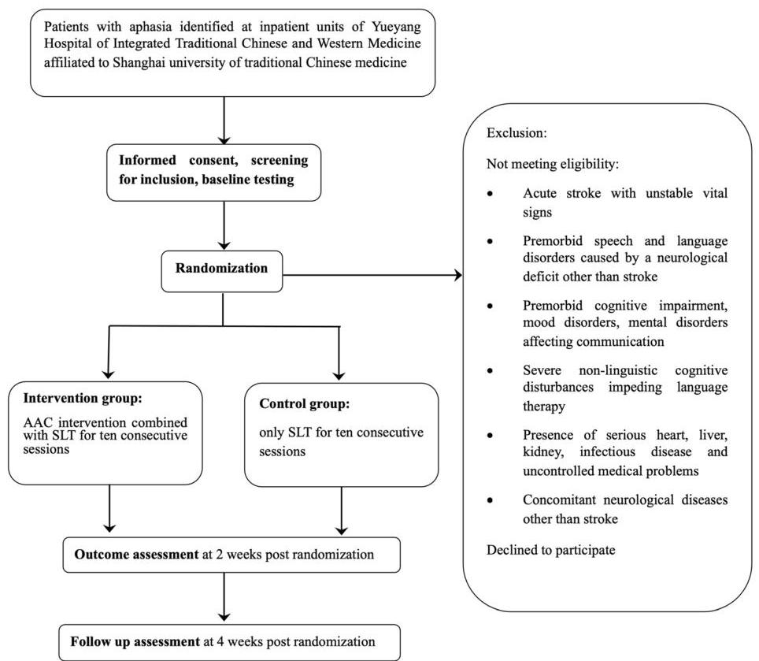
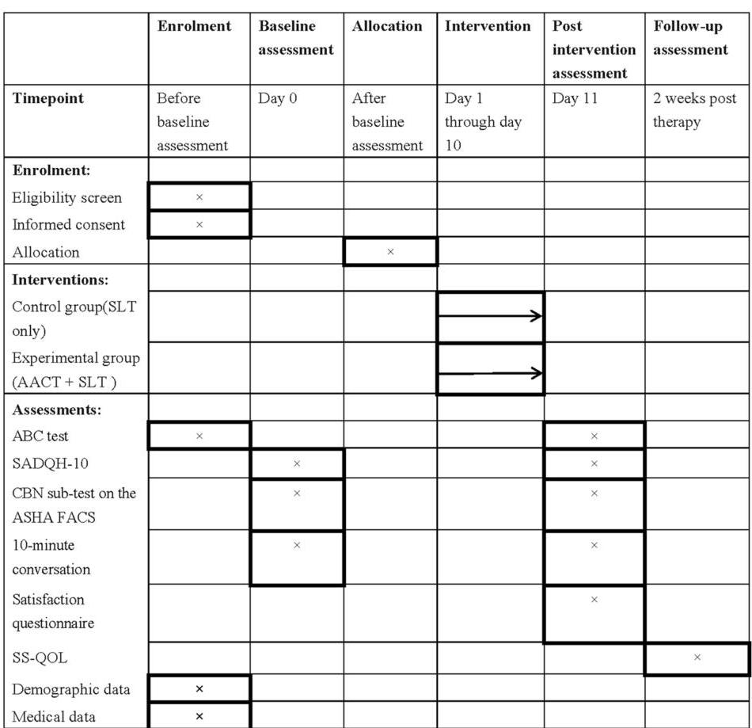

<!-- Source PDF: huang-2021-aac-inpatient-rct.pdf -->

Huang et al. Trials (2021) 22:837

https://doi.org/10.1186/s13063-021-05799-0

Trials

STUDY PROTOCOL

Open Access

Check for updates

# Augmentative and alternative communication intervention for in-patient individuals with post-stroke aphasia: study protocol of a parallel-group, pragmatic randomized controlled trial

Li Huang $^{1}$ , Szu-Han Kay Chen $^{2*}$ , Shutian Xu $^{3}$ , Yongli Wang $^{4}$ , Xing Jin $^{5}$ , Ping Wan $^{5}$ , Jikang Sun $^{1}$ , Jiming Tao $^{1}$ , Sicong Zhang $^{1}$ , Guohui Zhang $^{1}$  and Chunlei Shan $^{1,3,5*}$

# Abstract

Background: People with post-stroke aphasia commonly receive speech-language therapy (SLT) when they are admitted to hospitals. Commonly, these patients reported communication difficulties in in-patient settings. Augmentative and alternative communication (AAC) has been reported as an effective treatment approach to improve communication effectiveness, language performance, decreasing depression, and improving quality of life for this population. However, little evidence has demonstrated the use of AAC intervention (AACT) in early recovery from people with post-stroke aphasia in in-patient rehabilitation settings for improving these patients' communication effectiveness. The pilot randomized controlled trial (RCT) will explore the effectiveness and feasibility of including AACT in regular SLT for in-patient people with post-stroke aphasia.

Method: This pilot RCT is a single-blind, randomized controlled trial with two parallel groups. Both groups receive a 1-h treatment session, including either both AACT and SLT or SLT only for ten consecutive days. We aim to include 22 in-patient participants with post-stroke aphasia in each group. Participants will be assessed at pre- and post-intervention and 2 weeks after intervention. The primary outcomes are the ability of communication measured by the communication of basic needs subtest in the Functional Assessment of Communication Skills for Adult (FACS) and the overall language performance measured by the Chinese Standard Aphasia Battery (ABC). The secondary outcomes include a 10-min conversation, the 10-item Hospital version of the Stroke Aphasic Depression Questionnaire (SADQH-10), the Stroke-Specific Quality of Life Scale (SS-QOL), and a patient and caregiver satisfaction questionnaire.

* Correspondence: szu-han.chen@unh.edu; shanclhappy@163.com
$^{2}$ Department of Communication Sciences and Disorders, University of New Hampshire, 4 Library Way, Hewitt Hall, Room 144, Durham, NH, USA 03824
$^{1}$ Department of Rehabilitation Medicine, Yueyang Hospital of Integrated Traditional Chinese and Western Medicine, Shanghai University of Traditional Chinese Medicine, No. 110 Ganhe Road, Hongkou District, Shanghai 200437, China
Full list of author information is available at the end of the article

BMC

© The Author(s). 2021 Open Access This article is licensed under a Creative Commons Attribution 4.0 International License, which permits use, sharing, adaptation, distribution and reproduction in any medium or format, as long as you give appropriate credit to the original author(s) and the source, provide a link to the Creative Commons licence, and indicate if changes were made. The images or other third party material in this article are included in the article's Creative Commons licence, unless indicated otherwise in a credit line to the material. If material is not included in the article's Creative Commons licence and your intended use is not permitted by statutory regulation or exceeds the permitted use, you will need to obtain permission directly from the copyright holder. To view a copy of this licence, visit http://creativecommons.org/licenses/by/4.0/. The Creative Commons Public Domain Dedication waiver (http://creativecommons.org/publicdomain/zero/1.0/) applies to the data made available in this article, unless otherwise stated in a credit line to the data.

Discussion

This pilot RCT will contribute to new scientific evidence to the field of aphasia rehabilitation in early recovery during the in-patient period. The paper describes the trial, which will explore the effect of combining AACT and SLT and SLT only, our choice of primary and secondary outcome measures, and proposed analyses. The study results will provide information for implementing AACT in the regular in-patient SLT of future RCTs.

## Trial registration

Chinese Clinical Trial Registry database (ChiCTR) [ChiCTR2000028870](http://www.chictr.org.cn/showproj.aspx?proj=2000028870). Registered on 5 January 2020

## Background

Stroke is a leading cause of disability worldwide [1]. Nearly one-third of patients with stroke have post-stroke aphasia [2--4], which is defined as an impairment of the complex process of interpreting and formulating language symbols affecting auditory comprehension, reading, and oral-expressive language and writing [2, 4]. People with aphasia commonly experience different levels of expressive language impairments, ranging from occasional word-finding difficulties to severe verbal communication difficulties [4]. These language and communication difficulties often affect patients' emotions and quality of life [5--8].

When people with aphasia are admitted to hospitals after stroke, they usually receive speech-language therapy (SLT) to improve their language and communication abilities [4, 9, 10]. However, they often reported difficulties in expressing their daily-life and medical needs because of aphasia. Meanwhile, caregivers and healthcare professionals also reported difficulties when communicating with people with aphasia [11]. Therefore, besides SLT, augmentative and alternative communication (AAC) becomes a solution for the issue. AAC is a rehabilitation approach that helps people with aphasia communicate with others [12--14]. People with aphasia can use aided AAC systems (e.g. communication books or high-tech computer devices) to communicate basic needs, deliver information, maintain social closeness, and use social etiquette [12, 15].

Historically, AAC intervention (AACT) was primarily used to support people with aphasia's communication needs as a compensatory strategy but was not used to restore their language abilities [14--18]. Currently, few studies reported that AACT could facilitate language recovery. Several AAC treatment studies have documented people with aphasia's improvements in overall language performance and spoken discourses to unfamiliar listeners [19--21]. Moreover, people with aphasia also showed the ability to use the letters on an AAC device or a communication board to facilitate spoken language during communication breakdowns [20, 22]. However, there is still a lack of evidence of the effectiveness of AAC practices in in-patient rehabilitation settings. Thus, an understanding of AAC practices and supports related to serving individuals with post-stroke aphasia in in-patient rehabilitation settings is essential to develop evidentiary AAC intervention in the specific setting.

It is also important to note that there is limited evidence of AACT for Chinese-speaking people with aphasia. People with aphasia in in-patient rehabilitation settings in China are mainly in acute rehabilitation or subacute facilities. Their communication demands include expressing basic and medical needs (e.g. asking a nurse to call a family member). They need to share information and feelings with their family members and interact with medical professionals about needs and concerns with regard to their healthcare. Evidence indicated that this population could learn to use yes/no cards and communication boards with pictures and words for different communication needs [12]. While the previous studies supported the concept of using AAC in hospital settings [8, 11], there is still no evidence to support this approach in Chinese-speaking people with aphasia. Therefore, an AACT RCT study is needed to investigate the feasibility of the AACT and build up the foundation of research evidence in Chinese communities.

In addition, previous studies have reported that people with aphasia and their families often reject to adopt AAC strategies with the fear that AAC may interfere with or impede the restoration of their natural language system [14, 19, 23]. Similar concerns are commonly raised in the clinical settings in China. However, studies have shown that AACT may simultaneously strengthen communication by reducing the pressure to retrieve target concepts using impaired language functions [20]. Since the present study aims to introduce a new approach (AACT) in an in-patient rehabilitation setting, considering the potential concern of people with aphasia and their families becomes essential. Therefore, instead of comparing AACT and SLT exclusively, the present study aims to compare AACT's effect along with regular SLT to SLT only in individuals with post-stroke moderate to severe aphasia in an in-patient rehabilitation program.

##

Huang et al. Trials (2021) 22:837

# Objective

The present study focuses on the effectiveness of AACT combined with SLT for individuals with moderate to severe aphasia in in-patient rehabilitation settings. The primary aim is to evaluate whether people with aphasia who receive AACT with SLT have more functional communication and language performance improvement than those who received only SLT. The secondary aim is to evaluate the improvements in depression symptoms and quality of life after receiving AACT and SLT only.

# Methods

# Study design and procedure

The study is a single-blind, pragmatic, pilot randomized controlled trial with two parallel groups. According to the PRECIS-2's domains, the study is considered rather pragmatic because of the following characteristics [24]. People with moderate to severe aphasia usually receive speech-language therapy as part of usual care in inpatient settings in China. The participants of the study will be recruited from the study site from in-patient patients. When patients with aphasia are admitted in hospitals, they usually receive speech-language therapy daily for at least 2 weeks. The study design is based on the usual SLT schedule and extended the duration per treatment session for adding the AAC intervention in usual

care. The primary outcome and analysis of the study is the improvement of functional communication which is also the essential outcome in the usual care.

Participants will participate in a 1-h treatment session/ day for ten consecutive days. During each session, participants will receive  $30\mathrm{min}$  of AACT in addition to 30 min of SLT (experimental group) or  $60\mathrm{min}$  of SLT (control group). Participants in the AACT + SLT group will learn to use a paper-made communication board to express their needs. The communication board includes 45 pictures relating to basic needs, emotional expression, medical conditions, and daily activities. Participants' regular rehabilitation interventions, such as physical and occupational therapies, remain the same during the experimental period.

The participants will be evaluated at pre-intervention (prior to randomization) for collecting the demographic and baseline data. The post-intervention evaluation will be completed after participants complete the 10-day training, which is 2 weeks after randomization. Last, a 2-week follow-up will be conducted after the post-intervention evaluation (see Fig. 1).

# Ethics approval

This study has been approved by the Medical Ethics Committee (MEC) of YY hospital (reference number:

Fig. 1 Flow diagram trial design

2019-118, approval received in November 2019). The researchers will report serious adverse events to the MEC. The events will be managed based on institutional policies.

Any modifications to the protocol which may impact on the conduct of the study, potential benefit of the patient, including changes of study objectives, study design, patient population, sample sizes, study procedures, or significant administrative aspects, will require a formal amendment to the protocol. The PI will first notify the IRB board of the YY hospital if there is any modification needed. Such amendment will be agreed upon by the research administration center of YY hospital and approved by the Ethics Committee of YY hospital prior to implementation and notified to Shanghai University of Traditional Chinese Medicine in accordance with local regulations. Revised protocol will also be updated in the Chinese Clinical Trial Registry database (ChiCTR) as ChiCTR2000028870.

### Participants

People with aphasia who are receiving in-patient stroke rehabilitation services in Yueyang Hospital of Integrated Traditional Chinese and Western Medicine Shanghai University of Traditional Chinese Medicine, Shanghai, China (YY hospital), are screened for eligibility. The physician in the in-patient department who is in charge of the patients' rehabilitation service will recruit the patient and provide written information and oral explanation to the participants and their family members. The SLP who is in charge of evaluation assists the physician for diagnosing aphasia and the severity of oral production. Participants are enrolled by the physician according to the inclusion and exclusion criteria as listed in Table 1. All participants and their family members are required to review the information and sign the consent form before participating in the study.

Once a participant is enrolled or randomized, the study site will make every reasonable effort to follow the participant for the entire study period. The research team are responsible for implementing standard operating procedures to maintain interest in the study and achieve follow-up, including regular reminders for participants and their caregivers. Since the study is conducted in an in-patient setting, the research team anticipate the retention will be good except that participants have urgent medical conditions occurring during the treatment period. Participants may withdraw from the study for any reason at any time. The investigator also may withdraw participants from the study if they are unwilling to comply with required study procedures after consultation with the Protocol Chair in YY hospital.

### Table 1

Inclusion and exclusion criteria

Inclusion criteria

1. Diagnosis of aphasia, after stroke, as confirmed by a qualified speech-language therapist ascertained with the Chinese Standard Aphasia Battery (ABC) test [25]

2. Moderate to severe information reduction of verbal production (percentile score of 50 or lower on the ABC verbal production subtest)

3. First onset of stroke, anytime post-stroke

4. Age 20--80 years

5. Mandarin Chinese as the first language

6. Able to participate in intensive therapy

Exclusion criteria

1. Acute stroke with unstable vital signs

2. Premorbid speech and language disorders caused by a neurological deficit other than stroke

3. Premorbid cognitive impairment, mood disorders, and mental disorders affecting communication

4. Severe non-linguistic cognitive disturbances impeding language therapy

5. Presence of serious heart, liver, kidney, infectious disease, and uncontrolled medical problems

6. Concomitant neurological diseases other than stroke

### Randomization and blinding

In-patient participants in YY hospital who meet the inclusion criteria will be randomly assigned to the experimental or control groups after the pre-intervention assessment. A researcher who is not involved in the study will generate a randomization sequence list based on the ratio of 1 to 1 for two groups. Group allocation will be obtained at the beginning of the first intervention session. The SLP in charge of all intervention sessions will open an opaque envelope that includes the assigned allocation. Another SLP who does not know the treatment allocation will conduct all the participants' pre- and post-intervention assessments, and pre-intervention assessment will be performed before group allocation. The SLP performing the intervention is not blinded to group allocation because of the nature of the intervention, while the participants are blinded to allocation since they only know that the intervention is to help them improve communication, and can hardly distinguish AAC from SLT. Data analysis will be conducted by a data analyst who is blinded to group allocation.

### Intervention

### Control group (SLT only)

The participants in the SLT only group will receive a 1-h regular SLT per day for ten sessions. Fifty words related to the stroke rehabilitation program's routine are selected. The fifty words include categories as vegetables and fruits, daily supplies, daily actions, body parts, and the salutation of surrounding medical professionals and family members (husband/wife, son/daughter, physician, nurse, caregiver). These words are presented with a picture and a written word. The 50 words are divided into five sets (10 words/set) according to categories. Participants will practice one set every 2 days.

###

Participants learn the semantic and phonological knowledge of 10 words and conduct auditory comprehension (selecting target word from two/four words following verbal directions from the SLP), word repetition, and naming tasks of learned words in each session. The tasks and training procedures are the same in each session. The procedures are as follows: (1) participants are taught with the semantic and phonological knowledge of the target word one by one; (2) they are asked to repeat the word with the SLP; (3) they are asked to do auditory comprehension tasks by selecting target words from two or four cards; and (4) they are asked to name the target picture based on the Cueing Hierarchy [26].

### Experimental group (AACT + SLT)

The experimental group will receive AACT (0.5 h) + SLT (0.5 h) per session. Participants will learn how to point to the target icons on a paper-based communication board to answer questions (e.g. “Do you have pain?”, “Where is your pain?”) in line with studies that apply AACT for people with aphasia [8, 12, 27]. The communication board contains 45 icons designed for people with aphasia to communicate with medical professionals and family members in the in-patient setting. These icons are pictures of everyday needs, clinical symptoms, types of medical care, rehabilitation services, names of people around, yes/no signs, and a rating scale, with Chinese written words on the top of each icon.

Each intervention includes three training tasks. These tasks aim to help people with aphasia learn how to use the communication board [21]. The first task is symbol identification. Participants are asked to identify each icon on the communication board following verbal directions from the SLP. At first, the SLP presents the verbal model plus a demonstration: the SLP saying “point to [target icon]” while physically modeling the desired response by pointing to the target icon on the communication board. After the modeling, participants are asked to follow the exact directions. Next, the SLP presents a verbal cue only: the SLP saying “point to [target icon],” and then requires the participant to point to the target icon independently. The second task is to answer yes/no questions. The SLP asks a yes/no question relative to a particular icon (is this a picture of [target icon]) and then asks the participant to respond to the question by pointing to the yes or no icon on the communication board. The third task is to respond to questions with a specific icon. The SLP asks an open-ended question relative to a particular icon (e.g. “if you have a headache, which icon will be selected to tell the people who are surrounding you?”). Then the participant responds to the question by pointing to the target icon.

### Measurement instruments

Table 2 provides an overview of the measurement instruments used in the study. The primary outcome measures are the scale of the Communication of Basic Needs (CBN) on the Functional Assessment of Communication Skills for Adults (FACS) [28, 29]. Communication recovery is an essential outcome when people with aphasia are in hospitals. Although professionals agree the outcome is important, there is no assessment tool in the Chinese language to evaluate the outcome. Therefore, the team translated the items of the CBN domain and its scoring scale to Chinese to measure the outcome of the AACT on communication effectiveness in a hospital setting.

The FACS measures functional communication skills of people with aphasia in four domains (social communication, communication of basic needs, reading/writing/number concepts, and daily planning) and in four qualitative dimensions (adequacy, appropriateness, promptness, and communication sharing). The 7-point scale measures the levels of assistance and prompting needed in each domain, and the 5-point scale measures the response in four dimensions. The inter-rater/intra-rater reliability for the CBN domain and the overall qualitative dimension are high. The concurrent validity between the Western Aphasia Battery and the Functional Independence Measure (FIM) is moderate [28].

An informal test of a 10-min conversation is used to measure participants' functional communication efficiency in the in-patient setting pre- and post-intervention. Conversation analysis is a common procedure in regular aphasia assessment [30]. The 10-min conversation is evaluated using the 5-point scale of the four qualitative dimensions (adequacy, appropriateness, promptness, and communication sharing) in the FACS. The results of the 5-point scale allow the team to evaluate changes of the quality of conversation pre- and post-intervention. The participants are asked to talk about their daily lives and their medical services with the SLP in the conversation. The conversation will be video recorded and analyzed by the SLP conducting the assessments.

The secondary measures include the Chinese Standard Aphasia Battery (ABC), a standard test to diagnose aphasia and determine the type of aphasia for the Chinese-speaking population and widely used in clinical practice and research in local sites, to measure participants' overall language performance [25]. The Chinese version of the 10-item Hospital version of the Stroke Aphasic Depression Questionnaire (SADQH-10) with adequate content validity and the test-retest reliability (> 0.80) is used for evaluating depressive symptoms in people with aphasia [31, 32]. The Chinese version of the Stroke-Specific Quality of Life Scale (SS-QOL) with high stability and validity is used for evaluating the stroke-specific health-related quality of life [33, 34].

Huang et al. Trials (2021) 22:837

Table 2 Measurement instruments

|  Measurement instruments | Number of items | Score range | Measurement target  |
| --- | --- | --- | --- |
|  CBN subtest on the ASHA FACS | 7 | 0–7 | Functional communication skills for basic needs  |
|  ABC test | 23 | 0–100 | Language abilities, including speaking, listening, reading, and writing  |
|  10-min conversation | 4 | 0–5 | Communication efficiency in the in-patient setting  |
|  SADQH-10 | 10 | 0–3 | Depression symptoms  |
|  SS-QOL | 49 | 49–245 | Stroke-specific health-related quality of life  |
|  Satisfaction questionnaire | 11 | 1–5 | Satisfaction intervention for communication improvement from both patients and their caregivers  |

For qualitative evaluations, the first author designed a 5-point scale questionnaire to evaluate the satisfaction of the interventions for this trial. The questionnaire includes four items for both control and experimental groups, three items for both groups' caregivers, and two extra items for the experimental group and the caregivers. The questions were reviewed by the research team to ensure the readability and appropriates. The participants and their caregivers are asked to choose from 1 (very dissatisfied) to 5 (very satisfied) to evaluate

the satisfaction for materials (common cards and AAC paper board) and communication behavior with caregivers and medical professionals after the intervention.

Figure 2 shows the schedule of each outcome measure. The CBN on the ASHA FACS, the ABC, a 10-min conversation, and SADQH-10 are completed pre- and post-intervention. The satisfaction questionnaire is completed after the intervention. The SS-QOL is completed after a 2-week follow-up for evaluating the quality of life after participants are discharged by the in-patient rehabilitation

Fig. 2 Trial schedule of enrollment intervention and assessment

program. Additional file 1 is an overview of the Standard Protocol Items: Recommendations for Interventional Trials (SPIRIT) checklist.

### Sample size

No large RCTs have been conducted in the field of aphasia AACT in in-patient rehabilitation settings. Previous AAC studies used interventions not applicable to the current protocol. Therefore, we are unable to calculate the prior accurate sample size. We will use the CBN score in the FACS to investigate the possible effect. We consider a minimum improvement of 1 point on the 7-point scale in FACS is clinically significant. Given an expected standard deviation of 1 based on prior norm references [28, 35], the trial must include a total of 44 participants. Each group needs 22 participants to detect this difference with a significance level of 5 and a power of 90. After considering a dropout rate of 20%, the study aims to recruit 56 participants in total. We anticipate that this pilot study will provide information for more accurate sample size calculation in the future.

### Data analysis

Outcomes of interest will be analyzed on an intention-to-treat basis. Characteristics of the sample and the descriptive statistics will be reported. The primary analysis will be conducted without adjustment. The mixed model analysis will be used to analyze the continuous repeated-measure data because of its advantages of accommodating missing data and the flexibility in small samples and treating time. Data will be examined for differences between groups and over time. Post hoc tests will be performed to explore factors including age, sex, education, and initial stroke/aphasia severity, considered to affect the trial's outcome. The data from conversation samples and the satisfaction survey will be suitably coded for qualitative responses to be categorized and examined.

## Discussion

This protocol describes a pragmatic pilot randomized controlled trial that can provide a valuable contribution to people with post-stroke moderate to severe aphasia in in-patient rehabilitation settings. The trial's primary objective is to investigate the effectiveness of AACT combined with traditional SLT in communication/language recovery. To our knowledge, no RCTs have explored the combination of two treatment approaches for people with aphasia in in-patient rehabilitation settings.

This RCT will look at the feasibility of scaling the AACT up for larger trials and clinical implementation. Therefore, we aim to have a larger sample size compared to previous studies. While AACT has been developed several decades in developed countries, it is still relatively new for most developing countries, including China. Future studies may apply the results of the study to them if the trial is feasible. People with post-stroke aphasia commonly receive traditional SLT that aims to recover their verbal communication skills through behavior modification, cognitive therapy, and pragmatic therapies. However, many of them face immediate communication challenges when they are admitted to hospitals. Evidence suggests that people with aphasia have decreased quality of life, poorer health outcomes, and limited participation in medical encounters due to their communication and language disabilities [8]. These people are more likely to experience adverse medical events (e.g. medication errors) than those without a communication disability [8, 36]. AACT can be the solution to improve the situation. People with post-stroke aphasia can use AAC to support their communication effectiveness when spoken communication skills do not work [21].

Our trial trains people with aphasia to use a paper-based communication board with caregivers and healthcare providers in in-patient rehabilitation settings. It is easy to access and cost-effective, which is essential for all clinical settings. As an in-patient stay is often the first step on a long-term care continuum, AAC can maximize people's communication skills with aphasia within desired life roles and prepare them and their families for life after the in-patient stay [8]. When the trial is completed, the results will also give us a better understanding of the AACT's dual role in simultaneously driving inter-systemic reorganization with the potential to support language function while providing compensatory strategies during communication breakdowns in in-patient settings.

In our previous experience, AAC is often not prescribed in the early stages of recovery because patients with aphasia and their family members are worried that receiving AACT will impede language recovery [19]. It is a common AAC myth in clinical settings. However, recent evidence suggests that early AACT in in-patient settings may increase AAC acceptance and decrease the risk of not using language during the early recovery stage. Early AACT may also increase people with aphasia's motivation to communicate in various situations and have better long-term participation outcomes. Therefore, they were more active when making their healthcare decisions, experiencing increased participation in life events, and discovering new social roles [19]. This evidence supports the purpose of the trial's intention to investigate early AACT's effectiveness in in-patient settings. The results of the trial will also contribute to the research evidence of AACT in Chinese-speaking people with aphasia.

A limitation of this study is that this protocol is not double-blind. However, the participants and the SLP will

Huang et al. Trials (2021) 22:837

be blinded to treatment allocation. The study also cannot eliminate the confounding effects from the early-stage spontaneous recovery after stroke. The trial is designed to investigate the effectiveness of the current practice protocol in the local site. Therefore, the follow-up is short. Since the research evidence of the effectiveness of AACT in in-patient settings is limited, the trial's results will also provide new insight into implementing AACT in actual clinical practice.

## Trial status

This trial is registered in the Chinese Clinical Trial Registry database (ChiCTR) as ChiCTR2000028870 on 5 January 2020, and the current protocol is the first version. The recruitment of the trial started on 20 January 2020, and delay the completion time until December 2022 as reported in the ChiCTR database due to the research site's restriction of admitting patients because of COVID-19. Fourteen participants have been recruited and randomized into the trial until now.

## Abbreviations

AAC: Augmentative and alternative communication; ABC: Aphasia Battery of Chinese; ASHA: American Speech and Hearing Association; CBN: Communication of Basic Needs; CONSORT: Consolidated Standards of Reporting Trials; FACS: Functional Assessment of Communication Skills for Adult; MEC: Medical Ethics Committee; RCT: Randomized controlled trial; SADQH-10: 10-item Hospital version of the Stroke Aphasic Depression Questionnaire; SLP: Speech and language pathologist; SLT: Speech-language therapy; SPIRIT: Standard Protocol Items: Recommendations for Interventional Trials; SS-QOL: Stroke-Specific Quality of Life Scale; YY hospital: Yueyang Hospital of Integrated Traditional Chinese and Western Medicine Affiliated to Shanghai University of Traditional Chinese Medicine

## Supplementary Information

The online version contains supplementary material available at https://doi.org/10.1186/s13063-021-05799-0.

Additional file 1. Overview of the Standard Protocol Items: Recommendations for Interventional Trials (SPIRIT) checklist

## Acknowledgements

The authors would like to thank all the participants and their family members, as well as all the staff in the rehabilitation setting of YY hospital who support this study.

## Authors' contributions

LH and S-HKC contributed to the protocol design and the writing of this manuscript. LH is responsible for the daily operational aspects of the study. STX is the statistician in this project. S-HKC and CLS are the corresponding authors and supervisors in this project. YLW, XJ, PW, JKS, JMT, SCZ, and GHZ all contributed to the design and drafted the manuscript. All authors read and approved the final manuscript.

## Funding

The trial is funded by the Shanghai University of Traditional Chinese Medicine. The funding body did not contribute to the design of the protocol or in writing the manuscript. The views expressed here are those of the authors and not necessarily of the funders.

## Availability of data and materials

The datasets analyzed during the current study are available from the corresponding author on reasonable request.

## Declarations

### Ethics approval and consent to participate

The study has received ethical approval from the ethics committee of Yueyang Hospital of Integrated Traditional Chinese and Western Medicine, Shanghai University of Traditional Chinese Medicine. A consent form for participation in the trial has been developed and approved by the ethics committee. Informed consent will be obtained from all participants in the trial.

### Consent for publication

Not applicable.

### Competing interests

The authors declare that they have no competing interests.

### Author details

$^{1}$ Department of Rehabilitation Medicine, Yueyang Hospital of Integrated Traditional Chinese and Western Medicine, Shanghai University of Traditional Chinese Medicine, No. 110 Ganhe Road, Hongkou District, Shanghai 200437, China. $^{2}$ Department of Communication Sciences and Disorders, University of New Hampshire, 4 Library Way, Hewitt Hall, Room 144, Durham, NH, USA 03824. $^{3}$ Engineering Research Center of Traditional Chinese Medicine Intelligent Rehabilitation, Ministry of Education, 1200 Cailun Road, Pudong New District, Shanghai 201203, China. $^{4}$ Department of Rehabilitation Science, Faculty of Education, East China Normal University, 3663 North Zhongshan Road, Putuo District, Shanghai 200062, China. $^{5}$ School of Rehabilitation Science, Shanghai University of Traditional Chinese Medicine, 1200 Cailun Road, Pudong New District, Shanghai 201203, China.

Received: 28 December 2020 Accepted: 4 November 2021

Published online: 24 November 2021

## References

1. Ora HP, Kirmess M, Brady MC, Winsnes IE, Hansen SM, Becker F. Telerehabilitation for aphasia - protocol of a pragmatic, exploratory, pilot randomized controlled trial. Trials. 2018;19(1):208. https://doi.org/10.1186/s13063-018-2588-5.
2. Berthier ML. Poststroke aphasia: epidemiology, pathophysiology and treatment. Drugs Aging. 2005;22(2):163-82. https://doi.org/10.2165/00002512-200522020-00006.
3. Engelter ST, Gostynski M, Papa S, Frei M, Born C, Ajdacic-Gross V, et al. Epidemiology of aphasia attributable to first ischemic stroke: incidence, severity, fluency, etiology, and thrombolysis. Stroke. 2006;37(6):1379-84. https://doi.org/10.1161/01.STR.0000221815.64093.8c.
4. Brady MC, Kelly H, Godwin J, Enderby P, Campbell P. Speech and language therapy for aphasia following stroke. Cochrane Database Syst Rev. 2016;6: CD000425. https://doi.org/10.1002/14651858.CD000425.pub4.
5. Hilari K. The impact of stroke: are people with aphasia different to those without? Disabil Rehabil. 2011;33(3):211-8. https://doi.org/10.3109/09638288.2010.508829.
6. Hilari K, Needle JJ, Harrison KL. What are the important factors in health-related quality of life for people with aphasia? A systematic review. Arch Phys Med Rehabil. 2012;93(1 Suppl):S86-95. https://doi.org/10.1016/j.apmr.2011.05.028.
7. Baker C, Worrall L, Rose M, Hudson K, Ryan B, O'Byrne L. A systematic review of rehabilitation interventions to prevent and treat depression in post-stroke aphasia. Disabil Rehabil. 2018;40(16):1870-92. https://doi.org/10.1080/09638288.2017.1315181.
8. Gormley J, Light J. Providing services to individuals with complex communication needs in the inpatient rehabilitation setting: the experiences and perspectives of speech-language pathologists. Am J Speech Lang Pathol. 2019;28(2):456-68. https://doi.org/10.1044/2018_AJSLP-18-0076.
9. Yu ZZ, Jiang SJ, Jia ZS, Xiao HY, Zhou MQ. Study on language rehabilitation for aphasia. Chin Med J (Engl). 2017;130(12):1491-7. https://doi.org/10.4103/0366-6999.207465.
10. Sun Y, Xue SA, Zuo Z. Acupuncture therapy on apoplectic aphasia rehabilitation. J Tradit Chin Med. 2012;32(3):314-21. https://doi.org/10.1016/S0254-6272(13)60031-X.

Huang et al. Trials (2021) 22:837

11. Clancy L, Povey R, Rodham K. "Living in a foreign country": experiences of staff-patient communication in in-patient stroke settings for people with post-stroke aphasia and those supporting them. Disabil Rehabil. 2020;42(3): 324-34. https://doi.org/10.1080/09638288.2018.1497716.
12. Doyle M, DeRuyter F. Augmentative and alternative communication intervention for persons with severe aphasia. Top Stroke Rehabil. 1995;2(1): 29-39. https://doi.org/10.1080/10749357.1995.11754052.
13. Beukelman DR, Fager S, Ball L, Dietz A. AAC for adults with acquired neurological conditions: a review. Augment Altern Commun. 2007;23(3): 230-42. https://doi.org/10.1080/07434610701553668.
14. Jacobs B, Drew R, Ogletree BT, Pierce K. Augmentative and Alternative Communication (AAC) for adults with severe aphasia: where we stand and how we can go further. Disabil Rehabil. 2004;26(21-22):1231-40. https://doi.org/10.1080/09638280412331280244.
15. Kraat, AW. Augmentative and alternative communication: does it have a future in aphasia rehabilitation? Aphasiology. 1990 [cited 2021 October 17]; 4(4):321-38. Available from: https://doi.org/10.1080/02687039008249086.
16. Coelho CA, Manual sign acquisition and use in two aphasic subjects, Clinical Aphasiol. 1991 [cited 2021 October 17]; 19:209-18. Available from: http://aphasiology.pitt.edu/116/1/19-20.pdf.
17. Conlon CP, Mcneil MR. The efficacy of treatment for two globally aphasic adults using visual action therapy. Clinical Aphasiol. 1991 [cited 2021 October 17]; 19:185-95. Available from: http://aphasiology.pitt.edu/114/1/19-18.pdf.
18. Bellaire KJ, Georges JB, Thompson CK. Establishing functional communication board use for nonverbal aphasic subjects. Clinical Aphasiol. 1991 [cited 2021 October 17]; 19:219-27. Available from: http://aphasiology.pitt.edu/117/1/19-21.pdf.
19. Dietz A, Wallace SE, Weissling K. Revisiting the role of augmentative and alternative communication in aphasia rehabilitation. Am J Speech Lang Pathol 2020;29(2):909-913, 2, DOI: https://doi.org/10.1044/2019_AJSLP-19-00041.
20. Dietz A, Vannest J, Maloney T, Altaye M, Holland S, Szaflarski JP. The feasibility of improving discourse in people with aphasia through AAC: clinical and functional MRI correlates. Aphasiology. 2018;32(6):693-719. https://doi.org/10.1080/02687038.2018.1447641.
21. Johnson RK, Hough MS, King KA, Vos P, Jeffs T. Functional communication in individuals with chronic severe aphasia using augmentative communication. Augment Altern Commun. 2008;24(4):269-80. https://doi.org/10.1080/07434610802463957.
22. Wambaugh, J. L., Wright, S. Improved effects of word retrieval treatments subsequent to addition of the orthographic form. Aphasiology. 2007 [cited 2021 October 17]; 21(6-8): 632-42. Available from: https://doi.org/10.1080/02687030701192133.
23. Beukelman DR, Ball LJ. Improving AAC use for persons with acquired neurogenic disorders: understanding human and engineering factors. Assist Technol. 2002;14(1):33-44. https://doi.org/10.1080/10400435.2002.10132053.
24. Loudon K, Zwarenstein M, Sullivan FM, Donnan PT, Gagyor I, Hobbelen H, et al. The PRECIS-2 tool has good interrater reliability and modest discriminant validity. J Clin Epidemiol. 2017;88:113-21. https://doi.org/10.1016/j.jclinepi.2017.06.001.
25. Gao SR. Clinical use of aphasia battery in Chinese, Stroke and Nervous Diseases. 1996 [cited 2021 October 17]; 3(2):57-59. Available from: http://en.cnki.com.cn/Article_en/CJFDTOTAL-ZZYS199602000.htm.
26. Linebaugh CW, Shisler RJ, Lehner L. Cueing hierarchies and word retrieval: a therapy program. Aphasiology. 2005 [cited 2021 October 17];19(1):77-92. Available from: https://doi.org/10.1080/02687030444000363, CAC classics.
27. Frankoff DJ, Hatfield B. Augmentative and alternative communication in daily clinical practice: strategies and tools for management of severe communication disorders. Top Stroke Rehabil. 2011;18(2):112-9. https://doi.org/10.1310/tsr1802-112.
28. Frattali C, Thompson CK, Holland AL, Wohl CB, Ferketic M. Functional assessment of communication skills for adults. American Speech-Language-Hearing Association: Rockville, MD; 1995.
29. DeRuyter F. Report on the American Speech-Language-Hearing Association Functional Assessment of Communication Skills for Adults. Top Stroke Rehabil. 1996;3(1):77-81. https://doi.org/10.1080/10749357.1996.11754107.
30. Papathanasiou I, Coppens P. Aphasia and related neurogenic communication disorders. Burlington, 2nd ed. Jones &amp; Bartlett Learning: MA; 2017.
31. Cobley CS, Thomas SA, Lincoln NB, Walker MF. The assessment of low mood in stroke patients with aphasia: reliability and validity of the 10-item Hospital

version of the Stroke Aphasic Depression Questionnaire (SADQH-10). Clin Rehabil. 2012;26(4):372-81. https://doi.org/10.1177/0269215511422388.
32. Liu Y, Zhang YQ, Zhang Y, Liu XX, Zhang YM. Chinese adaptation and application evaluation of Stroke Aphasic Depression Questionnaire-hospital version. Chin J Stroke. 2018 [cited 2021 October 17]; 13(9):928-933. Available from: https://www.zhangqiaokeyan.com/academic-journal-cn_chinese-journal-stroke_thesis/0201237632591..
33. Williams LS, Weinberger M, Harris LE, Clark DO, Biller J. Development of a stroke-specific quality of life scale. Stroke. 1999;30(7):1362-9. https://doi.org/10.1161/01.STR.30.7.1362.
34. Zhang F, Fu SY, Wang M, Du J. Correlation empirical research on the quality of life of Chinese patients with stroke measured by SS-QOL and Barthel Index. Chin Pharm Affairs. 2010 [cited 2021 October 17]; 9:929-32. Available from: http://qikan.cqvip.com/Qikan/Article/Detail?id=35546544.
35. Hilari K, Byng S. Health-related quality of life in people with severe aphasia. Int J Lang Commun Disord. 2009;44(2):193-205. https://doi.org/10.1080/13682820802008820.
36. Bartlett G, Blais R, Tamblyn R, Clermont RJ, MacGibbon B. Impact of patient communication problems on the risk of preventable adverse events in acute care settings. CMAJ. 2008;178(12):1555-62. https://doi.org/10.1503/cmaj.070690.

## Publisher's Note

Springer Nature remains neutral with regard to jurisdictional claims in published maps and institutional affiliations.

## Ready to submit your research? Choose BMC and benefit from:

- fast, convenient online submission
- thorough peer review by experienced researchers in your field
- rapid publication on acceptance
- support for research data, including large and complex data types
- gold Open Access which fosters wider collaboration and increased citations
- maximum visibility for your research: over 100M website views per year

At BMC, research is always in progress.

Learn more biomedcentral.com/submissions

BMC