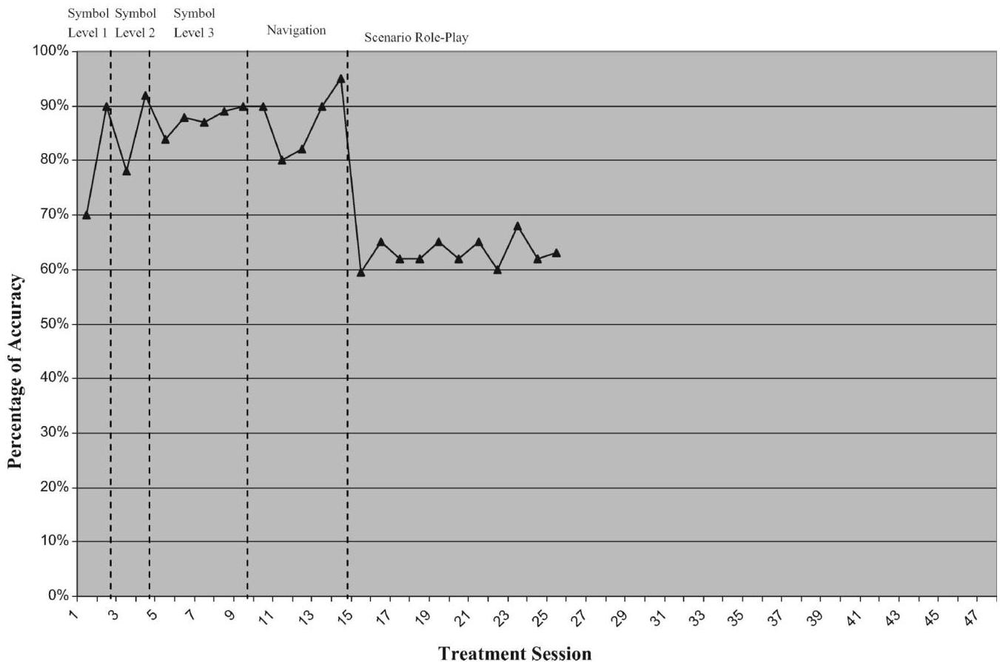
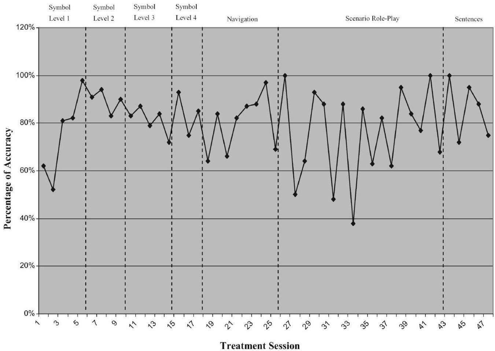
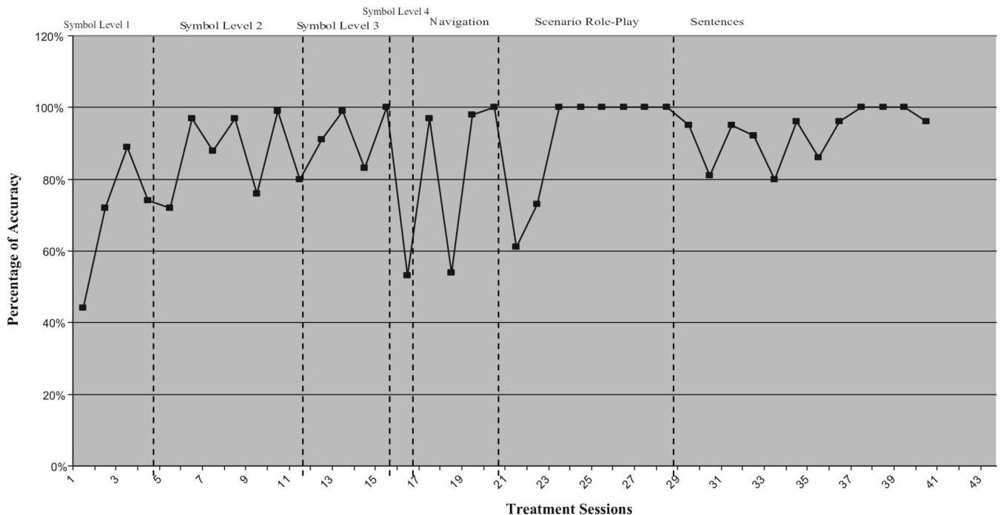
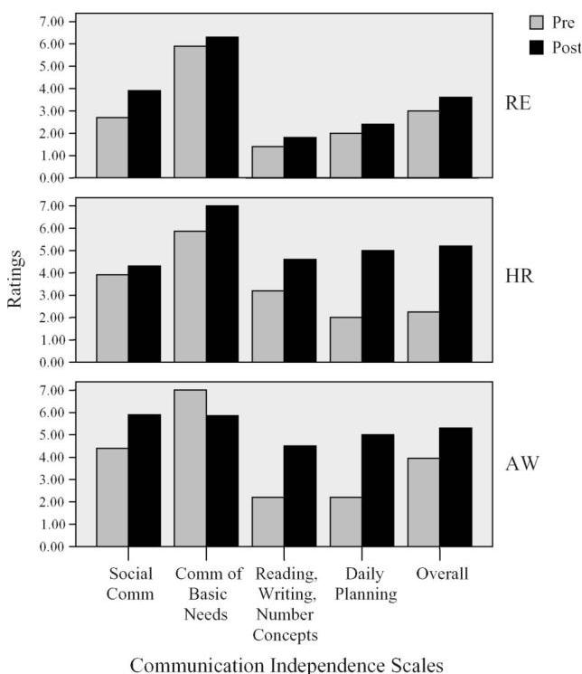

<!-- Source PDF: johnson-2008-aac-severe-aphasia.pdf -->

Augmentative and Alternative Communication, December 2008 VOL. 24 (4), pp. 269-280

informa healthcare

# Functional Communication in Individuals with Chronic Severe Aphasia Using Augmentative Communication

RACHEL KAY JOHNSON, MONICA STRAUSS HOUGH*, KRISTIN ANN KING, PAUL VOS and TARA JEFFS

East Carolina University, Greenville, North Carolina, USA

Intervention incorporating augmentative and alternative communication (AAC) is often implemented with adults with aphasia, although studies do not always specify the approaches and strategies used. This study examined abilities of three individuals with chronic non-fluent aphasia (NA) using a dynamic display AAC device to enhance communication. The device, Dialect with Speaking Dynamically Pro, was tailored to each participant's skill level using a treatment protocol adapted from Koul, Corwin, and Hayes (2005). The primary caregiver was the spouse. Pre and post-treatment measures revealed improvement in quality and effectiveness of communication for all participants. Improved linguistic and cognitive functioning was observed for two participants. Results are discussed relative to use of a device with other adults with chronic NA.

Keywords: Chronic Aphasia; Nonfluent; Functional; Augmentative System; Communication; Caregiver

# INTRODUCTION

Individuals with non-fluent aphasia (NA) typically exhibit sparse, ungrammatical verbal output and impaired word finding skills (Basso, 2003; Davis, 2007; Spreen &amp; Risser, 2003). For many of these individuals, speech-language therapy approaches consisting of behavior modification, cognitive therapy, and pragmatic therapies to learn techniques to regain verbal communication skills are unsuccessful, regardless of time post-stroke. Augmentative and alternative communication (AAC) may provide a means of communicating through devices and techniques when spoken communication skills are not functional. The multidimensional Matching Person and Technology (MPT) model (Scherer, 2002) emphasizes quality of life beyond device and disability and addresses competence, self-esteem, user personality, environment characteristics, and device features. According to this model, caregiver support is an integral treatment component to enhance the implementation of AAC devices outside the therapeutic setting (Cook &amp; Hussey,

2002; Scherer, 2002). The World Health Organization (WHO) model for International Classification of Functioning, Disability and Health (ICF) also addresses the impact of a health condition on the person (such as stroke leading to chronic aphasia), as well as the environmental factors that may either restrict or facilitate participation of the person in their daily activities (WHO, 2001; Worrall &amp; Hickson, 2003). The ICF framework deals with impairment, activity, and participation level of the individual. Level and type of impairment varies from one individual with aphasia to another. Relative to chronic NA, the impairment involves deficits in overall communication, often isolating and decreasing activity and participation level of the individual. The provision of AAC devices to adults with NA can be a means of decreasing impairment, by increasing options for communication and activity level, and improving participation in daily living activities.

Research suggests that some individuals with communication disorders due to aphasia benefit from the use of AAC (Aftonomous, Steele, &amp;

ISSN 0743-4618 print/ISSN 1477-3848 online © 2008 International Society for Augmentative and Alternative Communication DOI: 10.1080/07434610802463957

R. K. JOHNSON et al.

Wertz, 1997; Fox &amp; Fried-Oken, 1996; Garrett, Beukelman, &amp; Low-Morrow, 1989; Steele, Weinrich, Kleczewska, &amp; Carlson, 1989; Weinrich, Steele, Carlson et al., 1989). Studies have also shown that some individuals with severe NA can be taught to use picture symbols to form sentences using Computerized Visual Communication (C-VIC) (Aftonomous et al., 1997; Shelton, Weinrich, McCall, &amp; Cox, 1996; Steele, Kleczewska, Carlson, &amp; Weinrich, 1992; Steele, et al., 1989; Weinrich, McCall, Shoosmith, et al., 1993; Weinrich, McCall, &amp; Weber, 1995; Weinrich, Shelton, Cox, &amp; McCall, 1997a; Weinrich, Shelton, McCall, &amp; Cox, 1997b). Programming for C-VIC has become more sophisticated with added speech generation capacity and is now called Lingraphica. C-Speak Aphasia (Nicholas, Sinotte, &amp; Helm-Estabrooks, 2005), a program conceptually based on C-VIC and geared towards individuals with severe aphasia, has proven successful for some patients; however, patients with severe NA have required many months of training to learn the system. Furthermore, other computer-assisted treatments, such as MossTalk Words (Fink, Brecher, Sobel, &amp; Schwartz, 2005; Fink, Brecher, Schwartz, &amp; Robey, 2002) and Multicue (Doesburgh, van de Sandt-Koenderman, Dippel et al., 2004), are designed to enhance word retrieval skills, but these tools have not been used successfully with individuals with chronic and severe NA.

Recently, van de Sandt-Koenderman, Wiegers, and Hardy (2005) developed a device called Portable Communication Assistant for People with Dysphasia. Better known as  $\mathrm{PCAD}^{\mathrm{TM}}$ , the device incorporates symbols, pictures, text, and digitized and synthesized speech in a portable handheld device for functional communication. Although this system has had limited exposure, it appears that high-tech AAC can be used for functional communication when matched appropriately to an individual with aphasia (van de Sandt-Koenderman, 2004; van de Sandt-Koenderman et al., 2005). Furthermore, several studies have reported positive results when the residual skills of a person with aphasia are considered (Garrett et al., 1989), and when clinical therapy and computer-based home training are combined (Wallesch &amp; Johannsen-Horbach, 2004).

In one of the few efficacy studies of AAC intervention published to date, the performance of individuals with chronic NA (severe Broca or global aphasia) who were using computer-based AAC intervention was found to be superior to their performance when using natural speech (Koul, Corwin, &amp; Hayes, 2005). These researchers employed a single-subject, multiple-baseline design to examine production of sentences using

graphic symbols by 9 participants, using Gus Multimedia software. The results revealed that the participants with aphasia were able to access symbols and navigate the computer to produce phrases and short sentences.

Thus, individuals with chronic severe aphasia have learned to communicate using pictures and some orthographic symbols. However, strategies and techniques used to facilitate generalization from therapy to daily communication (Robey, 1998), and communication with spouses and caregivers, are not typically described in detail in studies. Wertz and Katz (2004; 2001) have called for more treatment specificity and better designed studies that incorporate computer-assisted language treatment with adults with aphasia.

A detailed, carefully planned, replicable protocol to document the treatment outcome of functional communication using AAC is described in the current study. The purpose was to examine the benefits to individuals with severe chronic NA of an intensive therapy regimen with a specified format that utilized a computer-based AAC system. The treatment involved training the caregiver in the therapy approach and use of the AAC device, and consistent caregiver participation throughout the treatment. The specific questions addressed were (a) whether participants with aphasia could successfully progress through a specified treatment program involving hierarchical structure of symbols with an AAC device, and (b) whether, following the treatment, changes would be noticeable in performance on speech and language aphasia tests and measures assessing functional communication skills and quality of life.

# METHOD

## Participants

There were three participants, two females (RE and AW) and one male (HR), with severe NA resulting from left cerebro-vascular accident (CVA), with apraxia of speech (AOS) and right hemiparesis. All of the participants passed modified hearing screenings for older adults (Ventry &amp; Weinstein, 1983; 1992) and had received speech-language therapy intermittently, post CVA. Therapy never involved use of a computerized AAC device, although both RE and HR had tried low-tech devices at approximately 1 year post-stroke, with very limited success. At the time of the study participants were living at home with their respective spouses. For all participants, the spouse was the primary caregiver

FUNCTIONAL AAC FOR NONFLUENT APHASIA

and underwent training as part of the study. Participant and spouse demographic information is presented in Table 1.

Participants were accompanied by their respective caregivers when informed consent was obtained. The consent form was read aloud to the participant by the first author, who explained the benefits of the study. Once the participant signed the consent form, caregivers were presented with a written copy of the form and personally read and initialed each page, indicating that they were in agreement with all testing and therapy procedures.

# Materials

The Dialect by  $\mathrm{Zygo}^{\mathrm{TM}}$  with Speaking Dynamically  $\mathrm{Pro}^{\mathrm{TM}}$  was used in the study because it was easily accessible and portable, lightweight, had an easy access touch screen and a speech synthesizer (Zygo Industries, Inc., 2004), and included features desirable for individuals with chronic NA. Furthermore, it included the option of downloading personal photographs into the directory to use in conjunction with orthographic symbols.

The programming of each device was tailored to the particular participant, based on specific information (interests, hobbies, activities, friends, family, etc.) that was provided during an interview session with the caregiver and participant prior to intervention. Personal photographs were used to identify family and friends rather than orthographic symbols if the participant was unable to read particular words. Symbols on the device were organized using a four-level hierarchy structure with choices at each level. The number of choices at each level corresponded to the number of choices the particular participant was able to access accurately. This information was ascertained from pretreatment test scores and the participant's performance during the first stage of treatment. For example, if the participant was unable to choose from five choices, the number of

choices was reduced until the participant was capable of pointing to the correct target from the array of foils.

There were four levels of hierarchy used with the device. Level 1 was the broadest category (e.g., food), Level 2 consisted of choices within the Level 1 category (e.g., restaurant, store, home), and Level 3 contained choices within the Level 2 category (e.g., fruit). Level 4 contained items specific to the third level category (e.g., apple). Each level was tailored to the particular participant, based on information provided during the initial interview. General categories consisted of actions, objects, people, places, and questions. All participants had the same categories of items on their screen displays; what was unique for each was the number of items per display, the use of a picture versus orthographic symbol for a particular item, and the inclusion of specific items.

# Pre- and post-tests

The following tests were administered to the participants prior to and following the treatment: (a) Western Aphasia Battery (WAB; Kertesz, 1982), including the Aphasia Quotient (AQ) and Cortical Quotient (CQ), to determine the presence and severity of aphasia and cognitive involvement; (b) American Speech-Language Hearing Association Functional Assessment of Communication Skills (ASHA FACS; Frattali, Thompson, Holland, Wohl, &amp; Ferketic, 1995), to measure everyday communicative activities; (c) American Speech-Language Hearing Association Quality of Communication Life Scale (ASHA QCL; Paul, Frattali, Holland et al., 2003), to examine impact of communication disorder from perspective of communicatively-impaired person; and the (d) Communicative Effectiveness Index (CETI; Lomas Pickard, Bester et al., 1989), to obtain the caregiver's rating of situations important to the aphasic participant and the caregiver. All tests were administered according to the

TABLE 1 Participant and spouse demographic data.

|   | Age (years) | Gender | Years education | Time post-stroke (yr/mo) | Type of aphasia | Degree of severity* | Occupation  |
| --- | --- | --- | --- | --- | --- | --- | --- |
|  RE | 57 | F | 16 | 7:9 | Mixed | Severe (26.4) | Business consultant  |
|  RE | 57 | F | 16 | 7:9 | Mixed | Severe (26.4) | Business consultant  |
|  RE Spouse | 59 | M | 21 | - | - | - | University professor  |
|  HR | 69 | M | 21 | 3:2 | Broca | Severe (23.5) | University professor  |
|  HR Spouse | 67 | F | 16 | - | - | - | Housewife  |
|  AW | 77 | F | 16 | 2:3 | Broca | Moderate (49.6) | Business owner  |
|  AW Spouse | 79 | M | 16 | - | - | - | Business owner (ret.)  |

*Severity of aphasia as determined by the Western Aphasia Battery Aphasia Quotient.

procedures indicated in the corresponding test manual. Testing prior to treatment was conducted by the first author. All post-treatment testing was conducted by the third author, who was unaware of the pretreatment results. Both testers were speech-language pathologists familiar with the assessment tools and had expertise in assessment and treatment of adults with brain damage.

### Procedures

Caregivers received training on the AAC device, including an overview on navigating different symbol levels and an explanation of the hierarchy structure. Instructions were provided on facilitation strategies, including the presentation of cues and prompts to use with participants while incorporating device use outside of therapy (see Table 2). In addition, the caregiver and participant were given activities to be completed at home on a daily basis. These included practice on the category and category level addressed in therapy that day, to supplement information covered during each therapy session. Caregivers were also given written instructions on care and maintenance of the device.

Procedures were similar to Koul et al. (2005). Sessions with the device were 1 h, 3--4 days weekly, over approximately a 3 month period of time. First, the participant was shown the operation of the device (turning it on and off, location of battery pack, charging the device). The device was positioned for optimal comfort, access, and ability to read the screen. These steps took about one session for each participant. Then treatment was implemented. The treatment consisted of training on the symbols on the device and instructing the participant in how to use the device as a communicative tool.

The first stage of treatment was Symbol Identification. For each level in the device, the participant was asked to identify each symbol on the display, following spoken directions from the clinician (the first author). The prompt and cue sequence used during each stage of treatment, adapted from Koul, et al. (2005), is presented in Table 2. Cue 1, verbal model plus demonstration, involved the clinician saying, Point to___ while physically modeling the desired response. For Cue 2, verbal cues and pointing and gestures, the clinician navigated to the screen that contained the target symbol, pointed to the symbol, and used a universal gesture for the symbol meaning if one was available. Cue 3, yes/no questions, involved asking the participant a yes/no question relative to a particular symbol (Is this a picture of....). For Cue 4, question the identity of the picture, the clinician verbally described and showed the participant how to navigate to the screen containing a particular symbol. Cue 5, preparatory set, was used in Scenario Role-play and Sentences phases of treatment. The clinician described what she was doing while navigating the screen to the carrier phrase (if used) and then navigating to each symbol in the sentence. For Cue 6, state prompt and silent demonstration, the clinician verbally repeated the prompt (Point to ...) and then silently navigated to the screen and pointed to the correct symbol. For Cue 7, state prompt and verbally and manually demonstrate, the clinician verbally repeated the prompt as in Cue 6, and then described what she was doing while showing how to navigate and point to the accurate symbol(s).

Criterion for progress in the Symbol Identification phase was correct identification of each symbol at each level of the display following spoken instructions (Point to....), on four out of five trials in one session without cues or prompts. When criterion was reached, the participant moved to the next level. If the participant did not identify a particular symbol using prompts and cues, the pictured symbol was changed to a more familiar or concrete symbol to heighten the association between symbol and meaning. This occurred three times for RE, twice for HR, and once for AW. The number of treatment sessions for Symbol Identification at each level in the hierarchy structure was recorded for each participant.

In the second treatment phase, Navigation, the participant was asked to navigate to the correct category and choose a symbol requested by the clinician (Find (the)....), using prompts and cues if needed for the participant to complete the task accurately (Table 2). The specific prompt used was determined by the participant's response and the particular task. The criterion for this phase was navigating to choices in Level 4 correctly, four out of five times per symbol. The number of sessions at this treatment phase was recorded for each participant.

The Navigation phase evolved into the third phase, Scenario Role Play. Participants were asked spoken questions about their real life situations and daily schedules. For example, in response to a question about what the participant would like for breakfast, he or she was expected to navigate through the hierarchy of symbols to find the breakfast choices and select the symbol for the desired food item. A follow-up question may have been what the participant would like to drink. If unable to use the device to provide a reasonable answer to the question within 30 s, the clinician provided a verbal explanation of the particular scenario. Cues and prompts were

FUNCTIONAL AAC FOR NONFLUENT APHASIA

TABLE 2 Cues and prompts used during the intervention.

|  Cue | Prompt  |
| --- | --- |
|  1. Verbal model + demonstration | Demonstrate how to access the symbol while providing verbal instruction. Target word: basket. Clinician says, Point to basket while demonstrating access on computer of the desired response by pointing to the target. Then requests that the participant do the same.  |
|  2. Verbal cues + pointing + gestures | Target word: hat. Show symbol (demonstrate access to), point to symbol (on computer), say name of symbol (This is hat), and use sign for symbol meaning (if available).  |
|  3. Yes/No Questions | Target word: Child. Clinician asks, Is this a picture of a child?  |
|  4. Question the identify of the picture | Demonstrate how to access the symbol. Then show picture. Clinician asks, What is this a picture of?  |
|  5. Preparatory set | Target: I want a sandwich. Clinician describes what she is doing while navigating the screen to the carrier phrase (if used) and navigating to each symbol in the sentence, and then asks participant to find each symbol in the sentence, one at a time.  |
|  6. State prompt + silent demonstration | Target word: plant. State prompt (Tell me/show me about plant/garden; here is what you do), silently demonstrate how to access response to prompt, then ask the participant to do the same.  |
|  7. State prompt + verbally and manually demonstrate | Target: I want scarf. Here is what I say. Tell me what you want. I WANT SCARF. Here is what you do. Clinician verbally produces and manually demonstrates access to each symbol to respond to prompt; then asks the participant to do the same.  |

provided until the participant responded independently without prompts. To ensure responses were the intended meaning, caregivers completed questionnaires before each session. Scenarios began with needs and wants at home and then progressed to situations in a store or restaurant. When the participant provided one-symbol answers to 8 out of 10 questions from each setting without cues or prompts, the next treatment phase was introduced.

In the Sentences treatment phase, following training the participants were asked to respond to questions about everyday activities and interests by sequencing two to three symbols. The sentence format was modeled for each participant. Carrier phrases were introduced during this phase of treatment. The following phrases were taught using graphic symbols: "I want ..., "I need ..., "Give me ..., "Get my ..., "I see ..., "plus the words "I" and "my". For example, when asked what the participant would like for lunch, he or she would be expected to respond, I WANT SANDWICH with the appropriate symbols in the correct order. Questions in this phase began with needs and wants at home and then dealt with situations in stores and restaurants. Criterion for this phase was responding without cues or prompts to 9 out of 10 questions with short logical sentences.

All pre- and post-treatment testing and  $90\%$  of the scheduled therapy sessions were conducted at the East Carolina University Speech and Hearing Clinic. All other sessions were conducted in the participant's home, including approximately  $10\%$  of therapy sessions, caregiver training on the device, and follow-up (an interview with caregiver and participant on their opinion of the device,

conducted by the first author within 2 weeks of completing the study).

# Measures

Participants' performance in treatment was recorded at each session. The number of sessions required to reach criterion for each phase of treatment was also recorded. These data were graphed and visually inspected to describe each participant's progress in treatment. Pre- and posttest scores on formal testing were compared.

# RESULTS

Performance accuracy on the use of the AAC device in treatment for every session for AW, RE, and HR is illustrated in Figures 1, 2, and 3, respectively. Accuracy at the particular level of Symbol Identification as well as performance on the other phases of treatment (Navigation, Scenario Role Play, Sentences) is shown.

AW completed the first phase of treatment, Symbol Identification, in 9 sessions, the fewest number of sessions of the 3 participants. She reached the Navigation phase of treatment after 10 sessions, and began the Scenario Role Play treatment phase at Session 15. She had some difficulty with this phase of treatment even with maximum cueing, and reached a plateau at  $63\%$  accuracy in the scenario-role play. AW's treatment using the AAC device ended after Session 25 because the family was preparing for a prescheduled trip out of the country.

RE completed the Symbol Identification phase of treatment in 16 sessions. Her performance

R. K. JOHNSON et al.

Figure 1. Percent correct performance in each session across treatment phases for AW.

accuracy at Levels 3 and 4 was 83% and 92%, respectively. RE moved to the Navigation phase of treatment by Session 19. Although she required frequent cues and prompting to pass the Navigation phase, RE moved to the Scenario Role Play treatment phase by Session 25. RE had some difficulty with this phase of treatment. She reached criterion at Session 43 moved on to the Sentence phase.

HR also completed the Symbol Identification phase of treatment in 16 sessions. HR remained at Symbol Identification Level 2 through session 10, requiring frequent cuing to reach criterion. However, he moved to the Navigation phase of treatment by Session 17, and from Scenario Roleplay to Sentences by Session 30. He met criterion for the Sentences phase by Session 40.

The difference in participants' pre and post-treatment scores on the WAB are presented in Table 3. A noticeable improvement can be seen in Aphasia Quotient (AQ) for HR. Overall AQ did not change for RE, and declined for AW. The improvement for HR appears to be primarily due to increased scores for object naming and auditory comprehension of sequential commands. Although there was no overall increase in AQ scores for RE and AW, they both showed improvement in auditory compre

hension skills, particularly sequential commands. RE's performance in word recognition also improved. Interestingly, repetition scores for all 3 participants decreased.

Scores on the WAB Cortical Quotient (CQ), a broader measure of cognitive functioning based on performance on the entire WAB, increased for HR; RE showed limited but meaningful improvement whereas AW displayed minimal changes in CQ. All three participants showed notable improvement in the area of reading. HR and AW also showed remarkable increases in both writing, and drawing task scores.

Measurement of communicative activities based on pre- and post-treatment scores on the ASHA FACS are presented in Figure 4. All 3 participants showed overall increases in scores on the communicative independence scales. HR and AW demonstrated greatest improvement in daily planning and reading, writing, and number concepts, consistent with the result on the WAB. Scores on the social communication scale increased the most for RE; AW's scores also showed some increase, and HR's scores indicated minimal changes in this domain.

Changes in the pre- and post-treatment scores on the ASHA QCL were minimal on the 5-point

FUNCTIONAL AAC FOR NONFLUENT APHASIA

Figure 2. Percent correct performance in each session across treatment phases for RE.

Figure 3. Percent correct performance in each session across treatment phases for HR.

rating scale. Generally, scores did not change posttreatment for 2 of the 3 participants; HR's scores increased slightly on perception of com

municative ability posttreatment  $(+.6)$ . However, for the most part, each participant initially ranked his or her perception of communicative

R. K. JOHNSON et al.

TABLE 3 Pre- and posttreatment scores and difference scores (Diff) on the subtests of the WAB for each participant.

|  Participant | Subtest  |   |   |   |   |   |   |   |   |
| --- | --- | --- | --- | --- | --- | --- | --- | --- | --- |
|   |  Spontaneous speech | Comprehension | Repetition | Naming | Aphasia quotient | Reading/ writing | Praxis | Construction | Cortical quotient  |
|  RE |  |  |  |  |  |  |  |  |   |
|  pre | 6 | 80 | 18 | 14 | 26.4 | 24.5 | 34 | 34 | 28.8  |
|  post | 5 | 109 | 13 | 14 | 26.4 | 35 | 40 | 33 | 32.1  |
|  dif | -1 | +29 | -5 | 0 | 0 | +10.5 | +6 | -1 | +3.3  |
|  HR |  |  |  |  |  |  |  |  |   |
|  pre | 3 | 103 | 25 | 6 | 22.6 | 34.5 | 54 | 71 | 35.8  |
|  post | 5 | 118 | 14 | 50 | 34.6 | 69.5 | 57 | 84 | 45.0  |
|  dif | +2 | +15 | -11 | +44 | +12 | +35 | +3 | +13 | +10.1  |
|  AW |  |  |  |  |  |  |  |  |   |
|  Pre | 10 | 84 | 72 | 34 | 49.6 | 42 | 53 | 7 | 42.7  |
|  Post | 7 | 92 | 48 | 32 | 39.2 | 54.5 | 54 | 27 | 41.4  |
|  Dif | -3 | +8 | -24 | -2 | -10.4 | +12.5 | +1 | +20 | -1.3  |

Figure 4. Pre- and posttreatment scores on the ASHA FACS for AW, RE, and HR.

ability at a relatively high level, leaving little room for improvement.

The CETI results representing caregivers' perceptions of communication (pretreatment, posttreatment, and difference scores) indicated some minimal improvement in conversational interactions, including one-on-one communication and responding without words for all three participants (see Table 4). However, HR and AW were rated by their caregivers as making noticeably greater overall improvements in communication than RE  $(+39.7, +24.8,$  and  $+ .40$  for HR, AW, and RE, respectively). AW's caregiver noted the greatest improvement in social inter

action, particularly during coffee-time visits and conversations with friends and neighbors. HR's caregiver reported overall improvement, especially on items involving initiation of verbal communication with other people.

# DISCUSSION

Overall, the results of this study suggest that the participants with chronic NA were able to use an AAC device, and that there was some general improvement in their communication skills. The findings support previous research demonstrating that individuals with chronic NA are able to learn symbol meaning in therapy using an AAC device (Koul et al., 2005; Koul &amp; Harding, 1998; Steele et al., 1989; 1992). Comparison of pre- and posttreatment test results indicated that use of an AAC device in daily life as well as in treatment, generally resulted in some improvements in language and cognitive skills (WAB), communicative independence (ASHA FACS), and caregivers' perceptions of communicative independence (CETI). Thus, the current findings are consistent with the ICF framework, in that decreasing communicative impairment resulted in increased activity and participation in daily functioning (WHO, 2001; Worrall &amp; Hickson, 2003; Worrall &amp; Yiu, 2000).

Changes in pre- and posttreatment WAB scores suggest that there was some improvement in language and cognitive functioning for two participants. The third participant (AW) demonstrated improvement in some language and communicative skills (auditory and visual comprehension, writing, drawing) but showed an overall decline in AQ and CQ on the WAB. It is possible that emphasis on certain communication skills using the AAC device led to less attention paid to other

FUNCTIONAL AAC FOR NONFLUENT APHASIA

TABLE 4 Pre- and Posttreatment and Difference (Diff) Scores on the CETI.

|  Question # | RE |   |   | HR |   |   | AW  |   |   |
| --- | --- | --- | --- | --- | --- | --- | --- | --- | --- |
|   |  Pre | Post | Diff | Pre | Post | Diff | Pre | Post | Diff  |
|  1. Getting someone's attention | 7.3* | 8.3 | +1.0 | 2.8 | 8.8 | +6.0 | 3.3 | 5.2 | +1.9  |
|  2. Being involved in group conversations about him or her | 4.5 | 0.75 | -3.75 | 1 | 5 | +4.0 | 1.1 | 4.4 | +3.3  |
|  3. Giving appropriate yes/no answers | 6.25 | 8.2 | +1.9 | 1.1 | 5.3 | +4.2 | 5 | 5.3 | +0.3  |
|  4. Communicating emotions | 5.4 | 5.9 | +0.5 | 1 | 5 | +4.0 | 6.5 | 7 | +0.5  |
|  5. Indicating understanding of what is being said | 6.1 | 5.4 | -0.7 | 3.7 | 7.8 | +4.1 | 5 | 5.9 | +0.9  |
|  6. Having coffee-time visits and conversations with friends and neighbors | 4.5 | 3.2 | -1.3 | 0.2 | 4.4 | +4.2 | 0.6 | 6.7 | +6.1  |
|  7. Having a one-to-one conversation | 3.5 | 1.5 | +2.0 | 0.3 | 2.1 | +1.8 | 2.9 | 4.3 | +1.4  |
|  8. Saying the name of someone, face-to-face | 4 | 1.9 | -2.1 | 0.2 | 1.8 | +1.6 | 0.8 | 3.6 | +2.8  |
|  9. Communicating physical problems (e.g., aches, pains) | 5.25 | 5.2 | -0.05 | 0.9 | 3.6 | +2.7 | 3.8 | 4.2 | +0.4  |
|  10. Having a spontaneous conversation | 1.6 | 1 | -0.6 | 0.2 | 0.2 | 0 | 1.4 | 1.8 | +0.4  |
|  11. Responding/communicating without words | 5.6 | 7.6 | +2.0 | 5 | 6.2 | +1.2 | 6 | 7.2 | +1.2  |
|  12. Starting a conversation with non-family members | 2.45 | 1.5 | -0.95 | 0.3 | 1.4 | +1.1 | 1.8 | 2.4 | +0.6  |
|  13. Understanding writing | 3.5 | 6.2 | +2.7 | 1 | 0.6 | -0.4 | 2.8 | 5.2 | +2.6  |
|  14. Being part of a conversation that is fast-paced and involves several people | 2.55 | 0.7 | -1.85 | 1.7 | 5 | +3.3 | 1 | 1.8 | +0.8  |
|  15. Participating in a conversation with strangers | 0.2 | 1.3 | +1.1 | 0.2 | 2.1 | +1.9 | 0.8 | 2 | +1.2  |
|  16. Describing or discussing something in depth | 0.2 | 0.7 | +0.5 | 0.2 | 0.2 | 0 | 0.6 | 1 | +0.4  |

*Ratings based on a 10 cm (point) analog rating scale (1-10).

linguistic skills. However, AW and her caregiver did not report awareness of any decline in language or communication abilities during the course of the investigation. It should be noted that AW discontinued participation in the study before Session 30 and did not meet criterion on Scenario Role-play. This may have limited her ability to use the device functionally to some degree, which may have contributed to decreased posttreatment testing scores. AW and her caregiver reported slightly less interest in using the device on a daily basis after the investigation. Improvement specific to language skills has been shown in previous studies using AAC (Aftonomous et al., 1997; 1999; Worrall &amp; Yiu, 2000); however, none of these studies specifically identified improvement related to total communication abilities and cognitive skills (as seen on the WAB).

The improvement in auditory comprehension skills (sequential commands on WAB) by all 3 participants does not appear to be associated with the treatment protocol or the AAC technology itself, because it primarily utilized the visual modality. However, as noted previously, most of the instructions and facilitation in using the device, as well as the training itself, was presented through the auditory modality. Thus, participant interest and motivation, as well as combined multi-modality exposure in training and treatment, may have contributed to increases in auditory skills. Another interesting observation is that reading scores on the WAB improved following treatment for all participants. This finding, in conjunction with the observations for auditory functioning, may be related to overall

improvement of symbolic language processing. Given that the treatment protocol appeared to be successful at this level, it seems reasonable that all three participants showed gains on these particular behaviors.

The AAC device proved to be easily accessible and portable. The individualized programming allowed participants to make meaningful associations of device content, and to generalize from therapy to daily living activities in the opportunities provided by clinician and caregivers, as well as during their own attempts to communicate. These observations suggest that each constituent of the MPT model that identified factors influencing quality of life and decreasing device abandonment (Cook &amp; Hussey, 2002) warrant consideration. Furthermore, the structure and facilitation strategies of the treatment protocol are replicable with other adults with chronic NA. Thus, although RE required 45 treatment sessions to finish the treatment protocol, she was successful at completing it in its entirety. The individualized nature of the protocol allowed her to move through the procedure at her own pace. The observation of minimal positive changes on posttreatment measures is likely accurate, in light of her slow progress and the amount of time poststroke when treatment was introduced. The caregiver's role was important to the success of device use as a communication tool. The caregiver needed to adjust to the new mode of communication and allow the participant the opportunity to use the device to communicate during daily activities. Informal observations by the first author suggested that the level of caregivers'

R. K. JOHNSON et al.

involvement in use of the device outside of therapy was consistent with the participants' progress. All caregivers reported use of the device outside of treatment sessions within the first 2 weeks of the treatment study. At first, device use consisted of requests for items in the home; however, caregivers reported consistent and increased use of the device by all participants outside of therapy throughout the course of the study. For example, all participants used the device to order in restaurants; two participants (RE and AW), used the device to ask for clothing sizes in a department store; and one participant (HR), used the device to make a request in a hardware store. These observations, and the level of caregiver involvement in the treatment protocol, suggest that accurate exchanges of information were taking place and that, as a result, there may have been fewer communication breakdowns. Similar outcomes have been reported in other studies with adults with chronic NA (Beukelman &amp; Garrett, 1988; Garrett &amp; Huth, 2002; Garrett et al., 1989; Nicholas et al., 2005). The current findings are also consistent with reports of device use outside of therapy (van de Sandt-Koenderman, 2004; van de Sandt-Koenderman et al., 2005).

Caregivers perceived that effectiveness of communicative abilities increased along with participant communicative independence and quality of communication. However, perceptions of communication did not change for two of the three participants, who felt that they were communicating to the best of their abilities prior to implementing the AAC treatment protocol. For one participant (HR), a slight increase in posttreatment perception of communicative ability was observed. It should be noted that extended time post-stroke for all three participants could have influenced their initial perceptions. The AAC device provided a novel approach to communicating that had not previously been employed; generally, the participants may have realized that they had another option for progress toward independent communication. Furthermore, posttreatment scores may indicate that participants re-evaluated possible limitations that may have existed prior to treatment with the AAC device relative to their activity level and restrictions on the daily life participation (WHO, 2001; Worrall &amp; Hickson, 2003).

Variables other than the use of AAC may have resulted in some of the improvement documented. It is possible that any individual with aphasia receiving intensive treatment such as described in this study would improve simply because of the level of social interaction. AW's posttreatment results may have reflected the intensive nature of the intervention. In contrast, HR, the most

successful participant in treatment and who demonstrated the greatest positive changes on posttreatment measures, was the most highly educated of the three participants (university professor). However, all participants had received intensive speech and language therapy for extended periods of time during the chronic phase of their recovery prior to the current study, and this had resulted in minimal to no improvement in communication skills. Thus, it appears reasonable to suggest that the treatment program, in conjunction with use of the dynamic visual display AAC device, contributed in an important way to the improvements in communication for these individuals with chronic aphasia.

Another variable that could have contributed to the results of this study was the greater focus on life activities compared to more traditional speech and language therapy methods. Some treatment and training occurred in the participant's home. The current findings are consistent with other research suggesting that providing functional AAC intervention in a person's daily environment is beneficial (Koul et al., 2005; Koul &amp; Harding, 1998; Wallesch &amp; Johannsen-Horbach, 2004).

Finally, participants and their caregivers were highly motivated to be involved in the study, and motivation level has been found to influence prognostic outcomes in aphasia (Basso, 2003; Davis, 2007). Although the protocol did not involve intervening in life activities, motivation contributes to participation in life activities and could be a partial explanation for the results of the current study.

The limitations of this study restrict the extent to which the findings can be generalized to other adults with chronic and moderate-to-severe NA. In addition to the small number of participants, baseline data for each phase of treatment was not obtained, and the investigation was not designed as a within-subject format for each participant, although all participants were in a chronic phase of recovery. Thus, it is strictly a Phase I treatment study relative to the guidelines for efficacy-based practice (Robey, 1998; Robey, Schultz, Crawford, &amp; Sinner, 1999). The intensity of treatment may not be feasible in many settings and for many patients. Recently, however, it has been suggested that more intensive treatment for shorter durations (less than 4 months) may yield better outcomes than less intensive prolonged treatment (Basso, 2005). This is consistent with constraint-induced language therapy (Pulvermuller, Neininger, Elbert, Mohr, &amp; Rockstroh et al., 2001); thus, intensive treatment studies such as that used in the current investigation merit greater consideration.

FUNCTIONAL AAC FOR NONFLUENT APHASIA

In summary, the treatment protocol with Dialect appeared to enhance functional communication for all 3 participants in at least some settings. The participants showed improvement in several components of communication skills. In particular, performance on measures of auditory and visual comprehension and general symbolic processing improved following treatment for all participants, and caregivers' perceptions of communication skills increased specifically in relation to communicative independence and quality of communication. Intensity and duration of treatment, although not directly controlled, appeared to positively influence treatment outcomes, particularly considering the time post-stroke and the chronic nature of aphasia for these three individuals. Furthermore, specificity of treatment phases was outlined for attainable goals and strategies for both the participant and caregiver, in order to facilitate device use and generalization of skills in the individual's particular environment. Thus, implementation of an AAC device may be a valuable tool for enhancing functional communication for individuals with chronic severe NA.

Declaration of interest: The authors report no conflicts of interest. The authors alone are responsible for the content and writing of the paper.

# References

Aftonomous, L. B., Applebaum, J. S., &amp; Steele, R. D. (1999). Improving outcomes for persons with aphasia in advanced community-based treatment programs. Stroke, 30, 1370-1379.
Aftonomous, L. B., Steele, R. D., &amp; Wertz, R. T. (1997). Promoting recovery in chronic aphasia with an interactive technology. Archives of Physical Medicine and Rehabilitation, 78(8), 841-846.
Basso, A. (2003). Aphasia and its therapy. Oxford, NY: Oxford University Press, Inc.
Basso, A. (2005). How intensive/prolonged should an intensive/prolonged treatment be? *Aphasiology*, 19, 975-984.
Beukelman, D. R., &amp; Garrett, K. L. (1988). Augmentative and alternative communication for adults with acquired severe communication disorders. *Augmentative &amp; Alternative Communication*, 4, 104.
Cook, A. M., &amp; Hussey, S. M. (2002). Assistive technologies: Principles and practice. 2nd edn. St. Louis, MS: Mosby, Inc.
Davis, G.A. (2007). Aphasiology: Disorders and clinical practice. 2nd edn. Boston: Allyn &amp; Bacon.
Doesburgh, S.J.C., van de Sandt-Koenderman, M.W.M.E., Dippel, D.W.J., van Harskamp, F., Koudstaal, P.J. et al. (2004). Cues on request: The efficacy of Multicue, a computer program for word finding therapy. *Aphasiology*, 18, 213-222.
Fink, R. B., Brecher, A., Schwartz, M. F., &amp; Robey, R. R. (2002). A computer-implemented protocol for treatment of naming disorders: Evaluation of clinician-guided and partially self-guided instruction. *Aphasiology*, 16, 1061-1086.

Fink, R. B., Brecher, A., Sobel, P., &amp; Schwartz, M. F. (2005). Computer-assisted treatment of word retrieval deficits in aphasia. *Aphasiology*, 19, 943-954.
Fox, L. E., &amp; Fried-Oken, M. (1996). AAC aphasiology: Partnership for future research. *Augmentative &amp; Alternative Communication*, 12, 257.
Frattali, C. M., Thompson, C. M., Holland, A. L., Wohl, C. B., &amp; Ferketic, M. M. (1995) ASHA Functional Assessment of Communication Skills (FACS). Rockville, MD: American Speech-Language-Hearing Association.
Garrett, K. L., Beukelman, D. R., &amp; Low-Morrow, D. (1989). A comprehensive augmentative communication system for an adult with Broca's aphasia. *Augmentative &amp; Alternative Communication*, 5(1), 55-67.
Garrett, K. L., &amp; Huth, C. (2002). The impact of graphic contextual information and instruction on the conversational behaviours of a person with severe aphasia. *Aphasiology*, 16(4), 523-534.
Katz, R.C. (2001). Computer applications in aphasia treatment. In R. Chapey (Ed.), Language intervention strategies in adult aphasia and related neurogenic communication disorders. 4th edn (pp. 718-741). Philadelphia: Lippincott Williams &amp; Wilkins.
Kertesz, A. (1982). Western Aphasia Battery. New York: Grune and Stratton.
Koul, R., Corwin, M., &amp; Hayes, S. (2005). Production of graphic symbol sentences by individuals with aphasia: Efficacy of a computer-based augmentative and alternative communication intervention. *Brain and Language*, 92(1), 58-77.
Koul, R. K., &amp; Harding, R. (1998). Identification and production of graphic symbols by individuals with aphasia: Efficacy of a software application. *Augmentative &amp; Alternative Communication*, 14(1), 11-20.
Lomas, J., Pickard, L., Bester, S., Elbard, H., Finlayson, A., &amp; Zoghaib, C. (1989). The Communicative Effectiveness Index: Development and psychometric evaluation of a functional communication measure for adult aphasia. Journal of Speech and Hearing Disorders, 54, 113-124.
Nicholas, M., Sinotte, M.P., &amp; Helm-Estabrooks, N. (2005). Using a computer to communicate: Effect of executive function impairments in people with severe aphasia. *Aphasiology*, 19, 1052-1065.
Paul, D. R., Frattali, C. M., Holland, A. L., Thompson, C. K., Caperton, C. J., &amp; Slater, S. C. (2003). ASHA Quality of Communication Life Scale (QCL). Rockville, MD: American Speech-Language-Hearing Association.
Pulvermuller, F., Neininger, B., Elbert, T., Mohr, B., Rockstroh, B., et al. (2001). Constraint-induced therapy of chronic aphasia after stroke. Stroke, 32, 1621-1626.
Robey, R.R. (1998). A meta-analysis of clinical outcomes in the treatment of aphasia. Journal of Speech, Language, and Hearing Research, 41, 172-187.
Robey, R. R., Schultz, M. C., Crawford, A. B., &amp; Sinner, C. A. (1999). Single-subject clinical-outcome research: Designs, data, effect sizes, and analyses. *Aphasiology*, 13, 445-473.
Scherer, M. J. (Ed.). (2002). Assistive technology: Matching device and consumer for successful rehabilitation. Washington, DC: American Psychological Association.
Shelton, J. R., Weinrich, M., McCall, D., &amp; Cox, D. M. (1996). Differentiating globally aphasic patients: Data from in-depth language assessments and production training using C-VIC. *Aphasiology*, 10, 319-342.
Spreen, O., &amp; Risser, A.H. (2003). Assessment of aphasia. Oxford, NY: Oxford University Press, Inc.
Steele, R., Kleczewska, M.K., Carlson, G.S., &amp; Weinrich, M. (1992). Computers in the rehabilitation of chronic severe aphasia: C-VIC 2.0 cross modal studies. *Aphasiology*, 6, 185-194.

R. K. JOHNSON et al.

Steele, R., Weinrich, M., Kleczewska, M. K., &amp; Carlson, G. S. (1989). Computer-based visual communication in aphasia. Neuropsychologia, 14, 409–426.
van de Sandt-Koenderman, M. W. M. (2004). High-tech AAC and aphasia: Widening horizons? *Aphasiology*, 18(3), 245–263.
van de Sandt-Koenderman, M. W. M., Wiegers, J., &amp; Hardy, P. (2005). A computerized communication aid for people with aphasia. *Disability and Rehabilitation*, 27(9), 529–533.
Ventry, I. M., &amp; Weinstein, B. E. (1983). Identification of elderly people with hearing problems. *American Speech-Language-Hearing Association*, 25(7), 37–42.
Ventry, I. M., &amp; Weinstein, B. (1992). Considerations in screening adults/older persons for handicapping hearing impairments. *American Speech-Language-Hearing Association*, 34, 81–87.
Wallesch, C. W., &amp; Johannsen-Horbach, H. (2004). Computers in aphasia therapy: Effects and side-effects. *Aphasiology*, 18(3), 223–228.
Weinrich, M., McCall, D., Shoosmith, L., Thomas, K., Katzenberger, K., &amp; Weber, C. (1993). Locative prepositional phrases in severe aphasia. *Brain and Language*, 45(1), 21–45.
Weinrich, M., McCall, D., &amp; Weber, C. (1995). Thematic role assignment in two severely aphasic patients: Associations and dissociations. *Brain and Language*, 48(2), 221–237.

Weinrich, M., Shelton, J. R., Cox, D. M., &amp; McCall, D. (1997a). Remediating production of tense morphology improves verb retrieval in chronic aphasia. *Brain and Language*, 58(1), 23–45.
Weinrich, M., Shelton, J. R., McCall, D., &amp; Cox, D. M. (1997b). Generalization from single. sentence to multisentence production in severely aphasic patients. *Brain and Language*, 58(2), 327–352.
Weinrich, M., Steele, R. D., Carlson, G. S., Kleczewska, M., Wertz, R. T., &amp; Baker, E. (1989). Processing of visual syntax in a globally aphasic patient. *Brain and Language*, 36(3), 391–405.
Wertz, R. T., &amp; Katz, R. C. (2004). Outcomes of computer-provided treatment for aphasia. *Aphasiology*, 18, 229–244.
World Health Organization (2001). *International classification of functioning, disability and health, ICF introduction*. http://www3.who.int/icf/icftemplate.cfm. Geneva: Author.
Worrall, L., &amp; Hickson, L. (2003). *Communication disability in aging: From prevention to intervention*. Clifton Park, NY: Thomson Delmar Learning.
Worrall, L., &amp; Yiu, E. (2000). Effectiveness of functional communication therapy by volunteers for people with aphasia following stroke. *Aphasiology*, 14(9), 9–20.
Zygo. (2004) Dialect with Speaking Dynamically Pro, Boardmaker, and SAPI speech synthesis, Zygo Industries, Inc.