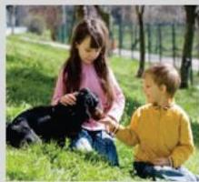
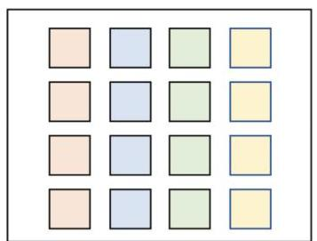
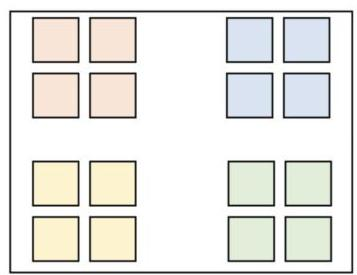
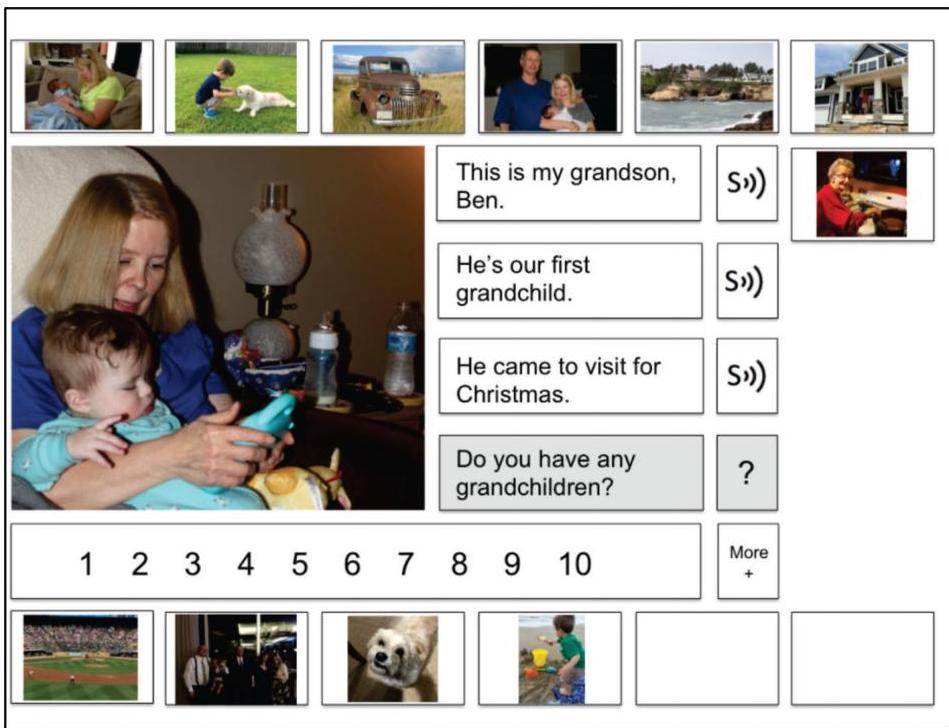

<!-- Source PDF: light-2019-aac-display-design.pdf -->

HHS Public Access

Author manuscript

Augment Altern Commun. Author manuscript; available in PMC 2020 March 01.

Published in final edited form as:

Augment Altern Commun. 2019 March ; 35(1): 42-55. doi:10.1080/07434618.2018.1558283.

# Designing Effective AAC Displays for Individuals with Developmental or Acquired Disabilities: State of the Science and Future Research Directions

Janice Light,

The Pennsylvania State University

Krista M. Wilkinson,

The Pennsylvania State University, University of Massachusetts

Amber Thiessen,

University of Houston

David R. Beukelman, and

Madonna Rehabilitation Hospitals

Susan Koch Fager

Madonna Rehabilitation Hospitals

# Abstract

This paper reviews research on the impact of AAC display variables on visual attention and performance of children with developmental disabilities and adults with acquired conditions, and considers implications for designing effective visual scene displays (VSDs) or grids. When using VSDs with children with developmental disabilities or adults with acquired conditions, research supports the use of personalized photo VSDs that include familiar people engaged in meaningful activities, with navigation bars with thumbnail VSDs, located adjacent to the main VSD. Adults with acquired conditions seem to benefit from the inclusion of text boxes adjacent to the scene. Emerging evidence supports the use of motion to capture visual attention to VSDs (video VSDs) or to specific elements in VSDs. When using grid displays with children with developmental disabilities, research supports the use of spatial cues and clustering based on internal symbol color to facilitate visual searching and selection. Background color does not seem to facilitate searching for symbols on smaller displays and may actually distract children from processing the meaningful components of symbols. Preliminary research suggests that the organization of onscreen keyboards and the number, types, and pairings of symbols in grids may impact performance of adults with acquired conditions. Directions for future research are discussed.

Correspondence concerning this article should be addressed to Janice Light, Department of Communication Sciences and Disorders, 308 Ford Building, Penn State University, University Park, PA 16802, USA; JCL4@psu.edu.

Author Note

Janice Light, Ph.D., Department of Communication Sciences and Disorders, The Pennsylvania State University, University Park, PA 16802, USA; Krista M. Wilkinson, Ph.D., The Pennsylvania State University, University Park, PA 16802 and the E.K. Shriver Center, University of Massachusetts Medical School, Waltham, MA, USA; Amber Thiessen, Ph.D., CCC-SLP, Department of Communication Sciences and Disorders, University of Houston, Houston, TX 77204, USA; David R. Beukelman, Ph.D., CCC-SLP and Susan Koch Fager, Ph.D., CCC-SLP, Institute for Rehabilitation Science and Engineering, Madonna Rehabilitation Hospitals, Lincoln, NE 68506.

## Keywords

AAC, Grid display, Research and development, Visual cognitive processing, Visual scene display

Augmentative and alternative communication (AAC) technology (including both low- tech and high-tech aided AAC) offers significant potential to enhance communication and increase participation for individuals with complex communication needs resulting from developmental or acquired disabilities. Yet, despite the strong evidence of the benefits of AAC technology, its potential remains unrealized for many individuals with complex communication needs. One of the key factors that contributes to the success or failure of an AAC intervention is the fit between the needs and skills of the individual with complex communication needs and the AAC technology (Light & McNaughton, 2013). When the technology is an appropriate fit, it supports effective communication and participation. However, when the technology is not a good fit, it may impede communication and impose additional barriers to participation.

As is common with many assistive technologies, the development of early AAC technologies was driven primarily by the experiences and beliefs of clinicians in the field. As the AAC field moves forward, there is an urgent need to integrate clinical experience and consumer perspectives with research on the visual, cognitive, motor, linguistic, auditory, and psychosocial processes of individuals with complex communication needs in order to ensure that AAC technologies are developmentally sound and optimally effective. To date, there has been only limited research to investigate these processes and how they should drive system design (Light & McNaughton, 2013). Such research is essential: The design of AAC technologies is one component of intervention that substantially affects performance and is also easily amenable to change (Light & McNaughton, 2012; 2013).

There are now numerous AAC technologies that offer many design configurations, reflecting different approaches to vocabulary selection, representation, organization, layout, selection technique, and output. Although each of these technology components impacts learning and use by individuals with complex communication needs, it is beyond the scope of any single paper to consider them all. Therefore, this paper focuses on issues of visual cognitive processing and performance as they relate to interaction of the individual with the user interface display: representation, organization, and layout. The paper considers the design of VSDs as well as grid displays, first as these relate to children with developmental disabilities and then to adults with acquired conditions. Given that these display types differ significantly in their representation, organization, and layout; and, as such, the visual cognitive processing of each also differs substantially (Wilkinson, Light, & Drager, 2012), VSDs and grid displays for children and adults are discussed separately. For each population and type of AAC display, we (a) describe the display and its implementation; (b) review the current research on the impact of variables related to the composition of the display on the visual attention and performance of individuals with complex communication needs, (c) consider the implications for designing effective AAC displays, and (d) propose directions for future research to improve the design of AAC displays. It should be noted that some people use AAC displays that combine elements of VSDs with elements of grid displays. To

date, there is only limited research to investigate the design of these hybrid displays; future research is required to determine the impact on visual attention and performance.

Many of the studies discussed in this paper have utilized eye-tracking research technologies to investigate the effects of different display variables on the visual cognitive processing of individuals with complex communication needs. Therefore, we start with a brief review of these research technologies and methods.

## Eye -Tracking Research Technologies

Eye tracking research technologies are quite different from AAC technologies that utilize eye gaze as a selection technique for communication purposes. They provide a non-invasive means to investigate which areas of AAC displays capture visual attention and which are ignored; how frequently each area is viewed; for how much time; and in what sequence (Wilkinson & Mitchell, 2014). Studies may manipulate specific design variables related to AAC displays (e.g. use of color, location of the navigation bar) to determine the effects on visual cognitive processing.

Eye-tracking research technologies are powerful tools, for they provide insight into the allocation of visual attention and processing - critical processes in human computer interaction. Furthermore, they do not require the participant to produce a behavioral response and may be especially useful with individuals with disabilities who may be unwilling or unable to perform traditional response tasks due to compliance issues or due to motor, language, and/or cognitive barriers (Wilkinson & Mitchell, 2014).

Although visual attention is not the only process required for effective communication, the presence of fixation to an element is necessary at a basic level to ensure processing of that element within an AAC display (Wilkinson & Mitchell, 2014). The more an individual attends visually to the important elements of an AAC display, the greater the likelihood that these elements are processed, supporting more efficient search and communication performance (at least in the early stages of learning prior to the development of automaticity). In contrast, the more an individual fixates on non-relevant elements in the display, the less efficient the communication because the individual has to filter out the non-relevant elements before finding the relevant item. Thus, studies of visual attention provide important data about how the design of AAC displays may impact use.

Some of studies reviewed in the current paper involved not only eye-tracking data but also data on motor performance (i.e. selection of target items from the display). These data have been consistent with the eye tracking data, providing further evidence of the impact of the target variables. Future research is required to extend these results to actual communication tasks. To date, the studies have all presented AAC displays on computer screens. Although it seems reasonable to suggest that the results will be similar for low-tech AAC displays, future research is required to investigate the extent to which results can be generalized from high tech to low tech displays.

Designing Effective Displays for Children with Developmental Disabilities

Children with developmental disabilities (e.g. autism spectrum disorder [ASD], cerebral palsy, Down syndrome, intellectual developmental disabilities) who are preliterate typically rely on AAC systems that use one of two types of displays: visual scene displays (VSDs) or grid displays.

### Designing Effective Visual Scene Displays

### Description.

VSDs are integrated scenes, typically photographs, of meaningful and motivating events within an individual's life (Blackstone, 2004). Relevant language concepts are represented by “hotspots” in the scene. The hotspot is selected and the word or phrase is spoken out (and may also appear in written text). Figure 1 presents a main VSD that a child with ASD might use to communicate about playing with a ball with a friend, as well as a navigation bar with thumbnails of additional VSDs that he or she might select to navigate to new contexts (e.g. playing with a dog, reading a book). Within the main VSD, the child might select hotspots of (a) the ball to retrieve the speech output “ball”; (b) his face to say “me”; (c) his legs to say “kicking”; or (d) his mouth to retrieve the speech output “laughing” along with the sound effect of laughing.

VSDs offer a number of advantages for communicators who are at the early stages of symbolic development (i.e. those that are learning first words or developing early semantic relations). VSDs capture the actual social interactions that are the contexts in which beginning communicators learn language and communication skills; they present language concepts within the familiar event schema in which they are learned and used (Light & McNaughton, 2012). They also preserve the functional and visual relationships between people and objects as experienced in the real world (Light et al. 2004). Moreover, VSDs reduce working memory demands because they “chunk” the key elements (i.e. people and shared activity) in the scene together (Light & McNaughton, 2012). Beyond these cognitive/linguistic processing advantages, VSDs also exploit the human capacity for rapid visual processing of naturalistic scenes: viewers capture both the overall context and the main constituent elements in scenes rapidly, in less than 200 milliseconds (Oliva & Torralba, 2007). Research has shown that beginning communicators with complex communication needs increase significantly the frequency of their communication turns as well as the number of concepts expressed when introduced to AAC technologies that utilize VSDs (e.g. Drager et al. 2018; Holyfield, Caron, Drager, & Light, 2018; Light et al. 2016).

### Research on VSDs for children with developmental disabilities.

Although the research suggests that beginning communicators benefit significantly from VSDs to support their pragmatic and semantic development, in practice, there is wide variation in the design of the VSDs available from AAC manufacturers /app developers as well as those customized by parents and clinicians. Given that design differences may impact performance, it is critical to develop empirically driven clinical guidelines for VSD design to maximize learning and use by children with developmental disabilities.

### Type of representation / organization.

Some of the earliest research utilized line drawings of meaningful events as VSDs (e.g. Drager et al. 2004; Light et al. 2004). As

cameras have become ubiquitous within tablets and other mobile technologies however, it has become quick and easy to capture photographs of meaningful events within children's lives as VSDs (Caron, Light, Davidoff, & Drager, 2017). Photos are highly iconic representations and have been found to be easier to learn than line drawings for individuals with intellectual disabilities (Mirenda & Locke, 1989). Light, Drager, and Wilkinson (2012) reported on an exploratory study with infants with typical development (9--12 months) that used a split screen paradigm to determine visual attention to different display types: photo VSDs versus grids with four AAC symbols (line drawings). Infants looked first and looked longest at the photo VSDs compared to the grids, suggesting that photo VSDs may be an excellent starting point for beginning communicators.

### People in VSDs.

Including people in VSDs is important because language learning occurs within social contexts involving people. Research has also consistently demonstrated that the inclusion of people in scenes offers substantial advantages in terms of visual processing: People, especially faces, function as a strong attractor of visual attention (e.g. Wilkinson & Light, 2011). Wilkinson and Light (2014) explored the visual fixation patterns of individuals with ASD, Down syndrome, intellectual developmental disabilities, and typical development while viewing scenes with people, including those in which the people were deliberately small; offset from the center; or surrounded by other competing, complex, visual elements. Regardless of the presentation, all groups of participants fixated rapidly (within 1.5s) on the people; they did so for a significant percentage of their total viewing time (M = 36% - 40%) and devoted much greater visual attention to the people in the scenes than would be expected based on size alone. Wilkinson and Light concluded that the evidence supports the inclusion of people within VSDs because they are strong attractors and maintainers of visual attention. The authors argued that using VSDs that attract visual attention is especially important with individuals with developmental disabilities, who may be easily distracted.

### Shared activity in the VSD.

If individuals with developmental disabilities are to benefit from VSDs as communication supports, they must attend to not only the people but also the shared activity in the VSD. Recent research by O'Neill, Wilkinson, and Light (2018) investigated visual attention to the elements within the main VSD by children with developmental disabilities (i.e. ASD, intellectual disability, Down syndrome) and younger children with typical development at a similar stage of development. Across groups, they found that the participants spent the vast majority of their time fixated on the meaningful elements (i.e. the people and shared activity) when looking at the main VSD (M=76% -81%). They fixated most on the people (M = 57% - 67%) and spent the remainder of the time focused on the shared activity (M = 33% - 43%). These results support the inclusion of people engaged in a shared activity as key components in VSDs. Beginning communicators at the early stages of symbolic development may derive particular benefit from VSDs designed in this way because their visual attention is driven toward the key concepts that typically emerge early in language development: familiar people and activities in their daily lives.

###

### Background elements in the VSD

Some practitioners have expressed concerns about the visual complexity of VSDs, arguing that background elements will detract from the viewer's focus on key elements in the scene. However, the research has demonstrated that children with developmental disabilities spend only a small percentage (< 25%) of their viewing time fixating on elements in the background compared to the meaningful elements in the VSD (> 75% spent on the people and shared activity) (O'Neill et al. 2018). Results are even more pronounced when viewing time to the elements is adjusted for the size of the elements (O'Neill et al. 2018). Background elements in VSDs do not function as a significant distraction for children with developmental disabilities, who attend primarily to the key components of the scene: the people and the shared activity.

### Location of navigation bar

As soon as a child has multiple VSDs, there must be some way to navigate between them. Traditionally, menus for navigation have resided on a separate page with symbols to represent each of the possible displays, organized in a grid layout. The child selects one of the symbols to navigate to the display. Often there are also forward or back buttons to allow navigation to displays that immediately precede or follow, and a “home” button to go to the main navigation menu. Beginning communicators often struggle to learn to navigate independently with these menus because (a) the new display is hidden from view, (b) it may be unclear that the symbols represent navigation to a new display (rather than representation of a language concept), and/or (c) it may be difficult for beginning communicators to remember the sequence of VSDs and understand the function of the forward and back arrows. Research by Drager et al. (2004) demonstrated that 3-year-olds with typical development were more accurate navigating using thumbnails of VSDs rather than isolated symbols on a separate page. Research by Light and colleagues (2016) investigated an alternative design for navigation and showed that toddlers with complex communication needs can learn to navigate independently using thumbnails of VSDs in a navigation bar adjacent to the main VSD (see Figure 1).

Including a navigation bar with thumbnails of VSDs alongside the main VSD supports navigation but also results in a more complex AAC display than a VSD on its own. In order to communicate effectively using these more complex AAC displays, individuals must attend primarily to the main VSD to express messages but be aware of the navigation bar, should they wish to navigate to a different VSD. In a study of visual attention to these more complex AAC displays, O'Neill et al. (2018) found that groups of children with developmental disabilities (ASD, Down syndrome, intellectual disability) spent the majority of their viewing time fixating on the main VSD (M = 61% - 67%) and less time on the navigation bar (M= 30% - 33%), across groups. The participants primarily attended to the main VSD used for communication but demonstrated awareness of the thumbnails in the navigation bar that could be used to navigate to a new VSD. Future research is required to extend these results to investigate the effects of these more complex AAC displays on motor performance and communication.

Preliminary analyses by O'Neill et al. (2018) suggested that viewing patterns of elements in the main VSD might have been affected by the location of the navigation bar. For example, the authors found that participants with developmental disabilities spent more time looking at the shared activity in the main VSD when the navigation bar was located at the bottom

(proximal to the shared activity) than when it was located at the top (as in Figure 1). In contrast, the participants with ASD, intellectual disabilities, and Down syndrome spent more time looking at the people in the main VSD when the navigation bar was located at the top (proximal to the faces of the people in the main VSD) than when it was located at the bottom of the VSD. These findings suggest that the location of the navigation bar is an important design feature that warrants careful consideration.

### Use of motion in VSDs.

Jagaroo and Wilkinson (2008) noted that motion is a powerful attractor of visual attention and posited that it might be used in AAC displays to attract the attention of individuals with complex communication needs to key elements in the display. Light, McNaughton, Jakobs, and Hershberger (2014) proposed an AAC display design that harnesses motion to attract visual attention within VSDs to written text in order to support individuals with developmental disabilities in learning literacy skills. They designed a transition to literacy (T2L) feature to support acquisition of sight words. With the T2L feature, upon selection of a hotspot in the VSD, the written word appears dynamically and is then spoken out (https://tinyurl.com/rerc-on-aac-T2L). A number of studies have shown that individuals with developmental disabilities have successfully acquired sight words, without explicit instruction, when introduced to an AAC app utilizing VSDs with the T2L feature; these results have been demonstrated with young children with ASD (Mandak, Light, & McNaughton, 2018), adults with severe intellectual developmental disabilities (Holyfield, Light, McNaughton, Pope, & Drager, 2018), and young children with communication impairments participating in small group activities with their typical peers (Boyle, McCoy, McNaughton, & Light, 2017). It should be noted that the T2L feature includes other components besides motion and it is not possible to tease out the relative contributions of each component. However, the results suggest that motion may be a powerful way to capture attention to specific features within VSDs to facilitate learning and use.

The T2L feature is one example of how isolated motion can be used within VSDs to capture visual attention to specific features of interest (in this case, written text). Motion can also be used within the entire VSD. Most AAC apps use still photos as VSDs but these photos do not capture the dynamic sequence of an activity. Light, McNaughton, and Jakobs (2014) proposed the use of video VSDs. In these apps, video is used to capture the dynamic sequence of an activity (e.g. riding the bus to work): The video is paused as needed, resulting in still images that serve as VSDs to support communication at that juncture in the activity (e.g. greeting the bus driver, commenting on an event in the video). Although there are many apps that support video viewing, the video-VSD app is unique in that it integrates AAC supports into the videos. The video VSDs capture both the spatial and temporal contexts of activities, thereby preserving the dynamic relationships and engagement cues found in real world interactions (Light, McNaughton, & Jakobs, 2014). Furthermore, the motion within the video captures visual attention. The automatic pausing of the video at key segues in the event serves to explicitly mark the opportunity for participation and communication; the VSD provides the necessary vocabulary to fulfill the communication demands at that point. Research suggests that video VSDs are an effective means to support the successful participation by adolescents with ASD in community and vocational activities (Babb, Gormley, McNaughton, & Light, 2018; O'Neill, Light, & McNaughton, 2017) and

by school-aged children with complex communication needs during displaced talk about experiences (Caron, Holyfield, Light, & McNaughton, 2018). Motion, either focusing on specific features within VSDs (as in the T2L feature) or capturing the entire event (as in video VSDs), is a powerful attractor of attention that can be leveraged to support more effective communication, participation, language development, and literacy learning.

### Implications for design of effective VSDs.

Research to date provides evidence that supports the following clinical guidelines for the design of VSDs for beginning communicators with developmental disabilities (see Table 1). First, VSDs should use personalized photographs of meaningful and motivating events within the children's lives, including relevant people and shared activities. The people and shared activities within these events are powerful attractors of visual attention; the background elements in VSDs do not function as a distraction for children with developmental disabilities. Second, displays should use navigation bars (adjacent to the main VSD) with thumbnails of the other VSDs to reduce the demands of navigation. Preliminary research suggests that the presence of a navigation bar may affect viewing patterns, but that children with developmental disabilities continue to attend primarily to the main VSD (and specifically to the meaningful elements). Finally, motion is likely to be a powerful technique to attract visual attention to key elements in VSDs to facilitate learning (as in the T2L feature) or to capture dynamic events providing spatial and temporal supports for communication and participation (as in video VSDs).

### Future research priorities.

Research is required to replicate results of the previously described studies and to extend results to other disability groups and ages, especially very young children, children with motor impairments (including those that use alternative access), and those with visual impairments. Clearly, investigation of the use of motion in VSDs to capture attention and support understanding is required. In addition, research is needed to investigate the visual cognitive processing demands of more complex displays that include navigation bars or other control features to better understand the impact of these features. Most research to date has considered visual cognitive processing within free-viewing tasks upon initial introduction of AAC displays; in the future, studies should investigate patterns of visual attention during communication to determine the interplay of visual and motor processes, as well as changes in visual cognitive processing over time with repeated exposure and use of AAC displays.

### Designing Effective AAC Grid Displays

### Description.

Many children with complex communication needs use grid displays, in which AAC symbols are arranged in row-column grids. Each symbol occupies an individual cell within the grid. Grids allow for the presentation of a variety of symbols related to a given topic, such as a page of items related to people or food (categorically-related), a page of items related to a trip to the zoo (event-based), or a page of symbols from selected word-class categories designed to support emerging sentence structure. Grid displays can be effective in supporting a range of communication outcomes in children with developmental disabilities, including initiating requests and other communicative functions, supporting comprehension, promoting engagement, and reducing challenging behaviors (e.g. Ganz et al. 2012; Romski et al. 2010; Walker & Snell, 2013).

Research on grid displays for children with developmental disabilities.

As with VSDs, there is substantial variation in the physical realization of grids. An early study asked six clinicians to create a grid-based snack display based on a set of concepts and a hypothetical case (McFadd & Wilkinson, 2010). The resulting displays varied in terms of organization (top to bottom vs. left to right), use of background color cues, and symmetry. Thistle and Wilkinson (2015) surveyed clinicians and found substantial variability in their reported approach to designing displays. If the physical features of the grid display are irrelevant to their effectiveness, then this variability would not matter; any display could be used with any child. However, the majority of clinicians reported that they make changes to pre-set displays suggesting that they believe that design does matter. What does the research suggest about designing effective grid displays?

In 2004, Wilkinson and Jagaroo suggested that principles of visual cognitive processing might offer guidance for the design of AAC displays. With regard to grid displays in particular, they identified four powerful stimulus characteristics that might influence how people interact with these displays: (a) organization, that is, grid versus VSD (which has already been discussed); (b) symbol color and contrast; (c) symbol arrangement; and (d) symmetry and axial orientation. The section that follows provides an overview of the body of evidence related to symbol color and contrast as well as symbol arrangement. Issues of symmetry and axial orientation have yet to receive research attention.

### Internal symbol color and spatial arrangement.

When creating a symbol display, particularly one that involves single-meaning line drawings, clinicians typically must choose whether or not the symbols will include internal color. For instance, a symbol for APPLE might be a simple black-and-white line drawing, or have red shading inside the apple outline (an example of internal symbol color). A series of studies have examined how the internal color and the arrangement of symbols on a display influence the speed and accuracy of search for a target symbol (using a mouse selection) in children with typical development (Wilkinson, Carlin, & Thistle, 2008) and individuals with Down syndrome or ASD (Wilkinson et al. 2008; Wilkinson & McIlvane, 2013). Additional studies have replicated the methodology of these earlier studies but also measured visual fixation during search (Wilkinson, O'Neill, & McIlvane, 2014; Wilkinson, O'Neill, Nauss, Thistle, & McIlvane, 2012) as well as motor behavior during the reaching response in students without disabilities (Liang, Wilkinson, & Sainburg, 2018) and in individuals with Down syndrome (Liang, Wilkinson, Sainburg, & Neumann, 2016).

All of these studies used a visual search task. First, the target was presented to the participant by visually presenting a line drawing or photograph or by orally presenting a spoken word. This stimulus then disappeared and a grid display of line-drawings (12 or 16) appeared in its place. The participant's task was to find and select the item within the grid display that matched the target. With line drawings, the matching item was identical to the target (e.g. the target was a line drawing of an apple and the match was the identical line drawing); with photographs, the matching item was similar in features to the target (the target was a photograph of an apple and the match was the line drawing of the apple); and with spoken words, the matching item was the visual match to the word (the target was the spoken word apple and the match was the line drawing of the apple).

In all of the studies, there were sets of four line drawings that shared color, which was determined in one of two ways, depending on the study. In some cases, color reflected natural coloration and thus was coupled or related to symbol identity. For example, in a study involving symbols for fruits and vegetables, there were some red items (apples, cherries), some yellow items (lemon, banana), and so forth. In other cases, color was assigned by the experimenter and thus was decoupled from symbol identity. For instance, in a study involving clothing items, the symbols for summer clothing (sunglasses, bathing suits) were all colored red, while the symbols for cold-weather clothing (snow hat, raincoat) were all colored yellow. In no case did symbol internal color violate naturally occurring coloration (i.e. apples were never colored purple). There were two conditions: one in which symbols were clustered together by internal color and one in which symbols were interspersed across the array (i.e. distributed condition).

The findings were remarkably consistent across all studies and all diagnostic groups. For all participants, response time to find the target was significantly faster when like-colored symbols are clustered together than when they were distributed in the array; and for many participants, there was also an improvement in accuracy under the clustered condition (Wilkinson et al. 2008; Wilkinson & McIlvane, 2013). The eye-tracking information (Wilkinson et al. 2014; Wilkinson, O'Neill et al. 2012) revealed one potential reason for this advantage: Children with typical development as well as those with Down syndrome were significantly more likely to fixate on irrelevant distracters (e.g. a yellow symbol during a search for a red one) under the distributed condition. In other words, visual search is made more efficient by clustering symbols by their internal color, reducing the likelihood of participants looking at and/or responding to distracters.

The recording of motor behavior during search has also added valuable information. For both college students without disabilities (Liang et al. 2018) and individuals with Down syndrome (Liang et al. 2016), the latency to initiate a motor movement toward the target was significantly longer under the distributed rather than the clustered condition. The measure of latency to initiate movement is considered an index of cognitive load (e.g. Henry & Rogers, 1960), suggesting that, even for college students (for whom this is an extremely easy task), simple changes to the visual-perceptual features of the AAC display impact cognitive load. In addition, these studies revealed that the distributed condition was associated with significantly greater cross-midline hand reaches than the clustered condition. Cross-midline reaches are of significance from a motor standpoint because such reaches are inefficient biomechanically. The fact that simple changes to display design can disrupt motor efficiency is important. Increases in the likelihood of cross-midline reaches are of particular significance for individuals with motor impairments who use AAC as crossing midline can interfere with posture and balance, negatively impacting access to the AAC display. These studies indicate clearly that the distributed condition increases the likelihood of inefficient and potentially problematic cross-midline reaches, although it should be noted that these studies have only investigated performance with relatively large displays positioned at midline; results may differ with smaller displays.

### Symbol background color.

Although studies of symbol internal color and arrangement indicate that these are powerful cues for efficiently finding a symbol, clearly there are times

when the internal color of a symbol cannot be controlled. For example, a clinician would not change the color of a horse symbol to green or an apple symbol to orange. One option is to use background color cues as an organizational strategy, which is currently widespread in clinical practice (Thistle & Wilkinson, 2015) despite a limited research base. Research to date suggests that, for young children with typical development and displays with fewer than 24 symbols, background color cues do not facilitate search for either single symbols (Thistle & Wilkinson, 2009; Wilkinson & Coombs, 2010; Wilkinson & Snell, 2011) or multi-symbol sentences (Thistle & Wilkinson, 2017). In fact, there are several indications that background color might actually disrupt search in younger children. Eye-tracking data from children with typical development as well as individuals with Down syndrome on 16-symbol arrays (Wilkinson & Weiss, 2017) have illustrated that, unlike symbol-internal color cues, background color cues have no measurable effect on speed to either fixate on a target or respond with a mouse, compared to displays without background color. This finding comes as a surprise to not just clinicians but also the researchers who have studied this issue.

There are several caveats regarding the findings about background color cues thus far. First, emerging data suggest that for adults without disabilities, background color cues may improve speed of locating targets in large arrays containing 64 symbols (Thistle & Wilkinson, 2018). Array size may be important, at least for communication partners, and this possibility warrants further study. In addition, color-cued backgrounds may improve the appeal of displays to partners and/or individuals with complex communication needs. Furthermore, if color cuing helps partners locate symbols to model and provide aided input, this may be important even if color cues do not have a positive effect for the individual with developmental disabilities.

### Spatial arrangement without internal color.

Given that background color may be limited as a cue (at least for arrays with fewer than 64 symbols and for younger children), is there another way to promote efficient search for symbols on a grid display? Spatial cues may serve as a means to narrow attention toward relevant (and away from irrelevant) symbols during search. Many grids are arranged with a left-to-right organization of word class categories (subjects on the left, followed by actions, objects, descriptors, etc.), with symbols fairly close together to maximize the number available; however, it is important to investigate whether this display design is more or less effective than other possible layouts.

A series of ongoing eye-tracking studies have begun to examine whether grouping similar symbols in small spatial groups can serve to facilitate visual search. Figure 2 shows a simulation of two of the different spatial arrangements: one a traditional symmetrical row-column grid, and one that uses spatial cues. Initial data from individuals with Down syndrome and children with typical development (matched for vocabulary level) suggest that visual fixations are drawn to the relevant symbol and that there are fewer fixations to non-relevant symbols in the display that uses spatial groupings compared to the traditional grid display (Wilkinson et al. 2017). The benefit of visual search efficiency may offset the presence of empty space on the spatially cued display. It may be possible to begin a child on a display with spatial clustering, and then “fill in” the white space later, once the initial layout is well known.

Implications for the design of effective grids.

Small changes to the arrangement of symbols can make substantial differences in speed and accuracy of finding a target, in the efficiency of visual search while finding the target, and in the efficiency of the motor behavior produced during the reach for a target. The key element emerging from the studies previously discussed is the importance of clustering symbols together on the basis of some key shared feature (see Table 1). When possible, clustering symbols on the basis of their internal color exploits principles of visual processing to lead to efficient search for targets. When internal color is not a reasonable means to cluster symbols, spatial cues appear to be equally powerful. Spatial cues might be combined with internal color cues; research is needed to investigate this possibility. Spatially clustered displays utilize white space between the clusters to narrow attention. These arrangements are likely most critical for individuals who are new to a grid display(s). Once the layout becomes familiar, the spatial cues may be less important, and it may be possible to begin adding vocabulary into the white spaces, thus providing access to more vocabulary. Background color cues do not function in the same manner as symbol internal color cues: They may be more important for large displays (those with 64 symbols) than smaller ones (24 or fewer) and for enhancing appeal and/or partner use of the display than facilitating message preparation by children.

### Future research priorities.

Future research is required to determine whether the display variables discussed influence functional and authentic communication outcomes. A study is currently underway at Penn State to examine whether or not attention and communication during actual social interactions are influenced by the differences in display design described above. Another important research direction is to evaluate the longer-term role, if any, played by display design. The modifications described thus far are clearly important in the up-front or early stages of introducing AAC to a child. By designing grid displays that support visual processing, we may be able to reduce the initial learning demands and improve the likelihood that a child will adopt and use the AAC system. However, it is of interest to determine at what point the visual-perceptual cues begin to matter less, particularly if a goal is to begin to add vocabulary to a display that makes use of spatial cues. Furthermore, the majority of the studies to date have focused on children with typical development and individuals with Down syndrome. Individuals with a wide range of other disabilities can benefit from AAC. It is therefore important to evaluate visual processing across individuals with a wider range of diagnoses in order to determine how universal the findings are. Finally, all of the work thus far has focused on direct selection via hand or mouse click. The principles outlined may be applicable, perhaps even magnified, for individuals who use eye gaze as a direct selection access method; this is a critical line of future work.

## Designing Effective AAC Displays for Adults with Acquired Conditions

Adults with complex communication needs resulting from acquired conditions (e.g. aphasia, traumatic brain injury (TBI), and primary progressive aphasia) also benefit from aided AAC. They may use a range of AAC displays depending on their needs and skills, including VSDs or grid displays (e.g. onscreen keyboards, grid displays of picture symbols or words).

Designing Effective VSDs

### Description.

As noted earlier, VSDs are contextual images representing events or situations; they can be used with adults with acquired conditions either to enhance residual communication or as an alternative to typical spoken communication (Dietz, McKelvey, & Beukelman, 2006). For adults with acquired conditions, VSDs do not typically include embedded hot spots with speech output; instead they are often paired with corresponding written text (presented alongside the VSD) to represent relevant messages. The main VSD is typically surrounded by a navigation bar or ring composed of other smaller visual scenes referred to as signature images (McKelvey, Dietz, Hux, Weissling, & Beukelman, 2007). When used in AAC technologies, adults typically select their intended messages from choices presented in the corresponding text boxes (Dietz et al. 2006). For example, Figure 3 presents a VSD of a woman with her grandson. The woman depicted could discuss her grandson with communication partners by both showing them the main VSD and selecting from the corresponding text-based messages.

VSDs capitalize on the relative strengths of adults with aphasia and simultaneously decrease demands on their language systems. Unlike many grid-based AAC systems, VSDs were designed to represent messages in a holistic manner, thus eliminating the need to formulate messages word-by-word and reducing the navigational demands often associated with grid displays. VSDs likely capitalize on relatively preserved capabilities of people with aphasia including visuospatial skills, gist reasoning, and memories of life events (Dietz et al. 2006). Researchers have investigated a range of functional applications of VSDs, including language expression (Brock, Koul, Corwin, & Schlosser, 2017) and the formation of shared communication spaces (Hux, Buechter, Wallace & Weissling, 2010). Brock et al. found that VSDs resulted in the production of lengthier, more complex utterances, increased turn-taking, reduced frustration, and fewer navigational errors compare to grid displays for adults with Broca's aphasia. Hux and colleagues (2010) showed that shared VSDs resulted in the richest communication experience for both the adult with aphasia and the communication partner compared to a condition without VSDs and one in which only the individual with aphasia had access to the VSD (not the partner).

Beyond the research with individuals with severe chronic aphasia, researchers have also begun to investigate the potential benefits of VSDs for adults with TBI (Brown, Hux, Knollman-Porter, & Wallace, 2016; Thiessen & Brown, 2017; Thiessen, Brown, Beukelman, & Hux, 2017; Thiessen, Brown, Beukelman, Hux, & Myers, 2017; Wallace, Hux, & Beukelman, 2010). For individuals with TBI, the rationale for the use of VSDs is grounded in their potential to minimize the cognitive burden associated with AAC use. In particular, well designed VSDs may minimize working memory and mental flexibility demands that are likely required when communicating with grid displays (Thiessen & Brown, 2017). Although recent evidence supports the use of VSDs with adults with TBI, continued work is necessary to fully understand their benefits and uses for these individuals.

Recent research has also explored the use of VSDs as conversational supports for adults with primary progressive aphasia. For example, Fried-Oken, Rowland, Daniels, Mooney, and Noethe (2013) found that photo VSDs were easier for the participants to use than grid

displays because they provided a shared reference that facilitated conversation; however, word finding was more difficult without text. Mooney, Bedrick, Noethe, Spaulding, and Fried-Oken (2018) found that participants with primary progressive aphasia spoke a larger number of target words with an app that provided VSDs and relevant text compared to no technology or VSDs without text boxes. In sum, this growing body of research highlights the potential benefits of VSDs for individuals with a range of acquired conditions and their partners.

### Research into VSD designs for adults with acquired conditions.

Given the wide range of possible design choices for VSDs, it is essential to establish clinical guidelines for the design and implementation of these supports. To date, several research studies have been conducted to examine the ways in which people with aphasia or TBI attend to and extract information from visual scenes.

### People in VSDs.

Many of the first VSDs appearing in commercially available AAC technologies depicted backgrounds without people (e.g. furniture in a bedroom). Although these scenes may have effectively represented the location, the exclusion of people reduced their ability to fully represent meaningful events and actions. Through the use of eye-tracking technology, researchers have established that people are among the most powerful attention capturing elements found in images (e.g. Wilkinson & Light, 2011). Researchers have also investigated the visual attention response of adults with aphasia (Thiessen, Beukelman, Hux, & Longenecker, 2016; Thiessen, Beukelman, Ullman, & Longenecker, 2014) or TBI (Thiessen, Brown, Beukelman, & Hux, 2017) to people presented in VSDs. Results from these investigations indicate that adults with acquired neurological conditions tend to fixate rapidly and for lengthy durations on people presented in VSDs. Although people appear to be important elements in VSDs that garner visual attention from individuals with aphasia and TBI, further research is necessary to determine how the presence of people in VSDs influences message production and comprehension.

### Engagement and action in VSDs.

The positional orientation of people depicted in VSDs also appears to influence the visual attention patterns of adults with aphasia (Thiessen et al. 2016; Thiessen et al. 2014) and TBI (Thiessen, Brown, Beukelman, & Hux, 2017). Specifically, when viewing task-engaged visual scenes (in which the depicted person is both looking at and touching an object present in the scene), both adults with aphasia and those with TBI placed significantly more overt visual attention on the object than when viewing camera-engaged photos (in which the person looks directly at the camera). These results show that people presented in VSDs not only garner high levels of visual attention but also act as visual attention guides to important content in the image.

Task-engaged people in VSDs also play the important role of completing an action (e.g. taking a cake out of an oven). Thiessen, Brown, Beukelman, Hux, and Myers (2017) examined the preferences of a group of adults with TBI to three image types: line-drawn icons, decontextualized photos, and visual scenes. Results from that study indicate that adults with TBI preferred visual scenes to line drawings or decontextualized photos for the representation of action messages. The researchers hypothesized that the person depicted in VSDs represented action through body posture and interaction with the scene context.

Although further research is necessary, VSDs depicting task-engaged people may serve as a transparent method of representing action messages.

### Personalization of VSDs.

Personalization is another important aspect of VSD design. Personalized VSDs typically contain either the person who relies on AAC or a close friend or family member who is engaged in a familiar, meaningful task in a familiar environment (McKelvey, Hux, Dietz, & Beukelman, 2010). Personalized VSDs have been shown to be preferable to nonpersonalized generic VSDs for adults with aphasia. These images tend to result in more accurate word-to-picture matching than generic visual scenes (McKelvey et al. 2010). Case study research suggests that adults with aphasia tend to reference personalized VSDs with greater frequency than generic ones during personal narrative production tasks (Dietz, Weissling, Griffith, McKelvey, & Macke, 2014; Griffith, Dietz, & Weissling, 2014).

Sometimes, however, clinicians have limited access to personalized photos and may need to utilize generic nonpersonalized VSDs derived from the Internet or other sources. In an ongoing series of studies, Beukelman and Fager (2018a) are investigating the effects of the personal relevance (specifically age and gender similarity) of VSDs (that do not include the participants themselves) on the visual attention of women and men. The studies utilize a split screen paradigm that presents four images of people (a young woman, an older woman, a young man, and an older man), all engaged in the same activity (e.g. eating, writing, sleeping) and measures visual attention in response to an oral cue to identify the target activity. Preliminary results suggest that personal relevance has a powerful effect on visual attention for young women and men as well as older women. Participants relate to images of people similar to themselves in age and gender. Data collection is currently in progress to investigate the effects of personal relevance with men and women with TBI and aphasia.

### Location of the navigation bar.

As noted earlier, most AAC displays for individuals with acquired conditions include a relatively large VSD in the center of the screen with a navigation bar or bars located at the top, bottom, left, and/or right of the display (see Figure 3). Data collection is currently in progress to investigate whether the location of the navigation bar influences the visual attention of adults without neurological conditions and those with neurological conditions such as aphasia (due to stroke) and TBI (Beukelman & Fager, 2018b). Preliminary data reveal a trend for adult participants without neurological conditions to look first at the large VSD and then to visually search images in the navigation bar at the top of the display before continuing their search of the images in the bar on the left margin. Further research is necessary to examine the way in which individuals with acquired conditions attend to and interact with navigation bars during communication, in order to create more effective displays that can be navigated with minimal effort.

### Text boxes and VSDs.

Researchers have also noted that pairing text boxes with VSDs (as in Figure 3) is advantageous for adults with aphasia (Dietz et al. 2014; Griffith et al. 2014) and primary progressive aphasia (Fried-Oken et al. 2013). Text boxes contain short messages related to the content of the VSD. They can be customized to meet the needs of individuals who rely on AAC and can be selected to produce intended messages or to cue speech production. Preliminary research indicates that adults prefer to communicate by

selecting messages from text boxes paired with VSDs to reduce their chances of inadvertently selecting an unintended message. Although evidence indicates that text boxes are important to incorporate alongside VSDs for adults with acquired conditions, further research is required to investigate optimal layouts of VSDs with associated text messages. Eye-tracking technology could shed light on patterns of visual attention to VSDs and associated text boxes during free viewing and communicative use.

### Implications for the design of effective VSDs.

Review of the research reveals three key factors to consider when designing VSDs for people with acquired neurological conditions (see Table 1). First, VSDs should depict human figures who are actively engaged with the scene context. Human figures not only attract the attention of adults with and without neurological conditions (Thiessen et al. 2014; 2016; Wilkinson & Light, 2011) but also may directly represent actions that would otherwise be difficult to convey through static images. Second, clinicians should consider employing personalized VSDs. Although still emerging, evidence indicates that personalized VSDs are preferable to generic ones (McKelvey et al. 2010) and may more effectively support communication (Griffith et al. 2014). Finally, the incorporation of text boxes and speak buttons appears to be beneficial when designing VSDs for adults (Dietz et al. 2006; 2014; Griffith et al. 2014).

### Future research priorities.

Although current research provides preliminary information to establish clinical guidelines for the design and implementation of VSDs for adults with acquired neurological conditions, considerable work remains. The complex interplay of people and objects depicted within the context of VSDs, along with the addition of associated text, results in a variety of potential design and layout options from which to choose. As such, systematic research examining the effects of various design features on the way in which adults with acquired neurological conditions visually attend to, interpret, and use these VSDs is essential. Specific areas requiring study include the effect of personalization, amount of context necessary within VSDs, and type and placement of text boxes. Given the apparent importance of personalized VSDs, research is also necessary to explore effective training in the acquisition of visual scenes not only for family members but also for adults who rely on AAC. There is also a need for systematic replication of studies to ensure results generalize to wider populations and across a broad array of communication tasks, environments, and contexts.

### Designing Effective Grid Displays

### Description.

Not all adults with acquired conditions utilize VSDs; many use grid displays instead. Depending on the needs and skills of the individual, the grid might include picture symbols, written words, and/or letters of the alphabet.

### Research into grid displays for adults with acquired conditions.

To date, there has been only minimal research to investigate the effects of design variables for grid displays with adults with acquired disabilities. For example, Petroi, Koul, and Corwin (2014) found that the number of symbols on the display and the location level had a significant impact on the accuracy and latency of symbol identification within grid displays for adults with Broca's aphasia (as well as adults without disabilities). Specifically, adults with aphasia

were more accurate and faster identifying symbols when they had to navigate across fewer levels and when they were using a small array of four symbols (compared to larger arrays).

Brown, Thiessen, Beukelman, and Hux (2015) utilized eye-tracking research technology to investigate visual search efficiency for adults with TBI when grids utilized picture symbols alone, text alone, or pictures in combination with text to represent nouns. Results showed that the presence of the written text above the picture symbol may actually serve as a distractor and slow the visual search of adults with TBI compared to grid displays of picture symbols alone. However, the study focused solely on nouns, which are easier to depict than other parts of speech, and the results may not be representative of all concepts represented in grid displays.

Adults with acquired conditions who are literate often use onscreen keyboard interfaces to generate text to support a range of communication needs (e.g. face-to-face communication, email, texting, social networking). A variety of keyboard layouts are available (e.g. alphabetic, QWERTY, optimized layouts to accommodate access). However, there is limited information on how individuals with complex communication needs learn and manage these keyboard interface options, despite the fact that many experience cognitive processing challenges (e.g. impairments of memory, attention, new learning). Insight into the visual-cognitive processing load associated with keyboard interface options could help individuals with complex communication needs and their care providers select more efficient layouts, and might lead to the design of keyboards that minimize the impact of cognitive-processing challenges.

For example, in a preliminary study, Fager, Gormley, and Beukelman (2016) examined the personal preference and visual-cognitive processing differences of an alphabet versus a QWERTY keyboard layout with 10 adults with TBI and 10 adults without neurologic injury. All participants reported extensive use of QWERTY onscreen keyboard layouts either at the time of the study or prior to their injury (for the adults with TBI). Both groups strongly preferred using the QWERTY onscreen keyboard layout and reported greater frustration using the alphabetic layout. Eye-gaze analysis supported a difference in visual-cognitive processing performance between the two keyboards, in that fixation counts were greater and fixation durations were longer when using the alphabet layout compared to the QWERTY layouts for both groups.

### Future research priorities.

Clearly, future research is required to better understand variables to optimize the design of grid displays for adults with acquired conditions. Specifically, investigation of grid displays that utilize picture symbols paired with text, not only with adults with acquired conditions but also with individuals with developmental disabilities, is needed. Future research is also required to investigate the visual-cognitive processing load of additional features, such as word-prediction, on the use of various keyboard layouts and to determine if there are interface design features that can reduce this load. Finally, research is required to investigate the effects of additional design variables related to keyboards and grid displays, including color cues (both internal to the symbols / letters and background color), spacing (clustered versus distributed), and layout (e.g. symmetrical versus staggered rows).

Light et al.

# Conclusion

The research clearly demonstrates that variables in the design of AAC interface displays have an important impact on the visual attention and performance of individuals with complex communication needs. It is critical that we develop evidence-based guidelines for the design of AAC displays, both VSDs and grids, for use with both children with developmental disabilities and adults with acquired conditions (see Table 1). We hope that this paper provides a first step in this process. We urge AAC manufacturers and app developers to incorporate the empirically driven design specifications summarized here as the default options for their AAC displays. We also encourage clinicians and families to utilize these specifications to guide the customization of AAC displays for individuals with complex communication needs. Modifying the design of AAC displays can have a dramatic impact on performance. By implementing these evidence-based guidelines for AAC displays, we can reduce learning demands and better support the communication of children and adults with complex communication needs.

# Acknowledgments

This paper is part of a special issue of the AAC Journal on the state of the science. Its contents were developed under the following grants: (a) Rehabilitation Engineering Research Center on Augmentative and Alternative Communication (The RERC on AAC) from the U.S. Department of Health and Human Services, National Institute on Disability, Independent Living, and Rehabilitation Research (NIDILRR) grant # 90RE5017; (b) National Institute of Child Health and Human Development (NICHD) P01 HD 25995; (c) NICHD R01 HD083381; and (d) The Hintz Family Endowed Chair on Children's Communicative Competence. The contents do not necessarily represent the policy of the funding agency and endorsement by the federal government should not be assumed.

# References

Babb S, Gormley J, McNaughton D, &amp; Light J (2018). Enhancing independent participation within vocational activities for an adolescent with ASD using AAC video visual scene displays. Special Education Technology. Advance online publication. doi: 10.1177/0162643418795842
Beukelman DR, &amp; Fager S (2018a, 2). Selecting visual scene displays: Personal relevance for age and gender. RERC on AAC: Progress on research, development, and training activities. Presented at the annual convention of the Assistive Technology Industry Association, Orlando, FL.
Beukelman DR, &amp; Fager S (2018b, 2). Eye-gaze plot analysis of visual scene displays with vertical and horizontal menu options. RERC on AAC: Progress on research, development, and training activities. Presented at the Assistive Technology Industry Association's annual convention, Orlando, FL.
Blackstone S (2004). Visual scene displays. Augmentative Communication News, 16 (2), 1-8. Retrieved from http://www.augcominc.com/newsletters/index.cfm/newsletter_10.pdf
Boyle S, McCoy A, McNaughton D, &amp; Light J (2017). Using digital texts in interactive reading activities for children with language delays and disorders: A review of the research literature and pilot study. Seminars in Speech and Language, 38, 263-275. doi: 10.1055/s-0037-1604274 [PubMed: 28892833]
Brock K, Koul R, Corwin M, &amp; Schlosser R (2017). A comparison of visual scene and grid displays for people with chronic aphasia: A pilot study to improve communication using AAC. Aphasiology, 31, 1282-1306. doi:10.1080/02687038.2016.1274874
Brown J, Hux K, Knollman-Porter K, &amp; Wallace SE (2016). Use of visual cues by adults with traumatic brain injuries to interpret explicit and inferential information. Journal of Head Trauma Rehabilitation, 31, 32-41. doi: 10.1097/HTR.0000000000000148
Brown J, Thiessen A, Beukelman D, &amp; Hux K (2015). Noun representation in AAC grid displays: Visual attention patterns with people with traumatic brain injury. Augmentative and Alternative Communication, 31, 15-26. doi: 10.3109/07434618.2014.995224 [PubMed: 25685881]

Augment Altern Commun. Author manuscript; available in PMC 2020 March 01.

Light et al.

Page 19

Caron J, Holyfield C, Light J, &amp; McNaughton D (2018). "What have you been doing?": Supporting displaced talk through AAC video VSD technology. Perspectives on Augmentative and Alternative Communication, 3, 123–135. doi: 10.1044/persp3.SIG12.123

Caron JG, Light J, Davidoff B, &amp; Drager K (2017). Comparison of the effects of mobile technology AAC apps on programming VSDs. Augmentative and Alternative Communication, 33, 239–248. doi 10.1080/07434618.2017.1388836 [PubMed: 29057676]

Dietz A, McKelvey M, &amp; Beukelman DR (2006). Visual scene display (VSD): New AAC interfaces for persons with aphasia. Perspectives on Augmentative and Alternative Communication, 15, 13–17. doi:10.1044/aac15.1.13

Dietz A, Weissling K, Griffith J, McKelvey M, &amp; Macke D (2014). The impact of interface design during an initial high-technology AAC experience: A collective case study of people with aphasia. Augmentative and Alternative Communication, 30, 314–328. doi: 10.3109/07434618.2014.966207 [PubMed: 25420490]

Drager K, Light J, Carlson R, D'Silva K, Larsson B, Pitkin L, &amp; Stopper G (2004) Learning of dynamic display AAC technologies by typically developing 3-year-olds: Effect of different layouts and menu approaches. Journal of Speech Language Hearing Research, 47, 1133–1148. doi: 10.1044/1092-4388(2004/084)

Drager K, Light J, Currall J, Muttiah N, Smith V, Kreis D, ... Wiscount J (2018, early online). AAC technologies with visual scene displays and "just in time" programming and symbolic communication turns expressed by students with severe disability. Journal of Intellectual &amp; Developmental Disability. doi:10.3109/13668250.2017.1326585

Fager S, Gormley J, &amp; Beukelman D (2016, 11). Visual/cognitive processing demands of keyboard layouts for individuals with and without TBI. Poster presented at the annual convention of the American Speech Language Hearing Association, Philadelphia, PA.

Fried-Oken M, Rowland C, Daniels D, Mooney A, &amp; Noethe G (2013, 1). Mobile technology as communication supports for adults with primary progressive aphasia. Paper presented at the annual conference of the Assistive Technology Industry Association (ATIA) Orlando, FL.

Ganz JB, Earles-Vollrath TL, Heath AK, Parker RI, Rispoli MJ, &amp; Duran JB (2012). A meta-analysis of single case research studies on aided augmentative and alternative communication systems with individuals with autism spectrum disorders. Journal of Autism and Developmental Disorders, 42, 60–74. doi:10.1007/s10803-011-1212-2 [PubMed: 21380612]

Griffith J, Dietz A, &amp; Weissling K (2014). Supported narrative retells for people with aphasia using augmentative and alternative communication: Photographs or line drawings? Text or no text? American Journal of Speech-Language Pathology, 23, S213–S224. doi: 10.1044/2014_AJSLP-13-0089 [PubMed: 24687095]

Henry FM, &amp; Rogers DE (1960). Increased response latency for complicated movements and a "memory drum" theory of neuromotor reaction. Research Quarterly for Exercise and Sport, 31, 448–458.

Holyfield C, Caron JG, Drager K, &amp; Light J (2018, early online). Effect of mobile technology featuring visual scene displays and "just-in-time" programming on the frequency, content, and function of communication turns by pre-adolescent and adolescent beginning communicators. International Journal of Speech Language Pathology doi: 10.1080/17549507.2018.1441440

Holyfield C, Light J, McNaughton D, Pope L, &amp; Drager K (2018). Effect of AAC featuring VSDs with dynamic text and speech output on the single word reading of adults with severe intellectual developmental disabilities.

Hux K, Buechter M, Wallace S, &amp; Weissling K (2010). Using visual scene displays to create a shared communication space for a person with aphasia. Aphasiology, 24, 643–660. doi: 10.1080/02687030902869299

Jagaroo V, &amp; Wilkinson K (2008). Further considerations of visual cognitive neuroscience in aided AAC: The potential role of motion perception systems in maximizing design display. Augmentative and Alternative Communication, 24, 29–42. doi: 10.1080/07434610701390673 [PubMed: 18938756]

Liang J, Wilkinson KM, &amp; Sainburg R (2018). Is hand selection modulated by cognitive-perceptual load? Neuroscience, 269, 363–373. doi: 10.1016/j.neuroscience.2017.11.005

Augment Altern Commun. Author manuscript; available in PMC 2020 March 01.

Light et al.

Liang J, Wilkinson KM, Sainburg R, &amp; Neumann E (2016, 11). Visual-perceptual features of AAC displays affect qualities of symbol reaching by individuals with Down syndrome. Poster presented at the annual conference of the American Speech-Language-Hearing Association, Philadelphia, PA.

Light J, Caron J, Currall J, Knudtson C, Ekman M, Holyfield C,... Drager K. (2016, 8). Just-in-time programming of AAC apps for children with complex communication needs. Seminar presented at the biennial conference of the International Society for Augmentative and Alternative Communication, Toronto, Canada.

Light J, Drager K McCarthy J Mellott S, Parrish C, Parsons A.. Welliver M (2004). Performance of typically developing four and five year old children with AAC systems using different language organization techniques. Augmentative and Alternative Communication, 20, 63-88. doi: 10.1080/07434610410001655553

Light J, Drager K, &amp; Wilkinson K (2012, 8). Designing effective visual scene displays for AAC systems for young children with complex communication needs. Seminar presented at the biennial conference of the International Society for Augmentative and Alternative Communication, Pittsburgh, PA.

Light J, &amp; McNaughton D (2012). Supporting the communication, language, and literacy development of children with complex communication needs: State of the science and future research priorities. Assistive Technology, 24, 34-44. doi: 10.1080/10400435.2011.648717

Light J, &amp; McNaughton D (2013). Putting people first: Re-thinking the role of technology in AAC intervention. Augmentative and Alternative Communication, 29, 299-309. doi: 10.3109/07434618.2013.848935 [PubMed: 24229334]

Light J, McNaughton D, &amp; Jakobs T (2014). Developing AAC technology to support interactive video visual scene displays. RERC on AAC: Rehabilitation Engineering Research Center on Augmentative and Alternative Communication Retrieved from https://rerc-aac.psu.edu/development/d2-developing-aac-technology-to-support-interactive-video-visual-scene-displays/

Light J, McNaughton D, Jakobs T, &amp; Hershberger D (2014). Investigating AAC technologies to support the transition from graphic symbols to literacy. RERC on AAC: Rehabilitation Engineering Research Center on Augmentative and Alternative Communication Retrieved from https://tinyurl.com/rerc-on-aac-T2I.

Mandak K, Light J, &amp; McNaughton D (in press). Digital books with dynamic text and speech output: Effects on single-word reading of preschoolers with autism spectrum disorder. Journal of Autism and Developmental Disabilities.

McFadd E, &amp; Wilkinson KM (2010). Qualitative analysis of decision making by clinicians during design of aided visual displays. Augmentative and Alternative Communication, 26, 136-147. doi: 10.3109/07434618.2010.481089 [PubMed: 20497076]

McKelvey M, Dietz A, Hux K, Weissling K, &amp; Beukelman D (2007). Performance of a person with chronic aphasia using personal and contextual pictures in a visual scene display prototype. Journal of Medical Speech-Language Pathology, 15, 305-317.

McKelvey M, Hux K, Dietz A, &amp; Beukelman D (2010). Impact of personal relevance and contextualization on comprehension by people with chronic aphasia. American Journal of Speech Language Pathology, 19, 22-33. doi:10.1044/1058-0360(2009/08-0021 [PubMed: 20139353]

Mirenda P &amp; Locke P (1989). A comparison of symbol transparency in nonspeaking persons with intellectual disability. Journal of Speech and Hearing Disorders, 54, 131-140. doi: 10.1044/jshd.5402.131 [PubMed: 2709831]

Mooney A, Bedrick S, Noethe G, Spaulding S, &amp; Fried-Oken M (2018). Mobile technology to support lexical retrieval during activity retell in primary progressive aphasia. Aphasiology, 32,666-692. doi: 10.1080/02687038.2018.1447640

Oliva A, &amp; Torralba A (2007). The role of context in object recognition. Trends in Cognitive Sciences, 11, 520-527. doi: 10.1016/j.tics.2007.09.009 [PubMed: 18024143]

O'Neill T, Light J, &amp; McNaughton D (2017). Videos with integrated AAC visual scene displays to enhance participation in community and vocational activities: Pilot case study of an adolescent with autism spectrum disorder. Perspectives on Augmentative and Alternative Communication, 2, 55-69. doi:10.1044/persp2.sig12.55

Augment Altern Commun. Author manuscript; available in PMC 2020 March 01.

Light et al.

O'Neill T, Wilkinson K, &amp; Light J (2018). Visual attention to augmentative and alternative communication displays including a navigation bar in individuals with and without developmental disabilities.

Petroi D, Koul R, &amp; Corwin M (2014). Effect of number of graphic symbols, levels, and listening conditions on symbol identification and latency in persons with aphasia. Augmentative and Alternative Communication, 30, 40-54. doi: 10.3109/07434618.2014.882984

Romski M, Sevcik RA, Adamson LB, Cheslock M, Smith A, Barker RM, &amp; Bakeman R (2010). Randomized comparison of augmented and nonaugmented language interventions for toddlers with developmental delays and their parents. Journal of Speech, Language, and Hearing Research, 53, 350-364. doi: 10.1044/1092-4388(2009/08-0156)

Thiessen A, Beukelman D, &amp; Hux K, &amp; Longenecker M (2016). A comparison of the visual attention patterns of people with aphasia and adults without neurological conditions for camera-engaged and task-engaged visual scenes. Journal of Speech, Language, and Hearing Research, 59, 290–301. doi:10.1044/2015_JSLHR-L-14-0115

Thiessen A, Beukelman D, Ullman C, &amp; Longenecker M (2014). Measurement of the visual attention patterns of people with aphasia: A preliminary investigation of two types of human engagement in photographic images. Augmentative and Alternative Communication. 30, 120-129. doi: 10.3109/07434618.2014.905798 [PubMed: 24785409]

Thiessen A &amp; Brown J (2017, 3). The effect of augmentative and alternative communication display type on the theme identification abilities of adults with TBI. Paper presented at the International Brain Injury Association Conference, New Orleans, LA.

Thiessen A, Brown J, Beukelman D, &amp; Hux K (2017). The effect of human engagement depicted in contextualized photographs on the visual attention patterns of adults with traumatic brain injury. Journal of Communication Disorders, 69, 58-71. doi: 10.1016/j.jcomdis.2017.07.001 [PubMed: 28783543]

Thiessen A, Brown J, Beukelman D, Hux K, &amp; Myers A (2017). Effect of message type on the visual attention of adults with traumatic brain injury. American Journal of Speech-Language Pathology. 26, 428-442. doi:10.1044/2016_AJSLP-16-0024 [PubMed: 28475661]

Thistle J, &amp; Wilkinson KM (2009). The effects of color cues on typically developing preschoolers' speed of locating a target line drawing: Implications for AAC display design. American Journal of Speech-Language Pathology, 18, 231-240. doi:10.1044/1058-0360(2009/08-0029) [PubMed: 19332524]

Thistle J, &amp; Wilkinson KM (2015). Building evidence-based practice in AAC display design: Current practices and future directions. Augmentative and Alternative Communication, 31, 124-136. doi: 10.3109/07434618.2015.1035798 [PubMed: 25892523]

Thistle J, &amp; Wilkinson KM (2017). Effects of background color and symbol arrangement cues on construction of multi-symbol messages by young children without disabilities: Implications for aided AAC design. Augmentative and Alternative Communication, 33, 160-169. doi: 10.1080/07434618.2017.1336571 [PubMed: 28617614]

Thistle J, &amp; Wilkinson KM (2018). Effect of background color on multi-symbol selection by adult communication partners.

Walker VL, &amp; Snell ME (2013). Effects of augmentative and alternative communication on challenging behavior: A meta-analysis. Augmentative and Alternative Communication, 29, 117-131. doi: 10.3109/07434618.2013.785020 [PubMed: 23705814]

Wallace SE, Hux K, &amp; Beukelman D (2010). Navigation of a dynamic screen AAC interface by survivors of severe traumatic brain injury. Augmentative and Alternative Communication, 26, 242-254. doi: 10.3109/07434618.2010.521895 [PubMed: 20979429]

Wilkinson KM, Carlin M, &amp; Thistle J (2008). The role of color cues in facilitating accurate and rapid location of aided symbols by children with and without Down syndrome. American Journal of Speech-Language-Pathology, 17, 179–193. doi:10.1044/1058-0360(2008/018) [PubMed: 18448605]

Wilkinson KM, &amp; Coombs B (2010). Preliminary exploration of the effect of background color on the speed and accuracy of search for an aided symbol target by typically developing preschoolers. Early Childhood Services, 4, 171-183. [PubMed: 26457074]

Augment Altern Commun. Author manuscript; available in PMC 2020 March 01.

Light et al.

Wilkinson KM, &amp; Jagaroo V (2004). Contributions of visual cognitive neuroscience to AAC display design. Augmentative and Alternative Communication, 20, 123-136. doi: 10.1080/07434610410001699717
Wilkinson KM, &amp; Light J (2011). Preliminary investigation of visual attention to human figures in photographs: Potential considerations for the design of aided AAC visual scene displays. Journal of Speech, Language, and Hearing Research, 54, 1644-1657. doi: 10.1044/1092-4388(2011/10-0098)
Wilkinson K &amp; Light J (2014). Preliminary study of gaze towards humans in photographs in individuals with autism, Down syndrome, and other intellectual disabilities: Implications for design of visual scene displays. Augmentative and Alternative Communication, 30, 130-146. doi: 10.3109/07434618.2014.904434 [PubMed: 24773517]
Wilkinson K, Light J, &amp; Drager K (2012). Considerations for the composition of visual scene displays: Potential contributions of information from visual and cognitive sciences, Augmentative and Alternative Communication, 28, 137-147. doi: 10.3109/07434618.2012.704522 [PubMed: 22946989]
Wilkinson K, &amp; McIlvane WJ (2013). Perceptual factors influence visual search for meaningful symbols in individuals with intellectual disabilities and Down syndrome or autism spectrum disorders. American Journal on Intellectual and Developmental Disabilities, 118, 353-364. doi: 10.1352/1944-7558-118.5.353 [PubMed: 24245729]
Wilkinson K &amp; Mitchell T (2014). Eye tracking research to answer questions about augmentative and alternative communication assessment and intervention. Augmentative and Alternative Communication, 30, 106-119. doi: 10.3109/07434618.2014.904435 [PubMed: 24758526]
Wilkinson K, O'Neill T, &amp; McIlvane WJ (2014). Eye-tracking measures reveal how changes in the design of aided AAC displays influence the efficiency of locating symbols by school-aged children without disabilities. Journal of Speech, Language, and Hearing Research, 57, 455-466. doi: 10.1044/2013_JSLHR-L-12-0159
Wilkinson KM, O'Neill T, Nauss J, Thistle J, &amp; McIlvane WJ (2012, 3). Eye tracking helps reveal mechanisms underlying facilitation of responses to visual communication displays by individuals with and without intellectual disabilities. Symposium presented at the Annual Gatlinburg Conference on Research and Theory in Mental Retardation/Developmental Disabilities, Annapolis, MD.
Wilkinson K, O'Neill T, Thiessen A, Light J, Weiss A, Liang J, ... Spencer J (2017, 11) Optimizing AAC display design for individuals with developmental or acquired disabilities: Contributions of eye tracking research. Paper presented at the American Speech-Language-Hearing Association annual convention, Los Angeles, CA.
Wilkinson KM, &amp; Snell J (2011). Facilitating children's ability to distinguish symbols for emotions: The effects of background color cues and spatial arrangement of symbols on accuracy and speed of search. American Journal of Speech-Language Pathology, 20, 288-301. doi: 10.1044/1058-0360(2011/10-0065) [PubMed: 21813821]
Wilkinson KM, &amp; Weiss A (2017, 11). Background color cues do not facilitate attention to single symbols by individuals with Down syndrome. Poster presented at the annual conference of the American Speech-Language-Hearing Association, Los Angeles, CA.

Augment Altern Commun. Author manuscript; available in PMC 2020 March 01.

Light et al.

Figure 1. Example of an AAC display with a main VSD (two boys playing with a ball) and a horizontal navigation bar at the top (with thumbnails to navigate to other VSDs)

Augment Altern Commun. Author manuscript; available in PMC 2020 March 01.

Light et al.

Figure 2. Examples of grid displays showing a traditional row column arrangement (left) and an arrangement with spatial cuing (right)

Augment Altern Commun. Author manuscript; available in PMC 2020 March 01.

Light et al.

Figure 3. Example of a VSD for an adult with aphasia including a visual scene (of her grandson) paired with corresponding text (with speak buttons to speak the text message) surrounded by navigation bars composed of thumbnails of other visual scenes

Augment Altern Commun. Author manuscript; available in PMC 2020 March 01.

Light et al.

# Table 1:

Evidence-based Guidelines for the Design of VSDs and Grid Displays for Children with Developmental Disabilities and Adults with Acquired Conditions

|   | Children with developmental disabilities  |
| --- | --- |
|  Visual scene displays | ·Use personalized photos of meaningful activities as VSDs ·Include people engaged in motivating shared activities ·Use navigation bar(s) with thumbnails of VSDs ·Consider use of motion to capture visual attention to the VSD (e.g., video VSDs) or to specific elements within the VSD  |
|  Grid displays | ·Cluster symbols by internal color (if reasonable to do so) ·Use spatial cues to cluster symbols ·Only use background color with caution; do not use with smaller grid displays (12–16 symbols) for children  |
|   | Adults with acquired disabilities  |
|  Visual scene displays | ·Include people engaged in meaningful activities within VSDs ·Use personalized photos; where not possible, use personally relevant photos (e.g., person of similar age & gender) ·Include text boxes adjacent to VSD  |
|  Grid displays | ·Limit the number of symbols & location levels where possible ·Consider the benefits of text alone, symbols alone, or paired symbols and text ·Consider use of familiar keyboard layouts (e.g., QWERTY)  |

Augment Altern Commun. Author manuscript; available in PMC 2020 March 01.