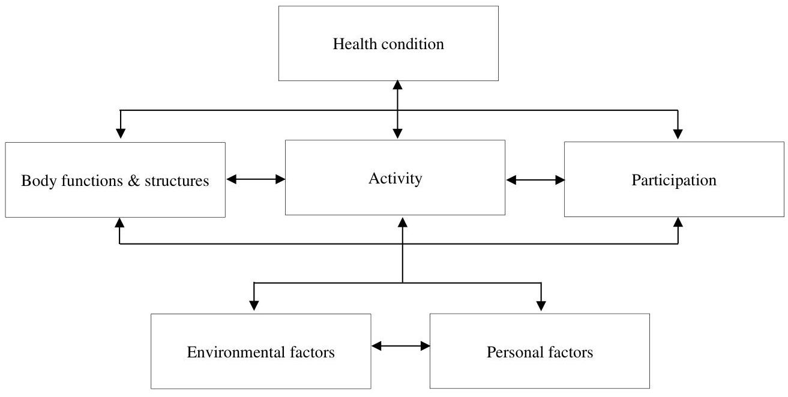
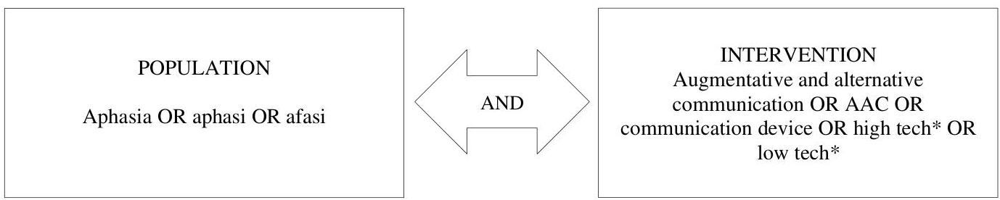
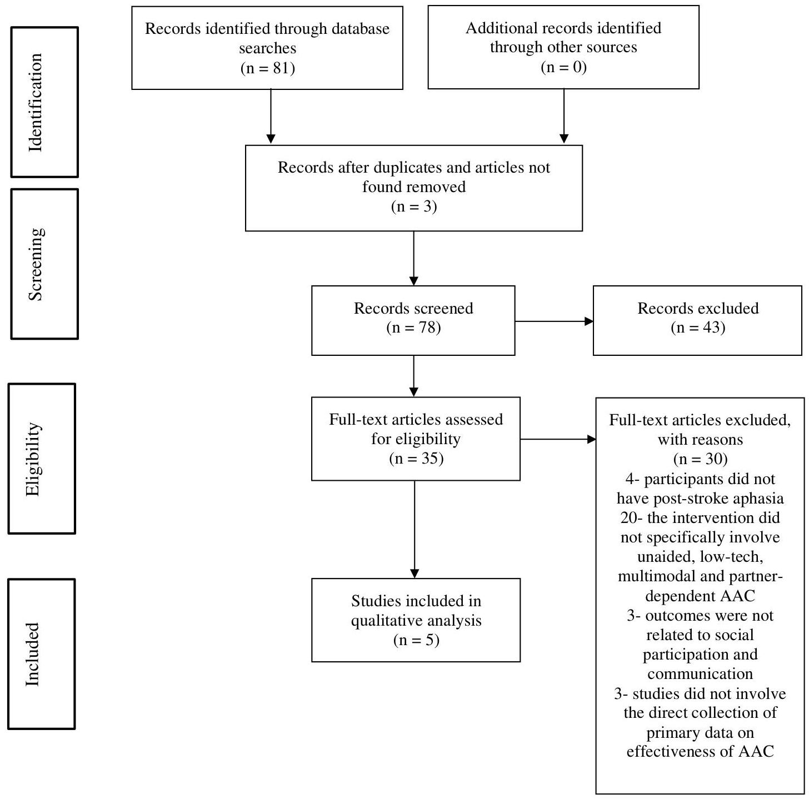
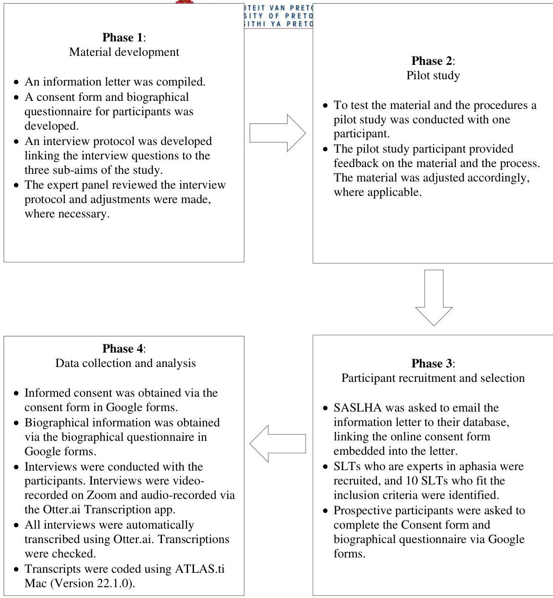

<!-- Source PDF: odendaal-2022-sa-slts.pdf -->

UNIVERSITEIT VAN PRETORIA
UNIVERSITY OF PRETORIA
YUNIBESITHI YA PRETORIA

# The perspectives of South African speech-language therapists on the implementation of augmentative and alternative communication for persons with post-stroke aphasia

by

Inge Odendaal
Student no: 25157354

A dissertation submitted in partial fulfilment of the requirements for the degree

Master's in Augmentative and Alternative Communication

in the Centre for Augmentative and Alternative Communication

UNIVERSITY OF PRETORIA
FACULTY OF HUMANITIES

SUPERVISOR: Prof. Kerstin Tönsing
July 2022
UNIVERSITY OF PRETORIA

UNIVERSITEIT VAN PRETORIA
UNIVERSITY OF PRETORIA
YUNIBESITHI YA PRETORIA

# DECLARATION OF ORIGINALITY

This document must be signed and submitted with every essay, report, project, assignment, dissertation and/or thesis.

Full names of student: Inge Odendaal

Student number: 25157354

# Declaration

1. I understand what plagiarism is and am aware of the University's policy in this regard.
2. I declare that this dissertation is my own original work. Where other people's work has been used (either from a printed source, Internet or any other source), this has been properly acknowledged and referenced in accordance with departmental requirements.
3. I have not used work previously produced by another student or any other person to hand in as my own.
4. I have not allowed, and will not allow, anyone to copy my work with the intention of passing it off as his or her own work.

SIGNATURE OF STUDENT: 

SIGNATURE OF SUPERVISOR: 

UNIVERSITEIT VAN PRETORIA
UNIVERSITY OF PRETORIA
YUNIBESITHI YA PRETORIA

# ETHICS STATEMENT

The author, whose name appears on the title page of this dissertation, has obtained, for the research described in this work, the applicable research ethics approval.

The author declares that he/she has observed the ethical standards required in terms of the University of Pretoria’s Code of ethics for researchers and the Policy guidelines for responsible research.

iii

iv

UNIVERSITEIT VAN PRETORIA
UNIVERSITY OF PRETORIA
YUNIBESITHI YA PRETORIA

For my wonderful father, Johannes Odendaal.

UNIVERSITEIT VAN PRETORIA
UNIVERSITY OF PRETORIA
YUNIBESITHI YA PRETORIA

# ABSTRACT

**Background:** It is necessary to advance the integration of augmentative and alternative communication (AAC) into rehabilitation plans to improve communication and social participation outcomes for persons with post-stroke aphasia. Although research studies have demonstrated AAC’s positive outcomes for this population, AAC is not always implemented. The incorporation of AAC into aphasia rehabilitation by South African speech-language therapists (SLTs) is currently not well-understood. Accordingly, the purpose of this phenomenological study is to explore SLTs' perspectives on the implementation of AAC for persons with post-stroke aphasia with a specific focus on the: (i) current AAC practice; (ii) influencing factors; and (iii) success and relevance of AAC interventions.

**Methods:** A qualitative phenomenological design was used to study the perspectives of 10 SLTs who had at least 10 years of experience working with persons with aphasia post-stroke using open-ended interview questions. The interview data was transcribed and analysed thematically, using a six-phase process (Fereday &amp; Muir-Cochrane, 2006). A combination of inductive and deductive analysis was used. Synthesised member checking was employed to increase trustworthiness.

**Results:** The three a-priori themes aligned to the interview questions were identified in the data. In terms of current practice, nine participants reported that AAC was applicable and that they implemented AAC for all persons with post-stroke aphasia. Participants reported using a combination of unaided, low-tech, high-tech and partner-supported interventions. All participants reported on factors that influence the successful implementation of AAC, including factors related to: (1) the person with aphasia; (2) the AAC system; (3) the communication partner; (4) the therapist; (5) the physical and social environment; (6) the service organisation; (7) policy; and (8) scientific evidence. Participants provided descriptions of the success and relevance of AAC for persons with post-stroke aphasia. Some reported poor generalisation, but nine of the 10 maintained that AAC was relevant for this population. According to the data, the primary facilitators of successful generalisation included sustained practice and a communication-accessible environment through communication partner support. A fourth theme was inductively identified, namely the definition of AAC. This theme emerged as some participants highlighted the importance of the definition of AAC and indicated some misconceptions and disagreements about the definition amongst SLTs, other healthcare providers (HCPs), funders, and policymakers.

UNIVERSITEIT VAN PRETORIA
UNIVERSITY OF PRETORIA
YUNIBESITHI YA PRETORIA

Conclusions: The finding that all the participants implemented AAC with some of their clients with post-stroke aphasia is positive and aligns with the current evidence and best practice recommendations. It was evident that AAC implementation is complex, and therapists make conscious choices regarding the implementation considering various factors corresponding to previous literature. Despite barriers to implementation, most participants still had a positive view of AAC and actively worked to circumvent barriers to implementation. The data reflected the vital role of partners in communication interactions. Participants' comments about the definition of AAC highlighted the need to view AAC in the broad sense to ensure optimal outcomes for persons with post-stroke aphasia.

Keywords: aphasia, augmentative and alternative communication (AAC), person/s with post-stroke aphasia, perspectives, speech-language therapists (SLTs)

vi

UNIVERSITEIT VAN PRETORIA
UNIVERSITY OF PRETORIA
YUNIBESITHI YA PRETORIA

# TABLE OF CONTENTS

## 1. PROBLEM STATEMENT AND LITERATURE REVIEW
1.1. Problem statement ... 1
1.2. Definitions and terminology ... 2
1.3. Literature review ... 3
1.3.1. Aphasia: An overview ... 3
1.3.2. Aphasia management ... 6
1.3.3. AAC interventions for persons with aphasia ... 7
1.3.4. Empirical support for AAC interventions for persons with post-stroke aphasia. 11
1.3.4.1. Evidence for high-technology AAC interventions for persons with post-stroke aphasia ... 12
1.3.4.2. Evidence for low-technology, multimodal, and partner-dependent AAC interventions for persons with post-stroke aphasia ... 15
1.3.4.2.1. Search terms and strategy ... 15
1.3.4.2.2. Inclusion and exclusion criteria ... 16
1.3.4.2.3. Results ... 17
1.3.4.2.4. Synthesis of studies found ... 22
1.3.5. Implementation of AAC for persons with post-stroke aphasia ... 24
1.3.6. The South African context ... 27
1.3.7. Summary ... 30

## 2. METHODOLOGY
2.1. Aims ... 31
2.1.1. Main aim ... 31
2.1.2. Sub-aims ... 31
2.2. Research design and phases ... 31
2.3. Pilot study ... 32
2.4. Participants ... 37
2.4.1. Sampling and recruitment ... 37
2.4.2. Selection criteria ... 37
2.4.3. Participant description ... 38
2.5. Materials and equipment ... 42

UNIVERSITEIT VAN PRETORIA
UNIVERSITY OF PRETORIA
YUNIBESITHI YA PRETORIA

2.5.1. Information letter and consent form ... 42
2.5.2. Biographical questionnaire ... 42
2.5.3. Interview protocol ... 43
2.5.4. Equipment for data collection ... 45
2.5.5. Equipment for data analysis ... 46

2.6. Procedures for data collection ... 46

2.7. Transcription and data analysis ... 47
2.7.1. Transcription ... 47
2.7.2. Thematic analysis ... 48
2.7.3. Member checking ... 49

2.8. Trustworthiness ... 50

2.9. Ethical issues ... 51

3. RESULTS ... 53

3.1. Theme 1: Current practice ... 57
3.1.1. Implementation ... 57
3.1.2. Decision-making ... 59
3.1.3. Types of AAC used ... 60
3.1.4. Timing of implementation ... 62

3.2. Theme 2: Influencing factors ... 63
3.2.1. The person with post-stroke aphasia ... 63
3.2.2. The AAC system ... 66
3.2.3. The communication partner ... 68
3.2.4. The speech-language therapist ... 70
3.2.5. The communication environment ... 71
3.2.6. Organisational aspects of service provision ... 73
3.2.7. Policy ... 76
3.2.8. Scientific evidence ... 78

3.3. Theme 3: Success and relevance ... 80
3.3.1. Successful versus unsuccessful implementation ... 81
3.3.2. Relevance ... 85
3.3.3. Practices that promote success ... 87

UNIVERSITEIT VAN PRETORIA
UNIVERSITY OF PRETORIA
YUNIBESITHI YA PRETORIA

3.4. Theme 4: Definition of AAC ...88
3.4.1. Different conceptualisations regarding the definition of AAC by persons other than the participants ...89
3.4.2. Participants’ definition of AAC ...90

4. DISCUSSION ...92
4.1. Current AAC practices for persons with post-stroke aphasia ...92
4.2. Factors that influence implementation ...96
4.2.1. The person with post-stroke aphasia ...97
4.2.2. The AAC system ...98
4.2.3. The communication partner ...99
4.2.4. The speech-language therapist ...100
4.2.5. The communication environment ...102
4.2.6. Organisational aspects of service delivery ...104
4.2.7. Policy ...106
4.2.8. Scientific evidence ...107

4.3. Success and relevance ...109
4.3.1. Factors that limit AAC success ...109
4.3.2. Practices that promote AAC success ...112

4.4. The definition of AAC ...114

5. CONCLUSION ...116
5.1. Summary of the main findings ...116
5.2. Critical evaluation of the study ...117
5.2.1. Strengths ...117
5.2.2. Limitations ...118
5.3. Implications for practice ...119
5.4. Recommendations for further studies ...121

6. REFERENCES ...123
7. APPENDICES ...141

X

UNIVERSITEIT VAN PRETORIA
UNIVERSITY OF PRETORIA
YUNIBESITHI YA PRETORIA

# LIST OF TABLES

|  Table | Title of table | Page no  |
| --- | --- | --- |
|  Table 1: | Definition of terms used in this study | 2  |
|  Table 2: | Justification of limiters | 16  |
|  Table 3: | Summary of the findings from the systematic search | 19  |
|  Table 4: | Pilot study aims, materials, procedures, results and recommendation | 34  |
|  Table 5: | Participant selection criteria | 38  |
|  Table 6: | Description of participants | 39  |
|  Table 7: | Biographical questionnaire rationale | 43  |
|  Table 8: | Expert review feedback | 44  |
|  Table 9: | Themes, subthemes, and examples of matters mentioned by participants | 54  |

UNIVERSITEIT VAN PRETORIA
UNIVERSITY OF PRETORIA
YUNIBESITHI YA PRETORIA

# LIST OF FIGURES

|  Figure | Title of figure | Page no  |
| --- | --- | --- |
|  Figure 1 | The ICF framework | 5  |
|  Figure 2 | Systematic search terms to identify the effectiveness of AAC for persons with post-stroke aphasia | 15  |
|  Figure 3 | Prisma diagram of the process of study identification ... | 18  |
|  Figure 4 | Phases of the study | 32  |

xi

UNIVERSITEIT VAN PRETORIA
UNIVERSITY OF PRETORIA
YUNIBESITHI YA PRETORIA

# LIST OF APPENDICES

|  Appendix | Title of appendix | Page no  |
| --- | --- | --- |
|  Appendix A | Letter of ethical clearance | 142  |
|  Appendix B | Information letter | 144  |
|  Appendix C | Consent form | 147  |
|  Appendix D | Biographical questionnaire | 149  |
|  Appendix E | Interview protocol | 156  |
|  Appendix F | Coding scheme | 161  |
|  Appendix G | Synthesised member checking and summary of findings | 166  |
|  Appendix H | Declaration of the language editor | 175  |

xii

UNIVERSITEIT VAN PRETORIA
UNIVERSITY OF PRETORIA
YUNIBESITHI YA PRETORIA

# LIST OF ABBREVIATIONS

AAC: Augmentative and alternative communication
ADL: Activities of daily living
AHA: American Heart Association
ASHA: American Speech-Language-Hearing Association
CCN: Complex communication needs
CPD: Continuing Professional Development
EBP: Evidence-based practice
ICF: International Classification of Functioning, Disability and Health
HPCSA: Health Professions Council of South Africa
HCP: Healthcare provider
MCST-A: Multimodal Communication Screening Test for Aphasia
PCS: Picture communication symbol
QoL: Quality of life
SASLHA: South African Speech-Language and Hearing Association
SCA: Supported Conversation for Adults with Aphasia
SCOA: South African Standard Chart of Accounts
SLT: Speech-language therapist
SLTA: Speech-language therapist and audiologist
VSD: Visual scene display
WAB-AQ: Western Aphasia Battery – aphasia quotient
WHO: World Health Organization

xiii

1

## 1. PROBLEM STATEMENT AND LITERATURE REVIEW

### 1.1. Problem statement

There is a need for augmentative and alternative communication (AAC), as an empirically supported treatment, to be better integrated into rehabilitation plans for persons with post-stroke aphasia (de Beer et al., 2020; Dietz et al., 2020). AAC can offer persons with post-stroke aphasia the opportunity to increase independence and improve participation in real-life activities (Dietz et al., 2020; King &amp; Simmons-Mackie, 2017). External scientific evidence has demonstrated that AAC strategies may improve outcomes for persons with post-stroke aphasia (Brock et al., 2017; Dada et al., 2019; Dietz et al., 2018; Fox et al., 2001; Ho et al., 2005; Hux et al., 2010; Purdy &amp; Van Dyke, 2011; Russo et al., 2017; Ulmer et al., 2017).

Aphasia is an acquired language disorder, and the management thereof lies within the professional scope of speech-language therapists (SLTs) (American Speech-Language-Hearing Association [ASHA], 2007; Health Professions Council of South Africa [HPCSA], 2017). Several factors affecting the implementation of AAC for persons with post-stroke aphasia have been noted in the literature (Dada, Murphy et al., 2017; Dietz et al., 2020; Pereira et al., 2019; Taylor et al., 2019). Various studies have found that SLTs perceive AAC service delivery to be negatively impacted by factors such as limited resources, financial constraints, limited family and patient buy-in and lack of expertise (Chua &amp; Gorgon, 2019; Dada et al., 2017; Lasker &amp; Bedrosian, 2001; Pereira et al., 2019). These factors may lead to the limited implementation of AAC for persons with post-stroke aphasia, such as: (1) implementation of AAC only in severe cases of aphasia; (2) underutilisation of AAC; (3) AAC abandonment; (4) the use of strategies that only target the expression of basic needs, lacking consideration for other functions of communication; and (5) prioritising traditional restorative treatment while neglecting compensatory or combined approaches (where both restorative and compensatory approaches are implemented) (Dietz et al., 2020).

Dietz et al. (2020) re-examined the role of AAC for persons with post-stroke aphasia and called for AAC to become an essential aphasia rehabilitation tool to improve life

#

UNIVERSITEIT VAN PRETORIA
UNIVERSITY OF PRETORIA
YUNIBESITHI YA PRETORIA

participation outcomes for persons with post-stroke aphasia. Understanding clinicians' perspectives on the implementation of AAC for persons with post-stroke aphasia is necessary as their perspective is fundamental to any successful AAC intervention (Taylor et al., 2019). However, there is limited research into the views of South African SLTs on AAC interventions in the treatment of persons with post-stroke aphasia. The purpose of this phenomenological study is to explore SLTs' perspectives on the implementation of AAC for persons with post-stroke aphasia with a specific focus on: (i) current AAC practice for persons with post-stroke aphasia, (ii) factors that influence the implementation of AAC for persons with post-stroke aphasia, and (iii) the success and relevance of AAC interventions for persons with post-stroke aphasia.

### 1.2. Definitions and terminology

A list of terms used in this study is supplied in Table 1 to clarify the terminology.

Table 1
Definition of Terms Used in This Study

|  Term | Definition  |
| --- | --- |
|  Augmentative and alternative communication | AAC is a collection of tools, strategies and techniques used to improve communication (ASHA, 2021).  |
|  Aphasia | An acquired language disorder as a consequence of neurological damage such as stroke (Hallowell, 2017).  |
|  Unaided AAC | Unaided AAC does not involve external tools or technology, for example, gestures and signs (Garrett et al., 2020).  |
|  Aided AAC | Aided AAC involves some form of tools or technology, such as low-tech or high-tech AAC (Garrett et al., 2020).  |
|  Low-tech AAC | Aided systems that employ non-electronic paper-based aids, such as communication boards and books (Garrett et al., 2020).  |
|  High-tech AAC | Aided systems that employ an electric or electronic component. Such technologically advanced systems include dedicated AAC devices, such as speech-generating devices, and non-dedicated AAC devices, such as mobile devices, including smartphones and tablets with AAC software applications (Garrett et al., 2020).  |
|  Partner strategies | Partner strategies are a form of AAC that refers to levels of support provided to the AAC user who cannot utilise AAC independently, for example, written choice. Various levels of support are provided to the  |
|   | user who cannot use the AAC system. AAC is a form of AAC that is used to help the user to understand the AAC system. AAC is a form of AAC that is used to help the user to understand the system's AAC system. AAC is a form of AAC that is used to help the user to understand the system's AAC system. AAC is a form of AAC that is used to help the user to understand the system's AAC system. AAC is a form of AAC that is used to help the user to understand the system's AAC system. AAC is a form of AAC  |

#
UNIVERSITEIT VAN PRETORIA
UNIVERSITY OF PRETORIA
YUNIBESITHI YA PRETORIA

|  Term | Definition  |
| --- | --- |
|   | AAC user, depending on their level of participation, communication requirements and particular cognitive-linguistic abilities (Garrett et al., 2020).  |

### 1.3. Literature review

An overview of the current literature will be provided for the following topics: (1) an overview of aphasia, (2) the management of aphasia, (3) AAC interventions for persons with post-stroke aphasia, (4) the empirical support for AAC interventions for persons with post-stroke aphasia, (5) implementation of AAC for post-stroke aphasia, (6) the South African context, and (7) the summary of the findings. Finally, the gap in the existing research will be highlighted as the rationale for the current study.

#### 1.3.1. Aphasia: An overview

Stroke occurs when the blood supply to a part of the brain is diminished or interrupted, causing a focal injury of the central nervous system. Stroke is a substantial cause of death and disability (Sacco et al., 2013). In 2010 alone, there were an estimated 11.6 million incidents of ischemic strokes and an estimated 5.3 million incidents of haemorrhagic strokes globally (Virani et al., 2021). According to the American Heart Association (AHA), the prevalence of stroke mortality rates increased from 14.7 per 100 000 in 2010 to 15.4 per 100 000 in 2016 among US adults aged 35 to 64 (Virani et al., 2021). In South Africa, there is also an increasing trend of stroke, which leads to an increase in aphasia incidence (Ranganai &amp; Matizirofa, 2020). Aphasia occurs in 34% of stroke patients and has a detrimental effect on a person's activities in daily living (ADL), independence and overall quality of life (QoL) (Crosson et al., 2019; Garrett et al., 2020).

Aphasia is an acquired communication disorder ascribed to the loss or impairment of language due to neurological damage (Hallowell, 2017). Therefore, persons with aphasia have impaired language interpretation and formulation (Garrett et al., 2020). Persons with aphasia present with problems accessing and processing symbols leading to difficulties with letters, words, numbers and pictures (Garrett et al., 2020). While some persons with aphasia present with affected cognitive functioning, including attention, processing speed, memory,

UNIVERSITEIT VAN PRETORIA
UNIVERSITY OF PRETORIA
YUNIBESITHI YA PRETORIA

problem-solving and executive functioning, others present with relatively intact cognition (Garrett et al., 2020). There are many causes of aphasia, for example, stroke, primary brain tumours, primary progressive aphasia due to neurological degeneration, and acquired childhood aphasia (Hallowell, 2017). For this particular study, the focus will be on post-stroke aphasia.

Aphasia pertains to a range of impairments in receptive and expressive language functioning, including auditory verbal comprehension, reading comprehension, spontaneous speech, and written expression (Davis, 2007; Hallowell, 2017). Aphasia has a vast array of symptoms that can vary greatly between persons with aphasia; however, all persons with aphasia experience difficulty communicating (Hallowell, 2017). The impairment can be minor or extensive. Similarly, the level of participation restriction can be small or extensive. Everyday tasks such as personal care, education, employment, health management, and social and community engagement can become a significant challenge (Beukelman et al., 2016). The significant communication difficulties of persons with aphasia may lead to poor psychological well-being and decreased social engagement, causing reduced participation in ADLs and QoL (de Beer et al., 2020; Mitchell et al., 2020).

Even though anomia (also known as word-finding difficulties) is the hallmark of aphasia, the signs and symptoms of aphasia are dependent on the type of aphasia, which includes the site and severity of the lesion (Hallowell, 2017). Goodglass and Kaplan (1972) developed a classification system and identified two major types of aphasia: fluent aphasia and non-fluent aphasia; however, some aphasia types are mixed and vary in severity (Hallowell, 2017). Non-fluent aphasia results in effortful and halting speech production and impaired grammar. Non-fluent aphasia, where language comprehension is relatively intact, includes Broca's aphasia and transcortical motor aphasia. Non-fluent aphasia, where language comprehension is affected, occurs, for example, in global aphasia (Davis, 2007; Goodglass &amp; Kaplan, 1972). Fluent aphasia results in fluent speech production with intact sentence structure but lacks meaning. Fluent aphasia where language comprehension is relatively intact includes conduction aphasia and anomic aphasia, while fluent aphasia where language comprehension is affected occurs in, for example, Wernicke's and transcortical sensory aphasia (Davis, 2007; Goodglass &amp; Kaplan, 1972). It is essential to note that this classification system by Goodglass and Kaplan (1972) is based on the traditional focus on impairment at the body structure and function level. However, the World Health

#

UNIVERSITEIT VAN PRETORIA
UNIVERSITY OF PRETORIA
YUNIBESITHI YA PRETORIA

Organization's (WHO's) International Classification of Functioning, Disability and Health (ICF) framework (WHO, 2001) encourages a broader systemic understanding of factors contributing to activity limitations and participation restrictions in persons with aphasia (Hallowell, 2017).

The ICF (WHO, 2001) provides a conceptual framework and multidimensional view for considering not only the impact of the condition but also the impact of the environmental factors (including the physical, psychological and social environment) on the participation of the person with aphasia (Pommerehn et al., 2016; Raghavendra et al., 2007; Taylor et al., 2019). In addition, the ICF recognises the impact of aphasia on a person and can be used to consider the extensive and lifelong effects of aphasia when planning interventions and services (Taylor et al., 2019). It further provides clinicians with a standardised language worldwide to describe a specific person with aphasia and identify their particular needs related to their abilities and disabilities (Pommerehn et al., 2016).

Figure 1. The ICF framework (WHO, 2001).

The ICF provides a framework to conceptualise human functioning in two parts: Part 1 focuses on functioning and disability factors, and Part 2 describes contextual factors (WHO, 2001). Part 1 includes (a) body functions and structure, (b) activity, and (c) participation; while Part 2 includes (a) environmental factors and (b) personal factors

UNIVERSITEIT VAN PRETORIA
UNIVERSITY OF PRETORIA
YUNIBESITHI YA PRETORIA

(Raghavendra et al., 2007; WHO, 2001). The ICF framework provides a holistic representation of the components contributing to a person with aphasia's communication disability (Taylor et al., 2019).

Aphasia is a health condition and therefore affects a person's receptive and expressive language abilities (body function), causing the person to have difficulty in communicating (activity limitation) (Taylor et al., 2019). The communication challenges limit the person's participation in home, community and vocational settings (participation limitation) (ASHA, 2021). The factors intrinsic to the person with aphasia play a significant role and may include their age, attitude, socio-economic status, and cultural background (personal factors) (Taylor et al., 2019). These difficulties are further complicated by the five domains related to the environment of the person with aphasia, including: (1) technology and products (including assistive technology); (2) natural or man-made environment; (3) relationships and support from others; (4) others' attitudes; and (5) systems, organisational services and policies (environmental factors) (Visagie et al., 2017). It is the role of the SLT to ensure that the barriers and supports on every level of the ICF are considered (Taylor et al., 2019).

#### 1.3.2. Aphasia management

According to the ICF framework, the ultimate goal of intervention is to improve the level of independence and QoL of the person with aphasia by increasing their participation in home, community and vocational settings where relevant (ASHA, 2021; WHO, 2001). Treatment methods can be either restorative (i.e., directed at promoting neuroplasticity to improve or rehabilitate impaired function, thus directed at "body functions/structures") or compensatory (i.e., directed at compensating for impairment not responsive to rehabilitation thus directed at "activities/participation") (ASHA, 2021; Hallowell, 2017). Restorative treatments (also known as traditional treatments) exploit the person with aphasia's neuroplasticity (the capacity of the brain to adapt and evolve to internal or external stimuli) to emphasise the recovery of speech, comprehension, reading, language expression, and writing (Hallowell, 2017). In contrast, the primary focus of compensatory treatments is to assist the person with aphasia to compensate for deficits using alternative modalities (Hallowell, 2017).

Aphasia is a complex disorder that defies a single, straightforward solution (Garrett et al., 2020). Some persons with aphasia improve their overall communicative abilities for years

UNIVERSITEIT VAN PRETORIA
UNIVERSITY OF PRETORIA
YUNIBESITHI YA PRETORIA

post-onset (Holland et al., 2017). However, Menahemi-Falkov et al. (2021) systematically reviewed intensive restorative aphasia interventions (e.g., constraint-induced, naming and semantic treatments) for persons with chronic aphasia. The authors found that of the participants, only 22% displayed improvements after intensive therapy and maintained that improvement during follow-up. Therefore, long term, without supplementary, continued practice, the improvements were found improbable to be maintained. Between 40% and 60% of individuals remain challenged with chronic aphasia, where restorative treatments in isolation are limited in improving their communication outcomes (Beukelman et al., 2015; Garrett &amp; Lasker, 2013).

Therefore, the ICF is an optimal framework for considering the person with aphasia as it acknowledges the amalgamated nature of these complex factors (Taylor et al., 2019). Once AAC is incorporated into an aphasia rehabilitation plan, the person with aphasia may benefit on every level of the ICF (Dietz et al., 2020). Therefore, restorative-compensatory strategies such as AAC need to form part of a holistic rehabilitation plan (Garrett et al., 2020).

#### 1.3.3. AAC interventions for persons with aphasia

AAC is a unified collection of components used to improve communication (ASHA, 2021). AAC can be described as various communication strategies, tools and methods that can compensate or substitute for the communication impairments, activity limitations and participation restrictions of individuals with complex communication needs (CCN), such as persons with post-stroke aphasia. AAC strategies may include unaided strategies (such as gestures and body language), while aided strategies may include partner-supported strategies, low-tech aids (such as communication boards or books) and high-tech aids (such as speech-generating devices, dedicated AAC devices and non-dedicated devices with AAC software applications) (ASHA, 2021; Dada et al., 2017; Garrett et al., 2020). AAC can address the communication difficulties of persons with aphasia by augmenting or substituting natural speech production and comprehension (Light &amp; McNaughton, 2014).

AAC can also be regarded as a multi-functional instrument as it can achieve both restorative and compensatory objectives and therefore offers a combined restorative-compensatory approach. The restorative function of AAC is highlighted in the literature, where AAC can serve as a language stimulation tool. In addition, various software

UNIVERSITEIT VAN PRETORIA
UNIVERSITY OF PRETORIA
YUNIBESITHI YA PRETORIA

applications provide exercises for traditional treatment, targeted drills and practice (Beukelman et al., 2015; Dietz et al., 2020; Holland et al., 2012; Pereira et al., 2019). However, although AAC can have a restorative function, it is typically regarded as mainly compensatory, as various communication strategies, tools and methods (including aided and unaided methods) are employed to compensate or substitute for the temporary or permanent communication impairments, activity limitations and participation restrictions of individuals with CCN (Beukelman &amp; Light, 2020).

Consistent with the ICF framework, Garrett et al. (2020) identified five main compensatory functions of AAC for persons with aphasia. These are: (1) improving the understanding of persons with auditory comprehension impairments; (2) presenting a way of expressing basic choices, needs and wants; (3) functioning as a word or phrase bank for more complex topics of discussion; (4) functioning as an all-inclusive communication aid to generate spoken or written language; and (5) presenting techniques to facilitate persons with aphasia to participate, with maximal independence, in functional life activities. The specific function that the AAC would serve for a particular person with aphasia depends on the person's abilities and requirements (Garrett et al., 2020).

AAC systems range from unaided AAC utilising no equipment, instead using such things as eye-pointing, gestures, facial expression, body language, and sign language, to aided systems (Dietz et al., 2020; Elsahar et al., 2019; Hodge, 2007). Aided AAC incorporates a tool or technology (Garrett et al., 2020). AAC systems are classified as either low-technology or high-technology (Dietz et al., 2020). Low-tech AAC aids (also known as non-electronic AAC) consist of low-tech, paper-based aids such as written words, drawings, notebooks, photographs, remnants (e.g., newspaper articles), communication books and communication boards with expanded vocabulary represented by pictures and phrases to aid communication (Beukelman et al., 2015; Garrett et al., 2020; Elsahar et al., 2019).

High-tech AAC aids (also known as electronic AAC) have become more readily available to persons with aphasia due to ongoing advancements in innovation over the past two decades (Holland 2012; Light et al., 2019). High-tech AAC aids encompass electronic devices and may include dedicated AAC devices (i.e. devices such as speech-generating devices that have been manufactured specifically as an AAC aid) and non-dedicated devices, such as mainstream mobile devices with AAC software applications (Beukelman et al.,

UNIVERSITEIT VAN PRETORIA
UNIVERSITY OF PRETORIA
YUNIBESITHI YA PRETORIA

2015). Mainstream mobile devices serving as non-dedicated AAC devices are gaining acceptance as they can function as a communication aid and assist in social connection and participation through social media (Kamwesiga et al., 2017; Moffatt et al., 2017). Access to social media is in line with the ICF's component of participation, which emphasises the person's involvement in life situations (Raghavendra et al., 2007). Three-quarters of the world's population have the opportunity to use mobile technology and therefore have access to this form of communication technology (World Bank, 2012).

Although grid displays were used in the past, another low- or high-tech AAC type of display that is gaining attention in terms of aphasia management is visual scene displays (VSDs) (Beukelman et al., 2015; Dietz et al., 2020). A VSD can be a video recording, a high-context photograph or a picture that depicts a variety of situations, events or locations illustrating "hotspots" or components built into the VSD that, when selected, will activate speech output employing a dynamic screen (ASHA, 2021). VSDs may be easier to learn and use than grid displays for persons with aphasia as they provide a shared communication space for the person and their communication partner; however, it should be noted that further research is required to confirm this (Beukelman et al., 2015).

While persons with aphasia can use various AAC systems and strategies to support their expressive communication, many persons with aphasia struggle with independent communication and the independent use of AAC systems (Garrett et al., 2020). Therefore, communication partners' use of AAC strategies can greatly facilitate communication interaction for persons with aphasia (Garrett et al., 2020). Partner-supported AAC strategies can address the person with aphasia's receptive and expressive language difficulties and may include techniques such as establishing a topic before initiating a conversation, augmented input, elicitation of yes and no responses, Written Choice Communication Strategy, and promoting the use of multimodal strategies (Garrett et al., 2020). The Written Choice Communication Strategy is an AAC technique in which communication partners present persons with aphasia with written word choices from which to select suitable responses from a written arrangement (Lasker et al., 1997). Another prominent Conversation Partner Training (Turner &amp; Whitworth, 2006) programme worth mentioning is Supported Conversation for Adults with Aphasia (SCA™) (Kagan, 1998b). SCA™ involves training the communication partners of persons with aphasia through supportive resources and materials to offer opportunities to communicate (Kagan, 1998b). Positive results for Conversation

9

UNIVERSITEIT VAN PRETORIA
UNIVERSITY OF PRETORIA
YUNIBESITHI YA PRETORIA

Partner Training programmes, such as $\mathrm{SCA}^{\mathrm{TM}}$ (Kagan, 1998), have been confirmed in the literature (Simmons-Mackie et al., 2010; Turner &amp; Whitworth, 2006).

Generally, AAC approaches for aphasia entail a variety of multimodal communication supports (Garrett et al., 2020). Persons with aphasia have an increased likelihood of participation when they have a variety of AAC systems and techniques available to them and when partners use AAC strategies to support their communication (Beukelman et al., 2015). Unaided or low-tech options can also be utilised when the high-tech device is unavailable, for example, when charging the device (Garrett et al., 2020).

To assist with the development of a communication intervention plan for persons with aphasia, a functional classification framework was originated by Garrett and Beukelman (1992; 1998). The classification framework was further modified by Garrett and Lasker (2005), who developed the Multimodal Communication Screening Test for Aphasia (MCST-A) to assist in the classification of persons with aphasia. The functional classification framework distinguishes between persons that can become skilled at communicating independently with AAC support and persons that require partner support to communicate with AAC (Garrett et al., 2020). Unlike the classification by Goodglass and Kaplan (1972), which focuses on the speech symptoms of person with aphasia, this classification by Garrett and Lasker focuses on the functional abilities of the person and the environmental support they need to communicate (Garrett et al., 2020). The communicators are classified according to the level of support required, ranging from minimal to maximal. The classification framework includes (1) emerging AAC communicators, (2) contextual choice AAC communicators, (3) transitional AAC communicators, (4) stored-message AAC communicators, (5) generative AAC communicators, and (6) specific-need AAC communicators (Garrett et al., 2020). AAC intervention approaches that include communication support during every rehabilitation phase are beneficial to persons with aphasia (Garrett et al., 2020).

Garrett et al. (2020) provide specific partner strategies and AAC recommendations for different communicators. For example, emerging AAC communicators may benefit from partner strategies such as developing contextual routines, employing referential pointing, using confirmation signals and providing communication choices with familiar photographs. For this type of communicator, unaided or aided AAC that may be beneficial includes the use

UNIVERSITEIT VAN PRETORIA
UNIVERSITY OF PRETORIA
YUNIBESITHI YA PRETORIA

of gestures, real objects for pointing or reaching, and using familiar photographs for a reminiscing activity. For the contextual choice AAC communicator, partner strategies may include employing written-choice conversations, providing support by eliciting yes/no responses, or augmenting the person with aphasia's comprehension through visual aids. The unaided or aided AAC recommended for this type of communicator may include gestures, visual aids such as Likert scales, maps with locations, drawing, and written keyword choices to accompany spoken messages. For transitional AAC communicators, partners may include strategies such as providing verbal instructions or prompts to use learnt strategies, providing opportunities for communication of specific information within contextual and familiar conversations, assisting the person with aphasia to develop a scrapbook or assisting the person to collect remnants of particular topics to use in communication exchanges. At the same time, unaided or aided AAC for this type of communicator may include drawings, spoken language or gestures, low-tech devices such as communication books and boards, or high-tech AAC such as speech-generating devices. For stored-message, generative and specific-need communicators, partners can use role-playing and practice, assist in establishing topics before communicating more complex conversational information and promote the use of multimodal strategies in various communication contexts. AAC may include unaided or aided strategies (low-tech and high-tech) and a multimodal intervention plan for these communicators.

#### 1.3.4. Empirical support for AAC interventions for persons with post-stroke aphasia

Evidence-based practice (EBP) is a framework incorporating client perspective, best available scientific evidence and clinical expertise to improve clinical decision-making (de Miranda et al., 2019). All three components of EBP are essential but it is necessary to distinguish between them (Smith, 2016). Empirical evidence regarding the effectiveness of AAC methods, strategies, and techniques should be gleaned from high quality research studies. Such high quality studies should be methodologically sound and current (ASHA, 2018). The research design applied within studies influences the reliability and validity of the study outcomes (Murray &amp; Goldbart, 2009). Research designs are ranked over five hierarchical levels. The research designs contributing to the highest level of evidence (Level I) are systematic reviews or meta-analyses of random control trials due to the use of scientific rigour and approaches to minimise bias (Schlosser &amp; Raghavendra, 2004). At the lowest level of the hierarchy are designs without well-built methodological steps to minimise bias, such as

UNIVERSITEIT VAN PRETORIA
UNIVERSITY OF PRETORIA
YUNIBESITHI YA PRETORIA

expert opinions and “first principles” research (Level V) (Murray &amp; Goldbart, 2009). In the section following, the current scientific evidence for the use of AAC for persons with post-stroke aphasia will be briefly reviewed.

##### 1.3.4.1. Evidence for high-technology AAC interventions for persons with post-stroke aphasia

A relatively recent non-meta-analytic systematic review by Russo et al. (2017) inspected the use of high-technology AAC devices for improving social participation and communication for persons with aphasia. Due to the scarcity of published studies with high methodological quality (e.g., random control trials), Russo et al. (2017) included a total of eight case reports and 22 observational studies with varying risks of bias.

Participants included 250 persons with aphasia diagnosed with global, fluent, or non-fluent aphasia, varying from mild to severe. Nearly half of the studies (n = 14) did not establish whether participants had past exposure to AAC or other technologies, and almost half of the studies (n = 14) included communication partners. Instructional settings included group settings (n = 1) or individual settings (n = 29), and the average number of sessions ranged from 1 to 64. The studies employed high-tech AAC interventions to target compensation for lost function and restoration of natural abilities. In these studies, various systems were used, including AAC desktop computer software, AAC portable computer software, dedicated AAC devices and mobile devices with communication apps. Outcome measures for compensatory approaches included improved communication function for social interaction within six categories (in-depth information, telephone conversations, needs, face-to-face interaction, online communication and written communication). Restorative approaches targeted outcome measures related to the restoration of language and speech skills (for example, repetition, naming and semantic categorisation). Based on the 30 included studies, the authors found convincing evidence supporting the use of high-tech AAC intervention with persons with aphasia as a compensatory and restorative technique. However, the authors noted that current evidence does not recognise one best model of AAC intervention for improving functional communication skills (Russo et al., 2017).

Russo et al. (2017) grounded their quality assessment on addressing the central question rather than on the study design. The authors ensured validity by establishing the appropriateness of the eligibility criteria of every study by incorporating independently-

UNIVERSITEIT VAN PRETORIA
UNIVERSITY OF PRETORIA
YUNIBESITHI YA PRETORIA

functioning blind pairs of reviewers. The authors regarded that the lack of consistency of the design and methodology may be a significant limitation of the systematic review; however, they deduced that this matter does not diminish the overall importance.

Since the publication by Russo et al. (2017), several additional studies focusing on the effectiveness of using high-technology to improve communication in persons with aphasia have been conducted. A study by Ulmer et al. (2017) used a multiple case study design to inspect the effect of taking photographs of and conversing with unfamiliar communication partners about observed wellness activities for five persons with aphasia. Participants utilised their captured photos as communication aids while conversing about the practical activity and communicating new information to an unfamiliar communication partner. The authors supplied the participants with a digital camera, an iPad® and a book-stand to capture and view the photographs. The researchers captured video and audio recordings of the participants' interactions conversing with their novel communication partner for analysis of the conversational samples. The participants who implemented their photographs as references could produce increased content units with increased accuracy, make fewer off-topic comments, and converse more about the particular topic than the participants who did not. The evidence showed that taking photographs to reference in conversation facilitates topic maintenance and increases content specificity for persons with aphasia.

Another study by Brock et al. (2017) utilised a case study of two participants with Broca's aphasia conversing with a communication partner to examine how a grid display and a scene display on a DynaVox Vmax™ influenced conversation features. Furthermore, the authors investigated the generalisation to an untrained second conversation with one participant. For the first investigation, the participant took part in conversations with a communication partner using either the grid or scene display, after training to use both the grid and scene display for communicative purposes (e.g., using the AAC device to formulate messages). The second experiment mimicked the procedures of the first investigation, though the second participant did not receive training on the grid or scene display. The authors investigated: (1) the total time of each conversation; (2) precision of question responses; (3) utterances' conceptual complexity; and (4) the number of conversational turns, navigational errors and occurrences of frustration. The participants were able to increase the number of conversational turns and decrease the number of navigational errors and occurrences of frustration. In addition, the number of complex utterances and the precision of question

UNIVERSITEIT VAN PRETORIA
UNIVERSITY OF PRETORIA
YUNIBESITHI YA PRETORIA

responses increased in the scene display condition. Therefore, compared to the grid display condition, the authors showed that the scene display facilitated significantly improved communication for both persons with aphasia.

Finally, employing a pre-and post-treatment design with a control group, Dietz et al. (2018) investigated the viability of providing high-tech AAC treatment to persons with post-stroke aphasia to induce changes in verbal expression and identify evidence of AAC-induced changes in brain activation. The authors created personalised AAC interfaces for 12 participants with aphasia on the DynaVox VMax™. Participants were assisted in programming two personally relevant stories into the high-tech AAC device using two relevant photographs and six textboxes that included text on a sentence level. In addition, participants practised a verb generation task. The authors videotaped the narrative retell sessions to allow accurate transcription of the narrative retelling. Functional magnetic resonance imaging (fMRI) examined associated neural reorganisation. The authors determined statistically significant aphasia severity, verbal expression and expressive modality units. According to the results, compared to the usual care group, the AAC group showed significant positive gains on the Western Aphasia Battery – aphasia quotient (WAB-AQ) score, increased counted words, and increased complexity and informativeness measures. Following treatment, both groups showed a general decrease in aphasia severity on the WAB-AQ. The AAC group showed a trend for more significant gains, further strengthening the evidence for AAC-induced language restoration. FMRI demonstrated a trend toward greater leftward lateralisation of language functions in both groups, which corresponded with enhanced performance on the WAB-AQ. Therefore, AAC intervention did not seem to prevent neural reorganisation in the predominant language area of the left hemisphere, contributing to preliminary evidence to alleviate concerns about integrating AAC strategies into aphasia rehabilitation. In addition, the authors observed that persons with aphasia in the treatment group showed an increase in activation in visual processing regions compared to persons with aphasia in the control group. This study specifies preliminary direction on implementing AAC treatment that simultaneously facilitates language while compensating for residual deficits in persons with aphasia. Therefore, the authors confirmed the viability of using AAC treatment as a dual-purpose tool due to improved outcomes on the targeted behavioural measures.

The studies discussed in this section all focused on high-technology AAC for persons with post-stroke aphasia. However, it is also necessary to explore the evidence for the

#

UNIVERSITEIT VAN PRETORIA
UNIVERSITY OF PRETORIA
YUNIBESITHI YA PRETORIA

effectiveness (or lack of it) of unaided, low-technology, multimodal, and partner-dependent AAC interventions to improve social participation and communication for persons with post-stroke aphasia.

# 1.3.4.2.Evidence for low-technology, multimodal, and partner-dependent AAC interventions for persons with post-stroke aphasia

A systematised review was undertaken to gain an impression of the evidence for the effectiveness (or lack of it) of low-technology, multimodal, unaided, and partner-dependent AAC interventions to improve social participation and communication for persons with post-stroke aphasia. A systematised review is limited in terms of the completeness of its search, and does not require a formal quality appraisal (Grant &amp; Booth, 2009). The review was guided by the following question, which was structured to specify the population (P), Intervention (I), and outcome (O), and read as follows: Does the implementation of AAC (I) improve social participation and communication (O) for persons with aphasia (P)?

###### 1.3.4.2.1. Search terms and strategy

The search terms are portrayed in Figure 2. The researcher did not use outcomere-lated terms to ensure that findings were not limited prematurely.

Figure 2. Systematic search terms to identify the effectiveness of AAC for persons with aphasia.

The researcher conducted a systematic literature search on November 7, 2021. The search process is depicted in Figure 3. The search terms were entered via EBSCOHOST into the following databases: PubMed, Education Resources Information Center (ERIC) and Cumulative Index for Allied Health Literature. Limits were set in date, language, source type, and methodologies. A list of limitations and their justification is supplied in Table 2 to clarify the rationale for each limiter.

UNIVERSITEIT VAN PRETORIA
UNIVERSITY OF PRETORIA
YUNIBESITHI YA PRETORIA

Table 2
Justification of Limiters

|  Limit | Limiters set | Justification  |
| --- | --- | --- |
|  Date | Limiters set to restrict to years between 1991-2021. | To guarantee that all relevant published articles are included within a specified date range, as there has been remarkable progress in the field of AAC since its starting point (Light et al., 2019).  |
|  Language | Limiters set to restrict to the English language. | To ensure that the articles are understandable and searchable by the researcher.  |
|  Source type | Limiters set only to include peer-reviewed articles from academic journals. | To guarantee that only articles that have been reviewed and acknowledged by experts in the field are included.  |
|  Methodologies | Limiters set only to include empirical studies. | To ensure that opinion pieces and theoretical articles not based on data collected from participants are excluded.  |

1.3.4.2.2. Inclusion and exclusion criteria

Records were screened on the title and abstract level according to the following inclusion criteria: (1) the participants in the study were persons with post-stroke aphasia; (2) an intervention specifically involving unaided, low-technology, multimodal, and partner-dependent AAC was administered; (3) outcomes targeted and measured were related to social participation and communication of the persons with aphasia; (4) the study involved direct collection of primary data on effectiveness of AAC; and (5) the article must be English. This implied that only studies with quantitative designs that enabled some conclusions about effectiveness were included (Schlosser &amp; Raghavendra, 2004).

In addition, one exclusion criterion was also applied, namely that studies where intervention involved the use of only high-technology AAC were excluded. The reason was that Russo (2017) had already undertaken a recent review on this topic, and that additional work on this topic done post-2017 was already discussed above. The authors defined high-tech as communication systems and tools that are technologically sophisticated.

1.3.4.2.3. Results

From the database search, a total of 81 studies were identified. The researcher removed one duplicate and two articles that could not be obtained; therefore, 78 records were

UNIVERSITEIT VAN PRETORIA
UNIVERSITY OF PRETORIA
YUNIBESITHI YA PRETORIA

screened. A total of 43 records were excluded on title and abstract level review, reducing the number to 35 studies.

The researcher reviewed the remaining 35 studies on a full-text level, and a further 30 studies were excluded for the following reasons: (1) participants did not have post-stroke aphasia ( $n = 4$ ); (2) the interventions did not specifically involve unaided, low-technology, multimodal, and partner-dependent AAC ( $n = 20$ ); (3) outcomes were not related to social participation and communication ( $n = 3$ ); and (4) studies did not involve the direct collection of primary data on the effectiveness of AAC ( $n = 3$ ). A total of five studies were included.

The PRISMA diagram below (Figure 3) depicts the process of study identification. Data was extracted and summarised in the form of a table (see Table 3).

17

#

UNIVERSITEIT VAN PRETORIA
UNIVERSITY OF PRETORIA
YUNIBESITHI YA PRETORIA

Figure 3. Prisma diagram of the process of study identification.

Table 3
Summary of the Findings From the Systematic Search

|  Citation | Design | Purpose/objective | Participants | AAC strategy, technique or aid implemented | Data collection | Effectiveness of AAC for post-stroke aphasia  |
| --- | --- | --- | --- | --- | --- | --- |
|  1. Fox et al. (2001) | Single-case alternating treatment design | To determine if conversational topic choice enhanced the abilities of persons with aphasia: (1) in natural environment discussions with friends and family; and (2) to utilise symbol-based communication aids during conversations with unfamiliar and familiar communication partners. | Three persons with severe post-stroke aphasia who matched Garrett's (1992, p. 341) category of a comprehensive communicator. A comprehensive communicator is aphasic but preserves various communication skills; however, they require support for successful communication due to inconsistency in skills. | The researchers developed two symbol-based communication aids for each participant - one had a choice and the other a nonchoice conversational topic. In addition, participants and their communication partners attended training to promote communication aid learning and generalisation. Therefore, the participants utilised a combination of low-tech and partner-dependent strategies. | The researchers measured the participants' number of definite symbols employed to: (1) correctly respond to questions; and (2) comment using symbol-based communication aids by video-recording the experimental sessions. Further, to get qualitative and quantitative data for analysis, every participant's main communication partner reported on a Likert scale regarding the use of the aid in conversations and the generalisation to natural environments. | The researchers obtained variable results; however, participants generally used more symbols to answer questions about choice versus nonchoice topics and comments increased on the topic of choice. One participant's performance did, however, diminish. Participants reported higher levels of enjoyment in conversations on choice and nonchoice topics, and partners reported increased satisfaction with conversations in natural environments. Participants benefited from topic choice when conversing about a choice rather than a nonchoice topic.  |
|  2. Ho et al. (2005) | Single case alternating treatment design with three phases (ABA) | To determine the effect of pictographic symbol communication books versus remnant books on changes in communication | Two persons with global aphasia post-stroke. | The researchers constructed two communication books for every participant: one contained remnants and the other picture communication symbols. Every page had a symbol (either remnant or pictograph) beside a description of the meaning of | For quantitative comparison, the researchers video-recorded conversations and analysed communication behaviours (measured in no response; negative affect; pointing; | Participants communicated better with AAC aids than without. In general, the remnant book led to more pointing behaviour, and partners also favoured them. However, some individual variability was noted.  |

UNIVERSITEIT VAN PRETORIA
UNIVERSITY OF PRETORIA
YUNIBESITHI YA PRETORIA

|  Citation | Design | Purpose/objective | Participants | AAC strategy, technique or aid implemented | Data collection | Effectiveness of AAC for post-stroke aphasia  |
| --- | --- | --- | --- | --- | --- | --- |
|   |  | behaviours for individuals with global aphasia. |  | every item. Thus, the participants employed a low-tech AAC strategy. | conversational turns, topics, and initiations; and communication breakdowns). |   |
|  3. Hux et al. (2010) | Comparative study (comparison of three conditions) | To examine the effect of low-tech VSDs (shared versus non-shared versus no-VSD) on the quality and content of communicative exchanges between a person with aphasia and unknown communication partners. | One person with moderate anomic aphasia post-stroke (affected areas included word retrieval, writing and reading comprehension) and nine unfamiliar communication partners. | The participant used a low-tech VSD incorporating written text and context-rich pictures. The researchers implemented three conditions, including shared-VSDs, non-shared-VSDs, and no-VSDs. | One person with aphasia and nine unknown communication partners conversed regarding a determined topic in one of three conditions. Data comprised of: (1) content unit analyses of information that communication partners collected from the exchange, (2) discourse analysis scores demonstrating the conceptual complexity of utterances, and (3) Likert-scale feedback from the person with aphasia about his view of communicative efficacy and ease. | The participant reported increased ease of use for the shared-VSD compared to the non-shared-VSD and no-VSD conditions. In addition, the support provided by low-tech shared-VSDs resulted in increased responses and initiations and improved delivery of correct content units for the participant when compared to no use of VSDs.  |
|  4. Purdy & Van Dyke (2011) | Single-subject AB design (baseline and treatment) | To investigate if concurrent training of stimuli in nonverbal and verbal modalities (Multimodal Communicative Training or MCT) would improve | Two persons with moderate to severe aphasia post-stroke. One participant had Broca’s aphasia while the other participant had Wernicke’s aphasia. | MCT promotes using nonverbal and verbal means to communicate patients’ messages. The participants participated in MCT, during which they conveyed a concept by gesturing, writing, drawing and verbalising. The participants applied a mix of | Participants received MCT and were taught to convey a concept by gesturing, writing, drawing and verbalising using pictures as stimuli. Baseline and posttreatment assessment results, employing | One participant’s communication of concepts on the functional communication task increased using a variety of modalities. The researchers observed some improvement in the second participant. However, his general  |

20

21

UNIVERSITEIT VAN PRETORIA
UNIVERSITY OF PRETORIA
YUNIBESITHI YA PRETORIA

|  Citation | Design | Purpose/objective | Participants | AAC strategy, technique or aid implemented | Data collection | Effectiveness of AAC for post-stroke aphasia  |
| --- | --- | --- | --- | --- | --- | --- |
|   |  | conveying a concept accurately during a functional communication task. |  | unaided, low-tech and multimodal AAC strategies. | functional communication testing, were compared. | performance remained poor, probably due to a more extensive impairment in semantic knowledge. Following semantic training, the second participant showed further improvement.  |
|  5. Dada et al. (2019) | Within-subject design | To evaluate the efficacy of two distinct augmented input conditions in aiding the understanding of narrative passages by participants with aphasia. | Twelve persons with post-stroke aphasia presented with moderate auditory comprehension and could respond 100% accurately to questioning using the Written-choice Communication Strategy Screening Test. | Augmented input is the strategy by which a communication partner augments their expressive language by employing gestures, writing, images or objects. One condition involved the researcher actively pointing out (AI-PP) key content words using visuographic supports. The second condition entailed the communication partner's no active pointing (AI-NPPP). Augmented input incorporates partner-dependent and low-tech strategies. | In each condition, all 12 persons with aphasia listened to two narratives. Thereafter, they were asked to respond to fifteen multiple-choice cloze-type statements for accuracy in relating the narrative to assess auditory comprehension. | Seven of the 12 participants presented with increased accuracy of their responses to comprehension items in the AI-PP condition, four showed increased accuracy of responses in the AI-NPP condition, and one scored the same for both conditions. The particular variations were not statistically substantial. Using communication-partner-referenced augmented input with high-context and picture communication symbol (PCS) supports improved the accuracy of responses for some persons with aphasia.  |

22

###### 1.3.4.2.4. Synthesis of studies found

Table 3 depicts the summary of the findings from the systematic search. Two studies found positive effects for low-technology AAC on expressive communication. In the first of these studies, Ho et al. (2005) compared the impact of communication books containing remnants versus other pictures. Remnant books had remnants (for example, photographs of family members and a cover of a favourite magazine), while the other contained pictographic books that included coloured picture communication symbol (PCS) images instead of remnants. The authors found improved outcomes utilising both low-tech AAC strategies compared to not using AAC. They also found that the remnant book lead to increased communicative effectiveness compared to the pictographic book. The second study, obtaining positive effects related to low-technology AAC, by Hux et al. (2010), examined the impact of low-tech VSDs on the quality and content communicative exchanges between a person with aphasia and unknown communication partners. The authors concluded that low-tech VSDs positively affects the way and degree to which a person with post-stroke aphasia and a communication partner participate in conversational interactions involving information transfer. For persons with post-stroke aphasia, evidence from this study demonstrates that the use of low-tech VSDs lead to an increase in initiations and responses and improved relaying of correct content units.

In two studies, the authors used a combination of AAC strategies to improve the expressive communication skills of persons with post-stroke aphasia. Fox et al. (2001) studied the effect of conversational topic choice on communication aid use. The authors used a combination of low-tech AAC (a symbol-based communication book) and partner training to show that several persons with post-stroke aphasia could use communication aids to converse about preferred and non-preferred topics. The authors found that participants' conversations improved when using a topic of their choice versus a nonchoice topic. Another study by Purdy and Van Dyke (2011) examined whether MCT could lead to improved accuracy in concept conveyance during a functional communication task. The authors implemented a combination of unaided, low-tech and multimodal AAC strategies. They concluded that MCT might increase switching among verbal and nonverbal modalities in individuals with intact semantic representations, increasing the probability of using an alternative method to communicate more functionally.

UNIVERSITEIT VAN PRETORIA
UNIVERSITY OF PRETORIA
YUNIBESITHI YA PRETORIA

Finally, one study adopted a combination of AAC strategies to improve receptive communication skills of persons with aphasia. Dada et al. (2019) evaluated the efficacy of two augmented input conditions in aiding the understanding of stories. The authors compared two conditions in this study: the clinician actively pointed out (AI-PP) key content words using visuographic supports. The other entailed the communication partner's no active pointing (AI-NPP). The authors showed participants no-context PCS images and a high-context photograph. The PCS images and photographs were related to the two stories and, for both conditions, remained in front of the participants throughout the experiment. All participants listened to two stories, with one in each condition. The researcher read the story during the AI-PP condition and simultaneously pointed out the related, no-context PCS images. The researcher did not, however, point to the no-context PCS images during the AI-NPP condition while reading the story. Comprehension was measured by evaluating the accuracy of participants' responses to 15 multiple-choice questions. The authors obtained mixed results, as seven of the 12 participants presented with increased accuracy of responses to the comprehension items in the AI-PP condition. Four showed increased accuracy of responses in the AI-NPP condition, and one scored the same for both conditions. Although the results were not statistically significant ( $p &gt; .05$ ), the authors concluded that using communication-partner-referenced augmented input with high-context and PCS supports improved the accuracy of responses for some persons with post-stroke aphasia. The authors discussed what might have influenced the results; the participants' types of aphasia, aphasia severity, previous exposure to AAC, and the importance of providing persons with aphasia comprehensive guidance and training for the successful implementation of any AAC device or system.

This search demonstrates that not all studies showed unequivocal results. Two studies (Ho et al., 2005; Hux et al., 2010) found positive effects for low-technology AAC on expressive communication. Furthermore, two studies (Fox et al., 2001; Purdy &amp; Van Dyke, 2011) found mixed effects for a combination of AAC strategies to improve the expressive communication skills of persons with aphasia. Another study (Dada et al., 2019) found results to be statistically insignificant when employing a combination of AAC strategies to improve the receptive communication skills of persons with post-stroke aphasia.

The studies also differed in design and methodology. Using the hierarchical levels of evidence for single-subject research designs (Schlosser &amp; Raghavendra, 2004), the researcher

23

UNIVERSITEIT VAN PRETORIA
UNIVERSITY OF PRETORIA
YUNIBESITHI YA PRETORIA

found two studies on the hierarchical Level V of evidence. One study (Hux et al., 2010) was a comparative study with no experimental controls. Another study (Purdy &amp; Van Dyke, 2011) was a single-subject AB design with no experimental controls. The researcher found three studies on the hierarchical Level IV of evidence. One study (Fox et al., 2001) was a single-case experimental design (SCED) with experimental controls. Another study (Ho et al., 2005) was a single-case alternating treatment design with three phases (ABA) and thus had experimental controls. Finally, one study (Dada et al., 2019) was a within-participants group design with experimental controls.

The status of the evidence obtained falls on the lower levels of the hierarchy (Schlosser &amp; Raghavendra, 2004). However, Kent-Walsh &amp; Binger (2018) emphasise that SCEDs can provide a more in-depth exploration for specific perplexing populations. Of the five studies, two SCEDs showed positive results. Therefore, it is evident that unaided, low-technology, multimodal and partner-dependent AAC is effective for several persons with post-stroke aphasia. The systematic review by Russo et al. (2017) also confirmed the effectiveness of high-technology AAC for persons with aphasia. Therefore, the literature answered the main research question, as there is some evidence for the efficacy of AAC for persons with post-stroke aphasia.

#### 1.3.5 Implementation of AAC for persons with post-stroke aphasia

Having established that there is empirical support for the implementation of AAC with post-stroke aphasia, it is not surprising to find that AAC is also included in best practice guidelines for the treatment of communication disorders in persons with aphasia. The Aphasia United Best Practices Working Group and Advisory Committee obtained consensus from 500 aphasia experts across the world to identify best practice recommendations in aphasia rehabilitation (Simmons-Mackie et al., 2017). According to the best practice recommendations agreed upon, AAC is number four on the Top 10: Best Practice Recommendations for aphasia, which stipulates that all persons with aphasia should be discharged from inpatient facilities with a method, tool or strategy to communicate their needs and wishes (e.g., using AAC) (Simmons-Mackie et al., 2017). It is fundamental to AAC intervention that persons with aphasia are supported to ensure they have a way of communicating in all situations and at all stages of recovery (Garrett et al., 2020). According to the Canadian and Indian stroke best practice guidelines, all persons with post-stroke

24

UNIVERSITEIT VAN PRETORIA
UNIVERSITY OF PRETORIA
YUNIBESITHI YA PRETORIA

aphasia should be evaluated for their potential to benefit from using AAC (Pauranik et al., 2019; Teasell et al., 2020).

Notwithstanding the positive evidence of the effectiveness of AAC and its mention in best practice guidelines (Pauranik et al., 2019; Simmons-Mackie et al., 2017; Teasell et al., 2020), reports of non-use or underuse of AAC for persons with post-aphasia appear to persist (Dietz et al., 2020). Observations include AAC being abandoned or underused, the implementation of AAC only for persons with severe aphasia, overlooking compensatory or combined approaches and rather targeting traditional restorative treatment, as well as implementing strategies to focus on the expression of basic needs – discounting further communication purposes (Dietz et al., 2020; Johnson et al., 2006). Fried-Oken et al. (2012) highlighted three factors leading to limited acceptance and use of AAC for adults with acquired cognitive and communication impairments: (1) the main focus of intervention has been restoration-based due to the fact that persons with post-stroke aphasia and their families wish for a recurrence to pre-morbid functioning; (2) funding endorses restoration-based services, as funding is terminated once a plateau has been reached in terms of improvement; and (3) the propensity of fixating on restoration-based services caused SLTs to overlook communication supports. There seems to be a gap between scientific evidence from experimental settings and practice in real-life, natural settings.

The finding that health interventions found to be effective in research studies often do not translate into practice is not limited to AAC. Influencing factors may arise at multiple levels of healthcare delivery, including: (1) the patient level, (2) the service provider level, (3) the organisational level, or (4) the policy level (Damschroder et al., 2009). Existing research recognises various factors related to the implementation of AAC for persons with post-stroke aphasia.

The researcher identified a recent study relating to factors that may influence the implementation of AAC for persons with aphasia. Taylor et al. (2019) conducted a literature review and narrative synthesis methodology to investigate factors that may impact the successful use of high-tech AAC for persons with post-stroke aphasia. The authors found a scarcity of empirically investigated studies that focus on factors influencing the success of high-tech AAC for persons with post-stroke aphasia. Therefore, the authors included academic articles that discuss these factors in their study results or article comments. The

UNIVERSITEIT VAN PRETORIA
UNIVERSITY OF PRETORIA
YUNIBESITHI YA PRETORIA

authors employed the ICF’s framework to categorise the identified factors and demonstrate their influence on clinical practice. From the empirical evidence, various factors transpired, which the authors highlighted within the ICF framework. These consist of body structure and function factors, personal and environmental factors and crucially, therapist perspectives and beliefs. Factors related to body structure and function included language impairment and cognition, while personal factors included the person with aphasia’s age, insight and expectations. Environmental factors included social supports, duration and intensity of SLT services and crucially, therapist beliefs and perspectives. The authors recommend this article as a guide for clinicians when evaluating for or encountering challenges on implementing high-tech AAC for persons with aphasia.

Another study by Pereira et al. (2019) focussed specifically on the factors that affect the implementation of AAC for persons with post-stroke aphasia. The authors employed a qualitative study design by conducting interviews with three SLTs to research the perceptions of SLTs working at an outpatient university clinic in Brazil. The authors aimed to understand the principal barriers and facilitators to AAC implementation for adults with aphasia. The results from the data analysis highlighted eight factors that could be facilitators or barriers to successful AAC intervention. These included: (1) the cost of AAC devices; (2) the reliability of the AAC system (e.g., memory space, crashes and non-functionality of some features); (3) voice and language of the system (e.g., vocabulary size and the fact that in some systems it is not possible to use the patient’s voice); (4) age-appropriate systems; (5) ease of use; (6) the flexibility of some systems to customise vocabulary; (7) the time taken to construct and communicate sentences; and (8) family participation.

The literature presented various factors that may influence the implementation of AAC for persons with post-stroke aphasia. The evidence from scientific research provides the options to the clinicians to guide their decision-making process; however, in the end, it is not the scientific evidence that makes the decisions (Smith, 2016). Taylor et al. (2019) recommended that clinicians should not focus on the AAC but rather consider the myriad of factors that will influence the ability of persons with aphasia to utilise AAC to communicate. It is the role of the clinician to judiciously apply the evidence, to determine what is meaningful for the person with aphasia and their communication partners, to modify the environmental barriers to life participation, and to enhance communication support

26

UNIVERSITEIT VAN PRETORIA
UNIVERSITY OF PRETORIA
YUNIBESITHI YA PRETORIA

(Hallowell, 2017; Smith, 2016; Taylor et al., 2019). Therefore, the perspectives of SLTs are fundamental to the successful implementation of AAC for persons with post-stroke aphasia.

There is a paucity of studies that address the perspectives of SLTs on the implementation of AAC for persons with post-stroke aphasia in the South African context. However, one South African study by Dada et al. (2017) employed an online survey to investigate the perspectives of South African SLTs on their current AAC practices in general. A total of 77 SLTs participated in this study. The authors found that South African SLTs recognised the following factors affecting AAC intervention, rated from the highest-ranking to the lowest-ranking challenge: (1) funding, (2) the availability of AAC devices, (3) time constraints, (4) keeping up to date with advancements in AAC, (5) low expectations for the person using AAC, (6) slow progress by the AAC user, and (6) team member collaboration. Therefore, these factors may also come into play in implementing AAC for persons with post-stroke aphasia in the South African context.

#### 1.3.6. The South African context

Although South Africa is classified as an upper middle-income country, the South African context entails unique challenges for persons with aphasia (Souchon et al., 2020; The World Bank, 2022). The country is characterised by extreme income inequalities that lead to, among others, healthcare inequalities (Pillay &amp; Kathard, 2018). South Africa is also a multilingual and multicultural country boasting 11 official languages (Stats SA, 2018). Due to the abovementioned factors, communication interventions in South Africa are characterised by unique challenges such as a scarcity of professionals, disproportionate service distribution, gaps in the linguistic and cultural knowledge of service providers, and difficulties with the availability, accessibility and affordability of AAC devices and services (Dada et al., 2017; Pillay &amp; Kathard, 2018; Pillay et al., 2020; Tönsing &amp; Soto, 2020).

There is a scarcity of professionals due to the disparity between the number of trained SLTs in sub-Saharan Africa versus the population that requires speech and language services (Pillay &amp; Kathard, 2018). Formulated on the 2017 Work Bank estimate for the population of South Africa (56.7 million), the number of SLTs per million population was 39 per million at the time (Pillay et al., 2020). According to the South African Speech-Language and Hearing Association's (SASLHA) website, of the 782 SLTs registered with the organisation, 217

UNIVERSITEIT VAN PRETORIA
UNIVERSITY OF PRETORIA
YUNIBESITHI YA PRETORIA

indicated that they have a special interest in aphasia, further decreasing the number of SLTs providing this specific service in South Africa (SASLHA, 2021).

Disproportionate service distribution is also a challenge within and between urban and rural and public and private sector users (Pillay &amp; Kathard, 2018). Health expenditure in South Africa is inverted as 4.1% of gross domestic product (GDP) is spent on 16% of the private sector population, while an almost equal percentage of GDP is spent on 84% of the country's public sector population (Myezwa &amp; Van Niekerk, 2013). The majority of the population (84%) receives services at government-run public health facilities (van Niekerk et al., 2021) while 17.5% of the population were covered to some degree by a medical aid in 2015 (van Niekerk et al., 2019).

However, an estimated 67% of SASLHA members work in private practice and more than 50% of registered SLTs are servicing private healthcare facilities (Dada et al., 2017). Further, most practitioners provide service in the urban areas of the Western Cape, Gauteng and KwaZulu-Natal, with a scarcity of clinician services in the rural areas of the North West, Eastern Cape and Northern Cape (Pillay et al., 2020). As per SASLHA's website, most SLTs who have a special interest in aphasia are located at private practices and are working in urban areas (SASLHA, 2021).

Furthermore, there remain gaps in the linguistic knowledge of service providers due to the fact that the majority of clinicians in South Africa come from a different linguistic background to the population they are serving (Dada et al., 2017). According to the General Household Survey of 2018 (Stats SA, 2018), individuals' home language includes the following: 25.3% of individuals spoke isiZulu, 14.8% of individuals spoke isiXhosa, 12.2% of individuals spoke Afrikaans, and 8.1% of individuals spoke English. English is the second most spoken language outside the household after isiZulu (Stats SA, 2018). There is a disparity in South Africa as most clinicians' (95%) home language is either English or Afrikaans, while only 5% of clinicians are African language speakers (Kathard &amp; Pillay, 2013). The availability of linguistically and culturally relevant AAC apps is another challenge (Moorcroft et al., 2018). Depending on the language, AAC devices may require different layouts, vocabulary sets or representations (Tönsing &amp; Soto, 2020). Furthermore, the multilingual context of South Africa poses a challenge to speech-generating devices as: (1) these usually provide output in English and therefore are limited text-to-speech engines

28

UNIVERSITEIT VAN PRETORIA
UNIVERSITY OF PRETORIA
YUNIBESITHI YA PRETORIA

available in African languages, and (2) these only provide output in one language (Dada et al., 2017). However, according to a study by Schlünz et al. (2017), synthetic voices are now available in all 11 official languages for Android and Windows, though not for iOS.

Clinicians and the populations they serve at times come from different cultural backgrounds. Therefore, there is a gap in the cultural knowledge of service providers (Dada et al., 2017). It is crucial for clinicians to explore and understand cultural interpretation of aphasia as it is experienced in a sociocultural context (Legg &amp; Penn, 2013). The commercially available graphic symbol libraries that are used on aided AAC systems (e.g., Picture Communication¹, SymbolStix², Pics for PECS³ and Widgit Symbols⁴) are mostly developed in Western contexts and may not always be appropriate in the South African context (Beukelman &amp; Light, 2020; Dada et al., 2017). To provide successful AAC intervention and to reduce the chance of AAC abandonment, it is vital that culturally appropriate, personalised and meaningful pictures and vocabulary be utilised (Moorcroft et al., 2018).

In addition, the availability, accessibility and affordability of AAC remains a challenge in the South African context. Financial considerations regarding the selection of AAC is especially relevant in the South African context due to the income and healthcare inequalities (Pillay &amp; Kathard, 2018). In the private sector, private healthcare insurers rarely authorise funding for high-tech AAC devices. In the public sector, the provision of AAC through government tenders is limited (Dada et al., 2017). Further, aphasia affects a person's ability to participate in everyday tasks such as employment, which has a significant effect on their financial standing and therefore on whether they can afford AAC and related services (Beukelman et al., 2016). A South African study regarding the perspectives of working-age persons with post-stroke aphasia on social participation found that returning to work was a highly regarded area of social participation for this population (Souchon et al., 2020). However, the South African context presents with increased challenges for persons with aphasia to re-integrate due to poor awareness and the lack of appropriate resources (Souchon et al., 2020). Further, the monthly income from a South African government pension fund is

¹ Picture Communication Symbols are a product of Tobii Dynavox LLC (https://www.tobiidynavox.com)
² SymbolStix are a product of SymbolStix LLC (https://www.n2y.com/symbolstix-prime/)
³ Pics for PECS are a product of Pyramid Educational Consultants (https://pecs.com)
⁴ Widgit Symbols are a product of Widgit Software (https://www.widgit.com)

UNIVERSITEIT VAN PRETORIA
UNIVERSITY OF PRETORIA
YUNIBESITHI YA PRETORIA

limited (Moleko &amp; Ikhide, 2017). Therefore, the person with aphasia’s financial position may be significantly influenced by the disorder, thus affecting their ability to afford AAC services and devices. Consequently, unaided and low-tech AAC is most commonly used in South Africa (Bastable &amp; Dada, 2020; Dada et al., 2017). The abovementioned factors may all affect the implementation of AAC for persons with aphasia. Little research has been done to determine the perspectives of South African SLTs in the specific context of AAC for persons with post-stroke aphasia.

#### 1.3.7. Summary

Due to the global rise in life expectancy and increased survival rates from neurological conditions, there is a growing need for rehabilitation services to improve the quality of life for post-stroke aphasia (de Beer et al., 2020; Hallowell, 2017). Although there is evidence that AAC can be effective to improve communication outcomes of persons with post-stroke aphasia, AAC is not always implemented in practice. While various factors have been found to influence AAC implementation for persons with post-stroke aphasia, little is known about AAC implementation for this population in the South African context. This study therefore aims to explore the perspectives of SLTs on the implementation of AAC for persons with post-stroke aphasia with a specific focus on: (i) current AAC practice for persons with post-stroke aphasia, (ii) factors that influence the implementation of AAC for persons with post-stroke aphasia, and (iii) the success and relevance of AAC interventions for persons with post-stroke aphasia.

30

UNIVERSITEIT VAN PRETORIA
UNIVERSITY OF PRETORIA
YUNIBESITHI YA PRETORIA

## 2. METHODOLOGY

### 2.1. Aims

#### 2.1.1. Main aim

The main aim of the study was to explore South African SLTs’ perspectives on the implementation of AAC for persons with post-stroke aphasia.

#### 2.1.2. Sub-aims

The sub-aims of the study were:

i. To describe South African SLTs’ perspectives on current AAC practice for persons with post-stroke aphasia.
ii. To explore South African SLTs’ perspectives on the success and relevance of AAC interventions for persons with post-stroke aphasia.
iii. To explore SLTs’ perspectives on the factors that influence the implementation of AAC for persons with post-stroke aphasia.

### 2.2. Research design and phases

A qualitative study design using a phenomenological approach was utilised (Cresswell &amp; Poth, 2017). The essential rationale of phenomenology is to condense personal perspectives with a phenomenon to describe the general essence (Cresswell &amp; Poth, 2017). The exploration of 10 South African SLTs’ views on the implementation of AAC for persons with post-stroke aphasia will be condensed and summarised to a general description (McMillan &amp; Schumacher, 2014). The study was approved (ethical clearance number: HUM050/0821) by the Ethics Committee of the Faculty of Humanities (see Appendix A).

The study consisted of four phases. Phase 1 included material development, Phase 2 the pilot study, Phase 3 participant recruitment and selection, and Phase 4 data collection and analysis. The phases of the study are illustrated in Figure 4.

Figure 4. Phases of the study.

### 2.3. Pilot study

To test the relevance, clarity and applicability of the interview protocol, a pilot study was conducted (Castillo-Montoya, 2016). This also primed the researcher for the interview process (Roberts, 2020). The researcher used the pilot interview to test the procedures of conducting the interview online.

The pilot participant was an SLT who worked in a private inpatient rehabilitation setting when the pilot study was conducted. She had worked as an SLT for 10 years, and had

#
UNIVERSITEIT VAN PRETORIA
UNIVERSITY OF PRETORIA
YUNIBESITHI YA PRETORIA

nine years of experience working with persons with post-stroke aphasia and seven years of experience in implementing AAC. Table 4 gives an overview of the aims of the pilot study, the materials and procedures used, the results, and the succeeding recommendations.

33

UNIVERSITEIT VAN PRETORIA
UNIVERSITY OF PRETORIA
YUNIBESITHI YA PRETORIA

Table 4
Pilot Study Aims, Materials, Procedures, Results and Recommendations

|  Aim | Materials | Procedures | Results | Recommendations  |
| --- | --- | --- | --- | --- |
|  To establish if the information letter and consent forms were straightforward to follow. | Information letter and consent form | The participant read the information letter, responded to the consent form's questions and provided feedback. | The information letter was clear. The questions related to consent were straightforward. | No changes needed.  |
|  To assess the clarity of the instructions and questions in the biographical questionnaire and obtain an estimate of the time needed for completion. | Biographical questionnaire on Google forms | The participant completed the biographical questionnaire and provided feedback. | The participant reported that the biographical questionnaire's instructions and items were clear. She noted that the completion of the biographical questionnaire took 15 minutes. | No changes needed.  |
|  To evaluate the procedures of conducting the interview online. | Interview protocol, Zoom, Otter.ai Transcription app, MacBook Air®, Apple iPhone® 11 | The researcher emailed the participant a link, a meeting ID and a passcode to join the meeting on Zoom. The participant joined the forum by clicking on the link and typing in the ID and passcode. The researcher conducted the interview on Zoom and recorded video and audio. She participated in the interview on both her mobile phone and her computer. Otter.ai was used to record the audio for transcription. After the interview, the participant was asked about her experience (including ease of use, data usage, and comfort level) and provided feedback. | The participant reported that the interview process was easy and comfortable. The participant also said that she could quickly access the platform from her laptop and smartphone. The interview took a total of 52 minutes to complete. | No changes needed.  |
|  To evaluate the clarity, comprehensiveness and appropriateness of the interview protocol. | Interview protocol, Zoom, Otter.ai Transcription app, MacBook Air®, Apple iPhone® 11 | The researcher used the interview protocol to guide the interview loosely. The researcher used follow-up questions or probes to clarify and encourage a detailed description of the phenomena. The researcher asked the participant to provide feedback regarding the interview protocol, | The participant reported that the interview was appropriate and effective. In addition, the interview protocol elicited relevant responses. However, the researcher found that the interview was lengthy, and some questions were redundant. Therefore, | The researcher made amendments to the interview protocol.  |

34

#
UNIVERSITEIT VAN PRETORIA
UNIVERSITY OF PRETORIA
YUNIBESITHI YA PRETORIA

|  Aim | Materials | Procedures | Results | Recommendations  |
| --- | --- | --- | --- | --- |
|  To determine if the recording devices recorded the interview successfully. | Zoom, Otter.ai
Transcription app, MacBook Air®, Apple iPhone® 11 | including the flow of the questions and the probes used. The researcher analysed the transcription using thematic coding on ATLAS.ti Mac (Version 22.1.0). | the researcher changed some questions into probes to keep the interview flexible and the questions open-ended. |   |
|   |  | The researcher captured the data by recording the interview on Zoom and audio-recording the interview on Otter.ai. She watched and listened to the recordings to determine if they were intelligible. | Both devices functioned successfully, and the recordings were intelligible, as confirmed during transcription checking (see the following two points). | No changes needed.  |
|  To determine if Otter.ai successfully created an initial transcription of the recorded interview. | Otter.ai Transcription app, MacBook Air®, Apple iPhone® 11, backup was saved automatically on OneDrive | The application automatically transcribed the recorded speech file as a text file exported to Microsoft Word for editing. Next, the researcher checked the generated transcription against the original recordings and made appropriate corrections to the transcription in the text file to reflect the interview accurately. | Otter.ai worked effectively and reduced time spent on transcription. | No changes needed.  |
|  To determine if the process of transcribing the transcript was reliable. | Computer with transcription document, Otter.ai Transcription app, audio and video recording made on OneDrive | A second person (native English speaker) listened to the audio and video recording and checked the reliability of the transcription. He noted any omissions, additions and changes. The percentage agreement between the initial transcription (generated by Otter.ai and amended by the researcher) and the amended version was calculated by dividing all agreements by the sum of the agreements and disagreements. Disagreements occurred in the form of additions, omissions and differently transcribed words. | The researcher found a 99% agreement, suggesting that the original transcription was reliable. The researcher and the second person solved disagreements by consensus. | No changes to procedures needed.  |

35

36

|  Aim | Materials | Procedures | Results | Recommendations  |
| --- | --- | --- | --- | --- |
|  To evaluate if the collected data were satisfactory for the inductive and deductive thematic analysis needed to answer the research question and address all three sub-aims of the study. | ATLAS.ti Mac (Version 22.1.0) | The researcher used inductive and deductive thematic analysis to address the sub-aims of the study. The researcher assigned preliminary codes before the data collection phase, and after that, the researcher expanded on these codes through the data collection. The supervisor checked the codes to ensure they were appropriate and provided feedback for refinement. Finally, the researcher grouped codes from the data into provisional themes using ATLAS.ti Mac (Version 22.1.0) and determined if the codes related to the sub-aims of the study. | The codes were appropriate and effective to use; however, the codes needed some refinement to relate more specifically to the sub-aims of the study. After the refinement process, the codes and themes allocate during analysis directly addressed the three sub-aims of the study. | No changes needed. Coding will be refined during the analysis of the data collected for the main study.  |

UNIVERSITEIT VAN PRETORIA
UNIVERSITY OF PRETORIA
YUNIBESITHI YA PRETORIA

### 2.4. Participants

#### 2.4.1. Sampling and recruitment

Purposeful sampling was used to recruit participants. This is a commonly used method in phenomenological studies and ensures information-rich and diverse perspectives of the phenomenon (Creswell &amp; Clark, 2018; Leedy &amp; Ormrod, 2014). For this study, experts in post-stroke aphasia were sought to be recruited. Boyt-Schell (2009), as cited in Blesedell Crepeau et al. (2009) recommended that years of reflective practice is significant, suggesting that clinicians move through stages from novice (zero years of experience), advanced beginner (more than one year), competent (three years), proficient (five years), to expert (10 or more years). These recommendations confirmed that clinicians require ongoing practice experience to develop critical thinking, therapy and interpersonal skills (Hallowell, 2017). Therefore, for this study, an aphasia expert was defined as an SLT with a minimum of 10 years of experience working with persons with post-stroke aphasia.

Participants were recruited via SASLHA’s email database. SASLHA’s research committee provided permission and sent a recruitment request out via email with the information letter (refer to Appendix B) attached and an embedded link to the consent form. The selection criteria were stipulated in the information letter for potential participants to be aware of these before providing consent. Participants were asked to confirm their eligibility to participate in the study (i.e., that they met inclusion criteria) in the consent form on Google Forms (Appendix C). Eleven participants were recruited – one who participated in the pilot study and 10 who participated in the main study. The selection of this number of participants is related to the standards of phenomenological research designs. Group sizes ordinarily fluctuate between three and 15 individuals (Cresswell &amp; Poth, 2017).

#### 2.4.2. Selection criteria

The participant selection criteria are presented in Table 5.

38

UNIVERSITEIT VAN PRETORIA
UNIVERSITY OF PRETORIA
YUNIBESITHI YA PRETORIA

Table 5
Participant Selection Criteria

|  Criterion | Justification | Measure used  |
| --- | --- | --- |
|  Participants had to be registered with the HPCSA as an SLT or SLTA (speech-language therapist and audiologist). | The HPCSA is a statutory body established in the Health Professions Act. The HPCSA keeps a record of SLTs eligible to work in South Africa. The study aimed to obtain perspectives of SLTs as aphasia management falls within the professional scope of SLTs (HPCSA, 2017). | This information was self-reported via the biographical questionnaire (Appendix D).  |
|  Participants had to have a minimum of 10 years of experience working with persons with post-stroke aphasia. | The perspectives of SLTs on the implementation of AAC for persons with aphasia are sought to be determined. Therefore, the SLTs needed experience with persons with post-stroke aphasia (Douglas et al., 2019). According to the continuum of development of professional reasoning, clinical experts have typically engaged in at least 10 years of reflective practice (Blesedell Crepeau et al., 2009). | This information was self-reported via the biographical questionnaire (Appendix D).  |

#### 2.4.3. Participant description

The background information of participants was obtained via an online biographical questionnaire (see Appendix D) that was populated onto Google Forms. The information reported is provided in Table 6. To ensure confidentiality, the case number in Table 6 does not correspond to the number allocated to the participants in the Results and Discussion sections.

#

UNIVERSITEIT VAN PRETORIA
UNIVERSITY OF PRETORIA
YUNIBESITHI YA PRETORIA

Table 6
Description of Participants

|  Number | Age | Home language | Language used in practice | Current work setting | Highest academic qualifications related to the profession | Years of experience working with clients with post-stroke aphasia | Approximate percentage of caseload made up of clients with post-stroke aphasia | Years of experience in providing AAC assessment and intervention | Approximate percentage of caseload to whom AAC assessments/interventions provided  |
| --- | --- | --- | --- | --- | --- | --- | --- | --- | --- |
|  1 | 36 | Afrikaans, English | Afrikaans, English, Sign language | Outpatient rehabilitation setting, private practice | Master's | 11 | 50-75% | 7 | 50-75%  |
|  2 | 55 | English | Afrikaans, English | Inpatient acute hospital setting, outpatient rehabilitation setting, private practice, community-based services, including home-based services | Master's | 30 | 50-75% | 30 | 10-25%  |
|  3 | 37 | English | isiZulu, Afrikaans, English | Inpatient acute hospital setting, private practice, university | Master's | 15 | >75% | 10 | 10-25%  |
|  4 | 46 | English | isiXhosa, Afrikaans, English | Inpatient rehabilitation setting, university | Doctorate | 26 | 50-75% | 26 | 5-10%  |
|  5 | 46 | English | English, French | Private practice | Bachelor's | 25 | 5-10% | 25 | 5-10%  |
|  6 | 45 | English | Afrikaans, English | Inpatient acute hospital setting, outpatient rehabilitation setting, private practice | Bachelor's | 22 | 25-50% | 5 | 5-10%  |

40

UNIVERSITEIT VAN PRETORIA
UNIVERSITY OF PRETORIA
YUNIBESITHI YA PRETORIA

|  Number | Age | Home language | Language used in practice | Current work setting | Highest academic qualifications related to the profession | Years of experience working with clients with post-stroke aphasia | Approximate percentage of caseload made up of clients with post-stroke aphasia | Years of experience in providing AAC assessment and intervention | Approximate percentage of caseload to whom AAC assessments/interventions provided  |
| --- | --- | --- | --- | --- | --- | --- | --- | --- | --- |
|  7 | 69 | English | isiXhosa, English | Inpatient acute hospital setting, inpatient rehabilitation setting, private practice | Licentiateship of the College of Speech Therapists (L.C.S.T) | 48 | >75% | 48 | 50-75%  |
|  8 | 53 | English | Afrikaans, English | Inpatient sub-acute hospital setting, inpatient rehabilitation setting, outpatient rehabilitation setting | Bachelor's | 20+ | 50-75% | 20+ | 5-10%  |
|  9 | 45 | English | Afrikaans, English | Inpatient acute hospital setting, outpatient rehabilitation setting, private practice, community-based services, including home-based services, retirement villages | Master's | 22 | 25-50% | 22 | 25-50%  |
|  10 | 41 | Afrikaans, English | Afrikaans, English | Inpatient rehabilitation setting | Bachelor's | 16 | 50-75% | 15 | 10-25%  |

UNIVERSITEIT VAN PRETORIA
UNIVERSITY OF PRETORIA
YUNIBESITHI YA PRETORIA

As shown in Table 6, participants ranged in age from 36 to 69 years old, with a mean age of 47. Of the 10 participants, six practised in Gauteng, two in the Western Cape, one in KwaZulu-Natal and one in the Eastern Cape. Most participants practised in urban areas, highlighting South African contextual challenges related to the disproportionality of service provision when comparing urban and rural areas (Pillay et al., 2020). Further, all 10 participants indicated that their home language was English, while two of these participants also mentioned Afrikaans as a home language. They listed English, Afrikaans, French, isiXhosa, isiZulu, and sign language as languages used in practice. Of the 10 participants, only two spoke an African language, highlighting the disparity in providing SLT services to a country where 25.3% of individuals spoke isiZulu, and 14.8% spoke isiXhosa (Kathard &amp; Pillay, 2013). Of the 10 participants, five had bachelor's degrees, four had master's degrees, and one had a doctorate.

The current work settings of participants differed significantly, as did their past work experience. Their current work settings range from acute inpatient hospital settings to acute and sub-acute rehabilitation facilities, outpatient therapy, private practice, group therapy, and community-based services, including home-based services, retirement villages and medico-legal. In terms of their past work experience, some participants worked at universities as lecturers, clinical supervisors and one as acting head of department. In addition, they had extensive experience in both the private and government sector.

Regarding undergraduate training, nine participants had received lectures in aphasia, and 10 had received clinical education in aphasia. Eight had received lectures in AAC and six had received clinical education in AAC. All participants had engaged in further training in both AAC and aphasia, including, for example, postgraduate qualifications, Continuing Professional Development (CPD) approved workshops, CPD approved reading of articles and answering multiple choice questions, CPD approved journal discussion groups, other workshops, personal reading of journal articles and websites, and mentoring from other clinicians. Number of years of experience in providing treatment to persons with post-stroke aphasia ranged from 15 to 48 years (M = 23). The types of aphasia that clients on their caseload presented with included Broca's, Wernicke's, Global, Conduction, Anomic, Transcortical Motor, Transcortical Sensory, and Primary Progressive Aphasia. For most participants (n = 7), at least 50% of their caseload comprised persons with post-stroke aphasia. Of the 10 participants, nine reported providing AAC assessments and interventions.

41

UNIVERSITEIT VAN PRETORIA
UNIVERSITY OF PRETORIA
YUNIBESITHI YA PRETORIA

Number of years of experience in providing AAC intervention and assessment ranged from 7 to 48 ( $M = 20$ ). For four participants, clients receiving AAC services made up  $10\%$  or less of their caseload, while for the remaining six, this clientele made up  $10\%$  or more of their caseload.

### 2.5. Materials and equipment

Materials used in this study consisted of an information letter to potential participants, a consent form, a biographical questionnaire, and an interview protocol. Equipment used in this study consisted of a MacBook Air®, Qualtrics Research Suite5™ survey software, Zoom video conferencing platform, an Apple iPhone® 11, Otter.ai: Transcribe Voice Notes application, and ATLAS.ti Mac (Version 22.1.0).

#### 2.5.1. Information letter and consent form

The researcher composed a detailed information letter, through which potential participants were informed of the purpose and all the details of the study (see Appendix B). The information letter included the title of the study, the main aim, the rationale, the inclusion criteria, the expectation of participants, participants' rights, participants' access to the research results, and the risks and benefits of the study. Next, the researcher obtained consent via an online Google form (see Appendix C). The researcher embedded the link to the form in the online information letter. For scheduling purposes, the participants who consented also provided their names and surnames, email addresses, cell phone numbers, the preferred method of contact, and preferred times to be reached.

#### 2.5.2. Biographical questionnaire

The online biographical questionnaire (see Appendix D) was developed and adapted from Chua and Gorgon (2019), Guo et al. (2014) and Johnson and Prebor (2019). It was presented as a Google form.

#

UNIVERSITEIT VAN PRETORIA
UNIVERSITY OF PRETORIA
YUNIBESITHI YA PRETORIA

Table 7
Biographical Questionnaire Rationale

|  Area targeted | Examples of aspects asked about | Rationale  |
| --- | --- | --- |
|  Personal information | In which province the participant is practising, home language, language in which SLT services are provided, work setting, and whether the participant works in a team approach. | The study's main aim is to obtain the perspectives of South African SLTs regarding the implementation of AAC for persons with post-stroke aphasia. Therefore, it is vital to describe the participants' personal information accurately. Variables such as their work context and language compatibility issues may influence their perspectives.  |
|  Education | Academic qualifications related to the profession of SLT, information on undergraduate training in AAC and aphasia, estimated hours of undergraduate training in AAC and aphasia, and additional training in AAC and aphasia. | It is vital to describe the participants' education thoroughly, as their education background may significantly affect their perspectives regarding AAC for persons with post-stroke aphasia (Chua & Gorgon, 2019; Johnson & Prebor, 2019).  |
|  Experience | Years practicing as SLT, years of experience working with clients with post-stroke aphasia, types of aphasia of clients served, percentage of caseload made up of clients with post-stroke aphasia, an estimate of how many clients with post-stroke aphasia the participant sees per year, whether the participant provided AAC assessments and intervention to clients, years of experience in delivering AAC assessments and interventions, the clients' diagnosis to whom AAC assessments and interventions have been provided, and the approximate percentage of caseload to whom AAC assessments and interventions have been provided. | It is imperative to describe the participants' experience in working with persons with post-stroke aphasia meticulously, as their experience may substantially affect their perspectives. (Douglas et al., 2019).  |

#### 2.5.3. Interview protocol

The researcher developed an interview protocol (see Appendix E) consisting of open-ended questions. The development was guided by the Interview Protocol Refinement (IPR) Framework, aimed at improving the reliability of the interview protocol and the quality of data obtained from the participants (Castillo-Montoya, 2016). The researcher linked the interview questions to the three sub-aims of the study. The sub-aims relate to the participants' perspectives on: (i) current practice, (ii) success and relevance of the implementation of AAC for persons with post-stroke aphasia, and (iii) factors that influence AAC implementation.

UNIVERSITEIT VAN PRETORIA
UNIVERSITY OF PRETORIA
YUNIBESITHI YA PRETORIA

The researcher organised the interview protocol by following the concept and guidance of the ICF and the implementation science framework. The ICF framework identifies factors for consideration, including the personal and environmental factors of the person with aphasia. Environmental factors included the (1) AAC system, (2) communication partner, (3) therapist, (4) communication environment, and (5) scientific evidence (Moorcroft et al., 2018). The implementation science framework identifies possible factors for consideration at different levels of healthcare delivery, including the: (1) patient level, (2) clinician level, (3) organisational level, and (4) policy level (Damschroder et al., 2009). For each main question, the researcher formulated possible probes and follow-up questions.

The researcher obtained feedback on the interview protocol from two experts. For this task, the researcher defined experts as SLTs with experience and background in AAC and post-stroke aphasia. Expert 1 was an SLTA with a Doctorate in AAC who worked in a university setting. She had nine years of experience working with persons with post-stroke aphasia and nine years of experience in implementing AAC. Expert 2 was an SLT who worked in an inpatient rehabilitation setting. She had nine years of experience working with persons with post-stroke aphasia and seven years of experience in implementing AAC. The summarised suggestions by the experts and subsequent changes are presented in Table 8.

Table 8
Expert Review Feedback

|  Expert | Suggestion | Amendments made  |
| --- | --- | --- |
|  Expert 1 | Expert 1 recommended that the researcher makes the probes the main questions and then develops new probes for the entire interview protocol, as she felt that all the probes should rather be asked as main questions. | The questions and the probes to the main questions were revised. However, the researcher had to be mindful of the time that the interview would take, and therefore the researcher added limited additional probes. In addition, the flexibility of the interview protocol would be affected if all the questions currently used as probes were used as main questions.  |
|   |  Expert 1 suggested that the researcher adjusted the order of the questions to better align with the sub-aims of the study. | The researcher considered the suggestion; however, the researcher decided that the format would remain as before, following the implementation science framework. This format provides a more structured flow for the interview.  |

44

UNIVERSITEIT VAN PRETORIA
UNIVERSITY OF PRETORIA
YUNIBESITHI YA PRETORIA

|  Expert | Suggestion | Amendments made  |
| --- | --- | --- |
|   | Expert 1 proposed that the researcher elaborate more on the probes to Question 3 and Question 4 by asking the participant to describe the profile of a client and explain the type of aphasia that the person has that can attain success or not. | The researcher added a probe as per the recommendation. The probe asks the participant to elaborate on the client’s diagnosis, the type and specifics of the AAC implemented, what the AAC was used for, and in what setting the AAC was used.  |
|   | Expert 1 recommended the researcher expand on Question 5.7 by asking the participants whether they work in private or public and describing their caseloads, as well as how often they provide intervention to a specific client. | As the questions about work context are part of the biographical questionnaire, the researcher decided not to repeat them in the interview.  |
|  Expert 2 | Expert 2 suggested that the researcher include a question on the participants’ exposure to AAC strategies and devices at the graduate level. She felt that this could be an influencing factor to consider, as clinicians who had more exposure and training would better understand the implementation of AAC than those with less exposure and training. | The researcher decided to make no amendments to the interview protocol, as the researcher had already addressed this in the biographical questionnaire.  |
|  Expert 2 | Expert 2 recommended that the researcher consider expanding on examples for Question 3 and Question 4, as this could aid the participants in expanding further on these questions. | The researcher reviewed the examples and provided sufficient examples in all questions to improve clarity, where needed.  |

Furthermore, the researcher piloted the interview protocol with one SLT who fit the selection criteria. The data obtained was preliminarily analysed to establish whether the protocol questions elicited responses aligned to the study aims. As a result, the researcher made amendments to the protocol as summarised in Table 4, which provides the overview of the pilot study aims, results and recommendations.

#### 2.5.4. Equipment for data collection

Equipment for data collection included a MacBook Air® loaded with Google forms to compile the consent reply and biographical questionnaire. Zoom, a Voice over Internet Protocol (VoIP) or video conferencing platform, was identified as the most convenient video and audio-call software for the interviews. Zoom is a viable platform because it is easy to use, cost effective, and provides options to improve security (Archibald et al., 2019). An invitation was sent to the participants’ email addresses, providing a link to join the meeting

UNIVERSITEIT VAN PRETORIA
UNIVERSITY OF PRETORIA
YUNIBESITHI YA PRETORIA

without downloading the software, along with a meeting ID and passcode. Setting up the waiting room and using passwords ensures privacy and confidentiality of the research. If participants provided consent, the interviews were recorded using the applicable platform. Privacy was further ensured by means of making a local recording, thus saving the Zoom recording onto the MacBook Air® directly and not onto the Zoom cloud.

Additionally, an Apple iPhone® 11 was used during interviews for backup recording purposes. The Otter.ai: Transcribe Voice Notes application was loaded onto the phone and used for both audio recording and automatic transcription to compare transcriptions and ensure accuracy. As the study aimed to obtain the perspectives of professionals, it was expected that participants would have access to data. Participants were provided with an option to be compensated for any data they used during the interview.

Word documents of the data were imported into ATLAS.ti Mac (Version 22.1.0) on the researcher's MacBook Air®.

#### 2.5.5. Equipment for data analysis

For data coding and analysis, ATLAS.ti Mac (Version 22.1.0) was used.

### 2.6. Procedures for data collection

Participants who provided consent via the online reply and completed the online biographical information form on Google forms were contacted via email or telephonically. The interviews for the main study were scheduled at times convenient to the participants and conducted individually. Participants were able to participate in the interviews on mobile phones, tablets or computers. Zoom was identified as the most convenient option. This has also been found a secure option (Archibald et al., 2019).

The researcher used the interview schedule to guide the interview loosely. The researcher asked clarification and follow-up questions as needed to encourage a rich narrative description of the phenomenon (McMillan &amp; Schumacher, 2014; Roberts, 2020). Additionally, the researcher engaged in member checking during the interview through

UNIVERSITEIT VAN PRETORIA
UNIVERSITY OF PRETORIA
YUNIBESITHI YA PRETORIA

rephrasing and probing to ensure comprehensive and accurate data representation (McMillan &amp; Schumacher, 2014).

An interview elaboration was done for each interview. The researcher reflected on her rapport and role in the interviewee’s reaction and made additional notes on the participant’s ideas and thoughts (McMillan &amp; Schumacher, 2014). This process ensured that trustworthiness was established for valid data (McMillan &amp; Schumacher, 2014).

### 2.7. Transcription and data analysis

#### 2.7.1. Transcription

All interviews were recorded utilising Zoom’s built-in recording function. The researcher provided the participants with an opportunity to choose between video and audio or audio-only recordings. Zoom provided a video and audio recording of the interviews. An audio recording was also made on an Apple iPhone® 11 using the Otter.ai: Transcribe Voice Notes application. The Otter.ai: Transcribe Voice Notes application created initial transcriptions, exported to a Microsoft Word document for checking.

Intelligent verbatim (also known as naturalised transcription) was employed to clean the transcripts (McMullin, 2021). The researcher cleaned the transcription by omitting repetitions and fillers (e.g., “um”), correcting mistakes, and editing minor grammatical errors. Intelligent verbatim modifies the oral to written norms to produce an easier to understand and more readable transcript (Bucholtz, 2000).

The researcher checked every transcript by watching and listening to the complete interviews and comparing them to the transcripts exported from the Otter.ai: Transcribe Voice Notes application (MacLean et al., 2004). Then, the researcher corrected and amended the transcript as needed. An independent person also transcribed 100% of all recorded interviews. First, the independent person listened to the complete interviews and compared them to the transcripts corrected by the researcher. Then, the independent person corrected the transcripts. Finally, the researcher calculated the percentage of agreement (McMillan &amp;

47

UNIVERSITEIT VAN PRETORIA
UNIVERSITY OF PRETORIA
FUNIBESITHI YA PRETORIA

Schumacher, 2014) between the transcripts she corrected and those corrected by the independent transcriber, using the following formula:

$$
\frac{\text{Agreements} + \text{disagreements} \left(\text{additions} + \text{ommissions} + \text{differences}\right)}{\text{Agreements}}
$$

The researcher calculated an average of 99% agreement. Where appropriate, all disagreements were inspected, compared and amended.

#### 2.7.2. Thematic analysis

The researcher employed inductive and deductive thematic analysis to identify themes prior to the interviews and from the interviews. Fereday and Muir-Cochrane (2006) proposed a six-phase process followed in this study. ATLAS.ti Mac (Version 22.1.0) was used to conduct all steps in the thematic analysis.

During Stage 1, the researcher familiarised herself with the literature and noted ideas that were relevant to the research question. Next, the researcher developed themes and an a priori coding scheme based on the literature and the research questions for the deductive aspect (Johansson et al., 2012; Pereira et al., 2019; Taylor et al., 2019). Three broad code categories were included in the manual: (1) current practice, (2) influencing factors, and (3) success and relevance.

For stage 2, the researcher tested the reliability of the codes by obtaining feedback from the supervisor regarding the applicability of the initial codes. The supervisor checked the themes and a priori codes for increased trustworthiness. Feedback was obtained and the recommended changes were made where applicable.

During stage 3, the researcher familiarised herself with the data by listening to the audio recordings, watching the video recordings and reading the transcriptions. First, the researcher removed all participants' identifying data from the records. Then, the researcher summarised the data information in the interview elaboration to identify the broad concepts and ensure the themes were relevant from the data from each interview.

UNIVERSITEIT VAN PRETORIA
UNIVERSITY OF PRETORIA
YUNIBESITHI YA PRETORIA

During stage 4, the researcher applied the coding scheme and expanded on the preliminary codes by using the participants' transcripts to develop other codes for relevant ideas and concepts. All the codes had clear-cut boundaries to distinguish between them. The initial codes directed the analysis of the data but did not constrict the analysis. During this phase, inductive codes were allocated to data segments which described new themes that emerged from the data.

For stage 5, the researcher confirmed the three a priori themes by clustering codes with similar topics. The development of themes started at stage 1 but the development was ongoing. An additional fourth theme emerged from the data and the researcher created code clusters with similar topics. The researcher searched for patterns and themes in codes across the different interviews. The researcher considered these themes with attention to their relevance to the research aim. The researcher organised themes by their distinguishing features related to the perspectives of South African SLTs on the implementation of AAC for persons with post-stroke aphasia. The researcher labelled the themes and produced definitions for each theme to discriminate between them. Amendments were made to the coding scheme.

During stage 6, the researcher used the finalised coding scheme to code all transcripts during the second coding cycle. The researcher categorised codes according to the fundamental focus and noted illustrative quotations within each category.

The supervisor worked through all coded data to verify the researcher's coding and categorising system. She also evaluated the accuracy of themes and patterns that emerged. The researcher reread the transcripts and deliberated with the supervisor when discrepancies occurred (McMillan &amp; Schumacher, 2014). Finally, the researcher and supervisor reached a consensus on the final coding. The final coding scheme is provided in Appendix F.

#### 2.7.3. Member checking

The researcher employed synthesised member checking as an additional measure of trustworthiness (Birt et al., 2016). Once the researcher analysed the data, the researcher drafted an initial report and an easy-read summary describing the themes and subthemes (see Appendix G). The researcher emailed the summary to participants for synthesised member checking (McMillan &amp; Schumacher, 2014). The researcher informed the participants that it

UNIVERSITEIT VAN PRETORIA
UNIVERSITY OF PRETORIA
YUNIBESITHI YA PRETORIA

was a summary of findings rather than a detailed description. The researcher asked the participants to check the accuracy and completeness of the themes and subthemes to ensure that these captured what the participants reported (Birt et al., 2016). The researcher presupposed that the participants would recognise their views in the summary. Participants had an opportunity to provide feedback and highlight issues they felt were not captured by the themes and subthemes and advised the researcher on whether there was anything they wanted to be changed or added (Birt et al., 2016). Six participants responded that they did not want any changes. As the participants made no additions, the researcher accepted the data.

### 2.8. Trustworthiness

In a qualitative study, it is essential to ensure trustworthiness. Therefore, the researcher considered credibility, transferability, dependability, and confirmability (McMillan &amp; Schumacher, 2014). To ensure the trustworthiness of the study, the researcher took several steps.

First, the researcher included 10 participants experienced and knowledgeable about the topic at hand to obtain a representative view and enhance transferability in the context of qualitative design.

Second, the semi-structured interview protocol was developed by consulting the most recent literature and previous reviews on the topic related to AAC and post-stroke aphasia, including Dietz et al. (2020), Guo et al. (2014), Pereira et al. (2019), and Taylor et al. (2019). The researcher then followed the measures described in Section 2.5.3. to ensure that the interview protocol was credible – this included an expert review and a pilot study.

Third, the researcher implemented phenomenological reflection that incorporates bracketing and reduction to comprehend the required meaning of the phenomena (Cresswell &amp; Poth, 2018). The researcher "bracketed" any predetermined views about the phenomenon to better understand the meaning provided by the participants (McMillan &amp; Schumacher, 2014). Therefore, the researcher considered her positionality. The researcher mitigated personal involvement in the research topic as the researcher had to take a critical approach (Bauer &amp; Gaskell, 1999). At the time of the study, the researcher was employed as an SLT working in a private rehabilitation setting with patients with post-stroke aphasia and

UNIVERSITEIT VAN PRETORIA
UNIVERSITY OF PRETORIA
YUNIBESITHI YA PRETORIA

implemented AAC with clients. The researcher used the utmost objectivity by focusing on the participants' perspectives and bracketing herself by pursuing evidence opposing predetermined views (Leedy &amp; Ormrod, 2014). The researcher anticipated that diverse perspectives would be recognised, as 10 SLTs were interviewed for the main study.

For reduction, the researcher and supervisor used collaborative data analysis to increase confirmability further. Collaborative data analysis constructs an agreed interpretation by ensuring a diverse perspective on the analysis (Cornish et al., 2014). The researcher achieved consensus and data saturation by identifying recurring themes (Cornish et al., 2014; Cresswell &amp; Poth, 2017).

Fourth, the researcher increased trustworthiness with the use of reflections. After each interview, the researcher constructed an interview elaboration. The researcher made additional notes on her role in the interview and the participant's reactions, thoughts and ideas (McMillan &amp; Schumacher, 2014).

Fifth, synthesised member checking was conducted to increase dependability. The researcher provided participants with a summary and description of the themes to check for accuracy and completeness, enhancing credibility (Birt et al., 2016). Finally, the researcher considered the participants' feedback and, if sensible, made the applicable changes.

### 2.9. Ethical issues

When conducting research, it is imperative to protect the health and rights of human participants and uphold respect (World Medical Association Declaration of Helsinki, 2013). The researcher obtained approval from the Research Ethics Committee of the Faculty of Humanities of the University of Pretoria before commencing with data collection. The research at all times upheld the three ethical principles of respect for persons, autonomy, beneficence and justice, as stipulated by the Belmont Report (1987).

Respect for persons was ensured in that participants were fully informed on all aspects of the study employing an information letter before providing consent. Participants were informed that they were allowed to ask questions at any stage. The researcher treated

UNIVERSITEIT VAN PRETORIA
UNIVERSITY OF PRETORIA
YUNIBESITHI YA PRETORIA

the participants' information as confidential and removed all data identifying the person from the records during the first phase of the proposed six-phase process (Braun &amp; Clarke, 2006; Nowell et al., 2017). Video and audio or audio-only recordings (depending on the participant's preference) and transcriptions of interviews were kept strictly confidential. The researcher used pseudonyms for the names of individuals during transcriptions. This study was paperless, and all electronic data was stored appropriately. Electronic data was placed onto a USB stick and stored after completion by the University of Pretoria, Centre for AAC, for a minimum of 15 years.

Autonomy was respected by providing participants with the choice to participate in the research. It was made clear in the information letter that participation was entirely voluntary, and that no participant would be coerced or forced to participate. Participants were reminded that they could terminate their participation by withdrawing from the study at any stage without any negative consequences. Upon withdrawal, the researcher would destroy their data immediately.

Beneficence was ensured as the researcher anticipated no risks during participation. The researcher did not share video and audio or audio-only recordings with anyone outside the research team (researcher and supervisor). The questions posed were not expected to be sensitive and were not expected to cause psychological distress. However, participants were free to choose not to answer specific questions should they wish. Further, participants had an opportunity to review the researcher's synthesis of themes identified from the interviews for accuracy of representation. Although taking part in this study did not directly benefit the participants, the collected data and the possible subsequent results may benefit AAC service provision in South Africa for persons with post-stroke aphasia. Finally, as participants that participated in this study did not receive benefits over those that did not, the researcher ensured justice.

52

UNIVERSITEIT VAN PRETORIA
UNIVERSITY OF PRETORIA
YUNIBESITHI YA PRETORIA

## 3. RESULTS

This section presents the findings of the thematic analysis. All participants provided codable data in response to the open-ended interview questions. The researcher coded the transcribed responses, keeping the three a priori themes in mind while coding. The researcher identified 1,298 codable segments of text and assigned 75 different codes. Apart from the three a priori themes, the researcher identified the fourth theme inductively, namely the definition of AAC. This theme emerged as some participants highlighted the importance of the correct understanding of AAC and indicated that there are different conceptualisations of AAC and disagreements about the definition of AAC among SLTs, other healthcare providers (HCPs), funders, and policymakers. These different conceptualisations have implications for AAC implementation.

In Table 9, a summary of the four themes, subthemes and examples of codes categorised under the particular subthemes is provided. The researcher indicated the number of text segments coded with a specific code and the number of participants mentioning a particular code. The four themes are described with demonstrating quotes from the participants in the sections following the table. All quotes are italicised. The researcher's clarifications are included in square brackets.

#

UNIVERSITEIT VAN PRETORIA
UNIVERSITY OF PRETORIA
YUNIBESITHI YA PRETORIA

Table 9
Themes, Subthemes, and Examples of Matters Mentioned by Participants

|  Themes | Subthemes | No of segments for this subtheme | No of participants | Examples of codes  |
| --- | --- | --- | --- | --- |
|  1. Current practice | Implementation | 91 | 10 | Implement AAC with all persons with aphasia  |
|   |   |   |   |  Limited implementation  |
|   |   |   |   |  SLT's role  |
|   |   |   |   |  Funding  |
|   |   |   |   |  Referral to specialised SLTs  |
|   |  Decision-making | 43 | 10 | Referral to specialised AAC service providers  |
|   |   |   |   |  Based on comprehensive assessment  |
|   |   |   |   |  All persons with aphasia are candidates  |
|   |   |   |   |  Not all persons with aphasia are candidates  |
|   |  Types of AAC used | 172 | 10 | Participants' description of aphasia  |
|   |   |   |   |  High-tech  |
|   |   |   |   |  High-tech: Prefer multipurpose devices  |
|   |   |   |   |  Low-tech  |
|   |   |   |   |  Partner supported strategies  |
|   |  Timing of implementation | 32 | 10 | Depends on where the patient is at  |
|  Timing is crucial  |   |   |   |   |
|  2. Influencing factors | Person with aphasia | 363 | 10 | Language, symbolic and accessing functions  |
|   |   |   |   |  Psychosocial factors  |
|   |   |   |   |  View of AAC and social acceptance  |
|   |   |   |   |  Personal characteristics  |
|   |   |   |   |  Cognitive functions  |
|   |   |   |   |  Motor and sensory functions  |
|   |  AAC system | 98 | 10 | Appropriateness  |

UNIVERSITEIT VAN PRETORIA
UNIVERSITY OF PRETORIA
YUNIBESITHI YA PRETORIA

|  Themes | Subthemes | No of segments for this subtheme | No of participants | Examples of codes  |
| --- | --- | --- | --- | --- |
|   | Communication partner | 115 | 10 | Availability and reliability
Construction and design
Cost
Functionality and flexibility  |
|   |   |   |   |  Beliefs and attitude  |
|   |   |   |   |  Family participation
Collaboration in system personalisation
Degree of relationship
Training and education
Willingness  |
|   |  Therapist | 60 | 10 | Perspectives and beliefs
Service delivery
Education
Experience
Degree of focus on basic needs  |
|   |  Communication environment | 48 | 10 | COVID impact
Impact of the social and physical environment
Level of comfort of Person with aphasia in the environment
Opportunities to generalise  |
|   |  Organisational aspects of service delivery | 40 | 10 | Education, training and awareness of healthcare providers  |
|   |  Policy | 61 | 10 | Communication
Access to AAC resources
Service provision
Multidisciplinary team approach  |
|   |   |   |   |  Barriers related to medical aid policies
Barriers related to national health system policies  |

55

56

UNIVERSITEIT VAN PRETORIA
UNIVERSITY OF PRETORIA
YUNIBESITHI YA PRETORIA

|  Themes | Subthemes | No of segments for this subtheme | No of participants | Examples of codes  |
| --- | --- | --- | --- | --- |
|  3. Success and relevance of AAC | Scientific evidence | 35 | 10 | Lack of policies and guidelines
Communication, AAC and SLT services are not a priority
Availability, accessibility and applicability
Resource intensive to stay up to date
EBP  |
|   |  Successful versus unsuccessful implementation | 109 | 10 | AAC gets abandoned
Examples of unsuccessful implementation
Limited success
Examples of successful implementation
Success  |
|  4. Definition of AAC | Practice that promotes success | 61 | 9 | Consistent practice
Make the environment communicatively accessible
Communication partner is key  |
|   |  Relevance | 60 | 10 | AAC is relevant
Always an AAC solution
Require advocacy
Rationale for AAC implementation  |
|  4.1 Definition of AAC | Different conceptualisations | 23 | 9 | Different conceptualisations regarding the definition of AAC by persons other than the participants
Different conceptualisations among public regarding AAC  |
|   |  Participants’ definition | 24 | 9 | Participants’ definition of AAC  |

UNIVERSITEIT VAN PRETORIA
UNIVERSITY OF PRETORIA
YUNIBESITHI YA PRETORIA

### 3.1. Theme 1: Current practice

This section dealt with the participants' description of the present-day situation and procedures regarding the implementation of AAC for persons with post-stroke aphasia. A total of 347 coded segments were related to this theme, as mentioned by all 10 of the participants. Four subthemes describing four different aspects of AAC practice were identified under this theme, namely (a) implementation, (b) decision-making, (c) types of AAC used, and (d) timing of implementation.

#### 3.1.1. Implementation

Of the 10 participants, nine reported implementing some form of AAC for all clients with post-stroke aphasia, from those with anomic aphasia to global aphasia, and that AAC applies to this population. However, one participant had contradicting views and said that using AAC for this population was difficult for her. As a result, she did not implement AAC with all persons with post-stroke aphasia and instead focused on restoration prior to exploring compensation.

We use AAC with every patient who has had a stroke and is diagnosed with any type of aphasia, from mild to severe. [P10]

I struggle with AAC and aphasia... We never seem to use it to implement it... I think you should first try to restore. You should first do therapy to restore and then implement compensation. [P7]

Of the 10 participants, seven portrayed their roles, on top of restorative speech therapy treatment, like that of the driver of the AAC process. This role includes building insight, training and education of the communication partners, consistently practising and driving the process, and facilitating opportunities to generalise AAC.

All participants elaborated on how they try to facilitate generalising opportunities, including community outings, coffee shops and group therapy settings.

UNIVERSITEIT VAN PRETORIA
UNIVERSITY OF PRETORIA
YUNIBESITHI YA PRETORIA

In our stroke unit, we have a group-based programme. They [the persons with aphasia] have individual therapy, and then we have the coffee club where they get to practice [interaction], either verbally or using the AAC device. There's a lot of practice in using it with different therapists in the unit, having to use it in the ward and when family visits come. We recently started with some community outings again [which were restricted due to COVID] where they go with the AAC device or communication system or therapy techniques they are using. That communication and interaction that comes with it... is part of our therapy process here. [P2]

Eight participants described AAC as an integral part of an SLT's practice when providing services to persons with aphasia.

We need to change the way we [SLTs] view things [AAC] and change our understanding; any aided communication for patients with post-stroke aphasia is necessary, especially from day one, from the day you assess the patient. One of the issues is that AAC is seen as a specialised part of what we do, but it should be integrated into all that we do. [P10]

However, it also became clear that AAC is not always implemented. For example, two participants pointed out that SLTs with a particular interest in aphasia focus on the social level of participation, whereas other SLTs focus on impairment.

Many therapists [SLTs] in this country still do impairment-based therapies almost exclusively and almost entirely ignore AAC. My experience has been that those are maybe generalist therapists in more general practices. It is not a judgment on a clinician; it is more around specialisation... If people with post-stroke aphasia find themselves with a therapist interested in aphasia, the therapy tends to be more around participation and an activity level. [P9]

Five participants referred candidates for high-tech interventions to more specialised SLTs, and six participants referred candidates for high-tech interventions to specialised service providers. Further, four participants felt that managing persons with post-stroke aphasia and implementing AAC for this population is a specialised field and requires SLTs with specialised knowledge.

58

UNIVERSITEIT VAN PRETORIA
UNIVERSITY OF PRETORIA
YUNIBESITHI YA PRETORIA

When it comes to the high-tech [AAC] and looking at things realistically, I really don't think clinicians outside of our scope or people [SLTs] who have not gone further in their studies should be giving that kind of recommendation. [P8]

Five participants mentioned the excellent support they obtained from specialised AAC service providers. In contrast, one participant mentioned the limited support she obtained from specialised AAC service providers.

#### 3.1.2. Decision-making

Seven participants based their decisions on comprehensive assessments. One participant specifically mentioned the MCST-A and explained that using this instrument has improved her AAC services significantly.

I mainly start with receptive language skills, and there is a lovely assessment called the MCST-A [Multimodal Communication Screening Test for Aphasia], which guides me. I found that that understanding has helped me counsel family members and has also helped me look at the kind of unaided AAC as well. [P5]

Another mentioned that she uses an environmental inventory to identify the life participation goals of the person with aphasia.

Participants discussed candidacy and described persons with aphasia who are prospective candidates for AAC. All but one agreed that all persons with post-stroke aphasia are candidates.

My clinical belief is that all people with aphasia are candidates. It just depends on the type of AAC. [P6]

Nine participants reported that funding does affect the implementation of AAC in the South African context, as it affects the funding of devices and the cost of therapy services.

In the South African context, the finances are probably the biggest reason why AAC... or the whole idea of it... is abandoned. If you compare it to a place like Canada,

59

UNIVERSITEIT VAN PRETORIA
UNIVERSITY OF PRETORIA
YUNIBESITHI YA PRETORIA

where everyone has a device. They have access to it; it gets given to them by the government. In South Africa, if you don't have the support of either work or a fund... it's very difficult... in this country. [P8]

However, eight participants further argued that costly devices are not always applicable for persons with post-stroke aphasia and, therefore, funding issues may be irrelevant. Six participants mentioned that a pen and paper are often all one needs for AAC intervention for some persons with post-stroke aphasia, which is economical. Some participants provided information regarding alternative funding for AAC resources, including borrowing devices from service providers or obtaining funds from other sources such as work, charities and corporate companies.

AAC systems that are expensive are not necessarily indicated. I don't see finances as a factor in AAC [for persons with post-stroke aphasia]. I firmly believe that your low-tech pen and paper... and a yes-no system... are often all you need. [P9]

#### 3.1.3. Types of AAC used

Participants described the variety of AAC tools, strategies and techniques they used in their practice. They implemented a variety of AAC and differed widely in their opinion of the types of preferred tools and strategies they use.

Eight participants mentioned unaided AAC strategies such as gestures, facial expressions, sign language, pointing, head nodding, and body language. However, a few participants stressed that SLTs and communication partners often overlook the vital role that unaided AAC can play.

I am a big advocate for nonverbal communication – the use of gestures, facial expressions, and sometimes just nodding for yes or no. Family members get so fixated on just talking that we need to help guide them on what is nonverbal communication and remind them of nonverbal communication. [P5]

All 10 participants implemented low-tech aided AAC devices, including communication boards and books, reference books, communication lanyards, yes and no

60

UNIVERSITEIT VAN PRETORIA
UNIVERSITY OF PRETORIA
YUNIBESITHI YA PRETORIA

boards, alphabet boards, lap trays with pictures and communication lanyards, calendars, maps and timelines. Eight participants reported achieving more success with low-tech AAC than with high-tech AAC. Many participants employed a personalised communication book for their clients with post-stroke aphasia, and felt that this was the most successful tool to utilise for this population.

A low-tech aided AAC resource that I have had wonderful success with is a communication file. Usually, with keywords, family names, important places, maps, timelines, and datelines. [P9]

Participants employed a variety of icons, including photographs, line drawings, and pictographic symbols in black and white pictures and full colours. Many participants reported always including the written word with their pictorial representations. Seven participants preferred using a pen and paper for writing in supported conversation and for communicative drawing to other AAC systems for persons with post-stroke aphasia. Specific low-tech AAC mentioned by participants included Boardmaker®, ParticiPics, TalkingMats™ low tech communication device and E-Tran.

Nine participants utilised high-tech AAC for persons with post-stroke aphasia. Due to flexibility and access, many participants preferred non-dedicated devices such as iPads® and cell phones to high-tech dedicated AAC devices for this population. They reported using non-dedicated devices with apps, audiobooks, email scripts, and photographs. Participants further mentioned apps including Snap™Core, TalkingMats™ (digital talking mat), text-to-speech apps like SpeechAssistant AAC and Verbally, and software programs like DragonSpeak™ (which is a speech-to-text software program) and the Grid® (AAC software). A few participants implemented dedicated high-tech devices successfully. Dedicated devices mentioned included TobiiDynavox®, and assisted access methods included eyegaze.

Most often, an iPad® so that they can have the other functionality as well, and they just download the app. [P1]

A phone is the best because they [persons with aphasia] always have their phone on them. [P7]

UNIVERSITEIT VAN PRETORIA
UNIVERSITY OF PRETORIA
YUNIBESITHI YA PRETORIA

Six participants highlighted that they focus mainly on supportive conversation strategies for persons with post-stroke aphasia, including written choice conversations, communicative drawing and writing. Four participants felt that this was the most successful communication method with this population and preferred this method to any other AAC intervention. A few participants mentioned specific supportive strategies developed by researchers and clinicians that require specific training in partner-supported strategies, such as  $\mathrm{SCA}^{\mathrm{TM}}$  (Kagan, 1998b).

What is nice about it, supportive conversation, when you write. It is not time-consuming. It's easy and quick. It's while you are talking that you write. It's on the go... more how a conversation is. I think assisted communication is far better [than an AAC device] because the communication partner leads it. [P7]

#### 3.1.4. Timing of implementation

Participants described the impact of timing in the implementation of AAC. Most participants felt that the timing of the intervention depends on the stages post-stroke or "where the patient is at".

It [timing of implementation] is very much patient dependent. [P4]

A variety of the participants worked in acute settings such as ICUs, hospitals and inpatient rehabilitation settings. Participants in these settings reported that many persons with post-stroke aphasia were not ready to implement AAC at this stage as they were still grieving or making sense of the disorder; however, they still start to introduce AAC. They further reported that after the acute phase or a period of time, persons with post-stroke aphasia are more susceptible to the idea of implementing AAC. According to the participants, it seems that many persons with post-stroke aphasia have, by this time, gained insight and processed their grief and trauma.

I wish patients would be more accepting [of AAC] in the inpatient setting, but the buy-in is sometimes limited as an inpatient... I often find that patients have such severe receptive language [impairments]... that we often cannot implement [AAC] at an acute inpatient level. They're not ready to be perceptive to AAC as an inpatient...

UNIVERSITEIT VAN PRETORIA
UNIVERSITY OF PRETORIA
YUNIBESITHI YA PRETORIA

Those are the patients who wouldn't allow us to use AAC with them until they've progressed to outpatients, a year or two years down the line, tried everything, and now they are willing to try and use AAC. [P2]

Additionally, seven participants emphasised that early AAC intervention post-stroke led to improved AAC outcomes. For example, a few participants felt that the earlier exposure to AAC allows the person with post-stroke aphasia to start learning an alternate form of communication early in the process and that this facilitates recovery.

If I look at the people [persons with aphasia] who have better success, those who started with a basic communication system right from the get-go. They just get comfortable using an alternate form [of communication] ... The sooner, the better. I think all the clients who are still using AAC now are people who, from the start, had some kind of communication system. [P1]

The sooner you get a person able to communicate something, the better, the more likely it is to facilitate recovery. [P6]

### 3.2. Theme 2: Influencing factors

The 10 of participants mentioned 822 coded segments related to this theme. Participants discussed the factors that influence AAC implementation and the decision-making process in length. The subthemes that emerged for this section included: (a) the person with post-stroke aphasia, (b) the AAC system, (c) the communication partner, (d) the therapist, (e) the communication environment, (f) the organisational aspects of service delivery, (g) policy, and (h) the scientific evidence.

#### 3.2.1. The person with post-stroke aphasia

All participants discussed the factors related to the person with post-stroke aphasia as it related to: (a) diagnosis, severity and recovery; (b) psychosocial factors; (c) insight, intent and expectations; (d) view of AAC and social acceptance; (e) personal characteristics; (f) financial status; (g) cognitive functions; (h) motor and sensory functions; and (i) language, symbolic and accessing functions.

UNIVERSITEIT VAN PRETORIA
UNIVERSITY OF PRETORIA
YUNIBESITHI YA PRETORIA

All participants elaborated on the diagnosis of the person with aphasia, including the severity, the type of aphasia and the recovery period post-stroke.

[I used it for] typically, the more Broca type of aphasics who have expressive difficulties and milder receptive difficulties. The aphasia profile plays a role because some patients have more insight into their difficulties than others. Some have better auditory verbal comprehension and symbolic ability than others do. So those who are globally aphasic are less likely to be able to exchange as much information as your Broca's aphasics, who is reading the context well, and able to give a more consistent yes-no response. [P3]

The participants mentioned the types of aphasia that their clients (with whom they successfully used AAC) were diagnosed with, including global, Broca's, Wernicke's, transcortical motor, and anomic aphasia. All 10 participants reported that AAC systems are more effective for persons with aphasia profiles with more intact receptive language, for example, Broca's aphasia.

More advanced Broca's who never gets speech is probably the best candidate. [P7]

Participants mentioned a variety of cognitive functions that may influence the implementation of AAC for persons with post-stroke aphasia, including alertness, attention and concentration, executive functioning, processing speed, acuity and focus. Intact cognition was reported to make implementation easier.

Firstly, cognitively, what are you dealing with? If you have someone [a person with aphasia] with a higher cognitive status, it's much easier to determine what kind of device would work for them... [P8]

Next, participants described persons with aphasia's motor and sensory factors that may influence AAC implementation. Motor functions encompassed impaired body functions, including hemiplegia, limb apraxia and paralysis. Sensory functions included vision and visual perceptual abilities, and hearing.

64

UNIVERSITEIT VAN PRETORIA
UNIVERSITY OF PRETORIA
YUNIBESITHI YA PRETORIA

People with aphasia often have significantly impaired body functions, so they're in wheelchairs. They can't do things for themselves. [P5]

Any sensory impairment makes aphasia more challenging. [P6]

The participants also discussed the psychosocial factors of the person with post-stroke aphasia. Levels of frustration and depression, attitude, willingness, motivation, and resilience were all influential factors. In addition, four participants explained how motivation to return to productive activities affects successful implementation.

... Going back to work... that is a big precursor to achieving what they need to achieve. Some people [persons with aphasia] want to use it for church... I have another individual [with aphasia] who wants to communicate with his grandchildren... One was a composer who had had a stroke, and he used his device to carry on composing music. Definitely, if you [as the treating SLT] have a goal for why they [persons with aphasia] want to communicate. [P8]

Participants emphasised the importance of the person with aphasia's view of AAC and the social acceptance. According to them, this affected therapy compliance, insight into the function of AAC as augmentative and not necessarily alternative, acceptance of an alternative form of communication, social acceptance of AAC and social status.

You can never take away the hope that they have that their speech will come back. Once they [persons with aphasia] realise the power of communication that the [AAC] system can bring them and that it does not limit them... Many patients think that we give up on working on their speech... Once they can make that differentiation, they realise we are not giving up on the speech. We are giving them the power to communicate more... If they understand its value, it is unlimited. [P2]

Participants noted that various personal characteristics can influence implementation. For example, they observed the following in their practice; personality, financial status, social status, language, age, culture, gender, and pre-morbid factors such as level of independence and social roles.

65

UNIVERSITEIT VAN PRETORIA
UNIVERSITY OF PRETORIA
YUNIBESITHI YA PRETORIA

Previous exposure to technical [devices] like phones and apps on phones and iPads®... You are unlikely to introduce that to a more rural person for whom this will be very strange. [P4]

Eight participants alluded to the vast expenses of a person who had a stroke, including assistive devices like wheelchairs and the cost of therapy and devices.

Even those people [persons with aphasia] who can comfortably afford my sessions, their money must go for therapy because it is speech therapy, occupational therapy, physiotherapy, biokineticist or neurology for follow-ups. [P1]

#### 3.2.2. The AAC system

Participants emphasised that AAC systems needed to be appropriate to the language, age, and culture of the person with aphasia and that the voice output of a device needed to be gender appropriate. Some participants discussed the topic of age-appropriate devices where some programs are not appropriate for adults. A few participants reported on the influence of voice and language in the AAC system and the importance of identifying appropriate voice and language for a person.

To make it [the AAC system] patient-specific, to meet their needs, to make it culturally and family-sensitive. [P2]

All participants agreed that generic systems do not work for persons with post-stroke aphasia but that systems need to be personalised to be beneficial to them.

I am quite passionate about when I am doing AAC that it should always be as meaningful as possible to that person. Sometimes with these kinds of generic systems... It is not set up in a way that that person [with aphasia] relates to it... It's that the client feels this [AAC system] is mine, and I can connect with it that is important. [P5]

Further, four participants agreed that the person with post-stroke aphasia and their communication partner needs to be involved in the personalisation of the AAC device.

UNIVERSITEIT VAN PRETORIA
UNIVERSITY OF PRETORIA
YUNIBESITHI YA PRETORIA

Participants highlighted the critical role of the communication partner in system personalisation. All participants agreed that more personalised AAC systems ensure improved generalisation.

That [the personalisation of an AAC system] plays a big role in whether this communication book or board will be used. The more buy-in you get from the family, and the communication partner in assisting you in developing this device, the more likely they [persons with aphasia] are to use it. [P3]

Participants spoke about the construction and design of AAC systems. They mentioned factors such as pictorial representation (real-life photographs versus pictures and iconicity of the pictures), the presence of the written word, minimalistic design, the number of symbols, number of pages and physical properties of the device.

Five participants feel that the availability of AAC has improved, and it is much more accessible than it was in the past due to more people having access to smart devices such as tablets and smartphones. A few participants explored the topic of the availability and reliability of AAC systems specifically within the South African context. One participant pointed out that it is crucial not to introduce a person with aphasia to a device or access method in therapy that they will be unable to obtain or use due to finances or practicalities such as internet access.

You need to be careful not to introduce something [high-tech AAC] they [persons with aphasia] are not going to be able to take home or purchase or access. If we think of the [provincial area], there is no reliable internet. You cannot go giving this hope. Even though you might be able to succeed within a session in the rehab setting, I would not even introduce it. I would not want them to know that that's out there, but they have no access to it... we found that although the patients might be responsive, the funding for... high-tech AAC devices is beyond most families that we see, irrespective of background. [P4]

Seven participants pointed out that high-tech AAC options are becoming more economical and that the programs are becoming more affordable. One participant pointed out that therapists need to consider the multifunctionality, such as access to email and social

67

UNIVERSITEIT VAN PRETORIA
UNIVERSITY OF PRETORIA
YUNIBESITHI YA PRETORIA

media, when exploring high-tech AAC options for a person with post-stroke aphasia. Participants mentioned that functionality, ease of use and flexibility of high- and low-tech AAC systems are important factors that influence implementation.

...it [AAC] must be durable, flexible, able to change and obviously [it] must be at the correct level for your clients [with aphasia]. [P5]

#### 3.2.3. The communication partner

When asked about communication partners, all participants agreed that partners are an integral component of the success of AAC. As one participant put it:

AAC can also be a person. It can be somebody in the family. Somebody who can assist in the process, who understands the person's facial expressions and gestures, and body language, understands their emotions and can articulate the words on behalf of that person with consent. [P10]

Participants pointed out that communication partner beliefs and attitudes are significant influencing factors. They spoke extensively about the willingness of the communication partner to participate in AAC implementation. Eight of the participants highlighted that the communication partner must be willing to make an effort to support the person with aphasia, facilitate interactions and compensate for the person with aphasia's difficulty in initiating.

The communication partner also very much [plays a role]. How willing are they to engage in this [AAC] and push this?... They must want to work hard... The family must be interactive, and they must want it, and then maybe that is the education that you [the SLT] must do. [P7]

Two participants pointed out that the communication partner needs to have insight into the competence of the person with aphasia and that they must drive the use of the AAC continually. In addition, they reported that the communication partner needs to deal with their grief before being able to support the person with aphasia.

68

UNIVERSITEIT VAN PRETORIA
UNIVERSITY OF PRETORIA
YUNIBESITHI YA PRETORIA

What a privilege it is to work with spouses who are willing to, and this has got to do with their grief and loss, willing to absorb that and take on a new way of doing things. Some people are better at doing that than others are... Knowing that it's not going to be easy but will be worthwhile. That there's no quick fix here. There's no picture or alphabet board or something that will make this process easy. It's like I tell them; it's all about the struggle... With an aphasic patient, you need to have a willing, motivated, struggling, driven communication partner who believes in the competence of the aphasic patient. [P3]

Participants clarified the importance of family participation and buy-in and the sad reality of families' limited participation due to COVID, distance from the rehabilitation unit, or financial resources. Four participants felt that personal characteristics like the partner's patience and technical abilities also play a role. Another participant discussed how a communication partner could limit the person with aphasia's opportunities to generalise, for example, by talking for them.

Several participants revealed that the pre-morbid and current relationship between the person with post-stroke aphasia and their communication partner contributes to the success or lack thereof of AAC implementation. Conversely, six participants said poor pre-morbid relationships predict unsuccessful AAC implementation with the specific dyad.

The pre-morbid relationship between the patient and their communication partner plays a huge role. Sometimes some patients [with aphasia] are very embarrassed to show any vulnerability or weakness in front of their spouse. Because it just is not how they used to interact before. [P3]

Participants explained that the training and education of the person with aphasia's communication partner is crucial. They reported that partners need training and education about the diagnosis of aphasia, the competence that the person with aphasia has, the strategies to utilise to assist the person with aphasia, and involving the person with aphasia in conversations and setting up communication opportunities.

That is where we [SLTs] can play a role in helping them [the communication partners] to acknowledge the competence of the person with aphasia and that

69

UNIVERSITEIT VAN PRETORIA
UNIVERSITY OF PRETORIA
YUNIBESITHI YA PRETORIA

communication is more than spoken word or written word. There is so much more than that. Training them [the communication partners] to be more intuitive, make better use of touch, eye contact... facial expression, read cues better, look for communication attempts, initiation, contingent and adjacent responses, even if they are not spoken, but as communicative attempts and then to follow up on that. [P3]

#### 3.2.4. The speech-language therapist

Nine of the 10 participants reported that therapists' perspectives played a significant role in implementing AAC. They mentioned that some SLTs saw AAC as a last resort when restorative treatment attempts had failed.

They [other SLTs] might only start looking at AAC once a patient [with aphasia] gives up. Like, nothing has worked; now we look at AAC. It's almost like the last resort. [P2]

Three participants also said that some SLTs are under the impression that AAC hinders the recovery of verbal speech, but they pointed out that this is inaccurate.

I certainly do not believe that communicating hinders a person's [with aphasia's] recovery. There are still people [other SLTs]... out there that think that if you let people [persons with aphasia] communicate nonverbally, you are hindering their linguistic and spoken language recovery, but I don't believe that. In fact, the reverse - once you give people [persons with aphasia] a way to communicate, you genuinely are opening doors for more communication. [P6]

Five participants described the importance of not only focusing on basic needs but the value of having real-life conversations with persons with post-stroke aphasia. They reported that some SLTs only focus on basic needs in therapy and overlook other communicative purposes.

It [AAC] is not for expressing basic functional needs; it is conversing at a higher level than basic needs. So, people telling their life stories, being able to talk to their children or achieving something they would like to do. [P9]

UNIVERSITEIT VAN PRETORIA
UNIVERSITY OF PRETORIA
YUNIBESITHI YA PRETORIA

Participants spoke about the vital influence of the SLTs’ experience and education on aphasia and AAC, and access to AAC resources affecting the therapist’s comfort level with experimenting with AAC. Participants agreed that the development and implementation of AAC is time-consuming for SLTs. For example, one participant expressed her lack of experience with technology, noting that high-tech AAC was daunting to her. However, two other participants, both with extensive experience in providing high-tech AAC services, reported that it could be daunting even for them.

Even though I have used different apps, it can be quite daunting to try a new one and learn how to navigate it. Then you [the treating SLT] have to edit it for your client [with aphasia], and you must teach them how to do it. Many people [other SLTs] do not even go down that route... It’s a lot of extra work. It’s time-consuming for something that they [the person with aphasia] might not accept in the long run. [P1]

Participants pointed out that SLTs need to be reflective to overcome challenges and implement AAC successfully.

The clinician factors are complex, and it just depends on a person’s [SLT’s] ability, willingness to learn, and willingness to be reflective. [P5]

#### 3.2.5. The communication environment

Participants discussed the significant impact of COVID on the environment for persons with post-stroke aphasia. For example, four participants said that COVID caused increased social isolation for already isolated persons with post-stroke aphasia by restricting their participation. In addition, they reported that COVID significantly affected the residential patients regarding patient outings and family participation. They further explained that residential patient settings have various challenges, including length of stay, high staff turnover and other priorities such as video swallows.

It’s been very clear with COVID when we had no visiting and no access to those communication partners that there was a big impact. That made us realise how much happens with the weekly pass-outs, going for overnight pass-outs and during the regular visits. [P10]

UNIVERSITEIT VAN PRETORIA
UNIVERSITY OF PRETORIA
YUNIBESITHI YA PRETORIA

Six participants described the significant impact of the social environment on a person with post-stroke aphasia. They described instances where the environment was not made communicatively accessible. For example, several participants spoke about environments where people do not understand aphasia or the needs of those with post-stroke aphasia, such as in the work setting or public spaces. Four participants pointed out that unsuccessful communication attempts hamper the post-stroke aphasic person’s motivation to make further attempts to communicate using the AAC. They specified that communication partners in the person with post-stroke aphasia’s environment must be responsive for successful implementation.

One also needs to say if the person [with aphasia] can communicate whatever it is successfully, is someone [communication partner] going to listen and respond correctly? Because if they’re not, then there’s no motivation for the person to continue to use that strategy. [P6]

Two participants discussed the physical environmental factors, such as noisy environments, which are not conducive to AAC, versus calm and quiet environments conducive to AAC.

In contrast, other participants described supportive environments which were made communicatively accessible for this population. Five participants agreed that the person with aphasia needs to be comfortable to participate; therefore, the environment needs to be made communicatively accessible for them. Four participants explained how group therapy settings provide comfort for persons with post-stroke aphasia.

[Communication books, unaided and partner-supported AAC is] successful in group support therapy. It [AAC] is always in aphasia groups that I have run. AAC works in that environment. It has to do with [the fact] that everyone has aphasia there. It’s not people with aphasia speaking to someone without aphasia; it’s people with aphasia speaking to each other. Writing, gesturing, using an alphabet board and all of that. That [group therapy] has always been an area where it [the use of AAC] is instantaneously and immediately, just the channel through which we all communicate, and that is how it works. [P9]

72

UNIVERSITEIT VAN PRETORIA
UNIVERSITY OF PRETORIA
YUNIBESITHI YA PRETORIA

Participants expanded on their attempts to create opportunities for the person with post-stroke aphasia to generalise AAC and communicate in real-life practice situations. All the participants concurred that making the AAC functional in real-life situations leads to successful implementation.

I have had the privilege of working with people [with aphasia] whose jobs or workplaces are so supportive that they've often bought the [AAC] devices for the individuals. Because they still have their work or like the lady [who] is writing her book, they have something to work towards or to live for. So, they don't tend to give up. [P8]

One participant discussed how persons with post-stroke aphasia were exposed to limited opportunities to generalise due to cultural beliefs and bias. Another participant pointed out the activity and participation issues for persons with post-stroke aphasia and argued that consistent and routine engagements would lead to positive outcomes for persons with post-stroke aphasia. The same participant highlighted the lack of opportunities for persons with aphasia to generalise into society.

Their neighbours and families do not visit. If they do, there's negative emotions, and many of them are not cared for. They are not taken out of bed; they lie in bed all day with no stimulation. [P4]

#### 3.2.6. Organisational aspects of service provision

Participants discussed the influencing factors related to speech therapy service delivery. These included time limitations regarding therapy time, length, number and frequency of sessions, lack of follow-up, and poor therapy. Eight participants discussed that limited time for service provision affects the successful implementation of AAC. In addition, one participant pointed out that inadequate treatment for persons with post-stroke aphasia concerns her.

Aphasia is my passion, and I am lucky enough to work in that area... It's a devastating disorder to live with... People with aphasia in this country are short-changed because they don't always get good therapy. That is sad because that creates

73

UNIVERSITEIT VAN PRETORIA
UNIVERSITY OF PRETORIA
YUNIBESITHI YA PRETORIA

a cycle of therapy being pointless. If people [persons with aphasia] don't get good therapy, they shouldn't get therapy, and that worries me. [P6]

Two participants spoke about the lack of resources purchased through the hospital, the practice and the government.

The participants offered their views regarding the influence of the setting on therapy time constraints. Three participants felt that it was easier for SLTs to ensure adequate time for service delivery in private practice than working for a corporation due to time schedules and time constraints. One participant reported the lack of speech therapy services in the government sector in the provincial area where she practised. In contrast, another participant in a different provincial area felt that some government clients received more therapy than those in the private sphere.

I cannot imagine that people [SLTs] would do that [stop therapy] except if there's financial constraint or [they] must terminate the treatment. If that happens, it's important to specify [to the funder] that it's not because the person is better; it's because the system doesn't allow for more treatment... Realistically, people [persons with aphasia] are not going to get an unlimited time of rehabilitation. So often, once we've passed the level of basic needs, people are discharged home. Certainly, that is an even greater problem in the state care sector. Patients are discharged very quickly. [P6]

Other challenges mentioned included difficulties in making appointments in the government sector and the lack of long-term follow-ups for persons with post-stroke aphasia.

Seven participants pointed out that SLT services are not a priority on an organisational level. One participant felt that other HCPs regarded SLTs as inferior to other medical professions.

We surveyed conditions around their [HCPs'] use of AAC or supported communication. It was confirmed by this [survey] that at an operational or an organisational level, the professional identity of speech-language pathology and the speech-language pathologist is certainly not held in the same regard, sadly, as the

74

UNIVERSITEIT VAN PRETORIA
UNIVERSITY OF PRETORIA
YUNIBESITHI YA PRETORIA

physiotherapist or an entire medical profession. It seems easier for other professions to make recommendations for environmental accommodations, fight for space and resources, and train others. A lot of the barriers we face in organisations, particularly hospital environments, to institute AAC at the level of infrastructure boils down to professional identity... I've always felt that we are regarded as less than the others in a hospital environment. [P9]

Apart from factors affecting SLT service provision, participants also discussed factors on an organisational level affecting collaboration with other rehabilitation team members. All participants agreed that a multidisciplinary team approach is more effective than working individually. However, a few participants pointed out that the multidisciplinary team must support the person with aphasia to generalise AAC by ensuring successful communication opportunities, utilising strategies, and consistently providing adequate responses.

Implementation of the AAC, especially at an organisational level, worked much better with a true MDT [multidisciplinary team]. I worked where there was an MDT where we had meetings every week, where we discussed the patients every week... It was great; the OTs and the physios would all buy into it. Then it worked well because we were a rehab company that worked together and understood the value of each other. [P5]

Seven participants reported that other HCPs lack education, training and awareness of AAC. These HCPs could be part of the person with aphasia's multidisciplinary teams or HCPs working in residential settings such as therapists, doctors and nursing staff. According to many participants, high staff turnover in the inpatient setting significantly impacted communication between staff. One therapist explained that she could only build insight for other HCPs when they observed how AAC could ensure successful communication for a person with post-stroke aphasia.

...education and awareness of other healthcare providers and professionals; they are unaware of it [AAC]. Full stop. That education, to this day, has not happened. You [the SLT] will do training with the one nurse... and they are amazing. Then there is another shift, or they must go to another ward, and you start the process all over

75

UNIVERSITEIT VAN PRETORIA
UNIVERSITY OF PRETORIA
YUNIBESITHI YA PRETORIA

again. Education and awareness are huge problems in our healthcare system; [in both] the private and government system. [P1]

Participants agreed that communication between teams and service providers is vital for successful AAC implementation.

One participant had successfully implemented basic communication boards in a rehabilitation setting and educated all relevant staff to use these.

We provide communication boards [yes-no board] as a matter of course. The ward staff and the other therapists all know about it and are trained to use it. A yes-no system that's mobile, almost attached to them [persons with aphasia] all the time, with instructions to the communication partner; "ask me yes-no questions"... [It] has a lot more success than a communication board like your medical and functional communication boards like "I am going to go to the toilet". People [with aphasia] use unaided AAC for those basic functional needs. [P9]

#### 3.2.7. Policy

Eight participants reported their limited understanding or knowledge of any policies for AAC and for persons with post-stroke aphasia. A few participants further noted an overall lack of awareness of the needs of persons with post-stroke aphasia in both the private and government sectors. They based their comments on the lack of policies for AAC and aphasia. One participant further pointed out that this lack of knowledge on her side shows that there may not be any policies, and another participant confirmed her sentiment by stating that there are, in fact, no policies.

For example, one participant with experience in the government sector indicated that the lack of policies was reflected in the fact that there are no government tenders listed for AAC devices.

None of the policies I've been trained in has anything on AAC. The fact that it [AAC] is not on tender already shows you that there's no buy-in for AAC. I don't think that there are any policies. There are no ethical guidelines on how to go about assessing,

UNIVERSITEIT VAN PRETORIA
UNIVERSITY OF PRETORIA
YUNIBESITHI YA PRETORIA

recommending, or even just giving the therapy. I don't think anyone has thought of giving those guidelines. [P8]

Further, three participants shed light on the poor buy-in by national health system policies, including the Road Accident Fund.

We get turned down by the Road Accident Fund; they are not willing to finance [AAC]. Especially when they know that most of these people [persons with aphasia] are never going to do a day's work in their life again. [P4]

Another participant pointed out that there were no government facilities in the provincial area where she practised. Therefore, clients with aphasia were transferred to the nearest metropolitan area, far from their social support and families.

In terms of the private sector, nine participants reported that medical aids do not cover AAC. However, one participant did report successfully obtaining funding for a tablet after great effort on her side.

Three participants also highlighted the limited awareness of the funders regarding the scientific evidence for speech therapy services. They explained that speech therapy obtains the least funding in terms of therapy services.

Even your most progressive and proactive funders do not understand the value of AAC and providing funding [for AAC]. We get funding for wheelchairs, bathing aids, mobility, and self-care, but not for communication. We have quite a lot of work to do as a profession to educate. It comes down to the fact that... the need isn't as tangible as a physical manifestation. [P10]

One participant further discussed the lack of policies within the legal sphere.

All 10 participants explained that communication, speech therapy and AAC are not priorities for policymakers, funders and private or government institutions. They expressed that communication is not tangible and is regularly overlooked.

77

UNIVERSITEIT VAN PRETORIA
UNIVERSITY OF PRETORIA
YUNIBESITHI YA PRETORIA

There are no policies related to a communication plan for a nonverbal patient in a hospital... We know, for example, that a wheelchair user must be able to get from the chair into the bed and that it is the hospital's responsibility to keep them safe. That's policy. There is absolutely nothing around the communication plan... There is nothing around communication accessibility. [P9]

Some participants recommended policy changes for persons with post-stroke aphasia, ensuring all persons have the means to communicate and that communication partners have access to therapy services through the rehabilitation process.

What I would like to see happening on a policy level is that for the standard care for a person with aphasia, the communication partners of this person have... greater access to the therapy through all recovery levels. Because this use of an AAC device or techniques or strategies is so dependent on another, that is what will facilitate carry over to other settings. [P3]

#### 3.2.8. Scientific evidence

Five participants mentioned that there was much evidence showing that AAC is effective for persons with post-stroke aphasia.

There is evidence that augmentative and alternative communication is beneficial in exchanging information and possibly more so than a lot of direct therapy techniques that target the impairment level. It depends on what you're researching. If you're looking at independent functional communication, I think AAC has a huge role in facilitating the exchange of information. [P3]

Another agreed that there is extensive evidence for total communication for persons with post-stroke aphasia.

My experience of the literature shows us that once you have some way of communicating, it has a de-blocking function that allows better communication and sometimes even speech. All the evidence is out there to support using total communication [a form of AAC] for people with aphasia. [P6]

UNIVERSITEIT VAN PRETORIA
UNIVERSITY OF PRETORIA
YUNIBESITHI YA PRETORIA

Four participants pointed out that the scientific evidence related to AAC for persons with post-stroke aphasia was not always available, accessible, or applicable. In contrast, four participants felt that the evidence was available. However, some participants noted that most of the scientific articles available were Westernised and not applicable to the South African context.

There is evidence-based practice, but it is often in Western settings. I have come across very little research for the South African context. Especially for persons with post-stroke aphasia or any population. [P5]

Four participants said that very little material or training courses were available related explicitly to aphasia and AAC for the South African context.

I don't think there is much literature based on stroke patients, especially in a third-world country. Whenever I want to give a recommendation, I like to give the family some literature to read, and it's very difficult. I tend to give first-world country literature, which they don't see as applicable... You look at online courses. How many online courses are based on AAC? There is nothing. I have not seen [courses], other than the ones at the centre [CAAC]. [P8]

Five participants pointed out that scientific research and keeping up with the newest developments is resource-intensive in terms of therapists' time and money. Further, one participant pointed out the mismatch between what SLTs earn and the cost of courses.

The cost of CPD, seminars, conferences and additional training is proportionally higher against our [SLTs'] earnings than it is for other health professionals. [P9]

Participants mentioned sources for scientific evidence, including colleagues, internet resources, SASLHA articles, open access, CPDs, and courses. Finally, two participants highlighted that evidence has become more accessible. Therefore, two participants felt that SLTs have no excuse not to stay on top of the literature.

It is inexcusable not to stay current and up to date. It is easier nowadays than it used to be. If you want current evidence maps and clinical pathways, they are freely

79

UNIVERSITEIT VAN PRETORIA
UNIVERSITY OF PRETORIA
YUNIBESITHI YA PRETORIA

available. I accept that access to journal articles is difficult and expensive if you're not aligned with academic institutions. However, it is no longer as difficult to access those things as it used to be. Therapists working for an employer also need to be assertive in explaining to the employer that CPD is essential and that they need access to proper educational resources. [P6]

One participant reported that she was not supportive of AAC, and therefore did not try to find the evidence.

I don't have a clue [about the evidence for AAC for persons with post-stroke aphasia]. I don't like it, so I don't research it... I'm closed as a clinician to giving AAC to aphasics, so I wouldn't explore it. Unless someone changes my mind about it and the patient benefits, I will not go into that avenue because I don't achieve success, whereas, with other avenues, I do achieve success, so then I'll explore it more... [P7]

Two participants reported that they based their judgment on their experience and not the scientific evidence.

I make my judgments and recommendations based on my experience and what I feel would be effective for the client [with aphasia]. [P1]

### 3.3. Theme 3: Success and relevance

A total of 230 coded segments were related to this theme, as mentioned by all 10 of the participants. In this section, participants described AAC's success and relevance for persons with post-stroke aphasia, or lack thereof. In addition, all participants provided examples of successful AAC implementation and unsuccessful AAC implementation. Therefore, the subthemes for this section include: (a) successful versus unsuccessful implementation, (b) relevance, and (c) practice that promotes success.

UNIVERSITEIT VAN PRETORIA
UNIVERSITY OF PRETORIA
YUNIBESITHI YA PRETORIA

#### 3.3.1. Successful versus unsuccessful implementation

Regarding unsuccessful implementation, nine of the 10 participants expressed that AAC gets abandoned regularly. For example, participants reported that persons with aphasia might use it in a therapeutic setting or implement it when an SLT is present to drive it; however, it gets left in the drawer during the inpatient phase or at home during the outpatient phase.

Oh [AAC gets abandoned] often! I can probably count on one, maybe two hands [the instances where AAC generalised for a person with post-stroke aphasia]. I know that with many of them [persons with aphasia] when I'm not there, it [AAC] is not [used]... I often will pull back on a recommendation [high-tech AAC] based on cost because I cannot recommend that they spend that money, and then two months down the line, they are not using it. [P1]

Some participants discussed the poor carryover of AAC devices between settings, for example, when a patient is transferred from the acute setting to the rehab setting. One participant highlighted that the therapy and the applicability of the devices affect carryover and abandonment. Another participant observed abandonment of low-tech AAC devices due to the system not meeting the clients' and families' expectations. Participants highlighted the importance that a partner needs to drive the implementation, be it a family member, a spouse, a care worker, or the SLT.

I recently took over another patient who had a lovely communication book made up for her by her therapists in [name of city]... But she cannot initiate the use of it herself. She was discharged home with a caregiver, and it was not used much there. She has subsequently been put into frail care, and there it's different staff members. One can do training, but again, it's that willingness of someone, or the time that it requires, someone having to take on that burden of wanting to communicate with this person and implement the strategies or the communication book. So, I do think there is ACC abandonment. [P3]

All participants provided case studies of past clients with unsuccessful AAC implementation.

UNIVERSITEIT VAN PRETORIA
UNIVERSITY OF PRETORIA
YUNIBESITHI YA PRETORIA

Participants explained that there is generalisation of AAC use; however, some persons with aphasia prefer not to use it due to the person with post-stroke aphasia's innate drive to speak. For example, one participant described a case that she felt should have been a success but was not. The participant told of a male she saw from the inpatient to the outpatient phase with global aphasia who effectively used his TobiiDynavox® device to formulate sentences and communicate successfully. He, however, rejected the device and was adamant about speaking verbally. He preferred using unintelligible utterances to try to get his message across, but was often unsuccessful.

I think it all came down to highlighting that he was different or had a disability. It was accepting that there's something wrong with him and for the world to see that. That is the one that stood out to me because he had all the ability [to generalise AAC]. He could use it exceptionally effectively, and he chose not to use it. [P1]

Another participant chronicled a case where she tried to implement a personalised communication book for a female with Broca's aphasia. The lady lived in a nursing home and did not have a steady communication partner. She could exchange information with the participant using supported conversation techniques; however, she did not independently use her communication book, board or iPad®.

All 10 participants reported limited success in implementing AAC for persons with post-stroke aphasia, and in some cases, commented on the limited success they observed with AAC for this population in general.

I have generally found less success with AAC than one would hope. I have seldom witnessed a communication board being independently used or initiated in those environments. [P9]

I find it quite poor in terms of success. I've worked with many children with AAC... adults' first choice will always be their own communication... I have had very few clients who use it successfully and effectively. [P1]

On the other hand, participants also reported successful implementation and generalisation by providing examples of successful generalisation of AAC and reflecting on

82

UNIVERSITEIT VAN PRETORIA
UNIVERSITY OF PRETORIA
YUNIBESITHI YA PRETORIA

what successful AAC would look like. For example, participants described persons with aphasia using AAC successfully in the hospital setting, to socialise with friends, at church, in functional tasks such as licencing of their cars, with cooking-related tasks, going out to restaurants, in work-related settings, making speeches at a wedding, and identifying unidentified, missing people. In addition, three participants discussed using AAC for persons with post-stroke aphasia to treat word retrieval difficulties.

For example, a participant spoke about how one male with aphasia made a speech at his wedding using high-tech AAC.

... his wife is his main communication partner... After his rehab, they still got married, and at the wedding, he gave his speech. One of the things that we did was use an iPad® to assist. He wrote his speech... the words were there that he could read. He had the cues on how to get them out. [P10]

Another participant discussed how a person with aphasia could utilise AAC successfully during psychology sessions.

I've seen it [AAC generalising] so many times. It is so rewarding when a patient [person with aphasia] realises the power of that communication system or device... We started using it [low-tech AAC] with a psychologist. She [the person with aphasia] was getting counselling for the frustration she was experiencing. We used pictures related to emotion, which somehow just clicked for her. She was linking the emotions to the picture. Once that clicked, it was like we had an open door. [P2]

Another participant explained how AAC enabled her to interpret an important message from a male with post-stroke aphasia at an inpatient rehabilitation facility and how she was able to relay it to the family.

We used the communication board, and he showed me 'pills'. I thought he was drinking pills, but it was drugs... and then he showed me 'police', and then he showed me 'church'. I said to the OT, "I think he was dealing drugs, that is why he got shot. Then they went to the police, and now he wants to repent". I spoke to his sister

83

UNIVERSITEIT VAN PRETORIA
UNIVERSITY OF PRETORIA
YUNIBESITHI YA PRETORIA

afterwards, and she started crying. She was like: “How would you have known this without him communicating?” [P8]

Another participant narrated a case of a person with post-stroke aphasia using AAC in functional tasks related to his motor vehicle and the licencing thereof.

We did reference sheets in his instance. It was reference sheets, with categories, no pictures, just single words... All his interests were grouped in [to] categories... We would have family and all the relatives; we would have a car and everything to do with a car. So that he could say that the license needed to be [renewed]... He knew where each category was and could use it... He was never verbal, but he used that dictionary. He became incredibly astute... He used that until the day he died. It was always in his pocket. It was simple, but it contained his life. [P4]

A few participants mentioned persons with post-stroke aphasia successfully implementing AAC in food preparation tasks: compiling grocery lists, using recipes, using it in the kitchen, attending a cooking course, and even changing a career path into cooking. One participant spoke about a young female with Broca’s aphasia who successfully implemented a communication book and an iPad® for food preparation with the assistance of her mother.

She loved to cook. We did one page at a time and introduced a concept. She would start to point; we first started on paper, then went on to the iPad®. They communicated well because they shared interests. They would shop together, and she would use it [then]. But that’s the only patient [with whom I implemented AAC successfully]... I think younger patients who are more tech orientated [are better candidates for high-tech AAC]. [P7]

Another participant discussed a person with post-stroke Broca’s aphasia who is using AAC successfully at work. The male patient is a sought-after specialised mechanical engineer originally from Spain, and his supportive workplace purchased an eyegaze system with a Grid®3 program for his personal and work-related communication. The participant loaded his design software onto the AAC system, and he is utilising this AAC system for emails, planning and designing for work-related tasks.

84

UNIVERSITEIT VAN PRETORIA
UNIVERSITY OF PRETORIA
YUNIBESITHI YA PRETORIA

His wife is there if there are any operational or communication breakdowns. She went for the training on how the device works. Obviously, he is still keen on working on the voice, which I won't ever give up on. I think it's a good combination... You can interchange the voices between Spanish and English... It's been great. [P8]

Finally, one participant spoke about AAC assisting in identifying unidentified people in long-term institutions or hospitals. For example, she discussed a young male with global aphasia who lived in a government institution in the Western Cape for seven years. She used AAC devices, including a timeline, an alphabet board and a map, to identify his name, surname and the area where he came from after long-term institutionalisation. Based on this information, social workers could track down his family.

...until he could easily identify who he was using very successful AAC methods. To get him identified with the social worker and get him home. Of course, it is just one of the highlights of my life as a speech therapist. I will never forget the smile on that man's face. [P9]

#### 3.3.2. Relevance

Nine of the 10 participants agreed that AAC is relevant to persons with post-stroke aphasia.

In terms of relevance, I think the relevance is huge. I think there is a place for it [AAC]. [P1]

However, four participants felt that the nature of aphasia plays a significant role in AAC implementation and highlighted a lack of understanding regarding the aphasia itself and the impact of the diagnosis. According to these participants, a person with aphasia cannot utilise AAC independently, which leads to limited implementation. They agreed that persons with aphasia require external support for AAC implementation. Some participants further explained that the person does not have aphasia if he or she can generalise AAC independently.

85

UNIVERSITEIT VAN PRETORIA
UNIVERSITY OF PRETORIA
YUNIBESITHI YA PRETORIA

The independent use of an AAC device by a person with aphasia is where the challenge comes in. In my experience, they struggle to use it independently... Those who can use it [AAC device] independently, I do not think, are then that aphasic anymore. [P3]

Therefore, most participants concurred that AAC is relevant to persons with post-stroke aphasia but highlighted the importance of a willing and involved communication partner. Other participants reported that they felt that AAC is not relevant; however, this emphasised the topic of different conceptualisations regarding the definition of AAC.

AAC definitely has a place in aphasia. Absolutely without a doubt, but I think it relies on a communication partner for its use in other settings. I do not see that [independent use] often happening where they [the persons with aphasia] initiate using an AAC device themselves in other settings. Unless the trained communication partner is there and willing to take it out and facilitate the exchange of information with the patient. [P3]

Six participants pointed out that SLTs employ AAC to assist in treating persons with post-stroke aphasia, and therefore it is very relevant and applicable. In addition, they explained that AAC assists in identifying the person with aphasia's communication abilities to utilise in therapy.

I often find your therapy tools merge with your AAC tools. Because you [as the SLT] see what the client [with aphasia] can do [to communicate] and what their strengths are. [P10]

In addition, many mentioned that AAC provides an array of possibilities to overcome the challenges that meet each unique case. Finally, five participants felt that there is always an AAC solution. Therefore, they emphasised the need for SLTs to be skilled, persistent, good at troubleshooting, creative and reflective to overcome all the influencing factors and focus on what is salient to the person with post-stroke aphasia. In addition, they mentioned economic and accessible alternatives, such as cutting pictures out of magazines.

86

UNIVERSITEIT VAN PRETORIA
UNIVERSITY OF PRETORIA
YUNIBESITHI YA PRETORIA

Whenever I think of a hiccup, I think there is a [AAC] technology to overcome that. [P1]

Six participants highlighted that advocacy is required regarding AAC’s correct definition and its benefits for the post-stroke aphasic population within the speech therapy profession itself. Therefore, they called for SLTs to focus on advocacy to promote AAC implementation for persons with post-stroke aphasia within the profession, other HCPs, the public, and policymakers.

I think it’s often about advocacy for the patient, the profession and AAC. I find that so challenging in the acute setting. I find advocacy at every level so challenging. [P5]

One participant also highlighted the need for advocacy for AAC within the legal sphere.

#### 3.3.3. Practices that promote success

Many participants commented that persons with post-stroke aphasia need to use AAC consistently to ensure carryover and improve their communicative abilities.

The problem is that they [persons with aphasia] must do that [use the AAC consistently] to become more competent. [P1]

Six participants also reported that successful communication attempts lead to more regular use, ensuring more practice and, therefore, an increase in subsequent success rates. These participants urged that successful implementation requires consistent effort and perseverance.

It [implementing AAC] takes a lot of practice, probably more than most people [other SLTs] realise when they start. [P6]

Seven participants highlighted that successful implementation requires social engagement not only by the person with aphasia but by everyone around this person.

UNIVERSITEIT VAN PRETORIA
UNIVERSITY OF PRETORIA
YUNIBESITHI YA PRETORIA

That's when I am successful [at AAC implementation] – it is when the client does not feel that he is the only one pressing buttons and trying to use it. But when everybody uses it [the AAC device] and integrates it [the AAC device]. That's when success happens. I think that is what it all comes down to because then it [the AAC device] is acceptable in his entire social circle. We need to shift from it being that person's mode of communication to everybody communicating with it because then it is successful. [P1]

Finally, eight of the team participants agreed and highlighted that the ultimate key to success in the implementation of AAC for persons with post-stroke aphasia is the involvement of the communication partner.

The communication partner with aphasia is as much of a ramp or a crutch as an eyegaze device is for someone with motor neuron disease. If you do not have that, then your aphasic patient, in my opinion, especially the more severe aphasic patient, is going to struggle to be an independent user of the AAC device, and that is not anybody's fault. It's the nature of the injury... You need that golden thread of the communication partner. The golden thread cannot be the speech therapist, and the golden thread is not the device. The golden thread is the person who is facilitating it. In other disorders, the carryover is brought about by the device itself and the patient. However, with an aphasic patient, you need a communication partner. [P3]

### 3.4. Theme 4: Definition of AAC

A total of 47 coded segments were related to this theme, which manifested in all 10 interviews. It became clear that the understanding of what AAC entails (i.e., its definition, nature, and scope) influenced participants' answers to most interview questions. In addition, participants also mentioned that other SLTs, HCPs, clients, or the public often had different conceptualisations of AAC than they, the participants, had. The researcher identified two subthemes: (a) different conceptualisations regarding the definition of AAC by persons other than the participants, and (b) participants' definition of AAC.

UNIVERSITEIT VAN PRETORIA
UNIVERSITY OF PRETORIA
YUNIBESITHI YA PRETORIA

#### 3.4.1. Different conceptualisations regarding the definition of AAC by persons other than the participants

Seven participants discussed different conceptualisations about the definition of AAC in and between other SLTs.

I think that people’s [other SLTs’] idea of what AAC entails is different, or people [other SLTs] differ in their idea of it. [P3]

Six participants reported that colleagues (i.e., other SLTs) tended to define AAC as the device itself, and participants highlighted that this was inaccurate.

I see using what I call total communication as a form of AAC, but many people [other SLTs] do not. So many people [other SLTs] would say that’s not actually AAC. In many people’s [other SLTs’] minds, AAC is a communication board or a high-tech communication device. I would disagree with that definition. [P6]

Several participants mentioned that SLTs focus on the “alternative” aspect of the definition and overlook the “augmentative” aspect.

They [other SLTs] forget that AAC is augmentative communication. [P1]

Five participants also mentioned different conceptualisations among other HCPs, policymakers, the legal sphere and the public.

I think buy-in from allied workers is also a very big problem because they think it is an airy-fairy subjective thing. [P8]

One participant mentioned that colleagues would ask why she was not doing AAC, and she would reply that her whole session was AAC.

You must be willing to see that what you are doing is AAC, which I sometimes get from my colleagues, “but why aren’t you doing AAC?” Then I will say that my whole

89

UNIVERSITEIT VAN PRETORIA
UNIVERSITY OF PRETORIA
YUNIBESITHI YA PRETORIA

session is AAC. I just don't have a tangible communication board that these patients are taking around with them because they are struggling to use it. [P3]

#### 3.4.2. Participants' definition of AAC

Eight participants provided the definitions, nature and scope of AAC as understood by them. For example, some participants reported that they use total communication, a form of AAC and that AAC is both compensatory and restorative, and it is a way of unlocking communication.

It depends on how you see AAC because, AAC is seen by some people [other SLTs] as being entirely compensatory and not restorative, but I think that it is, in fact, both because it is a way of unlocking communication. [P6]

Six participants highlighted the critical role of AAC strategies, techniques, and devices in providing speech-language therapy services. They highlighted that AAC is the means through which SLTs provide therapy.

I cannot see how we [SLTs] can do therapy without it [AAC]. It [AAC] is the medium through which we do therapy, whether it is dysphasia management, apraxia drills, reading work, counselling, information, even assessments, and detailed medico-legal assessments. I don't know how I would be able to do it [assessment and treatment] without using aided AAC systems. Even if some patients are not buying into using it, it is always applicable. [P9]

One participant reported that she does not use AAC for persons with post-stroke; however, she then mentioned using partner-supported strategies with persons with Broca's aphasia and examples of using a phone and an iPad® with clients.

I'm not a fan [of AAC]. I don't think [persons with aphasia are candidates] so I think assisted communication is far better because it's led by the communication partner. If they can talk, I would definitely promote always speaking. I wouldn't limit them [persons with aphasia]; I wouldn't start giving AAC to a patient who can talk... I just don't get success with that. I think the more interactive it is the better. [P7]

#
UNIVERSITEIT VAN PRETORIA
UNIVERSITY OF PRETORIA
YUNIBESITHI YA PRETORIA

Therefore, it was clear that her definition of AAC seemed to be narrower than the researcher's definition, which may have affected all her responses. She might have spoken differently about AAC success and relevance and other themes if she had viewed AAC more broadly – for example, as including partner support strategies. It became clear that if one adopts a comprehensive definition of AAC, everyone implements AAC for all clients with aphasia.

I think we [as SLTs] need to change our perspective on what we understand AAC to be. [P10]

One participant explained AAC as the means through which a person can communicate to exist.

Descartes: "I think therefore I am"... I think AAC is: "I communicate what I think therefore I am". If we can't communicate, we are nothing; we do not exist. [P10]

UNIVERSITEIT VAN PRETORIA
UNIVERSITY OF PRETORIA
YUNIBESITHI YA PRETORIA

## 4. DISCUSSION

This study aimed to explore the perspectives of South African SLTs on the implementation of AAC for persons with post-stroke aphasia with a specific focus on: (i) current AAC practice for persons with post-stroke aphasia, (ii) factors that influence the implementation of AAC for persons with post-stroke aphasia, and (iii) the success and relevance of AAC interventions for persons with post-stroke aphasia. These foci were evident in the data and were summarised as three themes during the analysis. In addition, during the data analysis, the researcher identified an additional theme, namely, the definition of AAC.

In this section, the findings will be discussed in light of the prevailing literature. Firstly, participants' current AAC practices for persons with post-stroke aphasia will be discussed. Secondly, the factors influencing AAC implementation, specifically in the South African context, will be addressed. Thirdly, the success and relevance of AAC will be discussed, emphasising practices that promote success (consistent practice, making the environment accessible, and communication partners). Fourthly, the differing conceptions of the definition of AAC and the impact on implementation and practice will be considered.

### 4.1. Current AAC practices for persons with post-stroke aphasia

The preponderance of participants in this study reported that they implemented AAC for this population. This finding aligns with empirical findings that unaided, low-tech, high-tech and partner-supported AAC can be used successfully to address communication challenges in persons with post-stroke aphasia (Brock et al., 2017; Dada et al., 2019; Dietz et al., 2018; Fox et al., 2001; Ho et al., 2005; Hux et al., 2010; Purdy &amp; Van Dyke, 2011; Russo et al., 2017; Ulmer et al., 2017).

For proper decision-making, there seems to be a consensus that SLTs must match the correct type of AAC to the person with post-stroke aphasia's current and future needs to ensure effective implementation (Loncke, 2022). The participants employed a variety of assessments; some specific assessments mentioned included environmental inventories and the MCST-A. Successful AAC intervention relies on a comprehensive assessment, as well as appropriate feature matching (Mercurio-Standridge, 2014). Feature matching is a crucial

UNIVERSITEIT VAN PRETORIA
UNIVERSITY OF PRETORIA
YUNIBESITHI YA PRETORIA

AAC process that matches the client’s current and future needs with the features of AAC systems. The best suitable fit is the selection with the most advantageous features for an AAC user (Loncke, 2022). Participants also mentioned that they often trialled AAC systems. This is also recommended in the literature (Loncke, 2022), as SLTs usually cannot predict successful implementation until the AAC user has used the system.

The participants matched the AAC systems to the needs of their clients with post-stroke aphasia and thus employed a variety of AAC strategies, tools and techniques at different stages of recovery. They reported that decision-making was significantly affected by timing post-stroke. The participants mentioned that certain AAC was more appropriate for specific persons with post-stroke aphasia, such as cognitive involvement and time post-stroke. This finding was in line with Garrett and Lasker’s functional classification framework (Garrett et al., 2020). Participants who worked in acute inpatient facilities reported that persons with aphasia were regularly not ready for AAC intervention, specifically in terms of devices. Therefore, during this stage, they introduced other AAC strategies to assist in communication and reduce frustration levels. In line with Garrett and Lasker’s functional classification framework (Garrett et al., 2020), for emerging AAC communicators, they tended to focus on the augmentative aspects such as unaided AAC, including gestures, low-tech AAC (e.g., basic yes and no boards) and partner-supported strategies. Only once the person with aphasia was open to alternative forms of communication did they introduce more comprehensive AAC systems, for example, low-tech communication books or high-tech AAC devices like iPads®.

Some participants highlighted that earlier post-stroke intervention led to improved AAC outcomes. These findings align with the opinions of Dietz et al. (2020), who recommend that SLTs implement AAC as soon as possible post-stroke. The authors encourage SLTs to use AAC strategies to compensate for communication breakdowns while also assisting them to self-cue spoken language, when necessary, as soon as possible. The participants agreed that SLTs must explore all avenues of communication (both restorative and compensatory) at every point and that persons with aphasia require AAC intervention from assessment or initial contact.

As reflected in the South African literature, participants reported that they implement unaided and low-tech AAC (Bastable &amp; Dada, 2020; Dada et al., 2017). Participants reported

93

UNIVERSITEIT VAN PRETORIA
UNIVERSITY OF PRETORIA
YUNIBESITHI YA PRETORIA

that unaided AAC is regularly overlooked by other SLTs and highlighted that for persons with post-stroke aphasia, some communication needs can be met by means of unaided AAC. An ethnographic study by Legg and Penn (2010) found that the use of facial expressions and gestures was successful in augmenting communication for persons with aphasia in the South African context. A recent scoping review by Kuyler et al. (2022) studied unaided communication behaviours of persons post-stroke with communication difficulties. Although the authors reported that unaided AAC can, for example, be used to indicate yes or no responses, they confirmed the findings by Legg and Penn (2010) that communication partners will require training to support persons with post-stroke aphasia. It should however be noted that although unaided AAC can meet basic needs, not all communication (e.g., information exchange) functions can be met by unaided AAC (ten Hoorn et al., 2016).

Some participants implemented low-tech personalised communication books for this population. In agreement with Garrett and Lasker (2007), participants said that communication books must be highly personalised for the person with aphasia. Communication books allow communication partners to support the person with aphasia by scaffolding interactions (e.g., providing choices and supplementing auditory input). In line with the responses of the participants, Ho et al. (2005) provided positive evidence for improved communication when using communication books for persons with aphasia.

Some participants reportedly implemented dedicated AAC devices, while others preferred implementing non-dedicated AAC devices. Indeed, researchers and clinicians did not traditionally design dedicated high-tech AAC devices for persons with aphasia; therefore, dedicated AAC devices are not always appropriate for persons with post-stroke aphasia (Conrad et al., 2020). More participants implemented non-dedicated high-tech personal devices, including mobile phones and iPads®. Multi-purpose mobile devices are gaining acceptance, and in 2019, between 20 to 22 million South Africans used a smartphone (Statista, 2022). Due to this mobile technology revolution in the past two decades, there has been a significant increase in the use of non-dedicated personal devices (Holland, 2012; Light et al., 2019). There are many advantages to mobile technology for AAC users such as persons with post-stroke aphasia, including: (1) awareness of AAC; (2) social acceptance of AAC by the AAC user, their communication partners and the public in general; (3) access to AAC solutions; (4) price points of these AAC solutions; (5) interconnectivity; (6) functionality; and (7) technological development (Bornman et al., 2016; McNaughton &amp; Light, 2013). A South

94

UNIVERSITEIT VAN PRETORIA
UNIVERSITY OF PRETORIA
YUNIBESITHI YA PRETORIA

African survey with 30 AAC users found that all 30 participants owned and used mobile devices despite being of low socio-economic status, having limited education and being unemployed (Bornman et al., 2016). Another study by Kamwesiga et al. (2017) confirmed that people with stroke found mobile phones an essential “lifeline”. Therefore, mobile devices present persons with CCN, such as persons with post-stroke aphasia, with significant opportunities to address communication and social participation.

Nevertheless, some participants found that high-tech AAC devices were not always indicated for all persons with post-stroke aphasia. The participants explained that the reason for this is that many persons with post-stroke aphasia cannot use these devices independently and, therefore, as Garrett et al. (2020) recommended, many persons with aphasia require a communication partner to assist their communication. This difficulty in the independent use of the device again alludes to the importance of feature matching and matching the most desirable features of an AAC system for an AAC user (Loncke, 2022).

It is therefore unsurprising that participants frequently implement partner-supported strategies, including the Written Choice Communication Strategy, communicative drawing, and augmented input strategy. In addition, a few participants explicitly referred to the effectiveness of  $\mathrm{SCA}^{\mathrm{TM}}$  (Kagan, 1998b). In line with participants' views, the literature demonstrated positive outcomes for the Written Choice Communication Strategy (Lasker et al., 1997), augmented input (Dada et al. (2019) and  $\mathrm{SCA}^{\mathrm{TM}}$  (Simmons-Mackie et al., 2010; Turner &amp; Whitworth, 2006). Penn (1998) argued that the possible implementation of the  $\mathrm{SCA}^{\mathrm{TM}}$  is exceptionally encouraging in the South African context as conversational effectiveness skills can successfully be transmitted to untrained and unqualified people to assist persons with aphasia. The author further argued the significant possibilities that  $\mathrm{SCA}^{\mathrm{TM}}$  may offer illiterate populations (Penn, 1998). Further, participants reported implementing total communication or multimodal communicative training, combining verbal and nonverbal methods (e.g., writing, drawing and gesturing) and low-tech and multimodal AAC strategies. In agreement with participant practices, Purdy and Van Dyke (2011) confirmed that multimodal communicative training may increase the use of alternative methods to increase functional communication for persons with post-stroke aphasia. The systemised review provided evidence for the effectiveness of unaided, low-tech, multimodal, partner-dependent AAC interventions to improve social participation and communication for persons with post-

UNIVERSITEIT VAN PRETORIA
UNIVERSITY OF PRETORIA
YUNIBESITHI YA PRETORIA

stroke aphasia. Participants confirmed the findings that SLTs should include various multimodal communication supports in AAC intervention (Garrett et al., 2020).

Despite the empirical evidence for AAC for persons with post-stroke aphasia, it is not always employed. Consistent with the literature, participants reported the non-use or underuse of AAC for this population (Dietz et al., 2020). Besides their practices, participants also discussed those observed in other SLTs. They highlighted frequent neglect of AAC in aphasia rehabilitation, including perceptions that AAC was only a last resort, and a preference for restorative treatments over combined and compensatory approaches. Such trends have also been observed in the literature. Restorative treatments may also be preferred by persons with aphasia who wish for their speech to return (Dietz et al., 2020; Fried-Oken et al., 2012). One participant mentioned that she achieved more success with traditional restorative treatment approaches compared to compensatory strategies. However, according to the literature, restorative approaches do not ensure improved outcomes in isolation (Menahemi-Falkov et al., 2021; Rose et al., 2018). Per the ICF framework, AAC treatment approaches focus on communication and social participation (on the level of activity and participation) rather than the recovery of spoken language alone (on the level of impairment) (Beukelman et al., 2015; Lasker &amp; Garrett, 2008). Therefore, a holistic aphasia rehabilitation plan should include both restorative and compensatory strategies such as AAC (Dietz et al., 2020; Garrett et al., 2020). SLTs need to consider all factors influencing their decision-making when implementing AAC for persons with post-stroke aphasia.

### 4.2. Factors that influence implementation

The findings show that SLTs make deliberate choices and that various factors were considered in their decision-making process when implementing AAC for persons with post-stroke aphasia. Taylor et al. (2019) recommended that SLTs consider the myriad of factors that will influence persons with aphasia’s ability to utilise AAC to communicate. This study shows that various influencing factors sometimes limit SLTs from doing what they feel may be “best” for the person with post-stroke aphasia. Although Taylor et al. (2019) specifically studied the factors that influenced the implementation of high-tech AAC, all these factors are also applicable to unaided, low-tech, partner-support and multimodal AAC.

UNIVERSITEIT VAN PRETORIA
UNIVERSITY OF PRETORIA
YUNIBESITHI YA PRETORIA

Taylor et al. (2019) discussed the factors in light of the ICF framework; however, this study also considered aspects stipulated by the implementation science framework (the patient level, the clinician level, the organisational level, and the policy level) (Damschroder et al., 2009). Therefore, the researcher will discuss this section following a combination of these two frameworks, including: (a) the person with post-stroke aphasia, (b) the AAC system, (c) the communication partner, (d) the therapist, (e) the communication environment, (f) the organisational aspects of service delivery, (g) policy, and (h) the scientific evidence. The South African context will be considered throughout.

#### 4.2.1. The person with post-stroke aphasia

Following the literature and aligned with the ICF, participants discussed body structure and function factors. Factors related to body structure and function included language impairment and cognition, voice and speech, movement and sensory functions (Moorcroft et al., 2018; Taylor et al., 2019). In addition, in alignment with Taylor et al. (2019), participants mentioned that persons with post-stroke aphasia have significant difficulties learning and using symbols. The participants additionally observed that AAC implementation was more successful for persons with aphasia profiles with more intact receptive language and cognitive abilities.

Participants further agreed on personal factors, in line with the literature, including the person with aphasia's age, attitude, behaviour, gender, socio-economic status, cultural background, current health, current abilities, insight, and expectations (Moorcroft et al., 2018; Taylor et al., 2019). Participants reported that gender, personality, premorbid level of independence, and social roles played a vital role. Participants further pointed out that the person with post-stroke aphasia's psychosocial factors played a significant role, including their levels of frustration and depression, attitude, willingness, motivation, and resilience (Mitchell et al., 2020). The findings of the study aligned with the literature as participants described how the person with post-stroke aphasia's motivation to return to productive activities, for example, return to work, had a significant impact on successful implementation (Souchon et al., 2020).

Taylor et al. (2019) reported how insight and expectations of the person with post-stroke aphasia might influence the implementation of high-tech AAC. The authors noted that

UNIVERSITEIT VAN PRETORIA
UNIVERSITY OF PRETORIA
YUNIBESITHI YA PRETORIA

persons with post-stroke aphasia might not have insight into the communicative effectiveness they achieve when using high-tech AAC and their wish to regain premorbid speech. In this study, participants described the impact of the person with post-stroke aphasia’s view and social acceptance of AAC. They explained how persons with post-stroke aphasia’s views and acceptance affected their: (1) insight into the function of AAC as augmentative and not necessarily alternative, (2) therapy compliance, (3) acceptance of an alternative form of communication, (4) social acceptance of AAC, and (5) their views on their social status.

Finally, the South African context presents unique and challenging financial factors for persons with post-stroke aphasia. Participants reported that this population experiences vast expenses that relate not only to the aphasia per se but their condition post-stroke in general. For example, many persons with post-stroke aphasia will not be able to return to work (Souchon et al., 2020), and the monthly income from a government pension in South Africa is limited (Moleko &amp; Ikhide, 2017). In addition, participants reported on expenses such as assistive devices, including wheelchairs and spectacles, the cost of therapy and travelling fees to attend treatment. Legg and Penn (2014) studied the lived experience of aphasia for adults in the Western Cape. The authors reported that aphasia was frequently regarded as only one element of a difficult life for many persons with post-stroke aphasia. In agreement with the literature, participants said that aphasia may not always be as much a priority for persons with post-stroke aphasia as survival is a priority.

#### 4.2.2. The AAC system

Participants described the factors related to the AAC system. In line with the literature, they reported various AAC system factors influencing implementation. Per the findings obtained by Pereira et al. (2019), they mentioned the following factors related to the AAC system: (a) appropriate systems in terms of age and personalisation, (b) the cost of AAC systems, (c) ease of use, (d) the flexibility of systems, (e) the voice and language of the systems, and, (f) the time taken to construct AAC systems. Pereira et al. (2019) specifically focused their study on high-tech AAC; however, all identified factors are applicable to unaided, low-tech, partner-support and multimodal AAC.

Participants expanded on their views by highlighting that generic systems do not work for persons with post-stroke aphasia and that systems must be highly personalised for

98

UNIVERSITEIT VAN PRETORIA
UNIVERSITY OF PRETORIA
YUNIBESITHI YA PRETORIA

generalisation (Thiessen &amp; Brown, 2021). They also reiterated the importance of the involvement of the person with post-stroke aphasia and their communication partner in the personalisation of AAC devices (Thiessen &amp; Brown, 2021).

Participants reported that the availability, accessibility and affordability of AAC systems had improved significantly due to the mobile technology revolution (McNaughton &amp; Light, 2013; Bornman et al., 2016). However, in terms of the South African context, due to the health and income inequality, this remains a challenge for many South African persons with post-stroke aphasia (Dada, Kathard, et al., 2017). They reported that especially in persons with post-stroke aphasia living in rural areas' access to AAC was very limited (Pillay et al., 2020). One participant implored that that should a client with post-stroke aphasia not have access to a specific device; they would not introduce it to them therapeutically since they would never be able to access it.

#### 4.2.3. The communication partner

The participants highlighted the critical role of the communication partners. They pointed out that communication is socially shared and agreed that partners are an integral component of the dyad and, therefore, the success of AAC implementation (Garrett et al., 2020; Teachman &amp; Gibson, 2014). This critical role of communication partners confirms the importance and benefit of applying Garrett and Lasker's functional classification framework (Garrett et al., 2020). The framework categorises AAC communicators according to the level of support they require from communication partners, ranging from minimal support for independent AAC users to maximal support for persons that need the most partner support (Garrett et al., 2020). AAC intervention approaches that include communication support during every rehabilitation phase benefit persons with post-stroke aphasia (Garrett et al., 2020).

Participants said that the communication partner must have insight and belief in the person with post-stroke aphasia's competence despite the language involvement. Competence is essentially evaluated through communication; however, aphasia masks competence (Johansson, 2012; Kagan, 1998). Their statements were in line with that of Kagan (1998), who reported that "revealing" competence is one component of providing support in  $\mathrm{SCATM}$ . A communication partner can help reveal the person with aphasia's competence (Kagan,

UNIVERSITEIT VAN PRETORIA
UNIVERSITY OF PRETORIA
YUNIBESITHI YA PRETORIA

1998). Participants further highlighted the importance of the communication partner’s willingness to: (a) support the person with aphasia, (b) be intuitive to the person’s manner of communication, (c) drive the use of AAC continually, (d) facilitate interactions, and (e) compensate for the person with aphasia’s difficulty in initiating. Garrett and Lasker’s functional classification framework (Garrett et al., 2020) guides SLTs and communication partners to provide the person with aphasia with the most appropriate strategies during each phase of the hierarchy.

The participants reported that the family-centred approach was essential in the intervention that was culturally and linguistically responsive (Light et al., 2019; Pereira et al., 2019). Family-centred approaches for persons with post-stroke aphasia comprise three elements, namely: (1) information and education regarding aphasia, (2) support and counselling, and (3) skills training (Servaes et al., 1999; Simmons-Mackie et al., 2010). In line with the literature, the need for conversation partner training was highlighted by participants. Participants reported that partners need training and education about the diagnosis of aphasia, the competence that the person with aphasia has, the strategies to utilise to assist the person with aphasia, as well as involving the person with aphasia in conversations and setting up communication opportunities. These findings align with the reviews by Turner and Whitworth (2006) and Simmons-Mackie et al. (2010), who found positive outcomes for communication partner training. Simmons-Mackie et al. (2010) highlighted that these positive results were explicitly found when communication partners were trained, underscoring the importance of proper training.

#### 4.2.4. The speech-language therapist

In agreement with Taylor et al. (2019), participants confirmed that therapist perspectives and beliefs are crucial factors that influence the implementation of AAC for persons with post-stroke aphasia. In line with the literature, participants reported the following misconceptions observed in other SLTs, including: (a) AAC is the last resort, (b) AAC hinders spoken language, and (c) AAC is only used for the communication of basic needs. However, the research evidence has disproven all these myths (Dietz et al., 2020). In terms of the myth that AAC hinders spoken language, Dietz et al. (2020) highlighted this inaccuracy by saying that AAC is frequently only regarded as a substitution for impaired language and inhibits language recovery. However, the authors revealed that AAC

UNIVERSITEIT VAN PRETORIA
UNIVERSITY OF PRETORIA
YUNIBESITHI YA PRETORIA

intervention could address language function restoration and the development of self-cueing. In addition, this AAC method may promote language recovery and assist in circumventing the risk of “learned non-use” of speaking. Therefore, using AAC can enhance the natural abilities of a person with post-stroke aphasia (Dietz et al., 2020). Participants further agreed that it remains the clinician’s responsibility to stay on top of the latest evidence. Keeping up with current evidence will ensure that these misconceptions do not continue to affect implementation, as scientific evidence shows positive outcomes for implementing AAC for persons with post-stroke aphasia (Dietz et al., 2020).

Participants reported on the significant influence of SLTs’ experience (Douglas et al., 2019) and education (Chua &amp; Gorgon, 2019; Johnson &amp; Prebor, 2019) on AAC implementation for persons with aphasia. In the South African context, AAC practice is well established and promoted by the Centre for Augmentative and Alternative Communication, founded in 1990 (University of Pretoria, 2022). However, AAC practice remains limited, possibly due to lack of evidence specific to the South African context, lack of resources, limited pre-professional training, lack of awareness of post-professional AAC training, or lack of trained professionals (Dada et al., 2017).

Some participants reported that they referred candidates for high-tech interventions to appropriately specialised service providers or SLTs. Some participants said they felt that managing persons with post-stroke aphasia and implementing AAC for this population is a specialised field and requires learned SLTs with specialised skills and knowledge. This is reflected in the literature, as Binger et al. (2012) noted that there is a difference between a general practice SLT and an AAC clinical specialist. In the US, a general practice SLT is involved in case management, assessment of speech and language, assistance in AAC decision-making, aiding in funding administration, AAC clinical implementation, and AAC troubleshooting (Binger et al., 2012). The AAC clinical specialist is involved in AAC assessment, AAC strategy or device selection, compiling motivation for funding, AAC tech-support, AAC implementation, and AAC troubleshooting (Binger et al., 2012).

In line with the findings of Dada et al. (2017), participants concurred that AAC development and implementation are time-consuming for SLTs. They reported that AAC intervention is time-consuming in terms of session preparation, AAC system education for the SLTs themselves, the person with aphasia and the communication partner, the

101

UNIVERSITEIT VAN PRETORIA
UNIVERSITY OF PRETORIA
YUNIBESITHI YA PRETORIA

implementation of the AAC device and the support required. The time-consuming nature of AAC interventions is also confirmed by the literature (Binger et al., 2008). Therefore, SLTs need to ensure that AAC interventions are as effective as possible to ensure the dedicated time is reasonable in terms of cost (Binger et al., 2008; Johansson et al., 2010).

Participants recommended that all SLTs be reflective and innovative in their practice to successfully overcome challenges and implement AAC. Clinical expertise includes SLTs' reasoning, intuition, innovation, education, knowledge, and skills (ASHA, 2018; Schlosser &amp; Raghavendra, 2004). In addition, clinical expertise is the evidence base internal to treating clinicians and experts in the field (Dollaghan, 2004). SLTs need to implement all three components of EBP (scientific evidence, clinical expertise and client perspective) to ensure effective decision-making and implementation of AAC for persons with post-stroke aphasia (Koul &amp; Corwin, 2011).

#### 4.2.5. The communication environment

Participants reported on the impact of COVID on the environment for persons with post-stroke aphasia. They said that COVID caused increased social isolation for persons with post-stroke aphasia who were already isolated. They further reported on the negative impact of residential patients in terms of limited family visits and participation, and limited patient outings. Research has found that public health guidelines to contain COVID (including social distancing, mandatory closure of society and isolation) negatively affected opportunities for social participation and communication of persons with post-stroke aphasia (Kong et al., 2021; Kong, 2021).

Participants discussed the considerable influence of the social environment on a person with post-stroke aphasia. The ICF acknowledges the significant impact of the environment on participation (World Health Organization, 2001). Participants elaborated on settings where people do not understand aphasia or the needs of the person with post-stroke aphasia, such as in work or public spaces. Souchon et al. (2020) found that persons with aphasia considered returning to work a valued area of social participation; however, of the 70% of participants that desired to return to work, only 30% were able to do so. In line with the findings of this study, the literature recommends that SLTs should actively adapt the environment and identify possible communication partners to train (Dietz et al., 2020).

102

UNIVERSITEIT VAN PRETORIA
UNIVERSITY OF PRETORIA
YUNIBESITHI YA PRETORIA

Regarding the work environment, SLTs should intervene by educating employers and colleagues and making suitable work accommodations (Pauranik et al., 2019). Environmental supports can include communication partner knowledge and skills, community knowledge and skills, social opportunity, accessibility to AAC, distraction management and aphasia-friendly print material (Haley et al., 2019).

Participants described supportive environments where persons with post-stroke aphasia were comfortable participating. Such environments are familiar, communicatively accessible, and social supports are in place (Howe et al., 2008; O'Halloran et al., 2008; Taylor et al., 2019). Participants provided examples of facilitated communication opportunities, including group therapy sessions and real-life practice situations where they aimed to provide supportive environments. Per the literature, the participants concurred that making AAC functional in real-life situations leads to successful implementation (Dietz et al., 2020). They reported that employing aphasia groups was beneficial per the literature (Lanyon et al., 2018). Crucial instructional, psychosocial and functional communication supports may be offered using aphasia groups (Lanyon et al., 2018). Participants further described the use of coffee clubs and community outings to facilitate the functional use of AAC where experienced communication partners (e.g., SLTs and occupational therapists) provide social support to the person with aphasia. In agreement with the literature, training in real-life, everyday environments may assist persons with post-stroke aphasia in becoming more comfortable with AAC (Johansson, 2012). Participants pointed out the lack of opportunities for persons with aphasia to generalise their communication skills, and noted that providing real-life opportunities may lead to positive outcomes.

In the South African context, participants explained how some persons with post-stroke aphasia in rural communities had limited opportunities to generalise AAC use due to cultural bias and belief. The South African context is unique due to the rich and diverse language and cultural landscape (Khoza-Shangase &amp; Mophosho, 2018). Cultural beliefs significantly influence the person with aphasia and their communication partner's explanation for stroke and aphasia and rehabilitation (Legg &amp; Penn, 2013; Wegner &amp; Rhoda, 2015). For example, South African studies found that some cultures believe that spiritual or mystic causes or misfortune caused disabilities which lead to deterioration after hospital discharge (Legg &amp; Penn, 2013; Wegner &amp; Rhoda, 2015). Therefore, to overcome contextual and environmental barriers and facilitate the successful implementation of aphasia guideline

103

UNIVERSITEIT VAN PRETORIA
UNIVERSITY OF PRETORIA
YUNIBESITHI YA PRETORIA

recommendations (Shrubsole et al., 2019), it is vital for SLTs to continually consider the impact of the cultural interpretation and social influences of aphasia and speech therapy practice (Legg &amp; Penn, 2013).

#### 4.2.6. Organisational aspects of service delivery

Participants explored the organisational aspects of service delivery, mainly focusing on speech therapy service delivery and collaboration between stakeholders. They pointed out that various factors related to speech therapy service delivery affect the implementation of AAC. Factors mentioned by participants included: (a) time limitations including limited therapy time, early discharge and restricted length, number and frequency of sessions; (b) the lack of follow-up post-discharge or over time; and (c) the fact that SLT services are not a priority.

Regarding limited therapy time, the literature confirms these observations made by participants. SLTs' limited time to implement aphasia guidelines recommendations is mentioned as a factor in first-world countries (Shrubsole et al., 2019). In the South African context, the coverage of rehabilitation services (including length of hospital stay, number and frequency of sessions, follow up and referral to outpatient therapy), is low in frequency and duration compared to high-income countries (Rhoda et al., 2015; Tawa et al., 2020). In South Africa, the time limit of therapy services is further influenced by the scarcity of professionals, the disparity in the SLT ratio to patients, the unevenly designated clinicians between rural and urban areas, and the fact that in the government sector, rehabilitation services were solely available at leading provincial hospitals (Legg &amp; Penn, 2013; Morris et al., 2021; Pillay &amp; Kathard, 2018). According to the literature, the main factor that improved outcomes and recovery for stroke patients was the greater intensity of treatment early post-stroke (Rhoda et al., 2015). For effective implementation of AAC for persons with post-stroke aphasia, high-intensity training and ongoing support are required (Taylor et al., 2019). However, achieving this input level is challenging for clinicians due to the constraints of South African healthcare services (Morris et al., 2021).

Participants further discussed organisational aspects of service delivery, and many reported that SLT services related explicitly to aphasia are not a priority. In line with the literature, they said that other medical conditions (such as dysphagia) are often prioritised

UNIVERSITEIT VAN PRETORIA
UNIVERSITY OF PRETORIA
YUNIBESITHI YA PRETORIA

over aphasia management (Shrubsole et al., 2019). They further reported that should patients only present with communication fallouts; they will have a reduced length of inpatient stay (Shrubsole et al., 2019). Many participants said that even for the patient, SLT services were not always a priority, as reflected in the literature (Shrubsole et al., 2019).

In line with the evidence, participants reported limited awareness, education and training in aphasia and AAC of other available HCPs. Because of this, they further mentioned poor communication and coordination between the discipline of SLT and other HCPs. One barrier central to effective collaboration is the paucity of knowledge about AAC, notably in collaboration with therapists, doctors and funders (Uthoff et al., 2021). According to the literature, factors that may influence collaboration include: (a) receptiveness to AAC, (b) understanding of AAC, and (c) communication among stakeholders (Uthoff et al., 2021). Further, the literature also confirms a lack of knowledge among HCPs regarding aphasia (Nash et al., 2021).

In agreement with the literature, participants reported that collaboration is affected by the levels of organisational support materialising as service provision conditions (such as allocated time for teamwork), which was also reflected in the review by Tawa et al. (2020). Participants emphasised that AAC implementation for persons with post-stroke aphasia requires the support of relevant stakeholders as effective implementation requires a multidisciplinary team. Per the literature, they highlighted the importance of communication between multidisciplinary team members (Carragher et al., 2021; Uthoff et al., 2021).

Finally, participants reported that due to the lack of awareness and knowledge of other HCPs, persons with aphasia's attempts to communicate employing AAC were hampered by the unresponsiveness of communication partners in healthcare settings. Although the awareness of the benefits of AAC is improving (Bastable &amp; Dada, 2020), healthcare communication strategies are inadequate as nurses' communication strategies mainly focus on speech (Thompson &amp; Mckeever, 2014). Effective communication relies on reciprocal exchanges between communication partners and is socially shared (Von Tetzchner &amp; Stadskleiv, 2016). Therefore, successful implementation of AAC requires the buy-in and input of all the communication partners withing the person with aphasia's environment; thus, the entire multidisciplinary team needs to be involved (Von Tetzchner &amp; Stadskleiv, 2016).

105

UNIVERSITEIT VAN PRETORIA
UNIVERSITY OF PRETORIA
YUNIBESITHI YA PRETORIA

#### 4.2.7. Policy

Participants discussed the general lack of policies regarding AAC and aphasia in the South African context. South Africa has approved the United Nations (UN) Convention on the Rights of Persons with Disabilities (CRPD), which promotes the right to health and rehabilitation for persons with disabilities. However, South Africa continues to be far from compliant with the convention (Hussey et al., 2017). The researcher could not locate policies related explicitly to aphasia in the South African context. Further, there are no national policies related to stroke (van Niekerk et al., 2021). In terms of policies related to AAC, the public health system policy documents contain guidelines for AAC system implementation; however, there are no consistent procedures in place (Dada et al., 2017). Although participants pointed out that the lack of policies was reflected in the fact that there are no government tenders listed for AAC devices, this has changed. According to the South African Standard Chart of Accounts (SCOA), medical and allied equipment has been altered to include assistive devices for disabled persons, and this includes AAC (SCOA, 2018). Although AAC is now included in the national tender document (van Niekerk et al., 2019), there persists a lack of clear policies and guidelines at implementation level (van Niekerk et al., 2019; van Niekerk et al., 2021).

Participants also discussed the barriers to funding in both the private and the government sectors and reported that funding significantly affected AAC implementation. The topic of limited funding is in line with the findings obtained in the study by Dada et al. (2017). In first-world countries like Canada, devices are more accessible and readily available through medical aid (Assistive Devices Program &amp; Ministry of Health and Long-Term Care, 2016). However, in South Africa, due to income and healthcare inequalities and the limited funding through the government and private sectors, devices are not as accessible compared to first-world countries (Dada et al., 2017; Pillay &amp; Kathard, 2018).

In public health, there are no clear guidelines or policies to follow. Simultaneously, in private healthcare, medical aid benefits are limited, and persons that require AAC often need to fund their AAC on top of their medical aid contributions (Van Niekerk &amp; Tönsing, 2015; K. van Niekerk et al., 2019). Therefore, participants' observations reiterated previous findings that unaided and low-tech AAC is resorted to most frequently in South Africa (Bastable &amp; Dada, 2020; Dada et al., 2017; Legg &amp; Penn, 2010; van Niekerk et al., 2019).

106

UNIVERSITEIT VAN PRETORIA
UNIVERSITY OF PRETORIA
YUNIBESITHI YA PRETORIA

Participants highlighted the limited awareness of funders and policymakers regarding the scientific evidence for SLT services. AAC is, however, part of the best practice guidelines for aphasia (Simmons-Mackie et al., 2017), and there is scientific evidence for the benefits of AAC for persons with post-stroke aphasia (Brock et al., 2017; Dietz et al., 2018; Ho et al., 2005; Hux et al., 2010; Russo et al., 2017; Ulmer et al., 2017). The Top 10: Best Practice Recommendations for aphasia (Simmons-Mackie et al., 2017) stipulate that no person with aphasia should be discharged from inpatient facilities without some means of communicating their needs and wishes (e.g., using AAC). Therefore, South African SLTs need to advocate for implementing best practice guidelines.

Finally, participants argued that communication, SLT and AAC are not priorities for the general public and, therefore, neither for the policymakers. This lack of focus may be due to South Africa's extreme income inequalities (Pillay &amp; Kathard, 2018). For example, one participant reported, "For the most part, the financial resources are more in terms of where it's constrained in terms of shelter, food security, and healthcare. And so, the attention is not on the aphasia [P9]." The observations of this participant are reflected in the study by Masuku et al. (2018), which described experiences of caregivers of persons with aphasia in a township in Gauteng. The participants reported that poverty impacted the opportunity for and use of rehabilitation services, as the funds were instead used to meet basic needs such as food. This focus on basic needs was further reiterated in the literature, as disability grants available to persons with disabilities in South Africa were often reported as families' only source of income (Hussey et al., 2017). While many persons with disabilities rely on grants, there is no specific policy on financial support for persons with stroke (Hussey et al., 2017). Most persons with disabilities remain constrained due to inequality, despite progressive policies (Dada et al., 2017). A concerted commitment from the South African government is required to increase public awareness (Green et al., 2015) and ensure equity in healthcare for people with disabilities, including persons with disabilities such as stroke and aphasia (van Niekerk et al., 2021).

#### 4.2.8. Scientific evidence

Participants reported that there was extensive evidence available for the effectiveness of AAC for persons with post-stroke aphasia. However, some participants said that the scientific evidence related to AAC for persons with post-stroke aphasia was not always

107

UNIVERSITEIT VAN PRETORIA
UNIVERSITY OF PRETORIA
YUNIBESITHI YA PRETORIA

available, accessible, or applicable. They reported that, especially in the South African context, there were limited scientific articles, resources and training courses related explicitly to post-stroke aphasia and AAC.

As per the literature, the participants are accurate in saying that there is a paucity of contextually relevant published scientific research that focuses on South Africa-specific needs and issues for the benefit of South Africans (Khoza-Shangase &amp; Mophosho, 2018). In terms of the locally published research, there is a tendency to focus on the following: (a) SLTs’ readiness in the management of clients from diverse languages and cultures, (b) word list development, (c) studying English second-language speakers’ performance on available tools, and (d) the translation of assessment materials (Khoza-Shangase &amp; Mophosho, 2018).

Further, the scarcity of contextually relevant resources is also reflected in the literature. For example, there is a lack of South Africa-specific resources in the official South African languages, including screening tools, assessment tools and other health resources (Pascoe et al., 2020). In terms of using Westernised resources, these may not yield valid findings, and while translating tools is a common practice (Bornman et al., 2010), it is frequently inappropriate (Barratt et al., 2012). Further, Westernised tools may be problematic regarding cultural relevance (Dada et al., 2017). A qualitative study by Tönsing et al. (2018) further reiterated the scarcity of AAC-specific tools for the South African context. From focus group discussions, the authors found the following factors to contribute to the scarcity of AAC-specific tools, including the paucity in: (1) clinical guidelines and scientific evidence for the implementation of AAC techniques and systems, (2) appropriate multilingual AAC techniques and systems, and (3) service providers’ time and expertise to produce multilingual systems.

Participants discussed the lack of training courses explicitly related to aphasia and AAC. The researcher searched for post-graduate courses related to post-stroke aphasia; however, none were available in the South African context. International courses related to aphasia are available; however, these are very expensive. In terms of courses related to AAC, the CAAC provides a variety of courses on an Honour’s and Master’s level (University of Pretoria, 2022). However, the researcher could not find any currently running local courses focusing on AAC for persons with post-stroke aphasia. Therefore, it is vital that more training

108

UNIVERSITEIT VAN PRETORIA
UNIVERSITY OF PRETORIA
YUNIBESITHI YA PRETORIA

opportunities (e.g., continuing education opportunities) that focus on aphasia be available in the South African context.

Participants discussed the mismatch between the earnings of SLTs and the cost of keeping up with the newest research developments. Doing the latter is resource-intensive in terms of therapists' time and money. The resource-intensiveness of keeping with recent evidence was in line with the literature, as a qualitative study of the perspectives of HCPs on CPD in South Africa found that the key barriers to CPD were HCPs' time and cost to attend courses (Maharaj, 2013). However, some participants pointed out that the evidence has become more accessible, and therefore they said that SLTs have no excuse not to stay on top of the literature. Participants mentioned a variety of freely available evidence-based learning resources, including: (a) ASHA evidence maps (ASHA, 2022); (b) Tactus therapy (Tactus Therapy Solutions Ltd, 2022); and (c) speechBITE (speechBITE, 2022). In addition, SLTs can subscribe to monthly updates from these websites, where the most recent evidence is summarised and reference lists are provided. Therefore, free resources can compensate for the issues related to time and cost.

### 4.3. Success and relevance

Of the 10 participants, nine reported AAC as relevant for persons with post-stroke aphasia, consistent with Dietz et al. (2020). Although they reported AAC as being relevant, they reported that AAC is not always implemented and noted that AAC is abandoned regularly. They provided many case examples of AAC being successful and unsuccessful. Factors that limit and promote the success of AAC implementation will be discussed in this section.

#### 4.3.1. Factors that limit AAC success

According to the participants, many factors lead to the limited acceptance or abandonment of AAC, for example: (a) the person with post-stroke aphasia's acceptance of AAC versus their wish to communicate verbally, (b) the level of involvement of the communication partner, (c) the acceptance of the AAC device, and (d) the SLTs' involvement in driving the implementation of AAC. The literature confirms these observations made by the participants (Dietz et al., 2020; Fried-Oken et al., 2012; Johnson et

UNIVERSITEIT VAN PRETORIA
UNIVERSITY OF PRETORIA
YUNIBESITHI YA PRETORIA

al., 2006; Moorcroft et al., 2018). Three pertinent reasons for limited acceptance or abandonment will be discussed, including: (1) the focus on traditional restorative treatment, (2) focusing only on the expression of basic needs, and (3) the personalisation of AAC devices for persons with post-stroke aphasia.

Participants pointed out that many persons with post-stroke aphasia and their families wish for a recurrence of their pre-morbid natural speech (Fried-Oken et al., 2012). Due to this wish to focus on oral speech, SLTs, persons with post-stroke aphasia and their families view AAC as a last resort as they do not have the insight into AAC’s restorative functioning (Dietz et al., 2020). Further, as per the definition, EBP is a framework incorporating the best available scientific evidence, clinical expertise, and client perspective to improve clinical decision-making (de Miranda et al., 2019). Therefore, all three components of EBP are essential (Smith, 2016), and SLTs need to consider the wishes of the person with post-stroke aphasia as bearing the same weight as the scientific evidence and their clinical reasoning.

As participants pointed out, partially due to client and family wishes, some SLTs are influenced to focus on restorative treatment, which often leads to them neglecting compensatory or combined approaches such as AAC (Dietz et al., 2020; Fried-Oken et al., 2012; Johnson et al., 2006). To overcome these challenges, SLTs need to accept the most recent scientific evidence and promote the evidence to clients, their families and funders that AAC is compensatory and restorative (Dietz et al., 2020).

Participants reported that other SLTs tend to implement strategies that centre the expression of basic needs while disregarding further communication purposes as reiterated in the literature (Dietz et al., 2020; Johnson et al., 2006). This tendency to focus on basic needs only does not address the comprehensive definition of communication purposes (expression of needs and wants, social closeness, information exchange, and social etiquette) as proposed by Light (1988). The functional communication of basic needs and wants is valuable for activities of daily living.

However, the focus on basic needs falls short of functional outcomes and neglects the ICF level of activities and participation in environments which may include family, education, vocational aspects, healthcare, and community involvement in a real-world context (Light et al., 2019). Participants reported that once the initial goals of expressing

UNIVERSITEIT VAN PRETORIA
UNIVERSITY OF PRETORIA
YUNIBESITHI YA PRETORIA

basic needs have been achieved, this should guide SLTs in knowing that the person with post-stroke aphasia is ready to address higher-level goals such as the exchange of information and social closeness (Light, 1988).

AAC’s ultimate goal is for persons with CCN, such as persons with post-stroke aphasia, to live happy and fulfilled lives, and this should be reflected in SLTs’ therapy goals (Light &amp; McNaughton, 2015). AAC interventions must be well rounded, with a focus on the full breadth of communication purposes, otherwise the risk of abandonment will increase (Light &amp; McNaughton, 2015). To ensure successful implementation, Light and McNaughton (2015) recommend that AAC intervention and goals be directed by the following principles: (a) optimise communication by building on the person’s already established strengths and engage these skills; (b) centre on the person’s participation in rea-life, personalised and relevant contexts; (c) attend to psychosocial factors; and (d) address personal factors related to the person and environmental factors.

All participants agreed that generic systems do not work for persons with post-stroke aphasia. To reduce the possibility of abandonment and provide effective AAC intervention for persons with post-stroke aphasia, the literature confirms that personalised AAC is more effective than generic AAC (Garrett &amp; Lasker, 2007; Light et al., 2019). The evidence shows that personalisation of treatment approaches, be it restorative or compensatory, leads to positive outcomes for persons with aphasia (Thiessen &amp; Brown, 2021). Personalised and meaningful pictures and vocabulary should be used (Moorcroft et al., 2018). Unsurprisingly many participants reported that they use photographs to assist in the personalisation, similar to the results reported by Ulmer et al. (2017). Their study confirmed that taking photographs to reference in conversation facilitates topic maintenance and increases content specificity for persons with aphasia. For VSDs, the literature recommends using the following for personalisation: high-context, personally relevant photographs that include familiar people and meaningful activities for the person with aphasia and adjacent text boxes (Beukelman et al., 2015; Light et al., 2019).

Further, participants reported that, to reduce the risk of abandonment, AAC systems should align to a person with post-stroke aphasia’s traditional personal communication behaviour. This may also be the reason why, as participants noted, personal mobile devices that are already in use, with added AAC applications, are better to introduce than a novice

111

UNIVERSITEIT VAN PRETORIA
UNIVERSITY OF PRETORIA
YUNIBESITHI YA PRETORIA

system (de Beer et al., 2020). Participants reported that the person with post-stroke aphasia and their communication partner should be involved in decision-making regarding AAC devices to the greatest extent possible. The communication partner requires training on the AAC to ensure successful implementation of such strategies (Beukelman et al., 2015). Personalised and relevant AAC such as VSDs provides the person with post-stroke aphasia and their communication partner an aid to engage, practice, discuss relevant topics and to expand upon (Beukelman et al., 2015; Light et al., 2019).

Finally, policymakers are concerned generally with direct costs; however, the indirect benefits of a comprehensive rehabilitation plan for persons with post-stroke requires advocacy (Simmons-Mackie et al., 2017). Participants made suggestions around policy changes including: (1) for communication partners to have access to all SLT sessions through every stage of the recovery process; (2) for undergraduate programmes to emphasise the critical role that the communication partner and partner-supported strategies play for persons with post-stroke aphasia; (3) for SLTs to explore options for all persons with post-stroke aphasia to have some way of communicating from the time post-stroke; and (4) to ensure that all persons with post-stroke aphasia are discharged from inpatient therapy settings with a personalised means of communicating, whether it is unaided, aided or partner-supported AAC.

#### 4.3.2. Practices that promote AAC success

Participants agreed that SLTs need to be skilled, reflective and creative to overcome all the influencing factors and focus on what is salient to the person with post-stroke aphasia. They recommend practices that promote success, including consistent practice and making the environment communicatively accessible by involving communication partners in every stage of recovery.

Participants reported that consistent use of the AAC system in ADLs promotes success, with one participant also noting that “success breeds success” [P5], and therefore confirms the beliefs of Dietz et al. (2020). Restorative treatment aims to improve impaired function at the level of body functions and structures by inducing neuroplasticity (Hallowell, 2017). However, AAC is both restorative (body functions and structures) and compensatory (activities and participation), and therefore, it addresses both levels of the ICF (Dietz et al.,

UNIVERSITEIT VAN PRETORIA
UNIVERSITY OF PRETORIA
YUNIBESITHI YA PRETORIA

2020). Thus, for the person with post-stroke aphasia to become more astute and ensure successful implementation, the principles of neuroplasticity should also be employed when implementing AAC.

Some participants reported that other SLTs, communication partners and the community need to provide persons with post-stroke aphasia with the opportunity to practise using their AAC consistently. Based on the principles of neuroplasticity, consistent practice is recommended for persons with post-stroke aphasia (Crosson et al., 2019). The regulations of neuroplasticity stipulate that practice should be: (1) intense, (2) maximally repeated, (3) salient, and (4) specific. Therefore, like the participant responses, the literature reports that consistent practice based on the principles of neuroplasticity is crucial for successful AAC implementation (Crosson et al., 2019).

Participants explained that persons with post-stroke aphasia must use AAC consistently to ensure carryover and improve their communication. As per the literature, to become more familiar with AAC, persons with aphasia need more practice in real-life situations (Johansson, 2012). Therefore, participants employed many communication opportunities in real-life activities to ensure comfort and consistent training by facilitating community outings and group-based therapy (Dietz et al., 2020; King &amp; Simmons-Mackie, 2017).

Participants pointed out that the comfort level of the person with aphasia is vital in implementing AAC for social participation. Some persons with aphasia may feel uncomfortable using their AAC strategies and systems as they might feel it is too difficult or time-consuming (Johansson, 2012). The literature highlighted the need for the environment to be made communicatively accessible. Von Tetzchner and Stadskleiv (2016) propose three components in this pursuit. Firstly, the environment must recognise a person's need for AAC. Secondly, there must be communicative partners in the environment who comprehend the person's expressive communication and respond in a way that the person can understand. Thirdly, there need to be communicative partners in the environment who have mastered the person's communication better than they can (Von Tetzchner and Stadskleiv, 2016).

Participants provided persons with post-stroke aphasia real-life opportunities to practice by making the environment communicatively accessible. They highlighted that

113

UNIVERSITEIT VAN PRETORIA
UNIVERSITY OF PRETORIA
YUNIBESITHI YA PRETORIA

successful implementation requires social engagement not only by the person with aphasia but also by the person’s environment. According to the literature, a communicatively accessible environment includes: (1) the physical environment, which includes aided support such as written information adapted for the person with post-stroke aphasia (for example, alphabet boards and pictorial representations); and (2) social supports (including communication partners) (Johansson, 2012; Kagan, 1998b). In addition, the literature notes the vital role of partners in communication interactions; this was reflected in the data as all participants reiterated that the ultimate key to success in implementing AAC for persons with post-stroke aphasia is the involvement and support provided by communication partners (Garrett et al., 2020).

Participants in this study tended to all agree that AAC is relevant for persons with post-stroke aphasia. They highlighted that AAC is the medium through which SLTs assess and treat persons with post-stroke aphasia, and therefore, it is very relevant and applicable. Finally, participants said that AAC provides various opportunities to address the communication difficulties facing persons with post-stroke aphasia. AAC is any means by which a person can access communication other than speech (ASHA, 2022). Therefore, per the participants’ observations, there is always an AAC solution.

### 4.4. The definition of AAC

All participants implemented AAC and most felt that all persons with post-stroke aphasia were candidates. It was evident that some participants’ conceptualisation of the definition of AAC significantly influenced their responses to interview questions. Participants explained that some other SLTs and HCPs, clients and the public also have different conceptualisations.

Participants mentioned that some SLTs might have a narrower definition of AAC than others. For example, they pointed out that some SLTs consider AAC as the device itself. The literature confirms this observation as Hengst and Sherrill (2021) reported that AAC approaches are often predominantly directed by “prosthetic models” that conceive devices as substitutions for affected body structures and functioning. Dietz et al. (2020) further

UNIVERSITEIT VAN PRETORIA
UNIVERSITY OF PRETORIA
YUNIBESITHI YA PRETORIA

confirmed this by reporting that many people frequently view AAC as only aided. Participants highlighted this difference in conception by noting that other SLTs tend to forget that it is not only “alternative” but also “augmentative”. These different conceptions may also spread to other HCPs, clients or the public, as mentioned by participants. Therefore, the comprehensive definition of AAC is not always considered. For example, the narrower definition does not include unaided AAC or partner-supported strategies.

However, according to ASHA, “AAC is all the ways that someone communicates besides talking. Augmentative means to add to someone’s speech. Alternative means to be used instead of speech.” (ASHA, 2022). AAC is vast and encompasses most therapy strategies that SLTs implement, be it restorative or alternative. For example, Kagan (1998) does not call supported conversation strategies AAC; however, partner support is part of AAC. As highlighted by participants, if the communication partner is involved, the partner becomes the AAC.

If SLTs accept a comprehensive definition of AAC, this may impact their perceptions of the success and relevance of AAC, and may foster advocacy for AAC. Participants noted that AAC is the medium through which SLTs assess and treat persons with CCN, such as persons with post-stroke aphasia. Dietz et al. (2020) confirmed these observations and highlighted the versatility of AAC strategies. AAC serves as a dual-functioning tool: to stimulate language recovery and offer communication alternatives during communication breakdowns (Dietz et al., 2020). Therefore, AAC incorporates multi-functional (restorative and compensatory) strategies, tools and methods that address the communication impairments and activity and participation limitations of individuals with CCN, such as persons with post-stroke aphasia. AAC includes unaided strategies, while aided strategies may consist of partner-supported methods, low-tech and high-tech aids (ASHA, 2021; Dada et al., 2017; Dietz et al., 2020; Garrett et al., 2020).

115

UNIVERSITEIT VAN PRETORIA
UNIVERSITY OF PRETORIA
YUNIBESITHI YA PRETORIA

## 5. CONCLUSION

In this study, the researcher investigated the perspectives of South African SLTs on the implementation of AAC for persons with post-stroke aphasia. This study expressly aimed to describe participants' perspectives on the implementation of AAC for persons with post-stroke aphasia with a specific focus on: (i) current AAC practice for persons with post-stroke aphasia, (ii) factors that influence the implementation of AAC for persons with post-stroke aphasia, and (iii) the success and relevance of AAC interventions for persons with post-stroke aphasia. Additionally, a fourth latent theme emerged from the data: (iv) the definition of AAC. The research was conducted by interviewing 10 participants who are expert SLTs from around South Africa on the topic of the current study. In the following section, a summary of the main findings is presented.

### 5.1. Summary of the main findings

Three a-priori themes related to the sub-aims of the study emerged, and one latent theme emerged from the interviews. Participants described: (i) current AAC practice for persons with post-stroke aphasia, (ii) factors that influence the implementation of AAC for persons with post-stroke aphasia, (iii) the success and relevance of AAC interventions for persons with post-stroke aphasia, and (iv) the definition of AAC.

The finding that all the participants implemented AAC with at least some of their clients with post-stroke aphasia is positive and aligns with the current evidence and best practice recommendations (Simmons-Mackie et al., 2017). It was also evident that AAC implementation is complex, and therapists make conscious choices regarding the implementation, considering various factors. Although some participants had different conceptualisations of AAC, all participants implemented AAC for persons with post-stroke aphasia once they considered the more comprehensive definition. Their views of AAC were different but ultimately, they all implemented it because it is the medium through which they provided therapy. Participants implemented a variety of AAC, including unaided AAC, aided AAC (including low- and high-tech AAC) and partner-supported AAC strategies. Participants felt that other SLTs neglected unaided AAC and that low-tech communication books, personal mobile devices and partner-supported methods were relevant for this

116

UNIVERSITEIT VAN PRETORIA
UNIVERSITY OF PRETORIA
YUNIBESITHI YA PRETORIA

population. They further commented on the importance of the personalisation of AAC for persons with post-stroke aphasia.

The factors that influence AAC implementation for persons with post-stroke aphasia correspond to previous studies (Johansson et al., 2012; Pereira et al., 2019; Taylor et al., 2019). Despite barriers to implementation, such as funding restrictions and difficulties in obtaining relevant research evidence to support their clinical work, most participants still had a positive view of AAC and actively worked to circumvent barriers to implementation. Participants agreed that the practices that promote success included consistent practice and making the environment communicatively accessible by involving communication partners in implementation. Participants mentioned the need for SLTs to be reflective to "match" the appropriate AAC for their client. The researcher should note that this AAC is not always a device and can include any AAC as per the definition.

Participants explored the generalisation and abandonment of AAC and provided case studies to demonstrate this. Based on the broader definition of AAC, all participants agree that AAC is relevant for persons with post-stroke aphasia. The participants linked the relevance of AAC to the fact that SLTs should provide therapy through AAC. It was evident from the results that SLTs need to understand and advocate for the broader definition of AAC. Participants' comments about the definition of AAC highlighted the need to view AAC as a spectrum of strategies, techniques and aids, including unaided methods and communication partner strategies.

### 5.2. Critical evaluation of the study

#### 5.2.1. Strengths

This study is the first study to explore SLTs' perspectives on the implementation of AAC for persons with post-stroke aphasia in the South African context. It presents a preliminary reference to describe the implementation of AAC for persons with post-stroke aphasia from the perspective of South African SLTs. The qualitative, descriptive nature of the study is fitting as a base for researching a field which is critically understudied (Cresswell &amp; Poth, 2017).

117

UNIVERSITEIT VAN PRETORIA
UNIVERSITY OF PRETORIA
YUNIBESITHI YA PRETORIA

Ten SLTs who had at least 10 years of experience working with persons with aphasia post-stroke were recruited to ensure a diverse and information-rich perspective of the phenomenon (Creswell &amp; Clark, 2018; Leedy &amp; Ormrod, 2014). In addition, the researcher used strict inclusion criteria to ensure that participants were experts in the field (Douglas et al., 2019).

The researcher tested the interview protocol's relevance and applicability utilising a pilot study (Castillo-Montoya, 2016). The researcher then explored the perspectives of these SLTs using open-ended interview questions. The interview schedule allowed for rich, in-depth discussion between the researcher and participants. As a result, the trustworthiness and rigour of the data collected was increased, as the researcher could further investigate compelling aspects mentioned. Further, both the interviewer and participant could clarify any ambiguities. As a result, participant reactivity was reduced due to the individual nature of the interviews, which might have been more prominent in the employment of a focus group (Given, 2008).

The researcher ensured transcript reliability by employing an independent person who listened to complete audio recordings, compared them to the transcriptions and provided feedback. The researcher calculated the percentage agreement, which was found to be high (99% agreement).

The researcher analysed the transcripts thematically in collaboration with the supervisor, using the six-phase process outlined by Fereday and Muir-Cochrane (2006). In addition, the researcher used a combination of inductive and deductive analysis.

As an additional measure to strengthen the trustworthiness of the data, the researcher employed synthesised member checking (Birt et al., 2016). The researcher emailed a summary of the results to each participant and asked for feedback. Of the 10 participants, six agreed with the outline and reacted positively, strengthening the trustworthiness.

#### 5.2.2. Limitations

It is vital to acknowledge some limitations to this study. Being a qualitative study, the study's sample size was proportionally limited. Although the researcher recognised many

UNIVERSITEIT VAN PRETORIA
UNIVERSITY OF PRETORIA
YUNIBESITHI YA PRETORIA

recurring themes, some perspectives were only reported by one participant. The researcher attributes this phenomenon to the diversity in education, experience and exposure of participants. Crucially, the different conceptualisations of AAC significantly influenced participant responses. This diversity of participants possibly led to diversified practices and perspectives.

Although the researcher used strategies to build rapport with participants and to ensure confidentiality of findings, participants may still have responded in a socially desirable way to the questions (reactivity). Perspectives reported may differ from actual practice, as participants reported on their own practices and the perceived practices of other SLTs.

Researcher bias may be considered a weakness of the study. However, the researcher employed all practical measures to counteract this by employing phenomenological reflection, including bracketing and reduction (Cresswell &amp; Poth, 2018). In addition, the researcher centred on the participants' perspectives and pursued evidence challenging preconceived ideas. (Leedy &amp; Ormrod, 2014).

### 5.3. Implications for practice

This study indicated that there are many factors that SLTs should consider when implementing AAC for persons with post-stroke aphasia. The results reiterated that SLTs must take factors on every level of the ICF into account to improve AAC outcomes for persons with post-stroke aphasia (Taylor et al., 2019). For example, on the body structures and functions level, clinicians should consider the aphasia profile and the person's ability to access and process symbols (WHO, 2001). In addition, supplemental personal factors should also be considered including gender, cultural background, personality, premorbid level of independence and social roles, and motivation to return to productive activities (WHO, 2001).

The results furthermore suggest that five environmental factors need consideration, namely: (1) the AAC system; (2) environment; (3) relationships and support from communication partners; (4) communication partners' attitudes; and (5) services, systems and

UNIVERSITEIT VAN PRETORIA
UNIVERSITY OF PRETORIA
YUNIBESITHI YA PRETORIA

policies (Visagie et al., 2017). The results reiterated that generic AAC systems are inappropriate for persons with post-stroke aphasia. SLTs must consider the importance of system personalisation and the crucial involvement of the communication partner in AAC system development for successful implementation. Factors related to the environment, including environmental adaptations and supports, cultural interpretation and social influences of aphasia, must be considered for successful AAC implementation. Further, SLTs must consider the critical role of the communication partner, including: (a) insight and belief in the person with post-stroke aphasia’s competence; (b) willingness; (c) training and education regarding the diagnosis of aphasia; and (d) partner-supported strategies. Factors that require SLTs’ consideration related to the organisational aspects of service delivery include awareness, knowledge and training of other HCPs, and prioritising communication and SLT services.

Further, the study results showed the lack of policy regarding communication and AAC for persons with post-stroke aphasia. Communication is essential to our humanity; it is a fundamental human right, human need and a “human power” (United Nations, 2006; Williams, 2000). According to the Communication Bill of Rights, all persons with a disability must have access to communication, including access to AAC (Brady et al., 2016). Therefore, policy changes are urgently needed to ensure that all persons with post-stroke aphasia have the means to communicate (Simmons-Mackie et al., 2016).

To successfully implement AAC for persons with post-stroke aphasia, SLTs need to consider the mentioned practices that promote success, including consistent practice and making the environment communicatively accessible by involving communication partners. Consistent practice will require communication opportunities in real-life practice. Furthermore, it is necessary for everyone in the environment of the person with aphasia (including the multidisciplinary team) to use the AAC for this mode of communication to be effective, leading to generalisation. Finally, it is essential to include the communication partners in every recovery phase.

The results show an ongoing need for CPD courses and workshops regarding aphasia and AAC. It is vital that more training opportunities that focus on these areas be available in the South African context (Tönsing et al., 2018).

120

UNIVERSITEIT VAN PRETORIA
UNIVERSITY OF PRETORIA
YUNIBESITHI YA PRETORIA

Finally, the results suggest a need for SLTs to stay up to date with literature and understand the definition of AAC. AAC has a dual purpose in aphasia management, including restoration and compensation. Further, the definition of AAC needs to be clearly understood. SLTs need to be the ones who are knowledgeable regarding AAC and the benefits thereof. The different conceptualisations of AAC significantly impact practice and advocacy. SLTs must understand and acknowledge the broad definition to advocate for it while educating other HCPs, teams, organisations, and the public. Additionally, SLTs must advocate for the scientific evidence for speech therapy services and AAC.

### 5.4. Recommendations for further studies

This study presents an initial representation of the perspectives of SLTs from around South Africa on the implementation of AAC for persons with post-stroke aphasia. However, further studies are urgently needed to advance the understanding of AAC implementation for this population and to improve practice. The researcher recommends that this study is replicated on a larger scale (e.g., survey) in South Africa to compare SLTs' implementation of AAC for persons with post-stroke aphasia.

All the participants implemented AAC even though there were different conceptualisations of AAC. The researcher recommends that future studies investigate the correlations between SLTs' differing conceptualisations of AAC and how this affects AAC practice and implementation. Further, it would be valuable to compare the generalisation and abandonment of AAC for persons with post-stroke aphasia with South African SLTs who implement the broad definition of AAC and those who do not.

Additionally, it may be useful to investigate how organisations and policymakers come to make decisions about the implementation of AAC for persons with post-stroke aphasia.

There is a limited evidence base within the South African context regarding the AAC needs of persons with post-stroke aphasia and their communication partners. Studies on the effect of AAC implementation and practice for persons with post-stroke aphasia are complicated by the heterogeneity of persons with post-stroke aphasia and the array of

122

UNIVERSITEIT VAN PRETORIA
UNIVERSITY OF PRETORIA
YUNIBESITHI YA PRETORIA

potential outcomes that researchers can investigate. However, such studies could guide SLTs in their AAC practices and choices for this population. The literature further emphasises the potential of SCEDs to provide a more in-depth exploration of heterogenic populations such as persons with post-stroke aphasia (Kent-Walsh &amp; Binger, 2018; Krasny-Pacini &amp; Evans, 2018).

UNIVERSITEIT VAN PRETORIA
UNIVERSITY OF PRETORIA
YUNIBESITHI YA PRETORIA

## 6. REFERENCES

American Speech-Language-Hearing Association. (2007). Scope of practice in speech-language pathology [Scope of Practice], 18. Available from www.asha.org/policy. doi:10.1044/policy.SP2007-00283

American Speech-Language-Hearing Association. (2021). Aphasia (practice portal). www.asha.org/Practice-Portal/Clinical-Topics/Aphasia/

American Speech-Language-Hearing Association. (2022). ASHA Evidence Maps. https://apps.asha.org/EvidenceMaps

American Speech-Language-Hearing Association (ASHA). (2022). Augmentative and Alternative Communication (AAC). https://www.asha.org/public/speech/disorders/aac/

Archibald, M.M., Ambagtsheer, R. C., Casey, M. G., &amp; Lawless, M. (2019). Using Zoom videoconferencing for qualitative data collection: Perceptions and experiences of researchers and participants. International Journal of Qualitative Methods, 18, 1–8. https://doi.org/10.1177/1609406919874596

Assistive Devices Program, &amp; Ministry of Health and Long-Term Care. (2016). Communication aids policy and administration manual. October. https://health.gov.on.ca/en/pro/programs/adp/adp_fm.aspx

ATLAS.ti Scientific Software Development GmbH [ATLAS.ti 22 Mac]. (2021). Retrieved from https://atlasti.com

Barratt, J., Khoza-Shangase, K., &amp; Msimang, K. (2012). Speech-language assessment in a linguistically diverse setting: Preliminary exploration of the possible impact of informal ‘solutions’ within the South African context. South African Journal of Communication Disorders, 59(1). https://doi.org/10.7196/sajcd.51

Bastable, K., &amp; Dada, S. (2020). Communication vulnerability in South African health care: The role of augmentative and alternative communication. South African Health Review, 2020(1):107–117.

Bauer, M.W., &amp; Gaskell, G. (1999). Towards a paradigm for research on social representations. Journal for the Theory of Social Behaviour, 29(2), 163–186. https://doi/10.1111/1468-5914.00096

Beukelman, D.R., Bornman, J., &amp; Light, J. (2016). Reflections from fellows of ISAAC. Augmentative and Alternative Communication, 32(4), 233–240. https://doi.org/10.1080/07434618.2016.1252947

Beukelman, D.R., Hux, K., Dietz, A., McKelvey, M., &amp; Weissling, K. (2015). Using visual

123

UNIVERSITEIT VAN PRETORIA
UNIVERSITY OF PRETORIA
YUNIBESITHI YA PRETORIA

scene displays as communication support options for people with chronic, severe aphasia: A summary of AAC research and future research directions. *Augmentative and Alternative Communication*, 31(3), 234–245. https://doi.org/10.3109/07434618.2015.1052152

Beukelman, D.R., &amp; Light, J. (2020). *Augmentative &amp; alternative communication: supporting children and adults with complex communication needs*. Brookes Publishing. http://ebookcentral.proquest.com/lib/pretoria-ebooks/detail.action?docID=6229697

Binger, C., Ball, L.J., Dietz, A., Kent-Walsh, J., Lasker, J.P., Lund, S.K., McKelvey, M.L., &amp; Quach, W. (2012). Personnel roles in the AAC assessment process. *Augmentative and Alternative Communication*, 28(4), 278–288. https://doi.org/10.3109/07434618.2012.716079

Binger, C., Berens, J., Kent-Walsh, J., &amp; Taylor, S. (2008). The effects of aided AAC interventions on AAC use, speech, and symbolic gestures. *Seminars in Speech and Language*, 29(2), 101–111. https://doi.org/10.1055/s-2008-1079124

Birt, L., Scott, S., Cavers, D., Campbell, C., &amp; Walter, F. (2016). Member checking: a tool to enhance trustworthiness or merely a nod to validation? *Qualitative Health Research*, 26(13), 1802–1811. https://doi.org/10.1177/1049732316654870

Blesedell Crepeau, E., Cohn, E. S., &amp; Schell, B. A.B., (2009). *Willard &amp; Spackman’s Occupational Therapy* (11th ed.). Wolters Kluwer Health/Lippincott Williams &amp; Wilkins.

Bornman, J., Bryen, D. N., Moolman, E., &amp; Morris, J. (2016). Use of consumer wireless devices by South Africans with severe communication disability. *African Journal of Disability*, 5(1), 1–9. https://doi.org/10.4102/ajod.v5i1.202

Bornman, J., Sevcik, R.A., Romski, M. A., &amp; Pae, H.K. (2010). Successfully translating language and culture when adapting assessment measures. *Journal of Policy and Practice in Intellectual Disabilities*, 7(2), 111–118. https://doi.org/10.1111/j.1741-1130.2010.00254.x

Brady, N.C., Bruce, S., Goldman, A., Erickson, K., Mineo, B., Ogletree, B.T., Paul, D., Romski, M.A., Sevcik, R., Siegel, E., Schoonover, J., Snell, M., Sylvester, L., &amp; Wilkinson, K. (2016). Communication services and supports for individuals with severe disabilities: Guidance for assessment and intervention. *American Journal on Intellectual and Developmental Disabilities*, 121(2), 121–138. https://doi.org/10.1352/1944-7558-121.2.121

Braun, V., &amp; Clarke, V. (2006). Using thematic analysis in psychology. *Qualitative Research*

124

UNIVERSITEIT VAN PRETORIA
UNIVERSITY OF PRETORIA
YUNIBESITHI YA PRETORIA

in Psychology, 3(2), 77–101. https://doi.org/10.1191/1478088706qp063oa

Brock, K.L., Koul, R., Corwin, M., &amp; Schlosser, R.W. (2017). A comparison of visual scene and grid displays for people with chronic aphasia: a pilot study to improve communication using AAC. *Aphasiology*, 31(11), 1282–1306. https://doi.org/10.1080/02687038.2016.1274874

Bucholtz, M. (2000). The politics of transcription. *Journal of Pragmatics*, 32(10), 1439–1465. https://doi.org/10.1016/s0378-2166(99)00094-6

Carragher, M., Steel, G., O’Halloran, R., Torabi, T., Johnson, H., Taylor, N.F., &amp; Rose, M. (2021). Aphasia disrupts usual care: the stroke team’s perceptions of delivering healthcare to patients with aphasia. *Disability and Rehabilitation*, 43(21), 3003–3014. https://doi.org/10.1080/09638288.2020.1722264

Castillo-Montoya, M. (2016). Preparing for interview research: the interview protocol refinement framework. *Qualitative Report*, 21(5), 811–831. https://doi.org/10.46743/2160-3715/2016.2337

Chua, E.C.K., &amp; Gorgon, E.J.R. (2019). Augmentative and alternative communication in the Philippines: a survey of speech-language pathologist competence, training, and practice. *Augmentative and Alternative Communication*, 35(2), 156–166. https://doi.org/10.1080/07434618.2019.1576223

Conrad, S., Hartig, A., &amp; Santelmann, L. (2020). *The Cambridge introduction to applied linguistics*. Cambridge University Press. https://www.cambridge.org/za/academic/subjects/languages-linguistics/applied-linguistics-and-second-language-acquisition/cambridge-introduction-applied-linguistics?format=HB&amp;isbn=9781108470322

Cornish, B.F., Gillespie, A., &amp; Zittoun, T. (2014). Collaborative analysis of qualitative data. In U. Flick (Ed.), *The Sage handbook of qualitative data analysis* (pp. 79–93). SAGE Publications, Inc. https://doi.org/https://dx-doi.org.uplib.idm.oclc.org/10.4135/9781446282243

Cresswell, J.W., &amp; Poth, C.N. (2018). *Qualitative inquiry &amp; research design: choosing among 5 approaches* (4th ed). SAGE Publications, Inc.

Creswell, J.W., &amp; Plano Clark, V.I. (2018). *Designing and conducting mixed methods research approach* (3rd ed.). SAGE Publications, Inc.

Crosson, B., Rodriguez, A.D., Copland, D., Fridriksson, J., Krishnamurthy, L.C., Meinzer, M., Raymer, A.M., Krishnamurthy, V., &amp; Leff, A.P. (2019). Neuroplasticity and aphasia treatments: new approaches for an old problem. *Journal of Neurology, Neurosurgery*

125

UNIVERSITEIT VAN PRETORIA
UNIVERSITY OF PRETORIA
YUNIBESITHI YA PRETORIA

and Psychiatry, 90(10), 1147–1155. https://doi.org/10.1136/jnnp-2018-319649

Dada, S, Stockley, N., Wallace, E.S., &amp; Koul, R. (2019). The effect of augmented input on the auditory comprehension of narratives for people with aphasia: a pilot investigation. *Augmentative and Alternative Communication*, 35(2), 148–155. DOI:10.1080/07434618.2019.1576766

Dada, S., Kathard, H., Tönsing, K., &amp; Harty, M. (2017). Severe communication disabilities in South Africa: Challenges and enablers. In: Halder, S., Assaf, L. (Eds) *Inclusion, Disability and Culture*. (pp. 169–193). Springer International. https://doi.org/10.1007/978-3-319-55224-8_12

Dada, S., Murphy, Y., &amp; Tönsing, K. (2017). Augmentative and alternative communication practices: a descriptive study of the perceptions of South African speech-language therapists. *Augmentative and Alternative Communication*, 33(4), 189–200. https://doi.org/10.1080/07434618.2017.1375979

Damschroder, L.J., Aron, D.C., Keith, R.E., Kirsh, S.R., Alexander, J.A., &amp; Lowery, J.C. (2009). Fostering implementation of health services research findings into practice: A consolidated framework for advancing implementation science. *Implementation Science*, 4(1), 1–15. https://doi.org/10.1186/1748-5908-4-50

Davis, G.A. (2007). *Aphasiology: disorders and clinical practice* (2nd ed.). Pearson/Allyn and Bacon.

de Beer, A., Gaskin, A., Robbertse, A., &amp; Bardien, F. (2021). A review of the communication needs of persons with stroke within the African context for application within the clinical setting. In Q. Louw (Ed.), *Collaborative capacity development to complement stroke rehabilitation in Africa: Vol. Human Func* (1st ed., pp. 57–96). AOSIS. https://books.aosis.co.za/index.php/ob/catalog/book/85

de Miranda, V.S.G., Marcolino, M.A.Z., Rech, R. S., Barbosa, L. de R., &amp; Fischer, G.B. (2019). Evidence-based speech therapy: The role of systematic revisions. *Codas*, 31(2), 1–2. https://doi.org/10.1590/2317-1782/20182018167

Dietz, A., Vannest, J., Maloney, T., Altaye, M., Holland, S., &amp; Szaflarski, J.P. (2018). The feasibility of improving discourse in people with aphasia through AAC: Clinical and functional MRI correlates. *Aphasiology*, 32(6), 693–719. https://doi.org/10.1080/02687038.2018.1447641

Dietz, A., Wallace, S., &amp; Weissling, K. (2020). Revisiting the role of augmentative and alternative communication in aphasia rehabilitation. *American Journal of Speech-Language Pathology*, 29, 909–913.

126

UNIVERSITEIT VAN PRETORIA
UNIVERSITY OF PRETORIA
YUNIBESITHI YA PRETORIA

Dollaghan, C.A. (2004). Evidence-based practice in communication disorders: What do we know, and when do we know it? *Journal of Communication Disorders*, 37(5), 391–400. https://doi.org/10.1016/j.jcomdis.2004.04.002

Douglas, N.F., Squires, K., Hinckley, J., &amp; Nakano, E.V. (2019). Narratives of expert speech-language pathologists: Defining clinical expertise and supporting knowledge transfer. *Teaching and Learning in Communication Sciences &amp; Disorders*, 3(2). https://doi.org/10.30707/tlcsd3.2douglas

Elsahar, Y., Hu, S., Bouazza-Marouf, K., Kerr, D., &amp; Mansor, A. (2019). Augmentative and alternative communication (AAC) advances: A review of configurations for individuals with a speech disability. *Sensors (Switzerland)*, 19(8). https://doi.org/10.3390/s19081911

Fereday, J., &amp; Muir-Cochrane, E. (2006). Demonstrating rigor using thematic analysis: A hybrid approach of inductive and deductive coding and theme development. *International Journal of Qualitative Methods*, 5(1), 80–92. https://doi.org/10.1177/160940690600500107

Fox, L.E., Sohlberg, M.M., &amp; Fried-Oken, M. (2001). Effects of conversational topic choice on outcomes of augmentative communication intervention for adults with aphasia. *Aphasiology*, 15(2), 171–200. https://doi.org/10.1080/02687040042000133

Fried-Oken, M., Beukelman, D.R., &amp; Hux, K. (2012). Current and future AAC research considerations for adults with acquired cognitive and communication impairments. *Assistive Technology*, 24(1), 56–66. https://doi.org/10.1080/10400435.2011.648713

Garrett, K., &amp; Beukelman, D. (1992). Augmentative communication approaches for persons with severe aphasia. In K. Yorkston (Ed.), *Augmentative communication in the medical setting* (pp. 245–342). Communication Skill Builders.

Garrett, K., &amp; Beukelman, D. (1998). Adults with severe aphasia. In D. Beukelman &amp; P. Mirenda (Eds.), *Augmentative and alternative communication: Management of severe communication disorders in children and adults* (pp. 465–499). Paul H. Brookes Publishing Co.

Garrett, K., &amp; Lasker, J. (2005). *The Multimodal Communication Screening Task for Persons with Aphasia (MCST-A)*. https://cehs.unl.edu/documents/secd/aac/assessment/score.pdf

Garrett, K., &amp; Lasker, J. (2013). Adults with severe aphasia and apraxia of speech. In D. Beukelman &amp; P. Mirenda (Eds.), *Augmentative and alternative communication for children and adults* (4th ed., pp. 405–446). Paul H. Brookes Publishing Co.

Garrett, K.L. (1992). Adults with severe aphasia. In D.R. Beukelman &amp; P. Mirenda (Eds.),

127

UNIVERSITEIT VAN PRETORIA
UNIVERSITY OF PRETORIA
YUNIBESITHI YA PRETORIA

Augmentative and alternative communication (pp. 331–343). Paul H. Brookes Publishing Co.

Garrett, K.L., &amp; Lasker, J.P. (2007). AAC and severe aphasia—Enhancing communication across the continuum of recovery. *Perspectives on Neurophysiology and Neurogenic Speech and Language Disorders*, 17(3), 6–15. https://doi.org/10.1044/nnsld17.3.6

Garrett, K.L., Lasker, J.P., &amp; Fischer, J.K. (2020). AAC supports for adults with severe aphasia and/or apraxia. In D.R. Beukelman &amp; J.C. Light (Eds.), *AAC Supporting Children and Adults with Complex Communication Needs* (5th ed., pp. 553–603). Paul H. Brookes Publishing Co.

Garrett, K.L., Lasker, J.P., &amp; Fischer, J.K. (2020). Augmentative &amp; alternative communication: Supporting children and adults with complex communication needs. In D. R Beukelman &amp; J. Light (Eds.), *Augmentative &amp; alternative communication: supporting children and adults with complex communication needs* (5th ed). Brookes Publishing. http://ebookcentral.proquest.com/lib/pretoria-ebooks/detail.action?docID=6229697

Given, L.M. (2008). The SAGE encyclopedia of qualitative research methods. In *The SAGE Encyclopedia of QUALITATIVE RESEARCH METHODS*. SAGE Publications, Inc. https://books.google.com/books?id=y_0nAQAAMAAJ&amp;pgis=1

Goodglass, H., and Kaplan, E. (1972). *The Assessment of Aphasia and Related Disorders*. Lea &amp; Febiger.

Grant, M.J., &amp; Booth, A. (2009). A typology of reviews: An analysis of 14 review types and associated methodologies. *Health Information and Libraries Journal*, 26(2), 91–108. https://doi.org/10.1111/j.1471-1842.2009.00848.x

Green, S., Mophosho, M., &amp; Khoza-Shangase, K. (2015). Commuting and communication: An investigation of taxi drivers’ experiences, attitudes and beliefs about passengers with communication disorders. *African Journal of Disability*, 4(1), 1–8. https://doi.org/10.4102/ajod.v4i1.91

Guo, Y.E., Togher, L., &amp; Power, E. (2014). Speech pathology services for people with aphasia: What is the current practice in Singapore? *Disability and Rehabilitation*, 36(8), 691–704. https://doi.org/10.3109/09638288.2013.804597

Haley, K.L., Cunningham, K.T., Barry, J., &amp; de Riesthal, M. (2019). Collaborative goals for communicative life participation in aphasia: The FOURC model. *American Journal of Speech-Language Pathology*, 28(1), 1–13. https://doi.org/10.1044/2018_AJSLP-18-0163

128

UNIVERSITEIT VAN PRETORIA
UNIVERSITY OF PRETORIA
YUNIBESITHI YA PRETORIA

Hallowell, B. (2017). Aphasia and other acquired neurogenic language disorders: a guide for clinical excellence. Plural Publishing Inc. https://ebookcentral-proquest.com.uplib.idm.oclc.org/lib/pretoria-ebooks/reader.action?docID=4591670

Health Professions Council of South Africa. (2017). Regulations defining the scope of the profession of speech-language therapy (Issue 10505, pp. 29–38). Health Professions Council of South Africa. https://www.gov.za/sites/default/files/gcis_document/201712/41350gon1459.pdf

Hengst, J.A., &amp; Sherrill, M.H. (2021). Augmenting communicative environments for people with acquired neurogenic disorders: Exploring situated discourse analysis. *Topics in Language Disorders*, 41(1), 27–46. https://doi.org/10.1097/TLD.000000000000245

Ho, K.M., Weiss, S.J., Garrett, K.L., &amp; Lloyd, L.L. (2005). The effect of remnant and pictographic books on the communicative interaction of individuals with global aphasia. *Augmentative and Alternative Communication*, 21(3), 218–232. https://doi.org/10.1080/07434610400016694

Hodge, S. (2007). Why is the potential of augmentative and alternative communication not being realized? Exploring the experiences of people who use communication aids. *Disability and Society*, 22(5), 457–471. https://doi.org/10.1080/09687590701427552

Holland, A., Fromm, D., Forbes, M., &amp; MacWhinney, B. (2017). Long-term recovery in stroke accompanied by aphasia: A reconsideration. *Aphasiology*, 31(2), 152–165. https://doi.org/10.1080/02687038.2016.1184221

Holland, A.L., Weinberg, P.W., &amp; Dittelman, J. (2012). How to use apps clinically in the treatment of aphasia. *Seminars in Speech and Language*, 33(3), 223–233. https://doi.org/10.1055/s-0032-1320042

Hussey, M., MacLachlan, M., &amp; Mji, G. (2017). Barriers to the implementation of the health and rehabilitation articles of the United Nations convention on the rights of persons with disabilities in South Africa. *International Journal of Health Policy and Management*, 6(4), 207–218. https://doi.org/10.15171/ijhpm.2016.117

Hux, K., Buechter, M., Wallace, S., &amp; Weissling, K. (2010). Using visual scene displays to create a shared communication space for a person with aphasia. *Aphasiology*, 24(5), 643–660. https://doi.org/10.1080/02687030902869299

Johansson, M.B. (2012). Aphasia and communication in everyday life: Experiences of persons with aphasia, significant others, and speech-language pathologists. In *Digital Comprehensive Summaries of Uppsala Dissertations from the Faculty of Medicine* (Vol. 776). Uppsala University.

129

UNIVERSITEIT VAN PRETORIA
UNIVERSITY OF PRETORIA
YUNIBESITHI YA PRETORIA

Johansson, M.B., Carlsson, M., &amp; Sonnander, K. (2010). Working with families of persons with aphasia: A survey of Swedish speech and language pathologists. *Disability and Rehabilitation*, 33(1), 51–62. https://doi.org/10.3109/09638288.2010.486465

Johansson, M.B., Carlsson, M., &amp; Sonnander, K. (2012). Communication difficulties and the use of communication strategies: From the perspective of individuals with aphasia. *International Journal of Language and Communication Disorders*, 47(2), 144–155. https://doi.org/10.1111/j.1460-6984.2011.00089.x

Johnson, J.M., Inglebret, E., Jones, C., &amp; Ray, J. (2006). Perspectives of speech language pathologists regarding success versus abandonment of AAC. *Augmentative and Alternative Communication*, 22(2), 85–99. https://doi.org/10.1080/07434610500483588

Johnson, R.K., &amp; Prebor, J. (2019). Update on preservice training in augmentative and alternative communication for speech-language pathologists. *American Journal of Speech-Language Pathology*, 28(2), 536–549. https://doi.org/10.1044/2018_AJSLP-18-0004

Kagan, A. (1998a). Reply: Philosophical, practical and evaluative issues associated with ‘Supported conversation for adults with aphasia’. *Aphasiology*, 12(9), 851–864. https://doi.org/10.1080/02687039808249580

Kagan, A. (1998b). Supported conversation for adults with aphasia: methods and resources for training conversation partners. *Aphasiology*, 12(9), 816–830. https://doi.org/10.1080/02687039808249575

Kamwesiga, J.T., Tham, K., &amp; Guidetti, S. (2017). Experiences of using mobile phones in everyday life among persons with stroke and their families in Uganda—a qualitative study. *Disability and Rehabilitation*, 39(5), 438–449. https://doi.org/10.3109/09638288.2016.1146354

Kathard, H., &amp; Pillay, M. (2013). Promoting change through political consciousness: A South African speech-language pathology response to the World Report on Disability. In *International Journal of Speech-Language Pathology*, 15(1), pp. 84–89. https://doi.org/10.3109/17549507.2012.757803

Kent-Walsh, J., &amp; Binger, C. (2018). Methodological advances, opportunities, and challenges in AAC research. *Augmentative and Alternative Communication*, 34(2), 93–103. https://doi.org/10.1080/07434618.2018.1456560

Khoza-Shangase, K., &amp; Mophosho, M. (2018). Language and culture in speech-language and hearing professions in South Africa: The dangers of a single story. *South African Journal of Communication Disorders*, 65(1), 1–7.

UNIVERSITEIT VAN PRETORIA
UNIVERSITY OF PRETORIA
YUNIBESITHI YA PRETORIA

https://doi.org/10.4102/sajcd.v65i1.594
King, J.M., &amp; Simmons-Mackie, N. (2017). Communication supports and best practices: ensuring people with aphasia have an effective means of expressing needs and wishes. Topics in Language Disorders, 37(4), 348–360. https://doi.org/10.1097/TLD.0000000000000135
Kong, A.P.H. (2021). COVID-19 and aphasia. Current Neurology and Neuroscience Reports, 21(11). https://doi.org/10.1007/s11910-021-01150-x
Kong, A.P.H. (2021). The impact of COVID-19 on speakers with aphasia: What is currently known and missing? Journal of Speech, Language, and Hearing Research, 64(1), 176–180. https://doi.org/10.1044/2020_JSLHR-20-00371
Koul, R.K., &amp; Corwin, M. (2011). Augmentative and alternative communication intervention for persons with chronic severe aphasia: Bringing research to practice. *EBP Briefs*, 6(2), 1–8.
Krasny-Pacini, A., &amp; Evans, J. (2018). Single-case experimental designs to assess intervention effectiveness in rehabilitation: A practical guide. Annals of Physical and Rehabilitation Medicine, 61(3), 164–179. https://doi.org/10.1016/j.rehab.2017.12.002
Kuyler, A., Johnson, E., &amp; Bornman, J. (2022). Unaided communication behaviours displayed by adults with severe cerebrovascular accidents and little or no functional speech: A scoping review. International Journal of Language and Communication Disorders, 57(2), 403–421. https://doi.org/10.1111/1460-6984.12691
Lanyon, L., Worrall, L., &amp; Rose, M. (2018). What really matters to people with aphasia when it comes to group work? A qualitative investigation of factors impacting participation and integration. International Journal of Language and Communication Disorders, 53(3), 526–541. https://doi.org/10.1111/1460-6984.12366
Lasker, J., Hux, K., Garrett, K.L., Moncrief, E.M., &amp; Eischeid, T.J. (1997). Variations on the written choice communication strategy for individuals with severe aphasia. Augmentative and Alternative Communication, 13(2), 108–116. https://doi.org/10.1080/07434619712331277908
Lasker, J.P., &amp; Bedrosian, J.L. (2001). Promoting acceptance of augmentative and alternative communication by adults with acquired communication disorders. *Augmentative and Alternative Communication*, 17(3), 141–153. https://doi.org/10.1080/aac.17.3.141.153
Lasker, J.P., &amp; Garrett, K.L. (2008). Aphasia and AAC: Enhancing Communication Across Health Care Settings, The ASHA Leader, 13(8), 10–13. https://doi.org/10.1044/leader.ftr1.13082008.10

UNIVERSITEIT VAN PRETORIA
UNIVERSITY OF PRETORIA
YUNIBESITHI YA PRETORIA

Leedy, P.D., &amp; Ormrod, J.E. (2014). *Practical research: Planning and design* (10th ed.). Pearson Education Limited.

Legg, C., &amp; Penn, C. (2010). An ethnography of adults living with aphasia in Khayelitsha, South Africa [University of the Witwatersrand]. In *Clinical Aphasiology Conference*. http://aphasiology.pitt.edu/1943/

Legg, C., &amp; Penn, C. (2013). A stroke of misfortune: Cultural interpretations of aphasia in South Africa. *Aphasiology*, 27(2), 126–144. https://doi.org/10.1080/02687038.2012.684338

Legg, C., &amp; Penn, C. (2014). The relevance of context in understanding the lived experience of aphasia: Lessons from South Africa. *Perspectives on Global Issues in Communication Sciences and Related Disorders*, 4(1), 4–11. https://doi.org/10.1044/gics4.1.4

Light, J. (1988). Interaction involving individuals using augmentative and alternative communication systems: State of the art and future directions. *Augmentative and Alternative Communication*, 4(2), 66–72. https://doi.org/10.1080/07434618812331274657

Light, J., &amp; McNaughton, D. (2014). Communicative competence for individuals who require augmentative and alternative communication: A new definition for a new era of communication? *Augmentative and Alternative Communication*, 30(1), 1–18. https://doi.org/10.3109/07434618.2014.885080

Light, J., &amp; McNaughton, D. (2015). Designing AAC research and intervention to improve outcomes for individuals with complex communication needs. *Augmentative and Alternative Communication*, 31(2), 85–96. https://doi.org/10.3109/07434618.2015.1036458

Light, J., McNaughton, D., Beukelman, D., Fager, S.K., Fried-Oken, M., Jakobs, T., &amp; Jakobs, E. (2019). Challenges and opportunities in augmentative and alternative communication: Research and technology development to enhance communication and participation for individuals with complex communication needs. *Augmentative and Alternative Communication*, 35(1), 1–12. https://doi.org/10.1080/07434618.2018.1556732

Light, J., Wilkinson, K.M., Thiessen, A., Beukelman, D.R., &amp; Fager, S.K. (2019). Designing effective AAC displays for individuals with developmental or acquired disabilities: State of the science and future research directions. *Augmentative and Alternative Communication*, 35(1), 42–55. https://doi.org/10.1080/07434618.2018.1558283

Loncke, F.T. (2022). AAC and assessment. In *Augmentative and alternative communication*:

UNIVERSITEIT VAN PRETORIA
UNIVERSITY OF PRETORIA
YUNIBESITHI YA PRETORIA

Models and applications for educators, speech-language pathologists, psychologists, caregivers, and users (2nd ed., pp. 1–24). Plural Publishing, Inc.

MacLean, L.M., Meyer, M., &amp; Estable, A. (2004). Improving accuracy of transcripts in qualitative research. *Qualitative Health Research*, 14(1), 113–123. https://doi.org/10.1177/1049732303259804

Maharaj, S.S. (2013). Mandatory continuing professional development in South Africa: Rehabilitation therapists’ perspective. *International Journal of Therapy and Rehabilitation*, 20(7), 343–351. https://doi.org/10.12968/ijtr.2013.20.7.343

Masuku, K.P., Mophosho, M., &amp; Tshabalala, M. (2018). ‘I felt pain. Deep pain…’: Experiences of primary caregivers of stroke survivors with aphasia in a South African township. *African Journal of Disability*, 7, 1–7. https://doi.org/10.4102/ajod.v7i0.368

McMillan, J., &amp; Schumacher, S. (2014). *Research in education: Evidence-based inquiry*. In Pearson (7th ed). Pearson Education Limited. https://eric.ed.gov/id=ED577250

McMullin, C. (2021). Transcription and qualitative methods: Implications for third sector research. *Voluntas. International Journal of Voluntary and Nonprofit Organizations*. https://doi.org/10.1007/s11266-021-00400-3

McNaughton, D., &amp; Light, J. (2013). The iPad and mobile technology revolution: Benefits and challenges for individuals who require augmentative and alternative communication. *Augmentative and Alternative Communication*, 29(2), 107–116. https://doi.org/10.3109/07434618.2013.784930

Menahemi-Falkov, M., Breitenstein, C., Pierce, J.E., Hill, A.J., O’Halloran, R., &amp; Rose, M.L. (2021). A systematic review of maintenance following intensive therapy programs in chronic post-stroke aphasia: importance of individual response analysis. *Disability and Rehabilitation*, 0(0), 1–16. https://doi.org/10.1080/09638288.2021.1955303

Mercurio-Standridge, A. (2014). Conducting AAC assessments with competence. *Perspectives on Augmentative and Alternative Communication*, 23(2), 75–83. https://doi.org/10.1044/aac23.2.75

Mitchell, C., Gittins, M., Tyson, S., Vail, A., Conroy, P., Paley, L., &amp; Bowen, A. (2020). Prevalence of aphasia and dysarthria among inpatient stroke survivors: Describing the population, therapy provision and outcomes on discharge. *Aphasiology*, 35(00), 950–960. https://doi.org/10.1080/02687038.2020.1759772

Moffatt, K., Pourshahid, G., &amp; Baecker, R.M. (2017). Augmentative and alternative communication devices for aphasia: The emerging role of “smart” mobile devices. *Universal Access in the Information Society*, 16(1), 115–128.

UNIVERSITEIT VAN PRETORIA
UNIVERSITY OF PRETORIA
YUNIBESITHI YA PRETORIA

https://doi.org/10.1007/s10209-015-0428-x
Moleko, N., &amp; Ikhide, S. (2017). Pension funds evolution, reforms and trends in South Africa. International Journal of Economics and Finance Studies, 9(2), 134–151.
Moorcroft, A., Scarinci, N., &amp; Meyer, C. (2018). A systematic review of the barriers and facilitators to the provision and use of low-tech and unaided AAC systems for people with complex communication needs and their families. *Disability and Rehabilitation: Assistive Technology*, 14(7), 710–731. https://doi.org/10.1080/17483107.2018.1499135
Morris, L.D., Grimmer, K.A., Twizeyemariya, A., Coetzee, M., Leibbrandt, D.C., &amp; Louw, Q.A. (2019). Health system challenges affecting rehabilitation services in South Africa. Disability and Rehabilitation, 43(6), 877–883. https://doi.org/10.1080/09638288.2019.1641851
Murray, J., &amp; Goldbart, J. (2009). Cognitive and language acquisition in typical and aided language learning: A review of recent evidence from an aided communication perspective. *Child Language Teaching and Therapy*, 25(1), 31–58. https://doi.org/10.1177/0265659008098660
Myezwa, H., &amp; Van Niekerk, M. (2013). National Health Insurance implications for rehabilitation professionals and service delivery. *South African Journal of Physiotherapy*, 69(4), 3–9. https://doi.org/10.4102/sajp.v69i4.372
Nash, J., Krüger, E., Vorster, C., Graham, M.A., &amp; Pillay, B.S. (2021). Psychosocial care of people with aphasia: Practices of speech-language pathologists in South Africa. International Journal of Speech-Language Pathology, 1–11. https://doi.org/10.1080/17549507.2021.1987521
Nowell, L.S., Norris, J.M., White, D.E., &amp; Moules, N.J. (2017). Thematic analysis: Striving to meet the trustworthiness criteria. International Journal of Qualitative Methods, 16(1), 1–13. https://doi.org/10.1177/1609406917733847
Pascoe, M., Mahura, O., &amp; Dean, J. (2020). Health resources for South Africa: A scoping review. *Health SA Gesondheid*, 25, 1–7. https://doi.org/10.4102/hsag.v25i0.1378
Pauranik, A., George, A., Sahu, A., Nehra, A., Paplikar, A., Bhat, C., Krishnan, G., Kaur, H., Saini, J., Suresh, P., Ojha, P., Singh, P., Sancheti, P., Karanth, P., Mathuranath, P., Goswami, S., Chitnis, S., Sundar, N., Alladi, S., &amp; Faroqi-Shah, Y. (2019). Expert group meeting on aphasia: A report. *Annals of Indian Academy of Neurology*, 22(2), 137–146. https://doi.org/10.4103/aian.AIAN_330_18
Penn, C. (1998). Clinician-researcher dilemmas: Comment on “Supported conversation for adults with aphasia.” *Aphasiology*, 12(9), 839–844.

UNIVERSITEIT VAN PRETORIA
UNIVERSITY OF PRETORIA
YUNIBESITHI YA PRETORIA

https://doi.org/10.1080/02687039808249577
Pereira, J., Pena, C., De Melo, M., Cartaxo, B., Fidalgo, R., &amp; Soares, S. (2019). Facilitators and barriers to using alternative and augmentative communication systems by aphasic: Therapists perceptions. Proceedings – In 32nd IEEE Symposium on Computer-Based Medical Systems, CBMS 2019, Cordoba, Spain, June 5-7, 2019, 349–354. https://doi.org/10.1109/CBMS.2019.00077
Pillay, M., &amp; Kathard, H. (2018). Renewing our cultural borderlands: Equitable population innovations for communication (EPIC). Topics in Language Disorders, 38(2), 143–160. https://doi.org/10.1097/TLD.0000000000000151
Pillay, M., Tiwari, R., Kathard, H., &amp; Chikte, U. (2020). Sustainable workforce: South African audiologists and speech therapists. Human Resources for Health, 18(1), 1–13. https://doi.org/10.1186/s12960-020-00488-6
Pommerehn, J., Dlboni, M.C.C., &amp; Fedosse, E. (2016). International classification of functioning, disability and health, and aphasia: A study of social participation. *Codas*, 28(2), 132–140. https://doi.org/10.1590/2317-1782/201620150102
Purdy, M., &amp; Van Dyke, J.A. (2011). Multimodal communication training in aphasia: A pilot study. Journal of Medical Speech-Language Pathology, 19(3), 45–53.
Raghavendra, P., Bornman, J., Granlund, M., &amp; Björck-Äkesson, E. (2007). The World Health Organization’s International Classification of Functioning, Disability and Health: implications for clinical and research practice in the field of augmentative and alternative communication. *Augmentative and Alternative Communication*, 23(4), 349–361. https://doi.org/10.1080/07434610701650928
Ranganai, E., &amp; Matizirofa, L. (2020). An analysis of recent stroke cases in South Africa: Trend, seasonality and predictors. *South African Medical Journal*, 110(2), 92–99. https://doi.org/10.7196/SAMJ.2020.v110i2.013891
Rhoda, A., Cunningham, N., Azaria, S., &amp; Urimubenshi, G. (2015). Provision of inpatient rehabilitation and challenges experienced with participation post discharge: Quantitative and qualitative inquiry of African stroke patients. BMC Health Services Research, 15(1), 1–9. https://doi.org/10.1186/s12913-015-1057-z
Roberts, R.E. (2020). Qualitative interview questions: guidance for novice researchers. Qualitative Report, 25(9), 3185–3203. https://doi.org/10.46743/2160-3715/2020.4640
Rose, M.L., Pierce, J., Menahemi-Falkov, M., O'Halloran, R., &amp; Togher, L. (2018). Does constraint-induced aphasia therapy or multimodal aphasia therapy lead to better outcomes for people with chronic post-stroke aphasia? A review of latest evidence and
135

UNIVERSITEIT VAN PRETORIA
UNIVERSITY OF PRETORIA
YUNIBESITHI YA PRETORIA

rationale for the COMPARE clinical trial. Aphasiology, 32(sup1), 178–179. https://doi.org/10.1080/02687038.2018.1485844

Russo, M.J., Prodan, V., Meda, N.N., Carcavallo, L., Muracioli, A., Sabe, L., Bonamico, L., Allegri, R.F., &amp; Olmos, L. (2017). High-technology augmentative communication for adults with post-stroke aphasia: a systematic review. *Expert Review of Medical Devices*, 14(5), 355–370. https://doi.org/10.1080/17434440.2017.1324291

Sacco, R.L., Kasner, S.E., Broderick, J.P., Caplan, L.R., Connors, J.J., Culebras, A., Elkind, M.S.V., George, M.G., Hamdan, A.D., Higashida, R.T., Hoh, B.L., Janis, L.S., Kase, C.S., Kleindorfer, D.O., Lee, J.M., Moseley, M.E., Peterson, E.D., Turan, T.N., Valderrama, A.L., &amp; Vinters, H.V. (2013). An updated definition of stroke for the 21st century: A statement for healthcare professionals from the American heart association/American stroke association. Stroke, 44(7), 2064–2089. https://doi.org/10.1161/STR.0b013e318296aeca

SASLHA. (2021). Find a professional. https://saslha.co.za/search/custom.asp?id=6120

Schlosser, R.W., &amp; Raghavendra, P. (2004). Evidence-based practice in augmentative and alternative communication. *Augmentative and Alternative Communication*, 20(1), 1–21. https://doi.org/10.1080/07434610310001621083

Schlosser, R.W., Wendt, O., &amp; Sigafoos, J. (2007). Not all systematic reviews are created equal: Considerations for appraisal. *Evidence-Based Communication Assessment and Intervention*, 1(3), 138–150. https://doi.org/10.1080/17489530701560831

Schlunz, G.I., Wilken, I., Moors, C., Gumede, T., Van der Walt, W.J., Calteaux, K.V., Tönsing, K., &amp; Van Niekerk, K. (2017). Applications in accessibility of text-to-speech synthesis for South African languages: Initial system integration and user engagement. *SAICSIT '17* http://hdl.handle.net/10204/9733

Servaes, P., Draper, B., Conroy, P., &amp; Bowring, G. (1999). Informal carers of aphasic stroke patients: Stresses and interventions. *Aphasiology*, 13(12), 889–900. https://doi.org/10.1080/026870399401632

Shrubsole, K., Worrall, L., Power, E., &amp; O'Connor, D.A. (2019). Barriers and facilitators to meeting aphasia guideline recommendations: what factors influence speech pathologists’ practice? *Disability and Rehabilitation*, 41(13), 1596–1607. https://doi.org/10.1080/09638288.2018.1432706

Simmons-Mackie, N., Raymer, A., Armstrong, E., Holland, A., &amp; Cherney, L.R. (2010). Communication partner training in aphasia: A systematic review. *Archives of Physical Medicine and Rehabilitation*, 91(12), 1814–1837.

136

UNIVERSITEIT VAN PRETORIA
UNIVERSITY OF PRETORIA
YUNIBESITHI YA PRETORIA

https://doi.org/10.1016/j.apmr.2010.08.026
Simmons-Mackie, N., Worrall, L., Murray, L. L., Enderby, P., Rose, M. L., Paek, E. J., Klippi, A., &amp; on behalf of the Aphasia United Best Practices Working Group. (2017). The top ten: Best practice recommendations for aphasia. *Aphasiology*, 31(2), 131–151. https://doi.org/10.1080/02687038.2016.1180662
Smith, M. (2016). Evidence for impact and impact of evidence. *Augmentative and Alternative Communication*, 32(4), 227–232. https://doi.org/10.1080/07434618.2016.1250283
Souchon, N.M., Krüger, E., Eccles, R., &amp; Pillay, B.S. (2020). Perspectives of working-age adults with aphasia regarding social participation. *African Journal of Disability*, 9, 1–11. https://doi.org/10.4102/AJOD.V9I0.713
speechBITE. (2022). speechBITE. http://speechbite.com/stay-informed/
Standard Chart of Accounts (SCOA), Classification Circular 2055 (2018). http://scoa.treasury.gov.za/Circulars1/Classification Circular 20 - SCOA Changes Version 5 18.19.01.pdf
Statista. (2022). *Smartphone users in South Africa 2014-2023*. February 2019. https://www.statista.com/statistics/488376/forecast-of-smartphone-users-in-south-africa/
Stats SA. (2018). *General Household Survey of 2018*. http://www.statssa.gov.za/?p=12180
Tactus Therapy Solutions Ltd. (2022). TactusTherapy. https://tactustherapy.com/slp/
Tawa, N., Rhoda, A., Brink, Y., Urimubenshi, G., Giljam-Enright, M., Charumbira, M.Y., van Niekerk, S.-M., &amp; Louw, Q. (2020). Stroke rehabilitation services in Africa - Challenges and opportunities: A scoping review of the literature. In Q. Louw (Ed.), *Collaborative capacity development to complement stroke rehabilitation in Africa* (1st ed., pp. 3–52). AOSIS Publishing.
Taylor, S., Wallace, S.J., &amp; Wallace, S.E. (2019). High-technology augmentative and alternative communication in poststroke aphasia: a review of the factors that contribute to successful augmentative and alternative communication use. *Perspectives of the ASHA Special Interest Groups*, 4(3), 464–473. https://doi.org/10.1044/2019_PERS-SIG2-2018-0016
Teachman, G., &amp; Gibson, B.E. (2014). ‘Communicative competence’ in the field of augmentative and alternative communication: A review and critique. *International Journal of Language and Communication Disorders*, 49(1), 1–14. https://doi.org/10.1111/1460-6984.12055
Teasell, R., Salbach, N.M., Foley, N., Mountain, A., Cameron, J.I., Jong, A.de, Acerra, N.E., Bastasi, D., Carter, S.L., Fung, J., Halabi, M.Lou, Iruthayarajah, J., Harris, J., Kim, E.,

UNIVERSITEIT VAN PRETORIA
UNIVERSITY OF PRETORIA
YUNIBESITHI YA PRETORIA

Noland, A., Pooyania, S., Rochette, A., Stack, B.D., Symcox, E., ... Lindsay, M.P. (2020). Canadian stroke best practice recommendations: rehabilitation, recovery, and community participation following stroke. part one: rehabilitation and recovery following stroke; 6th ed, update 2019. International Journal of Stroke, 15(7), 763–788. https://doi.org/10.1177/1747493019897843

ten Hoorn, S., Elbers, P.W., Girbes, A.R., &amp; Tuinman, P.R. (2016). Communicating with conscious and mechanically ventilated critically ill patients: A systematic review. Critical Care, 20(1), 1–14. https://doi.org/10.1186/s13054-016-1483-2

The World Bank. (2022). World Bank data. https://data.worldbank.org/country/ZA

Thiessen, A., &amp; Brown, J. (2021). Personalization of restorative and compensatory treatments for people with aphasia: A review of the evidence. *Topics in Language Disorders*, 41(3), 269–281. https://doi.org/10.1097/TLD.0000000000000253

Thompson, J., &amp; McKeever, M. (2014). The impact of stroke aphasia on health and well-being and appropriate nursing interventions: An exploration using the theory of human scale development. Journal of Clinical Nursing, 23(3–4), 410–420. https://doi.org/10.1111/j.1365-2702.2012.04237.x

Tönsing, K.M., &amp; Soto, G. (2020). Multilingualism and augmentative and alternative communication: Examining language ideology and resulting practices. *Augmentative and Alternative Communication*, 36(3), 190–201. https://doi.org/10.1080/07434618.2020.1811761

Tönsing, K.M., van Niekerk, K., Schlünz, G.I., &amp; Wilken, I. (2018). AAC services for multilingual populations: South African service provider perspectives. Journal of Communication Disorders, 73(March 2018), 62–76. https://doi.org/10.1016/j.jcomdis.2018.04.002

Turner, S., &amp; Whitworth, A. (2006). Conversational partner training programmes in aphasia: A review of key themes and participants’ roles. *Aphasiology*, 20(6), 483–510. https://doi.org/10.1080/02687030600589991

Ulmer, E., Hux, K., Brown, J.A., Nelms, T., &amp; Reeder, C. (2017). Using self-captured photographs to support the expressive communication of people with aphasia. *Aphasiology*, 31(10), 1183–1204. https://doi.org/10.1080/02687038.2016.1274872

United Nations. (2006). UN convention on the rights of persons with disabilities. https://www.un.org/disabilities/documents/convention/convoptprot-e.pdf

University of Pretoria. (2022). Centre for Augmentative and Alternative Communication. https://www.up.ac.za/centre-for-augmentative-alternative-communication

138

UNIVERSITEIT VAN PRETORIA
UNIVERSITY OF PRETORIA
YUNIBESITHI YA PRETORIA

Uthoff, S.A.K., Zinkevich, A., Boenisch, J., Sachse, S.K., Bernasconi, T., &amp; Ansmann, L. (2021). Collaboration between stakeholders involved in augmentative and alternative communication (AAC) care of people without natural speech. *Journal of Interprofessional Care*, 35(2021) 821-831. https://doi.org/10.1080/13561820.2020.1860918

Van Niekerk, K., &amp; Tönsing, K. (2015). Eye gaze technology: A South African perspective. *Disability and Rehabilitation: Assistive Technology*, 10(4), 340-346. https://doi.org/10.3109/17483107.2014.974222

van Niekerk, K., Dada, S., &amp; Tönsing, K. (2019). Influences on selection of assistive technology for young children in South Africa: Perspectives from rehabilitation professionals. *Disability and Rehabilitation*, 41(8), 912-925. https://doi.org/10.1080/09638288.2017.1416500

van Niekerk, S.M., Kamalakannan, S., Inglis-Jassiem, G., Charumbira, M.Y., Fernandes, S., Webster, J., English, R., Louw, Q.A., &amp; Smythe, T. (2021). Towards universal health coverage for people with stroke in South Africa: A scoping review. *BMJ Open*, 11(11). https://doi.org/10.1136/bmjopen-2021-049988

Virani, S.S., Alonso, A., Aparicio, H.J., Benjamin, E.J., Bittencourt, M.S., Callaway, C.W., Carson, A.P., Chamberlain, A.M., Cheng, S., Delling, F.N., Elkind, M.S.V., Evenson, K.R., Ferguson, J.F., Gupta, D.K., Khan, S.S., Kissela, B.M., Knutson, K.L., Lee, C.D., Lewis, T.T., ... Tsao, C.W. (2021). Heart disease and stroke statistics-2021 update: A report from the American Heart Association. *In Circulation*, 143(8). https://doi.org/10.1161/CIR.0000000000000950

Visagie, S., Eide, A.H., Dyrstad, K., Mannan, H., Swartz, L., Schneider, M., Mji, G., Munthali, A., Khogali, M., van Rooy, G., Hem, K.G., &amp; MacLachlan, M. (2017). Factors related to environmental barriers experienced by persons with and without disabilities in diverse African settings. *PLoS ONE*, 12(10), 1-14. https://doi.org/10.1371/journal.pone.0186342

Von Tetzchner, S., &amp; Stadskleiv, K. (2016). Constructing a language in alternative forms. In *The Silent Partner? Language, interaction and aided communication* (pp. 17-34).

Wegner, L., &amp; Rhoda, A. (2015). The influence of cultural beliefs on the utilisation of rehabilitation services in a rural South African context: Therapists' perspective. *African Journal of Disability*, 4(1), 1-8. https://doi.org/10.4102/ajod.v4i1.128

Williams, B. (2000). More than an exception to the rule. In M Fried-Oken &amp; H. Bersani (Eds.), *Speaking up and spelling it out* (pp. 245-254). Paul H. Brookes Publishing Co.

139

UNIVERSITEIT VAN PRETORIA
UNIVERSITY OF PRETORIA
YUNIBESITHI YA PRETORIA

World Bank. (2012). Mobile phone access reaches three quarters of planet's population.
World Bank.

World Health Organization. (2001). International classification of functioning, disability and health: ICF. In © World Health Organization 2001.
https://apps.who.int/iris/bitstream/handle/10665/42407/9241545429.pdf

World Medical Association. (2013). World Medical Association Declaration of Helsinki: ethical principles for medical research involving human subjects. JAMA, 310(20), 1291–1294. https://doi.org/10.1093/acprof:oso/9780199241323.003.0025

140

141

UNIVERSITEIT VAN PRETORIA

UNIVERSITY OF PRETORIA

YUNIBESITHI YA PRETORIA

## 7. APPENDICES

UNIVERSITEIT VAN PRETORIA
UNIVERSITY OF PRETORIA
YUNIBESITHI YA PRETORIA

# Appendix A

Letter of ethical clearance

142

UNIVERSITEIT VAN PRETORIA
UNIVERSITY OF PRETORIA
YUNIBESITHI YA PRETORIA

UNIVERSITEIT VAN PRETORIA
UNIVERSITY OF PRETORIA
YUNIBESITHI YA PRETORIA

Faculty of Humanities
Fakultät Geostoswetenskappe
Lefapha la Bomotho

Humanities 100
Since 1919

15 November 2021

Dear Miss I Odendaal

Project Title: The perspectives of South African speech-language therapists on the implementation of augmentative and alternative communication for persons with aphasia

Researcher: Miss I Odendaal
Supervisor(s): Prof KM Tönsing
Department: CAAC
Reference number: 25157354 (HUM050/0821)
Degree: Masters

I have pleasure in informing you that the above application was approved by the Research Ethics Committee on 15 November 2021. Data collection may therefore commence.

Please note that this approval is based on the assumption that the research will be carried out along the lines laid out in the proposal. Should the actual research depart significantly from the proposed research, it will be necessary to apply for a new research approval and ethical clearance.

We wish you success with the project.

Sincerely,

Prof Karen Harris
Chair: Research Ethics Committee
Faculty of Humanities
UNIVERSITY OF PRETORIA
e-mail: tracey.andrew@up.ac.za

Research Ethics Committee Members: Prof KL Harris (Chair); Mr A Baen; Dr A-M de Beer; Dr A dos Santos; Dr P Gutune; Ms KT Gourinder Andrew; Dr E Johnson; Dr D Kinge; Prof D Maree; Mr A Mohamed; Dr I Noomé; Dr J Okelie; Dr C Puttengill; Prof O Restauro; Prof M Soer; Prof E Taljard; Ms D McKellapa

Room 7-27, Humanities Building, University of Pretoria, Private Bag X20, Hoched 0028, South Africa
Tel +27 (0)32 426 4855 | Fax +27 (0)32 426 4920 | Email:phumanities@up.ac.za | www.up.ac.za/faculty-of-humanities

144

UNIVERSITEIT VAN PRETORIA

UNIVERSITY OF PRETORIA

YUNIBESITHI YA PRETORIA

# Appendix B

Information letter

UNIVERSITEIT VAN PRETORIA
UNIVERSITY OF PRETORIA
YUNIBESITHI YA PRETORIA

Faculty of Humanities
Fakultät Geisteswetenskappe
Lefapha la Bomotha
Centre for Augmentative and
Alternative Communication
Humanities 100.
Since 1919

October 2021

Dear Colleague

Re: Participation in a qualitative interview study

My name is Inge Odendaal, and I am currently enrolled for a Master's degree in augmentative and alternative communication (AAC) at the University of Pretoria. I would like to invite you, as a speech-language therapist (SLT) with experience in working with persons with aphasia, to participate in a research project as part of the requirements for my degree. The title of my study is:

"The perspectives of South African speech-language therapists on the implementation of augmentative and alternative communication for persons with aphasia".

The aim of the study is to explore South African SLTs' perspectives on the implementation of AAC for persons with aphasia.

I have been granted approval by the ethics review board of the Faculty of Humanities, University of Pretoria to conduct this study. Please see attached copy of this permission letter.

Is this study for me?

The study is aimed at practitioners who:

- are registered with the HPCSA as an SLT or SLT/A and
- have a minimum of 10 years of experience working with persons with aphasia.

Rationale for the study

AAC is one treatment option for persons with aphasia, however it may not always be the treatment option of choice. Various facilitators and barriers affect the implementation of AAC for persons with aphasia. As your perspectives are of the essence, this study aims to explore your perspectives on (a) current practice, (b) factors that influence AAC implementation, and (c) success and relevance of the implementation of AAC for persons with aphasia. The information gathered in this study will help to gain a better understanding of South African SLTs' perspectives on the implementation of AAC for persons with aphasia.

What will be expected of me should I participate?

Should you consent to take part in the study, I would kindly ask that you provide me with your contact details on the online consent form (see link at the end of this letter). I will then contact you to schedule an online interview with you. The interview will be scheduled in a manner and at a time convenient to you. Microsoft Teams has been identified as the most convenient video and audio-call software for the interviews. You will be provided an option to be compensated for any data you use during the interview. The interview itself will take approximately 30 to 45 minutes of your time. Once we confirm an appropriate meeting time, I will be sending you an invitation to your email address via Microsoft Teams. The invitation will provide a link to directly join the meeting without the need to download the software. All interviews will be recorded utilizing Microsoft Teams's built-in recording function. As a participant you will be provided with an opportunity to choose between video and audio or audio-only recordings.

An initial report will be drafted once the data has been analyzed and an easy-read summary of themes and subthemes will be emailed to you for checking. Participants will be asked to check the accuracy of the data analysis and to ensure that the themes they stated are truthfully captured. Prior to the interview, you will be

Centre for Augmentative and Alternative Communication
Communication Pathology Building
Lynwood Road, Hatfield
University of Pretoria, Private Bag X20
Hatfield 0028, South Africa
Tel +27 (0)12 420 2001 | Fax +27 086 510 0941
Email: sask@up.ac.za | Web address: www.ceac.up.ac.za

UNIVERSITEIT VAN PRETORIA
UNIVERSITY OF PRETORIA
YUNIBESITHI YA PRETORIA

requested to complete an online biographical questionnaire (see link provided at the end of this letter). This should take about 10 to 15 minutes.

## What are my rights as a participant?

Participation in the study is voluntary. If you choose not to take part, there will be no negative consequences to you. You may withdraw from the study at any point in time and all data you have contributed will be immediately destroyed. You need not give an explanation as to why you wish to withdraw. All data will be reported in a way that your identity will be kept confidential. Participants will be provided with a summary and description of the themes to check for accuracy and completeness thereby enhancing credibility. Should you wish, a copy of the recording of the interview will be made accessible to you. You will also receive a copy of the research report upon request.

## Who will have access to the results of the study?

This study will be paperless and all electronic data will be stored appropriately. After completion of the study, electronic data will be placed onto a password-protected USB stick and stored in a locked cabinet at the University of Pretoria, Centre for AAC for a minimum of 15 years. The data obtained from the research will be used for writing a Master's dissertation and may be used for writing a scientific article and for giving conference presentations. The data may be used for further analyses. Your personal information will be treated as confidential and all data identifying you will be removed from the records at the earliest possible stage of analysis. Video and audio or audio-only recordings as well as transcriptions of interviews will be kept strictly confidential and pseudonyms will be used for the names of individuals during transcriptions. The thesis and any other publications emanating from the study will be made available to any participating clinician who expresses an interest.

## What are the risks and benefits?

Kindly note that neither the online questionnaire nor the interview contains any personal or potentially sensitive questions. The study is not aimed at testing your knowledge. Questions are purely based on your perspectives. The study does not pose any threat or potential harm to you. Ultimately due to the global rise in life expectancy and due to increased survival rate from neurological conditions there is a growing need for rehabilitation services to be able to better improve persons with aphasia's quality of life. With a particular paucity of information related to South African SLTs' perspectives on the implementation of AAC for persons with aphasia this study on those perspectives will help catalog, explore, and improve that body of knowledge for the betterment of speech-language therapy services for current and future persons with aphasia.

I would appreciate your consideration of this request. Should you be willing to participate in the study, please complete the online consent form by clicking here: (link to be inserted)

Kindly also complete the online biographical questionnaire by clicking on this link: (link to be inserted).

Please feel free contact me or my supervisor should you have further questions.

Kind regards

Inge Odendaal
ingeoden@gmail.com
082 558 2765

Professor Kerstin Tönsing
Centre for Augmentative and Alternative Communication
kerstin.tonsing@up.ac.za
082 661 6007

Date
13.09.2021

Date

Page 2 of 5
146

147

UNIVERSITEIT VAN PRETORIA

UNIVERSITY OF PRETORIA

YUNIBESITHI YA PRETORIA

# Appendix C

Consent form

UNIVERSITEIT VAN PRETORIA
UNIVERSITY OF PRETORIA
YUNIBESITHI YA PRETORIA

# Participant Informed Consent Reply (this form was provided via Google forms)

Project title: The perspectives of South African speech-language therapists on the implementation of augmentative and alternative communication for persons with aphasia

Researcher:
Inge Odendaal
Master's Student
Centre for AAC, University of Pretoria
Cell: 082 558 2765
Email: inge@dewberry.co.za

Supervisor:
Kerstin Tönsing
Associate Professor
Centre for AAC, University of Pretoria
Cell: 082 661 6007
Email: kerstin.tonsing@up.ac.za

I confirm that I have read the information letter regarding this study.
☐ Yes
☐ No

I confirm that I am eligible to participate in the study and fit the inclusion criteria.
☐ Yes
☐ No

Please tick one of the following options:

☐ I consent to participate in the study; "The perspectives of South African speech-language therapists on the implementation of augmentative and alternative communication for persons with aphasia". This consent is voluntary, and I understand that I may withdraw from the study at any time. I understand that the data will be stored for 15 years at the CAAC and that all data will be treated confidentially. I understand that the data may be re-used for analysis, scientific articles and conference presentations. Finally, I understand that all information used and obtained in this study will be treated as confidential.

OR

☐ I do not give consent to participate in the abovementioned study.

(Contact information will only be asked if participants consent to participate in the study)

Name and surname: _________________________
Email address: _________________________
Cell phone number: _________________________

UNIVERSITEIT VAN PRETORIA
UNIVERSITY OF PRETORIA
YUNIBESITHI YA PRETORIA

# Appendix D

Biographical questionnaire

149

UNIVERSITEIT VAN PRETORIA
UNIVERSITY OF PRETORIA
YUNIBESITHI YA PRETORIA

# Biographical Questionnaire
(this form was provided via Google forms)

(Adapted from Chua &amp; Gorgon (2019), Guo et al. (2014) and Johnson &amp; Prebor (2019).

Thank you for taking the time to complete this questionnaire. Your responses will remain confidential. This questionnaire should take approximately 10 – 15 minutes of your time to complete. Please feel free to ask for further clarification during our interview if you are unsure about any of the questions.

## Biographical information

1.  In which province are you practising as an SLT?
☐ Gauteng
☐ Mpumalanga
☐ KwaZulu-Natal
☐ North West
☐ Limpopo
☐ Free State
☐ Western Cape
☐ Eastern Cape
☐ Northern Cape
☐ Other

Please list here: ___________________________

2.  What is your home language?
☐ isiZulu
☐ isiXhosa
☐ Afrikaans
☐ English
☐ Sesotho
☐ Sepedi
☐ Setswana
☐ Xitsonga
☐ siSwati
☐ Tshivenda
☐ isiNdebele
☐ Sign language
☐ Other

Please list here: ___________________________

150

151

UNIVERSITEIT VAN PRETORIA

UNIVERSITY OF PRETORIA

YUNIBESITHI YA PRETORIA

3. In what languages do you provide SLT services? Kindly select all that apply.
☐ isiZulu
☐ isiXhosa
☐ Afrikaans
☐ English
☐ Sesotho
☐ Sepedi
☐ Setswana
☐ Xitsonga
☐ siSwati
☐ Tshivenda
☐ isiNdebele
☐ Sign language
☐ Other

Please list here: _________________________

4. In which setting are you currently employed? Kindly select all that apply.
☐ Inpatient acute hospital setting
☐ Inpatient sub-acute hospital setting
☐ Inpatient rehabilitation setting
☐ Outpatient rehabilitation setting
☐ Private practice
☐ Community-based services, including home-based services
☐ University
☐ Other

Please list here: _________________________

5. Do you work in a team together with professionals of other disciplines?
☐ Yes
☐ No

UNIVERSITEIT VAN PRETORIA
UNIVERSITY OF PRETORIA
YUNIBESITHI YA PRETORIA

6. What team members are involved in implementing AAC for persons with aphasia. Kindly select all that apply.

☐ Family members
☐ Carers
☐ Occupational Therapist
☐ Physiotherapist
☐ Social worker
☐ Psychologist
☐ Medical doctor
☐ Nursing staff
☐ Other

Please list here: _________________________

**Education and training**

7. Please provide details of all your academic qualifications related to the profession of SLT.

☐ Bachelor’s
■ Degree: _________________________
■ Institution: _________________________

☐ Master’s
■ Degree: _________________________
■ Institution: _________________________

☐ Doctorate (Ed.D. or Ph.D.)
■ Degree: _________________________
■ Institution: _________________________

☐ Other (please specify: _________________________)
■ Degree: _________________________
■ Institution: _________________________

152

UNIVERSITEIT VAN PRETORIA
UNIVERSITY OF PRETORIA
YUNIBESITHI YA PRETORIA

8. Kindly indicate whether you engaged in any of the following activities during your undergraduate training:

|   | Yes | No | Unsure/can't remember | If yes, provide an estimate of hours  |
| --- | --- | --- | --- | --- |
|  Aphasia – lectures/tutorials/workshops |  |  |  |   |
|  Aphasia– clinical service provision |  |  |  |   |
|  AAC – lectures/tutorials/workshops |  |  |  |   |
|  AAC – clinical service provision |  |  |  |   |

9. Have you received additional training in aphasia through any of the following methods? Kindly select all that apply.

☐ Postgraduate qualification
☐ CPD approved workshops
☐ CPD approved reading of articles and answering MCQs
☐ CPD approved journal discussion groups
☐ Other workshops
☐ Personal reading of journal articles
☐ Personal reading of websites
☐ Mentoring from another clinician
☐ Other (please specify): _________________________

10. Have you received additional training in AAC through any of the following methods? Kindly select all that apply.

☐ Postgraduate qualification
☐ CPD approved workshops
☐ CPD approved reading of articles and answering MCQs
☐ CPD approved journal discussion groups
☐ Other workshops
☐ Personal reading of journal articles
☐ Personal reading of websites
☐ Mentoring from another clinician
☐ Other (please specify): _________________________

153

UNIVERSITEIT VAN PRETORIA
UNIVERSITY OF PRETORIA
YUNIBESITHI YA PRETORIA

# Experience

11. For how many years have you practised as an SLT?
Please specify: ___________________________

12. How many years of experience do you have working with aphasia clients?
Please specify: ___________________________

13. Please indicate which types of aphasia the clients you have served were diagnosed with. Kindly select all that apply.
☐ Broca’s
☐ Wernicke’s
☐ Global
☐ Conduction
☐ Anomic
☐ Transcortical motor
☐ Transcortical Sensory
☐ Primary Progressive Aphasia
☐ Other (please specify): ___________________________

14. In the course of your work, what approximate percentage of your caseload is made up of clients with aphasia?

|  5-10% | 10-25% | 25-50% | 50-75% | >75%  |
| --- | --- | --- | --- | --- |
|  ☐ | ☐ | ☐ | ☐ | ☐  |

15. Please estimate how many clients with aphasia you see per year.

|  <25 | 25-50 | 50-75 | 75-100 | >100  |
| --- | --- | --- | --- | --- |
|  ☐ | ☐ | ☐ | ☐ | ☐  |

16. Have you provided AAC assessments and intervention services to any of your clients (i.e., not only persons with aphasia)?
☐ Yes
☐ No

(Questions 17-19 will only be asked if participants answer 'yes' to Qu.17.)

17. If yes, how many years of experience do you have in providing AAC assessments/interventions?
Please specify: ___________________________

155

UNIVERSITEIT VAN PRETORIA

UNIVERSITY OF PRETORIA

YUNIBESITHI YA PRETORIA

18. Please indicate the clients' diagnoses to whom you provide AAC assessments/intervention. Please select all that apply.

☐ Aphasia
☐ Traumatic brain injury
☐ Dementia
☐ Motor neuron disease (MND)
☐ Cerebral palsy
☐ Autism
☐ Other (please list here: ________________________________)

19. In the course of your work, what is the approximate percentage of your caseload to whom you provide AAC assessments/interventions?

|  5-10% | 10-25% | 26-50% | 50-75% | >75%  |
| --- | --- | --- | --- | --- |
|  ☐ | ☐ | ☐ | ☐ | ☐  |

UNIVERSITEIT VAN PRETORIA
UNIVERSITY OF PRETORIA
YUNIBESITHI YA PRETORIA

# Appendix E

Interview protocol

156

UNIVERSITEIT VAN PRETORIA
UNIVERSITY OF PRETORIA
YUNIBESITHI YA PRETORIA

Interview protocol

|  Sub-aim | Questions  |
| --- | --- |
|  Introduction and definition | I appreciate your willingness to participate in this study. In this interview, I will ask about your perspectives on implementing AAC with clients with post-stroke aphasia.

We often have different conceptions of AAC and for this study, I defined it as follows:

AAC can be described as various communication strategies, tools and methods that can compensate or substitute for the communication impairments, activity limitations and participation restrictions of individuals with complex communication needs such as persons with post-stroke aphasia. AAC strategies may include unaided strategies (such as gestures and body language), while aided strategies may include low-tech (such as communication boards or books) and high-tech aids (such as speech-generating devices, dedicated AAC devices and non-dedicated devices with AAC software applications) and partner-supported strategies.

I am interested in how you may or may not implement such AAC strategies for your clients with post-stroke aphasia, and your perceptions about the success and usefulness of AAC for this population. Therefore, I would like to understand based on your point of view and your experience. There are no right or wrong answers to these questions, as your perspectives are unique. You are welcome to ask me any questions or clarification when I am not expressing myself clearly. I would also like to record our interview for later transcription. I will keep these recordings and transcriptions confidential, and your name or other identifying information will not be publicised. You are welcome to choose between video and audio or audio-only recordings. Please note that I will be transcribing this interview; therefore, kindly speak as clearly as possible to ensure the accuracy of the recordings.

Do you consent to participate in this study? (Await answer)

Do you have any questions before we start? (Await answer)

Do you prefer visual and audio or audio-only recording? (Await answer)

May I proceed to commence with the recording? (Await answer)  |

UNIVERSITEIT VAN PRETORIA
UNIVERSITY OF PRETORIA
YUNIBESITHI YA PRETORIA

|  Sub-aim | Questions  |
| --- | --- |
|  Current practice | 1. Tell me about the implementation of AAC strategies with your clients with post-stroke aphasia. (Probes/follow-up)
- Do you implement AAC with any of your clients with aphasia?
- Can you describe these clients' profiles (for example, their diagnosis, stage of recovery and other factors)?
- What type of AAC systems and strategies do you implement with these clients? Please elaborate in terms of aided, unaided, low-tech, high-tech, partner implemented and multi-modal strategies. In addition, please provide examples such as communication books or naming the AAC apps used on an iPad.
- What would you say is typically the purpose of implementing AAC with your clients with aphasia? What outcomes are you typically hoping to achieve?
- Are there any clients with aphasia with whom you would not implement AAC? Can you describe the profile of these clients (including, for example, their diagnosis, stage of recovery and other factors)?
- What may be the reasons for not implementing AAC with these clients?  |
|  Success and relevance | 2. Tell me about the success and relevance of AAC for clients with post-stroke aphasia. What are your views? (Probes/follow-up)
- Do you think AAC works for persons with post-stroke aphasia in general? Is it applicable?
- Can PWA generalise the use of AAC to their everyday communication environments? Please provide examples of communication environments where these clients utilise the AAC device (for example, in therapy settings or while shopping).
- What are your perspectives on the timing of the introduction or implementation of AAC for PWA? When do you feel is the best time to introduce and implement AAC?
- How often does the AAC solution you recommend get abandoned or not used in the client's everyday life?
- What are your perspectives on reasons for abandonment? Kindly provide reasons for abandonment (for example, cultural acceptance of the aid or client's motivation).  |
|  Factors that influence AAC implementation | 3. Can you describe one case example of successful AAC implementation for a client with post-stroke aphasia? (Probes/follow-up)
- Kindly elaborate on their diagnosis, the type, and specifics of the AAC, what the AAC was used for, and the setting in which it was used?  |

158

UNIVERSITEIT VAN PRETORIA
UNIVERSITY OF PRETORIA
YUNIBESITHI YA PRETORIA

|  Sub-aim | Questions  |
| --- | --- |
|   | - What do you think contributed to successful AAC implementation?  |
|   |  - Can you describe one case example of unsuccessful AAC implementation for a client with post-stroke aphasia?
(Probes/follow-up)
- Kindly elaborate on their diagnosis, the type, and specifics of the AAC, what the AAC was used for, and the setting in which it was used?
- What do you think contributed to unsuccessful AAC implementation?  |
|   |  4. For the following section, please consider your practice but also the practice of other SLTs in general. What factors do you think influence AAC implementation and its success or lack thereof in clients with post-stroke aphasia?
(Probes/follow-up)
- Please expand on personal factors related to the PWA. Examples may include the PWA's abilities or skills, including insight, language, cognition, and personal characteristics such as motivation, attitude, expectations, and buy-in.
- Please expand on factors related to the PWA's communication partners. Examples may include the partner's attitudes and skills, social supports, and family participation.
- Please expand on factors related to the AAC system or the technology and how its functions are designed? Examples may include reliability factors (e.g., memory space, crashes, and non-functionality of some features), voice and language (e.g., restricted vocabulary and the fact that in some systems it is not possible to use the patient's own voice), infantile systems, ease of use, the flexibility of some systems to customise vocabulary and the time taken to construct and communicate sentences.
- Please expand on factors related to the environment. Examples may include communication opportunities and real-life practice.
- Please expand on financial factors for PWA and the affordability of AAC systems, specifically in the South African context. Examples may include the high cost of high-tech AAC and the PWA's financial situation.
- Please expand on factors related to the clinician. Kindly consider your practice but also the practice of other SLTs in general. Examples may include implementing AAC only with clients with severe aphasia, overlooking compensatory or combined approaches and instead targeting traditional restorative treatment,  |

159

160

|  Sub-aim | Questions  |
| --- | --- |
|   | and the implementation of AAC strategies to focus only on the expression of basic needs – discounting other communication purposes.
- Please expand on factors on an organisational or health systems level. Examples include no AAC resources purchased through practice or hospital, restrictions due to time-limited service provision inadequate for reaching client goals, and limited or no long-term follow-ups.
- Please expand on factors on a policy level. Examples include lack of government guidelines for AAC prescription, lack of collaboration in policy development, and barriers related to medical aid or national health system policies.
- Please expand on factors on the level of scientific evidence for AAC interventions with PWA. Examples include the clinician's lack of time to stay on top of the literature and the possibility of relevant evidence not being available, accessible, or applicable?  |

UNIVERSITEIT VAN PRETORIA
UNIVERSITY OF PRETORIA
YUNIBESITHI YA PRETORIA

# Appendix F

Coding scheme

UNIVERSITEIT VAN PRETORIA
UNIVERSITY OF PRETORIA
YUNIBESITHI YA PRETORIA

# Coding scheme

|  Themes (definition) | Subthemes (definition) | Codes (examples)  |
| --- | --- | --- |
|  1. Current practice
(description of the present-day situation and procedures) | Current practice: Implementation
(description of the application of AAC including funding, referrals and support) | Current practice: Implementation: Implement AAC with all persons with aphasia  |
|   |   |  Current practice: Implementation: Limited implementation  |
|   |   |  Current practice: Implementation: SLT's role  |
|   |   |  Current practice: Implementation: Funding  |
|   |   |  Current practice: Implementation: Referral to specialised SLTs  |
|   |   |  Current practice: Implementation: Referral to specialised AAC service providers  |
|   |  Current practice: Decision making
(description of what judgements are mainly based on and description of the persons with aphasia who are prospects for AAC) | Current practice: Decision making: Based on comprehensive assessment  |
|   |   |  Current practice: Decision making: All persons with aphasia are candidates  |
|   |   |  Current practice: Decision making: Not all persons with aphasia are candidates  |
|   |   |  Current practice: Decision making: Participants' description of aphasia  |
|   |  Current practice: Types of AAC used
(description of the variety of AAC used) | Current practice: Types of AAC used: High-tech  |
|   |   |  Current practice: Types of AAC used: High-tech: Prefer multipurpose devices  |
|   |   |  Current practice: Types of AAC used: Low-tech  |
|   |   |  Current practice: Types of AAC used: Partner supported strategies  |
|   |   |  Current practice: Types of AAC used: Unaided  |
|   |  Current practice: Timing of implementation
(description of the impact of timing on implementation) | Current practice: Timing of implementation: Depends on where the patient is at  |
|   |   |  Current practice: Timing of implementation: Timing is crucial  |
|  2. Influencing factors
(factors that influence successful implementation of AAC) | Influencing factors: PWA.
(factors related to the person with aphasia) | Influencing factors: PWA: Language, symbolic and accessing functions  |
|   |   |  Influencing factors: PWA: Psychosocial factors  |
|   |   |  Influencing factors: PWA: Insight, intent and expectations  |
|   |   |  Influencing factors: PWA: View of AAC and social acceptance  |

#

UNIVERSITEIT VAN PRETORIA
UNIVERSITY OF PRETORIA
YUNIBESITHI YA PRETORIA

|   | Influencing factors: PWA: Personal characteristics  |
| --- | --- |
|   |  Influencing factors: PWA: Financial status  |
|   |  Influencing factors: PWA: Cognitive functions  |
|   |  Influencing factors: PWA: Motor and sensory functions  |
|   |  Influencing factors: PWA: Diagnosis, severity and recovery  |
|  Influencing factors: AAC system (factors related to the AAC system) | Influencing factors: AAC system: Appropriateness  |
|   |  Influencing factors: AAC system: Availability and reliability  |
|   |  Influencing factors: AAC system: Construction and design  |
|   |  Influencing factors: AAC system: Cost  |
|   |  Influencing factors: AAC system: Functionality and flexibility  |
|  Influencing factors: Communication partner (factors related to the communication partner) | Influencing factors: Communication partner: Beliefs and attitude  |
|   |  Influencing factors: Communication partner: Family participation  |
|   |  Influencing factors: Communication partner: Collaboration in system personalisation  |
|   |  Influencing factors: Communication partner: Partner skills and characteristics  |
|   |  Influencing factors: Communication partner: Degree of relationship  |
|   |  Influencing factors: Communication partner: Degree of socio-economic support provided to the PWA  |
|   |  Influencing factors: Communication partner: Training and education  |
|   |  Influencing factors: Communication partner: Willingness  |
|  Influencing factors: Therapist (factors related to the speech-language therapist) | Influencing factors: Therapist: Perspectives and beliefs  |
|   |  Influencing factors: Therapist: Service delivery  |
|   |  Influencing factors: Therapist: Education  |
|   |  Influencing factors: Therapist: Experience  |
|   |  Influencing factors: Therapist: Degree of focus on basic needs  |
|  Influencing factors: Environment (factors related to the physical and social environment) | Influencing factors: Environment: COVID impact  |
|   |  Influencing factors: Environment: Impact of the social and physical environment  |
|   |  Influencing factors: Environment: Level of comfort of PWA in the environment  |
|   |  Influencing factors: Environment: Opportunities to generalise  |

#

UNIVERSITEIT VAN PRETORIA
UNIVERSITY OF PRETORIA
YUNIBESITHI YA PRETORIA

|   | Influencing factors: Organisation. (factors related to the service organisation) | Influencing factors: Organisation: Education, training and awareness of HCPs  |
| --- | --- | --- |
|   |   |  Influencing factors: Organisation: Communication  |
|   |   |  Influencing factors: Organisation: Access to AAC resources  |
|   |   |  Influencing factors: Organisation: Service provision  |
|   |   |  Influencing factors: Organisation: Multidisciplinary team approach  |
|   |  Influencing factors: Policy (factors related to policy) | Influencing factors: Policy: Barriers related to medical aid policies  |
|   |   |  Influencing factors: Policy: Barriers related to national health system policies  |
|   |   |  Influencing factors: Policy: Lack of policies and guidelines  |
|   |   |  Influencing factors: Policy: Communication, AAC and SLT services are not a priority  |
|   |  Influencing factors: Scientific evidence (factors related to policy) | Influencing factors: Scientific evidence: Availability, accessibility and applicability  |
|   |   |  Influencing factors: Scientific evidence: Resource intensive to stay up to date  |
|   |   |  Influencing factors: Scientific evidence: EBP  |
|  3. Success and relevance (description of the success and relevance of AAC) | Success and relevance of AAC: Successful versus unsuccessful implementation (description of unsuccessful and successful generalisation of AAC) | Success and relevance of AAC: Successful versus unsuccessful implementation: AAC gets abandoned  |
|   |   |  Success and relevance of AAC: Successful versus unsuccessful implementation: Examples of unsuccessful implementation  |
|   |   |  Success and relevance of AAC: Successful versus unsuccessful implementation: Limited success  |
|   |   |  Success and relevance of AAC: Successful versus unsuccessful implementation: Examples of successful implementation  |
|   |   |  Success and relevance of AAC: Successful versus unsuccessful implementation: Success  |
|   |  Success and relevance of AAC: Practice that promotes success (description of the main reasons for the successful implementation of AAC) | Success and relevance of AAC: Practice that promotes success: Consistent practice  |
|   |   |  Success and relevance of AAC: Practice that promotes success: Make the environment communicatively accessible  |
|   |   |  Success and relevance of AAC: Practice that promotes success: Communication partner is key  |
|   |  Success and relevance of AAC: Relevance (description of the rationale for and the relevance of AAC to persons with post-stroke aphasia) | Success and relevance of AAC: Relevance: AAC is relevant  |
|   |   |  Success and relevance of AAC: Relevance: Always an AAC solution  |
|   |   |  Success and relevance of AAC: Relevance: Require advocacy  |
|   |   |  Success and relevance of AAC: Relevance: Rationale for AAC implementation  |

165

|  4. Definition of AAC (the nature and scope of AAC as understood) | Definition of AAC: Different conceptualisations (description of the misunderstandings regarding AAC) | Definition of AAC: Different conceptualisations regarding the definition of AAC by persons other than the participants  |
| --- | --- | --- |
|   |   |  Definition of AAC: Different conceptualisations among public regarding AAC  |
|   | Definition of AAC: Participants' definition (the nature and scope of AAC as understood by participants) | Definition of AAC: Participants' definition of AAC  |
|   |   |  |

UNIVERSITEIT VAN PRETORIA
UNIVERSITY OF PRETORIA
YUNIBESITHI YA PRETORIA

# Appendix G

Synthesised member checking and summary of findings

UNIVERSITEIT VAN PRETORIA
UNIVERSITY OF PRETORIA
YUNIBESITHI YA PRETORIA

# Synthesised member checking

## Introductory letter and summary of findings

## Request for feedback

Dear Participant

I recently interviewed you about your perspectives on AAC for persons with post-stroke aphasia as part of my master’s study. First of all, I would like to thank you again for taking the time out of your busy day to participate and share your perspectives with me. Your input was invaluable, and I have learned a great deal from our discussion.

I have summarised all the data I obtained from the 10 SLTs interviewed. Please see the summary attached.

To verify that I have accurately summarised your perspectives, I ask you to please read through the summary. Kindly note that this summary captures the contributions of all participants. You may therefore not agree with all the points summarised; however, you should find your view to be represented. If you feel that I have missed an important statement or have not interpreted something correctly, please let me know by mail as soon as possible. You are also welcome to email me to identify a suitable time to call you.

I will appreciate your response by Friday, 20 May 2022.

Kind regards

Inge

UNIVERSITEIT VAN PRETORIA
UNIVERSITY OF PRETORIA
YUNIBESITHI YA PRETORIA

# Summary of main issues mentioned in SLT interviews

### 1.1. Theme 1: Current practice

This section dealt with the participants' description of the present-day situation and procedures regarding the implementation of AAC for persons with post-stroke aphasia.

### Implementation

Most participants reported that they used AAC for all persons with aphasia, while others had contradicting views. Most participants reported that the SLT needs to continually drive the AAC intervention process. Participants described persons with aphasia who are prospective candidates for AAC, and most concurred that all persons with aphasia are candidates. Some participants felt that funding significantly affected AAC implementation. However, others emphasised that low-tech AAC is economical, and still others felt that expensive AAC was not indicated for persons with aphasia. Most participants agreed that collaboration is required for successful intervention. A few participants felt that AAC implementation for persons with aphasia requires specialised SLTs, while others contradicted these views. When indicated, participants refer persons with aphasia to specialised SLTs and AAC service providers.

### Decision making

Many participants based their decisions on comprehensive assessments. Some participants mentioned the critical role of funding in the decision-making process. In contrast, others did not agree and felt that funding is irrelevant for AAC intervention for this specific population.

### Types of AAC used

Many participants highlighted that they focus mainly on supportive conversation strategies for persons with post-stroke aphasia. Many felt that this was the most successful communication method with this population and preferred this method to any other AAC intervention. A few participants highlighted that AAC must be employed to provide speech and language therapy services. Some participants stressed that SLTs often overlook the critical role that unaided AAC can play. Many SLTs employed a personalised communication book for their clients with post-stroke aphasia and felt that this was the most successful tool to utilise for this population. Many participants prefer using a pen and paper to other AAC systems for persons with post-stroke aphasia. Several participants utilise high-tech AAC, but many participants reported that they do not utilise high-tech AAC-specific devices for persons with post-stroke aphasia. Many participants preferred non-dedicated devices such as iPads® and cell phones to high-tech AAC specific devices for this population.

### Timing of implementation

Most participants felt that the timing of the intervention depends on stages post-stroke or 'where the patient is at'. Many participants with experience in acute settings reported that many persons with post-stroke aphasia were not ready to implement AAC devices during the acute phase as they were still grieving or making sense of the disorder. A few participants reported that persons with post-stroke aphasia are more susceptible to the idea of implementing AAC when they pass the acute phase. Many participants urged the importance of timing, and that early AAC intervention post-stroke led to improved AAC outcomes. Some

168

UNIVERSITEIT VAN PRETORIA
UNIVERSITY OF PRETORIA
YUNIBESITHI YA PRETORIA

participants pressed that SLTs must explore all avenues of communication at every point and that persons with aphasia require AAC intervention from the time of the assessment or initial contact.

### 1.2. Theme 2: Influencing factors

This section is about the factors that influence successful implementation of AAC for persons with post-stroke aphasia.

### The person with post-stroke aphasia

Many participants reported the challenges that persons with post-stroke aphasia have related to the use of symbols, the accessing of language and the impact of language function on implementation. All participants agreed that relatively intact receptive language or cognition is a precursor for implementing devices. Next, the participants discussed the psychosocial factors of the person with post-stroke aphasia. Participants emphasised the importance of the person with aphasia’s view of AAC and the social acceptance. As noted by participants, various personal characteristics can be influencing factors. They observed the following personal characteristics influencing implementation in their practice; personality, financial status, social status, language, age, culture, gender, and pre-morbid factors such as level of independence and social roles. Many participants alluded to the vast expenses of a person who had a stroke, and a few participants expanded on the significant disparities within the South African context. They reported that AAC and communication are not a priority for many persons with post-stroke aphasia as the focus is on survival. Participants mentioned a variety of cognitive functions that may influence the implementation of AAC for persons with post-stroke aphasia, including alertness, attention and concentration, executive functioning, processing speed, acuity and focus. Next, participants described persons with aphasia’s motor and sensory factors that may influence AAC implementation. Finally, participants elaborated on the influencing factor of the person with aphasia’s level of involvement, types of aphasia, the severity of the disorder and the recovery period post-stroke. Many participants felt that the nature of aphasia plays a significant role in AAC implementation and highlighted a lack of understanding regarding the aphasia itself and the impact of the diagnosis. According to these participants, a person with aphasia cannot utilise AAC independently and requires external support.

### The AAC system

Participants described the appropriateness of the devices and mentioned the following factors in terms of appropriateness, voice and language, age, generic systems, personalisation and culture. All participants agreed that generic systems do not work for the post-stroke aphasia population. In addition, all participants agreed that AAC devices need to be very personalised for persons with post-stroke aphasia to be beneficial to them and to ensure improved generalisation. Further, all participants agreed that the person with post-stroke aphasia and their communication partner needs to be involved in the personalisation of the AAC device. Various participants feel that the availability of AAC has improved, and it is much more accessible than it was in the past due to more people having access to smart devices such as tablets and smartphones, and programs are becoming more affordable. A few participants explored the topic of the availability and reliability of AAC systems specifically within the South African context. One participant pointed out that it is crucial not to introduce a person

UNIVERSITEIT VAN PRETORIA
UNIVERSITY OF PRETORIA
YUNIBESITHI YA PRETORIA

with aphasia to a device they do not have access to financially and in terms of practicality, such as internet access. Finally, participants revealed the importance of the construction and design of AAC devices. Participants frequently mentioned the high cost of high-tech AAC and AAC services as a barrier. However, others felt that cost is not a barrier as high-tech is not always applicable to persons with post-stroke aphasia. Various participants emphasised the need for SLTs to be creative to overcome this challenge and mentioned alternatives to be investigated, such as cutting pictures out of magazines. Many participants said that low-tech AAC is economical and easy to come by. Participants had different opinions regarding the functionality, operationality and flexibility of the AAC system; some prefer using high-tech AAC, and others prefer low-tech AAC. One participant pointed out that therapists need to consider the multifunctionality, such as access to email and social media, when exploring high-tech AAC options for a person with post-stroke aphasia.

## The communication partner

When asked about communication partners, all SLTs agreed that partners are an integral component of the successful implementation of AAC. Participants pointed out that communication partner beliefs and attitudes are significant influencing factors. Participants spoke extensively about the willingness of the communication partner to participate in AAC implementation. A few participants accentuated the fact that the diagnosis of aphasia is devastating to the person with aphasia, and the communication partner must deal with their loss too. Most participants highlighted that the communication partner must continually drive the AAC use. Participants clarified the importance of family participation and buy-in and the reality of families' limited participation due to COVID, distance from the rehabilitation unit, or financial resources. Participants highlighted the critical role of the communication partner in system personalisation. One participant pointed out that being a communication partner can be strenuous and may lead to burnout. Several participants felt that personal characteristics like the partner's patience and technical abilities also play a role. A couple of participants revealed that the pre-morbid and current relationship between the person with post-stroke aphasia and their communication partner contributes to AAC implementation's success or lack thereof. One participant said poor pre-morbid relationships predict unsuccessful AAC implementation with the specific dyad. Another participant zeroed into the idea that more economic support ensures improved buy-in, possibly due to the extent of attending therapy and obtaining support services. Participants explained how crucial the training and education of the person with aphasia's communication partner is. Finally, one participant pointed out that AAC can also be a person.

## The speech-language therapist

Nearly all participants reported that therapists' perspectives played a significant role in implementing AAC. Some participants have observed that other SLTs see AAC as a last resort and, at times, overlook compensatory approaches instead of targeting restorative treatments. One participant pointed out that in persons with post-stroke aphasia's primary goal remains personal communication, and therefore, this is usually the focus of SLTs in general. Another participant also pointed out that some SLTs are under the impression that AAC hinders the recovery of verbal speech, but she pointed out that this is inaccurate. Some participants highlighted that some SLTs focus on AAC as an alternative and overlook the augmentative aspect. Finally, one participant expressed her lack of experience with technology and that high-tech AAC was daunting to her. However, another participant who is more comfortable providing high-tech AAC services also reported that it could be daunting

170

UNIVERSITEIT VAN PRETORIA
UNIVERSITY OF PRETORIA
YUNIBESITHI YA PRETORIA

and time-consuming, even for her. One participant remarked that SLTs' attitudes toward treating persons with aphasia are flawed and that SLTs need education regarding the diagnosis of aphasia. Participants discussed the influencing factors related to speech therapy service delivery. These included time limited-service provisions inadequate to achieve satisfactory patient outcomes, lack of follow-up, time constraints and poor therapy. Participants also agreed that the development and implementation of AAC are time-consuming. Therapists also agreed that SLTs' background and education are vital for AAC implementation with persons with post-stroke aphasia. Many participants spoke about the influence of the therapist's experience, access to AAC resources and experience affecting the therapist's comfort level with experimenting with AAC. Most participants described the importance of not only focusing on basic needs but the value of having real-life conversations with persons with post-stroke aphasia.

## Environment

Participants discussed the significant impact of COVID on the environment for persons with post-stroke aphasia. They reported that COVID affected the inpatients regarding patient outings and family participation. One participant described the significant impact of the social environment on a person with post-stroke aphasia where the environment was not made communicatively accessible. A couple of participants explained the inpatient settings' impact and challenges, including length of stay, high staff turnover and other priorities such as video swallows. A couple of participants spoke about environments where people do not understand aphasia and the needs of those with post-stroke aphasia, such as the work setting. One participant discussed the physical environmental factors such as noisy environments. Almost all participants agreed that the person with aphasia needs to be comfortable participating; therefore, the environment needs to be communicatively accessible. A few participants explained how group therapy settings provide comfort for persons with post-stroke aphasia. Participants expanded on their attempts to create opportunities for the person with post-stroke aphasia to generalise AAC and communicate in real-life practice situations. Most participants concurred that making the AAC functional in real-life situations leads to successful implementation. Participants elaborated on how they try to facilitate generalising opportunities, including community outings, coffee shops and group therapy settings. One participant felt that an environment full of distractions is natural. One participant discussed how persons with post-stroke aphasia obtain limited opportunities to generalise due to cultural beliefs and bias. Another participant discussed how a communication partner could limit the person with aphasia's opportunities to generalise, for example, by talking for them. One person argued that consistent and routine engagements would lead to positive outcomes for persons with post-stroke aphasia. One participant pointed out the lack of opportunities for persons with aphasia to generalise into society.

## Organisation

Almost all participants reported that other HCPs lack education, training and awareness of AAC. One therapist explained that only by successful communication using AAC with a person with aphasia could she build insight for other HCPs. Participants agreed on the importance of communication in and between teams and service providers for successful AAC implementation. According to many participants, high staff turnover significantly impacted communication between staff. One participant has successfully implemented basic communication boards in a rehabilitation setting and educated all relevant staff to use these. Some participants spoke about the lack of resources purchased through the hospital, the

171

UNIVERSITEIT VAN PRETORIA
UNIVERSITY OF PRETORIA
YUNIBESITHI YA PRETORIA

practice and the government. Some participants discussed that time-limited service provision affects the successful implementation of AAC. One participant explained that it is easier for SLTs to ensure adequate time for service delivery in private practice than working for a corporation due to time schedules and time constraints. One participant reported the lack of speech therapy services in the government sector in the Eastern and Western Cape areas. Another participant felt that some government clients received more therapy than those in the private sphere. One participant also explained that making appointments in the government sector was challenging. Another participant also mentioned the lack of long-term follow-ups for persons with post-stroke aphasia. Participants agreed that a multi-disciplinary team approach is more effective than working individually. A few participants pointed out that the multi-disciplinary team must support the person with aphasia to generalise AAC by ensuring successful communication opportunities, utilising strategies, and consistently providing adequate responses.

## Policy

Most participants reported that medical aids do not cover AAC. However, one participant did report successfully obtaining funding for a tablet. One participant also highlighted the limited awareness of the funders regarding the scientific evidence for speech therapy services. The participant also explained that in terms of therapy services, speech therapy obtains the least funding. Two participants shed light on the poor buy-in by the Road Accident Fund. Another participant pointed out that there are no government facilities in the Southern Cape, and therefore patients are transferred to Cape Town, far from their social support and families. Most participants reported that they lack an understanding of the policies and one participant pointed out that this in itself sheds light on the fact that there may not be policies. One very experienced participant reported that there are, in fact, no policies. A variety of participants explained that communication, speech therapy and AAC are not priorities for policymakers, funders, and private or government institutions. A few participants noted an overall lack of awareness of the needs of persons with post-stroke aphasia in both private and government. One participant with experience in the government sector indicated no government tenders for AAC. Some participants expressed that communication is not tangible and is regularly overlooked. One participant discussed the lack of understanding regarding communication and AAC within the legal sphere.

## Scientific evidence

Many participants pointed out that the evidence is not always available, accessible, or applicable, while others felt that the evidence is in fact more available and accessible now than before. Some participants noted that most of the material available is Westernised and not applicable to the South African context. Another said that very little material or training courses are available related explicitly to aphasia and AAC for the South African context. Various participants pointed out that scientific research and keeping up with the newest developments is resource-intensive in terms of therapists' time and money. Further, one participant pointed out the mismatch between what SLTs earn and the cost of courses. One participant reported that she was not supportive of AAC, and therefore she did not make an effort to find the evidence. Another participant feels that SLTs have no excuse not to stay on top of the literature. Two participants reported that they based their judgment on their experience and not the scientific evidence.

## EBP

UNIVERSITEIT VAN PRETORIA
UNIVERSITY OF PRETORIA
YUNIBESITHI YA PRETORIA

Various participants highlighted that AAC is, in fact, EBP. Another agreed that there is extensive evidence for total communication for persons with post-stroke aphasia. Various participants mentioned their sources for scientific evidence, including colleagues, internet resources, SASLHA articles, open access, CPDs and courses. Two participants highlighted that access to EBP has become easier over the years.

### 1.3. Theme 3: Success and relevance

This section was concerned with participants’ descriptions of the success and relevance of AAC.

### Generalisation

Many participants reported poor generalisation and limited success of AAC implementation for persons with aphasia. Therefore, participants expressed that AAC gets abandoned regularly. All participants highlighted the importance that a communication partner needs to drive the implementation. All participants provided case studies of past clients with unsuccessful AAC implementation. However, all participants also provided examples of successful AAC implementation. Participants described persons with aphasia using AAC successfully: (1) in the hospital setting; (2) to socialise with friends; (3) at church; (4) in functional tasks such as licencing of their cars, with cooking-related tasks, going out to restaurants; (5) in work-related settings; (6) making speeches at weddings; and (6) identifying unidentified, missing people.

### Relevance

Most participants agreed that AAC was relevant for persons with aphasia. A couple explained that AAC is relevant and applicable as it is the medium through which SLTs can establish communication to provide SLT services, promote participation and address restoration. Participants highlighted the importance of willing and involved communication partners. Many participants mentioned that AAC provides an array of possibilities to overcome the challenges that meet each unique case. They felt that SLTs need to be persistent, good at troubleshooting, creative and reflective. A few participants explained the need for advocacy for persons with aphasia, the profession, communication and AAC. They called for SLTs to focus their efforts on advocacy. Some participants recommended policy changes for persons with post-stroke aphasia, including ensuring all persons have the means to communicate and that communication partners have access to therapy services through the rehabilitation process. A few participants felt that SLTs must be educated and advocate the correct definition and the positive outcomes for AAC for persons with post-stroke aphasia.

### Practice that promotes success

Many participants urged that successful AAC implementation requires consistent effort and perseverance from the persons with post-stroke aphasia, the communication partners, the treating SLT and the environment. Various participants also reported that successful communication attempts lead to more regular use ensuring more practice and, therefore, an increase in subsequent success rates. In addition, a few participants specified that communication partners in the person with post-stroke aphasia’s environment must be responsive for successful implementation. Finally, the participants all agree that the ultimate

173

UNIVERSITEIT VAN PRETORIA
UNIVERSITY OF PRETORIA
YUNIBESITHI YA PRETORIA

key to success in the implementation of AAC for persons with post-stroke aphasia is the involvement of the communication partner.

### 1.4. Theme 4: Definition of AAC

This refers to the nature and scope of AAC as understood by participants and the description of the misunderstandings regarding AAC in and between SLTs, other HCPs, policymakers, the legal sphere, and the public.

### Misconceptions regarding the definition of AAC

Some participants pointed out misconceptions about the definition of AAC in and between SLTs. A few participants reported that colleagues (i.e., other SLTs) tended to define AAC as the device itself, and participants highlighted that this was inaccurate. A couple of participants mentioned that SLTs focus on the 'alternative' aspect of the definition and overlook the 'augmentative' aspect. Various participants also mentioned misconceptions among other HCPs, policymakers, the legal sphere and the public.

### Participants' definition of AAC

A few participants provided the definitions, nature and scope of AAC. Some participants reported that AAC is both compensatory and restorative, and it is a way of unlocking communication. A few participants highlighted the critical role of AAC strategies, techniques, and devices in providing speech-language therapy services. They reported that AAC is the medium through which SLTs do therapy.

UNIVERSITEIT VAN PRETORIA
UNIVERSITY OF PRETORIA
YUNIBESITHI YA PRETORIA

# Appendix H

Declaration of language editor

175

#
UNIVERSITEIT VAN PRETORIA
UNIVERSITY OF PRETORIA
YUNIBESITHI YA PRETORIA

# Toni Muir
# Writer and Editor

Postnet Suite 281
Private Bag X2
Raslouw
0109

11 July 2022

To Whom It May Concern,

I hereby confirm that I conducted the language editing of the mini-dissertation, 'The perspectives of South African speech-language therapists on the implementation of augmentative and alternative communication for persons with post-stroke aphasia' by Inge Odendaal.

Kind regards,

Toni Ingrid Muir
toni.muir@gmail.com