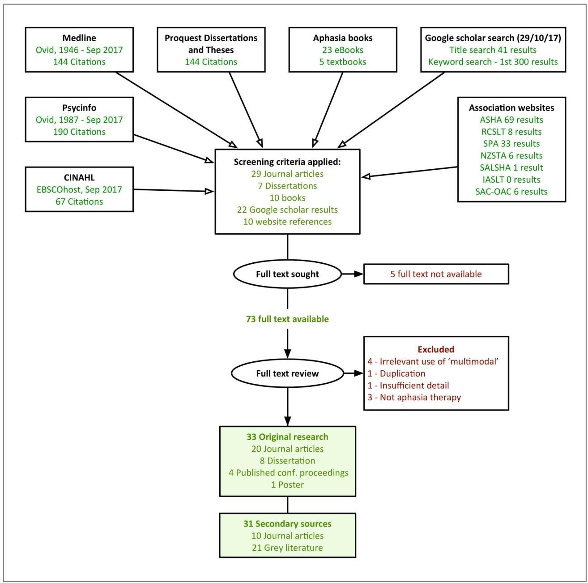
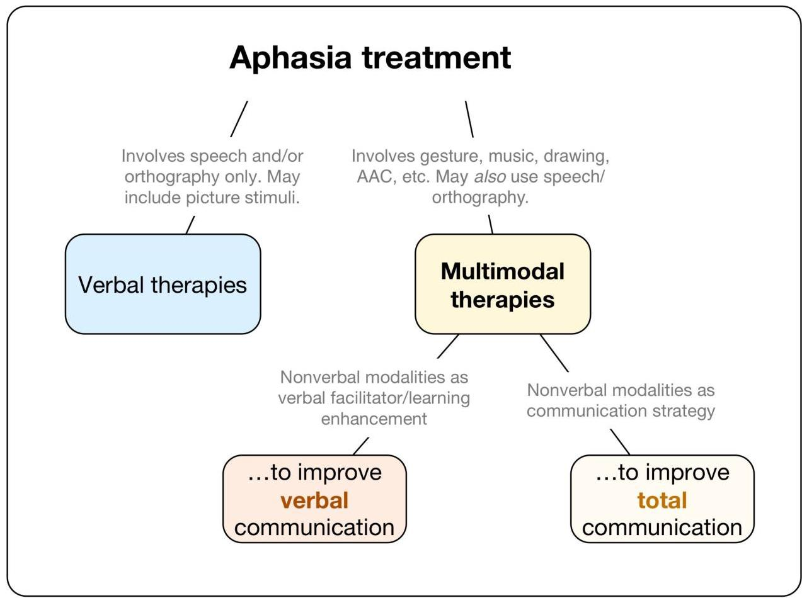

<!-- Source PDF: dietz-2019-multimodal-therapy.pdf -->

Running Head: What is meant by 'multimodal therapy' for aphasia?

# What is meant by 'multimodal therapy' for aphasia?

John E. Pierce$^{a,b}$, Robyn O’Halloran$^{a}$, Leanne Togher$^{c}$ and Miranda L. Rose$^{a*}$

$^{a}$School of Allied Health, La Trobe University, Melbourne, Australia; $^{b}$Speech Pathology, Cabrini Health, Melbourne, Australia; $^{c}$Speech Pathology, Faculty of Health Sciences, The University of Sydney, Lidcombe, Australia

John E Pierce. 494 Glen Huntly Road, Elsternwick 3185, Australia. ORCID identifier: 0000-0001-5164-5106 Twitter:@johnpierce85_pierce.john.e@gmail.com

Robyn O’Halloran. Health Sciences 1, La Trobe University, Plenty Road, Bundoora 3083, Australia. ORCID identifier: 0000-0002-2772-2164 R.OHalloran@latrobe.edu.au

Leanne Togher. Faculty of Health Sciences, The University of Sydney, 75 East St, Lidcombe 2141, Australia. ORCID identifier: 0000-0002-4518-6748 Leanne.togher@sydney.edu.au

*Miranda L. Rose. School of Allied Health, La Trobe University, Plenty Road, Bundoora 3083, Australia. ORCID identifier: 0000-0002-8892-0965 M.rose@latrobe.edu.au

Disclosure of interest: The authors report no conflicts of interest

What is meant by 'multimodal therapy' for aphasia?

# Abstract

Purpose: "Multimodal therapy" is a frequent term in aphasia literature but it has no agreed upon definition. Phrases such as multimodal therapy and multimodal treatment are applied to a range of aphasia interventions as if mutually understood and yet the interventions reported in the literature differ significantly in methodology, approach and aims. This inconsistency can be problematic for researchers, policy makers and clinicians accessing the literature and potentially compromises data synthesis and meta-analysis. A literature review was conducted to examine what types of aphasia treatment are labelled multimodal and determine whether any patterns are present.

Methods: A systematic search was conducted to identify literature pertaining to aphasia that included the term multimodal therapy (and variants). Sources included literature databases, dissertation databases, textbooks, professional association websites and Google Scholar.

Results: Thirty-three original research papers were identified, as well as another 31 sources referring to multimodal research, all of which used a variant of the term 'multimodal therapy'. Treatments had heterogeneous aims, underlying theories and methods. The rationale for using more than one modality was not always clear, nor was the reason each therapy was considered to be multimodal when similar treatments had not used the title. Treatments were noted to differ across two key features. The first was whether the ultimate aim of intervention was to improve total communication, as in Augmentative and Alternative Communication approaches, or to improve one specific modality, as when gesture is used to improve word retrieval. The second was the point in the treatment that the non-speech modalities were employed.

Discussion: Our review demonstrated that references to 'multimodal' treatments represent very different therapies with little consistency. We propose a framework to define and categorise

What is meant by ‘multimodal therapy’ for aphasia?

‘multimodal’ treatments which is based both on our results and on current terminology in speech language pathology.

# Introduction

Broadly, a modality is a channel of communication, also described as a mode or medium (Crystal, 2011; Ferguson &amp; Thomson, 2008), but understanding of the term varies subtly across fields. In education, the modality is the medium of teaching students; for example, lecture, seminar, self-directed learning (Armour, Schneid, &amp; Brandl, 2016; Ilic &amp; Maloney, 2014). In computing, modalities are different channels of communication between a device and its user, such as text, video, audio (Schroeder, 2010), or gestures/movement (Mäntyjärvi, Kela, Korpipää, &amp; Kallio, 2004). Biology views modalities in terms of the primary senses used by the receiver, that is, auditory, visual, tactile, olfactory, or taste (Lawrence, 2011; Partan &amp; Marler, 1999).

In speech language pathology, there is no formal definition of modality but the term is commonly used to describe any method of communication between people. Modalities described in speech language pathology include:

- Speech/oral (Speech Pathology Australia, 2011)
- Graphic (Iacono, Mirenda, &amp; Beukelman, 2009)
- Augmentative and alternative (Speech Pathology Australia, 2011)
- Gesture/manual (Rose, Raymer, Lanyon, &amp; Attard, 2013b)
- Writing (Beeson &amp; Egnor, 2006)
- Reading (Howard, Patterson, Franklin, Orchard-lisle, &amp; Morton, 1985)
- Drawing (Purdy &amp; Van Dyke, 2011)
- Music/melody (Pierce, Menahemi-Falkov, O'Halloran, Togher, &amp; Rose, 2017)
- Facial expression (Iacono et al., 2009)

What is meant by 'multimodal therapy' for aphasia? 2

- Repetition¹ (Tanemura, 1999)

The above list is unlikely to be exhaustive or universally accepted by speech language pathologists. An explicit, finite set of modalities is rarely produced within a research field because it is assumed that modalities are “unproblematic and self-evident” (Bateman, 2011, p. 17). However, some observations can be made. The modalities listed above include linguistic communication modalities as well as non-linguistic modalities such as gesture, drawing, pictures and facial expression. By and large the modalities are employed in intentional communication, although in instances, some may be used without the intention to communicate (e.g., unconscious facial expression, drawing for pleasure, gesturing while talking on the telephone). Incidental and unconsciously produced messages such as body language are certainly recognised in speech language pathology but are rarely described as modalities, likely because intentional communication is most commonly the focus of speech language pathology practice. Interestingly, reading and writing are often described as independent modalities but are in fact the receptive and expressive components of the same modality, orthography.

In speech language pathology literature, multimodal typically refers to communication in any modality outside of speech, regardless of how many modalities are used (e.g., Speech Pathology Australia, 2011). Strictly speaking, the term multimodal refers to communication of the same message via more than one channel either simultaneously or serially (Partan &amp; Marler, 2005). Thus, using writing alone to communicate, for example, could be regarded as unimodal (Partan &amp; Marler, 2005). However, this distinction is rarely made in speech language pathology.

¹ Repetition is not a communication channel in itself but rather a way of eliciting speech, frequently used in language interventions. Nevertheless, many papers describe repetition as a modality (e.g., Howard et al., 1985; Kiran, 2005; Tanemura, 1999)

What is meant by 'multimodal therapy' for aphasia?

Even in the field of Augmentative and Alternative Communication, multimodal communication typically refers to communication using multiple non-speech systems, whereas a single system combined with speech is considered unimodal; for example, speech plus signs (Iacono et al., 2009; Sigafoos et al., 2007).

With limited agreement on the terms modality and multimodal, what then, do speech language pathologists mean when describing multimodal treatment? Aphasia is a multimodal disorder in that it affects communication across multiple communicative systems (Hallowell &amp; Chapey, 2001), so use of the term to describe treatment is common in aphasia research. However, despite the frequency, there is little consistency in its use. The label of multimodal is applied to a diverse range of interventions and yet used in the speech language pathology literature as if understood mutually by all. For example, the following article titles refer to very different treatments:

1. An investigation of the communicative use of trained symbols following multimodality training (Purdy, Duffy, &amp; Coelho, 1994) - therapy to improve conversational use of gesture, speech and a picture board through practise of each.
2. Multimodal therapy of word retrieval disorder due to phonological encoding dysfunction (Weill-Chounlamountry, Capelle, Tessier, &amp; Pradat-Diehl, 2013) - treatment of the phonological output lexicon through computerised phonological/orthographic tasks.
3. Comparing uni-modal and multi-modal therapies for improving writing in acquired dysgraphia after stroke (Thiel, Sage, &amp; Conroy, 2015) – intervention aimed at improving spelling accuracy through semantic, phonological and orthographic distractor decisions.

As can be seen with only three examples, there is little agreement. Some published multimodal treatments target improvement of spoken output, some spelling, and some both verbal and non-verbal communication. The most straightforward explanation is to consider

What is meant by 'multimodal therapy' for aphasia?

multimodal as merely an adjective; describing any treatment that uses more than one modality. However, this application of the term would include the majority of treatments for aphasia. Repetition and responsive naming treatment tasks use only a single modality (speech) for both input and response but most other treatments use one or more modalities as input and expect one or more modalities as patient responses. Thomson (2012) reviewed 453 anomia treatment instances and found that only 21 (4.6%) used a single modality for input, all pictures. Of these 21 treatment instances, all used speech for participant output. This demonstrates that all anomia treatments might be called multimodal if the term is taken to mean simply the use of ‘more than one modality’ within a task. This definition would therefore be so broad as to be useless.

There are consequences of ambiguous terminology. Use of specific definitions in science progresses theory, research and practice, in contrast to vague or convention-based terminology (McNeil &amp; Pratt, 2001; Schindler, 2009; Walsh, 2009), which creates a "breakdown in communication and the exchange of ideas" (Walsh, 2009, p. 67). As one example, the use of one term to denote multiple, dissimilar treatments presents difficulty in summarising and comparing treatments. In an early meta-analysis of aphasia treatment effectiveness, Robey (1998) had to develop a classification system in order to group and distinguish treatment approaches based on their underlying methodology, though papers did not always fall easily into these categories. Specific, defined labels for approaches or underlying theories, if not for the treatments themselves, would facilitate grouping for synthesis.

Patients and policy makers would also benefit from clear terminology (Madden, Robinson, &amp; Kendall, 2017). Tracking outcomes is easier when treatments are distinguishable without inside knowledge of theories and approaches. With increasing value placed on person-centred healthcare (Wallace et al., 2016), clients should have a greater voice in treatment

What is meant by 'multimodal therapy' for aphasia?

decisions but cannot be expected to disentangle various interpretations of multimodal approaches.

Differentiation between multimodal treatments for aphasia is often possible by reading the introduction and methods sections of papers as they may outline the underlying theoretical rationale and therapy specifics. However, finding time to read research is the most consistently reported barrier to implementing evidence-based practice for clinicians (O'Connor &amp; Pettigrew, 2009) and thus, they are less likely to read papers in detail. Clinicians and other consumers of research may therefore impute their own understanding of the treatment being used based on the term 'multimodal therapy' in the title or abstract, or on websites and in textbooks, and make erroneous conclusions about treatment effectiveness and applicability.

In order to gain greater clarity in the use of terminology, we aimed to investigate and map the various interpretations of multimodal treatment within the aphasia literature through a scoping review. The question examined was, "What types of aphasia therapy are labelled as multimodal?" Original research was sought as well as secondary sources; that is, literature referencing or discussing multimodal treatment.

# Methods

A systematic search was conducted by the first author between September and October 2017 to identify English language literature pertaining to people with aphasia that included the term multimodal therapy (and variants). Grey literature was also included in order to build a comprehensive picture of current use of the term(s). Primary progressive aphasia was included. Databases searched were Medline (Ovid, 1946 - Sep 2017), CINAHL, PsycINFO (Ovid, 1806 - 2017) and Proquest Dissertations and Theses. Google Scholar was also searched. Other sources

What is meant by 'multimodal therapy' for aphasia?

included aphasia textbooks and speech language pathology association websites. There was no limit on the publication date.

# Search strategies

# Databases and dissertations

For databases (Medline, CINAHL, PsycINFO and Proquest Dissertations and Theses), the two search concepts aphasia and multimodal were used to generate the search operators as listed below.

aphasia (MeSH term) OR aphasia OR dysphasia OR anomia

AND

multimodal* OR multi-modal*

No limiters were applied outside of the search terms. Results from databases were imported into citation management software before screening.

# Google Scholar

A search was conducted in Google Scholar using the terms "multimodal" and "aphasia" with the operator "allintitle:" to ensure both terms appeared in the article's title. This search strategy yields more grey literature results (Haddaway, Collins, Coughlin, &amp; Kirk, 2015). All results were screened. The two terms were also searched without the "allintitle:" operator and the first 300 results were screened (based on title and preview), as recommended in Haddaway, et al. (2015).

# Textbooks and association websites

Full text searches for the words 'multi-modal' or 'multimodal' were conducted in 28 eBooks relating to aphasia. Indexes of five aphasia textbooks were searched for the term 'multimodal' and corresponding pages were screened manually. Multiple speech language pathology association websites were searched using Google: American Speech-Language

What is meant by 'multimodal therapy' for aphasia?

Hearing Association, Speech Pathology Australia, Royal College of Speech and Language Therapists, South African Speech-Language-Hearing Association, Irish Association of Speech &amp; Language Therapists, New Zealand Speech Therapists' Association, and Speech-Language &amp; Audiology Canada. The term 'multimodal' was searched in combination with an operator that limited results to each website; e.g., site:asha.org multimodal. Google-generated previews and titles were used for screening.

# Study selection

Initial results were screened by the first author according to the following inclusion criteria:

i) English language,
ii) uses the term multimodal in reference to treatment; for example, multimodal + program / strategy / approach / treatment / therapy / cueing,
iii) the participants had aphasia or the topic was aphasia.

# Data Extraction

Papers were categorised by the first author into publication type (article, dissertation, conference abstract, etc.) and then into original research or secondary sources. To examine term usage, the key phrase(s) containing multimodal were extracted from each paper, typically located within the title or abstract.

Within original research, the target of intervention, the underlying rationale and outcome measures of treatment were recorded. The modalities used in papers were also extracted. This data was not sufficient to describe and classify how the term multimodal was being used in aphasia intervention research. Therefore, treatment designs were further divided into three

What is meant by 'multimodal therapy' for aphasia?

elements of a) input, b) therapist cueing and c) participant output/response and the modalities used for each element were recorded. We also examined the timing of modalities, for example, used for each target production or only on errors. This complement of data sufficiently discerned the most useful dimensions with which to categorise treatments.

What is meant by 'multimodal therapy' for aphasia?

# Results

Figure 1. Diagram of search procedures
Figure 1 displays the search results. Initial yields for databases were Medline (144), PsycINFO (190), CINAHL (67), Proquest (144). After screening titles and abstracts, a total of 29 journal articles and seven dissertations were included. The Google Scholar search yielded 41 results for the title search. After screening these and the first 300 results of the keyword Google

What is meant by 'multimodal therapy' for aphasia?

Scholar search there were 22 results. There were ten references to multimodal treatments in books. Association website searches found 123 results and ten met inclusion criteria.

The yield was thus 73 references which were further examined, with 9 excluded due to: irrelevant use of 'multimodal' (4), duplication (1), insufficient information (1), or unrelated to aphasia therapy (3). Finally, there were 33 original research papers and 31 secondary sources.

# Secondary Sources

Secondary sources are found in Supplementary Appendix A. There were 10 narrative or systematic reviews and 21 grey literature items including book chapters, posters, conference proceedings and web pages.

# Original research

Of the 33 papers with original data and sufficient detail to examine methods, there were 20 journal articles, eight dissertations, four published conference proceedings and one poster. Only one paper had a participant with primary progressive aphasia (Rebstock, 2014); participants in all other papers had acquired aphasia. Supplementary Appendix B contains data extraction results.

A wide variety of phrases containing multimodal were used. Some of the phrases were formal titles of established therapies or approaches such as Multimodal Communication Program (4 papers), Multi-Modality Aphasia Therapy (3) or Music and Multimodal Stimulation (1) whereas the majority appeared to be ad hoc descriptions of the treatment without a working definition.

Extracting data for whether modalities were used as input, cueing or output was necessarily challenging, given the lack of agreement of what constitutes a modality. For

What is meant by 'multimodal therapy' for aphasia? 11

example, when a participant is asked to name a picture using an AAC picture board, they point (gesture) at a symbol (visual) which may include text (written). An electronic device may also have text to speech capability which could be considered spoken output. We tried to remain descriptive for this process which resulted in a large number of modalities. However, some modalities were seen frequently across papers.

## A) Input

Input was considered as any stimulus or material presented to a participant in order to elicit a response. Most commonly, input was pictures alone (19) or in combination with other modalities (10). Speech (11) and written (10) input were used in approximately one third of studies, though most often in conjunction with other modalities. One study used pictures, objects, videos and sensory information (hot/cold) to stimulate increased comprehension (Henning, 2016), and another used pictures, objects and spoken and written words as naming stimuli (Denman, 2017). Four did not report on inputs used, though two were case reports rather than prospective interventions (Beeson &amp; Ramage, 2000; Lasker, LaPointe, &amp; Kodras, 2005)

## B) Therapist cueing

Therapist cueing covered anything the therapist (or software) provided in addition to input: modelling, shaping, correction or cueing. Clinician cueing modalities were more widely distributed than input: drawing (12), speech (26), written (12), gesture (17), symbol/picture boards including software (10) and one each of melodic speech and objects. However, five did not clearly report on cueing.

## C) Participant output

All studies without exception required participants to produce some form of spoken output, whether naming, sentence production, repetition or phonemes/syllables. Spoken output was not always the target of intervention, but all treatments requested or allowed it. Gesture (20),

What is meant by 'multimodal therapy' for aphasia?

writing (18), drawing (14), and symbol/picture boards (10) were also frequently reported as outputs.

During extraction of data (details in Supplementary Appendix B), the primary aim of interventions emerged as a key dimension which differentiated the treatments within two broad categories. Another dimension was the timing of multimodal involvement, which formed a number of subcategories within each treatment aim category. The section below describes these dimensions.

## 1. Ultimate aim of improving total communication

In multimodal papers including what we termed total communication approaches, the emphasis was on successful communication of the message in any modality rather than improvement of a particular modality. Fifteen such papers were found, designed to teach participants to use non-speech modalities such as gesture or picture boards to communicate. These modalities were employed either for augmentation of remaining speech or as an alternative channel to speech. As an example of augmentation, Carlomagno et al. (2013) trained two people with aphasia in "multimodal communication therapy" to implement gesture alongside speech to add semantic information for the listener. In contrast, Purdy, Duffy and Coelho (1994) used "multimodality training" for alternative communication wherein people with aphasia were trained in the use of three different modalities – speech, gesture production and pointing to pictures on a communication board. Gestures and use of the communication board were trained independently of speech with the aim of providing an alternative communication channel for participants to switch to if speech failed. Many of these total communication approaches were based on Promoting Aphasic Communicative Effectiveness (PACE, Davis, 2005), a treatment for aphasia where the participant "is allowed free choice with respect to

What is meant by 'multimodal therapy' for aphasia? 13

selection of communicative channels” (Pulvermüller &amp; Roth, 1991, p. 40). Interestingly, PACE is not referred to as multimodal by its original authors (Davis, 2005).

## Timing of modalities

Within total communication approaches, the timing of modality training was a key aspect that differed across papers, specifically, whether modalities were trained simultaneously (e.g., producing gesture and speech within a sentence), separately (e.g., treating drawing in one session and writing in another) or consecutively (e.g., spoken naming, then written naming, repetition and symbol pointing for the same target word in one session). We found that, of the fifteen papers aiming to improve total communication:

- One trained modalities simultaneously
- Two trained modalities separately
- One trained modalities separately before combining them
- Nine trained multiple modalities consecutively for each target
- Two allowed the participant to choose the modality or modalities used for each target

## 2. Ultimate aim of improving speech (or, another specific modality)

In the second category of treatment aims, alternative modalities were used explicitly as a means to improve spoken output. There were 17 such studies. The theoretical premise was not always stated explicitly but papers predominantly invoked the principle that other, less impaired modalities have sufficient neural links with damaged linguistic representations to aid their retrieval and production. Luria was an early proponent of facilitation across modalities in what he described as intersystemic reorganisation (Luria, 1970; Pierce et al., 2017). For example, there is research demonstrating that gesture is used by both aphasic and non-aphasic speakers which may assist word retrieval (Rose, Attard, Mok, Lanyon, &amp; Foster, 2013a).

What is meant by 'multimodal therapy' for aphasia?

Papers within this category did not all cite the same intersystemic links as rationales for their designs. Some papers proposed intermodal links at the semantic-conceptual level to promote activation of the spoken modality (e.g., Dunn, 2010; McCarthy, 2004), while some suggested multiple links, including semantic, orthographic and phonological (e.g., Brookshire, Conway, Pompon, Oelke, &amp; Kendall, 2014; Thiel et al., 2015). Other authors cited theoretical and empirical support for links between more specific systems: gesture and verbal lexical retrieval (Rose &amp; Sussmilch, 2008), phonemes and graphemes (Weill-Chounlamountry et al., 2013) and language-action links (Grechuta et al., 2016).

In addition to the 17 aimed at improving speech, three papers used the same principal of facilitation across modalities but targeted impairments of non-speech modalities. Thiel, Sage and Conroy (2015) targeted written output using written and spoken matching and copying/repetition. In Brookshire et al. (2014), the aim was improved reading comprehension via improved phonological processing, while Henning (2016) targeted both spoken output and auditory comprehension within their program based on Melodic Intonation Therapy (MIT, Sparks, Helm &amp; Albert, 1974).

It is important to note that the two categories of intervention aims described were not mutually exclusive. A small number of papers explicitly stated aims in both categories of total communication and improving speech. Attard, Rose and Lanyon (Attard, Rose, &amp; Lanyon, 2013) had a primary aim of improved word retrieval but noted that the M-MAT protocol could also support enhanced alternative communication. Rebstock (2014) investigated outcomes of both word retrieval and modality switching.

Although all studies with the aim of facilitation across modalities were based on the same underlying theory of links between modalities, there were significant differences in the way this

What is meant by 'multimodal therapy' for aphasia?

was interpreted in treatment. The timing and number of modalities used in each element of input, therapist cueing and participant output were examined. This revealed three groupings.

### 2.1 Multimodal cueing and output

|  Input | Therapist cueing | Participant output  |
| --- | --- | --- |
|  Unimodal | Multimodal | Multimodal  |

One method of facilitating speech had the participant receiving one modality as input and producing several modalities as an output and this typically involved cueing or modelling from the therapist (or software, in some studies). For example, in M-MAT, if the participant was unable to name the picture stimulus, they produced written, gestural and drawn representations of the target while repeating a spoken model from the therapist (Attard et al., 2013). Modelling was provided by the therapist in all modalities as needed. Seven results fitted this category.

Four of these seven multimodal cueing + output studies provided cueing only on errors (Attard et al., 2013; Rose &amp; Sussmilch, 2008; Rose et al., 2013a; Rose, Mok, Carragher, Katthagen, &amp; Attard, 2015), whereas three routinely provided multimodal cueing for each item presented (Hoodin &amp; Thompson, 1983; Kearns, Simmons, &amp; Sisterhen, 1982; Rebstock, 2014).

### 2.2 Multimodal input

|  Input | Therapist cueing | Participant output  |
| --- | --- | --- |
|  Multimodal | Unimodal | Unimodal  |

The complement to multimodal cueing and output was the use of non-speech modalities as input or stimulation for participants. In other words, the clinician presented the participant with multiple modalities to elicit a response in a single modality. There were three studies in this subcategory (Denman, 2017; Henning, 2016; Thompson &amp; McReynolds, 1986) which used a selection of objects, pictures, written words, videos and sensory/tactile cues as input.

What is meant by 'multimodal therapy' for aphasia?

Thompson &amp; McReynolds (1986) based their design on the "stimulation approach," attributed to Schuell and Wepman (Robey, 1998). The underlying assumption of the stimulation approach is that the person with aphasia has not lost language but only access to the language, and that sufficient activation from the environment in multiple modalities can enhance access to target words (Duffy &amp; Coelho, 2001). Robey's literature review (1998) grouped treatments in this approach under the banner Schuell-Wepman-Darley Multimodality treatment or multimodal stimulation and this label is used in other textbooks and reviews. Denman (2017) was presented as a poster and thus did not provide a comprehensive rationale but appeared to rely on the same multimodal stimulation approach. Lastly, the treatment in Henning (2016) was based on Melodic Intonation Therapy with the addition of multimodal stimuli, which were employed to improve comprehension of word meaning and thus improve output. There was no clear explanation of the assumed mechanism behind this simulation.

### 2.3 Multiple multimodal tasks

|  Task 1 |   |   | Task 2 |   |   | Task n  |
| --- | --- | --- | --- | --- | --- | --- |
|  Input | Therapist cueing | Participant output | Input | Therapist cueing | Participant output | etc.  |
|  Unimodal or Multimodal | Unimodal or Multimodal | Unimodal or Multimodal | Unimodal or Multimodal | Unimodal or Multimodal | Unimodal or Multimodal | etc.  |

A third approach to implementing facilitation between modalities was use of multiple modalities across therapy tasks for each target. Our data extraction found six such studies. Studies using this approach did not necessarily use multiple modalities for each task, but still term themselves "multimodal" because the following task employed a different modality. As one example, Thomson (2012) treated word retrieval with a series of tasks completed for each noun. These tasks included naming, letter scrambles, reading aloud, repetition, semantic feature analysis, and written/spoken word matching. Weill-Chounlamountry et al. (2013) described their

What is meant by 'multimodal therapy' for aphasia?

therapy software "Au Fil de Mots" as multimodal. Au Fil de Mots has several structured steps in which participants complete word scrambles, repeat phonemes and words, and type the target.

# Miscellaneous

Two studies did not fit within the classification system described above but employed the use of "multimodal cueing". Dunn (2010) investigated the addition of therapist-produced gesture to semantic and phonological cueing in picture naming, but cues were to aid word retrieval and the participant was not required to imitate these. Thus, stimuli and output were unimodal while therapist cueing was multimodal.

Fink et al. (2005) reported on multimodal cueing and "multimodal exercise" on computer therapy software. The software allows clinicians to select the modalities for the stimuli, choices and cueing for matching tasks. Describing each task as multimodal is technically correct, as the input, cueing and responses allow different modalities. However, as described earlier, nearly all anomia treatments use more than one modality between input and output.

# Discussion

This review has demonstrated that the term 'multimodal treatment' and similar iterations represent very different therapies with little consistency. First, it is not clear from the term what the purpose of intervention is. Some aimed to improve total communication through any modality, while others aimed to use intact modalities to facilitate a damaged modality (most often, speech). Second, the component of the treatment task using multiple modalities was not consistent. Some presented the participant with multiple simultaneous stimuli as input, while others had participants producing multiple modalities in response to a single stimulus. Still others included multiple, discrete tasks which each used variety of modalities. Further differences were seen in whether participants were given clinician cueing or shaping only when errors were made,

What is meant by 'multimodal therapy' for aphasia?

or routinely for each target. Finally, there was variation in whether those studies designed to improve total communication presented modalities simultaneously, separately or sequentially. There are many other papers with the same design and principles as those found in this review which could equally be termed multimodal treatments but are not labelled in this way by the authors. This is evident with the PACE approach. Multiple studies in our review were investigations of PACE, yet there are a multitude of PACE studies which do not use the label multimodal, including the original paper. Agreement between researchers on the term is clearly lacking.

Consequently, aphasia researchers need to be cautious about describing treatments as multimodal as if its meaning is evident; particularly in article titles and treatment descriptions. With a few exceptions (M-MAT, M-STIM, MCP, multimodal stimulation), multimodal does not have a set meaning as a treatment approach and thus describing therapy as multimodal brings no clarity to the reader.

There is also a need to clearly describe the various dimensions of treatment as outlined in this article – the aim of intervention, the rationale, the timing of modalities and who (therapist, client) produced them, and which modalities were used. In most cases we were able to discern the treatment by reading the papers in full, but for some, the aim of intervention or the theoretical principle was not clearly stated and thus needed to be inferred. Ambiguous terminology or labeling makes the use of clear therapy descriptions more important in order to differentiate between approaches. Use of reporting guidelines such as the TIDieR checklist (Hoffman et al., 2014) assists in clarifying most components of treatment, including the rationale (Item 2), materials (Item 3) and procedures, including prompts and cueing (Item 4).

It is surprising that this review found only 33 results (20 papers, 8 dissertations, 4 conference proceedings, 1 poster) with original intervention research explicitly described by the

What is meant by 'multimodal therapy' for aphasia?

authors as multimodal. We expected many more results, considering the widespread use of the term in speech language pathology clinical practice – the search for secondary sources resulted in 31 references to multimodal treatment in aphasia, and there are likely to be many more in textbooks, non-association websites and journal articles without indexed full-text. The review was also limited to English literature and it is not known if similar problems with defining multimodal treatments exist in other languages.

Another possible weakness of this review is that screening of articles against inclusion criteria was conducted by a single author only. Best practice for scoping reviews does call for two authors to screen search results. However, as the criteria relied on identifying the language of the article, the presence of the keywords 'multimodal therapy' and confirming the topic of aphasia, there was minimal subjective decision making and it was felt that one author was sufficient.

The complexity of human communication is an acknowledged challenge in developing accurate terminology for speech language pathology (Walsh, 2009), so further classification is necessarily difficult. Nonetheless, it is imperative that we clarify as best as possible what speech-language pathologists and aphasia researchers mean when discussing multimodal treatment. Ideally, consensus is needed on a definition of multimodal therapy which is specific and represents the supporting theories while also providing inclusion and exclusion criteria (McNeil &amp; Pratt, 2001). As we have demonstrated, current use of the term not only represents multiple theories but provides no inclusion or exclusion criteria and the majority of aphasia treatments could arguably be defined as multimodal.

What is meant by 'multimodal therapy' for aphasia?

# Proposed framework

We now propose a broad framework to categorise multimodal treatments. This framework is based on the themes identified in this review but also incorporates one very common interpretation of the term multimodal among speech language pathologists, which is that multimodal refers to any non-verbal production (SPA, 2011). 'Verbal' is used here in the sense of being word-based, consisting of speech and/or orthography (Crystal, 2011). The modalities of speech and orthography (whether reading or writing) are therefore not considered to be multimodal in this definition while modalities such as gesture, drawing, singing/rhythm, symbol boards, etc. are included. This conflicts with some previous perspectives but the distinction is necessary to provide a definition of multimodal that does not encompass the majority of aphasia treatment. For the same purpose, the use of images for stimuli or cueing does not necessarily qualify as multimodal treatment. A treatment requiring confrontation naming of images and including orthographic cueing, for example, is excluded despite the use of images and reading. While this review has demonstrated that some authors would consider such a treatment to be multimodal, in general, speech language pathology literature classifies this as traditional therapy.

Figure 2 illustrates the proposed framework, which includes two categories within multimodal treatment and one verbal treatment category. Multimodal treatments include two subcategories. The key differentiating features within the model are whether non-verbal modalities are employed, and the primary aim of the intervention – either to improve verbal communication (speech/orthographic) or to improve speech and/or one or more nonverbal modalities.

Figure 2. Proposed framework for classifying multimodal treatments. Two key features of

What is meant by 'multimodal therapy' for aphasia?

treatments are examined and produce two categories: 1. Multimodal therapy to improve verbal communication, 2. Multimodal therapy to improve total communication.

Verbal (speech or reading/writing) therapy to improve verbal communication is not considered multimodal.

## 1. Multimodal therapy ...to improve verbal communication

As described earlier, treatments fitting this category use at least one non-verbal modality (e.g., gesture) to facilitate improvement of verbal abilities. Commonly, the target is speech but writing, auditory comprehension and reading can also be targeted. As the goal is verbal communication, treatments in this category typically combine nonverbal and verbal modalities. Importantly, the use of nonverbal modalities is a means to an end and not the primary goal.

What is meant by 'multimodal therapy' for aphasia? 22

Examples include MIT (using melody to enhance speech production) (Sparks et al., 1974) and M-MAT (using gesture, drawing, writing, reading and verbal repetition to improve word retrieval and sentence production) (Rose &amp; Attard, 2011).

## 2. Multimodal therapy ...to improve *total* communication

Treatments in this category target nonverbal modalities as communicative actions in their own right, rather than a means to an end. By definition, AAC approaches to aphasia fit into this category. Such treatments may or may not combine verbal modalities with the non-verbal modalities.

Modalities may not only be trained as stand-alone communication channels, but also to augment remaining speech or writing. This remains different to category 1 in that, in category 1 (facilitation/learning), nonverbal modalities are primarily intended to assist the person with aphasia to access/learn speech or writing and not to communicate with the conversation partner. In contrast, in category 2 (total communication) nonverbal modalities are a vital part of message transfer.

This proposed framework presents categories which incorporate the findings of our review with existing interpretations. We believe speech language pathologists and researchers will find the framework intuitive, as the aim of an intervention is typically readily identifiable. Two key questions can be asked about each therapy to categorise it – Does this treatment employ nonverbal modalities such as gesture, music or drawing, and if so, does it aim to improve verbal communication or improve total communication of a message?

Our framework was recently utilised in the categorisation of speech and language therapy interventions for aphasia within REhabilitation and recovery of peopLE with Aphasia after StrokE (RELEASE). This big data project aims to synthesize individual participant data from

What is meant by 'multimodal therapy' for aphasia?

multiple primary research studies (Collaboration of Aphasia Trialists, n.d.). The availability of the multimodal definition facilitated synthesis of highly complex therapy interventions and in turn meta-analysis. The framework was quick to apply and complemented other more commonly applied definitions of therapy approaches such as CIAT or MIT.

Naturally, discussion and consensus from the field is required for such a framework to be adopted and this proposal might be further developed to capture details identified in this review such as the timing of modalities or their use in input/cueing/output. Nonetheless, we suggest that it broadly captures the array of ‘multimodal treatments’ currently found within aphasia while giving clarity to their differing approaches and intended outcomes. A more coherent picture of such treatments benefits patients and stakeholders and may allow more precise reviews and meta-analyses in the future.

What is meant by 'multimodal therapy' for aphasia?

# References

Armour, C., Schneid, S. D., &amp; Brandl, K. (2016). Writing on the board as students' preferred teaching modality in a physiology course. *Advances in Physiology Education*, 40(2), 229–233. https://doi.org/10.1152/advan.00130.2015

Attard, M. C., Rose, M. L., &amp; Lanyon, L. E. (2013). The comparative effects of Multi-Modality Aphasia Therapy and Constraint-Induced Aphasia Therapy-Plus for severe chronic Broca's aphasia: An in-depth pilot study. *Aphasiology*, 27(1), 80–111. https://doi.org/10.1080/02687038.2012.725242

Bateman, J. A. (2011). The Decomposability of Semiotic Modes. In K. O'Halloran &amp; B. A. Smith (Eds.), *Multimodal Studies - exploring issues and domains* (pp. 17–38). New York &amp; London: Routledge.

Beeson, P. M., &amp; Egnor, H. (2006). Combining treatment for written and spoken naming. *Journal of the International Neuropsychological Society*, 12, 816–827. https://doi.org/10.1017/S1355617706061005

Beeson, P. M., &amp; Ramage, A. E. (2000). Drawing from experience: the development of alternative communication strategies. *Topics in Stroke Rehabilitation*, 7(2), 10–20.

Brookshire, C. E., Conway, T., Pompon, R. H., Oelke, M., &amp; Kendall, D. L. (2014). Effects of intensive phonomotor treatment on reading in eight individuals with aphasia and phonological alexia. *American Journal of Speech-Language Pathology*, 23(2), S300–11. https://doi.org/10.1044/2014_AJSLP-13-0083

Carlomagno, S., Zulian, N., Razzano, C., De Mercurio, I., &amp; Marini, A. (2013). Coverbal gestures in the recovery from severe fluent aphasia: A pilot study. *Journal of Communication Disorders*, 46(1), 84–99. https://doi.org/10.1016/j.jcomdis.2012.08.007

What is meant by 'multimodal therapy' for aphasia?

Collaboration of Aphasia Trialists. (n.d.). REhabilitation and recovery of peopLE with Aphasia after StrokE (RELEASE). http://www.aphasiatrials.org/release
Crystal, D. (2011). Dictionary of Linguistics and Phonetics. John Wiley &amp; Sons.
Davis, G. A. (2005). PACE revisited. *Aphasiology*, 19(1), 21–38. https://doi.org/10.1080/02687030444000598
Denman, A. (2017, September). Multi-modal errorless learning functional naming therapy - a single case study [poster]. RCSLT Conference. Glasgow, Scotland.
Duffy, J. R., &amp; Coelho, C. A. (2001). Schuell's stimulation approach to rehabilitation. In R. Chapey (Ed.), Language interventions strategies in aphasia and related neurogenic communication disorders (4 ed., pp. 341–379). Baltimore: Lipincott Williams &amp; Wilkins.
Dunn, I. (2010). The effects of multimodality cueing on lexical retrieval in aphasic speakers (Doctoral Thesis). The William Paterson University of New Jersey.
Ferguson, A., &amp; Thomson, J. (2008). Systemic Functional Linguistics and Communication Impairment. In The handbook of clinical linguistics (pp. 130–143). Cambridge: Blackwell.
Fink, R., Brecher, A., Sobel, P., &amp; Schwartz, M. (2005). Computer-assisted treatment of word retrieval deficits in aphasia. *Aphasiology*, 19(10-11), 943–954.
Grechuta, K., Rubio, B., Duff, A., Oller, E. D., Pulvermüller, F., &amp; Verschure, P. (2016). Intensive language-action therapy in virtual reality for a rehabilitation gaming system (Vol. 9, pp. 243–254). Presented at the 10th International Conference of Disability, Virtual Reality &amp; Associated Technologies.
Haddaway, N. R., Collins, A. M., Coughlin, D., &amp; Kirk, S. (2015). The Role of Google Scholar in Evidence Reviews and Its Applicability to Grey Literature Searching. *PloS One*, 10(9), e0138237. https://doi.org/10.1371/journal.pone.0138237

What is meant by 'multimodal therapy' for aphasia?

Hallowell, B., &amp; Chapey, R. (2001). Introduction to language intervention strategies in adult aphasia. In R. Chapey (Ed.), Language interventions strategies in aphasia and related neurogenic communication disorders (4 ed., pp. 3–19). Baltimore, MD: Lipincott Williams &amp; Wilkins.

Henning, D. M. (2016). Music and multimodal stimulation (M-STIM): A dynamic approach to increasing expressive and receptive language in severe global aphasia (Masters thesis). Northern Illinois University.

Hoffmann, T. C., Glasziou, P. P., Boutron, I., Milne, R., Perera, R., Moher, D., ... Lamb, S. E. (2014). Better reporting of interventions: template for intervention description and replication (TIDieR) checklist and guide. BMJ, 348(mar07 3), g1687–g1687. https://doi.org/10.1136/bmj.g1687

Hoodin, R. B., &amp; Thompson, C. K. (1983). Facilitation of verbal labeling in adult aphasia by gestural, verbal, or verbal plus gestural training (pp. 62–64). Presented at the Clinical Aphasiology Conference, Phoenix, AZ.

Howard, D., Patterson, K., Franklin, S., Orchard-lisle, V., &amp; Morton, J. (1985). The facilitation of picture naming in aphasia. Cognitive Neuropsychology, 2(1), 49–80. https://doi.org/10.1080/02643298508252861

Iacono, T., Mirenda, P., &amp; Beukelman, D. (2009). Comparison of unimodal and multimodal AAC techniques for children with intellectual disabilities. *Augmentative and Alternative Communication*, 9(2), 83–94. https://doi.org/10.1080/07434619312331276471

Ilic, D., &amp; Maloney, S. (2014). Methods of teaching medical trainees evidence-based medicine: a systematic review. Medical Education, 48(2), 124–135. https://doi.org/10.1111/medu.12288

Kearns, K. P., Simmons, N., &amp; Sisterhen, C. (1982). Gestural sign (Amer-Ind) as a facilitator of verbalization in patients with aphasia (pp. 183–191). Presented at the Clinical Aphasiology

What is meant by 'multimodal therapy' for aphasia?

Conference, Oshkosh, WI. Retrieved from http://eprints-prod-05.library.pitt.edu/725/1/12-23.pdf

Kiran, S. (2005). Training phoneme to grapheme conversion for patients with written and oral production deficits: A model-based approach. *Aphasiology*, 19(1), 53–76. https://doi.org/10.1080/02687030444000633

Lasker, J., LaPointe, L., &amp; Kodras, J. (2005). Helping a professor with aphasia resume teaching through multimodal approaches. *Aphasiology*, 19(3-5), 399–410.

Lawrence, E. (2011). Henderson's Dictionary of Biology. Pearson Higher Ed. Retrieved from http://www.myilibrary.com?ID=311493

Luria, A. R. (1970). Traumatic aphasia: Its syndromes, psychology and treatment. (D. Bowden, Trans.). The Hague, Netherlands: Mouton &amp; Co.

Madden, E. B., Robinson, R. M., &amp; Kendall, D. L. (2017). Phonological Treatment Approaches for Spoken Word Production in Aphasia. *Seminars in Speech and Language*, 38(1), 62–74. https://doi.org/10.1055/s-0036-1597258

Mäntyjärvi, J., Kela, J., Korpipää, P., &amp; Kallio, S. (2004). Enabling fast and effortless customisation in accelerometer based gesture interaction (pp. 25–31). Presented at the 3rd international conference on Mobile and ubiquitous multimedia, College Park, MD: ACM Press. https://doi.org/10.1145/1052380.1052385

McCarthy, S. E. (2004). *The effects of a multimodality approach on sentence production using response elaboration training with a reading component on aphasic patients* (Doctoral dissertation). East Tennessee State University.

McNeil, M. R., &amp; Pratt, S. R. (2001). Defining aphasia: Some theoretical and clinical implications of operating from a formal definition. *Aphasiology*, 15(10-11), 901–911. https://doi.org/10.1080/02687040143000276

What is meant by 'multimodal therapy' for aphasia?

O'Connor, S., &amp; Pettigrew, C. M. (2009). The barriers perceived to prevent the successful implementation of evidence-based practice by speech and language therapists. International Journal of Language &amp; Communication Disorders, 44(6), 1018–1035. https://doi.org/10.1080/13682820802585967

Partan, S. R., &amp; Marler, P. (2005). Issues in the Classification of Multimodal Communication Signals. The American Naturalist, 166(2), 231–245. https://doi.org/10.1086/431246

Partan, S., &amp; Marler, P. (1999). Communication Goes Multimodal. Science, 283(5406), 1272–1273. https://doi.org/10.1126/science.283.5406.1272

Pierce, J. E., Menahemi-Falkov, M., O'Halloran, R., Togher, L., &amp; Rose, M. L. (2017). Constraint and multimodal approaches to therapy for chronic aphasia: A systematic review and meta-analysis. Neuropsychological Rehabilitation, 1–37. https://doi.org/10.1080/09602011.2017.1365730

Pulvermüller, F., &amp; Roth, V. M. (1991). Communicative aphasia treatment as a further development of PACE therapy. *Aphasiology*, 5(1), 39–50. https://doi.org/10.1080/02687039108248518

Purdy, M., &amp; Van Dyke, J. A. (2011). Multimodal Communication Training in Aphasia: A Pilot Study. Journal of Medical Speech-Language Pathology, 19(3), 45–53.

Purdy, M., Duffy, R., &amp; Coelho, C. A. (1994). An investigation of the communicative use of trained symbols following multimodality training, 22, 345–256.

Rebstock, A. M. (2014). Effects of semantic feature analysis + multimodal communication program for word retrieval and switching behavior in primary progressive aphasia (Doctoral dissertation). Duquesne University.

What is meant by 'multimodal therapy' for aphasia?

Robey, R. R. (1998). A Meta-Analysis of Clinical Outcomes in the Treatment of Aphasia. Journal of Speech, Language, and Hearing Research, 41(1), 172–16. https://doi.org/10.1044/jslhr.4101.172

Rose, M. L., &amp; Attard, M. C. (2011). M-MAT Procedure Manual [Manual]. La Trobe University.

Rose, M. L., &amp; Sussmilch, G. (2008). The effects of semantic and gesture treatments on verb retrieval and verb use in aphasia. *Aphasiology*, 22(7-8), 691–706. https://doi.org/10.1080/02687030701800800

Rose, M. L., Attard, M. C., Mok, Z., Lanyon, L. E., &amp; Foster, A. M. (2013a). Multi-modality aphasia therapy is as efficacious as a constraint-induced aphasia therapy for chronic aphasia: A phase 1 study. *Aphasiology*, 27(8), 938–971. https://doi.org/10.1080/02687038.2013.810329

Rose, M. L., Mok, Z., Carragher, M., Katthagen, S., &amp; Attard, M. C. (2015). Comparing multimodality and constraint-induced treatment for aphasia: a preliminary investigation of generalisation to discourse. *Aphasiology*, 1–21. https://doi.org/10.1080/02687038.2015.1100706

Rose, M. L., Raymer, A. M., Lanyon, L. E., &amp; Attard, M. C. (2013b). A systematic review of gesture treatments for post-stroke aphasia. *Aphasiology*, 27(9), 1090–1127. https://doi.org/10.1080/02687038.2013.805726

Schindler, A. (2009). Terminology in speech pathology: Old problem, new solutions. *Advances in Speech Language Pathology*, 7(2), 84–86. https://doi.org/10.1080/14417040500125327

Schroeder, R. (2011). Modalities of Communication. In *Being There Together: Social Interaction in Shared Virtual Environments* (pp. 177–202). Oxford University Press. https://doi.org/10.1093/acprof:oso/9780195371284.003.0006

What is meant by ‘multimodal therapy’ for aphasia?

Sigafoos, J., Didden, R., Schlosser, R., Green, V. A., O’Reilly, M. F., &amp; Lancioni, G. E. (2007). A Review of Intervention Studies on Teaching AAC to Individuals who are Deaf and Blind. *Journal of Developmental and Physical Disabilities*, 20(1), 71–99. https://doi.org/10.1007/s10882-007-9081-5

Sparks, R., Helm, N., &amp; Albert, M. (1974). Aphasia rehabilitation resulting from melodic intonation therapy. *Cortex*, 10(4), 303–316.

Speech Pathology Australia. (2011). Competency-Based Occupational Standards for Speech Pathologists (CBOS). Melbourne: The Speech Pathology Association of Australia Ltd.

Tanemura, J. (1999). Aphasia Therapy Using the Deblocking Method and Kanji/Kana Issues. *Topics in Stroke Rehabilitation*, 6(1), 23–32. https://doi.org/10.1310/1HNC-DUKX-XY9E-T4W2

Thiel, L., Sage, K., &amp; Conroy, P. (2015). Comparing uni-modal and multi-modal therapies for improving writing in acquired dysgraphia after stroke. *Neuropsychological Rehabilitation*, 1–29. https://doi.org/10.1080/09602011.2015.1026357

Thompson, C. K., &amp; McReynolds, L. V. (1986). Wh interrogative production in agrammatic aphasia: an experimental analysis of auditory-visual stimulation and direct-production treatment. *Journal of Speech and Hearing Research*, 29(2), 193–206.

Thomson, Jennifer. (2012). *Assessing the benefits of multimodal rehabilitation therapy for aphasia* [Masters Dissertation] (pp. 1–143). University of Manchester.

Wallace, S. J., Worrall, L. E., Rose, T., Le Dorze, G., Cruice, M., Isaksen, J., et al. (2016). Which outcomes are most important to people with aphasia and their families? An international nominal group technique study framed within the ICF. *Disability and Rehabilitation*, 91, 1–16. https://doi.org/10.1080/09638288.2016.1194899

What is meant by 'multimodal therapy' for aphasia?

Walsh, R. (2009). Meaning and purpose: A conceptual model for speech pathology terminology. *Advances in Speech Language Pathology*, 7(2), 65–76. https://doi.org/10.1080/14417040500125285

Weill-Chounlamountry, A., Capelle, N., Tessier, C., &amp; Pradat-Diehl, P. (2013). Multimodal therapy of word retrieval disorder due to phonological encoding dysfunction. *Brain Injury*, 27(5), 620–631. https://doi.org/10.3109/02699052.2013.767936

What is meant by 'multimodal therapy' for aphasia?

Supplementary Appendix A Secondary sources referring to multimodal treatments

|  Paper | Terms used  |
| --- | --- |
|  ASHA. (2016). Summary of the Clinical Practice Guideline - Australian Aphasia Rehabilitation Pathway. Retrieved October 28, 2017, from https://www.asha.org/articlesummary.aspx?id=8589971309 | Multimodal treatment, used as a keyword for this CPG summary  |
|  ASHA. (n.d.). Aphasia - ASHA practice portal. Retrieved October 28, 2017, from https://www.asha.org/PRPSpecificTopic.aspx?folderid=8589934663&section=Treatment | Multimodal treatment, used as a keyword for this CPG summary  |
|  ASHA. (n.d.). Summary of the Clinical Practice Guideline - National Stroke Foundation Clinical Guidelines for Stroke Management. Retrieved October 29, 2017, from https://www.asha.org/articlesummary.aspx?id=8589960979 | Multimodal treatment, used as a keyword for this CPG summary  |
|  ASHA. (n.d.). Summary of the Clinical Practice Guideline - New Zealand Clinical Guidelines for Stroke Management. Retrieved October 29, 2017, from https://www.asha.org/articlesummary.aspx?id=8589960475 | Multimodal treatment, used as a keyword for this CPG summary  |
|  ASHA. (n.d.). Summary of the Clinical Practice Guideline - RCSLT Clinical Guidelines. Retrieved October 29, 2017, from https://www.asha.org/articlesummary.aspx?id=8589960345 | Multimodal treatment, used as a keyword for this CPG summary  |
|  Cahana-Amitay, D., & Albert, M. L. (2015a). Neuroscience of aphasia recovery: the concept of neural multifunctionality. Current Neurology and Neuroscience Reports, 15, 41. https://doi.org/10.1007/s11910-015-0568-7 | multimodal cueing  |
|  Cahana-Amitay, D., & Albert, M. L. (2015b). Redefining Recovery from Aphasia. Oxford University Press. https://doi.org/10.1093/med/9780199811939.003.0009 | multimodality aphasia treatment, multimodal cueing  |
|  Centeno, J., & Ansaldo, A. (2013). Aphasia in Multilingual Populations. In I. Papathanasiou, P. Coppens, & C. Potagas (Eds.), Aphasia and Related Neurogenic Communication Disorders (pp. 275–293). Burlington, MA: Jones & Bartlett Publishers. | multimodality stimulation  |

What is meant by 'multimodal therapy' for aphasia?

|  Cherney, L. R., & Robey, R. R. (2001). Aphasia Treatment: Recovery, Prognosis, and Clinical Effectiveness. In R. Chapey (Ed.), Language interventions strategies in aphasia and related neurogenic communication disorders (4 ed., pp. 186-202). Baltimore, MD: Lippincott Williams & Wilkins. | Schuell-Wepman-Darley Multimodal-stimulation (SWDM)  |
| --- | --- |
|  Duffy, J. R., & Coelho, C. A. (2001). Schuell's stimulation approach to rehabilitation. In R. Chapey (Ed.), Language interventions strategies in aphasia and related neurogenic communication disorders (4 ed., pp. 341-379). Baltimore: Lippincott Williams & Wilkins. | Multimodality stimulation  |
|  Fucetola, R., Holloran, S. M., Pratzel, J., Connor, L. T., & Tucker, F. (2011). Innovation in Evidence-Based Language Treatment: 10-Year Report [presentation slides]. American Speech and Hearing Association Conference. San Diego, CA. Retrieved from https://www.asha.org/Events/convention/handouts/2011/Fucetola-Holloran-Pratzel-Connor-Tucker/ | Multimodal treatment  |
|  Hartley, M. L., Turry, A., & Raghavan, P. (2010). The role of music and music therapy in aphasia rehabilitation. Music and Medicine, 2(4), 235-242. | Multimodal approach  |
|  Howard, D., Patterson, K., Franklin, S., Orchard-lisle, V., & Morton, J. (1985). The facilitation of picture naming in aphasia. Cognitive Neuropsychology, 2(1), 49-80. https://doi.org/10.1080/02643298508252861 | multimodal approach multimodal therapy  |
|  Huber, W., Springer, L., & Willmes, K. (1993). Approaches to Aphasia Therapy in Aachen. In A. Holland & M. Forbes (Eds.) (pp. 55-86). San Diego, CA: Singular. | Multimodal stimulation  |
|  Jakab, I. (1985). Nonverbal Expression and Congenital Aphasia. In P. Pichot, P. Berner, R. Wolf, & K. Thau (Eds.), Clinical Psychopathology Nomenclature and Classification (pp. 1029-1037). New York. | Multimodality treatment  |
|  Katz, R. C. (2001). Computer Applications in Aphasia Treatment. In R. Chapey (Ed.), Language interventions strategies in aphasia and related neurogenic communication disorders (4 ed., pp. 852-877). Baltimore, MD: Lippincott Williams & Wilkins. | Multi-modal treatment  |
|  Kearns, K. P., & Simmons, N. (1985). Group Therapy for Aphasia: A Survey of VA medical centres (pp. 176-183). Presented at the Clinical Aphasiology | Multimodality stimulation Multimodal stimulation  |

What is meant by 'multimodal therapy' for aphasia?

|  Conference, Ashland, OR. Retrieved from http://eprints-prod-05.library.pitt.edu/851/1/15-22.pdf  |   |   |
| --- | --- | --- |
|  Koul, R., & Corwin, M. (2011). The Process of Evidence-Based Practice: Informing AAC Clinical Decisions for Persons with Aphasia. In R. Koul (Ed.), Augmentative and Alternative Communication for Adults with Aphasia: Science and Clinical Practice (pp. 155–164). Bingley, UK: Emerald. | multimodal treatment package |   |
|  Madden, E. B., Robinson, R. M., & Kendall, D. L. (2017). Phonological Treatment Approaches for Spoken Word Production in Aphasia. Seminars in Speech and Language, 38(1), 62–74. https://doi.org/10.1055/s-0036-1597258 | multimodal training |   |
|  Morganstein, S., & Certner-Smith, M. (2001). Thematic Language-Stimulation Therapy. In R. Chapey (Ed.), Language interventions strategies in aphasia and related neurogenic communication disorders (4 ed., pp. 450–468). Baltimore, MD: Lipincott Williams & Wilkins. | Multimodality stimulation |   |
|  Murray, L., & Coppens, P. (2013). Formal and Informal Assessment of Aphasia. In I. Papathanasiou, P. Coppens, & C. Potagas (Eds.), Aphasia and Related Neurogenic Communication Disorders (pp. 67–91). Burlington, MA: Jones & Bartlett Publishers. | Multimodal cue |   |
|  Pierce, J. E., Menahemi-Falkov, M., O'Halloran, R., Togher, L., & Rose, M. L. (2017). Constraint and multimodal approaches to therapy for chronic aphasia: A systematic review and meta-analysis. Neuropsychological Rehabilitation, 1–37. https://doi.org/10.1080/09602011.2017.1365730 | Multimodal approaches Multimodal therapy Multimodal treatment Multimodal cueing Multimodal training |   |
|  Purdy, M., & Dietz, A. (2010). Acquired Communication Disorders and Cognitive Deficits: AAC Intervention Challenges. Perspectives on Augmentative and Alternative Communication, 19(3), 62–10. https://doi.org/10.1044/aac19.3.62 | Multimodality Communication Training Program |   |
|  Robey, R. R. (1994). The efficacy of treatment for aphasic persons: a meta-analysis. Brain and Language, 47(4), 582–608. https://doi.org/10.1006/brln.1994.1060 | Multimodal stimulus/response |   |

What is meant by 'multimodal therapy' for aphasia?

|  Robey, R. R. (1998). A Meta-Analysis of Clinical Outcomes in the Treatment of Aphasia. Journal of Speech, Language, and Hearing Research, 41(1), 172–16. https://doi.org/10.1044/jslhr.4101.172 | Multimodality stimulation hierarchies Schuell-Wepman-Darley Multimodal-stimulation (SWDM)  |
| --- | --- |
|  Rose, M. L. (2013). Releasing the constraints on aphasia therapy: the positive impact of gesture and multimodality treatments. American Journal of Speech-Language Pathology, 22(2), S227–39. https://doi.org/10.1044/1058-0360(2012/12-0091) | Multimodality treatments  |
|  Rose, M. L., Raymer, A. M., Lanyon, L. E., & Attard, M. C. (2013b). A systematic review of gesture treatments for post-stroke aphasia. Aphasiology, 27(9), 1090–1127. https://doi.org/10.1080/02687038.2013.805726 | Multimodal treatments Multimodality treatment approaches Multimodality Aphasia Therapy Multimodality aphasia training Multimodality training  |
|  Stark, J. A. (2010, November 14). Reinventing the wheel? On the history of aphasia therapy [Poster]. American Speech and Hearing Association Conference. | Multimodality approach Multimodal approach  |
|  Wallace, S. (2013, September 1). More Than Words. The ASHA Leader, pp. 40–45. https://doi.org/10.1044/leader.FTR1.18092013.40 | Multimodal strategies Multimodal Communication Treatment Multimodal treatment  |
|  Wertz, R. T. (2003). Efficacy of Aphasia Therapy, Escher, and Sisyphus. In I. Papathanasiou & R. de Bleser (Eds.), The Sciences of Aphasia: From therapy to theory (pp. 259–272). Oxford, United Kingdom: Pergamon. | Multimodality stimulation  |
|  Williamson, D. S., Richman, M., & Redmond, S. C. (2010). Group Treatment for Aphasia Based on a Hierarchical Framework. Presented at the American Speech and Hearing Association Conference. Retrieved from www.asha.org/Events/convention/handouts/2010/1685-Williamson-Darlene/ | Multi-modal approach  |

Supplementary Appendix B
Data extraction table for original research on 'multimodal therapy'

|  Paper | Main terms used | Target of intervention | Input (stimulus) | Clinician input (cueing/prompting/ modelling) | Participant output (response req'd) | On verbal errors or part of training protocol? | Timing of modalities2  |
| --- | --- | --- | --- | --- | --- | --- | --- |
|  Churney, K. (2014). Drawing and multimodality communication training as an effective treatment option for individuals with nonfluent aphasia. California State University, Long Beach. | Multimodality communication training | Total Communication (gesture, drawing, spoken expression, written) | Pictures | Not stated | Verbal, gesture, writing, drawing | n/a | Consecutive  |
|  Crossley, A. (2007). Effects of multi-modality communication for people with aphasia (PWAs) and their communication partners (CPs). Dalhousie University, Canada. | multi-modality communication treatment | Total Communication (gesture, drawing, written, visual - symbols) | Pictures | Modelling gesture, drawing, writing, picture board (pointing) | Verbal (though not explicitly stated), Gesture, drawing, writing, picture board (pointing) | n/a | Participant choice  |
|  Carlomagno, S., Zulian, N., Razzano, C., De Mercurio, I., & Marini, A. (2013). Coverbal gestures in the recovery from severe fluent aphasia: A pilot study. Journal of Communication Disorders, 46(1), 84-99. https://doi.org/10.1016/j.jcomdis.2012.08.007 | Multimodal communication therapy | Total Communication (gesture, spoken expression) | Pictures | Modelling and feedback of gesture | Gesture + verbal | n/a | Simultaneous  |
|  Carr, S. A. (2013). Effects of semantic + multimodal communication program for switching behavior in severe aphasia (Doctoral dissertation). Duquesne University, Ann Arbor. | Multimodal Communication Program | Total Communication (gesture, visual - symbols, visual - drawing, spoken expression) | Pictures | Modelling and feedback of verbal, communication board, gesture, drawing | Verbal, communication board (pointing), gesture, drawing | n/a | Consecutive (As per Thiel et al. 2015)  |
|  Carr, S. A., & Wallace, S. E. (2013). Effects of Semantic + Multimodal Communication Program for Switching Behavior in Moderate-Severe Aphasia. Presented at the 43rd Clinical Aphasiology Conference, Tucson, AZ. Retrieved from http://aphasiology.pitt.edu/2465/ | Multimodal Communication Program | Total Communication (gesture, visual - symbols, visual - drawing, spoken expression) | Pictures | Modelling and feedback of verbal, communication board, gesture, drawing | Verbal, communication board (pointing), gesture, drawing | n/a | Consecutive  |
|  Schwartz, L., Nemeroff, S., & Reiss, M. (1974). An Investigation of Writing Therapy for the Adult Aphasic: The World Level. Cortex, 10(3), 278-283. https://doi.org/10.1016/S0010-9452(74)80020-1 | Multi-modality language therapy | Total Communication (spoken expression, gesture, reading comprehension, auditory comprehension, writing, drawing) | Pictures, written words, verbal | Not stated | Verbal, pictures (pointing), reading aloud, writing | n/a | Consecutive (As per Thiel et al. 2015)  |

What is meant by 'multimodal therapy' for aphasia?

|  Wallace, S. E., & Kayode, S. (2017). Effects of a semantic plus multimodal communication treatment for modality switching in severe aphasia. Aphasiology, 31(10), 1127-1142. https://doi.org/10.1080/02687038.2016.1245403 | Multimodal Communication Treatment | Total Communication (spoken expression, gesture, visual - picture pointing, drawing) | Pictures | Modelling and feedback of verbal, picture board (pointing), gesture, drawing | Verbal, picture board (pointing), gesture, drawing | n/a | Consecutive  |
| --- | --- | --- | --- | --- | --- | --- | --- |
|  Wallace, S. E., Purdy, M., & Skidmore, E. (2014). A multimodal communication program for aphasia during inpatient rehabilitation: A case study. NeuroRehabilitation, 35(3), 615-625. https://doi.org/10.3233/NRE-141136 | multimodal communication program | Total Communication (spoken expression, gesture, visual - picture pointing, drawing) | Pictures | Modelling and feedback of verbal, picture board (pointing), gesture, drawing | Verbal, picture board (pointing), gesture, drawing | n/a | Consecutive  |
|  Purdy, M., Duffy, R., & Coelho, C. A. (1994). An investigation of the communicative use of trained symbols following multimodality training, 22, 345-256. | Multimodality training | Total Communication (spoken expression, gesture, visual - picture pointing) | Picture (for gesture and verbal response) Verbal (for picture response) | Modeling picture pointing, gesture and verbal, providing these on errors. Shaping of gestures. Phonemic, semantic and motor cues for verbal. | verbal gesture picture board (pointing) | n/a | Separate  |
|  Lasker, J., LaPointe, L., & Kodras, J. (2005). Helping a professor with aphasia resume teaching through multimodal approaches. Aphasiology, 19(3-5), 399-410. | Multimodal approaches | Total Communication (spoken expression, visual - pictures, writing, text-to-speech) | n/a | n/a | Practised verbal output, written slides with pictures, developed text-to-speech utterances | n/a | Separate then simultaneous  |
|  Purdy, M., & Van Dyke, J. A. (2011). Multimodal Communication Training in Aphasia: A Pilot Study. Journal of Medical Speech-Language Pathology, 19(3), 45-53. | Multimodal Communication Training | Total Communication (spoken expression, writing, gesture, drawing, visual - picture pointing) | Pictures | Modeling and shaping verbal, gesture, writing, picture board (pointing) | Verbal, gesture, writing, picture board (pointing) | n/a | Consecutive  |
|  Purdy, M., & Wallace, S. (2013). The Feasibility of a Multimodal Communication Treatment for Aphasia during Inpatient Rehabilitation. Presented at the Clinical Aphasiology Conference, Tucson, AZ. Retrieved from http://aphasiology.pitt.edu/2505/ | Multimodal Communication Training | Total Communication (spoken expression, writing, gesture, drawing, visual - picture pointing) | Pictures | Modeling verbal, gesture, drawing writing, picture board (pointing) | Verbal, gesture, drawing writing, picture board (pointing) | n/a | Consecutive  |

What is meant by 'multimodal therapy' for aphasia?

|  Purdy, M., & Wallace, S. E. (2015). Intensive multimodal communication treatment for people with chronic aphasia. Aphasiology, 30(10), 1071-1093. https://doi.org/10.1080/02687038.2015.1102855 | Multimodal Communication Treatment | Total Communication (spoken expression, writing, gesture, drawing, visual - picture pointing) | Pictures | Part 1. Modeling verbal, gesture, drawing, writing, picture board (pointing) Part 2. Prompting for each modality without model unless needed | Verbal, gesture, drawing writing, picture board (pointing) | n/a | Consecutive  |
| --- | --- | --- | --- | --- | --- | --- | --- |
|  Macoir, J., Sauvageau, V. M., Boissy, P., Tousignant, M., & Tousignant, M. (2017). In-Home Synchronous Telespeech Therapy to Improve Functional Communication in Chronic Poststroke Aphasia: Results from a Quasi-Experimental Study. Telemedicine Journal & E-Health, 23(8), 630-639. https://doi.org/10.1089/tmj.2016.0235 | multimodal language therapy | Total Communication (spoken expression, writing, gesture, drawing) | Pictures | Not stated | Verbal, gesture, writing (typing), drawing | n/a | Participant choice  |
|  Beeson, P. M., & Ramage, A. E. (2000). Drawing from experience: the development of alternative communication strategies. Topics in Stroke Rehabilitation, 7(2), 10-20. | Multimodal approach | Total Communication (visual - symbols, visual - drawing, written) | Unclear | Modeling drawing, encouraging picture board use (software), providing copy and recall and anagram treatments | Drawing, verbal, writing, picture board (software) | n/a | Separate  |
|  Brookshire, C. E., Conway, T., Pompon, R. H., Oelke, M., & Kendall, D. L. (2014). Effects of intensive phonomotor treatment on reading in eight individuals with aphasia and phonological alexia. American Journal of Speech-Language Pathology, 23(2), S300-11. https://doi.org/10.1044/2014_AJSLP-13-0083 | Multimodal treatment | Facilitation: Reading comprehension Phonological processing | Verbal (phonemes and syllables), pictures, writing (letters) | Verbal (motor placement descriptions), verbal (phoneme discrimination), verbal (repetition), verbal (phoneme/letter association) | Verbal (phonemes and syllables), auditory (phoneme discrimination) | Part of training | n/a  |
|  Rose, M. L., Mok, Z., Carragher, M., Katthagen, S., & Attard, M. C. (2015). Comparing multi-modality and constraint-induced treatment for aphasia: a preliminary investigation of generalisation to discourse. Aphasiology, 1-21. https://doi.org/10.1080/02687038.2015.1100706 | Multi-Modality Aphasia Therapy | Facilitation: Spoken expression (discourse) | Pictures | Modeling verbal, gesture, drawing, written | Verbal (repetition), verbal (oral reading), drawing, written, gesture | On errors | n/a  |
|  Thomson, J. (2012). Assessing the benefits of multimodal rehabilitation therapy for aphasia [Masters Dissertation] (pp. 1-143). University of Manchester. | multimodal rehabilitation therapy multimodal item focused therapy | Facilitation: Spoken expression (noun retrieval, verb retrieval) | 1. Verbal 2. Verbal 3. Verbal (questions), picture, written 4. Picture, written 5. Written (letters) 6. Written 7. Verbal | Verbal feedback or modeling | 1. Pointing to picture 2. Pointing to correct written word 3. Verbal (yes/no semantic questions) 4. Verbal 5. Written (unscramble) 6. Verbal | Part of training | n/a  |

What is meant by 'multimodal therapy' for aphasia?

7. Verbal (repetition)

|  Denman, A. (2017, September). Multi-modal errorless learning functional naming therapy - a single case study [poster]. RCSLT Conference. Glasgow, Scotland. | Multi-modal errorless learning functional naming therapy | Facilitation: Spoken expression (noun retrieval) | objects, photos, written words and spoken | Verbal | Verbal (repetition) | n/a - only on input | n/a  |
| --- | --- | --- | --- | --- | --- | --- | --- |
|  Dunn, I. (2010). The effects of multimodality cueing on lexical retrieval in aphasic speakers (Doctoral Thesis). The William Paterson University of New Jersey. | Multimodality cueing | Facilitation: Spoken expression (noun retrieval) | Pictures | Modelling of gesture as needed along with semantic or phonological cues | Verbal (no evidence that subject produced gesture) | On errors | n/a  |
|  Hoodin, R. B., & Thompson, C. K. (1983). Facilitation of verbal labeling in adult aphasia by gestural, verbal, or verbal plus gestural training (pp. 62-64). Presented at the Clinical Aphasiology Conference, Phoenix, AZ. | multimodality training | Facilitation: Spoken expression (noun retrieval) | Not stated | Not stated | Verbal, gesture | Part of training | n/a  |
|  Kendall, D. L., Oelke, M., Brookshire, C. E., & Nadeau, S. E. (2015). The Influence of Phonomotor Treatment on Word Retrieval Abilities in 26 Individuals With Chronic Aphasia: An Open Trial. Journal of Speech, Language, and Hearing Research, 38(3), 798-15. https://doi.org/10.1044/2015_JSLHR-L-14-0131 | Multimodal therapy | Facilitation: Spoken expression (noun retrieval) | Mouth pictures + verbal (phonemes), mouth pictures + written letters | Provides placement descriptions, discriminations choices, repetition and sound/letter association | Verbal, objects (arranging coloured blocks), pointing (written letters) | Part of training | n/a  |
|  Rose, M. L., Attard, M. C., Mok, Z., Lanyon, L. E., & Foster, A. M. (2013a). Multi-modality aphasia therapy is as efficacious as a constraint-induced aphasia therapy for chronic aphasia: A phase 1 study. Aphasiology, 27(8), 938-971. https://doi.org/10.1080/02687038.2013.810329 | Multi-Modality Aphasia Therapy | Facilitation: Spoken expression (noun retrieval) | Pictures | Modeling verbal, gesture, drawing, written | Verbal (repetition), verbal (oral reading), drawing, written, gesture | On errors | n/a  |
|  Weill-Chounlamountry, A., Capelle, N., Tessier, C., & Pradat-Diehl, P. (2013). Multimodal therapy of word retrieval disorder due to phonological encoding dysfunction. Brain Injury, 27(5), 620-631. https://doi.org/10.3109/02699052.2013.767936 | Multimodal therapy | Facilitation: Spoken expression (noun retrieval) | 1. Pictures, written (scrambled letters) 2. Written, verbal (phonemes, syllables, words) 3. Written 4. Picture 5. Picture | Not stated | 1. Written (unscramble) 2. Verbal (repetition) 3. Written (copying), verbal 4. Written, verbal 5. Verbal | Part of training | n/a  |

What is meant by 'multimodal therapy' for aphasia?

|  Rebstock, A. M. (2014). Effects of semantic feature analysis + multimodal communication program for word retrieval and switching behavior in primary progressive aphasia (Doctoral dissertation). Duquesne University. | Multimodal Communication Program | Facilitation: Spoken expression (noun retrieval) Total Communication (spoken expression, gesture, drawing) | Pictures | Modeling verbal, gesture and drawing | Verbal, gesture, drawing | Part of training | n/a  |
| --- | --- | --- | --- | --- | --- | --- | --- |
|  Attard, M. C., Rose, M. L., & Lanyon, L. E. (2013). The comparative effects of Multi-Modality Aphasia Therapy and Constraint-Induced Aphasia Therapy-Plus for severe chronic Broca's aphasia: An in-depth pilot study. Aphasiology, 27(1), 80–111. https://doi.org/10.1080/02687038.2012.725242 | Multi-Modality Aphasia Therapy | Facilitation: Spoken expression (noun retrieval) Total Communication as contingency | Pictures | Modeling verbal, gesture, drawing, written | Verbal (repetition), verbal (oral reading), drawing, written, gesture | On errors | n/a  |
|  McCarthy, S. E. (2004). The effects of a multimodality approach on sentence production using response elaboration training with a reading component on aphasic patients (Doctoral dissertation). East Tennessee State University. | Multimodality approach Multimodality treatment | Facilitation: Spoken expression (sentences) | Pictures, written | Verbal models | Verbal (sentence description), verbal (oral reading), unscrambling written words | Part of training | n/a  |
|  Thompson, C. K., & McReynolds, L. V. (1986). Wh interrogative production in agrammatic aphasia: an experimental analysis of auditory-visual stimulation and direct-production treatment. Journal of Speech and Hearing Research, 29(2), 193–206. | multimodal stimulation | Facilitation: Spoken expression (sentences) | Pictures, written words, verbal | Providing verbal stimuli | Verbal (repetition), verbal (Wh-question) | n/a – only on input | n/a  |
|  Henning, D. M. (2016). Music and multimodal stimulation (M-STIM): A dynamic approach to increasing expressive and receptive language in severe global aphasia (Master's thesis). Northern Illinois University. | Music And Multimodal Stimulation (M-STIM) | Facilitation: Spoken expression (sentences) Auditory comprehension | Sensory/tactile, pictures, video, objects, | Modelled melodic target | Melodic verbal output | n/a – only on input | n/a  |
|  Rose, M. L., & Sussmilch, G. (2008). The effects of semantic and gesture treatments on verb retrieval and verb use in aphasia. Aphasiology, 22(7-8), 691–706. https://doi.org/10.1080/02687030.701800800 | multi-modal semantic treatment | Facilitation: Spoken expression (verb retrieval in sentences) | Pictures | Modeling verbal and gesture | Verbal + gesture | On errors | n/a  |
|  Fink, R., Brecher, A., Sobel, P., & Schwartz, M. (2005). Computer-assisted treatment of word retrieval deficits in aphasia. Aphasiology, 19(10-11), 943–954. | multi-modality cueing multi-modality matching | Facilitation: Spoken expression (verb retrieval) | Pictures (cueing) | Software provides verbal or written cueing | Verbal (naming) Select written and/or spoken word (matching) | On errors | n/a  |

What is meant by 'multimodal therapy' for aphasia?

|  Kearns, K. P., Simmons, N., & Sisterhen, C. (1982). Gestural sign (Amer-Ind) as a facilitator of verbalization in patients with aphasia (pp. 183-191). Presented at the Clinical Aphasiology Conference, Oshkosh, WI. Retrieved from http://eprints-prod-05.library.pitt.edu/725/1/12-23.pdf | multimodality training | Facilitation: Spoken expression (verb retrieval) | Pictures | Providing gesture and verbal for imitation | Verbal + gesture | Part of training, then on errors | n/a  |
| --- | --- | --- | --- | --- | --- | --- | --- |
|  Thiel, L., Sage, K., & Conroy, P. (2015). Comparing uni-modal and multi-modal therapies for improving writing in acquired dysgraphia after stroke. Neuropsychological Rehabilitation, 1-29. https://doi.org/10.1080/09602011.2015.1026357 | Multi-modal therapy | Facilitation: Writing (words) | Verbal | Providing verbal stimuli, feedback | 1. Pointing to written word, then verbal, writing (copying) 2. Pointing to symbol representing word, then verbal, writing 3. Pointing to written word, then verbal, writing (copying) | Part of training | n/a  |