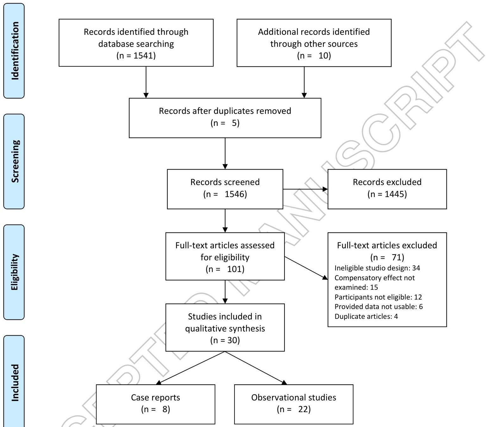

<!-- Source PDF: russo-2017-hightech-aac-aphasia.pdf -->

Expert Review of Medical Devices

Taylor &amp; Francis Taylor &amp; Francis Group

ISSN: 1743-4440 (Print) 1745-2422 (Online) Journal homepage: http://www.tandfonline.com/loi/ierd20

# High-technology Augmentative Communication for adults with post-stroke aphasia: a systematic review

Maria Julieta Russo, Valeria Prodan, Natalia Meda, Lucila Carcavallo, Anibal Muracioli, Liliana Sabe, Lucas Bonamico, Ricardo Allegri &amp; Lisandro Olmos

To cite this article: Maria Julieta Russo, Valeria Prodan, Natalia Meda, Lucila Carcavallo, Anibal Muracioli, Liliana Sabe, Lucas Bonamico, Ricardo Allegri &amp; Lisandro Olmos (2017): High-technology Augmentative Communication for adults with post-stroke aphasia: a systematic review, Expert Review of Medical Devices, DOI: 10.1080/17434440.2017.1324291

To link to this article: http://dx.doi.org/10.1080/17434440.2017.1324291

Accepted author version posted online: 26 Apr 2017.

Submit your article to this journal

Article views: 1

View related articles

View Crossmark data

Full Terms &amp; Conditions of access and use can be found at http://www.tandfonline.com/action/journalInformation?journalCode=ierd20

Download by: [The UC San Diego Library]

Date: 30 April 2017, At: 07:28

Publisher: Taylor &amp; Francis

Journal: Expert Review of Medical Devices

DOI: 10.1080/17434440.2017.1324291

REVIEW

High-technology Augmentative Communication for adults with post-stroke aphasia: a systematic review

Authors: Maria Julieta Russo, Valeria Prodan, Natalia Meda, Lucila Carcavallo, Anibal Muracioli, Liliana Sabe, Lucas Bonamico, Ricardo Allegri, and Lisandro Olmos.

Institution: Rehabilitation Center, Instituto de Investigaciones Neurologicas Raul Carrea (FLENI), Buenos Aires, Argentina

Correspondence: María Julieta Russo

Rehabilitation Center, Instituto de Investigaciones Neurologicas Raul Carrea (FLENI)

Montañeses 2325 Buenos Aires, Argentina, C1428AQK

Phone/Fax: +9 54 11 5777 3200

Email: jrusso@fleni.org.ar

2

# Abstract

**Introduction:** Augmentative and alternative communication (AAC) systems were introduced into clinical practice by therapists to help compensate for persistent language deficits in people with aphasia. Although, there is currently a push towards an increased focus on compensatory approaches in an attempt to maximize communication function for social interaction, available studies including AAC systems, especially technologically advanced communication tools and systems, known as "high-technology AAC", show key issues and obstacles for these tools to become utilized in mainstream clinical practice.

**Areas covered:** The current review synthesizes communication intervention studies that involved the use of high-technology communication devices to enhance linguistic communication skills for adults with post-stroke aphasia. The review focuses on compensatory approaches that emphasized functional communication. It also summarizes recommendations for the report of studies evaluating high-technology devices that may be potentially relevant for other researchers working with adults with post-stroke aphasia.

**Expert commentary:**

Taken together with positive results in heterogeneous studies, high-technology devices represent a compensatory strategy to enhance communicative skills in individuals with post-stroke aphasia. Improvements in the design of studies and reporting of results may lead to better interpretation of the already existing scientific results from aphasia management.

**KEYWORDS:** Adults, aphasia, augmentative and alternative communication (AAC), communication, rehabilitation, stroke

Aphasia is an acquired impairment of language, affecting the production or comprehension of speech and the ability to read or write. The most common cause of aphasia is stroke (about 30% of stroke survivors acquire aphasia), although other types of brain injuries can also be the cause [1]. Twenty five percent of subjects experience severe forms of aphasia [1], being so severe as to make communication almost impossible. Several prognostic studies have shown that communication and language recovery in aphasia within the first-year post-onset follows uncertain, slow and heterogeneous courses of improvement [2--4]. Among patients with severe aphasia initially, almost 40% may have a good recovery three months after stroke [5]. However, a high percentage of survivors with post-stroke aphasia remain with multiple aspects of communication impaired, limiting their independence, social relationships, education and employment. Knowledge of the aspects of affected language and the channels which remain accessible for communication represents the mainstay for development of restorative and/or compensatory strategies and tools.

Augmentative and alternative communication (AAC) systems were introduced into clinical practice by therapists to help compensate for persistent language deficits and communication problems. Communication is very essential in daily life, and when someone has lost the ability to speak and/or understand spoken or written language, then the AAC intervention approaches can be utilized to meet their communication needs. AAC involves a wide range of techniques, strategies and technologies to support those needs. From ancient time when individuals who were deaf or could not speak developed a manual language until the present with the advent of technological resources, the AAC systems are more affordable and more accessible for all people with aphasia. Subjects with language impairment can use from no-tech (e.g. manual signs) to high- and low- technology approaches to AAC. Currently, there is no consensus regarding the key component of goal setting interventions or when AAC systems should be introduced to clinical practice. Also, there is no clear evidence that one approach is superior to any other.

At this time, the treatment approaches in aphasia focus either on restoration of skills or compensation for deficits. Restorative approaches can be so specific to retrain discrete word-finding difficulty as to retrain more complex grammatical aspects (e.g. passive voice). Evidence based restor

approaches for the management of severe aphasia have documented that several speech-language therapies are effective for enhancing language recovery after stroke [6,7]. While compensatory strategies are based on the premise that language function is lost, they intend to establish functional communication and are generally adapted to the needs of each individual with language impairment. There is currently a push towards an increased focus on compensatory approaches in an attempt to maximize communication function for social interaction [8]. The focus of compensatory approaches must enable patients to increase their level of function despite their deficit and must be on augmenting communication in ways the person values. Also, compensatory approaches for aphasia usually take the form of AAC. Newer research [9,10], including reviews as well as case studies, indicates that AAC systems, especially technologically advanced communication tools and systems, known as "high-technology AAC" are an excellent alternative for those who are unable to communicate via speech alone. Inclusion of high-technology AAC systems in activities of daily living could be an opportunity for improvement of language function and full participation in activities at home, work, social groups and a variety of other settings. However, studies investigating the value of compensatory AAC approaches show several limitations (e.g. design, number of included participants, setting, time of evolution, type and severity of aphasia, used AAC device, outcome measures) and difficulties for the generalization of the results in the usual clinical practice.

The current review synthesizes communication intervention studies that involved the use of high-technology communication devices to enhance linguistic communication skills for adults with post-stroke aphasia. The review focuses on compensatory approaches that emphasized functional communication. It also summarizes recommendations for the report of studies evaluating AAC devices that may be potentially relevant for other researchers working with adults with post-stroke aphasia.

## 2. Methods

### 2.1. Search of studies

The research question for the review was: What evidence exists about the usefulness of high-technology communication devices as a compensation strategy to enhance linguistic communication skills in people with aphasia secondary to stroke? In order to characterize research related to this question, a

systematic review of the literature was conducted by two of the authors (MJR and VP). The relevant published literature was identified via searching of the Cinahl, Cochrane Library, Embase, Medline, Psycinfo, and Web of Science electronic databases. Three targeted sets of search terms were selected and were combined using the Boolean term "AND": (a) Impairment terms (aphasia OR stroke), (b) AAC terms (speech-generating device, assistive aids, AAC, OR high technology), and (c) commonly used systems (software, hardware, OR applications). We chose to do a broad search on each set of search terms and used some specific terms (using "OR") to search for more literature about AAC which are often linked to communication difficulties due to stroke in the literature. The keywords were applied to titles and abstracts (Figure 1). The first author then extended the search, by reviewing the reference list of relevant studies to see if these references include reports of other studies that might be eligible for the review.

### 2.2. Inclusion/Exclusion Criteria

The review considered observational studies and case reports published in peer-reviewed journals between 1980 and 2017 that were reported in English. We included published research with a primary focus on (a) adults who had a chronic aphasia secondary to stroke, (b) high-technology communication devices only, and (c) AAC methods or devices as compensatory strategies and tools.

Papers were excluded according to the following characteristics: (a) not published in English, (b) not original or case studies peer-reviewed research (e.g., systematic review, meta-analysis, editorial); (c) the primary focus was not on aphasia (e.g., papers focusing on apraxia of speech or dysarthria), (d) the primary focus did not include subjects with stroke (e.g., traumatic brain injury, amyotrophic lateral sclerosis, head and neck surgery, tracheostomy, neurodegenerative diseases, or communication disabilities), (e) including software or devices that could be used only as a treatment or restorative tool or as tele-rehabilitation (f) not brain-computer interface research.

### 2.3. Selection of publications for review

In the study selection phase, the relevance of the literature was assessed in title, abstract, and/or full text and inclusion/exclusion criteria were applied (Figure 1). If a difference of opinions occurred, it was decided by consensus among the researchers to include or exclude the study. The first author extracted data from full texts into an Excel spreadsheet, comprising author, year, type of study, objective/aim,

inclusion and exclusion criteria, number of participants, age, gender, years of education, type of aphasia, severity of aphasia (mild, moderate, or severe), previous exposure to AAC training, AAC equipment description, intervention, number of sessions and months of intervention, outcome measures, and results. All authors mapped and checked the research evidence in included studies according to those parameters.

### 2.4 Quality assessment

This review considered including observational study designs with varying risks of bias (e.g. case reports and observational studies) due to the absence of published studies with high methodological quality (e.g. clinical trials). Under such circumstances, our quality assessment was based on our review question and not on the study design. We considered only studies that provide valid and useful information to address our key question. To ascertain the validity of eligible studies, blind pairs of reviewers working independently and with adequate reliability determined the adequacy of eligibility criteria of the population, description of the AAC system and intervention, period of intervention, outcome measures, and main findings of each included study. In order to minimize bias, studies were assessed for inclusion using selection criteria that flowed directly from the review question and that were piloted to check that they can be reliably applied.

### 2.5 Approach to analysis and synthesis

Data synthesis was a crucial step in the review process due to the methodologically diverse primary studies included in the review. When studies meeting inclusion criteria they were summarized to form the outcome of the systematic review. Data reduction was achieved through an overall classification system in which primary studies were divided into subgroups that provided a logical order for analysis. This subgroup classification was based on types of study, objective, setting, and sample characteristics. The next step in the data reduction process was to code and extract data into a manageable framework. Pooling results, as done in meta-analysis, was not appropriate. Instead, we identified themes to synthesize findings. We included tables summarizing the evidence generated from each study. The final stage in data analysis was drawing conclusions. Finally, all authors commented on the main findings, strengths and limitations of included studies and proposed a checklist for the reporting of studies related to AAC devices.

7

## 3. Results

### 3.1. Study selection

Figure 1 provides a summary of the process of the search and selection for studies, indicating how papers of relevance to this review were identified. In total, from full-text articles assessed for eligibility, 30 were included in this systematic review. We excluded 71: thirty-four because of their ineligible study design (e.g. review, editorial, observational study); 15 because compensatory effect of AAC interventions was not examined; 12 because participants were not eligible (e.g. patients with neurodegenerative diseases or intellectual disability), 6 because provided data on high-technology devices was not usable; and 4 articles were duplicate (2 papers were expanded articles including new data, 2 papers were published in indexed journals later).

### 3.2. Study characteristics

The 30 papers included in this review were published between 1989 and 2016, with a focus on the use of AAC as compensatory strategy training in patients with post-stroke aphasia. Of these, only 3 focused only on compensatory treatment approach [11–13] while the other publications considered both restorative and compensatory strategies. The studies encompassed 8 case reports, 1 analytic observational study (case-control), and 21 descriptive observational studies.

### 3.3. Study Quality

We found heterogeneity in the bias analysis of included studies, with ambiguously or incompletely reported data (e.g. demographics and clinical variables of the included participants, features of AAC devices, description of the intervention, statistical analysis), variable eligibility criteria (e.g. type of aphasia, degree of severity, occupation, level of education, setting), flawed measurement of outcome (e.g. scales or questionnaires that measure communication skills, quantitative analysis), and inadequate control of confounding variables (e.g. absence of accurate measurement of neuropsychological performance, compliance, and lack of adjustment in statistical analysis).

This review incorporated observational studies, case reports and studies without control groups, especially because there were no other studies to consider. Therefore, including data from non-randomized

trials was challenging. Results of traditional quality assessment were not used as exclusion criteria, but were instead incorporated in the discussion of findings.

### 3.4. Participant Characteristics

Table 1 summarizes the characteristics of study participants. Participants included people with acquired non-progressive post-stroke aphasia (n = 250). The mean sample size was 8.33 (range 1–49). However, 80% (n = 24) of the studies had between one and ten participants. A single study included a control group for comparison purposes [14]. There was considerable variability of participants in some studies, with diversity in terms of age (M = 57.82, SD = 8.42, range = 18-80), gender (male = 123, female = 96), level of education (M = 14.99, SD = 1.71, range = 11-20), or months after stroke (M = 43.49, SD = 22.64, range = 3-156). The most commonly reported type of aphasia was non-fluent aphasia, followed by fluent and global aphasia. Only 5 of 30 (16.66%) studies reported the simultaneous presence of apraxia of speech (AOS) [15–19]. Only 4 of 30 (13.33%) studies included mild forms of aphasia [20–23]. Seven (23%) papers did not report the degree of aphasia severity. Almost half of the studies (n = 14) did not specify whether participants had previous experience with AAC or other technologies.

### 3.5. Features of AAC systems

Table 2 shows the characteristics of AAC systems. While the process of determining an appropriate category for AAC systems in this paper was difficult, we listed all information systems into four categories. These included the following:

- AAC desktop computer software (n= 11): software programs that have AAC capabilities and that can be installed on a desktop computer [14,19,20,22,24–30].
- AAC portable computer software (n= 9): software programs that have AAC capabilities and that can be installed on a portable computer or laptop [13,23,31–37].
- Dedicated AAC devices (n= 6): hardware specifically manufactured for AAC purposes [12,15–18,38].
- Mobile devices with communication Apps (n= 4): software applications and tablet or phone platforms for AAC purposes [11,21,39,40].

A total of 13 different types of AAC systems were used in the 30 interventions reported. Five studies used more than one type of AAC system per study [12,16,17,21,32]. Of the various AAC systems used, the SentenceShaper™ had the highest frequency (n= 6, 20%), followed by both the Lingraphica® and Dynavox® each being used three times (10%). The C-Speak Aphasia, Dialect, Dragon NaturallySpeaking, TalksBac, and TouchSpeak were each used twice (6.6%). Finally the AphasiaWeb App, C-VIC, EasySpeaker, Kindle Keyboard 3G™, Multicue, PhotoTalk App, and Storytelling App were all used once (3.4%).

Visual Scene Display (VSD) was used to enhance communication in 3 studies [15,18,38]. All other studies included traditional grid display. Dietz and colleagues [15] used four variants of a VSD interface in five people with chronic aphasia. They employed personally relevant photographs and related text, as well as speech output to create the VSD on a portable device. Overall, participants perceived the personally relevant photographs and the text as helpful during the conversations. Griffith, Dietz, and Weissling [38] evaluated four variants of a VSD interface with color personally relevant photographs or colored line drawings in four subjects with chronic aphasia. All participants relied on personally relevant photographs more frequently than line drawings; however, they reported both picture types to be equally helpful. McKelvey and colleagues [18] investigated the use of a VSD in an AAC device by a subject with chronic non-fluent aphasia during multiple interactions with naive communication partners. Results documented successful use of the VSD interface by the participant to communicate two stories to multiple unfamiliar communication partners. None of the studies compared both VSD and grid displays.

Message formulation strategies can include spelling letter-by-letter; retrieving messages word-by-word, picture-by-picture, phrase-by-phrase, sentence-by-sentence, or as full stories; and retrieving speeches or talks. For the purposes of this study, four different message formulation modes were categorized: speech (digitized or synthesized speech, which can be recorded, stored, and reproduced); written words or text (letter-by-letter spelling, or word-by-word and sentence-by sentence message retrieving); pictures or photographs (strategy which rely exclusively on pictures or line drawings to formulate messages, and multiple methods of message formulation (a combination of methods). Nineteen of the 30 studies investigated speech involving a total of 130 individuals with post-stroke aphasia. Two

9

studies used a speech recognition software to help two patients with aphasia to improve their writing [25,32] and mailing [32] skills. A single study evaluated the incorporation of pictures or photographs into their daily lives using the PhotoTalk app [11]. Finally, eight studies examined communication using a variety of message formulation modes with 108 participants.

### Intervention description

Table 3 shows the description of AAC Interventions for adults with post-stroke aphasia. The use of AAC by adults with post-stroke aphasia in the home setting was only explored in four papers [19,26,27,37]. Three of the four studies [26,27,37] concluded that AAC could be used successfully and have beneficial effects on communication effectiveness. The other study [19] did not show improvement in communication skills with the use of EasySpeaker software at home. The AAC interventions in the hospital setting was explored in 13 papers, one of which with unfavorable results [14]. Finally, the participants used the device communicatively, in the hospital and at home in 13 studies, with negative results in 2 papers [17,24]. Studies implemented AAC interventions in either a group setting (n= 1) or an individual setting (n= 29).

AAC intervention was designed only for individuals with aphasia in 23 of 30 included studies, while aphasic people and caregivers were the target population in 7 studies. Albright and Purves [24] explored how using a beta version of SentenceShaper^{TM} could support everyday communication in a 31-year-old woman with non-fluent aphasia of moderate severity and her mother. Findings revealed that, although the participant with aphasia used SentenceShaper^{TM} messages for e-mail and in conversation, neither she nor her mother readily accepted the use of the program to augment communication in everyday life. Allen et al. [11] involved family members in the first and last meeting. At the first meeting the communication skills and strategies of the individual with aphasia were discussed with the aphasic participant and the family member. At the last meeting, a semi-structured interview was conducted with both the aphasic participant and the close family member. The involvement of the close family members was most beneficial at the outset of the study; the participants seemed more comfortable knowing that their family members would be present to assist in communication with the researcher if necessary. Daemen et al. [39] included five aphasic individuals and their primary caregivers (their spouse in one case and speech therapists in the

others) to evaluate the influence of Storytelling Apps on communicative skills of daily life. Patients had to create a short story and later to share with their caregivers. The partners and speech therapists indicated that storytelling was a good option to help people with aphasia and their partners tell their daily activities. Hough and Johnson [16] included an aphasic patient and the caregiver throughout the treatment. Results revealed that caregiver perception of communicative independence increased and that the caregiver's role was important to success of device generalization as a communication skill tool. Johnson et al. [17] included three participants with severe non-fluent aphasia and their caregivers. Results showed that caregivers' perceptions of communication skills increased specifically in relation to communicative independence and quality of communication. Van de Sandt-Koenderman et al. [35] included 22 aphasic patients and their supportive partners who provided information about specific communicative needs. Seventeen patients (77%) reported to use AAC system for at least one of the preset goals. Waller et al. [37)] included subjects with aphasia and their caregivers who were trained to use the TalksBac system and were involved in developing personalized databases. Despite training, caregivers did not fully realize the conversational importance of everyday events for the aphasic subjects. Authors concluded that more training needs to be provided to help caregivers to identify and enter conversational data.

The average number of months of intervention was of 4.01 ± 3.43. Seven studies did not specify the period of training [15,20,22,26,35,38,39]. The average number of sessions was of 20.54 ± 17.31, ranged from 1 to 64. Communication partners were incorporated in almost half of the included studies (n= 14).

### 3.7. Summary of intervention outcomes

Table 4 shows a summary of measures and outcomes of the included studies. AAC compensatory (n= 30) and mix of compensatory/restorative (n= 27) therapy approaches were implemented to improve the language and communicative skills of participants with post-stroke aphasia and were considered as main outcomes. Compensatory approaches involved those strategies designed to maximize communication function for social interaction. These strategies were coded into one of six categories: (a) in-depth information, (b) telephone conversations, (c) needs (variety of everyday situations in which people with aphasia and their families might need or wish to participate. For example, playing cards with friends,

11

washing, dressing, preparing meals, shopping, doing housework), (d) face-to-face interaction (conversations, stories), (e) on-line communication, and (f) written communication (writing, mailing, reading). Restorative approaches involved those techniques designed to recover skills that were impaired due to stroke (e.g. naming, repetition, semantic categorization, speed of speech, executive functioning, recalled words). Twenty-two studies analyzed a single communicative function. Many of the studies evaluated more than one of the skills listed above.

The reported outcomes encompassed a wide range of measures, with the most commonly used being a count of correct responses (n= 12) and standardized language test scores (n= 12). Eight used linguistic analysis (such as Quantitative Production Analysis, analysis of Correct Information Units, or Direct Magnitude Estimation). All studies evaluated functional communication using an AAC device. Eight papers included the use of questionnaires specially designed to evaluate communicative skills [19,24,25,28,29,33,35,39], seven used a functional quantitative analysis [13,15,18,26,27,38,40], and 15 used communication tests [11,12,14,16,17,20,21,23,30--32,34,36,37] (such as Porch Index of Communicative Ability, Communicative Effectiveness Index, Amsterdam Nijmegen Everyday Language Test scale, or American Speech-Language Hearing Association Quality of Communication Life Scale). There was a single study using rating of client satisfaction [36].

Pooling results, as done in meta-analysis, was not appropriate due to the methodologically diverse primary studies included in the review. Main outcomes were classified as positive, negative or mixed based on a system proposed in other studies [41]. Positive outcomes referred to studies in which the target outcome(s) improved for all participants. Negative outcomes referred to studies in which no treatment effect was observed following AAC intervention. Mixed outcomes referred to studies in which some participants made improvements and others did not. Restorative approaches showed positive (n= 14) or mixed (n= 13) results. With respect to compensatory strategy, many studies (n= 16) reported positive outcomes [11--13,16,18,20--23,25,30--32,38--40]. Eleven studies reported mixed outcomes in which some participants demonstrated positive outcomes and others did not [15,17,26--29,33--37]. Three studies reported negative findings, as participants did not demonstrate improvement in communication functions

following AAC intervention [14,19,24].

The acceptance rate of high-technology AAC devices in everyday lives was reported only in 5 studies [11,19,24,35,36]. Albright and Purves [24] investigated the use of SentenceShaper™ software to support therapeutic and augmentative aspects in an individual with non-fluent aphasia. Results indicated that the patient improved the narrative production but did not accept the use of the program to augment communication in everyday life. Rostron et al. [19] described the use of EasySpeaker software by an individual with severe non-fluent aphasia. The results of this case report showed that the participant could use and learn the program. However, the subject did not use it to generate propositional communication. Allen et al. [11] evaluated the incorporation of PhotoTalk apps in two participants into their daily lives. Only one participant accepted PhotoTalk for communication. Van de Sandt-Koenderman et al. [35] investigated the use of TouchSpeak software by 22 subjects with aphasia. All 22 learned to operate the device and 17 accepted its use in everyday life. Van de Sandt-Koenderman et al. [36] used the TouchSpeak software in a sample of 34 patients with a severe aphasia. Fifty percent obtained their own software after the training and after 3 years 6% still used it.

## 4. Discussion

This systematic review presented studies that investigated the usefulness of high-technology AAC devices to enhance the communication abilities in adults with post-stroke aphasia. Overall, results indicated that individuals with chronic post-stroke aphasia showed improvements when a high-technology AAC intervention was used to enhance communicative skills using compensatory therapy approach. The included studies involved a group of people with different types of aphasia and varying degrees of severity, several types of AAC devices, different message formulation modes, and at least nine communicative functions. In terms of the quality of results, the majority of studies reviewed here achieved clear intervention results, where positive or mixed outcomes were high (90%).

Although the lack of consistency in design and methodology could be an important limitation of our

systematic review, we consider that this issue does not detract from their global relevance. Synthesizing and integrating qualitative or quantitative data from studies with different designs and methodology is challenging, but possible. In this review, assessing quality using standard tools was not particularly helpful because many of these studies were placed at the lowest level (case series or case report). To address this drawback, we developed a data extraction matrix to help deconstruct each included study. From this, we identified themes to synthesize findings and reconstructed the main results, which were presented in structured tables. To answer the main research question, we integrated the findings from 30 studies, comparing the results to identify similarities and differences. Using this type of approach did not provide stronger evidence than a meta-analysis but allowed for greater breadth of perspectives and deeper understanding of applicability of high-technology devices in people with post-stroke aphasia who received the AAC interventions.

Another important concern about AAC interventions was that we did not find studies assessing only communication skills as the primary outcome. The distinction between studies which have used high-technology AAC for therapy and those which have used them as functional communication aids is a crucial issue. For example, patient "A" might perform better on verbal naming tasks compared to patient "B", but that result may not be related to the quality of a conversation in a restaurant with a friend. Therefore, communicative competence for people who need AAC goes beyond simple language skills. People with post-stroke aphasia might require AAC interventions that support the improvement of communication, enhance the participation in their context, enable to make social relationships, develop academic or employment skills, and/or engage with family members. In this sense, the focus of AAC should be on augmenting communication in ways the persons need and specific outcome measures should be used.

Simultaneously, outcome measures should provide information on the impact of AAC intervention. It should include both a qualitative and quantitative component and data should be gathered and analyzed using compensatory approaches. An important step is determining desired outcomes. For example, operational competence to operate the AAC system can be an achievable outcome (e.g. access to the device, ability to program vocabulary, charging the device). Second, linguistic skill should be reflected in the

included outcomes in the design of studies (e.g. specific aspects of vocabulary or grammar). Finally, the outcomes should reflect long-term goal of AAC: interactive communication (e.g. social competence, interaction, strategic competence, participation of partners, acceptance rates). Although our main stage in the process of the systematic review was to synthesize findings and reconstruct the main results, it was not possible to compare results in a quantitative way, due to the heterogeneity of the processes and tools of measurement and / or reporting of results.

Our review identified several key issues in the area of AAC interventions in people with post-stroke aphasia, including (a) a predominance of single case and small group designs, (b) the lack of reporting of the percentage of acceptance by AAC users, (c) a high proportion of studied patients over 50 years of age, (d) a clear tendency for targeting individuals with aphasia without the training of communication partners simultaneously, (e) a tendency to overestimate the influence of linguistic factors in determining the communicative success, and (f) the non-inclusion of confounding variables as the participants' cognitive performance or the presence of AOS simultaneously in the interpretation of the results.

This paper included studies with a mean sample size of 8.33. Almost 80% of studies focused on ten or fewer participants. While is true that randomized controlled trials are more powerful for determining the efficacy of interventions, many times these designs are not applicable to people with complex communication needs. Case report or small group design may be an alternative research approach to evaluate and inform the effectiveness of an intervention in the rehabilitation setting. Although the analysis of study designs is beyond the scope of the review, we consider that the general lack of research skills to appropriately interpret and apply the findings of small designs may explain that researchers do not exploit single case/small group designs sufficiently to influence practice. Again, the fact that small studies are located lower on the hierarchy of evidence does not necessarily mean that the strength of recommendation made from those studies is low. Improvement in the interpretation of the results of small studies and the added value of their analysis in a systematic review would provide information to guide clinicians in selecting viable candidates for alternative communication systems.

The lack of reporting of the percentage of acceptance by AAC users was a recurring issue across

studies. The acceptance rate of AAC devices in everyday lives was reported only in 5 studies [11,19,24,35,36]. All of these studies evaluated devices which were designed as both therapy and functional support. However, it is impossible to interpret from this review how participants felt about ongoing use of devices as functional aids (as opposed to therapy aids). To gain further insights about variables associated with acceptance of AAC devices in post-stroke aphasia, researchers should report and analyze the rate of acceptance as one of the outcomes of the studies.

The mean age of the participants considered in this review clearly exposes a predominance of studied patients over 50 years of age. It is obvious that stroke occur more frequently in people over 50 years. However, we highlight this issue because there is a relationship between age and general familiarity and experience with technology. Bringing up the known Digital Native/Digital Immigrant metaphor [42], age by itself may be a related factor to success or failure of high-technology-based approaches. Sometimes adults with aphasia need to embrace emerging technologies as opportunities to enhance assessment and intervention strategies. The so-called "digital immigrants" may face greater difficulties with adopting new and modern high-technology devices. This factor should be considered in the design or interpretation of clinical or research intervention programs. It would be useful to investigate the perceived differences in success or the rate of acceptance in their everyday life of the AAC intervention in both groups of people with post-stroke aphasia.

Although there is evidence that communication partners have a crucial role for achieving positive outcomes for any AAC intervention program [12,43], many investigations did not include strategies to facilitate caregivers participation [16]. The experience in the field of AAC interventions has shown that accepting the new high-technology device may depend on the presence of a caregiver or communication partner who would be a crucial support to accompany and assist the patient in the process [11]. For example, caregivers may help the research team to better identify the real needs within daily activities of people with aphasia and improve the design and training process [39]. Also, a trained caregiver would provide more accurate outcome results when communication scales are used as outcome measure.

AAC intervention in the past has often been evaluated by looking at the effects of AAC systems on

language outcomes, use of stimulus sets or device functions. By using the International Classification of Functioning, Disability and Health (ICF) framework [44], the outcome of any AAC intervention should also measure aspects related to the functional impact of the language impairment. Understanding that the level of language impairment is often not paralleled by the level of functional impact will optimize the design of intervention strategies to improve communication skills and social integration in subjects with post-stroke aphasia.

Few authors investigated cognitive factors that may be relevant to response to communication training with AAC systems [28]. The interpretation of non-linguistic cognitive variables in patients with post-stroke aphasia is often omitted from studies. For example, Nicholas et al. [28] suggested that executive dysfunction in people with severe aphasia may be the basis for poor response to treatment of alternative modes of communication. Assessment of cognitive performance may contribute to understanding different patterns of response and adherence to intervention strategies. Also, we have stated that only 16.6% of studies noted the presence of AOS in their reports. Apraxia of speech is defined as a disorder of learned volitional actions associated with breakdown in planning or programming movements needed for speech. There is limited information about the prevalence of AOS. This is partly due to problems in definition and delineation of AOS from more common speech and language disorders. Even more problematic is that it often co-occurs with non-fluent aphasia or dysarthria (pure motor impairment) [45]. The co-occurrence of AOS and aphasia should be considered when determining treatment outcomes. Again, improvements can be defined in terms of functional communication rather than normal performance. It is important to determine the relative contribution of apraxia and aphasia and design AAC approaches that fit the disorder. However, the evidence base for both conditions simultaneously is limited, with the majority of studies reflecting incomplete descriptions of AOS and the impact on communication skills in people with post-stroke aphasia.

## Conclusion

Communication difficulties are a common characteristic of individuals with post-stroke aphasia and AAC systems may be a useful tool to improve their communication and social participation. However, the

practical application of AAC interventions as a compensatory tool remains still in the developmental stage. No one model of AAC functional intervention has been developed to guide therapists, patients, family members, or manufacturers in the clinical decision-making process.

Taken together with positive results in heterogeneous studies, high-technology devices represent a compensatory strategy to enhance communicative skills in individuals with chronic post-stroke aphasia. Improvements in the design of studies and reporting of results may lead to efficacious interventions and better interpretation of the already existing scientific results from aphasia management. Finally, this should improve functional communication in people with aphasia. On the basis of this review, we proposed a collection of reporting recommendations gleaned from the papers (Appendix 1) for studies evaluating AAC systems or devices that may be potentially relevant for other researchers working with adults with post-stroke aphasia.

## 6. Expert commentary

Until a few decades ago, people with aphasia were very limited by traditional augmentative and alternative techniques, in which information was supported on simple aids created by placing letters, words, phrases, pictures and/or symbols on a board or in a book. Fortunately, high-technology AAC strategies have improved significantly over the past 30 years. Such high-technology AAC aids have expanded rapidly progressing to dynamic systems that permit the storage and retrieval of messages, the use of speech output on personal computers or mobile devices.

In the field of AAC approaches, the most important concept is that a good augmentative communication system "augments" the impaired individual's natural speech. Therefore, an "ideal" AAC approach should be based on restorative AND compensatory objectives. Any neuro-rehabilitation program for individuals with post-stroke aphasia should include strategies to achieve better linguistic and functional performance, both inside and outside therapies.

18

ACCEPTED MANUSCRIPT

AAC systems are useful interventions in people with post-stroke aphasia due to their ability to engage multiple communication modes and to provide alternatives to the usual means of communication. Several studies have shown that people with aphasia can achieve improvements by using AAC, regardless the type and degree of the impairment. Despite the methodological limitations of such studies, the advantages of AAC interventions are multiple, including linguistic-cognitive and psychological aspects, independence in communication and participation in life activities.

A need exists for additional research to guide clinicians in selecting patients with aphasia for alternative communication systems, to design AAC approaches to use these high-technology devices to supplement the functional communication, to integrate all components of the ICF framework for assessing functioning and disability of individuals with aphasia and their context, and finally, to maximize performance and social interaction through the design of optimal communication interventions within rehabilitation technology.

The future research agenda for AAC and adults with post-stroke aphasia should include the communication training to people involved in the care of people with aphasia (caregivers or communication partners) as a strategy for enhancing communication. Also, new study designs should take account of the need for communication skills training of healthcare professionals who interact with individuals with aphasia. The challenges of communicating with people with post-stroke aphasia in rehabilitation setting should be fully explored. This communication training of people involved in the care of patients with aphasia should facilitate and support their communication.

High technology systems are becoming a mainstream choice for speech pathologists in a clinical and rehabilitation setting. There are a vast range of software and apps being developed by speech pathologists for a wide range of language domains. For this reason, it is essential that clinicians and therapists know all available resources, the theoretical construct of its design and applicability, the exact clinical indications, the rate of acceptability or adherence based on degree of complexity, the need of access options, and the scientific evidence of its clinical utility. We need to highlight that all AAC devices are

not necessarily a researched standardized assessment or therapy. There is a growing need for evidence-based practice when treating patients with aphasia.

### 7.5 Year View

Ongoing and future research to evaluate the effectiveness of AAC interventions for post-stroke aphasia represents an opportunity to guide decision-making in the approach of patients and their families. With the advent of technology, creativity in the design of research studies or intervention programs including different AAC approaches should be enhanced.

Defining the starting point, the duration, the target population and the measures of effectiveness of the different AAC approaches are aspects that need to be defined to guide the clinical practice.

Future AAC intervention studies will need to include several variables to better characterize the studied population, to compare subgroups (e.g. by age, gender, time of evolution, lesion location, premorbid cognitive status, setting), to define recovery patterns and other confounding factors (e.g. rate of improvements, degree of familiarity with technology, underlying cognitive and functional impairments). Determining the underlying theoretical cognitive and linguistic constructs is another area that will require future AAC research. Further addressing different outcome measures for AAC approaches could enhance the measurement of change in language and communicative skills in post-stroke aphasia. Finally, improvements and revisions, including pre-and post-intervention MRI outcome measures, in future investigations are essential to improving the rehabilitative impact of each therapy program.

## Key Issues

- Communication is an important aspect of functional independence
- The functional communication is a key component of “living successfully” with aphasia.
- Supporting everyday communication should be the focus of any intervention program of post-stroke aphasia rehabilitation.

20

- Communication support is an important consideration in facilitating functional communication, interpersonal relationships, and participation in social life.
- Despite advances in neuro-rehabilitation programs, aphasia remains a leading cause of disability and poor quality of life in people with stroke.
- AAC systems offer a compensatory approach to further facilitate rehabilitation therapy.
- AAC can meet the communication needs (specific needs, daily activities, conversations) of people with post-stroke aphasia
- AAC devices are part of a multi-modal and flexible communication system.
- AAC interventions should be designed to meet the communication ability level of the individual.
- Use of AAC devices holds great promise as a tool inside and outside of therapy.

## Funding

This paper was not funded.

## Declaration of Interest

The authors have no relevant affiliations or financial involvement with any organization or entity with a financial interest in or financial conflict with the subject matter or materials discussed in the manuscript. This includes employment, consultancies, honoraria, stock ownership or options, expert testimony, grants or patents received or pending, or royalties.

References

1. Engelter ST, Gostynski M, Papa S, Frei M, Born C, Ajdacic-Gross V, et al. Epidemiology of aphasia attributable to first ischemic stroke: incidence, severity, fluency, etiology, and thrombolysis. Stroke [Internet]. 2006 Jun 1 [cited 2017 Jan 28];37(6):1379-84. Available from: http://stroke.ahajournals.org/cgi/doi/10.1161/01.STR.0000221815.64093.8c
2. Lazar RM, Minzer B, Antoniello D, Festa JR, Krakauer JW, Marshall RS. Improvement in aphasia scores after stroke is well predicted by initial severity. Stroke [Internet]. 2010 Jul [cited 2017 Jan 28];41(7):1485-8. Available from: http://www.ncbi.nlm.nih.gov/pubmed/20538700
3. El Hachioui H, Lingsma HF, van de Sandt-Koenderman MWME, Dippel DWJ, Koudstaal PJ, Visch-Brink EG. Long-term prognosis of aphasia after stroke. J Neurol Neurosurg Psychiatry [Internet]. 2013 Mar 1 [cited 2017 Jan 28];84(3):310-5. Available from: http://www.ncbi.nlm.nih.gov/pubmed/23117494
4. Koleck M, Gana K, Lucot C, Darrigrand B, Mazaux J-M, Glize B. Quality of life in aphasic patients 1 year after a first stroke. Qual Life Res [Internet]. 2017 Jan 12 [cited 2017 Jan 28];26(1):45-54. Available from: http://www.ncbi.nlm.nih.gov/pubmed/27405871
5. Glize B, Villain M, Richert L, DE Gabory I, Mazaux JM, Dehail P, et al. Language features in the acute phase of post-stroke severe aphasia could predict the outcome. Eur J Phys Rehabil Med [Internet]. 2016 Jul 14 [cited 2017 Jan 28]; Available from: http://www.ncbi.nlm.nih.gov/pubmed/27412072
6. Laska AC, Kahan T, Hellblom A, Murray V, von Arbin M. A Randomized Controlled Trial on Very Early Speech and Language Therapy in Acute Stroke Patients with Aphasia. Cerebrovasc Dis Extra [Internet]. 2011 [cited 2017 Mar 24];1(1):66-74. Available from: http://www.ncbi.nlm.nih.gov/pubmed/22566984
7. Koyuncu E, Çam P, Altınok N, Çallı DE, Duman TY, Özgirgin N. Speech and language therapy for aphasia following subacute stroke. Neural Regen Res [Internet]. 2016 Oct [cited 2017 Mar 24];11(10):1591-4. Available from: http://www.ncbi.nlm.nih.gov/pubmed/27904489
8. Fried-Oken M, Beukelman DR, Hux K. Current and future AAC research considerations for adults with acquired cognitive and communication impairments. Assist Technol [Internet]. 2011 [cited 2017 Feb 5];24(1):56-66. Available from: http://www.ncbi.nlm.nih.gov/pubmed/22590800
9. Higginbotham DJ, Shane H, Russell S, Caves K. Access to AAC: Present, past, and future. Augment Altern Commun [Internet]. 2007 Jan 12 [cited 2017 Mar 24];23(3):243-57. Available from: http://www.ncbi.nlm.nih.gov/pubmed/17701743
10. McNaughton D, Light J. The iPad and mobile technology revolution: benefits and challenges for individuals who require augmentative and alternative communication. Augment Altern Commun [Internet]. 2013 Jun 27 [cited 2017 Mar 24];29(2):107-16. Available from: http://www.tandfonline.com/doi/full/10.3109/07434618.2013.784930
11. Allen M, McGrenere J, Purves B. The design and field evaluation of PhotoTalk. In: Proceedings of the 9th international ACM SIGACCESS conference on Computers and accessibility - Assets '07 [Internet]. New York, New York, USA: ACM Press; 2007 [cited 2017 Feb 4]. p. 187. Available from: http://portal.acm.org/citation.cfm?doid=1296843.1296876
12. Boyd-Graber JL, Nikolova SS, Moffatt KA, Kin KC, Lee JY, Mackey LW, et al. Participatory design with proxies. In: Proceedings of the SIGCHI conference on Human Factors in computing systems - CHI '06 [Internet]. New York, New York, USA: ACM Press; 2006 [cited 2017 Feb 4]. p. 151. Available from: http://portal.acm.org/citation.cfm?doid=1124772.1124797

22

ACCEPTED MANUSCRIPT

13. Waller A, Newell AF. Towards a narrative-based augmentative communication system. Eur J Disord Commun [Internet]. 1997 [cited 2017 Feb 4];32(3 Spec No):289-306. Available from: http://www.ncbi.nlm.nih.gov/pubmed/9474294

14. Doesborgh S, van de Sandt-Koenderman M, Dippel D, van Harskamp F, Koudstaal P, Visch-Brink E. Cues on request: The efficacy of Multicue, a computer program for wordfinding therapy. Aphasiology [Internet]. 2004 Mar [cited 2017 Feb 4];18(3):213-22. Available from: http://www.tandfonline.com/doi/abs/10.1080/02687030344000580

15. Dietz A, Weissling K, Griffith J, McKelvey M, Macke D. The impact of interface design during an initial high-technology AAC experience: a collective case study of people with aphasia. Augment Altern Commun [Internet]. 2014 Dec 25 [cited 2017 Feb 4];30(4):314-28. Available from: http://www.tandfonline.com/doi/full/10.3109/07434618.2014.966207

16. Hough M, Johnson RK. Use of AAC to enhance linguistic communication skills in an adult with chronic severe aphasia. Aphasiology [Internet]. 2009 Jul [cited 2017 Feb 4];23(7-8):965-76. Available from: http://www.tandfonline.com/doi/abs/10.1080/02687030802698145

17. Johnson RK, Hough MS, King KA, Vos P, Jeffs T. Functional communication in individuals with chronic severe aphasia using augmentative communication. Augment Altern Commun [Internet]. 2008 Dec 12 [cited 2017 Feb 4];24(4):269-80. Available from: http://www.tandfonline.com/doi/full/10.1080/07434610802463957

18. McKelvey ML, Dietz AR, Hux K, Weissling K, Beukelman DR. Performance of a person with chronic aphasia using personal and contextual pictures in a visual scene display prototype. J Med Speech Lang Pathol. 2007;15(3):305-17.

19. Rostron A, Ward S, Plant R. Computerised augmentative communication devices for people with dysphasia: design and evaluation. Eur J Disord Commun [Internet]. 1996 [cited 2017 Feb 4];31(1):11-30. Available from: http://www.ncbi.nlm.nih.gov/pubmed/8776429

20. Bartlett MR, Fink RB, Schwartz MF, Linebarger M. Informativeness ratings of messages created on an AAC processing prosthesis. Aphasiology [Internet]. 2007 May [cited 2017 Feb 4];21(5):475-98. Available from: http://www.tandfonline.com/doi/abs/10.1080/02687030601154167

21. Hoover EL, Carney A. Integrating the iPad into an intensive, comprehensive aphasia program. Semin Speech Lang [Internet]. 2014 Feb 21 [cited 2017 Feb 4];35(1):25-37. Available from: http://www.thieme-connect.de/DOI/DOI?10.1055/s-0033-1362990

22. Fink RB, Bartlett MR, Lowery JS, Linebarger MC, Schwartz MF. Aphasic speech with and without SentenceShaper: Two methods for assessing informativeness. Aphasiology [Internet]. 2008 Jul [cited 2017 Feb 4];22(7-8):679-90. Available from: http://www.tandfonline.com/doi/abs/10.1080/02687030701800792

23. Linebarger MC, Romania JF, Fink RB, Bartlett MR, Schwartz MF. Building on residual speech: a portable processing prosthesis for aphasia. J Rehabil Res Dev [Internet]. 2008 [cited 2017 Feb 4];45(9):1401-14. Available from: http://www.ncbi.nlm.nih.gov/pubmed/19319763

24. Albright E, Purves B. Exploring SentenceShaper TM: Treatment and augmentative possibilities. Aphasiology [Internet]. 2008 Jul [cited 2017 Feb 4];22(7-8):741-52. Available from: http://www.tandfonline.com/doi/abs/10.1080/02687030701803770

25. Bruce C, Edmundson A, Coleman M. Writing with voice: an investigation of the use of a voice recognition system as a writing aid for a man with aphasia. Int J Lang Commun Disord [Internet]. 2003 Jan [cited 2017 Feb 6];38(2):131-48. Available from:

23

24

http://informahealthcare.com/doi/abs/10.1080/1368282021000048258

26. Linebarger MC, Schwartz MF, Romania JR, Kohn SE, Stephens DL. Grammatical Encoding in Aphasia: Evidence from a "Processing Prosthesis." Brain Lang [Internet]. 2000 Dec [cited 2017 Feb 5];75(3):416-27. Available from: http://www.ncbi.nlm.nih.gov/pubmed/11112295

27. Linebarger M, McCall D, Berndt R. The role of processing support in the remediation of aphasic language production disorders. Cogn Neuropsychol [Internet]. 2004 Mar 1 [cited 2017 Feb 5];21(2):267-82. Available from: http://www.tandfonline.com/doi/abs/10.1080/02643290342000537

28. Nicholas M, Sinotte M, Helm-Estabrooks N. Using a computer to communicate: Effect of executive function impairments in people with severe aphasia. Aphasiology [Internet]. 2005 Nov [cited 2017 Feb 7];19(10-11):1052-65. Available from: http://www.tandfonline.com/doi/abs/10.1080/02687030544000245

29. Nicholas M, Sinotte MP, Helm-Estabrooks N. C-Speak Aphasia alternative communication program for people with severe aphasia: Importance of executive functioning and semantic knowledge. Neuropsychol Rehabil [Internet]. 2011 May [cited 2017 Feb 7];21(3):322-66. Available from: http://www.ncbi.nlm.nih.gov/pubmed/21506045

30. Steele RD, Weinrich M, Wertz RT, Kleczewska MK, Carlson GS. Computer-based visual communication in aphasia. Neuropsychologia [Internet]. 1989 [cited 2017 Feb 7];27(4):409-26. Available from: http://www.ncbi.nlm.nih.gov/pubmed/2471943

31. Aftonomos LB, Steele RD, Appelbaum JS, Harris VM. Relationships between impairment-level assessments and functional-level assessments in aphasia: Findings from LCC treatment programmes. Aphasiology [Internet]. 2001 Oct [cited 2017 Feb 4];15(10-11):951-64. Available from: http://www.tandfonline.com/doi/abs/10.1080/02687040143000311

32. Caute A, Woolf C. Using voice recognition software to improve communicative writing and social participation in an individual with severe acquired dysgraphia: an experimental single-case therapy study. Aphasiology [Internet]. 2015 May 22 [cited 2017 Feb 6];1-24. Available from: http://www.tandfonline.com/doi/full/10.1080/02687038.2015.1041095

33. Caute A, Cruice M, Friede A, Galliers J, Dickinson T, Green R, et al. Rekindling the love of books – a pilot project exploring whether e-readers help people to read again after a stroke. Aphasiology [Internet]. 2015 Jun 25 [cited 2017 Feb 7];1-30. Available from: http://www.tandfonline.com/doi/full/10.1080/02687038.2015.1052729

34. Steele RD, Aftonomos LB, Koul RK. Outcome improvements in persons with chronic global aphasia following the use of a speech-generating device. Acta Neuropsychol. 2010;8(4):342-59.

35. van de Sandt-Koenderman M, Wiegers J, Hardy P. A computerised communication aid for people with aphasia. Disabil Rehabil [Internet]. 2005 May 6 [cited 2017 Feb 4];27(9):529-33. Available from: http://www.ncbi.nlm.nih.gov/pubmed/16040556

36. van de Sandt-Koenderman WME, Wiegers J, Wielaert SM, Duivenvoorden HJ, Ribbers GM. A computerised communication aid in severe aphasia: An exploratory study. Disabil Rehabil [Internet]. 2007 Jan 7 [cited 2017 Feb 4];29(22):1701-9. Available from: http://www.ncbi.nlm.nih.gov/pubmed/17852317

37. Waller A, Dennis F, Brodie J, Cairns AY. Evaluating the use of TalksBac, a predictive communication device for nonfluent adults with aphasia. Int J Lang Commun Disord [Internet]. 1998 Jan-Mar [cited 2017 Feb 5];33(1):45-70. Available from: http://www.ncbi.nlm.nih.gov/pubmed/9673218

ACCEPTED MANUSCRIPT

38. Griffith J, Dietz A, Weissling K. Supporting Narrative Retells for People With Aphasia Using Augmentative and Alternative Communication: Photographs or Line Drawings? Text or No Text? Am J Speech-Language Pathol [Internet]. 2014 May 1 [cited 2017 Feb 4];23(2):S213. Available from: http://www.ncbi.nlm.nih.gov/pubmed/24687095

39. Daemen E, Dadlani P, Du J, Li Y, Erik-Paker P, Martens J-B, et al. Designing a Free Style, Indirect, and Interactive Storytelling Application for People with Aphasia. In Springer, Berlin, Heidelberg; 2007 [cited 2017 Feb 4]. p. 221–34. Available from: http://link.springer.com/10.1007/978-3-540-74796-3_21

40. Miller H, Buhr H, Johnson C, Hoepner J. AphasiaWeb: a social network for individuals with aphasia. In: Proceedings of the 15th International ACM SIGACCESS Conference on Computers and Accessibility - ASSETS '13 [Internet]. New York, New York, USA: ACM Press; 2013 [cited 2017 Feb 7]. p. 1–8. Available from: http://dl.acm.org/citation.cfm?doid=2513383.2513439

41. Rispoli MJ, Machalicek W, Lang R. Communication interventions for individuals with acquired brain injury. Dev Neurorehabil [Internet]. 2010 Jan 11 [cited 2017 Feb 5];13(2):141–51. Available from: http://www.ncbi.nlm.nih.gov/pubmed/20222775

42. Prensky M. Digital Natives, Digital Immigrants. Horiz [Internet]. 2001 [cited 2017 Mar 28];9(5):1–6. Available from: http://www.marcprensky.com/writing/Prensky - Digital Natives, Digital Immigrants - Part1.pdf

43. Garrett KL, Beukelman DR. Changes in the interaction patterns of an individual with severe aphasia given three types of partner support. Clin Aphasiology. 1995;23:237–51.

44. World Health Organization (WHO). WHO | International Classification of Functioning, Disability and Health (ICF) [Internet]. WHO. World Health Organization; 2001 [cited 2017 Feb 6]. Available from: http://www.who.int/classifications/icf/en/

45. Knollman-Porter K. Acquired Apraxia of Speech: A Review. Top Stroke Rehabil [Internet]. 2008 Sep 9 [cited 2017 Mar 28];15(5):484–93. Available from: http://www.ncbi.nlm.nih.gov/pubmed/19008207

25

Figure 1: Search strategies and number of papers

Table 1: Summary of characteristics of study participants

|  Citation | N | Mean Age (years) | Gender (M/F) | Education (years) | Occupation | Months post-stroke | Type of aphasia | Severity of aphasia | Apraxia of Speech  |
| --- | --- | --- | --- | --- | --- | --- | --- | --- | --- |
|  Aftonomos, 2001 [31] | 49 | 68.9 ± 11.40 | 21M/29F | NE | NE | 22.08 ± 28.44 | Non-fluent (42%) | Moderate-Severe | NE  |
|  Albright, 2008 [24] | 1 | 31 | F | NE | NE | 48 | Non-fluent (100%) | Moderate | NE  |
|  Allen, 2007 [11] | 2 | 70 ± 7.07 | 2M | NE | Consultant, retired | 75 ± 63.64 | Non-fluent (100%) | Moderate-Severe | NE  |
|  Bartlett, 2007 [20] | 5 | 51.6 ± 11.50 | 2M/3F | 16 ± 3.20 | NE | NE | Non-fluent (100%) | Mild-Moderate | NE  |
|  Boyd-Graber, 2006 [12] | 7 | NE | NE | NE | NE | NE | NE | NE | NE  |
|  Bruce, 2003 [25] | 1 | 57 | M | NE | Printer, driver | 18 | Fluent (100%) | Severe | NE  |
|  Caute, 2015 [32] | 4 | 50 ± 22.41 | 1M/3F | 14.75 ± 2.63 | Student, office worker | 51 ± 31.56 | NE | NE | NE  |
|  Caute, 2015 [33] | 1 | 61 | M | 15 | Teacher, consultant | 18 | Fluent (100%) | NE | NE  |
|  Daemen, 2007 [35] | 5 | NE | 4M/1F | NE | NE | NE | Non-fluent (100%) | Moderate-Severe | NE  |
|  Dietz, 2014 [15] | 5 | 57.8 ± 12.03 | 3M/2F | 13.2 ± 1.64 | NE | 90.4 ± 99.13 | Non-fluent (60%) | Moderate | 3 Yes/2 No  |
|  Doesborgh, 2004 [14] | 18 | 63.5 ± 2.12 | 9M/9F | NE | NE | 13 ± 4.24 | NE | Moderate-Severe | NE  |
|  Fink, 2008 [22] | 5 | 51.6 ± 11.50 | 2M/3F | 16 ± 3.20 | NE | NE | Non-fluent (100%) | Mild-Moderate | NE  |
|  Griffith, 2014 [38] | 4 | 56 ± 19.80 | 1M/3F | 12 ± 0.50 | NE | 56.5 ± 17.17 | Non-fluent (100%) | Moderate-Severe | NE  |
|  Hoover, 2014 [21] | 20 | 58.33 ± 5.77 | NE | 16 ± 0.30 | NE | 60 ± 13.66 | NE | Mild-Severe | NE  |
|  Hough, 2009 [16] | 1 | 56 | M | 12 ± 0 | Businessman | 24 | Non-fluent (100%) | Severe | Yes  |
|  Johnson, 2008 [17] | 3 | 67.66 ± 10.07 | 1M/2F | 17.66 ± 2.88 | Professor, businessman | 52.66 ± 35.36 | Mixed (66.67%) | Severe | Yes  |
|  Linebarger, 2000 [26] | 6 | NE | NE | NE | NE | NE | Non-fluent (100%) | NE | NE  |
|  Linebarger, 2004 [27] | 2 | 62 ± 11.31 | M | 14.5 ± 3.53 | CEO, Bricklayer | 48 | Non-fluent (100%) | Severe | NE  |
|  Linebarger, 2008 [23] | 1 | 41 | M | 16 | NE | 22 | Non-fluent (100%) | Mild | NE  |
|  McKelvey, 2007 [18] | 1 | 61 | M | NE | NE | 96 | Non-fluent (100%) | Severe | Yes  |
|  Miller, 2013 [40] | 7 | NE | NE | NE | NE | NE | NE | NE | NE  |
|  Nicholas, 2005 [28] | 5 | 51.6 ± 15.12 | 3M/2F | 16.8 ± 2.95 | NE | 41.04 ± 30.30 | Non-fluent (100%) | Severe | NE  |

|  Nicholas, 2011 [29] | 10 | 53.6 ± 10.49 | 7M/3F | NE | NE | 29.8 ± 26.08 | Non-fluent (100%) | Severe | NE  |
| --- | --- | --- | --- | --- | --- | --- | --- | --- | --- |
|  Rostron, 1996 [19] | 1 | 61 | M | 14 | Boatman | 48 | Non-fluent (100%) | Severe | Yes  |
|  Steele, 1989 [30] | 5 | 57.2 ± 6.57 | 5M | NE | NE | NE | Global (60%) | Severe | NE  |
|  Steele, 2010 [34] | 20 | 67.20 ± 9.70 | 12M/8F | NE | NE | 32.4 ± 28.2 | Global (100%) | Severe | NE  |
|  Van de Sandt, 2005 [35] | 22 | 57 (19 - 81) | 20M/8F | NE | NE | 30 (3 - 156) | Non-fluent (100%) | NE | NE  |
|  Van de Sandt, 2007 [36] | 34 | 61 ± 11.40 | 19M/15F | NE | NE | 31.4 ± 49.40 | Global (82%) | Severe | NE  |
|  Waller, 1997 [13] | 1 | 60 | F | NE | NE | NE | Non-fluent (100%) | Severe | NE  |
|  Waller, 1998 [37] | 4 | 64.75 ± 9.64 | 3M/1F | NE | NE | 48.75 ± 26.87 | Non-fluent (100%) | NE | NE  |

Abbreviations: M, male; F, female; NE, not specified.

Table 2: Characteristics of AAC systems

|  Citation | Name | Information Systems | Display | Stimuli | Access strategies | Message formulation  |
| --- | --- | --- | --- | --- | --- | --- |
|  Aftonomos, 2001 [31] | Lingraphica® | Portable computer software | Traditional grid display | Written words, icons | Touch-screen, mouse | Speeches  |
|  Albright, 2008 [24] | SentenceShaperTM | Desktop computer software | Traditional grid display | Written words, icons, audio files | Mouse | Speeches  |
|  Allen, 2007 [11] | PhotoTalk | Software App | Traditional grid display | Photographs | Touch-screen | Picture to picture  |
|  Bartlett, 2007 [20] | SentenceShaperTM | Desktop computer software | Traditional grid display | Written words, icons, audio files | Mouse | Speeches  |
|  Boyd-Graber, 2006 [12] | Lingraphica®, ESI Planner II | Dedicated AAC devices | Traditional grid display | Written words, icons | Touch-screen, mouse, track-ball | Speeches  |
|  Bruce, 2003 [25] | Dragon NaturallySpeaking® Preferred version 4.01 | Desktop computer software | Traditional grid display | Audio files | Mouse, keyboard, microphone | Speech to text  |
|  Caute, 2015 [32] | Kindle Keyboard 3GTM | Portable computer software | Traditional grid display | Written words | Touch-screen | Text to speech  |
|  Caute, 2015 [33] | Dragon NaturallySpeaking® Preferred version 10, Read & Write GoldTM | Portable computer software | Traditional grid display | Audio files | Mouse, keyboard, microphone | Speech to text  |
|  Daemen, 2007 [35] | Storytelling | Software App | Traditional grid display | Written words, photographs, drawings | Pen | Picture to picture, text to text, speeches  |
|  Dietz, 2014 [15] | DynaVox VMaxTM2 | Dedicated AAC devices | Visual Scene Display | Written words, photographs | Touch-screen, switch, scanning, eye tracking | Speeches  |
|  Doesborgh, 2004 [14] | Multicue | Desktop computer software | Traditional grid display | Written words, pictures | Mouse | Speeches  |
|  Fink, 2008 [22] | SentenceShaperTM | Desktop computer software | Traditional grid display | Written words, icons, audio files | Mouse | Speeches  |
|  Griffith, 2014 [38] | DynaVox VmaxTM | Dedicated AAC devices | Visual Scene Display | Written words, photographs, line drawings | Touch-screen | Speeches  |
|  Hoover, 2014 [21] | Proloquo2Go, Pictello, Keynote, Language Builder, SmallTalk, VASTtx—Key Words, Language Therapy, iTherapy/Constant Therapy | Software App | Traditional grid display | Written words, photographs | Touch-screen | Picture to picture, text to text, speeches  |
|  Hough, 2009 [16] | Dialect, Speaking Dynamically Pro | Dedicated AAC devices | Traditional grid display | Written words, photographs | Touch-screen, keyboard | Speeches  |
|  Johnson, 2008 [17] | Dialect, Speaking Dynamically Pro® | Dedicated AAC devices | Traditional grid display | Written words, personal photographs, orthographic symbols. | Touch-screen, keyboard | Speeches  |
|  Linebarger, 2000 [26] | SentenceShaperTM | Desktop computer software | Traditional grid display | Written words, icons, audio files | Mouse | Speeches  |
|  Linebarger, 2004 [27] | SentenceShaperTM | Desktop computer software | Traditional grid display | Written words, icons, | Mouse | Speeches  |

|   |  |  |  | audio files |  |   |
| --- | --- | --- | --- | --- | --- | --- |
|  Linebarger, 2008 [23] | SentenceShaper To GoTM | Portable computer software | Traditional grid display | Written words, icons, audio files | Touch-screen | Speeches  |
|  McKelvey, 2007 [18] | DynaVoxTM | Dedicated AAC devices | Visual Scene Display | Written words, photographs | Touch-screen | Speeches  |
|  Miller, 2013 [40] | AphasiaWeb | Software App | Traditional grid display | Icons, photographs | Touch-screen | Picture to picture, text to text, speeches  |
|  Nicholas, 2005 [28] | C-Speak Aphasia | Desktop computer software | Traditional grid display | Written words, photographs | Mouse | Text to text, speeches  |
|  Nicholas, 2011 [29] | C-Speak Aphasia | Desktop computer software | Traditional grid display | Written words, photographs | Mouse | Text to text, speeches  |
|  Rostron, 1996 [19] | EasySpeaker | Desktop computer software | Traditional grid display | Written words, pictures, graphic symbols | Mouse | Speeches  |
|  Steele, 1989 [30] | C-VIC | Desktop computer software | Traditional grid display | Icons | Mouse, switch | Picture to picture, text to text  |
|  Steele, 2010 [34] | Lingraphica | Portable computer software | Traditional grid display | Written words, icons | Touch-screen, mouse | Speeches  |
|  Van de Sandt, 2005 [35] | TouchSpeak | Portable computer software | Traditional grid display | Written words, drawings, pictures, photographs, speech | Touch-screen | Picture to picture, text to text, speeches  |
|  Van de Sandt, 2007 [36] | TouchSpeak | Portable computer software | Traditional grid display | Written words, drawings, pictures, photographs, speech | Touch-screen | Picture to picture, text to text, speeches  |
|  Waller, 1997 [13] | TalksBac | Portable computer software | Traditional grid display | Written words, photographs | Mouse, keyboard, trackball | Speeches  |
|  Waller, 1998 [37] | TalksBac | Portable computer software | Traditional grid display | Written words, photographs | Mouse, keyboard, trackball | Speeches  |

Abbreviations: AAC, Augmentative and alternative communication; C-VIC, Computerized Visual Communication System; NE, not specified.

Notes: Summary presented in the table is based on all the available data from included studies. There are a wide variety of commercial software not mentioned in this review.

Table 3: Description of AAC Interventions for adults with post-stroke aphasia

|  Citation | Design | Purpose/Objective | Target population | Setting | Instructional format | Number of sessions | Intervention Period (Months)  |
| --- | --- | --- | --- | --- | --- | --- | --- |
|  Aftonomos, 2001 [31] | Observational, descriptive study | To examine improvements after treatment at the impairment level and the functional level individually using Lingraphica® System. | Individual with aphasia | Hospital, Home | One to one | 37.8 ± 20.4 | 4.5 ± 2.2  |
|  Albright, 2008 [24] | Case study | To evaluate changes in narrative production both with and after using the program. To describe the ways in which this participant chose to use the program to support her everyday communication. | Individual with aphasia, caregivers | Hospital, Home | One to one | NE | 4  |
|  Allen, 2007 [11] | Observational, descriptive study | To report how and if individuals with aphasia would incorporate PhotoTalk into their daily lives. | Individual with aphasia, caregivers | Hospital | One to one | 8 | 1  |
|  Bartlett, 2007 [20] | Observational, descriptive study | To demonstrate aided effects in functional conversations based on hypothetical real-life situations using SentenceShaper™ system. | Individual with aphasia | Hospital | One to one | 1 | NE  |
|  Boyd-Graber, 2006 [12] | Observational, descriptive study | To tested final AAC design in a four-week study conducted with seven aphasic individuals with varying degrees of impairment. | Individual with aphasia | Hospital | One to one | NE | 1  |
|  Bruce, 2003 [25] | Case study | To determine whether a voice-recognition software technology could help a man with moderately severe fluent aphasia to communicate more effectively in writing. | Individual with aphasia | Hospital | One to one | 17 | 8  |
|  Caute, 2015 [32] | Observational, descriptive study | To explore whether people with aphasia can learn to use e-readers following a brief period of training, whether training improves reading comprehension, and participation in reading activities. | Individual with aphasia | Hospital, Home | One to one | 4 | 1  |
|  Caute, 2015 [33] | Case study | To explore effects of treatment employing Voice Recognition Software on the participant's written language, communication and social participation. | Individual with aphasia | Hospital, Home | One to one | 16 | 2  |
|  Daemen, 2007 [35] | Observational, descriptive study | To describe the iterative design and evaluation of a storytelling application for individuals with expressive aphasia. | Individual with aphasia, caregivers | Hospital, Home | One to one | NE | NE  |
|  Dietz, 2014 [15] | Observational, descriptive study | To describe the communication behaviors of five people with chronic aphasia when they retold personal narratives to an unfamiliar communication partner using four variants of a visual scene display interface. | Individual with aphasia | Hospital | One to one | 1 | NE  |
|  Doesborgh, 2004 [14] | Observational, analytical study | To investigate the efficacy of Multicue program on naming and verbal communication. | Individual with aphasia | Hospital | One to one | 20 | 2  |
|  Fink, 2008 [22] | Observational, descriptive study | To demonstrate aided effects from SentenceShaper™ on narratives with functional content using listener judgments of informativeness as the dependent variable. | Individual with aphasia | Hospital | One to one | 1 | NE  |
|  Griffith, 2014 [38] | Observational, descriptive study | To examine how the presence of visual and linguistic supports influenced the communicative behaviors of people with aphasia during a narrative retell task. | Individual with aphasia | Hospital | One to one | 1 | NE  |
|  Hoover, 2014 [21] | Observational, | To describe how the iPad was customized for use in individual, | Individual with | Hospital, | One to one, | 20 | 1  |

|   | descriptive study | dyadic, and group treatment formats and how its use was encouraged through home practice tasks. | aphasia | Home | small group; large group |  |   |
| --- | --- | --- | --- | --- | --- | --- | --- |
|  Hough, 2009 [16] | Case study | To investigate if a subject with severe, chronic aphasia could learn to use an AAC device. To monitor communication skill improvement periodically throughout treatment. | Individual with aphasia, caregivers | Hospital, Home | One to one | 40 | 3  |
|  Johnson, 2008 [17] | Observational, descriptive study | To examine the benefits to individuals with severe chronic non-fluent aphasia of an intensive therapy regimen with a computer-based AAC system. | Individual with aphasia, caregivers | Hospital, Home | One to one | 48 | 3  |
|  Linebarger, 2000 [26] | Observational, descriptive study | To report the performance improvement on the grammatical structure using a communication system. | Individual with aphasia | Home | One to one | 15 | NE  |
|  Linebarger, 2004 [27] | Observational, descriptive study | To report the performance improvement on the narrative production in two chronically aphasic subjects using the communication system alone. | Individual with aphasia | Home | One to one | 11 | 2.75  |
|  Linebarger, 2008 [23] | Case study | To report data from a pilot study with SentenceShaper To Go which provide computer-based support for users' residual speech in composing and delivering spoken messages. | Individual with aphasia | Hospital, Home | One to one | 24 | 4  |
|  McKelvey, 2007 [18] | Case study | To investigate the use of a contextual picture-based system in an AAC device by a subject with chronic non-fluent aphasia during multiple interactions with naive communication partners. | Individual with aphasia | Hospital | One to one | 18 | 1.5  |
|  Miller, 2013 [40] | Observational, descriptive study | To describe the social network and share findings from a two-month trial program conducted with a local aphasia support group. | Individual with aphasia | Hospital, Home | One to one | NE | 2  |
|  Nicholas, 2005 [28] | Observational, descriptive study | To determine the functional communication skill improvement by using C-Speak Aphasia program. | Individual with aphasia | Hospital | One to one | 48 | 6  |
|  Nicholas, 2011 [29] | Observational, descriptive study | To explore cognitive and linguistic factors related to aphasic patients' ability to communicate expressively using C-Speak Aphasia. | Individual with aphasia | Hospital | One to one | 63.6 ± 39.39 | 15.9 ± 9.85  |
|  Rostron, 1996 [19] | Case study | To report a case study of EasySpeaker program application. | Individual with aphasia | Home | One to one | 10 | 1  |
|  Steele, 1989 [30] | Observational, descriptive study | To report results of single-subject experimental designs probing C-VIC system with five chronic, severely impaired aphasic individuals. | Individual with aphasia | Hospital | One to one | NE | 6  |
|  Steele, 2010 [34] | Observational, descriptive study | To analyze persons with chronic global aphasia, at intake and at discharge, at the impairment and functional communication levels with the use of Lingraphica® system. | Individual with aphasia | Hospital, Home | One to one | NE | 5.15  |
|  Van de Sandt, 2005 [35] | Observational, descriptive study | To develop a portable computerized communication aid for aphasic people to support communication in everyday life. | Individual with aphasia, caregivers | Hospital, Home | One to one | 20 | NE  |
|  Van de Sandt, 2007 [36] | Observational, descriptive study | To investigate the efficacy of TouchSpeak for aphasia. To evaluate the long-term effects of the aid. | Individual with aphasia | Hospital, Home | One to one | NE | 4.5  |
|  Waller, 1997 [13] | Case study | To report the effect of the use of Predictive Retrieval Of Story Extracts (PROSE) and TalksBac system in an adult with non-fluent aphasia. | Individual with aphasia | Hospital | One to one | 12 | 4  |

Waller, 1998 [37]

Observational, descriptive study

To describe the design and evaluation of a computer-based communication system called 'TalksBac' with four non-fluent adults with aphasia.

Individual with aphasia, caregivers

Home

One to one

36

9

Abbreviations: AAC, Augmentative and alternative communication; NE, not specified.

Table 4: Summary of measures and outcomes of the included studies

|  Citation | Previous experience AAC | Communicative functions | Training Outcomes | Communication Outcomes | Positive results in restorative strategies | AAC compensatory strategy approach  |
| --- | --- | --- | --- | --- | --- | --- |
|  Aftonomos, 2001 [31] | No | Needs | Language test scores | Test scores | Positive | Positive  |
|  Albright, 2008 [24] | Yes | Needs, face-to-face interaction (conversations, stories), written communication (writing) | Linguistic analysis | Questionnaire | Positive | Negative  |
|  Allen, 2007 [11] | NE | Face-to-face interaction (conversations) | Count of correct responses. Language test scores | Test scores | Not rated | Positive  |
|  Bartlett, 2007 [20] | NE | Face-to-face interaction (stories) | Linguistic analysis | Test scores | Mixed | Positive  |
|  Boyd-Graber, 2006 [12] | Yes | Needs | No | Test scores | Not rated | Positive  |
|  Bruce, 2003 [25] | No | Written communication (writing) | Count of correct responses. Language test scores | Questionnaire | Positive | Positive  |
|  Caute, 2015 [32] | NE | Written communication (reading) | No | Questionnaire | Mixed | Mixed  |
|  Caute, 2015 [33] | Yes | Written communication (writing, mailing) | Count of correct responses | Test scores | Positive | Positive  |
|  Daemen, 2007 [35] | NE | Face-to-face interaction (stories) | No | Questionnaire | Positive | Positive  |
|  Dietz, 2014 [15] | 2 Yes/ 3 No | Face-to-face interaction (stories) | Linguistic analysis | Quantitative analysis | Mixed | Mixed  |
|  Doesborgh, 2004 [14] | No | Face-to-face interaction (conversations) | Language test scores | Test scores | Mixed | Negative  |
|  Fink, 2008 [22] | NE | Face-to-face interaction (stories) | Linguistic analysis | Test scores | Positive | Positive  |
|  Griffith, 2014 [38] | 1 Yes/ 3 No | Face-to-face interaction (stories) | Linguistic analysis | Quantitative analysis | Positive | Positive  |
|  Hoover, 2014 [21] | NE | In-depth information, telephone conversations, needs, face-to-face | Count of correct responses. Language test | Test scores | Positive | Positive  |

|   |  | interaction (conversations) | scores |  |  |   |
| --- | --- | --- | --- | --- | --- | --- |
|  Hough, 2009 [16] | NE | Needs | Language test scores | Test scores | Positive | Positive  |
|  Johnson, 2008 [17] | No | Needs | Language test scores | Test scores | Mixed | Mixed  |
|  Linebarger, 2000 [26] | NE | Face-to-face interaction (stories) | Linguistic analysis | Quantitative analysis | Mixed | Mixed  |
|  Linebarger, 2004 [27] | Yes | Face-to-face interaction (stories) | Linguistic analysis | Quantitative analysis | Mixed | Mixed  |
|  Linebarger, 2008 [23] | NE | Face-to-face interaction (stories) | Linguistic analysis | Test scores | Positive | Positive  |
|  McKelvey, 2007 [18] | NE | Face-to-face interaction (stories) | Count of correct responses | Quantitative analysis | Positive | Positive  |
|  Miller, 2013 [40] | NE | On-line communication | Count of correct responses | Quantitative analysis | Positive | Positive  |
|  Nicholas, 2005 [28] | NE | Telephone conversations, needs, face-to-face interaction (conversations), written communication (writing, mailing). | Count of correct responses. Language test scores. Cognitive test scores | Questionnaire | Mixed | Mixed  |
|  Nicholas, 2011 [29] | NE | Telephone conversations, needs, face-to-face interaction (conversations), written communication (writing, mailing). | Count of correct responses. Language test scores. Cognitive test scores | Questionnaire | Mixed | Mixed  |
|  Rostron, 1996 [19] | No | Needs | Count of correct responses | Questionnaire | Positive | Negative  |
|  Steele, 1989 [30] | No | In-depth information, needs | Language test scores | Test scores | Positive | Positive  |
|  Steele, 2010 [34] | NE | Needs | Language test scores | Test scores | Mixed | Mixed  |
|  Van de Sandt, 2005 [35] | No | Needs | Count of correct responses | Questionnaire | Mixed | Mixed  |
|  Van de Sandt, 2007 [36] | No | Telephone conversations, needs, face-to-face interaction (conversations) | Count of correct responses | Test scores | Mixed | Mixed  |
|  Waller, 1997 [13] | NE | Face-to-face interaction (conversations) | Count of correct responses | Quantitative analysis | Not rated | Positive  |
|  Waller, 1998 [37] | No | Needs, face-to-face interaction (conversations) | Language test scores | Test scores | Mixed | Mixed  |

Abbreviations: AAC, Augmentative and alternative communication; NE, not specified.

Appendix 1: Standardized reporting recommendations (Annex 1) for studies evaluating AAC systems in post-stroke aphasia.

|   | Item | Recommendation  |
| --- | --- | --- |
|  Participants  |   |   |
|  Subjects | 12 | Indicate demographic characteristics of study participants (age, gender, education level, occupation)Indicate the etiology and time post-stroke (months, years)  |
|  Language assessment | 34567 | Indicate type and severity of aphasiaIndicate oral comprehension levels and literacy (letter, word, sentence)Indicate oral and written (letter, word, sentence) expression levelsIndicate repetition abilityIndicate the presence or absence of speech apraxia  |
|  Cognitive assessment | 8 | Describe cognitive performance  |
|  AAC resources  |   |   |
|  Type | 9101112131415 | Indicate whether it is an aided or unaided systemFor unaided systems, specify if they are common use gestures, gestural codes, look, smile, muscular toneFor aided systems:·specify whether it is low and/or high technology·specify device features·specify access methodsFor aided and high technology systems:·specify device name/model. Hardware/software/app used.·specify operative system requirement  |
|  Access | 1617181920 | Indicate access type: direct or indirectFor direct access, indicate access point to the device, access points quantity, and body part usedFor indirect access, indicate switch model, switch quantity and sweep system usedIndicate postural, manipulative, visual and/or cognitive requirements, If necessaryIndicate if external help is required to access to the device (e.g. wrist, forearm support, use of toecap)  |
|  Accessories | 21 | Indicate furniture needed to access the device properly (e.g. support, table with notch, lectern, desk chair with support)  |

|  Characteristics | 22 | Indicate stimuli type used: icons, photographs, words, sentence, text, audio files  |
| --- | --- | --- |
|   | 23 | Describe templates design and selection criteria  |
|   | 24 | Report number and characteristics of page links to navigate and select symbols/words  |
|   | 25 | Report the mode of speech output (digitized, synthesized)  |
|   | 26 | Inform about the speech engine used  |
|   | 27 | Report available languages  |
|  Therapeutic Approach |  |   |
|  Sessions | 28 | Indicate length and number of sessions used to assess the patient  |
|   | 28 | Indicate length and number of sessions used to train the patient in AAC  |
|   | 30 | Indicate if the orientation of the approach with AAC was restoration, compensation, or both  |
|  Target intervention | 31 | Indicate if the caregivers were trained or not  |
|   | 32 | Indicate patient previous experience with technological resources  |
|   | 33 | Indicate patient ability to perform scanning through the AAC templates visualizing the contained information  |
|   | 34 | Describe the level of acceptance to the AAC approach by the patient and caregivers  |
|  Training/Intervention | 35 | Describe the training and intervention process  |
|   | 36 | Inform the setting where the process took place  |
|   | 37 | Inform about follow-up objective measures  |
|   | 38 | Register if low and high technology devices were used simultaneously  |
|  Outcomes | 39 | Clearly define all outcomes, predictors, and potential confounders  |
|   | 40 | For each variable of interest, give details of methods of assessment.  |
|   | 41 | Describe all scales or tests used  |
|   | 42 | Explain how quantitative variables were handled in the analyses  |