<!-- Source PDF: stroke-comm-high-low-tech.pdf -->

ABILITY®

# Communication After a Stroke:
The Highs and Lows
Incorporating High and
Low Tech AAC
Into Other Disciplines
Amy Medina, MS, CCC-SLP

ABILITY®
www.abilitykc.org
Partners &amp; Accreditations
CART
nacyc eitas
United Way

# Learning Objectives

- Become familiar with current AAC options
- Increase comfort in incorporating AAC systems into your interactions with your patients

ABILITYKc®
www.abilitykc.org
Partners &amp; Accreditations
carf
nacyc eitas
United Way

# FINANCIAL DISCLOSURE

- I have no financial relationship in the products described, reviewed, evaluated or compared in this presentation.
- I have no relevant nonfinancial relationship(s) to disclose.

ABILITYKc®
www.abilitykc.org
Partners &amp; Accreditations
CART
naejc
iitas
United Way
#

# Adaptive Computer &amp; Communication Technology

ABILITY

# ACCT

## Digital Access

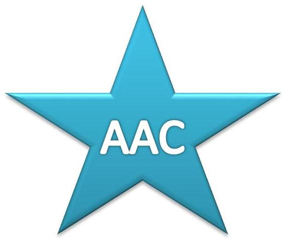

## Tools for Learning

## Ergonomics

## Home Mods &amp; ECU

ABILITY®
www.abilitykc.org
Partners &amp; Accreditations
C
nacy
e
^{}[]itas
United Way
#

# WHAT IS AAC?

Augmentative and Alternative Communication

## Meriam-Webster Definition of Augment

1 : to make greater, more numerous, larger, or more intense The impact of the report was augmented by its timing.
2 : supplement

ABILITYKc
www.abilitykc.org
Partners &amp; Accreditations
CART
naejc eitas
United Way

# WHO WAS THE LAST PERSON TO SEND YOU A TEXT?

A) Family member
B) Colleague
C) Appointment reminder
D) Friend
E) School or daycare

ABILITY®
www.abilitykc.org
Partners &amp; Accreditations
carf
nacyc eitas
United Way

# HOW DID YOU RESPOND?

A) Send the response back with text

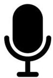

B) Dictate a response

C) Emoji or photo

D) Call the person back when you had time

E) Reply STOP to opt out of these reminders or YES to confirm your appointment

ABILITY®

www.abilitykc.org

Partners &amp; Accreditations

carf

nacyc 2itas

United Way

#

# HIGH TECH

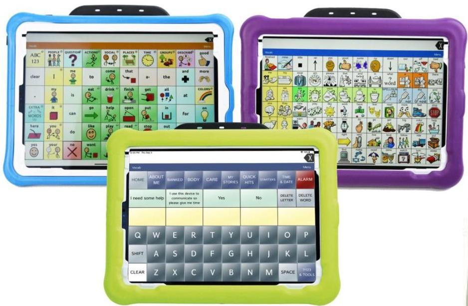

Talk to Me Technologies
Forbes AAC
TobiiDynavox
PRC-Saltillo
Lingraphica

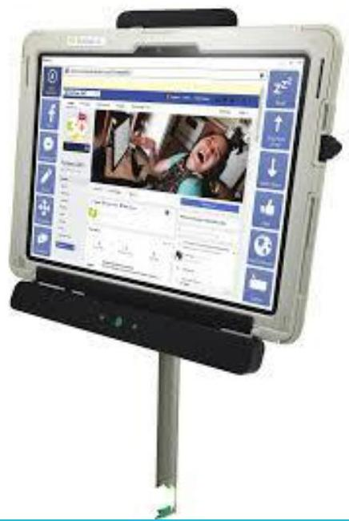

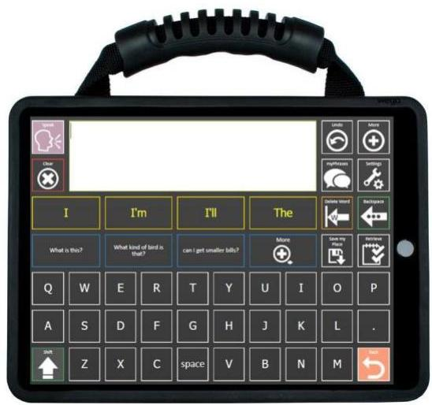

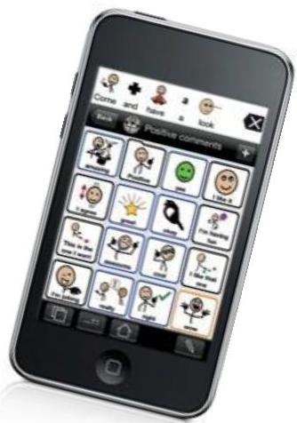

ABILITY®
www.abilitykc.org
Partners &amp; Accreditations
carf
nagic eitas
United Way

# LOW TECH

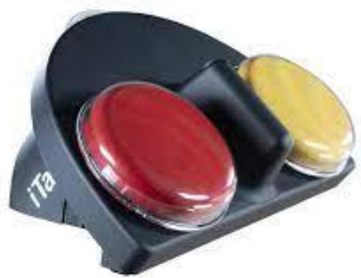

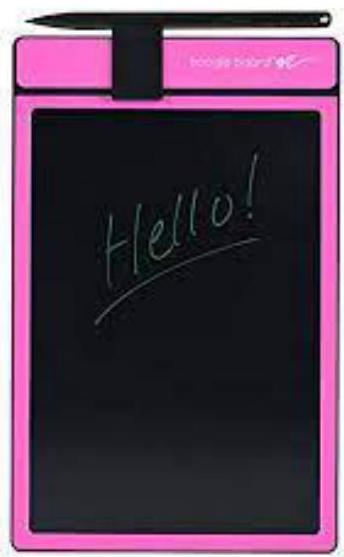

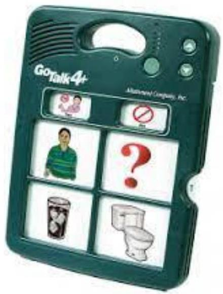

ABILITY®

www.abilitykc.org

Partners &amp; Accreditations

c

naejc

eitas

United Way

#

# NO TECH

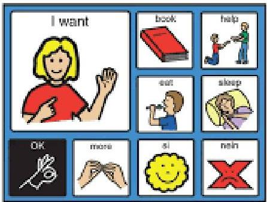

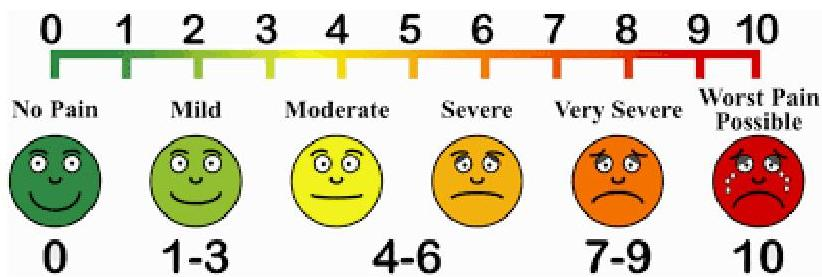

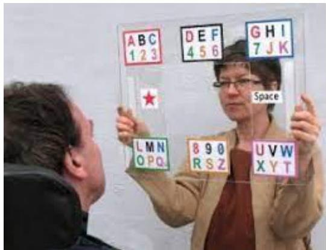

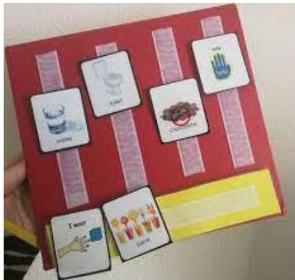

ABILITY®

www.abilitykc.org

Partners &amp; Accreditations

carf

nacy

eitas

United Way

#

# Speak MY Language

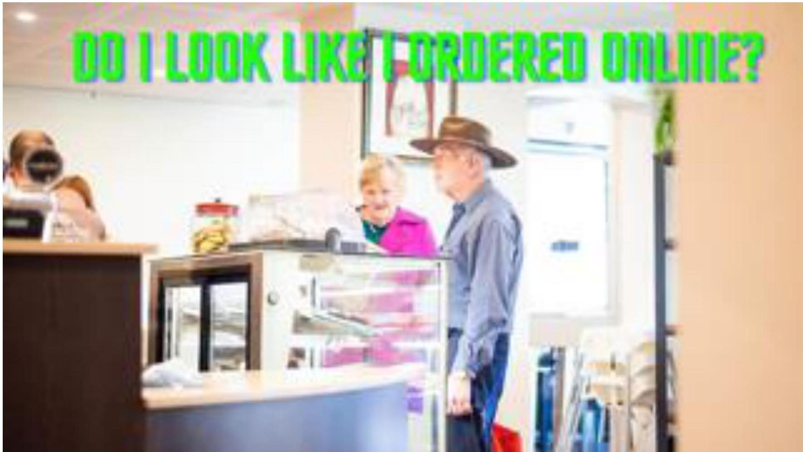

ABILITY®
www.abilitykc.org
Partners &amp; Accreditations
carf
nacic eitas
United Way

# Language

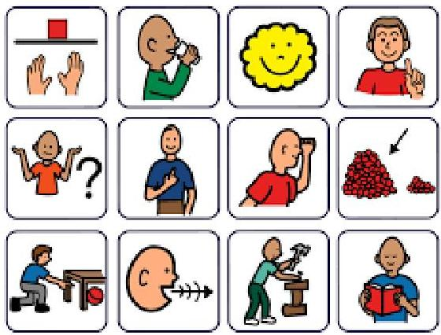

|  SUCTION | VENTILATOR | ANXIOUS/ SCARED | NURSE | DOCTOR | CALL MY FAMILY  |
| --- | --- | --- | --- | --- | --- |
|  PAIN | BREATHING TUBE | HOT COLD | REPOSITION | PROTECTIVE EQUIPMENT | WHAT'S MY STATUS?  |
|  MEDICINE | TROUBLE BREATHING | THIRSTY | LIGHTS ON / OFF | CHAIR | NO VISITORS  |
|  MOUTH CARE | BATHROOM | TIME / DAY ? | TV ON / OFF | BED | LETTER BOARD  |
|  MAYBE |   | DON'T KNOW |   | LATER  |   |

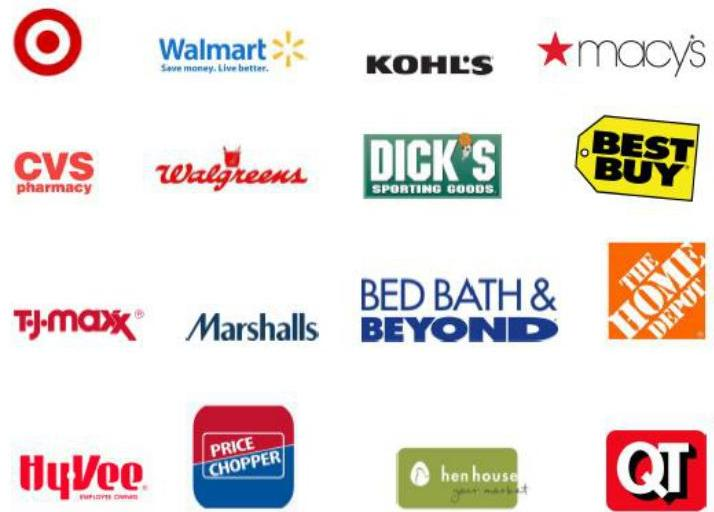

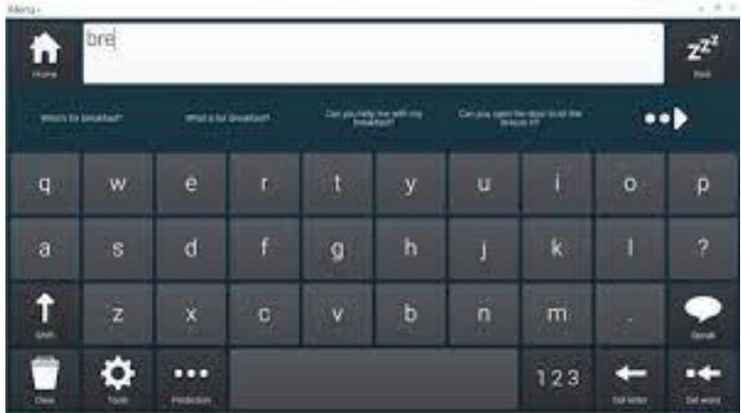

ABILITY®

www.abilitykc.org

Partners &amp; Accreditations

carfi

naejc

iitas

United Way

#

# Access

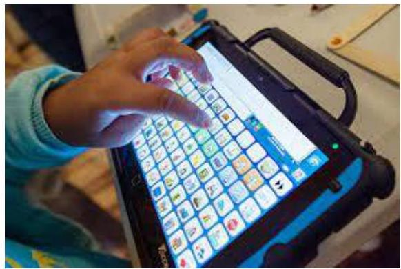

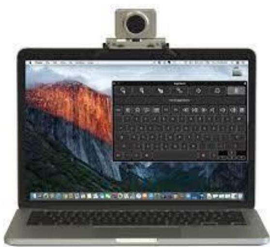

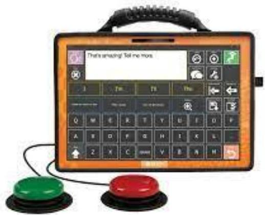

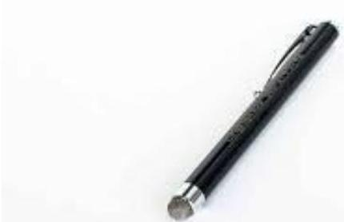

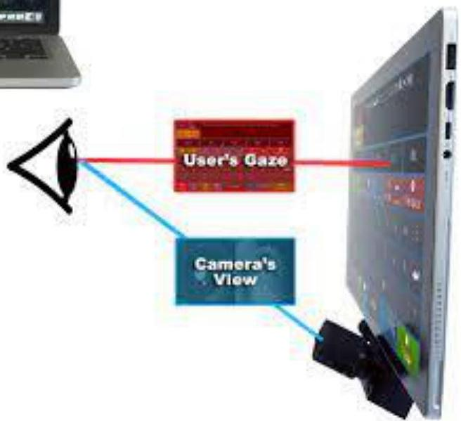

ABILITY®

www.abilitykc.org

Partners &amp; Accreditations

care

nacyc 2

United Way

#

# Positioning

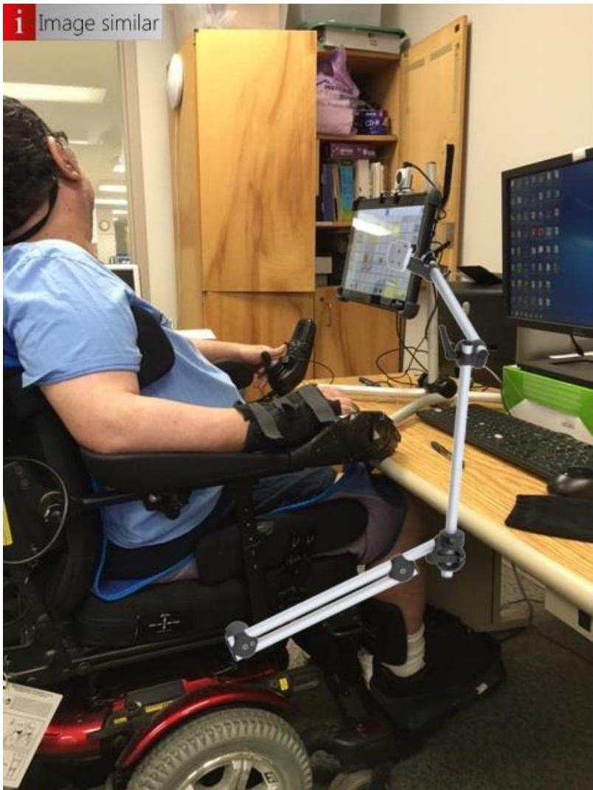

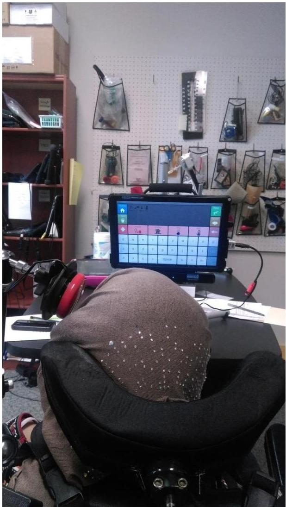

ABILITYKc
www.abilitykc.org
Partners &amp; Accreditations
carf
nacyc eitas
United Way
#

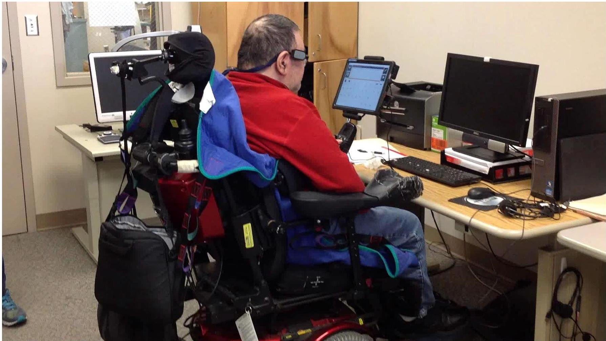

ABILITY®

www.abilitykc.org

Partners &amp; Accreditations

c

naejc

eitas

United Way

#

# What do your patients WANT to talk about?

- Social
- Direct their care
- Make independent choices
- Share memories
- Refuse

ABILITYK.C.™
www.abilitykc.org
Partners &amp; Accreditations
carf
nacyc eitas
United Way

# Implementation

## WAIT... WHAT AM I SUFFUSE

ABILITY®
www.abilitykc.org
Partners &amp; Accreditations
carf
nacyc eitas
United Way
#

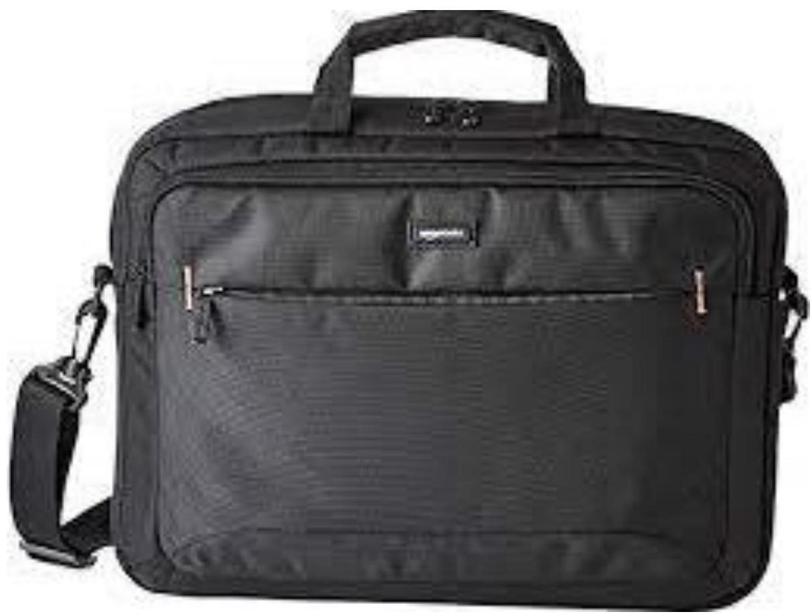

# Step 1: Take it out of the bag!

ABILITY®
www.abilitykc.org
Partners &amp; Accreditations
carf
nacyc eitas
United Way

# Let Conversation Happen

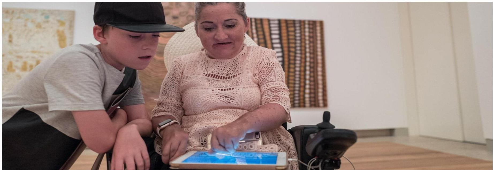

ABILITYKc®

www.abilitykc.org

Partners &amp; Accreditations

carf

nacyc eitas

United Way

#

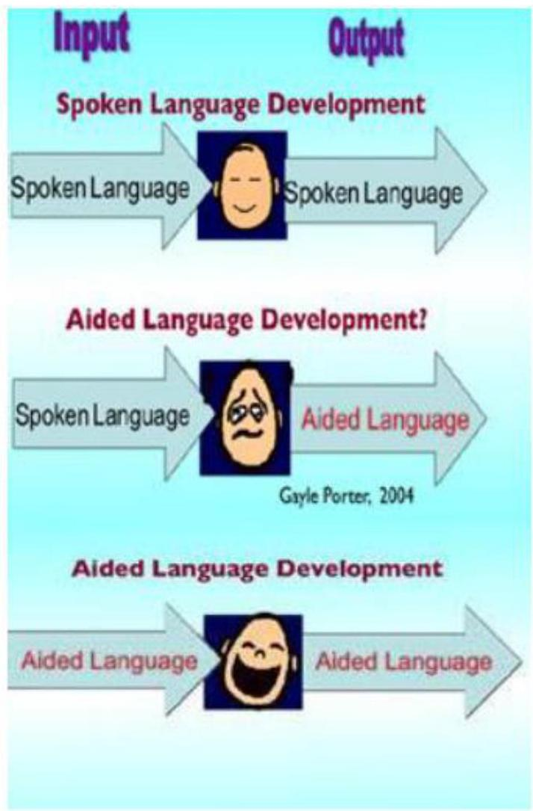

Image taken from Gayle Porter, 2004

ABILITYK.C.
www.abilitykc.org
Partners &amp; Accreditations
carf
naejc eitas
United Way

# Core VS Fringe

|  friend | boy | girl | mother | father | brother | sister | head | hand | foot | feet  |
| --- | --- | --- | --- | --- | --- | --- | --- | --- | --- | --- |
|  I | me | what | where | now | later | today | same | diff'rnt | big | little  |
|  my/mine | is / am are | to | first | next | last | all gone | ready | busy | happy | sad  |
|  it | can | have | come | feel | know | give | angry-mad | messy | good | bad  |
|  you | do | eat | drink | finish | get | sing | that | a the | and | more  |
|  your | don't-not | go → | help | open | put | see | again | in | away | on  |
|  here | there | like | play | read | stop | walk | show | out | up | off  |
|  yes | no | want | take | tell | turn | watch | write | front | down | with  |

ABILITYKc®

www.abilitykc.org

Partners &amp; Accreditations

carf

naejc

eitas

United Way

# APHASIA-SPECIFIC CONSIDERATIONS

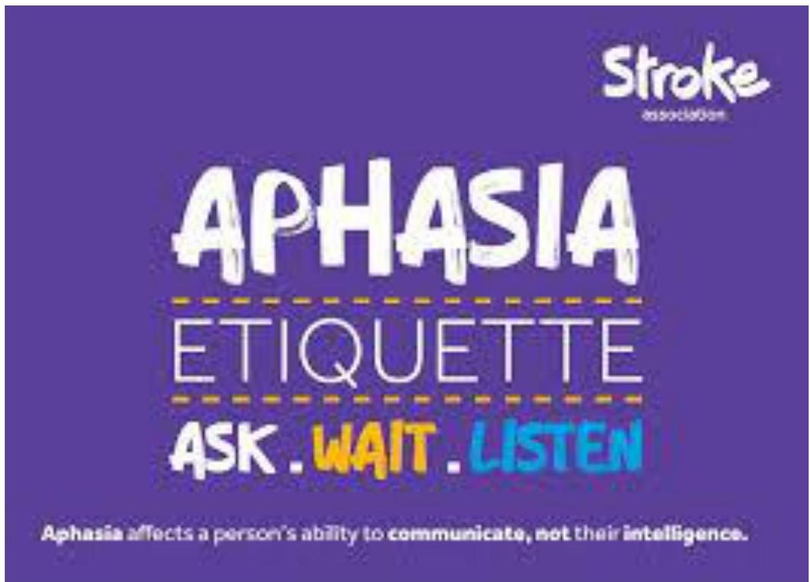

ABILITY®
www.abilitykc.org
Partners &amp; Accreditations
CAMP
nacyc eitas
United Way
#

# PATIENCE

# GRASSHOPPER

memegenerator.net

ABILITY®

www.abilitykc.org

Partners &amp; Accreditations

c

naejc

eitas

United Way

#

# Use As a Functional Distraction

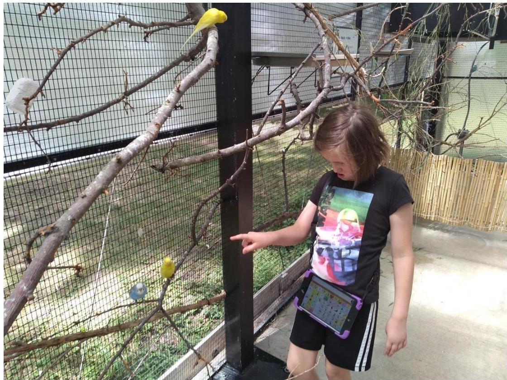

ABILITYKc
www.abilitykc.org
Partners &amp; Accreditations
carf
nacyc eitas
United Way
#

# References

Porter, G. (2004) Young children developing language using AAC, AGOSCI National Tour, Australia

# Resources

- Praacticalaac.com
- PRC-Saltillo.com
- Talktometechnologies.com
- do2learn.com/adult/index.htm
- Eatspeakthink.com/free-low-tech-aac-for-adults
- Ability KC ACCT Program

ABILITYKC www.abilitykc.org

Partners &amp; Accreditations

carf

naejc eitas

United Way

# CONTACT INFORMATION

Amy Medina, MS, CCC-SLP
ACCT Program, Ability KC
(816)751-7709
amy.medina@abilitykc.org

ACCT Referrals
(816) 751-7748

ABILITYKC®
www.abilitykc.org
Partners &amp; Accreditations
acct
nacyc eitas
United Way
#