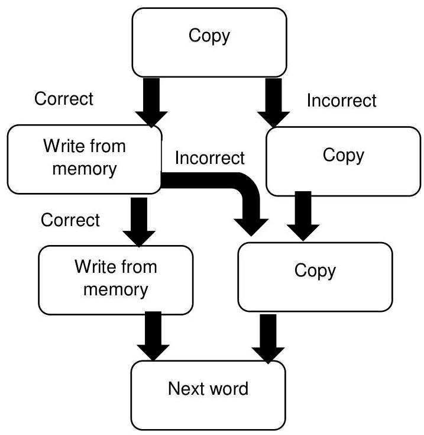
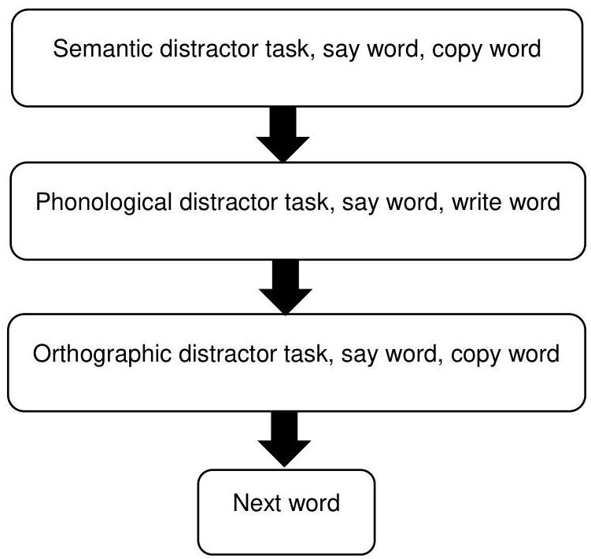
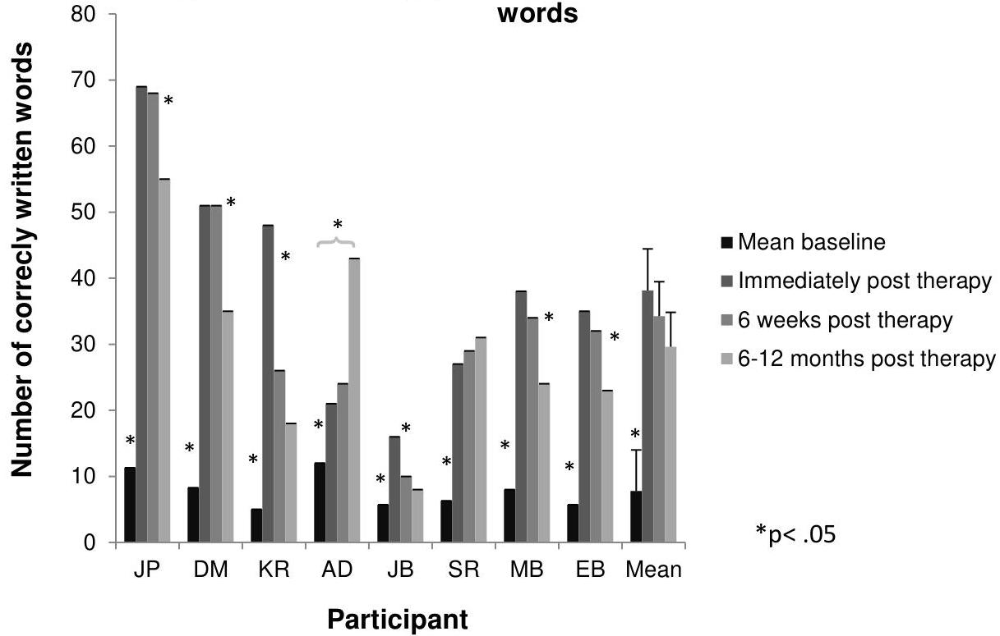
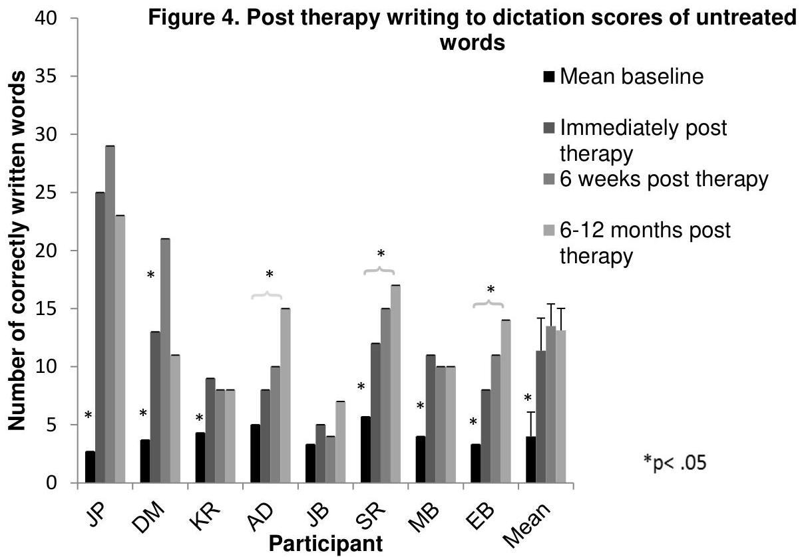
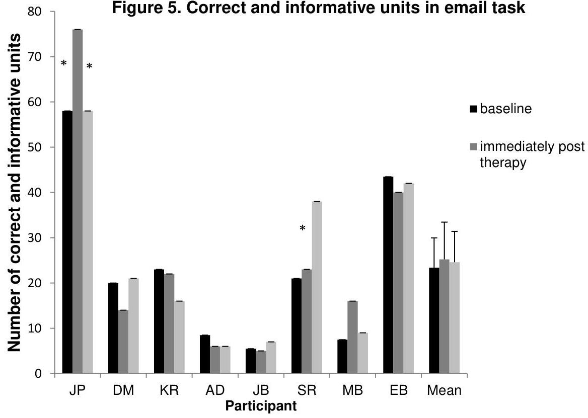
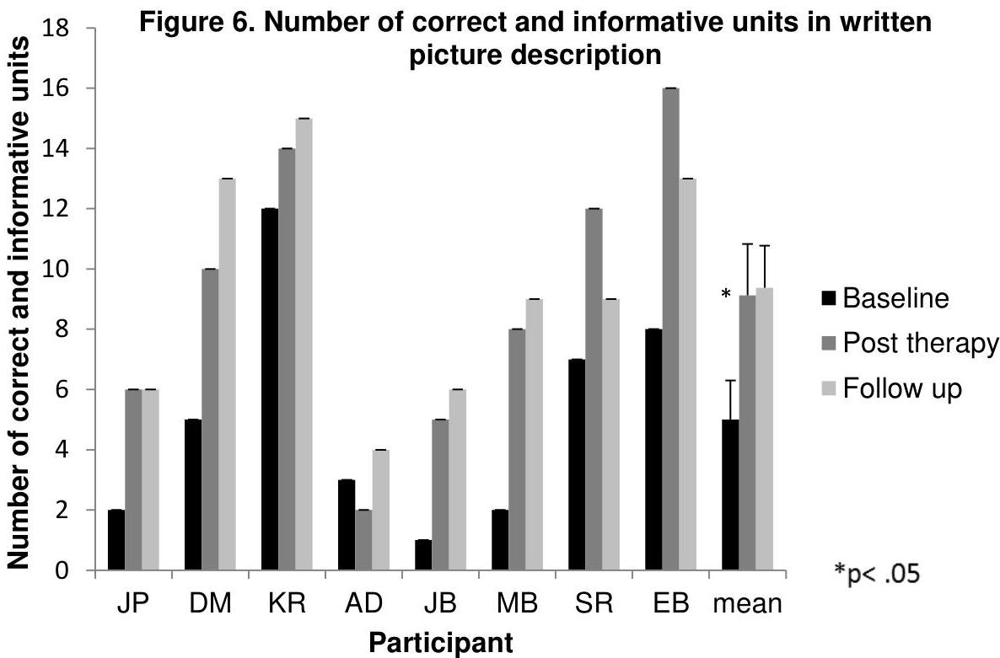
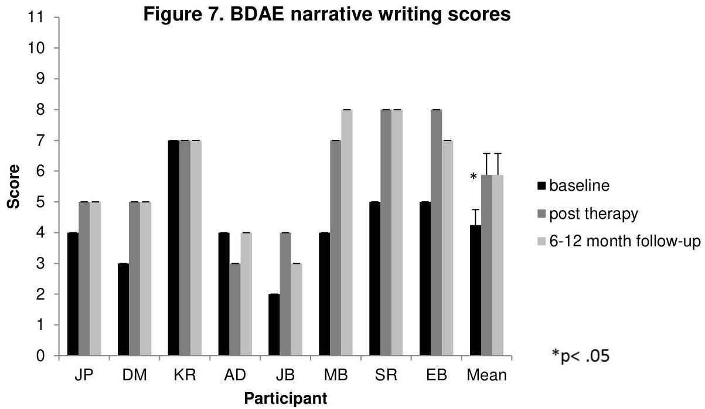
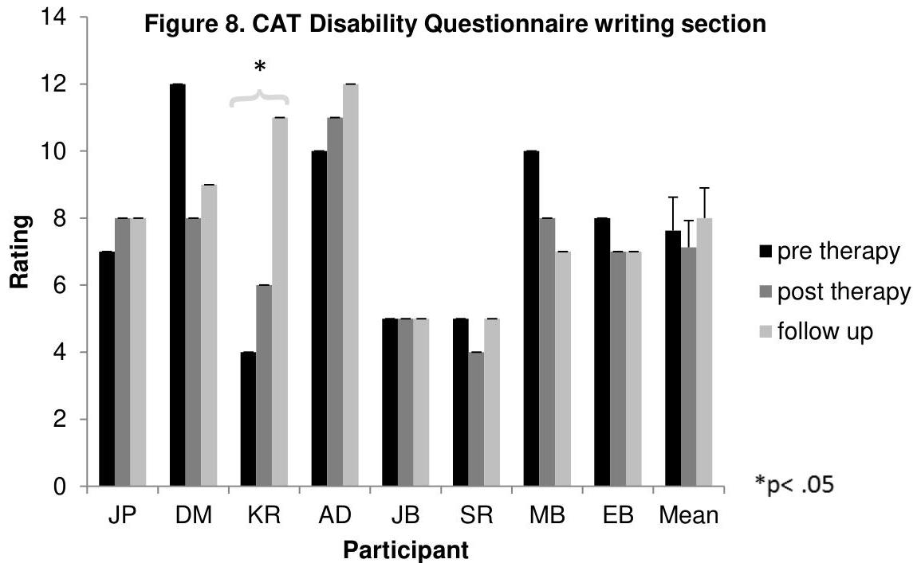
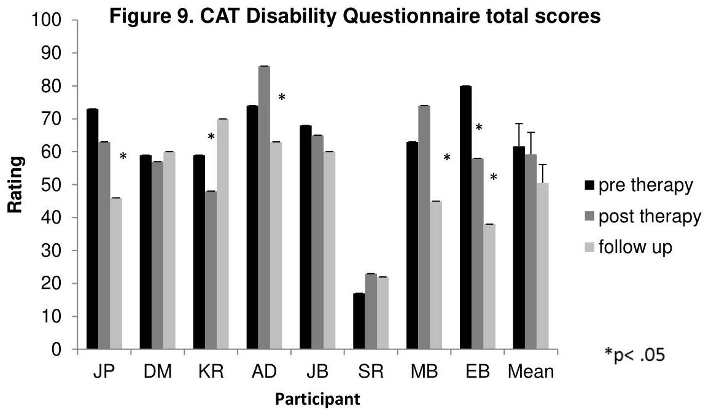

<!-- Source PDF: thiel-2016-functional-writing.pdf -->

LBU

LEEDS BECKETT UNIVERSITY

Citation:
Thiel, L and Sage, K and Conroy, P (2016) The role of learning in improving functional writing in stroke aphasia. Disability and rehabilitation. 1 - 13. ISSN 0963-8288 DOI: https://doi.org/10.3109/09638288.2015.1114038

Link to Leeds Beckett Repository record: https://eprints.leedsbeckett.ac.uk/id/eprint/2464/

Document Version:
Article (Accepted Version)

The aim of the Leeds Beckett Repository is to provide open access to our research, as required by funder policies and permitted by publishers and copyright law.

The Leeds Beckett repository holds a wide range of publications, each of which has been checked for copyright and the relevant embargo period has been applied by the Research Services team.

We operate on a standard take-down policy. If you are the author or publisher of an output and you would like it removed from the repository, please contact us and we will investigate on a case-by-case basis.

Each thesis in the repository has been cleared where necessary by the author for third party copyright. If you would like a thesis to be removed from the repository or believe there is an issue with copyright, please contact us on openaccess@leedsbeckett.ac.uk and we will investigate on a case-by-case basis.

# ABSTRACT

Purpose: Improving writing in people with aphasia could improve ability to communicate, reduce isolation and increase access to information. One area that has not been sufficiently explored is the effect of impairment based spelling therapies on functional writing. A multiple case study was conducted with eight participants with aphasia subsequent to stroke. This aimed to measure the effects of spelling therapy on functional writing and perception of disability.

Method: Participants engaged in ten sessions of copy and recall spelling therapy. Outcome measures included spelling to dictation of trained and untrained words, written picture description, spelling accuracy within emails, a disability questionnaire and a writing frequency diary.

Results: All participants made significant gains on treated words and six demonstrated improvements to untreated words. Group analyses showed significant improvements to written picture description, but not email writing, writing frequency or perceptions of disability.

Conclusions: These results show that small doses of writing therapy can lead to large gains in specific types of writing. These gains did not extend to improvements in frequency of writing in daily living, nor ecological measures of email writing. There is a need to develop bridging interventions between experimental tasks towards more multi-faceted and ecological everyday writing tasks.

# Introduction

In recent years, written communication via the internet and mobile phones has become an increasingly important part of everyday life in social, educational and professional spheres [1, 2]. Among the multiple disabilities that can result from brain injury, one that could significantly impede access to the internet is dysgraphia, an acquired disorder of writing [3]. Dysgraphia frequently occurs as one symptom of aphasia [4], an acquired multi-modal language disorder caused by traumatic brain injury, brain tumour, surgery, infection, or most commonly, stroke [5]. A recent survey study conducted by Menger, Morris &amp; Salis [6] found that people with aphasia use the internet less than people with stroke and no aphasia. Moreover, people with aphasia reported that their aphasia was the main barrier to using the internet.

The writing rehabilitation literature is dominated by single case studies evaluating model-driven impairment-based therapies, such as copy and recall therapy [7] and strategies such as visual-imagery [8] or phoneme to grapheme conversion (i.e., sounds to letters) [9]. The aim of many of these therapies has been to improve single word writing, and the effects on functional, everyday writing activities (e.g. letters, emails, text messages, shopping lists) have not usually been measured. However, there have been some exceptions. Several studies have encouraged participants to generalise gains of impairment-based spelling therapies to more natural writing contexts such as letters, emails and essays [8, 10, 11, 12, 13]. For example, Mortley, Enderby and Petheram [13] conducted a single case study with a participant with severe writing difficulties and residual oral spelling skills. The therapy programme consisted of spelling to dictation and oral spelling practice, the development of a

strategy of orally spelling words and then writing them letter-by-letter, and then practising this strategy on a computer which provided feedback and letter choices for errors. The participant learnt to use a dictionary and word prompt software to find words that he could not spell, to write these words in sentences and to use the strategies for real-life tasks such as diary and letter writing. Therapy resulted in improved single word spelling of treated and untreated items and significant improvements to all post-therapy writing tasks at immediate and follow-up assessment points. The participant was also able to write letters to his daughter, which he could not do before therapy.

One question that has not been addressed to a great extent is whether impairment-based therapies lead to improvements to functional writing tasks without a transfer phase, despite the fact that some initial findings have indicated that gains from lexical spelling therapies can generalise to untreated items [14, 15, 16] and spontaneous writing. Just four studies have measured the effects of impairment-based spelling therapies on spontaneous writing or written picture description [16, 17, 18, 19]. Carlomagno &amp; Parlato [17] found significant improvements to spelling in spontaneous writing in a participant with severe dysgraphia following training in phoneme grapheme conversion and development of a lexical relay strategy, where key words (which the participant could already spell, e.g. Roma for ro) were used to cue a particular syllable. Similarly, Hillis &amp; Caramazza [18] also trained their participant to use her phonological spelling route and to use key words to cue a particular letter. She was able to use this approach to improve her spelling accuracy within narratives. Pound's participant learnt an oral spelling strategy, which led to gains in spontaneous writing a picture description [19]. Finally, Raymer, Cudworth and Haley [16] provided a copy and recall treatment with increasing cues to a participant with damage to the orthographic output

lexicon and graphemic buffer, which improved his spelling within written picture description.

Whether or not therapy does lead to improvements to functional writing, it would be useful to determine whether any changes in participants' daily lives occur, i.e. whether participants are writing more often than before and are feeling happier about their own writing skills. Although this has been another neglected area within the writing therapy literature, some studies have measured changes to the impact of the communication disability following writing therapies. For example, Estes &amp; Bloom [20] used the American Speech and Hearing Association's (ASHA) Quality of Communication Life Scale (QCL) [21] to assess the impact of the participant's aphasia on the her relationships, communication, interactions, participation in social, leisure, work and education activities, and overall quality of life. It was found that following therapy (training to use voice recognition software to treat dysgraphia) there was change to one item on the assessment: "I meet the communicative needs of my job [or school]" as the participant felt that she was more productive and useful at work. Similarly, Murray &amp; Karcher [22] asked their participant and his wife to complete the Communicative Effectiveness Index (CETI) [23] to investigate whether any changes in his daily communication had occurred following a treatment targeting written verb and sentence production. The average ratings of both the participant and his wife increased after therapy, including the item concerning daily writing tasks, suggesting that they both perceived his level of disability in daily communication and activities to have decreased. These issues will also be addressed in the current study.

The aim of this study was to answer the following questions:

1. Do impairment-based lexical spelling therapies result in any significant improvements in spelling accuracy of treated and untreated words?
2. Do impairment-based lexical spelling therapies result in any significant improvements to spelling accuracy in emails?
3. Do impairment-based lexical spelling therapies result in any significant improvements to written picture description?
4. Do impairment-based lexical spelling therapies result in a significant increase in frequency of writing?
5. Do impairment-based lexical spelling therapies result in any significant improvements to perception of disability?

## Method

### Recruitment

Eight participants were recruited to this study. To be included, participants had to have an acquired spelling impairment following a stroke. They had to be at the chronic stage of their brain injury (i.e., at least six months since the stroke occurred). They had to have sufficient visual acuity and motor ability for writing. Finally they needed to be monolingual speakers of English. Potential participants were excluded if they had a severe impairment in reading or auditory comprehension (i.e., in the lower 50% of the population with aphasia). These skills were assessed using subtests from the Comprehensive Aphasia Test [24].

Background Assessments

The participants completed a battery of linguistic and writing assessments. Tables 1, 2 and 3 display participants' demographic information, screen scores and assessment results on spelling and language assessments. They have been ordered according to total baseline spelling scores on the Psycholinguistic Assessments of Language Processing in Aphasia (PALPA) [25] word spelling subtests, with the most impaired to the left and the least impaired to the right. These tables are followed by a description of each participant's language and writing skills.

[Insert Tables 1, 2 and 3]

## Description of participants' linguistic and writing skills

JP presented with unimpaired spoken language within conversation, although her scores on the Boston Diagnostic Aphasia Examination: short version (BDAE) [26] revealed impairments across all language skills. She scored 36/52 on the Pyramids and Palm Trees Test [27], which indicated impaired semantics. When writing words to dictation, she converted sounds to letters aloud (a strategy she had learnt in previous therapy). She wrote 9/20 non-words to dictation and showed a significant length effect (PALPA 39: $X = 10.29$, $df = 1$, $p = .001$). When tested on baseline spelling lists she demonstrated a marked disparity in her ability to write regular and irregular words. Furthermore, she often regularised irregular words, resulting in errors such as 'serkle' for circle, 'clok' for clock, 'speek' for speak, 'elefant' for elephant, and 'lern' for learn. Her difficulty with irregular words, her tendency to rely on phoneme to grapheme

conversion rules as opposed to stored representations and her regularisation errors suggested that she had surface dysgraphia, a term that describes individuals who present with more reliable regular word and non-word spelling relative to impaired spelling of irregular words, regularisation errors (e.g. 'yot' for yacht) [28] and frequency effects [29]. JP used the internet to communicate, to book restaurants and holidays and to do shopping, but wanted to improve her writing so that she could do these things more easily and more independently.

DM had non-fluent aphasia. He communicated effectively with spoken language, however, predominantly with nouns due to his agrammatism. With regards to writing, he was unable to write any non-words to dictation. He made occasional semantic errors, for example, 'dish' for spoon and 'post' for letter. However, the majority of his errors were graphemic buffer-type, i.e. additions, omissions, substitutions and movement errors, for example 'stemp' for stamp and 'dace' for dance. Some of his responses were unrelated to the target with less than 50% letters correct, e.g. 'rillir' for rabbit and 'hidder' for think. He had more difficulty writing verbs than nouns, and in many cases could not retrieve any of the word. His writing impairment could best be described as deep dysgraphia due to his inability to write non-words, his semantic errors and his difficulty in writing verbs, which are low imageability compared to nouns. Individuals with deep dysgraphia produce semantic errors (e.g. 'lion' for tiger), have impaired non-word spelling and imageability effects, where low imageability words are more difficult to write than high imageability words [30]. DM's errors were also an indication of a graphemic buffer disorder [31-33], a peripheral spelling impairment caused by damage to the short-term holding mechanism for the orthographic representations of words while writing is planned and executed. Symptoms include

inconsistency, length effects (where more errors occur in longer words) and letter addition, substitution, omission and transposition errors [29]. DM was motivated to improve his writing for supporting spoken conversations and writing emails.

KR presented with severe non-fluent aphasia. She communicated by producing a few single spoken words, writing single words and short sentences, and drawing. On the PALPA 40 (Imageability and Frequency Spelling) she scored significantly lower on low imageability words than high imageability words ( $X_{p} = 10.40$ ,  $df = 1$ ,  $p &lt; .01$ ). KR's errors on these assessments included semantic errors (e.g. 'hand' for glove), phonological errors (e.g. 'knot' for knock) and peripheral (graphemic buffer type) errors (e.g. 'yachet' for yacht), with the latter being the most common error type. She did not write any non-words correctly on the PALPA 45. Based on her difficulty in spelling non-words, her imageability effects and her semantic and graphemic buffer type errors, KR's spelling impairment could be described as deep dysgraphia with accompanying symptoms of graphemic buffer disorder. KR's dominant modality for communication was writing; therefore she wanted to improve her spelling to aid face to face conversations.

AD had severely impaired expressive language due to aphasia and apraxia of speech. Her speech was fluent but with frequent phonological errors. Her writing errors were predominantly additions (e.g. 'ghosts' for ghost), omissions (e.g. 'ream' for realm) and substitutions (e.g. 'rorrin' for robin). She correctly spelled 10 non-words to dictation, indicating that she had some ability to convert phonemes to graphemes. Her errors suggest that she had a graphemic buffer disorder. Before the start of the study, AD enjoyed searching the internet and sending emails but needed full support with these tasks. Her goal was to become more independent at communicating via the internet.

JB presented with aphasia, but also severe dysarthria and apraxia of speech. Her writing, which she had learnt to do with her non-dominant left hand, was very slow and effortful. She did not demonstrate a length effect on the PALPA 39; however, on the baseline spelling assessment, she had much more difficulty with longer words. Her incorrect responses were either no responses, included less than 50% of the letters in the target word (e.g.'s' for strength; 'ustable' for choose), or were graphemic buffer-type errors (e.g. 'texet' for text; 'staberty' for strawberry). Her impaired non-word writing and her unrelated responses are characteristic of phonological dysgraphia, a term that has been used to describe people with impaired non-word spelling, lexicality effects (where a non-word such as peb is spelt as a phonologically similar stored word such as 'pub') [34], imageability effects [30], and word class effects (where content words such as 'inn' are more likely to be spelt correctly than grammatical function words like 'in') [35]. Based on her more marked difficulty with longer words and these error types, her spelling also seems to be characterised by a graphemic buffer disorder. JB wanted to improve her writing so that she could write greetings cards and letters to friends.

SR's language skills appeared to be intact within conversations; however background language assessments revealed impaired naming, auditory comprehension and semantic access. He also had residual writing difficulties. He had more difficulty with spelling irregular (exception) words than regular words on the PALPA 44 (X = 10.40, df = 1, p = .001). Furthermore, he was able to spell 19/24 non-words correctly. The majority of his errors were regularisations of exception words (generally the low frequency ones). For example, he wrote 'sigaret' for cigarette, 'nefew' for nephew, 'nolidge' for knowledge and 'perswade' for persuade. Based on these assessment

results, SR's spelling impairment could be described as surface dysgraphia. He wanted to improve his writing so that he could write text messages to friends and family members.

MB had fluent aphasia with occasional word-finding difficulties. His errors on the spelling tests were a mixture of peripheral errors (e.g. 'churh' for church) and no responses. He did not spell any non-words to dictation correctly and on ten occasions showed lexicality effects, i.e. responded to non-words with words (e.g. 'hug' for cug, 'fog' for fon). These assessments suggested that his predominant difficulty was with converting phonemes to graphemes with the absence of a stored representation of the word. He therefore fitted the profile of phonological dysgraphia. However, his peripheral errors also indicated a graphemic buffer disorder. MB's writing goals were to be able to complete everyday writing tasks such as writing shopping lists and text messages more easily and to start using the internet.

EB had fluent speech with occasional phonological errors and word finding difficulties. She wrote four non-words correctly to dictation, indicating some ability in converting phonemes to graphemes. Her responses often consisted of correct initial and final spellings with the middle of the word being incorrect. This was especially true for longer words that could be segmented into morphemes. For example, she spelt impairment as 'impartment', television as 'television' connection as 'conation' and accommodation as 'accommodation.' Most of her incorrect responses were letter omission errors (e.g. 'gradfather' for grandfather and 'language' for language). However, she also frequently added grammatical morphemes onto dictated words (e.g. 'enjoyed' for enjoy and 'strawberry's' for strawberry). These results suggest that EB's spelling was predominantly characterised by a graphemic buffer disorder. EB already used the internet (Facebook and email) to keep in touch with friends and family members, but

wanted to improve her spelling so that she could write longer and more elaborate messages.

## Therapy

Each participant completed two lexical spelling therapies: a multi-modal therapy and a uni-modal therapy (see Figures 1 and 2 for schematic representations). In order to control for order of therapy effects, these therapies were provided within a cross-over design. Half of the eight study participants (JP, KR, AD and MB) had uni-modal therapy and then multi-modal therapy, and the remaining participants (DM, JB, SR and EB) had the therapies in reverse order. They received 5 hourly sessions of each therapy (ten hours in total) which took place over three weeks with a two week break between the two therapies. More detailed descriptions of the therapies and the results of this comparison study are reported elsewhere [36]. In the present study, we were interested in the functional consequences of the therapies; therefore, only the combined results following both therapies have been reported.

# Target words

With the assistance of the therapist or family members, participants generated a list of functionally useful words they felt they would like to target in therapy. Additionally, the researcher generated three word lists of 100 words each with either easy, medium or difficult words. 70 of these were nouns, 20 were verbs and 10 were adjectives. Based on the severity of their dysgraphia (gauged by results of the screen) participants were asked to spell to dictation (in writing) one or two of these word lists and the self-chosen items on three occasions. A 20 second cut-off was given for participants to respond to each word. 120 words that were spelt incorrectly on two or three occasions were selected for three word lists which were divided in the following way: two lists were used for the two therapy manipulations (40 words in each) and one list was not treated at all (40 words). These sets were matched for word length (phonemes and letters), word frequency, imageability, regularity and word class (i.e. number of nouns, verbs and adjectives).

# Uni-Modal Therapy

The participant was asked to copy the written target word from a card. If the response was incorrect, they had to copy the word two more times. If the initial response was correct, the card was covered and the participant attempted writing the word from memory. If this response was correct, they wrote from memory a second time; otherwise they copied the word again. The therapist provided feedback on accuracy after the first two attempts. After each attempt to write the word, the therapist produced the word verbally.

Figure 1. Uni-modal Therapy

# Multi-Modal Therapy

For each target word the following steps were completed before the participant progressed to the next word.

1. The participant was instructed to select the target word from written semantic distractors (e.g. tennis, football, rugby) in response to the spoken word, then to say and copy the correct word.
2. The participant listened to three words or non-words (e.g. chocolate, chocolate, chocolate). A piece of paper consisting of three drawn boxes was placed in front of the participant, each representing a word that the therapist was about to produce. The participant was instructed to point to the box of the word that was

different from the other two, i.e. the target word. The participant was then instructed to say the word and then to write it from memory.

3. The participant was instructed to select the target word from two written orthographic distractors (i.e. incorrectly spelt forms such as 'elephant' and 'ellephant' for elephant) in response to the spoken word, then to say and copy the correct word.

After the first two attempts at writing the word (in steps 1 and 2) feedback on accuracy was provided. On the third attempt (step 3), it was not.

Figure 2. Multi-modal Therapy

# Outcome Measures

## Single-word Spelling

Participants were tested on the 120 words (80 treated and 40 control) at baseline on three occasions, directly after their second therapy and at two follow-up assessment points: 6 weeks following therapy and then 6 or 12 months following therapy. The results for treated and untreated words will be reported separately below.

## Email writing

The participant was asked to write three emails in response to the following instructions, each within 3 minutes:

1. Write an email arranging to meet a friend at a certain time, place and date.
2. Write an email to a friend telling them about a recent holiday.
3. Write an email to your MP about an issue of concern to you at the present time.

Participants were asked to complete this task on four occasions: twice at baseline, directly following therapy and then at 6-12 month follow up. Counts were conducted of correct and informative units, i.e. all correctly spelt open class words (including personal and possessive pronouns) that were relevant and informative to the email. Words did not need to be used in a grammatically correct manner to be included.

Written picture description

The participants were asked to write a description of the Cookie theft picture [26], a subtest of the BDAE, within a time limit of three minutes, at three assessment points: baseline, immediately post therapy and 6-12 month follow-up. For each description, two methods of analysis were used. Firstly, the number of correct and informative units were counted (as above). Secondly, the scoring method used in the Boston Diagnostic Aphasia Examination narrative writing subtest was used. Each description was given a score for mechanics (0-2), written vocabulary access (0-3), syntax (0-3) and adequacy of content (0-3). The highest possible score was therefore 11.

## Frequency of Writing

Each participant was given a diary to record each time a writing activity was undertaken within a week at baseline, post therapy and 6-12 month assessment points. The diary consisted of a page for each day of the week. Each page had a list of writing activities, for example, email, shopping list and letter. The participant was required to tick next to the writing activity every time they completed one.

# Perceptions of Disability

Participants completed the Comprehensive Aphasia Test Disability Questionnaire [24] at three assessment points: baseline, post therapy and 6 or 12 month follow-up. Two scores were of interest in this study: The overall disability score and the score of the writing section.

# Results

1. Do impairment-based lexical spelling therapies result in any significant improvements in spelling accuracy of treated and untreated words?

Accuracy scores for treated words directly post therapy (after both therapies had been completed) for all participants are displayed in Figure 3. Uni-modal and multi-modal therapy sets have been collapsed for this analysis (for a comparison of the two therapy approaches see Thiel, Sage &amp; Conroy [36]). Each participant's mean score out of 80 from the three baseline assessments was compared to post therapy assessment points. On a group level, there was a significant improvement directly following therapy (Wilcoxon matched pairs test 1 tailed 0.0, $p = .007$), which was maintained at six week and 6-12 month follow-up. On an individual level there were significant improvements to treated words for all participants (McNemar1-tailed, $p &lt; .01$ for all). For six participants these were maintained at 6 week follow-up (JP, DM, AD, SR, MB &amp; EB); however for JB and KR they were not (JB: McNemar1-tailed, $p = .02$; KR: McNemar1-tailed, $p &lt; .01$). One participant's improvements were maintained at 6-12 month follow-up (SR), and one participant's score increased significantly at 6-12 month follow-up (AD: McNemar1-tailed, $p &lt; .01$), which may reflect the fact that she had reported continuing to practise her therapy items after therapy had finished.

Figure 3. Post therapy writing to dictation scores of treated words

Figure 4 shows the scores on untreated items at the end of therapy (when both therapies had been completed). A whole group analysis showed significant improvements to untreated items (Wilcoxon matched pairs test 1 tailed 36.0,  $p = .007$ ), which were maintained at six week and 6-12 month follow-up. Individual analyses showed there were significant improvements to untreated words for JP, DM, KR, SR, MB and EB (McNemar 1-tailed,  $p &lt; .05$ ); however not for AD or JB. For all participants who made significant gains, improvements were maintained at 6 week follow-up. DM's control score increased significantly to 21/40 from 13/40 (McNemar 1-tailed,  $p = .01$ ) at 6 week follow-up. At 6-12 month follow-up most participants' improvements to control items were maintained (compared to immediately post therapy). However, three participants had significantly higher scores that at the immediate assessment

point (AD: McNemar 1-tailed,  $p = .01$ ; EB: McNemar 1-tailed,  $p = .02$ ; SR: McNemar 1-tailed,  $p = .03$ ).

2. Do impairment-based spelling therapies result in any significant improvements in spelling accuracy in emails?

The total counts across the three email tasks are presented in Figure 5. These counts were compared across the time points: baseline (mean), immediately post therapy and 6-12 months following therapy. The mean number of correct and informative units from the control group (122.40) was used as the cut off for individual Chi Square analyses. The mean number of correct and informative units did not increase significantly for the group and the mean follow up score did not differ significantly to baseline or the immediately post therapy assessment. On an individual level, only JP improved

significantly directly after therapy ( $X^2 = 4.75$ , 1-tailed,  $df = 1$ ,  $p = .03$ ) although this was not maintained. SR's follow up score was significantly higher than his immediately post therapy score ( $X^2 = 4.26$ , 1-tailed,  $df = 1$ ,  $p = .04$ ) and his baseline score ( $X^2 = 5.69$ , 1-tailed,  $df = 1$ ,  $p = .02$ ).

Figure 5. Correct and informative units in email task

3. Do impairment-based spelling therapies result in any significant improvements to written picture description?

Correct and informative units at baseline, post therapy and follow up assessment points are displayed in Figure 6. There was a significant increase in the number of correct and informative content words (Wilcoxon matched pairs test 1 tailed 1.0,  $p = .01$ ), which was maintained at follow-up. All participants except AD showed increased numbers of correct and informative content units following therapy.

Each participant's score (out of a possible 11) on the BDAE narrating writing subtest is displayed in Figure 7. The mean post therapy score was significantly higher than the mean pre therapy score (Wilcoxon matched pairs test 1 tailed 1.5,  $p = .02$ ) and this was maintained at follow-up. When individual scores were compared across time using the chi square test and a cut off of 11, there were no significant improvements for any of the participants despite a positive trend for six participants (JP, DM, JB, MB, SR and EB).

4. Do impairment-based spelling therapies result in a significant increase in frequency of writing?

A group analysis comparing pre and post writing frequency showed no significant difference between the two time points (Wilcoxon matched pairs test 1 tailed 29.5,  $p = .06$ ).

5. Do impairment-based spelling therapies result in any significant improvements to perception of disability?

Participants' ratings on the writing section of the CAT Disability Questionnaire [24] are presented in Figure 8. Lower scores represent more positive ratings. On a group level, no significant differences were found between pre and post therapy scores (Wilcoxon matched pairs test 1 tailed 17.5,  $p = .30$ ) or between pre therapy and follow up scores

(Wilcoxon matched pairs test 1 tailed 10.5,  $p = .46$ ). On an individual level no participants had significantly more positive ratings on this subtest following therapy. However, KR's rating was significantly more negative when comparing baseline to 6-12 month follow-up scores ( $X^2 = 4.38$ ,  $df = 1$ ,  $p = .04$ ).

Figure 8. CAT Disability Questionnaire writing section
Figure 9 shows the total scores on the CAT Disability Questionnaire. No significant differences were found between the group pre therapy and post therapy scores (Wilcoxon matched pairs test 1 tailed 20.5,  $p = .39$ ) or between pre therapy and follow up scores (Wilcoxon matched pairs test 1 tailed 28.5,  $p = .08$ ). However, on an individual level, some participants' ratings did change significantly. One participant, EB, had lower (more positive) scores immediately post therapy compared to baseline ( $X^2 = 7.18$ ,  $df = 1$ ,  $p = .001$ ). This decreased further at follow up ( $X^2 = 6.11$ ,  $df = 1$ ,  $p = .01$ ). Some participants did not have more positive ratings immediately after therapy, but did at follow-up, either when compared to baseline (JP:  $X^2 = 10.88$ ,  $df = 1$ ,  $p = .001$ ; MB:  $X^2 = 4.72$ ,  $df = 1$ ,  $p = .03$ ) or to immediately post therapy (JP:  $X^2 = 4.17$ ,  $df = 1$ ,  $p =$

.04; AD:  $X^2 = 8.10$ ,  $df = 1$ ,  $p = .004$ ; MB:  $X^2 = 12.61$ ,  $df = 1$ ,  $p &lt; .001$ ). KR's score increased (became more negative) significantly between post therapy and follow-up assessment points ( $X^2 = 7.10$ ,  $df = 1$ ,  $p = .001$ ).

# Discussion

This study evaluated the effects of lexical writing therapies in terms of changes to spelling accuracy of treated and untreated words, written picture description and emails. Furthermore, it also measured the outcomes on writing frequency and perception of disability. The results showed that therapy led to significantly more accurate treated words for all participants. Furthermore, there was generalisation to untreated words for six participants and to accuracy within written picture description for the group. One participant (JP) also demonstrated significant improvements to accuracy within emails. There were no significant improvements to writing frequency or to disability questionnaire ratings for the group directly following therapy. However, one participant (EB) had a significantly more positive disability rating, which decreased (became significantly more positive) at follow-up.

The positive outcomes following these lexical therapies have mirrored results from previous studies [e.g. 7, 29, 37, 38, 39]. They provide evidence that a small amount of spelling practice can lead to relatively large gains. The participants who made the most substantial improvements were those with the lowest pre therapy spelling scores (JP, DM, KR). This could reflect the fact that there was more room for change in these participants. Furthermore, their therapy items were shorter, more imageable and more frequent (e.g. target words such as 'guitar', 'stroke', 'family', 'house') which may mean that they were easier to relearn than the therapy items that were selected for the higher level participants (e.g. politician, disagree, Wednesday, interesting) who could write these easier items at baseline.

The fact that six participants improved on untreated words is slightly more surprising. Although a number of other studies have demonstrated generalisation to matched

control words following lexical spelling therapies [14, 39, 40, 12, 13, 41, 19, 29, 15, 16, 42, 43, 44] this has either been attributed to the development and use of a strategy [40, 12, 13, 19] or a strengthened graphemic buffer in participants with graphemic buffer disorder [41, 19, 29, 15, 16, 32, 44]. The two therapies provided in this study did not explicitly train use of a strategy and the participants did not all have symptoms of graphemic buffer disorder.

One explanation could be that the underlying phonological, orthographic or semantic systems were strengthened as a result of therapy, particularly because the multimodal therapy had aimed to do this through combining phonological, semantic and orthographic tasks. This seems plausible considering the participants who showed generalisation were those who also performed better on treated items. In fact, DM attributed his increase in control scores at follow-up assessment to an improved ability to listen to and recognise the word in spelling to dictation. This mirrors findings in a study by Behrman [39] who hypothesised that her participant's improvements to untreated items following a homophone training programme were due to improved lexical and visual processing. Alternatively, participants' improved control scores could be attributed to general improvements to non-linguistic factors such as effort, attention, motivation or self-monitoring skills. It seems likely that as most participants had not engaged much in writing activities prior to the study that the increased effort in writing during the study (both in assessments and therapy) would have generalised effects to words not treated in therapy.

A second surprising positive result was the improvement to written picture description following therapy. This contributes more support to the limited existing evidence that impairment-based writing therapies can lead to generalisation to spontaneous writing [16-19]. Three of the existing studies had trained a strategy (either phoneme

grapheme conversion or oral spelling) that could be used on words not trained in therapy. In the case of this study and the study conducted by Raymer et al. [16] participants learnt words through repeated practise and it therefore might have been expected that gains would be item-specific. As discussed above, these improvements may be due to strengthened underlying linguistic or cognitive systems or to effort, attention, motivation or self-monitoring skills.

The fact that the majority of participants did not improve significantly on the email writing task reflects findings in the naming therapy literature where spoken picture naming therapy has led to more substantial improvements to spoken picture description tasks than to less supported tasks such as narrative or conversation [45]. Written and spoken picture description are relatively constrained tasks which are less demanding and more supportive at the message generation stage of writing or speaking than tasks such as narrative or conversation [46, 47], or in this case, email writing. Marshall &amp; Cairns [47] point out that pictures provide assistance in 'thinking for speaking' (or here writing) through providing the main concepts with which a grammatical sentence can be constructed, leaving out the details, and hence allowing more resources to be used for additional linguistic processing [46, 48].

A further difference between written picture description and email writing concerns the types of words that are used. Email writing usually requires the retrieval of low imageability words and a range of word classes, including both lexical and function words, compared to picture description in which many of the required items are concrete nouns. In this study, nouns, verbs and adjectives were trained. However, verbs have been shown to be more difficult to retrieve than nouns within spontaneous

speech due to factors such as the requirement to generate morphological verb inflections (in agrammatic speakers) [49], and higher cognitive demands of naming verbs than nouns [45, 50].

Finally, the email task required participants to use a keyboard rather than pen and paper. Although writing on a keyboard still requires the retrieval of an orthographic form from semantics (or letters converted from sounds), the peripheral level skills are different [51]. Handwriting requires knowledge of letter shapes and the grapho-motor skills to produce letters, whereas to select letters on a keyboard, spatio-motor skills are important [51]. This skill is likely to be less well established than those required for handwriting in some of the individuals in this study. In fact the participants varied in their prior use and competency in computer and keyboard use, with some having used a computer both before and since their stroke (JP, AD, DM, KR, EB) and others having little or no experience of computers (SR, JB, MB). Some participants had marked difficulties in using a keyboard due to their hemiplegia or apraxia (AD and JB), but were still able to type one handed, albeit slowly and with effort.

One participant, JP, made significant gains in email writing, in terms of both correct and correct and informative units. She was the highest scorer on treated and untreated words and also made substantial gains to spelling accuracy within picture description, a task that she found very difficult before therapy (only two correct and informative units at baseline). JP was the participant with the lowest spelling scores at baseline on words from PALPA subtests. In contrast, she scored highest on correct and informative units within email tasks of all of the participants. This indicates that despite difficulty with pen and paper writing that she was able to write to a much higher level

on a computer. JP reported before therapy that she wrote emails frequently to friends and family members and that she felt much happier with email writing than other writing tasks. Because she had a relatively more severe spelling deficit, her therapy sets consisted of more functional, high frequency words such as names of family members, which were likely to be useful in everyday writing activities. This could be one reason for changes to performance on functional tasks. Interestingly, she attributed her high scores within therapy and her generalisation to untreated words and spontaneous writing to strategies that she developed within therapy. Although the writing tasks focused on copying and recalling words, JP also segmented words. For example, when she saw and copied the word 'chicken', she deliberately segmented it into 'chic' and 'ken', and actively tried to store the words separately so that she could then retrieve these parts when the word 'chicken' was dictated or when she wrote the word from memory. As she had good phoneme-grapheme conversion skills she was able to do this successfully. This strategy use might explain her gains to email writing as well as to untreated items and picture description.

One limitation of this study has been that emails were only analysed by the first author, who was not blinded to the assessment point of the emails; therefore, inter-rater reliability was not established and observer bias could have been introduced [52]. Therefore any significant improvements (i.e. those of JP) have to be interpreted with caution.

There was no change to reported frequency of writing. Considering participants all showed improvements to control words and picture description it might have been expected that there would be some transfer of writing skills into everyday life. This may be because both of these tasks (writing to dictation and describing a picture) are more constrained and less cognitively demanding than real life tasks such as writing

shopping lists, note writing or diary entries. Secondly, perhaps perceptions of writing need to change as well as accuracy for writing to become more frequent. For example, some individuals may have handed over the job of organising a diary or writing the Christmas cards when they had their stroke. On a more positive note, JP, DM and KR (those with more severe dysgraphia and the largest improvements to treated items) all reported that they noticed improvements when trying to complete everyday writing tasks, such as emailing or writing shopping lists and that they had been writing more often since therapy started. The fact that this was not supported by the frequency of writing data suggests that this tool may not have been a reliable method of measuring writing frequency due to participants forgetting to record activities.

Perceptions of writing also did not change significantly, apart from for KR who's rating became significantly more negative at follow up. This may be because she became more aware of her spelling difficulties throughout therapy. KR's spelling score decreased significantly at 6 week follow up which she found very frustrating. Total ratings on the CAT Disability Questionnaire only improved significantly directly after therapy for one participant, EB. There were significant changes to other participants' ratings at follow up (in both directions); however, as there were six or twelve months between therapy and follow-up, these changes to perceptions of disability could be due to other events in the participants' lives.

In conclusion, this study has shown that a small amount of spelling practice can result in significant gains to spelling accuracy and that generalisation can occur to untreated words and to different linguistic contexts. However, it has highlighted the need for additional training in more specific skills needed for transfer to functional writing tasks such as email writing, and the need for further research investigating the range of skills

required to support the transfer of gains from impairment-focused therapies into functional writing.

## Declaration of Interest statement

The authors report no conflicts of interest.

This work is supported by an Economic and Social Research Council bursary to Lindsey Thiel [Award number ES/I020233/1].

## References

1. Steyaert, J. Inequality and the digital divide: Myths and realities. In S. Hick &amp; J. McNutt (Eds.), Advocacy, activism and the Internet (pp. 199–211). Chicago, IL: Lyceum Press; 2002.
2. van Deursen, AJAM &amp; van Dijk, JAGM. Measuring internet skills. International Journal of Human-Computer Interaction 2010; 26: 891-916.
3. Weekes, B.S. Acquired disorders of reading and writing: Cross-script comparisons. Behavioural Neurology 2005; 16: 51-57.
4. Damasio, A. Signs of Aphasia. In M. J. Sarno (Ed.) Acquired Aphasia (3rded.) (pp.25-42). San Diego: Academic Press; 1998.
5. Hallowell, B. &amp; Chapey, R. Introduction to Language Intervention Strategies in Adult Aphasia. In R. Chapey (Ed.) Language Intervention Strategies in Aphasia and Related Neurogenic Communication Disorders (5thed.) (pp. 3-19). Philadelphia: Lippincott Williams &amp; Wilkins; 2009.

6. Menger, F., Morris, J. &amp; Salis, C. From Facebook to finances: How do people with aphasia use the internet? proceedings of the 16th International Aphasia Rehabilitation Conference 2014, The Hague, The Netherlands; 2014.

7. Beeson, PM. Treating acquired writing impairment: strengthening graphemic representations. Aphasiology 1999; 13: 767-785.

8. de Partz, MP., Seron, X., &amp; Vanderlinden, M. Reeducation of a surface dysgraphia with a visual-imagery strategy. Cognitive Neuropsychology 1992; 9: 369-401.

9. Kiran, S. Training phoneme to grapheme conversion for patients with written and oral production deficits: A model-based approach. Aphasiology 2005; 19: 53-76.

10. Beeson, PM., Rewega, MA., Vail, S., &amp; Rapcsak, SZ. Problem-solving approach to agraphia treatment: Interactive use of lexical and sublexical spelling routes. Aphasiology 2000; 14: 551-565.

11. Greenwald, M. "Blocking" lexical competitors in severe global agraphia: A treatment of reading and spelling. Neurocase 2004; 10: 156-174.

12. Hillis, A., &amp; Caramazza, A. Model-driven remediation of dysgraphia. In R. H. Brookshire (Ed.), Clinical Aphasiology (pp. 84-105). Minneapolis, Minnesota: BRK Publishers; 1987.

13. Mortley, J., Enderby, P., &amp; Petheram, B. Using a computer to improve functional writing in a patient with severe dysgraphia. Aphasiology 2001; 15: 443-461.

14. Ball, A. L., de Riesthal, M., Breeding, V. E., &amp; Mendoza, D. E. Modified ACT and CART in severe aphasia. Aphasiology 2011; 25: 836-848.

15. Rapp, B., &amp; Kane, A. Remediation of deficits affecting different components of the spelling process. Aphasiology 2000; 16: 439-454.

16. Raymer, AM., Cudworth, C., &amp; Haley, MA. Spelling treatment for an individual with dysgraphia: Analysis of generalisation to untrained words. *Aphasiology* 2003; 17: 607-624.

17. Carlomagno, S., &amp; Parlato, V. Writing rehabilitation in brain damaged adult patients: A cognitive approach. In X. Seron &amp; S. Deloche (Eds.), *Cognitive Approaches in Neuropsychological Rehabilitation* (pp. 179-209). Hillsdale NJ: Lawrence Erlbaum; 1989.

18. Hillis, AE. &amp; Caramazza, A. Theories of lexical processing and rehabilitation of lexical deficits. In J. Riddoch &amp; G. Humphreys (Eds.), *Cognitive Neuropsychology and Cognitive Rehabilitation*. London, UK: Lawrence Erlbaum Associates; 1994.

19. Pound, C. Writing remediation using preserved oral spelling: A case for separate output buffers. *Aphasiology* 1996; 10: 283-296.

20. Estes, C., &amp; Bloom, RL. Using voice recognition software to treat dysgraphia in a patient with conduction aphasia. *Aphasiology* 2011; 25: 366-385.

21. Frattali, C., Thompson, CK., Holland, AL., Wohl, CB., &amp; Ferketic, MK. American Speech-Language-Hearing Association Functional Assessment of Communication Skills for Adults. Rockville, MD: American Speech-Language-Hearing Association; 1995.

22. Murray, LL., &amp; Karcher, L. A treatment for written verb retrieval and sentence construction skills. *Aphasiology* 2000; 14: 585-602.

23. Lomas, J., Pickard, L., Bester, S., Elbard, H., Finlayson, A., and Zoghaib, C. The Communicative Effectiveness Index: Development and psychometric evaluation of a functional communication measure for adult aphasia. *Journal of Speech and Hearing Disorders* 1989; 54: 113-124.

24. Swinburn, K., Porter, G. and Howard D. Comprehensive Aphasia Test. Psychology Press; 2004

25. Kay, J., Lesser, R., &amp; Coltheart, M. Psycholinguistic Assessments of Language Processing in Aphasia (PALPA). Hove, UK: Lawrence Erlbaum Associates Ltd; 1992.

26. Goodglass, H., Kaplan, E., &amp; Barresi, B. BDAE-3 The Boston Diagnostic Aphasia Examination (3rd Ed.). Philadelphia: Lippincott, Williams &amp; Wilkins; 2001.

27. Howard, D., &amp; Patterson, K. The Pyramids and Palm Trees Test. Bury St. Edmunds, Uk: Thames Valley Test Company; 1992.

28. Rapcsak, SZ., Henry, ML., Teague, SL., Carnahan, SD. &amp; Beeson, PM. Do dual-route models accurately predict reading and spelling performance in individuals with acquired alexia and agraphia? Neuropsychologia 2007; 45: 2519–2524.

29. Rapp, B. The relationship between treatment outcomes and the underlying cognitive deficit: Evidence from the remediation of acquired dysgraphia. Aphasiology 2005; 19: 994–1008.

30. Whitworth, A, Webster, J, &amp; Howard, D. A Cognitive Neuropsychological Approach to Assessment and Intervention in Aphasia: A Clinician's Guide. Hove: Psychology Press; 2005.

31. Miceli, G., Silveri, MC., &amp; Caramazza, A. Cognitive analysis of a case of pure agraphia. Brain and Language 1985; 25: 187–212.

32. Sage, K., &amp; Ellis, AW. Using orthographic neighbours to treat a case of graphemic buffer disorder. Aphasiology 2006; 20: 851–870.

33. Shallice, T. Phonological agraphia and the lexical route in writing. Brain 1981; 104: 413-429.

34. Rapcsak, SZ., Beeson, PM., Henry, ML., Leyden, A., Kim, E., Rising, K., Andersen, S. &amp; Cho, H. Phonological dyslexia and dysgraphia: cognitive mechanisms and neural substrates. Cortex 2009; 45: 575-591.

35. Patterson, K., &amp; Lambon Ralph, M. A. Selective disorders of reading? Current Opinion in Neurobiology 1999, 9: 235-239.

36. Thiel, L. Sage, K. &amp; Conroy, P. Comparing uni-modal and multi-modal therapies for improving writing in acquired dysgraphia after stroke. Submitted to Neuropsychological Rehabilitation 2014.

37. Aliminosa, D., McCloskey, M., Goodman-schulman, R., &amp; Sokol, SM. Remediation of acquired dysgraphia as a technique for testing interpretations of deficits. Aphasiology 1993; 7: 55-69.

38. Raymer, A., Strobel, J., Prokup, T., Thomason, B., &amp; Reff, KL. Errorless versus errorful training of spelling in individuals with acquired dysgraphia. Neuropsychological Rehabilitation 2010; 20: 1-15.

39. Behrmann, M. The rites of righting writing: Homophone remediation in acquired dysgraphia. Cognitive Neuropsychology 1987; 4: 365-384.

40. Deloche, G., Dordain, M., &amp; Kremin, H. Rehabilitation of confrontation naming in aphasia: Relations between oral and written modalities. Aphasiology 1993; 7: 201-216.

41. Panton, A., &amp; Marshall, J. Improving spelling and everyday writing after a CVA: A single-case therapy study. Aphasiology 2008; 22: 164-183.

42. Seron, X., Deloche, G., Moulard, G., &amp; Rousselle, M. Computer-based therapy for the treatment of aphasic subjects with writing disorders. Journal of Speech and Hearing Disorders 1980; 45: 45-58.

43. Sugishita, M., Seki, K., Kabe, S., &amp; Yunoki, K. A material-control single-case study of the efficacy of treatment for written and oral naming difficulties. Neuropsychologia 1993; 31: 559-569.

44. Thiel, L. &amp; Conroy, P. A comparison of errorless and errorful therapies for dysgraphia after stroke. Neuropsychological Rehabilitation 2014; 24: 172-201.

45. Conroy, P. Sage, K. &amp; Lambon Ralph, M. Improved vocabulary production after naming therapy in aphasia: can gains in picture naming generalise to connected speech? International Journal of Language and Communication Disorders 2009; 44: 1036-1062.

46. Carragher, M., Conroy, P., Sage, K. &amp; Wilkinson, R. Can impairment-focused therapy change the everyday conversations of people with aphasia? A review of the literature and future directions. Aphasiology 2012; 26: 895-916.

47. Marshall, J. and Cairns, D. Therapy for sentence processing problems in aphasia: working on thinking for speaking. Aphasiology 2005; 19: 1009-1020.

48. Boo, M., &amp; Rose, ML. The efficacy of repetition, semantic, and gesture treatments for verb retrieval and use in Broca's aphasia. Aphasiology 2011; 25: 154-175.

49. Bastiaanse, R. and Jonkers, R. Verb retrieval in action naming and spontaneous speech in agrammatic and anomic aphasia. Aphasiology 1998; 12: 951-969.

50. Silveri, MC., Salvigni, BL., Cappa, A., Della Vedova, C. and Puopolo, M. Impairment of verb processing in frontal variant-frontotemporal dementia: a

dysexecutive symptom. Dementia and Geriatric Cognitive Disorders 2003; 16: 296–300.

51. Beeson, P., Higginson, K. &amp; Rising, K. Writing treatment for aphasia: A texting approach. Journal of Speech, Language, and Hearing Research 2013; 56: 945–955.

52. Tate, R. L., McDonald, S., Perdices, M., Togher, L., Schultz, R., &amp; Savage, S. Rating the methodological quality of single-subject designs and n-of-1 trials: Introducing the Single-Case Experimental Design (SCED) Scale. Neuropsychological Rehabilitation 2008; 18: 385–401.

Table 1. Demographic Data and Screen Scores

|  Participants: |  | JP | DM | KR | AD | JB | SR | MB | EB  |
| --- | --- | --- | --- | --- | --- | --- | --- | --- | --- |
|  Age |  | 52 | 50 | 58 | 74 | 80 | 47 | 66 | 50  |
|  Gender |  | Female | Male | Female | Female | Female | Male | Male | Female  |
|  Education (years) |  | 13 | 16 | 11 | 11 | 9 | 10 | 10 | 10  |
|  Occupation |  | News crew coordinator | Building surveyor | Personal assistant | Administrator | Factory supervisor | Factory worker | Lorry driver | Care manager  |
|  Event |  | Tumour; surgery; CVA | CVA | CVA | CVA | CVA | CVA | CVA | CVA  |
|  Date of neurological event(s) |  | 89-99; 08.99; 02.04 | 09.07 | 06.08 | 12.09 | 04.95 | 04.07; 07.10 | 06.10 | 8.10  |
|  Handedness |  | Right | Right | Right | Right | Right | Right | Right | Right  |
|  CAT Scores (no. letters correct) | Copying | 18/27 | 27/27 | 27/27 | 25/27 | 26/27 | 27/27 | 27/27 | 27/27  |
|   | Written picture naming | 15/21 | 19/21 | 17/21 | 13/21 | 17/21 | 18/21 | 21/21 | 18/21  |
|   | Writing to dictation | 18/28 | 17/28 | 6/28 | 13/28 | 16/28 | 26/28 | 23/28 | 24/28  |
|   | Written picture description* | -3 | 2 | 15 | 4 | 1 | 8 | -1 | 22  |

CAT: Comprehensive Aphasia Test [24] *Number of appropriate information carrying words (ICWs) minus number of inappropriate ICWs then add grammatical well-formedness rating (0-6). Non-aphasic performance: mean = 32.19 (SD = 11.72), range = 18-66; Post-acute aphasic performance: mean 6.32 (SD = 9.7), range: -9-48 [24].

Table 2. BDAE and PPT Scores

|  Participants | JP | DM | KR | AD | JB | SR | MB | EB | Maximum Score | Cut-off  |
| --- | --- | --- | --- | --- | --- | --- | --- | --- | --- | --- |
|  Fluency | 21 | 11 | 3 | 13 | 4 | 21 | 21 | 17 | 21 |   |
|  Conversation | 7 | 6 | 3 | 5 | 6 | 7 | 7 | 7 | 7 |   |
|  Auditory comprehension | 23 | 20 | 21 | 30 | 27 | 24 | 26 | 30 | 32 |   |
|  Articulatory agility | 7 | 4 | 4 | 3 | 2 | 7 | 5 | 5 | 7 |   |
|  Recitation | 2 | 4 | 0 | 2 | 4 | 4 | 3 | 4 | 4 |   |
|  Repetition | 4 | 5 | 3 | 3 | 4 | 7 | 4 | 5 | 7 |   |
|  Naming | 18 | 30 | 1 | 20 | 22 | 27 | 36 | 31 | 37 |   |
|  Reading | 12 | 36 | 20 | 28 | 31 | 35 | 34 | 37 | 39 |   |
|  Writing | 57 | 58 | 52 | 40 | 43 | 63 | 62 | 66 | 73 |   |
|  PPT | 36 | 52 | 51 | 49 | 46 | 43 | 49 | 48 | 52 | 49/52  |

BDAE = Boston Diagnostic Aphasia Examination: short version (BDAE) [26]; PPT = Pyramids and Palm Trees Test [27].

Table 3. PALPA Scores

|  Participants |  | JP | DM | KR | AD | JB | SR | MB | EB | Cut-Off  |
| --- | --- | --- | --- | --- | --- | --- | --- | --- | --- | --- |
|  PALPA 39 | 3-Letter | 6/6 | 6/6 | 5/6 | 6/6 | 6/6 | 6/6 | 6/6 | 6/6 | -  |
|   |  4-Letter | 5/6 | 6/6 | 6/6 | 5/6 | 6/6 | 4/6 | 6/6 | 6/6 | -  |
|   |  5-Letter | 1/6 | 5/6 | 4/6 | 4/6 | 6/6 | 5/6 | 6/6 | 5/6 | -  |
|   |  6-Letter | 1/6 | 3/6 | 2/6 | 3/6 | 4/6 | 3/6 | 2/6 | 5/6 | -  |
|  PALPA 40 | High Imageability, High Frequency | 7/10 | 6/10 | 7/10 | 5/10 | 6/10 | 7/10 | 8/10 | 9/10 | 9.0  |
|   |  High Imageability, Low Frequency | 4/10 | 2/10 | 6/10 | 4/10 | 6/10 | 6/10 | 6/10 | 7/10 | 8.5  |
|   |  Low Imageability, High Frequency | 2/10 | 1/10 | 1/10 | 3/10 | 3/10 | 5/10 | 5/10 | 5/10 | 7.7  |
|   |  Low Imageability, Low Frequency | 2/10 | 1/10 | 1/10 | 5/10 | 3/10 | 5/10 | 5/10 | 4/10 | 6.4  |
|  PALPA 44 | Regular Words | 12/20 | 12/20 | 13/20 | 13/20 | 15/20 | 18/20 | 14/20 | 13/20 | -  |
|   |  Exception Words | 6/20 | 9/20 | 10/20 | 8/20 | 10/20 | 7/20 | 13/20 | 12/20 | -  |
|  PALPA 45 | Non-word Spelling | 9/24 | 0/24 | 0/20 | 10/24 | 2/24 | 19/24 | 0/24 | 4/24 | -  |

PALPA = Psycholinguistic Assessments of Language Processing in Aphasia [25], PALPA 39 = Letter Length Spelling, PALPA 40 = Imageability and Frequency Spelling, PALPA = Regularity and Spelling