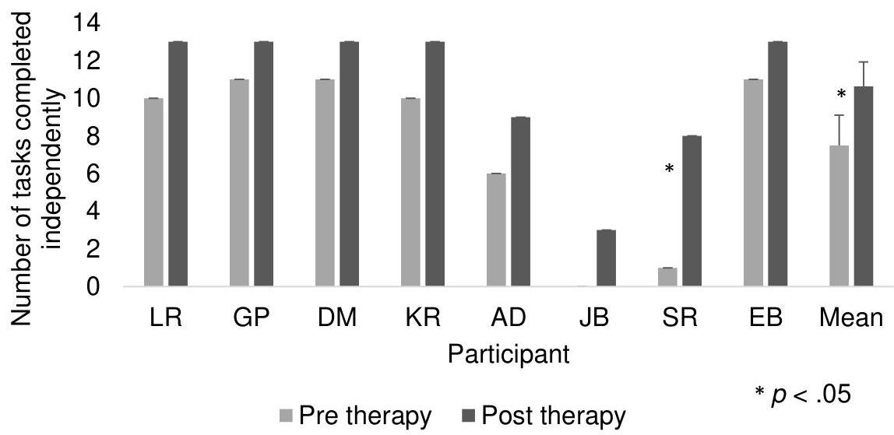
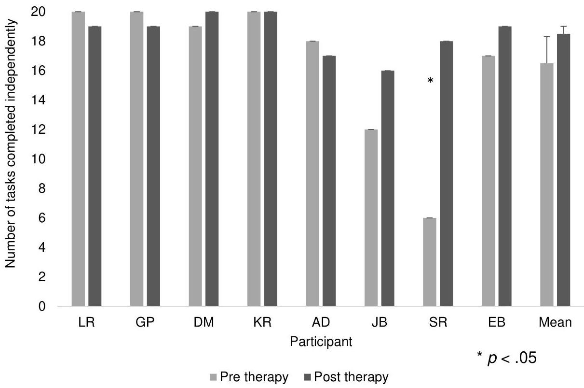
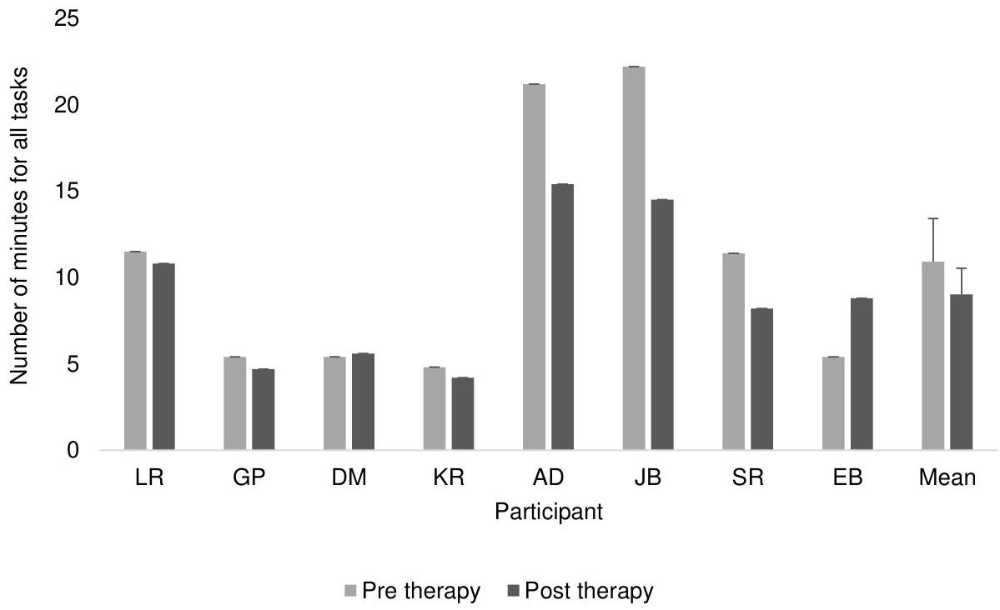
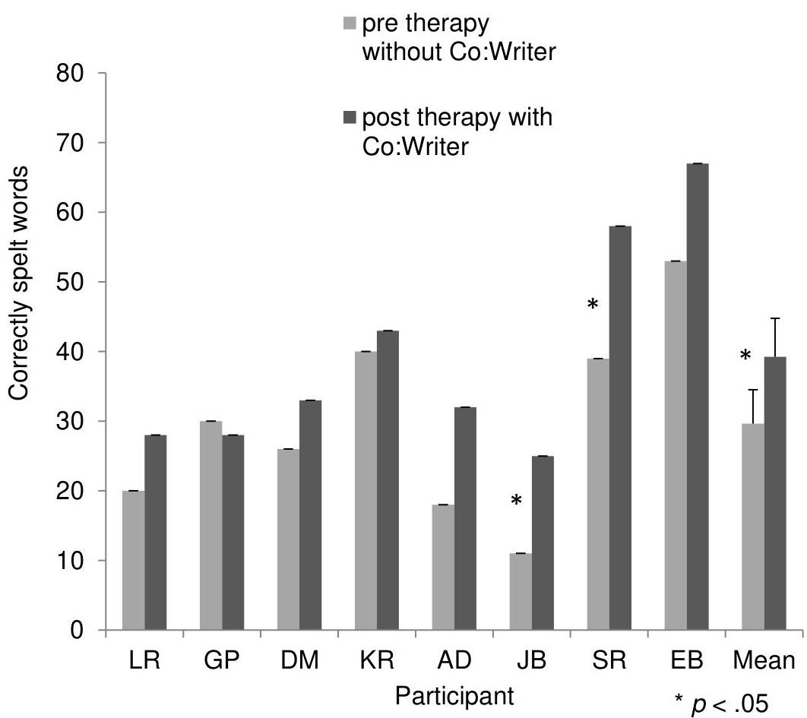
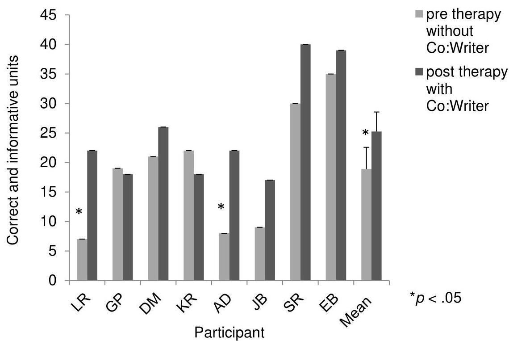
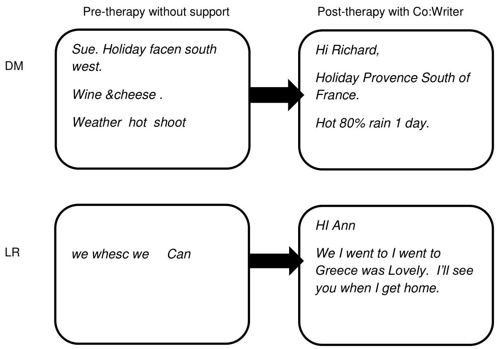
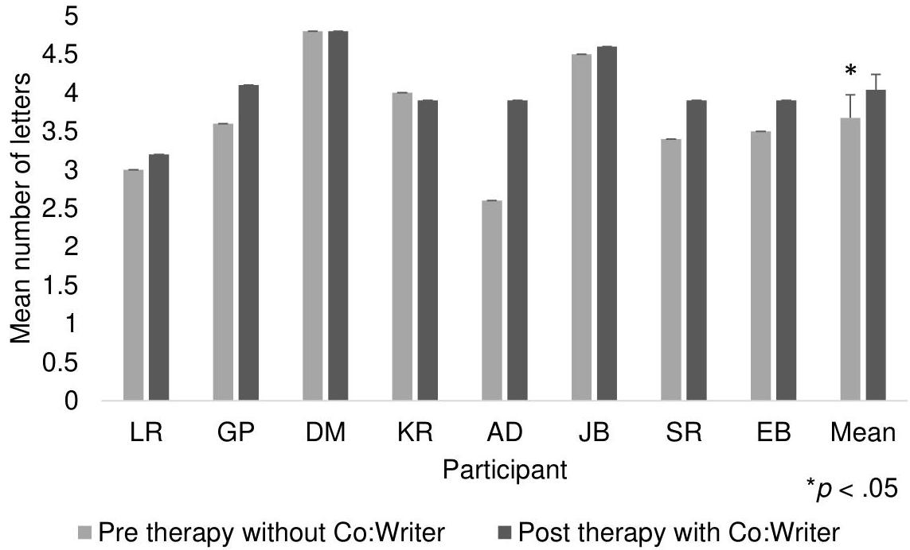
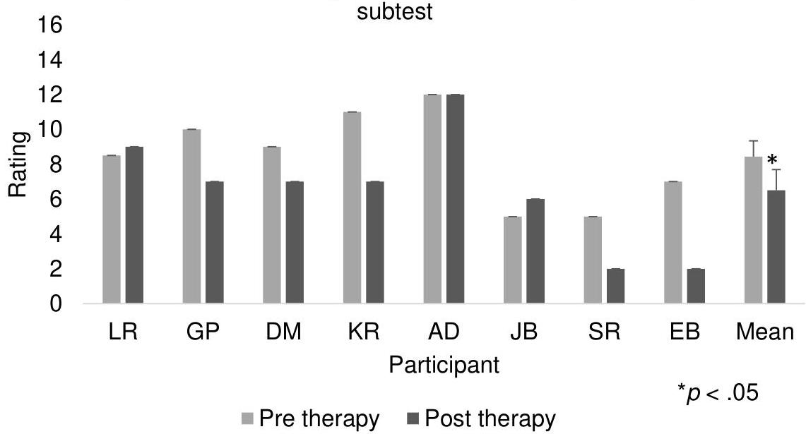

<!-- Source PDF: thiel-2017-email-writing.pdf -->

LBU

LEEDS BECKETT UNIVERSITY

Citation:
Thiel, L and Sage, K and Conroy, P (2016) Promoting linguistic complexity, greater message length and ease of engagement in email writing in people with aphasia. International Journal of Language and Communication Disorders. ISSN 1460-6984 DOI: https://doi.org/10.1111/1460-6984.12261

Link to Leeds Beckett Repository record:
https://eprints.leedsbeckett.ac.uk/id/eprint/2517/

Document Version:
Article (Accepted Version)

The aim of the Leeds Beckett Repository is to provide open access to our research, as required by funder policies and permitted by publishers and copyright law.

The Leeds Beckett repository holds a wide range of publications, each of which has been checked for copyright and the relevant embargo period has been applied by the Research Services team.

We operate on a standard take-down policy. If you are the author or publisher of an output and you would like it removed from the repository, please contact us and we will investigate on a case-by-case basis.

Each thesis in the repository has been cleared where necessary by the author for third party copyright. If you would like a thesis to be removed from the repository or believe there is an issue with copyright, please contact us on openaccess@leedsbeckett.ac.uk and we will investigate on a case-by-case basis.

# Abstract

Background: Improving email writing in people with aphasia could enhance their ability to communicate, promote interaction and reduce isolation. Spelling therapies have been effective in improving single word writing. However, there has been limited evidence on how to achieve changes to everyday writing tasks such as email writing in people with aphasia. One potential area that has been largely unexplored in the literature is the potential use of assistive writing technologies, despite some initial evidence that assistive writing software use can lead to qualitative and quantitative improvements to spontaneous writing.

Aims: This within-participants case series design study aimed to investigate the effects of using assistive writing software to improve email writing in participants with dysgraphia related to aphasia.

Methods and Procedures: Eight participants worked through a hierarchy of writing tasks of increasing complexity within broad topic areas that incorporate the spheres of writing need of the participants: writing for domestic needs, writing for social needs and writing for business/ administrative needs. Through completing these tasks, participants had the opportunity to use the various functions of the software, such as predictive writing, word banks and text to speech. Therapy also included training and practice in basic computer and email skills to encourage increased independence. Outcome measures included email skills, keyboard skills, email writing and written picture description tasks and a perception of disability assessment.

Outcomes &amp; Results: Four of the eight participants showed statistically significant improvements to spelling accuracy within emails when using the software. On a group level there was a significant increase in word length with the software, while four

participants showed noteworthy changes to the range of word classes used. Enhanced independence in email use and improvements in participants' perceptions of their writing skills were also noted.

Conclusions &amp; Implications: This study provided some initial evidence that assistive writing technologies can support people with aphasia in email writing across a range of important performance parameters. However, more research is needed to measure the effects of these technologies on the writing of people with aphasia, and to determine the optimal compensatory mechanisms for specific people given the linguistic-strategic resources they bring to the task of email writing.

## What we already know

Impairment-based spelling therapies have been shown to be effective in improving spelling accuracy of single words in people with aphasia. Some initial evidence from single case studies has indicated that assistive technologies such as predictive writing software can increase productivity and reduce spelling errors within written texts. More research is needed, with larger numbers of participants, to evaluate the effects and candidacy of assistive writing technologies, particularly on functional writing tasks such as email writing.

This study has found that assistive writing software that includes word prediction, word banks, text-to-speech and spell check can improve email writing in people with a range of types and severities of dysgraphia and aphasia, in terms of spelling accuracy, word length and range of word classes. Word banks were particularly useful for participants with more severe spelling and cognitive deficits. This study has also suggested that

the use of assistive writing technologies has the potential to improve participants' perceptions of their writing.

# Introduction

According to a review by the Equality and Human Rights Commission "Internet access and use are fast becoming essential components of everyday life" and are "a means of securing full and equal economic, social and political inclusion" (Jones, 2010, p.3 &amp; 5). However, people with disabilities, including acquired cognitive and linguistic impairments caused by brain injury may be excluded from using the internet (Dietz, Ball &amp; Griffith, 2011; Egan, Worrall &amp; Oxenham, 2004, 2005; Elman, 2001; Jones, 2010) due to factors such as cognitive-linguistic, psychosocial, and training and support barriers (Egan et al., 2004, 2005). For many of these people, the internet will have been part of their lives prior to brain injury for educational, professional or social purposes. Access to the internet for people with acquired cognitive and linguistic impairments could provide better access to information and more opportunities to communicate (Elman, 2001; Sohlberg, Ehlhardt, Fickas &amp; Sutcliffe, 2003), which for some, could significantly improve quality of life, considering that loneliness, social isolation and depression are issues that often affect individuals with brain injury (Egan et al., 2005).

Among the multiple disabilities that can result from brain injury, one that could significantly impede access to the internet is dysgraphia. Acquired dysgraphia refers to an acquired disorder of writing (Weekes, 2005) and often co-occurs with impairments to other language modalities (e.g., naming, auditory comprehension, reading etc.) as one symptom of aphasia (Damasio, 1998), which is a multi-modal

language disorder resulting from traumatic brain injury, brain tumour, infection, surgical removal of brain tissue, or most commonly, stroke (Hallowell &amp; Chapey, 2008). Writing is particularly sensitive to brain damage due to its inherent complexity in incorporating linguistic, cognitive, perceptual and spatial processes (Rapp, 2002). Dysgraphia can present in varying severities; however, in most cases people are considerably restricted in their use of writing. In a survey with people with aphasia, Menger, Morris &amp; Salis (2014) recently found that people with aphasia use the internet less than people with stroke and no aphasia and that aphasia was reported as their main barrier to using the internet.

In a comprehensive review of the writing therapy literature, Thiel, Sage &amp; Conroy (2014) evaluated its usefulness for guiding clinicians in training writing, particularly for functional outcomes. The majority of studies evaluated impairment-based therapies targeting single words. However, fourteen studies were found that measured the effects of training people with aphasia to use assistive writing technologies (see Table 1). The technologies reviewed included electronic spelling aids, Lightwriter, voice recognition software (VRS), speech synthesiser software, C-Speak Aphasia, spell checker software and predictive writing software (see Thiel et al., 2014 for descriptions of these). They have generally been found to have positive outcomes on participants' writing, with improvements such as increased vocabulary and syntax (Estes &amp; Bloom, 2011; Manasse et al., 2000), more content (Armstrong &amp; MacDonald, 2000; Bruce et al., 2003; Estes &amp; Bloom), longer and more complex texts (Armstrong &amp; MacDonald, 2000; Behrns et al., 2009; Bruce et al., 2003) and improved accuracy (Armstrong &amp; MacDonald, 2000; Behrns et al., 2009; King &amp; Hux, 1995) being reported.

[Insert Table 1 about here]

Predictive writing software typically provides 'guesses', based on initial letter selection, as to the intended word being typed, which narrows down as more letters are typed into the word processor. For example, if the user intends to write the word 'hello' and types $h$, the words happy, hand, hold and he might appear, then as an $e$ is added, only words beginning with he will remain (e.g. he, hello, hell and hen). The user can then select the required word from the list without having to type the entire word, which facilitates spelling and minimises the physical effort involved in typing (Dietz et al., 2011). Moreover, some predictive writing programmes (e.g. Co:Writer) incorporate grammar sensitive prediction, faster prediction of recently used words, and flexible spelling, meaning that the programme can provide suggestions for misspelled words, including phonetic spelling of irregular words such as serkel for circle. Predictive writing software was originally designed to facilitate writing for people with physical disabilities as it limits the number of keystrokes necessary for a word to be produced, but it has been used to support adults and children with language and learning disabilities with spelling (e.g. MacArthur, 1996).

There have been four published studies that have evaluated use of predictive writing software for the rehabilitation of people with aphasia (Armstrong &amp; Macdonald, 2000; Behrns, et al., 2009; Mortley et al., 2001; Murray &amp; Karcher, 2000). Mortley et al. (2001) trained a participant with severe dysgraphia to use it as part of a combined approach to therapy, including impairment-based and compensatory approaches. They observed that although the participant had the required skills to use this software, he preferred to use a dictionary to find spellings than to use the predictive writing

software. Murray &amp; Karcher (2000) also used software to augment the effects of an impairment-based therapy, this time training written verbs and sentences. Their participant made gains following the verb and sentence therapy, but even more substantial improvements when using the software. Behrns et al. (2009) trained two participants to use predictive writing software to compensate for writing deficits. One of the participants (Bo) improved on number of words, proportion of correct words, words per minute and proportion of successful edits, though none of the changes were statistically significant. The other participant (Anders) produced more words, more correctly written words and made significantly more successful edits post-therapy. Finally, Armstrong &amp; MacDonald (2000) trained a participant with Broca's aphasia to use both a splint for his dominant hand and predictive writing software (with built in text to speech). His writing showed improvements such as increased text length, fewer spelling errors, more low frequency words and improved syntax.

There is clearly a need for further research investigating the effects of assistive writing technologies, which should include a wider range of participants with respect to dysgraphic symptoms and severity and include focus on natural writing contexts such as email writing. However, becoming independent at communicating via the internet, e.g. sending emails, requires a range of skills not just in writing, but in using a computer, the internet and a keyboard. Computer and email skills training for people with aphasia has been found to be successful in previous studies (Egan et al., 2004; 2005). Using a computer and the internet requires the integration of a complex set of cognitive, physical, language and visual skills that may be impaired, selectively or in parallel, in many individuals following a stroke (van der Sandt-Koenderman, 2004). Also, writing with a keyboard entails different peripheral writing skills to handwriting.

Handwriting requires knowledge of letter shapes and the grapho-motor skills to produce letters, whereas to select letters on a keyboard visual recognition skills and spatio-motor are important (Beeson et al., 2013).

For people with aphasia to start writing again after a stroke, one factor that might be important is the perception they have of their writing skills, i.e. whether, for example, they think their writing skills are good enough to write an email. This is an area that has been largely unexplored within the writing therapy literature. Some studies, however, have measured changes to the impact of the participant's communication disability following writing therapies. For example, Estes &amp; Bloom (2011) used the American Speech and Hearing Association's (ASHA) Quality of Communication Life Scale (QCL) (Frattali, Thompson, Holland, Wohl &amp; Ferketic, 1995) to assess the impact of the participant's aphasia on her relationships, communication, interactions, participation in social, leisure, work and education activities, and overall quality of life. They found that, following training in voice recognition software, there was positive change to one item on the assessment: "I meet the communicative needs of my job [or school]". The participant reported that she felt that she was more productive and useful at work. Similarly, Murray &amp; Karcher (2000) asked their participant and his wife to complete the Communicative Effectiveness Index (CETI) (Lomas, Pickard, Bester, Elbard, Finlayson &amp; Zoghaib, 1989) to determine whether any changes in his daily communication had occurred following a treatment targeting written verb and sentence production. The average ratings of both the participant and his wife increased after therapy, including the item concerning daily writing tasks, suggesting that they both perceived his level of disability in daily communication and activities to have decreased. These issues will also be addressed in the current study.

The aims of this study were to answer the following questions

1. Did people with aphasia show improvements to internet and keyboard skills with relatively time limited internet and keyboard skills training?
2. Did assistive writing software improve spelling accuracy and psycholinguistic quality within emails?
3. Did writing practice lead to any generalised effects to accuracy in unsupported email writing or hand-written picture description?
4. Did writing practice and software lead to any changes in perception of writing difficulties?

## Methods

Eight participants with acquired dysgraphia following a stroke were recruited to this study. Inclusion criteria were that participants had to: be at the chronic stage of their brain injury (i.e. post six months); have sufficient visual acuity and motor ability for writing on a computer; and finally, be monolingual speakers of English. Potential participants were excluded if they had a severe impairment in reading or auditory comprehension (i.e., in the lower 50% of the aphasic population). These skills were assessed using subtests from the Comprehensive Aphasia Test (Swinburn, Porter &amp; Howard, 2004).

# Background Assessments

The participants completed a battery of cognitive, linguistic and hand-written writing assessments. Tables 2, 3 and 4 display participants' demographic information, screen scores and background assessment results. Participants have been ordered according to total baseline spelling scores on the Psycholinguistic Assessments of Language Processing in Aphasia (PALPA; Kay, Lesser &amp; Coltheart, 1992) word spelling subtests (39, 40 and 44), with the most impaired to the left and the least impaired to the right. These tables are followed by a description of each participant's language and writing skills.

[Insert Tables 2, 3 and 4]

# Description of participants' linguistic and writing skills

LR was 19 years post stroke and presented with fluent speech and occasional word-finding difficulties. She had a severe writing impairment characterised by a significant length effect on PALPA 39 ( $p &lt; .01$ , Fisher's exact test) and the lowest scores relative to the other participants on PALPA writing to dictation subtests. In most cases she only wrote the initial one or two letters of the word or did not give a response. However, she also made letter substitution errors such as 'holy' for hold and 'auat' for aunt. She did not write any non-words correctly and often demonstrated lexicality effects (i.e. responding with a similar sounding word), for example, 'fun' for fon and 'sofa' for soaf, demonstrating impaired phonological processing. She therefore demonstrated symptoms of both phonological dysgraphia and graphemic buffer disorder. Phonological dysgraphia is a central (linguistic) dysgraphia sub-type that describes

people with impaired non-word spelling, lexicality effects (where a non-word such as SOAF is spelt as a phonologically similar stored word such as SOAP) (Rapcsak, Beeson, Henry, Leyden, Kim, Rising, Andersen &amp; Cho, 2009) and imageability effects (Whitworth, Webster &amp; Howard, 2005). In contrast to central dysgraphias (surface, phonological and deep) which are caused by underlying linguistic deficits (Ellis &amp; Young, 1988), graphemic buffer disorder is a “peripheral dysgraphia” (Lesser &amp; Milroy, 1993) that has been described as being caused by a deficit in the short-term holding mechanism for the orthographic representations of words while writing is planned and executed. Symptoms include length effects and the following error types: letter additions (tractor → TRACCTOR), substitutions (tractor → TRAPTOR), omissions (tractor → TRACOR) and transpositions (tractor → TRATCOR) (Rapp, 2005; Sage &amp; Ellis, 2006). Despite her spelling difficulties, LR sometimes attempted to write emails to friends (she started using the internet since her stroke). However, she had extreme difficulty with this and it took her a long time to complete a message. She therefore chose to participate in the study with the hope of improving her email writing skills.

GP also had fluent speech but with more severe word finding difficulties. Background spelling assessments showed that his writing was severely impaired. Similar to LR, he could usually only write the initial letters of most words. He showed an imageability effect on the PALPA 40 ( $p = .01$ , Fisher's exact test) and was unable to write any nonwords to dictation. He lexicalised non-words (e.g. 'ghost' for *grest* and 'cheese' for *thease*), and his errors on words were predominantly no responses and incomplete responses (e.g. 'cri' for *crisis* and 'm' for *marriage*). Therefore, his writing was characteristic of phonological dysgraphia. GP's most frequent writing activities was sending text messages. He also copied words and phrases from the dictionary into his note book to either use for communication or to practise writing. His aim was to

improve his email writing so that he could keep in touch with friends and use this as a way of completing administrative tasks such as writing to the bank. He had used computers and the internet frequently before his stroke, predominantly for work.

DM had non-fluent aphasia. He communicated effectively with spoken language, however, predominantly with nouns due to his agrammatism. With regards to writing, he was unable to write any non-words to dictation and showed a significant imageability effect on the PALPA 40 (Kay, Lesser &amp; Coltheart, 1992) ( $p = .03$ , Fisher's exact test). He made occasional semantic errors, for example, 'dish' for spoon and 'post' for letter. However, the majority of his errors were addition, omission, substitution and movement errors, for example 'stemp' for stamp and 'dace' for dance. Some of his responses were unrelated to the target with less than  $50\%$  letters correct, e.g. 'rillir' for rabbit and 'hidder' for think. He had more difficulty writing verbs than nouns, and in many cases could not retrieve any of the word. His writing impairment could best be described as deep dysgraphia, a term that has been used to describe a central (linguistic) dysgraphia syndrome which includes symptoms such as the production of semantic errors such as 'fork' for knife, impaired non-word spelling, and imageability effects, where low imageability words are more difficult to write than high imageability words (Whitworth, Webster &amp; Howard, 2005). DM had frequently used computers and the internet at work and home before his stroke and had trained himself to use them again since his stroke, but found the main barrier to be his aphasia. He was motivated to improve his writing for supporting spoken conversations and writing emails.

KR presented with severe non-fluent aphasia. She communicated by producing a few single spoken words, writing single words and short sentences, and drawing. She had learnt to use her non-preferred hand for writing and typing. On the PALPA 40

(Imageability and Frequency Spelling) she scored significantly lower on low imageability words than high imageability words ( $p &lt; .001$ , Fisher's exact test) and on the PALPA 39 she showed a length effect ( $p = .03$ , Fisher's exact test). Her errors on these assessments included semantic errors (e.g. 'hand' for glove), phonological errors (e.g. 'knot' for knock) and letter addition or substitution errors (e.g. 'yachet' for yacht), with the latter being the most common error type. She did not write any non-words correctly on the PALPA 45. Based on her difficulty in spelling non-words, her imageability effects and her errors, KR has been classified as having deep dysgraphia (Whitworth et al., 2005). Furthermore her length effect and errors are characteristic of graphemic buffer disorder (Miceli, Silveri &amp; Caramazza, 1985). KR's dominant modality for communication was writing; therefore she wanted to improve her spelling to aid face to face conversations and email and Facebook use. She was independent at using her computer and the internet and had used them before and since her stroke.

AD had severely impaired expressive language. Her speech was fluent but with frequent phonological errors. Like KR, she used her non-preferred hand for writing and typing. Her writing errors were predominantly additions (e.g. 'ghoste' for ghost), omissions (e.g. 'ream' for realm) and substitutions (e.g. 'rorrin' for robin). She correctly spelled 10 non-words to dictation, indicating that she had some ability to convert phonemes to graphemes. Her symptoms did not point clearly towards any one dysgraphic syndrome. However, her errors and the fact that her words and non-words were similarly affected (41.7% correct non-words; 53.8% correct words) suggest that she may have had a graphemic buffer disorder (Rapp, 2005; Sage &amp; Ellis, 2006), although she did not show an effect of length. Before the start of the study, AD enjoyed searching the internet and sending emails but needed full support from her husband

with these tasks. Her goal was to become more independent at communicating via the internet.

JB presented with aphasia, but also severe dysarthria. Her handwriting, which she had learnt to do with her non-dominant left hand, was very slow and effortful. She did not demonstrate a length effect on the PALPA 39; however, on the baseline spelling assessments she had much more difficulty with longer words. She only managed to write two non-words to dictation and sometimes lexicalised them (e.g. 'fond' for fon and 'pearl' for birl). Her incorrect responses were either no responses, included less than 50% of the letters in the target word (e.g.'s' for strength; 'ustable' for choose), or were letter addition or omission errors (e.g. 'texet' for text; 'staberty' for strawberry). Her impaired non-word writing and her unrelated responses were characteristic of phonological dysgraphia. JB wanted to improve her writing so that she could write greetings cards and letters to friends. At the beginning of this study she had never used the internet, but played games on her computer. She had used a typewriter before her stroke.

SR's language skills appeared to be intact within conversations. However, background language assessments revealed impaired naming, auditory comprehension and semantic access. He also had residual writing difficulties. On the PALPA subtests (39 and 40), he did not show effects of length, imageability or frequency. However, he did have more difficulty with spelling exception words than regular words on the PALPA 44 (p &lt; .001, Fisher's exact test). Furthermore, he was able to spell 19/24 non-words correctly. The majority of his errors were regularisations of exception words (generally the low frequency ones). For example, he wrote 'sigaret' for cigarette, 'nefew' for nephew, 'nolidge' for knowledge and 'perswade' for persuade. Based on these assessment results, SR's spelling impairment can be described as

surface dysgraphia, a central (linguistic) dysgraphia syndrome, in which individuals have more difficulties spelling irregular words than regular words and make regularisation errors (e.g. laugh may be spelt as 'larf') (Rapcsak, Henry, Teague, Carnahan, &amp; Beeson, 2007). He wanted to improve his writing so that he could write text messages to friends and family members. SR had used the internet before his stroke but said he had not used it since due to a lack of interest.

EB had fluent speech with occasional phonological errors and word finding difficulties. In writing, she did not show effects of length, frequency or regularity. However, she did show an imageability effect on the PALPA 40 ( $p = .02$ , Fisher's exact test). She only wrote four non-words correctly to dictation, indicating a more severe impairment in spelling non-words compared to words. Her responses often consisted of correct initial and final spellings with the middle of the word being incorrect. This was especially true for longer words that could be segmented into morphemes. For example, she spelt impairment as 'impartment', television as 'television', connection as 'conation' and accommodation as 'accommodation.' Most of her incorrect responses were letter omission errors (e.g. 'gradfather' for grandfather and 'language' for language). However, she also frequently added grammatical morphemes onto dictated words (e.g. 'enjoyed' for enjoy and 'strawberry's' for strawberry). The difficulties with converting phonemes to graphemes within non-words and the imageability effect suggest that EB had phonological dysgraphia. EB already used the internet (Facebook and email) to keep in touch with friends and family members since her stroke (before her stroke she used it for work purposes), but wanted to improve her spelling so that she could write longer and more elaborate messages.

On cognitive assessments (Table 5) most participants had low scores relative to the normal population on at least one test, indicating that they had difficulties in skills such

as visuo-construction, planning, visual-memory, attention, and task switching. Although different participants showed strengths in different areas, DM, GP, EB and KR generally had higher scores relative to the group, and LR, AD, JB and SR had scores that were in the lower percentiles. All participants had low scores on the Trail-making Test, which measured attention and task switching ability.

[Insert Table 5 about here]

## Software

Participants were given the opportunity to use Co:Writer 6 software (Don Johnston Assistive Technology). Co:Writer is a word prediction programme that was developed to support writing in children with physical or spelling difficulties. This software was chosen after reviewing several assistive writing programmes. It was selected based on a variety of factors including its inclusion of word and grammar prediction, word banks, text to speech; its spell check with a flexible spelling function; its availability as an app (for participants who also wanted to use it on an Ipad); the fact that it could be used online; and its relatively simple display. It had also previously been used successfully in other aphasia therapy studies (Armstrong &amp; MacDonald, 2000; Murray &amp; Karcher, 2000). Within this study, participants practised using word prediction, word banks, text to speech and spell check.

## Therapy sessions

Participants were given ten sessions of therapy over five weeks, with two sessions each week. Each therapy session included the following two components:

- Technology access training: First 0-15 minutes

Writing with technology: Remaining 45-60 minutes

## Technology Access Training

Participants completed a list of tasks related to sending emails, for example, turn on the computer, enter an email address, and send an email with an attachment. They completed each task once per session. If they needed help or responded incorrectly, then the therapist gave instructions or demonstrations. An additional element of technology access training was keyboard practice, which involved copying out short texts into a word processing document. The therapist noted in each session whether activities were completed alone, with minimum support, with maximum support or not at all. When each activity had been completed three times independently (over three sessions), the technology access training stopped and participants spent the whole session on writing with technology.

## Writing with technology

This involved using Co:Writer to complete a hierarchy of writing tasks (see Table 6). In the Introduction and Orientation session participants were introduced to the software. The therapist modelled each function and then asked participants to practise using the function with example words. At this stage, the following settings were adapted for each participant's needs. Participants selected their preferred options regarding the number of words on display for word prediction, the text size, the speed of speech output and the difficulty level of vocabulary in the dictionary (easy, medium or difficult). Some participants chose to adapt these settings throughout therapy. For

example, LR found the speech output too fast so asked to have a slower speed. AD found scrolling through lists of words difficult so she chose to have more items on display in the prediction box. This meant that she did not have to scroll as many times to reach the desired word. The therapist also entered personally relevant words (e.g. names and interests) into the dictionary so that these words would appear as first options in the word prediction box. Participants were made aware that words entered into the dictionary and recently used words would be predicted more quickly; therefore, they would not need to type the entire word.

The next nine sessions provided opportunities to use the software with support. They were divided into three levels. The first three sessions (2-4) consisted of simple tasks. The next three sessions (5-7) comprised medium complexity tasks. The final three sessions (8-10) consisted of high complexity tasks. There were also three broad topic areas that were aimed to incorporate the spheres of writing need of the participants: writing for domestic needs, writing for social needs and writing for business/administrative needs. Each topic area was covered at simple, medium and high complexity levels; therefore, there were three sessions on each topic over the course of therapy. The levels of complexity were based on estimated number of likely words, likely syntactic complexity, and relative vocabulary complexity. Model responses were constructed to determine the estimated levels of syntactic and vocabulary complexity as well as number of words needed for these tasks. Each session consisted of three tasks, which participants were able to work through at their own pace. Regardless of how many tasks they completed, they progressed to the next topic and difficulty level in the next session.

[Insert Table 6 about here]

The therapist's role was to monitor participant engagement in tasks, and offer prompts and support to participants if/when needed. She allowed time for participants to find words in the prediction box or word bank independently; however, if there were difficulties with a particular element or participants were not making use of the functions, the therapist modelled use of these functions and gave instructions. For example, at times participants took a long time and became frustrated while trying to spell a word but forgot to look across to the word prediction box to see if it had appeared. In this case, the therapist alerted them to this. At the end of each task, the therapist asked the participants to listen to each piece of writing and to try to correct any underlined words. If participants did not notice any errors, then the therapist did not correct them. However, if they had any difficulties with listening to the text or noticed that a word was incorrect but forgot to look at the prediction box for alternative suggestions, then the therapist provided support or prompting.

## Content and use of word banks

At the beginning of each task, the participant and therapist collaboratively entered words, phrases and sentences that might be useful for the task into word banks. The therapist asked: 'Which words or sentences might be appropriate for this task?' The participant then made suggestions either verbally or in writing. The therapist then wrote these into the word bank and made other suggestions. Words, phrases and sentences were either entered into a word bank that had already been created in a previous task where the topic was similar (e.g. food related or formal emails) or a new word bank was created.

There was no limit to the number or length of words, phrases or sentences. Therefore, as an example, by the end of therapy, LR's 'formal email' word bank consisted of the following words, phrases and sentences: appointment, attend, Best wishes, Can I have a different appointment?, confirm, Dear, Dear Sir/ Madam, dentist, I can attend the appointment, I can't attend the appointment, Regards, Yours faithfully and Yours sincerely. Word banks were similar across participants as many of the words, phrases and sentences were suggested by the first author, but they differed in the personally relevant items such as names of family members or favourite foods. Table 7 displays each participant's number of word banks, number of entries (a word, phrase or sentence) and average number of words per entry. The number of word banks each participant had created by the end of therapy ranged from 8 to 18 (with a mean of 13.1). Some participants chose to add to existing word banks during a certain task, while others chose to create a new word bank for each task. The mean number of entries within each word bank ranged from 8.5 to 20.4 (mean = 13.2) and the mean length of phrase for each participant ranged from 2 to 2.6 words (mean = 2.3). Differences across participants in the length or number of entries reflected ideas that they generated at the beginning of each task but also interest in or dependence on word banks. For example, SR was uninterested in the content of his word banks as he knew that he would not choose this as a strategy in therapy; therefore, most of his entries were suggestions from the therapist. GP liked using word banks but used them predominantly for single words as he wanted to construct sentences independently. His word banks therefore consisted of a large number of single words.

During the first five sessions of therapy, participants had the word bank open as well as the prediction box and were encouraged to use both. In the final five sessions and within assessments, they could choose not to have the word bank open if they had

found it unhelpful or distracting up to this point. Some participants chose not to use it within therapy at times as they either preferred to write independently (DM, SR and KR) or found the amount of visual information overwhelming (LR and AD).

[Insert Table 7 about here]

## Outcome measures

The following assessment tasks were used to measure outcomes following therapy. They were all completed directly before and directly after therapy.

## Email Skills Assessment

A rating scale developed specifically for this study but adapted from one by Egan et al.(2005), was used to assess competency in the computer and email skills required for emailing (e.g. enter an email address; click send). A rating of 1 was given if the participant completed the activity independently and 0 if they did not complete it independently. The total score was 15.

## Keyboard Skills Assessment

This assessment consisted of copying tasks, for example sentences containing punctuation marks. Participants obtained a mark for each correctly written word or sentence (out of a possible 20), and the response for each section was timed.

Email writing

Participants wrote three emails into a Word document on a computer, each within 3 minutes:

1. Write an email arranging to meet a friend at a certain time, place and date.
2. Write an email to a friend telling them about a recent holiday.
3. Write an email to your MP about an issue of concern to you at the present time, e.g., a stroke club closing, library closure, unemployment, the environment etc.

As well as completing this task pre and post therapy with and without Co:Writer, participants completed it before and after an "effort phase" at the beginning of the study, in which they were asked to practise writing (preferably email writing if they were able to do this) in their own time over the course of a month without any training or support. The aim was to establish whether there were any improvements to email writing due to effort alone. After this effort phase a lexical spelling therapy study was conducted (see Thiel, Sage &amp; Conroy, 2015a). Therefore, although the two baseline scores could be compared to each other for the effort phase analysis, this could not be used as a baseline for this study. The participants were assessed on this measure again directly before the therapies described in this study. The scores from this time point was used as the baseline.

When using Co:Writer in the post therapy assessment, participants could open word banks that they had created within therapy sessions. Some of the therapy tasks were designed to be closely related to assessment tasks, so that word banks created might be useful in assessments. After reading the instructions and before the timer started for each task, participants could look through the list of word banks they had created throughout therapy and could open as few or many as they wished that they thought might be relevant to the assessment task. For example, for Task 1, a word bank created during the therapy task: 'Write to a friend, asking whether they want to meet soon and suggesting some ideas', which might have been called 'making arrangements', could have been selected. Similarly, for assessment Task 3, a 'complaint' word bank created during the therapy task 'Write a letter of complaint to a telephone company' could be selected. Some participants chose to open three or four word banks, in which case a long list of words, phrases and sentences from all of these were presented within one box. Others chose to only open one or none. If they could not decide which to select, then the therapist made suggestions. It was explained to participants that with more word banks open at once it could take longer to select an item as there would be more items to scroll through, listen to or read, and then select. In the unsupported writing condition, participants could also take their time to think about the task before they started writing. In both conditions, the timer started as soon as the participant began to write.

Emails were analysed using the following measures:

- Number of correctly spelt words: This included all words that were spelt correctly. Words that were not used in a grammatically correct manner and

words that had not been used appropriately/ were not informative were included in this count.

- Number of correct and informative units: This was a count of all correctly spelt open class words (including personal and possessive pronouns) that were relevant and informative to the email. Words did not need to be used in a grammatically correct manner (e.g. 'wish' in 'best wish').
- Psycholinguistic characteristics of words within emails: Four psycholinguistic variables were investigated: frequency, imageability, length (in letters) and word class. All correctly spelt words were included in the analysis. The mean imageability and frequency ratings, number of letters and proportions of word classes were calculated.

For all of these measures, scores across the three email tasks (within nine minutes) were collapsed into one total score and scores were compared across two conditions: pre therapy without support and post therapy with Co:Writer. For counts of correct and correct and informative units the scores of forty-two healthy control participants, who were asked to complete the same task (see Thiel, Sage &amp; Conroy, 2015b), were used as a ceiling (i.e. the highest possible score) so that Chi Square analyses could be conducted to compare individual scores across conditions. The mean number of correctly spelt words from the control group was 201.45 and the mean number of correct and informative units was 122.40. As these scores were extremely high in comparison to the scores of the participants in this clinical study, the initial plan was to use the minimum control group scores. However, as there was a wide range of performance across healthy control participants, in some instances, overlapping with the performance of participants with dysgraphia, the mean was chosen as a ceiling.

Videos of the post therapy email writing with Co:Writer assessments were viewed by the first author and each correctly spelt word produced was categorised according to how it was produced: alone, with prediction or with a word bank.

## Hand-written picture description

The participants were asked to write a description of the Cookie theft picture (Goodglass, Kaplan &amp; Barresi, 2001) with pen and paper within three minutes. As above, the number of correctly spelt words and the number of correct and informative units were counted and compared across time.

## Perception of Writing

Participants were asked to complete the Comprehensive Aphasia Test Disability Questionnaire (Swinburn, Porter &amp; Howard, 2004) and ratings on the writing subtest were compared across time.

# Results

1. Did people with aphasia show improvements to internet and keyboard skills with relatively time limited internet and keyboard skills training?

# Email skills assessment

Figure 1 shows participants' scores out of a possible 15 on the Email Skills Assessment. Pre and post therapy scores for the group were compared using Wilcoxon's Signed Rank Test. All participants completed more tasks independently following therapy and on a group level this difference was significant (Ws+ 0.0,  $p = .01$ ). A chi-square analysis was used to calculate whether any individual post-therapy scores were significantly higher to pre-therapy scores. The four values entered into the table were number independent and non-independent responses pre and post therapy. Only SR's improvements were significant ( $X^2 = 5.52$ ,  $df = 1$ ,  $p &lt; .02$ ).

[Insert Figure 1 about here]

# Keyboard Skills Assessment

Figure 2 displays the number of tasks completed independently by each participant out of a possible 20 on the Keyboard Skills Assessment. Again, pre and post therapy scores for the group were compared using Wilcoxon's Signed Rank Test. There was a positive trend following therapy; however, the improvements were not significant at group level (Ws+ 7.5,  $p = .15$ ) nor for the individual participants except SR ( $X^2 = 12.29$ ,

$df = 1, p &lt; .01$ when a chi-square analysis was conducted (with the values for independent and non-independent responses pre and post). This may reflect the fact that most participants were close to ceiling before therapy. Figure 3 shows the total amount of time taken to complete the assessment (only including typing time, with breaks between tasks omitted). Although most participants became faster at typing after therapy, the changes were not significant at group level when a Wilcoxon's Signed Rank Test analysis was conducted ( $W_s + 29.0$ ,  $p = .07$ ).

[Insert Figures 2 and 3 about here]

2. Did assistive writing software improve spelling accuracy and psycholinguistic quality within emails?

Pre and post effort phase: accuracy

In order to determine whether there are changes to email writing performance due to effort alone, the pre and post effort phase results (written on a computer but with no support from technology) were compared using Wilcoxon's Signed Rank Test. There were no significant differences to the number of correctly spelt words (Pre: Mean = 28.38, SD =16.76; Post: Mean = 30.13 SD = 16.90) or correct and informative units (Pre: Mean = 18.00, SD = 10.34; Post: Mean = 18.38, SD = 12.33) within emails for

the group as a whole (correctly spelt words: Ws+ 12.0, $p = .40$; correct and informative units: Ws+ 16.5, $p = .44$) or for individual participants in a chi-square analysis.

## Pre therapy without support compared to post therapy with software: accuracy

To establish whether the software practice and use resulted in improvements to spelling accuracy, the number of correctly spelt words in emails before therapy without the use of Co:Writer were compared to after therapy with the use of Co:Writer (Figure 4). A group level statistical analysis using Wilcoxon's Signed Rank Test showed a significant increase when using Co:Writer (Ws+ 0.0, $p = .01$). On an individual level a chi-square analysis was conducted with the four values being number of correctly spelt words and number of words not spelt correctly out of the possible 201.45 pre therapy with no support and post therapy with support. There were significant improvements for participants SR ($X^2 = 4.39$, $df = 1$, $p = .04$) and JB ($X^2 = 5.14$, $df = 1$, $p = .02$). When the number of correct and informative units before and after therapy were compared (Figure 5), there was a significant improvement for the group (Ws+ 3.5, $p = .02$). When individual scores were compared (with the four values being number of correct and informative words and number of words that were not correct and informative out of the possible 122.40 pre therapy with no support and post therapy with support), both LR ($X^2 = 7.64$, $df = 1$, $p = .01$) and AD ($X^2 = 6.39$, $df = 1$, $p = .01$) had significant results. Example pre and post therapy emails produced by DM (who did not show significant improvements) and LR (who did show significant improvements) are presented in Figure 6.

[Insert Figures 4 &amp; 5 about here]

[Insert Figure 6 about here]

## Psycholinguistic quality of emails

Mean imageability and frequency ratings and number of letters in correctly spelt words within emails pre therapy without Co:Writer were compared to post therapy with Co:Writer using Wilcoxon's Signed Rank Test. No significant differences were found between the mean imageability and frequency ratings between the two conditions. However, the mean length of words used within emails (Figure 7) did increase significantly for the group (Ws+ 2.0, $p = .03$).

[Insert Figure 7 about here]

Words within emails were categorised according to word class. The categories included noun, verb, adjective, adverb, exclamation (e.g. hi), number (e.g. 12pm; $17^{\text{th}}$) and a general function word category, which included pronouns, prepositions, determiners and auxiliary verbs. The proportion of each word class across the three emails for each participant (in pre therapy emails without Co:Writer and post therapy emails with Co:Writer) is displayed in Table 8. For some participants (GP, KR, SR and EB) there was little or no noticeable change following therapy. However others showed some substantial changes. LR, who had anomic aphasia increased her use of all open class words and showed a decrease in her proportion of function words. Similarly, AD

who showed characteristics of conduction aphasia and used a high proportion of function words within emails before therapy demonstrated a decrease in these following therapy and an increase in verbs and adverbs. In contrast, DM, who had non-fluent agrammatic aphasia, showed a decrease in proportion of nouns, an increase in his proportion of verbs and a broader range of word classes including function words following therapy. JB, who also had non-fluent aphasia, produced a lower proportion of nouns and a higher proportion of function words after therapy.

[Insert Table 8 about here]

## Frequency of technologies used within assessments

Videos of post-therapy assessments with Co:Writer were observed to determine the percentage of correctly spelt words that were produced alone by the participant, with word prediction and with word banks. This data is presented in Table 9. On average, participants wrote 51.9% of words alone, 12.8% with prediction and 35.3% with word banks.

[Insert Table 9 about here]

3. Did writing practice lead to any generalised effects to accuracy in unsupported email writing or written picture description?

## Emails

To measure any changes to unsupported email writing resulting from the therapy, emails written pre and post therapy on a computer but without the use of Co:Writer were compared using Wilcoxon's Signed Rank Test. There were no significant changes to the number of correctly spelt words or correct and informative units for the group (correct: Ws+ 14.0, $p = .31$; correct and informative: Ws+ 11.0, $p = .18$) or for individuals.

## Hand-written picture description

The number of correctly spelt words and the number of correct and informative units within picture descriptions pre and post therapy were compared with Wilcoxon's Signed Rank Test. There were no significant changes for correctly spelt words (Ws+ 18.0, $p = .47$) or correct and informative units (Ws+ 15.0, $p = .47$) for the group following therapy.

4. Did writing practice and software lead to any changes in perception of writing difficulties?

On the writing subtest of the CAT Disability Questionnaire (Swinburn et al., 2004) (Figure 8) ratings became significantly more positive for the group following therapy

when scores for the group were compared using Wilcoxon's Signed Rank Test (Ws+ 25.0, $p = .04$) but not for individuals despite a positive trend for five participants.

[Insert Figure 8 about here]

## Discussion

The aim of this study was to establish whether assistive writing software improved the email writing of eight participants with aphasia. It was found that spelling accuracy within emails improved both on a group level and for individual participants (SR and JB) when using the software, when mean scores from healthy control participants were used as the ceiling. SR and JB did not show significant improvements to correct and informative units, despite a positive trend. However, it is worth noting that neither wrote noticeably more irrelevant words. The larger changes to correctly spelt words seemed to be due to a higher number of closed class words, which were not counted as informative. When only correct and informative open class words were counted, there was significant improvement both on a group level and for LR and AD (again when compared using control scores as the ceiling), indicating that the software enabled these two participants, who both had fluent aphasia and severe writing difficulties, to produce more meaningful messages.

Some of the participants commented that they felt supported by Co:Writer and noticed that they could now use more difficult words. Therefore, a more in-depth analysis of the psycholinguistic properties of words produced with and without support was conducted and it was found that the participants wrote significantly longer words with

Co:Writer. Furthermore, two participants with fluent aphasia, AD and LR, used a higher proportion of open class words and two participants with non-fluent aphasia wrote a higher proportion of either verbs (DM) or function words (JB). These changes seem to be attributable to the word banks. JB's increased use of function words reflects the fact that she selected long phrases or sentences from her word banks (e.g. I would like to arrange a meeting for Monday). This was also the case for DM, who selected sentences such as 'I am very disappointed' from the word banks, resulted in more verbs and function words. AD's and LR's production of more open class words were again due to word banks as they selected long phrases or sentences containing open and closed class words, whereas before therapy, they struggled to continue after beginning sentences with initial pronouns or determiners.

These findings were consistent with those of previous studies which found some positive outcomes in training participants to use similar technologies, although the present study did so across a larger number of participants. Participants in studies by Armstrong &amp; MacDonald (2000), Behrns et al. (2009) and Murray &amp; Karcher (2000) improved in accuracy when using predictive writing software. Moreover, one participant in the study by Behrns et al. (2009), who was described as having non-fluent agrammatic aphasia (similar to DM and JB), also wrote more verbs with the software. Murray &amp; Karcher's participant wrote longer words. Armstrong &amp; MacDonald (2000) found changes to their participant's texts such as lower frequency words and more grammatical sentences. These studies differed from the present one in that word banks were not used and that improvements were attributed to word prediction. However, it seems that assistive writing technologies can support people with aphasia in producing words they would not usually be able to write. EB commented that although she finds writing with Co:Writer slower than writing on a computer without

Co:Writer, she no longer feels "embarrassed or stupid about using simple words" when writing to friends.

A further interesting finding was that not all participants used the software to the same extent. KR and SR did not use prediction and word banks frequently within the post therapy assessment despite being able to use them. KR found in therapy that Co:Writer slowed her down and that speed was more important to her than spelling accuracy. SR was able to write most of the words that he wanted to write without the software, and was content with writing short messages with familiar words and phrases. This suggests that his significant gains in spelling accuracy were not due to word prediction or word banks. SR actually commented that he found text to speech useful for checking that his writing "sounded right"; therefore it is likely that his gains resulted from improved monitoring and editing with the software. The participants who used word banks to produce most of their words, LR, AD and JB, were the ones who showed the greatest improvements post therapy (along with SR), probably because clicking on a phrase or sentence within a word bank can produce multiple correctly spelt words. In fact, LR's significant gains were due to just four phrases or sentences that she selected from word banks (e.g. I went to Greece and I'll see you when I get home), while AD's were from seven (e.g. dear and I really enjoyed it) and JB's were from only two sentences (Our phone line isn't working and I would like to arrange a meeting for Monday). These participants did not use prediction to a great extent as they found it difficult to do so. It is worth noting that AD, LR and JB did not have any advantages over other participants in terms of number of word banks, number of phrases or length of phrases available to them.

GP, DM and EB wrote some words independently while making use of prediction and word banks for others. It was actually these participants who were most enthusiastic about the software. They reported using it outside of therapy and commented that they had been writing more frequently since they started using it. An advantage of prediction (for people who do not have difficulties using it) is that it does not necessarily require any support from others. To use word banks, words, phrases and sentences first need to be entered by somebody who can spell them. Although the participants were given Co:Writer at the end of therapy along with the word banks that they had created within therapy, these might not have necessarily been useful in every possible writing situation, in contrast to word prediction. This may be a reason for the more positive reports after therapy from participants who could also use word prediction.

Despite the positive comments regarding writing with Co:Writer, DM, EB and GP did not show significant changes to the number of correctly spelt words produced within emails. This may be due to the fact that prediction slowed them down, which was a comment that they all made and was also observed within therapy. In order to find the correct word, the participant often has to scroll then to try adding or deleting letters if the target word has not appeared (i.e. if the participant has written incorrect initial letters), and to read or listen to words as they appear, which can be time consuming. Similarly, Behrns et al. (2009) proposed that a participant in their study whose production rate decreased was slowed down by having to read and then select words from the prediction list. A further reason for not having significant gains might be that these participants all chose to write a large proportion of words alone within assessments, which indicates that they were managing without Co:Writer much of the time. This may account for the smaller difference between the two conditions compared to other participants. The participants who struggled to write any words

alone without Co:Writer (AD, JB and LR) were the ones who showed more substantial gains, probably because there was more room for improvement.

This study included a heterogeneous group of eight participants with a range language, writing and cognitive skills so that patterns could be observed between these skills and treatment outcomes. The participants whose emails showed significant improvements had a range of language profiles. SR was among the participants with the highest scores (97) on the BDAE (when total scores were calculated out of 115) while AD and JB had relatively lower scores (76 and 69) and LR was somewhere in between (90.5). SR, LR and AD had fluent aphasia (although this was not reflected in their writing) and JB had non-fluent aphasia. In terms of reading and comprehension, these participants, again, did not all fall at the top or the bottom of the range.

When writing skills are considered, the participants whose emails improved significantly had a range of dysgraphia profiles, with JB fitting the category of phonological dysgraphia, AD having symptoms of graphemic buffer disorder, LR presenting with symptoms of both of these subtypes and SR presenting with surface dysgraphic symptoms. Also there was no observed relationship between total baseline PALPA scores and therapy outcomes (see ordered graphs). However, AD, LR and JB scored the lowest on BDAE writing subtests and had the lowest baseline email writing accuracy scores. All three participants had difficulty with deciding what to say and generating the vocabulary they needed, which may suggest difficulties with 'thinking for speaking' (or here, 'thinking for writing') (Marshall &amp; Cairns, 2005). AD and JB spent a long time looking for the letter keys while typing words (for JB, this was to do with lack of familiarity with the keyboard). In this time, they then often forgot what they wanted to write. AD and JB also both had a hemiplegia and were required to type with

their non-dominant hand, which for both was a slow, arduous process. To use prediction, the user needs to be able to write the first letter(s) of a word correctly. The closer the user gets to the target, the narrower the range of plausible options for the software, and the more chance there is of the correct word appearing, although word prediction does become more responsive through the faster prediction of recently used words and phrases as well as personally relevant items that have been entered into the dictionary and word banks. As mentioned above, it seems that due to their writing difficulties, these participants chose to use word banks which produce multiple correct words within a click.

Cognitive skills are often impaired following a stroke and all participants in this study showed a deficit in at least one of the skills tested. The participants who tended to be at the lower end of the range on these assessments, AD, SR, LR and JB, were the ones whose emails were significantly more accurate post therapy. Three of these participants (AD, LR and JB) found predictive writing difficult and chose to use word banks. Participants clearly needed skills in task switching and selective and divided attention in order to shift attention between the text and the word bank and between word bank entries, which was observed to be difficult and frustrating for AD, LR and JB. However, word prediction appeared to be yet more cognitively demanding than using word banks, in that participants were required to make decisions on which letters to enter, then to switch their attention between their text and the word prediction box to see whether different options had appeared, and then to scroll through further options in the list of predicted words. AD, LR, JB, and SR were shown to have impairments in task-switching, visual memory and selective and divided attention when tested on the Rey Complex Figure Test (Meyers &amp; Meyers, 1995; a test of visuo-construction, memory and planning), the Camden Memory test (Warrington, 1996;

picture and word recognition tests), the Corsi Block-tapping task (Kessels, van Zandvoort, Postma, Kappelle, &amp; de Haan, 2000; a test of visuo-spatial short term memory) and the Trail-making Test (Reitan, 1992; a test of visual attention and task-switching), which may explain their difficulties with using the software in general, but word prediction in particular.

Therefore, the participants who made the most substantial gains in this study were those with the lowest pre-treatment writing and cognitive scores. Word prediction was extremely difficult for LR, AD and JB to use because of an interaction between their cognitive, spelling, linguistic and motor difficulties. This may explain why they chose to use word and phrase banks, which significantly improved their email accuracy through compensating for these impairments. In fact, LR and AD commented that having words, phrases and sentences related to the topic in front of them helped them to stay on track and to remember what they wanted to write. Furthermore, word and phrase banks did not require any spelling ability, just skills in either reading or auditory comprehension. It is important to note that the improved emails produced by these participants who used word banks did not reflect any changes to their writing ability, but that they were able to select phrases and sentences pre-written by the therapist which were correct in terms of syntax and spelling. This suggests that this option would only be viable if the user had somebody to enter the phrases or sentences as required to match the participant's needs. Within this study we did not investigate the participants' abilities to use items in the word banks flexibly, i.e. to modify existing sentences to create new ones and participants were not observed doing this. This could be an interesting question for future studies exploring the use of word banks for people with aphasia.

Opinions of Co:Writer varied with some participants finding it extremely frustrating and difficult or too slow to use (LR, AD, JB, KR) and some finding it supportive and useful for writing more difficult words (DM, GP, EB, AD). AD found it difficult to use but wanted to continue using it anyway as she noticed a difference to her writing. Most participants agreed that Co:Writer was not particularly user-friendly or aphasia-friendly. For example, they had difficulties with buttons with similar icons (e.g. one arrow to press for listening to words, a different arrow for accessing settings, and the right arrow key on the keyboard for scrolling), having too many boxes that needed moving around while writing, and generally having to switch from keyboard to mouse and from text to prediction box and word bank, which was cognitively demanding and required good motor skills.

It is important to note that despite the positive findings at the whole group level, for each accuracy measure only two participants' emails improved significantly and the gains were therefore relatively small. Particularly word prediction did not seem to result in any accuracy gains for these participants. This could be related to the difficulty using the programme discussed above. However, it could also relate to the therapy programme which was designed to give participants the opportunity to use the software in a supported environment. Participants, firstly did not have to reach any particular level of performance on particular tasks before progressing to the next difficulty level, and secondly, did not have to become proficient in any particular function to move to further tasks or sessions. The aim was that participants with a range of abilities could learn to use the software for a range of functional tasks. As participants could freely use any of the functions within this study, they could avoid the more difficult ones (i.e. prediction) if they chose to. In the first session, the various components were modelled to participants and they were required to practise these

with different words. An alternative option could have been to have trained participants within more structured tasks which trained each function to criterion before moving to functional tasks. For example in initial sessions participants could have been asked to select dictated words from word prediction and word banks, to correct pre-typed inaccurate words and to listen to each written word. There is an argument that by starting with easier (although perhaps less functional) tasks for each function, that participants would be more likely to learn how to use the software effectively. In fact, over time Co:Writer learns frequently written words which then start appearing more frequently in the prediction box which suggests that it may become faster and easier to use if participants do continue to use it.

A further reason for the small gains could relate to the fact that the mean scores of healthy control participants (201.45 for correctly spelt words and 122.40 for correct and informative units) were used as the ceiling for chi square analyses. This meant that the differences between these scores and those of the participants with aphasia were extremely large and most changes between conditions were difficult to detect. For example, AD's number of correctly spelt words increased from 18 before therapy without support to 32 after therapy with Co:Writer, but this difference was not found to be significant. It was not possible to use the lowest healthy control score as this was lower than some of the scores of the participants with aphasia. This difficulty with outcome measurement was due to the lack of an existing measure suitable for assessing functional writing. Therefore, it was necessary to develop an outcome measure for this study. Future studies could collect data on larger numbers of participants, both with and without aphasia so that a standardised assessment can be developed. A further difficulty with the assessment may have been the short amount of time given to complete each email. When trialled on members of the research team

and then on healthy control participants, three minutes was adequate time to complete each email task. However, due to their writing difficulties, the participants of this study usually did not manage to complete their emails (particularly for tasks 2 and 3) within the allotted time, and this time limit may have added unnecessary pressure which would not necessarily reflect real-life writing conditions.

Six of the participants in this study (DM, KR, AD, JB, SR and EB) were also trained on lexical therapies previously (see Thiel, Sage &amp; Conroy, 2015a), which led to significant gains to treated and untreated items for all participants. However, as most of the participants in this study (LR, GP, DM, KR, JB and EB) had phonological or deep dysgraphia, a therapy targeting phonological processing skills and specifically phoneme to grapheme conversion mechanisms may have also been useful before being introduced to the software, for strengthening the writing skills needed for using word prediction, i.e. writing the initial letters of a word so that it appears in the prediction box. Future research could investigate the effects of combined approaches to writing treatment where impairment-based therapies target underlying language skills that may be necessary for using compensatory technologies.

To control for improvements not associated with therapy or technology use, an effort phase was incorporated within this study, in which participants were asked to do some writing in their own time. They were assessed on unsupported email writing at the beginning and at the end of this phase and no significant changes were found to their writing accuracy within emails, indicating a stable baseline. There were also no significant improvements to either email writing (typed on a computer) or hand-written picture description (using pen and paper) without support following therapy; therefore the ten sessions of therapy, in which participants practised writing within a range of functional tasks, did not have any generalised effects on the participants' writing. This

suggests that improvements in the 'with Co:Writer' condition can be attributed to the participants' successful use of the programme rather than to improvements to language as a result of writing practice.

If the aim of therapy is to independently communicate via email, then general computer and internet skills are also necessary. Therefore, these were included into the therapy protocol. All participants improved on the Email Skills Assessment which was significant on a group level and for SR who had not used the internet since his stroke. All participants except JB commented that they found this training very useful. Even the more experienced technology users were very happy to learn additional skills, for example, how to attach pictures to email messages. As JB had never used the internet before, this small amount of training was not enough to support her to use it. Despite this, she found the writing therapy useful and planned to print out messages that she had created to send as letters or in greetings cards. On the Keyboard Skills Assessment most participants did not achieve higher scores as most were almost at ceiling before therapy. SR, again, had a significantly higher score after therapy, which reflects the fact that he was not very familiar with the keyboard before therapy and benefitted from the practice. Most became faster at typing (although this change was not significant) and reported that they found the typing practice useful.

As a group the participants had significantly more positive perceptions of their own writing on the CAT Disability Questionnaire (Swinburn et al., 2004), which mirrors results from previous studies that have trained assistive writing technologies in people with aphasia (Estes &amp; Bloom, 2011; Murray &amp; Karcher, 2000). This is an extremely positive finding for participants in the current study, most of who were unhappy and embarrassed about their writing before therapy and avoided engaging in writing

activities. It seems plausible that if people with aphasia view their writing skills as less impaired then they may be more likely to engage in writing activities.

This study has aimed to contribute to the writing therapy literature, which is currently dominated by single word impairment-based therapy studies (Thiel et al., 2014). All of the participants in this study had some level of spelling ability and they all wrote some words independently within assessments and used Co:Writer for words they could not write. The improvements in accuracy, informativeness and the characteristics of words within emails as well as participants' perceptions of writing suggest that there should be an increasing role for assistive writing technologies in the rehabilitation of stroke aphasia to build on gains from impairment-based therapies and to augment or compensate for writing difficulties, depending on the severity of the dysgraphia.

More research is needed into the efficacy and the candidacy for these types of therapies and technologies. Specifically, this will require studies with a greater range and number of participants to allow for sufficient statistical power to analyse the relative contribution of factors such as dysgraphia and aphasia symptoms and severity of cognitive, motor and visual skills. There is also a case to be made for developing and evaluating software specifically designed towards functional ease of access together with visual and linguistic simplicity for people with aphasia and related motor-visual impairments following stroke. Qualitative feedback in this study indicated that even the most accessible of commercially available software was considered too 'busy' and multi-faceted. This could allow for pre-selection of specific technological compensations, based on robust findings in relation to optimal cognitive-linguistic profiles. Finally, technology could also usefully support analysis of the role of time investment and effort in this type of rehabilitative work (a measurement of participant engagement with the intervention) such that, we could explain to participants the

required 'buy-in' they would need to undertake in order to arrive at clinically positive outcomes. Whilst technology holds incredible therapeutic promise, effective treatment development will increasingly have to grapple with the candidacy issue: 'who', 'what' and 'how' from the increasingly rich and varied menu of technological solutions to everyday functioning.

# References

ARMSTRONG, L., &amp; MACDONALD, A., 2000, Aiding chronic written language expression difficulties: A case study. *Aphasiology*, 14(1), 93-108.

BEESON, P., HIGGINSON, K. &amp; RISING, K., 2013, Writing treatment for aphasia: A texting approach. *Journal of Speech, Language, and Hearing Research*, 56, 945-955

BEESON, P. M., REWEGA, M. A., VAIL, S., &amp; RAPCSAK, S. Z., 2000, Problem-solving approach to agraphia treatment: Interactive use of lexical and sublexical spelling routes. *Aphasiology*, 14(5-6), 551-565.

BEESON, P. M., RISING, K., KIM, E. S., &amp; RAPCSAK, S. Z., 2008, A novel method for examining response to spelling treatment. *Aphasiology*, 22(7-8), 707-717.

BEHRNS, I., HARTELIUS, L., &amp; WENGELIN, A., 2009, Aphasia and computerised writing aid supported treatment. *Aphasiology*, 23(10), 1276-1294.

BRUCE, C., EDMUNDSON, A., &amp; COLEMAN, M., 2003, Writing with voice: an investigation of the use of a voice recognition system as a writing aid for a man with aphasia. *International Journal of Language &amp; Communication Disorders*, 38(2), 131-148.

DAMASIO, A., 1998, Signs of Aphasia. In M. J. Sarno (Ed.) *Acquired Aphasia* (3rd ed.) (pp.25-42). San Diego: Academic Press.

DIETZ, A., BALL, A. &amp; GRIFFITH, J., 2011, Reading and writing with aphasia in the 21st century: Technological applications of supported reading comprehension and written expression. *Topics in Stroke Rehabilitation*, 18(6), 758-769.

EGAN, J., WORRALL, L. &amp; OXENHAM, D., 2004, Accessible internet training package helps people with aphasia cross the digital divide. *Aphasiology*, 18(3), 265-280.

EGAN, J., WORRALL, L. &amp; OXENHAM, D., 2005, An internet training intervention for people with traumatic brain injury: Barriers and outcomes. *Brain Injury*, 19, 555-568.

ELLIS, A.W. &amp; YOUNG, A.W., 1988, *Human Cognitive Neuropsychology*. Hove, UK: Lawrence Erlbaum Associates Ltd.

ELMAN, R., 2001, The internet and aphasia: Crossing the digital divide. *Aphasiology*, 15(10/11), 895-899.

ESTES, C., &amp; BLOOM, R. L., 2011, Using voice recognition software to treat dysgraphia in a patient with conduction aphasia. *Aphasiology*, 25(3), 366-385.

FRATTALI, C., THOMPSON, C.K., HOLLAND, A.L., WOHL, C.B., &amp; FERKETIC, M.K., 1995, American Speech-Language-Hearing Association Functional Assessment of Communication Skills for Adults. Rockville, MD: American Speech-Language-Hearing Association.

GOODGLASS, H., KAPLAN, E., &amp; BARRESI, B., 2001, BDAE-3 The Boston Diagnostic Aphasia Examination (3rd Ed.). Philadelphia: Lippincott, Williams &amp; Wilkins.

HALLOWELL, B. &amp; CHAPEY, R., 2008, Introduction to Language Intervention Strategies in Adult Aphasia. In R. Chapey (Ed.) Language Intervention Strategies in Aphasia and Related Neurogenic Communication Disorders (5th ed.) (pp. 3-19). Philadelphia: Lippincott Williams &amp; Wilkins.

HOWARD, D., &amp; PATTerson, K., 1992, The Pyramids and Palm Trees Test. Bury St. Edmunds, Uk: Thames Valley Test Company.

JACKSON-WAITE, K., ROBSON, J., &amp; PRING, T., 2003, Written communication using a Lightwriter in undifferentiated jargon aphasia: A single case study. *Aphasiology*, 17(8), 767-780.

JONES, P., 2010, Internet access and use. Available at http://www.equalityhumanrights.com/sites/default/files/documents/triennial_review/triennial_review_internet_access.pdf [Accessed 11.11.14].

KAY, J., LESSER, R. &amp; COLTHEART, M., 1992, Psycholinguistic Assessments of Language Processing in Aphasia (PALPA). Hove, UK: Lawrence Erlbaum Associates Ltd.

KING, J., &amp; HUX, K., 1995, Intervention using talking word processing software: An aphasia case study. *Augmentative and Alternative Communication*, 11, 187-192.

LESSER, R. AND MILROY, L., 1993, Linguistics and Aphasia: Psycholinguistic and Pragmatic Aspects of Intervention. London: Longman.

LOMAS, J., PICKARD, L., BESTER, S., ELBARD, H., FINLAYSON, A., AND ZOGHAIB, C., 1989, The Communicative Effectiveness Index: Development and psychometric evaluation of a functional communication measure for adult aphasia. *Journal of Speech and Hearing Disorders*, 54, 113-124.

MACARTHUR, C.A., 1996, Using technology to enhance the writing processes of students with learning disabilities. Journal of Learning Disabilities, 29(4):344–354.

MARSHALL, J. AND CAIRNS, D., 2005, Therapy for sentence processing problems in aphasia: working on thinking for speaking. *Aphasiology*, 19, 1009–1020.

MENGER, F., MORRIS, J. &amp; SALIS, C., 2014, From Facebook to finances: How do people with aphasia use the internet? Proceedings of the 16th International Aphasia Rehabilitation Conference 2014, The Hague, The Netherlands.

MANASSE, N. J., HUX, K., &amp; RANKIN-ERICKSON, J. L., 2000, Speech recognition training for enhancing written language generation by a traumatic brain injury survivor. *Brain Injury*, 14(11), 1015-1034.

MICELI, G., SILVERI, M. C., &amp; CARAMAZZA, A., 1985, Cognitive analysis of a case of pure agraphia. *Brain and Language*, 25, 187-212.

MORTLEY, J., ENDERBY, P., &amp; PETHERAM, B., 2001, Using a computer to improve functional writing in a patient with severe dysgraphia. *Aphasiology*, 15(5), 443-461.

MURRAY, L. L., &amp; KARCHER, L., 2000, A treatment for written verb retrieval and sentence construction skills. *Aphasiology*, 14(5-6), 585-602.

NICHOLAS, M., &amp; ELLIOTT, S., 1998, C-Speak Aphasia: A Communication System for Adults with Aphasia. Solana Beach, CA: Mayer-Johnson Co.

NICHOLAS, M., SINOTTE, M. P., &amp; HELM ESTABROOKS, N., 2005, Using a computer to communicate: Effect of executive function impairments in people with severe aphasia. *Aphasiology*, 19 (10–11), 1052–1065.

NICHOLAS, M., SINOTTE, M.P., HELM-ESTABROOKS, N., 2011, C-Speak Aphasia alternative communication program for people with severe aphasia: Importance of executive functioning and semantic knowledge. *Neuropsychological Rehabilitation*, 21(3), 322-366.

RAPCSAK, S.Z., BEESON, P.M., HENRY, M.L., LEYDEN, A., KIM, E., RISING, K., ANDERSEN, S. &amp; CHO, H., 2009, Phonological dyslexia and dysgraphia: cognitive mechanisms and neural substrates. *Cortex*, 45, 575-591.

RAPCSAK, S.Z., HENRY, M.L., TEAGUE, S.L., CARNAHAN, S.D. &amp; BEESON, P.M., 2007, Do dual-route models accurately predict reading and spelling performance in individuals with acquired alexia and agraphia? *Neuropsychologia*, 45, 2519–2524.

RAPP, B., 2002, Uncovering the Cognitive Architecture of Spelling. In A. Hillis (Ed.), The Handbook of Adult Language Disorders: Integrating Cognitive Neuropsychology, Neurology, and Rehabilitation (pp. 47-69). Philadelphia: Psychology Press.

RAPP, B., 2005, The relationship between treatment outcomes and the underlying cognitive deficit: Evidence from the remediation of acquired dysgraphia. *Aphasiology*, 19(10-11), 994-1008.

SAGE, K., &amp; ELLIS, A. W., 2006, Using orthographic neighbours to treat a case of graphemic buffer disorder. *Aphasiology*, 20(9-11), 851-870.

SOHLBERG, M., EHLHARDT, L., FICKAS, S. &amp; SUTCLIFFE, A., 2003, A pilot study exploring electronic (or e-mail) mail in users with acquired cognitive-linguistic impairments. *Brain Injury*, 17(7), 609-629.

SWINBURN, K., PORTER, G. AND HOWARD D., 2004, Comprehensive Aphasia Test. Psychology Press.

THIEL, L., SAGE, K. &amp; CONROY, P., 2014, Retraining writing for functional purposes: a review of the writing therapy literature. *Aphasiology*, in press.

THIEL, L., SAGE, K. &amp; CONROY, P., 2015a, Comparing uni-modal and multi-modal therapies for improving writing in acquired dysgraphia after stroke. *Neuropsychological Rehabilitation*, in press.

THIEL, L, SAGE, K AND CONROY, P., 2015b. Normative Data for Email Writing by Native Speakers of British English. *Journal of Open Psychology Data* 3(1):e4, DOI: http://dx.doi.org/10.5334/jopd.aj

VAN DE SANDT-KOENDERMAN, M., 2004, High-tech AAC and Aphasia: Widening horizons? *Aphasiology*, 18(3), 245-263.

WEEKES, B.S., 2005, Acquired disorders of reading and writing: Cross-script comparisons. *Behavioural Neurology*, 16 (2, 3), 51-57.

WHITWORTH, A, WEBSTER, J, &amp; HOWARD, D, 2005, A Cognitive

Neuropsychological Approach to Assessment and Intervention in Aphasia: A Clinician's Guide. Hove: Psychology Press.

Figures and tables

Figure 1. Number of tasks completed independently in the Email Skills Assessment

Figure 2. Number of tasks completed independently in the Keyboard Skills Assessment

Figure 3. Speed of typing within Keyboard Skills Assessment

Figure 4. Number of correctly spelt words pre therapy without Co:writer compared to post therapy with Co:Writer

Figure 5. Number of correct and informative units pre therapy without Co:Writer compared to post therapy with Co:Writer

Figure 6. Example pre and post therapy emails (Task 2) for DM and LR

Figure 7. Mean length (in letters) of words within emails

Figure 8. CAT Disability Questionnaire: Ratings on writing subtest

Table 1 Studies evaluating assistive writing technologies

|  Authors | Technology evaluated  |
| --- | --- |
|  Armstrong & MacDonald (2000) | Predictive writing and speech synthesiser software  |
|  Beeson et al. (2000) | Electronic spelling aid  |
|  Beeson et al. (2008) | Electronic spelling aid  |
|  Beeson et al. (2010) | Electronic spelling aid  |
|  Behrns et al. (2009) | Predictive writing or spell check software  |
|  Bruce et al. (2003) | Voice recognition software  |
|  Estes & Bloom (2011) | Voice recognition software  |
|  Jackson-Waite et al. (2003) | Lightwriter  |
|  King & Hux (1995) | Speech synthesiser software  |
|  Manasse et al. (2000) | Voice recognition software  |
|  Mortley et al. (2001) | Predictive writing software  |
|  Murray & Karcher (2000) | Predictive writing software  |
|  Nicholas et al. (2005) | C-Speak Aphasia programme  |
|  Nicholas et al. (2011) | C-Speak Aphasia programme  |

Table 2. Demographic Information and Screen Scores

|  Participants: | LR | GP | DM | KR | AD | JB | SR | EB  |
| --- | --- | --- | --- | --- | --- | --- | --- | --- |
|  Age | 66 | 58 | 50 | 58 | 74 | 80 | 47 | 50  |
|  Gender | Female | Male | Male | Female | Female | Female | Male | Female  |
|  Education (years) | 11 | 12 | 16 | 11 | 11 | 9 | 10 | 10  |
|  Occupation | Retail manager | Regional retail manager | Building surveyor | Personal assistant | Administrator | Factory supervisor | Factory worker | Care manager  |
|  Event | CVA | CVA | CVA | CVA | CVA | CVA | CVA | CVA  |
|  Date of neurological event(s) | 1996 | 2011 | 2007 | 2008 | 2009 | 1995 | 2007; 2010 | 2010  |
|  Handedness | Right | Right | Right | Right | Right | Right | Right | Right  |
|  CAT Scores (no. letters correct) | Copying | 27/27 | 27/27 | 27/27 | 25/27 | 26/27 | 27/27 | 27/27  |
|   |  Written picture naming | 7/21 | 13/21 | 19/21 | 17/21 | 13/21 | 17/21 | 18/21  |
|   |  Writing to dictation | 12/28 | 5/28 | 17/28 | 6/28 | 13/28 | 16/28 | 26/28  |
|   |  Written picture description | 3 | 6 | 2 | 15 | 4 | 1 | 8  |

CAT = Comprehensive Aphasia Test (Swinburn, Porter &amp; Howard, 2004)

Table 3. BDAE and PPT Scores and Description of aphasia (fluent or non-fluent)

|  Participants | LR | GP | DM | KR | AD | JB | SR | EB | Maximum Score | Cut-off  |
| --- | --- | --- | --- | --- | --- | --- | --- | --- | --- | --- |
|  Fluency | 18 | 16 | 11 | 3 | 13 | 4 | 21 | 17 | 21 |   |
|  Conversation | 7 | 6 | 6 | 3 | 5 | 6 | 7 | 7 | 7 |   |
|  Auditory comprehension | 25.5 | 28 | 20 | 21 | 30 | 27 | 24 | 30 | 32 |   |
|  Articulatory agility | 5 | 4 | 4 | 4 | 3 | 2 | 7 | 5 | 7 |   |
|  Recitation | 3 | 4 | 4 | 0 | 2 | 4 | 4 | 4 | 4 |   |
|  Repetition | 4 | 6 | 5 | 3 | 3 | 4 | 7 | 5 | 7 |   |
|  Naming | 28 | 27 | 30 | 1 | 20 | 22 | 27 | 31 | 37 |   |
|  Reading | 16 | 27 | 36 | 20 | 28 | 31 | 35 | 37 | 39 |   |
|  Writing | 47 | 58 | 58 | 52 | 40 | 43 | 63 | 66 | 73 |   |
|  PPT | 45 | 50 | 52 | 51 | 49 | 46 | 43 | 48 | 52 | 49/52  |
|  Aphasia description | Fluent | Fluent | Non-fluent | Non-fluent | Fluent | Non-fluent | Fluent | Fluent |  |   |

BDAE = Boston Diagnostic Aphasia Examination: short version (BDAE; Goodglass, Kaplan &amp; Barresi, 2001), PPT = Pyramids and Palm Trees Test (Howard &amp; Patterson, 1992).

Table 4. PALPA Spelling and Self-correction of Spelling Assessment scores and dysgraphia subtype

|  Participants |  | LR | GP | DM | KR | AD | JB | SR | EB  |
| --- | --- | --- | --- | --- | --- | --- | --- | --- | --- |
|  PALPA 39 | 3-Letter | 6/6 | 4/6 | 6/6 | 5/6 | 6/6 | 6/6 | 6/6 | 6/6  |
|   |  4-Letter | 4/6 | 6/6 | 6/6 | 6/6 | 5/6 | 6/6 | 4/6 | 6/6  |
|   |  5-Letter | 1/6 | 3/6 | 5/6 | 4/6 | 4/6 | 6/6 | 5/6 | 5/6  |
|   |  6-Letter | 1/6 | 2/6 | 3/6 | 2/6 | 3/6 | 4/6 | 3/6 | 5/6  |
|  PALPA 40 | High Imageability, High Frequency | 1/10 | 4/10 | 6/10 | 7/10 | 5/10 | 6/10 | 7/10 | 9/10  |
|   |  High Imageability, Low Frequency | 1/10 | 2/10 | 2/10 | 6/10 | 4/10 | 6/10 | 6/10 | 7/10  |
|   |  Low Imageability, High Frequency | 1/10 | 0/10 | 1/10 | 1/10 | 3/10 | 3/10 | 5/10 | 5/10  |
|   |  Low Imageability, Low Frequency | 0/10 | 0/10 | 1/10 | 1/10 | 5/10 | 3/10 | 5/10 | 4/10  |
|  PALPA 44 | Regular Words | 7/20 | 6/20 | 12/20 | 13/20 | 13/20 | 15/20 | 18/20 | 13/20  |
|   |  Exception Words | 3/20 | 4/20 | 9/20 | 10/20 | 8/20 | 10/20 | 7/20 | 12/20  |
|  PALPA 45 | Non-word Spelling | 1/20 | 0/20 | 0/24 | 0/20 | 10/24 | 2/24 | 19/24 | 4/24  |
|  Self-correction |  | 29/30 | 28/30 | 29/30 | 25/30 | 23/30 | 27/30 | 23/30 | 30/30  |
|  Assessment* Dysgraphia subtype |  | Phon/ GBD | Phon | Deep | Deep/ GBD | GBD | Phon | Surface | Phon  |

PALPA = Psycholinguistic Assessments of Language Processing in Aphasia (Kay, Lesser, &amp;Coltheart, 1992) spelling to dictation subtests: PALPA 39 = Letter Length Spelling, PALPA 40 = Imageability and Frequency Spelling, PALPA 44 = Regularity and Spelling; *Self-correction of spelling assessment: developed for the purpose of this study; GBD = graphemic buffer disorder; phon = phonological dygraphia

Table 5. Scores on cognitive assessments

|  Participants |  | LR | GP | DM | KR | AD | JB | SR | EB | Control Mean (SD) | Max  |
| --- | --- | --- | --- | --- | --- | --- | --- | --- | --- | --- | --- |
|  Rey Complex Figure (percentiles) | Copy | 14.5 (<1) | 35 (>16) | 36 (>16) | 30.5 (6-10) | 13.5 (<1) | 28.5 (>16) | 20 (<1) | 34 (>16) | 34.29 (2.75) | 36  |
|   |  Immediate recall | 5 (1) | 21.5 (76) | 22 (73) | 23 (86) | 2 (<1) | 5 (18) | 0 (<1) | 11 (4) | 19.9 (6.2) | 36  |
|   |  Delayed recall | 5 (1) | 21.5 (79) | 22 (73) | 22.5 (82) | 2 (<1) | 1.5 (2) | 1 (<1) | 14 (12) | 19.85 (6.28) | 36  |
|  Camden Memory Tests (percentiles) | Pictorial recognition memory test | 28 (>10) | 30 (>10) | 30 (>10) | 30 (>10) | 26 (10) | 22 (1-10) | 23 (<1) | 29 (>10) |  | 30  |
|   |  Short recognition memory test for words | 21 (10) | 21 (10) | 25 (>90) | 25 (>90) | 19 (10) | 20 (10-25) | 15 (<5) | 25 (>90) |  | 25  |
|  Corsi Blocks |  | 4 | 5 | 6 | 4 | 4 | 4 | 5 | 5 | 6.2 (1.3) | 9  |
|  Trail-making Test: Seconds (percentiles); 0=fail if over 3 minutes or >1 errors | a | 0 | 64 (<10) | 40 (10-50) | 60 (<10) | 0 | 98 (<10) | 69 (<10) | 65 (<1) |  |   |
|   |  b | 0 | 0 | 160 (<10) | 0 | 0 | 0 | 0 | 158 (<1) |  |   |

Rey Complex Figure Test (Meyers &amp; Meyers, 1995; a test of visuo-construction, memory and planning), the Camden Memory Test (Warrington, 1996; picture and word recognition tests), the Corsi Block-tapping Task (Kessels, van Zandvoort, Postma, Kappelle, &amp; de Haan, 2000; a test of visuo-spatial short term memory) and the Trail-making Test (Reitan, 1992; a test of visual attention and task-switching).

Table 6. Therapy Sessions

|  Session | Topic | Level | Example of task  |
| --- | --- | --- | --- |
|  1 | Introduction & orientation |  |   |
|  2 | Writing for domestic needs | Simple tasks | Shopping list  |
|  3 | Writing for social needs | Simple tasks | Birthday card  |
|  4 | Writing for business/ administrative needs | Simple tasks | List of calendar entries  |
|  5 | Writing for domestic needs | Medium complexity | Instructions to a neighbour  |
|  6 | Writing for social needs | Medium complexity | Book a table/ hotel room  |
|  7 | Writing for business/ administrative needs | Medium complexity | Apology to GP for missing appointment  |
|  8 | Writing for domestic needs | High complexity | Complaint to phone company  |
|  9 | Writing for social needs | High complexity | Recommend a book, film or restaurant  |
|  10 | Writing for business/administrative needs | High complexity | Apply for a job/ course/ voluntary job  |

Table 7. Number and contents of word banks

|   | Number of word banks | Mean number of entries per word bank | Mean number of words per entry  |
| --- | --- | --- | --- |
|  LR | 14 | 10.4 | 2.5  |
|  GP | 14 | 18.4 | 2.0  |
|  DM | 14 | 17.4 | 2.1  |
|  KR | 18 | 9.2 | 2.6  |
|  AD | 11 | 12.4 | 2.2  |
|  JB | 18 | 8.9 | 2.3  |
|  SR | 8 | 8.5 | 2.1  |
|  EB | 8 | 20.4 | 2.6  |
|  Mean | 13.1 | 13.2 | 2.3  |

Table 8. Proportion of each word class in pre and post therapy emails

|  Participant |   | N | V | Adj | Adv | Exclam | Number | Function  |
| --- | --- | --- | --- | --- | --- | --- | --- | --- |
|  LR | Pre | 13.6 | 13.6 | - | - | - | 4.5 | 68.2  |
|   | Post | 25 | 21.4 | 14.3 | 3.6 | 3.6 | - | 32.1  |
|  GP | Pre | 42.9 | 14.3 | - | - | 7.1 | 14.3 | 21.4  |
|   | Post | 48.1 | 14.8 | - | - | 7.4 | 7.4 | 22.2  |
|  DM | Pre | 75 | - | 16.7 | - | 4.2 | 4.2 | -  |
|   | Post | 50 | 3.1 | 18.8 | 3.1 | 6.3 | 9.4 | 6.2  |
|  KR | Pre | 47.5 | 7.5 | 10 | - | 2.5 | 2.5 | 30  |
|   | Post | 44.2 | 14 | 4.7 | - | - | 11.6 | 25.6  |
|  AD | Pre | 11.1 | 11.1 | 11.1 | - | - | - | 66.7  |
|   | Post | 6.8 | 22.7 | 9.1 | 13.6 | - | - | 47.7  |
|  JB | Pre | 63.6 | 18.2 | 9.1 | - | - | - | 9.1  |
|   | Post | 44 | 12 | - | - | - | 8 | 36  |
|  SR | Pre | 17.9 | 17.9 | 10.3 | 10.3 | - | - | 43.6  |
|   | Post | 21.1 | 19.3 | 5.3 | 7 | - | - | 47.4  |
|  EB | Pre | 21.2 | 19.7 | 11.5 | 1.9 | - | 1.9 | 44.2  |
|   | Post | 19.4 | 17.9 | 6 | 7.5 | - | 3 | 46.3  |

Table 9. Percentage of words produced alone, with word prediction and with word banks after therapy

|  Participant | Alone (%) | Prediction (%) | Word (%) | bank  |
| --- | --- | --- | --- | --- |
|  LR | 29 | 6.5 | 64.5 |   |
|  GP | 59.3 | 14.8 | 25.9 |   |
|  DM | 34.4 | 25 | 40.6 |   |
|  KR | 95.2 | 4.8 | 0 |   |
|  AD | 11.4 | 18.2 | 70.5 |   |
|  JB | 30.4 | 4.3 | 65.2 |   |
|  SR | 94.7 | 5.3 | 0 |   |
|  EB | 55.2 | 7.5 | 37.3 |   |
|  Mean (SD) | 51.9 (29) | 12.8 (9.3) | 35.3 | (27.5)  |