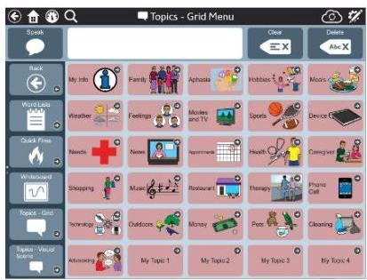
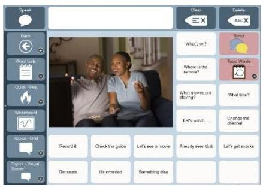
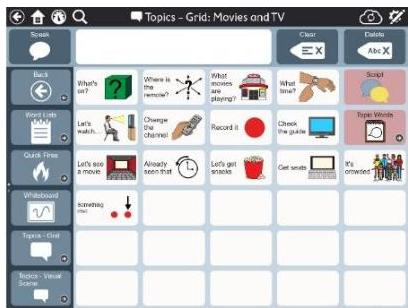
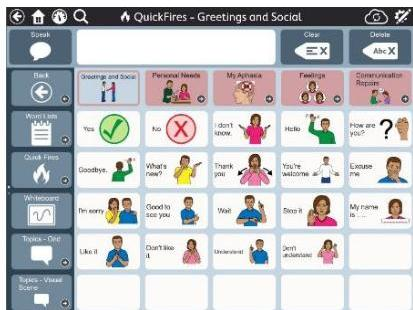
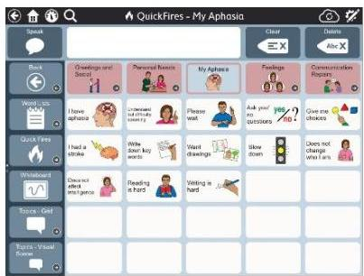

<!-- Source PDF: tobii-aac-needs-assessment.pdf -->

tobii dynavox

# Aphasia and Communication: Ideas for Therapy and Everyday Use

## The AAC Needs Assessment: A Great Place to Start!

To successfully create and implement a communication treatment plan for an individual with aphasia, you must first identify their unique needs and strengths. A needs assessment is the most effective way to this type of information. The AAC Needs Assessment provides a thorough overview of an individual’s communication needs (e.g., current communication partners, social activities, etc.) and challenges (e.g., telephone, large group, etc.) across environments. This tool helps you gather information about things that are important and meaningful to the individual. It can be used for the initial assessment and as an ongoing treatment tool.

To download the AAC Needs Assessment, scan this code.

Let’s look at the AAC Needs Assessment in a little more detail.

## Section A: Topics - General Things to Talk About

Section A of the AAC Needs Assessment gathers information about the communication topics (e.g., hobbies, places in the community, current events, etc.) that the individual needs to communicate about in day-to-day activities. This information is necessary for meaningful and effective communication tools. Activities and environments are rated according to whether the individual “would like to talk about” or “can already talk about” a topic. You should describe how the individual typically communicates in each environment and note whether the mode of communication is effective.

✓ Helpful Hint: Once you discover important topics, begin to match them to the Topics, Topic Messages, and Scripts available in the Aphasia Pages. Use the Toolbar to access Topics.

$\mathcal{F}$  Helpful Hint: Topics allow individuals to successfully communicate in everyday activities. They can be presented in either a grid or visual scene layout; choose the strategy that works best for you.

# Section B: Communication Skills

Section B of the AAC Needs Assessment collects information about specific communication functions (e.g., getting attention, asking questions, providing detailed information, etc.) and records whether functions are successful or difficult for the individual.

$\mathcal{F}$  Helpful Hint: Use Quick Fires, single words, or short phrases that are useful in all environments and activities. These provide a way to quickly initiate and maintain interactions, get more information, direct attention, comment, and request.

$\mathcal{F}$  Helpful Hint: Use the Hide Button feature to decrease the amount of visible information on a page as you work on new skills. You can gradually introduce the individual to new information needing to reprogram the system.

# Section C: Communication Environment/Situation

Communication needs will change depending on situations. For example, a one-on-one interaction may be very different than a group interaction. Section C of the AAC Needs Assessment considers the different circumstances in which an individual may need to communicate with others.

$\mathcal{F}$  Helpful Hint: Explore the My Aphasia and Communication Repairs vocabulary (in Quickfires) and identify strategies that might support interaction in difficult environments.

# Section D: Communication Partners

The skills and abilities of a communication partner can positively or negatively impact the success of an interaction. You must consider the communication partner and how they may interact with the person with aphasia. Section D examines several communication partner skills (such as giving the speaker extra time) and how important they are to the individual with significant communication challenges.

- **Helpful Hint:** For more information, review the *Communication Partners* information in the *Aphasia Training Cards*.

- **Helpful Hint:** You may find that some individuals have very limited access to a variety of communication partners and may need practice to increase success.