<!-- Source PDF: tobii-aphasia-therapy-guide.pdf -->

tobiidynavox

# Communication Activity and Therapy Guide for Aphasia

# Introduction

The purpose of this guide is to support speech and communication using a multimodal approach. It is organized by communication tool and provides a collection of activities and helpful tips to help determine how an individual can benefit from using the Tobii Dynavox Aphasia Pages in Snap Core First. These tools can be used to help anyone with aphasia, any time post their onset, at any level of language impairment. Use these activities to:

- Help you in therapy
- Complete a trial period for insurance funding of a device through insurance
- Complete an evaluation

This guide should be used in combination with the Aphasia Pages Training Cards. Step-by-step instructions for making modifications to the pages to meet the specific needs of the individual and practice activities are included. The Training Cards will be referenced throughout this document.

## Tips for Using this Guide

- The individual does not need to master every communication tool to be successful.
- Introduce only one or two communication tools at a time.
- Incorporate these activities and tips into your regular speech therapy sessions.

## QR Codes

We use QR codes so you can have quick access to information, such as videos, without having to type in web addresses. Scan the QR code using the camera on your smart phone to view the linked information.

## Android Users

Download a free QR code reader app from the Google Play store. Search "QR scanner" or "QR reader" to find options.

## iOS Users

If you have iOS 11, open your phone camera and point it towards the AR code. Tap the notification that appears.

If you have not updated to iOS 11, download a QR code scanner app. There are numerous free apps on the App Store.

tobii dynavox

# Preparation Checklist

☐ Download the Communication Success Screening Tool. It is a quick way to determine if someone may benefit from AAC. Scan to access.

☐ Download the Topic Interest Inventory. With your client and their family, fill out the form before setting up the software to help you determine what topics are important.

☐ If you are a Clinician, create a TobiiDynavox Professional Account to download free Snap software.

☐ Refer to the Setting Up Aphasia Pages in Snap Core First training card for information on how to set up the Aphasia Pages to meet the specific needs of your client. If you don't already have the training cards, scan code.

☐ For funding help, scan this QR code to go to www.tobiidynavox.com.

tobii dynavox

# Aphasia and Communication

## Aphasia and Communication

The impact of aphasia can be profound for some individuals and their families. It is essential for the person to communicate as successfully as possible from the very beginning of the recovery process. Augmentative and alternative communication (AAC) can be defined as a collection of communication strategies that provide external support for people who cannot understand or generate messages via speech on their own (Garrett &amp; Lasker, 2005).

You may be wondering if AAC has a place in your current treatment planning. You might also be asked by patients and their families about the benefits of integrating AAC tools into therapy. Continue reading through this guide to learn how AAC can be used as a tool to support speech and communication.

## Multimodal Communication

AAC is a normal part of everyone’s daily life. We all use multiple modes of communication to help us engage in daily activities and with other people. Some examples might include:

- Gesturing and/or pointing while talking.
- Showing photos of people and places from our phones and tablets.
- Drawing maps or writing steps to make directions clearer.
- Acting out a funny story while we are telling it.

The use of multimodal communication (speech + AAC) is useful for us but vital for people with aphasia (PWA). In fact, AAC serves three roles:

- Facilitate re-acquiring speech.
- Cue speech.
- Substitute for speech.

All three of these roles help people with aphasia (PWA) re-engage in what is motivating and important to them while they work on their recovery. Therefore, we should begin using AAC from the start of intervention.

tobiidynavox

# Aphasia and Communication

The Life Participation Approach to Aphasia (LPAA) focuses on creating positive, supportive communication environments. Maintaining social relationships and interactions is a primary goal and AAC can be an integral part of this approach. AAC can provide useful tools that support meaningful participation and communication in everyday life. These tools may include:

- Photo Albums
- Calendars
- Whiteboard
- Scripts
- Rating Scales
- AAC device or communication app

Some tools can help trigger speech while others can help convey the message when PWA are unable to do so using speech. For instance, research shows scripts can help PWA verbally communicate messages they have created for a routine interaction. In addition, PWA may see a word or first letter on a keyboard and that can help trigger the verbal production. However, if someone is unable to get a word out, they may use a whiteboard to draw it or spell it. They might use a rating scale to quickly communicate pain level or point to a picture of a body to communicate what hurts.

These tools should not be used in isolation but rather in combination to help someone communicate. Weissling and Prentice (2010) suggest that restoring speech skills and providing tools (e.g., AAC) to support current communication should not be exclusive but rather used in combination throughout the continuum of care. Using a multimodal tool, such as an AAC device or communication app, will not hinder PWA's ability to regain speech. Instead, it can help PWA get back into their social circles and daily activities helping to prevent depression.

tobiidynavox

# Frequently Asked Questions

## Should these strategies replace the therapy that I am already doing?

Absolutely not! These strategies are intended to be used alongside the therapy strategies that you are already using. Working to restore verbal speech and AAC strategies can work together to deliver a complete intervention program.

## Does the individual need to master every communication tool to be successful?

No. Not every communication tool will work for every person with aphasia. You and the PWA will want to become familiar with what is available on the device or communication app and see if it can be helpful. There may be communication tools that are difficult at first but potential to use them is what is important.

## How long will it take me to complete the activities?

The guide for each lesson may take one session or multiple sessions. It will really depend on your client's and family abilities.

## Should I customize the Topics and Messages?

One of the keys to making the tools found in the Aphasia Pages functional for your client is to personalize it when you can. Select Topics that are important to your client. Change messages to reflect his/her personality. Add funny sayings and stories your client liked to tell people. Use the Topic Interest Inventory to give you guidance on which topics are important.

## Should the family and/or caregiver be involved?

Another important aspect of making the person with aphasia successful is to involve family members and/or caregivers as much as possible. Having them in your sessions will allow them to practice using the software with the client as well as getting familiar with the communication tools and how to support the client. Research shows that when a PWA has at least one close supporting person they will have a significantly greater chance of successfully living with aphasia (Simmons-Mackie, et. al. 2010).

tobiidynavox

Frequently Asked Question (continued)

What does success look like?

Successful communication interactions will look differently for each person. Success doesn't necessarily mean that the PWA will say/communicate everything they want, but may include:

- More independence in communication
- Increased initiation of communication
- Use of more vocabulary
- Longer interactions
- Greater enjoyment of interactions

How will I know which tools to introduce first?

In the Communication Tool Activity Ideas section of this guide, we have ordered the tools in a suggested sequence. For example, we recommend that you start with introducing the Rating Scales because they are often commonly used and familiar to most people. However, choose tools that are important and meaningful to your client.

tobiidynavox

# Communication Tools

## COMMUNICATION TOOLS

The following communication tools are available on all grid sizes. Start with Rating Scales. They can be used in multiple environments and can be very helpful in supporting communication.

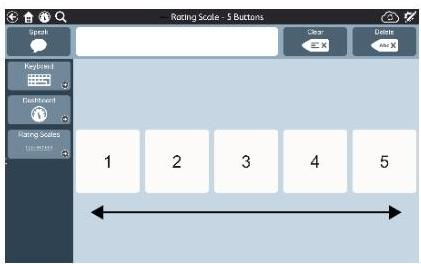

**Rating Scales**: Share opinions (1 to 3 or 1 to 5) or rate the level of pain clearly (0-5 or 0-10). Communication partners can also use the rating scales while they are speaking to make the message clear and concise.

Helpful Hint: Use the Rating Scales while completing the Topic Interest Inventory to help the PWA participate in the process.

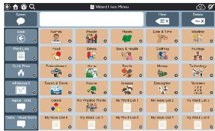

**Word lists**: Lists of words organized by category (e.g., food, places, clothing). Create new lists and/or edit the lists already there.

Helpful Hint: Word Lists can be used to communicate a specific word that the PWA is unable to say verbally. Use them to make shopping lists or order food. Word Lists may also trigger a verbal response from the PWA as sometimes seeing the word help the PWA say the word.

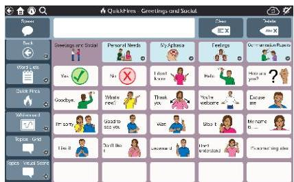

**QuickFires**: A fast and easy way to communicate words and common phrases needed in every topic and environment. Depending on grid size, there are up to 5 categories: Greetings and Social, Personal Needs, My Aphasia, Feelings, Communication Repairs.

Helpful Hint: QuickFires can be used to respond quickly during conversations and can sometimes trigger a verbal response.

tobiidynavox

# Communication Tools (continued)

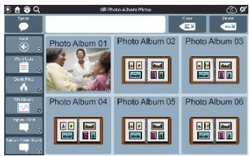

Photo Album: Share pictures and tell stories that are important such as a family vacation or a celebration.

Helpful Hint: Use photo albums to communicate about family events or outings. Take a photograph of a movie ticket stub to help talk about a movie you recently saw.

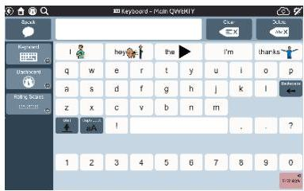

Keyboard: Use the Keyboard to communicate with a single letter to a full word. The keyboard may be alphabetical or QWERTY format and have word prediction that will guess the words being typed based on the letters entered.

Helpful Hint: Word prediction on the keyboard can help with spelling.

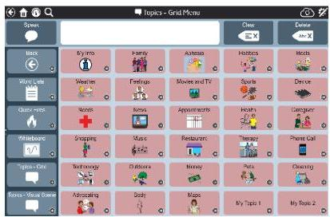

Topics: Every day, people have conversations about topics that are important to them. Topics allow you communicate by pointing to the things in the picture itself (on visual scene pages) and/or by selecting a message.

Helpful Hint: Topics can be used to communicate messages in a situation. Visual scene topics help set the context for communication and allow the PWA and the communication partner to have a shared space for communication.

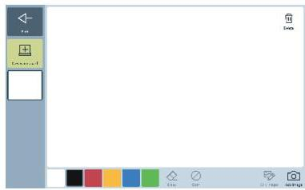

Whiteboard: Like a blank piece of paper, the Whiteboard can be used to write or draw with a finger to help communication. Use it to write letters, numbers, or words, or draw pictures to help communicate a message.

Helpful Hint: The communication partner can also write or draw choices. Save drawings or messages to use in a future conversation.

tobiidynavox

# Communication Tools (continued)

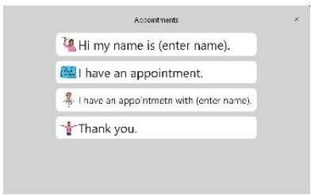

Scripts: A series of messages that appear in order to help someone communicate in situations that are important. Scripts can be used to tell stories, share information back and forth and to provide cues to produce speech. Every Topic has a sample script that can be modified to make it personal.

Helpful Hint: Scripts are a great way to practice conversational speech. Repeat the lines in the script to practice speech.

tobiidynavox

# Communication Tool Activity Ideas – Rating Scales

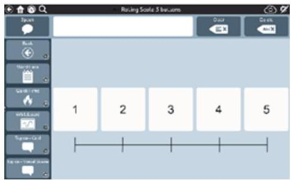

Scan this code to learn more about Rating Scales.

## Prepare (with or without your client)

- Go to the Toolbar or Dashboard and open the rating scale you want to use.
- There are two different rating scales (1-3 and 1-5) and 2 different pain scales (0 to 5 and 0 to 10).

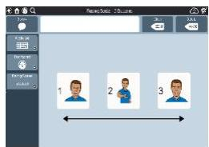

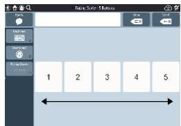

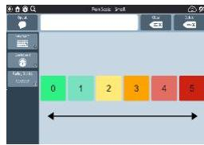

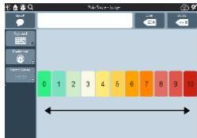

## With Your Client

- Ask the client navigate to rating scale from the Toolbar or model how to get there.
- Review the location of the Numbers or Symbols.
- Engage your client in discussions and have them use a rating scale to provide his/her opinion on:
- A new haircut
- Someone’s cooking
- Someone’s driving
- The weather
- The new therapist
- Results of a sporting event
- You can also use the rating scale when speaking to provide a model.
- If using more than one communication tool, have the client navigate between tools.

Tip: Instruct the client and family member/caregiver to use the Pain Scale when they go to the doctor’s office or during physical or occupational therapy sessions.

tobiidynavox

# Communication Tool Activity Ideas – Word Lists

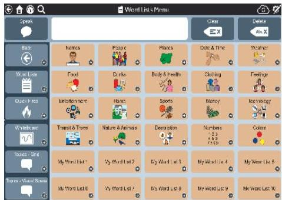

Scan this code to learn more about Word Lists.

## Prepare (with or without your client)

- Review Word Lists.
- Add any personalized words/names to appropriate categories (e.g. Names—add family names).

**Note:** See the Editing a Button card in the Aphasia Training Cards for step-by-step instructions.

## With Your Client

- Ask the client carry and position device for use at the beginning of the session.
- Model for your client how to get to the Word Lists or allow them to independently navigate, if they are able.

- Ask what foods they like
- Ask what relation various people are to them
- Have them find animals they like as pets

- Engage client in discussions regarding personally relevant topics with Word Lists page open.
- If using more than one communication tool, help the client navigate between tools, if needed.

tobiidynavox

# Communication Tool Activity Ideas – QuickFires

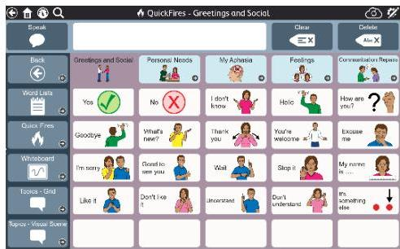

Scan this code to learn more about the QuickFires.

## Prepare (with or without your client)

- Review QuickFires.
- Personalize QuickFires for your client (e.g. Instead of "hello" someone might say "howdy" or "yo").

## With Your Client

- Ask the client navigate to QuickFires from the toolbar or model how to get there.
- Ask client questions that QuickFires can be used to answer in various scenarios.

- Therapist:
- Says: "What did you think of that movie?"
- Points to like it and don't like it saying, "Did you like it or didn't like it?" (only do this if cuing is needed).

- Client:
- Selects: "I liked it."
- Sample Scenarios:
- Introducing yourself
- Calling someone over
- Ask for help
- Answer a yes/no question

- If using more than one communication tool, have the client navigate between tools.
- During activity or discussion, don't forget to model use of QuickFires.

tobiidynavox

# Communication Tool Activity Ideas – Whiteboard

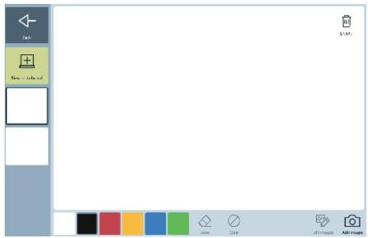

Scan this code to learn more about the Whiteboard.

## Prepare (with or without your client)

- Review the functions on the whiteboard concentrating on the pen and erase buttons.

## With Your Client

- Practice positioning the tablet or device for use at the beginning of the session.
- Model for your client how to get to the Whiteboard or allow them to independently navigate, if they are able.
- Practice using the whiteboard with your client.
- Draw some pictures
- Write his/her name or letters
- Draw arrows to give directions
- If your client can't think of a word, ask them to draw it or try to write it on the Whiteboard.
- Demonstrate to the family member/caregiver how written choice can be provided on the Whiteboard. Then have the family member/caregiver provide written choices to the client during an interaction.
- Provide written choices to:
- Answer questions about the weather
- Pick a food to order for dinner
- Select a show to watch on TV

tobiidynavox

# Communication Tool Activity Ideas – Topics

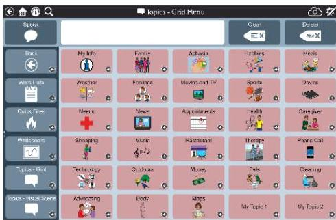

Scan this code to learn more about Topics.

## Prepare (with or without your client)

- Try each activity with the visual scene-based topic and the grid-based topic if you are not sure which will work best for the PWA.
- Explore the topics.
- Personalize the topic messages in the topics for your client.

## With Your Client

- Have the client explore his or her topic messages.
- Review each message and practice locating it.
- Communicate messages in functional tasks such as role playing or discussions. It’s best to make the conversation as real as possible so that PWA views the interaction as something that relates to real life, and not just a therapy activity.

- For example, if football is a topic of interest have a discussion with your client about a recent football game or favorite team.

- Therapist:
- Says: “Let’s talk about the football. What did you think of the game?”
- Draws attention to messages.

- Client:
- Selects: “They are really good.”

- Therapist:
- Says: “Agreed. What did you think of the refs?”

- Client:
- Selects “The refs are blind.” and laughs.

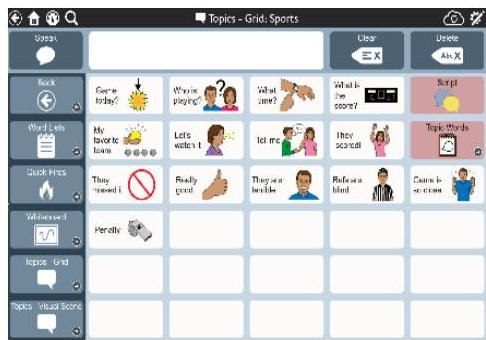

tobiidynavox

# Communication Tool Activity Ideas – Topics (cont’d)

- Model use of the topic messages by selecting them as you speak. Have the client’s family member or caregiver engage in a conversation with the client about one of the Topics.
- Family Member/Caregiver:
- Says: “Let’s talk about the weather”
- Says and selects message on screen: “I watch the news for the weather. What is it going to be like today?”
- Client:
- Selects: “It’s supposed to snow today.”
- Family Member/Caregiver:
- Says “Oh no!” and selects “It’s cold out.”
- Client:
- Selects: “The weather is always changing.”

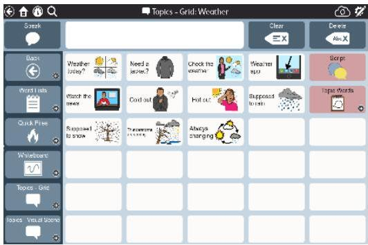

- If using more than one communication tool, have the client navigate between tools.

tobiidynavox

# Communication Tool Activity Ideas – Scripts

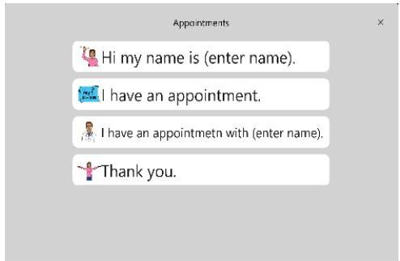

Scan this code to learn more about the Scripts.

## Prepare (with or without your client)

- For each topic you have selected, review the sample scripts that are there.
- Edit the scripts to make them applicable to your client.
- Go the topic page where the script is located.
- Select Edit.
- Select the Script button. The edit menu will pop up. Select "Scripts" under Actions.

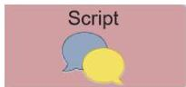

- Type the name of the Script Title.

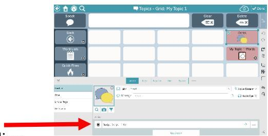

- Select Script-Label 1 to edit the first line.
- Type in the label and message if different.
- Add a symbol.
- Select Save when finished.

- Continue selecting lines to add messages
- When finished, select Done.

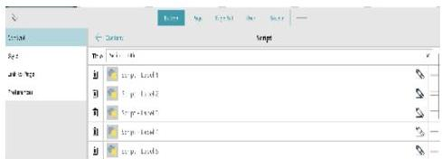

## With Your Client

- Ask the client navigate to scripts from the selected topics or model how to get there.
- Practice conversations using the scripts.
- If they are able, have the client record the messages onto the script buttons. If not, use the synthesized speech of the device or have someone else record the message.
- If using more than one communication tool, have the client navigate between tools.

tobiidynavox

# Communication Tool Activity Ideas – Photo Album

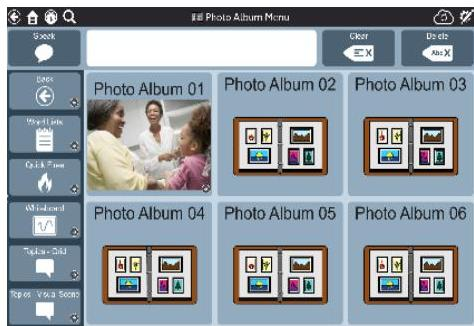

Scan this code to learn more about the Photo Album.

## Prepare (with or without your client)

- Review the photo album menu and sample photo album.

## With Your Client

- If appropriate, have client practice adjusting the volume or ask for help in adjusting volume on the device.
- Ask the client to navigate to the photo album from the dashboard or model how to get there.
- Discuss creating personal photo albums for various situations. Examples include:
- Telling about family members
- A vacation they recently took
- Past experiences (e.g. time in the war, growing up, etc.)
- Ask client and/or family members bring in photos to create their own photo album.
- Ask client participate in selecting photos and creating messages for each photo.
- Remember you can use the whiteboard to give them written choices regarding messages or QuickFires to ask yes/no questions.

tobiidynavox

# Communication Tool Activity Ideas – Keyboard

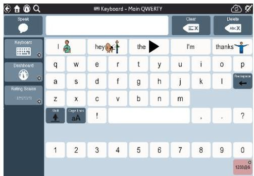

Scan this code to learn more about the Keyboard.

## Prepare (with or without your client):

Review keyboard and make sure it is set up to the layout needed (alphabetical, qwerty).

## With Your Client

- Ask client to carry and position device for use at the beginning of the session.
- If appropriate, have client practice adjusting the volume or ask for help in adjusting volume on device.
- Ask the client navigate to the keyboard from the toolbar or model how to get there.
- Help the client become familiar with his/her keyboard by having him/her locate letters and/or spell words.

- Therapist:
- Says: “Let’s get familiar with letters on your keyboard. We are going to find the first letter of your name. Find the letter M (while showing them a letter M).”

- Client:
- Struggles to locate letters.

- Therapist:
- Says: “Is this M (pointing to M) or is this M (pointing to T)?”

- Client:
- Selects “M”.

- Therapist:
- Says: “Yes, that’s it”.

- Review word prediction and ask client to practice selecting words from word prediction.

Tip: If unable to spell or write, consider targeting whiteboard for drawing to communicate.

tobiidynavox