<!-- Source PDF: trnka-2009-word-prediction-aac.pdf -->

# User Interaction with Word Prediction: The Effects of Prediction Quality

KEITH TRNKA, JOHN McCAW, DEBRA YARRINGTON, KATHLEEN F. McCOY
University of Delaware
and
CHRISTOPHER PENNINGTON
AgoraNet, Inc.

Word prediction systems can reduce the number of keystrokes required to form a message in a letter-based AAC system. It has been questioned, however, whether such savings translate into an enhanced communication rate due to the additional overhead (e.g., shifting of focus and repeated scanning of a prediction list) required in using such a system. Our hypothesis is that word prediction has high potential for enhancing AAC communication rate, but the amount is dependent in a complex way on the accuracy of the predictions. Due to significant user interface variations in AAC systems and the potential bias of prior word prediction experience on existing devices, this hypothesis is difficult to verify. We present a study of two different word prediction methods compared against letter-by-letter entry at simulated AAC communication rates. We find that word prediction systems can in fact speed communication rate (an advanced system gave a 58.6% improvement), and that a more accurate word prediction system can raise the communication rate higher than is explained by the additional accuracy of the system alone due to better utilization (93.6% utilization for advanced versus 78.2% for basic).

Categories and Subject Descriptors: H.5.2 [Information Interfaces and Presentation]: User Interfaces—Natural language; Evaluation/methodology

General Terms: Experimentation, Human Factors

Additional Key Words and Phrases: Word prediction, user study, communication rate

## ACM Reference Format:

Trnka, K., McCaw, J., Yarrington, D., McCoy, K. F., and Pennington, C. 2009. User interaction with word prediction: The effects of prediction quality. ACM Trans. Access. Comput. 1, 3, Article 17 (February 2009), 34 pages. DOI = 10.1145/1497302.1497307. http://doi.acm.org/10.1145/1497302.1497307.

This work was supported by U.S. Department of Education grant H113G040051.

Authors' addresses: K. Trnka, J. McCaw, D. Yarrington, K. F. McCoy, Department of Computer and Information Sciences, University of Delaware, Newark, DE 19716; email: {trnka, mccaw, yarringt, mccoy}@cis.udel.edu; C. Pennington, AgoraNet, Inc., 314 East Main Street, Suite 1, Newark, DE 19711; email: penningt@agora-net.com.

Permission to make digital or hard copies of part or all of this work for personal or classroom use is granted without fee provided that copies are not made or distributed for profit or direct commercial advantage and that copies show this notice on the first page or initial screen of a display along with the full citation. Copyrights for components of this work owned by others than ACM must be honored. Abstracting with credit is permitted. To copy otherwise, to republish, to post on servers, to redistribute to lists, or to use any component of this work in other works requires prior specific permission and/or a fee. Permissions may be requested from the Publications Dept., ACM, Inc., 2 Penn Plaza, Suite 701, New York, NY 10121-0701 USA, fax +1 (212) 869-0481, or permissions@acm.org.

© 2009 ACM 1936-7228/2009/02-ART17 $5.00 DOI: 10.1145/1497302.1497307.

http://doi.acm.org/10.1145/1497302.1497307.

ACM Transactions on Accessible Computing, Vol. 1, No. 3, Article 17, Pub. date: February 2009.

RIGHTS LINK

1 Introduction

In the United States alone, it is estimated that approximately two million people have a speech disability severe enough to create a difficulty in being understood *[Beukelman and Mirenda (2005)]*. There are an assortment of conditions that can cause this, including cerebral palsy (CP), amyotrophic lateral sclerosis (ALS), traumatic brain injury (TBI), assorted muscular dystrophies, and congenital deafness. These conditions affect individuals in all aspects of their lives, including education, the workplace, and their personal lives.

Communication devices have been developed in the field of Augmentative and Alternative Communication (AAC) in an effort to aid these individuals in the basic need of expressing their thoughts; these are often called AAC devices, speech generating devices (SGD), VOCA (voice output communication aid) devices, or AugComm devices. High-tech AAC devices are electronic devices that allow a person to communicate by entering text that is converted to synthetic speech using speech synthesis techniques. People who use AAC vary greatly: AAC is used by children and adults, those with a broad range of linguistic and cognitive abilities, and those with a wide range of motor abilities. Therefore AAC devices must be carefully matched to the abilities of the user. Demasco and McCoy [[1992]] describe an AAC device as a virtual keyboard consisting of a physical interface which defines the way the user interacts with the keyboard, and a language set which defines the selectable language elements the keyboard provides. The physical interface may be anything from a standard keyboard for those with a good deal of fine motor control, to a keyboard with a reduced number of large keys (making them easier to select), to a single switch coupled with a scanning system that cycles through the selectable items and the user must hit the switch when the system comes to the item (s)he wishes to select. The language set of a communication device consists of those items that the user may select using the physical interface to create language. Typically, language sets are some combination of icons, letters, words, and phrases. The language set may be static or may change dynamically as the user selects items. The particular mix of physical interface and appropriate language set must be carefully chosen by a Speech Language Pathologist (SLP) by taking into account the abilities of the user and matching them with appropriate technologies. Often there are several trade-offs that must be weighed, including the speed of selection (e.g., it would be faster to select a word if it only required a single keystroke), the number of items available for selection (the more items included, the harder it is to get to one), the flexibility of the interface (e.g., whether there is a fixed set of messages or can new messages be constructed from the selectable items), and the linguistic and cognitive load on the user (e.g., an interface of letters makes little sense for a child who cannot spell, whereas a dynamic interface may prove too much cognitive load for some users).

In this work we concentrate on a subset of those who use AAC: those with no cognitive or linguistic impairment who primarily use letter-by-letter spelling to construct their messages. Motor impairments can make entering letters and words to be spoken by the AAC device a slow and challenging process.

User Interaction with Word Prediction: The Effects of Prediction Quality

|  Do you enjoy | c |   |
| --- | --- | --- |
|   | cooking | (F1)  |
|   | camping | (F2)  |
|   | classical | (F3)  |
|   | comedy | (F4)  |
|   | college | (F5)  |

Fig. 1. Example word prediction interface using function keys to select words.

Actual communication rates of AAC users vary greatly due to the wide range of motor abilities and interface choices. Although communication rates differ, 10-15 words per minute (wpm) seems to be a rough upper bound for selecting letter-by-letter on a keyboard [Copestake 1997; Newell et al. 1998]. Newell et al. [1992] surveyed numerous AAC users with the PAL system and found a wide range of communication rates. One PAL user with cerebral palsy was able to achieve 16 wpm, but two other users with athetoid cerebral palsy produced 1.94-3.64 wpm while two others ranged 0.52-1.16 wpm. Studies with the FASTY system showed similar rates: 1.71-2.87 wpm was achieved in early studies [Beck et al. 2004]. A study comparing the EdgeWrite system to the WiViK onscreen keyboard showed a participant with a spinal cord injury producing 11.82 wpm with WiViK and 12.09 wpm with EdgeWrite [Wobbrock and Myers 2006]. Thus communication rates can be extremely slow for this population of users. However, the communication rate of slower users sometimes doubled with the addition of word prediction.

In contrast to these slow rates of communication using AAC, spoken communication produces 130-200 words per minute or more. This creates a large communication gap between AAC and traditional communicators, making for a quality-of-life issue. Because of this, communication rate is one of the most acknowledged problems in AAC interactions [Todman and Alm 1997; Beukelman and Mirenda 2005].

Word prediction is a processing technique on the language set that relies on the user's inputted characters to predict the word the user is attempting to generate. The system offers these predictions in a list for quick selection. An example word prediction system is shown in Figure 1. The words presented in the list all begin with the characters that the user has already entered and can be selected with a single keystroke.

Word prediction can save significant time entering words and therefore has been implemented in many of today's common AAC devices, including Prentke Romich Company's Pathfinder Plus and ECO-14 (which employs WordQ software for the predictions), Dynavox Corporation's V and Vmax, and Saltillo Corporation's ChatPC-4.

While intuitively word prediction should speed communication rate and has been shown to positively affect communication rate, some work (most notably Venkatagiri [1993] and Koester and Levine [1994b]) has called to question the

ACM Transactions on Accessible Computing, Vol. 1, No. 3, Article 17, Pub. date: February 2009.

RIGHTLINK

effectiveness of word prediction for communication rate enhancement. Such work cites the added cognitive tasks that are required to use the technique. For instance, in order to fully utilize word prediction, after each letter has been entered the user must shift his/her gaze to the list of predicted words, scan the list, and for each word in the list, decide whether or not it is the word (s)he intends, and act on that decision accordingly by either continuing the scan or selecting the word. The amount of extra cognitive work leads to the question as to whether or not word prediction is a fruitful area in which to continue AAC research. In this article, after providing background on word prediction and AAC, we present the results of our study, which finds an overwhelming benefit of word prediction on communication rate. We hypothesize that the negative results found in studies such as Venkatagiri [1993] and Koester and Levine [1994b] can be attributed to two sources: (1) imposed usage strategies, essentially either instructing when to scan the prediction list or “requiring” 100% utilization of the prediction list; and (2) the actual prediction method used, that is, the quality of the predictions from a theoretical perspective.

We report on a study that offers word prediction to the user but does not coerce him/her to use it. The user is encouraged to enter text as quickly as (s)he can and may choose to use word prediction or to ignore the prediction list and continue typing letter by letter. Our study compares three different text entry methods: (1) letter-by-letter typing with no word prediction, (2) letter-by-letter typing with word prediction produced by a basic algorithm, and (3) letter-by-letter typing with word prediction produced by a more advanced algorithm. Our hypothesis is that word prediction will improve communication rate for those who type at the speed reported in the AAC literature, and that the more advanced word prediction will increase communication rate over the basic word prediction in proportion greater than can be explained by the difference in theoretical keystroke savings between the two methods alone.

Before discussing the study, we provide background on word prediction from both a theoretical perspective (in which the prediction method is evaluated in keystroke savings), and from a more practical perspective (in which communication rate is the focus).

### 1.1 Theoretical Work in Word Prediction

Word prediction systems attempt to predict the word the user wants to type based on what (s)he has typed so far. In its simplest form, implementing a word prediction system requires a dictionary of possible words. Once the user has typed the first couple of characters of a word (s)he wants, the system would present words in the dictionary that start with those letters as possible completions. A simple improvement on this method would be to favor words that the user had recently typed. The intuition here is that users are most likely to use important words multiple times. Thus the system would assign higher probabilities to words that have been seen before.

Prediction accuracy can be improved by estimating the likelihood of each word by measuring trends in a large corpus of text. The most straightforward way to do this is to simply calculate probabilities on the basis of word

User Interaction with Word Prediction: The Effects of Prediction Quality

frequency. This method would predict words that are most common in the corpus. For example, because the word “the” occurs frequently in most corpora, it would be assigned a high probability and would be offered as one of the predicted words, given that the user has typed “t”.

The approach of calculating probabilities from a corpus can be extended further by entering the realm of language modeling employed in natural language processing applications such as speech recognition *[Manning and Schütze 2000; Jurafsky and Martin 2000]*. In these models, rather than calculating a word’s probability based on its frequency in isolation, the probability is based on the frequency in the context of some number of prior words of text. These models are called ngram models and the probability of a word is dependent on the previous $n-1$ words. For instance, a trigram model calculates a word’s probability based on the frequency that the word occurs in the corpus following the two preceding words. Assuming a user has typed “the big t” the probability of the words to follow depend on the frequency with which they occur in the corpus preceded by “the big”. Although “the” would be considered highly probable if just the frequency of the individual word (or unigram) were consulted, “the” occurs very infrequently following “the big” and thus would likely not be offered. Instead, words such as “table” and “time” might be offered in the prediction list.

Trigram models are generally accepted as a standard baseline model in natural language processing *[Manning and Schütze 2000; Jurafsky and Martin 2000]*. One issue with these trigram models is that training them generally requires more text than basic word frequency methods to provide accurate predictions. Many three-word sequences may never occur in the training corpus, so the problem of data sparseness must be addressed with careful processing techniques *[Katz 1987]*.

Typically, the quality or accuracy of a word prediction system based on ngram models will be dependent on such factors as the order of the model (i.e., the $n$ used), the size of the training corpus (higher-order models require a larger corpus to train), the method of handling data sparseness, and the similarity of the text in the training corpus to the text used to evaluate the system.

Language models for word prediction are typically evaluated in keystroke savings: the number of keystrokes saved using word prediction over manually typing a piece of text. This evaluation makes the assumption that a system which saves more keystrokes will be more beneficial to the user. Thus many researchers are investigating ways to improve word prediction in order to reduce the number of keystrokes needed. Proposed improvements tend to either focus on adding recency-of-use information *[Carlberger 1998; Wandmacher and Antoine 2006; Wandmacher et al. 2007]*, improving grammatical predictions *[Copestake 1997; Fazly 2002; Fazly and Hirst 2003; Carlberger and Hunnicutt 1998; Hunnicutt and Carlberger 2001; Trost et al. 2005; Yang et al. 1990; Garay-Vitoria and González-Abascal 1997]*, or matching the predictions to the topic of the overall discourse *[Trnka et al. 2006a, 2006b; Li and Hirst 2005; Li 2006, Wandmacher et al. 2007; Wandmacher and Antoine 2007; Stocky et al. 2004; Gong 2007; Matiasek and Baroni 2003; Lesher and Rinkus 2001; Lesher

ACM Transactions on Accessible Computing, Vol. 1, No. 3, Article 17, Pub. date: February 2009.

RIGHTS LINK

and Higginbotham 2005]*. A large-scale survey of word prediction can be found in Garay-Vitoria and Abascal [2006, 2004].

### 1.2 Practical Outcomes of Word Prediction

While the theoretical improvements in word prediction are exciting and the results indicate significant increases in theoretical keystroke savings, their effect on communication rate is less clear. User studies have been performed over the years to determine the practical effects of word prediction on communication rate. Because of wide variations between different AAC users, most practical research focuses either on case studies of AAC users or larger studies of non-AAC users.

Horstmann and Levine [1990] applied a successful simulation model of human-computer interfaces to word prediction in a row-column scanning device: the GOMS model (Goals, Operators, Methods, Selection rules). They modeled row-column scanning in three conditions: no word prediction, simulation of the PACA-2 scanning/prediction interface, and simulation of the PAL scanning/prediction interface. They found that the PACA-2 system was estimated to be slower than a scanning system without prediction, even if the system could correctly guess all words in the dictionary after 2 letters (predictions were only presented after 2 letters in the PACA-2 system). The estimate of communication rate for PAL was better with the initial parameters, yet still lower than the system without prediction, even when the probability of guessing the word correctly after one keystroke was increased to 40%. The ability to simulate communication rate with different systems may be very useful to finding appropriate systems for each user compared to costly testing. However, the particular parameters used in this study, the GOMS representation, and also the GOMS framework must first be validated to match actual user tests.

Newell et al. [1992] studied the effects of the PAL word prediction system on users over a long term. They worked with over 50 clients at a variety of ages, and found that word prediction helped to improve the spelling of individuals with spelling disorders. Even children with severe spelling problems could enter the initial letter(s) and select the desired word from the predictions. This not only improved the quality of the written text, but it also resulted in participants producing much more text. Teacher surveys and small-scale analysis of text revealed that after 6 months of PAL usage, many children demonstrated improvements in unaided spelling in addition to increases in attention span and improved language development. The case studies also showed that PAL improved the sentence structure of some children. They found that PAL often increased communication rate and greatly reduced fatigue by decreasing the number of keystrokes, which in turn encouraged children to produce more text.

Venkatagiri [1993] collected 10 natural sentences from 16 participants and had a single user with no motor impairments enter the sentences into the system using word prediction. The user was expected to scan the 15 predictions after every keystroke and select the word as soon as it appeared. Predictions were selected by pressing the corresponding key on a standard keyboard

(0–9, “[” and “/” were 12 of the keys), but the particular mapping may have caused additional cognitive overhead (e.g., searching for the “[” key on the keyboard). They found that the communication rate with word prediction was not significantly different from letter-by-letter entry, despite nearly 50% keystroke savings. A possible explanation for this finding could be due to the overhead of the experiment; the user was required to constantly scan a very large prediction list and remember which key to press for each prediction.

Venkatagiri [1994] extended the previous study to evaluate the effects of the number of predictions on communication rate and other statistics. The 21 participants were asked to copy three text samples under three different window sizes (5, 10, and 15 predictions). The order of the three window sizes was varied to control for learning effects. Participants were instructed to search the prediction window after typing each letter. The prediction lists were generated from a frequency-and-recency method containing 903 words. The participants achieved 31.1% keystroke savings with 5 predictions and 43.9% keystroke savings with 15 predictions. They found that, despite a significant increase in keystroke savings between the three window sizes, there was not a significant difference in communication rate. The lack of significant effect on communication rate seems to be due to a strong effect on input rate: Participants took significantly longer to select each keystroke with more predictions. The additional overhead of scanning larger lists outweighed the additional benefit of higher keystroke savings. Although this study provides a useful framework for tailoring the number of predictions to a user, the generalizability of the findings is questionable. The results are not indicative of the general effects of increased keystroke savings, as other variables are changing (the number of predictions and, in turn, the overhead due to scanning the list). Although we agree that individual users of AAC systems will find the best communication rate with a certain number of predictions, the optimal window size is likely dependent on the characteristics of the user, the word prediction system, and the interface used.

Koester and Levine [1996; 1994b] performed a similar experiment, but studied the differences between two different word prediction usage strategies. In the first strategy, participants were instructed to scan the predictions before every key press. In the second strategy, the participants were instructed to not look at predictions for the first two characters, and then begin to scan the list before every key press. The two strategies were studied with six participants with spinal cord injuries (SCI) and eight participants without motor impairments. Four of the participants with SCI used hand splints to select keys and the remaining ten participants used mouth sticks to select keys. Participants were asked to copy text from an index card and were provided 20 seconds to read the sentence before each test began. Before the actual test, they were provided a warm-up session. The participants with SCI displayed a drastic decrease in communication rate for all texts, more so when the system offered lower keystroke savings. The participants without motor impairments displayed a moderate increase in communication rate on text samples which had 30–40% keystroke savings, a drastic increase on the text sample with over 50% keystroke savings, and a decrease in communication rate with

15–25% keystroke savings. One of the reasons for the larger discrepancy between the groups is that the group with SCI was allowed to use their normal method of input (hand splint or head pointer) and had no significant prior experience with word prediction. Their communication rate for letter-by-letter entry was much higher than the group without motor impairments. However, when forced to utilize word prediction, the group with SCI communicated at nearly the same speed as the group without motor impairments. The impact of word prediction on the participants with spinal cord injuries seems to be compounded by their expertise at letter-by-letter entry, making the results difficult to interpret. Aiming a mouth stick may have also added significant overhead when used in addition to reading the text typed, scanning the predictions, and mentally mapping predictions to number keys.

Koester and Levine [1994a] studied the effects on six participants of word prediction in a row-column scanning interface. The word predictions were provided as an additional dimension in the scan; the scan alternated between the letter matrix and the predictions at the top level, then the user could select the currently highlighted half and navigate to select a letter or word. They balanced the order of treatments (letter-by-letter entry and letter-by-letter with word prediction) to control for learning effects. They did not find any significant differences in communication rate with and without word prediction. However, the first group of participants had a higher communication rate than the second group, suggesting that the results may have been dominated by the effects of a small sample size. Additionally, they concluded that the negative effect of word prediction on input rate offset the reduced number of scans and switch presses. However, the added overhead could be due to some combination of the simple prediction method and the user interface.

The Profet system was also tested with case studies of eight users with motor impairments [Carlberger et al. 1997]. Profet facilitated and increased communication rate for many participants, though two participants showed no change and one showed a decreased communication rate. However, word prediction had major effects on areas other than communication rate. The reduced number of keystrokes with word prediction led to greatly reduced effort. Also, the written texts had fewer spelling errors and better linguistic structure. Both of the participants with spelling and text construction difficulties displayed improvements in ease of writing.

Koester and Levine [1997] applied a model similar to Horstmann and Levine [1990] on the user study data from Koester and Levine [1996; 1994b] to develop an accurate simulation model. They found that a reasonable model could be developed that only depended on the time to press a key and the time to scan the predictions. The number of scan times incurred was determined by the participant group: One group scanned the list before every key press and the other group scanned the list before key press after the second letter. The number of key selections was determined by the keystroke savings. They improved their model in three revisions: The first model estimated the times from literature and was a reasonable predictor of increase in communication rate for the group without spinal cord injury (SCI) but was a poor predictor for the SCI group. The second revision of their model learned selection and scanning

times from the data and was a vast improvement over the first model, but the deviation from the actual effects was still higher for the group with SCI. The third revision parameterized the scan time based on whether the desired word appeared (and the position in the list if so) and two parameters representing potential anticipation of a successful or failed scan, improving accuracy over the second model. The major finding was that reasonable simulation models can be developed for word prediction, and that models are much better when they are tuned to users and usage strategies.

Koester and Levine [1998] extended the development of their keystroke-level model for word prediction to various parameters. Their previous studies focused on two usage strategies, whereas this study used five strategies (one for each possible point to begin scanning the list). They also added a new selection-time component just for the word prediction conditions to model the reduced input rate when using word prediction. The simulation model of word prediction was applied to generate several graphs, showing the optimal usage strategy for different combinations of user parameters. They also investigated the impact of higher and lower keystroke savings on the optimal usage regions. Their results graphically display intuitive trends: Users that take a long time to select each letter but can scan the lists quickly should rely on word prediction more. Users that select letters quickly or take a long time to scan the predictions should rely on word prediction less (or use letter-by-letter entry).

Anson et al. [2006] studied usage of an on-screen keyboard using a mouse, specifically for a copy task where eye gaze is not only shifting between the keyboard and predictions, but also shifting to the copy text. They studied 10 participants with no motor impairments under letter-by-letter entry, word completion, and word prediction. Despite the lack of motor impairment, the communication rates achieved are comparable to users of AAC devices (6.8–12.0 wpm for letter-by-letter and 7.9–11.1 wpm with prediction). The participants were asked to copy text from a novel for 20 minutes and the number of words was counted. Tests with each method were repeated until the participants maintained a consistent text production rate for three trials, but fatigue was avoided by limiting the number of trials per day and also the number of consecutive trials without a break. The final three trials for each method were recorded and analyzed. On average, participants’ communication rates improved by roughly 10% through use of word prediction over letter-by-letter entry. However, many participants felt frustrated with the predictions because they disliked looking away from the document to scan the predictions, which caused them to lose their place in the document. The nature of the copy task may have affected the results; the experimental design suggests that participants were given a full sheet of text to copy from a document holder. A method to help participants keep track of position in the document may have helped (e.g., numbered lines, one sentence provided at a time). Also, a dictionary-based prediction system may have been responsible for the mediocre improvement and some user frustration. Details of the prediction algorithm are not provided. However, their results in terms of communication rate improvement are comparable to our findings with a very basic prediction method.

17: 10 · K. Trnka et al.

Wobbrock and Myers [2006] integrated word prediction into their EdgeWrite character stroking system and studied the impact on a participant with a spinal cord injury. The participant had a much higher communication rate with word prediction, both using the WiViK keyboard as well as the EdgeWrite system with a trackball. Word prediction also decreased the number of errors when used with WiViK; however, the number of errors increased with word prediction when using EdgeWrite.

The Sibylle system was evaluated on over 20 participants from the Kerpape rehabilitation center, mostly children [Wandmacher et al. 2007]. Most of the participants appreciated the system, and found a significant increase in communication rate. Additionally, many of the children who also attended the Kerpape school felt comfortable working in longer sessions as a result of using Sibylle. Many participants, especially those with language difficulties, had fewer typing, spelling, and grammatical errors when using the system. Similarly, initial evaluation in the FASTY project revealed long-term learning effects of users [Beck et al. 2004]: Users’ writing speed was improved slightly over the initial 5-week period.

Summary. The effects of word prediction in previous studies are numerous. Many participants found that word prediction could increase the rate of text production, whether in a copy task or a free-form task. A reduction in the number of keystrokes consistently reduced the amount of effort required, often encouraging participants to produce more text than they would otherwise. In turn, the ability to produce more text seems to have stimulated learning for some children. Additionally, many participants were better able to produce correct text in both copy and free-form tasks. The spelling of individual words was improved and many participants produced more grammatical text. In long-term studies, prolonged use of word prediction seems to also improve subsequent spelling and grammar without word prediction. A reduction in effort is clearly related to a reduction in keystrokes and also an increase in communication rate follows from a lower number of keystrokes, supporting the hypothesis that a system which offers more keystroke savings will benefit the user more.

However, some studies have found that word prediction was not beneficial to communication rate [Venkatagiri 1993; Koester and Levine 1994b]. They hypothesize that there is significant cognitive and perceptual load when using word prediction, for example, to search for the desired word in the list of predictions and select it if necessary. They suggest that the extra time to perform these tasks outweighs the reduction in time from avoiding several keystrokes [Horstmann and Levine 1991]. These studies instructed participants on when to scan the predictions and how to utilize the system. In contrast, unrestricted users of text entry systems naturally develop their own strategies of usage to lower the amount of time and effort required. Due to variations in abilities and settings, people develop personalized usage strategies, which may vary substantially from person to person. People who type very quickly will likely find that word prediction is a distraction; simply typing the remaining few letters may be quicker and easier for a fast typist than finding the prediction list,

ACM Transactions on Accessible Computing, Vol. 1, No. 3, Article 17, Pub. date: February 2009.

RIGHTS LINK

scanning it, and potentially selecting the desired word. On the other hand, people who type slowly may find that the keystroke savings of word prediction greatly outweighs the cognitive and perceptual overhead of using the system, especially when the time spent to select letters is the limiting factor in producing text. However, even slow typists are unlikely to fully utilize the system (i.e., select the word as soon as it appears); rather, we expect that users will sometimes find it faster to type a word out instead of scanning the list at every opportunity.

### 1.3 Approach

In this study, participants were asked to copy text presented to them one sentence at a time using three different text entry methods (letter-by-leter entry, a basic word prediction system, and an advanced word prediction system) over three different sessions. In contrast to previous studies *[Venkatagiri 1993, Koester and Levine 1994b]*, we allow users to develop their own strategy of usage to optimize communication and allow them to either use or ignore word prediction as they wish. Although some studies included both scanning devices as well as keyboards *[Newell et al. 1992, Wandmacher et al. 2007]*, we focus purely on keyboard input to avoid the additional complications of including predicted words and letters in a character grid. In contrast to studies where users lost their place in the copy text *[Anson et al. 2006]*, we minimize the cognitive overhead of the copy task by only presenting the current sentence to copy and also by aligning the copy text with the editing window to allow quick access to the current word in the copy text. We have also attempted to minimize the overhead of the prediction system by utilizing a touch screen for both letters and predicted words, in contrast to systems where keyboard keys are mapped to predictions, requiring a shift of focus *[Venkatagiri 1993, Koester and Levine 1994b]*. We have also focused on both a high-quality prediction system as well as a basic system, whereas other research seems to produce results similar to our basic system.

This article is an expansion of our previous studies Trnka et al. [2008, 2007] using 33 participants, including much more detail regarding our experimental methods as well as expanded analysis. We compare three different text entry methods (also referred to as input methods) for AAC text: typing on a keyboard with no word prediction, typing on a keyboard with a basic word prediction algorithm available, and typing on a keyboard with a more advanced word prediction algorithm available. In these three input situations we investigate: (1) the effect of the entry method on input rate (i.e., the time it takes to enter a single keystroke) and (2) the effect of the entry method on communication rate. We will also discuss (3) the prediction utilization of the algorithms and (4) survey results from participants under each condition.

We hypothesize that:

1. a more advanced word prediction algorithm will allow the user to communicate much faster (despite a decrease in input rate due to increased cognitive load); and

###### Acknowledgements.

ACM Transactions on Accessible Computing, Vol. 1, No. 3, Article 17, Pub. date: February 2009.

##

17: 12 · K. Trnka et al.

2. users will more fully utilize an advanced system compared to a basic system, due to increased trust.

### 1.4 Justification of Approach

Although the target population of our research is adult AAC users without significant cognitive impairments, undertaking a significant study using the target population would be infeasible and potentially biased. Devices are often customized to suit each particular AAC user, both in the physical interface as well as the device software. Developing a word prediction system that interoperates with each user’s preferred typing environment is impractical. But more importantly, many AAC users are already familiar with some form of word prediction in commercial devices. If the predictions are poor in the user’s system, they will likely be biased to not utilize another word prediction system. Therefore, we chose to study adults who had little or no prior experience with word prediction and no motor or communication difficulties, but were slowed using a key-press delay to simulate average AAC communication rates.

Therefore, we simulate the effects of a motor impairment by requiring each key press (whether a letter or predicted word) to take at least 1.5 seconds. This delay corresponds to a communication rate of approximately 8 words per minute, comparable to available statistics for AAC [[Newell et al. (1998)]]. When the user selects either a letter or prediction, it remains highlighted for 1.5 seconds before the press registers in the system. Neither the predictions nor the editing window update until after the delay. This allows us to determine the effects of word prediction on communication rate using a fairly large number of participants with communication rates in the range of AAC users. Future work includes validating our findings using case studies of a small group of AAC users.

Natural AAC usage can be viewed as a creative writing task, where the person is planning what to communicate *in addition to* typing the intended words. However, the primary benefit of word prediction for our target users is to improve the speed of typing the intended words. Although it may be possible for word prediction to augment the cognitive task of planning a message to communicate, this benefit is likely to be small in comparison to the improvement in communication rate. However, the cognitive task of planning messages can dominate the time for communication when we are unsure of what to say, but at other times message planning can consume an insignificant amount of time. We designed the experiment using a copy task to avoid the varying time involved in message planning and also to focus our study on the effects on communication rate. In addition, the copy task afforded much better control over the quality of the word prediction systems (the primary variable in the experiment), as the quality of predictions is dependent on the particular text typed.

The text used for the copy task was presented to the participants visually: in a window near the editing window. The alternative to visual cues are auditory cues; the system could automatically play prerecorded speech for each sentence when the participant reached the sentence. Auditory cues have a

ACM Transactions on Accessible Computing, Vol. 1, No. 3, Article 17, Pub. date: February 2009.

RIGHTS LINK

User Interaction with Word Prediction: The Effects of Prediction Quality

|   | Day 1 | Day 2 | Day 3 | Participants  |
| --- | --- | --- | --- | --- |
|  Condition 1 | None | Basic | Advanced | 5  |
|  Condition 2 | None | Advanced | Basic | 5  |
|  Condition 3 | Basic | None | Advanced | 6  |
|  Condition 4 | Basic | Advanced | None | 5  |
|  Condition 5 | Advanced | Basic | None | 6  |
|  Condition 6 | Advanced | None | Basic | 6  |

Fig. 2. The six conditions and the number of participants for each.

major drawback on longer sentences: If the user forgets the intended words, (s)he would have to play the recording again, which may exaggerate the differences between slower and faster text entry methods. In addition to the memory demands of auditory prompts, they cause potential issues with spelling, especially for homonyms (e.g., "there" versus "their"), whereas visual prompts display the spelling of the word. This has potential implications for word prediction, which is often not designed to handle homonyms; in some prediction methods, "are" is much more likely to be predicted after "there" compared to "their". Auditory prompts also pose complications in timing the prompts and interface issues in allowing the recording to be replayed.

## 2. METHODS

The purpose of this study is to evaluate the effects of varying degrees of word prediction on communication rate and related statistics in an AAC-like system. The primary independent variable is the text entry method used to copy text: a somewhat typical word prediction system (basic), word prediction using a more language-based algorithm (advanced), and no word prediction.

### 2.1 Experimental Design

We tested each participant under the three different text entry methods. In order to control for the effects of the order of the three treatments on the results (e.g., if basic prediction biases participants against all word prediction in the future), we used a balanced design. There are six possible orderings for studying usage of the three different text entry methods and we originally attempted an even distribution by assigning conditions in a round-robin fashion. Because some participants did not complete the study (resulting in an unbalanced distribution), we manually assigned the conditions of the last five participants in order to approximately balance the conditions. The six different conditions and the number of participants in each group are shown in Figure 2.

### 2.2 Participants

The study was conducted using 33 adult participants with no visual or cognitive impairments and who are native speakers of American English. Most of the participants were obtained through the use of flyers and an auction-like Web page for college students. Participants were compensated $30 for their time and effort.

ACM Transactions on Accessible Computing, Vol. 1, No. 3, Article 17, Pub. date: February 2009.

RIGHTS LINK

K. Trnka et al.

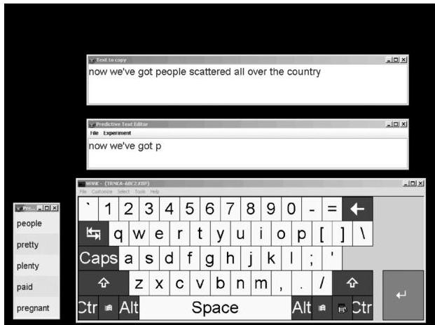

Fig. 3. View of the copy task with word prediction. The text to be copied (copy window) appears at the top and the editing window appears below. The on-screen keyboard to the bottom and prediction list to the bottom left are both selected by touch.

### 2.3 Word Prediction System

2.3.1 User Interface. Each participant was asked to copy text into the computer using the on-screen WiViK™ keyboard and a touch screen, shown in Figure 3. We selected a copy task to control for message composition time, and avoided auditory prompts due to potential complications with spelling. The user was in a quiet room with controlled lighting and sat at a comfortable distance from the touch screen.

We designed the user interface of our prediction system to minimize cognitive overhead. The system consisted of 4 active windows with a black desktop background to minimize user distractions. The text to copy was presented at the top of the screen and the user's typing appeared below in the editing window. The copy and editing windows were horizontally aligned so that the user could easily identify his/her place in the copy window. The on-screen keyboard at the bottom of the display was used to enter letters. A new sentence would appear in the copy window and the editing window would be cleared once the user hit the large red "enter" key in the lower-right corner. In the cases where word prediction was used, a list of predicted words appeared on the bottom left (the following section describes how the lists are populated). We chose to provide 5 predictions to the user, to follow common AAC devices and also following existing research in word prediction. When the user wanted to select a word, (s)he could touch the area around it and the system would generate the word in the editing window after a 1.5-second delay. In the case when no word prediction was used, no such box appeared.

2.3.2 Simulated Communication Rate. We simulated the effects of a motor impairment with our participants to better approximate the interaction with an actual AAC user. A motor impairment was simulated by requiring each

ACM Transactions on Accessible Computing, Vol. 1, No. 3, Article 17, Pub. date: February 2009.

RIGHTLINK

User Interaction with Word Prediction: The Effects of Prediction Quality

|  ... go to the | restau |   |
| --- | --- | --- |
|   | restaurant | (F1)  |
|   | restauranteur | (F2)  |
|   | restauranteurs | (F3)  |
|   | restaurants | (F4)  |
|   | restaurateur | (F5)  |

Fig. 4. Example of basic predictions.

key press to take at least 1.5 seconds. When the user pressed either a letter or prediction key, it remained highlighted for 1.5 seconds before the press actually registered in the system. During the 1.5-second delay, the user was allowed to rest his/her arms but (s)he could not see the effect of the keystroke on any of the windows (predictions included) until after the delay.

We chose a delay of 1.5 seconds to match an ideal typing speed of approximately 8 wpm under the assumption that the average word requires approximately 5 keystrokes (average word length in the testing data is roughly 4 characters plus one key for a space or newline). This target communication rate is comparable to available statistics for AAC [Newell et al. 1998] and was also one of the available delay values in WiViK, the on-screen keyboard software.

2.3.3 Word Prediction Methods. The basic prediction algorithm orders the prediction list based on how often a given word is used in a session up until that point. If the window's 5 word spots are not filled from this recency model, then the remaining spots are filled in alphabetical order from a large dictionary. Figure 4 shows an example of predictions from the basic method when the recency model does not contain the desired word ("restaurant" would be predicted much sooner if it had been used previously). The figure shows the first time that "restaurant" is predicted while typing the word. While many AAC systems use a more sophisticated algorithm (taking a word's frequency into account as well), the recency algorithm we employed is simple to implement and provides a reasonable approximation of a basic algorithm employed by AAC word prediction systems. We also hope that if (as hypothesized) the quality of predictions affects communication rate, the difference in the two methods will show a difference in communication rate.

The advanced prediction algorithm employs statistical natural language processing techniques to achieve more appropriate predictions. The primary prediction method is a trigram language model with backoff, $^{2}$  a common statistical technique in computational linguistics [Langkilde and Knight 1998; Brown et al. 1992; Wang et al. 2003]. When using such a model, the probability of a word appearing in the prediction list is dependent on the preceding two words. This method relies on statistics generated from a training corpus: in

ACM Transactions on Accessible Computing, Vol. 1, No. 3, Article 17, Pub. date: February 2009.

RIGHTLINK

K. Trnka et al.

|  ... go to the | res |   |
| --- | --- | --- |
|   | rest | (F1)  |
|   | results | (F2)  |
|   | responsibility | (F3)  |
|   | research | (F4)  |
|   | restaurant | (F5)  |

Fig. 5. Example of advanced predictions using a large dictionary.

our case taken from the Switchboard corpus, which consists of approximately 2.6 million words. $^3$  Thus the probability of a particular word being predicted depends on the number of times in the training corpus that the word followed the two words the user has just typed. An example is shown in Figure 5, where "restaurant" appears much sooner under advanced prediction than basic prediction and also the predictions are more appropriate for the provided context.

Although better models exist for word prediction (refer to Section 1.1), this model generally provides reasonable predictions and is significantly more accurate than the basic prediction model. This will help illustrate the effect of a better-quality model on communication rate, utilization, and input rate. We expect that our findings in the differences between the advanced and basic models will carry over to further improvements in keystroke savings.

### 2.4 Copy Task

We selected a copy task to purely measure the effect of word prediction on text entry. The text to copy was presented to the user visually in the same field of view as the rest of the system. The copy and editing windows were aligned and shared the same font face and size to help minimize the cognitive overhead of the copy task. The text to copy was presented one sentence at a time: When the enter key was pressed, the next sentence to copy was presented and the editing window was cleared. This helps to eliminate the problem of searching for the current sentence on a page of text.

Text samples for copy task. The text samples used in the copy task were selected from our cleaned version of the Switchboard corpus, following our earlier work in topic modeling Trnka et al. [2006a; 2006b]. Switchboard is a collection of telephone conversations on a variety of topics [SWB 2007]. We feel that the language usage in Switchboard is the best available approximation of conversational AAC text; however, we preprocessed the text to remove several types of speech repairs, following Hindle [1983]. Speech repairs are often the result of "getting ahead of oneself," which is much less likely with a motor impairment when communicating through an AAC device.

We selected three excerpts from the Switchboard corpus with the aid of an automatic text passage ranking program. Each conversation in Switchboard was assigned a score based on how closely it contained a selection of 15 sentences of approximately 9 words each. Three of the high-ranking conversations

RIGHTLINK

were selected and we chose a region of 20 sentences from each. The average sentence length of the excerpts ranged from 8.15–9.05 words per sentence and the average word length ranged from 3.88–4.15 letters. Each of the three excerpts was inspected by the authors and any remaining speech disfluencies were manually corrected.

We selected three different text passages to control for variations in the study due to the actual text. For example, the quality of the word prediction method will vary based on the similarity of the text to the training data as well as the average word length. By selecting three different texts, we can study the effects of word prediction independently of each particular text.

### 2.5 Procedures

Each participant completed three sessions lasting less than one hour. Each session was separated by at least one day to control for fatigue, but no more than one week. In each session, participants were asked to type one of three text samples from the Switchboard corpus into our system using one of three text entry methods (no prediction, basic prediction, advanced prediction). The participants were instructed to copy the given text and were not pressured to use the word prediction system, but were encouraged to copy the text quickly and accurately. All participants received the same conversation order, that is, each participant entered conversation A the first day, B the second, and C the third. The order of text entry methods was balanced to control for bias and learning effects (see Section 2.1).

Before each session, the participants copied two sentences in the system to familiarize themselves with the on-screen keyboard and text entry method. Afterwards, they began entering the conversation. Each conversation was presented to the participant one sentence at a time to reduce confusion.

After completing each session, each participant was given a short survey, to study their opinions about the text entry method. The exit survey consisted of 12 questions using a 5-point Likert-type scale and 5 open-ended questions. The order of the scale was randomized to control for any potential bias towards either end of the scale.

### 2.6 Data Analysis

The experimental software labeled time and date information about each keystroke in a log file. Information about the words appearing in the word prediction list was also logged. The time for each keystroke was computed as the difference in time from the previous keystroke.

The completion time of each experiment was computed as the difference between the timestamps of the first and last keystroke. Communication rate was measured by counting the number of words produced and dividing by the completion time in minutes. Input rate was measured by dividing the completion time in seconds by the number of keystrokes used in the session (all keystrokes counted, including backspaces). Actual keystroke savings was measured by comparing the number of keystrokes (excluding editing) to the

17: 18 · K. Trnka et al.

number of characters in the produced text, shown below.⁴ Potential keystroke savings was computed by simulating the production of the text and selecting the intended word as early as possible from the predictions, then computing keystroke savings in the same manner. The survey responses were converted from letter responses (A–E) to numbers (1–5).

$$
KS = \frac{\text{chars} - \text{keystrokes}}{\text{chars}} \times 100\%
$$

The dependent variables (e.g., communication rate, input rate, survey responses) were computed for each user session and then we computed averages for each text entry method. For statistical analysis between two text entry methods, we computed the difference between the results of the same user under the two different entry methods as part of a paired t-test.

### 2.7 Threats to Validity

The approximation of AAC users with a timed delay for keystrokes may not correctly estimate the effects of word prediction on AAC users. An actual user with a motor impairment is not able to spend any of the time to press a keystroke simply waiting; the time is consumed by aiming for the appropriate button. Because our users are artificially inhibited by being forced to wait for 1.5 seconds before each keystroke registers, they can use the free time to aim for their next selection or read the copy text. However, any time spent reading the copy text would not affect the differences between the different conditions; rather, it would minimize the cognitive overhead of the copy task. Additionally, if users spend the delay time aiming for the next letter, this difference only gives a significant advantage for letter-by-letter entry. Since the predictions do not update until after the delay time, users are unable to pre-aim for predictions, though they can see if a word appears that is desired (which may move up the list after the letter selection is registered). While seeing the desired word in the prediction list could prime the user to scan the list after the interface updates, the percent of the time that the desired word is in the list and not selected is small. Therefore, if anything, the experimental design favors letter-by-letter typing and will cause our results to be overly conservative in showing the advantages of word prediction.

Although we have studied non-AAC users, we would ideally like to study the effects of word prediction on actual AAC usage. However, there are many difficulties in conducting large-scale studies of AAC users. In designing such a study, we must control for the wide physical and cognitive variation within the population as well as the wide variety in AAC devices that they use. The effects

⁴Keystrokes which did not contribute to the final text were excluded: Backspaces and removed text were not counted. If we had included them, we would need to compare the number of keystrokes under word prediction (including backspaces) to the number of keystrokes in letter-by-letter entry (including backspaces); however, we do not know what mistakes the user would have made with letter-by-letter entry on the same testing text.

RCB

User Interaction with Word Prediction: The Effects of Prediction Quality

of word prediction may differ widely, especially between users that prefer scanning interfaces compared to users that prefer direct selection interfaces. In our case, we felt comfortable designing a direct selection interface due to similar experience in software design. However, designing a scanning interface with prediction requires more difficult decisions, for example, if the predictions are placed in the first row, will the user have enough time to scan the list? The time to read the list of predictions and the time to automatically advance to the next row are interdependent. Thus, the automatic scan time must be lowered if the list is larger; however, scanning the letter matrix should not have the same (reduced) scan time.

In addition to the problems of studying the same general methods under vastly different interfaces, AAC users may be biased to favor or dislike word prediction based on their own system and daily usage. Participants who natively use an AAC device with a very simplistic prediction method such as our basic method may reject the word predictions and simply ignore the feature. On the other hand, participants who rely on word prediction daily may be predisposed to fully utilize our system, even in the case of very basic predictions. Ideally we would like to either find AAC users who are unbiased for or against word prediction, or else control for the variations somehow.

Also, AAC users are experts at their native device. Any interface design of our system (e.g., the letter arrangement, colors, window arrangement) may potentially overlap with their native device. In this situation, users may be biased towards favoring the aspects of our system that most closely resemble their experience. To overcome this problem, we would have to design a prediction system that either does not have any interface commonalities with any commercial system or else is identical to the systems of the participants.

There are many problems in performing a large, unbiased study of AAC users with different word prediction methods. Although this may make large studies intractable, we would like to validate the findings of this experiment through case studies of AAC users, similar in spirit to Newell et al. [1992].

Although we studied non-AAC users, our findings are consistent with trends observed closer to our target audience. We found that participants entered text much faster using word prediction than without. This trend is consistent with research involving AAC users [Newell et al. 1992; Carlberger et al. 1997; Wandmacher et al. 2007; Wobbrock and Myers 2006]: Word prediction improves communication rate for most participants. We also found that participants produced text much faster in a better system (i.e., one that offers more keystroke savings). Koester and Levine [1994b] observed this trend on a group of individuals with spinal cord injuries: They copied text faster for documents that had higher keystroke savings. Although the participants may not have been AAC users, they were all experts with alternative text entry methods (two used a headstick and the other four used a hand splint).

The E

ACM Transactions on Accessible Computing, Vol. 1, No. 3, Article 17, Pub. date: February 2009.

K. Trnka et al.

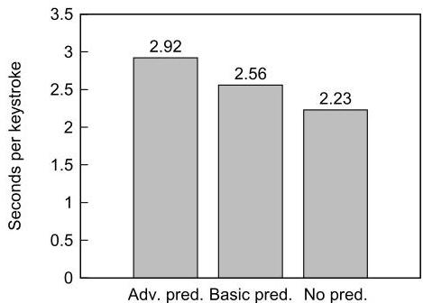

Fig. 6. Input rate (seconds per keystroke) by entry method.

## 3. RESULTS

The variables of interest for each method include the input rate (time to press keys), communication rate (words produced per minute), task completion time, and interaction with predictions (keystroke savings, prediction utilization). Each of these statistics were computed for each session, and then averaged over all logs that used the same text entry method.

### 3.1 Input Rate (Seconds per Keystroke)

The input rate is measured using seconds per keystroke (spk), which measures the amount of time that it took a user to hit one key. As shown in Figure 6, the input rate for users using the advanced algorithm is 2.92 spk, compared to the 2.56 spk of the basic algorithm and 2.23 spk when no word prediction is given. The differences between the methods' input rates are all highly significant  $(p &lt; .0005)$  using a paired t-test.

### 3.2 Communication Rate (Output Rate)

The communication rate is measured by the number of words a user produces in a minute (wpm). As hypothesized, there is a significant difference between the communication rate of users when using an advanced prediction algorithm over the basic prediction model and no prediction ( $p &lt; .0005$ , .0005). Additionally, communication rate using basic prediction is significantly faster than no prediction ( $p &lt; .0005$ ). As illustrated in Figure 7, users communicate on average  $45.8\%$  faster using advanced prediction over basic prediction and  $61.4\%$  faster than using no word prediction.

The average total copy task time using the advanced algorithm was 20 minutes, 54 seconds, which was much quicker than it took the participants to complete the task with the basic algorithm (29 minutes 36 seconds) and no prediction (32 minutes 24 seconds).

### 3.3 Keystroke Savings (Potential vs. Actual)

Potential keystroke savings is the keystroke savings the user would have achieved if they had used the prediction system fully. On the other hand, actual keystroke savings is the number of keystrokes that the user actually

ACM Transactions on Accessible Computing, Vol. 1, No. 3, Article 17, Pub. date: February 2009.

RIGHTLINK

User Interaction with Word Prediction: The Effects of Prediction Quality

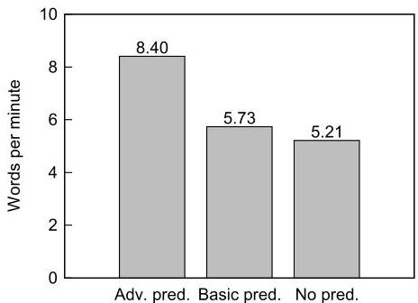

Fig. 7. Communication rate (in words per minute) by entry method.

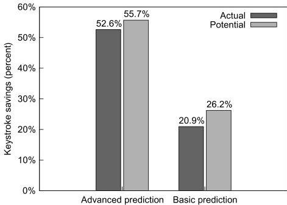

Fig. 8. Actual keystroke savings achieved by users compared to the potential savings offered by the system.

saved by using word prediction. Actual keystroke savings is lower than potential keystroke savings because the user may choose to not check the predictions after every letter and will periodically miss the desired word. As shown in Figure 8, when using advanced word prediction, the actual keystroke savings was  $52.6\%$ , compared to the potential savings of  $55.7\%$ . Using the basic algorithm, users had an actual keystroke savings of  $20.9\%$  and a potential savings of  $26.2\%$ .

### 3.4 Prediction Utilization

Prediction utilization is the actual keystroke savings divided by the potential keystroke savings. This represents how much participants depended on the system for text entry. A user that trusts the system's predictions is likely to inspect the list often, whereas a user that finds the system unreliable or distracting will tend to only scan the prediction list when (s)he feels it may offer a great benefit, such as with particularly long words or when (s)he expects a word to be predicted. When using the more advanced prediction algorithm, users had a prediction utilization of  $94.4\%$  versus  $79.9\%$  utilization for the more basic method. This difference is shown graphically in Figures 8 and 9. These percentages are statistically different  $(p &lt; .0005)$ .

ACM Transactions on Accessible Computing, Vol. 1, No. 3, Article 17, Pub. date: February 2009.

RIGHTS LINK

K. Trnka et al.

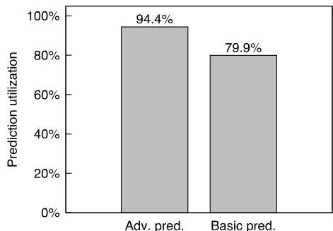

Fig. 9. Prediction utilization of advanced prediction compared to basic prediction.
Fig. 10. Average scores for survey responses in the range 1-5. Higher scores are better.

|  Question | Advanced | Basic | None  |
| --- | --- | --- | --- |
|  4. How tiring did you find using this text entry method? (5 - least tiring, 1 - most tiring) | 3.56 | 3.02 | 2.23  |
|  7. Did you find this method of text entry easier than manually writing out the paragraph? (5 - much easier than writing, 1 - much harder than writing) | 2.44 | 2.14 | 1.80  |
|  8. Did you find this method of text entry faster than manually writing out the paragraph? (5 - much faster than writing, 1 - much slower than writing) | 2.47 | 2.18 | 1.83  |
|  10. How useful did you find word prediction? (5 - very useful, 1 - large hindrance) | 4.86 | 4.20 | —  |
|  11. How distracting did you find the word prediction? (5 - a large enhancement, 1 - very distracting) | 4.36 | 3.34 | —  |

### 3.5 Survey Results

We report the findings from just a few of the questions which are relevant to this article. The results of these questions are shown in Figure 10. Although the direction of the scale was randomized, for the purposes of presentation, we normalized the scales so that higher scores are better.

Fatigue is particularly relevant to actual AAC users, as a full day of communicating using an AAC device is often tiring, which in turn tends to reduce communication rate. When asked how tiring the method was (question 4), users felt that advanced word prediction was much less tiring than basic word prediction ( $p = 0.0026$ ) and no prediction ( $p &lt; 0.0005$ ).

When asked about ease of use (question 7), users felt that the more advanced prediction system was much easier to use than the basic prediction system  $(p = 0.0062)$  and that the basic system was easier to use than letter-by-letter entry  $(p = 0.031)$ . Similarly, when asked about the speed of entry (question 8), users perceived the increase in communication rate due to better predictions: Advanced prediction was much higher than basic prediction  $(p = 0.0050)$  and no prediction  $(p = 0.0042)$ , but the difference between basic prediction and no prediction was not statistically significant. Also, in question 10, users found advanced word prediction more useful than basic word prediction  $(p &lt; 0.0005)$ . In response to the worst thing about basic prediction, one user said, "None

ACM Transactions on Accessible Computing, Vol. 1, No. 3, Article 17, Pub. date: February 2009.

RIGHTLINK

User Interaction with Word Prediction: The Effects of Prediction Quality

of the words seemed to match what I wanted to say." Question 11 asked a somewhat different question than the others: "How distracting did you find the word prediction?" Users said that they found advanced word prediction less distracting than basic prediction ( $p &lt; 0.0005$ ).

## 4. DISCUSSION

### 4.1 Input Rate (Seconds per Keystroke)

We found that input rate decreased when any word prediction was available, and more so with advanced prediction. This decrease is consistent with our previous findings as well as those of other researchers [Trnka et al. 2007; Venkatagiri 1993; Koester and Levine 1994b] and can be explained by an increase in the cognitive overhead needed to deal with the prediction list. The decrease in input rate between basic and advanced word prediction is explained by an increasing reliance on the prediction system. If a user trusts the system more, (s)he will scan the prediction list more often, increasing cognitive load. However, in contrast to previous studies, this increased cognitive load was chosen by our users; they found that the additional cost was outweighed by the benefit of the keystroke savings offered by word prediction, especially for advanced prediction. The exit survey results also confirm that users accept the added cognitive load in return for a faster communication rate.

We analyzed the log files in more detail, attempting to pinpoint the causes of the additional overhead of word prediction. We found that specialized graphs allowed us to visualize the effects of word prediction on the time to select both letters and predicted words. To visualize the data, we computed histograms of the input rate for each text entry method, and additionally split the data based on whether a normal letter or a predicted word was selected. We found that the histograms rendered jagged curves, so we smoothed out the graphs and present them as line graphs (similar to probability density functions). Each line in the graph is normalized so that the area under each curve is the same. For example, see Figure 11(a). The distributions for the amount of time to select letter keys from WiViK are shown for each of the three text entry methods. When interpreting these graphs, regions with a larger area under the curve indicate that a large amount of the data fell in that range. For instance, the vast majority of keystrokes without word prediction took between 1.7-2.5 seconds to press. In contrast, the distribution for letter selection with advanced prediction exhibits much greater variance; most of the data lies between 1.9-3.8-second range.

We will present the data separately for letter selection and prediction selection and afterwards compare the two. The graph of letter selection by input method is shown in Figure 11(a). It shows that the presence of word prediction and the reliance on word prediction have a strong effect on the amount of time it takes to select letter keys from WiViK. The main trend is that increasing re

RIGHTLINK

K. Trnka et al.

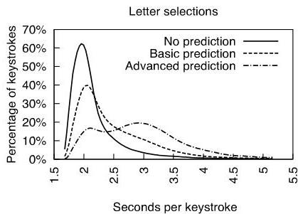

(a) letter selection

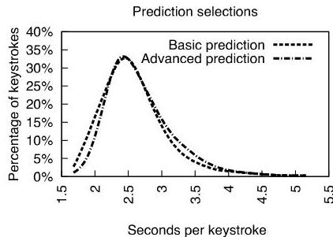

(b) prediction selection
Fig. 11. Smoothed histograms showing the distributions of seconds per keystroke: (a) distribution of seconds per keystroke for letter selections only; (b) distribution for word prediction selections only.

liance on word prediction causes letter selections to take more time. This effect may be the result of the user scanning the predictions; if users trust the predictions more, they scan the list more often, even in cases where the desired word did not appear and they selected a letter anyway. The more frequent scans of the prediction list seem to explain the overall trend. In addition to the major effect of scanning the list, advanced prediction has two modes rather than one; it appears to be a distribution composed of two separate normal distributions. This trend appears very slightly in basic prediction as well. Rather than following a simple curve, as with no prediction, there is a slight divergence from the trend at around 3 seconds, which is also the area for one of the modes of advanced prediction. We propose that the bimodal distributions are also related to scanning the prediction lists; specifically, the left modes seem to represent letter selections that were made without scanning the predictions and the right modes seem to represent those made after a (failed) scan of the prediction list. This hypothesis is reinforced somewhat by the similarity of the left modes to the distribution of letter selection with no prediction, especially in the case of basic prediction (seen in Figure 12).

The graph of prediction selections is shown in Figure 11(b). Unlike the previous figure, there does not seem to be much difference between prediction selection in an advanced method compared to a basic method. In both cases, the user has scanned the list, identified the intended word, and selected the word from the list. The small additional amount of time to select predictions under the advanced method may be the result of automaticity differences: Some users knew that if they were using a word for the second time, that it would be reliably predicted under the basic method as one of the top predictions.

Figure 12 shows the combination of both graphs. In addition to previous trends, this graph illustrates many trends between letter selection and prediction selection. The first major trend is that selecting predictions takes more time than simply pressing the intended letter, especially shown in the difference between prediction selections and letter selections without prediction. The bimodal nature of letter selection under advanced prediction (and

ACM Transactions on Accessible Computing, Vol. 1, No. 3, Article 17, Pub. date: February 2009.

RIGHTLINK

User Interaction with Word Prediction: The Effects of Prediction Quality

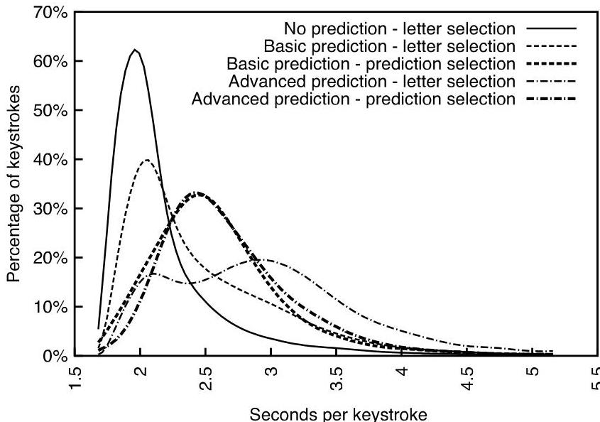

Fig. 12. The combination of Figures 11(a) and 11(b): Smoothed histogram showing the distributions of seconds per keystroke for each entry method and type of selection (whether a normal letter or a predicted word was selected).

to a lesser extent, basic prediction) seems to be additionally explained by the relation to prediction selection; one mode is on either side of the prediction selection. This reinforces the hypothesis that the left mode may not include scanning the predictions (as the prediction selections differ from the letter selections mainly in scanning and shift of focus). Similarly, the relation to the right mode suggests that much of the work of prediction selection was incurred in that mode, supporting the hypothesis that this mode represents letter selections after failed prediction scans.

We also graphed the average seconds per keystroke based on progress in the sessions, but found that the average time to press keys remained fairly constant for the duration of the sessions.

### 4.2 Prediction Utilization

The prediction utilization of advanced prediction was much higher than the utilization of basic prediction. Users liked the advanced prediction system much more and in turn scanned the prediction list more often and more carefully, missing the intended word less often than with basic predictions. The important thing to note is that our users were free to scan or ignore the predictions; they deliberately chose to utilize the system more fully because it offered them better predictions more often.

User trust seems to be related to prediction utilization; however, user trust may vary throughout a session. A user that first encounters advanced predictions may be wary of the system at first and only utilize the system well after several sentences. Many participants noted that they learned when to scan

ACM Transactions on Accessible Computing, Vol. 1, No. 3, Article 17, Pub. date: February 2009.

RIGHTLINK

K. Trnka et al.

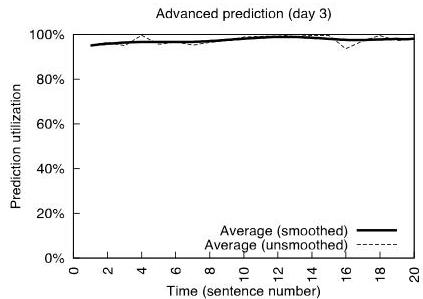

(a) advanced prediction

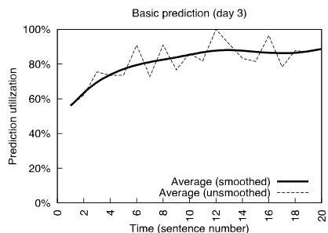

(b) basic prediction
Fig. 13. Prediction utilization based on the sentence number within text sample 3. The smoothed average of all users is shown as a thick line and the unsmoothed average is shown as a dashed line.

the basic predictions only when they were sure the word would be predicted, and so we would expect the utilization of basic prediction to change over time.

We applied data visualization methods to display the evolution of prediction utilization throughout the sessions, to search for any effects of increased trust over time. The graphs showed that there was a clear trend of increasing prediction utilization over time for both methods. To visualize the data, we computed average prediction utilization for each sentence and user and plotted the values by sentence. Additionally, we found it necessary to exclude words and sentences with excessive editing (typo correction), as the baseline for keystroke savings could not be modified to account for editing. The smoothed and raw average trends for advanced and basic prediction are shown in Figure 13. For simplicity, we only present graphs for session 3.

The time graphs for prediction utilization show an increasing trend over the usage, suggesting that user trust in the system in fact varies with familiarity. However, one complicating factor is that the potential keystroke savings are not constant throughout the texts; although the prediction methods are constant, advanced prediction will offer more keystroke savings when the text is similar to training texts. Basic prediction will offer more keystroke savings as the conversation is typed, due to reliance on the recency method. Therefore, we also created plots of potential keystroke savings for comparison, shown in Figure 14.

The graphs of potential keystroke savings show an increasing trend, especially in the case of basic prediction (due to the recency method populating the predictions first). The overall trend of advanced prediction is more difficult to interpret, due to fluctuations (which may be the result of varying similarity of each sentence to the training data). The trends with potential keystroke savings partially explain the trends in prediction utilization. Especially at the overall level (Section 3.4), participants have higher prediction utilization for better methods (method offering higher potential keystroke savings). The relationship between these graphs demonstrates that potential keystroke savings seems to affect prediction utilization not just at the conversation level, but also within a conversation. As the recency cache of basic prediction be

ACM Transactions on Accessible Computing, Vol. 1, No. 3, Article 17, Pub. date: February 2009.

RIGHTLINK

User Interaction with Word Prediction: The Effects of Prediction Quality

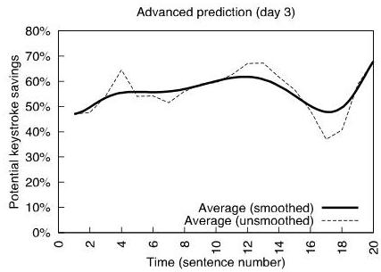

(a) advanced prediction

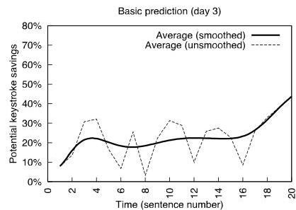

(b) basic prediction
Fig. 14. Potential keystroke savings based on the sentence number within text sample 3. The smoothed average of all users is shown as a thick line and the unsmoothed average is shown as a dashed line.

comes more reliable over the session, basic prediction offers more potential keystroke savings (Figure 14(b)), and in turn participants utilize the system more (Figure 13(b)). This is especially the case for participants who realize that previously typed words will be predicted. In the case of advanced predictions, the utilization is consistently very high, but the small fluctuations in utilization throughout the session (Figure 13(a)) seem to correspond to the fluctuations in potential keystroke savings (Figure 14(a)). These results further support the hypothesized effects of prediction quality (as exemplified in potential keystroke savings) on prediction utilization.

### 4.3 Communication Rate (Output Rate)

The major finding of this study and our previous work [Trnka et al. 2008; 2007] is that a good word prediction system can improve communication rate, much more so than a basic system. The increase in communication rate is not only due to increased potential keystroke savings, but also due to higher utilization of the system when users trust the predictions.

As with other dependent variables, we analyzed the evolution of communication rate throughout the sessions. The variation in communication rate, based on sentence number in the session, is shown in Figure 15 (only session 3 is shown for simplicity).

The communication rate of the no-prediction case fluctuates somewhat, despite a nearly constant input rate. This effect is most likely due to subtle variations in average word length across the sentences of the text. Sentences with shorter words will show higher than average words per minute and sentences with longer words will show lower communication rate. Although this effect is minor, in general, the variation can be reduced by studying characters per second rather than words per minute.

The communication rates of advanced and basic prediction fluctuate much more due to variances in potential keystroke savings and prediction utilization. The combination of potential keystroke savings and prediction utilization is captured with actual keystroke savings. For reference, the graphs for keystroke savings are shown in Figure 16.

ACM Transactions on Accessible Computing, Vol. 1, No. 3, Article 17, Pub. date: February 2009.

RIGHTLINK

K. Trnka et al.

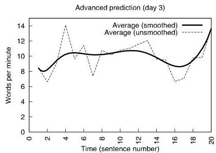

(a) advanced prediction

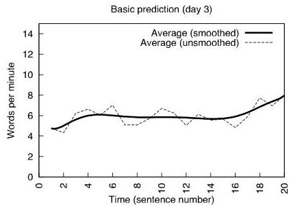

(b) basic prediction

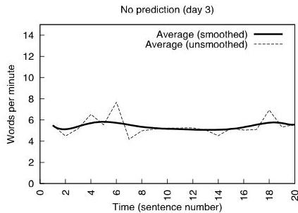

(c) no prediction

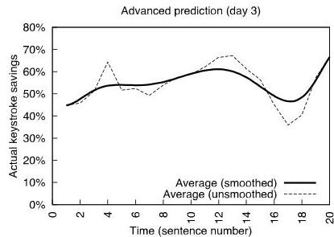

Fig. 15. Communication rate (words per minute) based on the sentence number within text sample 3. The smoothed average of all users is shown as a thick line and the unsmoothed average is shown as a dashed line.
(a) advanced prediction
Fig. 16. Actual keystroke savings based on the sentence number within text sample 3. The smoothed average of all users is shown as a thick line and the unsmoothed average is shown as a dashed line.

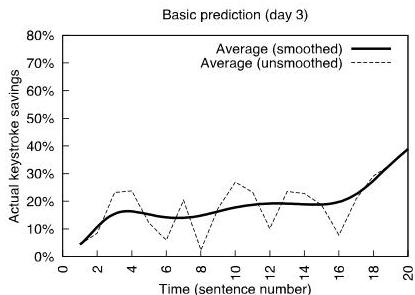

(b) basic prediction

The changes in actual keystroke savings more closely correspond to communication rate than to either potential keystroke savings or prediction utilization. In the case of advanced prediction, the prediction utilization trend is nearly constant, so the actual and potential keystroke savings are very similar. In the case of basic prediction, prediction utilization increases drastically over the text sample. This greatly diminishes actual keystroke savings from

ACM Transactions on Accessible Computing, Vol. 1, No. 3, Article 17, Pub. date: February 2009.

RIGHTLINK

the potential at the beginning and only somewhat diminishes the actual savings towards the end of the session. Prediction utilization and potential keystroke savings together follow the trend in communication rate much better than either alone. However, advanced prediction has much more of an effect on the communication rate than basic prediction, because of the higher keystroke savings: The communication rate of advanced prediction is much more dependent on fully utilizing the predictions than basic prediction. Under basic prediction, users ignoring predictions entirely will communicate only somewhat more slowly, due to the small difference between basic prediction and no prediction.

#### Model of speedup

We developed a mathematical model to characterize the relationship between keystroke savings, input rate, and communication rate, similar in spirit to Koester and Levine [1993]. When we compared the model to our actual data, we found that the two matched closely. By mathematically expressing the effects of keystroke savings and input rate on communication rate, we can directly see the trade-off between keystroke savings and input rate. In turn, the model can be used to identify situations in which word prediction may be slower (or faster) than letter-by-letter entry.

We are primarily interested in the speedup (or slowdown) of communication rate, so we derived a representation of the speedup, which is the ratio between communication rate with and without prediction. For example, a speedup of 1 indicates that there is no difference in communication rate, whereas a speedup of 1.2 indicates that word prediction is 20% faster than letter-by-letter entry.

$speedup=\frac{wpm_{prediction}}{wpm_{letter-by-letter}}$

If we assume that the same number of words are typed in both methods, we can reduce this to the ratio of times. In general, this may not be true, due to typos or comparisons between different texts, but we can compare the communication rate under both methods with the same text and with minimal typos.

$speedup=\frac{time_{letter-by-letter}}{time_{prediction}}$

The task completion time can be decomposed into two components: the number of keystrokes and the average seconds per keystroke.

$speedup=\frac{keys_{letter-by-letter}*spk_{letter-by-letter}}{keys_{prediction}*spk_{prediction}}$

In this model, we are assuming that the effects of typos are negligible, so the number of keystrokes is the number of characters for letter-by-letter entry. The number of keystrokes for predictive entry is the number of characters scaled down by the keystroke savings. We thus have

$speedup=\frac{chars_{letter-by-letter}*spk_{letter-by-letter}}{chars_{prediction}*\frac{100-aks}{100}*spk_{prediction}}$

where $aks$ is the actual keystroke savings. Because we assume that both methods are producing the same text (either neither method has typos or both have

the same typos), we can cancel the character terms. And by moving the spk terms together, we can formulate the relative wpm as a function of the keystroke savings and the additional overhead in selecting keys.

$speedup=\frac{1}{(1-\frac{sks}{100})*\frac{spk_{scv}}{spk_{old}}}$

This equation concisely expresses the effects of actual keystroke savings and slower input rate on the speedup of communication rate. Not only can this model be used to predict the expected communication rate, but also the model directly expresses the trade-off between increased keystroke savings and increased cognitive overhead.

The actual data from our study supports the model. In the case of advanced prediction, the model predicts a speedup of 61.15% whereas the data shows a speedup of 61.16%. In the case of basic prediction, the model predicts a speedup of 10.3% and the data shows a speedup of 10.0%.

The actual speedup differs slightly from the results of the speedup equation. Therefore, our assumption that both methods produce the same text must be incorrect. In fact, when looking at the data, the number of corrected errors differs between the three methods, although the number of corrected errors seems to differ little enough that the speedup is predominantly a function of the actual keystroke savings and the increased cognitive overhead.

The speedup equation illustrates the trade-off between keystroke savings and cognitive overhead. In the case of a word prediction system in which users actually achieve 20% keystroke savings, the seconds per keystroke must be less than 25% of the additional overhead to see any speedup at all. If the system required 30% overhead, the word prediction feature would decrease communication rate when used, and so users who value speed over reduced fatigue would choose not to use it. Although our basic prediction system incurred an additional 14.8% seconds per keystroke over letter-by-letter entry with keystroke savings of 20.8%, our advanced system showed 30.9% additional seconds per keystroke over no prediction. However, if our implementation of word prediction had been more difficult to use (e.g., horizontal predictions, extremely large prediction list) the cognitive overhead of basic prediction may have crossed the 25% threshold. In this case, the user seeking to optimize his or her communication rate would choose not to use the predictions. Similarly, if users had been forced to inspect the prediction list after every keystroke, the additional overhead for even basic prediction would likely have exceeded 30.9%.

### 4.4 Overall Findings

The real-world benefit of word prediction is twofold: First, word prediction significantly increased communication rate. Secondly, word prediction reduced user fatigue. Advanced predictions increased communication rate by 58.6% over no word prediction and 45.4% over basic word prediction. This increase in communication rate occurred despite a significant decrease in input rate; the added keystroke savings of word prediction far outweighed the cost of a slower input rate. Not only did log analysis show this, but also the users noted

the difference in the exit survey. Additionally, the survey found that users felt significantly less fatigue when using advanced word prediction as compared to basic prediction and no prediction. Users reported that even basic prediction reduced their fatigue. These trends indicate that additional improvements in the potential keystroke savings of word prediction are likely to further increase communication rate and decrease user fatigue.

The more semantically and syntactically correct predictions increased user trust in our system, as hypothesized by Demasco et al. [1989]. When asked to describe what he or she liked best about advanced prediction, one participant noted:

> I liked how depending on the context of the sentence … the word prediction would come up with relevant words that would often be correct for the next word I needed to type.

The increased benefit of more accurate predictions is noted not only in the surveys, but also in the log analysis: Advanced prediction offered 55.6% keystroke savings and users realized 93.6% of the system’s potential, namely 52.1% keystroke savings. However, basic prediction offered only 25.5% keystroke savings, and users trusted the system less, scanning the predictions less often; users only utilized 78.2% of the potential savings of basic prediction. In fact, one user noted that he or she learned to look at the list when the intended word was typed recently.

> I was able to predict when a word would pop up because I knew what words I had already used.

## 5 Conclusions

In this article we have extended our previous studies [Trnka et al. 2008, 2007] to show that use of word prediction can lead to higher communication rates (at both the macro- and micro-level) and less reported fatigue than either poorly developed word prediction systems and letter-by-letter entry. We have empirically verified the increased cognitive load due to word prediction, but have also shown that the increased keystroke savings compensates for the added overhead and that participants more fully utilize a better word prediction system. Utilization not only increased with better predictions at the session level, but also within a session in the case of the basic method adapting to the previously typed words.

This article has shown that further research and development in word prediction can potentially increase the quality-of-life of AAC users.

In future work we hope to validate these results with longitudinal studies of AAC users. We anticipate a single-subject free-form writing task using multiple text entry methods. The major hurdle in such a design is to systematically vary keystroke savings while avoiding complications due to each participant’s prior experience with his/her device and prediction system. In addition, we found that our participants generally made vastly fewer typos with advanced prediction compared to basic and with basic prediction compared to no prediction, and we would like to investigate typos more fully in further work.

##

17:32 K. Trnka et al.

# REFERENCES

ANSON, D., MOIST, P., PRZYWARA, M., WELLS, H., SAYLOR, H., AND MAXIME, H. 2006. The effects of word completion and word prediction on typing rates using on-screen keyboards. *Assistive Technol.* 18, 2, 146–154.
BECK, C., SEISENBACHER, G., EDELMAYER, G., AND ZAGLER, W. 2004. First user test results with the predictive typing system FASTY. In *Proceedings of the International Conference on Computers Helping People with Special Needs (ICCHP)*, 813–819.
BEUKELMAN, D. AND MIRENDA, P. 2005. *Augmentative and Alternative Communication: Supporting Children and Adults with Complex Communication Needs*. Paul H. Brookes Publishing, Baltimore, MD.
BROWN, P. F., DESOUZA, P. V., MERCER, R. L., PIETRA, V. J. D., AND LAI, J. C. 1992. Class-based n-gram models of natural language. *Comput. Linguist.* 18, 4, 467–479.
CARLBERGER, A., CARLBERGER, J., MAGNUSON, T., HUNNICUTT, M. S., PALAZUELOS-CAGIGAS, S., AND NAVARRO, S. A. 1997. Profet, a new generation of word prediction: An evaluation study. In *Proceedings of the ACL-97 Workshop on Natural Language Processing for Communication Aids*, 23–28.
CARLBERGER, J. 1998. Design and implementation of a probabilistic word prediction algorithm. M.S. thesis, The Royal Institute of Technology (KTH).
CARLBERGER, J. AND HUNNICUTT, S. 1998. A probabilistic word prediction program. In *Proceedings of the RESNA Conference*, 50–52.
COPESTAKE, A. 1997. Augmented and alternative NLP techniques for augmentative and alternative communication. In *Proceedings of the ACL-97 Workshop on Natural Language Processing for Communication Aids*, 37–42.
DEMASCO, P., MCCOY, K., GONG, Y., PENNINGTON, C., AND ROWE, C. 1989. Towards more intelligent AAC interfaces: The use of natural language processing. In *Proceedings of the 12th Annual Conference*. RESNA, 141–142.
DEMASCO, P. W. AND MCCOY, K. F. 1992. Generating text from compressed input: An intelligent interface for people with severe motor impairments. *Commun. ACM* 35, 5, 68–78.
FAZLY, A. 2002. The use of syntax in word completion utilities. M.S. thesis, University of Toronto.
FAZLY, A. AND HIRST, G. 2003. Testing the efficacy of part-of-speech information in word completion. In *Proceedings of the ACL-03 Workshop on Language Modeling for Text Entry*, 9–16.
GARAY-VITORIA, N. AND ABASCAL, J. 2004. A comparison of prediction techniques to enhance the communication rate. In *User-Centered Interaction Paradigms for Universal Access in the Information Society*, 400–417.
GARAY-VITORIA, N. AND ABASCAL, J. 2006. Text prediction systems: A survey. *Univ. Access Inf. Soc.* 4, 183–203.
GARAY-VITORIA, N. AND GONZÁLEZ-ABASCAL, J. 1997. Intelligent word-prediction to enhance text input rate. In *Proceedings of the International Conference on Intelligent User Interfaces (IUI)*, 241–244.
GONG, J. 2007. Semantic &amp; syntactic context-aware text entry methods. In *ASSETS Student Research Competition*, 261–262.
HINDLE, D. 1983. Deterministic parsing of syntactic non-fluencies. In *Proceedings of the Annual Meeting of the Association for Computational Linguistics*, 123–128.
HORSTMANN, H. AND LEVINE, S. 1990. Modeling of user performance with computer access and augmentative communication systems for handicapped people. *Augmen. Alternat. Commun.* 6, 4, 231–241.
HORSTMANN, H. AND LEVINE, S. 1991. The effectiveness of word prediction. In *Proceedings of the RESNA Conference*, vol. 11. 100–102.
HUNNICUTT, S. AND CARLBERGER, J. 2001. Improving word prediction using Markov models and Heuristic methods. *Augment. Alternat. Commun.* 17, 4, 255–264.
JURAFSKY, D. AND MARTIN, J. 2000. *Speech and Language Processing*, 1st ed. Prentice Hall.
ACM Transactions on Accessible Computing, Vol. 1, No. 3, Article 17, Pub. date: February 2009.

RIGHTS LINK

User Interaction with Word Prediction: The Effects of Prediction Quality
17:33

KATZ, S. M. 1987. Estimation of probabilities from sparse data for the language model component of a speech recognizer. IEEE Trans. Acoustics Speech Signal Process. 35, 3, 400–401.

KOESTER, H. AND LEVINE, S. 1993. A model of performance cost versus benefit for augmentative communication systems. In Proceedings of the 15th Annual International Conference of the IEEE Engineering in Medicine and Biology Society, 1303–1304.

KOESTER, H. AND LEVINE, S. 1996. Effect of a word prediction feature on user performance. Augment. Alternat. Commun. 12, 3, 155–168.

KOESTER, H. AND LEVINE, S. 1998. Model simulations of user performance with word prediction. Augment. Alternat. Commun. 14, 1, 25–36.

KOESTER, H. H. AND LEVINE, S. P. 1994a. Learning and performance of able-bodied individuals using scanning systems with and without word prediction. In Assistive Technology, 42–55.

KOESTER, H. H. AND LEVINE, S. P. 1994b. Modeling the speed of text entry with a word prediction interface. IEEE Trans. Rehabilit. Eng. 2, 3, 177–187.

KOESTER, H. H. AND LEVINE, S. P. 1997. Keystroke-Level models for user performance with word prediction. Augment. Alternat. Commun. 13, 239–257.

LANGKILDE, I. AND KNIGHT, K. 1998. The practical value of n-grams in generation. In Proceedings of the International Natural Language Generation Workshop, 248–255.

LESHER, G. AND RINKUS, G. 2001. Domain-Specific word prediction for augmentative communication. In Proceedings of the RESNA Conference, 61–63.

LESHER, G. W. AND HIGGINBOTHAM, D. J. 2005. Using Web content to enhance augmentative communication.

LI, J. 2006. Modeling semantic knowledge for a word completion task. M.S. thesis, University of Toronto.

LI, J. AND HIRST, G. 2005. Semantic knowledge in word completion. In Proceedings of the ACM SIGACCESS Conference on Computers and Accessibility (ASSETS), 121–128.

MANNING, C. AND SCHÜTZE, H. 2000. Foundations of Statistical Natural Language Processing. MIT Press.

MATIASEK, J. AND BARONI, M. 2003. Exploiting long distance collocational relations in predictive typing. In Proceedings of the ACL-03 Workshop on Language Modeling for Text Entry, 1–8.

NEWELL, A., LANGER, S., AND HICKEY, M. 1998. The rôle of natural language processing in alternative and augmentative communication. Natural Lang. Eng. 4, 1, 1–16.

NEWELL, A. F., ARNOTT, J. L., BOOTH, L., BEATIE, W., BROPHY, B., AND RICKETTS, I. W. 1992. Effect of the “PAL” word prediction system on the quality and quantity of text generation. Augment. Alternat. Commun. 8, 4, 304–311.

STOCKY, T., FAABORG, A., AND LIEBERMAN, H. 2004. A commonsense approach to predictive text entry. In CHI'04 Extended Abstracts on Human Factors in Computing Systems. ACM Press, New York, 1163–1166.

SWB 2007. SWITCHBOARD: A User's Manual. http://www.ldc.upenn.edu/Catalog/docs/switchboard/ on 3/22/2007.

TODMAN, J. AND ALM, N. 1997. Talk boards for social conversation. Commun. Matters 11, 13–15.

TRNKA, K., McCAW, J., YARRINGTON, D., McCoy, K. F., AND PENNINGTON, C. 2008. Word prediction and communication rate in AAC. In Telehealth Assistive Technol. (Telehealth/AT), 19–24.

TRNKA, K., YARRINGTON, D., McCAW, J., McCoy, K. F., AND PENNINGTON, C. 2007. The effects of word prediction on communication rate for AAC. In NAACL-HLT; Companion Volume: Short Papers, 173–176.

TRNKA, K., YARRINGTON, D., McCoy, K., AND PENNINGTON, C. 2006a. Topic modeling in fringe word prediction for AAC. In Proceedings of the International Conference on Intelligent User Interfaces (IUI), 276–278.

TRNKA, K., YARRINGTON, D., McCoy, K., AND PENNINGTON, C. 2006b. Topic modeling in fringe word prediction for AAC. In International Society for Augmentative and Alternative Communication (ISAAC).

ACM Transactions on Accessible Computing, Vol. 1, No. 3, Article 17, Pub. date: February 2009.

RIGHTS LINK

17:34 K. Trnka et al.

TROST, H., MATIASEK, J., AND BARONI, M. 2005. The language component of the Fasty text prediction system. Appl. Artif. Intell. 19, 8, 743–781.
VENKATAGIRI, H. S. 1993. Efficiency of lexical prediction as a communication acceleration technique. Augment. Alternat. Commun. 9, 161–167.
VENKATAGIRI, H. S. 1994. Effect of window size on rate of communication in a lexical prediction aac system. Augment. Alternat. Commun. 10, 105–112.
WANDMACHER, T. AND ANTOINE, J. 2007. Methods to integrate a language model with semantic information for a word prediction component. In Proceedings of the Joint Conference on Empirical Methods in Natural Language Processing and Computational Natural Language Learning (EMNLP-CoNLL), 506–513.
WANDMACHER, T. AND ANTOINE, J.-Y. 2006. Training language models without appropriate language resources: Experiments with an AAC system for disabled people. In European Conference on Language Resources and Evaluation (LREC).
WANDMACHER, T., ANTOINE, J.-Y., AND POIRIER, F. 2007. SIBYLLE: A system for alternative communication adapting to the context and its user. In Proceedings of the ACM SIGACCESS Conference on Computers and Accessibility (ASSETS), 203–210.
WANG, S., SCHUURMANS, D., PENG, F., AND ZHAO, Y. 2003. Semantic n-gram language modeling with the latent maximum entropy principle. In Proceedings of the International Conference on Artificial Intelligence and Statistics (AISTATS). I–376–I–379.
WOBBROCK, J. AND MYERS, B. 2006. From letters to words: Efficient stroke-based word completion for trackball text entry. In Proceedings of the ACM SIGACCESS Conference on Computers and Accessibility (ASSETS), 2–9.
YANG, G., McCOY, K., AND DEMASCO, P. 1990. Word prediction using a systemic tree adjoining grammar. In Proceedings of the RESNA Conference, 185–186.

Received December 2008; accepted December 2008

ACM Transactions on Accessible Computing, Vol. 1, No. 3, Article 17, Pub. date: February 2009.

RIGHTS LINK