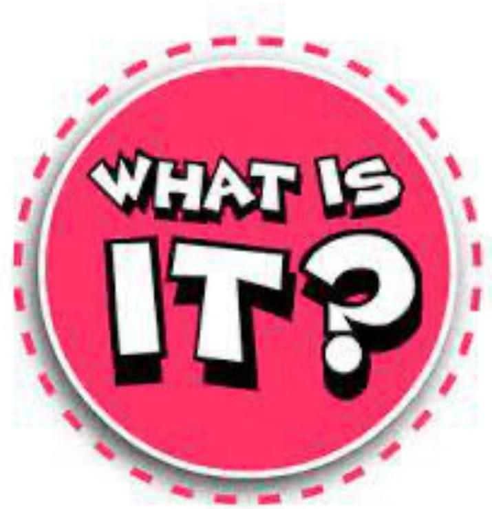
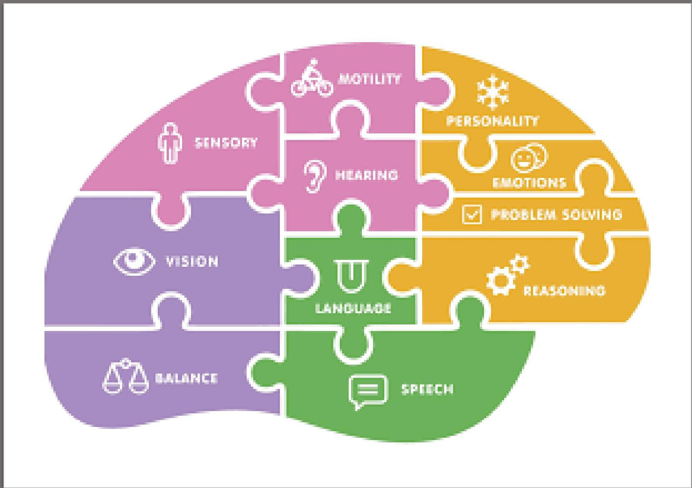
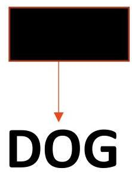
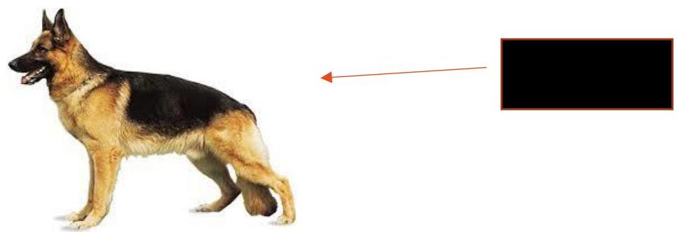
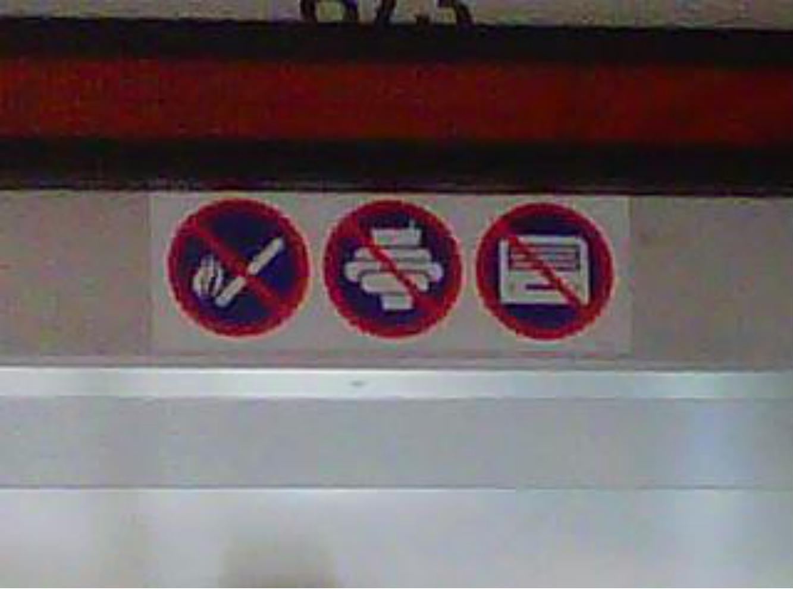
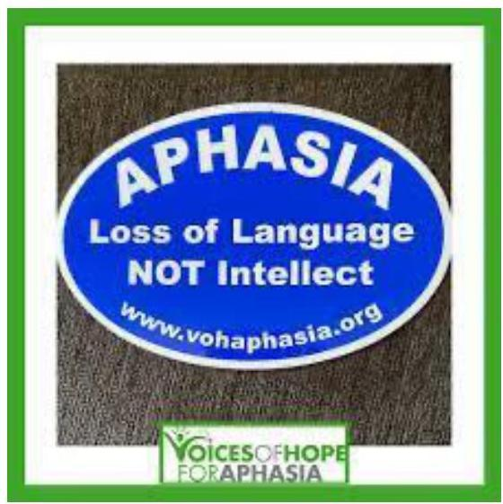
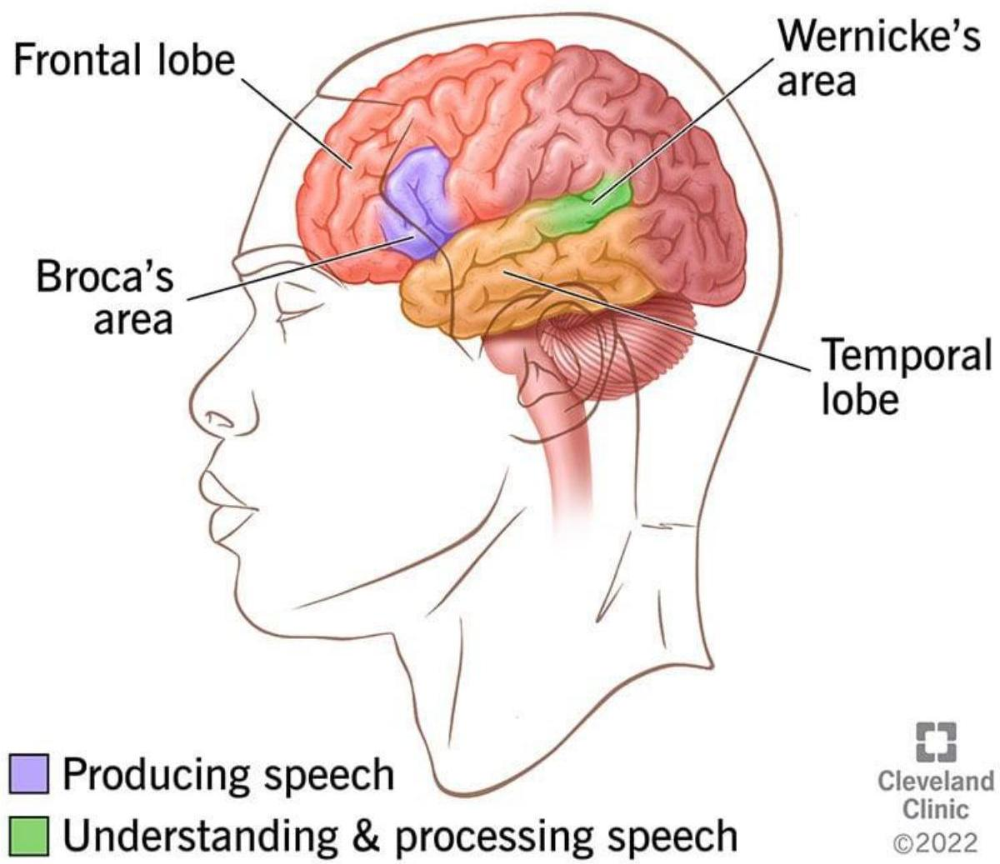
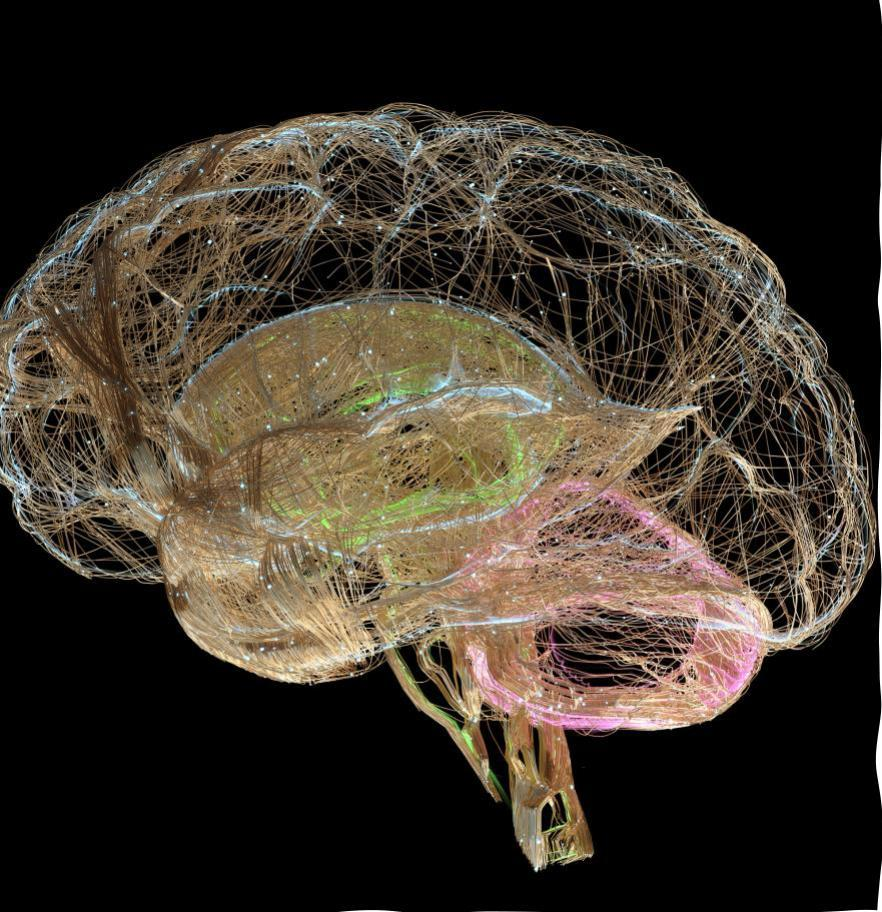
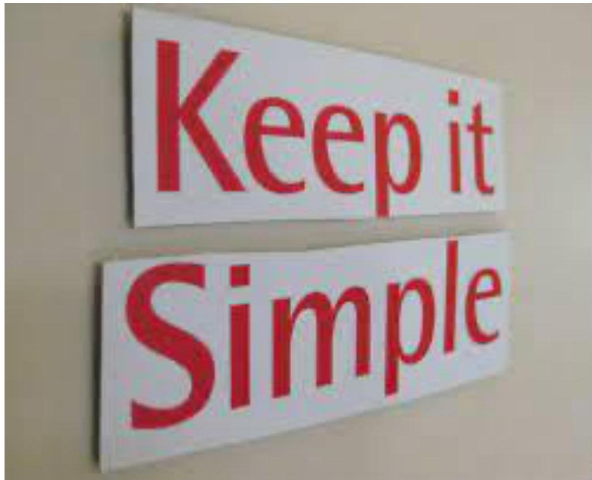
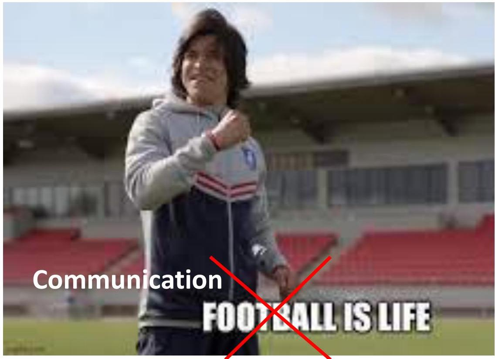

<!-- Source PDF: weissling-aphasia-communication.pdf -->

# Post stroke aphasia: Communication Strategies for the Non-Speech-Language Pathologist

Kristy S.E. Weissling, SLP.D., CCC-SLP

Professor of Practice

University of Nebraska-Lincoln

COLLEGE of EDUCATION and HUMAN SCIENCES

N

# Objectives

1. Participants will identify the neurological and behavioral characteristics of aphasia.
2. Participants will state 3 communication strategies that can be used in post stroke aphasia to improve outcomes

COLLEGE of EDUCATION and HUMAN SCIENCES

# One word to describe aphasia

# Deep Dive

Speech is the symptom of something bigger

Cognition is the ability to acquire knowledge and understanding of what's around you through experiences and senses (Oxford, 2023)

# Definition

- "Impairment, as a result of brain damage, of the capacity for interpretation and formulation of language symbols; multimodality loss or reduction in efficiency of the ability to decode and encode conventional meaningful linguistic elements (morphemes and larger syntactic units); disproportionate to impairment of other intellective functions; not attributable to dementia, confusion, sensory loss, or motor dysfunction;" (Darley, 1982, p. 42).
- Darley, F. L. (1982). Aphasia. WB Saunders Company.

Symbol and the referent?

- Transparent
- Translucent
- Opaque

EXAMPLE
COURTESY OF THE HUSKER BUS

This is the heart of language vs. speech-Story time

# Neurological sub straights (Cleveland Clinic, 2022)

Aphasia

Let’s see if we remember...

# What is aphasia?

A. Difficulty with speech
B. Difficulty with understanding what is said
C. Difficulty reading
D. Difficulty writing
E. All of the above

# Why care?

- If we don't understand this, we will:
- Have poor patient outcomes
- Patient Provider Communication
- They don't understand us and
- We don't know what they are trying to tell us about their wellbeing
- Aphasia is a major indicator of stroke outcome

# Example

- https://www.youtube.com/watch?v=l7F99bYr5XE&amp;t=2s (Gene)
- https://www.youtube.com/watch?v=3oef68YabD0 (Byron)

Enough with what it is, how about some strategies

# Pretty simple really

- Paper
- Pen
- Your brain
- You can do almost anything with these 3 things
- Your phone is the 4th tool

# CAVEAT

- Some people have more patience for doing this than others
- There is something here that everyone can use but not everyone will use everything
- I’m talking mostly about the most DIFFICULT patients and strategies for them
- Don’t change everything...just change something

COLLEGE of EDUCATION and HUMAN SCIENCES

# Strategies for Comprehension and how they help expression

# Keep it simple

- Take time to chose how to say it... I know... you don’t have time but I’m really asking for seconds
- Plan it
- No more than 6 words at a time
- Take the pill
- Swallow the water
- Pick up your foot
- Put your foot in your shoe
- Tom’s airplane was late vs.
- Tom’s airplane was delayed in Phoenix so he’ll be late
- When he traveled from Seattle to Denver his flight was delayed

# Keep it simple

- Avoid pronouns (Oh no! not parts of speech)
- This – Take this vs. Take the cup
- That – Put that here vs. Put the remote on the table
- It
- She
- He
- Him
- Her
- Why--- Processing demand and memory
- Talk about what’s present (bring what you are talking about with you)

# Keep it simple

- Revise don't just repeat
- Misunderstanding signals a need to revise not just say it again
- Limit how many people are talking
- Sound pleasant
- Prosody (tone of voice) is a very deeply processed part of communication
- Use simple vocabulary (car vs. automobile)
- He's a doctor for you stomach problem vs. He's a gastroenterologist
- Avoid teasing and sarcasm – keep humor

Use multimodal input (pen and paper time) usually paired with basic choice

- Paper and Pen
- Gestures
- Facial expression
- Head nods

# Multimodal input and basic choice

Says: I am going to get you up for a walk now. Is that, ok?
Writes: WALK NOW?

YES NO

Says: We have ice cream. Do you want Chocolate or Vanilla?
Writes: Ice cream?

CHOCOLATE VANILLA NONE

Says: Where do you live?
Writes: Where Live?

LINCOLN OMAHA NEITHER

NEAR LINCOLN FAR FROM LINCOLN
Pulls up map on the phone.
Says: Where?
Writes: Where?

# Multimodal Input

Who will win?

- **Huskers**
- Ohio state

- How much will the win by?
- A lot
- Close

- If they win how happy will you be?
- 1
- 2
- 3
- 4

- I don't care
- 5

Very Happy

# How is your Pain Today?

|  No Pain | Slight | Mild | Moderate | Severe | Worst Pain  |
| --- | --- | --- | --- | --- | --- |
|  0 | 1 | 2 | 3 | 4 | 5  |
|  |   |   |   |   |   |

Pain is present but does not limit activity

Can do most activities with rest periods

Unable to do some activities because of pain

Unable to do most activities because of pain

Unable to do any activities because of pain

Theramas Therapy Services, PC

# Additional strategies for Expression

COLLEGE of EDUCATION and HUMAN SCIENCES

# Promoting Expression

- Yes/No questions vs. Choice based questions
- Never (it's a strong word) use “not” in a yes/no question
- Do you want to your breakfast now or not?
- Do you not want your breakfast?
- Instead Use Basic choice for a question like...
- Do you want Breakfast now or later or not at all
- NOW
- LATER
- NOT at ALL
- If you use yes/no keep it 4-6 words
- Do you want breakfast?

# Promoting Expression

- Give wait time
- Listen with the intent to understand not to hear
- Look for consistency in response (yes/but no)
- Provide choices vs. open ended responses
- For conversations talk about something you can see (something out the window, or a magazine)
- Encourage pointing, taking you to things, attempts at drawing and writing (sift through the fragments)
- Why might writing not work?
- Ask if they want help with a word if you think you know it
- Don't correct the patient model and move on – The person says, "BV please. You say, "Yes, I can turn the TV (a little emphasis) on."
- Use the AAC system as provided by an SLP- ask for training

And finally...

- Ask your SLP
- Be sure a referral is in place.
- Communication is life! (Tad Lasso Reference)

One word to describe what you learned