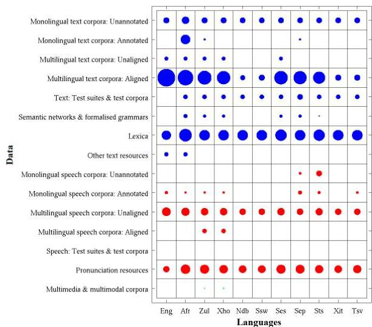

<!-- Source PDF: wet-2011-afrikaans-asr.pdf -->

INTERSPEECH 2011

INTERSPEECH 2011

# Developing a broadband automatic speech recognition system for Afrikaans

Feb de Wet$^{1,2}$, Alta de Waal$^{1}$ &amp; Gerhard B van Huyssteen$^{3}$

$^{1}$Human Language Technology Competency Area, CSIR Meraka Institute, Pretoria, South Africa
$^{2}$Department of Electrical and Electronic Engineering, Stellenbosch University, South Africa
$^{3}$Centre for Text Technology (CTexT), North-West University, Potchefstroom, South Africa

fdwet@csir.co.za, adewaal@csir.co.za, Gerhard.VanHuyssteen@nwu.ac.za

# Abstract

Afrikaans is one of the eleven official languages of South Africa. It is classified as an under-resourced language. No annotated broadband speech corpora currently exist for Afrikaans. This article reports on the development of speech resources for Afrikaans, specifically a broadband speech corpus and an extended pronunciation dictionary. Baseline results for an ASR system that was built using these resources are also presented. In addition, the article suggests different strategies to exploit the close relationship between Afrikaans and Dutch for the purposes of technology development.

Index Terms: Afrikaans, under-resourced languages, automatic speech recognition, speech resources

## 1. Introduction

In 2009, a large-scale human language technology (HLT) audit was conducted in South Africa, under the auspices of the National HLT Network (an informal network of HLT role-players in South Africa) [1]. The aim of this audit was to assess the state of affairs regarding research and development of HLTs for the eleven official South African languages, and to identify priorities for these languages for the near future. One of the priorities that was identified within the field of speech technologies, is the need to develop annotated, monolingual speech corpora - especially broadband corpora - for each of these languages.

In this publication, we report on some of the recent development work that has been done for Afrikaans, an under-resourced language, and one of the eleven official South African languages. In the next section we provide more information about Afrikaans, the HLT audit, and the rationale to develop broadband speech resources for Afrikaans. In Section 3 the resources (text corpus, speech data, and pronunciation dictionaries) of this project are described, while Section 4 focuses on the development of a baseline broadband automatic speech recognition (ASR) system. Results are presented in Section 5, and Section 6 concludes and discusses future work.

## 2. Background: Afrikaans

Afrikaans is a Low Franconian, West Germanic language, closely related to Dutch. It is the third largest language (in terms of number of mother-tongue speakers) in South Africa, with circa six million native and 16 million second language speakers [2]. It is also spoken elsewhere in the world, noticeably in some of South Africa's neighbouring countries (e.g. Namibia), as well as in countries where groups of emigrants and expatriates live (such as Australia, Canada, the United Kingdom, etc.).

From the above-mentioned HLT audit, it emerged that Afrikaans has the most prominent technological profile of all

the South African languages, followed by the local vernacular of South African English [3]. This position can be ascribed to various factors, including the fact that more linguistic expertise and foundational work are available for Afrikaans and South African English than for the other languages, the availability of text (e.g. newspapers) and speech sources, the fact that Afrikaans is still somewhat used in the business domain and in commercial environments (thereby increasing supply-and-demand for Afrikaans-based technologies), and also the fact that Afrikaans could leverage on HLT developments for Dutch (as a closely related language).

Notwithstanding its profile as the most technologically developed language in South Africa, Afrikaans can still be considered an under-resourced language when compared to languages such as English, Spanish, Dutch or Japanese. For example, from Figure 1 it can be seen that very little work has been done regarding the development of monolingual speech corpora for Afrikaans. While some telephone-based speech data is available for Afrikaans (e.g. [4, 5]), no broadband corpora is available. The research reported on in this paper aims to address this gap.

In 2008, the South African National Research Foundation (NRF) awarded funding for a project on the development of HLT resources for closely-related languages$^{1}$. The aim of the project was to develop text and speech resources for Afrikaans, based on the approach to recycle data and modules that are available for Dutch (as a closely-related language) [6]. The work reported on here concerns the development of the speech resources and ASR system for this project.

## 3. Resources

### 3.1. Text corpus

There is currently no Afrikaans text corpus available in electronic format that is big enough to enable language model development for large vocabulary ASR.

The Taalkommissiekorpus (TKK) [7] was compiled in 2009 by the Centre for Text Technology (CTexT) of the North-West University (South Africa), and represents standard, formal Afrikaans in its written form. The corpus is stratified roughly in accordance with the stratum of the written section of the International Corpus of English $(\mathrm{ICE}^2)$, and includes newspaper articles, scientific publications, study guides, novels, etc. Version 1.0.0 of the corpus contains circa 57 million words, and the corresponding number of unique entries is close to 500 000. In this study, we used the TKK to estimate the frequency of

Copyright © 2011 ISCA

28–31 August 2011, Florence, Italy

Figure 1: HLT Component Index for data [3].

occurrence of Afrikaans words³.

Other text corpora that are currently under construction include daily downloads of the scripts of news bulletins that are read on an Afrikaans radio station as well as transcripts of parliamentary debates.

### 3.2. Speech data

The database of speech data that has been compiled during the course of the project consists of radio news bulletins. The majority of the bulletins were purchased from the South African Broadcasting Corporation (SABC) and were recorded between 2001 and 2004. Since the end of 2010, bulletins are being recorded on a daily basis and the new material is incrementally added to the data from the SABC's archives. The corpus currently contains around 330 bulletins, corresponding to approximately 27 hours of audio data.

To date, the data has been transcribed manually according to a transcription protocol compiled by the research team. The protocol is based on guidelines that were developed during previous and related projects [4, 8, 9]. It makes provision for the transcription of events like mispronounced words and unintelligible speech. A distinction is also made between news bulletins (a person reading a news bulletin in a studio), interviews (more than one speaker), and reports (not the news reader, but a person reporting on something).

If any part of a bulletin, interview or report is in another language, this is captured in the transcription meta-data. The transcribers can also give an indication of each audio segment's quality, i.e. studio (very high quality), telephone (lower quality than in the studio, but without ambient noise), and non-studio (outdoors, possibly with very high levels of background noise). The boundaries between music and speech intervals are annotated manually.

A speaker database is compiled during transcription. It is evident from the data that has been accumulated to date that the radio station does not employ many different news readers: only 18 male and 10 female speakers are represented in

the database. The data is therefore not optimal for building a speaker independent ASR system. In addition to information on the news readers' identity and gender, the database also contains information on the speakers in the interviews and reports. If the identity of a speaker cannot be derived from the audio, he or she is allocated a unique identifier which is added to the database together with the corresponding gender information. Speaker and gender classification have not been automated yet and still rely on the transcribers' discriminative abilities.

The Afrikaans radio station ("Radio Sonder Grense" (RSG), the SABC's national radio broadcasting service whose bulletins are being collected) started publishing the scripts of the news bulletins on their website in 2005. We performed an automatic alignment between the downloaded scripts (after text normalisation) and manual transcriptions of 15 bulletins that were recorded in 2010. The agreement between the scripts and the transcriptions was found to be almost 90%, indicating that the scripts could be used as a baseline transcription for the news data.

The match between a baseline transcription and its corresponding audio can be evaluated automatically using an ASR system in forced alignment mode. Only those bulletins for which a bad match is indicated by the alignment need then be transcribed or verified. This strategy will be followed in future and should accelerate the development of the corpus substantially.

### 3.3. Pronunciation dictionaries

#### 3.3.1. Lwazi dictionary

The Lwazi Afrikaans pronunciation dictionary⁴ (APD) is one of a set of eleven language-specific pronunciation dictionaries that were developed during project Lwazi [10]. During project Lwazi, basic but representative speech and language resources for each of South Africa's eleven official languages were developed. More emphasis was placed on an equal representation of all languages than on compiling extensive resources for any specific language.

The version of the Lwazi dictionary that was used to bootstrap the dictionary used in this study (version 1.2) contains only 4 997 entries and a corresponding set of 906 Default&amp;Refine rules. Default&amp;Refine (D&amp;R) is a rule extraction algorithm that extracts a set of context-sensitive rules from discrete data and is particularly effective when learning from small rule sets [11]. The algorithm was used extensively for pronunciation dictionary development during project Lwazi.

#### 3.3.2. Resources for closely related languages dictionary

An Afrikaans pronunciation dictionary⁵ containing approximately 24 000 words was developed as part of the project on resources for closely related languages (RCRL) mentioned in Section 2. One of the aims of the project was to develop a comprehensive and accurate pronunciation dictionary for the standard, frequently used words in Afrikaans.

The RCRL APD was created by extending the existing Lwazi APD through a process of interactive bootstrapping. New words were added to the Lwazi APD in decreasing frequency of occurrence (as derived from the TKK). Two assistants were involved in constructing the RCRL APD. New words were assigned to the assistants in batches of 2 500, with an overlap of

⁴Freely available at: http://www.meraka.org.za/lwazi/pd.php
⁵Freely available at: http://sourceforge.net/projects/rcl/files/AfrPronDict/

3186

200 words between the two assistants' word sets (i.e. each batch comprised 4 800 unique words and 200 words assigned to both assistants).

The assistants used the DictionaryMaker [12] software tool to provide pronunciations for the new words. DictionaryMaker predicts the most probable pronunciation for each new word, given an underlying set of  $D\&amp; R$  rules. The assistants therefore had to modify the pronunciations suggested by DictionaryMaker rather than to create pronunciations from scratch. After processing each set of 2 500 words, the pronunciations of the 200 words assigned to both assistants were verified for consistency before proceeding to the next batch of new words. The results of this verification step were used to update the transcription protocol and to synchronize the assistants' methodologies.

After the addition of four batches of new words to the dictionary, conflicting  $D\&amp; R$  rules were identified and analysed. This verification strategy proved to be very efficient in finding systematic errors in the dictionary [13].

Not all the words that were selected from the TKK were incorporated into the RCRL APD. For example, foreign words were marked for separate handling because bootstrapping is most efficient when different dictionaries for different categories of words are developed separately.

#### 3.3.3. Background dictionary

Apart from the Lwazi and RCRL APDs, an in-house background dictionary for Afrikaans was developed in 2010. The background dictionary contains pronunciations for words that are conflicting with the typical Afrikaans  $D\&amp; R$  rules. In addition to ordinary words, the background dictionary contains examples of the following:

- proper names and acronyms (e.g. Johannesburg, Fifa)
- abbreviations and initialisms (e.g. sms, CNN, CSIR)
- compounds with initialisms (e.g. M-Web, Cell-C)
- informal words (e.g. merc - mercedes, bru - brother)
- number words (e.g. 4x4, media24 and 94.2 (radio station)).

The  $D\&amp; R$  rules extracted from the RCRL APD were used to provide a first guess at pronunciations for the new words. A team of ten language assistants (working in teams of two) subsequently evaluated the pronunciations using DictionaryMaker. The pronunciations were cross-validated and quality control was performed by third-party language experts. In total, with variants, 6 644 pronunciations were generated.

## 4. ASR sytem

In this section, we report on the phone recognition accuracy obtained for the first Afrikaans ASR system that was built using the resources described in Section 3.

### 4.1. System configuration

The initial step of the feature extraction process was to block the acoustic data into overlapping frames. Each frame has a duration of  $25\mathrm{ms}$  and the frame's starting position was incremented by 10ms. The acoustic data frame is encoded as 12 Mel-Frequency Cepstral Coefficients (MFCCs) and an energy feature  $(C_0)$ . Central mean normalization was subsequently applied on an utterance level. The first and second order derivatives were extracted from the static coefficients and appended to the feature vector.

The acoustic features derived from the training data were used to train a Hidden Markov Model (HMM) for each phone. The models all had three states, seven Gaussian mixtures per state and diagonal covariance matrices. Triphone clustering was performed prior to mixture incrementing and semitied transforms were applied to the final set of triphone models.

### 4.2. Experimental Design

As was mentioned in Section 3.2, there is not much speaker variation in the speech data. For some news readers there are only one or two bulletins, while others read more than 40 bulletins. We tried to compile a training and test set without any speaker overlap between the two sets. A limit was also placed on the number of bulletins read by a single speaker to prevent one or two speakers' characteristics from dominating the properties of the corresponding data set. For the training data the limit was set to six for the female speakers and three for the male speakers. The test set contains one bulletin of each speaker for both the male and the female speakers. For the current version of the system, only the news readers' speech was used. Interviews, reports and speech in other languages were not taken into consideration. Table 1 gives an overview of the size and composition of the resulting training and test sets.

Table 1: Size and composition of the training and test sets.

|   | TRAIN | TEST  |
| --- | --- | --- |
|  duration (mins) | 313.4 | 48.4  |
|  # female speakers | 6 | 4  |
|  # male speakers | 12 | 6  |

## 5. Results

Two recognition experiments were conducted, one using only the RCRL APD and one using a combination of the RCRL APD and the background dictionary. The corresponding phone recognition accuracies are presented in Table 2.

Table 2: Phone-recognition correctness (Corr) and accuracy (Acc) with and without a background dictionary.

|   | % Corr | % Acc  |
| --- | --- | --- |
|  Without background dictionary | 75.9 | 68.7  |
|  With background dictionary | 76.1 | 69.1  |

These values are substantially higher than those reported for the Afrikaans Lwazi ASR system that was trained and tested on similar quantities of telephone speech [5]. However, given the difference between the acoustic quality of the broadband data used in this study and the telephone data in the Lwazi corpus, one would expect the system trained with broadband data to perform better. This expectation was confirmed by an interim experiment in which we combined the Lwazi acoustic data, the RCRL APD and the background dictionary. Although the results were better than those reported in [5], the phone recognition accuracy was well below the values in Table 2.

The results indicate that the recognition accuracy benefits from the information contained in the background dictionary. This is to be expected, given that news bulletins are known to contain many proper names that are not ordinary Afrikaans words. The fact that the gain in accuracy is relatively small

can be explained by the fact that many of the proper names are not Afrikaans. For example, the background dictionary does not contain pronunciations for the names of rebel leaders in the Middle East while these names occur fairly frequently in news bulletins.

In addition, the $D\&R$ rules in the RCRL APD seem to be quite good at predicting pronunciations for many of the proper names. In preliminary experiments, we tried to use the $D\&R$ rules from the Lwazi APD to bootstrap the pronunciation dictionary for the ASR system, but there were too many unseen phone contexts for the rules to give meaningful results. The results suggest that the RCRL APD rule set is able to generalise to many unseen contexts, including those in proper names.

## 6 Discussion & Future work

This paper described newly-developed speech resources for Afrikaans, specifically a broadband speech corpus and an extended pronunciation dictionary. It also presented baseline results for an ASR system that was built using these resources. The results leave much room for improvement, but do provide adequate evidence for a proof-of-concept.

In future work, a number of strategies will be investigated to improve on these baseline results. Firstly, we will devise a means to obtain more suitable pronunciations for the proper names in the bulletins. A number of experiments will also be conducted with different configurations of the training set to determine how much data of a single speaker can be added such that recognition performance is enhanced, but without constructing a speaker-specific system.

As was pointed out in Section 2, the work reported on here is part of an on-going project to develop HLT resources for closely-related languages. In our specific case, we explore the possibilities to expedite the development of text and speech resources for Afrikaans by “recycling” data and modules that are available for Dutch. The assumption is that “[if] the languages L1 [in our case Dutch] and L2 [in our case Afrikaans] are similar enough, then it should be easier [and quicker] to recycle software applicable to L1 than to rewrite it from scratch for L2”, thereby taking care of “most of the drudgery before any human has to become involved” [14].

In another part of the project, we have demonstrated that this approach yields favourable results for the development of part-of-speech (POS) annotated data for Afrikaans, using a Dutch POS tagger [15]. Along the same lines, the development of a syntactic parser and chunker for Afrikaans is currently on-going.

A preliminary investigation has also shown that, for identical cognates, using grapheme-and-phoneme-to-phoneme (GP2P) conversion and an existing Dutch pronunciation dictionary is more effective than the application of grapheme-to-phoneme (G2P) to the Afrikaans pronunciations alone [16]. Identical cognates are lexical items that are graphologically identical in Dutch and Afrikaans, and can be ascribed to linguistic inheritance, e.g. boom, tafel, etc.

Following the same approach, we also plan to explore the possibility of extending the speech database with similar data from a corpus of spoken Dutch, the so-called “CGN” (Corpus Gesproken Nederlands) [8].

## 7 Acknowledgements

This work was made possible through a research grant by the South African National Research Foundation (NRF) (FA207041600015). Any opinion, findings and conclusions or recommendations expressed in this material are those of the authors and therefore the NRF does not accept any liability in regard thereto. We would also like to express our gratitude towards everyone at CTexT who assisted in creating the text and speech corpora.

## References

- [1] A. Sharma-Grover, G. B. van Huyssteen, and M. W. Pretorius, “The South African Human Language Technology audit,” *Language Resources Evaluation - Special Issue on African Language Technology*, vol. In press, 2011.
- [2] F. Domínguez and N. López, *Sociolinguistic and language planning organizations*. John Benjamins Publishing Company, Amsterdam, 1995.
- [3] A. Sharma-Grover, G. B. van Huyssteen, and M. W. Pretorius, “A technological profile of the official south african languages,” in *Proceedings of the 2^{nd} Workshop on African Language Technology: AfLaT 2010*, Valletta, Malta, 2010, pp. 3–7.
- [4] J. C. Roux, P. H. Louw, and T. R. Niesler, “The African Speech Technology project: An Assessment,” in *Proceedings of LREC*, Lisbon, Portugal, 2004, pp. I:93–96.
- [5] C. van Heerden, E. Barnard, and M. Davel, “Basic speech recognition for spoken dialogues,” in *Proceedings of Interspeech*, Brighton, United Kingdom, 2009, pp. 3003–3006.
- [6] G. B. van Huyssteen and S. Pilon, “Rule-based Conversion of Closely-related Languages: A Dutch-to-Afrikaans Convertor,” in *Proceedings of the 20^{th} Annual Symposium of the Pattern Recognition Association of South Africa*, F. Nicolls, Ed., Stellenbosch, South Africa, 2009, pp. 23–28.
- [7] Taalkommissie van die Suid-Afrikaanse Akademie vir Wetenskap en Kuns, “Taalkommissiekorpus v1.0.0,” 2009.
- [8] Dutch Language Union, “Spoken Dutch Corpus (Corpus Gesproken Nederlands (CGN)), version 1.0, http://www.inl.nl/en/lexica/cgn-lexicon,” 2004.
- [9] T. R. Niesler, F. de Wet, and T. Hain, “First experiments in automatic transcription of south african broadcast news,” in *Submitted for presentation at Interspeech*, 2011.
- [10] M. Davel and O. Martirosian, “Pronunciation dictionary development in resource-scarce environments,” in *Proceedings of Interspeech*, Brighton, UK, 2009, pp. 2851–2854.
- [11] M. Davel and E. Barnard, “Pronunciation prediction with Default&Refine,” *Computer Speech and Language*, vol. 22, pp. 374–393, 2008.
- [12] M. Tempest and M.Davel, “DictionaryMaker 2.16 user manual,” Sept 2009, http://dictionarymaker.sourceforge.net.
- [13] M. Davel and F. de Wet, “Verifying pronunciation dictionaries using conflict analysis,” in *Proceedings of Interspeech*, Tokyo, Japan, 2010, pp. 1898–1901.
- [14] S. L. Hansen, M. Rayner, D. Carter, I. Bretan, R. Eklund, M. Wirén, S. Kirchmeier-Andersen, C. Philp, F. Sorensen, and H. E. Thomsen, “Re-cycling Lingware in a multilingual MT system,” in *Proceedings of ACL/EACL97 Workshop: From Research to Commercial Applications*, Madrid, Spain, 1997.
- [15] S. Pilon, G. B. van Huyssteen, and L. Augustinus, “Converting afrikaans to dutch for technology recycling,” in *Proceedings of the 21^{st} Annual Symposium of the Pattern Recognition Association of South Africa*, F. Nicolls, Ed., Stellenbosch, South Africa, 2010, pp. 219–224.
- [16] L. Loots, F. de Wet, and T. R. Niesler, “Extending an Afrikaans pronunciation dictionary using Dutch resources and P2P/GP2P,” in *Proceedings of the 21^{st} Annual Symposium of the Pattern Recognition Association of South Africa*, F. Nicolls, Ed., Stellenbosch, South Africa, 2010.