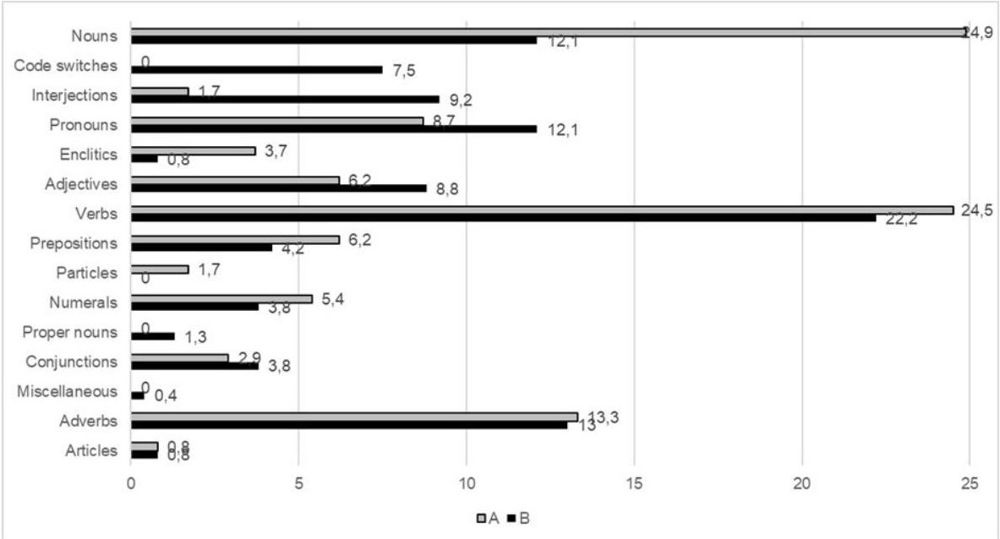
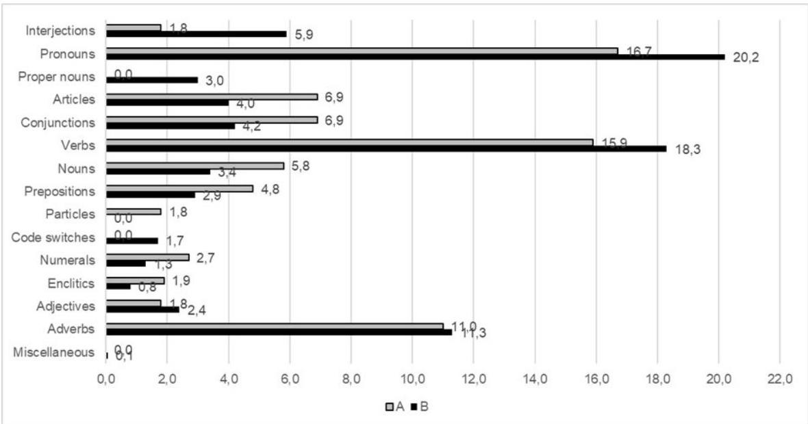

<!-- Source PDF: winter-2025-afrikaans-vocab.pdf -->

1

Using secondary data analysis to compare core vocabulary lists and elicitation duration of two data sets of typically developing preschool Afrikaans-speaking children

Authors

Mrs Petria Winter – MA Speech-Language Pathology ¹
Prof. Jeannie van der Linde – DPhil Communication Pathology ¹
Prof. Febe de Wet – PhD Speech Technology ²
Prof. Marien Alet Graham – DPhil Mathematical Statistics ³
Prof. Juan Bornman – PhD Augmentative and Alternative Communication ⁴,⁵

Affiliations

¹ Department of Speech-Language Pathology and Audiology, Faculty of Humanities, University of Pretoria, South Africa
² Department of Electrical and Electronic Engineering, Stellenbosch University, South Africa
³ Department of Early Childhood Education, Faculty of Education, University of Pretoria, South Africa
⁴ Division of Speech-Language and Hearing Therapy, Department of Health and Rehabilitation, Faculty of Medicine and Health Sciences, Stellenbosch University, South Africa
⁵ Centre for Augmentative and Alternative Communication, University of Pretoria, South Africa

Correspondence to: Prof. Jeannie van der Linde (jeannie.vanderlinde@up.ac.za)

2

# Acknowledgements

We wish to acknowledge the linguist, Ms Monique Rabe, who supported the

categorisation of the wordlists according to parts of speech.

# ABSTRACT

Introduction: Core vocabulary lists provide an evidence-based method for describing the vocabulary of individuals across various age groups, categorised by different parts of speech. Despite its value, there is a paucity of core vocabulary lists in nonmainstream languages. Resource limitations contribute to this paucity; therefore, more efficient methods for developing core vocabulary lists are needed

This study aimed to compare two sets of previously collected language samples from typically developing five- to six-year-old Afrikaans-speaking children to compare two different elicitation methods for developing a core vocabulary list. We also compared the duration of the language samples to inform the duration required for accurate and representative language samples for the development of core vocabulary lists.

Methods: Using secondary data analysis, we compared the core vocabulary lists from two existing data sets in terms of the number of different words (NDW), the frequency of use of each of these words, type-token ratio (TTR), and parts of speech used by typically developing five- to six-year-old Afrikaans-speaking children.

Results: The average recording time for Data set A was 60 minutes in a single session. The corresponding value for Data set B was 250 minutes, recorded over a period of one to three days. A perfect positive Spearman correlation was observed between the results for the two data sets for all parts of speech except interjections and enclitics. Code switching formed part of Data set B's core words but did not appear in Data set A's core word list.

Conclusion: The findings demonstrate that similar core vocabulary lists can be obtained for five- to six-year-old children using a less invasive and time-effective 60-minute elicited method for language samples compared to naturalistic samples collected over one to three days. Proposing a more robust and less time- and resource-intensive method of developing vocabulary lists may further support the development of core word lists across ages and in other languages.

Keywords: core vocabulary, Afrikaans-speaking children, elicitation methods, typically developing

# INTRODUCTION

Core vocabulary refers to relatively common words frequently used by many individuals of the same linguistic, cultural, and socio-economic background in different situations [1,2]. Fringe vocabulary, on the other hand, is more unique to specific situations and people. As core vocabulary is generic, it can be used across various environments and with various communication partners. Hence, speech-language pathologists (SLPs) consider these words essential when delivering services to individuals with speech and language impairments [3], hearing impairment [4], or as a starting point for those individuals who need or use augmentative and alternative communication (AAC) systems [5]. In their seminal work, Banajee et al. [6] explained that approximately 200 to 300 words make up 75-80% of what people say in English. The vocabulary selected and proposed for communication intervention should therefore include most of the basic words required for a child to improve expressive language development, ensure effective communication across contexts, people and activities, and to maximise their participation in educational activities. Core vocabulary lists should guide SLPs in target selection and prioritisation during goal setting and intervention planning [7]. Selecting a target vocabulary (i.e., choosing a small set of core words from an almost infinite set of possibilities) is a daunting task for most SLPs, not to mention selecting and adding fringe vocabulary [8]. Appropriate selection is an intricate and lengthy process that may take significant time [9]. To date, limited practice guidelines have been established to assist SLPs with vocabulary selection [8].

Selecting meaningful, motivating, functional, and individualised vocabulary is essential for early language acquisition [10]. Recent literature suggests that the first words to be taught should include the following:

i) Age-appropriate words that are well aligned with development (i.e., similar to the words used by same-age peers with typical development)
ii) Diverse words from different lexical classes (i.e., words that support the development of grammar through the inclusion of different word classes) [11];
iii) Functional words (i.e., words that convey the child's communication needs in different settings [12].

Different approaches and methods are adopted to identify core vocabulary lists. The latter include informant lists and communication diaries, environmental or ecological inventories, as well as published resources (i.e., existing vocabulary lists), each with their own advantages and disadvantages [13, 14]. Informant lists and communication diaries are typically obtained from parents, peers, siblings or teachers, who spend the most time with the individual for whom the vocabulary list is being developed. These lists are highly personalised and can provide important fringe vocabulary (i.e., the words that are highly specific to a topic, environment, individual, or the activities they engage in). They stand in contrast to the use of environmental inventories, which provide more general vocabulary [10]. Nevertheless, these lists may be biased and influenced by the informant's expectations [15], as they often focus on verbs and nouns with semantic meaning. Hence, they may omit the structure words essential for syntactic construction, which can result in a loss of coherence and grammaticality.

Environmental or ecological inventories are contextually-bound and can document participation in different activities and/or contexts, and provide the words that peers use within these activities [10]. This allows researchers to develop (and clinicians to provide) a functional list of words for environments in activity-specific situations. However, children may use a variety of words linked to the same topics and activities as peers, e.g., in an arts and crafts activity one child will focus on the activity (and use the word 'paint') whereas another child may focus on the group engagement (and use the words 'what a mess'). Since these words are usually context-bound, they do not assist with decontextualised interaction (e.g., talking about past activities) and functional use of vocabulary in other settings.

In contrast, core vocabulary lists are less contextually bound than environmental inventories and include high-frequency words. These lists typically represent 80% of spoken language used frequently across activities and contexts [9, 16, 17] and usually include a relatively small number of highly relevant words. Although core vocabulary lists are language specific [18], they allow for the use of novel utterances with different syntactic, semantic, and pragmatic functions. The inclusion of different word classes in these lists allows for the grammatical correctness of sentences and therefore also of syntax/sentence structure [6,10].

4

Core vocabulary lists are regarded as an evidence-based method of vocabulary selection because of their capacity to meet a wide range of communication needs [19]. For this reason, they are favoured by many SLPs. However, core vocabulary lists are not appropriate in all cases/situations. For example, their use in multilingual settings may be limited as they are language bound. There is a serious lack of resources for non-mainstream languages, and methods to obtain core vocabulary lists in these languages should be optimised to ensure the efficient development of such lists. Since these lists are often derived from samples that do not report race, ethnicity and socio-economic status in pre-school settings, possibilities for generalisation and universal application are limited [11]. Core vocabulary lists might also fail to meet the needs of beginning communicators, particularly those who are not yet demonstrating a strong desire to communicate. In their narrative review, Laubscher and Light [2] argue that these lists may fall short of adequately prioritising the types of words most frequently used in early expressive vocabulary. To build a robust language system, beginning communicators need a diverse selection of basic, motivating, individualised, and developmentally appropriate words that typically constitute core and fringe vocabulary [11].

South Africa, a multilingual country with 12 official languages, currently has only locally published core vocabulary lists for Afrikaans [17] and isiZulu [20]. The speech of Afrikaans- and isiZulu-speaking children was recorded by Hattingh and Tönsing [17] and Mngomezulu et al. [20], respectively by using a body-worn device during a typical school day. Sufficient words were elicited from each participant over a period of one to three full school days [17, 20]. However, much work remains in all South African languages, especially the Sotho-Tswana language family, and the current methods for obtaining these lists are time-consuming. Focusing on Afrikaans first reflects a strategic approach to resource allocation, as a more efficient method to build a robust core vocabulary which can serve as a foundation for future development in other South African languages. Additionally, one of the first core vocabulary lists in a South African language was available in Afrikaans [17].

The paucity of research and development of core vocabulary lists in multiple (possibly all) languages may be attributed to the time-consuming processes believed to be required to obtain these lists. Based on the available literature, it seems that

5

limited attention has been given to the use of alternative methods to elicit language samples for developing core vocabulary lists. Both Hattingh and Tönsing [17] and Liebenberg et.al. [21] collected language samples from the same age groups to develop core vocabulary lists. Hattingh and Tönsing [17] collected their data through different preschool activities over 3 days, while Liebenberg et.al. [21] collected 1 hour language samples through conversation and free play. The current study compares these vocabulary lists to provide insight into the word lists itself as well as the duration needed to obtain accurate and representative samples.

## Aim

The aim of the study was twofold: firstly, to compare the core vocabulary lists from two secondary data sets in terms of the number of different words (NDW), the frequency of use of each of these words, type-token ratio (TTR), and parts of speech used by typically developing five- to six-year-old Afrikaans-speaking children; and secondly, to compare the language sample duration of the two secondary data sets [structured elicitation (Data set A, 21) and spontaneous elicitation (Data set B, 17)] to determine the duration required for accurate and representative language samples.

## Method

### Research design

Secondary data analysis (SDA) [22], a procedure that is gaining traction in the social sciences, was employed to compare two existing quantitative data sets in this study. The structured elicitation language samples from Liebenberg et al. [21] were used for Data set A, and spontaneous language samples from Hattingh and Tönsing [17] for Data set B. For Data set A, audio recordings were made of one-hour interactions during which an adult elicited language in a structured fashion. The audio recordings for Data set B were made by the participants using body-worn recorders with small microphones that recorded their' speech during regular preschool activities, such as free play and book reading. The data sets are deemed relevant and valid as research papers have been published in peer reviewed journals on both. Ethical principles were adhered to as data were available in open-access form. Secondary data analysis enabled the comparison of the specific variable (elicitation duration) that was not possible with only one of the two data sets, thereby contributing to clinical implications for the field.

6

Setting

In the original studies, the participants from both data sets were recruited from similar middle-to-high-income neighbourhoods located in the same metropolitan area. Data set A participants were recruited using criterion sampling to identify initial participants, followed by referral sampling [23]. For this data set, data collection took place during the COVID-19 pandemic. Therefore, all interactions with participants took place in their homes. Data set B's participants were recruited from schools using convenience sampling, prior to the outbreak of the COVID-19 pandemic.

Participants

All participants, included in the secondary data sets, irrespective of whether they were in data set A or B, were between 5;0 and 6;11 years; months old. Other common inclusion criteria required participants to a) be Afrikaans first-language speakers, b) also have Afrikaans as their language of learning and teaching, c) be typically developing with no developmental concerns, d) be characterised as of middle to high socioeconomic status (SES), and e) have normal hearing.

For Data set A, caregivers completed a custom-designed biographic questionnaire to verify that children met the inclusion criteria. The Parent's Evaluation of Developmental Status: Developmental Milestones (PEDS: DM) tool was also used as a developmental screener [24]. The hearScreen™ Mobile App (hearX Group) was used to screen for possible hearing loss. In the case of Data set B, the parents and teachers of participants completed questionnaires to confirm that the children met the selection criteria [18]. Data set A comprised 25 participants, consisting of 13 males and 12 females. The mean age of dataset A was 5 years 9 months (5;9). Data set B comprised 12 participants, consisting of six males and six females. The mean age of dataset B was 5 years 10 months (5;10).

Data collection

In the original studies, two different data collection procedures were followed to collect the two data sets that are compared in this study. For Data set A, structured play-based interaction took place in each participant's home. Two SLPs registered

with the Health Professions Council of South Africa (HPCSA) elicited interactions of 60 minutes each from each of the 25 participants (one SLP per child). These samples were audio recorded using a stand-alone microphone (Zoom H1n Handy Recorder), which was appropriate in terms of its technical specifications and portability. Activities were used to elicit personal event narratives, story generation, and language in free play to obtain real-life language samples that reflect everyday discourse. Both SLPs were trained regarding the specific procedure and used the same age-appropriate elicitation materials [25]. The introductory activity prompted the participant to draw a picture of “everyone you live with”. As participants were between the ages of five and six years old, the elicitation material was abstract and vague, allowing for story generation and narrated symbolic play. Toys such as wild animals and sea creatures were also included to facilitate story generation and discourse elicitation. Personal event narratives and symbolic play were elicited using shopping and fast-food scenes [21].

For Data set B, the researcher arrived at the children's school on the prearranged date and time to fit the participants with the recording equipment. Each participant wore a small recording device (Olympus, Model DM 650, and Phillips Model DVT 6010) in a padded pouch around the waist, and a small lapel microphone (Audio Technica Lavalier Microphone ATR 350) was clipped to the collar of their shirt. (All of these were again removed in the afternoon.) Study procedures were explained to the children individually, and they were shown how not to interfere with the microphones by touching or blocking the signal. They were also requested not to play or fiddle with the pouch to reduce the risk of accidentally switching the recorder off or interfering with the quality of the recording. Participants were encouraged to tell their teacher if they experienced any difficulty with wearing the equipment or if they would like it to be taken off. Teachers were requested to monitor the participants and ensure their safety and comfort during the day. The purpose of the pouch and the recorder was explained to the other children in the class, and they were also requested not to touch and play with the equipment. Participants were asked to behave as they typically would on any other day. The recordings continued daily for three days. The first 3 500 words (including unintelligible words and utterances) per participant were subsequently transcribed. The time taken to reach the number of

8

words required varied among the children from 2 hours 16 minutes to 6 hours 50 minutes, distributed over a period of between one and three days [17].

## Data transcription, coding, and analysis

### Transcription

The following transcription procedures are based on the transcription of the original data sets [17, 21]. For Data set A [21], the 60-minute samples were transcribed using the free software ELAN, installed on the transcribers' personal computers [26]. The data was orthographically transcribed by three independent transcribers using the SUGAR (Sampling Utterances and Grammatical Analysis Revised) transcription procedures [27] with specific adaptations for Afrikaans [21,28]. To ensure reliability between the three transcribers, inter-rater reliability was calculated using a non-parametric Spearman correlation based on four randomly selected transcriptions. A moderate to very strong correlation was found (TNW = 0.977) [25].

Unintelligible utterances were excluded from transcriptions. In the samples of Data set A, each participant's utterances were transcribed verbatim (orthographically), and the SLP's utterances, direct imitation of words, fillers, and disfluencies were excluded from the transcription, as proposed by [27]. Onomatopoeia was also omitted from transcriptions to not affect the NDW and TNW counts. Additional transcription guidelines that were added as an adaptation for Afrikaans prescribed that single-morpheme utterances were not to be transcribed [28]. Rote counting was included in the transcription, as no counting prompts were used in the elicitation; therefore, where a participant counted during play, it would likely not affect the NDW calculations. The entire 60-minute sample for Data set A was transcribed as Liebenberg et al. [21] reported no novelty effect.

For Data set B, one of the researchers transcribed all the recordings verbatim (orthographically) using Systematic Analysis of Language Transcripts (SALT) software [29]. The relevant transcription rules proposed by Hattingh [18] were also followed. To ensure the reliability of the transcriptions, a second transcriber transcribed a randomly selected segment, equal to 20% of the total recording per participant. Word-by-word calculations established an 80% agreement between the two transcribers. Apart from excluding the first 20 minutes of each recording, all

9

other utterances about the equipment or data collection were also disregarded during transcriptions [17].

## Coding

The data from both data sets was coded using the coding procedures described by Hattingh and Tönsing [17]. In the secondary data analysis, data set A was recoded to align with these procedures. Initially, frequency and commonality criteria were applied to compile a list of the words that were used at least 0.05 times per 100 words and by at least half of the participants [19] from both data sets. Words that met these criteria were deemed "core words". After that, the word list was reviewed, and where words had more than one meaning according to a dictionary, additional codes were added to them in the transcription to ensure that morphological or semantic variations of different parts of speech were identifiable. Where any additional codes were added to the transcription, the researcher recalculated the frequency and commonality scores [17]. Next, a composite sample was generated for both data sets, which included all the utterances from all participants in each data set. The composite samples were used to calculate descriptive statistics.

## Analysis

TNW, NDW and TTR were calculated using the Systematic Analysis of Language Transcripts (SALT) [29]. For both data sets, this core word list was subsequently scrutinised and categorised according to parts of speech.

Thirty-one words were excluded from the secondary data analyses for both data sets, since they had been discounted in either the transcription or the analysis process. For instance, the names of individuals were omitted from Data set A's transcriptions, whereas in Data set B they were coded as TN (teacher's name), CN (child's name) or AN (another name). These words were removed to allow for the comparison the two data sets.

10

# Results

The TNW, NDW and the resultant TTR were calculated for each data set. It is important to note that the total recording time differed greatly between the two data sets: the average for Data set A was 60 minutes recorded in a single session, while the average for Data set B was 250 minutes recorded over a period of one to three days. The total number of words was 58 945 words for data set A, with an average of 610-4924 TNW per participant. For data set B, a total number of 39 645 words were obtained with 3108-3419 TNW per participant. Data set A contained 3835 different words compared to 3 304 different words in the total sample of data set B. The TTR of data set A was 1:15, and for data set B was 1:12.

The core vocabulary was identified based on frequency-of-use and commonality criteria [9]. The composite samples were analysed at word level to determine the parts of speech used in the core vocabulary. An independent linguist controlled the entire sample to account for the reliability of this classification. The core vocabulary metrics for both data sets, classified according to parts of speech, are shown in Table 1 and Figures 1 and 2.

Spearman's correlation coefficients were used to quantify the relationship between the variables for Data set A and Data set B for the various parts of speech (i.e. pronouns, verbs, adverbs, conjunctions, articles, nouns, prepositions, adjectives, and numerals). For all parts of speech except interjections and enclitics, a perfect correlation (+1) was obtained, indicating a linear relationship between the two data sets. When they calculated the statistical significance, the researchers found that interjections and enclitics were the only parts of speech that were not significantly correlated between the two data sets. Data set B exhibited more frequent use of interjections than Data set A. Due to the small sample sizes for proper nouns, miscellaneous, particles, and code switching correlations could not be calculated.

11

Table 1: Core vocabulary classified according to parts of speech

|   | Spearman correlation (Data set A and B)  |
| --- | --- |
|  Pronouns | r(2) = 1.00, p = 0.01*  |
|  Verbs | r(2) = 1.00, p = 0.01*  |
|  Adverbs | r(2) = 1.00, p = 0.01*  |
|  Interjections | r(2) = 0.80, p = 0.2  |
|  Conjunctions | r(2) = 1.00, p = 0.01*  |
|  Articles | r(2) = 1.00, p = 0.01*  |
|  Nouns | r(2) = 1.00, p = 0.01*  |
|  Proper nouns |   |
|  Prepositions | r(2) = 1.00, p = 0.01*  |
|  Adjectives | r(2) = 1.00, p = 0.01*  |
|  Code switches |   |
|  Numerals | r(2) = 1.00, p = 0.01*  |
|  Enclitics | r(2) = 0.940, p = 0.015  |
|  Miscellaneous |   |
|  Particles |   |

* Statistically significant

Figure 1: Proportion (in terms of NDW) in core vocabulary  $(\%)$

Figure 2: Frequency of occurrence  $(\%)$

Table 1 also indicates that code switching was observed in the core vocabulary of Data set B, while this was initially not the case in Data set A. Upon further analysis, code switching was observed in Data set A as well, albeit to a lesser degree, and did not meet the frequency criteria required for inclusion in the core word list. (See Supplementary Materials File for the composite word list of common words in both data sets according to parts of speech.)

# Discussion

This study showed that a core vocabulary list derived from naturalistic language samples (250 minutes) recorded across one to three days is comparable to a list obtained with a structured elicitation approach using free play and conversation within a 60-minute interaction in terms of NDW and TTR. Similar findings were obtained previously [30], they did not observe a significant difference between the mean length of utterances (MLU) and TTR elicited from narratives, conversational speech and free play.

Results also indicate that, except for interjections, the word classes obtained by means of each elicitation method are comparable. While the number of different verbs and prepositions was similar between the data sets, the elicitation data set (Data set A) produced twice as many different nouns (60 vs. 29) as the natural context data set (Data set B). This is possibly due to the difference in contextualised versus decontextualised talk. Brinchmann et al. [21] differentiate between these two types and argue that contextualised talk involves people, objects and events present in the immediate environment, whereas decontextualised talk refers to information about things that are not currently present (e.g., past or future events, or imaginative scenarios in pretend play). In the current study, it is possible that children in Data set A focused more on decontextualised talk, while children in Data set B engaged more in contextualised talk. Brinchmann et al. [31] also suggest that decontextualised talk often lacks physical support from the environment, which means that meaning is conveyed primarily through language itself. This necessitates the use of more explicit linguistic features, which may lead to a higher density of content words with independent lexical meanings (e.g., nouns, verbs, adjectives, and prepositions). Contextualised versus decontextualised talk may also explain the significant difference in the use of interjections between the two data sets. Contextualised talk may include more interjections, as these are often used to convey emotion [32].

Core word lists are an evidence-based tool that can assist SLPs in goal setting. Since they are language specific, the availability and application of such lists in multilingual settings such as South Africa are limited [19, 33]. The current results support the use of a method that is less invasive, less resource intensive and less time intensive for eliciting core word lists across non-mainstream languages.

14

As a result of the time-consuming nature of developing core vocabulary lists, few clinicians and researchers have bothered to create this valuable resource for non-mainstream languages to be used by SLPs in practice [14; 33]. The results of the current study indicate that a 60-minute elicited language sample provides comparable results to those obtained from a 250-minute naturalistic language sample. Not only is the elicitation method less time consuming; it is also more cost effective and less invasive for children.

## Limitations and directions for future study

To guide future research, we need to acknowledge the limitations of the present study. First, we included only five- to six-year-old Afrikaans-speaking children. In future research, it may be valuable to explore other age and language data sets to determine whether younger and older populations and different language data sets render similar outcomes in terms of the word lists and the language sample duration requirements. This could further enhance SLPs' understanding of the age- as well as language-related changes in core vocabulary, which can in turn be applied in practice to determine goals. Such information will also contribute to a deeper understanding of how development impacts core vocabulary.

Second, the small sample size did not allow for random recruitment to select children. To strengthen the reliability of our results, it would be beneficial to replicate the study with larger, more diverse samples and to incorporate both adults and children as communication partners.

Third, this study focused on words in isolation. Thus, future research should investigate how children use vocabulary in narratives, in a range of pragmatic functions such as protesting or commenting, and so forth.

Despite these limitations, our study offers unique empirical evidence to demonstrate that a short-structured elicitation activity can produce comparable results to prolonged data collection. Future research endeavours that explore the elicitation methods used to obtain core word lists in other languages and contexts, as well as with children of different ages, will extend the current knowledge base.

15

16

# Conclusion

As a rapidly growing lexicon is the hallmark of preschool language development, more efficient methods of determining developmentally appropriate vocabulary (both core and fringe) are needed. The finding from the current study is encouraging, namely that language samples for five- to six-year-old children elicited within 60 minutes are comparable in terms of level of invasiveness and time efficiency with naturalistic samples collected over one to three days. The use of a more robust method – one that also takes less time and is less resource-intensive – may further support the development of core vocabularies and word lists across different age and language data sets. The use of these lists in speech-language therapy practice and intervention goal setting will guide, support and stimulate language development, and eventually also literacy development.

# References

1. Amery, R., Wunungmurra, J. G., Raghavendra, P., Bukulatjpi, G., Dikul Baker, R., Gumbula, F., Barker, R., Theodoros, D., Amery, H., Massey, L., &amp; Lowell, A. (2022). Augmentative and alternative communication for aboriginal Australians: Developing core vocabulary for Yolŋu speakers. *Augmentative and Alternative Communication*, 38(4), 209-220. https://doi.org/10.1080/07434618.2022.2128410

2. Laubscher, E., &amp; Light, J. (2020). Core vocabulary lists for young children and considerations for early language development: A narrative review. *Augmentative and Alternative Communication*, 36(1), 43-53. https://doi.org/10.1080/07434618.2020.1737964

3. Namasivayam, A. K., Coleman, D., O'Dwyer, A., &amp; Van Lieshout, P. (2020). Speech sound disorders in children: An articulatory phonology perspective. *Frontiers in Psychology*, 10, 2998. https://doi.org/10.3389/fpsyg.2019.02998

4. Herman, R., Ford, K., Thomas, J., Oyebade, N., Bennett, D., &amp; Dodd, B. (2015). Evaluation of core vocabulary therapy for deaf children: Four treatment case studies. *Child Language Teaching and Therapy*, 31(2), 221-235. https://doi.org/10.1177/0265659014561875

5. Binger, C., Harrington, N., &amp; Kent-Walsh, J. (2024a). Applying a developmental model to preliterate aided language learning. *American Journal of Speech-Language Pathology*, 33, 33-50. https://doi.org/10.1044/2023_AJSLP-23-00098

6. Banajee, M., Dicarlo, C., &amp; Buras Stricklin, S. (2003). Core vocabulary determination for toddlers. *Augmentative and Alternative Communication*, 19(2), 67-73. https://doi.org/10.1080/0743461031000112034

7. Riccelli, A. M. &amp; Nigham, R. (2023). Core vocabulary intervention for language-delayed Kindergarten students using augmentative and alternative communication. *Journal of Applied Disciplines*, 1(1), Article 3. Available at https://opus.govst.edu/jad/vol1/iss1/3

8. Frick Semmler, B. J., &amp; Bean, A. (2023). Vocabulary selection and implementation in vocabulary interventions for speech-generating devices: A scoping review. *SIG 12 Augmentative and Alternative Communication*. https://doi.org/23814764000300140072

9. Trembath, D., Balandin, S., &amp; Togher, L. (2007). Vocabulary selection for Australian children who use augmentative and alternative communication. *Journal of Intellectual &amp; Developmental Disability*, 32(4), 291-301.

17

10. Frick Semmler, B. J., Bean, A., &amp; Wagner, L. (2023). Examining core vocabulary with language development for early symbolic communicators. International Journal of Speech-Language Pathology, 26(1), 28-37. https://doi.org/10.1080/17549507.2022.2162126

11. Binger, C., Magallanes, P., Miguel, V. S., Harrington, N., &amp; Hahs-Vaughn, D. (2024b). How toddlers use core and fringe vocabulary: What's in an utterance? American Journal of Speech-Language Pathology, 33(4), 1718-1747. https://doi.org/10.1044/2024_AJSLP-23-00366

12. Soto, G., &amp; Cooper, B. (2021). An early Spanish vocabulary for children who use AAC: Developmental and linguistic considerations. *Augmentative and Alternative Communication*, 37(1), 64-74. https://doi.org/10.1080/07434618.2021.1881822

13. Bean, A., Cargill, L. P., &amp; Lyle, S. (2019). Framework for selecting vocabulary for preliterate children who use augmentative and alternative communication. American Journal of Speech-Language Pathology, 28(3), 1000-1009. https://doi.org/10.1044/2019_AJSLP-18-0041

14. Beukelman, D. R., &amp; Light, J. C. (2020). Augmentative and alternative communication: Supporting children and adults with complex communication needs (Fifth edition). Paul H. Brookes Publishing.

15. Murray, J., Lynch, Y., Meredith, S., Moulam, L., Goldbart, J., Smith, M., Randall, N., &amp; Judge, S. (2019). Professionals' decision-making in recommending communication aids in the UK: Competing considerations.

18

19

Augmentative and Alternative Communication, 35(3), 167-179.
https://doi.org/10.1080/07434618.2019.1597384

16. Beukelman, D., Jones, R., &amp; Rowan, M. (1989). Frequency of word usage by nondisabled peers in integrated preschool classrooms. *Augmentative and Alternative Communication*, 5(4), 243-248.

17. Hattingh, D., &amp; Tönsing, K. M. (2020). The core vocabulary of South African Afrikaans-speaking grade R learners without disabilities. *South African Journal of Communication Disorders*, 67(1), 1-8. https://doi.org/10.4102/sajcd.v67i1.701

18. Hattingh, D. (2018). The core vocabulary of South African Afrikaans-speaking preschoolers without disabilities. Unpublished Master's dissertation: University of Pretoria.

19. van Tilborg, A., &amp; Deckers, S. R. J. M. (2016). Vocabulary selection in AAC: Application of core vocabulary in atypical populations. *Perspectives of the ASHA Special Interest Groups*, 1(12), 125-138. https://doi.org/10.1044/persp1.SIG12.125

20. Mngomezulu, J., Tönsing, K. M., Dada, S., &amp; Bokaba, N. B. (2019). Determining a Zulu core vocabulary for children who use augmentative and alternative communication. *Augmentative and Alternative Communication*, 35(4), 274-284. https://doi.org/10.1080/07434618.2019.1692902

21. Liebenberg, P., van der Linde, J., Schimper, I., de Wet, F., Graham, M. A., &amp; Bornman, J. (2023). Describing the spoken language skills of typically developing Afrikaans-speaking children using language sample analysis: A

20
pilot study. Language, Speech, and Hearing Services in Schools, 54(2) 518-534. https://doi.org/10.1044/2022_LSHSS-22-00077

22. Wickham, R.J. (2019). Secondary analysis research. Journal of the Advanced Practitioner in Oncology, 10(4), 395-400. https://doi.org/10.6004/jadpro.2019.10.4.7

23. Chambers, M., Bliss, K., &amp; Rambur, B. (2020). Recruiting research participants via traditional snowball vs Facebook advertisements and a website. Western Journal of Nursing Research, 42(10), 846-851. https://doi.org/10.1177/0193945920904445

24. Glascoe, F. P. (2013). Parents' Evaluation of Developmental Status: Developmental Milestones (PEDS:DM). Retrieved from www.pedstest.com

25. Liebenberg, P. (2021). Describing the spoken language skills of typically developing Afrikaans-speaking children using language sample analysis. Unpublished Master's dissertation: University of Pretoria.

26. ELAN (Version 6.1) [Computer software]. (2021). Nijmegen: Max Planck Institute for Psycholinguistics. Retrieved from https://archive.mpi.nl/tla/elan

27. Pavelko, S. L., &amp; Owens, R. E. (2017). Sampling utterances and grammatical analysis revised (SUGAR): New normative values for language sample analysis measures. Language, Speech, and Hearing Services in Schools, 48(3), 197-215. https://doi.org/10.1044/2017_LSHSS-17-0022

28. Oosthuizen, H., &amp; Southwood, F. (2009). Methodological issues in the calculation of mean length of utterance. The South African Journal of Communication Disorders, 56, 76-87. https://doi.org/10.4102/sajcd.v56i1.194

29. Miller, J., &amp; Iglesias, A. (2012). Systematic Analysis of Language Transcripts (SALT), Research Version 2012 [Computer Software]. Middleton, WI: SALT Software, LLC.

30. Rezapour-Mirsaleh, Y., Abdi, K., Rezai, H., &amp; Aboutorabi Kashani, P. (2011). A comparison between three methods of language sampling: Freeplay, narrative speech and conversation. Iranian Rehabilitation Journal, 9(14), 4-9.

31. Brinchmann, E. I., Røe-Indregård, H., Karlsen, J., Schauber, S. K., &amp; Hagtvet, B. B. (2023). The linguistic complexity of adult and child contextualized and decontextualized talk. *Child Development*, 94(5), 1368-1380. https://doi.org/10.1111/cdev.13932

32. Goddard, C. (2013). Interjections and emotion (with special reference to "surprise" and "disgust"). Emotion Review, 6(1), 53-63. https://doi.org/10.1177/1754073913491843

33. Tönsing, K. M., van Niekerk, K., Schlünz, G. I., &amp; Wilken, I. (2018). AAC services for multilingual populations: South African service provider perspectives. Journal of Communication Disorders, 73, 62-76. https://doi.org/10.1016/j.jcomdis.2018.04.002

21